<!--yml

分类：未分类

日期：2025-01-11 11:55:21

-->

# BALROG：基准测试智能型大型语言模型（LLM）和视觉语言模型（VLM）在游戏中的推理能力

> 来源：[https://arxiv.org/html/2411.13543/](https://arxiv.org/html/2411.13543/)

Davide Paglieri¹, Bartłomiej Cupiał^(2∗), Samuel Coward³, Ulyana Piterbarg⁴,

Maciej Wolczyk², Akbir Khan^(1,5), Eduardo Pignatelli¹, Łukasz Kuciński², Lerrel Pinto⁴

Rob Fergus⁴, Jakob Nicolaus Foerster³, Jack Parker-Holder¹, Tim Rocktäschel¹

¹AI中心，伦敦大学学院，²IDEAS NCBR，³牛津大学，

⁴纽约大学，⁵Anthropic，平等的技术贡献，首位作者为项目负责人。通讯请联系 [d.paglieri@cs.ucl.ac.uk](mailto:d.paglieri@cs.ucl.ac.uk)。

代码和排行榜请见 [balrogai.com](https://balrogai.com)

###### 摘要

大型语言模型（LLMs）和视觉语言模型（VLMs）具有广泛的知识和有前景的推理能力，但在复杂动态环境中的表现仍然存在困难。现实世界任务需要处理复杂的互动、高级空间推理、长期规划和持续探索新策略——这些领域目前缺乏有效的方法来全面评估这些能力。为了解决这个问题，我们提出了BALROG，这是一个新型基准，旨在通过一系列具有挑战性的游戏评估LLMs和VLMs的智能型能力。我们的基准包含一系列现有的强化学习环境，难度不同，包括一些普通人几秒钟即可解决的任务，也有一些极具挑战性的任务，可能需要数年才能掌握（例如，NetHack学习环境）。我们设计了精细的指标来衡量性能，并对几种流行的开源和闭源LLMs与VLMs进行了广泛的评估。我们的发现表明，虽然当前的模型在较简单的游戏中取得了部分成功，但在更具挑战性的任务中却表现不佳。特别是，我们观察到视觉决策能力存在严重缺陷，因为在提供环境的视觉表示时，模型的表现更差。我们将BALROG作为一个开放且用户友好的基准发布，以促进智能型领域未来的研究和发展。

## 1 引言

大型语言模型（LLMs）的最新成功使得人们重新关注构建能够自主实现复杂目标的通用代理（Yang et al.，[2023](https://arxiv.org/html/2411.13543v1#bib.bib88)）。LLMs拥有跨领域的广泛知识（Brown，[2020](https://arxiv.org/html/2411.13543v1#bib.bib6)；Hendrycks et al.，[2020](https://arxiv.org/html/2411.13543v1#bib.bib25)），能够在特定场景中进行推理（Wei et al.，[2022a](https://arxiv.org/html/2411.13543v1#bib.bib81)；Shinn et al.，[2023](https://arxiv.org/html/2411.13543v1#bib.bib68)；Rein et al.，[2023](https://arxiv.org/html/2411.13543v1#bib.bib61)），并且能够在简单设置中可靠地遵循人类指令（Ouyang et al.，[2022](https://arxiv.org/html/2411.13543v1#bib.bib52)）。这些能力表明，LLMs具有成为高效代理的潜力，能够自主执行需要连续决策的人类任务。然而，目前最先进的模型仍在许多关键技能上表现出持续的失败模式，这些技能对于自主的现实世界互动至关重要。例如，LLMs在动态环境中无法稳定行动，不能可靠地从错误中学习，无法推理空间和时间，或者在长期时间跨度上进行规划（Xing et al.，[2024](https://arxiv.org/html/2411.13543v1#bib.bib86)；Yamada et al.，[2023](https://arxiv.org/html/2411.13543v1#bib.bib87)；Kambhampati et al.，[2024](https://arxiv.org/html/2411.13543v1#bib.bib32)）。通过严格、安全的评估来提高我们对LLM能力的理解，是评估将代理型LLM部署到现实世界中的风险和局限性的关键。

当前的代理基准测试评估LLM在不超过几十轮模型与环境交互的设置中的表现，例如解决简单的办公室任务（Wang et al.，[2024](https://arxiv.org/html/2411.13543v1#bib.bib79)），浏览互联网（Zhou et al.，[2023](https://arxiv.org/html/2411.13543v1#bib.bib93)），以及解决GitHub问题（Jimenez et al.，[2023](https://arxiv.org/html/2411.13543v1#bib.bib30)）。新的代理提示框架和通过LLMs（如OpenAI o1）对短期推理的改进，使得这些基准上的最先进表现取得了戏剧性且快速的进展（OpenAI，[2024b](https://arxiv.org/html/2411.13543v1#bib.bib51)；Wang et al.，[2023](https://arxiv.org/html/2411.13543v1#bib.bib78)；Fernando et al.，[2023](https://arxiv.org/html/2411.13543v1#bib.bib17)；Hu et al.，[2024](https://arxiv.org/html/2411.13543v1#bib.bib27)）。然而，许多现实任务需要更多数量级的交互（Pignatiello et al.，[2020](https://arxiv.org/html/2411.13543v1#bib.bib54)；Wansink 和 Sobal，[2007](https://arxiv.org/html/2411.13543v1#bib.bib80)）。

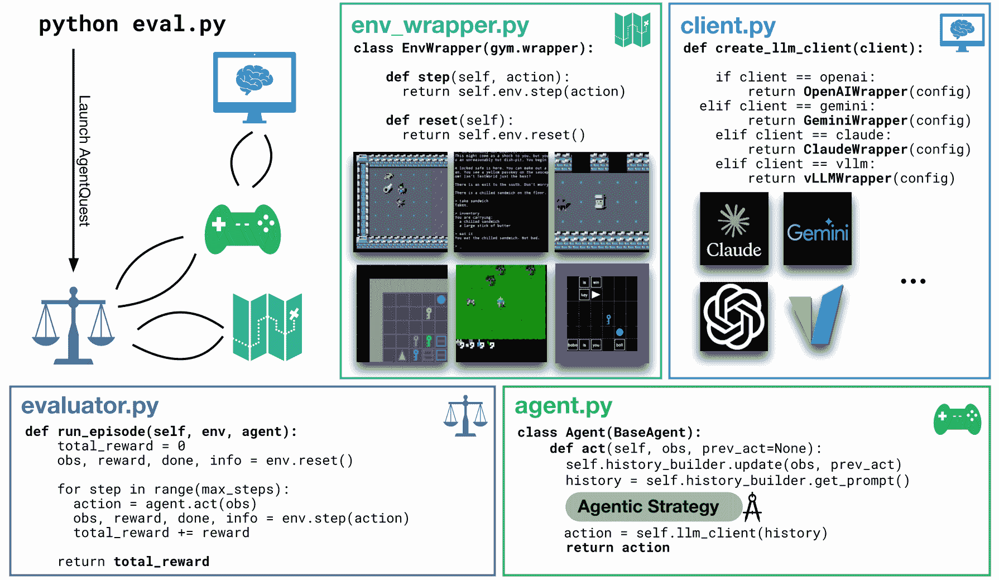

图 1：BALROG基准测试概览，用于评估大型语言模型（LLMs）在长上下文交互任务中的表现。通过“代理策略”提高现有模型能力的新推理时间方法的提交，只需修改agent.py文件。类似地，基准测试一个新模型的零-shot任务，可以通过调整client.py中的配置文件来完成。agent类包含一个提示构建器，用于管理观察历史，而client则抽象化了各种API和模型服务框架的复杂性。env_wrapper.py文件标准化了不同设置下的交互，而evaluator则执行代理并收集性能指标。

在本文中，我们提出，语言和视觉-语言模型能力的下一个前沿在于长时程推理和决策制定。为此，我们提出了BALROG：基于游戏的智能大规模语言模型/视觉语言模型推理基准。BALROG是一个基准和框架，它将一组多样化的复杂强化学习游戏环境整合为一个统一的测试平台，用于研究长上下文大规模语言模型。游戏历来作为评估深度强化学习研究进展的有效指标（Bellemare et al., [2013](https://arxiv.org/html/2411.13543v1#bib.bib5); Silver et al., [2018](https://arxiv.org/html/2411.13543v1#bib.bib69); Schrittwieser et al., [2020](https://arxiv.org/html/2411.13543v1#bib.bib65); Vinyals et al., [2019](https://arxiv.org/html/2411.13543v1#bib.bib76)）。通过将许多不同的游戏环境整合到单一评估中，我们旨在推动开发真正通用的智能体，能够有意义地解决具身的、现实世界的任务。具体来说，BALROG支持在BabyAI、Crafter、TextWorld、Baba Is AI、MiniHack和NetHack等环境中无缝运行LLM和VLM智能体（Chevalier-Boisvert et al., [2019](https://arxiv.org/html/2411.13543v1#bib.bib11); Hafner, [2021](https://arxiv.org/html/2411.13543v1#bib.bib22); Côté et al., [2019](https://arxiv.org/html/2411.13543v1#bib.bib14); Cloos et al., [2024](https://arxiv.org/html/2411.13543v1#bib.bib12); Samvelyan et al., [2021](https://arxiv.org/html/2411.13543v1#bib.bib63); Küttler et al., [2020](https://arxiv.org/html/2411.13543v1#bib.bib36)）。这些环境拥有轻量级的模拟器，确保该基准对研究社区来说是负担得起的。此外，尽管所有这些游戏都是长时程的，但它们涵盖了从我们看到最先进的长上下文模型在零-shot任务中表现良好（BabyAI）到即使是专门训练过的神经模型，在数十亿领域数据点上也仅能取得有限进展的任务（NetHack）的广泛难度等级（Piterbarg et al., [2024](https://arxiv.org/html/2411.13543v1#bib.bib55); Klissarov et al., [2023](https://arxiv.org/html/2411.13543v1#bib.bib35); Wołczyk et al., [2024](https://arxiv.org/html/2411.13543v1#bib.bib83)）。BALROG通过简单的记忆化很难解决——基准中使用的所有环境都是程序生成的，因此同一环境实例两次相遇的可能性很小。

我们使用六种提出的环境来评估各种流行的LLM和VLM的能力。我们采用了一种细粒度的度量标准，能够捕捉每个模型完成任务的接近程度，从而深入理解结果的轨迹。在我们的定性分析中，我们研究了智能体在空间推理、系统探索、长期规划和发现环境动态方面的能力。我们发现，当前顶级的LLM在最简单的任务上表现出了一定的潜力，但在更困难的任务上完全没有取得实质性的进展，如MiniHack和NetHack。一些模型表现出在预训练过程中获得的游戏知识，但未能在实际操作中加以利用。例如，在NetHack中，GPT-4o经常因食用腐烂的食物而死亡，尽管当被提示时，它能正确识别这种食物非常危险。此外，我们还研究了输入表示的影响。尽管大多数环境都是为了视觉而创建的，我们发现当呈现环境的图像时，多模态LLM的表现远不如仅提供文本描述的情况。这表明，基于视觉的可靠决策目前还远远超出我们的能力范围。

我们的结果表明，BALROG是一个非常困难的基准，尽管如此，它仍然让我们在长期规划、空间推理和导航等关键领域观察到细粒度的进展。我们共享代码库并开放基准测试以供外部提交。我们将我们的贡献总结如下：

+   •

    BALROG，一套用于测试长上下文LLM代理能力的六个强化学习环境。我们提供了一种细粒度的模型评估度量标准，并为NetHack开发了一种新颖的数据驱动进程系统。

+   •

    在BALROG上对最先进的LLM进行基线评估，采用零-shot提示，在语言-视觉和仅语言模式下进行评估。我们展示了，虽然模型在较简单的游戏中表现不错，但所有模型在解决基准中的最难游戏NetHack时都远远不足。我们还观察到，当呈现环境的图像时，模型的表现进一步下降，这表明VLM决策存在严重问题。

+   •

    我们对结果在空间推理、系统探索和长期规划等能力上的表现进行了定性分析。我们发现了一个有趣的“知道-做”差距，模型无法有效利用它们所拥有的知识。

+   •

    一个用于在BALROG上对长上下文模型进行基准测试的开源工具包。该工具包使研究人员和从业者能够快速评估模型性能。尽管本文中进行的基线评估是零-shot的，但BALROG工具包支持推理时提示策略，如思维链（Wei等，[2022b](https://arxiv.org/html/2411.13543v1#bib.bib82)）、少量学习等。

## 2 BALROG

BALROG 是一个基准测试和框架，旨在提高我们对现有长上下文 LLM 是否具有代理性（即是否可以用于自动化需要顺序决策的复杂活动）的理解。它支持在具有挑战性的强化学习环境中进行模型评估，测试技能包括长期规划、空间推理和推导环境机制的能力。

从设计上讲，BALROG 框架明确将推理时的提示策略与基础模型解耦。此设计选择的目标有两个： (1) 促进快速原型开发推理时方法，以改善模型在长上下文决策中的表现，超越零-shot 提示；(2) 确保模型评估的一致性和严谨性。

在本节的其余部分，我们介绍了基准测试中评估的游戏环境，并讨论了我们的模型提交协议，以便在 BALROG 基准测试排行榜上进行排名¹¹1该排行榜将在发布时对公众开放。 

### 2.1 环境

BALROG 将长上下文模型作为代理，在以下描述的游戏中进行评估。

BabyAI. (Chevalier-Boisvert 等人, [2019](https://arxiv.org/html/2411.13543v1#bib.bib11); Carta 等人, [2023](https://arxiv.org/html/2411.13543v1#bib.bib8)) 一个简单的二维网格世界，代理需要解决不同复杂度的任务，这些任务以自然语言描述（例如，“去蓝色球那里，然后捡起灰色钥匙”）。代理通过五种不同类型的导航任务进行测试，参见附录 [A](https://arxiv.org/html/2411.13543v1#A1 "附录 A Baby AI ‣ BALROG: 基准测试代理性 LLM 和 VLM 在游戏中的推理")。

Crafter. (Hafner, [2021](https://arxiv.org/html/2411.13543v1#bib.bib22)) 一个受《Minecraft》启发的网格环境，玩家必须探索、收集资源并制作物品以确保生存。代理基于已达成的里程碑进行评估，例如发现新资源和制作工具，参见附录 [B](https://arxiv.org/html/2411.13543v1#A2 "附录 B Crafter ‣ BALROG: 基准测试代理性 LLM 和 VLM 在游戏中的推理")。

TextWorld. (Côté 等人, [2019](https://arxiv.org/html/2411.13543v1#bib.bib14)) 完全基于文本的游戏，没有视觉组件，玩家需要通过自然语言（例如，“用烤箱做土豆”）来探索迷宫并与日常物品互动。与 BALROG 中的其他环境不同，TextWorld 不是一个网格世界。模型在三个不同任务上进行评估，参见附录 [C](https://arxiv.org/html/2411.13543v1#A3 "附录 C TextWorld ‣ BALROG: 基准测试代理性 LLM 和 VLM 在游戏中的推理")。

Baba Is AI. (Cloos 等，[2024](https://arxiv.org/html/2411.13543v1#bib.bib12)) 基于流行的益智视频游戏《Baba Is You》构建的环境。玩家通过推动文字块来操控游戏世界的规则，从而改变物体之间的互动方式。代理在 40 个谜题上进行测试，详见附录[D](https://arxiv.org/html/2411.13543v1#A4 "附录 D Baba Is AI ‣ BALROG：在游戏中评估代理型 LLM 和 VLM 推理")。

MiniHack. (Samvelyan 等，[2021](https://arxiv.org/html/2411.13543v1#bib.bib63)) MiniHack 是建立在 NetHack 学习环境（Küttler 等，[2020](https://arxiv.org/html/2411.13543v1#bib.bib36)）基础上的多任务框架。我们选择了五个不同的任务，迷宫、走廊、走廊战斗、Boxoban 和任务。它们共同评估了广泛的技能，包括探索、导航、长期规划和资源管理，详见附录[9](https://arxiv.org/html/2411.13543v1#A5.F9 "图 9 ‣ 附录 E MiniHack ‣ BALROG：在游戏中评估代理型 LLM 和 VLM 推理")。

NetHack 学习环境（NLE）（Küttler 等，[2020](https://arxiv.org/html/2411.13543v1#bib.bib36)）基于经典的 Roguelike 游戏《NetHack》，以其极高的难度和复杂性著称。在《NetHack》中获得成功需要长期的战略规划，因为一场胜利的游戏可能涉及数十万步操作，同时还需要短期战术来应对大量怪物的攻击。精确的信用分配对于理解哪些行为导致了成功或失败也至关重要。没有外部指南，人类玩家需要数年才能掌握《NetHack》。值得注意的是，研究表明，LLMs 可以回答有关游戏机制和最佳策略的问题（见附录[F.5](https://arxiv.org/html/2411.13543v1#A6.SS5 "F.5 LLMs 拥有广泛的 NetHack 知识 ‣ 附录 F NetHack 学习环境 ‣ BALROG：在游戏中评估代理型 LLM 和 VLM 推理")），但它们无法在实践中应用这些知识。更多细节见附录[F](https://arxiv.org/html/2411.13543v1#A6 "附录 F NetHack 学习环境 ‣ BALROG：在游戏中评估代理型 LLM 和 VLM 推理")。

表 1：BALROG 评估的互动决策任务的技能、时间范围和复杂性。与现有基准相比，BALROG 提供了一个评估模型推理和决策能力的基础设施，特别是在更难、更长时间范围的互动设置下。评估的任务涵盖了不同的难度。

| 技能 | BabyAI | TextWorld | Crafter | Baba Is AI | MiniHack | NLE |
| --- | --- | --- | --- | --- | --- | --- |
| 导航 | ✔ | ✔ | ✔ | ✔ | ✔ | ✔ |
| 探索 | ✔ | ✔ | ✔ | ✔ | ✔ | ✔ |
| 资源管理 | ✗ | ✔ | ✔ | ✗ | ✔ | ✔ |
| 复杂的信用分配 | ✗ | ✗ | ✔ | ✔ | ✔ | ✔ |
| 推理环境动态 | ✗ | ✗ | ✗ | ✔ | ✔ | ✔ |
| 长期规划 | ✗ | ✗ | ✗ | ✔ | ✔ | ✔ |
| 完成所需回合数 | $10^{1}$ | $10^{2}$ | $10^{3}$ | $10^{2}$ | $10^{2}$ | $10^{4}$–$10^{5}$ |
| 人类掌握时间 | 秒数 | 分钟 | 小时 | 小时 | 小时 | 年份 |

表格[1](https://arxiv.org/html/2411.13543v1#S2.T1 "Table 1 ‣ 2.1 Environments ‣ 2 BALROG ‣ BALROG: Benchmarking Agentic LLM and VLM Reasoning On Games")概述了基准中使用的环境，详细说明了在每个环境中成功所需的推理和代理能力。这一多样化的环境集使得BALROG成为一个全面的基准，用于评估LLM代理的能力，使其成为一个在未来几年内评估其表现的有价值工具。

### 2.2 提交到基准排行榜

BALROG基准接受两种类型的提交。

新模型。提交的模型可以包括任何类型的新模型，如大规模语言模型（LLMs）、视觉语言模型（VLMs）、大动作模型（LAMs）或现有模型的微调版本。关键要求是这些模型必须能够生成自然语言的动作。默认情况下，这些模型将以零-shot方式进行评估。

代理策略。提交可以提出新颖的推理时提示策略，以提高现有模型的推理、规划或上下文学习能力。这些策略应超越简单的零-shot提示直接预测动作，展示更复杂的推理时决策技术。

## 3 零-Shot评估协议

在本节中，我们提供了评估最先进的长上下文LLM和VLM在BALROG上表现的协议描述。这些评估旨在作为基准的基线。因此，它们只探测零-shot表现。

### 3.1 评估设置

我们的目标是保持评估设置的简单性。在每个交互的时间步长中，代理被提示输出下一个动作，作为自然语言字符串，基于其在环境中的过去交互历史。为了在BALROG中成功执行，模型必须展示出强大的指令跟随能力，包括读取和理解游戏规则、理解动作空间，以及产生有效的动作以高效地完成任务。

为了解决LLM/VLM输出虚假或无效动作的情况，BALROG会向代理提供反馈，指示该动作无效，然后执行默认的后备动作（如“什么都不做”或标准移动如“北”），并将该事件记录到轨迹统计中。这确保了交互的连续性和鲁棒性，同时使用户能够在后评估分析中分析此类错误的上下文和频率。

BALROG 的示意图如图 [1](https://arxiv.org/html/2411.13543v1#S1.F1 "Figure 1 ‣ 1 Introduction ‣ BALROG: Benchmarking Agentic LLM and VLM Reasoning On Games")所示。我们将智能体概念化为底层 LLM/VLM 模型和特定提示策略的结合体。我们提供了一个统一的客户端封装器，能够无缝集成封闭源代码 LLM 和 VLM 的 API，如 OpenAI、Gemini 和 Claude，并允许用户轻松切换和评估模型。为了评估本地服务的模型，我们包括对 vLLM 库（Kwon 等，[2023](https://arxiv.org/html/2411.13543v1#bib.bib37)）的原生支持，vLLM 库通过高效批处理生成请求来优化吞吐量。我们为每个环境使用多个种子，以确保结果的统计显著性。

指标：为了确保公平且可解释的评估，我们引入了一个标准化的指标，在每个任务中为性能打分，范围从 0 到 100。对于 MiniHack、BabyAI 和 Baba Is AI 等环境，每个回合的得分要么为 0，要么为 100，取决于任务是否完成。对于 TextWorld、Crafter 和 NetHack，我们使用介于 0 和 100 之间的实数作为得分，表示完成任务的程度。对于 NetHack，由于游戏的评分系统未能充分反映实际进展（Wołczyk 等，[2024](https://arxiv.org/html/2411.13543v1#bib.bib83)），我们提出了一种新的、基于数据的进展度量方法，该方法在附录 [F.2](https://arxiv.org/html/2411.13543v1#A6.SS2 "F.2 New NetHack Progression System ‣ Appendix F NetHack Learning Environment ‣ BALROG: Benchmarking Agentic LLM and VLM Reasoning On Games") 中进行了详细描述，以更好地捕捉智能体的表现。

性能：BALROG 支持高度并行化的评估，利用套件中每个环境的轻量级模拟器。这些评估允许多个智能体和环境实例并行运行，且计算开销最小。环境实例相互异步运行，能够适应不同的观察长度，并确保生成速度较快的智能体（每次动作）不会受到生成速度较慢的智能体瓶颈的影响。

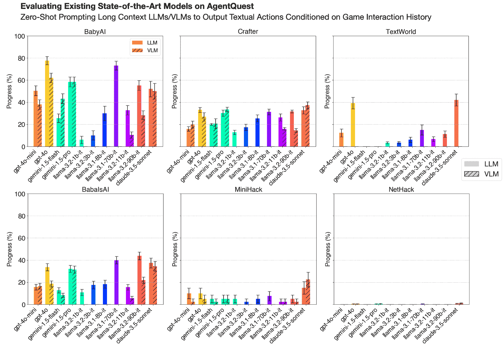

图 2：BALROG 的基准。我们评估了七种最先进的、长上下文的 LLM 和 VLM 在 BALROG 上的零-shot 性能。在每个交互时间步，模型根据过去的交互历史提示输出下一个游戏内动作。标准误差通过运行多个重复种子获得，具体细节见附录。

### 3.2 观察结果

在初始提示中，代理被介绍到游戏规则，并提供一份可用动作列表，每个动作附带简短描述。为了防止模型过度专门化，我们设计了一个通用提示，不针对任何特定的LLM进行微调。后续提示以基于聊天的格式展示观察-动作历史。游戏规则和观察从“用户”的角度传达，而先前的动作则归因于“助手”或“模型”角色，具体取决于所使用的模型类型。这种结构与用于微调指令跟随LLM的标准格式相似。游戏观察的详细示例包含在附录中。

除了没有视觉组件的TextWorld，我们使用两种观察方式评估所有环境：

**仅语言格式** 观察以自然语言描述环境的状态（例如，“前方5步是墙，左侧2步是墙……”）表达。对于没有本地文本表示的环境，我们要么使用开源语言封装器（BabyAI (Carta等，[2023](https://arxiv.org/html/2411.13543v1#bib.bib8))，Crafter (Wu等，[2023](https://arxiv.org/html/2411.13543v1#bib.bib85))，NetHack和MiniHack (Goodger等，[2023](https://arxiv.org/html/2411.13543v1#bib.bib19)))生成描述，要么自行开发定制封装器（Baba是AI，见附录[5](https://arxiv.org/html/2411.13543v1#A4.F5 "图5 ‣ 附录D Baba Is AI ‣ BALROG：基准测试代理性LLM和VLM推理在游戏中的表现")））。

**视觉-语言格式** 对于VLM（视觉-语言模型），观察包括一个代表环境当前状态的图像，以及其自然语言描述（如上所述）。在这种格式中，图像仅对应当前的观察，尽管我们支持在观察历史中包含多个图像。

对于最复杂的环境，即MiniHack和NetHack，我们通过使用ASCII字符渲染的二维地图来增强基于语言的观察。对于所有实验，我们使用16个观察的历史长度，以保持任务间的一致性。然而，提交此基准的参与者可以根据各自模型和实验的需要修改观察历史长度。

### 3.3 **模型**

我们评估了一系列流行的闭源和开源模型，包括 Gemini-1.5-Flash 和 Gemini-1.5-Pro（Reid 等，[2024](https://arxiv.org/html/2411.13543v1#bib.bib60)），GPT-4o-mini（2024-07-18 发布）和 GPT-4o（2024-05-13 发布）（Achiam 等，[2023](https://arxiv.org/html/2411.13543v1#bib.bib1)；OpenAI，[2024a](https://arxiv.org/html/2411.13543v1#bib.bib50)），Claude 3.5 Sonnet（Anthropic，[2024](https://arxiv.org/html/2411.13543v1#bib.bib3)），以及 Llama 3.1 instruct（8B 和 70B）（Dubey 等，[2024](https://arxiv.org/html/2411.13543v1#bib.bib15)）和 Llama 3.2 instruct（1B、3B、11B 和 90B）（MetaAI，[2024](https://arxiv.org/html/2411.13543v1#bib.bib48)）。此外，由于预算限制，我们仅在 NetHack 环境中测试了 o1-mini（2024-09-12 发布）和 o1-preview（2024-09-12 发布）（OpenAI，[2024b](https://arxiv.org/html/2411.13543v1#bib.bib51)）。

## 4 结果

在图 [2](https://arxiv.org/html/2411.13543v1#S3.F2 "图 2 ‣ 3.1 评估设置 ‣ 3 零样本评估协议 ‣ BALROG: 基准测试代理LLM和VLM推理的游戏") 中，我们展示了使用 BALROG 评估脚本进行实验的结果，包括语言-only 和视觉-语言格式。大多数领先模型在 BabyAI、Crafter 和 Baba Is AI 上表现出公正的平均进展，GPT-4o 表现最佳。有趣的是，开源的 Llama 3.1 70B 和 Llama 3.2 90B 模型在 Baba Is AI 语言-only 格式中取得了最高的成绩，略微超越了 GPT-4o 和 Claude 3.5 Sonnet。在 TextWorld 中，GPT-4o 和 Claude 3.5 Sonnet 排名领先，而 Gemini 模型未能完成任何任务，尽管提示中没有实际的安全问题，但它们被 Google Gemini API 标记为“不安全”。MiniHack 套件对所有模型都构成了很大的挑战，特别是任务和 boxoban，这些任务从未被任何模型解决。最后，所有模型在 NetHack 上的表现几乎持平，表现最好的模型 o1-preview 仅取得了 1.5% 的平均游戏进展。

表 LABEL:llm_table 总结了所有环境中语言-only 格式的聚合结果。总体来说，GPT-4o 是表现最好的模型，平均进展为31.62%，紧随其后的是 Claude 3.5 Sonnet 和 Llama 3.1 70B。Gemini-1.5-Pro 落后于其他大型模型，部分原因是其在 TextWorld 上的表现为0%。然而，在视图-语言格式下，结果有所不同，如表 LABEL:vlm_table 所示。在这里，我们观察到，当图像观察被包含时，GPT-4o 和 Llama 3.2 的表现有所下降，可能是由于添加的视觉输入引发了混淆。相比之下，Gemini-1.5-Pro 和特别是 Claude 3.5 Sonnet，在两种格式下表现保持一致。这表明，目前的多模态 Transformer 架构在处理文本信息时仍比处理视觉输入更为得心应手，这是我们在第 [6](https://arxiv.org/html/2411.13543v1#S6 "6 Open Research Problems ‣ BALROG: Benchmarking Agentic LLM and VLM Reasoning On Games") 节中进一步探讨的主题。此外，Llama 3.1 70B 在语言-only 格式下优于更大且更新的 Llama 3.2 90B，这表明后者引入的视觉处理可能对其语言和推理能力产生了负面影响。我们在附录中展示了每个环境的更详细结果。

表 2：语言-only 表现

| 模型 | 平均进展（%） |
| --- | --- |
| gpt-4o | 32.34 $\pm$ 1.49 |
| claude-3.5-sonnet | 29.98 $\pm$ 1.98 |
| llama-3.1-70b-it | 27.88 $\pm$ 1.43 |
| llama-3.2-90B-it | 23.66 $\pm$ 1.09 |
| gemini-1.5-pro | 21.00 $\pm$ 1.18 |
| gpt-4o-mini | 17.36 $\pm$ 1.35 |
| llama-3.1-8b-it | 14.14 $\pm$ 1.51 |
| llama-3.2-11B-it | 13.54 $\pm$ 1.05 |
| gemini-1.5-flash | 9.73 $\pm$ 0.77 |
| llama-3.2-3B-it | 8.47 $\pm$ 1.12 |
| llama-3.2-1B-it | 6.32 $\pm$ 1.00 |

表 3：视图-语言表现

| 模型 | 平均进展（%） |
| --- | --- |
| claude-3.5-sonnet | 29.08 $\pm$ 2.21 |
| gemini-1.5-pro | 25.76 $\pm$ 1.36 |
| gpt-4o | 22.56 $\pm$ 1.44 |
| gpt-4o-mini | 15.36 $\pm$ 1.29 |
| gemini-1.5-flash | 14.94 $\pm$ 1.40 |
| llama-3.2-90B-it | 13.43 $\pm$ 1.16 |
| llama-3.2-11B-it | 6.91 $\pm$ 0.84 |

### 4.1 定性分析

我们对模型在各个环境中的轨迹进行了分析，以识别每个设置特有的共同行为和挑战。

空间推理 尽管语言模型在基本导航方面表现出一定的能力，但在更复杂的空间推理任务中，它们展示了显著的局限性。在 BabyAI 套件中，我们观察到在某些场景中，智能体无法将物体放置在其他物体旁边，存在显著的不足。在 NetHack 和 MiniHack CorridorBattle 中，良好的空间推理在战斗过程中至关重要，因为玩家需要在狭窄的走廊中机动，以避免被怪物包围。然而，智能体经常会被困在角落里。

系统性探索 我们的实验揭示了模型在探索能力方面的显著弱点。在TextWorld的Coin Collector中，代理需要探索房子以找到一个硬币，但代理经常漫无目的地游荡，重新访问已经探索过的房间，而完全错过了重要区域。一个高效的代理会像深度优先搜索（DFS）一样行事，系统地搜索每个房间，跟踪已访问的区域并优先考虑未探索的空间。MiniHack中更复杂的任务暴露了类似的问题，模型未能有效地在迷宫般的结构中进行导航。

长期规划 代理在制定和执行长期计划方面存在显著不足。我们在MiniHack和NLE中观察到接近零的表现，这两个任务都需要仔细规划。特别是，在MiniHack中的Boxoban逻辑谜题中，我们没有观察到任何一个成功的轨迹，该谜题需要在每一步进行精心规划，以避免不可逆的失败。大规模语言模型（LLMs）在单次前向传播过程中，由于计算资源有限，必然只能解决某些子集的推理问题。我们观察到，当前模型的深度、浮点运算次数（flops）和推理解决模板嵌入在权重中，使得这些模型无法解决BALROG中的推理任务。我们看到，OpenAI o1的链式思维能力在NetHack上有显著提升，表现比其最接近的竞争对手Claude-3.5-Sonnet在语言模式下好近三倍。然而，其平均进展仅为1.57%，仍远未令人满意。

发现并利用环境动态 一些游戏需要通过实验推断出非平凡的因果结构，以制定新的策略。例如，玩家可能通过喝下麻痹药水来识别它，然后意识到他们可以通过将这种药水扔向敌人来使敌人丧失行动能力，从而将其作为一种战略性武器。这种实验和战略性思维对于在NetHack中取得成功至关重要。然而，目前的模型在制定和执行这种依赖于上下文的策略时存在困难。在MiniHack Quests环境中，模型无法设计和实施多步骤的策略，例如利用寒冷法杖或悬浮戒指来跨越熔岩河流。在Crafter中，代理能够处理基本任务，如收集木材、制作物品、喝水，甚至参与战斗，但他们无法学习到长期生存技能，如建造避难所来抵御夜间的威胁。

知识-行动差距 我们观察到一个明显的“知识-行动”差距，即模型在游戏过程中尽管知道某些行为的负面后果，却仍然执行这些不理想的动作。例如，在 NetHack 中，模型经常在游戏开始后不久就退出地下城，导致游戏立即终止。当在一个独立的线程中询问退出 NetHack 第一层的后果时，它们正确地识别出这将导致即时死亡，认为这是一个高度不理想的行为。类似地，尽管模型正确识别出在 NetHack 中食用腐烂的食物可能导致死亡，但这仍然是失败的常见原因，凸显了知识与决策之间的脱节。此外，即使在输入提示中直接给出的提示，模型也往往忽视，尽管被建议不要过度进食，但它们仍然因过度进食而死亡。为了更详细地研究这个问题，我们准备了一份调查问卷，探讨 NetHack 的基础知识（参见附录 [F.5](https://arxiv.org/html/2411.13543v1#A6.SS5 "F.5 LLMs possess extensive NetHack knowledge ‣ Appendix F NetHack Learning Environment ‣ BALROG: Benchmarking Agentic LLM and VLM Reasoning On Games")）。

## 5 相关工作

大型语言模型的评估历来依赖于强调静态、非交互性任务的基准测试。诸如 SuperGLUE（Wang 等，[2019](https://arxiv.org/html/2411.13543v1#bib.bib77)），测试通用语言理解能力，和 MMLU（Hendrycks 等，[2020](https://arxiv.org/html/2411.13543v1#bib.bib25)），衡量大规模多任务语言理解，都是推动 LLM 研究的重要工具。BigBench（Srivastava 等，[2022](https://arxiv.org/html/2411.13543v1#bib.bib71)）通过包括一组多样的语言学和认知挑战进一步扩展了范围。数学推理数据集，如 GSM8K 和 MATH（Cobbe 等，[2021](https://arxiv.org/html/2411.13543v1#bib.bib13); Hendrycks 等，[2021](https://arxiv.org/html/2411.13543v1#bib.bib26)）评估模型解决小学和竞赛级别数学问题的能力，而 Shi 等人（[2022](https://arxiv.org/html/2411.13543v1#bib.bib67)）则探讨了多语言的思维链推理。在代码理解和生成领域，诸如 HumanEval（Chen 等，[2021](https://arxiv.org/html/2411.13543v1#bib.bib10)）和 CodeXGLUE（Lu 等，[2021](https://arxiv.org/html/2411.13543v1#bib.bib46)）等基准测试评估了模型在编程任务中的能力。

然而，这些基准测试仅限于单轮或短上下文场景，不需要进行顺序决策或适应变化的环境，并且已经迅速趋于饱和（Kiela 等人，[2021](https://arxiv.org/html/2411.13543v1#bib.bib34)）。静态基准可能无法完全捕捉我们所追求的进展，因为研究社区的目标是推动能够在动态环境中行动的代理基础模型的前沿，这些模型能够使用工具、进行规划并推理其周围环境。最近，研究人员已经研究了大型语言模型（LLMs）如何运用这些技能来解决实际任务，包括使用计算机接口执行与办公室相关的工作（Wang 等人，[2024](https://arxiv.org/html/2411.13543v1#bib.bib79)；Qin 等人，[2024](https://arxiv.org/html/2411.13543v1#bib.bib56)），浏览网页（Yao 等人，[2022](https://arxiv.org/html/2411.13543v1#bib.bib89)；Zhou 等人，[2023](https://arxiv.org/html/2411.13543v1#bib.bib93)），以及解决 GitHub 问题（Jimenez 等人，[2023](https://arxiv.org/html/2411.13543v1#bib.bib30)）。一些研究探讨了 LLMs 的多智能体能力，以检验它们是否能合作（Gong 等人，[2023](https://arxiv.org/html/2411.13543v1#bib.bib18)；Piatti 等人，[2024](https://arxiv.org/html/2411.13543v1#bib.bib53)）或有效地与其他智能体对抗（Jin 等人，[2024](https://arxiv.org/html/2411.13543v1#bib.bib31)；Wu 等人，[2024](https://arxiv.org/html/2411.13543v1#bib.bib84)）。

在本研究中，我们探讨了视频游戏中的代理技能，因为它们提供了精心设计的挑战，适合人类玩家，并测试对于具身代理有用的技能。之前，一些相关研究利用游戏对大语言模型（LLMs）进行了基准测试（Liu 等人，[2023b](https://arxiv.org/html/2411.13543v1#bib.bib44)；Todd 等人，[2024](https://arxiv.org/html/2411.13543v1#bib.bib74)；Wu 等人，[2023](https://arxiv.org/html/2411.13543v1#bib.bib85)），突出它们在解决问题、空间推理以及明确的规则和目标方面的强调。然而，其中一些基准测试已经接近饱和，例如Crafter环境是其套件中最具挑战性的。相比之下，BALROG通过提供各种难度的游戏填补了一个重要空白，包括NetHack学习环境（Küttler 等人，[2020](https://arxiv.org/html/2411.13543v1#bib.bib36)），人类需要数年才能掌握，而零-shot LLMs在其中遇到极大困难，这在之前的研究中也有体现（Jeurissen 等人，[2024](https://arxiv.org/html/2411.13543v1#bib.bib29)）。这些任务为评估代理基础模型提供了一个丰富而细致的测试平台，将LLMs/VLMs的决策评估推向它们上下文长度的极限。其他环境，如MineDojo（Fan 等人，[2022](https://arxiv.org/html/2411.13543v1#bib.bib16)）和MineRL（Guss 等人，[2019](https://arxiv.org/html/2411.13543v1#bib.bib21)），也为代理能力提供了开放式的挑战，但它们对计算资源的高要求以及对多模态输入的依赖使它们在可访问性和大规模基准测试中显得不太实用。

虽然目前BALROG专注于评估单代理的基础能力，但未来的扩展可以探索多代理协作环境，这为测试LLMs的团队合作和协调技能提供了独特的机会。例如，Overcooked（Carroll 等人，[2019](https://arxiv.org/html/2411.13543v1#bib.bib7)；Liu 等人，[2023a](https://arxiv.org/html/2411.13543v1#bib.bib43)）模拟了一个合作烹饪环境，在这个环境中，代理必须在时间限制和任务依赖下高效协作，从而测试规划和沟通能力。另一个有趣的环境是Hanabi（Bard 等人，[2020](https://arxiv.org/html/2411.13543v1#bib.bib4)），这是一款合作卡牌游戏，玩家必须依靠间接沟通和推理来在部分可观察的情况下达成共同目标。这些环境为基准测试先进的协作和多代理决策技能提供了丰富的机会，而这些技能对于更广泛地部署代理LLMs至关重要。

## 6 开放研究问题

除了在模型评估中的实用性，BALROG 还为快速原型设计新推理时方法提供了测试平台，旨在提高LLM和VLM的代理能力。在这一领域中，存在许多未解的研究问题。截至本文写作时，一些最有效的提高模型推理能力的方法，在处理短篇和/或短上下文问题时，由于任务的极长上下文特性，无法直接应用于BALROG。解决这些挑战可能进一步促进更强大自主代理的发展。我们在下面列出了几个未来研究的关键领域。

#### 上下文学习与少量示例提示

BALROG 使得对上下文学习（ICL）代理进行评估成为可能，这些代理可以通过少量示例适应分布外任务。我们为每个环境提供了一小部分人类示范数据集，并在BALROG代码库中实现了少量示例条件设置。该基准代码库还支持对上下文强化学习（Lee 等， [2024](https://arxiv.org/html/2411.13543v1#bib.bib39); Laskin 等， [2022](https://arxiv.org/html/2411.13543v1#bib.bib38); Lin 等， [2023](https://arxiv.org/html/2411.13543v1#bib.bib42)）的研究，其中代理在推理过程中从错误中学习并不断改进。在第[4](https://arxiv.org/html/2411.13543v1#S4 "4 Results ‣ BALROG: Benchmarking Agentic LLM and VLM Reasoning On Games")节中基准测试的大型模型上，直接的少量示例学习（即在上下文中提示LLM和VLM代理以完整的人类游戏示例）在BALROG上运行时计算成本极高。例如，单个NetHack游戏的示范可能需要超过$700,000$个输入标记才能在提示中表示。尽管像缓存和长上下文提示API成本下降等快速推理技术取得了进展，但我们发现目前进行这些实验仍然不可行。通过检索增强的少量示例提示策略（Lewis 等， [2020](https://arxiv.org/html/2411.13543v1#bib.bib40)）只选择示范的相关部分，可能提供了一种绕过这些挑战的方法。我们将这类方法的探索留待未来工作进行。

#### 高级推理策略

除了直接提示LLM和VLM预测游戏玩法的下一步动作，BALROG还支持更高级推理技巧的研究，例如链式思维（Wei et al., [2022b](https://arxiv.org/html/2411.13543v1#bib.bib82)）、自我精炼（Madaan et al., [2024](https://arxiv.org/html/2411.13543v1#bib.bib47)）和基本规划。这些方法已被证明能够提高模型在短期上下文问题上的表现。我们相信，它们是未来在长上下文推理和决策制定领域的一个激动人心的方向。例如，通过结合多智能体协作（Chang, [2023](https://arxiv.org/html/2411.13543v1#bib.bib9)；Khan et al., [2024](https://arxiv.org/html/2411.13543v1#bib.bib33)；Yao et al., [2024](https://arxiv.org/html/2411.13543v1#bib.bib90)）和工具使用（Shen et al., [2024](https://arxiv.org/html/2411.13543v1#bib.bib66)；Ruan et al., [2023](https://arxiv.org/html/2411.13543v1#bib.bib62)；Schick et al., [2024](https://arxiv.org/html/2411.13543v1#bib.bib64)；Qin et al., [2023](https://arxiv.org/html/2411.13543v1#bib.bib57)）的决策制定，可能会提高BALROG任务上的模型表现。此外，结合记忆机制或强化学习技术有助于弥合“知与行”的差距，使模型能够在实际的长期任务中有效应用其知识。最后，尝试开放式自我改进循环（Wang et al., [2023](https://arxiv.org/html/2411.13543v1#bib.bib78)；Hu et al., [2024](https://arxiv.org/html/2411.13543v1#bib.bib27)）可能会导致更具适应性和通用性的智能体（Team et al., [2023](https://arxiv.org/html/2411.13543v1#bib.bib73)；Hughes et al., [2024](https://arxiv.org/html/2411.13543v1#bib.bib28)），为实现真正的自主系统提供了一条道路。

#### 当前视觉语言模型的局限性

尽管具有潜力，我们的基准测试显示VLM性能存在显著波动。一些模型，如Llama 3.2，在将视觉信息整合到一致的决策制定中时表现不佳，而其他模型——特别是Sonnet 3.5——在VLM模式下展现出更强的性能。这种差异突显了VLM能力的显著变化，这可能源于训练目标和数据集的不同。例如，Sonnet 3.5的优越表现部分可以归因于其在涉及计算机使用的任务上的训练（Anthropic, [2024](https://arxiv.org/html/2411.13543v1#bib.bib2)），这些任务本质上需要将视觉和文本输入结合起来进行基于行动的推理。

最近的研究发现了VLM的一些关键局限性，这些局限性与我们的发现一致，包括对自然图像-文本对的偏见、优化图像描述而非面向行动的推理、以及在面对分布外输入时的挑战（Tan et al., [2024](https://arxiv.org/html/2411.13543v1#bib.bib72); Tong et al., [2024](https://arxiv.org/html/2411.13543v1#bib.bib75); Rahmanzadehgervi et al., [2024](https://arxiv.org/html/2411.13543v1#bib.bib58); Zang et al., [2024](https://arxiv.org/html/2411.13543v1#bib.bib92); Guan et al., [2023](https://arxiv.org/html/2411.13543v1#bib.bib20))。这些局限性在我们的基准测试中得到了进一步体现，其中基于网格的图像观测与许多VLM所训练的自然图像-文本对存在显著差异（Yu et al., [2023](https://arxiv.org/html/2411.13543v1#bib.bib91); Rahmanzadehgervi et al., [2024](https://arxiv.org/html/2411.13543v1#bib.bib58))。此外，图像处理的计算成本使得我们的评估每次只能处理单幅图像，其他的历史数据则以文本形式提供。尽管这一限制可能会影响某些模型的性能，但我们的结果显示，像Claude 3.5 Sonnet这样的某些VLM仍能在这些条件下表现出色。

为了应对这些挑战，我们的代码库已经支持多图像观测历史，未来的版本将会加入视频观测，这可能更适合我们的基准测试中长时间序列决策任务。这些增强功能旨在更好地评估和利用VLM在复杂推理场景中的潜力。一旦具有高效视频处理能力的主流模型问世，我们计划引入对视频观测的支持，确保我们的基准测试与VLM技术的最新进展保持一致。

#### 大型语言模型的计算限制

机制可解释性可以为理解代理型大语言模型（LLMs）的计算限制提供宝贵的见解。大语言模型的计算表达能力与解决复杂推理问题的能力密切相关（Wei et al., [2022a](https://arxiv.org/html/2411.13543v1#bib.bib81)）。虽然当前模型在导航和物体操控等简单任务上表现良好，但它们在处理更复杂的任务时却力不从心，这些任务可能需要非平凡的通用计算，例如建造避难所或制定作战策略。这可能是由于模型无法检索相关的计算电路（Olah et al., [2020](https://arxiv.org/html/2411.13543v1#bib.bib49)）、推理时预算的限制（Snell et al., [2024](https://arxiv.org/html/2411.13543v1#bib.bib70)）或表示表达能力的不足。这引发了关于大语言模型和视觉语言模型（VLMs）有效可解任务范围的重要问题，任务的可解性依赖于模型深度、上下文大小以及预训练与下游任务之间的分布偏移等因素。需要进一步研究以理解这些限制的根本原因，并开发克服这些限制的策略，例如在运行时自适应地模拟计算电路。

## 7 结论

我们介绍了BALROG，一个新型基准，旨在评估大语言模型（LLMs）和视觉语言模型（VLMs）在一系列具有挑战性、长时间跨度任务中的代理能力。通过易于复现的评估协议，BALROG揭示了当前模型的关键缺陷，特别是在基于视觉的决策制定和长期规划等领域，发现了模型性能与人类水平能力之间的明显差距。通过我们的定性分析揭示的这些不足，反映了现实场景中的挑战，强调了我们基准对代理应用的实际相关性。我们的评估框架利用快速的程序化生成环境，确保通过防止测试集泄漏进行严格且公平的比较，这是其他基准常见的问题。我们相信，BALROG将成为支持和推动自动化大语言模型代理研究的重要工具。

## 伦理声明

本工作为大语言模型的代理能力提供了一个基准。我们认为，在模拟环境中进行实验至关重要，在这些环境中，代理的行为易于解释，这对构建安全的代理系统至关重要。解决如何确保代理行为与人类意图良好对齐的问题同样重要。

## 可复现性声明

我们力求使本文中的所有实验都能完全复现。我们分享了用于评估的代码库，代码库可以在附录材料中找到。我们在附录A至F中详细描述了特定环境评估方案的完整描述。

## 参考文献

+   Achiam et al. (2023) Josh Achiam, Steven Adler, Sandhini Agarwal, Lama Ahmad, Ilge Akkaya, Florencia Leoni Aleman, Diogo Almeida, Janko Altenschmidt, Sam Altman, Shyamal Anadkat, 等。GPT-4技术报告。*arXiv预印本arXiv:2303.08774*，2023年。

+   Anthropic (2024) Anthropic. 开发计算机使用模型，2024年。网址[https://www.anthropic.com/news/developing-computer-use](https://www.anthropic.com/news/developing-computer-use)。访问时间：2024年11月17日。

+   Anthropic (2024) Anthropic. Claude 3.5 sonnet：增强的智能与多样性，2024年。网址[https://www.anthropic.com/news/claude-3-5-sonnet](https://www.anthropic.com/news/claude-3-5-sonnet)。访问时间：2024年11月18日。

+   Bard et al. (2020) Nolan Bard, Jakob N Foerster, Sarath Chandar, Neil Burch, Marc Lanctot, H Francis Song, Emilio Parisotto, Vincent Dumoulin, Subhodeep Moitra, Edward Hughes, 等。Hanabi挑战：人工智能研究的新前沿。*人工智能*，280:103216，2020年。

+   Bellemare et al. (2013) Marc G Bellemare, Yavar Naddaf, Joel Veness, 和 Michael Bowling. 异常游戏学习环境：通用代理的评估平台。*人工智能研究期刊*，47:253–279，2013年。

+   Brown (2020) Tom B Brown. 语言模型是少量示例学习者。*arXiv预印本arXiv:2005.14165*，2020年。

+   Carroll et al. (2019) Micah Carroll, Rohin Shah, Mark K Ho, Tom Griffiths, Sanjit Seshia, Pieter Abbeel, 和 Anca Dragan. 学习关于人类的知识对人类与AI协调的效用。*神经信息处理系统进展*，32，2019年。

+   Carta et al. (2023) Thomas Carta, Clément Romac, Thomas Wolf, Sylvain Lamprier, Olivier Sigaud, 和 Pierre-Yves Oudeyer. 在互动环境中通过在线强化学习将大型语言模型基础化。发表于*国际机器学习会议*，第3676–3713页。PMLR，2023年。

+   Chang (2023) Edward Y Chang. 使用苏格拉底方法提示大型语言模型。在*2023 IEEE第13届年度计算与通信研讨会与会议（CCWC）*，第0351–0360页。IEEE，2023年。

+   Chen et al. (2021) Mark Chen, Jerry Tworek, Heewoo Jun, Qiming Yuan, Henrique Ponde De Oliveira Pinto, Jared Kaplan, Harri Edwards, Yuri Burda, Nicholas Joseph, Greg Brockman, 等。评估在代码上训练的大型语言模型。*arXiv预印本arXiv:2107.03374*，2021年。

+   Chevalier-Boisvert et al. (2019) Maxime Chevalier-Boisvert, Dzmitry Bahdanau, Salem Lahlou, Lucas Willems, Chitwan Saharia, Thien Huu Nguyen, 和 Yoshua Bengio. BabyAI：与人类协同的基础语言学习的第一步。发表于*国际学习表征会议*，2019年。网址[https://openreview.net/forum?id=rJeXCo0cYX](https://openreview.net/forum?id=rJeXCo0cYX)。

+   Cloos et al. (2024) Nathan Cloos, Meagan Jens, Michelangelo Naim, Yen-Ling Kuo, Ignacio Cases, Andrei Barbu, 和 Christopher J Cueva. Baba是AI：打破规则以击败基准。发表于*ICML 2024大型语言模型与认知研讨会*，2024年。

+   Cobbe et al. (2021) Karl Cobbe, Vineet Kosaraju, Mohammad Bavarian, Mark Chen, Heewoo Jun, Lukasz Kaiser, Matthias Plappert, Jerry Tworek, Jacob Hilton, Reiichiro Nakano, 等人。训练验证器解决数学文字问题。 *arXiv预印本 arXiv:2110.14168*，2021年。

+   Côté et al. (2019) Marc-Alexandre Côté, Akos Kádár, Xingdi Yuan, Ben Kybartas, Tavian Barnes, Emery Fine, James Moore, Matthew Hausknecht, Layla El Asri, Mahmoud Adada, 等人。Textworld：一个基于文本游戏的学习环境。在 *《计算机游戏：第七届工作坊，CGW 2018，结合第27届人工智能国际会议，IJCAI 2018，斯德哥尔摩，瑞典，2018年7月13日，修订版精选论文7》*，第41–75页。Springer，2019年。

+   Dubey et al. (2024) Abhimanyu Dubey, Abhinav Jauhri, Abhinav Pandey, Abhishek Kadian, Ahmad Al-Dahle, Aiesha Letman, Akhil Mathur, Alan Schelten, Amy Yang, Angela Fan, 等人。Llama 3 模型群体。 *arXiv预印本 arXiv:2407.21783*，2024年。

+   Fan et al. (2022) Linxi Fan, Guanzhi Wang, Yunfan Jiang, Ajay Mandlekar, Yuncong Yang, Haoyi Zhu, Andrew Tang, De-An Huang, Yuke Zhu, 和 Anima Anandkumar。Minedojo：构建具有互联网规模知识的开放式体现智能体。 *《神经信息处理系统进展》*，35:18343–18362，2022年。

+   Fernando et al. (2023) Chrisantha Fernando, Dylan Banarse, Henryk Michalewski, Simon Osindero, 和 Tim Rocktäschel。Promptbreeder：通过提示进化进行自我参照的自我提升。 *arXiv预印本 arXiv:2309.16797*，2023年。

+   Gong et al. (2023) Ran Gong, Qiuyuan Huang, Xiaojian Ma, Hoi Vo, Zane Durante, Yusuke Noda, Zilong Zheng, Song-Chun Zhu, Demetri Terzopoulos, Li Fei-Fei, 等人。Mindagent：新兴的游戏互动。 *arXiv预印本 arXiv:2309.09971*，2023年。

+   Goodger et al. (2023) Nikolaj Goodger, Peter Vamplew, Cameron Foale, 和 Richard Dazeley。一个用于自主智能体的Nethack学习环境语言包装器。 *《开放研究软件杂志》*，11，2023年6月06日。doi: 10.5334/jors.444。

+   Guan et al. (2023) Tianrui Guan, Fuxiao Liu, Xiyang Wu, Ruiqi Xian, Zongxia Li, Xiaoyu Liu, Xijun Wang, Lichang Chen, Furong Huang, Yaser Yacoob, 等人。Hallusionbench：一个用于大规模视觉-语言模型中纠缠语言幻觉和视觉错觉的高级诊断套件。 *arXiv预印本 arXiv:2310.14566*，2023年。

+   Guss et al. (2019) William H Guss, Brandon Houghton, Nicholay Topin, Phillip Wang, Cayden Codel, Manuela Veloso, 和 Ruslan Salakhutdinov. Minerl：一个大规模的《Minecraft》演示数据集。 *arXiv预印本 arXiv:1907.13440*，2019年。

+   Hafner (2021) Danijar Hafner。评估智能体能力的基准测试。 *arXiv预印本 arXiv:2109.06780*，2021年。

+   Hambro et al. (2022a) Eric Hambro, Sharada Mohanty, Dmitrii Babaev, Minwoo Byeon, Dipam Chakraborty, Edward Grefenstette, Minqi Jiang, Jo Daejin, Anssi Kanervisto, Jongmin Kim, 等人。来自NeurIPS 2021 Nethack挑战的见解。在 *NeurIPS 2021竞赛与演示轨道*，第41–52页。PMLR，2022年。

+   Hambro 等人 (2022b) Eric Hambro, Roberta Raileanu, Danielle Rothermel, Vegard Mella, Tim Rocktäschel, Heinrich Küttler 和 Naila Murray. 地牢与数据：大规模 Nethack 数据集. *神经信息处理系统进展*, 35:24864–24878, 2022b.

+   Hendrycks 等人 (2020) Dan Hendrycks, Collin Burns, Steven Basart, Andy Zou, Mantas Mazeika, Dawn Song 和 Jacob Steinhardt. 测量大规模多任务语言理解. *arXiv 预印本 arXiv:2009.03300*, 2020.

+   Hendrycks 等人 (2021) Dan Hendrycks, Collin Burns, Saurav Kadavath, Akul Arora, Steven Basart, Eric Tang, Dawn Song 和 Jacob Steinhardt. 使用数学数据集测量数学问题解决能力. *arXiv 预印本 arXiv:2103.03874*, 2021.

+   Hu 等人 (2024) Shengran Hu, Cong Lu 和 Jeff Clune. 自动化设计智能体系统. *arXiv 预印本 arXiv:2408.08435*, 2024.

+   Hughes 等人 (2024) Edward Hughes, Michael Dennis, Jack Parker-Holder, Feryal Behbahani, Aditi Mavalankar, Yuge Shi, Tom Schaul 和 Tim Rocktaschel. 开放性对于人工超人类智能至关重要. *arXiv 预印本 arXiv:2406.04268*, 2024.

+   Jeurissen 等人 (2024) Dominik Jeurissen, Diego Perez-Liebana, Jeremy Gow, Duygu Cakmak 和 James Kwan. 使用 LLM 玩 Nethack：作为零-shot 代理的潜力与局限性. *arXiv 预印本 arXiv:2403.00690*, 2024.

+   Jimenez 等人 (2023) Carlos E Jimenez, John Yang, Alexander Wettig, Shunyu Yao, Kexin Pei, Ofir Press 和 Karthik Narasimhan. Swe-bench: 语言模型能解决现实世界的 GitHub 问题吗？ *arXiv 预印本 arXiv:2310.06770*, 2023.

+   Jin 等人 (2024) Xuanfa Jin, Ziyan Wang, Yali Du, Meng Fang, Haifeng Zhang 和 Jun Wang. 学习战略性地讨论：一项关于《一夜终极狼人》的案例研究. *arXiv 预印本 arXiv:2405.19946*, 2024.

+   Kambhampati 等人 (2024) Subbarao Kambhampati, Karthik Valmeekam, Lin Guan, Kaya Stechly, Mudit Verma, Siddhant Bhambri, Lucas Saldyt 和 Anil Murthy. LLM 不能规划，但能在 LLM-modulo 框架中帮助规划. *arXiv 预印本 arXiv:2402.01817*, 2024.

+   Khan 等人 (2024) Akbir Khan, John Hughes, Dan Valentine, Laura Ruis, Kshitij Sachan, Ansh Radhakrishnan, Edward Grefenstette, Samuel R Bowman, Tim Rocktäschel 和 Ethan Perez. 与更具说服力的 LLM 进行辩论会导致更真实的答案. *arXiv 预印本 arXiv:2402.06782*, 2024.

+   Kiela 等人 (2021) Douwe Kiela, Max Bartolo, Yixin Nie, Divyansh Kaushik, Atticus Geiger, Zhengxuan Wu, Bertie Vidgen, Grusha Prasad, Amanpreet Singh, Pratik Ringshia 等. Dynabench: 重新思考 NLP 中的基准测试. *arXiv 预印本 arXiv:2104.14337*, 2021.

+   Klissarov 等人 (2023) Martin Klissarov, Pierluca D’Oro, Shagun Sodhani, Roberta Raileanu, Pierre-Luc Bacon, Pascal Vincent, Amy Zhang 和 Mikael Henaff. Motif: 来自人工智能反馈的内在动机. *arXiv 预印本 arXiv:2310.00166*, 2023.

+   Küttler等人（2020）Heinrich Küttler, Nantas Nardelli, Alexander Miller, Roberta Raileanu, Marco Selvatici, Edward Grefenstette, 和Tim Rocktäschel。NetHack学习环境。*神经信息处理系统进展*，33:7671–7684，2020。

+   Kwon等人（2023）Woosuk Kwon, Zhuohan Li, Siyuan Zhuang, Ying Sheng, Lianmin Zheng, Cody Hao Yu, Joseph E. Gonzalez, Hao Zhang, 和Ion Stoica。大规模语言模型服务的高效内存管理与分页注意力机制。在*ACM SIGOPS第29届操作系统原理研讨会论文集*，2023。

+   Laskin等人（2022）Michael Laskin, Luyu Wang, Junhyuk Oh, Emilio Parisotto, Stephen Spencer, Richie Steigerwald, DJ Strouse, Steven Hansen, Angelos Filos, Ethan Brooks等人。通过算法蒸馏进行上下文强化学习。*arXiv预印本arXiv:2210.14215*，2022。

+   Lee等人（2024）Jonathan Lee, Annie Xie, Aldo Pacchiano, Yash Chandak, Chelsea Finn, Ofir Nachum, 和Emma Brunskill。监督预训练能够学习上下文强化学习。*神经信息处理系统进展*，36，2024。

+   Lewis等人（2020）Patrick Lewis, Ethan Perez, Aleksandra Piktus, Fabio Petroni, Vladimir Karpukhin, Naman Goyal, Heinrich Küttler, Mike Lewis, Wen-tau Yih, Tim Rocktäschel等人。用于知识密集型NLP任务的检索增强生成。*神经信息处理系统进展*，33:9459–9474，2020。

+   Li等人（2022）Shuang Li, Xavier Puig, Chris Paxton, Yilun Du, Clinton Wang, Linxi Fan, Tao Chen, De-An Huang, Ekin Akyürek, Anima Anandkumar等人。用于互动决策的预训练语言模型。*神经信息处理系统进展*，35:31199–31212，2022。

+   Lin等人（2023）Licong Lin, Yu Bai, 和 Song Mei。Transformers作为决策者：通过监督预训练实现可证明的上下文强化学习。*arXiv预印本arXiv:2310.08566*，2023。

+   Liu等人（2023a）Jijia Liu, Chao Yu, Jiaxuan Gao, Yuqing Xie, Qingmin Liao, Yi Wu, 和Yu Wang。基于LLM的分层语言智能体用于实时人机协调。*arXiv预印本arXiv:2312.15224*，2023a。

+   Liu等人（2023b）Xiao Liu, Hao Yu, Hanchen Zhang, Yifan Xu, Xuanyu Lei, Hanyu Lai, Yu Gu, Hangliang Ding, Kaiwen Men, Kejuan Yang等人。Agentbench：评估LLMs作为智能体。*arXiv预印本arXiv:2308.03688*，2023b。

+   Lu等人（2024）Cong Lu, Shengran Hu, 和Jeff Clune。智能Go-explore：站在巨型基础模型的肩膀上。*arXiv预印本arXiv:2405.15143*，2024。

+   Lu等人（2021）Shuai Lu, Daya Guo, Shuo Ren, Junjie Huang, Alexey Svyatkovskiy, Ambrosio Blanco, Colin Clement, Dawn Drain, Daxin Jiang, Duyu Tang等人。Codexglue：一个用于代码理解和生成的机器学习基准数据集。*arXiv预印本arXiv:2102.04664*，2021。

+   Madaan 等人（2024）Aman Madaan, Niket Tandon, Prakhar Gupta, Skyler Hallinan, Luyu Gao, Sarah Wiegreffe, Uri Alon, Nouha Dziri, Shrimai Prabhumoye, Yiming Yang 等人。Self-refine：自我反馈的迭代优化。发表于 *神经信息处理系统进展*，36，2024。

+   MetaAI（2024）MetaAI。Llama 3.2：通过开放、可定制的模型革命化边缘 AI 和视觉，2024。网址 [https://ai.meta.com/blog/llama-3-2-connect-2024-vision-edge-mobile-devices/](https://ai.meta.com/blog/llama-3-2-connect-2024-vision-edge-mobile-devices/)。访问时间：2024-09-28。

+   Olah 等人（2020）Chris Olah, Nick Cammarata, Ludwig Schubert, Gabriel Goh, Michael Petrov 和 Shan Carter。放大：电路简介。发表于 *Distill*，5(3):e00024–001，2020。

+   OpenAI（2024a）OpenAI。你好 GPT-4o，2024a。网址 [https://openai.com/index/hello-gpt-4o/](https://openai.com/index/hello-gpt-4o/)。访问时间：2024-09-28。

+   OpenAI（2024b）OpenAI。介绍 OpenAI O1 预览版，2024年9月。网址 [https://openai.com/index/introducing-openai-o1-preview/](https://openai.com/index/introducing-openai-o1-preview/)。访问时间：2024-09-27。

+   Ouyang 等人（2022）Long Ouyang, Jeffrey Wu, Xu Jiang, Diogo Almeida, Carroll Wainwright, Pamela Mishkin, Chong Zhang, Sandhini Agarwal, Katarina Slama, Alex Ray 等人。通过人类反馈训练语言模型遵循指令。发表于 *神经信息处理系统进展*，35:27730–27744，2022。

+   Piatti 等人（2024）Giorgio Piatti, Zhijing Jin, Max Kleiman-Weiner, Bernhard Schölkopf, Mrinmaya Sachan 和 Rada Mihalcea。合作还是崩溃：LLM 代理社会中可持续行为的出现。发表于 *arXiv 预印本 arXiv:2404.16698*，2024。

+   Pignatiello 等人（2020）Grant A Pignatiello, Richard J Martin 和 Ronald L Hickman Jr。决策疲劳：概念分析。发表于 *健康心理学杂志*，25(1):123–135，2020。

+   Piterbarg 等人（2024）Ulyana Piterbarg, Lerrel Pinto 和 Rob Fergus。神经语言代理的差异历史。发表于 *第四十一届国际机器学习大会*，2024。

+   Qin 等人（2024）Yanzhao Qin, Tao Zhang, Yanjun Shen, Wenjing Luo, Haoze Sun, Yan Zhang, Yujing Qiao, Weipeng Chen, Zenan Zhou, Wentao Zhang 等人。Sysbench：大型语言模型能否遵循系统消息？发表于 *arXiv 预印本 arXiv:2408.10943*，2024。

+   Qin 等人（2023）Yujia Qin, Shihao Liang, Yining Ye, Kunlun Zhu, Lan Yan, Yaxi Lu, Yankai Lin, Xin Cong, Xiangru Tang, Bill Qian 等人。Toolllm：帮助大型语言模型掌握16000+个真实世界的 API。发表于 *arXiv 预印本 arXiv:2307.16789*，2023。

+   Rahmanzadehgervi 等人（2024）Pooyan Rahmanzadehgervi, Logan Bolton, Mohammad Reza Taesiri 和 Anh Totti Nguyen。视觉语言模型是盲的。发表于 *arXiv 预印本 arXiv:2407.06581*，2024。

+   Reed et al. (2022) 斯科特·里德, 孔拉德·佐尔纳, 埃米利奥·帕里索托, 塞尔吉奥·戈麦斯·科尔梅纳雷霍, 亚历山大·诺维科夫, 加布里埃尔·巴尔特-马隆, 马伊·吉梅内斯, 尤里·苏尔斯基, 杰基·凯, 约斯特·托比亚斯·斯普林伯根等. 泛化智能体. *arXiv 预印本 arXiv:2205.06175*, 2022.

+   Reid et al. (2024) 马切尔·里德, 尼古拉·萨维诺夫, 丹尼斯·特普利亚辛, 德米特里·列皮欣, 蒂莫西·利利克拉普, 让-巴蒂斯特·阿莱拉克, 拉杜·索里库特, 安吉丽基·拉扎里杜, 奥尔汉·菲拉特, 朱利安·施里特维泽等. Gemini 1.5：在数百万令牌的上下文中解锁多模态理解. *arXiv 预印本 arXiv:2403.05530*, 2024.

+   Rein et al. (2023) 大卫·瑞恩, 贝蒂·李·侯, 阿萨·库珀·斯蒂克兰, 杰克逊·佩蒂, 理查德·袁哲·庞, 朱利安·迪拉尼, 朱利安·迈克尔, 塞缪尔·R·博曼. Gpqa：一个研究生级的 Google-proof 问答基准. *arXiv 预印本 arXiv:2311.12022*, 2023.

+   Ruan et al. (2023) 阮静清, 陈亦红, 张斌, 许志伟, 包天鹏, 毛杭宇, 李子悦, 曾星宇, 赵锐等. Tptu：基于大语言模型的 AI 智能体的任务规划和工具使用. 见 *NeurIPS 2023 决策制定基础模型研讨会*, 2023.

+   Samvelyan et al. (2021) 米凯尔·萨姆维尔扬, 罗伯特·柯克, 维塔利·库林, 杰克·帕克-霍尔德, 蒙奇·蒋, 埃里克·汉布罗, 法比奥·佩特罗尼, 海因里希·库特勒, 爱德华·格雷芬斯特特, 提姆·罗克塔谢尔. Minihack the planet：一个用于开放式强化学习研究的沙盒. *arXiv 预印本 arXiv:2109.13202*, 2021.

+   Schick et al. (2024) 蒂莫·席克, 简·德维维迪-于, 罗伯托·德西, 罗伯塔·雷拉伊努, 玛丽亚·洛梅利, 埃里克·汉布罗, 卢克·泽特尔莫耶, 尼古拉·坎切达, 托马斯·斯查洛姆. Toolformer：语言模型能够自我学习使用工具. *神经信息处理系统进展*, 36, 2024.

+   Schrittwieser et al. (2020) 朱利安·施里特维泽, 伊奥尼斯·安托诺格鲁, 托马斯·休伯特, 凯伦·西蒙扬, 洛朗·西弗尔, 西蒙·施密特, 亚瑟·古兹, 爱德华·洛克哈特, 德米斯·哈萨比斯, 托雷·格雷佩尔等. 通过与学习模型规划掌握 Atari、围棋、国际象棋和将棋. *自然*, 588(7839):604–609, 2020.

+   Shen et al. (2024) 宋永亮, 宋凯涛, 谷旭, 李东升, 陆伟明, 庄悦婷. Hugginggpt：利用 ChatGPT 及其在 Hugging Face 中的朋友解决 AI 任务. *神经信息处理系统进展*, 36, 2024.

+   Shi et al. (2022) 施芙蕾, 米拉克·苏兹根, 马库斯·弗雷塔格, 王学志, 苏拉杰·斯里瓦茨, 索鲁什·沃索吉, 郑炯元, 易泰, 塞巴斯蒂安·鲁德, 周邓宁等. 语言模型是多语言链式思考推理者. *arXiv 预印本 arXiv:2210.03057*, 2022.

+   Shinn et al. (2023) 诺亚·辛恩, 贝克·拉巴什, 阿什温·戈皮纳斯. Reflexion：一个具有动态记忆和自我反思的自主智能体. *arXiv 预印本 arXiv:2303.11366*, 2(5):9, 2023.

+   Silver等人（2018）David Silver, Thomas Hubert, Julian Schrittwieser, Ioannis Antonoglou, Matthew Lai, Arthur Guez, Marc Lanctot, Laurent Sifre, Dharshan Kumaran, Thore Graepel等人。《一种通用强化学习算法，通过自我对弈掌握国际象棋、将棋和围棋》。*科学*，362(6419):1140–1144，2018年。

+   Snell等人（2024）Charlie Snell, Jaehoon Lee, Kelvin Xu, 和Aviral Kumar。《在测试时优化计算资源的扩展，可能比扩展模型参数更有效》。*arXiv预印本 arXiv:2408.03314*，2024年。

+   Srivastava等人（2022）Aarohi Srivastava, Abhinav Rastogi, Abhishek Rao, Abu Awal Md Shoeb, Abubakar Abid, Adam Fisch, Adam R Brown, Adam Santoro, Aditya Gupta, Adrià Garriga-Alonso等人。《超越模仿游戏：量化和推演语言模型的能力》。*arXiv预印本 arXiv:2206.04615*，2022年。

+   Tan等人（2024）Weihao Tan, Ziluo Ding, Wentao Zhang, Boyu Li, Bohan Zhou, Junpeng Yue, Haochong Xia, Jiechuan Jiang, Longtao Zheng, Xinrun Xu等人。《迈向通用计算机控制：以《荒野大镖客II》为案例的多模态智能体研究》。见于*ICLR 2024 大型语言模型（LLM）智能体研讨会*，2024年。

+   Team等人（2023）Adaptive Agent Team, Jakob Bauer, Kate Baumli, Satinder Baveja, Feryal Behbahani, Avishkar Bhoopchand, Nathalie Bradley-Schmieg, Michael Chang, Natalie Clay, Adrian Collister等人。《在开放式任务空间中的人类时间尺度适应》。*arXiv预印本 arXiv:2301.07608*，2023年。

+   Todd等人（2024）Graham Todd, Tim Merino, Sam Earle, 和Julian Togelius。《错失的联系：为大型语言模型设计的 lateral thinking puzzles》。*arXiv预印本 arXiv:2404.11730*，2024年。

+   Tong等人（2024）Shengbang Tong, Zhuang Liu, Yuexiang Zhai, Yi Ma, Yann LeCun, 和Saining Xie。《眼睛睁得大大的？探索多模态大语言模型的视觉缺陷》。见于*IEEE/CVF计算机视觉与模式识别会议论文集*，第9568–9578页，2024年。

+   Vinyals等人（2019）Oriol Vinyals, Igor Babuschkin, Wojciech M Czarnecki, Michaël Mathieu, Andrew Dudzik, Junyoung Chung, David H Choi, Richard Powell, Timo Ewalds, Petko Georgiev等人。《通过多智能体强化学习在星际争霸II中达到棋王级别》。*自然*，575(7782):350–354，2019年。

+   Wang等人（2019）Alex Wang, Yada Pruksachatkun, Nikita Nangia, Amanpreet Singh, Julian Michael, Felix Hill, Omer Levy, 和Samuel Bowman。《SuperGLUE：一个更具挑战性的通用语言理解系统基准》。*神经信息处理系统进展*，32，2019年。

+   Wang等人（2023）Guanzhi Wang, Yuqi Xie, Yunfan Jiang, Ajay Mandlekar, Chaowei Xiao, Yuke Zhu, Linxi Fan, 和Anima Anandkumar。《Voyager：一个具有大型语言模型的开放式具身智能体》。*arXiv预印本 arXiv:2305.16291*，2023年。

+   Wang等人（2024）Zilong Wang, Yuedong Cui, Li Zhong, Zimin Zhang, Da Yin, Bill Yuchen Lin, 和 Jingbo Shang。Officebench：针对多种应用的办公自动化语言代理基准测试。*arXiv预印本arXiv:2407.19056*，2024年。

+   Wansink和Sobal（2007）Brian Wansink 和 Jeffery Sobal。无意识进食：我们忽视的200个每日食物决策。*环境与行为*，39(1):106–123，2007年。

+   Wei等人（2022a）Jason Wei, Yi Tay, Rishi Bommasani, Colin Raffel, Barret Zoph, Sebastian Borgeaud, Dani Yogatama, Maarten Bosma, Denny Zhou, Donald Metzler, 等人。大型语言模型的涌现能力。*arXiv预印本arXiv:2206.07682*，2022a年。

+   Wei等人（2022b）Jason Wei, Xuezhi Wang, Dale Schuurmans, Maarten Bosma, Fei Xia, Ed Chi, Quoc V Le, Denny Zhou, 等人。思维链提示激发大型语言模型的推理能力。*神经信息处理系统进展*，35:24824–24837，2022b年。

+   Wołczyk等人（2024）Maciej Wołczyk, Bartłomiej Cupiał, Mateusz Ostaszewski, Michał Bortkiewicz, Michał Zajac, Razvan Pascanu, Łukasz Kuciński, 和 Piotr Miłoś。微调强化学习模型本质上是一个遗忘缓解问题。*arXiv预印本arXiv:2402.02868*，2024年。

+   Wu等人（2024）Shuang Wu, Liwen Zhu, Tao Yang, Shiwei Xu, Qiang Fu, Yang Wei, 和 Haobo Fu。在狼人游戏中增强大型语言模型的推理能力。*arXiv预印本arXiv:2402.02330*，2024年。

+   Wu等人（2023）Yue Wu, Xuan Tang, Tom M Mitchell, 和 Yuanzhi Li。Smartplay：作为智能代理的LLM基准测试。*arXiv预印本arXiv:2310.01557*，2023年。

+   Xing等人（2024）Mingzhe Xing, Rongkai Zhang, Hui Xue, Qi Chen, Fan Yang, 和 Zhen Xiao。理解大型语言模型代理在复杂安卓环境中的弱点。见于*第30届ACM SIGKDD知识发现与数据挖掘会议论文集*，第6061–6072页，2024年。

+   Yamada等人（2023）Yutaro Yamada, Yihan Bao, Andrew K Lampinen, Jungo Kasai, 和 Ilker Yildirim。评估大型语言模型的空间理解能力。*arXiv预印本arXiv:2310.14540*，2023年。

+   Yang等人（2023）Hui Yang, Sifu Yue, 和 Yunzhong He。Auto-gpt在在线决策中的应用：基准测试和额外意见。*arXiv预印本arXiv:2306.02224*，2023年。

+   Yao等人（2022）Shunyu Yao, Howard Chen, John Yang, 和 Karthik Narasimhan。Webshop：朝着可扩展的现实世界网页互动迈进，利用有根语言代理。*神经信息处理系统进展*，35:20744–20757，2022年。

+   Yao等人（2024）Shunyu Yao, Dian Yu, Jeffrey Zhao, Izhak Shafran, Tom Griffiths, Yuan Cao, 和 Karthik Narasimhan。思维树：使用大型语言模型的深思熟虑问题解决。*神经信息处理系统进展*，36，2024年。

+   Yu 等人（2023）Lili Yu、Bowen Shi、Ramakanth Pasunuru、Benjamin Muller、Olga Golovneva、Tianlu Wang、Arun Babu、Binh Tang、Brian Karrer、Shelly Sheynin 等。扩展自回归多模态模型：预训练与指令调优。*arXiv 预印本 arXiv:2309.02591*，2(3)，2023。

+   Zang 等人（2024）Yuhang Zang、Hanlin Goh、Josh Susskind 和 Chen Huang。克服视觉语言模型微调中面临的挑战以应对OOD泛化。*arXiv 预印本 arXiv:2401.15914*，2024。

+   Zhou 等人（2023）Shuyan Zhou、Frank F Xu、Hao Zhu、Xuhui Zhou、Robert Lo、Abishek Sridhar、Xianyi Cheng、Tianyue Ou、Yonatan Bisk、Daniel Fried 等。Webarena：一个用于构建自主代理的现实Web环境。*arXiv 预印本 arXiv:2307.13854*，2023。

## 附录 A Baby AI

BabyAI [Chevalier-Boisvert 等人，[2019](https://arxiv.org/html/2411.13543v1#bib.bib11)] 是一个研究平台，旨在研究人工智能代理的语言理解与指令跟随。它由一系列 2D 网格世界环境组成，环境的复杂性逐渐增加。在这些环境中，代理需要穿越房间并与各种物体互动，如门、钥匙、球和不同颜色的箱子。代理接收自然语言指令，即“任务”，这些任务描述了它需要完成的任务，例如捡起特定的物体或到达特定位置。许多现有的决策研究工作已经在该环境中研究了模型的表现[Reed 等人，[2022](https://arxiv.org/html/2411.13543v1#bib.bib59)，Li 等人，[2022](https://arxiv.org/html/2411.13543v1#bib.bib41)]。我们将其作为一个历史相关的环境，预计该环境相对容易解决。

### A.1 BabyAI-Text

我们在 BabyAI-Text 中介绍的 5 个任务上评估了代理[Carta 等人，[2023](https://arxiv.org/html/2411.13543v1#bib.bib8)]，该任务提供了每个观察的描述，而不是符号表示。文本描述由一系列模板描述组成，具有以下结构：

+   •

    ”你看到一个 `<object>` `<location>`”，如果物体是钥匙、球、箱子或墙。

+   •

    ”你看到一个（开/关）门 `<location>`”，如果代理看到一扇门。

+   •

    ”你携带一个 `<object>`”，如果代理携带一个物体。

### A.2 BabyAI 结果

我们在表格 LABEL:babyAI_LLM 和 LABEL:babyAI_VLM 中提供了 LLM 和 VLM 模式下的 BabyAI 结果。错误是基于 25 次实验的平均值计算的，每个 BabyAI 的 5 个任务都会进行评估。GPT-4o 领先，其次是 Llama 3.1 70B。当视觉信息被添加到观察中时，GPT-4o 所有模型的表现都会下降，除了 Gemini-1.5-Pro，其表现保持稳定。

表 4：LLM 在 BabyAI 上的表现

| 模型 | 平均进度（%） |
| --- | --- |
| gpt-4o | 77.60 $\pm$ 3.73 |
| llama-3.1-70B-it | 73.20 $\pm$ 3.96 |
| gemini-1.5-pro | 58.40 $\pm$ 4.41 |
| llama-3.2-90B-it | 55.20 $\pm$ 4.45 |
| claude-3.5-sonnet | 52.00 $\pm$ 7.07 |
| gpt-4o-mini | 50.40 $\pm$ 4.47 |
| llama-3.2-11B-it | 32.80 $\pm$ 4.20 |
| llama-3.1-8B-it | 30.00 $\pm$ 6.48 |
| gemini-1.5-flash | 25.60 $\pm$ 3.90 |
| llama-3.2-3B-it | 10.00 $\pm$ 4.24 |
| llama-3.2-1B-it | 6.00 $\pm$ 3.36 |

表5：VLM在BabyAI上的表现

| 模型 | 平均进度（%） |
| --- | --- |
| gpt-4o | 62.00 $\pm$ 4.34 |
| gemini-1.5-pro | 58.40 $\pm$ 4.41 |
| claude-3.5-sonnet | 50.00 $\pm$ 7.07 |
| gemini-1.5-flash | 43.20 $\pm$ 4.43 |
| gpt-4o-mini | 38.00 $\pm$ 4.34 |
| llama-3.2-90B-it | 28.20 $\pm$ 4.02 |
| llama-3.2-11B-it | 10.40 $\pm$ 2.73 |

### A.3 观察结果

BabyAI的指令提示和观察示例

![[未标注的图片]](img/12a485e2fd74ce8408c98dc1a024a5ef.png)<svg class="ltx_picture" height="359.65" id="A1.SS3.p2.2.2.p1.pic1" overflow="visible" version="1.1" width="600"><g fill="#000000" stroke="#000000" stroke-width="0.4pt" transform="translate(0,359.65) matrix(1 0 0 -1 0 0)"><g fill-opacity="1.0" transform="matrix(1.0 0.0 0.0 1.0 21.65 13.78)"><foreignobject color="#000000" height="332.09" overflow="visible" transform="matrix(1 0 0 -1 0 16.6)" width="556.69">你是一个玩简单导航游戏的代理。你的目标是打开黄色门。以下是你在游戏中可以执行的操作及每个操作的简短描述：

向左转：向左转，

向右转：向右转，

向前走：向前走一步，

捡起：捡起你下方的物体，

放下：放下你手中的物体，

切换：操控你面前的物体。

稍后我将为你展示一个观察结果。

提示：

- 一旦你面前有你想要互动或捡起的目标物体，你可以使用“切换”操作与其互动。

- 如果观察结果没有变化，重复相同的操作是没有意义的。

PLAY!</foreignobject></g></g></svg> ![[未标注的图片]](img/12a485e2fd74ce8408c98dc1a024a5ef.png)<svg class="ltx_picture" height="626.94" id="A1.SS3.p3.2.2.p1.pic1" overflow="visible" version="1.1" width="600"><g fill="#000000" stroke="#000000" stroke-width="0.4pt" transform="translate(0,626.94) matrix(1 0 0 -1 0 0)"><g fill-opacity="1.0" transform="matrix(1.0 0.0 0.0 1.0 21.65 13.78)"><foreignobject color="#000000" height="599.38" overflow="visible" transform="matrix(1 0 0 -1 0 16.6)" width="556.69">当前观察：

墙壁，向前走5步

墙壁，向左走2步

红色钥匙，向右走1步并向前走1步

蓝色钥匙，向右走1步

黄色钥匙，向右走2步并向前走3步

绿色钥匙，向右走2步并向前走1步

红色盒子，向右走2步

蓝色球，向右走3步并向前走4步

蓝色盒子，向右走3步并向前走1步

蓝色盒子，向右走3步

提供了图像观察结果。 ![[无标题图像]](img/059c23e3eaca2b7ae234b04c20ba2b42.png)</foreignobject></g></g></svg> <svg class="ltx_picture" height="37.17" id="A1.SS3.p4.1.1.p1.pic1" overflow="visible" version="1.1" width="600"><g fill="#000000" stroke="#000000" stroke-width="0.4pt" transform="translate(0,37.17) matrix(1 0 0 -1 0 0)"><g fill-opacity="1.0" transform="matrix(1.0 0.0 0.0 1.0 21.65 13.78)"><foreignobject color="#000000" height="9.61" overflow="visible" transform="matrix(1 0 0 -1 0 16.6)" width="556.69">前进</foreignobject></g></g></svg>![[无标题图像]](img/ce42dac352e3ad89661e438065e4eb6d.png)

## 附录 B Crafter

Crafter [Hafner, [2021](https://arxiv.org/html/2411.13543v1#bib.bib22)] 是一款开源的 2D 生存游戏，专为研究强化学习中的强泛化、深度探索和长期推理设计。它是一款受到 Minecraft 启发的程序生成环境，结合了资源收集、制作和战斗元素。此外，游戏包括一套全面的任务和成就，便于研究人员评估智能体在多个目标和时间尺度上的表现。为了使语言模型能够交互，我们使用了 Wu 等人提出的相同语言封装 [[2023](https://arxiv.org/html/2411.13543v1#bib.bib85)]。

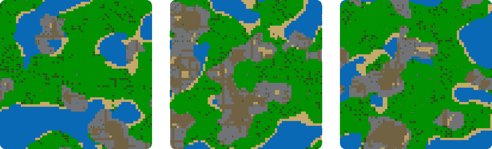

图 3：Crafter 的独特程序生成地图示例。

### B.1 Crafter 结果

我们提供了 Crafter 的 LLM 和 VLM 格式结果，详见表格 [7](https://arxiv.org/html/2411.13543v1#A2.T7 "表 7 ‣ B.1 Crafter 结果 ‣ 附录 B Crafter ‣ BALROG：基准测试代理型 LLM 和 VLM 在游戏中的推理") 和 [7](https://arxiv.org/html/2411.13543v1#A2.T7 "表 7 ‣ B.1 Crafter 结果 ‣ 附录 B Crafter ‣ BALROG：基准测试代理型 LLM 和 VLM 在游戏中的推理")，标准误差是通过 10 次种子计算得出的。GPT4o 在仅语言模式下表现领先，而 Gemini-1.5-Pro 在视觉语言模式下领先。令人惊讶的是，当加入图像时，Llama 3.2 90B 的表现大幅下降，甚至比其较小的 11B 模型还要差。

表 6：Crafter 上的 LLM 性能

| 模型 | 平均进展 (%) |
| --- | --- |
| gpt-4o | 33.10 $\pm$ 2.32 |
| claude-3.5-sonnet | 32.73 $\pm$ 3.20 |
| llama-3.2-90B-it | 31.69 $\pm$ 1.36 |
| llama-3.1-70B-it | 31.31 $\pm$ 2.68 |
| gemini-1.5-pro | 30.21 $\pm$ 2.86 |
| llama-3.2-11B-it | 26.20 $\pm$ 3.30 |
| llama-3.1-8B-it | 25.45 $\pm$ 3.23 |
| gemini-1.5-flash | 20.00 $\pm$ 0.74 |
| gpt-4o-mini | 12.72 $\pm$ 1.13 |
| llama-3.2-3B-it | 17.27 $\pm$ 2.79 |
| llama-3.2-1B-it | 12.73 $\pm$ 1.91 |

表 7：Crafter 上的 VLM 性能

| 模型 | 平均进展 (%) |
| --- | --- |
| claude-3.5-sonnet | 37.27 $\pm$ 3.14 |
| gemini-1.5-pro | 33.50 $\pm$ 2.07 |
| gpt-4o | 26.81 $\pm$ 3.74 |
| llama-3.2-11B-it | 23.63 $\pm$ 1.48 |
| gemini-1.5-flash | 20.70 $\pm$ 4.43 |
| gpt-4o-mini | 19.91 $\pm$ 3.13 |
| llama-3.2-90B-it | 10.00 $\pm$ 1.13 |

### B.2 观察

![[无标题图片]](img/12a485e2fd74ce8408c98dc1a024a5ef.png)<svg class="ltx_picture" height="900.6" id="A2.SS2.p1.2.2.p1.pic1" overflow="visible" version="1.1" width="600"><g fill="#000000" stroke="#000000" stroke-width="0.4pt" transform="translate(0,900.6) matrix(1 0 0 -1 0 0)"><g fill-opacity="1.0" transform="matrix(1.0 0.0 0.0 1.0 21.65 13.78)"><foreignobject color="#000000" height="873.04" overflow="visible" transform="matrix(1 0 0 -1 0 16.6)" width="556.69">你是一个扮演 Crafter 的代理人。以下是你在游戏中可以采取的唯一有效行动，并附有每个行动的简短描述：

无操作：什么都不做，

向西移动：在平坦的地面上向西移动，

向东移动：在平坦的地面上向东移动，

向北移动：在平坦的地面上向北移动，

向南移动：在平坦的地面上向南移动，

执行：多用途行动，用于收集材料、从湖中饮水和击打面前的生物，

睡觉：当能量低于最大值时，休息，

放置石头：在前方放置一块石头，

放置桌子：放置一个桌子，

放置熔炉：放置一个熔炉，

放置植物：放置一株植物，

制作木镐：使用附近的桌子和背包中的木材制作木镐，

制作石镐：使用附近的桌子、木材和石头制作石镐，

制作铁镐：使用附近的桌子和熔炉，背包中的木材、煤和铁制作铁镐，

制作木剑：使用附近的桌子和背包中的木材制作木剑，

制作石剑：使用附近的桌子、木材和石头制作石剑，

制作铁剑：使用附近的桌子和熔炉，背包中的木材、煤和铁制作铁剑。

以下是你可以获得的游戏成就：

1\. 收集木材

2\. 放置桌子

3\. 吃牛

4\. 收集样本

5\. 收集饮料

6\. 制作木镐

7\. 制作木剑

8\. 放置植物

9\. 击败僵尸

10\. 收集石头

11\. 放置石头

12\. 吃植物

13\. 击败骷髅

14\. 制作石制镐

15\. 制作石剑

16\. 醒来

17\. 放置熔炉

18\. 收集煤

19\. 收集铁

20\. 制作铁镐

21\. 制作铁剑

22\. 收集钻石

我将在接下来的时间里呈现游戏中的行动和观察历史。你的目标是通过完成所有成就，尽可能走得更远。

玩！</foreignobject></g></g></svg>![[无标题图片]](img/12a485e2fd74ce8408c98dc1a024a5ef.png)<svg class="ltx_picture" height="626.94" id="A2.SS2.p2.2.2.p1.pic1" overflow="visible" version="1.1" width="600"><g fill="#000000" stroke="#000000" stroke-width="0.4pt" transform="translate(0,626.94) matrix(1 0 0 -1 0 0)"><g fill-opacity="1.0" transform="matrix(1.0 0.0 0.0 1.0 21.65 13.78)"><foreignobject color="#000000" height="599.38" overflow="visible" transform="matrix(1 0 0 -1 0 16.6)" width="556.69">当前观察：

你的状态：

- 生命值：9/9

- 食物：9/9

- 饮料：9/9

- 能量：9/9</foreignobject></g></g></svg>

你的背包中没有任何物品。

你看到：

- 草地，距离你西方1步

- 树木，距离你西北方向3步

- 牛，距离你西方3步

你面前是草地。

提供了图像观察。![[无说明文字图像]](img/079efced2dfce98c0a6e8fd5c922b41e.png)</foreignobject></g></g></svg> <svg class="ltx_picture" height="37.01" id="A2.SS2.p3.1.1.p1.pic1" overflow="visible" version="1.1" width="600"><g fill="#000000" stroke="#000000" stroke-width="0.4pt" transform="translate(0,37.01) matrix(1 0 0 -1 0 0)"><g fill-opacity="1.0" transform="matrix(1.0 0.0 0.0 1.0 21.65 13.78)"><foreignobject color="#000000" height="9.46" overflow="visible" transform="matrix(1 0 0 -1 0 16.6)" width="556.69">向西移动</foreignobject></g></g></svg>![[无说明文字图像]](img/ce42dac352e3ad89661e438065e4eb6d.png)

## 附录C TextWorld

TextWorld [Côté et al., [2019](https://arxiv.org/html/2411.13543v1#bib.bib14)] 是微软研究院开发的一个基于文本的游戏环境，允许创建和定制互动小说游戏。在我们的实验中，我们使用了TextWorld领域中的三个特定游戏：“寻宝者”、“烹饪游戏”和“金币收集者”。通过改变房间数量、启用障碍物和添加干扰房间，可以生成不同难度级别的任务。我们使用了Lu等人[[2024](https://arxiv.org/html/2411.13543v1#bib.bib45)]提出的生成规则。

### C.1 《寻宝者》

在《寻宝者》游戏中，我们创建了一个具有挑战性的迷宫般环境，包含20个房间。游戏的难度设置为30级，新增了锁住的门和容器，玩家必须操作这些物品以找到目标物品。为了增加复杂性，我们移除了解决方案的描述，并筛除了可以在20步或更少步数内解决的任务。这个设置要求代理在复杂的空间中导航，与各种物体互动，并制定策略来克服障碍，寻找宝藏。

### C.2 《烹饪游戏》

《烹饪游戏》呈现了一个设置在13个房间中的烹饪挑战。我们通过加入最多5种食材并启用所有附加的挑战选项来最大化复杂性。玩家必须穿过门，使用刀具等工具处理食物，并通过烧烤、油炸和烘烤等多种方法烹饪食材。这个游戏测试代理在动态环境中规划和执行多步骤流程的能力，模拟了现实世界烹饪任务的复杂性。

### C.3 《金币收集者》

《金币收集者》拥有一个包含40个房间的大型环境，包括潜在的干扰房间以增加导航难度。与《寻宝者》类似，我们移除了解决方案的描述，以提高挑战性。代理从起点到目标的最佳路径设定为20步，要求高效的探索和决策能力。这个游戏测试代理在复杂的迷宫结构中导航、大空间探索、避免干扰并高效达到目标的能力。

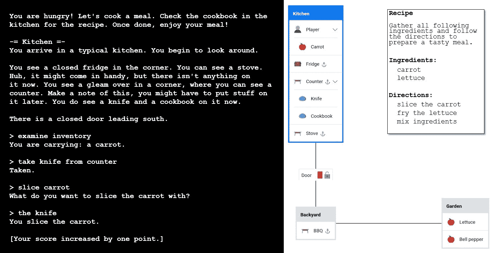

图4：TextWorld界面及可视化展示。

### C.4 TextWorld 结果

在表格 [8](https://arxiv.org/html/2411.13543v1#A3.T8 "Table 8 ‣ C.4 TextWorld Results ‣ Appendix C TextWorld ‣ BALROG: Benchmarking Agentic LLM and VLM Reasoning On Games") 中，我们提供了 TextWorld 的结果。标准误差是基于每个任务的 20 个种子计算的。GPT-4o 再次领先，获得了其最接近竞争对手 Llama 3.1 70B 两倍以上的平均进展。收集硬币的任务是最具挑战性的，GPT-4o 在 20 次尝试中仅成功解决了 1 次。Gemini 模型的 API 经常在 textworld 上失败，标记输入为“不安全”，尽管在 textworld 游戏中完全没有安全问题。这使得无法对 Gemini 模型进行完整的评估，因此我们将其标记为 0% 进展。

表 8: LLM 在 TextWorld 上的表现

| 模型 | 平均进展 (%) |
| --- | --- |
| claude-3.5-sonnet | 42.06 $\pm$ 5.41 |
| gpt-4o | 39.31 $\pm$ 5.24 |
| llama-3.1-70B-it | 15.00 $\pm$ 4.61 |
| gpt-4o-mini | 12.25 $\pm$ 3.55 |
| llama-3.2-90B-it | 11.18 $\pm$ 2.98 |
| llama-3.2-11B-it | 6.67 $\pm$ 2.17 |
| gemini-1.5-flash | 0.00 $\pm$ 0.00 |
| gemini-1.5-pro | 0.00 $\pm$ 0.00 |

### C.5 观察

![[未加说明的图片]](img/12a485e2fd74ce8408c98dc1a024a5ef.png)<svg class="ltx_picture" height="917.2" id="A3.SS5.p1.2.2.p1.pic1" overflow="visible" version="1.1" width="600"><g fill="#000000" stroke="#000000" stroke-width="0.4pt" transform="translate(0,917.2) matrix(1 0 0 -1 0 0)"><g fill-opacity="1.0" transform="matrix(1.0 0.0 0.0 1.0 21.65 13.78)"><foreignobject color="#000000" height="889.64" overflow="visible" transform="matrix(1 0 0 -1 0 16.6)" width="556.69">你是一个在 TextWorld 中玩耍的代理，TextWorld 是一款基于文本的冒险游戏，你可以在不同的房间中穿行，和物品互动，并解决难题。

你的目标是首先找到食谱，根据食谱找到并准备食物，最后准备并吃掉这顿饭。

以下是可用的命令：

查看: 描述当前房间

目标: 打印游戏目标

库存: 打印玩家的库存

go $\langle$dir$\rangle$: 将玩家移动到北、东、南或西的方向。你只能前往有出口或门的方向。

检查 …: 更仔细地检查某物

吃 …: 吃可以食用的食物

打开 …: 打开门或容器。你需要先打开封闭的门，才能通过。

丢弃 …: 把一个物品丢到地上

拿取 …: 拿取一个可见的物品

放 … 到 …: 将物品放到支撑物上

拿取 … 从 …: 从容器或支撑物上拿取物品

插入 … 到 …: 将物品放入容器中

锁 … 用 …: 用钥匙锁上门或容器

解锁 … 用 …: 用钥匙解锁门或容器

烹饪 … 用 …: 用提供热量的物品烹饪可烹饪的食物

切片 … 用 …: 用尖锐物品切片可切的食物

切 … 用 …: 用尖锐物品切割可切的食物

切丁 … 用 …: 用尖锐物品切割可切的食物

准备餐点：将背包中的食材组合成一顿饭。

你只能在厨房准备餐点。

- 当食谱可见时，你可以查看食谱书。

- 烤架用于烤制食物，炉子用于煎炸食物，烤箱用于烘烤食物。将食材用错方法烹饪会导致游戏失败。

- 一旦你准备好了加工过的食材和适当的烹饪工具，按照食谱烹饪所有食材。

- 有两个条件才能正确地烹饪某样东西（烧烤/煎炸/烘烤）：

a) 你要烹饪的食材在你的背包里，并且

b) 房间里有合适的烹饪工具，然后使用“烹饪……用……”命令。

- 当你需要切/片/切丁食材时，你需要从你的背包中取出刀和食材，然后使用“用刀切/切片/切丁……”命令。

- 在尝试烹饪之前，确保先处理食物（切/片/切丁）。

- 当你拥有所有食材（根据菜单已经加工或烹饪过的），你可以在厨房里“准备餐点”，然后“吃餐点”来赢得游戏。

- 食材的颜色必须与食谱中指定的完全匹配，但如果食谱没有指定颜色，任何颜色都可以。当你使用“拿取……与……”命令时，必须使用你看到的确切名称。

- 当它说类似“上面什么都没有”/“上面什么都没有”时，你不需要检查容器/支撑物（例如工具箱）。

你有 80 步骤来完成任务。重启是禁止的。

PLAY!</foreignobject></g></g></svg>![[未标注的图片]](img/12a485e2fd74ce8408c98dc1a024a5ef.png)<svg class="ltx_picture" height="124.42" id="A3.SS5.p2.2.2.p1.pic1" overflow="visible" version="1.1" width="600"><g fill="#000000" stroke="#000000" stroke-width="0.4pt" transform="translate(0,124.42) matrix(1 0 0 -1 0 0)"><g fill-opacity="1.0" transform="matrix(1.0 0.0 0.0 1.0 21.65 13.78)"><foreignobject color="#000000" height="96.86" overflow="visible" transform="matrix(1 0 0 -1 0 16.6)" width="556.69">-= 街道 =-

你发现自己在街道上。一个普通的地方。

有一扇关闭的滑动门通往北方，南方有一个出口。

-= 街道 =-0/1</foreignobject></g></g></svg><svg class="ltx_picture" height="39.86" id="A3.SS5.p3.1.1.p1.pic1" overflow="visible" version="1.1" width="600"><g fill="#000000" stroke="#000000" stroke-width="0.4pt" transform="translate(0,39.86) matrix(1 0 0 -1 0 0)"><g fill-opacity="1.0" transform="matrix(1.0 0.0 0.0 1.0 21.65 13.78)"><foreignobject color="#000000" height="12.3" overflow="visible" transform="matrix(1 0 0 -1 0 16.6)" width="556.69">打开滑动门</foreignobject></g></g></svg>![[未标注的图片]](img/ce42dac352e3ad89661e438065e4eb6d.png)

## 附录 D Baba 是 AI

Baba Is AI是一个基准环境，基于拼图游戏《Baba Is You》。在这个网格世界游戏中，玩家与各种物体和文本规则块进行交互，以实现特定目标。Baba Is AI的独特之处在于，玩家可以操控和重新排列游戏规则，创建一个动态环境，其中智能体必须识别相关物体和规则，然后操控它们以改变或创建新规则来取得成功。这个基准使研究人员能够探索比现有基准更广泛的泛化概念，因为它不仅要求智能体学习并遵循规则，还要求智能体将以前见过的规则以新颖的方式结合起来。智能体在40个不同的谜题关卡上进行测试。

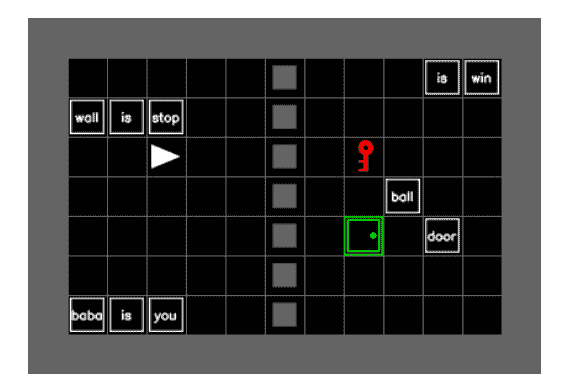

图 5：Baba Is AI的一个谜题，其中智能体必须打破“墙是障碍”规则，创建新规则“门是胜利”，并前往绿色门解决任务。

### D.1 Baba Is AI 语言包装器

为了与语言模型进行交互，我们为Baba Is AI制作了自定义的语言包装器。它通过活动规则构建语言观察，并通过格式化对象相对于玩家的位置来创建描述。我们未提供智能体的解决方案，也没有在仅文本实验中指定网格边界。

### D.2 Baba Is AI 结果

我们提供了LLM和VLM模式下Baba Is AI的结果，见表格[10](https://arxiv.org/html/2411.13543v1#A4.T10 "Table 10 ‣ D.2 Baba Is AI Results ‣ Appendix D Baba Is AI ‣ BALROG: Benchmarking Agentic LLM and VLM Reasoning On Games")和[10](https://arxiv.org/html/2411.13543v1#A4.T10 "Table 10 ‣ D.2 Baba Is AI Results ‣ Appendix D Baba Is AI ‣ BALROG: Benchmarking Agentic LLM and VLM Reasoning On Games")。标准误差是通过每个40个Baba Is AI任务的5次种子计算得出的。令人惊讶的是，Llama模型领先，其中Llama 3.2 90B在仅语言模式下超过GPT-4o，领先幅度为10%。一旦加入视觉，模型的表现便下降，只有Gemini-1.5-Pro保持稳定。

表格 9：BabaIsAI上的LLM表现

| 模型 | 平均进展（%） |
| --- | --- |
| llama-3.2-90B-it | 43.90 $\pm$ 3.47 |
| llama-3.1-70B-it | 40.00 $\pm$ 3.42 |
| claude-3.5-sonnet | 37.50 $\pm$ 4.42 |
| gpt-4o | 33.66 $\pm$ 3.30 |
| gemini-1.5-pro | 32.02 $\pm$ 3.26 |
| llama-3.1-8B-it | 18.33 $\pm$ 3.53 |
| llama-3.2-3B-it | 17.50 $\pm$ 3.47 |
| gpt-4o-mini | 15.60 $\pm$ 2.53 |
| llama-3.2-11B-it | 15.60 $\pm$ 2.50 |
| gemini-1.5-flash | 12.80 $\pm$ 2.33 |
| llama-3.2-1B-it | 10.83 $\pm$ 2.84 |

表格 10：BabaIsAI上的VLM表现

| 模型 | 平均进展（%） |
| --- | --- |
| claude-3.5-sonnet | 34.45 $\pm$ 4.36 |
| gemini-1.5-pro | 31.40 $\pm$ 3.24 |
| llama-3.2-90B-it | 21.90 $\pm$ 2.89 |
| gpt-4o | 18.62 $\pm$ 2.72 |
| gpt-4o-mini | 16.41 $\pm$ 2.59 |
| gemini-1.5-flash | 8.30 $\pm$ 1.93 |
| llama-3.2-11B-it | 5.76 $\pm$ 1.63 |

### D.3 观察结果

![[未标注图片]](img/12a485e2fd74ce8408c98dc1a024a5ef.png)<svg class="ltx_picture" height="435.67" id="A4.SS3.p1.2.2.p1.pic1" overflow="visible" version="1.1" width="600"><g fill="#000000" stroke="#000000" stroke-width="0.4pt" transform="translate(0,435.67) matrix(1 0 0 -1 0 0)"><g fill-opacity="1.0" transform="matrix(1.0 0.0 0.0 1.0 21.65 13.78)"><foreignobject color="#000000" height="408.11" overflow="visible" transform="matrix(1 0 0 -1 0 16.6)" width="556.69">《Baba Is You》是一款解谜游戏，在游戏中你可以操控每一关的规则。以下是你在游戏中可以进行的操作，并附有简短的描述：

空闲：等待一步，

向上：向上走一步，

向右：向右走一步，

向下：向下走一步，

向左：向左走一步。

提示：

- 仔细观察关卡，注意所有的物体和文本块。

- 确定当前的规则，这些规则由格式为“[主语] IS [属性]”的文本块构成（例如“BABA IS YOU”）。

- 考虑通过移动文本块来改变或创造新的规则。

- 记住，你只能移动那些没有定义为“STOP”或类似不可移动属性的物体或文本。

- 你的目标通常是到达一个定义为“WIN”的物体，但这一点可以改变。

- 创造性地思考如何通过改变规则来改变物体的属性和行为，从而产生意想不到的效果。

- 如果卡住了，尝试拆分现有规则或创建全新的规则。

- 有时解决方案涉及将自己变成另一个物体或改变获胜条件的定义。

PLAY!</foreignobject></g></g></svg>![[未标注图片]](img/12a485e2fd74ce8408c98dc1a024a5ef.png)<svg class="ltx_picture" height="626.94" id="A4.SS3.p2.2.2.p1.pic1" overflow="visible" version="1.1" width="600"><g fill="#000000" stroke="#000000" stroke-width="0.4pt" transform="translate(0,626.94) matrix(1 0 0 -1 0 0)"><g fill-opacity="1.0" transform="matrix(1.0 0.0 0.0 1.0 21.65 13.78)"><foreignobject color="#000000" height="599.38" overflow="visible" transform="matrix(1 0 0 -1 0 16.6)" width="556.69">当前观察：

当前规则：

baba 就是你

地图上的物体：

规则‘is’ 1步向左，1步向上

规则‘win’ 1步向上

规则‘key’ 1步向左

钥匙 1步向右，2步向下

球2步向右，3步向下

规则‘baba’ 2步向左，4步向下

规则‘is’ 1步向左，4步向下

规则‘you’ 4步向下

规则‘ball’ 2步向右，4步向下

提供了图像观察。 ![[未标注的图片]](img/db4bf0e123ddd44aea5f281e2b8185e5.png)</foreignobject></g></g></svg> <svg class="ltx_picture" height="37.17" id="A4.SS3.p3.1.1.p1.pic1" overflow="visible" version="1.1" width="600"><g fill="#000000" stroke="#000000" stroke-width="0.4pt" transform="translate(0,37.17) matrix(1 0 0 -1 0 0)"><g fill-opacity="1.0" transform="matrix(1.0 0.0 0.0 1.0 21.65 13.78)"><foreignobject color="#000000" height="9.61" overflow="visible" transform="matrix(1 0 0 -1 0 16.6)" width="556.69">left</foreignobject></g></g></svg>![[未标注的图片]](img/ce42dac352e3ad89661e438065e4eb6d.png)

## 附录E MiniHack

MiniHack [Samvelyan 等人，[2021](https://arxiv.org/html/2411.13543v1#bib.bib63)] 是一个强大的沙盒框架，构建在NLE [Küttler 等人，[2020](https://arxiv.org/html/2411.13543v1#bib.bib36)] 之上，使研究人员能够轻松设计丰富多样的强化学习环境。它提供了一个灵活的平台，用于创建从简单的网格世界导航到复杂的程序生成世界和复杂游戏机制的定制强化学习任务。该框架允许用户使用易于阅读的描述语言或简单的Python接口定义环境，提供对环境元素（如地形、物体、怪物和陷阱）的精细控制。MiniHack 提供了多种任务，可以大致分为三大类：导航任务、技能获取任务和移植任务。为了与语言模型进行交互，我们使用了NetHack语言包装器，详细描述见NetHack附录[F](https://arxiv.org/html/2411.13543v1#A6 "附录F NetHack学习环境 ‣ BALROG：在游戏中基准测试代理LLM和VLM推理")。

在MiniHack导航任务中，我们选择了9x9迷宫、15x15迷宫、走廊和走廊战斗任务，这些任务挑战代理通过克服途中各种困难（如在走廊中与怪物作战，穿越复杂或程序生成的迷宫）到达目标位置。这些任务具有相对较小的动作空间，即朝8个方向移动，并根据环境，包含搜索、踢、开门和吃东西等动作。

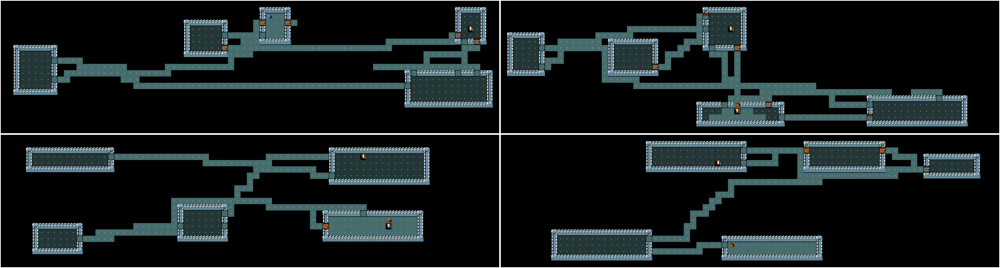

图 6：MiniHack Corridor任务示例。

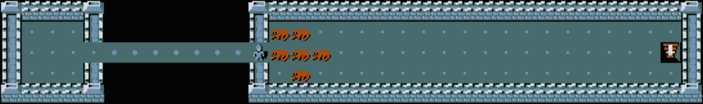

图 7：MiniHack CorridorBattle任务示例。

在MiniHack技能获取任务中，我们选择了任务（包括三个不同的难度级别：简单、中等和困难），该任务挑战代理使用环境中找到的物体穿越熔岩河（这些物体可以提供漂浮或冻结能力）、击败怪物、穿越房间或迷宫，并在任务结束时使用死亡魔杖击败守卫目标位置的强大怪物。

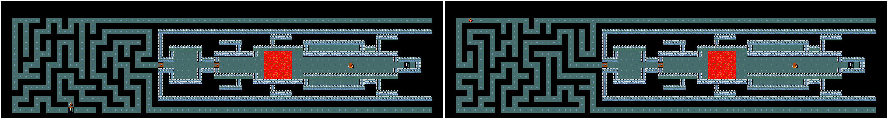

图 8：MiniHack Quest困难任务示例。

我们还在MiniHack Boxoban上对代理进行了测试。这个环境系列是经典的推箱子（Sokoban）游戏的改编版，并且是在MiniHack框架内构建的，利用了NetHack游戏机制。在MiniHack Boxoban中的主要目标是将四个巨石（MiniHack中的箱子）推到四个指定的目标位置，这些目标位置由喷泉表示。这个任务需要战略思维和规划，因为代理必须小心地操控巨石，避免将它们卡在角落或墙壁上。

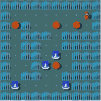

图 9：MiniHack Boxoban Hard 任务示例。

我们在表格[12](https://arxiv.org/html/2411.13543v1#A5.T12 "表 12 ‣ 附录 E MiniHack ‣ BALROG：基准测试代理型LLM和VLM在游戏中的推理")和[12](https://arxiv.org/html/2411.13543v1#A5.T12 "表 12 ‣ 附录 E MiniHack ‣ BALROG：基准测试代理型LLM和VLM在游戏中的推理")中提供了LLM和VLM模式的MiniHack结果，标准误差是使用每个任务的5个种子计算的。这里，GPT-4o和Gemini-1.5-Pro在语言模式和视觉语言模式下表现相等，这两个模型仅完成了一些走廊和走廊战斗任务。其他模型没有解决任何任务。

表 11：MiniHack上LLM性能

| 模型 | 平均进展 (%) |
| --- | --- |
| claude-3.5-sonnet | 15.00 $\pm$ 5.65 |
| gpt-4o | 10.00 $\pm$ 4.74 |
| gpt-4o-mini | 10.00 $\pm$ 4.74 |
| llama-3.1-70B-it | 7.50 $\pm$ 4.16 |
| gemini-1.5-pro | 5.00 $\pm$ 3.45 |
| llama-3.1-8B-it | 5.00 $\pm$ 3.45 |
| gemini-1.5-flash | 5.00 $\pm$ 3.45 |
| llama-3.2-1B-it | 5.00 $\pm$ 3.45 |
| llama-3.2-11B-it | 2.50 $\pm$ 2.47 |
| llama-3.2-3B-it | 2.50 $\pm$ 2.47 |

表 12：MiniHack上VLM性能

| 模型 | 平均进展 (%) |
| --- | --- |
| claude-3.5-sonnet | 22.50 $\pm$ 6.60 |
| gpt-4o | 5.00 $\pm$ 3.44 |
| gemini-1.5-pro | 5.00 $\pm$ 3.44 |
| llama-3.2-90B-it | 2.50 $\pm$ 2.47 |
| gpt-4o-mini | 2.50 $\pm$ 2.47 |
| gemini-1.5-flash | 2.50 $\pm$ 2.47 |
| llama-3.2-11B-it | 2.50 $\pm$ 2.47 |

### E.1 观察结果

![[未标注图像]](img/12a485e2fd74ce8408c98dc1a024a5ef.png)<svg class="ltx_picture" height="701.34" id="A5.SS1.p1.2.2.p1.pic1" overflow="visible" version="1.1" width="600"><g fill="#000000" stroke="#000000" stroke-width="0.4pt" transform="translate(0,701.34) matrix(1 0 0 -1 0 0)"><g fill-opacity="1.0" transform="matrix(1.0 0.0 0.0 1.0 21.65 13.78)"><foreignobject color="#000000" height="673.79" overflow="visible" transform="matrix(1 0 0 -1 0 16.6)" width="556.69">你是一个在MiniHack中扮演的代理。以下是你可以在游戏中采取的可能操作，每个操作后跟随简短的描述：

north: 向北移动，

east: 向东移动，

south: 向南移动，

west: 向西移动，

northeast: 向东北移动，

southeast: 向东南移动，

southwest: 向西南移动，

northwest: 向西北移动，

far north: 向远北移动，

far east: 向远东移动，

far south: 向远南移动，

far west: 向远西移动，

far northeast: 向远东北移动，

far southeast: 向远东南移动，

far southwest: 向远西南移动，

far northwest: 向远西北移动，

down: 下楼梯，

wait: 静止不动，等待一次行动，

more: 显示更多消息，

apply: 使用（应用）工具，

close: 关闭一个相邻的门，

eat: 吃点东西，

force: 强制打开一个锁，

kick: 踢敌人或踢开一扇锁住的门或箱子，

loot: 拾取地上的箱子，

open: 打开一个相邻的门，

pickup: 拾取当前地点的物品，

pray: 向神祈求帮助，

puton: 穿戴一个配饰，

quaff: 喝下某物，

search: 寻找隐藏的门和通道，

zap: 发射魔杖。

In a moment I will present a history of actions and observations from the game: 一会儿我将展示来自游戏的动作和观察历史。

Your goal is to explore the level, fight monsters, and navigate rooms and mazes to ultimately reach the stairs down: 你的目标是探索该层，击败怪物，并穿越房间和迷宫，最终到达通往下一层的楼梯。

PLAY!</foreignobject></g></g></svg>![[无标题图像]](img/12a485e2fd74ce8408c98dc1a024a5ef.png)<svg class="ltx_picture" height="836.87" id="A5.SS1.p2.2.2.p1.pic1" overflow="visible" version="1.1" width="600"><g fill="#000000" stroke="#000000" stroke-width="0.4pt" transform="translate(0,836.87) matrix(1 0 0 -1 0 0)"><g fill-opacity="1.0" transform="matrix(1.0 0.0 0.0 1.0 21.65 13.78)"><foreignobject color="#000000" height="809.31" overflow="visible" transform="matrix(1 0 0 -1 0 16.6)" width="556.69">当前观察：

statistics: 统计数据：

Strength: 18/18: 力量：18/18

Dexterity: 15

Constitution: 18

Intelligence: 8

Wisdom: 10: 智慧：10

Charisma: 8: 魅力：8

Depth: 1: 深度：1

Gold: 0: 黄金：0

HP: 15/15: 生命值：15/15

Energy: 2/2

AC: 4

XP: 1/0: 经验：1/0

Time: 1: 时间：1

Position: 27—9: 位置：27—9

Hunger: 不饿

Monster Level: 0: 怪物等级：0

Encumbrance: Unencumbered: 负重：无负担

Dungeon Number: 0

Level Number: 1

Score: 0: 得分：0

Alignment: 法律阵营

Condition: 无

inventory: 背包：

a: 一把+0的武士刀（手持武器）

b: 一把+0的太刀（备用武器；未装备）

c: 一把+0的弓

d: 42 +0的弓箭（在箭袋中）

e: 一件无诅咒的防锈+0护甲（正在穿戴）

message: 消息：

language observation: 语言观察：

lava near eastnortheast, east, and southeast: 靠近东北、东面和东南的岩浆

area of lava near eastsoutheast: 靠近东南的岩浆区域

horizontal wall near southeast and south: 靠近东南和南方的水平墙

vertical wall near southwest and west: 靠近西南和西方的垂直墙

horizontal wall very near north, northeast, and northwest: 靠近北方、东北和西北的水平墙

goblin adjacent south: 南方相邻的地精

horn adjacent west: 西方相邻的号角

newt adjacent northwest: 西北相邻的新ts

cursor: 光标：

Yourself a samurai: 你是一个武士

Image observation provided. ![[无标题图像]](img/bc261b8b0e55a0137f875979b0ba9007.png)</foreignobject></g></g></svg> <svg class="ltx_picture" height="37.17" id="A5.SS1.p3.1.1.p1.pic1" overflow="visible" version="1.1" width="600"><g fill="#000000" stroke="#000000" stroke-width="0.4pt" transform="translate(0,37.17) matrix(1 0 0 -1 0 0)"><g fill-opacity="1.0" transform="matrix(1.0 0.0 0.0 1.0 21.65 13.78)"><foreignobject color="#000000" height="9.61" overflow="visible" transform="matrix(1 0 0 -1 0 16.6)" width="556.69">南方</foreignobject></g></g></svg>![[无标题图像]](img/ce42dac352e3ad89661e438065e4eb6d.png)

## Appendix F NetHack Learning Environment: 附录 F NetHack 学习环境

NetHack 学习环境 (NLE) [Küttler 等，[2020](https://arxiv.org/html/2411.13543v1#bib.bib36)] 是一个可扩展的、程序生成的、随机的、丰富且具有挑战性的环境，旨在推动长期的强化学习 (RL) 研究，解决诸如探索、规划、技能获取和基于语言的 RL 等问题。NLE 基于经典且高度复杂的终端 roguelike 游戏 NetHack，提供了一个复杂且动态的环境，在这个环境中，代理需要穿越程序生成的地下城，与数百种实体类型互动，并学习克服各种挑战。

玩家目标是通过程序生成的地下城层级，消灭怪物、解开谜题、收集更好的装备，以便获取 Yendor 的护符并最终重返地面以赢得游戏。NetHack 被认为是极具挑战性的，即便是对人类玩家来说也是如此。即使借助像 NetHack Wiki 这样的在线资源，掌握这款游戏也可能需要数年时间。在 NetHack 中取得成功需要长期的战略规划，因为赢得一局游戏可能涉及数十万步操作，同时也需要短期战术来对抗大量怪物。准确的归因分配对于理解哪些动作促成了成功或失败也至关重要。NetHack 已经被广泛用作强化学习代理的测试平台 [Wołczyk 等，[2024](https://arxiv.org/html/2411.13543v1#bib.bib83)，Piterbarg 等，[2024](https://arxiv.org/html/2411.13543v1#bib.bib55)，Hambro 等，[2022b](https://arxiv.org/html/2411.13543v1#bib.bib24)]；tabula-rasa 强化学习代理尤其面临挑战，因为该游戏奖励稀疏、信用分配复杂、时间跨度极长，且具有高度的随机性。目前最先进的代理仍然是手工编写的符号化策略 [Hambro 等，[2022a](https://arxiv.org/html/2411.13543v1#bib.bib23)]。

### F.1 NetHack 语言封装器

NetHack 语言封装器 [Goodger 等，[2023](https://arxiv.org/html/2411.13543v1#bib.bib19)] 是一个设计用来与 NLE 和 MiniHack 接口的工具，它通过将非语言观察转化为基于文本的表示来工作。这个封装器将各种 NLE 观察（如 `glyphs`、`blstats`、`tty_chars`、`inv_letters`、`inv_strs` 和 `tty_cursor`）转换为可读的文本等价物。例如，它将游戏环境的视觉显示转化为文本描述，包括关于周围环境、物品栏和玩家统计的细节。该封装器还支持基于文本的操作，允许用户使用命令（如 `wait`、`apply` 和 `north`）与环境互动，这些命令随后会转换为 NLE 所需的离散动作。这一功能使得与 NetHack 环境的互动更加简便，尤其是对语言模型而言。

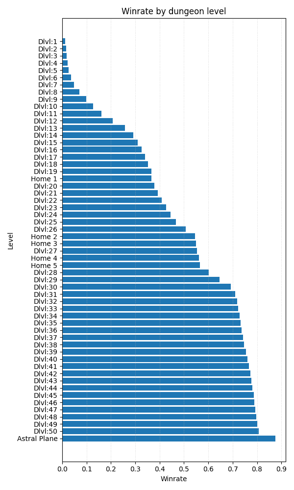

(a) NetHack 按地下城层级推进

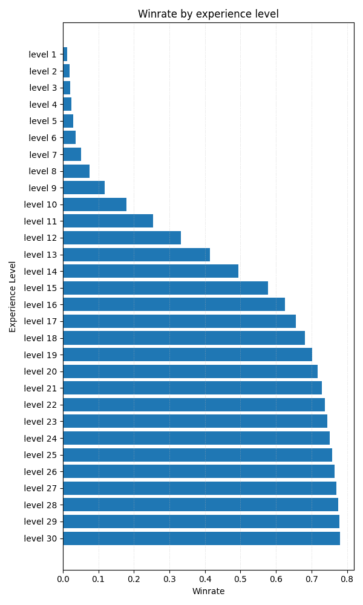

(b) NetHack 按经验等级的进展

图 10：

### F.2 新的 NetHack 进展系统

NetHack 具有一个游戏内评分系统，奖励玩家进行如击杀怪物、识别物品、吃食物、收集金币和物品等动作，并最终在游戏中升天。然而，我们认为这个评分系统并未有效地捕捉到真正的游戏进展，因为玩家可以通过几百万到几百万分的成绩赢得游戏。为了弥补这一局限性，我们开发了一种新的、基于数据的进展度量方法，使用了人类玩家玩过的 NetHack 游戏数据集[Hambro et al., [2022b](https://arxiv.org/html/2411.13543v1#bib.bib24)]。具体来说，我们记录了每个游戏中达成的地下城层级和经验等级，以及游戏是否导致升天。利用这些统计数据，我们构建了一个以数据为中心的进展系统，其中每个数据点表示在达到特定地下城层级或经验等级后，玩家赢得游戏的概率。最终的进展曲线呈现在图 [10](https://arxiv.org/html/2411.13543v1#A6.F10 "图 10 ‣ F.1 NetHack 语言封装 ‣ 附录 F NetHack 学习环境 ‣ BALROG: 基准测试代理型 LLM 和 VLM 在游戏中的推理") 中。为实际用途，我们将地下城层级 1（Dlvl:1）和经验等级 1 定义为表示 0% 进展，作为游戏的起点，而升天则表示 100% 进展。因此，代理的整体进展由地下城层级和经验等级之间达到的最高进展度决定。

### F.3 NetHack 结果

我们提供了 LLM 和 VLM 模式在 NetHack 上的结果，见表 LABEL:LLM_NLE 和 LABEL:VLM_NLE。标准误差是通过 5 次实验计算的。o1-preview 在所有测试模型中达到了最高进展。然而，它仍然距离在游戏中取得显著进展相差甚远。最佳的单次运行是由 Gemini-1.5-Pro 视觉语言模式实现的，达到了地下城层级 3 和经验等级 4。

表 13：仅语言性能在 NLE 上的表现

| 模型 | 平均进展（%） |
| --- | --- |
| o1-preview | 1.57 $\pm$ 0.40 |
| claude-3.5-sonnet | 0.58 $\pm$ 0.52 |
| gpt-4o | 0.37 $\pm$ 0.37 |
| o1-mini | 0.36 $\pm$ 0.24 |
| llama-3.1-70B-it | 0.35 $\pm$ 0.35 |
| llama-3.1-8B-it | 0 $\pm$ 0 |
| gemini-1.5-pro | 0.31 $\pm$ 0.31 |
| gpt-4o-mini | 0 $\pm$ 0 |
| gemini-1.5-flash | 0 $\pm$ 0 |
| llama-3.2-90B-it | 0 $\pm$ 0 |
| llama-3.2-11B-it | 0 $\pm$ 0 |
| llama-3.2-3B-it | 0 $\pm$ 0 |
| llama-3.2-1B-it | 0 $\pm$ 0 |

表 14：Vision-Language 模式在 NLE 上的表现

| 模型 | 平均进展（%） |
| --- | --- |
| claude-3.5-sonnet | 1.16 $\pm$ 0.42 |
| gemini-1.5-pro | 0.48 $\pm$ 0.48 |
| gpt-4o | 0.37 $\pm$ 0.37 |
| gpt-4o-mini | 0 $\pm$ 0 |
| gemini-1.5-flash | 0 $\pm$ 0 |
| llama-3.2-11B-it | 0 $\pm$ 0 |
| gemini-1.5-flash | 0 $\pm$ 0 |
| llama-3.2-90B-it | 0 $\pm$ 0 |
| llama-3.2-11B-it | 0 $\pm$ 0 |

### F.4 观察结果

尽管有一个描述其观察的语言包装器[Goodger 等，[2023](https://arxiv.org/html/2411.13543v1#bib.bib19)]，NetHack 并不是仅凭语言来玩的，因此我们在语言模式下提供了 ASCII 地图，在视觉语言模式下提供了 RGB 瓷砖地图。在 LLM 上下文中，我们只保留重要的长期信息，即游戏消息和语言观察。代理的统计数据和物品栏只在当前步骤中需要，因此我们不会将它们保留在上下文中。这也是为了防止 NetHack 的上下文长度失控。

![[Uncaptioned image]](img/12a485e2fd74ce8408c98dc1a024a5ef.png)<svg class="ltx_picture" height="1398.73" id="A6.SS4.p2.2.2.p1.pic1" overflow="visible" version="1.1" width="600"><g fill="#000000" stroke="#000000" stroke-width="0.4pt" transform="translate(0,1398.73) matrix(1 0 0 -1 0 0)"><g fill-opacity="1.0" transform="matrix(1.0 0.0 0.0 1.0 21.65 13.78)"><foreignobject color="#000000" height="1371.17" overflow="visible" transform="matrix(1 0 0 -1 0 16.6)" width="556.69">你是一个正在玩 NetHack 的代理。

以下是你在游戏中可以执行的可能动作，每个动作后面跟着简短的描述：

north: 向北移动，

east: 向东移动，

south: 向南移动，

west: 向西移动，

northeast: 向东北移动，

southeast: 向东南移动，

southwest: 向西南移动，

northwest: 向西北移动，

far north: 向远北移动，

far east: 向远东移动，

far south: 向远南移动，

far west: 向远西移动，

far northeast: 向远东北移动，

far southeast: 向远东南移动，

far southwest: 向远西南移动，

far northwest: 向远西北移动，

up: 向上走楼梯，

down: 下楼梯（提示：只有站在楼梯上时才能下楼），

wait: 什么也不做，休息一回合，

more: 显示更多消息（提示：只有当当前消息以“–More–”结尾时才使用），

annotate: 留下关于当前层级的注释，

apply: 使用工具，

call: 给怪物或物品命名，或添加注释，

cast: 施放魔法，

close: 关闭邻近的门，

open: 打开邻近的门，

dip: 将物品浸入某物中，

drop: 丢弃物品，

droptype: 丢弃特定物品类型（在下一个提示中指定），

eat: 吃某物（提示：饿了就补充食物），

esc: 退出菜单或消息，

engrave: 在地面上刻字（提示：Elbereth），

enhance: 提升或检查武器技能，

fire: 从箭袋中发射弹药，

fight: 与怪物战斗（即使你只是猜测有怪物在那），

force: 强行开启锁，

[…] 

read: 阅读卷轴或魔法书，

remove: 移除饰品，

rub: 摩擦灯或石头，

search: 搜索隐藏的门和通道，

swap: 交换主武器和副武器。

takeoff: 脱下一件护甲，

takeoffall: 脱下所有护甲，

teleport: 传送到另一个层级（如果你有这个能力），

throw: 投掷物品（例如匕首或飞镖），

旅行: 前往地图上的指定位置（提示：在下一个动作中，指定$\langle$或$\rangle$代表楼梯，$\{$代表喷泉，_代表祭坛），

双武器: 切换双武器战斗，

解陷阱: 解开某个陷阱，

穿戴: 穿上一件护甲，

握持: 握住武器，

擦拭: 擦去脸上的东西，

电击: 发射魔杖，

提示：

- 当消息要求完成时，比如：“你想吃什么？[d 或 ?*]”，你应当回应一个字符，表示你想吃/使用的物品。

- 例如，“你想吃什么？[dgh 或 ?*]” - 可能的答案是“d”、“g”或“h”来吃相应的食物。

- 当消息要求方向时，比如：“在哪个方向？”你应当回答一个方向。

- 当消息末尾有–更多–时，你的下一个动作应该是“更多”以查看其余的消息。

- 探索环境，寻找通往下一层的楼梯。

- 始终仔细阅读最后一条消息，以理解当前的游戏状态，并据此决定你的下一步行动。

- 如果你一直向同一个方向移动，最终会碰到墙壁并停下来。你的消息可能是：“它是坚硬的石头”或“它是墙壁”。改变你的行动，朝另一个方向移动，继续探索环境。

- 仔细阅读语言观察，并查看提供的ASCII地图或图像观察，以决定接下来的行动和移动方向。

- 你可以通过撞击怪物来攻击它们。

稍后我将展示一段游戏中的操作历史和观察记录。

你的目标是尽可能走得更远。

PLAY!</foreignobject></g></g></svg>![[未标注的图像]](img/12a485e2fd74ce8408c98dc1a024a5ef.png)<svg class="ltx_picture" height="953.1" id="A6.SS4.p3.2.2.p1.pic1" overflow="visible" version="1.1" width="600"><g fill="#000000" stroke="#000000" stroke-width="0.4pt" transform="translate(0,953.1) matrix(1 0 0 -1 0 0)"><g fill-opacity="1.0" transform="matrix(1.0 0.0 0.0 1.0 21.65 13.78)"><foreignobject color="#000000" height="925.54" overflow="visible" transform="matrix(1 0 0 -1 0 16.6)" width="556.69">当前观察：

统计：

力量: 14/14

敏捷: 9

体质: 11

智力: 8

智慧: 15

魅力: 18

深度: 1

黄金: 0

HP: 16/16

能量: 6/6

AC: 3

XP: 1/0

时间: 1

位置: 54—14

饥饿: 不饿

怪物等级: 0

背负物: 无负担

地牢编号: 0

等级编号: 1

分数: 0

道德: 正义

状况: 无

背包：

a: 一把+1长剑（手中武器）

b: 一把+1长枪（备用武器；未装备）

c: 一件未诅咒的+1锁子甲（正在穿戴）

d: 一顶未诅咒的+0头盔（正在佩戴）

e: 一块未诅咒的+0小盾牌（正在佩戴）

f: 一副未诅咒的+0皮手套（正在佩戴）

g: 11 个未诅咒的苹果

h: 10 个未诅咒的胡萝卜

消息：

代理人，你好，欢迎来到 NetHack！你是一个正义的女性人类骑士。

语言观察：

远东的垂直封闭门

远东的黑暗区域

标签为“THARR”的卷轴位于东南方向

东南和南方的水平墙

黑暗区域接近西方

垂直墙壁非常接近西南方向

垂直开门非常接近西方

水平墙壁邻接北方、东北方和西北方

驯服小马位于东南方向附近

光标：

你是一个骑士

已提供图像观察。 ![[未标注的图像]](img/b2c4a3414fbd70b9070dbdfd72a63177.png)</foreignobject></g></g></svg> <svg class="ltx_picture" height="36.07" id="A6.SS4.p4.1.1.p1.pic1" overflow="visible" version="1.1" width="600"><g fill="#000000" stroke="#000000" stroke-width="0.4pt" transform="translate(0,36.07) matrix(1 0 0 -1 0 0)"><g fill-opacity="1.0" transform="matrix(1.0 0.0 0.0 1.0 21.65 13.78)"><foreignobject color="#000000" height="8.51" overflow="visible" transform="matrix(1 0 0 -1 0 16.6)" width="556.69">西</foreignobject></g></g></svg>![[未标注的图像]](img/ce42dac352e3ad89661e438065e4eb6d.png)

### F.5 LLM具备广泛的《NetHack》知识

代理需要广泛的知识才能有效地玩《NetHack》。熟练的玩家利用通过数小时游戏积累的对游戏的理解，而新玩家通常依赖于在线的书面资源，如《NetHack Wiki》。我们使用问卷来测试LLM是否具备部分这些知识，并评估代理是否能够应用这些知识。问题如下：

1.  1.

    在《NetHack》中，吃腐烂食物会有什么后果吗？（答案：可能导致失明、幻觉甚至立即死亡。）

1.  2.

    在《NetHack》中，吃太多食物会有什么后果吗？（答案：玩家角色可能会因食物卡住而窒息死亡。）

1.  3.

    当你在《NetHack》的第一层上升到楼梯时会发生什么？（答案：它会导致游戏立即结束。）

1.  4.

    在《NetHack》中使用隐形魔杖对怪物进行攻击是一个好主意吗？（答案：不是，因为这样会更难与它们作战。）

1.  5.

    在《NetHack》中，向愤怒的神祈祷是一个好主意吗？（答案：不是，神会惩罚玩家。）

这些问题测试了对游戏机制的基本理解，特别是集中在新玩家可能错误尝试并应避免的行为。

我们在下面的表格中总结了每个LLM的回答。对于每个问题，我们评估回答是否准确，结论是否正确（即LLM是否意识到应避免这种行为），以及代理是否成功避免了这些错误。

| LLM |  | Q1 | Q2 | Q3 | Q4 | Q5 |
| --- | --- | --- | --- | --- | --- | --- |
| GPT 4o | 正确 | ✔ | ✔ |  $\sim$  | ✔ | ✔ |
| 结论 | ✔ | ✔ | ✔ | ✔ | ✔ |
| 行为 | ✗ | ✔ | ✗ | 不适用 | ✔ |
| GPT 4o-mini | 正确 |  $\sim$  | ✗ | ✔ | ✗ | ✔ |
| 结论 | ✔ | ✔ | ✔ | ✔ | ✔ |
| 行为 | ✗ | ✔ | ✔ | 不适用 | 不适用 |
| Gemini 1.5-flash | 正确 | ✗ | ✗ | ✗ | ✗ | ✔ |
| 结论 | ✔ | ✗ | ✗ | ✗ | ✔ |
| 行为 | ✔ | ✔ | ✗ | 不适用 | 不适用 |
| Gemini 1.5-pro | 正确 | ✔ |  $\sim$  | ✗ | ✔ | ✔ |
| 结论 | ✔ | ✔ | ✗ | ✔ | ✔ |
| 行为 | ✔ | ✔ | ✗ | 不适用 | 不适用 |
| Llama 3.1 70B Instruct | 正确 | ✔ | ✗ | ✔ | ✗ | ✔ |
| 结论 | ✔ | ✗ | ✗ | ✔ | ✔ |
| 行为 | ✗ | ✗ | ✗ | ✗ | ✗ |
| Llama 3.2 11B 指令版 | 正确 | ✗ | ✗ | ✗ | ✗ | ✔ |
| 结论 | ✔ | ✗ | ✗ | ✔ | ✔ |
| 行为 | ✗ | ✗ | ✗ | N/A | N/A |
| Llama 3.2 90B 指令版 | 正确 | ✔ |  $\sim$  | ✔ | ✗ | ✔ |
| 结论 | ✔ | ✔ | ✔ | ✔ | ✔ |
| 行为 | ✗ | ✔ | ✗ | N/A | N/A |

表 15：各个 LLM 在 Nethack 中应用知识的比较。我们根据每个问题的回答正确性（即回答是否与 Nethack Wiki 中的信息匹配）、结论的正确性（即 LLM 是否正确识别出应避免的行为），以及在评估过程中 LLM 代理的行为是否与实际情况一致（即代理是否成功避免了问题中指出的行为）来手动评分。对于部分正确的答案，我们会奖励一个 $\sim$ 。当代理没有遇到需要应用相应问题知识的场景时，我们记录行为为 N/A。

我们观察到，尽管一般来说 LLM 理解应避免常见的错误，无论其推理是否完全正确，它们仍然难以持续地有效利用这些知识。代理通常会食用腐烂的食物，并在第一层就通过登楼退出游戏。这揭示了 LLM 代理在实践中利用知识的能力存在差距。
