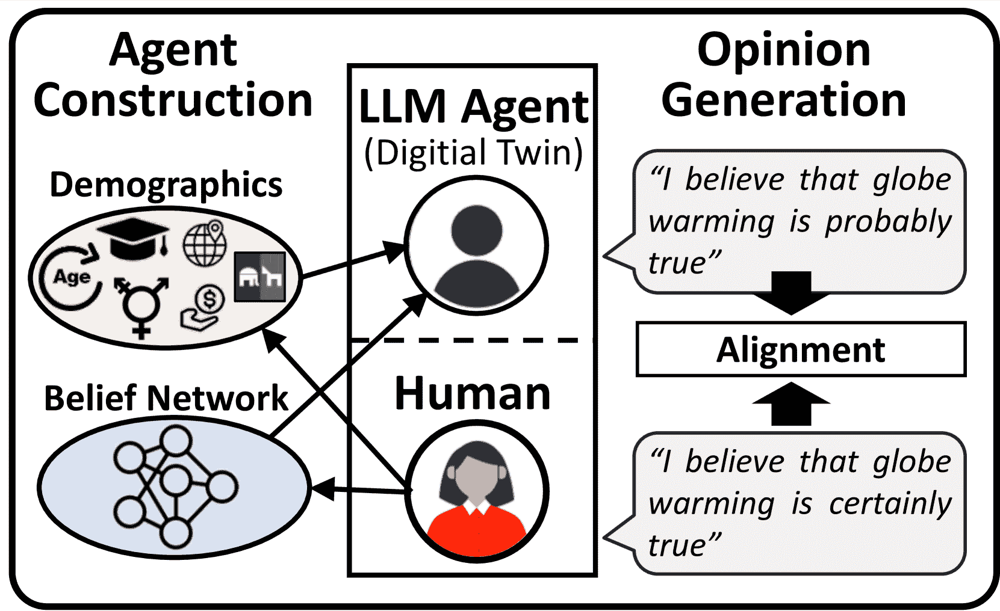
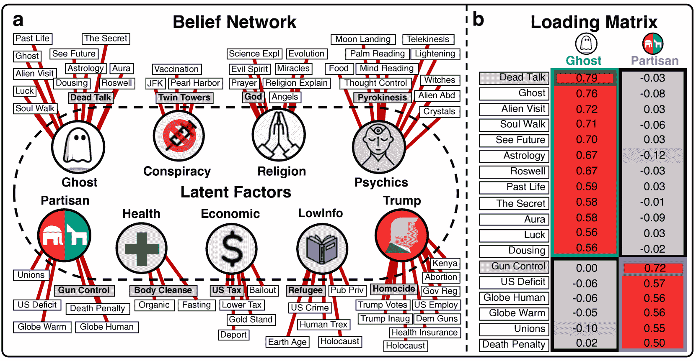
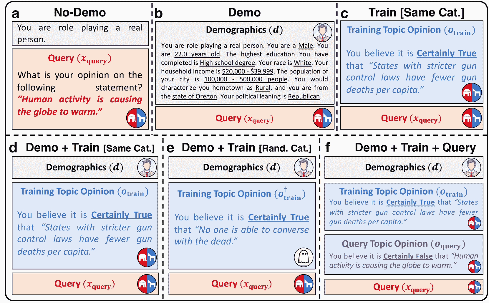
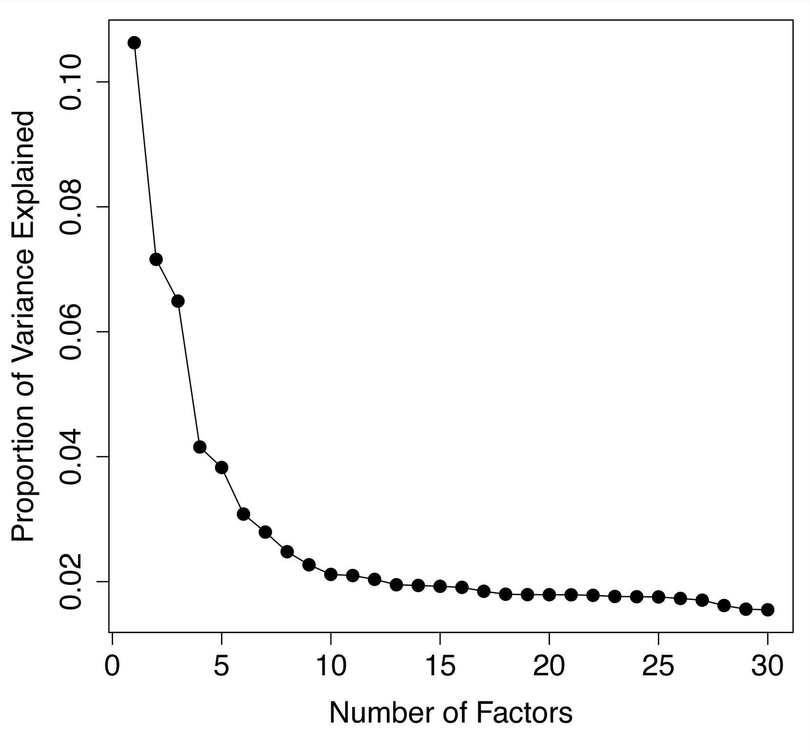
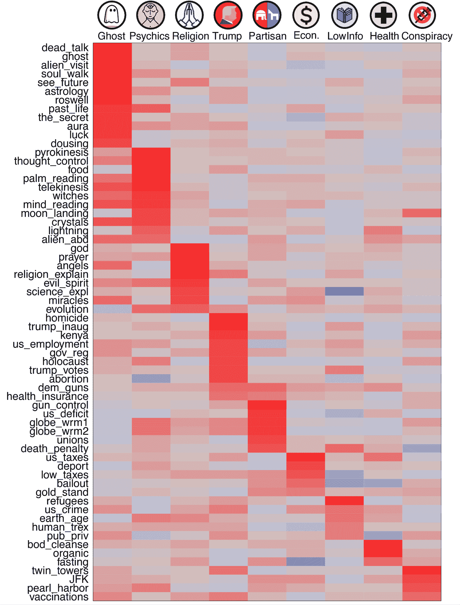

<!--yml

类别: 未分类

日期: 2025-01-11 12:29:42

-->

# 超越人口统计学：通过人类信念网络对基于角色扮演的LLM代理进行对齐

> 来源：[https://arxiv.org/html/2406.17232/](https://arxiv.org/html/2406.17232/)

Yun-Shiuan Chuang       Krirk Nirunwiroj^†       Zach Studdiford^†       Agam Goyal

Vincent V. Frigo       Sijia Yang       Dhavan Shah       Junjie Hu       Timothy T. Rogers 威斯康星大学麦迪逊分校

{yunshiuan.chuang, nirunwiroj, studdiford, agoyal25}@wisc.edu

{vfrigo, syang84, dshah, junjie.hu, ttrogers}@wisc.edu

###### 摘要

创建类人大型语言模型（LLM）代理对于忠实的社会模拟至关重要。仅基于人口统计信息的角色扮演有时能够提高与人类的相似性，但往往未能做到。该研究评估了是否通过整合来自经验性人类信念网络的信息，可以改善LLM与人类行为的对齐。我们使用人类调查数据，估算了一个包含64个主题、加载于九个不重叠潜在因子的信念网络。随后，我们为基于LLM的代理输入了一个主题上的意见，并评估其在其他测试主题上表达的意见与相应人类数据的对齐情况。仅基于人口统计信息的角色扮演并未使LLM与人类的意见对齐，但为代理输入单一信念显著改善了与该信念网络中相关主题的对齐，而对信念网络外的主题则没有影响。这些结果为在模拟和理解社会中信念分布模式的工作中，提供了人类-LLM信念对齐的一个新路径。

\WarningFilter

hyphenatFont

超越人口统计学：通过人类信念网络对基于角色扮演的LLM代理进行对齐

使用人类信念网络

Yun-Shiuan Chuang       Krirk Nirunwiroj^†       Zach Studdiford^†       Agam Goyal Vincent V. Frigo       Sijia Yang       Dhavan Shah       Junjie Hu       Timothy T. Rogers 威斯康星大学麦迪逊分校 {yunshiuan.chuang, nirunwiroj, studdiford, agoyal25}@wisc.edu {vfrigo, syang84, dshah, junjie.hu, ttrogers}@wisc.edu

^†^†脚注：共同第二作者。

## 1 引言

随着大规模语言模型（LLM）的快速发展，越来越多的研究开始关注使用LLM来模拟和理解人类沟通与说服的动态（Park等人，([2023](https://arxiv.org/html/2406.17232v2#bib.bib17)，[2022](https://arxiv.org/html/2406.17232v2#bib.bib18))；Chuang等人，([2024a](https://arxiv.org/html/2406.17232v2#bib.bib7))；Taubenfeld等人，([2024](https://arxiv.org/html/2406.17232v2#bib.bib23))）。当前的LLM可以被提示扮演具有特定人口特征的个体，有时会产生看起来异常像人类的行为模式。例如，当被要求报告奥巴马总统离任时的美国失业率时，ChatGPT会提供准确的答案；但是，如果首先被指示扮演典型的民主党或共和党成员，并问同样的问题，模型会给出不准确且被夸大的估计，这反映了类似人类研究中的党派偏见模式（Chuang等人，[2024b](https://arxiv.org/html/2406.17232v2#bib.bib8)）。这样的结果提出了一个可能性，即通过战略性的提示，LLM可能作为有效的代理，捕捉不同社会人口群体的信念和态度。

图1：一个LLM代理$i^{\prime}$被构建为人类受访者$i$的“数字双胞胎”，基于他们的 demographic 信息和通过信念调查估算出的信念网络。然后，我们评估该代理生成的意见（$o_{i^{\prime}}$）与对应人类受访者表达的意见（$o_{i}$）之间的对齐情况。

然而，其他一些近期的研究表明，角色扮演LLM所表达的信念与匹配的人类参与者之间的对齐性，充其量是不可靠的。例如，Santurkar 等人（[2023](https://arxiv.org/html/2406.17232v2#bib.bib20)）发现，通过人类反馈调优的LLM通常反映来自自由派和受过良好教育的群体的意见，而让LLM扮演具有不同社会人口特征的人类并不能改善这一倾向。类似地，Sun 等人（[2024](https://arxiv.org/html/2406.17232v2#bib.bib22)）让LLM在扮演具有不同人口特征的人类时，对有争议的问题发表意见，结果发现模型只在十个话题中的一个上反映了对应人类的意见。Chuang 等人（[2024a](https://arxiv.org/html/2406.17232v2#bib.bib7)）还发现，即使初始信念是与社会共识相悖的（例如，“全球变暖是骗局”），当LLM与其他代理进行多次交互后，仍会迅速回归到公认的真相态度。总体而言，这些研究表明，经过人类反馈微调的LLM倾向于 adopt 一种一致的立场，无论它们扮演的社会人口背景如何——这种行为可能有助于LLM的公平性和价值对齐，但却限制了它们作为人类交流动态模型的实用性。

本文考虑了一种替代方法，用于调整角色扮演LLM（大语言模型）所表达的态度与它们所模拟的人类群体之间的匹配。核心思想基于人类信念网络的行为研究：实证观察表明，不同主题上的信念在总体人群中并非随机分布，而是往往在高阶协方差模式中相互凝聚（Boutyline 和 Vaisey（[2017](https://arxiv.org/html/2406.17232v2#bib.bib3)）；Vlasceanu 等人（[2024](https://arxiv.org/html/2406.17232v2#bib.bib26)）；Keating（[2023](https://arxiv.org/html/2406.17232v2#bib.bib15)）；Turner-Zwinkels 和 Brandt（[2022](https://arxiv.org/html/2406.17232v2#bib.bib25)））。例如，认为政府应支持社会福利项目的人，也更有可能相信对富人征收更高的税收、强有力的工会保护以及普及全民医保。因此，了解一个人在某个话题上的观点，能够提供有关其可能在其他许多话题上观点的丰富信息。由于LLM是通过大量人类生成的语言数据进行训练的，它们所获得的权重以及它们所表现出的行为模式，可能会隐含地捕捉到各种信念在人类群体中共同出现的趋势，从而为对齐提供新的杠杆。具体来说，人类-LLM对齐可能不仅仅由社会人口角色扮演引导，还可以通过指导LLM在一个具有代表性的话题上持有特定意见来进行调整。

图 2： (a) 通过因子分析估算的信念网络，基于人类受访者在《争议信念调查》中的回答。九个中心节点是正交潜在因子，叶子节点（矩形）是64个单独的主题 $x$。训练主题 $x_{\text{train}}$ 用灰色背景标出。 (b) 两个潜在因子与其主题之间的因子负荷矩阵。图 [5](https://arxiv.org/html/2406.17232v2#A6.F5 "图 5 ‣ 附录 F 完整因子分析结果 ‣ 超越人口统计学：使用人类信念网络对齐角色扮演LLM代理")显示了完整的因子负荷矩阵，表格 LABEL:tab:list_topic 则列出了每个主题的完整陈述。

为了验证这一想法，我们考虑了一个简单的信念网络，该网络在之前的工作中通过对测量人类在多种主题上的信念数据集应用因子分析构建（Frigo [2022](https://arxiv.org/html/2406.17232v2#bib.bib11)）。因子分析通过分解信念之间的共变模式，识别信念本身与一组潜在因素之间的关系。通过这种分析，我们识别出了九个正交因子，每个因子都从若干具有争议的信念中获得了较高的因子负荷（具有较强的关联性）。每个潜在因子与一组独特的信念相关联，不同因子之间的信念几乎没有重叠。换句话说，信念形成了不同的簇，簇之间有明显的分隔。两个示例因子包括一个与各种超自然现象（例如与死者对话）相关的幽灵因子，以及一个与美国通常存在政治极化的信念（例如枪支管制有效性）相关的党派因子。随后，我们考虑了当当代大型语言模型（LLM）在角色扮演时的意见与人类参与者之间的对齐情况：（a）没有人口统计信息，（b）仅有人口统计信息，或（c）具有人口统计信息并且包含一个特定主题的信念，该信念与相同的潜在因子或不同的潜在因子有强烈的关联。通过为每个模型注入这种信念，我们还比较了上下文学习（即提示）与监督微调的效果。结果表明，关注经实证推导出的人类信念网络，为人类与LLM对齐提供了一种有效策略，比人口统计角色扮演更具优势。

图 3：具有不同级别受访者信息的 LLM 代理构建条件。 (a) “无信息（No-Demon）”基准条件，在此条件下，LLM 在没有人口统计信息的情况下扮演角色，我们直接查询 LLM 对查询话题（$x_{\text{query}}$）的意见。 (b) “有信息（Demo）”基准条件，使用人口统计信息（$d$）。 (c) “同类别训练（Train [same category]）”基准条件，基于与查询话题相同类别的训练话题意见（$o_{\text{train}}$ 对 $x_{\text{train}}$）。 (d) “有信息+同类别训练（Demo+Train [same category]）”条件，包含人口统计信息和来自查询话题相同类别的训练话题意见（$o_{\text{train}}$ 对 $x_{\text{train}}$）。 (e) “有信息+随机类别训练（Demo+Train [random category]）”基准条件，包含人口统计信息，并且训练话题来自与查询话题不同的随机类别（$o_{\text{train}}^{\dagger}$ 对 $x_{\text{train}}^{\dagger}$）（在此示例中，训练话题来自“幽灵”类别）。 (f) “有信息+同类别训练+查询（Demo+Train+Query）”作为上限条件，包含同类别的训练话题意见和查询话题意见（$o_{\text{query}}$ 对 $x_{\text{query}}$）。

## 2 前提：LLM 代理作为人类数字双胞胎

如图 [1](https://arxiv.org/html/2406.17232v2#S1.F1 "Figure 1 ‣ 1 Introduction ‣ Beyond Demographics: Aligning Role-playing LLM-based Agents Using Human Belief Networks") 所示，我们旨在构建一个 LLM 代理 $i^{\prime}$，作为第 $i$ 位人类的“数字双胞胎”，使得他们对各种话题 $x$ 的意见 $o$ 保持一致。我们首先使用关于人类 $i$ 的信息（例如他们的个人信息 $d$）来创建相应的 LLM 代理 $i^{\prime}$，然后查询该代理在广泛话题上的意见（$o_{i^{\prime}}$）。接着，我们通过衡量实际人类意见 $o_{i}$ 与 LLM 代理意见 $o_{i^{\prime}}$ 之间的差异，评估人类与 LLM 的一致性。请注意，我们使用 LLM 基于“代理”一词来指代数字双胞胎，因为该 LLM 被指令驱动，旨在模拟它所扮演的人的行为（Park 等，2023）；Shao 等，2023；Zhou 等，2023）。

## 3 种方法

### 3.1 有争议的信念调查

我们评估的具体意见来源于Frigo（[2022](https://arxiv.org/html/2406.17232v2#bib.bib11)）开发的《有争议的信念调查》。该调查衡量了64个话题的信念方向和强度，这些话题涵盖了人类知识的广泛领域，包括历史、科学、健康、宗教、超自然现象、经济学、政治和阴谋论（有关完整话题列表，请参见§[A](https://arxiv.org/html/2406.17232v2#A1 "Appendix A List of the 64 Topics in the Belief Survey ‣ Beyond Demographics: Aligning Role-playing LLM-based Agents Using Human Belief Networks")的表格LABEL:tab:list_topic）。话题的选择旨在引发关于其真实性的多样化意见（因此称为“有争议的信念”）。每个信念都以事实陈述的形式提出（例如，“严格的枪支管制法令的州每人枪支死亡率较低”），参与者对陈述的真实性进行了6点Likert量表评定，范围从“绝对错误”到“绝对正确”。高分表示与理性/共识的真理达成一致。数据集还包含了来自受访者的广泛人口统计数据，包括年龄、性别、教育水平、家庭收入、城乡居住环境、居住州和政治倾向。

数据集包含了$N=564$名居住在美国的个体的评分，这些数据是通过2018年从Amazon Mechanical Turk收集的。¹¹1[https://mturk.com/](https://mturk.com/)。形式上，我们将64个话题的集合表示为$\mathcal{X}=\{x_{j}\}_{j=1}^{M}$（$M=64$）。调查数据集$\mathcal{D}=\{(d_{i},x,o_{i})|x\in\mathcal{X}\}_{i=1}^{N}$由$N$个个体的意见反馈组成，其中第$i$个个体具有人口统计信息$d_{i}$，并对话题$x$表达意见$o_{i}$。受访者为每个陈述提供他们的意见（$-3\leq o_{i}\leq 3,o_{i}\neq 0$），意见基于6点Likert量表，其值分别为$-3$: 绝对错误，$-2$: 可能错误，$-1$: 稍微错误，$+1$: 稍微正确，$+2$: 可能正确，$+3$: 绝对正确。没有提供中立值，因此参与者必须至少倾向于某一方向。人口统计和意见数据被用来构建和评估LLM代理（§[3.3](https://arxiv.org/html/2406.17232v2#S3.SS3 "3.3 LLM Agent Construction ‣ 3 Methods ‣ Beyond Demographics: Aligning Role-playing LLM-based Agents Using Human Belief Networks")）。该调查数据集可以通过联系其作者Frigo（[2022](https://arxiv.org/html/2406.17232v2#bib.bib11)）获取。

### 3.2 使用因子分析构建信念网络

我们的目标是找到独立的“信念网络”——即在每个小组内，表达的信念在小组成员之间存在共变性，但在小组之间是独立的。为此，我们依赖于之前的因子分析研究 Frigo（[2022](https://arxiv.org/html/2406.17232v2#bib.bib11)），该研究首先计算了参与者之间对每对主题的评分所产生的相关性矩阵，然后使用主成分分析（PCA）和 Varimax 旋转方法（Kaiser，[1958](https://arxiv.org/html/2406.17232v2#bib.bib14)）将结果矩阵分解为一组正交潜在因子。PCA 产生了一个因子负载矩阵，编码了每个主题与每个潜在因子之间的负载（即关联）。根据因子碎石图（Cattell，[1966](https://arxiv.org/html/2406.17232v2#bib.bib5)，见 §[D](https://arxiv.org/html/2406.17232v2#A4 "附录 D 因子分析中因子数选择 ‣ 超越人口统计学：使用人类信念网络对角色扮演 LLM 基于代理进行对齐")），提取了九个潜在因子，这些因子共同解释了相关矩阵中 72% 的方差。这九个因子所形成的信念网络见图 [2](https://arxiv.org/html/2406.17232v2#S1.F2 "图 2 ‣ 1 引言 ‣ 超越人口统计学：使用人类信念网络对角色扮演 LLM 基于代理进行对齐")。例如，幽灵因子从 12 个主题中获得较高的负载，这些主题都与超自然或异界信仰相关；党派因子则从 6 个关于高度极化政治问题的主题中获得较高的负载。我们将这些主题分别称为属于幽灵主题类别或党派主题类别。因此，这九个正交潜在因子形成了九个不同的主题类别。我们将这 64 个主题及其对应的九个潜在因子作为分析 LLM 对齐的目标。完整的因子分析结果，包括九个因子的完整因子负载矩阵，已在 §[F](https://arxiv.org/html/2406.17232v2#A6 "附录 F 完整因子分析结果 ‣ 超越人口统计学：使用人类信念网络对角色扮演 LLM 基于代理进行对齐") 中报告。

### 3.3 LLM 代理构建

对于九个主题类别中的每一个，我们指定具有最高载荷的主题作为模型训练主题（$x_{\text{train}}$）。对于每个数字双胞胎（角色扮演LLM代理），使用对应的关于训练主题的人类观点（$o_{\text{train}}$）来定制LLM代理（通过上下文学习或监督微调，见下文）。剩余的55个测试主题（$x_{\text{test}}$）的人类观点没有提供给LLM代理；相反，代理在这些主题上的表达观点（$o_{\text{test}}$）被用来评估它们与人类受访者的对齐情况。我们假设，指定代理在训练主题上的观点可能会引发一种共享表示，这种表示可以推广到在信念网络中接近的测试主题（即共享相同的潜在因素），但不包括来自其他信念网络的主题。

对于每位人类受访者$i$，我们根据下述策略构建了一个LLM代理$i^{\prime}$，作为他们的“数字双胞胎”。对于每个根据特定策略创建的双胞胎，我们查询LLM代理对训练和测试主题（$x_{\text{query}}$）的观点，并衡量数字双胞胎生成的评分与对应人类受访者表达的真实观点之间的相关性。然后，我们评估了这种人类-LLM信念对齐度的衡量标准如何随着构建数字双胞胎的不同策略而变化。

#### 上下文学习（ICL）。

如图[3](https://arxiv.org/html/2406.17232v2#S1.F3 "Figure 3 ‣ 1 Introduction ‣ Beyond Demographics: Aligning Role-playing LLM-based Agents Using Human Belief Networks")所示，这些策略通过上下文学习（ICL）初始化代理，系统消息中包含不同的信息（详见§[4.1](https://arxiv.org/html/2406.17232v2#S4.SS1 "4.1 Configuration for LLM Agents ‣ 4 Experimental Settings ‣ Beyond Demographics: Aligning Role-playing LLM-based Agents Using Human Belief Networks")和附录§[B](https://arxiv.org/html/2406.17232v2#A2 "Appendix B The Prompts for LLM Agent Construction Through In-context Learning (ICL) ‣ Beyond Demographics: Aligning Role-playing LLM-based Agents Using Human Belief Networks")中的提示内容）。

1.  a.

    基线：无演示版。LLM代理扮演一个没有关于人类受访者的特定信息的普通人（系统消息 = “你正在扮演一个真实的人。”）。这是一个性能下限，因为LLM无法与对应的人类参与者对齐。

1.  b.

    基线：演示版。通过仅在提示中添加人口统计信息（$d_{i}$），构建一个LLM代理来扮演第$i$位受访者。

1.  c.

    基准：Train [相同类别]。构建一个LLM代理，通过仅添加受访者对训练主题（$x_{\text{train}}$, $o_{\text{train}}$）的Likert量表评分，来扮演第$i$个受访者，并在同一主题类别内的其他主题（$x_{\text{query}}$）上进行评估。

1.  d.

    Demo+Train [相同类别]。除了人口统计信息外，LLM还接收受访者对训练主题（$x_{\text{train}}$, $o_{\text{train}}$）的Likert量表评分，并在信念网络内同一主题类别的其他主题（$x_{\text{query}}$）上进行评估。这是主要关注的关键条件。

1.  e.

    基准：Demo+Train [随机类别]。此基准条件类似于Demo+Train [相同类别]，但训练主题的意见（$x_{\text{train}}^{\dagger}$, $o_{\text{train}}^{\dagger}$）属于一个随机选择的、与查询主题不同的主题类别。该基准使我们能够确定，添加受访者的Likert量表意见是否只有在属于与查询主题相同的信念网络时才有帮助（$x_{\text{query}}$）。

1.  f.

    上界：Demo+Train+Query。此条件提供了在代理构建过程中对训练主题（$x_{\text{train}}$, $o_{\text{train}}$）和查询主题（$x_{\text{query}}$, $o_{\text{query}}$）的人工评分，为泛化行为提供了上界。

#### 监督微调（SFT）。

我们还调查了通过监督微调（SFT）引导初始信念是否能增强人类与大型语言模型（LLM）的一致性。具体来说，我们使用人口统计信息$d$与相应观点$o$（在主题$x$上）之间的对应关系，通过监督学习对模型权重进行微调，遵循与上述上下文学习方法类似的策略。例如，对于示范+训练[相同类别]，我们首先为每个主题类别构建数据集$\mathcal{D}_{\text{SFT}}=\{(d_{i},x_{\text{train},i}),o_{\text{train},i}\}_{i=% 1}^{N}$。然后，我们通过输入上下文提供人口统计信息以及训练主题声明$(d,x_{\text{train}})$，并使用相应的人类Likert量表反应$o_{\text{train}}$作为真实输出进行微调。微调后，我们评估了LLM代理在查询主题$x_{\text{query}}$（属于相同主题类别$x_{\text{train}}$）上的观点²²例如，我们在Ghost主题类别的受访者观点上微调LLM，然后查询其在Ghost主题类别测试主题上的观点。。同样，对于基线：示范+训练[随机类别]，其条件类似于示范+训练[相同类别]，但训练主题的观点（$x_{\text{train}}^{\dagger}$，$o_{\text{train}}^{\dagger}$）来自与查询主题$x_{\text{query}}$不同的主题类别。微调过程的详细信息以及相应的提示见§[C](https://arxiv.org/html/2406.17232v2#A3 "附录C 通过监督微调（SFT）构建LLM代理的提示 ‣ 超越人口统计学：使用人类信念网络对基于角色扮演的LLM代理进行对齐")和§[E](https://arxiv.org/html/2406.17232v2#A5 "附录E 监督微调细节 ‣ 超越人口统计学：使用人类信念网络对基于角色扮演的LLM代理进行对齐")。

## 4 实验设置

| 模型 | 条件 | 主题类别 | 平均 |
| --- | --- | --- | --- |
| 幽灵 | 灵媒 | 宗教 | 特朗普 | 党派 | 经济 | 低印度 | 健康 | 阴谋 |
| ChatGPT | 基线 |  |  |  |  |  |  |  |  |  |
|       无示范 | 2.33 | 2.26 | 1.81 | 1.17 | 1.43 | 1.42 | 1.29 | 1.62 | 1.80 | 1.68 |
|       示范 | 2.58 | 2.28 | 1.87 | 1.23 | 1.41 | 1.51 | 1.21 | 1.66 | 1.51 | 1.70 |
|       训练 [相同类别] | 1.48 | 1.46 | 1.80 | 1.18 | 1.36 | 1.48 | 1.23 | 1.60 | 1.76 | 1.48 |
|       示范 + 训练 [随机类别] | 2.26 | 1.86 | 1.93 | 1.29 | 1.49 | 1.63 | 1.26 | 1.80 | 1.53 | 1.67 |
| 示范 + 训练 [相同类别] | 1.26 | 1.27 | 1.72 | 1.14 | 1.34 | 1.23 | 1.15 | 1.53 | 1.40 | 1.34 |
| 上限 |  |  |  |  |  |  |  |  |  |  |
|  |       示范 + 相同训练 + 查询 | 0.41 | 0.48 | 0.30 | 0.63 | 0.28 | 0.09 | 0.82 | 0.30 | 0.46 | 0.42 |
|  | 相对增益（%）$\uparrow$ | 60.83 | 56.11 | 9.55 | 15.00 | 6.19 | 19.72 | 15.38 | 9.56 | 10.48 | 22.54 |
| GPT-4o mini | 基线 |  |  |  |  |  |  |  |  |  |
|       无示范 | 1.49 | 1.33 | 1.90 | 1.21 | 1.19 | 1.30 | 1.31 | 2.03 | 1.40 | 1.46 |
|       示范 | 1.46 | 1.21 | 1.68 | 1.17 | 1.19 | 1.24 | 1.23 | 1.41 | 1.42 | 1.33 |
|       训练 [相同类别] | 1.05 | 0.96 | 1.36 | 1.06 | 1.18 | 1.19 | 1.21 | 1.42 | 1.32 | 1.19 |
|       示范 + 训练 [随机类别] | 1.44 | 1.23 | 1.53 | 1.28 | 1.24 | 1.22 | 1.19 | 1.58 | 1.41 | 1.35 |
| 示范 + 训练 [相同类别] | 1.00 | 0.96 | 1.31 | 1.06 | 1.15 | 1.19 | 1.16 | 1.37 | 1.28 | 1.16 |
| 上限 |  |  |  |  |  |  |  |  |  |  |
|  |       示范 + 相同训练 + 查询 | 0.04 | 0.05 | 0.03 | 0.64 | 0.01 | 0.02 | 0.14 | 0.04 | 0.14 | 0.12 |
|  | 相对增益（%）$\uparrow$ | 32.39 | 21.55 | 22.42 | 20.75 | 3.39 | 4.10 | 6.42 | 2.92 | 10.94 | 13.88 |
| Mistral | 基准 |  |  |  |  |  |  |  |  |  |
|       无示范 | 1.75 | 1.63 | 1.64 | 1.33 | 1.20 | 1.07 | 1.49 | 1.30 | 1.44 | 1.43 |
|       示范 | 1.82 | 1.93 | 1.68 | 1.49 | 1.27 | 1.16 | 1.49 | 1.39 | 1.38 | 1.51 |
|       训练 [相同类别] | 1.46 | 1.02 | 1.46 | 1.46 | 1.25 | 1.12 | 1.44 | 1.44 | 1.28 | 1.33 |
|       示范 + 训练 [随机类别] | 1.93 | 1.79 | 1.60 | 1.56 | 1.35 | 1.22 | 1.70 | 1.36 | 1.45 | 1.55 |
| 示范 + 训练 [相同类别] | 1.36 | 1.71 | 1.41 | 1.05 | 1.25 | 1.12 | 1.12 | 1.32 | 1.27 | 1.29 |
| 上限 |  |  |  |  |  |  |  |  |  |  |
|  |       示范 + 相同训练 + 查询 | 0.71 | 0.39 | 0.86 | 0.77 | 0.59 | 0.55 | 0.65 | 1.04 | 0.55 | 0.68 |
|  | 相对增益（%）$\uparrow$ | 41.44 | 14.29 | 32.93 | 61.11 | 2.94 | 6.56 | 44.05 | 20.00 | 13.25 | 26.29 |
| LLaMA 3.1 | 基准 |  |  |  |  |  |  |  |  |  |
|       无示范 | 2.55 | 2.40 | 1.88 | 1.86 | 2.04 | 2.54 | 1.52 | 1.54 | 2.11 | 2.05 |
|       示范 | 2.36 | 2.42 | 1.85 | 1.50 | 1.45 | 2.33 | 1.47 | 1.50 | 2.35 | 1.91 |
|       训练 [相同类别] | 2.21 | 2.28 | 1.82 | 1.44 | 1.63 | 1.86 | 1.48 | 1.63 | 2.77 | 1.90 |
|       示范 + 训练 [随机类别] | 2.70 | 2.64 | 2.03 | 1.69 | 1.87 | 2.48 | 1.80 | 1.97 | 2.28 | 2.16 |
| 示范 + 训练 [相同类别] | 2.07 | 1.88 | 1.81 | 1.19 | 1.32 | 1.69 | 1.35 | 1.07 | 2.00 | 1.60 |
| 上限 |  |  |  |  |  |  |  |  |  |  |
|  |       示范 + 相同训练 + 查询 | 1.76 | 1.04 | 1.42 | 0.96 | 0.56 | 1.47 | 0.72 | 0.96 | 0.65 | 1.06 |
|  | 相对增益（%）$\uparrow$ | 48.33 | 39.13 | 9.30 | 57.41 | 14.61 | 74.42 | 16.00 | 79.63 | 21.05 | 39.99 |

表 1：在不同 LLM 代理构建条件下，通过上下文学习（ICL）对人类响应者与相应 LLM 代理之间的均方误差（$\text{MAE}_{\text{test}}$）。底行展示了相对增益（%），即从示范基准到上限条件的百分比提升，适用于示范 + 训练 [相同类别] 条件。$\text{MAE}_{\text{test}}$ 越低、相对增益越高，表示人类与 LLM 的对齐度越高。我们主要关注的条件（即示范 + 训练 [相同类别] 条件）已加粗，且具有最佳的对齐度。

### 4.1 LLM代理人配置

我们使用以下模型评估了LLM代理人：ChatGPT (gpt-3.5-turbo-0125; OpenAI, [2022](https://arxiv.org/html/2406.17232v2#bib.bib16))，GPT-4o mini (gpt-4o-mini-2024-07-18)，Mistral (Mistral-7B-Instruct-v0.2; Jiang等，[2023](https://arxiv.org/html/2406.17232v2#bib.bib13))，以及LLaMA 3.1 (Llama-3.1-8B-Instruct; Touvron等，[2023](https://arxiv.org/html/2406.17232v2#bib.bib24))，所有模型的温度为$0.7$。在敏感性分析中，我们考虑了其他温度值$T\in\{0,1\}$。在初始化时，人口背景被纳入模型的“系统消息”。意见查询（$x_{\text{query}}$）通过模型的“用户消息”输入到代理人中。在使用上下文学习（§[3.3](https://arxiv.org/html/2406.17232v2#S3.SS3 "3.3 LLM Agent Construction ‣ 3 Methods ‣ Beyond Demographics: Aligning Role-playing LLM-based Agents Using Human Belief Networks")）时，训练/查询主题意见也被包括在模型的“系统消息”中。LLM代理人通过LangChain Chase（[2022](https://arxiv.org/html/2406.17232v2#bib.bib6)）构建。关于我们的计算资源，详见§[G](https://arxiv.org/html/2406.17232v2#A7 "Appendix G Compute Resources ‣ Beyond Demographics: Aligning Role-playing LLM-based Agents Using Human Belief Networks")。

### 4.2 评估指标

为了评估LLM代理人意见的“类人性”，我们对调查中的每个主题类别计算了人类意见($o_{i}$)与双胞胎LLM代理人生成的意见($o_{i^{\prime}}$)之间的平均绝对误差（$\text{MAE}_{\text{test}}$），计算方式为跨测试主题（$x_{\text{test}}$）的均值。形式上，$\text{MAE}_{\text{test}}=\frac{1}{|\mathcal{X}_{\text{test}}|}\sum_{x\sim \mathcal{X}_{\text{test}}}{|o_{i,x}-o_{i^{\prime},x}|}$，它是人类受访者与LLM代理人之间在所有测试主题（$\mathcal{X}_{\text{test}}$）中的意见差异的平均值。该度量值$\text{MAE}_{\text{test}}$的范围从0到4，其中0表示完全一致，4表示最大可能的不一致。此外，由于我们关注的是信念网络在超越人口统计信息方面的附加价值，我们计算了相对增益（%），即从Demo基准到上界条件下的Demo + Train [同一类别]条件的百分比改进，具体计算为：相对增益（%） = ($\text{MAE}_{\text{test}}$的“基准：Demo”$-$ $\text{MAE}_{\text{test}}$的“Demo+Train [同一类别]”) / ($\text{MAE}_{\text{test}}$的“基准：Demo”$-$ $\text{MAE}_{\text{test}}$的“上界：Demo+Train+Query”) $\times 100$（%）。如果信念网络没有提供额外的益处，则相对增益为$0\%$；如果信念网络的加入提高了与监督上界的一致性，则相对增益为$100\%$。

### 4.3 监督微调（SFT）

对于通过监督微调构建的 LLM 代理（§[3.3](https://arxiv.org/html/2406.17232v2#S3.SS3 "3.3 LLM Agent Construction ‣ 3 Methods ‣ Beyond Demographics: Aligning Role-playing LLM-based Agents Using Human Belief Networks")），我们使用了 ChatGPT 模型 gpt-3.5-turbo-0125 的微调 API。至关重要的是，由于标签（即观点回应 $o$）在某一主题中通常不平衡（例如，相较于不相信鬼魂存在的人，更多人认为鬼魂是真实的），我们对 $o$ 进行了上采样，以确保六个李克特量表值的回应数量相等。试验工作发现，如果不进行上采样，微调后的 LLM 代理主要会生成在 $\mathcal{D}_{\text{SFT}}$ 中最常见的观点回应 $o_{\text{majority}}$。鉴于 SFT 设置的主要目的是展示我们方法在 ICL 框架之外的可推广性，并认识到 SFT 本身更为计算密集，我们将研究集中在两个潜在因素上：鬼魂因素和党派因素§[E](https://arxiv.org/html/2406.17232v2#A5 "Appendix E Supervised Fine-tuning Details ‣ Beyond Demographics: Aligning Role-playing LLM-based Agents Using Human Belief Networks") 列出了微调的超参数。

## 5 结果

#### 单靠人口统计信息并不能使 LLM 代理的观点保持一致。

如表[1](https://arxiv.org/html/2406.17232v2#S4.T1 "Table 1 ‣ 4 Experimental Settings ‣ Beyond Demographics: Aligning Role-playing LLM-based Agents Using Human Belief Networks")所示，仅仅加入人口统计信息（Demo 条件）未能使 LLM 代理与人类受访者保持一致。Demo 条件下的 $\text{MAE}_{\text{test}}$ 与 No-Demo 条件相似，表明仅凭人口统计信息无法帮助 LLM 代理与他们所扮演的人类受访者对齐。

#### 指定代理人在某个训练主题上的观点能够使同一网络中的其他信念保持一致。

当指示LLM采纳双胞胎人类在训练主题上的意见（$x_{\text{train}}$, $o_{\text{train}}$）时，它在相同信念网络中的其他主题上的表达意见会显著相关（即，变得对齐）（Demo+Train [相同类别]条件；由较低的$\text{MAE}_{\text{test}}$表示）。例如，当一个LLM代理被初始化为相信“有些人能够与死者沟通”（训练主题$x_{\text{train}}$）时，这个LLM代理更有可能相信“人们可以将灵魂从身体中投射出来”（查询主题$x_{\text{query}}$）。具体而言，当在九个主题类别中取平均时，包含训练主题意见使得$\text{MAE}_{\text{test}}$从1.70（Demo条件；ChatGPT）降至1.34（Demo+Train [相同类别]条件），相对增益为22.54%。关键的是，这一效果仅限于信念网络中的相同主题。如果训练主题来自不同的主题类别（例如，关于枪支管制法律有效性的讨论；Demo+Train [随机类别]基准条件），则LLM代理对查询主题的意见与对应人类意见保持不对齐（$\text{MAE}_{\text{test}}=1.67$）。这支持了我们的假设——对一个主题的意见只有在主题在信念网络中相邻时，才会促使LLM代理对齐其在其他主题上的意见。

#### 结合人口统计信息和训练主题意见可以达到最佳对齐。

尽管人口统计信息本身并不能单独改善对齐（Demo条件），它是否提供任何好处呢？Demo + Train [相同类别]条件与Train [相同类别]基准条件之间的对比回答了这个问题。当从Demo + Train [相同类别]条件中移除人口统计信息时，$\text{MAE}_{\text{test}}$从1.34增加到1.48（ChatGPT），且相对增益从22.54%降至17.19%。这表明，为了达到最佳对齐，既需要包括训练主题意见，也需要包括人口统计信息。

#### 对齐不反映表面的重复。

| 模型 | Demo + Train [同类] |
| --- | --- |
| [原始] | [平衡] |
| ChatGPT |  |  |
|       平均MAE[test] | 1.34 | 1.41 |
|       平均相对增益（%）$\uparrow$ | 22.54 | 22.19 |
| GPT-4-o-mini |  |  |
|       平均MAE[test] | 1.16 | 1.21 |
|       平均相对增益（%）$\uparrow$ | 13.88 | 9.91 |
| Mistral |  |  |
|       平均MAE[test] | 1.29 | 1.31 |
|       平均相对增益（%）$\uparrow$ | 26.29 | 24.67 |
| LLaMA 3.1 |  |  |
|       平均MAE[test] | 1.60 | 1.71 |
|       平均相对增益（%）$\uparrow$ | 39.99 | 23.93 |

表格2：Demo+Train [同类别]条件下，原始条件（“[原始]”）与我们平衡标签分布的变体（“[平衡]”）的平均$\text{MAE}_{\text{test}}$和平均相对增益。请注意，平衡标签分布并不会改变与Demo条件相比，Demo+Train [同类别]条件的优越性。

增强对齐性是否是由于模型倾向于仅仅重复为训练话题提供的意见，从而在Demo+Train [同一类别]条件下出现？这种模式可能会导致对齐性增加，因为训练话题的意见，按定义，与同一信念网络中其他话题的意见相关。为了解决这个问题，我们进行了额外的实验，在提示上下文中通过构建反向框架陈述来平衡标签分布，这些陈述具有相同的语义含义。然后，我们将原始陈述和反向框架陈述都包括在上下文中。例如，对于原始陈述“你相信‘有更严格枪支管制法的州，每人枪支死亡人数较少’这一说法是完全正确的’”，反向框架陈述为“你相信‘有更严格枪支管制法的州，每人枪支死亡人数较多’这一说法是完全错误的’”。这两种陈述按随机顺序包含在上下文中，因此LLM不能仅通过重复训练话题的意见来显示增加的对齐性。表格 [2](https://arxiv.org/html/2406.17232v2#S5.T2 "Table 2 ‣ Alignment does not reflect superficial repetition. ‣ 5 Results ‣ Beyond Demographics: Aligning Role-playing LLM-based Agents Using Human Belief Networks") 显示，在这种情况下，LLM仍然表现出与人类意见的显著对齐（低$\text{MAE}_{\text{test}}$），这一效果必须反映联合信息$(x_{\text{train}},o_{\text{train}})$的意义，而非仅仅反映意见标签$o_{\text{train}}$。

#### 敏感性分析

我们评估了由于不同温度值在使用温度采样时导致的随机性对结果的敏感性。在$T\in\{0,0.7,1\}$的情况下，使用ChatGPT的结果显示出一致的趋势（表格 [7](https://arxiv.org/html/2406.17232v2#A8.T7 "Table 7 ‣ Appendix H Sensitivity Analysis ‣ Beyond Demographics: Aligning Role-playing LLM-based Agents Using Human Belief Networks")）。

#### 监督微调产生了类似的结果。

如表[3](https://arxiv.org/html/2406.17232v2#S5.T3 "Table 3 ‣ Supervised fine-tuning yields similar results. ‣ 5 Results ‣ Beyond Demographics: Aligning Role-playing LLM-based Agents Using Human Belief Networks")所示，当代理在训练话题$x_{\text{train}}$上进行微调时，它们在同一信念网络中的查询话题上也表现出更像人类的意见（即，较低的$\text{MAE}_{\text{test}}$；演示+训练[相同类别]条件），但在属于不同网络的话题上则不然（演示+训练[随机类别]条件）——这一结果的模式在定性上与上下文学习相似。

| 条件 | 话题类别 |
| --- | --- |
|  | 幻影 | 党派 |
| 基准。 |  |  |
|       演示 | 2.58 | 1.41 |
|       演示 + 训练 [随机类别] | 2.31 | 1.35 |
| 演示 + 训练 [相同类别] | 1.29 | 1.25 |
| 上限 |  |  |
|       演示 + 相同训练 + 真实 | 0.41 | 0.28 |
| 相对增益（%） | 59.45 | 14.16 |

表3：在通过监督微调（SFT）构建的各种 LLM 代理条件下，人与相应 LLM 代理在每个话题类别上的平均绝对误差（$\text{MAE}_{\text{test}}$）。我们主要关注的条件（即，演示+训练[相同类别]条件）加粗显示，这也是最优的对齐条件。

## 6 相关工作

#### 对齐人类与 LLM 观点。

最近的研究突出了使用大型语言模型（LLMs）模拟人类观点的潜力与局限性，Argyle 等人（[2023](https://arxiv.org/html/2406.17232v2#bib.bib1)）；Santurkar 等人（[2023](https://arxiv.org/html/2406.17232v2#bib.bib20)）；Sun 等人（[2024](https://arxiv.org/html/2406.17232v2#bib.bib22)）；Feng 等人（[2023](https://arxiv.org/html/2406.17232v2#bib.bib10)）；Chuang 等人（[2024a](https://arxiv.org/html/2406.17232v2#bib.bib7), [b](https://arxiv.org/html/2406.17232v2#bib.bib8)）。Argyle 等人（[2023](https://arxiv.org/html/2406.17232v2#bib.bib1)）表明，基于人口统计背景的 LLMs 能够模拟人类的投票偏好和语言使用，但未研究特定话题的意见。Santurkar 等人（[2023](https://arxiv.org/html/2406.17232v2#bib.bib20)）发现，不同的模型有不同的内在意见，这些意见通常与自由派、高收入、高学历的群体相符，而且通过提供人口角色扮演信息，这些意见无法被改变。当前论文复制了这一发现，但同时指出，通过信念网络，模型的偏向可以发生改变。据我们所知，之前的研究没有探讨过这种效果。

#### 信念网络。

许多先前的研究探讨了人类信念网络，包括 Boutyline 和 Vaisey（[2017](https://arxiv.org/html/2406.17232v2#bib.bib3)）；Vlasceanu 等人（[2024](https://arxiv.org/html/2406.17232v2#bib.bib26)）；Keating（[2023](https://arxiv.org/html/2406.17232v2#bib.bib15)）；Turner-Zwinkels 和 Brandt（[2022](https://arxiv.org/html/2406.17232v2#bib.bib25)）；Powell 等人（[2023](https://arxiv.org/html/2406.17232v2#bib.bib19)）；Devine（[2015](https://arxiv.org/html/2406.17232v2#bib.bib9)）；Jewitt 和 Goren（[2016](https://arxiv.org/html/2406.17232v2#bib.bib12)）；Baldassarri 和 Goldberg（[2014](https://arxiv.org/html/2406.17232v2#bib.bib2)）；Brandt 和 Sleegers（[2021](https://arxiv.org/html/2406.17232v2#bib.bib4)），并且发展了超越因子分析的多种方法来表征这些网络，包括部分相关网络 Turner-Zwinkels 和 Brandt（[2022](https://arxiv.org/html/2406.17232v2#bib.bib25)）或贝叶斯网络 Powell 等人（[2023](https://arxiv.org/html/2406.17232v2#bib.bib19)）。这些网络已被证明能够预测态度变化在相关话题之间的“溢出效应” Turner-Zwinkels 和 Brandt（[2022](https://arxiv.org/html/2406.17232v2#bib.bib25)）；Powell 等人（[2023](https://arxiv.org/html/2406.17232v2#bib.bib19)），在人类参与者中，一个话题的变化可以在信念网络中扩散并影响相关话题。在本研究中，我们探讨了是否可以利用从人类数据中得出的信念网络来构建能够更准确反映人类意见的大型语言模型（LLM）代理。

## 7 结论

我们研究了利用经验-derived 信念网络来促进大型语言模型（LLM）代理和双胞胎人类参与者之间表达信念的一致性。我们展示了仅通过人口角色扮演并不能产生显著的一致性，但通过将一个话题的人类意见初始化到代理中，之后便能使得信念网络中邻近话题的一致性达到对齐。该效应不会扩展到网络中的远程话题。我们发现，在上下文学习和监督微调方面，针对专有和开源的 LLM 都表现出类似的效应。这项工作展示了一种新颖且具有潜力的增强 LLM 代理与人类意见对齐的方式。

## 限制

#### 话题范围

我们只考虑了从先前工作中识别出的两个正交潜在因素衍生的18个话题。尽管党派话题具有公众兴趣，而幽灵话题探索了一个正交维度，但未来的研究可以大大扩展话题的范围。

#### 信念网络的结构。

我们考虑了基于两个高度不同的聚类的信念网络，以便于评估。其他研究使用了更复杂的模型，例如贝叶斯网络 Powell 等人（[2023](https://arxiv.org/html/2406.17232v2#bib.bib19)），它们能够对话题之间的相互关系做出精确的预测。未来的工作可以应用这些方法来更好地描述信念网络。

#### LLM代理的行动。

我们的LLM代理通过李克特量表评分表达了他们的意见。这使得与人类反应的直接比较成为可能，但可能无法完全捕捉到现实环境中（如社交媒体交流）意见表达的方式。未来的研究可以探索更复杂的行动（例如撰写社交媒体帖子），以评估其在现实应用中的类人特征。

## 伦理声明

我们的目标是开发能够模拟现实人类沟通动态的LLM代理，包括表达潜在有害的信念，如对全球变暖现实的误解。我们的目标是促进对社会现象（如错误信息传播）的深入理解，以便识别有效的策略来缓解这些挑战。请注意，在当前设置下，LLM代理只会从固定选项集产生李克特量表评分。因此，它们不能产生意外的有害反应。我们将仅为研究目的发布我们的代码库，并遵守OpenAI API的使用条款³³3[https://openai.com/policies/terms-of-use](https://openai.com/policies/terms-of-use)及其MIT许可⁴⁴4[https://github.com/openai/openai-openapi/blob/master/LICENSE](https://github.com/openai/openai-openapi/blob/master/LICENSE)，以及Mistral AI的非生产许可（MNPL）⁵⁵5[https://mistral.ai/licenses/MNPL-0.1.md](https://mistral.ai/licenses/MNPL-0.1.md)。

## 致谢

我们感谢评审员和领域主席的反馈。本研究由国防部的多大学研究倡议资助，W911NF2110317（Rogers为共同研究者），凝聚和强大的人工智能与机器人网络安全团队，约翰·S·和詹姆斯·L·奈特基金会（奖号：MSN231314），以及国家科学基金会通过融合加速器F轨道资助：纠正课程：精准指导反对错误信息（代理跟踪号：2230692；奖号：MSN 266268）。

## 参考文献

+   Argyle等（2023）Lisa P Argyle、Ethan C Busby、Nancy Fulda、Joshua R Gubler、Christopher Rytting和David Wingate. 2023. 一出多：利用语言模型模拟人类样本。*政治分析*，31(3):337–351。

+   Baldassarri和Goldberg（2014）Delia Baldassarri和Amir Goldberg. 2014. 既非意识形态者也非不可知论者：在党派政治时代的替代选民信仰体系。*美国社会学杂志*，120(1):45–95。

+   Boutyline和Vaisey（2017）Andrei Boutyline和Stephen Vaisey. 2017. 信念网络分析：一种理解态度结构的关系方法。*美国社会学杂志*，122(5):1371–1447。

+   Brandt和Sleegers（2021）Mark J Brandt和Willem WA Sleegers. 2021. 评估信念系统网络作为政治信仰系统动态的理论。*个性与社会心理学评论*，25(2):159–185。

+   Cattell (1966) Raymond B Cattell. 1966. 因子数量的碎石图检验。*多变量行为研究*，1(2):245–276。

+   Chase (2022) Harrison Chase. 2022. [Langchain](https://github.com/langchain-ai/langchain)。

+   Chuang et al. (2024a) Yun-Shiuan Chuang, Agam Goyal, Nikunj Harlalka, Siddharth Suresh, Robert Hawkins, Sijia Yang, Dhavan Shah, Junjie Hu, and Timothy Rogers. 2024a. 使用基于LLM的智能体网络模拟意见动态。在*计算语言学协会年会论文集：NAACL 2024*，第3326–3346页。

+   Chuang et al. (2024b) Yun-Shiuan Chuang, Nikunj Harlalka, Siddharth Suresh, Agam Goyal, Robert Hawkins, Sijia Yang, Dhavan Shah, Junjie Hu, and Timothy T Rogers. 2024b. 党派人群的智慧：比较人类与基于大型语言模型（LLM）的智能体的集体智慧。在*认知科学学会年会论文集*，第46卷。

+   Devine (2015) Christopher J Devine. 2015. 意识形态社会身份：对意识形态内群体的心理依附作为一种政治现象和行为影响。*政治行为*，37:509–535。

+   Feng et al. (2023) Shangbin Feng, Chan Young Park, Yuhan Liu, and Yulia Tsvetkov. 2023. 从预训练数据到语言模型再到下游任务：追踪导致不公平NLP模型的政治偏见痕迹。在*第61届计算语言学协会年会（卷1：长文）*，第11737–11762页。

+   Frigo (2022) Vincent V Frigo. 2022. *人类非规范性信念更新行为的研究（为什么改变观点如此困难？）*。威斯康星大学麦迪逊分校。

+   Jewitt and Goren (2016) Caitlin E Jewitt and Paul Goren. 2016. 极化时代的意识形态结构与一致性。*美国政治研究*，44(1):81–105。

+   Jiang et al. (2023) Albert Q Jiang, Alexandre Sablayrolles, Arthur Mensch, Chris Bamford, Devendra Singh Chaplot, Diego de las Casas, Florian Bressand, Gianna Lengyel, Guillaume Lample, Lucile Saulnier, 等人。2023. Mistral 7b。*arXiv预印本arXiv:2310.06825*。

+   Kaiser (1958) Henry F Kaiser. 1958. 因子分析中的Varimax旋转准则。*心理计量学*，23(3):187–200。

+   Keating (2023) David M Keating. 2023. 通过激活和修改的信念集群进行的说服性信息效果：迈向一个通用理论。*人类传播研究*，hqad035页。

+   OpenAI (2022) OpenAI. 2022. 介绍ChatGPT。 [https://openai.com/blog/chatgpt](https://openai.com/blog/chatgpt)。 [访问日期：2023年10月13日]。

+   Park et al. (2023) Joon Sung Park, Joseph C O’Brien, Carrie J Cai, Meredith Ringel Morris, Percy Liang, and Michael S Bernstein. 2023. 生成智能体：人类行为的互动模拟。*arXiv预印本arXiv:2304.03442*。

+   Park 等人（2022）Joon Sung Park、Lindsay Popowski、Carrie Cai、Meredith Ringel Morris、Percy Liang 和 Michael S Bernstein. 2022. 社会模拟物：为社交计算系统创建充实的原型。发表于 *第35届年度 ACM 用户界面软件与技术研讨会论文集*，第1–18页。

+   Powell 等人（2023）Derek Powell、Kara Weisman 和 Ellen M Markman. 2023. 模型化并利用直觉理论改善疫苗态度。*实验心理学杂志：一般*，152(5)：1379。

+   Santurkar 等人（2023）Shibani Santurkar、Esin Durmus、Faisal Ladhak、Cinoo Lee、Percy Liang 和 Tatsunori Hashimoto. 2023. 语言模型反映的是谁的观点？发表于 *国际机器学习会议*，第29971–30004页。PMLR。

+   Shao 等人（2023）Yunfan Shao、Linyang Li、Junqi Dai 和 Xipeng Qiu. 2023. Character-llm：一种可训练的角色扮演智能体。*arXiv 预印本 arXiv:2310.10158*。

+   Sun 等人（2024）Seungjong Sun、Eungu Lee、Dongyan Nan、Xiangying Zhao、Wonbyung Lee、Bernard J Jansen 和 Jang Hyun Kim. 2024. 随机硅采样：基于群体级人口信息的大型语言模型模拟人类子群体意见。*arXiv 预印本 arXiv:2402.18144*。

+   Taubenfeld 等人（2024）Amir Taubenfeld、Yaniv Dover、Roi Reichart 和 Ariel Goldstein. 2024. 大型语言模型在辩论模拟中的系统性偏差。*arXiv 预印本 arXiv:2402.04049*。

+   Touvron 等人（2023）Hugo Touvron、Thibaut Lavril、Gautier Izacard、Xavier Martinet、Marie-Anne Lachaux、Timothée Lacroix、Baptiste Rozière、Naman Goyal、Eric Hambro、Faisal Azhar 等人. 2023. Llama：开放高效的基础语言模型。*arXiv 预印本 arXiv:2302.13971*。

+   Turner-Zwinkels 和 Brandt（2022）Felicity M Turner-Zwinkels 和 Mark J Brandt. 2022. 信念系统网络可用于预测何处可能遇到动态约束。*实验社会心理学杂志*，100：104279。

+   Vlasceanu 等人（2024）Madalina Vlasceanu、Ari M Dyckovsky 和 Alin Coman. 2024. 一种网络方法调查个体与集体信念的动态：弯曲模型的进展与应用。*心理学科学视角*，19(2)：444–453。

+   Zhou 等人（2023）Xuhui Zhou、Hao Zhu、Leena Mathur、Ruohong Zhang、Haofei Yu、Zhengyang Qi、Louis-Philippe Morency、Yonatan Bisk、Daniel Fried、Graham Neubig 等人. 2023. Sotopia：用于语言智能体社交智能的互动评估。*arXiv 预印本 arXiv:2310.11667*。

## 附录 A 信念调查中的64个主题列表

表 LABEL:tab:list_topic 显示了信念调查中64个主题的完整陈述，包括根据因子分析结果所属的主题类别，以及它们属于训练集还是测试集。

表 4：信念调查中64个主题的陈述，包括根据因子分析结果所属的主题类别。

| 主题类别 | 主题名称 | 主题陈述 |
| --- | --- | --- |
| 鬼魂 | 死者对话 | 没有人能够与死者交谈。 |
|  | 鬼魂 | 人死后不可能看到他的鬼魂。 |
|  | 外星人访问 | 外星智能生命没有通过飞船访问地球。 |
|  | 灵魂出窍 | 没有人能够将自己的灵魂投射到身体之外。 |
|  | 预知未来 | 没有人能够准确预见未来事件。 |
|  | 占星术 | 你出生时行星的位置对你的性格没有任何影响。 |
|  | 罗兹威尔 | 从未有外星飞船在新墨西哥州罗兹威尔附近坠毁。 |
|  | 轮回转世 | 没有人能够准确记得自己曾经经历过前世。 |
|  | 秘密 | 强烈地想象你最渴望的愿望并不会让它更有可能成真。 |
|  | 光环 | 操控一个人的光环或电场无法改善健康。 |
|  | 运气 | 所谓的“幸运连胜”——即随机事件更有可能对某人有利——并不真实。 |
|  | 寻水术 | 没有人能够仅凭一根分叉的树枝感知水源。 |
|  | 心灵感应 | 没有人能通过思维点燃火焰。 |
|  | 思维控制 | 没有人能够用思维控制他人的行为。 |
|  | 食物 | 食物掉到地上不到五秒钟也可能被污染。 |
|  | 手相 | 无法通过手掌上的纹路预测未来的生活事件。 |
|  | 心灵感应 | 没有人能够用思维移动物体。 |
|  | 女巫 | 女巫不能通过魔法影响事件。 |
|  | 读心术 | 没有人能够读懂他人的思想。 |
|  | 月球登陟 | 美国宇航员已经成功登上月球。 |
|  | 水晶 | 水晶没有无法解释的超自然力量。 |
|  | 闪电 | 闪电可以在同一个地方击中两次。 |
|  | 外星人绑架 | 人类没有被外星人从太空绑架。 |
| 宗教 | 上帝 | 上帝不存在。 |
|  | 祈祷 | 祈祷无法治愈疾病。 |
|  | 天使 | 天使并不真实存在。 |
|  | 宗教解释 | 宗教并没有提供最准确的关于宇宙起源的解释。 |
|  | 邪灵 | 人的行为不可能被邪灵控制。 |
|  | 科学解释 | 所有发生的事情最终都可以通过科学解释。 |
|  | 奇迹 | 违反自然法则的奇迹无法发生。 |
|  | 进化论 | 现在生活在地球上的物种并非一直以现有的形态存在。 |
| 特朗普 | 谋杀 | 在美国，大约80%的白人谋杀受害者是被白人杀害的。 |
|  | 特朗普就职典礼 | 比起唐纳德·特朗普的就职典礼，更多人参加了巴拉克·奥巴马的就职典礼。 |
|  | 肯尼亚 | 巴拉克·奥巴马出生在夏威夷。 |
|  | 美国就业 | 2016年美国的失业率低于40%。 |
|  | 政府监管 | 政府监管并不总是压制经济增长。 |
|  | 大屠杀 | 纳粹德国政府在第二次世界大战期间谋杀了约600万犹太人。 |
|  | 特朗普选票 | 在2016年总统选举中，希拉里·克林顿获得了最多的选票。 |
|  | 堕胎 | 共和党强烈支持的州堕胎率高于民主党强烈支持的州。 |
|  | 枪支 | 民主党官方平台并不寻求废除第二修正案。 |
|  | 健康保险 | 自从《平价医疗法案》（奥巴马医保）通过后，更多的美国人拥有了健康保险。 |
| 党派 | 枪支管控 | 实行更严格枪支管控法的州每千人死亡的枪支致死率较低。 |
|  | 美国赤字 | 在奥巴马总统当选后，美国的财政赤字有所减少。 |
|  | 全球变暖 | 人类活动正在导致地球变暖。 |
|  | 全球变暖 | 全球气候正在迅速变暖。 |
|  | 工会 | 有强大工会保护的州失业率低于没有此类保护的州。 |
|  | 死刑 | 执行死刑的州暴力犯罪率平均较高。 |
| 经济 | 美国税收 | 美国并不是西方国家中联邦所得税税率最高的国家。 |
|  | 驱逐 | 乔治·W·布什总统驱逐的无证移民比奥巴马总统少。 |
|  | 降税 | 降税并不总是导致经济增长。 |
|  | 紧急救助 | 联邦政府救助大银行帮助了2008年经济衰退后的复苏。 |
|  | 金本位 | 恢复金本位制将使美国更容易受到经济衰退的影响。 |
| 低信息 | 难民 | 2016年，来自中东的难民被允许在美国居住的数量不到10万。 |
|  | 美国犯罪 | 美国的暴力犯罪率在过去10年中有所下降。 |
|  | 地球年龄 | 地球的年龄并非大约6000年。 |
|  | 人类与恐龙 | 霸王龙与人类并没有在地球上共存。 |
|  | 公私差异 | 在相同的教育水平下，私营部门的员工通常比政府员工赚得更多。 |
| 健康 | 排毒 | 进行所谓的“排毒”，在1至3天内只摄入特定种类的营养物质，并不能帮助身体排除毒素。 |
|  | 有机食品 | 有机食品并不比非有机食品更健康。 |
|  | 禁食 | 定期禁食并不会改善健康。 |
| 阴谋论 | 双子塔 | 在911袭击中，双子塔并不是被内部爆炸摧毁的。 |
|  | 肯尼迪 | 只有一名枪手参与了刺杀约翰·F·肯尼迪事件。 |
|  | 珍珠港 | 罗斯福总统事先并不知道珍珠港事件的袭击。 |
|  | 疫苗接种 | 疫苗接种不会导致自闭症。 |

## 附录B 通过上下文学习（ICL）构建LLM代理的提示

表格[5](https://arxiv.org/html/2406.17232v2#A2.T5 "表格 5 ‣ 附录 B LLM 代理构建的提示 ‣ 超越人口统计：通过人类信念网络对角色扮演LLM代理的对齐")展示了我们在上下文学习设置中用于构建和查询LLM代理的提示（§[3.3](https://arxiv.org/html/2406.17232v2#S3.SS3 "3.3 LLM 代理构建 ‣ 3 方法 ‣ 超越人口统计：通过人类信念网络对角色扮演LLM代理的对齐")）。不同的LLM代理构建条件包括多种提示类型的集合。大括号“$\{\}$”内的部分是占位符（例如$\{\text{demo\_age}\}$，$\{\text{\text{query}\_topic\_statement}\}$），这些占位符会被来自受访者或信念调查的实际信息填充。如图[3](https://arxiv.org/html/2406.17232v2#S1.F3 "图 3 ‣ 1 引言 ‣ 超越人口统计：通过人类信念网络对角色扮演LLM代理的对齐")和§[3.3](https://arxiv.org/html/2406.17232v2#S3.SS3 "3.3 LLM 代理构建 ‣ 3 方法 ‣ 超越人口统计：通过人类信念网络对角色扮演LLM代理的对齐")所示，在基线：无人口统计条件下，只有“查询”提示。在基线：人口统计条件下，包含了“人口统计”和“查询”两种提示类型。在人口统计+培训条件下（包括[同类]和[随机类]），提示类型包括“人口统计”，“培训话题观点”和“查询”。在上限：人口统计+培训+查询条件下，提示类型包括“人口统计”，“培训话题观点”，“查询话题观点”和“查询”。

| 提示类型 | 消息类型（LangChain） | 提示模板 | 示例 |
| --- | --- | --- | --- |
| 人口统计 | 系统消息 | 你在扮演一个真实的人物。你是一个{demo_gender}。你{demo_age}岁。你完成的最高学历是{demo_education}。你的种族是{demo_race}。你的家庭收入是{demo_income}。你所在城市的人口是{demo_city_pop}。你会把家乡描述为{demo_urban_rural}，你来自{demo_state}州。你的政治倾向是{demo_party}。 | 你在扮演一个真实的人物。你是一个{男性}。你{41}岁。你完成的最高学历是{某些大学课程但未获得学位}。你的种族是{白人}。你的家庭收入是{$40,000-$59,999}。你所在城市的人口是{100,000 - 500,000}。你会把家乡描述为{城市}，你来自{佛罗里达}州。你的政治倾向是{民主党}。 |
| 培训话题观点 | 系统消息 | 你认为{training_topic_statement ($x_{\text{train}}$)}是{opinion_response ($o_{\text{train}}$)}。 | 你认为{严格的枪支管制法律的州每人枪支死亡率较低。}是{可能正确的}。 |
| 查询主题观点 | 系统消息 | 您认为 {query_topic_statement ($x_{\text{query}}$)} 是 {opinion_response ($o_{\text{query}}$)}。 | 您认为 {全球气候正在迅速变暖。} 是 {绝对正确}。 |

| 查询 | 用户信息 | 现在，您对以下声明有何看法，请使用以下响应规模？

{query_topic_statement ($x_{\text{query}}$)} 绝对错误，{query_topic_statement ($x_{\text{query}}$)} 可能错误，{query_topic_statement ($x_{\text{query}}$)} 稍微错误，{query_topic_statement ($x_{\text{query}}$)} 稍微正确，{query_topic_statement ($x_{\text{query}}$)} 可能正确，{query_topic_statement ($x_{\text{query}}$)} 绝对正确。

声明：{query_topic_statement ($x_{\text{query}}$)}

您对响应规模的看法：| 现在，您对以下声明有何看法，请使用以下响应规模？

{全球气候正在迅速变暖。} 绝对错误，{全球气候正在迅速变暖。} 可能错误，{全球气候正在迅速变暖。} 稍微错误，{全球气候正在迅速变暖。} 可能正确，{全球气候正在迅速变暖。} 稍微正确，{全球气候正在迅速变暖。} 绝对正确

声明：{全球气候正在迅速变暖。}

您对响应规模的看法：|

表 5：在上下文学习设置中用于构建和查询 LLM 代理的提示。

## 附录 C 通过监督微调（SFT）构建 LLM 代理的提示

表[6](https://arxiv.org/html/2406.17232v2#A3.T6 "表 6 ‣ 附录 C 通过监督微调（SFT）构建 LLM 代理 ‣ 超越人口统计学：使用人类信念网络对角色扮演 LLM 基础代理的对齐") 显示了我们在监督微调设置中用于构建和查询 LLM 代理的提示（§[3.3](https://arxiv.org/html/2406.17232v2#S3.SS3 "3.3 LLM 代理构建 ‣ 3 方法 ‣ 超越人口统计学：使用人类信念网络对角色扮演 LLM 基础代理的对齐")）。人口统计信息包含在与 §[B](https://arxiv.org/html/2406.17232v2#A2 "附录 B 通过上下文学习（ICL）构建 LLM 代理 ‣ 超越人口统计学：使用人类信念网络对角色扮演 LLM 基础代理的对齐") 中相同的提示模板的系统信息中。然而，对于特定主题的观点，我们不是将其包含在提示中，而是将其作为（提示，响应）对用于监督微调，其中提示是输入，响应是输出。提示模板和示例见表[6](https://arxiv.org/html/2406.17232v2#A3.T6 "表 6 ‣ 附录 C 通过监督微调（SFT）构建 LLM 代理 ‣ 超越人口统计学：使用人类信念网络对角色扮演 LLM 基础代理的对齐")。

| 提示模板 | 示例提示 | 回应模板 | 示例回应 |
| --- | --- | --- | --- |

| 请根据以下量表对以下陈述发表您的意见：

肯定错误：{query_topic_statement ($x_{\text{query}}$)}，可能错误：{query_topic_statement ($x_{\text{query}}$)}，也许错误：{query_topic_statement ($x_{\text{query}}$)}，也许正确：{query_topic_statement ($x_{\text{query}}$)}，可能正确：{query_topic_statement ($x_{\text{query}}$)}，肯定正确：{query_topic_statement ($x_{\text{query}}$)} 陈述：{query_topic_statement ($x_{\text{query}}$)}.

请从以下选项中选择您的回答：肯定错误，可能错误，也许错误，也许正确，可能正确，肯定正确。| 请根据以下量表对以下陈述发表您的意见：

肯定错误：{严格的枪支管制法令使得每人枪支死亡人数较少}，可能错误：{严格的枪支管制法令使得每人枪支死亡人数较少}，也许错误：{严格的枪支管制法令使得每人枪支死亡人数较少}，也许正确：{严格的枪支管制法令使得每人枪支死亡人数较少}，可能正确：{严格的枪支管制法令使得每人枪支死亡人数较少}，肯定正确：{严格的枪支管制法令使得每人枪支死亡人数较少} 陈述：{严格的枪支管制法令使得每人枪支死亡人数较少}

请从以下选项中选择您的回答：肯定错误，可能错误，也许错误，也许正确，可能正确，肯定正确。| 我的回答：{opinion_response} | 我的回答：{肯定正确} |

表 6：在监督式微调设置中用于构建和查询 LLM 代理的提示。

## 附录 D 因子分析中因子数量的选择

图 4：因子分析结果的碎石图。

为了确定在我们的因子分析（FA）中保留的因子数量，我们通过图[4](https://arxiv.org/html/2406.17232v2#A4.F4 "图 4 ‣ 附录 D 因子分析中因子数量的选择 ‣ 超越人口统计：通过人类信念网络对基于角色扮演的 LLM 代理进行对齐") 可视化碎石图。我们看到在包含 9 个因子（“肘部点”）后，解释的方差趋于平稳。因此，我们决定保留 9 个因子。

## 附录 E 监督式微调详情

在本节中，我们详细说明了通过监督式微调构建 LLM 代理的不同策略。

1.  a.

    基准：无演示。没有微调的基准，（与 ICL 中的相同条件相同）。

1.  b.

    基准：演示。没有微调的基准，与 ICL 中的相同条件相同。

1.  c.

    Demo+Train [同类别]：对于每个主题类别，我们构建了数据集$\mathcal{D}_{\text{SFT}}=\{(d_{i},x_{\text{train},i}),o_{\text{train},i}\}_{i=1}^{N}$。然后，我们使用提供人口统计信息和训练主题陈述$(d,x_{\text{train}})$的输入上下文对LLM进行微调，并使用相应的人类Likert量表响应$o_{\text{train}}$作为目标。微调后，我们评估LLM代理对查询主题$x_{\text{query}}$的观点，这些查询主题属于与训练主题相同的主题类别$x_{\text{train}}$ ⁶⁶6例如，我们在“鬼魂”类别的训练主题上对LLM进行了微调，然后查询其对“鬼魂”类别测试主题的观点。这是测试跨主题泛化的关键条件。逐字提示见§[C](https://arxiv.org/html/2406.17232v2#A3 "附录C：通过监督微调（SFT）构建LLM代理的提示 ‣ 超越人口统计学：使用人类信念网络对角色扮演LLM代理进行对齐")。

1.  d.

    基线：Demo+Train [随机类别]：类似于Demo+Train [同类别]条件，但训练主题观点($x_{\text{train}}^{\dagger}$, $o_{\text{train}}^{\dagger}$)来自与查询主题$x_{\text{query}}$不同的主题类别，这使我们能够评估泛化是否仅限于相同信念类别中的主题。

1.  e.

    上限：Demo+Train+Query。没有微调的上限，与ICL中的相同条件一致。

ChatGPT（gpt-3.5-turbo-0125）通过OpenAI的微调API进行微调 ⁷⁷7[https://platform.openai.com/docs/guides/fine-tuning](https://platform.openai.com/docs/guides/fine-tuning)。这些是微调时使用的超参数：

+   •

    训练轮次：3

+   •

    批量大小：1

+   •

    学习率乘数：2

## 附录F：完整因子分析结果

图 5：争议信念调查的因子负荷矩阵。列表示九个因子，行表示64个主题。红色表示在某个因子上负荷较高，灰色表示负荷接近0，蓝色表示负荷在负向方向。我们重点关注“鬼魂”类别和“党派”类别，分别由绿色框和紫色框突出显示。鬼魂类别的主题在党派因子上的负荷最小，反之亦然（由黑色框突出显示）。每个主题的完整陈述见表LABEL:tab:list_topic（§[A](https://arxiv.org/html/2406.17232v2#A1 "附录A：信念调查中的64个主题列表 ‣ 超越人口统计学：使用人类信念网络对角色扮演LLM代理进行对齐")）。

在主文中的图[2](https://arxiv.org/html/2406.17232v2#S1.F2 "图 2 ‣ 1 介绍 ‣ 超越人口统计学：使用人类信念网络对角色扮演的基于LLM的代理进行对齐")b中，我们仅展示了鬼魂和党派因子的因子载荷矩阵，以及相应的主题。在本节中，我们讨论完整的因子分析结果。

因子分析揭示了64个主题下的九个潜在因子。图[5](https://arxiv.org/html/2406.17232v2#A6.F5 "图 5 ‣ 附录F 完整的因子分析结果 ‣ 超越人口统计学：使用人类信念网络对角色扮演的基于LLM的代理进行对齐")展示了完整的因子载荷矩阵。红色块突出显示了每个因子内部观点之间的强相关性，表明在一个簇中支持某个观念通常能预测该簇中其他观念的意见。我们根据每个因子的组成主题为其命名：鬼魂、超自然、宗教、特朗普、党派、经济、低信息、健康和阴谋。64个主题按它们在某一因子上具有的最高载荷分类。例如，关于与死者沟通的主题属于鬼魂类别，因为它在鬼魂因子上的载荷最高（表LABEL:tab:list_topic展示了主题和类别的完整列表）。

## 附录G 计算资源

我们在配备1x NVIDIA A100的GPU机器上运行了所有实验，使用了Mistral和LLaMA 3.1。使用ChatGPT和GPT-4-o-mini的实验费用大约为400美元。

## 附录H 灵敏度分析

| 条件 | 温度 |
| --- | --- |
|  | 0 | 0.7 | 1 |
| 基准 |  |  |  |
|       无演示 | 1.80 | 1.68 | 1.66 |
|       演示 | 1.70 | 1.70 | 1.71 |
|       演示 + 训练 [随机类别] | 1.66 | 1.67 | 1.68 |
|       训练 [同类别] | 1.43 | 1.48 | 1.49 |
| 演示 + 训练 [同类别] | 1.37 | 1.34 | 1.44 |
| 上限 |  |  |  |
|       演示 + 同训练 + 真实 | 0.42 | 0.42 | 0.53 |
| 平均相对增益（%） | 18.57 | 22.54 | 14.64 |

表7：每个LLM代理（由ChatGPT提供支持）在三种温度值下的平均$\text{MAE}_{\text{test}}$和平均相对增益的构建条件。

#### 灵敏度分析

我们评估了结果对不同温度值的随机性的敏感性，特别是在使用温度采样时。在$T\in\{0,0.7,1\}$的条件下使用ChatGPT，结果表现出一致的趋势（表[7](https://arxiv.org/html/2406.17232v2#A8.T7 "表 7 ‣ 附录H 灵敏度分析 ‣ 超越人口统计学：使用人类信念网络对角色扮演的基于LLM的代理进行对齐")）。
