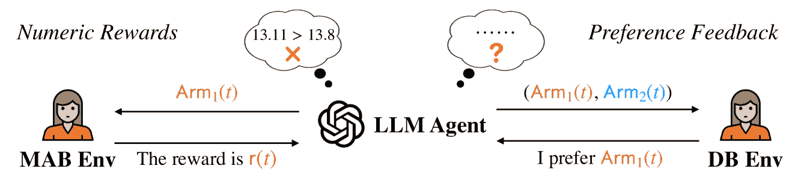
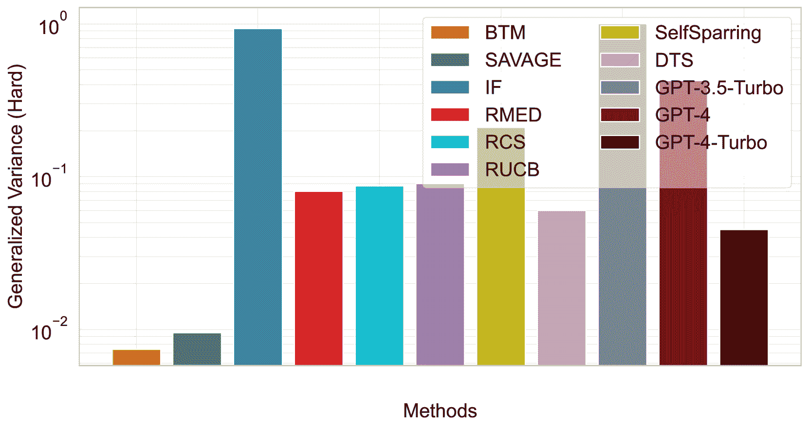

<!--yml

类别：未分类

日期：2025-01-11 12:28:09

-->

# 超越数值奖项：基于上下文的决斗强盗问题与大型语言模型代理

> 来源：[https://arxiv.org/html/2407.01887/](https://arxiv.org/html/2407.01887/)

\pdfcolInitStack

tcb@breakable

Fanzeng Xia fanzengxia@link.cuhk.edu.cn, litongxin@cuhk.edu.cn Hao Liu {hliu3, yyue}@caltech.edu Yisong Yue {hliu3, yyue}@caltech.edu Tongxin Li fanzengxia@link.cuhk.edu.cn, litongxin@cuhk.edu.cn

###### 摘要

基于上下文的强化学习（ICRL）是解决基础模型时代强化学习问题的前沿范式。尽管ICRL能力已通过任务特定训练在变换器中得到了验证，但大型语言模型（LLMs）开箱即用的潜力仍未得到充分探索。近期研究发现，当面对数值上下文时，LLMs常常面临挑战，而且在通过环境生成的偏好反馈来评估其性能方面关注较少。本文首次探讨了LLMs在决斗强盗问题（DB）中的作为上下文决策者的表现，DB是一种无状态的基于偏好的强化学习设置，通过查询偏好反馈扩展了经典的多臂强盗（MAB）模型。我们将GPT-3.5 Turbo、GPT-4、GPT-4 Turbo、Llama 3.1和o1-preview与九个成熟的DB算法进行比较。我们的结果显示，表现最好的LLM——GPT-4 Turbo，具有零样本相对决策能力，能够通过快速在对决中选出最佳臂，令人惊讶地在所有DB环境实例中实现低短期弱悔过。然而，LLMs与经典DB算法在强悔过方面存在最优性差距。即便在明确提示其进行此类操作时，LLMs也难以收敛并持续利用，而且对提示的变化非常敏感。为弥补这一差距，我们提出了一种代理流框架：增强算法决斗（LEAD），通过精细的自适应互动将现成的DB算法与LLM代理结合。我们展示了LEAD在弱悔过和强悔过方面继承了经典DB算法的理论保证。我们验证了它在嘈杂和对抗性提示下的有效性和稳健性。这种代理框架的设计为如何增强用于上下文决策任务的通用LLM的可信度提供了新的视角。

## 1 引言

使用任务特定互动数据集预训练的大型序列模型导致了上下文强化学习（ICRL）的出现（Laskin等，[2022](https://arxiv.org/html/2407.01887v3#bib.bib1); Lee等，[2024](https://arxiv.org/html/2407.01887v3#bib.bib2)），在这种方法中，模型可以通过交互历史作为上下文推断任务，并在没有参数更新的情况下在未见过的环境中做出有效决策。通过试错，这些模型可以在纯粹的上下文中自我改进它们的策略。虽然ICRL能力已经在从头开始训练的任务特定变压器中得到了验证，但通用大型语言模型（LLMs）执行ICRL的潜力仍然大多未被探索。最近关于LLMs在具有数值奖励的环境中“开箱即用”ICRL能力的研究报告了显著的失败案例，例如，LLM代理易受对抗性损失函数的影响，并且与经典算法如跟随正则化领导者（FTRL）（Park等，[2024](https://arxiv.org/html/2407.01887v3#bib.bib3)）相比，遭遇较高的遗憾，并且在通过标准训练的多臂赌博机（MAB）问题中出现探索失败（Krishnamurthy等，[2024](https://arxiv.org/html/2407.01887v3#bib.bib4)）。即使在推理时采用算法指导，LLMs与经典（上下文）MAB算法之间的最优性差距仍然存在（Nie等，[2024](https://arxiv.org/html/2407.01887v3#bib.bib5)）。这些结果表明，需要精心设计的提示和非平凡的算法干预，以引导LLM代理实现期望的上下文强化学习行为。

LLMs遇到的失败案例可能归因于处理数值奖励时的内在困难，特别是在那些模式难以用自然语言表达的任务中。近期的研究发现，LLMs通常在进行简单的数值比较时遇到困难（例如，错误地判断13.11比13.8大），而且在评估它们生成的决策之间的相对比较时，缺乏足够的重视。[图1](https://arxiv.org/html/2407.01887v3#S1.F1 "图1 ‣ 1 引言 ‣ 超越数值奖励：与LLM代理的上下文对抗赌博机")展示了一个玩具示例，说明了LLM代理与不同环境设置之间的上下文互动。为了剖析数值奖励带来的复杂性，本文聚焦于对抗赌博机（Dueling Bandits，DB）问题（Yue等人，[2012](https://arxiv.org/html/2407.01887v3#bib.bib6); Zoghi等人，[2014a](https://arxiv.org/html/2407.01887v3#bib.bib7)），这是一种无状态的基于偏好的强化学习设置（Wirth等人，[2017](https://arxiv.org/html/2407.01887v3#bib.bib8); Pacchiano等人，[2021](https://arxiv.org/html/2407.01887v3#bib.bib9)），它通过查询所选的臂对之间的偏好反馈来确定最佳臂，扩展了经典的多臂赌博机（MAB）模型。在DB中，代理通过二元结果（胜或负）来学习两个选定臂之间的噪声比较。该设置在挑战性较大的情况下特别有用，尤其是当获取明确反馈变得困难，或者反馈本身就是比较性的，比如食物的口味和产品的吸引力（Yue等人，[2012](https://arxiv.org/html/2407.01887v3#bib.bib6)）。DB因其在信息检索（Yue和Joachims，[2009](https://arxiv.org/html/2407.01887v3#bib.bib10)）、推荐系统（Sui等人，[2017](https://arxiv.org/html/2407.01887v3#bib.bib11)）和在线排序评估（Zoghi等人，[2014a](https://arxiv.org/html/2407.01887v3#bib.bib7)）中的应用而受到广泛关注。我们通过以下问题框定我们的研究：

大型语言模型（LLMs）在解决对抗赌博机问题（dueling bandits）时，作为上下文代理是否有效？

DB 问题作为一种相对决策问题，带来了独特的挑战，特别是由于相对奖励的稀疏性。这种稀疏性使得上下文中的决策过程变得更加复杂，因为它限制了通过交互获得的反馈，增加了一个在传统赌博机问题中通常看不到的难度。尽管存在将 DB 问题降至标准 MAB 的方法（Ailon 等， [2014](https://arxiv.org/html/2407.01887v3#bib.bib12); Saha 和 Gaillard，[2022](https://arxiv.org/html/2407.01887v3#bib.bib13)），但尚不清楚 LLMs 在面对偏好反馈而非数值奖励的 DB 问题时会表现如何。它们之间存在概念性差异，类似于强化学习中的人类反馈（RLHF）（Stiennon 等，[2020](https://arxiv.org/html/2407.01887v3#bib.bib14)）和标准 RL 之间的差异，其中可以在(Wang 等，[2024a](https://arxiv.org/html/2407.01887v3#bib.bib15))中找到不可能的结果。

尽管大规模序列模型的任务特定训练可以产生有前景的 ICRL 结果，但由于需要大量计算资源，这种方法往往不切实际。类似于(Krishnamurthy 等，[2024](https://arxiv.org/html/2407.01887v3#bib.bib4); Nie 等，[2024](https://arxiv.org/html/2407.01887v3#bib.bib5); Mirchandani 等，[2023](https://arxiv.org/html/2407.01887v3#bib.bib16); Chen 等，[2024](https://arxiv.org/html/2407.01887v3#bib.bib17))中的设置，我们评估了 ICRL 在对抗赌博机问题中的零-shot 能力（Wei 等，[2022](https://arxiv.org/html/2407.01887v3#bib.bib18)），而无需重新训练或微调。我们在下面总结了我们的主要结果。

图 1：LLM 智能体在数值奖励（多臂赌博机环境）和偏好反馈（对抗赌博机环境）下的上下文强化学习。

评估LLM在上下文对抗赌博中的新兴零-shot能力。我们不仅仅关注数值奖励，还通过案例研究，将LLM代理的强后悔与弱后悔的决策表现与各种基线对抗赌博算法进行了比较。我们发现，表现最好的通用LLM具有足够的零-shot相对决策能力，可以在对抗赌博中实现较低的弱后悔，这与经典的多臂赌博机设置中的表现大不相同（Krishnamurthy等人，[2024](https://arxiv.org/html/2407.01887v3#bib.bib4)）。特别地，GPT-4 Turbo在弱后悔方面表现出色，能够在对抗中快速选择最优臂，且在不同实例中波动较小，成为一个有效的对抗赌博决策者。然而，与(Nie等人，[2024](https://arxiv.org/html/2407.01887v3#bib.bib5))一致，我们发现LLM与经典对抗赌博算法在强后悔方面存在最优性差距。LLM的表现受限于探索阶段的过度估计偏差，以及利用阶段缺乏收敛标准。这突显了弥合这一差距的有效且稳健策略的需求，以应对上下文对抗赌博问题。

针对上下文对抗赌博问题（In-Context Dueling Bandits）提出的有效且稳健的代理流框架。为了解决已识别的最优性差距，并增强LLM代理在对抗赌博任务中的可信度，在第[4.1节](https://arxiv.org/html/2407.01887v3#S4.SS1 "4.1 Algorithmic Design of LEAD ‣ 4 Algorithm-Enhanced LLMs for Dueling Bandits ‣ Beyond Numeric Awards: In-Context Dueling Bandits with LLM Agents")中，我们提出了一个代理流框架——增强算法对抗赌博的LLM（LEAD），该框架将现成的“先探索后利用”对抗赌博算法与LLM代理结合。该框架使基于规则的专家系统与上下文LLM代理之间能够进行细粒度的适应性交互，通过算法干预增强其处理对抗赌博问题的能力，正如(Krishnamurthy等人，[2024](https://arxiv.org/html/2407.01887v3#bib.bib4); Nie等人，[2024](https://arxiv.org/html/2407.01887v3#bib.bib5))所建议的那样。作为一个示例，我们演示了如何将交错滤波器2（IF2）算法与LLM代理在此框架中结合。我们表明，LEAD具有理论保证，并通过实验展示了其在各种提示场景中的有效性和稳健性。

## 2 前提条件

本节中，我们简要介绍了对抗赌博问题（DB），并为本文建立了必要的符号和术语。更多有用的定义可以在附录[B.3.1](https://arxiv.org/html/2407.01887v3#A2.SS3.SSS1 "B.3.1 Useful Assumptions and Lemmas for Dueling Bandits ‣ B.3 Theoretical Analysis ‣ Appendix B Algorithm Design and Analysis of LEAD ‣ Beyond Numeric Awards: In-Context Dueling Bandits with LLM Agents")中找到。

对抗强盗。在一个基本的$K$臂对抗强盗问题设置中（Yue等人，[2012](https://arxiv.org/html/2407.01887v3#bib.bib6)），学习者通过在每一轮$t\in\{1,\ldots,T\}$选择两个臂$\mathsf{Arm}_{1}(t)$和$\mathsf{Arm}_{2}(t)$，从$K$个臂的集合$\{b_{1},\ldots,b_{K}\}$中进行有噪声的比较（即对抗），如图[1](https://arxiv.org/html/2407.01887v3#S1.F1 "图 1 ‣ 1 引言 ‣ 超越数值奖励：在上下文中使用LLM代理进行对抗强盗")所示。两个臂$(i,j)$之间的对抗结果是随机的。更准确地说，臂$b_{i}$击败臂$b_{j}$的事件是一个伯努利随机变量，其参数表示为$\Pr(b_{i}\succ b_{j})$。为了方便记号，我们对$\Pr(b_{i}\succ b_{j})$进行归一化，使得$\Pr(b_{i}\succ b_{j})=\epsilon(b_{i},b_{j})+1/2$，其中$\epsilon_{ij}\coloneq\epsilon(b_{i},b_{j})\in(-1/2,1/2)$是臂$b_{i}$和$b_{j}$之间的可区分度度量，该度量在时间上是稳定的，并且是对称的，即对于所有$i,j\in[K]\coloneq\{1,\ldots,K\}$，都有$\epsilon_{ij}=-\epsilon_{ji}$。最后，为了方便记号，我们定义了一个偏好矩阵$P=\left[\epsilon_{ij}\right]_{i,j\in[K]}$。

在上下文中使用LLM代理进行对抗强盗。我们考虑一个具有策略$\pi_{\mathrm{LLM}}$的LLM代理与$K$臂对抗强盗环境进行交互。在每一轮$t\in\{1,\ldots,T\}$，LLM代理基于自然语言指令$\mathtt{Prompt}(C,H_{t},R)$（见图[7](https://arxiv.org/html/2407.01887v3#A3.F7 "图 7 ‣ C.1.2 提示设计 ‣ C.1 LLM实验结果 ‣ 附录C 提示设计与补充结果 ‣ 超越数值奖励：在上下文中使用LLM代理进行对抗强盗")）从集合$\{b_{1},\ldots,b_{K}\}$中选择一对臂$(\mathsf{Arm}_{1}(t),\mathsf{Arm}_{2}(t))$，该指令由三部分组成：

+   •

    问题描述$P$：对DB问题的自然语言描述，包括臂的数量$K$，时间范围$T$和任务目标。

+   •

    历史$H_{t}$：一个外部总结的交互历史（Krishnamurthy等人，[2024](https://arxiv.org/html/2407.01887v3#bib.bib4)），包括到第$t$轮为止的一系列成对对抗结果和经验概率。

+   •

    推理$R$：零-shot链式思维（CoT）推理（Kojima等人，[2022](https://arxiv.org/html/2407.01887v3#bib.bib19)），鼓励LLM代理以结构化的方式推理问题。

LLM代理的策略可以表示为：

|  | $\displaystyle\left(\mathsf{Arm}_{1}(t),\mathsf{Arm}_{2}(t)\right)=\pi_{\mathrm{LLM}}\left(\mathtt{Prompt}(P,H_{t},R)\right).$ |  | (1) |
| --- | --- | --- | --- |

目标是在某个时间范围$T$内最大化累积奖励，其中奖励是两个选定手臂击败最佳手臂（孔多塞赢家）未知概率的总和。我们可以通过最小化累积后悔来量化性能，无论是强后悔还是弱后悔（参见公式([4](https://arxiv.org/html/2407.01887v3#A2.E4 "In B.3.1 Useful Assumptions and Lemmas for Dueling Bandits ‣ B.3 Theoretical Analysis ‣ Appendix B Algorithm Design and Analysis of LEAD ‣ Beyond Numeric Awards: In-Context Dueling Bandits with LLM Agents"))和公式([5](https://arxiv.org/html/2407.01887v3#A2.E5 "In B.3.1 Useful Assumptions and Lemmas for Dueling Bandits ‣ B.3 Theoretical Analysis ‣ Appendix B Algorithm Design and Analysis of LEAD ‣ Beyond Numeric Awards: In-Context Dueling Bandits with LLM Agents")))。

强后悔与弱后悔。在本文中，我们假设存在一个标准设定，即存在一个**孔多塞赢家（Condorcet winner, CW）**（Sui等，[2017](https://arxiv.org/html/2407.01887v3#bib.bib11)；Wu和Liu，[2016](https://arxiv.org/html/2407.01887v3#bib.bib20)；Zoghi等，[2014a](https://arxiv.org/html/2407.01887v3#bib.bib7)；Yue等，[2012](https://arxiv.org/html/2407.01887v3#bib.bib6)）。CW表示为$b^{*}$，是一个优于所有其他手臂的臂，即$b^{*}=b_{i}$，如果对所有$j\in[K]\backslash\{i\}$都有$\epsilon_{ij}>1/2$。我们考虑两种性能指标：（i）强后悔（SR），它评估$b^{*}$与两个选定手臂之间的总偏好差距；（ii）弱后悔（WR），它仅将$b^{*}$与两个手臂中更好的一个进行比较。详细的定义和设定请参见附录[B.3.1](https://arxiv.org/html/2407.01887v3#A2.SS3.SSS1 "B.3.1 Useful Assumptions and Lemmas for Dueling Bandits ‣ B.3 Theoretical Analysis ‣ Appendix B Algorithm Design and Analysis of LEAD ‣ Beyond Numeric Awards: In-Context Dueling Bandits with LLM Agents")。

相关工作。我们的工作为日益增长的**大语言模型（LLMs）与决策制定的交集领域**作出了贡献。我们在附录[A](https://arxiv.org/html/2407.01887v3#A1 "Appendix A Related Works ‣ Beyond Numeric Awards: In-Context Dueling Bandits with LLM Agents")中总结了有关对抗性赌徒、LLM代理用于赌徒问题以及LLM在上下文决策中的应用的详细相关工作。

## 3 LLM作为独立的上下文决策者

为了评估LLMs在上下文中解决DB问题的效能，本节中，我们将LLMs作为独立的决策代理，并与经典的DB算法进行比较。我们的评估分为两部分：首先，在图[2](https://arxiv.org/html/2407.01887v3#S3.F2 "Figure 2 ‣ 3.2 Experimental results ‣ 3 LLMs as Standalone In-Context Decision-Makers ‣ Beyond Numeric Awards: In-Context Dueling Bandits with LLM Agents")和[9](https://arxiv.org/html/2407.01887v3#A3.F9 "Figure 9 ‣ C.2.1 Comparisons with Different Metrics ‣ C.2 Supplementary Experiments ‣ Appendix C Prompt Design and Supplementary Results ‣ Beyond Numeric Awards: In-Context Dueling Bandits with LLM Agents")中，我们将LLMs和经典算法在强后悔和弱后悔方面的表现进行比较（见公式([4](https://arxiv.org/html/2407.01887v3#A2.E4 "In B.3.1 Useful Assumptions and Lemmas for Dueling Bandits ‣ B.3 Theoretical Analysis ‣ Appendix B Algorithm Design and Analysis of LEAD ‣ Beyond Numeric Awards: In-Context Dueling Bandits with LLM Agents")）和公式([5](https://arxiv.org/html/2407.01887v3#A2.E5 "In B.3.1 Useful Assumptions and Lemmas for Dueling Bandits ‣ B.3 Theoretical Analysis ‣ Appendix B Algorithm Design and Analysis of LEAD ‣ Beyond Numeric Awards: In-Context Dueling Bandits with LLM Agents")），并考虑标准差）。其次，我们深入分析实验结果，探讨LLM代理的成功与失败模式。

### 3.1 实验实施细节

LLMs 的提示和配置。我们采用了一个交互式零-shot链式思维（CoT）提示$\mathtt{Prompt}(P,H_{t},R)$，如第[2](https://arxiv.org/html/2407.01887v3#S2 "2 Preliminaries ‣ Beyond Numeric Awards: In-Context Dueling Bandits with LLM Agents")节所定义，该提示描述了问题设置$P$、外部总结的交互历史$H_{t}$和推理指令$R$。我们采用了在最近的研究中（Krishnamurthy等， [2024](https://arxiv.org/html/2407.01887v3#bib.bib4)；Nie等，[2024](https://arxiv.org/html/2407.01887v3#bib.bib5)）中所有提示变体中表现最好的提示模板和LLM配置，用于MAB问题。LLM代理以回合制的方式与决斗强盗环境进行交互，提示引导它们的决策过程。我们进行了五个LLM的实验：GPT-3.5 Turbo、GPT-4、GPT-4 Turbo、Llama 3.1 和 o1-preview。请注意，我们跳过了GPT-4o版本，它主要用于多模态任务，且其智能水平与GPT-4 Turbo相同。详细的提示设计见附录[C.1.2](https://arxiv.org/html/2407.01887v3#A3.SS1.SSS2 "C.1.2 Design of Prompts ‣ C.1 LLM Experimental Results ‣ Appendix C Prompt Design and Supplementary Results ‣ Beyond Numeric Awards: In-Context Dueling Bandits with LLM Agents")。

基准。我们将LLMs与九个公认的基准算法进行比较，以评估其效果。这些基准包括交替滤波器（IF2）（Yue等，[2012](https://arxiv.org/html/2407.01887v3#bib.bib6)），击败均值（BTM）（Yue和Joachims，[2011](https://arxiv.org/html/2407.01887v3#bib.bib21)），通用探索变量的敏感性分析（SAVAGE）（Urvoy等，[2013](https://arxiv.org/html/2407.01887v3#bib.bib22)），相对上置信界（RUCB）（Zoghi等，[2014b](https://arxiv.org/html/2407.01887v3#bib.bib23)），相对置信采样（RCS）（Zoghi等，[2014a](https://arxiv.org/html/2407.01887v3#bib.bib7)），相对最小经验散度（RMED）（Komiyama等，[2015](https://arxiv.org/html/2407.01887v3#bib.bib24)），多功能对决臂算法（VDB）（Saha和Gaillard，[2022](https://arxiv.org/html/2407.01887v3#bib.bib13)），自我对抗（Self-Sparring）（Sui等，[2017](https://arxiv.org/html/2407.01887v3#bib.bib11)），双重汤普森采样（DTS）（Wu和Liu，[2016](https://arxiv.org/html/2407.01887v3#bib.bib20)）。这些算法中的每一个都采用不同的策略来选择臂和估计偏好，最终目标是有效地识别Condorcet获胜者。我们通过第[2](https://arxiv.org/html/2407.01887v3#S2 "2 Preliminaries ‣ Beyond Numeric Awards: In-Context Dueling Bandits with LLM Agents")节中定义的强遗憾和弱遗憾指标来评估LLMs和基准算法的表现。

环境。我们在标准的DB设置下，通过Condorcet获胜者（CW）评估LLMs和基准算法在两种类型的随机环境中的遗憾表现。环境在其随机传递性特性上有所不同，分为两种情况，每种情况根据CW在击败其他臂时的可区分性有两个难度级别（容易和困难）：(i) 传递性案例（$\text{SST}\cap\text{STI}$）：此案例使用Bradley-Terry-Luce（BTL）模型（Bradley和Terry，[1952](https://arxiv.org/html/2407.01887v3#bib.bib25); Yue等，[2012](https://arxiv.org/html/2407.01887v3#bib.bib6)）。这种方式生成的偏好矩阵满足强随机传递性（SST）和随机三角不等式（STI），这意味着存在CW；(ii) 非传递性案例（$\text{CW}\setminus(\text{SST}\cup\text{STI})$）：偏好矩阵在非获胜臂之间引入循环偏好，同时确保存在CW。非传递性案例使用一种定制的偏好构建来违反SST和STI。详细的构建可以在附录[C.1.1](https://arxiv.org/html/2407.01887v3#A3.SS1.SSS1 "C.1.1 Environments ‣ C.1 LLM Experimental Results ‣ Appendix C Prompt Design and Supplementary Results ‣ Beyond Numeric Awards: In-Context Dueling Bandits with LLM Agents")中找到。

随机测试。我们选择的实验规模旨在平衡计算可行性，同时保持得出有意义结论的能力。我们将时间范围设定为$T=2000$回合，为LLM和基准算法提供足够的机会来学习和适应DB环境。每个实验对LLM重复$N=5$次，对基准算法重复$N=20$次，以便理解它们的平均行为并提供可靠的性能估计。

### 3.2 实验结果

图 2：LLM代理与DB算法的比较。左图和右图：传递-简单实例的强后悔和弱后悔。传递-困难的结果见图[9](https://arxiv.org/html/2407.01887v3#A3.F9 "Figure 9 ‣ C.2.1 Comparisons with Different Metrics ‣ C.2 Supplementary Experiments ‣ Appendix C Prompt Design and Supplementary Results ‣ Beyond Numeric Awards: In-Context Dueling Bandits with LLM Agents")。

为简洁起见，我们呈现了集中在传递-简单实例的初步分析（图[2](https://arxiv.org/html/2407.01887v3#S3.F2 "Figure 2 ‣ 3.2 Experimental results ‣ 3 LLMs as Standalone In-Context Decision-Makers ‣ Beyond Numeric Awards: In-Context Dueling Bandits with LLM Agents")）。对于传递-困难实例（图[9](https://arxiv.org/html/2407.01887v3#A3.F9 "Figure 9 ‣ C.2.1 Comparisons with Different Metrics ‣ C.2 Supplementary Experiments ‣ Appendix C Prompt Design and Supplementary Results ‣ Beyond Numeric Awards: In-Context Dueling Bandits with LLM Agents")，参见附录[C.2](https://arxiv.org/html/2407.01887v3#A3.SS2 "C.2 Supplementary Experiments ‣ Appendix C Prompt Design and Supplementary Results ‣ Beyond Numeric Awards: In-Context Dueling Bandits with LLM Agents")）。我们在BTM中使用$\gamma=0.5$，在RMED中使用$f(K)=0.3K^{1.01}$，在Self-Sparring中使用$\eta=1$，在RUCB、RCS和DTS中使用$\alpha=0.51$。我们通过第[2](https://arxiv.org/html/2407.01887v3#S2 "2 Preliminaries ‣ Beyond Numeric Awards: In-Context Dueling Bandits with LLM Agents")节定义的强后悔和弱后悔来分析结果。在接下来的章节中，我们将主要关注GPT-4 Turbo，它是我们表现最好的LLM，并重点讨论其成功与失败模式。

上下文对抗赌博能力的出现。虽然 GPT-3.5 Turbo 和 GPT-4 未能解决 DB 问题，但 GPT-4 Turbo 在过渡案例中的弱后悔表现始终优于最先进的 DB 基准（见图[2](https://arxiv.org/html/2407.01887v3#S3.F2 "图 2 ‣ 3.2 实验结果 ‣ 3 LLM 作为独立上下文决策者 ‣ 超越数值奖励：与 LLM 代理的上下文对抗赌博")和[9](https://arxiv.org/html/2407.01887v3#A3.F9 "图 9 ‣ C.2.1 不同度量标准的比较 ‣ C.2 补充实验 ‣ 附录 C 提示设计与补充结果 ‣ 超越数值奖励：与 LLM 代理的上下文对抗赌博")）。这表明，随着通用 LLM 通过标准训练逐步提高其整体能力，上下文对抗赌博能力也逐渐显现出来。图[13](https://arxiv.org/html/2407.01887v3#A3.F13 "图 13 ‣ C.2.1 不同度量标准的比较 ‣ C.2 补充实验 ‣ 附录 C 提示设计与补充结果 ‣ 超越数值奖励：与 LLM 代理的上下文对抗赌博")（左图）展示了不同时间间隔内包括最佳臂的对抗占比。GPT-4 Turbo 在整个时间线中均优于其他 LLM 和 DB 基准。这些发现表明，GPT-4 Turbo 能够有效处理从对抗中获得的偏好反馈，并做出明智的决策，迅速识别并将最佳臂纳入其对抗中。

在不同实例中的稳定表现。与其他大规模语言模型（LLM）和决策基准相比，GPT-4 Turbo 在不同难度级别下表现出较低的方差。如图[14](https://arxiv.org/html/2407.01887v3#A3.F14 "图 14 ‣ C.2.1 不同度量标准的比较 ‣ C.2 补充实验 ‣ 附录 C 提示设计与补充结果 ‣ 超越数值奖励：与 LLM 代理的上下文对抗赌博")所示，GPT-4 Turbo 在强后悔和弱后悔的两种实例中都表现出最低的平均泛化方差。这突显了它在决策基准中保持稳定决策过程的能力。

<svg class="ltx_picture" height="63.28" id="S3.SS2.1.p1.pic1" overflow="visible" version="1.1" width="594"><g fill="#000000" stroke="#000000" stroke-width="0.4pt" transform="translate(0,63.28) matrix(1 0 0 -1 0 0)"><g fill-opacity="1.0" transform="matrix(1.0 0.0 0.0 1.0 15.81 8.89)"><foreignobject color="#000000" height="45.51" overflow="visible" transform="matrix(1 0 0 -1 0 16.6)" width="562.39">Best Arm Identification: LLMs’ in-context dueling bandits abilities emerge as the general capabilities grow. The Condorcet Winner is consistently selected in duel via GPT-4 Turbo, leading to exceptional weak regret performance with minimal variance on Transitive Case.</foreignobject></g></g></svg>

**探索脆弱性**。在探索阶段，我们观察到GPT-4 Turbo倾向于迅速缩小范围至一小部分臂（尽管通常包含Condorcet赢家），并反复比较这些臂。与此相对，基准模型展示了更为多样且扩展的探索模式。这种行为表明，GPT-4 Turbo可能会高估在初次比较中获胜的臂的质量，原因是基于有限的历史数据。不同于具有明确探索机制的基准模型，LLM依赖其固有的随机性（通过从其输出分布中采样）进行探索。基于这些观察，我们假设，如果GPT-4 Turbo恰好在早期采样一系列有利于次优臂的比较，它可能会陷入无限期地比较这些臂的局面。为了验证这一假设，我们通过使用带有偏向历史的噪声提示进行实验。图[16](https://arxiv.org/html/2407.01887v3#A3.F16 "Figure 16 ‣ C.2.2 Duel Selection Trajectory ‣ C.2 Supplementary Experiments ‣ Appendix C Prompt Design and Supplementary Results ‣ Beyond Numeric Awards: In-Context Dueling Bandits with LLM Agents")中的结果证实了GPT-4 Turbo的探索策略确实容易受到偏向历史初始化的影响，并可能收敛到局部最优解。

**利用能力不足**。尽管GPT-4 Turbo在弱后悔性能上表现出色，但它未能在对自身进行对决时始终如一地收敛到一个最佳臂，即便提示设置明确要求这样做。这个行为突显了LLM的一个根本限制：它们主要是为词元预测而设计和训练的，而非决策制定。与具有明确停止条件的基准模型不同，GPT-4 Turbo依赖其固有的语言建模能力来决定何时停止探索。因此，在后期的利用阶段，GPT-4 Turbo不断地比较相同的顶级臂，而没有最终确定一个获胜者（参见图[3](https://arxiv.org/html/2407.01887v3#S3.F3 "Figure 3 ‣ 3.2 Experimental results ‣ 3 LLMs as Standalone In-Context Decision-Makers ‣ Beyond Numeric Awards: In-Context Dueling Bandits with LLM Agents")）。这表明，单靠语言建模目标可能不足以使LLM在复杂的决策任务中实现最佳控制，如决策带模型（DB）。

<svg class="ltx_picture" height="63.28" id="S3.SS2.2.p1.pic1" overflow="visible" version="1.1" width="594"><g fill="#000000" stroke="#000000" stroke-width="0.4pt" transform="translate(0,63.28) matrix(1 0 0 -1 0 0)"><g fill-opacity="1.0" transform="matrix(1.0 0.0 0.0 1.0 15.81 8.89)"><foreignobject color="#000000" height="45.51" overflow="visible" transform="matrix(1 0 0 -1 0 16.6)" width="562.39">Lack of Robust Strategy: LLMs’ performance can be hindered by noisy and adversarial prompts due to overestimation bias in the exploration stage and the lack of convergence criteria in the exploitation stage.</foreignobject></g></g></svg>

在预训练期间对DB问题的偏见理解。我们表现最好的两款大语言模型（LLM），GPT-4 Turbo和o1-preview，在DB问题上表现出系统性的偏见，这可能是由于在预训练过程中缺乏类似任务的暴露。具体来说，它们错误地假设一个臂不能与自身对决（收敛情况），即使在明确提示的情况下也如此（请参见附录[C.1.3](https://arxiv.org/html/2407.01887v3#A3.SS1.SSS3 "C.1.3 Exemplars of GPT-4 Turbo and o1-preview ‣ C.1 LLM Experimental Results ‣ Appendix C Prompt Design and Supplementary Results ‣ Beyond Numeric Awards: In-Context Dueling Bandits with LLM Agents")中的示例）。这种误解使得DB问题对LLM而言成为一个分布外（OOD）任务，而上下文中的指令未能完全消除这一内部偏见。因此，由于上下文学习的固有限制，LLM代理无法完全与问题描述对齐，而上下文学习无法真正推广到OOD任务（Wang et al., [2024b](https://arxiv.org/html/2407.01887v3#bib.bib26)）。图[13](https://arxiv.org/html/2407.01887v3#A3.F13 "Figure 13 ‣ C.2.1 Comparisons with Different Metrics ‣ C.2 Supplementary Experiments ‣ Appendix C Prompt Design and Supplementary Results ‣ Beyond Numeric Awards: In-Context Dueling Bandits with LLM Agents")支持了这些观察：o1-preview通过有效地从探索转向利用，并实现了比GPT-4 Turbo更低的强后悔，展示了更好的推理能力。然而，它的推理时CoT机制强化了其对DB问题的内部偏见理解，导致在对决中选择两个次优臂，从而导致较差的弱后悔表现。

<svg class="ltx_picture" height="46.68" id="S3.SS2.3.p1.pic1" overflow="visible" version="1.1" width="594"><g fill="#000000" stroke="#000000" stroke-width="0.4pt" transform="translate(0,46.68) matrix(1 0 0 -1 0 0)"><g fill-opacity="1.0" transform="matrix(1.0 0.0 0.0 1.0 15.81 8.89)"><foreignobject color="#000000" height="28.9" overflow="visible" transform="matrix(1 0 0 -1 0 16.6)" width="562.39">Systematic Biases: LLMs out-of-the-box lack a fundamental understanding of the DB problem and instead intuitively choose the next pair of arms to compare based on dueling history.</foreignobject></g></g></svg>

可扩展性限制。为了评估大型语言模型（LLMs）是否能够将其卓越的弱后悔表现进行泛化，我们从两个角度进行实验：（i）去除偏好结构中的传递性：我们将从符合传递性的情况更改为违反SST和STI的非传递性情况（参见图[10](https://arxiv.org/html/2407.01887v3#A3.F10 "图 10 ‣ C.2.1 不同度量的比较 ‣ C.2 补充实验 ‣ 附录 C 提示设计与补充结果 ‣ 超越数值奖励：LLM代理的上下文对抗赌博带")和[11](https://arxiv.org/html/2407.01887v3#A3.F11 "图 11 ‣ C.2.1 不同度量的比较 ‣ C.2 补充实验 ‣ 附录 C 提示设计与补充结果 ‣ 超越数值奖励：LLM代理的上下文对抗赌博带")）。对非传递性-简单和非传递性-困难的分析在定性上是相似的：在面对非传递性实例时，LLMs未能在传递性情况下复制其长期弱后悔表现。然而，它们的短期弱后悔表现（< 100步）仍然异常优秀；（ii）增加臂的数量：如图[12](https://arxiv.org/html/2407.01887v3#A3.F12 "图 12 ‣ C.2.1 不同度量的比较 ‣ C.2 补充实验 ‣ 附录 C 提示设计与补充结果 ‣ 超越数值奖励：LLM代理的上下文对抗赌博带")所示，从$K=5$增加到$K=10$，GPT-4 Turbo的表现随着$K$的增加而出现明显的长期下降。尽管LLMs在最初的步骤中仍能击败所有的DB基准，但它们在长期内难以有效推断更大数量臂之间的相对强度。这些发现表明，尽管LLMs表现出了基于语言知识的相对决策能力，它们的有效性仅限于短期情境。长期表现则受到更多臂的数量和LLMs对非传递性循环结构缺乏基本理解的影响。

为了量化这一长期可扩展性限制，并正式描述LLMs能够处理的对抗赌博带实例，我们引入了相对决策边界（RDB）的概念。给定LLM $m$的RDB定义为问题难度$D$的集合，其中模型在有效的短期时间范围$T_{e}$内达到可接受的弱后悔水平，并满足以下条件：

|  | $\displaystyle\text{RDB}(m)=\left\{(K,T,\Delta,T_{e})\ \Big{&#124;}\ \mathsf{WR}(m,D% (K,T,\Delta),T_{e})\leq\mathsf{R_{\text{th}}}\right\}.$ |  | (2) |
| --- | --- | --- | --- |

在这里，$\mathsf{WR}(m,D,T_{e})$ 表示模型 $m$ 在一个难度为 $D$ 的问题上，在有效的短期时间范围 $T_{e}$ 内所产生的累计弱遗憾，而 $\mathsf{R_{\text{th}}}$ 是一个预定义的阈值，用来量化可接受的弱遗憾表现。总体来说，RDB 受到 $m$ 的固有能力、臂的数量 $K$、传递性 $T$、臂之间的可区分性 $\Delta$ 以及有效短期时间范围 $T_{e}$ 的影响。

<svg class="ltx_picture ltx_centering" height="142.2" id="S3.SS2.4.pic1" overflow="visible" version="1.1" width="594"><g fill="#000000" stroke="#000000" stroke-width="0.4pt" transform="translate(0,142.2) matrix(1 0 0 -1 0 0)"><g fill-opacity="1.0" transform="matrix(1.0 0.0 0.0 1.0 21.65 99.51)"><foreignobject color="#000000" height="28.9" overflow="visible" transform="matrix(1 0 0 -1 0 16.6)" width="550.7">Failure of long-term generalization: LLMs’ long-term strong and weak regret performance degrades when introducing intransitive preference structures or large number of arms.</foreignobject></g> <g fill-opacity="1.0" transform="matrix(1.0 0.0 0.0 1.0 21.65 13.78)"><foreignobject color="#000000" height="62.11" overflow="visible" transform="matrix(1 0 0 -1 0 16.6)" width="550.7">Success of short-term generalization: LLMs’ short-term weak regret performance remains surprisingly exceptional across all instances (see subfigures in[2](https://arxiv.org/html/2407.01887v3#S3.F2 "Figure 2 ‣ 3.2 Experimental results ‣ 3 LLMs as Standalone In-Context Decision-Makers ‣ Beyond Numeric Awards: In-Context Dueling Bandits with LLM Agents"),  [9](https://arxiv.org/html/2407.01887v3#A3.F9 "Figure 9 ‣ C.2.1 Comparisons with Different Metrics ‣ C.2 Supplementary Experiments ‣ Appendix C Prompt Design and Supplementary Results ‣ Beyond Numeric Awards: In-Context Dueling Bandits with LLM Agents"), [10](https://arxiv.org/html/2407.01887v3#A3.F10 "Figure 10 ‣ C.2.1 Comparisons with Different Metrics ‣ C.2 Supplementary Experiments ‣ Appendix C Prompt Design and Supplementary Results ‣ Beyond Numeric Awards: In-Context Dueling Bandits with LLM Agents"), [11](https://arxiv.org/html/2407.01887v3#A3.F11 "Figure 11 ‣ C.2.1 Comparisons with Different Metrics ‣ C.2 Supplementary Experiments ‣ Appendix C Prompt Design and Supplementary Results ‣ Beyond Numeric Awards: In-Context Dueling Bandits with LLM Agents"), [12](https://arxiv.org/html/2407.01887v3#A3.F12 "Figure 12 ‣ C.2.1 Comparisons with Different Metrics ‣ C.2 Supplementary Experiments ‣ Appendix C Prompt Design and Supplementary Results ‣ Beyond Numeric Awards: In-Context Dueling Bandits with LLM Agents")). We introduce Relative Decision Boundary (RDB) to describe the dueling bandit instances that LLMs can effectively handle.</foreignobject></g></g></svg>

图 3：GPT-4 Turbo、Self-Sparring 和 DTS 在 Transitive-Easy（上排）和 Transitive-Hard（下排）实例中的对战选择轨迹对比。GPT-4 Turbo 的决策轨迹展示了明显的持续探索模式，未能收敛到最优臂。相比之下，Self-Sparring 和 DTS 展示了结构化的探索模式和收敛特性。

总结来说，我们发现，基于上下文的 LLM 代理的语言先验使它们能够迅速识别来自对战历史中的 Condorcet 胜者（无论是在传递性案例还是非传递性案例中），但这种方法具有脆弱性。

为了进一步研究 LLM 的算法行为，并开发更强大有效的上下文决策策略，我们寻求回答以下问题：

[Q1]  我们能否开发出具有理论保证的算法增强型上下文 DB 代理？

[Q2]  与独立的 LLM 代理和经典的 DB 算法相比，它的表现如何？

## 4 算法增强型 LLM 在对战强盗问题中的应用

基于 Explore-then-Exploit 框架的经典 DB 算法，如交替滤波器 2（IF2）（Yue 等人， [2012](https://arxiv.org/html/2407.01887v3#bib.bib6)），已知是接近最优的，其遗憾上界和下界的匹配精度高，且在乘法常数范围内。为了解决使用独立 LLM 代理进行 DB 所面临的挑战（详见第 [3.2](https://arxiv.org/html/2407.01887v3#S3.SS2 "3.2 实验结果 ‣ 3 LLM 作为独立的上下文决策者 ‣ 超越数值奖励：具有 LLM 代理的上下文对战强盗问题") 节），我们提出了一种算法增强的方法：带有增强算法对战（LEAD）的 LLM，旨在展示通过细粒度自适应互动将现成的 DB 算法与 LLM 代理结合的可能性。我们的框架 LEAD 既具有遗憾保证，又具备强大的实证表现。

### 4.1 LEAD 的算法设计

在本节中，我们展示了LEAD的设计直觉。我们首先讨论了天真干预方法的局限性以及有效的算法增强型LLM框架的理想特性。基于这些考虑，我们提出了一个代理框架设计LEAD，在该框架中，我们可以结合任何探索-再利用的数据库（DB）算法（Zoghi等人，[2014a](https://arxiv.org/html/2407.01887v3#bib.bib7)）。作为说明示例，我们使用IF2（Yue等人，[2012](https://arxiv.org/html/2407.01887v3#bib.bib6)）来展示如何将现成算法集成到LEAD中，并提供详细描述。

天真干预的局限性。解决LLMs收敛不稳定性的一个直接方法是使用简单的if-else条件，在LLMs首次利用两个相同的臂时强制其收敛，我们称之为收敛触发（CT）干预策略。然而，CT无法保证选择真正的康多塞（Condorcet）获胜者，并可能强化局部最优解（参见附录[C.2](https://arxiv.org/html/2407.01887v3#A3.SS2 "C.2 补充实验 ‣ 附录C 提示设计与补充结果 ‣ 超越数值奖励：具有LLM代理的上下文对抗强盗")中的失败示例，图[17](https://arxiv.org/html/2407.01887v3#A3.F17 "图17 ‣ C.2.2 对决选择轨迹 ‣ C.2 补充实验 ‣ 附录C 提示设计与补充结果 ‣ 超越数值奖励：具有LLM代理的上下文对抗强盗")）。这表明，依赖LLMs的内部收敛行为来触发从探索到再利用的过渡是不可靠的，因为LLMs在很大程度上是由其固有的采样噪声驱动，而不是结构化的探索策略。因此，使用理论保证来处理这一局限性仍然具有挑战性。

LLM增强的理想特性。为了解决[Q1]，我们寻求具有以下特性的算法框架：（i）一个清晰的符号逻辑结构，便于与LLM和算法建议的集成；（ii）一个明确定义的探索-再利用权衡，既能利用LLMs的探索行为，又能确保收敛性；（iii）强大的理论保证，以保持在各种提示场景下的鲁棒性。

因此，我们发现探索-再利用（Explore-Then-Exploit）结构特别适合于大语言模型（LLMs）（详见附录[B.1](https://arxiv.org/html/2407.01887v3#A2.SS1 "B.1 算法设计逻辑 ‣ 附录B LEAD的算法设计与分析 ‣ 超越数值奖励：具有LLM代理的上下文对抗强盗")的详细说明）。通过在LEAD中选择探索-再利用的数据库（DB）算法作为基础，我们解决了[Q1]。例如，我们使用IF2作为基础，来展示理论保证和实证表现。这种方法也可以类似地应用于探索-再利用家族中具有后悔界限的其他算法。

图 4：在算法[1](https://arxiv.org/html/2407.01887v3#algorithm1 "Algorithm 1 ‣ 4.1 Algorithmic Design of LEAD ‣ 4 Algorithm-Enhanced LLMs for Dueling Bandits ‣ Beyond Numeric Awards: In-Context Dueling Bandits with LLM Agents")中提出的LEAD代理的主要组件如下所示：（i）蓝色部分代表LLM阶段。（ii）灰色部分表示DB阶段。（iii）算法流程在附录[B.2](https://arxiv.org/html/2407.01887v3#A2.SS2 "B.2 Detailed Procedure Description ‣ Appendix B Algorithm Design and Analysis of LEAD ‣ Beyond Numeric Awards: In-Context Dueling Bandits with LLM Agents")中有详细描述。（iv）黑色箭头表示组件之间的共享交互。（v）虚线箭头表示输入和输出。

算法框架。LEAD的过程如图[4](https://arxiv.org/html/2407.01887v3#S4.F4 "Figure 4 ‣ 4.1 Algorithmic Design of LEAD ‣ 4 Algorithm-Enhanced LLMs for Dueling Bandits ‣ Beyond Numeric Awards: In-Context Dueling Bandits with LLM Agents")所示，并在算法[1](https://arxiv.org/html/2407.01887v3#algorithm1 "Algorithm 1 ‣ 4.1 Algorithmic Design of LEAD ‣ 4 Algorithm-Enhanced LLMs for Dueling Bandits ‣ Beyond Numeric Awards: In-Context Dueling Bandits with LLM Agents")中呈现（更多细节见附录[B.2](https://arxiv.org/html/2407.01887v3#A2.SS2 "B.2 Detailed Procedure Description ‣ Appendix B Algorithm Design and Analysis of LEAD ‣ Beyond Numeric Awards: In-Context Dueling Bandits with LLM Agents")）。LEAD（IF2基础）保持一个置信度参数$\delta$和一个阈值参数$\epsilon$，用于控制算法对臂之间匹配的信心。LEAD（IF2基础）的关键组件如下：

+   •

    阶段 1（LLM 阶段）：*利用LLM推荐的臂*：代理框架保持一组候选臂$B$。给定LLM代理建议的两个臂，框架开始通过这两个臂之间的竞争来寻找赢家，记作$b_{\mathrm{LLM}}$。然后，获胜的臂$b_{\mathrm{LLM}}$与$B$中每个剩余的臂$b$进行匹配。此阶段继续，直到$b_{\mathrm{LLM}}$被击败或$B$中的所有臂都已匹配。变量$\mathsf{TrustLLM}$用于控制LLM阶段的执行，当$b_{\mathrm{LLM}}$被另一个臂击败时，它被设置为$\mathtt{False}$，表示不再信任LLM的建议。

+   •

    阶段 2（IF2 阶段）：*回滚到 IF2*：如果$b_{\mathrm{LLM}}$被击败，框架将切换到执行一轮IF2，其中根据估计的偏好矩阵$\hat{P}$选择当前臂$b_{\text{{IF2}}}$。

在第二阶段后，算法增强型代理会重复第一阶段，直到$B$只包含最优臂。算法[1](https://arxiv.org/html/2407.01887v3#algorithm1 "算法 1 ‣ 4.1 LEAD的算法设计 ‣ 4 算法增强型LLM用于决斗强盗问题 ‣ 超越数值奖励：基于上下文的决斗强盗问题与LLM代理")和图[4](https://arxiv.org/html/2407.01887v3#S4.F4 "图 4 ‣ 4.1 LEAD的算法设计 ‣ 4 算法增强型LLM用于决斗强盗问题 ‣ 超越数值奖励：基于上下文的决斗强盗问题与LLM代理")总结了上述阶段，详细内容参见附录[B.2](https://arxiv.org/html/2407.01887v3#A2.SS2 "B.2 详细过程描述 ‣ 附录 B LEAD的算法设计与分析 ‣ 超越数值奖励：基于上下文的决斗强盗问题与LLM代理")。

算法 1 算法增强型 LLM 代理：LEAD（IF2 基础）

初始化：

时间跨度长度$T$，臂$B=\{b_{1},\ldots,b_{K}\}$，现有臂$b_{\text{{IF2}}}$

当 *$|B|\geq 1$* 时，执行

$\mathsf{TrustLLM}\leftarrow\mathtt{True}$2       /* 图[4](https://arxiv.org/html/2407.01887v3#S4.F4 "图 4 ‣ 4.1 LEAD的算法设计 ‣ 4 算法增强型LLM在对抗性赌博中的应用 ‣ 超越数值奖励：与LLM代理的上下文对抗赌博")中的LLM阶段（第2-10行） */ 当 *$\mathsf{TrustLLM}$* 时             提示LLM选择 $(b_{\mathrm{LLM}_{1}},b_{\mathrm{LLM}_{2}})$ 来自 $B$  $b_{\mathrm{LLM}}\leftarrow\textsc{Match Arms}(b_{\mathrm{LLM}_{1}},b_{\mathrm{LLM}_{2}})$（过程[1](https://arxiv.org/html/2407.01887v3#algorithm1a "过程 1 ‣ B.2 详细过程描述 ‣ 附录B LEAD的算法设计与分析 ‣ 超越数值奖励：与LLM代理的上下文对抗赌博")）3               /* 比较LLM臂 */ 对于 *$b\in B$* 来说                    $b^{\prime}\leftarrow\textsc{Match Arms}(b_{\mathrm{LLM}},b)$（过程[1](https://arxiv.org/html/2407.01887v3#algorithm1a "过程 1 ‣ B.2 详细过程描述 ‣ 附录B LEAD的算法设计与分析 ‣ 超越数值奖励：与LLM代理的上下文对抗赌博")）4                   /* 将 $b_{\mathrm{LLM}}$ 与其他进行比较 */ 如果 *$b^{\prime}\neq b_{\mathrm{LLM}}$* 则 $\mathsf{TrustLLM}\leftarrow\mathtt{False}$，继续5                  6             结束循环7            8       结束当循环      $\mathsf{StillTrust},B\leftarrow\textsc{Validate}(b^{\prime},B,\mathsf{TrustLLM})$（过程[2](https://arxiv.org/html/2407.01887v3#algorithm2 "过程 2 ‣ B.2 详细过程描述 ‣ 附录B LEAD的算法设计与分析 ‣ 超越数值奖励：与LLM代理的上下文对抗赌博")） $b_{\text{{IF2}}},B\leftarrow$IF2$(b_{\text{{IF2}}},B)$（过程[3](https://arxiv.org/html/2407.01887v3#algorithm3 "过程 3 ‣ B.2 详细过程描述 ‣ 附录B LEAD的算法设计与分析 ‣ 超越数值奖励：与LLM代理的上下文对抗赌博")）9       /* 图[4](https://arxiv.org/html/2407.01887v3#S4.F4 "图 4 ‣ 4.1 LEAD的算法设计 ‣ 4 算法增强型LLM在对抗性赌博中的应用 ‣ 超越数值奖励：与LLM代理的上下文对抗赌博")中的IF2阶段（第11-12行） */10 结束当循环11如果 *$\mathsf{StillTrust}$* 则返回  *$b_{\mathrm{LLM}}$*12  否则返回  *$b_{\text{{IF2}}}$*

### 4.2 LEAD的理论保证

在本节中，我们首先通过定理 [4.1](https://arxiv.org/html/2407.01887v3#S4.Thmtheorem1 "定理 4.1（脆弱性）。 ‣ 4.2 LEAD的理论保证 ‣ 4 增强算法的LLM用于对抗赌博 ‣ 超越数值奖励：使用LLM代理的上下文对抗赌博")来刻画单独使用LLM代理处理对抗赌博问题的脆弱性。接着，我们通过定理[4.2](https://arxiv.org/html/2407.01887v3#S4.Thmtheorem2 "定理 4.2（预期遗憾）。 ‣ 4.2 LEAD的理论保证 ‣ 4 增强算法的LLM用于对抗赌博 ‣ 超越数值奖励：使用LLM代理的上下文对抗赌博")和[4.3](https://arxiv.org/html/2407.01887v3#S4.Thmtheorem3 "定理 4.3（反向命题）。 ‣ 4.2 LEAD的理论保证 ‣ 4 增强算法的LLM用于对抗赌博 ‣ 超越数值奖励：使用LLM代理的上下文对抗赌博")，展示LEAD的有效性和收敛性。

###### 定理 4.1（脆弱性）。

对于具有 $K$ 个臂和时间范围 $T$ 的对抗赌博问题，存在一种偏好结构和一个预算为 $\Phi(T)$ 的攻击者策略，使得任何单独的LLM代理，其策略由公式([1](https://arxiv.org/html/2407.01887v3#S2.E1 "在2 预备知识 ‣ 超越数值奖励：使用LLM代理的上下文对抗赌博"))表示，并且在原始提示下满足假设 [4](https://arxiv.org/html/2407.01887v3#Thmassumption4 "假设 4（最坏情况行为）。 ‣ B.3.2 LEAD的理论保证 ‣ B.3 理论分析 ‣ 附录 B LEAD算法设计与分析 ‣ 超越数值奖励：使用LLM代理的上下文对抗赌博")的最坏情况行为，将遭受预期的遗憾 $\Omega\left(\min\left\{\Phi(T),{T}/{K}\right\}\right)$。

定理 [4.1](https://arxiv.org/html/2407.01887v3#S4.Thmtheorem1 "定理 4.1（脆弱性）。 ‣ 4.2 LEAD的理论保证 ‣ 4 增强算法的LLM用于对抗赌博 ‣ 超越数值奖励：使用LLM代理的上下文对抗赌博")的证明见附录[B.3.2](https://arxiv.org/html/2407.01887v3#A2.SS3.SSS2 "B.3.2 LEAD的理论保证 ‣ B.3 理论分析 ‣ 附录 B LEAD算法设计与分析 ‣ 超越数值奖励：使用LLM代理的上下文对抗赌博")。该定理强调了在对抗赌博问题中，单独使用LLM代理的次优性，特别是当输入提示遭受敌对攻击时。这种脆弱性凸显了需要一种更强健的方法来使用上下文中的LLM代理，同时在多种提示情境下提供理论保证。

后悔界限。根据第[4.1节](https://arxiv.org/html/2407.01887v3#S4.SS1 "4.1 Algorithmic Design of LEAD ‣ 4 Algorithm-Enhanced LLMs for Dueling Bandits ‣ Beyond Numeric Awards: In-Context Dueling Bandits with LLM Agents")中LEAD的算法设计，LEAD（IF2基准）继承了IF2的理论保证（见附录[B.3.1](https://arxiv.org/html/2407.01887v3#A2.SS3.SSS1 "B.3.1 Useful Assumptions and Lemmas for Dueling Bandits ‣ B.3 Theoretical Analysis ‣ Appendix B Algorithm Design and Analysis of LEAD ‣ Beyond Numeric Awards: In-Context Dueling Bandits with LLM Agents")），同时在RDB中跨一系列实例的探索中，非平凡地利用了LLM在弱后悔性能方面的卓越优势。具体来说，LEAD（IF2基准）具有以下理论保证：

###### 定理4.2（预期后悔）。

假设对于$t \geq T_{\mathrm{LLM}}$，LLM代理推荐的臂包含最佳臂$b^{*}$。在假设[1](https://arxiv.org/html/2407.01887v3#Thmassumption1 "Assumption 1 (Total Ordering). ‣ B.3.1 Useful Assumptions and Lemmas for Dueling Bandits ‣ B.3 Theoretical Analysis ‣ Appendix B Algorithm Design and Analysis of LEAD ‣ Beyond Numeric Awards: In-Context Dueling Bandits with LLM Agents")-[3](https://arxiv.org/html/2407.01887v3#Thmassumption3 "Assumption 3 (Stochastic Triangle Inequality). ‣ B.3.1 Useful Assumptions and Lemmas for Dueling Bandits ‣ B.3 Theoretical Analysis ‣ Appendix B Algorithm Design and Analysis of LEAD ‣ Beyond Numeric Awards: In-Context Dueling Bandits with LLM Agents")下，LEAD（IF2基准）的预期强后悔满足$\mathbb{E}\left[\mathsf{SR}(\textsc{LEAD})\right] \leq \widetilde{O}\left({(K% \log T)}/{\epsilon_{1,2}}\right)，$而预期的弱后悔可以被界定为：

|  | $\displaystyle\mathbb{E}\left[\mathsf{WR}(\textsc{LEAD})\right] \leq \min\left\{% \widetilde{O}\left(T_{\mathrm{LLM}}+\frac{K\log K}{\epsilon_{1,2}}\right),% \widetilde{O}\left(\frac{K\log T}{\epsilon_{1,2}}\right)\right\},$ |  | (3) |
| --- | --- | --- | --- |

其中$\widetilde{O}(\cdot)$隐藏了$T$的多项式对数因子。

请注意，定理 [4.2](https://arxiv.org/html/2407.01887v3#S4.Thmtheorem2 "定理 4.2（期望后悔）。‣ 4.2 LEAD的理论保证 ‣ 4 算法增强型LLM用于决斗型强盗 ‣ 超越数值奖励：带LLM代理的上下文决斗型强盗") 是一般性的，因此我们并未假设LLM代理的任何特定对抗行为，包括假设[4](https://arxiv.org/html/2407.01887v3#Thmassumption4 "假设 4（最坏情况行为）。‣ B.3.2 LEAD的理论保证 ‣ B.3 理论分析 ‣ 附录B LEAD的算法设计与分析 ‣ 超越数值奖励：带LLM代理的上下文决斗型强盗")。定理[4.2](https://arxiv.org/html/2407.01887v3#S4.Thmtheorem2 "定理 4.2（期望后悔）。‣ 4.2 LEAD的理论保证 ‣ 4 算法增强型LLM用于决斗型强盗 ‣ 超越数值奖励：带LLM代理的上下文决斗型强盗")的证明见附录[B.3.2](https://arxiv.org/html/2407.01887v3#A2.SS3.SSS2 "B.3.2 LEAD的理论保证 ‣ B.3 理论分析 ‣ 附录B LEAD的算法设计与分析 ‣ 超越数值奖励：带LLM代理的上下文决斗型强盗")。所需的假设在附录 [B.3.1](https://arxiv.org/html/2407.01887v3#A2.SS3.SSS1 "B.3.1 有用的假设与引理用于决斗型强盗 ‣ B.3 理论分析 ‣ 附录B LEAD的算法设计与分析 ‣ 超越数值奖励：带LLM代理的上下文决斗型强盗")中有明确陈述。定理 [4.2](https://arxiv.org/html/2407.01887v3#S4.Thmtheorem2 "定理 4.2（期望后悔）。‣ 4.2 LEAD的理论保证 ‣ 4 算法增强型LLM用于决斗型强盗 ‣ 超越数值奖励：带LLM代理的上下文决斗型强盗") 确立了在LEAD的效果和稳健性方面的“兼得”结果。

效能。如图[2](https://arxiv.org/html/2407.01887v3#S3.F2 "图 2 ‣ 3.2 实验结果 ‣ 3 LLM作为独立的上下文决策者 ‣ 超越数值奖励：基于LLM代理的上下文对决赌博者")、[3](https://arxiv.org/html/2407.01887v3#S3.F3 "图 3 ‣ 3.2 实验结果 ‣ 3 LLM作为独立的上下文决策者 ‣ 超越数值奖励：基于LLM代理的上下文对决赌博者") 和 [9](https://arxiv.org/html/2407.01887v3#A3.F9 "图 9 ‣ C.2.1 与不同指标的比较 ‣ C.2 补充实验 ‣ 附录 C 提示设计与补充结果 ‣ 超越数值奖励：基于LLM代理的上下文对决赌博者")所示，LEAD在短暂的探索阶段后有可能识别出最佳臂。这导致了强后悔和弱后悔界限分别为$\smash{\widetilde{O}(T_{\mathrm{LLM}}+({K}/{\epsilon_{1,2}})\log K)}$和$O(T_{\mathrm{LLM}})$，并且这些界限与时间跨度$T$无关，前提是LLM代理建议的臂对中包含最佳臂$b^{*}$。此外，当提示包含额外的文本上下文，可以推断出臂之间的相对偏好时，$T_{\mathrm{LLM}}$会变得更小，进一步增强最佳情况的表现。我们认为这是在上下文对决赌博框架下未来工作的一个重要方向Dudík等人（[2015](https://arxiv.org/html/2407.01887v3#bib.bib27)）。

保证收敛性。此外，LEAD的强后悔和弱后悔都保证满足最坏情况的上界$\smash{\widetilde{O}\left(({K}/{\epsilon_{1,2}})\log T\right)}$，该上界仅比信息理论下界$\smash{\Omega\left(({K}/{\epsilon_{1,2}})\log T\right)}$（Yue等人，[2012](https://arxiv.org/html/2407.01887v3#bib.bib6)）差一个多对数因子$T$。强后悔和弱后悔的最坏情况上界适用于任何特定的提示场景，确保LEAD在存在噪声或对抗性提示的情况下仍能保持其理论保证，如定理[4.1](https://arxiv.org/html/2407.01887v3#S4.Thmtheorem1 "定理 4.1（脆弱性）。 ‣ 4.2 LEAD的理论保证 ‣ 4 算法增强型LLM用于对决赌博者 ‣ 超越数值奖励：基于LLM代理的上下文对决赌博者")中所考虑的那样。这一安全保证在实际应用中尤为重要，因为提供给LLM代理的提示可能并不总是最优的。

以下定理表明，额外项$({K\log K})/{\epsilon_{1,2}}$在([3](https://arxiv.org/html/2407.01887v3#S4.E3 "在定理4.2（期望后悔）中。‣ 4.2 LEAD的理论保证 ‣ 4 决斗盗贼算法增强型LLM ‣ 超越数值奖励：具有LLM代理的上下文决斗盗贼"))几乎是紧的。其证明见附录[B.3.2](https://arxiv.org/html/2407.01887v3#A2.SS3.SSS2 "B.3.2 LEAD的理论保证 ‣ B.3 理论分析 ‣ 附录B LEAD的算法设计与分析 ‣ 超越数值奖励：具有LLM代理的上下文决斗盗贼")。

###### 定理4.3（反向定理）。

给定任何一个用于决斗盗贼问题的算法ALG，其中该算法有一个上下文中的LLM代理推荐臂，如果它满足$\mathbb{E}\left[\mathsf{WR}(\textsc{ALG})\right]\leq T_{\mathrm{LLM}}$对于所有$T_{\mathrm{LLM}}$，那么必须满足${\mathbb{E}\left[\mathsf{SR}(\textsc{ALG})\right]\geq\mathbb{E}\left[\mathsf{% WR}(\textsc{ALG})\right]\geq\Omega\left(T\right)}$对于某些LLM代理的实例。

### 4.3 LEAD的实证评估

关于[Q2]，我们设计了一个双重评估方法来评估效能和鲁棒性。评估在Transitive-Easy实例上进行，这个实例具有更高的可区分性，使我们能够观察到在实际步骤数量内的收敛和后悔差异。首先，我们比较LEAD与最先进基线算法的强后悔与弱后悔，以验证其效能。其次，我们研究LEAD在噪声和对抗性提示下的鲁棒性。

#### 4.3.1 效能评估：强后悔与弱后悔

图5：LEAD、GPT-4 Turbo与基线算法（IF2、Self-Sparring和DTS）的比较。左侧和中间：在Transitive-Easy实例上的强后悔与弱后悔。右侧：在提示扰动下的鲁棒性评估（提示见附录[C.1.2](https://arxiv.org/html/2407.01887v3#A3.SS1.SSS2 "C.1.2 提示设计 ‣ C.1 LLM实验结果 ‣ 附录C 提示设计与补充结果 ‣ 超越数值奖励：具有LLM代理的上下文决斗盗贼")）。

超参数。在我们实现的LEAD中（参见算法[1](https://arxiv.org/html/2407.01887v3#algorithm1 "Algorithm 1 ‣ 4.1 Algorithmic Design of LEAD ‣ 4 Algorithm-Enhanced LLMs for Dueling Bandits ‣ Beyond Numeric Awards: In-Context Dueling Bandits with LLM Agents")），有两个超参数：阈值参数$t$，它控制臂之间的最大比较次数，以及置信度参数$\delta$，它决定了修剪次优臂的置信度水平。对于阈值参数$t$，我们考虑了来自集合$\{50,100,200\}$的值，对于置信度参数$\delta$，我们探索了来自$\{0.1,0.2,0.4\}$的值。经过微调，我们发现设置$t=50$和$\delta=0.4$在累积后悔方面提供了最佳的性能。

我们评估了在不同置信度参数设置下（$\delta=0.1,0.2,0.4$）以及$t=50$时，所提出的LEAD的累积强后悔和弱后悔表现：图[5](https://arxiv.org/html/2407.01887v3#S4.F5 "Figure 5 ‣ 4.3.1 Efficacy Evaluation: Strong Regret and Weak Regret ‣ 4.3 Empirical Evaluation of LEAD ‣ 4 Algorithm-Enhanced LLMs for Dueling Bandits ‣ Beyond Numeric Awards: In-Context Dueling Bandits with LLM Agents")（左侧和中间）展示了LEAD在不同$\delta$值下表现出具有竞争力的性能。对于强后悔，$\delta=0.1$导致更保守的探索，造成与基线相比稍微更高的后悔。当$\delta$增大（$\delta=0.2$或$0.4$）时，LEAD通过更积极的探索尽早识别最佳臂，从而实现了较低的累积强后悔，并在$\delta=0.4$时超过了所有基线。类似地，针对弱后悔，LEAD始终表现出更优的性能。当$\delta=0.2$和$\delta=0.4$时，LEAD有效地识别并在比较中包含了最优臂。这些超参数值在识别最佳臂所需的比较次数和修剪次优臂的置信度之间取得了平衡，使得LEAD能够高效地在对抗性臂的设置中进行探索和开发。

#### 4.3.2 鲁棒性评估：噪声和对抗性提示

最近的研究（Loya 等，[2023](https://arxiv.org/html/2407.01887v3#bib.bib28); Krishnamurthy 等，[2024](https://arxiv.org/html/2407.01887v3#bib.bib4)）强调了在决策任务中，通过变化提示来引导 LLMs（大语言模型）表现出期望行为的重要性，突出了提示质量的潜在局限性。从单一提示模板获得的结果可能会导致不可靠的结论，这些结论无法推广到现实世界中的情况，因为在实际场景中，最优提示通常无法获得。因此，我们通过使用两种类型的提示扰动（见图[8](https://arxiv.org/html/2407.01887v3#A3.F8 "图 8 ‣ C.1.2 提示设计 ‣ C.1 LLM 实验结果 ‣ 附录 C 提示设计与补充结果 ‣ 超越数字奖励：在上下文中与 LLM 代理进行对决的强盗")）以及原始提示（见图[7](https://arxiv.org/html/2407.01887v3#A3.F7 "图 7 ‣ C.1.2 提示设计 ‣ C.1 LLM 实验结果 ‣ 附录 C 提示设计与补充结果 ‣ 超越数字奖励：在上下文中与 LLM 代理进行对决的强盗")）来评估 LEAD 的鲁棒性。在所有场景中，LEAD 展示了优于单独 GPT-4 Turbo 的性能和鲁棒性。

图 6：在不同设置下，GPT-4 Turbo 和 LEAD 的对决选择轨迹（图[7](https://arxiv.org/html/2407.01887v3#A3.F7 "图 7 ‣ C.1.2 提示设计 ‣ C.1 LLM 实验结果 ‣ 附录 C 提示设计与补充结果 ‣ 超越数字奖励：在上下文中与 LLM 代理进行对决的强盗") 和 [8](https://arxiv.org/html/2407.01887v3#A3.F8 "图 8 ‣ C.1.2 提示设计 ‣ C.1 LLM 实验结果 ‣ 附录 C 提示设计与补充结果 ‣ 超越数字奖励：在上下文中与 LLM 代理进行对决的强盗")）。上：原始提示。中：噪声提示（偏向的历史）。下：对抗提示（反向目标）。

原始提示。在初始提示下，LEAD 利用 LLM 快速通过探索识别最佳选择（在 RDB Eq.([2](https://arxiv.org/html/2407.01887v3#S3.E2 "在 3.2 实验结果 ‣ 3 LLMs 作为独立上下文决策者 ‣ 超越数字奖励：在上下文中与 LLM 代理进行对决的强盗")）中的 DB 实例）。如图[6](https://arxiv.org/html/2407.01887v3#S4.F6 "图 6 ‣ 4.3.2 鲁棒性评估：噪声和对抗性提示 ‣ 4.3 LEAD 的实证评估 ‣ 4 算法增强的 LLM 用于对决强盗 ‣ 超越数字奖励：在上下文中与 LLM 代理进行对决的强盗")（顶部行）所示，我们观察到，LEAD 通过在进入 IF2 阶段时初始化为现有的最佳选择，充分利用了 LLM 的探索能力。与 GPT-4 Turbo 相比，LEAD 高概率地保证了收敛到 Condorcet 获胜者。

偏见历史。我们在提示中注入了一个不正确的历史记录，其中每个非最优臂最初在与最佳臂的对战中获胜 10 次，同时保持基础的偏好矩阵不变。观察到，LLM 代理在较长时间内会陷入局部最优解，而 LEAD 通过在 IF2 阶段采用均匀比较来克服这一限制，从而摆脱这种次优探索模式。

反向目标。当提示从最大化奖励修改为最小化时，LLM 在其探索阶段后会持续推荐非最优臂。即使在对抗性提示下，LEAD 仍然能够实现接近最优的累积强后悔。由于 LLM 的探索能力仅在 Match Arms 程序的有限长度内使用，因此反向目标对利用阶段的影响得到了缓解。

图 [5](https://arxiv.org/html/2407.01887v3#S4.F5 "Figure 5 ‣ 4.3.1 Efficacy Evaluation: Strong Regret and Weak Regret ‣ 4.3 Empirical Evaluation of LEAD ‣ 4 Algorithm-Enhanced LLMs for Dueling Bandits ‣ Beyond Numeric Awards: In-Context Dueling Bandits with LLM Agents")（右侧）展示了 LEAD 相对于独立的 LLM 代理和 IF2 算法在三种提示设计下的累积强后悔结果。值得注意的是，LEAD 以 $\delta=1/(TK^{2})$（与 IF2 一致，以展示其稳健性）即使在嘈杂和对抗性提示下，仍能实现接近最优的累积后悔，并且方差较低，验证了定理 [4.2](https://arxiv.org/html/2407.01887v3#S4.Thmtheorem2 "Theorem 4.2 (Expected Regret). ‣ 4.2 Theoretical Guarantees for LEAD ‣ 4 Algorithm-Enhanced LLMs for Dueling Bandits ‣ Beyond Numeric Awards: In-Context Dueling Bandits with LLM Agents") 中所述的后悔界限。LEAD 和 IF2 在 2000 步内收敛到最佳臂，而 GPT-4 Turbo 的累积预期后悔持续增加，表明独立的上下文 LLM 代理的不稳定性。

## 5 结论

本文评估了大型语言模型（LLM）作为标准无上下文决斗赌徒（DB）问题中具有康多塞胜者的上下文决策者，为其优缺点提供了首个系统化的洞察。我们的研究发现，LLM 在 DB 中的决策表现出色，其由语言先验驱动，在短期内能够在传递和不传递环境实例中实现优异的弱后悔表现。然而，LLM 缺乏收敛性和长期性能泛化所必需的标准，导致在强后悔方面，LLM 与经典的 DB 算法之间存在最优性差距。为了弥合这一差距，我们提出了 LEAD，这是一个代理流框架，通过细粒度的自适应交互将现有的 DB 算法与 LLM 代理集成。该框架提供了理论保证，并在嘈杂和对抗性提示下展示了强大的表现。我们的工作为上下文强化学习（ICRL）问题作出了贡献。我们提出的框架阐明了基于语言的推理如何激发出强健的框架，将语言转化为行动，为通过基于规则的专家与上下文 LLM 代理之间的交互实现更值得信赖的 AI 系统铺平了道路。

## 参考文献

+   Laskin 等人 [2022] Michael Laskin, Luyu Wang, Junhyuk Oh, Emilio Parisotto, Stephen Spencer, Richie Steigerwald, DJ Strouse, Steven Hansen, Angelos Filos, Ethan Brooks 等人. 通过算法蒸馏进行上下文强化学习。*arXiv 预印本 arXiv:2210.14215*，2022年。

+   Lee 等人 [2024] Jonathan Lee, Annie Xie, Aldo Pacchiano, Yash Chandak, Chelsea Finn, Ofir Nachum 和 Emma Brunskill. 监督预训练能够学习上下文中的强化学习。*神经信息处理系统进展*，36，2024年。

+   Park 等人 [2024] Chanwoo Park, Xiangyu Liu, Asuman Ozdaglar 和 Kaiqing Zhang. LLM 代理是否存在后悔？在线学习与博弈中的案例研究。*arXiv 预印本 arXiv:2403.16843*，2024年。

+   Krishnamurthy 等人 [2024] Akshay Krishnamurthy, Keegan Harris, Dylan J Foster, Cyril Zhang 和 Aleksandrs Slivkins. 大型语言模型能在上下文中进行探索吗？ *arXiv 预印本 arXiv:2403.15371*，2024年。

+   Nie 等人 [2024] Allen Nie, Yi Su, Bo Chang, Jonathan N Lee, Ed H Chi, Quoc V Le 和 Minmin Chen. Evolve：评估和优化 LLMs 以进行探索。*arXiv 预印本 arXiv:2410.06238*，2024年。

+   Yue 等人 [2012] Yisong Yue, Josef Broder, Robert Kleinberg 和 Thorsten Joachims. k臂决斗赌徒问题。*计算机与系统科学学报*，78(5)：1538-1556，2012年。

+   Zoghi 等人 [2014a] Masrour Zoghi, Shimon A Whiteson, Maarten De Rijke 和 Remi Munos. 为了高效的在线排序评估，采用相对置信度采样方法。见于 *第七届 ACM 国际网络搜索与数据挖掘会议论文集*，第73-82页，2014a年。

+   Wirth 等 [2017] Christian Wirth, Riad Akrour, Gerhard Neumann 和 Johannes Fürnkranz. 基于偏好的强化学习方法综述。*机器学习研究杂志*，第18卷(136)：1--46，2017年。

+   Pacchiano 等 [2021] Aldo Pacchiano, Aadirupa Saha 和 Jonathan Lee. 对战强化学习：具有轨迹偏好的强化学习。*arXiv 预印本 arXiv:2111.04850*，2021年。

+   Yue 和 Joachims [2009] Yisong Yue 和 Thorsten Joachims. 通过互动优化信息检索系统为对战强盗问题。见于 *第26届国际机器学习大会论文集*，第1201--1208页，2009年。

+   Sui 等 [2017] Yanan Sui, Vincent Zhuang, Joel W Burdick 和 Yisong Yue. 具有依赖臂的多对战强盗。*arXiv 预印本 arXiv:1705.00253*，2017年。

+   Ailon 等 [2014] Nir Ailon, Zohar Karnin 和 Thorsten Joachims. 将对战强盗问题简化为基数强盗问题。见于 *国际机器学习大会*，第856--864页。PMLR，2014年。

+   Saha 和 Gaillard [2022] Aadirupa Saha 和 Pierre Gaillard. 多功能对战强盗：基于偏好的在线学习的最佳分析。*arXiv 预印本 arXiv:2202.06694*，2022年。

+   Stiennon 等 [2020] Nisan Stiennon, Long Ouyang, Jeffrey Wu, Daniel Ziegler, Ryan Lowe, Chelsea Voss, Alec Radford, Dario Amodei 和 Paul F Christiano. 通过人类反馈学习总结。*神经信息处理系统进展*，第33卷：3008--3021，2020年。

+   Wang 等 [2024a] Yuanhao Wang, Qinghua Liu 和 Chi Jin. RLHF 是否比标准 RL 更难？一种理论视角。*神经信息处理系统进展*，第36卷，2024a。

+   Mirchandani 等 [2023] Suvir Mirchandani, Fei Xia, Pete Florence, Brian Ichter, Danny Driess, Montserrat Gonzalez Arenas, Kanishka Rao, Dorsa Sadigh 和 Andy Zeng. 大型语言模型作为通用模式机器。*arXiv 预印本 arXiv:2307.04721*，2023年。

+   Chen 等 [2024] Dingyang Chen, Qi Zhang 和 Yinglun Zhu. 利用大型语言模型进行高效的顺序决策。*arXiv 预印本 arXiv:2406.12125*，2024年。

+   Wei 等 [2022] Jason Wei, Yi Tay, Rishi Bommasani, Colin Raffel, Barret Zoph, Sebastian Borgeaud, Dani Yogatama, Maarten Bosma, Denny Zhou, Donald Metzler 等. 大型语言模型的涌现能力。*arXiv 预印本 arXiv:2206.07682*，2022年。

+   Kojima 等 [2022] Takeshi Kojima, Shixiang Shane Gu, Machel Reid, Yutaka Matsuo 和 Yusuke Iwasawa. 大型语言模型是零-shot推理者。*神经信息处理系统进展*，第35卷：22199--22213，2022年。

+   Wu 和 Liu [2016] Huasen Wu 和 Xin Liu. 对战强盗的双重汤普森采样。*神经信息处理系统进展*，第29卷，2016年。

+   Yue 和 Joachims [2011] Yisong Yue 和 Thorsten Joachims. 打败平均值强盗. 见于 *第28届国际机器学习大会论文集（ICML-11）*，第241--248页。Citeseer，2011年。

+   Urvoy et al. [2013] Tanguy Urvoy, Fabrice Clerot, Raphael Féraud, 和 Sami Naamane。通用探索与k臂投票强盗问题。在*国际机器学习会议*，第91--99页。PMLR，2013年。

+   Zoghi et al. [2014b] Masrour Zoghi, Shimon Whiteson, Remi Munos, 和 Maarten Rijke。k臂对抗强盗问题的相对上置信界。在*国际机器学习会议*，第10--18页。PMLR，2014b年。

+   Komiyama et al. [2015] Junpei Komiyama, Junya Honda, Hisashi Kashima, 和 Hiroshi Nakagawa。对抗强盗问题中的遗憾下界与最优算法。在*学习理论会议*，第1141--1154页。PMLR，2015年。

+   Bradley and Terry [1952] Ralph Allan Bradley 和 Milton E Terry。不完全区组设计的排名分析：I. 配对比较法。*生物统计学*，39(3/4)：324--345，1952年。

+   Wang et al. [2024b] Qixun Wang, Yifei Wang, Yisen Wang, 和 Xianghua Ying。上下文学习能否真正推广到分布外任务？*arXiv 预印本 arXiv:2410.09695*，2024b年。

+   Dudík et al. [2015] Miroslav Dudík, Katja Hofmann, Robert E Schapire, Aleksandrs Slivkins, 和 Masrour Zoghi。情境对抗型多臂强盗问题。在*学习理论会议*，第563--587页。PMLR，2015年。

+   Loya et al. [2023] Manikanta Loya, Divya Anand Sinha, 和 Richard Futrell。探索LLM决策能力的敏感性：来自提示变异与超参数的洞察。*arXiv 预印本 arXiv:2312.17476*，2023年。

+   Tucker et al. [2020] Maegan Tucker, Ellen Novoseller, Claudia Kann, Yanan Sui, Yisong Yue, Joel W Burdick, 和 Aaron D Ames。基于偏好的外骨骼步态优化学习。在*2020年IEEE国际机器人与自动化大会（ICRA）*，第2351--2357页。IEEE，2020年。

+   Ouyang et al. [2022] Long Ouyang, Jeffrey Wu, Xu Jiang, Diogo Almeida, Carroll Wainwright, Pamela Mishkin, Chong Zhang, Sandhini Agarwal, Katarina Slama, Alex Ray, 等人。训练语言模型遵循人类反馈的指令。*神经信息处理系统进展*，35：27730--27744，2022年。

+   Baheri and Alm [2023] Ali Baheri 和 Cecilia O Alm。基于LLM增强的上下文强盗问题。*arXiv 预印本 arXiv:2311.02268*，2023年。

+   Zhou et al. [2022] Denny Zhou, Nathanael Schärli, Le Hou, Jason Wei, Nathan Scales, Xuezhi Wang, Dale Schuurmans, Claire Cui, Olivier Bousquet, Quoc Le, 等人。最小到最多提示使大语言模型能够进行复杂推理。*arXiv 预印本 arXiv:2205.10625*，2022年。

+   Yao et al. [2024] Shunyu Yao, Dian Yu, Jeffrey Zhao, Izhak Shafran, Tom Griffiths, Yuan Cao, 和 Karthik Narasimhan。思维树：使用大语言模型进行深思熟虑的问题解决。*神经信息处理系统进展*，36，2024年。

+   Huang et al. [2022] Wenlong Huang, Fei Xia, Ted Xiao, Harris Chan, Jacky Liang, Pete Florence, Andy Zeng, Jonathan Tompson, Igor Mordatch, Yevgen Chebotar 等人. 内心独白：通过规划与语言模型进行具身推理。*arXiv预印本arXiv:2207.05608*，2022年。

+   Hao et al. [2023] Shibo Hao, Yi Gu, Haodi Ma, Joshua Jiahua Hong, Zhen Wang, Daisy Zhe Wang, 和 Zhiting Hu. 用语言模型进行推理就是用世界模型进行规划。*arXiv预印本arXiv:2305.14992*，2023年。

+   Brohan et al. [2023] Anthony Brohan, Yevgen Chebotar, Chelsea Finn, Karol Hausman, Alexander Herzog, Daniel Ho, Julian Ibarz, Alex Irpan, Eric Jang, Ryan Julian 等人. 做我能做的，而不是我说的：将语言与机器人能力相结合。在*机器人学习会议*上，页码287--318。PMLR，2023年。

+   Ma et al. [2023] Yecheng Jason Ma, William Liang, Guanzhi Wang, De-An Huang, Osbert Bastani, Dinesh Jayaraman, Yuke Zhu, Linxi Fan 和 Anima Anandkumar. Eureka：通过编码大型语言模型进行人类水平的奖励设计。*arXiv预印本arXiv:2310.12931*，2023年。

+   Wang et al. [2023] Guanzhi Wang, Yuqi Xie, Yunfan Jiang, Ajay Mandlekar, Chaowei Xiao, Yuke Zhu, Linxi Fan 和 Anima Anandkumar. Voyager：一个基于大型语言模型的开放式具身代理。*arXiv预印本arXiv:2305.16291*，2023年。

+   Liu et al. [2024] Tennison Liu, Nicolás Astorga, Nabeel Seedat 和 Mihaela van der Schaar. 使用大型语言模型增强贝叶斯优化。*arXiv预印本arXiv:2402.03921*，2024年。

+   Hajiesmaili et al. [2020] Mohammad Hajiesmaili, Mohammad Sadegh Talebi, John Lui, Wing Shing Wong 等人. 具有腐败的对抗性赌博机：遗憾下界和无遗憾算法。*神经信息处理系统进展*，33：19943--19952，2020年。

+   Hoeffding [1994] Wassily Hoeffding. 有界随机变量和的概率不等式。*Wassily Hoeffding文集*，页码409--426，1994年。

+   Plackett [1975] Robin L Plackett. 排列分析。*英国皇家统计学会C系列：应用统计学期刊*，24(2)：193--202，1975年。

## 附录

本附录提供了支持主文内容的补充信息和额外的实验结果。内容被组织成三个主要部分：

1.  A.

    相关工作

1.  B.

    理论部分：LEAD的算法设计与分析

    +   •

        附录[B.1](https://arxiv.org/html/2407.01887v3#A2.SS1 "B.1 Algorithm Design Logic ‣ Appendix B Algorithm Design and Analysis of LEAD ‣ Beyond Numeric Awards: In-Context Dueling Bandits with LLM Agents")介绍了使用“先探索再利用”方法的算法设计逻辑。

    +   •

        附录 [B.2](https://arxiv.org/html/2407.01887v3#A2.SS2 "B.2 详细过程描述 ‣ 附录B LEAD算法设计与分析 ‣ 超越数值奖励：与LLM代理的上下文对抗赌博") 描述了在[4.1](https://arxiv.org/html/2407.01887v3#S4.SS1 "4.1 LEAD的算法设计 ‣ 4 针对对抗赌博的算法增强LLM ‣ 超越数值奖励：与LLM代理的上下文对抗赌博")节中说明的LEAD算法，详细介绍了其关键特性和实现备注。

    +   •

        附录 [B.3.1](https://arxiv.org/html/2407.01887v3#A2.SS3.SSS1 "B.3.1 对抗赌博的有用假设与引理 ‣ B.3 理论分析 ‣ 附录B LEAD算法设计与分析 ‣ 超越数值奖励：与LLM代理的上下文对抗赌博") 提出了第[4.2](https://arxiv.org/html/2407.01887v3#S4.SS2 "4.2 LEAD的理论保证 ‣ 4 针对对抗赌博的算法增强LLM ‣ 超越数值奖励：与LLM代理的上下文对抗赌博")节中LEAD理论分析所需的定义、假设和引理。

    +   •

        附录 [B.3.2](https://arxiv.org/html/2407.01887v3#A2.SS3.SSS2 "B.3.2 LEAD的理论保证 ‣ B.3 理论分析 ‣ 附录B LEAD算法设计与分析 ‣ 超越数值奖励：与LLM代理的上下文对抗赌博") 证明了定理[4.1](https://arxiv.org/html/2407.01887v3#S4.Thmtheorem1 "定理4.1（脆弱性）。 ‣ 4.2 LEAD的理论保证 ‣ 4 针对对抗赌博的算法增强LLM ‣ 超越数值奖励：与LLM代理的上下文对抗赌博")、[4.2](https://arxiv.org/html/2407.01887v3#S4.Thmtheorem2 "定理4.2（期望遗憾）。 ‣ 4.2 LEAD的理论保证 ‣ 4 针对对抗赌博的算法增强LLM ‣ 超越数值奖励：与LLM代理的上下文对抗赌博") 和 [4.3](https://arxiv.org/html/2407.01887v3#S4.Thmtheorem3 "定理4.3（对立）。 ‣ 4.2 LEAD的理论保证 ‣ 4 针对对抗赌博的算法增强LLM ‣ 超越数值奖励：与LLM代理的上下文对抗赌博")，确立了LEAD的遗憾边界。

1.  C.

    实验部分：提示设计与补充结果

    +   •

        附录 [C.1.1](https://arxiv.org/html/2407.01887v3#A3.SS1.SSS1 "C.1.1 环境 ‣ C.1 LLM实验结果 ‣ 附录C 提示设计与补充结果 ‣ 超越数值奖励：与LLM代理的上下文对抗赌博") 说明了及物和不及物环境的构建。

    +   •

        附录 [C.1.2](https://arxiv.org/html/2407.01887v3#A3.SS1.SSS2 "C.1.2 提示设计 ‣ C.1 LLM实验结果 ‣ 附录C 提示设计与补充结果 ‣ 超越数值奖励：与LLM代理的上下文对抗赌博") 说明了提示设计和提示扰动的逻辑。

    +   •

        附录[C.1.3](https://arxiv.org/html/2407.01887v3#A3.SS1.SSS3 "C.1.3 Exemplars of GPT-4 Turbo and o1-preview ‣ C.1 LLM Experimental Results ‣ Appendix C Prompt Design and Supplementary Results ‣ Beyond Numeric Awards: In-Context Dueling Bandits with LLM Agents")提供了GPT-4 Turbo的示例，以展示其行为。

    +   •

        附录[C.2](https://arxiv.org/html/2407.01887v3#A3.SS2 "C.2 Supplementary Experiments ‣ Appendix C Prompt Design and Supplementary Results ‣ Beyond Numeric Awards: In-Context Dueling Bandits with LLM Agents")展示了补充实验结果，进一步阐明了第[3](https://arxiv.org/html/2407.01887v3#S3 "3 LLMs as Standalone In-Context Decision-Makers ‣ Beyond Numeric Awards: In-Context Dueling Bandits with LLM Agents")节和第[4](https://arxiv.org/html/2407.01887v3#S4 "4 Algorithm-Enhanced LLMs for Dueling Bandits ‣ Beyond Numeric Awards: In-Context Dueling Bandits with LLM Agents")节中算法的性能和行为。

## 附录 A 相关工作

我们提供了详细的相关工作如下。

对抗土匪问题。对抗土匪问题最早在[Yue等人, [2012](https://arxiv.org/html/2407.01887v3#bib.bib6)]中提出。此后，提出了多种方法来解决这一任务。根据[Zoghi等人, [2014a](https://arxiv.org/html/2407.01887v3#bib.bib7)]的分类，这些方法大致可以分为两类：探索-然后利用方法和持续遗憾最小化方法。探索-然后利用方法侧重于在利用之前以高置信度识别最佳臂，例如交替滤波器（IF）[Yue等人, [2012](https://arxiv.org/html/2407.01887v3#bib.bib6)]和击败均值（BTM）[Yue和Joachims, [2011](https://arxiv.org/html/2407.01887v3#bib.bib21)]等。相比之下，持续遗憾最小化方法明确以最小化累积遗憾为目标，包括相对上置信界（RUCB）[Zoghi等人, [2014b](https://arxiv.org/html/2407.01887v3#bib.bib23)]和自我对抗[Sui等人, [2017](https://arxiv.org/html/2407.01887v3#bib.bib11)]等。对抗土匪问题和偏好反馈普遍有广泛的应用，包括推荐系统[Yue等人, [2012](https://arxiv.org/html/2407.01887v3#bib.bib6)]、机器人技术[Tucker等人, [2020](https://arxiv.org/html/2407.01887v3#bib.bib29)]，以及最近的大型语言模型的训练算法，例如来自人类反馈的强化学习（RLHF）[Ouyang等人, [2022](https://arxiv.org/html/2407.01887v3#bib.bib30)]。

多臂赌博机的LLM智能体。近年来，一些研究探讨了在赌博问题中评估LLM能力的方法。例如，[Baheri 和 Alm，[2023](https://arxiv.org/html/2407.01887v3#bib.bib31)] 提出了一种通过将LLM集成为编码器来增强上下文赌博机的方法。LLM在文本上下文中捕捉丰富的语义和句法信息的能力被利用，以便为算法提供更具信息量的上下文表示。增强LLM的算法通过LLM的编码能力将原始上下文转化为潜在空间向量。然后，使用此编码的上下文来指导决策过程。[Krishnamurthy 等，[2024](https://arxiv.org/html/2407.01887v3#bib.bib4)] 研究了LLM是否能在简单的多臂赌博机环境中进行探索，而无需额外的训练。他们比较了各种提示设计，发现具有零样本链式推理（CoT）和外部总结的交互历史的GPT-4表现最佳，而其他配置在探索中失败，要么在初期回合后从未选择最佳臂，要么几乎均等地选择所有臂。与之前的研究结果不同，在本研究中，我们超越了数字奖励的设定，探讨了LLM在偏好反馈下的能力。

用于决策制定的上下文内大语言模型（LLMs）。超越赌博问题，LLM 代理在跨越广泛的上下文强化学习和决策任务中展现出了强大的推理能力[Laskin 等人, [2022](https://arxiv.org/html/2407.01887v3#bib.bib1), Lee 等人, [2024](https://arxiv.org/html/2407.01887v3#bib.bib2), Zhou 等人, [2022](https://arxiv.org/html/2407.01887v3#bib.bib32), Yao 等人, [2024](https://arxiv.org/html/2407.01887v3#bib.bib33)]。现有的多项工作旨在理解 LLM 代理在上下文决策制定中的能力，显著的例子包括规划 [Huang 等人, [2022](https://arxiv.org/html/2407.01887v3#bib.bib34), Hao 等人, [2023](https://arxiv.org/html/2407.01887v3#bib.bib35)]。此外，LLM 代理已被证明能够通过提供先进的任务规划能力，提升机器人应用中的具身代理 [Brohan 等人, [2023](https://arxiv.org/html/2407.01887v3#bib.bib36)] 和奖励设计 [Ma 等人, [2023](https://arxiv.org/html/2407.01887v3#bib.bib37)]，进一步促进终身学习代理的发展 [Wang 等人, [2023](https://arxiv.org/html/2407.01887v3#bib.bib38)]。除了这些实证成功，[Park 等人, [2024](https://arxiv.org/html/2407.01887v3#bib.bib3)] 的作者通过回顾度量分析了 LLM 在在线学习和博弈论环境中的交互。他们发现了 LLM 无法满足无悔策略的简单情形。另一类研究将 LLM 融入经典的决策框架，以创建增强型在线决策者。例如，Liu 等人 [Liu 等人, [2024](https://arxiv.org/html/2407.01887v3#bib.bib39)] 利用 LLM 来增强贝叶斯优化中的热启动、候选采样和代理建模等组件。我们的工作通过将 LLM 代理与经典的“先探索后开发”DB 算法结合，进一步增强了偏好反馈的利用，推动了这一广泛领域的发展。

## 附录 B LEAD 算法设计与分析

在本节中，我们详细介绍了LEAD算法的设计原则和实现方法。首先，我们展示了算法的设计逻辑。然后，我们提供了定理[4.1](https://arxiv.org/html/2407.01887v3#S4.Thmtheorem1 "定理 4.1（脆弱性）。 ‣ 4.2 LEAD的理论保证 ‣ 4 双臂老虎机的算法增强LLMs ‣ 超越数值奖励：LLM代理的上下文对战老虎机")、[4.2](https://arxiv.org/html/2407.01887v3#S4.Thmtheorem2 "定理 4.2（期望遗憾）。 ‣ 4.2 LEAD的理论保证 ‣ 4 双臂老虎机的算法增强LLMs ‣ 超越数值奖励：LLM代理的上下文对战老虎机") 和[4.3](https://arxiv.org/html/2407.01887v3#S4.Thmtheorem3 "定理 4.3（对立）。 ‣ 4.2 LEAD的理论保证 ‣ 4 双臂老虎机的算法增强LLMs ‣ 超越数值奖励：LLM代理的上下文对战老虎机")的严格证明，建立了在附录[B.3.1](https://arxiv.org/html/2407.01887v3#A2.SS3.SSS1 "B.3.1 双臂老虎机的有用假设和引理 ‣ B.3 理论分析 ‣ 附录 B LEAD算法设计与分析 ‣ 超越数值奖励：LLM代理的上下文对战老虎机")中概述的假设下，LEAD（IF2 基础）的理论保证。

### B.1 算法设计逻辑

探索-再利用算法作为理想候选。经典的双臂老虎机算法可以分为两类：探索-再利用方法和持续遗憾最小化方法[Zoghi等人，[2014a](https://arxiv.org/html/2407.01887v3#bib.bib7)]。其中，探索-再利用结构作为特别适合LLM增强的方式脱颖而出：

+   •

    探索-再利用结构自然与LLM倾向于持续探索而不收敛的特性相契合（见图[3](https://arxiv.org/html/2407.01887v3#S3.F3 "图3 ‣ 3.2 实验结果 ‣ 3 LLM作为独立的上下文决策者 ‣ 超越数值奖励：LLM代理的上下文对战老虎机")），允许在利用LLM的探索行为的同时，减轻其探索脆弱性和收敛不稳定性（见第[3.2](https://arxiv.org/html/2407.01887v3#S3.SS2 "3.2 实验结果 ‣ 3 LLM作为独立的上下文决策者 ‣ 超越数值奖励：LLM代理的上下文对战老虎机")节）。

+   •

    它通过符号化表示算法的逻辑，使得在特定节点清晰地集成LLM的建议，而不干扰整体结构和理论保证。相比之下，像[Sui等人，[2017](https://arxiv.org/html/2407.01887v3#bib.bib11)]中的Self-Sparring等算法较少使用符号化，使得它们不太适合直接进行LLM增强。

+   •

    它有强大的理论保证，例如，IF2 具有期望遗憾界限 $O((K/\epsilon_{\mathrm{bad}})\log T)$，该界限与 DB 问题的下界 $\Omega((K/\epsilon_{\mathrm{bad}})\log T)$ 相匹配，常数项除外（参见附录[B.3.1](https://arxiv.org/html/2407.01887v3#A2.SS3.SSS1 "B.3.1 用于决斗乐队的有用假设和引理 ‣ B.3 理论分析 ‣ 附录 B LEAD 算法设计与分析 ‣ 超越数字奖励：带 LLM 代理的上下文决斗乐队")），以及其经验表现（参见图[2](https://arxiv.org/html/2407.01887v3#S3.F2 "图 2 ‣ 3.2 实验结果 ‣ 3 作为独立上下文决策者的 LLMs ‣ 超越数字奖励：带 LLM 代理的上下文决斗乐队") 和 [9](https://arxiv.org/html/2407.01887v3#A3.F9 "图 9 ‣ C.2.1 与不同度量的比较 ‣ C.2 补充实验 ‣ 附录 C 提示设计与补充结果 ‣ 超越数字奖励：带 LLM 代理的上下文决斗乐队")）提供了坚实的基础，确保收敛性和有界的遗憾。

### B.2 详细过程描述

在下面的过程[1](https://arxiv.org/html/2407.01887v3#algorithm1a "过程 1 ‣ B.2 详细过程描述 ‣ 附录 B LEAD 算法设计与分析 ‣ 超越数字奖励：带 LLM 代理的上下文决斗乐队")中，我们描述了 LEAD 中使用的匹配臂过程（参见算法[1](https://arxiv.org/html/2407.01887v3#algorithm1 "算法 1 ‣ 4.1 LEAD 的算法设计 ‣ 4 带算法增强的 LLM 用于决斗乐队 ‣ 超越数字奖励：带 LLM 代理的上下文决斗乐队") 和图[4](https://arxiv.org/html/2407.01887v3#S4.F4 "图 4 ‣ 4.1 LEAD 的算法设计 ‣ 4 带算法增强的 LLM 用于决斗乐队 ‣ 超越数字奖励：带 LLM 代理的上下文决斗乐队"))。

算法 1 匹配臂（带有限次比较）

输入：两个臂 $a,a^{\prime}$，置信度参数 $\delta\leftarrow 1/(K^{2}\log T)$，阈值 $\epsilon\leftarrow\epsilon_{1,2}$

如果 *$a\neq a^{\prime}$ 且 $t\leq(16/\epsilon^{2})\log(K\log T)$*，则

当 *$\nexists\ (b,b^{\prime})\in B$，使得 $\hat{P}_{b,b^{\prime}}>1/2$ 且 $1/2\notin\hat{C}_{b,b^{\prime}}$* 时，进行以下操作： 比较 $a$ 与 $a^{\prime}$，并更新 $\hat{P}_{a,a^{\prime}}$ 和 $\hat{C}_{a,a^{\prime}}$，$t\leftarrow t+1$。结束循环。返回 *$b$*，否则返回 $a$

算法 2 验证

输入：当前臂 $a$，候选臂 $B$，$\mathsf{TrustLLM}$，置信度参数 $\delta\leftarrow 1/(TK^{2})$，阈值 $\epsilon\leftarrow\epsilon_{1,2}$

如果 *$\mathsf{TrustLLM}$ 为 $\mathtt{True}$*，则

对于 *$b \in B$* 执行

我们在[Yue 等人, [2012](https://arxiv.org/html/2407.01887v3#bib.bib6)]中回顾了IF2过程，以补充LEAD的介绍。

算法 3 IF2过程

输入：现任臂$a$，候选臂$B$，置信度参数$\delta \leftarrow 1/(TK^{2})$，$t \leftarrow 0$

如果 *$t \leq (16K/\epsilon_{1,2}^{2})\log(K\log T)$* 则

对于 *$b \in B$* 执行

算法 4 Anneal

输入：现任臂$a$，候选臂$B$，置信度参数$\delta \leftarrow 1/(TK^{2})$，矩阵$\hat{P}$和$\hat{C}$

当 *$\exists\ (b,b^{\prime})\in B$ 使得 $\hat{P}_{b,b^{\prime}} > 1/2$ 且 $1/2 \notin \hat{C}_{b,b^{\prime}}$* 时，执行

$B \leftarrow B \backslash \{b^{\prime}\}$ 结束时，如果 *$\exists$ $b^{\prime} \in B$ 使得 $\hat{P}_{a,b^{\prime}} < 1/2$ 且 $1/2 \notin \hat{C}_{a,b^{\prime}}$* 则

值得注意的是，算法[1](https://arxiv.org/html/2407.01887v3#algorithm1 "Algorithm 1 ‣ 4.1 Algorithmic Design of LEAD ‣ 4 Algorithm-Enhanced LLMs for Dueling Bandits ‣ Beyond Numeric Awards: In-Context Dueling Bandits with LLM Agents")在实际实现中的以下特性。

###### 注 1.

LLM阶段允许在Match Arms过程的边界长度内灵活设计探索，不限制LLM进行的提示次数和比较次数，以识别经验上最优的臂。

###### 注 2.

Match Arms过程中的边界长度可以根据经验需求进行调整。修改置信度参数$\delta$和阈值$\epsilon$将影响后悔界限和算法的性能。这些参数可以进行调优，以平衡探索和利用，具体取决于特定应用和所需的置信水平。

### B.3 理论分析

#### B.3.1 对决带宽问题的有用假设和引理

我们引入了与决斗臂问题相关的有用定义、假设和引理，这些是我们提出的算法理论分析所必需的。

在本文中，我们考虑了两个重要的性能度量。第一个是给定算法ALG的强悔值，定义为

|  | $\displaystyle\mathsf{SR}(\textsc{ALG})\coloneq\sum_{t=1}^{T}\Big{(}\epsilon\left(b^{*},\mathsf{Arm}_{1}(t)\right)+\epsilon\left(b^{*},\mathsf{Arm}_{2}(t)\right)\Big{)}.$ |  | (4) |
| --- | --- | --- | --- |

其中$T$是时间跨度。第二个是ALG的弱悔值，定义为

|  | $\displaystyle\mathsf{WR}(\textsc{ALG})\coloneq\sum_{t=1}^{T}\min\Big{(}\epsilon\left(b^{*},\mathsf{Arm}_{1}(t)\right),\epsilon\left(b^{*},\mathsf{Arm}_{2}(t)\right)\Big{)}.$ |  | (5) |
| --- | --- | --- | --- |

它仅将$b^{*}$与所选择的两个臂$\mathsf{Arm}_{1}(t)$和$\mathsf{Arm}_{2}(t)$中的较优者进行比较。值得强调的是，LLM代理在这两种不同的悔值定义上表现出显著不同的行为，具体详见第[3.2](https://arxiv.org/html/2407.01887v3#S3.SS2 "3.2 Experimental results ‣ 3 LLMs as Standalone In-Context Decision-Makers ‣ Beyond Numeric Awards: In-Context Dueling Bandits with LLM Agents")节。

###### 假设1（总排序）。

偏好矩阵$P=(\epsilon_{ij})$满足总排序（TO）性质，即对于所有$i,j\in[K]$，$i\succ j$意味着$\epsilon_{ij}>1/2$。

满足TO性质后，我们假设偏好矩阵$P$还满足以下两个标准性质[Yue and Joachims, [2009](https://arxiv.org/html/2407.01887v3#bib.bib10), [2011](https://arxiv.org/html/2407.01887v3#bib.bib21), Yue et al., [2012](https://arxiv.org/html/2407.01887v3#bib.bib6)]。

###### 假设2（强随机传递性）。

偏好矩阵$P=(\epsilon_{ij})$满足强随机传递性（SST），即对于任意臂$i,j,k\in[K]$，如果在总排序$\succ$下有$i\succ j\succ k$，则我们有$\epsilon_{ik}>\max\{\epsilon_{ij},\epsilon_{jk}\}$。

###### 假设3（随机三角不等式）。

偏好矩阵$P=(\epsilon_{ij})$满足随机三角不等式（STI），即对于任意臂 $i\succ j\succ k$，我们有$\epsilon_{ik}\leq\epsilon_{ij}+\epsilon_{jk}$。

请注意，我们实验中使用的Bradley-Terry-Luce (BTL)模型[Bradley和Terry，[1952](https://arxiv.org/html/2407.01887v3#bib.bib25)]满足假设[2](https://arxiv.org/html/2407.01887v3#Thmassumption2 "假设2（强随机传递性）。 ‣ B.3.1 对于对战盗贼的有用假设和引理 ‣ B.3 理论分析 ‣ 附录B LEAD算法设计与分析 ‣ 超越数值奖励：上下文中的对战盗贼与LLM代理")和[3](https://arxiv.org/html/2407.01887v3#Thmassumption3 "假设3（随机三角不等式）。 ‣ B.3.1 对于对战盗贼的有用假设和引理 ‣ B.3 理论分析 ‣ 附录B LEAD算法设计与分析 ‣ 超越数值奖励：上下文中的对战盗贼与LLM代理")。我们在此重述IF2的以下理论保证，该保证在定理[4.2](https://arxiv.org/html/2407.01887v3#S4.Thmtheorem2 "定理4.2（期望后悔）。 ‣ 4.2 LEAD的理论保证 ‣ 4 LLM增强的对战盗贼算法 ‣ 超越数值奖励：上下文中的对战盗贼与LLM代理")的证明中是有用的。设$\epsilon_{\mathrm{bad}}\coloneq\min_{b\neq b^{*}}\epsilon(b,b^{*})$。

###### 引理1（定理2，见[Yue等人，[2012](https://arxiv.org/html/2407.01887v3#bib.bib6)]））。

假设偏好矩阵$P$满足SST和STI，则IF2的期望后悔（包括弱后悔和强后悔）有上界。

|  | $\displaystyle\mathbb{E}[\mathsf{SR}(\textsc{IF2})]\leq O\left(\frac{K}{% \epsilon_{\mathrm{bad}}}\log T\right).$ |  | (6) |
| --- | --- | --- | --- |

以下由IF2实现的期望后悔界限在乘法常数上是紧的，正如[Yue等人，[2012](https://arxiv.org/html/2407.01887v3#bib.bib6)]中的下界（定理4）所示，任何算法Alg对于DB都满足$\mathbb{E}[\mathsf{SR}(\textsc{Alg})]=\Omega\left((K/\epsilon_{\mathrm{bad}})% \log T\right)$。

#### B.3.2 LEAD的理论保证

第一部分：独立LLM代理的脆弱性

###### 假设4（最坏情况行为）。

在原始提示下（见图[7](https://arxiv.org/html/2407.01887v3#A3.F7 "图7 ‣ C.1.2 提示设计 ‣ C.1 LLM实验结果 ‣ 附录C 提示设计与补充结果 ‣ 超越数值奖励：上下文中的对战盗贼与LLM代理")），LLM代理在对战盗贼设置中的最坏行为相当于一个随机选择动作对的随机器。

独立LLM代理的脆弱性。受[Hajiesmaili等人，2020](https://arxiv.org/html/2407.01887v3#bib.bib40)为经典MAB问题提出的对抗性破坏框架的启发，我们研究了在DB设置中，独立LLM代理在对抗性提示下的脆弱性。我们考虑一个具有预算$\Phi(T)$的攻击者，采用以下策略：每当LLM代理选择最优臂$b^{*}$进行比较时，攻击者会操纵输入提示，以$p$的概率将$b^{*}$从对决中消除（其中$0<p\leq 1$是常数），并且受到约束，即在$T$轮中最多执行$\Phi(T)$次攻击。这种对抗性策略迫使LLM代理选择次优臂，导致性能较差，正如以下定理中假设[4](https://arxiv.org/html/2407.01887v3#Thmassumption4 "假设4（最坏情况行为）。 ‣ B.3.2 LEAD的理论保证 ‣ B.3 理论分析 ‣ 附录B LEAD算法设计与分析 ‣ 超越数值奖励：基于上下文的对决赌博带有LLM代理")所形式化的那样。

###### 定理[4.1](https://arxiv.org/html/2407.01887v3#S4.Thmtheorem1 "定理4.1（脆弱性）。 ‣ 4.2 LEAD的理论保证 ‣ 4 基于算法增强的LLM用于对决赌博 ‣ 超越数值奖励：基于上下文的对决赌博带有LLM代理")的证明。

考虑以下具有$K\geq 3$个臂$\{b_{1},\ldots,b_{K}\}$和偏好矩阵$P$的DB实例：

|  | $P_{i,j}=\begin{cases}0.5+\epsilon,&\text{如果 }b_{i}=b^{*}\text{ 且 }b_{j}\neq b^{*},\\ 0.5-\epsilon,&\text{如果 }b_{i}\neq b^{*}\text{ 且 }b_{j}=b^{*},\\ 0.5,&\text{其他情况。}\end{cases}$ |  |
| --- | --- | --- |

其中$0<\epsilon<0.5$是一个小常数。在这种情况下，臂$b^{*}$是唯一的康多塞特获胜者，所有其他臂都是次优的，且与$b^{*}$之间有一个$\epsilon$的差距。

现在，考虑一个具有预算$\Phi(T)$的攻击者策略：每当LLM代理选择一个包含最优臂$b^{*}$的对决时，攻击者会操纵输入提示（如公式([1](https://arxiv.org/html/2407.01887v3#S2.E1 "在2预备知识 ‣ 超越数值奖励：基于上下文的对决赌博带有LLM代理"))所述）将$b^{*}$从比较中消除，概率为$p$（其中$0<p\leq 1$是常数），并且受到限制，即攻击者在$T$轮中最多只能执行$\Phi(T)$次攻击。

设$N(T)$为LLM代理在$T$轮中选择包含最优臂$b^{*}$的对决的轮次数。由于攻击者对输入提示的操控，在这$N(T)$轮中的每一轮，$b^{*}$都有$p$的概率被从比较中消除。然而，由于攻击者的预算限制，实际被攻击的轮次最多为$\min\{N(T),\Phi(T)\}$。

在$b^{*}$从比较中被淘汰的回合中，LLM代理只能从次优臂$\{b_{i}\mid b_{i}\neq b^{*},i\in[K]\}$中选择。设$\Delta_{i}=P_{b^{*},b_{i}}-0.5$表示臂$b_{i}$相对于$b^{*}$的次优间隙。那么，在每轮中$b^{*}$从比较中被淘汰时，产生的期望遗憾至少为$\min_{b_{i}\neq b^{*}}\Delta_{i}=\epsilon$。

因此，LLM代理在$T$轮后的期望累计遗憾至少为：

|  | $\mathbb{E}[\text{Regret}(T)]\geq p\cdot\mathbb{E}[\min\{N(T),\Phi(T)\}]\cdot% \epsilon\geq p\cdot\min\{\mathbb{E}[N(T)],\Phi(T)\}\cdot\epsilon,$ |  |
| --- | --- | --- |

其中，第一个不等式来源于在$b^{*}$从对决中被淘汰的回合中的遗憾，第二个不等式由于詹森不等式和期望的线性性质而成立。

根据假设[4](https://arxiv.org/html/2407.01887v3#Thmassumption4 "Assumption 4 (Worst-Case Behavior). ‣ B.3.2 Theoretical Guarantees of LEAD ‣ B.3 Theoretical Analysis ‣ Appendix B Algorithm Design and Analysis of LEAD ‣ Beyond Numeric Awards: In-Context Dueling Bandits with LLM Agents")，在最坏情况下，LLM代理的行为等同于每轮随机选择一个对决。对于$K$个臂，存在${K(K-1)}/{2}$种可能的对决组合。因此，在每轮中选择一个包含$b^{*}$的对决的概率是$(K-1)/{\binom{K}{2}}=\frac{2}{K}$，这导致$\mathbb{E}[N(T)]=T\cdot\frac{2}{K}$。遗憾值的下界变为：

|  | $\mathbb{E}[\text{Regret}(T)]\geq p\cdot\min\left\{\frac{2T}{K},\Phi(T)\right\}% \cdot\epsilon=\Omega\left(\min\left\{\frac{T}{K},\Phi(T)\right\}\right).$ |  |
| --- | --- | --- |

因此，在最坏情况下，任何单独的LLM代理，其策略由公式([1](https://arxiv.org/html/2407.01887v3#S2.E1 "In 2 Preliminaries ‣ Beyond Numeric Awards: In-Context Dueling Bandits with LLM Agents"))表示，将承受一个期望的遗憾值$\Omega\left(\min\left\{\Phi(T),\frac{T}{K}\right\}\right)$。这个下界展示了仅依赖LLM代理在对抗性环境中进行对决带来的脆弱性，尤其是在攻击者能够操控输入提示的情况下。∎

第二部分：LEAD的期望遗憾界限（IF2基础）

假设在每一步 $t\leq T$，根据IF2的设计，在[Yue et al., [2012](https://arxiv.org/html/2407.01887v3#bib.bib6)]中，估计$\hat{P}_{t}$使得每个$\smash{\hat{P}_{i,j}}$是当$b_{i}$为获胜者时，在之前$t$次比较中的占比。定义置信区间$\smash{\hat{C}_{t}\coloneq(\hat{P}_{t}-c_{t},\hat{P}_{t}+c_{t})}$，其中$\smash{c_{t}\coloneq\sqrt{\log(1/\delta)/t}}$。在证明定理[4.2](https://arxiv.org/html/2407.01887v3#S4.Thmtheorem2 "定理 4.2 (期望遗憾)。 ‣ 4.2 LEAD的理论保证 ‣ 4 基于算法增强的LLM在决斗型强盗问题中的应用 ‣ 超越数值奖励：在上下文中使用LLM代理进行决斗型强盗问题")之前，我们首先基于Hoeffding不等式[Hoeffding, [1994](https://arxiv.org/html/2407.01887v3#bib.bib41)]，声明[Yue et al., [2012](https://arxiv.org/html/2407.01887v3#bib.bib6)]中的一个有用的引理。

###### 引理 2  （在[Yue et al., [2012](https://arxiv.org/html/2407.01887v3#bib.bib6)]中广义的引理 1）。

设$\delta=1/(K\log T)^{2}$为置信参数，其中$\delta\in(0,1/2]$，两个臂$b_{i}$和$b_{j}$之间的胜者以至少$1-\delta$的概率被识别，最多使用$\left(16/\epsilon_{i,j}^{2}\right)\log(K\log T)$次比较。

注意，引理[2](https://arxiv.org/html/2407.01887v3#Thmlemma2 "引理 2 (在[Yue et al., 2012]中广义的引理 1)。 ‣ B.3.2 LEAD的理论保证 ‣ B.3 理论分析 ‣ 附录B LEAD的算法设计与分析 ‣ 超越数值奖励：在上下文中使用LLM代理进行决斗型强盗问题")可以直接通过[Yue et al., [2012](https://arxiv.org/html/2407.01887v3#bib.bib6)]中的引理 1推导出来。现在，在假设[2](https://arxiv.org/html/2407.01887v3#Thmassumption2 "假设 2 (强随机传递性)。 ‣ B.3.1 决斗型强盗问题的有用假设与引理 ‣ B.3 理论分析 ‣ 附录B LEAD的算法设计与分析 ‣ 超越数值奖励：在上下文中使用LLM代理进行决斗型强盗问题")和[3](https://arxiv.org/html/2407.01887v3#Thmassumption3 "假设 3 (随机三角不等式)。 ‣ B.3.1 决斗型强盗问题的有用假设与引理 ‣ B.3 理论分析 ‣ 附录B LEAD的算法设计与分析 ‣ 超越数值奖励：在上下文中使用LLM代理进行决斗型强盗问题")下，偏好矩阵$P$满足SST和STI性质，我们证明定理[4.2](https://arxiv.org/html/2407.01887v3#S4.Thmtheorem2 "定理 4.2 (期望遗憾)。 ‣ 4.2 LEAD的理论保证 ‣ 4 基于算法增强的LLM在决斗型强盗问题中的应用 ‣ 超越数值奖励：在上下文中使用LLM代理进行决斗型强盗问题")。

###### 定理[4.2](https://arxiv.org/html/2407.01887v3#S4.Thmtheorem2 "定理 4.2 (期望遗憾)。 ‣ 4.2 LEAD的理论保证 ‣ 4 基于算法增强的LLM在决斗型强盗问题中的应用 ‣ 超越数值奖励：在上下文中使用LLM代理进行决斗型强盗问题")的证明。

假设LLM代理建议的臂在探索$T_{\mathrm{LLM}}$步后包含最佳臂$b^{*}$。我们逐一证明定理[4.2](https://arxiv.org/html/2407.01887v3#S4.Thmtheorem2 "定理4.2（期望遗憾）。 ‣ 4.2 LEAD的理论保证 ‣ 4 使用算法增强的LLM进行决斗赌博机 ‣ 超越数值奖励：具有LLM代理的上下文决斗赌博机")中显示的两个界限。

弱遗憾界限。前$T_{\mathrm{LLM}}$步会导致最多为$O(T_{\mathrm{LLM}})$的累积弱遗憾。根据[Yue et al., [2012](https://arxiv.org/html/2407.01887v3#bib.bib6)]，IF2期望进行$O(K)$场比赛（比较）。因此，调用IF2程序的预期轮次为$O(\log T/\log(K\log T))$。应用引理[2](https://arxiv.org/html/2407.01887v3#Thmlemma2 "引理2（[Yue et al., 2012]中的广义引理1）。 ‣ B.3.2 LEAD的理论保证 ‣ B.3 LEAD的理论分析 ‣ 附录B LEAD的算法设计与分析 ‣ 超越数值奖励：具有LLM代理的上下文决斗赌博机")，通过设置超参数$\epsilon=\epsilon_{1,2}$，在两臂之间进行$\smash{O\left((1/\epsilon_{1,2}^{2})\log(K\log T)\right)}$次比较，由于最佳臂$b^{*}$始终包含在每次比较中，因此最佳臂$b^{*}$会以至少$1-1/(K\log T)^{2}$的概率被正确识别。此过程不会导致弱遗憾，因为LLM代理建议的$b^{*}$始终作为现任臂包含在未来的比较中。

此外，程序[3](https://arxiv.org/html/2407.01887v3#algorithm3 "Procedure 3 ‣ B.2 Detailed Procedure Description ‣ Appendix B Algorithm Design and Analysis of LEAD ‣ Beyond Numeric Awards: In-Context Dueling Bandits with LLM Agents")的实现最多会引发 $O((K/\epsilon_{1,2}^{2})\log(K\log T))$ 次比较。验证过程（程序[2](https://arxiv.org/html/2407.01887v3#algorithm2 "Procedure 2 ‣ B.2 Detailed Procedure Description ‣ Appendix B Algorithm Design and Analysis of LEAD ‣ Beyond Numeric Awards: In-Context Dueling Bandits with LLM Agents")）当 $b_{\mathrm{LLM}}$ 确实是最优臂时，不会产生弱后悔，且 $b_{\mathrm{LLM}}=b^{*}$ 的识别成功的概率为 $1-1/T$。定义 $\mathcal{E}_{1}$ 和 $\mathcal{E}_{2}$ 为两个错误事件，当 $b^{*}$ 在 LLM 阶段失去一些匹配时。存在比较（匹配）未通过验证过程（程序[2](https://arxiv.org/html/2407.01887v3#algorithm2 "Procedure 2 ‣ B.2 Detailed Procedure Description ‣ Appendix B Algorithm Design and Analysis of LEAD ‣ Beyond Numeric Awards: In-Context Dueling Bandits with LLM Agents")）或 IF2 阶段（程序[3](https://arxiv.org/html/2407.01887v3#algorithm3 "Procedure 3 ‣ B.2 Detailed Procedure Description ‣ Appendix B Algorithm Design and Analysis of LEAD ‣ Beyond Numeric Awards: In-Context Dueling Bandits with LLM Agents")）失败。联合界限意味着以 $1-1/(K\log T)$ 的概率，$b^{*}$ 将赢得所有匹配，且 $P(\mathcal{E}_{1})\leq 1/(K\log T)$。类似地，$P(\mathcal{E}_{2})\leq 1/T$。结合这些事件，关于总的预期弱后悔，由时间 $T_{\mathrm{LLM}}$ 后的步骤引起的预期弱后悔可以界定为

|  |  | $\displaystyle\mathbb{E}[\mathsf{SR}(\textsc{LEAD}\text{ 在 }T_{\mathrm{LLM}% }\text{ 后})]$ |  |
| --- | --- | --- | --- |
|  | $\displaystyle\leq$ | $\displaystyle\left(1-\frac{1}{K\log T}-\frac{1}{T}\right)O\underbrace{\left(% \frac{K\log(K\log T)}{\epsilon_{1,2}}\right)}_{\text{\color[rgb]{% 0,0.49609375,1}\definecolor[named]{pgfstrokecolor}{rgb}{0,0.49609375,1}{\text{% LLM 阶段}}}}+\frac{1}{K\log T}O\underbrace{\left(\frac{K}{\epsilon_{1,2}}{% \log T}\right)}_{\text{\color[rgb]{0.51953125,0.51953125,0.51171875}% \definecolor[named]{pgfstrokecolor}{rgb}{0.51953125,0.51953125,0.51171875}{% \text{{IF2} 阶段}}}}+\frac{1}{T}\underbrace{O(T)}_{\text{失败情况}}$ |  |
|  | $\displaystyle=\$ | $\displaystyle\widetilde{O}\left(\frac{K\log K}{\epsilon_{1,2}}\right)$ |  |

因为最多有 $K+1$ 次匹配。

收敛保证。进一步考虑从 LLM 代理进行的对抗性臂选择。根据引理 [2](https://arxiv.org/html/2407.01887v3#Thmlemma2 "引理 2（[Yue 等人, 2012]中的广义引理 1）。 ‣ B.3.2 LEAD的理论保证 ‣ B.3 理论分析 ‣ 附录 B LEAD的算法设计与分析 ‣ 超越数值奖励：基于上下文的对抗赌博机与LLM代理")，IF2程序的期望遗憾为$\smash{O\left((K/\epsilon_{1,2})\log(T)\right)}$，在概率 $1-1/(TK)$ 下最多执行 $O(1)$ 次，前提是 $|B|=K$。因此，每次实施程序 [3](https://arxiv.org/html/2407.01887v3#algorithm3 "程序 3 ‣ B.2 详细程序描述 ‣ 附录 B LEAD的算法设计与分析 ‣ 超越数值奖励：基于上下文的对抗赌博机与LLM代理") 时引起的期望遗憾（无论是强遗憾还是弱遗憾）最多为 $O\left((K/\epsilon_{1,2})\log(T)\right)$，因为在 LLM 阶段最多有 $O\left((K/\epsilon_{1,2}^{2})\log(K\log T)\right)$ 次额外的对比操作。最后，应用引理 [1](https://arxiv.org/html/2407.01887v3#Thmlemma1 "引理 1（[Yue 等人, 2012]中的定理 2）。 ‣ B.3.1 对抗赌博机的有用假设和引理 ‣ B.3 理论分析 ‣ 附录 B LEAD的算法设计与分析 ‣ 超越数值奖励：基于上下文的对抗赌博机与LLM代理") 中的期望遗憾界限即可完成证明。

∎

第三部分：反向命题

在以下内容中，我们将论证对于任何算法 ALG，达到上界$\mathbb{E}\left[\mathsf{WR}(\textsc{ALG})\right]\leq T_{\mathrm{LLM}}$ 对于所有 $T_{\mathrm{LLM}}$ 是不可能的。

###### 定理证明 [4.3](https://arxiv.org/html/2407.01887v3#S4.Thmtheorem3 "定理 4.3（反向命题）。 ‣ 4.2 LEAD的理论保证 ‣ 4 基于算法的LLM对抗性赌博机 ‣ 超越数值奖励：基于上下文的对抗赌博机与LLM代理")。

假设 ALG 是一个算法，能为所有 $T_{\mathrm{LLM}}$ 得到一个弱遗憾上界 $\mathbb{E}\left[\mathsf{WR}(\textsc{ALG})\right]\leq T_{\mathrm{LLM}}$，那么它必须信任并在 LLM 代理提出后立即在所有比较中包括推荐的臂，以确保未来的弱遗憾为零。为了说明这一点，请注意，始终可以构造一个对抗性的 $T_{\mathrm{LLM}}$，导致未来弱遗憾非零。然而，LLM 代理可以选择提供一个在所有 $t\in\{1,\ldots,T\}$ 中始终不是最佳臂的臂。这会导致 $\mathbb{E}\left[\mathsf{SR}(\textsc{ALG})\right]\geq\mathbb{E}\left[\mathsf{WR}(\textsc{ALG})\right]\geq\Omega\left(T\right)$。

∎

## 附录 C 提示设计与补充结果

### C.1 LLM 实验结果

在本节中，我们提供了实验中使用的提示设计的详细信息，并提供了额外的结果以支持我们的发现。我们首先展示了在LLM-Env交互中使用的原始提示，并引入了扰动后的提示，这些提示包括噪声和对抗性变体，用以测试我们方法的鲁棒性。最后，我们提供了四个使用原始提示的示例，展示了GPT-4 Turbo和o1-preview的行为。

#### C.1.1 环境

传递性案例：$\text{SST}\cap\text{STI}$

在传递性实例中，偏好矩阵使用Bradley-Terry-Luce（BTL）模型 [Bradley and Terry, [1952](https://arxiv.org/html/2407.01887v3#bib.bib25), Yue et al., [2012](https://arxiv.org/html/2407.01887v3#bib.bib6)] 构建，带有一种广义形式，称为Plackett-Luce模型 [Plackett, [1975](https://arxiv.org/html/2407.01887v3#bib.bib42)]。在该模型中，每个臂都与一个效用参数 $\theta(i)>0$ 相关，其中 $i$ 表示臂的排名（即，$\theta(1)$对应最佳臂，$\theta(2)$对应第二好臂，依此类推）。对于任意一对臂 $b_{i}$ 和 $b_{j}$，$b_{i}$ 相对于 $b_{j}$ 的偏好概率由 $P{(i\succ j)}=\theta(i)/(\theta(i)+\theta(j))$ 决定。设置臂的数量 $K=5$，我们随机化臂的顺序以避免选择偏差，结果得到以下臂的排序：$b_{5}\succ b_{3}\succ b_{2}\succ b_{1}\succ b_{4}$。我们使用两个实例：传递性-简单和传递性-困难，并给出各自的 $\theta$ 参数：

+   •

    传递性-简单示例：$\theta(1)=1,\ \theta(i)=0.5-(i-1)/2K$,  $\forall i\in[2,K]$。

+   •

    传递性-困难示例：$\theta(i)=1-(i-1)/K$,  $\forall i\in[K]$。

请注意，以这种方式生成的数据集满足强随机传递性（SST）和随机三角不等式（STI）性质 [Yue et al., [2012](https://arxiv.org/html/2407.01887v3#bib.bib6)]（更多细节见附录[B.3.1](https://arxiv.org/html/2407.01887v3#A2.SS3.SSS1 "B.3.1 Useful Assumptions and Lemmas for Dueling Bandits ‣ B.3 Theoretical Analysis ‣ Appendix B Algorithm Design and Analysis of LEAD ‣ Beyond Numeric Awards: In-Context Dueling Bandits with LLM Agents")）。所使用的BTL模型的设置也暗示了康多塞获胜者的存在。

非传递性案例：$CW\setminus(\text{SST}\cup\text{STI})$

在非传递性实例中，偏好矩阵被构造为违反强随机传递性（SST）和随机三角不等式（STI）性质。这种设计在非获胜臂之间创建了循环偏好，同时保持了康多塞获胜者的存在。设置$K=5$时，我们仍然使用相同的随机臂顺序：$b_{5}\succ b_{3}\succ b_{2}\succ b_{1}\succ b_{4}$用于非传递性实例。

+   •

    非传递性-简单示例：康多塞获胜者 $b_{5}$ 对任何其他臂都有强烈的偏好：

    |  | $P(5\succ j)=0.8,\quad P(j\succ 5)=0.2,\quad\forall j\in\{1,\dots,4\}.$ |  |
    | --- | --- | --- |

    在非获胜臂$b_{1},\dots,b_{4}$之间，引入了通过以下方式的循环偏好：

    |  | $P(i\succ j)=0.8-0.2\cdot\left((j-i-1)\bmod(K-1)\right),\quad\forall i,j\in\{1,\dots,4\},\ i\neq j.$ |  |
    | --- | --- | --- |

    该配置确保了$b_{5}$的明显优势。

+   •

    不传递性困难实例：康多塞获胜者的偏好较弱，具体为：

    |  | $P(5\succ j)=0.6,\quad P(j\succ 5)=0.4,\quad\forall j\in\{1,\dots,4\}.$ |  |
    | --- | --- | --- |

    这个设置使得识别$b_{5}$作为康多塞获胜者变得更加困难。

最后，在这两个实例中，为了保持一致性，施加了对称性条件：

|  | $P(j\succ i)=1-P(i\succ j),\quad\forall i,j\in\{1,\dots,K\},\ i\neq j.$ |  |
| --- | --- | --- |

因此，正如下面所示，我们在非获胜臂之间创建了一个循环的偏好模式，同时保持了康多塞获胜者的优势。

*不传递性简单实例（$p_{w}=0.8$）*

|  | $P=\begin{bmatrix}0.0&0.8&0.6&0.4&0.2\\ 0.2&0.0&0.8&0.6&0.2\\ 0.4&0.2&0.0&0.8&0.2\\ 0.6&0.4&0.2&0.0&0.2\\ 0.8&0.8&0.8&0.8&0.0\\ \end{bmatrix}$ |  |
| --- | --- | --- |

*不传递性困难实例（$p_{w}=0.6$）*

|  | $P=\begin{bmatrix}0.0&0.8&0.6&0.4&0.4\\ 0.2&0.0&0.8&0.6&0.4\\ 0.4&0.2&0.0&0.8&0.4\\ 0.6&0.4&0.2&0.0&0.4\\ 0.6&0.6&0.6&0.6&0.0\\ \end{bmatrix}$ |  |
| --- | --- | --- |

#### C.1.2 提示设计

图7：在决斗强盗设置中，LLM-Env交互的原始提示，温度设置为0（除了o1-preview，它处于beta阶段，其系统提示和用户提示被连接在一起，固定温度为1），包括上下文$P$、总结历史$H_{t}$，以及零-shot链式推理（CoT）指令$R$（见第[2](https://arxiv.org/html/2407.01887v3#S2 "2 Preliminaries ‣ Beyond Numeric Awards: In-Context Dueling Bandits with LLM Agents")节）。

图8：用于评估LEAD鲁棒性的扰动提示。偏置历史提示（左侧）注入了一个错误的决斗历史，偏向非最优臂，而反向目标提示（右侧）对目标进行了敌对修改，从最大化奖励变为最小化奖励。两种提示都保持了零-shot链式推理（CoT）和与之前相同的温度设置。

#### C.1.3 GPT-4 Turbo 和 o1-preview 的示例

我们通过使用原始提示来展示示例（见图[7](https://arxiv.org/html/2407.01887v3#A3.F7 "Figure 7 ‣ C.1.2 Design of Prompts ‣ C.1 LLM Experimental Results ‣ Appendix C Prompt Design and Supplementary Results ‣ Beyond Numeric Awards: In-Context Dueling Bandits with LLM Agents")），以说明GPT-4 Turbo和o1-preview在对抗赌博者设置中的决策过程。这些示例突出了每个模型如何解释可用数据，推理各个臂的相对强度，并选择下一对臂进行对决。示例展示了成功收敛的案例以及每个模型的失败。

#### 系统性偏差

<svg class="ltx_picture" height="526.92" id="A3.SS1.SSSx1.p1.pic1" overflow="visible" version="1.1" width="600"><g fill="#000000" stroke="#000000" stroke-width="0.4pt" transform="translate(0,526.92) matrix(1 0 0 -1 0 0)"><g fill-opacity="1.0" transform="matrix(1.0 0.0 0.0 1.0 21.65 508.72)"><foreignobject color="#FFFFFF" height="12.3" overflow="visible" transform="matrix(1 0 0 -1 0 16.6)" width="556.69">对GPT-4 Turbo和o1-preview的偏见理解</foreignobject></g> <g fill-opacity="1.0" transform="matrix(1.0 0.0 0.0 1.0 21.65 13.78)"><foreignobject color="#000000" height="477.22" overflow="visible" transform="matrix(1 0 0 -1 0 16.6)" width="556.69">系统提示：你是一个具有5个臂的决斗强盗算法。每对臂（i, j）有一个未知的概率$P(i>j)$，表示臂$i$在一对一决斗中战胜臂$j$的概率。在这5个臂中，存在一个最强臂（Condorcet胜者），它有超过50%的概率在一对一决斗中战胜其他任何一个臂。在每个时间步，我会向你提供一个总结，显示过去的决斗结果和经验概率。然后，你必须选择两个臂进行决斗。你获得的奖励是所选择的两个臂战胜最强臂的未知概率之和。在每个时间步，最大奖励是当最强臂与自己决斗时获得的奖励。你的目标是在给定的时间范围$T=1000$内最大化所选择的两个臂的奖励总和。问题：一个臂能与自己决斗吗？答案示例：示例1：在传统的决斗强盗问题中，臂与自己决斗没有实际意义，因为结果显然已知——它总是会胜利。决斗强盗的典型设置是选择两个不同的臂进行决斗，这样可以提供关于它们相对强度的有意义信息。示例2：在决斗强盗问题的背景下，臂与自己决斗通常没有意义，因为决斗的目的是比较两个不同的臂。臂与自己决斗不会提供任何关于臂相对强度的新信息，因为结果显然已知：该臂会100%战胜自己。示例3：在决斗强盗问题的背景下，臂不能与自己决斗，因为决斗的概念本质上涉及比较两个不同的实体。决斗的目的是确定哪一个臂更强，或者收集比较信息。臂与自己决斗不会产生任何有价值的信息或结果，因为它会显然战胜自己。因此，在决斗强盗问题中，你需要为每次决斗选择两个不同的臂。示例4：在决斗强盗问题的背景下，臂不能与自己决斗，因为决斗的概念本质上涉及比较两个不同的实体。决斗的目的是确定哪一个臂更强，或者收集比较信息。臂与自己决斗不会产生任何有价值的信息或结果，因为它会显然战胜自己。因此，在决斗强盗问题中，你需要为每次决斗选择两个不同的臂。评论：LLM缺乏对决斗强盗问题的基本理解</foreignobject></g></svg>

#### 成功案例

<svg class="ltx_picture" height="277.86" id="A3.SS1.SSSx2.p1.pic1" overflow="visible" version="1.1" width="600"><g fill="#000000" stroke="#000000" stroke-width="0.4pt" transform="translate(0,277.86) matrix(1 0 0 -1 0 0)"><g fill-opacity="1.0" transform="matrix(1.0 0.0 0.0 1.0 21.65 259.65)"><foreignobject color="#FFFFFF" height="12.3" overflow="visible" transform="matrix(1 0 0 -1 0 16.6)" width="556.69">GPT-4 Turbo成功收敛案例</foreignobject></g> <g fill-opacity="1.0" transform="matrix(1.0 0.0 0.0 1.0 21.65 13.78)"><foreignobject color="#000000" height="228.16" overflow="visible" transform="matrix(1 0 0 -1 0 16.6)" width="556.69">1\. 分析：- 机器人臂5似乎是最强的竞争者，显示出对所有其他臂的获胜概率很高，除了臂2，它在该臂中仍保持着多数获胜率。 - 机器人臂3在与臂4对战时有很强的获胜率，并且与臂2的对战也表现合理，但在与臂5对战时显著失利。 - 机器人臂2的表现较为混合，赢得了臂1和臂4的对战，但在与臂5和臂3的对战中失利。 - 机器人臂1和臂4是最弱的，臂1几乎输给了所有其他臂，而臂4仅能战胜臂1。 - 既然目标是最大化奖励的累计和，那么专注于涉及臂5的对战似乎最有利，因为它在对战其他臂时具有最高的获胜概率，这表明它可能是康多塞赢家。 2\. 下一对对战：（臂5，臂5）。 - 将臂5与其自身对战最大化了此步骤的奖励，因为它很可能拥有击败最佳臂（即它自己）的最高未知概率。这个策略确保了在给定条件下单次对战的最大奖励。 评论：成功理解了问题并建议了一个收敛的臂对</foreignobject></g> <svg class="ltx_picture" height="294.46" id="A3.SS1.SSSx2.p3.pic1" overflow="visible" version="1.1" width="600"><g fill="#000000" stroke="#000000" stroke-width="0.4pt" transform="translate(0,294.46) matrix(1 0 0 -1 0 0)"><g fill-opacity="1.0" transform="matrix(1.0 0.0 0.0 1.0 21.65 276.26)"><foreignobject color="#FFFFFF" height="12.3" overflow="visible" transform="matrix(1 0 0 -1 0 16.6)" width="556.69">o1-preview成功收敛案例</foreignobject></g> <g fill-opacity="1.0" transform="matrix(1.0 0.0 0.0 1.0 21.65 13.78)"><foreignobject color="#000000" height="244.76" overflow="visible" transform="matrix(1 0 0 -1 0 16.6)" width="556.69">1\. 分析：根据迄今为止的对战结果，我们的任务是在剩余的时间范围内最大化累积奖励 $T=2000$ 步。每个时间步的奖励是两个选定臂击败最佳臂（即康多塞赢家）的未知概率之和。为了最大化奖励，我们需要根据经验数据确定最有可能是最佳臂的臂，并选择它与自身对战。因为每个时间步的最大奖励是在最佳臂与自身对战时获得的。分析经验概率： - 臂5以超过50%的概率击败了所有其他臂： - $P(5>1)=0.75$ - $P(5>2)=0.75$ - $P(5>3)=0.64$ - $P(5>4)=1.00$ 这表明，基于数据，臂5最有可能是康多塞赢家。因此，为了最大化累积奖励，我们应该选择臂5与自身对战，因为这最大化了概率之和 $2\times P(5>\text{BestArm})$。 2\. 下一对对战：（臂5，臂5） 评论：成功理解了问题并建议了一个收敛的臂对</foreignobject></g>

#### 失败案例

<svg class="ltx_picture" height="360.88" id="A3.SS1.SSSx3.p1.pic1" overflow="visible" version="1.1" width="600"><g fill="#000000" stroke="#000000" stroke-width="0.4pt" transform="translate(0,360.88) matrix(1 0 0 -1 0 0)"><g fill-opacity="1.0" transform="matrix(1.0 0.0 0.0 1.0 21.65 342.67)"><foreignobject color="#FFFFFF" height="12.3" overflow="visible" transform="matrix(1 0 0 -1 0 16.6)" width="556.69">GPT-4 Turbo 的收敛不稳定案例：</foreignobject></g> <g fill-opacity="1.0" transform="matrix(1.0 0.0 0.0 1.0 21.65 13.78)"><foreignobject color="#000000" height="311.18" overflow="visible" transform="matrix(1 0 0 -1 0 16.6)" width="556.69">1\. 分析： - 臂 5 似乎是一个强有力的竞争者，因为它对大多数其他臂的胜率较高，特别是在与臂 1、臂 2、臂 3 和臂 4 的对抗中尤为突出。值得注意的是，它与臂 3 的对战次数较多，这为其相对臂 3 的强度提供了稳健的估计。 - 臂 3 也表现出强势，特别是在对抗臂 4 和臂 2 时，但它对臂 5 的胜率较低。 - 臂 1 和臂 4 整体较弱，其中臂 1 在与臂 5 的所有对抗中均告败，臂 4 在与臂 5 的对抗中也有较低的胜率。 - 臂 2 则位于中间位置，在与其他臂的对战中有着参差不齐的战绩。根据这些结果，臂 5 可能是 Condorcet 胜者，因为它对所有其他臂的胜率均高于 50%。为了最大化奖励，继续将臂 5 与其他强有力的竞争者对战以确认其优势，并进一步了解其他臂之间的动态将是有益的。 2\. 下一对： - 选择这一对是因为虽然臂 5 在与臂 3 的对战中表现强劲，但大量对战表明，进一步测试可能提供更多见解，并确认经验概率的稳定性。此外，对这两只强臂进行对抗，如果臂 5 继续占据优势，可能会带来更高的奖励。选择： (臂 5, 臂 3) 评论：持续比较相同的顶级臂，但未决定一个明确的赢家<svg class="ltx_picture" height="311.07" id="A3.SS1.SSSx3.p3.pic1" overflow="visible" version="1.1" width="600"><g fill="#000000" stroke="#000000" stroke-width="0.4pt" transform="translate(0,311.07) matrix(1 0 0 -1 0 0)"><g fill-opacity="1.0" transform="matrix(1.0 0.0 0.0 1.0 21.65 292.86)"><foreignobject color="#FFFFFF" height="12.3" overflow="visible" transform="matrix(1 0 0 -1 0 16.6)" width="556.69">o1-preview 的偏见理解案例：</foreignobject></g> <g fill-opacity="1.0" transform="matrix(1.0 0.0 0.0 1.0 21.65 13.78)"><foreignobject color="#000000" height="261.37" overflow="visible" transform="matrix(1 0 0 -1 0 16.6)" width="556.69">1\. 分析：根据给定的数据，我们可以推断臂 5 可能是最强的臂（Condorcet 胜者），因为它以超过 50% 的概率击败了所有其他臂 - P(5 > 1) = 0.75 - P(5 > 2) = 0.75 - P(5 > 3) = 0.66 - P(5 > 4) = 1.00 我们的目标是选择两个臂（armA 和 armB），使得 P(armA > 最强臂) + P(armB > 最强臂) 的和最大化。从经验概率来看： - P(3 > 5) = 0.34 - P(2 > 5) = 0.25 - P(1 > 5) = 0.25 - P(4 > 5) = 0.00 臂 3 击败臂 5 的概率最高，其次是臂 2 和臂 1。臂 4 的概率为零，因此不应选择。在臂 1 和臂 2 之间，臂 2 与臂 5 对战的次数更多，提供了更可靠的估计，表明其击败最强臂的概率更高。此外，臂 2 对其他臂的表现也表明它可能稍微强于臂 1。因此，最大化预期奖励的最佳选择是选择臂 3 和臂 2。 2\. 下一对： (臂 3, 臂 2) 评论：展现了对问题描述的偏见理解：虽然成功识别了 Condorcet 胜者，但仍选择了在对决中表现较差的臂。</foreignobject></g>

### C.2 补充实验

#### C.2.1 不同度量的比较

我们提供了补充结果以补充我们的案例研究。（i）图[9](https://arxiv.org/html/2407.01887v3#A3.F9 "Figure 9 ‣ C.2.1 Comparisons with Different Metrics ‣ C.2 Supplementary Experiments ‣ Appendix C Prompt Design and Supplementary Results ‣ Beyond Numeric Awards: In-Context Dueling Bandits with LLM Agents")展示了困难实例的强悔和弱悔比较。（ii）图[12](https://arxiv.org/html/2407.01887v3#A3.F12 "Figure 12 ‣ C.2.1 Comparisons with Different Metrics ‣ C.2 Supplementary Experiments ‣ Appendix C Prompt Design and Supplementary Results ‣ Beyond Numeric Awards: In-Context Dueling Bandits with LLM Agents")展示了不同臂数$K$下的比较，说明了相对决策窗口的影响。（iii）图[13](https://arxiv.org/html/2407.01887v3#A3.F13 "Figure 13 ‣ C.2.1 Comparisons with Different Metrics ‣ C.2 Supplementary Experiments ‣ Appendix C Prompt Design and Supplementary Results ‣ Beyond Numeric Awards: In-Context Dueling Bandits with LLM Agents")介绍了最佳臂包含比例和收敛最佳臂比例。（iv）图[14](https://arxiv.org/html/2407.01887v3#A3.F14 "Figure 14 ‣ C.2.1 Comparisons with Different Metrics ‣ C.2 Supplementary Experiments ‣ Appendix C Prompt Design and Supplementary Results ‣ Beyond Numeric Awards: In-Context Dueling Bandits with LLM Agents")考察了两个实例的强悔和弱悔的广义方差。

图9：LLM代理与各种经典数据库算法的比较。左图和右图：对于传递性困难实例的强悔和弱悔。传递性简单实例的结果见图[2](https://arxiv.org/html/2407.01887v3#S3.F2 "Figure 2 ‣ 3.2 Experimental results ‣ 3 LLMs as Standalone In-Context Decision-Makers ‣ Beyond Numeric Awards: In-Context Dueling Bandits with LLM Agents")。由于我们的研究目标和高昂的API成本，我们仅在传递性困难实例上评估了三种LLM：（i）传递性困难实例的结果与传递性简单实例的结果在质量上是相似的；（ii）显然，传递性简单实例提供了更高的可区分性，使我们能够在合理的步数内观察到收敛和悔差异。

图10：GPT-4 Turbo与各种经典DB算法的对比。左和右：Intransitive-Easy实例上的强后悔与弱后悔。Intransitive-Hard实例的结果见图[11](https://arxiv.org/html/2407.01887v3#A3.F11 "图11 ‣ C.2.1 使用不同指标的对比 ‣ C.2 补充实验 ‣ 附录C 提示设计和补充结果 ‣ 超越数值奖励：使用LLM代理的上下文决斗强盗")。我们仅评估了在Intransitive-Easy和Intransitive-Hard实例上表现最好的LLM，以检验其可扩展性限制。

图11：GPT-4 Turbo与各种经典DB算法的对比。左和右：Intransitive-Hard实例上的强后悔与弱后悔。

图12：在不同臂数 K 下，LLM代理与经典决斗强盗算法在Transitive-Easy实例上的累积强后悔与弱后悔对比。左上和右上：K=5，GPT-4-Turbo在弱后悔上明显优于其他方法。左下和右下：K=10，随着臂数增加，GPT-4-Turbo的表现有所下降。

图13：四种LLM（GPT-3.5 Turbo、GPT-4、GPT-4 Turbo、o1-preview）与两种最先进的基准方法（Self-Sparring和DTS）在Transitive-Easy实例上的表现进行比较，覆盖不同时间间隔。左：最佳臂包含比率表示包括最佳臂（Condorcet胜者）的对决的比例。中：收敛最佳臂比率表示最佳臂与自身进行对决以进行利用的对决比例。右：次优对决比率表示在对决中，两个被选择的臂都是次优臂的比例。我们观察到，尽管o1-preview能够从探索过渡到利用（高收敛最佳臂比率），但由于在第[3.2节](https://arxiv.org/html/2407.01887v3#S3.SS2 "3.2 实验结果 ‣ 3 LLM作为独立上下文决策者 ‣ 超越数值奖励：使用LLM代理的上下文决斗强盗")中讨论的增强偏置理解，它选择了更多的最优臂（高次优对决比率）。

图14：在Transitive-Easy（左）和Transitive-Hard（右）实例中，三种LLM和基准算法的强后悔和弱后悔的广义方差比较。在Easy实例中，GPT-4 Turbo表现出最低的平均广义方差。对于Transitive-Hard实例，GPT-4 Turbo维持了与最先进基准算法相当的方差水平（除了BTM和SAVAGE，它们仍处于早期探索阶段）。

#### C.2.2 对决选择轨迹

我们在具有代表性的实验中可视化了对决选择轨迹，以更好地理解LLM代理和基准算法的行为。

对决选择轨迹说明：重新排列的臂顺序为$b_{5}\succ b_{3}\succ b_{2}\succ b_{1}\succ b_{4}$，臂的索引从下到上分别为：5, 4, 3, 2, 1。每个填充的黑色单元格表示该时间步选中的臂。例如，臂5和臂3中的黑线表示在该时间步选中了（臂5，臂3）的对决。

图15：在Transitive-Easy实例中，GPT-4 Turbo（左）和o1-preview（右）之间的对决选择轨迹比较。GPT-4 Turbo通过持续选择最佳臂来实现较低的弱后悔，尽管它在收敛到单一最佳臂方面存在困难。相比之下，o1-preview表现出更好的收敛行为，但由于理解不完整或有偏，导致其弱后悔表现比GPT-4 Turbo差，如附录[C.1.3](https://arxiv.org/html/2407.01887v3#A3.SS1.SSS3 "C.1.3 GPT-4 Turbo和o1-preview示例 ‣ C.1 LLM实验结果 ‣ 附录C 提示设计与补充结果 ‣ 超越数值奖励：使用LLM代理的上下文对决强盗")中o1-preview示例所示。

图16：在Transitive-Hard实例中，GPT-3.5 Turbo（左）、GPT-4（中）和GPT-4 Turbo（右，带有噪声提示）的局部最优轨迹。较弱的LLM，如GPT-3.5 Turbo和GPT-4，可能会在困难的偏好结构中卡住，比较次优的臂。即使是GPT-4 Turbo，带有偏见历史的噪声提示（参见图[8](https://arxiv.org/html/2407.01887v3#A3.F8 "图8 ‣ C.1.2 提示设计 ‣ C.1 LLM实验结果 ‣ 附录C 提示设计与补充结果 ‣ 超越数值奖励：使用LLM代理的上下文对决强盗")）也可能导致其陷入不良的对决中。

图17：在[4.1节](https://arxiv.org/html/2407.01887v3#S4.SS1 "4.1 Algorithmic Design of LEAD ‣ 4 Algorithm-Enhanced LLMs for Dueling Bandits ‣ Beyond Numeric Awards: In-Context Dueling Bandits with LLM Agents")中讨论的收敛触发型GPT-4 Turbo干预策略的成功（左）和失败（右）案例对比。由于GPT-4 Turbo的强大能力，这种策略在大多数情况下有效（左），但有时这种简单的干预会在传递困难的实例上强化次优选择（右）。
