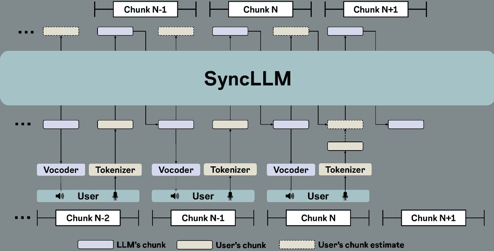
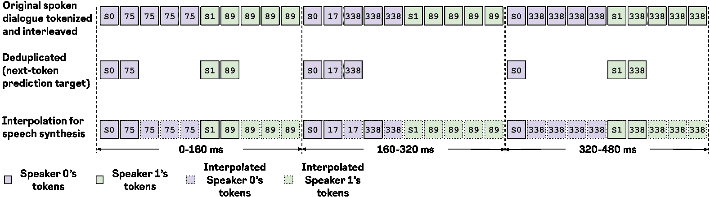
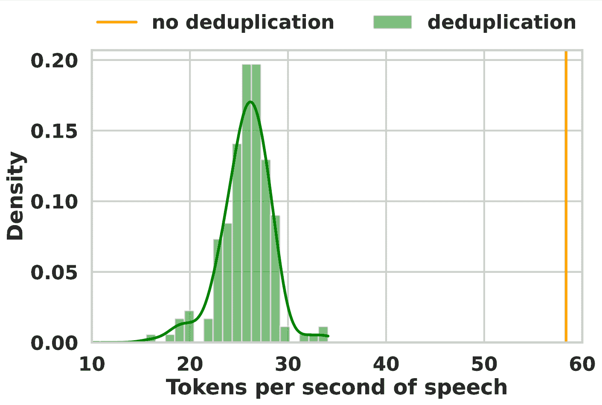
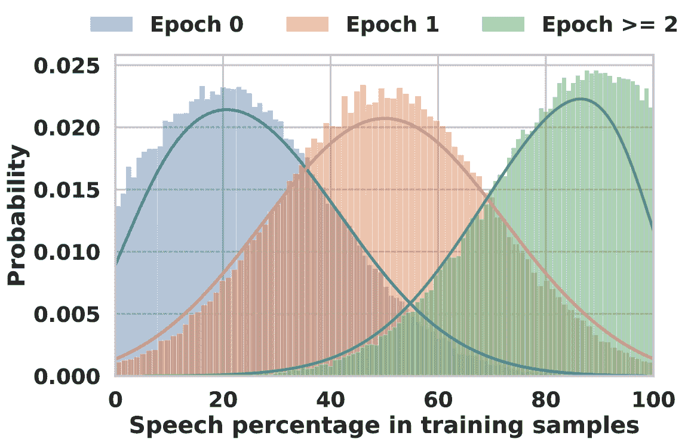
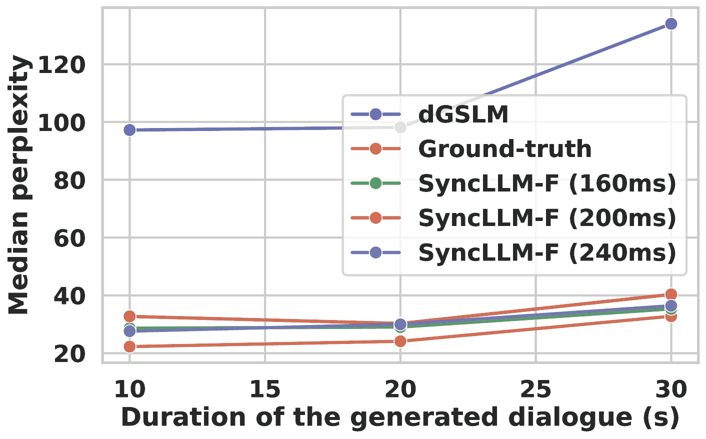
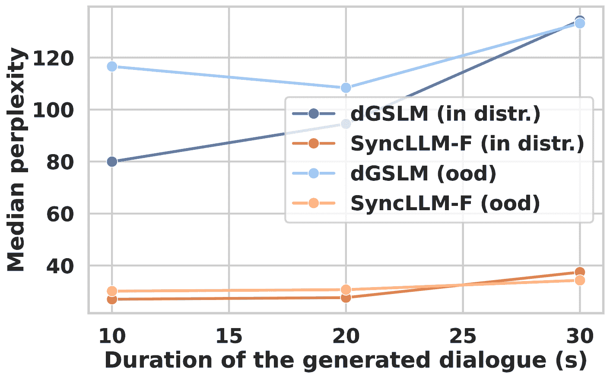
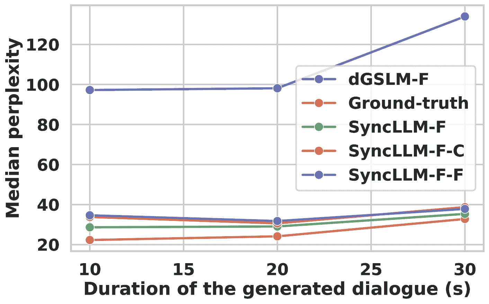
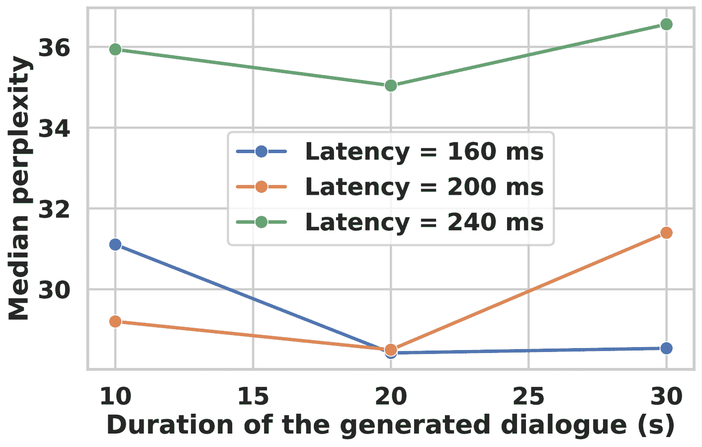

<!--yml
category: 未分类
date: 2025-01-11 12:13:38
-->

# Beyond Turn-Based Interfaces: Synchronous LLMs as Full-Duplex Dialogue Agents

> 来源：[https://arxiv.org/html/2409.15594/](https://arxiv.org/html/2409.15594/)

Bandhav Veluri^(1,2), Benjamin N Peloquin¹, Bokai Yu¹,
Hongyu Gong¹, Shyamnath Gollakota²
¹Meta AI, ²University of Washington
{bandhav,gshyam}@cs.washington.edu  hygong@meta.com

###### Abstract

Despite broad interest in modeling spoken dialogue agents, most approaches are inherently “half-duplex” – restricted to turn-based interaction with responses requiring explicit prompting by the user or implicit tracking of interruption or silence events. Human dialogue, by contrast, is “full-duplex” allowing for rich synchronicity in the form of quick and dynamic turn-taking, overlapping speech, and backchanneling. Technically, the challenge of achieving full-duplex dialogue with LLMs lies in modeling synchrony as pre-trained LLMs do not have a sense of “time”. To bridge this gap, we propose Synchronous LLMs for full-duplex spoken dialogue modeling. We design a novel mechanism to integrate time information into Llama3-8b so that they run synchronously with the real-world clock. We also introduce a training recipe that uses 212k hours of synthetic spoken dialogue data generated from text dialogue data to create a model that generates meaningful and natural spoken dialogue, with just 2k hours of real-world spoken dialogue data. Synchronous LLMs outperform state-of-the-art in dialogue meaningfulness while maintaining naturalness. Finally, we demonstrate the model’s ability to participate in full-duplex dialogue by simulating interaction between two agents trained on different datasets, while considering Internet-scale latencies of up to 240ms. Webpage: [https://syncllm.cs.washington.edu/](https://syncllm.cs.washington.edu/).

Beyond Turn-Based Interfaces:
Synchronous LLMs as Full-Duplex Dialogue Agents

Bandhav Veluri^(1,2), Benjamin N Peloquin¹, Bokai Yu¹, Hongyu Gong¹, Shyamnath Gollakota² ¹Meta AI, ²University of Washington {bandhav,gshyam}@cs.washington.edu  hygong@meta.com

## 1 Introduction

Existing spoken dialogue models are predominantly turn-based interfaces that are half-duplex in nature Lakhotia et al. ([2021](https://arxiv.org/html/2409.15594v1#bib.bib18)); Zhang et al. ([2023a](https://arxiv.org/html/2409.15594v1#bib.bib37)); Hassid et al. ([2024](https://arxiv.org/html/2409.15594v1#bib.bib11)); Borsos et al. ([2023](https://arxiv.org/html/2409.15594v1#bib.bib3)). To achieve a change of turn, these systems rely on either explicit user inputs or pauses at the end of a user’s utterance Zhang et al. ([2023a](https://arxiv.org/html/2409.15594v1#bib.bib37)). Human spoken dialogue, by contrast, does not rely on silence as its primary turn-taking cue Levinson and Torreira ([2015a](https://arxiv.org/html/2409.15594v1#bib.bib19)); Nguyen et al. ([2022](https://arxiv.org/html/2409.15594v1#bib.bib25)). Research indicates that in human conversations intra-turn pauses (pauses within a speaker’s turn) are usually longer than the intervals between turns across speakers Heldner and Edlund ([2010](https://arxiv.org/html/2409.15594v1#bib.bib12)); Brady ([1968](https://arxiv.org/html/2409.15594v1#bib.bib4)); ten Bosch et al. ([2005](https://arxiv.org/html/2409.15594v1#bib.bib34)). English speakers often begin their turns without waiting for pauses, using grammatical, prosodic, and pragmatic cues to seamlessly initiate their next turn while minimizing overlaps and gaps Stivers et al. ([2009](https://arxiv.org/html/2409.15594v1#bib.bib33)).

Human spoken dialogue is inherently full-duplex, allowing for seamless, bi-directional communication where both parties can simultaneously speak and listen. This mode of interaction enables immediate feedback, interruptions for clarification, and real-time adjustments in information flow Reece et al. ([2023](https://arxiv.org/html/2409.15594v1#bib.bib29)); Levinson and Torreira ([2015b](https://arxiv.org/html/2409.15594v1#bib.bib20)). Unlike half-duplex systems that process text or speech based on full utterances in each turn, human dialogue frequently contains verbal backchannels – short, overlapping phrases such as "yeah" or "uh-huh" – signals from the listener to the speaker that they understand and that the speaker may continue. Such synchronous dynamics allow the interaction to flow smoothly and create a rhythm absent in written text Heldner and Edlund ([2010](https://arxiv.org/html/2409.15594v1#bib.bib12)). While humans learn turn-taking cues from infancy to minimize speech overlaps and silence duration Nguyen et al. ([2021](https://arxiv.org/html/2409.15594v1#bib.bib27)), overlapping speech as well as long silences are common in human spoken dialogue as they enrich conversations providing additional pragmatic cues. For example, overlapping speech and frequent backchanneling often signifies engaged listening. Similarly the length of silences can vary across cultures and is influenced by the promptness of responses Stivers et al. ([2009](https://arxiv.org/html/2409.15594v1#bib.bib33)); Nguyen et al. ([2022](https://arxiv.org/html/2409.15594v1#bib.bib25)). In both cases, these dynamics make conversation sound more “human.”



Figure 1: SyncLLM as a full-duplex dialogue agent. At current time step (chunk N in the figure), SyncLLM’s context contains interleaved chunks of the LLM’s speech until the current chunk, and the user’s speech corresponding to all but the current chunk. To be in synchrony with the user, the LLM must generate its next chunk (chunk N+1) before the end of the current chunk. As a result, SyncLLM first generates an *estimated user’s chunk*, which is in-turn appended to the context and used to predict its next chunk.

Developing a full-duplex spoken dialog agent is challenging for four reasons: 1) Understanding and generating turn-taking cues in spoken dialogue requires the model to have a common reference clock with the real-world. However, current LLMs do not have such a sense of “time”. 2) Compared to text-based chat datasets, spoken dialogue data is limited. A combination of all significant spoken dialogue datasets Cieri et al. ([2004](https://arxiv.org/html/2409.15594v1#bib.bib7)); Godfrey et al. ([1992](https://arxiv.org/html/2409.15594v1#bib.bib9)); Reece et al. ([2023](https://arxiv.org/html/2409.15594v1#bib.bib29)) would still result in only $\sim$3k hours of spoken dialogue data. 3) Full-duplex dialogue entails model to be always listening and should always be ready to speak, because back-channels or overlaps could occur at arbitrary points in time. This requires the model to be streaming for the duration of the dialogue. 4) Since the spoken dialogue agent might run on cloud infrastructure, it must address the fundamental latency inherent in Internet transmissions. Thus, the model may not have immediate access to the current tokens or speech generated by the user and must operate with delayed input (Fig. [1](https://arxiv.org/html/2409.15594v1#S1.F1 "Figure 1 ‣ 1 Introduction ‣ Beyond Turn-Based Interfaces: Synchronous LLMs as Full-Duplex Dialogue Agents")).

In this paper, we make multiple contributions to develop a full-duplex dialogue agent:

*   •

    We introduce Synchronous LLMs, in short SyncLLM, for full-duplex spoken dialogue. SyncLLM achieves synchrony modeling by integrating time information into LLMs so that they can run synchronously with the real-world clock. We generate a periodic synchronization token to provide a common time frame for both sides of the dialogue. This however requires us to address duplicate tokens, caused by silence within and across utterances. Duplicate tokens can adversely affect the semantic capability of spoken dialogue model Nguyen et al. ([2022](https://arxiv.org/html/2409.15594v1#bib.bib25)). Instead, we train our model to predict deduplicated token sequences, with timing information maintained by our periodic synchronization tokens.

*   •

    Human voice interactions rely on the ability to model the other person’s response on the short-term. We can take turns with gaps as small as 200ms, while language generation latency is around 600ms Levinson and Torreira ([2015b](https://arxiv.org/html/2409.15594v1#bib.bib20)). This implies we anticipate the next few words of what the other person would say and respond appropriately. We use this insight to predict speech units for both speakers, into the future, in chunk sizes of 160-240 ms. This ensures resiliency to Internet latencies of up to 240 ms.

*   •

    We propose a three-stage training recipe that leverages synthetic spoken dialogue generated from text dialogue data to mitigate the limited availability of real-world spoken dialogue data. Specifically, we use 212k hours of synthetic spoken dialogue data and just 2k hours of real-world spoken dialogue data to develop a model that generates meaningful spoken dialogue with naturalistic turn-taking, overlaps, and backchannels.

*   •

    With an experimental setup based on Llama3-8b at Meta ([2024](https://arxiv.org/html/2409.15594v1#bib.bib2)) and extensive user-study (n=32), we show that our method achieves +2.2-point Mean Opinion Score (MOS) improvement in dialogue content Meaningfulness over state-of-the-art full-duplex voice model dGSLM Nguyen et al. ([2022](https://arxiv.org/html/2409.15594v1#bib.bib25)), while maintaining turn-taking Naturalness. Further, our results show that our model fine-tuned on the Fisher training set Cieri et al. ([2004](https://arxiv.org/html/2409.15594v1#bib.bib7)) can generalize to the out-of-distribution Candor testset Reece et al. ([2023](https://arxiv.org/html/2409.15594v1#bib.bib29)), while preserving both dialog content meaningfulness and naturalness.

*   •

    Finally, by simulating full-duplex dialogue between two finetuned Llama3-8b models, we show how this approach can enable latency-tolerant and streaming full-duplex voice interfaces. Further, SyncLLM can perform a coherent conversation even when the user’s side of the conversation is generated by a model trained with a different dataset.

## 2 Related work

Multimodal language models. The success of text language models like GPT-4 OpenAI ([2023](https://arxiv.org/html/2409.15594v1#bib.bib28)), Llama Touvron et al. ([2023](https://arxiv.org/html/2409.15594v1#bib.bib35)), and Mistral Jiang et al. ([2023](https://arxiv.org/html/2409.15594v1#bib.bib15)) has inspired explorations into multimodal models. Here, we focus our discussion on speech and text modalities. Initialization from a pretrained text LLM has been shown to benefit multimodal training Hassid et al. ([2023](https://arxiv.org/html/2409.15594v1#bib.bib10)). Recent works have proposed extending the vocabulary of text LLMs with discrete speech tokens to enable the model to handle speech inputs and outputs Rubenstein et al. ([2023](https://arxiv.org/html/2409.15594v1#bib.bib30)). Models are trained with cross-modal knowledge from aligned speech-text data, including tasks like automatic speech recognition (ASR), text-to-speech synthesis (TTS), speech-to-text (S2T), and speech-to-speech translation (S2ST). Multitask learning with these tasks has been adopted by VioLA Wang et al. ([2023](https://arxiv.org/html/2409.15594v1#bib.bib36)), AudioPaLM Rubenstein et al. ([2023](https://arxiv.org/html/2409.15594v1#bib.bib30)), VoxtLM Maiti et al. ([2023](https://arxiv.org/html/2409.15594v1#bib.bib22)), and SUTLM Chou et al. ([2023](https://arxiv.org/html/2409.15594v1#bib.bib6)). SpiRit-LM Nguyen et al. ([2024](https://arxiv.org/html/2409.15594v1#bib.bib26)) interleaves speech and text tokens and trains the model with next token prediction, demonstrating both speech understanding and generation.

Spoken dialogue models. Prior work on spoken dialogue research covers various topics such as dialogue state tracking Zhang et al. ([2023b](https://arxiv.org/html/2409.15594v1#bib.bib38)), turn-taking prediction Skantze ([2021](https://arxiv.org/html/2409.15594v1#bib.bib32)); Lin et al. ([2022](https://arxiv.org/html/2409.15594v1#bib.bib21)), and response generation Zhang et al. ([2020](https://arxiv.org/html/2409.15594v1#bib.bib39)). Recent works leverage LLMs in dialogue systems Zhao et al. ([2020](https://arxiv.org/html/2409.15594v1#bib.bib40)). Initialized from Llama, SpeechGPT Zhang et al. ([2023a](https://arxiv.org/html/2409.15594v1#bib.bib37)) is finetuned sequentially on speech-only data and multimodal instruction sets to perform spoken question answering (QA) tasks. USDM Kim et al. ([2024](https://arxiv.org/html/2409.15594v1#bib.bib17)) continues pretraining Mistral with interleaved speech-text data to capture multimodal semantics. For dialogue finetuning, it constructs templates using both speech and transcripts of user input as instruction data. Unlike models that use speech tokens, Spectron Nachmani et al. ([2023](https://arxiv.org/html/2409.15594v1#bib.bib23)) directly manipulates spectrograms for tasks such as spoken QA and speech continuation. However, these prior works are limited to the turn-taking setting, where the dialogue model is explicitly prompted to speak in its own turn. Human spoken dialogue is more complex, involving implicit turn-taking cues and overlapping speech, such as interruptions and backchanneling Schegloff ([2000](https://arxiv.org/html/2409.15594v1#bib.bib31)).

The closest work to ours is dGSLM Lakhotia et al. ([2021](https://arxiv.org/html/2409.15594v1#bib.bib18)), which models simultaneous dialogue using a dual-tower Transformer that attends to two channels. It demonstrates superior performance than cascaded architecture which consists of automatic speech recognition (ASR), text LLM and text-to-speech (TTS). One weakness of dGSLM is its reliance on speech-only training, which does not fully utilize textual knowledge. In contrast, our work leverages the generative intelligence of language models, equipping them with multimodal and synchronous capabilities. Moreover, in its empirical study, dGSLM does not consider delays in real-life scenarios and assumes that the hidden states of one interlocutor are immediately accessible to the other. In contrast, we explicitly discuss how our model handles delayed responses in spoken dialogue.

## 3 SyncLLM

SyncLLM is an auto-regressive transformer decoder architecture, that natively models discrete speech units in a wall-clock synchronous fashion. SyncLLM is trained to predict interleaving chunks of speech units corresponding to both sides of the dialogue as shown in Fig. [1](https://arxiv.org/html/2409.15594v1#S1.F1 "Figure 1 ‣ 1 Introduction ‣ Beyond Turn-Based Interfaces: Synchronous LLMs as Full-Duplex Dialogue Agents"). In each time step, the model predicts speech units corresponding to a fixed duration, referred to as the model’s *chunk size*, for its side of the dialogue followed by speech units corresponding to user’s side of the dialogue. With this approach, the model is capable of generating two streams of speech synchronized with a real-world clock. This allows our method to model all conversational cues such as backchannels, overlaps, interruptions etc. Furthermore, since we use the same architecture as existing LLMs, our approach can leverage large scale pre-training of LLMs.

The model trained to predict interleaved chunks of token sequences can be used for full-duplex voice interaction if we could replace one of the two token streams, with that corresponding to the real-world user. In Fig. [1](https://arxiv.org/html/2409.15594v1#S1.F1 "Figure 1 ‣ 1 Introduction ‣ Beyond Turn-Based Interfaces: Synchronous LLMs as Full-Duplex Dialogue Agents"), purple boxes correspond to token sequences of the LLM’s side of the conversation in each time chunk and the green boxes correspond to the user’s side of the dialogue. We achieve full-duplex LLM-user voice interaction by discarding the LLM’s predictions of user’s response and replace it with the user’s speech.



Figure 2: SyncLLM’s token sequence format visualized with a chunk size of 160 ms. (Top row) We represent spoken dialogue as interleaved chunks of HuBERT tokens, where the chunk size determines the frequency of the synchronization token [S0]. (Middle row) We train SyncLLM to generate interleaved chunks of deduplicated HuBERT tokens along with periodic synchronization tokens. (Bottom row) We interpolate deduplicated tokens in each chunk to obtain spoken dialogue sequence in the original format.

### 3.1 Latency tolerant interaction

In Fig. [1](https://arxiv.org/html/2409.15594v1#S1.F1 "Figure 1 ‣ 1 Introduction ‣ Beyond Turn-Based Interfaces: Synchronous LLMs as Full-Duplex Dialogue Agents"), consider the Nth time chunk to be current time step. We could interleave the LLM’s output speech chunks until the Nth chunk, with the user’s input chunks corresponding to only N-1 chunks. The reasoning here is that the user’s input for the Nth chunk is not available until the end of Nth time step. To handle this intrinsic latency, similar to the way humans anticipate the next few words of what the other person taking part in the dialogue would say Levinson and Torreira ([2015b](https://arxiv.org/html/2409.15594v1#bib.bib20)), the LLM’s output for the next chunk (N+1) is computed by first estimating the user’s response for the Nth time chunk (depicted in the figure with green boxes with dotted border). We then append this estimated chunk to the LLM’s context to generate the LLM’s next chunk (N+1). For generating subsequent chunks (N+2, N+3, …), we discard the estimated user’s chunk for Nth time step and replace that with the user’s real-world input, thus grounding the subsequent interaction with actual input from the user.

### 3.2 Token sequence format

Following prior works in spoken language modeling Nguyen et al. ([2022](https://arxiv.org/html/2409.15594v1#bib.bib25), [2024](https://arxiv.org/html/2409.15594v1#bib.bib26)), we use HuBERT Hsu et al. ([2021](https://arxiv.org/html/2409.15594v1#bib.bib13)) to represent speech. We use the tokenization parameters from Nguyen et al. ([2024](https://arxiv.org/html/2409.15594v1#bib.bib26)), with a token sampling rate of 25 Hz – resulting in one token for every 40 ms of audio – and a vocabulary size of 501\. To model dialog between two speakers 0 & 1, we define two special tokens `[S0]` and `[S1]`, referred to as speaker tags, specifying the start of each speaker’s token sequence, respectively. We represent dialogue as two parallel speech streams, one for each speaker, interleaved, as shown in the top row of Fig. [2](https://arxiv.org/html/2409.15594v1#S3.F2 "Figure 2 ‣ 3 SyncLLM ‣ Beyond Turn-Based Interfaces: Synchronous LLMs as Full-Duplex Dialogue Agents"). For each stream, we embed a periodic speaker tag, with the time period equal to chunk size of the model.



Figure 3: Tokens required for representing a second of speech with/without deduplication. Histogram computed over 15 hr of dialog data in the Fisher dataset Cieri et al. ([2004](https://arxiv.org/html/2409.15594v1#bib.bib7)).

Deduplication. The fixed time period of HuBERT tokens is useful for modeling time in the full-duplex dialogue. However, raw HuBERT sequences consist of significant repeated tokens, mainly caused by silence within and across utterances. The number of repetitions of each unique token denote the duration of the acoustic unit represented by the token. The semantic content, however, can be modeled by only considering unique tokens while deduplicating the token sequence Kharitonov et al. ([2022](https://arxiv.org/html/2409.15594v1#bib.bib16)); Nguyen et al. ([2022](https://arxiv.org/html/2409.15594v1#bib.bib25)). Duplicate token sequences can adversely affect the semantic capability of the final spoken dialogue model Nguyen et al. ([2022](https://arxiv.org/html/2409.15594v1#bib.bib25)), because as shown in Fig. [3](https://arxiv.org/html/2409.15594v1#S3.F3 "Figure 3 ‣ 3.2 Token sequence format ‣ 3 SyncLLM ‣ Beyond Turn-Based Interfaces: Synchronous LLMs as Full-Duplex Dialogue Agents"), they contain $\sim 50\%$ lower semantic content per token compared to deduplicated sequences.

So, instead, SyncLLM is trained to predict deduplicated HuBERT sequences, with coarse timing information maintained by periodically interleaved special tokens, `[S0]` and `[S1]`, as in the second row of Fig. [2](https://arxiv.org/html/2409.15594v1#S3.F2 "Figure 2 ‣ 3 SyncLLM ‣ Beyond Turn-Based Interfaces: Synchronous LLMs as Full-Duplex Dialogue Agents"). In the first chunk of the example in Fig. [2](https://arxiv.org/html/2409.15594v1#S3.F2 "Figure 2 ‣ 3 SyncLLM ‣ Beyond Turn-Based Interfaces: Synchronous LLMs as Full-Duplex Dialogue Agents"), the two speaker streams contained 4 repetitions of `[75]` and `[89]`, respectively. After deduplication, the interleaved token sequence corresponding to the first chunk would be `[S0][75][S1][89]`. In the second chunk, speaker 0 has 2 new tokens (`[17]` & `[338]`), but speaker 1 tokens are just a repetition of the last token in the previous chunk, `[89]`. So, the second chunk’s token sequence would just be `[S0][17][338]`. Note that when a chunk contains no novel tokens corresponding to speaker 1, we exclude speaker 1’s special token `[S1]` as well. However, this is not the case for speaker 0, as we need one of the speaker’s special token to be present in all chunks to unambiguously distinguish chunks. This is shown in the third chunk of Fig. [2](https://arxiv.org/html/2409.15594v1#S3.F2 "Figure 2 ‣ 3 SyncLLM ‣ Beyond Turn-Based Interfaces: Synchronous LLMs as Full-Duplex Dialogue Agents").

Interpolation. While deduplicated token sequences are beneficial for auto-regressive modeling, to generate token sequences suitable for speech synthesis, we need periodic HuBERT tokens in the original format. Since the speaker tag `[S0]` maintains the timing information, we know the number of tokens removed after deduplication within each chunk. We use this to interpolate the deduplicated token to match the expected number of token in each chunk. For example, in the first chunk of Fig. [2](https://arxiv.org/html/2409.15594v1#S3.F2 "Figure 2 ‣ 3 SyncLLM ‣ Beyond Turn-Based Interfaces: Synchronous LLMs as Full-Duplex Dialogue Agents"), speaker 0’s stream only has one token after deduplication. But since chunk size in that case is 160ms, each chunk would contain 160/40 = 4 tokens. So as shown in the third row of Fig. [2](https://arxiv.org/html/2409.15594v1#S3.F2 "Figure 2 ‣ 3 SyncLLM ‣ Beyond Turn-Based Interfaces: Synchronous LLMs as Full-Duplex Dialogue Agents"), we repeat the deduplicated token thrice to reconstruct the chunk. If a chunk has multiple deduplicated tokens, like the second in Fig. [2](https://arxiv.org/html/2409.15594v1#S3.F2 "Figure 2 ‣ 3 SyncLLM ‣ Beyond Turn-Based Interfaces: Synchronous LLMs as Full-Duplex Dialogue Agents"), we repeat each token by an equal amount. We note this approach could result in an error because the original chunk may not follow this heuristic. We observed that the effect of this is imperceptible even with a chunk size of 240 ms, likely because the error in the predicted duration of each token is upper bounded by the chunk size. Further, in chunks with more novel tokens, the error would be even smaller.

## 4 Training

We use Llama3-8b at Meta ([2024](https://arxiv.org/html/2409.15594v1#bib.bib2)) as our base model and employ a three stage training procedure that uses synthetic spoken dialogue data predominantly and relatively small amount of real-world spoken dialogue data to develop a full-duplex voice agent.

Table 1: Data used for training in different stages. We convert text based data to speech using TTS.

|  | Stage | Source | Speech |
|  |  | modality | (hrs) |
| Supervised | 1 | Text | 193k |
| finetuning (SFT) |  |  |  |
| Dialogue | 2 | Text | 20k |
| Spoken dialogue | 3 | Speech | 1927 |

Stage 1: Turn-based spoken dialogue model with synthetic speech data. Given the limited spoken dialogue data, we generate synthetic speech data from large-scale text dialogue datasets. We use supervised finetuning (SFT) datasets, as our source text-dialogue datasets. We used Bark TTS AI ([2023](https://arxiv.org/html/2409.15594v1#bib.bib1)) model to generate spoken versions of text-dialogue datasets, with its 10 speaker presets.

Since Llama3-8b is a text-only LLM, in the first stage, we aim to achieve text-speech alignment in the context of dialogues. Given a spoken question, we train the model to generate a spoken response. We expand the vocabulary of Llama3 to include 501 HuBERT tokens, in addition to the speaker tags, `[S0]` and `[S1]`. A turn-based dialog could be defined as made of turns, which in turn are made of sentences. We finetuned Llama3 with dialog sequences in the following format:

```
[S1]<sent0>[S0]<sent0><sent1>[S1]..

```



Figure 4: We sample speech percentages from truncated normal distribution, so we obtain samples with all possible combinations of text-speech interleaving throughout the training process, with a bias for higher speech percentages as the training progresses. This resulted in stable training when starting out with a text-only LLM.

Each sentence is randomly chosen to either be text or deduplicated speech token sequences during training. For each training sample, we sample the percentage of speech sentences in the training sequence from the truncated normal distribution (Fig. [4](https://arxiv.org/html/2409.15594v1#S4.F4 "Figure 4 ‣ 4 Training ‣ Beyond Turn-Based Interfaces: Synchronous LLMs as Full-Duplex Dialogue Agents")). Training only with fully speech sequences or step-wise increment of speech percentage resulted in unstable training. Sentence level text-speech interleaving not only trains the model to be capable of performing dialog, but also achieves text/speech alignment in the context of dialog.

Stage 2: Full-duplex dialogue assuming no overlaps. Turn-based spoken dialogue is special case of full-duplex dialogue with no overlaps. Based on this observation, we could treat synthetic spoken dialogue data as full-duplex spoken dialogue data where during one speaker’s turn, other speaker is completely silent. In this stage, we create synthetic spoken dialogue data from text-dialogue data similarly to the previous stage with one main difference: From each turn in the dialogue, we generate a speech utterance corresponding to one speaker and silence of equal duration corresponding to the other speaker. We then tokenize the parallel speech dialog data in the format shown in the second row of Fig. [2](https://arxiv.org/html/2409.15594v1#S3.F2 "Figure 2 ‣ 3 SyncLLM ‣ Beyond Turn-Based Interfaces: Synchronous LLMs as Full-Duplex Dialogue Agents"). This way, we can further leverage text-dialogue data for help our model learn the token sequence format in Fig. [2](https://arxiv.org/html/2409.15594v1#S3.F2 "Figure 2 ‣ 3 SyncLLM ‣ Beyond Turn-Based Interfaces: Synchronous LLMs as Full-Duplex Dialogue Agents"). This stage of finetuning models timing within an utterance. The model cannot learn turn-taking cues such as back-channeling or overlaps between two speakers yet.

For the the previous stage, most samples in SFT datasetswould contain one speaker (user of the LLM) taking a short turn and the other speaker (the LLM) giving a long response. Spoken dialogues however contain more frequent turn-taking taking with short utterances. Therefore for this stage, we use text-dialogue datasets comprising of shorter turns, equivalent to around $20$k hrs of synthetic spoken dialogue.

Table 2: Comparison of Pearson correlation of turn-taking event durations between generations and ground-truth continuations, given same set of prompts. SyncLLM’s chunk sizes are shown in parenthesis.

| Model | Fisher (in-distribution) |  | Candor (out-of-distribution) |
|  | ipu | pause | fto | Average |  | ipu | pause | fto | Average |
| dGSLM | 0.48 | 0.41 | 0.10 | 0.33 |  | 0.30 | 0.02 | 0.09 | 0.14 |
| SyncLLM-F (160 ms) | 0.60 | 0.50 | 0.20 | 0.43 |  | 0.45 | 0.09 | 0.14 | 0.23 |
| SyncLLM-F (200 ms) | 0.60 | 0.49 | 0.19 | 0.43 |  | 0.44 | 0.28 | 0.14 | 0.29 |
| SyncLLM-F (240 ms) | 0.58 | 0.40 | 0.25 | 0.41 |  | 0.45 | 0.27 | 0.21 | 0.31 |
| Prompt | 0.72 | 0.53 | 0.31 | 0.52 |  | 0.54 | 0.30 | 0.12 | 0.32 |
| Resynth-GT | 0.92 | 0.92 | 0.53 | 0.79 |  | 0.90 | 0.86 | 0.37 | 0.71 |

Stage 3: Modeling with real-world spoken dialogue data. Finally, we finetune the model to learn turn-taking cues from real-world spoken dialogue data. We use the Fisher Cieri et al. ([2004](https://arxiv.org/html/2409.15594v1#bib.bib7)) dataset with 2000 hours of spoken dialogues, where each speaker’s speech in a dialogue is separated into independent audio channels. We split the dataset into train, val and test split with 98:1:1 ratio, respectively. Each audio channel in the dialogue is separately tokenized and interleaved in the full-duplex dialogue format used in the previous stage. In this stage in addition to learning timing within utterances, the model learns effective turn-taking, conversational cues like accurate distribution of pauses between turn and backchanneling.

## 5 Experiments



Figure 5: Perplexity of transcriptions of spoken dialogues generated by different models. Perplexity is measured with respect to a text dialogue model’s predictions.

We evaluate SyncLLM in both continuation and interaction settings. In the continuation setting, given a spoken dialogue prompt, the model generates both sides of the dialogue. For interaction setting, we simulate interaction between two instances of SyncLLM as described in §[3.1](https://arxiv.org/html/2409.15594v1#S3.SS1 "3.1 Latency tolerant interaction ‣ 3 SyncLLM ‣ Beyond Turn-Based Interfaces: Synchronous LLMs as Full-Duplex Dialogue Agents"). We denote SyncLLM trained on Fisher in continuation setting as SyncLLM-F and use dGSLM as the continuation setting baseline. Both dGSLM and SyncLLM-F use Fisher as the only real-world spoken dialogue dataset for training. We denote SyncLLM trained on Fisher interacting with an instance trained on Fisher as SyncLLM-F-F, and SyncLLM trained on Fisher interacting with an instance trained on CANDOR Reece et al. ([2023](https://arxiv.org/html/2409.15594v1#bib.bib29)) as SyncLLM-F-C.

### 5.1 Semantic evaluation

We evaluate the semantics of SyncLLM in the text domain by converting spoken generations to text using ASR. We transcribe the generated spoken dialogues into turn-based text dialogues ignoring any overlapping speech. We then compute perplexity of transcribed dialogues generated with 10 second spoken dialogue prompts, with respect a text-only dialogue model. To account for outliers (samples with abnormally high perplexities), we consider median perplexity over the testset.

Fig. [5](https://arxiv.org/html/2409.15594v1#S5.F5 "Figure 5 ‣ 5 Experiments ‣ Beyond Turn-Based Interfaces: Synchronous LLMs as Full-Duplex Dialogue Agents") compares the semantic quality of spoken dialogues generated by SyncLLM with different chunk sizes to the prior state-of-the-art full-duplex dGSLM model Nguyen et al. ([2022](https://arxiv.org/html/2409.15594v1#bib.bib25)) and ground-truth continuations. We find that dGSLM has a perplexity drop of $\sim$70 relative to the ground-truth, while SyncLLM only has a drop of $\sim$15\. Fig. [6](https://arxiv.org/html/2409.15594v1#S5.F6 "Figure 6 ‣ 5.1 Semantic evaluation ‣ 5 Experiments ‣ Beyond Turn-Based Interfaces: Synchronous LLMs as Full-Duplex Dialogue Agents") also compares median perplexities measured with prompts sampled from Fisher and Candor test splits separately, with all models trained only on Fisher training split. Here, Candor test split is an out-of-distribution testset.



Figure 6: In-distribution and out-of-distribution testing.

These evaluations show that our approach of using the standard auto-regressive architecture, thus leveraging vast text pre-training, results in much more semantically coherent spoken dialogue model, compared to a custom architecture proposed for speech-only training. Furthermore, our three-stage training approach leveraging large amount of synthetic spoken dialogue data generated from text dialogues, allows us to converge much faster on limited real-world dual-channel spoken dialogue data. This results in a general model that has superior out-of-distribution (ood) performance.

### 5.2 Naturalness evaluation

Appropriate timing of pauses, speaker transitions and overlaps are integral part of spoken-dialogue which convey essential information required for natural spoken conversation. To evaluate these aspect of our generated spoken dialogues, we consider the turn-taking events proposed in Nguyen et al. ([2022](https://arxiv.org/html/2409.15594v1#bib.bib25)) that evaluate overall naturalness of generated spoken dialogues: inter-pausal units (IPUs), pauses, and floor-transfer offset (FTO). FTO is the duration of between turn-transitions, which is a combination of overlaps and gaps – negative FTOs represent overlaps and positive FTOs represent gaps.

Similar to dGSLM’s setup, we use 30s prompts sampled from the test splits and generate 90s dialogues with different model configurations. We then compute pair-wise correlation of turn-taking event durations between the dialogue generations and ground-truth continuations, given the same prompt. We first compute voice activities of each side of dialogue (generated in separate audio channels) using the `pyannote.audio` library Bredin et al. ([2020](https://arxiv.org/html/2409.15594v1#bib.bib5)). We then measure the start and end timestamps for each turn-taking event. We measure the average duration of the turn-taking events in generated dialogues and then compute the Pearson correlation between the average durations observed in generations of different models and those in the ground-truth.

Table. [2](https://arxiv.org/html/2409.15594v1#S4.T2 "Table 2 ‣ 4 Training ‣ Beyond Turn-Based Interfaces: Synchronous LLMs as Full-Duplex Dialogue Agents") compares this correlation with in-distribution Fisher Cieri et al. ([2004](https://arxiv.org/html/2409.15594v1#bib.bib7)) test-split and out-of-distribution Candor test-split. We observe that, generations with our models achieve better turn-taking event correlation with ground-truth continuations compared to dGSLM for both in-distribution and out-of-distribution testsets. In addition to this, we provide turn-taking event correlation with prompts and re-synthesized ground-truth continuations (Resynth-GT). Resynth-GT is obtained by re-synthesizing the tokenized ground-truth continuation. Resynth-GT does not perfectly correlate with ground-truth owing to variance in timing introduced by the tokenization process, and serves as a topline for our method.

### 5.3 Human Evaluation

We conduct an evaluation study with 32 annotators recruited via a third party vendor with the requirement that they had native-level English proficiency.

Table 3: Meaningfulness (Meaning.) and Naturalness (Nat.) (scores 1-5) mean estimates and standard errors (in parentheses), aggregated overall and for Fisher and CANDOR subsets. We use a 160ms chunk size for this study.

|  | Overall | Fisher | CANDOR |
| --- | --- | --- | --- |
| Model | Meaning. $\uparrow$ | Nat. $\uparrow$ | Meaning. $\uparrow$ | Nat. $\uparrow$ | Meaning. $\uparrow$ | Nat. $\uparrow$ |
| --- | --- | --- | --- | --- | --- | --- |
| dGSLM | 1.55 (0.06) | 3.95 (0.08) | 1.67 (0.09) | 4.21 (0.08) | 1.43 (0.08) | 3.70 (0.12) |
| SyncLLM-C | 3.40 (0.07) | 3.96 (0.06) | 3.14 (0.10) | 3.97 (0.08) | 3.66 (0.08) | 3.94 (0.08) |
| SyncLLM-F | 3.74 (0.06) | 3.90 (0.06) | 3.82 (0.08) | 3.98 (0.08) | 3.67 (0.09) | 3.82 (0.10) |
| Re-synth | 3.87 (0.06) | 4.03 (0.05) | 4.04 (0.08) | 4.14 (0.08) | 3.69 (0.07) | 3.91 (0.06) |
| GT | 4.96 (0.02) | 4.96 (0.02) | 4.96 (0.03) | 4.94 (0.04) | 4.97 (0.02) | 4.98 (0.02) |

We adapt the Mean Opinion Score (MOS) protocol (a 5-pt Likert scale) ITU-T Recommendation P.808 ([2018](https://arxiv.org/html/2409.15594v1#bib.bib14)) to evaluate Naturalness (N-MOS) of turn-taking and Meaningfulness (M-MOS) of dialogue content. For both N-MOS and M-MOS, annotators are presented with the prompt- and continuation-audio. Annotators are instructed to first read the descriptions of N-MOS and M-MOS, listen to the prompt audio, then listen to the continuation audio. Finally, they are asked to provide a rating considering the quality of the continuation audio relative to the information contained in the prompt. Each annotator assigned to a given prompt / continuation pair provides a rating for both N-MOS and M-MOS (see §[B.1](https://arxiv.org/html/2409.15594v1#A2.SS1 "B.1 N-MOS & M-MOS ‣ Appendix B Naturalness-MOS Instructions ‣ Beyond Turn-Based Interfaces: Synchronous LLMs as Full-Duplex Dialogue Agents")).

In total, $n_{annot}=32$ annotators provided ratings for $n_{items}=180$ items divided evenly between the CANDOR and Fisher datasets. Each sample received a rating from $1-Bad,...,5-Excellent$ by three unique raters. We compute item-level scores by taking the median score per item. To compute system-level scores we take the mean of item scores for a given system. We compute 95% confidence intervals via bootstrapping, resampling at the item level for $n_{b}=1000$ iterations.

Overall results. The two left-most columns of Table. [3](https://arxiv.org/html/2409.15594v1#S5.T3 "Table 3 ‣ 5.3 Human Evaluation ‣ 5 Experiments ‣ Beyond Turn-Based Interfaces: Synchronous LLMs as Full-Duplex Dialogue Agents") indicate that nearly all models are at parity in perceived Naturalness (N-MOS) of turn-taking, while close to re-synthesized ground-truth values. On the perceived Meaningfulness (M-MOS) of the dialogue content, SyncLLM-based models significantly outperform dGSLM, approaching re-synthesized ground-truth values. Resynth-GT here accounts for the tokenization process and is the topline number for the implementation of our method using the HuBERT tokenizer.

In-distribution and OOD. Table. [3](https://arxiv.org/html/2409.15594v1#S5.T3 "Table 3 ‣ 5.3 Human Evaluation ‣ 5 Experiments ‣ Beyond Turn-Based Interfaces: Synchronous LLMs as Full-Duplex Dialogue Agents") also highlights the difference between in-distribution (Fisher) and OOD (CANDOR) between dGSLM and Fisher-trained SyncLLM-F. While dGSLM suffers from significant degradation OOD (dropping -0.24 and -0.51 in M-MOS and N-MOS ratings), these declines are reduced in SyncLLM-F only dropping -0.15 and -0.16 moving OOD. SyncLLM trained on CANDOR dataset (SyncLLM-C) shows a decline OOD on M-MOS (-0.52), but not N-MOS (+0.03). We note that dGSLM Nguyen et al. ([2022](https://arxiv.org/html/2409.15594v1#bib.bib25)) uses speech representations fine-tuned on the Fisher dataset, while our method uses general-purpose speech representations for all domains of speech. This results in our method outperforming the baseline on the out-of-distribution Candor testset in naturalness, as judged by human evaluators in Table. [3](https://arxiv.org/html/2409.15594v1#S5.T3 "Table 3 ‣ 5.3 Human Evaluation ‣ 5 Experiments ‣ Beyond Turn-Based Interfaces: Synchronous LLMs as Full-Duplex Dialogue Agents").



Figure 7: Comparison of ASR perplexity between continuation mode and interaction-mode.

### 5.4 Full-duplex interaction

We simulate LLM-user interaction using LLM-LLM interaction with one-chunk latency. We evaluate our model trained with different chunk sizes, thus simulating different latencies. We also train a version of SyncLLM with Candor training split in the third training stage, and simulate its interaction with the original model trained with only Fisher.

In Fig. [7](https://arxiv.org/html/2409.15594v1#S5.F7 "Figure 7 ‣ 5.3 Human Evaluation ‣ 5 Experiments ‣ Beyond Turn-Based Interfaces: Synchronous LLMs as Full-Duplex Dialogue Agents"), we compare median perplexities obtained with prompts sampled from Fisher and Candor test splits. We also show the perplexity of ground-truth and samples generated in the dialog continuation setting for reference. We find that SyncLLM in the LLM-LLM interaction setting is able to closely match the performance of the continuation setting, and perform significantly better than dGSLM in continuation setting. Furthermore, we find that interaction between instances of SyncLLM trained with Fisher and Candor datasets, respectively is are almost the same signifying that SyncLLM can perform a coherent conversation even when user’s side of the conversation is generated by a model trained with a different dataset.

Human evaluation. Table. [4](https://arxiv.org/html/2409.15594v1#S5.T4 "Table 4 ‣ 5.4 Full-duplex interaction ‣ 5 Experiments ‣ Beyond Turn-Based Interfaces: Synchronous LLMs as Full-Duplex Dialogue Agents") shows ratings for dGSLM, the Fisher-trained continuation model, and LLM-LLM interactions. Results corroborate findings in §[5.4](https://arxiv.org/html/2409.15594v1#S5.SS4 "5.4 Full-duplex interaction ‣ 5 Experiments ‣ Beyond Turn-Based Interfaces: Synchronous LLMs as Full-Duplex Dialogue Agents") – LLM-LLM interactions outperform dGSLM on M-MOS, but are slightly worse compared to the single model continuation setting.

Table 4: Human evaluation results for Meaningfulness (Meaning.) and Naturalness (Nat.) mean estimates and standard errors (in parentheses) across all data.

| Model | Meaning. $\uparrow$ | Nat. $\uparrow$ |
| --- | --- | --- |
| dGSLM | 1.55 (0.06) | 3.95 (0.08) |
| SyncLLM-F | 3.74 (0.06) | 3.90 (0.06) |
| SyncLLM-F-C | 3.39 (0.06) | 3.78 (0.06) |
| SyncLLM-F-F | 3.47 (0.06) | 3.72 (0.06) |

## 6 Conclusion

We present Synchronous LLMs, a novel post-training framework that converts an auto-regressive LLM into a full-duplex spoken dialogue agent. Synchronous LLMs outperform state-of-the-art in dialogue meaningfulness while maintaining turn-taking naturalness. Finally, by simulating full-duplex dialogue between two agents, we show robustness to delayed input from Internet-scale latencies, where the agents do not have immediate access to the speech generated by their users.

## 7 Limitations and Risks

Limitations. The performance of Synchronous LLMs could be further improved in terms of speech quality. Currently, we use a simple HiFi-GAN vocoder for speech synthesis, and higher-quality speech could be synthesized from semantic units with a more advanced speech generator. Moreover, we have not studied expressivity and non-verbal sounds in dialogue such as laughter, which could make the spoken dialogue more human-like. Another limitation is the context length; synchronous LLMs are initialized from Llama-3, and therefore have the same sequence length limit which constrained the long-context modeling in dialogue as well as the use of more expressive multi-codebook tokenizers like EnCodec Défossez et al. ([2022](https://arxiv.org/html/2409.15594v1#bib.bib8)) that have higher token rate.

Ethical considerations. The proposed model is intended for spoken dialogue agents. In case of failure, the system might generate inappropriate responses and toxicity mitigation may be needed for speech outputs. As for unintended use, one example is that bad actors misuse the model for online scams. Speech watermarking is one potential approach to counter abuse of the technology.

## Acknowledgments

The University of Washington researchers are partly supported by the Meta AI Mentorship program, Moore Inventor Fellow award #10617, UW CoMotion fund, and the NSF.

## References

*   AI (2023) Suno AI. 2023. Bark tts. [https://github.com/suno-ai/bark](https://github.com/suno-ai/bark).
*   at Meta (2024) AT at Meta. 2024. Meta llama 3. [https://github.com/meta-llama/llama3](https://github.com/meta-llama/llama3).
*   Borsos et al. (2023) Zalán Borsos, Raphaël Marinier, Damien Vincent, Eugene Kharitonov, Olivier Pietquin, Matt Sharifi, Dominik Roblek, Olivier Teboul, David Grangier, Marco Tagliasacchi, and Neil Zeghidour. 2023. [Audiolm: a language modeling approach to audio generation](https://arxiv.org/abs/2209.03143). *Preprint*, arXiv:2209.03143.
*   Brady (1968) Paul T. Brady. 1968. [A statistical analysis of on-off patterns in 16 conversations](https://api.semanticscholar.org/CorpusID:62739009). *Bell System Technical Journal*, 47:73–91.
*   Bredin et al. (2020) Hervé Bredin, Ruiqing Yin, Juan Manuel Coria, Gregory Gelly, Pavel Korshunov, Marvin Lavechin, Diego Fustes, Hadrien Titeux, Wassim Bouaziz, and Marie-Philippe Gill. 2020. pyannote.audio: neural building blocks for speaker diarization. In *ICASSP 2020, IEEE International Conference on Acoustics, Speech, and Signal Processing*, Barcelona, Spain.
*   Chou et al. (2023) Ju-Chieh Chou, Chung-Ming Chien, Wei-Ning Hsu, Karen Livescu, Arun Babu, Alexis Conneau, Alexei Baevski, and Michael Auli. 2023. [Toward joint language modeling for speech units and text](https://arxiv.org/abs/2310.08715). *Preprint*, arXiv:2310.08715.
*   Cieri et al. (2004) Christopher Cieri, David Miller, and Kevin Walker. 2004. [The fisher corpus: a resource for the next generations of speech-to-text](https://api.semanticscholar.org/CorpusID:8414900). In *International Conference on Language Resources and Evaluation*.
*   Défossez et al. (2022) Alexandre Défossez, Jade Copet, Gabriel Synnaeve, and Yossi Adi. 2022. High fidelity neural audio compression. *arXiv preprint arXiv:2210.13438*.
*   Godfrey et al. (1992) J.J. Godfrey, E.C. Holliman, and J. McDaniel. 1992. [Switchboard: telephone speech corpus for research and development](https://doi.org/10.1109/ICASSP.1992.225858). In *[Proceedings] ICASSP-92: 1992 IEEE International Conference on Acoustics, Speech, and Signal Processing*, volume 1, pages 517–520 vol.1.
*   Hassid et al. (2023) Michael Hassid, Tal Remez, Tu Anh Nguyen, Itai Gat, Alexis Conneau, Felix Kreuk, Jade Copet, Alexandre Défossez, Gabriel Synnaeve, Emmanuel Dupoux, Roy Schwartz, and Yossi Adi. 2023. [Textually pretrained speech language models](http://papers.nips.cc/paper_files/paper/2023/hash/c859b99b5d717c9035e79d43dfd69435-Abstract-Conference.html). In *Advances in Neural Information Processing Systems 36: Annual Conference on Neural Information Processing Systems 2023, NeurIPS 2023, New Orleans, LA, USA, December 10 - 16, 2023*.
*   Hassid et al. (2024) Michael Hassid, Tal Remez, Tu Anh Nguyen, Itai Gat, Alexis Conneau, Felix Kreuk, Jade Copet, Alexandre Defossez, Gabriel Synnaeve, Emmanuel Dupoux, Roy Schwartz, and Yossi Adi. 2024. [Textually pretrained speech language models](https://arxiv.org/abs/2305.13009). *Preprint*, arXiv:2305.13009.
*   Heldner and Edlund (2010) Mattias Heldner and Jens Edlund. 2010. Pauses, gaps and overlaps in conversations. *Journal of Phonetics*, 38(4):555–568.
*   Hsu et al. (2021) Wei-Ning Hsu, Benjamin Bolte, Yao-Hung Hubert Tsai, Kushal Lakhotia, Ruslan Salakhutdinov, and Abdelrahman Mohamed. 2021. [Hubert: Self-supervised speech representation learning by masked prediction of hidden units](https://arxiv.org/abs/2106.07447). *Preprint*, arXiv:2106.07447.
*   ITU-T Recommendation P.808 (2018) ITU-T Recommendation P.808\. 2018. Subjective evaluation of speech quality with a crowdsourcing approach.
*   Jiang et al. (2023) Albert Q. Jiang, Alexandre Sablayrolles, Arthur Mensch, Chris Bamford, Devendra Singh Chaplot, Diego de Las Casas, Florian Bressand, Gianna Lengyel, Guillaume Lample, Lucile Saulnier, Lélio Renard Lavaud, Marie-Anne Lachaux, Pierre Stock, Teven Le Scao, Thibaut Lavril, Thomas Wang, Timothée Lacroix, and William El Sayed. 2023. Mistral 7b. *CoRR*, abs/2310.06825.
*   Kharitonov et al. (2022) Eugene Kharitonov, Ann Lee, Adam Polyak, Yossi Adi, Jade Copet, Kushal Lakhotia, Tu-Anh Nguyen, Morgane Rivière, Abdelrahman Mohamed, Emmanuel Dupoux, and Wei-Ning Hsu. 2022. [Text-free prosody-aware generative spoken language modeling](https://arxiv.org/abs/2109.03264). *Preprint*, arXiv:2109.03264.
*   Kim et al. (2024) Heeseung Kim, Soonshin Seo, Kyeongseok Jeong, Ohsung Kwon, Jungwhan Kim, Jaehong Lee, Eunwoo Song, Myungwoo Oh, Sungroh Yoon, and Kang Min Yoo. 2024. Unified speech-text pretraining for spoken dialog modeling. *CoRR*, abs/2402.05706.
*   Lakhotia et al. (2021) Kushal Lakhotia, Evgeny Kharitonov, Wei-Ning Hsu, Yossi Adi, Adam Polyak, Benjamin Bolte, Tu-Anh Nguyen, Jade Copet, Alexei Baevski, Adelrahman Mohamed, and Emmanuel Dupoux. 2021. [Generative spoken language modeling from raw audio](https://arxiv.org/abs/2102.01192). *Preprint*, arXiv:2102.01192.
*   Levinson and Torreira (2015a) Stephen C. Levinson and Francisco Torreira. 2015a. [Timing in turn-taking and its implications for processing models of language](https://doi.org/10.3389/fpsyg.2015.00731). *Frontiers in Psychology*, 6.
*   Levinson and Torreira (2015b) Stephen C Levinson and Francisco Torreira. 2015b. Timing in turn-taking and its implications for processing models of language. *Frontiers in psychology*, 6:731.
*   Lin et al. (2022) Ting-En Lin, Yuchuan Wu, Fei Huang, Luo Si, Jian Sun, and Yongbin Li. 2022. [Duplex conversation: Towards human-like interaction in spoken dialogue systems](https://doi.org/10.1145/3534678.3539209). In *Proceedings of the 28th ACM SIGKDD Conference on Knowledge Discovery and Data Mining*, KDD ’22\. ACM.
*   Maiti et al. (2023) Soumi Maiti, Yifan Peng, Shukjae Choi, Jee-weon Jung, Xuankai Chang, and Shinji Watanabe. 2023. Voxtlm: unified decoder-only models for consolidating speech recognition/synthesis and speech/text continuation tasks. *CoRR*, abs/2309.07937.
*   Nachmani et al. (2023) Eliya Nachmani, Alon Levkovitch, Roy Hirsch, Julian Salazar, Chulayuth Asawaroengchai, Soroosh Mariooryad, Ehud Rivlin, RJ Skerry-Ryan, and Michelle Tadmor Ramanovich. 2023. Spoken question answering and speech continuation using spectrogram-powered llm. In *The Twelfth International Conference on Learning Representations*.
*   Nguyen et al. (2020) Tu Anh Nguyen, Maureen de Seyssel, Patricia Rozé, Morgane Rivière, Evgeny Kharitonov, Alexei Baevski, Ewan Dunbar, and Emmanuel Dupoux. 2020. [The zero resource speech benchmark 2021: Metrics and baselines for unsupervised spoken language modeling](https://arxiv.org/abs/2011.11588). *Preprint*, arXiv:2011.11588.
*   Nguyen et al. (2022) Tu Anh Nguyen, Eugene Kharitonov, Jade Copet, Yossi Adi, Wei-Ning Hsu, Ali Elkahky, Paden Tomasello, Robin Algayres, Benoit Sagot, Abdelrahman Mohamed, and Emmanuel Dupoux. 2022. [Generative spoken dialogue language modeling](https://arxiv.org/abs/2203.16502). *Preprint*, arXiv:2203.16502.
*   Nguyen et al. (2024) Tu Anh Nguyen, Benjamin Muller, Bokai Yu, Marta R. Costa-jussa, Maha Elbayad, Sravya Popuri, Paul-Ambroise Duquenne, Robin Algayres, Ruslan Mavlyutov, Itai Gat, Gabriel Synnaeve, Juan Pino, Benoit Sagot, and Emmanuel Dupoux. 2024. [Spirit-lm: Interleaved spoken and written language model](https://arxiv.org/abs/2402.05755). *Preprint*, arXiv:2402.05755.
*   Nguyen et al. (2021) Vivian T Nguyen, Otto Versyp, Christopher Cox, and Riccardo Fusaroli. 2021. [A systematic review and bayesian meta-analysis of the development of turn taking in adult-child vocal interactions.](https://api.semanticscholar.org/CorpusID:247547959) *Child development*.
*   OpenAI (2023) OpenAI. 2023. [GPT-4 technical report](https://doi.org/10.48550/ARXIV.2303.08774). *CoRR*, abs/2303.08774.
*   Reece et al. (2023) Andrew Reece, Gus Cooney, Peter Bull, Christine Chung, Bryn Dawson, Casey Fitzpatrick, Tamara Glazer, Dean Knox, Alex Liebscher, and Sebastian Marin. 2023. [The candor corpus: Insights from a large multimodal dataset of naturalistic conversation](https://doi.org/10.1126/sciadv.adf3197). *Science Advances*, 9(13):eadf3197.
*   Rubenstein et al. (2023) Paul K. Rubenstein, Chulayuth Asawaroengchai, Duc Dung Nguyen, Ankur Bapna, Zalán Borsos, Félix de Chaumont Quitry, Peter Chen, Dalia El Badawy, Wei Han, Eugene Kharitonov, Hannah Muckenhirn, Dirk Padfield, James Qin, Danny Rozenberg, Tara Sainath, Johan Schalkwyk, Matt Sharifi, Michelle Tadmor Ramanovich, Marco Tagliasacchi, Alexandru Tudor, Mihajlo Velimirović, Damien Vincent, Jiahui Yu, Yongqiang Wang, Vicky Zayats, Neil Zeghidour, Yu Zhang, Zhishuai Zhang, Lukas Zilka, and Christian Frank. 2023. [Audiopalm: A large language model that can speak and listen](https://arxiv.org/abs/2306.12925). *Preprint*, arXiv:2306.12925.
*   Schegloff (2000) Emanuel A Schegloff. 2000. Overlapping talk and the organization of turn-taking for conversation. *Language in society*, 29(1):1–63.
*   Skantze (2021) Gabriel Skantze. 2021. Turn-taking in conversational systems and human-robot interaction: A review. *Comput. Speech Lang.*, 67:101178.
*   Stivers et al. (2009) Tanya Stivers, Nick J. Enfield, Penelope Brown, Christina Englert, Makoto Hayashi, Trine Heinemann, Gertie Hoymann, Federico Rossano, Jan Peter De Ruiter, Kyung-Eun Yoon, Stephen C. Levinson, Paul Kay, and Krishna Y. 2009. [Universals and cultural variation in turn-taking in conversation](https://api.semanticscholar.org/CorpusID:10200647). *Proceedings of the National Academy of Sciences*, 106:10587 – 10592.
*   ten Bosch et al. (2005) Louis ten Bosch, Nelleke Oostdijk, and Lou Boves. 2005. [On temporal aspects of turn taking in conversational dialogues](https://api.semanticscholar.org/CorpusID:44754316). *Speech Commun.*, 47:80–86.
*   Touvron et al. (2023) Hugo Touvron, Louis Martin, Kevin Stone, Peter Albert, Amjad Almahairi, Yasmine Babaei, Nikolay Bashlykov, Soumya Batra, Prajjwal Bhargava, Shruti Bhosale, Dan Bikel, Lukas Blecher, Cristian Canton-Ferrer, Moya Chen, Guillem Cucurull, David Esiobu, Jude Fernandes, Jeremy Fu, Wenyin Fu, Brian Fuller, Cynthia Gao, Vedanuj Goswami, Naman Goyal, Anthony Hartshorn, Saghar Hosseini, Rui Hou, Hakan Inan, Marcin Kardas, Viktor Kerkez, Madian Khabsa, Isabel Kloumann, Artem Korenev, Punit Singh Koura, Marie-Anne Lachaux, Thibaut Lavril, Jenya Lee, Diana Liskovich, Yinghai Lu, Yuning Mao, Xavier Martinet, Todor Mihaylov, Pushkar Mishra, Igor Molybog, Yixin Nie, Andrew Poulton, Jeremy Reizenstein, Rashi Rungta, Kalyan Saladi, Alan Schelten, Ruan Silva, Eric Michael Smith, Ranjan Subramanian, Xiaoqing Ellen Tan, Binh Tang, Ross Taylor, Adina Williams, Jian Xiang Kuan, Puxin Xu, Zheng Yan, Iliyan Zarov, Yuchen Zhang, Angela Fan, Melanie Kambadur, Sharan Narang, Aurélien Rodriguez, Robert Stojnic, Sergey Edunov, and Thomas Scialom. 2023. Llama 2: Open foundation and fine-tuned chat models. *CoRR*, abs/2307.09288.
*   Wang et al. (2023) Tianrui Wang, Long Zhou, Ziqiang Zhang, Yu Wu, Shujie Liu, Yashesh Gaur, Zhuo Chen, Jinyu Li, and Furu Wei. 2023. Viola: Unified codec language models for speech recognition, synthesis, and translation. *CoRR*, abs/2305.16107.
*   Zhang et al. (2023a) Dong Zhang, Shimin Li, Xin Zhang, Jun Zhan, Pengyu Wang, Yaqian Zhou, and Xipeng Qiu. 2023a. Speechgpt: Empowering large language models with intrinsic cross-modal conversational abilities. In *Findings of the Association for Computational Linguistics: EMNLP 2023, Singapore, December 6-10, 2023*, pages 15757–15773\. Association for Computational Linguistics.
*   Zhang et al. (2023b) Haoning Zhang, Junwei Bao, Haipeng Sun, Youzheng Wu, Wenye Li, Shuguang Cui, and Xiaodong He. 2023b. [Monet: Tackle state momentum via noise-enhanced training for dialogue state tracking](https://arxiv.org/abs/2211.05503). *Preprint*, arXiv:2211.05503.
*   Zhang et al. (2020) Yizhe Zhang, Siqi Sun, Michel Galley, Yen-Chun Chen, Chris Brockett, Xiang Gao, Jianfeng Gao, Jingjing Liu, and Bill Dolan. 2020. Dialogpt: Large-scale generative pre-training for conversational response generation. In *ACL, system demonstration*.
*   Zhao et al. (2020) Xueliang Zhao, Wei Wu, Can Xu, Chongyang Tao, Dongyan Zhao, and Rui Yan. 2020. Knowledge-grounded dialogue generation with pre-trained language models. In *Proceedings of the 2020 Conference on Empirical Methods in Natural Language Processing, EMNLP 2020, Online, November 16-20, 2020*, pages 3377–3390\. Association for Computational Linguistics.

## Appendix A Additional training details

### A.1 Hyperparameters

We trained SyncLLM with the Llama3-8b’s original sequence length 8192\. In the first stage, we train with a per-gpu batch size of 1 on 128 A100 GPUs, equivalent to a total batch of 8192 x 128 = 1M tokens. We use a learning rate of $3\times{10}^{-5}$, with 500 step warmup and train for 40k iterations. In the second stage, we reduce the batch size to 512k tokens, learning rate to $2.2\times{10}^{-5}$ and warmup steps to 200, and train for 6000 iterations. In the last stage, we train with a batch size of 256k tokens, with a learning rate of $1.5\times{10}^{-5}$ and 100 warmup steps, for 2000 iterations.

Table 5: Ablation evaluations over interleaving level. WUGGY, BLIMP, Topic-StoryCloze, and StoryCloze assess the knowledge and capacity of the model in lexical, syntactical, and semantic levels respectively. We report the accuracy based on negative-log-likelihood – normalized by the number of tokens – minimization prediction. The tasks are evaluated in the zero-shot setting.

| Interleaving | WUGGY$\uparrow$ | BLIMP$\uparrow$ | Topic-StoryCloze$\uparrow$ | StoryCloze$\uparrow$ |
| --- | --- | --- | --- | --- |
| Turn-level | 63.0 | 56.0 | 76.5 | 55.1 |
| Sentence-level | 70.3 | 56.3 | 83.0 | 61.8 |

### A.2 Benchmarking interleaving strategies

We explore two text-speech interleaving strategies in stage 1 of our training: i) Sentence-level interleaving: each sentence is chosen randomly to be either text modality or speech modality. ii) Turn-level interleaving: each turn is chosen randomly to be either text modality or speech modality, resulting in consistent modality for all the sentences within the turn. We compare them by evaluating on a set of spoken language understanding benchmarks proposed in Nguyen et al. ([2020](https://arxiv.org/html/2409.15594v1#bib.bib24)). We report these results in Table [5](https://arxiv.org/html/2409.15594v1#A1.T5 "Table 5 ‣ A.1 Hyperparameters ‣ Appendix A Additional training details ‣ Beyond Turn-Based Interfaces: Synchronous LLMs as Full-Duplex Dialogue Agents"). On these tasks, we observe that sentence-level interleaving outperforms turn-level interleaving across all benchmarks.

Table 6: Comparison of average Pearson correlation of turn-taking event durations between generation and ground-truth continuation with SyncLLM in the two-model interaction setting. Measured on testsets comprising both Fisher and Candor testsets.

| Latency | SyncLLM-F-F | SyncLLM-F-C |
| --- | --- | --- |
| 160 ms | 0.32 | 0.36 |
| 200 ms | 0.31 | 0.35 |
| 240 ms | 0.28 | 0.32 |

Table 7: Comparison of Pearson correlation of turn-taking event durations between prompt and generation.

| Model | Fisher (in-distribution) |  | Candor (out-of-distribution) |
|  | ipu | pause | fto | Average |  | ipu | pause | fto | Average |
| dGSLM | 0.60 | 0.34 | 0.23 | 0.39 |  | 0.43 | 0.20 | 0.09 | 0.24 |
| SyncLLM-F (160 ms) | 0.69 | 0.34 | 0.35 | 0.46 |  | 0.64 | 0.12 | 0.24 | 0.33 |
| SyncLLM-F (200 ms) | 0.57 | 0.49 | 0.29 | 0.45 |  | 0.61 | 0.34 | 0.13 | 0.36 |
| SyncLLM-F (240 ms) | 0.63 | 0.49 | 0.33 | 0.48 |  | 0.59 | 0.23 | 0.19 | 0.34 |
| GT | 0.72 | 0.53 | 0.31 | 0.52 |  | 0.54 | 0.30 | 0.12 | 0.32 |

## Appendix B Naturalness-MOS Instructions

Naturalistic turn-taking between two people is characterized by smooth transitions where each participant listens to the other, responds appropriately, and allows for pauses or silences, creating a balanced and dynamic interaction. Typically, the participants try to avoid overlapping speech, although this may occur especially when one participant provides information that they understood the other by using words like “yeah” or “uh-huh.” Hesitations, pausing, silence, and repairs are also natural events that occur in a conversation between two people.

Here, you will listen to a dialogue between two people and provide a rating for how natural the turn-taking sounds regardless of its content (the meaning of the words used) and the clarity of voices.

Some of the samples are generated by an AI model, some are actual recordings of humans in conversation, and some are actual recordings of people, but with AI generated voices overlayed. Please try to assess the naturalness of the turn-taking without taking into consideration the sound of the voices.

To begin, first listen to the “prompt” audio in its entirety. This is the first part of the conversation. Then listen to the “continuation” audio in its entirety. This is the second part of the conversation. Note that in many cases the voices in the prompt may differ from the voices in the continuation (including the perceived gender of the speakers). Your rating should reflect how natural the “continuation” audio sounds given the turn-taking characteristics you observe in the “prompt.”

### B.1 N-MOS & M-MOS

We provide the complete protocol used for human evaluation of turn-taking Naturalness and dialogue content Meaningfulness.

Audios presented

Please base your rating on the impression you have that two people are talking and listening naturally with one-another in the “continuation” audio. {etaremune}[topsep=0pt,itemsep=-1ex,partopsep=1ex,parsep=1ex]

Excellent - basically indistinguishable from human-like turn-taking

Good - minor differences from human-like turn-taking

Fair - substantial differences from human-like turn-taking

Poor - very little in common with human-like turn-taking

Bad - essentially nothing in common with human-like turn-taking

#### B.1.1 Meaningfulness-MOS

In this task you will listen to a dialogue between two people and provide a rating for how meaningful their conversation is. By meaningful we mean the degree to which the content of the conversation is coherent and plausible (can you understand the intent of the speakers and does it sound like something people would reasonably talk about). Just as in everyday conversations, the content may or may not be perfectly grammatical, but must be understandable in the context of the conversation.

To begin, first listen to the “prompt” audio in its entirety. This is the first part of the conversation. Then listen to the “continuation” audio in its entirety. This is the second part of the conversation. Note that in many cases the voices in the prompt may differ from the voices in the continuation (including the perceived gender of the speakers). Your rating should reflect how meaningful the “continuation” audio is, given the “prompt.”

Audios presented

Please base your rating on the impression you have that the continuation is a meaningful “continuation” of the prompt audio - that it represents a plausible direction the conversation would go and is coherent.

{etaremune}

[topsep=0pt,itemsep=-1ex,partopsep=1ex,parsep=1ex]

Excellent - all of the conversation content is plausible and coherent

Good - most of the conversation content is plausible and coherent

Fair - some of the conversation content is plausible and coherent

Poor - little of the conversation content is plausible and coherent

Bad - basically none of the conversation content is plausible and coherent



Figure 8: Effect of latency on two-model interaction.

## Appendix C Effect of latency on full-duplex interaction

In Fig. [8](https://arxiv.org/html/2409.15594v1#A2.F8 "Figure 8 ‣ B.1.1 Meaningfulness-MOS ‣ B.1 N-MOS & M-MOS ‣ Appendix B Naturalness-MOS Instructions ‣ Beyond Turn-Based Interfaces: Synchronous LLMs as Full-Duplex Dialogue Agents"), we compare the performance in the interaction setting with different latencies. We find that our method is robust to a latency as much as 200 ms, but the performance drops with latency greater than that. Similar to our naturalness evaluation in the continuation setting in §[5.2](https://arxiv.org/html/2409.15594v1#S5.SS2 "5.2 Naturalness evaluation ‣ 5 Experiments ‣ Beyond Turn-Based Interfaces: Synchronous LLMs as Full-Duplex Dialogue Agents"), to evaluate turn-taking capability of SyncLLM in interaction setting, we compare Pearson correlation of the duration of turn-taking events in generation and ground-truth continuations. In Table [6](https://arxiv.org/html/2409.15594v1#A1.T6 "Table 6 ‣ A.2 Benchmarking interleaving strategies ‣ Appendix A Additional training details ‣ Beyond Turn-Based Interfaces: Synchronous LLMs as Full-Duplex Dialogue Agents"), we observe that on a combined test set of in-distribution and out-of-distribution prompts, performance in the interaction setting closely matches with latencies 160 ms and 200 ms, but drops with 240 ms.

## Appendix D Turn-taking event correlation between prompt and generation

Similar to the naturalness evaluation in Table [2](https://arxiv.org/html/2409.15594v1#S4.T2 "Table 2 ‣ 4 Training ‣ Beyond Turn-Based Interfaces: Synchronous LLMs as Full-Duplex Dialogue Agents"), where we consider ground-truth continuation as the reference for turn-taking event statistics, we could also consider prompt as the reference. In a way, this measures style consistency between prompt and the continuation. In Table [7](https://arxiv.org/html/2409.15594v1#A1.T7 "Table 7 ‣ A.2 Benchmarking interleaving strategies ‣ Appendix A Additional training details ‣ Beyond Turn-Based Interfaces: Synchronous LLMs as Full-Duplex Dialogue Agents"), we compare turn-taking event correlation of generations of our method in continuation setting, with that of dGSLM method. We observed that our method demonstrates better turn-taking correlation with the prompts as well.