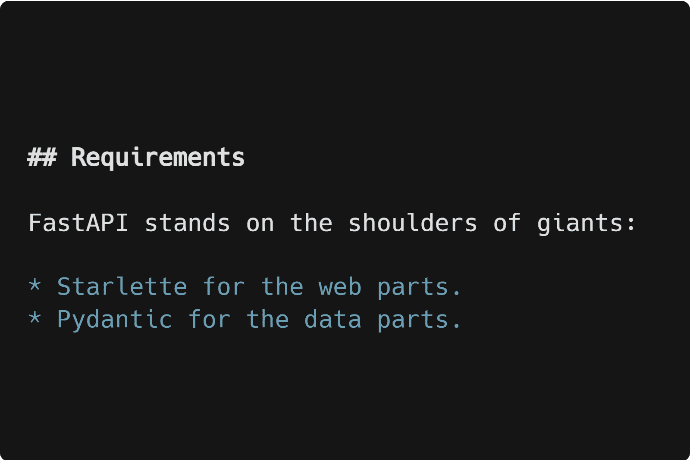
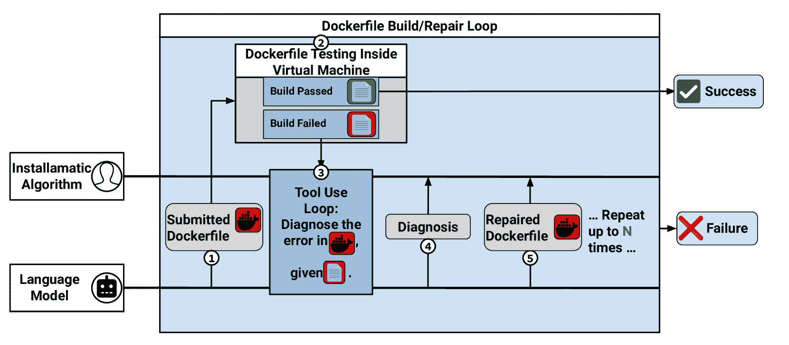

<!--yml

分类：未分类

日期：2025-01-11 11:50:05

-->

# 超越 pip install：评估用于自动安装 Python 项目的大型语言模型（LLM）代理

> 来源：[https://arxiv.org/html/2412.06294/](https://arxiv.org/html/2412.06294/)

Louis Milliken 计算机学院

KAIST 大田，韩国

lmilliken@kaist.ac.kr    Sungmin Kang 计算机学院

KAIST 大田，韩国

sungmin.kang@kaist.ac.kr    Shin Yoo 计算机学院

KAIST 大田，韩国

shin.yoo@kaist.ac.kr

###### 摘要

最近，许多研究提出了使用基于大型语言模型（LLM）的代理来执行“仓库级”任务，这些任务被宽泛地定义为其范围大于单个文件的一组任务。这导致人们推测，协调这些仓库级任务可能会导致能够几乎不依赖人工干预的自动化软件工程代理。然而，在这个需要由自动化软件工程代理执行的任务集合中，我们认为有一个重要的任务被忽略了，那就是通过安装其他仓库来完成项目级依赖。为了研究这一仓库级安装任务的可行性，我们引入了一个基准，包含从40个开源Python项目中整理的仓库安装任务，其中包括每个目标仓库的真实安装过程。此外，我们提出了Installamatic，一个旨在通过从仓库文档中搜索相关指令来执行并验证给定仓库安装的代理。实验证明，55%的研究仓库至少在十次中有一次能够被我们的代理自动安装。通过进一步分析，我们识别了代理无法安装仓库的常见原因，讨论了设计和实现这样一个代理所面临的挑战，并考虑了这样的代理可能对开发者产生的影响。

###### 关键词：

LLMs，安装，文档

## 一、引言

大型语言模型（LLM）是统计语言模型，通常基于Transformer [[1](https://arxiv.org/html/2412.06294v1#bib.bib1)] 深度神经网络架构，经过大量数据训练，目标是预测文本序列中的下一个标记。通过大规模语料库训练的LLM展示了涌现能力[[2](https://arxiv.org/html/2412.06294v1#bib.bib2)]，包括上下文学习[[3](https://arxiv.org/html/2412.06294v1#bib.bib3)]，即执行模型没有明确训练的任务的能力。特别地，当训练语料库包括源代码时，LLM能够执行与软件相关的任务[[4](https://arxiv.org/html/2412.06294v1#bib.bib4)]。

LLM（大语言模型）已经迅速被应用于软件工程领域[[5](https://arxiv.org/html/2412.06294v1#bib.bib5)]。最初，目标应用主要集中在小范围的任务上：合成单一功能[[4](https://arxiv.org/html/2412.06294v1#bib.bib4)]、变异输入进行模糊测试[[6](https://arxiv.org/html/2412.06294v1#bib.bib6)]、生成单元测试用例[[7](https://arxiv.org/html/2412.06294v1#bib.bib7)]、生成单行补丁[[8](https://arxiv.org/html/2412.06294v1#bib.bib8)]等。随着越来越大的模型的开发和推出[[9](https://arxiv.org/html/2412.06294v1#bib.bib9)]，更先进的提示技术（如Chain-of-Thoughts[[10](https://arxiv.org/html/2412.06294v1#bib.bib10)]、ReAct[[11](https://arxiv.org/html/2412.06294v1#bib.bib11)]、自一致性[[12](https://arxiv.org/html/2412.06294v1#bib.bib12)]）和基于LLM的架构（如代理[[13](https://arxiv.org/html/2412.06294v1#bib.bib13)]和多代理架构[[14](https://arxiv.org/html/2412.06294v1#bib.bib14)、[15](https://arxiv.org/html/2412.06294v1#bib.bib15)]）已被采纳来执行“仓库级”任务[[16](https://arxiv.org/html/2412.06294v1#bib.bib16)、[17](https://arxiv.org/html/2412.06294v1#bib.bib17)]，在本文中我们将其定义为需要在给定仓库中读取和/或写入多个文件的任务。

我们认为，所有这些仓库级别的代理几乎专注于*代码管理*任务，即分析或操作仓库源代码的任务。另一方面，开发者也经常处理环境管理的工作，但根据我们所知，基于LLM的代理尚未应用于此类任务。

因此，要完全理解基于LLM的代理如何帮助开发人员实践工作，必须研究其执行*环境管理*任务的能力。为此，本文提出了一个新的任务，要求基于LLM的代理安装给定的代码仓库，并验证安装过程。尽管这是许多开发者常见的任务，但之前的研究并未尝试自动化开源项目的安装。Dagenais等人[dagenais2010moving]发现，开发文档不足是新加入软件项目的障碍。此外，Aghajani等人的一项调查[[18](https://arxiv.org/html/2412.06294v1#bib.bib18)]显示，68%的受访开发者表示，项目的安装、部署和发布文档不完整是一个重要问题，63%的开发者称不合适的安装说明也是一个常见问题。因此，我们认为，能够尝试自动化安装的工具能够减少开发者的挫败感并提高生产力。

(a) 一个与安装相关的文档示例。

(b) 一个与安装无关的文档示例。（为清晰起见略作编辑）

(c) 与安装相关的文档文件名频率

图1：检查库内容

为了评估基于LLM的代理执行此任务的能力，我们创建了一个包含40个开源Python库的数据集，作为环境管理代理性能的基准。每个库都会分配一组标签，指示其安装方法以及一个真实有效的工作安装文件。为了确保LLM生成的安装脚本安全执行，我们还提供了一个接口，将LLM代理连接到虚拟机，以便在其中安全地尝试安装。我们将我们的研究成果，包括这个数据集，公开发布，以促进对基于LLM的代理的持续评估：[https://github.com/coinse/installamatic](https://github.com/coinse/installamatic)。

使用这个数据集，我们研究了基于LLM的代理在解决安装任务方面的表现，通过创建Installamatic，它尝试根据目标库的内容自动安装和测试库。给定一个目标库，代理使用搜索工具浏览其内容，并检查文件以找到与安装或测试过程相关的信息。一旦代理完成了文档收集，我们会提示它编写一个Dockerfile，将其放入目标库中，以安装所需的依赖项并运行目标库的测试套件，从而确认安装是否成功。

我们对Installamatic执行安装任务的实证评估显示，基于LLM的代理成功安装了40个库中的21个，成功率为55%。通过进一步的实验，我们为未来环境管理代理的设计者以及开源项目维护者提供了经验教训。对于未来环境管理代理的发展，我们建议在代理首次安装尝试后加入修复步骤。对于开源库的维护者，我们建议在编写库文档中的安装说明时，提供安装过程的代码示例。我们还识别出一些特定于环境操作任务的挑战，例如从库中收集与任务相关的信息。

本文的技术贡献包括：

+   •

    一个包含40个开源Python库的数据集，旨在作为评估库级代理理解库内容和环境管理任务有效性的基准。

+   •

    最初设计了一个库级别的代理，Installamatic，能够搜索和读取文档，并根据收集的信息编写Dockerfile来安装和测试该库。

+   •

    未来研究人员在为文档开发存储库级代理时可能面临的关键挑战概述。  

本文的其余部分结构如下。第[II](https://arxiv.org/html/2412.06294v1#S2 "II Dataset Construction ‣ Beyond pip install: Evaluating LLM Agents for the Automated Installation of Python Projects")节描述了基准构建、分析和标注过程；第[III](https://arxiv.org/html/2412.06294v1#S3 "III Installamatic: Automatic Installation Agent ‣ Beyond pip install: Evaluating LLM Agents for the Automated Installation of Python Projects")节提供了我们提出的代理 Installamatic 的详细信息；第[IV](https://arxiv.org/html/2412.06294v1#S4 "IV Experimental Setup ‣ Beyond pip install: Evaluating LLM Agents for the Automated Installation of Python Projects")节介绍了我们要回答的三个研究问题，并定义了分析中的关键指标；第[V](https://arxiv.org/html/2412.06294v1#S5 "V Results ‣ Beyond pip install: Evaluating LLM Agents for the Automated Installation of Python Projects")节审查了我们的实验结果；第[VI](https://arxiv.org/html/2412.06294v1#S6 "VI Related Work ‣ Beyond pip install: Evaluating LLM Agents for the Automated Installation of Python Projects")节将我们的工作与相关文献进行了比较；第[VII](https://arxiv.org/html/2412.06294v1#S7 "VII Threats to Validity ‣ Beyond pip install: Evaluating LLM Agents for the Automated Installation of Python Projects")节讨论了有效性威胁；第[VIII](https://arxiv.org/html/2412.06294v1#S8 "VIII Conclusion ‣ Beyond pip install: Evaluating LLM Agents for the Automated Installation of Python Projects")节做出了总结。  

## II 数据集构建  

为了创建自动安装任务的基准，我们从 GitHub 收集并展示了 40 个开源 Python 存储库的数据集，并为每个存储库提供了正确的安装方法以及任何相关文档的位置。在未找到相关文档的情况下，通过检查存储库中的非文档文件并手动尝试安装存储库，确定了适当的安装方法。

使用 GitHub API 从多个不同的星级范围（1k-5k、5k-10k、10k-20k 和 >20k）中采样存储库。从每个范围中，选择了在采集时最近更新的 10 个存储库，这意味着数据集中的所有存储库都至少在 2024 年 8 月之前一直处于活跃开发状态。数据集包含与采集时间对应的提交 ID。  

我们只选择在 `test` 或 `tests` 目录中包含测试套件的仓库，以确保我们有一致的标准来判断安装过程是否成功。我们认为，测试套件的成功执行可以作为自动化的客观证据，证明安装成功。尽管这一决定对评估我们代理的能力是必要的，但它使我们的样本偏向于那些拥有测试套件的仓库，这个问题将在第[V-C](https://arxiv.org/html/2412.06294v1#S5.SS3 "V-C RQ3: What challenges remain in designing agents for automatic installation and similar repository level tasks? ‣ V Results ‣ Beyond pip install: Evaluating LLM Agents for the Automated Installation of Python Projects")节进一步讨论。表[I](https://arxiv.org/html/2412.06294v1#S2.T1 "TABLE I ‣ II Dataset Construction ‣ Beyond pip install: Evaluating LLM Agents for the Automated Installation of Python Projects")展示了收集的仓库。

表 I：数据集中仓库列表

| $\star$ | 名称 | URL | $\star$ | 名称 | URL |
| --- | --- | --- | --- | --- | --- |
| 1k-5K | icloud-drive-docker | [https://github.com/mandarons/icloud-drive-docker](https://github.com/mandarons/icloud-drive-docker) | 10k-20K | yfinance | [https://github.com/ranaroussi/yfinance](https://github.com/ranaroussi/yfinance) |
| django-stubs | [https://github.com/typeddjango/django-stubs](https://github.com/typeddjango/django-stubs) | beets | [https://github.com/beetbox/beets](https://github.com/beetbox/beets) |
| pennylane | [https://github.com/PennyLaneAI/pennylane](https://github.com/PennyLaneAI/pennylane) | starlette | [https://github.com/encode/starlette](https://github.com/encode/starlette) |
| X-AnyLabeling | [https://github.com/CVHub520/X-AnyLabeling](https://github.com/CVHub520/X-AnyLabeling) | datasets | [https://github.com/huggingface/datasets](https://github.com/huggingface/datasets) |
| opencompass | [https://github.com/open-compass/opencompass](https://github.com/open-compass/opencompass) | mypy | [https://github.com/python/mypy](https://github.com/python/mypy) |
| R2R | [https://github.com/SciPhi-AI/R2R](https://github.com/SciPhi-AI/R2R) | sympy | [https://github.com/sympy/sympy](https://github.com/sympy/sympy) |
| Torch-Pruning | [https://github.com/VainF/Torch-Pruning](https://github.com/VainF/Torch-Pruning) | ydata-profiling | [https://github.com/ydataai/ydata-profiling](https://github.com/ydataai/ydata-profiling) |
| scvi-tools | [https://github.com/scverse/scvi-tools](https://github.com/scverse/scvi-tools) | spotify-downloader | [https://github.com/spotDL/spotify-downloader](https://github.com/spotDL/spotify-downloader) |
| sabnzbd | [https://github.com/sabnzbd/sabnzbd](https://github.com/sabnzbd/sabnzbd) | qlib | [https://github.com/microsoft/qlib](https://github.com/microsoft/qlib) |
| dlt | [https://github.com/dlt-hub/dlt](https://github.com/dlt-hub/dlt) | scapy | [https://github.com/secdev/scapy](https://github.com/secdev/scapy) |
| 5k-10K | camel | [https://github.com/camel-ai/camel](https://github.com/camel-ai/camel) | 20K+ | fastapi | [https://github.com/tiangolo/fastapi](https://github.com/tiangolo/fastapi) |
| boto3 | [https://github.com/boto/boto3](https://github.com/boto/boto3) | black | [https://github.com/psf/black](https://github.com/psf/black) |
| cloud-custodian | [https://github.com/cloud-custodian/cloud-custodian](https://github.com/cloud-custodian/cloud-custodian) | tqdm | [https://github.com/tqdm/tqdm](https://github.com/tqdm/tqdm) |
| aim | [https://github.com/aimhubio/aim](https://github.com/aimhubio/aim) | rich | [https://github.com/Textualize/rich](https://github.com/Textualize/rich) |
| speechbrain | [https://github.com/speechbrain/speechbrain](https://github.com/speechbrain/speechbrain) | open-interpreter | [https://github.com/OpenInterpreter/open-interpreter](https://github.com/OpenInterpreter/open-interpreter) |
| nonebot2 | [https://github.com/nonebot/nonebot2](https://github.com/nonebot/nonebot2) | core | [https://github.com/home-assistant/core](https://github.com/home-assistant/core) |
| moto | [https://github.com/getmoto/moto](https://github.com/getmoto/moto) | sherlock | [https://github.com/sherlock-project/sherlock](https://github.com/sherlock-project/sherlock) |
| instructor | [https://github.com/jxnl/instructor](https://github.com/jxnl/instructor) | spaCy | [https://github.com/explosion/spaCy](https://github.com/explosion/spaCy) |
| numba | [https://github.com/numba/numba](https://github.com/numba/numba) | you-get | [https://github.com/soimort/you-get](https://github.com/soimort/you-get) |
| pymc | [https://github.com/pymc-devs/pymc](https://github.com/pymc-devs/pymc) | textual | [https://github.com/Textualize/textual](https://github.com/Textualize/textual) |

每个仓库都经过人工检查，生成了三种不同类型的元数据：前述所有与安装相关的文档列表、一个成功安装并测试该仓库的示范 Dockerfile，以及一组标签，指示预期的安装和测试方法。Dockerfile 编写和标签分配的过程将在 [II-B](https://arxiv.org/html/2412.06294v1#S2.SS2 "II-B 安装和测试方法 ‣ II 数据集构建 ‣ 超越 pip install：评估 LLM 代理的 Python 项目自动安装") 中更详细地描述。

### II-A 开源 Python 项目的文档结构

我们定义一个文档为“与安装相关”，如果它明确提到安装目标仓库的依赖项和执行其测试套件的过程。例如，图[1(a)](https://arxiv.org/html/2412.06294v1#S1.F1.sf1 "在图1 ‣ I 引言 ‣ 除了 pip install：评估 LLM 代理的自动化安装 Python 项目")是一个与安装相关的文档示例，因为它清楚地展示了设置开发环境所需运行的命令之一。另一方面，图[1(b)](https://arxiv.org/html/2412.06294v1#S1.F1.sf2 "在图1 ‣ I 引言 ‣ 除了 pip install：评估 LLM 代理的自动化安装 Python 项目")展示了来自FastAPI仓库的README.md文件中的一个非安装相关的文档示例：这个文档与安装过程无关，因此对开发者的安装过程没有影响。

在确定每个仓库的与安装相关的文档后，我们发现有29个独特的文件路径指向与安装相关的文档，并且有18个不同的文件名包含与安装相关的文档，忽略文件类型、大小写敏感性以及‘-’和‘_’的使用。图[1(c)](https://arxiv.org/html/2412.06294v1#S1.F1.sf3 "在图1 ‣ I 引言 ‣ 除了 pip install：评估 LLM 代理的自动化安装 Python 项目")展示了文档文件名的分布。尽管人们可能会期望一个仓库的‘readme’文件包含与仓库安装相关的信息，但我们发现事实往往并非如此。

文件名“contributing”和“readme”比其他任何文件名都要常见：在数据集中的40%和35%的仓库中，这些文件名分别包含了与安装相关的信息。在这两者之后，没有其他与安装相关的文件名出现超过三次。请注意，‘contributing’文件的目的是指导新加入项目的开发者如何为项目做出贡献。因此，关于依赖管理、环境设置和测试的说明在命名为‘contributing’的文件中非常常见。

值得注意的是，许多项目将大量文档托管在外部网站上，尽管有时这些外部网站的源文件会存储在仓库本身中。在这种情况下，文档通常会存储在一个名为docs的目录中，这意味着它仍然可以在仓库中访问。然而，与存储在仓库根目录中的文档相比，这些文档可见性较差，因此更难找到。安装相关文档可能存储的不同位置显示出，对于 Python 仓库的文档，并没有统一的结构。

### II-B 安装与测试方法

除了标识与安装相关文档的位置外，我们的数据集还包含一个Dockerfile，当将其放入目标代码库时，可以安装所有依赖项，并运行测试套件以确认它们的成功安装。在此过程中，我们为安装过程中使用的不同类型的命令创建了一系列粗粒度的类别。表[II](https://arxiv.org/html/2412.06294v1#S2.T2 "TABLE II ‣ II-B Methods of Installation and Testing ‣ II Dataset Construction ‣ Beyond pip install: Evaluating LLM Agents for the Automated Installation of Python Projects")列出了结果中的17个标签。 

TABLE II: 安装标签列表

| Tag | 描述 | Tag | 描述 |
| --- | --- | --- | --- |
| requirements | 使用pip install -r requirements.txt安装依赖项。 | install-other | 通过上述未列出的方法安装依赖项，例如代码库中的自定义脚本。 |
| requirements-extra | 从额外的要求文件中安装依赖项，如requirements-test.txt。 | pytest | 使用pytest运行测试。 |
| pip-extra | 需要安装除Poetry或requirements文件内容以外的内容。 | pytest-extra | 需要向pytest提供额外的参数，例如指定测试的位置或附加标志。 |
| Poetry | 使用Poetry依赖管理器安装依赖项。¹¹1https://python-poetry.org/ | tox | 使用Tox运行测试。 |
| Poetry-extra | 使用Poetry安装依赖项，并添加额外的参数，例如poetry install --no-interaction --with sentry-sdk。 | unittest | 使用Python内置的unittest命令运行测试。 |
| make-install | 使用makefile安装依赖项，通常是像make install或make init这样的命令。 | make-test | 使用makefile运行测试，命令如make test。 |
| install-self | 项目本身需要安装到工作环境中，例如通过运行pip install -e 。 | test-other | 以其他方式运行测试，例如test.py文件。 |
| install-pytest | 需要手动安装Pytest²²2https://docs.pytest.org/en/stable/库。 | bash-extra | 需要额外的bash命令来设置代码库，例如创建新目录或授予某些文件的权限。 |
| install-tox | Tox³³3https://tox.wikinstalli/en/4.17.1/库需要手动安装。 |  |  |

在给40个仓库分配适当标签后，我们剩下了31个唯一的标签组合，这意味着我们所采样的Python仓库有31种不同的依赖安装和测试运行方法。如此多样化的安装方法促使我们考虑使用大语言模型（LLM）作为自动安装的手段；它们的上下文学习能力[[19](https://arxiv.org/html/2412.06294v1#bib.bib19)]使其成为此类任务的理想候选者，在这种任务中，预期输出（在此案例中为工作中的Dockerfile）可能会有很大变化，并且高度依赖于仓库文档中的内容。

## III Installamatic：自动安装代理

本节介绍了Installamatic，一种基于LLM的代理，它尝试自动安装给定的开源Python项目。Installamatic的任务分为两个阶段。首先，它收集与安装相关的文档。其次，它尝试构建和修复一个Dockerfile⁴⁴4https://www.docker.com/ 来安装和测试目标仓库。本节首先解释Installamatic如何搜索与安装过程相关的文件，随后描述其任务的两个阶段。

### III-A 仓库搜索过程

Installamatic在文档收集和Dockerfile构建/修复步骤中都需要搜索仓库的内容，尽管在这些步骤中的具体目标可能有所不同。为此，我们为Installamatic提供了一种通用方法来搜索仓库的内容，这可以在不同阶段重复使用。该搜索方法的概述如图[2(a)](https://arxiv.org/html/2412.06294v1#S3.F2.sf1 "图2 ‣ III-A 仓库搜索过程 ‣ III Installamatic：自动安装代理 ‣ 超越pip install：评估LLM代理用于Python项目的自动安装")所示。受到以往研究的启发，这些研究发现模仿人类行为可以带来性能改进[[20](https://arxiv.org/html/2412.06294v1#bib.bib20)]和可解释性[[21](https://arxiv.org/html/2412.06294v1#bib.bib21)]等好处，我们选择使用LLM引导的搜索步骤，而不是传统的搜索方法，如BM25[[22](https://arxiv.org/html/2412.06294v1#bib.bib22)]或神经嵌入[[23](https://arxiv.org/html/2412.06294v1#bib.bib23)]。

我们在搜索过程开始时将目标仓库的根目录内容包含在提示中，然后提供几个工具，使代理能够进一步浏览仓库的内容。我们为Installamatic提供的四个基本导航功能如下：

+   •

    get_directory_contents：给定一个代理已经看到的目录路径，返回该目录中所有文件和子目录的名称。

+   •

    get_file_contents: 给定文件路径，返回其内容。如果该文件是人类可读并且结构化的，比如.md或.rst文件，那么将提取并返回该文件中的章节标题。

+   •

    inspect_header: 给定文件路径和该文件中某个章节的名称，返回该章节的内容。此功能用于最小化显示给智能体的干扰内容。

+   •

    check_presence: 给定文件名，检查文件是否存在。这是一个健全性检查，用于防止智能体虚构不存在的文件。

除了这些在搜索过程中提供的功能外，Installamatic还可以访问为特定搜索任务提供的其他功能。下面将提供一些这些特定任务的示例。所有在此过程中使用的提示都列在附录中，附录可以在研究文献中找到。

(a) 智能体搜索过程图

(b) 智能体在Dockerfile测试/修复步骤中的控制

图2：Installamatic流程图

为了开始搜索过程，代理会看到一个系统提示，解释其任务并提供目标仓库根目录的内容（图 [2(a)](https://arxiv.org/html/2412.06294v1#S3.F2.sf1 "在图 2 ‣ III-A 仓库搜索过程 ‣ III Installamatic: 自动安装代理 ‣ 超越 pip install：评估用于自动化安装 Python 项目的 LLM 代理") <svg class="ltx_picture" height="14.52" id="S3.SS1.p5.1.pic1" overflow="visible" version="1.1" width="14.52"><g fill="#000000" stroke="#000000" stroke-width="0.4pt" transform="translate(0,14.52) matrix(1 0 0 -1 0 0) translate(7.26,0) translate(0,7.26)"><g fill="#000000" stroke="#000000" transform="matrix(1.0 0.0 0.0 1.0 -3.46 -4.46)"><foreignobject color="#000000" height="8.92" overflow="visible" transform="matrix(1 0 0 -1 0 16.6)" width="6.92">1</foreignobject></g></g></svg>)。然后，代理进入搜索循环，首先收到一个查询，要求代理用自然语言规划下一步行动，接着是第二个查询，提供给代理工具，用以执行其计划（图 [2(a)](https://arxiv.org/html/2412.06294v1#S3.F2.sf1 "在图 2 ‣ III-A 仓库搜索过程 ‣ III Installamatic: 自动安装代理 ‣ 超越 pip install：评估用于自动化安装 Python 项目的 LLM 代理") <svg class="ltx_picture" height="14.52" id="S3.SS1.p5.2.pic2" overflow="visible" version="1.1" width="14.52"><g fill="#000000" stroke="#000000" stroke-width="0.4pt" transform="translate(0,14.52) matrix(1 0 0 -1 0 0) translate(7.26,0) translate(0,7.26)"><g fill="#000000" stroke="#000000" transform="matrix(1.0 0.0 0.0 1.0 -3.46 -4.46)"><foreignobject color="#000000" height="8.92" overflow="visible" transform="matrix(1 0 0 -1 0 16.6)" width="6.92">2</foreignobject></g></g></svg>)。这种两步方法旨在提升代理的推理能力，受到链式思维推理的启发[[10](https://arxiv.org/html/2412.06294v1#bib.bib10)]，并在检查结果时提供更好的、更易理解的解释。经过这两步后，基于代理的回应选择一个函数，并执行该函数以返回相关结果给代理（图 [2(a)](https://arxiv.org/html/2412.06294v1#S3.F2.sf1 "在图 2 ‣ III-A 仓库搜索过程 ‣ III Installamatic: 自动安装代理 ‣ 超越 pip install：评估用于自动化安装 Python 项目的 LLM 代理") <svg class="ltx_picture" height="14.52" id="S3.SS1.p5.3.pic3" overflow="visible" version="1.1" width="14.52"><g fill="#000000" stroke="#000000" stroke-width="0.4pt" transform="translate(0,14.52) matrix(1 0 0 -1 0 0) translate(7.26,0) translate(0,7.26)"><g fill="#000000" stroke="#000000" transform="matrix(1.0 0.0 0.0 1.0 -3.46 -4.46)"><foreignobject color="#000000" height="8.92" overflow="visible" transform="matrix(1 0 0 -1 0 16.6)" width="6.92">3</foreignobject></g></g></svg>)。一旦该函数的结果发送给代理，系统会再次发送提示，要求代理规划下一步行动（图 [2(a)](https://arxiv.org/html/2412.06294v1#S3.F2.sf1 "在图 2 ‣ III-A 仓库搜索过程 ‣ III Installamatic: 自动安装代理 ‣ 超越 pip install：评估用于自动化安装 Python 项目的 LLM 代理") <svg class="ltx_picture" height="14.52" id="S3.SS1.p5.4.pic4" overflow="visible" version="1.1" width="14.52"><g fill="#000000" stroke="#000000" stroke-width="0.4pt" transform="translate(0,14.52) matrix(1 0 0 -1 0 0) translate(7.26,0) translate(0,7.26)"><g fill="#000000" stroke="#000000" transform="matrix(1.0 0.0 0.0 1.0 -3.46 -4.46)"><foreignobject color="#000000" height="8.92" overflow="visible" transform="matrix(1 0 0 -1 0 16.6)" width="6.92">4</foreignobject></g></g></svg>)。这个过程会一直重复，直到代理认为搜索结束（图 [2(a)](https://arxiv.org/html/2412.06294v1#S3.F2.sf1 "在图 2 ‣ III-A 仓库搜索过程 ‣ III Installamatic: 自动安装代理 ‣ 超越 pip install：评估用于自动化安装 Python 项目的 LLM 代理") <svg class="ltx_picture" height="14.52" id="S3.SS1.p5.5.pic5" overflow="visible" version="1.1" width="14.52"><g fill="#000000" stroke="#000000" stroke-width="0.4pt" transform="translate(0,14.52) matrix(1 0 0 -1 0 0) translate(7.26,0) translate(0,7.26)"><g fill="#000000" stroke="#000000" transform="matrix(1.0 0.0 0.0 1.0 -3.46 -4.46)"><foreignobject color="#000000" height="8.92" overflow="visible" transform="matrix(1 0 0 -1 0 16.6)" width="6.92">5</foreignobject></g></g></svg>)。此外，系统（图 [2(a)](https://arxiv.org/html/2412.06294v1#S3.F2.sf1 "在图 2 ‣ III-A 仓库搜索过程 ‣ III Installamatic: 自动安装代理 ‣ 超越 pip install：评估用于自动化安装 Python 项目的 LLM 代理") <svg class="ltx_picture" height="14.52" id="S3.SS1.p5.6.pic6" overflow="visible" version="1.1" width="14.52"><g fill="#000000" stroke="#000000" stroke-width="0.4pt" transform="translate(0,14.52) matrix(1 0 0 -1 0 0) translate(7.26,0) translate(0,7.26)"><g fill="#000000" stroke="#000000" transform="matrix(1.0 0.0 0.0 1.0 -3.46 -4.46)"><foreignobject color="#000000" height="8.92" overflow="visible" transform="matrix(1 0 0 -1 0 16.6)" width="6.92">1</foreignobject></g></g></svg>), 后续（图 [2(a)](https://arxiv.org/html/2412.06294v1#S3.F2.sf1 "在图 2 ‣ III-A 仓库搜索过程 ‣ III Installamatic: 自动安装代理 ‣ 超越 pip install：评估用于自动化安装 Python 项目的 LLM 代理") <svg class="ltx_picture" height="14.52" id="S3.SS1.p5.7.pic7" overflow="visible" version="1.1" width="14.52"><g fill="#000000" stroke="#000000" stroke-width="0.4pt" transform="translate(0,14.52) matrix(1 0 0 -1 0 0) translate(7.26,0) translate(0,7.26)"><g fill="#000000" stroke="#000000" transform="matrix(1.0 0.0 0.0 1.0 -3.46 -4.46)"><foreignobject color="#000000" height="8.92" overflow="visible" transform="matrix(1

### III-B 文档收集步骤

在第一阶段，Installamatic 的任务是浏览仓库并识别任何它认为与安装或测试过程相关的信息的文件。除了四个基本功能之外，代理还获得了更多的工具：`submit_documentation`，用于记录文档为安装相关，以及 `finished_search`，用于表示该阶段结束并开始下一步。

### III-C Dockerfile 构建/修复步骤

在文档收集步骤之后，我们指示代理使用自然语言总结收集到的信息。Installamatic 再次被授予访问基本搜索功能的权限。在此阶段，它只能访问之前选择为与安装相关的文件。一旦完成搜索过程并使用 `submit_summary` 工具提供摘要后，系统会提示它编写一个 Dockerfile 来安装依赖并运行测试。

图[2(b)](https://arxiv.org/html/2412.06294v1#S3.F2.sf2 "在图2 ‣ III-A 仓库搜索过程 ‣ III Installamatic：自动安装代理 ‣ 超越 pip install：评估用于自动化安装 Python 项目的 LLM 代理")详细展示了 Dockerfile 测试和修复过程。在 Installamatic 生成 Dockerfile 后（图[2(b)](https://arxiv.org/html/2412.06294v1#S3.F2.sf2 "在图2 ‣ III-A 仓库搜索过程 ‣ III Installamatic：自动安装代理 ‣ 超越 pip install：评估用于自动化安装 Python 项目的 LLM 代理") <svg class="ltx_picture" height="14.52" id="S3.SS3.p2.1.pic1" overflow="visible" version="1.1" width="14.52"><g fill="#000000" stroke="#000000" stroke-width="0.4pt" transform="translate(0,14.52) matrix(1 0 0 -1 0 0) translate(7.26,0) translate(0,7.26)"><g fill="#000000" stroke="#000000" transform="matrix(1.0 0.0 0.0 1.0 -3.46 -4.46)"><foreignobject color="#000000" height="8.92" overflow="visible" transform="matrix(1 0 0 -1 0 16.6)" width="6.92">1</foreignobject></g></g></svg>），需要在安全环境中进行测试。由于安装过程可能涉及未知代码，并且可能需要管理员权限，因此随意运行安装脚本时存在一定的风险。因此，我们选择使用在虚拟机中运行的 Dockerfile 来测试代理的安装过程，从而减少运行可能有害或破坏性代码的副作用（图[2(b)](https://arxiv.org/html/2412.06294v1#S3.F2.sf2 "在图2 ‣ III-A 仓库搜索过程 ‣ III Installamatic：自动安装代理 ‣ 超越 pip install：评估用于自动化安装 Python 项目的 LLM 代理") <svg class="ltx_picture" height="14.52" id="S3.SS3.p2.2.pic2" overflow="visible" version="1.1" width="14.52"><g fill="#000000" stroke="#000000" stroke-width="0.4pt" transform="translate(0,14.52) matrix(1 0 0 -1 0 0) translate(7.26,0) translate(0,7.26)"><g fill="#000000" stroke="#000000" transform="matrix(1.0 0.0 0.0 1.0 -3.46 -4.46)"><foreignobject color="#000000" height="8.92" overflow="visible" transform="matrix(1 0 0 -1 0 16.6)" width="6.92">2</foreignobject></g></g></svg>)。

一旦Dockerfile构建过程完成，生成的日志会被分析。如果运行了测试，并且至少一个测试通过，则认为安装成功。这样的结果表明安装成功，因为测试的运行意味着在设置测试套件时没有遇到依赖性问题。这是一个不精确的构建成功衡量标准，因为虽然要求所有测试都通过可能会导致假阴性（例如由于与之无关的问题，如API密钥未设置而导致测试失败），某些情况下，如果项目的不同模块有不同的要求，也可能会错误地通过，导致假阳性。如果有任何测试通过，则过程已经完成，代理已完成其任务。如果没有测试通过，或者安装过程在早期步骤就失败了，Installamatic将启动Dockerfile修复过程。

修复过程从一个新的系统消息开始，消息中包含了代理之前提交的Dockerfile，以及失败安装过程的构建日志（图[2(b)](https://arxiv.org/html/2412.06294v1#S3.F2.sf2 "图2 ‣ III-A 仓库搜索过程 ‣ III Installamatic：自动安装代理 ‣ 超越pip install：评估LLM代理在Python项目自动安装中的应用") <svg class="ltx_picture" height="14.52" id="S3.SS3.p4.1.pic1" overflow="visible" version="1.1" width="14.52"><g fill="#000000" stroke="#000000" stroke-width="0.4pt" transform="translate(0,14.52) matrix(1 0 0 -1 0 0) translate(7.26,0) translate(0,7.26)"><g fill="#000000" stroke="#000000" transform="matrix(1.0 0.0 0.0 1.0 -3.46 -4.46)"><foreignobject color="#000000" height="8.92" overflow="visible" transform="matrix(1 0 0 -1 0 16.6)" width="6.92">3</foreignobject></g></g></svg>)。随后，代理被指示解释错误信息的含义，并找出错误的原因。

与之前的步骤类似，代理被授予访问基本搜索功能的权限。然而，代理不再被鼓励仅检查文档文件，而是可以检查其认为与问题相关的任何文件。之前步骤中的信息将被忽略，这意味着这实际上是一个新的代理实例，对之前的阶段没有任何了解。这么做是为了减少发送给LLM的消息的上下文长度，这样既可以提高性能[[25](https://arxiv.org/html/2412.06294v1#bib.bib25)]，也可以减少推理成本。

在提供前一个 Dockerfile 失败的解释后（图 [2(b)](https://arxiv.org/html/2412.06294v1#S3.F2.sf2 "图 2 ‣ III-A 仓库搜索过程 ‣ III Installamatic：自动安装智能体 ‣ 超越 pip install：评估 LLM 智能体用于自动化安装 Python 项目") <svg class="ltx_picture" height="14.52" id="S3.SS3.p6.1.pic1" overflow="visible" version="1.1" width="14.52"><g fill="#000000" stroke="#000000" stroke-width="0.4pt" transform="translate(0,14.52) matrix(1 0 0 -1 0 0) translate(7.26,0) translate(0,7.26)"><g fill="#000000" stroke="#000000" transform="matrix(1.0 0.0 0.0 1.0 -3.46 -4.46)"><foreignobject color="#000000" height="8.92" overflow="visible" transform="matrix(1 0 0 -1 0 16.6)" width="6.92">4</foreignobject></g></g></svg>)，智能体被指示建议如何修复这个错误，并提供修复后的 Dockerfile（图 [2(b)](https://arxiv.org/html/2412.06294v1#S3.F2.sf2 "图 2 ‣ III-A 仓库搜索过程 ‣ III Installamatic：自动安装智能体 ‣ 超越 pip install：评估 LLM 智能体用于自动化安装 Python 项目") <svg class="ltx_picture" height="14.52" id="S3.SS3.p6.2.pic2" overflow="visible" version="1.1" width="14.52"><g fill="#000000" stroke="#000000" stroke-width="0.4pt" transform="translate(0,14.52) matrix(1 0 0 -1 0 0) translate(7.26,0) translate(0,7.26)"><g fill="#000000" stroke="#000000" transform="matrix(1.0 0.0 0.0 1.0 -3.46 -4.46)"><foreignobject color="#000000" height="8.92" overflow="visible" transform="matrix(1 0 0 -1 0 16.6)" width="6.92">5</foreignobject></g></g></svg>)，然后将其发送到本地虚拟机进行再次测试。这个过程会一直重复，直到 Installamatic 生成一个有效的 Dockerfile，或者达到最大修复尝试次数，这时我们认为安装仓库的尝试失败。由于额外修复尝试的高时间成本，我们将最大修复次数设置为两次。

(a) 每个标签的平均安装率

(b) NoneBot2 仓库的示例 DockerFile

(c) Qlib 仓库的示例 DockerFile

图 3：识别无法安装仓库的原因

## IV 实验设置

### IV-A 研究问题

在智能体的创建与评估过程中，提出了以下三个研究问题：

+   •

    RQ1: 我们的智能体在多大程度上能够安装任意的 Python 仓库？这个问题分析了我们智能体在基准数据集上的表现，旨在确定在什么情况下我们的智能体能够或者不能自动安装一个仓库。

+   •

    RQ2：什么因素影响 LLM 代理成功安装库的能力？理解哪些因素可能影响代理与库的兼容性，将在 LLM 代理用于库级任务广泛应用的情况下发挥重要作用。因此，我们旨在识别那些更容易和更难自动安装的库的关键特征。

+   •

    RQ3：在设计自动安装代理和类似的库级任务时，还存在哪些挑战？为了帮助未来的研究在使用 LLM 代理进行环境管理任务的过程中，我们概述了在构思和开发代理时遇到的最大挑战和限制。

### IV-B 度量标准

我们旨在研究文档质量与代理性能之间的关系。为了估计文档的质量，我们提出了两种文档质量度量标准：可见性和信息量。

库文档的可见性直观地衡量了找到与安装相关文档的难易程度。为此，我们统计需要遍历的文件和目录总数，直到找到所有与安装相关的文档，并取其倒数：

|  | $\text{{\color[rgb]{0,0,0}\definecolor[named]{pgfstrokecolor}{rgb}{0,0,0}% \pgfsys@color@gray@stroke{0}\pgfsys@color@gray@fill{0}visibility}}=\frac{1}{% \text{\#directories}+\text{\#files}}$ |  |
| --- | --- | --- |

库文档的信息量直观上衡量了文档在实际安装过程中的全面性，这一过程由我们的真实数据 Dockerfile 定义。为此，我们计算出真实数据 Dockerfile 中也出现在与安装相关文档中的行数比例：

|  | $\text{{\color[rgb]{0,0,0}\definecolor[named]{pgfstrokecolor}{rgb}{0,0,0}% \pgfsys@color@gray@stroke{0}\pgfsys@color@gray@fill{0}informativity}}=\frac{&#124;% \text{dockerfile}\bigcap\text{documentation}&#124;}{&#124;\text{dockerfile}&#124;}$ |  |
| --- | --- | --- |

请注意，这两个启发式度量使用了收集的真实数据；因此，它们的计算依赖于对研究库的人工检查。我们在第[V-A](https://arxiv.org/html/2412.06294v1#S5.SS1 "V-A RQ1: To what extent is our agent able to install arbitrary Python repositories? ‣ V Results ‣ Beyond pip install: Evaluating LLM Agents for the Automated Installation of Python Projects")节中使用这些度量来确定代理成功率与文档质量之间的关系，预期那些根据这些度量评估为质量较差的库将更难被代理安装，从而导致较低的平均安装成功率。

为了衡量安装性能，我们使用另外两个度量标准：从文档收集步骤的召回率，以及 Dockerfile 生成步骤的成功安装率，经过多次运行。召回率计算方法如下：

|  | $\text{召回率}=\frac{ | \text{安装相关的检索文档} | }{ | \text{安装相关的文档} | }$ |  |
| --- | --- | --- | --- | --- | --- | --- |

成功安装率只是多次运行中成功安装的比例。我们对每个仓库进行了 10 次 Installamatic 安装。

### IV-C 实现

所有实验均使用 GPT4o-mini (gpt-4o-mini-2024-07-18) 模型进行；Dockerfiles 在运行 Ubuntu 22.04.4 LTS 和 Docker 27.1.2 的虚拟机中构建。所有在工件中的 Python 脚本均在 Python 3.10.12 上运行，图表的系数是通过 NumPy 2.0.1 的 polyfit 方法计算得出的。

## V 结果

在这里，我们展示了对 Installamatic 进行的实证评估的结果。

图 4：每个仓库的成功安装率，分别展示完美召回相关文档和没有完美召回的情况（紫色条形代表这两个指标之间的重叠部分）。

(a) 文档搜索召回率与平均安装率之间的相关性

(b) 文档搜索步骤的召回率与可见性之间的相关性

(c) 可见性与平均安装率之间的相关性

图 5：评估仓库文档的可见性及其平均安装率

### V-A 研究问题 1：我们的代理能在多大程度上成功安装任意 Python 仓库？

#### V-A1 安装成功率

图[4](https://arxiv.org/html/2412.06294v1#S5.F4 "图 4 ‣ V 结果 ‣ 超越 pip install：评估LLM代理在自动化安装Python项目中的表现")展示了在两种配置下，Installamatic成功安装研究中代码库的比例。第一种配置，*标准配置*（图[4](https://arxiv.org/html/2412.06294v1#S5.F4 "图 4 ‣ V 结果 ‣ 超越 pip install：评估LLM代理在自动化安装Python项目中的表现")中的蓝色条形），是Installamatic的标准配置，包含文档收集步骤：代理会浏览代码库，选择其认为与安装相关的文档条目，然后尝试编写Dockerfile。第二种配置，*完美回忆配置*（图[4](https://arxiv.org/html/2412.06294v1#S5.F4 "图 4 ‣ V 结果 ‣ 超越 pip install：评估LLM代理在自动化安装Python项目中的表现")中的红色条形），是没有文档收集步骤的Installamatic：相反，我们为Installamatic提供了所有我们手动确认与安装相关的文档。第二种配置的加入是为了将安装成功率与代码库文档的可见性分开。最右边的七个代码库没有包含任何相关文档，因此被排除在完美回忆配置之外。在这七个代码库中，只有tqdm被代理成功构建。

在标准配置下，Installamatic能够至少成功安装40个测试代码库中的21个，所有代码库的平均成功安装率为28.8%。在完美回忆配置下，Installamatic能够安装34个测试代码库中的18个，平均安装率为34.7%，大约提高了20%。在两种配置下测试的34个代码库中，有13个从未成功构建。

请注意，有一些代码库在标准配置下的安装成功率高于完美回忆配置下的安装成功率。这可能是由于LLM行为的差异所致（因为每个代码库仅进行了10次尝试），而不是因为这些代码库在缺乏安装相关文档的完美回忆下实际上更容易安装。

#### V-A2 失败的原因

为了识别代理能力的局限性，我们考虑了图[3(a)](https://arxiv.org/html/2412.06294v1#S3.F3.sf1 "在图3 ‣ III-C Dockerfile构建/修复步骤 ‣ III Installamatic: 自动安装代理 ‣ 超越pip安装：评估LLM代理在Python项目自动安装中的应用")中每个先前定义的17个标签与代码库安装成功率之间的关系。在所有40个代码库中出现的标签中，只有两个标签是代理从未成功安装的：poetry-extra和pytest-extra；包含这些标签的示例安装过程可以分别在图[3(b)](https://arxiv.org/html/2412.06294v1#S3.F3.sf2 "在图3 ‣ III-C Dockerfile构建/修复步骤 ‣ III Installamatic: 自动安装代理 ‣ 超越pip安装：评估LLM代理在Python项目自动安装中的应用")和[3(c)](https://arxiv.org/html/2412.06294v1#S3.F3.sf3 "在图3 ‣ III-C Dockerfile构建/修复步骤 ‣ III Installamatic: 自动安装代理 ‣ 超越pip安装：评估LLM代理在Python项目自动安装中的应用")中查看。

图[3(b)](https://arxiv.org/html/2412.06294v1#S3.F3.sf2 "在图3 ‣ III-C Dockerfile构建/修复步骤 ‣ III Installamatic: 自动安装代理 ‣ 超越pip安装：评估LLM代理在Python项目自动安装中的应用")展示了为安装和测试NoneBot2代码库编写的示例Dockerfile。在这个示例中，需要在安装命令中添加额外的--all-extras参数，因为该代码库的测试套件会测试一些poetry install本身无法安装的依赖模块。尽管如此，--all-extras标签在安装相关文档中并未提及，导致代理没有意识到这个问题，即使在提供了文档的情况下也是如此。

图[3(c)](https://arxiv.org/html/2412.06294v1#S3.F3.sf3 "图 3 ‣ III-C Dockerfile 构建/修复步骤 ‣ III Installamatic: 自动化安装代理 ‣ 超越 pip install：评估 LLM 代理在 Python 项目自动化安装中的应用")展示了Qlib代码库的Dockerfile，并特征展示了另一个无法安装的标签，pytest-extra。在这里，对标准测试过程做了两项补充。首先，用户必须从测试目录内运行测试套件；其次，必须使用“not slow”参数运行测试套件。这两项补充在代码库文档中并未提到，尽管第二个要求是可以预期的。虽然这两项补充中的第一项对测试套件的正确运行是必要的，但第二项是由于我们的测试过程，而非代码库本身的性质。为了防止Dockerfile构建过程停滞并无法完成，通常是由于连接问题，我们对构建过程强制实施30分钟时间限制；任何构建时间超过30分钟的Dockerfile都会被中断并视为不充分。因此，通常对于测试套件较大的代码库，会通过添加类似“not slow”的命令来保证测试过程能及时完成。虽然确保实验最终完成很重要，但测试套件必须在30分钟内完成的要求对代理的安装率造成了一定的负面影响，因为如果没有这个限制，像Qlib这样的代码库可能会成功构建。

(a) 每个修复步骤的成功安装比例（累积）

(b) 信息量得分与安装成功率之间的相关性

(c) 额外命令对代码库安装率的影响

图 6：影响代码库安装率的因素

在这两种情况下，安装过程中成功所需的行或额外参数并未在与安装相关的文档中提及。尽管这两个标签并非所有无法安装的代码库中都有，但我们已确认这两个标签的存在是导致这些代码库失败的最常见原因。

<svg class="ltx_picture" height="71.18" id="S5.SS1.SSS2.p5.pic1" overflow="visible" version="1.1" width="601.38"><g fill="#000000" stroke="#000000" stroke-width="0.4pt" transform="translate(0,71.18) matrix(1 0 0 -1 0 0) translate(0.69,0)"><g fill-opacity="1.0" transform="matrix(1.0 0.0 0.0 1.0 5.53 5.53)"><foreignobject color="#000000" height="59.42" overflow="visible" transform="matrix(1 0 0 -1 0 16.6)" width="588.93">Answer to RQ1: Installamatic can successfully install 21 out of 40 studied repositories, with the average installation success rate of 28.8%. Most common reason for failed installation is that a successful installation process requires commands or arguments that are not mentioned in the relevant documentation.</foreignobject></g></g></svg>

### V-B RQ2: 哪些因素影响代理成功安装代码库的能力？

我们考虑的第一个因素是Installamatic自身的修复步骤。图[6(a)](https://arxiv.org/html/2412.06294v1#S5.F6.sf1 "在图6 ‣ V-A2 故障原因 ‣ V-A RQ1: 我们的代理在多大程度上能够安装任意Python仓库？ ‣ V 结果 ‣ 超越pip install：评估LLM代理用于自动安装Python项目")展示了每个修复步骤中成功安装的比例。仅有36.5%的成功安装（占所有安装尝试的10.5%）是在无需任何修复的情况下完成的，在进行一次修复尝试后，这一比例上升至73.9%（占所有尝试的21.3%）。这些结果表明，进一步的修复步骤有可能提高安装率，但这也会增加安装时间，正如我们将在RQ3中讨论的那样。

图[5(a)](https://arxiv.org/html/2412.06294v1#S5.F5.sf1 "在图5 ‣ V 结果 ‣ 超越pip install：评估LLM代理用于自动安装Python项目")展示了与安装相关的文档的平均召回率与每个仓库安装率之间的关系。二者呈正相关，确认了我们的直觉，即我们标记为与安装相关的文档确实有助于代理成功安装仓库。图[5(b)](https://arxiv.org/html/2412.06294v1#S5.F5.sf2 "在图5 ‣ V 结果 ‣ 超越pip install：评估LLM代理用于自动安装Python项目")展示了平均召回率与仓库可见性之间的强正相关关系。因此，仓库的可见性与安装率之间的相关性也是正向的，如图[5(c)](https://arxiv.org/html/2412.06294v1#S5.F5.sf3 "在图5 ‣ V 结果 ‣ 超越pip install：评估LLM代理用于自动安装Python项目")所示。召回率与可见性与代理安装率之间关系的一致性使我们得出结论，仓库文档的结构确实会影响我们的代理安装仓库的能力；文档包含较少文件，且存储在较少子目录中的仓库，将与基于LLM的代理更兼容。

我们提出的两个文档质量度量指标中的第二个——信息量（informativity），也与我们代理安装一个仓库的能力相关。图[6(b)](https://arxiv.org/html/2412.06294v1#S5.F6.sf2 "在图6 ‣ V-A2 失败原因 ‣ V-A RQ1: 我们的代理能在多大程度上安装任意Python仓库？ ‣ V 结果 ‣ 超越pip安装：评估LLM代理在自动化安装Python项目中的表现")展示了仓库的信息量得分——我们示例Dockerfile中出现在仓库安装相关文档中的行数——与平均安装成功率之间的关系。为了单独分析信息量对安装成功率的影响，这里展示的结果来自一个实验，在这个实验中，所有安装相关的文档都被提供给代理，取代了文档收集步骤。与可见性类似，信息量与安装成功率之间呈正相关，表明代理对包含出现在必要安装步骤中的代码行的文档反应良好。然而，信息量并没有考虑文档的其他特征，如自然语言指令。因此，尚不清楚除代码行外的指令在支持代理安装尝试方面是否更有效或更无效。

(a) 不相关的开发环境设置文档示例

(b) 为FastAPI生成的错误Dockerfile

(c) 为beets生成的错误Dockerfile

图7：分散注意力的文档和错误Dockerfile示例

仅将代理的安装率与我们衡量文档质量的标准——召回率、可见性和信息量——进行比较，会忽视一个因素：仓库的安装过程的复杂性对代理性能的影响。不幸的是，安装过程的复杂性很难量化，同样，评估代理时，识别并缓解难以安装的仓库所带来的影响也是困难的。因此，在这里，我们旨在通过基于仓库所分配的标签类型，对安装过程的难度进行定性估算。图[6(c)](https://arxiv.org/html/2412.06294v1#S5.F6.sf3 "在图6 ‣ V-A2 失败原因 ‣ V-A RQ1：我们的代理能够在多大程度上安装任意Python仓库？ ‣ V 结果 ‣ 超越pip install：评估LLM代理用于Python项目的自动化安装") 显示了那些被标记为额外（pip-extra、requirements-extra、poetry-extra、pytest-extra 或 bash-extra）的仓库与未标记的仓库在构建率上存在明显差异。因此，可以推断，尽管代理可能已经足够熟悉pip⁵⁵5https://pypi.org/、Poetry 或 PyTest 等工具来执行基本任务，但加入额外的复杂性（如需要特定的附加标志或从多个文件中安装依赖项）会大大降低代理编写正确的Dockerfile以安装仓库的能力。我们注意到，通过增加安装过程的详细文档，可以在一定程度上缓解这种增加的难度，正如那些被标记为额外的仓库显示出信息量与安装率之间的正相关性所示。

<svg class="ltx_picture" height="57.27" id="S5.SS2.p5.pic1" overflow="visible" version="1.1" width="601.38"><g fill="#000000" stroke="#000000" stroke-width="0.4pt" transform="translate(0,57.27) matrix(1 0 0 -1 0 0) translate(0.69,0)"><g fill-opacity="1.0" transform="matrix(1.0 0.0 0.0 1.0 5.53 5.53)"><foreignobject color="#000000" height="45.51" overflow="visible" transform="matrix(1 0 0 -1 0 16.6)" width="588.93">Answer to RQ2: The inclusion of additional complexity to a repository’s installation process has the greatest impact on the installation rate, though this effect can be mitigated through clear documentation structure and the use of code examples in the installation instructions.</foreignobject></g></g></svg>

### V-C RQ3：在设计自动安装代理和类似的仓库级任务时，还存在哪些挑战？

在创建和评估该代理的过程中，我们面临了四个主要挑战，这些挑战限制了代理的有效性和实际可行性。

#### V-C1 确定与安装相关的文档

如在章节[II-A](https://arxiv.org/html/2412.06294v1#S2.SS1 "II-A 开源Python项目的文档结构 ‣ II 数据集构建 ‣ 超越pip install：评估LLM代理用于Python项目的自动化安装")中所述，安装相关文档可以在仓库的不同位置找到。尽管数据集中的40个仓库中只有6个没有安装相关文档，但Installamatic对其中11个仓库的召回率为零。开源Python仓库中文档结构的不一致性影响了基于LLM的代理识别安装相关文档的能力。RQ1和RQ2表明，未能检索到安装相关文档会显著降低仓库的安装率。

在 FastAPI 的 README.md 文件的“安装”部分中，可以找到如何不相关信息导致错误 Dockerfile 的一个例子，如图[7(a)](https://arxiv.org/html/2412.06294v1#S5.F7.sf1 "图7 ‣ V-B RQ2：哪些因素影响代理成功安装仓库的能力？ ‣ V 结果 ‣ 超越 pip install：评估 LLM 代理在自动化安装 Python 项目中的表现")所示。该部分提供了给打算使用 FastAPI 开发自己工具的用户的安装指令，而不是那些希望参与 FastAPI 代码本身开发的用户。尽管人类开发者可能很清楚该部分内容是否相关，但我们对 Installamatic 的评估表明，基于 LLM 的代理可能容易误解该文档的意图，正如图[7(b)](https://arxiv.org/html/2412.06294v1#S5.F7.sf2 "图7 ‣ V-B RQ2：哪些因素影响代理成功安装仓库的能力？ ‣ V 结果 ‣ 超越 pip install：评估 LLM 代理在自动化安装 Python 项目中的表现")所示，生成的 Dockerfile 错误地遵循了不相关部分的指令，而没有正确地从 requirements.txt 文件中安装项目的依赖项。在这种情况下，安装在尝试运行 PyTest 时失败，因为 PyTest 并未包含在 "fastapi[standard]"、pydantic 或 starlette 中。

#### V-C2 编写有效的 Dockerfile

Installamatic 经常无法编写正确的 Dockerfile，并非因为它误解了安装指令，而是因为它在编写 Dockerfile 本身时犯了错误。图[7(c)](https://arxiv.org/html/2412.06294v1#S5.F7.sf3 "图7 ‣ V-B RQ2：哪些因素影响代理成功安装仓库的能力？ ‣ V 结果 ‣ 超越 pip install：评估 LLM 代理在自动化安装 Python 项目中的表现")给出了一个例子，即 Installamatic 在为 beets 仓库生成的 Dockerfile 中的一个拼写错误。如图所示，这个拼写错误在修复步骤中被代理识别并修正。

尽管我们认为在 Docker 容器中尝试安装仓库是必要的，以减轻任何潜在有害代码的影响，但我们指示代理进行的安装和测试方式并非 Docker 的常规用途，我们怀疑这种对在 Dockerfile 中编写安装脚本的不熟悉可能会导致额外的错误。先前的研究[[26](https://arxiv.org/html/2412.06294v1#bib.bib26)]曾遇到类似问题，即尽管大型语言模型（LLM）代理似乎能高水平地理解给定任务，但仍容易犯低级错误。

#### V-C3 成本

在以往的工作中，仓库级技术通过仓库内容搜索将这一搜索过程委托给静态分析工具 [[17](https://arxiv.org/html/2412.06294v1#bib.bib17)] 或非 LLM 基于的搜索技术，例如 BM25 [[15](https://arxiv.org/html/2412.06294v1#bib.bib15)]，然后将搜索结果作为提示输入到 LLM 中。为了模拟人类开发者的行为，我们的搜索过程由 LLM 本身控制。这意味着代理使用的令牌数量在很大程度上没有限制，从而导致比相关工作更高的使用量。额外的成本可能会根据目标仓库的内容大幅波动；大量文档或模糊的命名可能导致代理搜索更多的文件，消耗更多的令牌 [[25](https://arxiv.org/html/2412.06294v1#bib.bib25), [27](https://arxiv.org/html/2412.06294v1#bib.bib27), [28](https://arxiv.org/html/2412.06294v1#bib.bib28)]，从而导致更高的成本。除了所产生的财务成本外，代理尝试安装一个仓库所花费的时间也可能因其依赖项、测试套件和仓库本身的大小而有所不同；使用 Installamatic 进行安装尝试的平均时间为 501 秒，其中最长的一次运行在 Dockerfile 构建尝试过程中几乎花费了 80 分钟。

#### V-C4 Oracle 问题

尽管我们选择使用仓库的测试套件作为 oracle，但由于各种原因，这并不是一个理想的解决方案。对于任何代理来说，运行一个任意项目的测试都不是一项简单的任务，因为 Python 支持几种不同的测试方法。任何旨在运行任意 Python 项目测试的代理，首先应正确识别测试执行方法，除此之外，还需正确识别安装方法，这为整体任务增加了额外的复杂性。此外，也有可能一个仓库根本不包含任何测试，这使得我们当前设计的 Installamatic 无法尝试安装。

图 [3(a)](https://arxiv.org/html/2412.06294v1#S3.F3.sf1 "在图3 ‣ III-C Dockerfile 构建/修复步骤 ‣ III Installamatic: 自动安装代理 ‣ 超越 pip install：评估用于自动化安装 Python 项目的 LLM 代理") 显示除了 pytest 之外的所有与测试相关的标签会导致安装率降低。如果这些替代测试方法是导致安装率降低的原因，那么使用除运行测试套件以外的 oracle 可以让我们忽略这些标签的影响，因为代理的性能将不再依赖于其运行测试的能力。

<svg class="ltx_picture" height="54.58" id="S5.SS3.SSS4.p3.pic1" overflow="visible" version="1.1" width="601.38"><g fill="#000000" stroke="#000000" stroke-width="0.4pt" transform="translate(0,54.58) matrix(1 0 0 -1 0 0) translate(0.69,0)"><g fill-opacity="1.0" transform="matrix(1.0 0.0 0.0 1.0 5.53 5.53)"><foreignobject color="#000000" height="42.82" overflow="visible" transform="matrix(1 0 0 -1 0 16.6)" width="588.93">Answer to RQ3: There are several limitations faced when using an LLM based agent to automatically install Python repositories, with the most critical being finding an oracle that is both generalisable and accurate.</foreignobject></g></g></svg>

## VI 相关工作

### VI-A 仓库级任务

Bairi等人[[16](https://arxiv.org/html/2412.06294v1#bib.bib16)]将LLM驱动的库级编码任务定义为需要对代码库的状态进行一系列编辑，直到满足某个预期结果为止。之前的研究提出了使用LLM来执行符合这一库级编码任务定义的任务[[15](https://arxiv.org/html/2412.06294v1#bib.bib15), [29](https://arxiv.org/html/2412.06294v1#bib.bib29)]，这些任务通常在诸如SWE-bench[[30](https://arxiv.org/html/2412.06294v1#bib.bib30)]的基准上进行评估。SWE-bench任务要求语言模型编辑代码库以解决问题描述。然后，通过测试套件评估这些编辑，并与解决该问题的人类编写的拉取请求进行对比。

SWE-bench中提出的这个问题解决任务是Bairi等人描述的典型的库级编码任务的一个清晰示例[[16](https://arxiv.org/html/2412.06294v1#bib.bib16)]。然而，Bairi等人的定义相对较窄，并没有考虑到最近的研究中提出的其他库级软件工程示例。AutoFL[[13](https://arxiv.org/html/2412.06294v1#bib.bib13)]是一种故障定位技术，它利用函数调用在库中搜索并找到可能出错的代码行。它符合我们对库级任务的定义，因为它利用了库中多个文件的信息，但不符合Bairi等人的定义，因为AutoFL是一种调试技术，并不进行任何编辑。其他研究提出了考虑库中多个文件的技术，但任务仅限于为单个函数生成代码[[17](https://arxiv.org/html/2412.06294v1#bib.bib17)]。在这类任务中，修改范围仅限于单个文件，但智能体仍然能够访问整个库中的文件。

### VI-B 自动安装

据我们所知，之前的文献没有解决自动安装任意库的挑战，尽管有一些研究解决了类似的任务。Guerrero、Corcho和Garjio的最新研究[[31](https://arxiv.org/html/2412.06294v1#bib.bib31)]提出了PlanStep，这是一种通过使用大型语言模型（LLM）从研究软件项目的README文件中提取结构化安装说明的方法。虽然该项目与我们提议的智能体的初步搜索步骤非常相似，但PlanStep的目标是识别所有可能的安装方法，而不是执行实际的安装操作。

Cognition AI的Devin⁶⁶6https://www.cognition.ai/blog/introducing-devin项目，宣称自己是一个“AI软件工程师”，确实能够自动安装开源代码库；Devin已被证明能够仅凭GitHub的URL克隆一个代码库并安装其依赖项。不幸的是，在本文写作时，Devin尚未公开，因此其具体功能目前尚不清楚。

### VI-C 使用LLM进行文档分析

在最近的一项关于LLM（大规模语言模型）在软件工程任务中应用的调查[[32](https://arxiv.org/html/2412.06294v1#bib.bib32)]中，尽管确定了大量关于LLM在软件工程中应用的论文，但没有一篇论文使用文档作为输入来执行某项任务，且只有一篇论文讨论了评估代码库文档质量的任务。此外，Khan等人[[33](https://arxiv.org/html/2412.06294v1#bib.bib33)]的研究专门集中在检测API文档异味，而不是代码库中的高级文档，因此与我们提出的技术不相关。

Liang等人[[26](https://arxiv.org/html/2412.06294v1#bib.bib26)]研究了另一种文档形式——实证软件工程论文，目的是复制这些论文的研究方法和结果。该论文的一个关键发现是，当编写代码以复制这些论文的内容时，他们使用的LLM（GPT-4）“在高层结构上是正确的，但在低层实现上可能存在错误”。虽然这个任务的输入和输出与自动安装Python代码库没有直接可比性，但我们在使用的LLM（GPT-4o-mini）中遇到了类似的问题，正如我们在第[V-C2](https://arxiv.org/html/2412.06294v1#S5.SS3.SSS2 "V-C2 Writing valid Dockerfiles ‣ V-C RQ3: What challenges remain in designing agents for automatic installation and similar repository level tasks? ‣ V Results ‣ Beyond pip install: Evaluating LLM Agents for the Automated Installation of Python Projects")节中所讨论的。

## VII 有效性威胁

*内部有效性的威胁*是指对论文发现的挑战。由于LLM的随机性，我们的代理的行为以及性能在不同的运行之间可能有所不同。为了减轻这种随机性，我们将实验重复进行10次，并报告这10次运行的平均得分。为了可重复性，我们公开了我们的实现和在实验中生成的消息，以供审查。

*外部有效性的威胁*关注报告的发现是否能推广到其他结果。我们代理的设计允许它应用于不包含在我们数据集中的代码库，尽管计算诸如召回率等指标需要额外的人工检查。我们还将代理设计为与控制它的LLM无关，从而允许对不同模型进行实验。

*构建效度威胁*关注测量是否确实基于我们感兴趣的属性。安装文档的质量，以及它们在存储库组织方面的可用性，是高度抽象的属性，可能具有主观性。我们旨在为这些属性定义清晰且透明的启发式度量，重点在于可见性和信息性。其他指标，如召回率和安装成功率，既直观又简单。

## 第八章 结论

本文研究了一种基于LLM的代理的全新存储库级任务，即自动安装任意存储库。为了深入理解这一任务，我们做出了三项贡献。首先，我们创建了一个包含40个开源Python存储库的数据集，用于评估存储库级代理理解文档的有效性，以及它们正确安装存储库的能力。其次，我们展示了Installamatic，一个易于适应的LLM代理设计，能够自主检查存储库的内容，并恢复与其任务相关的文档项。使用我们的数据集对Installamatic进行的实证评估表明，它可以安装40个存储库中的21个，并且存储库文档的结构和内容与我们代理的性能之间存在明显的相关性。最后，我们报告了开发存储库级文档代理时所面临的挑战，并提出了克服这些挑战的建议，以便为未来的开发者提供参考。我们希望我们的数据集和实证洞见能为未来的环境管理任务（如自动安装）做出贡献。

## 致谢

本研究得到了韩国国家研究基金会（NRF）的支持，资金来自韩国政府MSIT（RS-2023-00208998），以及韩国政府MSIT资助的工程研究中心计划（RS-2021-NR060080）。

## 参考文献

+   [1] A. Vaswani, N. Shazeer, N. Parmar, J. Uszkoreit, L. Jones *等*，“注意力即是你所需要的一切”，收录于 *《神经信息处理系统进展》*，I. Guyon, U. V. Luxburg, S. Bengio, H. Wallach, R. Fergus *等* 主编，第30卷。  Curran Associates, Inc.，2017年。

+   [2] J. Wei, Y. Tay, R. Bommasani, C. Raffel, B. Zoph *等*，“大型语言模型的突现能力”，*《机器学习研究学报》*，2022年，调查认证。[在线]。可用：[https://openreview.net/forum?id=yzkSU5zdwD](https://openreview.net/forum?id=yzkSU5zdwD)

+   [3] T. Brown, B. Mann, N. Ryder, M. Subbiah, J. D. Kaplan *等*，“语言模型是少量学习者”，*《神经信息处理系统进展》*，第33卷，第1877–1901页，2020年。

+   [4] M. Chen, J. Tworek, H. Jun, Q. Yuan, H. P. d. O. Pinto *等*，“评估在代码上训练的大型语言模型”，*arXiv预印本arXiv:2107.03374*，2021年。

+   [5] A. Fan, B. Gokkaya, M. Harman, M. Lyubarskiy, S. Sengupta *等*，“大型语言模型在软件工程中的应用：调查与开放问题，”*第45届IEEE/ACM国际软件工程大会：软件工程的未来论文集*，ICSE-FoSE系列，2023年5月，页31–53。

+   [6] C. S. Xia, M. Paltenghi, J. Le Tian, M. Pradel 和 L. Zhang，“Fuzz4all：使用大型语言模型的通用模糊测试，”*IEEE/ACM第46届国际软件工程大会论文集*，ICSE ’24系列。纽约，NY，美国：计算机协会，2024。[在线]。可访问：[https://doi.org/10.1145/3597503.3639121](https://doi.org/10.1145/3597503.3639121)

+   [7] C. Lemieux, J. P. Inala, S. K. Lahiri 和 S. Sen, “Codamosa: 使用预训练的大型语言模型突破测试生成中的覆盖瓶颈，”*2023 IEEE/ACM 第45届国际软件工程大会（ICSE）*，2023，页919–931。

+   [8] C. S. Xia 和 L. Zhang，“少训练，多修复：通过零-shot学习重新审视自动程序修复，”*第30届ACM联合欧洲软件工程会议及软件工程基础学术研讨会论文集*，2022，页959–971。

+   [9] H. Naveed, A. U. Khan, S. Qiu, M. Saqib, S. Anwar *等*，“大型语言模型的全面概述，”*arXiv预印本arXiv:2307.06435*，2023。

+   [10] J. Wei, X. Wang, D. Schuurmans, M. Bosma, F. Xia *等*，“链式推理提示激发大型语言模型中的推理，”*神经信息处理系统进展*，第35卷，页24,824–24,837，2022。

+   [11] S. Yao, J. Zhao, D. Yu, N. Du, I. Shafran *等*，“React：在语言模型中协同推理与行为，”*国际学习表征会议论文集*，ICLR 2022系列，2022。

+   [12] X. Wang, J. Wei, D. Schuurmans, Q. Le, E. Chi *等*，“自一致性改善语言模型中的链式推理，”*CoRR*，第abs/2203.11171卷，2023。

+   [13] S. Kang, G. An 和 S. Yoo，“基于LLM的可解释故障定位的定量与定性评估，”*ACM软件工程会议论文集*，第1卷，FSE期，页1424–1446，2024。

+   [14] J. Yoon, R. Feldt 和 S. Yoo，“基于意图驱动的移动GUI测试，使用自主大型语言模型代理，”*第16届IEEE国际软件测试、验证与验证会议论文集*，ICST 2024系列，2024。

+   [15] W. Tao, Y. Zhou, W. Zhang 和 Y. Cheng，“Magis：基于LLM的GitHub问题解决多代理框架，”*arXiv预印本arXiv:2403.17927*，2024。

+   [16] R. Bairi, A. Sonwane, A. Kanade, A. Iyer, S. Parthasarathy *等*，“Codeplan：使用LLM和规划进行仓库级编程，”*ACM软件工程会议论文集*，第1卷，FSE期，页675–698，2024。

+   [17] C. Wang, J. Zhang, Y. Feng, T. Li, W. Sun *等人*， “教会代码大语言模型使用自动补全工具进行仓库级代码生成”， *arXiv预印本 arXiv:2401.06391*，2024年。

+   [18] E. Aghajani, C. Nagy, M. Linares-Vásquez, L. Moreno, G. Bavota *等人*， “软件文档：实践者的视角”， 收录于 *第42届ACM/IEEE国际软件工程会议论文集*，2020年，第590–601页。

+   [19] T. B. Brown, B. Mann, N. Ryder, M. Subbiah, J. Kaplan *等人*， “语言模型是少量样本学习者”，2020年。[在线]。可用链接：[https://arxiv.org/abs/2005.14165](https://arxiv.org/abs/2005.14165)

+   [20] N. Shinn, F. Cassano, E. Berman, A. Gopinath, K. Narasimhan *等人*， “Reflexion：具有语言强化学习的语言代理”，2023年。[在线]。可用链接：[https://arxiv.org/abs/2303.11366](https://arxiv.org/abs/2303.11366)

+   [21] S. Kang, B. Chen, S. Yoo, 和 J.-G. Lou， “通过大语言模型驱动的科学调试进行可解释的自动化调试”，2023年。[在线]。可用链接：[https://arxiv.org/abs/2304.02195](https://arxiv.org/abs/2304.02195)

+   [22] G. Amati, *BM25*。波士顿，马萨诸塞州：Springer美国出版社，2009年，第257–260页。[在线]。可用链接：[https://doi.org/10.1007/978-0-387-39940-9_921](https://doi.org/10.1007/978-0-387-39940-9_921)

+   [23] B. Mitra 和 N. Craswell， “信息检索的神经模型”， *arXiv预印本 arXiv:1705.01509*，2017年。

+   [24] I. Bouzenia, P. Devanbu, 和 M. Pradel， “Repairagent：基于大语言模型的程序修复自动代理”，2024年。[在线]。可用链接：[https://arxiv.org/abs/2403.17134](https://arxiv.org/abs/2403.17134)

+   [25] N. F. Liu, K. Lin, J. Hewitt, A. Paranjape, M. Bevilacqua *等人*， “迷失在其中：大语言模型如何使用长上下文”， *计算语言学学会会刊*，第12卷，第157–173页，2024年。

+   [26] J. T. Liang, C. Badea, C. Bird, R. DeLine, D. Ford *等人*， “GPT-4能否复制经验软件工程研究？” 2024年。[在线]。可用链接：[https://arxiv.org/abs/2310.01727](https://arxiv.org/abs/2310.01727)

+   [27] T. Li, G. Zhang, Q. D. Do, X. Yue, 和 W. Chen， “长上下文的大语言模型在长时间上下文学习中的挑战”， *arXiv预印本 arXiv:2404.02060*，2024年。

+   [28] Y. Zhou, X. Geng, T. Shen, C. Tao, G. Long *等人*， “思维链：解开混乱上下文”， *arXiv预印本 arXiv:2311.08734*，2023年。

+   [29] X. Wang, B. Li, Y. Song, F. F. Xu, X. Tang *等人*， “Opendevin：为AI软件开发者提供的开放平台，作为通用代理”， *arXiv预印本 arXiv:2407.16741*，2024年。

+   [30] C. E. Jimenez, J. Yang, A. Wettig, S. Yao, K. Pei *等人*， “Swe-bench：语言模型能否解决现实世界中的GitHub问题？” *arXiv预印本 arXiv:2310.06770*，2023年。

+   [31] C. Utrilla Guerrero, O. Corcho, 和 D. Garijo， “从README文件中自动提取研究软件安装说明：初步分析”， 收录于 *国际自然科学语言处理与研究知识图谱研讨会*，2024年，第114–133页。

+   [32] X. Hou, Y. Zhao, Y. Liu, Z. Yang, K. Wang *等*，“面向软件工程的大型语言模型：一项系统文献综述，” *arXiv 预印本 arXiv:2308.10620*，2023。

+   [33] J. Y. Khan, M. T. I. Khondaker, G. Uddin, 和 A. Iqbal, “自动检测五种 API 文档异味：从实践者的角度出发，”发表于 *2021 IEEE 国际软件分析、演化与重构会议 (SANER)*，IEEE，2021，第318–329页。
