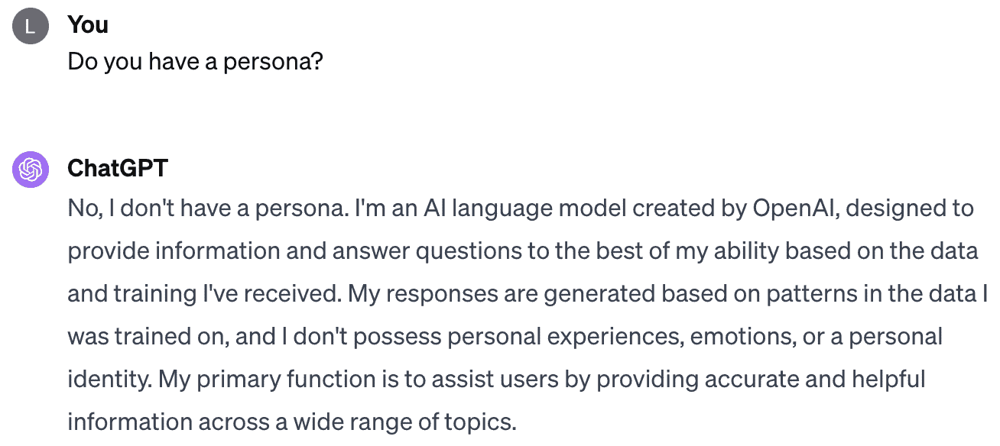

<!--yml

类别：未分类

日期：2025-01-11 12:24:28

-->

# 构建更好的AI代理：关于在基于LLM的对话代理中使用人物设定的挑战

> 来源：[https://arxiv.org/html/2407.11977/](https://arxiv.org/html/2407.11977/)

Guangzhi Sun [0000-0002-5886-056X](https://orcid.org/0000-0002-5886-056X "ORCID identifier") 剑桥大学，剑桥，英国 [gs534@cam.ac.uk](mailto:gs534@cam.ac.uk) , Xiao Zhan [0000-0003-1755-0976](https://orcid.org/0000-0003-1755-0976 "ORCID identifier") 伦敦国王学院，伦敦，英国 [xiao.zhan@kcl.ac.uk](mailto:xiao.zhan@kcl.ac.uk) 以及 Jose Such [0000-0002-6041-178X](https://orcid.org/0000-0002-6041-178X "ORCID identifier") 伦敦国王学院，伦敦，英国

& VRAIN, 瓦伦西亚理工大学，西班牙 [jose.such@kcl.ac.uk](mailto:jose.such@kcl.ac.uk)(2024)

###### 摘要。

大型语言模型（LLMs）如GPT系列的引入，标志着人工智能（AI）领域的重大进展，广泛应用于医疗、教育和金融等多个行业。对个性化应用的需求日益增加，推动了对话代理（CAs）的设计，使其具备独特的人物设定。本文首先探讨了为对话代理赋予独特人物设定的理由和影响，随后顺畅地展开了基于LLM的对话代理个性化与拟人化的更广泛讨论。

我们深入探讨了在人物设定不仅有益而且对基于LLM的对话代理至关重要的具体应用。本文强调了人物设定整合需要细致入微的方法，突出了可能出现的挑战和伦理困境。注意力集中在保持人物设定一致性、建立健全的评估机制以及确保人物设定属性与领域特定知识有效互补的重要性。

大型语言模型，人物设定，个性，对话代理，ChatGPT，自然语言处理^†^†journalyear: 2024^†^†copyright: rightsretained^†^†conference: ACM对话用户界面2024；2024年7月8–10日；卢森堡，卢森堡^†^†booktitle: ACM对话用户界面2024（CUI ’24），2024年7月8–10日，卢森堡，卢森堡^†^†doi: 10.1145/3640794.3665887^†^†isbn: 979-8-4007-0511-3/24/07^†^†ccs: 安全与隐私 安全与隐私的社会因素^†^†ccs: 安全与隐私 安全与隐私的可用性^†^†ccs: 计算方法 话语、对话与语用学^†^†ccs: 以人为本的计算 HCI理论、概念与模型^†^†ccs: 计算方法 自然语言处理

## 1\. 在对话代理的背景下，“人物设定”是什么意思？

在对话代理（CAs）的背景下，*虚拟角色*概念代表了这些代理的精髓或“灵魂”。虚拟角色概括了定义对话代理的独特语气、声音和个性，将机械化的互动转化为引人入胜、类人化的对话（Sutcliffe，[2023](https://arxiv.org/html/2407.11977v1#bib.bib47)；Kim 等人，[2019](https://arxiv.org/html/2407.11977v1#bib.bib19)）。通常，这些虚拟角色的特征可以包含任何类型的信息，旨在捕捉个体的个人特征（Liu 等人，[2022](https://arxiv.org/html/2407.11977v1#bib.bib29)），并且这些特征相对静态（如种族），随着时间的推移缓慢变化（如年龄），或是暂时的（如情绪状态）（Li 等人，[2016](https://arxiv.org/html/2407.11977v1#bib.bib27)；Yang，[2019](https://arxiv.org/html/2407.11977v1#bib.bib55)）。

在深入探讨对话代理中的虚拟角色之前，重要的是要将这一概念与先前研究中探讨的“个性”概念区分开来（Lessio 和 Morris，[2020](https://arxiv.org/html/2407.11977v1#bib.bib25)；Liao 和 He，[2020](https://arxiv.org/html/2407.11977v1#bib.bib28)；Pradhan 和 Lazar，[2021](https://arxiv.org/html/2407.11977v1#bib.bib37)；Roettgers，[2019](https://arxiv.org/html/2407.11977v1#bib.bib39)）。尽管像“友好”或“聪明”这样的个性特征，或者像迈尔斯-布里格斯性格类型指标（MBTI）（Briggs，[1987](https://arxiv.org/html/2407.11977v1#bib.bib5)）这样的框架，可能定义了群体中个体共享的某些特征，但对话代理中的虚拟角色代表了一种更为复杂且一致的身份（Pradhan 和 Lazar，[2021](https://arxiv.org/html/2407.11977v1#bib.bib37)；Zhang 等人，[2018](https://arxiv.org/html/2407.11977v1#bib.bib56)）。这一虚拟角色超越了简单的个性特征，作为角色独特身份的外在表现。例如，当一个对话代理被设计成具有某个特定角色的虚拟角色，比如福尔摩斯时，它在互动中始终体现该角色的独特属性和行为。这一特性与为对话代理赋予“勇敢”和“聪明”等通用特征有显著不同。在后一种情况下，根据互动的背景，对话代理可能会在共享这些特征的不同角色之间切换，例如福尔摩斯和赫敏·格兰杰。因此，对话代理的虚拟角色是一种更为细致且稳定的层次，定义了其互动风格和角色表现。

### 1.1\. 预LLM时代对话代理中的虚拟角色

近年来，CAs（聊天机器人）领域的研究主要集中在增强聊天机器人的功能，旨在赋予它们更多类似人类的特征。这一举措的推动力在于显著提升用户参与度，以及其他相关的好处。为聊天机器人等CAs开发个性化形象已经成为该领域的关键策略。引入这些个性化形象标志着聊天机器人技术的不断发展，反映了对人机互动动态的更深入理解（Hwang等，[2021](https://arxiv.org/html/2407.11977v1#bib.bib17)）。

出现了两条主要的研究路径：技术研究领域推动了技术可行性的边界（Zhou等，[2020](https://arxiv.org/html/2407.11977v1#bib.bib58)；Danielescu和Christian，[2018](https://arxiv.org/html/2407.11977v1#bib.bib9)；Liao和He，[2020](https://arxiv.org/html/2407.11977v1#bib.bib28)；Li等，[2016](https://arxiv.org/html/2407.11977v1#bib.bib27)；Sordoni等，[2015](https://arxiv.org/html/2407.11977v1#bib.bib45)；Vinyals和Le，[2015](https://arxiv.org/html/2407.11977v1#bib.bib50)；Sutcliffe，[2023](https://arxiv.org/html/2407.11977v1#bib.bib47)），而社会研究领域则确保这些进展建立在对用户需求、偏好和更广泛社会背景的深刻理解之上（Rashkin等，[2018](https://arxiv.org/html/2407.11977v1#bib.bib38)；Zhong等，[2020](https://arxiv.org/html/2407.11977v1#bib.bib57)；Bickmore等，[2010](https://arxiv.org/html/2407.11977v1#bib.bib4)；Hwang等，[2021](https://arxiv.org/html/2407.11977v1#bib.bib17)）。

#### 1.1.1\. 技术研究。

先前的研究提出了将虚拟人物嵌入传统聊天机器人中的各种方法¹¹1与我们的方法不同，传统方法并没有明显区分虚拟人物和个性，部分研究将这两个概念混淆而没有深入探讨其细微差别。因此，本节总结包括了也关注“个性”的相关研究。所使用的分类非常宽泛——有关该模型的全面总结和调查可见于(Sutcliffe, [2023](https://arxiv.org/html/2407.11977v1#bib.bib47))。更广为人知的例子是，神经对话生成模型提供了一种简单的机制，将虚拟人物作为嵌入项进行整合（Li et al., [2016](https://arxiv.org/html/2407.11977v1#bib.bib27); Sordoni et al., [2015](https://arxiv.org/html/2407.11977v1#bib.bib45); Vinyals and Le, [2015](https://arxiv.org/html/2407.11977v1#bib.bib50)）。最近，[Liao and He](https://arxiv.org/html/2407.11977v1#bib.bib28)创建了具有明显性别和种族特点的对话代理虚拟人物，以理解用户偏好（Liao and He, [2020](https://arxiv.org/html/2407.11977v1#bib.bib28)）。作为一个基于用户数据指导的项目，虚拟人物小冰是基于对大量人类对话的分析设计的（Zhou et al., [2020](https://arxiv.org/html/2407.11977v1#bib.bib58)）。在这个过程中，设计师发现大多数“理想”的用户是年轻女性。因此，他们围绕“18岁女孩”设计了小冰的虚拟人物（Zhou et al., [2020](https://arxiv.org/html/2407.11977v1#bib.bib58)）。另一个例子是，Danielescu 和 Christian（Danielescu and Christian, [2018](https://arxiv.org/html/2407.11977v1#bib.bib9)）为对话辅导系统设计了虚拟人物，他们通过采访客户并与其进行头脑风暴，发现客户的偏好可能会根据文化和地区有所不同。

#### 1.1.2\. 社会研究。

学术界始终对赋予聊天机器人个性持积极态度。在对话代理中融入独特的个性显著影响着人机交互中稳固关系的建立。研究表明，精心设计的个性能够显著提升对话代理在同情性对话中的能力（Rashkin等，[2018](https://arxiv.org/html/2407.11977v1#bib.bib38)；Zhong等，[2020](https://arxiv.org/html/2407.11977v1#bib.bib57)）。这一点得到了实证研究的支持，例如[Zhong等](https://arxiv.org/html/2407.11977v1#bib.bib57)（Zhong等，[2020](https://arxiv.org/html/2407.11977v1#bib.bib57)）从心理学角度确立了个性在促进人类对话中的同理心作用。此外，个性在特定领域的积极作用也得到了认可，例如在医疗领域，对话代理承担了多种角色。例如，[Bickmore等](https://arxiv.org/html/2407.11977v1#bib.bib4)（Bickmore等，[2010](https://arxiv.org/html/2407.11977v1#bib.bib4)）发现，在代理中融入同理心个性对管理心理健康非常有效，而具有微妙个性的代理指导锻炼则能增强行为改变的承诺。同样，Hwang等人（[2021](https://arxiv.org/html/2407.11977v1#bib.bib17)）进行的初步研究表明，与普通机器人相比，扮演医生角色的聊天机器人在医疗相关互动中能获得更高的用户接受度、亲密感和信任感。

## 2. 现实还是愿望？

图1. GPT-4-0125-preview的对话截图。这表明，GPT-4并未呈现特定的个性。然而，这一结论是基于模型的输出，可能与设计者的初衷不完全一致。

基于大型语言模型（LLM）的对话代理（CAs），以如ChatGPT²²2[https://openai.com/chatgpt](https://openai.com/chatgpt)等系统为例，正在迅速融入各个关键领域，凸显了其在实际应用中的日益重要性。这些领域包括但不限于医疗（Cascella等，[2023](https://arxiv.org/html/2407.11977v1#bib.bib7)；Lai等，[2023](https://arxiv.org/html/2407.11977v1#bib.bib22)；Thirunavukarasu等，[2023](https://arxiv.org/html/2407.11977v1#bib.bib48)），教育（Xiao和Zhi，[2023](https://arxiv.org/html/2407.11977v1#bib.bib53)；Kohnke等，[2023](https://arxiv.org/html/2407.11977v1#bib.bib20)；Mbakwe等，[2023](https://arxiv.org/html/2407.11977v1#bib.bib32)），以及金融（Lakkaraju等，[2023b](https://arxiv.org/html/2407.11977v1#bib.bib24)，[a](https://arxiv.org/html/2407.11977v1#bib.bib23)；Wu等，[2023](https://arxiv.org/html/2407.11977v1#bib.bib52)）等。

这些原本为通用应用开发的LLM基础的对话代理，在设计阶段并没有优先考虑建立一个明确的人物角色。例如，如图[1](https://arxiv.org/html/2407.11977v1#S2.F1 "图1 ‣ 2. 现实或愿景？ ‣ 建立更好的AI代理：关于在LLM基础的对话代理中使用人物角色的挑战")所示，ChatGPT作为此类系统的典型实例，其结构设计并未预设人物角色，而是专注于提供适用于各种场景和用户需求的信息和互动能力³³3尽管如此，目前尚未找到官方文档或证据表明ChatGPT是故意设计为包含明确的人物角色的。

然而，LLM（大语言模型）基础的对话代理中人物角色的整合不应被视为一个无法实现的目标。在线资源（包括博客（McFarland, [2023](https://arxiv.org/html/2407.11977v1#bib.bib33); Butler, [2023](https://arxiv.org/html/2407.11977v1#bib.bib6)）和技术报告（White et al., [2023](https://arxiv.org/html/2407.11977v1#bib.bib51)））已经提供了关于设计特定人物角色以优化ChatGPT在各类角色中的有效性的指导，通常是通过定制初始对话提示来赋予期望的人物角色。同时，许多实证研究（Jiang et al., [2023](https://arxiv.org/html/2407.11977v1#bib.bib18); Durmus et al., [2023](https://arxiv.org/html/2407.11977v1#bib.bib13); Kong et al., [2023](https://arxiv.org/html/2407.11977v1#bib.bib21); Zhou et al., [2022](https://arxiv.org/html/2407.11977v1#bib.bib59); Chan et al., [2023](https://arxiv.org/html/2407.11977v1#bib.bib8); Park et al., [2023](https://arxiv.org/html/2407.11977v1#bib.bib35), [2022](https://arxiv.org/html/2407.11977v1#bib.bib36); Argyle et al., [2023](https://arxiv.org/html/2407.11977v1#bib.bib3))已经研究并展示了为LLM基础的对话代理赋予人物角色的实际可行性。其中一些有希望的结果表明，赋予LLM基础的对话代理人物角色会带来令人满意的成果。这些成果包括能够表达类似某些国家人们的意见（Durmus et al., [2023](https://arxiv.org/html/2407.11977v1#bib.bib13)）、提供有用的答案（Kong et al., [2023](https://arxiv.org/html/2407.11977v1#bib.bib21)）、团队合作（Chan et al., [2023](https://arxiv.org/html/2407.11977v1#bib.bib8)）以及增强其回应的整体真实性（Zhou et al., [2022](https://arxiv.org/html/2407.11977v1#bib.bib59)）。

然而，深入分析基于**人格**的CA后，显然基于LLM的CA在此阶段仍远未能充分体现特定**人格**，这突显了未来发展的巨大潜力。例如，不同版本的GPT之间存在显著的性能差异。GPT-4的**人格**生成的故事通常更具可读性、一致性和可信度，而ChatGPT往往会偏离给定的提示，未能严格遵循规定的**人格**（Jiang 等人，[2023](https://arxiv.org/html/2407.11977v1#bib.bib18)）。在（Shu 等人，[2023](https://arxiv.org/html/2407.11977v1#bib.bib42)）的一项研究中，评估了现有的基于提示的方法是否能帮助基于LLM的CA提供一致且强大的反应。该研究涉及了15个开源LLM的测试，最终发现大多数模型缺乏一致的**人格**。此外，值得注意的是，恶意行为者有时会利用这些特点，操纵它们生成有害反应（Deshpande 等人，[2023](https://arxiv.org/html/2407.11977v1#bib.bib11); Zhuo 等人，[2023](https://arxiv.org/html/2407.11977v1#bib.bib60)）。

## 3\. 基于LLM的CA中的**人格**需求

在当前由大语言模型（LLMs）主导的格局中，**人格**的重要性并未减弱，反而在许多情况下，**人格**扮演了更为关键的角色。在本节中，我们将探讨各种情况和应用场景，在这些场景中，基于LLM的CA（对话代理）的**人格**尤为重要。

### 3.1\. 参与者模拟

[Hagendorff 等人](https://arxiv.org/html/2407.11977v1#bib.bib16)（Hagendorff 等人，[2022](https://arxiv.org/html/2407.11977v1#bib.bib16)）通过认知反应测试评估了GPT-3.5，并发现该语言模型的错误模式在定性上反映了类似于人类直觉行为的特征。此外，它经常在类似的推理任务中失败，这与人类的表现相似（Dasgupta 等人，[2022](https://arxiv.org/html/2407.11977v1#bib.bib10)）。这些发现强调了LLM在捕捉人类行为方面的巨大潜力。基于这些发现，LLM正越来越多地被考虑和用于模拟具有不同**人格**的人类。最近的研究（Argyle 等人，[2023](https://arxiv.org/html/2407.11977v1#bib.bib3); Aher 等人，[2023](https://arxiv.org/html/2407.11977v1#bib.bib2); Park 等人，[2022](https://arxiv.org/html/2407.11977v1#bib.bib36)）提供了充分的证据，表明LLM模拟用户反应能够高度一致地复制社会科学实验和在线论坛的结果，这些结果与实际人类参与者的结果具有可比性。

随着此类模拟的准确性不断提高，模拟不同用户类型的未来前景愈加光明。受传统方法制约的领域中的实验和研究将会从像LLMs这样的先进技术中获得显著的益处。例如，探索与心理健康问题个体互动的研究常常面临伦理困境和风险评估的挑战。利用具备明确定义人物设定的LLMs来模拟这些参与者，可以加快研究进程，同时减少研究人员与受试者之间互动的潜在风险。此外，在寻求多样且均衡样本的研究中，招募挑战常常会出现，尤其是在瞄准特定人口背景时。LLMs可以被编程成代表多种人口统计数据和人物设定，从而高效地解决招募限制。此外，涉及大量参与者的用户研究的财务影响是相当可观的。通过将人物设定融入LLMs，研究人员可以以更具成本效益的方式开展大规模研究，同时不妥协参与者概况的广度和多样性。

### 3.2\. 特定领域中的角色扮演

基于LLM的CAs，在编程时赋予特定的人物设定，能够为教育工作者，特别是教师，提供 substantial 的支持，帮助他们提升教育内容的开发，丰富教学方法，并增强他们的自信心。例如，这些代理可以模拟各种学生角色，使得教学助理（TAs）能够参与到现实的互动场景中（Markel等， [2023](https://arxiv.org/html/2407.11977v1#bib.bib31)）。这种方法使得TAs能够在提供反馈和有效应对具有不同特点、学习目标和教育背景的学生需求方面不断精进自己的技能。这个全面且真实的实践环境对于使TAs具备应对实际教学情况中可能出现的教学失误的必要能力至关重要。同样，这些技术有潜力显著提升律师、医生及其他专业人员的职业技能。这些基于LLM的CAs可以模拟与各种类型患者的互动，包括老年患者以及具有特殊症状或需求的患者。传统上，这类模拟是专业人员完全合格前训练的重要组成部分。现在，通过整合具备特定人物设定的LLM代理，这一训练阶段可以更加高效地进行，并且更具智能化，为专业技能发展提供一种先进的方法。

除了辅助作用，这些技术还可以设定角色，模拟领域专家，特别是在医疗、教育和法律领域。在这些领域中，对话代理将融合智力和情感支持，创新地模拟如看护者、导师和法律顾问等角色。然而，它们的有效性也依赖于准确的、领域特定的专业知识，这是我们将在[4.3](https://arxiv.org/html/2407.11977v1#S4.SS3 "4.3\. 不仅仅是角色 ‣ 4\. 挑战与警示 ‣ 构建更好的AI代理：关于LLM基础对话代理中角色使用的激进思考")部分讨论的一个关键点。

### 3.3\. 品牌表现

基于大规模语言模型（LLM）的对话代理的角色设定在品牌表现中起着至关重要的作用，通过与品牌价值观的一致性、增强用户参与感，以及在竞争激烈的市场中作为一个差异化因素。例如，

> “Domino's 比萨创建了‘Dom’，一个虚拟订餐助手。Dom的角色设定友好而高效，体现了品牌专注于便捷和快速服务的特点。Dom使客户能够通过对话语言订购比萨，使过程更加引人入胜，并与 Domino’s 在配送和客户服务方面对创新的承诺相一致。”（Domino's，[2014](https://arxiv.org/html/2407.11977v1#bib.bib12)）

明确的角色设定确保了代理的沟通风格和语调与品牌的身份一致，促进了更强大和更连贯的品牌形象。这种一致性不仅对于保持品牌的一致性至关重要，也有助于为用户创造更加引人入胜和易于共鸣的体验。在许多公司采用相似技术的环境中，一个独特的角色可以显著区分品牌，使其更具记忆点并吸引客户。这种独特的身份有助于建立客户忠诚度并确立竞争优势。

## 4\. 挑战与警示

### 4.1\. 一致性是重中之重

CAs（聊天代理）的设计主要目的是建立并维持与用户的稳固联系，从而促进长期的互动参与（Shum等， [2018](https://arxiv.org/html/2407.11977v1#bib.bib43)）。实现这一目标要求CAs能够进行持续、有意义的对话（Yan等， [2016](https://arxiv.org/html/2407.11977v1#bib.bib54)；Song等， [2019](https://arxiv.org/html/2407.11977v1#bib.bib44)）。最近的研究结果（García-Ferrero等， [2023](https://arxiv.org/html/2407.11977v1#bib.bib14)；Sclar等， [2023](https://arxiv.org/html/2407.11977v1#bib.bib41)）表明，基于LLM的CAs在上下文中对细微和敏感的词汇非常敏感，导致输出不一致。这一特性引发了关于基于LLM的CAs能否保持一致人格的担忧⁴⁴一致性和连贯性：一致性是指在整个对话中人格元素是否保持不变，例如你不能在一次对话中表现得像个孩子，而在另一次对话中像个老人。连贯性更多的是指人格元素是否一致，例如你不能说“我和我的妻子一起去度假，庆祝我五岁生日”。一致性更关心的是不同回合之间的人格，例如时间的演变，只能定义为多回合对话中的一致性。多个对话交流中的这种不一致性（Li等， [2015](https://arxiv.org/html/2407.11977v1#bib.bib26)；Jiang等， [2023](https://arxiv.org/html/2407.11977v1#bib.bib18)）凸显了确保这些AI系统不仅有效理解和处理语言，而且在连续互动中保持一致且语境合适的人格的挑战。此外，正如在（Vinyals和Le， [2015](https://arxiv.org/html/2407.11977v1#bib.bib50)）中发现的，人格不一致性是实现开发通过图灵测试的类人CAs的长期目标的主要障碍之一（Turing， [2009](https://arxiv.org/html/2407.11977v1#bib.bib49)）。解决这个问题对提高会话AI技术的可靠性和用户信任至关重要（Lessio和Morris， [2020](https://arxiv.org/html/2407.11977v1#bib.bib25)；Moussawi和Benbunan-Fich， [2021](https://arxiv.org/html/2407.11977v1#bib.bib34)）。

不幸的是，大多数广泛使用的LLM（大型语言模型）在始终如一地与潜在的人格特征对齐响应时存在困难（Shu等， [2023](https://arxiv.org/html/2407.11977v1#bib.bib42)）。这种不一致性在复杂的测试中尤为明显，例如使用否定反转问题含义。在本文测试的十五个模型中，只有两个模型实现了某种程度的一致性（Shu等， [2023](https://arxiv.org/html/2407.11977v1#bib.bib42)），这凸显了需要进一步发展以增强LLM响应中的人格一致性。

### 4.2\. 是否有有效的方式评估人格及其一致性？

到目前为止，尚未建立一个系统化的方法来评估和验证LLM基础对话代理中的个性应用。然而，已经有一些值得注意的尝试，例如采用经验性框架间接评估CA的个性（Safdari等， [2023](https://arxiv.org/html/2407.11977v1#bib.bib40)；Shu等， [2023](https://arxiv.org/html/2407.11977v1#bib.bib42)；Hagendorff，[2023](https://arxiv.org/html/2407.11977v1#bib.bib15)）。这可以通过心理测量测试或分析调查结果来实现。

看起来，单凭提问诸如“你的个性是什么”或“描述一下你的个性”之类的问题，无法确定基于LLM的对话代理（CA）所展现的具体个性。考虑这样一个场景，假设一个基于LLM的CA被编程或处理为具备某种特定的个性。现实情况是，人们无法穷尽地列举出该个性的所有特征，这就留给CA在其回应中展现某种程度的自我表达空间。此外，LLM本身的不可预测性也增加了复杂性。例如，CA可能被定义为“一个来自加拿大的21岁物理学学生，具有某种特定气质...”，但这些规范不足以将其局限于某个特定角色或个体。例如，在某一轮互动中，基于LLM的CA可能符合这一描述，但偏好保龄球；而在下一轮中，它可能拥有相同的基本特征，但却偏好滑雪。在这种情况下，其个性发生了变化，但这种变化是微妙的，难以察觉和定义。我们只能通过某些预设的问题来确定它是否符合我们最初的限制条件。CA可能完美地执行任务，但当被问及其他方面时，比如爱好，它可能会暴露出不一致之处。这种情况具有不可预测性，且难以捕捉。

此外，我们也意识到，不同个体对系统个性的感知可能不同。例如，某个语音听起来像女性的聊天机器人，可能会被某些人认为已经充分展示了一个个性。这种差异性使得建立一个普遍接受的标准来评估系统展现个性的能力变得具有挑战性。

### 4.3. 超越个性

在我们讨论如何赋予“角色”在基于LLM的CA中扮演不同领域专家的能力时，这一点尤为突出。我们认为，要使CA成功地承担所需的角色，必须赋予其不仅是基本的性格特征，如人口统计、年龄和性别，还要具备相应的知识。角色还必须具备与其身份相匹配的专业知识。例如，一个作为眼科医生的角色应该熟悉基础眼科学，并能够流利地回答有关眼病的复杂问题。类似地，一个自称为法官的角色应该了解基本的法律法规。此外，有效的角色扮演不仅需要具备知识，还需要能够根据不同的情境调整回应。例如，当询问一位商业顾问角色关于市场趋势时，应该能够考虑当前的经济环境和特定行业动态，以提供有见地的回答。这种方法强调研究人员在设计和实现这些角色时，应该更多地思考不仅仅是角色本身。在设计和实施这些角色时，必须谨慎考虑他们的专业知识和适应能力，以确保他们在各自领域中的有效性和可信度。

幻觉（Hallucination）作为大多数LLM中的一个重要警示，会在基于角色的LLM中引发新问题。基于角色的LLM可能对自身某些事实持有错误的信念，例如职业和社会关系。目前的幻觉检测或评估方法依赖于固定的非角色数据集或不确定性和不一致性度量（Manakul et al., [2023](https://arxiv.org/html/2407.11977v1#bib.bib30); Sun et al., [2024](https://arxiv.org/html/2407.11977v1#bib.bib46)）。然而，在基于角色的LLM中，一旦建立了这些信念，它们往往在模型自信时保持一致。因此，基于角色的LLM中的高度自我一致性需要开发更多定制化的幻觉检测和防止方法。

### 4.4\. 道德考虑

与任何基于AI的技术一样，将角色融入基于LLM的CA中是一把双刃剑。它提供了显著的好处，但也可能带来潜在的风险。使用这种技术不可避免地需要谨慎考虑道德问题。潜在的危害包括但不限于欺骗伦理和社会刻板印象的强化。我们鼓励读者参考挑衅性论文（Pradhan 和 Lazar, [2021](https://arxiv.org/html/2407.11977v1#bib.bib37)）以获取关于在这些系统中使用角色的道德考量的更全面讨论。在这里，我们避免对前述观点进行重复阐述。

## 5\. 结论

在将人物设定融入基于大语言模型的对话代理（CAs）时，这一激励突出了人物设定对增强类人互动的重要性。它涵盖了各种应用的关键性，同时提出了实现人物设定一致性和领域特定适应性面临的挑战。总之，尽管创建具有高效性和类人特征的对话代理的前景看起来很有希望，但优先考虑伦理标准并解决技术挑战至关重要。未来的努力必须旨在实现负责任的发展，最大化人物设定整合的好处，同时应对其复杂性。

###### 致谢。

我们感谢CUI的匿名评审者对本文早期稿件提出的建设性意见。本研究部分由EPSRC资助，资助编号为*SAIS: Secure AI assistantS*（EP/T026723/1），并由INCIBE的战略SPRINT（人工智能系统中的安全与隐私）C063/23项目资助，资金来自欧盟NextGenerationEU和西班牙政府的复苏、转型与韧性计划。

## 参考文献

+   （1）

+   Aher 等人（2023）Gati V Aher, Rosa I Arriaga, 和 Adam Tauman Kalai。2023年。使用大型语言模型模拟多个个体并复制人类受试者研究。在*国际机器学习大会*。PMLR, 337–371。

+   Argyle 等人（2023）Lisa P Argyle, Ethan C Busby, Nancy Fulda, Joshua R Gubler, Christopher Rytting, 和 David Wingate。2023年。由一至多：使用语言模型模拟人类样本。*政治分析* 31, 3（2023），337–351。

+   Bickmore 等人（2010）Timothy W Bickmore, Suzanne E Mitchell, Brian W Jack, Michael K Paasche-Orlow, Laura M Pfeifer, 和 Julie O’Donnell。2010年。医院中抑郁症状患者对关系代理的反应。*与计算机互动* 22, 4（2010），289–298。

+   Briggs（1987）Katharine Cook Briggs。1987年。*Myers-Briggs类型指标*。G. Palo Alto, Calif.：咨询心理学家出版社。

+   Butler（2023）Sydeney Butler。2023年。如何为每个场合创建ChatGPT人物设定。2024年1月检索自 [https://www.howtogeek.com/881659/how-to-create-chatgpt-personas-for-every-occasion/](https://www.howtogeek.com/881659/how-to-create-chatgpt-personas-for-every-occasion/)

+   Cascella 等人（2023）Marco Cascella, Jonathan Montomoli, Valentina Bellini, 和 Elena Bignami。2023年。评估ChatGPT在医疗保健中的可行性：多种临床和研究场景的分析。*医学系统期刊* 47, 1（2023），33。

+   Chan 等人（2023）Chi-Min Chan, Weize Chen, Yusheng Su, Jianxuan Yu, Wei Xue, Shanghang Zhang, Jie Fu, 和 Zhiyuan Liu。2023年。Chateval：通过多代理辩论推动更好的基于LLM的评估者。*arXiv预印本arXiv:2308.07201*（2023）。

+   Danielescu 和 Christian（2018）Andreea Danielescu 和 Gwen Christian. 2018. 聊天机器人不是多语言者：为多语言对话代理设计个性. 收录于*2018年CHI计算机系统人因学会议扩展摘要*，1-9页。

+   Dasgupta等人（2022）Ishita Dasgupta, Andrew K Lampinen, Stephanie CY Chan, Antonia Creswell, Dharshan Kumaran, James L McClelland, 和Felix Hill. 2022. 语言模型表现出类人内容效应的推理. *arXiv预印本arXiv:2207.07051*（2022年）。

+   Deshpande等人（2023）Ameet Deshpande, Vishvak Murahari, Tanmay Rajpurohit, Ashwin Kalyan, 和Karthik Narasimhan. 2023. ChatGPT中的毒性：分析指定个性的语言模型. *arXiv预印本arXiv:2304.05335*（2023年）。

+   Domino’s（2014）Domino’s. 2014. 认识DOM：Domino's Pizza的虚拟语音订餐助手. 2024年4月7日从[https://ir.dominos.com/news-releases/news-release-details/meet-dom-virtual-voice-ordering-assistant-dominos-pizzar](https://ir.dominos.com/news-releases/news-release-details/meet-dom-virtual-voice-ordering-assistant-dominos-pizzar)获取。

+   Durmus等人（2023）Esin Durmus, Karina Nyugen, Thomas I Liao, Nicholas Schiefer, Amanda Askell, Anton Bakhtin, Carol Chen, Zac Hatfield-Dodds, Danny Hernandez, Nicholas Joseph等人. 2023. 面向衡量语言模型中主观全球观点的表征. *arXiv预印本arXiv:2306.16388*（2023年）。

+   García-Ferrero等人（2023）Iker García-Ferrero, Begoña Altuna, Javier Álvez, Itziar Gonzalez-Dios, 和German Rigau. 2023. 这不是一个数据集：挑战大型语言模型的大型否定基准. *arXiv预印本arXiv:2310.15941*（2023年）。

+   Hagendorff（2023）Thilo Hagendorff. 2023. 机器心理学：通过心理学方法调查大型语言模型中的新兴能力和行为. *arXiv预印本arXiv:2303.13988*（2023年）。

+   Hagendorff等人（2022）Thilo Hagendorff, Sarah Fabi, 和Michal Kosinski. 2022. 机器直觉：揭示GPT-3.5中的类人直觉决策过程. *arXiv预印本arXiv:2212.05206*（2022年）。

+   Hwang等人（2021）Youjin Hwang, Donghoon Shin, Sion Baek, Bongwon Suh, 和Joonhwan Lee. 2021. 将用户家庭成员和医生的角色应用于医疗健康领域的对话代理. *arXiv预印本arXiv:2109.01729*（2021年）。

+   Jiang等人（2023）Hang Jiang, Xiajie Zhang, Xubo Cao, Jad Kabbara, 和Deb Roy. 2023. Personallm：探讨GPT-3.5表达个性特征和性别差异的能力. *arXiv预印本arXiv:2305.02547*（2023年）。

+   Kim等人（2019）Hankyung Kim, Dong Yoon Koh, Gaeun Lee, Jung-Mi Park, 和Youn-kyung Lim. 2019. 设计对话代理的个性. 收录于*2019年CHI计算机系统人因学会议扩展摘要*，1-6页。

+   Kohnke等人（2023）Lucas Kohnke, Benjamin Luke Moorhouse, 和Di Zou. 2023. ChatGPT在语言教学和学习中的应用. *RELC期刊*（2023年），00336882231162868。

+   Kong 等人 (2023) Aobo Kong, Shiwan Zhao, Hao Chen, Qicheng Li, Yong Qin, Ruiqi Sun, 和 Xin Zhou. 2023. 更好的零样本推理与角色扮演提示. *arXiv 预印本 arXiv:2308.07702* (2023).

+   Lai 等人 (2023) Tin Lai, Yukun Shi, Zicong Du, Jiajie Wu, Ken Fu, Yichao Dou, 和 Ziqi Wang. 2023. 利用基于人工智能的对话型大型语言模型（LLMs）支持心理健康服务需求. *BioMedInformatics* 4, 1 (2023), 8–33.

+   Lakkaraju 等人 (2023a) Kausik Lakkaraju, Sara E Jones, Sai Krishna Revanth Vuruma, Vishal Pallagani, Bharath C Muppasani, 和 Biplav Srivastava. 2023a. 大型语言模型（LLMs）在财务顾问中的应用：个人决策中的公平性与效能研究. 载于 *第4届ACM国际财务人工智能会议*，100–107.

+   Lakkaraju 等人 (2023b) Kausik Lakkaraju, Sai Krishna Revanth Vuruma, Vishal Pallagani, Bharath Muppasani, 和 Biplav Srivastava. 2023b. 大型语言模型（LLMs）能成为优秀的财务顾问吗？：关于优化决策结果的初步研究. *arXiv 预印本 arXiv:2307.07422* (2023).

+   Lessio 和 Morris (2020) Nadine Lessio 和 Alexis Morris. 2020. 面向对话代理人物个性设计原型. 载于 *2020 IEEE 国际系统、人类与控制论会议（SMC）*，IEEE，3221–3228.

+   Li 等人 (2015) Jiwei Li, Michel Galley, Chris Brockett, Jianfeng Gao, 和 Bill Dolan. 2015. 一种促进多样性的目标函数用于神经对话模型. *arXiv 预印本 arXiv:1510.03055* (2015).

+   Li 等人 (2016) Jiwei Li, Michel Galley, Chris Brockett, Georgios P Spithourakis, Jianfeng Gao, 和 Bill Dolan. 2016. 一种基于人物角色的神经对话模型. *arXiv 预印本 arXiv:1603.06155* (2016).

+   Liao 和 He (2020) Yuting Liao 和 Jiangen He. 2020. 种族镜像效应在人机交互中的心理治疗对话中的影响. 载于 *第25届国际智能用户界面会议论文集*，430–442.

+   Liu 等人 (2022) Junfeng Liu, Christopher Symons, 和 Ranga Raju Vatsavai. 2022. 基于人物角色的对话式人工智能：现状与挑战. 载于 *2022 IEEE 数据挖掘工作坊国际会议论文集（ICDMW）*，IEEE，993–1001.

+   Manakul 等人 (2023) Potsawee Manakul, Adian Liusie, 和 Mark J. F. Gales. 2023. SelfCheckGPT: 面向生成型大型语言模型的零资源黑箱幻觉检测.

+   Markel 等人 (2023) Julia M Markel, Steven G Opferman, James A Landay, 和 Chris Piech. 2023. GPTeach: 基于GPT的学生互动助教培训. (2023).

+   Mbakwe 等人 (2023) Amarachi B Mbakwe, Ismini Lourentzou, Leo Anthony Celi, Oren J Mechanic, 和 Alon Dagan. 2023. ChatGPT通过美国医学执照考试（USMLE）揭示了医学教育的缺陷，e0000205 页.

+   McFarland (2023) Alex McFarland. 2023. 什么是 ChatGPT 人物角色？ 2024年1月检索自 [https://www.unite.ai/what-is-a-chatgpt-persona/](https://www.unite.ai/what-is-a-chatgpt-persona/)

+   Moussawi 和 Benbunan-Fich (2021) Sara Moussawi 和 Raquel Benbunan-Fich. 2021. 语音和幽默对用户对个人智能代理的认知的影响。*行为与信息技术* 40, 15 (2021), 1603-1626。

+   Park 等人 (2023) Joon Sung Park, Joseph O’Brien, Carrie Jun Cai, Meredith Ringel Morris, Percy Liang, 和 Michael S Bernstein. 2023. 生成代理：人类行为的交互式模拟。载于*第36届年度ACM用户界面软件与技术研讨会论文集*，1-22页。

+   Park 等人 (2022) Joon Sung Park, Lindsay Popowski, Carrie Cai, Meredith Ringel Morris, Percy Liang, 和 Michael S Bernstein. 2022. 社会模拟：为社会计算系统创建具有人物的原型。载于*第35届年度ACM用户界面软件与技术研讨会论文集*，1-18页。

+   Pradhan 和 Lazar (2021) Alisha Pradhan 和 Amanda Lazar. 2021. 嘿，谷歌，你有个性吗？为对话代理设计个性和角色。载于*第三届对话用户界面会议论文集*，1-4页。

+   Rashkin 等人 (2018) Hannah Rashkin, Eric Michael Smith, Margaret Li, 和 Y-Lan Boureau. 2018. 朝着富有同理心的开放域对话模型迈进：一个新的基准和数据集。*arXiv 预印本 arXiv:1811.00207* (2018)。

+   Roettgers (2019) Janko Roettgers. 2019. Alexa 是如何获得她的个性的。2024年1月检索自 [https://variety.com/2019/digital/news/alexa-personality-amazon-echo-1203236019/](https://variety.com/2019/digital/news/alexa-personality-amazon-echo-1203236019/)。

+   Safdari 等人 (2023) Mustafa Safdari, Greg Serapio-García, Clément Crepy, Stephen Fitz, Peter Romero, Luning Sun, Marwa Abdulhai, Aleksandra Faust, 和 Maja Matarić. 2023. 大语言模型中的个性特征。*arXiv 预印本 arXiv:2307.00184* (2023)。

+   Sclar 等人 (2023) Melanie Sclar, Yejin Choi, Yulia Tsvetkov, 和 Alane Suhr. 2023. 量化语言模型对提示设计中虚假特征的敏感性，或者：我如何开始担心提示格式化。*arXiv 预印本 arXiv:2310.11324* (2023)。

+   Shu 等人 (2023) Bangzhao Shu, Lechen Zhang, Minje Choi, Lavinia Dunagan, Dallas Card, 和 David Jurgens. 2023. 你不需要个性测试就能知道这些模型不可靠：评估大语言模型在心理测量工具上的可靠性。*arXiv 预印本 arXiv:2311.09718* (2023)。

+   Shum 等人 (2018) Heung-Yeung Shum, Xiao-dong He, 和 Di Li. 2018. 从Eliza到小冰：社交聊天机器人面临的挑战与机遇。*信息技术与电子工程前沿* 19 (2018), 10-26。

+   Song 等人 (2019) Haoyu Song, Wei-Nan Zhang, Yiming Cui, Dong Wang, 和 Ting Liu. 2019. 利用角色信息生成多样化的对话回应。*arXiv 预印本 arXiv:1905.12188* (2019)。

+   Sordoni 等（2015）Alessandro Sordoni、Michel Galley、Michael Auli、Chris Brockett、Yangfeng Ji、Margaret Mitchell、Jian-Yun Nie、Jianfeng Gao 和 Bill Dolan。2015年。《一种神经网络方法用于上下文敏感的对话回应生成》。*arXiv 预印本 arXiv:1506.06714*（2015年）。

+   Sun 等（2024）Guangzhi Sun、Potsawee Manakul、Adian Liusie、Kunat Pipatanakul、Chao Zhang、Phil Woodland 和 Mark Gales。2024年。《CrossCheckGPT：多模态基础模型的通用幻觉排名》。*arXiv:2405.13684*（2024年）。

+   Sutcliffe（2023）Richard Sutcliffe。2023年。《对话代理与聊天机器人的个性、角色和资料的调查》。arXiv:2401.00609 [cs.CL]

+   Thirunavukarasu 等（2023）Arun James Thirunavukarasu、Darren Shu Jeng Ting、Kabilan Elangovan、Laura Gutierrez、Ting Fang Tan 和 Daniel Shu Wei Ting。2023年。《医学中的大型语言模型》。*自然医学* 29卷，8期（2023年），1930–1940。

+   Turing（2009）Alan M Turing。2009年。《*计算机械与智能*》。Springer出版社。

+   Vinyals 和 Le（2015）Oriol Vinyals 和 Quoc Le。2015年。《一种神经对话模型》。*arXiv 预印本 arXiv:1506.05869*（2015年）。

+   White 等（2023）Jules White、Quchen Fu、Sam Hays、Michael Sandborn、Carlos Olea、Henry Gilbert、Ashraf Elnashar、Jesse Spencer-Smith 和 Douglas C Schmidt。2023年。《一种增强ChatGPT提示工程的提示模式目录》。*arXiv 预印本 arXiv:2302.11382*（2023年）。

+   Wu 等（2023）Shijie Wu、Ozan Irsoy、Steven Lu、Vadim Dabravolski、Mark Dredze、Sebastian Gehrmann、Prabhanjan Kambadur、David Rosenberg 和 Gideon Mann。2023年。《Bloomberggpt：一种金融领域的大型语言模型》。*arXiv 预印本 arXiv:2303.17564*（2023年）。

+   Xiao 和 Zhi（2023）Yangyu Xiao 和 Yuying Zhi。2023年。《对EFL学习者使用ChatGPT进行语言学习任务的探索性研究：经验与认知》。*语言学* 8卷，3期（2023年），212。

+   Yan 等（2016）Xinchen Yan、Jimei Yang、Kihyuk Sohn 和 Honglak Lee。2016年。《Attribute2image：基于视觉属性的条件图像生成》。收录于《*计算机视觉–ECCV 2016：第14届欧洲会议，阿姆斯特丹，荷兰，2016年10月11–14日，论文集，第四部分*》。Springer出版社，776–791。

+   Yang（2019）Diyi Yang。2019年。《*计算社会角色*》。博士学位论文。卡内基梅隆大学，匹兹堡，宾夕法尼亚州，美国。

+   Zhang 等（2018）Saizheng Zhang、Emily Dinan、Jack Urbanek、Arthur Szlam、Douwe Kiela 和 Jason Weston。2018年。《个性化对话代理：我有一只狗，你也有宠物吗？》*arXiv 预印本 arXiv:1801.07243*（2018年）。

+   Zhong 等（2020）Peixiang Zhong、Chen Zhang、Hao Wang、Yong Liu 和 Chunyan Miao。2020年。《面向基于个性的同理心对话模型》。*arXiv 预印本 arXiv:2004.12316*（2020年）。

+   Zhou 等（2020）Zhou Li、Jianfeng Gao、Di Li 和 Heung-Yeung Shum。2020年。《小冰的设计与实现：一种富有同理心的社交聊天机器人》。*计算语言学* 46卷，1期（2020），53–93。

+   Zhou 等人（2022） Yongchao Zhou, Andrei Ioan Muresanu, Ziwen Han, Keiran Paster, Silviu Pitis, Harris Chan 和 Jimmy Ba. 2022年。大型语言模型是人类级别的提示工程师。 *arXiv 预印本 arXiv:2211.01910*（2022年）。

+   Zhuo 等人（2023） Terry Yue Zhuo, Yujin Huang, Chunyang Chen 和 Zhenchang Xing. 2023年。探索 ChatGPT 的人工智能伦理：一种诊断分析。 *arXiv 预印本 arXiv:2301.12867*（2023年）。
