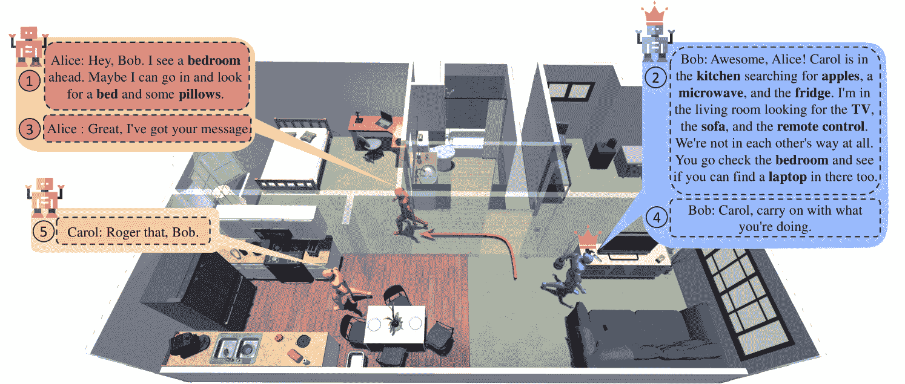
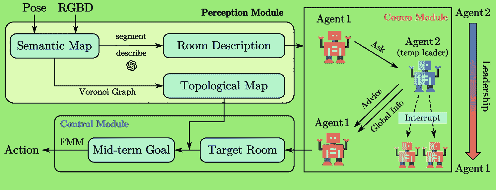

<!--yml  

类别：未分类  

日期：2025-01-11 12:28:58  

-->  

# CAMON：基于LLM对话的多智能体协作导航框架  

> 来源：[https://arxiv.org/html/2407.00632/](https://arxiv.org/html/2407.00632/)  

吴鹏颖, 穆瑶, 周康杰, 马冀, 陈俊廷, 刘畅  

###### 摘要  

视觉导航任务对于家用服务机器人至关重要。随着任务的复杂性不断增加，多个机器人之间的有效沟通与协作变得至关重要，以确保任务的成功完成。近年来，大型语言模型（LLMs）在具身智能体领域表现出卓越的理解与规划能力。然而，它们在家用场景中的应用，特别是在多个智能体通过沟通协作完成复杂导航任务方面，仍未被深入探索。因此，本文提出了一个去中心化的多智能体导航框架，利用LLM支持的沟通与协作。通过设计基于沟通触发的动态领导组织结构，我们实现了通过更少的沟通次数达成更快的团队共识，从而提高了导航效果和协作探索效率。通过提出的创新沟通方案，我们的框架在多物体导航任务中能够确保无冲突且在团队规模增大时仍保持稳健。  

## I 引言  

  

图1：我们贡献了CAMON：一个用于室内环境中的协作多物体导航框架。该图展示了三个智能体协作寻找物体的过程，且对话框表示了智能体的对话内容。在CAMON中，智能体通过询问当前的领导者，做出与其他机器人不冲突的决策，并通过最大化团队协作收益来提高合作效果。

近年来，利用大型语言模型（LLM）的家庭视觉导航发展迅速。以往的方法[[41](https://arxiv.org/html/2407.00632v1#bib.bib41), [12](https://arxiv.org/html/2407.00632v1#bib.bib12), [27](https://arxiv.org/html/2407.00632v1#bib.bib27), [4](https://arxiv.org/html/2407.00632v1#bib.bib4), [8](https://arxiv.org/html/2407.00632v1#bib.bib8)]将LLM作为场景理解工具和规划工具，取得了有希望的应用成果。然而，这些方法局限于单一智能体导航，未能为多个智能体之间的有效沟通与协作规划提供可行的解决方案[[34](https://arxiv.org/html/2407.00632v1#bib.bib34)]。当任务是寻找和定位家庭环境中的各种物体时，这类复杂任务对单个机器人来说具有显著挑战，导致效率低下和失败率高。在多物体导航场景中[[30](https://arxiv.org/html/2407.00632v1#bib.bib30), [22](https://arxiv.org/html/2407.00632v1#bib.bib22), [14](https://arxiv.org/html/2407.00632v1#bib.bib14)]，多个机器人需要协作才能有效完成这些任务。

成功完成多智能体任务需要团队具备三项关键能力：（1）从观察中提取有用信息，即确定沟通内容；（2）无冲突的沟通机制，即识别与谁沟通；（3）全球规划能力，即在沟通后进行规划。为了实现这些能力，我们设计了一种专门为多智能体导航量身定制的新框架，其效果如图[1](https://arxiv.org/html/2407.00632v1#S1.F1 "图 1 ‣ I 引言 ‣ CAMON：基于LLM对话的多物体导航协作智能体")所示。该方法通过结构化的场景描述和有序的沟通机制实现了协作式多目标任务。

为了逻辑地组织和总结观察结果，我们聚焦于室内场景的布局模式，其中家居环境中物体的摆放往往与房间的性质相关[[28](https://arxiv.org/html/2407.00632v1#bib.bib28)]。例如，有床的房间通常是卧室，常见有枕头、电视等物品，而厕所和微波炉则不常见。因此，我们提倡在导航表示中引入物体与房间关系的动机，将观察到的场景划分为各个房间，并为每个房间生成描述，供后续任务分配时沟通使用。例如，当进入一个房间并根据其布局将其识别为客厅时，机器人应立即定位并仅在该空间内寻找所有潜在目标。为了确保高效的团队协作，其他机器人在检测到该房间为客厅后，应避免进入此类房间。

在多智能体具身任务中，团队的组织结构至关重要[[7](https://arxiv.org/html/2407.00632v1#bib.bib7)，[15](https://arxiv.org/html/2407.00632v1#bib.bib15)]。先前的研究[[10](https://arxiv.org/html/2407.00632v1#bib.bib10)]表明，基于领导力的沟通模式可以加速共识的达成，而动态的领导力分配进一步增强了团队的协调性和有效性[[15](https://arxiv.org/html/2407.00632v1#bib.bib15)]。为了建立一个高效且稳定的通信系统，我们设计了一个由智能体通信请求触发的动态领导力模型，作为去中心化通信的高级形式。我们的贡献可以总结如下²²2此工作正在进行中：

+   •

    我们设计了一个综合框架，用于利用大语言模型（LLMs）解决多智能体导航任务，涵盖了感知、通信和协作规划模块。

+   •

    我们提出的多智能体通信机制促进了复杂导航任务中的自适应任务划分和规划。

+   •

    我们开发了一种动态领导力机制，该机制通过智能体的通信请求激活，有助于在分布式系统中分配信息交换的工作负载。

## II 相关工作

### II-A 视觉物体导航

目标物体导航要求机器人在陌生环境中迅速找到并接近目标物体。该领域的最新研究主要分为两种主流方法：基于端到端网络模型的框架 [[3](https://arxiv.org/html/2407.00632v1#bib.bib3), [20](https://arxiv.org/html/2407.00632v1#bib.bib20), [23](https://arxiv.org/html/2407.00632v1#bib.bib23), [39](https://arxiv.org/html/2407.00632v1#bib.bib39), [6](https://arxiv.org/html/2407.00632v1#bib.bib6), [13](https://arxiv.org/html/2407.00632v1#bib.bib13), [4](https://arxiv.org/html/2407.00632v1#bib.bib4)] 和基于模块化地图的框架 [[24](https://arxiv.org/html/2407.00632v1#bib.bib24), [5](https://arxiv.org/html/2407.00632v1#bib.bib5), [9](https://arxiv.org/html/2407.00632v1#bib.bib9), [41](https://arxiv.org/html/2407.00632v1#bib.bib41), [35](https://arxiv.org/html/2407.00632v1#bib.bib35), [27](https://arxiv.org/html/2407.00632v1#bib.bib27), [32](https://arxiv.org/html/2407.00632v1#bib.bib32), [28](https://arxiv.org/html/2407.00632v1#bib.bib28), [19](https://arxiv.org/html/2407.00632v1#bib.bib19)]。基于端到端模型的方法具有良好的迁移性，但在导航效率和任务成功率上相对较低 [[5](https://arxiv.org/html/2407.00632v1#bib.bib5)]。相反，模块化方法通过分层地图引导，需要精心设计的模块，从而实现高效的导航。随着物体寻找任务的复杂性增加，多物体导航（MultiON）任务 [[30](https://arxiv.org/html/2407.00632v1#bib.bib30)] 和方法 [[25](https://arxiv.org/html/2407.00632v1#bib.bib25), [22](https://arxiv.org/html/2407.00632v1#bib.bib22), [36](https://arxiv.org/html/2407.00632v1#bib.bib36)] 已经作为单目标物体导航的进阶版本出现。然而，现有的MultiON方法主要解决预定序列的MultiON问题，在这种方法中，机器人接收一个预定义的序列，用于探索目标物体类别。为了展示任务的灵活性和所提出框架的适应性规划能力，我们采用了序列不可知的MultiON（SAM）[[14](https://arxiv.org/html/2407.00632v1#bib.bib14)]任务进行评估。在该方法中，机器人既不接收也不需要遵循一个全局的顺序来定位和导航目标物体类别的实例。相反，机器人探索目标物体的可能位置，并根据观察动态调整其探索路径。

### II-B 基于LLM的协作体现体代理

最近的研究[[21](https://arxiv.org/html/2407.00632v1#bib.bib21), [38](https://arxiv.org/html/2407.00632v1#bib.bib38), [37](https://arxiv.org/html/2407.00632v1#bib.bib37)]已经证明了将语言形式的观察输入到大型语言模型中用于多智能体系统（MAS）的通信和决策是可行的。大多数研究以层级结构组织，以确保 MAS 的正常运行。主流的基于 LLM 的多智能体规划框架分为两个主要分支：集中式[[40](https://arxiv.org/html/2407.00632v1#bib.bib40), [2](https://arxiv.org/html/2407.00632v1#bib.bib2), [34](https://arxiv.org/html/2407.00632v1#bib.bib34), [10](https://arxiv.org/html/2407.00632v1#bib.bib10)]和去中心化[[10](https://arxiv.org/html/2407.00632v1#bib.bib10), [18](https://arxiv.org/html/2407.00632v1#bib.bib18), [38](https://arxiv.org/html/2407.00632v1#bib.bib38), [33](https://arxiv.org/html/2407.00632v1#bib.bib33), [29](https://arxiv.org/html/2407.00632v1#bib.bib29)]。

在集中式组织中，LLMs 理解多个智能体的观察、历史和任务进展，并协作地将任务分配给每个机器人小组[[40](https://arxiv.org/html/2407.00632v1#bib.bib40)]或个体[[2](https://arxiv.org/html/2407.00632v1#bib.bib2), [34](https://arxiv.org/html/2407.00632v1#bib.bib34)]。具体来说，Yu 等人[[34](https://arxiv.org/html/2407.00632v1#bib.bib34)]实现了一个集中式多智能体导航框架，从地图中提取前沿信息和语义信息，并利用 LLMs 为每个机器人分配探索区域。这样的框架在小规模团队中能够实现良好的协调和规划性能。然而，随着团队规模的扩大，集中式领导的通信和信息处理负担增加，给合理和及时的规划带来了挑战[[10](https://arxiv.org/html/2407.00632v1#bib.bib10)]。

在去中心化系统中，每个机器人作为一个独立的实体，具有自我自治能力，通过类人语言交流交换历史观察并做出适应性决策[[33](https://arxiv.org/html/2407.00632v1#bib.bib33)]。特别是，Zhang 等人[[38](https://arxiv.org/html/2407.00632v1#bib.bib38)]提供了一个去中心化通信与协作的系统化模板。该方法将每个智能体在 MAS 中的执行分为五个模块：观察、信念、通信、推理和规划，LLMs 促进了智能体之间的通信和推理。

### II-C 多智能体组织结构

最近的研究探讨了多个智能体之间的组织结构对任务分配、规划冲突和通信成本的影响。通过实验，Chen等人[[10](https://arxiv.org/html/2407.00632v1#bib.bib10)]展示了具有领导层的分层组织结构在效果上明显优于原始的去中心化和集中化结构。Chen等人[[7](https://arxiv.org/html/2407.00632v1#bib.bib7)]也分析了多个智能体之间的通信模式，并验证了由领导者组织的框架通过简单的多智能体任务——多个智能体移动到一个共同点——可以实现更快的任务收敛。Guo等人[[15](https://arxiv.org/html/2407.00632v1#bib.bib15)]进一步研究了领导者的组织形式，并得出结论，动态领导者在多智能体协作中最为有效。然而，[[15](https://arxiv.org/html/2407.00632v1#bib.bib15)]提出的方案根据每个机器人执行的任务重要性来分配领导者，但当任务同等重要时，该方案效果不佳。在这里，我们提出了一种基于通信触发的动态领导者策略，能够在MultiON任务中表现良好。

## III 问题设定

我们考虑让多个协作机器人参与MultiON任务，其中它们共同探索并接近室内环境中的目标物体。在每一轮任务开始时，两个或更多机器人被随机放置在一个陌生的环境中，并被指派去寻找一组共同的目标物体$G=\{g_{1},g_{2},\ldots,g_{m}\}$。这些机器人既没有经过训练以找到这些物体，也没有类似场景的先验信息。它们必须协调探索，并利用一般知识和常识尽可能快速地定位目标物体。通过通信，机器人可以协作理解场景，分配任务，并高效地导航到目标物体的位置。

当一个机器人正确识别并接近目标物体$g_{t}\in G$时，子任务被认为成功。相反，如果一个机器人导航到错误的物体，则子任务被认为失败。无论成功与否，机器人将继续寻找剩余的物体。此外，如果所有机器人都达到最大步数限制，则任务结束，以避免无限移动。

图2：CAMON的组成部分。我们的框架包含三个模块：感知、通信和控制。感知模块通过机器人RGB-D和姿态输入生成实时语义地图，代理从中提取拓扑图，并对房间进行分割和描述。Agent_1通过查询当前领导者Agent_2来做出全局决策，以获得目标房间。领导权和全局信息随后从Agent_2传递给Agent_1。最后，控制模块生成一系列动作，让Agent_1从当前位置导航到目标房间。

## IV CAMON 方法

CAMON的关键概念是通过LLM通信和规划，为完成多智能体导航任务提供一个综合框架。如图[2](https://arxiv.org/html/2407.00632v1#S3.F2 "图2 ‣ III 问题设置 ‣ CAMON：基于LLM对话的多物体导航协作智能体")所示，核心技术方法如下：（1）在感知模块中，理解并描述观察到的场景（[IV-A](https://arxiv.org/html/2407.00632v1#S4.SS1 "IV-A 感知模块 ‣ IV CAMON方法 ‣ CAMON：基于LLM对话的多物体导航协作智能体")），每个机器人维护一个本地地图（[IV-A1](https://arxiv.org/html/2407.00632v1#S4.SS1.SSS1 "IV-A1 地图构建 ‣ IV-A 感知模块 ‣ IV CAMON方法 ‣ CAMON：基于LLM对话的多物体导航协作智能体")），将地图划分为房间层次，为每个房间提取最相关的历史图像帧，利用大型多模态模型（GPT-4o）解读这些图像帧，并生成对观察到的场景的语言描述（[IV-A2](https://arxiv.org/html/2407.00632v1#S4.SS1.SSS2 "IV-A2 房间描述 ‣ IV-A 感知模块 ‣ IV CAMON方法 ‣ CAMON：基于LLM对话的多物体导航协作智能体")）。（2）在承担通信和决策的通信模块中（[IV-B](https://arxiv.org/html/2407.00632v1#S4.SS2 "IV-B 规划模块 ‣ IV CAMON方法 ‣ CAMON：基于LLM对话的多物体导航协作智能体")），我们采用顺序动态的领导者-成员通信结构，其中领导者调整智能体的决策提案（[IV-B2](https://arxiv.org/html/2407.00632v1#S4.SS2.SSS2 "IV-B2 智能体请求帮助 ‣ IV-B 规划模块 ‣ IV CAMON方法 ‣ CAMON：基于LLM对话的多物体导航协作智能体")），并确保团队协调（[IV-B3](https://arxiv.org/html/2407.00632v1#S4.SS2.SSS3 "IV-B3 领导者的团队协调 ‣ IV-B 规划模块 ‣ IV CAMON方法 ‣ CAMON：基于LLM对话的多物体导航协作智能体")）。通过在通信过程中做出决策，成员将被指派负责寻找特定物体，并从领导者处选择下一个参考的目标房间。（3）在路径规划层面（[IV-C](https://arxiv.org/html/2407.00632v1#S4.SS3 "IV-C 运动规划 ‣ IV CAMON方法 ‣ CAMON：基于LLM对话的多物体导航协作智能体")），我们根据当前的位置和目标房间在地图上规划一系列路径点，生成离散的动作。

### IV-A 感知模块

#### IV-A1 地图构建

为了记录历史语义信息，每个机器人利用其姿态和RGB-D图像实时构建并更新本地语义地图。该地图记录障碍区、可达区以及语义信息。受到[[42](https://arxiv.org/html/2407.00632v1#bib.bib42), [17](https://arxiv.org/html/2407.00632v1#bib.bib17), [32](https://arxiv.org/html/2407.00632v1#bib.bib32)]方法论的启发，我们从可达区地图通道中提取了路径点和拓扑地图，以优化点对点的移动。

#### IV-A2 房间描述

根据3D房间分割原则[[31](https://arxiv.org/html/2407.00632v1#bib.bib31), [16](https://arxiv.org/html/2407.00632v1#bib.bib16)]，观察到的房间被分割并生成每个房间的地图遮罩。为了获取每个房间的描述，我们旨在使用LMM读取整个房间的全貌图像并生成相应的描述。为了捕捉这样的综合图像，我们利用机器人在拓扑图上节点间移动的方式。每当机器人经过路径点时，它会旋转自身以收集$12$帧图像。对于每个分割的房间，我们从记录的帧中选择最能捕捉该房间视角的图像。接下来，我们使用GPT-4o [[1](https://arxiv.org/html/2407.00632v1#bib.bib1)]生成这些图像中场景的描述。

### IV-B 规划模块

在导航过程中，每个具身智能体会仔细观察当前房间，并在每次进入新房间时更新该房间的语义地图。当检测到尚未搜索的物体时，智能体会依次导航到目标物体所在的位置。当整个房间被探索完且房间内不再有未搜索的目标物体时，机器人通过通信模块与当前领导者沟通，做出合理的决策，考虑接下来探索哪个房间以及负责哪些物体。

#### IV-B1 通信与领导者任命

在团队协作中，领导者的存在极大地影响了沟通效率和任务完成情况。一个有序的组织需要解决谁是领导者以及领导者扮演什么角色的问题。在这个框架下，我们采用了一种基于通信触发的动态领导机制来解答谁是领导者的问题，同时解决固定领导模式下信息流不平衡和鲁棒性差的问题。当情节开始时，其中一个机器人$agent\_a$从所有机器人那里收集了初步的房间描述作为全局信息，成为临时领导者。当另一个机器人$agent\_b$未来请求领导者帮助时，它会向$agent\_a$发送请求，$agent\_a$为$agent\_b$提供建议并将全局信息传达给$agent\_b$。此时，$agent\_b$更新自己在全局信息中的部分内容，并继承领导者的位置。在后续过程中，机器人持续发送通信请求，全球信息和领导权在机器人间依次传递。通过赋予动态领导者临时的指挥任何机器人以及获取最新全局信息的权限，我们回答了领导者所扮演角色的问题。这种协作方式可以分担机器人之间的通信负载，即使某个机器人崩溃（甚至是临时领导者），剩余的机器人仍能通过请求前任领导者来维持系统的稳定。

#### IV-B2 代理请求帮助

由于多智能体任务规划的复杂性，LLM需要清晰的历史观察和团队条件，以增强理解和规划性能。在任何机器人团队成员向当前领导者发送通信请求之前，机器人会根据记录的历史信息利用LLM做出初步决策。这个决策专注于机器人自身的利益，随后传达给领导者，以帮助判断该决策是否会与其他机器人发生冲突。当机器人接收到领导者的回应，其中包含目标房间和锁定物体以防止其他人找到它们时，它就会前往目标房间。我们使用模板$Pr$将代理id $i$、任务进展$P_{i}$、记录的状态$S_{i}$、共享目标$G$、对话历史$H_{i}$和可选动作$\mathcal{A}_{i}$进行连接。然后，LLM生成初步提案$Ps_{i}=\{\mathcal{L}_{i},a_{i},T_{i}\}$，包含锁定物体$\mathcal{L}_{i}$、动作$a_{i}$（即目标房间）和思维过程$T_{i}$。该过程可以表示为：

|  | $Ps_{i}=\text{LLM}(Pr(i,P_{i},S_{i},G,H_{i}))$ |  | (1) |
| --- | --- | --- | --- |

#### IV-B3 领导者协调团队合作

当接收到团队成员的请求时，领导者负责评估来自智能体$i$的初步提案$Ps_{i}$，并根据当前记录的所有智能体的全局状态$S_{g}$和任务进度，避免团队冲突。类似地，我们采用LLM来处理这一过程，如公式[2](https://arxiv.org/html/2407.00632v1#S4.E2 "在IV-B3领导者的团队协作协调 ‣ IV-B 规划模块 ‣ IV CAMON方法 ‣ CAMON：基于LLM对话的多智能体导航协作")所示。

|  | $Re^{*}=\text{LLM}(Pr^{*}(Ps_{i},P_{g},S_{g},G))$ |  | (2) |
| --- | --- | --- | --- |

其中，$Pr^{*}$表示领导者的提示模板。来自第$i$个智能体的初步提案表示为$Ps_{i}$。当前由领导者管理的全局任务进度和全局状态分别用$P_{g}$和$S_{g}$表示。LLM生成的协调结果为$Re^{*}=\{\mathcal{R}_{i},\ldots,\mathcal{R}_{j}\}$，其中$R_{i}$是对发起请求的第$i$个智能体的回应，包括行动$a_{i}^{*}$、为支持或反对团队成员的原始提案而分配的$D^{*}$，以及思考$T_{i}^{*}$。其余回应$R_{j}\in Re^{*}\setminus R_{i}$包含是否中断第$j$个智能体的决策，以及分配给它的行动（如果被中断的话）。

### IV-C 运动规划

给定机器人当前的位置和目标房间，机器人选择目标房间内最靠近当前位置信息的Voronoi点。随后，机器人利用Dijkstra [[11](https://arxiv.org/html/2407.00632v1#bib.bib11)]方法规划下一目标点，作为中期目标。然后，采用快速行进方法[[26](https://arxiv.org/html/2407.00632v1#bib.bib26)]实时规划从当前位置到中期目标点的最短路径和下一离散行动。每当机器人经过一个拓扑路点时，它都会旋转一次，以收集周围的图像。

## V 结论

在本研究中，我们提出了一种完全去中心化的基于大型语言模型（LLM）的多智能体协作导航框架。智能体能够通过动态领导组织进行有效的沟通、任务高效分配和协作。我们的方法能够在最小通信开销的情况下实现任务划分和团队规划的一致性，从而在多智能体系统中实现最佳的导航性能和鲁棒性。我们相信，我们的方法在未来家庭移动智能体团队协作中具有广阔的应用前景。

局限性与未来工作. 当前方法仍存在一些局限性。首先，虽然我们的映射感知模块可以有效地映射所有观察到的物体，但它可能在处理动态物体（如人类或宠物）时遇到困难，尤其是在家庭场景中。这可能会影响机器人在映射和房间分割方面的能力。此外，我们当前的框架仅限于单层楼导航，并未考虑跨楼层的协作导航。然而，我们认为这些局限性并不是本文解决的核心问题，并且通过引入额外的策略模块可以缓解这些问题。我们的工作展示了有前景的应用前景，并为未来的多机器人系统提供了可行的思路。未来的研究将专注于多机器人系统的协作运动和操作，旨在完成通信、导航和操作集成的框架。这些重要课题将留待未来探索。

## 参考文献

+   [1] GPT-4o. [https://openai.com/index/hello-gpt-4o/](https://openai.com/index/hello-gpt-4o/).

+   Agashe 等人 [2023] Saaket Agashe, Yue Fan, 和 Xin Eric Wang. 评估大型语言模型中的多智能体协调能力. *arXiv 预印本 arXiv:2310.03903*，2023.

+   Anderson 等人 [2018] Peter Anderson, Qi Wu, Damien Teney, Jake Bruce, Mark Johnson, Niko Sünderhauf, Ian Reid, Stephen Gould, 和 Anton Van Den Hengel. 视觉与语言导航：在真实环境中解读视觉驱动的导航指令. 见 *IEEE计算机视觉与模式识别会议论文集*，页码 3674–3683，2018.

+   Cai 等人 [2023] Wenzhe Cai, Siyuan Huang, Guangran Cheng, Yuxing Long, Peng Gao, Changyin Sun, 和 Hao Dong. 通过像素引导导航技能弥合零-shot物体导航和基础模型. *arXiv 预印本 arXiv:2309.10309*，2023.

+   Chaplot 等人 [2020] Devendra Singh Chaplot, Dhiraj Prakashchand Gandhi, Abhinav Gupta, 和 Russ R Salakhutdinov. 基于目标的语义探索进行物体目标导航. *神经信息处理系统进展*，33:4247–4258, 2020.

+   Chen 等人 [2023a] Hongyi Chen, Ruinian Xu, Shuo Cheng, Patricio A Vela, 和 Danfei Xu. 使用大规模物体关系先验进行零-shot物体搜索. *arXiv 预印本 arXiv:2303.06228*，2023a.

+   Chen 等人 [2023b] Huaben Chen, Wenkang Ji, Lufeng Xu, 和 Shiyu Zhao. 通过大型语言模型实现多智能体共识寻求. *arXiv 预印本 arXiv:2310.20151*，2023b.

+   Chen 等人 [2024] Jiaqi Chen, Bingqian Lin, Ran Xu, Zhenhua Chai, Xiaodan Liang, 和 Kwan-Yee K Wong. Mapgpt: 基于地图的提示引导统一视觉与语言导航. *arXiv 预印本 arXiv:2401.07314*，2024.

+   Chen 等人 [2023c] Junting Chen, Guohao Li, Suryansh Kumar, Bernard Ghanem, 和 Fisher Yu. 如何不训练你的龙：无需训练的具身物体目标导航与语义前沿. 见 *机器人学：科学与系统（RSS）*，2023c.

+   Chen et al. [2023d] Yongchao Chen, Jacob Arkin, Yang Zhang, Nicholas Roy, 和 Chuchu Fan。可扩展的多机器人协作与大型语言模型：集中式还是去中心化系统？*arXiv 预印本 arXiv:2309.15943*，2023d。

+   DIJKSTRA [1959] EW DIJKSTRA。关于图的两个问题的注记。*Numerische Mathematik*，1:269–271，1959。

+   Dorbala et al. [2024] Vishnu Sashank Dorbala, James F. Mullen, 和 Dinesh Manocha。具身代理能找到你的“猫形杯子”吗？基于 LLM 的零-shot目标导航。*IEEE 机器人与自动化快报*，9(5):4083–4090，2024。doi: 10.1109/LRA.2023.3346800。

+   Gadre et al. [2023] Samir Yitzhak Gadre, Mitchell Wortsman, Gabriel Ilharco, Ludwig Schmidt, 和 Shuran Song。牧场上的牛：基于语言的零-shot目标导航的基准和标准。在 *IEEE/CVF 计算机视觉与模式识别会议论文集*，第 23171–23181 页，2023。

+   Gireesh et al. [2023] Nandiraju Gireesh, Ayush Agrawal, Ahana Datta, Snehasis Banerjee, Mohan Sridharan, Brojeshwar Bhowmick, 和 Madhava Krishna。序列无关的多目标导航。在 *2023 IEEE 国际机器人与自动化大会（ICRA）*，第 9573–9579 页，IEEE，2023。

+   Guo et al. [2024] Xudong Guo, Kaixuan Huang, Jiale Liu, Wenhui Fan, Natalia Vélez, Qingyun Wu, Huazheng Wang, Thomas L Griffiths, 和 Mengdi Wang。具身 LLM 代理学会在有组织团队中合作。*arXiv 预印本 arXiv:2403.12482*，2024。

+   Hughes et al. [2022] Nathan Hughes, Yun Chang, 和 Luca Carlone。Hydra：一个用于 3D 场景图构建和优化的实时空间感知系统。*arXiv 预印本 arXiv:2201.13360*，2022。

+   Kwon et al. [2023] Obin Kwon, Jeongho Park, 和 Songhwai Oh。可渲染的神经辐射图用于视觉导航。在 *IEEE/CVF 计算机视觉与模式识别会议论文集*，第 9099–9108 页，2023。

+   Liu et al. [2023] Jijia Liu, Chao Yu, Jiaxuan Gao, Yuqing Xie, Qingmin Liao, Yi Wu, 和 Yu Wang。LLM 驱动的层次化语言代理用于实时人类-人工智能协调。*arXiv 预印本 arXiv:2312.15224*，2023。

+   Ma et al. [2024] Ji Ma, Hongming Dai, Yao Mu, Pengying Wu, Hao Wang, Xiaowei Chi, Yang Fei, Shanghang Zhang, 和 Chang Liu。Doze：一个用于动态环境中开放词汇零-shot目标导航的数据集。*arXiv 预印本 arXiv:2402.19007*，2024。

+   Majumdar et al. [2022] Arjun Majumdar, Gunjan Aggarwal, Bhavika Suresh Devnani, Judy Hoffman, 和 Dhruv Batra。ZSON：使用多模态目标嵌入的零-shot目标导航。在 Alice H. Oh、Alekh Agarwal、Danielle Belgrave 和 Kyunghyun Cho 编辑的 *神经信息处理系统进展*，2022。URL [https://openreview.net/forum?id=VY1dqOF2RjC](https://openreview.net/forum?id=VY1dqOF2RjC)。

+   Mandi et al. [2023] Zhao Mandi, Shreeya Jain, 和 Shuran Song。Roco：与大型语言模型的辩证式多机器人协作。*arXiv 预印本 arXiv:2307.04738*，2023。

+   Marza et al. [2023] Pierre Marza, Laetitia Matignon, Olivier Simonin, 和 Christian Wolf. 使用动态学习的神经隐式表示进行多物体导航。发表于*IEEE/CVF国际计算机视觉会议论文集*，第11004–11015页，2023年。

+   Park et al. [2023] Jeongeun Park, Taerim Yoon, Jejoon Hong, Youngjae Yu, Matthew Pan, 和 Sungjoon Choi. 零-shot主动视觉搜索（zavis）：用于机器人助手的智能物体搜索。发表于*2023年IEEE国际机器人与自动化会议（ICRA）*，第2004–2010页，2023年。DOI: 10.1109/ICRA48891.2023.10161345。

+   Ramakrishnan et al. [2022] Santhosh Kumar Ramakrishnan, Devendra Singh Chaplot, Ziad Al-Halah, Jitendra Malik, 和 Kristen Grauman. Poni：用于无交互学习的物体目标导航的潜力函数。发表于*IEEE/CVF计算机视觉与模式识别会议论文集*，第18890–18900页，2022年。

+   Sadek et al. [2023] Assem Sadek, Guillaume Bono, Boris Chidlovskii, Atilla Baskurt, 和 Christian Wolf. 使用混合策略在真实环境中进行多物体导航。发表于*2023年IEEE国际机器人与自动化会议（ICRA）*，第4085–4091页，2023年。DOI: 10.1109/ICRA48891.2023.10161030。

+   Sethian [1996] James A Sethian. 一种用于单调推进前沿的快速行进水平集方法。*美国国家科学院院刊*，93(4)：1591–1595，1996年。

+   Shah et al. [2023] Dhruv Shah, Michael Equi, Blazej Osinski, Fei Xia, Brian Ichter, 和 Sergey Levine. 使用大语言模型的导航：作为规划启发式的语义猜测。发表于*第7届机器人学习年会*，2023年。网址 [https://openreview.net/forum?id=PsV65r0itpo](https://openreview.net/forum?id=PsV65r0itpo)。

+   Sun et al. [2024] Leyuan Sun, Asako Kanezaki, Guillaume Caron, 和 Yusuke Yoshiyasu. 利用基于大语言模型的房间-物体关系知识增强多模态输入物体目标导航。*arXiv预印本arXiv:2403.14163*，2024年。

+   Wang et al. [2024] Jun Wang, Guocheng He, 和 Yiannis Kantaros. 使用一致性预测进行语言指令的多机器人系统的安全任务规划。*arXiv预印本arXiv:2402.15368*，2024年。

+   Wani et al. [2020] Saim Wani, Shivansh Patel, Unnat Jain, Angel X. Chang, 和 Manolis Savva. Multion：通过多物体导航对语义地图记忆进行基准测试。发表于*NeurIPS*，2020年。

+   Werby et al. [2024] Abdelrhman Werby, Chenguang Huang, Martin Büchner, Abhinav Valada, 和 Wolfram Burgard. 用于语言驱动机器人导航的分层开放词汇3D场景图。发表于*2024年ICRA国际机器人与自动化会议视觉-语言模型导航与操作研讨会*，2024年。

+   Wu et al. [2024] Pengying Wu, Yao Mu, Bingxian Wu, Yi Hou, Ji Ma, Shanghang Zhang, 和 Chang Liu. Voronav：基于Voronoi的零-shot物体导航与大语言模型。*arXiv预印本arXiv:2401.02695*，2024年。

+   Ying 等人 [2024] Lance Ying, Kunal Jha, Shivam Aarya, Joshua B Tenenbaum, Antonio Torralba 和 Tianmin Shu. Goma：通过以目标为导向的心理对齐实现主动的具身协作通信。*arXiv 预印本 arXiv:2403.11075*，2024。

+   Yu 等人 [2023a] Bangguo Yu, Hamidreza Kasaei 和 Ming Cao. Co-navgpt：使用大型语言模型进行多机器人协作视觉语义导航。*arXiv 预印本 arXiv:2310.07937*，2023a。

+   Yu 等人 [2023b] Bangguo Yu, Hamidreza Kasaei 和 Ming Cao. L3mvn：利用大型语言模型进行视觉目标导航。*arXiv 预印本 arXiv:2304.05501*，2023b。

+   Zeng 等人 [2023] Haitao Zeng, Xinhang Song 和 Shuqiang Jiang. 使用潜在目标位置策略函数进行多目标导航。*IEEE 图像处理学报*，32:2608–2619，2023。doi: 10.1109/TIP.2023.3263110。

+   Zhang 等人 [2023a] Bin Zhang, Hangyu Mao, Jingqing Ruan, Ying Wen, Yang Li, Shao Zhang, Zhiwei Xu, Dapeng Li, Ziyue Li, Rui Zhao 等人. 基于大型语言模型的智能体控制用于大规模决策：一种演员-评论员方法。*arXiv 预印本 arXiv:2311.13884*，2023a。

+   Zhang 等人 [2023b] Hongxin Zhang, Weihua Du, Jiaming Shan, Qinhong Zhou, Yilun Du, Joshua B Tenenbaum, Tianmin Shu 和 Chuang Gan. 使用大型语言模型模块化构建协作具身智能体。*arXiv 预印本 arXiv:2307.02485*，2023b。

+   Zhao 等人 [2023] Qianfan Zhao, Lu Zhang, Bin He, Hong Qiao 和 Zhiyong Liu. 零样本目标物体视觉导航。载于 *2023 IEEE 国际机器人与自动化会议 (ICRA)*，第2025–2031页，2023。doi: 10.1109/ICRA48891.2023.10161289。

+   Zhao 等人 [2024] Zhonghan Zhao, Kewei Chen, Dongxu Guo, Wenhao Chai, Tian Ye, Yanting Zhang 和 Gaoang Wang. 面向开放式多智能体导航的分层自组织系统。*arXiv 预印本 arXiv:2403.08282*，2024。

+   Zhou 等人 [2023] Kaiwen Zhou, Kaizhi Zheng, Connor Pryor, Yilin Shen, Hongxia Jin, Lise Getoor 和 Xin Eric Wang. ESC：通过软常识约束进行零样本目标导航探索。*arXiv 预印本 arXiv:2301.13166*，2023。

+   Zuo 等人 [2020] Xinkai Zuo, Fan Yang, Yifan Liang, Zhou Gang, Fei Su, Haihong Zhu 和 Lin Li. 一种改进的室内移动机器人自主探索框架，使用简化的近似广义Voronoi图。*ISPRS 摄影测量、遥感与空间信息科学年刊*，1:351–359，2020。
