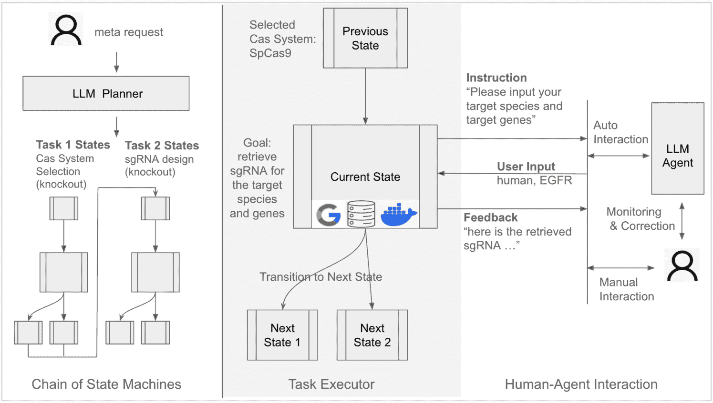

<!--yml

类别：未分类

日期：2025-01-11 12:40:48

-->

# CRISPR-GPT：用于自动化基因编辑实验设计的LLM代理

> 来源：[https://arxiv.org/html/2404.18021/](https://arxiv.org/html/2404.18021/)

Kaixuan Huang^(1,†), Yuanhao Qu^(2,3,†), Henry Cousins^(4,5), William A. Johnson²，

Di Yin², Mihir Shah⁴, Denny Zhou⁶, Russ Altman^(4,7), Mengdi Wang^(1,8,∗), Le Cong^(2,∗)

¹普林斯顿大学电气与计算机工程系

²斯坦福大学医学院病理学系，遗传学系

³癌症生物学项目，斯坦福大学医学院，

⁴医学系，斯坦福大学医学院

⁵医学科学家培训项目，斯坦福大学医学院，

⁶谷歌DeepMind

⁷生物工程系，遗传学系，斯坦福大学，

⁸普林斯顿大学统计与机器学习中心（2024年4月）

###### 摘要

基因组工程技术的引入已经改变了生物医学研究，使得精确修改遗传信息成为可能。然而，创建一个高效的基因编辑系统需要深入理解CRISPR技术以及正在研究的复杂实验系统。尽管大型语言模型（LLMs）在各种任务中表现出了潜力，但它们通常缺乏特定的知识，且难以准确解决生物学设计问题。在本研究中，我们介绍了CRISPR-GPT，这是一个增强了领域知识和外部工具的LLM代理，用于自动化和增强基于CRISPR的基因编辑实验设计过程。CRISPR-GPT利用LLM的推理能力，帮助选择CRISPR系统、设计引导RNA、推荐细胞传递方法、起草实验方案，并设计验证实验以确认编辑结果。我们展示了CRISPR-GPT在帮助非专家研究人员从头开始进行基因编辑实验的潜力，并验证了该代理在实际应用中的有效性。此外，我们探讨了与自动化基因编辑设计相关的伦理和监管问题，强调了这些工具需要负责任且透明地使用。我们的研究旨在弥合初学者生物学研究人员与CRISPR基因组工程技术之间的差距，并展示LLM代理在促进复杂生物学发现任务中的潜力。

^($\dagger$)^($\dagger$)脚注：这些作者对本研究贡献相等。^*^*脚注：通讯作者：mengdiw@princeton.edu (M.W.)，congle@stanford.edu (L.C.)

## 1 引言

基因编辑技术代表了一项突破性的科学进展，使得对活生物体的遗传物质进行精确修改成为可能。这一创新技术已经广泛应用于生物学和医学的各个领域，从纠正导致囊性纤维化、血友病和镰状细胞贫血等疾病的基因缺陷，到为应对癌症、心血管疾病、神经退行性疾病和感染等复杂病症提供新的治疗策略。最著名的基因编辑系统之一是CRISPR-Cas9 [[17](https://arxiv.org/html/2404.18021v1#bib.bib17), [34](https://arxiv.org/html/2404.18021v1#bib.bib34), [25](https://arxiv.org/html/2404.18021v1#bib.bib25), [42](https://arxiv.org/html/2404.18021v1#bib.bib42), [6](https://arxiv.org/html/2404.18021v1#bib.bib6), [39](https://arxiv.org/html/2404.18021v1#bib.bib39), [45](https://arxiv.org/html/2404.18021v1#bib.bib45)]。它改编自一种细菌用作免疫防御的自然发生的基因组编辑系统。除了CRISPR-Cas9，最近的进展还催生了CRISPR激活/干扰、基于CRISPR的Prime编辑和碱基编辑技术。CRISPR激活/干扰，简称CRISPRa/CRISPRi，能够通过表观遗传调控增强基因表达或沉默特定基因的活性 [[40](https://arxiv.org/html/2404.18021v1#bib.bib40), [20](https://arxiv.org/html/2404.18021v1#bib.bib20), [29](https://arxiv.org/html/2404.18021v1#bib.bib29), [33](https://arxiv.org/html/2404.18021v1#bib.bib33), [38](https://arxiv.org/html/2404.18021v1#bib.bib38)]。Prime编辑，被认为是DNA的“搜索和替换”方法，允许精确的编辑功能，而无需引入双链断裂 [[7](https://arxiv.org/html/2404.18021v1#bib.bib7)]。另一方面，碱基编辑使得在靶向位置直接、不可逆地将一种DNA碱基转换为另一种碱基，从而进一步扩展了精确基因组修改的工具箱 [[19](https://arxiv.org/html/2404.18021v1#bib.bib19)]。所有这些技术在医学、农业及其他领域都具有广泛的应用潜力，扩展了基因组编辑在遗传疾病治疗及其他应用中的前景。

图1：CRISPR-GPT代理概览。CRISPR-GPT基于一个由大语言模型（LLM）驱动的设计和规划引擎（左侧），该引擎帮助完成4个核心元任务（右上方），以及其他辅助功能（自由问答、脱靶预测）。CRISPR-GPT集成了一套实用的技能和工具包（右下方），LLM代理会根据需要调用这些工具来帮助人类用户完成不同的任务和子任务。图示由BioRender.com创建。

设计基因编辑实验需要深入理解一系列技术和目标器官的相关生物学知识。基于CRISPR Cas的编辑通过与短“引导”序列（引导RNA）结合，作用于细胞DNA中的特定目标序列，类似细菌从CRISPR阵列产生的RNA片段。当引导RNA被引入细胞后，它会识别预定的DNA序列，Cas酶（通常是Cas9或其他类型）在目标位置切割DNA，模仿细菌中的过程。设计此类实验时有许多需要考虑的因素，包括选择合适的基因编辑系统、开发最佳的引导序列以及验证方法。这通常需要显著的领域专业知识、对目标器官生物学的理解，以及反复试验的努力。开发AI辅助计算工具来帮助基因编辑技术具有巨大的潜力，可以使这一技术更加可及，并加速科学和治疗发展的进程。

大型语言模型（LLMs）在语言技能上展现了卓越的能力，并且封装了大量的世界知识，接近人工通用智能的各个方面[[13](https://arxiv.org/html/2404.18021v1#bib.bib13)，[24](https://arxiv.org/html/2404.18021v1#bib.bib24)，[3](https://arxiv.org/html/2404.18021v1#bib.bib3)，[5](https://arxiv.org/html/2404.18021v1#bib.bib5)，[4](https://arxiv.org/html/2404.18021v1#bib.bib4)]。近期的研究也探讨了通过外部工具增强LLMs，提升它们的解题能力和效率[[53](https://arxiv.org/html/2404.18021v1#bib.bib53)，[32](https://arxiv.org/html/2404.18021v1#bib.bib32)，[44](https://arxiv.org/html/2404.18021v1#bib.bib44)]。LLMs还展现了作为工具制造者[[10](https://arxiv.org/html/2404.18021v1#bib.bib10)]和黑箱优化器[[52](https://arxiv.org/html/2404.18021v1#bib.bib52)]的潜力。研究人员已经探索了基于LLM的专业模型，应用于各个领域[[31](https://arxiv.org/html/2404.18021v1#bib.bib31)，[51](https://arxiv.org/html/2404.18021v1#bib.bib51)]，并且用于解决科学和数学任务。例如，ChemCrow[[9](https://arxiv.org/html/2404.18021v1#bib.bib9)]使用增强工具的语言模型解决一系列化学相关任务，如对乙酰氨基酚合成，而Coscientist[[8](https://arxiv.org/html/2404.18021v1#bib.bib8)]，同样由GPT-4驱动并结合自动化实验，成功优化了钯催化的交叉偶联反应。

### 1.1 通用大语言模型（LLMs）不知道如何设计生物实验。

虽然利用大语言模型（LLM）辅助基因编辑实验设计具有很大吸引力，但当前的最先进通用模型在这个专业领域存在显著的不足。尽管这些模型拥有庞大的知识库，但缺乏准确、最新的领域特定知识，这对于生物实验的准确设计至关重要。

通用 LLM 的一个关键限制是它们容易出现“幻觉”，即在处理专门的生物学问题时生成自信但不准确的回答。例如，当被要求设计用于靶向特定人类基因（如 EMX1 或 EGFR）的引导 RNA（gRNA）序列时，像 ChatGPT-3/ChatGPT-4 这样的通用 LLM 可能会以高度自信的态度生成错误的序列。然而，它们提供的 gRNA 序列往往与已知的基因组区域不匹配。通过将 LLM 生成的序列与数据库中的参考序列进行比对（如 NCBI 的 BLAST 工具，该工具将序列与人类基因组和转录组进行比对），可以轻松识别出这种差异。这种幻觉设计的序列不仅没有实用性，而且可能会误导研究人员，如果没有经过适当审查，可能导致资源和时间的浪费。

此外，通用 LLM 生成的回答通常缺乏实验设计所必需的关键信息，如特定材料、协议、对脱靶效应的考虑、gRNA 的效率和特异性等。这些信息的缺失可能会使研究人员，特别是那些刚接触基因编辑领域的研究人员，无法为实验的实际执行做好充分准备。

此外，必须注意的是，生成的响应可能包含大量与基因编辑实验设计无关的信息。这些无关的文本可能会导致混淆和误导，使研究人员在识别最相关和最实用的信息时面临困难，从而影响其基因编辑目标的实现。

所有这些局限性凸显了针对基因编辑实验设计量身定制的新型大语言模型（LLM）的必要性（我们请读者参考附录[A](https://arxiv.org/html/2404.18021v1#A1 "附录 A GPT-4 失败案例 ‣ CRISPR-GPT：一种用于自动化基因编辑实验设计的 LLM 代理")了解更多失败示例）。这种模型需要结合深度、准确的领域知识，以及批判性评估和生成实验可行方案的能力，从而克服当前通用 LLM 在设计 CRISPR 基因编辑实验时面临的障碍。

### 1.2 CRISPR-GPT 概述

在快速发展的基因工程领域，CRISPR技术已成为精确基因编辑的重要工具。尽管其前景广阔，但设计CRISPR实验的复杂性——从引导RNA（gRNA）选择到预测非靶向效应——仍然带来了巨大挑战，尤其对于那些刚接触该领域的人来说。为弥补这一差距，我们推出了CRISPR-GPT，一种创新的解决方案，它结合了大型语言模型（LLM）的优势、特定领域知识和计算工具，专门为CRISPR基因编辑任务量身定制。

CRISPR-GPT以量身定制的LLM驱动设计与规划代理为核心（图[1](https://arxiv.org/html/2404.18021v1#S1.F1 "Figure 1 ‣ 1 Introduction ‣ CRISPR-GPT: An LLM Agent for Automated Design of Gene-Editing Experiments")）。该代理的引擎不仅借鉴了基因编辑领域领先专家的知识，还整合了最新文献的广泛回顾以及一系列计算工具包，包括引导RNA设计工具。

CRISPR-GPT代理的创新之处在于简化了复杂的基因编辑实验设计过程，将其分解为一系列可管理的步骤，实现了自动化设计：

+   •

    CRISPR系统选择：根据实验需求量身定制CRISPR系统的选择。

+   •

    gRNA设计：根据Broad Institute的金标准gRNA库和CRISPRPick工具包，优化引导RNA序列的效率和特异性，包括预设计的gRNA库[[28](https://arxiv.org/html/2404.18021v1#bib.bib28), [14](https://arxiv.org/html/2404.18021v1#bib.bib14), [15](https://arxiv.org/html/2404.18021v1#bib.bib15), [43](https://arxiv.org/html/2404.18021v1#bib.bib43)]。

+   •

    交付方法选择：提供最有效的CRISPR组分导入目标细胞的方法建议。

+   •

    非靶向效应预测：评估潜在的非意图性变化以及预期的编辑效果。

+   •

    实验方案推荐：概述针对实验目标量身定制的逐步操作程序。

+   •

    验证方法推荐与引物设计：推荐验证编辑的最佳方法，并帮助设计相关的引物。

这种方法利用链式思维推理模型和状态机，确保即使是基因编辑的新手，也能反复完善实验设计，从而实现符合特定研究需求的方案。此外，CRISPR-GPT还提供：

+   •

    一种自由问答模式，用于精确解决临时问题，

+   •

    一种非靶向预测模式，用于对预设计的gRNA进行深入分析。

这些功能帮助用户在实验设计过程中遇到额外问题时提供支持。

考虑到基因编辑，特别是在人类应用中的伦理和安全性问题，我们已在 CRISPR-GPT 中集成了安全保障措施。这些措施包括限制其在人类受试者中的使用、确保遗传信息隐私的措施，以及针对潜在意外后果的警报，体现了我们对负责任使用的承诺，并与关于基因编辑技术的更广泛科学和伦理讨论保持一致。

## 2 方法与算法

### 2.1 大型语言模型

CRISPR-GPT 代理由以下四个核心模块组成（图[2](https://arxiv.org/html/2404.18021v1#S2.F2 "Figure 2 ‣ 2.1 Large Language Model ‣ 2 Methods and Algorithms ‣ CRISPR-GPT: An LLM Agent for Automated Design of Gene-Editing Experiments")）：LLM 规划器、工具提供者、任务执行者和作为与用户交互接口的 LLM 代理，用于接收输入并传达输出。

图 2：CRISPR-GPT 的组件使人类与人工智能的协作能够自动化基因编辑实验设计，涵盖复杂任务。LLM 规划器负责根据用户需求配置任务（4 个预定义的元任务或 LLM 规划的任务链）。工具提供者将系统与外部 API、工具、库和文档连接起来。任务执行者实现为状态机，负责提供指令和反馈，接收来自 LLM 代理的输入，并通过工具提供者调用 API。LLM 代理负责代表用户与任务执行者进行交互，用户可以在此过程中监控进展，并在生成内容时向 LLM 代理提供修正。

#### 任务执行者作为状态机运行，提供强大的子目标分解和进度控制功能。

我们在 CRISPR-GPT 中实现了 22 个任务，汇总在表[1](https://arxiv.org/html/2404.18021v1#S3.T1 "Table 1 ‣ 3.1.1 Meta Mode ‣ 3.1 CRISPR-GPT assists researchers with gene-editing experimental design through three modules. ‣ 3 Results ‣ CRISPR-GPT: An LLM Agent for Automated Design of Gene-Editing Experiments")，这些任务以状态机的形式进行。状态机负责为当前任务提供充分的指令，并通过多轮文本交互引导用户完成决策过程。通过这些状态机，我们手动将每个任务分解为子目标，供任务执行者使用。具体而言，每个状态负责一个特定的子目标。转移逻辑清晰定义，以便任务执行者能够根据当前进度适当转换到另一个子目标。

我们有4个预定义的元任务，支持与4个基因编辑相关实验的完整流程；见表[1](https://arxiv.org/html/2404.18021v1#S3.T1 "Table 1 ‣ 3.1.1 Meta Mode ‣ 3.1 CRISPR-GPT assists researchers with gene-editing experimental design through three modules. ‣ 3 Results ‣ CRISPR-GPT: An LLM Agent for Automated Design of Gene-Editing Experiments")。此外，LLM规划器可以根据用户的元请求生成定制的任务列表。相应任务的状态机将彼此链接，形成一个更大的状态机，以支持整个流程。

#### 工具提供者将任务执行者与外部API连接起来

为了将语言模型与外部功能连接起来[[1](https://arxiv.org/html/2404.18021v1#bib.bib1), [46](https://arxiv.org/html/2404.18021v1#bib.bib46), [49](https://arxiv.org/html/2404.18021v1#bib.bib49), [23](https://arxiv.org/html/2404.18021v1#bib.bib23), [37](https://arxiv.org/html/2404.18021v1#bib.bib37)]，系统需要（1）分析当前情况，判断是否适合调用外部工具；（2）了解可用的工具种类，并从中选择最佳工具。在CRISPR-GPT中，我们并没有直接向LLM暴露API接口，而是将API的使用封装在状态内部，通过手写指令和响应，暴露更符合用户和LLM需求的文本接口。通俗来说，我们是在教用户（人类代理和LLM代理）如何使用这些工具。这些工具包括Google网页搜索、运行程序如Primer3 [[48](https://arxiv.org/html/2404.18021v1#bib.bib48)]，以及从外部引导RNA库、研究论文和实验方案中进行检索。

#### LLM规划器根据用户请求自动生成任务列表

大型语言模型（LLMs），如GPT-4 [[3](https://arxiv.org/html/2404.18021v1#bib.bib3)]、Gemini [[47](https://arxiv.org/html/2404.18021v1#bib.bib47)] 和Claude [[5](https://arxiv.org/html/2404.18021v1#bib.bib5)]，可以作为LLM驱动代理的推理核心，用于解决现实世界中的决策问题。我们采用了流行的ReAct [[53](https://arxiv.org/html/2404.18021v1#bib.bib53)] 提示技术，在该方法中，LLM被提示输出思维链[[50](https://arxiv.org/html/2404.18021v1#bib.bib50)]推理路径，并从合理的行动集合中选择最终行动（图[3](https://arxiv.org/html/2404.18021v1#S2.F3 "图 3 ‣ LLM-planner 根据用户的请求自动生成任务列表 ‣ 2.1 大型语言模型 ‣ 2 方法与算法 ‣ CRISPR-GPT: 一个自动设计基因编辑实验的LLM代理")）。为了让LLM执行任务分解[[54](https://arxiv.org/html/2404.18021v1#bib.bib54)]，我们向LLM提供了一张包含所有任务描述及其依赖关系的表格作为提示。基于LLM的内部知识以及我们手动编写的任务描述和任务分解指令，LLM可以智能地分析用户的请求，并将其分解为一系列任务，同时遵循任务之间的依赖关系。分解完成后，相应的状态机被链接在一起，以完成所有任务。任务分解的提示格式可以在附录[B](https://arxiv.org/html/2404.18021v1#A2 "附录 B 提示格式 ‣ CRISPR-GPT: 一个自动设计基因编辑实验的LLM代理")中找到。

图3：任务分解过程和状态机实现算法。（左）任务分解；LLM可以根据用户的请求、当前支持的任务描述和依赖关系以及LLM内部知识自动执行任务分解。选定任务的状态机被链在一起，以完成用户的请求。（右）状态机与LLM代理；状态机是任务执行器的核心，每个状态负责与用户的一轮互动。首先向用户提供包含当前决策步骤所需信息和输入的指令。收到用户响应后，提供输出和反馈，其中可能会调用API（例如，程序执行/网页搜索/数据库检索）以在状态执行过程中进行操作。随后，状态机过渡到下一个状态。LLM代理代表用户生成每一步的响应。用户监控整个过程，并在生成的内容有误时进行纠正，或覆盖LLM代理，手动与任务执行器互动。

为了系统的鲁棒性，我们不允许LLMs在自动执行过程中动态地添加/删除新任务（新状态机）。然而，我们认为这是迈向更智能的CRISPR-GPT版本的重要一步，并将此作为未来的工作。

#### LLM代理会根据用户的元请求自动与任务执行器进行交互

在解决自动化CRISPR基因编辑任务的复杂挑战时，我们通过顺序决策的视角来构思这个问题。这一视角将用户与自动化系统之间的互动框架化为一系列步骤，每个步骤都需要做出精确决策，以推进到实验设计和执行的最终目标。我们的系统核心是LLM代理，它充当用户与状态机之间的中介。这个状态机来源于初步的任务分解步骤，有效地将基因编辑过程分解成一系列结构化的行动和决策。在这一系列的每一步中，状态机都会向LLM代理呈现当前状态。这个状态包含了手头任务的描述，并指定了用户为继续推进所需提供的任何输入。

LLM代理的角色是解释当前状态并代表用户做出明智决策。为了有效地做到这一点，代理可能会利用多种信息来源，包括：

+   •

    当前状态固有的指令，

+   •

    用户的具体请求，

+   •

    当前任务会话中的过往互动历史，

+   •

    集成到系统中的外部计算工具的结果。

这些信息被合成成一个提示，供LLM代理使用其能力来确定最合适的下一步行动。这些提示的格式和结构，旨在优化决策过程，详见附录[B](https://arxiv.org/html/2404.18021v1#A2 "附录B 提示格式 ‣ CRISPR-GPT: 用于自动设计基因编辑实验的LLM代理")。

用户监督是该系统的关键组成部分。尽管LLM代理可以自主操作，但用户并未从过程中移除。相反，用户被鼓励监控任务的进展并与代理互动。这种设置确保LLM代理的任何错误或误解都能被用户迅速识别并纠正，从而保持基因编辑实验设计的准确性和完整性。这种自动化方法强调了人类专业知识与人工智能之间的协作共生。通过利用LLM代理处理和应对复杂信息的能力，我们在设计CRISPR基因编辑实验时提供了更加高效且用户友好的体验。顺序决策框架不仅简化了任务执行过程，还确保用户输入始终是实验规划和设计的基石。

### 2.2 人工评估

为了评估CRISPR-GPT工具在基因编辑和实验设计中的有效性，我们组建了一个由12位CRISPR和基因编辑研究领域的专家组成的多元化小组。每位专家根据既定标准（所有人工评估的评分标准详细信息见附录[C](https://arxiv.org/html/2404.18021v1#A3 "Appendix C The Rubrics for Human Evaluations ‣ CRISPR-GPT: An LLM Agent for Automated Design of Gene-Editing Experiments")）对三种模式的实验设计任务的响应进行了评分，评分范围为1（差）到5（优秀）。为了提供对比视角，使用相似的提示生成了来自ChatGPT 3.5和ChatGPT 4.0（模型版本gpt-4-0613）的输出，并使用相同的标准进行评估。

### 2.3 生物实验和湿实验验证

我们通过人机协作的方式，利用CRISPR-GPT与ChatGPTv4 API进行了生物实验，这也是我们方法的湿实验验证。具体来说，我们邀请了不熟悉基因编辑实验的独立科学家，使用CRISPR-GPT来辅助他们在癌症研究项目中的基因敲除（KO）编辑实验。详细的实验方法如下所示。

细胞系和细胞培养。A375细胞系在DMEM高葡萄糖、GlutaMAX（Gibco）培养基中培养，补充10%胎牛血清（FBS，Gemini Bio）、100 U/ml青霉素和100μg/ml链霉素（Gibco），在37℃和5% CO2条件下培养。

crRNA克隆。通过Golden Gate组装法，将4个crRNA（TGFBR1/SNAI1/BAX/BCL2L1）克隆到Cas12a表达载体中，使用BbsI或Esp3I（NEB）。构建体通过Sanger测序进行序列验证，使用U6测序引物：5’-GACTATCATATGCTTACCGT-3’。

慢病毒包装和转导。通过共转染组装好的慢病毒载体、VSV-G包膜和Delta-Vpr包装质粒到HEK-293T细胞中，使用PEI转染试剂（Sigma-Aldrich）。转染48小时后收获上清液。A375细胞在低MOI条件下用8$\mathrm{\SIUnitSymbolMicro g}$/mL聚阳离子溶液（polybrene）通过1000*g离心感染45分钟。24小时后，使用1$\mathrm{\SIUnitSymbolMicro g}$/mL嘌呤霉素筛选，建立稳定表达的细胞株。

gDNA提取、PCR和测序。基因组DNA通过QuickExtract（Lucigen）从选定的细胞中提取，提取时间为7天。然后，根据制造商的说明，使用含有Illumina测序接头的引物，通过Phusion Flash高保真PCR主混合液（ThermoFisher Scientific）对目标位点进行扩增。在Illumina MiSeq平台上生成了成对末端读取（150 bp）。

## 3 结果

CRISPR-GPT利用LLM的推理能力、领域知识、检索技术和外部工具，为基因编辑实验设计任务提供全面解决方案。它支持广泛的基因编辑场景，包括单基因敲除、无双链断裂的碱基编辑、通过原编辑进行的插入/删除/替代、以及基因的表观遗传编辑（CRISPRa和CRISPRi）。

### 3.1 CRISPR-GPT通过三个模块帮助研究人员进行基因编辑实验设计。

CRISPR-GPT代理通过三个独立的模块帮助研究人员设计基因编辑实验。“元模式”使用户，特别是基因编辑领域的新手，能够使用专家定义的流程来处理常见的基因编辑场景（称为元任务）。“自动模式”根据用户输入自动生成必要的设计任务列表，帮助各个经验层次的用户实现目标。“问答模式”则作为一个先进的GPT-4聊天机器人，在设计过程中解答用户关于CRISPR和基因编辑的相关问题（图[4](https://arxiv.org/html/2404.18021v1#S3.F4 "Figure 4 ‣ 3.1 CRISPR-GPT assists researchers with gene-editing experimental design through three modules. ‣ 3 Results ‣ CRISPR-GPT: An LLM Agent for Automated Design of Gene-Editing Experiments")）。

图4：CRISPR-GPT基因编辑实验设计互动模块概述。（A）示意图展示CRISPR-GPT中三个模块的功能，并附有其应用实例。（B）CRISPR-GPT的Web界面，注意编号1-4为“元模式”，编号5为“自动模式”，编号6为脱靶预测功能，且“Q: prompt”将触发问答模式。

#### 3.1.1 元模式

“元模式”涉及规划和实施22个独特的基因编辑实验设计任务，利用四种类型的基于CRISPR的基因编辑系统（元任务）（表[1](https://arxiv.org/html/2404.18021v1#S3.T1 "Table 1 ‣ 3.1.1 Meta Mode ‣ 3.1 CRISPR-GPT assists researchers with gene-editing experimental design through three modules. ‣ 3 Results ‣ CRISPR-GPT: An LLM Agent for Automated Design of Gene-Editing Experiments")）。它利用预定义的流程帮助用户全面完成一个元任务。在此模式下，CRISPR-GPT代理引导用户完成设计基因编辑实验所需的每个任务。这包括选择合适的CRISPR系统，推荐传递方法，设计sgRNA，预测sgRNA的脱靶效率，选择实验方案，并规划验证实验。

对于每个设计任务，CRISPR-GPT 代理与用户互动，应用各种技术和外部工具提供最优解决方案。例如，在选择 CRISPR 系统时，CRISPR-GPT 会持续与用户互动，提供指导并收集信息，以便基于已发布的协议建议选项（参见图 [5](https://arxiv.org/html/2404.18021v1#S3.F5 "图 5 ‣ 3.1.1 Meta 模式 ‣ 3.1 CRISPR-GPT 通过三个模块帮助研究人员进行基因编辑实验设计。 ‣ 3 结果 ‣ CRISPR-GPT：一种自动化基因编辑实验设计的大型语言模型代理") 一般任务 1））。对于诸如交付方法推荐之类的上下文敏感任务，CRISPR-GPT 不仅建议常见方法，还通过网页搜索提供基于用户请求的定制解决方案（参见图 [5](https://arxiv.org/html/2404.18021v1#S3.F5 "图 5 ‣ 3.1.1 Meta 模式 ‣ 3.1 CRISPR-GPT 通过三个模块帮助研究人员进行基因编辑实验设计。 ‣ 3 结果 ‣ CRISPR-GPT：一种自动化基因编辑实验设计的大型语言模型代理") 一般任务 2））。对于 sgRNA/pegRNA 设计，通过现有设计和出版物派生的多物种数据库使 CRISPR-GPT 能够迅速根据用户信息建议预设计的 sgRNA（参见图 [5](https://arxiv.org/html/2404.18021v1#S3.F5 "图 5 ‣ 3.1.1 Meta 模式 ‣ 3.1 CRISPR-GPT 通过三个模块帮助研究人员进行基因编辑实验设计。 ‣ 3 结果 ‣ CRISPR-GPT：一种自动化基因编辑实验设计的大型语言模型代理") 一般任务 3））。在 sgRNA/pegRNA 设计之后，用户可以通过 CRISPR-GPT 提供的详细说明和代码评估设计的引导序列的潜在脱靶效应（参见图 [5](https://arxiv.org/html/2404.18021v1#S3.F5 "图 5 ‣ 3.1.1 Meta 模式 ‣ 3.1 CRISPR-GPT 通过三个模块帮助研究人员进行基因编辑实验设计。 ‣ 3 结果 ‣ CRISPR-GPT：一种自动化基因编辑实验设计的大型语言模型代理") 一般任务 4））。完成设计任务后，CRISPR-GPT 会根据交互历史提供选择的协议，包括 CRISPR 系统选择和交付方法（参见图 [5](https://arxiv.org/html/2404.18021v1#S3.F5 "图 5 ‣ 3.1.1 Meta 模式 ‣ 3.1 CRISPR-GPT 通过三个模块帮助研究人员进行基因编辑实验设计。 ‣ 3 结果 ‣ CRISPR-GPT：一种自动化基因编辑实验设计的大型语言模型代理") 一般任务 5））。最后，对于验证任务，CRISPR-GPT 利用外部 API，如 Primer3，帮助用户设计用于验证实验的引物（参见图 [5](https://arxiv.org/html/2404.18021v1#S3.F5 "图 5 ‣ 3.1.1 Meta 模式 ‣ 3.1 CRISPR-GPT 通过三个模块帮助研究人员进行基因编辑实验设计。 ‣ 3 结果 ‣ CRISPR-GPT：一种自动化基因编辑实验设计的大型语言模型代理") 一般任务 6））。

表 1：元模式任务列表（4 个主要元任务和 22 个具体任务）

| 元任务 | 基因编辑场景 | 个别设计任务 |
| --- | --- | --- |
| CRISPR 基因敲除 | 单个/多个基因敲除，基因片段的删除 | CRISPR/Cas 系统选择 [[41](https://arxiv.org/html/2404.18021v1#bib.bib41)] |
| 传递方法选择 |
| 基因敲除的 sgRNA 设计 [[28](https://arxiv.org/html/2404.18021v1#bib.bib28), [14](https://arxiv.org/html/2404.18021v1#bib.bib14), [15](https://arxiv.org/html/2404.18021v1#bib.bib15), [43](https://arxiv.org/html/2404.18021v1#bib.bib43)] |
| 脱靶效应评估 [[11](https://arxiv.org/html/2404.18021v1#bib.bib11)] |
| 实验方案推荐 [[21](https://arxiv.org/html/2404.18021v1#bib.bib21)] |
| 验证方案推荐及测序引物设计 [[48](https://arxiv.org/html/2404.18021v1#bib.bib48), [21](https://arxiv.org/html/2404.18021v1#bib.bib21)] |
| CRISPR 激活/干扰 | 基因激活与抑制 | CRISPR/Cas 激活/干扰系统选择 [[18](https://arxiv.org/html/2404.18021v1#bib.bib18)] |
| 传递方法选择 |
| 激活/干扰的 sgRNA 设计 [[28](https://arxiv.org/html/2404.18021v1#bib.bib28), [14](https://arxiv.org/html/2404.18021v1#bib.bib14), [15](https://arxiv.org/html/2404.18021v1#bib.bib15), [43](https://arxiv.org/html/2404.18021v1#bib.bib43)] |
| 脱靶效应评估 [[11](https://arxiv.org/html/2404.18021v1#bib.bib11)] |
| 实验方案推荐 [[21](https://arxiv.org/html/2404.18021v1#bib.bib21)] |
| 验证方案推荐及 qPCR 引物设计 [[48](https://arxiv.org/html/2404.18021v1#bib.bib48), [21](https://arxiv.org/html/2404.18021v1#bib.bib21)] |
| CRISPR 基因组编辑 | 从 CG 到 AT 或 AT 到 CG 的单碱基替换及广泛的诱变 | 基因编辑系统选择 [[26](https://arxiv.org/html/2404.18021v1#bib.bib26)] |
| 传递方法选择 |
| 基因组编辑的 sgRNA 设计 [[22](https://arxiv.org/html/2404.18021v1#bib.bib22)] |
| 脱靶效应评估 [[11](https://arxiv.org/html/2404.18021v1#bib.bib11)] |
| 实验方案推荐 [[21](https://arxiv.org/html/2404.18021v1#bib.bib21)] |
| 验证方案推荐及测序引物设计 [[48](https://arxiv.org/html/2404.18021v1#bib.bib48), [21](https://arxiv.org/html/2404.18021v1#bib.bib21)] |
| CRISPR Prime 编辑 | 小片段的插入、替换和删除 | Prime 编辑系统选择 [[16](https://arxiv.org/html/2404.18021v1#bib.bib16)] |
| 传递方法选择 |
| 供 Prime Editing 的 pegRNA 设计 [[8](https://arxiv.org/html/2404.18021v1#bib.bib8), [27](https://arxiv.org/html/2404.18021v1#bib.bib27), [12](https://arxiv.org/html/2404.18021v1#bib.bib12), [36](https://arxiv.org/html/2404.18021v1#bib.bib36)] |
| 脱靶效应评估 [[11](https://arxiv.org/html/2404.18021v1#bib.bib11)] |
| 实验协议推荐 [[21](https://arxiv.org/html/2404.18021v1#bib.bib21)] |
| 验证协议推荐和测序引物设计 [[48](https://arxiv.org/html/2404.18021v1#bib.bib48), [21](https://arxiv.org/html/2404.18021v1#bib.bib21)] |

图5：展示CRISPR-GPT在基因编辑实验设计中涉及的常见任务的示例工作流。

#### 3.1.2 自动模式

“自动模式”还便于规划和执行13项独特的基因编辑实验设计任务。与“元模式”不同，它不依赖于预定义的元任务和流程；相反，它使用LLM规划器将用户的请求分解为一系列相互依赖的任务。例如，如果用户请求“设计sgRNA以敲除人类EGFR”，CRISPR-GPT代理将从请求中识别关键字，并列出必要的设计任务，如“CRISPR/Cas系统选择”和“敲除sgRNA设计”。此外，它还利用来自初始请求的信息（例如，目标基因“EGFR”和物种“人类”）来自动填写相关字段，并生成sgRNA设计，而无需用户重复输入。与此同时，CRISPR-GPT还阐明其选择背后的理由，允许用户跟踪过程并在必要时进行更正。

#### 3.1.3 问答模式

在“元模式”和“自动模式”的设计任务中，CRISPR-GPT代理通过“问答模式”提供即时反馈或关于CRISPR和基因编辑相关问题的建议。例如，在选择了CRISPR系统后，用户如果想了解更多关于所选系统（如Cas12a）的信息，可以通过提问“问：什么是Cas12a？”迅速获得答案。CRISPR-GPT使用其知识库并从专家精选的领域数据库中检索文献，以快速提供准确且相关的信息。

### 3.2 CRISPR-GPT通过人类专家评估，在基因编辑设计任务中优于一般的大型语言模型（LLMs）。

为了评估CRISPR-GPT代理的表现，我们邀请了12位在CRISPR和基因编辑领域具有专长的研究人员设计任务集，测试CRISPR-GPT在协助研究人员进行实验设计方面的能力。结果从四个方面进行评估：准确性、推理能力、完整性和简洁性（附录[C](https://arxiv.org/html/2404.18021v1#A3 "附录C 人类评估评分标准 ‣ CRISPR-GPT: 一种自动化基因编辑实验设计的LLM代理")）。准确性反映了CRISPR-GPT是否能够提供当前CRISPR研究和方法的准确信息。推理能力评估CRISPR-GPT是否能够提供有洞察力、充分支持的建议设计解释。完整性确保用户获得进行CRISPR实验设计所需的所有信息。最后，简洁性确保CRISPR-GPT为用户提供直接相关的设计任务信息，尽量减少不必要的信息。所有评估人员都被要求根据这四个方面对所有三种模式下的任务集进行评分，从1（差）到5（优秀）。ChatGPT 3.5和ChatGPT 4.0的响应也被生成并与CRISPR-GPT的结果一起评分，所有情况下都使用了等效的提示。

图6：评估结果展示了CRISPR-GPT与ChatGPT 3.5/4.0在三种不同模式下（MetaMode、AutoMode和QAMode）进行基因编辑实验设计任务的比较表现。所有任务在四个方面进行评分：准确性、推理能力、完整性和简洁性。评分1代表表现较差，5代表表现优秀。详细评分标准列在附录[C](https://arxiv.org/html/2404.18021v1#A3 "附录C 人类评估评分标准 ‣ CRISPR-GPT: 一种自动化基因编辑实验设计的LLM代理")中。

我们观察到，CRISPR-GPT在我们设计的任务集上，在所有三种模式下的准确率明显高于一般的LLM代理，因为我们在CRISPR和基因编辑领域运用了大量的领域知识，以确保CRISPR-GPT代理的稳健性（图[6](https://arxiv.org/html/2404.18021v1#S3.F6 "图6 ‣ 3.2 CRISPR-GPT在基因编辑设计任务中通过专家评估优于一般LLM的表现 ‣ 3 结果 ‣ CRISPR-GPT：用于基因编辑实验自动设计的LLM代理")）。而一般LLM代理（包括ChatGPT 3.5和ChatGPT 4.0）生成的回答通常包含更多的小的事实错误，这些错误源自已知的问题，包括领域知识不足和幻觉现象。同时，我们发现CRISPR-GPT和一般LLM代理在不同任务集上的推理能力都表现良好。对于“自动模式”相关任务，CRISPR-GPT的推理表现甚至更好，这可能得益于代理中编码了更好的提示技术。正如我们所预期的那样，“完整性”是一般LLM代理在执行基因编辑实验设计任务时的主要问题。它们通常可以提供设计的通用指南，但由于缺乏领域知识和外部工具，无法提供设计细节。相反，CRISPR-GPT在设计任务中表现出更好的“完整性”得分，使用户能够仅基于CRISPR-GPT提供的信息执行基因编辑实验。值得注意的是，ChatGPT 3.5和4.0在“问答”模式中的“完整性”表现上优于CRISPR-GPT。这一结果是由于“完整性”和“简洁性”之间的有意权衡。一般LLM代理直接生成的答案通常包含大量不相关的信息，以便为用户提供更完整的回应。这通常会让用户感到困惑，并且难以抓住关键信息。在这种情况下，我们有意设计了CRISPR-GPT，在所有不同模式下向用户提供简洁准确的答案，因此CRISPR-GPT表现出一致更好的“简洁性”得分。

总体来说，通过专家评估，我们发现CRISPR-GPT在基因编辑实验设计任务的各个方面表现明显优于一般的LLM代理。然而，CRISPR-GPT在更复杂的基因编辑场景和罕见的生物学案例中遇到了一些困难。未来可以通过更新的领域知识和更好的外部工具集进一步扩展和改进。

### 3.3 CRISPR-GPT通过实际应用展示了其有效性。

为了展示CRISPR-GPT如何帮助研究人员设计基因编辑实验，我们通过与CRISPR-GPT的持续互动，在人类A375细胞系中进行了基因敲除实验（见图[7](https://arxiv.org/html/2404.18021v1#S3.F7 "Figure 7 ‣ 3.3 CRISPR-GPT demonstrates its efficacy through real-world application. ‣ 3 Results ‣ CRISPR-GPT: An LLM Agent for Automated Design of Gene-Editing Experiments")）。

在这个实验中，我们的目标是在人类A375细胞系中分别敲除4个基因（TGFBR1、SNAI1、BAX、BCL2L1）。首先，我们选择了“Meta模式”来从头设计基因敲除实验。根据CRISPR-GPT中的指示，我们选择了AsCas12a，因为我们希望进行多位点编辑，并降低潜在的脱靶编辑率。为了将CRISPR系统送入A375细胞中，我们遵循了CRISPR-GPT的推荐，使用了慢病毒转导，确保Cas酶和sgRNA的稳定表达。

接着，基于这些信息，我们能够获得Cas12a质粒（之前已经拥有）。在设计sgRNA时，我们专门针对人类的TGFBR1/SNAI1/BAX/BCL2L1基因，充分意识到CRISPR-GPT提出的人类基因编辑的伦理影响。CRISPR-GPT从已发布的文献库中提供了每个基因的4个sgRNA序列（如图[7](https://arxiv.org/html/2404.18021v1#S3.F7 "Figure 7 ‣ 3.3 CRISPR-GPT demonstrates its efficacy through real-world application. ‣ 3 Results ‣ CRISPR-GPT: An LLM Agent for Automated Design of Gene-Editing Experiments")所示），因此我们能够订购这些序列进行合成。

图7：在人类-AI协作下进行基因敲除实验的湿实验室演示。（左）示意图展示了人类与AI互动的工作流程。（右上）通过CRISPR-GPT设计的样本sgRNA。（右下）来自下一代测序的编辑结果。

随后，CRISPR-GPT提供了gRNA克隆的协议。然后提供了在HEK293T细胞中通过钙磷酸盐转染产生慢病毒的详细步骤，使用必要的质粒和病毒包装组分。接下来，我们完全按照CRISPR-GPT生成的协议进行转导过程，包括细胞培养程序、添加慢病毒和使用聚乙烯吡咯烷酮（polybrene）以促进有效转导。为了进行验证，我们选择了下一代测序（NGS）用于突变检测和CRISPR-GPT指导下的敲除验证。在准备NGS时，我们根据协议使用DNeasy Blood & Tissue Kit从细胞中提取基因组DNA。对于关键的PCR引物设计步骤，我们向CRISPR-GPT提供了详细的序列信息，CRISPR-GPT自动返回了一套使用Primer3设计的引物，用于特异性地扩增目标位点。在实验的最后阶段，CRISPR-GPT建议我们将Illumina适配子连接到PCR产物中用于文库构建，并强调了使用NCBI BLAST检查引物特异性的重要性。这个最终的验证步骤对于防止误引物结合以及确保测序结果准确反映预期的基因组编辑至关重要。

最后，我们分析了NGS的数据，观察到在所有4个目标基因中，预期的编辑结果均具有一致的高成功率。在这个过程中，CRISPR-GPT提供了：（1）CRISPR系统选择，（2）guideRNA设计，（3）递送系统推荐，（4）质粒和病毒载体选择及克隆协议，（5）组织培养、细胞转导程序，（6）细胞收获和基因编辑效率量化方法，（7）测序引物设计和读取验证协议。因此，我们的专业知识与CRISPR-GPT计算指导之间的动态互动对于执行精确且具伦理考量的基因编辑实验起到了关键作用。  

## 4 安全性和伦理问题  

在使用人工智能工具指导基因组编辑时，会出现安全性和伦理性问题，这些问题从非法改变人类基因组的风险到涉及用户基因组信息时的隐私问题不等。  

### 4.1 降低人类遗传编辑的风险  

CRISPR-Cas9等技术使得改变人类基因组成为可能，这也带来了一系列伦理和安全风险。特别是生殖系细胞和胚胎基因组编辑引发了一些伦理问题，包括是否允许使用该技术来增强正常人类特征（例如身高或智力）。基于对伦理和安全性的担忧，生殖系细胞和胚胎基因组编辑在美国和许多其他国家目前是非法的。为了确保CRISPR-GPT遵循关于遗传基因组编辑的暂停令[[30](https://arxiv.org/html/2404.18021v1#bib.bib30)]中的指导原则。  

CRISPR-GPT 采用了一种机制，确保用户在所有任务中无法绕过要求编辑目标生物体的步骤。该系统会检查编辑目标是否属于人类组织或器官。如果发现编辑目标是人类器官，它将触发以下解决方案：当用户继续进行人类基因编辑实验设计时，会显示警告信息，并提供相关国际暂停链接及说明。要求用户确认他们理解相关风险并且已阅读此国际指南后，再继续操作。

### 4.2 用户基因组数据隐私保护

其他关注点涉及用户数据隐私问题，尤其是在使用 AI 工具交换人类基因组序列信息时。我们遵循数据隐私保护和医疗保健中的 HIPAA 隐私规则[[2](https://arxiv.org/html/2404.18021v1#bib.bib2)]。尽管基因组规模的序列与身份紧密相关，但长度不超过 20 个碱基对的 DNA 片段被认为是安全的，不足以识别个体身份（参考文献）。CRISPR-GPT 配备了以下功能，以避免向公共 LLM 模型提供任何可识别的私人基因组/患者序列。具体而言，我们的解决方案如下：

+   •

    CRISPR-GPT 永远不会在服务器上存储任何可能泄露患者私人信息的可识别长基因组序列。

+   •

    CRISPR-GPT 实施了一种过滤器，检测输入提示中是否包含任何大于或等于 20bp 的 A/T/G/C/U 序列，并在发送给外部 LLM 模型之前进行过滤。在检测到此类序列时，系统将发出错误提示和警告信息，要求用户手动删除输入中的这些序列。通过这种方式，避免了将这些敏感信息泄露给公共 LLM 模型。

## 5 讨论

CRISPR-GPT 展示了大语言模型（LLM）在自动化和提升复杂生物实验设计过程中的巨大潜力。通过无缝整合 LLM 与领域知识、外部工具以及模块化任务执行系统，CRISPR-GPT 使研究人员能够以前所未有的简便和高效的方式，探索 CRISPR 基因编辑实验的复杂领域。CRISPR-GPT 的多模态功能包括元任务管道、交互式提示和按需问答支持。研究人员可以利用该系统的专业知识，从 CRISPR 系统选择和引导 RNA 设计，到自动起草详细的实验方案和验证策略，全面规划和执行基因编辑实验。该精简的工作流程不仅加快了设计过程，还降低了错误和疏漏的风险，从而提高了研究结果的质量和可重复性。

尽管在其他科学领域，如化学中，也存在LLM代理，但涉及活性材料的生物实验复杂性要求考虑一套不同的因素。与通常遵循明确协议的化学反应不同，生物实验需要复杂的程序，以适应活体系统的动态特性。CRISPR-GPT通过提供详细的逐步指导，针对具体实验环境量身定制，帮助研究人员有效应对与活细胞和生物体相关的细微差别，确保实验顺利进行。

此外，CRISPR-GPT的自由式提示和临时问答能力使其与许多现有工具不同。研究人员可以提出无结构的查询，并获得情境化的回应，从而实现与代理更自然、直观的互动。该功能在面对实验过程中可能出现的意外挑战或不可预见的情况时尤为重要，能够帮助研究人员及时获取指导，并根据需要调整他们的实验方法。

尽管CRISPR-GPT具有令人印象深刻的能力，但它也存在一些局限性。虽然该工具可以设计单独的组件，如引导RNA和引物，但目前它还无法从自然语言输入中生成完整的构建体或载体。这一局限性突出了未来发展的一个方向。例如，基因编辑模块化设计领域的最新进展，如FragMID[[35](https://arxiv.org/html/2404.18021v1#bib.bib35)]，可以与CRISPR-GPT结合，发挥大语言模型（LLMs）在帮助研究人员探索和优化CRISPR设计及定制策略方面的潜力，从而实现更高效的基因编辑。

展望未来，CRISPR-GPT与自动化实验室平台和机器人技术的结合充满巨大潜力。通过连接计算设计与实际执行，研究人员可以利用该工具的专业知识，协调端到端的自动化实验，减少人工干预，加速发现进程。

## 参考文献

+   [1] Chatgpt插件。 [https://openai.com/blog/chatgpt-plugins](https://openai.com/blog/chatgpt-plugins)。

+   [2] Rights (ocr), o. for c. summary of the hipaa privacy rule. [https://www.hhs.gov/hipaa/for-professionals/privacy/laws-regulations/index.html](https://www.hhs.gov/hipaa/for-professionals/privacy/laws-regulations/index.html)，2008。

+   [3] Josh Achiam, Steven Adler, Sandhini Agarwal, Lama Ahmad, Ilge Akkaya, Florencia Leoni Aleman, Diogo Almeida, Janko Altenschmidt, Sam Altman, Shyamal Anadkat 等。Gpt-4技术报告。arXiv预印本arXiv:2303.08774，2023。

+   [4] Rohan Anil, Andrew M Dai, Orhan Firat, Melvin Johnson, Dmitry Lepikhin, Alexandre Passos, Siamak Shakeri, Emanuel Taropa, Paige Bailey, Zhifeng Chen 等。Palm 2技术报告。arXiv预印本arXiv:2305.10403，2023。

+   [5] Anthropic. Claude 3 模型卡。 [https://www.anthropic.com/claude-3-model-card](https://www.anthropic.com/claude-3-model-card).

+   [6] Andrew V Anzalone, Luke W Koblan, 和 David R Liu. 使用 CRISPR-Cas 核酸酶、碱基编辑器、转座酶和原编辑器进行基因组编辑。Nature 生物技术, 38(7):824–844, 2020.

+   [7] Andrew V Anzalone, Peyton B Randolph, Jessie R Davis, Alexander A Sousa, Luke W Koblan, Jonathan M Levy, Peter J Chen, Christopher Wilson, Gregory A Newby, Aditya Raguram 等人. 无需双链断裂或供体 DNA 的搜索与替换基因编辑。Nature, 576(7785):149–157, 2019.

+   [8] Daniil A Boiko, Robert MacKnight, Ben Kline, 和 Gabe Gomes. 使用大型语言模型进行自主化学研究。Nature, 624(7992):570–578, 2023.

+   [9] Andres M Bran, Sam Cox, Oliver Schilter, Carlo Baldassari, Andrew D White, 和 Philippe Schwaller. Chemcrow：用化学工具增强大型语言模型。arXiv 预印本 arXiv:2304.05376, 2023.

+   [10] Tianle Cai, Xuezhi Wang, Tengyu Ma, Xinyun Chen, 和 Denny Zhou. 大型语言模型作为工具创制者。arXiv 预印本 arXiv:2305.17126, 2023.

+   [11] Samuele Cancellieri, Matthew C Canver, Nicola Bombieri, Rosalba Giugno, 和 Luca Pinello. Crispritz：一种快速、高通量并且变异感知的 CRISPR 基因组编辑的靶外位点识别工具。生物信息学, 36(7):2001–2008, 2020.

+   [12] Ryan D Chow, Jennifer S Chen, Johanna Shen, 和 Sidi Chen. 一种用于设计原编辑引导 RNA 的网络工具。Nature 生物医学工程, 5(2):190–194, 2021.

+   [13] Aakanksha Chowdhery, Sharan Narang, Jacob Devlin, Maarten Bosma, Gaurav Mishra, Adam Roberts, Paul Barham, Hyung Won Chung, Charles Sutton, Sebastian Gehrmann 等人. Palm: 通过路径扩展语言建模。机器学习研究杂志, 24(240):1–113, 2023.

+   [14] Peter C DeWeirdt, Kendall R Sanson, Annabel K Sangree, Mudra Hegde, Ruth E Hanna, Marissa N Feeley, Audrey L Griffith, Teng Teng, Samantha M Borys, Christine Strand 等人. 为在人类细胞中进行组合基因筛选优化 AsCas12a。Nature 生物技术, 39(1):94–104, 2021.

+   [15] John G Doench, Nicolo Fusi, Meagan Sullender, Mudra Hegde, Emma W Vaimberg, Katherine F Donovan, Ian Smith, Zuzana Tothova, Craig Wilen, Robert Orchard 等人. 优化的 sgRNA 设计以最大化活性并最小化 CRISPR-Cas9 的靶外效应。Nature 生物技术, 34(2):184–191, 2016.

+   [16] Jordan L Doman, Alexander A Sousa, Peyton B Randolph, Peter J Chen, 和 David R Liu. 在哺乳动物细胞中设计和执行原编辑实验。Nature 协议, 17(11):2431–2468, 2022.

+   [17] Jennifer A Doudna 和 Emmanuelle Charpentier. 使用 CRISPR-Cas9 进行基因组工程的新前沿。Science, 346(6213):1258096, 2014.

+   [18] Dan Du 和 Lei S Qi. CRISPR 技术在哺乳动物细胞中的基因激活与抑制应用。Cold Spring Harbor 协议, 2016(1):pdb–prot090175, 2016.

+   [19] Nicole M Gaudelli, Alexis C Komor, Holly A Rees, Michael S Packer, Ahmed H Badran, David I Bryson, 和 David R Liu. 可编程碱基编辑：在基因组DNA中无DNA切割地将a• t转变为g• c。自然，551(7681):464–471, 2017.

+   [20] Luke A Gilbert, Matthew H Larson, Leonardo Morsut, Zairan Liu, Gloria A Brar, Sandra E Torres, Noam Stern-Ginossar, Onn Brandman, Evan H Whitehead, Jennifer A Doudna, 等. CRISPR介导的模块化RNA引导转录调控在真核生物中的应用。细胞，154(2):442–451, 2013.

+   [21] Christopher J Giuliano, Ann Lin, Vishruth Girish, 和 Jason M Sheltzer. 使用CRISPR/Cas9在哺乳动物细胞中生成单细胞衍生的基因敲除克隆。分子生物学当前协议，128(1):e100, 2019.

+   [22] Ruth E Hanna, Mudra Hegde, Christian R Fagre, Peter C DeWeirdt, Annabel K Sangree, Zsofia Szegletes, Audrey Griffith, Marissa N Feeley, Kendall R Sanson, Yossef Baidi, 等. 通过碱基编辑筛选进行人类变异的大规模平行评估。细胞，184(4):1064–1080, 2021.

+   [23] Shibo Hao, Tianyang Liu, Zhen Wang, 和 Zhiting Hu. Toolkengpt：通过工具嵌入增强冻结语言模型的功能。神经信息处理系统进展，36, 2024.

+   [24] Jordan Hoffmann, Sebastian Borgeaud, Arthur Mensch, Elena Buchatskaya, Trevor Cai, Eliza Rutherford, Diego de Las Casas, Lisa Anne Hendricks, Johannes Welbl, Aidan Clark, 等. 训练计算最优的大型语言模型。arXiv预印本arXiv:2203.15556, 2022.

+   [25] Patrick D Hsu, Eric S Lander, 和 Feng Zhang. CRISPR-Cas9在基因组工程中的发展与应用。细胞，157(6):1262–1278, 2014.

+   [26] Tony P Huang, Gregory A Newby, 和 David R Liu. 使用细胞色素C和腺嘌呤碱基编辑器进行哺乳动物细胞的精准基因组编辑。自然协议，16(2):1089–1128, 2021.

+   [27] Gue-Ho Hwang, You Kyeong Jeong, Omer Habib, Sung-Ah Hong, Kayeong Lim, Jin-Soo Kim, 和 Sangsu Bae. Pe-designer 和 pe-analyzer：基于Web的CRISPR Prime Editing设计与分析工具。核酸研究，49(W1):W499–W504, 2021.

+   [28] Hui Kwon Kim, Seonwoo Min, Myungjae Song, Soobin Jung, Jae Woo Choi, Younggwang Kim, Sangeun Lee, Sungroh Yoon, 和 Hyongbum Kim. 深度学习提高了CRISPR-Cpf1引导RNA活性的预测。自然生物技术，36(3):239–241, 2018.

+   [29] Silvana Konermann, Mark D Brigham, Alexandro E Trevino, Patrick D Hsu, Matthias Heidenreich, Le Cong, Randall J Platt, David A Scott, George M Church, 和 Feng Zhang. 哺乳动物内源性转录与表观遗传状态的光学控制。自然，500(7463):472–476, 2013.

+   [30] Eric S Lander, Françoise Baylis, Feng Zhang, Emmanuelle Charpentier, Paul Berg, Catherine Bourgain, Bärbel Friedrich, J Keith Joung, Jinsong Li, David Liu, 等. 对遗传性基因组编辑采取暂停措施。自然，567(7747):165–168, 2019.

+   [31] Tianhao Li, Sandesh Shetty, Advaith Kamath, Ajay Jaiswal, Xiaoqian Jiang, Ying Ding, 和 Yejin Kim. 使用大型预训练语言模型的少样本药物对协同效应预测的 Cancergpt. *npj Digital Medicine*, 7(1):40, 2024.

+   [32] Ruibo Liu, Jason Wei, Shixiang Shane Gu, Te-Yen Wu, Soroush Vosoughi, Claire Cui, Denny Zhou, 和 Andrew M Dai. 心之眼：通过模拟实现的基础语言模型推理. *arXiv* 预印本 arXiv:2210.05359, 2022.

+   [33] Morgan L Maeder, Samantha J Linder, Vincent M Cascio, Yanfang Fu, Quan H Ho, 和 J Keith Joung. CRISPR RNA 导向的内源性人类基因激活. *Nature Methods*, 10(10):977–979, 2013.

+   [34] Prashant Mali, Kevin M Esvelt, 和 George M Church. Cas9 作为一种多功能的生物工程工具. *Nature Methods*, 10(10):957–963, 2013.

+   [35] Abby V McGee, Yanjing V Liu, Audrey L Griffith, Zsofia M Szegletes, Bronte Wen, Carolyn Kraus, Nathan W Miller, Ryan J Steger, Berta Escude Velasco, Justin A Bosch, 等. 模块化载体组装促进新兴 CRISPR 技术的快速评估. *Cell Genomics*, 4(3), 2024.

+   [36] John A Morris, Jahan A Rahman, Xinyi Guo, 和 Neville E Sanjana. 自动设计 56,000 种人类致病变体的 CRISPR Prime 编辑器. *iScience*, 24(11), 2021.

+   [37] Shishir G Patil, Tianjun Zhang, Xin Wang, 和 Joseph E Gonzalez. Gorilla: 连接大量 API 的大型语言模型. *arXiv* 预印本 arXiv:2305.15334, 2023.

+   [38] Pablo Perez-Pinera, D Dewran Kocak, Christopher M Vockley, Andrew F Adler, Ami M Kabadi, Lauren R Polstein, Pratiksha I Thakore, Katherine A Glass, David G Ousterout, Kam W Leong, 等. 基于 CRISPR-Cas9 的转录因子进行 RNA 导向的基因激活. *Nature Methods*, 10(10):973–976, 2013.

+   [39] Adrian Pickar-Oliver 和 Charles A Gersbach. 下一代 CRISPR–Cas 技术及其应用. *Nature Reviews Molecular Cell Biology*, 20(8):490–507, 2019.

+   [40] Lei S Qi, Matthew H Larson, Luke A Gilbert, Jennifer A Doudna, Jonathan S Weissman, Adam P Arkin, 和 Wendell A Lim. 将 CRISPR 重新用于作为 RNA 导向的基因表达序列特异性控制平台. *Cell*, 152(5):1173–1183, 2013.

+   [41] FAFA Ran, Patrick D Hsu, Jason Wright, Vineeta Agarwala, David A Scott, 和 Feng Zhang. 使用 CRISPR-Cas9 系统进行基因组工程. *Nature Protocols*, 8(11):2281–2308, 2013.

+   [42] Jeffry D Sander 和 J Keith Joung. CRISPR-Cas 系统用于基因编辑、调控和靶向基因组. *Nature Biotechnology*, 32(4):347–355, 2014.

+   [43] Kendall R Sanson, Ruth E Hanna, Mudra Hegde, Katherine F Donovan, Christine Strand, Meagan E Sullender, Emma W Vaimberg, Amy Goodale, David E Root, Federica Piccioni, 等. 优化的 CRISPR-Cas9 基因筛选库，具有多种模态. *Nature Communications*, 9(1):5416, 2018.

+   [44] Timo Schick, Jane Dwivedi-Yu, Roberto Dessì, Roberta Raileanu, Maria Lomeli, Eric Hambro, Luke Zettlemoyer, Nicola Cancedda 和 Thomas Scialom。Toolformer: 语言模型可以自学使用工具。神经信息处理系统进展，36，2024。

+   [45] Ophir Shalem, Neville E Sanjana 和 Feng Zhang。使用CRISPR-Cas9的高通量功能基因组学。《自然遗传学评论》，16(5):299–311，2015。

+   [46] Yongliang Shen, Kaitao Song, Xu Tan, Dongsheng Li, Weiming Lu 和 Yueting Zhuang。Hugginggpt: 使用ChatGPT及其在Hugging Face上的朋友解决AI任务。神经信息处理系统进展，36，2024。

+   [47] Gemini团队，Rohan Anil, Sebastian Borgeaud, Yonghui Wu, Jean-Baptiste Alayrac, Jiahui Yu, Radu Soricut, Johan Schalkwyk, Andrew M Dai, Anja Hauth 等。Gemini: 一系列高能力的多模态模型。arXiv预印本arXiv:2312.11805，2023。

+   [48] Andreas Untergasser, Ioana Cutcutache, Triinu Koressaar, Jian Ye, Brant C Faircloth, Maido Remm 和 Steven G Rozen。Primer3—新的功能和接口。《核酸研究》，40(15):e115–e115，2012。

+   [49] Guanzhi Wang, Yuqi Xie, Yunfan Jiang, Ajay Mandlekar, Chaowei Xiao, Yuke Zhu, Linxi Fan 和 Anima Anandkumar。Voyager: 一个具有大规模语言模型的开放式具身代理。arXiv预印本arXiv:2305.16291，2023。

+   [50] Jason Wei, Xuezhi Wang, Dale Schuurmans, Maarten Bosma, Fei Xia, Ed Chi, Quoc V Le, Denny Zhou 等。链式思维提示引发大型语言模型中的推理。神经信息处理系统进展，35:24824–24837，2022。

+   [51] Shijie Wu, Ozan Irsoy, Steven Lu, Vadim Dabravolski, Mark Dredze, Sebastian Gehrmann, Prabhanjan Kambadur, David Rosenberg 和 Gideon Mann。Bloomberggpt: 一个面向金融的大型语言模型。arXiv预印本arXiv:2303.17564，2023。

+   [52] Chengrun Yang, Xuezhi Wang, Yifeng Lu, Hanxiao Liu, Quoc V Le, Denny Zhou 和 Xinyun Chen。大型语言模型作为优化器。arXiv预印本arXiv:2309.03409，2023。

+   [53] Shunyu Yao, Jeffrey Zhao, Dian Yu, Nan Du, Izhak Shafran, Karthik Narasimhan 和 Yuan Cao。React: 在语言模型中协同推理与行动。arXiv预印本arXiv:2210.03629，2022。

+   [54] Denny Zhou, Nathanael Schärli, Le Hou, Jason Wei, Nathan Scales, Xuezhi Wang, Dale Schuurmans, Claire Cui, Olivier Bousquet, Quoc Le 等。最小到最多提示在大型语言模型中实现复杂推理。arXiv预印本arXiv:2205.10625，2022。

## 附录A GPT-4的失败案例

我们使用的GPT版本是gpt-4-0613。

### A.1 不准确信息的示例

#### 示例 1:

提示：我应该使用哪个特定的基础编辑系统来广泛引入人类EGFR基因的突变？

GPT4：如果你想在人体 EGFR 基因中引入一系列突变，以研究这些突变的表型影响，使用多种碱基编辑系统会是一个有效的选择。1\. **腺嘌呤碱基编辑器（ABEs）：** 这些可以用于在目标基因中诱导 A-G 转变。ABEs 比较有帮助，因为它们与胞嘧啶碱基编辑器（CBEs）相比，诱导的旁观者突变和插入缺失较少。2\. **胞嘧啶碱基编辑器（CBEs）：** 如果你希望在目标基因中进行 C 到 T 的变化（或在另一条链上的 G 到 A 的变化），可以使用这些编辑器。CBEs 的例子包括 BE3、Target-AID 和 BE4。3\. **原编辑（Prime Editing）：** 如果需要更多样化的突变，超出简单的转变，或需要插入/缺失突变，可以考虑使用原编辑。虽然更为复杂，但原编辑的多功能性使其能够在不引发双链断裂或依赖同源修复的情况下，创造更广泛的突变。为了确保突变范围广泛，必须仔细设计针对目标基因中特定位置的引导 RNA，其中需要进行突变。这些 gRNA 应该特异性地针对目标基因中期望出现 A-G 或 C-T 替换的位置。然而，需要注意的是，广泛引入突变可能增加脱靶效应的可能性，因此在进行编辑实验时，必须严格控制，并通过如桑格测序或下一代测序（NGS）等技术对诱导的突变进行彻底验证。始终记住，必须遵循适用于你所在地区的伦理规定和法规，以及潜在的生物安全问题，尤其是在处理如 EGFR 这样的癌基因时。

注：该回答未提及具体的扩展窗口/非特异性碱基编辑器，提供了与 ABE、CBE 和原编辑无关的信息。

#### 示例 2：

提问：我应该使用哪种递送方法将 CRISPR 基因敲除系统导入 HepG2 细胞系？

GPT4：Lipofection 通常用于将 CRISPR 基因敲除系统导入 HepG2 细胞中。Lipofectamine 3000 是一种常用于此目的的试剂。请记得考虑到，根据你的实验设计的具体特征，转染条件可能需要进行优化。始终遵循制造商关于所使用的特定 CRISPR 系统的指南，以确保最高效率。如果由于某种原因 lipofection 不是首选方法，可以根据实验的具体情况和可用资源，考虑电穿孔或慢病毒转导等其他选择。

注：由于 HepG2 是一个著名的难以转染的细胞系，GPT4 在选择 lipofection 作为 CRISPR 基因敲除系统的主要递送方法时提供了不准确的信息。

#### 示例 3：

提问：我应该如何验证 A549 细胞系中 EGFR 的 CRISPR 基因敲除？

GPT4：在A549细胞中进行CRISPR-Cas9介导的EGFR基因敲除后，您应该在基因型和表型层面确认敲除情况。以下是评估这一点的一些方法： 1\. PCR和测序：从转染的细胞中提取基因组DNA，并进行PCR扩增CRISPR靶点区域。随后的Sanger测序可以识别靶点区域的任何插入或缺失（indels）。 2\. T7内切酶I测定或Surveyor核酸酶测定：这些错配切割实验也可以用来检测CRISPR-Cas9活性引入的indels。 3\. Western blot：为了确认EGFR在蛋白质水平的丧失，使用抗EGFR抗体进行Western blot。与对照组相比，CRISPR处理的细胞应该缺失或显著减少EGFR带。 4\. 免疫荧光：进行EGFR的免疫荧光染色。CRISPR处理的A549细胞应该显示比对照细胞更低的荧光信号。 5\. 细胞功能分析：由于EGFR的敲除可能会影响EGFR下游的信号传导和细胞增殖，分析细胞生长、迁移或信号变化可以提供进一步的功能性敲除证据。 6\. qRT-PCR：为了评估EGFR的mRNA表达水平，可以进行定量实时PCR。 7\. 下一代测序（NGS）：为了更详细地了解CRISPR引入的特定突变和可能的脱靶效应，可以进行NGS。实验中请始终包括适当的对照，并进行三重复实验以确保统计学意义。通常建议使用多种验证方法来验证结果。

注意：答案提供了关于使用qRT-PCR验证基因敲除状态的错误信息。已知qRT-PCR并不是评估通过单一引导RNA生成的基因敲除编辑的可靠技术。

#### 示例 4:

提问：你能提供一组针对人类EGFR的Cas9 sgRNA序列吗？

GPT4：值得注意的是，sgRNA 序列的效率和特异性可能取决于几个因素，包括特定的实验条件和目标细胞群体。以下是一些已在发表的研究中使用的针对人类 EGFR 的 sgRNA 序列：1\. 5’- GTGGAGTGTGTTGAGCTTGG -3’ 2\. 5’- GCGTGCAGATGAACTTCTCAAGG -3’ 3\. 5’- GCTGGTCCTGGAGGAGGTCAAGG -3’ 4\. 5’- CCTGGAGGAGGTCAGTGTGTAGG -3’ 5\. 5’- GTGTGTTGAGCTTGGAGTTCGGG -3’ 这些序列靶向人类 EGFR 的不同外显子。请注意，您从这些序列中选择的应以所需结果为驱动因素。一些选择可能需要考虑诸如可能的预先存在的单核苷酸多态性、该序列在基因组中的唯一性以及特定 sgRNA 的效率等因素。请记住，在您的特定实验环境中验证所选 sgRNA 的靶向效应和脱靶效应是至关重要的。额外步骤可能包括测序和功能性检测，以确认成功的基因敲除。此外，还有像 Benchling、CHOPCHOP 和 CRISPOR 这样的在线工具，可以帮助您根据具体需求设计 sgRNA 序列。

注意：GPT4 提供的序列与人类 EGFR 序列不匹配。

#### 示例 5：

提问：你能给我一个人类 TGFBR1 的 CRISPR 激活 sgRNA 序列吗？

GPT4：要使用 CRISPRa（CRISPR 激活）进行基因激活，通常使用一系列 sgRNA，靶向感兴趣基因转录起始位点附近的不同区域。以下是文献中找到的靶向 TGFBR1 的 sgRNA 序列。这些 sgRNA 序列靶向 TGFBR1 的启动子：

1\. 5’- GAGTTAGGTTTCCCGTTGCG -3’ 2\. 5’- CAGGGTGGTGAGGCCATCTA -3’ 3\. 5’- GCCATCTAGTTCTCTCCGGA -3’ 4\. 5’- CAGACGTTGGAGGAGTTAGG -3’ 5\. 5’- TGACCACGGTCGCGCTCTCC -3’

在设计和选择最合适的 sgRNA 时，使用软件和在线预测工具，如 Benchling、Optimized CRISPR Design 和 CHOPCHOP，可以非常有帮助。重要的是，在执行 CRISPRa 后，必须验证 TGFBR1 的上调情况，既要在 RNA （qRT-PCR）水平，也要在蛋白质（Western blot 或 ELISA）水平进行验证，同时还要监测细胞表型的任何变化。还应评估脱靶效应。与任何实验程序一样，应包括多个对照实验，包括非靶向 sgRNA 对照。

注意：GPT4 提供的序列与人类 TGFBR1 序列不匹配。

#### 示例 6：

提问：你能给我一组 PCR 引物序列，用于验证使用此指南 ATACACCGTGCCGAACGCAC 敲除人类 EGFR 吗？

GPT4：为了设计PCR引物以验证敲除，你通常需要了解切割位点周围的基因组背景，该切割位点位于EGFR基因中。根据基因组参考联盟人类版本38补丁发布13（GRCh38.p13），给定的gRNA序列（ATACACCGTGCCGAACGCAC）靶向人类EGFR基因在染色体7上的55,244,314 - 55,244,333位置。基于这个位置，我建议使用以下引物序列：正向引物：CAGGAAGGAAGGAGGAGGAAG 反向引物：GCAGCACGAGCTTAGTTAGG 这些引物设计用于大约200 bp的扩增子大小，并预计在标准PCR条件下表现良好。为了获得最佳结果，依据具体的PCR试剂调整条件。所得PCR产物应通过如桑格测序或下一代测序（NGS）等方法进行分析，以验证指示敲除的突变。然而，请注意，任何在线提供的序列应进一步验证。如果可能，请在使用前咨询遗传学家/生物学家/专业工具。

注意：GPT4提供的引物序列未与人类TGFBR1序列对齐。

### A.2 不完整信息的示例：

#### 示例 1：

提示：如何在我的A549细胞系中敲除人类EGFR基因？

GPT4：以下是在A549细胞中使用CRISPR-Cas9系统敲除人类EGFR基因的一般步骤：

1\. gRNA 设计：首先，你需要设计针对 EGFR 基因的引导 RNA（gRNA）。有许多在线工具可以帮助你设计具有高特异性和高效率的 gRNA，例如 CRISPOR 和 Benchling 工具。2\. 克隆：将 gRNA 克隆到一个同时表达 Cas9 核酸酶的质粒中。这个质粒可以通过不同的启动子分别表达 gRNA 和 Cas9，也可以通过单一转录本表达 gRNA 和 Cas9 序列。3\. 转染：将含有 gRNA 和 Cas9 的质粒转染到 A549 细胞中。可以使用如 Lipofectamine 3000 之类的脂质转染试剂，按照生产商的说明进行操作。4\. 验证：在给予 CRISPR-Cas9 系统足够时间引发双链断裂并导致 DNA 修复错误（从而导致插入或缺失，干扰 EGFR 基因功能）后，你需要验证基因敲除是否成功。可以使用基因组 DNA PCR 后接 Sanger 测序，或使用错配检测试剂如 T7 内切酶 I 或 Surveyor 核酸酶来确认靶位点的插入/缺失（indels）。5\. 功能实验：这一步是验证蛋白水平的敲除效果。可以通过 Western 印迹或 EGFR 的免疫染色来确认蛋白水平的减少或缺失。此外，你可能还希望确定敲除对细胞功能的影响，包括对 EGFR 下游信号通路及细胞过程如增殖和迁移的影响。6\. 验证：使用多个克隆验证结果，并重复实验以确保观察到的结果是一致的和可重复的。注意：在实验中始终包括适当的对照组非常重要，比如未转染细胞或转染了非靶向 gRNA 的细胞。同时，请确保遵守你所在机构或政府在使用 CRISPR-Cas9 技术时的相关规定。

注意：这个回答在多个方面不完整。1\. 它没有告诉用户首先选择 CRISPR 系统。2\. 它没有提供必要的 sgRNA 序列。3\. 它没有提供克隆和转染的操作步骤。此外，它提供了重复的验证信息，但没有给出具体细节。

#### 示例 2：

提示：我应该如何将 CRISPR 基因敲除系统转染到 293FT 细胞中？

GPT4: 在使用CRISPR基因敲除系统转染293FT细胞时，通常采用脂质转染法。以下是一般步骤：1\. 细胞培养：应在适当的条件下培养293FT细胞（通常使用补充有10%的FBS的DMEM培养基）。2\. 质粒DNA准备：准备含有Cas9和设计的sgRNA的CRISPR质粒。确保质粒DNA纯净且质量高。3\. 使用Lipofectamine转染：对于293FT细胞，常用Lipofectamine 2000或Lipofectamine 3000。通过将Lipofectamine试剂和质粒DNA稀释在Opti-MEM中并将其混合来准备转染复合物。将混合物在室温下孵育5-20分钟，以促进复合物的形成。4\. 转染：去除细胞培养基，换上新鲜培养基，并将Lipofectamine-DNA复合物加入细胞中。5\. 转染后的培养：将细胞在37^∘C的CO2培养箱中孵育。通常，基因编辑需要进行48-72小时后再进行分析。6\. 验证：在48-72小时后，评估转染效率和基因编辑效果。这是一个通用协议，根据实验的具体要求，你需要优化条件（如Lipofectamine与DNA的比例、孵育时间等）。并且始终记得在实验中包括适当的对照组，以验证你的结果。注意：遵循所有相关的机构指导方针，确保遗传操作和细胞培养过程中的生物危害安全。

注意：此答案不完整，因为没有提供进行实验所需的细胞/质粒/Lipofectamine试剂的具体数量。

#### A.2.1 示例 3:

提问：我应该如何评估在人类EGFR基因激活中，CRISPRa在293FT细胞中的效率？

GPT4：为了评估CRISPRa（CRISPR激活）在人类EGFR基因在293FT细胞中的激活效率，可以使用几种方法：1\. 定量RT-PCR（qRT-PCR）：此技术可用于定量EGFR的mRNA水平。如果CRISPRa系统运行正常，你应该观察到EGFR mRNA水平相较于对照组有增加。2\. Western Blot：在基因被激活后，你还可以通过Western blot确认EGFR的蛋白表达水平。高效的CRISPRa应导致EGFR蛋白水平的增加。3\. 流式细胞术或免疫荧光：这些方法可以用于定量和可视化EGFR蛋白表达水平，达到单细胞分辨率。4\. 细胞实验：根据EGFR在你细胞中的具体功能，你可以使用多种细胞实验（增殖实验、创伤愈合实验等）来观察EGFR基因激活的功能结果。5\. 下一代测序：RNA-seq不仅可以确认EGFR的过表达，还能探索其激活在转录组范围内的下游效应。6\. 脱靶分析：全基因组测序或像Digenome-seq、GUIDE-seq或CIRCLE-seq等方法可以用于评估你的CRISPRa系统可能引发的脱靶基因激活。确保包括适当的对照，并在重复实验中执行，以确保结果可靠。在定量基因表达时正确执行标准化。最后，建议通过至少两种独立的方法（如qRT-PCR和Western blot）来确认激活效率。

注意：答案没有提供如何使用上述每种方法执行实验的详细信息。

## 附录B 提示格式

### B.1 任务分解的提示格式。

我们在自动化模式下使用以下提示格式来进行任务分解。LLM计划器解释用户的请求并将其分解为一系列任务。LLM计划器被提示遵循任务描述表中规定的任务依赖关系。

[⬇](data:text/plain;base64,UGxlYXNlIGFjdCBhcyBhbiBleHBlcnQgaW4gQ1JJU1BSIHRlY2hub2xvZ3kuIEdpdmVuIHRoZSB1c2VyIGlucHV0LCB0aGluayBzdGVwIGJ5IHN0ZXAgYW5kIGdlbmVyYXRlIGEgbGlzdCBvZiB0YXNrcyBmb3IgZXhlY3V0aW9uLiBGaXJzdCByZWZlciB0byB0aGUgdGFzayBkZXNjcmlwdGlvbiB0YWJsZSBiZWxvdywgYW5kIHRyeSB0byBmaWd1cmUgb3V0IGlmIHRoZSB1c2VyIG5lZWRzIHRvIGRpcmVjdGx5IGp1bXAgaW50byBhIHRhc2ssIG9yIHRoZSB1c2VyIG5lZWRzIHRvIGNvbXBsZXRlIHNldmVyYWwgdGFza3MuIE1ha2Ugc3VyZSB0byByZXNwZWN0IHRoZSB0YXNrIGRlcGVkZW5jaWVzIGFuZCBpbmNsdWRlIGFsbCBkZXBlbmRlbnQgdGFza3MgaW4gdGhlIGxpc3QuCgpQbGVhc2UgZm9ybWF0IHlvdXIgcmVzcG9uc2UgYW5kIG1ha2Ugc3VyZSBpdCBpcyBwYXJzYWJsZSBieSBKU09OLgoKIyMgVGFzayBEZXNjcmlwdGlvbiBUYWJsZQoKe1Rhc2sgRGVzY3JpcHRpb24gVGFibGV9CgojIyBEZW1vbnN0cmF0aW9uczoKSWYgdGhlIHVzZXIgb25seSBuZWVkcyB0byBkZXNpZ24gZ3VpZGVSTkEgZm9yIGtub2Nrb3V0LCB0aGVuIHJldHVybiBbJ2tub2Nrb3V0LlN0YXRlU3RlcDEnLCAna25vY2tvdXQuU3RhdGVTdGVwMyddLiBSZWFzb246IHRoaXMgZGlyZWN0bHkgbWF0Y2hlcyBrbm9ja291dC5TdGF0ZVN0ZXAzLiBCdXQgaXQgbmVlZHMgdG8gY29tcGxldGUga25vY2tvdXQuU3RhdGVTdGVwMSBmaXJzdCwgc28gYm90aCAna25vY2tvdXQuU3RhdGVTdGVwMScgYW5kICdrbm9ja291dC5TdGF0ZVN0ZXAzJyBhcmUgcmV0dXJuZWQuCgpVc2VyIElucHV0OgoKInt1c2VyX21lc3NhZ2V9IgoKUmVzcG9uc2UgZm9ybWF0OgoKe3sKIlRob3VnaHRzIjogIjx0aG91Z2h0cz4iLAoiVGFza3MiOiBbIjx0YXNrMT4iLCAiPHRhc2syPiJdICAjIyBhIGxpc3Qgb2YgdGFzayBuYW1lcwp9fQ==)请作为CRISPR技术领域的专家。根据用户输入，逐步思考并生成一份任务列表供执行。首先参考下方的任务描述表，尝试弄清楚用户是需要直接跳到某个任务，还是需要完成多个任务。确保尊重任务依赖关系，并在列表中包括所有相关任务。请确保格式正确，并使其能被JSON解析。## 任务描述表{任务描述表}## 演示：如果用户只需要设计用于基因敲除的引导RNA，则返回[‘knockout.StateStep1’，‘knockout.StateStep3’]。原因：这直接匹配knockout.StateStep3，但需要先完成knockout.StateStep1，所以返回‘knockout.StateStep1’和‘knockout.StateStep3’两个任务。用户输入：“{user_message}”回应格式：{{“思考过程”:  “<thoughts>”，“任务”:  [“<task1>”，“<task2>”]  ##  任务名称列表}}

任务描述表包含所有已实现的任务及其依赖关系；详情请见表1。

[⬇](data:text/plain;base64,Rm9yIGtub2Nrb3V0Cgp0YXNrIG5hbWU6IHRhc2sgZGVzY3JpcHRpb25zOiBkZXBlbmRlbmN5Cmtub2Nrb3V0LlN0YXRlU3RlcDE6IENhcyBTeXN0ZW0gc2VsZWN0aW9uIGZvciBrbm9ja291dCA6IG5vbmUKa25vY2tvdXQuU3RhdGVTdGVwMjogRGVsaXZlcnkgYXBwcm9hY2ggc2VsZWN0aW9uIGZvciBrbm9ja291dCA6IG5vbmUKa25vY2tvdXQuU3RhdGVTdGVwMzogZ3VpZGVSTkEgZGVzaWduIGZvciBrbm9ja291dCA6IG5lZWRzIHRvIGNvbXBsZXRlIGtub2Nrb3V0LlN0YXRlU3RlcDEgZmlyc3QKa25vY2tvdXQuU3RhdGVTdGVwNDogRXhwZXJpbWVudGFsIFByb3RvY29sIFNlbGVjdGlvbiBmb3Iga25vY2tvdXQgOiBuZWVkcyB0byBjb21wbGV0ZSBrbm9ja291dC5TdGF0ZVN0ZXAyIGZpcnN0Cmtub2Nrb3V0LlN0YXRlU3RlcDQX1RfNVhTZXI6IHByaW1lciBkZXNpZ24gZm9yIHtuVm9kZG5uZnJhZGxIaWJlIHdpbnRlcg,-

### B.2 LLM代理的提示格式。

我们将相关信息汇总到`{system_message}`中，包括当前状态的指令、代理与系统之间的互动历史，以及可能来自外部工具和库的结果。接下来，我们将用户的元请求提供给`{meta_prompt}`。然后我们提示LLM代理理解当前状态并代表用户做出决策。

[⬇](data:text/plain;base64,UGxlYXNlIGFjdCBhcyB5b3UgYXJlIHVzaW5nIHRoZSBDUklTUFIgZGVzaWduIHRvb2wuIEdpdmVuIHRoZSB1c2VyIG1ldGEgcmVxdWVzdCwgdGhlIGN1cnJlbnQgaW5xdWlyeSBwcm92aWRlZCBieSB0aGUgdG9vbCwgdGhpbmsgc3RlcCBieSBzdGVwIGFuZCBnZW5lcmF0ZSBhbiBhbnN3ZXIgdG8gdGhlIHF1ZXN0aW9ucy4gUGxlYXNlIGZvcm1hdCB5b3VyIHJlc3BvbnNlIGFuZCBtb2tlIHN1cmUgaXQgaXMgcGFyc2FibGUgYnkgSlNPTi4KClJ1bGVzOgoKMS4gQW5zd2VyIHRoZSBpbnF1aXJ5IGRpcmVjdGx5IG9uIGJlaGFsZiBvZiB0aGUgdXNlci4gRG9uJ3QgcmFpc2UgYW55IGFkZGl0aW9uYWwgcXVlc3Rpb24gdG8gdGhlIHVzZXIuCjIuIElmIHRoZSBpbnF1aXJ5IGlzIGEgbXVsdGlwbGUtY2hvaWNlIHF1ZXN0aW9uLCB0aGVuIGRpcmVjdGx5IG91dHB1dCBvbmUgY2hvaWNlLgozLiBJZiB0aGUgaW5xdWlyeSBhc2tzIHlvdSB0byBzdXBwbHkgYW55IGdlbmUgc2VxdWVuY2UsIHRoZW4gYW5zd2VyIHRoZSBxdWVzdGlvbiB3aXRoICJJIGRvbid0IGtub3ciIGFuZCBsZXQgdGhlIHVzZXIgdGFrZSBtYW51YWwgY29udHJvbC4KClVzZXIgTWV0YSBSZXF1ZXN0OgoKInttZXRhX3Byb21wdH0iCgpDdXJyZW50IElucXVpcnk6Cgoie3N5c3RlbV9tZXNzYWdlfSIKClJlc3BvbnNlIGZvcm1hdDoKCnt7CiJUaG91Z2h0cyI6ICI8dGhvdWdodHM+IiwKIkFuc3dlciI6ICI8cmVzcG9uc2Ugc3RyaW5nPiIKfX0KCg==)请假设你正在使用CRISPR设计工具。根据用户的元请求，考虑工具提供的当前查询，逐步思考并生成对问题的回答。请格式化你的回答，并确保它可以被JSON解析。规则：1. 直接代表用户回答查询。不要向用户提出任何附加问题。2. 如果查询是多项选择问题，则直接输出一个选项。3. 如果查询要求提供任何基因序列，则回答为“我不知道”，并让用户手动操作。用户元请求：“{meta_prompt}”当前查询：“{system_message}”响应格式：{{"Thoughts":  "<thoughts>","Answer":  "<response  string>"}}

## 附录 C 人类评估标准

我们在四个不同方面评估CRISPR-GPT代理的表现，包括准确性、推理能力、完整性和简洁性，并与ChatGPT v3.5和ChatGPT v4进行比较。以下是专家评估的详细标准。

准确性

+   •

    1（差）：回答包含多个事实错误或对CRISPR技术的误解。

+   •

    2（一般）：回答包含一些正确的元素，但也有重要的不准确之处，若按此操作可能导致实验设计出现问题。

+   •

    3（一般）：回答大体准确，但可能包含一些小错误或疏漏。

+   •

    4（好）：答案准确，只有微小的错误，不影响所提供信息的整体有效性。

+   •

    5（优秀）：答案完全准确，反映了当前CRISPR研究和方法论的最新状态。

推理

+   •

    1（差）：答案的推理有缺陷或不存在；逻辑不清晰或不正确。

+   •

    2（一般）：答案提供了一个理由，但它较弱，可能无法有效支持结论或设计。

+   •

    3（中等）：答案的推理大部分是扎实的，但有些部分可以得到更好的支持或解释。

+   •

    4（好）：答案提供了强有力的推理，并为所有提出的主张和建议提供了清晰且合乎逻辑的支持。

+   •

    5（优秀）：答案的推理非常出色，提供了有见地、充分支持的解释，增强了对CRISPR设计的理解。

完整性

+   •

    1（差）：答案不完整，缺少形成完整理解或行动计划所需的关键信息。

+   •

    2（一般）：答案涵盖了一些必要的要点，但遗漏了多个进行全面CRISPR设计所需的重要方面。

+   •

    3（中等）：答案相当全面，但可以通过增加细节或涵盖设计中的更多微妙方面来改进。

+   •

    4（好）：答案非常详细，几乎涵盖了完整理解和成功实验设置所需的所有方面。

+   •

    5（优秀）：答案完全全面，毫无遗漏，提供了进行CRISPR实验设计所需的所有信息。

简洁性

+   •

    1（差）：答案过于冗长，包含大量无关信息，使得从中提取有用见解变得困难。

+   •

    2（一般）：答案比必要的更长，包含一些不相关的内容，但仍然提供了相当多的相关信息。

+   •

    3（中等）：答案传达了必要的信息，虽然有一些不必要的细节，但仍然清晰且易于理解。

+   •

    4（好）：答案简洁，内容组织良好，直接与所提问题相关，没有任何不必要的信息。

+   •

    5（优秀）：答案异常简洁，能够高效且有效地传达所需信息，没有任何多余内容。

![[无标题图片]](img/6e0f74bb62d1e5491bc68d5131d2b496.png)
