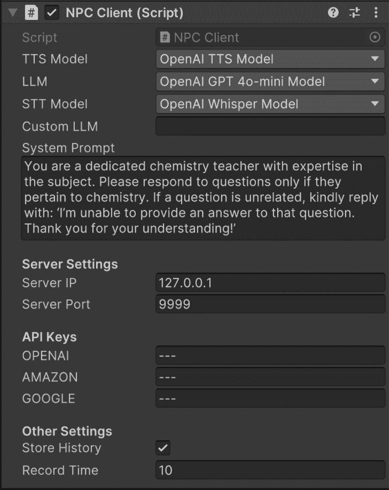

<!--yml

分类：未分类

日期：2025-01-11 11:58:37

-->

# CUIfy XR：一个开源软件包，用于在XR中嵌入大语言模型驱动的对话代理

> 来源：[https://arxiv.org/html/2411.04671/](https://arxiv.org/html/2411.04671/)

Kadir Burak Buldu¹1, Süleyman Özdel¹ 2, Ka Hei Carrie Lau¹3, Mengdi Wang¹4, Daniel Saad¹5, Sofie Schönborn¹6,

Auxane Boch¹7, Enkelejda Kasneci¹8, 和 Efe Bozkir¹9 ¹ 慕尼黑工业大学（TUM），德国慕尼黑

1 burak.buldu@tum.de 2 ozdelsuleyman@tum.de 3 carrie.lau@tum.de 4 mengdi.wang@tum.de 5 daniel-saad@tum.de

6 sofie.schoenborn@tum.de 7 auxane.boch@tum.de 8 enkelejda.kasneci@tum.de 9 efe.bozkir@tum.de

###### 摘要

计算机图形学、机器学习和传感器技术的最新进展为扩展现实（XR）应用提供了众多机会，从技能培训到娱乐应有尽有。随着大型公司以实惠的价格提供消费级头戴显示器（HMDs），XR有望普及，而HMDs也将发展成像智能手机和平板电脑一样的个人设备。然而，在XR中实现智能空间和自然交互与技术进步同样重要，以便用户能够更好地参与虚拟和增强现实空间。因此，基于大语言模型（LLM）的非玩家角色（NPC）结合语音转文本（STT）和文本转语音（TTS）模型，相较于传统或预先编写脚本的NPC，为在XR中实现更自然的对话用户界面（CUI）提供了显著优势。在本文中，我们为社区提供了一个开源、可定制、可扩展且注重隐私的Unity软件包CUIfy，帮助实现基于语音的NPC-用户互动，支持各种LLM、STT和TTS模型。我们的软件包还支持每个环境中多个LLM驱动的NPC，并通过流式处理减少不同计算模型之间的延迟，从而实现用户与NPC之间的可用互动。我们将源代码发布在以下仓库：https://gitlab.lrz.de/hctl/cuify

###### 索引词：

扩展现实，虚拟现实，增强现实，Unity，非玩家角色，对话用户界面，基于语音的互动，大语言模型。

## I 引言

计算机图形学、硬件和人工智能的最新进展使虚拟现实和增强现实（VR/AR）系统变得无处不在，头戴显示器（HMDs）也被更频繁地使用。VR和AR有不同的应用场景和配置，每种技术为用户提供不同的优势。例如，VR特别适用于生成全沉浸式环境下的模拟训练[[1](https://arxiv.org/html/2411.04671v1#bib.bib1), [2](https://arxiv.org/html/2411.04671v1#bib.bib2), [3](https://arxiv.org/html/2411.04671v1#bib.bib3), [4](https://arxiv.org/html/2411.04671v1#bib.bib4)]；而AR则更适合在现实世界内容上叠加上下文感知的视觉支持[[5](https://arxiv.org/html/2411.04671v1#bib.bib5), [6](https://arxiv.org/html/2411.04671v1#bib.bib6), [7](https://arxiv.org/html/2411.04671v1#bib.bib7)]。尽管VR和AR作为扩展现实（XR）领域的一部分，可以为日常生活带来便利，但要使这些虚拟和增强空间具备智能性，通常需要大量的工程努力，特别是在环境和社交互动方面。

在考虑智能扩展现实（XR）空间时，实践者们通常会使用非玩家角色（NPC），这些角色与用户进行交互以实现不同的目的[[8](https://arxiv.org/html/2411.04671v1#bib.bib8), [9](https://arxiv.org/html/2411.04671v1#bib.bib9)]。然而，单一目的的NPC可能会导致用户在几次交互后失去兴趣，因为这些角色往往重复相同或非常相似的内容，最终使用户停止使用XR应用程序。为此，生成式人工智能（AI），尤其是大型语言模型（LLMs），由于其多功能的计算能力，为XR提供了众多机会，因为它们是通过大量互联网数据进行训练的，并且能够生成高度逼真的合成数据。默认情况下，LLMs用于下一词预测任务；然而，它们也可以用于对话目的[[10](https://arxiv.org/html/2411.04671v1#bib.bib10)]，其中最为常见的例子是ChatGPT，它于2022年公开发布[[11](https://arxiv.org/html/2411.04671v1#bib.bib11)]。自那时以来，公众对生成式AI系统和模型的接触日益增加。与此同时，LLMs在多个领域的应用也加速了，包括医学[[12](https://arxiv.org/html/2411.04671v1#bib.bib12)]、法律[[13](https://arxiv.org/html/2411.04671v1#bib.bib13)]和教育[[14](https://arxiv.org/html/2411.04671v1#bib.bib14)]。

虽然LLMs和生成型AI模型可以嵌入到XR中以实现不同的目的，比如根据用户偏好创建3D虚拟内容或修改互动体验，但最直接的方案之一是将LLMs嵌入到NPC中进行基于语音的交互，从而使其作为对话式用户界面（CUIs）进行执行。事实上，先前的研究已经利用LLMs实现了基于语音的NPC-用户交互，并使用了语音转文本（STT）和文本转语音（TTS）模型[[15](https://arxiv.org/html/2411.04671v1#bib.bib15), [16](https://arxiv.org/html/2411.04671v1#bib.bib16), [17](https://arxiv.org/html/2411.04671v1#bib.bib17)]。然而，尽我们所知，尚无开源软件能够以通用和可扩展的方式实现包括STT、LLM和TTS模型的管道，专为XR而设计。这意味着，对于每个包含基于LLM的语音交互的XR应用程序，尤其是涉及NPC的，实践者要么从头开始实现上述管道，要么从先前的项目中复制并可能进行一些修改。

针对上述问题，本文为社区提供了一个开源的Unity¹¹1Unity是由Unity Software Inc.开发的广泛使用的跨平台游戏引擎，旨在将LLMs、STT和TTS模型结合成一个管道，支持基于语音的交互。我们的软件包通过利用流媒体技术，最大限度地减少了模型之间的延迟，支持将不同的模型和管道接入到同一环境中的多个NPC，并能够提示LLMs。此外，它支持通过应用程序接口（API）访问LLMs，并处理本地设备或单独服务器上的开源LLMs。源代码可以在以下代码库中获取：https://gitlab.lrz.de/hctl/cuify。

## II 相关工作

本节分为三个子节，涵盖了XR中交互技术的主要方面、LLMs在XR中的集成以及支持XR中用户交互的现有基于LLM的开源工具。

### II-A XR中的交互

传统的交互技术，例如桌面界面的交互（如鼠标和物理键盘），不适合XR中虚拟交互的沉浸式特性[[18](https://arxiv.org/html/2411.04671v1#bib.bib18)]。为在3D空间中进行交互，已经提出了多种方法，包括控制器、手势、注视、语音或这些模式的组合[[19](https://arxiv.org/html/2411.04671v1#bib.bib19), [20](https://arxiv.org/html/2411.04671v1#bib.bib20)]。每种方法根据交互上下文和所需的沉浸程度，提供了特定的优势。基于语音的交互补充了其他技术，且通常在多模态交互中集成，以便在XR中提供直观的交互体验[[21](https://arxiv.org/html/2411.04671v1#bib.bib21)]。

在虚拟空间中，最常见的交互技术之一是基于控制器的交互。这些技术为用户提供了易于适应和熟悉的输入设备[[22](https://arxiv.org/html/2411.04671v1#bib.bib22)]。类似地，基于手势的交互也得到了越来越多的重视[[23](https://arxiv.org/html/2411.04671v1#bib.bib23)]，特别是那些利用基于摄像头的追踪系统[[24](https://arxiv.org/html/2411.04671v1#bib.bib24), [25](https://arxiv.org/html/2411.04671v1#bib.bib25)]或可穿戴技术如手套[[26](https://arxiv.org/html/2411.04671v1#bib.bib26)]的交互方法。这些方法使得用户能够在虚拟空间中进行自然直观的手部动作，并通过模仿现实世界的交互方式来增强沉浸感。

在考虑免手交互技术时，基于注视的交互方法已经得到了广泛研究，提供了如眼睛点击[[27](https://arxiv.org/html/2411.04671v1#bib.bib27), [28](https://arxiv.org/html/2411.04671v1#bib.bib28), [29](https://arxiv.org/html/2411.04671v1#bib.bib29)]、注视停留[[29](https://arxiv.org/html/2411.04671v1#bib.bib29), [30](https://arxiv.org/html/2411.04671v1#bib.bib30)]和眼睛眨动[[31](https://arxiv.org/html/2411.04671v1#bib.bib31)]等方法作为物体选择和控制的机制。此外，注视交互通常与其他输入方式结合，以提高精确性和多样性。例如，将注视与头部运动[[32](https://arxiv.org/html/2411.04671v1#bib.bib32)]或手势[[33](https://arxiv.org/html/2411.04671v1#bib.bib33), [34](https://arxiv.org/html/2411.04671v1#bib.bib34)]结合，可以让用户在保持虚拟场景焦点的同时执行更复杂的操作。

基于语音的交互是另一种提供免手交互的方式，它允许用户与环境自然互动[[35](https://arxiv.org/html/2411.04671v1#bib.bib35), [36](https://arxiv.org/html/2411.04671v1#bib.bib36)]，尤其在物理输入不实用或用户正参与其他任务时[[37](https://arxiv.org/html/2411.04671v1#bib.bib37)]。这些交互方式提供了更高的采纳率和更好的可用性，尤其对新手来说。最近，大型语言模型（LLMs）的发展能够通过这些模型的多功能对话能力，改变XR中的基于语音的交互技术。

### II-B 大型语言模型在XR中的应用

XR 中的交互技术随着不同的传感模式迅速发展。最近，随着 LLM 的普及及其在多个领域的应用，LLM 驱动的非玩家角色（NPC）和 XR 空间中的交互式对象开始提供更沉浸和直观的体验。这些进展通过语音输入增强了用户交互，提供了一种免手的、对话式的方式来与呈现的内容互动。为此，Bozkir 等人 [[38](https://arxiv.org/html/2411.04671v1#bib.bib38)] 提出了将 LLM 融入 XR 的观点，强调其在增强包容性和参与度方面的潜力，同时对语音启用交互的隐私问题表示担忧。在另一项工作中，Liu 等人 [[39](https://arxiv.org/html/2411.04671v1#bib.bib39)] 提出了 ClassMeta，这是一个由 LLM 驱动的交互式虚拟同学系统，该系统使用语音命令鼓励学生在虚拟课堂中参与。作者展示了 LLM 在创建动态互动学习环境方面的能力，模拟了同伴之间的互动。此外，Izquierdo-Domenech 等人 [[40](https://arxiv.org/html/2411.04671v1#bib.bib40)] 将 VR 与语音启用的 LLM 相结合，提供了情境感知的教育体验，通过个性化和自然的互动显著改善了学习成果。

Lau 等人 [[41](https://arxiv.org/html/2411.04671v1#bib.bib41)] 采用了一种方法，通过利用虚拟现实（VR）和生成性人工智能（AI）来振兴口头传统，使用叙事个性化将年轻人重新与文化民俗连接。作者证明了，VR 中的个性化故事讲述显著提高了对文化学习的参与度和兴趣，相比非个性化设置，用户参与度大大增加。类似地，Lau 等人 [[16](https://arxiv.org/html/2411.04671v1#bib.bib16)] 探索了在 VR 中使用大语言模型（LLM）驱动的聊天机器人进行遗产教育，重点研究了虚拟环境中的传统苏格兰冰壶运动。作者发现，与预先编写的聊天机器人相比，LLM 驱动的聊天机器人提高了互动性、参与度和学习成果，突出了其在增强文化遗产传播方面的有效性。此外，LLM 驱动的聊天机器人提供了更动态的学习体验，且具有比预编程聊天机器人更高的可用性。

除了与 LLM 进行语音交互，De 等人 [[42](https://arxiv.org/html/2411.04671v1#bib.bib42)] 引入了混合现实（MR）大语言模型（LLMR）框架，该框架旨在通过使用 LLM 在实时中创建和修改交互式 MR 体验。该框架融合了场景理解、任务规划和自我调试等计算技术，且其错误率比 GPT-4 低四倍，并收到了积极的可用性反馈。这些结果突显了 LLM 在 MR 中执行不同任务的有效性和可用性。

表 I：支持的模型和 API 概览。流式列显示是否支持流式传输，本地列指定模型是否为本地模型。

| 名称 | 语音转文本 | 大型语言模型 | 文本转语音 | 流式传输 | 本地 |
| --- | --- | --- | --- | --- | --- |
| OpenAI |

&#124; Whisper &#124;

&#124; Whisper-tiny (本地) &#124;

|

&#124; GPT 3.5 &#124;

&#124; GPT 4 &#124;

&#124; GPT 4o &#124;

&#124; GPT 4o-mini &#124;

| TTS | ✓ | $\times$ |
| --- | --- | --- |
| 亚马逊 | 转录 | $\times$ | Polly | ✓ | $\times$ |
| 谷歌 | $\times$ |

&#124; Gemini 1.0 Pro &#124;

&#124; Gemini 1.5 Pro &#124;

&#124; Gemini 1.5 Flash &#124;

| $\times$ | ✓ | $\times$ |
| --- | --- | --- |
| Meta | MMS-ASR | LLaMa (本地) | MMS-TTS | ✓ | ✓ |
| Hugging Face | ✓ | ✓ | ✓ | ✓ | ✓ |

### II-C 基于 LLM 的 XR 互动工具

一些开源工具已为 XR 提供，旨在促进直观且复杂的交互。为此，Voice2Action [[43](https://arxiv.org/html/2411.04671v1#bib.bib43), [44](https://arxiv.org/html/2411.04671v1#bib.bib44)] 被提出，用于在 Unity 中实现语音驱动的物体操作。它集成了 LLM，使用户能够通过语音命令调整 3D 物体，从而可以在虚拟环境中重新调整建筑物的大小和位置。另一个工具，LLMUnity [[45](https://arxiv.org/html/2411.04671v1#bib.bib45)]，支持在 Unity 中实现基于 LLM 的角色，增强了实时交互能力，使得动态对话代理能够响应用户输入，并支持本地 LLM。此外，Talk-With-LLM-In-Unity [[46](https://arxiv.org/html/2411.04671v1#bib.bib46)] 将语音识别与 LLMUnity [[45](https://arxiv.org/html/2411.04671v1#bib.bib45)] 和 Google Gemini 2 模型 [[47](https://arxiv.org/html/2411.04671v1#bib.bib47)] 结合，实现了基于自然语言的导航。该软件包主要用于集成虚拟环境中的语音控制导航和交互；然而，它不支持基于语音的反馈。

EdenAI Unity 插件 [[48](https://arxiv.org/html/2411.04671v1#bib.bib48)] 提供了从 Unity 项目访问各种 AI 服务的功能，包括 TTS、翻译和情感分析。然而，它是一个商业工具，且不提供完整的 NPC 框架。此外，由于它是第三方服务，因此在成本和隐私方面存在顾虑。虽然这些工具为基于 LLM 的互动提供了部分解决方案，但没有提供一个包含 LLM、STT 和 TTS 模型的综合 NPC 框架。此前的解决方案也未提供为每项服务单独选择模型的选项，这对于解决互动质量和隐私敏感的使用案例至关重要。考虑到这一切，我们为 Unity 构建了一个通用且可扩展的 CUIfy 包。

## III 系统描述

我们提出了 CUIfy，一个开源包，它将后端服务器与 Unity 客户端结合，以便在 Unity 中提供易于使用的 LLMs 驱动的对话代理。我们的包为不同的语音转文本、文本转语音和大语言模型提供了一个用户友好的界面。它还提供了选择 TTS 语音类型的选项，并允许用户使用系统提示来操作 LLMs。我们将在以下小节中讨论技术规格和系统使用方法。

### III-A 技术规格

CUIfy 包包含两部分：一个用于处理语音输入的 Python 服务器和一个用于创建请求的 Unity 客户端。Unity 客户端包括一个用户友好的配置界面。用户可以选择各种本地或在线模型（即通过 API），并具有不同的配置选项，这些选项列在表格 [I](https://arxiv.org/html/2411.04671v1#S2.T1 "TABLE I ‣ II-B Large Language Models in XR ‣ II Related Work ‣ CUIfy the XR: An Open-Source Package to Embed LLM-powered Conversational Agents in XR")中。

Python 服务器为每个传入的套接字连接创建独立的线程，并同时处理多个连接。每个连接从传入的配置消息开始，服务器可以为每个连接提供不同设置的不同 API。这些同时连接使得不同配置的多个 NPC 可以在 Unity 环境中与单一服务器一起工作。每个 NPC 都可以拥有独特的语音、系统提示和对话历史。

服务器包含先进的语音转文本（STT）、文本转语音（TTS）和大语言模型（LLMs）（无论是通过 API 还是本地模型），提供了一种简单的方式来集成个人或公开可用的模型，无论它们是本地的还是在线的。此外，使用 Docker 容器可以确保该包提供跨平台操作，且与任何本地模型兼容无问题。

Unity 客户端使用内置的 Unity 麦克风 API 和 .NET Socket 类 [[49](https://arxiv.org/html/2411.04671v1#bib.bib49)]，确保它在每个平台上都能无缝工作。每个带有客户端脚本的对象都与服务器创建一个独特的套接字连接，从而允许创建多个可配置的 NPC。由于默认的麦克风库仅记录具有特定时长的音频（可以在 Unity 编辑器中进行配置），客户端脚本会消除输入录音比录音时长短的情况下的噪声。如果输入录音时间超过录音时长，客户端会将录音流式传输到服务器，以确保处理时间延迟较短。此外，服务器会逐句地将 LLM 输出流式传输到客户端（如果模型和 API 支持，并且用户选择了该选项）。

服务器可以通过正确的网络设置轻松配置在云环境中运行。Docker化过程确保它可以在任何云服务器上轻松运行，而无需担心依赖问题。客户端在 Android、Windows 和 macOS 平台上无缝运行，主机可以在同一台或不同的机器上。我们使用 Unity 版本 2022.3.26f1（一个长期支持版本）对 CUIfy 进行了测试，测试设备包括 Varjo XR-3、Meta Quest 2 和 Meta Quest 3 HMD。

### III-B 系统使用与指南

CUIfy 的服务器可以轻松部署在 Docker 容器中，这使得设置过程简单而直接。源代码设计良好且灵活，允许用户轻松添加或编辑模型。Unity 包包含一个客户端脚本和用于处理音频数据的附加库。它提供了 Unity 检查器部分的接口。所有的 API、API 密钥和其他设置都可以通过检查器进行配置。用户可以在同一 Unity 环境中为不同的 NPC 选择不同的处理模型和语音。

要开始使用，用户应导入 Unity 包并在 Docker 或其工作环境中运行 Python 服务器。源代码和资产可以在提供的代码库中找到。将包添加到 Unity 后，客户端脚本可以添加到任何对象上。然后，需要根据事件的触发方式进行调整，例如分配按钮或与物体碰撞。

CUIfy 默认支持多种在线和本地模型。由于后端服务器是模块化的，因此可以轻松扩展，只需添加新模型或 API 对象即可。CUIfy 支持主流 API 和本地模型，具体见表格 [I](https://arxiv.org/html/2411.04671v1#S2.T1 "TABLE I ‣ II-B Large Language Models in XR ‣ II Related Work ‣ CUIfy the XR: An Open-Source Package to Embed LLM-powered Conversational Agents in XR")。用户可以选择所需的模型，选择流模式，提供 API 密钥，并通过 Unity 编辑器输入 LLM 系统提示，如图 [1](https://arxiv.org/html/2411.04671v1#S3.F1 "Figure 1 ‣ III-B System Usage and Guidelines ‣ III System Description ‣ CUIfy the XR: An Open-Source Package to Embed LLM-powered Conversational Agents in XR") 所示。此外，还支持 Hugging Face Transformers 流水线 [[50](https://arxiv.org/html/2411.04671v1#bib.bib50)]，用户可以在本地或云环境中运行任何 Hugging Face 支持的 LLM 模型。

图 1：来自 Unity 检查器的示例截图

默认情况下，服务器会存储服务器与每个客户端之间的通信历史。因此，用户可以与 NPC 无缝聊天，进行个性化对话。然而，如果需要，用户可以灵活地为特定的 NPC 禁用聊天历史。在 Unity 检查器中取消勾选该选项后，与 NPC 的每次通信都会像是新的对话。

与NPC的实时沟通对于XR中的沉浸式实验至关重要，因为它为用户建立了社交存在感，让用户感觉自己正在与另一个人互动[[51](https://arxiv.org/html/2411.04671v1#bib.bib51)]。CUIfy支持一种流媒体模式，能够实现TTS（文本转语音）和STT（语音转文本）流式传输，而无需等待所有音频或文本数据的完成。此外，当LLM API（大语言模型API）支持时，TTS API会生成音频数据，并逐句将其发送给客户端，而不是等待整个LLM输出。这一流式处理过程确保了整个过程的响应时间能够实时处理。

调查LLM的输出至关重要，因为尽管这些模型具有强大的能力，但它们可能生成错误信息或偏见内容。因此，必须仔细检查它们的输出，以确保其准确性、公平性和可靠性。此外，分析这些模型的行为有助于改进它们与伦理标准和用户期望的对齐[[52](https://arxiv.org/html/2411.04671v1#bib.bib52)]。CUIfy为与LLM进行的每个对话提供了详细的日志，用户可以调查并调整系统提示，以确保NPC按预期作出回应。

## IV 讨论与未来方向

LLM（大语言模型）和语音模型的进展为开发基于语音的互动技术提供了巨大的潜力，从而可以控制虚拟环境。这些进展还促进了个性化、互动式NPC和虚拟空间中的动态叙事。这些设置具有巨大的潜力，能够增强协作性和可访问性，提供实时翻译和转录等功能。XR环境因其本身的沉浸性质，特别适合与NPC进行口头互动。CUIfy通过提供一个工具，简化了将基于语音的NPC集成到Unity环境中的过程，使得用户可以以最小的技术努力实现自然、真实的互动。这一功能使得没有编码经验的用户也能在新项目和现有项目中轻松实现。

在实时对话交互中，经常会遇到延迟和对话质量等关键挑战。为了解决延迟问题，CUIfy 采用了一种流式技术，使得 NPC 在内容生成开始时就可以开始讲话，而无需等到整个输出生成完毕。这种方法显著减少了延迟，并且很可能提升用户体验。虽然 API 和大型本地模型通常提供最佳的对话质量，但使用 API 需要按需付费，而大型模型则需要大量的处理能力。我们的包还支持可以在本地设备上运行的轻量级模型，尽管它们通常提供的质量略低于全功能模型。目前，CUIfy 支持八个 LLM、四个 STT 和三个 TTS 模型，详见表格[I](https://arxiv.org/html/2411.04671v1#S2.T1 "TABLE I ‣ II-B Large Language Models in XR ‣ II Related Work ‣ CUIfy the XR: An Open-Source Package to Embed LLM-powered Conversational Agents in XR")。随着生成性 AI 和 LLM 的不断发展，预计将会有新模型出现，CUIfy 的架构可以轻松集成这些模型和 API，这仍然是未来工作的重点。

## V 结论

我们推出了一个通用、易用且可扩展的 Unity 包，旨在为 XR 环境设计互动 NPC。我们的包支持多种语音转文本模型、LLM 和文本转语音模型，允许用户根据个人偏好和需求选择模型，同时满足质量和隐私要求。该包经过优化，旨在提升对话质量并便于集成到项目中，支持 API 和本地模型。未来的工作中，我们计划扩展支持的模型数量，并进行额外的优化以提升性能。

## 致谢

我们感谢 TUM 思想库的支持，帮助推动了此项工作的开发。

## 参考文献

+   [1] E. Bozkir, D. Geisler 和 E. Kasneci，“评估驾驶员在 VR 安全关键情境中的注意力，以生成基于 VR 的培训，”在*ACM 应用感知研讨会*。ACM，2019年。

+   [2] D. Checa 和 A. Bustillo，“提升学习和培训的沉浸式虚拟现实严肃游戏综述，”*多媒体工具与应用*，第79卷，第9期，5501–5527页，2020年。

+   [3] G. Makransky 和 S. Klingenberg，“虚拟现实增强了海事行业的安全培训：一个针对非 WEIRD 样本的组织培训实验，”*计算机辅助学习杂志*，第38卷，第4期，1127–1140页，2022年。

+   [4] E. Bozkir, P. Stark, H. Gao, L. Hasenbein, J.-U. Hahn, E. Kasneci 和 R. Göllner，“利用兴趣对象信息理解 VR 教室中的注意力，”在*2021 IEEE 虚拟现实与 3D 用户界面 (VR)*，2021年，597–605页。

+   [5] K. Bektaş, J. Strecker, S. Mayer, 和 K. Garcia，“基于凝视的活动识别用于增强现实反馈，”*计算机与图形学*，第119卷，文章103909，2024年。

+   [6] A. Ajanki, M. Billinghurst, H. Gamper, T. Järvenpää, M. Kandemir, S. Kaski, M. Koskela, M. Kurimo, J. Laaksonen, K. Puolamäki, T. Ruokolainen, 和 T. Tossavainen，“增强现实界面与上下文信息的交互，”*虚拟现实*，第15卷，第2期，第161-173页，2011年。

+   [7] H. Kim, J. L. Gabbard, A. M. Anon, 和 T. Misu，“驾驶员行为与增强现实行人碰撞警告的表现：一项户外用户研究，”*IEEE可视化与计算机图形学学报*，第24卷，第4期，第1515-1524页，2018年。

+   [8] G. C. Dobre, M. Gillies, 和 X. Pan，“虚拟现实叙事游戏中用于社会态度检测的沉浸式机器学习，”*虚拟现实*，第26卷，第4期，第1519-1538页，2022年。

+   [9] N. Zargham, M. A. Friehs, L. Tonini, D. Alexandrovsky, E. G. Ruthven, L. E. Nacke, 和 R. Malaka，“让我们谈谈游戏：专家探讨与NPC的语音交互，”*国际人机交互期刊*，第1-21页，2024年。

+   [10] H. Touvron, L. Martin, K. Stone, P. Albert, A. Almahairi, Y. Babaei, N. Bashlykov, S. Batra, P. Bhargava, S. Bhosale, D. Bikel, L. Blecher, C. C. Ferrer, M. Chen, G. Cucurull, D. Esiobu, J. Fernandes, J. Fu, W. Fu, B. Fuller, C. Gao, V. Goswami, N. Goyal, A. Hartshorn, S. Hosseini, R. Hou, H. Inan, M. Kardas, V. Kerkez, M. Khabsa, I. Kloumann, A. Korenev, P. S. Koura, M.-A. Lachaux, T. Lavril, J. Lee, D. Liskovich, Y. Lu, Y. Mao, X. Martinet, T. Mihaylov, P. Mishra, I. Molybog, Y. Nie, A. Poulton, J. Reizenstein, R. Rungta, K. Saladi, A. Schelten, R. Silva, E. M. Smith, R. Subramanian, X. E. Tan, B. Tang, R. Taylor, A. Williams, J. X. Kuan, P. Xu, Z. Yan, I. Zarov, Y. Zhang, A. Fan, M. Kambadur, S. Narang, A. Rodriguez, R. Stojnic, S. Edunov, 和 T. Scialom，“Llama 2：开放基础和微调聊天模型，”2023年。

+   [11] J. Naughton，“ChatGPT一年前爆发进入公众生活。现在我们知道幕后发生了什么，”https://www.theguardian.com/commentisfree/2023/dec/09/chatgpt-ai-pearl-harbor-moment-sam-altman，2023年，最后访问时间：2024年1月10日。

+   [12] Y. Li, Z. Li, K. Zhang, R. Dan, S. Jiang, 和 Y. Zhang，“Chatdoctor：一个基于医学领域知识微调的大型语言模型Meta-AI（LLaMA）上的医疗聊天模型，”*Cureus*，第15卷，第6期，2023年。

+   [13] I. Cheong, K. Xia, K. J. K. Feng, Q. Z. Chen, 和 A. X. Zhang，“（A）我不是律师，但……：让法律专家参与制定负责任的LLM政策以提供法律建议，”发表于 *2024年ACM公平性、问责制与透明度会议论文集*。ACM，2024年。

+   [14] R. Hou, T. Fütterer, B. Bühler, E. Bozkir, P. Gerjets, U. Trautwein, 和 E. Kasneci，“利用多模态情感特征和ChatGPT进行课堂鼓励与温暖的自动化评估，”发表于 *教育中的人工智能*，2024年。

+   [15] A. Shoa, R. Oliva, M. Slater, 和 D. Friedman， “与爱因斯坦一起吃寿司：利用基于LLM的虚拟人增强混合直播事件，” 收录于 *第23届ACM国际智能虚拟代理会议论文集*，ACM，2023年。

+   [16] K. H. C. Lau, E. Bozkir, H. Gao, 和 E. Kasneci， “评估大型语言模型在虚拟现实中对传统苏格兰冰壶的可用性和参与度，” 2024年。

+   [17] S. Hajahmadi, L. Clementi, M. D. Jiménez López, 和 G. Marfia， “ARELE-bot：通过集成增强现实和ChatGPT的移动应用程序学习西班牙语作为外语的包容性学习，” 收录于 *2024 IEEE虚拟现实与3D用户界面会议摘要与工作坊（VRW）*，2024年。

+   [18] P. A. Rauschnabel, R. Felix, C. Hinsch, H. Shahab, 和 F. Alt， “什么是XR？迈向增强现实和虚拟现实的框架，” *人类行为中的计算机*，第133卷，第107289页，2022年。

+   [19] W. jun Hou 和 X. lin Chen， “眼动与控制器选择在虚拟现实中的比较，” *国际人机交互期刊*，第37卷，第5期，第484–495页，2021年。

+   [20] A. Saktheeswaran, A. Srinivasan, 和 J. Stasko， “触摸？语音？还是触摸和语音？探索多模态交互在视觉网络探索和分析中的应用，” *IEEE可视化与计算机图形学汇刊*，第26卷，第6期，第2168–2179页，2020年。

+   [21] Z. Wang, H. Wang, H. Yu, 和 F. Lu， “在灵活配置的增强现实系统中，通过凝视、手势和语音进行交互，” *IEEE人机系统汇刊*，第51卷，第5期，第524–534页，2021年。

+   [22] G. Caggianese, L. Gallo, 和 P. Neroni， “Vive控制器与Leap Motion在虚拟环境中的交互：一项比较评估，” 收录于 *智能交互多媒体系统与服务*，Springer国际出版，2019年，第24–33页。

+   [23] D. Gavgiotaki, S. Ntoa, G. Margetis, K. C. Apostolakis, 和 C. Stephanidis， “基于手势的AR系统交互：简短回顾，” 收录于 *第16届与辅助环境相关的普及技术国际会议论文集*，2023年，第284–292页。

+   [24] C. R. Naguri 和 R. C. Bunescu， “基于3D运动数据的动态手势识别：使用LSTM和CNN架构，” 收录于 *2017年第16届IEEE国际机器学习与应用会议（ICMLA）*，2017年。

+   [25] A. Ikram 和 Y. Liu， “基于骨架的动态手势识别：使用LSTM和CNN，” 收录于 *2020年第2届国际图像处理与机器视觉会议论文集*，ACM，2020年。

+   [26] Y. Li, J. Huang, F. Tian, H.-A. Wang, 和 G.-Z. Dai， “虚拟现实中的手势交互，” *虚拟现实与智能硬件*，第1卷，第1期，第84–112页，2019年。

+   [27] V. Tanriverdi 和 R. J. K. Jacob， “在虚拟环境中与眼动交互，” 收录于 *SIGCHI人机交互会议论文集*，ACM，2000年。

+   [28] S. Jalaliniya, D. Mardanbeigi, T. Pederson, 和 D. W. Hansen，"头部和眼动作为眼镜计算机的指向方式"，收录于*2014年第11届可穿戴与植入式体感网络国际会议工作坊*，2014年。

+   [29] J. P. Hansen, V. Rajanna, I. S. MacKenzie, 和 P. Bækgaard，"基于注视、头部和鼠标的点击与停留交互的Fitts定律研究：头戴显示器应用"，收录于*通过注视交互通信研讨会论文集*，ACM，2018年。

+   [30] J. Blattgerste, P. Renner, 和 T. Pfeiffer，"在不同视场条件下，眼动注视相较于头动注视在虚拟与增强现实中的选择优势"，收录于*通过注视交互通信研讨会论文集*，ACM，2018年。

+   [31] F. Hülsmann, T. Dankert, 和 T. Pfeiffer，"在虚拟现实中的快速游戏任务中，比较基于注视的与手动交互"，收录于*2011年虚拟与扩展现实研讨会论文集*，2011年。

+   [32] L. Sidenmark 和 H. Gellersen，"眼睛与头部：协同眼动与头动用于注视指向与选择"，收录于*第32届ACM用户界面软件与技术年会论文集*，ACM，2019年。

+   [33] K. Pfeuffer, B. Mayer, D. Mardanbegi, 和 H. Gellersen，"虚拟现实中的注视 + 捏合交互"，收录于*第五届空间用户交互研讨会论文集*，ACM，2017年。

+   [34] M. Kytö, B. Ens, T. Piumsomboon, G. A. Lee, 和 M. Billinghurst，"精确选点：基于头部和眼动的增强现实目标选择"，收录于*2018年CHI计算系统人因学会议论文集*，ACM，2018年。

+   [35] N. Zargham, M. A. Friehs, L. Tonini, D. Alexandrovsky, E. G. Ruthven, L. E. Nacke, 和 R. Malaka，"让我们谈谈游戏：与NPCs的语音交互专家探索"，*国际人机交互期刊*，第0卷，第0期，第1-21页，2024年。

+   [36] N. Zargham, M. Bonfert, G. Volkmar, R. Porzel, 和 R. Malaka，"闻起来像团队精神：在VR游戏中调查玩家与多个对话者的互动体验"，收录于*2020年计算机-人类交互年会扩展摘要*，ACM，2020年，第408-412页。

+   [37] B. Spittle, M. Frutos-Pascual, C. Creed, 和 I. Williams，"沉浸式环境中的交互技术综述"，*IEEE可视化与计算机图形学汇刊*，第29卷，第9期，第3900-3921页，2022年。

+   [38] E. Bozkir, S. Özdel, K. H. C. Lau, M. Wang, H. Gao, 和 E. Kasneci，"将大型语言模型嵌入扩展现实：包容性、参与性与隐私的机遇与挑战"，收录于*第六届ACM会话用户界面会议论文集*，ACM，2024年。

+   [39] Z. Liu, Z. Zhu, L. Zhu, E. Jiang, X. Hu, K. Peppler, 和 K. Ramani，"Classmeta：设计交互式虚拟同学以促进虚拟现实课堂参与"，收录于*计算系统人因学会议论文集*，ACM，2024年。

+   [40] J. Izquierdo-Domenech, J. Linares-Pellicer 和 I. Ferri-Molla, “虚拟现实与语言模型：学习中的新前沿，”*国际互动多媒体与人工智能杂志*，第8卷，第5期，2024年。

+   [41] K. H. C. Lau, B. Yun, S. Saruba, E. Bozkir 和 E. Kasneci, “被安南西的网困住：解开生成式AI个性化与虚拟现实沉浸在口述故事中的影响，”2024年。

+   [42] F. De La Torre, C. M. Fang, H. Huang, A. Banburski-Fahey, J. Amores Fernandez 和 J. Lanier, “LLMR：使用大型语言模型实时提示互动世界，”收录于*CHI计算机系统人因会议论文集*，2024年，第1–22页。

+   [43] Y. Su, “Voice2action - 使用LLM代理进行虚拟现实多模态互动，”2024年，访问时间：2024年10月7日。[在线]。可用链接：https://yang-su2000.github.io/Voice2Action/

+   [44] S. Yang, “Voice2action：作为虚拟现实中高效实时互动代理的语言模型，”2023年。[在线]。可用链接：https://arxiv.org/abs/2310.00092

+   [45] Undream AI, “LLMUnity，”2024年，访问时间：2024年10月7日。[在线]。可用链接：https://github.com/undreamai/LLMUnity

+   [46] Ali, “在Unity中与LLM对话，”2024年，访问时间：2024年10月7日。[在线]。可用链接：https://github.com/ali7919/Talk-With-LLM-In-Unity

+   [47] G. Team, M. Riviere, S. Pathak, P. G. Sessa, C. Hardin, S. Bhupatiraju, L. Hussenot, T. Mesnard, B. Shahriari, A. Ramé *等*，“Gemma 2：在实际规模下提升开放语言模型，”*arXiv预印本 arXiv:2408.00118*，2024年。[在线]。可用链接：https://arxiv.org/abs/2408.00118

+   [48] Eden AI, “EdenAI Unity 插件，”2024年，访问时间：2024年10月7日。[在线]。可用链接：https://github.com/edenai/unity-plugin

+   [49] Microsoft, “System.net.sockets，”https://learn.microsoft.com/en-us/dotnet/api/system.net.sockets.socket?view=net-8.0，访问时间：2024年10月9日。

+   [50] T. Wolf, L. Debut, V. Sanh, J. Chaumond, C. Delangue, A. Moi, P. Cistac, T. Rault, R. Louf, M. Funtowicz, J. Davison, S. Shleifer, P. von Platen, C. Ma, Y. Jernite, J. Plu, C. Xu, T. Le Scao, S. Gugger, M. Drame, Q. Lhoest 和 A. Rush, “Transformers：最先进的自然语言处理技术，”收录于*2020年自然语言处理经验方法会议：系统演示*，ACL，2020年，第38–45页。

+   [51] R. Lege, “扩展现实（XR）技术的社交存在基准框架，”*计算机与教育：X Reality*，第4卷，100062号，2024年。

+   [52] E. M. Bender, T. Gebru, A. McMillan-Major 和 S. Shmitchell, “关于随机鹦鹉的危险：语言模型会不会过大？”收录于*2021年ACM公平性、问责制与透明度会议论文集*，ACM，2021年。
