<!--yml

类别: 未分类

日期: 2025-01-11 12:35:52

-->

# 图学习能否提高基于LLM的代理人规划能力？

> 来源：[https://arxiv.org/html/2405.19119/](https://arxiv.org/html/2405.19119/)

吴溪溪^(1,3)     沈易非^(2∗)✉    单彩华²     宋凯涛²     王思维²     张博航⁴

冯佳瑞⁵    程辉³     陈伟²     熊云¹✉    李东生²

¹复旦大学    ²微软亚洲研究院   ³香港中文大学

⁴北京大学     ⁵华盛顿大学圣路易斯分校 表示平等贡献。工作是在吴溪溪（xxwu@se.cuhk.edu.hk）于微软亚洲研究院实习期间完成的。通讯作者（yifeishen@microsoft.com, yunx@fudan.edu.cn） 上海数据科学重点实验室，复旦大学计算机科学与技术系

###### 摘要

随着大规模语言模型（LLM）的发展，语言代理人的任务规划正成为一个重要的研究课题。其目的是将复杂的自然语言用户请求分解为可解决的子任务，从而实现原始请求。在这种背景下，子任务可以自然地被视为一个图，其中节点代表子任务，边表示它们之间的依赖关系。因此，任务规划是一个决策问题，涉及在相应图中选择一个连接路径或子图并调用它。在本文中，我们探索基于图学习的任务规划方法，这是与目前流行的提示设计研究方向正交的一个方向。我们对图学习的兴趣源于一个理论发现：注意力偏置和自回归损失阻碍了LLM有效地进行图上的决策导航，而图神经网络（GNN）巧妙地解决了这一问题。这个理论洞察促使我们将GNN与LLM结合，以提高整体性能。大量实验表明，基于GNN的方法即使在没有训练的情况下也优于现有的解决方案，而最小的训练也能进一步提升其性能。随着任务图大小的增加，性能提升更加显著。 ¹¹1 代码和数据集可以在[https://github.com/WxxShirley/GNN4TaskPlan](https://github.com/WxxShirley/GNN4TaskPlan)获取

## 1 引言

基于LLM的代理最近作为一个快速发展的研究领域崭露头角，被认为是迈向人工通用智能（AGI）的重要一步[[61](https://arxiv.org/html/2405.19119v3#bib.bib61), [7](https://arxiv.org/html/2405.19119v3#bib.bib7)]。这些代理在多个领域取得了显著成功，体现了它们在应对复杂AI挑战方面的能力（例如，HuggingGPT [[46](https://arxiv.org/html/2405.19119v3#bib.bib46)]），在游戏环境中表现出色（例如，Voyager [[58](https://arxiv.org/html/2405.19119v3#bib.bib58)]），并推动了化学研究的创新（例如，[[5](https://arxiv.org/html/2405.19119v3#bib.bib5)]）。在这一蓬勃发展的领域中，语言代理的任务规划成为了一个关键研究方向。它涉及LLM自主解释用户指令，将用户的自然语言指令分解为具体且可解决的子任务，然后通过执行每个子任务来完成用户的请求[[43](https://arxiv.org/html/2405.19119v3#bib.bib43), [46](https://arxiv.org/html/2405.19119v3#bib.bib46), [45](https://arxiv.org/html/2405.19119v3#bib.bib45)]。例如，在HuggingGPT的案例中[[46](https://arxiv.org/html/2405.19119v3#bib.bib46)]，任务规划涉及从HuggingFace网站调用专家AI模型，以解决超出单一GPT能力范围的复杂AI任务。

鉴于其实际意义，已经提出了众多算法，主要集中在提示设计上[[45](https://arxiv.org/html/2405.19119v3#bib.bib45), [46](https://arxiv.org/html/2405.19119v3#bib.bib46), [33](https://arxiv.org/html/2405.19119v3#bib.bib33), [30](https://arxiv.org/html/2405.19119v3#bib.bib30), [60](https://arxiv.org/html/2405.19119v3#bib.bib60), [49](https://arxiv.org/html/2405.19119v3#bib.bib49), [71](https://arxiv.org/html/2405.19119v3#bib.bib71), [4](https://arxiv.org/html/2405.19119v3#bib.bib4), [63](https://arxiv.org/html/2405.19119v3#bib.bib63)]。本文提议探索一个正交方向，即基于图学习的方法。在任务规划中，可解决的子任务可以自然地表示为一个*任务图*，其中每个节点对应一个独特的子任务，每条边则表示这些子任务之间的依赖关系。因此，任务规划的核心问题在于选择一条连通路径或子图以满足用户的请求，这实际上是一个图上的决策问题。在这一框架下，我们分析了大规模语言模型（LLMs）在任务规划中的能力，特别是在HuggingGPT的上下文中[[46](https://arxiv.org/html/2405.19119v3#bib.bib46)]。我们的实证研究发现，任务规划失败的相当一部分可以归因于LLMs在准确识别任务图结构方面的低效。这一发现从理论和实证角度提出了引人深思的问题。从理论上讲，它引发了关于LLMs在处理任务图时固有局限性的讨论。从实证角度来看，它凸显了迫切需要开发有效且高效的策略，以缓解这一缺陷并改善任务规划性能。

对于理论问题，我们首先研究了Transformer架构在处理具有顺序图输入（如边列表表示）的图任务时的表达能力，这也是任务规划中使用的图输入格式。我们最初的假设是，顺序图输入的格式可能与图结构固有的归纳偏差不匹配，从而降低表达能力。与这一假设相反，证明通过将边列表作为输入，常宽度的Transformer可以通过模拟动态规划算法在边列表上解决图决策问题。然而，我们发现LLM的解决方案在图同构下缺乏不变性，这是图决策问题中的一个重要特性。此外，如果注意力稀疏（这通常在LLM中观察到），表达能力会减弱 [[66](https://arxiv.org/html/2405.19119v3#bib.bib66)]。除了表达能力，我们还考察了自回归损失的影响，证明它会引入虚假的相关性，这对图决策任务可能有害。这些见解揭示了LLM在任务规划中的固有局限性，更广泛地说，也揭示了LLM在图相关问题中的局限性（例如，[[14](https://arxiv.org/html/2405.19119v3#bib.bib14), [59](https://arxiv.org/html/2405.19119v3#bib.bib59), [34](https://arxiv.org/html/2405.19119v3#bib.bib34)] 中的挑战）。

为了克服这些限制，我们使用了图神经网络（GNN），该网络已经被证明能够有效处理图决策问题，无论在理论上还是实践中 [[24](https://arxiv.org/html/2405.19119v3#bib.bib24), [68](https://arxiv.org/html/2405.19119v3#bib.bib68)]。最初，我们部署大语言模型（LLM）来解读模糊的用户请求，并将其分解为更详细的步骤。接下来，我们利用GNN根据这些详细步骤及相应的子任务描述来检索相关的子任务。值得注意的是，如果我们采用无需训练的无参数GNN模型，如SGC [[65](https://arxiv.org/html/2405.19119v3#bib.bib65)]，该方法可以在无需训练的情况下实现。对于基于训练的方法，我们应用贝叶斯个性化排序（BPR）损失 [[41](https://arxiv.org/html/2405.19119v3#bib.bib41)]，以便从隐式的子任务排序中进行学习。大量实验表明，所提出的方法在性能上优于基线方法。具体来说，我们的主要贡献总结如下：

1.  1.

    任务规划公式化：本研究将任务规划公式化为一个图决策问题。在任务规划领域，我们的工作首次探索了图学习方法，以提升性能。同时，它还将任务规划作为图学习领域中的一种新应用引入。

1.  2.

    理论见解：我们证明了Transformer模型有能力解决基于边列表输入的图决策问题，但注意力机制和自回归损失函数的归纳偏差可能成为其发挥全部潜力的障碍。

1.  3.

    新颖算法：基于理论分析，我们引入了一个额外的图神经网络（GNN）用于子任务检索，既有无训练版本，也有基于训练的版本。在不同的LLM和规划数据集上的实验表明，所提出的方法比现有的解决方案在计算时间上大大减少且表现更好。此外，通过改进提示或微调模型，性能进一步提升。

## 2 初步知识

在本节中，我们介绍了语言智能体中的任务规划以及当前基于LLM的解决方案。

### 2.1 语言智能体中的任务规划

我们从一个具体的例子——HuggingGPT的任务规划定义开始[[46](https://arxiv.org/html/2405.19119v3#bib.bib46)]。在任务规划中，有一个预定义任务池。任务规划的输入包括该任务池和用户请求。用户请求以自然语言表达，这种表达通常是模糊的，可能涉及多个复杂任务。输出是一个任务序列以及它们调用的顺序，用于满足用户的请求。

图[1](https://arxiv.org/html/2405.19119v3#S2.F1 "Figure 1 ‣ 2.2 当前基于LLM的任务规划解决方案 ‣ 2 初步知识 ‣ 图学习能否改善基于LLM的智能体规划？")展示了HuggingGPT中的任务规划，其中预定义任务对应于HuggingFace网站上的API，如翻译（Translation）和姿势到图像（Pose-to-Image），并附有详细描述。例如，翻译的详细描述是：“翻译是将文本从一种语言转换为另一种语言的任务。”用户请求是：“请生成一张图像，图中女孩正在读书，并且她的姿势与‘example.jpg’中的男孩相匹配，然后用你的声音描述这张新图像。”实际的输出是四个API（节点）的序列：$\{\texttt{Pose Detection}, \texttt{Pose-to-Image}, \texttt{Image-to-Text}, \texttt{Text-to-Speech}\}$，概述了它们的调用顺序（路径）。通过在HuggingFace上调用这些API，用户请求可以得到满足。

### 2.2 当前基于LLM的任务规划解决方案

当前的任务规划解决方案完全基于大语言模型（LLMs），并涉及两个阶段[[45](https://arxiv.org/html/2405.19119v3#bib.bib45), [46](https://arxiv.org/html/2405.19119v3#bib.bib46)]。第一阶段是请求分解，用户的模糊请求通过 LLMs 被分解成具体的*步骤*。例如，图 [1](https://arxiv.org/html/2405.19119v3#S2.F1 "图 1 ‣ 2.2 基于 LLM 的任务规划当前解决方案 ‣ 2 基础知识 ‣ 图学习能否改善基于 LLM 的智能体规划？") 中的请求被分解为以下步骤：（1）分析男孩的姿势；（2）获取该姿势并生成新图像；（3）为新生成的图像生成说明文字；（4）将生成的文本转换为音频。第二阶段是任务检索。对于每个分解的步骤，LLMs 用来从任务池中检索合适的任务并按顺序执行它们。例如，“分析男孩的姿势”对应于姿势检测。输出的任务应为：（1）姿势检测；（2）姿势转图像；（3）图像转文本；（4）文本转语音。图 [6](https://arxiv.org/html/2405.19119v3#A5.F6 "图 6 ‣ E.1 基准实施 ‣ 附录 E 不依赖训练的补充材料 ‣ 图学习能否改善基于 LLM 的智能体规划？") 说明了这一过程。

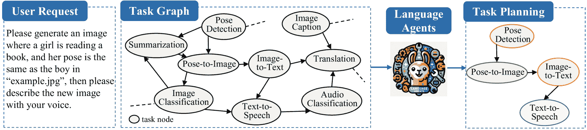

图 1：语言智能体中的任务规划示意图（例如，HuggingGPT [[46](https://arxiv.org/html/2405.19119v3#bib.bib46)]）

## 3 图表示与洞察

### 3.1 任务规划的图表示

在本小节中，我们将任务规划表述为任务图上的决策问题。任务图是一种特殊类型的带文本属性的图，我们将其定义为 $G=(V,E,T)$。每个节点 $v\in V$ 代表任务池中的一个预定义任务，并且与一个文本 $t_{v}\in T$ 相关联，描述其功能（例如，“翻译。翻译是将文本从一种语言转换为另一种语言的任务。”）。每条边 $(u,v)\in E$ 表示任务之间的依赖关系（例如，任务 $u$ 的输出格式与任务 $v$ 的输入格式匹配）。任务规划就是在任务图上选择一条路径或连接的子图。

从这个角度来看，任务规划与传统的图形决策问题相似，例如最短路径规划。与传统规划相比，语言智能体中的任务规划涉及多样化且开放式的目标，因为用户的个人需求各不相同。例如，在像 HuggingFace 这样的平台注册上，用户的意图涵盖了视频、文本和图像领域。相反，经典规划对于给定领域有一个固定的目标，这个目标通常通过数学公式明确表示[[55](https://arxiv.org/html/2405.19119v3#bib.bib55), [36](https://arxiv.org/html/2405.19119v3#bib.bib36)]。

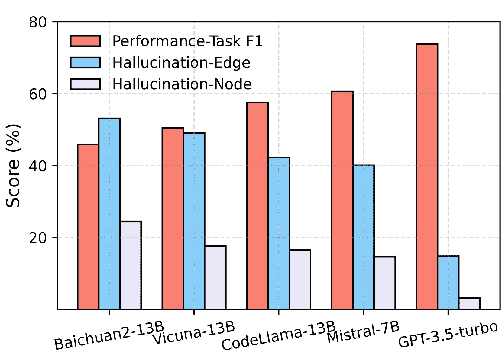

(a) 性能与幻觉比率

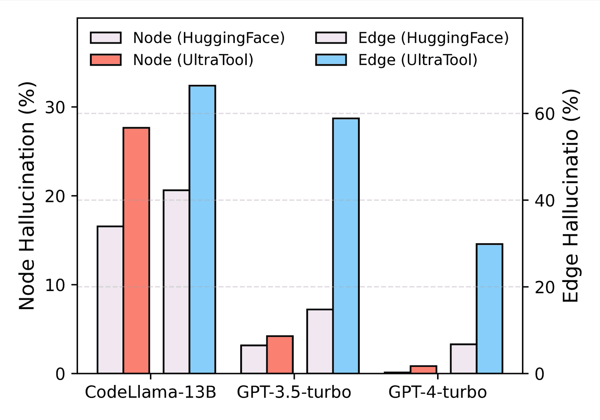

(b) 数据集中的幻觉比例

图2：展示了(a) LLM在HuggingGPT中的规划性能与幻觉，以及(b) 幻觉与任务图大小的关系。

### 3.2 LLM在规划中的失败：实证发现

拥有任务图后，我们在图[2](https://arxiv.org/html/2405.19119v3#S3.F2 "图2 ‣ 3.1 任务规划的图表式表示 ‣ 3 图表式表示与见解 ‣ 图学习能改善基于LLM的代理的规划吗？")中对LLM在任务规划中的表现进行了诊断。我们采用了HuggingGPT工作中概述的实验设置[[46](https://arxiv.org/html/2405.19119v3#bib.bib46)]，其中提示词专门为HuggingFace上的任务规划进行了优化。评估指标计算F1得分，以评估LLM在与实际任务对比中识别任务的准确性。此外，我们报告了两个与任务图相关的指标：节点幻觉比例和边缘幻觉比例。这些指标分别衡量LLM输出的虚假节点（即任务）和边缘（即依赖关系）的频率，反映了模型对图输入的误解。

我们的实证发现表明：(1) LLM表现出一定的幻觉比例，(2) 幻觉比例与规划性能之间存在强烈的相关性。这表明，LLM在准确解释任务图时存在困难，而任务图是性能的关键。

我们进一步探讨了幻觉发生的频率是否与子任务数量相关。HuggingGPT数据集包含23个子任务，我们的分析扩展到包括UltraTool数据集[[20](https://arxiv.org/html/2405.19119v3#bib.bib20)]，该数据集包含260个子任务。图[2(b)](https://arxiv.org/html/2405.19119v3#S3.F2.sf2 "在图2 ‣ 3.1 任务规划的图表式表示 ‣ 3 图表式表示与见解 ‣ 图学习能改善基于LLM的代理的规划吗？")显示，随着任务图规模的增大，幻觉比例增加。

### 3.3 LLM在规划中的失败：理论见解

在本小节中，我们提供了关于LLM在处理任务图时局限性的理论见解。与之前用于图决策问题的图学习方法不同，LLM通过将图输入展平为序列并使用自回归损失进行训练。我们将进一步考察这两个因素的影响。

序列化图输入如何影响表达能力？我们考虑了可以通过动态规划（DP）解决的一般图决策问题，如([2](https://arxiv.org/html/2405.19119v3#S3.E2 "在3.3 LLM在规划中的失败：理论见解 ‣ 3 图表式表示与见解 ‣ 图学习能改善基于LLM的代理的规划吗？"))所述。输入包括边列表和初始状态：

|  | $\displaystyle\underbrace{u_{1}\ v_{1}\ c[u_{1}][v_{1}]\ u_{1}\ v_{2}\ c[u_{1}]% [v_{2}]\ \ldots}_{\text{边列表}}\ \underbrace{u_{1}\ \text{Answer}[0][u_{1}% ]\ \ldots\ u_{n}\ \text{Answer}[0][u_{n}]}_{\text{初始状态}}$ |  | (1) |
| --- | --- | --- | --- |

期望的输出格式是 $u_{1}\ \text{Answer}[k][u_{1}]\ \ldots\ u_{n}\ \text{Answer}[k][u_{n}]$。在现有的研究中，任务图通常以 ([1](https://arxiv.org/html/2405.19119v3#S3.E1 "在3.3节 LLMs在规划中的失败：理论见解 ‣ 3 图形公式与见解 ‣ 图学习能否改善基于LLM的代理的规划？")) 的形式呈现，其中边列表由自然语言描述，初始状态是每个任务节点的任务描述，详见附录A.9 [[45](https://arxiv.org/html/2405.19119v3#bib.bib45)]。

如前一小节所讨论，任务规划是任务图上的决策问题。图上的决策问题通常通过动态规划（DP）解决 [[3](https://arxiv.org/html/2405.19119v3#bib.bib3)]，其一般形式为

|  | $\displaystyle\text{Answer}[k][i]=f\left(\square_{j\in\mathcal{T}(i)}g(\text{% Answer}[k-1][j],c[i][j])\right),$ |  | (2) |
| --- | --- | --- | --- |

其中 $\text{Answer}[k][i]$ 是第 $k$ 次迭代中状态 $i$ 的解，$c[i][j]$ 是与状态 $i$ 和 $j$ 相关的成本，$\mathcal{T}(i)$ 是可以转换到 $i$ 的状态集合，$\square_{j\in\mathcal{T}(i)}$ 是一种聚合函数，如 MAX 或 SUM，$f,g$ 是特定任务的更新函数。我们在附录 [D.1](https://arxiv.org/html/2405.19119v3#A4.SS1 "D.1 动态规划 ‣ 附录D 理论结果的补充材料 ‣ 图学习能否改善基于LLM的代理的规划？") 中给出了典型动态规划算法的公式，包括一些NPC问题。对于文本属性图上的决策问题（例如任务规划），可以将其概念化为特征空间中的动态规划（DP），如 [[68](https://arxiv.org/html/2405.19119v3#bib.bib68)] 中所讨论的。

令我们惊讶的是，尽管边列表输入并未直接反映图的几何结构，但它使得Transformers能够有效地模拟动态规划（DP），在表达能力方面，如以下定理所示。

###### 定理1。

(LLMs具有足够的表达能力) 假设输入格式如([1](https://arxiv.org/html/2405.19119v3#S3.E1 "在3.3节 LLMs在规划中的失败：理论见解 ‣ 3 图形表达和见解 ‣ 图学习能否改善基于LLM的代理的规划？"))所给出，并且DP更新中的$f,g,\square$([2](https://arxiv.org/html/2405.19119v3#S3.E2 "在3.3节 LLMs在规划中的失败：理论见解 ‣ 3 图形表达和见解 ‣ 图学习能否改善基于LLM的代理的规划？"))满足假设[1](https://arxiv.org/html/2405.19119v3#Thmassumption1 "假设1. ‣ D.2 定理1的证明 ‣ 附录D 理论结果的补充材料 ‣ 图学习能否改善基于LLM的代理的规划？")和[2](https://arxiv.org/html/2405.19119v3#Thmassumption2 "假设2. ‣ D.2 定理1的证明 ‣ 附录D 理论结果的补充材料 ‣ 图学习能否改善基于LLM的代理的规划？")中所述的假设。在([2](https://arxiv.org/html/2405.19119v3#S3.E2 "在3.3节 LLMs在规划中的失败：理论见解 ‣ 3 图形表达和见解 ‣ 图学习能否改善基于LLM的代理的规划？"))中，存在一个对数精度常深度和常宽度的Transformer，能够模拟DP更新的单步过程。因此，存在一个对数精度$O(k)$深度和常宽度的Transformer，能够模拟在([2](https://arxiv.org/html/2405.19119v3#S3.E2 "在3.3节 LLMs在规划中的失败：理论见解 ‣ 3 图形表达和见解 ‣ 图学习能否改善基于LLM的代理的规划？"))中$k$步的DP更新。

证明在附录 [D.2](https://arxiv.org/html/2405.19119v3#A4.SS2 "D.2 定理 1 的证明 ‣ 附录 D 理论结果的补充材料 ‣ 图形学习能否改善基于LLM的智能体的规划？") 中给出。然而，证明中的某些构造在经过自然语言预训练的Transformer中难以实现。首先，嵌入过程必须经过精心过滤，以确保在图同构下的无变性。这个无变性属性与自然语言固有的归纳偏差不一致，导致其实现非常困难。因此，如果一个LLM能够准确地为特定节点顺序给出正确答案，它在节点重排后可能无法保持这一准确性（在附录 [D.3](https://arxiv.org/html/2405.19119v3#A4.SS3 "D.3 LLMs 的排列不变性测试 ‣ 附录 D 理论结果的补充材料 ‣ 图形学习能否改善基于LLM的智能体的规划？") 中给出了实验）。其次，每个标记需要与所有共享相同标记ID的其他标记同步其隐藏状态，这需要的复杂度为 $O(|V|)$。在实践中，从自然语言训练的注意力通常是稀疏的 [[66](https://arxiv.org/html/2405.19119v3#bib.bib66)]，这导致了难以处理的问题。以下命题给出了正式的下界，证明则见附录 [D.4](https://arxiv.org/html/2405.19119v3#A4.SS4 "D.4 命题 1 的证明 ‣ 附录 D 理论结果的补充材料 ‣ 图形学习能否改善基于LLM的智能体的规划？")。

###### 命题 1.

（语言的归纳偏差妨碍了表达能力）假设输入格式已描述（[1](https://arxiv.org/html/2405.19119v3#S3.E1 "在 3.3 大型语言模型在规划中的失败：理论洞察 ‣ 3 图形表述与洞察 ‣ 图形学习能否改善基于LLM的智能体的规划？")），并且注意力机制被限制为只关注固定数量的标记。至少存在一个一阶DP更新的实例，使得没有任何对数精度的固定宽度和深度的Transformer能够进行模拟。

自回归损失如何影响泛化能力？我们的研究接下来聚焦于自回归损失，并考虑以下情景：给定一个固定的任务图，收集用户数据以执行指令微调，并使用下一个标记预测损失。在可处理的理论研究中，我们将这个问题概念化为路径规划问题，因为任务规划的输出本质上是一个路径。我们假设训练数据集由以下形式的输入序列组成：$s\ t\ s\ v_{1}\ v_{2}\ \cdots\ t$，其中$s$表示源节点，$t$表示目标节点，序列$s\ v_{1}\ v_{2}\ \cdots\ t$是遵循特定约束的路径。在测试过程中，给定初始节点和目标节点$s$和$t$，模型应生成符合相同约束的路径。我们的研究结果表明，自回归损失可能导致基于频率的虚假相关性，这一点通过以下定理得到证实，证明见附录[D.5](https://arxiv.org/html/2405.19119v3#A4.SS5 "D.5 Proof of Theorem 2 ‣ Appendix D Supplementary Materials for Theoretical Results ‣ Can Graph Learning Improve Planning in LLM-based Agents?")。

###### 定理 2.

（自回归损失的虚假相关性）假设(1) 使用的损失是一个利用交叉熵的下一个标记预测损失，应用于训练过程中子序列$v_{1}\ v_{2}\ \cdots\ t$；(2) 输出的logits由目标节点$t$和当前节点$v_{i-1}$决定。设$N_{t,v_{i-1},u}$为训练数据集中，$t$是目标节点，$v_{i-1}$是当前节点，$v_{i}=u$是下一个节点的次数。预测下一个节点$u$的最优logits为$\hat{\bm{v}}_{i}[u]=\frac{N_{t,v_{i-1},u}}{\sum_{u}N_{t,v_{i-1},u}}$，前提是$\sum_{u}N_{t,v_{i-1},u}>0$。如果$\sum_{u}N_{t,v_{i-1},u}=0$，那么$\hat{\bm{v}}_{i}[u]$可以是任何非负数，满足$\sum_{u}\hat{\bm{v}}_{i}[u]=1$。

在我们的设置中，$s$ $t$是指令，第三个标记是第一个标记的重复。因此，排除这些标记进行损失计算是合理的，这也是第一个假设。第二个假设认为输出仅依赖于当前节点和目标节点，这是与路径相关问题的最小要求。对于动态规划问题，基于频率的预测与基于值的真实情况相矛盾。接下来我们给出一个例子，表明自回归损失甚至无法找到有效路径。

###### 示例 1.

考虑一个包含足够数量有效路径的训练数据集。假设数据集中包含两条路径$a\ b\ c$和$b\ c\ d$，且没有其他路径使得$t=d$，并且对于所有$i$，当前节点$v_{i}=a$。那么我们有$N_{d,a,u}\equiv 0$对于所有$u$，且下一个节点的logits可以是任意的。这导致模型在给定源节点$a$和目标节点$d$时，无法预测$a$的下一个节点。

对人类而言，从$a$到$d$的路径寻找仅仅涉及将路径$a\ b\ c$和$b\ c\ d$连接起来。然而，在这种情况下，自回归损失会失败。在任务规划数据集中，我们确实观察到，经过微调的LLM的表现不如在同一数据集上训练的GNN，如[图3(b)](https://arxiv.org/html/2405.19119v3#S5.F3.sf2 "图3 ‣ 5.4 扩展到大规模任务图 ‣ 5 实验与分析 ‣ 图学习能否改进基于LLM的代理任务规划？")所示。

## 4 集成GNN和LLM进行任务规划

### 4.1 动机

在上一节中，我们发现，相当一部分任务规划失败可归因于LLM在准确辨识任务图结构上的无效性，这主要是由于幻觉、注意力的归纳偏差和下一个标记预测损失造成的。与LLM不同，GNNs可以严格操作任务图，从而避免幻觉问题。此外，GNNs将图结构作为输入，而不是将图展平成序列，从而克服了之前讨论的理论限制。此外，GNNs在处理图决策问题上无论在理论上还是在实践中都表现出了出色的能力[[68](https://arxiv.org/html/2405.19119v3#bib.bib68), [11](https://arxiv.org/html/2405.19119v3#bib.bib11), [24](https://arxiv.org/html/2405.19119v3#bib.bib24)]。因此，最简单的解决办法是将GNNs集成到任务规划算法中。

在接下来的子章节中，我们提出了无训练和基于训练的两种方法来增强性能。当可用任务不断变化，或新任务持续出现时，必须采用无训练方法。这种情况在任务规划模块被部署到新系统时很常见。一旦任务规划模块部署一段时间后，就可以收集用户的请求，并标注一小部分数据，从而使轻量级的基于训练的方法成为可能。

### 4.2 一种无训练的基于GNN的方法

正如我们在第[2.2节](https://arxiv.org/html/2405.19119v3#S2.SS2 "2.2 目前基于LLM的任务规划解决方案 ‣ 2 基础知识 ‣ 图学习能否改进基于LLM的代理任务规划？")中讨论的那样，目前的任务规划解决方案包含两个阶段。第一阶段需要能够理解用户的自然语言请求，并将其分解为具体的指令，这正是LLM的独特能力。第二阶段是选择任务图中的一条路径，每个节点对应一个分解的步骤。因此，我们可以在这一阶段整合GNNs。我们框架的示意图见附录中的[图7](https://arxiv.org/html/2405.19119v3#A6.F7 "图7 ‣ F.1 基于训练的GNN实现 ‣ 附录F 基于训练的方法补充材料 ‣ 图学习能否改进基于LLM的代理任务规划？")。

对于第一阶段输出的每个分解步骤，我们使用GNN选择任务图中的相应节点。假设我们正在选择第$i$个分解步骤的节点。首先，我们使用一个小型预训练语言模型e5-335M [[62](https://arxiv.org/html/2405.19119v3#bib.bib62)]来嵌入第$i$个分解步骤。得到的嵌入表示为$\bm{x}_{i}^{\text{step}}$。其次，对于任务图，我们首先使用相同的预训练语言模型e5-335M将每个节点的描述转换为嵌入，表示为节点特征$\bm{h}^{0}_{v}$，其中上标表示层，下标表示节点。然后，我们采用$K$层SGC [[65](https://arxiv.org/html/2405.19119v3#bib.bib65)]来计算最终的节点嵌入，得到$\bm{h}_{v}=\bm{h}_{v}^{(K)}$。给定一个先前选择的任务节点序列$\{v_{1},\cdots,v_{i-1}\}$，下一个节点$v_{i}$根据公式$v_{i}=\text{argmax}_{v\in\mathcal{N}(v_{i-1})}\;\langle\bm{h}_{v},\bm{x}_{i}^{\text{step}}\rangle$选择，其中$\bm{h}_{v}$是最终的节点嵌入，$\mathcal{N}(v_{i-1})$表示任务图中节点$v_{i-1}$的邻居。特别地，$v_{1}$可以从整个图中选择。

由于e5-335M是预训练的且SGC是无参数的，因此该方法不需要额外的训练，可以有效地以零-shot的方式应用。

### 4.3 基于GNN的训练方法

在训练所需的方法中，推理过程与训练无关的方法相似，区别在于用带参数的图神经网络（GNN）替代了无参数的GNN，例如GAT [[57](https://arxiv.org/html/2405.19119v3#bib.bib57)]或GraphSAGE [[15](https://arxiv.org/html/2405.19119v3#bib.bib15)]。在这里，我们具体说明了GNN的训练过程。

数据准备：我们假设任务规划数据集中的每一条记录由用户请求、分解的步骤序列以及对应的真实任务组成，表示为$(\text{request},\{s_{1},\ldots,s_{n}\},\{v_{1},\ldots,v_{n}\})$。如果数据集不符合此格式，我们会使用GPT-4对其进行重新格式化，具体细节请参考附录[C.2](https://arxiv.org/html/2405.19119v3#A3.SS2 "C.2 Reformatting Details of RestBench ‣ Appendix C Datasets ‣ Can Graph Learning Improve Planning in LLM-based Agents?")。需要注意的是，数据集中的步骤与任务之间存在一一对应关系。因此，训练数据集可以表示为$\{(s_{i},v_{i})\}_{i=1}^{n}$，其中$s_{i}$是以自然语言描述的步骤，$v_{i}$是其对应的调用任务。

训练损失：数据集中的问题可以视为一个二元排序问题，其中标记的节点为$1$，其他节点为$0$。因此，我们采用了为二元排序推荐设计的贝叶斯个性化排序（BPR）损失[[41](https://arxiv.org/html/2405.19119v3#bib.bib41)]。损失函数为$\ell=\sum_{(\bm{x}^{\text{step}},v,v^{\prime})}-\log\;\sigma(\langle\bm{h}_{v}% ,\bm{x}^{\text{step}}\rangle-\langle\bm{h}_{v^{\prime}},\bm{x}^{\text{step}}\rangle)$，其中$\bm{x}^{\text{step}}$表示由e5-335M生成的步骤文本描述的嵌入，$v$是真实任务，$v^{\prime}$是负任务。我们选择与正任务文本相似的负任务，并为了计算效率，将每个正任务的负任务数量限制为$2$个。可训练的参数可能仅包括GNN或包括GNN和e5-335M，附录中的图[8](https://arxiv.org/html/2405.19119v3#A6.F8 "Figure 8 ‣ F.1 Implementation of Training-based GNNs ‣ Appendix F Supplementary Materials for Training-based Methods ‣ Can Graph Learning Improve Planning in LLM-based Agents?")展示了示例配置。

## 5 实验与分析

### 5.1 实验设置

数据集：我们使用了跨越两个任务规划基准的四个数据集：HuggingFace任务、多媒体任务和来自TaskBench的日常生活API任务[[45](https://arxiv.org/html/2405.19119v3#bib.bib45)]，以及来自RestBench的TMDB API任务[[50](https://arxiv.org/html/2405.19119v3#bib.bib50)]。HuggingFace数据集包括HuggingFace上的AI模型。多媒体数据集提供了广泛的以用户为中心的任务，如文件下载和视频编辑。日常生活API涵盖了如网页搜索和购物功能等日常服务。TMDB专注于与电影相关的搜索和检索任务。每个数据集的统计信息见表[7](https://arxiv.org/html/2405.19119v3#A3.T7 "Table 7 ‣ C.2 Reformatting Details of RestBench ‣ Appendix C Datasets ‣ Can Graph Learning Improve Planning in LLM-based Agents?")，并在附录中的图[4](https://arxiv.org/html/2405.19119v3#A3.F4 "Figure 4 ‣ C.2 Reformatting Details of RestBench ‣ Appendix C Datasets ‣ Can Graph Learning Improve Planning in LLM-based Agents?")中给出了示例。其他基准，如ToolBench [[39](https://arxiv.org/html/2405.19119v3#bib.bib39)]和ToolAlpaca [[54](https://arxiv.org/html/2405.19119v3#bib.bib54)]，由于以下原因不适合我们的实验：(1)缺少详细列出任务及其依赖关系的明确任务图，(2)涉及多任务规划的样本稀缺，重点是单任务检索。

评估：对于TaskBench中的数据集，我们将$3000$个样本用于训练，$500$个样本用于测试，每个样本包含至少两个任务的调用路径。对于TMDB数据集，我们首先筛选出包含两个或更多被调用任务的样本，然后随机选择一个样本作为上下文学习示例。其余的$94$个样本用于测试。我们采用TaskBench [[45](https://arxiv.org/html/2405.19119v3#bib.bib45)]和HuggingGPT [[46](https://arxiv.org/html/2405.19119v3#bib.bib46)]中的评估指标，即节点F1得分（n-F1）和链接F1得分（l-F1），分别衡量被调用任务和被调用依赖的准确性。此外，准确率（Acc）可以衡量任务级别的成功率。我们还测量了标记消耗（# tok）作为效率指标。

LLM选择：我们考虑了封闭源LLM，即GPT-3.5-turbo和GPT-4-turbo，以及不同参数规模的开源LLM，包括CodeLlama-13B（或7B）-Instruct-hf [[42](https://arxiv.org/html/2405.19119v3#bib.bib42)]、Mistral-7B-Instruct-v0.2 [[23](https://arxiv.org/html/2405.19119v3#bib.bib23)]、Vicuna-13B-v1.5 [[72](https://arxiv.org/html/2405.19119v3#bib.bib72)] 和 Baichuan2-13B-Chat [[69](https://arxiv.org/html/2405.19119v3#bib.bib69)]。

GNN选择：为了全面调查不同图学习方法在任务规划中的有效性，我们考虑了多种图神经网络，包括SGC [[65](https://arxiv.org/html/2405.19119v3#bib.bib65)]、GCN [[26](https://arxiv.org/html/2405.19119v3#bib.bib26)]、GAT [[57](https://arxiv.org/html/2405.19119v3#bib.bib57)]、GraphSAGE [[15](https://arxiv.org/html/2405.19119v3#bib.bib15)]、GIN [[67](https://arxiv.org/html/2405.19119v3#bib.bib67)] 和 Graph Transformers [[47](https://arxiv.org/html/2405.19119v3#bib.bib47)]。

### 5.2 无需训练方法的性能

我们比较了三种无训练方法的性能：（1）LLM 的直接推理介绍见第 [2.2](https://arxiv.org/html/2405.19119v3#S2.SS2 "2.2 Current LLM-based Solution to Task Planning ‣ 2 Preliminaries ‣ Can Graph Learning Improve Planning in LLM-based Agents?")节。（2）GraphSearch [[33](https://arxiv.org/html/2405.19119v3#bib.bib33), [52](https://arxiv.org/html/2405.19119v3#bib.bib52), [32](https://arxiv.org/html/2405.19119v3#bib.bib32)] 利用经典的图搜索方法生成候选节点，并使用 LLM 对节点选择进行评分。在给定的步骤中，GreedySearch 一直选择具有最高分数且与前一个任务节点相邻的节点；AdaptiveSearch 选择得分高于固定阈值的节点，并以自适应方式调整搜索空间的广度；BeamSearch 保留得分最高的 $k$ 个节点。（3）SGC [[65](https://arxiv.org/html/2405.19119v3#bib.bib65)] 采用无训练的 SGC 进行基于分解任务步骤的任务检索。基准的详细信息见第 [E.1](https://arxiv.org/html/2405.19119v3#A5.SS1 "E.1 Implementation of Baselines ‣ Appendix E Supplementary Materials for Training-free Methods ‣ Can Graph Learning Improve Planning in LLM-based Agents?")节，并在图 [6](https://arxiv.org/html/2405.19119v3#A5.F6 "Figure 6 ‣ E.1 Implementation of Baselines ‣ Appendix E Supplementary Materials for Training-free Methods ‣ Can Graph Learning Improve Planning in LLM-based Agents?")中进行了说明。表 [1](https://arxiv.org/html/2405.19119v3#S5.T1 "Table 1 ‣ 5.2 Performance of the Training-free Approach ‣ 5 Experiments and Analysis ‣ Can Graph Learning Improve Planning in LLM-based Agents?") 显示了整体性能和令牌消耗成本，准确性（Acc）的结果移至附录中的表 [9](https://arxiv.org/html/2405.19119v3#A5.T9 "Table 9 ‣ E.3 Accuracy Results of Training-free Methods ‣ Appendix E Supplementary Materials for Training-free Methods ‣ Can Graph Learning Improve Planning in LLM-based Agents?")。

表 1：无训练方法比较：整体性能（Node-F1 和 Link-F1，单位为 $\%$）及令牌消耗（单位为 $\times 10^{3}$）。其他 LLM 的性能见表 [8](https://arxiv.org/html/2405.19119v3#A5.T8 "Table 8 ‣ E.2 Results of All LLMs ‣ Appendix E Supplementary Materials for Training-free Methods ‣ Can Graph Learning Improve Planning in LLM-based Agents?")。

|  |  | TaskBench | RestBench |
| --- | --- | --- | --- |
|  |  | HuggingFace | 多媒体 | 日常生活 | TMDB |
| LLM | 方法 | n-F1 $\uparrow$ | l-F1 $\uparrow$ | # Tok $\downarrow$ | n-F1 $\uparrow$ | l-F1 $\uparrow$ | # Tok $\downarrow$ | n-F1 $\uparrow$ | l-F1 $\uparrow$ | # Tok $\downarrow$ | n-F1 $\uparrow$ | l-F1 $\uparrow$ | #Tok $\downarrow$ |
| Vicuna 13B | 直接推理 | 50.46 | 21.27 | 2.50 | 53.57 | 23.19 | 2.64 | 73.70 | 45.80 | 3.82 | 44.66 | 14.01 | 2.02 |
| GreedySearch | 52.94 | 25.73 | 6.23 | 46.99 | 23.11 | 5.55 | 42.98 | 13.33 | 7.18 | 45.22 | 13.69 | 3.42 |
| AdaptiveSearch | 54.36 | 25.67 | 9.81 | 51.24 | 24.32 | 11.25 | 62.71 | 31.15 | 13.92 | 41.32 | 7.02 | 6.51 |
| BeamSearch | 56.64 | 26.93 | 24.11 | 54.09 | 26.19 | 25.42 | 54.55 | 23.60 | 24.86 | 46.91 | 15.41 | 7.79 |
| SGC | 59.62 | 31.98 | 2.31 | 61.78 | 37.60 | 2.43 | 83.33 | 63.77 | 3.82 | 48.79 | 15.99 | 1.89 |
| Mistral 7B | Direct | 60.60 | 30.23 | 2.49 | 69.83 | 39.85 | 2.64 | 84.26 | 53.63 | 3.77 | 62.23 | 22.02 | 1.96 |
| GreedySearch | 65.91 | 38.13 | 6.52 | 58.92 | 34.72 | 6.26 | 75.18 | 49.47 | 8.27 | 60.64 | 23.18 | 4.38 |
| AdaptiveSearch | 67.30 | 38.90 | 7.68 | 71.59 | 44.84 | 10.66 | 86.39 | 63.65 | 10.92 | 54.04 | 21.35 | 9.99 |
| BeamSearch | 67.13 | 36.73 | 25.66 | 73.55 | 47.12 | 31.10 | 85.87 | 61.53 | 39.16 | 63.41 | 26.79 | 11.26 |
| SGC | 67.43 | 42.08 | 2.32 | 74.07 | 49.90 | 2.43 | 87.13 | 66.49 | 3.54 | 64.72 | 25.67 | 1.89 |
| CodeLlama 13B | Direct | 57.55 | 28.88 | 2.45 | 68.57 | 41.79 | 2.59 | 91.20 | 76.07 | 3.88 | 68.91 | 43.74 | 2.02 |
| GreedySearch | 61.67 | 34.02 | 5.95 | 67.98 | 42.04 | 4.95 | 91.50 | 76.56 | 5.54 | 66.67 | 42.16 | 3.81 |
| AdaptiveSearch | 60.85 | 31.66 | 11.10 | 68.14 | 41.71 | 6.77 | 91.34 | 76.09 | 7.18 | 63.74 | 37.17 | 8.16 |
| BeamSearch | 62.65 | 34.31 | 20.14 | 69.53 | 43.35 | 19.51 | 91.74 | 76.60 | 19.19 | 68.08 | 42.92 | 8.88 |
| SGC | 65.51 | 39.44 | 2.31 | 73.32 | 53.28 | 2.43 | 92.96 | 79.57 | 3.64 | 71.40 | 47.55 | 1.90 |
| GPT- 3.5-turbo | Direct | 73.85 | 45.73 | 2.14 | 82.85 | 62.07 | 2.26 | 96.09 | 83.65 | 3.36 | 81.70 | 57.52 | 1.67 |
| GreedySearch | 67.75 | 43.88 | 5.29 | 81.11 | 63.02 | 4.92 | 93.77 | 81.26 | 7.36 | 76.19 | 50.11 | 3.06 |
| AdaptiveSearch | 72.18 | 47.55 | 7.47 | 81.86 | 62.71 | 5.71 | 93.79 | 81.41 | 8.53 | 77.57 | 53.65 | 5.89 |
| BeamSearch | 75.51 | 49.62 | 14.22 | 83.57 | 64.50 | 12.91 | 95.66 | 82.72 | 22.05 | 81.24 | 57.98 | 6.42 |
| SGC | 76.37 | 50.04 | 2.02 | 83.65 | 63.65 | 2.09 | 96.38 | 86.19 | 3.16 | 82.63 | 59.15 | 1.61 |
| GPT- 4-turbo | Direct | 77.60 | 52.18 | 2.19 | 88.29 | 69.38 | 2.28 | 97.36 | 84.58 | 3.37 | 82.56 | 56.67 | 1.75 |
| GreedySearch | 74.75 | 50.44 | 5.78 | 86.81 | 69.80 | 5.52 | 97.36 | 85.78 | 7.37 | 75.34 | 49.95 | 3.73 |
| AdaptiveSearch | 76.17 | 51.30 | 8.94 | 88.02 | 69.99 | 7.14 | 97.30 | 85.80 | 9.04 | 81.78 | 55.15 | 6.35 |
| BeamSearch | 77.56 | 52.54 | 8.98 | 88.16 | 70.39 | 6.90 | 97.35 | 85.78 | 8.99 | 80.11 | 51.00 | 5.18 |
| SGC | 77.79 | 52.20 | 2.03 | 88.54 | 69.83 | 2.10 | 97.35 | 85.76 | 3.16 | 82.27 | 56.37 | 1.62 |

与直接推理相比，集成SGC始终能提高性能，突显了所提出方法的有效性。GraphSearch类型的方法依赖于束搜索来识别路径，并使用LLM进行评估，其中较长的处理时间通常会带来更好的结果。值得注意的是，我们提出的方法在性能上与BeamSearch相当或更优（表格[1](https://arxiv.org/html/2405.19119v3#S5.T1 "表1 ‣ 5.2 无训练方法的性能 ‣ 5 实验与分析 ‣ 图学习能否改善基于LLM的规划？") 和表格[9](https://arxiv.org/html/2405.19119v3#A5.T9 "表9 ‣ E.3 无训练方法的准确度结果 ‣ 附录E 无训练方法的补充材料 ‣ 图学习能否改善基于LLM的规划？")）同时需要的令牌数少了$5$-$10$倍（表格[1](https://arxiv.org/html/2405.19119v3#S5.T1 "表1 ‣ 5.2 无训练方法的性能 ‣ 5 实验与分析 ‣ 图学习能否改善基于LLM的规划？")）以及推理时间（表格[10](https://arxiv.org/html/2405.19119v3#A5.T10 "表10 ‣ E.4 计算成本分析 ‣ 附录E 无训练方法的补充材料 ‣ 图学习能否改善基于LLM的规划？")）。案例研究可在附录[H](https://arxiv.org/html/2405.19119v3#A8 "附录H 案例研究 ‣ 图学习能否改善基于LLM的规划？")中找到。然而，我们观察到GPT-4-turbo仅有边际改善。GPT-4-turbo的一个独特特点是它能够管理ChatGPT插件，并且可能在任务规划数据集上接受了特别训练。此外，用于SGC特征提取的预训练语言模型是e5-335M，这可能不足以有效分析GPT-4的输出。有关涉及GPT-4的案例的详细诊断分析，请参见附录中的图[11](https://arxiv.org/html/2405.19119v3#A8.F11 "图11 ‣ 附录H 案例研究 ‣ 图学习能否改善基于LLM的规划？")。

### 5.3 基于训练方法的性能

设置：我们进一步探讨了基于训练的 GNN 在三个 TaskBench 数据集中的有效性。由于 TMDB 数据集样本数量有限，因此被排除在外。在我们的实验中，我们训练了多种 GNN 变体，既包括与小型语言模型（即 e5-335M）共同训练的情况，也包括未共同训练的情况，其中小型语言模型的作用是生成来自任务名称和描述的节点嵌入。由于篇幅限制，我们仅在正文中展示了 GraphSAGE 的性能，所有情况的详细比较请参见附录中的表格 [11](https://arxiv.org/html/2405.19119v3#A6.T11 "Table 11 ‣ F.4 Full Results of Training-based GNNs ‣ Appendix F Supplementary Materials for Training-based Methods ‣ Can Graph Learning Improve Planning in LLM-based Agents?") 和表格 [12](https://arxiv.org/html/2405.19119v3#A6.T12 "Table 12 ‣ F.4 Full Results of Training-based GNNs ‣ Appendix F Supplementary Materials for Training-based Methods ‣ Can Graph Learning Improve Planning in LLM-based Agents?")。

对比方法：由于缺乏专门用于任务规划的基准训练方法，我们借用了两种现有方法，这些方法结合了 LLM 和 GNN 用于图相关任务，包括：（1）TAPE [[16](https://arxiv.org/html/2405.19119v3#bib.bib16)] 采用 $\text{LLM}\rightarrow\text{LM}\rightarrow\text{GNN}$ 架构进行节点分类任务。在该框架中，LLM 生成每个预测节点的高质量解释性文本，接着通过 LM 对其进行微调，生成节点嵌入。最后，GNN 执行下游分类。我们通过将任务规划问题重新表述为将用户请求分类为任务图中的对应节点标签，将 TAPE 适应于任务规划。（2）GraphToken [[38](https://arxiv.org/html/2405.19119v3#bib.bib38)] 使用 GNN 对图节点进行标记化，然后将其输入 LLM 生成文本输出。在我们的任务规划适配中，我们将用户请求视为输入问题，期望的计划作为生成答案。附录 [F.2](https://arxiv.org/html/2405.19119v3#A6.SS2 "F.2 Implementation of TAPE and GraphToken ‣ Appendix F Supplementary Materials for Training-based Methods ‣ Can Graph Learning Improve Planning in LLM-based Agents?") 提供了更多实现细节。

观察：从表[2](https://arxiv.org/html/2405.19119v3#S5.T2 "表2 ‣ 5.3 基于训练的方法的性能 ‣ 5 实验与分析 ‣ 图学习能否改善基于LLM的代理规划？")中，我们观察到，采用基于训练的GraphSAGE方法相比于无训练方法，性能显著提高。然而，GNN与e5-335M共同训练并未带来明显的性能提升，这表明消息传递是提升性能的关键因素。进一步的分析显示，广泛的GNN（如表[11](https://arxiv.org/html/2405.19119v3#A6.T11 "表11 ‣ F.4 基于训练的GNN的完整结果 ‣ 附录F 基于训练的方法的补充材料 ‣ 图学习能否改善基于LLM的代理规划？")和表[12](https://arxiv.org/html/2405.19119v3#A6.T12 "表12 ‣ F.4 基于训练的GNN的完整结果 ‣ 附录F 基于训练的方法的补充材料 ‣ 图学习能否改善基于LLM的代理规划？")所示）的分析表明，像GIN这样的强大GNN，其性能与被认为较简单的网络（如GCN）相似，甚至表现不如GraphSAGE。这一模式表明，任务的挑战可能不在于模型的表达能力，而在于它们的泛化能力。在基准测试方面，TAPE不适用于任务规划，因为其分类方法简化了任务规划，忽视了任务之间的依赖关系。尽管GraphToken在LLM的直接推理上表现出更优的性能，但我们也注意到有轻微的幻觉现象。这一观察表明，GraphToken对任务图的理解还不完美。此外，GraphToken仅限于开源的LLM。此外，我们提出的方法也大大提升了参数预测的性能，如附录[G](https://arxiv.org/html/2405.19119v3#A7 "附录G 任务参数预测实验 ‣ 图学习能否改善基于LLM的代理规划？")中所示（例如，对GPT-3.5-turbo的$9\%$提升，以及对GPT-4-turbo的$3\%$提升）。

效率：训练时间的具体细节见表[13](https://arxiv.org/html/2405.19119v3#A6.T13 "表13 ‣ F.6 计算成本分析 ‣ 附录F 基于训练的方法的补充材料 ‣ 图学习能否改善基于LLM的代理规划？")。训练成本显著较低，因为我们使用e5-335M作为GNN的文本嵌入模型[[62](https://arxiv.org/html/2405.19119v3#bib.bib62)]。如果可训练参数仅限于GNN，通常训练将在短短3分钟内完成。此外，当GNN与e5-335M模型共同训练时，训练时间也仅延长至15分钟。这种效率与调整开源LLM所需的10到20小时形成鲜明对比。

表 2：与基于训练的方法比较：节点-F1、链接-F1 和准确率以百分比（$\%$）报告。TAPE [[16](https://arxiv.org/html/2405.19119v3#bib.bib16)] 是为节点分类任务设计的，不能预测链接，因此我们报告链接-F1为“NA”。GraphToken [[38](https://arxiv.org/html/2405.19119v3#bib.bib38)] 需要微调LLM，这与闭源LLM不兼容。其他GNN和LLM的性能见附录中的表 [11](https://arxiv.org/html/2405.19119v3#A6.T11 "表 11 ‣ F.4 基于训练的GNN的完整结果 ‣ 附录F 基于训练的方法补充材料 ‣ 图学习能否改善LLM代理的规划？") 和表 [12](https://arxiv.org/html/2405.19119v3#A6.T12 "表 12 ‣ F.4 基于训练的GNN的完整结果 ‣ 附录F 基于训练的方法补充材料 ‣ 图学习能否改善LLM代理的规划？")。

|  |  | HuggingFace | 多媒体 | 日常生活 |
| --- | --- | --- | --- | --- |
| LLM | 方法 | n-F1 $\uparrow$ | l-F1 $\uparrow$ | 准确率 $\uparrow$ | n-F1 $\uparrow$ | l-F1 $\uparrow$ | 准确率 $\uparrow$ | n-F1 $\uparrow$ | l-F1 $\uparrow$ | 准确率 $\uparrow$ |
| Vicuna-13B | 直接 | 50.46 | 21.27 | 8.72 | 53.57 | 23.19 | 11.20 | 73.70 | 45.80 | 24.43 |
| TAPE | 59.47 | NA | 5.07 | 54.97 | NA | 2.07 | 73.26 | NA | 12.50 |
| GraphToken | 63.37 | 31.54 | 15.61 | 65.40 | 36.38 | 19.87 | 81.65 | 48.29 | 43.37 |
| GraphSAGE | 61.86 | 35.68 | 20.08 | 63.71 | 39.88 | 21.37 | 86.07 | 67.63 | 48.64 |
| GraphSAGE${}_{\text{co-train}}$ | 62.82 | 37.04 | 19.68 | 65.89 | 42.18 | 21.58 | 84.23 | 65.44 | 47.81 |
| Mistral-7B | 直接 | 60.60 | 30.23 | 16.36 | 69.83 | 39.85 | 25.05 | 84.26 | 53.63 | 44.52 |
| TAPE | 61.82 | NA | 6.13 | 58.92 | NA | 3.29 | 76.40 | NA | 16.44 |
| GraphToken | 64.42 | 32.04 | 18.60 | 72.31 | 42.60 | 30.31 | 86.82 | 57.06 | 53.99 |
| GraphSAGE | 68.12 | 43.09 | 25.77 | 75.51 | 52.94 | 34.29 | 87.51 | 66.57 | 52.74 |
| GraphSAGE${}_{\text{co-train}}$ | 67.61 | 43.14 | 27.20 | 76.96 | 55.46 | 33.26 | 87.61 | 66.75 | 52.97 |
| CodeLlama-13B | 直接 | 57.55 | 28.88 | 14.29 | 68.57 | 41.79 | 24.10 | 91.20 | 76.07 | 66.40 |
| TAPE | 64.03 | NA | 8.05 | 58.27 | NA | 2.01 | 77.74 | NA | 17.37 |
| GraphToken | 62.15 | 32.55 | 20.08 | 74.57 | 47.60 | 35.06 | 92.50 | 73.57 | 69.42 |
| GraphSAGE | 67.30 | 42.41 | 26.56 | 74.93 | 54.52 | 38.55 | 93.84 | 80.38 | 73.60 |
| GraphSAGE${}_{\text{co-train}}$ | 68.92 | 44.85 | 29.58 | 76.28 | 55.41 | 37.75 | 93.30 | 79.51 | 74.00 |
|  | 直接 | 73.85 | 45.73 | 28.95 | 82.85 | 62.07 | 47.96 | 96.09 | 83.65 | 81.30 |
|  | TAPE | 68.00 | NA | 8.83 | 62.43 | NA | 3.87 | 70.67 | NA | 8.92 |
| GPT-3.5-turbo | GraphSAGE | 77.90 | 52.68 | 35.11 | 85.29 | 65.80 | 53.55 | 96.43 | 86.26 | 83.13 |
|  | GraphSAGE${}_{\text{co-train}}$ | 77.87 | 53.04 | 35.32 | 85.51 | 66.56 | 55.91 | 96.34 | 86.09 | 83.13 |
|  | 直接 | 77.60 | 52.18 | 33.68 | 88.29 | 69.38 | 60.56 | 97.36 | 84.58 | 86.77 |
|  | TAPE | 68.82 | NA | 9.50 | 63.94 | NA | 4.02 | 71.51 | NA | 9.40 |
| GPT-4-turbo | GraphSAGE | 78.76 | 52.53 | 34.09 | 88.63 | 69.65 | 60.36 | 97.34 | 85.67 | 86.97 |
|  | GraphSAGE${}_{\text{co-train}}$ | 78.49 | 52.62 | 33.88 | 88.86 | 70.25 | 62.37 | 97.42 | 85.80 | 86.57 |

表3：SGC和GraphSAGE在UltraTool基准测试中的性能比较 [[20](https://arxiv.org/html/2405.19119v3#bib.bib20)]。集成GNN可以在更大的任务图上显著提高LLM的性能。

|  |  | 0-shot | 1-shot |
| --- | --- | --- | --- |
| LLM | 方法 | n-F1 $\uparrow$ | l-F1 $\uparrow$ | 准确率 $\uparrow$ | Token数 $\downarrow$ | n-F1 $\uparrow$ | l-F1 $\uparrow$ | 准确率 $\uparrow$ | Token数 $\downarrow$ |
|  | 直接方法 | 38.88 | 16.42 | 13.58 | 10,535 | 57.64 | 30.44 | 26.25 | 10,737 |
|  | BeamSearch | 49.71 | 22.51 | 17.08 | 26,008 | 64.93 | 36.23 | 33.47 | 23,023 |
|  | SGC | 61.07 | 37.61 | 25.31 | 10,456 | 71.64 | 44.00 | 39.68 | 10,658 |
| CodeLlama-13B | GraphSAGE | 63.78 | 39.91 | 27.98 | 10,456 | 72.81 | 45.26 | 43.49 | 10,658 |
|  | 直接方法 | 54.35 | 21.35 | 18.33 | 8,462 | 63.58 | 30.85 | 25.00 | 8,614 |
|  | BeamSearch | 55.40 | 28.02 | 19.76 | 21,979 | 63.41 | 34.05 | 26.28 | 20,813 |
|  | SGC | 59.80 | 37.82 | 25.87 | 8,352 | 64.96 | 37.96 | 29.70 | 8,504 |
| GPT-3.5-turbo | GraphSAGE | 63.97 | 42.26 | 30.35 | 8,352 | 70.49 | 47.79 | 39.74 | 8,504 |
|  | 直接方法 | 68.63 | 40.01 | 27.20 | 8,513 | 69.54 | 41.79 | 28.17 | 8,693 |
|  | BeamSearch | 71.29 | 43.99 | 30.40 | 18,793 | 71.99 | 44.54 | 31.62 | 20,515 |
|  | SGC | 70.87 | 44.01 | 31.60 | 8,346 | 70.46 | 44.82 | 33.00 | 8,504 |
| GPT-4-turbo | GraphSAGE | 70.67 | 43.83 | 34.40 | 8,346 | 70.75 | 47.68 | 37.22 | 8,504 |

### 5.4 扩展到大型任务图

为了展示我们的方法在更大任务图上的可扩展性，我们在新发布的规划基准测试UltraTool上进行了补充实验 [[20](https://arxiv.org/html/2405.19119v3#bib.bib20)]，该基准测试包含一个相对较大的任务图，具有$260$个节点。关于处理该数据集的详细信息，请参见附录[C.3](https://arxiv.org/html/2405.19119v3#A3.SS3 "C.3 Reformatting Details of UltraTool ‣ Appendix C Datasets ‣ Can Graph Learning Improve Planning in LLM-based Agents?")。我们在表[3](https://arxiv.org/html/2405.19119v3#S5.T3 "Table 3 ‣ 5.3 Performance of the Training-based Approaches ‣ 5 Experiments and Analysis ‣ Can Graph Learning Improve Planning in LLM-based Agents?")中展示了GNN模型（无需训练的SGC和需要训练的GraphSAGE）与强基准模型如BeamSearch的性能比较。在这些指标中，准确率（Acc）是根据预测任务与真实任务的匹配程度计算的，用来衡量每个案例级别的成功率。在这种情况下，集成GNN显著提高了性能并减少了规划失败，例如，引入GraphSAGE后，GPT-4-turbo的准确率提高了9.05%。

结果表明，(1) LLMs 的性能易受任务图规模的影响；(2) 所提方法的性能提升随着任务图规模的增大而增加。

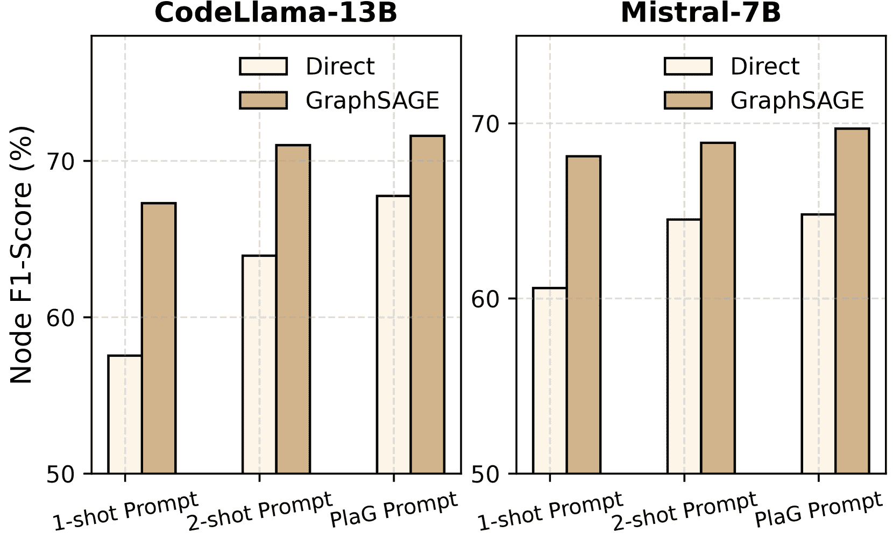

(a) 不同的提示

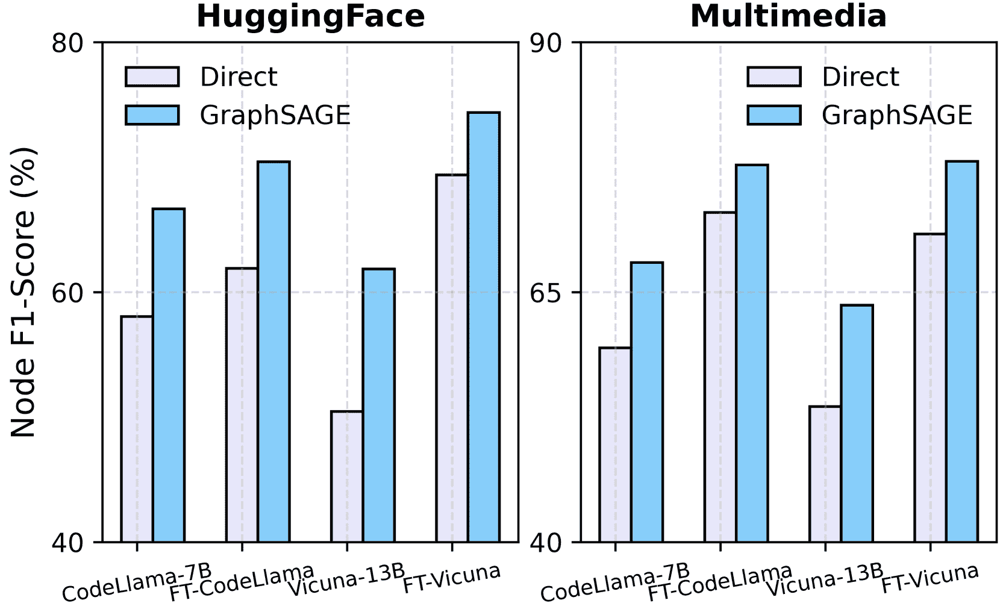

(b) 微调后的 LLMs

图 3：对改进提示和微调 LLMs 的正交有效性

### 5.5 改进的提示和微调后的 LLMs

在本小节中，我们展示了所提方法与两种主流方法（即提示工程和微调）是正交的。

对改进提示的正交性：我们研究了将 GNN 应用于改进提示模板时的有效性，即通过战略性设计的提示，提升 LLMs 的任务规划能力。具体来说，我们考虑了两种类型的提示： (1) 增加示例的上下文学习 [[45](https://arxiv.org/html/2405.19119v3#bib.bib45)] 在主要实验中，我们保持一致的 1-shot 上下文学习示例用于 LLMs 的直接推理。为了实现进一步的改进，我们将示例数量增加到 $2$，在这种设置下的结果被标记为“2-shot 提示”；(2) 像图一样进行规划（PlaG）[[30](https://arxiv.org/html/2405.19119v3#bib.bib30)] 我们采用 [[30](https://arxiv.org/html/2405.19119v3#bib.bib30)] 中的提示来鼓励 LLM 以图形化的方式思考和规划。具体来说，我们将整个任务图转换为普通文本，然后集成 PlaG 指令来增强 LLM 的规划能力。在此提示模板下的结果被标记为“PlaG 提示”。

从图 [3(a)](https://arxiv.org/html/2405.19119v3#S5.F3.sf1 "图 3 ‣ 5.4 扩展到大规模任务图 ‣ 5 实验与分析 ‣ 图学习能否改善基于 LLM 的代理的规划能力？") 中的结果可以看出，当我们将三种不同的提示应用于 HuggingFace 上的 CodeLlama-13B 和 Mistral-7B 时，显然将 GraphSAGE 应用于改进后的提示，任务步骤更简洁地分解且预测更为准确，也能提升性能。

与LLM微调的正交关系：为了探讨我们的框架在微调后的LLM上是否仍然有效，这些LLM已经具备了特定数据集的任务规划能力，我们进行了进一步的实验。对于每个数据集，我们使用LoRA [[19](https://arxiv.org/html/2405.19119v3#bib.bib19)] 对两种不同参数规模的LLM进行微调，包括CodeLlama-7B和Vicuna-13B，微调所用的训练数据与GNNs相同。微调过程的详细信息见附录 [F.3](https://arxiv.org/html/2405.19119v3#A6.SS3 "F.3 LLM微调实现 ‣ 附录 F 训练方法的补充材料 ‣ 图学习能否改善基于LLM的代理的规划？")。微调后的模型在图 [3(b)](https://arxiv.org/html/2405.19119v3#S5.F3.sf2 "在图 3 ‣ 5.4 扩展到大型任务图 ‣ 5 实验与分析 ‣ 图学习能否改善基于LLM的代理的规划？") 中分别被命名为“FT-CodeLlama”和“FT-Vicuna”。

图 [3(b)](https://arxiv.org/html/2405.19119v3#S5.F3.sf2 "在图 3 ‣ 5.4 扩展到大型任务图 ‣ 5 实验与分析 ‣ 图学习能否改善基于LLM的代理的规划？") 中展示的结果表明，微调显著增强了LLM的任务规划能力。此外，将GraphSAGE应用于LLM分解的任务进一步提高了任务规划的准确性。

## 6 结论

本文提出了基于图学习的方法在语言代理任务规划中的初步探索。通过理论分析，我们展示了注意力机制的归纳偏向以及自回归损失的效用，这些因素在任务规划中影响了它们的有效性。我们提出将图神经网络（GNNs）集成到任务图分析中，这在多个LLM和规划基准上提升了性能。

局限性：尽管结果令人鼓舞，但仍然存在一些局限性，显示出显著的改进机会。首先，我们提出的方法虽然有效，但较为简单；更复杂的基于图学习的决策算法可能提供进一步的改进。其次，任务图的构建目前仍需人工操作。研究多样化应用的自动图生成技术是未来工作中的一个有前景的方向。

## 致谢

本研究部分得到中国香港特别行政区研究资助局（编号：CUHK 14217622）资助。

## 参考文献

+   Barto 等人 [1995] Andrew G Barto, Steven J Bradtke, 和 Satinder P Singh. 使用实时动态规划学习行动。*人工智能*，72(1-2)：81–138，1995年。

+   Behrens 等人 [2018] Timothy EJ Behrens, Timothy H Muller, James CR Whittington, Shirley Mark, Alon B Baram, Kimberly L Stachenfeld, 和 Zeb Kurth-Nelson. 什么是认知地图？组织知识以便灵活的行为。*Neuron*，100(2)：490–509，2018年。

+   Bellman [1966] Richard Bellman。动态规划。*科学*，153(3731):34–37，1966年。

+   Besta 等 [2024] Maciej Besta、Nils Blach、Ales Kubicek、Robert Gerstenberger、Michal Podstawski、Lukas Gianinazzi、Joanna Gajda、Tomasz Lehmann、Hubert Niewiadomski、Piotr Nyczyk 等。思维图：使用大型语言模型解决复杂问题。发表于 *人工智能协会会议论文集*，第38卷，第17682–17690页，2024年。

+   Boiko 等 [2023] Daniil A Boiko、Robert MacKnight、Ben Kline 和 Gabe Gomes。使用大型语言模型进行自主化学研究。*自然*，624(7992):570–578，2023年。

+   Bonet & Geffner [2003] Blai Bonet 和 Hector Geffner。标记化 RTDP：改进实时动态规划的收敛性。发表于 *ICAPS*，第3卷，第12–21页，2003年。

+   Bubeck 等 [2023] Sébastien Bubeck、Varun Chandrasekaran、Ronen Eldan、Johannes Gehrke、Eric Horvitz、Ece Kamar、Peter Lee、Yin Tat Lee、Yuanzhi Li、Scott Lundberg 等。人工通用智能的火花：与 GPT-4 的早期实验。*arXiv 预印本 arXiv:2303.12712*，2023年。

+   Cappart 等 [2023] Quentin Cappart、Didier Chételat、Elias B Khalil、Andrea Lodi、Christopher Morris 和 Petar Veličković。图神经网络的组合优化与推理。*机器学习研究杂志*，24(130):1–61，2023年。

+   Chai 等 [2023] Ziwei Chai、Tianjie Zhang、Liang Wu、Kaiqiao Han、Xiaohai Hu、Xuanwen Huang 和 Yang Yang。GraphLLM：提升大型语言模型的图推理能力。*arXiv 预印本 arXiv:2310.05845*，2023年。

+   Chen 等 [2024] Dillon Z Chen、Sylvie Thiébaux 和 Felipe Trevizan。为基础和提升规划学习领域无关的启发式方法。发表于 *人工智能协会会议论文集*，第38卷，第20078–20086页，2024年。

+   Dudzik & Veličković [2022] Andrew J Dudzik 和 Petar Veličković。图神经网络是动态编程者。*神经信息处理系统进展*，35:20635–20647，2022年。

+   Feng 等 [2024] Guhao Feng、Bohang Zhang、Yuntian Gu、Haotian Ye、Di He 和 Liwei Wang。揭示思维链背后的奥秘：一种理论视角。*神经信息处理系统进展*，36，2024年。

+   Gasse 等 [2019] Maxime Gasse、Didier Chételat、Nicola Ferroni、Laurent Charlin 和 Andrea Lodi。使用图卷积神经网络进行精确的组合优化。*神经信息处理系统进展*，32，2019年。

+   Guo 等 [2023] Jiayan Guo、Lun Du 和 Hengyu Liu。Gpt4graph：大型语言模型能否理解图结构数据？一项经验评估与基准测试。*arXiv 预印本 arXiv:2305.15066*，2023年。

+   Hamilton 等 [2017] William L. Hamilton、Rex Ying 和 Jure Leskovec。大规模图上的归纳表示学习。发表于 *NIPS*，2017年。

+   He et al. [2023] Xiaoxin He, Xavier Bresson, Thomas Laurent, Adam Perold, Yann LeCun, 和 Bryan Hooi. 利用解释：用于增强文本属性图表示学习的 Llm-to-lm 解释器，2023。

+   He et al. [2024] Xiaoxin He, Yijun Tian, Yifei Sun, Nitesh V Chawla, Thomas Laurent, Yann LeCun, Xavier Bresson, 和 Bryan Hooi. G-retriever: 用于文本图理解和问答的检索增强生成方法. *arXiv 预印本 arXiv:2402.07630*, 2024.

+   Helmert & Domshlak [2009] Malte Helmert 和 Carmel Domshlak. 地标、关键路径和抽象：它们之间有什么区别？在 *国际自动规划与调度会议论文集* 中，卷 19，第 162–169 页，2009。

+   Hu et al. [2021] J. Edward Hu, Yelong Shen, Phillip Wallis, Zeyuan Allen-Zhu, Yuanzhi Li, Shean Wang, 和 Weizhu Chen. Lora：大规模语言模型的低秩适配. *ArXiv*, abs/2106.09685, 2021.

+   Huang et al. [2024a] Shijue Huang, Wanjun Zhong, Jianqiao Lu, Qi Zhu, Jiahui Gao, Weiwen Liu, Yutai Hou, Xingshan Zeng, Yasheng Wang, Lifeng Shang, Xin Jiang, Ruifeng Xu, 和 Qun Liu. 规划、创建、使用：在现实世界复杂场景中对大规模语言模型进行全面工具使用基准测试，2024a。

+   Huang et al. [2022] Wenlong Huang, Pieter Abbeel, Deepak Pathak, 和 Igor Mordatch. 语言模型作为零-shot 规划者：为具身智能体提取可执行知识. 在 *国际机器学习会议* 中，第 9118–9147 页。PMLR, 2022。

+   Huang et al. [2024b] Xu Huang, Weiwen Liu, Xiaolong Chen, Xingmei Wang, Hao Wang, Defu Lian, Yasheng Wang, Ruiming Tang, 和 Enhong Chen. 理解 LLM 智能体的规划：一项调查. *arXiv 预印本 arXiv:2402.02716*, 2024b。

+   Jiang et al. [2023] Albert Qiaochu Jiang, Alexandre Sablayrolles, Arthur Mensch, Chris Bamford, Devendra Singh Chaplot, Diego de Las Casas, Florian Bressand, Gianna Lengyel, Guillaume Lample, Lucile Saulnier, L’elio Renard Lavaud, Marie-Anne Lachaux, Pierre Stock, Teven Le Scao, Thibaut Lavril, Thomas Wang, Timothée Lacroix, 和 William El Sayed. Mistral 7b. *ArXiv*, abs/2310.06825, 2023.

+   Khalil et al. [2017] Elias Khalil, Hanjun Dai, Yuyu Zhang, Bistra Dilkina, 和 Le Song. 学习图上的组合优化算法. *神经信息处理系统进展*, 30, 2017.

+   Kingma & Ba [2014] Diederik P. Kingma 和 Jimmy Ba. Adam：一种随机优化方法. *CoRR*, abs/1412.6980, 2014.

+   Kipf & Welling [2017] Thomas N. Kipf 和 Max Welling. 使用图卷积网络进行半监督分类. 在 *国际学习表征会议（ICLR）* 中，2017。

+   Li et al. [2023] Yuhan Li, Zhixun Li, Peisong Wang, Jia Li, Xiangguo Sun, Hong Cheng, 和 Jeffrey Xu Yu. 图与大规模语言模型的交汇：进展与未来方向的调查. *arXiv 预印本 arXiv:2311.12399*, 2023。

+   Li 等人 [2024] 李宇涵、王佩松、李志勋、徐宇杰、李佳。Zerog：研究图结构中跨数据集零样本迁移能力。*arXiv 预印本 arXiv:2402.11235*, 2024。

+   Li 等人 [2018] 李朱文、陈其锋、弗拉德伦·科尔顿。使用图卷积网络与引导树搜索进行组合优化。*神经信息处理系统进展*, 31, 2018。

+   Lin 等人 [2024] 林方如、埃马纽埃尔·拉·马尔法、瓦伦丁·霍夫曼、杨米歇尔·艾尔、安东尼·科恩、珍妮特·B·皮耶雷亨伯特。异步计划推理中的图增强大型语言模型。*ArXiv*, abs/2402.02805, 2024。

+   Liu 等人 [2023a] 刘博、蒋雨茜、张小寒、刘强、张诗琪、比斯瓦斯·乔伊深、彼得·斯通。LLM+ p：提升大型语言模型的最佳规划能力。*arXiv 预印本 arXiv:2304.11477*, 2023a。

+   Liu 等人 [2024] 刘旭坤、彭志远、易晓源、谢星、向立荣、刘宇晨、徐东宽。Toolnet：通过工具图将大型语言模型与海量工具连接。*ArXiv*, abs/2403.00839, 2024。

+   Liu 等人 [2023b] 刘赵阳、赖泽强、高张伟、崔二飞、朱希舟、卢乐伟、陈其锋、乔宇、戴吉丰、王文海。Controlllm：通过图搜索增强语言模型与工具的结合。*ArXiv*, abs/2310.17796, 2023b。

+   Luo 等人 [2024] 罗子涵、宋希然、黄鸿、廉建勋、张晨浩、蒋锦奇、谢星、金海。Graphinstruct：赋能大型语言模型图结构理解与推理能力。*arXiv 预印本 arXiv:2403.04483*, 2024。

+   Mao 等人 [2023a] 毛家远、托马斯·洛萨诺-佩雷斯、乔希·特内恩鲍姆、莱斯利·凯尔布林。关系型神经网络能解决哪些规划问题？*神经信息处理系统进展*, 36, 2023a。

+   Mao 等人 [2023b] 毛家远、托马斯·洛萨诺-佩雷斯、乔书亚·B·特内恩鲍姆、莱斯利·包克·凯尔布林。关系型神经网络能解决哪些规划问题？在*神经信息处理系统进展 (NeurIPS)*，2023b。

+   Momennejad 等人 [2023] 伊达·莫门贾德、霍赛因·哈桑贝伊、费利佩·维埃拉·弗鲁杰里、希特西·夏尔马、内博伊萨·乔吉奇、哈米德·帕兰吉、罗伯特·内斯、乔纳森·拉尔森。评估大语言模型中的认知地图与规划：CogEval。*神经信息处理系统进展*, 36, 2023。

+   Perozzi 等人 [2024] 布赖恩·佩罗齐、巴哈雷·法提米、达斯汀·泽尔、安东·齐楚林、梅赫兰·卡泽米、拉米·阿尔·尔弗、乔纳森·哈尔克罗。让你的图来发声：为 LLM 编码结构化数据，2024 年。

+   Qin 等人 [2023] 秦宇佳、梁世豪、叶怡宁、朱昆仑、闫兰、卢雅希、林彦凯、崇鑫、唐向如、钱璧、赵思寒、田润初、谢若冰、周杰、格尔斯坦·马克、李大海、刘志远、孙茂松。Toolllm：助力大型语言模型掌握 16000+ 个现实世界的 API，2023 年。

+   Reimers & Gurevych [2019] Nils Reimers 和 Iryna Gurevych. Sentence-bert：基于孪生BERT网络的句子嵌入。载于 *自然语言处理实证方法会议*，2019年。

+   Rendle 等人 [2012] Steffen Rendle, Christoph Freudenthaler, Zeno Gantner 和 Lars Schmidt-Thieme. Bpr：基于隐式反馈的贝叶斯个性化排序。*arXiv 预印本 arXiv:1205.2618*，2012年。

+   Rozière 等人 [2023] Baptiste Rozière, Jonas Gehring, Fabian Gloeckle, Sten Sootla, Itai Gat, Xiaoqing Tan, Yossi Adi, Jingyu Liu, Tal Remez, Jérémy Rapin, Artyom Kozhevnikov, I. Evtimov, Joanna Bitton, Manish P Bhatt, Cristian Cantón Ferrer, Aaron Grattafiori, Wenhan Xiong, Alexandre D’efossez, Jade Copet, Faisal Azhar, Hugo Touvron, Louis Martin, Nicolas Usunier, Thomas Scialom 和 Gabriel Synnaeve. Code llama：面向代码的开放基础模型。*ArXiv*，abs/2308.12950，2023年。

+   Schick 等人 [2024] Timo Schick, Jane Dwivedi-Yu, Roberto Dessì, Roberta Raileanu, Maria Lomeli, Eric Hambro, Luke Zettlemoyer, Nicola Cancedda 和 Thomas Scialom. Toolformer：语言模型可以自学使用工具。*神经信息处理系统进展*，第36卷，2024年。

+   Shen 等人 [2020] William Shen, Felipe Trevizan 和 Sylvie Thiébaux. 使用超图网络学习领域无关的规划启发式方法。载于 *国际自动化规划与调度会议论文集*，第30卷，页574–584，2020年。

+   Shen 等人 [2023] Yongliang Shen, Kaitao Song, Xu Tan, Wenqi Zhang, Kan Ren, Siyu Yuan, Weiming Lu, Dongsheng Li 和 Yueting Zhuang. Taskbench：大型语言模型任务自动化基准测试。*arXiv 预印本 arXiv:2311.18760*，2023年。

+   Shen 等人 [2024] Yongliang Shen, Kaitao Song, Xu Tan, Dongsheng Li, Weiming Lu 和 Yueting Zhuang. Hugginggpt：通过ChatGPT及其在Hugging Face的朋友解决AI任务。*神经信息处理系统进展*，第36卷，2024年。

+   Shi 等人 [2021] Yunsheng Shi, Zhengjie Huang, Wenjin Wang, Hui Zhong, Shikun Feng 和 Yu Sun. 掩码标签预测：一种统一的消息传递模型用于半监督分类。载于 *第三十届国际人工智能联合会议（IJCA）论文集*，2021年。

+   Shinn 等人 [2024] Noah Shinn, Federico Cassano, Ashwin Gopinath, Karthik Narasimhan 和 Shunyu Yao. Reflexion：带有语言强化学习的语言代理。*神经信息处理系统进展*，第36卷，2024年。

+   Singh 等人 [2023] Ishika Singh, Valts Blukis, Arsalan Mousavian, Ankit Goyal, Danfei Xu, Jonathan Tremblay, Dieter Fox, Jesse Thomason 和 Animesh Garg. Progprompt：利用大型语言模型生成定位的机器人任务计划。载于 *2023 IEEE国际机器人与自动化会议（ICRA）*，页11523–11530，IEEE，2023年。

+   Song 等人 [2023] Yifan Song, Weimin Xiong, Dawei Zhu, Wenhao Wu, Han Qian, Mingbo Song, Hailiang Huang, Cheng Li, Ke Wang, Rong Yao, Ye Tian, 和 Sujian Li. Restgpt：将大型语言模型与现实世界的 restful api 连接，2023年。

+   Ståhlberg 等人 [2022] Simon Ståhlberg, Blai Bonet, 和 Hector Geffner. 使用图神经网络学习通用最优策略：表现力、透明性和局限性。见于 *国际自动规划与调度会议论文集*，第 32 卷，页 629–637，2022年。

+   Sun 等人 [2023] Jiashuo Sun, Chengjin Xu, Lumingyuan Tang, Sai Wang, Chen Lin, Yeyun Gong, Lionel M. Ni, Heung yeung Shum, 和 Jian Guo. Think-on-graph：大型语言模型在知识图谱上的深度与负责任推理，2023年。

+   Tang 等人 [2023a] Jiabin Tang, Yuhao Yang, Wei Wei, Lei Shi, Lixin Su, Suqi Cheng, Dawei Yin, 和 Chao Huang. GraphGPT：为大型语言模型提供图指令微调。*arXiv 预印本 arXiv:2310.13023*，2023a。

+   Tang 等人 [2023b] Qiaoyu Tang, Ziliang Deng, Hongyu Lin, Xianpei Han, Qiao Liang, 和 Le Sun. Toolalpaca：具有3000个模拟案例的语言模型通用工具学习，2023b。

+   Toyer 等人 [2019] Sam Toyer, Felipe W. Trevizan, Sylvie Thiébaux, 和 Lexing Xie. Asnets：用于广义规划的深度学习。*ArXiv*，abs/1908.01362，2019年。

+   Trinh 等人 [2024] Trieu H Trinh, Yuhuai Wu, Quoc V Le, He He, 和 Thang Luong. 无需人工演示解决奥林匹克几何问题。*Nature*，625(7995):476–482，2024年。

+   Veličković 等人 [2018] Petar Veličković, Guillem Cucurull, Arantxa Casanova, Adriana Romero, Pietro Liò, 和 Yoshua Bengio. 图注意力网络。*国际学习表示大会*，2018年。

+   Wang 等人 [2023a] Guanzhi Wang, Yuqi Xie, Yunfan Jiang, Ajay Mandlekar, Chaowei Xiao, Yuke Zhu, Linxi Fan, 和 Anima Anandkumar. Voyager：一个开放式的具身代理与大型语言模型。*arXiv 预印本 arXiv:2305.16291*，2023a。

+   Wang 等人 [2023b] Heng Wang, Shangbin Feng, Tianxing He, Zhaoxuan Tan, Xiaochuang Han, 和 Yulia Tsvetkov. 语言模型能否用自然语言解决图问题？*神经信息处理系统进展*，36，2023b。

+   Wang 等人 [2023c] Lei Wang, Wanyu Xu, Yihuai Lan, Zhiqiang Hu, Yunshi Lan, Roy Ka-Wei Lee, 和 Ee-Peng Lim. Plan-and-solve 提示：通过大型语言模型改进零-shot 思维链推理。*arXiv 预印本 arXiv:2305.04091*，2023c。

+   Wang 等人 [2024] Lei Wang, Chen Ma, Xueyang Feng, Zeyu Zhang, Hao Yang, Jingsen Zhang, Zhiyuan Chen, Jiakai Tang, Xu Chen, Yankai Lin 等人. 基于大型语言模型的自主代理调查。*计算机科学前沿*，18(6):1–26，2024年。

+   Wang 等人 [2022] Liang Wang, Nan Yang, Xiaolong Huang, Binxing Jiao, Linjun Yang, Daxin Jiang, Rangan Majumder, 和 Furu Wei. 通过弱监督对比预训练进行文本嵌入。*ArXiv*，abs/2212.03533，2022年。

+   Wei 等人 [2022] Jason Wei, Xuezhi Wang, Dale Schuurmans, Maarten Bosma, Fei Xia, Ed Chi, Quoc V Le, Denny Zhou 等人。链式思维提示激发大型语言模型的推理能力。*Advances in Neural Information Processing Systems*, 35:24824–24837, 2022。

+   Whittington 等人 [2020] James CR Whittington, Timothy H Muller, Shirley Mark, Guifen Chen, Caswell Barry, Neil Burgess 和 Timothy EJ Behrens. Tolman-Eichenbaum 机器：通过海马体结构中的泛化统一空间和关系记忆。*Cell*, 183(5):1249–1263, 2020。

+   Wu 等人 [2019] Felix Wu, Amauri Souza, Tianyi Zhang, Christopher Fifty, Tao Yu 和 Kilian Weinberger. 简化图卷积网络。在 *国际机器学习会议* 上，第6861–6871页。PMLR, 2019。

+   Xiao 等人 [2023] Guangxuan Xiao, Yuandong Tian, Beidi Chen, Song Han 和 Mike Lewis. 具有注意力池的高效流式语言模型。*arXiv 预印本 arXiv:2309.17453*, 2023。

+   Xu 等人 [2019a] Keyulu Xu, Weihua Hu, Jure Leskovec 和 Stefanie Jegelka. 图神经网络有多强大？在 *国际学习表示会议* 上，2019a。

+   Xu 等人 [2019b] Keyulu Xu, Jingling Li, Mozhi Zhang, Simon S Du, Ken-ichi Kawarabayashi 和 Stefanie Jegelka. 神经网络能推理什么？*arXiv 预印本 arXiv:1905.13211*, 2019b。

+   Yang 等人 [2023] Ai Ming Yang, Bin Xiao 等人。Baichuan 2：开放的大规模语言模型。*ArXiv*, abs/2309.10305, 2023。

+   Yang 等人 [2024] Kai Yang, Jan Ackermann, Zhenyu He, Guhao Feng, Bohang Zhang, Yunzhen Feng, Qiwei Ye, Di He 和 Liwei Wang. 高效的 Transformer 真正节省计算吗？*arXiv 预印本 arXiv:2402.13934*, 2024。

+   Yao 等人 [2024] Shunyu Yao, Dian Yu, Jeffrey Zhao, Izhak Shafran, Tom Griffiths, Yuan Cao 和 Karthik Narasimhan. 思维树：使用大型语言模型进行深思熟虑的问题解决。*Advances in Neural Information Processing Systems*, 36, 2024。

+   Zheng 等人 [2023] Lianmin Zheng, Wei-Lin Chiang, Ying Sheng, Siyuan Zhuang, Zhanghao Wu, Yonghao Zhuang, Zi Lin, Zhuohan Li, Dacheng Li, Eric P. Xing, Haotong Zhang, Joseph Gonzalez 和 Ion Stoica. 使用 mt-bench 和 chatbot arena 评估 LLM 作为判官的表现。*ArXiv*, abs/2306.05685, 2023。

+   Zhong 等人 [2024] Wanjun Zhong, Lianghong Guo, Qiqi Gao, He Ye 和 Yanlin Wang. Memorybank：通过长期记忆增强大型语言模型。在 *AAAI 人工智能会议论文集*，第38卷，第19724–19731页，2024。

###### 目录

1.  [1 引言](https://arxiv.org/html/2405.19119v3#S1 "在图学习能否改善基于 LLM 的代理规划中？")

1.  [2 初步研究](https://arxiv.org/html/2405.19119v3#S2 "在图学习能否改善基于 LLM 的代理规划中？")

    1.  [2.1 语言代理中的任务规划](https://arxiv.org/html/2405.19119v3#S2.SS1 "在 2 初步研究 ‣ 图学习能否改善基于 LLM 的代理规划中？")

    1.  [2.2 当前基于 LLM 的任务规划解决方案](https://arxiv.org/html/2405.19119v3#S2.SS2 "在 2 前言 ‣ 图学习能否改善基于 LLM 的智能体的规划？")

1.  [3 图表示与洞见](https://arxiv.org/html/2405.19119v3#S3 "在 图学习能否改善基于 LLM 的智能体的规划？")

    1.  [3.1 任务规划的图表示](https://arxiv.org/html/2405.19119v3#S3.SS1 "在 3 图表示与洞见 ‣ 图学习能否改善基于 LLM 的智能体的规划？")

    1.  [3.2 LLM 在规划中的失败：实证发现](https://arxiv.org/html/2405.19119v3#S3.SS2 "在 3 图表示与洞见 ‣ 图学习能否改善基于 LLM 的智能体的规划？")

    1.  [3.3 LLM 在规划中的失败：理论洞察](https://arxiv.org/html/2405.19119v3#S3.SS3 "在 3 图表示与洞见 ‣ 图学习能否改善基于 LLM 的智能体的规划？")

1.  [4 融合 GNN 和 LLMs 进行规划](https://arxiv.org/html/2405.19119v3#S4 "在 图学习能否改善基于 LLM 的智能体的规划？")

    1.  [4.1 动机](https://arxiv.org/html/2405.19119v3#S4.SS1 "在 4 融合 GNN 和 LLMs 进行规划 ‣ 图学习能否改善基于 LLM 的智能体的规划？")

    1.  [4.2 无需训练的 GNN 基础方法](https://arxiv.org/html/2405.19119v3#S4.SS2 "在 4 融合 GNN 和 LLMs 进行规划 ‣ 图学习能否改善基于 LLM 的智能体的规划？")

    1.  [4.3 需要训练的 GNN 基础方法](https://arxiv.org/html/2405.19119v3#S4.SS3 "在 4 融合 GNN 和 LLMs 进行规划 ‣ 图学习能否改善基于 LLM 的智能体的规划？")

1.  [5 实验与分析](https://arxiv.org/html/2405.19119v3#S5 "在 图学习能否改善基于 LLM 的智能体的规划？")

    1.  [5.1 实验设置](https://arxiv.org/html/2405.19119v3#S5.SS1 "在 5 实验与分析 ‣ 图学习能否改善基于 LLM 的智能体的规划？")

    1.  [5.2 基于训练的无训练方法的性能](https://arxiv.org/html/2405.19119v3#S5.SS2 "在 5 实验与分析 ‣ 图学习能否改善基于 LLM 的智能体的规划？")

    1.  [5.3 基于训练的方法的性能](https://arxiv.org/html/2405.19119v3#S5.SS3 "在 5 实验与分析 ‣ 图学习能否改善基于 LLM 的智能体的规划？")

    1.  [5.4 扩展到大规模任务图](https://arxiv.org/html/2405.19119v3#S5.SS4 "在 5 实验与分析 ‣ 图学习能否改善基于 LLM 的智能体的规划？")

    1.  [5.5 改进的提示与微调 LLMs](https://arxiv.org/html/2405.19119v3#S5.SS5 "在 5 实验与分析 ‣ 图学习能否改善基于 LLM 的智能体的规划？")

1.  [6 结论](https://arxiv.org/html/2405.19119v3#S6 "在 图学习能否改善基于 LLM 的智能体的规划？")

1.  [A 相关工作与讨论](https://arxiv.org/html/2405.19119v3#A1 "在 图学习能否改善基于 LLM 的智能体的规划？")

    1.  [A.1 LLM中的规划算法](https://arxiv.org/html/2405.19119v3#A1.SS1 "在附录A 相关工作与讨论 ‣ 图学习能否改善基于LLM的智能体规划？")

    1.  [A.2 传统AI中的任务规划](https://arxiv.org/html/2405.19119v3#A1.SS2 "在附录A 相关工作与讨论 ‣ 图学习能否改善基于LLM的智能体规划？")

    1.  [A.3 智能体与神经科学中的规划](https://arxiv.org/html/2405.19119v3#A1.SS3 "在附录A 相关工作与讨论 ‣ 图学习能否改善基于LLM的智能体规划？")

    1.  [A.4 LLMs在图中的应用](https://arxiv.org/html/2405.19119v3#A1.SS4 "在附录A 相关工作与讨论 ‣ 图学习能否改善基于LLM的智能体规划？")

    1.  [A.5 推理的理论分析](https://arxiv.org/html/2405.19119v3#A1.SS5 "在附录A 相关工作与讨论 ‣ 图学习能否改善基于LLM的智能体规划？")

    1.  [A.6 GNN与GraphSearch在组合优化中的应用](https://arxiv.org/html/2405.19119v3#A1.SS6 "在附录A 相关工作与讨论 ‣ 图学习能否改善基于LLM的智能体规划？")

1.  [B 提示语](https://arxiv.org/html/2405.19119v3#A2 "在图学习能否改善基于LLM的智能体规划？")

1.  [C 数据集](https://arxiv.org/html/2405.19119v3#A3 "在图学习能否改善基于LLM的智能体规划？")

    1.  [C.1 概述](https://arxiv.org/html/2405.19119v3#A3.SS1 "在附录C 数据集 ‣ 图学习能否改善基于LLM的智能体规划？")

    1.  [C.2 RestBench重格式化细节](https://arxiv.org/html/2405.19119v3#A3.SS2 "在附录C 数据集 ‣ 图学习能否改善基于LLM的智能体规划？")

    1.  [C.3 UltraTool重格式化细节](https://arxiv.org/html/2405.19119v3#A3.SS3 "在附录C 数据集 ‣ 图学习能否改善基于LLM的智能体规划？")

1.  [D 理论结果的补充材料](https://arxiv.org/html/2405.19119v3#A4 "在图学习能否改善基于LLM的智能体规划？")

    1.  [D.1 动态规划](https://arxiv.org/html/2405.19119v3#A4.SS1 "在附录D 理论结果的补充材料 ‣ 图学习能否改善基于LLM的智能体规划？")

    1.  [D.2 定理1的证明](https://arxiv.org/html/2405.19119v3#A4.SS2 "在附录D 理论结果的补充材料 ‣ 图学习能否改善基于LLM的智能体规划？")

    1.  [D.3 LLM的排列不变性测试](https://arxiv.org/html/2405.19119v3#A4.SS3 "在附录D 理论结果的补充材料 ‣ 图学习能否改善基于LLM的智能体规划？")

    1.  [D.4 命题1的证明](https://arxiv.org/html/2405.19119v3#A4.SS4 "在附录D 理论结果的补充材料 ‣ 图学习能否改善基于LLM的智能体规划？")

    1.  [D.5 定理2的证明](https://arxiv.org/html/2405.19119v3#A4.SS5 "在附录D 理论结果的补充材料 ‣ 图学习能否改善基于LLM的智能体规划？")

1.  [E 基于无训练方法的补充材料](https://arxiv.org/html/2405.19119v3#A5 "图学习能否改善LLM代理的规划？")

    1.  [E.1 基准方法的实现](https://arxiv.org/html/2405.19119v3#A5.SS1 "在附录E：基于无训练的方法的补充材料 ‣ 图学习能否改善LLM代理的规划？")

    1.  [E.2 所有LLM的结果](https://arxiv.org/html/2405.19119v3#A5.SS2 "在附录E：基于无训练的方法的补充材料 ‣ 图学习能否改善LLM代理的规划？")

    1.  [E.3 基于无训练方法的准确度结果](https://arxiv.org/html/2405.19119v3#A5.SS3 "在附录E：基于无训练的方法的补充材料 ‣ 图学习能否改善LLM代理的规划？")

    1.  [E.4 计算成本分析](https://arxiv.org/html/2405.19119v3#A5.SS4 "在附录E：基于无训练的方法的补充材料 ‣ 图学习能否改善LLM代理的规划？")

1.  [F 基于训练的方法的补充材料](https://arxiv.org/html/2405.19119v3#A6 "图学习能否改善LLM代理的规划？")

    1.  [F.1 基于训练的GNN实现](https://arxiv.org/html/2405.19119v3#A6.SS1 "在附录F：基于训练的方法的补充材料 ‣ 图学习能否改善LLM代理的规划？")

    1.  [F.2 TAPE和GraphToken的实现](https://arxiv.org/html/2405.19119v3#A6.SS2 "在附录F：基于训练的方法的补充材料 ‣ 图学习能否改善LLM代理的规划？")

    1.  [F.3 微调LLM的实现](https://arxiv.org/html/2405.19119v3#A6.SS3 "在附录F：基于训练的方法的补充材料 ‣ 图学习能否改善LLM代理的规划？")

    1.  [F.4 基于训练的GNN的完整结果](https://arxiv.org/html/2405.19119v3#A6.SS4 "在附录F：基于训练的方法的补充材料 ‣ 图学习能否改善LLM代理的规划？")

    1.  [F.5 LM+GNN联合训练模式的性能](https://arxiv.org/html/2405.19119v3#A6.SS5 "在附录F：基于训练的方法的补充材料 ‣ 图学习能否改善LLM代理的规划？")

    1.  [F.6 计算成本分析](https://arxiv.org/html/2405.19119v3#A6.SS6 "在附录F：基于训练的方法的补充材料 ‣ 图学习能否改善LLM代理的规划？")

1.  [G 任务参数预测实验](https://arxiv.org/html/2405.19119v3#A7 "图学习能否改善LLM代理的规划？")

    1.  [G.1 提示LLM填充参数](https://arxiv.org/html/2405.19119v3#A7.SS1 "在附录G：任务参数预测实验 ‣ 图学习能否改善LLM代理的规划？")

    1.  [G.2 LLM预测参数的实证结果](https://arxiv.org/html/2405.19119v3#A7.SS2 "在附录G：任务参数预测实验 ‣ 图学习能否改善LLM代理的规划？")

1.  [H 案例研究](https://arxiv.org/html/2405.19119v3#A8 "In Can Graph Learning Improve Planning in LLM-based Agents?")

## 附录 A 相关工作与讨论

### A.1 大型语言模型中的规划算法

现有的任务规划方法研究可以分为几个方向，包括任务分解、多计划选择、外部规划器的使用、反思和记忆辅助规划 [[22](https://arxiv.org/html/2405.19119v3#bib.bib22)]。任务分解方法，如链式思维方法 [[63](https://arxiv.org/html/2405.19119v3#bib.bib63)]，采用分治策略，利用大型语言模型（LLMs）进行任务分解和子任务规划。将该方法应用于任务规划的详细信息可见于第[2.2节](https://arxiv.org/html/2405.19119v3#S2.SS2 "2.2 Current LLM-based Solution to Task Planning ‣ 2 Preliminaries ‣ Can Graph Learning Improve Planning in LLM-based Agents?")，并在基准比较中称为“直接法”。多计划选择策略，如树形思维 [[71](https://arxiv.org/html/2405.19119v3#bib.bib71)] 和图形思维 [[4](https://arxiv.org/html/2405.19119v3#bib.bib4)]，利用基于搜索的方法生成计划。随后，LLMs评估这些计划以选择最有效的一个。我们基准方法中使用的“GraphSearch”方法属于这一类。外部规划器方法 [[31](https://arxiv.org/html/2405.19119v3#bib.bib31)] 使用LLMs将问题转换为规划领域定义语言（PDDL），然后采用经典求解器解决规划问题。PDDL需要预定义的目标，例如，将方块从一个状态移动到另一个状态。然而，语言代理中研究的任务规划目标更加灵活且个性化，涵盖了视频、文本和图像处理中的个人需求。将这些目标转换为正式的PDDL非常困难。我们展示了图神经网络（GNNs）可以作为这一应用中的有效外部规划器。基于反思的方法 [[48](https://arxiv.org/html/2405.19119v3#bib.bib48)] 侧重于通过反思经验来完善计划，而记忆辅助规划方法 [[73](https://arxiv.org/html/2405.19119v3#bib.bib73)] 则利用外部经验，例如来自搜索引擎的经验。这些方法在交互式环境中部署，且与本文主题正交。

### A.2 传统人工智能中的任务规划

除了语言智能体中的任务规划，还有一个传统AI领域叫做任务规划 [[1](https://arxiv.org/html/2405.19119v3#bib.bib1), [6](https://arxiv.org/html/2405.19119v3#bib.bib6), [18](https://arxiv.org/html/2405.19119v3#bib.bib18), [55](https://arxiv.org/html/2405.19119v3#bib.bib55), [44](https://arxiv.org/html/2405.19119v3#bib.bib44), [51](https://arxiv.org/html/2405.19119v3#bib.bib51), [35](https://arxiv.org/html/2405.19119v3#bib.bib35), [10](https://arxiv.org/html/2405.19119v3#bib.bib10)]。传统AI中的任务规划定义为$(\mathcal{S},\mathcal{A},\mathcal{T},\mathcal{C},\mathcal{G},s_{0})$，其中$\mathcal{S}$表示状态，$\mathcal{A}$表示动作空间，$\mathcal{T}:\mathcal{S}\times\mathcal{S}\times\mathcal{A}\rightarrow[0,1]$，成本函数$\mathcal{C}:\mathcal{S}\times\mathcal{A}\rightarrow[0,\infty)$，目标状态集合$\mathcal{G}\subseteq\mathcal{S}$，初始状态为$s_{0}$。遵循策略$\pi:\mathcal{A}\times\mathcal{S}\rightarrow[0,1]$的智能体将从状态$s_{0}$开始，然后反复选择动作$a\sim\pi(a|s)$并执行它，达到新状态$s^{\prime}\sim\mathcal{T}(s^{\prime}|s,a)$，并在此过程中产生成本$\mathcal{C}(s,a)$。一个最优策略$\pi^{*}(a|s)$是一个能够以概率$1$到达目标状态并最小化总预期成本的策略。传统上，任务规划通过强化学习方法[[6](https://arxiv.org/html/2405.19119v3#bib.bib6)]和启发式A^∗方法[[18](https://arxiv.org/html/2405.19119v3#bib.bib18)]来解决。基于神经网络的方法被用于加速计算并提高性能[[55](https://arxiv.org/html/2405.19119v3#bib.bib55), [44](https://arxiv.org/html/2405.19119v3#bib.bib44), [51](https://arxiv.org/html/2405.19119v3#bib.bib51), [35](https://arxiv.org/html/2405.19119v3#bib.bib35), [10](https://arxiv.org/html/2405.19119v3#bib.bib10)]。

语言智能体中的任务规划是一个不同的应用。它不能像约束满足问题那样解决，因为任务图和用户请求的特征都是用自然语言表达的。与传统规划相比，语言智能体的任务规划涉及到多样化和开放性目标，因为用户有不同的个人需求。例如，在像 Hugging Face 这样的平台上，用户的意图跨越视频、文本和图像等领域。相反，经典规划为特定领域设定了固定目标，例如，在n-puzzle [[55](https://arxiv.org/html/2405.19119v3#bib.bib55)]中，目标是将拼图块按照数字顺序排列。在这个新的应用领域，尽管现有研究主要集中在预训练LLM的提示设计上，我们的工作强调了传统规划方法（如GNN）在补充LLM方面的重要性。

### A.3 智能体与神经科学中的规划

规划是代理和神经科学中的一个关键课题，图在其中扮演着不可或缺的角色。我们相信本文中提出的概念和见解对这些领域具有重要意义。

本文中使用的TaskBench、RestBench和UltraTool数据集属于工具代理。数学代理AlphaGeometry利用LLMs生成几何学中的辅助构造[[56](https://arxiv.org/html/2405.19119v3#bib.bib56)]。将引理视为节点，将它们之间的相互依赖关系视为边，证明定理的努力类似于在由潜在引理节点和表示它们相互依赖关系的边组成的图中识别通往定理节点的路径。游戏代理[[58](https://arxiv.org/html/2405.19119v3#bib.bib58)]、具身代理[[21](https://arxiv.org/html/2405.19119v3#bib.bib21)]和代码代理[[48](https://arxiv.org/html/2405.19119v3#bib.bib48)]中没有显式的任务图。在这些领域中的核心策略是使用LLMs中的语言强化学习。强化学习中的状态和转移可以建模为图中的节点和边。此外，这些代理应用中存在按需图模型。例如，在代码代理中，可以将类视为节点，将依赖关系视为边。在具身代理中，可以将环境中的物体视为节点。

在神经科学中，动物的规划通常通过迷宫中的路径规划来评估[[2](https://arxiv.org/html/2405.19119v3#bib.bib2), [64](https://arxiv.org/html/2405.19119v3#bib.bib64)]。受这些动物实验的启发，已经为LLMs开发了规划测试台[[37](https://arxiv.org/html/2405.19119v3#bib.bib37)]。一种被称为Tolman-Eichenbaum机（TEM）的计算模型已被提出，以解密动物在各种环境（如迷宫）中的一般规划机制[[64](https://arxiv.org/html/2405.19119v3#bib.bib64)]。TEM模型假设，包括位置细胞和地标细胞在内的海马细胞会在不同环境之间重新映射，而内嗅皮层细胞则表现出一系列与空间反应相关的特性，包括网格、带状、边界和物体-向量细胞。本质上，海马细胞将感官输入映射到抽象图中的位置并重新映射，而内嗅皮层细胞执行图操作。

### A.4 图的LLMs

随着大型语言模型（LLMs）取得突破，应用LLMs解决图相关问题的兴趣激增[[27](https://arxiv.org/html/2405.19119v3#bib.bib27), [28](https://arxiv.org/html/2405.19119v3#bib.bib28)]。GPT4Graph [[14](https://arxiv.org/html/2405.19119v3#bib.bib14)] 和 NLGraph [[59](https://arxiv.org/html/2405.19119v3#bib.bib59)] 是两个重要的基准测试，旨在评估LLMs在图任务中的表现。它们涵盖了广泛的挑战、不同的输入格式和最先进的提示技术，展示了LLMs具备基本的图处理能力。值得注意的是，提示和格式的选择对性能有着显著的影响。然而，这些基准测试也暴露了模型在图中的虚假关联性方面的易感性。例如，GPT-4在最短路径任务中的准确率仅约为$50\%$，即便使用了复杂的提示。GraphInstruct [[34](https://arxiv.org/html/2405.19119v3#bib.bib34)] 尝试在图论相关任务上对LLMs进行微调，取得了改进的性能，尽管仍远未令人满意。尽管有这些经验性努力，但对于这些评估结果的理论理解仍然有限。第[3.3节](https://arxiv.org/html/2405.19119v3#S3.SS3 "3.3 Failures of LLMs in Planning: Theoretical Insights ‣ 3 Graph Formulation and Insights ‣ Can Graph Learning Improve Planning in LLM-based Agents?")的分析旨在阐明这些研究报告中的经验性观察结果。

考虑到这些负面结果，一种新的研究方向应运而生，即利用图神经网络（GNNs）的输出作为LLMs的令牌，如GraphGPT [[53](https://arxiv.org/html/2405.19119v3#bib.bib53)]、GraphLLM [[9](https://arxiv.org/html/2405.19119v3#bib.bib9)]、GraphToken [[38](https://arxiv.org/html/2405.19119v3#bib.bib38)] 和 G-Retriever [[17](https://arxiv.org/html/2405.19119v3#bib.bib17)]所示。这些方法在GNN相关任务中的表现显著提升。然而，由于缺乏广泛的训练数据，它们尚未应用于任务规划。一个有前景的未来方向是利用GPT生成的任务规划数据来微调图基础模型，如GraphGPT [[53](https://arxiv.org/html/2405.19119v3#bib.bib53)]，并将其应用于任务规划。本文建议将任务规划作为这一研究方向的新基准。

### A.5 推理的理论分析

推理与任务规划和决策密切相关。神经网络推理能力的理论探索始于[[68](https://arxiv.org/html/2405.19119v3#bib.bib68)]。这项工作将直观物理学、视觉问答和最短路径计算等各种推理任务统一为动态规划（DP）问题。接着，分析了MLPs、DeepSets和GNNs的泛化能力。研究表明，GNNs展现出最佳的泛化界限，这归因于其架构与贝尔曼-福特算法的相似性，该算法擅长解决DP问题。在LLMs的推理能力方面，[[12](https://arxiv.org/html/2405.19119v3#bib.bib12)]研究了链式思维（Chain of Thought, CoT）方法如何帮助解决没有图形的算术和DP问题。通过将复杂问题分解为更简单的子问题，CoT将Transformer的表达能力从$\text{TC}^{0}$扩展到P。该分析进一步应用于线性和稀疏Transformer，在[[70](https://arxiv.org/html/2405.19119v3#bib.bib70)]中进行了探讨。

我们对定理[1](https://arxiv.org/html/2405.19119v3#Thmtheorem1 "定理 1\. ‣ 3.3 LLMs在规划中的失败：理论洞察 ‣ 3 图形公式与洞察 ‣ 图形学习能否改善基于LLM的智能体规划？")的证明建立在[[12](https://arxiv.org/html/2405.19119v3#bib.bib12)]中定理4.7的证明基础上。然而，虽然[[12](https://arxiv.org/html/2405.19119v3#bib.bib12)]处理的是没有图形结构的DP问题，但定理[1](https://arxiv.org/html/2405.19119v3#Thmtheorem1 "定理 1\. ‣ 3.3 LLMs在规划中的失败：理论洞察 ‣ 3 图形公式与洞察 ‣ 图形学习能否改善基于LLM的智能体规划？")专门聚焦于带有图边列表输入的DP问题。此外，与[[12](https://arxiv.org/html/2405.19119v3#bib.bib12)]通过分解并顺序解决DP问题不同，定理[1](https://arxiv.org/html/2405.19119v3#Thmtheorem1 "定理 1\. ‣ 3.3 LLMs在规划中的失败：理论洞察 ‣ 3 图形公式与洞察 ‣ 图形学习能否改善基于LLM的智能体规划？")提出了一种方法，在边列表上并行模拟DP。我们还分析了来自注意力机制的归纳偏差和自回归损失所引发的负面结果。这些理论贡献是新颖的，并有望在一般的推理和规划任务中发挥重要作用。

### A.6 GNNs与图搜索在组合优化中的应用

图神经网络（GNNs）是解决图上的决策问题的流行方法。所研究的问题通常是 NP-hard 的，例如最小顶点覆盖、最大割问题和旅行商问题 [[8](https://arxiv.org/html/2405.19119v3#bib.bib8)]。基本方法是逐个选择节点，确保满足约束条件 [[24](https://arxiv.org/html/2405.19119v3#bib.bib24)]。本文采用这种方法按顺序选择任务节点。此外，强化学习可以增强 GNNs 的性能，超越仅使用监督标签所能达到的效果 [[24](https://arxiv.org/html/2405.19119v3#bib.bib24)]。在 [[24](https://arxiv.org/html/2405.19119v3#bib.bib24)] 中，独立选择得分最高的节点。相反，[[29](https://arxiv.org/html/2405.19119v3#bib.bib29)] 采用束搜索，在一次迭代中选择前 $k$ 个节点以提高性能。此外，GNNs 被用作变量选择的方法，来进行穷举搜索，以求解组合优化问题的精确解 [[13](https://arxiv.org/html/2405.19119v3#bib.bib13)]。本文将任务规划概念化为基于图的决策问题。在任务规划中，贪心算法和束搜索算法都已被采用 [[33](https://arxiv.org/html/2405.19119v3#bib.bib33), [32](https://arxiv.org/html/2405.19119v3#bib.bib32)]。基于这一联系，一个有前景的未来方向是将 GNNs 重新应用于任务规划中的决策方法。

## 附录 B 提示

表 4：LLM 直接推理的提示模板 [[45](https://arxiv.org/html/2405.19119v3#bib.bib45)]

| # 任务列表 # {{ 任务列表 }}

# 目标 #

基于上述任务，我希望你生成任务步骤和任务调用图（包括节点和边），以解决# 用户请求 #。格式必须严格符合 JSON 格式，如下所示：

$\{$

${\color[rgb]{1,1,1}2}$ “task_steps”: $[$ 一个或多个步骤的描述 $]$，

${\color[rgb]{1,1,1}2}$ “task_nodes”: $[\{$

${\color[rgb]{1,1,1}2}\quad$ “task”: “任务名称必须从 # 任务列表 # 中选择”,

${\color[rgb]{1,1,1}2}\quad$ “arguments”: $[$ 任务的简明参数列表 $]$

${\color[rgb]{1,1,1}2}$$\}]$，

${\color[rgb]{1,1,1}2}$ “task_links”: $[\{$ “source”: “任务名称 i”, “target”: “任务名称 j” $\}]$，

$\}$

# 要求 #

1\. 生成的任务步骤和任务节点能够完美解决用户请求 # 用户请求 #。任务名称必须从 # 任务列表 # 中选择。

2\. 任务步骤应严格与任务节点对齐，且任务步骤的数量应与任务节点的数量相同。

3\. 任务链接应反映任务节点之间的时间和资源依赖关系，即任务调用的顺序。

# 示例 #

{{ 上下文学习示例 }}

# 用户请求 #

{{ 用户请求 }}

现在，请以严格的 JSON 格式生成你的回应：# 结果 # |

表 5：GraphSearch 的提示模板 [[33](https://arxiv.org/html/2405.19119v3#bib.bib33)]

| 场景 | 提示 |
| --- | --- |

| 任务评估 | # CANDIDATE TASK LIST # {{ 候选任务 }}

# GOAL #

根据提供的 # CANDIDATE TASK LIST # 和用户在 # STEP # 中描述的请求，生成评分字典以评估每个任务的解决问题能力。输出必须严格遵循 JSON 格式，如：$\{$ “candidate task name 1”: score, … $\}$。

# REQUIREMENTS #

1\. 生成的评分字典的键必须与提供的候选任务一致，并且应为所有候选任务输出分数。

2\. “score”字段表示评估每个任务是否能够解决给定步骤需求的具体分数。分数应在 $[1,2,3,4,5]$ 范围内，其中分数越高表示任务的解决和匹配能力越强。

3\. 仔细考虑 # STEP # 中用户的意图来分配分数。如果 # STEP # 包含候选任务，其分数应 >= 3\。

# EXAMPLE #

{{ 上下文学习示例 }}

# STEP #

{{ 步骤描述 }}

现在请以严格的 JSON 格式生成您的结果：# RESULT # |

| 路径选择 | # GOAL # 基于提供的 # USER REQUEST # 和最初推断的 # STEPS #，从 # SOLUTION LIST # 中选择最佳路径解决方案列表。所选解决方案应能够完美解决用户请求，并严格与推断的步骤一致。输出必须严格遵循 JSON 格式，如：$\{$ “best_solution”: $[$调用任务列表 $]\}$

# REQUIREMENTS #

1\. 仔细分析用户的请求和先前推断的任务步骤。选择最适合完美遵循推断步骤并解决用户请求的最佳解决方案。不要更改它们对应的顺序。

2\. 确保最终解决方案列表中的每个任务都存在于有效的 # TASK LIST # {{ 任务列表 }} 中。

# USER REQUEST #

{{ 用户请求 }}

# STEPS #

{{ 步骤 }}

# SOLUTION LIST #

{{ 搜索解决方案列表 }}

现在请以严格的 JSON 格式生成您的结果：# RESULT # |

表 6：LLM 填充调用参数的提示模板 [[45](https://arxiv.org/html/2405.19119v3#bib.bib45)]

| # GOAL # 给定 # USER REQUEST # 和 # PLANNED TASKS #，按顺序调用以解决该请求，请填写每个调用任务的调用参数。格式必须严格遵循 JSON 格式，如：

$\{$

${\color[rgb]{1,1,1}2}$ “task_nodes”: $[\{$

${\color[rgb]{1,1,1}2}\quad$ “task”: “任务名称必须来自 # PLANNED TASKS # ”，

${\color[rgb]{1,1,1}2}\quad$ “arguments”: $[$ 该任务的简洁参数列表 $]$

${\color[rgb]{1,1,1}22}$$\},\ldots]$  ${\color[rgb]{1,1,1}2}$

$\}$

# REQUIREMENTS #

1\. 考虑每个任务的输入和输出要求，并仔细填写每个任务的参数。

2\. 分析资源依赖关系，记住这些任务是按顺序调用的，以解决原始请求。

3\. 预测的任务节点数量必须严格与提供的任务对齐。

# 用户请求 #

{{ 用户请求 }}

# 计划任务 #

{{ 先前通过GNN检索的任务列表 }}

# 任务细节 #

{{ 任务的详细信息，例如每个计划任务的输入和输出要求 }}

# 示例 #

{{ 上下文学习示例 }} 现在，请以严格的JSON格式生成您的响应：# 结果 # |

## 附录C 数据集

### C.1 概述

我们在表格[7](https://arxiv.org/html/2405.19119v3#A3.T7 "Table 7 ‣ C.2 Reformatting Details of RestBench ‣ Appendix C Datasets ‣ Can Graph Learning Improve Planning in LLM-based Agents?")中提供了来自三个任务规划基准的实验数据集统计信息。每个数据集的示例在图[4](https://arxiv.org/html/2405.19119v3#A3.F4 "Figure 4 ‣ C.2 Reformatting Details of RestBench ‣ Appendix C Datasets ‣ Can Graph Learning Improve Planning in LLM-based Agents?")中展示。来自TaskBench [[45](https://arxiv.org/html/2405.19119v3#bib.bib45)]的数据集中的每个样本包含原始用户请求、相应的任务分解步骤和真实任务调用路径。由于RestBench [[50](https://arxiv.org/html/2405.19119v3#bib.bib50)]和UltraTool [[20](https://arxiv.org/html/2405.19119v3#bib.bib20)]仅包含用户请求和相应的API调用序列，我们提示GPT-4推断与每个调用的API对齐的分解任务步骤，从而最终确定数据集。

### C.2 RestBench 重新格式化细节

RestBench中的TMDB数据集专注于电影相关的搜索和推荐功能。为了将RestBench与我们的实验对齐，我们实施了以下处理步骤：

通过分配唯一的任务名称和描述重新格式化原始API：RestBench中的API通过请求路径表示，例如“GET /movie/top_rated”，指的是检索TMDB上排名最高电影的API。为了增强API之间的语义区分，我们首先提示GPT-4为每个API分配一个唯一的名称和详细的功能描述。这些名称和描述随后经过人工验证和完善。例如，前面提到的API被重命名为“获取排名最高的电影”，描述为：“该API检索最高评分电影的列表。”请注意，尽管原始TMDB数据集包含$54$个API，但其中一些API在任何数据示例中都未被调用。因此，我们只关注那些至少出现在一个用户请求中的API，最终得到一个精炼的$46$个API集。

构建任务图：每个 API 被视为一个独立的任务节点，我们从两个方面描述它们之间的关系：（1）类别关联，（2）资源依赖。例如，提供与电影相关功能的 API，如获取电影详情或推荐电影，归类为*电影*类别。相反，专注于人物相关功能的 API，如搜索演员，归类为*人物*类别。此外，如果两个 API 共享一个共同的参数，如 move_id，我们会在它们之间建立一个连接，表示资源依赖。

重构原始数据示例：RestBench 中的原始数据样本包括一个查询及其对应的 API 调用序列。为了将这些数据重构为路径结构，我们将每个调用的 API 视为一个节点，并将调用序列视为从一个 API 到下一个 API 的有向链接。例如，一个 TMDB 数据样本包括查询“电影《黑暗骑士》的主演是谁”以及相应的真实 API 解决方案 $[$“GET /search/movie”, “GET /movie/{movie_id}/credits”$]$。我们将这个解决方案转换为任务调用路径，表示为“$\{$ “task_nodes”: $[$“搜索电影”, “获取电影演员”$]$, “task_links”: $[\{$“source”: “搜索电影”, “target”: “获取电影演员”$\}]\}$ ”。

表 7：实验数据集的统计信息

|  |  | TaskBench | RestBench |  |
| --- | --- | --- | --- | --- |
| 类型 | 统计信息 | HuggingFace | 多媒体 | 日常生活 | TMDB | UltraTool |
| 任务图 | # 节点数 | 23 | 40 | 40 | 46 | 260 |
| # 链接数 | 225 | 449 | 1560 | 979 | 611 |
| 链接类型 | 资源 | 资源 | 时间 | 资源 / 类别 | 资源 |
| 所有数据 | # 样本数 | 7,546 | 5,584 | 4,320 | 100 | 3,527 |
| 测试集 | # 样本数 | 500 | 500 | 500 | 94 | 500 |
| # 平均节点数 | 3.81 | 3.92 | 4.05 | 2.33 | 2.38 |

| # 平均链接数 | 2.81 | 2.92 | 3.05 | 1.33 | 1.38 | 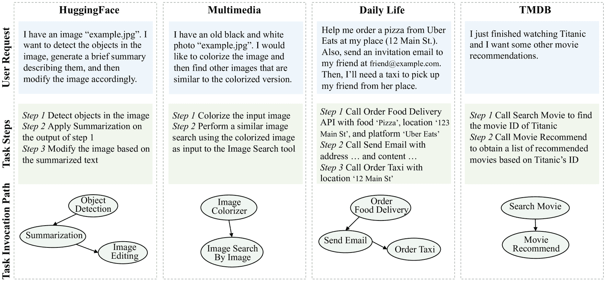

图 4：实验数据集的详细说明。

### C.3 UltraTool 的重构细节

动机：在我们使用 TaskBench [[45](https://arxiv.org/html/2405.19119v3#bib.bib45)] 和 RestBench [[50](https://arxiv.org/html/2405.19119v3#bib.bib50)] 进行的主要实验中，我们观察到像 GPT-4-turbo 这样的强大 LLM 已经表现得非常好。这可能归因于两个因素：（1）GPT-4-turbo 的训练可能包含了与这些基准相关的知识，因为这两个基准在 GPT-4 发布之前就已经发布，并且使用了 HuggingFace 和 TMDB 等流行平台；（2）任务图相对较小，最多包含$50$个任务，属于 LLM 的能力范围。因此，我们旨在通过更具挑战性的场景来评估规划性能以及 GNN 的有效性，即需要超出 LLM 训练的特定知识，并涉及较大的任务图，可能超出了其记忆和推理能力。

构建任务图：我们使用了UltraTool [[20](https://arxiv.org/html/2405.19119v3#bib.bib20)]，该工具于2024年3月发布，包含了跨越成千上万任务的复杂规划场景，包括旅行、旅游和其他日常生活领域。原始的UltraTool包含$5,824$个样本和$2,032$个可用任务，涵盖$22$个不同领域。然而，我们观察到某些任务只出现在一个样本中，使得它们相当稀有。因此，我们按以下方式过滤了这个数据集：首先，我们只考虑那些在所有样本中出现超过$5$次的任务，专注于更常见的、适用于日常生活的任务。接下来，我们保留了包含这些过滤任务的样本，确保调用的任务数量超过2个，以满足多任务规划场景。经过此过滤后，我们确定了$260$个不同的任务。然后，我们通过将每个任务视为一个节点，构建任务图，并在数据集中按顺序调用的任务之间添加连接。对于每个任务，我们进一步验证和完善其功能描述，以确保语义的适用性。

原始数据重构示例：我们分配了$500$个样本用于测试，$3,000$个样本用于GNN训练。尽管原始的UltraTool提供了分解的步骤，我们发现这些步骤过于粗糙，难以将步骤描述与合适的任务对齐。因此，我们采用了类似的策略，通过提示GPT-4推断出与每个调用的任务对齐的分解任务步骤。结果是，每个数据样本包含了用户请求、相应的步骤以及实际调用的任务，确保了GNN训练的高质量。

## 附录D 理论结果的补充材料

### D.1 动态规划

最长递增子序列：最长递增子序列（LIS）问题是一个经典的动态规划问题，涉及在给定的数组arr中找到最长子序列的长度，其中元素按严格递增的顺序排列。LIS问题的状态转移函数可以表示为：

|  | $\displaystyle\text{Answer}[k][i]=\max_{j\in\mathcal{T}(i)}(\text{Answer}[k-1][% j]+(\mathbb{I}(j\neq i)\times 1)),$ |  |
| --- | --- | --- |

其中，$\mathcal{T}(i)=\{i\}\cup\{j\;|j<i\;\text{且}\;\texttt{arr}[j]<\texttt{arr}[i]\}$表示可以转移到状态$i$的状态集合，聚合函数$g(x,y)$被实现为$\max(x,y)$，而成本$c[i][j]$对于那些不等于状态$i$的候选状态为$1$，因为添加该元素会导致更长的子序列，而对于状态本身则为$0$。

贝尔曼-福特算法：贝尔曼-福特算法也是一种经典的动态规划算法，用于在加权图中找到从单个源顶点到所有其他顶点的最短路径。贝尔曼-福特算法背后的核心思想是，从源顶点到目标顶点的距离可以通过从源顶点到目标邻居的最短距离再加上连接邻居和目标的边的权重来计算。因此，贝尔曼-福特算法的状态转移函数可以表示为：

|  | $\displaystyle\text{Answer}[k][i]=\min_{j\in\mathcal{T}(i)}(\text{Answer}[k-1][j]+w[j][i]),$ |  |
| --- | --- | --- |

其中，$\text{Answer}[k][i]$表示从源顶点到节点$i$在第$k$次迭代中的最短路径长度，$\mathcal{T}(i)=\mathcal{N}^{-}(i)$表示节点$i$的入邻居集合，$w[j][i]$表示从节点$j$到$i$的权重。聚合函数$g(x,y)$被实现为$\min(x,y)$，因为我们尝试找到最短路径。

旅行商问题（TSP）：该问题的定义是，给定一组城市和每对城市之间的距离，找出一条最短的路径，该路径恰好访问每个城市一次并返回起点。如果我们将已经访问的城市集合$\mathcal{S}$以第$i$个城市作为结束城市视为当前状态，那么可以转移到当前状态的状态是那些可以到达结束城市的$k$个城市。因此，TSP问题的状态转移函数可以表示为：

|  | $\displaystyle\text{Answer}[k][i][\mathcal{S}]=\min_{j\in\mathcal{S},j\neq i}(\text{Answer}[k-1][j][\mathcal{S}\setminus\{i\}]+w[j][i]),$ |  |
| --- | --- | --- |

其中，$\text{Answer}[k][i][\mathcal{S}]$表示访问集合$\mathcal{S}$中所有城市并以第$i$个城市为终点的最短路径的成本，聚合函数$g(x,y)$仍然实现为$\min(x,y)$，因为我们的目标是找到最短路径，$w[j][i]$表示从城市$j$到城市$i$的距离。

### D.2 定理[1](https://arxiv.org/html/2405.19119v3#Thmtheorem1 "定理 1\. ‣ 3.3 LLMs在规划中的失败：理论洞察 ‣ 3 图的形式化与洞察 ‣ 图学习能否改善基于LLM的智能体规划？")的证明

###### 假设 1.

每个函数$f,g$在([2](https://arxiv.org/html/2405.19119v3#S3.E2 "在 3.3 LLMs在规划中的失败：理论洞察 ‣ 3 图的形式化与洞察 ‣ 图学习能否改善基于LLM的智能体规划？"))中都可以通过常数大小的MLP来逼近。

###### 假设 2.

聚合函数$\square$在([2](https://arxiv.org/html/2405.19119v3#S3.E2 "在 3.3 LLMs在规划中的失败：理论洞察 ‣ 3 图的形式化与洞察 ‣ 图学习能否改善基于LLM的智能体规划？"))中是min、max、sum、mean之一。

第一个假设是温和的，因为多层感知机（MLPs）是通用逼近器。第二个假设是温和的，因为这些是最常用的聚合函数。

###### 定理 3.

（表达能力）假设输入格式给定于 ([1](https://arxiv.org/html/2405.19119v3#S3.E1 "在 3.3 LLMs 在规划中的失败：理论见解 ‣ 3 图形公式和见解 ‣ 图学习能否改善基于 LLM 的代理的规划？")) 且 $f,g,\square$ 在 DP 更新中 ([2](https://arxiv.org/html/2405.19119v3#S3.E2 "在 3.3 LLMs 在规划中的失败：理论见解 ‣ 3 图形公式和见解 ‣ 图学习能否改善基于 LLM 的代理的规划？")) 满足假设 [1](https://arxiv.org/html/2405.19119v3#Thmassumption1 "假设 1. ‣ D.2 定理 1 的证明 ‣ 附录 D 理论结果的补充材料 ‣ 图学习能否改善基于 LLM 的代理的规划？") 和 [2](https://arxiv.org/html/2405.19119v3#Thmassumption2 "假设 2. ‣ D.2 定理 1 的证明 ‣ 附录 D 理论结果的补充材料 ‣ 图学习能否改善基于 LLM 的代理的规划？")。存在一个对数精度、恒定深度和恒定宽度的 Transformer，可以模拟 ([2](https://arxiv.org/html/2405.19119v3#S3.E2 "在 3.3 LLMs 在规划中的失败：理论见解 ‣ 3 图形公式和见解 ‣ 图学习能否改善基于 LLM 的代理的规划？")) 中的 $1$ 步 DP 更新。因此，存在一个对数精度、$O(k)$ 深度和恒定宽度的 Transformer，可以模拟 ([2](https://arxiv.org/html/2405.19119v3#S3.E2 "在 3.3 LLMs 在规划中的失败：理论见解 ‣ 3 图形公式和见解 ‣ 图学习能否改善基于 LLM 的代理的规划？")) 中的 $k$ 步 DP 更新。

###### 证明。

令牌嵌入和位置嵌入：三维令牌嵌入包括令牌类型 $e^{\text{type1}}$ （$0$ 表示答案；$1$ 表示节点；$2$ 表示边的代价），精细化的令牌类型 $e^{\text{type2}}$ （$0$ 表示答案，$1$ 表示初始状态中的节点令牌，$2$ 表示边列表中的目标节点令牌，$3$ 表示边列表中的源节点令牌，$4$ 表示边的代价），以及令牌 ID $e^{\text{token}}$ （从 $0$ 到 $|V|-1$）。二维位置嵌入包括初始状态令牌的嵌入 $e^{\text{pos1}}$ （$0$ 表示边列表令牌，$1$ 表示初始状态的前两个元素，$2$ 表示初始状态的第二对元素，以此类推），边列表令牌的嵌入 $e^{\text{pos2}}$ （$0$ 表示初始状态令牌，$1$ 表示边列表的前三个元素，$2$ 表示边列表的第二组三个元素，以此类推）。还有常数维度的占位符，用于存放 DP 的状态。

块 1 - 初始状态广播：第一块的目标是将初始状态从初始状态标记传递到节点标记。(1) 使用多层感知机（MLPs）恢复答案标记的数字，并在$e^{type}_{k}==0$时将其放入第一个占位符；(2) 使用引理[1](https://arxiv.org/html/2405.19119v3#Thmlemma1 "引理 1． ‣ D.2 定理 1 的证明 ‣ 附录 D 理论结果的补充材料 ‣ 图学习能改善基于LLM的智能体规划吗？")，通过复制答案标记的第一个占位符到其前一个节点标记，并设置$\mathcal{S}_{k}=\{j|(e^{\text{pos1}}_{k}-e^{\text{pos1}}_{j})^{2}<\delta\}$；(3) 使用引理[1](https://arxiv.org/html/2405.19119v3#Thmlemma1 "引理 1． ‣ D.2 定理 1 的证明 ‣ 附录 D 理论结果的补充材料 ‣ 图学习能改善基于LLM的智能体规划吗？")，通过SUM操作广播第一个占位符，并设置$\mathcal{S}_{k}=\{j|(e^{\text{type1}}_{k}-e^{\text{type1}}_{j})^{2}+(e^{\text{% token}}_{k}-e^{\text{token}}_{j})^{2}<\delta\}$。现在每个节点标记$u_{i}$的状态是$[e^{\text{type1}},e^{\text{type2}},e^{\text{token}},e^{\text{pos1}},e^{\text{% pos2}},\text{Answer}[0][u_{i}]]$。

块 2 - 边特征操作：第二块的目标是将边特征从边特征标记复制到相应的节点标记。(1) 使用多层感知机（MLPs）恢复边特征标记的数字，并在$e^{\text{type1}}==2$时将其放入第二个占位符；(2) 使用引理[1](https://arxiv.org/html/2405.19119v3#Thmlemma1 "引理 1． ‣ D.2 定理 1 的证明 ‣ 附录 D 理论结果的补充材料 ‣ 图学习能改善基于LLM的智能体规划吗？")，通过SUM操作将第二个占位符从边特征标记复制到节点标记，并设置$\mathcal{S}_{k}=\{j|(e^{\text{pos2}}_{k}-e^{\text{pos2}}_{j})^{2}<\delta\}$。现在每个节点标记$u_{i}$的状态是$[e^{\text{type1}},e^{\text{type2}},e^{\text{token}},e^{\text{pos1}},e^{\text{% pos2}},\text{Answer}[0][u_{i}],c[u_{i}][v_{i}]]$。

块 3 - 消息准备：(1) 使用多层感知机（MLPs）计算$g$并将结果放入第三个占位符。现在每个节点标记$u_{i}$的状态是$[e^{\text{type1}},e^{\text{type2}},e^{\text{token}},e^{\text{pos1}},e^{\text{% pos2}},\text{Answer}[0][u_{i}],c[u_{i}][v_{i}],g(\text{Answer}[0][u_{i}],c[u_{% i}][v_{i}])]$；(2) 使用多层感知机（MLPs）清理第一个和第二个占位符。现在每个节点标记$u_{i}$的状态是$[e^{\text{type1}},e^{\text{type2}},e^{\text{token}},e^{\text{pos1}},e^{\text{% pos2}},g(\text{Answer}[0][u_{i}],c[u_{i}][v_{i}])]$

第四块 - 消息传递：第四块的目标是计算$\square$和$f$。(1) 使用一个或两个注意力头（一个用于最大值、最小值、均值聚合，两个用于求和聚合）执行聚合操作。这是通过使用MEAN或MAX或SUM作为第一个占位符，并设置$\mathcal{S}_{k}=\{j|(e^{\text{token}}_{k}-e^{\text{token}}_{j})^{2}+(e^{\text{% type2}}_{k}-e^{\text{type2}}_{j})^{2}<\delta\}$来实现的。现在每个节点的状态是$[e^{\text{type1}},e^{\text{type2}},e^{\text{token}},e^{\text{pos1}},e^{\text{% pos2}},\square_{v_{j}\in\mathcal{T}(u_{i})}g(\text{Answer}[0][u_{i}],c[u_{i}][% v_{j}])]$；(2) 使用MLP计算$f$。现在每个节点的状态是$[e^{\text{type1}},e^{\text{type2}},e^{\text{token}},e^{\text{pos1}},e^{\text{% pos2}},f(\square_{v_{j}\in\mathcal{T}(i)}g(\text{Answer}[0][u_{i}],c[u_{i}][v_% {j}]))]$。

经历四个块后，每个节点的最终状态是$[e^{\text{type1}},e^{\text{type2}},e^{\text{token}},e^{\text{pos1}},e^{\text{% pos2}},\text{Answer}[1][u_{i}]]$。$\text{Answer}[k][u_{i}]$可以通过重复上述四个块$k$次得到。

∎

###### 引理 1.

[[12](https://arxiv.org/html/2405.19119v3#bib.bib12)] 设$n\in\mathbb{N}$是一个整数，$\bm{x}_{1},\cdots,\bm{x}_{n}$是一个向量序列，其中$\bm{x}_{i}=(\tilde{\bm{x}}_{i},r_{i},1)\in[-M,M]^{d+2}$，$M$是一个大常数。设$\bm{K},\bm{Q},\bm{V}\in\mathbb{R}^{d^{\prime}\times(d+2)}$是任意矩阵，且$\|\bm{V}\|_{\infty}\leq 1$，设$0<\rho,\delta<M$是任意实数。记$\bm{q}_{i}=\bm{Q}\bm{x}_{i},\bm{k}_{j}=\bm{K}\bm{x}_{i},\bm{v}_{j}=\bm{V}\bm{x% }_{j}$。定义一个匹配集$\mathcal{S}=\{j||\bm{q}_{i}^{T}\bm{k}_{j}|\leq\rho\}$。定义以下两种操作

+   •

    COPY：输出是一个向量序列$\bm{u}_{1},\cdots,\bm{u}_{n}$，其中$\bm{u}_{i}=\bm{v}_{\text{pos}(i)}$，其中$\text{pos}(i)=\arg\max_{j\in\mathcal{S}_{i}}r_{j}$。

+   •

    MEAN, MAX, SUM：输出是一个向量序列$\bm{u}_{1},\cdots,\bm{u}_{n}$，其中$\bm{u}_{i}=\square_{j\in\mathcal{S}_{i}}\bm{v}_{j}$，$\square$可以是最小值、最大值、求和或均值。

具体而言，对于任意向量序列$\bm{x}_{1},\bm{x}_{2},\cdots,\bm{x}_{n}$，设对应的注意力层输出为$\bm{o}_{1},\bm{o}_{2},\cdots,\bm{o}_{n}$。然后，对于所有$i\in[n]$，我们有$\|\bm{u}_{i}-\bm{o}_{i}\|_{\infty}\leq\epsilon$，且$\mathcal{S}\neq\emptyset$。

### D.3 大型语言模型的排列不变性测试

我们测试大型语言模型是否在图问题中遵循排列不变性属性，结果见图[5](https://arxiv.org/html/2405.19119v3#A4.F5 "图5 ‣ D.3 大型语言模型的排列不变性测试 ‣ 附录D 理论结果的补充材料 ‣ 图学习能否改善基于大型语言模型的规划？")。

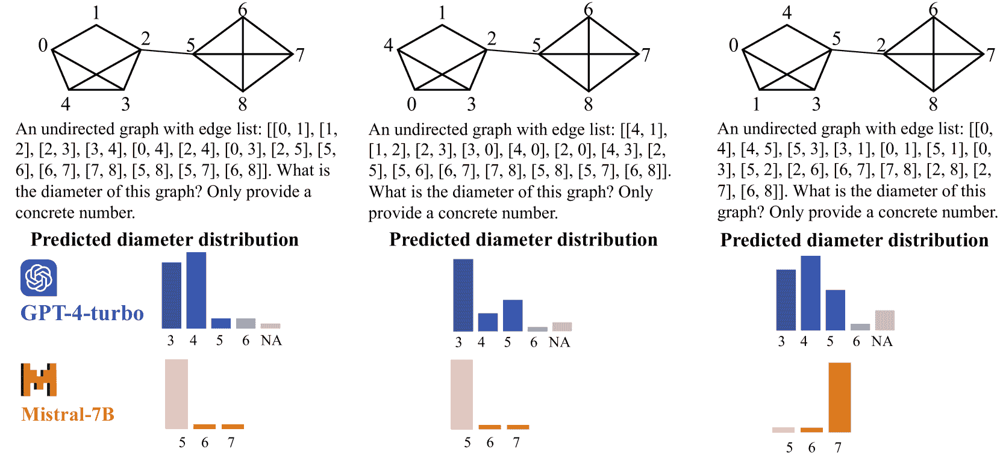

图 5：在排列（即节点重新排序）下，LLMs 解决图计算问题失败的说明性示例。实验进行了 30 次。

### D.4 命题[1](https://arxiv.org/html/2405.19119v3#Thmproposition1 "命题 1. ‣ 3.3 LLMs 在规划中的失败：理论洞察 ‣ 3 图的表述和洞察 ‣ 图学习能否改善基于LLM的智能体的规划？")的证明。

###### 命题 2。

假设输入格式如方程 ([1](https://arxiv.org/html/2405.19119v3#S3.E1 "在 3.3 LLMs 在规划中的失败：理论洞察 ‣ 3 图的表述和洞察 ‣ 图学习能否改善基于LLM的智能体的规划？")) 中所述，并且注意力机制被限制为只能关注常数数量的标记。在此假设下，至少存在一个一步动态规划更新的实例，使得没有一个对数精度、常数宽度、常数深度的 Transformer 可以模拟该过程。

###### 证明。

我们通过反证法来证明。假设一个具有常数深度、常数宽度和对数精度的 Transformer 中的标记只能关注常数数量的节点。在这一假设下，该 Transformer 架构中标记能够访问的总信息量为 $O(\log n)$ 位。然而，对于一个包含 $|V|$ 个节点的图，执行一步动态规划的可能结果数量为 $O(e^{|V|})$，这需要 $\Theta(|V|)$ 位进行表示。根据抽屉原理，这种情况不可避免地导致至少两个不同的动态规划结果被模型生成的相同输出序列所表示，从而形成矛盾。∎

### D.5 定理[2](https://arxiv.org/html/2405.19119v3#Thmtheorem2 "定理 2. ‣ 3.3 LLMs 在规划中的失败：理论洞察 ‣ 3 图的表述和洞察 ‣ 图学习能否改善基于LLM的智能体的规划？")的证明。

###### 定理 4。

（自回归损失的虚假相关性）假设（1）所采用的损失是利用交叉熵的下一个标记预测损失，应用于训练过程中的子序列 $v_{1}\ v_{2}\ \cdots\ t$；（2）输出对数值由目标节点 $t$ 和当前节点 $v_{i-1}$ 确定。设 $N_{t,v_{i-1},u}$ 为训练数据集中，$t$ 是目标节点，$v_{i-1}$ 是当前节点，且 $v_{i}=u$ 是下一个节点的次数。预测从当前节点 $v_{i-1}$ 到目标节点 $t$ 的下一个节点 $u$ 的最优对数值为 $\hat{\bm{v}}_{i}[u]=\frac{N_{t,v_{i-1},u}}{\sum_{u}N_{t,v_{i-1},u}}$，前提是 $\sum_{u}N_{t,v_{i-1},u}>0$。如果 $\sum_{u}N_{t,v_{i-1},u}=0$，则 $\hat{\bm{v}}_{i}[u]$ 可以是任何非负数，且满足 $\sum_{u}\hat{\bm{v}}_{i}[u]=1$。

###### 证明。

我们用$\mathcal{D}$表示训练数据集，用$L_{i}$表示数据集中第$i$个序列的长度，用$\bm{v}_{i,j}$表示第$i$个训练序列中第$j$个标记的one-hot嵌入，用$\hat{\bm{v}}_{i,j,u}$表示第$i$个序列中第$j$个标记的第$u$个logit。交叉熵损失由以下公式给出：

|  |  | $\displaystyle-\sum_{i\in[&#124;\mathcal{D}&#124;]}\sum_{j=4}^{L_{i}}\bm{v}_{i,j,u}\log% \hat{\bm{v}}_{i,j,u}=-\sum_{i\in[&#124;\mathcal{D}&#124;]}\sum_{j=4}^{L_{i}}\mathbb{I}_{% u=v_{i,j}}\log\hat{\bm{v}}_{i,j,u}\overset{(a)}{=}-\sum_{t,v_{j-1}}\sum_{u}N_{% t,v_{j-1},u}\log\hat{\bm{v}}_{i,j,u}$ |  |
| --- | --- | --- | --- |
|  | $\displaystyle\overset{(b)}{=}$ | $\displaystyle-\sum_{t,v_{j-1},u}\left(\sum_{u}N_{t,v_{j-1},u}\right)\left[% \left(\frac{N_{t,v_{j-1},u}}{\sum_{u}N_{t,v_{j-1},u}}\right)\log\hat{\bm{v}}_{% i,j,u}\right],$ |  |

其中，(a)假设输出logits由目标节点$t$和当前节点$v_{i-1}$决定。在(b)中，我们假设$\sum_{u}N_{t,v_{i-1},u}\neq 0$。当$\hat{\bm{v}}_{i,j,u}=\frac{N_{t,v_{j-1},u}}{\sum_{u}N_{t,v_{j-1},u}}$时，交叉熵达到最小值。如果$\sum_{u}N_{t,v_{i-1},u}=0$，则相应的logits不会影响损失函数，并且$\hat{\bm{v}}_{i,j,u}$可以取任何值。∎

## 附录E 无需训练的方法的补充材料

### E.1 基准方法的实现

在这一小节中，我们展示了无需训练的基准方法的实现细节，包括LLM的直接推理、GraphSearch方法和我们的SGC方法。方法示意图见图[6](https://arxiv.org/html/2405.19119v3#A5.F6 "图 6 ‣ E.1 基准方法的实现 ‣ 附录E 无需训练的方法的补充材料 ‣ 图学习能否改善基于LLM的智能体的规划？")。

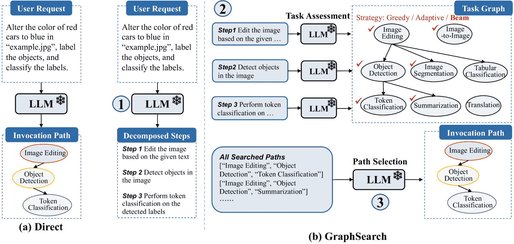

图6：LLM直接推理与GraphSearch方法的示意图。

LLM直接推理：LLM直接推理的提示模板见表[4](https://arxiv.org/html/2405.19119v3#A2.T4 "表 4 ‣ 附录B 提示 ‣ 图学习能否改善基于LLM的智能体的规划？")。在实验中，我们统一应用1-shot上下文学习进行LLM任务调用路径的直接推理。对于开源的LLM，温度参数设置为$0.2$。

GraphSearch：GraphSearch的提示模板见表 [5](https://arxiv.org/html/2405.19119v3#A2.T5 "表 5 ‣ 附录B 提示 ‣ 图学习能否改善基于LLM的智能体中的规划？")。该算法在任务图上进行迭代搜索，以识别能够最好地满足给定请求的最优任务调用路径。在每次迭代中，考虑最后选定任务的邻居作为候选任务。LLM根据这些候选任务的适合度进行评估（*任务评估*）。搜索过程遵循深度优先方法。在最终步骤的任务评估后，会生成一组潜在的调用路径。随后，LLM被提示从这些选项中选择最合适的路径（*路径选择*）。GraphSearch算法有三种不同的变体，每种变体都采用独特的任务选择策略：

+   •

    GreedySearch始终在每个步骤选择得分最高的任务节点。虽然这种方法速度快且简单，但可能会导致级联错误，从而降低性能。

+   •

    AdaptiveSearch选择得分高于固定阈值的任务，并以自适应方式调整搜索空间的广度。在实验中，我们经验性地将得分阈值设置为$3$。

+   •

    BeamSearch基于LLM评估分数保留前$k$个任务。BeamSearch可以扩展搜索空间，但效率略有下降。我们统一将束宽设置为$2$。

我们的 SGC：关于语言模型骨干的选择，针对将 GPT-3.5-turbo 和 GPT-4-turbo 与 SGC 集成，Roberta-355M [[40](https://arxiv.org/html/2405.19119v3#bib.bib40)] 用作文本编码器。对于所有其他数据集和LLM，采用 e5-335M [[62](https://arxiv.org/html/2405.19119v3#bib.bib62)] 配置。

### E.2 所有LLM的结果

表 [8](https://arxiv.org/html/2405.19119v3#A5.T8 "表 8 ‣ E.2 所有LLM的结果 ‣ 附录E 训练免法方法的补充材料 ‣ 图学习能否改善基于LLM的智能体中的规划？") 补充了表 [1](https://arxiv.org/html/2405.19119v3#S5.T1 "表 1 ‣ 5.2 训练免法方法的表现 ‣ 5 实验与分析 ‣ 图学习能否改善基于LLM的智能体中的规划？")，并包含了其他LLM的结果。所提方法在各方面表现一致更佳。

表 8：训练免法方法的比较：整体性能（节点-F1 和链接-F1，以$\%$表示）及令牌消耗（以$\times 10^{3}$为单位）。

|  |  | TaskBench | RestBench |
| --- | --- | --- | --- |
|  |  | HuggingFace | Multimedia | Daily Life | TMDB |
| LLM | 方法 | n-F1 $\uparrow$ | l-F1 $\uparrow$ | 令牌数 $\downarrow$ | n-F1 $\uparrow$ | l-F1 $\uparrow$ | 令牌数 $\downarrow$ | n-F1 $\uparrow$ | l-F1 $\uparrow$ | 令牌数 $\downarrow$ | n-F1 $\uparrow$ | l-F1 $\uparrow$ | 令牌数 $\downarrow$ |
| Baichuan2 13B | Direct | 45.85 | 19.00 | 2.43 | 47.57 | 4.08 | 2.59 | 33.45 | 9.52 | 3.72 | 30.87 | 9.92 | 1.96 |
| GreedySearch | 30.58 | 4.89 | 6.42 | 18.74 | 4.45 | 5.69 | 15.60 | 1.61 | 5.91 | 22.52 | 2.98 | 3.62 |
| AdaptiveSearch | 39.30 | 10.41 | 10.81 | 33.24 | 9.22 | 11.17 | 34.39 | 12.73 | 16.71 | 30.33 | 10.00 | 8.71 |
| BeamSearch | 41.06 | 9.59 | 24.69 | 32.24 | 9.09 | 21.60 | 36.18 | 13.18 | 23.83 | 30.97 | 7.61 | 9.08 |
| SGC | 56.53 | 29.94 | 2.28 | 56.75 | 31.62 | 2.43 | 62.31 | 36.69 | 3.53 | 32.97 | 9.11 | 1.84 |
| Vicuna 13B | Direct | 50.46 | 21.27 | 2.50 | 53.57 | 23.19 | 2.64 | 73.70 | 45.80 | 3.82 | 44.66 | 14.01 | 2.02 |
| GreedySearch | 52.94 | 25.73 | 6.23 | 46.99 | 23.11 | 5.55 | 42.98 | 13.33 | 7.18 | 45.22 | 13.69 | 3.42 |
| AdaptiveSearch | 54.36 | 25.67 | 9.81 | 51.24 | 24.32 | 11.25 | 62.71 | 31.15 | 13.92 | 41.32 | 7.02 | 6.51 |
| BeamSearch | 56.64 | 26.93 | 24.11 | 54.09 | 26.19 | 25.42 | 54.55 | 23.60 | 24.86 | 46.91 | 15.41 | 7.79 |
| SGC | 59.62 | 31.98 | 2.31 | 61.78 | 37.60 | 2.43 | 83.33 | 63.77 | 3.82 | 48.79 | 15.99 | 1.89 |
| CodeLlama 7B | Direct | 58.06 | 29.39 | 2.44 | 59.44 | 30.83 | 2.57 | 84.12 | 62.89 | 3.82 | 65.67 | 41.99 | 1.94 |
| GreedySearch | 58.71 | 31.56 | 5.84 | 62.83 | 38.12 | 5.35 | 82.51 | 63.83 | 7.08 | 65.51 | 42.60 | 3.12 |
| AdaptiveSearch | 60.42 | 33.18 | 6.84 | 62.32 | 36.81 | 5.50 | 83.42 | 64.15 | 7.83 | 65.37 | 40.64 | 5.00 |
| BeamSearch | 60.34 | 31.36 | 17.95 | 64.12 | 38.99 | 21.48 | 83.25 | 63.48 | 24.48 | 64.60 | 40.50 | 5.78 |
| SGC | 63.98 | 39.27 | 2.30 | 67.04 | 45.04 | 2.43 | 87.73 | 70.49 | 3.59 | 66.15 | 42.62 | 1.88 |
| Mistral 7B | Direct | 60.60 | 30.23 | 2.49 | 69.83 | 39.85 | 2.64 | 84.26 | 53.63 | 3.77 | 62.23 | 22.02 | 1.96 |
| GreedySearch | 65.91 | 38.13 | 6.52 | 58.92 | 34.72 | 6.26 | 75.18 | 49.47 | 8.27 | 60.64 | 23.18 | 4.38 |
| AdaptiveSearch | 67.30 | 38.90 | 7.68 | 71.59 | 44.84 | 10.66 | 86.39 | 63.65 | 10.92 | 54.04 | 21.35 | 9.99 |
| BeamSearch | 67.13 | 36.73 | 25.66 | 73.55 | 47.12 | 31.10 | 85.87 | 61.53 | 39.16 | 63.41 | 26.79 | 11.26 |
| SGC | 67.43 | 42.08 | 2.32 | 74.07 | 49.90 | 2.43 | 87.13 | 66.49 | 3.54 | 64.72 | 25.67 | 1.89 |
| CodeLlama 13B | Direct | 57.55 | 28.88 | 2.45 | 68.57 | 41.79 | 2.59 | 91.20 | 76.07 | 3.88 | 68.91 | 43.74 | 2.02 |
| GreedySearch | 61.67 | 34.02 | 5.95 | 67.98 | 42.04 | 4.95 | 91.50 | 76.56 | 5.54 | 66.67 | 42.16 | 3.81 |
| AdaptiveSearch | 60.85 | 31.66 | 11.10 | 68.14 | 41.71 | 6.77 | 91.34 | 76.09 | 7.18 | 63.74 | 37.17 | 8.16 |
| BeamSearch | 62.65 | 34.31 | 20.14 | 69.53 | 43.35 | 19.51 | 91.74 | 76.60 | 19.19 | 68.08 | 42.92 | 8.88 |
| SGC | 65.51 | 39.44 | 2.31 | 73.32 | 53.28 | 2.43 | 92.96 | 79.57 | 3.64 | 71.40 | 47.55 | 1.90 |
| GPT- 3.5-turbo | Direct | 73.85 | 45.73 | 2.14 | 82.85 | 62.07 | 2.26 | 96.09 | 83.65 | 3.36 | 81.70 | 57.52 | 1.67 |
| GreedySearch | 67.75 | 43.88 | 5.29 | 81.11 | 63.02 | 4.92 | 93.77 | 81.26 | 7.36 | 76.19 | 50.11 | 3.06 |
| AdaptiveSearch | 72.18 | 47.55 | 7.47 | 81.86 | 62.71 | 5.71 | 93.79 | 81.41 | 8.53 | 77.57 | 53.65 | 5.89 |
| BeamSearch | 75.51 | 49.62 | 14.22 | 83.57 | 64.50 | 12.91 | 95.66 | 82.72 | 22.05 | 81.24 | 57.98 | 6.42 |
| SGC | 76.37 | 50.04 | 2.02 | 83.65 | 63.65 | 2.09 | 96.38 | 86.19 | 3.16 | 82.63 | 59.15 | 1.61 |
| GPT- 4-turbo | 直接 | 77.60 | 52.18 | 2.19 | 88.29 | 69.38 | 2.28 | 97.36 | 84.58 | 3.37 | 82.56 | 56.67 | 1.75 |
| GreedySearch | 74.75 | 50.44 | 5.78 | 86.81 | 69.80 | 5.52 | 97.36 | 85.78 | 7.37 | 75.34 | 49.95 | 3.73 |
| AdaptiveSearch | 76.17 | 51.30 | 8.94 | 88.02 | 69.99 | 7.14 | 97.30 | 85.80 | 9.04 | 81.78 | 55.15 | 6.35 |
| BeamSearch | 77.56 | 52.54 | 8.98 | 88.16 | 70.39 | 6.90 | 97.35 | 85.78 | 8.99 | 80.11 | 51.00 | 5.18 |
| SGC | 77.79 | 52.20 | 2.03 | 88.54 | 69.83 | 2.10 | 97.35 | 85.76 | 3.16 | 82.27 | 56.37 | 1.62 |

### E.3 训练无关方法的准确率结果

表 9：任务基准上训练无关方法的补充度量结果：准确率（$\%$）。如果预测任务与实际任务集匹配，则准确率为 $1$，否则为 $0$。

| LLM | 方法 | HuggingFace | 多媒体 | 日常生活 | LLM | 方法 | HuggingFace | 多媒体 | 日常生活 |
| --- | --- | --- | --- | --- | --- | --- | --- | --- | --- |
| Vicuna 13B | 直接 | 8.72 | 11.20 | 24.43 | CodeLlama 7B | 直接 | 15.00 | 15.19 | 47.69 |
| GreedySearch | 10.95 | 9.34 | 3.76 | GreedySearch | 16.20 | 20.04 | 45.07 |
| AdaptiveSearch | 10.55 | 10.37 | 13.15 | AdaptiveSearch | 18.79 | 19.41 | 46.48 |
| BeamSearch | 12.58 | 12.03 | 11.06 | BeamSearch | 17.00 | 21.10 | 45.67 |
| SGC | 16.02 | 20.12 | 42.17 | SGC | 21.20 | 29.32 | 55.33 |
| Mistral 7B | 直接 | 16.36 | 25.05 | 44.52 | CodeLlama 13B | 直接 | 14.29 | 24.10 | 66.40 |
| GreedySearch | 20.45 | 16.02 | 29.22 | GreedySearch | 19.11 | 24.90 | 67.00 |
| AdaptiveSearch | 21.88 | 26.90 | 49.32 | AdaptiveSearch | 17.30 | 24.10 | 66.80 |
| BeamSearch | 20.45 | 29.36 | 45.89 | BeamSearch | 19.92 | 25.70 | 67.20 |
| SGC | 25.15 | 33.68 | 52.28 | SGC | 22.54 | 36.75 | 70.80 |
| GPT- 3.5-turbo | 直接 | 28.95 | 47.96 | 81.30 | GPT- 4-turbo | 直接 | 33.68 | 60.56 | 86.77 |
| GreedySearch | 26.90 | 52.47 | 73.17 | GreedySearch | 33.68 | 61.37 | 86.77 |
| AdaptiveSearch | 29.36 | 51.61 | 74.59 | AdaptiveSearch | 33.47 | 61.17 | 86.77 |
| BeamSearch | 32.03 | 52.47 | 80.87 | BeamSearch | 33.26 | 61.57 | 86.57 |
| SGC | 32.44 | 51.61 | 83.13 | SGC | 34.09 | 60.97 | 86.77 |

由于篇幅限制，本文只展示了训练无关方法的 Node-F1 和 Link-F1 分数。在此，我们提供了表[9](https://arxiv.org/html/2405.19119v3#A5.T9 "Table 9 ‣ E.3 Accuracy Results of Training-free Methods ‣ Appendix E Supplementary Materials for Training-free Methods ‣ Can Graph Learning Improve Planning in LLM-based Agents?")中的准确率结果。这些结果表明，整合 SGC 显著提高了在所有数据集上不同 LLMs 的准确率，使得以前无法解决的规划场景变得可管理并成功实现。

### E.4 计算成本分析

在本小节中，我们呈现了关于无训练方法的推理时间的综合效率研究，结果展示在表格[10](https://arxiv.org/html/2405.19119v3#A5.T10 "表 10 ‣ E.4 计算成本分析 ‣ 附录 E 基于训练的无训练方法的补充材料 ‣ 图学习能否提高基于LLM的代理的规划能力？")中。

表 10：无训练方法的计算成本分析。由于表格空间限制，一些大语言模型（LLMs）使用缩写，如“GPT-3.5”代表“GPT-3.5-turbo”。

|  | HuggingFace上的推理时间比较（秒） |
| --- | --- |
| 方法 | 百川 | Vicuna | CodeLlama-7B | Mistral | CodeLlama-13B | GPT-3.5 | GPT-4 |
| 直接推理 | 6.0 | 3.6 | 10.9 | 4.5 | 9.7 | 2.7 | 26.1 |
| 贪心搜索 | 30.7 | 45.7 | 23.1 | 109.8 | 29.1 | 7.4 | 55.6 |
| 自适应搜索 | 50.2 | 79.4 | 27.2 | 28.2 | 52.4 | 9.4 | 87.0 |
| 波束搜索 | 102.0 | 55.0 | 60.8 | 85.5 | 92.3 | 14.9 | 270.2 |
| SGC | 6.1 | 3.7 | 10.7 | 4.6 | 9.5 | 3.0 | 24.4 |
|  | 多媒体上的推理时间比较（秒） |
| 直接推理 | 9.7 | 3.3 | 13.2 | 4.5 | 14.6 | 2.9 | 25.1 |
| 贪心搜索 | 52.3 | 54.3 | 37.0 | 109.7 | 9.9 | 8.8 | 52.2 |
| 自适应搜索 | 98.1 | 142.5 | 25.7 | 41.6 | 25.6 | 9.6 | 84.2 |
| 波束搜索 | 122.3 | 69.8 | 103.0 | 92.0 | 84.4 | 15.0 | 70.9 |
| SGC | 9.5 | 3.4 | 12.9 | 4.5 | 14.1 | 3.1 | 23.5 |
|  | 日常生活中的推理时间比较（秒） |
| 直接推理 | 10.0 | 6.5 | 19.4 | 5.6 | 18.6 | 3.4 | 31.0 |
| 贪心搜索 | 62.7 | 49.8 | 29.3 | 198.3 | 37.6 | 13.2 | 124.3 |
| 自适应搜索 | 133.3 | 97.6 | 30.5 | 69.1 | 45.5 | 16.5 | 209.0 |
| 波束搜索 | 196.9 | 54.1 | 106.9 | 195.9 | 64.9 | 89.4 | 161.7 |
| SGC | 9.9 | 6.5 | 18.6 | 5.7 | 17.9 | 3.6 | 29.5 |

开源的大语言模型（LLMs）被部署为使用FastChat框架²²2https://github.com/lm-sys/FastChat的本地API服务，运行在单个A100-80G GPU上。这种配置使得推理更快且能并行执行。在这种设置下，LLM的直接推理每次请求需要3到15秒。GPT-3.5-turbo和GPT-4-turbo通过API访问，后者通常需要更多的时间。GraphSearch由于对任务图的穷举搜索，需要几分钟才能完成请求，影响了效率。相比之下，SGC通过仅需要一次LLM查询实现了与LLM直接推理相当的效率，因为LM和SGC的前向传播过程非常高效（通常在几秒钟内完成）。请注意，某些报告时间的差异，如Mistral-7B的贪心搜索比其他模式花费更多时间，可能与不同A100服务之间的部署差异有关。

## 附录 F 基于训练的方法的补充材料

### F.1 基于训练的 GNN 实现

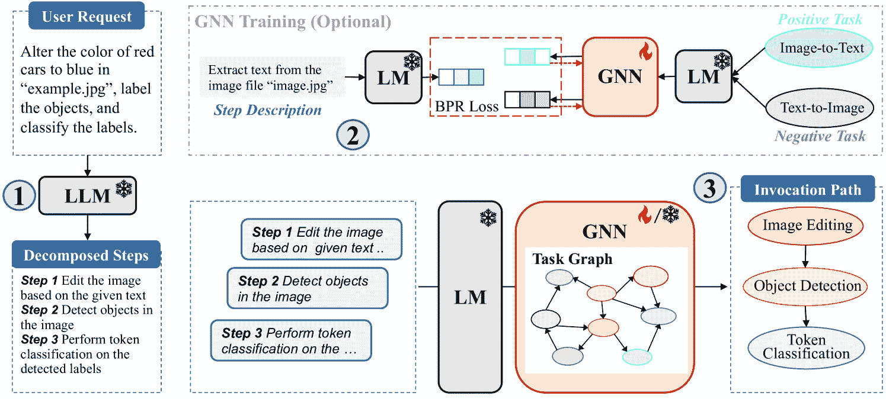

图 7：我们增强 GNN 的任务规划示意图。首先，LLM 将用户请求解释为若干个可管理的步骤。然后，我们利用 GNN 进行任务检索，按顺序将每个步骤描述与合适的任务匹配，最终生成调用路径。

LM 和 GNN 配置：对于基于训练的 GNN，我们统一使用 e5-335M 模型 [[62](https://arxiv.org/html/2405.19119v3#bib.bib62)] 作为 LM 主干模型。对于图编码器，我们的设置包括一个单层，隐藏维度为 $1024$。在模型训练期间，我们将批次大小设置为 $512$，并运行 $20$ 个周期，学习率为 $1e-3$。我们使用 Adam 优化器 [[25](https://arxiv.org/html/2405.19119v3#bib.bib25)]，并实现了一个早停机制，耐心值为 $5$ 个周期，以防止过拟合。所有实验都在单个 NVIDIA A100-80G GPU 上进行。

训练数据准备：从 TaskBench 中的每个数据集，我们随机选择 $3,000$ 个样本来创建训练集。原始数据包括特定任务步骤和相应的任务调用路径。因此，我们首先使用拓扑排序准确地将每个任务步骤与对应任务对齐，形成“<步骤，真实任务>”对。然后，对于每对样本，我们随机选择两个负任务来构成“<步骤，正任务，负任务>”三元组进行模型训练。这些负样本是根据它们与正任务在文本上的相似度来选择的，从而为模型创建了一个强有力的区分挑战。

不同配置的选择：我们的基于训练的模型提供了两种配置选项：仅训练 GNN，同时保持 LM 冻结，或共同训练 LM 和 GNN。这些配置的示意图见图 [8](https://arxiv.org/html/2405.19119v3#A6.F8 "图 8 ‣ F.1 基于训练的 GNN 实现 ‣ 附录 F 基于训练的方法补充材料 ‣ 图学习能否改善基于 LLM 的智能体的规划？")。第一种配置旨在探索 GNN 在任务检索中的能力，第二种配置则利用 LM 的数据集特定语义嵌入来增强性能。在共同训练的设置中，我们使用学习率为 $2e-5$，训练周期为 $10$ 个。

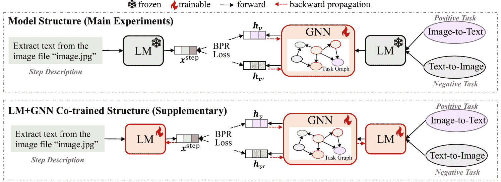

图 8：LM+GNN 配置。我们提供两种配置：仅训练 GNN，同时保持 LM 冻结（表格 [11](https://arxiv.org/html/2405.19119v3#A6.T11 "表 11 ‣ F.4 基于训练的 GNN 完整结果 ‣ 附录 F 基于训练的方法补充材料 ‣ 图学习能否改善基于 LLM 的智能体的规划？")），或者共同训练 LM 和 GNN（表格 [12](https://arxiv.org/html/2405.19119v3#A6.T12 "表 12 ‣ F.4 基于训练的 GNN 完整结果 ‣ 附录 F 基于训练的方法补充材料 ‣ 图学习能否改善基于 LLM 的智能体的规划？")）。

### F.2 TAPE 和 GraphToken 的实现

我们将TAPE [[16](https://arxiv.org/html/2405.19119v3#bib.bib16)]和GraphToken [[38](https://arxiv.org/html/2405.19119v3#bib.bib38)]作为任务规划所需的训练基准。在这里，我们详细介绍了每种方法的适应过程。

TAPE：为了使TAPE适应任务规划，我们将规划任务重新表述为节点分类问题，目标是将用户请求分类到任务图中的适当任务标签。首先，LLM通过生成高质量的解释性文本，即链式推理，来解释用户请求，理解每个请求。然后，经过微调的语言模型将这些链式推理文本编码为潜在的嵌入表示。微调过程基于文本描述与其对应的真实任务对。最后，GNN通过利用生成的文本嵌入和任务嵌入来选择合适的任务。为了公平地进行性能比较，我们微调了语言模型e5-335M，并将GNN配置为$2$层GraphSAGE，隐藏维度为$1024$。LM和GNN的训练数据是一致的，使用相同的数据集划分进行训练。

GraphToken：为了适应GraphToken，我们首先通过将每个节点的描述文本输入到预训练的语言模型e5-335M中，计算每个节点的表示$\bm{x}_{v}$，从而对任务图$G(V,E,X)$进行编码。然后，GNN将初始的节点嵌入矩阵转换为$H$。该GNN配置为$2$层GraphSAGE，隐藏维度为$1024$。接着，进一步对节点嵌入应用均值池化操作，得到图的整体表示$\bm{h}_{G}=\text{Mean-Pooling}(H)$。最后，$\bm{h}_{G}$和输入指令及用户请求的文本嵌入被连接起来，并输入到LLM中以生成输出规划结果。在此过程中，骨干LLM被冻结，只有GNN的参数被调优。对于每个数据集，我们在$4$个epochs内使用相同的$3,000$个训练样本进行训练，这些样本由<用户请求，真实规划>对组成。批量大小设置为$16$，HuggingFace和Multimedia数据集的最大输入长度为$512$，最大输出长度为$300$，DailyLife数据集的最大输出长度为$600$。学习率设置为$1e-5$。

### F.3 微调LLM的实现

为了探索我们提出的框架在微调的 LLMs 上的有效性，我们对 CodeLlama-7B 和 Vicuna-13B 模型进行了监督微调（SFT）。我们使用了与 LLM 微调数据相同的 $3,000$ 个 GNN 训练样本。在用 LoRA [[19](https://arxiv.org/html/2405.19119v3#bib.bib19)] 微调 LLM 时，我们将 lora_r 参数（LoRA 更新矩阵的维度）设置为 $8$，将 lora_alpha（缩放因子）设置为 $16$。丢弃率设置为 $0.1$，批量大小设置为 $2$，并且我们在 $1e-5$ 的学习率下进行 2 个周期的训练。对于 HuggingFace 数据集，最大输入长度设置为 800，而最大输出长度为 400。对于多媒体和日常生活数据集，这些数据集包含更多的任务且需要更长的文本输入，因此我们将最大输入和输出长度分别设置为 1000 和 500。我们使用 2 个 NVIDIA A100-80G GPU 来微调 LLMs。

### F.4 基于训练的 GNN 完整结果

在表格 [11](https://arxiv.org/html/2405.19119v3#A6.T11 "Table 11 ‣ F.4 Full Results of Training-based GNNs ‣ Appendix F Supplementary Materials for Training-based Methods ‣ Can Graph Learning Improve Planning in LLM-based Agents?") 中，我们展示了所有基于训练的 GNN 的综合结果，包括 GCN [[26](https://arxiv.org/html/2405.19119v3#bib.bib26)]、GAT [[57](https://arxiv.org/html/2405.19119v3#bib.bib57)]、GraphSAGE [[15](https://arxiv.org/html/2405.19119v3#bib.bib15)]、GIN [[67](https://arxiv.org/html/2405.19119v3#bib.bib67)] 和 Graph Transformer [[47](https://arxiv.org/html/2405.19119v3#bib.bib47)]。为了突出 GNN 所带来的改进，我们还包括了最强基线的结果——BeamSearch。

从结果来看，显然所有 GNN 编码器都显著增强了任务规划能力。例如，当应用于 HuggingFace 数据集上的 Vicuna-13B 时，引入 GCN 使性能提高了 $17.83\%$，GAT 贡献了 $17.48\%$ 的提升，GraphSAGE 提高了 $22.59\%$，而 GraphTransformer 使预测结果提高了 $18.0\%$。这一结论可以推广到各种 LLMs 和数据集，展示了 GNNs 的强大能力。

表格 11：基于训练的 GNN 性能。我们还展示了来自 GraphSearch 方法的最强变体 BeamSearch 的结果，以提供全面的比较。所有 GNN 一致地提高了不同 LLMs 上的任务规划性能，展示了其有效性。

|  |  | HuggingFace 工具 | 多媒体工具 | 日常生活 API |
| --- | --- | --- | --- | --- |
| LLM | 方法 | n-F1 $\uparrow$ | l-F1 $\uparrow$ | n-F1 $\uparrow$ | l-F1 $\uparrow$ | n-F1 $\uparrow$ | l-F1 $\uparrow$ |
| Baichuan-13B | 直接 | 45.85 | 19.00 | 47.57 | 4.08 | 33.45 | 9.52 |
| BeamSearch | 41.06 | 9.59 | 32.24 | 9.09 | 36.18 | 13.18 |
| GCN | 57.67 | 31.47 | 55.51 | 30.16 | 62.11 | 37.05 |
| GAT | 57.74 | 31.87 | 54.95 | 29.24 | 62.11 | 37.05 |
| GraphSAGE | 59.32 | 34.36 | 56.15 | 31.60 | 65.18 | 40.49 |
| GIN | 57.38 | 31.17 | 55.08 | 30.04 | 62.11 | 37.05 |
| GraphTransformer | 59.15 | 34.36 | 56.06 | 31.12 | 64.52 | 40.14 |
| Vicuna-13B | Direct | 50.46 | 21.27 | 53.57 | 23.19 | 73.70 | 45.80 |
| BeamSearch | 56.64 | 26.93 | 54.09 | 26.19 | 54.55 | 23.60 |
| GCN | 59.46 | 33.14 | 62.48 | 38.89 | 83.05 | 62.95 |
| GAT | 59.28 | 33.39 | 62.96 | 39.24 | 83.05 | 62.95 |
| GraphSAGE | 61.86 | 35.68 | 63.71 | 39.88 | 86.07 | 67.63 |
| GIN | 59.14 | 32.33 | 62.61 | 38.82 | 83.05 | 62.95 |
| GraphTransformer | 59.57 | 33.47 | 63.32 | 39.38 | 85.41 | 66.28 |
| CodeLlama-7B | Direct | 58.06 | 29.39 | 59.44 | 30.83 | 84.12 | 62.89 |
| BeamSearch | 60.34 | 31.36 | 64.12 | 38.99 | 83.25 | 63.48 |
| GCN | 65.07 | 40.50 | 67.46 | 45.84 | 87.23 | 69.27 |
| GAT | 65.20 | 40.93 | 67.41 | 46.46 | 87.23 | 69.27 |
| GraphSAGE | 66.67 | 43.03 | 67.97 | 46.31 | 88.53 | 72.02 |
| GIN | 65.52 | 40.98 | 66.89 | 45.41 | 87.23 | 69.27 |
| GraphTransformer | 65.83 | 42.58 | 68.90 | 47.20 | 88.36 | 71.72 |
| Mistral-7B | Direct | 60.60 | 30.23 | 69.83 | 39.85 | 84.26 | 53.63 |
| BeamSearch | 67.13 | 36.73 | 73.55 | 47.12 | 85.87 | 61.53 |
| GCN | 66.54 | 40.74 | 73.34 | 50.76 | 86.39 | 65.49 |
| GAT | 66.77 | 40.74 | 73.36 | 50.20 | 86.39 | 65.49 |
| GraphSAGE | 68.12 | 43.09 | 75.51 | 52.94 | 87.51 | 66.57 |
| GIN | 66.69 | 40.79 | 72.89 | 50.44 | 86.39 | 65.49 |
| GraphTransformer | 68.26 | 43.08 | 73.80 | 51.45 | 88.25 | 67.84 |
|  | Direct | 57.55 | 28.88 | 68.57 | 41.79 | 91.20 | 76.07 |
|  | BeamSearch | 62.65 | 34.31 | 69.53 | 43.35 | 91.74 | 76.60 |
|  | GCN | 66.22 | 41.05 | 72.99 | 52.18 | 91.83 | 77.88 |
|  | GAT | 66.29 | 41.28 | 74.08 | 53.56 | 91.83 | 77.88 |
|  | GraphSAGE | 67.30 | 42.41 | 74.93 | 54.52 | 93.84 | 80.38 |
|  | GIN | 66.40 | 40.89 | 73.62 | 53.15 | 91.83 | 77.88 |
| CodeLlama-13B | GraphTransformer | 66.70 | 42.07 | 74.72 | 54.10 | 93.81 | 80.44 |
| GPT-3.5-turbo | Direct | 73.85 | 45.73 | 82.85 | 62.07 | 96.09 | 83.65 |
| BeamSearch | 75.51 | 49.62 | 83.57 | 64.50 | 95.66 | 82.72 |
| GCN | 76.93 | 51.43 | 84.92 | 65.05 | 96.38 | 86.15 |
| GAT | 75.63 | 49.36 | 84.77 | 65.48 | 96.38 | 86.15 |
| GraphSAGE | 77.90 | 52.68 | 85.29 | 65.80 | 96.43 | 86.26 |
| GIN | 76.86 | 51.00 | 84.14 | 64.30 | 96.38 | 86.15 |
| GraphTransformer | 77.61 | 52.30 | 84.21 | 64.32 | 96.38 | 86.19 |
| GPT-4-turbo | Direct | 77.60 | 52.18 | 88.29 | 69.38 | 97.36 | 84.58 |
| BeamSearch | 77.56 | 52.54 | 88.16 | 70.39 | 97.35 | 85.78 |
| GCN | 77.01 | 50.49 | 88.56 | 69.60 | 97.10 | 85.22 |
| GAT | 76.41 | 49.66 | 88.43 | 69.52 | 97.10 | 85.22 |
| GraphSAGE | 78.76 | 52.53 | 88.63 | 69.65 | 97.34 | 85.67 |
| GIN | 77.74 | 51.02 | 88.05 | 69.13 | 97.36 | 84.58 |
|  | GraphTransformer | 78.47 | 52.17 | 88.07 | 68.71 | 97.32 | 85.57 |

表 12: 基于训练的GNN在LM+GNN联合训练模式下的性能。LM和GNN的同时训练显著提升了性能。

|  |  | HuggingFace工具 | 多媒体工具 | 日常生活API |
| --- | --- | --- | --- | --- |
| LLM | Method | n-F1 $\uparrow$ | l-F1 $\uparrow$ | n-F1 $\uparrow$ | l-F1 $\uparrow$ | n-F1 $\uparrow$ | l-F1 $\uparrow$ |
| Baichuan-13B | Direct | 45.85 | 19.00 | 47.57 | 4.08 | 33.45 | 9.52 |
| SGC | 60.97 | 36.12 | 56.02 | 31.36 | 64.84 | 40.00 |
| GCN | 60.68 | 36.31 | 57.82 | 32.87 | 64.73 | 38.92 |
| GAT | 60.39 | 35.37 | 57.24 | 32.19 | 64.46 | 40.14 |
| GraphSAGE | 59.76 | 35.59 | 57.97 | 33.29 | 63.21 | 38.10 |
| GIN | 60.31 | 35.82 | 56.62 | 31.53 | 63.55 | 38.19 |
| GraphTransformer | 60.76 | 36.82 | 56.82 | 31.40 | 64.88 | 40.23 |
| Vicuna-13B | Direct | 50.46 | 21.27 | 53.57 | 23.19 | 73.70 | 45.80 |
| SGC | 64.40 | 38.97 | 65.12 | 41.63 | 84.74 | 65.90 |
| GCN | 62.06 | 35.49 | 65.02 | 40.63 | 85.22 | 66.93 |
| GAT | 63.06 | 36.97 | 64.58 | 40.30 | 85.63 | 67.11 |
| GraphSAGE | 62.82 | 37.04 | 65.89 | 42.18 | 84.23 | 65.44 |
| GIN | 62.09 | 35.33 | 64.44 | 40.67 | 85.31 | 66.83 |
| GraphTransformer | 62.11 | 36.01 | 64.57 | 40.17 | 85.42 | 66.55 |
| CodeLlama-7B | Direct | 58.06 | 29.39 | 59.44 | 30.83 | 84.12 | 62.89 |
| SGC | 67.47 | 43.58 | 69.61 | 48.24 | 87.98 | 70.63 |
| GCN | 67.03 | 43.24 | 69.33 | 47.60 | 87.88 | 70.40 |
| GAT | 67.12 | 42.96 | 68.62 | 46.17 | 88.59 | 71.64 |
| GraphSAGE | 67.19 | 42.94 | 70.00 | 48.28 | 87.81 | 70.20 |
| GIN | 66.62 | 42.34 | 69.00 | 47.72 | 88.45 | 71.53 |
| GraphTransformer | 67.12 | 43.08 | 69.27 | 47.96 | 88.43 | 71.59 |
| Mistral-7B | Direct | 60.60 | 30.23 | 69.83 | 39.85 | 84.26 | 53.63 |
| SGC | 69.04 | 44.22 | 76.09 | 54.91 | 87.58 | 66.70 |
| GCN | 67.72 | 43.02 | 76.79 | 54.90 | 87.87 | 67.13 |
| GAT | 67.54 | 43.56 | 76.26 | 53.94 | 87.86 | 67.30 |
| GraphSAGE | 67.61 | 43.14 | 76.96 | 55.46 | 87.61 | 66.75 |
| GIN | 68.95 | 43.97 | 76.47 | 54.95 | 87.75 | 67.07 |
| GraphTransformer | 67.94 | 43.52 | 77.06 | 55.39 | 87.76 | 67.00 |
| CodeLlama-13B | Direct | 57.55 | 28.88 | 68.57 | 41.79 | 91.20 | 76.07 |
| SGC | 70.14 | 45.20 | 75.65 | 55.45 | 93.45 | 79.89 |
| GCN | 69.39 | 45.18 | 76.03 | 55.22 | 93.38 | 79.74 |
| GAT | 69.68 | 45.57 | 75.24 | 54.99 | 94.06 | 80.96 |
| GraphSAGE | 68.92 | 44.85 | 76.28 | 55.41 | 93.30 | 79.51 |
| GIN | 69.01 | 44.76 | 74.72 | 53.91 | 94.24 | 81.23 |
| GraphTransformer | 69.52 | 45.68 | 75.46 | 55.14 | 93.98 | 81.06 |
| GPT-3.5-turbo | Direct | 73.85 | 45.73 | 82.85 | 62.07 | 96.09 | 83.65 |
| SGC | 77.87 | 52.86 | 85.95 | 66.95 | 96.39 | 86.16 |
| GCN | 77.72 | 52.58 | 85.84 | 66.92 | 96.33 | 86.06 |
| GAT | 77.49 | 52.30 | 85.81 | 66.97 | 96.38 | 86.15 |
| GraphSAGE | 77.87 | 53.04 | 85.51 | 66.56 | 96.34 | 86.09 |
| GIN | 77.73 | 52.36 | 85.63 | 66.69 | 96.38 | 86.19 |
|  | GraphTransformer | 77.78 | 52.79 | 86.09 | 67.26 | 96.33 | 86.06 |
| GPT-4-turbo | Direct | 77.60 | 52.18 | 88.29 | 69.38 | 97.36 | 84.58 |
| SGC | 78.44 | 52.84 | 89.09 | 70.52 | 97.38 | 85.85 |
| GCN | 78.33 | 52.75 | 89.00 | 70.24 | 97.34 | 85.67 |
| GAT | 78.37 | 52.43 | 88.99 | 70.48 | 97.32 | 85.56 |
| GraphSAGE | 78.49 | 52.62 | 88.86 | 70.25 | 97.42 | 85.80 |
| GIN | 78.45 | 53.07 | 88.74 | 69.84 | 97.42 | 85.80 |
|  | GraphTransformer | 78.30 | 52.27 | 88.90 | 70.24 | 97.42 | 85.80 |

### F.5 LM+GNN联合训练模式的性能

在我们的主要实验中，LM骨干网络保持冻结，只有GNN被训练以自动学习隐性步骤描述与合适任务之间的对齐，从而促进任务检索。在本小节中，我们进行了一项补充研究，其中预训练的LM的参数与GNN一起在模型训练期间进行调优。模型配置如图[8](https://arxiv.org/html/2405.19119v3#A6.F8 "图8 ‣ F.1 基于训练的GNN实现 ‣ 附录F 基于训练方法的补充材料 ‣ 图学习能否改善基于LLM的智能体的规划？")所示，结果见表[12](https://arxiv.org/html/2405.19119v3#A6.T12 "表12 ‣ F.4 基于训练的GNN的完整结果 ‣ 附录F 基于训练方法的补充材料 ‣ 图学习能否改善基于LLM的智能体的规划？")。

结果表明，与仅GNN可调模式相比，联合训练LM+GNN可以进一步提升性能。这种提升的原因在于语言模型获得了特定任务的语义，使得表示更加具有区分性，并增强了GNN在任务检索中的效果。此外，值得注意的是，在联合训练设置下，各种GNN编码器之间的差异相对较小，对于特定LLM在任何数据集上的性能变化均保持在$2\%$以内。

### F.6 计算成本分析

在本小节中，我们提供了基于训练的方法的计算成本：GNN或LM+GNN联合训练的训练时间，以及微调LLMs所需的资源。结果见表[13](https://arxiv.org/html/2405.19119v3#A6.T13 "表13 ‣ F.6 计算成本分析 ‣ 附录F 基于训练方法的补充材料 ‣ 图学习能否改善基于LLM的智能体的规划？")。

表 13：基于训练的方法的计算成本分析。我们展示了GNN和LM+GNN联合训练模式的总训练时间，以及微调LLMs所需的资源。

| 训练GNN |
| --- |
|  |  |  | 时间（秒） |
| 模式 | 配置 | 参数数量 | HuggingFace | 多媒体 | 日常生活 |
| GNN-only | GCN | 1,049,600 | 136.5 | 136.1 | 237.7 |
| GAT | 1,051,648 | 136.9 | 151.8 | 237.8 |
| GraphSAGE | 2,098,176 | 134.2 | 149.8 | 233.8 |
| GIN | 2,099,200 | 134.2 | 134.9 | 233.6 |
| GraphTransformer | 4,198,400 | 135.0 | 150.2 | 233.7 |
| LM+GNN联合训练 | LM+SGC | 335,141,889 | 743.1 | 323.3 | 384.7 |
| LM+GCN | 336,191,488 | 482.8 | 567.8 | 384.2 |
| LM+GAT | 336,193,536 | 741.3 | 812.3 | 384.4 |
| LM+GraphSAGE | 337,240,064 | 741.2 | 406.8 | 381.7 |
| LM+GIN | 337,241,088 | 735.6 | 361.8 | 382.9 |
|  | LM+GraphTransformer | 339,340,288 | 741.0 | 362.7 | 405.8 |  | 微调LLMs |
|  |  | 设备与时间（小时） |
| LLM | # 参数 (# 可训练参数) | HuggingFace | 多媒体 | 日常生活 |
| CodeLlama-7B | 6,742,740,992 (4,194,304) | 2$\times$A100 7.0 | 1$\times$A100 13.8 | 2$\times$A100 9.5 |
| Vicuna-13B | 13,022,417,920 (6,553,600) | 1$\times$A100 17.8 | 2$\times$A100 10.3 | 2$\times$A100 19.0 |

训练GNNs的效率：在实验中，每个数据集使用相同的GNN配置：$1$个单层，隐藏维度为$1024$。因此，对于每个GNN，其参数数量在不同数据集间保持一致。GNN变体的参数规模从1M到4M不等，每个数据集的总训练时间仅需2-4分钟，与GraphSearch处理单个请求所需的时间相当。对于LM+GNN联合训练模式，其中e5-335M [[62](https://arxiv.org/html/2405.19119v3#bib.bib62)]作为LM主干，训练时间增加到大约6-12分钟。总的来说，这两种模式都表现出高效率，总训练时间仅需几分钟，展示了它们在新任务规划场景中的快速适应能力。

微调LLMs的效率：用$3,000$个训练样本进行$2$轮的LLM微调需要大量时间，通常在一个或两个A100-80G GPU设备上需要10-20小时。

## 附录G 任务参数预测实验

为了评估任务规划的质量，我们主要关注预测的任务及其依赖关系，而不讨论调用这些任务的参数。由于LLMs直接推断仅预测任务的效果不佳（图 [2](https://arxiv.org/html/2405.19119v3#S3.F2 "图 2 ‣ 3.1 任务规划图的形式 ‣ 3 图形式与洞察 ‣ 图学习能否改善基于LLM的代理规划？")），仅依赖LLMs直接预测这些参数是不可靠的。在本节中，我们首先展示，给定一个规划的任务序列，LLMs填充参数是相当简单的，这只是我们框架的一个简单扩展。此外，我们将通过实验证明，通过更准确规划的任务，即那些由GNN检索的任务，LLMs能够智能地填充参数。

### G.1 提示LLMs填充参数

过程：回想一下，我们的框架能够为特定用户请求提供更准确的调用任务序列，例如 $\{v_{1},\ldots,v_{n}\}$。为了完成调用序列，只需添加一个额外的LLM查询，就可以为每个任务完成调用参数。具体而言，通过提供原始用户请求、规划的任务以及包括每个任务输入和输出要求的详细描述，可以智能地提示LLMs填充每个规划任务的调用参数，从而得到一个结构良好的调用序列，准备好执行。提示词见表 [6](https://arxiv.org/html/2405.19119v3#A2.T6 "表 6 ‣ 附录 B 提示词 ‣ 图学习能否改善基于LLM的代理规划？")。

示例：以图[1](https://arxiv.org/html/2405.19119v3#S2.F1 "Figure 1 ‣ 2.2 Current LLM-based Solution to Task Planning ‣ 2 Preliminaries ‣ Can Graph Learning Improve Planning in LLM-based Agents?")所示的请求为例，该请求为：“请生成一张女孩正在读书的图像，并且她的姿势与‘example.jpg’中的男孩相同。然后，请用你的声音描述这张新图像。”假设GNN计划的任务包括$\{$ 姿势检测、姿势到图像、图像到文本、文本到语音 $\}$。LLMs可以智能地填充调用参数，如下所示：[ {“task”: 姿势检测, “arguments”: [‘example.jpg’] }, {“task”: 姿势到图像, “arguments”: [姿势检测输出] }, {“task”: 图像到文本, “arguments”: [姿势到图像输出] }, {“task”: 文本到语音, “arguments”: [图像到文本输出]}]。

### G.2 LLM预测参数的实证结果

实验设置：我们在来自 TaskBench 的 HuggingFace 数据集上进行这项补充实验[[45](https://arxiv.org/html/2405.19119v3#bib.bib45)]。具体来说，我们将LLMs直接预测的调用参数（标记为直接）与LLMs通过我们的GNN检索任务自动填充的参数进行比较（查询提示如表[6](https://arxiv.org/html/2405.19119v3#A2.T6 "Table 6 ‣ Appendix B Prompts ‣ Can Graph Learning Improve Planning in LLM-based Agents?")所示）。对于GNN，我们考虑了既不需要训练的SGC和需要训练的GraphSAGE。值得注意的是，使用SGC时，由于完成参数的查询也不需要训练，因此整个流程可以在没有任何广泛模型训练或标注数据的情况下部署。我们采用TaskBench的评估指标，包括参数类型F1分数（Param t-F1）和参数值F1分数（Param v-F1）。这些指标分别衡量预测的参数类型和具体值的准确性。例如，当填写姿势检测的调用时，真实的参数类型是图像，真实的值是‘example.jpg’。

表 14: 在 HuggingFace 数据集上任务参数预测的性能（以$\%$表示）

| LLM | 方法 | t-F1 $\uparrow$ | v-F1 $\uparrow$ | LLM | 方法 | t-F1 $\uparrow$ | v-F1 $\uparrow$ |
| --- | --- | --- | --- | --- | --- | --- | --- |
|  | 直接 | 38.77 | 18.56 |  | 直接 | 44.62 | 33.24 |
|  | SGC | 58.13${}_{\textbf{+19.36}}$ | 39.64${}_{\textbf{+21.08}}$ |  | SGC | 57.74${}_{\textbf{+13.21}}$ | 43.21${}_{\textbf{+9.97}}$ |
| Mistral-7B | GraphSAGE | 59.07${}_{\textbf{+20.30}}$ | 41.40${}_{\textbf{+22.84}}$ | CodeLlama-13B | GraphSAGE | 59.49${}_{\textbf{+14.87}}$ | 45.54${}_{\textbf{+12.30}}$ |
|  | 直接 | 62.42 | 48.27 |  | 直接 | 70.73 | 55.54 |
|  | SGC | 68.13${}_{\textbf{+5.71}}$ | 54.34${}_{\textbf{+6.07}}$ |  | SGC | 72.91${}_{\textbf{+2.18}}$ | 58.02${}_{\textbf{+2.48}}$ |
| GPT-3.5-turbo | GraphSAGE | 71.19${}_{\textbf{+8.77}}$ | 56.83${}_{\textbf{+8.56}}$ | GPT-4-turbo | GraphSAGE | 73.09${}_{\textbf{+2.36}}$ | 58.20${}_{\textbf{+2.66}}$ |

观察：从表 [14](https://arxiv.org/html/2405.19119v3#A7.T14 "Table 14 ‣ G.2 Empirical Results of LLMs Predicted Parameters ‣ Appendix G Experiments on Task Parameter Prediction ‣ Can Graph Learning Improve Planning in LLM-based Agents?")中展示的结果可以得出以下结论：(1) LLM 直接推断调用参数的效果不理想。即使是最强的 LLM——GPT-4-turbo，其参数-值 F1 得分也仅为 $55\%$，远未达到预期。(2) 通过 GNN 提供的准确规划，LLM 可以利用其固有的推理能力来分析上下文并正确填写参数。在四个 LLM 中，提升幅度从 $3\%$ 到 $23\%$ 不等，凸显了 GNN 增强规划的优势。(3) 我们的方法非常适合于免训练场景，因为通过免训练的 SGC 检索到的任务已能够有效地使 LLM 推断参数，且与需要训练的 GraphSAGE 相比，性能差距很小。

## 附录 H 案例研究

GNN 效果：我们在图 [9](https://arxiv.org/html/2405.19119v3#A8.F9 "Figure 9 ‣ Appendix H Case Studies ‣ Can Graph Learning Improve Planning in LLM-based Agents?")中展示了两个案例，比较了 LLM 直接推断、BeamSearch 和 GraphSAGE 的结果。由于空间限制以及 LLM 输出内容解码错误或无效路径等问题，我们仅展示了 BeamSearch 在任务图上搜索到的前四条有效路径。从这些案例中，我们可以得出结论：BeamSearch 依赖于 LLM 的固有推理能力。尽管 LLM 可以在任务图上探索真实的调用路径，但由于缺乏足够的指令跟随和推理能力，它们的最终解决方案通常不是最优的，可能包含虚构的任务或错误调用的任务。相反，GNN 能够有效地将分解的步骤与适当的任务对齐，准确地达成真实结果，并增强任务规划。

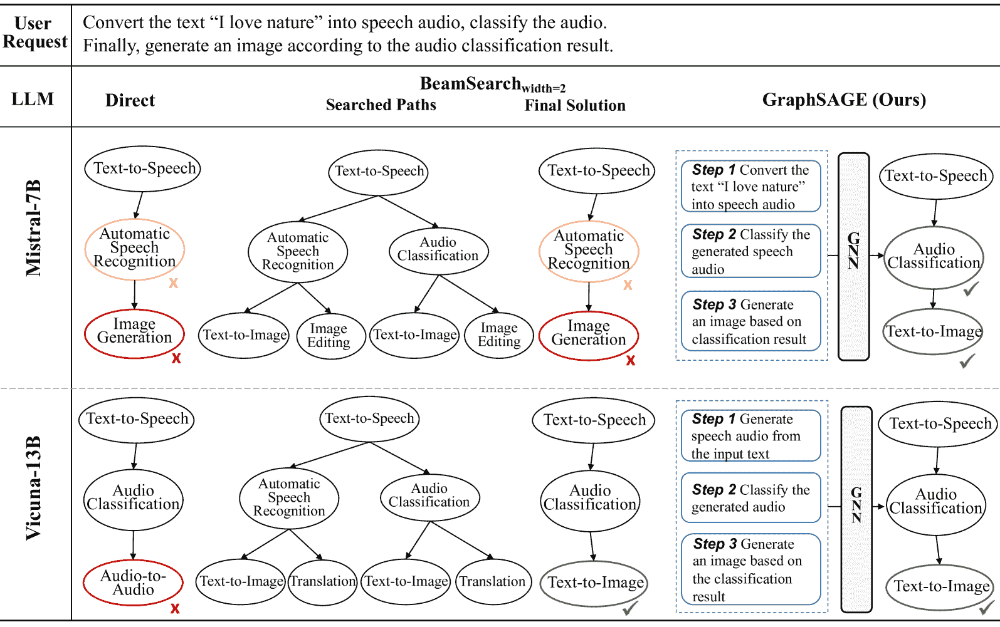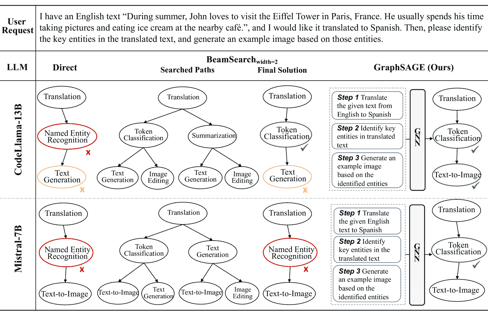

图 9：GNN 效果的案例研究。粉色和红色的节点分别表示错误预测的任务和虚构的任务。由于空间限制，我们仅展示了 BeamSearch 搜索的前四条有效路径作为示例。尽管 LLM 在搜索过程中可以探索真实路径，但由于缺乏一定的指令跟随和推理能力，它们无法始终选择最优路径。相反，GNN 能够正确地将分解的步骤与适当的任务对齐，达到真实结果。

GNN的失败案例：我们还展示了GNN性能退化的失败案例，相较于直接推理，提供了我们方法的全面讨论。我们的结论是，该方法对任务步骤分解的质量非常敏感，因为模糊的步骤可能会误导GNN错误选择任务，而这种错误会因为任务图中任务的顺序选择而级联。例如图[10](https://arxiv.org/html/2405.19119v3#A8.F10 "图 10 ‣ 附录 H 案例研究 ‣ 图学习能否提升基于LLM的代理的规划能力？")所示，步骤2被模糊描述为“分割图像并识别表格数据”，实际上包含了两个独立的步骤。这种模糊性导致GNN选择了不合适的表格分类任务，而不是正确的图像分割任务。由于任务在任务图中是按顺序选择的，其中下一个任务是当前选择的邻居，因此这样的错误可能会阻止探索下一个合适的任务，因为它可能不是当前错误选择的邻居。我们还展示了BeamSearch探索的路径及其最终解决方案，其中它达到了真实结果。

图 10：GNN的失败案例。我们的框架在很大程度上依赖于任务步骤分解的质量。模糊的步骤（例如步骤2，实际上包含了两个步骤）可能会误导GNN选择错误的任务。

使用GPT-4-turbo诊断GraphSearch：在我们的实验中，GraphSearch在大多数实验数据集上对GPT-4-turbo的表现带来了微弱甚至下降的效果，这与当前的研究相悖[[33](https://arxiv.org/html/2405.19119v3#bib.bib33), [32](https://arxiv.org/html/2405.19119v3#bib.bib32)]，这些研究表明，详尽的搜索策略可以提升更强大的LLM的性能。为了提供详细的分析，我们在图[11](https://arxiv.org/html/2405.19119v3#A8.F11 "图 11 ‣ 附录 H 案例研究 ‣ 图学习能否提升基于LLM的代理的规划能力？")中展示了三种类型的案例：成功案例、失败案例以及维持案例：

+   •

    成功案例：如图所示，尽管任务分解存在不准确（GPT-4预测的步骤比三步的真实结果多一步），但其固有的推理能力和任务图中探索到的知识可以修正这些错误，最终达到了真实结果。

+   •

    失败案例：在失败案例中，尽管GPT-4在搜索过程中识别到了真实的解决方案，但最终的决策却包括了一个错误的任务。这是因为最终的解决方案选择需要LLM具备复杂的推理能力，因为上下文包含了来自不同方面的长文本信息：完整的任务图、用户请求、所有搜索路径以及相关指令。这个复杂的上下文和推理挑战超出了GPT-4的能力范围，导致了错误的发生。

+   •

    维护案例：这些情况发生在GraphSearch仅仅复制LLM直接推理的结果时，表明在探索任务图时并未带来额外的好处。在这些情况下，尽管导航了任务图，LLM仍然由于固有的推理限制未能自我修正不准确之处。

我们强调，使用GPT-4-turbo的GraphSearch结果往往倾向于“维护”案例。在这种情况下，即便有少数失败，也会导致整体性能下降，解释了为什么GraphSearch并未始终提升GPT-4-turbo的性能。

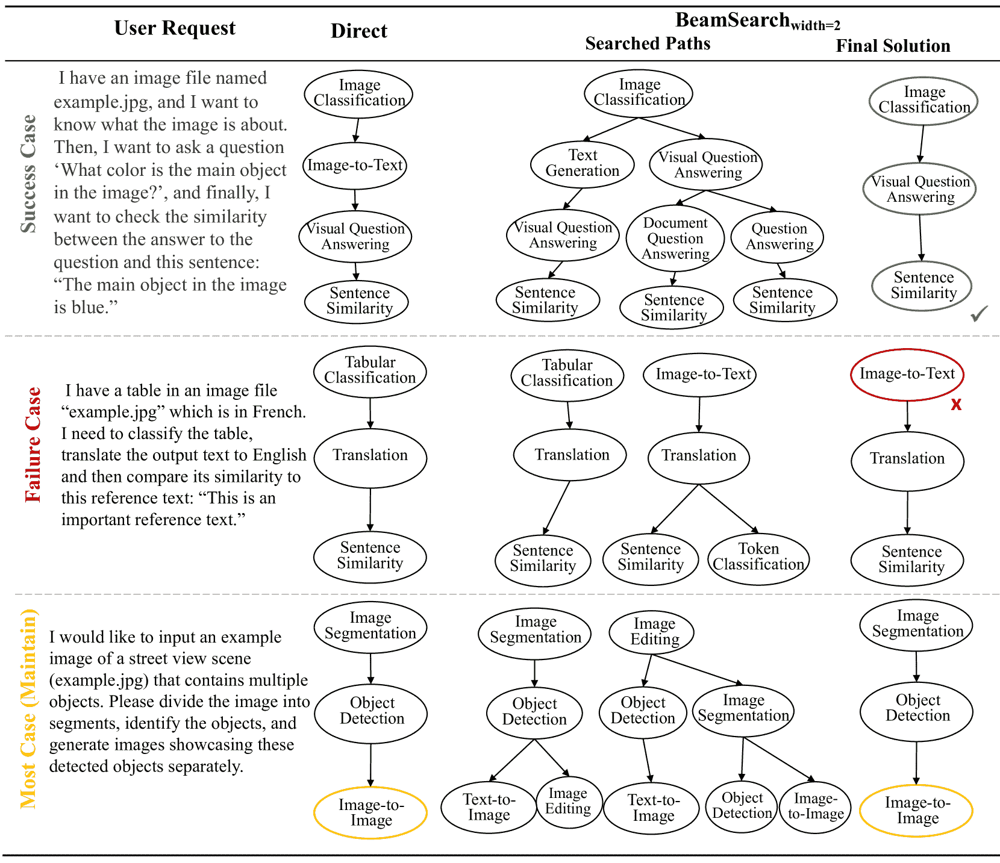

图11：诊断GPT-4的GraphSearch。我们提供了三种类型的案例：成功案例，在这些案例中，GPT-4能够利用固有的推理能力选择最佳调用路径，甚至修正错误分解的任务步骤；失败案例，在这些案例中，GPT-4在极长的上下文中出错，该上下文包含了整个任务图、所有搜索路径和指令，最终选择了一个不令人满意的路径；维护案例，在这些案例中，搜索结果与直接推理的结果相同，即使在经过详尽搜索后，错误预测的任务仍然无法得到修正。
