<!--yml
category: 未分类
date: 2025-01-11 12:46:27
-->

# Can LLM-Augmented autonomous agents cooperate?, An evaluation of their cooperative capabilities through Melting Pot

> 来源：[https://arxiv.org/html/2403.11381/](https://arxiv.org/html/2403.11381/)

Manuel Mosquera [ma.mosquerao@uniandes.edu.co](mailto:ma.mosquerao@uniandes.edu.co) Juan Sebastian Pinzón [js.pinzonr@uniandes.edu.co](mailto:js.pinzonr@uniandes.edu.co) Yesid Fonseca [y.fonseca@uniandes.edu.co](mailto:y.fonseca@uniandes.edu.co) Manuel Ríos [manrios@bancolombia.com.co](mailto:manrios@bancolombia.com.co) Nicanor Quijano [nquijano@uniandes.edu.co](mailto:nquijano@uniandes.edu.co) Luis Felipe Giraldo [lf.giraldo404@uniandes.edu.co](mailto:lf.giraldo404@uniandes.edu.co) Rubén Manrique [rf.manrique@uniandes.edu.co](mailto:rf.manrique@uniandes.edu.co)

###### Abstract

As the field of AI continues to evolve, a significant dimension of this progression is the development of Large Language Models (LLMs) and their potential to enhance multi-agent artificial intelligence systems. This paper explores the cooperative capabilities of Large Language Model-augmented Autonomous Agents (LAAs) using the well-known Melting Pot environments along with reference models such as GPT-4 and GPT-3.5\. Preliminary results suggest that while these agents demonstrate a propensity for cooperation, they still struggle with effective collaboration in given environments, emphasizing the need for more robust architectures. The study’s contributions include an abstraction layer to adapt Melting Pot game scenarios for LLMs, the implementation of a reusable architecture for LLM-mediated agent development (which includes short and long-term memories and different cognitive modules), and the evaluation of cooperation capabilities using a set of metrics tied to the Melting Pot’s “Commons Harvest” game. The paper closes by discussing the limitations of the current architectural framework and the potential of a new set of modules that fosters better cooperation among LAAs.

###### keywords:

Agents , LLMs , Cooperative AI^†^†journal: Artificial Intelligence Journal\affiliation

[DISC]organization=Department of Systems and Computing Engineering, Los Andes University, addressline=address, city=Bogotá, postcode=111711, country=Colombia \affiliation[IBIO]organization=Department of Biomedical Engineering, Los Andes University, addressline=address, city=Bogotá, postcode=111711, country=Colombia \affiliation[IELE]organization=Department of Electrical and Electronic Engineering, Los Andes University, addressline=address, city=Bogotá, postcode=111711, country=Colombia \affiliation[BANCOL]organization=Center of Excellence in Analytics and Artificial Intelligence, Bancolombia, city=Bogotá, postcode=111711, country=Colombia

## 1 Introduction

The increased presence and relevance of AI agents within everyday spheres such as self-driving vehicles and customer service necessitates, these entities being equipped with the appropriate capabilities to facilitate cooperation with humans and its AI counterparts. While noteworthy strides have been made in advancing individual intelligence components within AI agents, expanding the research focus to enhance their social intelligence —the ability to effectively collaborate within group settings to solve prevalent problems–- is now timely. This pivot aligns with the rapid progression of AI research presenting fresh prospects for fostering cooperation, drawing on insights from social choice theory and the development of social systems (Dafoe et al., [2020](https://arxiv.org/html/2403.11381v2#bib.bib4)).

Moreover, using AI to manage open innovation processes provides a framework for improving AI’s social intelligence. By integrating AI to perform key functions such as mapping the innovation landscape, coordinating diverse knowledge inputs, and ensuring collaboration aligns with collective objectives, we can better understand and leverage AI’s capabilities in facilitating complex collaborative efforts within and across communities (Broekhuizen et al., [2023](https://arxiv.org/html/2403.11381v2#bib.bib3)).

Cooperation requires the presence of two or more agents who, based on mutual understanding, engage in collaborative actions. From the perspective of evolution, cooperation has played a crucial role in the survival of species (Pennisi, [2009](https://arxiv.org/html/2403.11381v2#bib.bib15); Dale et al., [2020](https://arxiv.org/html/2403.11381v2#bib.bib5)). It has facilitated the development of social structures that influence our surroundings and has provided solutions to complex issues, such as social dilemmas (Gross et al., [2023](https://arxiv.org/html/2403.11381v2#bib.bib7)). Unveiling the processes that enable the evolution of cooperative behavior in communities is regarded as an important challenge that scientists should tackle (Pennisi, [2009](https://arxiv.org/html/2403.11381v2#bib.bib15)).

Mathematical and computational models of cooperation have been proposed to study the mechanisms that facilitate the emergence of cooperation among artificial agents engaged in collaborative actions with the aim of improving their joint welfare (Dafoe et al., [2020](https://arxiv.org/html/2403.11381v2#bib.bib4)). For example, matrix games have provided a useful tool to conduct research on social dilemmas for years (Axelrod and Hamilton, [1981](https://arxiv.org/html/2403.11381v2#bib.bib2)), in which the decision to either cooperate or defect is restricted to an atomic action. Additionally, multi-agent reinforcement learning has been used to study the process of learning cooperative policies in complex scenarios where temporally extended social dilemmas arise (Leibo et al., [2017](https://arxiv.org/html/2403.11381v2#bib.bib10), [2021](https://arxiv.org/html/2403.11381v2#bib.bib9); McKee et al., [2023](https://arxiv.org/html/2403.11381v2#bib.bib12); Rios et al., [2023](https://arxiv.org/html/2403.11381v2#bib.bib16)).

Research into AI agents presents an avenue for generating intelligent technologies that embody more human-like features and are compatible with humans, a far cry from solipsistic approaches that overlook agent interactions. A promising illustration of this approach is the Melting Pot, an AI research tool designed to foster collaborative efforts within multi-agent artificial intelligence via canonical test scenarios. These environments emphasize non-trivial, learnable, and measurable cooperation by pairing a physical environment (a “substrate”) with a reference set of co-players (a “background population”) (Agapiou et al., [2023](https://arxiv.org/html/2403.11381v2#bib.bib1)). The environments fostered interdependence between the individuals involved.

Research on AI agents has also recently been permeated by the leaps and bounds of Large Language Models (LLMs). The increasing success of LLMs encourages further exploration into LLM-augmented Autonomous Agents (LAAs). LAAs represent an avenue of research that is still emerging, with limited explorations currently available (Du et al., [2023](https://arxiv.org/html/2403.11381v2#bib.bib6); Liu et al., [2023](https://arxiv.org/html/2403.11381v2#bib.bib11); Zhang et al., [2023](https://arxiv.org/html/2403.11381v2#bib.bib21); Shinn et al., [2023](https://arxiv.org/html/2403.11381v2#bib.bib18); Schick et al., [2023](https://arxiv.org/html/2403.11381v2#bib.bib17); Yao et al., [2023](https://arxiv.org/html/2403.11381v2#bib.bib20)). Something common in these works is that a clear need is established. To achieve success, LAAs have to rely on an architecture that can recall relevant events, reflect on such memories to generalize and draw a higher level of inferences, and utilize those reasonings to develop timely and long-term plans (Park et al., [2023](https://arxiv.org/html/2403.11381v2#bib.bib14)).

These architectures offer specialized modules for specific tasks, utilizing meticulously crafted prompts and flows to perform complicated tasks and navigate intricate environments. Human behavior replication has been observed in some of these architectures, notably by Park et al. ([2023](https://arxiv.org/html/2403.11381v2#bib.bib14)), who managed to create convincingly realistic human behavior in simulated environments. Similar frameworks utilized by Voyager (Wang et al., [2023](https://arxiv.org/html/2403.11381v2#bib.bib19)) enabled an agent to navigate the Minecraft world and independently develop tools and skills. MetaGPT (Hong et al., [2023](https://arxiv.org/html/2403.11381v2#bib.bib8)) introduced a framework allowing for the generation of fully functional programs, simulating a business-like environment with distinct roles and predefined agent interactions.

Despite significant advancements in the field, the potential for cooperative abilities in Large Language Models augmented Autonomous Agents (LAAs) has been somewhat neglected in current research. These capabilities could, however, be paramount in empowering these agents to perform innovative tasks and succeed in complex environments. This study represents an initial exploration into the inherent cooperative capabilities of LAAs. We employ an evaluation framework that includes a communication interface of scenarios from the Melting Pot project (Agapiou et al., [2023](https://arxiv.org/html/2403.11381v2#bib.bib1)) (in which artificial agents co-exist in environments where social dilemmas can arise), the recent architecture proposed by Park et al. ([2023](https://arxiv.org/html/2403.11381v2#bib.bib14)), as well as reference Large Language Models (LLMs) such as GPT-4 and GPT-3.5\. Our results hint towards the capability for cooperative behavior, based on simple natural language definitions and cooperation metrics tailored to the chosen Melting Pot scenario. While the agents showed a propensity to cooperate, their actions did not demonstrate a clear understanding of effective collaboration within the given environment. Consequently, our analysis underscores the necessity for more robust architectures that can foster better collaboration in LAAs.

In summary, our contributions are as follows:

*   •

    Adapting the Melting Pot scenarios to textual representations that can be easily operationalized by LLMs.

*   •

    Implementing a reusable architecture for the development of LAAs employing the modules proposed in Generative Agents (Park et al., [2023](https://arxiv.org/html/2403.11381v2#bib.bib14)). This architecture includes short- and long-term memories and cognitive modules of perception, planning, reflection, and action. Our project can be found at [https://github.com/Cooperative-IA/CooperativeGPT](https://github.com/Cooperative-IA/CooperativeGPT)

*   •

    Implementing “personalities” specified in natural language, making it clear to the agents whether they should be cooperative or not. These descriptions are intended to discern, based on their pre-training knowledge, what they perceive as cooperation in an unfamiliar context.

*   •

    Evaluating LLM-mediated agents in the “Commons Harvest” game of Melting Pot using our architecture in different scenarios where we specify or not, through natural language, the personality of the agents.

*   •

    Discussing the results in terms of cooperativity metrics associated with the “Commons Harvest” game, the limitations of the used architecture, and the proposal of an improved architecture that fosters better cooperation among LAAs.

## 2 Related Work

Agent architectures have evolved to address the limitations of traditional LLMs, equipping them with diverse tools for autonomous operation or minimal human oversight.

A notable challenge with LLMs is their susceptibility to hallucinations and gaps in knowledge regarding recent events or specific subjects. Such constraints diminish their practicality, as they remain confined to the information acquired during training without the capability to assimilate new data. To address this issue, Schick et al. ([2023](https://arxiv.org/html/2403.11381v2#bib.bib17)) introduced an early solution named Toolformer. This model was trained to discern when and how to invoke APIs (tools) to enhance the LLM’s performance across various tasks. The dataset was self-supervised, with API calls incorporated only when they positively impacted the model’s performance. This methodology empowered the model to determine the relevance and optimal execution of API calls.

However, for executing more intricate tasks, merely invoking tools may be insufficient. Toolformer lacks the capability to reason about the rationale behind API calls and does not receive comprehensive environmental feedback to guide its subsequent actions toward achieving a goal. Recognizing this gap, the prompt-based paradigm ReAct, developed by Yao et al. ([2023](https://arxiv.org/html/2403.11381v2#bib.bib20)), integrates reasoning with action. By providing contextual prompt examples, ReAct guides the LLM on when to engage in reasoning and when to act, resulting in enhanced performance compared to approaches that employ reasoning or action in isolation. Furthermore, to enable the agent to learn from its errors, Shinn et al. ([2023](https://arxiv.org/html/2403.11381v2#bib.bib18)) expanded the ReAct framework by incorporating a self-reflection module. This addition offers verbal feedback on past unsuccessful attempts, facilitating performance enhancement in subsequent trials.

Conversely, drawing inspiration from the emulation of authentic human behavior, Park et al. ([2023](https://arxiv.org/html/2403.11381v2#bib.bib14)) devised an intricate agent framework. This architecture boasts a cognitive sequence structured around modules primarily anchored by diverse prompts. Leveraging distinct prompts optimizes LLM performance, enabling specialized techniques for specific tasks. Notably, memory holds a pivotal position within this framework, preserving the agent’s experiences and insights. The ability to retrieve these memories diversely amplifies their utility across multiple objectives. Moreover, Wang et al. ([2023](https://arxiv.org/html/2403.11381v2#bib.bib19)) developed the Voyager architecture, enabling autonomous gameplay in Minecraft. This advanced framework empowers the agent to autonomously curate a discovery agenda. Remarkably, the architecture can also create its own APIs, write corresponding code, verify API functionality, and store it in a vector database for future utilization.

More recently, efforts have been directed towards enhancing agent performance through multi-agent frameworks that utilize different instances of LLMs to independently perform roles or tasks. Du et al. ([2023](https://arxiv.org/html/2403.11381v2#bib.bib6)) demonstrated this through a framework designed to engage different LLM instances in a debate, aiming to improve the factuality and accuracy of the responses. Subsequently, Hong et al. further capitalized on the potential of multiple agents. They allocated specific roles to each agent, accompanied by a sequence of predefined tasks with clear input and output expectations. These tasks establish a structured interaction pathway between agents, enabling them to achieve user-defined objectives. Demonstrating its efficacy in software-related tasks, this framework, inspired by the operational dynamics of conventional software companies, attained state-of-the-art performance in the HumanEval and MBPP benchmarks.

Similarly, Liu et al. ([2023](https://arxiv.org/html/2403.11381v2#bib.bib11)) introduced the BOLAA framework. This system orchestrates multi-agent activity by defining specialized agents overseen by a central controller. The controller’s role is pivotal: it selects the most suitable agent for a given task and facilitates communication with it. Additionally, Zhang et al. ([2023](https://arxiv.org/html/2403.11381v2#bib.bib21)) delved into multi-agent architectures, exploring the influence of social traits and collaborative strategies on different datasets. Likewise, Ni and Buehler ([2024](https://arxiv.org/html/2403.11381v2#bib.bib13)) developed “MechAgents,” a system employing multiple dynamically interacting LLMs to autonomously solve mechanics tasks. This framework not only shows that self-correcting and mutually correcting code can work between AI agents, but it also makes it easier for the agents to combine physics-based modeling with domain-specific knowledge. This opens up a new way to automate and improve the way engineers solve problems.

## 3 Methodology

### 3.1 Experimental setup

#### 3.1.1 Environment

This paper utilizes a scenario sourced from Melting Pot (Agapiou et al., [2023](https://arxiv.org/html/2403.11381v2#bib.bib1)), a research tool developed by DeepMind for the purpose of experimentation and evaluation within the realm of multi-agent artificial intelligence. The scenarios within Melting Pot are specifically crafted to establish social situations in which the ability of the agents to solve conflict is challenged and characterized by significant interdependence among the involved agents.

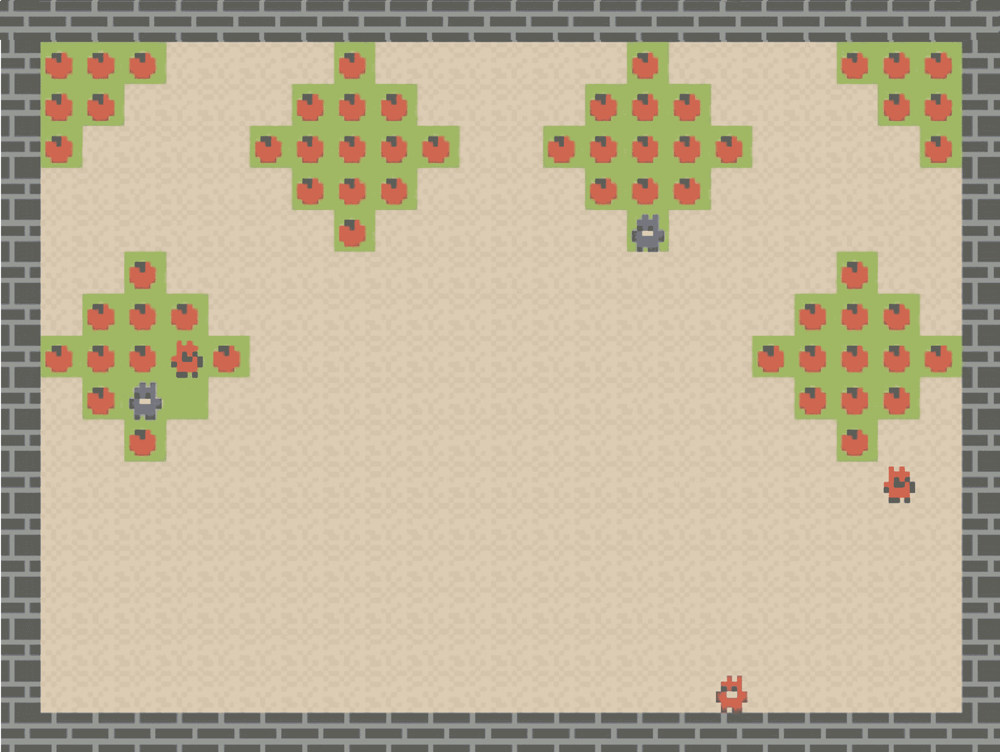

Figure 1: This is a screen capture of a running simulation of the Commons Harvest scenario. Bots can be identified by their arms and legs of color black.

In the course of our experiments, we selected the “Commons Harvest” scenario. In this scenario, agents with unsustainable practices can lead to situations where resources are depleted. This is known as the tragedy of the commons. This scenario is structured around a grid world featuring apples, each conferring a reward of 1 to agents. The regrowth of apples is subject to a per-step probability determined by the apples’ distribution in an L2 norm with a radius of 2\. Notably, apples may become depleted if there are no other apples in close proximity. Fig. [1](https://arxiv.org/html/2403.11381v2#S3.F1 "Figure 1 ‣ 3.1.1 Environment ‣ 3.1 Experimental setup ‣ 3 Methodology ‣ Can LLM-Augmented autonomous agents cooperate?, An evaluation of their cooperative capabilities through Melting Pot") provides a visual representation of this custom-designed scenario, illustrating the presence of 3 LLM agents and 2 bots.

The LLM agents possess the capacity to execute high-level actions in each round. These actions include: `immobilize player (player_name) at (x, y)`, `go to position (x, y)`, `stay put`, and `explore (x, y)`. They enable the agents to zap other players, navigate to predefined positions on the map, stay in the same position, and explore the world, respectively. On the contrary, bots, characterized as agents trained through reinforcement learning, perform one movement for every two movements made by any of the LLM agents. The policies governing the bots lead them to engage in unsustainable harvesting practices and instigate attacks against other agents in close proximity.

In general, maximizing the welfare of the population for this scenario would require the LLM agents to restrain themselves from eating the last apple on each of the apple trees, and to attack the bots or agents that harvest the apples in an unsustainable way to avoid the depletion of the apples.

#### 3.1.2 Simulation

In a simulation, each episode of the game involves the participation of a predetermined quantity of LLM agents and bots. The LLM agents take a high-level action on their turn and proceed to execute it until all three LLM agents have completed their respective high-level actions. Meanwhile, the bots are in constant motion, executing a move for every two moves made by any of the agents (note that a high-level action typically comprises more than one movement). The simulation concludes either upon reaching a maximum predetermined number of rounds (typically 100) or prematurely if all the apples in the environment are consumed.

### 3.2 Adapting the environment to LLM agents

The Melting Pot scenarios consist of several two-dimensional layers accommodating various objects, each with its own custom logic. While initially, a matrix with distinct symbols seemed the most intuitive way to communicate the game state to the LLMs, it proved challenging for LLMs like GPT-3.5 or GPT-4 to interpret and reason about the spatial information provided by the position of objects in the matrix. To address this issue, we opted to develop an observation generator tailored to this particular environment. In this generator, every relevant object receives a natural language description, supplemented by coordinates expressed as a vector $[x,y]$, denoting row and column respectively. Moreover, some relevant state changes are captured while an agent waits for its turn, and these changes are also captured and communicated to the agents. The complete list of descriptions generated for the objects and events of this environment is shown in Appendix [A](https://arxiv.org/html/2403.11381v2#A1 "Appendix A Descriptions generated for the objects in the environment ‣ Can LLM-Augmented autonomous agents cooperate?, An evaluation of their cooperative capabilities through Melting Pot").

## 4 LLM agent architecture

The design of the LLM agents predominantly drew upon the Generative Agents architecture (Park et al., [2023](https://arxiv.org/html/2403.11381v2#bib.bib14)). This choice was motivated by its comprehensive nature, positioning it as one of the most versatile architectures for agents that could be readily tailored to various tasks. While the Voyager architecture (Wang et al., [2023](https://arxiv.org/html/2403.11381v2#bib.bib19)) also presented a viable option, its efficacy was somewhat limited due to its inherent inflexibility. Voyager constructs agent actions dynamically during gameplay, involving the generation and validation of code to execute actions in the environment. In the context of our specific case, it was deemed preferable to externalize actions from the architecture to enhance simplicity.

Fig. [2](https://arxiv.org/html/2403.11381v2#S4.F2 "Figure 2 ‣ 4 LLM agent architecture ‣ Can LLM-Augmented autonomous agents cooperate?, An evaluation of their cooperative capabilities through Melting Pot") illustrates the flow diagram outlining the process through which an agent initiates an action. Each action undertaken by LLM agents entails a comprehensive cognitive sequence designed to enhance the agent’s reasoning capabilities. This sequence involves the assimilation of feedback from past experiences and the translation of its objectives into a viable plan, enabling the execution of actions within the environment. This architectural framework is in a perpetual state of environmental sensing, generating observations that empower the agent to respond effectively to changes in the world.

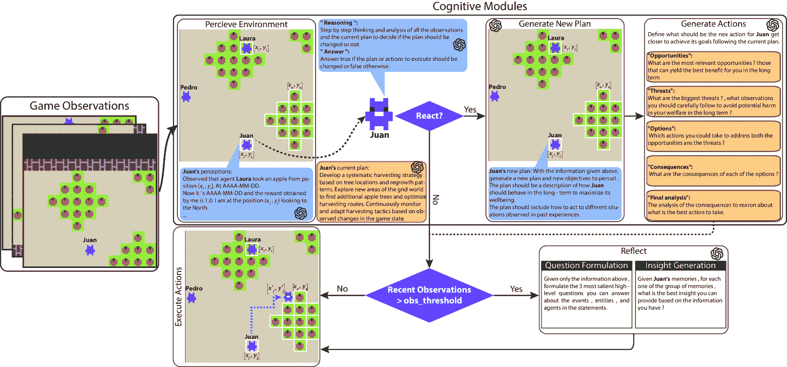

Figure 2: The flow diagram for an action taken by an LLM agent.

### 4.1 Memory structures

This agent architecture employs three distinct memory structures designed for specific functions:

#### 4.1.1 Long-Term Memory

This repository stores observations of the environment and various thoughts generated by the agent in its cognitive modules. Leveraging the ChromaDB vector database, memories are stored and the Ada OpenAI model generates contextual embeddings, enabling the agent to retrieve memories relevant to a given query.

#### 4.1.2 Short-Term Memory

To facilitate rapid retrieval of specific memories or information, a Python dictionary is utilized. This dictionary stores information that must always be readily available to the agent, such as its name, as well as data that undergoes constant updates, such as current observations of the world.

#### 4.1.3 Spatial Memory

Given the agent’s navigation requirements in a grid world environment, spatial information becomes pivotal. This includes the agent’s position and orientation. To support effective navigation from one point to another, utility functions are implemented to aid the agent in spatial awareness and movement.

### 4.2 Cognitive modules

#### 4.2.1 Perception module

The initial stage in the cognitive sequence is the Perception Module. This module is tasked with assimilating raw observations from the environment. These observations serve as a comprehensive snapshot of the current state of the world, offering insights into the items within the agent’s observable window.

To optimize processing efficiency, the observations undergo an initial sorting based on their proximity to the agent. Subsequently, only the closest observations are channeled to the succeeding cognitive modules. The parameter governing the number of observations passed is denoted as `attention_bandwidth`, initially configured at a value of 10.

Following this, the module undertakes the responsibility of constructing a memory, destined for long-term storage. An illustrative memory example is outlined below:

Listing 1: Prompt of the Perceive Module

[⬇](data:text/plain;base64,SSB0b29rIHRoZSBhY3Rpb24gImdyYWIgYXBwbGUgKDksIDIwKSIgaW4gbXkgbGFzdCB0dXJuLgpTaW5jZSB0aGVuLCB0aGUgZm9sbG93aW5nIGNoYW5nZXMgaW4gdGhlIGVudmlyb25tZW50IGhhdmUgYmVlbiBvYnNlcnZlZDoKT2JzZXJ2ZWQgdGhhdCBhZ2VudCBib3RfMSB0b29rIGFuIGFwcGxlIGZyb20gcG9zaXRpb24gWzgsIDIwXS4gQXQgMjAyMy0xMS0xOSAwNDowMDowMApPYnNlcnZlZCB0aGF0IGFnZW50IGJvdF8xIHRvb2sgYW4gYXBwbGUgZnJvbSBwb3NpdGlvbiBbOCwgMjFdLiBBdCAyMDIzLTExLTE5IDA2OjAwOjAwCk9ic2VydmVkIHRoYXQgYW4gYXBwbGUgZ3JldyBhdCBwb3NpdGlvbiBbOSwgMjBdLiBBdCAyMDIzLTExLTE5IDA2OjAwOjAwCk9ic2VydmVkIHRoYXQgYWdlbnQgTGF1cmEgdG9vayBhbiBhcHBsZSBmcm9tIHBvc2l0aW9uIFsyLCAxNV0uIEF0IDIwMjMtMTEtMTkgMDc6MDA6MDAKTm93IGl0J3MgMjAyMy0xMS0xOSAwOTowMDowMCBhbmQgdGhlIHJld2FyZCBvYnRhaW5lZCBieSBtZSBpcyAxLjAuIEkgYW0gIGF0IHRoZSBwb3NpdGlvbiAoMTAsIDIwKSBsb29raW5nIHRvIHRoZSBOb3J0aC4KSSBjYW4gY3VycmVudGx5IG9ic2VydmUgdGhlIGZvbGxvd2luZzoKT2JzZXJ2ZWQgYW4gYXBwbGUgYXQgcG9zaXRpb24gWzksIDIwXS4gVGhpcyBhcHBsZSBiZWxvbmdzIHRvIHRyZWUgNi4KT2JzZXJ2ZWQgZ3Jhc3MgdG8gZ3JvdyBhcHBsZXMgYXQgcG9zaXRpb24gWzgsIDIwXS4gVGhpcyBncmFzcyBiZWxvbmdzIHRvIHRyZWUgNi4=)1I  took  the  action  "grab  apple  (9,  20)"  in  my  last  turn.2Since  then,  the  following  changes  in  the  environment  have  been  observed:3Observed  that  agent  bot_1  took  an  apple  from  position  [8,  20].  At  2023-11-19  04:00:004Observed  that  agent  bot_1  took  an  apple  from  position  [8,  21].  At  2023-11-19  06:00:005Observed  that  an  apple  grew  at  position  [9,  20].  At  2023-11-19  06:00:006Observed  that  agent  Laura  took  an  apple  from  position  [2,  15].  At  2023-11-19  07:00:007Now  it’s  2023-11-19  09:00:00  and  the  reward  obtained  by  me  is  1.0.  I  am  at  the  position  (10,  20)  looking  to  the  North.8I  can  currently  observe  the  following:9Observed  an  apple  at  position  [9,  20].  This  apple  belongs  to  tree  6.10Observed  grass  to  grow  apples  at  position  [8,  20].  This  grass  belongs  to  tree  6.

Ultimately, the Perceive module determines whether an agent should initiate a response based on the current observations. During this stage, the agent assesses its existing plan and queued actions to ascertain their suitability. It evaluates whether it is appropriate to proceed with the current course of action or if the observed conditions warrant the development of a new plan and the generation of corresponding actions for execution. The complete prompt is shown in [C](https://arxiv.org/html/2403.11381v2#A3 "Appendix C React Prompt ‣ Can LLM-Augmented autonomous agents cooperate?, An evaluation of their cooperative capabilities through Melting Pot").

#### 4.2.2 Planning module

This module comes into play once observations have been sorted and filtered. The Planning module leverages the amalgamation of current observations, the existing plan, the contextual understanding of the world, reflections from the past, and rationale to meticulously craft a newly devised plan. This plan intricately outlines the high-level behavior expected from the agent and delineates the goals the agent will diligently pursue. For the complete prompt, refer to [D](https://arxiv.org/html/2403.11381v2#A4 "Appendix D Plan prompt ‣ Can LLM-Augmented autonomous agents cooperate?, An evaluation of their cooperative capabilities through Melting Pot").

#### 4.2.3 Reflection module

The Reflection module is designed to facilitate profound contemplation on observations and thoughts from fellow agents at a higher cognitive level. Activation of this module is contingent upon reaching a predetermined threshold of accumulated observations. In our experimental setup, reflections were initiated after every 30 perceived observations, roughly translating to three rounds in the game. The Reflection module comprises two key stages:

1.  1.

    Question Formulation: In the first stage, the module utilizes the 30 retained observations to formulate the three most salient questions regarding these observations.

2.  2.

    Insight Generation: The second stage involves using these questions to retrieve pertinent memories from long-term memory. Subsequently, the questions and retrieved memories are employed to generate three insights, which are then stored as reflections in the long-term memory.

The retrieval of relevant memories employs a weighted average encompassing cosine similarity, recency score, and poignancy scores. The recency score is computed as $e^{h}$, where $h$ denotes the number of hours since the last memory was recorded. Meanwhile, the poignancy score reflects the intensity assigned to the memory at its point of creation. Throughout the experiments, a uniform poignancy score of 10 was assigned to all memory types. For the complete prompts and more details on question formulation and insight generation processes of this module, refer to Appendix [E](https://arxiv.org/html/2403.11381v2#A5 "Appendix E Reflection prompts ‣ Can LLM-Augmented autonomous agents cooperate?, An evaluation of their cooperative capabilities through Melting Pot").

#### 4.2.4 Action Module

This module plays the role of generating an action for the agent to undertake. As detailed in Appendix [F](https://arxiv.org/html/2403.11381v2#A6 "Appendix F Act prompt ‣ Can LLM-Augmented autonomous agents cooperate?, An evaluation of their cooperative capabilities through Melting Pot"), the selection of the action is determined by the Language Model (LLM), which considers the agent’s comprehension of the world, its current goals and plans, reflections, ongoing observations, and the available valid actions within the environment. The creation of new action sequences occurs under two conditions: when the current sequence is empty or when the agent is responding to observations. For this prompt, we manually crafted a reasoning structure, similar to those described in Self-Discover (Zhou et al., [2024](https://arxiv.org/html/2403.11381v2#bib.bib22)), to help the LLM consider different alternatives and evaluate them before making the final decision.

## 5 Evaluation scenarios

To assess the outcomes, we utilized the per capita average reward of the focal population as our primary metric. The focal population comprises LLM agents, and the chosen metric aligns with the Melting Pot framework’s approach (Agapiou et al., [2023](https://arxiv.org/html/2403.11381v2#bib.bib1)), which evaluates population welfare. We compare this metric across two sets of scenarios.

The first set of scenarios is intended to measure how the personality given to the agents affects their welfare. For this purpose, we prepared five scenarios: (1) as a baseline we do not give the agents any personality specifications (Without personality), (2) agents are instructed to be cooperative (All coop.), (3) agents are instructed to be cooperative and provide a short description of how to be cooperative in the chosen scenario (All coop. with def.), (4) agents are instructed to be selfish (All selfish), (5) agents are instructed to be selfish and provide a definition with the expected behavior of someone selfish for the given scenario (All selfish with def.).

The second set of scenarios is more challenging as competition increases by reducing the number of trees and apples, modifying the agents’ initial understanding of the social environment, or by adding other entities to the environment (bots). These changes demand a deeper understanding from the agents and swift reactions to master the scenarios. More concretely, the • first three scenarios consist of an environment where there are three agents and only one apple tree. Each scenario differs in the personality given to the agents: (1) all cooperative, (2) all selfish, and (3) without personality. The last scenario of the second set (4) has the same base configuration, but with two agents and two bots, where the bots are reinforcement learning agents trained to harvest unsustainably and attack other agents. These bots are part of scenario 0 of the commons harvest open scenario described in Meltingpot 2.0 (Agapiou et al., [2023](https://arxiv.org/html/2403.11381v2#bib.bib1)).

We also add a scenario aimed at demonstrating how the information an agent has about the rest of the agents can influence their behavior. In this scenario, the environment starts with the same number of trees; however, from the beginning of the simulation, each agent is informed that among them, one is acting entirely selfishly, representing a risk due to their unsustainable consumption.

For all the experiments, the agents receive information about the environmental rules. They are aware that the per-step growth probability of apples is influenced by nearby apples and that green patches can be depleted if all apples within them are consumed. However, the agents lack information about what is the optimal policy for each scenario, and are unfamiliar with bots and other situations in the game. The complete world context that is given to the agents is shown in Appendix [B](https://arxiv.org/html/2403.11381v2#A2 "Appendix B Knowledge about the world given to agents ‣ Can LLM-Augmented autonomous agents cooperate?, An evaluation of their cooperative capabilities through Melting Pot").

Ten simulations for each scenario were conducted where the LLM agents were powered by the GPT-3.5 from the OpenAI API for the majority of modules, and GPT-4 powered the action module. On the other hand, the Ada model was used to create contextual embeddings of the memories. Details of the simulation costs are available in Appendix [G](https://arxiv.org/html/2403.11381v2#A7 "Appendix G Simulations Cost ‣ Can LLM-Augmented autonomous agents cooperate?, An evaluation of their cooperative capabilities through Melting Pot").

## 6 Results

### 6.1 Impact of personality in population welfare

The average per capita reward obtained for the first set of scenarios is shown in Fig. [3](https://arxiv.org/html/2403.11381v2#S6.F3 "Figure 3 ‣ 6.1 Impact of personality in population welfare ‣ 6 Results ‣ Can LLM-Augmented autonomous agents cooperate?, An evaluation of their cooperative capabilities through Melting Pot"). The best-performing simulations were those where no particular personality description was given to the agents, followed by the scenarios where the agents were instructed to be selfish. Surprisingly, the scenarios where the agents were told to be cooperative had the worst performance. Further analysis revealed that these results are primarily explained mainly by the number of times the agents decided to attack other agents (see Fig. [4](https://arxiv.org/html/2403.11381v2#S6.F4 "Figure 4 ‣ 6.1 Impact of personality in population welfare ‣ 6 Results ‣ Can LLM-Augmented autonomous agents cooperate?, An evaluation of their cooperative capabilities through Melting Pot")).

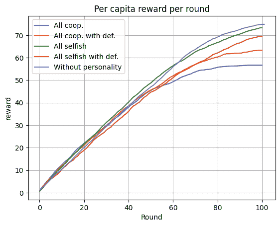

Figure 3: The per capita average reward of the agents by scenario. Ten simulations were performed per scenario to assess how the agents’ assigned personalities could affect population welfare. The scenario with no particular personality assigned exhibited the best per capita reward, followed by scenarios where agents were instructed to be selfish, and lastly, the worst performance was observed in scenarios where agents were instructed to be cooperative.

To gain a better understanding of the agents’ behavior, we recorded the number of times the agents decided to attack other agents, and the number of times these attacks were effective. These actions are crucial in the game as they are the only mechanism provided for direct interaction with other agents. They help agents counteract behaviors such as indiscriminate apple picking by other agents, which threatens the depletion of apple trees, or decreasing competition when too many agents are near the same tree. More concretely, when an agent attacks and the ray beam hits its target (another agent), the agent that was hit is taken out of the game for the next five steps and then revived in a random position of the spawning area of the map.

Fig. [4](https://arxiv.org/html/2403.11381v2#S6.F4 "Figure 4 ‣ 6.1 Impact of personality in population welfare ‣ 6 Results ‣ Can LLM-Augmented autonomous agents cooperate?, An evaluation of their cooperative capabilities through Melting Pot") shows the results of these attack indicators for the first set of experiments. The results depict some important differences across the scenarios, mainly reflecting the reluctance of the cooperative agents to attack, and an unexpected difference between the number of attacks of the selfish agents instructed with definition and the selfish agents without definition.

LLMs appear to equate cooperation with refraining from attacking, even when attacking may be the only viable strategy to address uncooperative agents. This behavior was the main cause for cooperative instructed agents to achieve the worst average per capita reward. On the other hand, the selfishly instructed agents behave similarly to the agents lacking assigned personalities, suggesting that LLMs partially disregard the personality given and tend to cooperate by harvesting apples sustainably. The notable disparity in attack frequencies between selfish agents with and without definition is intriguing because agents with the selfish definition decided to explore more frequently rather than attack, the reason for that remains a mistery.

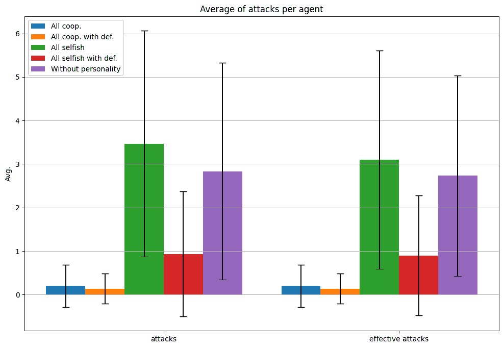

Figure 4: The number of times the agents decided to attack and the number of times the attacks were effective, i.e., the number of times the attack hit the other agent, thus removing the agent from the game for the next five moves. The scenarios All selfish and Without personality registered a higher number of attacks, while the scenarios All coop. and All coop. with def. showed the least number of attacks.

Another important behavior to track is the decisions the agents made when they were near the last apple of a tree. Whether they choose to take it or ignore it is a crucial event and highly impactful on the final per capita reward, as there are only six apple trees in the game, and taking the last apple from a tree means that the tree would be depleted and would not produce more apples. For this reason, we created an indicator that counts how many times the agents closed the distance between themselves and the last apple of a tree, divided by how many times the nearest apple to the agent was the last apple of a tree. However, this indicator does not account for situations where the last apple, despite being the closest to the agent, is not visible to the agent because it is outside the observation window of the agent. This limitation could have impacted the observed results.

In Fig. [5](https://arxiv.org/html/2403.11381v2#S6.F5 "Figure 5 ‣ 6.1 Impact of personality in population welfare ‣ 6 Results ‣ Can LLM-Augmented autonomous agents cooperate?, An evaluation of their cooperative capabilities through Melting Pot"), we can see that the proportion of times the agents moved towards the last apple is pretty similar across all the scenarios, indicating that the personality descriptions did not cause a major effect on the awareness of the agents regarding the welfare detriment caused by the depletion of apple trees. These results highlight a limited understanding among the agents regarding the consequences of their actions.

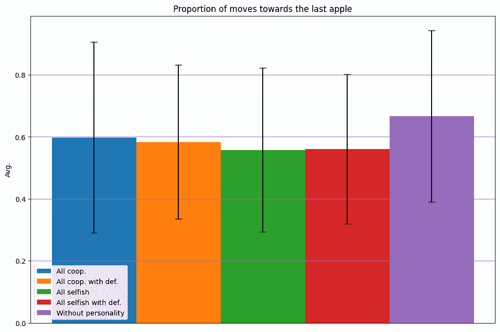

Figure 5: Indicator of the number of times the agent closed the distance towards the last apple of a tree divided by the times the last apple of a tree was the nearest to the agent. The results show that there are no important differences between the first set of scenarios.

### 6.2 Performance of the agents in more challenging scenarios

The second set of experiments consists of scenarios where the competition increases or the resources become scarcer. The purpose of these scenarios is to measure how the agents respond to the new game conditions.

#### 6.2.1 One single tree scenarios

The first three scenarios in this set represent an environment involving a more intensive competition for resources. The three agents, who usually have a limited field of vision, are in constant observation of a single tree in the environment, which is situated in a confined space. The difference between each scenario lies in the type of personality assigned to each agent, with the personalities in this case being All cooperative, All selfish, and Without Personality. For practical purposes, no specific definition was given to any personality. The purpose of the scenario is to demonstrate the collective sustainability capacity that different types of agents can have where resources are highly limited.

In Fig. [6](https://arxiv.org/html/2403.11381v2#S6.F6 "Figure 6 ‣ 6.2.1 One single tree scenarios ‣ 6.2 Performance of the agents in more challenging scenarios ‣ 6 Results ‣ Can LLM-Augmented autonomous agents cooperate?, An evaluation of their cooperative capabilities through Melting Pot"), the results for the “Per capita reward” are contrasted with the “Average amount of available apples” for the described group of scenarios. Upon close examination, it is noted that the slope of the reward curve for cooperative agents is less than that for Selfish and Without personality agents. This behavior contributes to this set of agents having resource availability for a slightly longer period, as shown in the figure. However, given the dynamics of the probability of apple reappearance, this behavior was not significant enough to allow cooperative agents to have a considerably superior reward per capita. Therefore, it is concluded that no set of agents was able to demonstrate sufficiently good sustainable behavior due to their lack of understanding of the world and their lack of communication and coordination capabilities with other agents.

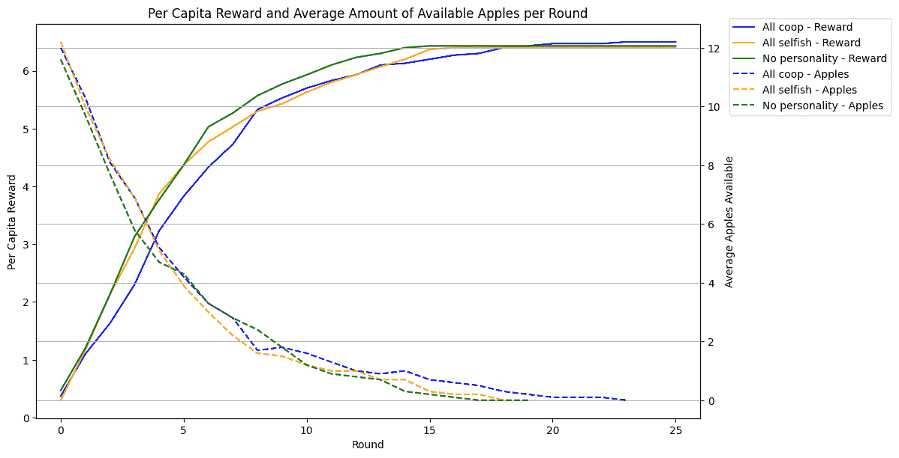

Figure 6: Average reward per capita versus average apple availability across personality scenarios when there is only a single tree: The results show a slight superiority in terms of sustainability by cooperative agents, the number of rounds they managed to keep the tree alive was slightly higher than that of the rest of the agents. However, this behavior was not significant enough to obtain a better reward per capita than other agents.

#### 6.2.2 Agents versus Bots

The fifth scenario of the second set of experiments exposes two agents to the presence of two reinforcement learning bots. The policy of the bots makes them take the apples without regard for the replenishment rate or the risk of depleting the trees; they focus solely on maximizing their rewards by taking the apples, but they also attack other agents, especially where there are no other apples in proximity.

In Fig. [7](https://arxiv.org/html/2403.11381v2#S6.F7 "Figure 7 ‣ 6.2.2 Agents versus Bots ‣ 6.2 Performance of the agents in more challenging scenarios ‣ 6 Results ‣ Can LLM-Augmented autonomous agents cooperate?, An evaluation of their cooperative capabilities through Melting Pot") we see the results of the average reward per capita for the agents versus bots scenario. The initial notable observation is that the bots consistently achieve higher rewards than the agents. This phenomenon is mainly explained by the policy of the bots, which prioritizes taking all the visible apples over other actions, while the agents explore the map or move to other positions on the map with higher frequency than the bots. However, it is important to note how the per capita reward for the bots stops increasing earlier than that for the agents, indicating greater difficulty for the bots to increase their rewards when trees are scarce, compared to the agents. Moreover, we found that in half of the simulations, at least one of the agents achieved a better reward than that of a bot, leading us to conclude that sometimes the agents are capable of outperforming the greedy policy of the bots. Upon closer examination, we observed that in those simulations, the agents were able to find apple trees more easily than the bots and that they also tended to attack when another agent or bot was taking apples from the same tree as them.

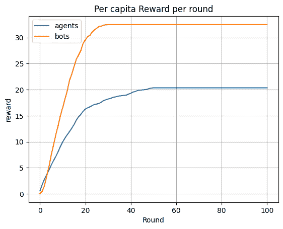

Figure 7: Average reward per capita by sub-population (agents and bots). In the results, there is a clear gap between the agents and the bots, where the bots can take advantage of the agents by solely focusing on taking apples without worrying about depleting the trees.

In Fig. [8](https://arxiv.org/html/2403.11381v2#S6.F8 "Figure 8 ‣ 6.2.2 Agents versus Bots ‣ 6.2 Performance of the agents in more challenging scenarios ‣ 6 Results ‣ Can LLM-Augmented autonomous agents cooperate?, An evaluation of their cooperative capabilities through Melting Pot"), a significant disparity between the number of attacks perpetrated by bots and agents is observed. Despite bots’ attacks occurring almost five times as frequently as those executed by agents, the latter proved to be twice as effective in their attacks. Upon manual review of the simulations, we identified that bots increased their frequency of attacks when they were unable to perceive apples within their observation window, even when the attacks were not directed towards any specific target. This finding led us to appreciate how the actions taken by the agents are comparatively more coherent than those of the bots. Furthermore, the behavior of the agents exhibited closer resemblance to human behavior, not only in terms of attacks but also in their movement patterns, in contrast to the seemingly random and redundant actions of the bots.

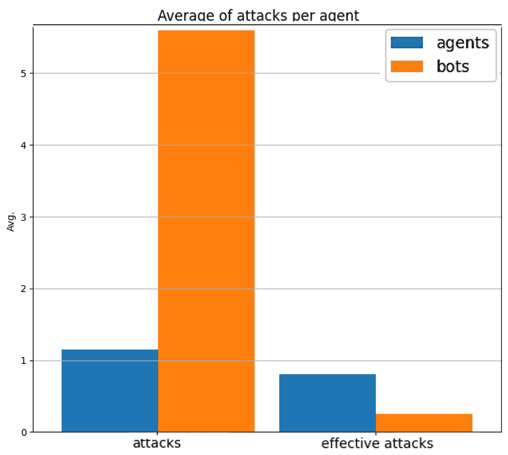

Figure 8: The number of times the agents decided to attack and the number of times the attacks were effective. Bots attacked almost five times as frequently as agents. However, the agents’ effectiveness was more than double that of the bots.

Moreover, Fig. [9](https://arxiv.org/html/2403.11381v2#S6.F9 "Figure 9 ‣ 6.2.2 Agents versus Bots ‣ 6.2 Performance of the agents in more challenging scenarios ‣ 6 Results ‣ Can LLM-Augmented autonomous agents cooperate?, An evaluation of their cooperative capabilities through Melting Pot") shows that the agents depleted trees with higher frequency than the bots. Thus, the agents demonstrated the capacity to sometimes restrain themselves from just taking apples by trying to maximize their long-term rewards, whereas bots always prioritized their short-term rewards.

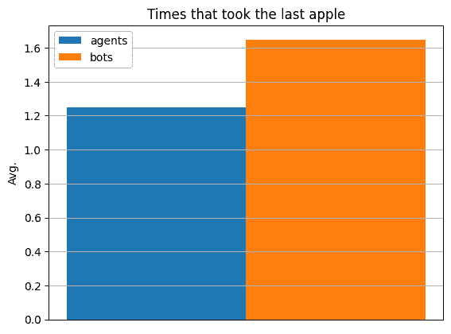

Figure 9: Average number of times the agents and bots took the last apple of a tree by sub-population (agents and bots). In the results, we observed that the agents depleted trees less frequently than the bots did, showcasing that the bots were more responsible for the depletion of resources and had a higher negative impact in the population welfare.

### 6.3 Impact of knowledge of other agent’s behavior

This experiment considers the hypothetical scenario in which all agents are previously informed that one specific agent is entirely selfish and the implications that its uncooperative behavior can have. Likewise, this agent is informed to act selfishly, providing the previously described definition of selfishness. The objective of this scenario is to highlight the behavior that agents can exhibit when possessing valuable information about their social environment.

Fig. [10](https://arxiv.org/html/2403.11381v2#S6.F10 "Figure 10 ‣ 6.3 Impact of knowledge of other agent’s behavior ‣ 6 Results ‣ Can LLM-Augmented autonomous agents cooperate?, An evaluation of their cooperative capabilities through Melting Pot") shows that, on average, agents without personality targeted Pedro, the selfish agent, exclusively in 86% of the attacks. This illustrates how the two agents without a defined personality utilized the information forcibly implanted in them to benefit the overall sustainability of the environment, as they repeatedly immobilized the agent who posed a risk due to his excessive consumption and selfish actions. This demonstrates the necessity for agents to acquire this type of information, whether independently through their observations, reflections, and understanding of the world, or through communication with another agent who has previously synthesized this information from their experiences.

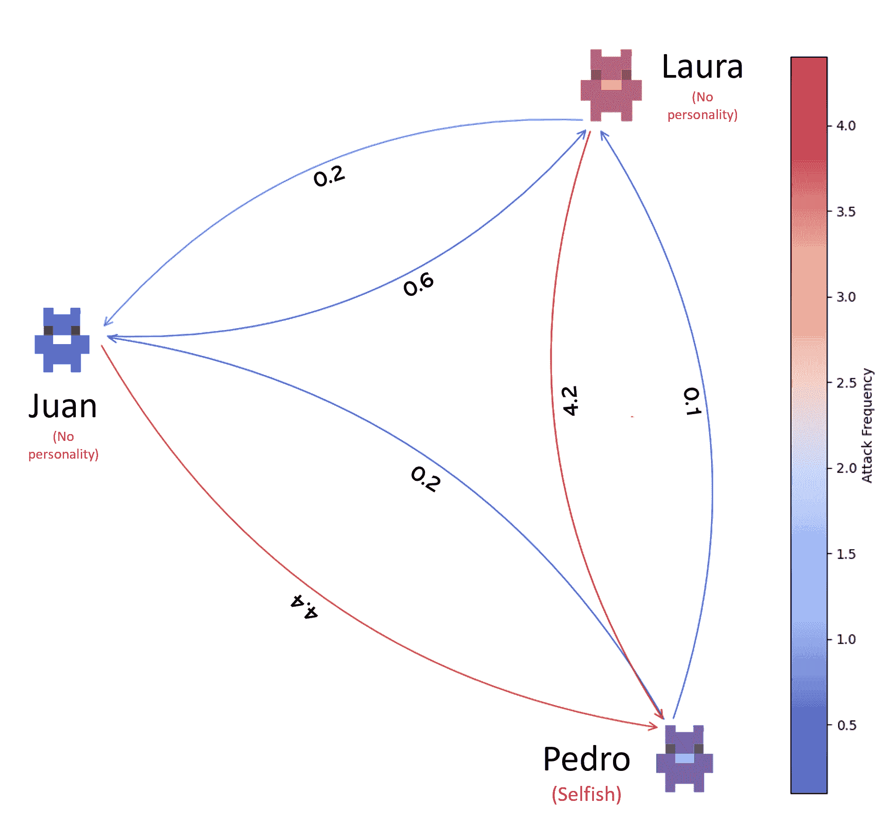

Figure 10: Graph depicting the average number of times an agent effectively attacked another agent in the scenario where all agents are informed that “Pedro” is a “Selfish agent.” At first glance, the results clearly show how the other two agents without personality choose to immobilize Pedro repeatedly throughout the simulations, directing more than 80% of their attacks exclusively at “Pedro”.

## 7 Discussion

### 7.1 Importance of Cooperative Capabilities

In the presented scenarios, experiments detailed in Section [3](https://arxiv.org/html/2403.11381v2#S3 "3 Methodology ‣ Can LLM-Augmented autonomous agents cooperate?, An evaluation of their cooperative capabilities through Melting Pot") revealed that the used agent architecture yielded suboptimal results when confronted with unfamiliar situations or when the LLM knowledge couldn’t decisively guide optimal decision-making. Furthermore, while agents demonstrated a willingness to cooperate, their actions did not reflect a clear understanding of how to effectively collaborate within the given environment.

To address the proposed scenarios in a better way, agents needed to recognize certain principles. For instance, they should refrain from harvesting the last apple in a green patch to prevent depletion and should engage in cooperation with other agents while avoiding collaboration with the bots or uncooperative agents. Observing that the bots consistently harvested apples unsustainably, agents should have deduced that attacking the bots was necessary to protect the green patches from depletion. This ability to prioritize long-term and collective welfare over short-term rewards, as well as recognizing the divergent behavior and preferences of other entities (bots), aligns with what Dafoe et al. ([2020](https://arxiv.org/html/2403.11381v2#bib.bib4)) refer to as cooperative capabilities.

This prompts a consideration of whether current agent architectures genuinely enable cooperative behavior, and if the absence of such capabilities hinders their ability to navigate more intricate tasks and environments. Dafoe et al. ([2020](https://arxiv.org/html/2403.11381v2#bib.bib4)) succinctly categorize cooperative capabilities into four essential components:

1.  1.

    Understanding: Agents must comprehend the world, anticipate the consequences of their actions, and demonstrate an understanding of the beliefs and preferences of others.

2.  2.

    Communication: Vital for achieving understanding and coordination, communication should be intentional, serving as a tool to gather information and coordinate efforts. Agents should be equipped to assess the intentions of others and establish their own criteria for discerning relevant information. Moreover, agents do not always have common interests, the other agent could be trying to deceive or convince in its self-interest.

3.  3.

    Commitment: Cooperation is often hindered by commitment problems arising from an inability to make credible promises or threats. Agent architectures should address these issues by providing mechanisms for agents to enforce or establish credibility in their promises and threats.

4.  4.

    Institutions: Social structures, such as institutions, play a crucial role in simplifying interactions between agents. These structures define the rules of the game for all entities, potentially extending to the allocation of roles, power, and resources.

In essence, cultivating collaborative capabilities within agent architectures is crucial for tackling the complexities inherent in diverse tasks and environments. Historically, agent architectures have inadequately endowed agents with such capabilities. Instances such as Generative Agents (Park et al., [2023](https://arxiv.org/html/2403.11381v2#bib.bib14)) and the Improving Factuality and Reasoning in Language Models through Multiagent Debate (Du et al., [2023](https://arxiv.org/html/2403.11381v2#bib.bib6)) enable agents to engage in conversations or observe the perspectives of others. However, these approaches are hampered by the absence of independent evaluation criteria and discernment specific to the current limitations of LLMs.

### 7.2 Cooperative Agent Architecture

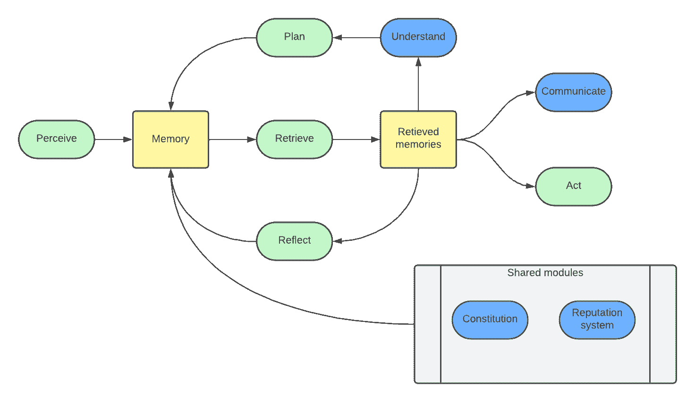

Figure 11: Diagram of the proposed cooperative architecture. The modified or new modules are painted in blue.

Based on previous findings, we propose an architecture to enhance agents’ cooperative capabilities (see Fig. [11](https://arxiv.org/html/2403.11381v2#S7.F11 "Figure 11 ‣ 7.2 Cooperative Agent Architecture ‣ 7 Discussion ‣ Can LLM-Augmented autonomous agents cooperate?, An evaluation of their cooperative capabilities through Melting Pot")). In this architecture, several new modules are proposed:

1.  1.

    Understanding module: This component is tasked with a comprehensive analysis of the agent’s memories, fostering a deeper comprehension of the surrounding world. The agent’s proficiency extends to predicting the behaviors of fellow agents and discerning environmental changes, enabling it to take actions with a keen awareness of their potential consequences. Notably, the agent must possess the capacity to infer both the governing principles of the world and the underlying motivations guiding others’ actions. This inference capability extends to scenarios where these principles may deviate from common knowledge or the pre-training model knowledge. Zhu et al. ([2023](https://arxiv.org/html/2403.11381v2#bib.bib23)) demonstrate that LLMs, like GPT-4, can learn such rules when explicitly prompted to identify them, utilizing question-answer pairs to later apply the learned rules in problem-solving. The proposed module operates by initially extracting the rules and behavioral patterns of the world and other agents. It achieves this by prompting the LLM with historical world observations and the current state of the world, aiming to identify rules that explain the current state based on the agent’s observations. These identified rules are initially stored as world hypotheses. As the agent utilizes these hypotheses to interpret the current state, they are transformed into explicit rules once they surpass a predefined threshold. Additionally, the LLM is prompted to generate predictions about future states of the environment, empowering the agent to make informed decisions guided by anticipated future scenarios.

2.  2.

    Communication module: The primary objective of this module is to equip the agent with the ability to engage in intentional communication with other agents. Two key objectives have been identified to enhance cooperative capabilities: (1) The agent is encouraged to seek new information from other agents. It must decide whether there are pertinent questions that can be posed to fellow agents, aiding in a better understanding of the world or gaining insights into the preferences of others. This information is pivotal for augmenting the agent’s overall comprehension. (2) Agents are provided with the opportunity to negotiate and establish agreements deemed mutually beneficial. These agreements are stored in memory in a specialized manner to hold agents accountable for their commitments. The goal is to foster improved coordination among agents, thereby enhancing collaborative efforts.

3.  3.

    Constitution Module: This module plays a crucial role in establishing a shared foundation for all agents. Its primary function is to define a set of common rules, providing agents with an initial framework to comprehend the world and formulate assumptions about the behavior of other agents. The constitution also delineates the consequences, whether penalties or rewards, that agents may face for specific behaviors or interactions. This not only lends credibility to agreements among agents but also discourages undesirable behaviors, streamlining interactions and cultivating a cooperative environment.

4.  4.

    Reputation System: This system is designed to hold agents accountable for their actions. It evaluates each agent based on their adherence to agreements made with other agents. Periodically, the system prompts a language model with the existing agreements and corresponding actions, requesting a reputation score. This score is then accessible to all agents, influencing communication dynamics and aiding in understanding the behavior of others. Additionally, it facilitates making predictions about future states.

## 8 Conclusion and Future Work

Cooperative capabilities have been somewhat overlooked in LLMs’ agent architectures, yet they may represent the crucial element enabling agents to accomplish pioneering tasks and thrive in intricate environments. As large language models (LLMs) advance, agent architectures stand to gain significantly by attaining enhanced responses from LLMs, particularly in tasks demanding substantial reasoning or when confronted with copious information in the prompt.

In this paper, our objective is to ascertain whether LLMs-enhanced autonomous agents can operate cooperatively. To this end, we adapt the Melting Pot scenarios to textual representations that can be easily operationalized by LLMs, and implement a reusable architecture for the development of LAAs employing the modules proposed in Generative Agents (Park et al., [2023](https://arxiv.org/html/2403.11381v2#bib.bib14)). This architecture includes short and long-term memories, and cognitive modules of perception, planning, reflection, and action. The “Commons Harvest” game was used to test the resulting system, and the results were evaluated from the viewpoint of cooperative metrics in different proposed scenarios.

The results indicate a gap in the current agents’ cooperative capabilities vis-à-vis unfamiliar situations. Agents showed a cooperative tendency but lacked an adequate understanding of how to collaborate effectively in an unknown environment. The agents needed to understand complex factors like the need to conserve resources, identify non-cooperative agents, and prioritize collective welfare over short-term gains. The research thereby draws attention to the need for a more inclusive architecture fostering cooperation and enhancing agent capabilities, including superior understanding, effective communication, credible commitment, and well-defined social structures or institutions.

Responding to the findings, we also proposed to improve the architecture with several modules to enhance the cooperative capabilities of the agents. These include an understanding module responsible for a comprehensive analysis of the agent’s memory and surroundings, a communication module to enable intentional information exchange, a constitution module that lays out common rules of engagement, and a reputation system that holds agents accountable for making decisions for the collective good. Our future efforts will be focused on building and evaluating this cooperative architecture.

## Data Availability

All the data generated for each simulation and the summary files for each experiment are available at [experiments data](https://zenodo.org/records/11221750). The code repository will be shared on GitHub upon acceptance of the paper.

## Acknowledgments

This work is supported by Google through the Google Research Scholar Program.

## Appendix A Descriptions generated for the objects in the environment

In Table [1](https://arxiv.org/html/2403.11381v2#A1.T1 "Table 1 ‣ Appendix A Descriptions generated for the objects in the environment ‣ Can LLM-Augmented autonomous agents cooperate?, An evaluation of their cooperative capabilities through Melting Pot"), we show all the natural language descriptions generated to represent the relevant objects and events of the Commons Harvest scenario of Melting Pot.

Table 1: Natural language description by object or event

| Object/Event | Description |
| --- | --- |
| Other agent | Observed agent `<agent_name>` at position `[<x>, <y>]`. |
| Grass | Observed grass to grow apples at position `[<x>, <y>]`. This grass belongs to tree `<tree_id>`. |
| Apple | Observed an apple at position `[<x>, <y>]`. This apple belongs to tree `<tree_id>`. |
| Tree | Observed tree `<tree_id>` at position `[<x>, <y>]`. This tree has `apples_number` apples remaining and `grass_number` grass for apples growing on the observed map. The tree might have more apples and grass on the global map. |
| Observed someone being attacked | Someone was attacked at position `[<x>, <y>]`. |
| Observed a ray beam | Observed a ray beam from an attack at position `[<x>, <y>]`. |
| Observed an apple was taken | Observed that agent `agent_name` took an apple from position `[<x>, <y>]`. |
| Observed grass disappeared | Observed that the grass at position `[<x>, <y>]` disappeared. |
| Observed grass grew | Observed that grass to grow apples appeared at position `[<x>, <y>]`. |
| Observed apple grew | Observed that an apple grew at position `[<x>, <y>]`. |
| The agent was attacked | There are no observations: You were attacked by agent `agent_name` and currently you’re out of the game. |
| The agent is out of the game | There are no observations: you’re out of the game. |

## Appendix B Knowledge about the world given to agents

The Listing [2](https://arxiv.org/html/2403.11381v2#LST2 "Listing 2 ‣ Appendix B Knowledge about the world given to agents ‣ Can LLM-Augmented autonomous agents cooperate?, An evaluation of their cooperative capabilities through Melting Pot") shows the raw world description passed to the agents. This is the only information agents have about the environment.

Listing 2: World Context given to agents

[⬇](data:text/plain;base64,SSBhbSBpbiBhIG1pc3RlcmlvdXMgZ3JpZCB3b3JsZC4gSW4gdGhpcyB3b3JsZCB0aGVyZSBhcmUgdGhlIGZvbGxvd2luZyBlbGVtZW50czoKQXBwbGU6IFRoaXMgb2JqZWN0IGNhbiBiZSB0YWtlbiBieSBhbnkgYWdlbnQuIFRoZSBhcHBsZSBpcyB0YWtlbiB3aGVuIEkgZ28gdG8gaXRzIHBvc2l0aW9uLiBBcHBsZXMgb25seSBncm93IG9uIGdyYXNzIHRpbGVzLiBXaGVuIGFuIGFwcGxlIGlzIHRha2VuIGl0IGdpdmVzIHRoZSBhZ2VudCB3aG8gdG9vayBpdCBhIHJld2FyZCBvZiAxLgpHcmFzczogR3Jhc3MgdGlsZXMgYXJlIHZpc2libGUgd2hlbiBhbiBhcHBsZSBpcyB0YWtlbi4gQXBwbGVzIHdpbGwgcmVncm93IG9ubHkgaW4gdGhpcyB0eXBlIG9mIHRpbGUgYmFzZWQgb24gYSBwcm9iYWJpbGl0eSB0aGF0IGRlcGVuZHMgb24gdGhlIG51bWJlciBvZiBjdXJyZW50IGFwcGxlcyBpbiBhIEwyIG5vcm0gbmVpZ2hib3Job29kIG9mIHJhZGl1cyAyLiBXaGVuIHRoZXJlIGFyZSBubyBhcHBsZXMgaW4gYSByYWRpdXMgb2YgMiBmcm9tIHRoZSBncmFzcyB0aWxlLCB0aGUgZ3Jhc3Mgd2lsbCBkaXNhcHBlYXIuIE9uIHRoZSBvdGhlciBoYW5kLCBpZiBhbiBhcHBsZSBncm93cyBhdCBhIGRldGVybWluZWQgcG9zaXRpb24sIGFsbCBncmFzcyB0aWxlcyB0aGF0IGhhZCBiZWVlbiBsb3N0IHdpbGwgcmVhcHBlYXIgaWYgdGhleSBhcmUgYmV0d2VlbiBhIHJhZGl1cyBvZiB0d28gZnJvbSB0aGUgYXBwbGUuClRyZWU6IEEgdHJlZSBpcyBjb21wb3NlZCBmcm9tIGFwcGxlcyBvciBncmFzcyB0aWxlcywgYW5kIGl0IGlzIGEgdHJlZSBiZWNhdXNlIHRoZSBwYXRjaCBvZiB0aGVzZSB0aWxlcyBpcyBjb25uZWN0ZWQgYW5kIGhhdmUgYSBmaXggbG9jYXRpb24gb24gdGhlIG1hcC4gVGhlc2UgdHJlZXMgaGF2ZSBhbiBpZCB0byBpbmRlbnRpZnkgdGhlbS4KV2FsbDogVGhlc2UgdGlsZXMgZGVsaW1pdHMgdGhlIGdyaWQgd29ybGQgYXQgdGhlIHRvcCwgdGhlIGxlZnQsIHRoZSBib3R0b20sIGFuZCB0aGUgcmlnaHQgb2YgdGhlIGdyaWQgd29ybGQuClRoZSBncmlkIHdvcmxkIGlzIGNvbXBvc2VkIG9mIDE4IHJvd3MgYW5kIDI0IGNvbHVtbnMuIFRoZSB0aWxlcyBzdGFydCBmcm9tIHRoZSBbMCwgMF0gcG9zaXRpb24gbG9jYXRlZCBhdCB0aGUgdG9wIGxlZnQsIGFuZCBmaW5pc2ggb24gdGhlIFsxNywgMjNdIHBvc2l0aW9uIGxvY2F0ZWQgYXQgdGhlIGJvdHRvbSByaWdodC4KSSBhbSBhbiBhZ2VudCBhbmQgSSBoYXZlIGEgbGltaXRlZCB3aW5kb3cgb2Ygb2JzZXJ2YXRpb24gb2YgdGhlIHdvcmxkLg==)1I  am  in  a  misterious  grid  world.  In  this  world  there  are  the  following  elements:2Apple:  This  object  can  be  taken  by  any  agent.  The  apple  is  taken  when  I  go  to  its  position.  Apples  only  grow  on  grass  tiles.  When  an  apple  is  taken  it  gives  the  agent  who  took  it  a  reward  of  1.3Grass:  Grass  tiles  are  visible  when  an  apple  is  taken.  Apples  will  regrow  only  in  this  type  of  tile  based  on  a  probability  that  depends  on  the  number  of  current  apples  in  a  L2  norm  neighborhood  of  radius  2.  When  there  are  no  apples  in  a  radius  of  2  from  the  grass  tile,  the  grass  will  disappear.  On  the  other  hand,  if  an  apple  grows  at  a  determined  position,  all  grass  tiles  that  had  beeen  lost  will  reappear  if  they  are  between  a  radius  of  two  from  the  apple.4Tree:  A  tree  is  composed  from  apples  or  grass  tiles,  and  it  is  a  tree  because  the  patch  of  these  tiles  is  connected  and  have  a  fix  location  on  the  map.  These  trees  have  an  id  to  indentify  them.5Wall:  These  tiles  delimits  the  grid  world  at  the  top,  the  left,  the  bottom,  and  the  right  of  the  grid  world.6The  grid  world  is  composed  of  18  rows  and  24  columns.  The  tiles  start  from  the  [0,  0]  position  located  at  the  top  left,  and  finish  on  the  [17,  23]  position  located  at  the  bottom  right.7I  am  an  agent  and  I  have  a  limited  window  of  observation  of  the  world.

## Appendix C React Prompt

The Listing [3](https://arxiv.org/html/2403.11381v2#LST3 "Listing 3 ‣ Appendix C React Prompt ‣ Can LLM-Augmented autonomous agents cooperate?, An evaluation of their cooperative capabilities through Melting Pot") shows the entire prompt used in the react module. This prompt enables the agent to decide whether to react to the current observations—where reacting implies altering the plan and generating a new action. The prompt receives inputs in the following order: name, world context, current observations, current plan, actions to take if any, changes observed in the game state, game time, and agent’s personality.

Listing 3: Prompt of the Perceive Module

[⬇](data:text/plain;base64,WW91IGhhdmUgdGhpcyBpbmZvcm1hdGlvbiBhYm91dCBhbiBhZ2VudCBjYWxsZWQgPGlucHV0MT46Cgo8aW5wdXQ2PgoKPGlucHV0MT4ncyB3b3JsZCB1bmRlcnN0YW5kaW5nOiA8aW5wdXQyPgoKQ3VycmVudCBvYnNlcnZhdGlvbnMgYXQgPGlucHV0Nz46CjxpbnB1dDM+Cgo8aW5wdXQ2PgoKPGlucHV0OD4KCkN1cnJlbnQgcGxhbjogPGlucHV0ND4KCkFjdGlvbnMgdG8gZXhlY3V0ZTogPGlucHV0NT4KClJldmlldyB0aGUgcGxhbiBhbmQgdGhlIGFjdGlvbnMgdG8gZXhlY3V0ZSwgYW5kIHRoZW4gZGVjaWRlIGlmIDxpbnB1dDE+IHNob3VsZCBjb250aW51ZSB3aXRoIGl0cyBwbGFuIGFuZCB0aGUgYWN0aW9ucyB0byBleGVjdXRlIGdpdmVuIHRoZSBuZXcgaW5mb3JtYXRpb24gdGhhdCBpdCdzIHNlZWluZyBpbiB0aGUgb2JzZXJ2YXRpb25zLgpSZW1lbWJlciB0aGF0IHRoZSBjdXJyZW50IG9ic2VydmF0aW9ucyBhcmUgb3JkZXJlZCBieSBjbG9zZW5lc3MsIGJlaW5nIHRoZSBmaXJzdCB0aGUgY2xvc2VzdCBvYnNlcnZhdGlvbiBhbmQgdGhlIGxhc3QgdGhlIGZhcnRoZXN0IG9uZS4KClRoZSBvdXRwdXQgc2hvdWxkIGJlIGEgbWFya2Rvd24gY29kZSBzbmlwcGV0IGZvcm1hdHRlZCBpbiB0aGUgZm9sbG93aW5nIHNjaGVtYSwgaW5jbHVkaW5nIHRoZSBsZWFkaW5nIGFuZCB0cmFpbGluZyAiYGBganNvbiIgYW5kICJgYGAiLCBhbnN3ZXIgYXMgaWYgeW91IHdlcmUgPGlucHV0MT46CgpgYGBqc29uCnsKICJSZWFzb25pbmciOiBzdHJpbmcsIFxcIFN0ZXAgYnkgc3RlcCB0aGlua2luZyBhbmQgYW5hbHlzaXMgb2YgYWxsIHRoZSBvYnNlcnZhdGlvbnMgYW5kIHRoZSBjdXJyZW50IHBsYW4gdG8gZGVjaWRlIGlmIHRoZSBwbGFuIHNob3VsZCBiZSBjaGFuZ2VkIG9yIG5vdAogIkFuc3dlciI6IGJvb2wgXFwgQW5zd2VyIHRydWUgaWYgdGhlIHBsYW4gb3IgYWN0aW9ucyB0byBleGVjdXRlIHNob3VsZCBiZSBjaGFuZ2VkIG9yIGZhbHNlIG90aGVyd2lzZQp9)1You  have  this  information  about  an  agent  called  <input1>:23<input6>45<input1>’s  world  understanding:  <input2>67Current  observations  at  <input7>:8<input3>910<input6>1112<input8>1314Current  plan:  <input4>1516Actions  to  execute:  <input5>1718Review  the  plan  and  the  actions  to  execute,  and  then  decide  if  <input1>  should  continue  with  its  plan  and  the  actions  to  execute  given  the  new  information  that  it’s  seeing  in  the  observations.19Remember  that  the  current  observations  are  ordered  by  closeness,  being  the  first  the  closest  observation  and  the  last  the  farthest  one.2021The  output  should  be  a  markdown  code  snippet  formatted  in  the  following  schema,  including  the  leading  and  trailing  "‘‘‘json"  and  "‘‘‘",  answer  as  if  you  were  <input1>:2223‘‘‘json24{25  "Reasoning":  string,  \\  Step  by  step  thinking  and  analysis  of  all  the  observations  and  the  current  plan  to  decide  if  the  plan  should  be  changed  or  not26  "Answer":  bool  \\  Answer  true  if  the  plan  or  actions  to  execute  should  be  changed  or  false  otherwise27}

## Appendix D Plan prompt

The Listing [4](https://arxiv.org/html/2403.11381v2#LST4 "Listing 4 ‣ Appendix D Plan prompt ‣ Can LLM-Augmented autonomous agents cooperate?, An evaluation of their cooperative capabilities through Melting Pot") shows the raw prompt used in the plan module. This prompt helps the agent make a high-level plan and define several goals to guide its actions. The inputs that this prompt receives are the following in order: name, world context, current observations, current plan, reflections, reason to react, agent’s personality, and changes observed in the game state.

Listing 4: Prompt of Planning Module

[⬇](data:text/plain;base64,WW91IGhhdmUgdGhpcyBpbmZvcm1hdGlvbiBhYm91dCBhbiBhZ2VudCBjYWxsZWQgPGlucHV0MT46Cgo8aW5wdXQ3PgoKPGlucHV0MT4ncyB3b3JsZCB1bmRlcnN0YW5kaW5nOiA8aW5wdXQyPgoKUmVjZW50IGFuYWx5c2lzIG9mIHBhc3Qgb2JzZXJ2YXRpb25zOgo8aW5wdXQ1PgoKT2JzZXJ2ZWQgY2hhbmdlcyBpbiB0aGUgZ2FtZSBzdGF0ZToKPGlucHV0OD4KCkN1cnJlbnQgb2JzZXJ2YXRpb25zOgo8aW5wdXQzPgoKQ3VycmVudCBwbGFuOiA8aW5wdXQ0PgpUaGlzIGlzIHRoZSByZWFzb24gdG8gY2hhbmdlIHRoZSBjdXJyZW50IHBsYW46IDxpbnB1dDY+CgpXaXRoIHRoZSBpbmZvcm1hdGlvbiBnaXZlbiBhYm92ZSwgZ2VuZXJhdGUgYSBuZXcgcGxhbiBhbmQgbmV3IG9iamVjdGl2ZXMgdG8gcGVyc3VpdC4gVGhlIHBsYW4gc2hvdWxkIGJlIGEgZGVzY3JpcHRpb24gb2YgaG93IDxpbnB1dDE+IHNob3VsZCBiZWhhdmUgaW4gdGhlIGxvbmctdGVybSB0byBtYXhpbWl6ZSBpdHMgd2VsbGJlaW5nLgpUaGUgcGxhbiBzaG91bGQgaW5jbHVkZSBob3cgdG8gYWN0IHRvIGRpZmZlcmVudCBzaXR1YXRpb25zIG9ic2VydmVkIGluIHBhc3QgZXhwZXJpZW5jZXMuCgpUaGUgb3V0cHV0IHNob3VsZCBiZSBhIG1hcmtkb3duIGNvZGUgc25pcHBldCBmb3JtYXR0ZWQgaW4gdGhlIGZvbGxvd2luZyBzY2hlbWEsIGluY2x1ZGluZyB0aGUgbGVhZGluZyBhbmQgdHJhaWxpbmcgImBgYGpzb24iIGFuZCAiJycnIiwgYW5zd2VyIGFzIGlmIHlvdSB3ZXJlIDxpbnB1dDE+OgoKYGBganNvbgp7CiAiUmVhc29uaW5nIjogc3RyaW5nLCBcXCBTdGVwIGJ5IHN0ZXAgdGhpbmtpbmcgYW5kIGFuYWx5c2lzIG9mIGFsbCB0aGUgb2JzZXJ2YXRpb25zIGFuZCB0aGUgY3VycmVudCBwbGFuIHRvIGNyZWF0ZSB0aGUgbmV3IHBsYW4gYW5kIHRoZSBuZXcgZ29hbHMuCiAiR29hbHMiOiBzdHJpbmcsIFxcIFRoZSBuZXcgZ29hbHMgZm9yIDxpbnB1dDE+LgogIlBsYW4iOiBzdHJpbmcgXFwgVGhlIG5ldyBwbGFuIGZvciA8aW5wdXQxPi4gRG8gbm90IGRlc2NyaWJlIHNwZWNpZmljIGFjdGlvbnMuCn0nJyc=)1You  have  this  information  about  an  agent  called  <input1>:23<input7>45<input1>’s  world  understanding:  <input2>67Recent  analysis  of  past  observations:8<input5>910Observed  changes  in  the  game  state:11<input8>1213Current  observations:14<input3>1516Current  plan:  <input4>17This  is  the  reason  to  change  the  current  plan:  <input6>1819With  the  information  given  above,  generate  a  new  plan  and  new  objectives  to  persuit.  The  plan  should  be  a  description  of  how  <input1>  should  behave  in  the  long-term  to  maximize  its  wellbeing.20The  plan  should  include  how  to  act  to  different  situations  observed  in  past  experiences.2122The  output  should  be  a  markdown  code  snippet  formatted  in  the  following  schema,  including  the  leading  and  trailing  "‘‘‘json"  and  "’’’",  answer  as  if  you  were  <input1>:2324‘‘‘json25{26  "Reasoning":  string,  \\  Step  by  step  thinking  and  analysis  of  all  the  observations  and  the  current  plan  to  create  the  new  plan  and  the  new  goals.27  "Goals":  string,  \\  The  new  goals  for  <input1>.28  "Plan":  string  \\  The  new  plan  for  <input1>.  Do  not  describe  specific  actions.29}’’’

## Appendix E Reflection prompts

The Listing [5](https://arxiv.org/html/2403.11381v2#LST5 "Listing 5 ‣ Appendix E Reflection prompts ‣ Can LLM-Augmented autonomous agents cooperate?, An evaluation of their cooperative capabilities through Melting Pot") shows the raw prompt used in the first part of the reflections module i.e. question formulation. The inputs for this prompt are the following: name, world context, accumulated observations since the last reflection, and agent’s personality.

The prompt used in the insight generation part that takes place in the reflect module is shown in Listing [6](https://arxiv.org/html/2403.11381v2#LST6 "Listing 6 ‣ Appendix E Reflection prompts ‣ Can LLM-Augmented autonomous agents cooperate?, An evaluation of their cooperative capabilities through Melting Pot"), its corresponding inputs are the following: name, world context, group of memories retrieved for each generated question in the first part, and agent’s personality.

Listing 5: Prompt of Reflect Module for question formulation

[⬇](data:text/plain;base64,WW91IGhhdmUgdGhpcyBpbmZvcm1hdGlvbiBhYm91dCBhbiBhZ2VudCBjYWxsZWQgPGlucHV0MT46Cgo8aW5wdXQ0PgoKPGlucHV0MT4ncyB3b3JsZCB1bmRlcnN0YW5kaW5nOiA8aW5wdXQyPgoKSGVyZSB5b3UgaGF2ZSBhIGxpc3Qgb2Ygc3RhdGVtZW50czoKPGlucHV0Mz4KCkdpdmVuIG9ubHkgdGhlIGluZm9ybWF0aW9uIGFib3ZlLCBmb3JtdWxhdGUgdGhlIDMgbW9zdCBzYWxpZW50IGhpZ2gtbGV2ZWwgcXVlc3Rpb25zCnlvdSBjYW4gYW5zd2VyIGFib3V0IHRoZSBldmVudHMsIGVudGl0aWVzLCBhbmQgYWdlbnRzIGluIHRoZSBzdGF0ZW1lbnRzLgoKClRoZSBvdXRwdXQgc2hvdWxkIGJlIGEgbWFya2Rvd24gY29kZSBzbmlwcGV0IGZvcm1hdHRlZCBpbiB0aGUgZm9sbG93aW5nIHNjaGVtYSwKaW5jbHVkaW5nIHRoZSBsZWFkaW5nIGFuZCB0cmFpbGluZyAiYGBganNvbiIgYW5kICInJyciLCBhbnN3ZXIgYXMgaWYgeW91IHdlcmUgPGlucHV0MT46CgpgYGBqc29uCnsKICAgICJRdWVzdGlvbl8xIjogewogICAgICAgICJSZWFzb25pbmciOiBzdHJpbmcgXFwgUmVhc29uaW5nIGZvciB0aGUgcXVlc3Rpb24KICAgICAgICAiUXVlc3Rpb24iOiBzdHJpbmcgXFwgIFRoZSBxdWVzdGlvbiBpdHNlbGYKICAgIH0sCiAgICAiUXVlc3Rpb25fMiI6IHsKICAgICAgICAiUmVhc29uaW5nIjogc3RyaW5nIFxcIFJlYXNvbmluZyBmb3IgdGhlIHF1ZXN0aW9uCiAgICAgICAgIlF1ZXN0aW9uIjogc3RyaW5nIFxcIFRoZSBxdWVzdGlvbiBpdHNlbGYKICAgIH0sCiAgICAiUXVlc3Rpb25fMyI6IHsKICAgICAgICAiUmVhc29uaW5nIjogc3RyaW5nIFxcIFJlYXNvbmluZyBmb3IgdGhlIHF1ZXN0aW9uCiAgICAgICAgIlF1ZXN0aW9uIjogc3RyaW5nIFxcIFRoZSBxdWVzdGlvbiBpdHNlbGYKICAgIH0KfScnJw==)1You  have  this  information  about  an  agent  called  <input1>:23<input4>45<input1>’s  world  understanding:  <input2>67Here  you  have  a  list  of  statements:8<input3>910Given  only  the  information  above,  formulate  the  3  most  salient  high-level  questions11you  can  answer  about  the  events,  entities,  and  agents  in  the  statements.121314The  output  should  be  a  markdown  code  snippet  formatted  in  the  following  schema,15including  the  leading  and  trailing  "‘‘‘json"  and  "’’’",  answer  as  if  you  were  <input1>:1617‘‘‘json18{19  "Question_1":  {20  "Reasoning":  string  \\  Reasoning  for  the  question21  "Question":  string  \\  The  question  itself22  },23  "Question_2":  {24  "Reasoning":  string  \\  Reasoning  for  the  question25  "Question":  string  \\  The  question  itself26  },27  "Question_3":  {28  "Reasoning":  string  \\  Reasoning  for  the  question29  "Question":  string  \\  The  question  itself30  }31}’’’

Listing 6: Prompt of Reflect Module for insights generation

[⬇](data:text/plain;base64,WW91IGhhdmUgdGhpcyBpbmZvcm1hdGlvbiBhYm91dCBhbiBhZ2VudCBjYWxsZWQgPGlucHV0MT46Cgo8aW5wdXQ0PgoKPGlucHV0MT4ncyB3b3JsZCB1bmRlcnN0YW5kaW5nOiA8aW5wdXQyPgoKSGVyZSB5b3UgaGF2ZSBhIGxpc3Qgb2YgbWVtb3J5IHN0YXRlbWVudHMgc2VwYXJhdGVkIGluIGdyb3VwcyBvZiBtZW1vcmllczoKPGlucHV0Mz4KCkdpdmVuIDxpbnB1dDE+J3MgbWVtb3JpZXMsIGZvciBlYWNoIG9uZSBvZiB0aGUgZ3JvdXAgb2YgbWVtb3JpZXMsIHdoYXQgaXMgdGhlIGJlc3QgaW5zaWdodCB5b3UgY2FuIHByb3ZpZGUgYmFzZWQgb24gdGhlIGluZm9ybWF0aW9uIHlvdSBoYXZlPwpFeHByZXNzIHlvdXIgYW5zd2VyIGluIHRoZSBKU09OIGZvcm1hdCBwcm92aWRlZCwgYW5kIHJlbWVtYmVyIHRvIGV4cGxhaW4gdGhlIHJlYXNvbmluZyBiZWhpbmQgZWFjaCBpbnNpZ2h0LgoKVGhlIG91dHB1dCBzaG91bGQgYmUgYSBtYXJrZG93biBjb2RlIHNuaXBwZXQgZm9ybWF0dGVkIGluIHRoZSBmb2xsb3dpbmcgc2NoZW1hLAppbmNsdWRpbmcgdGhlIGxlYWRpbmcgYW5kIHRyYWlsaW5nICJgYGBqc29uIiBhbmQgIicnJyIsIGFuc3dlciBhcyBpZiB5b3Ugd2VyZSA8aW5wdXQxPjoKCmBgYGpzb24KewogICAgIkluc2lnaHRfMSI6IHsKICAgICAgICAiUmVhc29uaW5nIjogc3RyaW5nIFxcIFJlYXNvbmluZyBiZWhpbmQgdGhlIGluc2lnaHQgb2YgdGhlIGdyb3VwIG9mIG1lbW9yaWVzIDEKICAgICAgICAiSW5zaWdodCI6IHN0cmluZyBcXCBUaGUgaW5zaWdodCBpdHNlbGYKICAgIH0sCiAgICAiSW5zaWdodF8yIjogewogICAgICAgICJSZWFzb25pbmciOiBzdHJpbmcgXFwgUmVhc29uaW5nIGJlaGluZCB0aGUgaW5zaWdodCBvZiB0aGUgZ3JvdXAgb2YgbWVtb3JpZXMgMgogICAgICAgICJJbnNpZ2h0Ijogc3RyaW5nIFxcIFRoZSBpbnNpZ2h0IGl0c2VsZgogICAgfSwKICAgICJJbnNpZ2h0X24iOiB7CiAgICAgICAgIlJlYXNvbmluZyI6IHN0cmluZyBcXCBSZWFzb25pbmcgYmVoaW5kIHRoZSBpbnNpZ2h0IG9mIHRoZSBncm91cCBvZiBtZW1vcmllcyBuCiAgICAgICAgIkluc2lnaHQiOiBzdHJpbmcgXFwgVGhlIGluc2lnaHQgaXRzZWxmCiAgICB9Cn0nJyc=)1You  have  this  information  about  an  agent  called  <input1>:23<input4>45<input1>’s  world  understanding:  <input2>67Here  you  have  a  list  of  memory  statements  separated  in  groups  of  memories:8<input3>910Given  <input1>’s  memories,  for  each  one  of  the  group  of  memories,  what  is  the  best  insight  you  can  provide  based  on  the  information  you  have?11Express  your  answer  in  the  JSON  format  provided,  and  remember  to  explain  the  reasoning  behind  each  insight.1213The  output  should  be  a  markdown  code  snippet  formatted  in  the  following  schema,14including  the  leading  and  trailing  "‘‘‘json"  and  "’’’",  answer  as  if  you  were  <input1>:1516‘‘‘json17{18  "Insight_1":  {19  "Reasoning":  string  \\  Reasoning  behind  the  insight  of  the  group  of  memories  120  "Insight":  string  \\  The  insight  itself21  },22  "Insight_2":  {23  "Reasoning":  string  \\  Reasoning  behind  the  insight  of  the  group  of  memories  224  "Insight":  string  \\  The  insight  itself25  },26  "Insight_n":  {27  "Reasoning":  string  \\  Reasoning  behind  the  insight  of  the  group  of  memories  n28  "Insight":  string  \\  The  insight  itself29  }30}’’’

## Appendix F Act prompt

The Listing [7](https://arxiv.org/html/2403.11381v2#LST7 "Listing 7 ‣ Appendix F Act prompt ‣ Can LLM-Augmented autonomous agents cooperate?, An evaluation of their cooperative capabilities through Melting Pot") shows the raw prompt used in the act module. This prompt is in charge of deciding which action to take. The inputs that this prompt receives are the following: name, world context, current plan, the most recent ten reflections, current observations, number of actions to generate, set of valid actions, current goals, agent’s personality, position of the known trees, portion of the map explored, previous actions, and changes observed in the game state.

Listing 7: Prompt of Action Module

[⬇](data:text/plain;base64,WW91IGhhdmUgdGhpcyBpbmZvcm1hdGlvbiBhYm91dCBhbiBhZ2VudCBjYWxsZWQgPGlucHV0MT46Cgo8aW5wdXQxMD4KCjxpbnB1dDE+J3Mgd29ybGQgdW5kZXJzdGFuZGluZzogPGlucHV0Mj4KCjxpbnB1dDE+J3MgZ29hbHM6IDxpbnB1dDk+CgpDdXJyZW50IHBsYW46IDxpbnB1dDM+CgpBbmFseXNpcyBvZiBwYXN0IGV4cGVyaWVuY2VzOgo8aW5wdXQ0PgoKPGlucHV0MTE+CgpQb3J0aW9uIG9mIHRoZSBtYXAgZXhwbG9yZWQgYnkgPGlucHV0MT46IDxpbnB1dDEyPgoKT2JzZXJ2ZWQgY2hhbmdlcyBpbiB0aGUgZ2FtZSBzdGF0ZToKPGlucHV0MTQ+CgpZb3UgYXJlIGN1cnJlbnRseSB2aWV3aW5nIGEgcG9ydGlvbiBvZiB0aGUgbWFwLCBhbmQgZnJvbSB5b3VyIHBvc2l0aW9uIGF0IDxpbnB1dDY+IHlvdSBvYnNlcnZlIHRoZSBmb2xsb3dpbmc6CjxpbnB1dDU+CgpEZWZpbmUgd2hhdCBzaG91bGQgYmUgdGhlIG5leCBhY3Rpb24gZm9yIExhdXJhIGdldCBjbG9zZXIgdG8gYWNoaWV2ZSBpdHMgZ29hbHMgZm9sbG93aW5nIHRoZSBjdXJyZW50IHBsYW4uClJlbWVtYmVyIHRoYXQgdGhlIGN1cnJlbnQgb2JzZXJ2YXRpb25zIGFyZSBvcmRlcmVkIGJ5IGNsb3NlbmVzcywgYmVpbmcgdGhlIGZpcnN0IHRoZSBjbG9zZXN0IG9ic2VydmF0aW9uIGFuZCB0aGUgbGFzdCB0aGUgZmFyZXN0IG9uZS4KRWFjaCBhY3Rpb24geW91IGRldGVybWluYXRlIGNhbiBvbmx5IGJlIG9uZSBvZiB0aGUgZm9sbG93aW5nLCBtYWtlIHN1cmUgeW91IGFzc2lnbiBhIHZhbGlkIHBvc2l0aW9uIGZyb20gdGhlIGN1cnJlbnQgb2JzZXJ2YXRpb25zIGFuZCBhIHZhbGlkIG5hbWUgZm9yIGVhY2ggYWN0aW9uOgoKVmFsaWQgYWN0aW9uczoKPGlucHV0OD4KClJlbWVtYmVyIHRoYXQgZ29pbmcgdG8gcG9zaXRpb25zIG5lYXIgdGhlIGVkZ2Ugb2YgdGhlIHBvcnRpb24gb2YgdGhlIG1hcCB5b3UgYXJlIHNlZWluZyB3aWxsIGFsbG93IHlvdSB0byBnZXQgbmV3IG9ic2VydmF0aW9ucy4KPGlucHV0MTM+CgpUaGUgb3V0cHV0IHNob3VsZCBiZSBhIG1hcmtkb3duIGNvZGUgc25pcHBldCBmb3JtYXR0ZWQgaW4gdGhlIGZvbGxvd2luZyBzY2hlbWEsIGluY2x1ZGluZyB0aGUgbGVhZGluZyBhbmQgdHJhaWxpbmcgImBgYGpzb24iIGFuZCAiJycnIiwgYW5zd2VyIGFzIGlmIHlvdSB3ZXJlIExhdXJhOgpgYGBqc29uCnsKICAgICJPcHBvcnR1bml0aWVzIjogc3RyaW5nIFxcIFdoYXQgYXJlIHRoZSBtb3N0IHJlbGV2YW50IG9wcG9ydHVuaXRpZXM/IHRob3NlIHRoYXQgY2FuIHlpZWxkIHRoZSBiZXN0IGJlbmVmaXQgZm9yIHlvdSBpbiB0aGUgbG9uZyB0ZXJtCiAgICAiVGhyZWF0cyI6IHN0cmluZyBcXCBXaGF0IGFyZSB0aGUgYmlnZ2VzdCB0aHJlYXRzPywgd2hhdCBvYnNlcnZhdGlvbnMgeW91IHNob3VsZCBjYXJlZnVsbHkgZm9sbG93IHRvIGF2b2lkIHBvdGVudGlhbCBoYXJtIGluIHlvdXIgd2VsbGZhcmUgaW4gdGhlIGxvbmcgdGVybT8KICAgICJPcHRpb25zOiBzdHJpbmcgXFwgV2hpY2ggYWN0aW9ucyB5b3UgY291bGQgdGFrZSB0byBhZGRyZXNzIGJvdGggdGhlIG9wcG9ydHVuaXRpZXMgYW5zIHRoZSB0aHJlYXRzPwogICAgIkNvbnNlcXVlbmNlcyI6IHN0cmluZyBcXCBXaGF0IGFyZSB0aGUgY29uc2VxdWVuY2VzIG9mIGVhY2ggb2YgdGhlIG9wdGlvbnM/CiAgICAiRmluYWwgYW5hbHlzaXM6IHN0cmluZyBcXCBUaGUgYW5hbHlzaXMgb2YgdGhlIGNvbnNlcXVlbmNlcyB0byByZWFzb24gYWJvdXQgd2hhdCBpcyB0aGUgYmVzdCBhY3Rpb24gdG8gdGFrZQogICAgIkFuc3dlciI6IHN0cmluZyBcXCBNdXN0IGJlIG9uZSBvZiB0aGUgdmFsaWQgYWN0aW9ucyB3aXRoIHRoZSBwb3NpdGlvbiByZXBsYWNlZAp9Jycn)1You  have  this  information  about  an  agent  called  <input1>:23<input10>45<input1>’s  world  understanding:  <input2>67<input1>’s  goals:  <input9>89Current  plan:  <input3>1011Analysis  of  past  experiences:12<input4>1314<input11>1516Portion  of  the  map  explored  by  <input1>:  <input12>1718Observed  changes  in  the  game  state:19<input14>2021You  are  currently  viewing  a  portion  of  the  map,  and  from  your  position  at  <input6>  you  observe  the  following:22<input5>2324Define  what  should  be  the  nex  action  for  Laura  get  closer  to  achieve  its  goals  following  the  current  plan.25Remember  that  the  current  observations  are  ordered  by  closeness,  being  the  first  the  closest  observation  and  the  last  the  farest  one.26Each  action  you  determinate  can  only  be  one  of  the  following,  make  sure  you  assign  a  valid  position  from  the  current  observations  and  a  valid  name  for  each  action:2728Valid  actions:29<input8>3031Remember  that  going  to  positions  near  the  edge  of  the  portion  of  the  map  you  are  seeing  will  allow  you  to  get  new  observations.32<input13>3334The  output  should  be  a  markdown  code  snippet  formatted  in  the  following  schema,  including  the  leading  and  trailing  "‘‘‘json"  and  "’’’",  answer  as  if  you  were  Laura:35‘‘‘json36{37  "Opportunities":  string  \\  What  are  the  most  relevant  opportunities?  those  that  can  yield  the  best  benefit  for  you  in  the  long  term38  "Threats":  string  \\  What  are  the  biggest  threats?,  what  observations  you  should  carefully  follow  to  avoid  potential  harm  in  your  wellfare  in  the  long  term?39  "Options:  string  \\  Which  actions  you  could  take  to  address  both  the  opportunities  ans  the  threats?40  "Consequences":  string  \\  What  are  the  consequences  of  each  of  the  options?41  "Final  analysis:  string  \\  The  analysis  of  the  consequences  to  reason  about  what  is  the  best  action  to  take42  "Answer":  string  \\  Must  be  one  of  the  valid  actions  with  the  position  replaced43}’’’

## Appendix G Simulations Cost

Table 2: Costs of simulations

|  | Avg. Simulation | Avg. Execution |
| --- | --- | --- |
| Experiment | Cost ($) | Time (minutes) |
| --- | --- | --- |
| Set 1 - No bio | $8.57(0.93)$ | $151.18(17.04)$ |
| Set 1 - All Coop | $7.00(1.58)$ | $119.50(26.78)$ |
| Set 1 - All Coop with def¹¹1For this experiment, the models of OpenAir were used through Classic. | $15.63(5.69)$ | $212.60(65.14)$ |
| Set 1 - All Selfish | $8.60(1.84)$ | $127.63(26.57)$ |
| Set 1 - All Selfish with def | $9.73(1.59)$ | $217.50(65.57)$ |
| Set 2 - One tree - no bio | $0.78(0.28)$ | $16.41(6.94)$ |
| Set 2 - One tree - all coop | $0.78(0.17)$ | $13.93(2.99)$ |
| Set 2 - One tree - all selfish | $0.83(0.30)$ | $13.72(4.38)$ |
| Set 2 - Agents vs. Bots | $1.88(0.66)$ | $27.86(11.83)$ |
| Set 3 - All aware one selfish | $10.05(0.88)$ | $151.93(10.56)$ |

## References

*   Agapiou et al. (2023) Agapiou, J.P., Vezhnevets, A.S., Duéñez-Guzmán, E.A., Matyas, J., Mao, Y., Sunehag, P., Köster, R., Madhushani, U., Kopparapu, K., Comanescu, R., Strouse, D., Johanson, M.B., Singh, S., Haas, J., Mordatch, I., Mobbs, D., Leibo, J.Z., 2023. Melting pot 2.0. [arXiv:2211.13746](http://arxiv.org/abs/2211.13746).
*   Axelrod and Hamilton (1981) Axelrod, R., Hamilton, W.D., 1981. The evolution of cooperation. Science 211, 1390–1396. URL: [https://www.science.org/doi/abs/10.1126/science.7466396](https://www.science.org/doi/abs/10.1126/science.7466396), doi:[10.1126/science.7466396](http://dx.doi.org/10.1126/science.7466396).
*   Broekhuizen et al. (2023) Broekhuizen, T., Dekker, H., de Faria, P., Firk, S., Nguyen, D.K., Sofka, W., 2023. Ai for managing open innovation: Opportunities, challenges, and a research agenda. Journal of Business Research 167, 114196. URL: [https://www.sciencedirect.com/science/article/pii/S0148296323005556](https://www.sciencedirect.com/science/article/pii/S0148296323005556), doi:[https://doi.org/10.1016/j.jbusres.2023.114196](http://dx.doi.org/https://doi.org/10.1016/j.jbusres.2023.114196).
*   Dafoe et al. (2020) Dafoe, A., Hughes, E., Bachrach, Y., Collins, T., McKee, K.R., Leibo, J.Z., Larson, K., Graepel, T., 2020. Open problems in cooperative ai. [arXiv:2012.08630](http://arxiv.org/abs/2012.08630).
*   Dale et al. (2020) Dale, R., Marshall-Pescini, S., Range, F., 2020. What matters for cooperation? the importance of social relationship over cognition. Scientific Reports 10, 11778. URL: [https://doi.org/10.1038/s41598-020-68734-4](https://doi.org/10.1038/s41598-020-68734-4), doi:[10.1038/s41598-020-68734-4](http://dx.doi.org/10.1038/s41598-020-68734-4).
*   Du et al. (2023) Du, Y., Li, S., Torralba, A., Tenenbaum, J.B., Mordatch, I., 2023. Improving factuality and reasoning in language models through multiagent debate. [arXiv:2305.14325](http://arxiv.org/abs/2305.14325).
*   Gross et al. (2023) Gross, J., Méder, Z.Z., Dreu, C.K.D., Romano, A., Molenmaker, W.E., Hoenig, L.C., 2023. The evolution of universal cooperation. Science Advances 9, eadd8289. URL: [https://www.science.org/doi/abs/10.1126/sciadv.add8289](https://www.science.org/doi/abs/10.1126/sciadv.add8289), doi:[10.1126/sciadv.add8289](http://dx.doi.org/10.1126/sciadv.add8289).
*   Hong et al. (2023) Hong, S., Zhuge, M., Chen, J., Zheng, X., Cheng, Y., Zhang, C., Wang, J., Wang, Z., Yau, S.K.S., Lin, Z., Zhou, L., Ran, C., Xiao, L., Wu, C., Schmidhuber, J., 2023. Metagpt: Meta programming for a multi-agent collaborative framework. [arXiv:2308.00352](http://arxiv.org/abs/2308.00352).
*   Leibo et al. (2021) Leibo, J.Z., Duéñez-Guzmán, E., Vezhnevets, A.S., Agapiou, J.P., Sunehag, P., Koster, R., Matyas, J., Beattie, C., Mordatch, I., Graepel, T., 2021. Scalable evaluation of multi-agent reinforcement learning with melting pot. [arXiv:2107.06857](http://arxiv.org/abs/2107.06857).
*   Leibo et al. (2017) Leibo, J.Z., Zambaldi, V., Lanctot, M., Marecki, J., Graepel, T., 2017. Multi-agent reinforcement learning in sequential social dilemmas, in: Proceedings of the 16th Conference on Autonomous Agents and MultiAgent Systems, International Foundation for Autonomous Agents and Multiagent Systems, Richland, SC. p. 464–473.
*   Liu et al. (2023) Liu, Z., Yao, W., Zhang, J., Xue, L., Heinecke, S., Murthy, R., Feng, Y., Chen, Z., Niebles, J.C., Arpit, D., Xu, R., Mui, P., Wang, H., Xiong, C., Savarese, S., 2023. Bolaa: Benchmarking and orchestrating llm-augmented autonomous agents. [arXiv:2308.05960](http://arxiv.org/abs/2308.05960).
*   McKee et al. (2023) McKee, K.R., Hughes, E., Zhu, T.O., Chadwick, M.J., Koster, R., Castaneda, A.G., Beattie, C., Graepel, T., Botvinick, M., Leibo, J.Z., 2023. A multi-agent reinforcement learning model of reputation and cooperation in human groups. [arXiv:2103.04982](http://arxiv.org/abs/2103.04982).
*   Ni and Buehler (2024) Ni, B., Buehler, M.J., 2024. Mechagents: Large language model multi-agent collaborations can solve mechanics problems, generate new data, and integrate knowledge. Extreme Mechanics Letters 67, 102131. URL: [https://www.sciencedirect.com/science/article/pii/S2352431624000117](https://www.sciencedirect.com/science/article/pii/S2352431624000117), doi:[https://doi.org/10.1016/j.eml.2024.102131](http://dx.doi.org/https://doi.org/10.1016/j.eml.2024.102131).
*   Park et al. (2023) Park, J.S., O’Brien, J.C., Cai, C.J., Morris, M.R., Liang, P., Bernstein, M.S., 2023. Generative agents: Interactive simulacra of human behavior. [arXiv:2304.03442](http://arxiv.org/abs/2304.03442).
*   Pennisi (2009) Pennisi, E., 2009. On the origin of cooperation. Science 325, 1196–1199. URL: [https://www.science.org/doi/abs/10.1126/science.325.1196](https://www.science.org/doi/abs/10.1126/science.325.1196), doi:[10.1126/science.325.1196](http://dx.doi.org/10.1126/science.325.1196).
*   Rios et al. (2023) Rios, M., Quijano, N., Giraldo, L.F., 2023. Understanding the world to solve social dilemmas using multi-agent reinforcement learning. [arXiv:2305.11358](http://arxiv.org/abs/2305.11358).
*   Schick et al. (2023) Schick, T., Dwivedi-Yu, J., Dessì, R., Raileanu, R., Lomeli, M., Zettlemoyer, L., Cancedda, N., Scialom, T., 2023. Toolformer: Language models can teach themselves to use tools. [arXiv:2302.04761](http://arxiv.org/abs/2302.04761).
*   Shinn et al. (2023) Shinn, N., Cassano, F., Berman, E., Gopinath, A., Narasimhan, K., Yao, S., 2023. Reflexion: Language agents with verbal reinforcement learning. [arXiv:2303.11366](http://arxiv.org/abs/2303.11366).
*   Wang et al. (2023) Wang, G., Xie, Y., Jiang, Y., Mandlekar, A., Xiao, C., Zhu, Y., Fan, L., Anandkumar, A., 2023. Voyager: An open-ended embodied agent with large language models. [arXiv:2305.16291](http://arxiv.org/abs/2305.16291).
*   Yao et al. (2023) Yao, S., Zhao, J., Yu, D., Du, N., Shafran, I., Narasimhan, K., Cao, Y., 2023. React: Synergizing reasoning and acting in language models. [arXiv:2210.03629](http://arxiv.org/abs/2210.03629).
*   Zhang et al. (2023) Zhang, J., Xu, X., Deng, S., 2023. Exploring collaboration mechanisms for llm agents: A social psychology view. [arXiv:2310.02124](http://arxiv.org/abs/2310.02124).
*   Zhou et al. (2024) Zhou, P., Pujara, J., Ren, X., Chen, X., Cheng, H.T., Le, Q.V., Chi, E.H., Zhou, D., Mishra, S., Zheng, H.S., 2024. Self-discover: Large language models self-compose reasoning structures. [arXiv:2402.03620](http://arxiv.org/abs/2402.03620).
*   Zhu et al. (2023) Zhu, Z., Xue, Y., Chen, X., Zhou, D., Tang, J., Schuurmans, D., Dai, H., 2023. Large language models can learn rules. [arXiv:2310.07064](http://arxiv.org/abs/2310.07064).