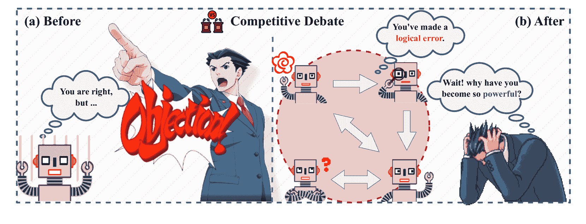
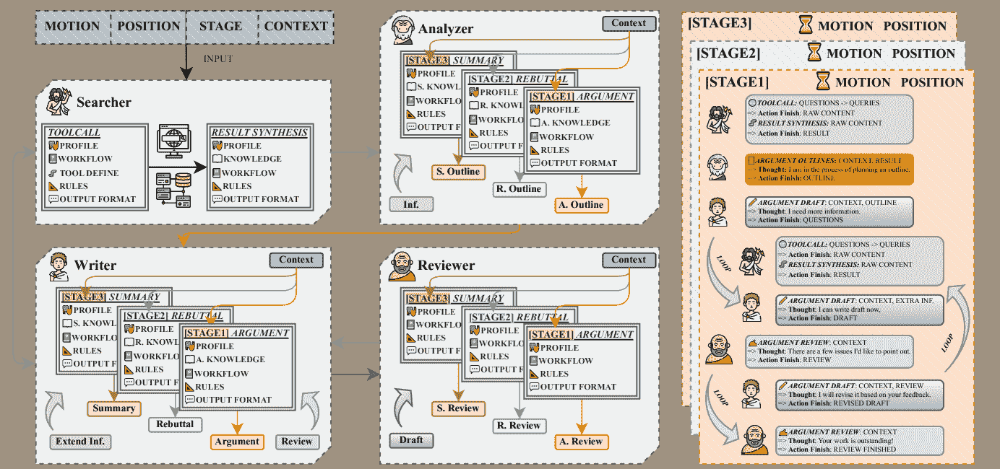
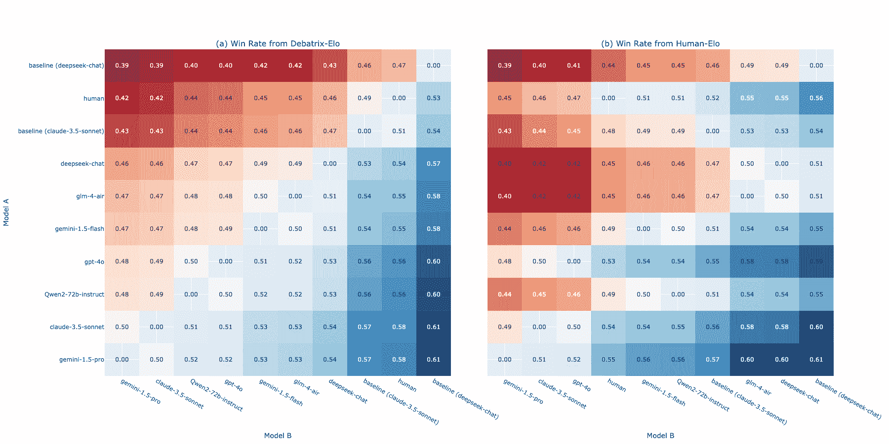
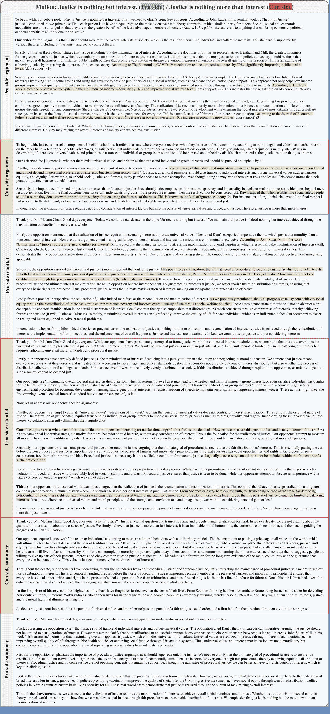
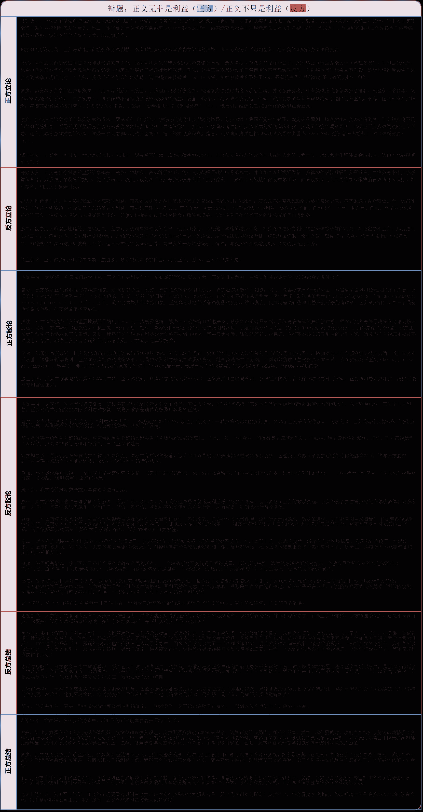
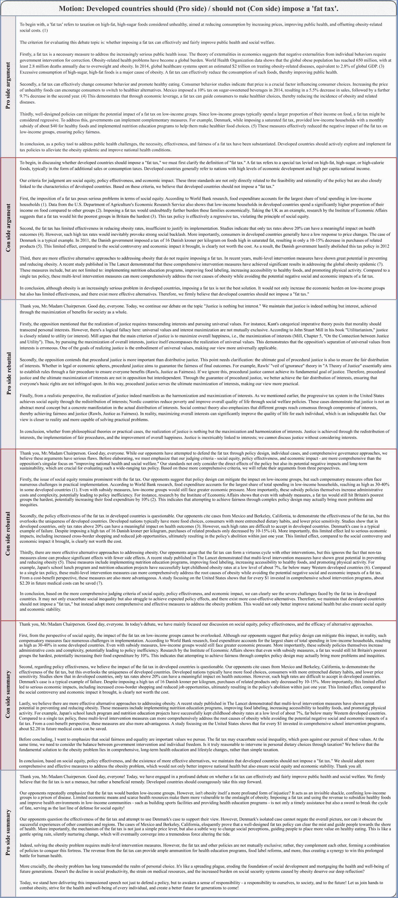
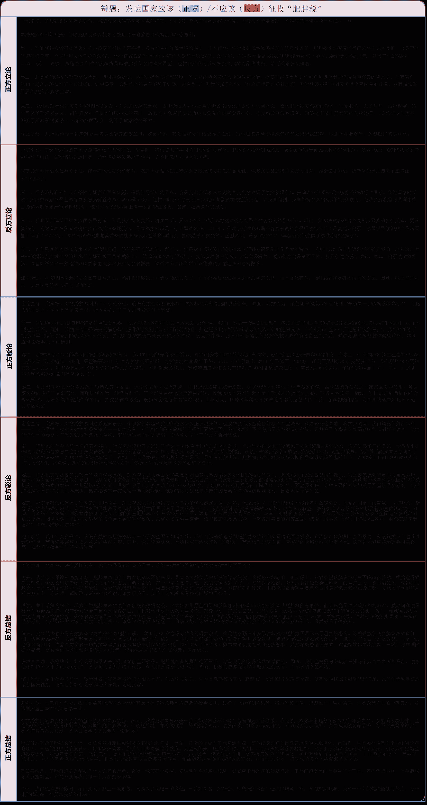

<!--yml

分类：未分类

日期：2025-01-11 12:19:53

-->

# LLM能在辩论中击败人类吗？一种动态多代理框架用于竞争性辩论

> 来源：[https://arxiv.org/html/2408.04472/](https://arxiv.org/html/2408.04472/)

张一群¹，杨晓翠¹，石峰¹，王大岭¹，张一飞¹，宋凯松² 通讯作者。

###### 摘要

竞争性辩论是一个复杂的计算性论证任务。大型语言模型（LLMs）在这个领域存在幻觉问题，且缺乏竞争力。为了解决这些挑战，我们介绍了“辩论代理”（Agent for Debate，Agent4Debate），这是一种基于LLM的动态多代理框架，旨在提升其在竞争性辩论中的能力。Agent4Debate的设计灵感来源于人类在辩论准备和执行过程中的行为，采用协作架构，由四个专业代理组成，分别是搜索者（Searcher）、分析者（Analyzer）、写作者（Writer）和审阅者（Reviewer），这些代理在辩论过程中动态互动与合作。它们覆盖了从初步研究和论点制定到反驳和总结等多个阶段。在全面评估框架性能时，我们构建了“竞争性辩论场”，其中包含66个精心挑选的中文辩题。我们招募了10名经验丰富的辩手，并收集了200场包含Agent4Debate、基线模型和人类的辩论记录。评估采用Debatrix自动评分系统以及基于已建立的Debatrix-Elo和Human-Elo排名的专业人类评审。实验结果表明，最先进的Agent4Debate展现了与人类相当的能力。此外，消融研究展示了代理结构中各个组件的有效性。

代码 — https://github.com/ZhangYiqun018/agent-for-debate

## 引言

竞争性辩论作为一种结构化和竞争性的沟通形式（Nichols [1936](https://arxiv.org/html/2408.04472v2#bib.bib21); Thueblood [1926](https://arxiv.org/html/2408.04472v2#bib.bib30)），在教育、法律和政治等领域中发挥着至关重要的作用。它挑战参与者的综合能力，包括逻辑思维、表达技巧、快速分析、论证构建和反驳技巧，最终目标是说服第三方。随着人工智能技术的进步，计算论证学应运而生，致力于通过计算方法模拟和理解人类的论证过程（Atkinson et al. [2017](https://arxiv.org/html/2408.04472v2#bib.bib3); Eger, Daxenberger, and Gurevych [2017](https://arxiv.org/html/2408.04472v2#bib.bib10)）。然而，现有研究大多局限于特定任务和特定数据集，如论证挖掘（Lawrence and Reed [2019](https://arxiv.org/html/2408.04472v2#bib.bib16)）、论证质量评估（Wachsmuth et al. [2017a](https://arxiv.org/html/2408.04472v2#bib.bib35)）和论证生成（Li, Ji, and Han [2021](https://arxiv.org/html/2408.04472v2#bib.bib18)）。尽管这些方法在特定任务上表现优异，但它们在应对以开放性、激烈竞争和决策及综合能力需求为特征的竞争性辩论的复杂性时存在困难。

近年来，大语言模型（LLMs）（OpenAI [2023](https://arxiv.org/html/2408.04472v2#bib.bib22); Touvron et al. [2023b](https://arxiv.org/html/2408.04472v2#bib.bib32)）在多种自然语言处理任务中展现出了卓越的能力，为构建高性能辩论系统提供了新的可能性。竞争性辩论的特点是多轮次的文档级文本生成，且各轮次之间存在逻辑依赖，这给LLMs带来了独特的挑战，特别是在两个重要领域。首先，LLMs常常面临幻觉问题（Ji et al. [2023](https://arxiv.org/html/2408.04472v2#bib.bib14)），即模型可能生成看似合理但不准确或虚构的信息。其次，由于训练过程中的安全对齐限制（Ouyang et al. [2022](https://arxiv.org/html/2408.04472v2#bib.bib23)）和处理长上下文的局限性（Liu et al. [2024](https://arxiv.org/html/2408.04472v2#bib.bib20)），模型在对抗性和持续性辩论场景中往往表现不佳（如图[1](https://arxiv.org/html/2408.04472v2#Sx1.F1 "图 1 ‣ 引言 ‣ 大语言模型能否击败人类进行辩论？一个动态的多代理框架")所示），难以维持竞争力和论证一致性。

图 1：前后对比：Agent4Debate 对大语言模型（LLMs）竞争性辩论技能的影响。

为了应对这些挑战，我们提出了基于LLMs的多智能体框架——Agent for Debate（Agent4Debate）。Agent4Debate具有动态的多智能体协作架构，通过多个专业化LLMs的合作，使框架能够参与多阶段的竞争性辩论。受到人类辩论准备过程的启发，我们的框架包含四个关键智能体，包括信息收集者（Searcher）、战略评估者（Analyzer）、论证构建者（Writer）和批评评估者（Reviewer）。为了全面评估Agent4Debate的竞争性辩论能力，我们建立了竞争性辩论竞技场，采用了广泛应用于竞技体育中的Elo排名系统，确保了公正性和可扩展性。该竞技场包含66个精心挑选的中文辩论议题，涵盖政策、价值和事实三大类别（Abell [2018](https://arxiv.org/html/2408.04472v2#bib.bib1)），全面测试参与者在不同类型辩论中的表现。参与者包括采用不同基础模型的Agent4Debate、两个基准系统以及十位经验丰富的人工辩手。所有参与者将进行一对一的比赛，每场辩论都通过两种独立的评估方法进行评分，包括基于Debatrix（Liang et al. [2024](https://arxiv.org/html/2408.04472v2#bib.bib19)）指标的自动辩论评分系统，以及由三位专业人工评审组成的专家评分系统。基于这两组独立的评估结果，我们构建了两个单独的Elo（Elo [1967](https://arxiv.org/html/2408.04472v2#bib.bib11); Zheng et al. [2023](https://arxiv.org/html/2408.04472v2#bib.bib44)）排名列表，提供了对参与者在各种辩论议题中的表现的多维度定量评估。来自竞技场的实验结果表明，Agent4Debate能够在各种类型的竞争性辩论中达到人类水平的表现。

总结来说，本研究的主要贡献如下：

+   •

    我们提出了Agent4Debate，旨在通过动态的多智能体协作提升大型语言模型（LLMs）在竞争性辩论中的表现。该框架模拟了人类辩论团队的互动，智能体根据角色和策略进行适应。具体而言，它采用了信息收集者（Searcher）、战略评估者（Analyzer）、论证构建者（Writer）和批评评估者（Reviewer）四个智能体。

+   •

    我们构建了竞争性辩论竞技场，这是一个公共资源，包含66个中文辩论议题和200场跨政策、价值和事实类别的辩论比赛。我们将人类辩手纳入其中，并通过Debatrix指标和专业人类评委分别建立了Debatrix-Elo和Human-Elo排名。

+   •

    我们的实验结果表明，Agent4Debate在竞争性辩论中的表现与人类相当。消融研究验证了各个组件的有效性。

## 相关工作

### 计算论证

论证研究具有深厚的历史根基（Walton, Reed, 和 Macagno [2008](https://arxiv.org/html/2408.04472v2#bib.bib37)），其核心目标是通过逻辑推理实现说服，并促进各方之间的共识。近年来，计算论证作为自然语言处理领域一个日益重要的方向崭露头角，其主要研究方向包括论证挖掘（Lawrence 和 Reed [2019](https://arxiv.org/html/2408.04472v2#bib.bib16)；Chen 等 [2024](https://arxiv.org/html/2408.04472v2#bib.bib8)）、论证生成（Hua, Hu, 和 Wang [2019](https://arxiv.org/html/2408.04472v2#bib.bib12)）、论证说服力（Carlile 等 [2018](https://arxiv.org/html/2408.04472v2#bib.bib6)）以及论证质量评估（Wachsmuth 等 [2017b](https://arxiv.org/html/2408.04472v2#bib.bib36)；Liang 等 [2024](https://arxiv.org/html/2408.04472v2#bib.bib19)；Wachsmuth 等 [2024](https://arxiv.org/html/2408.04472v2#bib.bib34)）。Project Debater（Slonim 等 [2021](https://arxiv.org/html/2408.04472v2#bib.bib29)），一个集成多个模块的辩论系统，依赖于基于检索的方法，而非生成方法进行论证。随着利用对抗性方法（如辩论）增强模型能力的大型语言模型研究的兴起（Du 等 [2023](https://arxiv.org/html/2408.04472v2#bib.bib9)；Chang [2024](https://arxiv.org/html/2408.04472v2#bib.bib7)），逐渐吸引了学术界的关注。在此背景下，我们的研究聚焦于竞争性辩论，这是一个复杂的计算论证任务，集成了多个子任务。

### 基于LLM的代理

大型语言模型（LLMs），例如ChatGPT（OpenAI [2023](https://arxiv.org/html/2408.04472v2#bib.bib22)）、LLaMA（Touvron et al. [2023b](https://arxiv.org/html/2408.04472v2#bib.bib32)，[a](https://arxiv.org/html/2408.04472v2#bib.bib31)），在任务执行和推理任务中展现出了强大的能力。利用这些先进能力，研究人员开发了基于LLM的智能体，标志着该领域的一个重要进展。这些智能体利用模型的语言理解和生成能力，执行更加复杂的任务，如多步推理和交互式问题解决，正如近期的研究所展示的（Wang et al. [2023b](https://arxiv.org/html/2408.04472v2#bib.bib39)；Li et al. [2023](https://arxiv.org/html/2408.04472v2#bib.bib17)）。它们在多个领域中都有广泛的应用，如软件工程（Qian et al. [2023](https://arxiv.org/html/2408.04472v2#bib.bib25)）和科学研究（Boiko, MacKnight, 和 Gomes [2023](https://arxiv.org/html/2408.04472v2#bib.bib5)），突出展示了它们的多功能性。这些智能体能够模仿复杂的人类行为，参与社会互动（Park et al. [2023](https://arxiv.org/html/2408.04472v2#bib.bib24)；Tu et al. [2023](https://arxiv.org/html/2408.04472v2#bib.bib33)），并重现复杂的场景，如选举（Argyle et al. [2022](https://arxiv.org/html/2408.04472v2#bib.bib2)）、辩论（Wang et al. [2023a](https://arxiv.org/html/2408.04472v2#bib.bib38)；Du et al. [2023](https://arxiv.org/html/2408.04472v2#bib.bib9)）和消费模式（Wang et al. [2023c](https://arxiv.org/html/2408.04472v2#bib.bib40)），这展示了它们模拟人类社会动态的能力。尽管这些智能体在模仿人类社会动态方面表现出令人印象深刻的能力，目前的研究主要集中在协作场景。然而，竞争性场景，尽管在人类互动中同样至关重要，却相对较少被探索。

## 任务定义

竞争性辩论是一个结构化的多轮交互任务。每一轮陈述可以视为一个文档级文本生成任务，且不同轮次之间存在时间和逻辑的进展关系。典型的辩论有两个对立方：支持方（Pro）和反对方（Con）。我们将竞争性辩论表示为一个序列：

|  | $D=\{(s_{1},r_{1}),(s_{2},r_{2}),\cdots,(s_{n},r_{n})\}$ |  | (1) |
| --- | --- | --- | --- |

其中，$(s_{i},r_{i})$表示第$i$条陈述及其对应的角色，$s_{i}$是陈述，$r_{i} \in \{\textit{Pro}, \textit{Con}\}$表示发言者的角色。每个陈述可以定义为：

|  | $s_{i}=\mathcal{G}(m,r_{i},D_{i-1})$ |  | (2) |
| --- | --- | --- | --- |

其中，$m$是辩论的议题，$D_{i-1}$表示前$i-1$条陈述的历史，$\mathcal{G}(\cdot)$是生成函数，用于生成每条陈述。

典型的竞争性辩论结构通常包括三个不同的阶段，即建构性论点、反驳和总结陈述。为了确保公平并模拟实际的竞争性辩论环境（Whitman [2005](https://arxiv.org/html/2408.04472v2#bib.bib41)），我们为每个阶段设定了具体规则：

图2：辩论智能体（Agent4Debate）工作流程：一个动态框架，模拟人类辩论团队的协作。从搜索到回顾，它展示了四个关键角色（搜索者、分析者、写作者、审阅者）如何互动并进行迭代工作。右侧展示了从信息收集到论点形成的循环过程，以阶段1为例，突出了框架的多步骤进程和递归完善。

+   •

    在阶段1（建构性论点）中，双方独立工作，反对方无法看到支持方的建构性论点，确保初步观点不受影响。

+   •

    阶段2和阶段3（反驳和总结）采用渐进式披露机制，参与者可以访问所有之前的内容，以构建有针对性的陈述。

+   •

    我们在各个阶段之间交替顺序，以平衡发言顺序的优势。在阶段2中，支持方先发言，而反对方在阶段3中先发言。

## 辩论智能体

为了解决幻觉问题以及在持续的辩论场景中保持竞争性和论证一致性所面临的挑战，我们提出了辩论智能体（Agent4Debate）框架，使得LLM能够参与竞争性辩论，如图[2](https://arxiv.org/html/2408.04472v2#Sx3.F2 "Figure 2 ‣ Task Definition ‣ Can LLMs Beat Humans in Debating? A Dynamic Multi-agent Framework for Competitive Debate")所示。该框架通过基于对话的协作动态模拟人类辩论准备（Wu et al. [2023](https://arxiv.org/html/2408.04472v2#bib.bib42)），其中四个基于LLM的智能体分别扮演人类辩论团队中的关键角色。搜索者作为研究助手，收集相关信息；分析者充当执行教练，制定策略并分析论点；写作者充当辩手，构建并阐述论点；审阅者则作为辩论教练，提供反馈并进行质量控制。这些智能体在整个辩论过程中灵活互动，根据当前阶段和需求调整各自的角色和贡献，类似于一个协调良好的人类辩论团队。

Agent4Debate中的协作不仅仅是一个简单的步骤顺序，而是基于辩论阶段和背景的多个智能体之间的动态互动。所有的智能体都配备了针对不同辩论阶段的定制化提示，帮助它们更好地适应并执行当前阶段的具体任务。在接下来的章节中，我们将详细介绍每个智能体的功能。

### 搜索者智能体

搜索器（Searcher）是Agent4Debate框架中的一个工具代理，旨在有效地缓解幻觉问题，并解决大型语言模型（LLM）在辩论过程中可能遇到的信息时效性问题。它通过访问和组织外部知识库中的信息来实现这一目标。搜索器的工作流程主要包括将搜索问题分解为更精细的查询，然后利用外部工具（如搜索引擎或专门的知识库）来检索相关信息，最后系统地汇编和整理获得的答案。搜索器编制的信息形成了一个固定的、供所有代理在整个辩论过程中参考的议题知识库。这种方法确保了辩论中使用信息的一致性和可靠性。需要注意的是，搜索器在辩论的不同阶段扮演不同的角色。在第一阶段，搜索器将议题作为搜索问题进行信息收集。然而，在第二阶段和第三阶段，搜索器切换到被动模式，等待来自写作代理的具体指令后再进行有针对性的搜索。

### 分析器代理（Analyzer Agent）

分析器是Agent4Debate框架中的核心代理，集成了辩论中的实时信息，并为后续内容输出提供结构化的指导。它的主要功能是根据给定的议题、当前阶段和历史背景，系统地分析和规划辩论内容，从而连接辩论的不同阶段。分析器的工作流程主要包括逐步拆解辩论内容，起草详细的提纲，并为其他代理提供有针对性的战略建议。这种方法确保了辩论推理的连贯性和论证的全面性。值得注意的是，分析器在不同阶段扮演不同的角色：

+   •

    在第一阶段，分析器从搜索器接收辩论主题和整理的材料。接着，它会总结议题，并从自身角度形成定义、判断标准、主要论点和支持证据。

+   •

    在第二阶段，分析器分析前阶段的所有内容，总结双方观点的差异，例如对方的定义和判断标准。然后，它会建议可以用来应对这些差异的反驳技巧。

+   •

    在第三阶段，除了继续总结分歧点并提供反驳技巧外，分析器还会从价值观角度提出建议，进一步增强辩论的深度和说服力。

### 写作代理（Writer Agent）

撰写者是Agent4Debate框架中的执行代理，负责将分析和规划转化为实际的辩论内容。其主要职能是根据分析员提供的指令和大纲撰写完整的辩论草稿，并根据评审员的反馈对草稿进行修改，确保辩论的质量和说服力。撰写者的工作流程主要包括以下几个方面：

+   •

    内容创作：根据分析员提供的大纲，撰写者将其扩展为详细的辩论脚本，确保论证逻辑严谨，支持证据充分。

+   •

    修订和优化：在收到评审员的修改建议后，撰写者根据建议对脚本进行相应的调整和优化，以提升整体质量。

+   •

    资源评估：撰写者评估当前知识库中的信息是否足以支持大纲和脚本修订的要求。如果发现信息需要改进，撰写者会主动向搜索员发起请求，明确说明需要补充的材料。

### 评审员代理

评审员是Agent4Debate框架中的质量控制者，负责审查和评估撰写者生成的辩论脚本。其主要职能是根据当前的辩论阶段和历史背景，提供有针对性的修改建议，确保辩论内容的质量、逻辑性和说服力。评审员的工作流程关注辩论各个阶段的不同方面：

+   •

    在第一阶段，评审员主要关注论证结构的完整性、内容的全面性（包括定义、标准和要点）、支持证据的充分性以及表达的流畅性。

+   •

    在第二阶段，基于上一阶段的工作，评审员还特别关注反驳技巧的恰当应用，并确保对对方论点的反驳不会导致自己立场的自相矛盾。

+   •

    在第三阶段，除了处理前两阶段的内容外，评审员还会评估辩论内容的深度，并根据上下文作出判断，提供详细的评估理由。

评审员通过持续评估所有辩论阶段中与先前信息的一致性，保持论证的连贯性。这个过程包括向撰写者提供反馈和修改建议，并促进有针对性的修订。评审-修订循环会持续进行，直到脚本符合评审员的质量标准。

## 实验设置

### 实验对象

我们的实验设计包括三种类型的参与者，分别是基准框架、基于不同大语言模型（LLM）的Agent4Debate和人类参与者。对于所有模型，我们将温度（temperature）设置为0.2，Top P设置为0.75，其他参数未做调整。

#### 基准

我们采用了AI-Debater 2024比赛的基准框架¹¹1http://www.fudan-disc.com/sharedtask/AIDebater24，结合Tavily²²2https://tavily.com作为搜索引擎和阶段特定提示。我们使用Claude-3.5-sonnet和Deepseek-Chat（Bi等人，[2024](https://arxiv.org/html/2408.04472v2#bib.bib4)）作为基础模型。

#### Agent4Debate

为了全面评估Agent4Debate的泛化能力并进行更深入的对比实验，我们选择了多种先进的大语言模型作为Agent4Debate的基础模型。这些模型包括Claude-3.5-sonnet、GPT-4o（OpenAI [2023](https://arxiv.org/html/2408.04472v2#bib.bib22)）和Gemini-1.5-Pro/Flash（Reid等人，[2024](https://arxiv.org/html/2408.04472v2#bib.bib28)），这些模型在各种评估中表现出色（Zheng等人，[2023](https://arxiv.org/html/2408.04472v2#bib.bib44)）。考虑到我们的研究聚焦于中文竞争性辩论，我们特别选用了几种在中文处理上表现优秀的大语言模型，包括Qwen2-72b-Instruct（Yang等人，[2024](https://arxiv.org/html/2408.04472v2#bib.bib43)）、Deepseek-Chat和GLM-4-Air。在Agent4Debate实验中切换模型时，所有组件都会相应更新。在所有实验中，Searcher使用Tavily作为搜索引擎。

#### 人类

我们为实验招募了十名经验丰富的辩手，以验证Agent4Debate在竞争性辩论中与人类的表现对比。每位辩手都有2-4年的辩论队训练经验，并且至少有一年的中文竞争性辩论经验。他们被告知将与人工智能进行辩论，并且每个辩题有2天的准备时间。为了确保有效的沟通，我们使用Whisper模型（Radford等人，[2023](https://arxiv.org/html/2408.04472v2#bib.bib26)）将人类辩手的演讲转录为文本，而人类辩手则直接阅读模型的输出。此设计确保了信息传递的准确性，并为人类辩手提供了充分的反思和回应时间。这些辩手仅参与辩论，不参与其他研究活动。

### 度量标准

#### Debatrix

Debatrix（梁等人 [2024](https://arxiv.org/html/2408.04472v2#bib.bib19)）是一种基于大语言模型（LLMs）的多回合辩论评估方法。它通过考虑陈述的时间顺序，并沿着三个维度进行评估，全面评估辩论，每个维度都用自然语言描述：论点（A）、来源（S）和语言（L）。这些自然语言评估结果随后被整合为一个总体（O）评估，最终决定胜者。在我们的实现中，我们将每个维度的描述性结果转化为三元结果（胜、负或平）。这种评估方法特别适合我们的多回合、文档级竞争性辩论场景。在实验中，我们采用GPT-4o-mini作为Debatrix的基础模型。为了确保评估的可靠性，我们对每场辩论进行三次独立评估，最终得出最终得分。

#### 人类

我们邀请了三位经验丰富的中国竞争性辩论裁判参与本研究。每位裁判均拥有3到5年的中国竞争性辩论经验，并曾指导过大学辩论队。裁判独立评估每场辩论，并投票决定胜负或平局，最终结果由多数裁定。为了保持公正，裁判仅被告知双方在举证方面有相等的责任，而不会获得其他任何背景信息。值得注意的是，所有裁判均与研究开发过程无关，并且没有计算机科学背景，从而最大限度地减少了潜在的偏见。

### 竞争辩论场

为了全面评估Agent4Debate、基准模型和人类在竞争性辩论中的能力，我们建立了竞争辩论场。这个场地旨在提供一个公平且具有可扩展性的评估环境，涵盖各种类型的辩论议题和评估方法。我们从过去十年间的主要中国辩论比赛中精心挑选了66个辩论议题，包括中国辩论世界杯、世界普通话辩论锦标赛和国际中文辩论比赛。这些议题涵盖了三个主要类别（Abell [2018](https://arxiv.org/html/2408.04472v2#bib.bib1)），包括价值、事实和政策。事实是关于自然界中可测试方面的陈述或比较，价值是对某些事物或概念进行价值或判断，政策则通常通过建议变更来提出行动计划。

在评估方法方面，我们采用了两种独立的评审方式，其中一种使用基于 LLM 的 Debatrix 进行评估，另一种则是由经验丰富的人工评审员进行判断。这些评审方法是完全独立的，每种方法都会产生单独的结果。基于这些评审方法，我们构建了两个排名系统，包括 Debatrix-Elo 和 Human-Elo。为了构建这些排名系统，我们借鉴了 Chatbot Arena (Zheng et al. [2023](https://arxiv.org/html/2408.04472v2#bib.bib44)) 方法，并采用了改进版的 Bradley-Terry (BT) 模型 (Hunter [2004](https://arxiv.org/html/2408.04472v2#bib.bib13); Rafailov et al. [2024](https://arxiv.org/html/2408.04472v2#bib.bib27)) 来计算 Elo 分数。传统的 BT 模型使用以下公式来计算参与者 A 战胜参与者 B 的概率：

|  | $P(A>B)=\frac{e^{\gamma_{A}}}{e^{\gamma_{A}}+e^{\gamma_{B}}}$ |  | (3) |
| --- | --- | --- | --- |

其中，$\gamma_{A}$ 和 $\gamma_{B}$ 分别表示 A 和 B 的能力参数。

然而，考虑到我们的评审系统（无论是 Debatrix 还是人工评审员）会独立提供三项分数，我们通过引入一个基于分数差异的权重函数，改进了传统模型：

|  | $w_{i}=\frac{1}{1+e^{-&#124;\text{score}_{A_{i}}-\text{score}_{B_{i}}&#124;}}$ |  | (4) |
| --- | --- | --- | --- |

其中 $\text{score}\in[0,3]$。该权重函数调整了每场比赛在最终排名中的重要性，使排名计算更加精确。基于这个权重函数，我们的似然函数变为：

|  | $\mathcal{L}=\prod_{i=1}^{n}P(A_{i}>B_{i})^{w_{i}}$ |  | (5) |
| --- | --- | --- | --- |

通过最大化这个似然函数，我们可以获得更准确的能力参数估计，从而构建一个更精确的排名系统。

我们改进后的 Elo 系统不仅有效地反映了参与者在多个对局中的整体表现，还允许根据每场比赛的具体情况进行更为细致的调整。通过使用两种独立的评审方法和排名系统，我们可以更好地理解参与者的表现，并比较 Debatrix 和人工评审之间的潜在差异。此外，该 Elo 系统具有可扩展性，能够高效地融入新的框架或模型以进行持续的比较分析。

## 实验结果

### Agent4Debate 与基准对比

我们对 Agent4Debate 与基准进行比较性能评估。每个框架参加了 20 场辩论比赛，包括五个不同的辩题。为了确保公平，每个框架在支持正方和反方的次数是平衡的。Debatrix 被用作评估标准。每场辩论应用 Debatrix 评分三次，在论点（A）、语言（L）、来源（S）和整体（O）四个维度上，每次胜利获得 1 分。如果平局，双方各得 0.5 分。

| 模型 | 框架 | Debatrix |
| --- | --- | --- |
| S | L | A | O |
| --- | --- | --- | --- |
| Claude-3.5-sonnet | Agent4Debate | 2.83 | 1.76 | 2.52 | 2.62 |
| 基准 | 0.17 | 1.24 | 0.48 | 0.38 |
| Deepseek-Chat | Agent4Debate | 2.73 | 1.88 | 2.31 | 2.77 |
| 基准 | 0.27 | 1.12 | 0.69 | 0.23 |

表 1：Agent4Debate 与基准的比较。

如表[1](https://arxiv.org/html/2408.04472v2#Sx6.T1 "Table 1 ‣ Agent4Debate vs. Baseline ‣ Experimental Results ‣ Can LLMs Beat Humans in Debating? A Dynamic Multi-agent Framework for Competitive Debate")所示，Agent4Debate 提升了两种模型在竞争性辩论中的表现。对于 Claude-3.5-sonnet，整体得分从 0.38 提升到 2.62；而对于 Deepseek-Chat，得分从 0.23 提升到 2.77。这些结果表明，Agent4Debate 框架有效提升了不同规模和类型语言模型在竞争性辩论任务中的表现。在所有指标中，Source 显示出了改善。这归因于 Agent4Debate 中的搜索器和分析器代理，它们对辩论议题进行深入分析，并系统化地组织材料，利用外部知识的效率远高于基准模型的简单搜索方法。Language 显示出相对较小的改善，反映了 LLMs 强大的生成能力，增强的空间有限。

在 Claude-3.5-sonnet 和 Deepseek-Chat 之间的结果对比中，可以观察到，Agent4Debate 对更强大的模型带来了更加显著的性能提升，尤其是在 Argument 和 Overall 指标上。这可能是因为更先进的模型具有更强的推理能力和更好的指令跟随能力（Kaplan 等人，[2020](https://arxiv.org/html/2408.04472v2#bib.bib15)），因此在复杂框架下表现出更好的适应性。

### 消融研究

为了评估 Agent4Debate 中每个代理的贡献，我们进行了一系列消融研究。实验设置与之前的对比实验一致。每个消融配置会进行 20 次辩论，涵盖五个议题，并在支持方和反对方之间进行平衡分配。评估仍然采用 Debatrix，并且评分方法与对比实验相同。我们没有对 Writer Agent 进行消融实验，因为它负责每个阶段的文本生成。消融研究的基础模型为 Claude-3.5-sonnet。

| 框架 | Debatrix |
| --- | --- |
| S | L | A | O |
| --- | --- | --- | --- |
| Agent4Debate | 2.79 | 1.54 | 2.01 | 2.12 |
| 无搜索器 | 0.21 | 1.46 | 0.99 | 0.88 |
| Agent4Debate | 1.83 | 1.50 | 1.79 | 1.76 |
| 无分析器 | 1.17 | 1.50 | 1.21 | 1.24 |
| Agent4Debate | 1.74 | 1.67 | 2.13 | 1.93 |
| 无审阅者 | 1.26 | 1.33 | 0.87 | 1.07 |

表 2：消融研究的结果。消融研究的基础模型为 Claude-3.5-sonnet。

表格 [2](https://arxiv.org/html/2408.04472v2#Sx6.T2 "Table 2 ‣ Ablation Study ‣ Experimental Results ‣ Can LLMs Beat Humans in Debating? A Dynamic Multi-agent Framework for Competitive Debate") 展示了我们消融研究的详细结果，清晰地说明了去除每个代理人的影响。实验结果表明，Agent4Debate框架中的每个代理人都对整体表现做出了贡献。当去除任何一个代理人时，整体得分都会下降，这确认了每个组件的必要性。具体来说，去除分析器将整体得分从 2.12 降低到 1.76。其对来源和论点指标的影响尤为显著，来源得分从 2.79 降至 1.83，论点得分从 2.01 降至 1.79。这表明分析器在材料分析、论证细化和反驳策略的制定中起着至关重要的作用。去除搜索器导致来源得分从 2.79 降至 0.21，整体得分从 2.12 降至 0.88，突显了适当搜索和组织外部知识以提升辩论表现的重要性。去除审阅者对整体表现的影响较小（整体得分从 2.12 降至 1.93）。然而，审阅者的主要功能是审查草稿、提出修改建议并提升 Agent4Debate 的输出质量，这与框架的设计预期相符。

### 竞争辩论场的结果

我们收集了 200 场辩论比赛的记录（不包括比较实验和消融研究中的比赛），涵盖了 66 个辩题，分为事实、价值和政策三类。参与者包括使用不同基础模型的 Agent4Debate、两个基线模型和十名人类辩手，所有参与者都参与了随机配对的比赛。每场辩论都由 Debatrix 和人类评审独立评估。我们利用改进后的 BT 模型（见公式 [5](https://arxiv.org/html/2408.04472v2#Sx5.E5 "In Competitive Debate Arena ‣ Experimental Setup ‣ Can LLMs Beat Humans in Debating? A Dynamic Multi-agent Framework for Competitive Debate")），计算了所有 200 场比赛的 Elo 得分，以及每三类辩论类别的子 Elo 得分。实验结果以两个独立的排名系统呈现，包括 Debatrix-Elo（表格 [3](https://arxiv.org/html/2408.04472v2#Sx6.T3 "Table 3 ‣ Results of Competitive Debate Arena ‣ Experimental Results ‣ Can LLMs Beat Humans in Debating? A Dynamic Multi-agent Framework for Competitive Debate")）和 Human-Elo（表格 [4](https://arxiv.org/html/2408.04472v2#Sx6.T4 "Table 4 ‣ Results of Competitive Debate Arena ‣ Experimental Results ‣ Can LLMs Beat Humans in Debating? A Dynamic Multi-agent Framework for Competitive Debate")）。

| 模型 | 全部 | 事实 | 政策 | 价值 |
| --- | --- | --- | --- | --- |
| Gemini-1.5-Pro | 1034.15 | 1154.93 | 1231.98 | 1075.30 |
| Claude-3.5-sonnet | 1032.51 | 1159.18 | 1224.19 | 1074.33 |
| Qwen2-72b-Instruct | 1023.31 | 1130.83 | 1179.62 | 1081.75 |
| GPT-4o | 1022.21 | 1150.14 | 1137.49 | 1069.55 |
| Gemini-1.5-Flash | 1012.45 | 1136.21 | 1156.50 | 1057.73 |
| GLM-4-Air | 1011.72 | 1155.07 | 1148.53 | 1048.42 |
| Deepseek-chat | 1004.00 | 1118.98 | 1131.16 | 1054.89 |
| Claude-3.5-sonnet^∗ | 982.07 | 479.50 | 956.21 | 1021.44 |
| 人类 | 978.35 | 1109.73 | 515.57 | 953.05 |
| Deepseek-Chat^∗ | 954.34 | 491.13 | 478.78 | 983.99 |

表3：Debatrix-Elo 排名。^∗ 表示基准模型，未标记的模型为 Agent4Debate 基础模型。

| 模型 | 完整 | 事实 | 政策 | 价值 |
| --- | --- | --- | --- | --- |
| Gemini-1.5-Pro | 1040.64 | 1110.23 | 1104.79 | 1048.10 |
| Claude-3.5-sonnet | 1031.15 | 1093.87 | 1104.44 | 1020.05 |
| GPT-4o | 1028.84 | 1086.78 | 1099.63 | 1033.09 |
| 人类 | 1006.46 | 1055.82 | 1030.32 | 1006.57 |
| Gemini-1.5-Flash | 1000.00 | 1037.45 | 997.66 | 1003.29 |
| Qwen2-72b-Instruct | 999.70 | 1041.10 | 976.16 | 1005.56 |
| Claude-3.5-sonnet^∗ | 991.38 | 1023.29 | 968.34 | 997.47 |
| GLM-4-Air | 972.48 | 940.00 | 948.31 | 996.67 |
| Deepseek-chat | 971.94 | 963.05 | 946.30 | 986.79 |
| Deepseek-Chat^∗ | 962.61 | 786.44 | 911.33 | 979.29 |

表4：Human-Elo 排名。^∗ 表示基准模型，未标记的模型为 Agent4Debate 基础模型。

根据表格[3](https://arxiv.org/html/2408.04472v2#Sx6.T3 "表 3 ‣ 竞争辩论平台 ‣ 实验结果 ‣ 大型语言模型能否在辩论中超越人类？动态多智能体框架")和[4](https://arxiv.org/html/2408.04472v2#Sx6.T4 "表 4 ‣ 竞争辩论平台 ‣ 实验结果 ‣ 大型语言模型能否在辩论中超越人类？动态多智能体框架")中展示的实验结果，我们可以得出以下见解。（1）Agent4Debate，尤其是那些使用先进基础模型（如 Gemini-1.5-Pro 和 Claude-3.5-sonnet）的模型，在 Debatrix-Elo 和 Human-Elo 排名中表现出与人类辩手相当或超越的水平。表现最好的 Agent4Debate（Gemini-1.5-Pro）始终排名第一，在 Debatrix-Elo 中得分为 1044.18，在 Human-Elo 中得分为 1040.64。实验结果表明，具备更强推理和遵循指令能力的模型在 Agent4Debate 框架中表现更佳。（2）在 Debatrix-Elo 中，大多数模型在事实、政策和价值三类中得分有较大波动。相比之下，Human-Elo 中每个模型在各类别中的得分更加一致。这种差异可能是因为 Debatrix 考虑了来源、语言和论证维度，而人类评审更侧重于逻辑性和反驳技巧。Debatrix-Elo 和 Human-Elo 在模型排名上表现出高度一致性，特别是在表现最好的模型上。然而，人类在这两个排名中的表现有所不同。在 Debatrix-Elo 中，人类排名第八，得分为 978.35，而在 Human-Elo 中排名第四，得分为 1006.46。这表明 Debatrix-Elo 可能低估了人类的表现。这种低估部分源于 Debatrix 和人类评审的评估倾向差异，部分原因是人类的口语质量在转录为文本时有所下降。（3）在 Debatrix-Elo 中，某些模型在特定类别中表现优异。这是因为在三种类型的辩论议题中，论证过程存在差异：政策辩论通常需要大量证据来证明政策的必要性和有效性；价值辩论则更注重逻辑推理和表达技巧；事实辩论则结合了两者的特点。这些差异反映在 Debatrix 的多维度评估中，导致了不同的结果。

#### Agent4Debate 与人类对比

| 模型 | Debatrix | 人类 |
| --- | --- | --- |
| S | L | A | O |
| --- | --- | --- | --- |
| 人类 | 0.52 | 0.30 | 0.6 | 0.42 | 1.22 |
| Agent4Debate | 2.48 | 2.70 | 2.40 | 2.58 | 1.78 |

表 5：人类与 Agent4Debate 的对比

我们对Agent4Debate与人类辩手之间的30场辩论进行了单独分析。在这些辩论中，为确保实验的全面性，Agent4Debate的所有基础模型都参与了其中。Debatrix系统和人类评审者的评分结果见表[5](https://arxiv.org/html/2408.04472v2#Sx6.T5 "表5 ‣ Agent4Debate与人类 ‣ 竞技辩论场 ‣ 实验结果 ‣ 大型语言模型能否在辩论中胜过人类？一个动态的多代理框架用于竞技辩论")。

Debatrix在人类表现的评估上低于人类评审者，在三个维度上存在差异。这种差异可能源于多个因素。关于来源，人类辩手使用语音输入，然后将其转录为文本。在口头辩论中，人们通常不会直接引用参考资料，从而导致得分较低。语言得分是最低的，可能是因为口头表达常常包含口头禅和非正式语言，再加上语音转文本的准确性不完美，影响了语言质量的评估。较低的论点得分可能是前两个低分的连锁反应，从而影响了Debatrix对人类输入的整体理解和评估。相比之下，人类评审者在评估竞技辩论时采用了不同的标准。他们通常优先考虑逻辑推理和辩论技巧等核心因素，只有在这些主要因素难以区分时，才会考虑其他方面。这种评判方法与Debatrix不同。

#### 一致性

为了分析Debatrix与人类评估之间的差异，我们进行了一个一致性分析。一致性通过比较人类与Debatrix的结果来计算，相同的结果被视为一致的结论。表[6](https://arxiv.org/html/2408.04472v2#Sx6.T6 "表6 ‣ 一致性 ‣ 竞技辩论场 ‣ 实验结果 ‣ 大型语言模型能否在辩论中胜过人类？一个动态的多代理框架用于竞技辩论")展示了结果，表明人类评审者之间的内部一致性在所有比赛中保持稳定，而在包括或排除人类辩手时，Debatrix与人类评审者之间的一致性则有所变化。这些发现进一步验证了上述观察结果。这些发现表明，尽管Debatrix在评估人类与模型之间的辩论时与人类评审者存在差异，但它仍然提供了有价值的见解，尤其是在评估模型对模型的辩论时。在这些情况下，Debatrix提供了多方面的分析结果，有助于我们理解模型在竞技辩论中的综合能力。

| 一致性 | 排除人类辩论 | 所有辩论 |
| --- | --- | --- |
| Debatrix与人类 | 0.66 | 0.56 |
| 人类之间 | 0.74 | 0.73 |

表6：Debatrix与人类评审者的一致性

我们在附录中进一步分析了Elo排名和Agent4Debate。

## 结论

我们提出了一个动态多代理框架——辩论代理（Agent4Debate），以使LLM参与竞争性辩论。为了评估Agent4Debate的表现，我们构建了一个竞争性辩论场，包含66个经典的中文辩题。我们招募了十名人类辩手，并收集了200场包含Agent4Debate、基线模型和人类辩手的辩论比赛。使用Debatrix和人类评委进行评估，我们提出了Debatrix-Elo和Human-Elo排名。实验结果表明，我们最先进的Agent4Debate展现出与人类在竞争性辩论中相当的能力。消融研究证明了代理结构中各个组件的有效性。

## 参考文献

+   Abell (2018) Abell, J. 2018. 价值、事实与政策决策。

+   Argyle et al. (2022) Argyle, L. P.; Busby, E. C.; Fulda, N.; Gubler, J.; Rytting, C.; 和 Wingate, D. 2022. 从一到多：使用语言模型模拟人类样本。发表于 *第60届计算语言学协会年会论文集（第一卷：长篇论文）*，819–862。

+   Atkinson et al. (2017) Atkinson, K.; Baroni, P.; Giacomin, M.; Hunter, A.; Prakken, H.; Reed, C.; Simari, G. R.; Thimm, M.; 和 Villata, S. 2017. 朝着人工论证迈进。*AI Mag.*，38：25–36。

+   Bi et al. (2024) Bi, X.; Chen, D.; Chen, G.; Chen, S.; Dai, D.; Deng, C.; Ding, H.; Dong, K.; Du, Q.; Fu, Z.; 等人 2024. Deepseek llm：通过长远主义扩展开源语言模型。*arXiv预印本 arXiv:2401.02954*。

+   Boiko, MacKnight, 和 Gomes (2023) Boiko, D. A.; MacKnight, R.; 和 Gomes, G. 2023. 大型语言模型的突现自主科研能力。*arXiv预印本 arXiv:2304.05332*。

+   Carlile et al. (2018) Carlile, W.; Gurrapadi, N.; Ke, Z.; 和 Ng, V. 2018. 给我更多反馈：对学生论文中的论证说服力及相关属性进行注释。发表于 Gurevych, I.; 和 Miyao, Y., 主编， *第56届计算语言学协会年会论文集（第一卷：长篇论文）*，621–631。澳大利亚墨尔本：计算语言学协会。

+   Chang (2024) Chang, E. Y. 2024. SocraSynth: 使用条件统计进行多LLM推理。arXiv:2402.06634。

+   Chen et al. (2024) Chen, G.; Cheng, L.; Tuan, L. A.; 和 Bing, L. 2024. 探索大型语言模型在计算论证中的潜力。arXiv:2311.09022。

+   Du et al. (2023) Du, Y.; Li, S.; Torralba, A.; Tenenbaum, J. B.; 和 Mordatch, I. 2023. 通过多代理辩论提升语言模型的事实性和推理能力。arXiv:2305.14325。

+   Eger, Daxenberger, 和 Gurevych (2017) Eger, S.; Daxenberger, J.; 和 Gurevych, I. 2017. 用于计算论证挖掘的神经端到端学习。*arXiv预印本 arXiv:1704.06104*。

+   Elo (1967) Elo, A. E. 1967. 提议的USCF评级系统，其发展、理论和应用。*Chess life*，22(8)：242–247。

+   Hua, Hu, 和 Wang (2019) Hua, X.; Hu, Z.; 和 Wang, L. 2019. 使用检索、规划和实现生成论证。arXiv:1906.03717。

+   Hunter (2004) Hunter, D. R. 2004. 用于广义Bradley-Terry模型的MM算法。*统计年鉴*，32(1): 384–406。

+   Ji 等 (2023) Ji, Z.; Lee, N.; Frieske, R.; Yu, T.; Su, D.; Xu, Y.; Ishii, E.; Bang, Y. J.; Madotto, A.; 和 Fung, P. 2023. 语言生成中的幻觉调查。*ACM计算调查*，55(12): 1–38。

+   Kaplan 等 (2020) Kaplan, J.; McCandlish, S.; Henighan, T.; Brown, T. B.; Chess, B.; Child, R.; Gray, S.; Radford, A.; Wu, J.; 和 Amodei, D. 2020. 神经语言模型的扩展规律。arXiv:2001.08361。

+   Lawrence 和 Reed (2019) Lawrence, J.; 和 Reed, C. 2019. 论证挖掘：一项调查。*计算语言学*，45(4): 765–818。

+   Li 等 (2023) Li, G.; Hammoud, H. A. A. K.; Itani, H.; Khizbullin, D.; 和 Ghanem, B. 2023. CAMEL：用于“大规模语言模型社会”心智探索的交互式代理。*arXiv预印本 arXiv:2303.17760*。

+   Li, Ji 和 Han (2021) Li, S.; Ji, H.; 和 Han, J. 2021. 通过条件生成进行文档级事件论证抽取。*arXiv预印本 arXiv:2104.05919*。

+   Liang 等 (2024) Liang, J.; Ye, R.; Han, M.; Lai, R.; Zhang, X.; Huang, X.; 和 Wei, Z. 2024. Debatrix：基于LLM的多维辩论裁判与迭代时间分析。*arXiv预印本 arXiv:2403.08010*。

+   Liu 等 (2024) Liu, N. F.; Lin, K.; Hewitt, J.; Paranjape, A.; Bevilacqua, M.; Petroni, F.; 和 Liang, P. 2024. 迷失在其中：语言模型如何使用长上下文。*计算语言学会会刊*，12: 157–173。

+   Nichols (1936) Nichols, E. R. 1936. 大学间辩论的历史概述：I。*言论季刊*，22(2): 213–220。

+   OpenAI (2023) OpenAI, R. 2023. GPT-4技术报告。*arXiv*，arXiv预印本 arXiv:2303.08774。

+   Ouyang 等 (2022) Ouyang, L.; Wu, J.; Jiang, X.; Almeida, D.; Wainwright, C.; Mishkin, P.; Zhang, C.; Agarwal, S.; Slama, K.; Ray, A.; 等. 2022. 训练语言模型按照指令执行并结合人类反馈。*神经信息处理系统进展*，35: 27730–27744。

+   Park 等 (2023) Park, J. S.; O’Brien, J. C.; Cai, C. J.; Morris, M. R.; Liang, P.; 和 Bernstein, M. S. 2023. 生成代理：人类行为的互动模拟。*arXiv预印本 arXiv:2304.03442*。

+   Qian 等 (2023) Qian, C.; Cong, X.; Yang, C.; Chen, W.; Su, Y.; Xu, J.; Liu, Z.; 和 Sun, M. 2023. 软件开发中的交互式代理。*arXiv预印本 arXiv:2207.07924*。

+   Radford 等 (2023) Radford, A.; Kim, J. W.; Xu, T.; Brockman, G.; McLeavey, C.; 和 Sutskever, I. 2023. 通过大规模弱监督实现鲁棒的语音识别。在*国际机器学习会议*，28492–28518。PMLR。

+   Rafailov 等人（2024）Rafailov, R.; Sharma, A.; Mitchell, E.; Ermon, S.; Manning, C. D.; 和 Finn, C. 2024. 直接偏好优化：你的语言模型秘密地是一个奖励模型。arXiv:2305.18290。

+   Reid 等人（2024）Reid, M.; Savinov, N.; Teplyashin, D.; Lepikhin, D.; Lillicrap, T.; Alayrac, J.-b.; Soricut, R.; Lazaridou, A.; Firat, O.; Schrittwieser, J.; 等人. 2024. Gemini 1.5：解锁跨越百万标记的多模态理解。*arXiv 预印本 arXiv:2403.05530*。

+   Slonim 等人（2021）Slonim, N.; Bilu, Y.; Alzate, C.; Bar-Haim, R.; Bogin, B.; Bonin, F.; Choshen, L.; Cohen-Karlik, E.; Dankin, L.; Edelstein, L.; 等人. 2021. 一个自主辩论系统。*自然*, 591(7850): 379–384。

+   Thueblood（1926）Thueblood, T. C. 1926. 一章关于大学公开演讲课程的组织。*演讲季刊*, 12(1): 1–11。

+   Touvron 等人（2023a）Touvron, H.; Martin, L.; Stone, K.; Albert, P.; Almahairi, A.; Babaei, Y.; Bashlykov, N.; Batra, S.; Bhargava, P.; Bhosale, S.; Bikel, D.; Blecher, L.; Ferrer, C. C.; Chen, M.; Cucurull, G.; Esiobu, D.; Fernandes, J.; Fu, J.; Fu, W.; Fuller, B.; Gao, C.; Goswami, V.; Goyal, N.; Hartshorn, A.; Hosseini, S.; Hou, R.; Inan, H.; Kardas, M.; Kerkez, V.; Khabsa, M.; Kloumann, I.; Korenev, A.; Koura, P. S.; Lachaux, M.-A.; Lavril, T.; Lee, J.; Liskovich, D.; Lu, Y.; Mao, Y.; Martinet, X.; Mihaylov, T.; Mishra, P.; Molybog, I.; Nie, Y.; Poulton, A.; Reizenstein, J.; Rungta, R.; Saladi, K.; Schelten, A.; Silva, R.; Smith, E. M.; Subramanian, R.; Tan, X. E.; Tang, B.; Taylor, R.; Williams, A.; Kuan, J. X.; Xu, P.; Yan, Z.; Zarov, I.; Zhang, Y.; Fan, A.; Kambadur, M.; Narang, S.; Rodriguez, A.; Stojnic, R.; Edunov, S.; 和 Scialom, T. 2023a. Llama 2：开放基础和微调聊天模型。arXiv:2307.09288。

+   Touvron 等人（2023b）Touvron, H.; Martin, L.; Stone, K.; Albert, P.; Almahairi, A.; Babaei, Y.; Bashlykov, N.; Batra, S.; Bhargava, P.; Bhosale, S.; 等人. 2023b. Llama 2：开放基础和微调聊天模型。*arXiv 预印本 arXiv:2307.09288*。

+   Tu 等人（2023）Tu, Q.; Chen, C.; Li, J.; Li, Y.; Shang, S.; Zhao, D.; Wang, R.; 和 Yan, R. 2023. CharacterChat：朝着个性化社会支持的对话式人工智能学习。*arXiv 预印本 arXiv:2308.10278*。

+   Wachsmuth 等人（2024）Wachsmuth, H.; Lapesa, G.; Cabrio, E.; Lauscher, A.; Park, J.; Vecchi, E. M.; Villata, S.; 和 Ziegenbein, T. 2024. 在指令跟随大型语言模型的时代，论证质量评估。arXiv:2403.16084。

+   Wachsmuth 等人（2017a）Wachsmuth, H.; Naderi, N.; Hou, Y.; Bilu, Y.; Prabhakaran, V.; Thijm, T. A.; Hirst, G.; 和 Stein, B. 2017a. 自然语言中的计算论证质量评估。载于 *第15届欧洲计算语言学会会议论文集：第一卷，长篇论文*，176–187。

+   Wachsmuth 等人（2017b）Wachsmuth, H.; Naderi, N.; Hou, Y.; Bilu, Y.; Prabhakaran, V.; Thijm, T. A.; Hirst, G.; 和 Stein, B. 2017b. 自然语言中的计算论证质量评估。见 Lapata, M.; Blunsom, P.; 和 Koller, A.（编），*第十五届欧洲计算语言学会分会会议论文集：第一卷，长篇论文*，176–187。西班牙瓦伦西亚：计算语言学会。

+   Walton, Reed 和 Macagno（2008）Walton, D.; Reed, C.; 和 Macagno, F. 2008. 论证模式。见 *计算机科学，心理学*。

+   Wang 等人（2023a）Wang, H.; Du, X.; Yu, W.; Chen, Q.; Zhu, K.; Chu, Z.; Yan, L.; 和 Guan, Y. 2023a. Apollo’s Oracle：在多代理辩论中的检索增强推理。*arXiv 预印本 arXiv:2312.04854*。

+   Wang 等人（2023b）Wang, L.; Ma, C.; Feng, X.; Zhang, Z.; Yang, H.; Zhang, J.; Chen, Z.; Tang, J.; Chen, X.; Lin, Y.; Zhao, W. X.; Wei, Z.; 和 Wen, J.-R. 2023b. 基于大型语言模型的自主代理调查。*arXiv 预印本 arXiv:2308.11432*。

+   Wang 等人（2023c）Wang, L.; Zhang, J.; Yang, H.; Chen, Z.; Tang, J.; Zhang, Z.; Chen, X.; Lin, Y.; Song, R.; Zhao, W. X.; Xu, J.; Dou, Z.; Wang, J.; 和 Wen, J.-R. 2023c. 当基于大型语言模型的代理遇到用户行为分析：一种新颖的用户模拟范式。*arXiv 预印本 arXiv:2306.02552*。

+   Whitman（2005）Whitman, G. 2005. 辩论格式。https://www.csun.edu/~dgw61315/debformats.html。访问于2024年8月4日。

+   Wu 等人（2023）Wu, Q.; Bansal, G.; Zhang, J.; Wu, Y.; Li, B.; Zhu, E.; Jiang, L.; Zhang, X.; Zhang, S.; Liu, J.; Awadallah, A. H.; White, R. W.; Burger, D.; 和 Wang, C. 2023. AutoGen：通过多代理对话实现下一代大型语言模型应用。arXiv:2308.08155。

+   Yang 等人（2024）Yang, A.; Yang, B.; Hui, B.; Zheng, B.; Yu, B.; Zhou, C.; Li, C.; Li, C.; Liu, D.; Huang, F.; 等人. 2024. Qwen2 技术报告。*arXiv 预印本 arXiv:2407.10671*。

+   Zheng 等人（2023）Zheng, L.; Chiang, W.-L.; Sheng, Y.; Zhuang, S.; Wu, Z.; Zhuang, Y.; Lin, Z.; Li, Z.; Li, D.; Xing, E. P.; Zhang, H.; Gonzalez, J. E.; 和 Stoica, I. 2023. 使用 MT-Bench 和 Chatbot Arena 判断大型语言模型作为裁判的表现。arXiv:2306.05685。

## 附录

### 进一步分析 Elo 排名

竞争辩论平台目前仅包含中文辩论记录。此选择基于专业中文辩论裁判的可用性，确保了我们的 Elo 排名系统的可靠性。然而，Agent4Debate 设计上支持使用相同的结构框架进行其他语言（包括英语）的竞争性辩论。扩展到多语言辩论只需对提示中的语言约束做些微调。未来的研究可能会探索实现多种语言辩论的可行性。

| 模型 | Debatrix-CI | Human-CI |
| --- | --- | --- |
| Gemini-1.5-Pro | + 69/- 18 | + 57/- 14 |
| Claude-3.5-sonnet | + 67/- 18 | + 54/- 14 |
| Qwen2-72b-instruct | + 66/- 20 | + 54/- 15 |
| GPT-4o | + 66/- 20 | + 58/- 14 |
| Gemini-1.5-flash | + 66/- 18 | + 53/- 15 |
| GLM-4-Air | + 67/- 16 | + 48/- 19 |
| Deepseek-chat | + 64/- 22 | + 44/- 19 |
| 基准（Claude-3.5-sonnet） | + 69/- 36 | + 51/- 31 |
| 人类 | + 64/- 550 | + 50/- 22 |
| 基准（Deepseek-chat） | + 62/- 530 | + 32/- 520 |

表 7：95% 置信区间

表 [7](https://arxiv.org/html/2408.04472v2#Ax1.T7 "Table 7 ‣ Further Analysis of Elo Rankings ‣ Appendix ‣ Can LLMs Beat Humans in Debating? A Dynamic Multi-agent Framework for Competitive Debate") 展示了各种模型和人类表现的 95% 置信区间（CI），该评估是基于 Debatrix-Elo 和 Human-Elo 排名的。置信区间以相对于中位数分数的上下限形式表示。根据实验结果，我们估计新的辩论模型或框架在约 15 场辩论后能够达到相对稳定的排名。这使得对其竞争性辩论表现的评估变得更加快捷。胜率较低的模型展示了较宽的置信区间（如基准（Deepseek-Chat）），特别是在下限部分。然而，这并不会显著影响对其辩论表现的评估。较宽的置信区间主要反映了这些模型精确排名的不确定性增加。

Elo 系统可以用来估算模型之间竞争性辩论的胜率。图 [3](https://arxiv.org/html/2408.04472v2#Ax1.F3 "Figure 3 ‣ Further Analysis of Elo Rankings ‣ Appendix ‣ Can LLMs Beat Humans in Debating? A Dynamic Multi-agent Framework for Competitive Debate") 展示了分别使用 Debatrix-elo 和 Human-elo 排名计算的胜率。

图 3：使用 Elo 排名预测的 Model A 在 A 对 B 战斗中的胜率。

### Agent4Debate 的进一步分析

如表 [8](https://arxiv.org/html/2408.04472v2#Ax1.T8 "Table 8 ‣ Further Analysis of Agent4Debate ‣ Appendix ‣ Can LLMs Beat Humans in Debating? A Dynamic Multi-agent Framework for Competitive Debate") 所示，互动频率数据揭示了不同辩论阶段的不同模式。Searcher 角色在 Argument 阶段（3.4431）表现出最高的活动量，而 Writer 的互动在 Summary 阶段（3.0932）最为频繁。Reviewer 在所有阶段中始终保持较高的参与度。相比之下，Analyzer 在各个阶段的互动频率较低（约为 1.0）。值得注意的是，Searcher 在 Stage 1 的高活动量源于其主动的信息搜寻角色，而在后续阶段（Rebuttal 和 Summary）中，它采取了较为被动的立场，导致互动频率较低。这些模式表明了不同角色在不同辩论阶段的重要性和参与度的差异，Analyzer 在整个过程中作为一个高效的、低互动的信息处理者。

| 阶段 | Searcher | Analyzer | Writer | Reviewer |
| --- | --- | --- | --- | --- |
| 总体 | 2.1862 | 1.0015 | 2.7243 | 2.4888 |
| 阶段 1 | 3.4431 | 1.0036 | 2.4313 | 2.1682 |
| 阶段 2 | 1.3435 | 1.0000 | 2.7939 | 2.5817 |
| 阶段 3 | 1.2559 | 1.0000 | 3.0932 | 2.8720 |

表格 8：Agent4Debate 中不同角色在辩论各阶段的交互频率

表格 [9](https://arxiv.org/html/2408.04472v2#Ax1.T9 "表格 9 ‣ Agent4Debate 的进一步分析 ‣ 附录 ‣ LLM 是否能击败人类辩论？一个用于竞争辩论的动态多智能体框架") 显示了每个智能体每次发言的平均 token 使用量（仅计算完成的 token）。负责收集和整理信息的搜索者消耗了最多的 token（2182.90）。分析者和写作人表现出相似的 token 使用量（分别为 795.06 和 811.94）。审阅者负责提供反馈，消耗的 token 最少（415.57），这与其提供简洁评价的角色一致。这些 token 消耗模式与我们多智能体框架设计中每个角色的预期功能非常吻合，搜索者的高 token 使用强调了其在信息处理中的关键角色。

| Token | 搜索者 | 分析者 | 写作人 | 审阅者 |
| --- | --- | --- | --- | --- |
| 完成度 | 2182.90 | 795.06 | 811.94 | 415.57 |

表格 9：不同智能体的 token 完成计数

### 提示

本节概述了 Agent4Debate 的提示设计原则。由于空间限制，我们这里只提供了关键示例，完整的提示集可在 Github 仓库中找到³³3https://github.com/ZhangYiqun018/agent-for-debate。

Agent4Debate 采用一种对话式的多智能体协作结构，没有隐含的长期记忆。所有信息都存储在对话上下文中，每个智能体在轮到自己时可以访问这些信息。每个智能体的提示设计包含五个组件：个人简介、知识、工作流、规则和输出格式。

个人简介包含基本的智能体信息。例如，分析者的简介可能会写道：“你是一个经验丰富的辩论教练，负责分析辩论议题、立场和相关材料。”知识组件存储与任务相关的辩论信息和技巧。举例来说，阶段 1 的写作人会有关于证明技巧的提示，而阶段 2 的写作人则会有关于逻辑谬误和反驳策略的提示。工作流组件概述了任务完成的具体步骤，确保每个智能体都遵循一个思维链（CoT）过程。规则组件列出了防止低质量回应的指南。最后，输出格式定义了智能体回应的结构。

每个智能体都通过具有相似结构的提示进行指导，但不同辩论阶段的内容各不相同，以确保每个阶段的任务完成。

### 案例研究

图 [4](https://arxiv.org/html/2408.04472v2#Ax1.F4 "图 4 ‣ 案例分析 ‣ 附录 ‣ 大型语言模型能否击败人类辩论？一个动态多智能体框架用于竞争性辩论") 至 [7](https://arxiv.org/html/2408.04472v2#Ax1.F7 "图 7 ‣ 案例分析 ‣ 附录 ‣ 大型语言模型能否击败人类辩论？一个动态多智能体框架用于竞争性辩论") 展示了两场辩论的案例分析：一场关于正义与利益之间的关联，另一场关于在发达国家实施肥胖税。每个辩题分别以英语和中文展示，英语版本由Claude-3.5-sonnet从中文翻译。这些案例分析展示了Agent4Debate应用不同基础模型的情况，包括GPT-4o、Claude-3.5-sonnet和Gemini-1.5-Pro。由于篇幅限制，案例分析的参考文献被省略。

图 4：英语版（由Claude-3.5-sonnet从中文翻译）关于辩题“正义不过是利益。（正方）/ 正义不过是利益（反方）”的案例分析。正方是Agent4Debate（GPT-4o），反方是Agent4Debate（Claude-3.5-sonnet）。

图 5：中文版本关于辩题“正义不过是利益。（正方）/ 正义不过是利益（反方）”的案例分析。正方是Agent4Debate（GPT-4o），反方是Agent4Debate（Claude-3.5-sonnet）。

图 6：英语版（由Claude-3.5-sonnet从中文翻译）关于辩题“发达国家应当（正方）/ 不应当（反方）征收肥胖税”的案例分析。正方是Agent4Debate（Gemini-1.5-Pro），反方是Agent4Debate（Claude-3.5-sonnet）。

图 7：中文版本关于辩题“发达国家应当（正方）/ 不应当（反方）征收肥胖税”的案例分析。正方是Agent4Debate（Gemini-1.5-Pro），反方是Agent4Debate（Claude-3.5-sonnet）。
