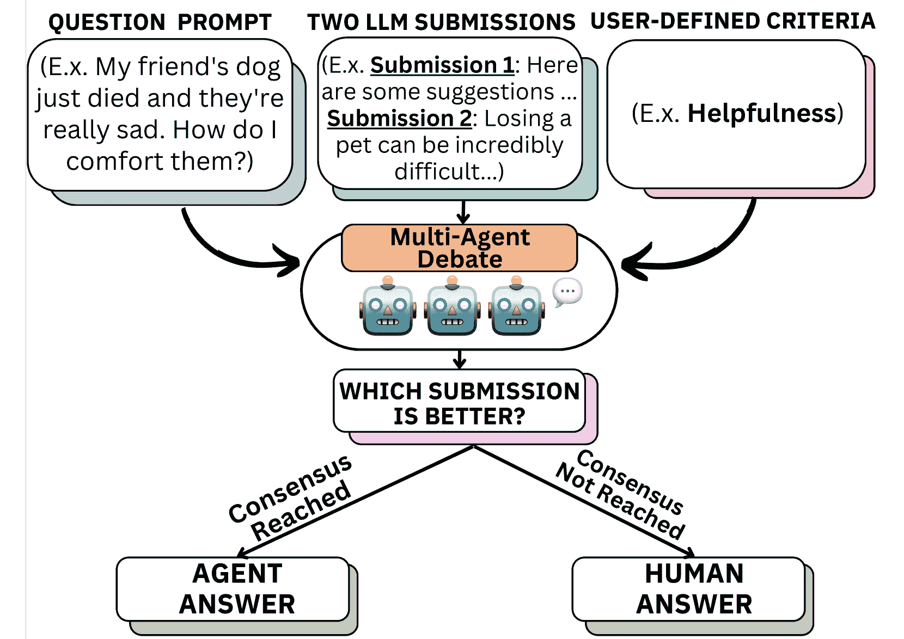
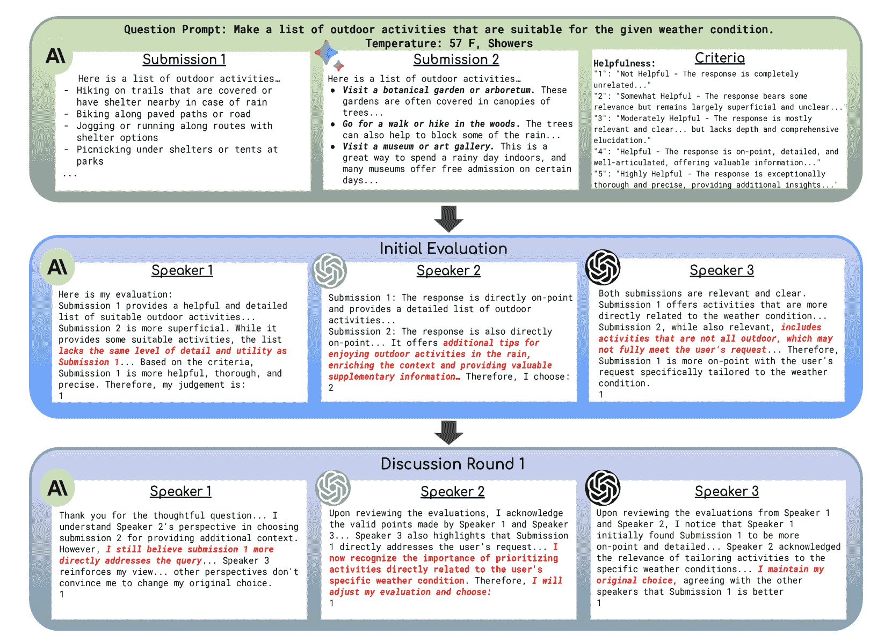
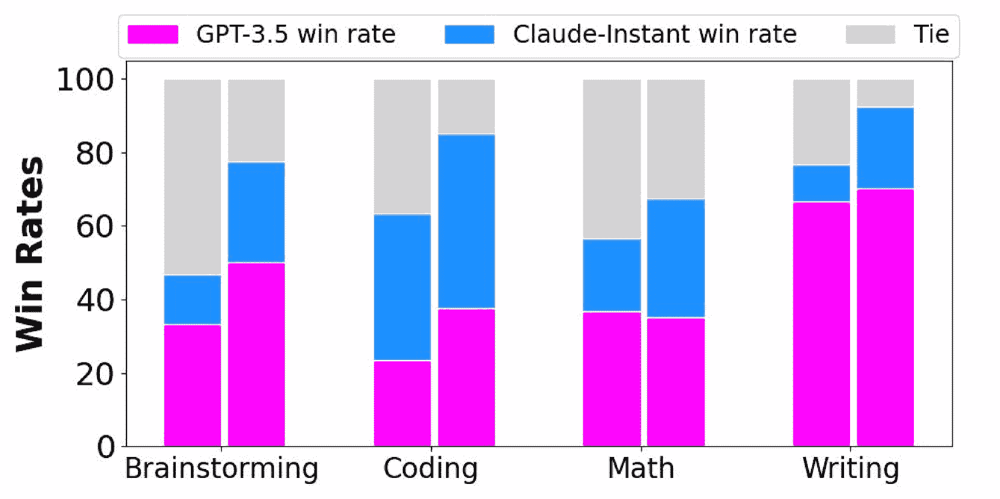
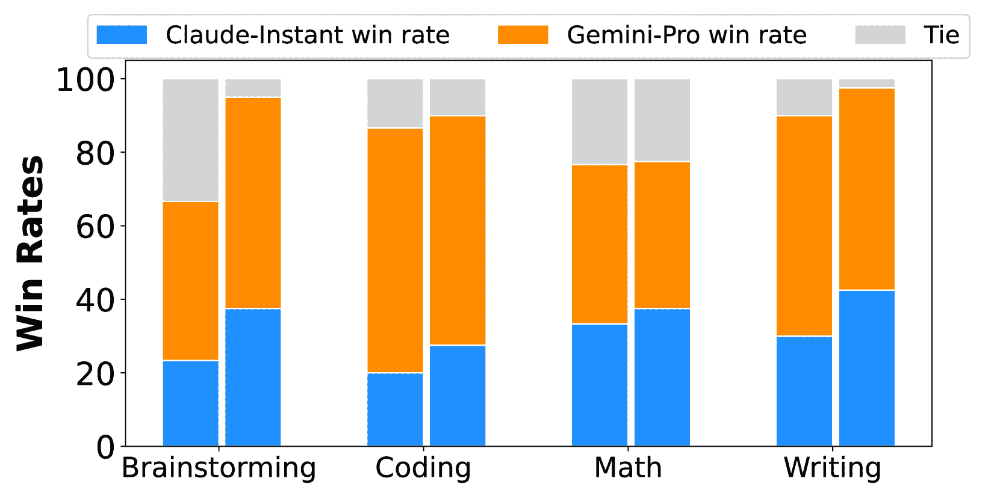
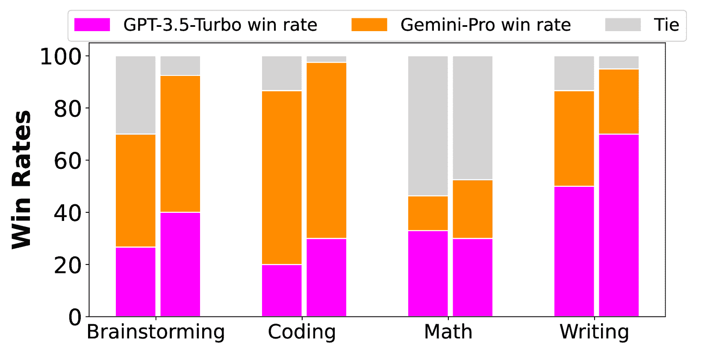
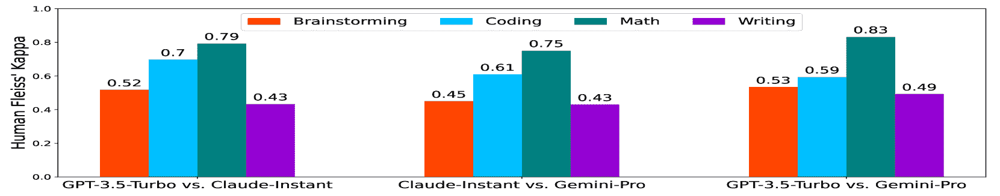

<!--yml

类别：未分类

日期：2025-01-11 12:57:00

-->

# 大型语言模型能否信赖用于评估？通过代理辩论进行LLMs作为评估者的可扩展元评估

> 来源：[https://arxiv.org/html/2401.16788/](https://arxiv.org/html/2401.16788/)

Steffi Chern^(2,4)  Ethan Chern^(1,4)  Graham Neubig²  Pengfei Liu^(1,3,4)

¹上海交通大学 ²卡内基梅隆大学

³上海人工智能实验室 ⁴生成式AI研究实验室（GAIR）  通讯作者

###### 摘要

尽管大型语言模型（LLMs）在广泛的任务和场景中具有很高的实用性，但在不同情境下开发一种可靠评估LLMs的方法仍然具有挑战性。现代评估方法通常使用LLMs来评估LLMs生成的回答。然而，用于评估这些LLMs作为评估者有效性的元评估通常受到现有基准覆盖范围的限制，或需要大量人工标注。这突显了可扩展元评估方法的紧迫性，这些方法能够有效、可靠且高效地评估LLMs作为评估者在各种任务和场景中的表现，特别是在潜在的新型、用户定义的场景中。为了填补这一空白，我们提出了ScaleEval，这是一种通过代理辩论辅助的元评估框架，利用多个交互式LLM代理的能力。该框架支持多轮讨论，帮助人工标注者识别最具能力的LLM作为评估者，从而显著减轻他们在元评估中以往需要大量标注的工作量。我们发布了该框架的代码，公开可用，网址：[https://github.com/GAIR-NLP/scaleeval](https://github.com/GAIR-NLP/scaleeval)。

## 1 介绍

图1：我们展示了ScaleEval，我们的可扩展元评估框架。该框架用于评估将LLMs作为评估者在不同评估目的中的可靠性和稳健性。

大型语言模型（LLMs）Bubeck 等人（[2023](https://arxiv.org/html/2401.16788v1#bib.bib3)）；Gemini 团队等人（[2023](https://arxiv.org/html/2401.16788v1#bib.bib12)）已迅速发展到能够处理广泛任务并表现出色的程度。尽管这开启了各种令人兴奋的潜在应用，但也带来了在评估生成结果时的复杂挑战。目前，LLM 评估的主要工作集中在自动评估指标上（Fu 等人，[2023](https://arxiv.org/html/2401.16788v1#bib.bib10)；Li 等人，[2023c](https://arxiv.org/html/2401.16788v1#bib.bib19)；Zheng 等人，[2023](https://arxiv.org/html/2401.16788v1#bib.bib25)；Wang 等人，[2023a](https://arxiv.org/html/2401.16788v1#bib.bib23)），其中许多指标本身使用 LLM 来进行评估。然而，当这些 LLM 作为评估者应用于新任务时，不禁引发了一个问题：*LLM 能否被信任用于评估？* 在许多情况下，答案并不明确。

另一方面，也有一些幸运的任务，其中进行了严格的元评估（评估评估指标）（§[2](https://arxiv.org/html/2401.16788v1#S2 "2 Related Work ‣ Can Large Language Models be Trusted for Evaluation? Scalable Meta-Evaluation of LLMs as Evaluators via Agent Debate")）。这种元评估通常涉及为特定标准（例如输出的流畅性、语义符合输入的程度）收集人工标注的判断。例如，针对机器翻译质量指标，WMT 指标任务 Freitas 等人（[2022](https://arxiv.org/html/2401.16788v1#bib.bib9)）提供了大量的元评估数据；对于摘要生成，像 TAC 和 RealSum 数据集 Dang 等人（[2008](https://arxiv.org/html/2401.16788v1#bib.bib8)）；Bhandari 等人（[2020](https://arxiv.org/html/2401.16788v1#bib.bib2)）等也做了相关工作。一旦收集到这样的数据集，就可以通过测量自动评估指标与人工黄金标准之间的相关性来进行元评估（§[3](https://arxiv.org/html/2401.16788v1#S3 "3 Preliminaries ‣ Can Large Language Models be Trusted for Evaluation? Scalable Meta-Evaluation of LLMs as Evaluators via Agent Debate")）。

然而，这些数据集的收集成本极高，因为它们需要熟练的人工专家进行细致的注释。随着LLM被越来越多地用于各种目的，如数学问题求解（Hendrycks等人，[2021](https://arxiv.org/html/2401.16788v1#bib.bib14)），阅读理解（Zhong等人，[2023](https://arxiv.org/html/2401.16788v1#bib.bib26)），创意写作（Zheng等人，[2023](https://arxiv.org/html/2401.16788v1#bib.bib25)），多语言应用（Hu等人，[2020](https://arxiv.org/html/2401.16788v1#bib.bib15)）；Bang等人，[2023](https://arxiv.org/html/2401.16788v1#bib.bib1)）等，创建这些人工评判的数据集用于每个新任务已变得不可行。因此，LLM作为评估者在没有适当审核的情况下被使用，并且在许多情况下，评估者本身是极其不可靠的（Wang等人，[2023b](https://arxiv.org/html/2401.16788v1#bib.bib24)；Huang等人，[2023](https://arxiv.org/html/2401.16788v1#bib.bib16)）。

在本文中，我们提出了ScaleEval，一个*可扩展的元评估框架*，旨在为大语言模型（LLMs）时代提供支持，该框架创建了跨各种任务和场景的元评估基准（§[4](https://arxiv.org/html/2401.16788v1#S4 "4 Methodology ‣ Can Large Language Models be Trusted for Evaluation? Scalable Meta-Evaluation of LLMs as Evaluators via Agent Debate")）。具体而言，ScaleEval依赖于多个LLM代理之间的辩论，随后在代理LLM不一致的情况下进行最小化的人类监督（图[1](https://arxiv.org/html/2401.16788v1#S1.F1 "Figure 1 ‣ 1 Introduction ‣ Can Large Language Models be Trusted for Evaluation? Scalable Meta-Evaluation of LLMs as Evaluators via Agent Debate")）。由于我们的框架允许用户使用自己的提示和回应，并将其应用于他们定义的任何场景或标准，因此它在各种评估情境中提供了灵活性和适应性。

在实验中，我们进行了元-元评估（§[6](https://arxiv.org/html/2401.16788v1#S6 "6 Exp-I: Meta-Meta-Evaluation of Multi-Agent Debate ‣ Can Large Language Models be Trusted for Evaluation? Scalable Meta-Evaluation of LLMs as Evaluators via Agent Debate")），证明我们提出的方法与完全由人类专家标注者进行的元评估有很好的相关性。此外，我们评估了不同 LLM 作为评估者在各种场景下的可靠性和性价比，并仔细审视了它们作为评估者的具体能力和局限性（§[7](https://arxiv.org/html/2401.16788v1#S7 "7 Exp-II: Meta-Evaluation vs. LLM Evaluators ‣ Can Large Language Models be Trusted for Evaluation? Scalable Meta-Evaluation of LLMs as Evaluators via Agent Debate")）。我们还研究了用于评估的提示变体对 LLM 作为评估者表现的影响（§[8](https://arxiv.org/html/2401.16788v1#S8 "8 Exp-III: Meta-Evaluation with Criteria Prompt Format Variations ‣ Can Large Language Models be Trusted for Evaluation? Scalable Meta-Evaluation of LLMs as Evaluators via Agent Debate")）。

我们框架中的所有代码都已开源，允许社区使用自己的提示、LLM 响应、标准和场景对 LLM 作为评估者进行元评估。

## 2 相关工作

|  | 元评估 | # 场景 | 可定制 | 可扩展 |
| --- | --- | --- | --- | --- |
| LLM-as-a-Judge | 人类 | 高 | ✗ | 低 |
| FairEval | 人类 | 低 | ✗ | 低 |
| ChatEval | 人类 | 低 | ✗ | 低 |
| ScaleEval | 代理辩论 | 高 | ✓ | 高 |

表 1：使用 LLM 作为评估者的不同策略中的元评估过程比较：LLM-as-a-Judge Zheng 等人（[2023](https://arxiv.org/html/2401.16788v1#bib.bib25)），FairEval Wang 等人（[2023b](https://arxiv.org/html/2401.16788v1#bib.bib24)），ChatEval Chan 等人（[2023](https://arxiv.org/html/2401.16788v1#bib.bib4)），以及我们自己的工作，ScaleEval。 “Custom.” 表示评估标准是否可以定制。 “Scala.” 指的是可扩展性。

### 2.1 LLM 输出的自动评估

对 LLM 进行评估的最常见范式是通过标准基准评估其在推理（例如 BigBench Srivastava 等人（[2022](https://arxiv.org/html/2401.16788v1#bib.bib22)）），常识问答（例如 MMLU Hendrycks 等人（[2020](https://arxiv.org/html/2401.16788v1#bib.bib13)）），或代码生成（例如 HumanEval Chen 等人（[2021b](https://arxiv.org/html/2401.16788v1#bib.bib6)））等任务上的能力。这些基准能反映模型的能力，但并不衡量模型在生成自由文本的开放性任务中的能力。

为了适应LLM在开放性任务中能力的快速增长，LLM评估已经开始转向直接评估生成的文本，通常使用LLM本身作为评估者（Fu et al. ([2023](https://arxiv.org/html/2401.16788v1#bib.bib10))；Li et al. ([2023c](https://arxiv.org/html/2401.16788v1#bib.bib19))；Zheng et al. ([2023](https://arxiv.org/html/2401.16788v1#bib.bib25))；Wang et al. ([2023a](https://arxiv.org/html/2401.16788v1#bib.bib23))）。此外，还有一些近期的研究通过LLM驱动的多代理辩论来提高评估的准确性（Chan et al. ([2023](https://arxiv.org/html/2401.16788v1#bib.bib4))；Li et al. ([2023b](https://arxiv.org/html/2401.16788v1#bib.bib18))）。尽管这些方法利用了LLM的指令跟随能力和多功能性，但在多样化的、未见过的用户定义场景中，直接将LLM作为评估者或交互代理来使用，无法保证这些方法的准确性。我们旨在通过引入可扩展的元评估来解决这个问题，以确保在不同场景下评估协议的可靠性。

另一个广泛使用的评估平台，Chatbot Arena（Zheng et al. ([2023](https://arxiv.org/html/2401.16788v1#bib.bib25))）支持众包方法，从各种场景中收集多样的用户提示。然而，在Chatbot Arena中评估LLM表现的过程在很大程度上依赖于人工评估，这可能并非每个有兴趣评估LLM在特定任务或场景中的能力的人都能轻易获取。此外，参与的人工评估者并未遵循统一的标准或明确的评估指南，这可能导致评估结果的偏差或不准确。

### 2.2 LLMs作为评估者的元评估

以往的研究提出的将LLMs作为评估者的方法通常涉及通过三种不同的方式进行元评估：（i）利用现有的自然语言处理（NLP）元评估基准 Fu 等人（[2023](https://arxiv.org/html/2401.16788v1#bib.bib10)）；Chan 等人（[2023](https://arxiv.org/html/2401.16788v1#bib.bib4)），（ii）在专家标注的数据集上进行小规模元评估，针对特定任务或场景 Chiang 和 Lee（[2023](https://arxiv.org/html/2401.16788v1#bib.bib7)）；Wang 等人（[2023a](https://arxiv.org/html/2401.16788v1#bib.bib23)）；Zheng 等人（[2023](https://arxiv.org/html/2401.16788v1#bib.bib25)），或（iii）使用众包平台收集人工标注 Zheng 等人（[2023](https://arxiv.org/html/2401.16788v1#bib.bib25)）。然而，由于现有数据集和标注预算的覆盖范围不足，（i）和（ii）在全面性上本质上受到限制。（iii）可以通过众包提供更全面的元评估，但元评估过程中所需的大量人工标注限制了该方法的可扩展性，并且众包工人在处理更复杂任务时可能不特别准确。为了解决这些问题，我们提出了一种代理辩论辅助的元评估方法，以减轻这一工作量。

## 3 初步准备

在本节中，我们将介绍自动评估和元评估系统的概念，特别聚焦于生成式人工智能时代对LLM生成输出的评估。

### 3.1 关键术语

我们首先定义一些将在本文中使用的关键术语。

+   •

    标准：标准定义了一个衡量LLM根据用户提示生成的响应质量的标准。一些例子包括：有用性、流畅性、事实性或创造性等。

+   •

    场景：场景描述了用户与大型语言模型（LLMs）交互的现实世界情境。例如，头脑风暴、编码和对话等。

### 3.2 自动评估

使用大语言模型（LLMs）进行自动评估，衡量LLM生成的响应在不同标准下的质量。通常，自动评估采用两种不同的协议之一进行：单一响应评估和成对响应比较 Ouyang 等人（[2022](https://arxiv.org/html/2401.16788v1#bib.bib21)）；郑等人（[2023](https://arxiv.org/html/2401.16788v1#bib.bib25)）；李等人（[2023a](https://arxiv.org/html/2401.16788v1#bib.bib17)）。本文聚焦于成对响应比较。成对响应比较对于人类和LLM作为评估者来说，都是直观的评估方法。它还可以进一步扩展，用于提供模型间的胜率和Elo评分，郑等人（[2023](https://arxiv.org/html/2401.16788v1#bib.bib25)），提供了一个简明的排行榜，以便了解不同模型在各种场景下的相对表现。形式上，给定一个自动评估指标 $E$，一个用户定义的评估标准 $c$（例如：有用性、推理能力、创造性），一个用户提示 $p$，以及由两个系统生成的响应 $r_{1},r_{2}$，成对响应比较的评估方法如下：

|  | $o=E(c,p,r_{1},r_{2}).$ |  | (1) |
| --- | --- | --- | --- |

$o\in\{1,0,-1\}$ 表示在评估标准 $c$ 下，给定用户提示 $p$，$r_{1}$ 比 $r_{2}$ 好、相等或差。

### 3.3 元评估

元评估评估自动评估指标的质量。形式上，我们定义一个黄金标准评估指标 $G$（例如：人类专家），其他自动评估指标应当与之匹配。在成对响应比较中，元评估数据集 $\mathcal{G}=\{G(c,p_{i},r_{1,i},r_{2,i})\}_{i=1}^{n}$ 包含用户提示和来自两个系统的相应响应，这些响应已由黄金标准评估进行了标注。元评估过程评估自动评估指标 $E$ 在某一评估标准 $c$ 下的表现 $\textsc{meta}(E)$。

在成对响应比较中，元评估衡量的是在元评估数据集上，$E$ 和 $G$ 之间的示例级别一致性率或系统级别一致性率。$E$ 和 $G$ 之间的一致性率越高，表明 $E$ 是一个优秀的自动评估指标。

对于示例级别的一致性率，我们计算：

|  | $\textsc{meta}(E)=\frac{1}{n}\sum_{i=1}^{n}\delta_{E(c,p_{i},r_{1,i},r_{2,i}),G% (c,p_{i},r_{1,i},r_{2,i})},$ |  | (2) |
| --- | --- | --- | --- |

其中 $0\leq\textsc{meta}(E)\leq 1$，且 $\delta_{\cdot,\cdot}$ 代表克罗内克（Kronecker）delta函数。

对于系统级一致性率，假设 $\mathcal{E}=\{E(c,p_{i},r_{1,i},r_{2,i})\}_{i=1}^{n}$ 和 $\mathcal{G}=\{G(c,p_{i},r_{1,i},r_{2,i})\}_{i=1}^{n}$，我们计算：

|  | $\textsc{meta}(E)=\delta_{\mathrm{mode}(\mathcal{E}),\mathrm{mode}(\mathcal{G})},$ |  | (3) |
| --- | --- | --- | --- |

其中 $\textsc{meta}(E)\in\{0,1\}$，$\delta_{\cdot,\cdot}$ 指的是克罗内克δ函数，$\mathrm{mode(\cdot)}$ 指的是在集合 $\mathcal{\mathcal{E}}$ 或 $\mathcal{\mathcal{G}}$ 中最常出现的值（在此情况下为 $1,0,-1$）。

## 4 方法论

本节详细介绍了ScaleEval用于元评估、评估和人类专家元-元评估的框架。对于元评估，我们通常遵循§[3.3](https://arxiv.org/html/2401.16788v1#S3.SS3 "3.3 Meta-Evaluation ‣ 3 Preliminaries ‣ Can Large Language Models be Trusted for Evaluation? Scalable Meta-Evaluation of LLMs as Evaluators via Agent Debate")中描述的成对响应比较设置。特别地，我们使用一种可扩展的、代理辩论辅助的框架来实例化黄金标准 $G$ 并构建评估基准 $\mathcal{G}$，而不是仅仅依赖人工来构建元评估基准 $\mathcal{G}$。对于评估，我们遵循§[3.2](https://arxiv.org/html/2401.16788v1#S3.SS2 "3.2 Automatic Evaluation ‣ 3 Preliminaries ‣ Can Large Language Models be Trusted for Evaluation? Scalable Meta-Evaluation of LLMs as Evaluators via Agent Debate")中概述的成对响应比较设置。元-元评估过程也遵循元评估的规则，正如§[3.3](https://arxiv.org/html/2401.16788v1#S3.SS3 "3.3 Meta-Evaluation ‣ 3 Preliminaries ‣ Can Large Language Models be Trusted for Evaluation? Scalable Meta-Evaluation of LLMs as Evaluators via Agent Debate")中所描述的那样。这个过程的包含是为了确保使用代理辩论辅助的元评估框架的可靠性。

### 4.1 通过多代理辩论进行元评估

元评估框架涉及多个沟通代理 $\{A_{j}\}_{j=1}^{m}$，它们在不同的讨论回合 $d=0\sim D-1$ 中互相交流。这比传统的完全依赖人工的元评估方法更节省时间和成本。通过这种代理辩论辅助的元评估框架，我们可以利用每个LLM代理对每个查询提示 $p_{i}$、LLM响应 $r_{1,i},r_{2,i}$ 和定义的标准 $c$ 的独特理解，对LLM在不同场景和标准下进行全面评估。每个LLM代理能够提供一个关于哪个响应更好的评估结果，并附上相应的理由。请注意，每个LLM代理在初始讨论回合后，还可以回顾其他代理的评估结果和理由。

在初始讨论回合 $d=0$ 中，每个LLM代理独立提供一个评估结果和理由：

|  | $\mathcal{A}_{0}=[A_{1}(c,p_{i},r_{1,i},r_{2,i},\varnothing),\ldots,\\ A_{m}(c,p_{i},r_{1,i},r_{2,i},\varnothing)],$ |  | (4) |
| --- | --- | --- | --- |

哪里

|  | $\mathcal{A}_{0}[j]_{j=1,\ldots,m}\in(\{1,0,-1\},\textsc{justification}),$ |  | (5) |
| --- | --- | --- | --- |

表示$r_{1,i}$相对于$r_{2,i}$的好坏、相等或更差，以及其理由。请注意，$A_{j}$最后一个参数中的$\varnothing$表示在初始讨论回合中，每个代理人无法访问之前讨论回合的内容。在随后的讨论回合$d=1\sim D-1$中，代理人可以查看其他代理人的先前评估并进行重新评估，其中每个代理人会被提示坚持或改变原始评估结果。具体来说，给定$\mathcal{A}_{d-1}(d\geq 1)$，表示代理人在$(d-1)^{th}$讨论回合之后的评估结果和理由，我们进行第$d$回合的讨论：

|  | $\mathcal{A}_{d}=[A_{1}(c,p_{i},r_{1,i},r_{2,i},\mathcal{A}_{d-1}),\ldots,\\ A_{m}(c,p_{i},r_{1,i},r_{2,i},\mathcal{A}_{d-1})]$ |  | (6) |
| --- | --- | --- | --- |

与$\mathcal{A}_{0}$类似，

|  | $\mathcal{A}_{d}[j]_{j=1,\ldots,m}\in(\{1,0,-1\},\textsc{justification}),$ |  | (7) |
| --- | --- | --- | --- |

元评估的详细提示模板可在附录中的表格[6](https://arxiv.org/html/2401.16788v1#A1.T6 "表格 6 ‣ 附录A 元评估提示 ‣ 大型语言模型能否用于评估？通过代理人辩论对LLM作为评估者进行可扩展的元评估")中找到。

在代理人在经过$d=D-1$回合讨论后仍未达成共识的情况下，人工评估员将介入。人工评估员会审查代理人提供的评估报告，并做出最终决定。通过这一过程，我们加入了人工监督的元素，从而提高了最终决策的可靠性。这种方法在效率与人工判断需求之间取得了平衡，确保评估能及时且准确地完成。图[2](https://arxiv.org/html/2401.16788v1#S4.F2 "图 2 ‣ 4.1 通过多代理人辩论的元评估框架 ‣ 4 方法论 ‣ 大型语言模型能否用于评估？通过代理人辩论对LLM作为评估者进行可扩展的元评估")展示了多代理人辩论过程的示例（用于元评估）。

图2：多代理人辩论过程示例（用于元评估）。

### 4.2 评估框架

我们遵循第§[3.2](https://arxiv.org/html/2401.16788v1#S3.SS2 "3.2 Automatic Evaluation ‣ 3 Preliminaries ‣ Can Large Language Models be Trusted for Evaluation? Scalable Meta-Evaluation of LLMs as Evaluators via Agent Debate")节中概述的成对响应比较设置。需要注意的是，在LLM时代，自动评估指标$E$通常通过单一LLMs来实现（Fu et al. ([2023](https://arxiv.org/html/2401.16788v1#bib.bib10)); Li et al. ([2023c](https://arxiv.org/html/2401.16788v1#bib.bib19)); Zheng et al. ([2023](https://arxiv.org/html/2401.16788v1#bib.bib25)); Wang et al. ([2023a](https://arxiv.org/html/2401.16788v1#bib.bib23))）；或通过多代理辩论来实现（Chan et al. ([2023](https://arxiv.org/html/2401.16788v1#bib.bib4)); Li et al. ([2023b](https://arxiv.org/html/2401.16788v1#bib.bib18))）。在ScaleEval中，我们专注于通过单一LLMs（例如gpt-3.5-turbo）来实现$E$。然而，值得注意的是，我们的框架可以进一步推广到$E$的其他实现方式。

### 4.3 人工专家元-元评估

为了测试我们提出的元评估框架的可靠性，我们应用了元-元评估过程。元-元评估过程也遵循第§[3.3](https://arxiv.org/html/2401.16788v1#S3.SS3 "3.3 Meta-Evaluation ‣ 3 Preliminaries ‣ Can Large Language Models be Trusted for Evaluation? Scalable Meta-Evaluation of LLMs as Evaluators via Agent Debate")节中描述的元评估过程，其中$E$被实例化为代理辩论辅助协议，如第§[4.1](https://arxiv.org/html/2401.16788v1#S4.SS1 "4.1 Meta-Evaluation Framework via Multi-Agent Debate ‣ 4 Methodology ‣ Can Large Language Models be Trusted for Evaluation? Scalable Meta-Evaluation of LLMs as Evaluators via Agent Debate")节中所述，$G$则被实例化为人工专家注释协议。

## 5 个考察场景

建立反映个体日常使用情况的现实场景是全面评估大语言模型（LLMs）性能和局限性的关键。在当前版本的ScaleEval中，我们包括了8个与日常情境和任务密切相关的不同场景（Liang et al. ([2022](https://arxiv.org/html/2401.16788v1#bib.bib20)); Li et al. ([2023a](https://arxiv.org/html/2401.16788v1#bib.bib17))）。每个定义场景的示例提示如表[2](https://arxiv.org/html/2401.16788v1#S5.T2 "Table 2 ‣ 5 Examined Scenarios ‣ Can Large Language Models be Trusted for Evaluation? Scalable Meta-Evaluation of LLMs as Evaluators via Agent Debate")所示。我们将详细描述如何为每个场景收集数据。对评估LLMs感兴趣的个人可以在我们的框架基础上补充额外的场景进行评估。

| 场景 | 示例 |
| --- | --- |
| 头脑风暴 | - 你能告诉我如何做巧克力曲奇饼干吗？ |
| - 列出一些适合在比赛日作为派对小吃的零食和食品！ |
| 编程 | - HTML 和 JavaScript 有什么区别？ |
| - 实现一个二分查找算法，用于在排序数组中找到特定元素。 |
| 对话 | - 扮演北欧女神弗蕾雅。 |
| - 你能像人类一样思考和感受吗？ |
| 判断 | - 如果阿兹特克人成功击退西班牙征服者会怎样？ |
| - 如何判断一个人是真正对对话感兴趣，还是只是出于礼貌？ |
| 数学 | - 给定 f(x) = 5$x^{3}$ - 2$x$ + 3，求 f(2) 的值。 |
| - 如果线段的端点是(2, -2) 和 (10, 4)，那么该线段的长度是多少？ |
| ODG | - 圣诞花环有什么意义吗？ |
| - 学习机器人学的最佳大学有哪些？ |
| ODS | - 北极光是由什么引起的？ |
| - 汽油的不同辛烷值意味着什么？ |
| 写作 | - 你能帮我写一封正式的电子邮件给潜在的商业合作伙伴，提议进行合资吗？ |
| - 把马丁·路德·金的演讲《我有一个梦想》改编成一首前100的嘻哈歌曲。 |

表2：已检查的场景及对应的选定示例。

#### 头脑风暴

头脑风暴场景旨在测试大语言模型（LLMs）在解决问题、创造性构思和生成有见地的回应方面的能力，尤其是在需要批判性思维和详细逐步推理的情境中。

#### 编程

编程场景评估大语言模型（LLMs）理解、生成和调试代码的能力，以及回答与编程相关的问题。

#### 对话

对话场景衡量大语言模型（LLMs）与用户进行直观、类人且动态互动的能力，通过需要保持一致人格的上下文敏感对话和角色扮演测试其熟练度。

#### 判断

判断场景评估大语言模型（LLMs）做出推理和形成意见的能力，包括就不同的情境或情感寻求见解，并提出需要逻辑思考或推理的问题。

#### 数学

数学场景评估大语言模型（LLMs）在理解和解决数学问题方面的能力，强调其在从简单计算到复杂推理任务中的准确性。

#### 开放领域通用（ODG）

ODG场景衡量大语言模型（LLMs）应用广泛知识并进行推理的能力，涵盖诸如回答有明确答案的问题等任务。

#### 开放领域科学（ODS）

ODS场景测试大语言模型（LLMs）应用科学知识的能力，评估其准确解读和回应涉及生物学、化学、物理学、天文学等学科的科学问题的能力。

#### 写作

写作场景评估大语言模型（LLMs）总结、翻译和生成各种文本的能力，测试其核心语言处理和生成技能。

## 6 Exp-I: 多智能体辩论的元-元评估

在本节中，我们首先进行元-元评估，检查使用 ScaleEval 进行的元评估结果是否与使用人工评估者进行的元评估结果高度一致。

#### 设置

对于我们的 ScaleEval 元评估框架（如 §[4.1](https://arxiv.org/html/2401.16788v1#S4.SS1 "4.1 Meta-Evaluation Framework via Multi-Agent Debate ‣ 4 Methodology ‣ Can Large Language Models be Trusted for Evaluation? Scalable Meta-Evaluation of LLMs as Evaluators via Agent Debate") 所述），我们部署了三个 LLM 代理来进行多代理辩论：gpt-4-turbo、claude-2 和 gpt-3.5-turbo。¹¹12023年12月收集的结果。使用的具体模型包括：gpt-4-1106-preview、claude-2 和 gpt-3.5-turbo-1106。在我们的元评估实验中，我们分析了共计160个提示。这些提示包括137个来自 AlpacaEval Li 等人（[2023c](https://arxiv.org/html/2401.16788v1#bib.bib19)），10个来自 HumanEval Chen 等人（[2021a](https://arxiv.org/html/2401.16788v1#bib.bib5)）的编程问题提示，和13个来自 GSM-Hard Gao 等人（[2022](https://arxiv.org/html/2401.16788v1#bib.bib11)）的数学问题提示。我们将这些提示分为四个不同的场景：头脑风暴、编程、数学和写作，每个场景包含40个提示。

每个场景的评估基于以下标准，分别是：有用性、可解释性、推理能力和创造力。我们评估来自以下三个大型语言模型（LLM）的生成回答：gpt-3.5-turbo、claude-instant 和 gemini-pro。我们选择这三个 LLM 进行评估，是因为根据过去的研究和公开用户反馈，它们的表现非常相似，这有助于我们更细致地了解它们在各种实际场景中的表现，并识别出在特定上下文中某个模型可能优于其他模型的情况。

我们的元-元评估包括让人类专家根据定义的标准在成对比较中标注他们认为更好的LLM提交。我们从卡内基梅隆大学的学生中选出了七位具有相关专业知识的专家，他们能回答每个场景中的查询。不同的三位人类专家组负责回答每个场景中的提示，他们被分配到与自己专长相关的场景。每位专家都收到了相同的任务说明——他们需要根据我们定义的标准判断哪个提交更好，对于每次比较，他们会标记为0（没有提交更好）、1（提交1更好）或2（提交2更好）。标签2对应于第[3.2](https://arxiv.org/html/2401.16788v1#S3.SS2 "3.2 自动评估 ‣ 3 前提 ‣ 大型语言模型能否被信任进行评估？通过代理辩论对LLM作为评估者的可扩展元评估")节中标记的-1。专家们被要求在四个不同场景（头脑风暴、编程、数学和写作）中进行30次比较，根据相应的定义标准（有用性、可解释性、推理和创造力）。这将产生120个最终判断。问题提示、LLM响应和用于人类专家标注的标准与我们在元评估实验中使用的完全一致。所有细节都以Google表格的形式呈现，允许专家记录他们的答案。

#### Q1：多代理辩论的LLM代理能否在新的用户定义场景中作为元评估者使用？

为了验证ScaleEval元评估框架的可靠性，我们通过两个关键指标——示例级一致性率和系统级一致性率——对比了人类专家的结果与ScaleEval多代理辩论的结果，如§[3.3](https://arxiv.org/html/2401.16788v1#S3.SS3 "3.3 元评估 ‣ 3 前提 ‣ 大型语言模型能否被信任进行评估？通过代理辩论对LLM作为评估者的可扩展元评估")中所述。示例级一致性率衡量多代理辩论结果与人类专家判断一致的实例比例。另一方面，系统级一致性率评估人类专家与多代理在整体评估中是否一致，即哪种LLM在每个场景中生成最佳响应。如果这两个指标的高一致性率表明我们的元评估框架具有较强的可靠性和有效性，表明人类专家与LLM代理在识别和认同LLM生成的响应质量方面达成一致。

#### 结果

从表 [3](https://arxiv.org/html/2401.16788v1#S6.T3 "表 3 ‣ 结果 ‣ 6 Exp-I: 多代理辩论的元元评估 ‣ 大型语言模型是否可以信任作为评估者？通过代理辩论的可扩展元评估")中，我们通常观察到在人类专家与ScaleEval之间的例子级一致性率较高，相较于人类专家与单个LLM评估之间的协议率。观察到的始终较高的一致性率表明，我们的元评估框架在这些领域与人类专家的判断高度一致，表明LLM集体使用在元评估复杂场景中的表现是可靠的。在我们的实验中，所有LLM提交的比较中，我们观察到ScaleEval的结果与人类专家的判断在决策上的一致性率较高，特别是在编程和数学场景中。这一观察到的趋势可能归因于这些学科本身的客观性质，它们有相对清晰、明确的答案，不像创造性写作等更具主观性的领域。

基于图 [3](https://arxiv.org/html/2401.16788v1#S6.F3 "图 3 ‣ 结果 ‣ 6 Exp-I: 多代理辩论的元元评估 ‣ 大型语言模型是否可以信任作为评估者？通过代理辩论的可扩展元评估")，我们注意到在人类专家和多代理辩论之间，在所有LLM的配对比较和场景中，始终存在一致的“同向偏好”。特别是，gpt-3.5-turbo在头脑风暴、数学和写作场景中，比claude-instant更受偏爱（更高的胜率）。同样，gemini-pro在所有场景中也优于claude-instant。将gpt-3.5-turbo与gemini-pro进行比较时，观察到决策结果的多样化模式：在人类专家和多代理系统的判断中，都认为gpt-3.5-turbo在涉及数学和写作的场景中优于gemini-pro。相反，gemini-pro在头脑风暴和编程场景中被认为更为出色。多代理偏好与人类专家判断结果的一致性验证了在各种用户定义的场景中，使用多个LLM代理作为元评估者的可靠性。

| LLM配对比较 | 标准 | 场景 | 元评估 | GPT-4-Turbo | Claude-2 | GPT-3.5-Turbo |
| --- | --- | --- | --- | --- | --- | --- |
| GPT-3.5-Turbo 与 Claude-Instant | 有用性 | 头脑风暴 | 0.600 | 0.633 | 0.433 | 0.267 |
|  | 可解释性 | 编程 | 0.733 | 0.700 | 0.533 | 0.567 |
|  | 推理 | 数学 | 0.867 | 0.600 | 0.400 | 0.367 |
|  | 创造力 | 写作 | 0.700 | 0.667 | 0.400 | 0.333 |
| Claude-Instant 与 Gemini-Pro | 有用性 | 头脑风暴 | 0.667 | 0.533 | 0.467 | 0.500 |
|  | 可解释性 | 编程 | 0.833 | 0.600 | 0.500 | 0.567 |
|  | 推理 | 数学 | 0.767 | 0.667 | 0.330 | 0.367 |
|  | 创造力 | 写作 | 0.733 | 0.633 | 0.400 | 0.500 |
| GPT-3.5-Turbo 与 Gemini-Pro | 有用性 | 头脑风暴 | 0.733 | 0.600 | 0.467 | 0.467 |
|  | 可解释性 | 编程 | 0.833 | 0.733 | 0.567 | 0.667 |
|  | 推理 | 数学 | 0.867 | 0.767 | 0.500 | 0.433 |
|  | 创造力 | 写作 | 0.767 | 0.667 | 0.500 | 0.433 |

表 3：人类专家与 ScaleEval 元评估之间的示例级别一致性比较，及人类专家与单一 LLM 评估在四个场景和标准下的比较。

(a) GPT-3.5-Turbo 与 Claude-Instant

(b) Claude-Instant 与 Gemini-Pro

(c) GPT-3.5-Turbo 与 Gemini-Pro

图 3：系统级别一致性 – 各 LLM 配对比较的胜率。每个场景中的左侧条形图代表人类专家的结果；右侧条形图代表 ScaleEval 的元评估结果。

图 4：四个场景下每个 LLM 配对比较的人类 Fleiss Kappa 值。

## 7 Exp-II：元评估与 LLM 评估者

接下来，我们利用 ScaleEval 允许可靠且可扩展的元评估的事实，来考察 LLM 作为评估者的特征。

#### 问题 2：每个 LLM 评估者的能力和局限性是什么？

为了有效评估每个 LLM 作为评估者的表现，我们采用一种方法，通过将元评估过程的结果与每个 LLM 评估者独立进行的评估结果进行比较，从而揭示它们之间的分歧或一致性。在此过程中，我们旨在揭示每个 LLM 评估者的表现特征，帮助我们识别哪些评估者展现出更强的评估能力，从而有助于我们了解它们在每个场景下评估回应的可靠性。此外，我们还提供了全面的性价比分析，以决定在每个场景下哪个 LLM 评估者最为合适。

#### 设置

在元评估中，我们使用了三种LLM（gpt-4-turbo、claude-2和gpt-3.5-turbo）作为评估者，执行了三种不同LLM（gpt-3.5-turbo、claude-instant和gemini-pro）响应的成对比较。之前的研究突出了当LLM作为评估者时存在的定位偏差（Wang等，([2023b](https://arxiv.org/html/2401.16788v1#bib.bib24))）。为了应对这些发现，我们实施了一种随机化策略，以减少这种偏差。具体来说，LLM的提交顺序在呈现给评估者时是随机化的。此外，我们还随机化了每个评估者在每个案例中的讨论顺序。这些方法确保了过程尽可能公平且无偏，从而使LLM评估者的表现能够得到更准确的评估。元评估是在以下8个场景下进行的：头脑风暴、编程、对话、判断、开放领域常识、开放领域科学和写作，使用与人类专家标注时相同的4个标准。

#### 结果

表格[4](https://arxiv.org/html/2401.16788v1#S7.T4 "Table 4 ‣ Results ‣ 7 Exp-II: Meta-Evaluation vs. LLM Evaluators ‣ Can Large Language Models be Trusted for Evaluation? Scalable Meta-Evaluation of LLMs as Evaluators via Agent Debate")比较了ScaleEval的元评估与每个LLM评估者在各个标准和场景中的一致性率。我们观察到，当gpt-4-turbo作为评估者时，它与我们的元评估具有最高的一致性率，特别是在头脑风暴、对话和ODG场景中，有用性标准下表现尤为突出。它以0.780的最高整体平均分脱颖而出。然而，我们选择的开源模型评估者auto-j在根据有用性标准评估编程问题时超越了gpt-4-turbo。此外，根据有用性标准，它在判断场景中的一致性率最高，表明它在这种设置下是最有能力的评估者。它在大多数其他场景中也与claude-2和gpt-3.5-turbo等其他闭源模型取得了相当的结果。

虽然gpt-4-turbo在大多数场景中作为评估者表现最好，但当考虑到其相对较高的API费用时，它不一定是最佳选择。事实上，价格更实惠的版本（gpt-3.5-turbo）和我们选择的免费开源模型（auto-j）在判断和写作等场景中表现相当。对于与编程相关的评估，稍微便宜的claude-2可能是gpt-4-turbo更具成本效益的替代选择。

| 标准 | 场景 | GPT-4-Turbo | Claude-2 | GPT-3.5-Turbo | Auto-J |
| --- | --- | --- | --- | --- | --- |
| 有用性 | 头脑风暴 | 0.800 | 0.500 | 0.650 | 0.575 |
|  | 编程 | 0.600 | 0.725 | 0.675 | 0.675 |
|  | 对话 | 0.800 | 0.700 | 0.700 | 0.625 |
|  | 判断 | 0.725 | 0.625 | 0.725 | 0.750 |
|  | 数学 | 0.825 | 0.650 | 0.600 | 0.350 |
|  | ODG | 0.850 | 0.525 | 0.575 | 0.700 |
|  | ODS | 0.875 | 0.525 | 0.575 | 0.675 |
|  | 写作 | 0.750 | 0.600 | 0.750 | 0.600 |
| 可解释性 | 编码 | 0.825 | 0.600 | 0.550 | 0.525 |
| 推理 | 数学 | 0.650 | 0.525 | 0.475 | 0.450 |
|  | 判断 | 0.750 | 0.650 | 0.700 | 0.675 |
| 创造力 | 写作 | 0.775 | 0.600 | 0.575 | 0.650 |
|  | 头脑风暴 | 0.800 | 0.525 | 0.550 | 0.625 |
|  | 对话 | 0.875 | 0.750 | 0.700 | 0.800 |
| 平均值 | 总体 | 0.780 | 0.607 | 0.629 | 0.619 |

表 4：ScaleEval的元评估与各LLM评估者的协议率，比较GPT3.5-Turbo与Claude-Instant。

| 标准格式 | 标准 | 场景 | GPT-4-Turbo | Claude-2 | GPT-3.5-Turbo |
| --- | --- | --- | --- | --- | --- |
| 一般 | 有用性 | 头脑风暴 | 0.800 | 0.500 | 0.650 |
|  | 可解释性 | 编码 | 0.825 | 0.600 | 0.550 |
|  | 推理 | 数学 | 0.650 | 0.525 | 0.475 |
|  | 创造力 | 写作 | 0.800 | 0.600 | 0.575 |
| 缩短 | 有用性 | 头脑风暴 | 0.675 | 0.500 | 0.575 |
|  | 可解释性 | 编码 | 0.675 | 0.325 | 0.425 |
|  | 推理 | 数学 | 0.625 | 0.425 | 0.400 |
|  | 创造力 | 写作 | 0.675 | 0.250 | 0.525 |
| 胡言乱语 | 有用性 | 头脑风暴 | 0.575 | 0.450 | 0.575 |
|  | 可解释性 | 编码 | 0.700 | 0.275 | 0.525 |
|  | 推理 | 数学 | 0.650 | 0.200 | 0.400 |
|  | 创造力 | 写作 | 0.550 | 0.150 | 0.450 |
| 洗牌 | 有用性 | 头脑风暴 | 0.625 | 0.550 | 0.500 |
|  | 可解释性 | 编码 | 0.600 | 0.400 | 0.525 |
|  | 推理 | 数学 | 0.625 | 0.225 | 0.600 |
|  | 创造力 | 写作 | 0.625 | 0.275 | 0.500 |
| 翻转 | 有用性 | 头脑风暴 | 0.725 | 0.325 | 0.550 |
|  | 可解释性 | 编码 | 0.725 | 0.425 | 0.300 |
|  | 推理 | 数学 | 0.575 | 0.250 | 0.500 |
|  | 创造力 | 写作 | 0.750 | 0.075 | 0.550 |
| 掩码 | 有用性 | 头脑风暴 | 0.725 | 0.300 | 0.500 |
|  | 可解释性 | 编码 | 0.650 | 0.225 | 0.475 |
|  | 推理 | 数学 | 0.575 | 0.150 | 0.375 |
|  | 创造力 | 写作 | 0.575 | 0.200 | 0.400 |

表 5：ScaleEval的元评估结果与各LLM评估者在不同标准提示格式和场景下的协议率，比较GPT3.5-Turbo与Claude-Instant。

## 8 Exp-III: 带有标准提示格式变化的元评估

#### Q3: 标准提示的特质如何影响LLM作为评估者在不同场景下的鲁棒性？

先前的研究表明，提示词的变化会显著影响大型语言模型（LLMs）的行为，特别是在它们生成的文本方面。鉴于此，我们定义了不同的格式化标准，用于在各种场景下评估LLM的响应。该方法旨在检验不同格式的标准提示词在多大程度上影响LLM作为评估者的表现和鲁棒性。

#### 设置

我们定义了同一标准提示的五种变体：缩短、胡言乱语、打乱、翻转和掩蔽（详细格式见附录[A](https://arxiv.org/html/2401.16788v1#A1 "附录A 元评估提示 ‣ 大型语言模型能否信任用于评估？通过代理辩论进行LLM作为评估者的可扩展元评估")中的表[7](https://arxiv.org/html/2401.16788v1#A1.T7 "表7 ‣ 附录A 元评估提示 ‣ 大型语言模型能否信任用于评估？通过代理辩论进行LLM作为评估者的可扩展元评估")）。通过这些标准格式变体，我们旨在观察LLM作为评估者在进行评估时如何作出不同的反应。我们比较了ScaleEval的元评估结果与每个LLM评估者之间的示例级别一致性率。

#### 结果

根据表[5](https://arxiv.org/html/2401.16788v1#S7.T5 "表5 ‣ 结果 ‣ 7 Exp-II：元评估与LLM评估者 ‣ 大型语言模型能否信任用于评估？通过代理辩论进行LLM作为评估者的可扩展元评估")，我们观察到，当标准提示中的某些字母被掩蔽时，LLM作为评估者的表现通常会下降。此外，移除开头的引导短语，如“无帮助”或“高度有帮助”，也可能降低其作为评估者的有效性。gpt-4-turbo和gpt-3.5-turbo在这些对抗性格式的标准提示中表现出一定的抗压能力，在各种标准格式下维持了相对一致的一致性率。相比之下，Claude-2经常表现出困惑并拒绝评估，特别是在遇到胡言乱语和掩蔽标准提示的情况下，它拒绝回答大约一半的问题。它通常回应类似这样的陈述：“不幸的是，我在这里没有足够的信息来提供公正的评估……标准描述了不同的质量级别，但没有具体说明应评估哪些响应的方面……任何判断都有可能是任意或有偏见的……”我们测试的所有LLM作为评估者在面对这些对抗性格式的标准提示时都没有保持非常相似的评估能力，这表明这些LLM作为评估者的当前设计和应用存在局限性。尽管它们在完成各种任务方面具有先进的能力，但它们在理解和准确响应替代标准信息时仍然可能存在困难，这突显了LLM技术未来版本改进的潜力。在所有不同格式的标准中，我们在表[5](https://arxiv.org/html/2401.16788v1#S7.T5 "表5 ‣ 结果 ‣ 7 Exp-II：元评估与LLM评估者 ‣ 大型语言模型能否信任用于评估？通过代理辩论进行LLM作为评估者的可扩展元评估")中重点展示了LLM作为评估者表现最好的情况。

## 9 结论

在这项工作中，我们提出了 ScaleEval，一个可扩展的、由智能体辩论辅助的元评估框架，用于评估 LLM 作为评估器的可靠性和稳健性。该方法解决了传统元评估方法中固有的高成本和时间密集型挑战，特别是在 LLM 使用日益增加的背景下，迫切需要一种更具可扩展性的解决方案。通过我们的研究，我们不仅展示了我们提出的元评估框架的可靠性，还揭示了 LLM 作为评估器在不同场景下的能力与局限性。我们观察到，基于相同的标准提示，LLM 作为评估器的结果会有所不同。通过开源我们的框架，我们旨在促进该领域的进一步研究，并鼓励未来开发更先进、可靠的 LLM 评估器。

## 致谢

我们感谢周春亭、袁伟哲、徐春浦、马燕和王宾杰的有益讨论和反馈。

## 参考文献

+   Bang 等人（2023）Yejin Bang、Samuel Cahyawijaya、Nayeon Lee、Wenliang Dai、Dan Su、Bryan Wilie、Holy Lovenia、Ziwei Ji、Tiezheng Yu、Willy Chung、Quyet V. Do、Yan Xu 和 Pascale Fung。2023年。针对推理、幻觉和互动性的多任务、多语言、多模态 ChatGPT 评估。*arXiv:2302.04023v3*。

+   Bhandari 等人（2020）Manik Bhandari、Pranav Gour、Atabak Ashfaq、Pengfei Liu 和 Graham Neubig。2020年。重新评估文本摘要中的评估方法。*arXiv 预印本 arXiv:2010.07100*。

+   Bubeck 等人（2023）Sébastien Bubeck、Varun Chandrasekaran、Ronen Eldan、Johannes Gehrke、Eric Horvitz、Ece Kamar、Peter Lee、Yin Tat Lee、Yuanzhi Li、Scott Lundberg 等人。2023年。人工通用智能的火花：与 GPT-4 的早期实验。*arXiv 预印本 arXiv:2303.12712*。

+   Chan 等人（2023）Chi-Min Chan、Weize Chen、Yusheng Su、Jianxuan Yu、Wei Xue、Shanghang Zhang、Jie Fu 和 Zhiyuan Liu。2023年。Chateval：通过多智能体辩论推动更好的基于 LLM 的评估器。*arXiv 预印本 arXiv:2308.07201*。

+   Chen等人（2021a）Mark Chen, Jerry Tworek, Heewoo Jun, Qiming Yuan, Henrique Ponde de Oliveira Pinto, Jared Kaplan, Harri Edwards, Yuri Burda, Nicholas Joseph, Greg Brockman, Alex Ray, Raul Puri, Gretchen Krueger, Michael Petrov, Heidy Khlaaf, Girish Sastry, Pamela Mishkin, Brooke Chan, Scott Gray, Nick Ryder, Mikhail Pavlov, Alethea Power, Lukasz Kaiser, Mohammad Bavarian, Clemens Winter, Philippe Tillet, Felipe Petroski Such, Dave Cummings, Matthias Plappert, Fotios Chantzis, Elizabeth Barnes, Ariel Herbert-Voss, William Hebgen Guss, Alex Nichol, Alex Paino, Nikolas Tezak, Jie Tang, Igor Babuschkin, Suchir Balaji, Shantanu Jain, William Saunders, Christopher Hesse, Andrew N. Carr, Jan Leike, Josh Achiam, Vedant Misra, Evan Morikawa, Alec Radford, Matthew Knight, Miles Brundage, Mira Murati, Katie Mayer, Peter Welinder, Bob McGrew, Dario Amodei, Sam McCandlish, Ilya Sutskever, 和Wojciech Zaremba. 2021a. [评估基于代码训练的大型语言模型](http://arxiv.org/abs/2107.03374)。

+   Chen等人（2021b）Mark Chen, Jerry Tworek, Heewoo Jun, Qiming Yuan, Henrique Ponde de Oliveira Pinto, Jared Kaplan, Harri Edwards, Yuri Burda, Nicholas Joseph, Greg Brockman等. 2021b. 评估基于代码训练的大型语言模型。*arXiv预印本 arXiv:2107.03374*。

+   Chiang和Lee（2023）Cheng-Han Chiang和Hung-yi Lee. 2023. 大型语言模型能否成为人类评估的替代方案？*arXiv预印本 arXiv:2305.01937*。

+   Dang等人（2008）Hoa Trang Dang, Karolina Owczarzak等. 2008. TAC 2008更新摘要任务概述。在*TAC*中。

+   Freitag等人（2022）Markus Freitag, Ricardo Rei, Nitika Mathur, Chi-kiu Lo, Craig Stewart, Eleftherios Avramidis, Tom Kocmi, George Foster, Alon Lavie, 和André FT Martins. 2022. wmt22指标共享任务结果：停止使用bleu–神经网络指标更好且更具鲁棒性。在*第七届机器翻译会议（WMT）论文集*中，页码46–68。

+   Fu等人（2023）Jinlan Fu, See-Kiong Ng, Zhengbao Jiang, 和Pengfei Liu. 2023. Gptscore：根据需求进行评估。*arXiv预印本 arXiv:2302.04166*。

+   Gao等人（2022）Luyu Gao, Aman Madaan, Shuyan Zhou, Uri Alon, Pengfei Liu, Yiming Yang, Jamie Callan, 和Graham Neubig. 2022. Pal：程序辅助语言模型。*arXiv预印本 arXiv:2211.10435*。

+   Gemini团队等人（2023）Gemini团队, Rohan Anil, Sebastian Borgeaud, Yonghui Wu, Jean-Baptiste Alayrac, Jiahui Yu, Radu Soricut, Johan Schalkwyk, Andrew M Dai, Anja Hauth等. 2023. Gemini：一系列高性能多模态模型。*arXiv预印本 arXiv:2312.11805*。

+   Hendrycks等人（2020）Dan Hendrycks, Collin Burns, Steven Basart, Andy Zou, Mantas Mazeika, Dawn Song, 和Jacob Steinhardt. 2020. 测量大规模多任务语言理解。*arXiv预印本 arXiv:2009.03300*。

+   Hendrycks等人（2021）丹·亨德里克斯、科林·伯恩斯、萨乌拉夫·卡达瓦斯、阿库尔·阿罗拉、史蒂文·巴萨特、埃里克·唐、道恩·宋、雅各布·斯坦哈特。2021. 使用数学数据集衡量数学问题解决能力。*arXiv预印本 arXiv:2103.03874*。

+   胡等人（2020）胡俊杰、塞巴斯蒂安·鲁德尔、阿迪蒂亚·西丹特、格雷厄姆·纽比格、奥尔罕·菲拉特、梅尔文·约翰逊。2020. Xtreme：用于评估跨语言泛化的多语言多任务基准。*arXiv:2003.11080v5*。

+   黄等人（2023）黄杰、陈欣云、斯瓦罗普·米什拉、郑华秀·史蒂文、余伟、宋心颖、周登妮。2023. 大型语言模型尚不能自我纠正推理。*arXiv预印本 arXiv:2310.01798*。

+   李等人（2023a）李俊龙、孙世超、袁伟哲、范润泽、赵海、刘鹏飞。2023a. 生成式裁判用于评估对齐度。*arXiv预印本 arXiv:2310.05470*。

+   李等人（2023b）李若森、特尔斯·帕特尔、杜新雅。2023b. Prd：同行排名和讨论改善基于大型语言模型的评估。*arXiv预印本 arXiv:2307.02762*。

+   李等人（2023c）李雪晨、张天逸、扬·杜布瓦、罗汉·塔奥里、伊沙恩·古尔贾尼、卡洛斯·格斯特林、梁鹏、桥本辰纪。2023c. Alpacaeval：一种自动评估指令跟随模型的工具。 [https://github.com/tatsu-lab/alpaca_eval](https://github.com/tatsu-lab/alpaca_eval)。

+   梁等人（2022）梁鹏、瑞希·博马萨尼、托尼·李、迪米特里斯·齐普拉斯、迪拉拉·索伊卢、安田道宏、张奕安、迪帕克·纳拉扬、吴雨淮、安纳亚·库马尔等。2022. 语言模型的整体评估。*arXiv预印本 arXiv:2211.09110*。

+   欧阳等人（2022）欧阳龙、杰弗里·吴、江旭、迪奥戈·阿尔梅达、卡罗尔·韦恩赖特、帕梅拉·米什金、张冲、桑迪尼·阿贾瓦尔、卡塔里娜·斯拉马、亚历克斯·雷等。2022. 训练语言模型遵循指令并通过人类反馈改进。*神经信息处理系统进展*，35:27730–27744。

+   斯里瓦斯塔瓦等人（2022）阿罗希·斯里瓦斯塔瓦、阿比纳夫·拉斯托吉、阿比谢克·拉奥、阿布·阿瓦尔·穆罕默德·肖比、阿布巴卡尔·阿比德、亚当·费什、亚当·R·布朗、亚当·圣托罗、阿迪提亚·古普塔、阿德里亚·加里加-阿隆索等。2022. 超越模仿游戏：量化和推断语言模型的能力。*arXiv预印本 arXiv:2206.04615*。

+   王等人（2023a）王佳安、梁云龙、孟凡东、史浩翔、李志旭、徐济南、屈建锋、周杰。2023a. ChatGPT是一个好的NLG评估者吗？一项初步研究。*arXiv预印本 arXiv:2303.04048*。

+   王等人（2023b）王培怡、李磊、陈亮、朱大伟、林冰怀、曹云波、刘琪、刘天宇、隋志方。2023b. 大型语言模型不是公平的评估者。*ArXiv*，abs/2305.17926。

+   郑等人（2023）郑连敏、蒋维麟、盛颖、庄思远、吴张浩、庄永豪、林子、李卓涵、李大成、邢艾瑞等。2023. 使用mt-bench和聊天机器人竞技场评判大型语言模型作为裁判。*arXiv预印本 arXiv:2306.05685*。

+   Zhong et al. (2023) Wanjun Zhong, Ruixiang Cui, Yiduo Guo, Yaobo Liang, Shuai Lu, Yanlin Wang, Amin Saied, Weizhu Chen, and Nan. Duan. 2023. Agieval: 一个人本位的基准，用于评估基础模型。*arXiv:2304.06364v2*。

## 附录 A 元评估提示

| <初始评估> |
| --- |
| 根据上面的标准比较两个提交内容，哪个更好？首先，按步骤解释你的评估推理，避免任何潜在偏见。确保提交内容的呈现顺序不会影响你的判断。保持解释严格不超过150字。然后，选择以下选项之一： |
| 提交 1 更好: "1" |
| 提交 2 更好: "2" |
| 都不更好: "0" |
| 直接输入 "1" 或 "2" 或 "0"（不带引号或标点符号），对应你的推理。最后，再次单独输入该数字在新的一行。 |
| [问题]: {question} |
| [提交 1]: {submission_1} |
| [提交 2]: {submission_2} |
| [标准]: {criteria} |
| [用户]: {user_prompt} |
| 你正在评估两个提交内容，针对一个特定的问题，使用一套具体的标准。上面是相关数据。 |
| <讨论回合> |
| 请始终记住你是发言者 1/2/3。首先回顾你自己之前的评估/讨论，然后从发言者 1/2/3 的角度回答用户的请求。 |
| [问题]: {question} |
| [提交 1]: {submission_1} |
| [提交 2]: {submission_2} |
| [标准]: {criteria} |
| [发言者 1 的初始评估]: {evaluation_1} |
| [发言者 2 的初始评估]: {evaluation_2} |
| [发言者 3 的初始评估]: {evaluation_3} |
| [发言者 {speaker_number} 的讨论 -- 回合 {round_number}]: {discussion_reasoning} |
| ... |
| 阅读上面的题目、提交内容、标准和评估。首先，逐步解释你对其他发言者评估的想法。其次，逐步解释你在考虑了其他发言者的观点后，是否会改变你原先对哪个提交更好的看法。保持推理严格不超过150字。然后，选择以下选项之一： |
| 提交 1 更好: "1" |
| 提交 2 更好: "2" |
| 都不更好: "0" |
| 直接输入 "1" 或 "2" 或 "0"（不带引号或标点符号），对应你的推理。最后，再次单独输入该数字在新的一行。 |

表格 6：通过多方辩论进行元评估的提示模板

| <类型 1: 一般格式版本> |
| --- |
| "1": "无帮助 - 该回应完全不相关，缺乏连贯性，未能提供任何有意义的信息。" |
| "2": "有些帮助 - 回应在某种程度上相关，但仍然相当表面和模糊，仅涉及用户需求的边缘部分。" |
| "3": "大致有帮助 - 回应大部分相关且清晰，涵盖了查询的基本方面，但缺乏深度和全面的阐释。" |
| "4": "有帮助 - 回应直击要点，详细且表达清晰，提供有价值的信息和澄清，满足用户的主要需求并增强理解。" |
| "5": "非常有帮助 - 回应极为全面且精确，提供了额外的见解和有价值的补充信息。" |
| <类型 2: 缩短格式版本> |
| "1": "回应完全无关，缺乏连贯性，无法提供任何有意义的信息。" |
| "2": "该回应具有一定相关性，但依然表面且不清晰，仅涉及用户需求的外围方面。" |
| "3": "回应大部分相关且清晰，涵盖了查询的基本方面，但缺乏深度和全面的阐释。" |
| "4": "回应直击要点，详细且表达清晰，提供有价值的信息和澄清，满足用户的主要需求并增强理解。" |
| "5": "回应极为全面且精确，提供了额外的见解和有价值的补充信息。" |
| <类型 3: 无意义格式版本> |
| "1": "无帮助 - 回应完全无关，缺乏连贯性，无法提供任何有意义的信息。" |
| "2": "部分有帮助 - 回应具有一定相关性，但仍然显得较为表面且不清晰，仅涉及用户需求的外围方面。" |
| "3": "大致有帮助 - 回应大部分相关且清晰，涵盖了查询的基本方面，但缺乏深度和全面的阐释。" |
| "4": "有帮助 - 回应直击要点，详细且表达清晰，提供有价值的信息和澄清，满足用户的主要需求并增强理解。" |
| "5": "非常有帮助 - 回应极为全面且精确，提供了额外的见解和有价值的补充信息。" |
| <类型 4: 打乱格式版本> |
| "1": "无帮助 - 回应完全无关，缺乏连贯性，无法提供任何有意义的信息。" |
| "2": "表面化回应 - 主要涉及用户需求的外围方面，但相关性不足，未能清晰阐明。" |
| "3": "基本有帮助 - 回应与查询的基本方面相关且清晰，但缺乏深度和全面的阐释。" |
| "4": "澄清信息的回应 - 有帮助，直击要点，详细且表达清晰，提供有价值的信息和澄清，满足用户的主要需求并增强理解。" |
| "5": "非常有帮助 - 回应极为全面且精确，提供了额外的见解和有价值的补充信息。" |
| <类型 5: 反转格式版本> |
| "1": "非有用 - 响应是完全无关的，缺乏一致性，并且未能提供任何有意义的信息。" |
| "2": "部分**有用** - 响应包含一些相关内容，但仍然主要是表面化的，并且不清晰，仅涉及用户需求的部分方面。" |
| "3": "中等**有用** - 响应大致上是相关和清晰的，覆盖了问题的基本方面，但缺乏深度和全面的解释。" |
| "4": "**有用** - 响应是要点清晰、详细且结构良好的，提供了有价值的信息和分类，满足了用户的主要需求并增强了理解。" |
| "5": "高度**有用** - 响应是异常彻底且精准的，提供了额外的见解和有价值的补充信息。" |
| <类型 6：隐藏格式版本> |
| "1": "不**有用** - 响应完全无关，缺乏连贯性，并且未能提供任何有意义的信息。" |
| "2": "部分**有用** - 响应包含一些相关内容，但仍然主要是表面化的，并且不清晰，仅涉及用户需求的部分方面。" |
| "3": "中等**有用** - 响应大致上是相关和清晰的，覆盖了问题的基本方面，但缺乏深度和全面的解释。" |
| "4": "**有用** - 响应是要点清晰、详细且结构良好的，提供了有价值的信息和分类，满足了用户的主要需求并增强了理解。" |
| "5": "高度**有用** - 响应是异常彻底且精准的，提供了额外的见解和有价值的补充信息。" |

表 7：有用性标准提示格式变化
