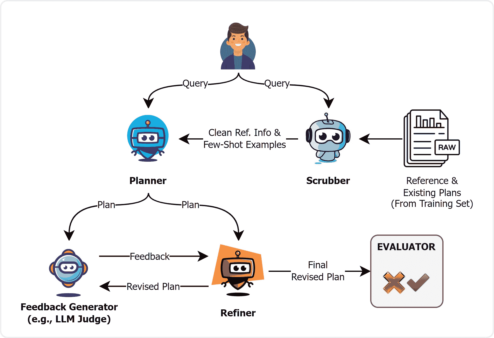
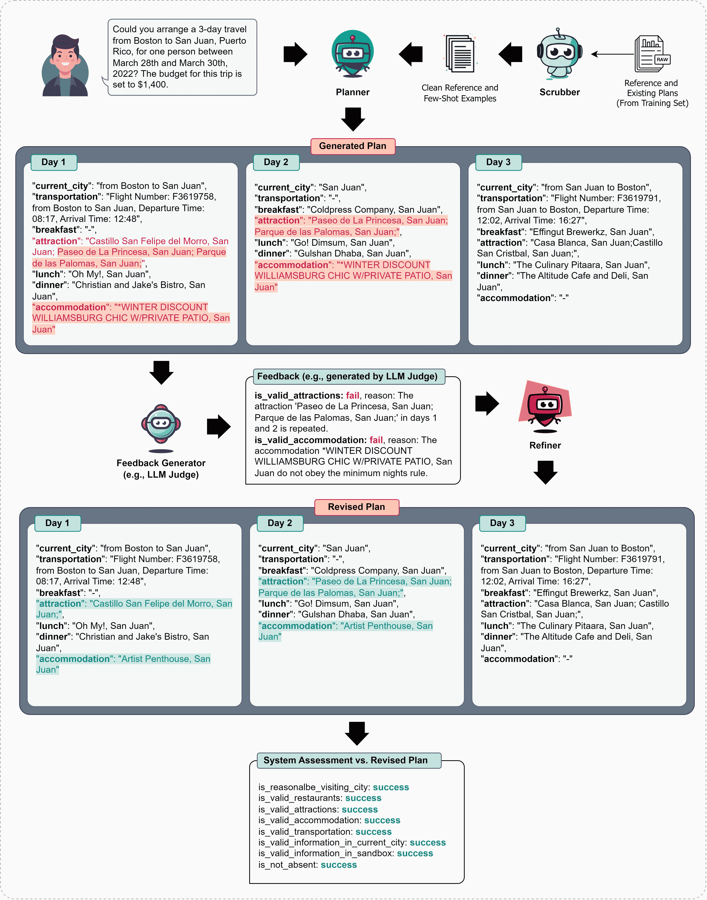

<!--yml

类别：未分类

日期：2025-01-11 12:19:21

-->

# 我们能依赖LLM智能体来制定长期计划吗？以TravelPlanner为例

> 来源：[https://arxiv.org/html/2408.06318/](https://arxiv.org/html/2408.06318/)

陈亚男，阿里·佩萨朗哈德，坦玛娜·萨杜    李东勋

LG电子，多伦多人工智能实验室，加拿大多伦多

{yanan.chen, ali.pesaranghader, tanmana.sadh, donghoon9.yi}@lge.com

###### 摘要

大型语言模型（LLMs）由于其出色的泛化能力和突现能力，已使自主智能体更接近人工通用智能（AGI）。然而，关于基于LLM的智能体如何表现、它们为何可能失败以及如何改进它们的研究仍然不足，尤其是在要求高的现实世界规划任务中。本文旨在填补这一空白，我们使用一个现实的基准——TravelPlanner Xie等人（[2024](https://arxiv.org/html/2408.06318v1#bib.bib45)）提出的基准，其中智能体必须满足多个约束条件，以生成准确的计划。我们利用这一基准来探讨四个关键研究问题：（1）LLM智能体在推理和规划时，是否足够强大，能应对冗长和嘈杂的上下文？（2）少量示例提示是否会对LLM智能体在长上下文场景中的表现产生不利影响？（3）我们能依赖细化来改进计划吗？（4）通过正负反馈对LLM进行微调，是否能进一步提升表现？我们的全面实验表明，首先，尽管LLM能够处理大量的参考信息和少量示例，但它们常常无法关注长上下文中的关键部分；其次，它们仍然难以分析长计划，并且无法为细化提供准确的反馈；第三，我们提出了反馈感知微调（FAFT），该方法结合了正负反馈，相较于监督微调（SFT），显著提升了表现。我们的研究结果为社区提供了关于现实世界规划应用各方面的深入见解。

我们能依赖LLM智能体来制定长期计划吗？以TravelPlanner为例

陈亚男，阿里·佩萨朗哈德，坦玛娜·萨杜，和李东勋 LG电子，多伦多人工智能实验室，加拿大多伦多 {yanan.chen, ali.pesaranghader, tanmana.sadh, donghoon9.yi}@lge.com

## 1 引言

LLM在多个基准测试中展示了显著的推理和规划能力，例如WebArena Zhou等人（[2023](https://arxiv.org/html/2408.06318v1#bib.bib58)）、WebShop Yao等人（[2022a](https://arxiv.org/html/2408.06318v1#bib.bib48)）、AgentBench Liu等人（[2023b](https://arxiv.org/html/2408.06318v1#bib.bib17)）和AgentGym Xi等人（[2024b](https://arxiv.org/html/2408.06318v1#bib.bib44)），在这些基准中，它们作为代理人代替人类完成给定任务。在此背景下，学术界考虑了基于LLM的代理人发展的两个主要方向：（1）通过提示LLM进行推理、规划和执行 Qin等人（[2023](https://arxiv.org/html/2408.06318v1#bib.bib25)）；Wei等人（[2022](https://arxiv.org/html/2408.06318v1#bib.bib38)）；Yao等人（[2024](https://arxiv.org/html/2408.06318v1#bib.bib49)）；Wang等人（[2022](https://arxiv.org/html/2408.06318v1#bib.bib37)），以及（2）对LLM进行微调以应对特定任务 Chen等人（[2023b](https://arxiv.org/html/2408.06318v1#bib.bib3)）；Zeng等人（[2023](https://arxiv.org/html/2408.06318v1#bib.bib51)）；Zhang等人（[2024b](https://arxiv.org/html/2408.06318v1#bib.bib53)）；Chen等人（[2024](https://arxiv.org/html/2408.06318v1#bib.bib4)）；Song等人（[2024b](https://arxiv.org/html/2408.06318v1#bib.bib33)）。尽管在每个方向上都有一些有前景的贡献，但我们可以看到LLM在更复杂的场景中仍然存在不足。以TravelPlanner Xie等人（[2024](https://arxiv.org/html/2408.06318v1#bib.bib45)）为例，这是一个基准测试，其中代理人需要生成一个计划，并且该计划必须满足输入查询的多个约束。作者指出，GPT-4-Turbo OpenAI（[2023](https://arxiv.org/html/2408.06318v1#bib.bib21)）仅能达到4.4%的最终通过率。这表明LLM代理人无法处理长时间跨度的推理和规划。在本文中，我们使用TravelPlanner作为基准，进一步探讨这些挑战，并且我们相信我们积极的与消极的研究发现将有助于学术界。

我们广泛的实验表明：（1）冗长且嘈杂的上下文可能会对LLM代理的规划能力产生不利影响；（2）更多的提示不一定能保证性能的提升；（3）当LLM被用作反馈生成器时，细化可能并不有效；然而，如果反馈生成器基于启发式规则，效果更可能是积极的；（4）我们的提议方法——反馈感知微调（FAFT），受负向感知训练（NAT）Wang等人（[2024b](https://arxiv.org/html/2408.06318v1#bib.bib36)）的启发，可以显著提升规划能力。

图1：四个LLM代理互动生成计划。（图[A.1](https://arxiv.org/html/2408.06318v1#A1.F1 "Figure A.1 ‣ A.2 Evaluation metrics ‣ Appendix A Appendix ‣ Can We Rely on LLM Agents to Draft Long-Horizon Plans? Let’s Take TravelPlanner as an Example")展示了细化模块的示例。）

## 2 方法论

我们的框架建立在TravelPlanner的基础上，包含五个主要组件：Scrubber、Planner、Feedback Generator、Refiner和Evaluation模块（如图[1](https://arxiv.org/html/2408.06318v1#S1.F1 "Figure 1 ‣ 1 Introduction ‣ Can We Rely on LLM Agents to Draft Long-Horizon Plans? Let’s Take TravelPlanner as an Example")所示）。Scrubber为Planner提供清晰的参考信息¹¹1这是TravelPlanner用来指代生成计划所需信息的术语。以及少量示例，用于生成计划。然后，Feedback Generator为Refiner提供反馈，以便在需要时改进计划。这个互动过程会持续，直到达到预定义的设置。Planner是框架的核心，可以基于（1）上下文学习（ICL），或（2）监督微调（SFT），例如第[4](https://arxiv.org/html/2408.06318v1#S4 "4 Findings ‣ Can We Rely on LLM Agents to Draft Long-Horizon Plans? Let’s Take TravelPlanner as an Example")节提出的FAFT。附录[A.3](https://arxiv.org/html/2408.06318v1#A1.SS3 "A.3 Framework ‣ Appendix A Appendix ‣ Can We Rely on LLM Agents to Draft Long-Horizon Plans? Let’s Take TravelPlanner as an Example")详细描述了每个代理的工作原理。

## 3 实验设置

基本设置。由于我们工作的重点是代理在制定计划中的能力，我们仅依赖TravelPlanner的Sole Planning设置。也就是说，所有全面且必要的信息（即人工注释）都直接提供给Planner代理。我们还考虑了Direct²²2查询直接输入到模型中，附带详细说明任务和收集的相关信息的指令。规划策略因其简单性而被考虑，因为它与其他推理技术（如ZS-CoT Wei等[2022](https://arxiv.org/html/2408.06318v1#bib.bib38)、ReAct Yao等[2022b](https://arxiv.org/html/2408.06318v1#bib.bib50)和Reflexion Shinn等[2024](https://arxiv.org/html/2408.06318v1#bib.bib30)）的表现相当。

数据集。（见附录[A.1](https://arxiv.org/html/2408.06318v1#A1.SS1 "A.1 数据集 ‣ 附录A 附录 ‣ 我们能依赖LLM代理来起草长期计划吗？以TravelPlanner为例")）我们使用训练集进行少量样本提示和微调，因为它提供了注释过的计划。我们在第[4](https://arxiv.org/html/2408.06318v1#S4 "4 发现 ‣ 我们能依赖LLM代理来起草长期计划吗？以TravelPlanner为例")节中，针对RQ1和RQ2分别对代理进行验证集和测试集的评估。对于RQ3，我们仅考虑验证集，因为我们无法离线获取系统反馈。关于RQ4，我们使用训练集对（Open-LLM）规划代理进行微调。

衡量标准。我们采用TravelPlanner的原始评估标准，该标准基于多个约束的通过率来评估性能。更多细节请见附录[A.2](https://arxiv.org/html/2408.06318v1#A1.SS2 "A.2 评估标准 ‣ 附录A 附录 ‣ 我们能依赖LLM代理来起草长期计划吗？以TravelPlanner为例")。

| GPT-3.5-Turbo作为规划者 |
| --- |
|  |  | 验证集 (#180) | 测试集 (#1,000) |
| 参考已清理？ | 射击次数 | 交付率 |

&#124; 常识 &#124;

&#124; 通过率 &#124;

|

&#124; 硬性约束 &#124;

&#124; 通过率 &#124;

| 最终通过率 | 幻觉率 | 交付率 |
| --- | --- | --- |

&#124; 常识 &#124;

&#124; 通过率 &#124;

|

&#124; 硬性约束 &#124;

&#124; 通过率 &#124;

| 最终通过率 | 幻觉率 |
| --- | --- |
| (RQ1) | (RQ2) | 微 | 宏 | 微 | 宏 | 微 | 宏 | 微 | 宏 |
| 否 | 0 | 100 | 60.2 | 4.4 | 11.0 | 2.8 | 0.0 | 57.4 | 100 | 60.8 | 3.5 | 13.6 | 4.9 | 0.6 | 61.1 |
| 否 | 1 | 100 | 65.4 | 11.0 | 17.5 | 5.1 | 1.0 | 52.3 | 100 | 64.0 | 10.1 | 16.1 | 6.4 | 1.2 | 59.4 |
| 是 | 0 | 100 | 74.4 | 18.9 | 29.0 | 14.4 | 4.4 | 41.6 | 100 | 70.3 | 12.3 | 25.0 | 10.7 | 2.7 | 49.8 |
| 是 | 1 | 100 | 80.6 | 24.4 | 40.2 | 17.8 | 7.2 | 35.5 | 100 | 78.0 | 18.6 | 36.1 | 17.7 | 4.9 | 40.8 |
| 是 | 2 | 100 | 82.6 | 32.2 | 41.2 | 17.8 | 7.2 | 38.8 | 100 | 80.9 | 22.4 | 34.3 | 16.7 | 6.5 | 44.3 |
| 是 | 4 | 100 | 81.5 | 29.4 | 35.5 | 12.2 | 5.8 | 46.6 | 100 | 80.3 | 21.1 | 31.5 | 15.0 | 5.2 | 50.8 |
| 是 | 5 | 100 | 81.1 | 26.3 | 32.6 | 12.4 | 4.8 | 49.8 | 100 | 79.5 | 20.4 | 30.4 | 13.2 | 5.6 | 53.1 |

表 1：GPT-3.5-Turbo作为规划者在RQ1和RQ2不同设置下的表现

|  |  | GPT-3.5-Turbo作为规划者和GPT-4-Turbo作为改进者 |
| --- | --- | --- |
|  |  | 对比验证集 (#180) |
| 反馈生成器 (RQ3) | 改进迭代 | 交付率 |

&#124; 常识 &#124;

&#124; 通过率 &#124;

|

&#124; 硬性约束 &#124;

&#124; 通过率 &#124;

| 最终通过率 | 提升比率 ($\uparrow$) | 平坦比率 ($\downarrow$) | 降级比率 ($\downarrow$) |
| --- | --- | --- | --- |
| 微 | 宏 | 微 | 宏 |
| 无 | 0 | 100 | 82.6 | 32.2 | 41.2 | 17.8 | 7.2 | – | – | – |
| Oracle（启发式规则） | 1 | 100 | 89.7 | 51.1 | 50.0 | 22.2 | 11.7 | 46.1 | 52.8 | 1.1 |
| 2 | 100 | 89.0 | 54.4 | 50.5 | 18.3 | 12.8 | 8.9 | 76.7 | 14.4 |
| 3 | 100 | 89.9 | 56.1 | 50.7 | 21.1 | 13.3 | 13.9 | 78.9 | 7.2 |
| 4 | 100 | 89.1 | 59.4 | 49.8 | 21.7 | 13.9 | 5.0 | 86.7 | 8.3 |
| 随机 | 1 | 100 | 82.3 | 31.1 | 47.1 | 21.1 | 7.2 | 21.7 | 53.3 | 25.0 |
| 2 | 100 | 82.3 | 32.2 | 46.2 | 20.0 | 8.3 | 18.3 | 63.9 | 17.8 |
| 3 | 100 | 82.0 | 30.6 | 45.5 | 20.0 | 7.2 | 19.4 | 61.7 | 18.9 |
| 4 | 100 | 82.6 | 30.6 | 44.8 | 18.3 | 7.2 | 18.9 | 62.8 | 18.3 |
| GPT-3.5-Turbo (0125) | 1 | 100 | 82.0 | 24.4 | 41.4 | 21.7 | 8.9 | 22.2 | 52.8 | 25.0 |
| 2 | 100 | 82.9 | 28.9 | 40.9 | 18.3 | 8.9 | 24.4 | 55.0 | 20.6 |
| 3 | 100 | 83.8 | 27.8 | 41.7 | 20.0 | 8.9 | 25.0 | 56.1 | 18.9 |
| 4 | 100 | 82.4 | 26.7 | 40.7 | 18.9 | 7.8 | 19.4 | 57.8 | 22.8 |
| GPT-4-Turbo (1106-preview) | 1 | 100 | 86.9 | 32.8 | 39.3 | 20.0 | 9.4 | 34.4 | 40.6 | 25.0 |
| 2 | 100 | 84.3 | 29.4 | 37.9 | 15.6 | 7.2 | 20.0 | 59.4 | 20.6 |
| 3 | 100 | 84.6 | 30.0 | 40.5 | 18.3 | 7.2 | 18.3 | 67.2 | 14.4 |
| 4 | 100 | 86.4 | 28.3 | 37.9 | 20.0 | 6.7 | 19.4 | 58.3 | 22.2 |

表 2：不同反馈生成器的性能。提升比例（$\uparrow$）、持平比例（$\downarrow$）和降级比例（$\downarrow$）分别显示了计划改善、未变化和恶化的百分比。

## 4 研究结果

RQ1: LLM 代理在处理嘈杂信息进行推理和规划时是否足够稳健？表格 [1](https://arxiv.org/html/2408.06318v1#S3.T1 "Table 1 ‣ 3 Experimental Settings ‣ Can We Rely on LLM Agents to Draft Long-Horizon Plans? Let’s Take TravelPlanner as an Example") 显示，当 GPT-3.5-Turbo 接收到*缩减*的参考信息时，表现更好。这表明 GPT-3.5-Turbo 仍然在处理给定上下文时，难以关注最重要的部分进行推理，容易受到过多无关（上下文）信息的干扰。因此，考虑引入一个外部智能上下文清理代理是值得的。

RQ2：更多的示例能帮助规划任务，还是会加剧幻觉问题？人们普遍认为，在ICL中，更多的少量示例是有帮助的，但这种观点是否适用于TravelPlanner？正如表[1](https://arxiv.org/html/2408.06318v1#S3.T1 "Table 1 ‣ 3 Experimental Settings ‣ Can We Rely on LLM Agents to Draft Long-Horizon Plans? Let’s Take TravelPlanner as an Example")所示，当有$2$个示例时，最终通过率达到最高，而更多的示例可能不会改善结果，甚至可能会带来更坏的效果。我们推测，在上下文窗口中加入更多示例可能会分散LLM的注意力，导致幻觉现象（例如，使用给定参考信息中不存在的实体）。幻觉率的结果证实了这一假设。也就是说，增加更多示例可能会在参考信息为复杂表格文本的任务中引发更严重的幻觉问题。另一个发现是，至少一个上下文示例是有益的，如Xie和Min（[2022](https://arxiv.org/html/2408.06318v1#bib.bib46)）所示。最后，我们得出结论：随着示例数量的增加，通过率和幻觉率的结果都变得更差。

我们的RQ1和RQ2观察结果与现有的理论和实验工作一致，例如Han等人（[2023](https://arxiv.org/html/2408.06318v1#bib.bib10)）；Levy等人（[2024](https://arxiv.org/html/2408.06318v1#bib.bib13)）指出了当前LLM在长度泛化中失败的潜在原因：当它们遇到更长的上下文时，注意力得分被稀释，因此得分分布变得平坦，导致信息丧失。也就是说，随着上下文的增加，注意力得分的熵会爆炸。换句话说，LLM在如何聚焦于正确的信息上变得迷失，尤其是在预训练是在较短的文本片段上进行的情况下。

RQ3：我们能依赖精细化来改进计划吗？为了解决这个问题，我们需要反馈，反馈应突出指出出现问题的地方，并附有解释问题背后的原因。为此，我们考察了基于LLM的反馈生成器——GPT-3.5-Turbo和GPT-4-Turbo的可靠性。此外，作为一种可消除视角，我们还考虑了随机反馈和Oracle反馈生成器。前者指的是通过随机内容在有效格式中生成反馈的设置，后者使用来自TravelPlanner的启发式硬编码规则³³3Rules： [https://github.com/OSU-NLP-Group/TravelPlanner/tree/main/evaluation](https://github.com/OSU-NLP-Group/TravelPlanner/tree/main/evaluation) 来检查计划是否符合约束条件。此外，我们不考虑任何较弱的语言模型，因为在之前的研究中，它们已被证明无法处理此类任务（Madaan等人，[2024](https://arxiv.org/html/2408.06318v1#bib.bib20)）。由于查询和反馈中经常缺乏硬性约束，因此在这一部分中我们仅关注常识性约束⁴⁴4 与TravelPlanner的原始设置一致，即：未能满足所有常识性约束的计划将不会继续接受有关硬性约束的反馈。这个决策源于硬性约束计算对常识性标准的依赖。我们在表[2](https://arxiv.org/html/2408.06318v1#S3.T2 "表 2 ‣ 3 实验设置 ‣ 我们能依赖LLM代理来制定长期计划吗？以TravelPlanner为例")中呈现了RQ3的结果。反馈生成器和精细化代理进行迭代交互；在每次迭代中，之前生成的计划会被反馈生成器审查，以主观方式起草反馈。根据反馈，如果需要任何精细化，即任何约束未满足，则触发精细化代理修改计划。*这个设计模拟了在没有Oracle反馈生成器的生产环境中，无法检查计划是否需要精细化的情况。* 我们总结了以下发现：

+   •

    如果反馈质量高且精确，精细化有助于改进计划——我们发现，如果反馈准确且组织良好，像Oracle设置中一样，精细化有助于改进计划。表格显示，在第一次迭代中，$46.1\%$的计划得到了改善，最终通过率从$7.2\%$提高到$11.7\%$。从第二次迭代开始，我们没有看到显著的改善，通过率趋于饱和。

+   •

    LLM反馈生成器不可靠 —— 基于LLM的反馈生成器，尽管配备了经过精心设计的提示和两轮示范，仍然在生成准确的反馈方面存在困难。特别是，对于有缺陷的计划，这些反馈生成器无法识别违规的具体位置，或者会生成过多（无根据的）反馈。此外，对于合格的计划，它们可能会生成错误的负面反馈，这会触发改进模块，导致不必要的修改，可能最终导致计划无效。结果，整体表现变得停滞，即“平坦比例”占主导地位，负面方向的修改（降级比例）抵消了正面变化（提升比例）。

RQ4：我们能否通过使用我们的反馈感知微调（FAFT）技术来增强一个优秀规划器的开发，而不是依赖现成的专有LLM？对于计划生成，我们可以使用Oracle反馈进行上下文学习（如RQ3所示）或微调一个（开源）LLM。本实验的重点在于后者，即我们考察SFT和FAFT在构建Planner代理中的表现。

SFT与FAFT —— 在我们提出的方法中，即FAFT，我们不仅仅考虑查询、参考信息和注释计划（如SFT中的做法），还将反馈纳入微调过程（参见附录[A.4](https://arxiv.org/html/2408.06318v1#A1.SS4 "A.4 Supervised Fine-Tuning and Feedback-Aware Fine-Tuning ‣ Appendix A Appendix ‣ Can We Rely on LLM Agents to Draft Long-Horizon Plans? Let’s Take TravelPlanner as an Example")）。为了生成反馈，我们首先使用训练集中的查询并提示Planner代理生成计划⁵⁵5在与RQ1和RQ2相同的设置下。随后，我们通过使用Oracle（即系统）对生成的计划进行评估来收集反馈。我们将`temperature`设置为$1.0$以生成计划，从而增强生成计划的多样性，进而引入更多正面和负面反馈样本。我们收集了$14,800$个样本，其中包括来自训练集的$45$个原始注释计划及其`all-success`反馈⁶⁶6值得注意的是，可以收集更多的样本。（参见附录[A.6.2](https://arxiv.org/html/2408.06318v1#A1.SS6.SSS2 "A.6.2 Feedback Examples Generated by LLMs ‣ A.6 Case Presentation ‣ Appendix A Appendix ‣ Can We Rely on LLM Agents to Draft Long-Horizon Plans? Let’s Take TravelPlanner as an Example")）。在推理过程中，提示中的反馈将设置为`all-success`，旨在鼓励模型生成正确的计划。附录[A.4.3](https://arxiv.org/html/2408.06318v1#A1.SS4.SSS3 "A.4.3 Inference Example Template for FAFT ‣ A.4 Supervised Fine-Tuning and Feedback-Aware Fine-Tuning ‣ Appendix A Appendix ‣ Can We Rely on LLM Agents to Draft Long-Horizon Plans? Let’s Take TravelPlanner as an Example")提供了更多信息。

表 [3](https://arxiv.org/html/2408.06318v1#S4.T3 "表 3 ‣ 4 发现 ‣ 我们能依赖LLM代理来制定长期计划吗？以TravelPlanner为例") 展示了 FAFT 的影响，相较于原版 Llama-3-8B 及其 SFT 版本，所有通过率均有显著提高。这一观察结果与之前的研究一致，例如，负向意识训练（NAT）Wang 等人 ([2024b](https://arxiv.org/html/2408.06318v1#bib.bib36)) 表明，增加提示的多样性可以提升性能。在 FAFT 中，详尽且丰富的反馈作为思维链条来提高代理的规划能力。此外，我们的结果验证了近期的研究成果，例如 Lee 等人 ([2023](https://arxiv.org/html/2408.06318v1#bib.bib12))；Wei 等人 ([2023](https://arxiv.org/html/2408.06318v1#bib.bib39))，他们表明：（1）在传统 SFT 数据中注入辅助信息可以显著提高性能，（2）CoT 风格的训练集和详细的草稿纸可以通过减少样本复杂度显著提高学习效果。

我们的研究表明，当标注数据稀缺且与系统的交互可承受时，收集带有全面且丰富反馈（无论是正向还是负向）的样本是值得的。这一方法可以视为 RL 基础解决方案（如 PPO Schulman 等人 ([2017](https://arxiv.org/html/2408.06318v1#bib.bib28))）的有希望的替代方案，因为后者已被批评为不稳定。

| Llama-3-8B 作为规划器 |
| --- |
| 规划器 (RQ4) | 交付率 |

&#124; 常识 &#124;

&#124; 通过率 &#124;

|

&#124; 硬约束 &#124;

&#124; 通过率 &#124;

| 最终通过率 |
| --- |
| 微观 | 宏观 | 微观 | 宏观 |
| 原版 | 94.4 | 49.5 | 1.1 | 7.9 | 0.0 | 0.0 |
| + SFT | 97.8 | 64.2 | 11.1 | 12.4 | 6.1 | 3.9 |
| + FAFT | 98.9 | 81.7 | 28.9 | 36.9 | 15.0 | 8.3 |

表 3：Llama-3-8B +SFT 和 +FAFT 的性能。

## 5 结论

在本文中，我们研究了上下文、样本数量以及反馈利用对复杂的长期规划任务 TravelPlanner 的影响。我们的研究成果旨在推动研究社区中更广泛的代理框架和策略的发展。

在未来的工作中，我们计划探索将注释过的样本整合到 SFT 和后训练中的方法。这一方法可以解决 LLM 的知识和技能主要在预训练阶段获得，而对齐 SFT 则教导模型在与用户交互时使用哪种子分布格式的问题 Zhou 等人 ([2024a](https://arxiv.org/html/2408.06318v1#bib.bib57))。最后，我们将探索 RLHF 和 FAFT 之间的相互作用。

## 限制

由于预算限制，我们只能在RQ1和RQ2中使用GPT-3.5-Turbo作为规划智能体。对于RQ4，需要进一步研究以探索增益幅度与FAFT训练集大小之间的关系，以及正负样本比例对最终性能的影响。此外，增强反馈表达式可能进一步提高FAFT的性能。调查RLHF技术，如DPO Rafailov 等人（[2024](https://arxiv.org/html/2408.06318v1#bib.bib26)）和PRO Song 等人（[2024a](https://arxiv.org/html/2408.06318v1#bib.bib32)），以更好地利用反馈，也将是一个有趣的方向。

## 伦理声明

我们的工作建立在TravelPlanner之上，这是一个为复杂规划任务设计的基准。我们遵循原始工作的规范，利用他们的数据、评估脚本和常识定义。承认原始基准的基础概念和设计，我们严格遵循TravelPlanner的指导方针，确保评估过程的完整性，禁止在验证集和测试集中出现任何形式的作弊。这一承诺维护了工作结果的公平性和可靠性。

至于环境成本，我们承认我们的工作需要进行大量实验以得出可靠的结论。然而，未来的研究可以利用这些见解，减少大量大规模比较的需求。旨在生产的模型可以进行一次训练，利用我们研究中确定的最有前景的设置。

## 参考文献

+   Chang 等人（2024）Yupeng Chang, Xu Wang, Jindong Wang, Yuan Wu, Linyi Yang, Kaijie Zhu, Hao Chen, Xiaoyuan Yi, Cunxiang Wang, Yidong Wang 等人。2024年。关于大规模语言模型评估的调查。*ACM 智能系统与技术期刊*，15(3):1–45。

+   Chen 等人（2023a）Angelica Chen, Jérémy Scheurer, Tomasz Korbak, Jon Ander Campos, Jun Shern Chan, Samuel R Bowman, Kyunghyun Cho 和 Ethan Perez。2023a年。通过自然语言反馈训练改进代码生成。*arXiv 预印本 arXiv:2303.16749*。

+   Chen 等人（2023b）Baian Chen, Chang Shu, Ehsan Shareghi, Nigel Collier, Karthik Narasimhan 和 Shunyu Yao。2023b年。Fireact：朝着语言智能体微调的方向发展。*arXiv 预印本 arXiv:2310.05915*。

+   Chen 等人（2024）Zehui Chen, Kuikun Liu, Qiuchen Wang, Wenwei Zhang, Jiangning Liu, Dahua Lin, Kai Chen 和 Feng Zhao。2024年。Agent-flan：为大规模语言模型设计有效智能体调优的数据和方法。*arXiv 预印本 arXiv:2403.12881*。

+   Christianos 等人（2023）Filippos Christianos, Georgios Papoudakis, Matthieu Zimmer, Thomas Coste, Zhihao Wu, Jingxuan Chen, Khyati Khandelwal, James Doran, Xidong Feng, Jiacheng Liu 等人。2023年。Pangu-agent：一个具有结构化推理能力的可调节通用智能体。*arXiv 预印本 arXiv:2312.14878*。

+   Deng et al. (2023) Xiang Deng, Yu Gu, Boyuan Zheng, Shijie Chen, Samuel Stevens, Boshi Wang, Huan Sun, and Yu Su. 2023. [Mind2web: 面向通用型网络代理的研究](http://arxiv.org/abs/2306.06070)。

+   Fei et al. (2023) Weizhi Fei, Xueyan Niu, Pingyi Zhou, Lu Hou, Bo Bai, Lei Deng, and Wei Han. 2023. 通过语义压缩扩展大型语言模型的上下文窗口。*arXiv 预印本 arXiv:2312.09571*。

+   gkamradt (2023) gkamradt. 2023. Llmtest needle in a haystack - 对大型语言模型进行压力测试。 [https://github.com/gkamradt/LLMTest_NeedleInAHaystack](https://github.com/gkamradt/LLMTest_NeedleInAHaystack)。

+   Guo et al. (2024) Taicheng Guo, Xiuying Chen, Yaqi Wang, Ruidi Chang, Shichao Pei, Nitesh V Chawla, Olaf Wiest, and Xiangliang Zhang. 2024. 基于大型语言模型的多代理：进展与挑战综述。*arXiv 预印本 arXiv:2402.01680*。

+   Han et al. (2023) Chi Han, Qifan Wang, Wenhan Xiong, Yu Chen, Heng Ji, and Sinong Wang. 2023. Lm-infinite: 针对大型语言模型的简易即兴长度泛化方法。*arXiv 预印本 arXiv:2308.16137*。

+   Kim et al. (2024) Geunwoo Kim, Pierre Baldi, and Stephen McAleer. 2024. 语言模型可以解决计算机任务。*神经信息处理系统进展*，36。

+   Lee et al. (2023) Nayoung Lee, Kartik Sreenivasan, Jason D Lee, Kangwook Lee, and Dimitris Papailiopoulos. 2023. 教授小型变换器算术。*arXiv 预印本 arXiv:2307.03381*。

+   Levy et al. (2024) Mosh Levy, Alon Jacoby, and Yoav Goldberg. 2024. 相同任务，更多令牌：输入长度对大型语言模型推理表现的影响。*arXiv 预印本 arXiv:2402.14848*。

+   Li et al. (2024) Guohao Li, Hasan Hammoud, Hani Itani, Dmitrii Khizbullin, and Bernard Ghanem. 2024. Camel: 用于大型语言模型社会“心智”探索的交互式代理。*神经信息处理系统进展*，36。

+   Li et al. (2023) Yiwei Li, Peiwen Yuan, Shaoxiong Feng, Boyuan Pan, Bin Sun, Xinglin Wang, Heda Wang, and Kan Li. 2023. [将尘土变黄金：通过利用负面数据从大语言模型中蒸馏复杂推理能力](https://api.semanticscholar.org/CorpusID:266375154)。在 *人工智能AAAI会议*。

+   Liu et al. (2023a) Junyi Liu, Liangzhi Li, Tong Xiang, Bowen Wang, and Yiming Qian. 2023a. Tcra-llm: 基于令牌压缩检索增强的大型语言模型用于推理成本降低。在 *计算语言学协会发现：EMNLP 2023*，第9796–9810页。

+   Liu et al. (2023b) Xiao Liu, Hao Yu, Hanchen Zhang, Yifan Xu, Xuanyu Lei, Hanyu Lai, Yu Gu, Hangliang Ding, Kaiwen Men, Kejuan Yang, Shudan Zhang, Xiang Deng, Aohan Zeng, Zhengxiao Du, Chenhui Zhang, Sheng Shen, Tianjun Zhang, Yu Su, Huan Sun, Minlie Huang, Yuxiao Dong, and Jie Tang. 2023b. Agentbench: 评估大语言模型作为代理的表现。*arXiv 预印本 arXiv: 2308.03688*。

+   Liu 等（2024）Zhiwei Liu、Weiran Yao、Jianguo Zhang、Liangwei Yang、Zuxin Liu、Juntao Tan、Prafulla K Choubey、Tian Lan、Jason Wu、Huan Wang 等。2024年。《Agentlite：一个轻量级的任务导向型LLM代理系统库》。*arXiv 预印本 arXiv:2402.15538*。

+   Ma 等（2024）Chang Ma、Junlei Zhang、Zhihao Zhu、Cheng Yang、Yujiu Yang、Yaohui Jin、Zhenzhong Lan、Lingpeng Kong 和 Junxian He。2024年。《Agentboard：多轮LLM代理的分析评估板》。*arXiv 预印本 arXiv:2401.13178*。

+   Madaan 等（2024）Aman Madaan、Niket Tandon、Prakhar Gupta、Skyler Hallinan、Luyu Gao、Sarah Wiegreffe、Uri Alon、Nouha Dziri、Shrimai Prabhumoye、Yiming Yang 等。2024年。《Self-refine：自反馈的迭代优化》。*神经信息处理系统进展*，36。

+   OpenAI（2023）OpenAI。2023年。[Gpt-4 技术报告](https://arxiv.org/abs/2303.08774)。*arXiv 预印本 arXiv:2303.08774*。

+   Pan 等（2024）Jiayi Pan、Yichi Zhang、Nicholas Tomlin、Yifei Zhou、Sergey Levine 和 Alane Suhr。2024年。《数字代理的自主评估与优化》。*arXiv 预印本 arXiv:2404.06474*。

+   Paul 等（2023）Debjit Paul、Mete Ismayilzada、Maxime Peyrard、Beatriz Borges、Antoine Bosselut、Robert West 和 Boi Faltings。2023年。《Refiner：中间表示的推理反馈》。*arXiv 预印本 arXiv:2304.01904*。

+   Qian 等（2024）Hongjin Qian、Zheng Liu、Peitian Zhang、Kelong Mao、Yujia Zhou、Xu Chen 和 Zhicheng Dou。2024年。《长序列任务是否需要长大语言模型？》*arXiv 预印本 arXiv:2405.15318*。

+   Qin 等（2023）Yujia Qin、Shihao Liang、Yining Ye、Kunlun Zhu、Lan Yan、Yaxi Lu、Yankai Lin、Xin Cong、Xiangru Tang、Bill Qian 等。2023年。《Toolllm：帮助大语言模型掌握16000多个真实世界API》。*arXiv 预印本 arXiv:2307.16789*。

+   Rafailov 等（2024）Rafael Rafailov、Archit Sharma、Eric Mitchell、Christopher D Manning、Stefano Ermon 和 Chelsea Finn。2024年。《直接偏好优化：你的语言模型实际上是一个奖励模型》。*神经信息处理系统进展*，36。

+   Ratner 等（2023）Nir Ratner、Yoav Levine、Yonatan Belinkov、Ori Ram、Inbal Magar、Omri Abend、Ehud Karpas、Amnon Shashua、Kevin Leyton-Brown 和 Yoav Shoham。2023年。[大语言模型的并行上下文窗口](https://doi.org/10.18653/v1/2023.acl-long.352)。载于 *第61届计算语言学协会年会论文集（第1卷：长篇论文）*，第6383–6402页，加拿大多伦多。计算语言学协会。

+   Schulman 等（2017）John Schulman、Filip Wolski、Prafulla Dhariwal、Alec Radford 和 Oleg Klimov。2017年。《近端策略优化算法》。*arXiv 预印本 arXiv:1707.06347*。

+   Shi等人（2023）Freda Shi, Xinyun Chen, Kanishka Misra, Nathan Scales, David Dohan, Ed H Chi, Nathanael Schärli, 和 Denny Zhou. 2023. 大型语言模型容易被无关的上下文分散注意力. 载于*《国际机器学习大会》*，页码31210–31227。PMLR。

+   Shinn等人（2024）Noah Shinn, Federico Cassano, Ashwin Gopinath, Karthik Narasimhan, 和 Shunyu Yao. 2024. Reflexion：带有语言强化学习的语言智能体. *《神经信息处理系统进展》*，第36卷。

+   Shridhar等人（2020）Mohit Shridhar, Xingdi Yuan, Marc-Alexandre Côté, Yonatan Bisk, Adam Trischler, 和 Matthew Hausknecht. 2020. Alfworld：将文本和具象环境对齐以进行互动学习. *arXiv预印本 arXiv:2010.03768*。

+   Song等人（2024a）Feifan Song, Bowen Yu, Minghao Li, Haiyang Yu, Fei Huang, Yongbin Li, 和 Houfeng Wang. 2024a. 面向人类对齐的偏好排名优化. 载于*《人工智能学会会议论文集》*，第38卷，页码18990–18998。

+   Song等人（2024b）Yifan Song, Da Yin, Xiang Yue, Jie Huang, Sujian Li, 和 Bill Yuchen Lin. 2024b. 试错法：基于探索的LLM智能体轨迹优化. *arXiv预印本 arXiv:2403.02502*。

+   Talebirad和Nadiri（2023）Yashar Talebirad 和 Amirhossein Nadiri. 2023. 多智能体协作：利用智能LLM智能体的力量. *arXiv预印本 arXiv:2306.03314*。

+   Wang等人（2024a）Junlin Wang, Jue Wang, Ben Athiwaratkun, Ce Zhang, 和 James Zou. 2024a. 多智能体混合增强大型语言模型的能力. *arXiv预印本 arXiv:2406.04692*。

+   Wang等人（2024b）Renxi Wang, Haonan Li, Xudong Han, Yixuan Zhang, 和 Timothy Baldwin. 2024b. 从失败中学习：在微调大型语言模型作为智能体时整合负面示例. *arXiv预印本 arXiv:2402.11651*。

+   Wang等人（2022）Xuezhi Wang, Jason Wei, Dale Schuurmans, Quoc Le, Ed Chi, Sharan Narang, Aakanksha Chowdhery, 和 Denny Zhou. 2022. 自一致性提升语言模型的思维链推理能力. *arXiv预印本 arXiv:2203.11171*。

+   Wei等人（2022）Jason Wei, Xuezhi Wang, Dale Schuurmans, Maarten Bosma, Fei Xia, Ed Chi, Quoc V Le, Denny Zhou 等人. 2022. 思维链提示引发大型语言模型的推理能力. *《神经信息处理系统进展》*，第35卷：24824–24837。

+   Wei等人（2023）Yuxiang Wei, Zhe Wang, Jiawei Liu, Yifeng Ding, 和 Lingming Zhang. 2023. Magicoder：源代码就是你所需的一切. *arXiv预印本 arXiv:2312.02120*。

+   Wu等人（2023a）Qingyun Wu, Gagan Bansal, Jieyu Zhang, Yiran Wu, Shaokun Zhang, Erkang Zhu, Beibin Li, Li Jiang, Xiaoyun Zhang, 和 Chi Wang. 2023a. Autogen：通过多智能体对话框架推动下一代LLM应用. *arXiv预印本 arXiv:2308.08155*。

+   Wu等人（2024）Siye Wu, Jian Xie, Jiangjie Chen, Tinghui Zhu, Kai Zhang, 和 Yanghua Xiao. 2024. 无关输入如何轻易地扭曲大型语言模型的响应？*arXiv预印本 arXiv:2404.03302*。

+   Wu et al. (2023b) Yiran Wu, Feiran Jia, Shaokun Zhang, Hangyu Li, Erkang Zhu, Yue Wang, Yin Tat Lee, Richard Peng, Qingyun Wu, and Chi Wang. 2023b. 使用GPT-4解决具有挑战性的数学问题的实证研究。 在 *ArXiv预印本 arXiv:2306.01337*。

+   Xi et al. (2024a) Zhiheng Xi, Wenxiang Chen, Boyang Hong, Senjie Jin, Rui Zheng, Wei He, Yiwen Ding, Shichun Liu, Xin Guo, Junzhe Wang, et al. 2024a. 通过反向课程强化学习训练大型语言模型进行推理。 *arXiv预印本 arXiv:2402.05808*。

+   Xi et al. (2024b) Zhiheng Xi, Yiwen Ding, Wenxiang Chen, Boyang Hong, Honglin Guo, Junzhe Wang, Dingwen Yang, Chenyang Liao, Xin Guo, Wei He, Songyang Gao, Lu Chen, Rui Zheng, Yicheng Zou, Tao Gui, Qi Zhang, Xipeng Qiu, Xuanjing Huang, Zuxuan Wu, and Yu-Gang Jiang. 2024b. [Agentgym：在多样化环境中发展基于大型语言模型的代理](http://arxiv.org/abs/2406.04151)。

+   Xie et al. (2024) Jian Xie, Kai Zhang, Jiangjie Chen, Tinghui Zhu, Renze Lou, Yuandong Tian, Yanghua Xiao, and Yu Su. 2024. Travelplanner：面向现实世界规划的语言代理基准测试。 *arXiv预印本 arXiv:2402.01622*。

+   Xie and Min (2022) Sang Michael Xie and Sewon Min. 2022. 上下文学习是如何工作的？一种理解与传统监督学习差异的框架。

+   Yang et al. (2023) Zhao Yang, Jiaxuan Liu, Yucheng Han, Xin Chen, Zebiao Huang, Bin Fu, and Gang Yu. 2023. Appagent：作为智能手机用户的多模态代理。 *arXiv预印本 arXiv:2312.13771*。

+   Yao et al. (2022a) Shunyu Yao, Howard Chen, John Yang, and Karthik Narasimhan. 2022a. Webshop：面向可扩展的现实世界网络交互，使用基础语言代理。 *神经信息处理系统进展*，35:20744–20757。

+   Yao et al. (2024) Shunyu Yao, Dian Yu, Jeffrey Zhao, Izhak Shafran, Tom Griffiths, Yuan Cao, and Karthik Narasimhan. 2024. 思维树：使用大型语言模型进行深思熟虑的问题解决。 *神经信息处理系统进展*，36。

+   Yao et al. (2022b) Shunyu Yao, Jeffrey Zhao, Dian Yu, Nan Du, Izhak Shafran, Karthik Narasimhan, and Yuan Cao. 2022b. React：在语言模型中协同推理和行动。 *arXiv预印本 arXiv:2210.03629*。

+   Zeng et al. (2023) Aohan Zeng, Mingdao Liu, Rui Lu, Bowen Wang, Xiao Liu, Yuxiao Dong, and Jie Tang. 2023. Agenttuning：为LLMs启用通用的代理能力。 *arXiv预印本 arXiv:2310.12823*。

+   Zhang et al. (2024a) Cong Zhang, Deik Derrick Goh Xin, Dexun Li, Hao Zhang, and Yong Liu. 2024a. 面向语言代理的元任务规划。 *arXiv预印本 arXiv:2405.16510*。

+   Zhang et al. (2024b) Jianguo Zhang, Tian Lan, Rithesh Murthy, Zhiwei Liu, Weiran Yao, Juntao Tan, Thai Hoang, Liangwei Yang, Yihao Feng, Zuxin Liu, et al. 2024b. Agentohana：设计统一的数据和训练流程，以有效地进行代理学习。 *arXiv预印本 arXiv:2402.15506*。

+   Zhang 等（2024c）张少坤、张杰宇、刘家乐、宋林鑫、王驰、Ranjay Krishna 和吴庆云。2024c。无需修改语言模型的语言模型代理训练。*ICML’24*。

+   Zhao 等（2024）赵俊、祖灿、徐浩、陆一、何伟、丁一文、桂涛、张琪、黄璇静。2024。Longagent：通过多代理协作扩展语言模型到128k上下文。*arXiv 预印本 arXiv:2402.11550*。

+   Zheng 等（2024）郑博远、苟博宇、吉亨吉、孙欢 和 苏宇。2024。Gpt-4v（视听）是一个通用的网页代理，如果得到扎根。*arXiv 预印本 arXiv:2401.01614*。

+   Zhou 等（2024a）周春婷、刘鹏飞、徐普鑫、Srinivasan Iyer、孙娇、毛宇宁、马学哲、Avia Efrat、余平、余莉莉 等人。2024a。Lima：更少即是更多用于对齐。*神经信息处理系统进展*，36。

+   Zhou 等（2023）周书燕、Frank F Xu、朱浩、周旭辉、Robert Lo、Abishek Sridhar、程咸易、Yonatan Bisk、Daniel Fried、Uri Alon 等人。2023。[Webarena：构建自主代理的真实网络环境](https://webarena.dev)。*arXiv 预印本 arXiv:2307.13854*。

+   Zhou 等（2024b）周一飞、安德烈·扎内特、潘佳怡、谢尔盖·莱文 和 阿维拉尔·库马尔。2024b。Archer：通过层次化多轮强化学习训练语言模型代理。*arXiv 预印本 arXiv:2402.19446*。

+   Zhu 等（2023）朱凯杰、王金东、周佳恒、王子辰、陈浩、王宜东、杨琳怡、叶伟、龚振强、张悦 等人。2023。Promptbench：评估大语言模型对抗性提示鲁棒性的探索。*arXiv 预印本 arXiv:2306.04528*。

## 附录 A 附录

### A.1 数据集

TravelPlanner 数据集⁷⁷7TravelPlanner 数据集：[https://huggingface.co/datasets/osunlp/TravelPlanner](https://huggingface.co/datasets/osunlp/TravelPlanner) 包含三个部分：训练集、验证集和测试集，具体如下：

+   •

    训练集由$45$组查询、参考和人工标注的计划组成。标注内容用作本文中的上下文学习或监督微调的示范。请注意，这些标注的计划仅仅是许多可行计划的一个子集。如预期，Oracle（即系统）返回反馈，用于那些没有问题的标注（附录 [A.6.2](https://arxiv.org/html/2408.06318v1#A1.SS6.SSS2 "A.6.2 LLM生成的反馈示例 ‣ A.6 案例展示 ‣ 附录 A 附录 ‣ 我们可以依赖LLM代理来制定长期计划吗？以TravelPlanner为例")）。

+   •

    验证集包含$180$对查询和参考，没有标注计划。

+   •

    测试集包含$1,000$个查询及其参考，没有任何标注计划。

对于给定的查询，代理需要制定一个（全面的）计划，包括交通、餐厅、景点和住宿安排，每一天的计划（附录 [A.6.1](https://arxiv.org/html/2408.06318v1#A1.SS6.SSS1 "A.6.1 查询示例及其旅行计划 ‣ A.6 案例展示 ‣ 附录 A 附录 ‣ 我们能依赖LLM代理来制定长期计划吗？以TravelPlanner为例") 中有一个示例）。

### A.2 评估指标

在TravelPlanner之后，我们使用自动评估指标来评估代理生成的计划是否符合（正确的）格式条件以及所有约束条件。

+   •

    投递率衡量代理是否能够在有限的步骤数内成功生成计划。进入死循环或生成无效的计划格式会导致失败。在单一规划设置下，任何计划草拟失败都会对投递率产生负面影响。

+   •

    常识性约束通过率评估代理在没有明确指令的情况下，能否在制定计划时融入常识。例如，代理需要从参考信息中选择有效的实体（包括餐厅、酒店等），而不是产生虚构内容。

+   •

    硬性约束通过率衡量计划是否满足查询中提到的所有硬性约束，例如预算限制、菜肴偏好或住宿类型。

    注：对于常识性和硬性约束通过率，评估有两种方式：微观（Micro）和宏观（Macro），分别评估代理遵循单个约束的能力与整体遵循所有约束的能力，参见Xie等人（[2024](https://arxiv.org/html/2408.06318v1#bib.bib45)）。

+   •

    最终通过率衡量计划是否满足所有硬性和常识性约束条件。

+   •

    幻觉率衡量计划是否包含参考信息中找不到的实体。

TravelPlanner排行榜⁸⁸8TravelPlanner排行榜：[https://huggingface.co/spaces/osunlp/TravelPlannerLeaderboard](https://huggingface.co/spaces/osunlp/TravelPlannerLeaderboard) 让我们可以在线评估代理在验证集和测试集上的表现。这为所有研究者提供了一个公平评估的平台。我们使用这个排行榜来计算我们实验中验证集和测试集的结果。我们每次运行五次，使用不同的随机种子，并报告平均得分。

图A.1：示例：规划者首先根据查询和参考资料生成计划，然后反馈生成器根据常识性约束生成反馈。接着，细化器修改计划，以满足所有约束的要求。

### A.3 框架

在图[1](https://arxiv.org/html/2408.06318v1#S1.F1 "Figure 1 ‣ 1 Introduction ‣ Can We Rely on LLM Agents to Draft Long-Horizon Plans? Let’s Take TravelPlanner as an Example")中，我们展示了Planner代理为给定的查询和（清理过的）参考信息生成一个计划。在TravelPlanner的两阶段设置中，参考信息由上游工具代理收集，该代理从相应的源文件中收集与交通、餐饮、景点和住宿相关的有效信息。原始基准还特别为专注于Planner代理的独立规划设置创建了有效的参考信息。因此，我们仅在独立规划设置中评估我们的解决方案，因为我们的重点是规划。

#### A.3.1 Scrubber代理

由于参考信息庞大且冗长（即平均$10,000$个tokens），我们提出了Scrubber，一个过滤代理，它从查询中推断出硬性约束。有$5$个硬性约束：`Room Rule`、`Room Type`、`Cuisine`、`Budget`和`Transportation`。我们让Scrubber根据查询预测精确的约束值，例如，从以下集合中选择一个或多个餐饮偏好：{`American`、`Chinese`、`French`、`Indian`、`Italian`、`Mediterranean`、`Mexican`}。在Scrubber内部，我们将整个训练集作为少量示例注入到测试查询中，以提高准确度⁹⁹9我们利用GPT-4-Turbo，达到了接近$100\%$的准确率。然后，在推理过程中，借助Scrubber代理，每个预测的硬性约束用于移除参考信息中那些不用于生成最终计划的行。例如，如果预测的餐饮偏好是`Italian`、`Mediterranean`，那么任何无法提供这两种餐饮类型的餐厅将被移除。如此一来，移除后参考信息的长度变短。此外，我们还手动从参考信息中的表格中移除了一些与最终规划任务无关的列，如评分、电话号码和网站。这两项工作大幅缩短了参考信息的长度，约缩短了$60\%$。值得注意的是，Planner代理仍然有很多选择可以用于制定正确的计划。例如，如果用户的旅行预算是$\$8,000$，在移除价格超过此限制的酒店后，Planner代理仍然可以有其他选择来推理和制定符合预算及其他约束的计划。Scrubber代理的提示模板见附录[A.5.1](https://arxiv.org/html/2408.06318v1#A1.SS5.SSS1 "A.5.1 The Scrubber’s Prompt Template ‣ A.5 Prompt Templates for Agents ‣ Appendix A Appendix ‣ Can We Rely on LLM Agents to Draft Long-Horizon Plans? Let’s Take TravelPlanner as an Example")。

#### A.3.2 反馈生成器与精炼器

一旦草拟计划完成，就会以迭代方式进行精炼。为此，我们遵循之前的工作，其中创建了两个具备自然语言沟通能力的代理。

Feedback Generator负责生成细致的、依赖任务的反馈，解决多个约束问题。我们定制了一个提示，如Appx. [A.5.2](https://arxiv.org/html/2408.06318v1#A1.SS5.SSS2 "A.5.2 Feedback Generator’s Prompt ‣ A.5 Prompt Templates for Agents ‣ Appendix A Appendix ‣ Can We Rely on LLM Agents to Draft Long-Horizon Plans? Let’s Take TravelPlanner as an Example")所示，要求LLM写出关于常识性约束的反馈。在指令中，我们提供了一个约束列表及其描述。在此，我们使用了两次示例帮助反馈生成。示例从训练集中随机选择。

Refiner Agent根据从Feedback Generator收到的反馈，精炼生成的计划，朝着更好的版本改进（请参见Appx. [A.5.3](https://arxiv.org/html/2408.06318v1#A1.SS5.SSS3 "A.5.3 The Refiner’s Prompt Template ‣ A.5 Prompt Templates for Agents ‣ Appendix A Appendix ‣ Can We Rely on LLM Agents to Draft Long-Horizon Plans? Let’s Take TravelPlanner as an Example")中的提示）。

图[A.1](https://arxiv.org/html/2408.06318v1#A1.F1 "Figure A.1 ‣ A.2 Evaluation metrics ‣ Appendix A Appendix ‣ Can We Rely on LLM Agents to Draft Long-Horizon Plans? Let’s Take TravelPlanner as an Example")展示了整个精炼阶段。反馈指出，第$1$天和第$2$天的景点重复，且住宿不满足最少夜晚要求。然后，Refiner Agent将该草拟计划精炼成一个新计划，其中第一天的景点被替换以避免重复，并选择了另一家允许两晚住宿的酒店。最后，根据系统评估，精炼后的计划符合所有常识性约束。

### A.4 监督微调与反馈感知微调

#### A.4.1 SFT训练示例模板

TravelPlanner训练集包含$45$个带注释的计划样本。我们使用参考信息、查询和注释计划进行一般SFT（作为基线）。

[⬇](data:text/plain;base64,cmVmZXJlbmNlIGluZm9ybWF0aW9uIGJveDoge3JlZn0KcXVlcnk6IHtxdWVyeX0KZHJhZnQgdHJhdmVsIHBsYW46IHtwbGFufQ==)参考信息框：{ref}查询：{query}草拟旅行计划：{plan}

#### A.4.2 FAFT训练示例模板

[⬇](data:text/plain;base64,cmVmZXJlbmNlIGluZm9ybWF0aW9uIGJveDp7cmVmfQpxdWVyeTp7cXVlcnl9CmZlZWRiYWNrOntmZWVkYmFja30KZHJhZnQgdHJhdmVsIHBsYW46e3BsYW59)参考信息框：{ref}查询：{query}反馈：{feedback}草拟旅行计划：{plan}

#### A.4.3 FAFT推理示例模板

[⬇](data:text/plain;base64,cmVmZXJlbmNlIGluZm9ybWF0aW9uIGJveDp7cmVmfQpxdWVyeTp7cXVlcnl9CmZlZWRiYWNrOntmZWVkYmFja30KaXNfcmVhc29uYWxiZV92aXNpdGluZ19jaXR5OiBzdWNjZXNzCmlzX3ZhbGlkX3Jlc3RhdXJhbnRzOiBzdWNjZXNzCmlzX3ZhbGlkX2F0dHJhY3Rpb25zOiBzdWNjZXNzCmlzX3ZhbGlkX2FjY29tbW9kYXRpb246IHN1Y2Nlc3MKaXNfdmFsaWRfdHJhbnNwb3J0YXRpb246IHN1Y2Nlc3MKaXNfdmFsaWRfaW5mb3JtYXRpb25faW5fY3VycmVudF9jaXR5OiBzdWNjZXNzCmlzX3ZhbGlkX2luZm9ybWF0aW9uX2luX3NhbmRib3g6IHN1Y2Nlc3MKaXNfbm90X2Fic2VudDogc3VjY2VzcwpkcmFmdCB0cmF2ZWwgcGxhbjo=)参考信息框：{ref}查询：{query}反馈：{feedback}是否合理访问城市：成功是否有效餐厅：成功是否有效景点：成功是否有效住宿：成功是否有效交通：成功是否有效当前城市信息：成功是否有效沙盒信息：成功是否缺席：成功草拟旅行计划：

#### A.4.4 微调设置

在RQ4中，对于规划者代理，我们对Llama3-8B进行$3$轮的微调，批次大小为$4$，包括SFT和FAFT。我们使用常数调度学习率$5\times 10^{-5}$，并且不进行预热，同时禁用训练样本间的打包，以避免交叉污染。我们在$4$位下训练模型。最大序列长度设置为$7000$，以确保训练上下文能够涵盖所有样本。为了提高计算和内存效率，我们还使用了低秩适应（Low-Rank Adaptation），$r=16$，$alpha=16$。

### A.5 代理提示模板

#### A.5.1 清洁器提示模板

[⬇](data:text/plain;base64,Q2FuIHlvdSBhc3Npc3QgaW4gY3JlYXRpbmcgYSA1LWRheSB0cmF2ZWwgaXRpbmVyYXJ5IHN0YXJ0aW5nIGluIFNhY3JhbWVudG8gYW5kIGNvdmVyaW5nIDIgY2l0aWVzIGluIFdhc2hpbmd0b24gc3RhdGUgZnJvbSBNYXJjaCAyMm5kIHRvIE1hcmNoIDI2dGgsIDIwMjI/IFRoZSBqb3VybmV5IHdpbGwgaGVsZCBiZSBmb3IgYSBncm91cCBvZiB0aHJlZSB3aXRoIGEgZ3JvdXAgb2YgdGhyZWUgd2l0aCBhIGJ1ZGdldCBvZiAkMyw2MDAuIFdlIHJlcXVpcmUgYWNjb21tb2RhdGlvbnMgdGhhdCBwcm92aWRlIGVudGlyZSByb29tcyBhbmQgZG8gbm90IHBsYW4gdG8gdHJhdmVsIGJ5IGZsaWdodC4gQXMgZmFyIGFzIGN1aXNpbmVzIGFyZSBjb25jZXJuZWQsIHdlJ2QgbG92ZSB0byBleHBlcmllbmNlIEFtZXJpY2FuLCBNZWRpdGVycmFuZWFuLCBJdGFsaWFuLCBhbmQgRnJlbmNoIGR1cmluZyBvdXIgdHJpcC4KPT09PiBbJ0FtZXJpY2FuJywgJ01lZGl0ZXJyYW5lYW4nLCAnSXRhbGlhbicsICdGcmVuY2gnXQoKQ2FuIHlvdSBoZWxwIHdpdGggZ2VuZXJhdGluZyBhIDctZGF5IHRyYXZlbCBwbGFuIGZvciBhIHBhcnR5IG9mIDU/IFdlJ3JlIHNldHRpbmcgb2ZmIGZyb20gSW5kaWFuYXBvbGlzIGFuZCBwbGFubmluZyB0byB2aXNpdCAyIGNpdGllcyBpbiBDYWxpZm9ybmlhIGZyb20gTWFyY2ggMTl0aCB0byBNYXJjaCAyM3JkLCAyMDIyLiBUaGUgYnVkZ2V0IGZvciBvdXIgdHJpcCBpcyAkMTEsMjAwLiBGb3IgZm9vZCBwcmVmZXJlbmNlcywgd2UgZW5qb3kgTWVkaXRlcnJhbmVhbiBhbmQgTWV4aWNhbiBkaXNoZXMuCj09PT57aW5mZXJlbmNlIGZvciB0aGUgY3Vpc2luZWUgYnJlZmVyZW5jZX0=)你能帮忙创建一个从萨克拉门托出发，涵盖华盛顿州两个城市的5天旅行计划吗？旅行时间从2022年3月22日到3月26日，预算为3600美元。我们需要提供整间房间的住宿，并且不打算乘坐航班旅行。关于餐饮方面，我们希望在旅行中尝试美国、地中海、意大利和法国菜。===>  [‘美国’, ‘地中海’, ‘意大利’, ‘法国’]你能帮忙为5人群体生成一个7天的旅行计划吗？我们从印第安纳波利斯出发，计划从2022年3月11日至3月17日，探索科罗拉多州的3个城市。预算为15,100美元。我们将携带宠物，因此住宿必须是宠物友好的。我们也希望能找到提供墨西哥、意大利、地中海和印度菜的地方。理想的住宿是整间房。===>  [‘墨西哥’, ‘意大利’, ‘地中海’, ‘印度’]你能帮忙创建一个针对4人团队的旅行计划吗？计划从西雅图出发，访问德克萨斯州3个独特的城市，旅行时间为2022年3月10日至3月16日的7天。我们的预算是11,000美元。关于住宿，我们希望租用整间房，并且住宿地必须允许聚会。至于交通，我们不打算自己开车。===>  []...{45 shots from trainset}...我需要你帮助我为4人组计划一次5天的假期。我们将从檀香山出发，计划访问加利福尼亚的2个城市，旅行时间为2022年3月19日至3月23日。预算为11,200美元。关于饮食偏好，我们喜欢地中海和墨西哥菜。===>{对于餐饮偏好的推断}

#### A.5.2 反馈生成器的提示

[⬇](data:text/plain;base64,Tm93IFlvdSBhcmUgYW4gYWR2YW5jZWQgcmVhc29uaW5nLCBhbmFseXppbmcgYW5kIGFkdmlzb3J5IGFnZW50IHdobyBjYW4gd3JpdGUgZmVlZGJhY2sgYW5kIGluc2lnaHRzIGZvciBhIGdpdmVuIGRyYWZ0IHRyYXZlbCBwbGFuLCBiYXNlZCBvbiB0aGUgZ2l2ZW4gcXVlcnkgYW5kIHJlZmVyZW5jZSBpbmZvcm1hdGlvbiBib3guClRoZSBmZWVkYmFjayB5b3Ugd3JpdGUgc2hvdWxkIGNoZWNrIGFuZCBqdWRnZSBpZiB0aGUgZ2l2ZW4gZHJhZnQgdHJhdmVsIHBsYW4gdmlvbGF0ZXMgb25lIG9yIHNldmVyYWwgZm9sbG93aW5nIGNvbnN0cmFpbnRzOgoqIGlzX3JlYXNvbmFsYmVfdmlzaXRpbmdfY2l0eToge3N1Y2Nlc3Mgb3IgZmFpbH0uIFRoaXMgcmVmZXJzIHRvICBSZWFzb25hYmxlIENpdHkgUm91dGU6IENoYW5nZXMgaW4gY2l0aWVzIGR1cmluZyB0aGUgdHJpcCBtdXN0IGJlIHJlYXNvbmFibGUuCiogaXNfdmFsaWRfcmVzdGF1cmFudHM6IHtzdWNjY2VzcyBvciBmYWlsfS4gVGhpcyByZWZlcnMgdG8gRGl2ZXJzZSBSZXN0YXVyYW50czogUmVzdGF1cmFudCBjaG9pY2VzIHNob3VsZCBub3QgYmUgcmVwZWF0ZWQgdGhyb3VnaG91dCB0aGUgdHJpcC4KKiBpc192YWxpZF9hdHRyYWN0aW9uczoge3N1Y2Nlc3Mgb3IgZmFpbH0uIFRoaXJyZWYgdG8gQmlydGhkYXkgQ2VydCBBZHZhbmlzd3R1bm1vcnBoaW5lczogQXQgdGhpcyBjdWxpc3RpbmcgaW4gYWxsIHRoZSBmaWd1cmVkIGFjdGl2aXRpZXMuCgqgaXNfdmFsaWRfYWNjb21tb2RhdGlvbjoge3N1Y2Nlc3Mgb3IgZmFpbH0uIFRoaXByZXNlbnRzIHdpdGggbXkgdHJhbnNwb3J0YXRpb24gaW4gdGhlIHRyaXAgcGxhbiwgb3Igc3VjaCBhcyByZXN0YXVyYW50cyBvciBndWVzdCwgYWxsIGFjdGlvbnMgYXJlIHNob3duIGluIHRoZSBhZG1pbmlzdHJhdGlvbiBwbGFuLgogKGlzX3ZhbGlkX2luZm9ybWF0aW9uX3N0YW5kYXJkOl97c3VjY2VzcyBvciBmYWlsfS4gVGhpcyByZWZlcnMgZGlmZmVycyBpbmZvc3RyYWN0aW9uIGluIHRoZSB0cmFuc3BvcnQsIGxlZnRpbmcgYSBhY3Rpb24gdG8gY2hlY2sgYW5kIGp1ZGdlIHRoZSBhdHRyYWN0aW9uLiBFeGFtcGxlIHRoZSB3YXkgaW4gdGhpcyByZW1hcmsgb3JkZXIgd2FzIHN1Y2hpbmcgaWRlbnRpZmlhYmlsaXR5IGFuZCBhbmFseXN0aWMgc3VwcG9ydCBvZiB0aGVyIHRyaXAgbGVnZW5kLgoKKiBpc192YWxpZF9pbiBmb3JtYXRpb25fZWFjaGl2ZXNfdGFza3M6IHtzdWNjY2VzcyBvciBmYWlsfS4gVGhpcyByZWZlcnMgZG9lcyBub3QgdGhleSBhcmUgY2xvY2tpbmcgaW4gdmFsaWRhIGFjdGlvbnMuIFRoaXMgaXMgdG8gZGlzY3VzcyB0aGVyYXAgYXJlYSBzaWduZSBkaWZmZXJlbnRseSBmcm9tIHRoZSB0cmlwLg==) 你现在是一个高级推理、分析和建议代理，可以根据给定的查询和参考信息箱，为给定的旅行计划草稿写出反馈和见解。你写出的反馈应该检查并判断给定的旅行计划草稿是否违反以下一个或多个约束条件：* **合理的城市路线（is_reasonable_visiting_city）**: 旅行中城市间的变化必须合理。 * **多样化的餐厅选择（is_valid_restaurants）**: 餐厅选择应该在整个旅行中不重复。 * **多样化的景点选择（is_valid_attractions）**: 景点选择应该在整个旅行中不重复。 * **最小住宿天数（is_valid_accommodation）**: 在旅行中某一特定住宿地点停留的连续天数必须符合相应的最小住宿要求。 * **交通合理性（is_valid_transportation）**: 旅行中的交通选择必须合理。例如，“自驾”和“飞机”同时出现在计划中会被视为交通冲突。 * **当前城市信息的合理性（is_valid_information_in_current_city）**: 每天的所有活动安排必须位于当天所在城市内。 * **沙箱内信息的合理性（is_valid_information_in_sandbox）**: 计划中的所有餐厅、景点、住宿和交通信息必须在封闭的沙箱信息内，否则会被视为错误信息。 * **完整信息（is_not_absent）**: 旅行计划中不应遗漏任何关键信息，如缺少住宿安排等。以下是一些示例，供您参考：***** 示例开始 *****参考信息箱：{ref}查询：{query}旅行计划草稿：{plan}反馈：{feedback}-------------------------------------参考信息箱：{ref}查询：{query}旅行计划草稿：{plan}反馈：{feedback}***** 示例结束 *****现在，您应根据上面展示的格式，针对给定的约束条件写出反馈。参考信息箱：{ref}查询：{query}旅行计划草稿：{plan}反馈：

#### A.5.3 精炼者的提示模板

[⬇](data:text/plain;base64,WW91IGFyZSBhIHByb2ZpY2llbnQgcGxhbm5lci4gQmFzZWQgb24gdGhlIHByb3ZpZGVkIGluZm9ybWF0aW9uIGFuZCBxdWVyeSwgcGxlYXNlIGdpdmUgbWUgYSBkZXRhaWxlZCBwbGFuLCBpbmNsdWRpbmcgc3BlY2lmaWNzIHN1Y2ggYXMgZmxpZ2h0IG51bWJlcnMgKGUuZy4sIEYwMTIzNDU2KSwgcmVzdGF1cmFudCBuYW1lcywgYW5kIGFjY29tbW9kYXRpb24gbmFtZXMuIE5vdGUgdGhhdCBhbGwgdGhlIGluZm9ybWF0aW9uIGluIHlvdXIgcGxhbiBzaG91bGQgYmUgZGVyaXZlZCBmcm9tIHRoZSBwcm92aWRlZCBkYXRhLiBZb3UgbXVzdCBhZGhlcmUgdG8gdGhlIGZvcm1hdCBnaXZlbiBpbiB0aGUgZXhhbXBsZS4gQWRkaXRpb25hbGx5LCBhbGwgZGV0YWlscyBzaG91bGQgYWxpZ24gd2l0aCBjb21tb25zZW5zZS4gVGhlIHN5bWJvbCAnLScgaW5kaWNhdGVzIHRoYXQgaW5mb3JtYXRpb24gaXMgdW5uZWNlc3NhcnkuIEZvciBleGFtcGxlLCBpbiB0aGUgcHJvdmlkZWQgc2FtcGxlLCB5b3UgZG8gbm90IG5lZWQgdG8gcGxhbiBhZnRlciByZXR1cm5pbmcgdG8gdGhlIGRlcGFydHVyZSBjaXR5LiBXaGVuIHlvdSB0cmF2ZWwgdG8gdHdvIGNpdGllcyBpbiBvbmUgZGF5LCB5b3Ugc2hvdWxkIG5vdGUgaXQgaW4gdGhlICdDdXJyZW50IENpdHknIHNlY3Rpb24gYXMgaW4gdGhlIGV4YW1wbGUgKGkuZS4sIGZyb20gQSB0byBCKS4KCioqKioqIEV4YW1wbGUgKioqKioKUXVlcnk6IENvdWxkIHlvdSBjcmVhdGUgYSB0cmF2ZWwgcGxhbiBmb3IgNyBwZW9wbGUgZnJvbSBJdGhhY2EgdG8gQ2hhcmxvdHRlIHNwYW5uaW5nIDMgZGF5cywgZnJvbSBNMmFwIE1hY2gsIHdpdGggYSBidWRnZXQgb2YgJDgwMywyMDAwPwpUcmF2ZWwgUGxhbjoKRGF5IDE6CkN1cnJlbnQgQ2l0eTogZnJvbSBJdGhhY2EgdG8gQ2hhcmxvdHRlClRyYW5zcG9ydGF0aW9uOiBGbGlnaHQgTnVtYmVyOiBGMzYzMzQxMywgZnJvbSBJdGhhY2EgdG8gQ2hhcmxvdHRlLCBEZXBhcnR1cmUgVGltZTogMDU6MzgsIEFycml2YWwgVGltZTogMDc6NDYKQnJlYWtmYXN0OiBOYWdhbGFuZCdzIEtpdGNoZW4sIENoYXJsb3R0ZQpBdHRyYWN0aW9uOiBUaGUgQ2hhcmxvdHRlIE11c2V1bCBvZiBIaXN0b3J5LCBDaGFybG90dGUKTHVuY2g6IENhZmUgTWFwbGUgU3RyZWV0LCBDaGFybG90dGUKRGlubmVyOiBCb21iYXkgVmFkYSBQYXYsIENoYXJsb3R0ZQpBY2NvbW1vZGF0aW9uOiBBZmZvcmRhYmxlIFNwYWNpb3VzIFJlZnVyYmlzaGVkIFJvb20gaW4gQnVzaHdpY2shLCBDaGFybG90dGUKCkRheSAyOgpDdXJyZW50IENpdHk6IENoYXJsb3R0ZQpUcmFuc3BvcnRhdGlvbjogLQpCcmVha2Zhc3Q6IE9saXZlIFRyZWUgQ2FmZSwgQ2hhcmxvdHRlCkF0dHJhY3Rpb246IFRoZSBNaW50IE11c2V1bSwgQ2hhcmxvdHRlOyBSb21hcmEgQmVhcmRlbiBQYXJrLCBDaGFybG90dGUuCkx1bmNoOiBCaXJiYWwgSmkgRGhhYmEsIENoYXJsb3R0ZQpEaW5uZXI6IFBpbmQgQmFsbHVjaGksIENoYXJsb3R0ZQpBY2NvbW1vZGF0aW9uOiBBZmZvcmRhYmxlIFNwYWNpb3VzIFJlZnVyYmlzaGVkIFJvb20gaW4gQnVzaHdpY2shLCBDaGFybG90dGUKCkRheSAzOgpDdXJyZW50IENpdHk6IGZyb20gQ2hhcmxvdHRlIHRvIEl0aGFjYQpUcmFuc3BvcnRhdGlvbjogRmxpZ2h0IE51bWJlcjogRjM3ODYxNjcsIGZyb20gQ2hhcmxvdHRlIHRvIEl0aGFjYSwgRGVwYXJ0dXJlIFRpbWU6IDIxOjQyLCBBcnJpdmFsIFRpbWU6IDIzOjI2CkJyZWFrZmFzdDogU3Vid2F5LCBDaGFybG90dGUKQXR0cmFjdGlvbjogQm9va3MgTW9udW1lbnQsIENoYXJsb3R0ZS4KTHVuY2g6IE9saXZlIFRyZWUgQ2FmZSwgQ2hhcmxvdHRlCkRpbm5lcjogS3lsaW4gU2t5YmFyLCBDaGFybG90dGUKQWNjb21tb2RhdGlvbjogLQoKKioqKiogRXhhbXBsZSBFbmRzICoqKioqCgpHaXZlbiBpbmZvcm1hdGlvbjoge3JlZmVyZW5jZSBpbmZvcm1hdGlvbiBib3h9ClF1ZXJ5OiB7cXVlcnl9ClRyYXZlbCBQbGFuOiB7b3JpZ2luYWwgZHJhZnQgdHJhdmVsIHBsYW59

### A.6 案例展示

#### A.6.1 带旅行计划的查询示例

[⬇](data:text/plain;base64,UVVFUlk6CkNhbiB5b3UgY3JlYXRlIGEgdHJhdmVsIHBsYW4gZm9yIGEgZ3JvdXAgb2YgNCBkZXBhcnRpbmcgZnJvbSBTZWF0dGxlIDIgYW5kIGhlYWRpbmcgdG8gU2FuIEZyYW5jaXNjbyBmb3IgMyBkYXlzLCBmcm9tIE1hcmNoIDYgdGggdG8gTWFyY2ggOHRoLDIwMjI/IE91ciBidWRnZXQgaXMgJDIsOTAwLiBXZSBhcmUgYnJpbmdpbmcgcGV0cywgc28gYWNjb21tb2RhdGlvbnMgbmVlZCB0byBiZSBwZXQtZnJpZW5kbHkuIFdlIGFyZSBpbnRlcmVzdGVkIGluIHRyeWluZyBNZXhpY2FuLCBGcmVuY2gsIEFtZXJpY2FuLCBhbmQgTWVkaXRlcnJhbmVhbiBjdWlzaW5lcyBkdXJpbmcgb3VyIHZpc2l0LiBXZSB3b3VsZCBhbHNvIHByZWZlciB0byBhdm9pZCBmbHlpbmcgZm9yIHRyYW5zcG9ydGF0aW9uLgoKVFJBVkVMIFBMQU46CkRheSAxOgpDdXJyZW50IENpdHk6IGZyb20gU2VhdHRsZSB0byBTYW4gRnJhbmNpc2NvClRyYW5zcG9ydGF0aW9uOiBTZWxmLURyaXZpbmcgZnJvbSBTZWF0dGxlIHRvIFNhbiBGcmFuY2lzY28sIER1cmF0aW9uOiAxMiBob3VycyAyOCBtaW5zLCBDb3N0OiAkNjUKQnJlYWtmYXN0OiAtCkF0dHJhY3Rpb246IC0KTHVuY2g6IC0KRGlubmVyOiBBbnVwYW0gRWF0aW5nIFBvaW50LCBTYW4gRnJhbmNpc2NvCkFjY29tbW9kYXRpb246IFJvb20gaW4gRG93biB0b3duIEJyb29rbHluIFBhcmtzbG9wLCBTYW4gRnJhbmNpc2NvCgpEYXkgMjoKQ3VycmVudCBDaXR5OiBTYW4gRnJhbmNpc2NvClRyYW5zcG9ydGF0aW9uOiAtCkJyZWFrZmFzdDogQ29mZmVlICYgQ2hhaSBDby4sIFNhbiBGcmFuY2lzY28KQXR0cmFjdGlvbjogR29sZGVuIEdhdGUgQnJpZGdlLCBTYW4gRnJhbmNpc2NvOyBHb2xkZW4gR2F0ZSBQYXJrLCBTYW4gRnJhbmNpc2NvCkx1bmNoOiBCb25uZSBCb3VjaGUsIFNhbiBGcmFuY2lzY28KRGlubmVyOiBFbXByZXNzLCBTYW4gRnJhbmNpc2NvCkFjY29tbW9kYXRpb246IFJvb20gaW4gRG93biB0b3duIEJyb29rbHluIFBhcmtzbG9wLCBTYW4gRnJhbmNpc2NvCgpEYXkgMzoKQ3VycmVudCBDaXR5OiBmcm9tIFNhbiBGcmFuY2lzY28gdG8gU2VhdHRsZQpUcmFuc3BvcnRhdGlvbjogU2VsZi1Ecml2aW5nIGZyb20gU2FuIEZyYW5jaXNjbyB0b3BTZWF0dGxlLCBEdXJhdGlvbiA6MTIgaG91cnMgMjUgbWlucywgQ29zdDogJDY1CkJyZWFrZmFzdDogR3VwdGEncyBSYXNvaSwgU2FuIEZyYW5jaXNjbwpBdHRyYWN0aW9uOiBQSUVSIDM5LCBTYW4gRnJhbmNpc2NvCkx1bmNoOiBTaGFtbWkgQmhhaSBMYXNzaSBXYWxhLCBTYW4gRnJhbmNpc2NvCkRpbm5lcjogLQpBY2NvbW1vZGF0aW9uOiAt)QUERY:Can  you  create  a  travel  plan  for  a  group  of  4  departing  from  Seattle  2  and  heading  to  San  Francisco  for  3  days,  from  March  6  th  to  March  8th,2022?  Our  budget  is  $2,900.  We  are  bringing  pets,  so  accommodations  need  to  be  pet-friendly.  We  are  interested  in  trying  Mexican,  French,  American,  and  Mediterranean  cuisines  during  our  visit.  We  would  also  prefer  to  avoid  flying  for  transportation.TRAVEL  PLAN:Day  1:Current  City:  from  Seattle  to  San  FranciscoTransportation:  Self-Driving  from  Seattle  to  San  Francisco,  Duration:  12  hours  28  mins,  Cost:  $65Breakfast:  -Attraction:  -Lunch:  -Dinner:  Anupam  Eating  Point,  San  FranciscoAccommodation:  Room  in  Down  town  Brooklyn  Parkslop,  San  FranciscoDay  2:Current  City:  San  FranciscoTransportation:  -Breakfast:  Coffee  &  Chai  Co.,  San  FranciscoAttraction:  Golden  Gate  Bridge,  San  Francisco;  Golden  Gate  Park,  San  FranciscoLunch:  Bonne  Bouche,  San  FranciscoDinner:  Empress,  San  FranciscoAccommodation:  Room  in  Down  town  Brooklyn  Parkslop,  San  FranciscoDay  3:Current  City:  from  San  Francisco  to  SeattleTransportation:  Self-Driving  from  San  Francisco  to  Seattle,  Duration  :12  hours  25  mins,  Cost:  $65Breakfast:  Gupta’s  Rasoi,  San  FranciscoAttraction:  PIER  39,  San  FranciscoLunch:  Shammi  Bhai  Lassi  Wala,  San  FranciscoDinner:  -Accommodation:  --   [⬇](data:text/plain;base64,UVVFUlk6CkNhbiB5b3UgY3JlYXRlIGEgdHJhdmVsIHBsYW4gZm9yIGEgZ3JvdXAgb2YgNCBkZXBhcnRpbmcgZnJvbSBTZWF0dGxlIDIgYW5kIGhlYWRpbmcgdG8gU2FuIEZyYW5jaXNjbyBmb3IgMyBkYXlzLCBmcm9tIE1hcmNoIDYgdGggdG8gTWFyY2ggOHRoLDIwMjI/IE91ciBidWRnZXQgaXMgJDIsOTAwLiBXZSBhcmUgYnJpbmdpbmcgcGV0cywgc28gYWNjb21tb2RhdGlvbnMgbmVlZCB0byBiZSBwZXQtZnJpZW5kbHkuIFdlIGFyZSBpbnRlcmVzdGVkIGluIHRyeWluZyBNZXhpY2FuLCBGcmVuY2gsIEFtZXJpY2FuLCBhbmQgTWVkaXRlcnJhbmVhbiBjdWlzaW5lcyBkdXJpbmcgb3VyIHZpc2l0LiBXZSB3b3VsZCBhbHNvIHByZWZlciB0byBhdm9pZCBmbHlpbmcgZm9yIHRyYW5zcG9ydGF0aW9uLgoKVFJBVkVMIFBMQU46CkRheSAxOgpDdXJyZW50IENpdHk6IGZyb20gU2VhdHRsZSB0byBTYW4gRnJhbmNpc2NvClRyYW5zcG9ydGF0aW9uOiBTZWxmLURyaXZpbmcgZnJvbSBTZWF0dGxlIHRvIFNhbiBGcmFuY2lzY28sIER1cmF0aW9uOiAxMiBob3VycyAyOCBtaW5zLCBDb3N0OiAkNjUKQnJlYWtmYXN0OiAtCkF0dHJhY3Rpb246IC0KTHVuY2g6IC0KRGlubmVyOiBBbnVwYW0gRWF0aW5nIFBvaW50LCBTYW4gRnJhbmNpc2NvCkFjY29tbW9kYXRpb246IFJvb20gaW4gRG93biB0b3duIEJyb29rbHluIFBhcmtzbG9wLCBTYW4gRnJhbmNpc2NvCgpEYXkgMjoKQ3VycmVudCBDaXR5OiBTYW4gRnJhbmNpc2NvClRyYW5zcG9ydGF0aW9uOiAtCkJyZWFrZmFzdDogQ29mZmVlICYgQ2hhaSBDby4sIFNhbiBGcmFuY2lzY28KQXR0cmFjdGlvbjogR29sZGVuIEdhdGUgQnJpZGdlLCBTYW4gRnJhbmnpc2NvOyBHb2xkZW4gR2F0ZSBQYXJrLCBTYW4gRnJhbmNpc2NvCkx1bmNoOiBCb25uZSBCb3VjaGUsIFNhbiBGcmFuY2lzY28KRGlubmVyOiBFbXByZXNzLCBTYW4gRnJhbmNpc2NvCkFjY29tbW9kYXRpb246IFJvb20gaW4gRG93biB0b3duIEJyb29rbHluIFBhcmtzbG9wLCBTYW4gRnJhbmNpc2NvCgpEYXkgMzoKQ3VycmVudCBDaXR5OiBmcm9tIFNhbiBGcmFuY2lzY28gdG8gU2VhdHRsZQpUcmFuc3BvcnRhdGlvbjogU2VsZi1Ecml2aW5nIGZyb20gU2FuIEZyYW5jaXNjbyB0b3BTZWF0dGxlLCBEdXJhdGlvbiA6MTIgaG91cnMgMjUgbWlucywgQ29zdDogJDY1CkJyZWFrZmFzdDogR3VwdGAncyBSYXNvaSwgU2FuIEZyYW5jaXNjbwpBdHRyYWN0aW9uOiBQSUVSIDM5LCBTYW4gRnJhbmNpc2NvCkx1bmNoOiBTaGFtbWkgQmhhaSBMYXNzaSBXYWxhLCBTYW4gRnJhbmNpc2NvCkRpbm5lcjogLQpBY2NvbW1vZGF0aW9uOiAt)QUERY:Can  you  create  a  travel  plan  for  a  group  of  4  departing  from  Seattle  2  and  heading  to  San  Francisco  for  3  days,  from  March  6  th  to  March  8th,2022?  Our  budget  is  $2,900.  We  are  bringing  pets,  so  accommodations  need  to  be  pet-friendly.  We  are  interested  in  trying  Mexican,  French,  American,  and  Mediterranean  cuisines  during  our  visit.  We  would  also  prefer  to  avoid  flying  for  transportation.TRAVEL  PLAN:Day  1:Current  City:  from  Seattle  to  San  FranciscoTransportation:  Self-Driving  from  Seattle  to  San  Francisco,  Duration:  12  hours  28  mins,  Cost:  $65Breakfast:  -Attraction:  -Lunch:  -Dinner:  Anupam  Eating  Point,  San  FranciscoAccommodation:  Room  in  Down  town  Brooklyn  Parkslop,  San  FranciscoDay  2:Current  City:  San  FranciscoTransportation:  -Breakfast:  Coffee  &  Chai  Co.,  San  FranciscoAttraction:  Golden  Gate  Bridge,  San  Francisco;  Golden  Gate  Park,  San  FranciscoLunch:  Bonne  Bouche,  San  FranciscoDinner:  Empress,  San  FranciscoAccommodation:  Room  in  Down  town  Brooklyn  Parkslop,  San  FranciscoDay  3:Current  City:  from  San  Francisco  to  SeattleTransportation:  Self-Driving  from  San  Francisco  to  Seattle,  Duration  :12  hours  25  mins,  Cost:  $65Breakfast:  Gupta’s  Rasoi,  San  FranciscoAttraction:  PIER  39,  San  FranciscoLunch:  Shammi  Bhai  Lassi  Wala,  San  FranciscoDinner:  -Accommodation:  -

#### A.6.2 LLMs 生成的反馈示例

由大语言模型（LLMs）生成的反馈与系统反馈采用相同的格式。

[⬇](data:text/plain;base64,aXNfcmVhc29uYWxiZV92aXNpdGluZ19jaXR5OiBmYWlsLCByZWFzb246VGhlIHRyaXAgc2hvdWxkIGJlIGEgY2xvc2VkIGNpcmNsZS4KaXNfdmFsaWRfcmVzdGF1cmFudHM6IHN1Y2Nlc3MKaXNfdmFsaWRfYXR0cmFjdGlvbnM6IHN1Y2Nlc3MKaXNfdmFsaWRfYWNjb21tb2RhdGlvbjogZmFpbCwgcmVhc29uOlRoZSBhY2NvbW1vZGF0aW9uIEhhcmxlbSBjb3p5IG5pZ2h0cywgRGVudmVyKENvbG9yYWRvKSBkbyBub3Qgb2JleSB0aGUgbWludW11bSBuaWdodHMgcnVsZS4KaXNfdmFsaWRfdHJhbnNwb3J0YXRpb246IGZhaWwsIHJlYXNvbjpUaGUgdHJhbnNwb3J0YXRpb24gaXMgY29uZmxpY3RpbmcuCmlzX3ZhbGlkX2luZm9ybWF0aW9uX2luX2N1cnJlbnRfY2l0eTogc3VjY2Vzcwppc192YWxpZF9pbmZvcm1hdGlvbl9pbl9zYW5kYm94OiBmYWlsLCByZWFzb246VGhlIGFjY29tbW9kYXRpb24gaW4gZGF5IDMgaXMgaW52YWxpZCBpbiB0aGUgc2FuZGJveC4KaXNfbm90X2Fic2VudDogc3VjY2Vzcw==)is_reasonalbe_visiting_city:  fail,  reason:The  trip  should  be  a  closed  circle.is_valid_restaurants:  successis_valid_attractions:  successis_valid_accommodation:  fail,  reason:The  accommodation  Harlem  cozy  nights,  Denver(Colorado)  do  not  obey  the  minumum  nights  rule.is_valid_transportation:  fail,  reason:The  transportation  is  conflicting.is_valid_information_in_current_city:  successis_valid_information_in_sandbox:  fail,  reason:The  accommodation  in  day 3  is  invalid  in  the  sandbox.is_not_absent:  success

记住，训练集中有 $45$ 个标注的计划。对于每个计划，毫无例外，来自 Oracle 系统的生成反馈都是 `all-success`：

[⬇](data:text/plain;base64,aXNfcmVhc29uYWxiZV92aXNpdGluZ19jaXR5OiBzdWNjZXNzCmlzX3ZhbGlkX3Jlc3RhdXJhbnRzOiBzdWNjZXNzCmlzX3ZhbGlkX2F0dHJhY3Rpb25zOiBzdWNjZXNzCmlzX3ZhbGlkX2FjY29tbW9kYXRpb246IHN1Y2Nlc3MKaXNfdmFsaWRfdHJhbnNwb3J0YXRpb246IHN1Y2Nlc3MKaXNfdmFsaWRfaW5mb3JtYXRpb25faW5fY3VycmVudF9jaXR5OiBzdWNjZXNzCmlzX3ZhbGlkX2luZm9ybWF0aW9uX2luX3NhbmRib3g6IHN1Y2Nlc3MKaXNfbm90X2Fic2VudDogc3VjY2Vzcw==)is_reasonalbe_visiting_city:  successis_valid_restaurants:  successis_valid_attractions:  successis_valid_accommodation:  successis_valid_transportation:  successis_valid_information_in_current_city:  successis_valid_information_in_sandbox:  successis_not_absent:  success | 基准 | 任务 |

&#124; 反馈 &#124;

&#124; 提供? &#124;

|

&#124; 轨迹 &#124;

&#124; 已发布? &#124;

| 基准 |
| --- |

&#124; 真实感 &#124;

&#124; 界面? &#124;

|

| WebShop Yao 等人 ([2022a](https://arxiv.org/html/2408.06318v1#bib.bib48)) | Web | 否 | 专家 | 规则，IL，RL，IL+RL | 是 |
| --- | --- | --- | --- | --- | --- |
| WebArena Zhou 等人 ([2023](https://arxiv.org/html/2408.06318v1#bib.bib58)) | Web | 否 | 专家，代理 | 直接，CoT | 是 |
| AgentBench Liu 等人 ([2023b](https://arxiv.org/html/2408.06318v1#bib.bib17)) |

&#124; Web，代码，&#124;

&#124; 游戏，体现 &#124;

| 否 | 未找到 | CoT | 是 |
| --- | --- | --- | --- |
| TravelPlanner Xie 等人 ([2024](https://arxiv.org/html/2408.06318v1#bib.bib45)) | 工具，规划 | 是 | 专家 |

&#124; 直接，CoT，&#124;

&#124; ReAct, Reflexion &#124;

| 否 |
| --- |
| AgentBoard Ma 等人（[2024](https://arxiv.org/html/2408.06318v1#bib.bib19)） |

&#124; 网络，游戏，工具，&#124;

&#124; 体现 &#124;

| 部分 | 未找到 | 直接 | 部分 |
| --- | --- | --- | --- |
| AgentGym Xi 等人（[2024b](https://arxiv.org/html/2408.06318v1#bib.bib44)） |

&#124; 网络，代码，游戏，&#124;

&#124; 工具，体现 &#124;

| 部分 | 专家，代理 |
| --- | --- |

&#124; BC (SFT), &#124;

&#124; ReAct, AGENTEVOL &#124;

| 是 |
| --- |

表 A.1：大语言模型代理的流行基准测试

### A.7 相关工作

#### A.7.1 基于大语言模型的通用代理基准测试

已经有预期认为，通用代理能够处理多种任务，并能在不同的（网络）环境中以人类水平进化，这是 AGI 社区的长期目标。大语言模型可以作为专家使用，模拟人类，具备强大的泛化能力，不仅适用于传统的自然语言处理（NLP），也适用于代理任务。最近，已经提出了大量基准测试，以全面公正地评估代理在各种任务和环境中的表现。我们在表格[A.1](https://arxiv.org/html/2408.06318v1#A1.T1 "表 A.1 ‣ A.6.2 LLM生成的反馈示例 ‣ A.6 案例展示 ‣ 附录A ‣ 我们能否依赖LLM代理来草拟长期规划？以TravelPlanner为例")中提供了社区中流行的基准测试概览。一些基准测试，如 ALFWorld Shridhar 等人（[2020](https://arxiv.org/html/2408.06318v1#bib.bib31)）和 Mind2Web Deng 等人（[2023](https://arxiv.org/html/2408.06318v1#bib.bib6)），已包含在更大的基准测试中，但未在表中列出。尽管最近多模态大语言模型的进展激发了对多模态大语言模型代理的研究（Yang 等人，[2023](https://arxiv.org/html/2408.06318v1#bib.bib47)；Zheng 等人，[2024](https://arxiv.org/html/2408.06318v1#bib.bib56)），我们仅列出了专注于文本环境的基准测试，这些基准测试通过文本推理和深入行动来评估大语言模型代理的能力。

列出的基准测试支持由基于 API 的专有和开放权重的大语言模型驱动的代理，并且具有便捷的接口，允许轻松替换。也可以自由地添加少量样本或使用其他提示策略来生成动作。

#### A.7.2 长上下文挑战对大语言模型（LLMs）的影响

除了越来越多的LLM提供长文本上下文处理能力外，Fei等人（[2023](https://arxiv.org/html/2408.06318v1#bib.bib7)）；Ratner等人（[2023](https://arxiv.org/html/2408.06318v1#bib.bib27)）；Liu等人（[2023a](https://arxiv.org/html/2408.06318v1#bib.bib16)）；Zhao等人（[2024](https://arxiv.org/html/2408.06318v1#bib.bib55)）；Qian等人（[2024](https://arxiv.org/html/2408.06318v1#bib.bib24)），最近的研究质疑LLM在大海捞针任务中的能力，因为它们在区分高度语义相关的信息时面临挑战，并且容易受到长文本中无关和误导性内容的干扰。Wu等人（[2024](https://arxiv.org/html/2408.06318v1#bib.bib41)）；Zhu等人（[2023](https://arxiv.org/html/2408.06318v1#bib.bib60)）；Chang等人（[2024](https://arxiv.org/html/2408.06318v1#bib.bib1)）；Shi等人（[2023](https://arxiv.org/html/2408.06318v1#bib.bib29)）；gkamradt（[2023](https://arxiv.org/html/2408.06318v1#bib.bib8)）。TravelPlanner Xie等人（[2024](https://arxiv.org/html/2408.06318v1#bib.bib45)）是一个基准，用来提供对这个问题的深刻解答，其中冗长的上下文信息、噪音和相关片段被深度交织在一起。

#### A.7.3 多主体协作

最近的研究借鉴了多智能体方法论，应用于网络任务协作、游戏、编程、数学推理、对话回应和问答等领域 Guo 等人（[2024](https://arxiv.org/html/2408.06318v1#bib.bib9)）；Wu 等人（[2023a](https://arxiv.org/html/2408.06318v1#bib.bib40)，[b](https://arxiv.org/html/2408.06318v1#bib.bib42)）；Zhang 等人（[2024c](https://arxiv.org/html/2408.06318v1#bib.bib54)）；Li 等人（[2024](https://arxiv.org/html/2408.06318v1#bib.bib14)）；Liu 等人（[2024](https://arxiv.org/html/2408.06318v1#bib.bib18)）；Talebirad 和 Nadiri（[2023](https://arxiv.org/html/2408.06318v1#bib.bib34)）；Zhang 等人（[2024a](https://arxiv.org/html/2408.06318v1#bib.bib52)）；Wang 等人（[2024a](https://arxiv.org/html/2408.06318v1#bib.bib35)）。这些研究的核心在于为大型语言模型（LLM）分配特定角色的提示，以便构建多个智能体进行协作与协同工作。自我完善的研究可以归类为这一领域，其中顾问和完善者智能体可以在几轮内排查和修改响应 Madaan 等人（[2024](https://arxiv.org/html/2408.06318v1#bib.bib20)）；Paul 等人（[2023](https://arxiv.org/html/2408.06318v1#bib.bib23)）；Kim 等人（[2024](https://arxiv.org/html/2408.06318v1#bib.bib11)）；Pan 等人（[2024](https://arxiv.org/html/2408.06318v1#bib.bib22)）；Chen 等人（[2023a](https://arxiv.org/html/2408.06318v1#bib.bib2)）。然而，少数研究探讨了多智能体协作在更复杂和实际任务中的可靠性与鲁棒性。与以往的测试环境相比，在这些环境中生成错误容易察觉且不易产生歧义，而在 TravelPlanner 中，鉴于隐性常识约束，错误较难发现，因此是否能够进行有效的完善仍存在疑问。多智能体协作还对单个智能体的能力提出了更高的要求，因为任何一个智能体在任何阶段的失败都可能导致整个系统崩溃，例如死循环或偏离目标。

#### A.7.4 通过反馈的强化学习

除了仅使用成功轨迹进行行为克隆的工作，Zeng 等人（[2023](https://arxiv.org/html/2408.06318v1#bib.bib51)）；Chen 等人（[2023b](https://arxiv.org/html/2408.06318v1#bib.bib3)）；Zhang 等人（[2024b](https://arxiv.org/html/2408.06318v1#bib.bib53)）；Chen 等人（[2024](https://arxiv.org/html/2408.06318v1#bib.bib4)）外，另一类工作基于环境反馈训练基于大语言模型的代理，称为交互式学习方法，Song 等人（[2024b](https://arxiv.org/html/2408.06318v1#bib.bib33)）；Zhou 等人（[2024b](https://arxiv.org/html/2408.06318v1#bib.bib59)）；Christianos 等人（[2023](https://arxiv.org/html/2408.06318v1#bib.bib5)）；Xi 等人（[2024a](https://arxiv.org/html/2408.06318v1#bib.bib43)）。具体来说，他们通过强化学习训练代理。然而，场景间的迁移性差、奖励不一致、策略偏移、步骤级奖励稀疏、以及训练的稳定性和开销是性能瓶颈的主要根源。像负向感知训练（NAT）Wang 等人（[2024b](https://arxiv.org/html/2408.06318v1#bib.bib36)）；Li 等人（[2023](https://arxiv.org/html/2408.06318v1#bib.bib15)）等可能的替代方法，可能是更强健的解决方案。我们的FAFT方法受到NAT的启发，并且可以无缝迁移到其他代理任务中。
