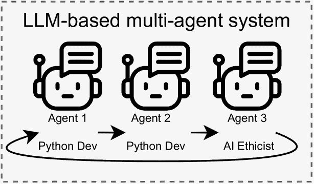
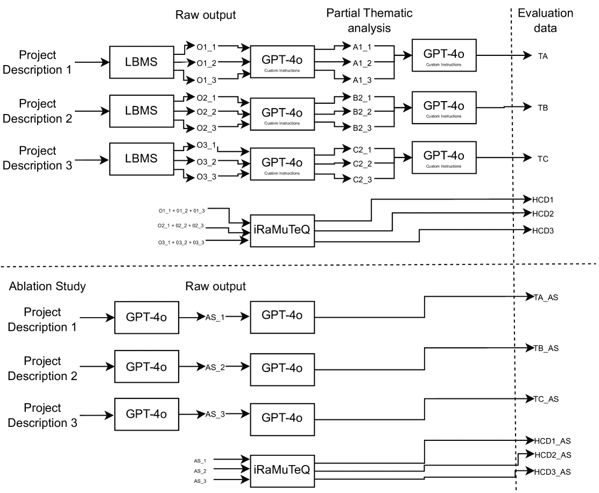
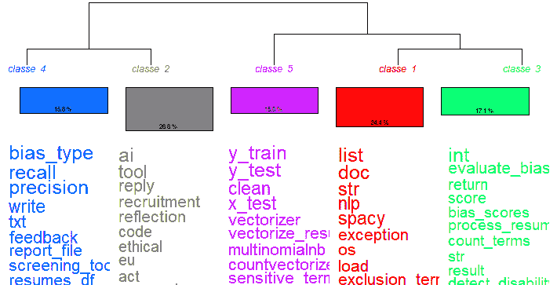
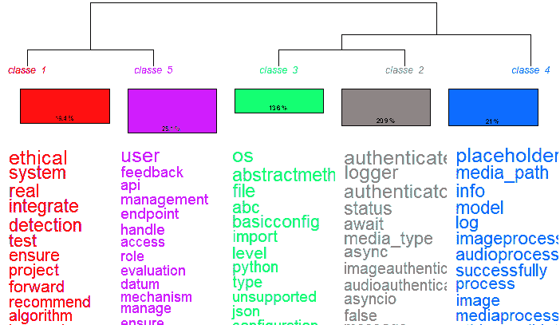
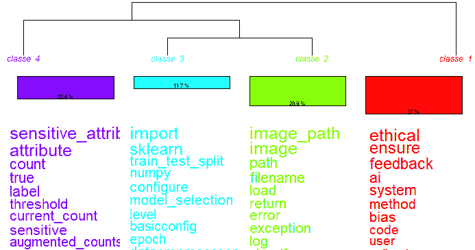

<!--yml

分类：未分类

date: 2025-01-11 11:56:04

-->

# 我们能信任AI代理吗？朝着值得信赖的基于LLM的多代理系统推动AI伦理的实验性研究

> 来源：[https://arxiv.org/html/2411.08881/](https://arxiv.org/html/2411.08881/)

¹¹institutetext: 坦佩雷大学（TAU），芬兰 ²²institutetext: 于韦斯屈莱大学（JYU），芬兰 ³³institutetext: 瓦萨大学（UWASA），芬兰José Antonio Siqueira de Cerqueira 11 [0000-0002-8143-1042](https://orcid.org/0000-0002-8143-1042 "ORCID identifier")    Mamia Agbese 22 [0000-0002-5479-7153](https://orcid.org/0000-0002-5479-7153 "ORCID identifier")    Rebekah Rousi 33 [0000-0001-5771-3528](https://orcid.org/0000-0001-5771-3528 "ORCID identifier")    Nannan Xi 11 [0000-0002-9424-8116](https://orcid.org/0000-0002-9424-8116 "ORCID identifier")    Juho Hamari 11 [0000-0002-6573-588X](https://orcid.org/0000-0002-6573-588X "ORCID identifier")    Pekka Abrahamsson 11 [0000-0002-4360-2226](https://orcid.org/0000-0002-4360-2226 "ORCID identifier")

###### 摘要

基于AI的系统，包括大型语言模型（LLMs），通过支持各种任务影响着数百万人的生活，但也面临着虚假信息、偏见和滥用等问题。随着新技术和相关问题的出现，伦理AI的开发变得至关重要，但关于客观、实用的伦理指导仍然存在争议。本研究探讨了LLMs在开发伦理AI系统中的作用，评估了增强可信度的技术如何影响伦理AI的输出生成。采用设计科学研究（DSR）方法，我们识别了LLM可信度的技术：多代理、明确角色、结构化沟通和多轮辩论。我们设计了多代理原型LLM-BMAS，其中代理们就来自AI事件数据库的现实世界伦理AI问题进行结构化讨论。通过主题分析、层次聚类、消融研究和源代码执行对原型进行性能评估。我们的系统每次运行生成大约2,000行代码，而在消融研究中仅生成80行。讨论揭示了偏见检测、透明度、问责制、用户同意、GDPR合规性、公平性评估和欧盟AI法案合规性等术语，展示了LLM-BMAS在生成全面源代码和文档方面的能力，尤其是在解决常被忽视的伦理AI问题方面。然而，源代码集成和依赖管理中的实际挑战可能会限制从业者平稳采用该系统。本研究旨在为提升LLM的可信度提供启示，帮助从业者开发伦理AI系统。

###### 关键词：

AI伦理 大型语言模型 可信度 AI4SE LLM4SE。

## 1 引言

人工智能（AI）正作为一种变革性力量崭露头角，正在重塑各行各业、经济和日常生活。尽管其发展和应用迅速，但关于其使用的负面报道突显了遵循伦理规范和原则的重要性[[39](https://arxiv.org/html/2411.08881v1#bib.bib39)]。已有一些伦理指南，并提供了许多伦理原则，为开发者和利益相关者提供了高层次和抽象的人工智能伦理指导[[3](https://arxiv.org/html/2411.08881v1#bib.bib3)]。这些是重要的，但开发者缺乏将伦理付诸实践的具体指导[[3](https://arxiv.org/html/2411.08881v1#bib.bib3)]。随着新的基于人工智能的技术的出现，人工智能中的伦理问题也将变得越来越关键，例如最新的突破：大语言模型（LLMs）。

大语言模型（LLMs）正在变得无处不在，对决策过程和人际互动产生重大影响[[20](https://arxiv.org/html/2411.08881v1#bib.bib20), [33](https://arxiv.org/html/2411.08881v1#bib.bib33)]。大语言模型是先进的人工智能算法，能够基于大量训练数据生成、解读和预测文本[[4](https://arxiv.org/html/2411.08881v1#bib.bib4)]。在这些大语言模型中，生成预训练变换器（GPT）类大语言模型，如ChatGPT，展示了前所未有的语言、编程、逻辑、推理等方面的高超能力[[33](https://arxiv.org/html/2411.08881v1#bib.bib33)]。它们在引导复杂对话方面表现出色，并广泛应用于软件工程（SE）等诸多领域——例如用于软件工程的人工智能（AI4SE）[[22](https://arxiv.org/html/2411.08881v1#bib.bib22)]——以及定性研究[[26](https://arxiv.org/html/2411.08881v1#bib.bib26)]。

在AI4SE领域，LLM的能力正在被探索用于软件开发、维护和演化[[28](https://arxiv.org/html/2411.08881v1#bib.bib28)、[30](https://arxiv.org/html/2411.08881v1#bib.bib30)、[26](https://arxiv.org/html/2411.08881v1#bib.bib26)、[22](https://arxiv.org/html/2411.08881v1#bib.bib22)]，即LLM4SE。因此，LLM在软件开发生命周期的各个阶段都有应用，包括需求分析、软件设计、代码实现、测试、重构、缺陷检测和维护[[30](https://arxiv.org/html/2411.08881v1#bib.bib30)]。尽管LLM在软件工程中的应用取得了显著成效，然而据我们所知，目前尚无研究集中在LLM在伦理AI开发中的应用。在定性研究中，LLM也在逐渐获得关注，特别是作为对传统由人工完成的任务的补充，如分析定性数据[[12](https://arxiv.org/html/2411.08881v1#bib.bib12)、[32](https://arxiv.org/html/2411.08881v1#bib.bib32)、[24](https://arxiv.org/html/2411.08881v1#bib.bib24)]。具体而言，在编码过程中——即通过为文本片段或不同数据形式分配代码或标签来组织和解释定性数据——LLM已展现出显著的实用性[[36](https://arxiv.org/html/2411.08881v1#bib.bib36)、[32](https://arxiv.org/html/2411.08881v1#bib.bib32)]。

然而，随着越来越多的从业者依赖LLM来执行任务，许多问题也随之而来，特别是与可信度相关的问题[[22](https://arxiv.org/html/2411.08881v1#bib.bib22)]。一些研究开始关注采用LLM用于软件工程的潜在问题，尤其是在生成语法正确但不具功能性的代码时，这影响了基于LLM的代码生成的可靠性和有效性[[16](https://arxiv.org/html/2411.08881v1#bib.bib16)]。Pearce等人[[29](https://arxiv.org/html/2411.08881v1#bib.bib29)]使用GitHub Copilot生成了1,689个程序，并发现其中40%的程序存在安全漏洞。Liu等人[[21](https://arxiv.org/html/2411.08881v1#bib.bib21)]系统地分析了ChatGPT代码生成的可靠性，识别出质量问题，因为许多生成的程序提供了错误的输出或包含编译或运行时错误。

有效的AI4SE应该是可信的，并与实践者的工作流程协同，否则“这种AI4SE解决方案有可能成为障碍而非促进因素”[[22](https://arxiv.org/html/2411.08881v1#bib.bib22)]。目前，迫切需要进行依赖上下文的实证研究，探讨LLM的可信度如何影响其在软件工程任务中的应用[[22](https://arxiv.org/html/2411.08881v1#bib.bib22)]。此外，关于人工智能伦理的实际操作化研究仍然存在显著的空白，特别是通过LLM的应用。目前为止，还没有研究尝试探索使用LLM开发符合伦理的人工智能系统。

本文旨在通过实验探索LLM在伦理人工智能开发中的可信度。我们的研究问题是：LLM基础的系统的可信度在实现符合伦理的人工智能系统中起到什么程度的作用？为此，采用了设计科学研究（DSR）方法进行实证研究[[13](https://arxiv.org/html/2411.08881v1#bib.bib13)]。我们识别出可以提高LLM可信度的技术，将其应用于开发原型，并在开发符合伦理的基于人工智能的系统的背景下使用，并对结果进行评估。

评估是通过四种不同的方法进行的。首先，LLM执行主题分析，识别并分类数据中的关键主题。其次，我们应用层次聚类树状图对相关文本进行分组，以便比较和支持主题分析。第三，我们进行消融研究。第四，我们运行生成的源代码，以评估其功能性和正确性。

本文对LLM4SE和人工智能伦理领域当前知识状态的贡献有三方面。首先，我们展示了各种技术在增强LLM4SE可信度方面的有效性。其次，我们提供了如何利用这些技术开发符合伦理的基于人工智能的系统的实证见解。最后，通过应用多层次评估方法——包括主题分析、层次聚类和直接源代码执行——我们为评估LLM在软件工程中的可靠性和可信度提供了初步框架。通过这项实验，我们希望能够揭示如何提高LLM的可信度，并帮助实践者开发符合伦理的基于人工智能的系统。

## 2 背景与相关工作

### 2.1 大型语言模型

大型语言模型已经在大量的文本数据上进行了预训练，这些数据通常是从互联网抓取的，使得它们能够学习人类语言中固有的模式和结构 [[14](https://arxiv.org/html/2411.08881v1#bib.bib14)]。大型语言模型的一个关键特征是它们能够生成与上下文相关且看似连贯的文本，涵盖广泛的主题 [[33](https://arxiv.org/html/2411.08881v1#bib.bib33)]。这些模型可以执行语言翻译、文本摘要、问答和创意写作等任务 [[14](https://arxiv.org/html/2411.08881v1#bib.bib14)]。它们通过利用训练过程中获得的大量数据来预测每个上下文中的下一个词或词序列 [[10](https://arxiv.org/html/2411.08881v1#bib.bib10)]。一些著名的大型语言模型包括由OpenAI开发的GPT（生成预训练变换器）模型 [[27](https://arxiv.org/html/2411.08881v1#bib.bib27)]，特别是GPT-3.5和GPT-4。

### 2.2 大型语言模型中的可信度

最近，大型语言模型（LLMs）的进展和应用引发了人们对其伦理影响的关注 [[40](https://arxiv.org/html/2411.08881v1#bib.bib40), [19](https://arxiv.org/html/2411.08881v1#bib.bib19), [35](https://arxiv.org/html/2411.08881v1#bib.bib35), [20](https://arxiv.org/html/2411.08881v1#bib.bib20), [37](https://arxiv.org/html/2411.08881v1#bib.bib37)]。像信息幻觉、偏见和对事实准确性的需求等问题，在决定这些系统在实际应用中可信度时至关重要 [[18](https://arxiv.org/html/2411.08881v1#bib.bib18), [9](https://arxiv.org/html/2411.08881v1#bib.bib9)]。可信度是指可靠、可信赖和值得信任的质量或特征。它包括建立对个人、组织、产品或系统信任的几个关键组成部分 [[37](https://arxiv.org/html/2411.08881v1#bib.bib37)]。在大型语言模型的背景下，可信度主要指它们的可靠性和遵守社会规范的伦理性 [[20](https://arxiv.org/html/2411.08881v1#bib.bib20), [37](https://arxiv.org/html/2411.08881v1#bib.bib37)]。值得注意的是，一些研究已制定了分类法，并附带了评估方法，其中分类法作为评估可信度的衡量标准，而已识别的方面则作为评估参数。在这些努力中，由Liang等人提出的《语言模型的整体评估》（HELM） [[19](https://arxiv.org/html/2411.08881v1#bib.bib19)] 引入了一个包含七个指标的全面分类法——准确性、校准、鲁棒性、公平性、偏见、有毒性和效率——并将该框架应用于分析30个不同的模型。值得注意的是，作者强调采用多指标方法的重要性，这使得可以优先考虑准确性之外的指标。

在一项显著的研究中，部分由NASA、Ebay、Amazon和Google等知名机构资助，并在NeurIPS’23上获得杰出论文奖，王等人[[40](https://arxiv.org/html/2411.08881v1#bib.bib40)]提出了语言模型的八个可信度视角：毒性、刻板印象与偏见、对抗性鲁棒性、超出分布的鲁棒性、隐私、对抗性展示的鲁棒性、机器伦理，最后是公平性。作者指出，他们仅为部分新提出的视角提供了客观定义——由于这些视角具有内在的主观性，例如公平性毒性——将基于人类理解的模型行为主观探索留待未来工作。随着学者们深入研究LLM的可信度特征，如何统一衡量可信度的术语仍不明确。此外，还发现关于构建对齐LLM的框架以及明确的评估指南没有达成共识，这两者仍然是未解决的问题[[20](https://arxiv.org/html/2411.08881v1#bib.bib20)]。

### 2.3 提升LLM4SE可信度的技术

洪等人[[15](https://arxiv.org/html/2411.08881v1#bib.bib15)]提出了MetaGPT，旨在模拟一群代理作为软件公司。值得注意的是该框架使用了专门化角色（产品经理、架构师、项目经理、工程师和QA工程师），为这些代理设计了工作流程（所有代理按顺序工作），并设定了结构化的沟通接口。关于专门化角色的一个有趣之处是，代理能够具备技能，即执行操作，例如能够运行代码和在网上搜索。作者认为，结合上述技术可以显著提高代码生成能力，并且减轻幻觉风险。

鉴全等人[[31](https://arxiv.org/html/2411.08881v1#bib.bib31)]开发了ChatDev，这是一个基于聊天的软件开发框架，利用LLM增强跨角色的沟通与协作，旨在减少诸如错误和缺失依赖项等幻觉风险。然而，它确实会对相同的输入生成不同的输出，并且由于未经过测试的代码，仍存在一定的风险。

与此同时，微软的吴等人[[41](https://arxiv.org/html/2411.08881v1#bib.bib41)]提出了AutoGen，这是一个多代理大型语言模型（LLM）框架，通过在专门化角色（指挥官、编写者、保障者）之间结构化任务来提升编程生产力，这些角色相互作用以完善输出。通过消融实验，他们证明了这种方法在将复杂任务分解为可管理的组件方面显著优于单一代理系统。

上述研究与麻省理工学院（MIT）和微软的联合研究一致，Du 等人所做的研究[[9](https://arxiv.org/html/2411.08881v1#bib.bib9)]。尽管没有直接使用基于大型语言模型（LLM）的多智能体生成代码，作者认为，与未使用多智能体的情况相比，使用多个智能体并通过多轮辩论可以提高生成解决方案的推理能力和事实准确性。因此，多智能体和多轮辩论可以减少幻觉现象，并增强使用LLM时的整体可信度。这些技术能够展现出当单独考虑各个智能体时并不明显的涌现行为[[15](https://arxiv.org/html/2411.08881v1#bib.bib15), [38](https://arxiv.org/html/2411.08881v1#bib.bib38)]。

### 2.4 AI伦理

尽管近期学术界和工业界对此有较大兴趣，AI伦理学仍是一个长期研究领域，最近多起事件引发了公众对其使用和发展的关注[[11](https://arxiv.org/html/2411.08881v1#bib.bib11)]。因此，在过去几年里，来自不同来源（学术界、工业界、民间社会）的多种原则和指南相继出现，旨在框定和定义什么是道德的AI[[17](https://arxiv.org/html/2411.08881v1#bib.bib17)]。Ryan 和 Stahl [[34](https://arxiv.org/html/2411.08881v1#bib.bib34)] 提出了11条与AI相关的伦理原则及问题：1）透明性，2）正义与公平，3）不伤害，4）责任，5）隐私，6）有益性，7）自由与自主，8）信任，9）可持续性，10）尊严，11）团结。这些伦理原则构成了我们分析的基础。

欧洲议会目前正在执行世界上首个关于人工智能的法规[[5](https://arxiv.org/html/2411.08881v1#bib.bib5)]，这一法规突显了一个事实，即现有的大量指南实际上是软法，没有法律约束力，也没有实际后果[[3](https://arxiv.org/html/2411.08881v1#bib.bib3)]。尽管如此，它仍然让人联想到人工智能伦理的抽象原则[[11](https://arxiv.org/html/2411.08881v1#bib.bib11), [17](https://arxiv.org/html/2411.08881v1#bib.bib17), [6](https://arxiv.org/html/2411.08881v1#bib.bib6)]。因此，人工智能系统中伦理原则的操作化障碍源于实践者需要解释和付诸实践这些高度抽象原则的主观性[[3](https://arxiv.org/html/2411.08881v1#bib.bib3)]。尽管其重要性，伦理问题往往是一个事后思考的问题[[39](https://arxiv.org/html/2411.08881v1#bib.bib39)]。与文献中其他已有的努力不同，我们旨在研究基于LLM的多代理系统在人工智能系统开发过程中的应用，特别是从开发过程的第一阶段起就考虑伦理原则的操作化。基于LLM的代理在开发符合伦理的人工智能系统时引入了显著的复杂性和新颖性，使得它们的伦理影响成为一个值得研究的领域。LLMs在产生准确、公正的文本和源代码，同时遵守伦理准则方面面临独特的挑战。它们在多代理交互中的动态且常常不可预测的输出提供了一个有价值的机会，用于研究伦理原则在现实环境中的应用，尽管目前关于通过LLM代理操作化人工智能伦理的文献仍然匮乏。

### 2.5 LLMs用于定性分析

定性分析是LLMs可以应用的另一个具有发展潜力的领域[[7](https://arxiv.org/html/2411.08881v1#bib.bib7), [8](https://arxiv.org/html/2411.08881v1#bib.bib8), [24](https://arxiv.org/html/2411.08881v1#bib.bib24)]，尤其是在软件工程领域的定性研究中[[1](https://arxiv.org/html/2411.08881v1#bib.bib1), [32](https://arxiv.org/html/2411.08881v1#bib.bib32)]。主题分析对人类来说是一项劳动密集型且耗时的工作，容易出错并产生偏见[[2](https://arxiv.org/html/2411.08881v1#bib.bib2)]。因此，LLMs为提高这种方法的准确性和效率提供了机会。在主题分析中，编码人员需要多轮讨论以达成共识，并解决数据中的模糊性，从而深入理解数据[[2](https://arxiv.org/html/2411.08881v1#bib.bib2)]。

因此，LLM 可以解决传统定性研究中的挑战，如数据分析的时间密集型特点、有限的普遍性、一致性问题和个人主观偏见 [[1](https://arxiv.org/html/2411.08881v1#bib.bib1), [12](https://arxiv.org/html/2411.08881v1#bib.bib12)]。Hamilton 等人 [[12](https://arxiv.org/html/2411.08881v1#bib.bib12)] 认为，人与 LLM 都能从访谈数据中识别出独特且重叠的主题，表明它们有可能在定性数据中识别模式和主题。

## 3 方法论

在这项研究中，我们采用了经过改编的 DSR [[13](https://arxiv.org/html/2411.08881v1#bib.bib13)] 方法，通过四个阶段来探索和提升 LLM 在软件工程任务中的可信度：1) 探索，2) 原型设计，3) 评估，和 4) 结果沟通。第四阶段将在第[4](https://arxiv.org/html/2411.08881v1#S4 "4 Results and Discussion ‣ Can We Trust AI Agents? An Experimental Study Towards Trustworthy LLM-Based Multi-Agent Systems for AI Ethics")节中探讨。

### 3.1 探索

最初，我们探索了现有文献，发现了在 AI4SE 中提升可信度的需求和动机，这些内容在第[2.2](https://arxiv.org/html/2411.08881v1#S2.SS2 "2.2 Trustworthiness in Large Language Models ‣ 2 Background and Related Work ‣ Can We Trust AI Agents? An Experimental Study Towards Trustworthy LLM-Based Multi-Agent Systems for AI Ethics")节中有详细介绍，尤其是在 David Lo [[22](https://arxiv.org/html/2411.08881v1#bib.bib22)] 的研究中。进一步地，我们识别出最近在文献中提出的一些技术，这些技术旨在提升 AI 系统（特别是在软件工程背景下的 AI4SE）的可信度。总的来说，在第[2.3](https://arxiv.org/html/2411.08881v1#S2.SS3 "2.3 Techniques to improve trustworthiness in LLM4SE ‣ 2 Background and Related Work ‣ Can We Trust AI Agents? An Experimental Study Towards Trustworthy LLM-Based Multi-Agent Systems for AI Ethics")节中描述的技术提供了一种基于 LLM 的多代理系统方法，其特点包括：a) 代理的组合，b) 不同的角色（专业化代理），c) 结构化对话，d) 多轮辩论。

这些技术随后被合成并整合到一个原型系统的开发中，该系统旨在辅助软件工程任务，特别是在创建符合伦理的基于 AI 的系统方面。

### 3.2 原型：LLM-BMAS

根据我们的发现，我们设计了一个原型，它是一个基于LLM的多智能体系统（以下简称LLM-BMAS）。LLM-BMAS是一个Python脚本，包含三个代理，它们通过OpenAI API使用GPT-4o-mini模型。每个代理都有不同的专业角色，且他们的对话结构相同。具体来说，系统中有两名资深Python开发人员和一名AI伦理学家。作为一个团队，他们共同接收一个输入——项目描述（PD），并通过五轮讨论共同完成项目的实现。

分配给他们的对话模式如下：代理1应开始对话；代理2接收此内容作为输入进行处理；类似地，代理3接收附加的两轮对话继续工作。这定义了一轮对话。换句话说，对话历史始终被附加，并作为输入传递给下一个代理，直到达到预定的轮数。图[1](https://arxiv.org/html/2411.08881v1#S3.F1 "Figure 1 ‣ 3.2 Prototype: LLM-BMAS ‣ 3 Methodology ‣ Can We Trust AI Agents? An Experimental Study Towards Trustworthy LLM-Based Multi-Agent Systems for AI Ethics")展示了我们原型的概述。

图1：原型概述

这些代理进行结构化对话，共五轮，讨论并协作完成项目。然而，由于大型语言模型（LLM）的特性，每次运行都会为相同的输入生成不同的软件[[31](https://arxiv.org/html/2411.08881v1#bib.bib31), [22](https://arxiv.org/html/2411.08881v1#bib.bib22)]，也就是说，使用相同的系统配置生成数据，每次调用都会产生不同的辩论和源代码，并且每次主题分析结果也会不同。因此，为了丰富我们的分析，我们进行了三次不同的系统运行，以获得不同的输出。

### 3.3 评估

为了评估原型的有效性，我们采用了多维度的评估策略。首先，我们使用大型语言模型（LLM）进行主题分析，自动识别并分类生成输出中的关键主题。这为我们提供了模型在伦理和功能要求方面的一致性洞察。其次，我们使用层次聚类方法组织并分组相关的文本片段，通过揭示数据中的潜在模式和关系，支持并验证了主题分析的结果。接着，我们比较和分析了每个项目描述的主题分析结果和层次聚类结果。最后，我们进行了类似步骤的消融研究。图[2](https://arxiv.org/html/2411.08881v1#S3.F2 "Figure 2 ‣ 3.3 Evaluation ‣ 3 Methodology ‣ Can We Trust AI Agents? An Experimental Study Towards Trustworthy LLM-Based Multi-Agent Systems for AI Ethics")展示了我们设计的评估方法的可视化。

消融研究有助于验证研究结果，具体是通过去除组件来评估AI系统的性能[[23](https://arxiv.org/html/2411.08881v1#bib.bib23)，[25](https://arxiv.org/html/2411.08881v1#bib.bib25)]。在此案例中，我们将去除LLM-BMAS原型，仅使用与OpenAI ChatGPT用户界面的交互作为基准。

图2：评估概览

如前所述，原型的每次运行都会为相同的输入产生不同的结果，因此，我们运行系统三次以获得不同的输出（生成原始输出，例如，$O1_{1}$，$O1_{2}$，$O1_{3}$对应第一个项目描述）。

然后，通过使用具有特定自定义指令的ChatGPT GPT-4o作为定性分析师，对收集的数据进行分析。每个原始输出会生成一个部分主题分析（例如，$B2_{1}$，$B2_{2}$，$B2_{3}$对应第二个项目描述）。因此，每个项目描述的部分主题分析通过使用相同的GPT-4o进行汇总，最终得到$TA$、$TB$和$TC$。

为了提供层次聚类，[iRaMuTeQ](http://www.iramuteq.org/)软件被用来运行在R之上。每个层次聚类的生成输入是将每个项目描述的原始输出进行附加（例如，$O3_{1}$，$O3_{2}$，$O3_{3}$共同生成第三个项目描述的层次聚类）。

为了理解LLM-BMAS方法的优点，还进行了消融研究，在该研究中，项目描述被输入到常规的ChatGPT-4o中，使用OpenAI用户界面，而不使用任何发现的技术。例如，对于项目描述1，我们只有一个输出（$AS_{1}$），该输出作为输入创建其主题分析，也使用ChatGPT-4o，并进行iRaMuTeQ分析，分别得到$TA_{A}S$和$HCD_{A}S$。

最后，我们通过运行LLM生成的源代码进行了原型的实际评估。此步骤旨在评估系统在真实软件开发场景中的实际效用。我们的方法为评估LLM在软件工程领域的可信度和可靠性提供了初步框架。

接下来，展示了不同主题分析和层次聚类之间的比较结果与讨论，以及消融研究和源代码执行的结果。

## 4 结果与讨论

在本节中，我们为每个项目描述提供其相应的结果与讨论，最后呈现一个概述性的讨论。所有项目描述均来源于[https://incidentdatabase.ai/](https://incidentdatabase.ai/)上可获得的真实AI事件。本实验中使用的所有数据，包括代理提示、定制指令和进行的主题分析，都可以在[此处](https://zenodo.org/records/13980076)找到。

### 4.1 项目描述 1

第一个项目描述来源于[这个事件](https://incidentdatabase.ai/cite/37#r620)：

<svg class="ltx_picture" height="106.28" id="S4.SS1.p2.pic1" overflow="visible" version="1.1" width="600"><g fill="#000000" stroke="#000000" stroke-width="0.4pt" transform="translate(0,106.28) matrix(1 0 0 -1 0 0)"><g fill-opacity="1.0" transform="matrix(1.0 0.0 0.0 1.0 21.65 13.78)"><foreignobject color="#000000" height="78.72" overflow="visible" transform="matrix(1 0 0 -1 0 16.6)" width="556.69">Develop an AI-powered recruitment tool designed to screen resumes impartially, complying with the EU AI Act. The project aims to eliminate biases related to gender and language, ensuring fair evaluation of all applicants. The AI Ethics Specialist will guide the team in addressing ethical concerns and risk levels. The senior Python developers will utilize NLP to process resumes, referencing relevant EU AI Act guidelines.</foreignobject></g></g></svg>

值得强调的是，在项目描述中需要引用欧盟AI法案。然而，使用的是截至2023年10月训练的GPT-4o-mini，该法案尚未发布，仅在2024年6月才发布。在未来的工作中，我们将引入此文档作为一个向量，以便嵌入并由开源LLM访问。此外，根据David Lo [[22](https://arxiv.org/html/2411.08881v1#bib.bib22)]的说法，确保AI4SE解决方案遵守立法是增强AI4SE可信度的一种方式，因为从业者需要避免与法律发生冲突。

获取的原始数据从1712行到1976行不等，包含讨论和源代码。表[1](https://arxiv.org/html/2411.08881v1#S4.T1 "表1 ‣ 4.1 项目描述1 ‣ 4 结果与讨论 ‣ 我们能相信AI代理吗？面向可信LLM基础的多代理系统的伦理实验研究")中的主题分析是通过合并来自每个输出的三个主题分析结果得到的。在图[3](https://arxiv.org/html/2411.08881v1#S4.F3 "图3 ‣ 4.1 项目描述1 ‣ 4 结果与讨论 ‣ 我们能相信AI代理吗？面向可信LLM基础的多代理系统的伦理实验研究")中，设计了5个类别，然而，类别1、3、4和5与技术实现相关。尽管如此，可以理解的是，主题1、2和3与第二类密切相关，其中涉及伦理、欧盟及相关法案。此外，与类别3相关的函数，如evaluate_bias和bias_score，也有所涉及。

在所有案例中，生成的源代码分散在文本中。如前所述，这些源代码可能长达近2000行。这使得源代码难以区分，有时需要将来自不同对话轮次的片段拼接在一起。在尝试运行O1_1中可用的源代码时，发现需要手动安装一些软件包。此外，使用了已废弃的包：'sklearn' PyPI包已废弃，应该使用'scikit-learn'。这给从业者带来了额外的工作量，影响了他们的工作流程。

表 1：主题分析 PD 1

| 主题 | 代码 |
| --- | --- |
| 伦理和监管AI发展 | 遵守欧盟AI法案，AI开发中的伦理考虑，偏见消除策略 |
| 公平和透明的AI实施 | AI工具的技术开发，偏差检测机制的集成，确保AI操作的公平性 |
| 迭代模型训练与以用户为中心的验证 | 基于场景的测试，持续的模型优化，融入可操作的用户反馈 |
| AI过程中的透明度 | AI过程文档化，清晰的更新和改进沟通，利益相关者参与与透明度 |

图3：层次聚类树状图 - PD1

关于消融研究，只获得了78行文本，并未生成任何代码。另一方面，从主题分析中提出了三个主题：伦理AI开发、技术实施与公平性、合规性。由于可用文本数据量较小，无法为任何消融研究生成层次聚类。两项研究之间的质量差异很大。

### 4.2 项目描述 2

第二个项目描述来源于[此事件](https://incidentdatabase.ai/cite/635/#r3637)：

<svg class="ltx_picture" height="106.28" id="S4.SS2.p2.pic1" overflow="visible" version="1.1" width="600"><g fill="#000000" stroke="#000000" stroke-width="0.4pt" transform="translate(0,106.28) matrix(1 0 0 -1 0 0)"><g fill-opacity="1.0" transform="matrix(1.0 0.0 0.0 1.0 21.65 13.78)"><foreignobject color="#000000" height="78.72" overflow="visible" transform="matrix(1 0 0 -1 0 16.6)" width="556.69">Create a deepfake content authentication system that uses AI to verify the authenticity of video, image and audio content. This system will distinguish between real and manipulated media, reducing the spread of harmful deepfake content. The AI Ethics Specialist will ensure the tool adheres to ethical standards. The senior Python developers will enhance the system’s detection capabilities.</foreignobject></g></g></svg>

在本项目描述中，并未直接提及欧盟AI法案。然而，值得指出的是，它在第三代理论师（AI Ethicist）的提示中有所涉及。获得的原始数据从1414行到2178行文本数据不等。此处的讨论进展方式与前述内容类似。

在表格[2](https://arxiv.org/html/2411.08881v1#S4.T2 "Table 2 ‣ 4.2 Project Description 2 ‣ 4 Results and Discussion ‣ Can We Trust AI Agents? An Experimental Study Towards Trustworthy LLM-Based Multi-Agent Systems for AI Ethics")中的主题分析与图[4](https://arxiv.org/html/2411.08881v1#S4.F4 "Figure 4 ‣ 4.2 Project Description 2 ‣ 4 Results and Discussion ‣ Can We Trust AI Agents? An Experimental Study Towards Trustworthy LLM-Based Multi-Agent Systems for AI Ethics")中生成的层次聚类之间存在关联，可以突出显示与主题2“伦理合规与AI责任”相关的类别1。此外，类别2与“安全与协作”主题密切相关，涉及如身份验证和日志记录等词汇。

与前述项目描述类似，消融研究中未产生源代码。该研究产生了78行文本，并提出了诸如“技术框架”、“伦理与合规”、“用户体验与支持”、“战略目标”等主题。与提议的原型进行的研究相比，消融研究提供的文本较为通用，只能作为学习材料。

关于生成的源代码，在前述 PD 中开发者遇到的开销基础上，在 O2_2 中，我们的原型创建了模块，例如从 `your_module` 导入 `VideoAuthenticator`、`ImageAuthenticator`、`AudioAuthenticator`。同样，这对实践者来说是个问题，因为他们需要逐一查看文本并手动查找需要复制粘贴的源代码，测试它，安装依赖项并管理模块。

表 2：主题分析 PD 2

| 主题 | 代码 |
| --- | --- |
| 系统架构与设计 | 模块化与可扩展性，AI 集成与媒体处理，基于角色的访问控制（RBAC） |
| 道德合规与 AI 责任 | AI 道德与偏见检测，透明度与问责制，用户同意与 GDPR 合规 |
| 安全与协作 | 用户身份验证与数据安全，角色管理与访问控制，开发者与伦理专家之间的协作 |
| 系统可靠性与持续改进 | 错误处理与日志记录，反馈机制，测试与维护 |

图 4：层次聚类树状图 - PD2

### 4.3 项目描述 3

第三个项目描述来源于 [这一事件](https://incidentdatabase.ai/cite/16#r88)：

<svg class="ltx_picture" height="106.28" id="S4.SS3.p2.pic1" overflow="visible" version="1.1" width="600"><g fill="#000000" stroke="#000000" stroke-width="0.4pt" transform="translate(0,106.28) matrix(1 0 0 -1 0 0)"><g fill-opacity="1.0" transform="matrix(1.0 0.0 0.0 1.0 21.65 13.78)"><foreignobject color="#000000" height="78.72" overflow="visible" transform="matrix(1 0 0 -1 0 16.6)" width="556.69">Develop an AI-based image processing and classification system that complies with the EU AI Act, ensuring accurate and respectful labelling of images. The system must avoid racial biases and harmful misclassifications. The AI Ethics Specialist will focus on identifying and mitigating psychological harm and harm to social systems. The senior Python developers will implement and refine image classification algorithms.</foreignobject></g></g></svg>

该讨论与之前的讨论类似。获得的原始数据从 1676 行到 2122 行文本数据不等。表 [3](https://arxiv.org/html/2411.08881v1#S4.T3 "表 3 ‣ 4.3 项目描述 3 ‣ 4 结果与讨论 ‣ 我们能信任 AI 代理吗？一个关于可信 LLM 基于多代理系统的实验研究，聚焦 AI 道德") 中的主题分析围绕着道德 AI 开发与合规性以及技术实现、优化与稳健性展开。第 1 类与第 1 主题相关，然而，其他类别包含与技术实现相关的词汇，如 `image_path`、`import`、`sklearn`、`sensitive_attribute`，这些都与第 2 主题相关。值得注意的是，`sklearn` 出现在图 [5](https://arxiv.org/html/2411.08881v1#S4.F5 "图 5 ‣ 4.3 项目描述 3 ‣ 4 结果与讨论 ‣ 我们能信任 AI 代理吗？一个关于可信 LLM 基于多代理系统的实验研究，聚焦 AI 道德") 中的一个类中，尽管它已被确认不再更新。这可以突出一个事实，自从它在 2023 年 10 月的最后一次更新以来，到本研究撰写日期 2024 年 8 月，AI4SE 很难跟上技术的新进展，同时强化了一个单一包用于不同任务的使用。

表 3：主题分析 PD 3

| 主题 | 代码 |
| --- | --- |
| 道德 AI 开发与合规性 | 道德 AI、合规性、偏见检测与缓解、公平性评估、透明度与问责制 |
| 技术实现、优化与稳健性 | 数据管理、模型设计与实现、长期监控与持续改进、错误处理与模块化设计 |
| 利益相关者参与与持续改进 | 利益相关者参与、用户反馈整合、协作、运营透明度 |
| 数据驱动评估 | 统计分析、置信度分数、类别分析 |

图 5：层次聚类树状图 - PD3

## 5 影响有效性的威胁

本研究中出现了不同的限制因素，包括对专有LLM（大规模语言模型）的依赖，这些模型可能会发生不可预测的变化。由于LLM的非确定性输出，可重复性成为一个问题。由于我们的方法主要依赖LLM来评估原型的输出，因此存在循环推理的潜在风险，即一个AI验证另一个AI的可信度。这可能引入偏见，因为两个系统可能共享一些未被发现的潜在缺陷或限制。此外，主题分析和层次聚类虽然在组织和分析文本数据方面很有用，但在这里它们都是自动化过程，缺乏人工干预。这引发了对已识别主题的深度和可解释性的担忧。如果没有伦理学家或软件工程从业者的人工输入，分析可能忽视一些只有人类才能发现的细微或特定于情境的问题，尤其是在伦理问题和软件工程工作流程中的实际挑战方面。为了缓解这一问题，未来的工作应采用“人类在回路”方法，让人类利益相关者能够审查并验证AI系统生成的结果，提供人工智能驱动的方法可能遗漏的洞察和修正。此外，源代码的评估仅在表面层次进行，重点是确保源代码执行无误。然而，并未进行深入分析以评估输出是否符合AI伦理原则。未来的工作应更严格地评估生成的源代码的伦理影响，确保其不仅功能正常，而且在伦理上是合理的。

## 6 最终备注

本研究旨在探索AI4SE中的可信度，特别是在软件工程中使用LLM（LLM4SE）的可信度，背景是符合伦理的AI系统开发。根据我们所知，文献中没有研究使用LLM探讨实际AI伦理问题。通过使用设计科学研究方法，我们确定了提高AI4SE可信度的动机和不同的技术，提出了一个原型——基于LLM的多智能体系统（LLM-BMAS）——并通过主题分析、层次聚类、消融研究和源代码执行对其进行了评估。为了提高可信度，所发现的技术是智能体的组合、不同角色（专业化智能体）、结构化对话和多轮辩论。该原型使用来自真实AI事件的三个不同项目描述进行了测试，这些事件来自AI事件数据库。对于每个项目描述，LLM-BMAS生成了大约2000行文本，包括源代码和文档，以实现基于AI的系统。

通过主题分析生成的部分代码包括：偏见检测、透明性和问责制、用户同意和GDPR合规性、公平性评估和遵守欧盟AI法案。关于层次聚类，描绘AI伦理的一些词汇包括：伦理、偏见、偏见类型、评估偏见、偏见得分。这突显了LLM-BMAS在生成与AI伦理法律方面相关的输出的能力（即GDPR和欧盟AI法案），除了理论和实践伦理问题外，还包括文档和源代码中的问题，通过主题分析中的代码（例如，透明性、公平性、偏见）和在层次聚类中检测到的功能（例如，评估偏见）。关于消融研究，对于每个项目描述，它生成了约80行没有源代码的输出，涉及的AI伦理问题大大减少。因此，这项实验强调了在LLM中采用可信度改进技术对开发更加符合伦理的基于AI的系统的潜力。

然而，仍然存在一些问题，阻碍了从业人员的协同作用[[22](https://arxiv.org/html/2411.08881v1#bib.bib22)]。值得强调的是缺乏实用性，例如从文本中提取源代码——当涉及模块时更为困难——以及安装软件包和处理与LLM训练日期相关的弃用依赖关系。虽然可以在使用LLM4SE时提高可信度和质量，但仍有未解决的问题需要处理，以使其对从业人员更加实用。

尽管本实验仅依赖于 Open AI LLM 的内部知识进行，但需要注意的是，为 AI 伦理代理提供立法（例如，GDPR 和欧盟 AI 法案）或 AI 伦理方法或指南（例如，ECCOLA [[39](https://arxiv.org/html/2411.08881v1#bib.bib39)]）是我们计划在未来开展的工作。此外，还需要对原型提供的源代码进行深入分析，以评估其伦理对齐。本研究希望进一步加深对提高 LLM 可信度在开发基于伦理的 AI 系统中的益处的理解。我们计划在后续研究中开源原型源代码。

{credits}

#### 6.0.1 致谢

本研究得到了简和阿托斯·厄尔科基金会通过人类与机器融合项目的资助，资助编号为220025。

#### 6.0.2 \discintname

作者声明与本文内容相关的没有任何竞争利益。

## References

+   [1] Bano, M., Hoda, R., Zowghi, D., Treude, C.: 软件工程中定性研究的大型语言模型：探索机遇与挑战。自动化软件工程 31(1)，8 (2024)。https://doi.org/10.1007/S10515-023-00407-8

+   [2] Braun, V., Clarke, V.: 在心理学中使用主题分析。心理学中的定性研究 3(2)，77-101 (2006年1月)

+   [3] de Cerqueira, J.A.S., Azevedo, A.P.D., Leão, H.A.T., Canedo, E.D.: 人工智能伦理要求引导 - RE4AI 伦理指南。在：第55届夏威夷国际系统科学会议，HICSS 2022，虚拟会议/美国夏威夷毛伊岛，2022年1月4日至7日。第1-10页。ScholarSpace（2022），[http://hdl.handle.net/10125/80015](http://hdl.handle.net/10125/80015)

+   [4] Chang, Y., Wang, X., Wang, J., Wu, Y., Zhu, K., Chen, H., Yang, L., Yi, X., Wang, C., Wang, Y., 等：大型语言模型评估综述。arXiv 预印本 arXiv:2307.03109 (2023)

+   [5] Commission, E.: 欧盟 AI 法案：首个关于人工智能的法规。[https://www.europarl.europa.eu/topics/en/article/20230601STO93804/eu-ai-act-first-regulation-on-artificial-intelligence](https://www.europarl.europa.eu/topics/en/article/20230601STO93804/eu-ai-act-first-regulation-on-artificial-intelligence)（2023），[访问日期：2024年4月1日]

+   [6] Corrêa, N.K., Galvão, C., Santos, J.W., Pino, C.D., Pinto, E.P., Barbosa, C., Massmann, D., Mambrini, R., Galvão, L., Terem, E., de Oliveira, N.: 全球人工智能伦理：对200项人工智能治理指南和建议的回顾。模式 4(10)，100857 (2023)。https://doi.org/10.1016/J.PATTER.2023.100857

+   [7] Dai, S., Xiong, A., Ku, L.: LLM-in-the-loop：利用大型语言模型进行主题分析。在：Bouamor, H., Pino, J., Bali, K.（编辑）《计算语言学协会发现：EMNLP 2023》，新加坡，2023年12月6日至10日。第9993-10001页。计算语言学协会（2023）。https://doi.org/10.18653/V1/2023.FINDINGS-EMNLP.669

+   [8] Drápal，J.，Westermann，H.，Šavelka，J.：使用大语言模型支持经验法学研究中的主题分析。ArXiv abs/2310.18729（2023）

+   [9] 杜宇，李松，Torralba，A.，Tenenbaum，J.B.，Mordatch，I.：通过多智能体辩论提高语言模型的事实性和推理能力。arXiv 预印本 arXiv:2305.14325（2023）

+   [10] Floridi，L.，Chiriatti，M.：GPT-3：其本质、范围、限制和后果。Minds Mach. 30(4)，681–694（2020）。https://doi.org/10.1007/S11023-020-09548-1

+   [11] Halme，E.，Jantunen，M.，Vakkuri，V.，Kemell，K.，Abrahamsson，P.：使伦理变得可实践：用户故事作为在软件工程中实施伦理考量的一种方式。信息与软件技术 167，107379（2024）。https://doi.org/10.1016/J.INFSOF.2023.107379

+   [12] Hamilton，L.，Elliott，D.，Quick，A.，Smith，S.，Choplin，V.：探索 AI 在定性分析中的应用：关于保障收入数据的比较研究。国际定性方法期刊 22（2023）。https://doi.org/10.1177/16094069231201504

+   [13] Hevner，A.R.，March，S.T.，Park，J.，Ram，S.：信息系统研究中的设计科学。MIS Q. 28(1)，75–105（2004）

+   [14] Hoffmann，J.，Borgeaud，S.，Mensch，A.，Buchatskaya，E.，蔡婷，Rutherford，E.，Casas，D.d.L.，Hendricks，L.A.，Welbl，J.，Clark，A. 等：训练计算最优的大语言模型。arXiv 预印本 arXiv:2203.15556（2022）

+   [15] 洪世杰，郑晓，陈金鹏，程永，张成，王志，邱思凯，林志浩，周磊，冉辰，肖亮，吴晨：MetaGPT：用于多智能体协作框架的元编程。ArXiv abs/2308.00352（2023）

+   [16] 侯旭，赵毅，刘扬，杨智，王凯，李琳，罗旭，Lo，D.，Grundy，J.，王辉：大语言模型在软件工程中的应用：一项系统的文献综述。ACM 软件工程与方法学事务（2023）。https://doi.org/10.1145/3695988

+   [17] Jobin，A.，Ienca，M.，Vayena，E.：全球 AI 伦理指南的现状。自然机器智能 1(9)，389–399（2019）。https://doi.org/10.1038/S42256-019-0088-2

+   [18] Lemon，O.：自然语言中多智能体沟通的对话式 AI：互动实验室的研究方向。AI 通讯 35(4)，295–308（2022）。https://doi.org/10.3233/aic-220147

+   [19] 梁鹏，Bommasani，R.，李天，Tsipras，D.，Soylu，D.，Yasunaga，M.，张洋，Narayanan，D.，吴怡，Kumar，A. 等：语言模型的整体评估。arXiv 预印本 arXiv:2211.09110（2023）

+   [20] 刘扬，姚远，Ton，J.F.，张旭，程锐，Klochkov，Y.，Taufiq，M.F.，李浩：可信的大型语言模型：评估大型语言模型对齐性的调查与指南。arXiv 预印本 arXiv:2308.05374（2023）

+   [21] 刘扬，乐聪，Widyasari，R.，Tantithamthavorn，C.，李琳，Le，X.D.，Lo，D.：优化 ChatGPT 生成的代码：特征化和缓解代码质量问题。ACM 软件工程与方法学事务 33(5)，116:1–116:26（2024）。https://doi.org/10.1145/3643674

+   [22] 罗，D.：面向软件工程的可信赖与协同人工智能：愿景与路线图。在IEEE/ACM国际软件工程大会：软件工程的未来，ICSE-FoSE 2023，澳大利亚墨尔本，2023年5月14日至20日。第69–85页。IEEE（2023年）。https://doi.org/10.1109/ICSE-FOSE59343.2023.00010

+   [23] 梅耶斯，R.，卢，M.，德·普伊索，C.W.，梅森，T.：人工神经网络中的消融研究。arXiv预印本 arXiv:1901.08644（2019年）

+   [24] 摩根，D.L.：探索人工智能在定性数据分析中的应用：以chatgpt为例。《国际定性方法期刊》22，16094069231211248（2023年）。https://doi.org/10.1177/160940692312112

+   [25] 诺厄尔，A.：语音理解系统教程。语音识别，第4–54页（1975年）

+   [26] 倪博，布厄勒，M.J.：Mechagents：大型语言模型多代理协作可解决力学问题，生成新数据并整合知识。《极限力学快报》67，102131（2024年）。https://doi.org/10.1016/j.eml.2024.102131

+   [27] OpenAI：Chatgpt：优化对话的语言模型。[https://openai.com/chatgpt](https://openai.com/chatgpt)（2023），[访问日期：2024年2月18日]

+   [28] 奥兹卡亚，I.：大型语言模型在软件工程任务中的应用：机遇、风险与影响。《IEEE软件》40(3)，4–8（2023年）。https://doi.org/10.1109/MS.2023.3248401

+   [29] 皮尔斯，H.，艾哈迈德，B.，谭，B.，多兰-加维特，B.，卡里，R.：在键盘前打瞌睡？评估GitHub Copilot代码贡献的安全性。在第43届IEEE安全与隐私研讨会。第754–768页。IEEE（2022年）。https://doi.org/10.1109/SP46214.2022.9833571

+   [30] 彭旭：智能时代的软件开发：以正确的方法拥抱大型语言模型。《信息技术与电子工程前沿》24(11)，1513–1519（2023）。https://doi.org/10.1631/FITEE.2300537

+   [31] 钱冲，曾翔，杨超，陈伟，苏阳，徐俊，刘志，孙梅：用于软件开发的交流代理。arXiv预印本 arXiv:2307.07924（2023年）

+   [32] 拉希德，Z.，瓦西姆，M.，艾哈迈德，A.，凯梅尔，K.K.，肖峰，W.，杜，A.N.，阿布拉罕松，P.：大型语言模型能作为数据分析师吗？一种多代理协助的定性数据分析方法。arXiv预印本 arXiv:2402.01386（2024年）

+   [33] 雷，P.P.：Chatgpt：关于背景、应用、主要挑战、偏见、伦理、局限性和未来范围的综合评述。《物联网与网络物理系统》3，121–154（2023年）。https://doi.org/10.1016/j.iotcps.2023.04.003

+   [34] 赖恩，M.，斯塔尔，B.C.：人工智能伦理指南针对开发者和用户：阐明其内容和规范性影响。《信息、通信与社会伦理期刊》19(1)，61–86（2021）。https://doi.org/10.1108/JICES-12-2019-0138

+   [35] Shen, T., Jin, R., Huang, Y., Liu, C., Dong, W., Guo, Z., Wu, X., Liu, Y., Xiong, D.：大规模语言模型对齐：一项调查。arXiv预印本 arXiv:2309.15025 (2023)

+   [36] Siiman, L.A., Rannastu-Avalos, M., Pöysä-Tarhonen, J., Häkkinen, P., Pedaste, M.：AI辅助定性数据分析的机遇与挑战：来自协作问题解决对话数据的一个例子。在：国际创新技术与学习大会。卷 14099，第87–96页。Springer (2023)。https://doi.org/10.1007/978-3-031-40113-8_9

+   [37] Sun, L., Huang, Y., Wang, H., Wu, S., Zhang, Q., Gao, C., Huang, Y., Lyu, W., Zhang, Y., Li, X., 等：Trustllm：大规模语言模型中的可信度。arXiv预印本 arXiv:2401.05561 (2024)

+   [38] Talebirad, Y., Nadiri, A.：多智能体协作：利用智能LLM代理的力量。arXiv预印本 arXiv:2306.03314 (2023)

+   [39] Vakkuri, V., Kemell, K., Jantunen, M., Halme, E., Abrahamsson, P.：ECCOLA - 实施符合伦理的AI系统方法。J. Syst. Softw. 182, 111067 (2021)。https://doi.org/10.1016/J.JSS.2021.111067

+   [40] Wang, B., Chen, W., Pei, H., Xie, C., Kang, M., Zhang, C., Xu, C., Xiong, Z., Dutta, R., Schaeffer, R., Truong, S.T., Arora, S., Mazeika, M., Hendrycks, D., Lin, Z., Cheng, Y., Koyejo, S., Song, D., Li, B.：解码信任：GPT模型中可信度的全面评估。在：神经信息处理系统进展 36：2023年神经信息处理系统年会，NeurIPS 2023 (2023)

+   [41] Wu, Q., Bansal, G., Zhang, J., Wu, Y., Zhang, S., Zhu, E., Li, B., Jiang, L., Zhang, X., Wang, C.：Autogen：通过多智能体对话框架实现下一代LLM应用。arXiv预印本 arXiv:2308.08155 (2023)
