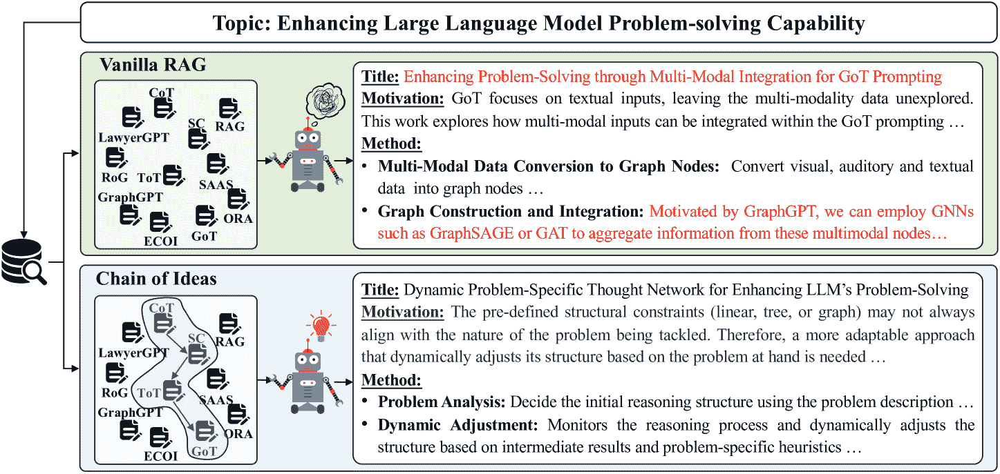
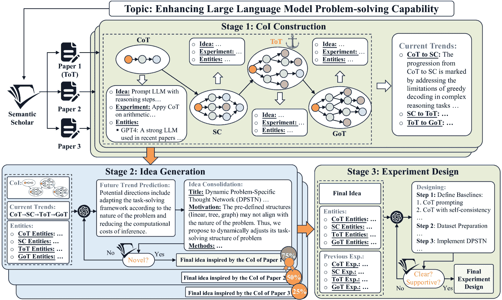
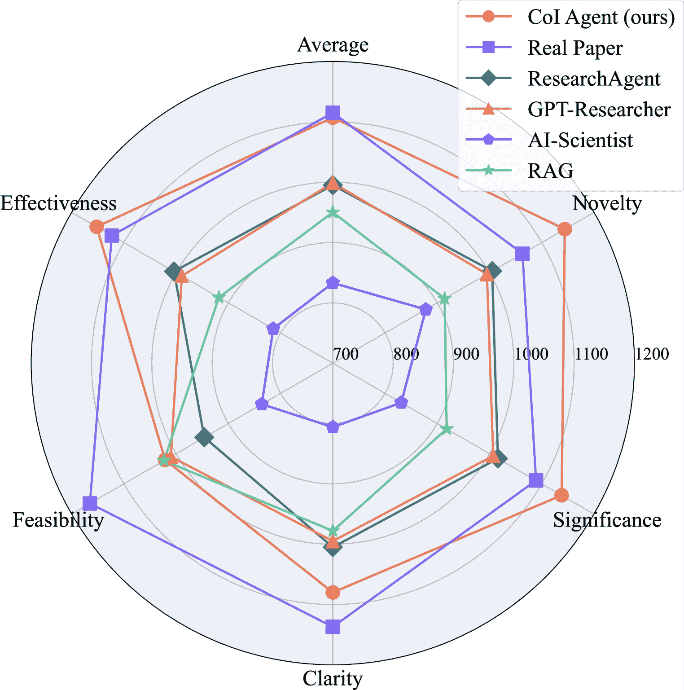
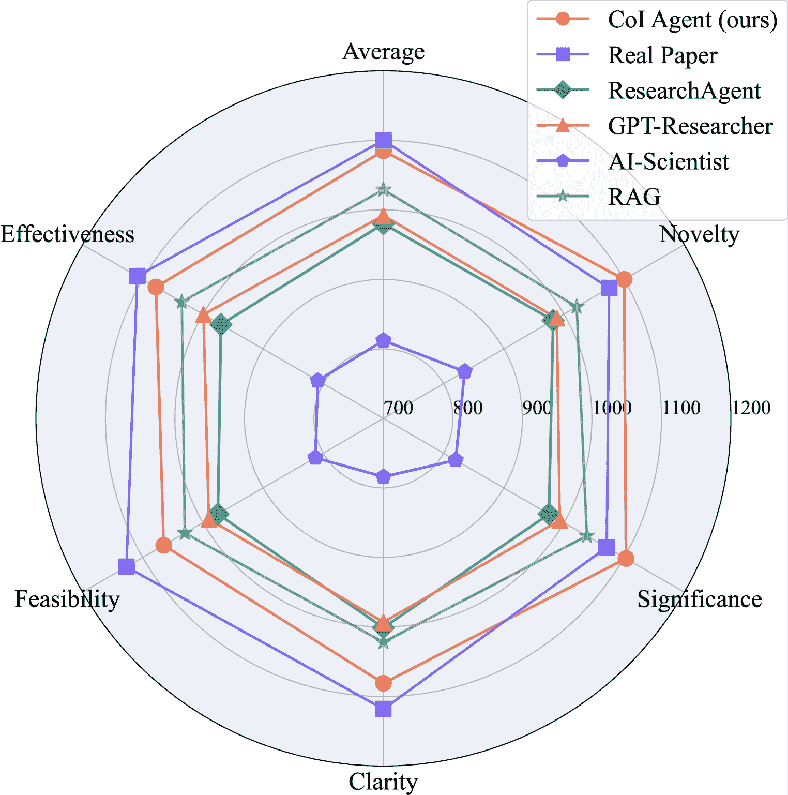
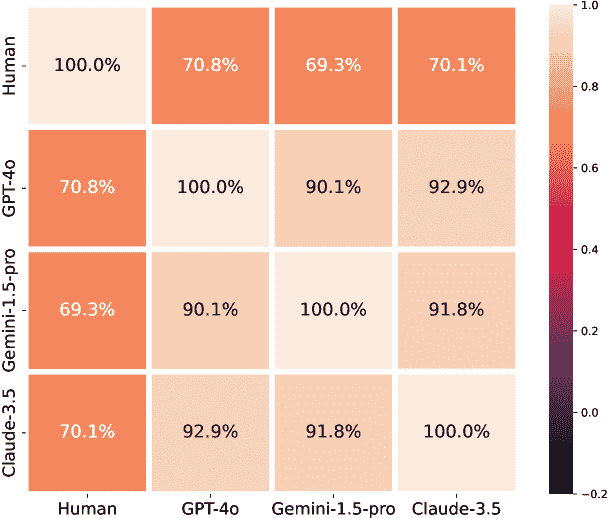
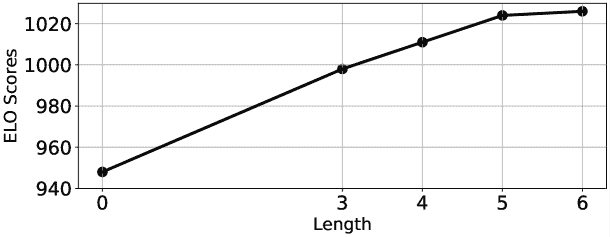
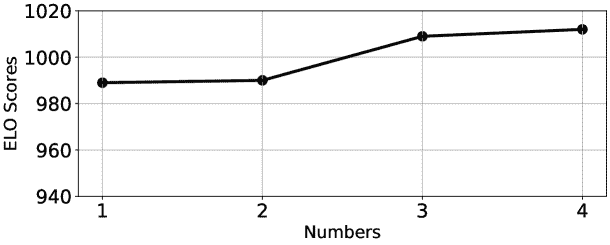

<!--yml

类别：未分类

日期：2025-01-11 12:05:19

-->

# Chain of Ideas：通过LLM代理革新研究，推动新颖构思的发展

> 来源：[https://arxiv.org/html/2410.13185/](https://arxiv.org/html/2410.13185/)

Long Li$1,2,{\thanks{这项工作是在Long Li作为阿里巴巴达摩院实习生期间完成的}}$  Weiwen Xu$1$  Jiayan Guo$1$  Ruochen Zhao$1$  Xingxuan Li$1$  Yuqian Yuan$1,2$  Boqiang Zhang$1,3$  Yuming Jiang$1$  Yifei Xin$1$  Ronghao Dang$1$  Yu Rong$1$  Deli Zhao$1$  Tian Feng$2$  Lidong Bing$1,\thanks{Lidong Bing是通讯作者}$

$1$达摩院 本工作是在Long Li作为阿里巴巴达摩院实习生期间完成的Lidong Bing是通讯作者 阿里巴巴集团

$2$浙江大学

$3$中国科学技术大学

longli@zju.edu.cn

weiwen.xuu@gmail.com

binglidong@gmail.com（2024年9月）

###### 摘要

有效的研究构思是科学研究中的关键步骤。然而，科学文献的指数增长使得研究人员很难跟上最新进展，并识别有意义的研究方向。最近，大型语言模型（LLMs）的发展为自动化生成新颖的研究想法提供了一个有希望的途径。然而，现有的构思生成方法要么过于简单地提示LLMs，要么直接将LLMs暴露于大量文献中而没有指出有用的信息。受到人类研究过程的启发，我们提出了一种名为Chain-of-Ideas（CoI）代理的LLM基础代理，它将相关文献按链式结构组织，以有效地反映研究领域中的逐步发展。这种组织方式有助于LLMs捕捉当前研究的最新进展，从而增强它们的构思能力。此外，我们还提出了Idea Arena评估协议，它可以从不同角度全面评估构思生成方法，并与人类研究人员的偏好紧密对接。实验结果表明，CoI代理在构思生成方面始终优于其他方法，并在研究构思生成质量上与人类相当。此外，我们的CoI代理具有成本效益，生成一个候选构思及其对应的实验设计的最低成本为$0.50¹¹1代码已发布在[https://github.com/DAMO-NLP-SG/CoI-Agent](https://github.com/DAMO-NLP-SG/CoI-Agent)。可以尝试我们的在线演示：[https://huggingface.co/spaces/DAMO-NLP-SG/CoI_Agent](https://huggingface.co/spaces/DAMO-NLP-SG/CoI_Agent)..

## 1 引言

思想生成是科学研究中的一个关键环节，对于推动技术创新和突破至关重要。传统上，这一过程主要由人工驱动，需要专家研究人员审阅大量文献，识别现有解决方案的局限性，并提出新的研究方向。然而，科学文献的复杂性和庞大规模，以及技术的快速发展，使得这一任务对研究人员而言日益具有挑战性。

最近，大型语言模型（LLMs）的进展（Achiam 等，[2023](https://arxiv.org/html/2410.13185v5#bib.bib1); Dubey 等，[2024](https://arxiv.org/html/2410.13185v5#bib.bib9); Yang 等，[2024a](https://arxiv.org/html/2410.13185v5#bib.bib25)）使得这些模型在各种科学任务中超越了人类专家，包括数学（Yu 等，[2023](https://arxiv.org/html/2410.13185v5#bib.bib29)）、定理证明（Yang 等，[2023](https://arxiv.org/html/2410.13185v5#bib.bib26)）和编程（Chen 等，[2021](https://arxiv.org/html/2410.13185v5#bib.bib7)）。在这一坚实的科学基础上，可以假设LLMs能够支持更为抽象和创造性的研究思想生成任务。值得注意的是，Si 等（[2024](https://arxiv.org/html/2410.13185v5#bib.bib19)）；Kumar 等（[2024](https://arxiv.org/html/2410.13185v5#bib.bib14)）验证了这一假设，突显了它在加速新概念发现和开辟未开发的研究方向方面的巨大潜力。

现有的方法试图解决两个关键挑战，以提高生成思想的质量：为大型语言模型（LLMs）筛选相关文献以获取灵感，以及确保生成思想的新颖性。为了解决第一个挑战，以往的研究通过学术知识图谱（Baek 等，[2024](https://arxiv.org/html/2410.13185v5#bib.bib3); Wang 等，[2023](https://arxiv.org/html/2410.13185v5#bib.bib22)）增强了传统的学术检索系统，这些系统通常依赖于文本相似度。对于第二个挑战，现有的方法要么应用如新颖性等预定义标准来引导思想生成过程（Baek 等，[2024](https://arxiv.org/html/2410.13185v5#bib.bib3)），要么通过迭代优化思想，直到它们与现有论文的嵌入相似度低为止（Wang 等，[2023](https://arxiv.org/html/2410.13185v5#bib.bib22)）。

然而，在现有的尝试中，当被要求生成创意时，LLM（大语言模型）通常会面临大量的研究文献。这使得LLM容易受到与任务无关的研究工作的影响，可能导致缺乏逻辑连贯性和技术创新的创意。如图[1](https://arxiv.org/html/2410.13185v5#S1.F1 "图1 ‣ 1 介绍 ‣ Chain of Ideas：通过LLM代理革命化研究并发展新创意")的上半部分所示，LLM借用了GraphGPT（Tang等，[2024](https://arxiv.org/html/2410.13185v5#bib.bib20)）的一个创意，并将其应用于GoT框架（Besta等，[2024](https://arxiv.org/html/2410.13185v5#bib.bib4)）中，生成了他们所认为的“新创意”。然而，最终的创意混淆了两个概念：GoT是一种提示方法，而GraphGPT是一种利用图神经网络架构进行微调的方法（Zhou等，[2020](https://arxiv.org/html/2410.13185v5#bib.bib32)）。相比之下，人类研究者通常通过分析从基础研究到最新进展的演变过程，来追溯一个研究领域的发展。这种全面的视角为深入了解推动该领域发展的关键因素提供了宝贵的见解。这样的理解使研究人员能够批判性地评估早期研究的局限性，并识别新兴的趋势。因此，他们能够更好地在制定创新且有影响力的研究创意时，站稳脚跟。

图1：本研究代理人与传统的检索增强生成（RAG）研究代理在创意生成任务中的比较。

受到人类在进行研究时的实践启发，我们提出了一种新颖的思想链（CoI）代理框架，以解决在大语言模型（LLMs）的构思过程中先前识别出的逻辑不一致问题。如图[1](https://arxiv.org/html/2410.13185v5#S1.F1 "Figure 1 ‣ 1 Introduction ‣ Chain of Ideas: Revolutionizing Research via Novel Idea Development with LLM Agents")底部所示，CoI代理旨在通过系统地选择和组织相关论文及其思想，形成链条结构，从而清晰地呈现当前的研究主题。CoI代理提供了若干显著优势：首先，它通过精心选择文献（即从CoT（Wei等， [2022](https://arxiv.org/html/2410.13185v5#bib.bib24)）到GoT）最大程度地减少了与研究主题不相关文献的干扰。其次，LLMs通过模拟人类实践来构思新颖的想法。例如，SC（Wang等， [2022](https://arxiv.org/html/2410.13185v5#bib.bib23)）作为从CoT衍生出的新颖想法，可以被看作一种少量示例提示策略，已被证明能够增强LLM的生成能力（Brown等， [2020](https://arxiv.org/html/2410.13185v5#bib.bib6)）。第三，CoI展示了研究发展中的全球进展。因此，LLMs能够深入理解这些发展趋势背后的动机，促进识别有前景的未来研究方向。

具体而言，CoI代理首先检索给定研究主题的锚点论文。与（Baek等，[2024](https://arxiv.org/html/2410.13185v5#bib.bib3)）中所做的不同，CoI并非盲目地聚集锚点引用网络中的所有论文，而是从锚点的参考文献及其后续工作中选择相关且重要的文献，从而在锚点的前后扩展思想链。然后，我们将构建好的CoI提示给LLM进行创意生成和实验设计。在创意生成过程中，我们要求LLM预测可能的未来趋势。这个预测结果有助于逐步巩固创意，从提出创意的动机开始，经过对其潜在影响的评估，最终达到实现。然而，由于科学发现的演变可能来自多个角度，单一的CoI可能不足以捕捉最有前景的方向。此外，生成的创意不一定能保证是新颖的。为了解决这些问题，我们为研究主题的不同视角构建多个CoI分支。此外，一个新颖性检测器代理会迭代地将草拟的创意与现有文献进行对比，如果发现有实质性相似之处，则会进行改进。

我们将 CoI 代理与现有的人工智能（AI）领域创意生成基准方法进行了比较。为此，我们开发了一种竞技场风格的评估框架，称为“创意竞技场”（Idea Arena），在该框架中，各参与方法成对竞争，且该方法与人类评估高度一致。实验结果显示，CoI 代理在所有自动化基准中始终排名第一，超越第二名 56 ELO 分数。CoI 代理能够生成与人类专家相媲美的新颖创意。我们的分析进一步表明，要让 LLM 生成新颖创意，清晰的研究发展趋势分析比相关文献的数量更为关键。

我们的贡献总结如下：1）我们提出了 CoI 代理，以增强大语言模型（LLM）在创意生成方面的能力。CoI 代理将相关文献组织成链式结构，有效地反映研究发展的渐进性，使 LLM 更好地把握当前的研究进展。2）我们提出了“创意竞技场”（Idea Arena）用于全面评估创意生成方法，该方法与人类研究者的评估高度一致。3）大量实验表明，我们的 CoI 代理在生成的创意方面具有与人类创造力相当的效果。

## 2 方法

图 2：我们提出的 CoI 代理框架。

### 2.1 框架：链式思想代理（Chain-of-Ideas Agent）

在本节中，我们详细介绍了我们的 CoI 代理框架，如图[2](https://arxiv.org/html/2410.13185v5#S2.F2 "Figure 2 ‣ 2 Method ‣ Chain of Ideas: Revolutionizing Research via Novel Idea Development with LLM Agents")所示，该框架由三个阶段组成：（1）CoI 构建、（2）创意生成、（3）实验设计。首先，给定一个研究课题，CoI 代理从现有文献中构建多个 CoI，反映该领域中的不同趋势。接着，对于每个 CoI，LLM 预测未来的研究方向，并通过逐步整合和迭代的新颖性检查构思创意，最终选择最佳创意。最后，LLM 生成并完善实验设计，以实施最终的创意。

### 2.2 CoI 构建

生成新颖的研究创意需要对相关研究领域有深刻的理解，并结合严格的推理过程。之前的工作（Lu 等， [2024](https://arxiv.org/html/2410.13185v5#bib.bib17); Baek 等， [2024](https://arxiv.org/html/2410.13185v5#bib.bib3)）试图通过提供相关文献来增强 LLM 以促进创意的生成。然而，这些方法仅仅是将这些文献混入提示中，而没有有效的组织结构。这种情境类似于将 LLM 放置在一个混乱的交叉口，没有任何地图，令其不知该走哪条路。为了解决这个问题，我们提出了一个链式思想代理框架。

如图[2](https://arxiv.org/html/2410.13185v5#S2.F2 "图 2 ‣ 2 方法 ‣ 创新研究：通过大型语言模型代理开发新颖思想来革命化研究")所示，CoI（思想链），表示为$\{\text{I}_{-M}\rightarrow\cdots\rightarrow\text{I}_{0}\rightarrow\cdots\rightarrow\text{I}_{N}\}$，是由$M+N+1$个思想组成的序列，这些思想分别来自$M+N+1$篇研究论文，它们共同展示了某一研究领域内的演变进程。具体来说，给定一个初始研究主题，我们提示LLM生成多个查询$q^{1},\dots,q^{K}$，这些查询反映了该主题的$K$个不同视角。该提示在附录中的表[7](https://arxiv.org/html/2410.13185v5#A1.T7 "表 7 ‣ A.2 具体提示 ‣ 附录 A 附录 ‣ 创新研究：通过大型语言模型代理开发新颖思想来革命化研究")中给出。除非另有说明，框架中的所有提示均在附录表格中展示。$K$个查询用于构建$K$个CoI分支。这减少了对单一CoI的依赖，因为单一的CoI可能不足以捕捉到最重要的发展和方向。对于每个查询$q^{k}$，我们使用它来检索一篇排名靠前的论文，我们称之为锚定论文$\text{P}^{k}_{0}$。在图[2](https://arxiv.org/html/2410.13185v5#S2.F2 "图 2 ‣ 2 方法 ‣ 创新研究：通过大型语言模型代理开发新颖思想来革命化研究")中，ToT（Yao等，[2024](https://arxiv.org/html/2410.13185v5#bib.bib28)）是锚定论文的一个示例。锚定论文作为构建CoI的基础。具体来说，CoI是通过从相应的锚定论文向前向后扩展，追踪思想的进展及其源头，来构建的。

在前向方向上，从$\text{P}^{k}_{0}$开始，我们利用Semantic Scholar API²²2[https://www.semanticscholar.org/product/api](https://www.semanticscholar.org/product/api)识别出直接引用该文献的后续论文。我们使用OpenAI的text-embedding-3-large³³3[https://openai.com/index/new-embedding-models-and-api-updates/](https://openai.com/index/new-embedding-models-and-api-updates/)根据这些论文与初始研究主题以及锚点论文摘要的余弦相似度对其进行排名。随后，我们选择排名最高的论文作为$\text{P}^{k}_{1}$，以此向前扩展CoI（例如图[2](https://arxiv.org/html/2410.13185v5#S2.F2 "Figure 2 ‣ 2 Method ‣ Chain of Ideas: Revolutionizing Research via Novel Idea Development with LLM Agents")中的GoT）。这个过程会从$\text{P}^{k}_{i}$到$\text{P}^{k}_{i+1}$反复进行，直到CoI的长度达到预设值或LLM发现没有有价值的后续工作为止（表[8](https://arxiv.org/html/2410.13185v5#A1.T8 "Table 8 ‣ A.2 Specific Prompts ‣ Appendix A Appendix ‣ Chain of Ideas: Revolutionizing Research via Novel Idea Development with LLM Agents")）。

在反向方向上，从锚定论文$\text{P}^{k}_{0}$开始，我们指示LLM彻底审查整篇论文，并根据以下标准识别候选参考文献：1）$\text{P}^{k}_{0}$直接依赖的参考文献，2）在$\text{P}^{k}_{0}$中作为基准的参考文献，3）与$\text{P}^{k}_{0}$探讨相同主题的参考文献。基于这些候选参考文献，我们要求LLM确定与锚定论文最相关的参考文献（表格[9](https://arxiv.org/html/2410.13185v5#A1.T9 "Table 9 ‣ A.2 Specific Prompts ‣ Appendix A Appendix ‣ Chain of Ideas: Revolutionizing Research via Novel Idea Development with LLM Agents")和[10](https://arxiv.org/html/2410.13185v5#A1.T10 "Table 10 ‣ A.2 Specific Prompts ‣ Appendix A Appendix ‣ Chain of Ideas: Revolutionizing Research via Novel Idea Development with LLM Agents")），记作$\text{P}^{k}_{-1}$（例如，图[2](https://arxiv.org/html/2410.13185v5#S2.F2 "Figure 2 ‣ 2 Method ‣ Chain of Ideas: Revolutionizing Research via Novel Idea Development with LLM Agents")中的SC），以便将CoI向后扩展。此反向扩展也会从$\text{P}^{k}_{-i}$到$\text{P}^{k}_{-(i+1)}$迭代进行，以识别先前的论文（例如，从图[2](https://arxiv.org/html/2410.13185v5#S2.F2 "Figure 2 ‣ 2 Method ‣ Chain of Ideas: Revolutionizing Research via Novel Idea Development with LLM Agents")中的SC追溯到CoT）。当CoI的长度达到预设值或我们遇到一个里程碑论文（定义为引用超过1,000次的论文）时，扩展终止，表明该里程碑论文中的思想可以作为CoI的强大起点。此外，我们指示LLM在没有找到与原始研究主题相关的参考文献时终止搜索（表格[8](https://arxiv.org/html/2410.13185v5#A1.T8 "Table 8 ‣ A.2 Specific Prompts ‣ Appendix A Appendix ‣ Chain of Ideas: Revolutionizing Research via Novel Idea Development with LLM Agents")）。

在我们收集到$K$条纸链后，记作$\{\text{P}^{k}_{-M^{k}}\rightarrow\cdots\rightarrow\text{P}^{k}_{0}\rightarrow% \cdots\rightarrow\text{P}^{k}_{N^{k}}\}^{K}_{k=1}$，我们要求LLM从这些论文中提取思想，并继承纸链的渐进关系，形成我们的CoI $\{\text{I}^{k}_{-M^{k}}\rightarrow\cdots\rightarrow\text{I}^{k}_{0}\rightarrow% \cdots\rightarrow\text{I}^{k}_{N^{k}}\}^{K}_{k=1}$（表[9](https://arxiv.org/html/2410.13185v5#A1.T9 "Table 9 ‣ A.2 Specific Prompts ‣ Appendix A Appendix ‣ Chain of Ideas: Revolutionizing Research via Novel Idea Development with LLM Agents") 和 [10](https://arxiv.org/html/2410.13185v5#A1.T10 "Table 10 ‣ A.2 Specific Prompts ‣ Appendix A Appendix ‣ Chain of Ideas: Revolutionizing Research via Novel Idea Development with LLM Agents")）。然后，对于每个CoI，我们要求LLM通过分析任意两个相邻思想之间的演变来总结现有的研究趋势（表[11](https://arxiv.org/html/2410.13185v5#A1.T11 "Table 11 ‣ A.2 Specific Prompts ‣ Appendix A Appendix ‣ Chain of Ideas: Revolutionizing Research via Novel Idea Development with LLM Agents")）。例如，图[2](https://arxiv.org/html/2410.13185v5#S2.F2 "Figure 2 ‣ 2 Method ‣ Chain of Ideas: Revolutionizing Research via Novel Idea Development with LLM Agents")的上半部分展示了从CoT到GoT的演变过程。此外，我们还从这些论文中提取实验设计和关键实体的定义（表[9](https://arxiv.org/html/2410.13185v5#A1.T9 "Table 9 ‣ A.2 Specific Prompts ‣ Appendix A Appendix ‣ Chain of Ideas: Revolutionizing Research via Novel Idea Development with LLM Agents") 和 [10](https://arxiv.org/html/2410.13185v5#A1.T10 "Table 10 ‣ A.2 Specific Prompts ‣ Appendix A Appendix ‣ Chain of Ideas: Revolutionizing Research via Novel Idea Development with LLM Agents")）。上述包括CoI和衍生知识的信息将在接下来的思想生成和实验设计阶段中使用。

### 2.3 思想生成

在本节中，我们使用上述构建的CoI及其发展趋势来指导新颖创意的生成。对于每个生成的CoI，第一步是预测可能的未来趋势。如图[2](https://arxiv.org/html/2410.13185v5#S2.F2 "Figure 2 ‣ 2 Method ‣ Chain of Ideas: Revolutionizing Research via Novel Idea Development with LLM Agents")左下部分所示，我们通过CoI、现有工作的发展趋势和从现有文献中提取的关键实体来提示LLM，如[2.2节](https://arxiv.org/html/2410.13185v5#S2.SS2 "2.2 CoI Construction ‣ 2 Method ‣ Chain of Ideas: Revolutionizing Research via Novel Idea Development with LLM Agents")中所述（表[12](https://arxiv.org/html/2410.13185v5#A1.T12 "Table 12 ‣ A.2 Specific Prompts ‣ Appendix A Appendix ‣ Chain of Ideas: Revolutionizing Research via Novel Idea Development with LLM Agents")和[13](https://arxiv.org/html/2410.13185v5#A1.T13 "Table 13 ‣ A.2 Specific Prompts ‣ Appendix A Appendix ‣ Chain of Ideas: Revolutionizing Research via Novel Idea Development with LLM Agents")）。这些实体包括相关数据集和潜在的基线模型，这些模型对于澄清现有文献中提到的概念至关重要。在获得未来趋势后，我们继续提示LLM阐明其动机、创新性和方法，最终巩固创意（表[14](https://arxiv.org/html/2410.13185v5#A1.T14 "Table 14 ‣ A.2 Specific Prompts ‣ Appendix A Appendix ‣ Chain of Ideas: Revolutionizing Research via Novel Idea Development with LLM Agents")和[15](https://arxiv.org/html/2410.13185v5#A1.T15 "Table 15 ‣ A.2 Specific Prompts ‣ Appendix A Appendix ‣ Chain of Ideas: Revolutionizing Research via Novel Idea Development with LLM Agents")）。通过这种一步步的方式，CoI可以生成更详细的创意。按照之前的做法（Wang等， [2023](https://arxiv.org/html/2410.13185v5#bib.bib22); Lu等，[2024](https://arxiv.org/html/2410.13185v5#bib.bib17)），我们还使用新颖性检查代理来评估候选创意。它检索相关论文，并提示另一个LLM评估生成的创意与检索论文之间的相似度（表[16](https://arxiv.org/html/2410.13185v5#A1.T16 "Table 16 ‣ A.2 Specific Prompts ‣ Appendix A Appendix ‣ Chain of Ideas: Revolutionizing Research via Novel Idea Development with LLM Agents")）。根据这一评估，我们的框架决定是否需要进行下一轮生成。最后，我们将所有CoI分支生成的创意进行成对比较，并选择胜率最高的创意作为实验设计的最终创意。此成对比较遵循与Idea Arena相同的方法，详细内容请参见[3.4节](https://arxiv.org/html/2410.13185v5#S3.SS4 "3.4 Evaluation: Idea Arena ‣ 3 Experimental Setups ‣ Chain of Ideas: Revolutionizing Research via Novel Idea Development with LLM Agents")。

### 2.4 实验设计

虽然我们的主要目标是生成新颖的想法，但制定有助于用户实施这些想法的实验计划同样很有用。因此，我们扩展了CoI代理，加入了实验设计。正如图[2](https://arxiv.org/html/2410.13185v5#S2.F2 "Figure 2 ‣ 2 Method ‣ Chain of Ideas: Revolutionizing Research via Novel Idea Development with LLM Agents")右下方所示，我们向LLM提供现有工作的实验作为少量示例，结合提出的想法和关键实体，以引导LLM为我们的想法设计实验（表[17](https://arxiv.org/html/2410.13185v5#A1.T17 "Table 17 ‣ A.2 Specific Prompts ‣ Appendix A Appendix ‣ Chain of Ideas: Revolutionizing Research via Novel Idea Development with LLM Agents)")）。

我们还使用了一个评审代理来评估候选实验设计。其主要作用是评估协议的清晰度和全面性，确保所有关键元素——如数据集和模型——都被清楚地列出。此外，它还检查设计是否提供了足够的细节以便实际实施（表[18](https://arxiv.org/html/2410.13185v5#A1.T18 "Table 18 ‣ A.2 Specific Prompts ‣ Appendix A Appendix ‣ Chain of Ideas: Revolutionizing Research via Novel Idea Development with LLM Agents)")）。评审代理提供关于这些方面的关键反馈，随后利用这些信息进行进一步的文献搜索（表[19](https://arxiv.org/html/2410.13185v5#A1.T19 "Table 19 ‣ A.2 Specific Prompts ‣ Appendix A Appendix ‣ Chain of Ideas: Revolutionizing Research via Novel Idea Development with LLM Agents)")），帮助LLM改进和增强其先前的实验设计（表[20](https://arxiv.org/html/2410.13185v5#A1.T20 "Table 20 ‣ A.2 Specific Prompts ‣ Appendix A Appendix ‣ Chain of Ideas: Revolutionizing Research via Novel Idea Development with LLM Agents)")）。通过这一评审和完善的迭代过程，我们最终得出一个实验设计。

## 3 实验设置

### 3.1 实现

在我们的CoI代理中，我们主要使用GPT-4o (05-13)⁴⁴4[https://openai.com/api/](https://openai.com/api/)作为我们的LLM实现。对于一些需要完整论文理解的模块，我们使用GPT-4o-mini (07-18)来阅读论文并总结核心内容，因为它价格较低且具有良好的总结能力。我们使用Semantic Scholar作为我们的学术搜索引擎。对于主要的实验结果，CoI的最大长度设置为5，CoI分支的数量设置为3，其分析结果将在后文给出。在实验设计阶段，自我完善的迭代次数设置为1，以节省成本。

### 3.2 数据

为了评估我们CoI代理生成新颖创意的能力，我们从Hugging Face的Daily Papers⁵⁵5[https://huggingface.co/papers](https://huggingface.co/papers)收集了近期的研究主题，该平台以其及时更新的AI研究和高质量的精选论文而著称。我们选择了2024年8月1日至9月15日之间提交的论文，确保主题足够新颖且时间范围在LLM的数据截止日期之后。我们邀请了10位具有多样化AI兴趣的研究人员，要求他们识别出符合其兴趣的论文。随后，我们提示GPT-4o从这些选定的论文中提取研究主题、提出的创意及其对应的实验设计（表[21](https://arxiv.org/html/2410.13185v5#A1.T21 "Table 21 ‣ A.2 Specific Prompts ‣ Appendix A Appendix ‣ Chain of Ideas: Revolutionizing Research via Novel Idea Development with LLM Agents")，表[22](https://arxiv.org/html/2410.13185v5#A1.T22 "Table 22 ‣ A.2 Specific Prompts ‣ Appendix A Appendix ‣ Chain of Ideas: Revolutionizing Research via Novel Idea Development with LLM Agents")和[23](https://arxiv.org/html/2410.13185v5#A1.T23 "Table 23 ‣ A.2 Specific Prompts ‣ Appendix A Appendix ‣ Chain of Ideas: Revolutionizing Research via Novel Idea Development with LLM Agents")）。然后将提取的主题返回给研究人员进行验证，以确保提取的主题在他们的研究领域内是有效且合理的。提取的创意和实验设计将作为我们的真实论文基准，具体说明见第[3.3](https://arxiv.org/html/2410.13185v5#S3.SS3 "3.3 Baselines ‣ 3 Experimental Setups ‣ Chain of Ideas: Revolutionizing Research via Novel Idea Development with LLM Agents")节。由于生成和评估创意及实验设计的成本较高，我们遵循Lu等人（[2024](https://arxiv.org/html/2410.13185v5#bib.bib17)）；Wang等人（[2023](https://arxiv.org/html/2410.13185v5#bib.bib22)）的评估标准，总共收集了50个研究主题进行评估。

### 3.3 基准方法

我们将我们的CoI代理与近期的创意生成和实验设计研究进行比较。为了确保公平的比较，我们分别采用GPT-4o和语义搜索作为LLM和学术检索器的实现，并应用于所有基准方法。此外，我们统一生成的创意和实验设计的输出格式，以尽量减少对更结构化输出的评估偏好（Chiang等，[2024](https://arxiv.org/html/2410.13185v5#bib.bib8)）。我们与以下基准方法进行比较：

+   •

    RAG：这是一种基础的检索增强生成方法（Lewis等，[2020](https://arxiv.org/html/2410.13185v5#bib.bib15)），我们通过直接向LLM提供检索到的文献来进行创意生成和实验设计。

+   •

    ResearchAgent（Baek 等，[2024](https://arxiv.org/html/2410.13185v5#bib.bib3)）：这项工作利用了额外的学术知识图谱来增强文献检索，并采用了多代理框架，通过同行讨论反复优化想法。我们按照原始论文重现此基准。

+   •

    GPT-Researcher（Assafelovic，[2023](https://arxiv.org/html/2410.13185v5#bib.bib2)）：GPT-Researcher是专门为研究领域设计的代理框架。该代理增强了计划和解决以及RAG能力。

+   •

    AI-Scientist（Lu 等，[2024](https://arxiv.org/html/2410.13185v5#bib.bib17)）：这项工作最初的目的是生成整个论文，包括想法、方法和实验结果。我们提取与想法生成和实验设计相关的组件，作为我们的基准。

+   •

    真实论文：请注意，在第[3.2节](https://arxiv.org/html/2410.13185v5#S3.SS2 "3.2 数据 ‣ 3 实验设置 ‣ 思路链：通过新型思路开发与LLM代理革命性地推动研究")中，我们从现有研究论文中提取主题。因此，这些论文中的想法和实验设计为量化模型生成的想法与真实人类想法之间的差距提供了自然的基准。

### 3.4 评估：想法竞技场

基于模型的评估。创意生成的开放式特性为自动化评估带来了挑战。先前的研究主要使用基于大语言模型（LLM）的李克特量表系统对创意进行评分（Baek et al., [2024](https://arxiv.org/html/2410.13185v5#bib.bib3); Lu et al., [2024](https://arxiv.org/html/2410.13185v5#bib.bib17)）。然而，Si et al. ([2024](https://arxiv.org/html/2410.13185v5#bib.bib19)) 表明这种方法与人类偏好的匹配度较差。相反，他们展示了 LLM 在对创意进行排序方面表现更好。为了获得可靠的评估分数，我们提出了 Idea Arena，这是一种基于回合赛制的对战评估系统，通过计算 ELO 分数来评估每种创意生成方法。对于给定的主题，我们要求 LLM 评审对任何两种方法生成的创意进行排序（表 [24](https://arxiv.org/html/2410.13185v5#A1.T24 "Table 24 ‣ A.2 Specific Prompts ‣ Appendix A Appendix ‣ Chain of Ideas: Revolutionizing Research via Novel Idea Development with LLM Agents")）。我们会对每一对创意进行两次评估，顺序反转以减少位置偏差。为了从多个角度全面评估创意，我们结合了 ICML 2020 审稿指南 ⁶⁶6[https://icml.cc/Conferences/2020/ReviewerGuidelines](https://icml.cc/Conferences/2020/ReviewerGuidelines) 中的标准，以及 Si et al. ([2024](https://arxiv.org/html/2410.13185v5#bib.bib19)) 中的标准，这些标准包括新颖性、重要性、清晰度、可行性和预期效果。最后，利用得到的胜负平局记录来计算每种方法的 ELO 分数，遵循 Zheng et al. ([2024](https://arxiv.org/html/2410.13185v5#bib.bib31)) 和 Zhao et al. ([2024](https://arxiv.org/html/2410.13185v5#bib.bib30)) 中概述的做法。我们还以相同的对战方式评估实验设计，重点关注可行性、技术质量和清晰度。有关所有度量标准，请参见附录中的表 [5](https://arxiv.org/html/2410.13185v5#A1.T5 "Table 5 ‣ A.1 Evaluation Metrics ‣ Appendix A Appendix ‣ Chain of Ideas: Revolutionizing Research via Novel Idea Development with LLM Agents") 和 [6](https://arxiv.org/html/2410.13185v5#A1.T6 "Table 6 ‣ A.1 Evaluation Metrics ‣ Appendix A Appendix ‣ Chain of Ideas: Revolutionizing Research via Novel Idea Development with LLM Agents")。

人类评估。我们也以对战的方式进行人类评估。10 位研究人员会对提取的主题进行审查，要求他们根据相同的标准对两种创意和实验设计进行排序。为了确保公平性，我们通过隐藏方法的身份来对创意的来源进行匿名处理。

## 4 结果

### 4.1 创意生成

图 3：以 LLM 为评审的创意生成评估结果。

图 4：以人为评审的创意生成评估结果。

主要结果。图 [4](https://arxiv.org/html/2410.13185v5#S4.F4 "Figure 4 ‣ 4.1 Idea Generation ‣ 4 Results ‣ Chain of Ideas: Revolutionizing Research via Novel Idea Development with LLM Agents") 和 [4](https://arxiv.org/html/2410.13185v5#S4.F4 "Figure 4 ‣ 4.1 Idea Generation ‣ 4 Results ‣ Chain of Ideas: Revolutionizing Research via Novel Idea Development with LLM Agents") 展示了由 LLM（特别是 GPT-4o）和人类研究人员共同评估的创意生成结果。详细的得分见附录中表 [26](https://arxiv.org/html/2410.13185v5#A1.T26 "Table 26 ‣ A.3 Additional experiment results ‣ Appendix A Appendix ‣ Chain of Ideas: Revolutionizing Research via Novel Idea Development with LLM Agents")。总体而言，我们的 CoI（Chain of Ideas）代理在模型基础和人类评估方面均表现优于所有其他自动化方法。值得注意的是，它在两个评估设置中分别以 108 和 56 ELO 分数的差距，显著超越了第二名的基准方法 GPT-Researcher 和 RAG。我们的 CoI 代理在新颖性和重要性这两个指标上，甚至超越了 Real Paper 基准。这些结果凸显了它在创意生成方面的卓越能力。此外，在人类评估中，CoI 在清晰度、可行性和预期有效性方面优于其他自动化方法。然而，它在这些领域仍然明显落后于 Real Paper。这一自动化方法与 Real Paper 之间的显著差距是可以预见的，因为 Real Paper 的创意经历了广泛的实验验证。此外，AI-Scientist 的表现特别差，可能与其原始设计有关，其重点在于从可执行代码生成完整论文。当仅提供一个研究主题时，它简单的创意生成框架限制了其产生新颖且可行创意的能力。

图 5：人类与 LLM 评审之间的一致性。

表 1：人类与 GPT-4o 评审在所有评估维度上的一致性。

|  | 新颖性 | 重要性 | 清晰度 | 可行性 | 有效性 | 平均值 |
| --- | --- | --- | --- | --- | --- | --- |
| 协议 | 66.5% | 71.0% | 76.3% | 70.2% | 71.0% | 70.8% |

人类-模型创意竞技场协议。为了评估我们基于模型的创意竞技场评估的可靠性，我们分析了人类评审与 LLM 评审之间的协议。我们遵循 Zheng 等人（[2024](https://arxiv.org/html/2410.13185v5#bib.bib31)）的方法计算协议，定义为两个评审对某一特定竞技场比赛结果一致的概率。图 [5](https://arxiv.org/html/2410.13185v5#S4.F5 "Figure 5 ‣ 4.1 Idea Generation ‣ 4 Results ‣ Chain of Ideas: Revolutionizing Research via Novel Idea Development with LLM Agents") 展示了人类与多种最先进 LLM 之间的配对协议，包括 GPT-4o、Gemini-1.5-Pro-Exp-0827⁷⁷7[https://ai.google.dev/gemini-api/docs/models/experimental-models](https://ai.google.dev/gemini-api/docs/models/experimental-models) 和 Claude-3.5-Sonnet⁸⁸8[https://www.anthropic.com/news/claude-3-5-sonnet](https://www.anthropic.com/news/claude-3-5-sonnet)。我们观察到 GPT-4o 与人类之间的平均协议为 70.8%。这一发现表明人类评估与基于模型的评估高度一致，从而突显了创意竞技场在评估生成的研究创意质量方面的稳健性。此外，GPT-4o 在所有测试过的 LLM 中与人类的协议水平最高。因此，我们将在随后的分析实验中使用 GPT-4o 作为 LLM 评审。我们还在表 [1](https://arxiv.org/html/2410.13185v5#S4.T1 "Table 1 ‣ 4.1 Idea Generation ‣ 4 Results ‣ Chain of Ideas: Revolutionizing Research via Novel Idea Development with LLM Agents") 中呈现了 GPT-4o 与人类评审在各个标准上的协议。结果表明，所有评估标准之间的协议水平都 consistently 高。

### 4.2 关于创意生成的消融研究

表 2：CoI 代理设计的消融研究。原始的 CoI 代理得到了 50 分，因为它在与自己对战时获得了 50 个平局。

|  | 新颖性 | 重要性 | 清晰度 | 可行性 | 有效性 | 平均分 |
| --- | --- | --- | --- | --- | --- | --- |
| CoI 代理 | 50 | 50 | 50 | 50 | 50 | 50 |
| –  CoI | 41 | 39 | 44 | 49 | 39 | 42.4 |
| –  未来趋势 | 40 | 43 | 51 | 53 | 44 | 46.2 |
| –  实体 | 46 | 49 | 42 | 47 | 43 | 45.4 |

我们进行了一项消融研究，以评估 CoI 代理各个组件对创意生成质量的贡献。我们检查了以下变体：1) – CoI：排除了 CoI 构建阶段，直接使用所有检索到的文献，而不进行渐进关系挖掘。2) – 未来趋势：省略了未来趋势预测模块，促使 LLM 根据提供的输入信息直接整合创意。3) – 实体：在创意生成过程中跳过输入实体定义。为了确保公平比较，每个变体都与完整的 CoI 代理进行对比，在 50 场比赛中根据胜/平/负给出 2/1/0 分，最多可得 100 分。

表 [2](https://arxiv.org/html/2410.13185v5#S4.T2 "表 2 ‣ 4.2 想法生成的消融研究 ‣ 4 结果 ‣ 想法链：通过创新想法开发与LLM代理彻底改变研究") 中的结果显示，所有变体都对想法质量产生负面影响。排除 CoI 构建阶段的影响最大，突显了根据渐进关系组织文献的重要性，这有助于增强 LLM 对趋势的理解。去除未来趋势预测会降低新颖性，因为 LLM 缺乏对潜在前瞻性想法的洞察。虽然在清晰度和可行性方面观察到轻微的改进，但这些并不显著，可能是由于评估的变异性。最后，省略实体信息会降低清晰度和效果，因为 LLM 在没有具体概念支撑的情况下生成更抽象的想法。这凸显了实体信息在提升想法清晰度和实际相关性方面的价值。

### 4.3 案例研究

表 3：我们 CoI 代理的整个想法生成流程的案例研究。

| 输入主题：使用 LLM 代理生成创新和原创的研究想法，且无需人工参与 |
| --- |
| 思路链：• $I_{-3}$ (Kim 等人, [2021](https://arxiv.org/html/2410.13185v5#bib.bib12))：该研究解决了通过分子生成发现新材料的挑战。它引入了 GCT，一种具有变分自编码器的 Transformer，用于生成 SMILES 字符串 $\dots$ • $I_{-2}$ (Boiko 等人, [2023](https://arxiv.org/html/2410.13185v5#bib.bib5))：该研究探索了 LLM 在设计和执行科学研究实验中的能力。本文提出了一个多 LLN 代理，能够通过互联网浏览、文献搜索和实验操作自动执行复杂的科学实验 $\dots$ • $I_{-1}$ (Yang 等人, [2024b](https://arxiv.org/html/2410.13185v5#bib.bib27))：该研究提出了一个新的社会科学假设数据集，并开发了一个 MOOSE 框架，结合 LLM 提示和反馈机制，促进假设的生成 $\dots$ • $I_{0}$ (Baek 等人, [2024](https://arxiv.org/html/2410.13185v5#bib.bib3))：该研究提出了一个用于自动生成创意的 ResearchAgent 框架。ResearchAgent 将 LLM 与实体中心的知识图谱结合，并通过审阅代理的迭代反馈，创建一个结构化且动态的过程，用于生成和完善研究创意 $\dots$ • $I_{1}$ (Si 等人, [2024](https://arxiv.org/html/2410.13185v5#bib.bib19))：该论文探讨了 LLM 在生成新颖研究创意方面的能力，并进行了大规模对比，比较了 LLM 生成的创意与 100 名 NLP 专家研究人员提出的创意，结果表明 LLM 可以生成比人工创意更具新颖性的创意 $\dots$ 当前趋势：• $I_{-3}\rightarrow I_{-2}$：从 $I_{-3}$ 到 $I_{-2}$ 的过渡标志着神经模型在分子生成应用中的应用，转向 <svg class="ltx_picture" height="13.87" id="S4.I2.i1.p1.4.pic1" overflow="visible" version="1.1" width="385.32"><g fill="#000000" stroke="#000000" stroke-width="0.4pt" transform="translate(0,13.87) matrix(1 0 0 -1 0 0) translate(192.66,0) translate(0,3.48)"><g fill="#000000" stroke="#000000" transform="matrix(1.0 0.0 0.0 1.0 -191.87 0)"><foreignobject height="12.3" overflow="visible" transform="matrix(1 0 0 -1 0 16.6)" width="383.75">更广泛地自动化科学研究使用 LLMs</foreignobject></g></g></svg> $\dots$ • $I_{-2}\rightarrow I_{-1}$：从 $I_{-2}$ 到 $I_{-1}$ 的过渡聚焦于 <svg class="ltx_picture" height="13.87" id="S4.I2.i2.p1.4.pic1" overflow="visible" version="1.1" width="298.49"><g fill="#000000" stroke="#000000" stroke-width="0.4pt" transform="translate(0,13.87) matrix(1 0 0 -1 0 0) translate(149.25,0) translate(0,3.48)"><g fill="#000000" stroke="#000000" transform="matrix(1.0 0.0 0.0 1.0 -148.46 0)"><foreignobject height="12.3" overflow="visible" transform="matrix(1 0 0 -1 0 16.6)" width="296.92">完善 LLMs 的自主诱导能力</foreignobject></g></g></svg> <svg class="ltx_picture" height="11.03" id="S4.I2.i2.p1.5.pic2" overflow="visible" version="1.1" width="37.01"><g fill="#000000" stroke="#000000" stroke-width="0.4pt" transform="translate(0,11.03) matrix(1 0 0 -1 0 0) translate(18.51,0) translate(0,0.79)"><g fill="#000000" stroke="#000000" transform="matrix(1.0 0.0 0.0 1.0 -17.72 0)"><foreignobject height="9.46" overflow="visible" transform="matrix(1 0 0 -1 0 16.6)" width="35.44">LLMs</foreignobject></g></g></svg>，特别是在生成新颖且有效的科学假设方面 $\dots$ • $I_{-1}\rightarrow I_{0}$：$I_{0}$ 在 $I_{-1}$ 的基础上进行扩展，将假设生成过程进一步延伸到 <svg class="ltx_picture" height="13.51" id="S4.I2.i3.p1.4.pic1" overflow="visible" version="1.1" width="64.65"><g fill="#000000" stroke="#000000" stroke-width="0.4pt" transform="translate(0,13.51) matrix(1 0 0 -1 0 0) translate(32.32,0) translate(0,3.48)"><g fill="#000000" stroke="#000000" transform="matrix(1.0 0.0 0.0 1.0 -31.54 0)"><foreignobject height="11.93" overflow="visible" transform="matrix(1 0 0 -1 0 16.6)" width="63.07">生成</foreignobject></g></g></svg> <svg class="ltx_picture" height="13.87" id="S4.I2.i3.p1.5.pic2" overflow="visible" version="1.1" width="251.37"><g fill="#000000" stroke="#000000" stroke-width="0.4pt" transform="translate(0,13.87) matrix(1 0 0 -1 0 0) translate(125.69,0) translate(0,3.48)"><g fill="#000000" stroke="#000000" transform="matrix(1.0 0.0 0.0 1.0 -124.9 0)"><foreignobject height="12.3" overflow="visible" transform="matrix(1 0 0 -1 0 16.6)" width="250.18">并完善研究创意的自主生成</foreignobject></g></g></svg> $\dots$ • $I_{0}\rightarrow I_{1}$：从 $I_{0}$ 到 $I_{1}$ 的过渡强调了 LLM 在 <svg class="ltx_picture" height="13.87" id="S4.I2.i4.p1.4.pic1" overflow="visible" version="1.1" width="193.1"><g fill="#000000" stroke="#000000" stroke-width="0.4pt" transform="translate(0,13.87) matrix(1 0 0 -1 0 0) translate(96.55,0) translate(0,3.48)"><g fill="#000000" stroke="#000000" transform="matrix(1.0 0.0 0.0 1.0 -95.76 0)"><foreignobject height="12.3" overflow="visible" transform="matrix(1 0 0 -1 0 16.6)" width="192.3">实证验证</foreignobject></g></g></svg> LLMs 在 <svg class="ltx_picture" height="13.87" id="S4.I2.i4.p1.5.pic2" overflow="visible" version="1.1" width="188.64"><g fill="#000000" stroke="#000000" stroke-width="0.4pt" transform="translate(0,13.87) matrix(1 0 0 -1 0 0) translate(94.32,0) translate(0,3.48)"><g fill="#000000" stroke="#000000" transform="matrix(1.0 0.0 0.0 1.0 -93.53 0)"><foreignobject height="12.3" overflow="visible" transform="matrix(1 0 0 -1 0 16.6)" width="187.45">生成新颖研究创意</foreignobject></g></g></svg> 中的重要性，并突出了 LLM 在创意生成中的潜力 $\dots$ 未来趋势预测：鉴于先前研究的进展和识别出的空白，未来的一个有前途的方向是 <svg class="ltx_picture |
| 最终构想：EvoResearchAgent：通过进化增强思想生成中的多样性和新颖性 • 动机：使用LLM进行思想生成已显示出有前景的进展。然而，挑战依然存在，<svg class="ltx_picture" height="13.87" id="S4.I3.i1.p1.1.pic1" overflow="visible" version="1.1" width="444.32"><g fill="#000000" stroke="#000000" stroke-width="0.4pt" transform="translate(0,13.87) matrix(1 0 0 -1 0 0) translate(222.16,0) translate(0,3.48)"><g fill="#000000" stroke="#000000" transform="matrix(1.0 0.0 0.0 1.0 -221.37 0)"><foreignobject height="12.3" overflow="visible" transform="matrix(1 0 0 -1 0 16.6)" width="443.9">特别是关于LLM生成思想的多样性和新颖性</foreignobject></g></g></svg>。Si等人（[2024](https://arxiv.org/html/2410.13185v5#bib.bib19)）展示了虽然LLM能够生成新颖的思想，但它们往往缺乏广泛的视角和多样性。此外，Baek等人（[2024](https://arxiv.org/html/2410.13185v5#bib.bib3)）强调了需要更加系统化的方法来提高生成思想的质量。为了应对这些问题，我们提出了EvoResearchAgent，<svg class="ltx_picture" height="13.87" id="S4.I3.i1.p1.2.pic2" overflow="visible" version="1.1" width="82.29"><g fill="#000000" stroke="#000000" stroke-width="0.4pt" transform="translate(0,13.87) matrix(1 0 0 -1 0 0) translate(41.15,0) translate(0,3.48)"><g fill="#000000" stroke="#000000" transform="matrix(1.0 0.0 0.0 1.0 -40.36 0)"><foreignobject height="12.3" overflow="visible" transform="matrix(1 0 0 -1 0 16.6)" width="81.1">一个多智能体</foreignobject></g></g></svg> <svg class="ltx_picture" height="29.17" id="S4.I3.i1.p1.3.pic3" overflow="visible" version="1.1" width="551.75"><g fill="#000000" stroke="#000000" stroke-width="0.4pt" transform="translate(0,29.17) matrix(1 0 0 -1 0 0) translate(275.88,0) translate(0,18.78)"><g fill="#000000" stroke="#000000" transform="matrix(1.0 0.0 0.0 1.0 -275.09 0)"><foreignobject height="72.41" overflow="visible" transform="matrix(1 0 0 -1 0 16.6)" width="551.71">利用进化算法来增强生成思想的多样性和新颖性的系统</foreignobject></g></g></svg> $\dots$ • 方法：$\circ$ 思想初始化：LLM生成一些初步的思想，作为进化过程的起点 $\dots$ $\circ$ 度量标准：提出自动化度量标准，如主题多样性和新颖性，以评估思想的范围 $\dots$ $\circ$ 进化整合：1. 选择：根据预定的新颖性和多样性度量标准选择最佳思想。 2. 交叉：将两个高得分思想的元素结合起来，创造新的混合思想。 3. 变异：对现有思想引入小的变化，探索新的可能性和多样性。 4. 迭代：反复进行选择、交叉和变异的过程 $\dots$ |

我们在表[3](https://arxiv.org/html/2410.13185v5#S4.T3 "Table 3 ‣ 4.3 Case Study ‣ 4 Results ‣ Chain of Ideas: Revolutionizing Research via Novel Idea Development with LLM Agents")中展示了一个有趣的案例研究，主题与我们论文相同——使用LLM生成创新的研究想法。给定输入主题，我们的CoI代理首先构建思想链，扩展$I_{0}$（Baek 等，[2024](https://arxiv.org/html/2410.13185v5#bib.bib3)）在前向和后向两个方向上。然后，代理分析当前的研究趋势，检查任何两个相邻的想法。例如，它识别出从$I_{-1}$到$I_{0}$的核心发展是生成想法而非假设。经过对现有趋势的消化，CoI代理意识到LLM在想法生成方面具有巨大潜力，但在新颖性和多样性方面有限。因此，它提出了一种进化算法，专门模拟父代与子代之间的变化，作为未来生成新颖且多样化想法的趋势。最后，代理通过借鉴未来趋势并结合实际实施方案，如交叉和变异，来巩固其最终想法，确保有效的实现。因此，生成的想法是可行且新颖的，值得我们在未来的工作中进一步探索。

### 4.4 实验设计

表 4：包括模型和人类评估及其一致性的实验设计结果。Tech. 指的是技术质量标准。

|  |  | 可行性 | 技术 | 清晰度 | 平均 |
| --- | --- | --- | --- | --- | --- |
| 模型评估 | 真实论文 | 1100 | 1122 | 1090 | 1103 |
| CoI Agent (我们) | 1029 | 1096 | 1043 | 1056 |
| RAG | 1022 | 970 | 1016 | 1003 |
| ResearchAgent | 960 | 1020 | 980 | 987 |
| GPT-Researcher | 1001 | 965 | 992 | 986 |
| AI-Scientist | 888 | 827 | 879 | 865 |
| 人类评估 | 真实论文 | 1138 | 1111 | 1111 | 1120 |
| CoI Agent (我们) | 1092 | 1123 | 1121 | 1112 |
| RAG | 1035 | 1041 | 1048 | 1042 |
| GPT-Researcher | 988 | 977 | 971 | 978 |
| ResearchAgent | 939 | 959 | 964 | 954 |
| AI-Scientist | 809 | 788 | 785 | 794 |
|  | 一致性 | 70.7% | 75.9% | 72.1% | 73.0% |

作为创意生成的副产品，我们还需要这些基准来为实现其提出的创意开发潜在的实验设计。表[4](https://arxiv.org/html/2410.13185v5#S4.T4 "表4 ‣ 4.4 实验设计 ‣ 4 结果 ‣ 创意链：通过LLM代理重塑研究，推动新颖创意发展")展示了基于模型和基于人工评估的实验设计竞技场风格结果。我们的CoI代理在两种评估设置下，在所有评估标准上表现优越，取得了所有自动化方法中的最高分数。特别值得注意的是，它在人工评估中超越了第二佳的自动化方法RAG，领先70 ELO分数。此外，在实验设计中，模型与人工的高度一致性也得到了体现。尽管CoI代理为支持提议的创意所生成的实验设计具有清晰且合理的技术细节，但它们相比现有文献中的设计往往可行性较低。这一现象在创意生成阶段也有所体现。因此，可行性成为自动化创意生成中的一个重要瓶颈，凸显了未来研究需要解决这一挑战。

### 4.5 CoI的长度

图6：CoI的长度分析。

为了检验CoI长度对生成的创意质量的影响，我们构建了具有不同最大链长的变体。此外，我们还在第[4.2节](https://arxiv.org/html/2410.13185v5#S4.SS2 "4.2 创意生成消融实验 ‣ 4 结果 ‣ 创意链：通过LLM代理重塑研究，推动新颖创意发展")中采用了“CoI-”变体作为一个零长度变体，该变体使用了5篇检索到的论文，但并未将它们组织成链式结构。图[6](https://arxiv.org/html/2410.13185v5#S4.F6 "图6 ‣ 4.5 CoI长度 ‣ 4 结果 ‣ 创意链：通过LLM代理重塑研究，推动新颖创意发展")展示了这些不同长度变体下的创意竞技场结果。我们观察到，当长度从0增加到3时，创意生成质量有了显著提升。这表明，清晰的发展趋势分析比相关文献的数量更为关键。此外，随着CoI长度的增加，生成的创意质量持续提高。较长的CoI能够提供更可靠、更全面的当前研究领域演变趋势，从而使LLM能够更好地捕捉未来发展趋势。当CoI的最大长度达到5时，生成创意的质量趋于平稳。这个饱和点表明，5的长度足以捕捉相关趋势，进一步增加文献的数量带来的回报逐渐递减。

### 4.6 CoI的宽度

图7：CoI的宽度分析。

我们还评估了CoI的宽度（即分支数量$K$）对生成思想质量的影响。图[7](https://arxiv.org/html/2410.13185v5#S4.F7 "Figure 7 ‣ 4.6 Width of CoI ‣ 4 Results ‣ Chain of Ideas: Revolutionizing Research via Novel Idea Development with LLM Agents")展示了不同分支数量下平均ELO得分的变化趋势。一般来说，增加分支数量与思想质量呈正相关。然而，不同分支数量之间的ELO得分差异较小。这一现象可能归因于生成多个链条主要有助于减少单个CoI表现不佳的影响。幸运的是，这种低质量的CoI是罕见的。

## 5 相关工作

科学研究中的思想生成。思想生成是科学研究中的基础步骤。由于其创新性，思想生成一直是人类主导的活动。然而，近期的研究表明，LLM（大语言模型）可以生成与人类研究人员相当的看似新颖且可行的想法（Si等， [2024](https://arxiv.org/html/2410.13185v5#bib.bib19); Kumar等， [2024](https://arxiv.org/html/2410.13185v5#bib.bib14)）。为了探讨LLM在思想生成中的潜力，早期的工作从科学假设发现任务开始（Yang等， [2024b](https://arxiv.org/html/2410.13185v5#bib.bib27); Qi等， [2023](https://arxiv.org/html/2410.13185v5#bib.bib18); Wang等， [2023](https://arxiv.org/html/2410.13185v5#bib.bib22)），该任务旨在阐明两个科学变量之间的关系。尽管其有用，科学假设发现可能无法完全捕捉到现实世界问题的复杂性和多面性。为了解决这一局限性，像GPT-Researcher（Assafelovic，[2023](https://arxiv.org/html/2410.13185v5#bib.bib2)）和ResearchAgent（Baek等， [2024](https://arxiv.org/html/2410.13185v5#bib.bib3)）等项目采用了更为开放的思想生成场景，涵盖了基础方法论和实验设计。它们利用基于代理的系统来提升思想生成的质量。除了思想生成，许多研究还探讨了LLM在执行实验中的应用（Huang等， [2024](https://arxiv.org/html/2410.13185v5#bib.bib11); Tian等， [2024](https://arxiv.org/html/2410.13185v5#bib.bib21)）或将思想生成与实验执行相结合（Li等， [2024](https://arxiv.org/html/2410.13185v5#bib.bib16); Lu等， [2024](https://arxiv.org/html/2410.13185v5#bib.bib17)）。然而，这些方法通常对现有思想做出微小修改来草拟其想法，这些想法往往缺乏深度和创造力。

将LLM与人类认知模式对齐。由于LLM通过大量人类数据进行训练（Brown 等人，[2020](https://arxiv.org/html/2410.13185v5#bib.bib6)），这可能使它们能够内化人类的认知模式。首先，CoT（Wei 等人，[2022](https://arxiv.org/html/2410.13185v5#bib.bib24)）表明，LLM在提供逐步指导时能够增强其推理能力。进一步的研究通过展示仅仅提示LLM进行逐步推理即可触发更好的推理能力，支持了这一观点（Kojima 等人，[2022](https://arxiv.org/html/2410.13185v5#bib.bib13)）。此外，Fu 等人（[2022](https://arxiv.org/html/2410.13185v5#bib.bib10)）揭示，通过更精细的提示可以实现LLM的深入推理。因此，一种紧密模拟人类认知的提示策略可能会引发这些模型更有洞察力的回答。基于此动机，我们提出了CoI，以更好地模拟人类在生成新研究创意时的渐进认知模式。

## 6 结论

在本文中，我们介绍了Chain of Ideas（CoI）代理，这是一个旨在增强LLM在生成研究创意方面能力的框架。CoI代理通过将创意组织成链式结构，提供了一种有前景且简明的解决方案，有效地模拟了给定研究领域内的渐进发展。它帮助LLM消化当前的研究进展，从而增强其创意能力。为了全面评估自动化创意生成方法的能力，我们还提出了Idea Arena，这是一个评估系统，要求参与的方法在关于研究主题的创意生成上进行配对竞争，且与人工评估高度一致。实验结果表明，CoI代理始终优于其他方法，并能够生成与人类创意相当的创意。

## 参考文献

+   Achiam 等人（2023）Josh Achiam、Steven Adler、Sandhini Agarwal、Lama Ahmad、Ilge Akkaya、Florencia Leoni Aleman、Diogo Almeida、Janko Altenschmidt、Sam Altman、Shyamal Anadkat 等人。GPT-4 技术报告。*arXiv 预印本 arXiv:2303.08774*，2023年。

+   Assafelovic（2023）Assafelovic。gpt-researcher，2023年。网址：[https://github.com/assafelovic/gpt-researcher](https://github.com/assafelovic/gpt-researcher)。

+   Baek 等人（2024）Jinheon Baek、Sujay Kumar Jauhar、Silviu Cucerzan 和 Sung Ju Hwang。Researchagent：基于大型语言模型对科学文献的迭代研究创意生成。*arXiv 预印本 arXiv:2404.07738*，2024年。

+   Besta 等人（2024）Maciej Besta、Nils Blach、Ales Kubicek、Robert Gerstenberger、Michal Podstawski、Lukas Gianinazzi、Joanna Gajda、Tomasz Lehmann、Hubert Niewiadomski、Piotr Nyczyk 等人。Graph of thoughts：使用大型语言模型解决复杂问题。载于 *人工智能学会会议论文集*，第38卷，页码 17682–17690，2024年。

+   Boiko 等人 (2023) Daniil A Boiko, Robert MacKnight 和 Gabe Gomes。大型语言模型的自发科学研究能力。*arXiv 预印本 arXiv:2304.05332*，2023年。

+   Brown 等人 (2020) Tom Brown, Benjamin Mann, Nick Ryder, Melanie Subbiah, Jared D Kaplan, Prafulla Dhariwal, Arvind Neelakantan, Pranav Shyam, Girish Sastry, Amanda Askell, Sandhini Agarwal, Ariel Herbert-Voss, Gretchen Krueger, Tom Henighan, Rewon Child, Aditya Ramesh, Daniel Ziegler, Jeffrey Wu, Clemens Winter, Chris Hesse, Mark Chen, Eric Sigler, Mateusz Litwin, Scott Gray, Benjamin Chess, Jack Clark, Christopher Berner, Sam McCandlish, Alec Radford, Ilya Sutskever 和 Dario Amodei。语言模型是少样本学习者。在 H. Larochelle, M. Ranzato, R. Hadsell, M.F. Balcan 和 H. Lin（编辑），*神经信息处理系统进展*，第33卷，第1877-1901页。Curran Associates, Inc.，2020年。网址 [https://proceedings.neurips.cc/paper_files/paper/2020/file/1457c0d6bfcb4967418bfb8ac142f64a-Paper.pdf](https://proceedings.neurips.cc/paper_files/paper/2020/file/1457c0d6bfcb4967418bfb8ac142f64a-Paper.pdf)。

+   陈等人 (2021) Mark Chen, Jerry Tworek, Heewoo Jun, Qiming Yuan, Henrique Ponde De Oliveira Pinto, Jared Kaplan, Harri Edwards, Yuri Burda, Nicholas Joseph, Greg Brockman 等人。评估在代码上训练的大型语言模型。*arXiv 预印本 arXiv:2107.03374*，2021年。

+   Chiang 等人 (2024) Wei-Lin Chiang, Lianmin Zheng, Ying Sheng, Anastasios Nikolas Angelopoulos, Tianle Li, Dacheng Li, Hao Zhang, Banghua Zhu, Michael Jordan, Joseph E. Gonzalez 和 Ion Stoica。聊天机器人竞技场：一个通过人类偏好评估语言模型的开放平台，2024年。

+   Dubey 等人 (2024) Abhimanyu Dubey, Abhinav Jauhri, Abhinav Pandey, Abhishek Kadian, Ahmad Al-Dahle, Aiesha Letman, Akhil Mathur, Alan Schelten, Amy Yang, Angela Fan 等人。Llama 3 模型群。*arXiv 预印本 arXiv:2407.21783*，2024年。

+   Fu 等人 (2022) Yao Fu, Hao Peng, Ashish Sabharwal, Peter Clark 和 Tushar Khot。基于复杂度的多步推理提示。在 *第十一届国际学习表征会议*，2022年。

+   Huang 等人 (2024) Qian Huang, Jian Vora, Percy Liang 和 Jure Leskovec。MLAgentbench：评估语言代理在机器学习实验中的表现。在 *第41届国际机器学习会议*，2024年。网址 [https://openreview.net/forum?id=1Fs1LvjYQW](https://openreview.net/forum?id=1Fs1LvjYQW)。

+   Kim 等人 (2021) Hyunseung Kim, Jonggeol Na 和 Won Bo Lee。生成化学变换器：通过注意力机制从化学语言中学习分子几何结构的神经机器学习。*化学信息与建模期刊*，61(12):5804-5814，2021年。

+   Kojima 等人 (2022) Takeshi Kojima, Shixiang Shane Gu, Machel Reid, Yutaka Matsuo 和 Yusuke Iwasawa。大型语言模型是零样本推理器。*神经信息处理系统进展*，35:22199-22213，2022年。

+   库马尔等（2024）桑迪普·库马尔、提尔坦卡尔·高萨尔、维纳亚克·戈亚尔和阿西夫·埃克巴尔。《大型语言模型能解锁新颖的科学研究创意吗？》*arXiv 预印本 arXiv:2409.06185*，2024。

+   刘等（2020）帕特里克·刘、伊桑·佩雷斯、阿莱克桑德拉·皮克图斯、法比奥·佩特罗尼、弗拉基米尔·卡普辛、纳曼·戈亚尔、海因里希·库特勒、迈克·刘、温涛·易、提姆·罗克塔谢尔等。《检索增强生成用于知识密集型NLP任务》。*神经信息处理系统进展*，33：9459–9474，2020。

+   李等（2024）若晨·李、特尔斯·帕特尔、庆云·王和欣雅·杜。《Mlr-copilot：基于大型语言模型代理的自主机器学习研究》。*arXiv 预印本 arXiv:2408.14033*，2024。

+   陆等（2024）克里斯·陆、聪·陆、罗伯特·捷尔科·兰格、雅各布·福尔斯特、杰夫·克卢恩和大卫·哈。《AI科学家：迈向完全自动化的开放式科学发现》。*arXiv 预印本 arXiv:2408.06292*，2024。

+   齐等（2023）毕庆·齐、凯岩·张、浩翔·李、凯·田、思航·曾、张仁·陈和博文·周。《大型语言模型是零-shot假设提出者》。*arXiv 预印本 arXiv:2311.05965*，2023。

+   斯等（2024）程磊·斯、狄易·杨和田临·桥。大型语言模型能生成新颖的研究创意吗？一项涵盖100多名NLP研究员的大规模人类研究。*arXiv 预印本 arXiv:2409.04109*，2024。

+   唐等（2024）贾宾·唐、宇浩·杨、魏·魏、雷·石、立新·苏、苏琪·程、大伟·尹和超·黄。《GraphGPT：面向大型语言模型的图形指令微调》。在*第47届国际ACM SIGIR信息检索研究与发展大会论文集*，第491-500页，2024。

+   田等（2024）敏阳·田、露雨·高、施卓·迪兰·张、欣安·陈、存伟·范、学飞·郭、罗兰·哈斯、潘·季、吉提塔·克隆琼、尧·李等。《Scicode：由科学家策划的研究编码基准》。*arXiv 预印本 arXiv:2407.13168*，2024。

+   王等（2023）庆云·王、道格·道尼、亨·季和汤姆·霍普。《Scimon：优化新颖性的科学启发机器》。*arXiv 预印本 arXiv:2305.14259*，2023。

+   王等（2022）徐志王、杰森·魏、戴尔·舒尔曼、郭跃、埃德·池、沙兰·纳朗、阿坎莎·乔杜里和丹尼·周。《自一致性提高语言模型的思维链推理》。*arXiv 预印本 arXiv:2203.11171*，2022。

+   魏等（2022）杰森·魏、徐志王、戴尔·舒尔曼、马滕·博斯马、费·夏、埃德·池、郭跃·V·李、丹尼·周等。《思维链提示引发大型语言模型的推理》。*神经信息处理系统进展*，35：24824–24837，2022。

+   杨等（2024a）安·杨、宝松·杨、宾源·慧、博·郑、博文·余、昌·周、程鹏·李、程源·李、大义恒·刘、费·黄等。《Qwen2技术报告》。*arXiv 预印本 arXiv:2407.10671*，2024a。

+   Yang 等人 (2023) Kaiyu Yang, Aidan M Swope, Alex Gu, Rahul Chalamala, Peiyang Song, Shixing Yu, Saad Godil, Ryan Prenger, 和 Anima Anandkumar. Leandojo：使用增强检索的语言模型进行定理证明。发表于 *第三十七届神经信息处理系统会议 数据集与基准跟踪*，2023。网址 [https://openreview.net/forum?id=g7OX2sOJtn](https://openreview.net/forum?id=g7OX2sOJtn).

+   Yang 等人 (2024b) Zonglin Yang, Xinya Du, Junxian Li, Jie Zheng, Soujanya Poria, 和 Erik Cambria. 使用大型语言模型进行自动化开放领域科学假设发现。发表于 Lun-Wei Ku, Andre Martins, 和 Vivek Srikumar (编)，*2024年计算语言学协会会议发现集*，第13545–13565页，泰国曼谷及虚拟会议，2024年8月。计算语言学协会。网址 [https://aclanthology.org/2024.findings-acl.804](https://aclanthology.org/2024.findings-acl.804).

+   Yao 等人 (2024) Shunyu Yao, Dian Yu, Jeffrey Zhao, Izhak Shafran, Tom Griffiths, Yuan Cao, 和 Karthik Narasimhan. 思维树：与大型语言模型的深思熟虑问题解决。*神经信息处理系统进展*，36，2024.

+   Yu 等人 (2023) Longhui Yu, Weisen Jiang, Han Shi, Jincheng Yu, Zhengying Liu, Yu Zhang, James T Kwok, Zhenguo Li, Adrian Weller, 和 Weiyang Liu. Metamath: 为大型语言模型引导您自己的数学问题。*arXiv 预印本 arXiv:2309.12284*, 2023.

+   Zhao 等人 (2024) Ruochen Zhao, Wenxuan Zhang, Yew Ken Chia, Deli Zhao, 和 Lidong Bing. LLMs 自动竞技场：通过代理对战和委员会讨论自动化 LLM 评估。*arXiv 预印本 arXiv:2405.20267*, 2024.

+   Zheng 等人 (2024) Lianmin Zheng, Wei-Lin Chiang, Ying Sheng, Siyuan Zhuang, Zhanghao Wu, Yonghao Zhuang, Zi Lin, Zhuohan Li, Dacheng Li, Eric Xing 等人. 通过 mt-bench 和聊天机器人竞技场评判 LLM 作为评审者。*神经信息处理系统进展*，36，2024.

+   Zhou 等人 (2020) Jie Zhou, Ganqu Cui, Shengding Hu, Zhengyan Zhang, Cheng Yang, Zhiyuan Liu, Lifeng Wang, Changcheng Li, 和 Maosong Sun. 图神经网络：方法与应用综述。*AI open*，1:57–81，2020.

## 附录 A 附录

### A.1 评估指标

表 5：创意的评估指标。

| 指标 | 定义 |
| --- | --- |
| 新颖性 | 这些问题或方法是新的吗？这是否是熟悉技术的新组合？这项工作与以前的贡献有何不同？相关工作是否得到了充分引用？ |
| 重要性 | 这个创意重要吗？其他人（从业者或研究人员）是否可能使用这些创意或在其基础上进行扩展？这个创意是否比以往的研究更好地解决了一个困难的问题？它是否提供了一个独特的理论或实用方法？ |
| 清晰度 | 论文是否写得清楚？是否组织良好？是否充分告知读者？ |
| 可行性 | 该想法能否通过现有的技术或方法实现？是否存在任何技术难题或瓶颈？该想法是否清晰且合乎逻辑？该想法是否有明显错误或不合理的部分，是否可以根据该想法正常设计实验。 |
| 预期效果 | 提出的想法成功的可能性有多大（例如，比现有基线更好）。 |

表6：实验设计的评估指标。

| 指标 | 定义 |
| --- | --- |
| 可行性 | 该实验能否通过现有的技术或方法实现？是否存在任何技术难题或瓶颈？实验计划是否详细且可行？实验步骤是否清晰且合乎逻辑？实验中是否有明显的错误或不合理的部分？考虑步骤的合理性以及该想法能否成功实施。 |
| 质量 | 每个实验设计步骤是否有明确的理论依据？所选择的基线和评估指标是否恰当？设计是否考虑了所用方法的潜在优点和局限性？该实验设计是否能够有效支持该想法所做的声明。 |
| 清晰度 | 实验计划是否写得清楚？它是否提供了足够的信息，供专家读者理解实验？是否组织得当？是否能够充分告知读者？ |

### A.2 特定提示语

以下是本文使用的提示语。

+   •

    用于CoI构建的提示语

    +   –

        用于将主题转换为文献检索查询的提示语（表[7](https://arxiv.org/html/2410.13185v5#A1.T7 "Table 7 ‣ A.2 Specific Prompts ‣ Appendix A Appendix ‣ Chain of Ideas: Revolutionizing Research via Novel Idea Development with LLM Agents")）

    +   –

        用于评估论文是否与主题相关的提示语（表[8](https://arxiv.org/html/2410.13185v5#A1.T8 "Table 8 ‣ A.2 Specific Prompts ‣ Appendix A Appendix ‣ Chain of Ideas: Revolutionizing Research via Novel Idea Development with LLM Agents")）

    +   –

        用于从论文中提取想法、实验、实体和参考文献的提示语（表[9](https://arxiv.org/html/2410.13185v5#A1.T9 "Table 9 ‣ A.2 Specific Prompts ‣ Appendix A Appendix ‣ Chain of Ideas: Revolutionizing Research via Novel Idea Development with LLM Agents") 和 [10](https://arxiv.org/html/2410.13185v5#A1.T10 "Table 10 ‣ A.2 Specific Prompts ‣ Appendix A Appendix ‣ Chain of Ideas: Revolutionizing Research via Novel Idea Development with LLM Agents")）

    +   –

        用于总结当前CoI趋势的提示语（表[11](https://arxiv.org/html/2410.13185v5#A1.T11 "Table 11 ‣ A.2 Specific Prompts ‣ Appendix A Appendix ‣ Chain of Ideas: Revolutionizing Research via Novel Idea Development with LLM Agents")）

+   •

    用于生成想法的提示语

    +   –

        用于预测未来趋势的提示（表 [12](https://arxiv.org/html/2410.13185v5#A1.T12 "Table 12 ‣ A.2 Specific Prompts ‣ Appendix A Appendix ‣ Chain of Ideas: Revolutionizing Research via Novel Idea Development with LLM Agents") 和 [13](https://arxiv.org/html/2410.13185v5#A1.T13 "Table 13 ‣ A.2 Specific Prompts ‣ Appendix A Appendix ‣ Chain of Ideas: Revolutionizing Research via Novel Idea Development with LLM Agents")）

    +   –

        用于生成创意的提示（表 [14](https://arxiv.org/html/2410.13185v5#A1.T14 "Table 14 ‣ A.2 Specific Prompts ‣ Appendix A Appendix ‣ Chain of Ideas: Revolutionizing Research via Novel Idea Development with LLM Agents") 和 [15](https://arxiv.org/html/2410.13185v5#A1.T15 "Table 15 ‣ A.2 Specific Prompts ‣ Appendix A Appendix ‣ Chain of Ideas: Revolutionizing Research via Novel Idea Development with LLM Agents")）

    +   –

        用于检查创意新颖性的提示（表 [16](https://arxiv.org/html/2410.13185v5#A1.T16 "Table 16 ‣ A.2 Specific Prompts ‣ Appendix A Appendix ‣ Chain of Ideas: Revolutionizing Research via Novel Idea Development with LLM Agents")）

+   •

    用于实验设计的提示

    +   –

        用于生成实验设计的提示（表 [17](https://arxiv.org/html/2410.13185v5#A1.T17 "Table 17 ‣ A.2 Specific Prompts ‣ Appendix A Appendix ‣ Chain of Ideas: Revolutionizing Research via Novel Idea Development with LLM Agents")）

    +   –

        用于审查实验设计的提示（表 [18](https://arxiv.org/html/2410.13185v5#A1.T18 "Table 18 ‣ A.2 Specific Prompts ‣ Appendix A Appendix ‣ Chain of Ideas: Revolutionizing Research via Novel Idea Development with LLM Agents")）

    +   –

        用于获取搜索论文的查询以完善实验设计的提示（表 [19](https://arxiv.org/html/2410.13185v5#A1.T19 "Table 19 ‣ A.2 Specific Prompts ‣ Appendix A Appendix ‣ Chain of Ideas: Revolutionizing Research via Novel Idea Development with LLM Agents")）

    +   –

        用于完善实验的提示（表 [20](https://arxiv.org/html/2410.13185v5#A1.T20 "Table 20 ‣ A.2 Specific Prompts ‣ Appendix A Appendix ‣ Chain of Ideas: Revolutionizing Research via Novel Idea Development with LLM Agents")）

+   •

    用于基准构建的提示

    +   –

        用于从实际论文中提取主题的提示（表 [21](https://arxiv.org/html/2410.13185v5#A1.T21 "Table 21 ‣ A.2 Specific Prompts ‣ Appendix A Appendix ‣ Chain of Ideas: Revolutionizing Research via Novel Idea Development with LLM Agents")）

    +   –

        用于从实际论文中提取创意的提示（表 [22](https://arxiv.org/html/2410.13185v5#A1.T22 "Table 22 ‣ A.2 Specific Prompts ‣ Appendix A Appendix ‣ Chain of Ideas: Revolutionizing Research via Novel Idea Development with LLM Agents")）

    +   –

        用于从实际论文中提取实验设计的提示（表 [23](https://arxiv.org/html/2410.13185v5#A1.T23 "Table 23 ‣ A.2 Specific Prompts ‣ Appendix A Appendix ‣ Chain of Ideas: Revolutionizing Research via Novel Idea Development with LLM Agents")）

+   •

    用于创意领域的提示

    +   –

        用于比较两个想法的提示（表 [24](https://arxiv.org/html/2410.13185v5#A1.T24 "表 24 ‣ A.2 特定提示 ‣ 附录 A 附录 ‣ 想法链：通过 LLM 代理的创新思想发展革命化研究")）

    +   –

        用于比较两个实验设计的提示（表 [25](https://arxiv.org/html/2410.13185v5#A1.T25 "表 25 ‣ A.2 特定提示 ‣ 附录 A 附录 ‣ 想法链：通过 LLM 代理的创新思想发展革命化研究")）

表 7：用于将主题转换为文献检索搜索查询的提示

<svg class="ltx_picture ltx_centering" height="224.63" id="A1.T7.pic1" overflow="visible" version="1.1" width="550"><g fill="#000000" stroke="#000000" stroke-width="0.4pt" transform="translate(0,224.63) matrix(1 0 0 -1 0 0)"><g fill-opacity="1.0" transform="matrix(1.0 0.0 0.0 1.0 22.64 14.76)"><foreignobject color="#000000" height="195.1" overflow="visible" transform="matrix(1 0 0 -1 0 16.6)" width="504.72">您是文献检索大师，负责根据特定主题查找相关的研究文献。

目前，我们希望研究以下主题：[主题] 请提供您用于查找与该主题和想法相关论文的文献检索查询。

每个查询应为一个字符串，并应放在双引号中。最好输出一个表示整体的查询，以及表示整体不同方面的其他查询。

严格按照以下格式输出：

查询：…</foreignobject></g></g></svg>

表 8：用于评估论文是否与主题相关的提示

<svg class="ltx_picture ltx_centering" height="278.59" id="A1.T8.pic1" overflow="visible" version="1.1" width="550"><g fill="#000000" stroke="#000000" stroke-width="0.4pt" transform="translate(0,278.59) matrix(1 0 0 -1 0 0)"><g fill-opacity="1.0" transform="matrix(1.0 0.0 0.0 1.0 22.64 14.76)"><foreignobject color="#000000" height="249.07" overflow="visible" transform="matrix(1 0 0 -1 0 16.6)" width="504.72">您是一个专家研究员，负责根据给定论文的标题和摘要评估该论文是否与我们的研究主题相关。

以下是您需要评估的论文的详细信息：

标题：[标题] 摘要：[摘要] 主题是：[主题] 如果论文标题和摘要与主题相关，请输出 1；否则，输出 0。只要您认为这篇文章对您的问题有参考价值，可以用它来帮助您研究主题，主题不需要完全一致。

请严格遵循以下格式：

思考：…

相关性：0/1</foreignobject></g></g></svg>

表 9：用于从论文中提取想法、实验、实体和参考文献的提示（第一部分）

<svg class="ltx_picture" height="421.31" id="A1.T9.pic1" overflow="visible" version="1.1" width="550"><g fill="#000000" stroke="#000000" stroke-width="0.4pt" transform="translate(0,421.31) matrix(1 0 0 -1 0 0)"><g fill-opacity="1.0" transform="matrix(1.0 0.0 0.0 1.0 22.64 14.76)"><foreignobject color="#000000" height="391.79" overflow="visible" transform="matrix(1 0 0 -1 0 16.6)" width="504.72">你是一位科研专家，负责从提供的论文内容中提取和总结与主题相关的信息：[Topic]。你的交付物将包括相关的引用、提取的实体、详细的总结和实验设计。

你正在研究的主题是：[Topic]（确保引用与此主题相关）。

提取要求：

实体：

1. 识别论文中提到的独特实体，如模型名称、数据集、指标和专业术语。

2. 格式化实体，使用名称后跟简要描述。

3. 确保所有实体与指定主题（[Topic]）相关。

概要思路：

1. 背景：阐述任务的背景和前期工作，概述本文的起点。

2. 创新性：描述与先前工作相比，本文的主要创新和贡献。

3. 贡献：解释使用的主要方法，详细说明每个核心组件的理论和功能。

4. 详细理由：提供详细说明，解释所选方法为何有效，包括进一步研究的实现细节。

5. 局限性：讨论该方法目前的不足之处。继续至下表 $\rightarrow$</foreignobject></g></g></svg>

表格 10：用于提取创意、实验、实体和引用的提示（第二部分）

<svg class="ltx_picture" height="577.47" id="A1.T10.pic1" overflow="visible" version="1.1" width="550"><g fill="#000000" stroke="#000000" stroke-width="0.4pt" transform="translate(0,577.47) matrix(1 0 0 -1 0 0)"><g fill-opacity="1.0" transform="matrix(1.0 0.0 0.0 1.0 22.64 14.76)"><foreignobject color="#000000" height="547.95" overflow="visible" transform="matrix(1 0 0 -1 0 16.6)" width="504.72">实验内容：

1. 实验过程：详细说明整个实验过程，从数据集构建到具体步骤，确保清晰和完整。

2. 技术细节：描述涉及的具体技术，提供详细的实现过程。

3. 计划清晰度：简洁地陈述你的实验计划，以便理解，避免不必要的复杂性。

4. 基准：阐述使用的基准、比较方法和实验设计，说明这些如何支持和验证得出的结论。

5. 验证：解释你的实验设计如何帮助验证核心思想，并确保其详细和可行。

相关性标准：

1\. 方法相关性：参考文献必须与论文的方法直接相关，表明改进或修改。

2\. 任务相关性：参考文献应涉及相同的任务，即使方法不同，最好具有相同的主题[Topic] 3\. 基线相关性：参考文献应作为论文中讨论的方法的基线。

4\. 输出格式：提供没有作者姓名或出版年份的参考文献，仅按标题格式。

论文内容如下：[Paper content] 请提供实体、总结思路、实验设计及三篇最相关的参考文献（按相关性排序，优先选择相同相关性的新文献，不引用原始论文）。

注意：确保参考文献与您正在研究的主题：[Topic]相关。如果没有相关参考文献，请输出[]。

现在请严格按照以下格式输出：

实体：…

思路：…

实验：…

参考文献：…</foreignobject></g></g></svg>

表11：用于获取CoI趋势的提示

<svg class="ltx_picture" height="390.67" id="A1.T11.pic1" overflow="visible" version="1.1" width="550"><g fill="#000000" stroke="#000000" stroke-width="0.4pt" transform="translate(0,390.67) matrix(1 0 0 -1 0 0)"><g fill-opacity="1.0" transform="matrix(1.0 0.0 0.0 1.0 22.64 14.76)"><foreignobject color="#000000" height="361.15" overflow="visible" transform="matrix(1 0 0 -1 0 16.6)" width="504.72">您是一个科学研究专家，负责总结与我们当前主题相关的研究历史进展，基于我们已审阅的文献。

以下是您需要了解的实体：[Entities] 您正在研究的主题是：[Topic] 从早期到晚期的文献：[Idea chain] 您的目标是根据当前趋势概述研究的历史演变。请遵循以下要求：

已发布观点的分析：考察所识别论文中思想的进展。详细描述每篇论文是如何过渡到下一篇论文的——例如，论文0是如何引导论文1的，依此类推。重点理解论文1如何在论文0的基础上展开。详细阐述所取得的具体进展，包括提出的模块、它们的设计及其有效性背后的理由，尤其是这些设计如何解决先前的挑战。将这种分析方法应用于序列中的每篇论文。

请按照以下格式呈现您的发现：

趋势：

论文0到论文1：…

论文1到论文2：…

…</foreignobject></g></g></svg>

表12：用于预测未来趋势的提示（第一部分）

<svg class="ltx_picture" height="271.87" id="A1.T12.pic1" overflow="visible" version="1.1" width="550"><g fill="#000000" stroke="#000000" stroke-width="0.4pt" transform="translate(0,271.87) matrix(1 0 0 -1 0 0)"><g fill-opacity="1.0" transform="matrix(1.0 0.0 0.0 1.0 22.64 14.76)"><foreignobject color="#000000" height="242.35" overflow="visible" transform="matrix(1 0 0 -1 0 16.6)" width="504.72">你是一位科学专家，负责根据你全面的文献综述提出一个新颖且创新的研究创意。你的目标是提出一种可行的方法，能够显著推动该领域的发展。

以下是你需要了解的实体：[实体] 你研究的文献如下：[思路链] 以下部分概述了之前总结的研究论文之间的渐进关系：[趋势] 基于先前的研究，分析人类专家是如何从旧的方法过渡到新方法的。关注他们的推理逻辑和思维过程的来源。学习模仿他们的推理模式，以自然、连贯的方式进一步发展并引导你自己的研究方向。

此外，鼓励你采用以下三种思维模式：继续到下一个表格$\rightarrow$</foreignobject></g></g></svg>

表格 13：用于预测未来趋势的提示（第二部分）

<svg class="ltx_picture" height="457.09" id="A1.T13.pic1" overflow="visible" version="1.1" width="550"><g fill="#000000" stroke="#000000" stroke-width="0.4pt" transform="translate(0,457.09) matrix(1 0 0 -1 0 0)"><g fill-opacity="1.0" transform="matrix(1.0 0.0 0.0 1.0 22.64 14.76)"><foreignobject color="#000000" height="427.56" overflow="visible" transform="matrix(1 0 0 -1 0 16.6)" width="504.72">1. 反思：反思特定方法遇到重大挑战的场景。考虑可能的解决方案，这些解决方案能够有效解决这些问题，并使解决方案听起来合理、创新且令人惊叹。

2. 类比：识别你当前面临的具体问题，并研究已有的成功解决类似挑战的方案。探索这些方案，并将关键原则和策略应用到你的情况中。创造性地思考如何将其他领域的工具和方法重新构想，从而为你的问题制定出新颖的策略。鼓励你积极探索其他领域的方法，以解决当前的问题。

3. 深入探讨：某些方法可能会提出特定的解决方案来应对某个具体问题。考虑是否有可以修改的方面，以增强它们的合理性和有效性。

注：每篇文章的局限性仅适用于该文章本身，不应套用到其他文章中。请仔细考虑手头的任务，分析如果继续采用原有方法可能遇到的问题，反思之前遇到的挑战。然后，批判性地思考如何有效地解决这些问题。

鼓励您运用人类推理策略，基于先前的研究确定未来的研究方向。请进行深入分析，而非仅仅整合现有的想法。请避免引入不熟悉的信息，确保您呈现的趋势既真实又合理。在提出任何趋势之前，花些时间反思您所采用方法背后的原则，并评估它们与您的研究领域的相关性。

未来的研究方向应与以下主题相关：[Topic] 请按以下格式展示未来的研究方向：

未来方向：…

表14：用于生成想法的提示（第一部分）

<svg class="ltx_picture" height="736.8" id="A1.T14.pic1" overflow="visible" version="1.1" width="550"><g fill="#000000" stroke="#000000" stroke-width="0.4pt" transform="translate(0,736.8) matrix(1 0 0 -1 0 0)"><g fill-opacity="1.0" transform="matrix(1.0 0.0 0.0 1.0 22.64 14.76)"><foreignobject color="#000000" height="707.27" overflow="visible" transform="matrix(1 0 0 -1 0 16.6)" width="504.72">您是一位科学专家，任务是基于全面的文献综述提出一个新颖且创新的研究想法。您的目标是提出一种可行的方法，能够显著推动该领域的发展。

以下是您过去提出的一些与真实论文相似的想法示例。请尽量避免这种情况。您可以继续进行深入的创新，但避免抄袭：[Bad case] 以下是您需要了解的实体：[Entities] 您研究的主题是：[Topic] 您研究的文献如下：[Chain of ideas] 您的想法由以下组成：

动机：

1. 为您的想法提供背景，概述相关工作。

2. 确定以往研究中的不足，并突出尚未解决的具体问题，您计划解决这些问题。

新颖性：

1. 将您提出的方法与现有方法区分开来（最好通过命名具体的方法）。

2. 详细描述您的方法相较于过去工作的改进之处。

3. 清晰概述您的想法为该领域带来的至少三个贡献，包括解决的问题和带来的益处。

方法：

1. 详细描述您的想法，重点介绍核心方法、解决的具体问题以及相较于早期研究的改进（并引用相关文献标题）。

2\. 解释逐步的研究方法，包括每个模块的功能和为什么这种方法能够有效解决之前的挑战。

请遵守以下指导原则：

1\. 你的研究思路应当是创新的、可行的，并且能对该领域作出有意义的贡献。请仔细审视你提出的想法，避免一开始的直觉反应，并尽量避免与先前的方法雷同。

2\. 确保你的提案是稳固的、清晰定义的，并且具有实际可行性。逻辑应当支撑你的推理。

3\. 使用简明清晰的语言进行写作，面向背景知识有限的受众。避免使用复杂的技术术语，但在需要使用专业术语时，提供充分的解释。

4\. 避免引入不确定领域的概念，以防提出可能不正确或不切实际的想法。

5\. 在引用其他研究时，请包括所引用论文的标题。

6\. 请避免引入不熟悉的信息，确保你呈现的趋势既真实又合理。在提出任何趋势之前，先花一点时间反思你所采用方法的原理，并评估它们与你研究领域的相关性。继续到下一表格$\rightarrow$</foreignobject></g></g></svg>

表格15：用于生成想法的提示（第二部分）

<svg class="ltx_picture" height="324.26" id="A1.T15.pic1" overflow="visible" version="1.1" width="550"><g fill="#000000" stroke="#000000" stroke-width="0.4pt" transform="translate(0,324.26) matrix(1 0 0 -1 0 0)"><g fill-opacity="1.0" transform="matrix(1.0 0.0 0.0 1.0 22.64 14.76)"><foreignobject color="#000000" height="294.73" overflow="visible" transform="matrix(1 0 0 -1 0 16.6)" width="504.72">7\. 每篇文章的局限性是特定于该篇文章的，不应当应用于其他文章。仔细考虑当前任务，并分析如果按照原有方法进行，可能遇到的潜在问题，反思之前遇到的挑战。然后，批判性地思考如何有效解决这些问题。

以下部分阐明了先前总结的研究论文之间的渐进关系：[趋势] 下一部分概述了基于你所研究的文献的潜在未来研究方向：[未来方向] 请先输出你的动机、创新点、方法，然后输出你的最终想法。最终想法应当清晰地解释你的想法的起源、动机和挑战，并详细说明你如何克服这些难题。

请以以下格式呈现最终的想法：

动机：…

创新性：…

方法：…

最终想法：…

表格16：用于检查想法新颖性的提示

<svg class="ltx_picture" height="357.31" id="A1.T16.pic1" overflow="visible" version="1.1" width="550"><g fill="#000000" stroke="#000000" stroke-width="0.4pt" transform="translate(0,357.31) matrix(1 0 0 -1 0 0)"><g fill-opacity="1.0" transform="matrix(1.0 0.0 0.0 1.0 22.64 14.76)"><foreignobject color="#000000" height="327.78" overflow="visible" transform="matrix(1 0 0 -1 0 16.6)" width="504.72">你是一个科学研究专家，负责评估指定思想与现有研究之间的相似度。你的目标是判断目标思想是否与提供的论文中的任何发现高度相似，甚至可以视为相同。

你需要检查的目标思想如下：[思想] 你需要参考的相关论文如下：[检索到的论文内容] 以下是你的指导原则：

1\. 比较过程：首先，彻底比较每篇论文的思想与目标思想。分析时，考虑每篇论文的方法论、结论和基本概念。

2\. 相似度评估：如果目标思想与任何现有研究在基本思想上有相似之处，且这些相似性足以视为相同，则应将其归类为抄袭。

3\. 输出：你的输出应提供清晰的思路过程、相似度评估、目标思想的总结，以及与之最相关的相似论文的ID。

请严格按照以下格式输出：

思考：…

相似度：0/1

思想总结：…

相似论文ID：0至n</foreignobject></g></g></svg>

表格17：用于生成实验的提示

<svg class="ltx_picture" height="706.16" id="A1.T17.pic1" overflow="visible" version="1.1" width="550"><g fill="#000000" stroke="#000000" stroke-width="0.4pt" transform="translate(0,706.16) matrix(1 0 0 -1 0 0)"><g fill-opacity="1.0" transform="matrix(1.0 0.0 0.0 1.0 22.64 14.76)"><foreignobject color="#000000" height="676.63" overflow="visible" transform="matrix(1 0 0 -1 0 16.6)" width="504.72">你是一个科学专家，负责根据我提供的指定科学问题及其相关的过去研究成果，设计严格且可行的实验。你的目标是协助研究人员系统地检验假设，并验证可能会显著推动他们领域进展的创新发现。

过去相关研究实验：[过去的实验] 以下是你需要了解的实体：[实体] 这是你需要设计实验的思想：[思想] 请提出一个详细的实验计划，涵盖以下几点：

1\. 实验设计：制定严格的实验方案，以确保结果的可靠性和有效性。提供基准、对比方法、消融研究设计以及数据分析和结果评估标准的全面解释。阐明这些组件如何共同加强并验证您研究的结论。以清晰、逻辑、逐步的方式构建实验设计，确保每一步都明确且易于理解。

2\. 技术/方法实现：如果您的实验设计涉及特定的技术或方法，详细描述其实现过程，包括关键技术方面。对于所采用的关键概念，提供详细解释。例如，如果您提出了模块化方法，需详细说明其构建、组件和功能。

3\. 可行性评估：确保您的实验计划是现实可行的，考虑到技术的可用性、时间表、资源和人员配置。识别潜在的挑战并提出解决策略。

4\. 参考前人的研究：在引用相关文献时，包含原始论文的标题和相关细节。尽量使用足够多的文献来支持您的实验设计。

5\. 可视化辅助：如果有帮助，请提供伪代码或流程图以说明实现过程。例如，您可以使用伪代码详细说明核心算法或模型架构，或采用流程图展示实验过程和数据流动。

6\. 语言清晰度：使用简洁的语言描述您的方法，假设读者对该主题的了解有限。避免使用复杂的术语，采用易懂的词汇。如果必须使用专业术语，请提供清晰且详细的解释。

请严格按照以下格式输出：

实验：

第一步：…

第二步：…

…</foreignobject></g></g></svg>

表格 18：用于复审实验的提示

<svg class="ltx_picture" height="407.28" id="A1.T18.pic1" overflow="visible" version="1.1" width="550"><g fill="#000000" stroke="#000000" stroke-width="0.4pt" transform="translate(0,407.28) matrix(1 0 0 -1 0 0)"><g fill-opacity="1.0" transform="matrix(1.0 0.0 0.0 1.0 22.64 14.76)"><foreignobject color="#000000" height="377.75" overflow="visible" transform="matrix(1 0 0 -1 0 16.6)" width="504.72">您是论文评审专家。您的任务是分析给定的实验是否能够有效验证一个特定的想法，并评估实验的细节和可行性。

以下是您需要了解的相关实体：[实体] 所提出的想法是：[想法] 针对该想法设计的实验是：[实验] 请根据以下标准进行分析：

1\. 该实验能否验证该想法？如果不能，识别问题并提出改进建议，以增强其验证能力和可行性。

2\. 是否有具体的实验程序让人困惑或设计不当？讨论任何可能不可行的方法、构建数据集时的不确定性，或对某些方法实施的缺乏说明。

3\. 评估实验设计的清晰度、细节、合理性和可行性。

4\. 根据分析中发现的不足，提出改进实验的建议。

5\. 只专注于实验设计；请避免更改原始构思。

6\. 确保你的建议具有建设性、简洁和具体。

请严格按照以下格式输出：

建议： …</foreignobject></g></g></svg>

表 19：用于获取搜索论文的查询提示，以完善实验

<svg class="ltx_picture" height="278.59" id="A1.T19.pic1" overflow="visible" version="1.1" width="550"><g fill="#000000" stroke="#000000" stroke-width="0.4pt" transform="translate(0,278.59) matrix(1 0 0 -1 0 0)"><g fill-opacity="1.0" transform="matrix(1.0 0.0 0.0 1.0 22.64 14.76)"><foreignobject color="#000000" height="249.07" overflow="visible" transform="matrix(1 0 0 -1 0 16.6)" width="504.72">你是一个研究专家，负责根据收到的反馈来完善和改进实验计划。

你提出的实验计划如下：[实验] 你收到了以下改进建议：[建议] 请决定是否需要搜索相关论文以获得改进实验的相关知识。

如果你需要搜索相关论文，请提供文献搜索的查询语句，否则请提供""。

例如：如果建议中指出实验中动态查询的附加信息和知识图谱更新描述不清楚，你需要输出"动态知识图谱更新"。

请严格按照以下格式输出：

查询：…</foreignobject></g></g></svg>

表 20：用于完善实验的提示

<svg class="ltx_picture" height="656.34" id="A1.T20.pic1" overflow="visible" version="1.1" width="550"><g fill="#000000" stroke="#000000" stroke-width="0.4pt" transform="translate(0,656.34) matrix(1 0 0 -1 0 0)"><g fill-opacity="1.0" transform="matrix(1.0 0.0 0.0 1.0 22.64 14.76)"><foreignobject color="#000000" height="626.82" overflow="visible" transform="matrix(1 0 0 -1 0 16.6)" width="504.72">你是一个研究专家，负责根据收到的反馈来完善和改进实验计划。

你可能需要参考的文献信息如下：[搜索的论文信息] 你提出的实验计划如下：[实验] 请提出一个详细的实验计划，涵盖以下几点：

1\. 实验设计：设计严格的实验以确保结果的可靠性和有效性。提供对所使用基准、比较方法、消融研究设计以及数据分析和结果评估标准的全面解释。明确这些组件如何共同强化和验证你的研究结论。以清晰、逻辑和逐步的方式构建实验设计，确保每一步都明确定义并易于理解。

2\. 技术/方法的实现：如果你的实验设计涉及特定的技术或方法论，需详细描述实现过程，包括关键技术方面。对于任何关键概念，提供详细的解释。例如，如果你提出了模块化方法，需详细说明其构建、组件和功能。

3\. 可行性评估：确保你的实验计划是现实可行的，考虑到技术可用性、时间表、资源和人员等因素。识别潜在挑战并提出应对策略。

4\. 参考前期研究：引用相关文献时，需包括原始论文的标题和相关细节。尽量使用足够多的参考文献来支持你的实验设计。

5\. 视觉辅助工具：如有必要，可以提供伪代码或流程图来说明实现过程。例如，可以使用伪代码详细描述核心算法或模型架构，或使用流程图绘制实验过程和数据流。

6\. 语言清晰度：使用简明的语言描述你的方法，假设读者对该主题的了解有限。避免使用复杂的术语，并采用易于理解的表达方式。如果必须使用专业术语，请提供清晰详细的解释。

你已收到以下改进建议：[Suggestions] 请根据提供的反馈完善你的实验计划。确保你的完善计划是可行的、清晰定义的，并且解决了你收到的反馈。

请严格按照以下格式输出：

实验：…</foreignobject></g></g></svg>

表格 21：用于从实际论文中提取主题的提示

<svg class="ltx_picture" height="257.84" id="A1.T21.pic1" overflow="visible" version="1.1" width="550"><g fill="#000000" stroke="#000000" stroke-width="0.4pt" transform="translate(0,257.84) matrix(1 0 0 -1 0 0)"><g fill-opacity="1.0" transform="matrix(1.0 0.0 0.0 1.0 22.64 14.76)"><foreignobject color="#000000" height="228.31" overflow="visible" transform="matrix(1 0 0 -1 0 16.6)" width="504.72">你是一位研究专家，负责从提供的论文信息中提取主要主题。

主要主题应涵盖广泛的领域，如“检索增强生成”或“使用扩散模型进行视频生成”。然而，它还应包括与该主题相关的任务，格式为“topic:... task:...”。

请阅读提供的论文，并仅提取主题，主题应遵循以下结构。

论文的标题是[标题]

论文的摘要如下：[摘要]

论文的引言如下：[引言] 请严格按照以下格式输出：

主题：…</foreignobject></g></g></svg>

表 22：用于从真实论文中提取想法的提示

<svg class="ltx_picture" height="610.68" id="A1.T22.pic1" overflow="visible" version="1.1" width="550"><g fill="#000000" stroke="#000000" stroke-width="0.4pt" transform="translate(0,610.68) matrix(1 0 0 -1 0 0)"><g fill-opacity="1.0" transform="matrix(1.0 0.0 0.0 1.0 22.64 14.76)"><foreignobject color="#000000" height="581.15" overflow="visible" transform="matrix(1 0 0 -1 0 16.6)" width="504.72">你是一个研究专家，负责从提供的论文信息中提取主要思想。

主要思想应包括论文的动机、解决的问题、创新性和方法。

请阅读提供的论文并提取论文的主要思想。

论文内容如下：[内容]

思路由以下组成部分构成：

动机：解释该想法的背景以及过去相关工作的情况，指出过去工作的不足，识别需要改进的问题，并指出论文要解决的问题。

创新性：解释该方法与当前方法的区别（最好列出具体方法），解释论文在前述方法上所做的改进，并指出这些改进可以解决的问题以及能够带来的好处。

方法：提供关于你想法的详细描述，包括核心方法、它所解决的问题，以及与先前工作的改进（引用先前工作的论文标题）。解释方法的具体步骤、每个模块的具体功能，以及该方法为什么能够解决之前的问题的具体原因。

提取主要思想的一些提示：

1. 使思想易于理解，使用清晰简洁的语言进行描述，假设读者对该主题知之甚少，避免使用复杂的技术术语，尽量使用通俗易懂的词语进行解释。如果论文使用了一些专业术语，请详细解释。

2. 当论文引用其他文献时，请标明原文的标题。

最终想法应详细且具体，清楚地解释论文的起源、动机、创新性、挑战、解决的问题和方法，并详细说明如何克服这些难题。确保你的方法是创新的，并指定这种创新如何体现在实验设计中。

最终想法应为双盲，即不应显示实验结果或代码。

请严格按照以下格式输出：

最终想法：…</foreignobject></g></g></svg>

表 23：用于从真实论文中提取实验的提示

<svg class="ltx_picture" height="473.7" id="A1.T23.pic1" overflow="visible" version="1.1" width="550"><g fill="#000000" stroke="#000000" stroke-width="0.4pt" transform="translate(0,473.7) matrix(1 0 0 -1 0 0)"><g fill-opacity="1.0" transform="matrix(1.0 0.0 0.0 1.0 22.64 14.76)"><foreignobject color="#000000" height="444.17" overflow="visible" transform="matrix(1 0 0 -1 0 16.6)" width="504.72">你是一个研究专家，负责从提供的论文信息中提取具体的实验步骤。

具体的实验步骤应包括每一步的具体方法。

请阅读提供的论文，并从中提取具体的实验步骤。

论文内容如下：[Content]

提取实验步骤的一些提示：

1\. 详细描述实验过程：描述整个实验过程，包括如何构建数据集和每一个具体的实验步骤。确保每个实验方法都清晰且详尽地描述。

2\. 如果实验设计中涉及到特定技术，请尽可能详细地描述实施过程（即技术细节）

3\. 确保你的实验计划简洁明了，且其他人能容易理解，不能过于复杂。

4\. 请提供论文中使用的基准、对比方法、消融设计和实验设计的详细说明。具体阐述这些元素如何共同支持和验证你研究中得出的结论。

5\. 解释你的实验设计如何帮助验证创意，以及实验的详细性和可行性。

现在请严格按照以下格式输出：

实验：

Step1: …

Step2: …

…</foreignobject></g></g></svg>

表24：用于比较两个创意的提示

<svg class="ltx_picture" height="690.94" id="A1.T24.pic1" overflow="visible" version="1.1" width="550"><g fill="#000000" stroke="#000000" stroke-width="0.4pt" transform="translate(0,690.94) matrix(1 0 0 -1 0 0)"><g fill-opacity="1.0" transform="matrix(1.0 0.0 0.0 1.0 22.64 14.76)"><foreignobject color="#000000" height="661.41" overflow="visible" transform="matrix(1 0 0 -1 0 16.6)" width="504.72">你是一个竞赛的评审。你必须决定哪个创意更好。

创意0是：[idea0] 创意1是：[idea1] 话题是：[topic] 你认为哪个创意更好？请写一段简短的文字解释你的选择。

以下是你的评估标准：

1\. 新颖性：这些问题或方法是新的么？这是熟悉技术的创新组合么？如何与之前的贡献区分？相关工作是否得到了充分引用？

2\. 重要性：这个创意重要么？其他人（从业者或研究者）是否有可能使用这些创意或在此基础上进行扩展？这个创意是否以比以前的研究更好的方式解决了一个难题？它是否提供了一个独特的理论或实际方法？

3\. 可行性：这个想法能否通过现有技术或方法实现？是否存在技术难题或瓶颈？这个想法是否清晰且合逻辑？该想法中是否有明显错误或不合理的部分，实验是否可以根据这个想法正常设计？

4\. 清晰度：论文写得清楚吗？组织结构合理吗？是否能够充分传达给读者信息？

5\. 有效性：所提议的想法成功的可能性有多大（例如，比现有的基线效果更好）。

注意：

避免任何立场偏见，确保呈现答案的顺序不会影响你的决定。不要让回答的**长度**影响你的评估，选择简洁的回答，而不是不必要的冗长。尽量保持客观。（非常重要！！！）

如果你认为idea0优于idea1，应该输出0。如果你认为idea1优于idea0，应该输出1。如果你认为idea0和idea1同样好，应该输出2。

你的输出应严格按以下格式：

你的思考过程：…

你的选择：

新颖性：0/1/2

重要性：0/1/2

可行性：0/1/2

清晰度：0/1/2

有效性：0/1/2</foreignobject></g></g></svg>

表格25：用于比较两个实验的提示

<svg class="ltx_picture" height="610.68" id="A1.T25.pic1" overflow="visible" version="1.1" width="550"><g fill="#000000" stroke="#000000" stroke-width="0.4pt" transform="translate(0,610.68) matrix(1 0 0 -1 0 0)"><g fill-opacity="1.0" transform="matrix(1.0 0.0 0.0 1.0 22.64 14.76)"><foreignobject color="#000000" height="581.15" overflow="visible" transform="matrix(1 0 0 -1 0 16.6)" width="504.72">你是一个比赛的评审。你需要决定哪个实验更好。

实验0的想法是：[idea0] 实验0是：[experiment0] 实验1的想法是：[idea1] 实验1是：[experiment1] 你认为哪个实验更好？请写一段简短的文字解释你的选择。

以下是你的评估标准：

1\. 可行性：该实验能否通过现有技术或方法实现？是否存在技术难题或瓶颈？实验计划是否详细且可行？实验步骤是否清晰且合逻辑？实验中是否有明显错误或不合理之处？考虑其步骤的合理性以及该想法能否成功实施的可能性。

2\. 质量：实验设计的每个步骤是否有明确的理论依据？选择的基准和评估指标是否恰当？设计是否考虑了所用方法的潜在优缺点？该实验设计能否有效支持想法中的主张。

3\. 清晰度：实验计划写得清楚吗？是否提供了足够的信息让专家读者理解实验？是否组织得当？是否能够充分传达给读者信息？

注意：避免任何位置偏差，确保呈现回答的顺序不会影响你的决策。**不要**让回答的长度影响你的评价，选择简洁的答案，而非不必要的冗长。尽量保持客观。（非常重要！！！）

如果你认为实验0比实验1更好，请输出0。如果你认为实验1比实验0更好，请输出1。如果你认为实验0和实验1同样好，请输出2。

你的输出应严格遵循以下格式：

你的思考过程：…

你的选择：

可行性：0/1/2

质量：0/1/2

清晰度：0/1/2</foreignobject></g></g></svg>

### A.3 额外实验结果

我们在表[26](https://arxiv.org/html/2410.13185v5#A1.T26 "表 26 ‣ A.3 额外实验结果 ‣ 附录 A 附录 ‣ 创意链：通过大规模语言模型代理革命性地推动研究")中展示了基于模型的评估（包括GPT-4o，Gemini-1.5-Pro-Exp-0827和Claude-3.5-Sonnet）与基于人工的评估结果。

表 26：模型评估和人工评估的创意生成评估结果。

|  |  | 新颖性 | 重要性 | 清晰度 | 可行性 | 效果 | 平均值 | 排名 |
| --- | --- | --- | --- | --- | --- | --- | --- | --- |
| 人类 | 真实论文 | 1075 | 1071 | 1118 | 1127 | 1109 | 1100 | 1 |
| CoI Agent (我们的) | 1100 | 1103 | 1081 | 1065 | 1078 | 1085 | 2 |
| RAG | 1021 | 1038 | 1022 | 1030 | 1035 | 1029 | 3 |
| GPT-Researcher | 988 | 993 | 993 | 990 | 999 | 992 | 4 |
| ResearchAgent | 982 | 975 | 1001 | 975 | 970 | 980 | 5 |
| AI-Scientist | 835 | 820 | 784 | 813 | 809 | 812 | 6 |
| GPT-4o | 真实论文 | 1063 | 1089 | 1137 | 1165 | 1123 | 1115 | 1 |
| CoI Agent (我们的) | 1144 | 1138 | 1080 | 1021 | 1152 | 1107 | 2 |
| GPT-Researcher | 995 | 1007 | 995 | 1010 | 989 | 999 | 3 |
| ResearchAgent | 1005 | 1016 | 1005 | 946 | 1004 | 995 | 4 |
| RAG | 914 | 918 | 978 | 1023 | 918 | 950 | 5 |
| AI-Scientist | 878 | 831 | 806 | 836 | 814 | 833 | 6 |
| Gemini1.5-Pro-Exp0827 | 真实论文 | 1102 | 1101 | 1125 | 1120 | 1102 | 1110 | 1 |
| CoI Agent (我们的) | 1124 | 1119 | 1098 | 1082 | 1113 | 1107 | 2 |
| GPT-Researcher | 1002 | 997 | 1005 | 1014 | 998 | 1003 | 3 |
| ResearchAgent | 986 | 986 | 984 | 975 | 986 | 983 | 4 |
| RAG | 914 | 929 | 948 | 958 | 932 | 936 | 5 |
| AI-Scientist | 873 | 868 | 840 | 851 | 869 | 860 | 6 |
| Claude-3.5-Sonnet | 真实论文 | 1099 | 1123 | 1174 | 1149 | 1179 | 1145 | 1 |
| CoI Agent (我们的) | 1165 | 1154 | 1033 | 953 | 1162 | 1094 | 2 |
| GPT-Researcher | 986 | 977 | 1022 | 1039 | 977 | 1000 | 3 |
| ResearchAgent | 1008 | 1023 | 1034 | 926 | 997 | 998 | 4 |
| RAG | 886 | 907 | 977 | 1038 | 884 | 938 | 5 |
| AI-Scientist | 855 | 815 | 760 | 895 | 800 | 825 | 6 |
