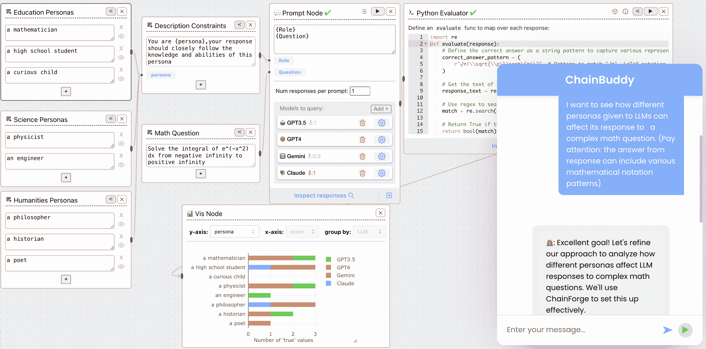
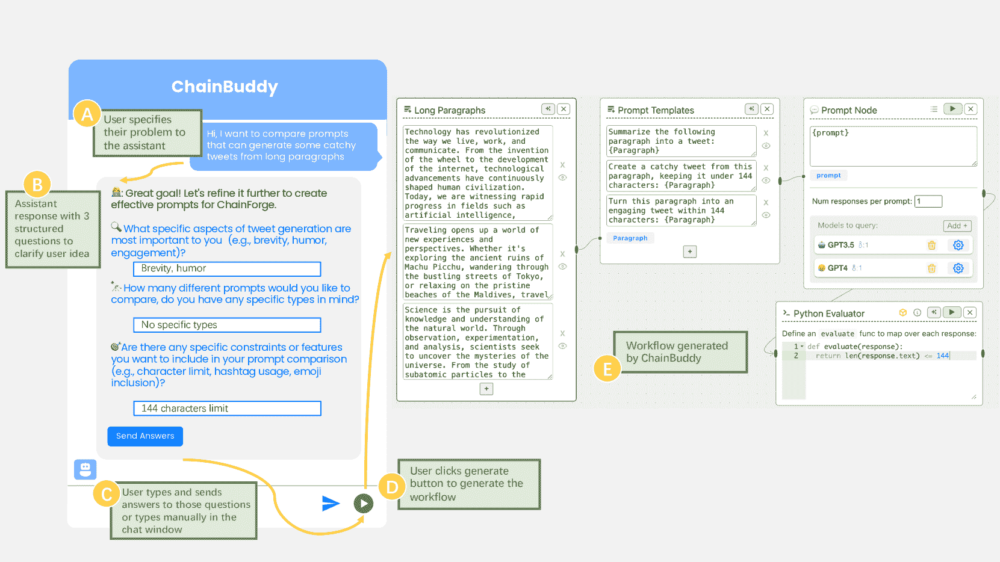
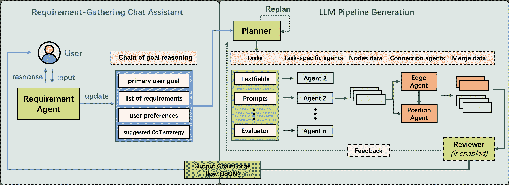
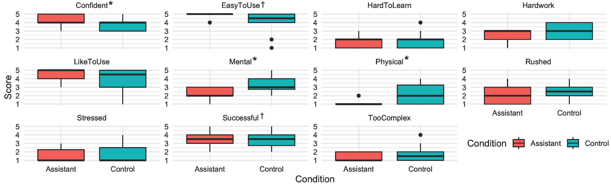

<!--yml

类别：未分类

date: 2025-01-11 12:14:10

-->

# ChainBuddy：一个用于生成 LLM 流水线的 AI 代理系统

> 来源：[https://arxiv.org/html/2409.13588/](https://arxiv.org/html/2409.13588/)

Jingyue Zhang 蒙特利尔大学 蒙特利尔 魁北克 加拿大 [jingyue.zhang@umontreal.ca](mailto:jingyue.zhang@umontreal.ca)  和  Ian Arawjo 蒙特利尔大学 蒙特利尔 魁北克 加拿大 [ian.arawjo@umontreal.ca](mailto:ian.arawjo@umontreal.ca)(2018；2007年2月20日；2009年3月12日；2009年6月5日)

###### 摘要。

随着大规模语言模型（LLMs）的发展，它们的潜在应用已显著增加。然而，仍然很难评估 LLM 在特定用户任务上的表现，并构建有效的流水线来实现这一目标。许多用户在开始时感到困惑，这通常被称为“空白页问题”。ChainBuddy 是一个内置于 ChainForge 平台中的 AI 助手，用于生成评估 LLM 流水线，旨在解决这一问题。ChainBuddy 提供了一种简单且用户友好的方式来规划和评估 LLM 的表现，使得整个过程不再那么令人畏惧，并且更容易适用于各种任务和使用场景。我们报告了一项对比 ChainBuddy 与基准界面的用户研究。我们发现，在使用 AI 帮助时，参与者报告的工作负载较低，并且在设置 LLM 行为评估流水线时更有信心。我们从中得出了一些对未来界面的洞察，这些界面可以帮助用户进行开放性 AI 评估。

语言模型，AI 代理，提示工程，自动化，LLM 流水线，视觉编程环境^†^†版权：无^†^†期刊年份：2018^†^†doi: XXXXXXX.XXXXXXX^†^†会议：预印本；2018年6月03–05日；纽约州伍德斯托克^†^†isbn: 978-1-4503-XXXX-X/18/06^†^†ccs: 以人为本的计算 互动系统与工具^†^†ccs: 以人为本的计算 人机交互的实证研究

图 1\. 一个由 ChainBuddy 从单个用户提示创建的零样本工作流程示例。用户希望调查不同人物角色如何影响 LLM 对复杂数学问题的回答。ChainBuddy 生成了一个包含示例人物角色、数学问题（高斯积分）、模板化提示、四个 LLM 之间的比较以及 Python 代码评估器的 LLM 流水线，以检查 LLM 输出中的解（$\sqrt{\pi}$）。用户可以调整输出，例如在正则表达式中包含更多模式。

## 1\. 引言

在过去两年里，对AI的日益关注催生了大量的工具、API和最佳实践，用于基于LLM创建应用程序。这些进展包括广泛的技术，从提示工程和LLM评估平台到配备工具使用功能的复杂AI代理系统（Shankar等，[2024b](https://arxiv.org/html/2409.13588v1#bib.bib34)；Arawjo等，[2024](https://arxiv.org/html/2409.13588v1#bib.bib2)；Webster，[2023](https://arxiv.org/html/2409.13588v1#bib.bib42)；Beasley和Abouzied，[2024](https://arxiv.org/html/2409.13588v1#bib.bib5)）。

尽管有这些进展，许多用户仍然面临一个重大挑战：“空白页面问题”。这个问题的特点是，当使用像promptfoo（Webster，[2023](https://arxiv.org/html/2409.13588v1#bib.bib42)）或Flowise（Flowise AI，[2024](https://arxiv.org/html/2409.13588v1#bib.bib13)）这样的平台时，往往不知道从哪里开始。部分研究人员提出了社交解决方案，例如开发提示库和社区共享机制（Zamfirescu-Pereira等，[2023](https://arxiv.org/html/2409.13588v1#bib.bib47)）。另一种提议的解决方案是创建一个助手，通过提供初步的指导和结构来帮助用户开始（Arawjo等，[2024](https://arxiv.org/html/2409.13588v1#bib.bib2)）。

采用后者方法，我们的解决方案ChainBuddy是一个由AI驱动的助手，能够根据初始提示自动生成启动的LLM管道（“流”）。ChainBuddy帮助用户开始评估LLM行为和设置链条，通过提供一个定制的启动流，量身定制以满足他们的使用案例，用户可以编辑和扩展该流。我们在现有的开源可视化环境ChainForge（Arawjo等，[2024](https://arxiv.org/html/2409.13588v1#bib.bib2)）的基础上构建了ChainBuddy，该环境旨在进行开放式提示工程、LLM评估和实验任务（比较不同提示和模型的响应质量、设置数据处理管道、建立自动化评估指标）。通过建立在这一基础上，ChainBuddy为用户提供了结构化的帮助，帮助他们克服空白页面问题，使探索、实验和评估LLM在各种潜在任务和使用案例中的行为变得更加容易。我们报告了ChainBuddy的混合方法可用性研究，将该助手与基准界面进行了比较。我们发现，ChainBuddy获得了广泛的支持，特别是在其减少用户努力和需求收集意图引导功能方面，大多数参与者对该助手的能力表示惊讶。我们的贡献包括：

1.  (1)

    一个类似聊天的AI助手和代理架构ChainBuddy，它与用户进行对话，理解他们的需求和目标，然后生成可编辑和交互的启动LLM管道

1.  (2)

    一项在被试内设计的混合方法可用性研究，探讨了ChainBuddy助手与基准界面在相对优势和权衡方面的差异。

1.  （3）

    为未来的AI支持界面提供的见解，并反思用户过度依赖AI助手进行LLM管道生成的风险。

## 2. 相关工作

自从ChatGPT发布以来，LLM（大语言模型）领域已经发展成了一个充满各种专有和开源模型、基础设施以及支持LLM操作的工具的生态系统（有时被称为“LLMOps”）。LLM的独特能力，加上其随机性、非确定性特征以及一些具有影响力的偏见事件（Wolf等人，[2017](https://arxiv.org/html/2409.13588v1#bib.bib43)），引发了如何将LLM最好地集成到更大的软件系统中，以确保系统的鲁棒性和安全性的问题。因此，如何构建“LLM集成软件”逐渐成为软件工程中的一个独特子学科，涉及多个操作，从提示工程、系统评估、到LLM调用链（由Wu等人在HCI中引入为“AI链”（Wu等人，[2022b](https://arxiv.org/html/2409.13588v1#bib.bib46)））以及更复杂的网络结构（Wu等人，[2023](https://arxiv.org/html/2409.13588v1#bib.bib44)），以及为LLM提供访问*工具*的能力——即调用执行用户机器上操作的函数的能力。“AI代理”一词逐渐与后两种架构同义。

为了支持开发者探索这些新实践，出现了大量的图形用户界面和编程库来填补这一空白。像 LangGraph、CrewAI 和 AutoGen（CrewAI，[2024](https://arxiv.org/html/2409.13588v1#bib.bib10)；LangChain AI，[2024](https://arxiv.org/html/2409.13588v1#bib.bib25)；Wu 等，[2023](https://arxiv.org/html/2409.13588v1#bib.bib44)）这样的编码 API 支持开发者创建 AI 代理流（集成大语言模型的子模块），这些代理在异步协作架构中相互传递信息。像 EvalLM、PromptMaker、BotDesigner 和 promptfoo（Kim 等，[2024](https://arxiv.org/html/2409.13588v1#bib.bib22)；Jiang 等，[2022](https://arxiv.org/html/2409.13588v1#bib.bib19)；Zamfirescu-Pereira 等，[2023](https://arxiv.org/html/2409.13588v1#bib.bib47)；Webster，[2023](https://arxiv.org/html/2409.13588v1#bib.bib42)）这样的工具支持提示工程，而 LLM Comparator 和 ChainForge 则更进一步，支持跨模型比较、自动化的代码和大语言模型评估、可视化以及提示链的创建（Kahng 等，[2024](https://arxiv.org/html/2409.13588v1#bib.bib20)；Arawjo 等，[2024](https://arxiv.org/html/2409.13588v1#bib.bib2)）。一些编码 API 旨在防止大语言模型输出的不可预测性，比如 Guardrails、LangChain 和 Instructor（Instructor，[2023](https://arxiv.org/html/2409.13588v1#bib.bib18)；Guardrails，[2023](https://arxiv.org/html/2409.13588v1#bib.bib15)；et al., [2023](https://arxiv.org/html/2409.13588v1#bib.bib11)）。另一种模式是基于数据流的接口在 LLMOps 中的崛起，比如 Flowise、LangFlow、ChainForge 和 PromptChainer，这些通常（但不限于）面向应用开发的可视化编程环境（Logspace，[2023](https://arxiv.org/html/2409.13588v1#bib.bib27)；Flowise AI，[2024](https://arxiv.org/html/2409.13588v1#bib.bib13)；Arawjo 等，[2024](https://arxiv.org/html/2409.13588v1#bib.bib2)；Wu 等，[2022a](https://arxiv.org/html/2409.13588v1#bib.bib45)）。

LLMOps的许多实践促使了最近提出的*自动化*部分流程的建议——从合成输入数据生成和从互联网挖掘数据集（Boyeau等人，[2024](https://arxiv.org/html/2409.13588v1#bib.bib6); Gandhi等人，[2024](https://arxiv.org/html/2409.13588v1#bib.bib14)），到提示优化（Khattab等人，[2023](https://arxiv.org/html/2409.13588v1#bib.bib21); Singhvi等人，[2023](https://arxiv.org/html/2409.13588v1#bib.bib35)），再到帮助用户生成与其偏好对齐的自动评估器（Shankar等人，[2024b](https://arxiv.org/html/2409.13588v1#bib.bib34)，[a](https://arxiv.org/html/2409.13588v1#bib.bib33); Shaikh等人，[2024](https://arxiv.org/html/2409.13588v1#bib.bib32)）。例如，DSPy和Teola作为提示和链优化框架（Khattab等人，[2023](https://arxiv.org/html/2409.13588v1#bib.bib21); Tan等人，[2024](https://arxiv.org/html/2409.13588v1#bib.bib38)）。然而，在更高层次的抽象中仍然存在一个问题：即使是AI/ML专家，用户在设置LLM行为的管道和自动评估时也感到困难，Arawjo等人总结道，“在[概念化和规划方面]需要更多的工作”来支持用户创建LLM管道（Arawjo等人，[2024](https://arxiv.org/html/2409.13588v1#bib.bib2); Zamfirescu-Pereira等人，[2023](https://arxiv.org/html/2409.13588v1#bib.bib47)）。这个问题的一部分无疑是学习新界面的常见困难，但更大的问题是概念性的：如何*“正确的方式”*进行提示工程？如何设置管道？如何评估LLM行为？我们和社区仍在学习这些最佳实践。

管道生成问题与AutoML相似，AutoML是机器学习中的一个研究领域，旨在自动设计机器学习（ML）管道，以训练新的ML模型，无论是部分还是全部（Heffetz等，[2020](https://arxiv.org/html/2409.13588v1#bib.bib17)；Barbudo等，[2023](https://arxiv.org/html/2409.13588v1#bib.bib4)；Feurer等，[2022](https://arxiv.org/html/2409.13588v1#bib.bib12)）。与LLMOps领域中的典型问题相比，AutoML面临着独特的挑战（例如，管理非常大的训练数据集、确定超参数并权衡预期训练成本与性能的折衷）。受此类ML研究的启发，我们在此研究*端到端生成LLM管道*，这是一个新兴的研究领域，我们称之为AutoLLMOps：从一个单一用户提示开始，是否可以生成一个*可检查*、*互动*和*可编辑*的管道，完整地包含输入数据、提示(s)、模型(s)，甚至是自动化评估？我们能为开放性任务构建这样的系统吗？用户能从中获得什么好处？如果有的话，自动化会带来哪些风险？据我们所知，目前还没有HCI论文研究过这个问题。随着新的LLM代理框架的出现，新兴研究表明，这种端到端生成工作流的方式是可行的，尽管是在处理不同任务时，如给定用户提供的数据集的描述性分析（Beasley和Abouzied，[2024](https://arxiv.org/html/2409.13588v1#bib.bib5)）或用于聊天机器人的创建（Sánchez Cuadrado等，[2024](https://arxiv.org/html/2409.13588v1#bib.bib31)）。在这里，我们将这一思路应用于LLM管道，特别是聚焦于帮助用户评估LLM行为的管道。

## 3\. ChainBuddy系统设计

为了自动化LLM管道的创建，我们专注于创建一个灵活、用户友好的界面，能够支持广泛的应用场景，而不仅仅是提示工程。我们决定在开源ChainForge平台内构建一个聊天机器人风格的助手界面——ChainBuddy（Arawjo等， [2024](https://arxiv.org/html/2409.13588v1#bib.bib2)）。这一选择源于对一个直观且互动的环境的需求，该环境能够支持不同管道中各种用户的需求，例如数据处理、提示优化、LLM审核等。我们的目标是确保ChainBuddy能够处理多样化和复杂的需求，同时对不同技术水平和使用场景的用户都具有可访问性。请注意，我们的最终目标是扩展ChainBuddy，指导用户超越初始生成，即编辑现有流程；然而，由于代理系统的复杂性以及问题的开放性，我们在此仅考虑ChainBuddy从头生成流程的能力。

### 3.1\. 界面和示例用法

ChainBuddy助手可以在图[2](https://arxiv.org/html/2409.13588v1#S3.F2 "Figure 2 ‣ 3.1\. Interface and Example Usage ‣ 3\. ChainBuddy System Design ‣ ChainBuddy: An AI Agent System for Generating LLM Pipelines")中看到。该助手包括ChainForge平台左下角的标准聊天界面。用户与助手开始聊天以说明他们的问题（图[2](https://arxiv.org/html/2409.13588v1#S3.F2 "Figure 2 ‣ 3.1\. Interface and Example Usage ‣ 3\. ChainBuddy System Design ‣ ChainBuddy: An AI Agent System for Generating LLM Pipelines")a）。然后，助手与用户进行问答对话，以澄清用户的意图（Ma等人，[2024](https://arxiv.org/html/2409.13588v1#bib.bib29); Vaithilingam等人，[2024a](https://arxiv.org/html/2409.13588v1#bib.bib39)）（图[2](https://arxiv.org/html/2409.13588v1#S3.F2 "Figure 2 ‣ 3.1\. Interface and Example Usage ‣ 3\. ChainBuddy System Design ‣ ChainBuddy: An AI Agent System for Generating LLM Pipelines")b）。这包括一个环节，助手会提出最多三个问题，用户可以通过填写表单单独回答每个问题（图[2](https://arxiv.org/html/2409.13588v1#S3.F2 "Figure 2 ‣ 3.1\. Interface and Example Usage ‣ 3\. ChainBuddy System Design ‣ ChainBuddy: An AI Agent System for Generating LLM Pipelines")c）。在任何时候，用户都可以结束澄清过程并通过点击按钮触发AI生成流程（图[2](https://arxiv.org/html/2409.13588v1#S3.F2 "Figure 2 ‣ 3.1\. Interface and Example Usage ‣ 3\. ChainBuddy System Design ‣ ChainBuddy: An AI Agent System for Generating LLM Pipelines")d）。然后，用户可以检查生成的流程或请求新的生成（图[2](https://arxiv.org/html/2409.13588v1#S3.F2 "Figure 2 ‣ 3.1\. Interface and Example Usage ‣ 3\. ChainBuddy System Design ‣ ChainBuddy: An AI Agent System for Generating LLM Pipelines")e）。我们保持助手界面简单，因为我们大多数贡献的复杂性集中在代理架构和流程生成能力上。

图2. ChainBuddy界面及示例使用。用户指定需求（A），ChainBuddy回复需求收集表单（B），用户可以填写并发送，或继续进行开放式聊天（C）。用户按下绿色按钮（D）表示他们已准备好生成流程。经过10-20秒的延迟后，ChainBuddy生成一个起始流水线（E）。在这里，起始流水线包括示例输入、多个提示（提示模板）、两个查询模型以及基于Python的代码评估器。

请注意，在本文中，我们重点解释和展示ChainBuddy的界面和工作流，而不是基线界面中的内置功能，例如响应检查器（LLM响应表）和不同节点。对于不熟悉ChainForge平台的读者，我们建议参考公开文档或相关论文（Arawjo等人，[2024](https://arxiv.org/html/2409.13588v1#bib.bib2)）。

### 3.2\. 系统架构

图3\. ChainBuddy系统架构。前端需求代理引导用户意图和上下文（左侧）。当用户按下生成按钮（图[2](https://arxiv.org/html/2409.13588v1#S3.F2 "图 2 ‣ 3.1\. 界面和示例使用 ‣ 3\. ChainBuddy系统设计 ‣ ChainBuddy：用于生成LLM管道的AI代理系统")d）时，用户意图的规范会发送到后端的规划器。规划器代理将问题拆解为任务并将每个任务分配给专门的代理；这些输出通过提供布局的连接代理进行合并，并传递给可选的审阅者代理。最终输出作为完整的ChainForge流程（JSON）传递到前端。

ChainBuddy基于LangGraph（LangChain AI，[2024](https://arxiv.org/html/2409.13588v1#bib.bib25)）构建，LangGraph是一个用于构建具有状态、支持多个参与者的LLM应用程序的库。LangGraph的核心优势包括处理循环的能力、提供精细化控制以及确保持久性。这些功能对于创建可靠的基于代理的工作流至关重要，能够支持高级的人工参与和记忆功能。我们使用Anthropic的Claude 3.5 Sonnet作为前端需求收集代理，后端所有代理则使用OpenAI的GPT-4o。

#### 3.2.1\. 需求收集

ChainForge平台的需求收集代理的设计灵感来源于“推理链”（Suzgun和Kalai，[2024](https://arxiv.org/html/2409.13588v1#bib.bib36)）提示方法，该方法是从开源GitHub项目Professor Synapse中改编而来，Professor Synapse是一个“旨在帮助用户实现目标的AI指南”（Synaptic Labs，[2024](https://arxiv.org/html/2409.13588v1#bib.bib37)）。用于意图引导的结构化界面灵感来自ExploreLLM（Ma等人，[2024](https://arxiv.org/html/2409.13588v1#bib.bib29)）。该代理使用一个字典来更新关于主要用户目标的上下文信息、解决方案应解决的当前需求列表以及其他用户偏好。这个结构会在代理与用户的交互过程中不断更新。总体而言，代理通过三种类型的目标问题来细化理解：

1.  (1)

    目标澄清问题：这些问题帮助理解用户希望实现的总体目标，以及他们问题的背景。

1.  (2)

    需求探索问题：旨在揭示与用户目标一致的具体需求、约束和细化要求。

1.  (3)

    澄清问题：请求任何澄清，以解决整体用户目标和需求之间的歧义或矛盾。

这种互动式方法确保了在迭代对话过程中，随着新见解或约束的出现，能够灵活应对变化。需求收集代理还旨在帮助用户在向后端工作流生成代理发送精确消息之前，更好地理解和反思自己的需求和目标，因为与聊天过程相比，后端工作流生成代理的处理相对更耗时且成本更高。

#### 3.2.2\. 工作流生成

受到《Plan-and-Solve Prompting: Improving Zero-Shot Chain-of-Thought Reasoning by Large Language Models》（王等， [2023](https://arxiv.org/html/2409.13588v1#bib.bib41)）以及像Baby-AGI（中岛，[2024](https://arxiv.org/html/2409.13588v1#bib.bib30)）这样的项目的启发，我们设计了ChainBuddy的代理系统，以根据用户需求生成长期计划（见图[3](https://arxiv.org/html/2409.13588v1#S3.F3 "Figure 3 ‣ 3.2\. System Architecture ‣ 3\. ChainBuddy System Design ‣ ChainBuddy: An AI Agent System for Generating LLM Pipelines")）。这种方法涉及将每个任务分解为可由单个代理执行的具体、可管理的操作，代理将结构化数据返回给上游代理（即JSON）。这种设计使得每个代理可以专注于单一任务，从而提高效率和准确性。关键的架构特点包括：

+   •

    需求收集聊天助手：一个以聊天为主的代理与用户互动，以澄清用户意图并获取问题的上下文，然后再进入生成步骤。

+   •

    规划代理：接收来自用户目标前端的规范，并制定全面的实施计划。规划代理会获得它可以访问的所有ChainForge节点的上下文信息，包括节点的名称、描述以及它们允许的连接方式。

+   •

    任务专用代理：计划中的每个任务都分配给特定代理，从而实现集中的执行。在这里，“任务”主要映射到ChainForge界面中需要生成的不同节点。¹¹1在我们的可用性研究中，我们将节点限制为：TextFields节点、Prompt节点、LLM评分节点和Python代码评估节点。这种专业化可以允许使用较小、较不强大的模型来执行任务，而将较大、更强大的模型保留用于规划。

+   •

    连接代理：这些代理处理任务专用的输出（作为表示要添加的ChainForge节点的JSON数据），创建连接这些节点的边缘规范，并为节点填写初始的x-y位置。

+   •

    事后审阅者代理：一个最终的审阅者代理会根据初始用户提供给Planner代理的标准评估生成的流程。如果生成的流程未达到预期，审阅者可以触发Planner重新规划，然后再将流程呈现给用户。（请注意，对于我们的可用性研究，我们禁用了审阅者，因为它显著增加了生成时间。）

通过利用这些架构原理，ChainBuddy旨在为广泛的LLM相关任务提供一个强大、可扩展的解决方案。最后请注意，我们在此展示的系统仅限于ChainForge中的几个特定节点：TextFields节点，用于定义输入数据；Prompt节点，用于提示一个或多个模型并进行提示模板化；Python代码评估器和LLM评分节点，用于评估LLM输出；以及Vis节点。该系统还支持模板链式（Arawjo等，[2024](https://arxiv.org/html/2409.13588v1#bib.bib2)），用于跨提示进行比较；即，将提示模板放入TextField输入并将其链式连接。模板链式主要用于以结构化的方式比较提示。

### 3.3\. 早期反馈

我们通过在新任务上进行内部测试的迭代过程设计了ChainBuddy，从提示比较，到模型比较，再到评估LLM的身份偏见。特别是，我们发现AI有过度拟合少量示例的倾向（例如，总是选择评估两个模型，或者使用特定的输入数据）；基于此，我们在某些地方（如Planner代理提示）移除了少量示例。我们还进行了非正式的试点研究，以收集早期反馈并改进我们的系统。我们发现的一些早期见解如下：

+   •

    意图歧义消除：用户输入的一个提示通常没有足够的信息来生成详细的工作流程，以满足用户的实际需求。基于此，我们选择了更具互动性的聊天方式。

+   •

    结构化引导：我们实现了类似于ChatGPT的聊天方式，在这种方式中，系统向用户提问。然而，LLM的输出通常很长，或者列出了多个问题，用户很难以自然的方式作答。基于此，我们选择了一种结构化的表单填写方法，让用户只澄清他们想要的那些问题。我们还限制了问题的数量和长度。

+   •

    反馈：用户建议加入诸如可视化加载进度、以及提供可解释的AI元素，帮助用户理解系统如何得出某些可视化或结果。

+   •

    编辑现有流程的需求：一些用户希望继续与助手聊天，要求ChainBuddy修改或扩展流程。我们也希望有这个功能，但认为在一篇论文的限制内很难解决这个问题。

## 4\. 可用性研究

为了评估ChainBuddy，我们进行了一个以被试为基础、混合方法的用户研究，针对基准界面（没有ChainBuddy的ChainForge），因为它是与设置LLM管道的“手动”开放式系统最直接的比较。我们的目标主要集中在人们如何希望使用AI助手生成LLM行为的评估；具体来说，对于我们的定性评估：

1.  (1)

    相较于基准系统，他们最欣赏助手的哪些方面？

1.  (2)

    用户是否认为需求收集的互动既有帮助又必要？

1.  (3)

    参与者希望使用ChainBuddy解决哪些问题？（自由探索任务）

1.  (4)

    用户在与助手互动后，是否感觉自己的想法或假设发生了变化？

1.  (5)

    用户如何编辑生成的流程？他们通常会做哪些修改？

1.  (6)

    用户在与助手互动过程中是否学到了什么？（如果有，学到了什么？）

我们还寻求了关于以下假设的定量、主观指标，结构化任务通过自报告的完成时间来衡量，²²2具体而言，从参与者首次点击或输入界面开始，到他们表示“完成”或时间用尽为止。所有任务的时间限制为12分钟；如果时间用尽，记录为最大时间。NASA TLX认知负荷量表（Hart，[1988](https://arxiv.org/html/2409.13588v1#bib.bib16)），以及五个系统可用性Likert问卷的子集³³3这五个问题是：“我觉得系统易于使用”，“我希望经常使用这个系统”，“我觉得这个系统不必要地复杂”，“我使用系统时感到自信”，以及“我在使用这个系统前需要学很多东西”，这些问题源自系统可用性量表（Brooke，[1996](https://arxiv.org/html/2409.13588v1#bib.bib7)）：

+   H1.

    用户认为使用ChainBuddy时，相较于不使用，它能够更快地完成任务。

+   H2.

    用户认为使用ChainBuddy时，工作负担比使用手动基准界面要轻。

+   H3.

    用户报告称，相较于不使用时，使用ChainBuddy时的自我满意度更高（即易用性、信心、可学习性）。

+   H4.

    用户在使用ChainBuddy时，相较于不使用，能够更成功地完成任务。

### 4.1 招募和参与者

我们通过北美一所大学的邮件列表和Slack频道招募了12名实验室内参与者，主要来自计算机科学和工程学科。参与者的年龄在18到34岁之间（7人年龄在23到27岁之间，3人年龄在28到34岁之间，1人年龄在18到22岁之间），性别平衡（7名女性，6名男性）。12名参与者中有10名来自计算机科学或工程背景（另外两名分别来自神经科学和生命科学）。他们报告了较高的LLM（大型语言模型）使用经验（平均值$\mu{=}3.83$，标准差$\sigma{=}0.71$，量表1-5，5为最高）以及Python编程知识（平均值$\mu{=}3.83$，标准差$\sigma{=}1.11$；只有P6，来自生命科学背景，表示没有相关知识）。一半的参与者自我报告曾参与过“涉及评估[LLMs]的大学研究、论文或项目”，并且有三名参与者在研究前听说或使用过ChainForge。每个研究耗时75分钟，参与者获得30加元（CAD）的现金报酬。

### 4.2\. 方法论、程序与任务

我们设计了一个结合多种方法的被试内设计研究。共有两个条件：助手（使用ChainBuddy）和控制组（基线的ChainForge界面，不使用ChainBuddy）。我们还设计了两个大致相同风格和难度的任务，并将它们以平衡的方式随机分配到不同的条件中。任务包括$T_{\texttt{email}}$：“你是一名软件工程师，任务是设计一个自动化工具，帮助人们为工作场景专业化他们的邮件”，以及$T_{\texttt{tweet}}$：“你正在开发一个工具，帮助将长段文本压缩成简洁且引人注目的推文，限制在144个字符以内。”在这两种情况下，我们告诉用户他们的目标是“在ChainForge中设置一个可以帮助你找到‘最佳’提示的工作流程”，并强调他们的目标“不是找到最佳提示，而是设置一个工作流，帮助你找到最佳提示并进行比较。”有$2\times 2=4$种独特的条件$\times$任务排列方式。在12名参与者中，这意味着每种排列有三（3）名参与者体验，六（6）名参与者先体验控制组。

在获得知情同意后，研究程序如下：

1.  (1)

    一段5分钟的视频概述了ChainForge界面

1.  (2)

    一段教程引导用户通过编写一个提示模板的过程，该模板接受一个成分并返回可以制作的菜肴，通过模板链式比对、查询模型和检查结果来比较提示。该教程为参与者提供了成功所需的一切，因为任务的解决方案与教程流程在结构上非常相似。（教程没有介绍助手；详见下文。）

1.  (3)

    第一个条件和任务，以随机分配并在参与者之间进行平衡的方式进行。任务完成后，填写任务后问卷。

1.  (4)

    第二个条件和任务，以及任务后问卷。

1.  (5)

    无结构探索，参与者在助手条件下检查他们拥有的想法或假设。他们不需要使用助手。

1.  (6)

    后访谈和补偿

助手条件之前还有一个小型教程，每当条件出现时，都会直接进行。我们故意避免在前置任务教程中向参与者展示助手，因为我们希望减少参与者在首次体验控制界面时“猜测研究假设”（需求特征）可能带来的偏差。

### 4.3\. 数据分析

参与者的互动进行了屏幕和音频录制。我们还捕获了与助手的聊天日志数据，并保存了所有任务的流程（文件），以供后续分析。我们通过归纳主题分析处理定性数据；具体而言，第一作者迭代地将研究过程中所有参与者的评论（包括后访谈）进行亲和图分类，以得出聚类（编码）。这些聚类和编码随后由两位作者讨论，直到达成共识。

我们使用R中的重复测量线性混合效应模型（Luke, [2017](https://arxiv.org/html/2409.13588v1#bib.bib28)）分析了定量数据，检查了条件、任务和顺序的固定效应，以及这些因素之间的所有交互效应，并控制了参与者的随机效应。主效应和交互效应的P值是通过Satterthwaite自由度方法计算的，并从ANOVA表中报告，使用lmerTest（Kuznetsova等人，[2017](https://arxiv.org/html/2409.13588v1#bib.bib24)）。事后检验通过估计边际均值（emmeans）和Bonferroni校正进行；在包括估计值（$\beta$）和t统计量（$t$）时，报告的p值来自emmeans。我们通过Q-Q图检查了模型残差的正态性以及同方差性假设。我们的定量结果旨在补充我们的定性发现。

## 5\. 研究发现

图4\. 参与者对NASA TLX和系统可用性Likert问卷的回应，按条件分组。星号(*)表示条件的显著主效应，$p<0.05$；† 表示另一个主效应、交互效应或异常值。

### 5.1\. 定量结果

我们在这里总结了主要的定量发现，然后再深入探讨具体内容。总体而言，参与者认为助手比控制条件显著*更不费脑力*且*更不费体力*。使用助手时，参与者也表现得*更有信心*且*表现更好*。最后，参与者在助手条件下*平均创造了至少一种新的节点类型*，其中部分效应可以通过助手生成的评估节点来解释（在控制条件下，只有一个参与者创建了Python代码评估器）。

任务的顺序效应也影响了感知成功性和易用性，尤其是在控制条件出现在助手之后时。尽管这些结果是特定的，且与任务交互（见下文），并且考虑到研究样本量较小，它们可能被视为随机波动或需求特征；然而，综合考虑，这些结果可能表明一个小的“怀念助手”效应——首先使用助手帮助一些参与者将他们的知识应用到下一个任务中，但也可能让他们认为基础界面更难使用。

#### 5.1.1. 完成时间（H1）

我们没有发现$p{<}0.05$时的显著主效应。我们报告了条件与顺序的交互效应接近显著（$\beta{=}-239.5$，$t{=}-2.22$，$p{=}0.04$）：当人们在控制条件后体验助手时，他们感觉任务完成得更快（$\mu{=}357$秒对$\mu{=}610$秒；95% 置信区间[195, 518]对[445, 771]）。

#### 5.1.2. 工作负载需求（NASA TLX）（H2）

我们发现条件对心理需求和身体需求有主效应，参与者在使用助手时任务的心理需求较低（$\beta{=}-0.91$，$t{=}-2.66$，$p{=}0.01$）且身体需求较低（$\beta{=}-1.08$，$t{=}-3.15$，$p{=}0.01$）（图[4](https://arxiv.org/html/2409.13588v1#S5.F4 "图 4 ‣ 5. 发现 ‣ ChainBuddy：用于生成LLM管道的AI代理系统")）。在感知成功性方面，任务也有显著效应（$\beta{=}0.66$，$t{=}$2.53，$p{=}0.02$），并且条件与任务（$p{=}0.02$）以及任务与顺序（$p{=}0.006$）之间有两个交互效应。事后均值检验表明这一效应的两个来源：参与者报告他们在完成$T_{\texttt{email}}$时比完成$T_{\texttt{tweet}}$更成功，但仅当$T_{\texttt{email}}$出现在第二时，可能表明存在学习效应（$\beta{=}1.5$，$t{=}$4.02，$p{=}0.005$）；而在控制条件下，参与者在解决$T_{\texttt{tweet}}$时感觉不太成功（$\beta{=}1.33$，$t{=}$3.57，$p{=}0.01$）。没有其他问题在$p{<}0.05$时达到显著性。

#### 5.1.3. 感知系统可用性（H3）

我们发现条件对自信心有显著的主效应（$\beta{=}0.5$，$t{=}2.44$，$p{=}0.04$）。参与者在使用助手时感觉更有信心（图[4](https://arxiv.org/html/2409.13588v1#S5.F4 "图 4 ‣ 5. 发现 ‣ ChainBuddy：用于生成LLM管道的AI代理系统")）。

对于易用性，我们发现条件、任务和顺序之间存在三向交互作用（$p{=}0.003$）。数据的视觉检查揭示了两个异常值是罪魁祸首：两位在第二位置接受了控制条件的$T_{\texttt{tweet}}$的参与者，他们分别给易用性评分为1和2（P2和P7；只有另一位参与者P9经历了这种顺序）。所有其他参与者在易用性上都给控制条件评分为4或更高，中位数为4.5。十一位（共12位）参与者给助手的易用性评分为5（一个评分为4）。异常值的一个可能解释是，这些参与者在$T_{\texttt{tweet}}$任务中“错过”了AI助手减少他们工作量的作用，该任务要求参与者将“长段落”总结为推文——这要求他们创建测试数据。可能是因为知道助手可以为他们生成长示例段落，这些参与者对手动输入数据感到沮丧。（事实上，有证据支持这一点：P2使用了一个独立的提示节点生成测试段落，作为没有助手访问时的解决方法。）

没有其他问题达到显著性，表明参与者在不同条件下对界面的喜好相似，并且觉得学习难度相似。

#### 5.1.4. 性能（H4）

我们通过三个二元（真假）度量标准来估计用户在任务中的表现，这些度量标准在两个任务描述中共享：他们的最终流程是否明确比较了两个提示，流程是否能够运行（即提示节点是否可以运行），以及流程是否使用了模板链式结构来比较提示（最后一项是教程中介绍的功能，是预期的解决方案，但不是唯一的）。图表强烈支持助手条件（图[5](https://arxiv.org/html/2409.13588v1#S5.F5 "图 5 ‣ 5.1.5. 创建节点的数量和类型 ‣ 5.1. 定量结果 ‣ 5. 研究发现 ‣ ChainBuddy: 用于生成LLM管道的AI代理系统")），表明，*尽管参与者自评在两种界面中的成功率相似，*在控制条件下，三分之二的参与者未能充分解决任务（没有创建帮助用户比较提示的工作流），而在使用助手时，十一位（共12位）参与者成功解决了该任务。

#### 5.1.5. 创建节点的数量和类型

最后，我们检查了参与者最终工作流中的节点数量以及节点类型数量（例如，一个包含两个TextField和一个Prompt Node的工作流有3个节点和2种节点类型）。无论在什么条件下或任务中，参与者创建的节点数量都差不多——这表明他们的工作流的复杂度和规模相似。然而，在节点类型方面，我们发现条件（$\beta{=}0.583$，$t{=}4.04$，$p{=}0.003$）和顺序（$\beta{=}{-}0.417$，$t{=}{-}2.887$，$p{=}0.02$）有主要影响。平均而言，在助手条件下，参与者创建的节点类型显著多于控制组；具体来说，他们创建了大约一个更多的节点类型（控制组的中位数为2种节点类型，而助手组为3种节点类型）。参与者在第二个任务中也创建了更多的节点类型，表明无论条件或任务如何，存在学习效应。事后分析显示，助手条件下显著更多的评估节点（无论是基于代码的还是基于LLM的）（$\beta{=}0.58$，$t{=}3.5$，$p{=}0.008$），其他节点类型没有达到显著性。进一步检查数据时，只有一位参与者在控制条件下添加了一个Python代码评估节点。⁴⁴一个解释是编写Python代码既困难又耗时，且由于我们没有筛选参与者的编程技能，一些人可能无法编写该代码。总体而言，这表明助手帮助参与者创建了更多评估类型的节点，尤其是Python代码评估节点，并且参与者随着时间的推移尝试了更多的界面功能。

图5\. 性能指标比较不同条件和任务下正确解决方案的预期质量：流程是否明确比较了两个提示，流程是否可以运行（即，提示节点是否可以运行），以及流程是否使用模板链接来比较提示（这是在教程中介绍的功能，也是预期的解决方案）。

### 5.2\. 定性结果

我们对结构化任务和非结构化探索中的互动和访谈数据进行了分析。总体而言，我们发现了几个关于参与者使用ChainBuddy的关键洞察：

+   •

    ChainBuddy帮助用户克服了“空白页问题”，将模糊的想法转化为具体的工作流草稿。

+   •

    ChainBuddy的需求收集过程帮助参与者引导用户目标和标准，提供了一种结构化的方式来呈现需求，并扩展了用户的思维。

+   •

    参与者认为助手减少了工作量，加快了工作流，并缓解了使用基线界面的学习曲线。

+   •

    ChainBuddy超出了参与者的预期，其能力令用户感到惊讶。

+   •

    具有丰富提示工程经验的参与者认为ChainBuddy有助于他们的提示工程过程。

+   •

    参与者在与助手互动后，对可能的偏见或对问题解决方式的影响表示担忧。

我们首先在下面的章节中扩展这些发现，然后讨论研究中识别的互动模式。

#### 5.2.1\. 作为起点的助手

八位参与者发现，ChainBuddy为他们的任务提供了一个很好的起点，帮助他们克服了从零开始的初步挑战。P5表示：“也许从空白页面开始很难。最好从一些问答开始，这样你就有了一个基础结构。”该助手帮助用户快速生成初步的工作流程草稿，减少了从零开始所需的努力。P1认为，“助手可以给我一个初稿，这很不错。”类似地，P9强调了拥有示例的重要性，“这样可以更容易地将事情放到上下文中”，这帮助他们决定是否继续执行助手的建议，或者优化自己的方法。

#### 5.2.2\. 需求收集过程帮助完善想法并引出需求

六位参与者反映，助手在意图消歧过程中采用的结构化和迭代方法使得这一过程比传统的提示更有条理，也更容易跟随。此外，迭代式提问让用户更加深入地思考他们的任务，并明确一些可能会忽视的细节，参与者认为这导致了更详细的工作流程。

例如，P12提到，“有时……我确切知道我想要什么，但我不一定会把所有信息都放进提示里。”P9发现，“后续的问题让你创建了一个更全面的工作流程”，而P8则“非常惊讶它会根据我需要的内容提问。”这种表单填写界面帮助用户以一种更易于管理、不那么压倒性的方式提供信息，而不是一次性写下所有内容（例如P9：“我很惊讶你可以在每个问题下输入答案，而不是必须把所有内容一口气写成一大段文字”）。通过向用户提出相关问题，助手还能够帮助他们拓宽思路并完善他们的想法。P1发现，助手“问了我其他问题，我就会想到，‘哦，确实，我可以这么做。’”P7表示，“这很令人印象深刻，因为它开始问我关于设计本身的问题，很清晰且精准”，并评论说助手鼓励他“更多地从抽象的角度思考想法本身。”

然而，参与者也担心问答意图引导可能会过度，其中四位建议限制问答轮次或提供有关何时信息足够的指导。P9担心会“过于纠结细节，这就是我回答补充问题太多。就像我不停地挖掘……你最终会创造出一个过于僵化的模型。”P12也表示，“如果你不停地继续，问题一直被问，那时你就开始自相矛盾了。”一个改进设计的建议是让助手判断何时信息足够，可以继续生成（例如，P7说：“我确实认为，如果它理解了问题，它应该知道何时停止。”，P2希望“有一个指示器……[系统在此时]所达到的理解程度”）。

#### 5.2.3\. 超越用户预期

十位参与者表示助手不仅满足了他们的预期，还超出了他们的初步期望。参与者一致表示对助手的能力感到惊讶，特别是在它能够提出相关的后续需求收集问题并生成详细工作流方面。例如，P2表示，“我没想到它能生成如此接近的工作流。但它给了我两个额外的节点，理解了这些是我的需求，所以我可能会使用它。”P1对助手的表现感到惊讶：“它问了非常好的后续问题，让我重新思考问题，并生成了一个很好的流程。”类似地，P8最初期望的是一个基本的聊天机器人，但当助手“根据我的需求提问”时，给他们的思路拓展并改善了他们的提示，他们感到非常印象深刻。P6特别对ChainBuddy能为复杂目标生成工作流感到印象深刻，表示：“我让它比较10个医学专业的详细收入，它做得非常好，而且也处理了更复杂的任务，没有误解。”

当被要求澄清时，参与者解释说他们原本期望助手只是一个基本的问答聊天机器人，但发现它更加互动且富有洞察力。例如，P10的“期望是类似于ChatGPT那样的，它实际上会给你最终的输出，而不是问太多问题，来回反复，”但他们欣赏助手“尝试理解你的目标是什么，你的标准是什么。所以我比更喜欢它，而不是ChatGPT。”

#### 5.2.4\. 降低努力

参与者认为助手减轻了他们的工作负担并简化了任务执行，这与我们的定量结果相得益彰。P10表示：“当我使用助手时，心理负担小了很多”，这尤其有益，因为助手帮助“将我的询问转化到这个平台上”，使得体验对于初学者更易接受。同样，P8观察到，没有助手时，“自己想的时候挺难的，比如制作流程和正确安排”，而助手简化了这个过程。没有助手，参与者可能会发现手动设置流程既混乱又低效。P6回忆道，没有助手的工作“比我预期的要难得多。任务一开始看起来很简单，但当我手动做时，有些东西并没有落入我预期的类别。” P4认为助手界面“非常直观，它生成后，你只需要拖放一切[之后]。所以我没有遇到任何挫折。”

#### 5.2.5\. 加速工作流程

参与者表示，助手显著加快了他们的工作流程。P11评论道，“有了助手，真的很快。它给了你想法，并在平台上完成了所有必要的连接，所以你节省了手动创建整个工作流程的时间。而且，最重要的是，它还节省了启动时的心理负担。”同样，P9认为，虽然他们的成功率和解决方案没有显著差异，“但使用ChainBuddy时就是更快了。”

#### 5.2.6\. 帮助用户学习平台

一些参与者认为助手帮助他们学习和适应平台，减少了学习曲线，使工具对第一次使用的用户更为友好。P7强调，“通常没有助手且没有任何可以工作的东西时，你需要，类似于学习新的编程语言”，但有了助手，过程“非常快速”。P3指出，“第一次练习时，我真的不知道应该做什么，使用助手后，一切变得更清晰了。” P5也发现助手在引导他们完成任务时很有帮助，表示“它给出了一个示例，展示了这些[节点]如何连接。我看到后，哦，我可以用相关的东西[节点标题]来命名这些[节点]，尤其对于第一次使用工具的人来说，命名相关[节点]非常有帮助。” P3对AI工具经验有限，但对助手的能力印象深刻，表示“助手真是启发了我”，并且发现它比他们之前在其他界面上使用的AI聊天机器人更有效。

助手对于帮助参与者克服理解界面初步障碍尤其有益。P6 分享说，如果没有助手，“我有时真的不知道该做什么”，但有了助手，他们“什么都不用想”。P7 也说，“没有助手，第一次使用者会遇到障碍，很多人会感到困惑”，就像使用不熟悉的东西时遇到的挑战一样。P11 觉得助手“改变了[我的方法]，让它变得更好”。

#### 5.2.7\. 精简提示工程

在我们的研究中，有三位参与者在日常工作中经常进行提示工程。P7 解释说，在他们的提示工程任务中，他们经常需要“为每个大型语言模型（LLM）编写程序并收集响应”，这非常耗时。助手具备处理这些任务的内置工具，因此“它会为你做所有这些事情，因为它已经拥有模型，拥有评估工具，你不需要花很多时间来实验多个内容。”P4 反思说，“我认为进行提示工程最困难的部分是编写初始提示集。我认为这是助手非常有帮助的地方，它给你提供了一个初始提示集，然后你可以开始工作……这真的是一个非常非常好的产品，我会经常使用它。”P12，通常需要应对实际工作中数据格式变化的参与者，发现助手在创建一个能够比较提示并标准化不同结构化信息的工作流方面非常有帮助。

#### 5.2.8\. 与助手的互动模式

我们在参与者使用助手的过程中识别出了三种模式，这些模式来自于对结构化任务和自由探索时间的屏幕录制记录的定性分析。许多参与者（8人）对助手的解决方案进行了最小的编辑，调整输入值，但保持了其整体结构。这种方式主要出现在结构化任务中，七位参与者在任务中依赖助手，而在自由探索中则只有三位参与者采用这种方式。其次，我们看到一些参与者在不改变助手解决方案结构的情况下进行了大量修改，除了修改输入数据外，还完全改变了提示语。这种方式使参与者能够调整助手的建议，以更好地适应自己的需求，同时仍然信任助手初步解决方案的结构。第三，参与者修改或扩展了助手解决方案的结构，形成了更复杂和定制化的链条（例如P1、P2、P9和P10）。最后这种方式展示了助手的协作性使用，其建议被视为一个基础，用户可以在其上添加自己的创造力和复杂性。需要注意的是，在自由探索期间，参与者P3和P12没有直接使用助手，但从助手在第二个任务中的解决方案中得到了启发（例如，“因为我脑海中的结构与助手上次做的结构有些相似”以及“我已经有了一些想法，我从一个现有的链条开始构建”）。

#### 5.2.9\. 关于助手偏见和影响的担忧

一些参与者表达了对使用助手可能影响他们解决问题方式的担忧，认为这可能会对他们之后的任务产生偏见。P9反思了这一影响：“我做的第一个任务是用ChainBuddy做的，第二个任务没有用[它]，但我觉得因为我一开始用[它]，它就有点像教我怎么做。”两位参与者注意到，他们在自由探索时间对想法的处理方式与助手引入的结构相似。P3说：“我没有使用助手，因为我脑海中的结构与助手做的最后一个任务结构有点类似”，这表明即使没有直接使用助手，其影响仍然存在。P12也描述了她是如何“从一个现有的链条开始构建，而那个链条来自助手做的第二个任务。”这种延续性表明，最初与助手的互动可能会设置一种模式，即使用户试图独立工作时，也会继续遵循这一模式。我们在讨论中进一步反思了这一风险。

#### 5.2.10\. 自由探索时间中的使用案例

在自由探索时间内，参与者探索了多种不同的想法，展示了在与助手合作解决特定需求和兴趣时的创意和多样化应用。话题的多样性反映了与基准界面ChainForge（Arawjo等人，[2024](https://arxiv.org/html/2409.13588v1#bib.bib2)）的研究中类似的多样性。参与者的使用情况可以分为三大类：比较和探索不同的提示，评估不同LLM（大型语言模型）的行为，以及测试LLM的偏见和敏感话题处理能力。参与者的完整创意列表请见附录[A](https://arxiv.org/html/2409.13588v1#A1 "Appendix A Participant Ideas in Free Exploration ‣ ChainBuddy: An AI Agent System for Generating LLM Pipelines")。

### 5.3\. 限制

我们的内部可用性研究样本量较小，并且只与单一基准进行了比较。可能对于不同的LLM管道界面，我们会看到不同的结果。我们没有限制用户对基准界面的先验知识——可能经验丰富的ChainForge用户会对助手的能力有不同的看法。由于可用性研究中常见的各种限制，我们仅研究了两个任务，且这两个任务都涉及跨提示的比较，尽管ChainBuddy能够处理更多类型的任务和LLM管道，如比较不同模型的回应或设置数据处理工作流。一个替代的研究设计可能会明确尝试三个或更多非常不同的任务，并且有更大的样本量，以更好地理解ChainBuddy在何时有用，何时无用。我们还依赖于粗略的性能指标；更为严谨的评估可能会让外部评审团队在一个量表上对创建的工作流质量进行评分。最后，我们的定量研究结果也应当谨慎看待：我们观察到的“易用性”和“成功度”之间的复杂交互效应可能是随机噪声的结果。尽管如此，我们相信证据是明确的：所有显著性测试都倾向于支持ChainBuddy，而定性反馈则压倒性地积极。我们计划在部署后进行一项后续研究，调查更广泛的任务和现实世界的使用案例。

## 6\. 讨论

我们的研究结果为支持 AI 辅助界面生成 LLM 流程提供了证据。与没有使用 AI 助手的界面相比，参与者在使用 AI 助手帮助设置评估性 LLM 流程时，发现他们的工作负载较轻。而且，他们的信心更强，表现更好，并且能够更规律地创建自动化评估。在后续访谈中，参与者表示，需求收集互动帮助他们完善了想法，并一致表示他们对助手的能力印象深刻。我们还观察到一些交互效应，表明当 AI 助手被移除时（通过任务进行调节），参与者可能会感到他们的成功感和界面的易用性下降；一个宽泛的解释是，人们会在减少工作负载方面错失助手的帮助。

一个有趣的零结果是时间。我们没有发现显著的*定性*证据表明 ChainBuddy 帮助人们更快地完成任务，尽管参与者在后续访谈中表达了这种感觉。然而，有三点需要注意。首先，ChainBuddy 生成流程需要一定时间，大约 10 秒或更长时间。其次，我们的时间是主观的，基于参与者报告的“完成”标志。使用助手的参与者花时间修改、运行或检查生成的流程，或与助手澄清他们的意图。第三，定性数据表明，一些参与者认为他们在有助手的情况下能够进行更深入的分析，而没有助手则无法做到。所以，尽管参与者在每个条件下所花的时间大致相同，*他们花时间做的事情*却有所不同。

比起LLM流水线，我们的工作更广泛地贡献于一个不断增长的文献库，探讨了集成到软件平台中的AI助手，帮助用户实现创意（例如，创建PowerPoint幻灯片、从数据集生成可视化图表，或创建动态小部件的助手（Vaithilingam et al., [2024b](https://arxiv.org/html/2409.13588v1#bib.bib40); Beasley和Abouzied, [2024](https://arxiv.org/html/2409.13588v1#bib.bib5); Zheng et al., [2022](https://arxiv.org/html/2409.13588v1#bib.bib48)））。我们的研究提供了证据，支持这样一个直觉假设：用户认为AI助手通过减少与软件互动时带来的心理和身体负担（如点击、拖拽、规划操作步骤）来改善工作负荷。然而，我们的定量研究结果表明，在大多数情况下，用户认为即使*没有*助手，他们也能同样成功——即使表现分析表明在没有助手的帮助下，整体表现明显下降。这个发现类似于邓宁-克鲁格效应（Kruger and Dunning, [1999](https://arxiv.org/html/2409.13588v1#bib.bib23)）——即缺乏评估自己工作质量能力的人可能会高估其工作质量——而且，加上对被助手偏见影响的担忧（下文讨论），进一步加剧了对非专家过度依赖AI系统的担忧（Buçinca et al., [2021](https://arxiv.org/html/2409.13588v1#bib.bib8); Bansal et al., [2021](https://arxiv.org/html/2409.13588v1#bib.bib3)）。未来关于软件集成AI助手的研究应通过更多客观的用户表现评估（例如，由外部评审员进行评估，或如本文所示，通过可量化的表现指标）来补充主观衡量。

### 6.1\. 对LLM流水线创建中对AI辅助过度依赖的风险

读者可能会问，用户是否过度依赖，或者在多大程度上受到助手解决方案的偏见影响。即使助手帮助用户学习平台（正如一些参与者所表明的），是否有风险它提出的解决方案在某种程度上不如预期或具有误导性，超出了更直接的可用性错误？例如，假设用户要求ChainBuddy设置一个评估LLM性别偏见的流程。在这个任务中，ChainBuddy通常会设置一个流程，比较社会身份标志（男性、女性、非二元性别）的存在是否改变了LLM在解决数学问题时的成功率——这是基准测试论文中常用的“人格”方法（Cheng等人，[2023](https://arxiv.org/html/2409.13588v1#bib.bib9)）。虽然这是评估性别偏见的一种方式，但它显然没有涵盖所有可能性，当前的助手也没有帮助用户“扩大”他们的分析，选择一个解决方案并权衡不同的取舍（变异理论中的学习技巧（Ling Lo，[2012](https://arxiv.org/html/2409.13588v1#bib.bib26)）），也没有帮助他们规避随机噪音的误解。在我们的研究中，我们确实看到一个错误案例（图[5](https://arxiv.org/html/2409.13588v1#S5.F5 "Figure 5 ‣ 5.1.5\. Number and Types of Created Nodes ‣ 5.1\. Quantitative results ‣ 5\. Findings ‣ ChainBuddy: An AI Agent System for Generating LLM Pipelines")），ChainBuddy构建了一个错误的解决方案，未能比较两个提示。显然，参与者无法识别并修正AI的错误。这提出了一个问题，未来的助手如何帮助用户学习界面，同时减轻潜在的偏见影响。

### 6.2. 未来工作

我们的工作仅仅是新兴研究领域AutoLLMOps的起点：设计和实现LLM管道的AI辅助。我们总结了未来工作的潜在方向（除了将聊天机器人连接到界面文档这一显而易见的方向之外）。

促进在聊天中导入外部数据。意图引导过程可能涉及用户引用数据，例如电子表格、内部文档或在线资源。未来的ChainBuddy系统可能允许用户直接将自己的数据或其他上下文信息导入系统，比如通过拖放界面实现。通过支持数据导入，用户可以利用现有的数据集或相关的上下文，代理可以例如将这些数据转化并添加到表格数据节点中。

支持编辑现有链条。另一个重要的改进是使用户能够编辑现有链条。目前，ChainBuddy支持创建新的链条，但一旦创建后，缺乏修改功能。我们的研究中有一些参与者表达了对编辑功能的需求。

提供用户对AI决策过程的控制。我们可以考虑为用户提供更精细的控制权，以便更直接地影响和引导AI代理的决策，确保结果与他们的期望和需求高度一致。例如，如果用户的意图仍然模糊，下游代理处理输入数据生成时可能会向用户提问，以澄清模糊之处。然而，鉴于一些参与者认为代理应该知道何时“停止”引导用户表达意图，这可能会在提高生成准确性的同时减少用户的努力。

提供多样化的建议链条。最后，我们计划增加ChainBuddy提供的建议链条和节点的多样性。在此，我们将ChainBuddy限制为仅包含ChainForge中最常见的一些节点，遗漏了如Join和Split等节点。通过提供更广泛的预配置链条和模板，用户将有更多选择，适应不同的使用场景和偏好。这种多样性将帮助用户为其特定需求找到更相关和有效的起点，进一步减少“空白页问题”。

## 参考文献

+   （1）

+   Arawjo等人（2024）Ian Arawjo、Chelse Swoopes、Priyan Vaithilingam、Martin Wattenberg和Elena L. Glassman。2024年。《ChainForge：用于提示工程和LLM假设测试的可视化工具包》。发表于*CHI计算机系统中的人类因素会议论文集*（美国夏威夷州檀香山，CHI’24）。纽约：计算机协会（ACM），文章304，18页。[https://doi.org/10.1145/3613904.3642016](https://doi.org/10.1145/3613904.3642016)

+   Bansal等人（2021）Gagan Bansal、Tongshuang Wu、Joyce Zhou、Raymond Fok、Besmira Nushi、Ece Kamar、Marco Tulio Ribeiro和Daniel Weld。2021年。《整体是否超过其部分？AI解释对互补团队表现的影响》。发表于*2021年CHI计算机系统中的人类因素会议论文集*，1–16。

+   Barbudo等人（2023）Rafael Barbudo、Sebastián Ventura和José Raúl Romero。2023年。《AutoML的八年：分类、综述与趋势》。*知识与信息系统* 65, 12（2023），5097–5149。

+   Beasley和Abouzied（2024）Cole Beasley和Azza Abouzied。2024年。《管道（线）梦想：完全自动化的端到端分析与可视化》。发表于*2024年人类参与数据分析研讨会论文集*，1–7。

+   Boyeau等人（2024）Pierre Boyeau、Anastasios N Angelopoulos、Nir Yosef、Jitendra Malik和Michael I Jordan。2024年。《AutoEval的正确做法：使用合成数据进行模型评估》。*arXiv预印本arXiv:2403.07008*（2024）。

+   Brooke（1996）J Brooke。1996年。《SUS：一种快速且简单的可用性量表》。发表于*工业/泰勒与弗朗西斯的可用性评估*（1996）。

+   Buçinca et al. (2021) Zana Buçinca, Maja Barbara Malaya, 和 Krzysztof Z Gajos. 2021. 信任还是思考：认知强制函数可以减少在AI辅助决策中的过度依赖。*ACM人机交互会议论文集* 5, CSCW1 (2021), 1–21。

+   Cheng et al. (2023) Myra Cheng, Esin Durmus, 和 Dan Jurafsky. 2023. 标记化人物：使用自然语言提示来衡量语言模型中的刻板印象。In *第61届计算语言学协会年会论文集（第一卷：长篇论文）*。1504–1532。

+   CrewAI (2024) CrewAI. 2024. CrewAI：用于真实用例的AI代理。[https://www.crewai.com](https://www.crewai.com) 访问时间：2024-09-08。

+   et al. (2023) Harrison Chase 等人。2023. LangChain。[https://pypi.org/project/langchain/](https://pypi.org/project/langchain/)。

+   Feurer et al. (2022) Matthias Feurer, Katharina Eggensperger, Stefan Falkner, Marius Lindauer, 和 Frank Hutter. 2022. Auto-sklearn 2.0：通过元学习实现免手动Automl。*机器学习研究期刊* 23, 261 (2022)，1–61。

+   Flowise AI (2024) Flowise AI. 2024. Flowise AI：用于提示工程的可视化工具包。[https://flowiseai.com/](https://flowiseai.com/)

+   Gandhi et al. (2024) Saumya Gandhi, Ritu Gala, Vijay Viswanathan, Tongshuang Wu, 和 Graham Neubig. 2024. 通过检索和转换现有数据集来生成更好的合成数据。*arXiv预印本arXiv:2404.14361*（2024）。

+   Guardrails (2023) Guardrails 2023. Guardrails AI. https://github.com/guardrails-ai/guardrails。

+   Hart (1988) SG Hart. 1988. NASA-TLX（任务负荷指数）的发展：经验和理论研究结果。*人类心理负荷/Elsevier*（1988）。

+   Heffetz et al. (2020) Yuval Heffetz, Roman Vainshtein, Gilad Katz, 和 Lior Rokach. 2020. Deepline：使用深度强化学习和层次化动作过滤生成管道的Automl工具。In *第26届ACM SIGKDD国际知识发现与数据挖掘会议论文集*。2103–2113。

+   Instructor (2023) Instructor 2023. Instructor，生成LLM的结构。https://jxnl.github.io/instructor/。

+   Jiang et al. (2022) Ellen Jiang, Kristen Olson, Edwin Toh, Alejandra Molina, Aaron Donsbach, Michael Terry, and Carrie J Cai. 2022. PromptMaker: 基于提示的大型语言模型原型设计。In *2022年CHI会议扩展摘要*（美国新奥尔良，路易斯安那州）*(CHI EA ’22)*。计算机协会，纽约，纽约，美国，第35篇，8页。[https://doi.org/10.1145/3491101.3503564](https://doi.org/10.1145/3491101.3503564)

+   Kahng et al. (2024) Minsuk Kahng, Ian Tenney, Mahima Pushkarna, Michael Xieyang Liu, James Wexler, Emily Reif, Krystal Kallarackal, Minsuk Chang, Michael Terry, and Lucas Dixon. 2024. LLM comparator: Visual analytics for side-by-side evaluation of large language models. In *计算机系统中的人因CHI会议扩展摘要*。1–7。

+   Khattab 等 (2023) Omar Khattab, Arnav Singhvi, Paridhi Maheshwari, Zhiyuan Zhang, Keshav Santhanam, Sri Vardhamanan, Saiful Haq, Ashutosh Sharma, Thomas T Joshi, Hanna Moazam, 等. 2023. 《Dspy：将声明性语言模型调用编译成自我改进的管道》. *arXiv 预印本 arXiv:2310.03714* (2023)。

+   Kim 等 (2024) Tae Soo Kim, Yoonjoo Lee, Jamin Shin, Young-Ho Kim, 和 Juho Kim. 2024. 《Evallm：基于用户定义标准的交互式大语言模型评估》. 在 *CHI 计算机系统中的人类因素会议论文集* 中，1-21 页。

+   Kruger 和 Dunning (1999) Justin Kruger 和 David Dunning. 1999. 《无能却不自知：难以识别自身无能如何导致过度自评》 *人格与社会心理学期刊* 77, 6 (1999), 1121。

+   Kuznetsova 等 (2017) Alexandra Kuznetsova, Per B Brockhoff, 和 Rune Haubo Bojesen Christensen. 2017. 《lmerTest 包：线性混合效应模型的检验》. *统计软件期刊* 82, 13 (2017)。

+   LangChain AI (2024) LangChain AI. 2024. LangGraph：文档. [https://langchain-ai.github.io/langgraph/](https://langchain-ai.github.io/langgraph/) 访问日期：2024-07-19。

+   Ling Lo (2012) Mun Ling Lo. 2012. *变异理论与教学和学习的改进*。哥德堡：哥德堡大学出版社。

+   Logspace (2023) Logspace. 2023. LangFlow. [https://www.langflow.org/](https://www.langflow.org/)。

+   Luke (2017) Steven G Luke. 2017. 《在 R 中评估线性混合效应模型的显著性》. *行为研究方法* 49 (2017), 1494–1502。

+   Ma 等 (2024) Xiao Ma, Swaroop Mishra, Ariel Liu, Sophie Ying Su, Jilin Chen, Chinmay Kulkarni, Heng-Tze Cheng, Quoc Le, 和 Ed Chi. 2024. 《超越聊天机器人：ExploreLLM 以结构化思维和个性化模型响应为特色》. 在 *CHI 计算机系统中的人类因素扩展摘要* 中，1-12 页。

+   Nakajima (2024) Yohei Nakajima. 2024. 《BabyAGI：一个能够实现目标并执行任务的 AI 代理》. [https://github.com/yoheinakajima/babyagi](https://github.com/yoheinakajima/babyagi)

+   Sánchez Cuadrado 等 (2024) Jesús Sánchez Cuadrado, Sara Pérez-Soler, Esther Guerra, 和 Juan De Lara. 2024. 《自动化开发面向任务的基于大语言模型的聊天机器人》. 在 *第六届 ACM 会话用户界面会议论文集* 中，1-10 页。

+   Shaikh 等 (2024) Omar Shaikh, Michelle Lam, Joey Hejna, Yijia Shao, Michael Bernstein, 和 Diyi Yang. 2024. 《展示，非告知：将语言模型与演示反馈对齐》. *arXiv 预印本 arXiv:2406.00888* (2024)。

+   Shankar 等 (2024a) Shreya Shankar, Haotian Li, Parth Asawa, Madelon Hulsebos, Yiming Lin, JD Zamfirescu-Pereira, Harrison Chase, Will Fu-Hinthorn, Aditya G Parameswaran, 和 Eugene Wu. 2024a. 《SPADE：为大语言模型管道合成断言》. *arXiv 预印本 arXiv:2401.03038* (2024)。

+   Shankar 等人（2024b）Shreya Shankar, JD Zamfirescu-Pereira, Björn Hartmann, Aditya G Parameswaran, 和 Ian Arawjo. 2024b. 谁来验证验证者？将 LLM 辅助评估与人类偏好对齐. *arXiv 预印本 arXiv:2404.12272*（2024）。

+   Singhvi 等人（2023）Arnav Singhvi, Manish Shetty, Shangyin Tan, Christopher Potts, Koushik Sen, Matei Zaharia, 和 Omar Khattab. 2023. DSPy Assertions: 自我精炼语言模型管道的计算约束. *arXiv 预印本 arXiv:2312.13382*（2023）。

+   Suzgun 和 Kalai（2024）Mirac Suzgun 和 Adam Tauman Kalai. 2024. Meta-prompting: 通过任务无关的脚手架增强语言模型. *arXiv 预印本 arXiv:2401.12954*（2024）。

+   Synaptic Labs（2024）Synaptic Labs. 2024. Professor Synapse. [https://github.com/ProfSynapse/Synapse_CoR](https://github.com/ProfSynapse/Synapse_CoR) 访问时间：2024-06-20。

+   Tan 等人（2024）Xin Tan, Yimin Jiang, Yitao Yang, 和 Hong Xu. 2024. Teola: 面向 LLM 基于应用的端到端优化. *arXiv 预印本 arXiv:2407.00326*（2024）。

+   Vaithilingam 等人（2024a）Priyan Vaithilingam, Ian Arawjo, 和 Elena L Glassman. 2024a. 想象未来的 AI 设计：动态扎根、建设性谈判和可持续激励. 载于 *2024 ACM 设计交互系统会议论文集*. 289–300。

+   Vaithilingam 等人（2024b）Priyan Vaithilingam, Elena L Glassman, Jeevana Priya Inala, 和 Chenglong Wang. 2024b. DynaVis：用于可视化编辑的动态合成 UI 小部件. 载于 *CHI 计算机系统人因学会议论文集*. 1–17。

+   Wang 等人（2023）Lei Wang, Wanyu Xu, Yihuai Lan, Zhiqiang Hu, Yunshi Lan, Roy Ka-Wei Lee, 和 Ee-Peng Lim. 2023. Plan-and-Solve 提示：通过大型语言模型改进零-shot 思维链推理. 载于 *计算语言学会年会*。[https://api.semanticscholar.org/CorpusID:258558102](https://api.semanticscholar.org/CorpusID:258558102)

+   Webster（2023）Ian Webster. 2023. promptfoo: 测试你的提示. [https://www.promptfoo.dev/](https://www.promptfoo.dev/)。

+   Wolf 等人（2017）Marty J Wolf, K Miller, 和 Frances S Grodzinsky. 2017. 为什么我们应该早就预见到这一点：对微软“tay”实验及其广泛影响的评论. *Acm Sigcas 计算机与社会* 47, 3（2017），54–64。

+   Wu 等人（2023）Qingyun Wu, Gagan Bansal, Jieyu Zhang, Yiran Wu, Shaokun Zhang, Erkang Zhu, Beibin Li, Li Jiang, Xiaoyun Zhang, 和 Chi Wang. 2023. Autogen: 通过多代理对话框架支持下一代 LLM 应用. *arXiv 预印本 arXiv:2308.08155*（2023）。

+   Wu 等人（2022a）Tongshuang Wu, Ellen Jiang, Aaron Donsbach, Jeff Gray, Alejandra Molina, Michael Terry, 和 Carrie J Cai. 2022a. Promptchainer: 通过视觉编程链接大型语言模型的提示. 载于 *CHI 计算机系统人因学会议扩展摘要*. 1–10。

+   Wu 等人（2022b）Tongshuang Wu, Michael Terry 和 Carrie Jun Cai. 2022b. AI链：通过链式大型语言模型提示实现透明且可控的人机交互。在 *2022年计算机系统人机交互会议论文集*（美国路易斯安那州新奥尔良）（*CHI '22*）。计算机协会，纽约，NY，USA，第385号文章，22页。 [https://doi.org/10.1145/3491102.3517582](https://doi.org/10.1145/3491102.3517582)

+   Zamfirescu-Pereira 等人（2023年）J.D. Zamfirescu-Pereira, Richmond Y. Wong, Bjoern Hartmann 和 Qian Yang. 2023年. 为什么 Johnny 不能进行提示：非AI专家如何（并且失败）设计LLM提示。在 *2023年计算机系统人机交互会议论文集*（德国汉堡）（*CHI '23*）。计算机协会，纽约，NY，USA，第437号文章，21页。 [https://doi.org/10.1145/3544548.3581388](https://doi.org/10.1145/3544548.3581388)

+   Zheng 等人（2022年）Chengbo Zheng, Dakuo Wang, April Yi Wang 和 Xiaojuan Ma. 2022年. 从计算笔记本讲故事：AI辅助的数据科学工作展示幻灯片制作。在 *2022年计算机系统人机交互会议论文集*。1–20。

## 附录A 自由探索中的参与者想法

为了满足读者的好奇心，这里列出了每个参与者在自由探索时间内使用助手探索的想法。

+   P1.

    比较了不同LLM在确保代码有效性和功能等价的同时，将JavaScript代码转换为Python的能力。

+   P2.

    通过测试LLM对各种数学问题的回答，评估了不同LLM的推理能力。

+   P3.

    探索了如何根据与音乐数据相关的自然语言输入生成SPARQL查询。

+   P4.

    测试了LLM对关于Konkan婚礼期间当地菜肴的提问的回应，查看LLM在非常具体的文化话题中的反应。

+   P5.

    测试了LLM如何通过讲故事提示回应关于转世等敏感话题。

+   P6.

    比较了不同大型语言模型（LLM）在被要求比较各类医生专业收入时的上下文生成方式，包括2024年的牙医收入。

+   P7.

    检查了不同LLM的MBTI性格测试结果。

+   P8.

    比较了基于当前新闻事件评估商业风险的提示。

+   P9.

    探索了结构化会议小组讨论的提示。

+   P10.

    比较了创建包含任务和个人目标的高效每周计划的提示。

+   P11.

    测试了LLM对潜在有害查询的回应，探索了如何通过措辞绕过内容限制（破解）。

+   P12.

    开发了一个工作流程，将来自各种不一致格式的数据条目标准化为统一的JSON结构。
