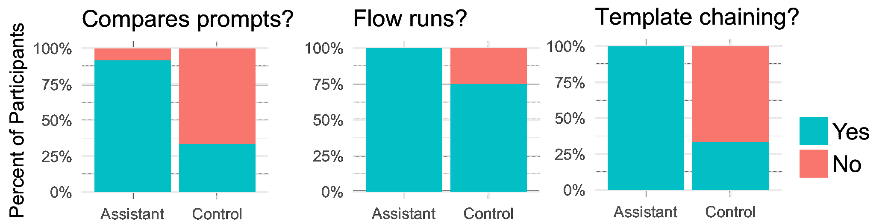

<!--yml
category: 未分类
date: 2025-01-11 12:14:10
-->

# ChainBuddy: An AI Agent System for Generating LLM Pipelines

> 来源：[https://arxiv.org/html/2409.13588/](https://arxiv.org/html/2409.13588/)

Jingyue Zhang Université de MontréalMontréalQuébecCanada [jingyue.zhang@umontreal.ca](mailto:jingyue.zhang@umontreal.ca)  and  Ian Arawjo Université de MontréalMontréalQuébecCanada [ian.arawjo@umontreal.ca](mailto:ian.arawjo@umontreal.ca)(2018; 20 February 2007; 12 March 2009; 5 June 2009)

###### Abstract.

As large language models (LLMs) advance, their potential applications have grown significantly. However, it remains difficult to evaluate LLM behavior on user-specific tasks and craft effective pipelines to do so. Many users struggle with where to start, often referred to as the ”blank page problem.” ChainBuddy, an AI assistant for generating evaluative LLM pipelines built into the ChainForge platform, aims to tackle this issue. ChainBuddy offers a straightforward and user-friendly way to plan and evaluate LLM behavior, making the process less daunting and more accessible across a wide range of possible tasks and use cases. We report a within-subjects user study comparing ChainBuddy to the baseline interface. We find that when using AI assistance, participants reported a less demanding workload and felt more confident setting up evaluation pipelines of LLM behavior. We derive insights for the future of interfaces that assist users in the open-ended evaluation of AI.

language models, AI agents, prompt engineering, automation, LLM pipelines, visual programming environments^†^†copyright: none^†^†journalyear: 2018^†^†doi: XXXXXXX.XXXXXXX^†^†conference: Pre-print; June 03–05, 2018; Woodstock, NY^†^†isbn: 978-1-4503-XXXX-X/18/06^†^†ccs: Human-centered computing Interactive systems and tools^†^†ccs: Human-centered computing Empirical studies in HCI

Figure 1\. A zero-shot example of a workflow created by ChainBuddy from a single user prompt. The user wishes to investigate how different personas can affect an LLM’s response to a complex math question. ChainBuddy generates an LLM pipeline with example personas, a math problem (the Gaussian integral), templated prompts, comparison across four LLMs, and a Python Code Evaluator to check for the solution in the LLM’s output ($\sqrt{\pi}$). The user can tweak the output, such as including more patterns in the regex.

## 1\. Introduction

Over the past two years, the growing interest in AI has spawned a plethora of tools, APIs, and best practices for creating applications based on LLMs. These advancements include a wide range of techniques, from prompt engineering and LLM evaluation platforms to sophisticated AI agent systems equipped with tool use capabilities (Shankar et al., [2024b](https://arxiv.org/html/2409.13588v1#bib.bib34); Arawjo et al., [2024](https://arxiv.org/html/2409.13588v1#bib.bib2); Webster, [2023](https://arxiv.org/html/2409.13588v1#bib.bib42); Beasley and Abouzied, [2024](https://arxiv.org/html/2409.13588v1#bib.bib5)).

Despite these advancements, many users encounter a significant challenge: the ”blank page problem.” This problem is characterized by the uncertainty and difficulty of knowing where to begin when using platforms like promptfoo (Webster, [2023](https://arxiv.org/html/2409.13588v1#bib.bib42)) or Flowise (Flowise AI, [2024](https://arxiv.org/html/2409.13588v1#bib.bib13)). Some researchers have proposed social solutions to this problem, such as the development of prompt repositories and community-sharing mechanisms (Zamfirescu-Pereira et al., [2023](https://arxiv.org/html/2409.13588v1#bib.bib47)). Another proposed solution is to create an assistant that helps users get started by providing initial guidance and structure (Arawjo et al., [2024](https://arxiv.org/html/2409.13588v1#bib.bib2)).

Taking the latter approach, our solution, ChainBuddy, is an AI-powered assistant that automatically generates starter LLM pipelines (“flows”) given an initial prompt. ChainBuddy helps users get started with evaluating LLM behavior and setting up chains by providing a starter flow, custom-tailored to their use case, that they can edit and extend. We built ChainBuddy on top of an existing open-source visual environment, ChainForge (Arawjo et al., [2024](https://arxiv.org/html/2409.13588v1#bib.bib2)), which was designed for open-ended prompt engineering, LLM evaluation, and experimentation tasks (comparing response quality across prompts and models, setting up data processing pipelines, and establish automated evaluation metrics). By building on top of this foundation, ChainBuddy offers users structured assistance to help them overcome the blank page problem, making it easier to explore, experiment and evaluate the behavior of LLMs across a wide range of potential tasks and use cases. We report a mixed methods usability study of ChainBuddy, comparing the assistant to the baseline interface. We find broad support for ChainBuddy, particularly in its reduction of user effort and requirements-gathering intent elicitation feature, with the majority of participants expressing surprise at the quality of the assistant’s capabilities. Our contributions are:

1.  (1)

    A chat-like AI assistant and agent architecture, ChainBuddy, that chats with the user to understand their requirements and goals, and then generates editable and interactive starter LLM pipelines

2.  (2)

    A within-subjects, mixed methods usability study investigating the relative advantages and trade-offs of the ChainBuddy assistant versus the baseline interface

3.  (3)

    Insights for future AI support interfaces and reflections on the risk of user over-reliance on AI assistants for LLM pipeline generation

## 2\. Related Work

Since the release of ChatGPT, the LLM landscape has blossomed into a plethora of proprietary and open-source models, infrastructure, and tooling to support LLM operations (sometimes called “LLMOps”). The unique power of LLMs, alongside their stochastic, nondeterministic nature and some high-profile incidents of bias (Wolf et al., [2017](https://arxiv.org/html/2409.13588v1#bib.bib43)), have raised the question of how best to integrate them into larger software systems in a manner that is robust and safe. How to build “LLM-integrated software” is thus emerging as a unique subdiscipline within software engineering, and comprises a number of operations, from prompt engineering, to systematic evaluations, to chaining LLM calls (introduced by Wu et al. in HCI as “AI chains” (Wu et al., [2022b](https://arxiv.org/html/2409.13588v1#bib.bib46))) as well as more complex network structures (Wu et al., [2023](https://arxiv.org/html/2409.13588v1#bib.bib44)), and providing LLMs access to *tools*—the ability to call functions that perform actions on the user’s machine. The term “AI agents” has come to be synonymous with the latter two architectures.

To support developers in exploring these new practices, a slew of graphical user interfaces and programming libraries have emerged to fill the gap. Coding APIs like LangGraph, CrewAI, and AutoGen (CrewAI, [2024](https://arxiv.org/html/2409.13588v1#bib.bib10); LangChain AI, [2024](https://arxiv.org/html/2409.13588v1#bib.bib25); Wu et al., [2023](https://arxiv.org/html/2409.13588v1#bib.bib44)) support developers in creating flows of AI agents (LLM-integrated submodules) that pass messages to each other in asynchronous-style collaborative architectures. Tools like EvalLM, PromptMaker, BotDesigner, and promptfoo (Kim et al., [2024](https://arxiv.org/html/2409.13588v1#bib.bib22); Jiang et al., [2022](https://arxiv.org/html/2409.13588v1#bib.bib19); Zamfirescu-Pereira et al., [2023](https://arxiv.org/html/2409.13588v1#bib.bib47); Webster, [2023](https://arxiv.org/html/2409.13588v1#bib.bib42)) support prompt engineering, while LLM Comparator and ChainForge go further, supporting cross-model comparison, automated code- and LLM-based evaluations, visualizations, and chaining of prompts (Kahng et al., [2024](https://arxiv.org/html/2409.13588v1#bib.bib20); Arawjo et al., [2024](https://arxiv.org/html/2409.13588v1#bib.bib2)). Some coding APIs serve to guard against the unpredictable nature of LLM outputs, such as Guardrails, LangChain, and Instructor (Instructor, [2023](https://arxiv.org/html/2409.13588v1#bib.bib18); Guardrails, [2023](https://arxiv.org/html/2409.13588v1#bib.bib15); et al., [2023](https://arxiv.org/html/2409.13588v1#bib.bib11)). Another pattern is the rise of data flow-based interfaces for LLMOps, such as Flowise, LangFlow, ChainForge and PromptChainer, visual programming environments usually (though not exclusively) targeting app development (Logspace, [2023](https://arxiv.org/html/2409.13588v1#bib.bib27); Flowise AI, [2024](https://arxiv.org/html/2409.13588v1#bib.bib13); Arawjo et al., [2024](https://arxiv.org/html/2409.13588v1#bib.bib2); Wu et al., [2022a](https://arxiv.org/html/2409.13588v1#bib.bib45)).

The many practices of LLMOps have led to recent proposals to *automate* parts of the process—from synthetic input data generation and mining the internet for datasets (Boyeau et al., [2024](https://arxiv.org/html/2409.13588v1#bib.bib6); Gandhi et al., [2024](https://arxiv.org/html/2409.13588v1#bib.bib14)), to prompt optimization (Khattab et al., [2023](https://arxiv.org/html/2409.13588v1#bib.bib21); Singhvi et al., [2023](https://arxiv.org/html/2409.13588v1#bib.bib35)), to helping users generate automated evaluators that align with their preferences (Shankar et al., [2024b](https://arxiv.org/html/2409.13588v1#bib.bib34), [a](https://arxiv.org/html/2409.13588v1#bib.bib33); Shaikh et al., [2024](https://arxiv.org/html/2409.13588v1#bib.bib32)). For instance, DSPy and Teola serve as prompt and chain optimization frameworks (Khattab et al., [2023](https://arxiv.org/html/2409.13588v1#bib.bib21); Tan et al., [2024](https://arxiv.org/html/2409.13588v1#bib.bib38)). However, there remains a problem at a higher level of abstraction: that users, even AI/ML experts, struggle to set up pipelines and automated evaluations of LLM behavior, with Arawjo et al. concluding that “more work needs to be done on [the] conceptualization and planning aspects” of supporting users in LLM pipeline creation (Arawjo et al., [2024](https://arxiv.org/html/2409.13588v1#bib.bib2); Zamfirescu-Pereira et al., [2023](https://arxiv.org/html/2409.13588v1#bib.bib47)). Part of the issue is certainly the usual difficulty of learning a new interface, but the larger issue is conceptual: what is the *“right way”* to prompt engineer? To set up a pipeline? To evaluate LLM behavior? We and the community are still learning these best practices.

The problem of pipeline generation bears a similarity to AutoML, an area of research in machine learning that focuses on automatically designing machine learning (ML) pipelines to train new ML models, whether in part or in full (Heffetz et al., [2020](https://arxiv.org/html/2409.13588v1#bib.bib17); Barbudo et al., [2023](https://arxiv.org/html/2409.13588v1#bib.bib4); Feurer et al., [2022](https://arxiv.org/html/2409.13588v1#bib.bib12)). Certainly, AutoML faces unique challenges compared to the typical problems in the LLMOps space (such as managing very large training datasets, deciding upon hyperparameters and weighing trade-offs in terms of expected training cost and performance). Inspired by this line of ML research, here we investigate the *end-to-end generation of LLM pipelines*, an emerging research area we call AutoLLMOps: from a single user prompt, can we generate an *inspectable*, *interactive*, and *editable* pipeline, complete with input data, prompt(s) and model(s), and even automated evaluations? Could we build such a system for open-ended tasks? What benefits would users derive from it? And what dangers are there, if any, to automation? To the best of our knowledge, no HCI paper has yet investigated this question. With new LLM agent frameworks, emerging research is showing that this kind of end-to-end generation of a workflow is possible, albeit for different tasks like descriptive analytics given a user-provided dataset (Beasley and Abouzied, [2024](https://arxiv.org/html/2409.13588v1#bib.bib5)) or for chatbot creation (Sánchez Cuadrado et al., [2024](https://arxiv.org/html/2409.13588v1#bib.bib31)). Here, we apply this idea to LLM pipelines, specifically focusing on pipelines that help users evaluate LLM behavior.

## 3\. ChainBuddy System Design

To automate the creation of LLM pipelines, we focused on creating a flexible, user-friendly interface that could support a wide range of use cases beyond just prompt engineering. We decided to build a chatbot-style assistant interface, ChainBuddy, within the open-source ChainForge platform (Arawjo et al., [2024](https://arxiv.org/html/2409.13588v1#bib.bib2)). This choice was driven by the need for an intuitive and interactive environment that can support various users across a range of different pipelines, such as data processing, prompt optimization, LLM auditing, and more. Our goal was to ensure that ChainBuddy could handle diverse and complex requirements while being accessible to users with varying levels of technical expertise and use cases. Note that our ultimate goal is to extend ChainBuddy to guide users beyond initial generation, i.e., to edit existing flows; however, due to the complexity of the agent system and open-ended nature of the problem, we consider here only the ability of ChainBuddy to generate flows from scratch.

### 3.1\. Interface and Example Usage

The ChainBuddy assistant can be seen in Figure [2](https://arxiv.org/html/2409.13588v1#S3.F2 "Figure 2 ‣ 3.1\. Interface and Example Usage ‣ 3\. ChainBuddy System Design ‣ ChainBuddy: An AI Agent System for Generating LLM Pipelines"). The assistant comprises a standard chat interface in the bottom-left hand corner of the ChainForge platform. The user starts a chat with the assistant to explain their problem (Fig [2](https://arxiv.org/html/2409.13588v1#S3.F2 "Figure 2 ‣ 3.1\. Interface and Example Usage ‣ 3\. ChainBuddy System Design ‣ ChainBuddy: An AI Agent System for Generating LLM Pipelines")a). The assistant then holds a Q&A conversation with the user to disambiguate user intent (Ma et al., [2024](https://arxiv.org/html/2409.13588v1#bib.bib29); Vaithilingam et al., [2024a](https://arxiv.org/html/2409.13588v1#bib.bib39)) (Fig [2](https://arxiv.org/html/2409.13588v1#S3.F2 "Figure 2 ‣ 3.1\. Interface and Example Usage ‣ 3\. ChainBuddy System Design ‣ ChainBuddy: An AI Agent System for Generating LLM Pipelines")b). This comprises a pass where the assistant asks a set of up to three questions, and the user can respond individually to each question by filling out a form (Fig. [2](https://arxiv.org/html/2409.13588v1#S3.F2 "Figure 2 ‣ 3.1\. Interface and Example Usage ‣ 3\. ChainBuddy System Design ‣ ChainBuddy: An AI Agent System for Generating LLM Pipelines")c). At any time, the user may end the disambiguation and trigger the AI to generate a flow by clicking the button (Fig. [2](https://arxiv.org/html/2409.13588v1#S3.F2 "Figure 2 ‣ 3.1\. Interface and Example Usage ‣ 3\. ChainBuddy System Design ‣ ChainBuddy: An AI Agent System for Generating LLM Pipelines")d). The user can then inspect the generated flow or request a new generation (Fig. [2](https://arxiv.org/html/2409.13588v1#S3.F2 "Figure 2 ‣ 3.1\. Interface and Example Usage ‣ 3\. ChainBuddy System Design ‣ ChainBuddy: An AI Agent System for Generating LLM Pipelines")e). We kept the assistant interface simple as the majority of our contribution’s complexity lies in the agent architecture and flow generation capabilities.

Figure 2\. ChainBuddy interface and example usage. Users specify requirements (A), ChainBuddy replies with a requirements-gathering form (B) that users can either fill out and send, or follow up with an open-ended chat (C). User presses green button (D) to indicate that they are ready to generate a flow. After a delay of 10-20sec, ChainBuddy produces a starter pipeline (E). Here, the starter pipeline includes example inputs, multiple prompts to try (prompt templates), two queried models, and a Python-based code evaluator.

Note that in this paper, we focus on explaining and showing the ChainBuddy interface and workflow, rather than the baseline interface’s built-in features like the Response Inspector (table of LLM responses) and different nodes. We point readers unfamiliar with the ChainForge platform to the public documentation or the paper (Arawjo et al., [2024](https://arxiv.org/html/2409.13588v1#bib.bib2)).

### 3.2\. System Architecture

Figure 3\. ChainBuddy system architecture. A front-end requirement agent elicits user intent and context (left). When the user presses the generate button (Fig [2](https://arxiv.org/html/2409.13588v1#S3.F2 "Figure 2 ‣ 3.1\. Interface and Example Usage ‣ 3\. ChainBuddy System Design ‣ ChainBuddy: An AI Agent System for Generating LLM Pipelines")d), a specification of user intent is sent to the Planner in the back-end. The Planner agent breaks down the problem into tasks and sends each to a dedicated agent; the outputs are combined through layout-providing connection agents, merged and passed to an optional Reviewer agent. The final output is passed to the front-end as a complete ChainForge flow (JSON).

ChainBuddy is built on LangGraph (LangChain AI, [2024](https://arxiv.org/html/2409.13588v1#bib.bib25)), a library designed for constructing stateful, multi-actor applications with LLMs. LangGraph’s core benefits include its ability to handle cycles, provide fine-grained controllability, and ensure persistence. These features are essential for creating reliable agent-based workflows that can support advanced human-in-the-loop and memory functionalities. We use Anthropic’s Claude 3.5 Sonnet for the front-end requirements-gathering agent, and OpenAI’s GPT-4o for all agents in the backend.

#### 3.2.1\. Requirement gathering

The design of the requirement gathering agent for the ChainForge platform draws inspiration from the Chain of Reasoning (Suzgun and Kalai, [2024](https://arxiv.org/html/2409.13588v1#bib.bib36)) prompting methodology adapted from the open-source GitHub project Professor Synapse, an “AI guide designed to help users achieve their goals” (Synaptic Labs, [2024](https://arxiv.org/html/2409.13588v1#bib.bib37)). The structured interface for intent elicitation was inspired by ExploreLLM (Ma et al., [2024](https://arxiv.org/html/2409.13588v1#bib.bib29)). The agent employs a dictionary that updates context about the primary user goal, a list of current requirements the solution should address, and other user preferences. This structure is updated throughout the agent’s interactions with the user. Overall, the agent poses three types of targeted questions to refine understanding:

1.  (1)

    Goal Clarification Questions: These questions help to understand the overall objectives the user is aiming to achieve, as well as the context around their problem.

2.  (2)

    Requirements Exploration Questions: Designed to uncover specific needs, constraints, and fine-grained requirements that align with the user’s goals.

3.  (3)

    Disambiguation Questions: Ask for any clarifications to address ambiguities or contradictions between the overall user goal and the requirements.

This interactive approach ensures flexibility in accommodating changes as new insights or constraints emerge during the iterative dialogue. The requirement gathering agent also aims to help users better understand and reflect on their needs and goals before precise messages are sent to the back-end workflow-generating agents, which are relatively time-consuming and costly compared to the chat.

#### 3.2.2\. Workflow generation

Inspired by concepts from Plan-and-Solve Prompting: Improving Zero-Shot Chain-of-Thought Reasoning by Large Language Models (Wang et al., [2023](https://arxiv.org/html/2409.13588v1#bib.bib41)) and projects like Baby-AGI (Nakajima, [2024](https://arxiv.org/html/2409.13588v1#bib.bib30)), we designed ChainBuddy’s agentic system to generate long-term plans based on user requirements (Figure [3](https://arxiv.org/html/2409.13588v1#S3.F3 "Figure 3 ‣ 3.2\. System Architecture ‣ 3\. ChainBuddy System Design ‣ ChainBuddy: An AI Agent System for Generating LLM Pipelines")). This approach involves breaking down each task into specific, manageable actions that can be executed by individual agents which return structured data to upstream agents (i.e., JSON). This design allows each agent to focus on a single task, improving efficiency and accuracy. Key architectural features include:

*   •

    Requirement Gathering Chat Assistant: A chat-focused agent interacts with the user to disambiguate user intent and gain context for their problem, before proceeding to the generation step.

*   •

    Planner Agent: Takes the specification from the front-end of the user goal, and develops a comprehensive plan for implementation. The Planner is passed contextual information on all nodes in ChainForge that it has access to, their names and descriptions, and how they are allowed to connect.

*   •

    Task-Specific Agents: Each task in the plan is assigned to a specific agent, allowing for focused execution. Here, a “task” largely maps to different nodes in the ChainForge interface that need to be generated.¹¹1For our usability study, we limited the nodes to: TextFields Node, Prompt Node, LLM Scorer Node, and Python Code Evaluator Node. This specialization can allow utilizing smaller, less powerful models for execution tasks while reserving larger, more capable models for planning.

*   •

    Connection Agents: These agents take the task-specific output (as JSON data representing ChainForge nodes to add), create edge specifications to connect them and fill in starter x-y positions for nodes.

*   •

    Post-hoc Reviewer Agent: A final Reviewer agent assesses the generated flow against the initial user criteria given to the Planner agent. The Reviewer can trigger the Planner to re-plan before presenting the flow to the user, if the generated flow falls below expectations. (Note that for our usability study, we disabled the Reviewer because it significantly increases generation time.)

By leveraging these architectural principles, ChainBuddy aims to provide a robust, scalable solution for a wide range of LLM-related tasks. Note finally that the system we present here is limited to a few select nodes in ChainForge: TextFields Node, for defining input data; Prompt Node, for prompting one or more models and prompt templating; Python Code Evaluator and LLM Scorer Nodes for evaluating LLM outputs; and the Vis Node. The system also supports template chaining (Arawjo et al., [2024](https://arxiv.org/html/2409.13588v1#bib.bib2)) to compare across prompts; i.e., putting prompt templates inside TextField inputs and chaining them together. Template chaining is primarily useful for comparing across prompts in a structured way.

### 3.3\. Early Feedback

We designed ChainBuddy through an iterative process of testing internally on new tasks, from prompt comparison, to model comparison, to evaluating LLMs for identity-based bias. In particular, we found that the AI had a tendency to overfit to few-shot examples (e.g., always choosing to evaluate two models, or use specific input data); based on this, we removed few-shot examples in specific places such as the Planner agent prompt. We also conducted informal pilot studies to gather early feedback and improve our system. Some early insights we discovered:

*   •

    Intent disambiguation: One prompt entered by users did not usually contain enough information to generate a detailed workflow that addresses user’s actual needs. Based on this, we opted for a more interactive chat.

*   •

    Structured elicitation: We implemented ChatGPT-like chat where the system asks users questions. However, the LLM output was often long or listed several questions, and users struggled to reply in a natural way. Based on this, we opted for a structured form-filling approach, letting the user clarify only the questions they want to. We also limited the number and length of questions.

*   •

    Feedback: Users suggested incorporating features like visualizing the loading progress, as well as providing explainable AI elements to help users understand how the system arrives at certain visualizations or results.

*   •

    Desire to edit existing flows: Some users wanted to continue the assistant chat, asking ChainBuddy to revise or extend the flow. We too wanted this feature, but felt it was too complex to address within the limits of a single paper.

## 4\. Usability Study

To evaluate ChainBuddy, we ran a within-subjects, mixed-methods user study against the baseline interface (ChainForge without ChainBuddy), since it was the most direct comparison to a “manual” open-ended system for setting up LLM pipelines. Our goals were broadly focused on how people would want to use an AI assistant for generating evaluations of LLM behavior; specifically, for our qualitative evaluation:

1.  (1)

    What aspects of the assistant do they appreciate the most, compared to the baseline?

2.  (2)

    Do users find the requirements-gathering interaction helpful or necessary?

3.  (3)

    What kinds of problems do participants want to use ChainBuddy for? (free exploration task)

4.  (4)

    Do people feel that their ideas or hypotheses changed after interacting with the assistant?

5.  (5)

    How do people edit the generated flows? What kinds of edits do they tend to make?

6.  (6)

    Do people learn anything from interacting with the assistant (and if so, what)?

We also sought quantitative, subjective metrics for the following hypotheses for the structured tasks measured via self-reported completion times,²²2Specifically, the time from when participants first clicked or typed in the interface, to the time when they said they were “done” or ran out of time. Participants were given 12 minutes for all tasks; if they ran out of time, the time was recorded as the maximum. NASA TLX cognitive load scale (Hart, [1988](https://arxiv.org/html/2409.13588v1#bib.bib16)), and a subset of five system usability Likert questions³³3The five questions, “I found the system easy to use,” “I would like to use this system frequently,” “I found the system unnecessarily complex,” “I felt confident using the system”, and “I needed to learn a lot of things before I could get going with this system”. derived from the System Usability Scale (Brooke, [1996](https://arxiv.org/html/2409.13588v1#bib.bib7)):

*   H1.

    Users feel that they complete tasks more quickly when using ChainBuddy, versus without.

*   H2.

    Users perceive their workload with ChainBuddy as less demanding than the manual baseline interface.

*   H3.

    Users report greater self-satisfaction with ChainBuddy, versus without (i.e., ease of use, confidence, learnability).

*   H4.

    Users are able to complete tasks more successfully with ChainBuddy, versus without.

### 4.1\. Recruitment and Participants

We recruited 12 in-lab participants around our North America-based university through listservs and Slack channels, mainly in computer science and engineering contexts. Participants were between ages 18-34 (seven between 23-27, three from 28-34 and one 18-22) and balanced across gender (7 female; 6 male). Ten out of 12 were from computer science or engineering backgrounds (the other two were from Neuroscience and Life Sciences, respectively). They reported a relatively high past experience with LLMs ($\mu{=}3.83$, $\sigma{=}0.71$ on a scale 1-5, with 5 highest) as well as Python programming knowledge ($\mu{=}3.83$, $\sigma{=}1.11$; only P6, who had a background in Life Sciences, indicated no knowledge). Half of the participants self-reported as having “worked on a university study, paper, or project involving the evaluation of [LLMs]” and three participants had heard of or used ChainForge prior to the study. Each study took 75 minutes, and participants were compensated $30 in cash (CAD).

### 4.2\. Methodology, Procedure and Tasks

We designed a within-subjects study with mixed methods. There were two Conditions: Assistant (with ChainBuddy) and Control (the baseline ChainForge interface without ChainBuddy). We also devised two tasks of roughly the same style and difficulty, and randomly assigned them in a counterbalanced manner to the conditions. The tasks were $T_{\texttt{email}}$: “You are a software engineer tasked with designing an automated tool to help people professionalize their emails for work contexts”, and $T_{\texttt{tweet}}$: “You are working on a tool to help summarize long text paragraphs into concise, catchy tweets limited to 144 characters.” In both cases, we told users their goal was “to set up a workflow in ChainForge that can help you find the ‘best’ prompt” and emphasized that their goal “is not to find the best prompt, but rather to set up a flow that can help you find the best prompt and compare between prompts.” There were $2\times 2=4$ unique orderings of Condition $\times$ Task. With 12 participants, this means that three (3) participants experienced each unique ordering, and six (6) experienced the Control first.

After obtaining informed consent, the study procedure was:

1.  (1)

    A 5 minute video overview of the ChainForge interface

2.  (2)

    A tutorial guides users through the process of writing a prompt template that takes an ingredient and returns the dishes it can make, comparing prompts using template chaining, querying models, and inspecting results. The tutorial gave participants everything they needed to succeed, as the solutions to tasks were structurally similar to the tutorial flow. (The Tutorial did not introduce the Assistant; see below.)

3.  (3)

    The first condition and task, in an order randomly assigned and counter-balanced across participants. After the task, the post-task questionnaire.

4.  (4)

    The second condition and task, and post-task questionnaire.

5.  (5)

    Unstructured exploration, where participants examined an idea or hypothesis they had within the Assistant condition. They were not required to use the assistant.

6.  (6)

    Post-interview and compensation

There is also one mini-tutorial for the Assistant that occurs directly before the Assistant condition, wherever the condition appears. We deliberately avoided showing participants the Assistant during the pre-tasks tutorial, because we wanted to mitigate the potential for bias from participants “guessing the hypothesis” of the study (demand characteristics) when experiencing the Control interface first.

### 4.3\. Data Analysis

Participant interactions were screen and audio recorded. We also captured log data for chats with the Assistant and saved flows (files) for all tasks for later analysis. We analyzed qualitative data through inductive thematic analysis; specifically, the first author iteratively affinity diagrammed all participant remarks during the study (including post-interview) to arrive at clusters (codes). These clusters and codes were then discussed by both authors until we reached consensus.

We analyzed quantitative data using a repeated measures linear mixed effects model in R (Luke, [2017](https://arxiv.org/html/2409.13588v1#bib.bib28)), examining fixed effects of Condition, Task, and Order and all interaction effects between these factors, and controlling for random effect of Participant. P-values for main and interaction effects are calculated using Satterthwaite’s method for degrees of freedom and reported from ANOVA tables with lmerTest (Kuznetsova et al., [2017](https://arxiv.org/html/2409.13588v1#bib.bib24)). Post-hoc tests were done via estimated marginal means (emmeans) with Bonferroni correction; when including the estimate ($\beta$) and t-statistic ($t$), reported p-values are from emmeans. We visually inspected the normality of model residuals (via Q-Q plots) and assumption of homoscedasticity. Our quantitative results are meant to complement our qualitative findings.

## 5\. Findings

Figure 4\. Participant responses to Likert Questions for NASA TLX and system usability, grouped by Condition. Asterisk (*) indicates a significant main effect of Condition at $p<0.05$; † indicates another main effect, interaction effect or outliers.

### 5.1\. Quantitative results

We summarize major quantitative findings here before delving into specifics. Overall, participants perceived the Assistant as significantly *less mentally demanding* and *less physically demanding* than the Control. Participants were also *more confident* and *more performant* when using the Assistant. Finally, participants *created at least one more type of node in the Assistant condition,* on average, with a portion of the effect explained by the Assistant generating Evaluator nodes (where only one participant created a Python Code Evaluator in the Control condition).

There were also two ordering effects by task for perceived Successfulness and Ease of Use, both when experiencing the Control condition after the Assistant. Though these results are specific, interact with Task (see below) and could be considered random fluctuations or demand characteristics given the small study size; however, considered together, they might suggest a small “missing the assistant” effect—using the Assistant first helped some participants apply their knowledge to the next task, but it also may prime them to perceive the baseline interface as harder to use.

#### 5.1.1\. Time to completion (H1)

We did not find a significant main effect at $p{<}0.05$. We report a borderline significant interaction effect for Condition given Order ($\beta{=}-239.5$, $t{=}-2.22$, $p{=}0.04$): when people experienced the Assistant after the Control condition, they perceived they were finished with the task faster ($\mu{=}357$ secs versus $\mu{=}610$; 95% CI [195, 518] versus [445, 771]).

#### 5.1.2\. Workload Demand (NASA TLX) (H2)

We find main effects of Condition on mental demand and physical demand, with participants finding tasks less mentally demanding ($\beta{=}-0.91$, $t{=}-2.66$, $p{=}0.01$) and less physically demanding ($\beta{=}-1.08$, $t{=}-3.15$, $p{=}0.01$) when using the Assistant (Figure [4](https://arxiv.org/html/2409.13588v1#S5.F4 "Figure 4 ‣ 5\. Findings ‣ ChainBuddy: An AI Agent System for Generating LLM Pipelines")). For perceived successfulness, there is also a significant effect of Task ($\beta{=}0.66$, $t{=}2.53$, $p{=}0.02$) and two interaction effects of between Condition and Task ($p{=}0.02$), and Task and Order ($p{=}0.006$). Post-hoc emmeans tests suggest two sources for the effect: participants report they are more successful at $T_{\texttt{email}}$ than $T_{\texttt{tweet}}$, but only when $T_{\texttt{email}}$ appeared second, possibly indicating a learning effect ($\beta{=}1.5$, $t{=}4.02$, $p{=}0.005$); and participants felt they were less successful when solving $T_{\texttt{tweet}}$ in the Control condition ($\beta{=}1.33$, $t{=}3.57$, $p{=}0.01$). No other questions reach significance at $p{<}0.05$.

#### 5.1.3\. Perceived System Usability (H3)

We find a significant main effect of Condition on Confidence ($\beta{=}0.5$, $t{=}2.44$, $p{=}0.04$). Participants felt moderately more confident using the Assistant (Fig [4](https://arxiv.org/html/2409.13588v1#S5.F4 "Figure 4 ‣ 5\. Findings ‣ ChainBuddy: An AI Agent System for Generating LLM Pipelines")).

For Ease of Use, we found a three-way interaction between Condition, Task, and Order ($p{=}0.003$). Visual inspection of data reveals two outliers as the culprit: two participants who received $T_{\texttt{tweet}}$ with the Control condition in the second position, who both rated ease of use 1 and 2 (P2 and P7; only one other participant, P9, experienced this order). All other participants rated the Control condition 4 or above for Ease of Use, with a median of 4.5\. Eleven (out of 12) participants gave the Assistant a 5 for ease of use (one 4). One possible explanation for the outliers is that these participants “missed” the AI assistant’s reduction to their workload during $T_{\texttt{tweet}}$, which asks participants to summarize “long paragraphs” into tweets—requiring them to create test data. Possibly, knowing that the Assistant could generate long example paragraphs for them, these participants were frustrated by having to manually type in input data. (Indeed, there is evidence for this: P2 used a lone Prompt Node to generate test paragraphs, as a workaround for not having assistant access.)

No other questions reached significance, suggesting that participants liked the interface equally across conditions, and found it of similar difficulty to learn.

#### 5.1.4\. Performance (H4)

We estimated user performance on the task with three binary (true-false) measures shared across both task descriptions: whether their final flow explicitly compares two prompts, whether the flow runs (i.e., the Prompt Node can run), and whether the flow uses template chaining to compare prompts (the last is a feature introduced in the tutorial and was the expected solution, but is not the only one). Plots show strong evidence in favor of the Assistant condition (Figure [5](https://arxiv.org/html/2409.13588v1#S5.F5 "Figure 5 ‣ 5.1.5\. Number and Types of Created Nodes ‣ 5.1\. Quantitative results ‣ 5\. Findings ‣ ChainBuddy: An AI Agent System for Generating LLM Pipelines")), indicating that, *despite participants rating themselves of having similar success in both interfaces,* two-thirds of participants did not adequately solve the task in the Control condition (did not create a workflow helping users to compare prompts), compared to eleven (out of 12) participants when using the Assistant.

#### 5.1.5\. Number and Types of Created Nodes

Finally, we examined the Number of Nodes in participants’ final flows, as well as the Number of Node Types (e.g., a flow with two TextFields and one Prompt Node has 3 nodes and 2 types of nodes). Participants created a similar number of nodes regardless of condition or task—suggesting a similar complexity and size of their pipelines. However, for types of nodes, we find main effects of Condition ($\beta{=}0.583$, $t{=}4.04$, $p{=}0.003$) and Order ($\beta{=}{-}0.417$, $t{=}{-}2.887$, $p{=}0.02$). On average, people created significantly more node types in the Assistant condition than the Control; specifically, they created about one more node type (median of 2 node types, versus median of 3 for Control). People also created more node types during their second task, indicating a learning effect irrespective of Condition and Task. Post-hoc analyses show significantly more Evaluator Nodes (either Code- or LLM-based) in the Assistant condition ($\beta{=}0.58$, $t{=}3.5$, $p{=}0.008$), with no other node type reaching significance. Inspecting the data further, only one participant added a Python Code Evaluator when in the Control condition.⁴⁴4One explanation is that writing Python code is difficult and time-consuming, and since we did not screen participants for programming skill, some may have been unable to write said code. Overall, this suggests the Assistant helped participants make more Evaluator-type nodes, especially Python Code Evaluators, and that participants tried out more interface features over time.

Figure 5\. Performance metrics comparing expected qualities of correct solutions across conditions and tasks: whether the flow explicitly compares two prompts, whether the flow runs (i.e., the Prompt Node can run), and whether the flow uses template chaining to compare prompts (a feature introduced in the tutorial, and the expected solution).

### 5.2\. Qualitative results

We examined interactions and interview data across the structured tasks and unstructured exploration. Overall we found several key insights into participants’ experiences with ChainBuddy:

*   •

    ChainBuddy helps users in overcoming the ”blank page problem,” converting vague ideas into concrete workflow drafts.

*   •

    ChainBuddy’s requirement gathering process helped participants elicit user goals and criteria, provided a structured way to present requirements, and expanded user thinking.

*   •

    Participants perceived that the assistant reduced effort, sped up their workflow and alleviated the learning curve of using the baseline interface.

*   •

    ChainBuddy surpassed participants’ expectations, with its capabilities surprising users.

*   •

    Participants with substantial prior experience in prompt engineering perceived that ChainBuddy aided their prompt engineering process.

*   •

    Concerns about potential bias or influence on their problem-solving approach after interacting with the assistant.

We first expand on these findings in the sections below and then discuss the interaction patterns identified by the study

#### 5.2.1\. Assistant as a starting point

Eight participants found that ChainBuddy provided a good starting point for their tasks, helping them overcome the initial challenge of starting from scratch. P5 said, ”maybe it’s hard to start with an empty page. It’s better to start with a little bit of question and answer here, so you have a base structure.” The assistant helped users quickly generate initial workflow drafts, reducing the effort required to start from scratch. P1 appreciated that ”the assistant can give me, like a first draft. That is pretty good.” Similarly, P9 highlighted the importance of having an example to ”put things into context much more easily,” which helped them decide whether to proceed with the assistant’s suggestions or refine their own approach.

#### 5.2.2\. Requirement gathering process helped refine ideas and elicit requirements

Six participants reflected that the assistant’s structured and iterative approach to intent disambiguation made the process more organized and easier to follow compared to traditional prompting. Moreover, the iterative questioning made users think more deeply about their tasks and specify details they might otherwise overlook, which they felt led to more detailed pipelines.

For instance, P12 remarked that ”sometimes… I know exactly what I want, but I’m not necessarily putting it all in the prompt.” P9 found that ”the follow-up questions made you create a more comprehensive workflow” and P8 was ”really surprised when it asked questions based on what I need.” The form-filling interface helped users to provide information in a more manageable and less overwhelming way than writing everything at once (e.g. P9: ”I was pleasantly surprised that you can type the answers under each question, instead of having just to blurt it all out in a long piece of text”). By asking users relevant questions, the assistant could also help broaden their thinking and refine their ideas. P1 found that the assistant ”asked me other questions, and I think of like, ‘Oh, it’s true, I can do this.’” P7 said ”it was impressive, because it’s started to ask me about the design itself, it was clear and precise,” and commented that the assistant encouraged him to “think more on the abstract side of the idea itself.”

However, participants could also worry that Q&A intent elicitation could become excessive, with four suggesting rounds limits or guidance on when sufficient information has been provided. P9 worried about getting ”too caught up in the details, which is me answering the supplemental questions too much. Like I keep on digging… and you end up creating a model that’s just too rigid.” P12 also wondered, ”if you keep going and questions keep being asked, that’s where you start contradicting yourself.” One suggestion to improve the design was to have the assistant deduce when there is enough information to proceed with generation (e.g., P7 said ”I do think, if it understand the question, it should know where to stop.”, and P2 wanted ”an indicator of… [the] level of understanding that the system has achieved at that point of time”).

#### 5.2.3\. Exceeding user expectations

Ten participants remarked the assistant not just met, but exceeded their initial expectations. Participants consistently expressed surprise by the assistant’s capabilities, particularly in its abilities to ask relevant follow-up requirement-gathering questions and generate detailed workflows. For instance, P2 remarked, ”I was not expecting it to generate even remotely close workflow. But it gave me two additional nodes, understood that these are my requirements, so I might use it.” P1 was surprised at how well the assistant performed: ”It’s asking really good like, follow up questions that made me rethink the problem and generated a good flow for it.” Similarly, P8 initially expected a basic chatbot but was impressed when the assistant ”asked questions based on what I need,” which helped expand their ideas and improve their prompts. P6 was particularly impressed by how ChainBuddy was able to generate a workflow for a complex goal, stating, ”I asked it to compare detailed incomes for 10 medical specialties, and it did really well, and it also handled a more complex task without misunderstanding.”

When asked to clarify, participants explained that they expected the assistant to be a basic Q&A chatbot, but found it more interactive and insightful. For example, P10’s ”expectation was something like ChatGPT that actually gives you the final output, not asking too many questions, back and forth,” but they appreciated how the assistant ”tries to understand what’s your goals, what’s your criteria. So I love it better than ChatGPT.”

#### 5.2.4\. Reducing effort

Participants felt the assistant reduced their workload and streamlined task execution, complementing our quantitative results. P10 said ”the mental demand was much less when I used the assistant,” which was particularly beneficial because the assistant helped ”translating my inquiries to this platform,” making the experience accessible for beginners. Similarly, P8 observed that without the assistant, it was “pretty hard to think on my own, like making flows and like arranging it properly,” whereas the assistant streamlined the process. Without the assistant, participants could find manually setting up flows confusing or inefficient. P6 reflected that work without the assistant was “a lot harder than I expected. It seems that the task is simple at first, but then when I do it manually, some of the things does not fall into the category that I expected.” P4 found the assistant interface to be ”very intuitive, it generated and you just drag and drop everything [after]. So I did not find any frustrations.”

#### 5.2.5\. Accelerating workflow

Participants remarked that the assistant significantly accelerated their workflow. P11 remarked that ”with the assistant, it’s really quick. It gives you the ideas, and it makes all the necessary connections on the platform, so you save up that manual time of creating the whole workflow. And on top of that, it also saves mental efforts to start with the prompt.” Similarly, P9 felt that while there wasn’t a significant difference in their success rate and solution, ”it was just faster with ChainBuddy”.

#### 5.2.6\. Helping users learn the platform

Some participants felt that the assistant helped them learn and adapt to the platform, reducing the learning curve and making the tool more accessible for first-time users. P7 highlighted that ”usually when you don’t have an assistant and have nothing to work with you need, similar to learning new coding languages,” but with the assistant, the process was ”very fast.” P3 noted, ”for the first exercise, I really didn’t have much ideas of what I should do, after using the assistance, it’s just much more clear.” P5 also found the assistant helpful in guiding them through tasks, saying that ”it gives a sample that shows how these [nodes] could be connected. I just saw that, oh, I can name these [nodes] with relevant things [titles of the nodes], it’s good to name relevant [nodes] especially for someone using the tool for the first time, it’s very helpful.” P3, who had limited experience with AI tools, was impressed by the assistant’s capability, saying, ”The assistants just enlightened me,” and found it surprisingly effective compared to their prior experiences with AI chatbot from other interfaces.

The assistant was especially beneficial for helping participants overcome initial obstacles to understanding the interface. P6 shared that without the assistant, ”I don’t really know what to do sometimes,” but with the assistant, they ”did not need to think [about] anything.” P7 also said that”without the assistant, there would be obstacles for first-time users, a lot of people will struggle,” like the experience to the challenges of using something unfamiliar. P11 felt that the assistant “changed [my approach] to be better”.

#### 5.2.7\. Streamlining prompt engineering

In our study, there were three participants who often did prompt engineering in their daily work. P7 explained that in their prompt engineering tasks, they often need to ”write a program for each LLM and collect responses,” which is time-consuming. The assistant’s ability to handle these tasks with built-in tools meant that ”it will do all of that for you, because it already have the model, it has its evaluation tool, and you don’t need to do much time in order to experiment [with] multiple things.” P4 reflected, ”I think the most difficult part of doing this prompt engineering is writing the initial set of prompts. And I think that is where the assistant is very helpful, that it gives you an initial set of prompts, then that you can start working on… It’s a very, very good product, I would use it a lot.” P12, who often needed to duel with variations in data formats in their real work, found the assistant helpful in creating a workflow that could compare prompts to standardize differently structured information.

#### 5.2.8\. Interaction patterns with the assistant

We identified three patterns in the process of participants’ usage of the assistant, derived from qualitative analysis of the screen-capture recordings of the structured task and free exploration time. Many participants (8) made only minimal edits to assistant’s solution, tweaking input values but keeping its overall structure. This approach was observed mainly during the structured task, with seven participants reliant during the task, versus only three in free exploration. Second, we saw participants heavily revising the assistant’s solution without changing its structure, entirely changing prompts in addition to input data. This approach allowed participants to tailor the assistant’s suggestions to better fit their needs while still trusting the structure of the assistant’s initial solution. Third, participants amended or extended the structure of the assistant’s solution, resulting in more complex and customized chains (e.g., P1, P2, P9, and P10). This last approach demonstrates a collaborative use of the assistant, where its suggestions are seen as a foundation upon which users can add their own creativity and complexity. Note that during free exploration, participants P3 and P12 did not use the assistant directly, but were inspired by its solution to the second task (e.g., “because the structure that is in my mind is kind of similar to the last one done by the assistant” and “I already had something in my mind, I started building a chain from an existing one”).

#### 5.2.9\. Concerns about assistant bias and influence

Some participants expressed concerns that using the assistant influences their problem-solving approach, potentially biasing their subsequent tasks. P9 reflected on this impact: ”The first task I did was with the ChainBuddy. The second one was without, [but] I think because I started off with [it], it kind of taught me how to do it.” Two participants noticed that their approach to their ideas in the free exploration time mirrored the structure introduced by the assistant. P3 said, ”I didn’t use the assistant because the structure that is in my mind is kind of similar to the last one done by the assistant,” indicating that the assistant’s influence persisted even when not directly used. P12 also described how she ”started building a chain from an existing one, and that one is created from the second task, which is done by the assistant.” This continuity suggests that initial interactions with the assistant could set a pattern that users continue to follow, even when trying to work independently. We reflect on this risk further in Discussion.

#### 5.2.10\. Use cases in free exploration time

During the free exploration time, participants explored a diverse range of ideas, showcasing creative and varied uses in collaborating with the assistant to address specific needs and interests. The diverse range of topics reflected a similar diverse range in the study of ChainForge (Arawjo et al., [2024](https://arxiv.org/html/2409.13588v1#bib.bib2)), the baseline interface. Participant usage fell into three major categories: comparing and exploring different prompts, evaluating behavior across different LLMs, and testing LLMs for bias and handling of sensitive topics. The full list of participant ideas is listed in Appendix [A](https://arxiv.org/html/2409.13588v1#A1 "Appendix A Participant Ideas in Free Exploration ‣ ChainBuddy: An AI Agent System for Generating LLM Pipelines").

### 5.3\. Limitations

Our within-subjects usability study had a small sample size and compared to a single baseline. It could be that for a different LLM pipeline interface, we might have seen different results. We did not restrict users by prior knowledge of the baseline interface—it could be that expert ChainForge users would feel differently about the assistant’s capabilities. For various constraints common to usability studies, we also only examined two tasks that both involved comparing across prompts, even though ChainBuddy is capable of more types of tasks and LLM pipelines, such as comparing responses across models or setting up data processing workflows. An alternate study design might explicitly try three or more very different tasks with a larger sample size, to better understand when ChainBuddy is and is not useful. We also relied on rough indicators of performance; a more robust evaluation might have a team of external raters grade the quality of created flows on a scale. Finally, our quantitative findings should also be taken with a grain of salt: the complex interaction effects we observed for Ease of Use and Successfulness in particular may be due to random noise. Nevertheless, we believe that the body of evidence is clear, in that all tests of significance leaned in favor of ChainBuddy, and qualitative feedback was overwhelmingly positive. We intend to run a follow-up study post-deployment, investigating a broader range of tasks and real-world use cases.

## 6\. Discussion

Our findings provide evidence in favor of AI-assisted interfaces for generating LLM pipelines. Participants found their workload less demanding when using an AI assistant’s help in an interface for setting up evaluative LLM pipelines, compared to without. And, they were more confident, performant, and able to create automated evaluations with greater regularity. In post-interviews, participants appreciated how the requirements gathering interaction supported refining their ideas, and consistently expressed that they were impressed by the assistant’s capabilities. We also observed interaction effects that suggest participants can experience lower perceived successfulness and interface ease-of-use when AI assistance is taken away from them (mediated by task); a generous interpretation is that people miss the assistant’s help in reducing their workload.

One interesting null result is time. We did not find significant *qualitative* evidence that ChainBuddy helped people solve the task faster, as might be expected (although participants did express this feeling in post-interviews). However, three things to note. First, ChainBuddy takes time to generate flows, on the order of 10 seconds or greater. Second, our times are subjective, with a participant-reported indication of being “done.” Participants using the assistant spent time revising, running or inspecting the generated flows, or clarifying their intent with the assistant. Third, qualitative data indicates that some participants felt they could go further in their analysis with the assistant, compared to without. So, though participants spent around the same time per condition, *what* they spent that time on differed.

More broadly than LLM pipelines, our work contributes to a growing body of literature on AI agents integrated into software platforms to assist users in implementing ideas (e.g., an agent that creates Powerpoint slides, visualizations from datasets, or dynamic widgets (Vaithilingam et al., [2024b](https://arxiv.org/html/2409.13588v1#bib.bib40); Beasley and Abouzied, [2024](https://arxiv.org/html/2409.13588v1#bib.bib5); Zheng et al., [2022](https://arxiv.org/html/2409.13588v1#bib.bib48))). Our study provides evidence for the intuitive hypothesis that users perceive that AI agents improve workload by reducing the mental and physical burdens placed on them when interacting with software—clicking and dragging, planning what to do. However, our quantitative findings indicate that for the most part, users perceived they were just as successful *without* the assistant—even when performance analysis suggests overall performance plummeted without the assistants’ help. This finding resembles the Dunning–Kruger effect (Kruger and Dunning, [1999](https://arxiv.org/html/2409.13588v1#bib.bib23))—that people who lack the skill to evaluate the quality of their work in a domain may over-estimate its quality—and, combined with worries about being biased by the assistant (discussed below), contributes to growing concerns about non-experts’ over-reliance on AI systems (Buçinca et al., [2021](https://arxiv.org/html/2409.13588v1#bib.bib8); Bansal et al., [2021](https://arxiv.org/html/2409.13588v1#bib.bib3)). Future studies on software-integrated AI assistants should complement subjective measures with more objective evaluations of user performance (e.g., by external raters or as here, by quantifiable metrics that serve as indicators of performance).

### 6.1\. Risk of over-reliance on AI assistance for LLM pipeline creation

The reader might ask whether and to what extent the user over-relies on, or is biased by, the assistant’s solutions. Even if the assistant helps the user learn the platform (which some participants indicated), is there a risk of it proposing solutions that are subpar or misleading in some way, outside of more straightforward usability errors? For instance, imagine a user asks ChainBuddy to set up a flow to evaluate LLMs for gender bias. In this task, ChainBuddy usually sets up a flow that compares whether the presence of a social identity marker (male, female, non-binary) changes the LLM success rate on solving a math problem—a common “persona” approach used in benchmarking papers (Cheng et al., [2023](https://arxiv.org/html/2409.13588v1#bib.bib9)). While one way to evaluate gender bias, it certainly does not exhaust all possibilities, nor does the current assistant help the user “scale up” their analysis, choose one solution from alternatives and weigh trade-offs (a learning technique from variation theory (Ling Lo, [2012](https://arxiv.org/html/2409.13588v1#bib.bib26))), or help them hedge against misinterpretation of random noise. In our study, we did see one error case (Fig. [5](https://arxiv.org/html/2409.13588v1#S5.F5 "Figure 5 ‣ 5.1.5\. Number and Types of Created Nodes ‣ 5.1\. Quantitative results ‣ 5\. Findings ‣ ChainBuddy: An AI Agent System for Generating LLM Pipelines")) where ChainBuddy constructed a wrong solution that did not compare two prompts. The participant was evidently not able to identify and fix the AI’s mistakes. This raises the question of how future assistants can help the user learn the interface, while mitigating the potential for bias.

### 6.2\. Future Work

Our work presents only the starting point for the emerging research area of AutoLLMOps: AI assistance for designing and implementing LLM pipelines. We summarize potential directions for future work (beyond the obvious one of connecting the chatbot to interface documentation).

Facilitate importing external data within the chat. The process of intent elicitation may involve the user referencing data, such as spreadsheets, internal documents or online resources. A future system of ChainBuddy could allow users to import their own data or other contextual information directly into the system, say using a drag-and-drop interface. By supporting data imports, users can leverage existing datasets or relevant context that the agent can, for instance, transform and add to a Tabular Data Node.

Support Editing of Existing Chains. Another important enhancement is enabling users to edit existing chains. Currently, ChainBuddy supports the creation of new chains but lacks the functionality to modify them once created. A few participants in our study expressed a desire for editing.

Provide User Control Over AI Decision-Making. We may consider providing users with more fine-grained control over the decision-making process of the AI agents. This involves developing features that allow users to influence and guide the agents’ decisions more directly, ensuring that the outcomes align closely with their expectations and requirements. For instance, if the user’s intent remains vague, a downstream agent handling input data generation may wish to ask the user a question to clarify the ambiguity. However, given that some participants felt the agent should know when to “stop” eliciting their intent, this may trade-off some reduction of user effort for more accurate generation.

Offer a Variety of Suggested Chains. Finally, we plan to increase the variety of suggested chains and nodes provided by ChainBuddy. Here, we limited ChainBuddy to only a few of the most common nodes in ChainForge, missing nodes like Join and Split. By offering a broader range of pre-configured chains and templates, users will have more options to choose from, catering to diverse use cases and preferences. This variety will help users find more relevant and effective starting points for their specific needs, further reducing the ”blank page problem.”

## References

*   (1)
*   Arawjo et al. (2024) Ian Arawjo, Chelse Swoopes, Priyan Vaithilingam, Martin Wattenberg, and Elena L. Glassman. 2024. ChainForge: A Visual Toolkit for Prompt Engineering and LLM Hypothesis Testing. In *Proceedings of the CHI Conference on Human Factors in Computing Systems* (Honolulu, HI, USA) *(CHI ’24)*. Association for Computing Machinery, New York, NY, USA, Article 304, 18 pages. [https://doi.org/10.1145/3613904.3642016](https://doi.org/10.1145/3613904.3642016)
*   Bansal et al. (2021) Gagan Bansal, Tongshuang Wu, Joyce Zhou, Raymond Fok, Besmira Nushi, Ece Kamar, Marco Tulio Ribeiro, and Daniel Weld. 2021. Does the whole exceed its parts? the effect of ai explanations on complementary team performance. In *Proceedings of the 2021 CHI conference on human factors in computing systems*. 1–16.
*   Barbudo et al. (2023) Rafael Barbudo, Sebastián Ventura, and José Raúl Romero. 2023. Eight years of AutoML: categorisation, review and trends. *Knowledge and Information Systems* 65, 12 (2023), 5097–5149.
*   Beasley and Abouzied (2024) Cole Beasley and Azza Abouzied. 2024. Pipe (line) Dreams: Fully Automated End-to-End Analysis and Visualization. In *Proceedings of the 2024 Workshop on Human-In-the-Loop Data Analytics*. 1–7.
*   Boyeau et al. (2024) Pierre Boyeau, Anastasios N Angelopoulos, Nir Yosef, Jitendra Malik, and Michael I Jordan. 2024. AutoEval Done Right: Using Synthetic Data for Model Evaluation. *arXiv preprint arXiv:2403.07008* (2024).
*   Brooke (1996) J Brooke. 1996. SUS: A quick and dirty usability scale. *Usability Evaluation in INdustry/Taylor and Francis* (1996).
*   Buçinca et al. (2021) Zana Buçinca, Maja Barbara Malaya, and Krzysztof Z Gajos. 2021. To trust or to think: cognitive forcing functions can reduce overreliance on AI in AI-assisted decision-making. *Proceedings of the ACM on Human-Computer Interaction* 5, CSCW1 (2021), 1–21.
*   Cheng et al. (2023) Myra Cheng, Esin Durmus, and Dan Jurafsky. 2023. Marked Personas: Using Natural Language Prompts to Measure Stereotypes in Language Models. In *Proceedings of the 61st Annual Meeting of the Association for Computational Linguistics (Volume 1: Long Papers)*. 1504–1532.
*   CrewAI (2024) CrewAI. 2024. CrewAI: AI Agents for real use cases. [https://www.crewai.com](https://www.crewai.com) Accessed: 2024-09-08.
*   et al. (2023) Harrison Chase et al. 2023. LangChain. [https://pypi.org/project/langchain/](https://pypi.org/project/langchain/).
*   Feurer et al. (2022) Matthias Feurer, Katharina Eggensperger, Stefan Falkner, Marius Lindauer, and Frank Hutter. 2022. Auto-sklearn 2.0: Hands-free automl via meta-learning. *Journal of Machine Learning Research* 23, 261 (2022), 1–61.
*   Flowise AI (2024) Flowise AI. 2024. Flowise AI: Visual Toolkit for Prompt Engineering. [https://flowiseai.com/](https://flowiseai.com/)
*   Gandhi et al. (2024) Saumya Gandhi, Ritu Gala, Vijay Viswanathan, Tongshuang Wu, and Graham Neubig. 2024. Better Synthetic Data by Retrieving and Transforming Existing Datasets. *arXiv preprint arXiv:2404.14361* (2024).
*   Guardrails (2023) Guardrails 2023. Guardrails AI. https://github.com/guardrails-ai/guardrails.
*   Hart (1988) SG Hart. 1988. Development of NASA-TLX (Task Load Index): Results of empirical and theoretical research. *Human mental workload/Elsevier* (1988).
*   Heffetz et al. (2020) Yuval Heffetz, Roman Vainshtein, Gilad Katz, and Lior Rokach. 2020. Deepline: Automl tool for pipelines generation using deep reinforcement learning and hierarchical actions filtering. In *Proceedings of the 26th ACM SIGKDD international conference on knowledge discovery & data mining*. 2103–2113.
*   Instructor (2023) Instructor 2023. Instructor, Generating Structure from LLMs. https://jxnl.github.io/instructor/.
*   Jiang et al. (2022) Ellen Jiang, Kristen Olson, Edwin Toh, Alejandra Molina, Aaron Donsbach, Michael Terry, and Carrie J Cai. 2022. PromptMaker: Prompt-based Prototyping with Large Language Models. In *Extended Abstracts of the 2022 CHI Conference on Human Factors in Computing Systems* (New Orleans, LA, USA) *(CHI EA ’22)*. Association for Computing Machinery, New York, NY, USA, Article 35, 8 pages. [https://doi.org/10.1145/3491101.3503564](https://doi.org/10.1145/3491101.3503564)
*   Kahng et al. (2024) Minsuk Kahng, Ian Tenney, Mahima Pushkarna, Michael Xieyang Liu, James Wexler, Emily Reif, Krystal Kallarackal, Minsuk Chang, Michael Terry, and Lucas Dixon. 2024. LLM comparator: Visual analytics for side-by-side evaluation of large language models. In *Extended Abstracts of the CHI Conference on Human Factors in Computing Systems*. 1–7.
*   Khattab et al. (2023) Omar Khattab, Arnav Singhvi, Paridhi Maheshwari, Zhiyuan Zhang, Keshav Santhanam, Sri Vardhamanan, Saiful Haq, Ashutosh Sharma, Thomas T Joshi, Hanna Moazam, et al. 2023. Dspy: Compiling declarative language model calls into self-improving pipelines. *arXiv preprint arXiv:2310.03714* (2023).
*   Kim et al. (2024) Tae Soo Kim, Yoonjoo Lee, Jamin Shin, Young-Ho Kim, and Juho Kim. 2024. Evallm: Interactive evaluation of large language model prompts on user-defined criteria. In *Proceedings of the CHI Conference on Human Factors in Computing Systems*. 1–21.
*   Kruger and Dunning (1999) Justin Kruger and David Dunning. 1999. Unskilled and unaware of it: how difficulties in recognizing one’s own incompetence lead to inflated self-assessments. *Journal of personality and social psychology* 77, 6 (1999), 1121.
*   Kuznetsova et al. (2017) Alexandra Kuznetsova, Per B Brockhoff, and Rune Haubo Bojesen Christensen. 2017. lmerTest package: tests in linear mixed effects models. *Journal of statistical software* 82, 13 (2017).
*   LangChain AI (2024) LangChain AI. 2024. LangGraph: Documentation. [https://langchain-ai.github.io/langgraph/](https://langchain-ai.github.io/langgraph/) Accessed: 2024-07-19.
*   Ling Lo (2012) Mun Ling Lo. 2012. *Variation theory and the improvement of teaching and learning*. Göteborg: Acta Universitatis Gothoburgensis.
*   Logspace (2023) Logspace. 2023. LangFlow. [https://www.langflow.org/](https://www.langflow.org/).
*   Luke (2017) Steven G Luke. 2017. Evaluating significance in linear mixed-effects models in R. *Behavior research methods* 49 (2017), 1494–1502.
*   Ma et al. (2024) Xiao Ma, Swaroop Mishra, Ariel Liu, Sophie Ying Su, Jilin Chen, Chinmay Kulkarni, Heng-Tze Cheng, Quoc Le, and Ed Chi. 2024. Beyond chatbots: ExploreLLM for structured thoughts and personalized model responses. In *Extended Abstracts of the CHI Conference on Human Factors in Computing Systems*. 1–12.
*   Nakajima (2024) Yohei Nakajima. 2024. BabyAGI: An AI Agent That Can Achieve Goals and Execute Tasks. [https://github.com/yoheinakajima/babyagi](https://github.com/yoheinakajima/babyagi)
*   Sánchez Cuadrado et al. (2024) Jesús Sánchez Cuadrado, Sara Pérez-Soler, Esther Guerra, and Juan De Lara. 2024. Automating the Development of Task-oriented LLM-based Chatbots. In *Proceedings of the 6th ACM Conference on Conversational User Interfaces*. 1–10.
*   Shaikh et al. (2024) Omar Shaikh, Michelle Lam, Joey Hejna, Yijia Shao, Michael Bernstein, and Diyi Yang. 2024. Show, Don’t Tell: Aligning Language Models with Demonstrated Feedback. *arXiv preprint arXiv:2406.00888* (2024).
*   Shankar et al. (2024a) Shreya Shankar, Haotian Li, Parth Asawa, Madelon Hulsebos, Yiming Lin, JD Zamfirescu-Pereira, Harrison Chase, Will Fu-Hinthorn, Aditya G Parameswaran, and Eugene Wu. 2024a. SPADE: Synthesizing Assertions for Large Language Model Pipelines. *arXiv preprint arXiv:2401.03038* (2024).
*   Shankar et al. (2024b) Shreya Shankar, JD Zamfirescu-Pereira, Björn Hartmann, Aditya G Parameswaran, and Ian Arawjo. 2024b. Who Validates the Validators? Aligning LLM-Assisted Evaluation of LLM Outputs with Human Preferences. *arXiv preprint arXiv:2404.12272* (2024).
*   Singhvi et al. (2023) Arnav Singhvi, Manish Shetty, Shangyin Tan, Christopher Potts, Koushik Sen, Matei Zaharia, and Omar Khattab. 2023. DSPy Assertions: Computational Constraints for Self-Refining Language Model Pipelines. *arXiv preprint arXiv:2312.13382* (2023).
*   Suzgun and Kalai (2024) Mirac Suzgun and Adam Tauman Kalai. 2024. Meta-prompting: Enhancing language models with task-agnostic scaffolding. *arXiv preprint arXiv:2401.12954* (2024).
*   Synaptic Labs (2024) Synaptic Labs. 2024. Professor Synapse. [https://github.com/ProfSynapse/Synapse_CoR](https://github.com/ProfSynapse/Synapse_CoR) Accessed: 2024-06-20.
*   Tan et al. (2024) Xin Tan, Yimin Jiang, Yitao Yang, and Hong Xu. 2024. Teola: Towards End-to-End Optimization of LLM-based Applications. *arXiv preprint arXiv:2407.00326* (2024).
*   Vaithilingam et al. (2024a) Priyan Vaithilingam, Ian Arawjo, and Elena L Glassman. 2024a. Imagining a future of designing with ai: Dynamic grounding, constructive negotiation, and sustainable motivation. In *Proceedings of the 2024 ACM Designing Interactive Systems Conference*. 289–300.
*   Vaithilingam et al. (2024b) Priyan Vaithilingam, Elena L Glassman, Jeevana Priya Inala, and Chenglong Wang. 2024b. DynaVis: Dynamically Synthesized UI Widgets for Visualization Editing. In *Proceedings of the CHI Conference on Human Factors in Computing Systems*. 1–17.
*   Wang et al. (2023) Lei Wang, Wanyu Xu, Yihuai Lan, Zhiqiang Hu, Yunshi Lan, Roy Ka-Wei Lee, and Ee-Peng Lim. 2023. Plan-and-Solve Prompting: Improving Zero-Shot Chain-of-Thought Reasoning by Large Language Models. In *Annual Meeting of the Association for Computational Linguistics*. [https://api.semanticscholar.org/CorpusID:258558102](https://api.semanticscholar.org/CorpusID:258558102)
*   Webster (2023) Ian Webster. 2023. promptfoo: Test your prompts. [https://www.promptfoo.dev/](https://www.promptfoo.dev/).
*   Wolf et al. (2017) Marty J Wolf, K Miller, and Frances S Grodzinsky. 2017. Why we should have seen that coming: comments on Microsoft’s tay” experiment,” and wider implications. *Acm Sigcas Computers and Society* 47, 3 (2017), 54–64.
*   Wu et al. (2023) Qingyun Wu, Gagan Bansal, Jieyu Zhang, Yiran Wu, Shaokun Zhang, Erkang Zhu, Beibin Li, Li Jiang, Xiaoyun Zhang, and Chi Wang. 2023. Autogen: Enabling next-gen llm applications via multi-agent conversation framework. *arXiv preprint arXiv:2308.08155* (2023).
*   Wu et al. (2022a) Tongshuang Wu, Ellen Jiang, Aaron Donsbach, Jeff Gray, Alejandra Molina, Michael Terry, and Carrie J Cai. 2022a. Promptchainer: Chaining large language model prompts through visual programming. In *CHI Conference on Human Factors in Computing Systems Extended Abstracts*. 1–10.
*   Wu et al. (2022b) Tongshuang Wu, Michael Terry, and Carrie Jun Cai. 2022b. AI Chains: Transparent and Controllable Human-AI Interaction by Chaining Large Language Model Prompts. In *Proceedings of the 2022 CHI Conference on Human Factors in Computing Systems* (New Orleans, LA, USA) *(CHI ’22)*. Association for Computing Machinery, New York, NY, USA, Article 385, 22 pages. [https://doi.org/10.1145/3491102.3517582](https://doi.org/10.1145/3491102.3517582)
*   Zamfirescu-Pereira et al. (2023) J.D. Zamfirescu-Pereira, Richmond Y. Wong, Bjoern Hartmann, and Qian Yang. 2023. Why Johnny Can’t Prompt: How Non-AI Experts Try (and Fail) to Design LLM Prompts. In *Proceedings of the 2023 CHI Conference on Human Factors in Computing Systems* (Hamburg, Germany) *(CHI ’23)*. Association for Computing Machinery, New York, NY, USA, Article 437, 21 pages. [https://doi.org/10.1145/3544548.3581388](https://doi.org/10.1145/3544548.3581388)
*   Zheng et al. (2022) Chengbo Zheng, Dakuo Wang, April Yi Wang, and Xiaojuan Ma. 2022. Telling stories from computational notebooks: AI-assisted presentation slides creation for presenting data science work. In *Proceedings of the 2022 CHI Conference on Human Factors in Computing Systems*. 1–20.

## Appendix A Participant Ideas in Free Exploration

For the curiosity of readers, here we list the ideas that each participant explored using the assistant in free exploration time.

*   P1.

    Compared different LLMs’ abilities to translate JavaScript code into Python while ensuring both code validity and functional equivalence.

*   P2.

    Evaluated different LLMs’ reasoning abilities by testing their responses to various math questions.

*   P3.

    Explored generating SPARQL queries from natural language inputs related to music data.

*   P4.

    Tested LLMs’ responses to questions about local dishes served during Konkan marriages to see if LLMs’ response in a very specific cultural topics.

*   P5.

    Tested how LLMs respond to sensitive topics like reincarnation through storytelling prompts.

*   P6.

    compared how different LLMs generate the context if asked to compare incomes for various doctor specialties, including dentists for 2024.

*   P7.

    Examined MBTI personality test results from different LLMs.

*   P8.

    Compared prompts to assess business risks based on current news events.

*   P9.

    Explored prompts of structuring a conference panel discussion.

*   P10.

    Compared prompts to create a productive weekly schedule incorporating tasks and personal goals.

*   P11.

    Tested LLMs’ responses to potentially harmful queries, exploring how phrasing could bypass content restrictions (jail-breaking).

*   P12.

    Developed a workflow to standardize data entries from a range of inconsistent formats into a uniform JSON structure.