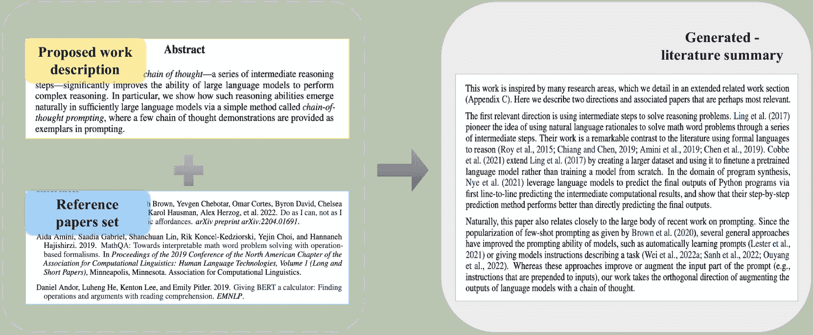
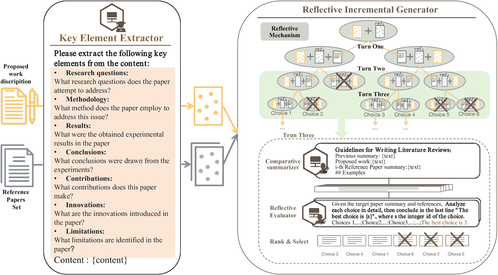
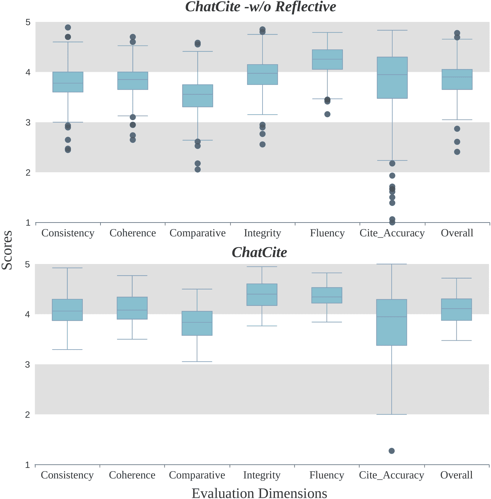
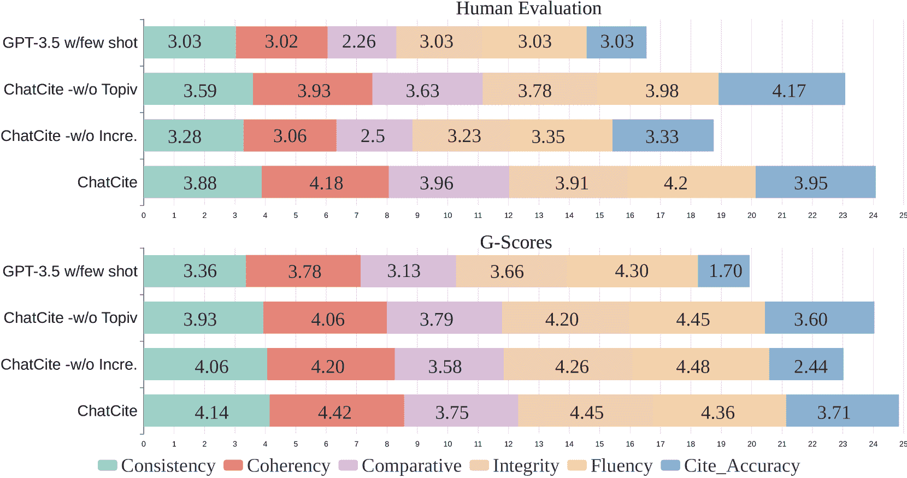
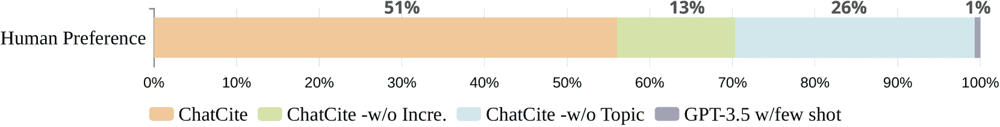

<!--yml

分类：未分类

日期：2025-01-11 12:48:32

-->

# ChatCite：具有人工工作流指导的 LLM 代理，用于比较文献总结

> 来源：[https://arxiv.org/html/2403.02574/](https://arxiv.org/html/2403.02574/)

李宇彤${}^{1}$，陈路${}^{2,3}$，刘爱伟${}^{1}$，于凯${}^{2,3}$，温丽杰${}^{1}$ ${}^{1}$清华大学，中国北京

${}^{2}$X-LANCE 实验室，计算机科学与工程系

教育部人工智能重点实验室，SJTU AI 研究所

上海交通大学，中国上海

${}^{3}$苏州实验室，中国苏州

li-yt21@mails.tsinghua.edu.cn, chenlusz@sjtu.edu.cn, wenlj@tsinghua.edu.cn

###### 摘要

文献综述是研究过程中不可或缺的步骤。它有助于理解研究问题并了解当前的研究状况，同时进行先前工作的比较分析。然而，文献总结是一项具有挑战性且耗时的任务。以前基于 LLM 的文献综述研究主要集中在完整的过程上，包括文献检索、筛选和总结。然而，在总结步骤中，简单的 CoT 方法往往缺乏提供广泛比较总结的能力。在本研究中，我们首先关注独立的文献总结步骤，并引入了*ChatCite*¹¹1我们的代码将在审稿过程后发布。，这是一个具有人工工作流指导的 LLM 代理，用于比较文献总结。该代理通过模仿人类工作流，首先从相关文献中提取关键元素，然后利用反思增量机制生成总结。为了更好地评估生成总结的质量，我们设计了一种基于 LLM 的自动评估指标——G-Score，参考了人工评估标准。在实验中，*ChatCite* 代理在多个维度上优于其他模型。通过*ChatCite* 生成的文献总结也可以直接用于撰写文献综述。

## 1 引言

随着学术研究的快速发展，学者们必须深入现有文献，理解过去的研究成果，识别未来的研究趋势，并在自己的领域中寻找创新的方法。撰写文献综述涉及到查找相关文献并进行详细的比较总结。通常，这一过程包括两个主要步骤：文献收集和基于收集的文献生成文献总结。然而，组织高质量的文献综述需要学者们对大量相关工作进行深入分析、整理、比较和整合，这通常是一个充满挑战且耗时的任务。

图 1：文献总结任务描述

因此，Hoang和Kan（[2010](https://arxiv.org/html/2403.02574v1#bib.bib9)）提出了自动生成文献总结的方法。然而，机器生成的文献总结往往面临信息遗漏、语言流畅性不足和缺乏对比分析等挑战。在传统模型中，通过提取和抽象方法生成的摘要可能由于模型的局限性而错失关键信息，导致生成的摘要缺乏重要的点或发现。一些自动化系统可能缺乏深入的对比分析能力，可能导致文献总结无法全面理解该领域相关研究。

近年来，随着大规模语言模型（LLMs）的快速发展，Radford等人（[2019](https://arxiv.org/html/2403.02574v1#bib.bib16)）；Brown等人（[2020](https://arxiv.org/html/2403.02574v1#bib.bib4)）展示了它们在自然语言生成任务中的强大能力，涵盖了多个任务，为处理更长的文本和生成综合性的摘要提供了可能性。研究人员已开始探索如何利用LLMs生成自动化的文献总结。Wei等人（[2023](https://arxiv.org/html/2403.02574v1#bib.bib18)）提出了一种链式思维（Chain-of-Thought, CoT）提示方法，旨在增强大规模语言模型执行复杂推理的能力。CoT使得LLMs能够制定自己的计划，从而生成与人类偏好更加契合的文本。黄和谭（[2023](https://arxiv.org/html/2403.02574v1#bib.bib10)）以及Agarwal等人（[2024](https://arxiv.org/html/2403.02574v1#bib.bib3)）在文献综述方面的最新研究更多关注如何更准确地检索相关论文，而忽视了文献总结的研究。他们仅使用简单的CoT指导生成文献总结，导致缺乏对比性和组织性分析。尽管大规模语言模型在语言生成方面流畅，但由于其不可预测和随机的性质，它们难以始终如一地生成具有对比性的文献总结。这些模型的长度限制要求采用两步总结方法，增加了在生成摘要过程中遗漏信息的风险。

在这项工作中，我们专注于独立的文献总结任务，旨在通过一定集合的文献和对提议工作的描述，生成一个全面的比较文献总结，如图[1](https://arxiv.org/html/2403.02574v1#S1.F1 "Figure 1 ‣ 1 Introduction ‣ ChatCite: LLM Agent with Human Workflow Guidance for Comparative Literature Summary")所示。为了解决上述挑战，我们的工作提出了*ChatCite*，这是一种基于LLM的代理，受到人类工作流程的指导。与简单的CoT提示方法不同，该代理设计时融入了人类工作流程指导，而不是以黑箱的方式制定生成过程，从而确保生成更稳定、更高质量的通用总结。

此外，生成任务的质量评估一直是一个挑战。先前关于文献总结的研究主要依赖于文本总结指标，例如ROUGE（Lin（[2004a](https://arxiv.org/html/2403.02574v1#bib.bib12)））。然而，传统的文本摘要评估指标，如ROUGE，并不足以评估文献总结的质量。需要更全面的评估标准，涵盖多个维度，以确保生成的文献总结真正满足要求。因此，我们结合了人类对文献综述的研究Justitia和Wang（[2022](https://arxiv.org/html/2403.02574v1#bib.bib11)）来制定从多个维度评估文献总结的标准。六个评估维度为：一致性、连贯性、比较性、完整性、流畅性、引用准确性，并提出了基于LLM的自动评估指标——G-Score。实验结果表明，该评估指标与人类评估一致。

在本文中，我们总结了框架的主要贡献，如下所示：

+   •

    我们聚焦于文献综述中的独立文献总结步骤，并引入了*ChatCite*，这是一种有着人类工作流程指导的LLM代理，用于比较文献总结。

+   •

    基于文献总结的研究，我们开发了一个多维度的文献总结质量评估标准。此外，我们提出了一种基于LLM的自动评估指标——G-Score，展示了与人类偏好一致的结果。

+   •

    实验结果表明，*ChatCite*在所有质量维度上都优于其他基于LLM的文献总结方法。*ChatCite*生成的文献总结可以直接用于撰写文献综述。

+   •

    我们展示了在有人类工作流程指导的LLM的帮助下，LLM能够有效地执行多文献的综合比较总结。因此，我们推测大语言模型（LLMs）有潜力处理更复杂的推理总结任务。

## 2 相关工作³³3我们的相关工作利用由ChatCite生成的摘要，以GPT-4作为草稿，并进行最小的精炼。信息全面，错误最小。生成的结果组织了文献并包括了比较分析。生成的结果展示在附录中（表[4](https://arxiv.org/html/2403.02574v1#A1.T4 "Table 4 ‣ A.2 Related work draft for this paper generated by ChatCite with GPT-4.0 ‣ Appendix A Appendix ‣ ChatCite: LLM Agent with Human Workflow Guidance for Comparative Literature Summary")）。

近年来，关于生成文献摘要的研究丰富，最初由Hoang和Kan（[2010](https://arxiv.org/html/2403.02574v1#bib.bib9)）提出，通过基于提取方法的主题相关工作摘要来自动化相关工作的总结。为了生成引用句子，Xing等人（[2020](https://arxiv.org/html/2403.02574v1#bib.bib19)）采用了带有跨注意力机制的多源指针生成网络，而AbuRa’ed等人（[2020](https://arxiv.org/html/2403.02574v1#bib.bib1)）使用了ARWG系统，采用神经序列学习过程，Ge等人（[2021](https://arxiv.org/html/2403.02574v1#bib.bib7)）提出了基于背景知识和内容的BACO框架。此外，Chen等人（[2021](https://arxiv.org/html/2403.02574v1#bib.bib5)）采用了关系感知相关工作生成器（RRG）来生成引用段落，而Chen等人（[2022](https://arxiv.org/html/2403.02574v1#bib.bib6)）则应用了对比学习来生成目标感知的相关工作段落。然而，传统的生成方法由于模型的规模和缺乏连贯性及程序性语言的连续性，无法生成全面连贯的文献综述。

大型语言模型（LLMs），如GPT（Radford等人 ([2019](https://arxiv.org/html/2403.02574v1#bib.bib16)），Brown等人 ([2020](https://arxiv.org/html/2403.02574v1#bib.bib4))），在自然语言生成任务中展示了强大的能力。黄和Tan的研究（[2023](https://arxiv.org/html/2403.02574v1#bib.bib10)）探讨了像ChatGPT这样的AI工具在撰写科学综述文章中的应用，揭示了人工智能在学术写作中的潜在优势和弊端。在这些见解的基础上，Agarwal等人（[2024](https://arxiv.org/html/2403.02574v1#bib.bib3)）介绍了LitLLM工具包，它通过采用检索增强生成（RAG）原则、专业提示和指令性技术，克服了生成幻觉内容和忽视最新研究等挑战。然而，这些研究仅在文献综述中的搜索和过滤过程中应用了简单的思维链（CoT），导致可读性较差。相比之下，*ChatCite* 专注于文本摘要这一独立任务，旨在生成更高质量的摘要。

此外，本文引入了一种多维度的 G-Score 评估指标，该指标灵感来源于先前尝试通过链式思维方法使用大型语言模型（LLMs）来评估自然语言生成（NLG）系统的质量（Liu 等人（[2023](https://arxiv.org/html/2403.02574v1#bib.bib14)），Goyal 等人（[2023](https://arxiv.org/html/2403.02574v1#bib.bib8)）），与传统的 ROUGE 指标（Lin（[2004b](https://arxiv.org/html/2403.02574v1#bib.bib13)））相比，该方法与人工评估更加一致。

## 3 ChatCite

图 2：*ChatCite* 包含两个模块：关键元素提取器和反思增量生成器。模仿人类工作流程的代理生成文献摘要，利用关键元素提取器处理所提工作描述和参考文献集中的参考论文。然后，它通过反思增量生成器，使用参考文献集中的每篇论文、所提工作关键元素和前一次生成的摘要，迭代地生成文献摘要。这个过程会反复进行，直到生成完整的相关工作摘要，并选择最优结果作为最终结果。

文献综述任务可以分解为两个子任务：相关文献检索和文献摘要生成。本研究聚焦于文献摘要生成这一独立任务。我们的任务是基于所提工作描述 D 和一定的参考文献集 $\textit{R}=\left\{r_{1},r_{2},...,r_{n}\right\}$ 生成文献摘要。给定 D 和 R，我们的代理生成文献摘要 $Y=f(\textit{D},$R$)$。

与其他类型的摘要（如新闻摘要）不同，直接由大型语言模型使用简单的链式思维（CoT）指导生成的文献摘要主要面临以下问题：

缺失的关键元素：由于 LLMs 的窗口限制，直接生成完整的文献综述是具有挑战性的。通常，采用包括摘要和文献综述生成的两步法。然而，这一过程可能会导致在摘要过程中丢失关键元素。即使可以直接生成整个文献摘要，使用完整文本也可能导致对关键元素的理解错误，进而丧失这些元素。

缺乏对比分析：对比分析在文献摘要中至关重要，需要对现有研究方法的局限性和优点进行分析，重点关注方法、实验设计、数据集使用等方面的异同。直接使用 CoT 生成的结果通常缺乏对比分析。

缺乏组织结构：仅通过 CoT 生成的文献摘要通常对于每篇论文都是离散的，缺乏对相似工作的分类，以及文献综述的组织结构。

为了解决这些挑战，我们提出了一种用于比较文学总结并辅以人工工作流指导的LLM代理——*ChatCite*，该代理由两个模块组成：关键元素提取器和反思增量生成器，如图[2](https://arxiv.org/html/2403.02574v1#S3.F2 "Figure 2 ‣ 3 ChatCite ‣ ChatCite: LLM Agent with Human Workflow Guidance for Comparative Literature Summary")所示。在这一过程中，我们利用大语言模型作为生成和评估组件，消除了额外模型训练的需求，并在一定程度上提高了生成文本的质量。

由人工工作流引导的生成过程如下：

1.  1.

    所提出的工作描述和参考文献集中的参考文献会首先使用关键元素提取器进行单独处理。

1.  2.

    使用参考文献集迭代生成文献总结。在每次迭代中，使用比较总结器生成比较分析总结。然后，使用反思评估器对生成的候选结果进行投票，按投票分数排序并保留前$ n_{c} $个结果。不断迭代，直到所有参考文献处理完毕。

最终输出是基于生成的相关工作总结中最高的投票得分来选择的。

在本节中，我们首先详细阐述了关键元素提取器（§[3.1](https://arxiv.org/html/2403.02574v1#S3.SS1 "3.1 Key Element Extractor ‣ 3 ChatCite ‣ ChatCite: LLM Agent with Human Workflow Guidance for Comparative Literature Summary")）和反思增量生成器模块（§[3.2](https://arxiv.org/html/2403.02574v1#S3.SS2 "3.2 Reflective incremental Generator ‣ 3 ChatCite ‣ ChatCite: LLM Agent with Human Workflow Guidance for Comparative Literature Summary")）的具体内容。

### 3.1 关键元素提取器

为了保留足够的关键元素以进行文献总结，我们根据Justitia和Wang（[2022](https://arxiv.org/html/2403.02574v1#bib.bib11)）对文献综述的分析，创建了七个简单的引导性问题。我们将这些问题与所需提取的内容串联起来，作为提示指导LLMs提取关键元素。对于每个元素，设置一个简单的问题（如图[2](https://arxiv.org/html/2403.02574v1#S3.F2 "Figure 2 ‣ 3 ChatCite ‣ ChatCite: LLM Agent with Human Workflow Guidance for Comparative Literature Summary")所示）来引导模型提取，这些问题为$ Q_{e} = \left[q_{1}, q_{2}, ..., q_{7}\right] $。这些问题$ Q_{e} $和文献内容$ C $被串联成关键元素提取提示$ P_{e} = \left[Q_{e}, C\right] $。使用LLM作为提取解码器提取关键元素并将其存储在内存中。

### 3.2 反思增量生成器

为了克服LLM生成的文献综述中缺乏对比分析和组织结构的问题，我们设计了反射增量生成器。该生成器使用对比总结器继续撰写对比总结，将上一轮的结果与提议工作的关键元素以及参考文献中的关键内容结合起来。接着，它利用反射评估器过滤生成的结果。这个过程会对参考文献集中的每一篇参考文献反复应用，直到所有参考文献都处理完毕。最终保留最佳结果作为模型的生成输出。

#### 3.2.1 对比总结器

对于第$i$轮，根据提议工作关键元素$pro$、第$i$篇参考文献$ref_{i}$的关键元素以及对比总结指导，依次生成每个总结$s\in S_{i-1}$的总结，并每次生成$n_{s}$个样本。$S_{i}=\left\{G(D_{g},pro,ref_{i},s,n_{s}),\forall s\in S_{i-1}\right\}$。在此，为了增强生成总结的可比性和组织性，提供了对比总结指导：“考虑参考文献与目标论文的关系，以及之前已完成的相关工作中的现有引用，同时保留所有在之前已完成的相关工作中提到的参考文献的内容。”

#### 3.2.2 反射机制

由于文本生成任务中存在较大的不确定性，我们采用反射生成来提升生成段落的质量和稳定性。在这里，我们使用LLM作为反射评估器，对每一轮生成的结果进行$n_{v}$次投票，然后对投票结果进行统计分析，得出投票得分$E_{i}=E(D_{e},S^{\prime}_{i})$。

然后我们对得分进行排序，并保留前$n_{c}$个候选项$S_{i}=\left\{S_{t},t\in Sort(E_{i})(1,n_{c})\right\}$。这些选中的候选项将用于下一轮增量生成。这种方法有助于识别最有前途的结果，确保生成文本的质量，并提高生成的稳定性。

#### 3.2.3 反射增量生成算法

在实现反射增量生成时，我们借鉴了树的广度优先搜索算法（算法[1](https://arxiv.org/html/2403.02574v1#alg1 "算法 1 ‣ 3.2.3 反射增量生成算法 ‣ 3.2 反射增量生成器 ‣ 3 ChatCite ‣ ChatCite: 具有人工工作流引导的LLM代理，用于对比文献总结")）的思想。

算法 1 反射增量生成器

0:  提出的工作关键元素 $pro$，参考文献摘要列表 $refs\_list=\left[ref_{1},ref_{2},...ref_{n}\right]$，比较摘要器 $G()$，反思评估器 $E()$，摘要的语言模型解码器 $D_{s}$，评估的语言模型解码器 $D_{e}$，每次生成的样本数 $n_{s}$，每轮保留的候选数为 $n_{c}$。 $S_{0}\leftarrow\left\{\right\}$  $steps\leftarrow len(refs\_list)$  for $i=1$ to $steps$ do     $S^{\prime}_{t}\leftarrow\left\{G(D_{g},pro,ref_{i},s,n_{s}),s\in S_{i-1}\right\}$     $E_{i}\leftarrow E(D_{e},S^{\prime}_{i})$     $S_{i}\leftarrow\left\{S_{t},t\in Sort(E_{i})(1,n_{c})\right\}$  end for  return  $S_{argmax_{i}E_{n}(i)}$

注：$G()$ 对应于§[3.2.1](https://arxiv.org/html/2403.02574v1#S3.SS2.SSS1 "3.2.1 Comparative Summarizer ‣ 3.2 Reflective incremental Generator ‣ 3 ChatCite ‣ ChatCite: LLM Agent with Human Workflow Guidance for Comparative Literature Summary")中描述的比较摘要器功能，而$E()$ 对应于§[3.2.2](https://arxiv.org/html/2403.02574v1#S3.SS2.SSS2 "3.2.2 Reflective Mechanism ‣ 3.2 Reflective incremental Generator ‣ 3 ChatCite ‣ ChatCite: LLM Agent with Human Workflow Guidance for Comparative Literature Summary")中描述的反思评估功能。在每一步中，维护一个包含 $n_{c}$ 个最有前景生成结果的集合，其中树的深度等于相关文献集合中文档的数量，$S^{\prime}_{t}$ 包含 $n_{c}$ * $n_{s}$ 个结果，而 $S_{i-1}$ 和 $S_{i}$ 各自包含 $n_{c}$ 个结果。

## 4 G-Score：基于LLM的自动评估指标

生成任务的评估一直是一个挑战。以往关于文献摘要的研究主要依赖于文本摘要评估指标，如ROUGE (Lin ([2004a](https://arxiv.org/html/2403.02574v1#bib.bib12)))。然而，传统的文本摘要评估指标，如ROUGE，无法有效评估文献摘要的质量。因此，采用更全面的评估标准，涵盖多个维度，以确保生成的文献摘要符合必要的标准，显得尤为重要。在此，我们受到G-Eval Liu等人 ([2023](https://arxiv.org/html/2403.02574v1#bib.bib14))的启发，尝试使用大语言模型（LLMs）进行评估。我们基于对文献摘要的研究 Justitia 和 Wang ([2022](https://arxiv.org/html/2403.02574v1#bib.bib11))，建立了六维度自动评估指标。

评估步骤：我们使用大语言模型（LLMs）对六个维度的通用质量进行评分，并从一系列模型生成的摘要中投票选出最佳摘要。特别地，为了确保评估的公平性和一致性，我们在一次对话中同时对多个模型生成的结果进行评分和投票。

评估标准：

一致性（1-5）：生成的总结与黄金总结之间的内容一致性。生成的总结不得包含与黄金总结冲突的内容。

连贯性（1-5）：生成的总结中语言的连贯性质量，不能仅仅是相关信息的堆砌。

比较性（1-5）：评估生成的总结是否对参考文献和提出的工作进行了比较分析，是否提供了类似相关工作的综合总结。

完整性（1-5）：评估总结是否涵盖了基本元素：研究背景、参考文献总结、过去研究评估、贡献和创新。

流畅性（1-5）：评估总结在语法、拼写、标点、用词和句子结构方面的质量。

引用准确性（1-5）：评估总结是否在提及参考文献时正确引用了论文，格式为‘[Reference i]’。

## 5 实验

我们通过验证以下问题来验证我们提出的*ChatCite*代理的能力：1) *ChatCite*生成的文献总结是否优于LLMs直接生成的总结，包括CoT和其他LLM-based文献综述方法？ 2) *ChatCite*中的所有模块是否都有助于其效果？ 3) *ChatCite*框架中的各个模块对生成总结的质量有何具体影响？

在本节中，我们进行了系列实验以回答这些问题。首先，我们介绍了实验设置（§[5.1](https://arxiv.org/html/2403.02574v1#S5.SS1 "5.1 实验设置 ‣ 5 实验 ‣ ChatCite: 人类工作流程引导下的大型语言模型代理进行比较文献总结")）。我们比较了现有大型语言模型（LLMs）在零-shot和少-shot设置下直接生成相关工作的表现，以及基于LLM的最佳文献综述方法（§[5.2](https://arxiv.org/html/2403.02574v1#S5.SS2 "5.2 主要结果 ‣ 5 实验 ‣ ChatCite: 人类工作流程引导下的大型语言模型代理进行比较文献总结")）。此外，我们对代理中的每个模块进行了消融分析，以验证它们各自的能力（§[5.3](https://arxiv.org/html/2403.02574v1#S5.SS3 "5.3 消融分析 ‣ 5 实验 ‣ ChatCite: 人类工作流程引导下的大型语言模型代理进行比较文献总结")）。最后，我们进行了人类研究，详细评估生成的相关工作总结的质量（§[5.4](https://arxiv.org/html/2403.02574v1#S5.SS4 "5.4 人类研究 ‣ 5 实验 ‣ ChatCite: 人类工作流程引导下的大型语言模型代理进行比较文献总结")）。

### 5.1 实验设置

| 模型 | ROUGE指标 | G-得分 | G-精度 |
| --- | --- | --- | --- |
| ROUGE-1 | ROUGE-2 | ROUGE-L | (1-5) | (%) |
| GPT-3.5 零-shot | 26.01 | 6.11 | 24.02 | 3.4102 | 2.21 |
| GPT-3.5 少-shot | 25.84 | 6.01 | 23.55 | 3.5968 | 10.80 |
| GPT-4 零-shot | 30.02 | 8.03 | 27.97 | 3.5076 | 26.40 |
| GPT-4 w/少量样本 | 15.52 | 1.78 | 14.20 | 1.6621 | 0.21 |
| LitLLM w/GPT-4 | 27.08 | 6.07 | 24.94 | 3.5448 | 24.51 |
| ChatCite | 25.30 | 6.36 | 23.13 | 4.0642 | 35.86 |

表1：主要结果：结果通过ROUGE-1/2/L（F1）和GPT-4.0评估器自动评估。G-Score代表由GPT-4.0评估器评定的总分，而G-Prf.表示五个模型之间的偏好。

数据集。我们进行了实验，验证了一个名为NudtRwG-Citation的数据集，该数据集由Wang等人设计（[2020](https://arxiv.org/html/2403.02574v1#bib.bib17)），用于相关工作总结任务。该测试集包括50篇计算机科学领域的学术研究论文，每篇数据包含以下组成部分：1）目标论文，需要生成相关工作部分，但该部分没有提供。2）真实的相关工作部分。3）目标论文的参考文献（标注了作者和年份）。

每篇论文在计算语言学和自然语言处理领域的会议中都得到了广泛的认可，平均被引用次数达到63.59，这表明这些目标论文得到了学术界的广泛认可。

模型。对于LLM基准模型，我们采用了GPT-3.5模型（Ouyang等人（[2022](https://arxiv.org/html/2403.02574v1#bib.bib15)））并使用了16k的上下文窗口（版本gpt-3.5-turbo-1106），以及GPT-4.0模型（Achiam等人（[2023](https://arxiv.org/html/2403.02574v1#bib.bib2)））并使用了128K的上下文窗口（gpt-4-turbo-preview）。我们在零样本和少量样本设置下评估了它们的性能。对于之前表现最好的LLM基础文献综述方法，我们使用了最近提出的LitLLM方法（Agarwal等人（[2024](https://arxiv.org/html/2403.02574v1#bib.bib3)））作为基准。我们根据他们论文中提到的CoT提示，重现了他们生成文献总结的能力。为了展示最佳性能，我们将GPT-4.0作为LitLLM基准的解码器。对于我们的模型，由于GPT-4.0的高成本，我们基于GPT-3.5（版本gpt-3.5-turbo-1106）作为解码器进行了实验。在评估时，我们使用GPT-4.0（gpt-4-turbo-preview）作为解码器。

实现。在零样本设置下，对于GPT-3.5模型，由于上下文窗口的限制，采用了两步生成方法：1）首先进行摘要，然后使用提示$\left[p_{s}\right]=$"总结当前文章，尽可能保留信息。内容：{content}"进行摘要。对于生成相关工作部分，我们使用提示$\left[p_{g}\right]=$ "根据给定的目标论文摘要及其参考文献摘要生成相关工作部分。阅读目标论文内容：{Target}。参考文献内容：{References}"。对于GPT-4.0和基于GPT-4.0的LitLLM，$\left[p_{g}\right]$被直接用于摘要生成。

在少量样本设置中，我们在零-shot提示中添加了指令“遵循示例的写作风格，但不要包括示例中的任何内容。{示例}”。

评价指标。我们采用自动评价指标和人工评价来评估通用结果。我们使用传统的自动化总结评价指标——词汇重叠度量ROUGE-1/2/L (F1) (Lin ([2004b](https://arxiv.org/html/2403.02574v1#bib.bib13)))，我们提出的基于LLM的评价指标G-Eval，以及在相同评价标准下的人工评价。

### 5.2 主要结果

我们比较了不同基准模型在论文测试集上的表现（见表[1](https://arxiv.org/html/2403.02574v1#S5.T1 "表 1 ‣ 5.1 实验设置 ‣ 5 实验 ‣ ChatCite: 基于人类工作流程指导的LLM代理用于比较文献总结")）。在传统的总结评价指标中，如ROUGE，GPT-4.0在零-shot设置下取得了最佳结果。尽管*ChatCite*的ROUGE得分可能略低于零-shot下的GPT-4.0，但其在LLM生成的质量指标和LLM偏好方面远远优于直接来自其他LLM基准的结果。

出人意料的是，GPT-4.0在少量样本设置下表现不佳。研究发现，它受少量样本中例子影响，导致在案例研究后产生无关且错误的总结。值得注意的是，使用GPT-4.0的LitLLM在零-shot设置下产生的结果与GPT-4.0类似，但明显低于*ChatCite*。

因此，我们得出结论：“ChatCite在基于LLM的文献总结方法中表现最好，而遵循人类工作流程指导的方法优于链式思维（CoT）方法得到的结果。”

### 5.3 消融分析

我们提出的框架可以分解为两个组件：关键元素提取器和反思增量生成器。反思增量生成器包含两个关键点：比较增量生成和反思机制。因此，我们将分别分析这三部分。

| 模型 | ROUGE指标 | G-得分 | G-优先级 |
| --- | --- | --- | --- |
| ROUGE-1 | ROUGE-2 | ROUGE-L | (1-5) | (%) |
| --- | --- | --- | --- | --- |
| GPT-3.5 w/少量样本 | 25.84 | 6.01 | 23.55 | 3.2426 | 2.84 |
| -无元素 | 24.38 | 5.81 | 22.36 | 4.0016 | 22.11 |
| ChatCite -无增量 | 24.72 | 5.93 | 22.40 | 3.8195 | 35.34 |
| \rowcolorgray!20 ChatCite | 25.30 | 6.36 | 23.13 | 4.1064 | 39.71 |

表 2：消融实验结果：该表展示了模型的关键元素提取器和比较增量生成器的消融实验结果，GPT-3.5 w/少量样本的结果作为GPT-3.5的基准。

关键元素提取器。为了验证关键元素提取器的有效性，我们选择了不使用关键元素提取器的ChatCite作为对照。该版本的ChatCite使用基线摘要提示$\left[p_{s}\right]$直接对文章进行摘要，然后使用反思增量生成器生成文献摘要。

在表格[2](https://arxiv.org/html/2403.02574v1#S5.T2 "Table 2 ‣ 5.3 Ablation Analysis ‣ 5 Experiment ‣ ChatCite: LLM Agent with Human Workflow Guidance for Comparative Literature Summary")中，比较了不使用关键元素提取器的ChatCite与使用关键元素提取器的ChatCite的结果，我们可以观察到，ChatCite在所有ROUGE指标和LLM评估器生成的指标中表现更好。因此，这表明话题提取器模块在文献摘要中发挥了有效作用。

比较增量机制。为了验证比较增量机制的有效性，我们选择了不使用比较增量机制的ChatCite作为对照，采用少样本基线提示$\left[p_{s}\right]$和少样本示例作为提示，直接从文本中生成文献摘要，经过标准化摘要处理后生成。考虑到控制增量机制的变量，我们还将CoT写作指令纳入方法中，以确保实验结果不受写作指令的影响。

在表格[2](https://arxiv.org/html/2403.02574v1#S5.T2 "Table 2 ‣ 5.3 Ablation Analysis ‣ 5 Experiment ‣ ChatCite: LLM Agent with Human Workflow Guidance for Comparative Literature Summary")中，比较有无比较增量机制的ChatCite时，结果表明，使用比较增量机制的ChatCite相比于不使用该机制的ChatCite，在ROUGE指标和LLM评估指标上都取得了更高的成绩。这表明比较增量机制对ChatCite框架中文献摘要的有效性有显著贡献。

图3：反思机制的消融研究。上须和下须表示数据的整体范围，而箱体显示了数据集中50%数据的分布，箱体内的线表示数据的中位数。箱线图外的数据点被视为异常值，表示显著偏离箱体和须的点。可以观察到，ChatCite在所有维度上表现得更加稳定。

反射机制。总之，我们分析了反射机制的影响。基于*ChatCite*的多个结果，我们评估了在有反射机制和没有反射机制情况下的不同维度的G-得分。图[3](https://arxiv.org/html/2403.02574v1#S5.F3 "图3 ‣ 5.3 消融分析 ‣ 5 实验 ‣ ChatCite：带有人类工作流指导的LLM代理，用于比较文献总结")中的箱线图结果显示，*ChatCite*在有无反射机制的情况下结果相似。然而，*ChatCite*的整体结果略高，且分布中的异常值较少，表明生成的结果更加稳定。这证明反射机制有效地提高了*ChatCite*生成文本的质量和稳定性。

总体而言，通过对三个组件进行消融实验，我们证明了“*ChatCite*框架的每个部分都有助于提高文献总结中生成结果的质量和稳定性”。

### 5.4 人类研究

为了对*ChatCite*生成的总结质量进行细粒度分析，并了解各个模块对总结的具体影响，我们进行了人类研究。我们邀请了几位具有学术写作经验的计算机科学领域研究人员，使用相同的标准评估了10个选定样本，并选出了更好的总结。

图4：人类评估与G-得分在六个维度上的通用总结质量对比。G-得分模型的评分结果与人类评估的分布一致。

图5：人类偏好：更好的生成总结的平均标注者投票分布。

图[4](https://arxiv.org/html/2403.02574v1#S5.F4 "图4 ‣ 5.4 人类研究 ‣ 5 实验 ‣ ChatCite：带有人类工作流指导的LLM代理，用于比较文献总结")展示了G-得分指标与人类偏好的对齐结果。具体来说，结合关键元素提取器的方法展现了更高的内容一致性。采用比较增量生成机制生成的总结在文献回顾的组织结构、比较分析和引文准确性方面表现更好。LLM生成的结果流畅度始终较高，且不同模型之间的变异性较低。在人类评估方面，未采用比较增量机制生成的总结表现出对每篇论文的描述过于离散，缺乏连贯性。出乎意料的是，大型模型在评估时未捕捉到这一特点。

此外，图 [5](https://arxiv.org/html/2403.02574v1#S5.F5 "Figure 5 ‣ 5.4 Human Study ‣ 5 Experiment ‣ ChatCite: LLM Agent with Human Workflow Guidance for Comparative Literature Summary") 显示了 ChatCite 模型相对于其他模型的优越性。

## 6 结论

LLMs 是生成文献摘要的强大工具，但它也带来了信息遗漏、缺乏对比性摘要和组织结构缺陷等挑战。在 ChatCite 中，关键元素提取器有助于提高内容的一致性，而比较增量生成器则有效地增强了生成摘要的组织结构、比较分析和引用准确性。此外，ChatCite 生成的文献摘要可以直接用于撰写文献综述。我们的研究还表明，遵循人类工作流程指导的方法优于通过“思维链”（CoT）方法获得的结果。未来，我们希望我们的工作能进一步激发对复杂推理写作的研究，充分发挥 LLMs 在开放式写作任务中的潜力。

## 限制

在本研究中，我们主要集中在基于选定文献的特定主题摘要，而不是文献的收集和筛选。数据集主要由计算机科学领域的研究文章组成，缺乏来自其他学科的研究文章来验证我们的模型。我们的实验使用了 Chat GPT 3.5 作为验证生成内容质量和代理各组件功能的工具。我们没有探索任何可能影响 GPT3.5 模型结果的额外规格，也没有考虑使用其他模型作为验证工具。生成内容的评估是一项巨大的挑战。我们从多个维度评估了生成的结果，使用 G-Score 作为性能指标，但自动评估过程的准确性仍有提升空间。生成结果表现出随机性和不稳定性。尽管我们提出的方法展示了代理的有效性，但结果表明，进一步的研究有助于提高输出的稳定性和质量。

## 伦理声明

我们使用的数据集仅包含来自公开可获取论文的研究文章，消除了关于数据来源的顾虑。我们使用的大型语言模型仅作为生成器，用于总结他人的观点和文献，从未用于学术论文的创新写作过程。然而，如果生成的文献摘要将被纳入学术论文写作中，应对生成的结果进行审查和编辑。这确保了学术写作内容不包含有害信息和抄袭问题。

我们将公开我们的代码以确保实验的可重复性。

## 参考文献

+   AbuRa’ed等人（2020）Ahmed AbuRa’ed, Horacio Saggion, Alexander Shvets, 和 Àlex Bravo. 2020. [自动相关工作部分生成：科学文献抽象实验](https://doi.org/10.1007/s11192-020-03630-2). 125(3)。

+   Achiam等人（2023）Josh Achiam, Steven Adler, Sandhini Agarwal, Lama Ahmad, Ilge Akkaya, Florencia Leoni Aleman, Diogo Almeida, Janko Altenschmidt, Sam Altman, Shyamal Anadkat, 等人. 2023. GPT-4技术报告. *arXiv预印本arXiv:2303.08774*。

+   Agarwal等人（2024）Shubham Agarwal, Issam H. Laradji, Laurent Charlin, 和 Christopher Pal. 2024. [Litllm：一种科学文献综述工具包](http://arxiv.org/abs/2402.01788)。

+   Brown等人（2020）Tom B. Brown, Benjamin Mann, Nick Ryder, Melanie Subbiah, Jared Kaplan, Prafulla Dhariwal, Arvind Neelakantan, Pranav Shyam, Girish Sastry, Amanda Askell, Sandhini Agarwal, Ariel Herbert-Voss, Gretchen Krueger, Tom Henighan, Rewon Child, Aditya Ramesh, Daniel M. Ziegler, Jeffrey Wu, Clemens Winter, Christopher Hesse, Mark Chen, Eric Sigler, Mateusz Litwin, Scott Gray, Benjamin Chess, Jack Clark, Christopher Berner, Sam McCandlish, Alec Radford, Ilya Sutskever, 和 Dario Amodei. 2020. [语言模型是少量示例学习者](http://arxiv.org/abs/2005.14165)。

+   陈等人（2021）Xiuying Chen, Hind Alamro, Mingzhe Li, Shen Gao, Xiangliang Zhang, Dongyan Zhao, 和 Rui Yan. 2021. [捕捉科学论文之间的关系：一种用于生成相关工作部分的抽象模型](https://doi.org/10.18653/v1/2021.acl-long.473). 收录于 *第59届计算语言学协会年会及第11届国际自然语言处理联合会议（卷1：长篇论文）*，第6068–6077页，在线。计算语言学协会。

+   陈等人（2022）Xiuying Chen, Hind Alamro, Li Mingzhe, Shen Gao, Rui Yan, Xin Gao, 和 Xiangliang Zhang. 2022. [目标感知的对比学习抽象相关工作生成](https://api.semanticscholar.org/CorpusID:249097545). *第45届国际ACM SIGIR信息检索研究与开发会议论文集*。

+   葛等人（2021）Yubin Ge, Ly Dinh, Xiaofeng Liu, Jinsong Su, Ziyao Lu, Ante Wang, 和 Jana Diesner. 2021. [BACO：一个基于背景知识和内容的引用句子生成框架](https://doi.org/10.18653/v1/2021.acl-long.116). 收录于 *第59届计算语言学协会年会及第11届国际自然语言处理联合会议（卷1：长篇论文）*，第1466–1478页，在线。计算语言学协会。

+   Goyal等人（2023）Tanya Goyal, Junyi Jessy Li, 和 Greg Durrett. 2023. [GPT-3时代的新闻摘要与评估](http://arxiv.org/abs/2209.12356)。

+   Hoang和Kan（2010）Cong Duy Vu Hoang和Min-Yen Kan。2010年。[面向自动化相关工作总结20](https://aclanthology.org/C10-2049)。发表于*Coling 2010：海报*，第427–435页，中国北京。Coling 2010组织委员会。

+   Huang和Tan（2023）Jingshan Huang和Ming Tan。2023年。ChatGPT在科学交流中的作用：写作更好的科学综述文章。*美国癌症研究杂志*，13（4）：1148。

+   Justitia和Wang（2022）Army Justitia和Hei-Chia Wang。2022年。科学文章中的自动化相关工作部分：研究趋势与未来方向。发表于*2022年国际智能技术及其应用研讨会（ISITIA）*，第108–114页，IEEE。

+   Lin（2004a）Chin-Yew Lin。2004a年。[Rouge：一个用于自动评估摘要的软件包](https://api.semanticscholar.org/CorpusID:964287)。发表于*计算语言学协会年会*。

+   Lin（2004b）Chin-Yew Lin。2004b年。[ROUGE：一个用于自动评估摘要的软件包](https://aclanthology.org/W04-1013)。发表于*文本摘要的扩展*，第74–81页，西班牙巴塞罗那。计算语言学协会。

+   Liu等人（2023）Yang Liu、Dan Iter、Yichong Xu、Shuohang Wang、Ruochen Xu和Chenguang Zhu。2023年。[G-eval：使用GPT-4进行更好的人类对齐的NLG评估](http://arxiv.org/abs/2303.16634)。

+   Ouyang等人（2022）Long Ouyang、Jeffrey Wu、Xu Jiang、Diogo Almeida、Carroll Wainwright、Pamela Mishkin、Chong Zhang、Sandhini Agarwal、Katarina Slama、Alex Ray等。2022年。训练语言模型根据人类反馈遵循指令。*神经信息处理系统进展*，35：27730–27744。

+   Radford等人（2019）Alec Radford、Jeff Wu、Rewon Child、David Luan、Dario Amodei和Ilya Sutskever。2019年。[语言模型是无监督的多任务学习者](https://api.semanticscholar.org/CorpusID:160025533)。

+   Wang等人（2020）Pancheng Wang、Shasha Li、Haifang Zhou、Jintao Tang和Ting Wang。2020年。[Toc-rwg：探索主题模型与引用信息结合的自动相关工作生成方法](https://api.semanticscholar.org/CorpusID:210931840)。*IEEE Access*，8：13043–13055。

+   Wei等人（2023）Jason Wei、Xuezhi Wang、Dale Schuurmans、Maarten Bosma、Brian Ichter、Fei Xia、Ed Chi、Quoc Le和Denny Zhou。2023年。[链式思维提示在大规模语言模型中引发推理](http://arxiv.org/abs/2201.11903)。

+   Xing等人（2020）Xinyu Xing、Xiaosheng Fan和Xiaojun Wan。2020年。[学术论文中引用文本的自动生成：一项初步研究](https://api.semanticscholar.org/CorpusID:220045125)。发表于*计算语言学协会年会*。

## 附录A 附录

### A.1 所有提到的模型生成结果示例

表3：为论文《BEL：用于实体链接的袋装方法》生成的文献摘要结果示例

| 黄金文献摘要 |
| --- |

|

统计机器翻译系统通常依赖于大规模的平行语料库和单语语料库来生成高质量的翻译。不幸的是，由于短语表是从有限的双语语料库中提取的，统计机器翻译系统往往会遇到数据稀疏问题。为了解决这一数据稀疏问题，已经进行了大量的研究工作，例如枢纽语言方法（Wu和Wang，2007；Cohn和Lapata，2007）以及深度学习技术（Devlin等，2014；Gao等，2014；Sundermeyer等，2014；Liu等，2014）。

在如何将一种源语言翻译成多种目标语言的问题上，统计机器翻译中做的工作较少。统计机器翻译中的一项相关工作是枢纽语言方法，这种方法使用一种常用语言作为“桥梁”，以生成源-目标翻译，用于训练语料较少的语言对。基于枢纽的统计机器翻译对于资源匮乏的语言对（如西班牙语到中文）至关重要。考虑到将一种源语言翻译成多种目标语言的问题，基于枢纽的统计机器翻译方法在拥有大规模源语言到枢纽语言双语语料库和大规模枢纽语言到目标语言语料库的情况下效果良好。然而，现实中，英语与其他许多目标语言之间的语言对可能并不大，且基于枢纽的统计机器翻译有时未能解决这一问题。我们的方法以不同的方式处理一种源语言到多种目标语言的翻译问题，我们直接学习一个端到多端的翻译系统，该系统不需要基于枢纽语言，且基于神经机器翻译的理念进行设计。

神经机器翻译是机器翻译领域的一个新兴领域，近年来由多个研究提出（Kalchbrenner和Blunsom，2013；Sutskever等，2014；Bahdanau等，2014），旨在实现端到端的机器翻译，无需短语表提取和语言模型训练。与传统的统计机器翻译不同，神经机器翻译通过递归神经网络将可变长度的源句子编码成固定长度的向量表示，并利用另一个递归神经网络从固定长度的向量解码为可变长度的目标句子。一个典型的模型是Bahdanau等（2014）提出的RNN编码器-解码器方法，该方法利用双向递归神经网络压缩源句子信息，并以递归方式拟合目标语言中单词的条件概率。此外，软对齐参数也考虑在内。作为本文中的具体示例模型，我们采用了一个RNN编码器-解码器神经机器翻译模型进行多任务学习，尽管所有基于神经网络的模型都可以在我们的框架中进行适配。

在自然语言处理领域，Collobert等人（2011年）提出了一项与多任务学习相关的重要工作，该工作共享输入词的共同表示，并在一个框架内解决了诸如词性标注、命名实体识别和语义角色标注等传统NLP任务，其中使用了卷积神经网络模型。Hatori等人（2012年）提出联合训练词语分割、词性标注和依存句法分析的方法，这也可以看作是一种多任务学习方法。Li等人（2014年）在中文依存句法分析中也提出了类似的思路。大多数多任务学习或联合训练框架可以归纳为Ando和Zhang（2005年）提出的参数共享方法，他们联合训练模型并在NLP任务中共享中心参数。研究人员还在统计机器翻译中探讨了类似的方法（Sennrich等，2013年；Cui等，2013年），这些方法通常被称为领域适应。我们的工作探索了在多任务框架下使用递归神经网络进行机器翻译的可能性。据我们所知，这是第一次在多任务学习框架下进行端到端机器翻译的尝试。

|  | ChatCite与GPT-3.5 |
| --- | --- |

|

相关工作

机器翻译领域在解决数据稀缺问题和提高翻译质量方面取得了显著进展。早期的方法如吴和王（2007年）提出的枢纽语言方法[参考文献1]，以及Cohn和Lapata（2007年）引入的三角法[参考文献2]，主要集中在改进基于短语的统计机器翻译，特别是对于资源稀缺的语言对。此外，Devlin等人（2014年）[参考文献3]通过引入神经网络联合模型（NNJM）为机器翻译作出了贡献，为构建新的神经网络联合模型及提升机器翻译性能的技术提供了宝贵的见解。

此外，Gao等人（2014年）[参考文献4]通过引入连续空间短语翻译模型（CPTM）进一步丰富了对解决数据稀缺问题和提高翻译质量的理解，该模型将源语言和目标语言短语映射为连续值向量表示，补充了之前研究者的工作。Sundermeyer等人（2014年）[参考文献5]通过研究递归神经网络在翻译建模中的有效性，扩展了机器翻译的研究范围，为机器翻译研究的广阔领域作出了贡献。

在目标论文的背景下，目标论文提出了用于机器翻译的多任务学习框架，郑华 李 等人（2011）[参考文献 6] 和 Nal Kalchbrenner 与 Phil Blunsom（2013）[参考文献 7] 的工作也具有高度相关性。郑华 李 等人（2011）提出了中文词性标注和依存句法分析的联合优化，提供了关于联合优化技术的宝贵见解。同样，Nal Kalchbrenner 和 Phil Blunsom（2013）[参考文献 7] 引入了递归连续翻译模型（RCTMs），为机器翻译领域提供了一种新视角，并推动了纯连续句子级翻译模型的进展。

Ilya Sutskever、Oriol Vinyals 和 Quoc V. Le（2014）[参考文献 8] 在使用神经网络进行序列到序列学习的研究对目标论文的目标也具有高度相关性。该论文解决了使用深度神经网络（DNNs）将序列映射到序列的问题，并提出了一种通用的端到端序列学习方法，该方法对序列结构的假设最小，符合目标论文中提出的多任务学习框架。

此外，Ronan Collobert 等人（2011）[参考文献 9] 的第九篇参考文献探讨了利用大规模未标注数据集和多任务监督训练来提高性能的有效性，与目标论文中提出的多任务学习框架一致。由Jun Hatori、Takuya Matsuzaki、Yusuke Miyao 和 Jun（2012）[参考文献 10] 探讨的中文增量联合方法进行词语分割、词性标注和依存句法分析，提出了一种联合模型，能够对中文的词语分割、词性标注和依存句法分析进行处理，在这三项任务的准确度上相较于基准模型取得了显著的提升。这项研究在中文分割准确度上的积极结果以及所提出的联合模型的有效性，对机器翻译中的多任务学习框架的进展具有高度相关性，并为联合模型方法及其提高翻译质量的潜力提供了进一步的见解。

Rie Kubota Ando 和 Tong Zhang（2005）[参考文献 11] 的第十一篇参考文献聚焦于从多任务和未标注数据中学习预测结构。它通过包含未标注数据，尝试提高监督学习算法的性能，并探讨了一个密切相关的问题，进而提出了一种新的半监督学习方法。该论文提出了一个通用的结构学习框架，并为结构学习提出了算法，展示了所提出算法在半监督学习中的有效性。

同样，目标论文中提出的多任务学习框架旨在通过利用多个任务和大规模并行训练语料库，提高翻译质量并解决数据匮乏问题。通过整合Rie Kubota Ando和Tong Zhang（2005）[参考文献11]的见解与现有文献，目标论文与利用多任务和未标注数据来增强机器学习模型的广泛趋势相一致。目标论文和参考文献中工作的贡献共同丰富了对解决数据匮乏、提高翻译质量和推动机器翻译模型能力的理解，为目标论文中提出的多任务学习框架奠定了基础。这些贡献为机器翻译领域的进展提供了宝贵的见解，突出了对该研究领域的贡献，并预测了未来可能的发展方向。

|  | ChatCite 无关键元素提取器 |
| --- | --- |

|

相关工作

机器翻译领域在克服有限训练资源相关挑战和提升不同语言对的翻译质量方面取得了显著进展。特别是，枢纽语言方法、多平行语料库和三角方法等方法已被探讨，用以解决训练数据有限的情形[Radford等（2019）[参考文献5]]。此外，神经网络联合模型（NNJM）[Sutskever, Vinyals和Le（2014）[参考文献8]]的发展，以及双向递归神经网络的整合，已显示出提升翻译质量的潜力，尤其对于资源有限的语言对。

与这些发展相一致，目标论文重点讨论了使用受神经机器翻译启发的多任务学习框架，将源语言句子翻译成多种目标语言。该方法不仅在机器翻译领域展示了显著进展，特别是对于资源有限的语言，而且还引入了一个神经网络联合模型（NNJM）用于统计机器翻译，与参考文献中提出的创新方法一致，并为提升资源有限语言对的翻译质量提供了希望。

此外，中文分词、词性标注和依存句法分析的增量联合方法[参考文献10]提出了一个联合模型，用于中文的分词、词性标注和依存句法分析，尤其在处理未登录词方面显示了改进。该研究有助于全面理解解决机器翻译和自然语言处理挑战的方法。

在这些基础上，第11篇参考文献提出了一个从多个任务和未标注数据中学习预测结构的框架。该框架为在未标注数据学习的背景下，制定和分析结构学习问题提供了一种通用方法，展示了其在机器翻译挑战中的相关性。所提出的联合经验风险最小化算法尤为引人注目，因为它解决了从多个学习任务中学习预测结构的问题，且与目标论文中提出的多任务学习框架相一致。此外，第11篇参考文献中的实验结果表明，该框架在各种任务中相较于监督方法有显著的性能提升，表明它在半监督学习设置中的有效性。

总结来说，机器翻译和自然语言处理领域的综合文献为机器翻译系统的开发提供了宝贵的见解，提出了创新的方法来提升翻译质量，尤其是对于资源有限的语言对。引入从多个任务和未标注数据中学习预测结构的框架为现有的研究领域增添了一个新维度，强调了半监督学习在解决机器翻译和自然语言处理中的挑战方面的潜力。这些进展共同为机器翻译领域未来的研究方向铺平了道路。

|  | ChatCite 无反射增量生成器 |
| --- | --- |

|

相关工作

相关工作部分概述了与目标论文研究主题相关的文献，该研究旨在解决学习一个能够同时将句子从一种源语言翻译为多种目标语言的机器翻译模型的问题。相关工作涵盖了机器翻译、自然语言处理和神经网络模型领域的多项研究。

[1] 华武和王海峰（2007）提出了一种用于基于短语的统计机器翻译的中介语言方法，该方法通过使用中介语言并利用大规模双语语料库，而不依赖于语言特定的资源或深度语言处理，解决了语言对资源匮乏的翻译问题。研究证明了中介语言方法在小规模双语语料库上的翻译有效性。

[2] Trevor Cohn 和 Mirella Lapata（2007）提出了三角测量法用于翻译建模，该方法通过中介的第三语言进行源语言到目标语言的翻译，利用多平行语料库进行训练，从而提高基于短语的统计机器翻译的覆盖度和质量。研究重点解决了当前短语型SMT系统在使用小型训练集时表现不佳的问题。

[3] Jacob Devlin 等人（2014）提出了一种神经网络联合模型（NNJM）用于机器翻译，并提供了克服在MT解码中使用NNLM样式模型所需的高计算成本的技术。研究表明，使用所提出的NNJM及其变体，机器翻译性能得到了显著提升。

[4] Jianfeng Gao 等人（2014）提出了连续空间短语翻译模型（CPTM），通过学习连续的短语表示来解决短语翻译概率估计中的稀疏性问题。研究表明，与基线系统相比，取得了显著的改进，并具有统计学意义。

[5] Martin Sundermeyer 等人（2014）探讨了递归神经网络在翻译建模中的有效性，特别关注基于单词和短语的翻译方法，以及双向架构的加入。研究表明，在翻译建模中，相比于强基线模型，取得了显著的改进。

[6] Zhenghua Li 等人（2011）提出了一种联合优化方法，用于中文词性标注和依存句法分析，展示了句法分析准确度的显著提升。研究解决了使用自动词性标注代替金标准标注时，句法分析准确度因误差传播而下降的问题。

[7] Nal Kalchbrenner 和 Phil Blunsom（2013）提出了递归连续翻译模型（RCTM），展示了其在翻译能力和相对于参考翻译的低困惑度方面的优势。研究强调了RCTM对词序、句法和语义的敏感性，尽管其缺乏对齐信息。

[8] Ilya Sutskever 等人（2014）提出了一种基于深度神经网络（DNNs）的端到端序列学习方法，用于将序列映射到序列，展示了基于LSTM的方法在性能上超过了成熟的统计机器翻译（SMT）系统。

[9] Ronan Collobert 等人（2011）提出了一种统一的神经网络架构和学习算法，适用于多种自然语言处理任务，展示了通过利用大量未标注数据集和多任务监督训练来提升性能的有效性。

[10] Jun Hatori 等人（2012）提出了一种增量联合方法，用于中文词语分割、词性标注和依存句法分析，展示了在三项任务的准确度上，相比基线模型有显著的改进。

[11] Rie Kubota Ando和Tong Zhang（2005）提出了一种从多个任务和未标记数据中学习预测结构的框架，通过结构化学习在各种任务中展示了相较于监督方法的显著性能提升。

这些研究共同为机器翻译、自然语言处理和神经网络模型领域做出了贡献，提供了与目标论文研究相关的见解和进展，目标研究关注的是如何学习一个机器翻译模型，将句子从一种源语言翻译成多种目标语言。这些研究的创新和发现为目标研究提供了有价值的背景和见解，突显了相关工作对目标研究的重要性，以及未来研究方向在该领域的潜力。

|  | GPT-3.5零样本 |
| --- | --- |

|

相关工作部分：

提出的多任务学习框架，用于将句子从一种源语言翻译成多种目标语言，基于机器翻译模型，建立并与机器翻译和自然语言处理领域的若干关键研究相关联。

1\. 基于枢轴语言的短语统计机器翻译方法

本文《基于枢轴语言的短语统计机器翻译方法》提出了一种使用枢轴语言的短语统计机器翻译方法，以解决资源稀缺的语言对的翻译问题。这种方法与目标论文中解决语言对翻译中平行语料稀缺问题的挑战相关。枢轴语言方法展示了利用枢轴语言的大型双语语料库来提高翻译质量的有效性，特别是在训练数据有限的语言对之间的翻译。

2\. 通过三角化进行机器翻译：有效利用多平行语料库

本文讨论了三角化方法，该方法通过中介第三语言进行源语言到目标语言的翻译，旨在通过利用多平行语料库改善机器翻译系统。这项工作与目标论文相关，因为它解决了通过使用更广泛的平行语料库来提高翻译质量的问题，特别是在训练集较小和低密度语言对的翻译中。

3\. 快速且稳健的神经网络联合模型用于统计机器翻译

本文提出了一种新颖的神经网络联合模型（NNJM）用于统计机器翻译，该模型与神经网络在机器翻译中的应用相关。NNJM通过源语言上下文窗口增强了神经网络语言模型，并且完全是词汇化的，展示了在BLEU分数上显著的提升。这项工作与目标论文探索神经机器翻译及基于神经网络的模型在提高翻译质量方面的有效性密切相关。

4. 学习用于翻译建模的连续短语表示

文章介绍了一种新型的短语翻译模型——连续空间短语翻译模型（CPTM），它解决了估计短语翻译概率中的稀疏问题。该工作与目标论文对连续表示的探讨及其在提高翻译准确性方面的应用相关。CPTM显著提高了最先进的基于短语的统计机器翻译（SMT）系统的准确性，展示了其在提高翻译质量方面的有效性。

5. 使用双向递归神经网络的翻译建模

文章介绍了两种使用递归神经网络的翻译模型，展示了它们在提高机器翻译性能方面的能力。该工作与目标论文相关，展示了递归神经网络在提高翻译质量中的有效性，特别是在使用双向递归模型时。

6. 中文词性标注和依存句法分析的联合优化

文章讨论了中文词性标注和依存句法分析的联合优化重要性，并提出了一种独特的模型来优化这两项任务。该工作与目标论文对联合学习框架及其在提高解析精度中的作用相关，展示了联合优化在提高翻译质量中的潜力。

7. 递归连续翻译模型

这篇文章介绍了一类叫做递归连续翻译模型（RCTM）的概率连续翻译模型，它们完全基于单词、短语和句子的连续表示。该工作与目标论文对连续表示及其在估计翻译质量中的潜力的探讨相关，突出了RCTM在捕捉句法和语义信息方面的有效性。

8. 使用神经网络的序列到序列学习

文章讨论了在序列到序列学习中使用深度神经网络（DNNs），特别是在机器翻译的背景下。该工作与目标论文对基于神经网络的模型及其在提高翻译性能中的有效性相关，展示了使用神经网络进行序列到序列学习在各种序列到序列问题中的潜力。

9. 中文词语分割、词性标注和依存句法分析的增量联合方法

文章提出了一种联合模型，用于中文的词语分割、词性标注和依存句法分析，展示了该模型在这三项任务上的准确率相较基线模型有显著提升。该工作与目标论文对联合学习框架及其在提高翻译质量中的作用相关，特别是在多语言翻译任务的联合建模背景下。

10\. 从多个任务和无标签数据中学习预测结构的框架

该文章提出了一个从多任务和无标签数据中学习预测结构的框架，解决了半监督学习的概念以及在多个学习任务中从假设空间学习预测结构的问题。这项工作与目标论文中多任务学习框架的探索及其在提高翻译质量方面的有效性有关，特别是在从多个任务和无标签数据中学习的背景下。

这里呈现的相关工作展示了在机器翻译和自然语言处理领域中采用的多种方法和技术，提供了有价值的见解和方法，有助于多任务学习框架和神经机器翻译模型的发展，从而提高翻译质量。

|  | 使用少量样本的GPT-3.5 |
| --- | --- |

|

相关工作部分：

相关工作部分将包括对与机器翻译中的多任务学习及提高翻译质量的相关方法相关的现有文献和研究的回顾。该部分将讨论以下论文：

1\. 基于枢纽语言的方法用于基于短语的统计机器翻译 - 本研究提出了一种新的基于枢纽语言的短语统计机器翻译方法，以解决资源稀缺的语言对的翻译问题。该方法展示了如何利用来自枢纽语言的大型双语语料库来提高资源有限的语言对的翻译质量。

2\. 通过三角化进行机器翻译：有效利用多平行语料库 - 该文章讨论了一种通过利用多平行语料库来改进机器翻译系统的方法。提出的方法称为三角化，它涉及通过一个中介第三语言将源语言翻译成目标语言，从而使训练过程中能够使用更广泛的平行语料库。

3\. 快速且鲁棒的神经网络联合模型用于统计机器翻译 - 这篇文章讨论了用于统计机器翻译（SMT）的新型神经网络联合模型（NNJM）的发展。NNJM通过源语言上下文窗口增强神经网络语言模型（NNLM），并在翻译质量上表现出显著的改善。

4\. 学习连续短语表示用于翻译建模 - 该研究提出了一种新型的短语翻译模型，用于统计机器翻译（SMT），解决了在估计短语翻译概率时的稀疏性问题。该模型利用连续短语表示来提高最先进的基于短语的SMT系统的准确性。

5\. 使用双向循环神经网络的翻译建模——文章介绍了使用循环神经网络的两种不同翻译模型，并展示了它们在多种任务中提升机器翻译性能的有效性。

6\. 循环连续翻译模型——本研究介绍了一类概率性的连续翻译模型，称为循环连续翻译模型（RCTM），并展示了它们在捕捉句法和语义信息以及估计翻译质量方面的潜力。

7\. 使用神经网络进行序列到序列学习——文章讨论了使用深度神经网络（DNN）进行序列到序列学习，并展示了该方法在英法翻译任务中的有效性。

8\. 汉语词语分割、词性标注和依存解析的增量联合方法——文章提出了一种用于汉语词语分割、词性标注和依存解析的联合模型，并展示了该模型在三项任务中相较于基线模型的显著准确性提升。

9\. 从多个任务和未标注数据中学习预测结构的框架——该研究提出了一个从多个任务和未标注数据中学习预测结构的框架，展示了在文本分类、命名实体识别、词性标注和手写数字图像分类任务中，相比监督方法显著提升的性能。

|  | GPT-4.0 零样本学习 |
| --- | --- |

|

根据给定的信息，以下是目标论文的相关工作部分：

相关工作

从多个任务中学习并利用未标注数据的问题，一直是机器学习和自然语言处理（NLP）领域的重要研究方向。半监督学习的概念涉及同时使用标注数据和未标注数据，许多研究探索了这一方法，旨在提高监督学习算法的表现。Vapnik提出了传导推理的概念，这是一种半监督学习形式，尽管其有效性一直存在争议（Vapnik, 1998；Zhang和Oles, 2000）。Blum和Mitchell（1998）提出了协同训练这一半监督方法，它与NLP应用中的自助法（bootstrap method）相关（Yarowsky, 1995）。然而，协同训练的有效性可能会受到该方法假设的限制，并且可能会引入标签噪声（Pierce和Cardie, 2001）。

从多个任务中学习预测结构的理念，也称为结构学习或多任务学习，已经在文献中有所讨论。Ando和Zhang（2005）提出了一个结构学习框架，其中多个任务被用来发现一个共享的低维预测结构。这一方法基于这样一个原则：一个好的假设空间应该具有较小的近似误差和较小的估计误差。作者提出了一种结构学习算法，能够找到一个多个问题共享的公共低维特征空间。实验证明，他们的方法在半监督学习设置中是有效的，能够提高各种NLP任务的性能。

在自然语言处理（NLP）的背景下，已探索了任务联合方法，如分词、词性标注和依存句法分析。Hatori等人（2012）提出了一种增量联合模型，用于中文词性标注和依存句法分析，显示出相对于基准模型的改进。Kubota、Ando和Zhang（2005）扩展了这一思路，提出了一个联合模型，同时处理分词、词性标注和依存句法分析，捕捉这些任务之间的全局交互。他们的模型采用了一种高效的基于字符的解码方法，结合了最先进的分词、词性标注和依存句法分析模型的特征。

外部资源的使用，如字典，也已在联合模型中考虑，以增强性能。Wang等人（2011）使用半监督方法和大量自动分析的数据来改善中文分词和词性标注。语法信息的结合已被证明能改善对词汇外单词的分割，这是像中文这样的语言中常见的挑战，因为音译词常常包含作为常见或功能词的字符。

总体而言，相关研究展示了联合和半监督方法在利用多个任务和无标签数据方面的潜力，从而改善机器学习模型在NLP任务中的表现。目标论文基于这些概念，提出了一个统一的框架，避免了针对任务的工程设计，并从大量无标签数据中学习内部表示，能够在各种NLP任务中取得良好的表现。

|  | GPT-4.0少量示例 |
| --- | --- |

|

提供的例子讨论了将大型语言模型（LLMs）作为人类行为的代理，并基于已建立的个性特质理论对LLMs的个性进行系统化研究。以下是例子中的关键点总结：

1\. 模仿人类行为的LLMs：

最近的研究表明，LLMs可以模仿人类行为，包括推理和认知能力，并参与社会科学实验。

这些研究大多是实证性的，基于逐案观察。

2\. LLMs个性系统化研究：

- 作者提出了一种系统化和定量的方法，通过评估和引导LLM中的人格特征来研究LLM的行为。

- 这种方法不需要监督微调或对生成的语句进行人工评估。

3. 人格特征理论：

- 大五人格理论和十六种人格因素（16PF）是两种主要的人格理论，它们提供了一致的个体差异描述。

- 基于这些理论的心理测量学测试，如NEO-PI-R，能够有效评估人格特征，并已显示出人类差异可以被分类为连续的因素维度。

4. 人格与行为的相关性：

- 实证研究已经证实了人格特征与现实世界人类行为之间的强相关性。

- 具体来说，大五人格特征与语言使用之间存在显著的关联，表明人格会影响人们的沟通方式。

这些示例突出了LLM模拟复杂类人行为的潜力，以及了解这些模型人格特征在各种应用中的重要性。

|  | LitLLM与GPT-4.0 |
| --- | --- |

|

统一神经网络模型用于NLP任务

自然语言处理（NLP）任务，如词性标注（POS）、分块、命名实体识别（NER）和语义角色标注（SRL），对于理解和生成自然语言至关重要。传统的这些任务方法通常涉及特定任务的特征工程，这可能是劳动密集型的，并且可能无法很好地泛化到新的任务或数据集。

为了解决这些问题，研究人员提出了统一的神经网络模型，这些模型能够在无需大量特征工程的情况下，学习同时执行多个NLP任务。这些模型利用大量的有标签和无标签数据，学习有用的单词、短语和句子的表示，捕捉句法和语义信息。

其中一个模型是长短期记忆（LSTM）网络，已被证明对于序列到序列学习任务，如机器翻译，效果显著。LSTM能够处理变长的输入序列，并学习长程依赖关系，使其适用于NLP任务。它们可以通过反向传播进行端到端训练，并且能够从有监督和无监督数据中学习。

另一种方法是使用半监督学习方法，结合有标签和无标签数据以提高模型性能。例如，结构化学习算法可以从多个任务中学习预测结构，并利用这些结构增强单一任务的性能。当大量无标签数据可用时，这种方法特别有效。

这些统一神经网络模型的成功展示了深度学习技术在自然语言处理（NLP）任务中应用的潜力。通过避免特定任务的工程化处理并利用大规模数据集，这些模型可以在各种基准测试中实现最先进的性能，成为NLP领域研究人员和实践者的重要工具。

|

### A.2 由ChatCite基于GPT-4.0生成的本文相关工作草稿

表4：我们展示了通过本文以及ChatCite模型基于GPT-4.0（gpt-4-turbo-preview版本）生成的相关工作文献汇总。可以观察到，本文中的引用与文献汇总中的引用一致，且内容准确。我们将此汇总作为草稿，并在稍作修改后完成了相关工作部分。

| 本文生成的文献综述 |
| --- |

|

在自动化学术写作日益发展的背景下，特别是在文献综述摘要领域，我们目标论文中提出的ChatCite框架代表了一个重要的进步，旨在利用大型语言模型（LLMs）的能力生成高质量的相关工作总结。该领域的基础性工作始于用于抽取摘要的层次化关键词结构[参考文献1]，并通过多个迭代发展，包括多源指针生成网络[参考文献2]、以及ARWG系统[参考文献3]、BACO[参考文献4]和关系感知相关工作生成器（RRG）[参考文献5]等复杂模型。引入对比学习以提高摘要质量[参考文献6]，以及自动引用句生成方法[参考文献7]，进一步提升了LLMs在这一领域的能力。

近期的研究集中于LLMs（大型语言模型）的无监督学习和少样本学习能力，尤其是GPT-3，为AI在学术交流中的应用奠定了坚实的基础[参考文献8-9]。黄靖山和谭铭（2023）[参考文献10]对AI工具如ChatGPT在撰写科学综述文章中的探索，揭示了AI在学术写作中的潜在好处与弊端，如提高速度和质量与可能出现的不准确性和偏见之间的风险。基于这些见解，Shubham Agarwal、Issam H. Laradji等（2024）[参考文献11]提出的LitLLM工具包，采用了检索增强生成（RAG）原理、专业提示和指令性技术，提出了应对生成虚构内容和忽视近期研究挑战的新方法。这与我们目标论文的目标高度契合，特别是在通过ChatCite框架减少虚构内容和提高摘要准确性方面。

这一领域的最新贡献由杨柳、丹·伊特尔等人（2023年）[参考文献12]通过G-EVAL框架提出，该框架介绍了一种评估由NLG系统使用LLM生成的文本质量的方法，利用思维链（CoT）和表单填写范式。这一方法显著优于以往的评估方法，在评估文本生成任务中所需的创造力和多样性方面，尤其与ChatCite框架的目标紧密契合，特别是在生成高质量文献摘要方面。G-EVAL框架不仅在SummEval和Topical-Chat基准上超越了所有以前的最先进评估器，还强调了指令敏感性的重要性和CoT方法的优势，这可能为ChatCite框架的未来改进提供指导[参考文献12]。

通过评估NLG输出的质量，[参考文献12]解决了之前研究中识别的局限性，包括基于LLM的评估者对LLM生成文本的潜在偏见，并呼吁进一步研究以全面理解基于LLM的评估者的行为。这一贡献与我们的目标论文特别相关，该论文旨在提高LLM生成的文献综述摘要的质量和稳定性。因此，从G-EVAL [参考文献12]中整合见解，可以为评估自动化学术写作工具的有效性提供更细致的理解，并突出显示ChatCite框架中未来发展的潜在领域。

总之，自动化学术写作，尤其是在文献综述摘要方面，已经通过LLM能力的关键创新、方法学的增强以及如今通过改进的评估框架得到了发展。从抽取式摘要到复杂的基于LLM的框架的发展，突显了该领域的协同进步，每一项贡献都在上一项基础上发展，解决新出现的挑战，实现自动化学术写作的更高准确性、效率和相关性。ChatCite框架借助[参考文献1-12]中的见解，继续这一发展轨迹，通过提出创新解决方案，解决文献综述摘要中的挑战，为该领域的进一步探索和创新奠定了平台。

|
