<!--yml

category: 未分类

date: 2025-01-11 12:11:16

-->

# 选择比努力更重要：大语言模型（LLM）促进高效的多智能体探索

> 来源：[https://arxiv.org/html/2410.02511/](https://arxiv.org/html/2410.02511/)

Yun Qu, Boyuan Wang, Yuhang Jiang, Jianzhun Shao, Yixiu Mao,

Cheems Wang, Chang Liu, Xiangyang Ji 自动化系，清华大学，北京，中国

{qy22, wangby22, jiangyh19, sjz18, myx21}@mails.tsinghua.edu.cn

cheemswang@mail.tsinghua.edu.cn, {liuchang2022, xyji}@tsinghua.edu.cn

###### 摘要

在具有广泛状态-动作空间的环境中，高效的多智能体探索依然是强化学习中的一个长期挑战。尽管追求新颖性、多样性或不确定性吸引了越来越多的关注，但缺乏适当指导选择的探索所带来的冗余努力，已成为社区面临的实际问题。本文提出了一种系统化的方法，称为LEMAE，旨在通过引导多智能体探索，利用知识丰富的大语言模型（LLM）提供任务相关的有效指导。具体而言，我们通过低推理成本的判别方式，将LLM的语言知识嵌入到关键符号状态中，这些状态对任务的完成至关重要。为了释放关键状态的潜力，我们设计了基于子空间的事后内在奖励（SHIR），通过增加奖励密度来引导智能体朝向关键状态。此外，我们构建了关键状态记忆树（KSMT），用于跟踪特定任务中关键状态之间的过渡，以便组织化探索。得益于减少冗余探索，LEMAE在挑战性基准测试（如SMAC和MPE）上大幅超越现有的最先进方法，在某些场景中实现了10倍加速。

## 1 引言

探索是强化学习（RL）中的一个基础问题（Du 等人，[2023](https://arxiv.org/html/2410.02511v1#bib.bib35)；Liu 等人，[2023](https://arxiv.org/html/2410.02511v1#bib.bib90)）。研究人员已经开发了几种由新颖性、多样性或不确定性驱动的探索策略（Linke 等人，[2020](https://arxiv.org/html/2410.02511v1#bib.bib88)；Burda 等人，[2018b](https://arxiv.org/html/2410.02511v1#bib.bib20)；Pathak 等人，[2017](https://arxiv.org/html/2410.02511v1#bib.bib121)），主要应用于单一智能体强化学习。然而，这些方法可能会引发与任务无关的冗余探索，尤其是在复杂环境中（Du 等人，[2023](https://arxiv.org/html/2410.02511v1#bib.bib35)）。在多智能体强化学习（MARL）领域，由于状态-动作空间的指数级扩展等挑战，减少探索冗余的需求变得更加迫切。广泛的现实世界应用，包括多人在线战术竞技游戏（MOBA）（Qu 等人，[2023](https://arxiv.org/html/2410.02511v1#bib.bib126)）、社会科学（Jaques 等人，[2019](https://arxiv.org/html/2410.02511v1#bib.bib55)）以及多车辆控制（Xu 等人，[2018](https://arxiv.org/html/2410.02511v1#bib.bib181)），进一步突显了高效多智能体探索的日益重要性。

本研究认为任务相关的引导是提升探索效率的重要考虑因素。在探索机制设计中融入先验知识，如复杂的奖励结构，通常需要专家知识和大量的人工努力（Liu 等人，[2023](https://arxiv.org/html/2410.02511v1#bib.bib90)；Abbeel & Ng，[2004](https://arxiv.org/html/2410.02511v1#bib.bib1)）。幸运的是，最近的进展见证了大型语言模型（LLM）在推理和规划能力上的显著突破（Touvron 等人，[2023](https://arxiv.org/html/2410.02511v1#bib.bib159)；Achiam 等人，[2023](https://arxiv.org/html/2410.02511v1#bib.bib2)），为通过LLM轻松提供先验知识来促进高效探索提供了一个可行的选择。然而，如何将语言性的LLM先验有效地融入符号表示的强化学习任务中（Peng 等人，[2023](https://arxiv.org/html/2410.02511v1#bib.bib123)；Carta 等人，[2023](https://arxiv.org/html/2410.02511v1#bib.bib23)）并非易事，探索如何避免这种表达差异带来的问题是至关重要的。

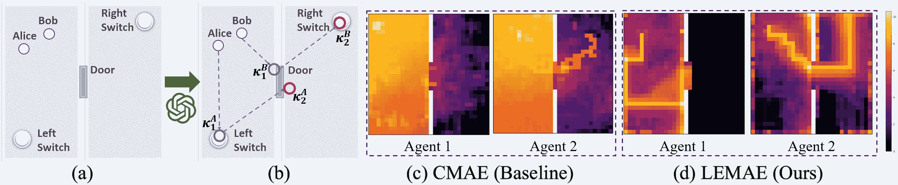

图1：（a）任务Pass的地图。两个智能体最初位于左侧房间，需要合作探索各房间，揭开隐藏的开关，并移动到右侧房间。（b）LLM为任务Pass生成的关键状态（$\kappa_{1}$和$\kappa_{2}$），其中$\kappa_{i}$的上标$A,B$表示两个智能体Alice和Bob。（c）SOTA基准方法CMAE的访问图（对数尺度）。（d）我们方法LEMAE的访问图（对数尺度）。我们的方法显著减少了冗余探索。此外，智能体之间自然地形成了有机的分工。

针对上述问题，我们提出了LEMAE，一个新颖的框架，旨在通过LLM实现高效的多智能体探索。该框架主要由两个部分组成：（i）LLM的关键状态定位和（ii）关键状态引导的探索。第一部分通过自动定位任务完成所需的关键状态，将LLM的语言知识转化为符号化的关键状态。具体来说，LLM诱导的判别函数用于区分来自回放轨迹的关键状态，避免了LLM推理成本的过度负担。第二部分利用已定位的关键状态作为有效的引导，实现高效的探索。在实现过程中，我们通过设计基于子空间的后见之明内在奖励（Subspace-based Hindsight Intrinsic Reward，简称SHIR）来增加奖励密度，鼓励智能体朝向目标关键状态前进。为了实现有序的探索，进一步构建了关键状态记忆树（Key States Memory Tree，简称KSMT）以追踪关键状态的转变，从而降低探索复杂度并增强SHIR中的引导作用。如图[1](https://arxiv.org/html/2410.02511v1#S1.F1 "Figure 1 ‣ 1 Introduction ‣ Choices are More Important than Efforts: LLM Enables Efficient Multi-Agent Exploration")所示，我们的设计通过显著减少冗余探索，使得LEMAE在性能上具有显著的优势。

我们的主要贡献总结如下：

1.  1.

    我们通过开发一种系统化的方法——LEMAE，构建了LLM与强化学习（RL）之间的桥梁，以促进高效的多智能体探索。

1.  2.

    我们设计了一种计算高效的推理策略，通过从大型语言模型（LLM）传递任务特定的信息，以区分对任务完成至关重要的关键状态，并将其作为子目标进行针对性探索。

1.  3.

    我们引入了关键状态记忆树（Key State Memory Tree）来根据历史关键状态转变组织探索，并设计了基于子空间的后见之明内在奖励（Subspace-based Hindsight Intrinsic Reward），以鼓励智能体的引导。

我们在典型的多智能体探索基准上进行了广泛的实验。LEMMAE (i) 在某些场景下始终优于最先进的(SOTA)基准，具有10倍的加速效果；(ii) 在稀疏奖励场景中，表现与使用人工设计密集奖励训练的基准相当；(iii) 展示了在全新、非符号任务中泛化的潜力。这些观察结果验证了我们设计的有效性，能够减少冗余的探索并提高探索效率，展现了在需要高效探索的现实场景中的应用前景。

## 2 初步工作

本研究中考虑的环境被定义为一个去中心化的部分可观察马尔可夫决策过程（Dec-POMDP）（Oliehoek等人，[2016](https://arxiv.org/html/2410.02511v1#bib.bib115)），有$n$个智能体，可以定义为一个元组$G=\langle S,A,I,P,r,Z,O,n,\gamma\rangle$，其中$s\in S$是全局状态，$A$是每个智能体的动作空间，$\gamma\in[0,1)$是折扣因子。在时间步长$t$时，每个智能体$i\in I\equiv\{1,...,n\}$具有其局部观测$o^{i}\in O$，由观测函数$Z(s,i):S\times I\rightarrow O$生成，并根据其策略$\pi^{i}(a^{i}|o^{i}):O\rightarrow\Delta([0,1]^{|A|})$选择一个动作$a^{i}\in A$，形成联合动作$\mathbf{a}\in\mathbf{A}\equiv A^{n}$。$T(s^{\prime}|s,\mathbf{a}):S\times\mathbf{A}\times S\rightarrow[0,1]$是环境的状态转移分布。所有智能体共享一个公共奖励函数$r(s,\mathbf{a}):S\times\mathbf{A}\rightarrow\mathbb{R}$。智能体的联合策略$\bm{\pi}:=\prod_{i=1}^{n}\pi^{i}$诱导出联合*动作价值函数*：$Q^{\bm{\pi}}(s,\mathbf{a})=\mathbb{E}[R|s,\mathbf{a}]$，其中$R=\sum^{\infty}_{t=0}\gamma^{t}r_{t}$是期望的折扣回报。MARL的目标是找到最优的联合策略$\bm{\pi}^{*}$，使得$Q^{\bm{\pi}^{*}}(s,\mathbf{a})\geq Q^{\bm{\pi}}(s,\mathbf{a})$，$\forall\bm{\pi}\ \text{和}\ (s,\mathbf{a})\in S\times\mathbf{A}$。值得注意的是，我们特别关注稀疏奖励任务，即，$r_{t}=1$仅当$s_{t+1}=s_{success}$时，否则$r_{t}=0$。我们用符号$\kappa_{i}$表示第$i$个关键状态及其判别函数$\mathcal{F}_{i}$。

## 3 相关工作

##### 决策中的LLM。

大型语言模型在各种下游任务中展示了令人印象深刻的能力（Touvron 等，[2023](https://arxiv.org/html/2410.02511v1#bib.bib159)；Radford 等，[2019](https://arxiv.org/html/2410.02511v1#bib.bib127)；Brown 等，[2020](https://arxiv.org/html/2410.02511v1#bib.bib16)）。近期的进展表明，使用 LLM 解决决策问题的趋势正在增长（Wang 等，[2023b](https://arxiv.org/html/2410.02511v1#bib.bib167)）。该领域的主要挑战之一是将 LLM 的语言知识与通常以符号形式表示的特定低级控制任务结合起来（Peng 等，[2023](https://arxiv.org/html/2410.02511v1#bib.bib123)；Carta 等，[2023](https://arxiv.org/html/2410.02511v1#bib.bib23)），尤其是在强化学习（RL）中。创建语言双胞胎任务（Carta 等，[2023](https://arxiv.org/html/2410.02511v1#bib.bib23)）直观，但需要大量人工工作。一些研究将 LLM 用作高级规划器，例如，使用 API 进行编码（Liang 等，[2023](https://arxiv.org/html/2410.02511v1#bib.bib85)），利用人工标注或 LLM 总结的行动模板（Yao 等，[2022](https://arxiv.org/html/2410.02511v1#bib.bib186)；Shinn 等，[2023](https://arxiv.org/html/2410.02511v1#bib.bib141)；Lin 等，[2023](https://arxiv.org/html/2410.02511v1#bib.bib86)；Zhu 等，[2023](https://arxiv.org/html/2410.02511v1#bib.bib200)；Wang 等，[2023a](https://arxiv.org/html/2410.02511v1#bib.bib165)）。尽管取得了显著进展，但它们依赖于难以获得的低级策略或 API，限制了其在现实世界中的应用。最近，LLM 已与 RL 集成，以直接增强低级决策能力（Cao 等，[2024](https://arxiv.org/html/2410.02511v1#bib.bib22)）。LLM 可以作为环境信息处理器，从而减少学习复杂性（Paischer 等，[2022](https://arxiv.org/html/2410.02511v1#bib.bib117)；[2024](https://arxiv.org/html/2410.02511v1#bib.bib118)；Kim 等，[2024](https://arxiv.org/html/2410.02511v1#bib.bib64)；Wang 等，[2024](https://arxiv.org/html/2410.02511v1#bib.bib164)），但不能直接促进高效的探索。一些研究利用 LLM 作为目标选择器，在目标条件下的强化学习（Su & Zhang，[2023](https://arxiv.org/html/2410.02511v1#bib.bib148)；Shukla 2023lgts）或作为教师策略（Zhou 等，[2023](https://arxiv.org/html/2410.02511v1#bib.bib199)），但需要预定义的技能或子目标。其他方法，如基于 LLM 的奖励或策略设计（Ma 等，[2023](https://arxiv.org/html/2410.02511v1#bib.bib98)；Kwon 等，[2023](https://arxiv.org/html/2410.02511v1#bib.bib75)；Song 等，[2023](https://arxiv.org/html/2410.02511v1#bib.bib146)；Liu 等，[2024](https://arxiv.org/html/2410.02511v1#bib.bib93)；Chen 等，[2024](https://arxiv.org/html/2410.02511v1#bib.bib24)）和微调（Carta 等，[2023](https://arxiv.org/html/2410.02511v1#bib.bib23)；Shi 等，[2023](https://arxiv.org/html/2410.02511v1#bib.bib140)）要么仅限于具有足够信息的简单任务，要么需要大量数据和资源。ELLM（Du 等，[2023](https://arxiv.org/html/2410.02511v1#bib.bib35)）旨在通过 LLM 增强探索，但依赖于预定义的符号观察描述器和频繁的 LLM 推理。其基于语义相似性的奖励也可能在不同场景中难以推广。相比之下，LEMAE 将语言 LLM 先验知识集成到符号状态中，且仅需最少的任务特定信息和 LLM 推理成本，方法是通过使用 LLM 生成的判别器函数，在展开轨迹中定位关键状态。

##### 高效的多智能体探索。

探索效率长期以来一直是强化学习（RL）中的一个焦点问题（Thrun，[1992](https://arxiv.org/html/2410.02511v1#bib.bib156)；Cai 等，[2020](https://arxiv.org/html/2410.02511v1#bib.bib21)；Seo 等，[2021](https://arxiv.org/html/2410.02511v1#bib.bib137)；Mahajan 等，[2019](https://arxiv.org/html/2410.02511v1#bib.bib100)；Jeon 等，[2022](https://arxiv.org/html/2410.02511v1#bib.bib56)；Liu 等，[2021b](https://arxiv.org/html/2410.02511v1#bib.bib92)）。典型的探索方法侧重于随机探索（Mnih 等，[2013](https://arxiv.org/html/2410.02511v1#bib.bib109)；Rashid 等，[2018](https://arxiv.org/html/2410.02511v1#bib.bib128)）或启发式指标，如多样性或新颖性，以促进全面探索，特别是在单一智能体探索中（Linke 等，[2020](https://arxiv.org/html/2410.02511v1#bib.bib88)；Burda 等，[2018b](https://arxiv.org/html/2410.02511v1#bib.bib20)；Pathak 等，[2017](https://arxiv.org/html/2410.02511v1#bib.bib121)；Burda 等，[2018a](https://arxiv.org/html/2410.02511v1#bib.bib19)；Bellemare 等，[2016](https://arxiv.org/html/2410.02511v1#bib.bib13)）。尽管它们取得了成功，但由于缺乏任务相关的指导，它们可能会导致显著的冗余探索（Du 等，[2023](https://arxiv.org/html/2410.02511v1#bib.bib35)）。状态-动作空间的指数扩展使得在多智能体环境中进行全面探索变得不切实际。因此，高效的多智能体探索（MAE）变得越来越重要和必要（Jeon 等，[2022](https://arxiv.org/html/2410.02511v1#bib.bib56)；Liu 等，[2021b](https://arxiv.org/html/2410.02511v1#bib.bib92)）。由于多智能体动作的交织效应和复杂的奖励设计（Liu 等，[2023](https://arxiv.org/html/2410.02511v1#bib.bib90)；Qu 等，[2023](https://arxiv.org/html/2410.02511v1#bib.bib126)；Xu 等，[2023](https://arxiv.org/html/2410.02511v1#bib.bib180)），MAE 也具有挑战性。鉴于我们对高效探索的重视，我们优先考虑在多智能体环境中的评估。一些 MAE 方法在智能体交互中鼓励有影响力的行为（Liu 等，[2023](https://arxiv.org/html/2410.02511v1#bib.bib90)；Jaques 等，[2019](https://arxiv.org/html/2410.02511v1#bib.bib55)；Wang 等，[2019a](https://arxiv.org/html/2410.02511v1#bib.bib169)）。然而，它们可能导致意外的联盟，或需要额外的先验知识（Liu 等，[2023](https://arxiv.org/html/2410.02511v1#bib.bib90)）。某些研究利用子目标来引导探索（Jeon 等，[2022](https://arxiv.org/html/2410.02511v1#bib.bib56)）。然而，由于将任务相关信息集成到子目标中的挑战，它们要么需要人工设计子目标的专业知识（Tang 等，[2018](https://arxiv.org/html/2410.02511v1#bib.bib155)；Kulkarni 等，[2016](https://arxiv.org/html/2410.02511v1#bib.bib70)），要么难以识别有用的子目标（Jeon 等，[2022](https://arxiv.org/html/2410.02511v1#bib.bib56)；Liu 等，[2021b](https://arxiv.org/html/2410.02511v1#bib.bib92)）。与上述方法不同，本研究强调了任务相关指导在探索中的重要性，并利用从大语言模型（LLM）中提取的关键状态先验来实现高效的多智能体探索。

## 4 方法

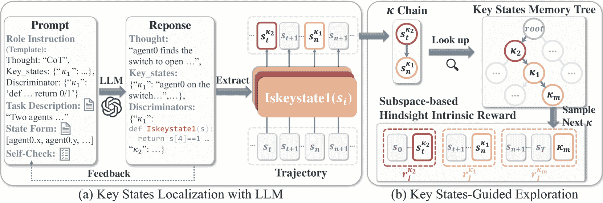

图 2：训练过程概览。(a) 基于 LLM 的关键状态定位：我们设计了一组提示，引导 LLM 根据任务特定信息来定位关键状态。通过 LLM 的迭代自检，优化响应。随后，从最终响应中推导出判别函数，用于区分轨迹中的关键状态。(b) 基于关键状态的探索引导：利用在处理过的轨迹中得到的关键状态链，我们查找 KSMT 以获取最可能的下一个关键状态。通过从中采样作为结束子轨迹的子目标，我们使用 SHIR 将内在奖励整合到整体轨迹中。

本节详细介绍了已开发的 LEMAE。首先在[4.1](https://arxiv.org/html/2410.02511v1#S4.SS1 "4.1 关键状态中的魔鬼 ‣ 4 方法 ‣ 选择比努力更重要：LLM 实现高效的多智能体探索")节中引入了任务相关的关键状态概念作为指导。围绕关键状态，我们构建了两个组件：(i) 基于 LLM 的关键状态定位（[4.2](https://arxiv.org/html/2410.02511v1#S4.SS2 "4.2 基于 LLM 的关键状态定位 ‣ 4 方法 ‣ 选择比努力更重要：LLM 实现高效的多智能体探索")节）和 (ii) 基于关键状态的探索引导（[4.3](https://arxiv.org/html/2410.02511v1#S4.SS3 "4.3 基于关键状态的探索引导 ‣ 4 方法 ‣ 选择比努力更重要：LLM 实现高效的多智能体探索")节）。前者引导 LLM 生成判别函数，以便在展开的轨迹中定位关键状态，而后者则通过引入基于子空间的事后内在奖励和关键状态记忆树来引导和组织探索。详细内容请参见图[2](https://arxiv.org/html/2410.02511v1#S4.F2 "图 2 ‣ 4 方法 ‣ 选择比努力更重要：LLM 实现高效的多智能体探索")和算法[1](https://arxiv.org/html/2410.02511v1#algorithm1 "附录 A 中的算法 ‣ 选择比努力更重要：LLM 实现高效的多智能体探索")。此外，我们还提供了一个[演示](https://sites.google.com/view/lemae)¹¹1[https://sites.google.com/view/lemae](https://sites.google.com/view/lemae)，以清晰展示 LEMAE 的执行流程。

### 4.1 关键状态中的魔鬼

之前的方法在追求任务无关的新颖性时，存在冗余的探索努力（Du 等，[2023](https://arxiv.org/html/2410.02511v1#bib.bib35)），这可能降低训练效率。这激励我们将与任务相关的信息整合为更好的引导选择，以实现高效的探索。然而，实际的提议在这一领域仍然有限。本文将关键状态定义为新颖的任务相关先验，它对应于与任务相关的具有明确语义和表达的中间状态。同时，命题[4.1](https://arxiv.org/html/2410.02511v1#S4.Thmtheorem1 "Proposition 4.1\. ‣ 4.1 Devil is in the Key States ‣ 4 Method ‣ Choices are More Important than Efforts: LLM Enables Efficient Multi-Agent Exploration")明确反映了将其纳入的有效性。

###### 命题 4.1.

考虑一维非对称随机行走问题，其中智能体从$x=0$开始，目标是到达$x=N\in\mathbb{N^{+}}，N>1$。初始策略是不对称的，智能体向右和向左移动的概率分别为$p\in(0.5,1)$和$1-p$。在没有先验知识的情况下，期望的首次到达时间为$\mathbb{E}(T_{0\rightarrow N})=\frac{N}{2p-1}$。引入任务相关信息后，智能体必须首先到达关键状态$\kappa=1,...,N-1$，然后才能到达$x=N$，我们可以通过$\mathbb{E}(T_{0\rightarrow N})-\mathbb{E}(T^{prior}_{0\rightarrow N})=(N-1)*(\frac{1}{2p-1}-\frac{2}{p}+1)>0$来减少期望首次到达时间。

证明推迟到附录[C](https://arxiv.org/html/2410.02511v1#A3 "Appendix C Proof of Proposition 4.1 ‣ Choices are More Important than Efforts: LLM Enables Efficient Multi-Agent Exploration")。探索策略在关键状态的参与下获得了显著的益处，例如，当$p\to 0.5$时，$\mathbb{E}(T_{0\rightarrow N})-\mathbb{E}(T^{prior}_{0\rightarrow N})\to\infty$。这一概念在实际场景中也常见，例如游戏中的检查点（Demaine 等，[2016](https://arxiv.org/html/2410.02511v1#bib.bib31)）和导航中的地标（Becker 等，[1995](https://arxiv.org/html/2410.02511v1#bib.bib11)）。

### 4.2 使用LLM进行关键状态定位

为了减少人工工作量，我们使用LLM来定位关键状态。尽管生成上述符号关键状态可能很直接，但LLM在理解符号状态或环境细节方面的弱点，在某些任务中需要额外的信息，这可能导致难以发现的错误和幻觉。在这里，我们强调LLM在回滚轨迹中定位关键状态的判别能力的重要性，以更好地利用LLM的通用知识。其原理在于，判别只需对任务有较高层次的理解，相比天真的生成方法，它更加可靠和普遍，详细讨论请参见附录[B.1](https://arxiv.org/html/2410.02511v1#A2.SS1 "B.1 The Insights Behind Key States Discrimination ‣ Appendix B Further Discussions ‣ Choices are More Important than Efforts: LLM Enables Efficient Multi-Agent Exploration")。

为了区分关键状态，我们提示LLM生成$m$个判别函数$\{\mathcal{F}_{i}\}_{i=1}^{m}$，如图[2](https://arxiv.org/html/2410.02511v1#S4.F2 "Figure 2 ‣ 4 Method ‣ Choices are More Important than Efforts: LLM Enables Efficient Multi-Agent Exploration")所示。每个判别函数$\mathcal{F}_{i}$接收时间步$t$上的状态$s_{t}$，并输出一个布尔值，表示输入状态是否为关键状态$\kappa_{i}$。这种方法系统地将轨迹中的每个状态标注为关键状态实例或非关键状态。值得注意的是，LEMAE在符号状态中注入了任务相关的信息，而没有使用诸如观察描述符(Du et al., [2023](https://arxiv.org/html/2410.02511v1#bib.bib35))或环境编码(Xie et al., [2023](https://arxiv.org/html/2410.02511v1#bib.bib179))等预定义组件，这些组件需要手动微调，可能在许多场景中无法使用，或者可能引入额外的信息。此外，判别函数的可重用性避免了频繁调用，并且我们的研究方法在特定任务中经验性地只需要少于三个LLM推理。以上优势凸显了LEMAE在减少约束和成本的情况下扩展应用场景的潜力。

我们设计了提示语，旨在减轻跨任务的劳动密集型提示工程的负担。如图[2](https://arxiv.org/html/2410.02511v1#S4.F2 "图 2 ‣ 4 方法 ‣ 选择比努力更重要：LLM 实现高效的多智能体探索")所示，每个任务的提示语由标准化的提示模板和任务信息构成。该提示模板在各个任务中保持一致，主要包含几项角色指令，用以引导LLM理解角色（包括促进MARL中的智能体间分工）和输出约束。对于具有符号状态空间的新任务，提示模板仅要求提供必要的细节，即任务描述和状态形式，这些可以从任务文档中轻松提取，无需额外处理，相较于以往的方法，要求更低（Ma 等人，[2023](https://arxiv.org/html/2410.02511v1#bib.bib98); Du 等人，[2023](https://arxiv.org/html/2410.02511v1#bib.bib35)）。关于面向视觉的任务的扩展，详见附录[F.2](https://arxiv.org/html/2410.02511v1#A6.SS2 "F.2 超越符号任务的 LEMAE 扩展 ‣ 附录 F 额外实验结果 ‣ 选择比努力更重要：LLM 实现高效的多智能体探索")。

考虑到LLM有时会生成不准确的响应和无法执行的代码，我们开发了一种自检机制，使LLM能够进行自我评估并改进响应，该机制灵感来源于近期的方法（Shinn 等人，[2023](https://arxiv.org/html/2410.02511v1#bib.bib141); Dhuliawala 等人，[2023](https://arxiv.org/html/2410.02511v1#bib.bib32)）。该机制包括两个检查操作：LLM 反思和代码验证。前者通过一组查询提示LLM进行自我评估，确保符合指定标准；后者则通过实际状态输入验证判别函数的可执行性，并提供反馈，直到所有函数都可执行。

我们使用来自OpenAI API的GPT-4-turbo，提示详情见附录[D](https://arxiv.org/html/2410.02511v1#A4 "附录 D LLM 提示与响应 ‣ 选择比努力更重要：LLM 实现高效的多智能体探索")。

### 4.3 关键状态引导探索

#### 4.3.1 基于子空间的事后内在奖励

通过标注的关键状态，轨迹可以自然地分割成子轨迹。受到Andrychowicz等人（[2017](https://arxiv.org/html/2410.02511v1#bib.bib8)）的启发，我们通过将标注的关键状态概念化为子轨迹的子目标，整合了事后内在奖励，具体内容详见附录[E.3](https://arxiv.org/html/2410.02511v1#A5.SS3 "E.3 Connection and Comparison with HER ‣ Appendix E Implementation Details ‣ Choices are More Important than Efforts: LLM Enables Efficient Multi-Agent Exploration")。这种整合通过增加奖励密度，引导策略实现这些关键状态，从而减少了手动奖励设计的负担。此外，来自判别函数的状态向量索引构成了与奖励相关的状态子空间（Liu等，[2021b](https://arxiv.org/html/2410.02511v1#bib.bib92)）。在这里，我们将基于子空间的事后内在奖励（Subspace-based Hindsight Intrinsic Reward，SHIR）函数表示为：

|  | $r_{I}^{\kappa_{m}}(t)=\&#124;\Phi_{m}(s_{t})-\Phi_{m}(\kappa_{m})\&#124;-\&#124;\Phi_{m}(s_{t% +1})-\Phi_{m}(\kappa_{m})\&#124;,$ |  | (1) |
| --- | --- | --- | --- |

其中$\|\cdot\|$表示距离度量，例如曼哈顿距离；$\Phi_{m}(s)=(s_{e})_{e\in\upsilon_{m}}$将状态空间限制为元素$e\in\upsilon_{m}$，$s_{e}$是完整状态$s$的第$e$个元素，而$\upsilon_{m}\subset\mathbb{N}^{+}$指的是判别函数$\mathcal{F}_{m}$从整个状态空间中提取的子集。

鉴于奖励通常依赖于整个状态空间的有限子集（Liu等，[2021b](https://arxiv.org/html/2410.02511v1#bib.bib92); Todorov等，[2012](https://arxiv.org/html/2410.02511v1#bib.bib158)），采用基于子空间的奖励有助于避免在整个状态空间中设计内在奖励时可能出现的冗余和偏差。LEMAE同样适用于奖励依赖于全局状态空间的场景，因为它没有强制性约束。因此，最终的奖励函数进一步推导为：

|  | $r(t)=\alpha\cdot r_{E}(t)+\beta\cdot r_{I}^{\kappa_{m}}(t),$ |  | (2) |
| --- | --- | --- | --- |

其中$r_{E}$表示外部奖励，$\alpha,\beta\in\mathbb{R^{+}}$是非负缩放因子。

#### 4.3.2 关键状态记忆树

为了组织具有记忆的探索，我们引入了关键状态记忆树（Key States Memory Tree，KSMT）的概念。它跟踪关键状态之间的过渡，并进一步服务于探索和规划。与简单的$\epsilon$-贪婪方法相比，逐步揭示KSMT有助于避免在整个状态空间中进行冗余探索，尤其在更复杂的现实场景中更为有益。值得注意的是，LEMAE与其他记忆结构兼容，例如有向无环图（DAG）。

构建 KSMT：从根节点初始化，KSMT 通过迭代地将从标注轨迹中获得的关键状态链动态扩展，如算法 [2](https://arxiv.org/html/2410.02511v1#algorithm2 "附录 A 算法 ‣ 选择比努力更重要：LLM 实现高效的多智能体探索") 中所述。这些步骤会重复进行，直到达到成功状态或完全描绘关键状态之间的转移。

使用 KSMT 进行探索：为了发现新的 KSMT 分支，我们采用了一种探索策略，平衡了高随机性策略 $\bm{\pi}_{\theta}^{\epsilon_{h}}$（用于探索未充分探索的节点）和低随机性策略 $\bm{\pi}_{\theta}^{\epsilon_{l}}$（用于最小化对策略学习的干扰），如算法 [2](https://arxiv.org/html/2410.02511v1#algorithm2 "附录 A 算法 ‣ 选择比努力更重要：LLM 实现高效的多智能体探索") 中所示。当到达叶节点时，智能体执行 $\bm{\pi}_{\theta}^{\epsilon_{h}}$ 以加深 KSMT。而当到达非叶节点 $\xi_{i}$ 时，智能体以概率 $p_{i}$ 执行 $\bm{\pi}_{\theta}^{\epsilon_{h}}$ 来扩展广度，或以概率 $1-p_{i}$ 执行 $\bm{\pi}_{\theta}^{\epsilon_{l}}$ 以推进到下一个关键状态。概率 $p_{i}$ 计算为 $p_{i}=\frac{1}{d_{i}+1}$，其中 $d_{i}$ 是节点 $\xi_{i}$ 的度数，作为未充分探索的程度的指标。探索阶段在发现成功状态后完成。我们还会剪枝那些不会导致成功的分支，以避免任务无关的关键状态。通过这种方式，KSMT 实现了在更有意义的状态子空间中的探索。

使用 KSMT 进行规划：由于 KSMT 作为关键状态空间中的动态模型，我们基于它为最终子轨迹规划子目标。如图 [2](https://arxiv.org/html/2410.02511v1#S4.F2 "图 2 ‣ 4 方法 ‣ 选择比努力更重要：LLM 实现高效的多智能体探索")b 所示，给定已实现的关键状态链，我们通过查找操作在 KSMT 中识别相应的分支（$\kappa_{2}\rightarrow\kappa_{1}\rightarrow\text{children}$）。由于这些状态已经通过记忆验证，它们的子节点代表最可能的下一个关键状态，从中我们随机采样最终的子目标。这个过程主要处理轨迹未能将关键状态作为最终子目标时的情况。它增强了 SHIR，并通过鼓励智能体访问现有的关键状态，提高了探索 KSMT 的效率。

## 5 实验

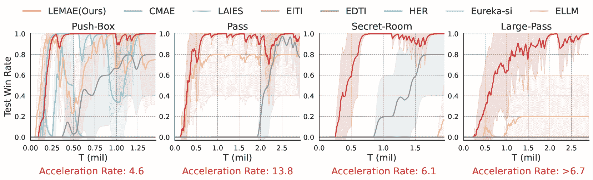

图 3：在四个稀疏奖励的 MPE 地图上评估 LEMAE 与基线方法的表现，使用测试胜率作为评估指标。加速率是指 LEMAE 找到成功状态的速度相比于 CMAE 更快的程度。

我们在常用的多智能体探索基准上进行实验：（1）多粒子环境（Lowe等人，[2017](https://arxiv.org/html/2410.02511v1#bib.bib97)；Wang等人，[2019a](https://arxiv.org/html/2410.02511v1#bib.bib169)）和（2）星际争霸多智能体挑战（Samvelyan等人，[2019b](https://arxiv.org/html/2410.02511v1#bib.bib133)）。根据之前的研究（Ma等人，[2023](https://arxiv.org/html/2410.02511v1#bib.bib98)；Liu等人，[2021b](https://arxiv.org/html/2410.02511v1#bib.bib92)；Xu等人，[2023](https://arxiv.org/html/2410.02511v1#bib.bib180)），我们主要关注具有符号状态空间的任务，并对所有没有特定指令的任务使用稀疏奖励版本。

基准对比。我们将LEMAE与几个代表性的基准算法进行比较：IPPO是一种MARL算法，它扩展了PPO（Schulman等人，[2017](https://arxiv.org/html/2410.02511v1#bib.bib136)）；QMIX（Rashid等人，[2018](https://arxiv.org/html/2410.02511v1#bib.bib128)）是一个广泛采用的MARL基准；EITI和EDTI（Wang等人，[2019a](https://arxiv.org/html/2410.02511v1#bib.bib169)）考虑了交互在协调代理行为中的影响；MAVEN（Mahajan等人，[2019](https://arxiv.org/html/2410.02511v1#bib.bib100)）通过分层控制结合了基于价值和基于策略的方法；CMAE（Liu等人，[2021b](https://arxiv.org/html/2410.02511v1#bib.bib92)）通过从多个投影状态空间中选择共享目标来学习合作探索；RODE（Wang等人，[2020d](https://arxiv.org/html/2410.02511v1#bib.bib172)）将联合动作空间分解为基于角色的空间，以增强探索；MASER（Jeon等人，[2022](https://arxiv.org/html/2410.02511v1#bib.bib56)）从经验回放缓冲区自动生成多个代理的子目标；LAIES（Liu等人，[2023](https://arxiv.org/html/2410.02511v1#bib.bib90)）通过数学定义和因果分析解决了懒代理问题；ELLM（Du等人，[2023](https://arxiv.org/html/2410.02511v1#bib.bib35)）采用LLM先验来指导基于视觉的探索，使用状态描述符和基于语义相似性的奖励。LEMAE在MPE中基于IPPO实现，在SMAC中基于QMIX实现，与先前的工作（Wang等人，[2019a](https://arxiv.org/html/2410.02511v1#bib.bib169)；Liu等人，[2023](https://arxiv.org/html/2410.02511v1#bib.bib90)；Jeon等人，[2022](https://arxiv.org/html/2410.02511v1#bib.bib56)）一致，以确保公平比较。

我们在五个随机种子上运行每个算法，并报告均值和标准差。更多细节可以参考附录[E](https://arxiv.org/html/2410.02511v1#A5 "附录E 实现细节 ‣ 选择比努力更重要：LLM使得多智能体探索更加高效")。

### 5.1 多粒子环境（MPE）

在MPE中，我们在Pass、Secret-Room、Push-Box和Large-Pass任务上评估了LEMAE，这些是之前研究中常用的多智能体探索任务(Wang等人，[2019a](https://arxiv.org/html/2410.02511v1#bib.bib169); Liu等人，[2021b](https://arxiv.org/html/2410.02511v1#bib.bib92))。

LLM能够有效地区分关键状态。首先，我们检验LLM在区分关键状态方面的效果。在Pass任务中，如图[1](https://arxiv.org/html/2410.02511v1#S1.F1 "图1 ‣ 1 引言 ‣ 选择比努力更重要：LLM使得多智能体探索更高效")所示，一个房间被墙分隔，两个半房间中各包含一个隐形开关。只有当一个智能体占据开关时，才能通过门。最初，在左半房间，智能体必须合作才能进入右半房间。在图[4(a)](https://arxiv.org/html/2410.02511v1#S5.F4.sf1 "在图4 ‣ 5.1 多粒子环境（MPE） ‣ 5 实验 ‣ 选择比努力更重要：LLM使得多智能体探索更高效")中，LLM展示了对任务的精确理解并生成了有意义的判别函数，证明了基于当前LLM的方法的可行性。

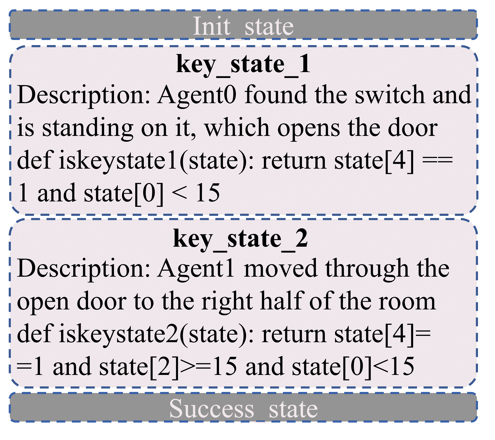

(a)

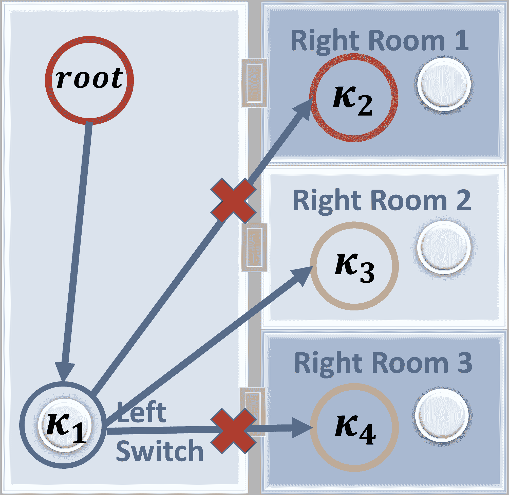

(b)

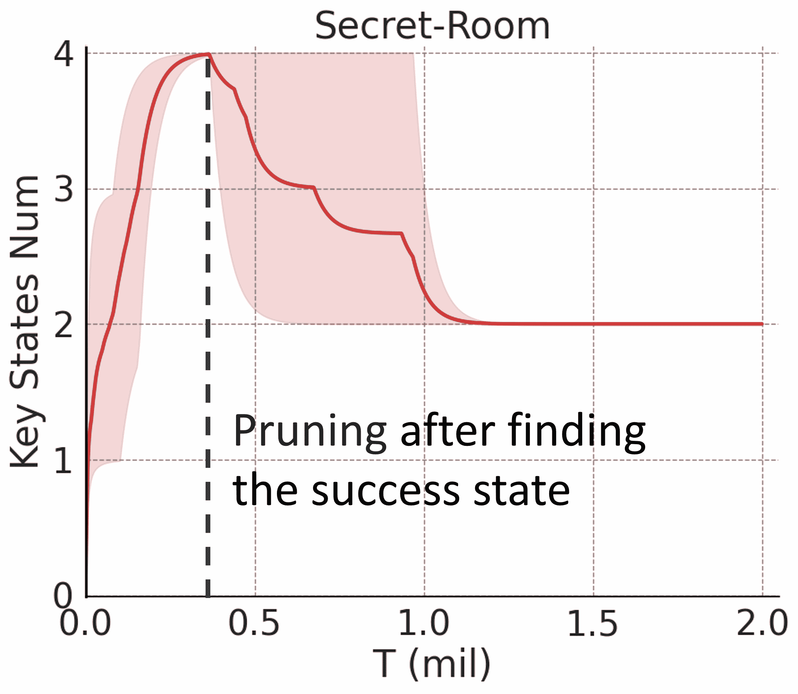

(c)

图4： (a) 在任务Pass上生成的关键状态判别函数。 (b) 带有关键状态的Secret-Room地图：$\kappa_{1}$表示占据左侧开关以打开所有门，而$\kappa_{2}$、$\kappa_{3}$和$\kappa_{4}$分别表示探索右侧房间1、2和3。方向箭头象征着KSMT中的转移关系。 (c) Secret-Room中关键状态数量曲线表明LEMAE能够识别所有关键状态，并高效地修剪与任务无关的状态。

LEMAE实现了卓越的性能。我们通过将LEMAE与基准方法进行比较，探讨了它如何增强探索，确认了结合LLM先验的价值。训练曲线如图[3](https://arxiv.org/html/2410.02511v1#S5.F3 "Figure 3 ‣ 5 Experiments ‣ Choices are More Important than Efforts: LLM Enables Efficient Multi-Agent Exploration")所示。常用基准方法的失败突显了高效探索的必要性和紧迫性，而LEMAE的卓越表现则强调了通过LLM提供任务特定指导来增强强化学习的有效性。具体而言，EITI、EDTI和LAIES的失败可能归因于学习动态的复杂性或任务中外部状态变化的稀缺性。虽然CMAE能够为简单任务学习有效的策略，但其冗余的探索降低了效率，使其无法应对具有广泛探索空间的任务，如Large-Pass。尽管受益于LLM先验，ELLM的表现却不如LEMAE，原因在于基于语义相似性的奖励提供的指导较弱，更不用提它依赖于频繁的LLM推理和预定义的状态描述器。此外，我们使用探索步骤数这一指标，将LEMAE与传统的SOTA基准方法CMAE进行比较，结果表明LEMAE在探索加速方面取得了显著的提升，最高可达10倍，突显了其效率。我们方法的优越表现可以归因于通过融入与任务相关的信息来缓解冗余探索。

LEMAE通过区分受益于LLM先验。我们评估了HER（Andrychowicz等人，[2017](https://arxiv.org/html/2410.02511v1#bib.bib8)），该方法也使用事后内在奖励，但从记忆中随机选择目标。HER的较差表现强调了整合LLM先验在实现高效探索中的关键作用，尤其是在定位关键状态方面。为了进一步支持我们关于LLM区分优于生成的论点，我们评估了Eureka-si，这是Eureka（Ma等人，[2023](https://arxiv.org/html/2410.02511v1#bib.bib98)）的单次迭代变体，它直接利用LLM生成奖励函数。尽管Eureka-si在简单任务中与LEMAE表现相当，但在大多数具有部分可观察性的复杂任务中表现不佳，这表明基于LLM的区分可能提供一种更通用和有效的LLM整合方式。值得注意的是，这两种方法并非专门为高效探索而设计。更多细节请参见附录[E.2](https://arxiv.org/html/2410.02511v1#A5.SS2 "E.2 Comparison with LLM Reward Design ‣ Appendix E Implementation Details ‣ Choices are More Important than Efforts: LLM Enables Efficient Multi-Agent Exploration")，[E.3](https://arxiv.org/html/2410.02511v1#A5.SS3 "E.3 Connection and Comparison with HER ‣ Appendix E Implementation Details ‣ Choices are More Important than Efforts: LLM Enables Efficient Multi-Agent Exploration")。

LEMAE减少了冗余探索。我们进一步将LEMAE与CMAE在Pass任务中的探索行为进行比较。访视图（以对数刻度显示）如图[1](https://arxiv.org/html/2410.02511v1#S1.F1 "Figure 1 ‣ 1 Introduction ‣ Choices are More Important than Efforts: LLM Enables Efficient Multi-Agent Exploration")所示。图示表明，LEMAE显著避免了冗余探索：使用CMAE训练的智能体往往过度探索左侧房间，而LEMAE中的智能体访视区域明显集中在成功路径周围。此外，智能体之间出现了自然的分工，进一步验证了在提示设计中鼓励劳动分工的有效性。

LEMAE 避开了与任务无关的关键状态。由于信息不完整，LLM 可能会区分与任务无关的关键状态。例如，在 Secret-Room 任务中，右侧有三个房间，但为了公平性，LLM 并不知道真正的目标房间。在图 [4(b)](https://arxiv.org/html/2410.02511v1#S5.F4.sf2 "图 4 ‣ 5.1 多粒子环境 (MPE) ‣ 5 实验 ‣ 选择比努力更重要：LLM 实现高效的多智能体探索") 中，LLM 区分了两个与任务无关的关键状态，分别表示对两个无关房间的探索，记作 $\kappa_{2}$ 和 $\kappa_{4}$。图 [4(c)](https://arxiv.org/html/2410.02511v1#S5.F4.sf3 "图 4 ‣ 5.1 多粒子环境 (MPE) ‣ 5 实验 ‣ 选择比努力更重要：LLM 实现高效的多智能体探索") 显示了在 LEMAE 中找到成功状态后的剪枝机制，证明其在避免与任务无关的关键状态方面的有效性。更详细的鲁棒性分析请参见第 [5.5](https://arxiv.org/html/2410.02511v1#S5.SS5 "5.5 灵敏度与鲁棒性分析 ‣ 5 实验 ‣ 选择比努力更重要：LLM 实现高效的多智能体探索") 节。

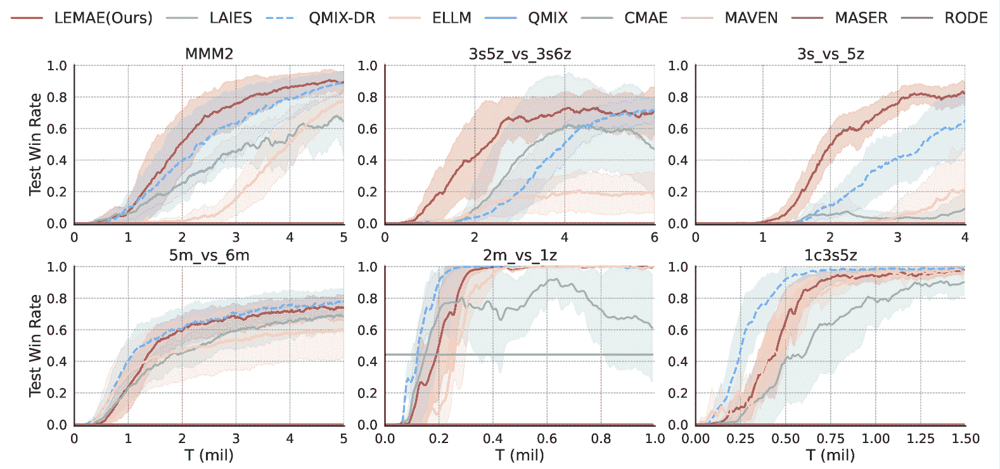

图 5：在六张具有稀疏奖励的 SMAC 地图上评估 LEMAE，使用测试胜率作为评估指标。值得注意的是，QMIX-DR 是原始 SMAC 中使用密集奖励的 QMIX。

### 5.2 星际争霸多智能体挑战 (SMAC)

SMAC 是 MARL 中广泛使用的挑战性基准测试。与之前使用的密集或半稀疏奖励版本不同，我们采用完全稀疏奖励任务以强调探索，仅在敌人被完全消除后才对智能体给予奖励。此外，为了在不同场景中验证 LEMAE 的表现，我们在六张具有不同难度和智能体数量的地图上进行了实验。

在图[5](https://arxiv.org/html/2410.02511v1#S5.F5 "图5 ‣ 5.1 多粒子环境 (MPE) ‣ 5 实验 ‣ 选择比努力更重要：LLM使得高效的多智能体探索成为可能")中，LEMAE展示了优于所有基准的性能。尽管基准算法QMIX、MAVEN、CDS和MASER在密集或半稀疏奖励环境中表现出色，但在完全稀疏奖励场景中表现不佳。CMAE在简单任务中表现部分有效，但由于缺乏任务相关信息，在更困难的场景中失败，特别是在好奇心驱动的目标选择中。LAIES是唯一一个可与LEMAE相媲美的非LLM基准。然而，它需要手工制作的外部状态先验，并且与LEMAE相比，仍然表现较差，尤其是在更具挑战性的任务中。ELLM得益于LLM先验，在简单任务中表现良好，但在较难任务中的效果下降，可能是由于基于语义相似度奖励的不稳定性和较差的引导。值得注意的是，我们新增了QMIX-DR，它通过在原始SMAC中增加密集奖励来增强QMIX。令人惊讶的是，LEMAE展示了与QMIX-DR相匹敌甚至超越它的潜力，特别是在难度较大的地图上，这为减少在复杂奖励设计中的手动工作量提供了新的思路，尤其是在现实世界的场景中。考虑到SMAC基准的复杂性，LEMAE的一贯优越性确认了其在更复杂的现实世界场景中的潜在适用性。我们进一步在SMACv2（Ellis等人，[2024](https://arxiv.org/html/2410.02511v1#bib.bib39)）上评估LEMAE，这是一个具有更高随机性的增强版，详细信息见附录[F.1](https://arxiv.org/html/2410.02511v1#A6.SS1 "F.1 更复杂的基准：SMACv2 ‣ 附录F 其他实验结果 ‣ 选择比努力更重要：LLM使得高效的多智能体探索成为可能")。

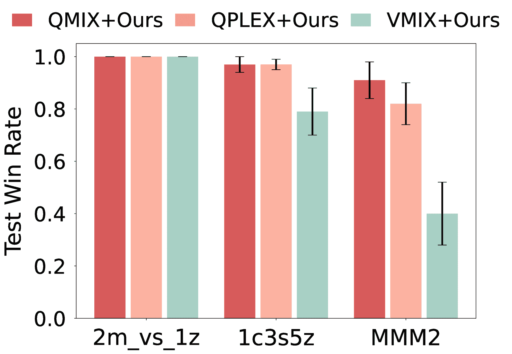

(a)

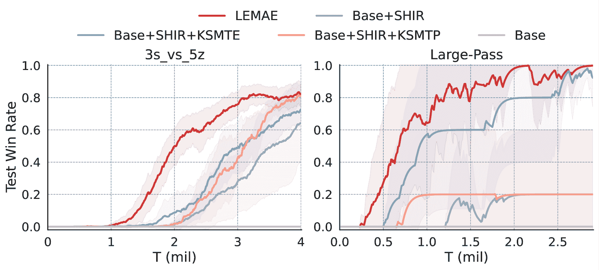

(b)

图6： (a) 对知名MARL算法基准的评估，即QPLEX和VMIX。值得注意的是，除非与我们的方法结合，否则QPLEX和VMIX完全失败。 (b) 在MPE和SMAC的两个典型任务上进行消融研究，以评估KSMT和SHIR在LEMAE中的重要性。

### 5.3 与各种算法的兼容性

LEMAE通过内在奖励的形式将任务相关的指导融入其中，并且与强化学习（RL）算法无关。[5.1](https://arxiv.org/html/2410.02511v1#S5.SS1 "5.1 多粒子环境（MPE） ‣ 5 实验 ‣ 选择比努力更重要：LLM促使高效的多智能体探索")和[5.2](https://arxiv.org/html/2410.02511v1#S5.SS2 "5.2 星际争霸多智能体挑战（SMAC） ‣ 5 实验 ‣ 选择比努力更重要：LLM促使高效的多智能体探索")通过在两种不同的MARL算法上实现，验证了其兼容性：在MPE中使用IPPO，在SMAC中使用QMIX。为了进一步证实这一说法，我们将方法构建在两种广泛使用的MARL算法上，即QPLEX（Wang等人，[2020a](https://arxiv.org/html/2410.02511v1#bib.bib166)）和VMIX（Su等人，[2021](https://arxiv.org/html/2410.02511v1#bib.bib149)），分别采用基于值和演员-评论员的方法。如图[6(a)](https://arxiv.org/html/2410.02511v1#S5.F6.sf1 "图6 ‣ 5.2 星际争霸多智能体挑战（SMAC） ‣ 5 实验 ‣ 选择比努力更重要：LLM促使高效的多智能体探索")所示，结合LEMAE的算法始终提高性能，凸显了LEMAE未来与其他算法在各个领域整合的潜力。此外，LEMAE是一种高效探索的多功能方法，不仅限于MARL。为了验证这一说法，我们在MPE的单智能体变体中进一步评估了LEMAE，具体见附录[F.4](https://arxiv.org/html/2410.02511v1#A6.SS4 "F.4 单智能体设置的实验 ‣ 附录F 额外实验结果 ‣ 选择比努力更重要：LLM促使高效的多智能体探索")。

### 5.4 消融研究

SHIR和KSMT的作用。我们进行了一项消融研究，以评估KSMT和SHIR在LEMAE中的重要性。我们从MPE和SMAC中选择了两个典型任务，并在图[6(b)](https://arxiv.org/html/2410.02511v1#S5.F6.sf2 "图6 ‣ 5.2 星际争霸多智能体挑战（SMAC） ‣ 5 实验 ‣ 选择比努力更重要：LLM促使高效的多智能体探索")中报告了结果。在SMAC中，Base指的是QMIX，而在MPE中，它表示IPPO。此外，SHIR代表基于子空间的事后内在奖励，KSMTE表示使用KSMT进行探索，KSMTP表示使用KSMT进行规划，LEMAE则包括Base+SHIR+KSMTE+KSMTP。如图所示，缺少SHIR或KSMT会显著降低性能，揭示了这两个组件在实现有效的关键状态引导探索中的重要作用。

自检机制和大语言模型（LLMs）的作用。我们对GPT-4-turbo和GPT-3.5-turbo在生成判别函数方面进行了比较分析。同时，我们还研究了没有自检机制的GPT-4-turbo（GPT-4-turbo w/o）的表现。接受率（$r_{acc}$）表示经过强化学习训练后，能够达到最佳表现超过$80\%$的种子的比例，而执行率（$r_{exe}$）则表示所有判别函数都能执行的种子比例。如表[7](https://arxiv.org/html/2410.02511v1#S5.F7 "Figure 7 ‣ 5.4 Ablation Studies ‣ 5 Experiments ‣ Choices are More Important than Efforts: LLM Enables Efficient Multi-Agent Exploration")所示，结果表明，采用我们自检机制的强大LLM能够有效确保关键状态的高质量，正如代码的可执行性和最终表现所证明的那样。LEMAE对LLM和自检机制的可扩展性表明，LEMAE可以在未来利用更强大的LLM，并能够安全高效地应用于更具挑战性的现实任务。

表1：关于自检机制和大语言模型（LLMs）的消融研究。我们比较了两种LLM（GPT-4-turbo和GPT-3.5-turbo）的表现，记录了生成判别函数的接受率（$r_{acc}$）和执行率（$r_{exe}$）在十次运行中的表现。w/o表示没有使用我们的自检机制。

| $r_{acc}$ ($r_{exe}$) | GPT-4-turbo | GPT-4-turbo w/o | GPT-3.5-turbo |
| --- | --- | --- | --- |
| Large-Pass | 1.0 (1.0) | 0.8 (1.0) | 0.7 (1.0) |
| 2m_vs_1z | 1.0 (1.0) | 0.7 (1.0) | 0.6 (1.0) |
| 5m_vs_6m | 1.0 (1.0) | 0.9 (1.0) | 1.0 (1.0) |

| MMM2 | 0.8 (1.0) | 0.6 (0.7) | 0.0 (1.0) | 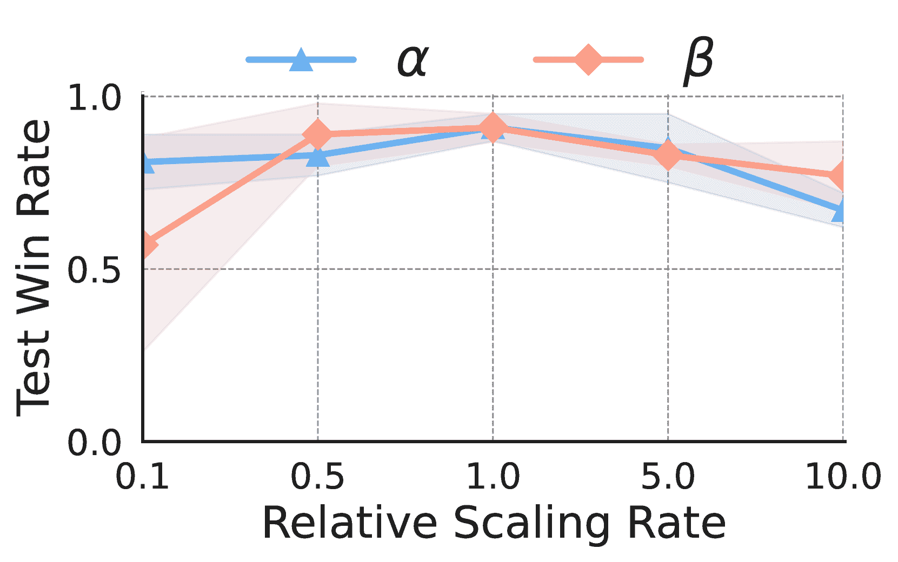

图7：关于奖励缩放率$\alpha$和$\beta$的超参数检验。x轴表示相对于默认参数的相对值。

### 5.5 敏感性与鲁棒性分析

对超参数的敏感性。我们对 LEMAE 中的关键超参数进行实验，即奖励缩放率 $\alpha$ 和 $\beta$。x 轴表示相对于默认值（$\alpha=10$，$\beta=1$）的相对值，涵盖了对 $\alpha\in\{1,5,10,50,100\}$ 和 $\beta\in\{0.1,0.5,1,5,10\}$ 的评估。图 [7](https://arxiv.org/html/2410.02511v1#S5.F7 "图 7 ‣ 5.4 消融研究 ‣ 5 实验 ‣ 选择比努力更重要：LLM 使得多智能体高效探索成为可能") 显示了 LEMAE 对这些超参数在相当范围内的鲁棒性。特别是，过高的外部奖励缩放率 $\alpha$ 或过低的内部奖励缩放率 $\beta$ 可能会由于奖励的突变或动机影响的不足导致性能下降。此外，我们还在附录 [F.3](https://arxiv.org/html/2410.02511v1#A6.SS3 "F.3 混合随机性探索的消融研究 ‣ 附录 F 其他实验结果 ‣ 选择比努力更重要：LLM 使得多智能体高效探索成为可能") 进行了混合随机性探索的消融研究。

对关键状态扰动的鲁棒性。我们进行实验评估 LEMAE 对关键状态扰动的鲁棒性。具体来说，减少通过随机清除一定比例的关键状态来模拟缺失关键状态的情况。干扰通过随机添加一定比例的干扰状态来模拟误将常见状态识别为关键状态的情况。

表格 2：LEMAE 对关键状态扰动的鲁棒性分析，无论是随机删除关键状态（减少）还是添加干扰状态（干扰）。

|  |  | 减少 | 干扰 |
| --- | --- | --- | --- |
| 任务 | 默认 | 25% | 50% | 50% | 100% |
| 1c3s5z | 0.98$\pm$0.02 | 0.97$\pm$0.01 | 0.97$\pm$0.02 | 0.92$\pm$0.04 | 0.89$\pm$0.05 |
| 3s_vs_5z | 0.83$\pm$0.07 | 0.80$\pm$0.18 | 0.57$\pm$0.28 | 0.80$\pm$0.11 | 0.66$\pm$0.08 |
| MMM2 | 0.89$\pm$0.08 | 0.89$\pm$0.03 | 0.79$\pm$0.09 | 0.86$\pm$0.04 | 0.79$\pm$0.08 |

干扰状态（将一个随机状态维度设为 0）。表 [2](https://arxiv.org/html/2410.02511v1#S5.T2 "表 2 ‣ 5.5 敏感性与鲁棒性分析 ‣ 5 实验 ‣ 选择比努力更重要：LLM 使得多智能体高效探索成为可能") 中观察到的随着扰动增加而导致的性能下降，强调了关键状态质量的重要性。LEMAE 显示出对扰动的显著鲁棒性，确保其在多样化应用场景中的可靠性，特别是在当前 LLM 能力有限的情况下。

### 5.6 可扩展性与泛化分析

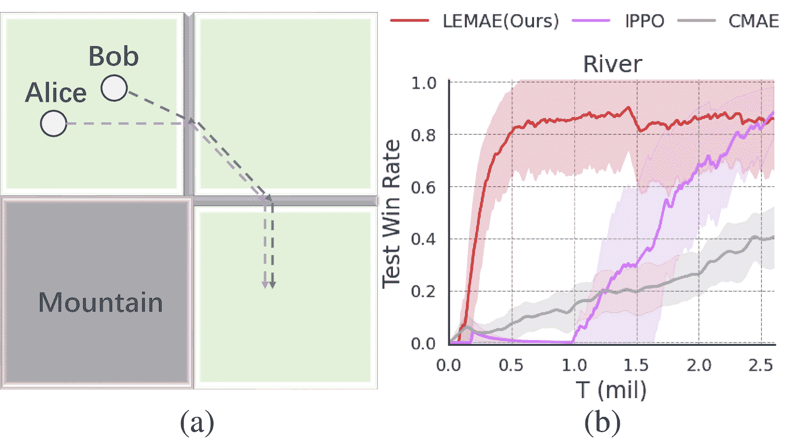

图 8：（a）LLM 从未遇到过的新任务，河流任务。（b）LEMAE 和基线模型在使用测试胜率评估指标下的训练曲线。

为了排除LEMAE的成功依赖于LLM对所选任务的熟悉度的可能性，我们手工设计了一个全新的任务，命名为“河流”，这是LLM从未遇到过的任务。任务示意图见图[8](https://arxiv.org/html/2410.02511v1#S5.F8 "Figure 8 ‣ 5.6 Scalability & Generalization Analysis ‣ 5 Experiments ‣ Choices are More Important than Efforts: LLM Enables Efficient Multi-Agent Exploration")a，其中目标是让Bob帮助害怕水的Alice穿越两条河流，达到右下角。如图[8](https://arxiv.org/html/2410.02511v1#S5.F8 "Figure 8 ‣ 5.6 Scalability & Generalization Analysis ‣ 5 Experiments ‣ Choices are More Important than Efforts: LLM Enables Efficient Multi-Agent Exploration")b所示，LEMAE的表现优于基准方法，这证明了LLM的泛化能力，能够赋能LEMAE，在不同的新任务中推动高效探索。有关该任务的详细信息，请参阅附录[E.4.3](https://arxiv.org/html/2410.02511v1#A5.SS4.SSS3 "E.4.3 A Brand New Task: River ‣ E.4 Tasks ‣ Appendix E Implementation Details ‣ Choices are More Important than Efforts: LLM Enables Efficient Multi-Agent Exploration")。

此外，我们将LEMAE扩展到基于视觉的任务，如附录[F.2](https://arxiv.org/html/2410.02511v1#A6.SS2 "F.2 Extending LEMAE Beyond Symbolic Tasks ‣ Appendix F Additional Experimental Results ‣ Choices are More Important than Efforts: LLM Enables Efficient Multi-Agent Exploration")中所述，展示了LEMAE的可扩展性潜力。

## 6 结论

本研究总结：我们提出了LEMAE，这是一个新的框架，通过LLM提供任务特定的指导，促进多智能体的探索。LEMAE通过LLM执行关键状态定位，并实现关键状态引导的探索，从而提高样本效率。通过这种方式，我们可以（i）建立LLM与强化学习之间的联系，将语言知识融入决策过程，（ii）减少从LLM获取知识和进行推理调用的人工工作量，并且（iii）通过引导和组织的探索显著提高探索效率。大量实验进一步验证了LEMAE在典型基准测试中的有效性。

限制与未来研究：在开发LEMAE的过程中，我们努力弥补当前大规模语言模型（LLM）存在的不足，例如，精心准备提示工程和任务相关的先验知识，以避免LLM使用中的不便。所有这些问题随着LLM能力的增强而可以得到解决。本研究为LLM赋能的强化学习在复杂决策场景中的潜力奠定了基础。

## 参考文献

+   Abbeel & Ng (2004) Pieter Abbeel 和 Andrew Y Ng. 通过逆向强化学习进行学徒学习。发表于*第二十一届国际机器学习会议论文集*，第1页，2004年。

+   Achiam等（2023）Josh Achiam, Steven Adler, Sandhini Agarwal, Lama Ahmad, Ilge Akkaya, Florencia Leoni Aleman, Diogo Almeida, Janko Altenschmidt, Sam Altman, Shyamal Anadkat, 等人。GPT-4技术报告。*arXiv预印本 arXiv:2303.08774*，2023。

+   Ackermann等（2019）Johannes Ackermann, Volker Gabler, Takayuki Osa, 和Masashi Sugiyama。使用双重集中式评论者减少多智能体领域中的高估偏差。*arXiv预印本 arXiv:1910.01465*，2019。

+   Agarwal等（2019）Akshat Agarwal, Sumit Kumar, 和Katia Sycara。在多智能体团队中学习可转移的合作行为。*arXiv预印本 arXiv:1906.01202*，2019。

+   Agarwal等（2020）Rishabh Agarwal, Dale Schuurmans, 和Mohammad Norouzi。关于离线强化学习的乐观视角。在*国际机器学习大会*，第104-114页。PMLR，2020。

+   Ahn等（2022）Michael Ahn, Anthony Brohan, Noah Brown, Yevgen Chebotar, Omar Cortes, Byron David, Chelsea Finn, Chuyuan Fu, Keerthana Gopalakrishnan, Karol Hausman, 等人。做我能做的，而不是我说的：将语言与机器人能力结合。*arXiv预印本 arXiv:2204.01691*，2022。

+   An等（2021）Gaon An, Seungyong Moon, Jang-Hyun Kim, 和Hyun Oh Song。基于不确定性的离线强化学习与多样化的q-集成。*神经信息处理系统进展*，34，2021。

+   Andrychowicz等（2017）Marcin Andrychowicz, Filip Wolski, Alex Ray, Jonas Schneider, Rachel Fong, Peter Welinder, Bob McGrew, Josh Tobin, OpenAI Pieter Abbeel, 和Wojciech Zaremba。事后经验重放。*神经信息处理系统进展*，30，2017。

+   作者（2021）N. N. 作者。为保持匿名而删除，2021。

+   Baker等（2019）Bowen Baker, Ingmar Kanitscheider, Todor Markov, Yi Wu, Glenn Powell, Bob McGrew, 和Igor Mordatch。从多智能体自学课程中涌现出的工具使用。*arXiv预印本 arXiv:1909.07528*，2019。

+   Becker等（1995）Craig Becker, Joaquin Salas, Kentaro Tokusei, 和J-C Latombe。使用地标进行可靠导航。在*1995年IEEE国际机器人与自动化大会论文集*，第1卷，第401-406页。IEEE，1995。

+   Belghazi等（2018）Mohamed Ishmael Belghazi, Aristide Baratin, Sai Rajeshwar, Sherjil Ozair, Yoshua Bengio, Aaron Courville, 和Devon Hjelm。互信息神经估计。在*国际机器学习大会*，第531-540页。PMLR，2018。

+   Bellemare等（2016）Marc Bellemare, Sriram Srinivasan, Georg Ostrovski, Tom Schaul, David Saxton, 和Remi Munos。统一基于计数的探索与内在动机。*神经信息处理系统进展*，29，2016。

+   Berner等（2019）Christopher Berner, Greg Brockman, Brooke Chan, Vicki Cheung, Przemyslaw Debiak, Christy Dennison, David Farhi, Quirin Fischer, Shariq Hashme, Chris Hesse, 等人。使用大规模深度强化学习玩Dota 2。*arXiv预印本 arXiv:1912.06680*，2019。

+   Boss（1978）R Wayne Boss。领导者缺席对对抗团队建设设计的影响。*应用行为科学杂志*，14(4):469–478，1978年。

+   Brown等人（2020）Tom Brown、Benjamin Mann、Nick Ryder、Melanie Subbiah、Jared D Kaplan、Prafulla Dhariwal、Arvind Neelakantan、Pranav Shyam、Girish Sastry、Amanda Askell等。语言模型是少量样本学习者。*神经信息处理系统进展*，33:1877–1901，2020年。

+   Browne等人（2012）Cameron B Browne、Edward Powley、Daniel Whitehouse、Simon M Lucas、Peter I Cowling、Philipp Rohlfshagen、Stephen Tavener、Diego Perez、Spyridon Samothrakis和Simon Colton。蒙特卡洛树搜索方法调研。*IEEE计算智能与人工智能在游戏中的应用交易*，4(1):1–43，2012年。

+   Buckman等人（2020）Jacob Buckman、Carles Gelada和Marc G Bellemare。悲观主义在固定数据集策略优化中的重要性。*arXiv预印本arXiv:2009.06799*，2020年。

+   Burda等人（2018a）Yuri Burda、Harri Edwards、Deepak Pathak、Amos Storkey、Trevor Darrell和Alexei A Efros。好奇心驱动学习的大规模研究。*arXiv预印本arXiv:1808.04355*，2018a年。

+   Burda等人（2018b）Yuri Burda、Harrison Edwards、Amos Storkey和Oleg Klimov。通过随机网络蒸馏进行探索。*arXiv预印本arXiv:1810.12894*，2018b年。

+   Cai等人（2020）Qi Cai、Zhuoran Yang、Chi Jin和Zhaoran Wang。可证明高效的策略优化探索。在*国际机器学习会议*，第1283–1294页。PMLR，2020年。

+   Cao等人（2024）Yuji Cao、Huan Zhao、Yuheng Cheng、Ting Shu、Guolong Liu、Gaoqi Liang、Junhua Zhao和Yun Li。大语言模型增强强化学习的调研：概念、分类法与方法。*arXiv预印本arXiv:2404.00282*，2024年。

+   Carta等人（2023）Thomas Carta、Clément Romac、Thomas Wolf、Sylvain Lamprier、Olivier Sigaud和Pierre-Yves Oudeyer。通过在线强化学习将大语言模型嵌入交互环境中。*arXiv预印本arXiv:2302.02662*，2023年。

+   Chen等人（2024）Liangliang Chen、Yutian Lei、Shiyu Jin、Ying Zhang和Liangjun Zhang。Rlingua：利用大语言模型提升机器人操作中的强化学习样本效率。*IEEE机器人与自动化通讯*，2024年。

+   Cheng等人（2022）Ching-An Cheng、Tengyang Xie、Nan Jiang和Alekh Agarwal。对抗性训练的演员-评论员用于离线强化学习。*arXiv预印本arXiv:2202.02446*，2022年。

+   Cheng等人（2020）Pengyu Cheng、Weituo Hao、Shuyang Dai、Jiachang Liu、Zhe Gan和Lawrence Carin。Club：互信息对数比的对比性上界。在*国际机器学习会议*，第1779–1788页。PMLR，2020年。

+   Claus & Boutilier（1998）Caroline Claus和Craig Boutilier。合作多智能体系统中强化学习的动态。在*AAAI人工智能会议（AAAI）*，1998年。

+   Colas 等人（2023）Cédric Colas、Laetitia Teodorescu、Pierre-Yves Oudeyer、Xingdi Yuan 和 Marc-Alexandre Côté。《通过大型语言模型增强自我目的代理》。*arXiv 预印本 arXiv:2305.12487*，2023年。

+   Das 等人（2019）Abhishek Das、Théophile Gervet、Joshua Romoff、Dhruv Batra、Devi Parikh、Mike Rabbat 和 Joelle Pineau。《Tarmac：定向多代理通信》。在 *国际机器学习会议*，第1538–1546页。PMLR，2019年。

+   de Witt 等人（2020）Christian Schroeder de Witt、Tarun Gupta、Denys Makoviichuk、Viktor Makoviychuk、Philip HS Torr、Mingfei Sun 和 Shimon Whiteson。《在星际争霸多代理挑战中，独立学习是否足够？》*arXiv 预印本 arXiv:2011.09533*，2020年。

+   Demaine 等人（2016）Erik D Demaine、Giovanni Viglietta 和 Aaron Williams。《超级马里奥兄弟比我们想象的更难/更容易》。2016年。

+   Dhuliawala 等人（2023）Shehzaad Dhuliawala、Mojtaba Komeili、Jing Xu、Roberta Raileanu、Xian Li、Asli Celikyilmaz 和 Jason Weston。《验证链减少大型语言模型中的幻觉》。*arXiv 预印本 arXiv:2309.11495*，2023年。

+   Ding 等人（2020）Ziluo Ding、Tiejun Huang 和 Zongqing Lu。《为多代理合作学习个体推断通信》。*arXiv 预印本 arXiv:2006.06455*，2020年。

+   Dong 等人（2017）Xiwang Dong、Qingdong Li、Qilun Zhao 和 Zhang Ren。《具有定向拓扑的广义线性多代理系统的时变群体形成分析与设计》。*国际鲁棒与非线性控制期刊*，27(9)：1640–1652，2017年。

+   Du 等人（2023）Yuqing Du、Olivia Watkins、Zihan Wang、Cédric Colas、Trevor Darrell、Pieter Abbeel、Abhishek Gupta 和 Jacob Andreas。《通过大型语言模型指导强化学习中的预训练》。*arXiv 预印本 arXiv:2302.06692*，2023年。

+   Duda 等人（2000）R. O. Duda、P. E. Hart 和 D. G. Stork。*模式分类*。John Wiley & Sons，第二版，2000年。

+   Durrett（2019）Rick Durrett。*概率：理论与实例*，第49卷。剑桥大学出版社，2019年。

+   Ecoffet 等人（2021）Adrien Ecoffet、Joost Huizinga、Joel Lehman、Kenneth O Stanley 和 Jeff Clune。《先返回，再探索》。*自然*，590(7847)：580–586，2021年。

+   Ellis 等人（2024）Benjamin Ellis、Jonathan Cook、Skander Moalla、Mikayel Samvelyan、Mingfei Sun、Anuj Mahajan、Jakob Foerster 和 Shimon Whiteson。《Smacv2：改进的合作性多代理强化学习基准》。*神经信息处理系统进展*，第36卷，2024年。

+   Fischer（2020）Ian Fischer。《条件熵瓶颈》。*熵*，22(9)：999，2020年。

+   Foerster 等人（2016）Jakob Foerster、Ioannis Alexandros Assael、Nando De Freitas 和 Shimon Whiteson。《通过深度多代理强化学习学习沟通》。在 *神经信息处理系统进展（NeurIPS）*，2016年。

+   福尔斯特等（2018）Jakob Foerster, Gregory Farquhar, Triantafyllos Afouras, Nantas Nardelli, 和 Shimon Whiteson. 反事实多智能体策略梯度。在*AAAI 人工智能会议（AAAI）*，2018。

+   傅等（2020）Justin Fu, Aviral Kumar, Ofir Nachum, George Tucker, 和 Sergey Levine. D4rl: 用于深度数据驱动强化学习的数据集。*arXiv 预印本 arXiv:2004.07219*，2020。

+   藤本 & 顾（2021）Scott Fujimoto 和 Shixiang Shane Gu. 离线强化学习的极简方法。*神经信息处理系统进展*，34:20132–20145, 2021。

+   藤本等（2018）Scott Fujimoto, Herke Hoof, 和 David Meger. 解决演员-评论家方法中的函数逼近误差。在*国际机器学习会议*，第1587–1596页。PMLR，2018。

+   藤本等（2019）Scott Fujimoto, David Meger, 和 Doina Precup. 无探索的离线深度强化学习。在*国际机器学习会议*，第2052–2062页。PMLR，2019。

+   古普塔等（2017）Jayesh K Gupta, Maxim Egorov, 和 Mykel Kochenderfer. 使用深度强化学习的协作多智能体控制。在*自主智能体与多智能体系统国际会议（AAMAS）*，2017。

+   韩等（2017）Tao Han, Zhi-Hong Guan, Ming Chi, Bin Hu, Tao Li, 和 Xian-He Zhang. 非线性领导者-跟随型多智能体系统的多群体控制。*ISA 交易*，69:140–147, 2017。

+   胡珀等（2010）Paul L Hooper, Hillard S Kaplan, 和 James L Boone. 人类合作群体中的领导力理论。*理论生物学杂志*，265(4):633–646, 2010。

+   胡等（2019）Junyan Hu, Parijat Bhowmick, 和 Alexander Lanzon. 在有向图上的多领导者多智能体系统的分布式自适应时变群体形成跟踪。*IEEE 网络系统控制学报*，7(1):140–150, 2019。

+   胡等（2020）Siyi Hu, Fengda Zhu, Xiaojun Chang, 和 Xiaodan Liang. Updet: 通过使用变换器的策略解耦实现的通用多智能体强化学习。在*国际学习表示大会（ICLR）*，2020。

+   伊克巴尔等（2021）Shariq Iqbal, Christian A Schroeder De Witt, Bei Peng, Wendelin Böhmer, Shimon Whiteson, 和 Fei Sha. 多智能体强化学习中的随机实体因子分解。在*国际机器学习会议（ICML）*，2021。

+   贾德伯格等（2019）Max Jaderberg, Wojciech M Czarnecki, Iain Dunning, Luke Marris, Guy Lever, Antonio Garcia Castaneda, Charles Beattie, Neil C Rabinowitz, Ari S Morcos, Avraham Ruderman 等. 在3D多人游戏中通过基于人口的强化学习实现人类水平的表现。*科学*，364(6443):859–865, 2019。

+   贾纳等（2019）Michael Janner, Justin Fu, Marvin Zhang, 和 Sergey Levine. 何时信任你的模型：基于模型的策略优化。*arXiv 预印本 arXiv:1906.08253*，2019。

+   Jaques 等人 (2019) Natasha Jaques、Angeliki Lazaridou、Edward Hughes、Caglar Gulcehre、Pedro Ortega、DJ Strouse、Joel Z Leibo 和 Nando De Freitas。作为多智能体深度强化学习内在动机的社会影响。在*国际机器学习会议（ICML）*，2019年。

+   Jeon 等人 (2022) Jeewon Jeon、Woojun Kim、Whiyoung Jung 和 Youngchul Sung。Maser：具有从经验重放缓冲区生成子目标的多智能体强化学习。在*国际机器学习会议*，第10041-10052页。PMLR，2022年。

+   Jiang & Lu (2018) 纪川·姜和宗庆·陆。多智能体合作中的注意力通信学习。*arXiv 预印本 arXiv:1805.07733*，2018年。

+   Jiang & Lu (2021) 纪川·姜 和 宗庆·陆。离线去中心化多智能体强化学习。*arXiv 预印本 arXiv:2108.01832*，2021年。

+   Jiang 等人 (2018) 纪川·姜、陈敦、黄铁军 和 宗庆·陆。图卷积强化学习。*arXiv 预印本 arXiv:1810.09202*，2018年。

+   Jin 等人 (2021) Ying Jin、Zhuoran Yang 和 Zhaoran Wang。悲观主义是否对离线强化学习具有可证明的效率？在*国际机器学习会议*，第5084-5096页。PMLR，2021年。

+   Jo 等人 (2023) Yonghyeon Jo、Sunwoo Lee、Junghyuk Yum 和 Seungyul Han。Fox：多智能体强化学习中的队形感知探索。*arXiv 预印本 arXiv:2308.11272*，2023年。

+   Kearns (1989) M. J. Kearns。*机器学习的计算复杂性*。哈佛大学计算机科学系博士论文，1989年。

+   Kidambi 等人 (2020) Rahul Kidambi、Aravind Rajeswaran、Praneeth Netrapalli 和 Thorsten Joachims。Morel：基于模型的离线强化学习。*arXiv 预印本 arXiv:2005.05951*，2020年。

+   Kim 等人 (2024) Woo Kyung Kim、SeungHyun Kim、Honguk Woo 等人。通过对比提示集成进行高效的策略适应。*神经信息处理系统进展*，第36卷，2024年。

+   Kingma & Welling (2013) Diederik P Kingma 和 Max Welling。自动编码变分贝叶斯。*arXiv 预印本 arXiv:1312.6114*，2013年。

+   Kocsis & Szepesvári (2006) Levente Kocsis 和 Csaba Szepesvári。基于赌博的蒙特卡罗规划。在*欧洲机器学习会议*，第282-293页。Springer，2006年。

+   Kostrikov 等人 (2021) Ilya Kostrikov、Rob Fergus、Jonathan Tompson 和 Ofir Nachum。带有Fisher散度评论员正则化的离线强化学习。在*国际机器学习会议*，第5774-5783页。PMLR，2021年。

+   Kuba 等人 (2021) Jakub Grudzien Kuba、Ruiqing Chen、Munning Wen、Ying Wen、Fanglei Sun、Jun Wang 和 Yaodong Yang。多智能体强化学习中的信任区域策略优化。*arXiv 预印本 arXiv:2109.11251*，2021年。

+   Kulesza & Taskar (2012) Alex Kulesza 和 Ben Taskar。机器学习中的行列式点过程。*arXiv 预印本 arXiv:1207.6083*，2012年。

+   Kulkarni 等人 (2016) Tejas D Kulkarni, Karthik Narasimhan, Ardavan Saeedi 和 Josh Tenenbaum. 层次化深度强化学习：整合时间抽象和内在动机. *神经信息处理系统进展*，29，2016。

+   Kumar 等人 (2019) Aviral Kumar, Justin Fu, Matthew Soh, George Tucker 和 Sergey Levine. 通过引导错误减少稳定化离策略 Q 学习. *神经信息处理系统进展*，32，2019。

+   Kumar 等人 (2020) Aviral Kumar, Aurick Zhou, George Tucker 和 Sergey Levine. 离线强化学习中的保守 Q 学习. *神经信息处理系统进展*，33:1179–1191，2020。

+   Kumar 等人 (2021) Aviral Kumar, Joey Hong, Anikait Singh 和 Sergey Levine. 我应该运行离线强化学习还是行为克隆？在 *Deep RL 研讨会 NeurIPS 2021*，2021。

+   Kurach 等人 (2019) Karol Kurach, Anton Raichuk, Piotr Stanczyk, Michal Zajac, Olivier Bachem, Lasse Espeholt, Carlos Riquelme, Damien Vincent, Marcin Michalski, Olivier Bousquet 等人. Google Research Football：一种新型的强化学习环境. *arXiv 预印本 arXiv:1907.11180*，2019。

+   Kwon 等人 (2023) Minae Kwon, Sang Michael Xie, Kalesha Bullard 和 Dorsa Sadigh. 使用语言模型进行奖励设计. *arXiv 预印本 arXiv:2303.00001*，2023。

+   Langley (2000) P. Langley. 撰写机器学习论文. 在 Pat Langley (编辑)，《*第17届国际机器学习会议（ICML 2000）论文集*》，第1207–1216页，斯坦福，CA，2000。Morgan Kaufmann。

+   Lawler & Limic (2010) Gregory F Lawler 和 Vlada Limic. *随机漫步：现代介绍*，第123卷。剑桥大学出版社，2010。

+   Lee 等人 (2020) Kuang-Huei Lee, Ian Fischer, Anthony Liu, Yijie Guo, Honglak Lee, John Canny 和 Sergio Guadarrama. 预测信息加速强化学习中的学习. *arXiv 预印本 arXiv:2007.12401*，2020。

+   Lee 等人 (2022) Seunghyun Lee, Younggyo Seo, Kimin Lee, Pieter Abbeel 和 Jinwoo Shin. 通过平衡回放和悲观的 Q 集成实现离线到在线强化学习. 在 *机器人学习会议* 上，第1702–1712页。PMLR，2022。

+   Leibo 等人 (2021) Joel Z Leibo, Edgar A Dueñez-Guzman, Alexander Vezhnevets, John P Agapiou, Peter Sunehag, Raphael Koster, Jayd Matyas, Charlie Beattie, Igor Mordatch 和 Thore Graepel. 使用 Melting Pot 对多智能体强化学习进行可扩展评估. 在 *国际机器学习会议 (ICML)*，2021。

+   Levine 等人 (2020) Sergey Levine, Aviral Kumar, George Tucker 和 Justin Fu. 离线强化学习：教程、综述及开放问题的视角. *arXiv 预印本 arXiv:2005.01643*，2020。

+   Li 等人 (2023) Belinda Z Li, William Chen, Pratyusha Sharma 和 Jacob Andreas. Lampp：将语言模型作为感知与行动的概率先验. *arXiv 电子预印本*，第 arXiv–2302，2023。

+   Li等（2021）Chenghao Li, Tonghan Wang, Chengjie Wu, Qianchuan Zhao, Jun Yang, 和Chongjie Zhang。《庆祝共享多智能体强化学习中的多样性》。*神经信息处理系统进展*，34:3991–4002，2021年。

+   Li等（2022）Shuang Li, Xavier Puig, Chris Paxton, Yilun Du, Clinton Wang, Linxi Fan, Tao Chen, De-An Huang, Ekin Akyürek, Anima Anandkumar等人。《预训练语言模型在互动决策中的应用》。*神经信息处理系统进展*，35:31199–31212，2022年。

+   Liang等（2023）Jacky Liang, Wenlong Huang, Fei Xia, Peng Xu, Karol Hausman, Brian Ichter, Pete Florence, 和Andy Zeng。《代码即策略：用于具身控制的语言模型程序》。在*2023年IEEE国际机器人与自动化大会（ICRA）*，第9493–9500页。IEEE，2023年。

+   Lin等（2023）Bill Yuchen Lin, Yicheng Fu, Karina Yang, Prithviraj Ammanabrolu, Faeze Brahman, Shiyu Huang, Chandra Bhagavatula, Yejin Choi, 和Xiang Ren。《Swiftsage：用于复杂互动任务的快慢思维生成智能体》。*arXiv预印本 arXiv:2305.17390*，2023年。

+   Lin等（2021）Toru Lin, Jacob Huh, Christopher Stauffer, Ser Nam Lim, 和Phillip Isola。《通过自编码器学习多智能体通信的基础》。在*神经信息处理系统进展（NeurIPS）*，2021年。

+   Linke等（2020）Cam Linke, Nadia M Ady, Martha White, Thomas Degris, 和Adam White。《通过内在奖励调整行为：一项调查与实证研究》。*人工智能研究期刊*，69:1287–1332，2020年。

+   Liu等（2021a）Bo Liu, Qiang Liu, Peter Stone, Animesh Garg, Yuke Zhu, 和Animashree Anandkumar。《教练-玩家多智能体强化学习用于动态团队组成》。*arXiv预印本 arXiv:2105.08692*，2021a年。

+   Liu等（2023）Boyin Liu, Zhiqiang Pu, Yi Pan, Jianqiang Yi, Yanyan Liang, 和Du Zhang。《懒惰智能体：解决多智能体强化学习中稀疏奖励问题的新视角》。在*国际机器学习大会*，第21937–21950页。PMLR，2023年。

+   Liu & Abbeel（2021）Hao Liu 和Pieter Abbeel。《来自虚无的行为：无监督主动预训练》。*神经信息处理系统进展*，34:18459–18473，2021年。

+   Liu等（2021b）Iou-Jen Liu, Unnat Jain, Raymond A Yeh, 和Alexander Schwing。《多智能体深度强化学习中的协作探索》。在*国际机器学习大会*，第6826–6836页。PMLR，2021b年。

+   Liu等（2024）Shaoteng Liu, Haoqi Yuan, Minda Hu, Yanwei Li, Yukang Chen, Shu Liu, Zongqing Lu, 和Jiaya Jia。《Rl-gpt：整合强化学习和代码即策略》。*arXiv预印本 arXiv:2402.19299*，2024年。

+   Liu等（2020a）Yao Liu, Adith Swaminathan, Alekh Agarwal, 和Emma Brunskill。《在没有大量探索的情况下，可证明的优秀批量强化学习》。*arXiv预印本 arXiv:2007.08202*，2020a年。

+   Liu 等人 (2020b) Yong Liu, Weixun Wang, Yujing Hu, Jianye Hao, Xingguo Chen, 和 Yang Gao. 通过图注意力神经网络进行多智能体游戏抽象. 载于 *人工智能学会会议（AAAI）*, 2020b.

+   Long 等人 (2020) Qian Long, Zihan Zhou, Abhibav Gupta, Fei Fang, Yi Wu, 和 Xiaolong Wang. 进化人口课程用于扩展多智能体强化学习. *arXiv预印本 arXiv:2003.10423*, 2020.

+   Lowe 等人 (2017) Ryan Lowe, Yi I Wu, Aviv Tamar, Jean Harb, OpenAI Pieter Abbeel, 和 Igor Mordatch. 混合合作竞争环境中的多智能体演员-评论家方法. 载于 *神经信息处理系统进展（NeurIPS）*, 2017.

+   Ma 等人 (2023) Yecheng Jason Ma, William Liang, Guanzhi Wang, De-An Huang, Osbert Bastani, Dinesh Jayaraman, Yuke Zhu, Linxi Fan, 和 Anima Anandkumar. Eureka: 通过编码大语言模型进行人类级奖励设计. *arXiv预印本 arXiv:2310.12931*, 2023.

+   Macchi (1977) Odile Macchi. 费米子过程——具有排斥点的随机点过程模型. 载于 *第七届布拉格信息理论、统计决策函数、随机过程会议论文集，以及1974年欧洲统计学家会议论文集*, 1977.

+   Mahajan 等人 (2019) Anuj Mahajan, Tabish Rashid, Mikayel Samvelyan, 和 Shimon Whiteson. Maven: 多智能体变分探索. *神经信息处理系统进展*, 32, 2019.

+   Mao 等人 (2020a) Hangyu Mao, Wulong Liu, Jianye Hao, Jun Luo, Dong Li, Zhengchao Zhang, Jun Wang, 和 Zhen Xiao. 一致的邻域认知多智能体强化学习. 载于 *人工智能学会会议论文集*, 第34卷, 第7219–7226页, 2020a.

+   Mao 等人 (2020b) Hangyu Mao, Zhengchao Zhang, Zhen Xiao, Zhibo Gong, 和 Yan Ni. 通过信息修剪在带宽有限的情况下学习智能体通信. 载于 *人工智能学会会议论文集*, 第34卷, 第5142–5149页, 2020b.

+   Meng 等人 (2021) Linghui Meng, Muning Wen, Yaodong Yang, Chenyang Le, Xiyun Li, Weinan Zhang, Ying Wen, Haifeng Zhang, Jun Wang, 和 Bo Xu. 离线预训练多智能体决策变换器：一个大序列模型征服所有星际争霸II任务. *arXiv预印本 arXiv:2112.02845*, 2021.

+   Michalski 等人 (1983) R. S. Michalski, J. G. Carbonell, 和 T. M. Mitchell (编). *机器学习：人工智能方法，第I卷*. Tioga, Palo Alto, CA, 1983.

+   Michie 等人 (1990) Donald Michie, Michael Bain, 和 J Hayes-Miches. 从亚认知技能中获得的认知模型. *IEE 控制工程系列*, 44:71–99, 1990.

+   Miller (2024) D. Lee Miller. Wordllama: 来自大语言模型的回收令牌嵌入, 2024. URL [https://github.com/dleemiller/wordllama](https://github.com/dleemiller/wordllama).

+   Mirsky 等人 (2020) Reuth Mirsky, William Macke, Andy Wang, Harel Yedidsion, 和 Peter Stone. 为你的想法付出代价：临时团队合作中沟通的价值. 在 *国际人工智能联合会议 (IJCAI)*，2020.

+   Mitchell (1980) T. M. Mitchell. 学习泛化中偏差的必要性. 技术报告，计算机科学系，罗格斯大学，新不伦瑞克，MA，1980.

+   Mnih 等人 (2013) Volodymyr Mnih, Koray Kavukcuoglu, David Silver, Alex Graves, Ioannis Antonoglou, Daan Wierstra, 和 Martin Riedmiller. 使用深度强化学习玩 Atari 游戏. *arXiv 预印本 arXiv:1312.5602*, 2013.

+   Nachum 等人 (2019) Ofir Nachum, Bo Dai, Ilya Kostrikov, Yinlam Chow, Lihong Li, 和 Dale Schuurmans. Algaedice：来自任意经验的策略梯度. *arXiv 预印本 arXiv:1912.02074*, 2019.

+   Nair 等人 (2020a) Ashvin Nair, Murtaza Dalal, Abhishek Gupta, 和 Sergey Levine. 使用离线数据集加速在线强化学习. *arXiv 预印本 arXiv:2006.09359*, 2020a.

+   Nair 等人 (2020b) Ashvin Nair, Abhishek Gupta, Murtaza Dalal, 和 Sergey Levine. AWAC：利用离线数据集加速在线强化学习. *arXiv 预印本 arXiv:2006.09359*, 2020b.

+   Newell & Rosenbloom (1981) A. Newell 和 P. S. Rosenbloom. 技能获得机制与练习法则. 在 J. R. Anderson (编)，*认知技能及其获得*，第一章，页码 1–51，劳伦斯·厄尔鲍姆协会，NJ，1981.

+   Niu 等人 (2021) Yaru Niu, Rohan R Paleja, 和 Matthew C Gombolay. 多智能体图注意力通信与团队合作. 在 *AAMAS* 会议中，页码 964–973, 2021.

+   Oliehoek 等人 (2016) Frans A Oliehoek, Christopher Amato, 等. *去中心化 POMDP 简明介绍*. 斯普林格，2016.

+   Oord 等人 (2018) Aaron van den Oord, Yazhe Li, 和 Oriol Vinyals. 使用对比预测编码进行表示学习. *arXiv 预印本 arXiv:1807.03748*, 2018.

+   Paischer 等人 (2022) Fabian Paischer, Thomas Adler, Vihang Patil, Angela Bitto-Nemling, Markus Holzleitner, Sebastian Lehner, Hamid Eghbal-Zadeh, 和 Sepp Hochreiter. 强化学习中的语言模型历史压缩. 在 *国际机器学习大会*，页码 17156–17185，PMLR，2022.

+   Paischer 等人 (2024) Fabian Paischer, Thomas Adler, Markus Hofmarcher, 和 Sepp Hochreiter. 语义舵：一种人类可读的强化学习记忆. *神经信息处理系统进展*，36，2024.

+   Pan 等人 (2021) Ling Pan, Tabish Rashid, Bei Peng, Longbo Huang, 和 Shimon Whiteson. 正则化软最大深度多智能体 Q 学习. *神经信息处理系统进展*，34:1365–1377，2021.

+   Pan 等人 (2022) Ling Pan, Longbo Huang, Tengyu Ma, 和 Huazhe Xu. 在保守主义中更好地规划：具有演员矫正的离线多智能体强化学习. 在 *国际机器学习大会*，页码 17221–17237，PMLR，2022.

+   Pathak et al. (2017) Deepak Pathak, Pulkit Agrawal, Alexei A Efros, and Trevor Darrell. 通过自监督预测驱动的好奇心探索。在*国际机器学习会议 (ICML)*，2017年。

+   Peng et al. (2021) Bei Peng, Tabish Rashid, Christian Schroeder de Witt, Pierre-Alexandre Kamienny, Philip Torr, Wendelin Böhmer, and Shimon Whiteson. Facmac：分解的多智能体集中式策略梯度。*神经信息处理系统进展*，34:12208–12221，2021年。

+   Peng et al. (2023) Shaohui Peng, Xing Hu, Qi Yi, Rui Zhang, Jiaming Guo, Di Huang, Zikang Tian, Ruizhi Chen, Zidong Du, Qi Guo, et al. 自驱动基础：具有自动语言对齐技能学习的大型语言模型智能体。*arXiv预印本 arXiv:2309.01352*，2023年。

+   Peng et al. (2019) Xue Bin Peng, Aviral Kumar, Grace Zhang, and Sergey Levine. Advantage-weighted regression: Simple and scalable off-policy reinforcement learning. *arXiv预印本 arXiv:1910.00177*，2019年。

+   Poole et al. (2019) Ben Poole, Sherjil Ozair, Aaron Van Den Oord, Alex Alemi, and George Tucker. 关于互信息的变分界限。在*国际机器学习会议*，第5171–5180页，PMLR，2019年。

+   Qu et al. (2023) Yun Qu, Boyuan Wang, Jianzhun Shao, Yuhang Jiang, Chen Chen, Zhenbin Ye, Lin Liu, Yang Jun Feng, Lin Lai, Hongyang Qin, et al. Hokoff：来自王者荣耀的真实游戏数据集及其离线强化学习基准测试。在*第三十七届神经信息处理系统大会数据集与基准赛道*，2023年。

+   Radford et al. (2019) Alec Radford, Jeffrey Wu, Rewon Child, David Luan, Dario Amodei, Ilya Sutskever, et al. 语言模型是无监督的多任务学习者。*OpenAI博客*，1(8):9，2019年。

+   Rashid et al. (2018) Tabish Rashid, Mikayel Samvelyan, Christian Schroeder De Witt, Gregory Farquhar, Jakob Foerster, and Shimon Whiteson. Qmix：深度多智能体强化学习的单调值函数分解。*arXiv预印本 arXiv:1803.11485*，2018年。

+   Rashid et al. (2020) Tabish Rashid, Gregory Farquhar, Bei Peng, and Shimon Whiteson. 加权qmix：扩展单调值函数分解。*arXiv电子预印本*，第arXiv–2006页，2020年。

+   Rashidinejad et al. (2021) Paria Rashidinejad, Banghua Zhu, Cong Ma, Jiantao Jiao, and Stuart Russell. 桥接离线强化学习与模仿学习：悲观主义的故事。*神经信息处理系统进展*，34，2021年。

+   Samuel (1959) A. L. Samuel. 使用跳棋游戏进行的机器学习研究。*IBM研究与开发杂志*，3(3):211–229，1959年。

+   Samvelyan et al. (2019a) Mikayel Samvelyan, Tabish Rashid, Christian Schroeder de Witt, Gregory Farquhar, Nantas Nardelli, Tim G. J. Rudner, Chia-Man Hung, Philiph H. S. Torr, Jakob Foerster, and Shimon Whiteson. 星际争霸多智能体挑战。*CoRR*，abs/1902.04043，2019a年。

+   Samvelyan 等人（2019b）Mikayel Samvelyan、Tabish Rashid、Christian Schroeder de Witt、Gregory Farquhar、Nantas Nardelli、Tim GJ Rudner、Chia-Man Hung、Philip HS Torr、Jakob Foerster 和 Shimon Whiteson. 星际争霸多智能体挑战。*arXiv 预印本 arXiv:1902.04043*，2019b。

+   Scarselli 等人（2008）Franco Scarselli、Marco Gori、Ah Chung Tsoi、Markus Hagenbuchner 和 Gabriele Monfardini. 图神经网络模型。*IEEE 神经网络学报*，20(1):61–80，2008。

+   Schroeder de Witt 等人（2019）Christian Schroeder de Witt、Jakob Foerster、Gregory Farquhar、Philip Torr、Wendelin Boehmer 和 Shimon Whiteson. 多智能体共同知识强化学习。*神经信息处理系统进展*，32:9927–9939，2019。

+   Schulman 等人（2017）John Schulman、Filip Wolski、Prafulla Dhariwal、Alec Radford 和 Oleg Klimov. 近端策略优化算法。*arXiv 预印本 arXiv:1707.06347*，2017。

+   Seo 等人（2021）Younggyo Seo、Lili Chen、Jinwoo Shin、Honglak Lee、Pieter Abbeel 和 Kimin Lee. 使用随机编码器的状态熵最大化以实现高效探索。在 *国际机器学习大会*，第 9443-9454 页。PMLR，2021。

+   Shao 等人（2023）Jianzhun Shao、Hongchang Zhang、Yun Qu、Chang Liu、Shuncheng He、Yuhang Jiang 和 Xiangyang Ji. 多智能体强化学习中的互补注意力。在 *国际机器学习大会*，第 30776-30793 页。PMLR，2023。

+   Shao 等人（2024）Jianzhun Shao、Yun Qu、Chen Chen、Hongchang Zhang 和 Xiangyang Ji. 离线多智能体强化学习中的反事实保守 Q 学习。*神经信息处理系统进展*，36，2024。

+   Shi 等人（2023）Ruizhe Shi、Yuyao Liu、Yanjie Ze、Simon S Du 和 Huazhe Xu. 释放预训练语言模型在离线强化学习中的潜力。*arXiv 预印本 arXiv:2310.20587*，2023。

+   Shinn 等人（2023）Noah Shinn、Federico Cassano、Ashwin Gopinath、Karthik R Narasimhan 和 Shunyu Yao. Reflexion: 具有语言强化学习的语言代理。 在 *第 37 届神经信息处理系统会议*，2023。

+   Shukla 等人（2023）Yash Shukla、Wenchang Gao、Vasanth Sarathy、Alvaro Velasquez、Robert Wright 和 Jivko Sinapov. Lgts: 使用 LLM 生成的子目标进行强化学习代理的动态任务采样。*arXiv 预印本 arXiv:2310.09454*，2023。

+   Singh 等人（2018）Amanpreet Singh、Tushar Jain 和 Sainbayar Sukhbaatar. 在大规模多智能体协作和竞争任务中学习何时进行通信。*arXiv 预印本 arXiv:1812.09755*，2018。

+   Singh（1998）Munindar P Singh. 智能体通信语言：重新思考其原则。*计算机*，31(12):40–47，1998。

+   Son 等人（2019）Kyunghwan Son、Daewoo Kim、Wan Ju Kang、David Earl Hostallero 和 Yung Yi. Qtran: 学习通过变换因式分解进行协作式多智能体强化学习。在 *国际机器学习大会（ICML）*，2019。

+   Song et al. (2023) Jiayang Song, Zhehua Zhou, Jiawei Liu, Chunrong Fang, Zhan Shu 和 Lei Ma。自我优化的大型语言模型作为机器人深度强化学习的自动化奖励函数设计师。*arXiv 预印本 arXiv:2309.06687*，2023年。

+   Stone et al. (2010) Peter Stone, Gal A Kaminka, Sarit Kraus 和 Jeffrey S Rosenschein。临时自治智能体团队：无需预协调的合作。在 *AAAI人工智能会议 (AAAI)*，2010年。

+   Su & Zhang (2023) Jianhai Su 和 Qi Zhang。使用视觉-语言模型进行子目标提出。在 *CoRL 2023 规划有效抽象学习研讨会 (LEAP)*，2023年。

+   Su et al. (2021) Jianyu Su, Stephen Adams 和 Peter Beling。价值分解多智能体演员-评论家。 在 *AAAI人工智能会议论文集*，第35卷，第11352-11360页，2021年。

+   Sukhbaatar et al. (2016) Sainbayar Sukhbaatar, Rob Fergus 等人。使用反向传播学习多智能体通信。在 *神经信息处理系统进展 (NeurIPS)*，2016年。

+   Sunehag et al. (2018) Peter Sunehag, Guy Lever, Audrunas Gruslys, Wojciech Marian Czarnecki, Vinícius Flores Zambaldi, Max Jaderberg, Marc Lanctot, Nicolas Sonnerat, Joel Z Leibo, Karl Tuyls 等人。基于团队奖励的合作多智能体学习的价值分解网络。在 *国际自主智能体与多智能体系统会议 (AAMAS)*，2018年。

+   Suttle et al. (2020) Wesley Suttle, Zhuoran Yang, Kaiqing Zhang, Zhaoran Wang, Tamer Başar 和 Ji Liu。用于分布式强化学习的多智能体离策略演员-评论家算法。*IFAC-PapersOnLine*，53(2)：1549-1554，2020年。

+   Sutton & Barto (2018) Richard S Sutton 和 Andrew G Barto。*强化学习：一种介绍*。麻省理工学院出版社，2018年。

+   Tan (1993) Ming Tan。多智能体强化学习：独立智能体与合作智能体。在 *国际机器学习会议 (ICML)*，1993年。

+   Tang et al. (2018) Hongyao Tang, Jianye Hao, Tangjie Lv, Yingfeng Chen, Zongzhang Zhang, Hangtian Jia, Chunxu Ren, Yan Zheng, Zhaopeng Meng, Changjie Fan 等人。具有时间抽象的层次深度多智能体强化学习。*arXiv 预印本 arXiv:1809.09332*，2018年。

+   Thrun (1992) Sebastian B Thrun。*强化学习中的高效探索*。卡内基梅隆大学，1992年。

+   Tian et al. (2020) Yuandong Tian, Qucheng Gong 和 Tina Jiang。针对信息不完全的多智能体协作的联合策略搜索。*arXiv 预印本 arXiv:2008.06495*，2020年。

+   Todorov et al. (2012) Emanuel Todorov, Tom Erez 和 Yuval Tassa。Mujoco：一种用于基于模型控制的物理引擎。在 *2012 IEEE/RSJ国际智能机器人与系统会议*，第5026-5033页。IEEE，2012年。

+   Touvron等人（2023）Hugo Touvron, Thibaut Lavril, Gautier Izacard, Xavier Martinet, Marie-Anne Lachaux, Timothée Lacroix, Baptiste Rozière, Naman Goyal, Eric Hambro, Faisal Azhar等人. Llama: 开放且高效的基础语言模型。*arXiv预印本 arXiv:2302.13971*, 2023。

+   Tseng等人（2022）Wei-Cheng Tseng, Tsun-Hsuan Wang, Yen-Chen Lin, 和 Phillip Isola. 离线多智能体强化学习与知识蒸馏。发表于*神经信息处理系统进展*，2022。

+   Van der Maaten & Hinton（2008）Laurens Van der Maaten 和 Geoffrey Hinton. 使用t-SNE可视化数据。*机器学习研究期刊*, 9(11), 2008。

+   Vaswani等人（2017）Ashish Vaswani, Noam Shazeer, Niki Parmar, Jakob Uszkoreit, Llion Jones, Aidan N Gomez, Łukasz Kaiser, 和 Illia Polosukhin. 注意力即一切。发表于*神经信息处理系统进展（NeurIPS）*，2017。

+   Wan等人（2021）Lipeng Wan, Zeyang Liu, Xingyu Chen, Han Wang, 和 Xuguang Lan. 基于贪心的价值表示用于多智能体强化学习中的最优协调。*arXiv预印本 arXiv:2112.04454*, 2021。

+   Wang等人（2024）Boyuan Wang, Yun Qu, Yuhang Jiang, Jianzhun Shao, Chang Liu, Wenming Yang, 和 Xiangyang Ji. LLM增强的强化学习状态表示。*arXiv预印本 arXiv:2407.13237*, 2024。

+   Wang等人（2023a）Guanzhi Wang, Yuqi Xie, Yunfan Jiang, Ajay Mandlekar, Chaowei Xiao, Yuke Zhu, Linxi Fan, 和 Anima Anandkumar. Voyager: 一种具有大语言模型的开放式体现型智能体。*arXiv预印本 arXiv:2305.16291*, 2023a。

+   Wang等人（2020a）Jianhao Wang, Zhizhou Ren, Terry Liu, Yang Yu, 和 Chongjie Zhang. Qplex: 双向对决多智能体Q学习。*arXiv预印本 arXiv:2008.01062*, 2020a。

+   Wang等人（2023b）Lei Wang, Chen Ma, Xueyang Feng, Zeyu Zhang, Hao Yang, Jingsen Zhang, Zhiyuan Chen, Jiakai Tang, Xu Chen, Yankai Lin等人. 基于大语言模型的自主智能体综述。*arXiv预印本 arXiv:2308.11432*, 2023b。

+   Wang等人（2020b）Rundong Wang, Xu He, Runsheng Yu, Wei Qiu, Bo An, 和 Zinovi Rabinovich. 学习高效的多智能体通信：信息瓶颈方法。发表于*国际机器学习会议*，pp. 9908–9918。PMLR, 2020b。

+   Wang等人（2019a）Tonghan Wang, Jianhao Wang, Yi Wu, 和 Chongjie Zhang. 基于影响的多智能体探索。*arXiv预印本 arXiv:1910.05512*, 2019a。

+   Wang等人（2019b）Tonghan Wang, Jianhao Wang, Chongyi Zheng, 和 Chongjie Zhang. 通过通信最小化学习近似可分解的价值函数。*arXiv预印本 arXiv:1910.05366*, 2019b。

+   Wang等人（2020c）Tonghan Wang, Heng Dong, Victor Lesser, 和 Chongjie Zhang. Roma: 具有新兴角色的多智能体强化学习。发表于*国际机器学习会议（ICML）*，2020c。

+   Wang et al. (2020d) 王同瀚, Tarun Gupta, Anuj Mahajan, 彭蓓, Shimon Whiteson, 和 张崇杰. Rode: 学习角色以分解多智能体任务. *arXiv 预印本 arXiv:2010.01523*, 2020d.

+   Wang et al. (2020e) 王伟勋, 杨天培, 刘勇, 郝建业, 郝晓天, 胡雨静, 陈英峰, 范昌杰, 和 高杨. 从少到多：大规模动态多智能体课程学习. 在 *人工智能 AAAI 大会 (AAAI)*, 2020e.

+   Wei et al. (2022) Jason Wei, 王雪志, Dale Schuurmans, Maarten Bosma, 夏飞, Ed Chi, Quoc V Le, Denny Zhou, 等. 思维链提示在大规模语言模型中引发推理. *神经信息处理系统进展*, 35:24824–24837, 2022.

+   Wu et al. (2022) 吴家龙, 吴海旭, 邱子涵, 王建民, 和 龙鸣胜. 支持的策略优化用于离线强化学习. 在 *神经信息处理系统进展*, 2022.

+   Wu et al. (2019) 余凡 吴, 乔治 Tucker, 和 Ofir Nachum. 行为正则化离线强化学习. *arXiv 预印本 arXiv:1911.11361*, 2019.

+   Wu et al. (2021) 吴越, 翟双飞, Srivastava Nitish, Joshua Susskind, 张建, Salakhutdinov Ruslan, 和 吴汉林. 离线强化学习的基于不确定性加权的演员-评论家方法. *arXiv 预印本 arXiv:2105.08140*, 2021.

+   Xie et al. (2021) 谷腾扬, 程清安, 蒋楠, 保罗 Mineiro, 和 Alekh Agarwal. 离线强化学习中的 Bellman 一致悲观性. *神经信息处理系统进展*, 34, 2021.

+   Xie et al. (2023) 谷天宝, 赵思恒, 吴陈亨利, 刘逸涛, 罗千, 钟维克, 杨彦超, 和 于涛. Text2reward: 强化学习的自动化密集奖励函数生成. *arXiv 预印本 arXiv:2309.11489*, 2023.

+   Xu et al. (2023) 许培, 张君阁, 尹奇跃, 余超, 杨耀东, 和 黄凯琪. 稀疏奖励多智能体任务的子空间感知探索. 在 *人工智能 AAAI 大会论文集*, 第 37 卷, 第 11717–11725 页, 2023.

+   Xu et al. (2018) 许赵, 吕阳, 潘全, 胡锦文, 赵春辉, 和 刘帅. 使用深度确定性策略梯度方法的多车队控制. 在 *国际控制与自动化会议 (ICCA)*, 2018.

+   Xu & Tewari (2020) 许子平 和 Ambuj Tewari. 在因子化 MDP 中的强化学习：面向非 episodic 设置的 oracle 高效算法及更紧的后悔界限. *arXiv 预印本 arXiv:2002.02302*, 2020.

+   Yang et al. (2020a) 杨耀东, 郝建业, 廖本, 邵昆, 陈广勇, 刘武龙, 和 唐红耀. Qatten: 一种协作多智能体强化学习的通用框架. *arXiv 预印本 arXiv:2002.03939*, 2020a.

+   Yang et al. (2020b) 杨耀东, 温莹, 王俊, 陈理恒, 邵昆, David Mguni, 和 张伟南. 多智能体行列式 Q 学习. 在 *国际机器学习大会 (ICML)*, 2020b.

+   Yang等人（2021）Yiqin Yang, Xiaoteng Ma, Chenghao Li, Zewu Zheng, Qiyuan Zhang, Gao Huang, Jun Yang, 和 Qianchuan Zhao。相信你所看到的：一种隐式约束方法用于离线多智能体强化学习。*神经信息处理系统进展*，34:10299–10312，2021年。

+   Yao等人（2022）Shunyu Yao, Jeffrey Zhao, Dian Yu, Nan Du, Izhak Shafran, Karthik Narasimhan, 和 Yuan Cao。React：在语言模型中协同推理与行动。*arXiv预印本 arXiv:2210.03629*，2022年。

+   Yao等人（2023）Weiran Yao, Shelby Heinecke, Juan Carlos Niebles, Zhiwei Liu, Yihao Feng, Le Xue, Rithesh Murthy, Zeyuan Chen, Jianguo Zhang, Devansh Arpit, 等人。Retroformer：具有策略梯度优化的回顾性大语言模型智能体。*arXiv预印本 arXiv:2308.02151*，2023年。

+   Ye等人（2020）Deheng Ye, Guibin Chen, Wen Zhang, Sheng Chen, Bo Yuan, Bo Liu, Jia Chen, Zhao Liu, Fuhao Qiu, Hongsheng Yu, 等人。通过深度强化学习向完全MOBA游戏进发。*arXiv预印本 arXiv:2011.12692*，2020年。

+   Yu等人（2021）Chao Yu, Akash Velu, Eugene Vinitsky, Yu Wang, Alexandre Bayen, 和 Yi Wu。mappo在合作性多智能体游戏中的惊人效果。*arXiv预印本 arXiv:2103.01955*，2021年。

+   Yu等人（2020）Tianhe Yu, Garrett Thomas, Lantao Yu, Stefano Ermon, James Zou, Sergey Levine, Chelsea Finn, 和 Tengyu Ma。Mopo：基于模型的离线策略优化。*arXiv预印本 arXiv:2005.13239*，2020年。

+   Yu & Zhou（2008）Yang Yu 和 Zhi-Hua Zhou。一种估算进化算法期望首次到达时间的新方法。*人工智能*，172(15):1809–1832，2008年。

+   Yuan等人（2022）Lei Yuan, Jianhao Wang, Fuxiang Zhang, Chenghe Wang, Zongzhang Zhang, Yang Yu, 和 Chongjie Zhang。通过去中心化队友建模进行多智能体激励通信。2022年。

+   Zanette等人（2021）Andrea Zanette, Martin J Wainwright, 和 Emma Brunskill。证明演员-评论家方法在离线强化学习中的优势。*神经信息处理系统进展*，34，2021年。

+   Zhang & Lesser（2013）Chongjie Zhang 和 Victor R Lesser。利用有限通信协调多智能体强化学习。在*国际自主智能体与多智能体系统会议（AAMAS）*，2013年。

+   Zhang等人（2023）Jesse Zhang, Jiahui Zhang, Karl Pertsch, Ziyi Liu, Xiang Ren, Minsuk Chang, Shao-Hua Sun, 和 Joseph J Lim。提升你自己的技能：在大型语言模型指导下学习解决新任务。*arXiv预印本 arXiv:2310.10021*，2023年。

+   Zhang等人（2018）Kaiqing Zhang, Zhuoran Yang, Han Liu, Tong Zhang, 和 Tamer Basar。完全去中心化的多智能体强化学习与网络化智能体。在*国际机器学习会议（ICML）*，2018年。

+   Zhao等人（2023）Zirui Zhao, Wee Sun Lee, 和 David Hsu。将大语言模型作为常识知识用于大规模任务规划。*arXiv预印本 arXiv:2305.14078*，2023年。

+   Zhou等人（2020）Meng Zhou, Ziyu Liu, Pengwei Sui, Yixuan Li和Yuk Ying Chung。为多智能体演员-评论员模型学习隐式信用分配。*arXiv预印本 arXiv:2007.02529*，2020年。

+   Zhou等人（2023）Zihao Zhou, Bin Hu, Chenyang Zhao, Pu Zhang和Bin Liu。大型语言模型作为强化学习智能体训练的策略教师。*arXiv预印本 arXiv:2311.13373*，2023年。

+   Zhu等人（2023）Xizhou Zhu, Yuntao Chen, Hao Tian, Chenxin Tao, Weijie Su, Chenyu Yang, Gao Huang, Bin Li, Lewei Lu, Xiaogang Wang等人。Ghost in the minecraft: 通过具有文本知识和记忆的大型语言模型为开放世界环境提供通用能力的智能体。*arXiv预印本 arXiv:2305.17144*，2023年。

## 附录A 算法

本节包含伪算法。算法[1](https://arxiv.org/html/2410.02511v1#algorithm1 "在附录A算法 ‣ 选择比努力更重要：LLM使多智能体探索更高效")展示了LEMAE的主要算法。LEMAE由四个阶段组成：利用LLM生成判别器函数、通过KSMT进行探索、计算SHIR以及进行RL训练。对于在政策下的RL，缓冲区$D$对应于回滚缓冲区，而对于非政策RL，它被初始化为重放缓冲区（Paischer等人，[2022](https://arxiv.org/html/2410.02511v1#bib.bib117)）。算法[2](https://arxiv.org/html/2410.02511v1#algorithm2 "在附录A算法 ‣ 选择比努力更重要：LLM使多智能体探索更高效")说明了通过KSMT进行探索的过程。由于我们的方法不依赖于特定的强化学习算法，因此在主文中省略了标准RL训练的详细信息。

输入：大语言模型$\mathcal{M}$，提示$\mathcal{P}$，重新思考提示$\mathcal{P}^{re}$，非负缩放因子$\alpha,\beta$，随机性epsilon $\epsilon_{l},\epsilon_{h}$（$\epsilon_{l}<\epsilon_{h}$），训练频率$\mathcal{N}$，最大回合数$\mathcal{N}^{max}$，关键状态数量$\mathcal{K}$。输出：策略网络$\bm{\pi}_{\theta}$。随机初始化策略网络参数$\theta$。初始化关键状态记忆树$\mathcal{T}\leftarrow[root]$，回放缓冲区$\mathcal{D}$，关键状态链回放缓冲区$\mathcal{D}^{ks}$，初始鉴别器函数$\{\mathcal{\hat{F}}_{i}\}_{i=1}^{\mathcal{K}}\leftarrow\mathcal{M}(\mathcal{P})$；// 自检机制 LLM重新思考$\{\mathcal{\hat{F}}^{re}_{i}\}_{i=1}^{\mathcal{K}}\leftarrow\mathcal{M}(\mathcal{P},\{\mathcal{\hat{F}}_{i}\}_{i=1}^{\mathcal{K}},\mathcal{P}^{re})$；当*在$\{\mathcal{\hat{F}}^{re}_{i}\}_{i=1}^{\mathcal{K}}$中存在不可执行的鉴别器函数*时，$\{\mathcal{\hat{F}}^{re}_{i}\}_{i=1}^{\mathcal{K}}\leftarrow\mathcal{M}(\mathcal{P},\{\mathcal{\hat{F}}^{re}_{i}\}_{i=1}^{\mathcal{K}},error)$；结束循环；最终鉴别器函数$\{\mathcal{F}_{i}\}_{i=1}^{\mathcal{K}}$；对于*$episode=1$ 到 $\mathcal{N}^{max}$*，执行以下操作：// 使用关键状态记忆树进行探索（算法[2](https://arxiv.org/html/2410.02511v1#algorithm2 "附录A 算法 ‣ 选择比努力更重要：LLM实现高效多代理探索")）$\kappa\_chain$，$\mathcal{T}$，$\tau$ $\leftarrow$ KSMT-Exp($\bm{\pi}_{\theta}$，$\mathcal{T}$，$\{\mathcal{F}_{i}\}_{i=1}^{\mathcal{K}}$，$\epsilon_{l}$，$\epsilon_{h}$)；$\mathcal{D}\leftarrow\mathcal{D}\cup\{\tau\}$，$\mathcal{D}^{ks}\leftarrow\mathcal{D}^{ks}\cup\{\kappa\_chain\}$；如果*$episode$ mod $\mathcal{N}$ = 0*，则：样本批次$B=\{\tau_{i}\}_{i=1}^{|B|}$来自$\mathcal{D}$，并从$\mathcal{D}^{ks}$中取出相应的关键状态链批次$B^{ks}=\{\kappa\_chain_{i}\}_{i=1}^{|B|}$；对于*$\tau=\{(s_{t},\bm{a}_{t},s_{t+1},r_{t})\}_{t=1}^{t_{max}},\kappa\_chain\in B,B^{ks}$*，执行以下操作：$t^{start}\leftarrow 1$；对于*$\{t^{end},\kappa_{m}\}\in\kappa\_chain$*，执行以下操作：对于*$t=t^{start}$ 到 $t^{end}$*，执行以下操作：// 基于子空间的后见内在奖励（方程[1](https://arxiv.org/html/2410.02511v1#S4.E1 "4.3.1 基于子空间的后见内在奖励 ‣ 4.3 关键状态引导探索 ‣ 4 方法 ‣ 选择比努力更重要：LLM实现高效多代理探索")）更新$\tau$，使得$r_{t}=\alpha\cdot r_{t}+\beta\cdot r_{I}^{\kappa_{m}}(s_{t},s_{t+1})$；$t^{start}\leftarrow t^{end}$；结束循环；结束循环；// 使用关键状态记忆树进行规划；如果*树中对应$\kappa\_chain$的分支*，则：提取所有子节点$\mathcal{C}=\{\xi_{i}\}_{i=1}^{|\mathcal{C}|}$，并随机采样一个节点$\xi_{i}\sim\mathcal{C}$；结束如果；否则：从树中所有节点中随机采样一个节点$\xi_{i}$（不在$\kappa\_chain$中）；结束否则；$\kappa_{plan}$对应于采样的节点$\xi_{i}$；对于*$t=t^{start}$ 到 $t^{max}$*，执行以下操作：更新$\tau$，使得$r_{t}=\alpha\cdot r_{t}+\beta\cdot r_{I}^{\kappa_{plan}}(s_{t},s_{t+1})$；结束循环；更新$B$，使得$B$包含$\tau$；// 强化学习训练（算法无关）使用MARL算法，利用$B$训练$\theta$；结束循环；结束如果；结束循环。

算法 1 LEMAE

输入：策略网络 $\bm{\pi}_{\theta}$，关键状态记忆树 $\mathcal{T}$，鉴别函数 $\{\mathcal{F}_{i}\}_{i=1}^{\mathcal{K}}$，随机性 epsilon $\epsilon_{l},\epsilon_{h}$（$\epsilon_{l}<\epsilon_{h}$）。输出：$\kappa\_chain$，关键状态记忆树 $\mathcal{T}$，轨迹 $\tau$。初始化 $\kappa\_chain\leftarrow\left[\ \right],\tau\leftarrow\{\}$，对于 *$t=1$ 到 $t_{\max}$* 执行：// 在回滚轨迹中进行关键状态定位

算法 2 使用关键状态记忆树进行探索（KSMT-Exp）

## 附录 B 进一步讨论

### B.1 关键状态鉴别背后的洞察

在我们考虑的场景中，我们认为区分通常比通过大规模语言模型（LLM）生成关键状态更容易且更具普适性，尤其是在高维状态和部分可观察性的问题背景下。其原因如下：

1.  1.

    鉴别侧重于任务的高层理解和识别关键状态特征，而生成需要对每个元素进行详细、低层次的理解并赋值。这使得生成变得更具挑战性且容易出错，尤其是在高维设置中。鉴别相当于将输出空间简化为关键状态标签，从而缓解了诸如幻觉等问题。

1.  2.

    在实现过程中，鉴别函数中的错误更容易通过真实状态的测试进行检查和修正。相比之下，生成的关键状态中的错误更难发现，通常需要通过训练表现来推断。

1.  3.

    在部分可观察性的情况下，直接生成关键状态是不可靠的。例如，在Pass任务中，隐藏开关的位置是未知的，必须从门的状态推断出来。没有特定代理的位置，LLM无法准确生成关键状态，而这些位置对于激活开关至关重要。

### B.2 限制

我们在LLM和RL之间建立了一座桥梁，通过利用LLM提供的任务相关指导来促进高效探索。然而，LLM固有的持续性约束，如其有限的理解任务特定信息的能力和不可避免的幻觉，成为我们方法中的瓶颈，从而引发以下限制：

1.  1.

    我们通过使用标准化的提示模板来减少繁重的提示工程，但仍然需要手动为LLM提供任务信息。因此，我们假设符号状态的语义含义是可用的。这个假设是可行的，因为这些手动设计的状态在任务规格中有固有的含义（Liu et al., [2021b](https://arxiv.org/html/2410.02511v1#bib.bib92); Samvelyan et al., [2019b](https://arxiv.org/html/2410.02511v1#bib.bib133)），并且不比先前的工作要求状态说明器（Du et al., [2023](https://arxiv.org/html/2410.02511v1#bib.bib35)）或环境代码（Ma et al., [2023](https://arxiv.org/html/2410.02511v1#bib.bib98)）更强，这些也涉及手动微调或访问额外的状态信息。

1.  2.

    受限于LLM能力的局限性以及固有的幻觉问题，它可能在直接为更复杂的任务提供有效的关键状态先验方面面临挑战。此外，由于我们使用了LLM，本工作主要集中在具有符号状态的任务上。未来的研究可以通过使用先进的多模态LLM，扩展其在更复杂任务中的应用，例如基于图像的任务。我们在附录 [F.2](https://arxiv.org/html/2410.02511v1#A6.SS2 "F.2 Extending LEMAE Beyond Symbolic Tasks ‣ Appendix F Additional Experimental Results ‣ Choices are More Important than Efforts: LLM Enables Efficient Multi-Agent Exploration")中提供了将LEMAE扩展到符号任务之外的初步尝试。

由于提出的LEMAE的效率本质上来源于多功能LLM，我们相信基础模型探索的激增将促进LLM赋能的RL的蓬勃发展。

### B.3 未来工作

提出的LEMAE的成功突显了通过LLM赋能RL的必要性和有效性。为了提高性能并扩展适用性，我们将探索两条未来研究方向，旨在解决已识别的限制。这些方向概述如下：

1.  1.

    通过多模态自我收集简化任务信息提供：多模态LLM因其通过各种模态理解情境的能力而受到越来越多的关注。将其与自我探索和记忆机制结合，显示出在自动化收集和理解任务信息方面的潜力，从而简化LEMAE的实施并增强其适应性。我们在附录 [F.2](https://arxiv.org/html/2410.02511v1#A6.SS2 "F.2 Extending LEMAE Beyond Symbolic Tasks ‣ Appendix F Additional Experimental Results ‣ Choices are More Important than Efforts: LLM Enables Efficient Multi-Agent Exploration") 中提供了将LEMAE扩展到符号任务之外的初步尝试。

1.  2.

    通过迭代反馈机制释放更强大的LLM的潜力：毫无疑问，鉴于LLM发展的快速进展，更强大的LLM的出现已是迫在眉睫。一方面，我们打算利用这些先进LLM的能力。另一方面，为了充分释放LLM的潜力，我们计划设计一个迭代反馈机制，在RL训练中对LEMAE中的LLM进行反馈，以减轻幻觉和任务理解错误等问题。

### B.4 更广泛的影响

大型语言模型在展示其在各种下游任务中的卓越能力方面展现了相当大的潜力。然而，赋能RL与LLM的研究仍处于初步阶段。作为赋能RL与LLM的开创性尝试，我们提出了一种通用方法，通过LLM提供任务特定的指导，促进RL中的高效探索。

1.  1.

    对于研究界而言，本文的发表将激励进一步探索推动LLM与RL的结合，以解决RL中固有的挑战，例如高效探索、有限的样本效率和不理想的泛化能力。此外，我们的设计促进了将区分性和编码应用于将LLM中的语言知识转化为符号任务。

1.  2.

    LEMAE 在需要高效探索的实际场景中显示出潜力，例如自动驾驶控制和机器人操作。此外，随着大型语言模型（LLM）的快速发展，预计通过利用更强大的LLM，LEMAE能够应用于更具挑战性的实际任务。值得注意的是，为了降低潜在风险，必须在人工监督下进行LLM生成和强化学习（RL）训练，从而确保避免不良结果的发生。

## 附录 C 命题 [4.1](https://arxiv.org/html/2410.02511v1#S4.Thmtheorem1 "Proposition 4.1\. ‣ 4.1 Devil is in the Key States ‣ 4 Method ‣ Choices are More Important than Efforts: LLM Enables Efficient Multi-Agent Exploration") 的证明

###### 证明。

随机游走是一个基本的随机过程，由一系列独立同分布的随机变量求和而成（Lawler & Limic, [2010](https://arxiv.org/html/2410.02511v1#bib.bib77)）。本文考虑了一维非对称随机游走问题，其中一个代理从$x=0$出发，目标是到达$x=N\in\mathbb{N^{+}},N>1$。期望的首次到达时间被视为性能度量，意味着平均计算时间复杂度（Yu & Zhou, [2008](https://arxiv.org/html/2410.02511v1#bib.bib191)）。以下是命题[4.1](https://arxiv.org/html/2410.02511v1#S4.Thmtheorem1 "命题 4.1. ‣ 4.1 关键状态中的魔鬼 ‣ 4 方法 ‣ 选择比努力更重要：LLM促成高效的多代理探索")的证明。

首先，我们可以通过应用鞅理论证明默认设置下的期望首次到达时间。根据问题设置，我们可以定义每一步的移动为：$M_{0}=0$，$M_{1},M_{2}...$是独立同分布的随机变量，其分布为$P(M_{i}=1)=p,P(M_{i}=-1)=1-p,p\in(0.5,1)$。那么代理在n步之后的位置可以表示为：

|  | $S_{n}=\sum_{i=1}^{n}M_{i},S_{0}=0$ |  | (3) |
| --- | --- | --- | --- |

然而，由于随机变量$M_{i}$的非对称性，$\{S_{n},n\geq 0\}$与$\{M_{n},n\geq 1\}$不是关于鞅的。观察到$\mathbb{E}(M_{i})=2p-1,i\geq 1$。因此，我们可以定义：

|  | $Y_{n}=\sum_{i=1}^{n}\left(M_{i}-(2p-1)\right),Y_{0}=0$ |  | (4) |
| --- | --- | --- | --- |

容易证明

|  | $\mathbb{E} | Y_{n} | =\sum_{i=1}^{n}\mathbb{E} | M_{i} | -n(2p-1)=2n-2np<\infty$ |  | (5) |
| --- | --- | --- | --- | --- | --- | --- | --- |
|  | $\mathbb{E}(Y_{n+1} | M_{0},M_{1},...M_{n})=Y_{n}+\mathbb{E}(M_{n+1})-(2p-1)=Y_{n}$ |  | (6) |

因此，根据定义，$\{Y_{n},n\geq 0\}$是关于$\{M_{n},n\geq 1\}$的鞅。

设$T_{0\rightarrow N}=\min\{n:S_{0}=0,S_{n}=N\}=\min\{n:Y_{0}=0,Y_{n}=N-n*(2p-1)\}$。显然，$T_{0\rightarrow N}$是关于$\{M_{n},n\geq 1\}$的停时。

容易证明

|  | $\mathbb{E}\left( | Y_{n+1}-Y_{n} | | M_{0},M_{1},...M_{n}\right)=\mathbb{E}\left( | M_{n+1} | \right)-(2p-1)=2-2p<2$ |  | (7) |
| --- | --- | --- | --- | --- | --- | --- | --- | --- |

我们可以假设$\mathbb{E}(T_{0\rightarrow N})<\infty$。然后，根据可选停止定理（Durrett, [2019](https://arxiv.org/html/2410.02511v1#bib.bib37)），我们可以得到

|  | $\mathbb{E}(Y_{T_{0\rightarrow N}})=N-\mathbb{E}(T_{0\rightarrow N})*(2p-1)=\mathbb{E}(Y_{0})=0$ |  | (8) |
| --- | --- | --- | --- |

然后

|  | $\mathbb{E}(T_{0\rightarrow N})=\frac{N}{2p-1}$ |  | (9) |
| --- | --- | --- | --- |

假设$\mathbb{E}(T_{0\rightarrow N})<\infty$，由此得到验证。因此，在默认设置下，预期的首次到达时间为$\mathbb{E}(T_{0\rightarrow N})=\frac{N}{2p-1}$，这一结论也在Durrett的定理4.8.9中阐明（[2019](https://arxiv.org/html/2410.02511v1#bib.bib37)）。

我们可以引入任务相关的信息，代理首先必须到达关键状态：$\kappa=1,...,N-1$，然后才能进展到$x=N$。假设每次代理在$x=\kappa$处达成时，$x<\kappa$的策略会更新为确定性的向右移动，即$P(M_{x}=1)=1,x<\kappa$，从而模拟强化学习中的更新过程。

从$x=0$到$x=1$的预期首次到达时间为$\mathbb{E}(T_{0\rightarrow 1})=\frac{1}{2p-1}$。到达$x=1$后，从$x=1$到$x=2$的预期首次到达时间可以计算为：

|  | $\mathbb{E}(T^{prior}_{1\rightarrow 2})=p*\sum^{\infty}_{n=0}(2n+1)(1-p)=\frac{% 2}{p}-1$ |  | (10) |
| --- | --- | --- | --- |

类似地，我们可以轻松证明

|  | $\mathbb{E}(T^{prior}_{1\rightarrow N})=(N-1)*\left(\frac{2}{p}-1\right)$ |  | (11) |
| --- | --- | --- | --- |

因此，整合先验信息后的预期首次到达时间为$\mathbb{E}(T^{prior}_{0\rightarrow N})=\mathbb{E}(T_{0\rightarrow 1})+\mathbb{% E}(T^{prior}_{1\rightarrow N})=\frac{1}{2p-1}+(N-1)*\left(\frac{2}{p}-1\right)$。

通过整合适当的先验信息所得到的总优势表示为$\mathbb{E}(T_{0\rightarrow N})-\mathbb{E}(T^{prior}_{0\rightarrow N})=(N-1)*(% \frac{1}{2p-1}-\frac{2}{p}+1)>0,p\in(0.5,1),N\in\mathbb{N}^{+},N>1$

∎

## 附录D LLM提示和回应

这是我们工作中的示例提示和回应。请参考代码以获取更多细节。值得注意的是，我们采用了Wei等人（[2022](https://arxiv.org/html/2410.02511v1#bib.bib174)）的思维链技术。

<svg class="ltx_picture" height="539.53" id="A4.p2.pic1" overflow="visible" version="1.1" width="600"><g fill="#000000" stroke="#000000" stroke-width="0.4pt" transform="translate(0,539.53) matrix(1 0 0 -1 0 0)"><g fill-opacity="1.0" transform="matrix(1.0 0.0 0.0 1.0 21.65 521.33)"><foreignobject color="#FFFFFF" height="12.3" overflow="visible" transform="matrix(1 0 0 -1 0 16.6)" width="556.69">SMAC 提示和响应示例</foreignobject></g> <g fill-opacity="1.0" transform="matrix(1.0 0.0 0.0 1.0 21.65 13.78)"><foreignobject color="#000000" height="489.83" overflow="visible" transform="matrix(1 0 0 -1 0 16.6)" width="556.69">系统：（任务描述）我们正在进行《星际争霸 II》微观场景的游戏，试图控制我们的代理人击败所有敌方单位。（状态表示）在每一步中，当前状态表示为一维列表：$[nf\_al]*n\_agents+[nf\_en]*n\_enemies+[last\_actions]$。$nf\_al$ 表示每个代理的单位状态，包含属性 $[health\_rate,weapon\_cooldown\_rate,relative\_x\_to\_map\_center,\\ relative\_y\_to\_map\_center,shield\_rate$（如果 a_race 为 P，则为一维，否则为零维），$unit\_type\_bits$（维度在地图配置中定义）]$。$nf\_en$ 表示每个敌人的单位状态，包含属性 $[health\_rate,relative\_x\_to\_map\_center,relative\_y\_to\_map\_center,\\ shield\_rate$（如果地图配置中的 b_race 为 P，则为一维，否则为零维），$unit\_type\_bits$（维度在地图配置中定义）]$。$last\_actions$ 组件不需要考虑。（角色指令）（模板）你的角色是提供任务中的几个关键状态，并为每个关键状态生成相应的判别函数，用以判别输入的状态是否已经达到该关键状态。注意：1. 不要使用你未被告知的信息。 2. 代码应该尽可能通用。 3. 不同关键状态的判别函数应独立。 4. 你的回答应该完整，不要省略。请一步步思考，并遵循以下 JSON 格式（仅用你的回答替换括号内的内容）： {<svg class="ltx_picture" height="904.82" id="A4.p3.pic1" overflow="visible" version="1.1" width="600"><g fill="#000000" stroke="#000000" stroke-width="0.4pt" transform="translate(0,904.82) matrix(1 0 0 -1 0 0)"><g fill-opacity="1.0" transform="matrix(1.0 0.0 0.0 1.0 21.65 13.78)"><foreignobject color="#000000" height="877.27" overflow="visible" transform="matrix(1 0 0 -1 0 16.6)" width="556.69">思考：（请完全理解任务，逐步思考并在此处描述具体状态），关键状态：{ init: 所有代理和敌人都存活，key_state_1: （描述），key_state_2: （描述），……，success: 所有敌人死亡，至少一个代理存活}，判别函数：{ key_state_1: （一个形式为 def iskeystate1(state): …… return 0 或 1 的 Python 函数），key_state_2: （一个形式为 def iskeystate2(state): …… return 0 或 1 的 Python 函数），……} 子空间状态：{ key_state_1: （提取在相应判别函数中使用的子空间状态，例如 [1] 或 [2,5]），key_state_2: （提取在相应判别函数中使用的子空间状态，例如 [1] 或 [2,5]），…… } } 用户：任务是 2m_vs_1z。地图配置为：{ n_agents: 2, n_enemies: 1, limit: 150, a_race: T, b_race: P, unit_type_bits: 0, map_type: marines }。提供超过两个关键状态及其相应的判别函数。助手：（LLM 响应） { 思考：由于 a_race 是 T，因此 nf_al 的维度为 4+0+0 = 4，而 nf_en 的维度为 3+1+0 = 4。因此，具体的状态形式为 $[$agent_0_health_rate, agent_0_weapon_cooldown_rate, agent_0_relative_x_to_map_center, agent_0_relative_y_to_map_center, agent_1_health_rate, agent_1_weapon_cooldown_rate, agent_1_relative_x_to_map_center, agent_1_relative_y_to_map_center, enemy_0_health_rate, enemy_0_relative_x_to_map_center, enemy_0_relative_y_to_map_center, enemy_0_shield_rate, last_actions$]$。关键状态应关注敌人的健康和护盾状态以及我们代理的健康。关键状态：{ init: 所有代理和敌人都存活，key_state_1: 敌人 0 的护盾受到严重损坏，key_state_2: 敌人 0 受到了严重伤害，key_state_3: 敌人 0 即将死亡，success: 所有敌人死亡，至少一个代理存活}，判别函数：{ key_state_1: def iskeystate1(state): return 1 if state[11] <0.6 else 0, key_state_2: def iskeystate2(state): return 1 if state[8] <0.6 else 0, key_state_3: def iskeystate3(state): return 1 if state[8] <0.05 else 0, }<svg class="ltx_picture" height="257.25" id="A4.p4.pic1" overflow="visible" version="1.1" width="600"><g fill="#000000" stroke="#000000" stroke-width="0.4pt" transform="translate(0,257.25) matrix(1 0 0 -1 0 0)"><g fill-opacity="1.0" transform="matrix(1.0 0.0 0.0 1.0 21.65 13.78)"><foreignobject color="#000000" height="229.69" overflow="visible" transform="matrix(1 0 0 -1 0 16.6)" width="556.69">子空间状态：{ key_state_1: [11], key_state_2: [8], key_state_3: [8], } } 用户：（LLM 重新思考）请仔细检查你的回答，确保它符合任务要求和注意事项，不包含不必要的细节。同时，确认判别函数没有使用任何未定义的变量。助手：（LLM 响应） ……（为了简洁起见，我们省略了中间的 LLM 输出，保留了初始生成的内容，因为在没有错误的情况下，初始生成与重新检查的生成差异最小。）<svg class="ltx_picture" height="561.67" id="A4.p5.pic1" overflow="visible" version="1.1" width="600"><g fill="#000000" stroke="#000000" stroke-width="0.4pt" transform="translate(0,561.67) matrix(1 0 0 -1 0 0)"><g fill-opacity="1.0" transform="matrix(1.0 0.0 0.0 1.0 21.65 543.46)"><foreignobject color="#FFFFFF" height="12.3" overflow="visible" transform="matrix(1 0 0 -1 0 16.6)" width="556.69">MPE 提示和响应示例</foreignobject></g> <g fill-opacity="1.0" transform="matrix(1.0 0.0 0.0 1.0 21.65 13.78)"><foreignobject color="#000000" height="511.97" overflow="visible" transform="matrix(1 0 0 -1 0 16.6)" width="556.69">用户：（任务描述）两个代理人在一个 30x30 的房间内，左上角的坐标为 (0,0)，右下角的坐标为 (29,29)，中间有一道门，门无法直接打开

图9：LLM生成的关键状态判别函数的数量。

值得注意的是，关键状态的数量主要由LLM决定。对于每个任务，我们只需提示LLM，以防它根据环境的复杂性生成过少的函数。具体来说，如附录D所述，我们指示LLM为MPE生成若干个关键状态，并为SMAC生成超过2*n_enemies个关键状态。

如图[9](https://arxiv.org/html/2410.02511v1#A4.F9 "Figure 9 ‣ Appendix D LLM Prompts and Responses ‣ Choices are More Important than Efforts: LLM Enables Efficient Multi-Agent Exploration")所示，我们总结了LLM生成的关键状态判别函数的数量。值得注意的是，判别函数的数量随着任务的难度或环境中互动对象的数量增加，这与直觉一致。

此外，为了保持本节的简洁性，我们省略了中间的LLM输出，仅保留了初始生成的部分，因为在没有错误的情况下，初始生成与重新检查生成之间的差异最小。

## 附录E 实现细节

### E.1 LEMAE与基准方法

LEMAE：我们的代码基于广泛使用的代码框架pymarl2，位于[https://github.com/hijkzzz/pymarl2](https://github.com/hijkzzz/pymarl2)。在本研究中，我们将我们的方法与多个基础算法IPPO、QMIX、QPLEX和VMIX进行了集成。在整个集成过程中，我们避免修改算法实现，并保持与基础算法配置一致的参数，包括批大小、学习率和损失系数。

EITI和EDTI（Wang等，[2019a](https://arxiv.org/html/2410.02511v1#bib.bib169)）：我们将我们的方法与EITI和EDTI在Liu等人（[2021b](https://arxiv.org/html/2410.02511v1#bib.bib92)）提出的MPE任务上进行了比较。我们使用了Liu等人（[2021b](https://arxiv.org/html/2410.02511v1#bib.bib92)）报告的实验结果，研究发现这些算法表现较差，因为在模型更新之间使用了长时间的滚动（512步×32进程）。

CMAE（Liu等，[2021b](https://arxiv.org/html/2410.02511v1#bib.bib92)）：我们将我们的方法与CMAE在MPE和SMAC任务上进行了比较。在MPE任务上，CMAE的结果通过使用作者公开发布的代码[https://github.com/IouJenLiu/CMAE](https://github.com/IouJenLiu/CMAE)进行了复现。由于CMAE缺乏SMAC的实现，我们使用了原始论文中报告的结果。

MAVEN（Mahajan等，[2019](https://arxiv.org/html/2410.02511v1#bib.bib100)）：我们使用[https://github.com/starry-sky6688/MARL-Algorithms](https://github.com/starry-sky6688/MARL-Algorithms)上的代码，该代码包含了多个MARL算法在SMAC上的pytorch实现，就像在LAIES中选择的（Liu等，[2023](https://arxiv.org/html/2410.02511v1#bib.bib90)）。

RODE（Wang等，[2020d](https://arxiv.org/html/2410.02511v1#bib.bib172)）和MASER（Jeon等，[2022](https://arxiv.org/html/2410.02511v1#bib.bib56)）：我们使用了作者提供的公开代码，分别可以通过[https://github.com/Jiwonjeon9603/MASER](https://github.com/Jiwonjeon9603/MASER)和[https://github.com/TonghanWang/RODE](https://github.com/TonghanWang/RODE)访问。采用了默认配置，其次优性能也在LAIES（Liu等，[2023](https://arxiv.org/html/2410.02511v1#bib.bib90)）中有记录。

LAIES（Liu等，[2023](https://arxiv.org/html/2410.02511v1#bib.bib90)）：我们使用了作者提供的公开代码，可以通过[https://github.com/liuboyin/LAIES](https://github.com/liuboyin/LAIES)访问。当在SMAC上进行实验时，我们遵循了默认配置和外部状态。值得注意的是，原始的LAIES论文评估中未包括MPE的评估。因此，我们将MPE环境集成到LAIES代码库中，并将外部状态设置为表示门的状态或箱子的位置。

ELLM（Du等，[2023](https://arxiv.org/html/2410.02511v1#bib.bib35)）：由于本工作的任务有明确的目标，我们通过遵循ELLM方法学，但将其目标生成仅限于训练开始时一次性完成，从而最小化LLM推理成本。与官方代码库中的超参数设置一致[https://github.com/yuqingd/ellm](https://github.com/yuqingd/ellm)，我们将相似性阈值设置为0.99，只有在目标实现时才给予奖励。我们依赖LLM生成的函数来验证目标是否达成，我们发现这种方法比直接使用基于语义相似性的奖励更有效。

对于所有算法，我们确保相同的环境设置，包括观察空间、环境奖励函数等。

### E.2 与LLM奖励设计的比较

我们进行了额外的实验，将LEMAE与一个基准方法Eureka-si进行比较，Eureka-si可以看作是Eureka（Ma 等，[2023](https://arxiv.org/html/2410.02511v1#bib.bib98)）的单次迭代变种，其中LLM直接设计奖励。为了公平起见，我们没有在Eureka中采用进化优化，而是使用LLM生成具有与Eureka相同角色指令的奖励函数，同时保持像LEMAE中的Self-Check等设计。如图[3](https://arxiv.org/html/2410.02511v1#S5.F3 "图 3 ‣ 5 实验 ‣ 选择比努力更重要：LLM使得高效的多智能体探索成为可能")所示，Eureka-si在像Push-Box这样的简单任务中与LEMAE可比，但在具有部分可观察性等特征的挑战性任务中失败，例如Pass任务，其中隐藏的开关使得设计有效的奖励函数变得困难。相比之下，LEMAE始终展现出令人印象深刻的表现。值得注意的是，直接比较LEMAE与Eureka是不公平的，因为Eureka的进化搜索需要多个训练迭代和候选，导致比LEMAE更多的采样和训练。总的来说，LEMAE相较于强化学习算法的优势在于结合了LLM的先验知识，而相较于其他基于LLM的方法，则是由于我们更好地融入LLM的设计，例如利用判别、SHIR和KSMT。

### E.3 与HER的连接与比较

所提出的关键状态引导探索（Key State-Guided Exploration）在形式上类似于Hindsight Experience Replay (HER)（Andrychowicz 等，[2017](https://arxiv.org/html/2410.02511v1#bib.bib8)），其中关键状态和子目标是从采样轨迹中得到的某些状态。然而，与HER不同的是，HER通过随机或启发式策略从记忆中采样目标，并且经常在奖励塑形上遇到困难，我们的方法则结合了大语言模型（LLM）先验，用于更有针对性的目标选择（关键状态定位）。此外，所提出的KSMT和SHIR促进了有序探索和增强的奖励引导。

我们进行了额外的实验，以进一步确认我们方法的优势。我们在MPE中使用IPPO作为主干网络评估HER。我们采用了HER论文中提出的未来策略进行目标选择，并使用基于曼哈顿距离的奖励函数，我们发现这是最佳匹配。然而，如图[3](https://arxiv.org/html/2410.02511v1#S5.F3 "图 3 ‣ 5 实验 ‣ 选择比努力更重要：LLM使得高效的多智能体探索成为可能")所示，HER在两个MPE任务中的表现都不理想。这个结果表明，目标的随机采样策略可能不足以满足要求，突显了我们所提出的结合LLM先验进行高效探索的重要性。

### E.4 任务

#### E.4.1 多粒子环境（MPE）

多粒子环境（Multiple-Particle Environment）作为多代理场景的广泛采用基准。在本研究中，我们使用了专门为评估多代理探索而设计的任务，该任务由Wang等人提出（[2019a](https://arxiv.org/html/2410.02511v1#bib.bib169)）。本研究中使用的实现基于Liu等人（[2021b](https://arxiv.org/html/2410.02511v1#bib.bib92)）的工作。在本节中，我们提供了我们采用的四个稀疏奖励任务的详细信息。

$\bullet$ Pass: 在Pass任务中，如图[10](https://arxiv.org/html/2410.02511v1#A5.F10 "Figure 10 ‣ E.4.1 Multiple-Particle Environment (MPE) ‣ E.4 Tasks ‣ Appendix E Implementation Details ‣ Choices are More Important than Efforts: LLM Enables Efficient Multi-Agent Exploration")a所示，两个代理被放置在一个30 x 30网格的房间内。房间通过一面带有门的墙分为两半。每个半房间内都有一个隐形开关，开关的详细信息不包含在LLM的状态或提示中。门只有在其中一个开关被代理占据时才允许通过。最初位于左半房间的两个代理必须合作才能转移到右半房间。外部奖励函数表示为$r_{E}=I(two\ agents\ are\ in\ the\ right\ room)$，其中$I$表示指示函数。

$\bullet$ Secret-Room: Secret-Room是Pass任务的扩展任务。如图[10](https://arxiv.org/html/2410.02511v1#A5.F10 "Figure 10 ‣ E.4.1 Multiple-Particle Environment (MPE) ‣ E.4 Tasks ‣ Appendix E Implementation Details ‣ Choices are More Important than Efforts: LLM Enables Efficient Multi-Agent Exploration")b所示，配置包括一个较大的左侧房间和三个较小的右侧房间，三个房间通过三扇门相互连接。每个房间内都有一个隐形开关；值得注意的是，左侧房间的开关可以控制所有三扇门，而右侧每个房间的开关仅控制其各自的门。网格大小为25 x 25。两个代理最初位于左侧房间，需要合作才能转移到真正的目标房间，即右侧房间2。外部奖励函数表示为$r_{E}=I(two\ agents\ are\ in\ the\ right\ room\ 2)$，其中$I$表示指示函数。

$\bullet$ Push-Box: 如图[10](https://arxiv.org/html/2410.02511v1#A5.F10 "Figure 10 ‣ E.4.1 Multiple-Particle Environment (MPE) ‣ E.4 Tasks ‣ Appendix E Implementation Details ‣ Choices are More Important than Efforts: LLM Enables Efficient Multi-Agent Exploration")(c)所示，两个代理和一个盒子最初被放置在一个15 x 15网格内。为了成功移动盒子，两个代理必须同时在相同的方向上施加力量。任务被视为完成，当盒子成功推到墙上时。外部奖励函数表示为$r_{E}=I(the\ box\ is\ pushed\ to\ the\ wall)$，其中$I$表示指示函数。

$\bullet$ 大通道：大通道是通过将网格维度扩展到50 x 50来直接扩展“通道”任务，这使得它更具挑战性。外部奖励函数与“通道”任务一致。

这些任务的详细信息，包括观察空间和动作空间，列在表格[3](https://arxiv.org/html/2410.02511v1#A5.T3 "Table 3 ‣ E.4.1 Multiple-Particle Environment (MPE) ‣ E.4 Tasks ‣ Appendix E Implementation Details ‣ Choices are More Important than Efforts: LLM Enables Efficient Multi-Agent Exploration")中。

表格3：MPE任务的详细信息

| MPE任务 | 智能体数 | 观察空间 | 状态空间 | 动作空间 |
| --- | --- | --- | --- | --- |
| 通道 | 2 | 5 | 5 | 4 |
| 秘密房间 | 2 | 5 | 5 | 4 |
| 推箱子 | 2 | 6 | 6 | 4 |
| 大通道 | 2 | 5 | 5 | 4 |

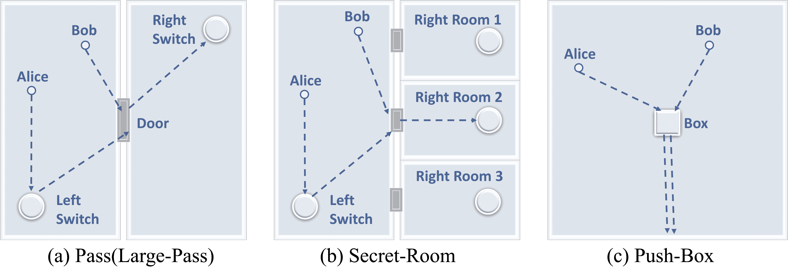

图10：MPE任务。

#### E.4.2 星际争霸II多智能体挑战（SMAC）

星际争霸II 多智能体挑战（SMAC）（Samvelyan 等，[2019a](https://arxiv.org/html/2410.02511v1#bib.bib132)）是协作多智能体强化学习研究领域中广泛使用的基准（Rashid 等，[2018](https://arxiv.org/html/2410.02511v1#bib.bib128); Shao 等，[2023](https://arxiv.org/html/2410.02511v1#bib.bib138); Liu 等，[2023](https://arxiv.org/html/2410.02511v1#bib.bib90); Shao 等，[2024](https://arxiv.org/html/2410.02511v1#bib.bib139)）。SMAC 源自著名的即时战略游戏《星际争霸II》，专注于去中心化的微操场景，而非完整的游戏。通常，SMAC 中的任务采用密集奖励框架，智能体因受到伤害、攻击并消灭敌人而获得密集奖励。为了促进探索的需求，我们在 SMAC 中采用完全稀疏奖励版本的任务，其中智能体仅在成功消灭所有敌人时获得奖励。外部奖励函数表示为 $r_{E}=I(all\ enemies\ are\ eliminated)$，其中 $I$ 代表指示函数。值得注意的是，这种稀疏奖励设置不同于某些先前研究中使用的稀疏 SMAC，可以称之为半稀疏 SMAC（Jeon 等，[2022](https://arxiv.org/html/2410.02511v1#bib.bib56); Jo 等，[2023](https://arxiv.org/html/2410.02511v1#bib.bib61)），在这种设置中，智能体在一个或所有敌人死亡或一个盟友死亡时获得奖励。此外，为了验证 LEMAE 在不同场景中的多样性，我们在六张具有不同难度和多样化智能体数量的地图上进行了实验，具体如表格 [4](https://arxiv.org/html/2410.02511v1#A5.T4 "Table 4 ‣ E.4.2 StarCraftII Multi-Agent Challenge (SMAC) ‣ E.4 Tasks ‣ Appendix E Implementation Details ‣ Choices are More Important than Efforts: LLM Enables Efficient Multi-Agent Exploration") 和表格 [5](https://arxiv.org/html/2410.02511v1#A5.T5 "Table 5 ‣ E.4.2 StarCraftII Multi-Agent Challenge (SMAC) ‣ E.4 Tasks ‣ Appendix E Implementation Details ‣ Choices are More Important than Efforts: LLM Enables Efficient Multi-Agent Exploration")。我们使用的是 SC2.4.10 版本。有关更多详细信息，请参阅官方文档²²2[https://github.com/oxwhirl/smac/blob/master/docs/smac.md](https://github.com/oxwhirl/smac/blob/master/docs/smac.md)。

表格 4：SMAC 任务。

| 任务 | 盟友单位 | 敌方单位 | 类型 | 难度 |
| --- | --- | --- | --- | --- |
| 1c3s5z | 1 个巨像，3 名追猎者，5 个狂热者 | 1 个巨像，3 名追猎者，5 个狂热者 | 异质 & 对称 | 容易 |
| 2m_vs_1z | 2 名海军陆战队员 | 1 个狂热者 | 微操技巧：交替射击 | 容易 |
| 3s_vs_5z | 3 名追猎者 | 5 个狂热者 | 微操技巧：风筝 | 难 |
| 5m_vs_6m | 5 名海军陆战队员 | 6 名海军陆战队员 | 同质 & 非对称 | 难 |
| 3s5z_vs_3s6z | 3 名追猎者，5 个狂热者 | 3 名追猎者，6 个狂热者 | 异质 & 非对称 | 超难 |
| MMM2 | 1 辑空机，2 名突击兵，7 名海军陆战队员 | 1 辑空机，3 名突击兵，8 名海军陆战队员 | 异质 & 非对称 | 超难 |

表5：SMAC任务的详细信息

| SMAC任务 | n_agents | n_enemies | 观察空间 | 状态空间 | 动作空间 |
| --- | --- | --- | --- | --- | --- |
| 2m_vs_1z | 2 | 1 | 16 | 26 | 7 |
| 1c3s5z | 9 | 9 | 162 | 270 | 15 |
| 3s_vs_5z | 3 | 5 | 48 | 68 | 11 |
| 5m_vs_6m | 5 | 6 | 55 | 98 | 12 |
| 3s5z_vs_3s6z | 8 | 9 | 136 | 230 | 15 |
| MMM2 | 10 | 12 | 176 | 322 | 18 |

#### E.4.3 一项全新的任务：River

为了排除LEMAE成功依赖于LLM对选定任务的熟悉度的可能性，我们设计了一个全新的任务，名为River，这是LLM从未遇到过的任务。任务的详细信息如下：

River任务改编自多粒子环境，其地图如图[8](https://arxiv.org/html/2410.02511v1#S5.F8 "Figure 8 ‣ 5.6 Scalability & Generalization Analysis ‣ 5 Experiments ‣ Choices are More Important than Efforts: LLM Enables Efficient Multi-Agent Exploration")a所示。两个代理，Alice和Bob，位于一个30x30的网格场地中，场地内有两条纵横交错的河流。左下角的山脉阻挡了通道。Alice和Bob从场地的左上角随机开始，需移动到右下角。然而，Alice害怕水，除非Bob停留在河里作为桥梁，否则她无法穿越河流。

观察空间是离散的，具有四个维度，表示两个代理的位置，即$o=[x_{1},y_{1},x_{2},y_{2}]$。动作空间也是离散的，允许在四个方向上移动。代理只有在两个代理都到达场地的右下角时才会获得正奖励。

### E.5 超参数

在LEMAE中，我们引入了三个重要的超参数：外部奖励缩放率$\alpha$、内部奖励缩放率$\beta$和高随机性epsilon$\epsilon_{h}$。值得注意的是，低随机性epsilon$\epsilon_{l}$是基础算法中的超参数，例如QMIX为0.05，IPPO为0.0。

对于MPE，我们在Pass、Secret-Room和Large-Pass任务上采用$\{\alpha=10,\beta=0.1,\epsilon_{h}=1\}$，在Push-Box任务上采用$\{\alpha=10,\beta=0.05,\epsilon_{h}=0.2\}$。

对于SMAC，我们在MMM2和1c3s5z任务上采用$\{\alpha=50,\beta=1,\epsilon_{h}=0.5\}$，在3s_vs_5z和2m_vs_1z任务上采用$\{\alpha=10,\beta=1,\epsilon_{h}=0.5\}$，在5m_vs_6m和3s5z_vs_3s6z任务上采用$\{\alpha=1,\beta=1,\epsilon_{h}=0.5\}$。

### E.6 资源

我们使用一台配备8个*NVIDIA RTX 3090 GPU*和2个*AMD 7H12 CPU*的服务器来运行所有实验。除非另有说明，否则每个设置会重复进行5次种子实验。在SC2中，每个种子的运行时间大约在50分钟到12小时之间。在MPE中，运行时间大约在3到7小时之间。每次LLM（GPT-4-1106-preview）推理的输入约为600-4000个tokens（0.006-0.04美元），输出约为300-1600个tokens（0.009-0.048美元）。

## 附录F 额外的实验结果

### F.1 更复杂的基准：SMACv2

我们在SMACv2中评估了LEMAE在三个典型任务（protoss_5_vs_5、terran_5_vs_5 和 zerg_5_vs_5）上的表现，以展示其在随机动力学设置下的有效性（Ellis等人，[2024](https://arxiv.org/html/2410.02511v1#bib.bib39)）。我们使用了SMAC中典型的超参数，应用于LEMAE和LAIES。如图[11](https://arxiv.org/html/2410.02511v1#A6.F11 "Figure 11 ‣ F.1 More Complicated Benchmark: SMACv2 ‣ Appendix F Additional Experimental Results ‣ Choices are More Important than Efforts: LLM Enables Efficient Multi-Agent Exploration")所示，LEMAE取得了出色的表现，确认了其在这些设置中的适用性。这个结果进一步证明了LEMAE在具有复杂性和随机性的真实场景中的潜力。

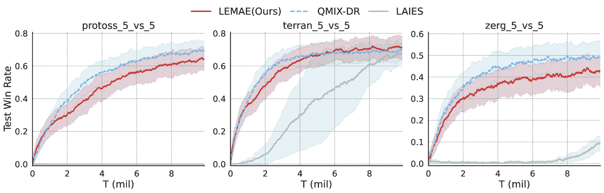

图11：在SMACv2中，通过在三个地图上的评估，使用测试胜率评估指标，评估LEMAE与基线方法的表现，SMACv2具有更高的随机性。QMIX-DR是原始SMACv2中使用密集奖励的QMIX。这个结果进一步证明了LEMAE在具有复杂性和随机性的真实场景中的潜力。

### F.2 将LEMAE扩展到符号任务之外

本研究主要关注具有符号状态空间的任务，其中状态通过符号数组表示，描述代理和环境。如附录[B.3](https://arxiv.org/html/2410.02511v1#A2.SS3 "B.3 Future Works ‣ Appendix B Further Discussions ‣ Choices are More Important than Efforts: LLM Enables Efficient Multi-Agent Exploration")中讨论的那样，为了将LEMAE从符号任务扩展到基于视觉的任务，我们可以在LEMAE中将LLM替换为多模态语言模型，以实现关键状态的定位。为了确认LEMAE在基于视觉的任务中的适用性，我们进行了一个示范实验：我们将任务Pass扩展为基于视觉的任务Visual-Pass，如图[12](https://arxiv.org/html/2410.02511v1#A6.F12 "Figure 12 ‣ F.2 Extending LEMAE Beyond Symbolic Tasks ‣ Appendix F Additional Experimental Results ‣ Choices are More Important than Efforts: LLM Enables Efficient Multi-Agent Exploration")a所示。我们提示一个LLM使用与第[4.2](https://arxiv.org/html/2410.02511v1#S4.SS2 "4.2 Key States Localization with LLM ‣ 4 Method ‣ Choices are More Important than Efforts: LLM Enables Efficient Multi-Agent Exploration")节中提出的相同任务描述和角色指令来定义关键状态，并将LLM生成的定义作为提示，输入到视觉语言模型（GPT-4o）中。然后，模型被提示在随机抽取的状态中区分关键状态。GPT-4o在区分50个采样图像状态中的关键状态时达到了98%的准确率。这证实了通过适当扩展LLM，LEMAE可以消除对状态语义的依赖，并可以应用于其他任务，如视觉输入任务。

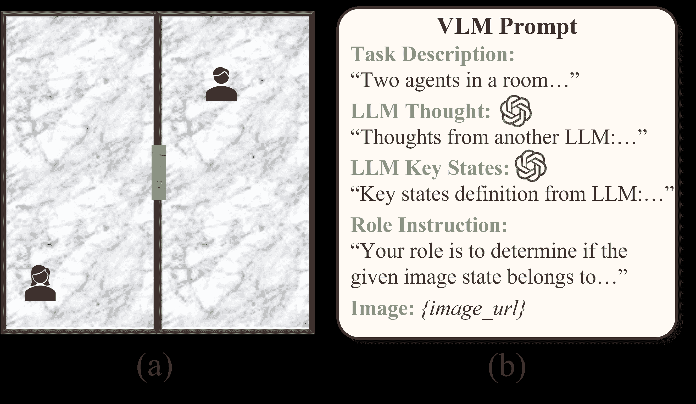

图12：（a）基于视觉的任务Visual-Pass的示意图。（b）视觉语言模型（VLM）的提示，其中包括任务描述、角色指令、图像状态以及由另一个LLM提供的关键状态定义。VLM的任务是判断给定的图像状态是否对应于关键状态。

### F.3 混合随机性探索的消融研究

如图[13](https://arxiv.org/html/2410.02511v1#A6.F13 "Figure 13 ‣ F.3 Ablation Studies on Mixed-Randomness Exploration ‣ Appendix F Additional Experimental Results ‣ Choices are More Important than Efforts: LLM Enables Efficient Multi-Agent Exploration")所示，我们在3s_vs_5z地图上进行了一项关于混合随机性探索的消融研究。结果表明，只要随机性水平保持适中（而不是过于极端，如0.1或0.9），LEMAE对参数$\epsilon_{h}$表现出不敏感性。此外，通过与LEMAE及其变体（即仅叶子节点和LEMAE w/o KSMTE）的比较，我们突出了我们设计的有效性。

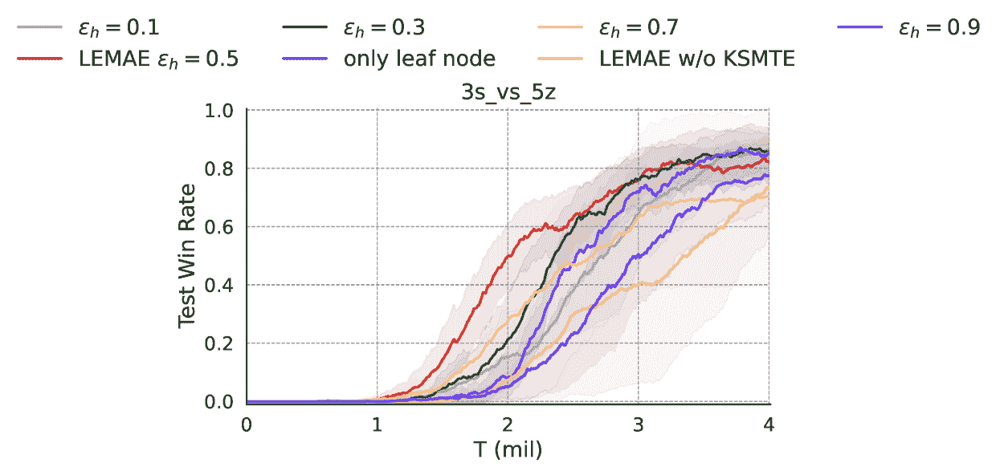

图13：关于混合随机性探索的消融研究。LEMAE中使用的默认超参数是$\epsilon_{h}=0.5$。鲁棒性评估包括$\epsilon_{h}$的变化范围为$[0.1,0.3,0.7,0.9]$。唯一的叶子节点表示仅使用$\epsilon_{l}$作为非叶子节点，而使用$\epsilon_{h}$作为叶子节点。LEMAE w/o KSMTE表示没有混合随机性探索的LEMAE。

### F.4 单一智能体设置的实验

确实，我们提出LEMAE作为一种通用方法，用于强化学习中LLM驱动的高效探索，适用于单一智能体和多智能体设置。我们强调了在多智能体设置中评估其性能，因为其固有的复杂性。

由于所提方法可以无缝扩展到单一智能体场景，我们引入了MPE的单一智能体变体，并评估了PPO（Schulman等，[2017](https://arxiv.org/html/2410.02511v1#bib.bib136)）和基于PPO的LEMAE在四个任务中的表现。我们使用三个随机种子运行每个算法，并进行300k环境步数的训练，评估指标为测试胜率。下表显示了LEMAE在单一智能体场景中能够促进高效探索。

表6：LEMAE和PPO在MPE任务单一智能体变体上的最终测试胜率。

| 单一MPE | PPO | LEMAE |
| --- | --- | --- |
| 单次通行 | 0.00$\pm$0.00 | 1.00$\pm$0.00 |
| 单一秘密房间 | 0.00$\pm$0.00 | 0.98$\pm$0.01 |
| 单一大型通行 | 0.00$\pm$0.00 | 0.99$\pm$0.01 |
| 单一推箱子 | 0.00$\pm$0.00 | 0.96$\pm$0.08 |

### F.5 关于KSMT的讨论

使用KSMT可能会因某些场景下的潜在内存成本而产生限制。然而，在我们的实验中，这并没有成为一个显著的问题，因为关键状态相对较少，主要集中在最关键的状态之间，且这些状态通常存在自然的顺序关系。值得注意的是，LEMAE也兼容其他内存结构，例如有向无环图（DAG），这可能是未来探索的一个有趣方向。

为了展示LEMAE与其他内存结构的有效性，在任务完成遵循线性模式的场景下（例如，$Init\rightarrow A\rightarrow B\rightarrow Success$），我们采用了一种更高效的策略，使用KSMT变体，单分支代表关键状态的顺序。具体来说，我们系统地为每个关键状态分配优先级值，并根据其在获得的关键状态序列中的出现顺序不断更新该值。在单分支KSMT中，关键状态的排名是基于这一优先级来确定的。

如图[14](https://arxiv.org/html/2410.02511v1#A6.F14 "Figure 14 ‣ F.5 Discussion on the KSMT ‣ Appendix F Additional Experimental Results ‣ Choices are More Important than Efforts: LLM Enables Efficient Multi-Agent Exploration")所示，我们进行了一个消融研究，比较了原始KSMT与单分支KSMT变体在SMAC中六张地图上的表现。结果表明，在涉及更多代理和更高复杂度的任务中，例如5m_vs_6m、3s5z_vs_3s6z和MMM2，采用单分支KSMT变体变得更加必要。因此，我们在这些特定的SMAC任务（5m_vs_6m、3s5z_vs_3s6z和MMM2）中采用了单分支KSMT方法。

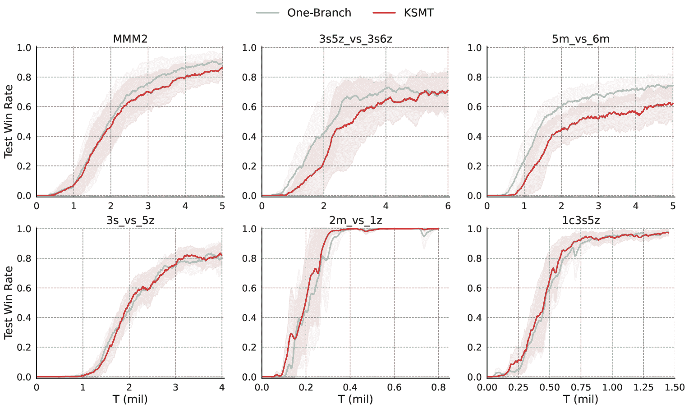

图14：消融研究，比较了原始KSMT与单分支KSMT变体在SMAC中六张地图上的表现。

#### F.5.1 在密集奖励设置下的工作

我们还在SMAC中的密集奖励任务中评估了LEMAE，记作LEMAE-DR。如图[15](https://arxiv.org/html/2410.02511v1#A6.F15 "Figure 15 ‣ F.5.1 Working with dense reward settings ‣ F.5 Discussion on the KSMT ‣ Appendix F Additional Experimental Results ‣ Choices are More Important than Efforts: LLM Enables Efficient Multi-Agent Exploration")所示，结果确认LEMAE-DR在密集和稀疏奖励设置中都能促进高效的探索，突显了我们方法的主要贡献。此外，LEMAE-DR由于密集奖励提供的指导，比LEMAE实现了更好的收敛性。

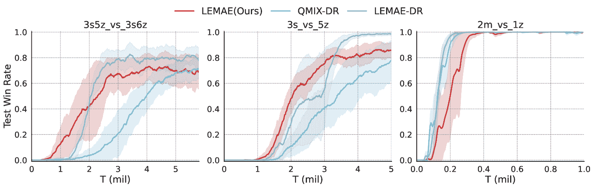

图15：使用测试胜率作为评估指标，在SMAC中评估LEMAE在三个地图上的密集奖励效果。LEMAE-DR是原始SMAC中的LEMAE与密集奖励的结合，能够有效确保高效探索并实现更好的收敛。

### F.6 额外结果

表 7：LEMAE 和可比基线（CMAE）在 MPE 任务中的最终测试胜率。

| MPE | LEMAE（我们的方法） | CMAE |
| --- | --- | --- |
| Pass | 1.00$\pm$0.00 | 0.75$\pm$0.43 |
| Secret-Room | 1.00$\pm$0.00 | 0.80$\pm$0.40 |
| Push-Box | 1.00$\pm$0.00 | 0.80$\pm$0.40 |
| Large-Pass | 1.00$\pm$0.00 | 0.00$\pm$0.00 |

表 8：LEMAE 和可比基线（LAIES）在 SMAC 任务中的最终测试胜率。QMIX-DR 表示训练使用稠密奖励的 QMIX。

| SMAC | LEMAE（我们的方法） | LAIES | QMIX-DR |
| --- | --- | --- | --- |
| 1c3s5z | 0.98$\pm$0.02 | 0.89$\pm$0.09 | 0.99$\pm$0.01 |
| 2m_vs_1z | 1.00$\pm$0.01 | 0.73$\pm$0.24 | 1.00$\pm$0.01 |
| 3s_vs_5z | 0.83$\pm$0.07 | 0.10$\pm$0.12 | 0.66$\pm$0.16 |
| 5m_vs_6m | 0.74$\pm$0.08 | 0.68$\pm$0.10 | 0.78$\pm$0.08 |
| 3s5z_vs_3s6z | 0.73$\pm$0.14 | 0.45$\pm$0.35 | 0.73$\pm$0.07 |
| MMM2 | 0.89$\pm$0.08 | 0.62$\pm$0.25 | 0.90$\pm$0.05 |

表 9：使用成功状态的探索步骤数（千计）这一指标，比较 LEMAE 和 SOTA 基线 CMAE 在 MPE 四张地图上的表现

| MPE | LEMAE（我们的方法） | CMAE | 加速率 |
| --- | --- | --- | --- |
| Pass | 153.1$\pm$20.7 | 2114.8$\pm$157.4 | 13.8 |
| Secret-Room | 316.6$\pm$134.6 | 1448.5$\pm$467.2 | 4.6 |
| Push-Box | 159.0$\pm$42.5 | 972.3$\pm$887.3 | 6.1 |

| Large-Pass | 446.9$\pm$256 | >3000 | >6.7 | 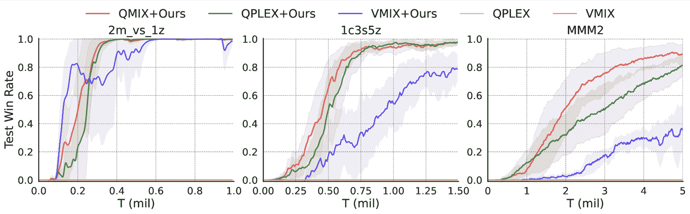

图 16：评估将我们的方法与多种算法结合时的训练曲线。

本节提供了一些额外的实验结果。

正如表[7](https://arxiv.org/html/2410.02511v1#A6.T7 "表 7 ‣ F.6 额外结果 ‣ 附录 F 额外实验结果 ‣ 选择比努力更重要：LLM 实现高效的多智能体探索")和表[8](https://arxiv.org/html/2410.02511v1#A6.T8 "表 8 ‣ F.6 额外结果 ‣ 附录 F 额外实验结果 ‣ 选择比努力更重要：LLM 实现高效的多智能体探索")所示，我们通过在 MPE 和 SMAC 任务中与可比的基线算法对比，增强了我们提出的 LEMAE 方法的最终测试胜率。这一增强有助于阐明我们方法的优越性能。需要注意的是，基线算法的性能在训练曲线中表现较差，因此为了简洁起见，未在表格中列出这些算法。

正如表[9](https://arxiv.org/html/2410.02511v1#A6.T9 "表 9 ‣ F.6 额外结果 ‣ 附录 F 额外实验结果 ‣ 选择比努力更重要：LLM 实现高效的多智能体探索")所示，我们使用成功状态的探索步骤数量这一指标，将 LEMAE 与 SOTA 基线 CMAE 进行了比较。结果表明，LEMAE 在探索加速率上取得了显著的提升，最高达到 10 倍，凸显了其卓越的效率。

此外，如图[16](https://arxiv.org/html/2410.02511v1#A6.F16 "Figure 16 ‣ F.6 Additional Results ‣ Appendix F Additional Experimental Results ‣ Choices are More Important than Efforts: LLM Enables Efficient Multi-Agent Exploration")所示，我们在评估将我们的方法与各种算法（即QPLEX和VMIX）结合的有效性时，补充了训练曲线。
