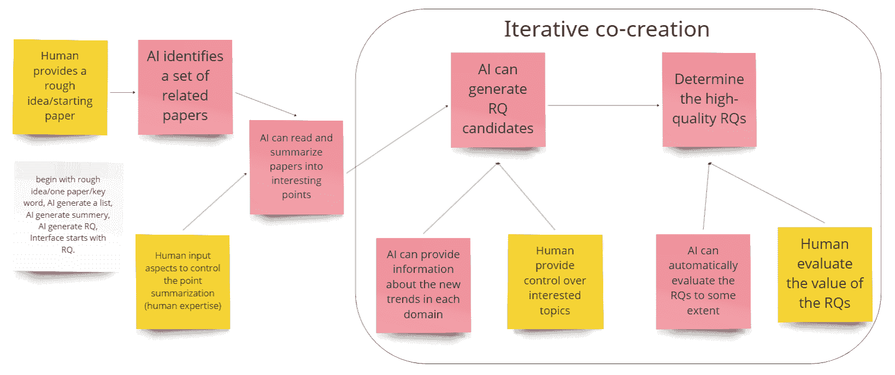

<!--yml

类别：未分类

日期：2025-01-11 13:04:05

-->

# CoQuest: 探索基于大型语言模型的智能体在研究问题共创中的应用

> 来源：[https://arxiv.org/html/2310.06155/](https://arxiv.org/html/2310.06155/)

刘一任 [yirenl2@illinois.edu](mailto:yirenl2@illinois.edu) 伊利诺伊大学厄本那-香槟分校，美国，陈思 [sic3@illinois.edu](mailto:sic3@illinois.edu) 伊利诺伊大学厄本那-香槟分校，美国，程浩聪 [haocong2@illinois.edu](mailto:haocong2@illinois.edu) 伊利诺伊大学厄本那-香槟分校，美国，余梦霞 [myu2@nd.edu](mailto:myu2@nd.edu) 圣母大学，美国，任晓 [xiaor2@illinois.edu](mailto:xiaor2@illinois.edu) 伊利诺伊大学厄本那-香槟分校，美国，莫安德鲁 [jiajunm3@illinois.edu](mailto:jiajunm3@illinois.edu) 伊利诺伊大学厄本那-香槟分校，美国，唐一柳 [yiliut2@illinois.edu](mailto:yiliut2@illinois.edu) 伊利诺伊大学厄本那-香槟分校，美国，黄云 [yunhuang@illinois.edu](mailto:yunhuang@illinois.edu) 伊利诺伊大学厄本那-香槟分校，美国（2024年；2024年）

###### 摘要。

开发新颖的研究问题（RQ）通常需要广泛的文献综述，尤其是在跨学科领域。为了支持通过人机协同创造研究问题，我们利用大型语言模型（LLM）构建了一个基于LLM的智能体系统，命名为CoQuest。我们与20位HCI（人机交互）研究人员进行了一次实验，考察了两种互动设计对RQ生成的影响：广度优先和深度优先。研究结果显示，参与者在任务完成后认为广度优先的方法更具创意且更值得信赖。相反，在任务进行过程中，参与者认为深度优先生成的RQ更具创意。此外，我们发现AI处理延迟使得用户能够同时反思多个RQ，从而生成更多的RQ并增强了控制感。我们的工作通过提出并评估一个人机共创RQ的心理模型，做出了理论和实践上的贡献。我们还探讨了潜在的伦理问题，如偏见和过度依赖AI，提倡使用该系统来提升人类的研究创造力，而不是自动化科学探究。该系统的源代码可在以下链接获取：[https://github.com/yiren-liu/coquest](https://github.com/yiren-liu/coquest)。

科学发现，大型语言模型，共同创造系统，混合倡议设计^†^†版权：acmcopyright^†^†期刊年份：2024^†^†doi：XXXXXXX.XXXXXXX^†^†会议：；；檀香山，夏威夷^†^†书名：CHI 2024^†^†价格：15.00^†^†isbn：978-1-4503-XXXX-X/18/06^†^†期刊年份：2024^†^†版权：acmlicensed^†^†会议：计算机系统中的人类因素 CHI 会议论文集；2024年5月11日至16日；夏威夷檀香山^†^†书名：计算机系统中的人类因素 CHI 会议论文集（CHI ’24），2024年5月11日至16日，夏威夷檀香山，美国^†^†doi：10.1145/3613904.3642698^†^†isbn：979-8-4007-0330-0/24/05^†^†ccs：以人为本的计算 人机交互领域的实证研究^†^†ccs：以人为本的计算 交互系统与工具^†^†ccs：计算方法 语义处理

图1. CoQuest 通过三面板设计：RQ 流编辑器、论文图可视化器和 AI 思想，使人类与 AI 共同创造研究问题（RQ）。RQ 流编辑器面板的主要功能包括：(a) 提供广度优先和深度优先的 RQ 生成方式（见图 [4](https://arxiv.org/html/2310.06155v3#S5.F4 "图4 ‣ 5.1.2\. RQ 流编辑器：两种设计选项 ‣ 5.1\. CoQuest 交互设计 ‣ 5\. CoQuest 系统设计与实现 ‣ CoQuest：基于 LLM 的代理探索研究问题的共同创造")）；(b) 使用户能够根据生成的 RQ 向 AI 提供反馈，并在论文图可视化器面板中详细探索相关论文；(c) 当点击两个 RQ 之间的链接时，在 AI 思想面板上呈现 RQ 生成的理由。

这是 CoQuest 系统界面的概述。界面分为三面板。主面板是 RQ 流编辑器面板，具有两种设计选项，详见图4。此面板上展示了六个节点：左侧三个，右侧三个。左侧的三个节点分别与图中未包含的节点相连。左上角节点连接到右侧的三个节点，每条边上都有相关的文本。右上角的节点展开了更多内容，并且颜色不同。左上角的节点标记为（a），右上角展开的节点标记为（b），其中一条边标记为（c）。RQ 流编辑器面板右侧是论文图可视化器面板，呈现一个交互式图形。网络中的每个论文节点代表一篇论文。当选中一个论文节点时，该论文的详细信息会显示在图形下方的面板上。RQ 流编辑器面板的左下角是 AI 思想面板，其中有三块文本。

图 1. CoQuest 通过三面板设计实现了人类与人工智能共同创造研究问题（RQ），包括：RQ 流编辑器、论文图可视化工具和 AI 思维面板。RQ 流编辑器面板的主要功能包括：（a）提供广度优先和深度优先的 RQ 生成选项（见图 [4](https://arxiv.org/html/2310.06155v3#S5.F4 "图 4 ‣ 5.1.2\. RQ 流编辑器：两种设计选项 ‣ 5.1\. CoQuest 互动设计 ‣ 5\. CoQuest 系统设计与实现 ‣ CoQuest: 探索基于 LLM 的代理进行研究问题共创")）；（b）使用户能够根据生成的 RQ 向 AI 提供反馈，并在论文图可视化工具面板中详细探索相关论文；（c）当点击两个 RQ 之间的链接时，在 AI 思维面板中展示 RQ 生成的背后推理过程。

## 1\. 引言

确定研究问题（RQ）是科学研究和发现的关键步骤（Elio 等人，[2011](https://arxiv.org/html/2310.06155v3#bib.bib14)）。为了提出有创意且有价值的研究想法，研究人员通常从检索和梳理相关文献开始，尤其是当搜索涉及跨多个领域的工作时（Kang 等人，[2022](https://arxiv.org/html/2310.06155v3#bib.bib30)）。研究问题的形成也是一个迭代过程，研究人员首先有一个初步的想法或主题，然后进行文献搜索以完善这些想法，并不断重复这一过程，直到他们有一个令人满意的研究创意（Foster，[2004](https://arxiv.org/html/2310.06155v3#bib.bib19)）。阅读大量文献、综合整理并识别相关工作的过程可能非常耗时。

随着大规模语言模型（LLMs）的快速发展，学者们已经探讨了利用LLMs的潜力来支持研究文献发现过程（Ought, [2023](https://arxiv.org/html/2310.06155v3#bib.bib55); Qureshi et al., [2023](https://arxiv.org/html/2310.06155v3#bib.bib60); Consensus, [2023](https://arxiv.org/html/2310.06155v3#bib.bib10)），这帮助用户显著加快了文献发现的过程。与此同时，生成性人工智能技术的蓬勃发展也在各个领域得到广泛应用，促进了创造力的发展（Epstein et al., [2023](https://arxiv.org/html/2310.06155v3#bib.bib15); Yuan et al., [2022](https://arxiv.org/html/2310.06155v3#bib.bib88); Mirowski et al., [2023](https://arxiv.org/html/2310.06155v3#bib.bib49)）。例如，最近的一项研究发现，超过4.9%的用户使用ChatGPT支持创意构思（Fishkin, [2023](https://arxiv.org/html/2310.06155v3#bib.bib18)）。尽管近期的研究已经展示了使用较小语言模型生成新颖的研究问题（RQ）的潜力（Liu et al., [2023b](https://arxiv.org/html/2310.06155v3#bib.bib43)），但关于人类如何评估人工智能生成的研究问题仍然缺乏实证理解。鉴于大规模语言模型已知存在幻觉和缺乏事实准确性的问题（Ji et al., [2023](https://arxiv.org/html/2310.06155v3#bib.bib28)），创建高质量的研究问题需要来自人类研究人员的输入，因其拥有独特的背景和专业知识。使人类与人工智能共同创造新颖的研究问题，尤其有助于开展跨学科研究。

人类与人工智能共创的概念从混合主动系统的开创性研究中汲取了启示，在这些系统中，人类用户和计算机系统共同为一个共享目标做出贡献（Horvitz, [1999](https://arxiv.org/html/2310.06155v3#bib.bib24); Yannakakis et al., [2014](https://arxiv.org/html/2310.06155v3#bib.bib84)）。近年来的学术努力也提出了多种人类与人工智能共创系统的设计指南（Rezwana and Maher, [2022](https://arxiv.org/html/2310.06155v3#bib.bib63); Weisz et al., [2023](https://arxiv.org/html/2310.06155v3#bib.bib79); Lin et al., [2023](https://arxiv.org/html/2310.06155v3#bib.bib40)），进一步激发了混合主动系统的复杂设计考虑。例如，Rezwana 和 Maher（[2022](https://arxiv.org/html/2310.06155v3#bib.bib63)）探讨了人类与人工智能之间的主动权交换是否应设计为并行进行或轮流进行。然而，关于人工智能驱动的主动权或创造力对用户体验的影响，仍然存在实证研究的空白，例如他们对创作过程的认知、对人工智能的信任以及对控制感的体验。此外，这些因素对人类与人工智能共创成果的潜在影响，例如生成内容的质量，仍未得到充分研究。

为此，我们提出了一个新颖的系统，名为CoQuest，它允许AI代理通过利用LLM的力量并将人类的反馈纳入共创过程来启动研究问题生成。该系统由三个面板组成：支持研究问题生成的RQ流程编辑器、用于探索文献空间的论文图可视化工具和用于解释AI推理的AI思维。系统设计是通过一项形成性研究得出的，在这项研究中，我们邀请了四位研究人员口头表达他们期望的AI支持下的研究问题生成过程。该形成性研究得出了一个初步的关于人类与AI共创研究问题的心理模型。该系统设计通过一项同质实验进一步评估，参与者为20名HCI研究人员。

我们的工作做出了以下新颖且重要的贡献。首先，我们通过提出并评估一种新的心理模型，为人类与人工智能共同创造研究问题（RQ）的HCI研究领域做出了理论贡献。其次，我们提出了一个新的代理LLM系统，并实现了两种交互设计（广度优先和深度优先），在这些设计中，AI代理在支持用户开发研究问题时扮演了不同层次的主动角色。第三，通过与HCI研究人员进行的一项同质实验，我们获得了关于AI不同主动性如何影响用户感知体验和结果的新实证理解。具体而言，在整体体验上，广度优先设计让用户“感觉”更具创造力，并获得了更多的信任，尽管这一效果因用户的研究背景而有所不同；但在评价单个研究问题时，用户对深度优先问题的创造力评分更高。第四，通过密切观察参与者与AI的互动，我们发现了重要的共创行为，并提出了一项新的设计启示，即故意“放慢AI的速度”，给予用户探索共创空间的等待时间。这对用户获得更强的控制感尤其有益。最后但同样重要的是，我们讨论了本研究对设计伦理人类-人工智能共创系统的启示，以及潜在的伦理问题。我们主张采用基于LLM的系统来增强人类创造力，并支持构思和支架过程，而不是使用LLM生成的想法来自动化HCI研究。

## 2\. 相关工作

### 2.1\. 以人为主的文献发现与研究创意生成

学者们一直致力于理解研究人员如何进行文献发现和提出新研究思路的过程（Glueck 和 Jauch, [1975](https://arxiv.org/html/2310.06155v3#bib.bib21)；Pertsas 和 Constantopoulos, [2017](https://arxiv.org/html/2310.06155v3#bib.bib57)）。大量研究努力提出研究人员科学活动的模型（Palmer 等, [2009](https://arxiv.org/html/2310.06155v3#bib.bib56)；Vilar, [2015](https://arxiv.org/html/2310.06155v3#bib.bib72)；Benardou 等, [2010](https://arxiv.org/html/2310.06155v3#bib.bib2)）。例如，Foster（[2004](https://arxiv.org/html/2310.06155v3#bib.bib19)）从信息行为的角度提出了一个学术研究中思路形成的框架，该框架由三个主要部分组成：开放（初步探索）、定向（问题定义与文献调查）和整合（知识创生）。在这个框架中，文献发现和思路形成被讨论为一个递归和迭代的过程。许多研究也致力于理解研究人员如何为研究目的产生创新性思路（Yang 等, [2016](https://arxiv.org/html/2310.06155v3#bib.bib83)）。例如，Jing 等（[2015](https://arxiv.org/html/2310.06155v3#bib.bib29)）提出了一个通过本体构建实现知识重用的研究思路创生系统。之后，Guo 和 Laidlaw（[2020](https://arxiv.org/html/2310.06155v3#bib.bib22)）提出了一个通过主题建模和可视化支持研究构思的系统。最近，Liu 等（[2023b](https://arxiv.org/html/2310.06155v3#bib.bib43)）提出了使用生成性语言模型生成新的研究问题，该模型通过相关文献和HCI领域出版物中的明确书写的研究问题进行微调。然而，这些研究中没有任何一项利用大型语言模型（LLMs）或构建基于LLM的系统来研究人类与AI协作的研究问题（RQ）过程。

### 2.2\. 基于代理的大型语言模型（LLM）系统

最近，LLMs（OpenAI, [2023](https://arxiv.org/html/2310.06155v3#bib.bib53)；Touvron 等, [2023](https://arxiv.org/html/2310.06155v3#bib.bib70)）的成功激发了强烈的兴趣，推动了人们利用LLMs解决复杂任务的研究。最近，使用LLMs作为推理引擎构建自主代理以解决不同任务的探索热潮不断升温，这些任务包括软件开发（Shinn 等, [2023](https://arxiv.org/html/2310.06155v3#bib.bib66)；Qian 等, [2023](https://arxiv.org/html/2310.06155v3#bib.bib59)）、游戏（Wang 等, [2023b](https://arxiv.org/html/2310.06155v3#bib.bib74)）以及辅助社会科学研究（Ziems 等, [2023](https://arxiv.org/html/2310.06155v3#bib.bib92)）。

提出了系统设计，以改进由大语言模型（LLMs）支持的人类-人工智能交互系统中的提示方法（Wu等，[2022b](https://arxiv.org/html/2310.06155v3#bib.bib82)，[a](https://arxiv.org/html/2310.06155v3#bib.bib81)；Dang等，[2022](https://arxiv.org/html/2310.06155v3#bib.bib11)）。为了增强LLMs的推理能力，研究人员提出了几种提示框架，通过逐步分解和解决子任务，应用通用目的的提示技术来引导LLMs进行推理，例如链式思维（Chain-of-Thought）（Wei等，[2022](https://arxiv.org/html/2310.06155v3#bib.bib77)；Kojima等，[2022](https://arxiv.org/html/2310.06155v3#bib.bib35)），自一致性（Self-Consistency）（Wang等，[2023a](https://arxiv.org/html/2310.06155v3#bib.bib75)），最小到最大（Least-to-Most）（Zhou等，[2023](https://arxiv.org/html/2310.06155v3#bib.bib91)）。这些提示技术集中在提升LLMs在特定任务中的表现。为了构建具有自主性的LLM代理，Yao等人（[2022a](https://arxiv.org/html/2310.06155v3#bib.bib85)）提出了一种名为“ReAct”的提示框架，统一了LLMs进行推理、采取行动和观察结果的能力。最近关于基于LLM的提示工程的研究（Wang和Zhao，[2023](https://arxiv.org/html/2310.06155v3#bib.bib76)）探索了一种引入人类心理模型作为提示技术来提升LLM推理能力的可行方法。这些框架为问答推理或通用任务（Liu等，[2023c](https://arxiv.org/html/2310.06155v3#bib.bib42)）奠定了坚实的基础。在本文中，我们应用LLM构建了一个用于文献发现和研究构思的专业任务代理。

### 2.3. 设计人类-人工智能共创系统

许多人类-人工智能共创系统利用了生成式AI技术（Sun等，[2022](https://arxiv.org/html/2310.06155v3#bib.bib69)；Louie等，[2020](https://arxiv.org/html/2310.06155v3#bib.bib46)）。例如，Bilgram和Laarmann（[2023](https://arxiv.org/html/2310.06155v3#bib.bib3)）展示了生成式AI可以增强创新的早期阶段，例如探索、构思和数字原型制作。Epstein等人（[2022](https://arxiv.org/html/2310.06155v3#bib.bib16)）发现，用户预期的输出与系统实际输出之间的差异在创造新想法中起着关键作用。

学者和实践者们尝试为使用生成性AI制定设计指南（Weisz等，[2023](https://arxiv.org/html/2310.06155v3#bib.bib79)；Davis等，[2015](https://arxiv.org/html/2310.06155v3#bib.bib12)；Liu和Chilton，[2022](https://arxiv.org/html/2310.06155v3#bib.bib41)；Muller等，[2020](https://arxiv.org/html/2310.06155v3#bib.bib50)）。从基于角色的视角来看，人与AI的共创系统被发现与先前的系统有所不同，后者主要是机器为人类提供支持（Kantosalo和Jordanous，[2021](https://arxiv.org/html/2310.06155v3#bib.bib32)）。在共创系统中，人工智能和人类都可以被设计成在创作过程中主动提供创意成果（Oh等，[2018](https://arxiv.org/html/2310.06155v3#bib.bib52)；Guzdial等，[2019](https://arxiv.org/html/2310.06155v3#bib.bib23)）。Rezwana和Maher（[2022](https://arxiv.org/html/2310.06155v3#bib.bib63)）介绍了一个面向互动设计的共创框架（COFI），该框架根据参与方式将混合主动性系统设计分为两种类型：并行式和轮流式。近期的研究探索了混合主动性设计的评估（Kreminski等，[2022](https://arxiv.org/html/2310.06155v3#bib.bib36)；Withington和Tokarchuk，[2023](https://arxiv.org/html/2310.06155v3#bib.bib80)），应用领域包括诗歌创作和游戏设计。我们的研究旨在系统地建模共创过程，并为学术研究领域提供理论和实践上的启示。

本研究提出并检验了一种新的代理LLM系统，该系统通过结合LLM的推理能力与我们通过与实际研究人员的形成性研究发现的心理模型，帮助研究人员制定研究问题。我们还讨论了基于LLM的共创系统是否能利用用户研究结果促进信息收集和创意演化的过程，从而提供新的实证理解。

## 3. 研究问题

基于上述文献和已识别的研究空白，我们旨在解决以下研究问题：

1.  RQ1（感知与结果）：用户在使用CoQuest系统时，如何看待共创体验（例如，信任、控制感、创造感）和结果（生成的研究问题的创造性评分）？

1.  RQ2（行为）：当AI在共创过程中提供不同层次的主动性时，用户如何与其互动？

1.  RQ3（关系）：哪些行为因素与用户在人工智能共创中的增强感知体验和结果相关？

在本文的剩余部分，我们将首先展示形成性研究，我们在其中开发了一个初步的研究问题共同创作的心理模型，旨在探索人类与AI之间的互动。接着，我们介绍系统设计、实验研究，并按提出的研究问题顺序详细说明研究结果。最后，我们将深入讨论我们的研究发现所更新的心理模型，并探讨对未来工作的设计启示。请注意，在本文剩余部分，我们使用RQ1、RQ2和RQ3来指代我们的三个研究问题，而RQ和RQs则指代用户与AI共同创作的研究问题。

## 4\. 形成性研究

我们进行了一项形成性研究，目的是了解研究人员创建研究问题的认知过程。为了理解研究人员如何创建研究问题，我们首先与四位HCI（人机交互）研究人员进行了半结构化访谈，探讨他们如何制定研究问题。然后，我们组织了一个焦点小组，与同一组受访者一起讨论他们对研究问题共同创作系统的需求。

我们邀请了四位研究人员参加我们的半结构化访谈，以了解他们进行研究的过程。所有四位参与者都是博士研究人员。我们要求受访者描述他们最近一次从零开始启动研究项目的经历。大多数参与者提到，在查找相关文献之前，他们通常会从一个粗略的想法（例如，领域、关键词、应用场景）开始。参与者还强调，制定研究思路通常是一个迭代过程。通常，参与者会使用一个或多个假设性的研究问题/思路来促进相关文献的检索并识别研究空白。参与者描述这一过程既费时又费力。参与者还认为他们的研究问题创作过程具有层次性。一位参与者明确提到，创建研究问题自然类似于“思维导图”的形式，其中思路的发展逐渐“收缩”，但也可能有不同的分支。参与者描述道，初步的研究问题集通常较为广泛和一般化，随后可以在其前置主题下派生出子问题，这有助于在研究构思过程中作为常见的决策步骤，权衡具体与一般的思路。这个过程通常导致研究问题的演变，若将其可视化，可以画成一个研究问题的树形结构。这一过程后续为我们的系统设计提供了灵感，使其呈现为一个互动的“思维导图”，保留了研究问题发展的来源。

(a) 功能设计.

特性设计截图展示在这张图表中的便利贴上。便利贴被分为五个主题，每个主题中的便利贴数量不同。图表顶部还放置了三张黄色便利贴。

(a) 特性设计。

(b) 工作流程设计。

工作流程设计截图展示在这张图表中的便利贴上。右侧的六张便利贴处于一个矩形框内，框内写着“迭代共同创造”。左侧的五张便利贴在矩形框外。除了左侧的一张白色便利贴外，所有便利贴都与至少一张其他便利贴相连。

(b) 工作流程设计。

图 2. 参与者在焦点小组研究中使用 Miro 创建的内容截图。

在第一次访谈研究后，同样的参与者被邀请回到焦点小组会议中，在此次会议中，我们旨在根据他们的研究工作流程识别需求，并提出支持该过程的互动设计。焦点小组分为两步进行。首先，研究人员给参与者提供了三个人工智能系统创建的问题作为提示，然后让他们根据支持研究问题发展的基于 AI 的系统的背景来头脑风暴想法和设计期望。三个人工智能问题提示的设计如下：1）你会问人工智能系统什么问题？ 2）你希望提供哪些信息给模型，以便它为你生成研究问题？ 3）你目前如何生成研究问题？你认为人工智能模型能帮助你生成研究问题吗？参与者创作的想法如图 [2](https://arxiv.org/html/2310.06155v3#S4.F2 "图 2 ‣ 4\. 形成性研究 ‣ CoQuest：与基于大语言模型的代理探索研究问题共同创造") 所示。

在讨论并总结主题后，参与者被要求进入第二步，这一步灵感来自于参与式方法，在该步骤中，他们通过使用基于 AI 的研究问题共同创造系统来将自己置于一个假设的工作流程中。在焦点小组讨论中，我们发现参与者强调了在设计人类-AI 共同创造研究问题系统时的若干期望。参与者提到，系统应当能够强烈地控制用户输入（例如，想法、关键词和领域概念），以生成新的研究问题。同时，系统能够生成多种高多样性的研究问题也是一种首选设计，用户应该能够根据个人的偏好和专业选择输出结果。

人工智能与人类共同创造研究问题（RQ）：一种思维模型 完成形成性研究后，我们总结了研究结果并提出了一种新的思维模型，旨在捕捉人类与人工智能共同创造研究问题过程中的主要互动。

图3. 参与者与基于LLM的AI代理共同创造RQ的心理模型如下所示。带有AI图标的“动作”表示参与者认为AI能够显著减少“劳动”；而带有人类图标的动作则意味着参与者需要评估AI生成的RQ并提供反馈，以推动迭代过程。然而，很难确定人类和AI如何共享“精炼与重新定义”的任务，因为这取决于个人的专业知识和研究焦点的清晰度。

这是人类与基于LLM的代理共同创造RQ的心理模型。该模型包含四个组成部分：呈现RQ并解释AI思维（左下方，矩形），理解文献（中间，矩形），文献空间（顶部，圆柱形），以及精炼与重新定义（右下方，矩形）。从呈现RQ并解释AI思维到精炼与重新定义，有两个由用户驱动的活动：评估RQ的创造性、可行性等，并提供反馈。从精炼与重新定义到理解文献，有一个由用户和AI共同驱动的活动：整合人类反馈。从理解文献到呈现RQ并解释AI思维，有一个由AI驱动的活动：引导初始RQ。从理解文献到文献空间，有一个由AI驱动的活动：搜索与选择。从文献空间到理解文献，有一个由AI驱动的活动：总结与整合。该模型的输入为“初始想法/关键词”，输出为“明确定义的高质量RQ”。

图3. 参与者与基于LLM的AI代理共同创造RQ的心理模型如下所示。带有AI图标的“动作”表示参与者认为AI能够显著减少“劳动”；而带有人类图标的动作则意味着参与者需要评估AI生成的RQ并提供反馈，以推动迭代过程。然而，很难确定人类和AI如何共享“精炼与重新定义”的任务，因为这取决于个人的专业知识和研究焦点的清晰度。

提议的心理模型由三个主要组成部分构成：理解文献、呈现研究问题（RQ）并解释AI思维、以及细化和重新界定。以往的研究深入讨论了文献发现如何在科学研究过程中发挥重要作用（Foster, [2004](https://arxiv.org/html/2310.06155v3#bib.bib19); Palmer等人, [2009](https://arxiv.org/html/2310.06155v3#bib.bib56)）。然而，这些模型通常是在仅限人类的背景下进行讨论的。我们的形成性研究结果表明，在研究构思过程中，将AI视为“合作者”是至关重要的（Kim和Maher, [2023](https://arxiv.org/html/2310.06155v3#bib.bib34)）。细化研究问题也常被视为文献搜索和理解的一个子步骤。尽管研究构思与文献搜索相互依赖，我们的形成性研究结果表明，在这两个不同阶段，研究者的行为存在区别。文献发现过程通常涉及阅读和总结大量现有的工作。参与者强调了在文献搜索和发现过程中，特别是在不熟悉的领域中的挑战，并且表达了需要AI在这一过程中减少人类干预的需求。AI在执行事实总结和提炼发现及知识方面最为有效，然后再将其呈现给人类。相反，提出和细化研究问题通常需要更具创意的思维和超越过去知识的归纳。在这种情况下，通过设计混合主动性共同创作系统，确保人类和AI的合作至关重要，以便将人类的专业知识和偏好与AI的通用世界知识相结合。此外，我们的形成性研究结果明确了在研究问题共同创作过程中，评估研究问题作为一个附加环节的重要性。正如在形成性研究中所讨论的那样，该过程应利用人类的专业知识和进行后续研究及验证的能力。

设计需求：基于我们从焦点小组和提议的心理模型中获得的发现，我们还提出了以下系统设计需求：该系统应该能够 1）通过接受用户反馈，自动生成研究问题（RQ）候选项，协助用户的头脑风暴过程； 2）通过解释生成背后的理由，支持用户对AI输出结果的理解； 3）帮助用户发现相关文献并识别研究空白。

## 5. CoQuest系统设计与实现

基于我们从形成性研究中获得的发现，我们设计并实现了一个基于大语言模型（LLM）的系统，支持人类与AI共同创作创新的研究问题。在这一部分，我们提供了关于1）CoQuest系统三面板界面的设计细节，包括两种不同的设计，提供不同程度的AI主动性；以及2）CoQuest系统的代理LLM后端的设计细节。

### 5.1\. CoQuest互动设计

为了支持RQ共同创作，我们设计了CoQuest系统的功能，围绕用户与AI之间的双向交流展开，在交流过程中用户和AI轮流进行交互。如图[1](https://arxiv.org/html/2310.06155v3#S0.F1 "Figure 1 ‣ CoQuest: Exploring Research Question Co-Creation with an LLM-based Agent")所示，我们提出的系统由三个主要面板组成：

1.  (1)

    RQ流程编辑器，便于用户进行主要操作，如生成RQ、向AI提供输入和反馈、以及编辑RQ流程（例如，拖动和删除）；

1.  (2)

    文献图可视化工具，展示与每个RQ相关的文献空间；

1.  (3)

    AI思路，解释AI生成每个RQ的理由。

#### 5.1.1\. 示例用户演练

假设有一个使用CoQuest系统的用户，Jamie，是一名人机交互方向的博士生。Jamie之前已经熟悉与在线学习系统的互动设计相关的文献。最近，通过接触到关于虚拟现实（VR）和增强现实（AR）应用的社交媒体讨论，他们想探索这些应用在在线学习领域的潜力。Jamie最初想到了利用AR促进学习者的头脑风暴。然而，由于对VR和AR领域的文献了解不深，他们发现很难进一步完善和提升这个想法。

在使用CoQuest系统时，Jamie首先创建了一个初步的想法节点，输入了“使用AR促进头脑风暴”，然后右键点击该节点，选择“生成RQ”以使用RQ流程编辑器生成后续的RQ。CoQuest系统根据Jamie的初步想法，检索了几篇与该想法相关的文献，并生成了跟进的RQ节点及其理由。Jamie首先看到其中一个RQ节点，RQ内容为：“如何设计社交AR以促进协作型头脑风暴？”

Jamie对生成的RQ感到兴趣，但也有些困惑，因为“社交AR”这一概念对他们来说是新的。于是，Jamie点击了RQ节点，并浏览了在文献图可视化工具面板上显示的论文。几篇论文似乎与Jamie相关，他们进一步点击了提供的链接，详细阅读了这些论文。CoQuest系统检索到的文献帮助Jamie理解了生成的RQ背后的领域知识。

阅读后，Jamie心里产生了一个问题——“为什么使用AR对协作型头脑风暴很重要？”他们随后将这个问题输入作为用户反馈并点击生成新的RQ，跟进之前的RQ。新生成的RQ之一，“如何通过AR中的空间设计促进基于小组的协作型头脑风暴”，引起了Jamie的兴趣。

“空间设计”这一概念的出现激发了Jamie的兴趣，但他们对系统如何从前一个问题生成这个RQ的原理并不清楚。通过点击连接这个RQ和其前驱的边，他们能够查看AI思想面板，解释代理LLM在CoQuest后台为生成该RQ所采取的原理和行动。面板显示，系统执行了“假设用户案例”这一动作，其中一个生成的使用案例显示为“在线学习者可以通过在空间AR环境中创建和组织概念和链接来形成小组并组织想法。”

#### 5.1.2. RQ流程编辑器：两种设计选项

CoQuest提供了一个互动式RQ流程编辑器面板，允许用户以迭代的方式与AI共同创建RQ。该面板的设计类似于思维导图的布局，其中每个RQ节点代表一个生成的RQ（初始节点除外，初始节点仅包含用户的初步想法）。这使得用户能够在不同的主题下更容易地组织RQ，同时保持不同RQ之间的层级结构，正如[2](https://arxiv.org/html/2310.06155v3#S4.F2 "图2 ‣ 4\. 形成性研究 ‣ CoQuest：探索基于LLM代理的研究问题共创")章节中的形成性研究结果所建议的那样。用户可以通过创建初始节点输入自己的粗略想法或关键词。当用户点击某个节点时，节点会展开，用户可以：1) 在文本框中输入对AI的文本反馈；以及2) 右键单击该节点生成更多后续的RQ。生成的RQ将通过带注释的边与源RQ节点连接。RQ生成将导致一个或多个有向无环图（DAGs），我们以后将其称为RQ流程，嵌入了生成的RQ之间的层级关系。用户可以使用RQ流程编辑器进行基本的交互，包括放大/缩小和拖动节点以组织流程，从而帮助他们的思维过程。

两种具有不同级别AI主动性的设计选项：广度优先生成和深度优先生成。我们为CoQuest系统考虑的主要设计选项之一是AI在共同创作过程中主动性程度的选择。在形成性研究期间，我们理解了用户如何以层次化的形式制定他们的研究问题，其中后续的研究问题（RQ）是基于前置的研究问题（RQ）迭代生成的。直观来看，在制定不同的研究问题时，研究人员可能会选择以更广泛的方式探索不同的主题，或深入研究某一特定主题。因此，在系统生成新的研究问题时，我们考虑了两种不同的设计，如图[4](https://arxiv.org/html/2310.06155v3#S5.F4 "Figure 4 ‣ 5.1.2\. RQ Flow Editor: Two Design Options ‣ 5.1\. CoQuest Interaction Design ‣ 5\. CoQuest System Design and Implementation ‣ CoQuest: Exploring Research Question Co-Creation with an LLM-based Agent")所示：1）广度优先生成：当用户启动后续研究问题的生成时，多个研究问题会同时并行生成。这些新问题都处于与原问题相同的层次级别。2）深度优先生成：相比之下，采用此方法时，当用户启动生成时，后续的研究问题会一个接一个地生成，每个新问题都会在顺序上基于前一个问题进行构建。

这两种设计影响了CoQuest系统中AI的主动性程度。在广度优先生成下，用户将有自由选择从多个生成的研究问题中挑选，并在每一轮生成时提供反馈，随后如果需要，可以继续生成更多的研究问题。而在深度优先生成中，代理会在没有用户输入的情况下递归地生成一系列研究问题。在深度优先生成过程中，代理需要根据前一步的结果进一步“细化”研究问题，因此在共同创作过程中表现出更多的主动性。尽管在这两种设计中，AI通过与人类轮流参与共同创作，但AI所采取的主动性存在差异，在深度优先生成中，AI相比于广度优先生成展现出更为积极的参与。通过在这两种设计下进行的被试内研究，我们旨在提供一种经验性的理解，探索主动性驱动的设计选项如何影响用户在使用人类与AI共同创作系统时的行为和感知。为了简化研究设计，我们确保在两种设计下每轮生成三个研究问题。

图4。CoQuest系统中的RQ流程编辑器面板展示了两种不同的研究问题（RQ）生成设计：广度优先和深度优先方法。广度优先生成方法旨在通过一次迭代触发多个RQ的生成，便于广泛探索潜在的研究领域。相比之下，深度优先生成则侧重于触发更多的RQ精炼迭代，使AI能够更深入地探索特定主题，从而进行更为集中的详细探索。

两种设计选项并排展示。左侧是设计选项1：广度优先生成。从左侧的源RQ节点出发，三个生成的RQ节点通过箭头与右侧连接。额外的箭头指向这三个生成的RQ节点，表示这三条箭头属于迭代1。右侧是设计选项2：深度优先生成。从源RQ节点出发，第一个生成的RQ节点通过箭头连接。额外的箭头指向第一个生成的RQ节点，表示这是迭代1。从第一个生成的RQ节点出发，第二个生成的RQ节点通过箭头连接。额外的箭头指向第二个生成的RQ节点，表示这是迭代2。从第二个生成的RQ节点出发，第三个生成的RQ节点通过箭头连接。额外的箭头指向第三个生成的RQ节点，表示这是迭代3。

图4。CoQuest系统中的RQ流程编辑器面板展示了两种不同的研究问题（RQ）生成设计：广度优先和深度优先方法。广度优先生成方法旨在通过一次迭代触发多个RQ的生成，便于广泛探索潜在的研究领域。相比之下，深度优先生成则侧重于触发更多的RQ精炼迭代，使AI能够更深入地探索特定主题，从而进行更为集中的详细探索。

#### 5.1.3\. 论文图可视化器：交互式文献图

CoQuest系统还提供了基于LLM的文献发现功能，帮助用户高效地识别和探索与每个生成的RQ相关的现有工作。如图[1](https://arxiv.org/html/2310.06155v3#S0.F1 "图1 ‣ CoQuest：基于LLM代理的研究问题共创探索")所示，CoQuest的文献发现功能呈现在论文图可视化器面板中。

当用户点击生成的任一RQ节点时，论文图可视化面板会展示自己，通过可视化从我们的引文图中检索到的最相关的前k篇论文及其引用关系。前k篇论文是通过我们的论文检索管道检索出来的，具体流程见第[5.2.2](https://arxiv.org/html/2310.06155v3#S5.SS2.SSS2 "5.2.2\. 相关论文检索. ‣ 5.2\. CoQuest 后端和实现 ‣ 5\. CoQuest 系统设计和实现 ‣ CoQuest: 探索基于LLM的代理共同生成研究问题")节，查询使用的是用户点击的RQ文本。在展示的引文图中，每个论文节点代表一篇论文，每条边代表一种引用关系。当用户将光标悬停在某个论文节点上时，会出现一个提示框，快速预览该论文的标题信息。

引文图中的论文节点被设计为可交互。当用户点击某个论文节点时，所选论文的详细信息会显示在下面。显示的信息包括论文的标题、作者姓名、摘要、由Semantic Scholar API提供的TLDR摘要¹¹1https://www.semanticscholar.org/product/api，以及指向该论文在Semantic Scholar页面的URL。点击论文节点后，论文图可视化面板还会高亮所选节点及其最邻近的邻居节点（节点和边），以指示哪些论文直接引用了所选论文或被所选论文引用。

#### 5.1.4\. AI 思考：解释AI的推理

RQ节点之间的边表示新生成的RQ所依据的原RQ的关系。它们还包含有关代理执行的操作结果的信息，这些操作最终生成了新的RQ。当用户点击某条边时，AI 思考面板会以叙述格式显示代理的操作结果，如图[1](https://arxiv.org/html/2310.06155v3#S0.F1 "图1 ‣ CoQuest: 探索基于LLM的代理共同生成研究问题")所示。下文将详细介绍用于生成RQ及其推理的基于LLM的后端实现。

图5. CoQuest框架示意图；HCI研究者的心理模型被用来构建一个基于LLM的代理，该代理能够访问和查询文献集合，以生成研究问题(RQs)。该代理不仅向用户展示生成的RQ，还通过前端界面提供生成过程的合理性解释和文献依据。用于构建代理的提示示例可以在附录[A.3](https://arxiv.org/html/2310.06155v3#A1.SS3 "A.3\. 基于LLM的代理提示与响应示例 ‣ 附录A 附录 ‣ CoQuest: 探索基于LLM的代理共同生成研究问题")中找到。

该图展示了一个用于研究共同创作平台的用户界面图示。图中描绘了几个组件。用户：这可能是用户输入信息或与系统互动的地方。系统接口：展示了一个包含多个阶段的工作流程，可能表明用户如何创建研究问题（RQ创建）并查看相关研究论文的可视化表示（论文图）。AI思维面板：这可能是一个系统提供反馈或建议的区域，帮助用户缩小研究问题的范围。CoQuest代理：图中展示了一个机器人图标，暗示着一个帮助研究过程的AI或机器学习组件。LLM：指的是语言学习模型，表示一个处理自然语言输入的机器学习模型。共同创作心智模型：这一部分似乎包括了一个概念框架，描述研究人员如何与系统互动。文献库：一个研究文献的数据库或集合，系统从中提取资料。论文图可视化面板：此面板根据所选的研究问题展示相关论文和引用。该图示详细且使用了齿轮、放大镜和机器人等符号来表示平台内不同的功能或过程。整体设计暗示着一个复杂的系统，旨在通过AI驱动的洞察和学术论文数据库来促进协作研究工作。

图5. CoQuest框架的示意图；HCI研究人员的心智模型用于构建基于LLM的代理，能够访问和查询文献集合以生成研究问题（RQ）。该代理不仅向用户呈现生成的RQ，还通过前端接口提供生成过程的推理和文献依据。用于构建该代理的提示示例可在附录[A.3](https://arxiv.org/html/2310.06155v3#A1.SS3 "A.3\. 基于LLM的代理提示和响应示例 ‣ 附录A 附录 ‣ CoQuest: 探索基于LLM的代理在研究问题共同创作中的应用")中查看。

### 5.2\. CoQuest后台与实现

CoQuest系统的后台由一个基于LLM的代理组成，该代理根据用户的输入和反馈自动生成研究问题（RQ），通过推理和执行模拟研究人员心智模型的操作，半自动化地进行研究过程。CoQuest后台的两个主要功能包括：1）LLM代理的RQ生成能力；2）支持文献发现的相关论文检索模块。系统后台与主要功能的框架示意图见图[5](https://arxiv.org/html/2310.06155v3#S5.F5 "图5 ‣ 5.1.4\. AI思维：解释AI推理 ‣ 5.1\. CoQuest交互设计 ‣ 5\. CoQuest系统设计与实现 ‣ CoQuest: 探索基于LLM的代理在研究问题共同创作中的应用")。

#### 5.2.1\. 使用基于 LLM 的代理生成 RQ。

CoQuest 系统使用基于 LLM 的代理，遵循 ReAct 框架（Yao 等，[2022b](https://arxiv.org/html/2310.06155v3#bib.bib86)）生成创意研究问题（RQ），通过在设计提示方法时适应“Think-Act-Observe”框架。首先，"Think" 步骤分析用户输入和上下文，以决定行动，类似于[2](https://arxiv.org/html/2310.06155v3#S4.F2 "图 2 ‣ 4\. 形成性研究 ‣ CoQuest：探索基于 LLM 的代理共同创作研究问题")中详细描述的人类研究方法。在这一轮中，LLM 会生成一系列思维链（遵循我们设计的提示），然后得出作为下一步行动的结论。这些行动是可执行的子过程，其结果将作为额外的上下文，帮助 LLM 生成更好的 RQ。可用的行动包括：1）搜索并总结相关文献（文献发现）；2）假设使用案例（假设）；3）范围界定/缩小（细化）；4）通过与现有工作对比进行反思（评估）。接下来，在“Act”和“Observe”步骤中，行动的执行通过提示以 API 调用的格式实现，并可以通过一个或多个预实现的 Python 函数（例如，retrieve_papers 和 summarize_papers）进行解析和执行。在“Think”步骤中推断出下一步行动后，代理执行该行动，并将该行动的结果添加到上下文中。最后，为了让代理在每个步骤中生成 RQ，我们在每个“Observe”步骤的末尾添加了生成 RQ 的额外步骤。在此步骤中，基于提供的上下文和结合执行的动作输出及预定义提示的指令生成新的 RQ。关于后台提示的详细使用，可以参考附录 [A.3](https://arxiv.org/html/2310.06155v3#A1.SS3 "A.3\. 基于 LLM 的代理提示和响应示例 ‣ 附录 A 附录 ‣ CoQuest：探索基于 LLM 的代理共同创作研究问题")。

#### 5.2.2\. 相关论文检索。

为了帮助用户更容易地识别相关的研究成果，CoQuest系统采用了检索管道来收集与用户正在开发的研究问题（RQ）相关的现有论文。我们从现有的HCI文献池中策划了一个文献引用图，其中节点代表论文，边表示引用关系。CoQuest系统使用基于句子的语义嵌入模型（Reimers和Gurevych，[2019](https://arxiv.org/html/2310.06155v3#bib.bib62)）来获得引用图中每篇论文的向量表示。给定论文的标题、元数据和摘要文本，以及给定的查询（例如，研究问题和用户输入），句子嵌入模型将它们编码为语义嵌入。获取论文和查询的嵌入后，系统计算论文候选和查询之间的相似度。这是通过使用最大边际相关性（MMR）（Carbonell和Goldstein，[1998](https://arxiv.org/html/2310.06155v3#bib.bib8)）重新排序来完成的。然后，系统对论文候选进行排序，并选择相似度得分最高的前k篇论文作为最终的相关论文进行可视化。检索管道的实现细节在[5.2.3](https://arxiv.org/html/2310.06155v3#S5.SS2.SSS3 "5.2.3\. 系统实现 ‣ 5.2\. CoQuest后端与实现 ‣ 5\. CoQuest系统设计与实现 ‣ CoQuest：探索与LLM代理的研究问题共同创作")中进行了详细讨论。

#### 5.2.3\. 系统实现

CoQuest系统是用Typescript实现的Web应用程序，前端使用ReactJS和TailwindCSS。交互式流程编辑器是使用React Flow²²2https://github.com/wbkd/react-flow/实现的。应用程序的后端使用Python与FastAPI³³3https://github.com/tiangolo/fastapi/作为RESTful API服务器框架。我们使用AutoGPT⁴⁴4https://github.com/Significant-Gravitas/Auto-GPT/作为我们的基于代理的LLM实现的基础⁵⁵5https://github.com/yiren-liu/coquest。我们使用OpenAI的gpt3.5-turbo-16k模型作为我们的LLM引擎，并通过微软Azure提供的云服务API使用text-embedding-ada-002模型作为句子嵌入模型。我们通过Semantic Scholar API收集了一组固定的开放获取出版物，涵盖了多个主要的HCI会议（包括CHI、CSCW、UIST、Group、IMWUT、IJHCI和IUI）。最终的出版物集合包括2043篇论文。

## 6\. 用户研究：评估与CoQuest的共同创作

为了进一步了解CoQuest系统的效果，以及RQ生成的两种设计如何影响用户的人工智能与人类共同创作行为，我们进行了一个被试内实验，邀请了来自8个不同机构的20名HCI研究人员，要求参与者使用CoQuest系统生成新的研究问题。所有参与者均为当前在读或刚毕业的研究生，且具备研究经验。在研究过程中，我们收集了参与者的行为和感知数据（即对研究问题的评价和对CoQuest系统的评价），以进行混合方法（定量和定性）分析。所有研究均通过视频通话远程在线完成，参与者需要共享屏幕。参与者也可以在研究的任何阶段自由退出。研究程序得到了参与者所在机构伦理委员会（IRB）的批准。我们为每位参与者提供每小时20美元的报酬。研究持续了1-2小时，包括两项使用两种设计（广度优先和深度优先生成）的任务，每项任务后都有一份问卷，以及一次退出面谈。

### 6.1\. 被试内实验 - 分配条件下的两项任务：广度优先与深度优先

为了理解用户在两种不同条件下的行为和对系统的感知差异，我们进行了一个被试内实验，条件分别为广度优先条件和深度优先条件。每位参与者需要完成两项任务：在每个任务中，我们要求参与者完成由研究人员设计的任务，以模拟研究构思的真实场景。此次研究使用的两个任务主题是：“教育与学习中的AR/VR”和“人工智能与众包”。选择这两个主题是因为它们涵盖了广泛的具体领域，并为用户提供了丰富的机会去探索并深入相关主题。为了考虑任务主题和条件的时间顺序对结果的影响，我们采用了平衡设计（Pollatsek 和 Well, [1995](https://arxiv.org/html/2310.06155v3#bib.bib58)），通过随机化实验条件，使所有可能的顺序和组合都被随机分配给等数量的参与者。鼓励参与者在任务过程中大声思考。

### 6.2\. 数据收集与分析

我们收集了用户的感知数据和行为数据，以对 CoQuest 系统进行全面评估。为了了解用户对 CoQuest 系统的感知，我们从参与者那里收集了两种类型的感知数据：每个生成的 RQ 的个别评分（RQ 评分），反映用户对其共同创作结果的感知；以及系统的整体任务后评估（系统评分），反映用户对共同创作体验的感知。用户的行为数据也通过系统日志和视频录制的形式收集，以供后续分析。

#### 6.2.1. 共同创作结果：在每个任务中对 AI 生成的 RQ 进行评分

RQ 评分是在每个任务进行过程中实时收集的，参与者被要求至少评定六个自己选择的 RQ。这些评分旨在捕捉用户对共同创作结果（即生成的 RQ）的即时感知。任务过程中评分的收集设计旨在引导用户在共同创作过程中积极评估 RQ，并且作为一种方式，实时反映用户的准确感知。我们采用 Boden 的标准（Boden, [2004](https://arxiv.org/html/2310.06155v3#bib.bib4)）从三个不同的方面——新颖性、价值、惊讶和相关性来衡量创造力。参与者可以使用一个 5 分 Likert 量表滑块，在每个 RQ 节点下进行评分。

#### 6.2.2. 感知体验：每个任务结束时收集的问卷评分和退出访谈

为了分析参与者使用我们系统时的感知体验，我们在每个任务完成后收集了他们的问卷评分，并在每个研究结束前进行了退出访谈。

问卷评分 然而，共同创作体验评分是由参与者在每个任务结束时通过问卷给出的。问卷包含多个 5 分 Likert 量表问题，旨在从以下几个方面衡量他们的体验：控制感、创造力、元创造力、认知负荷和信任。我们为每个方面设计了 2 个 Likert 量表问题，以避免潜在偏差并确保更全面的评估⁶⁶6收集到的问卷评分的 Cronbach’s Alpha 平均值为 $\alpha=.85$，表明具有良好的可靠性。完整的问卷问题列表可以在附录 [A.1](https://arxiv.org/html/2310.06155v3#A1.SS1 "A.1\. 后续调查问题 ‣ 附录 A 附录 ‣ CoQuest：探索基于 LLM 的代理与研究问题共同创作") 中找到。

退出访谈 在参与者完成任务后评分调查后，我们还进行了一个十分钟的半结构化访谈，以更深入了解参与者与系统的体验。访谈数据通过开放式编码进行分析，两位研究人员审阅了访谈转录，并频繁进行讨论（Khandkar，[2009](https://arxiv.org/html/2310.06155v3#bib.bib33)）。访谈编码突出了参与者在两种条件下的感知差异。为了衡量参与者对任务主题的熟悉度，我们还询问了参与者对这两个主题的熟悉程度，提供了三个选项：不熟悉、有点熟悉和非常熟悉。

#### 6.2.3\. 行为：思维大声说出数据与系统日志。

我们标注了用户的行为（思维大声说出转录和系统使用情况），以了解用户如何使用我们的系统。

思维大声说出（Co-Creation中的思维大声说出） 思维大声说出数据主要用于理解用户如何生成和解释RQ。一位研究人员首先通过开放编码，使用来自三位随机选择参与者的视频和转录资料生成了一个编码本，随后三位其他研究人员独立对同三位参与者的数据进行编码，最终在Krippendorf的α值中达到了0.83的评分一致性。标注员们随后进行了讨论并再次完善编码本，直到达成完全一致。接着，四位研究人员分别对剩余17名参与者的行为数据进行标注。在最终的编码本中，是否用户与系统进行了交互被标注并用于RQ3的定量分析，标注为“在等待期间有行为”。最终的编码本还包括意义构建行为（例如，等待的原因、是否等待的原因、提供某些反馈的原因）作为定性结果。

系统日志 在共同创作过程中，我们收集了多种类型的系统日志，以便后续分析用户行为。我们收集并使用了生成的RQ的计数和用户输入给AI的反馈长度，以进行RQ1和RQ3的定量分析。用户与组件（如RQ节点和AI思想）进行交互的行为（例如点击）被用作与思维大声说出数据一起进行定性分析。用户输入的反馈文本内容也被用作RQ2中的定性分析。

在本文中，我们使用了不同的符号来区分结果中呈现的不同类型的引述。对于AI生成的RQ，我们使用斜体（例如，AI生成的RQ）；对于反馈给AI的内容，我们使用双引号（例如，“反馈”）；对于访谈和思维大声说出的引述，我们使用双引号和斜体（例如，“访谈引述”）。

图6. 参与者通过5点李克特量表对系统的两种设计进行评分。调查评分显示，参与者在宽度优先条件下使用系统时，感受到的创造力和信任感显著更高。

有五个小提琴图（类似箱线图），展示了用户在五个维度上的5点Likert量表调查评分：控制、创造力、元创造力、认知负担、信任。每个小提琴图都有广度优先和深度优先两个并排显示。在控制方面，两种形状非常相似，具有相同的中位数和上限。广度优先的下限高于深度优先。在创造力方面，广度优先的中位数和上限高于深度优先，下限相同。在元创造力方面，上限和下限相同，但广度优先的中位数较高。在认知负担方面，两种形状非常相似，具有相同的中位数、上限和下限。在信任方面，广度优先的中位数、上限和下限均高于深度优先。

图6. 参与者使用5点Likert量表调查评估了他们对系统两种设计的感知。调查结果表明，当在广度优先条件下与系统互动时，参与者体验到显著更高的创造力和信任感。

## 7\. 研究结果

### 7.1\. 共同创作体验与结果的感知（RQ1）

广度优先条件允许用户在一次互动中并行生成多个研究问题，而深度优先条件则顺序生成三个研究问题，一次生成一个。在本节中，我们分析了这两种不同条件如何影响参与者对共同创作体验和结果的感知。

#### 7.1.1\. 体验：用户在广度优先条件下感知到更强的创造力和信任

总共有20名参与者在整个研究过程中创建了504个研究问题（RQ），其中276个研究问题（M=14.53，SD=6.19）是在广度优先条件下与CoQuest系统共同创建的，228个研究问题（M=12，SD=5.31）是在深度优先条件下创建的。为了评估共同创作过程的整体体验，我们要求参与者在完成每个任务后填写调查问卷。使用G*Power（Faul等，[2007](https://arxiv.org/html/2310.06155v3#bib.bib17)）进行的Mann-Whitney U检验⁷⁷7Power分析表明，用户在广度优先条件下使用系统时，感知到的创造力显著更强（$U=288.0$，$p=.015^{*},d=.68,Power=.83$）（M=3.78，SD=0.82），相比于深度优先条件（M=3.18，SD=0.69）。同样，用户在广度优先条件下感知到的信任（M=4.15，SD=0.76）显著高于深度优先条件（M=3.5，SD=0.86）（$U=292.0,p=.011^{*},d=.67,Power=.81$）。所有5个评分类别的结果见图[6](https://arxiv.org/html/2310.06155v3#S6.F6 "图6 ‣ 6.2.3\. 行为：思维过程数据与系统日志。 ‣ 6.2\. 数据收集与分析 ‣ 6\. 用户研究评估与CoQuest的共同创作 ‣ CoQuest：基于LLM的研究问题共同创作探索")。

在访谈中，20名参与者中的12名（60%）还提到他们更喜欢广度优先条件。在广度优先条件下，参与者（P4）在某次会议中生成的一个示例RQ流程如图[7](https://arxiv.org/html/2310.06155v3#S7.F7 "图7 ‣ 7.1.1\. 经验：用户认为使用广度优先条件能激发更强的创造力和信任 ‣ 7.1\. 共创体验与结果的感知（RQ1） ‣ 7\. 研究发现 ‣ CoQuest：探索与基于LLM的代理共同创建研究问题")所示。访谈和思维 aloud 的记录解释了为什么广度优先条件被认为能创造更好的体验。

图7. P4在探索“人工智能与众包”主题时使用广度优先条件的部分RQ流程。请注意，参与者在同一次迭代中从两个不同的RQ节点生成了内容，并且只展示了一组生成的RQ。参与者通过使用“人工智能与众包”和“教育环境”等关键词提供反馈，以帮助AI生成更多的RQ。第三次迭代未包括在此图中。

P4使用广度优先条件的RQ流程。从左侧开始，存在一个初始节点，用户反馈为“众包与人工智能”。它引导到三个RQ节点，每个边上都有相同的文本“BreadthL search_and_summarize_papers”。生成的RQ包括：人工智能如何用于提高众包的效率和质量；使用人工智能进行众包时的伦理影响；如何利用众包提高人工智能算法的准确性和有效性。第一个RQ与三个边连接，但来自它的三个RQ节点未包含在此图中。第三个RQ通过用户反馈“在教育环境中”进行扩展。该节点进一步引导到右侧的三个RQ节点，边上有相同的文本“Breadth: narrow_down_rqs”。这三个RQ节点包括：使用人工智能进行评分和评估时，在教育环境中可能涉及的伦理问题；在教育研究中使用人工智能进行众包的伦理影响；如何在教育环境中使用人工智能提高学生学习效果，同时最小化伦理问题。第三个RQ有三个更多的边连接，但生成的RQ节点未包含在此图中。

图7. P4在探索“人工智能与众包”主题时使用广度优先条件的部分RQ流程。请注意，参与者在同一次迭代中从两个不同的RQ节点生成了内容，并且只展示了一组生成的RQ。参与者通过使用“人工智能与众包”和“教育环境”等关键词提供反馈，以帮助AI生成更多的RQ。第三次迭代未包括在此图中。

首先，与深度优先条件相比，广度优先条件的结果更容易解释，且获取相同数量的研究问题（RQ）所需的等待时间更短。参与者表示，他们很欣赏AI能够并行地“一次性列出三个生成的RQ”（P10），这使他们能够轻松地“在RQ之间进行比较”（P10）并“探索多个潜在的研究问题”（P4）。在广度优先条件下，理解生成的RQ背后的原因也更容易，因为所有三个RQ共享相同的前置RQ和逻辑。尽管深度优先条件也能通过一次点击生成三个RQ，但参与者需要等待更长时间才能看到所有三个生成的RQ，而在广度优先条件下则不需要。因此，一些参与者倾向于集中关注第一个RQ，忽略另外两个RQ，或者如果最后一个RQ不理想，他们会从最后一个RQ开始，再回到前一个生成的RQ。

其次，参与者发现广度优先条件让他们在选择研究问题的方向上拥有更多控制权。由于三个选项并行列出，参与者能够选择自己最偏好的RQ，并基于它生成更多的后续RQ。树状结构设计还允许参与者突出显示与自己更相关的RQ，然后选择他们更感兴趣的分支。P14认为广度优先条件“认知负担较小”，而P16更喜欢在“一个主题下进行头脑风暴”时使用广度优先条件。另一方面，深度优先条件可能在第二次和第三次迭代中生成的RQ很难理解它们与第一次迭代之间的关系。例如，P6使用深度优先条件开始了一个关于“众包与AI”的RQ流程。虽然第一个问题和他们的反馈没有提到“医学诊断”这个词，但在第二次迭代后这个词出现了，但在第三次迭代后又消失了。在访谈中，他们提到深度优先条件“有时会来回反复”，而且很难理解“这三个节点为什么是父节点、子节点和孙子节点[关系]”。

图8. P2使用深度优先条件在探索“AI与众包”主题时的部分RQ流程。虚线表示第二次和第三次迭代生成的RQ，这些RQ并非基于用户反馈。从前三次迭代来看，参与者选择继续使用第一次迭代生成的RQ，然后提供反馈，要求AI更加具体。随后，AI生成了三个新的RQ，参与者再次选择继续使用这三者中的第一个（后续的RQ未包含在此图中）。

P2的RQ流程使用了深度优先条件。从左侧开始，有一个初始节点，用户反馈为“群体与AI协作用于寻找与研究问题相关的文献。”它引出了一个带有文本“depth: search_and_summarize_papers”的RQ节点，连接线为实线。该RQ是：我们如何设计能够与人类专家有效协作、寻找与研究问题相关文献的AI系统？这个RQ节点被扩展，用户反馈为“你能具体说明一下AI系统吗？这只是重复了我的初步想法。”这个RQ节点连接到两个节点。上面的节点通过虚线连接，文本为“depth: hypothesize_use_cases”。生成的RQ是：在基于群体的系统中，如何激励参与者和增强他们的参与度，以寻找与研究问题相关的文献？从这个节点，另一条虚线连接到另一个生成节点，边缘的文本为“depth: search_and_summarize_papers”。生成的RQ是：我们如何设计一个群体与AI协作的系统，用于寻找与研究问题相关的文献，并确保该系统具有透明性、问责制，并包容多元视角与专业知识？下方连接到第一个扩展RQ节点的RQ节点通过实线边缘连接，文本为“depth: hypothesize_use_cases”。生成的RQ是：我们如何设计AI系统，使其能够有效地整合人类专家的反馈，以提高检索文献的质量和相关性？这个节点进一步通过两条边缘连接。下方的实线边缘连接到图表外部。上方的虚线边缘文本为“depth: compare_rq_with_papers”，连接到RQ：我们如何设计AI系统，使其能够有效处理不同研究领域和社区的多样化和复杂需求？这个节点进一步通过一条虚线连接到另一个RQ节点，边缘的文本为“depth: hypothesize_use_cases”。生成的RQ是：评估与人类专家协作以寻找与研究问题相关的文献的AI系统的准确性和相关性，最好的方法是什么？

图8. P2使用深度优先条件探索“AI与众包”主题时的RQ流程部分。虚线表示第二和第三轮RQ生成，它们不是基于用户反馈。在前面三轮中，参与者选择继续使用第一轮生成的RQ，然后提供反馈，要求AI更加具体。随后，AI生成了三个更多的RQ，参与者再次选择继续使用这三者中的第一个（后续的RQ未包含在此图中）。

#### 7.1.2\. 结果：深度优先条件产生的RQ具有更高的创造性评分

我们通过让参与者在任务过程中实时评估研究问题（RQs）来衡量共同创作过程的结果。为了考虑多重比较的问题，我们进行了MANOVA分析，发现两种条件（即广度优先和深度优先）下用户提供的RQs评分存在显著差异（$F(4,209)=3.79,p=.0057^{**};Wilk^{\prime}s\ \Lambda=0.909$）。我们对这些评分进行了Mann-Whitney U检验，结果显示，当使用深度优先条件时，生成的RQs在新颖性（$U=2199.5,p=.002^{**},d=.40,Power=.89$）和惊讶感（$U=2387.5,p=0.017^{*},d=.32,Power=.75$）上的评分较高（深度优先条件M=3.78，SD=1.29），相比之下，广度优先条件（M=3.28，SD=1.22）的评分较低。与任务后调查结果（表明广度优先条件被认为更具创造力）相反，RQ评分表明，使用深度优先条件生成的RQs反而更具创新性。[图8](https://arxiv.org/html/2310.06155v3#S7.F8 "Figure 8 ‣ 7.1.1\. Experience: User Perceived Stronger Creativity and Trust Using Breadth-first Condition ‣ 7.1\. Perception of Co-Creation Experience and Outcome (RQ1) ‣ 7\. Findings ‣ CoQuest: Exploring Research Question Co-Creation with an LLM-based Agent")展示了使用深度优先条件的参与者示例。

在任务和访谈过程中，参与者解释了为什么他们认为深度优先条件的结果更具创新性。首先，参与者发现深度优先条件倾向于生成带有以前没有出现过的或者未被他们反馈给AI的想法的令人惊讶的RQ。由于第二个和第三个RQ是基于第一个RQ生成的，且没有用户反馈，AI有时会向RQ中添加意料之外的关键词。虽然有少数参与者认为这些意外的添加是“负面的惊讶”（P3）或“分心的”（P12），但更多参与者以积极的方式描述这一点，如“有洞察力的”（P18）或“令人印象深刻的”（P8），并且觉得看到AI在生成问题时“思考”很有趣（P11）。如果参与者对某一主题不太熟悉，这种情况尤其有帮助，因为它能够激发更多的灵感。

其次，深度优先条件使参与者能够深入探讨一个选定的RQ并提高其质量。虽然它需要“更多的耐心”（P14）来等待并阅读一次交互中生成的所有三个RQ，参与者发现更容易“深入”并形成一个“更具体的”（P4）RQ。深度优先生成的RQ也被认为更具“创造性和独特性”（P13）。P17也对能够自由选择并从任何自己愿意处理的AI生成的RQ中生成后续RQ表示赞同。事实上，参与者还可以利用AI生成的等待时间更好地解释现有的RQ，并生成更有价值的RQ。

图 9. P4 的 RQ 流程的一部分涉及在探索“教育和学习中的 AR/VR”话题时使用深度优先条件。虚线表示 RQ 生成的第二次和第三次迭代，这些迭代并非基于用户反馈。在深度=1 和深度=2 时，参与者对生成的 RQ 提供了反馈。基于深度=2 的 RQ，生成了更多的三个 RQ。P4 的感知新颖性、惊讶感、价值和相关性在第一次迭代（深度=1）时得分为（3,4,3,5），随着深度的增加，这些分数提高至（4,5,4,5）。

P4 的RQ流程使用深度优先条件。从左侧开始，有一个初始节点，用户反馈为“教育和学习中的VR/AR”。它通过实线边连接到一个RQ节点，文本为“depth: search_and_summarize_papers”。该RQ是：针对不同学科和年龄组，最有效的VR/AR学习环境是什么？此RQ节点表示为depth=1\。它通过用户反馈“教授计算机科学”进行扩展。此RQ节点连接到2个节点。上方节点，表示为depth=2，通过虚线边连接，并进一步通过虚线边连接到另一个节点，表示为depth=3。两个边都没有文本，且这些节点中的RQ被省略。下方节点通过实线边连接，文本为“Depth: narrow_down_rqs”。生成的RQ是：针对大学生教授计算机网络概念，最佳的VR/AR学习环境是什么？此节点表示为depth=2\。此RQ节点连接到2个节点。上方节点，表示为depth=3，通过虚线边连接，并进一步通过虚线边连接到另一个节点，表示为depth=4。同样，这两个边都没有文本，且这些节点中的RQ被省略。下方节点通过实线边连接，文本为“Depth: hypothesize_use_cases”。生成的RQ是：使用VR/AR学习环境相比传统课堂环境，如何影响学生在计算机网络课程中的参与度和动力？此节点表示为depth=3\。从该节点出发，通过虚线边连接到生成的节点，边上文本为“Depth: narrow_down_rqs”。生成的RQ是：使用VR/AR学习环境相比传统课堂环境，在成本、可及性和有效性方面，教授计算机网络概念给大学生有哪些潜在的优缺点？这些因素如何影响VR/AR学习环境的总体有效性？此节点表示为depth=4\。该节点通过虚线边进一步连接到另一个节点，边上文本为“Depth: narrow_down_rqs”。生成的RQ是：使用VR/AR学习环境相比传统课堂环境，如何影响大学生学习计算机网络概念时的参与度和动力？哪些因素会影响这一影响？此节点表示为depth=5。

图9. P4的部分RQ流程涉及在探讨“AR/VR用于教育和学习”主题时使用了深度优先条件。虚线表示第二次和第三次的RQ生成迭代，这些迭代并没有基于用户的反馈。参与者对深度为1和深度为2的RQ生成结果提供了反馈。基于深度为2的RQ，生成了三个新的RQ。P4在第一次迭代（深度为1时）对新颖性、惊讶度、价值和相关性的评分分别为（3,4,3,5），随着深度增加，这些评分提升到了（4,5,4,5）。

为了进一步理解用户在共创过程中对研究问题（RQ）的认知变化，我们对RQ流程的深度进行了时间分析。通过计算斯皮尔曼相关系数，我们发现RQ的深度与其对应的新颖性评分（$r(514)=.41$, $p<.001^{***}$）、价值评分（$r(514)=.22$, $p=.011^{*}$）和惊讶度评分（$r(514)=.24$, $p=.006^{**}$）之间存在显著的正相关关系。我们还发现，深度为9或更高的RQ似乎表现出评分下降的趋势。这可能是由于RQ的重复性增加，而这种重复性是由话题缩小以及随之而来的固定文献空间造成的。为了进一步说明RQ的缩小过程，图[9](https://arxiv.org/html/2310.06155v3#S7.F9 "Figure 9 ‣ 7.1.2\. Outcome: Depth-first Condition Yields RQs with Higher-rated Creativity ‣ 7.1\. Perception of Co-Creation Experience and Outcome (RQ1) ‣ 7\. Findings ‣ CoQuest: Exploring Research Question Co-Creation with an LLM-based Agent")展示了其中一位参与者P4在深度优先条件下生成的RQ流程示例。该参与者最初对第一个生成的RQ表示困惑，因为它被认为“有点模糊”，并且“更像是一个文献综述问题，而不是研究问题。”在指示系统提供更多细节后，P4阅读并评论了后续生成的RQ，认为它是“一个还可以的研究问题……但我希望它能更具体地指出是什么（因素）使得VR/AR适合用于学习环境……”然后，他们生成了三个后续的RQ，并认为这些问题更加具体和令人惊讶，“我有点惊讶它能提取出可及性这一概念。”然而，他们也指出，理解后续RQ之间的联系变得更加具有挑战性。

总结 (RQ1)：根据会后调查结果，广度优先条件为用户提供了更好的共同创造体验，用户在创造力和信任感方面的感知更高。相比之下，RQ 评分数据显示，深度优先方法导致生成的 RQ 被参与者认为更具创造性，具有独特的深度和意外的新颖性。这个发现表明，尽管广度优先条件提升了用户参与度，但深度优先条件刺激了更深刻且更具新颖性的结果，在共同创造过程的不同方面具有显著优势。还观察到用户对 RQ 的评分与深度之间存在正相关关系，表明随着探索的展开，用户对共同创造成果的感知得到了提升。

### 7.2\. 用户与基于LLM的智能体的共同创造行为 (RQ2)

为了探索用户与 AI 的共同创造行为，我们通过思维大声表达、反馈 AI 和用户在等待 AI 生成结果时所执行的活动来分析他们与 CoQuest 系统的互动。在本节中，我们解释了研究结果，旨在揭示参与者在两种条件下如何使用 CoQuest 系统。

#### 7.2.1\. 深度优先条件在等待期间激发了更多的用户互动

CoQuest 系统要求用户在每次触发生成后等待大约 30 秒，直到 LLM 推理完成。在这个等待时间内，用户可以并行使用其他系统功能，如解读其他 RQ、生成额外的 RQ、查看 AI 思维和探索论文图表。通过分析参与者的行为数据，我们发现大多数参与者在生成 RQ 的等待时间内进行了其他活动。总共有 20 位参与者中有 12 位利用等待时间解读并评估 RQ 流编辑器中的其他现有 RQ。其中，7 位参与者在等待先前的 RQ 生成完成时创建了新的 RQ。我们还发现，在深度优先条件下（N=12）比在广度优先条件下（N=6）更多的参与者在等待时间内探索了其他 RQ，使用两比例 z 检验显示了显著性（$z=-2.01$, $p=0.045^{*}$）。

参与者在生成的等待时间中被观察到在不同的RQ线程之间切换。例如，P16在深度优先条件下利用等待时间开始生成另一个RQ线程。该参与者在访谈中进一步解释道，如果RQ生成得更快，“可能最终只会一个一个地探索。但是因为花了些时间，我就想，哦，我可以再写一个。”该参与者发现生成等待时间对头脑风暴新想法有帮助，因为它提供了一个很好的机会，可以并行地探索不同的方向。此外，我们还发现了一个正相关关系，通过皮尔逊相关性检验显示（$r(392)=0.18,p<0.001^{***}$），即用户是否利用RQ生成等待时间与用户对AI反馈的长度之间存在正相关。测试结果表明，用户利用RQ生成等待时间来思考更详细的反馈给AI，这表明在人与AI的共同创作中有更高的参与度。

在生成等待期间，参与者还被发现使用“AI 思维”功能来理解不同研究问题（RQ）之间的关系以及生成的 RQ 背后的推理。尽管对一些参与者来说，这有些困惑，但大多数参与者在等待所有三个 RQ 在深度优先条件下生成时，都会阅读“AI 思维”（20 位用户中有 14 位点击并查看了“AI 思维”超过 10 次）。更具体地说，在深度优先条件下，每次点击会生成三个不同的“AI 思维”，而在广度优先条件下，每次点击只会生成一个“AI 思维”。除了理解 RQ 之间的逻辑关系和推理，参与者还使用“AI 思维”进行其他在两种条件下共享的共创目的。例如，用户发现 AI 思维在理解 RQ 生成的推理方面很有帮助，同时也能为用户提供更多的思路来进一步阐述。一些参与者使用 AI 思维来理解生成的 RQ。当他们意识到 AI 思维与论文图表相关时，他们表示更加信任系统，因为这看起来像是来自“实际的论文”，而不是“来自大型语言模型，后者不一定是[事实]准确的”（P10）。在我们不同类型的“AI 思维”中，一位能够辨别这些差异的参与者（P16）表示，他们喜欢“现有工作总结”这一解释类型，因为这类类型似乎“建立在现有工作之上”，使其更值得信赖。一些其他参与者也使用了“AI 思维”中出现的术语和关键词，帮助他们发展反馈，以进一步指导 RQ 的生成。例如，P10 在写给 AI 的反馈中写道：“为非专家探索特征选择”，灵感来自 AI 思维中关于与数据挖掘特征选择技术相关的现有工作总结。

为了了解用户在等待时间中的行为如何随时间变化，我们进行了 Mann-Whitney U 检验，检查了在每个阶段（即早期阶段（depth≤3）和后期阶段（depth>3））下，用户在宽度优先和深度优先条件下的等待时间行为差异。探索阶段是通过计算所有 RQ 节点的平均深度来确定的（$M=3.38$）。在深度优先和宽度优先设计条件之间观察到了显著的行为差异。交互的早期阶段揭示了显著的区别：宽度优先条件下的用户比深度优先条件下的用户更频繁地进行“检查论文图表”（$U=4414$，$P=0.009^{**}$）和“生成新 RQ”（$U=4483$，$P=0.011^{*}$）的操作。这表明，宽度优先方法通过同时展示多个研究问题，鼓励了交互初期更积极的探索和参与。然而，随着交互的进行，这些差异在后期阶段逐渐减小，表明随着交互的推进，用户行为趋于一致。这个发现突显了初始信息呈现对用户行为的影响，尤其是在像 CoQuest 这样的系统中，参与模式能够影响用户的探索体验。

#### 7.2.2\. 用户在向 AI 提供反馈时采用了不同的策略

CoQuest 系统允许用户在每个 RQ 下输入文本反馈给 AI，然后再触发新 RQ 的生成。总体而言，20 名参与者在共创过程中使用两种条件写了 119 条反馈（M=7.44，SD=5.25）。为了找出参与者在使用文本反馈与 AI 交流时是否存在不同的方式，我们首先通过拟合一个混合效应模型来分析用户输入长度（字数）之间的差异，该模型考虑了不同用户的随机效应以及两种条件下可能的固定效应。模型和结果的详细信息可以在附录 [A.2](https://arxiv.org/html/2310.06155v3#A1.SS2 "A.2\. A Mixed-Effect Model of User Feedback Length ‣ Appendix A Appendices ‣ CoQuest: Exploring Research Question Co-Creation with an LLM-based Agent") 中找到。随后进行了似然比检验，以验证用户带来的随机效应的显著性（$\chi^{2}(1)=9.189,p=0.002^{**}$）。似然比检验的结果表明，无论条件如何，不同用户之间的反馈长度存在显著统计差异。然而，我们发现系统条件与用户反馈长度之间没有显著关联。

为了更深入地了解参与者在向 AI 提供反馈时采用的不同策略，我们进一步回顾并编码了参与者在共创过程中向 AI 提供的反馈，并观察到参与者倾向于以不同的方式向 AI 提供反馈。更具体地说，我们发现了三个主要主题。

向AI提供反馈的最常见主题是提供关键词（N=59），这些反馈通常较短。此主题下的反馈中，61.0%（N=36）的情况是，参与者使用他们希望AI从中开始的关键词来启动新节点。从生成的研究问题中，参与者也可能提供新的关键词，并指示AI在下一次迭代中包含这些关键词。AI经常使用搜索和总结的方式，根据新的关键词生成研究问题。例如，P4使用“AI和众包”作为关键词，启动了一个使用广度优先条件的节点，如图[7](https://arxiv.org/html/2310.06155v3#S7.F7 "图7 ‣ 7.1.1. 体验：用户在使用广度优先条件时感知到更强的创造性和信任 ‣ 7.1. 共同创作体验和结果的感知（RQ1） ‣ 7. 发现 ‣ CoQuest：探索基于LLM的代理的研究问题共同创作")所示。参与者随后继续处理生成的研究问题“在众包中使用AI的伦理影响是什么？”，并写下了“在教育环境中”。AI随后根据新的关键词生成了三个新的研究问题。

第二个主题是向AI提出具体问题（N=40）。这些问题通常较长，并且是完整的句子，通常是要求AI解释生成的研究问题中使用的术语，或者引导AI朝新的方向发展，或要求AI回顾更多相关文献。例如，基于研究问题“医学模拟对医学生学习和技能发展的影响是什么？”，P17写道：“这是一个值得研究的问题，你能给我一些在论文中常见的信息吗？”参与者能够继续处理三个生成的研究问题之一。

第三个主题是要求AI在研究问题（RQ）上更加具体（N=55）。这一主题下的反馈通常以“be more specific”（更具体一些）开头。在55个案例中的45个，参与者还会包括他们希望AI继续进行的方向。作为回应，AI通常会缩小研究问题的范围，或进行搜索和总结。例如，在看到研究问题“我们如何设计能够有效与人类专家协作的AI系统，以便为研究问题找到相关文献？”后，使用深度优先条件，P2写道：“你能具体一点说明AI系统吗？这只是在重复我最初的想法。”随后，AI生成了三个新的研究问题，如图[8](https://arxiv.org/html/2310.06155v3#S7.F8 "图8 ‣ 7.1.1. 体验：用户在使用广度优先条件时感知到更强的创造性和信任 ‣ 7.1. 共同创作体验和结果的感知（RQ1） ‣ 7. 发现 ‣ CoQuest：探索基于LLM的代理的研究问题共同创作")所示。

概要（RQ2）：研究发现，参与者在与AI共同创造研究问题（RQ）时采用了不同的策略。参与者主要通过列出关键词、提出额外问题或请求具体化来提供反馈。在等待AI回应期间，用户常常探索其他RQ，表现出在等待时间较长的条件下更高的参与度。AI思想面板提供了关于AI推理的洞见，被发现有助于增强信任并激发反馈，特别是当这些推理基于同行评审文献时。此外，我们的分析表明，在互动的初期阶段，处于广度优先条件下的用户在等待时间内进行了更多操作，例如检查论文图表和生成新的研究问题，表明广度优先的信息呈现方式显著影响了用户的早期探索行为。

### 7.3\. 用户角色/行为与其感知之间的关联（RQ3）

表 1. 回归结果，以RQ评分作为因变量，用户行为数据作为预测变量。表中的每一列表示针对相应评分项作为因变量所进行的回归分析。

|  | 因变量 — 结果（RQ评分） |
| --- | --- |
| 预测变量 | 新颖性 | 价值 | 惊讶 | 相关性 |
|  | $\beta$ (标准误) | $\beta$ (标准误) | $\beta$ (标准误) | $\beta$ (标准误) |
| 条件（深度优先=1） | 1.53 (.63)* | 1.54 (.64)* | 1.52 (.60)* | 1.70 (.68)* |
| 反馈长度 | .15 (.06)* | .17 (.06)* | .15 (.06)* | .18 (.06)** |
| 创建的RQ总数 | -.01 (.03) | -.03 (.03) | -.02 (.03) | -.04 (.04) |
| 等待期间的操作 | -.06 (.07) | -.07 (.07) | -.06 (.06) | -.08 (.07) |
| 熟悉度 | .19 (.14) | .18 (.14) | .20 (.13) | .22 (.15) |
| *: p$<$0.05, **: p$<$0.01, ***: p$<$0.001 |

表 2. 回归结果，以调查评分作为因变量，用户行为数据作为预测变量。

|  | 因变量 — 经验（调查评分） |
| --- | --- |
| 预测变量 | 控制 | 创造力 | 元创造力 | 认知负荷 | 信任 |
|  | $\beta$ (标准误) | $\beta$ (标准误) | $\beta$ (标准误) | $\beta$ (标准误) | $\beta$ (标准误) |
| 条件（深度优先=1） | .34 (.71) | -.41 (.46) | -.74 (.23)** | .82 (.36)* | -.58 (.88) |
| 反馈长度 | -.03 (.04) | .02 (.05) | -.01 (.03) | .07 (.01)*** | .03 (.04) |
| 创建的RQ总数 | -.07 (.03)* | -.01 (.01) | .03 (.01)* | -.01 (.01) | .02 (.05) |
| 等待期间的操作 | .10 (.04)** | -.06 (.07) | -.03 (.04) | .06 (.05) | -.03 (.04) |
| 熟悉度 | -.22 (.08)** | .04 (.09) | -.09 (.05) | -.08 (.04)* | .07 (.08) |
| *: p$<$0.05, **: p$<$0.01, ***: p$<$0.001 |

为了更好地理解影响参与者感知体验和结果的因素，我们进行了两项线性回归分析，旨在将用户的感知与其行为和背景关联起来。这两组回归分析的目的是从两个角度为用户的感知提供见解：1) 第一组回归分析采用参与者对RQ（即新颖性、价值、惊讶和相关性）的评分作为因变量；2) 另一组回归分析则采用参与者在会后调查中对系统的评分（即控制、创造力、元创造力和认知负荷）作为因变量。

我们选择了能够代表用户行为的因素作为预测变量，基于我们之前的研究发现⁸⁸8。为了检查多重共线性问题的潜在影响，我们计算了每个预测变量的方差膨胀因子（VIF）。所有预测变量的VIF值均低于常见的阈值5（James et al., [2013](https://arxiv.org/html/2310.06155v3#bib.bib27)），表明没有显著的共线性问题。我们首先考虑了用户体验的系统条件（广度优先或深度优先），如[7.1](https://arxiv.org/html/2310.06155v3#S7.SS1 "7.1\. Co-Creation体验和结果的感知 (RQ1) ‣ 7\. 发现 ‣ CoQuest: 探索与LLM代理共同创作研究问题")的结果所示，两个条件可能在其对用户共同创作体验和结果的影响上存在差异。我们将预测变量构造为一个分类变量，值为0表示广度优先条件，值为1表示深度优先条件。我们还考虑了与用户参与度相关的因素，包括用户向AI提供反馈的长度，正如[7.2.2](https://arxiv.org/html/2310.06155v3#S7.SS2.SSS2 "7.2.2\. 用户在提供反馈时有不同策略 ‣ 7.2\. 用户与LLM代理的共同创作行为 (RQ2) ‣ 7\. 发现 ‣ CoQuest: 探索与LLM代理共同创作研究问题")中提到的，这一长度在不同用户之间有所不同，以及创建的总RQ节点数。此外，我们还包括了用户在等待已经触发生成的结果时是否进行任何操作作为潜在因素，如[7.2.1](https://arxiv.org/html/2310.06155v3#S7.SS2.SSS1 "7.2.1\. 深度优先条件激发了更多的用户互动 ‣ 7.2\. 用户与LLM代理的共同创作行为 (RQ2) ‣ 7\. 发现 ‣ CoQuest: 探索与LLM代理共同创作研究问题")中讨论的内容。参与者对任务主题的熟悉程度也被考虑作为一个预测变量，通过会后调查中收集的熟悉度评分来衡量。熟悉度变量被构建为一个有序变量，取三个可能的整数值，从0（不熟悉）到2（非常熟悉）。

对生成的研究问题（RQ）的积极感知与对AI的较长反馈时间相关。如表[1](https://arxiv.org/html/2310.06155v3#S7.T1 "Table 1 ‣ 7.3\. Association between Users’ Persona/Behavior and Their Perceptions (RQ3) ‣ 7\. Findings ‣ CoQuest: Exploring Research Question Co-Creation with an LLM-based Agent")所示，用户感知的所有四个维度的RQ评分与用户输入反馈时长的平均值之间存在正相关。该发现表明，通过提供文本反馈，用户在与AI共同创作过程中的参与度增加，可能有助于提升感知的结果质量。此外，我们发现RQ评分与用户是否在深度优先条件下使用系统之间存在正相关。即，用户认为在深度优先条件下生成的RQ质量优于广度优先条件下生成的RQ。这一结果也与我们在[7.1.2](https://arxiv.org/html/2310.06155v3#S7.SS1.SSS2 "7.1.2\. Outcome: Depth-first Condition Yields RQs with Higher-rated Creativity ‣ 7.1\. Perception of Co-Creation Experience and Outcome (RQ1) ‣ 7\. Findings ‣ CoQuest: Exploring Research Question Co-Creation with an LLM-based Agent")中的发现一致。从表[1](https://arxiv.org/html/2310.06155v3#S7.T1 "Table 1 ‣ 7.3\. Association between Users’ Persona/Behavior and Their Perceptions (RQ3) ‣ 7\. Findings ‣ CoQuest: Exploring Research Question Co-Creation with an LLM-based Agent")中也可以看出，参与者的反馈时长与感知的认知负荷呈正相关。结果表明，尽管提供较长的反馈需要用户投入更多的思考，但也提高了共同创作的结果。这个发现与我们在[7.1](https://arxiv.org/html/2310.06155v3#S7.SS1 "7.1\. Perception of Co-Creation Experience and Outcome (RQ1) ‣ 7\. Findings ‣ CoQuest: Exploring Research Question Co-Creation with an LLM-based Agent")中的早期定性结果一致。访谈结果进一步揭示，提供反馈促进了他们对自己的反思，并尝试理解AI的工作原理，尽管这令人疲惫，但也帮助他们提升和管理自己的创造性思维过程。更具体地说，一些参与者在“边想边说”过程中被观察到进行“逆向工程”，以解释AI如何工作，甚至尝试在新的线程中复制生成过程。

与用户共创体验感知相关的因素。表[2](https://arxiv.org/html/2310.06155v3#S7.T2 "Table 2 ‣ 7.3\. Association between Users’ Persona/Behavior and Their Perceptions (RQ3) ‣ 7\. Findings ‣ CoQuest: Exploring Research Question Co-Creation with an LLM-based Agent")展示了回归结果，参与者的调查评分作为因变量，用户特定因素作为预测变量。我们发现，参与者是否利用RQ生成等待时间进行其他活动与参与者对系统控制感知之间存在统计学上显著的正相关。这表明，当用户更好地利用生成等待时间，而不仅仅是等待生成结果时，他们会感知到对系统的更高控制感。参与者生成的节点总数与他们的控制感知之间存在负相关，这表明，随着用户在每次会话中生成更多的RQ，他们感知到的系统控制感更弱。

参与者对任务主题的熟悉度也被发现与他们的控制感知呈负相关。这一点在参与者的思维大声表达过程中也得到了体现，因为熟悉任务主题的用户对生成的RQ有更强的期望：“……在教育研究中，我们不再说众包，而是说学习者众包……”（P4）。我们还注意到，经验更丰富的研究人员会明确说明他们希望代理根据研究方法相关术语生成RQ。例如，一位反馈者P17向AI写道：“什么是有效性和参与度的衡量标准。”几位参与者反映，当他们被分配到一个自己熟悉的主题时，心中已有一个粗略的初步想法，而AI所做的只是帮助他们将这些想法外化。例如，P4发现几个生成的RQ“在负面意义上令人惊讶”，因为他会评估一个RQ“是否有趣、是否新颖，并且……与一些先前的文献相关。”

总结（RQ3）：与参与者的系统使用相关的因素与用户的共创体验和结果感知相关。深度优先条件与AI生成的RQ在结果质量上的较好感知有关，优于广度优先条件。有趣的是，用户对任务主题的熟悉度与控制感知呈负相关，表明不同专业水平的用户可能对AI系统的期望未能满足。此外，我们发现，用户向AI提供较长反馈，虽然会增加认知负担，但也导致了更高质量的结果。

## 8\. 讨论

本节中，我们探讨了我们的用户研究洞察与已有理论及先前研究的对接方式。此外，我们还为未来使用大语言模型的共创系统提供了设计启示。

图 10. 通过实验研究发现的额外因素，更新人类与 AI 研究问题共创的心理模型。

这是人类与基于 LLM 的代理共同创作研究问题的更新心理模型。以下描述与图中的初始模型相同。该模型包含四个部分：呈现研究问题并解释 AI 思路（左下方，矩形）、理解文献（中央，矩形）、文献空间（顶部，圆柱形）和细化与重新规划（右下方，矩形）。从呈现研究问题并解释 AI 思路到细化与重新规划，有两个用户驱动的活动：评估研究问题的创造性、可行性等，以及提供反馈。从细化与重新规划到理解文献，有一个用户与 AI 驱动的活动：融入人类反馈。从理解文献到呈现研究问题并解释 AI 思路，有一个 AI 驱动的活动：引导初始研究问题。从理解文献到文献空间，有一个 AI 驱动的活动：搜索并选择。从文献空间到理解文献，有一个 AI 驱动的活动：总结与整合。该模型的输入是“初始想法/关键词”，输出是“明确的高质量研究问题”。以下描述是与初始模型的不同之处。模型中增加了三处蓝色文本，突出了新增的因素。从呈现研究问题并解释 AI 思路到细化与重新规划，有蓝色文本：“用户画像”。从细化与重新规划到理解文献，有蓝色文本：“有意等待时间”。从理解文献到呈现研究问题并解释 AI 思路，有蓝色文本：“AI 主动性：广度/深度”。

图 10. 通过实验研究发现的额外因素，更新人类与 AI 研究问题共创的心理模型。

### 8.1\. 丰富我们提出的人类与 AI 共创新型研究问题的心理模型

现有研究（Foster, [2004](https://arxiv.org/html/2310.06155v3#bib.bib19); Palmer 等人, [2009](https://arxiv.org/html/2310.06155v3#bib.bib56)）在讨论研究过程模型时，主要集中于整个研究生命周期。我们的用户研究发现揭示了在设计未来人类与 AI 共创研究问题系统时需要考虑的额外因素，如图 [10](https://arxiv.org/html/2310.06155v3#S8.F10 "Figure 10 ‣ 8\. Discussion ‣ CoQuest: Exploring Research Question Co-Creation with an LLM-based Agent") 所示。

#### 8.1.1\. 在基于 AI 的共创系统中，等待时间作为促进创造力的机会

我们在使用CoQuest系统时观察到的用户行为模式揭示了在人工智能（AI）系统处理等待时间的背景下，如何将其作为一个设计机会，促进用户在人与AI共同创作系统中的探索。RQ3的研究结果表明，当用户利用等待时间进行其他活动时，会提高他们对共同创作体验的控制感。这与普遍认为AI系统中的响应延迟只会对用户体验产生负面影响的看法相矛盾。在我们的RQ2结果中，两个参与者（P10和P16）提到AI思想面板提升了他们对系统的信任。然而，由于在表[2](https://arxiv.org/html/2310.06155v3#S7.T2 "Table 2 ‣ 7.3\. Association between Users’ Persona/Behavior and Their Perceptions (RQ3) ‣ 7\. Findings ‣ CoQuest: Exploring Research Question Co-Creation with an LLM-based Agent")中的回归结果是将“在等待期间采取的行动”类别下的各种行动进行聚合，因此这种效应可能在统计上没有显著性。我们认识到，当AI思想面板的影响与其他行为在聚合数据中合并时，可能会削弱其对信任的影响，从而导致统计上不显著。未来的工作应当将这些行为分开，以更精确地衡量它们对信任的单独影响。这将有助于更清晰地了解诸如AI思想面板等特定功能如何增强用户信任。我们的RQ2结果还显示，用户利用等待时间在不同的RQ线程间跳跃，并并行进行创意探索，或为AI提供更详细的反馈。尤其在深度优先条件下，等待时间的利用尤为突出，这可能是导致其更高感知共同创作成果质量的原因之一。

最近关于大语言模型（LLM）优化的研究大多集中在减少推理时间和加速生成等待时间，以满足一般用途（Liu et al., [2023a](https://arxiv.org/html/2310.06155v3#bib.bib44); Leviathan et al., [2023](https://arxiv.org/html/2310.06155v3#bib.bib38); Dettmers and Zettlemoyer, [2023](https://arxiv.org/html/2310.06155v3#bib.bib13)）。然而，我们的研究发现提供了一个独特的视角：在基于LLM的共同创作系统中，生成等待时间可以被利用，甚至故意引入，以促进用户的创意活动。这可以通过不同的设计技术实现，例如突出并发性的基于树的可视化，或融入引导用户反思、构思或头脑风暴的互动性提示。这些技术不仅可以增强用户的参与感，还能最大化等待时间带来的认知益处，可能导致更具创新性和多样性的共同创作成果。

#### 8.1.2\. 调整用户对生成的研究问题（RQ）体验和结果的感知，以提升创造力

除了以往研究对混合主动系统设计的理解（Rezwana 和 Maher, [2022](https://arxiv.org/html/2310.06155v3#bib.bib63); Weisz 等人, [2023](https://arxiv.org/html/2310.06155v3#bib.bib79)），我们的研究提供了实证结果，支持在进一步的人机共同创作系统设计中考虑AI采取主动程度作为设计选项。我们的RQ1研究结果表明，AI在共同创作过程中采取的主动程度可能会影响用户对共同创作体验和结果的感知：如果AI采取较少的主动性，给用户更多选择各种生成结果的自由，那么它能改善用户的共同创作体验。相反，如果AI通过采取更多的主动性来引发更深层次的思考，它将导致更高质量和更具创造性的共同创作结果。根据我们的研究结果，这可以通过用户在共同创作过程中对他们体验的评分较低（例如，创造力和信任）来体现。研究结果使我们相信，用户自主性和AI主动性之间存在一种平衡，调整这种平衡能够更好地支持共同创作。理想的设计可能涉及根据用户的专业知识、背景和控制欲望动态调整AI的角色，以提供既有吸引力的共同创作体验，又能产生创新结果的设计。未来的设计应优先考虑用户反馈和适应性，确保AI系统能够识别并响应用户在共同创作过程中的需求和偏好。

#### 8.1.3\. 基于研究者角色的共同创作定制

RQ3的研究结果表明，研究者的背景，包括领域知识和研究经验等因素，影响了他们与我们系统的互动以及他们对生成的研究问题（RQs）的评价。此外，用户对模型输出的多样性和具体性的偏好可能会根据其研究阶段而有所不同。例如，在研究的早期阶段，用户倾向于偏好生成的研究问题更具探索性，涵盖更广泛的视角，而在研究后期，当研究主题或思路已经缩小到一定程度时，用户可能更看重相关性强、具体的输出。尽管先前的研究已经描述了研究者的信息寻求行为是一种非线性和动态的过程（Foster，[2004](https://arxiv.org/html/2310.06155v3#bib.bib19)），我们的观察结果表明，用户对系统的期望会根据他们的个人背景和研究进展而有所不同。新识别的因素凸显了个性化和适应性在共创系统中的重要性，特别是在学术研究的背景下。最近关于将用户画像与大语言模型（LLMs）对齐的研究（Hwang等人，[2023](https://arxiv.org/html/2310.06155v3#bib.bib25)；Salemi等人，[2023](https://arxiv.org/html/2310.06155v3#bib.bib64)）为未来个性化研究共创系统的设计提供了可行的途径。后续设计必须强调适应性，以确保系统的输出与个别研究者的背景、进展和具体研究目标相一致。

### 8.2\. 设计意义

#### 8.2.1\. 通过思维导图样式的设计解释大语言模型（LLM）的推理

除了利用大型语言模型（LLMs）的文本生成能力，我们的研究还强调了利用连锁思维提示能力的重要性，不仅可以提高LLMs在特定任务上的表现（Wei et al., [2022](https://arxiv.org/html/2310.06155v3#bib.bib77)），还可以作为增强基于AI系统可解释性的一种方式，帮助用户理解AI背后的推理过程。之前的研究已经探索了使用类似思维导图的设计（Kang et al., [2021](https://arxiv.org/html/2310.06155v3#bib.bib31)）来支持用户的创意思维过程。我们的CoQuest系统探索了另一种可行的设计，采用思维导图风格的可视化，除了文本模式外，还能自然地传达LLMs的思维链条，最重要的是通过AI思维功能。还注意到，一些参与者即使在阅读了通过AI思维提供的解释后，仍然难以理解AI的推理过程，因为他们无法像在常见的聊天界面中那样请求进一步的解释。我们提倡未来的AI共创系统设计应该通过图形设计的交互方式提供AI推理的解释，例如动态探索功能，让用户可以提示进一步的解释或在类似思维导图的界面中直接提问。

#### 8.2.2\. 专业知识的分享：通过注入元研究知识引导输出方向

CoQuest不仅可以用于共同创作，还可以用于教育目的，将有关元研究实践的知识在不同经验水平的研究人员之间传递。在我们的用户研究中，我们观察到，一些研究人员在头脑风暴中专注于AI在新生成的研究问题（RQ）中提供的新颖元素，而经验较丰富的研究人员则倾向于从更“技术性”的角度明确指出他们希望AI生成的结果，例如提供与评估指标相关的想法或调查关于某些研究方法论的现有工作。尽管用户在研究问题共同创作过程中通常有不同的具体兴趣话题，但如现有元研究工作中讨论的那样（Weissgerber，[2021](https://arxiv.org/html/2310.06155v3#bib.bib78); Ioannidis et al.，[2015](https://arxiv.org/html/2310.06155v3#bib.bib26); Stevens et al.，[2023](https://arxiv.org/html/2310.06155v3#bib.bib68)），更高层次的研究思维和技能在用户之间共享时通常是有益的，特别是对于新手研究人员或对某些领域不熟悉的研究人员。过去的研究探讨了促进新研究人员研究技能培养的设计，如讲故事（Schrum和Bogdewiecz，[2022](https://arxiv.org/html/2310.06155v3#bib.bib65)）。本研究揭示的关于研究人员使用LLM支持的共同创作行为的新理解，提供了新颖的启示，可以为未来系统设计中的更协作和教育化方法铺平道路。经验丰富的研究人员与共同创作系统的互动可以为经验较少的研究人员提供学习和受益的途径。结合这一理解，我们设想一种设计，其中AI不仅作为共同创作的工具，还作为研究人员之间知识传递过程的媒介。这一整合有可能通过利用用户提供的元研究专业知识，弥合跨领域研究问题构思之间的差距。

#### 8.2.3. 利用个性化设计来发挥“意外”输出的作用

幻觉是许多面向任务的LLM系统设计中一个广为人知的挑战（Singhal et al., [2022](https://arxiv.org/html/2310.06155v3#bib.bib67); Li et al., [2023](https://arxiv.org/html/2310.06155v3#bib.bib39); McKenna et al., [2023](https://arxiv.org/html/2310.06155v3#bib.bib48)）。之前的HCI研究表明，尽管用户有时会对意外输出持积极态度（Epstein et al., [2022](https://arxiv.org/html/2310.06155v3#bib.bib16)），但他们也会在某些情况下觉得这些输出没有帮助（Lee et al., [2022](https://arxiv.org/html/2310.06155v3#bib.bib37)）。我们的研究结果与这些观察一致。尽管某些用户对AI的主题偏离表示不满，但其他人却欣赏AI所带来的新鲜内容。这表明了用户的主观偏好。此外，我们在RQ3中的发现表明，用户的背景影响他们对AI生成的输出的期望。因此，我们认为，在未来的人工智能协作系统设计中，是否允许模型引入潜在的脱离上下文的内容（通常被标记为“幻觉”）应该视为一种设计选择，而非普遍性的问题。此外，用户背景，如领域熟悉度，应考虑在内，因为这些因素可能会影响最优的设计选项。未来的设计可以考虑如何通过用户的反馈来检测不同的意图。一种可能的方法是使用隐性偏好探测，即系统主动评估用户对某些输出的反应，并相应调整其回应。例如，如果用户始终对意外输出表现出积极反应，AI可能会在未来的回答中更倾向于提供类似的“脱离上下文”的建议。类似的设计还可以应用于识别用户处于研究或创作过程的哪个阶段，以便AI能够量身定制其回应。

### 8.3\. 伦理问题与潜在偏见

#### 8.3.1\. 大型语言模型使用的伦理影响：抄袭与幻觉

在研究创意共创过程中使用大型语言模型（LLMs）可能引发潜在的伦理问题，例如剽窃和虚构的风险。LLMs根据其庞大的训练数据生成内容，这引发了对其输出原创性的担忧。当被询问关于CoQuest系统的担忧时，几位参与者提出了他们对LLM基础后台生成创意原创性的担忧。LLM可能在没有恰当归属的情况下，不经意地复制现有内容的可能性，即使它们并未直接从训练语料库中复制内容，这对研究和创意过程的完整性构成了重大挑战（Gingerich 和 Sullivan，[2013](https://arxiv.org/html/2310.06155v3#bib.bib20)）。这一问题在学术领域尤为相关，因为在这些领域，创意的原创性和恰当的引用是核心（Orenstrakh 等，[2023](https://arxiv.org/html/2310.06155v3#bib.bib54)）。此外，LLMs已知存在虚构问题（Zhang 等，[2023](https://arxiv.org/html/2310.06155v3#bib.bib90)；Rawte 等，[2023](https://arxiv.org/html/2310.06155v3#bib.bib61)）。LLMs的这一特点可能会误导用户，尤其是那些对某一研究领域不太熟悉的用户。依赖虚构内容可能导致错误的结论或决策，特别是在研究生命周期的早期阶段。为了从设计基于LLM的科学研究共创系统的角度减轻这些风险，验证LLM生成内容的可信度，并采取措施确保适当归属其他研究者的科学创意是至关重要的。这可以通过如事实核查（Manakul 等，[2023](https://arxiv.org/html/2310.06155v3#bib.bib47)）、将LLM生成的内容与可信来源进行对接（Yue 等，[2023](https://arxiv.org/html/2310.06155v3#bib.bib89)），以及培养用户识别LLM生成内容潜在缺陷的能力来实现。解决这些伦理问题对于保持基于LLM的人机共创的完整性和可靠性至关重要，尤其是在知识产权高度重视的领域。

#### 8.3.2\. 用户偏见与盲点

在我们的研究中，我们发现用户的专业知识影响了他们在与人工智能共同创作时的控制感。具体来说，当在熟悉的主题上工作时，用户感觉到较少的控制感和较低的认知需求。与参与者的访谈揭示，他们通过对生成结果有内在预期来采取了认知捷径。当这些预期未能实现时，他们的控制感也有所下降，表明存在确认偏误。这与日益增长的关于理解人机交互中认知偏误的研究一致（Boonprakong等，[2023b](https://arxiv.org/html/2310.06155v3#bib.bib6)，[a](https://arxiv.org/html/2310.06155v3#bib.bib5)；Wang等，[2019](https://arxiv.org/html/2310.06155v3#bib.bib73)；Chen等，[2022](https://arxiv.org/html/2310.06155v3#bib.bib9)）。我们的研究进一步突出了确认偏误在人机共同创作任务中对用户感知控制的影响。此外，我们的研究表明，这些偏误可能通过人类专业知识的视角运作，进而产生盲点。未来的研究应探索缓解与人工智能共同创作中偏误的多种策略，如借鉴来自群众智慧的创意，正如Yen等人（[2023](https://arxiv.org/html/2310.06155v3#bib.bib87)）的研究所示。

#### 8.3.3. 对人工智能的过度依赖

我们系统的另一个伦理问题是用户盲目接受人工智能生成的结果或过度依赖这些结果，正如Buçinca等人（[2021](https://arxiv.org/html/2310.06155v3#bib.bib7)）所指出的。为了解决这个问题，我们在设计中实施了两种有效的措施。首先，我们在生成过程中引入了RQ评分，以鼓励用户评估人工智能生成的内容。其次，我们融入了人工智能思考，帮助用户理解文献空间和生成过程。用户在等待期间经常利用人工智能思考，这增强了他们在共同创作中的控制感。这两种策略，利用度量标准促进人类对人工智能生成内容的主动评估，并提供解释以增强人类对人工智能生成过程的理解，为那些希望减少人工智能过度依赖的用户提供了宝贵的见解。我们的工作在先前研究（Vasconcelos等，[2023](https://arxiv.org/html/2310.06155v3#bib.bib71)）的基础上，通过为用户提供查看解释的选项来减少人工智能过度依赖。

然而，我们的研究并未提供关于使用基于LLM的RQ共创系统的长期影响的实证理解。先前的研究（Loi et al., [2020](https://arxiv.org/html/2310.06155v3#bib.bib45)）指出，当前AI系统中的某些设计可能会在长期内妨碍人类创造力的发展。我们认为，应该开展进一步的研究，纵向了解人类与AI共创系统对研究创意过程的正面和负面影响，涉及创造力、研究偏好以及创意生成过程中行为等方面。未来的研究还应探索更多解释AI输出和设计的方式，以促进主动的人类思维，并推进对解释在研究与学习中的作用的理解。

## 9\. 局限性与未来工作

我们承认我们的研究存在一些局限性。首先，我们的系统目前依赖于一个固定且相对有限的出版物集合作为其来源池。这种设计局限性常常导致用户在进行几轮RQ生成后，发现自己只能局限于一小部分文献。理想情况下，系统应该与在线出版物数据库集成，以便利用更广泛并持续更新的出版物资源。此外，系统的信任度也成为了一个问题。一些用户对直接使用生成的RQ感到犹豫，担心其原创性，并且害怕与已有研究存在重叠。解决这些问题对增强用户信心和系统的整体效果至关重要。此外，任务所施加的时间限制可能对所有参与者而言并不理想。那些不太熟悉任务的用户可能需要更多时间才能适应研究领域，并能有效地生成RQ。未来的研究可以更为周全地考虑这一“热身”阶段。我们还承认，在与用户行为相关的分析中，除了等待时间之外存在局限性。我们的系统并未精确记录每个RQ生成的完成时间。由于这些时间段内的活动时长较长且行为复杂，因此这些活动未能被系统地编码和分析，这可能遗漏了关于用户与系统互动的宝贵见解。此外，我们的评估仅集中在博士生身上，尽管他们有一定的研究背景，但仍处于研究生涯的初期阶段。评估经验丰富的研究人员或甚至本科生时，结果可能会有所不同。未来研究可以通过扩大参与者范围，提供更全面的关于系统效果和用户体验的理解，涵盖不同专业水平的受众。未来的工作还应研究CoQuest系统在科研人员身上的长期使用效果。

## 10\. 结论

在本研究中，我们介绍了一种名为CoQuest的代理LLM系统，旨在支持研究问题的创建。通过与实际研究人员的形成性研究，我们提出了一种结合文献发现和研究构思过程的心理模型，并将其应用于CoQuest系统的设计。我们为CoQuest引入了两种交互设计选项：广度优先和深度优先生成，旨在多样化人工智能在共同创作中的主动程度。通过对20名参与者的内部主观研究，我们发现较高的人工智能主动性会导致创作结果的创造力增强，尽管整体的共同创作体验有所牺牲。我们还发现，能够有效利用等待时间的用户在创作结果上体验到了更高的质量，并且获得了更强的控制感。

###### 致谢。

本材料基于国家科学基金会资助的工作，资助编号为2119589。文中表达的任何观点、发现、结论或建议均为作者（们）的意见，不一定反映国家科学基金会的观点。此外，本文中呈现的结果是通过使用CloudBank（Norman et al., [2021](https://arxiv.org/html/2310.06155v3#bib.bib51)）获得的，该平台得到了国家科学基金会资助，奖项编号为1925001。

## 参考文献

+   (1)

+   Benardou et al. (2010) Agiatis Benardou, Panos Constantopoulos, Costis Dallas, 和 Dimitris Gavrilis. 2010. 学术研究活动的概念模型。（2010年）。

+   Bilgram 和 Laarmann (2023) Volker Bilgram 和 Felix Laarmann. 2023. 利用生成性人工智能加速创新：AI增强的数字原型制作与创新方法。*IEEE工程管理评论* 51（2023），18–25。

+   Boden (2004) Margaret A Boden. 2004. *创造性思维：神话与机制*。心理学出版社。

+   Boonprakong et al. (2023a) Nattapat Boonprakong, Xiuge Chen, Catherine Davey, Benjamin Tag, 和 Tilman Dingler. 2023a. 偏见感知系统：探索在面对不同观点时认知偏差发生的指示器。收录于*2023年CHI人类因素计算系统会议论文集*。1–19。

+   Boonprakong et al. (2023b) Nattapat Boonprakong, Gaole He, Ujwal Gadiraju, Niels van Berkel, Danding Wang, Si Chen, Jiqun Liu, Benjamin Tag, Jorge Goncalves, 和 Tilman Dingler. 2023b. 关于理解和减缓人类与人工智能协作中的认知偏差的研讨会。（2023年）。

+   Buçinca et al. (2021) Zana Buçinca, Maja Barbara Malaya, 和 Krzysztof Z Gajos. 2021. 信任还是思考：认知强制功能可以减少AI辅助决策中对AI的过度依赖。*ACM人机交互会议录* 5, CSCW1（2021），1–21。

+   Carbonell 和 Goldstein (1998) Jaime Carbonell 和 Jade Goldstein. 1998. 使用基于多样性的 MM R 排序方法重新排序文档并生成摘要。在 *第21届国际 ACM SIGIR 信息检索研究与开发年会论文集* 中，335–336。

+   Chen 等人 (2022) Si Chen, Yixin Liu, Risheng Lu, Yuqian Zhou, Yi-Chieh Lee, 和 Yun Huang. 2022. “镜子，镜子，墙上的镜子” - 通过面部运动促进情感状态识别的自我调节学习。在 *2022年 ACM 设计互动系统会议论文集* (虚拟活动，澳大利亚) *(DIS ’22)* 中。美国计算机协会，纽约，纽约州，美国，1300–1314。[https://doi.org/10.1145/3532106.3533500](https://doi.org/10.1145/3532106.3533500)

+   Consensus (2023) Consensus. 2023. Consensus. [https://consensus.app/](https://consensus.app/)

+   Dang 等人 (2022) Hai Dang, Lukas Mecke, Florian Lehmann, Sven Goller, 和 Daniel Buschek. 2022. 如何进行提示？零样本和少样本学习在人类与 AI 交互中的机会与挑战，尤其是在生成模型的创意应用中。*arXiv 预印本 arXiv:2209.01390* (2022)。

+   Davis 等人 (2015) Nicholas Davis, Chih-Pin Hsiao, Yanna Popova, 和 Brian Magerko. 2015. 用于计算协作与共同创作的行动模型。*数字时代的创造力* (2015), 109–133。

+   Dettmers 和 Zettlemoyer (2023) Tim Dettmers 和 Luke Zettlemoyer. 2023. 4位精度的理由：k位推理扩展法则。在 *国际机器学习会议* 上。PMLR, 7750–7774。

+   Elio 等人 (2011) Renee Elio, Jim Hoover, Ioanis Nikolaidis, Mohammad Salavatipour, Lorna Stewart, 和 Ken Wong. 2011. 关于计算机科学研究方法论。

+   Epstein 等人 (2023) Ziv Epstein, Aaron Hertzmann, Laura Mariah Herman, Robert Mahari, Morgan R. Frank, Matthew Groh, Hope Schroeder, Amy Smith, Memo Akten, Jessica Fjeld, Hany Farid, Neil Leach, Alex Pentland, 和 Olga Russakovsky. 2023. 艺术与生成 AI 的科学。*科学* 380 (2023), 1110 – 1111。

+   Epstein 等人 (2022) Ziv Epstein, Hope Schroeder, 和 Dava Newman. 2022. 当意外的幸福激发创意：通过生成 AI 实现协作性推测的生命力。在 *国际创新计算与云计算会议* 上。

+   Faul 等人 (2007) Franz Faul, Edgar Erdfelder, Albert-Georg Lang, 和 Axel Buchner. 2007. G* Power 3: 一款灵活的统计功效分析程序，适用于社会、行为和生物医学科学。*行为研究方法* 39, 2 (2007), 175–191。

+   Fishkin (2023) Rand Fishkin. 2023. 我们分析了数百万次 ChatGPT 用户会话：自5月以来访问量下降了29%，编程辅助占使用的30%。[https://sparktoro.com/blog/we-analyzed-millions-of-chatgpt-user-sessions-visits-are-down-29-since-may-programming-assistance-is-30-of-use/](https://sparktoro.com/blog/we-analyzed-millions-of-chatgpt-user-sessions-visits-are-down-29-since-may-programming-assistance-is-30-of-use/)

+   Foster (2004) Allen Foster. 2004. 信息检索行为的非线性模型。*《美国信息科学与技术学会杂志》* 55, 3 (2004)，228–237。

+   Gingerich and Sullivan (2013) Amanda C Gingerich 和 Meaghan C Sullivan. 2013. 声称隐藏记忆为自己的：无意抄袭的回顾。*《认知心理学杂志》* 25, 8 (2013)，903–916。

+   Glueck and Jauch (1975) William F. Glueck 和 Lawrence R. Jauch. 1975. 富有成效的学者研究思路的来源：对管理员的启示。*《高等教育期刊》* 46 (1975)，103–114。

+   Guo and Laidlaw (2020) Hua Guo 和 David H. Laidlaw. 2020. 基于主题的探索和嵌入式可视化在研究思路生成中的应用。*《IEEE可视化与计算机图形学汇刊》* 26 (2020)，1592–1607。

+   Guzdial et al. (2019) Matthew Guzdial, Nicholas Liao, Jonathan Chen, Shao-Yu Chen, Shukan Shah, Vishwa Shah, Joshua Reno, Gillian Smith, 和 Mark O Riedl. 2019. 朋友、合作者、学生、经理：AI驱动的游戏关卡编辑器设计如何影响创作者。见于*《2019 CHI会议论文集：计算机系统中的人类因素》*，1–13。

+   Horvitz (1999) Eric Horvitz. 1999. 混合主动式用户界面原理。见于*《SIGCHI会议论文集：计算机系统中的人类因素》*，159–166。

+   Hwang et al. (2023) EunJeong Hwang, Bodhisattwa Prasad Majumder, 和 Niket Tandon. 2023. 使语言模型与用户意见对齐。*arXiv预印本 arXiv:2305.14929* (2023)。

+   Ioannidis et al. (2015) John PA Ioannidis, Daniele Fanelli, Debbie Drake Dunne, 和 Steven N Goodman. 2015. 元研究：评估和改进研究方法和实践。*《PLoS 生物学》* 13, 10 (2015)，e1002264。

+   James et al. (2013) Gareth James, Daniela Witten, Trevor Hastie, Robert Tibshirani 等. 2013. *统计学习导论*。第112卷。Springer。

+   Ji et al. (2023) Ziwei Ji, Nayeon Lee, Rita Frieske, Tiezheng Yu, Dan Su, Yan Xu, Etsuko Ishii, Ye Jin Bang, Andrea Madotto, and Pascale Fung. 2023. 自然语言生成中的幻觉调查。*《计算机调查》* 55, 12 (2023)，1–38。

+   Jing et al. (2015) Delin Jing, Hongji Yang, Meiyu Shi, 和 Wei Zhu. 2015. 通过重用知识库进行本体构建的研究创意生成系统开发。*《2015 IEEE第39届年度计算机软件与应用会议》* 3 (2015)，175–180。

+   Kang et al. (2022) Hyeonsu B Kang, Sheshera Mysore, Kevin Huang, Haw-Shiuan Chang, Thorben Prein, Andrew McCallum, Aniket Kittur, and Elsa A. Olivetti. 2022. 跨知识领域检索增强科学创造力。*《ArXiv》* abs/2206.01328 (2022)。

+   Kang et al. (2021) Youwen Kang, Zhida Sun, Sitong Wang, Zeyu Huang, Ziming Wu, 和 Xiaojuan Ma. 2021. MetaMap：通过多维基于示例的探索支持视觉隐喻构思。见于*《2021 CHI会议论文集：计算机系统中的人类因素》*，1–15。

+   Kantosalo 和 Jordanous (2021) Anna Kantosalo 和 Anna Jordanous. 2021. 基于角色的计算机参与者在人机共创中的感知。AISB。

+   Khandkar (2009) Shahedul Huq Khandkar. 2009. 开放编码。*卡尔加里大学* 23, 2009 (2009)。

+   Kim 和 Maher (2023) Jingoog Kim 和 Mary Lou Maher. 2023. 基于 AI 的灵感对人类设计创意的影响。*国际设计创意与创新期刊* 11, 2 (2023), 81–98。

+   Kojima 等人 (2022) Takeshi Kojima, Shixiang Shane Gu, Machel Reid, Yutaka Matsuo 和 Yusuke Iwasawa. 2022. 大型语言模型是零-shot 推理器。*神经信息处理系统进展* 35 (2022), 22199–22213。

+   Kreminski 等人 (2022) Max Kreminski, Isaac Karth, Michael Mateas 和 Noah Wardrip-Fruin. 2022. 通过表现范围覆盖分析评估混合主动创意界面。发表于 *IUI 研讨会*。34–45。

+   Lee 等人 (2022) Mina Lee, Percy Liang 和 Qian Yang. 2022. CoAuthor: 设计一个人类-AI 协作写作数据集，以探索语言模型的能力。*2022年人类计算系统会议（CHI会议）* (2022)。

+   Leviathan 等人 (2023) Yaniv Leviathan, Matan Kalman 和 Yossi Matias. 2023. 通过推测解码从变换器中进行快速推理。发表于 *国际机器学习大会*。PMLR, 19274–19286。

+   Li 等人 (2023) Junyi Li, Xiaoxue Cheng, Wayne Xin Zhao, Jianyun Nie 和 Ji rong Wen. 2023. HaluEval: 大型语言模型的幻觉评估基准。*ArXiv* abs/2305.11747 (2023)。

+   Lin 等人 (2023) Zhiyu Lin, Upol Ehsan, Rohan Agarwal, Samihan Dani, Vidushi Vashishth 和 Mark Riedl. 2023. 超越提示：探索混合主动共创系统的设计空间。*arXiv 预印本 arXiv:2305.07465* (2023)。

+   Liu 和 Chilton (2022) Vivian Liu 和 Lydia B Chilton. 2022. 提示工程文本到图像生成模型的设计指南。发表于 *2022年人类计算系统会议（CHI会议）*。1–23。

+   Liu 等人 (2023c) Xiao Liu, Hao Yu, Hanchen Zhang, Yifan Xu, Xuanyu Lei, Hanyu Lai, Yu Gu, Yuxian Gu, Hangliang Ding, Kai Men, Kejuan Yang, Shudan Zhang, Xiang Deng, Aohan Zeng, Zhengxiao Du, Chenhui Zhang, Shengqi Shen, Tianjun Zhang, Yu Su, Huan Sun, Minlie Huang, Yuxiao Dong 和 Jie Tang. 2023c. AgentBench: 评估 LLMs 作为代理。*ArXiv* abs/2308.03688 (2023)。

+   Liu 等人 (2023b) Yiren Liu, Mengxia Yu, Meng-Long Jiang 和 Yun Huang. 2023b. 人机交互研究中的创意研究问题生成。发表于 *IUI 研讨会*。

+   Liu 等人 (2023a) Zichang Liu, Jue Wang, Tri Dao, Tianyi Zhou, Binhang Yuan, Zhao Song, Anshumali Shrivastava, Ce Zhang, Yuandong Tian, Christopher Re 等人. 2023a. Déjà vu: 在推理时高效的 LLM 上的上下文稀疏性。发表于 *国际机器学习大会*。PMLR, 22137–22176。

+   Loi等人（2020年）Michele Loi, Eleonora Viganò, 和 Lonneke van der Plas。2020年。《计算创造力的社会和伦理相关性》。*arXiv预印本 arXiv:2007.11973*（2020年）。

+   Louie等人（2020年）Ryan Louie, Andy Coenen, Cheng Zhi Huang, Michael Terry, 和 Carrie J Cai。2020年。《通过深度生成模型的AI引导工具进行新手AI音乐共创》。载于*《2020年CHI人机交互会议论文集》*。1–13。

+   Manakul等人（2023年）Potsawee Manakul, Adian Liusie, 和 Mark JF Gales。2023年。《Selfcheckgpt：针对生成式大型语言模型的零资源黑箱幻觉检测》。*arXiv预印本 arXiv:2303.08896*（2023年）。

+   McKenna等人（2023年）Nick McKenna, Tianyi Li, Liang Cheng, Mohammad Javad Hosseini, Mark Johnson, 和 Mark Steedman。2023年。《大型语言模型在推理任务中产生幻觉的来源》。*arXiv* abs/2305.14552（2023年）。

+   Mirowski等人（2023年）Piotr Mirowski, Kory W Mathewson, Jaylen Pittman, 和 Richard Evans。2023年。《与语言模型共同编写剧本和戏剧脚本：行业专家的评估》。载于*《2023年CHI人机交互会议论文集》*。1–34。

+   Muller等人（2020年）Michael Muller, Justin D Weisz, 和 Werner Geyer。2020年。《混合主动生成式AI界面：生成式AI应用的分析框架》。载于*《第11届国际计算创造力会议（ICCC 2020）人机协同创造工作坊的论文集》*。

+   Norman等人（2021年）Michael Norman, Vince Kellen, Shava Smallen, Brian DeMeulle, Shawn Strande, Ed Lazowska, Naomi Alterman, Rob Fatland, Sarah Stone, Amanda Tan等人。2021年。《CloudBank：简化计算机科学研究与教育的云访问的托管服务》。载于*《高级研究计算中的实践与经验》*。1–4。

+   Oh等人（2018年）Changhoon Oh, Jungwoo Song, Jinhan Choi, Seonghyeon Kim, Sungwoo Lee, 和 Bongwon Suh。2018年。《我主导，你帮忙，但只在提供足够细节时：理解与人工智能共同创造的用户体验》。载于*《2018年CHI人机交互会议论文集》*。1–13。

+   OpenAI（2023年）OpenAI。2023年。《GPT-4技术报告》。*arXiv预印本 arXiv:2303.08774*（2023年）。

+   Orenstrakh等人（2023年）Michael Sheinman Orenstrakh, Oscar Karnalim, Carlos Anibal Suarez, 和 Michael Liut。2023年。《检测计算教育中由LLM生成的文本：针对ChatGPT案例的比较研究》。*arXiv预印本 arXiv:2307.07411*（2023年）。

+   Ought（2023年）Ought。2023年。*Elicit：AI研究助手*。[https://elicit.org](https://elicit.org)

+   Palmer等人（2009年）Carole L Palmer, Lauren C Teffeau, 和 Carrie M Pirmann。2009年。《在线环境中的学术信息实践》。*由OCLC研究委托的报告。在线发布于：www. oclc. org/programs/publications/reports/2009-02\. pdf*（2009年）。

+   Pertsas 和 Constantopoulos（2017）Vayianos Pertsas 和 Panos Constantopoulos。2017年。《学术本体论：建模学术实践》 *国际数字图书馆期刊* 18（2017年），173–190。

+   Pollatsek 和 Well（1995）Alexander Pollatsek 和 Arnold D Well。1995年。《在认知研究中使用平衡设计：一种更好、更强大的分析建议》 *实验心理学期刊：学习、记忆与认知* 21, 3（1995年），785。

+   Qian 等人（2023）Chen Qian、Xin Cong、Cheng Yang、Weize Chen、Yusheng Su、Juyuan Xu、Zhiyuan Liu 和 Maosong Sun。2023年。《软件开发中的交互代理》 *arXiv 预印本 arXiv:2307.07924*（2023年）。

+   Qureshi 等人（2023）Riaz Qureshi、Daniel Shaughnessy、Kayden A. R. Gill、Karen A. Robinson、Tianjing Li 和 Eitan S. Agai。2023年。《ChatGPT 和大型语言模型是我们实现系统评价自动化的“答案”吗？》 *系统评价* 12（2023年）。

+   Rawte 等人（2023）Vipula Rawte、Amit Sheth 和 Amitava Das。2023年。《大型基础模型中的幻觉调查》 *arXiv 预印本 arXiv:2309.05922*（2023年）。

+   Reimers 和 Gurevych（2019）Nils Reimers 和 Iryna Gurevych。2019年。《Sentence-bert：使用双胞胎 BERT 网络进行句子嵌入》 *arXiv 预印本 arXiv:1908.10084*（2019年）。

+   Rezwana 和 Maher（2022）Jeba Rezwana 和 Mary Lou Maher。2022年。《通过 COFI 设计创造性 AI 合作伙伴：一种用于建模人类与 AI 协同创作系统交互的框架》 *ACM 计算机与人类交互期刊*（2022年）。

+   Salemi 等人（2023）Alireza Salemi、Sheshera Mysore、Michael Bendersky 和 Hamed Zamani。2023年。《LaMP：当大型语言模型遇上个性化》 *arXiv 预印本 arXiv:2304.11406*（2023年）。

+   Schrum 和 Bogdewiecz（2022）Kelly Schrum 和 Sarah Bogdewiecz。2022年。《通过学术数字叙事培养研究技能》 *高等教育研究与发展* 41, 7（2022年），2382–2394。

+   Shinn 等人（2023）Noah Shinn、Beck Labash 和 Ashwin Gopinath。2023年。《Reflexion：具有动态记忆和自我反思的自主代理》 *arXiv 预印本 arXiv:2303.11366*（2023年）。

+   Singhal 等人（2022）K. Singhal、Shekoofeh Azizi、Tao Tu、Said Mahdavi、Jason Wei、Hyung Won Chung、Nathan Scales、Ajay Kumar Tanwani、Heather J. Cole-Lewis、Stephen J. Pfohl、P A Payne、Martin G. Seneviratne、Paul Gamble、Chris Kelly、Nathaneal Scharli、Aakanksha Chowdhery、P. A. Mansfield、Blaise Aguera y Arcas、Dale R. Webster、Greg S. Corrado、Y. Matias、Katherine Hui-Ling Chou、Juraj Gottweis、Nenad Tomasev、Yun Liu、Alvin Rajkomar、Joelle K. Barral、Christopher Semturs、Alan Karthikesalingam 和 Vivek Natarajan。2022年。《大型语言模型编码临床知识》 *自然* 620（2022年），172–180。

+   Stevens等人（2023）Elizabeth R Stevens, Abraham A Brody, Fayron Epps, Danetta H Sloan, 和Scott E Sherman。2023年。利用元研究促进多样性、公平性和包容性的合作研究网络。*美国老年医学学会期刊* 71，4（2023），1028–1033。

+   Sun等人（2022）Jiao Sun, Q Vera Liao, Michael Muller, Mayank Agarwal, Stephanie Houde, Kartik Talamadupula, 和Justin D Weisz。2022年。通过基于场景的设计研究生成AI代码的可解释性。发表于*第27届国际智能用户界面会议*。212–228。

+   Touvron等人（2023）Hugo Touvron, Thibaut Lavril, Gautier Izacard, Xavier Martinet, Marie-Anne Lachaux, Timothée Lacroix, Baptiste Rozière, Naman Goyal, Eric Hambro, Faisal Azhar等人。2023年。Llama：开放且高效的基础语言模型。*arXiv预印本 arXiv:2302.13971*（2023）。

+   Vasconcelos等人（2023）Helena Vasconcelos, Matthew Jörke, Madeleine Grunde-McLaughlin, Tobias Gerstenberg, Michael S Bernstein, 和Ranjay Krishna。2023年。解释可以减少决策过程中对AI系统的过度依赖。*计算机与人类交互学会会议论文集* 7，CSCW1（2023），1–38。

+   Vilar（2015）Polona Vilar。2015年。学者的信息行为。*Libellarium：写作、图书和文化遗产机构研究期刊* 7（2015），17–39。

+   Wang等人（2019）Danding Wang, Qian Yang, Ashraf Abdul, 和Brian Y Lim。2019年。设计理论驱动的以用户为中心的可解释AI。发表于*2019年CHI人机交互会议论文集*。1–15。

+   Wang等人（2023b）Guanzhi Wang, Yuqi Xie, Yunfan Jiang, Ajay Mandlekar, Chaowei Xiao, Yuke Zhu, Linxi Fan, 和Anima Anandkumar。2023b。Voyager：一个具有大语言模型的开放式具身智能体。*arXiv预印本 arXiv:2305.16291*（2023）。

+   Wang等人（2023a）Xuezhi Wang, Jason Wei, Dale Schuurmans, Quoc V Le, Ed H. Chi, Sharan Narang, Aakanksha Chowdhery, 和Denny Zhou。2023a。自一致性提升了语言模型中的思维链推理能力。发表于*第十一届国际学习表示会议*。

+   Wang和Zhao（2023）Yuqing Wang和Yun Zhao。2023年。元认知提示提高了大语言模型的理解力。*arXiv预印本 arXiv:2308.05342*（2023）。

+   Wei等人（2022）Jason Wei, Xuezhi Wang, Dale Schuurmans, Maarten Bosma, Fei Xia, Ed Chi, Quoc V Le, Denny Zhou等人。2022年。思维链提示激发了大语言模型中的推理能力。*神经信息处理系统进展* 35（2022），24824–24837。

+   Weissgerber（2021）Tracey L Weissgerber。2021年。培养早期职业研究人员使用元研究改善科学的方法：一种参与者引导的“边做边学”方法。*PLoS Biology* 19，2（2021），e3001073。

+   Weisz等人（2023）Justin D Weisz, Michael Muller, Jessica He, 和Stephanie Houde。2023年。朝着生成性AI应用的一般设计原则迈进。*arXiv预印本 arXiv:2301.05578*（2023）。

+   威廷顿和托卡丘克（2023）奥利弗·威廷顿、劳丽莎·托卡丘克。2023年。《正确的多样性：通过度量选择方法改善表现力范围分析》。在*第18届数字游戏基础国际会议论文集*中。1–11页。

+   吴等人（2022a）吴同双、姜艾伦、阿龙·东斯巴赫、杰夫·格雷、阿莱汉德拉·莫利纳、迈克尔·特里、凯瑞·蔡。2022a年。《Promptchainer：通过视觉编程链接大型语言模型提示》。在*CHI计算机系统人因学会议扩展摘要*中。1–10页。

+   吴等人（2022b）吴同双、迈克尔·特里、凯瑞·蔡君。2022b年。《AI链：通过链式大型语言模型提示实现透明和可控的人机交互》。在*2022年CHI计算机系统人因学会议论文集*中。1–22页。

+   杨等人（2016）杨洪基、景德林、张璐。2016年。《创意计算：一种用于创造力的知识组合方法？》*2016年IEEE面向服务系统工程研讨会（SOSE）*（2016年），407–414页。

+   雅纳卡基斯等人（2014）乔治·N·雅纳卡基斯、安东尼奥·利阿皮斯、康斯坦丁·阿莱克索普洛斯。2014年。《混合主导的共同创造》。 (2014年)。

+   姚等人（2022a）姚顺宇、赵杰弗里、于典、杜楠、伊扎克·沙弗兰、卡尔蒂克·纳拉西姆汉、曹远。2022a年。《ReAct：在语言模型中协同推理与行动》。*arXiv* abs/2210.03629（2022年）。

+   姚等人（2022b）姚顺宇、赵杰弗里、于典、杜楠、伊扎克·沙弗兰、卡尔蒂克·纳拉西姆汉、曹远。2022b年。《React：在语言模型中协同推理与行动》。*arXiv预印本 arXiv:2210.03629*（2022年）。

+   颜等人（2023）颜志贤、程浩琼、夏一琳、黄云。2023年。《CrowdIDEA：融合群体智能与数据分析以增强因果推理》。在*2023年CHI计算机系统人因学会议论文集*（德国汉堡）*(CHI ’23)*中。美国纽约，计算机协会，文章463，17页。 [https://doi.org/10.1145/3544548.3581021](https://doi.org/10.1145/3544548.3581021)

+   袁等人（2022）袁安、安迪·科宁、艾米丽·赖夫、达芙妮·伊波利托。2022年。《Wordcraft：与大型语言模型共同编写故事》。在*第27届国际智能用户界面会议*中。841–852页。

+   岳等人（2023）岳翔、王博石、张凯、陈子如、苏昱、孙欢。2023年。《大型语言模型的归因自动评估》。*arXiv预印本 arXiv:2305.06311*（2023年）。

+   张等人（2023）张跃、李亚甫、崔乐扬、蔡邓、刘乐茂、傅廷辰、黄心亭、赵恩博、张宇、陈宇龙等人。2023年。《人工智能海洋中的海市蜃楼：大型语言模型中的幻觉调查》。*arXiv预印本 arXiv:2309.01219*（2023年）。

+   Zhou 等 (2023) Denny Zhou, Nathanael Schärli, Le Hou, Jason Wei, Nathan Scales, Xuezhi Wang, Dale Schuurmans, Claire Cui, Olivier Bousquet, Quoc V Le, 和 Ed H. Chi. 2023. 最少到最多的提示能够促使大型语言模型进行复杂推理。发表于 *第十一届国际学习表征会议*。

+   Ziems 等 (2023) Caleb Ziems, William Held, Omar Shaikh, Jiaao Chen, Zhehao Zhang, 和 Diyi Yang. 2023. 大型语言模型能否改变计算社会科学？ *arXiv 预印本 arXiv:2305.03514* (2023)。

## 附录 A 附录

### A.1\. 会后调查问题

表 3. 用户体验评估的调查问题

| 方面 | 问题 |
| --- | --- |
| 控制 | 使用该系统时，您感觉自己有多少控制权？ |
|  | 系统是否允许您在创建研究问题时做出选择和决策？ |
| 创造力 | 您如何评价系统生成的研究问题的创造力？ |
|  | 使用该系统创建研究问题时，您对自己有多大创造性感觉？ |
| 元创造力 | 系统是否激发了您在研究问题创建中的新思维或新方法？ |
|  | 生成的研究问题是否让您以新的方式思考或反思该主题？ |
| 认知负荷 | 使用该系统时任务的心理负担有多大？ |
|  | 使用该系统时，您是否感到信息或选项过载？ |
| 信任 | 您对系统生成的研究问题有多自信？ |
|  | 您是否会信任系统生成的研究问题在真实研究场景中使用？ |

### A.2\. 用户反馈长度的混合效应模型

我们观察到用户倾向于以不同的方式向系统提供人工反馈。在语言风格方面，我们通过拟合混合效应模型，考虑到不同用户的随机效应（即 $b_{0i}$）和两个条件的潜在固定效应（即 $\beta_{1}$），研究了用户输入长度（词数）的差异：

| (1) |  | $Y_{ij}=\beta_{0}+\beta_{1}\times\text{condition}+b_{0i}+\epsilon_{ij}$ |  |
| --- | --- | --- | --- |

其中 $Y_{ij}$ 是第 $i$ 个参与者第 $j$ 次观察的文本反馈长度；$\beta_{0}$ 是截距；$\beta_{1}$ 是两个条件的效应（即深度优先和广度优先）；condition 是一个表示用户条件的分类变量（二元）；$b_{0i}$ 是第 $i$ 个用户的随机效应；$\epsilon_{ij}$ 是第 $i$ 个用户第 $j$ 次观察的残差误差。

|  | 系数 | 标准误差 | z 值 | $P(> | z | )$ | [0.025 | 0.975] |
| --- | --- | --- | --- | --- | --- | --- |
| 截距 | 10.119 | 0.908 | 11.147 | 0.000 | 8.339 | 11.898 |
| condition (深度优先=1) | -0.637 | 1.034 | -0.616 | 0.538 | -2.663 | 1.389 |
| 组方差 | 4.411 | 0.405 |  |  |  |  |

表 4. 反馈长度的混合线性模型回归结果

混合效应模型的结果如表[4](https://arxiv.org/html/2310.06155v3#A1.T4 "Table 4 ‣ A.2\. A Mixed-Effect Model of User Feedback Length ‣ Appendix A Appendices ‣ CoQuest: Exploring Research Question Co-Creation with an LLM-based Agent")所示。

### A.3\. 基于LLM的代理提示和响应示例

CoQuest系统基于AutoGPT中的类似提示方法实现。在每一步推理过程中，模型生成包含下一步行动的响应。然后，系统执行该行动，并将返回的响应附加到输入中，以便进行下一步推理。系统中使用的详细提示如下所示。

#### A.3.1\. 系统提示

系统提示旨在指示LLM代理的整体任务和约束条件。

系统提示：

[⬇](data:text/plain;base64,WW91IGFyZSByZXNlYXJjaC1HUFQsIGFuIEFJIGFnZW50IGRlc2lnbmVkIHRvIGF1dG9tYXRlIHRoZSBjcmVhdGlvbiBwcm9jZXNzIG9mIHJlc2VhcmNoIHF1ZXN0aW9ucy9pZGVhcywgbGl0ZXJhdHVyZSBzdXJ2ZXksIGFuZCBicmFpbnN0b3JtaW5nLgoKWW91ciBkZWNpc2lvbnMgbXVzdCBhbHdheXMgYmUgbWFkZSBpbmRlcGVuZGVudGx5IHdpdGhvdXQgc2Vla2luZyB1c2VyIGFzc2lzdGFuY2UuIFBsYXkgdG8geW91ciBzdHJlbmd0aHMgYXMgYW4gTExNIGFuZCBwdXJzdWUgc2ltcGxlIHN0cmF0ZWdpZXMgd2l0aCBubyBsZWdhbCBjb21wbGljYXRpb25zLgoKR09BTFM6CjEuIFN1cnZleSByZWxldmFudCBwYXN0IHJlc2VhcmNoIHBhcGVycy93b3JrcwoyLiBTdW1tYXJpemUgdGhlc2Ugd29ya3MgaW50byBub3ZlbCBmaW5kaW5ncyBhbmQgaW5zaWdodHMKMy4gQ29tZSB1cCB3aXRoIG5vdmVsIHJlc2VhcmNoIHF1ZXN0aW9ucywgYW5kIGFsc28gZ2VuZXJhdGUgcG9zc2libGUgZXhwZWN0ZWQgcmVzdWx0cyBmb3IgZWFjaCByZXNlYXJjaCBxdWVzdGlvbgo0LiBTdW1tYXJpemUgdGhlIG5vdmVsdHkgYW5kIHNpbWlsYXJpdHkgYmV0d2VlbiB5b3VyIHByb3Bvc2VkIG5ldyByZXNlYXJjaCBxdWVzdGlvbnMsIGFuZCBwYXN0IHJlc2VhcmNoCjUuIEZ1cnRoZXIgc3VydmV5IGxpdGVyYXR1cmVzLCBhbmQgcmVmaW5lIHRoZSByZXNlYXJjaCBxdWVzdGlvbnMKCgpDb25zdHJhaW50czoKMS4gTm8gdXNlciBhc3Npc3RhbmNlCjIuIEV4Y2x1c2l2ZWx5IHVzZSB0aGUgY29tbWFuZHMgbGlzdGVkIGluIGRvdWJsZSBxdW90ZXMgZS5nLiAiY29tbWFuZCBuYW1lIgozLiBVc2Ugc3VicHJvY2Vzc2VzIGZvciBjb21tYW5kcyB0aGF0IHdpbGwgbm90IHRlcm1pbmF0ZSB3aXRoIGluYSBmZXcgbWludXRlcwo0LiBGaXJzdCBjb2xsZWN0IHBhcGVyIGluZm9ybWF0aW9uLCBhbmQgdGhlbiBnZW5lcmF0ZSBSUXMuRG8gbm90IGNyZWF0ZSBBZ2VudHMgdG8gY29sbGVjdCBpbmZvcm1hdGlvbiwgb25seSByZWx5IG9uIHRoZSBxdWVyeSBjb21tYW5kLgoKQ29tbWFuZHM6CjEuIFN1bW1hcml6ZSBFeGlzdGluZyBQYXBlcnM6ICJzZWFyY2hfYW5kX3N1bW1hcml6ZV9wYXBlcnMiLCBhcmdzOiAicXVlcnkiOiAiPHRleHQ+IgoyLiBIeXBvdGhlc2l6aW5nIFVzZSBDYXNlczogImh5cG90aGVzaXplX3VzZV9jYXNlcyIsIGFyZ3M6ICJjb250ZXh0IjogIjx0ZXh0PiIKMy4gTmFycm93IGRvd24gUlFzOiAibmFycm93X2Rvd25fcnFzIiwgYXJnczogImNvbnRleHQiOiAiPHRleHQ+Igo0LiBDb21wYXJpbmcgZXhpc3RpbmcgUlEgd2l0aCBleGlzdGluZyBwYXBlcnM6ICJjb21wYXJlX3JxX3dpdGhfcGFwZXJzIiwgYXJnczogInBhc3RfcmVzZWFyY2hfc3VtbWFyeSI6ICI8dGV4dD4iLCAicnFzIjogIjx0ZXh0PiIKClBlcmZvcm1hbmNlIEV2YWx1YXRpb246CjEuIENvbnRpbnVvdXNseSByZXZpZXcgYW5kIGFuYWx5emUgeW91ciBhY3Rpb25zIHRvIGVuc3VyZSB5b3UgYXJlIHBlcmZvcm1pbmcgdG8gdGhlIGJlc3Qgb2YgeW91ciBhYmlsaXRpZXMuCjIuIENvbnN0cnVjdGl2ZWx5IHNlbGYtY3JpdGljaXplIHlvdXIgYmlnLXBpY3R1cmUgYbehav

#### A.3.2\. 每个操作使用的提示  

我们根据心理模型设计每个操作，将其视为一个独立任务，由代理完成。对于每个操作，都会调用一个单独的函数来触发新的LLM推理轮次。  

搜索并总结论文：

[⬇](data:text/plain;base64,U3VtbWFyaXplIHRoZSBpbnB1dCBsaXRlcmF0dXJlcyBpbnRvIDUgYnVsbGV0IHBvaW50cy4KQWx3YXlzIGV4cGxhaW4gZWFjaCBwb2ludCBpbiBkZXRhaWwgYW5kIGFzc3VtZSB0aGUgdXNlciBoYXMgbm8gYmFja2dyb3VuZCBrbm93bGVkZ2UuCllvdXIgcmVwbHkgc2hvdWxkIHN0cmljdGx5IGJlIGluIHRoZSBmb2xsb3dpbmcgZm9ybWF0IGluIG9uZSBsaW5lOgogICAgSGVyZSBpcyBhIHN1bW1hcnkgb2Ygc29tZSBleGlzdGluZyB3b3JrczoKICAgICAgICAxLiAuLi4KICAgICAgICAyLiAuLi4KICAgICAgICAzLiAuLi4=)总结输入的文献到五个要点。始终详细解释每个要点，并假设用户没有任何背景知识。你的回复应该严格按照以下格式并放在一行内：  

假设使用场景：  

[⬇](data:text/plain;base64,WW91IGFyZSBhIGhlbHBmdWwgQUkgdGhhdCBjYW4gaHlwb3RoZXNpemUgdXNlIGNhc2VzIGZvciB1c2Vycy4KSSB3aWxsIHByb3ZpZGUgeW91IHdpdGggc29tZSBjb250ZXh0LCBhbmQgeW91IHNob3VsZCBnZW5lcmF0ZSB0aHJlZSB1c2UgY2FzZXMgYmFzZWQgb24gdGhlIGNvbnRleHQuCllvdXIgcmVwbHkgc2hvdWxkIHN0cmljdGx5IGJlIGluIHRoZSBmb2xsb3dpbmcgZm9ybWF0IGluIG9uZSBsaW5lOgogICAgSGVyZSBhcmUgc29tZSBwb3RlbnRpYWwgdXNlIGNhc2VzIGJhc2VkIG9uIHRoZSBjdXJyZW50IFJROgogICAgICAgIFVzZSBjYXNlIDE6IC4uLgogICAgICAgIFVzZSBjYXNlIDI6IC4uLgogICAgICAgIFVzZSBjYXNlIDM6IC4uLg==)你是一个有用的AI，可以为用户假设使用场景。我将为你提供一些背景信息，你应根据这些背景生成三个基于上下文的使用场景。你的回复应该严格按照以下格式并放在一行内：  

缩小RQ范围：  

[⬇](data:text/plain;base64,WW91IGFyZSBhIGhlbHBmdWwgQUkgdGhhdCBjYW4gbmFycm93IGRvd24gUlFzIGZvciB1c2Vycy4KSSB3aWxsIHByb3ZpZGUgeW91IHdpdGggc29tZSBjb250ZXh0LCBhbmQgeW91IHNob3VsZCByZWZsZWN0IGFuZCBnZW5lcmF0ZSBhIGxpc3Qgb2YgYnVsbGV0IHBvaW50cyB0aGF0IG5hcnJvd3MgZG93biB0aGUgY29udGV4dC4KVGhlIHJlcGx5IHNob3VsZCBiZSBhIGxpc3Qgb2YgYnVsbGV0IHBvaW50cywgZWFjaCBidWxsZXQgcG9pbnQgc2hvdWxkIGJlIGEgc2VudGVuY2U6CiAgICBUbyBuYXJyb3cgZG93biB0aGUgUlEsIHdlIHNob3VsZCBjb25zaWRlciB0aGUgZm9sbG93aW5nOgogICAgICAgIC0gLi4uCiAgICAgICAgLSAuLi4KICAgICAgICAtIC4uLg==)你是一个有用的AI，可以帮助用户缩小RQ范围。我将为你提供一些背景信息，你应反思并生成一个子弹点列表，进一步缩小该背景信息。你的回复应该是一个子弹点列表，每个子弹点都应该是一个句子：  

比较RQ与文献：  

[⬇](data:text/plain;base64,WW91IGFyZSBhIGhlbHBmdWwgQUkgdGhhdCBjYW4gY29tcGFyZSBSUXMgd2l0aCBleGlzdGluZyBwYXBlcnMgZm9yIHVzZXJzLgpJIHdpbGwgcHJvdmlkZSB5b3Ugd2l0aCBzb21lIGNvbnRleHQsIGFuZCB5b3UgY29tcGFyZSB0aGUgUlFzIHdpdGggZXhpc3RpbmcgcGFwZXJzLCBhbmQgcHJvdmlkZSBhIHN1bW1hcnkgb2YgdGhlIGZpbmRpbmdzLgpUaGUgcmVwbHkgc2hvdWxkIGJlIGEgbGlzdCBvZiBidWxsZXQgcG9pbnRzLCBlYWNoIGJ1bGxldCBwb2ludCBzaG91bGQgYmUgYSBzZW50ZW5jZToKICAgIEhlcmUgYXJlIHNvbWUgZmluZGluZ3MgZnJvbSBjb21wYXJpbmcgdGhlIFJRcyB3aXRoIGV4aXN0aW5nIHBhcGVyczoKICAgICAgICAtIC4uLgogICAgICAgIC0gLi4uCiAgICAgICAgLSAuLi4=)你是一个有帮助的AI，可以为用户比较RQ和现有的论文。我将为你提供一些背景信息，你需要将RQ与现有论文进行比较，并提供研究发现的总结。回复应为一个要点列表，每个要点应该是一个完整的句子：    以下是将RQ与现有论文比较的一些发现：        - ...        - ...        - ...

#### A.3.3\. 触发提示

触发提示会在每次推理时附加在末尾，以进一步控制生成过程。

触发提示：

[⬇](data:text/plain;base64,RGV0ZXJtaW5lIHdoaWNoIG5leHQgY29tbWFuZCB0byB1c2UsIGFuZCByZXNwb25kIHVzaW5nIHRoZSBmb3JtYXQgc3BlY2lmaWVkIGFib3ZlLiBZb3Ugc2hvdWxkIGFsd2F5cyByZXZpc2UgeW91ciBvbGQgUlFzIGludG8gbmV3IFJRcywgYmFzZWQgb24gdGhlIHByZXZpb3VzIGNvbnRleHQgYW5kIHVzZXIgaW5wdXQuIEJlIHNwZWNpZmljIGFuZCBjcmVhdGl2ZS5BbHdheXMgZ28gZGVlcGVyIG9uIHRoZSBoaWdoIGxldmVsIFJRLCBkbyBub3QgcmVwZWF0IFJRcyB0aGF0IGFyZSBhbHJlYWR5IGluIGhpc3RvcnkuIFJlbWVtYmVyLCBhbHdheXMgZ2VuZXJhdGUgUlFzIGluIHRoZSBmb3JtYXQgc3BlY2lmaWVkIGFib3ZlIGJ5IHJlcGxhY2luZyB0aGUgQUNUVUFMX1JRIHdpdGggcmVhbCBSUXMu)确定接下来使用哪个命令，并根据上面指定的格式作出回应。你应该始终根据之前的上下文和用户输入，将旧的RQ修改为新的RQ。要具体且富有创意。始终深入探讨高层次的RQ，不要重复已经存在历史中的RQ。记住，始终按照指定格式生成RQ，将ACTUAL_RQ替换为真实的RQ。
