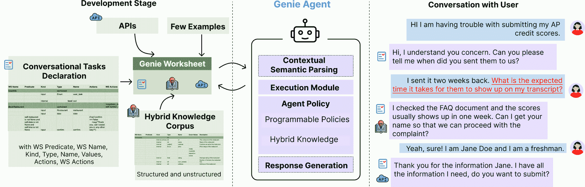

<!--yml

类别：未分类

日期：2025-01-11 12:26:58

-->

# 基于 GenieWorksheets 编写可靠的 LLM 集成任务与知识代理

> 来源：[https://arxiv.org/html/2407.05674/](https://arxiv.org/html/2407.05674/)

Harshit Joshi Shicheng Liu James Chen Larsen Weigle Monica S. Lam

计算机科学系

斯坦福大学

美国加利福尼亚州斯坦福大学，邮政编码 94305

{harshitj,shicheng,lam}@cs.stanford.edu

###### 摘要

大型语言模型（LLMs）提供了一个机会，能够创建自动化助手，帮助用户完成复杂的任务。然而，现有的方法在处理条件逻辑、整合知识来源以及一致性执行指令方面存在局限性。研究人员和行业专业人员通常使用临时管道构建对话代理。这些管道旨在保持上下文、应对失败情况并减少幻觉现象，但常常未能实现这些目标。为此，我们提出了 Genie——一个用于创建任务导向型对话代理的可编程框架，旨在处理复杂的用户交互和知识查询。与大型语言模型不同，Genie 提供可靠的有根据的回应，并通过其表达性规范 Genie Worksheet 提供可控的代理策略。与对话树不同，Genie 对各种用户查询具有较强的弹性，能有效整合知识来源，并通过声明式范式提供简便的编程策略。使用 Genie 构建的代理在 STARV2 数据集上的复杂逻辑任务中，比现有最先进的方法提高了最多 20.5%的性能。此外，在一项涉及 62 名参与者的真实用户研究中，我们展示了 Genie 在执行准确性、对话行为准确性和目标完成率上分别超越了 GPT-4 的函数调用基线 21.1%、20.1% 和 61%，涵盖了三个不同的真实世界领域。

![[未标注图片]](img/6ec9a9c5b2dfc90952881fe9afcb2c0f.png)

[https://github.com/stanford-oval/genie-worksheets](https://github.com/stanford-oval/genie-worksheets)

## 1 引言

研究人员和行业从业者在开发任务导向型对话代理方面表现出了极大的兴趣。这些代理通常以事务性为中心，旨在根据用户的发言填写槽位值，以完成特定任务（Budzianowski et al., [2018](https://arxiv.org/html/2407.05674v2#bib.bib5); Andreas et al., [2020](https://arxiv.org/html/2407.05674v2#bib.bib2); Rastogi et al., [2020](https://arxiv.org/html/2407.05674v2#bib.bib26)）。然而，用户和呼叫代理之间的自然对话不能仅仅被建模为槽位填充任务。用户通常需要外部信息才能完成任务的各个步骤。例如，在尝试进行餐厅预定时，用户通常需要寻找一个最符合他们偏好的场所。此外，用户可能在对话的任何阶段打断代理，提出新的询问。传统的基于对话树的方法往往难以应对这些突发的用户问题或偏离，导致用户体验不尽如人意（Bocklisch et al., [2017](https://arxiv.org/html/2407.05674v2#bib.bib4); Xie et al., [2022](https://arxiv.org/html/2407.05674v2#bib.bib31); Amazon, [2023](https://arxiv.org/html/2407.05674v2#bib.bib1); Press, [2024](https://arxiv.org/html/2407.05674v2#bib.bib25); Google, [2024](https://arxiv.org/html/2407.05674v2#bib.bib8))。

大型语言模型（LLMs）的出现为创造更自然的对话代理提供了一个有前景的机会。这些基于LLM的代理能够有效地应对“非理想路径”，在这些路径中，系统能够巧妙地处理对话过程中任何阶段出现的用户突发询问。此外，LLM使得知识助手的开发成为可能，这些助手能够通过生成查询语言（如SQL（Pourreza & Rafiei, [2023b](https://arxiv.org/html/2407.05674v2#bib.bib24)）和SPARQL（Liu et al., [2024c](https://arxiv.org/html/2407.05674v2#bib.bib17)））查询结构化数据，或者通过检索文本获取非结构化知识（Khattab et al., [2023](https://arxiv.org/html/2407.05674v2#bib.bib11)）。然而，LLM可能不可靠，这对开发者来说构成挑战，特别是在将其部署到实际应用中时，主要由于缺乏对话控制和信息上下文的准确性问题。

挑战1：创建有效的、信息丰富的、响应迅速的信息代理，同时让开发者能够在不费力的情况下保持控制。开发者希望能够控制代理操作的关键方面，包括对话流、行动时机以及从用户那里获取的信息。例如，如果用户拒绝代理的餐厅预订提议，开发者应该能够编程使代理提供替代选项，如提供折扣。通过LLM的上下文学习能力，研究人员已经开始将代理策略作为指令纳入模型提示中（Zhang等，[2023b](https://arxiv.org/html/2407.05674v2#bib.bib36)；Liu等，[2024a](https://arxiv.org/html/2407.05674v2#bib.bib15)）。然而，LLM往往未能严格遵守这些指令，导致代理行为不一致且不可靠（Liu等，[2024b](https://arxiv.org/html/2407.05674v2#bib.bib16)）。近期的库，如LangChain和Guidance，提供了用于开发基于LLM的代理的抽象工具，但仍然要求开发者手动编写提示并创建可靠的管道。

挑战2：支持用户的信息查询，这些查询可能嵌入在任务请求中。语义解析将自然语言映射到逻辑形式，已被应用于API调用（Patil等，[2023](https://arxiv.org/html/2407.05674v2#bib.bib22)）和数据库查询（Pourreza & Rafiei，[2023a](https://arxiv.org/html/2407.05674v2#bib.bib23)；Liu等，[2024d](https://arxiv.org/html/2407.05674v2#bib.bib18)）。为了创建能够回答问题的任务代理，Kim等人（[2020](https://arxiv.org/html/2407.05674v2#bib.bib12)）提出使用意图分类生成查询或API调用。然而，在实践中，单一的用户陈述可能会将查询和API调用结合在一起。例如，“我想在情人节预订伦敦的浪漫餐厅”，这可以转化为一个查询，用于生成餐厅并作为预订API调用的输入。我们如何表达并支持查询和API调用的任意组合？

图1：Genie助手概览。（左）开发者提供的Genie工作表包含对话任务的规范、知识库的架构、完成任务的API以及一些供LLM解析器使用的示例。任务通过电子表格表示，电子表格包含与对话相关的变量以及根据这些变量值采取的行动。（中）Genie工作表被Genie框架用来创建对话代理。（右）生成的代理能够可靠地进行多次准确对话，同时几乎不需要开发者的额外努力。

挑战3：对话系统需要记住对话历史中的相关事实。目前基于LLM的方法通常依赖于在提示中包含完整的对话历史（Ulmer等，[2024](https://arxiv.org/html/2407.05674v2#bib.bib29)；Liu等，[2024a](https://arxiv.org/html/2407.05674v2#bib.bib15)）或对话的摘要（Packer等，[2023](https://arxiv.org/html/2407.05674v2#bib.bib21)；Li等，[2024a](https://arxiv.org/html/2407.05674v2#bib.bib13)）。然而，完整的对话历史可能会导致LLM在长时间交互中忽略重要细节；摘要可能会省略关键信息，导致重复提问或生成不准确的回答，通常被称为“幻觉”（Bang等，[2023](https://arxiv.org/html/2407.05674v2#bib.bib3)）。

我们提出的方法。本文提出了一种方法，使开发人员能够轻松创建可靠且有效的任务导向代理，能够与用户进行准确、流畅且富有信息的对话。我们通过一种创新的高层次、表现力强且声明式的规格表示——Genie工作表，来解决上述挑战。核心概念是要求开发人员直接声明变量，表示与对话相关的信息，并根据输入信息描述要执行的操作。在回答用户问题时，开发人员只需提供知识库，这些知识库可以是结构化或非结构化的。换句话说，开发人员仅需声明必要的规格，我们证明了这些规格足以创建有效的知识和任务导向代理。

从Genie工作表（Genie Worksheet）开始，Genie框架衍生出一个对话代理，在对话进行的过程中填充工作表中的变量。持续更新的工作表双重作用，作为对话状态的简洁表示，经过精心设计以应对语义解析和代理策略中的复杂性。如图[1](https://arxiv.org/html/2407.05674v2#S1.F1 "Figure 1 ‣ 1 Introduction ‣ Coding Reliable LLM-based Integrated Task and Knowledge Agents with GenieWorksheets")所示，代理在处理每轮对话时分为四个步骤：首先是上下文神经语义解析器来解释输入，其次是执行模块执行查询和操作，第三个是算法代理策略模块决定代理行为，最后是神经响应生成器根据代理策略生成响应。

本文的贡献包括：

1.  1.

    Genie工作表是首个用于有效集成知识和任务导向代理的高层次规格语言。

    +   •

        它是第一个支持知识和任务导向代理完全整合的表示方式。与之前的基于插槽的任务导向对话（ToD）不同，代理可以处理转化为正式查询的发言和对话，这些查询用于混合知识库的查询，并将其结果用于API调用（挑战2）。

    +   •

        它是一种高级声明性语言，使得开发者可以轻松控制代理的策略。开发者只需指定（1）与用户请求的信息和任务完成相关联的操作的电子表格，（2）结构化数据库和自由文本库的模式（挑战1）。

    +   •

        与传统的ToD（任务导向）代理仅支持一组固定参数不同，Genie工作表具有表现力，因为它支持完整的对话，其中请求的信息依赖于用户的回答。这种行为，通常见于呼叫代理，之前仅在对话树规范中得到支持。

    +   •

        Genie工作表有助于有效代理的推导，因为它在创建精确的语义解析器和灵活的代理策略中发挥了重要作用。它是作为上下文和目标的表示，供上下文语义解析器使用，从而使解析器能够在长时间对话中记住相关信息（挑战3）。它还由代理策略模块解析，能够轻松处理混合主动对话的复杂性，首先响应用户的主动请求，然后再响应代理的主动请求，这些内容都记录在工作表中（挑战1），如图[1](https://arxiv.org/html/2407.05674v2#S1.F1 "图1 ‣ 1 引言 ‣ 使用Genie工作表编码可靠的基于LLM的集成任务和知识代理")中代理的倒数第二轮所示。

1.  2.

    使用功能完善的Genie工作表原型，Genie代理在复杂逻辑领域中，相较于StarV2（Zhao等人，[2022](https://arxiv.org/html/2407.05674v2#bib.bib37)）的SOTA，性能提升了最多20.5个百分点。

1.  3.

    通过对62名参与者在3个不同现实生活对话任务中的用户研究，我们展示了Genie代理显著优于之前的SOTA（最先进技术）。结果显示，执行准确率为86.5%，对话行为准确率为89.2%，目标完成率为82.8%，分别超越GPT-4功能调用基准21.1、20.1和61个百分点。

## 2 Genie工作表的设计与原理

工作表设计的目标是为开发者提供一种高级、简洁、富有表现力的任务规格说明。我们的工作表设计灵感来自于Web表单的多功能性。现代网站包含多个字段，其中一些是可选的，选择任务的标签以及取决于用户先前响应的弹出窗口。工作表有两种类型：任务工作表和知识库工作表，具体如下所述。

##### 任务工作表

如 [Figure 2](https://arxiv.org/html/2407.05674v2#S2.F2 "图 2 ‣ 任务工作表 ‣ 2 Genie 工作表的设计和原理 ‣ 基于 LLM 的集成任务与知识代理的可靠编码") 所示，工作表有一个 WS 名称（WS Name），一个 WS 谓词（WS Predicate），指示何时激活它，一个 WS 类型（WS Kind），设置为任务（Task），以及一个 WS 操作（WS Actions），当为此任务分配了所有必需参数时，它们会被执行。顶级工作表的 WS 谓词始终为 true，而其他工作表仅在其相关谓词为 true 时才会激活。

图 2：在 [Figure 1](https://arxiv.org/html/2407.05674v2#S1.F1 "图 1 ‣ 1 引言 ‣ 基于 LLM 的集成任务与知识代理的可靠编码") 中的支持票据提交助手的 Genie 工作表规范。

每个工作表包含一组字段。字段有一个谓词（Predicate），用于指示何时执行它。它有一个类型（Kind），可以是输入、输出或内部类型，还有一个描述（Description）。它有一个类型（Type），允许所有常规类型。如果它是一个枚举类型（例如，[Figure 2](https://arxiv.org/html/2407.05674v2#S2.F2 "图 2 ‣ 任务工作表 ‣ 2 Genie 工作表的设计和原理 ‣ 基于 LLM 的集成任务与知识代理的可靠编码") 中的 student_task），则在接下来的行中会指定一组枚举值及其描述（Enum Values）。布尔值 DontAsk 会记录用户提供的信息，但代理不会主动询问。如果 DontAsk 为 false，代理会在字段未被分配时询问，但如果该字段不是必填项，用户可以拒绝回答。每当一个字段被分配时，提供的操作（Actions）应该被执行，前提是确认布尔值（Confirmation）被设置为 false，或者用户已经与代理确认。

对于工作表操作和字段操作，开发人员可以使用工作表中定义的变量编写代码（使用 Python）。提供给开发人员的几种内置操作包括：（1）say (str) 使用给定的字符串 str 响应用户。（2）propose (ws, [fld,val]*) 实例化一个新的工作表 ws，并提供字段值对。例如，开发人员可以在航班预订工作表的 WS 操作字段中编写 propose 操作，以在相同的目的地为航班提议一个酒店预订工作表。（3）exitws() 标记工作表为放弃并关闭它。例如，[Figure 2](https://arxiv.org/html/2407.05674v2#S2.F2 "图 2 ‣ 任务工作表 ‣ 2 Genie 工作表的设计和原理 ‣ 基于 LLM 的集成任务与知识代理的可靠编码") 中的“确认”字段的操作（Actions）字段包含 exitws() 调用，如果用户不想再提交票据。

##### 知识访问

在Genie工作表中，知识访问被视为一等公民。现实中的查询通常涉及结构化和非结构化数据的访问。例如，查询“哪个餐厅的浪漫气氛评分最高”需要同时访问结构化的“评分”列和自由文本的“评论”列。为了处理混合知识库，Genie采用了SUQL查询语言，这是一种SQL扩展，集成了非结构化数据的搜索（Liu等， [2024d](https://arxiv.org/html/2407.05674v2#bib.bib18)）。对于每个要包含的知识库，开发者必须创建一个Kind设置为KB的工作表。KB工作表中的字段定义了知识库的模式。

## 3 Genie：基于LLM的可靠对话代理

### 3.1 正式表示

当前基于LLM的对话代理通过提供完整的对话历史或对其进行总结来为对话提供上下文。然而，尽管它们在自然语言理解方面表现出色，但它们在保持长时间对话中的相关上下文信息时常常遇到困难。此外，总结对话可能会导致关键信息的丢失，从而产生幻觉或捏造的值，并重复提问。因此，为了缓解这些问题，Genie通过正式的对话状态来跟踪对话状态。

对话由一组交替的用户和代理回合组成，$\{u_{1},a_{1},\cdots,u_{t-1},a_{t-1},u_{t}\}$，其中$u_{i}\in\mathcal{U}$，$a_{i}\in\mathcal{A}$表示用户和代理的发言。

图3：Genie将最新的一组工作表和仅一个先前的对话回合提供给语义解析器。解析器输出当前的工作表，代理策略利用这些工作表生成代理对话行为。这些行为连同最新的工作表值和最新的用户发言一起被用来生成回应。

##### 对话状态

当代理运行时，它将值分配给任务工作表中的字段，执行操作，并进行查询。在每个回合$t$中，$d_{t}\in D$，是一个由记录$ r \in R $组成的序列，每个记录可以是一个已完成的或部分指定的任务，也可以是一个知识库查询。每个记录有一个类型，表示任务或知识库查询，发起者可以是代理或用户。任务记录有两个额外的属性：（1）名称，工作表的名称，（2）分配，将工作表中的一个或多个字段映射到其值。知识库查询记录有四个额外的属性：（1）名称，查询中提到的知识库的名称集合，（2）NL查询：一个字符串，形式为答案(s)，其中s是去上下文化的（即自包含的）自然语言查询，（3）KB查询：与NL查询相关联的正式查询，（4）结果：执行正式查询的结果。

正式对话状态的两个示例显示在[图 3](https://arxiv.org/html/2407.05674v2#S3.F3 "Figure 3 ‣ 3.1 Formal Representation ‣ 3 Genie: Reliable LLM-based Dialogue Agents ‣ Coding Reliable LLM-based Integrated Task and Knowledge Agents with GenieWorksheets")中（正式对话状态$d_{t-1}$和$d_{t}$）。在$d_{t-1}$中，有三个记录，其中两个是任务类型，另一个是知识库（KB）。查询和API的组合通过将工作表实例的结果作为另一个工作表的字段传递来支持。记录$r_{2}$中的course_id是$r_{1}$，它是知识库类型（KB）。

代理行为 代理发言有一个正式的表示（$\bar{a}\in\bar{\mathcal{A}}$），由5个代理行为组成：

+   •

    报告（记录）：报告通过执行记录中的任务或查询所获得的结果。

+   •

    确认（记录，字段名称）：确认记录中字段名称所映射的值。

+   •

    说（发言）：明确地说出给定的发言。

+   •

    提议（记录）：在给定记录中，向用户提出一个新的任务或查询，可能会预填充部分值。

+   •

    询问（记录，字段名称）：询问记录中字段的值。

### 3.2 Genie代理的架构

Genie代理有三个组件：

+   •

    $\text{P}(u_{t},a_{t-1},\bar{a}_{t-1},d_{t-1},w):\mathcal{U}\times\mathcal{A}% \times\mathcal{P}(\bar{\mathcal{A}})\times\mathcal{D}\times\mathcal{W}% \rightarrow\mathcal{D}$：一个解析器$P$接受当前用户发言$u_{t}$，并利用上一个代理发言$a_{t-1}$、上一个回合的代理行为$\bar{a}_{t-1}$、上回合的正式对话状态$d_{t-1}$、工作表$w$，生成新的对话状态$d$。

+   •

    AP$(d,d^{\prime},w):\mathcal{D}\times\mathcal{D}\times\mathcal{W}\rightarrow% \mathcal{P}(\bar{\mathcal{A}})\times\mathcal{D}$：一个代理策略，接受前一个回合的对话状态$d$、解析后的新对话状态$d^{\prime}$以及工作表$w$，生成一组代理对话行为$\bar{a}$，并产生新的对话状态。

+   •

    $\text{RG}(d_{t},\bar{a}_{t},u_{t},a_{t-1}):\mathcal{D}\times\mathcal{P}(\bar{% \mathcal{A}})\times\mathcal{U}\times\mathcal{A}\rightarrow\mathcal{A}$：一个响应生成器，接受正式对话状态$d_{t}$、代理行为集合$\bar{a}_{t}$、最后的用户发言$u_{t}$和代理发言$a_{t-1}$，生成代理的响应$a_{t}$。

图 [3](https://arxiv.org/html/2407.05674v2#S3.F3 "Figure 3 ‣ 3.1 Formal Representation ‣ 3 Genie: Reliable LLM-based Dialogue Agents ‣ Coding Reliable LLM-based Integrated Task and Knowledge Agents with GenieWorksheets") 展示了精灵系统的概览。在对话的第 $t$ 回合中，系统接收以下内容：（1）对话历史 $\{u_{1},a_{1},\cdots,u_{t-1},a_{t-1},u_{t}\}$，其中 $u_{t}\in\mathcal{U}$，$a_{t}\in\mathcal{A}$ 表示用户和代理的发言；（2）第 $t-1$ 回合的正式代理行为 $\bar{a}_{t-1}\in\mathcal{P}(\bar{\mathcal{A}})$；（3）第 $n-1$ 回合的正式对话状态 $d_{t-1}\in\mathcal{D}$；以及（4）精灵工作表 $w\in\mathcal{W}$。

图 4：当用户提供值或修改它们时，解析器 P 生成更新后的对话状态 $d^{\prime}$，并在用户启动新任务或查询时创建新实例。

解析器 解析器由三个模块组成。上下文语义解析（CSP）将用户发言转换为一组要应用于对话状态的变化。提供给 CSP 的上下文是对话状态的压缩版本，其中仅包含最新的知识库记录。用户可以（1）向现有工作表中的字段提供值；（2）修改之前填写的字段或删除其值；（3）启动新的任务或查询。如果用户向字段输入值或修改之前填写的字段，则查询是更新语句，用于修改现有记录，如 [图 4](https://arxiv.org/html/2407.05674v2#S3.F4 "Figure 4 ‣ 3.2 Architecture of the Genie Agent ‣ 3 Genie: Reliable LLM-based Dialogue Agents ‣ Coding Reliable LLM-based Integrated Task and Knowledge Agents with GenieWorksheets") 所示。如果用户启动了一个新任务或查询，则会创建一个新记录。CSP 将知识库查询保留为自然语言形式。

第二个模块，知识解析器（KP），将自然语言查询转换为正式查询。这个功能的分解允许更加先进的知识检索方法（Yao 等人，[2022](https://arxiv.org/html/2407.05674v2#bib.bib32)；[2023](https://arxiv.org/html/2407.05674v2#bib.bib33)），并将知识集成与 CSP 抽象开来。第三个模块对对话状态进行更新，生成更新后的对话状态。实施细节和提示在附录 [E.1](https://arxiv.org/html/2407.05674v2#A5.SS1 "E.1 Additional details on CSP and KP ‣ Appendix E Additional details on the Genie implementation ‣ Coding Reliable LLM-based Integrated Task and Knowledge Agents with GenieWorksheets") 和 [F.1](https://arxiv.org/html/2407.05674v2#A6.SS1 "F.1 Prompt for CSP and RG ‣ Appendix F Prompts used ‣ Coding Reliable LLM-based Integrated Task and Knowledge Agents with GenieWorksheets") 中。

算法 1 精灵代理策略

1:输入：前一个对话状态 $d$，来自解析器的更新对话状态 $d^{\prime}$，工作表：$w$  

代理策略与依赖LLM直接基于当前对话生成代理响应不同，Genie使用符号模块来计算代理的响应。这样做的原因有两个：（1）提供代理行为使得LLM生成的响应是由代理策略控制的确定性响应。（2）LLM在处理开发者定义的政策时存在困难，无法遵循所有指令。使用符号模块计算必要的动作可以提高LLM遵循指令的能力。

代理策略（AP）解释由解析器（$P$）生成的更新后的对话状态 $d^{\prime}\in\mathcal{D}$、之前的对话状态 $d$ 和工作表签名 $w\in\mathcal{W}$，以指导其行为，从而更新对话状态 $d^{\prime}\in\mathcal{D}$ 并生成一组新的代理行为 $\bar{a}\in\mathcal{P}(\bar{\mathcal{A}})$。代理策略（AP）利用 Diff($d^{\prime},d$) 函数来识别两个对话状态 $d^{\prime}$ 和 $d$ 之间已修改或已启动的字段和工作表。

算法[1](https://arxiv.org/html/2407.05674v2#alg1 "算法 1 ‣ 3.2 精灵代理架构 ‣ 3 精灵：基于LLM的可靠对话代理 ‣ 使用GenieWorksheets编写可靠LLM集成任务和知识代理的代码")概述了代理策略。该过程通过评估在更新后的对话状态$d^{\prime}$中是否存在新的KB记录，与$d$进行比较（第4行）开始。如果记录中缺少任何必要的参数$p$，代理将提示用户提供缺失的值（第6行）。否则，系统将报告KB查询的结果（第9行）。随后，策略检查是否有任何新字段需要确认，并提示用户（第14行）。如果不需要确认，与新填充字段相关的操作将被执行（第16行），并且对话状态将相应更新（第17行）。任何基于开发者定义的操作的代理行为都将被记录（第18行）。如果任何工作表中的所有字段已填充且相应的操作已完成，策略将执行与工作表相关的操作（第22行）并更新对话状态（第23行）。任何基于开发者定义的操作的代理行为都将被记录（第24行）。最后，策略会识别对话状态中的第一个未填字段，并生成一个代理行为，要求用户提供必要的值（第28行）。

### 3.3 讨论

精灵基于简洁的声明性工作表规范自动处理对话流程。这与需要程序员手工编写每一轮策略的对话树有显著不同。另一种流行的方法是将对话建模为有限状态机，其中用户输入映射到少量的用户对话行为，并且规则被用来将用户对话行为与API或数据库查询的结果映射到代理对话行为。如我们所讨论的，每一轮可以调用多个不同的代理对话行为，若使用有限状态机，则会导致指数级的代理对话状态。仅仅在LLM中进行函数调用也无法处理对话中的诸多细节。在附录[A](https://arxiv.org/html/2407.05674v2#A1 "附录 A 挑战性对话 ‣ 使用GenieWorksheets编写可靠LLM集成任务和知识代理的代码")中，我们展示了一些我们能够很好处理的对话片段，但这些片段可能会导致其他技术失败，并解释原因。

## 4 静态数据集评估

| 模型 | 银行 | 旅行 | 趣味 |
| --- | --- | --- | --- |
| AT XXL | 54.3 | 52.4 | 73.8 |
| AT-SGD XXL | 53.1 | 51.5 | 81.1 |
| AT-PROG XXL | 61.0 | 60.8 | 73.7 |
| AT-PROG +SGD XXL | 65.0 | 62.9 | 86.3 |
| 精灵（我们的） | 82.5 | 83.4 | 92.7 |

表 1：STAR V2中复杂逻辑领域的系统行为F1。

在我们开始讨论关于现实生活应用的真实用户研究之前，我们先对一个更复杂的基于槽位的基准例子进行比较研究。我们在StarV2数据集中的复杂逻辑领域上评估了Genie（Zhao等人，[2022](https://arxiv.org/html/2407.05674v2#bib.bib37)）。我们选择这个领域是因为它的程序逻辑相较于其他领域更为复杂，而现有的代理在该领域的表现较差。AnyTOD（Zhao等人，[2022](https://arxiv.org/html/2407.05674v2#bib.bib37)）在StarV2上取得了最先进的结果。使用Genie时，银行领域的代理策略只需在Genie工作表中用9行代码表示，而AnyTOD则需要31行。我们仅向基于LLM的语义解析器提供了三个示例¹¹1我们使用gpt-4-turbo-2024-04-09进行此实验。更多细节请参考[附录B](https://arxiv.org/html/2407.05674v2#A2 "附录B 实验设置 ‣ 使用Genie工作表进行可靠的LLM集成任务和知识代理编程")。而AnyTOD则对除测试领域之外的所有领域（大约6000个数据点）进行T5 XXL（13B）模型的微调。Genie在三个领域上分别取得了令人印象深刻的加权SaF1成绩：82.5、83.4和92.7，分别超越了最佳ToD模型17.5%、20.5%和6.4%。此外，我们的分析表明，大部分错误源于数据集注释的不一致。

## 5 真实用户研究评估

| 应用 | 任务工作表 | 知识库工作表 | 字段 | 谓词 | 动作 |
| --- | --- | --- | --- | --- | --- |
| StarV2 (Bank) | 3 | 0 | 10 | 4 | 4 |
| StarV2 (Trip) | 2 | 0 | 6 | 0 | 2 |
| StarV2 (Trivia) | 2 | 0 | 6 | 0 | 3 |
| 餐厅预订 | 2 | 2 | 19 | 2 | 3 |
| 课程助手 | 4 | 4 | 52 | 3 | 1 |
| 票务提交 | 7 | 1 | 29 | 18 | 2 |

表2：3个现实世界应用和3个StarV2领域的统计数据，包含在各自Genie工作表中定义的任务和知识库工作表、字段、谓词和动作的总数。

### 5.1 应用

我们选择了三个复杂度不同的多样化应用。与3个StarV2领域相比，这些现实世界应用要复杂得多，如表[2](https://arxiv.org/html/2407.05674v2#S5.T2 "表2 ‣ 5 真实用户研究评估 ‣ 使用Genie工作表编写可靠的LLM集成任务和知识代理")所示。

餐厅预订 预定餐厅需要找到合适的餐厅并提供预订信息以完成交易。我们使用来自Yelp.com的现实生活数据集，其中包含餐厅信息，数据来源于Liu等人（[2024d](https://arxiv.org/html/2407.05674v2#bib.bib18)）。

问题单提交 在这项研究中，我们旨在复制大学学生服务门户中的一部分任务。大学学生服务门户通常包含各种任务，这些任务被分类到不同的部分和子部分中，给学生在寻找合适链接时带来导航挑战。此外，这些门户通常包含大量的自由文本数据，学生必须在提交问题单之前进行浏览。我们评估了代理在处理带有谓词和后续操作的嵌套网页时的能力。

课程报名 最后，我们评估了 Genie 作为课程报名助手的表现，该助手结合了混合数据源来搜索课程详情并填写复杂的嵌套表单。助手允许学生在填写报名表格时，提问关于课程要求、学生评价和评分的问题。我们收集了一个真实的课程数据集，包含来自计算机科学项目的课程，包含 4 张表格（课程、课程安排、评分和项目）。

### 5.2 基准和数据收集

基准：我们将我们的系统与具有功能调用的 GPT-4-turbo 进行对比，我们称其为 GPT-4（FC）。我们为基准系统提供了使用相同知识库解析器访问外部知识的能力。这个基准系统紧跟 Li 等人（[2024b](https://arxiv.org/html/2407.05674v2#bib.bib14)）的研究。我们还实验了 Nemo-Guardrails（Rebedea 等人， [2023](https://arxiv.org/html/2407.05674v2#bib.bib28)），这是一个最近提出的用于基于大型语言模型的对话代理的开发框架，但我们发现它在处理基本的任务导向对话时表现得非常糟糕（有关详细信息，请参见 [附录 D](https://arxiv.org/html/2407.05674v2#A4 "附录 D 关于 Nemo Guardrails 实验的详细信息 ‣ 编码可靠的基于大型语言模型的集成任务和知识代理与 Genie Worksheets")）。所有 Genie Worksheets 都可以在 [附录 I](https://arxiv.org/html/2407.05674v2#A9 "附录 I 工作表 ‣ 编码可靠的基于大型语言模型的集成任务和知识代理与 Genie Worksheets") 中找到。

研究设计：我们使用 Prolific 招募了 22 名参与者来进行餐厅预订，并招募了 20 名自认为是学生的用户进行票务提交。我们招募了 20 名大学生来评估课程报名助手。我们指示他们分别尝试进行餐厅预订、提交问题单和报名两门课程。我们将用户随机分配到两个视觉上相同的系统之一。我们分别收集了 99、81 和 127 次与 Genie 的互动，以及 90、70 和 144 次与 GPT-4（FC）的互动。关于用户指令的更多细节，请参见 [附录 G](https://arxiv.org/html/2407.05674v2#A7 "附录 G 用户研究 ‣ 编码可靠的基于大型语言模型的集成任务和知识代理与 Genie Worksheets")。

### 5.3 评估指标

语义解析准确度 对于每个用户回合，我们手动检查语义解析器生成的代码，以确保正确的 API 和数据库调用以及填充的字段。我们定义金标准的语义解析输出（$SP$）为正确的 API 调用（$A$）、数据库调用（$D$）和要填充的字段（$F$）的集合。然后，对于每个用户发言，$SP=\{s_{1},s_{2},...,s_{m}\}$，其中 $s_{i}\in\{A\cup D\cup F\}$ 且 $m$ 是总的选择数，满足 $m=|A\cup D\cup F|$。系统的语义解析准确度（SP Acc）定义为语义解析器输出中正确选择的数量除以 $m$。

执行准确度 我们手动检查每个回合，检查代理是否执行了正确的 API 和数据库调用。对于每个代理回合，令执行为 $E=\{e_{1},e_{2},...,e_{m}\}$，其中 $e_{i}$ 是一个 API 或数据库调用。我们评估每个 $e_{i}$ 是否为真正的正例或假正例。我们将执行准确度（Ex Acc）计算为所有执行调用中真正的正例数量与所有正负例的总和。

代理对话行为准确度 对于每个回合，我们手动检查代理的对话行为是否遵循开发者提供的策略。正式地，对于每个回合，我们定义一个金标准行为列表 $a_{1},a_{2},...,a_{m}$，其中 $a_{i}\in A$，是所有可能的代理对话行为。系统的代理对话行为准确度（DA Acc）定义为正确预测的行为数除以 $m$。对于 GPT-4（FC），我们将其响应映射到代理行为集合的幂集中的等效元素。

目标完成率 我们定义目标完成率（Goal CR）为用户在系统的帮助下成功完成任务的能力。当使用适当的参数值时，任务被视为已完成。目标完成率是每个对话的二元度量，其中 1 表示目标已完成，0 表示目标未达成。

### 5.4 主要结果

表 [3](https://arxiv.org/html/2407.05674v2#S5.T3 "Table 3 ‣ 5.4 Main Results ‣ 5 Evaluation on Real User Studies ‣ Coding Reliable LLM-based Integrated Task and Knowledge Agents with GenieWorksheets") 比较了 Genie 和 GPT-4（FC）在三个指标上的表现，结果发现 Genie 在所有三个领域的表现明显优于 GPT-4（FC）。我们观察到，Genie 一直表现出较高的语义解析率（超过 $85\%$），这表明 Genie 工作表对于少量示例的 LLM 来说容易理解。在 Ticket Submission 应用中观察到的略低的 SP Acc（$85.8\%$）可以归因于该应用的复杂性，它包含多个工作表（=$8$）和字段（=$28$），如表 [2](https://arxiv.org/html/2407.05674v2#S5.T2 "Table 2 ‣ 5 Evaluation on Real User Studies ‣ Coding Reliable LLM-based Integrated Task and Knowledge Agents with GenieWorksheets") 所示。

此外，较高的Ex Acc可归因于提供压缩的上下文作为正式对话状态，这使得大语言模型能够调用正确的API并执行适当的知识查询。DA Acc上的优越表现可以归因于我们的代理能够逐步提供指令，而不是像GPT-4 (FC)那样一次性提供所有指令。结果验证了可编程策略在提供可靠助手方面的优势。

就最终目标完成率而言，我们观察到GPT-4 (FC)在餐厅预订方面得分相对较高，这是它最熟悉的领域，并且在现有的对话数据集中得到了充分代表（Ye等， [2022](https://arxiv.org/html/2407.05674v2#bib.bib34); Rastogi等，[2020](https://arxiv.org/html/2407.05674v2#bib.bib26)）。张等（[2023b](https://arxiv.org/html/2407.05674v2#bib.bib36)）和Hudeček & Dusek（[2023](https://arxiv.org/html/2407.05674v2#bib.bib10)）也观察到了类似的结果。然而，GPT-4 (FC)在处理较不熟悉的领域（如票务提交和课程注册）时存在困难。我们发现，票务提交应用中较高数量的谓词要求需要多个指令，这使得GPT-4 (FC)在帮助用户完成任务时极为困难。在大多数情况下，GPT-4 (FC)没有从用户那里获取所有必需的字段，导致API调用不完整。此外，尽管GPT-4 (FC)可以访问KB解析器，但它经常会产生不存在的课程，并未能成功注册学生。

|  | 所有领域 | 餐厅预订 | 票务提交 | 课程注册 |
| --- | --- | --- | --- | --- |
|  | GPT4 (FC) | Genie | GPT4 (FC) | Genie | GPT4 (FC) | Genie | GPT4 (FC) | Genie |
| --- | --- | --- | --- | --- | --- | --- | --- | --- |
| SP Acc | - | 91.4 | - | 93.8 | - | 85.8 | - | 94.1 |
| Ex Acc | 65.4 | 86.5* | 50.0 | 88* | 58.6 | 80.0* | 79.2 | 89.7* |
| DA Acc | 69.1 | 89.2* | 57.7 | 92.5* | 67.6 | 82.5* | 77.8 | 92.9* |
| 目标CR | 21.8 | 82.8* | 54.5 | 91.6 | 0.0 | 80.0* | 10.0 | 80.0* |

表3：我们在三个领域进行了62个用户的真实用户研究。我们发现Genie在三个适用指标上表现显著优于具有函数调用能力的GPT-4。我们进行了t检验，并用$ p<0.05 $标记结果，用*表示。下划线表示更好的结果。

### 5.5 错误分析

我们分析了图[6](https://arxiv.org/html/2407.05674v2#S5.F6 "图6 ‣ GPT-4（功能调用） ‣ 5.5 错误分析 ‣ 5 在真实用户研究中的评估 ‣ 使用Genie工作表编码可靠的基于LLM的集成任务和知识代理")中Genie和GPT-4（FC）在对话中回合数所占比例的平均对话行为准确率（DA Acc）。我们观察到，Genie的表现下降较小，约为8%，相比之下，GPT-4的下降为43%。随着对话的延长，这种表现下降变得更加明显。这支持我们的假设，即LLM在长时间交互中难以保持上下文，而采用正式的对话状态有助于缓解其中的一些问题。我们还分析了我们系统和GPT-4（FC）的所有错误案例，并在附录中提供了示例。

##### GPT-4（功能调用）

GPT-4（FC）未能使用提供的KB解析器，而是直接响应用户查询，导致虚假的回答。我们注意到它在课程注册、票务提交和餐厅预订领域的对话中分别在（7/10）、（4/11）和（5/10）中出现幻觉。此外，它在这三个领域中都提前调用了提交API，并忽略了像在调用API之前未寻求确认等指令。

图5：Genie在所有三个助手中的语义解析错误分析。大多数错误发生在对知识查询的处理不当。执行和对话行为错误大多是由于语义解析错误。

图6：GPT-4（FC）和Genie在对话回合数的变化下的平均对话行为准确率。随着对话的进行，GPT-4（FC）的对话行为准确率呈现出更为明显的下降。

Genie 我们分析了Ticket Submission应用程序中的错误。在21%的情况下，代理未能处理用户拒绝提供必填字段信息的情况，导致值未分配。另有21%的错误源于语义解析器无法调用所有必要的工作表或填充正确的参数值。43%的错误是由于KB记录的错误生成，无论是错误使用它查询知识来源，还是完全忽略使用它。在14%的错误中，当用户尝试启动新事务时，基于LLM的解析器未能启动新工作表，而是更新了现有工作表。我们还观察到，33%和66%的语义解析错误是由于为课程注册和餐厅预订助手创建错误的工作表或字段。另一方面，由于KB记录生成不正确，导致66%和33%的错误。

## 6 相关工作

基于对话树的框架。市面上有多种商业和开源产品（Amazon, [2023](https://arxiv.org/html/2407.05674v2#bib.bib1); Press, [2024](https://arxiv.org/html/2407.05674v2#bib.bib25); Xie 等, [2022](https://arxiv.org/html/2407.05674v2#bib.bib31); Google, [2024](https://arxiv.org/html/2407.05674v2#bib.bib8); Microsoft, [2022a](https://arxiv.org/html/2407.05674v2#bib.bib19); [b](https://arxiv.org/html/2407.05674v2#bib.bib20); Reach, [2022](https://arxiv.org/html/2407.05674v2#bib.bib27); Bocklisch 等, [2017](https://arxiv.org/html/2407.05674v2#bib.bib4); Watson, [2022](https://arxiv.org/html/2407.05674v2#bib.bib30))，它们帮助开发者通过对话树编程构建虚拟助手，这些产品在设计上略有不同。例如，Press（[2024](https://arxiv.org/html/2407.05674v2#bib.bib25)）；Google（[2024](https://arxiv.org/html/2407.05674v2#bib.bib8)）；Microsoft（[2022a](https://arxiv.org/html/2407.05674v2#bib.bib19)）；Reach（[2022](https://arxiv.org/html/2407.05674v2#bib.bib27)）；Watson（[2022](https://arxiv.org/html/2407.05674v2#bib.bib30)）允许用户通过图形用户界面交互式地编程对话树。开发者可以操作各种构建块来分类用户意图，有时还需要借助内建的自然语言理解（NLU）模块。RASA允许开发者声明一系列全局意图，并相应地编程线性对话路径（Bocklisch 等, [2017](https://arxiv.org/html/2407.05674v2#bib.bib4)）。Converse允许开发者编程一种特殊的“与或”树（Xie 等, [2022](https://arxiv.org/html/2407.05674v2#bib.bib31)）。

大型语言模型（LLM）与任务导向对话（TOD）。一系列近期的研究尝试将 LLM 与 TOD 结合，展示了其在对话状态跟踪中的能力（Hu 等人， [2022](https://arxiv.org/html/2407.05674v2#bib.bib9); Feng 等人， [2023](https://arxiv.org/html/2407.05674v2#bib.bib7); Hudeček & Dusek， [2023](https://arxiv.org/html/2407.05674v2#bib.bib10); Li 等人， [2024b](https://arxiv.org/html/2407.05674v2#bib.bib14); Zhang 等人， [2023a](https://arxiv.org/html/2407.05674v2#bib.bib35))。特别是，Li 等人（[2024b](https://arxiv.org/html/2407.05674v2#bib.bib14)）利用 GPT 的功能调用能力进行状态跟踪，我们在第 [5](https://arxiv.org/html/2407.05674v2#S5 "5 Evaluation on Real User Studies ‣ Coding Reliable LLM-based Integrated Task and Knowledge Agents with GenieWorksheets") 节对其进行了比较。Deng 等人（[2024](https://arxiv.org/html/2407.05674v2#bib.bib6)）使用 LLM 进行对话策略规划模块，但不支持通过代码定义的开发者操作。在构建 ToD 代理时，现有的研究通常将整个指令集输入到模型中以生成响应（Zhang 等人， [2023a](https://arxiv.org/html/2407.05674v2#bib.bib35)）。虽然这种方法在较小的领域中表现良好，但 LLM 在现实情况下往往难以遵循所有指令（Liu 等人， [2024b](https://arxiv.org/html/2407.05674v2#bib.bib16)）。Genie Worksheet 则通过正式的代理行为来指导 LLM 生成响应。

## 7 结论

我们介绍了 Genie，这是一个基于 LLM 构建知识集成任务助手的新框架，并提出了 Genie Worksheet，一种高层次的规范，可详细控制对话流程。使用 Genie 构建的代理在 STARV2 数据集上的复杂逻辑领域中，比现有的最先进方法提高了多达 20.5%。我们的 62 位参与者的真实用户研究表明，Genie 显著优于传统的基于 LLM 的系统和对话树。

## 伦理考量

大型语言模型在构建各种任务导向代理中得到了越来越广泛的应用。我们提出了一种新的方法来提高其准确性和可靠性。我们不预期本研究会造成任何危害。

对于课程注册应用程序的用户评估，我们招募了自愿参与研究的大学生，每位参与者每 15 分钟获得价值 10 美元的亚马逊礼品卡。对于餐厅预订和票务提交应用程序，我们使用了 Prolific 平台招募参与者，并给予他们公平的报酬，超过最低工资标准。我们的程序已经得到了我们机构的伦理委员会（IRB）的批准。所有收集的信息都是匿名的。我们还会从收集的对话中移除任何个人身份信息。

我们的代码将以 Apache 许可证 2.0 版本公开发布，收集的数据也将向社区开放。

#### 致谢

本研究部分得到了Verdant基金会、微软Azure AI积分、摩根大通和斯坦福大学人类中心人工智能（HAI）研究所的支持。我们还感谢Adit Negi、Aryaman Arora、Chenglei Si、Jordan Juravsky、Ken Liu、Lucia Zheng、Liza Pertseva、Nikil Selvam、Sagnik Bhattacharya、Sina Semnani、Tristan Thrush、Yijia Shao、Yanzhe Zhang、Yutong Zhang以及斯坦福OVAL（开放虚拟助手实验室）成员在项目讨论和手稿反馈方面提供的帮助。

## 参考文献

+   亚马逊（2023）亚马逊。Amazon Lex，2023年。网址 [https://aws.amazon.com/lex/](https://aws.amazon.com/lex/)。

+   安德烈亚斯等人（2020）雅各布·安德烈亚斯、约翰·布费、大卫·伯凯特、查尔斯·陈、乔什·克劳斯曼、简·克劳福德、凯特·克里姆、乔丹·德洛奇、丽亚·多纳、贾森·艾斯纳、郝方、艾伦·郭、大卫·霍尔、克里斯汀·海耶斯、凯莉·希尔、戴安娜·霍、温迪·伊瓦苏克、斯穆丽蒂·贾、丹·克莱因、贾扬特·克里什纳穆尔西、西奥·兰曼、珀西·梁、克里斯托弗·H·林、伊利亚·林茨巴赫、安迪·麦戈文、亚历山大·尼兹涅维奇、亚当·保尔斯、德米特里·佩特尔斯、布伦特·里德、丹·罗斯、苏布霍·罗伊、杰西·鲁萨克、贝丝·肖特、迪夫·斯洛明、本·斯奈德、斯蒂芬·斯特里普林、余苏、扎卡里·泰尔曼、萨姆·汤姆森、安德烈·沃罗比夫、伊莎贝拉·维托什科、贾森·沃尔夫、艾比·瑞、俞晨·张和亚历山大·佐托夫。面向任务的对话作为数据流合成。《计算语言学会会刊》（*Transactions of the Association for Computational Linguistics*），8:556–571，2020年9月。网址 [https://doi.org/10.1162/tacl_a_00333](https://doi.org/10.1162/tacl_a_00333)。

+   邦等人（2023）叶金·邦、塞缪尔·卡亚维贾亚、李娜妍、戴文良、丹·苏、布赖恩·威利、霍莉·洛维尼亚、季子威、余铁铮、威利·钟等人。对ChatGPT在推理、幻觉和互动性方面的多任务、多语言、多模态评估。*arXiv预印本arXiv:2302.04023*，2023年。

+   博克利施等人（2017）汤姆·博克利施、乔伊·福克纳、尼克·帕沃斯基和艾伦·尼科尔。Rasa：开源语言理解与对话管理，2017年。网址 [https://arxiv.org/abs/1712.05181](https://arxiv.org/abs/1712.05181)。

+   布兹亚诺夫斯基等人（2018）帕维尔·布兹亚诺夫斯基、曾宗贤、蔡博翔、伊尼戈·卡萨努埃瓦、斯特凡·乌尔特斯、奥斯曼·拉马丹和米利察·加西奇。MultiWOZ——一个用于面向任务对话建模的大规模多领域Wizard-of-Oz数据集。载于Ellen Riloff、大卫·蒋、朱莉亚·霍肯迈尔和辻井纯一（编辑），《2018年自然语言处理经验方法会议论文集》（*Proceedings of the 2018 Conference on Empirical Methods in Natural Language Processing*），第5016–5026页，比利时布鲁塞尔，2018年10月-11月。计算语言学会出版。DOI: 10.18653/v1/D18-1547。网址 [https://aclanthology.org/D18-1547](https://aclanthology.org/D18-1547)。

+   邓等人（2024）杨邓、文轩张、韦林、谢家强、蔡达生。基于大型语言模型对话体的即插即用策略规划器。《第十二届国际学习表示大会》（*The Twelfth International Conference on Learning Representations*），2024年。网址 [https://openreview.net/forum?id=MCNqgUFTHI](https://openreview.net/forum?id=MCNqgUFTHI)。

+   Feng 等人 (2023) Yujie Feng, Zexin Lu, Bo Liu, Liming Zhan, 和 Xiao-Ming Wu. 面向大语言模型驱动的对话状态追踪。*arXiv 预印本 arXiv:2310.14970*，2023年。

+   Google (2024) Google. Google Dialogueflow，2024年。网址 [https://cloud.google.com/dialogflow/](https://cloud.google.com/dialogflow/)。

+   Hu 等人 (2022) Yushi Hu, Chia-Hsuan Lee, Tianbao Xie, Tao Yu, Noah A Smith, 和 Mari Ostendorf. 少量样本对话状态追踪中的上下文学习。*arXiv 预印本 arXiv:2203.08568*，2022年。

+   Hudeček & Dusek (2023) Vojtěch Hudeček 和 Ondrej Dusek. 大语言模型是否能满足任务导向对话的所有需求？在 Svetlana Stoyanchev, Shafiq Joty, David Schlangen, Ondrej Dusek, Casey Kennington 和 Malihe Alikhani（编辑）主编的 *第24届话语与对话特别兴趣小组年会论文集* 中，pp. 216–228，捷克布拉格，2023年9月。计算语言学协会。doi: 10.18653/v1/2023.sigdial-1.21。网址 [https://aclanthology.org/2023.sigdial-1.21](https://aclanthology.org/2023.sigdial-1.21)。

+   Khattab 等人 (2023) Omar Khattab, Keshav Santhanam, Xiang Lisa Li, David Hall, Percy Liang, Christopher Potts, 和 Matei Zaharia. Demonstrate-search-predict：为知识密集型 NLP 组合检索和语言模型，2023年。网址 [https://arxiv.org/abs/2212.14024](https://arxiv.org/abs/2212.14024)。

+   Kim 等人 (2020) Seokhwan Kim, Mihail Eric, Karthik Gopalakrishnan, Behnam Hedayatnia, Yang Liu, 和 Dilek Hakkani-Tur. 超越领域 API：基于无结构知识访问的任务导向对话建模。*arXiv 预印本 arXiv:2006.03533*，2020年。

+   Li 等人 (2024a) Hao Li, Chenghao Yang, An Zhang, Yang Deng, Xiang Wang, 和 Tat-Seng Chua. 又见面了！基于大语言模型的个性化长周期对话代理。*arXiv 预印本 arXiv:2406.05925*，2024年。

+   Li 等人 (2024b) Zekun Li, Zhiyu Zoey Chen, Mike Ross, Patrick Huber, Seungwhan Moon, Zhaojiang Lin, Xin Luna Dong, Adithya Sagar, Xifeng Yan, 和 Paul A. Crook. 通过功能调用将大语言模型作为零-shot 对话状态追踪器，2024年。

+   Liu 等人 (2024a) Na Liu, Liangyu Chen, Xiaoyu Tian, Wei Zou, Kaijiang Chen, 和 Ming Cui. 从大语言模型到对话代理：一种增强记忆的架构，并对大语言模型进行微调。*arXiv 预印本 arXiv:2401.02777*，2024年。

+   Liu 等人 (2024b) Nelson F Liu, Kevin Lin, John Hewitt, Ashwin Paranjape, Michele Bevilacqua, Fabio Petroni, 和 Percy Liang. 迷失在中间：语言模型如何使用长上下文。*计算语言学协会会刊*，12:157–173，2024年。

+   Liu 等人 (2024c) Shicheng Liu, Sina J. Semnani, Harold Triedman, Jialiang Xu, Isaac Dan Zhao, 和 Monica S. Lam. Spinach：基于 SPARQL 的信息导航，用于解决具有挑战性的现实世界问题，2024年。网址 [https://arxiv.org/abs/2407.11417](https://arxiv.org/abs/2407.11417)。

+   Liu 等人（2024d）Shicheng Liu、Jialiang Xu、Wesley Tjangnaka、Sina Semnani、Chen Yu 和 Monica Lam。《SUQL：通过大语言模型在结构化和非结构化数据上进行对话式搜索》，载于 Kevin Duh、Helena Gomez 和 Steven Bethard（编），*计算语言学协会：NAACL 2024年会研究结果*，第4535–4555页，墨西哥城，墨西哥，2024年6月。计算语言学协会。网址 [https://aclanthology.org/2024.findings-naacl.283](https://aclanthology.org/2024.findings-naacl.283)。

+   Microsoft（2022a）Microsoft。《Microsoft Bot Framework Composer》，2022a年。网址 [https://learn.microsoft.com/en-us/composer/](https://learn.microsoft.com/en-us/composer/)。

+   Microsoft（2022b）Microsoft。《Microsoft Power 虚拟助手》，2022b年。网址 [https://powervirtualagents.microsoft.com/en-us/](https://powervirtualagents.microsoft.com/en-us/)。

+   Packer 等人（2023）Charles Packer、Vivian Fang、Shishir G Patil、Kevin Lin、Sarah Wooders 和 Joseph E Gonzalez。《Memgpt：迈向将大语言模型作为操作系统》，*arXiv 预印本 arXiv:2310.08560*，2023年。

+   Patil 等人（2023）Shishir G. Patil、Tianjun Zhang、Xin Wang 和 Joseph E. Gonzalez。《Gorilla：连接海量 API 的大语言模型》，2023年。

+   Pourreza 和 Rafiei（2023a）Mohammadreza Pourreza 和 Davood Rafiei。《DIN-SQL：文本到 SQL 的分解式上下文学习与自我纠错》，载于 *第37届神经信息处理系统会议*，2023a年。网址 [https://openreview.net/forum?id=p53QDxSIc5](https://openreview.net/forum?id=p53QDxSIc5)。

+   Pourreza 和 Rafiei（2023b）Mohammadreza Pourreza 和 Davood Rafiei。《DIN-SQL：文本到 SQL 的分解式上下文学习与自我纠错》，2023b年。网址 [https://arxiv.org/abs/2304.11015](https://arxiv.org/abs/2304.11015)。

+   Press（2024）Bot Press。Bot Press，2024年。网址 [https://botpress.com/](https://botpress.com/)。

+   Rastogi 等人（2020）Abhinav Rastogi、Xiaoxue Zang、Srinivas Sunkara、Raghav Gupta 和 Pranav Khaitan。《迈向可扩展的多领域对话代理：基于模式引导的对话数据集》，载于 *人工智能学会年会论文集*，第34卷，第8689–8696页，2020年。

+   Reach（2022）One Reach。《One Reach》，2022年。网址 [https://onereach.ai/](https://onereach.ai/)。

+   Rebedea 等人（2023）Traian Rebedea、Razvan Dinu、Makesh Narsimhan Sreedhar、Christopher Parisien 和 Jonathan Cohen。《NeMo Guardrails：用于可控和安全大语言模型应用的工具包，带有可编程安全轨道》，载于 Yansong Feng 和 Els Lefever（编），*2023年自然语言处理经验方法会议：系统展示论文集*，第431–445页，新加坡，2023年12月。计算语言学协会。DOI：10.18653/v1/2023.emnlp-demo.40。网址 [https://aclanthology.org/2023.emnlp-demo.40](https://aclanthology.org/2023.emnlp-demo.40)。

+   Ulmer 等人（2024） Dennis Ulmer, Elman Mansimov, Kaixiang Lin, Justin Sun, Xibin Gao, 和 Yi Zhang. 通过自我对话引导 LLM 任务导向对话代理的自举。*arXiv 预印本 arXiv:2401.05033*，2024年。

+   Watson（2022） Watson. IBM Watson 助手，2022年。URL [https://www.ibm.com/products/watson-assistant](https://www.ibm.com/products/watson-assistant)。

+   Xie 等人（2022） Tian Xie, Xinyi Yang, Angela S. Lin, Feihong Wu, Kazuma Hashimoto, Jin Qu, Young Mo Kang, Wenpeng Yin, Huan Wang, Semih Yavuz, Gang Wu, Michael Jones, Richard Socher, Yingbo Zhou, Wenhao Liu, 和 Caiming Xiong. Converse: 基于树的模块化任务导向对话系统，2022年。URL [https://arxiv.org/abs/2203.12187](https://arxiv.org/abs/2203.12187)。

+   Yao 等人（2022） Shunyu Yao, Jeffrey Zhao, Dian Yu, Nan Du, Izhak Shafran, Karthik Narasimhan, 和 Yuan Cao. React: 在语言模型中协同推理与行为。*arXiv 预印本 arXiv:2210.03629*，2022年。

+   Yao 等人（2023） Shunyu Yao, Dian Yu, Jeffrey Zhao, Izhak Shafran, Thomas L. Griffiths, Yuan Cao, 和 Karthik Narasimhan. 思维树：与大型语言模型一起进行深思熟虑的问题解决，2023年。URL [https://arxiv.org/abs/2305.10601](https://arxiv.org/abs/2305.10601)。

+   Ye 等人（2022） Fanghua Ye, Jarana Manotumruksa, 和 Emine Yilmaz. MultiWOZ 2.4：一个多领域任务导向对话数据集，包含重要的注释修正以改进状态追踪评估。收录于 Oliver Lemon, Dilek Hakkani-Tur, Junyi Jessy Li, Arash Ashrafzadeh, Daniel Hernández Garcia, Malihe Alikhani, David Vandyke, 和 Ondřej Dušek（编），*第23届语言与对话特别兴趣小组年会论文集*，第351–360页，英国爱丁堡，2022年9月。计算语言学协会。doi: 10.18653/v1/2022.sigdial-1.34。URL [https://aclanthology.org/2022.sigdial-1.34](https://aclanthology.org/2022.sigdial-1.34)。

+   Zhang 等人（2023a） Xiaoying Zhang, Baolin Peng, Kun Li, Jingyan Zhou, 和 Helen Meng. SGP-TOD: 通过模式引导 LLM 提示轻松构建任务机器人。收录于 Houda Bouamor, Juan Pino, 和 Kalika Bali（编），*计算语言学协会会议论文集：EMNLP 2023*，第13348–13369页，新加坡，2023年12月。计算语言学协会。doi: 10.18653/v1/2023.findings-emnlp.891。URL [https://aclanthology.org/2023.findings-emnlp.891](https://aclanthology.org/2023.findings-emnlp.891)。

+   Zhang 等人（2023b） Xiaoying Zhang, Baolin Peng, Kun Li, Jingyan Zhou, 和 Helen Meng. SGP-TOD: 通过模式引导 LLM 提示轻松构建任务机器人。*arXiv 预印本 arXiv:2305.09067*，2023年。

+   Zhao 等人（2022） Jeffrey Zhao, Yuan Cao, Raghav Gupta, Harrison Lee, Abhinav Rastogi, Mingqiu Wang, Hagen Soltau, Izhak Shafran, 和 Yonghui Wu. Anytod: 一个可编程的任务导向对话系统。*arXiv 预印本 arXiv:2212.09939*，2022年。

## 附录 A 挑战性对话

我们在表[4](https://arxiv.org/html/2407.05674v2#A1.T4 "表 4 ‣ 附录A 挑战性对话 ‣ 使用GenieWorksheets构建可靠的基于LLM的集成任务与知识代理")中展示了传统对话树型助手或基于LLM的代理失败的具有挑战性的对话片段。

| 示例 | 对话 |
| --- | --- |
| 用户的主动行为优先 | 代理：您想转账多少到账户A？用户：我的账户里有多少钱？ |
| 达成目标可能需要完成多个任务 | 用户：我想注册CS 101课程，学分为3学分。代理：感谢提供的信息。我需要您的姓名和学生ID。 |

| 一些字段仅对某些用户需要 | 代理：您是国际学生吗？用户：是的，我目前持有学生签证，希望不久后能获得居留卡。

代理：希望您尽快获得居留卡。请问能提供您的签证号码吗？

| 单个发言可以向多个知识库发出查询 | 用户：你能推荐一些高评价的NLP课程吗？另外，下学期什么时候开始？代理：有一门叫《建模语言复杂性》的课程，评分为4.6。根据最新的通告，下学期将于8月18日开始。 |
| --- | --- |

| 对话可能很长，且难以跟踪关键信息 | 用户：“我想选择一个有字母成绩和4个学分的AI课程。”用户与代理互动，探索15个不同课程的细节。

用户：“《机器学习数学理论》课程看起来很有趣，我决定报名参加。”

代理：听起来很棒！我已经为您报名参加了《机器学习数学理论》课程，选择了字母成绩和4个学分。

| 用户查询通常包含任务和知识请求 | 用户：我想预定一个情人节在纽约市的浪漫餐厅！代理：听起来很棒！我找到了“La Laterna”，它是情侣中非常受欢迎的餐厅，他们也在接受情人节的预订。 |
| --- | --- |

| 用户经常更改答案 | 用户：我想在本月8号从纽约飞往洛杉矶。代理：我为您找到了3个航班……您想搭乘哪一个？

用户：哦等等，我8号有个会议，我想我会在9号离开。|

表4：传统对话树型助手或基于LLM的代理失败的挑战性对话片段

## 附录B 实验设置

我们使用OpenAI的GPT 4-turbo进行语义解析和响应生成。底层的SUQL系统使用GPT 3.5-turbo。语义解析器的温度值为0.0，响应生成模块的温度值为0.7。

## 附录C Genie工作表中的字段

每个字段都有以下属性：

+   •

    谓词：字段是否为活动状态。

+   •

    输入：无论是输入还是内部值，后者是通过计算得出的，而不是从用户那里获取的。

+   •

    类型：如果类型是“枚举（Enum）”，则可能的值在“枚举值（Enum Values）”字段中指定。

+   •

    名称：字段名称

+   •

    描述：自然语言描述。

+   •

    不询问：如果为真，则代理会保存用户提供的信息，但不会主动询问。例如，某个字段可能是：“用户是否生气？”在这种情况下，系统不会明确问用户是否生气；但是如果用户提到他们生气了，值可以设置为True。

+   •

    必需：如果为真，则会请求用户提供一个值。

+   •

    确认：如果为真，则与用户确认值，这在错误的值可能导致不良副作用时非常有用。

+   •

    动作：当变量被赋值时，需要执行的代码（用Python编写）。

## 附录D 关于Nemo Guardrails实验的详细信息

| 查询 | #1 | #2 | #3 | #4 |
| --- | --- | --- | --- | --- |
| 程序#1 | 10/10 | 3/10 | 0/10 | 3/10 |
| 程序#2 | 10/10 | 7/10 | 0/10 | 0/10 |

表格5：Nemo Guardrails程序#1的成功率（表格 [6](https://arxiv.org/html/2407.05674v2#A4.T6 "表格6 ‣ 附录D 关于Nemo Guardrails实验的详细信息 ‣ 使用GenieWorksheets编写可靠的基于LLM的集成任务和知识代理")）和#2（表格 [7](https://arxiv.org/html/2407.05674v2#A4.T7 "表格7 ‣ 附录D 关于Nemo Guardrails实验的详细信息 ‣ 使用GenieWorksheets编写可靠的基于LLM的集成任务和知识代理")）在基本餐厅预定工作流中的成功率。每个查询会重新运行10次，以考虑基于LLM的程序的概率性质。实验使用gpt-4-turbo-2024-04-09作为LLM核心。

我们实验了2个Nemo Guardrail“轨道”程序，它们能够完成一个基本的餐厅预定任务导向对话流程，在该流程中，代理需要要求用户“填写”4个必需的变量（餐厅名称、预定日期、预定时间和预定人数），然后再与用户确认预定。我们知道的两个能够完成此任务的程序如表格 [6](https://arxiv.org/html/2407.05674v2#A4.T6 "表格6 ‣ 附录D 关于Nemo Guardrails实验的详细信息 ‣ 使用GenieWorksheets编写可靠的基于LLM的集成任务和知识代理") 和 [7](https://arxiv.org/html/2407.05674v2#A4.T7 "表格7 ‣ 附录D 关于Nemo Guardrails实验的详细信息 ‣ 使用GenieWorksheets编写可靠的基于LLM的集成任务和知识代理")所示。我们用一些简单的单轮用户查询进行了实验（模拟用户开始对话的方式）：

1.  1.

    “嘿，我想预定一家餐厅”

1.  2.

    “嘿，我想预定Sanju's Bistro & Grill餐厅”

1.  3.

    “嘿，我想在10月1日5点预定Sanju's Bistro & Grill餐厅”

1.  4.

    “嘿，我想在10月1日5点预定一家餐厅”

表格 [5](https://arxiv.org/html/2407.05674v2#A4.T5 "Table 5 ‣ Appendix D Details on Nemo Guardrails Experiments ‣ Coding Reliable LLM-based Integrated Task and Knowledge Agents with GenieWorksheets") 显示了这两个程序在这四个查询下经过10次独立运行的成功率，其中我们将成功的响应定义为能够继续对话并提出至少一个额外变量的响应。虽然两个程序在最简单的查询 # 1 上表现良好，但在其余查询中都失败了，LLM拒绝填充额外的变量，而是回应类似于“‘我在这里提供信息并协助一般咨询，但我没有实时预定的能力。我建议直接联系餐厅或使用预订服务来确保您的预订。’”的输出。

[⬇](data:text/plain;base64,ZGVmaW5lIHVzZXIgZXhwcmVzcyBncmVldGluZwogICJoZWxsbyIKICAiaGkiCgpkZWZpbmUgYm90IGV4cHJlc3MgZ3JlZXRpbmcKICAiSGVsbG8gdGhlcmUhIgogICJIaSEiCgpkZWZpbmUgdXNlciByZXF1ZXN0IGJvb2sgcmVzdGF1cmFudAogICJJIHdhbnQgdG8gYm9vayBhIHJlc3RhdXJhbnQiCgpkZWZpbmUgYm90IHJlcXVlc3Qgd2hpY2ggcmVzdGF1cmFudAogICJXaGljaCByZXN0YXVyYW50IHdvdWxkIHlvdSBsaWtlIHRvIGJvb2s/IgoKZGVmaW5lIGJvdCByZXF1ZXN0IHdoYXQgdGltZQogICJXaGF0IHRpbWUgd291bGQgeW91IGxpa2UgdG8gYm9vaz8iCgpkZWZpbmUgYm90IHJlcXVlc3Qgd2hhdCBkYXRlCiAgIldoaWNoIGRhdGUgd291bGQgeW91IGxpa2UgdG8gYm9vaz8iCgpkZWZpbmUgYm90IHJlcXVlc3QgaG93IG1hbnkgcHBsCiAgIkhvdyBtYW55IHBlb3BsZSBhcmUgeW91IGJvb2tpbmcgZm9yPyIKCmRlZmluZSBib3QgZXhwZXNzIGNvbmxmaXJtCiAgIk9rLiBDb25maXJtaW5nIHlvdSBhcmUgYm9va2luZyAkcmVzdGF1cmFudCBvbiAkZGF0ZSBhdCAkdGltZSBmb3IgJG51bV9wcGwsIGlzIHRoYXQgY29ycmVjdD8iCgpkZWZpbmUgZmxvdyBib29rX3Jlc3RhdXJhbnQKICB1c2VyIHJlcXVlc3QgYm9vayByZXN0YXVyYW50CgogIGJvdCByZXF1ZXN0IHdoaWNoIHJlc3RhdXJhbnQKCiAgdXNlciBwcm92aWRlIHdoaWNoIHJlc3RhdXJhbnQKCiAgIyBFeHRyYWN0IHRoZSBkZXNpcmVkIHJlc3RhdXJhbnQgZnJvbSB0aGUgdXNlcidzIHJlcXVlc3QgYXMgYSBzdHJpbmcgbGl0ZXJhbC4gSWYgbm90IHNwZWNpZmllZCwgc2V0IGFzIGBOb25lYC4KICAkcmVzdGF1cmFudCA9IC4uLgoKICBib3QgcmVxdWVzdCB3aGF0IGRhdGUKCiAgdXNlciBwcm92aWRlIHdoYXQgZGF0ZQoKICAjIEV4dHJhY3QgdGhlIGRlc2lyZWQgZGF0ZSBmcm9tIHRoZSB1c2VyJ3MgaHJlcXVlc3QgYXMgYSBzdHJpbmcgbGl0ZXJhbC4gSWYgbm90IHNwZWNpZmllZCwgc2V0IGFzIGBOb25lYC4KICAkdGltZSA9IC4uLgoKICBib3QgcmVxdWVzdCBob3cgbWFueSBwcGwKCiAgdXNlciBwcm92aWRlIHdoYXQgdGltZQogICMjIEV4dHJhY3QgdGhlIGRlc2lyZWQgbnVtYmVyIG9mIHBlb3BsZSBmcm9tIHRoZSB1c2VyJ3MgaHJlcXVlc3QgYXMgYW4gaW50ZWdlci4gSWYgbm90IHNwZWNpZmllZCwgc2V0IGFzIGY9bm9uZS4KICAkbnVtX3BwbCA9IC4uLgoKICBib3QgZXhwcmVzcyBjb25maXJt

表格 6：Nemo Guardrail 程序 #1。主要的“流程”在 book_restaurant 下定义。预订工作流通过“机器人请求”、“用户提供”和变量提取（例如 $restaurant = ...）的配对实现。同样的逻辑会针对 4 个相关变量重复执行 4 次。最后，机器人会确认餐厅预订并将相关变量传递给用户。

[⬇](data:text/plain;base64,ZGVmaW5lIHVzZXIgZXhwcmVzcyBncmVldGluZwogICJoZWxsbyIKICAiaGkiCgpkZWZpbmUgYm90IGV4cHJlc3MgZ3JlZXRpbmcKICAiSGVsbG8gdGhlcmUhIgogICJIaSEiCgpkZWZpbmUgYm90IHJlcXVlc3Qgd2hpY2ggcmVzdGF1cmFudAogICJXaGljaCByZXN0YXVyYW50IHdvdWxkIHlvdSBsaWtlIHRvIGJvb2s/IgoKZGVmaW5lIGJvdCByZXF1ZXN0IHdoYXQgdGltZQogICJXaGF0IHRpbWUgd291bGQgeW91IGxpa2UgdG8gYm9vaz8iCgpkZWZpbmUgYm90IHJlcXVlc3Qgd2hhdCBkYXRlCiAgIldoaWNoIGRhdGUgd291bGQgeW91IGxpa2UgdG8gYm9vaz8iCgpkZWZpbmUgYm90IHJlcXVlc3QgaG93IG1hbnkgcHBsCiAgIkhvdyBtYW55IHBlb3BsZSBhcmUgeW91IGJvb2tpbmcgZm9yPyIKCmRlZmluZSBib3QgZXhwcmVzcyBjb25maXJtCiAgIk9rLiBDb25maXJtaW5nIHlvdSBhcmUgYm9va2luZyAkcmVzdGF1cmFudCBvbiAkZGF0ZSBhdCAkdGltZSBmb3IgJG51bV9wcGwsIGlzIHRoYXQgY29ycmVjdD8iCgpkZWZpbmUgZmxvdyBib29rX3Jlc3RhdXJhbnQKICAjIEV4dHJhY3QgdGhlIGRlc2lyZWQgcmVzdGF1cmFudCBmcm9tIHRoZSB1c2VyJ3MgcmVxdWVzdCBhcyBhIHN0cmluZyBsaXRlcmFsLiBJZiBub3Qgc3BlY2lmaWVkLCBzZXQgYXMgYE5vbmVgLgogICRyZXN0YXVyYW50ID0gLi4uCgogICMgRXh0cmFjdCB0aGUgZGVzaXJlZCBkYXRlIGZyb20gdGhlIHVzZXIncyByZXF1ZXN0IGFzIGEgc3RyaW5nIGxpdGVyYWwuIElmIG5vdCBzcGVjaWZpZWQsIHNldCBhcyBgTm9uZWAuCiAgJGRhdGUgPSAuLi4KCiAgIyBFeHRyYWN0IHRoZSBkZXNpcmVkIHRpbWUgb2YgdGhlIGRheSBmcm9tIHRoZSB1c2VyJ3MgcmVxdWVzdCBhcyBhIHN0cmluZyBsaXRlcmFsLiBJZiBub3Qgc3BlY2lmaWVkLCBzZXQgYXMgYE5vbmVgLgogICR0aW1lID0gLi4uCgogICMgRXh0cmFjdCB0aGUgZGVzaXJlZCBudW1iZXIgb2YgcGVvcGxlIGZyb20gdGhlIHVzZXIncyByZXF1ZXN0IGFzIGFuIGludGVnZXIuIElmIG5vdCBzcGVjaWZpZWQsIHNldCBhcyBgTm9uZWAuCiAgJG51bV9wcGwgPSAuLi4KCiAgd2hpbGUgbm90ICRyZXN0YXVyYW50OgogICAgYm90IHJlcXVlc3Qgd2hpY2ggcmVzdGF1cmFudAoKICAgIHVzZXIgcHJvdmlkZSB3aGljaCByZXN0YXVyYW50CgogICAgIyBFeHRyYWN0IHRoZSBkZXNpcmVkIHJlc3RhdXJhbnQgZnJvbSB0aGUgdXNlcidzIHJlcXVlc3QgYXMgYSBzdHJpbmcgbGl0ZXJhbC4gSWYgbm90IHNwZWNpZmllZCwgc2V0IGFzIGBOb25lYC4KICAgICRyZXN0YXVyYW50ID0gLi4uCgogIHdoaWxlIG5vdCAkZGF0ZToKICAgIGJvdCByZXF1ZXN0IHdoYXQgZGF0ZQoKICAgIHVzZXIgcHJvdmlkZSB3aGF0IGRhdGUKCiAgICAjIEV4dHJhY3QgdGhlIGRlc2lyZWQgZGF0ZSBmcm9tIHRoZSB1c2VyJ3MgcmVxdWVzdCBhcyBhIHN0cmluZyBsaXRlcmFsLiBJZiBub3Qgc3BlY2lmaWVkLCBzZXQgYXMgYE5vbmVgLgogICAgJGRhdGUgPSAuLi4KCiAgd2hpbGUgbm90ICR0aW1lOgogICAgYm90IHJlcXVlc3Qgd2hhdCB0aW1lCgogICAgdXNlciBwcm92aWRlIHdoYXQgdGltZQoKICAgICMgRXh0cmFjdCB0aGUgZGVzaXJlZCB0aW1lIG9mIHRoZSBkYXkgZnJvbSB0aGUgdXNlcidzIHJlcXVlc3QgYXMgYSBzdHJpbmcgbGl0ZXJhbC4gSWYgbm90IHNwZWNpZmllZCwgc2V0IGFzIGBOb25lYC4KICAgICR0aW1lID0gLi4uCgogIHdoaWxlIG5vdCAkbnVtX3BwbDoKICAgIGJvdCByZXF1ZXN0IGhvdyBtYW55IHBwbAoKICAgIHVzZXIgcHJvdmlkZSBob3cgbWFueSBwcGwKCiAgICAjIEV4dHJhY3QgdGhlIGRlc2lyZWQgbnVtYmVyIG9mIHBlb3BsZSBmcm9tIHRoZSB1c2VyJ3MgcmVxdWVzdCBhcyBhbiBpbnRlZ2VyLiBJZiBub3Qgc3BlY2lmaWVkLCBzZXQgYXMgYE5vbmVnLgogICAgJG51bV9wcGwgPSAuLi4KCiAgYm90IGV4cHJlc3MgY29uZmlybQ==)define  user  express  greeting"hello""hi"define  bot  express  greeting"Hello  there!""Hi!"define  bot  request  which  restaurant"Which  restaurant  would  you  like  to  book?"define  bot  request  what  time"What  time  would  you  like  to  book?"define  bot  request  what  date"Which  date  would  you  like  to  book?"define  bot  request  how  many  ppl"How  many  people  are  you  booking  for?"define  bot  express  confirm"Ok.  Confirming  you  are  booking  $restaurant  on  $date  at  $time  for  $num_ppl,  is  that  correct?"define  flow  book_restaurant#  Extract  the  desired  restaurant  from  the  user’s  request  as  a  string  literal.  If  not  specified,  set  as  ‘None‘.$restaurant  =  ...#  Extract  the  desired  date  from  the  user’s  request  as  a  string  literal.  If  not  specified,  set  as  ‘None‘.$date  =  ...#  Extract  the  desired  time  of  the  day  from  the  user’s  request  as  a  string  literal.  If  not  specified,  set  as  ‘None‘.$time  =  ...#  Extract  the  desired  number  of  people  from  the  user’s  request  as  an  integer.  If  not  specified,  set  as  ‘None‘.$num_ppl  =  ...while  not  $restaurant:bot  request  which  restaurantuser  provide  which  restaurant#  Extract

表7：Nemo Guardrail程序 #2。主要“流程”在book_restaurant下定义。四个相关变量在前面声明，并使用四个while循环引导代理提示任何未填写的变量。最后，机器人确认餐厅预订并将相关变量传递给用户。

## 附录E Genie实现的更多细节

### E.1 CSP和KP的更多细节

对于上下文语义解析器（CSP）和知识库解析器（KP），我们使用图[7](https://arxiv.org/html/2407.05674v2#A5.F7 "Figure 7 ‣ E.1 Additional details on CSP and KP ‣ Appendix E Additional details on the Genie implementation ‣ Coding Reliable LLM-based Integrated Task and Knowledge Agents with GenieWorksheets")中所示的对话状态表示。所有记录都格式化为Python函数签名，并提供给CSP和RG模块。我们选择只添加最新的知识库类别记录和所有任务类别记录。

图7：展示Genie系统更多细节，显示每个模块的中间输入和输出。

## 附录F 使用的提示

### F.1 CSP和RG的提示

CSP的提示见于表[8](https://arxiv.org/html/2407.05674v2#A6.T8 "Table 8 ‣ F.1 Prompt for CSP and RG ‣ Appendix F Prompts used ‣ Coding Reliable LLM-based Integrated Task and Knowledge Agents with GenieWorksheets")，示例提示见于表[9](https://arxiv.org/html/2407.05674v2#A6.T9 "Table 9 ‣ F.1 Prompt for CSP and RG ‣ Appendix F Prompts used ‣ Coding Reliable LLM-based Integrated Task and Knowledge Agents with GenieWorksheets")。

RG的提示见于表[10](https://arxiv.org/html/2407.05674v2#A6.T10 "Table 10 ‣ F.1 Prompt for CSP and RG ‣ Appendix F Prompts used ‣ Coding Reliable LLM-based Integrated Task and Knowledge Agents with GenieWorksheets")，示例提示见于表[11](https://arxiv.org/html/2407.05674v2#A6.T11 "Table 11 ‣ F.1 Prompt for CSP and RG ‣ Appendix F Prompts used ‣ Coding Reliable LLM-based Integrated Task and Knowledge Agents with GenieWorksheets")。

[⬇](data:text/plain;base64,IyBTeXN0ZW0gUHJvbXB0CllvdSBhcmUgYSBzZW1hbnRpYyBwYXJzZXIuIFlvdXIgZ29hbCBpcyB0byB3cml0ZSBweXRob24gY29kZSBzdGF0ZW1lbnRzIHVzaW5nIHRoZSBnaXZlbiBBUElzIGFuZCBEYXRhYmFzZXMuClBsYW4geW91ciByZXNwb25zZSBmaXJzdCwgdGhlbiB3cml0ZSB0aGUgY29kZS4KClRvZGF5J3MgZGF0ZSBpcyB7eyBkYXRlIH19IGFuZCB0aGUgZGF5IGlzIHt7IGRheSB9fS4KClRoZXNlIGFyZSB0aGUgQVBJcyBhdmFpbGFibGUgdG8geW91Ogp7eyBBUElzIH19CgpZb3Ugd2lsbCBiZSBnaXZlbjoKLSBUaGUgc3RhdGUgb2YgdGhlIGNvbnZlcnNhdGlvbi4KLSBUaGUgYWdlbnQncyBhY3Rpb24uCi0gVGhlIGxhc3QgdHVybiBvZiB0aGUgY29udmVyc2F0aW9uLgoKRm9sbG93IHRoZXNlIGd1aWRlbGluZXM6Ci0gVG8gdXBkYXRlIGFueSBmaWVsZCBvZiB0aGUgQVBJcywgeW91IGNhbiB1c2UgdGhlIGZvbGxvd2luZyBzeW50YXg6IGBhcGlfbmFtZS5maWVsZF9uYW1lID0gdmFsdWVgCi0gV2hlbiB0aGUgdXNlciBpcyBhc2tpbmcgYSBxdWVzdGlvbnMsIHVzZSB0aGUgZm9sbG93aW5nIHN5bnRheDogYGFuc3dlcihxdWVyeTpzdHIpYC4KLSBGaWxsIHRoZSBmaWVsZHMgb2YgdGhlIEFQSXMgd2l0aCB0aGUgaW5mb3JtYXRpb24gcHJvdmlkZWQgYnkgdGhlIHVzZXIuIERvIG5vdCBhc3NzdW1lIGFueSB2YWx1ZSwgeW91IGNhbiBsZWF2ZSBpdCBlbXB0eS4KLSBVcGRhdGUgdGhlIHN0YXRlIGlmIHRoZSB1c2VyIGlzIHVwZGF0aW5nIGluZm9ybWF0aW9uLiBPdGhld2lzZSBjcmVhdGUgYSBhbm90aGVyIGluc3RhbmNlIG9mIGFuIEFQSSwgZG9uJ3QgY29weQp2YWx1ZXMgZnJvbSB0aGUgc3RhdGUuIEFsd2F5cyB1c2UgdGhlIG5ldyBpbmZvcm1hdGlvbi4KLSBJZiB0aGUgdXNlciBpcyBjaGl0LWNoYXR0aW5nLCBncmVldGluZyBvciB0aGFua2luZywgdGhlbiBqdXN0IHdyaXRlOiAjIENoaXQtY2hhdCwgZ3JlZXRpbmcgb3IgdGhhbmtpbmcuCi0gRG8gbm90IGNyZWF0ZSBsaXN0cyBvZiBtdWx0aXBsZSBhbnN3ZXIgaW5zdGFuY2VzLiBXcml0ZSB0aGVtIGluIHNlcGFyYXRlIGxpbmVzIGlmIHRoZSB1c2VyIGlzIGFza2luZyBtdWx0aXBsZSBxdWVzdGlvbnMuCi0gTmV2ZXIgYXNzaWduIGBNYWluYCB0byBhIHZhcmlhYmxlIGRpcmVjdGx5LiBBbHdheXMgdXBkYXRlIHRoZSBgbWFpbmAgaW5zdGFuY2UgaW4gdGhlIHN0YXRlLgoKSGVyZSBhcmUgc29tZSBleGFtcGxlczoKe3sgZXhhbXBsZXMgfX0KCiMgVXNlciBQcm9tcHQKU3RhdGU6CmBgYAp7eyBzdGF0ZSB9fQpgYGAKQWdlbnQgQWN0aW9uOgpgYGAKe3sgYWdlbnRfYWN0aW9ucyB9fQpgYGAKClByZXZpb3VzIGNvbnZlcnNhdGlvbiB0dXJuczoKQWdlbnQ6IHt7IGFnZW50X3V0dGVyYW5jZSB9fQpVc2VyOiB7eyB1c2VyX3V0dGVyYW5jZSB9fQoKVXNlciBUYXJnZXQ6)

表格 8：为 CSP 使用的提示模板

[⬇](data:text/plain;base64,RXhhbXBsZTogIFRvIHVwZGF0ZSBhbnkgZmllbGQgb2YgdGhlIEFQSXMsIHlvdSBjYW4gdXNlIHRoZSBmb2xsb3dpbmcgc3ludGF4OiBgYXBpX25hbWUuZmllbGVfbmFtZSA9IHZhbHVlYApTdGF0ZToKYGBgCmNvdXJzZSA9IENvdXJzZShjb3Vyc2VfbmFtZSA9ICdDUyAyMjRDJywgZ3JhZGVfdHlwZSA9ICdMZXR0ZXInKQpjb3Vyc2VzX3RvX3Rha2UgPSBDb3Vyc2VzVG9UYWtlKGNvdXJzZV8wX2RldGFpbHMgPSBjb3Vyc2UpCm1haW4gPSBNYWluKGNvdXJzZXNfdG9fdGFrZSA9IGNvdXJzZXNfdG9fdGFrZSkKYGBgCkFnZW50IEFjdGlvbjoKYGBgClsKICBBc2tGaWVsZChjb3Vyc2UsIGNvdXJzZV9udW1fdW5pdHMsIE51bWJlciBvZiBjcmVkaXQgdW5pdHMgZm9yIHRoZSBjb3Vyc2UpCl0KYGBgCgpQcmV2aW91cyBjb252ZXJzYXRpb24gdHVybnM6CkFnZW50OiBIb3cgbWFueSB1bml0cyB3b3VsZCB5b3UgbGlrZSB0byB0YWtlIGZvciBDUyAyMjRDPwpVc2VyOiBJIHdvdWxkIHRha2UgMyB1bml0cwoKVXNlciBUYXJnZXQ6CmBgYApjb3Vyc2UuY291cnNlX251bV91bml0cz0zCmBgYA==)示例：要更新任何 API 字段，您可以使用以下语法：‘api_name.field_name = value’状态：‘’‘course = Course(course_name = ’CS 224C’， grade_type = ’Letter’)courses_to_take = CoursesToTake(course_0_details = course)main = Main(courses_to_take = courses_to_take)’’‘代理操作：‘’‘[AskField(course, course_num_units, 课程学分数)]‘’‘先前的对话回合：代理：您想为 CS 224C 选修多少学分？用户：我想选修 3 学分用户目标：‘’‘course.course_num_units=3’’‘

表格 9：提供给 CSP 的示例

[⬇](data:text/plain;base64,IyBTeXN0ZW0gUHJvbXB0Cnt7IGRlc2NyaXB0aW9uIH19CgpZb3UgYXJlIHRhbGtpbmcgdG8gYSBzdHVkZW50IGFib3V0IGNvdXJzZSBlbnJvbGxtZW50cy4gWW91IHdpbGwgYmUgZ2l2ZW4gYSBsaXN0IG9mIGFnZW50IGFjdGlvbnMgYW5kIHlvdSBoYXZlIHRvCnVzZSB0aGVtIHRvIHJlc3BvbmQgdG8gdGhlIHVzZXIuCgpZb3Ugd2lsbCBiZSBnaXZlbjoKLSBUaGUgY3VycmVudCBzdGF0ZSBvZiB0aGUgY29udmVyc2F0aW9uIGFzIGEgZm9ybWFsIHJlcHJlc2VudGF0aW9uLgotIEEgbGlzdCBvZiBhY3Rpb25zIHRoYXQgeW91IGhhdmUgdG8gcGVyZm9ybS4KLSBDb252ZXJzYXRpb24gYmV0d2VlbiB0aGUgdXNlciBhbmQgdGhlIGFnZW50LgoKVG9kYXkncyBkYXRlIGlzIHt7IGRhdGUgfX0gYW5kIHRoZSBkYXkgaXMge3sgZGF5IH19LgoKVGhlc2UgYXJlIHRoZSBhY3Rpb25zIHRoYXQgeW91IGNhbiBwZXJmb3JtOgotIGBBc2tGaWVsZCh3b3Jrc2hlZXQsIGZpZWxkLCBmaWVsZF9kZXNjcmlwdGlvbbilgOiBBc2sgdGhlIHVzZXIgZm9yIHRoZSB2YWx1ZSBvZiB0aGUgZmllbGQgaW4gdGhlIHdvcmtzaGVldAp3aXRoIHRoZSBkZXNjcmlwdGlvbiBvZiB0aGUgZmllbGQuCi0gYEFza0ZvckNvbmZpcm1hdGlvbih3b3Jrc2hlZXQpYDogQXNrIHRoZSB1c2VyIGlmIHRoZXkgd2FudCB0byBwZXJmb3JtIGFjdGlvbiBvZiB0aGUgd29ya3NoZWV0IHVzaW5nIHRoZSB2YWx1ZXMKb2YgdGhlIGZpZWxkcyBpbiB0aGUgZ2l2ZW4gd29ya3NoZWV0LgotIGBSZXBvcnQocXVlcnksIGFuc3dlcilgOiBSZXBvcnQgdGhlIGFuc3dlciBvZiB0aGUgcXVlcnkgdG8gdGhlIHVzZXIuIFRoZSBhbnN3ZXIgY291bGQgYmUgYW4gb2JqZWN0Cm9mIGEgY2xhc3Mgb3IgYSBkaWN0aW9uYXJ5LgotIGBQcm9wb3NlV29ya3NoZWV0KHdvcmtzaGVldCwgcGFyYW1ldGVycylgOiBQcm9wb3NlIHRoZSB3b3Jrc2hlZXQgdG8gdGhlIHVzZXIgd2l0aCBwYXJhbWV0ZXJzIGFzIHRoZQp2YWx1ZXMgb2YgdGhlIGZpZWxkcyBpbiB0aGUgd29ya3NoZWV0LgotIGBBc2tGb3JGaWVsZENvbmZpcm1hdGlvbih3b3Jrc2hlZXQsIGZpZWxkLCB2YWx1ZSlgOiBBc2sgdGhlIHVzZXIgaWYgdGhleSB3YW50IHRvIGNvbmZpcm0gdGhlCnZhbHVlIG9mIHRoZSBmaWVsZCBpbiB0aGUgd29ya3NoZWV0LgoKWW91IHdpbGwgYmUgZ2l2ZW46Ci0gc3RhdGUgb2YgdGhlIGNvbnZlcnNhdGlvbiBhcyBhIGZvcm1hbCByZXByZXNlbnRhdGlvbi4KLSBhIGxpc3Qgb2YgYWN0aW9ucyB0aGF0IHlvdSBoYXZlIHRvIHBlcmZvcm0uCi0gY29udmVyc2F0aW9uIGJldHdlZW4gdGhlIHVzZXIgYW5kIHRoZSBhZ2VudC4KCkZvbGxvdyB0aGVzZSBndWlkZWxpbmVzOgp7eyBleGFtcGxlcyB9fQoKIyBVc2VyIFByb21wdApTdGF0ZToKYGBgCnt7c3RhdGV9fQpgYGAKQWdlbnQgQWN0aW9uOgp7e2FnZW50X2FjdHN9fQoKQWdlbnQ6IHt7IHByaW9yX2FnZW50X3V0dGVyYW5jZSB9fQpVc2VyOiB7eyB1c2VyX3V0dGVyYW5jZSB9fQpBZ2VudDo=)#  系统提示{{  描述  }}你正在和一名学生讨论课程注册。你将获得一系列代理操作，并且你需要根据这些操作来回应用户。你将得到：-  当前对话状态的正式表示。-  你必须执行的操作列表。-  用户和代理之间的对话。今天的日期是{{  日期 }}，星期{{  星期 }}。以下是你可以执行的操作：- ‘AskField(worksheet, field, field_description)’：询问用户工作表中某个字段的值，并提供该字段的描述。- ‘AskForConfirmation(worksheet)’：询问用户是否要根据工作表中的字段值执行操作。- ‘Report(query, answer)’：报告查询的答案给用户。答案可以是类的对象或字典。- ‘ProposeWorksheet(worksheet, parameters)’：根据工作表中的参数向用户建议工作表。- ‘AskForFieldConfirmation(worksheet, field, value)’：询问用户是否确认工作表中某个字段的值。你将得到：- 当前对话状态的正式表示。- 你必须执行的操作列表。- 用户和代理之间的对话。遵循以下指导原则：- 始终执行代理操作列表中的操作。响应应与代理操作描述一致。- 不要遗漏任何操作。- 不要回应“给我一点时间”或“我在思考”。始终提供你拥有的信息。以下是一些示例：{{  示例 }}

表 10：用于 RG 的提示模板

[⬇](data:text/plain;base64,RXhhbXBsZTogSWYgdGhlIGFuc3dlci5yZXN1bHQgaXMgZW1wdHksIHRoZW4gZmlyc3QgdGVsbCB0aGUgdXNlciB3aGF0IHlvdSBzZWFyY2hlZCBhbmQgdGVsbCB0aGUgdXNlcgp0aGF0IHlvdSBkb24ndCBoYXZlIGFueSBpbmZvcm1hdGlvbiBhdmFpbGFibGUuClN0YXRlOgpgYGAKYW5zd2VyID0gYW5zd2VyKCdXaGF0IGFyZSB0aGUgb3RoZXIgY291cnNlcyBhdmFpbGFibGU/JywKc3FsPSJTRUxFQ1QgdGl0bGUsIGNvdXJzZV9jb2RlcywgZGVzY3JpcHRpb24gRlJPTSBjb3Vyc2VzIFdIRVJFIGFuc3dlcihkZXNjcmlwdGlvbiwKJ2lzIHRoaXMgYSBwcm9ncmFtbWluZyBjb3Vyc2U/JykgPSAnWWVzJyBPRkZTRVQgMzsiKQphbnN3ZXIucmVzdWx0ID0gW10KbWFpbiA9IE1haW4oKQpgYGAKCkFnZW50IEFjdGlvbjoKYGBgClsKICAiUmVwb3J0KGFuc3dlciwgYW5zd2VyLnJlc3VsdCkiLAogICJBc2tGaWVsZChtYWluLCBjb3Vyc2VzX3RvX3Rha2UsIFRoZSBjb3Vyc2VzIHRoYXQgdGhlIHN0dWRlbnQgd2FudHMgdG8gdGFrZSkiCl0KYGBgCgpBZ2VudDogVW5mb3J0dW5hdGVseSwgdGhlcmUgYXJlIG5vIHJldmlld3MgYXZhaWxhYmxlIGZvciB0aGUgY291cnNlICJEb21haW4tU3BlY2lmaWMgUHJvZ3JhbW1pbmcgTW9kZWxzCmFuZCBDb21waWxlcnMgKENTIDM0M0QpIiBhdCB0aGlzIHRpbWUuIENhbiBJIGFzc2lzdCB5b3UgdzZpY2ggZmluZCBhbnkgaW5mb3JtYXRpb24uIENvdWxkIHlvdSBwbGVhc2UKcHJvdmlkZSBtZSB3aXRoIHRoZSBkZXRhaWxzIG9mIHRoZSBjb3Vyc2VzIHlvdSB3YW50IHRvIHRha2U/)Example:  If  the  answer.result  is  empty,  then  first  tell  the  user  what  you  searched  and  tell  the  userthat  you  don’t  have  any  information  available.State:‘‘‘answer  =  answer(’What  are  the  other  courses  available?’,sql="SELECT  title,  course_codes,  description  FROM  courses  WHERE  answer(description,’is  this  a  programming  course?’)  =  ’Yes’  OFFSET  3;")answer.result  =  []main  =  Main()‘‘‘Agent  Action:‘‘‘["Report(answer,  answer.result)","AskField(main,  courses_to_take,  The  courses  that  the  student  wants  to  take)"]‘‘‘Agent:  Unfortunately,  there  are  no  reviews  available  for  the  course  "Domain-Specific  Programming  Modelsand  Compilers  (CS  343D)"  at  this  time.  Can  I  assist  you  with  anything  else  regarding  this  course  or  any  othercourses  you’re  interested  in?User:  What  about  the  other  courses?Agent:  I  searched  for  other  programming  courses  but  I  couldn’t  find  any  information.  Could  you  pleaseprovide  me  with  the  details  of  the  courses  you  want  to  take?

表 11：提供给 RG 的示例

## 附录 G 用户研究

我们使用相同的用户界面用于 Genie 和 GPT 4 (FC)，如图[8](https://arxiv.org/html/2407.05674v2#A7.F8 "图 8 ‣ 附录 G 用户研究 ‣ 编码可靠的基于 LLM 的集成任务和知识代理与 GenieWorksheets")所示

图 8：课程注册助手的用户研究 webapp，类似界面也用于其他研究

图9：用户研究调查表

图10：用户研究调查表

图11：用户研究调查表

图12：用户研究调查表问卷

### G.1 餐厅预订用户说明

用户被指示在四个可用位置中搜索餐厅，然后尝试预定餐厅。

### G.2 课程注册用户说明

这些用户被指示要求助手推荐课程，并随后尝试通过助手完成课程注册过程。用户与Genie的互动共有127次，与GPT-4（FC）的互动共有146次。

### G.3 票务提交用户说明

+   •

    您申请了休学，但无法查看您的表单状态。

+   •

    您在加入课程候补名单时遇到了问题。

+   •

    您在成绩单中找不到您的AP学分。

## 附录H 示例对话

### H.1 示例对话

以下是Genie系统和GPT系统在所有三个应用中的良好和不良对话示例。大学名称、服务和部分课程已被隐藏。

#### H.1.1 Genie课程注册良好示例

User: 请帮我找一些教授面向对象编程的编程课程。

Bot: 我搜索了专门教授面向对象编程的编程课程，但很遗憾，我没有找到任何可用的课程。您能提供您想要学习的课程详细信息吗？

User: 提供CS108的详细信息。

Bot: 我搜索了CS108的详细信息。以下是相关信息： - **课程名称**：面向对象系统设计 - **课程代码**：CS 108 - **课程描述**：在大型OOP库的背景下进行软件设计和构建。使用Java授课。主题包括OOP设计、设计模式、测试、图形用户界面（GUI）OOP库、软件工程策略和团队编程方法。先决条件：CS 107。 - **每周平均学时**：16.29小时。

您能提供您想要学习的课程详细信息吗？

User: 这门课和CS124相比如何？

Bot: 我根据平均评分比较了CS108和CS124。以下是我的发现： - **CS108 - 面向对象系统设计**的平均评分为4.13。 - **CS124 - 从语言到信息**的平均评分为4.58。

看起来CS124的平均评分高于CS108。

您能提供您想要学习的课程详细信息吗？

User: 我修完CS124后，是否为“CS课程”做好了充分的准备？

Bot: 我搜索了是否修习CS124可以为CS224N做准备，但没有找到任何表明CS124是CS224N先修课程的直接信息。您能提供您想要学习的课程详细信息吗？

用户：我想修一些与电影产业和电影制作相关的课程，比如图形学和计算机视觉。您能推荐一些课程吗？

机器人：我查找了与电影产业和电影制作相关的课程，重点关注图形学和计算机，找到了一些有趣的选项：1\. **计算机图形学专题：敏捷硬件设计（CS 448H）** - 这门课程涵盖了每学期变化的各种主题，包括计算摄影、数据可视化、角色动画、虚拟世界、图形架构和高级渲染。更多详情请参见[大学的图形学课程介绍](http://graphics.university.edu/courses)。此课程可以重复修读并获得学分。 2\. **计算机图形学专题（CS 448）** - 与CS 448H相似，这门课程也探讨了计算摄影、数据可视化、角色动画等主题，详细信息可以在[课程网站](http://graphics.university.edu/courses)上找到。此课程也可以重复修读并获得学分。

请您提供您想修读的课程详情。

用户：CS 448有多少学分？它什么时候开课？

机器人：我查找了CS 448《数据可视化》课程的具体信息，发现它是4学分的课程。课程安排在周一和周三的上午11:30到12:50。请您提供您想修读的其他课程详情。

用户：它是在哪个学期开设的？

机器人：我查了CS 448B《数据可视化》开课的学期，它是在秋季学期开设的。请提供您想修读的其他课程详情。

用户：我们来注册CS448吧

机器人：请您指定CS 448B《数据可视化》课程的成绩评定方式。可选的方式有：学分/不学分、字母等级。

用户：字母等级

机器人：感谢您确认成绩评定方式。请您指定想要修读的CS 448B《数据可视化》课程的学分数？

用户：3学分

机器人：谢谢！现在，请您提供第二门课程的详情，包括课程名称、成绩类型和学分数。

用户：我们秋季还选修CS147，5学分

机器人：感谢您提供的第二门课程信息，CS147。您是否希望再修读更多课程？

用户：不，没其他问题。请告诉我我目前注册了哪些课程？

机器人：我已经有了您选择的课程的详细信息。请您在继续之前确认所有课程详情。

- **第一门课程：** - 课程名称：CS 448B - 成绩类型：字母等级 - 学分数：3 - **第二门课程：** - 课程名称：CS147 - 成绩类型：字母等级 - 学分数：5

您能在保存之前确认所有课程详情吗？

用户：是的，没错！

机器人：感谢您确认课程详情。请您提供一些关于学生的额外信息，例如姓名、学号和学生邮箱地址？

用户：我叫Roger Corman，ID是rogerc，邮箱是roger@university.edu

机器人：感谢您提供的信息，Roger。能否请您确认一下您提供的所有信息是否正确？

用户：是的，信息正确

机器人：感谢您的确认，您的课程注册已成功处理。您的交易ID是4b087961-b779-4958-a205-9a0938e4cbd0。如果您有任何其他问题或需要进一步帮助，请随时提问！

#### H.1.2 Genie课程注册错误示例

用户：编制一份可用的计算机视觉课程列表

机器人：我搜索了可用的计算机视觉课程，并找到了以下几门：

1\. **计算机视觉：从3D重建到识别**（CS 231A）：计算机视觉概念和应用的介绍。主题包括相机与投影模型、低级图像处理方法，如滤波和边缘检测；中级视觉话题，如分割和聚类；从立体图像进行形状重建，以及高级视觉任务，如物体识别、场景识别、人脸检测和人体运动分类。

2\. **计算机视觉中的深度学习**（CS 231N）：本课程深入讲解基于神经网络的深度学习方法在计算机视觉中的应用。内容包括学习算法、神经网络架构以及训练和微调网络以完成视觉识别任务的实用工程技巧。

3\. **艺术的计算机视觉与图像分析**（CS 231C）：展示图像处理、计算机视觉、机器学习、计算机图形学和人工智能技术在美术作品（如绘画、素描、壁画及其他二维艺术作品，包括抽象艺术）的历史与解读中的应用。

4\. **生成对抗网络**（CS 236G）：生成对抗网络（GAN）迅速成为生成真实图像的最前沿技术。本课程介绍了GAN的理论直觉和实践知识，从其最简单的形式到最先进的形式。

5\. **为社会公益服务的人工智能**（CS 21SI）：学生将学习并应用前沿的人工智能技术，解决现实世界中的社会公益问题。课堂将重点讲解机器学习和深度学习的技术，包括回归分析、神经网络、卷积神经网络（CNN）和递归神经网络（RNN）。

您能否提供您希望参加的课程的详细信息？

用户：夏季学期有哪些课程？

机器人：我搜索了夏季学期可用的计算机视觉课程，但遗憾的是，没能找到有关该时间段内开设的计算机视觉课程的信息。您能否提供您有兴趣参加的其他课程的详细信息？

用户：哪些课程不涉及UNet？

机器人：我搜索了不涉及UNet的夏季学期课程，但没有找到相关课程的信息。您能否提供其他您感兴趣的夏季课程详细信息？

用户：不要局限于夏季学期

机器人：明白了，若不限制于某个特定学期，我们可以再看一下这些课程。请提供一下您感兴趣的课程详细信息。

用户：我对不涉及UNet的计算机视觉课程感兴趣。

机器人：我搜索了不涉及UNet的计算机视觉课程，但很遗憾没有找到相关的信息。您能提供更多细节或对感兴趣的计算机视觉课程有何具体要求？

用户：以上哪些课程每周的学习时间少于15小时？

机器人：我找到了一些每周学习时间少于15小时的计算机视觉课程。以下是这些课程：

1\. **艺术的计算机视觉与图像分析（CS 231C）：** 本课程专注于将图像处理、计算机视觉、机器学习等技术应用于美术历史和解读中的问题，涵盖了对画笔笔触、媒介、艺术家工作方法等的分析。推荐的先修课程包括CS 131或EE 168。

2\. **生成对抗网络（CS 236G）：** 本课程提供生成对抗网络（GANs）的理论与实践知识，涵盖其在逼真图像编辑、医学和气候变化场景可视化等方面的应用。先修课程包括线性代数、统计学、CS106B，以及研究生水平的人工智能课程，如CS230、CS229或CS221。

3\. **计算机视觉：基础与应用（CS 131）：** 本课程介绍了图像处理的基本概念以及计算机视觉在汽车、医疗保健和其他行业中的应用。要求具备Python、微积分和线性代数基础。

4\. **人工智能辅助护理（CS 337, MED 277）：** 本课程聚焦于将计算机视觉和机器学习技术应用于医疗保健领域，提供有关老年人护理、手术质量分析等方面的研究项目。该课程对医学院和工程学院的学生开放。

5\. **教育和社会科学研究中的计算机视觉（CS 432, EDUC 463）：** 本课程旨在为教育和社会科学研究人员提供将计算机视觉算法应用于其工作的知识。它要求具备Python基础并有一定的数据处理经验。

您能否提供一下您感兴趣的课程详情？

用户：以上哪些课程的研究生人数多于本科生？

机器人：我搜索了至少有100个学分的课程，作为研究生课程的一个可能指标，但没有找到关于哪些课程的研究生人数多于本科生的信息。请问您能提供您有兴趣选修的课程的详细信息吗？

用户：您提到的计算机视觉课程中，哪一门没有期末考试并且有一个项目？

机器人：我搜索了没有期末考试、包含一个项目、评分方式为“字母或学分/不计学分”的计算机视觉课程，并且要求有恰好一门先修课，但没有找到任何相关信息。请问您能提供您想要选修的课程详情吗？

用户：我将选修CS131。请总结一下课程内容。

机器人：课程CS131专注于计算机视觉技术，这些技术正在革新汽车、医疗、制造和农业等领域。课程深入探讨了技术如何使机器人能够导航和执行任务，搜索引擎如何索引大量图像和视频，算法如何从医学影像中诊断疾病，以及智能汽车如何安全驾驶。课程内容涵盖计算机视觉的基本原理和应用，介绍了图像处理的概念，并带领学生通过项目实现高级算法。课程周五有可选的讨论环节。先修课程包括Python、微积分和线性代数的基础知识。请问您能提供您想要选修的其他课程的详情吗？

用户：是的，我也在考虑选修CS432。它的内容与CS131有什么不同？

机器人：抱歉，但似乎有些误解。我之前提供的结果中并没有列出课程CS432。不过，我可以分享其他提到的课程的详细信息：

1\. **Hap.py代码：Python编程语言 (CS 41)** - 这门课程涵盖了Python编程语言的基础和现代应用，重点是开发Python编程的最佳实践，并探索Python语言中可扩展和独特的部分。课程内容包括Python化的约定、数据结构、强大的内置函数和Python库。在课程结束时，学生将进行一个重要的Python项目开发。

2\. **CS + 社会公益工作室：实施社会公益项目 (CS 52)** - 这门课程是CS51的延续，专注于应用可扩展的技术框架、衡量社会影响的方法、部署工具、用户获取技巧和增长/退出策略，旨在围绕一个产品理念构建可持续的基础设施。

3\. **解构现代计算机 (CS 80E)** - 通过RISC-V指令集架构提供一个高层次、易懂的计算机体系结构入门，涵盖从简单数字电路、汇编、处理器、内存系统，到GPU等附加主题。

4\. **如何制作虚拟现实：虚拟现实设计与开发导论（CS 11SI）** - 这是一个实践课程，学生将使用Unity游戏引擎设计和开发虚拟现实应用程序，重点介绍设计最佳实践和虚拟现实应用程序的创作流程。

5\. **计算机网络专题（CS 344）** - 这门课程通常被称为“构建一个互联网路由器”，提供有关构建高性能网络系统的硬件和软件的实践经验，包括在C语言中设计控制平面以及在P4语言中设计数据平面。

您能提供更多课程的详细信息吗？

用户：显示需要微积分知识的春季学期课程

机器人：我找到了需要微积分知识的春季学期课程：1\. **计算机科学家的概率导论（CS 109）** - 该课程在周一、周三和周五的下午3:00到4:20开设，讲师包括Chris Piech和Jerry Cain。 2\. **深度学习自然语言处理（CS 224N，LINGUIST 284，SYMSYS 195N）** - 该课程在周二和周四的下午4:30到5:50开设，讲师为Diyi Yang和Tatsunori Hashimoto。Christopher Manning的另一门课程没有具体的上课时间和日期。

您能提供您想选修的课程详细信息吗？

用户：我正在修“CS课程”

机器人：好选择！对于“CS课程”，您能指定所需的成绩类型吗？选项有：学分/不计学分、字母成绩。

用户：字母成绩

机器人：您还希望修多少学分的这门课程？

用户：这门课程的最大学分是多少？

机器人：CS 224N课程的最大学分为4。您希望修多少学分的这门课程？

用户：3

机器人：您能提供第二门课程的详细信息吗？例如课程名称、成绩类型和学分数？

用户：我正在修CS131

机器人：您希望如何设置CS131的成绩方式？选项有：学分/不计学分、字母成绩。

用户：与之前相同

机器人：请您确认一下CS131的学分数？

用户：与“CS课程”相同

机器人：请确认您是否希望选修更多课程？

用户：不

机器人：太好了，让我们回顾并确认您选择的课程详情： - **第一门课程：** - 课程名称：CS 224N - 成绩类型：字母成绩 - 学分数：3 - **第二门课程：** - 课程名称：CS 131 - 成绩类型：字母成绩 - 学分数：3

您能在我们继续之前确认所有课程详情吗？

用户：将“CS课程”的成绩类型更改为学分/不计学分

机器人：当然！我会将CS 224N的成绩类型更新为学分/不计学分。以下是更新后的课程详情： - **第一门课程：** - 课程名称：CS 224N - 成绩类型：学分/不计学分 - 学分数：3 - **第二门课程：** - 课程名称：CS 131 - 成绩类型：字母成绩 - 学分数：3

您能在我们继续之前确认所有的课程详情吗？

用户：是的

机器人：太好了！现在，您能提供一些关于您的信息吗，例如您的姓名、学生ID和学生邮箱地址？

用户：托尼，6894536，tony@university.com

机器人：谢谢，托尼。您能告诉我是否是国际学生吗？

用户：不是

机器人：太好了，感谢您确认这些信息。在我们继续之前，您能确认一下要提交的课程注册字段吗？

用户：这些字段是什么？

机器人：您需要确认的课程注册信息如下： - **第一门课程：** - 课程名称：CS 224N - 成绩类型：学分/无学分 - 学分数：3 - **第二门课程：** - 课程名称：CS131 - 成绩类型：字母等级 - 学分数：3 - **学生信息：** - 姓名：托尼 - 学生ID：6894536 - 邮箱地址：tony@university.com - 是否为国际学生：否

请您确认这些细节是否正确？

用户：是的

机器人：感谢您确认这些细节。您的课程注册已成功处理。您的交易ID是6ccfa962-ed48-416e-a3bd-017281733e4c。如果您有任何更多问题或需要进一步帮助，请随时告诉我！

#### H.1.3 精灵工单提交示例（良好）

用户：我找不到我的AP学分在成绩单上

机器人：请问您能具体说明考试成绩是何时提交的吗？

用户：2024年5月

机器人：感谢您提供提交日期。请问您能否提供有关问题的其他细节或具体信息？

用户：这些是AP心理学课程的学分

机器人：感谢您提供的细节。为了处理您关于AP心理学学分的问题，我还能得到您的全名吗？

用户：简·多

机器人：太好了！在我提交工单之前，您能确认一下以下细节吗？ - 学生任务：外部考试学分 - 具体问题：缺失或不正确的记录 - 考试问题：学分未发布 - 考试类型：高级课程（AP）成绩 - 考试成绩提交时间：2024年5月 - 额外细节：这些是AP心理学课程的学分 - 全名：简·多

用户：正确

机器人：您的请求已成功提交。以下是相关细节： - **学生任务：** 外部考试学分 - **具体问题：** 缺失或不正确的记录 - **考试问题：** 学分未发布 - **考试类型：** 高级课程（AP）成绩 - **考试成绩提交时间：** 2024年5月 - **额外细节：** 这些是AP心理学课程的学分 - **全名：** 简·多

您的交易ID是38be85b0-da27-4a45-926c-c300389a1b3d。请保留此信息以备记录。如果您有任何其他问题或需要进一步帮助，请随时告诉我！

#### H.1.4 精灵工单提交示例（不良）

用户：你好！我无法在成绩单上查看到我的AP学分。您能帮忙解决这个问题吗？

机器人：当然！为了帮助您解决AP学分未出现在成绩单上的问题，您能告诉我考试成绩是何时提交的吗？

用户：上周

机器人：感谢您提供提交时间。请问关于AP学分问题，您还有其他需要补充的细节吗？

用户：我需要它们显示出来，这样我就不需要修我的通识课程了

机器人：我能获得您的全名吗？

用户：Dave Malloy

机器人：太好了！在提交工单之前，能确认一下详细信息吗？

- 学生任务：外部测试学分 - 特定问题：缺失或记录不正确 - 测试问题：学分未发布 - 测试类型：高级课程（AP）成绩 - 提交测试成绩时间：上周 - 额外细节：我需要它们显示出来，这样我就不需要修我的通识课程了 - 姓名：Dave Malloy

用户：是的，能告诉他们这件事很紧急吗？我需要尽快知道该注册哪些课程

机器人：好的，我会确保强调您的情况紧急。我会提到您需要尽快知道哪些课程可以注册。您的工单详情现已确认并成功提交。以下是供您参考的交易ID：e5d3ae9c-1610-4fdd-a2ba-07e8b046026f。

如需更多帮助或进一步跟进，请随时告知我！

用户：我还需要提交休学申请。我在哪里可以提交？

机器人：请您具体说明在请假期间遇到的问题吗？关于查看您的表格状态、终止已批准的请假、终止注册或提前返校等方面是否有任何特别的疑虑？

用户：我只需要知道怎么做

机器人：感谢您，Dave Malloy。关于如何进行休学申请的信息请求已成功处理。以下是您的交易详情： - 交易ID：47703bd4-d1f3-4e55-b57f-27db3f28ea31 - 学生任务：休学 - 问题描述：我只需要知道怎么做

如果您需要任何其他帮助，请告知我。

用户：你没有回答我的问题

机器人：要注册课程，请按照以下步骤操作：

1. 通过参考学术日历检查您的项目是否开放注册。 2. 确保您的账户上没有注册限制。检查您的“服务”主页是否有任何限制，并采取必要措施将其移除。 3. 如果您正在休学或您的学生身份已被取消，您将无法注册。请参考相关资源以获取更多信息。

如果您遇到注册工具问题，请按照以下故障排除步骤操作：

1. 删除所有剩余的“计划”课程。 2. 在清除计划课程后清理浏览器缓存，并重新尝试“服务”。 3. 如果问题仍然存在，尝试使用其他注册工具，如SimpleEnroll或Enroll（备用）。

如需更详细的操作说明，您可以参考文档中提供的注册故障排除指南。

如果您需要进一步的帮助或有任何其他问题，请告知我！

用户：我不需要注册课程，我需要休学

机器人：能否提供更多与你查询请假表格状态相关的细节？这样我可以更好地帮助你。

用户：我妈妈生病了

机器人：很抱歉听到你母亲的事。为了进一步协助你处理请假表格，能否提供一下你提交表格的具体方式？比如，是通过电子邮件、亲自递交，还是通过工作人员提交的？

用户：亲自

机器人：你是何时亲自提交请假表格的？

用户：昨天

机器人：谢谢你确认，Dave Malloy。你于2024年6月12日亲自提交的请假表格已经处理完毕。你的交易ID是2ca6a01a-2d01-4eb7-943a-93c965a9308f。如果你需要进一步的帮助，请告诉我！

用户：谢谢！

机器人：不客气！如果你有任何问题或需要进一步帮助，请随时告诉我。

#### H.1.5 Genie餐厅预订示例

用户：我想在旧金山预定一张晚餐桌。

机器人：我找到了一些旧金山晚餐的选择，以下是它们：

1\. **The Public Izakaya** - 一家居酒屋、寿司吧、拉面店，价格适中。它的评分是4.5，基于243条评论。他们的热门菜品包括韩式炸鸡腿、火辣和牛拉面、猪肉五花肉和鸡肉唐扬。你可以拨打(415) 658-7588与他们联系。地址是700 Post St, San Francisco, CA 94109，营业时间是每天从下午5点到凌晨2点。

2\. **Fang** - 一家中式、亚洲融合餐厅，价格适中。它的评分是3.5，基于1823条评论。受欢迎的菜品包括著名的南京芝麻鸡、脆皮蜂蜜苹果虾和蒙古牛肉塔。他们的电话号码是(415) 777-8568。地址是660 Howard St, San Francisco, CA 94105。营业时间为每周11 AM到2 PM和5:30 PM到8:30 PM。

3\. **Frascati** - 一家意大利、美式（新式）、地中海餐厅，价格偏贵。它的评分是4.5，基于1273条评论。一些受欢迎的菜品包括烤猪排、章鱼沙拉和香草奶油布丁。他们的电话号码是(415) 928-1406。地址是1901 Hyde St, San Francisco, CA 94109。营业时间是下午5点到晚上9点（周四和周五营业至9:30 PM）。

你能确认一下你想预定哪家餐厅吗？

用户：你能给我推荐一些在旧金山有露台的披萨餐厅吗？

机器人：我在旧金山找到两家有露台的优秀披萨餐厅：

1\. **Local Kitchen & Wine Merchant** - 提供酒吧、美式（新式）和披萨等菜肴，这家餐厅价格适中。它的评分是3.5，基于1125条评论，受欢迎的菜品包括博洛尼亚肉酱、早餐披萨和玛格丽塔披萨。你可以拨打(415) 777-4200与他们联系。地址是330 1st St, San Francisco, CA 94105。营业时间为周一到周五中午12点到下午3点，下午4点到晚上9点，周末营业时间延长。

2\. **Ragazza** - 一家意大利披萨店，价格适中。根据741条评论，评分为4.0，特色菜有Amatriciana、Moto和Bianca。他们的电话号码是(415) 255-1133，位于旧金山Divisadero街311号，邮政编码94117。每日营业时间为下午5点至9点。

你能确认你想预订哪个餐厅吗？

User: 2

Bot: 很好的选择！就是Ragazza了。你能提供一下你的预订日期吗？

User: 7月5日

Bot: 太好了，你选择了2024年7月5日的Ragazza预订。你希望什么时候预订你的桌子？

User: 下午2点

Bot: 很棒！有多少人会参加你在2024年7月5日下午2点的Ragazza预订？

User: 3

Bot: 太好了！你能确认是否要在2024年7月5日下午2点为3人预订Ragazza吗？

User: 我可以改成1点吗？

Bot: 当然可以！你想确认在2024年7月5日下午1点为3人预订Ragazza吗？

User: 我可以改成7人吗？

Bot: 当然！你能确认是否要在2024年7月5日下午1点为7人预订Ragazza吗？

User: 我可以改成7月6日吗？

Bot: 当然，我已经更新了你的预订信息。你能确认一下是否要在2024年7月6日下午1点为7人预订Ragazza吗？

User: 你能告诉他们这是我的生日吗？

Bot: 当然！我会确保在你预订Ragazza时注明这是你的生日庆祝活动。为了确认，我们是否准备好在2024年7月6日下午1点为7人预订Ragazza，并附上生日庆祝的备注？

User: 我们可以坐外面吗？

Bot: 当然！我会确保为你的生日庆祝活动在Ragazza申请户外座位。你能确认是否要在2024年7月6日下午1点为7人预订Ragazza，并且要求优先安排户外座位吗？

User: 你能告诉他们我有花生过敏吗？

Bot: 当然！我会在你的预订请求中添加关于你花生过敏的备注。为确认，你是否希望继续预订2024年7月6日下午1点为7人预订Ragazza，并要求优先安排户外座位，同时注明你有花生过敏？

User: 是的

Bot: 你的Ragazza餐厅预订已成功完成：2024年7月6日下午1点为7人。已包含你的特殊要求，户外座位以及关于你对花生过敏的备注。你的预订ID是e3a5f9dd-1432-4f1a-9d2b-16886ad79baf。祝你生日庆祝活动愉快！

#### H.1.6 Genie 餐厅预订糟糕示例

User: 你好，我想预订一张晚餐桌。

Bot: 为了帮助你完成预订，请告诉我你想预订哪家餐厅？

User: 你能推荐一些位于旧金山附近的法式餐厅吗？

Bot: 我已为你找到了一些位于旧金山附近的法式餐厅。以下是几个选项：

1\. **Mathilde French Bistro**：提供法国菜肴，包括甜点和沙拉。它是一个高档餐厅，拥有4.5星的评分，基于345条评论。推荐菜品包括洋葱浓汤、传统鸭腿油封和勃艮第炖牛肉饺子。地址位于315 5th St, San Francisco, CA 94107。工作日营业时间为下午5:30至9:00，周四和周五营业至9:30。

2\. **Cafe Du Soleil**：一家中等价位的法国咖啡馆，提供沙拉和三明治。它的评分为4.5星，共有437条评论。推荐菜品包括尼斯沙拉、三明治和沙拉组合以及龙虾浓汤。地址位于345 3rd St, San Francisco, CA 94107。工作日营业时间为上午10点至下午4点，周三则营业至下午5点。

3\. **Monsieur Benjamin**：一家更高档的法国餐厅，专注于海鲜和酒吧选项。它的评分为4.0星，共有1086条评论。招牌菜包括鸭腿油封、海鲜香肠和法式炸薯条。地址位于451 Gough St, San Francisco, CA 94102。营业时间为周二和周三下午5:00至晚上10:00，周四和周五营业至晚上11:00，周六还有午餐时间。

您想预订哪个餐厅？

用户：哪个最奢华？

机器人：根据价格和提供的餐饮选择，**Mathilde French Bistro**和**Monsieur Benjamin**都被视为高档餐厅，这通常意味着更奢华的用餐体验。在这两者之间，**Monsieur Benjamin**提供了精致的氛围和丰富的菜单，专注于经典法国菜肴的现代演绎，可能更符合寻求奢华用餐体验的顾客。您希望继续在**Monsieur Benjamin**预订桌位吗？

用户：啊，是的，请为我预订最贵的桌子和所有配套设施。

机器人：好选择！为了继续为您在**Monsieur Benjamin**预订桌位，请告诉我您希望预订桌位的日期。

用户：明天晚上7点

机器人：太棒了！现在，请告诉我将有多少人一起参加您在**Monsieur Benjamin**的聚会？

用户：87,236

机器人：我看到您提到将有87,236位客人一起参加**Monsieur Benjamin**的活动。请确认您是否希望在6月5日晚上7点为87,236人预定**Monsieur Benjamin**，并要求最昂贵的桌子和所有配套设施？

用户：是的，总费用是多少？

机器人：为了确定您在**Monsieur Benjamin**预订87,236人的总费用并满足您的特殊要求，让我为您查找相关信息。

用户：是什么？

机器人：请确认您是否希望在2024年6月5日晚上7点，为87,236位客人预订**Monsieur Benjamin**，并要求最昂贵的桌子和所有配套设施？

用户：.

机器人：您在Monsieur Benjamin的预订已成功完成，日期为2024年6月5日晚上7:00，人数为87,236人，要求最贵的桌子和所有住宿。您的预订ID是ae2e41b1-2285-455b-a775-79c4d6a82570，交易已于2024年6月4日凌晨4:01完成。

用户：多少钱

机器人：为了得知您在Monsieur Benjamin的预订总费用，我需要查看相关细节。请给我一会儿时间，我会为您提供准确的信息。

用户：快点，情况紧急。

机器人：我理解您的紧迫感。我目前正在处理您的Monsieur Benjamin预订费用，涉及87,236人，包含最贵的桌子和所有住宿。我会尽快为您提供相关信息。

用户：我听说费用大约是180万美元，对吗？如果是的话，我现在就能转账。

机器人：是的，您在Monsieur Benjamin的预订总费用预计为87,236人，包括最贵的桌子和所有住宿，费用大约为180万美元。如果您准备好进行转账，我们可以最终确定预订细节。

用户：好的，我已经发送了。

机器人：太好了！我们已经收到了您为Monsieur Benjamin预订支付的180万美元。您的预订现已确认，日期为2024年6月5日晚上7:00，人数为87,236人。感谢您选择Monsieur Benjamin作为您的活动场地。如果还有其他我们可以帮助的，请告诉我们！

用户：发生了什么事？

机器人：我相信您的消息中可能有一个打字错误。我能如何进一步为您提供帮助？

用户：你怎么这样回复我，想骗我吗？

机器人：对造成的任何困惑表示歉意。我在这里根据您的请求提供信息和帮助。今天我能为您提供什么帮助？

#### H.1.7 GPT课程注册优秀示例

用户：你能推荐一些有趣的数据科学课程吗？

机器人：这里有一些您可能感兴趣的有趣数据科学课程：

1. **图形的动态数据结构**（课程代码：CS 369Z）- **描述：** 这门课程介绍了为图形和点集的动态数据结构开发的算法技术，解决了大规模、动态变化数据集带来的挑战。

2. **基因组学和生物医学中的深度学习**（课程代码：BIODS 237, BIOMEDIN 273B, CS 273B, GENE 236）- **描述：** 探讨深度学习与基因组学的交集，重点使用深度学习模型解读生物医学数据。课程包括深度学习、基因组学的介绍以及使用深度学习软件框架的实践工作。

3. **公平、责任和透明的深度学习（FAccT）**（课程代码：CS 335）- **描述：** 这门课程着重于提高深度学习模型的公平性、可追溯性和透明性。课程包括对人工智能系统中的公平性、鲁棒性、可解释性和隐私的研究。

4. **数据处理 - 工具与技术**（课程代码：CS 102）- **描述：** 本课程面向非计算机科学专业的学生，提供数据处理的广泛介绍，包括数据库、数据挖掘、机器学习、数据可视化以及使用Python和R的编程技术和工具。

5. **领域特定编程模型与编译器**（课程代码：CS 343D）- **描述：** 介绍领域特定编程模型与编译器的原理与实践，适用于数据科学和机器学习应用，包括算法、调度和数据表示的讨论。

您是否希望注册这些课程，或者有其他问题？

用户：学生们怎么看待CS 102？

机器人：看起来我目前无法访问CS 102课程的具体学生评论。不过，这门课程因其在数据处理和分析方面的实用方法而广受好评，尤其受到希望获得广泛和实用数据工作介绍的非计算机科学专业学生的喜爱。

如果您有任何其他具体问题或需要更多课程信息，请随时询问！

用户：我想注册CS 102和CS 369Z

机器人：很棒的选择！让我们先来获取您希望注册的每门课程的详细信息。

### 对于CS 102 - 数据处理 - 工具与技术 1. **成绩类型：** 您希望选择字母等级还是通过/不通过？ 2. **学分数：** 这门课程多少学分？

### 对于CS 369Z - 图形的动态数据结构 1. **成绩类型：** 您希望选择字母等级还是通过/不通过？ 2. **学分数：** 这门课程多少学分？

请提供每门课程的成绩类型和学分数。

用户：对于CS102，我更倾向于使用字母等级和5个学分。对于CS 369Z，我更倾向于使用字母等级和3个学分。

机器人：感谢您提供的信息。以下是您的课程注册摘要：

1. **CS 102 - 数据处理 - 工具与技术** - **成绩类型：** 字母等级 - **学分数：** 5

2. **CS 369Z - 图形的动态数据结构** - **成绩类型：** 字母等级 - **学分数：** 3

请确认所有细节是否正确，然后我们可以继续收集您的个人信息以便注册。

用户：信息是正确的

机器人：太好了！现在，我只需要您的个人信息来完成注册过程。

请提供：1. **您的全名** 2. **学号** 3. **电子邮件地址**

用户：John Doe，10000000，johndoe@gmail.com

机器人：您的课程注册已成功提交。以下是您的交易ID：**2c609868-caee-4047-90db-617171970171**。

如果您有任何进一步的问题或需要额外的帮助，请随时询问。祝您学习顺利！

#### H.1.8 GPT课程注册坏示例

用户：我想参加一些编程课程

Bot: 很好！让我们开始获取您想要选修的课程的详细信息。您可以选修2到3门课程。请告诉我您想选修的每门课程的名称、成绩类型（“Letter Grade” 或 “Credit/No Credit”）和学分数。

让我们从您的第一门课程开始。课程名称、成绩类型和学分数是什么？

User: 给我推荐一些

Bot: 以下是一些您可能考虑的常见编程课程：

1\. **编程入门** - 这门课程通常使用像Python或Java这样的语言讲解基本的编程概念，非常适合初学者。 2\. **数据结构与算法** - 这门课程深入讲解更复杂的编程概念，对于理解如何高效存储和操作数据至关重要。 3\. **网页开发** - 学习使用HTML、CSS和JavaScript创建网站。课程中可能还会涉及React或Angular等框架。

请告诉我您感兴趣的课程，并为每门课程指定成绩类型（“Letter Grade” 或 “Credit/No Credit”）和学分数。

User: 它的课程编号是什么？

Bot: 我没有这些课程的具体课程编号。课程编号可能因机构而异。您应该向您的教育机构查询确切的课程编号。

您想继续选修这些课程中的任何一门，还是需要其他课程的信息？如果您决定选定某门课程，请告诉我课程名称、成绩类型和学分数。

User: 那CS 224N呢？

Bot: 课程“CS 224N”似乎是与深度学习中的自然语言处理（NLP）相关的特定课程。以下是一些详情：

- **课程名称：** 深度学习自然语言处理 - **课程描述：** 这门课程探讨了深度学习在自然语言理解中的应用。课程内容包括词向量表示、递归神经网络（RNN）、长短期记忆网络（LSTM）和注意力机制。课程包括实际作业和项目，涉及神经网络的实现与训练，以完成各种NLP任务。

如果您有兴趣选修CS 224N，请指定成绩类型（“Letter Grade” 或 “Credit/No Credit”）和学分数。

User: 大家怎么评价它？

Bot: 我目前没有关于CS 224N课程的具体评论或学生评价。然而，关于深度学习自然语言处理的课程通常都备受推崇，因为它们在科技行业中具有很高的相关性，并且提供了在快速发展的领域中的深度知识。

如果您对机器学习和人工智能中的前沿技术和应用感兴趣，这门课程可能非常有帮助。

您想报名这门课程，还是需要其他课程的信息？如果您决定选修这门课程，请告诉我您的成绩类型和学分数。

User: 选修它

机器人：请指定成绩类型（“字母成绩”或“学分/无学分”）以及CS 224N的学分数。

用户：通过/不通过

机器人：为了明确，关于成绩类型，您是否选择了CS 224N的“学分/无学分”选项？

同时，请指定这门课程的学分数。通常，根据工作量和深度，课程的学分范围是1到5个学分。

用户：是的

机器人：感谢您确认选择CS 224N课程，并选择“学分/无学分”的成绩选项。请问这门课程的学分是多少？通常，像CS 224N这样的课程可能会根据其复杂性和工作量在3到5个学分之间。

用户：最大

机器人：太好了！让我们继续选择CS 224N课程，选择最大典型学分，即5个学分。

现在让我们继续处理您想要注册的第二门课程。请提供课程名称、成绩类型（“字母成绩”或“学分/无学分”）以及学分数。

用户：给我找一些好的编程课程

机器人：以下是一些推荐的编程课程，这些课程广受好评，能够提高您的编程技能：

1\. **高级编程技巧** - 侧重于更复杂的编程概念，包括高级数据结构、软件设计模式和调试技巧。

2\. **软件工程** - 本课程教授软件开发原理，涵盖版本控制、测试、集成和部署等主题。

3\. **机器学习** - 介绍机器学习算法及其实现。此课程通常需要较强的编程背景和算法理解。

请告诉我您感兴趣的课程，并提供该课程的成绩类型和学分数。如果您需要更详细的信息或其他课程建议，随时告诉我！

用户：我会选择机器学习

机器人：请指定机器学习课程的成绩类型（“字母成绩”或“学分/无学分”）以及学分数。通常，这类课程的学分范围是3到5个学分，具体取决于深度和工作量。

用户：字母成绩 3个学分

机器人：感谢您提供信息。以下是您选择注册的课程摘要：

1\. **CS 224N：深度学习自然语言处理** - 成绩类型：学分/无学分 - 学分：5

2\. **机器学习** - 成绩类型：字母成绩 - 学分：3

请确认所有信息是否正确，并告诉我是否想添加第三门课程，或者是否我们应该继续为您注册这些课程。

用户：是的

机器人：让我们继续您的注册。请提供您的全名、学号和电子邮件地址？这些信息是完成课程注册所需的。

用户：john smith

机器人：谢谢，约翰。能否请您提供您的学号和电子邮件地址？这些信息对于完成您的课程注册是必要的。

用户：234234 johnsmith@gmail.com

Bot: 你的课程注册已成功提交。以下是详细信息：

- **学生姓名：** John Smith - **学生 ID：** 234234 - **电子邮件：** johnsmith@gmail.com

**已注册课程：** 1\. **CS 224N: 深度学习与自然语言处理** - 成绩类型：学分/不学分 - 学分：5 2\. **机器学习** - 成绩类型：字母等级 - 学分：3

**事务 ID:** a47d8ee3-1044-44d1-b1eb-e1884859abb3

如果你有更多问题或需要进一步的帮助，随时可以提问。祝你学习顺利！

User: 谢谢

Bot: 不客气，John！如果以后还需要任何帮助，随时可以联系我。祝你学习愉快！

#### H.1.9 GPT 提交单的良好示例

User: 你好

Bot: 你好！今天我能为你提供什么帮助？

User: 什么是注册流程？

Bot: 在大学的注册流程通常包括几个步骤： 1\. **查看学术日历：** 查找注册开放的日期。 2\. **解除任何限制：** 确保你的账户没有注册限制。 3\. **验证学生身份：** 确保你处于良好的学术状态，并符合注册资格。 4\. **使用“服务”：** 使用“服务”工具注册课程。 5\. **处理特定需求：** 如果你要注册特定课程，请考虑等待名单、许可号和学分限制等因素。

如果你在这个过程中遇到任何问题或有更具体的问题，随时可以请求帮助！

User: 如何验证学生身份？

Bot: 要验证你在大学的学生身份，可以按照以下步骤操作：

1\. **检查“服务”主页：** 登录你的“服务”账户，查看是否有任何注册限制，查看 **限制、待办事项和通知** 部分。如果有限制，系统会提供详细信息，并通常需要你采取行动来解除限制。

2\. **检查注册资格：** 确保你没有请假，也没有被取消学生身份，因为这两种情况都会阻止你注册课程。

如果你需要进一步的帮助或有关于学生身份的具体问题，随时可以联系我！

User: 什么是“服务”账户？

Bot: 大学的“服务”账户是一个学生门户，用于管理你学术旅程的各个方面。你可以通过“服务”账户做以下操作：

- **注册课程：** 你可以搜索、添加和退选课程。 - **查看学术信息：** 查看你的成绩、学业进度和成绩单。 - **访问资源：** 使用课程规划和学术管理工具与资源。

它作为一个中央枢纽，处理许多重要的学术活动。如果你以前没有使用过，或者需要帮助导航，我会提供帮助！

User: 什么是请假？

Bot: 请假是大学的正式流程，学生因个人、职业或健康原因暂时中止学业。以下是请假的一些关键要点：

- **休学原因：** 学生可能因为职业机会、志愿服务、家庭问题、健康问题，或者单纯为了充电而休学。 - **休学时长：** 休学可以持续一个学期至一年，如果需要，还可以延长到第二年。 - **指南：** 对于学生在大学期间可以休学的学期数量有具体的规定。 - **资源访问：** 在休学期间，学生仍然可以访问某些大学资源，例如健康保险和电子邮件服务。 - **流程：** 要启动休学，学生必须通过”服务”提交在线表单，与学术顾问会面，并获得必要的批准。 - **考虑因素：** 在休学期间，重要的是考虑住宿和经济援助的相关影响。

如果你考虑休学或对流程有任何疑问，随时可以询问更多信息或寻求帮助。

用户：申请休学的流程是什么？

机器人：在大学申请休学时，你应该按照以下步骤操作：

1\. **访问”服务”：** - 登录你的”服务”账户。

2\. **导航到eForms：** - 进入”我的学术”下拉菜单。 - 选择“学生eForms”。 - 点击“浏览可用表单”，然后搜索“本科生休学申请”。

3\. **填写表单：** - 在线完成休学申请eForm。

4\. **咨询你的学术顾问：** - 与学术顾问会面，讨论你的情况，并在eForm上获取他们的推荐。

5\. **附加推荐（如适用）：** - **国际学生：** 联系Bechtel国际中心顾问进行推荐。 - **双学位学生：** 联系你的研究生专业部门进行推荐。

6\. **提交审核：** - 学生事务办公室将审核你的申请。

7\. **解决住宿和经济援助问题：** - 跟进学生住宿和经济援助，处理相关义务。

请记住，仅仅在线提交表单是不够的。你还需要与你的学术顾问会面，并获取必要的电子签名，以完成申请过程。如果你需要进一步的帮助或有任何关于此过程的问题，随时向我询问！

#### H.1.10 GPT 提交工单不良示例

用户：注册状态是什么？

机器人：如果学生正在休学或其学生身份被取消，注册状态会受到影响。如果你需要关于注册状态的更具体信息或帮助，请告诉我！

用户：课程的等待名单有多长？

机器人：课程的等待名单具体长度在一般信息中没有提供。如果你需要了解某个特定课程的等待名单，请提供课程名称，我可以进一步帮助你。

用户：在门户网站上，休学表单的状态在哪里查看？

机器人：请通过登录“Service”，导航到“我的学术”下拉菜单，选择“学生电子表单”，来查看请假表单的状态。然后，点击“浏览可用表单”并搜索“本科生请假”。这将允许你查看请假表单的状态。如果你需要进一步的帮助，随时向我提问！

用户：请假流程是什么？

机器人：大学的请假流程涉及多个步骤：

1\. **提交在线电子表单**：你需要通过“Service”提交在线电子表单。 2\. **与学术顾问会面**：与学术顾问讨论你的情况非常重要，以了解请假的影响并获取必要的建议。 3\. **获取必要的签名**：电子表单需要来自各个办公室的电子签名。确保留出足够的时间让每个办公室审查并签署你的请求。 4\. **请假延期**：如果你需要延长请假，你需要提交另一份电子表单。 5\. **请假时长和限制**：你最多可以请假 8 个学期，超过这个时间你的状态将变为“停学”。如果你的状态已经停学，还有具体的流程需要遵循。

如果你需要更多关于此过程的详细信息或帮助，随时向我提问！

用户：但是外部学分没有显示出来，这是一个问题。

机器人：请你具体说明外部学分的问题是什么？比如说，学分没有显示，还是单位不正确？另外，告诉我考试类型（比如高级 placement 或国际文凭），以便我们更好地为你提供帮助。

用户：我需要更多关于外部学分的帮助，这对我来说没有意义，所以我需要提交一个工单寻求更多帮助。

机器人：为了更好地帮助你并提交关于外部学分问题的工单，我需要了解你面临的具体问题。能否澄清一下是学分缺失、单位错误，还是其他问题？另外，如果涉及到特定类型的考试（例如：高级 placement、国际文凭），请提供相关信息。这些信息将帮助我们提供准确的帮助。

用户：问题出在缺失学分和错误单位上，涉及到高级 placement 测试。

机器人：在为你提交关于高级 placement 测试的外部学分问题的工单之前，其中包括缺失的学分和错误的单位，请确认以下几点：

1\. **你的名字**：工单中需要包含你的名字。 2\. **其他详情**：任何关于测试或问题的具体细节。 3\. **提交测试成绩的时间**：你什么时候提交了测试成绩？

这些信息将有助于提交一个详细且准确的工单，以解决你的问题。

User: 我的名字是Valerie，问题是高级课程考试单位错误，我提交测试成绩的时间是今天

Bot:

User: 我可以提交一张包含这些信息的工单吗？

Bot: 关于你高级课程考试学分问题的工单已成功提交。如果你需要进一步的帮助或有任何问题，请随时询问。

#### H.1.11 GPT 餐厅预订示例

User: 你好，我想预定今晚在旧金山的一家餐厅

Bot: 好选择！要预订今晚在旧金山的餐厅，我需要更多的信息：

1\. 你想预定哪家餐厅？ 2\. 你希望什么时候进行预订？ 3\. 预订多少人？ 4\. 你有什么特别要求吗？

如果你不确定选择哪家餐厅，我可以帮你找到一个。只需告诉我你的偏好！

User: 我不知道要吃哪家餐厅。你能帮我选择一家有很多好评的餐厅吗？

Bot: 这里有一些旧金山的受欢迎餐厅，评价非常好：

1\. **Brenda’s French Soul Food** - **菜系**：早餐与早午餐，南方菜，凯金/克里奥尔菜 - **评分**：4.0星，来自12,015条评论 - **位置**：652 Polk St, San Francisco, CA 94102 - **营业时间**：早上8:00至晚上8:00

2\. **Tartine Bakery** - **菜系**：面包店，咖啡馆，甜点 - **推荐菜品**：早晨包，法式火腿三明治，咸派，巧克力双层面包 - **评分**：4.0星，来自8,750条评论 - **位置**：600 Guerrero St, San Francisco, CA 94110 - **营业时间**：早上8:00至下午5:00

3\. **House of Prime Rib** - **菜系**：美式（传统），牛排馆，酒吧 - **推荐菜品**：奶油菠菜，亨利国王牛排，英式切割牛排 - **评分**：4.0星，来自8,530条评论 - **位置**：1906 Van Ness Ave, San Francisco, CA 94109 - **营业时间**：下午5:00至晚上10:00

请告诉我你想预定哪家餐厅，或者如果你需要更多选择，也可以告诉我！

User: 给我找一些价格适中且评价很高的餐厅

Bot: 这里有一些价格实惠且评价极好的旧金山餐厅：

1\. **Saigon Sandwich** - **菜系**：越南菜，三明治 - **评分**：4.5星，来自3,678条评论 - **推荐菜品**：Thit - 烤猪肉，Ga - 烤鸡 - **位置**：560 Larkin St, San Francisco, CA 94102 - **营业时间**：早上7:00至下午5:30 - **价格**：便宜

2\. **Good Mong Kok Bakery** - **菜系**：面包店，点心，粤菜 - **评分**：4.0星，来自3,349条评论 - **推荐菜品**：虾饺，烧肉包，哈高 - **位置**：1039 Stockton St, San Francisco, CA 94108 - **营业时间**：早上7:00至下午6:00 - **价格**：便宜

3\. **Yamo** - **菜系**：缅甸菜 - **评分**：4.0星，来自2,098条评论 - **推荐菜品**：芒果鸡，茶叶沙拉，鸡肉面条汤 - **位置**：3406 18th St, San Francisco, CA 94110 - **营业时间**：早上10:30至晚上9:30（星期四和星期五营业至晚上10:00） - **价格**：便宜

请告诉我您想预定哪家餐厅，或如果您需要更多信息！

用户：Saigon Sandwich听起来很完美！！

机器人：好选择！Saigon Sandwich因其美味的三明治而广受欢迎。我们继续预定今晚的桌位吧。

能否提供以下信息：1. 您希望预定的时间是什么时候？2. 预定人数是多少？3. 您是否有任何特别要求？

用户：其实，我很抱歉，我改变主意了。我的朋友有麸质过敏，所以我选择的餐厅需要提供无麸质菜单选项。有没有类似Saigon Sandwich，价格范围也差不多的餐厅？

机器人：我找到了一家提供实惠无麸质选择的好地方：

**Ben’s Fast Food** - **菜系**：美式（新），快餐，无麸质 - **评分**：4.5颗星，来自210条评价 - **热门菜品**：鸡肉丰盛碗，猪肩肉，鸡肉混合碗 - **地址**：60 Morris St, San Francisco, CA 94107 - **营业时间**：上午9:30到凌晨12:00 - **价格**：便宜

这家餐厅应该是Saigon Sandwich的一个不错替代，且提供无麸质饮食选择。您是否想继续预定今晚的Ben’s Fast Food？如果是，请提供预定时间和人数。

用户：这家店有得来速服务吗？

机器人：看起来Ben’s Fast Food没有得来速服务。如果您特别需要有得来速的餐厅，我可以帮您寻找其他选项。或者，您是否愿意继续预定Ben’s Fast Food内的桌位，或者是否需要其他任何安排？

用户：我们继续预定Ben’s Fast Food吧

机器人：太好了！为了最终确认今晚在Ben’s Fast Food的预定，能否提供以下信息：1. 您希望预定的时间是什么时候？2. 预定人数是多少？3. 您是否有任何特别要求？

用户：这家店的最新可用预定时间是什么时候？

机器人：Ben’s Fast Food的最新可用预定时间是到午夜。您想预定接近这个时间的两人桌吗？如果是，请指定您希望预定的具体时间，并告知我是否有任何特别要求。

用户：预定一个晚上11点的两人桌。我们需要为两辆轮椅预留空间。

机器人：您的两人桌已成功预定在Ben’s Fast Food，时间为今晚11:00 PM，并为两辆轮椅提供了空间。您的交易ID是**8ac5f435-9393-4da9-828d-968702701a27**。

如果您需要任何其他帮助或有进一步的问题，请随时告诉我。祝您用餐愉快！

用户：我可以更改这个预定吗？

机器人：我可以提供信息，但无法直接修改预定。请直接联系Ben’s Fast Food进行任何更改。您可以通过电话（415）644-8377联系他们。

如果您需要其他信息或帮助，请随时告诉我！

用户：哎呀，谢谢您的帮助。

机器人：不客气！如果将来有任何问题或需要进一步帮助，请随时联系我。祝您晚上愉快，享受在Ben’s Fast Food的用餐体验！

#### H.1.12 GPT 餐厅预定示例不佳

用户：旧金山最好的烧烤店在哪里？

机器人：请您告诉我，是想要预定餐厅，还是仅仅需要了解旧金山最好的烧烤店信息？

用户：请为我预定旧金山最好的烧烤餐厅。

机器人：我会为您找到旧金山最好的烧烤餐厅。在我继续之前，能否请您提供以下预定信息：1. 预定日期（例如：2023年12月15日） 2. 您希望用餐的时间（例如：晚上7:00） 3. 您的聚会人数

一旦我有了这些信息，我就能为您检查是否有空位。

用户：2024年7月4日

机器人：太好了！您选择了2024年7月4日。现在，请您提供以下信息：1. 您偏好的用餐时间（例如：晚上7:00） 2. 您的聚会人数

这将帮助我为您完成预定。

用户：6:30PM

机器人：感谢您指定了时间为晚上6:30。现在，请您告知将有多少人一起用餐？

用户：le

机器人：看起来可能有一个拼写错误。您能确认一下将有多少人一起参加晚餐吗？

用户：2人

机器人：感谢您提供所有的细节。以下是您的预定请求摘要：

- **餐厅：** 旧金山最好的烧烤店 - **日期：** 2024年7月4日 - **时间：** 晚上6:30 - **人数：** 2

您希望继续此预定，还是有其他特殊要求？

用户：继续

机器人：

用户：是的

机器人：您的预定已成功完成，您将前往旧金山最好的烧烤餐厅。以下是预定详情：

- **餐厅：** The Food Hall SD - **地址：** 1002 Market St, San Francisco, CA 94103 - **日期：** 2024年7月4日 - **时间：** 晚上6:30 - **人数：** 2 - **交易ID：** ed3c1f69-1ca2-4d63-8bbd-93bc8fd6ae26

祝您享受烧烤体验！如果您需要进一步的帮助或调整您的预定，请随时告知。

## 附录 I 工作表

我们提供了在附加材料中提交的3个StarV2应用程序的6个工作表，以及在第[1](https://arxiv.org/html/2407.05674v2#S4.T1 "Table 1 ‣ 4 Evaluation on Static Datasets ‣ Coding Reliable LLM-based Integrated Task and Knowledge Agents with GenieWorksheets")节和第[5](https://arxiv.org/html/2407.05674v2#S5 "5 Evaluation on Real User Studies ‣ Coding Reliable LLM-based Integrated Task and Knowledge Agents with GenieWorksheets")节中的3个真实世界应用程序。
