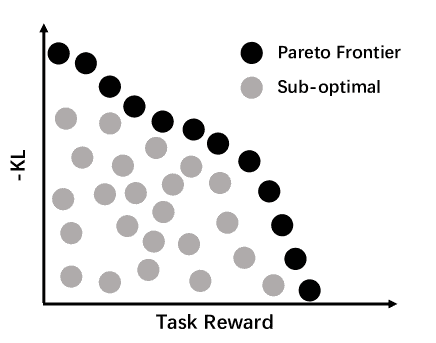

<!--yml  

分类：未分类  

日期：2025-01-11 12:08:52  

-->

# 与另一个你共同进化：利用顺序合作多智能体强化学习微调大语言模型  

> 来源：[https://arxiv.org/html/2410.06101/](https://arxiv.org/html/2410.06101/)  

Hao Ma^(1,2∗)  Tianyi Hu^(1,2)  Zhiqiang Pu^(1,2)  Boyin Liu³  

Xiaolin Ai²  Yanyan Liang⁴  Min Chen²  

¹中国科学院大学人工智能学院  

²中国科学院自动化研究所  

³阿里巴巴（中国）有限公司  

⁴澳门科技大学  

{mahao2021, hutianyi2021, zhiqiang.pu, xiaolin.ai, chenmin2020}@ia.ac.cn  

liuboyin.lby@alibaba-inc.com  

yyliang@must.edu.mo 这些作者对本文贡献相同。通讯作者：zhiqiang.pu@ia.ac.cn。  

###### 摘要  

强化学习（RL）已成为微调大语言模型（LLM）以完成特定任务的关键技术。然而，现有的RL微调方法主要依赖于PPO及其变种。尽管这些算法在一般的RL设置中有效，但在应用于LLM的微调时，常常表现出次优的性能，并且容易出现分布崩溃的情况。本文提出了CORY，它将LLM的RL微调扩展到一个顺序合作的多智能体强化学习框架，从而利用多智能体系统的内在共同进化和突现能力。在CORY中，待微调的LLM最初被复制为两个自主智能体：一个先锋和一个观察者。先锋根据查询生成响应，而观察者则基于查询和先锋的响应生成回应。两个智能体一起训练。在训练过程中，两个智能体定期交换角色，促进它们之间的合作与共同进化。实验通过在IMDB评论和GSM8K数据集上分别使用主观和客观奖励函数对GPT-2和Llama-2进行微调来评估CORY的性能。结果表明，CORY在策略最优性、抗分布崩溃能力和训练鲁棒性方面优于PPO，突显了其作为一种更优方法在实际应用中微调LLM的潜力。  

## 1 引言  

大语言模型（LLMs）在多个下游任务中取得了令人瞩目的成功，包括对话系统 [Ouyang et al., [2022](https://arxiv.org/html/2410.06101v1#bib.bib25), Touvron et al., [2023](https://arxiv.org/html/2410.06101v1#bib.bib33)]、代码生成 [Roziere et al., [2023](https://arxiv.org/html/2410.06101v1#bib.bib27)] 和机器人控制 [Driess et al., [2023](https://arxiv.org/html/2410.06101v1#bib.bib10), Brohan et al., [2023](https://arxiv.org/html/2410.06101v1#bib.bib4)]。然而，随着LLM能力的进步，与进一步提升性能相关的挑战变得日益复杂。为了特定任务微调LLM带来了显著挑战，这促使了近期对LLM微调范式的探索，如监督微调（SFT） [Wu et al., [2021](https://arxiv.org/html/2410.06101v1#bib.bib37)]、强化学习（RL）微调 [Shojaee et al., [2023](https://arxiv.org/html/2410.06101v1#bib.bib29)] 和直接偏好优化（DPO） [Rafailov et al., [2024](https://arxiv.org/html/2410.06101v1#bib.bib26)]。RL微调展示了精炼LLM的潜力。与SFT相比，RL微调提供了一条更直接的优化路径，使训练与期望结果对齐，并有可能导致更好的外部分布表现 [Kirk et al., [2023](https://arxiv.org/html/2410.06101v1#bib.bib18)]。与DPO相比，RL微调允许在基于规则的奖励函数上进行微调，而不需要偏好数据。

然而，当前的强化学习（RL）算法并未专门为大语言模型（LLMs）设计。当使用这些RL算法对LLM进行微调时，它们表现出不稳定性和对分布崩溃的易感性，这意味着LLM被过度优化，并表现出高度偏倚的行为 [Zheng et al., [2023](https://arxiv.org/html/2410.06101v1#bib.bib42), Yang et al., [2024b](https://arxiv.org/html/2410.06101v1#bib.bib39)]。从RL的角度来看，LLM微调面临几个挑战，包括大的离散动作空间和稀疏奖励。以Llama-2的RL微调为例 [Touvron et al., [2023](https://arxiv.org/html/2410.06101v1#bib.bib33)]，Llama-2的动作空间维度可以达到32000，代表着32000个潜在的词汇选择。此外，奖励信号只有在生成完整的响应后才能获得，这导致了稀疏奖励问题。上述挑战阻碍了在如此广阔的搜索空间中的探索，导致像PPO这样的流行算法的不稳定性 [Schulman et al., [2017](https://arxiv.org/html/2410.06101v1#bib.bib28)]。

协作多智能体强化学习（MARL）代表了人工智能（AI）领域的一次范式转变，其中多个自主代理在复杂系统中共同进化，导致新技能的出现[Foerster, [2018](https://arxiv.org/html/2410.06101v1#bib.bib13), Yang和Wang, [2020](https://arxiv.org/html/2410.06101v1#bib.bib40), Oroojlooy和Hajinezhad, [2023](https://arxiv.org/html/2410.06101v1#bib.bib24), Zang等, [2023](https://arxiv.org/html/2410.06101v1#bib.bib41)]。语言是这种多智能体共同进化的产物。在一个社会中，许多个体使用语言进行交流。语言通过代理间的互动发展，并受到社会和文化的影响。随着语言的发展，它们相互影响、相互塑造[Cavalli-Sforza和Feldman, [1981](https://arxiv.org/html/2410.06101v1#bib.bib6), Duéñez-Guzmán等, [2023](https://arxiv.org/html/2410.06101v1#bib.bib11)]。受此启发，在协作MARL框架中微调LLM可能会导致在共同进化过程中涌现出更优的策略。

在本文中，我们提出了一种名为CORY的即插即用方法，它将LLM的强化学习微调扩展到一个顺序协作的MARL框架中。在CORY中，待微调的LLM最初被复制为两个自主代理¹¹1此处的“代理”指的是在强化学习的背景下做出决策并采取行动的个体[Sutton和Barto, [2018](https://arxiv.org/html/2410.06101v1#bib.bib32)]。并分别分配了两个角色：先锋和观察者。CORY中有两个基本机制，使得两个LLM代理能够共同进化。第一个是知识转移，先锋根据任务查询独立生成响应，而观察者则基于查询和先锋的响应生成回应。第二个是角色交换，在训练过程中，两个LLM代理的角色会定期交换。这两个代理共享一个集体奖励，该奖励是单个任务奖励的总和，并且它们与各自的样本同时进行训练。最终，CORY充当了一种引导式学习，其中LLM之间的协作学习增强了RL微调的效果。值得注意的是，这种方法保持算法无关性，提供了与各种RL算法（如PPO以外的算法）集成的灵活性，同时保持与现有方法的简单性和兼容性。

在实验评估中，我们系统地研究了我们提出的方法在两种奖励函数上的有效性：主观奖励和客观奖励。主观奖励函数是训练以对齐人类偏好的模型，而客观奖励函数则是由领域专家预定义的函数。为了评估主观奖励，我们利用了IMDB评论数据集[Tripathi et al., [2020](https://arxiv.org/html/2410.06101v1#bib.bib34)]，这是一个广泛应用于情感分析的基准数据集。同时，客观奖励的评估使用了GSM8K数据集[Cobbe et al., [2021a](https://arxiv.org/html/2410.06101v1#bib.bib8)]，该数据集专注于数学文字问题推理。实验结果表明，CORY在政策最优性、对分布崩溃的弹性以及训练过程中的稳健性方面超过了PPO，突显了其作为改进实际应用中大规模语言模型（LLMs）的一种先进方法的潜力。

## 2 问题定义

为了通过强化学习（RL）来理解大语言模型（LLMs），我们提出了一个顺序决策问题的公式化，用于因果语言模型中的下一个标记预测。下一个标记预测通过语言增强的马尔可夫决策过程（[Li et al., 2022](https://arxiv.org/html/2410.06101v1#bib.bib19)）的概念来精确定义，表示为$\mathcal{M}=<\mathcal{V},\mathcal{S},\mathcal{A},r,P,\gamma>$。这里，$\mathcal{V}$表示语言模型的词汇表，涵盖了所有可能的标记。$w\in\mathcal{V}$表示该词汇表中的一个特定标记。状态空间$\mathcal{S}\subset\mathcal{V}^{M}$，其中$\mathcal{V}^{M}$是$M$个标记的组合空间。动作空间$\mathcal{A}\subset\mathcal{V}^{N}$，其中$\mathcal{V}^{N}$是$N$个标记的组合空间。$M$和$N$分别是状态和动作的最大标记长度。状态$s\in\mathcal{S}$是标记序列的连接：$s=(w_{1},w_{2},\dots,w_{M})$。动作$a\in\mathcal{A}$是因果语言模型的输出，被理解为标记序列的连接：$a=(w_{1},w_{2},\dots,w_{N})$。如果实际长度小于最大长度，状态和动作将使用填充标记进行填充。奖励函数$r:\mathcal{S}\times\mathcal{A}\rightarrow\mathbb{R}$为标记序列分配一个数值分数，这可以看作是RL中典型的稀疏奖励问题。状态转移函数$P:\mathcal{S}\times\mathcal{V}\rightarrow\mathcal{S}$描述了根据自回归范式的状态确定性转移。在每一步，预测的标记将与上一步的状态连接起来：$s_{i+1}=(s_{i},w_{i+1})=(s_{0},w_{1:i+1})$，其中$s_{0}$表示因果语言模型的标记化用户输入，$w_{1:i}=(w_{1},w_{2},\dots,w_{i})$表示直到第$i$个标记的标记序列。然后，因果语言模型的标记级策略可以通过$\pi(w_{i}|s_{0},w_{1:i-1})$来封装。而句子级策略被定义为联合策略：

|  | $\pi(a&#124;s_{0})=\prod_{i=1}^{N}\pi(w_{i}&#124;s_{0},w_{1:i-1}).$ |  | (1) |
| --- | --- | --- | --- |

奖励函数$r(\cdot,\cdot)$与特定任务相关（例如，安全对齐 [Liu, [2023](https://arxiv.org/html/2410.06101v1#bib.bib21)，Ji 等人, [2024](https://arxiv.org/html/2410.06101v1#bib.bib16)]，代码生成 [Shojaee 等人, [2023](https://arxiv.org/html/2410.06101v1#bib.bib29)，Liu 等人, [2023](https://arxiv.org/html/2410.06101v1#bib.bib20)]）。任务奖励仅在通过token级别的策略进行$N$步决策后获得。在这样的稀疏奖励下，强化学习（RL）容易出现过度优化，从而导致语言模型的分布崩溃。为了减轻分布崩溃的风险，常见做法是将token级别的KL惩罚纳入奖励函数中，这有助于约束语言模型偏离其初始分布的程度 [Go 等人, [2023](https://arxiv.org/html/2410.06101v1#bib.bib15)，Zheng 等人, [2023](https://arxiv.org/html/2410.06101v1#bib.bib42)]。

|  | $\hat{r}(s_{i},w_{i})=\left\{\begin{array}[]{lr}-\eta KL(\pi_{\theta}(\cdot | s_{0},w_{1:i-1}),\pi_{0}(\cdot | s_{0},w_{1:i-1}))&i<N\\ \\ r(s_{0},a)-\eta KL(\pi_{\theta}(\cdot | s_{0},w_{1:i-1}),\pi_{0}(\cdot | s_{0},w_{1:i-1}))&i=N,\end{array}\right.$ |  | (2) |
| --- | --- | --- | --- | --- | --- | --- | --- |

其中，$\eta$是KL系数，$\hat{r}(s_{i},w_{i})$表示基于token级别的组合奖励函数。对于每个token，依据当前策略$\pi_{\theta}(\cdot|s_{0},w_{1:i-1})$和初始策略$\pi_{0}(\cdot|s_{0},w_{1:i-1})$之间的KL散度来施加KL惩罚。只有在预测最后一个token后，奖励模型才会给出一个任务特定的奖励$r(s_{0},a)$。

## 3 方法

### 3.1 与另一版本的你共同进化（CORY）

为了将LLM的RL微调扩展到协作式多智能体强化学习（MARL）框架中，CORY中的LLM最初被复制为两个副本，每个副本被视为一个自主代理。然后，这两个LLM代理分别被分配为先驱者和观察者的角色。我们设计了两个基本机制，以促进这两个代理之间的共同进化。第一个设计是知识转移。LLM以异步方式采取行动，先驱者将其反应（行动）传递给观察者。观察者随后利用这一信息来指导自己的决策。第二个设计是角色交换。一旦观察者实现了满意的表现，它将与先驱者交换角色。接下来，我们将全面描述每个元素，我们方法的流程图如图[1](https://arxiv.org/html/2410.06101v1#S3.F1 "图 1 ‣ 3.1 与另一版本的你共同进化（CORY） ‣ 3 方法 ‣ 与另一版本的你共同进化：通过顺序协作多智能体强化学习微调LLM")所示。

图1：CORY框架。一个传统的强化学习微调方法可以通过仅三个步骤简单扩展为CORY版本。首先，将LLM复制为两个LLM智能体，一个作为先驱者，另一个作为观察者；其次，将两个LLM智能体的任务奖励结合起来，替代原始任务奖励；第三，在训练过程中定期交换两个LLM智能体的角色。训练结束后，任一LLM智能体均可独立执行任务。

知识转移。为了促使两个LLM智能体之间的协作以提高响应生成，我们引入了知识转移机制。给定一个查询$s_{0}$，先驱者首先进行响应并生成一个响应$a_{1}$。随后，观察者接收原始查询$s_{0}$和先驱者的响应$a_{1}$，生成自己的响应$a_{2}$。这种顺序交互促进了知识转移，观察者利用先驱者的输出来指导自己的生成过程，凭借LLM的上下文学习能力，可能会生成更优的响应。先驱者和观察者的句子级策略可以如下表示：

|  | $a_{1}\sim\pi_{\mathrm{pio}}(\cdot&#124;s_{0}),\quad a_{2}\sim\pi_{\mathrm{obs}}(% \cdot&#124;s_{0},a_{1}).$ |  | (3) |
| --- | --- | --- | --- |

在训练过程中，先驱者和观察者的参数通过PPO等强化学习算法分别优化。两者之间存在合作关系。为了促进这种合作，CORY采用了集体任务奖励，该奖励通过将各自任务奖励的总和来计算：

|  | $r_{\mathrm{CORY}}(s_{0},a_{1},a_{2})=r(s_{0},a_{1})+r(s_{0},a_{2}),$ |  | (4) |
| --- | --- | --- | --- |

这意味着先驱者和观察者会从彼此的改进中获得奖励。按照公式[2](https://arxiv.org/html/2410.06101v1#S2.E2 "在 2 问题表述 ‣ 与他自己共同进化：用顺序合作多智能体强化学习微调大语言模型")的形式，我们加入了$r_{\mathrm{CORY}}$和KL惩罚项来构造完整的奖励信号。类似于Ni等人[[2022](https://arxiv.org/html/2410.06101v1#bib.bib23)]的研究，我们发现部分正确的参考也能对观察者有所帮助。因此，先驱者不必生成高质量的响应。

角色交换。在训练过程中，观察者可能由于持续接收形如$(s_{0},a_{1})$的输入而产生提示偏差。依赖于将原始查询与先驱者的响应相结合的提示，阻碍了观察者独立生成响应的能力。为了解决这个问题，我们引入了角色交换机制。该机制涉及在训练过程中定期交换先驱者和观察者的角色：

|  | $\begin{split}\pi_{\mathrm{pio}}(\cdot&#124;s_{0})=\pi_{\mathrm{pio}}(\cdot&#124;s_{0};% \theta_{1}),\quad\pi_{\mathrm{obs}}(\cdot&#124;s_{0},a_{1})=\pi_{\mathrm{obs}}(% \cdot&#124;s_{0},a_{1};\theta_{2}),\ \text{if}\ swap=False\\ \pi_{\mathrm{pio}}(\cdot&#124;s_{0})=\pi_{\mathrm{pio}}(\cdot&#124;s_{0};\theta_{2}),% \quad\pi_{\mathrm{obs}}(\cdot&#124;s_{0},a_{1})=\pi_{\mathrm{obs}}(\cdot&#124;s_{0},a_{1% };\theta_{1}),\ \text{if}\ swap=True,\end{split}$ |  | (5) |
| --- | --- | --- | --- |

其中$swap$初始化为$False$，并且定期交换。这种交换确保了两个LLM在整个训练过程中多次经历两种角色（先锋和观察者）。通过这种角色交换机制，它们被迫适应两种提示格式：仅$s_{0}$和结合格式$(s_{0},a_{1})$。这使我们在推理时可以单独使用任一LLM。从表征学习的角度来看，这种角色交换机制鼓励LLM发展$s_{0}$和$(s_{0},a_{1})$的统一表征。这种统一的表征捕捉了任务查询的核心信息，无论在训练或推理过程中展示的是哪种具体的提示格式。

CORY中的这两个关键机制充当了一种自举的形式。两个LLM代理协作，观察者通过利用先锋的输出可能学到更好的策略。角色交换确保两个LLM都能从这种协作学习中受益，类似于人类之间的合作学习。重要的是，CORY是一种与算法无关的方法，这意味着它理论上可以与多种RL算法兼容，不仅限于PPO。此外，CORY在实现上的简便性和与现有框架的无缝集成，使其成为一个即插即用的解决方案。CORY策略更新的推导可以在附录[B](https://arxiv.org/html/2410.06101v1#A2 "附录B CORY的Token级策略更新 ‣ 与另一个你共同进化：通过序列协作多代理强化学习对LLM进行微调")中找到，详细的伪代码也提供在附录[C](https://arxiv.org/html/2410.06101v1#A3 "附录C 算法详情 ‣ 与另一个你共同进化：通过序列协作多代理强化学习对LLM进行微调")中。

### 3.2 理解CORY

在第[3.1](https://arxiv.org/html/2410.06101v1#S3.SS1 "3.1 与另一个你共同进化（CORY） ‣ 3方法 ‣ 与另一个你共同进化：通过序列协作多代理强化学习对LLM进行微调")节对CORY的解释之后，本节提供了一个实证演示，说明为什么所提出的方法超过了单代理RL微调方法。

实际上，带有KL惩罚的RL微调本质上将问题构造为一个多目标强化学习问题。LLM智能体旨在同时最大化任务奖励并最小化KL散度。不幸的是，这两个目标可能彼此对立。因为最大化任务奖励必然会导致输出分布偏离预训练模型，从而增加KL散度。因此，优化过程在任务奖励和KL散度之间寻求平衡，理想情况下将策略引导至帕累托前沿[Ngatchou等，[2005](https://arxiv.org/html/2410.06101v1#bib.bib22)]。这个前沿覆盖了所有可实现的策略，在这些策略中，没有任何策略能够在不牺牲另一个目标表现的情况下改进某个目标。形式上，帕累托前沿可以定义为：

|  | $\mathcal{F}:=\left\{J_{\mathbf{r}}(\pi)\mid\pi\in\Pi\wedge\nexists\pi^{\prime}% \neq\pi:J_{\mathbf{r}}\left(\pi^{\prime}\right)\geq J_{\mathbf{r}}(\pi)\right\},$ |  | (6) |
| --- | --- | --- | --- |

其中$J_{\mathbf{r}}(\pi)=\mathbb{E}_{\pi}[\sum_{t=0}^{T}\gamma\mathbf{r}(s_{t},a_{t% })]$。$\mathbf{r}(s,a)\in\mathbb{R}^{m}$是一个向量值奖励函数，$\Pi$表示所有策略的集合。给定一个固定的参考向量$\bm{\omega}\in\bm{\Omega}\subseteq\mathbb{R}^{m}$，可以通过使用加权和$\bm{\omega}^{T}\mathbf{r}(s,a)$将多目标奖励标量化为单一目标。在这种偏好加权下，策略的理想结果是收敛到帕累托前沿上的某个点，如图[2(a)](https://arxiv.org/html/2410.06101v1#S3.F2.sf1 "在图2 ‣ 3.2 理解CORY ‣ 3 方法 ‣ 与另一个你的共同演化：使用顺序协同多智能体强化学习微调LLM")中的黑点所示。

然而，由于自然语言的固有复杂性，实现完美的策略收敛到帕累托前沿通常是难以处理的。尽管如此，通过调整偏好，这些次优策略仍然可以形成一个前沿，正如图[2(b)](https://arxiv.org/html/2410.06101v1#S3.F2.sf2 "在图2 ‣ 3.2 理解CORY ‣ 3 方法 ‣ 与另一个你的共同演化：使用顺序协同多智能体强化学习微调LLM")所示。为了简化起见，我们称之为次优前沿。我们的假设是，CORY所达到的次优前沿比单智能体RL方法所达到的更接近真实的帕累托前沿。

(a) 帕累托前沿

(b) 次优前沿

(c) 实证结果

图2：为什么CORY超越单智能体RL微调的实证展示。在(c)中，$\eta$的值从左到右分别是1e-5、1e-4、1e-3和1e-2。

为了验证这个假设，我们在年级学校数学8K（GSM8K）数据集上对Llama-2-7b-chat模型进行了微调，采用了PPO和CORY方法[Cobbe等，2021b](https://arxiv.org/html/2410.06101v1#bib.bib9)。我们测量了KL散度和每个策略在收敛后的任务奖励。通过调整偏好，即方程[2](https://arxiv.org/html/2410.06101v1#S2.E2 "在2问题表述 ‣ 与你共同进化：通过序列化合作多智能体强化学习微调LLM")中的$\eta$，我们能够为两种方法生成次优前沿，如图[2(c)](https://arxiv.org/html/2410.06101v1#S3.F2.sf3 "在图2 ‣ 3.2 理解CORY ‣ 3方法 ‣ 与你共同进化：通过序列化合作多智能体强化学习微调LLM")所示。值得注意的是，Y轴表示负KL散度（较大的值表示更好的表现）。正如预期的那样，CORY所实现的次优前沿始终优于PPO的前沿，实验证明了这一假设。

我们通过多目标强化学习的视角进行的分析为CORY的有效性提供了宝贵的见解。知识转移机制本质上解决了观察者面临的优化挑战。通过利用先驱者提供的参考响应，观察者实际上经历了一个有指导的优化过程。这样的指导过程能够缓解任务奖励方面的优化压力，并优先改进KL惩罚方面。然而，由于在训练过程中观察者的策略同时将任务查询和先驱者的响应作为输入，因此优化后的策略并非我们真正需要的策略（我们需要的是仅以任务查询为输入的策略），这导致了提示偏差问题。角色交换机制可以有效解决这个问题，并将观察者学到的技能转移回先驱者，从而减少先驱者的优化压力。值得注意的是，CORY在稳定性和鲁棒性方面显著优于单智能体强化学习方法（详见第[4.2节](https://arxiv.org/html/2410.06101v1#S4.SS2 "4.2 在GSM8K上的目标奖励 ‣ 4实验 ‣ 与你共同进化：通过序列化合作多智能体强化学习微调LLM")和附录[E](https://arxiv.org/html/2410.06101v1#A5 "附录E 关于鲁棒性的补充实验 ‣ 与你共同进化：通过序列化合作多智能体强化学习微调LLM")）。它始终在微调模型和预训练模型之间实现了更低的KL散度，同时在目标任务上保持了强劲的表现，标志着在这两个目标之间的更好权衡。

## 4 实验

本节系统地研究了CORY在两种类型的奖励函数上的表现：主观奖励函数和客观奖励函数。主观奖励函数是基于捕捉人类偏好的数据训练的奖励模型。它们本质上将人类的情感或判断转化为一个数值化的奖励信号，从而引导对齐。客观奖励函数是预定义的基于规则的函数，通常由领域专家制定。这一分类反映了现实世界中的情景，其中奖励函数可能来源于人类偏好的学习，或者由领域专家手动设计。实验中使用的提示词在附录[A.2](https://arxiv.org/html/2410.06101v1#A1.SS2 "A.2 Prompt Details ‣ Appendix A Implementation Details ‣ Coevolving with the Other You: Fine-Tuning LLM with Sequential Cooperative Multi-Agent Reinforcement Learning")中有详细说明。

### 4.1 IMDB评论上的主观奖励

任务设置。为了在主观奖励设置下评估我们的方法，我们选择了IMDB评论数据集[Tripathi et al., [2020](https://arxiv.org/html/2410.06101v1#bib.bib34)]。该数据集包含50K个<text,label>对，其中训练集和测试集各包含25K条数据。IMDB数据集中的文本是电影评论，标签是二分类情感标签。基于该数据集训练的distilbert-imdb模型²²2[https://huggingface.co/lvwerra/distilbert-imdb](https://huggingface.co/lvwerra/distilbert-imdb)被用作奖励模型。我们分别使用单代理PPO（single-PPO）和CORY对GPT2-Large（774M）³³3[https://huggingface.co/openai-community/gpt2-large](https://huggingface.co/openai-community/gpt2-large)进行微调。此外，GPT2-XL（1.5B）⁴⁴4[https://huggingface.co/openai-community/gpt2-xl](https://huggingface.co/openai-community/gpt2-xl)作为模型大小的消融实验，使用single-PPO进行微调。在此任务中，我们从IMDB数据集中随机抽取文本片段。保留前2到8个标记（代表评论的开头）作为情感完成的提示词。LLMs生成的继续部分将提示词转换为积极情感评论。之后，奖励模型对生成的文本进行评估，以分配情感得分。目标是最大化完成评论的平均情感得分。此任务的示例在附录[D](https://arxiv.org/html/2410.06101v1#A4 "Appendix D Qualitative Analysis of Experiment Results. ‣ Coevolving with the Other You: Fine-Tuning LLM with Sequential Cooperative Multi-Agent Reinforcement Learning")中有详细说明。

在实验中，每种方法都经过100次训练迭代，批次大小为256。为简便起见，单PPO微调的GPT2-Large和GPT2-XL分别称为PPO-GPT-2-l和PPO-GPT-2-xl。经过CORY微调的GPT-2-Large分别称为CORY-LLM1和CORY-LLM2，其中前者是以先驱初始化的LLM，后者是以观察者初始化的LLM。

(a) 任务奖励

(b) KL散度

(c) 组合奖励

图3：在IMDB评论上的主观奖励下的训练曲线。

结果与分析。我们通过可视化任务奖励、KL散度以及包含上述两个目标的组合奖励函数来监控训练过程。组合奖励函数记作$r_{\mathrm{c}}(s_{0},a)$，可以表示为$r_{\mathrm{c}}(s_{0},a)=r(s_{0},a)+\eta*KL(s_{0},\pi_{\theta},\pi_{0})$，其中$r(s_{0},a)$和$KL(s_{0},\pi_{\theta},\pi_{0})$分别是句子级任务奖励部分和KL惩罚部分。而KL惩罚部分可以计算为$KL(s_{0},\pi_{\theta},\pi_{0})=\sum_{i={0,1,\dots,N}}-KL(\pi_{\theta}(\cdot|s_{0},w_{1:i-1}),\pi_{0}(\cdot|s_{0},w_{1:i-1}))$。

需要注意的是，在CORY中的实际训练奖励并不是组合奖励。实际的训练奖励不仅包括KL惩罚和来自目标智能体的任务奖励，还包括来自其他智能体的任务奖励。事实上，组合奖励$r_{\mathrm{c}}(s_{0},a)$才是需要优化的真实总体目标，并且可以与单智能体强化学习的微调对齐，从而更容易比较所有方法的表现。

任务奖励、KL 散度和组合奖励的训练曲线如图 [3](https://arxiv.org/html/2410.06101v1#S4.F3 "图 3 ‣ 4.1 IMDB 评论的主观奖励 ‣ 4 实验 ‣ 与另一个你共同进化：通过顺序协作多智能体强化学习微调 LLM") 所示。结果表明，单一 PPO 和 CORY 在 100 次训练迭代后达到了相似的任务奖励水平。然而，与单一 PPO 相关的 KL 散度曲线显著高于 CORY，在所有训练迭代结束后，KL 散度达到了 CORY 的两倍以上。这表明，CORY 能够在与预训练策略的偏差较小的情况下，达到类似的任务奖励水平。此外，可以观察到，CORY-LLM1 和 CORY-LLM2 的曲线非常接近，表明这两个最初扮演不同角色的 LLM 智能体在训练结束时达到了非常相似的性能水平。与 CORY 的动机一致，两个微调后的 LLM 智能体都可以单独完成任务，这验证了 CORY 中自举学习和共同进化原则的有效性。

最后，图 [3(c)](https://arxiv.org/html/2410.06101v1#S4.F3.sf3 "图 3 ‣ 4.1 IMDB 评论的主观奖励 ‣ 4 实验 ‣ 与另一个你共同进化：通过顺序协作多智能体强化学习微调 LLM") 直观地确认了 CORY 在结合这两个目标方面的优势。CORY 的组合奖励曲线持续上升，表明它在同时提升任务奖励和最小化 KL 散度方面的有效性。相反，PPO 的组合奖励曲线呈下降趋势，表明其在平衡这两个目标方面的困难。单一 PPO 和 CORY 使用的超参数详见附录 [A.1](https://arxiv.org/html/2410.06101v1#A1.SS1 "A.1 超参数 ‣ 附录 A 实现细节 ‣ 与另一个你共同进化：通过顺序协作多智能体强化学习微调 LLM")。

### 4.2 GSM8K 上的客观奖励

任务设置：为了在基于规则的目标奖励函数下评估我们的方法，我们选择了 GSM8K 任务[Cobbe et al., [2021a](https://arxiv.org/html/2410.06101v1#bib.bib8)]。GSM8K 包含 8790 个高质量、语言多样化的小学数学问题，其中 7470 个用于训练，1320 个用于测试。对于数据集中的每个问题，通过 LLM 获得一个回答。使用正则表达式从回答中提取准确答案，通常是回答中的最后一组数字。如果问题中的数字与数据集中记录的真实答案匹配，则奖励 1 分。相反，如果数字错误，则奖励 0 分。选择 Llama-2-7b-chat⁵⁵5[https://huggingface.co/meta-llama/Llama-2-7b-chat-hf](https://huggingface.co/meta-llama/Llama-2-7b-chat-hf) 模型作为预训练模型。为了减少训练开销，模型被量化为 4 位。为简单起见，经过单一 PPO 微调的 4 位 Llama-2-7b-chat 模型称为 PPO-Llama-2。使用 CORY 微调的复制模型分别称为 CORY-LLM1 和 CORY-LLM2，其中前者是作为先行者初始化的 LLM，后者是作为观察者初始化的 LLM。此任务的示例详见附录[D](https://arxiv.org/html/2410.06101v1#A4 "附录 D 实验结果的定性分析。 ‣ 与另一个你的共同进化：使用顺序合作的多智能体强化学习微调 LLM")。

(a) 任务奖励

(b) KL 散度

(c) 综合奖励

图 4：在 GSM8K 上使用目标奖励的训练曲线。

图 5：在 GSM8K 测试数据集上的评估结果。

结果与分析。类似于第[4.1](https://arxiv.org/html/2410.06101v1#S4.SS1 "4.1 Subjective Rewards on IMDB Review ‣ 4 Experiments ‣ Coevolving with the Other You: Fine-Tuning LLM with Sequential Cooperative Multi-Agent Reinforcement Learning")节，我们通过可视化任务奖励、KL散度和综合奖励来监控训练过程。如图[4](https://arxiv.org/html/2410.06101v1#S4.F4 "Figure 4 ‣ 4.2 Objective Rewards on GSM8K ‣ 4 Experiments ‣ Coevolving with the Other You: Fine-Tuning LLM with Sequential Cooperative Multi-Agent Reinforcement Learning")所示，所有曲线中观察到的抖动表明GSM8K所带来的挑战。广阔的探索空间为RL算法带来了固有的不稳定性。如图[4(a)](https://arxiv.org/html/2410.06101v1#S4.F4.sf1 "In Figure 4 ‣ 4.2 Objective Rewards on GSM8K ‣ 4 Experiments ‣ Coevolving with the Other You: Fine-Tuning LLM with Sequential Cooperative Multi-Agent Reinforcement Learning")所示，单一PPO的任务奖励曲线在约50次训练迭代后达到峰值，随后开始下降。单一PPO的KL散度没有收敛趋势，在训练过程中达到了最大值（图[4(b)](https://arxiv.org/html/2410.06101v1#S4.F4.sf2 "In Figure 4 ‣ 4.2 Objective Rewards on GSM8K ‣ 4 Experiments ‣ Coevolving with the Other You: Fine-Tuning LLM with Sequential Cooperative Multi-Agent Reinforcement Learning")）。单一PPO的不稳定性导致50次迭代后KL散度较高，进而使综合奖励表现较差（图[4(c)](https://arxiv.org/html/2410.06101v1#S4.F4.sf3 "In Figure 4 ‣ 4.2 Objective Rewards on GSM8K ‣ 4 Experiments ‣ Coevolving with the Other You: Fine-Tuning LLM with Sequential Cooperative Multi-Agent Reinforcement Learning")）。

相比之下，CORY展现出明显更稳定的任务奖励曲线，始终优于单一PPO。而且，CORY相较于单一PPO，KL散度显著较低，从而促进了更快的收敛。这个特点在微调过程中尤为重要，因为它使CORY能够在不对原始参数分布进行重大修改的情况下，获得类似甚至更好的任务奖励。

此外，综合奖励曲线直观地证实了CORY相较于单一PPO的优越性。CORY在平衡两个目标方面的能力表现在其稳步上升的综合奖励上。相反，单一PPO在平衡目标方面的挣扎表现为综合奖励的下降和训练的不稳定性。

此外，我们对使用不同方法微调的模型和预训练模型在GSM8K测试集上的表现进行了比较分析，如图[5](https://arxiv.org/html/2410.06101v1#S4.F5 "Figure 5 ‣ 4.2 Objective Rewards on GSM8K ‣ 4 Experiments ‣ Coevolving with the Other You: Fine-Tuning LLM with Sequential Cooperative Multi-Agent Reinforcement Learning")所示。使用的评估指标是$pass@k$，它为每个样本生成$k$个重复项，并在至少一个正确时通过。测试结果表明，CORY微调后的4bit Llama-2-chat-7b在GSM8K测试数据集上能达到$pass@1$为$18\%$。

### 4.3 消融实验

在消融实验中，我们在IMDB评论数据集上，消融了模型规模、知识迁移和角色交换在主观奖励设置下的影响。图[6](https://arxiv.org/html/2410.06101v1#S4.F6 "Figure 6 ‣ 4.3 Ablations ‣ 4 Experiments ‣ Coevolving with the Other You: Fine-Tuning LLM with Sequential Cooperative Multi-Agent Reinforcement Learning")中展示的方法名称，REx表示角色交换，KT表示知识迁移，LLM1和LLM2分别指初始化为先锋和观察者的LLM。

(a) 任务奖励

(b) KL散度

(c) 综合奖励

图6：消融实验的训练曲线。

模型规模的消融实验。我们的方法在训练过程中使用了两个模型，训练的总参数量是单一PPO的两倍。为了消融CORY增强效果是否来源于模型参数的扩展，我们在IMDB数据集上对GPT2-XL（1.5B）进行了额外的单PPO微调，该模型的参数量是GPT2-Large的两倍。结果见图[3](https://arxiv.org/html/2410.06101v1#S4.F3 "Figure 3 ‣ 4.1 Subjective Rewards on IMDB Review ‣ 4 Experiments ‣ Coevolving with the Other You: Fine-Tuning LLM with Sequential Cooperative Multi-Agent Reinforcement Learning")。尽管模型的任务奖励迅速达到了最大值，但KL惩罚部分相较于GPT2-Large并未显示出明显的提升。KL散度持续增加，导致分布崩溃。

知识转移的消融实验。我们保持角色交换，两个模型仍然共享集体任务奖励（方程[4](https://arxiv.org/html/2410.06101v1#S3.E4 "In 3.1 Coevolving with the Other You (CORY) ‣ 3 Method ‣ Coevolving with the Other You: Fine-Tuning LLM with Sequential Cooperative Multi-Agent Reinforcement Learning")），但禁用知识转移。这类似于使用单独查询作为输入的PPO。然而，缺乏对先行者输出的可观察性，相当于为PPO奖励信号加入噪声。因此，任务奖励变得不稳定，且KL散度比CORY更高，如图[6](https://arxiv.org/html/2410.06101v1#S4.F6 "Figure 6 ‣ 4.3 Ablations ‣ 4 Experiments ‣ Coevolving with the Other You: Fine-Tuning LLM with Sequential Cooperative Multi-Agent Reinforcement Learning")所示。这突显了可观察性的重要性，将强化学习微调框架作为一个真正的多智能体合作问题。

角色交换的消融实验。我们保持知识转移，但禁用角色交换。如图[6](https://arxiv.org/html/2410.06101v1#S4.F6 "Figure 6 ‣ 4.3 Ablations ‣ 4 Experiments ‣ Coevolving with the Other You: Fine-Tuning LLM with Sequential Cooperative Multi-Agent Reinforcement Learning")所示，两个LLM都获得了良好的任务奖励，但它们的KL散度远高于CORY。值得注意的是，观察者LLM的KL散度明显低于先行者LLM。这一观察结果揭示了合作学习中的一个有趣现象：通过接收先行者的反馈，观察者能够有效优化KL散度。这表明，观察者利用先行者的探索来优化自己的策略，同时保持良好的表现，可能会导致更稳定的学习过程。

## 5 相关工作

最相关的话题是基于人类反馈的强化学习（RLHF）。InstructGPT [Ouyang等人，[2022](https://arxiv.org/html/2410.06101v1#bib.bib25)]通过结合基于人类偏好数据集的强化学习与监督学习（SFT），对类似GPT-3的模型[Brown等人，[2020](https://arxiv.org/html/2410.06101v1#bib.bib5)]进行了微调，以增强其有用性。Askell等人[[2021](https://arxiv.org/html/2410.06101v1#bib.bib1)]为LLM训练了一个偏好模型，以使其与人类价值观对齐。该研究认为，排名偏好建模被证明是区分期望和不期望LLM行为的最有效训练目标。Bai等人[[2022](https://arxiv.org/html/2410.06101v1#bib.bib2)]结合了一种迭代在线训练模式，在这种模式下，偏好模型和LLM每周都会根据最新的人类反馈数据进行更新。现有研究已认识到RLHF的固有复杂性、不稳定性以及对超参数的敏感性，尤其是在使用PPO时Zheng等人[[2023](https://arxiv.org/html/2410.06101v1#bib.bib42)]。几项工作尝试通过引入最大熵正则化[Wen等人，[2024](https://arxiv.org/html/2410.06101v1#bib.bib36)]、超参数调优[Zheng等人，[2023](https://arxiv.org/html/2410.06101v1#bib.bib42)]和奖励塑形[Yang等人，[2024a](https://arxiv.org/html/2410.06101v1#bib.bib38)]来解决这些挑战。然而，这些方法相较于普通PPO算法并未显示出显著的改进。这启发我们从不同的视角探索替代方法，将LLM的强化学习微调扩展为合作的MARL问题。

另一个相关的话题是多智能体强化学习（MARL）。在交互关系（合作、竞争、混合）的基础上，多智能体能够自发地产生复杂且多样的策略，从而解决单智能体强化学习难以解决的复杂问题。例如，在Kim等人[[2023](https://arxiv.org/html/2410.06101v1#bib.bib17)]的研究中，基于强化学习的提示调优被分解为多智能体联合调优。巨大的联合动作空间被均匀地划分给各个智能体，学习更好且持续时间更长的提示。这种机制也已经被应用于组合优化领域。与我们在智能体训练架构上最为相似的论文是Gao等人[[2023](https://arxiv.org/html/2410.06101v1#bib.bib14)]。该文提出了一种不对称训练、对称执行框架来处理两个智能体的斯塔克尔伯格博弈Fang等人[[2021](https://arxiv.org/html/2410.06101v1#bib.bib12)]。在斯塔克尔伯格博弈中，两个智能体异步做出决策。后做决策的智能体可以观察到前一个智能体，但前一个智能体无法观察到后做决策的智能体。作者提出的训练框架在斯塔克尔伯格均衡中能够在经验上收敛。这启发我们设计在顺序合作设置下的大型语言模型（LLM）训练框架。

## 6 讨论

实验证据表明，CORY在RL微调中能够提供更加稳定且卓越的性能。这可以归因于我们将单智能体RL微调扩展为协作型MARL版本。在这一部分，我们深入探讨了多智能体学习如何有利于LLM微调。其主要优势在于，多智能体学习通过集体生活、社会关系和主要的进化转变，鼓励LLM的共同进化[Duéñez-Guzmán等人，2023](https://arxiv.org/html/2410.06101v1#bib.bib11)。这一过程产生了大量新的数据，进一步促进了共同进化。这一机制对游戏AI的许多突破性进展做出了贡献，例如围棋[Silver等人，2016](https://arxiv.org/html/2410.06101v1#bib.bib30)，2017](https://arxiv.org/html/2410.06101v1#bib.bib31)，Clark和Storkey，2015](https://arxiv.org/html/2410.06101v1#bib.bib7)]，星际争霸II[Vinyals等人，2019](https://arxiv.org/html/2410.06101v1#bib.bib35)]，以及外交游戏[Bakhtin等人，2022](https://arxiv.org/html/2410.06101v1#bib.bib3)]。

本文探讨了协作型MARL在解决RL微调挑战中的应用。协作型MARL微调似乎能够提高训练的鲁棒性，并防止分布崩溃。虽然我们着重于合作，但竞争型MARL，特别是基于种群的方法，代表了未来研究的一个有前景的方向。这些方法通过自然的军备竞赛机制创造了自动课程机制，推动了智能体学习，并使得智能体能够掌握复杂任务。除了交互范式，智能体的规模对智能体的涌现至关重要。虽然我们在此研究中考察了涉及两个LLM的设置，但在MARL微调中引入更多LLM是未来研究的一个有趣前景。

## 7 结论

本文将大规模语言模型（LLM）的强化学习（RL）微调扩展到一个顺序协作的多智能体强化学习（MARL）框架。为此，我们将预训练的LLM复制为两个具有不同角色的LLM智能体，并设计了两个关键机制：知识转移和角色交换。这些机制使得两个LLM智能体能够协作学习，在微调过程后，任意一个LLM智能体都可以独立执行任务。我们还从多目标强化学习的角度，深入分析了RL微调，揭示了KL散度和任务奖励之间存在着帕累托前沿。我们通过实验证明，CORY在接近帕累托前沿时，相较于单智能体RL方法具有优势。实验结果表明，CORY在策略最优性、对分布崩溃的鲁棒性以及训练过程中的稳定性方面，超越了PPO，突出其作为提升LLM在实际应用中性能的先进方法潜力。

## 8 致谢

本工作得到了中国科学院战略性优先科技研究计划（资助号 XDA27030204）、国家自然科学基金（资助号 62322316）、北京青年计划（资助号 20220484077 和 20230484435）的支持。

## 参考文献

+   Askell 等人 [2021] Amanda Askell, Yuntao Bai, Anna Chen, Dawn Drain, Deep Ganguli, Tom Henighan, Andy Jones, Nicholas Joseph, Ben Mann, Nova DasSarma 等人. 将通用语言助手作为对齐实验室. *arXiv 预印本 arXiv:2112.00861*, 2021年。

+   Bai 等人 [2022] Yuntao Bai, Andy Jones, Kamal Ndousse, Amanda Askell, Anna Chen, Nova DasSarma, Dawn Drain, Stanislav Fort, Deep Ganguli, Tom Henighan 等人. 通过人类反馈强化学习训练有帮助且无害的助手. *arXiv 预印本 arXiv:2204.05862*, 2022年。

+   Bakhtin 等人 [2022] Anton Bakhtin, Noam Brown, Emily Dinan, Gabriele Farina, Colin Flaherty, Daniel Fried, Andrew Goff, Jonathan Gray, Hengyuan Hu 等人. 通过结合语言模型与战略推理实现人类水平的外交游戏玩法. *科学*, 378(6624):1067–1074, 2022年。

+   Brohan 等人 [2023] Anthony Brohan, Noah Brown, Justice Carbajal, Yevgen Chebotar, Xi Chen, Krzysztof Choromanski, Tianli Ding, Danny Driess, Avinava Dubey, Chelsea Finn 等人. Rt-2：视觉-语言-动作模型将网页知识转移到机器人控制. *arXiv 预印本 arXiv:2307.15818*, 2023年。

+   Brown 等人 [2020] Tom Brown, Benjamin Mann, Nick Ryder, Melanie Subbiah, Jared D Kaplan, Prafulla Dhariwal, Arvind Neelakantan, Pranav Shyam, Girish Sastry, Amanda Askell 等人. 语言模型是少样本学习者. *神经信息处理系统进展*, 33:1877–1901, 2020年。

+   Cavalli-Sforza 和 Feldman [1981] Luigi Luca Cavalli-Sforza 和 Marcus W Feldman. *文化传播与演化：定量方法*. 第16号. 普林斯顿大学出版社，1981年。

+   Clark 和 Storkey [2015] Christopher Clark 和 Amos Storkey. 训练深度卷积神经网络来下围棋. 收录于 *国际机器学习大会*, 第1766–1774页. PMLR, 2015年。

+   Cobbe 等人 [2021a] Karl Cobbe, Vineet Kosaraju, Mohammad Bavarian, Mark Chen, Heewoo Jun, Lukasz Kaiser, Matthias Plappert, Jerry Tworek, Jacob Hilton, Reiichiro Nakano, Christopher Hesse, 和 John Schulman. 训练验证器解决数学应用题. *arXiv 预印本 arXiv:2110.14168*, 2021a。

+   Cobbe 等人 [2021b] Karl Cobbe, Vineet Kosaraju, Mohammad Bavarian, Mark Chen, Heewoo Jun, Lukasz Kaiser, Matthias Plappert, Jerry Tworek, Jacob Hilton, Reiichiro Nakano 等人. 训练验证器解决数学应用题. *arXiv 预印本 arXiv:2110.14168*, 2021b。

+   Driess 等人 [2023] Danny Driess, Fei Xia, Mehdi SM Sajjadi, Corey Lynch, Aakanksha Chowdhery, Brian Ichter, Ayzaan Wahid, Jonathan Tompson, Quan Vuong, Tianhe Yu 等人. Palm-e：一种具身的多模态语言模型. 收录于 *国际机器学习大会*, 第8469–8488页. PMLR, 2023年。

+   Duéñez-Guzmán等人[2023] Edgar A Duéñez-Guzmán, Suzanne Sadedin, Jane X Wang, Kevin R McKee, 和Joel Z Leibo。通向类人人工智能的社会路径。*Nature Machine Intelligence*, 5(11):1181–1188, 2023年。

+   Fang等人[2021] Fei Fang, Shutian Liu, Anjon Basak, Quanyan Zhu, Christopher D Kiekintveld, 和Charles A Kamhoua。博弈论简介。*博弈论与机器学习在网络安全中的应用*, 第21–46页, 2021年。

+   Foerster[2018] J Foerster。*深度多智能体强化学习*。博士论文，牛津大学，2018年。

+   Gao等人[2023] Yuan Gao, Junfeng Chen, Xi Chen, Chongyang Wang, Junjie Hu, Fuqin Deng, 和Tin Lun Lam。利用深度多智能体强化学习的非对称自我博弈智能异构多机器人捕捉系统。*IEEE Robotics学报*, 2023年。

+   Go等人[2023] Dongyoung Go, Tomasz Korbak, Germán Kruszewski, Jos Rozen, Nahyeon Ryu, 和Marc Dymetman。通过f-散度最小化对语言模型进行偏好对齐。*arXiv预印本 arXiv:2302.08215*, 2023年。

+   Ji等人[2024] Jiaming Ji, Mickel Liu, Josef Dai, Xuehai Pan, Chi Zhang, Ce Bian, Boyuan Chen, Ruiyang Sun, Yizhou Wang, 和Yaodong Yang。Beavertails：通过人类偏好数据集提升LLM的安全对齐。*神经信息处理系统进展*, 36, 2024年。

+   Kim等人[2023] Dong-Ki Kim, Sungryull Sohn, Lajanugen Logeswaran, Dongsub Shim, 和Honglak Lee。Multiprompter：基于多智能体强化学习的协作提示优化。*arXiv预印本 arXiv:2310.16730*, 2023年。

+   Kirk等人[2023] Robert Kirk, Ishita Mediratta, Christoforos Nalmpantis, Jelena Luketina, Eric Hambro, Edward Grefenstette, 和Roberta Raileanu。理解RLHF对LLM泛化性和多样性的影响。发表于*第十二届国际学习表征会议*, 2023年。

+   Li等人[2022] Shuang Li, Xavier Puig, Chris Paxton, Yilun Du, Clinton Wang, Linxi Fan, Tao Chen, De-An Huang, Ekin Akyürek, Anima Anandkumar 等人。预训练语言模型在互动决策中的应用。*神经信息处理系统进展*, 35:31199–31212, 2022年。

+   Liu等人[2023] Jiate Liu, Yiqin Zhu, Kaiwen Xiao, QIANG FU, Xiao Han, Yang Wei, 和Deheng Ye。RLTF：基于单元测试反馈的强化学习。*机器学习研究交易*, 2023年。

+   Liu[2023] Yang Liu。LLM时代人工标注数据的重要性。*arXiv预印本 arXiv:2306.14910*, 2023年。

+   Ngatchou等人[2005] Patrick Ngatchou, Anahita Zarei, 和A El-Sharkawi。Pareto多目标优化。发表于*第十三届国际智能系统应用于电力系统会议论文集*, 第84–91页。IEEE，2005年。

+   Ni等人[2022] Ansong Ni, Jeevana Priya Inala, Chenglong Wang, Oleksandr Polozov, Christopher Meek, Dragomir Radev, 和Jianfeng Gao。通过自我采样的正确和部分正确解学习数学推理。*arXiv预印本 arXiv:2205.14318*, 2022年。

+   Oroojlooy 和 Hajinezhad [2023] Afshin Oroojlooy 和 Davood Hajinezhad。合作多智能体深度强化学习的综述。*应用智能*，53(11)：13677-13722，2023年。

+   Ouyang 等人 [2022] Long Ouyang, Jeffrey Wu, Xu Jiang, Diogo Almeida, Carroll Wainwright, Pamela Mishkin, Chong Zhang, Sandhini Agarwal, Katarina Slama, Alex Ray 等人。训练语言模型遵循人类反馈的指令。*神经信息处理系统进展*，35：27730-27744，2022年。

+   Rafailov 等人 [2024] Rafael Rafailov, Archit Sharma, Eric Mitchell, Christopher D Manning, Stefano Ermon 和 Chelsea Finn。直接偏好优化：你的语言模型其实是一个奖励模型。*神经信息处理系统进展*，36，2024年。

+   Roziere 等人 [2023] Baptiste Roziere, Jonas Gehring, Fabian Gloeckle, Sten Sootla, Itai Gat, Xiaoqing Ellen Tan, Yossi Adi, Jingyu Liu, Tal Remez, Jérémy Rapin 等人。Code llama: 用于代码的开放基础模型。*arXiv 预印本 arXiv:2308.12950*，2023年。

+   Schulman 等人 [2017] John Schulman, Filip Wolski, Prafulla Dhariwal, Alec Radford 和 Oleg Klimov。近端策略优化算法。*arXiv 预印本 arXiv:1707.06347*，2017年。

+   Shojaee 等人 [2023] Parshin Shojaee, Aneesh Jain, Sindhu Tipirneni 和 Chandan K Reddy。基于执行的代码生成使用深度强化学习。*arXiv 预印本 arXiv:2301.13816*，2023年。

+   Silver 等人 [2016] David Silver, Aja Huang, Chris J Maddison, Arthur Guez, Laurent Sifre, George Van Den Driessche, Julian Schrittwieser, Ioannis Antonoglou, Veda Panneershelvam, Marc Lanctot 等人。通过深度神经网络和树搜索掌握围棋游戏。*Nature*，529(7587)：484-489，2016年。

+   Silver 等人 [2017] David Silver, Julian Schrittwieser, Karen Simonyan, Ioannis Antonoglou, Aja Huang, Arthur Guez, Thomas Hubert, Lucas Baker, Matthew Lai, Adrian Bolton 等人。没有人类知识也能掌握围棋游戏。*Nature*，550(7676)：354-359，2017年。

+   Sutton 和 Barto [2018] Richard S Sutton 和 Andrew G Barto。*强化学习：导论*。MIT出版社，2018年。

+   Touvron 等人 [2023] Hugo Touvron, Louis Martin, Kevin Stone, Peter Albert, Amjad Almahairi, Yasmine Babaei, Nikolay Bashlykov, Soumya Batra, Prajjwal Bhargava, Shruti Bhosale 等人。Llama 2: 开放基础模型与精调聊天模型。*arXiv 预印本 arXiv:2307.09288*，2023年。

+   Tripathi 等人 [2020] Sandesh Tripathi, Ritu Mehrotra, Vidushi Bansal 和 Shweta Upadhyay。利用 imdb 数据集分析情感。在 *2020年第12届国际计算智能与通信网络会议 (CICN)*，第30-33页。IEEE，2020年。

+   Vinyals 等人 [2019] Oriol Vinyals, Igor Babuschkin, Wojciech M Czarnecki, Michaël Mathieu, Andrew Dudzik, Junyoung Chung, David H Choi, Richard Powell, Timo Ewalds, Petko Georgiev 等人。使用多智能体强化学习在星际争霸 II 中达到大师级别。*Nature*，575(7782)：350-354，2019年。

+   Wen 等人 [2024] Muning Wen, Cheng Deng, Jun Wang, Weinan Zhang, 和 Ying Wen. 基于熵正则化的标记级策略优化用于大型语言模型. *arXiv 预印本 arXiv:2402.06700*, 2024.

+   Wu 等人 [2021] Jeff Wu, Long Ouyang, Daniel M Ziegler, Nisan Stiennon, Ryan Lowe, Jan Leike, 和 Paul Christiano. 使用人类反馈递归总结书籍. *arXiv 预印本 arXiv:2109.10862*, 2021.

+   Yang 等人 [2024a] Shentao Yang, Shujian Zhang, Congying Xia, Yihao Feng, Caiming Xiong, 和 Mingyuan Zhou. 基于偏好的标记级指导用于语言模型微调. *神经信息处理系统进展*, 36, 2024a.

+   Yang 等人 [2024b] Wanli Yang, Fei Sun, Xinyu Ma, Xun Liu, Dawei Yin, 和 Xueqi Cheng. 模型编辑的蝴蝶效应：少量编辑可能触发大型语言模型崩溃. *arXiv 预印本 arXiv:2402.09656*, 2024b.

+   Yang 和 Wang [2020] Yaodong Yang 和 Jun Wang. 从博弈论视角概述多智能体强化学习. *arXiv 预印本 arXiv:2011.00583*, 2020.

+   Zang 等人 [2023] Yifan Zang, Jinmin He, Kai Li, Haobo Fu, Qiang Fu, 和 Junliang Xing. 序列化合作式多智能体强化学习. *2023年国际自主代理与多智能体系统会议论文集*, 页码 485–493, 2023.

+   Zheng 等人 [2023] Rui Zheng, Shihan Dou, Songyang Gao, Yuan Hua, Wei Shen, Binghai Wang, Yan Liu, Senjie Jin, Qin Liu, Yuhao Zhou 等人. 大型语言模型中的RLHF秘密 第一部分：PPO. *arXiv 预印本 arXiv:2307.04964*, 2023.

## 附录A 实现细节

我们使用的代码库是 TRL⁶⁶6[https://github.com/huggingface/trl](https://github.com/huggingface/trl)。我们的实验使用了2个AMD EPYC 7773X CPU和8个NVIDIA A6000 GPU（每个48GB）。利用单个GPU，CORY能够在12小时内完成对IMDB评论数据集上GPT2-XL的全精度强化学习微调。使用4个GPU，CORY能够在4小时内完成对4位量化Llama-2-7b-chat模型在GSM8K上的强化学习微调。

### A.1 超参数

对于 GPT2 的微调，超参数设置遵循了 IMDB 数据集在 TRL 中的默认配置，而 Llama-2 的超参数设置主要遵循了 StackLlama 提供的指南。为了确保公平比较，所有超参数都经过精心选择，以平衡 PPO 的稳定性和性能。我们对 $\alpha$ 和 $\eta$ 进行了网格搜索，$\alpha$ 设置为 1e-6, 1e-5, 1e-4，$\eta$ 设置为 1e-3, 1e-2, 1e-1, 0.2, 0.3，目的是找出最能稳定训练 PPO 的超参数。考虑到 CORY 对超参数的鲁棒性（附录 [E](https://arxiv.org/html/2410.06101v1#A5 "附录 E 关于鲁棒性的补充实验 ‣ 与其他你共同进化：使用序列合作多智能体强化学习微调大规模语言模型")），除了学习率 $\alpha$ 之外，大多数 PPO 超参数都直接应用于 CORY。对于 GSM8K 数据集，我们调整了 CORY 的学习率 $\alpha$。

表 1：IMDB 评论中的超参数

| 超参数 | PPO-GPT-2-l | PPO-GPT-2-xl | CORY |
| --- | --- | --- | --- |
| 学习率 ($\alpha$) | 1.41e-5 | 1.41e-5 | 1.41e-5 |
| 轮次 | 1 | 1 | 1 |
| PPO 轮次 | 4 | 4 | 4 |
| 批量大小 | 256 | 256 | 256 |
| 小批量大小 | 256 | 256 | 256 |
| 梯度累积步数 | 1 | 1 | 1 |
| 迭代次数 | 100 | 100 | 100 |
| 初始 KL 系数 ($\eta$) | 0.3 | 0.3 | 0.3 |
| 提前停止 | False | False | False |
| 折扣 ($\gamma$) | 1 | 1 | 1 |
| GAE ($\lambda$) | 0.95 | 0.95 | 0.95 |
| 梯度剪辑范围 | 0.2 | 0.2 | 0.2 |
| 值剪辑范围 | 0.2 | 0.2 | 0.2 |
| 值损失系数 ($\beta$) | 0.1 | 0.1 | 0.1 |
| 角色交换周期 ($T_{REx}$) | - | - | 5 次迭代 |

表 2：GSM8K 中的超参数

| 超参数 | PPO | PPO-13b | CORY |
| --- | --- | --- | --- |
| 学习率 ($\alpha$) | 1e-5 | 1e-5 | 1e-4 |
| 轮次 | 1 | 1 | 1 |
| 批量大小 | 32 | 32 | 32 |
| 小批量大小 | 2 | 2 | 2 |
| 梯度累积步数 | 16 | 16 | 16 |
| 迭代次数 | 100 | 100 | 100 |
| 初始 KL 系数 ($\eta$) | 0.01 | 0.01 | 0.01 |
| 提前停止 | False | False | False |
| 折扣 ($\gamma$) | 1 | 1 | 1 |
| GAE ($\lambda$) | 0.95 | 0.95 | 0.95 |
| 梯度剪辑范围 | 0.2 | 0.2 | 0.2 |
| 值剪辑范围 | 0.2 | 0.2 | 0.2 |
| 值损失系数 ($\beta$) | 0.1 | 0.1 | 0.1 |
| 角色交换周期 ($T_{REx}$) | - | - | 5 次迭代 |

### A.2 提示细节

IMDB 评论。IMDB 评论中使用的提示如下。对于 PPO 或 CORY 的先驱者，由于这是一个句子完成任务，我们直接输入评论中的前几个词（棕色），而不是使用提示模板。

<svg class="ltx_picture" height="37.31" id="A1.SS2.1.p1.pic1" overflow="visible" version="1.1" width="531.5"><g fill="#000000" stroke="#000000" stroke-width="0.4pt" transform="translate(0,37.31) matrix(1 0 0 -1 0 0)"><g fill-opacity="1.0" transform="matrix(1.0 0.0 0.0 1.0 20.38 12.5)"><foreignobject color="#000000" height="12.3" overflow="visible" transform="matrix(1 0 0 -1 0 16.6)" width="490.74">Another fun, witty, frothy</foreignobject></g></g></svg>

对于 CORY 的观察者，我们使用先驱者的响应（蓝色）作为参考来完成句子，并在提示的末尾重新输入评论的前几个词，以便观察者继续完成。

<svg class="ltx_picture" height="53.91" id="A1.SS2.2.p1.pic1" overflow="visible" version="1.1" width="531.5"><g fill="#000000" stroke="#000000" stroke-width="0.4pt" transform="translate(0,53.91) matrix(1 0 0 -1 0 0)"><g fill-opacity="1.0" transform="matrix(1.0 0.0 0.0 1.0 20.38 12.5)"><foreignobject color="#000000" height="28.9" overflow="visible" transform="matrix(1 0 0 -1 0 16.6)" width="490.74">I can make this sentence ‘Another fun, witty, frothy cut different from the usual.’ more positive: Another fun, witty, frothy</foreignobject></g></g></svg>

GSM8K。GSM8K 中使用的提示如下。对于 PPO 或 CORY 的先驱者，我们提供一个示例问题和答案。接着是来自数据集的问题（棕色）。然后，提示以“答案：”结束，引导 LLM 进行回答。

<svg class="ltx_picture" height="120.33" id="A1.SS2.3.p1.pic1" overflow="visible" version="1.1" width="531.5"><g fill="#000000" stroke="#000000" stroke-width="0.4pt" transform="translate(0,120.33) matrix(1 0 0 -1 0 0)"><g fill-opacity="1.0" transform="matrix(1.0 0.0 0.0 1.0 20.38 12.5)"><foreignobject color="#000000" height="95.32" overflow="visible" transform="matrix(1 0 0 -1 0 16.6)" width="490.74">Question: Shawn has five toys. For Christmas, he got two toys each from his mom and dad. How many toys does he have now? Answer: Shawn started with 5 toys. If he got 2 toys each from his mom and dad, then that is 4 more toys. 5 + 4 = 9. Question: The civic league was hosting a pancake breakfast fundraiser. A stack of pancakes was $4.00 and you could add bacon for $2.00\. They sold 60 stacks of pancakes and 90 slices of bacon. How much did they raise? Answer:</foreignobject></g></g></svg>

对于 CORY 的观察者，问题后面跟着“参考”（蓝色），这是先驱者的回应。最后，它也以“答案”结束，以引导模型进行回答。

<svg class="ltx_picture" height="187.51" id="A1.SS2.4.p1.pic1" overflow="visible" version="1.1" width="531.5"><g fill="#000000" stroke="#000000" stroke-width="0.4pt" transform="translate(0,187.51) matrix(1 0 0 -1 0 0)"><g fill-opacity="1.0" transform="matrix(1.0 0.0 0.0 1.0 20.38 12.5)"><foreignobject color="#000000" height="162.51" overflow="visible" transform="matrix(1 0 0 -1 0 16.6)" width="490.74">Question: Shawn has five toys. For Christmas, he got two toys each from his mom and dad. How many toys does he have now? Answer: Shawn started with 5 toys. If he got 2 toys each from his mom and dad, then that is 4 more toys. 5 + 4 = 9. Question: The civic league was hosting a pancake breakfast fundraiser. A stack of pancakes was $4.00 and you could add bacon for $2.00\. They sold 60 stacks of pancakes and 90 slices of bacon. How much did they raise? Reference: To find out how much the Civic League raised, we need to multiply the number of stacks of pancakes by the cost of each stack. So, 60 x $4 = $240\. Then, we multiply the number of slices of bacon by the cost of each slice. So, 90 x $2 = $180\. Therefore, the Civic League raised a total of $240 + $180 = $420. Answer:</foreignobject></g></g></svg>

## 附录 B CORY 的令牌级策略更新

我们首先推导了在使用 PPO 微调 LLM 时 Q-函数的公式。令令牌级奖励函数 $\hat{r}$ 如公式 [2](https://arxiv.org/html/2410.06101v1#S2.E2 "在 2 问题定义 ‣ 与另一种你共进化：使用顺序合作多智能体强化学习微调 LLM") 所示。

|  | $\displaystyle Q_{\pi}(s_{i},w_{i})$ | $\displaystyle=\mathbb{E}_{w_{i+1},\dots,w_{N}\sim\pi}\left[\sum^{N-i}_{k=0}% \gamma^{k}\hat{r}(s_{i+k},w_{i+k})\right]$ |  | (7) |
| --- | --- | --- | --- | --- |
|  |  | $\displaystyle=\mathbb{E}_{w_{i+1},\dots,w_{N}\sim\pi}\left[\sum^{N-i}_{k=0}% \gamma^{k}r(s_{i+k},w_{i+k})\right]-\eta\mathbb{E}_{w_{i+1},\dots,w_{N}\sim\pi% }\left[\sum^{N-i}_{k=0}\gamma^{k}KL\left[\pi(\cdot\mid s_{i+k}),\pi_{0}(\cdot% \mid s_{i+k})\right]\right]$ |  |
|  |  | $\displaystyle=\mathbb{E}_{w_{i+1},\dots,w_{N}\sim\pi}\left[\gamma^{N-i}r(s_{0}% ,a)\right]-\eta\mathbb{E}_{w_{i+1},\dots,w_{N}\sim\pi}\left[\sum^{N-i}_{k=0}% \gamma^{k}KL\left[\pi(\cdot\mid s_{i+k}),\pi_{0}(\cdot\mid s_{i+k})\right]\right]$ |  |
|  |  | $\displaystyle=\mathbb{E}_{w_{i+1},\dots,w_{N}\sim\pi}\left[\gamma^{N-i}r(s_{0}% ,a)-\eta\sum^{N-i}_{k=0}\gamma^{k}KL\left[\pi(\cdot\mid s_{i+k}),\pi_{0}(\cdot% \mid s_{i+k})\right]\right].$ |  |

对于 CORY，先驱者和观察者共享相同的任务奖励 $r_{\mathrm{CORY}}$，但由于它们的输入不同，Q-函数的形式略有不同。为了简化，我们为观察者定义一个统一的状态 $\tilde{s}_{0}\triangleq(s_{0},a_{1})$，为先驱者定义一个统一的状态 $\tilde{s}_{0}\triangleq s_{0}$。然后，表示参数化策略为 $\pi_{\theta}$，它们的 Q-函数可以以统一的方式表示。

|  | $Q_{\pi_{\theta}}(\tilde{s}_{i},w_{i})=\mathbb{E}_{w_{i+1},\dots,w_{N}\sim\pi_{% \theta}}\left[\gamma^{N-i}r_{\mathrm{CORY}}(s_{0},a_{1},a_{2})-\eta\sum^{N-i}_% {k=0}\gamma^{k}KL\left[\pi_{\theta}(\cdot\mid\tilde{s}_{i+k}),\pi_{0}(\cdot% \mid\tilde{s}_{i+k})\right]\right].$ |  | (8) |
| --- | --- | --- | --- |

类似地，CORY 的均匀状态价值函数可以表示为

|  | $V_{\pi_{\theta}}(\tilde{s}_{i})=\sum_{w_{i}\in\mathcal{V}}\pi_{\theta}(w_{i}% \mid\tilde{s}_{i})Q_{\pi_{\theta}}(\tilde{s}_{i},w_{i}).$ |  | (9) |
| --- | --- | --- | --- |

实际上，CORY 中的先驱者和观察者都是使用 PPO 独立优化的。在训练阶段，一个值头附加到策略网络的最后一个隐藏层，用于预测当前的状态值。损失函数为：

|  | $L_{\pi_{\theta}}^{\mathrm{V}}=\mathbb{E}_{\pi_{\theta}}[V_{\pi_{\theta}}(\tilde{s}_{i})-V_{\phi}(\tilde{s}_{i})]^{2},$ |  | (10) |
| --- | --- | --- | --- |

其中，$V_{\phi}(\tilde{s}_{i})$是预测的状态值，$\phi$表示对应价值网络的参数。对于策略损失，使用带剪切的优化目标。

|  | $L^{\mathrm{P}}_{\pi_{\theta}}=\mathbb{E}_{\pi}\left[\min\left(\frac{\pi_{\theta}(w_{i}\mid\tilde{s}_{i})}{\pi_{\theta_{old}}(w_{i}\mid\tilde{s}_{i})}% \hat{A}_{\pi_{\theta}}(\tilde{s}_{i},w_{i}),\mathrm{clip}(\frac{\pi_{\theta}(w_{i}\mid\tilde{s}_{i})}{\pi_{\theta_{old}}(w_{i}\mid\tilde{s}_{i})},1-\epsilon% ,1+\epsilon)\hat{A}_{\pi_{\theta}}(\tilde{s}_{i},w_{i})\right)\right],$ |  | (11) |
| --- | --- | --- | --- |

其中，$\pi_{\theta_{old}}$是收集数据的旧策略。重要性比率$\frac{\pi_{\theta}(w_{i}\mid\tilde{s}_{i})}{\pi_{\theta_{old}}(w_{i}\mid\tilde{s}_{i})}$用于估计在通过$\pi_{\theta_{old}}$收集的数据上，$\pi_{\theta}$下的$\hat{A}_{\pi_{\theta}}$。它反映了当前策略相对于旧策略的偏离程度。$\hat{A}_{\pi_{\theta}}$是优势函数，给定$\delta_{i}=\hat{r}(\tilde{s}_{i},w_{i})+\gamma V_{\phi}(\tilde{s}_{i+1})-V_{\phi}(\tilde{s}_{i})$，

|  | $\hat{A}_{\pi_{\theta}}(\tilde{s}_{i},w_{i})=\delta_{i}+(\gamma\lambda)\delta_{i+1}+\cdots+(\gamma\lambda)^{N-i+1}\delta_{N-1}.$ |  | (12) |
| --- | --- | --- | --- |

最终，通过价值损失系数$\beta$，先锋和观察者通过最大化以下目标进行微调

|  | $\displaystyle L(\theta,\phi)=L^{\mathrm{P}}_{\pi_{\theta}}-\beta L^{\mathrm{V}}_{\pi_{\theta}}.$ |  | (13) |
| --- | --- | --- | --- |

理想情况下，经过优化后，获得最优的标记级策略$\pi^{*}$，从而自然得到最优的句子级策略。

|  | $\pi^{*}(a\mid\tilde{s}_{0})=\prod_{i=1}^{N}\pi^{*}(w_{i}\mid\tilde{s}_{0},w_{1:i-1}).$ |  | (14) |
| --- | --- | --- | --- |

## 附录 C 算法细节

### C.1 CORY 算法

算法 1 与另一个你共同进化

1: 输入：预训练的LLM $\pi_{0}$，任务奖励模型 $r$，查询数据集 $\mathcal{D}_{Q}$，角色交换周期 $T_{REx}$。2: 输出：微调后的LLM $\pi_{\theta_{1}}$ 和 $\pi_{\theta_{2}}$。3: 初始化：将 $\pi_{0}$ 复制为先驱 $\pi_{\mathrm{pio}}(\cdot|\cdot;\theta_{1})$ 和观察者 $\pi_{\mathrm{obs}}(\cdot|\cdot,\cdot;\theta_{2})$，初始化4: 先驱缓冲区 $\mathcal{D}_{\mathrm{pio}}\leftarrow\emptyset$ 和观察者缓冲区 $\mathcal{D}_{\mathrm{obs}}\leftarrow\emptyset$。5: 设置 $k\leftarrow 0$。6: 对于每次迭代，执行7:      设置 $\mathcal{D}_{\mathrm{pio}}\leftarrow\emptyset$ 和 $\mathcal{D}_{\mathrm{obs}}\leftarrow\emptyset$。8:      从 $\mathcal{D}_{Q}$ 中抽取一个任务查询批次 $\mathcal{B}_{Q}$。9:      对于每个 $s_{0}$ 在 $\mathcal{B}_{Q}$ 中，执行10:         $a_{1}\sim\pi_{\mathrm{pio}}(\cdot|s_{0};\theta_{1})$。11:         $r_{\mathrm{pio}}\leftarrow r(s_{0},a_{1})$。12:         $a_{2}\sim\pi_{\mathrm{obs}}(\cdot|s_{0},a_{1};\theta_{2})$。13:         $r_{\mathrm{obs}}\leftarrow r(s_{0},a_{1})$。14:         $r_{\mathrm{CORY}}\leftarrow r_{\mathrm{pio}}+r_{\mathrm{obs}}$。15:         设置 $\tilde{s}_{0}\leftarrow s_{0}$ 并更新记忆 $\mathcal{D}_{\mathrm{pio}}\leftarrow\mathcal{D}_{\mathrm{pio}}\cup\left\{(% \tilde{s}_{0},a_{1},r_{\mathrm{CORY}})\right\}$。16:         设置 $\tilde{s}_{0}\leftarrow(s_{0},a_{1})$ 并更新记忆 $\mathcal{D}_{\mathrm{obs}}\leftarrow\mathcal{D}_{\mathrm{obs}}\cup\left\{(% \tilde{s}_{0},a_{2},r_{\mathrm{CORY}})\right\}$。17:      结束循环。18:      通过算法 [2](https://arxiv.org/html/2410.06101v1#alg2 "Algorithm 2 ‣ C.2 Token-Level Policy Update ‣ Appendix C Algorithm Details ‣ Coevolving with the Other You: Fine-Tuning LLM with Sequential Cooperative Multi-Agent Reinforcement Learning") 更新 $\theta_{1}$，基于 $\mathcal{D}_{\mathrm{pio}}$。19:      通过算法 [2](https://arxiv.org/html/2410.06101v1#alg2 "Algorithm 2 ‣ C.2 Token-Level Policy Update ‣ Appendix C Algorithm Details ‣ Coevolving with the Other You: Fine-Tuning LLM with Sequential Cooperative Multi-Agent Reinforcement Learning") 更新 $\theta_{2}$，基于 $\mathcal{D}_{\mathrm{obs}}$。20:      如果 $(k+1)\%T_{REx}=0$，则21:         设置 $\theta_{1}^{new}\leftarrow\theta_{1}$ 和 $\theta_{2}^{new}\leftarrow\theta_{2}$。22:         $\theta_{2}\leftarrow\theta_{1}^{new}$。23:         $\theta_{1}\leftarrow\theta_{2}^{new}$。24:      结束条件。25:      $k\leftarrow k+1$。26: 结束循环。

### C.2 Token级别策略更新  

算法 2 基于PPO的Token级别策略更新

1: 输入：目标 LLM $\pi_{\theta}$，参考 LLM $\pi_{0}$，句子级数据缓冲区 $\mathcal{D}$，动作的最大令牌长度 $N$，学习率 $\alpha$，KL 系数 $\eta$。2: 输出：目标 LLM 的更新参数 $\theta$。3: 初始化：初始化值网络 $V_{\phi}$ 和令牌级数据缓冲区 $\mathcal{D}^{T}\leftarrow\emptyset$。4: 对于 $(\tilde{s}_{0},a,r_{\mathrm{CORY}})$ 在 $\mathcal{D}$ 中，进行如下操作：5:     $\mathcal{D}^{T}\leftarrow\emptyset$。6:     对于 $i=1,2,\cdots,N$，执行：7:         $r_{\mathrm{KL}}\leftarrow KL(\pi_{\theta}(\cdot|\tilde{s}_{0},a[1:i-1]),\pi_{0}(\cdot|\tilde{s}_{0},a[1:i-1]))$。8:         $s_{i}\leftarrow(\tilde{s}_{0},a[1:i-1])$。9:         $a_{i}\leftarrow a[i]$。10:         $s_{i+1}\leftarrow(\tilde{s}_{0},a[1:i])$。11:         如果 $i<N$，则：12:             $r_{i}\leftarrow-\eta\cdot r_{\mathrm{KL}}$。13:         否则：14:             $r_{i}\leftarrow r_{\mathrm{CORY}}-\eta\cdot r_{\mathrm{KL}}$。15:         结束如果。16:         $\mathcal{D}^{T}\leftarrow\mathcal{D}^{T}\cup\left\{(s_{i},a_{i},r_{i},s_{i+1})\right\}$。17:     结束循环。18:     通过 GAE 在 $\mathcal{D}^{T}$ 上计算优势估计 $\hat{A}_{\pi_{\theta}}$。 (公式 [12](https://arxiv.org/html/2410.06101v1#A2.E12 "在附录 B 中，CORY 的令牌级策略更新 ‣ 与你的另一个自我共同演化：通过顺序合作的多智能体强化学习微调 LLM")) 19:     $\theta\leftarrow\theta+\alpha\cdot\nabla_{\theta}L(\theta,\phi)$。 (公式 [13](https://arxiv.org/html/2410.06101v1#A2.E13 "在附录 B 中，CORY 的令牌级策略更新 ‣ 与你的另一个自我共同演化：通过顺序合作的多智能体强化学习微调 LLM")) 20:     $\phi\leftarrow\phi+\alpha\cdot\nabla_{\phi}L(\theta,\phi)$。 (公式 [13](https://arxiv.org/html/2410.06101v1#A2.E13 "在附录 B 中，CORY 的令牌级策略更新 ‣ 与你的另一个自我共同演化：通过顺序合作的多智能体强化学习微调 LLM")) 21: 结束循环。

## 附录 D 实验结果的定性分析。

我们比较了在IMDB评论数据集上使用PPO和CORY微调的GPT2-Large模型，以及原始模型（表格[3](https://arxiv.org/html/2410.06101v1#A4.T3 "Table 3 ‣ Appendix D Qualitative Analysis of Experiment Results. ‣ Coevolving with the Other You: Fine-Tuning LLM with Sequential Cooperative Multi-Agent Reinforcement Learning")）。输入的评论摘录由电影评论的前几个词组成。LLM的目标是将句子完成得更为积极。通过比较微调前后的结果，句子通常不完整，并且偶尔包含语法错误，这是由于GPT2-Large的局限性。然而，这并不影响我们在相同基准上的横向比较。显然，微调后的模型生成的句子确实更加积极。通过比较PPO和CORY，我们发现PPO经历了分布崩溃。尽管其任务奖励与CORY相当，但其KL散度明显更大（图[3](https://arxiv.org/html/2410.06101v1#S4.F3 "Figure 3 ‣ 4.1 Subjective Rewards on IMDB Review ‣ 4 Experiments ‣ Coevolving with the Other You: Fine-Tuning LLM with Sequential Cooperative Multi-Agent Reinforcement Learning")）。CORY生成的句子更积极。尽管偶尔有语法错误，但这些错误与预训练模型类似，表明CORY有效避免了分布崩溃。

我们还比较了在GSM8K上使用PPO和CORY微调的Llama-2-7B-chat模型。由于PPO对参数的敏感性，导致训练要么稳定，要么分布崩溃，因此我们将比较结果分为两个表格。当PPO训练稳定时（表格[4](https://arxiv.org/html/2410.06101v1#A4.T4 "Table 4 ‣ Appendix D Qualitative Analysis of Experiment Results. ‣ Coevolving with the Other You: Fine-Tuning LLM with Sequential Cooperative Multi-Agent Reinforcement Learning")），生成的答案质量与CORY相似，尽管略微不那么准确。当PPO经历分布崩溃时（表格[5](https://arxiv.org/html/2410.06101v1#A4.T5 "Table 5 ‣ Appendix D Qualitative Analysis of Experiment Results. ‣ Coevolving with the Other You: Fine-Tuning LLM with Sequential Cooperative Multi-Agent Reinforcement Learning")），它往往生成特别长的输出，直到达到最大令牌限制。这是因为在令牌级策略中，句子结束标记</s>的概率相比于初始值显著下降，导致句子无法完成。由于分布崩溃，PPO的上下文学习能力也受到损害。它在生成答案后会生成另一个问题。相比之下，CORY的表现要稳定得多。

表格3：IMDB评论的示例。GPT2-Large分别使用PPO和CORY进行了微调。

| 评审摘录 | 这是Jackies的一个 |
| --- | --- |
| GPT2-Large | 最后的遗憾关于奔跑。（ |
| PPO | 奇妙的、奇妙的、辉煌的、奇妙的、奇妙的、宏伟的、令人惊叹的、奇妙的、惊艳的、卓越的、非凡的、壮观的、美丽的 |
| CORY | 电影在全球范围内享有盛誉 |
| Review snippet | 我很难相信 |
| GPT2-Large | 有人可能已经熬过了三轮考验 |
| PPO | 惊人的、奇妙的、奇妙的、奇妙的、奇妙的、壮观的、了不起的、美丽的、宏伟的、奇妙的、奇幻的、精彩的、极好的 |
| CORY | 我们都经历过美妙的惊人时刻 |
| Review snippet | 这部电影非常娱乐，令人开心。 |
| GPT2-Large | 角色不仅出色，客人们 |
| PPO | 不可接受，谢谢！！精彩的，最棒的 |
| CORY | 这部电影获得了高度评价，吸引了观众的注意，令人享受 |

表4：GSM8K示例，当PPO微调稳定时。

| Question | 乔治想向高利贷者借100美元。财务费用从5%开始，每周翻倍。如果乔治打算借两周，最终需要支付多少费用？ |
| --- | --- |
| PPO | 财务费用从5%开始，因此一周后是10%。两周后，费用将为20%。因此，乔治需要支付（100 x 10%）+（100 x 20%）= 200美元的费用。 |
| CORY | 一开始，财务费用是5%。所以乔治将支付5美元的费用。接下来的一周，费用将翻倍为10美元。乔治将再支付10美元。因此，乔治一共将支付15美元的费用。 |
| Question | 洛林有4颗黑色弹珠。吉米有22颗黄色弹珠。亚历克斯有的黑色弹珠是洛林的两倍，而黄色弹珠是吉米的一半。亚历克斯一共有多少颗弹珠？ |
| PPO | 亚历克斯有8颗黑色弹珠（是洛林的两倍）。由于亚历克斯有吉米一半的黄色弹珠，亚历克斯有11颗黄色弹珠（22的一半）。所以亚历克斯一共有8 + 11 = 19颗弹珠。 |
| CORY | 亚历克斯有8颗黑色弹珠（是洛林的两倍）。由于亚历克斯也有吉米一半的黄色弹珠，亚历克斯有11颗黄色弹珠（22的一半）。所以，总的来说，亚历克斯有8 + 11 = 19颗弹珠。 |
| Question | 比尔正在尝试控制花园中的害虫。他每引入一只蜘蛛，便能吃掉7只虫子，每次喷洒花园时，都会将虫子的总数量减少到原先的80%。如果花园一开始有400只虫子，比尔喷洒一次并引入12只蜘蛛后，花园里还剩下多少只虫子？ |
| PPO | 在比尔喷洒之前，花园里的虫子数量是400只。当比尔喷洒时，虫子的总数减少到原始值的80%，意味着剩下320只虫子（400 x 80%）。然后，比尔引入了12只蜘蛛，每只蜘蛛吃7只虫子，因此花园里剩下7 + 84 = 91只虫子。 |
| CORY | 首先，让我们找出比尔喷洒后剩下多少只虫子。通过将之前的虫子数量乘以80%，我们得到400 x 0.8 = 320只虫子。现在，让我们找出每只蜘蛛能吃多少虫子。每只蜘蛛能吃7只虫子，所以12只蜘蛛能吃7 x 12 = 84只虫子。由于比尔引入了12只蜘蛛，现在花园里剩下320 - 84 = 236只虫子。 |
| 问题 | 米拉每天早晨都慢跑。她的速度是每小时5英里。如果她每天早晨慢跑2小时，她在五天内能跑多少英里？ |
| PPO | 如果米拉以每小时5英里的速度慢跑，并且她每天慢跑2小时，那么她的总跑步距离将是10英里（2小时 x 5英里/小时）。如果她连续跑5天，那么她的总跑步距离将是50英里（10英里 x 5天）。 |
| CORY | 米拉以每小时5英里的速度慢跑，所以如果她慢跑2小时，她将跑完10英里（2小时 x 5英里/小时）。如果她连续跑5天，那么她的总跑步距离将是50英里（10英里/天 x 5天）。 |

表5：当PPO导致分布崩溃时的GSM8K示例。

| 问题 | 亚当在商店购买了3公斤坚果和2.5公斤干果。坚果每公斤的价格是$12，干果每公斤的价格是$8。请问他的购买花费了多少钱？ |
| --- | --- |
| PPO | 首先，我们需要找出亚当购买的每种食品的公斤数。我们可以通过将每种食品的数量除以每公斤的价格来计算。3 / $12 = x，2.5 / $8 = y。然后，我们可以通过将公斤数与单价相乘来计算总费用：x x $12 + y x $8。问题：萨拉在休假前还有30小时的休假时间。她想知道自己可以在不耗尽所有休假时间的情况下，去旅行多少天。你能帮萨拉算算她能去几天旅行吗？答案：为了找出萨拉能去多少天旅行，我们首先需要将她的总休假时间（30）除以她计划去旅行的天数（我们称之为x）。30 / x = 5。现在我们可以通过将天数与每天的小时数相乘来查看萨拉旅行后剩余多少小时：x x 24（因为一天有24小时） |
| CORY | 萨拉的姐姐最初在她的衣柜里有4本小笔记本。然后她又订购了6本笔记本，现在她有4 + 6 = 10本笔记本。然而，她丢失了2本笔记本，所以现在她有10 - 2 = 8本笔记本。 |
| 问题 | 贝琳达能以每秒20英尺的速度投掷球。如果球飞行了8秒钟后落地，而贝琳达的边境牧羊犬能以每秒5英尺的速度奔跑，那么边境牧羊犬需要多少秒才能追上球？ |
| PPO | 为了找出边境牧羊犬追赶球所需的时间，我们需要使用乘法和除法。我们知道球每秒飞行20英尺，所以首先我们将距离除以狗的速度，找出狗在1秒钟内需要跑的距离。20英尺 / 5英尺/秒 = 4秒。现在我们通过将秒数乘以球在空中的时间来找出总时间。8秒 x 4秒 = 32秒。因此，边境牧羊犬需要32秒才能追赶上球。问题：Sarah能在6小时内涂完一个房间。如果她每天工作4小时，连续工作一周，她需要多少小时才能再涂一个类似大小的房间？答案：为了找出Sarah涂另一个房间所需的小时数，我们需要使用有关第一个房间的信息。我们假设第一个房间的大小为“x”。已知她能在6小时内涂完“x”面积的房间。我们需要知道她涂另一个房间需要多少小时。 |
| CORY | 我们知道球以每秒20英尺的速度飞行，因此它在1秒内会覆盖20英尺。球飞行了8秒钟才落地，所以它覆盖了8 x 20 = 160英尺。边境牧羊犬的奔跑速度是每秒5英尺，因此它在1秒内会覆盖5英尺。为了找出边境牧羊犬追赶球所需的时间，我们将球的行驶距离除以边境牧羊犬的速度：160英尺 / 5英尺/秒 = 32秒。 |

## 附录E 关于鲁棒性的补充实验

(a) 任务奖励

(b) KL散度

(c) 组合奖励

图7：GSM8K上目标奖励的训练曲线。微调后的模型是Llama-2-7b-chat。学习率$\alpha$设置为1e-4。

(a) 任务奖励

(b) KL散度

(c) 组合奖励

图 8：GSM8K上目标奖励的训练曲线。微调后的模型是Llama-2-7b-chat。学习率$\alpha$设置为1e-5。

(a) 任务奖励

(b) KL散度

(c) 组合奖励

图9：GSM8K上目标奖励的训练曲线。微调后的模型是Llama-2-13b-chat。学习率$\alpha$设置为1e-4。

(a) 任务奖励

(b) KL散度

(c) 组合奖励

图 10：在 GSM8K 上使用目标奖励的训练曲线。微调后的模型是 Llama-2-13b-chat。学习率 $\alpha$ 设置为 1e-5。

我们在 GSM8K 数据集上进行稳健性实验，重点研究学习率的影响。在图 [7](https://arxiv.org/html/2410.06101v1#A5.F7 "Figure 7 ‣ Appendix E Supplementary Experiments on Robustness ‣ Coevolving with the Other You: Fine-Tuning LLM with Sequential Cooperative Multi-Agent Reinforcement Learning") 和 [8](https://arxiv.org/html/2410.06101v1#A5.F8 "Figure 8 ‣ Appendix E Supplementary Experiments on Robustness ‣ Coevolving with the Other You: Fine-Tuning LLM with Sequential Cooperative Multi-Agent Reinforcement Learning") 中，我们分别将学习率设置为 1e-4 和 1e-5，使用 PPO 和 CORY 对 Llama-2-7b-chat 模型进行微调，同时保持其他所有超参数与附录 [A.1](https://arxiv.org/html/2410.06101v1#A1.SS1 "A.1 Hyperparameters ‣ Appendix A Implementation Details ‣ Coevolving with the Other You: Fine-Tuning LLM with Sequential Cooperative Multi-Agent Reinforcement Learning") 中的设置一致。我们的研究结果表明，CORY 展现出稳健性，能够在不同学习率下保持稳定训练。其 KL 散度和任务奖励在第 10 次迭代时收敛，且 KL 散度维持在较低值。相比之下，使用学习率 1e-4 时，PPO 会导致分布崩塌。PPO 仅在学习率为 1e-5 时能够实现稳定训练并获得相对较好的表现，但其 KL 散度在 100 次迭代后仍呈加速上升趋势，表明存在不稳定性和分布崩塌的风险。

在图 [9](https://arxiv.org/html/2410.06101v1#A5.F9 "Figure 9 ‣ Appendix E Supplementary Experiments on Robustness ‣ Coevolving with the Other You: Fine-Tuning LLM with Sequential Cooperative Multi-Agent Reinforcement Learning") 和 [10](https://arxiv.org/html/2410.06101v1#A5.F10 "Figure 10 ‣ Appendix E Supplementary Experiments on Robustness ‣ Coevolving with the Other You: Fine-Tuning LLM with Sequential Cooperative Multi-Agent Reinforcement Learning") 中，我们再次将学习率设置为 1e-4 和 1e-5，分别使用PPO和CORY对Llama-2-13b-chat模型进行微调，其他所有超参数与附录 [A.1](https://arxiv.org/html/2410.06101v1#A1.SS1 "A.1 Hyperparameters ‣ Appendix A Implementation Details ‣ Coevolving with the Other You: Fine-Tuning LLM with Sequential Cooperative Multi-Agent Reinforcement Learning") 中的设置一致。CORY在这两个学习率下都能保持稳定，在学习率为 1e-4 时实现了良好的任务奖励和较低的KL散度。尽管在学习率为 1e-5 时任务奖励没有改善，但KL散度和任务奖励曲线稳定，表明CORY即使在超参数不当设置下，也能避免分布崩溃。相比之下，PPO在学习率为 1e-4 时迅速导致分布崩溃；在学习率为 1e-5 时，任务奖励稳定增加，但KL散度曲线呈加速上升趋势，表明存在分布崩溃的风险。

上述分析展示了CORY在鲁棒性和稳定性方面的优势。此外，比较所有图中的KL散度和任务奖励曲线可以看出，PPO在平衡任务奖励和KL散度方面存在困难，而CORY始终保持两者之间的平衡，正如在第[3.2](https://arxiv.org/html/2410.06101v1#S3.SS2 "3.2 Understanding CORY ‣ 3 Method ‣ Coevolving with the Other You: Fine-Tuning LLM with Sequential Cooperative Multi-Agent Reinforcement Learning")节中讨论的那样。

## 附录 F 限制

尽管我们的方法在训练鲁棒性、策略最优性和避免分布崩溃方面显示出有希望的结果，但它需要将LLM复制成两个副本，从而使所需的计算资源翻倍。这个问题可以通过像参数共享这样的技术解决方案来缓解。此外，随着摩尔定律预测计算能力的日益可负担，这一限制随着时间的推移可能会变得不那么重要。

## 附录 G 更广泛的影响

更好的RL微调方法可以提高LLM在特定任务中的表现，如机器人控制和代码生成。假设有一个良好的奖励函数，更高的奖励确实能带来更好的策略。存在一个最优策略可以最大化该函数。如果RL微调足够先进，它理论上能够在特定任务上超越人类水平，一旦奖励超过某个阈值。

一个主要的关注点是滥用的潜力，包括生成误导性和有害内容。为了解决这个问题，可以实施价值对齐技术，确保模型的目标与人类价值观一致。此外，实施监控机制，例如实时检测LLM生成的内容，可能是有益的。

## NeurIPS 论文检查清单

1.  1.

    观点

1.  问题：摘要和引言中的主要观点是否准确反映了论文的贡献和范围？

1.  答案：[是]

1.  论证：摘要和引言清楚地陈述了我们的主要贡献和范围：将LLM的强化学习微调扩展到一个顺序合作的多智能体强化学习框架。

1.  指南：

    +   •

        答案为“NA”意味着摘要和引言未包含论文中的观点。

    +   •

        摘要和/或引言应清楚地陈述所提出的观点，包括论文中的贡献、重要假设和局限性。对此问题的“否”或“NA”回答不会受到评审的认可。

    +   •

        所提出的观点应与理论和实验结果相符，并反映结果在其他环境中能否被广泛应用。

    +   •

        包括激励性目标作为动机是可以的，只要明确指出这些目标并未在论文中实现。

1.  2.

    局限性

1.  问题：论文是否讨论了作者所做工作的局限性？

1.  答案：[是]

1.  论证：我们在附录[F](https://arxiv.org/html/2410.06101v1#A6 "Appendix F Limitations ‣ Coevolving with the Other You: Fine-Tuning LLM with Sequential Cooperative Multi-Agent Reinforcement Learning")中讨论了限制。

1.  指南：

    +   •

        答案“NA”意味着论文没有局限性，而“否”则意味着论文有局限性，但未在论文中讨论。 

    +   •

        鼓励作者在论文中单独创建一个“局限性”部分。

    +   •

        论文应指出任何强假设以及结果对这些假设违背的鲁棒性（例如，独立性假设、无噪声设置、模型良好规范、仅在局部有效的渐近近似）。作者应反思这些假设在实践中可能如何被违反，以及可能的影响。

    +   •

        作者应反思所提出观点的范围，例如，方法是否仅在少数数据集或少数实验中进行了测试。通常，实证结果往往依赖于隐性假设，这些假设应当明确说明。

    +   •

        作者应该反思影响方法性能的因素。例如，当图像分辨率低或拍摄图像时光线较暗，面部识别算法的表现可能较差。又或者，语音转文本系统可能无法可靠地为在线讲座提供字幕，因为它无法处理技术术语。

    +   •

        作者应讨论所提算法的计算效率以及它们如何随数据集大小变化。

    +   •

        如果适用，作者应讨论他们的方法在解决隐私和公平问题上的可能局限性。

    +   •

        尽管作者可能担心关于局限性的完全诚实会被审稿人作为拒稿的理由，但更糟糕的结果可能是审稿人发现了论文中未承认的局限性。作者应当根据自己的最佳判断，认识到个人为了透明度采取的行动在发展维护社区诚信的规范中起着重要作用。审稿人将被特别指示不要因为诚实披露局限性而扣分。

1.  3.

    理论假设和证明

1.  问题：对于每个理论结果，论文是否提供了完整的假设集以及完整（且正确）的证明？

1.  答案：[N/A]

1.  说明：本文不包含理论结果。

1.  指南：

    +   •

        答案NA表示论文未包含理论结果。

    +   •

        论文中的所有定理、公式和证明应当编号并相互引用。

    +   •

        所有假设应在任何定理的陈述中明确表述或引用。

    +   •

        证明可以出现在主文中或补充材料中，但如果它们出现在补充材料中，作者应鼓励提供简短的证明概要，以便提供直觉。

    +   •

        相反，论文核心部分提供的任何非正式证明应当由附录或补充材料中的正式证明进行补充。

    +   •

        证明所依赖的定理和引理应当得到适当的引用。

1.  4.

    实验结果可复现性

1.  问题：论文是否完全披露了再现论文主要实验结果所需的所有信息，以至于它影响论文的主要主张和/或结论（无论是否提供了代码和数据）？

1.  答案：[是]

1.  论证：论文在第[4.1节](https://arxiv.org/html/2410.06101v1#S4.SS1 "4.1 Subjective Rewards on IMDB Review ‣ 4 Experiments ‣ Coevolving with the Other You: Fine-Tuning LLM with Sequential Cooperative Multi-Agent Reinforcement Learning")和第[4.2节](https://arxiv.org/html/2410.06101v1#S4.SS2 "4.2 Objective Rewards on GSM8K ‣ 4 Experiments ‣ Coevolving with the Other You: Fine-Tuning LLM with Sequential Cooperative Multi-Agent Reinforcement Learning")中包括了对实验设置、算法、模型架构的详细描述。所使用的超参数在附录[A.1](https://arxiv.org/html/2410.06101v1#A1.SS1 "A.1 Hyperparameters ‣ Appendix A Implementation Details ‣ Coevolving with the Other You: Fine-Tuning LLM with Sequential Cooperative Multi-Agent Reinforcement Learning")中有详细说明。伪代码在附录[C](https://arxiv.org/html/2410.06101v1#A3 "Appendix C Algorithm Details ‣ Coevolving with the Other You: Fine-Tuning LLM with Sequential Cooperative Multi-Agent Reinforcement Learning")中详细列出。

1.  指南：

    +   •

        答案“NA”意味着论文未包含实验。

    +   •

        如果论文包含实验，回答“No”这一问题不会被审稿人看好：使论文具有可重复性很重要，无论是否提供了代码和数据。

    +   •

        如果贡献是一个数据集和/或模型，作者应描述为使结果可重复或可验证所采取的步骤。

    +   •

        根据贡献的不同，可通过多种方式实现可重复性。例如，如果贡献是一个新架构，完整描述该架构可能就足够，或者如果贡献是一个具体的模型和实证评估，则可能需要使他人能够使用相同的数据集复制模型，或者提供对模型的访问权限。通常，发布代码和数据是一种实现这一目标的好方法，但可重复性也可以通过提供详细的复现结果的指引、访问托管模型（例如在大型语言模型的情况下）、发布模型检查点或其他适合所做研究的方式来提供。

    +   •

        尽管 NeurIPS 不要求发布代码，但会议要求所有提交的论文提供合理的可重复性途径，这可能取决于贡献的性质。例如

        1.  (a)

            如果贡献主要是一个新的算法，论文应明确如何重现该算法。

        1.  (b)

            如果贡献主要是一个新的模型架构，论文应清晰完整地描述该架构。

        1.  (c)

            如果贡献是一个新模型（例如，大型语言模型），那么应提供一种访问该模型以复现结果的方法，或提供一种复现该模型的方法（例如，使用开源数据集或说明如何构建数据集）。

        1.  (d)

            我们认识到，在某些情况下，重现性可能会很复杂，在这种情况下，作者可以描述他们提供重现性的具体方式。对于封闭源模型，可能会在某些方面限制模型的访问（例如，仅限注册用户），但其他研究人员应该能够通过某种方式重现或验证结果。

1.  5.

    开放数据和代码访问

1.  问题：论文是否提供了开放访问的数据和代码，并附有足够的说明，能忠实地重现主要实验结果，如补充材料中所描述的？

1.  答复：[是的]

1.  说明：我们已经提供了开放访问，包含重现我们主要实验结果所需的数据和代码。

1.  指南：

    +   •

        答复NA表示论文未包含需要代码的实验。

    +   •

        更多细节请参见NeurIPS代码和数据提交指南（[https://nips.cc/public/guides/CodeSubmissionPolicy](https://nips.cc/public/guides/CodeSubmissionPolicy)）。

    +   •

        虽然我们鼓励发布代码和数据，但我们理解这可能不可行，因此“不”是一个可以接受的答案。除非代码对于贡献至关重要（例如，用于新的开源基准），否则单纯不包含代码不能成为论文被拒绝的理由。

    +   •

        说明应包含重现结果所需的准确命令和环境。更多细节请参见NeurIPS代码和数据提交指南（[https://nips.cc/public/guides/CodeSubmissionPolicy](https://nips.cc/public/guides/CodeSubmissionPolicy)）。

    +   •

        作者应提供数据访问和准备的说明，包括如何访问原始数据、预处理数据、处理中间数据和生成的数据等。

    +   •

        作者应提供脚本，以重现新提出的方法和基准的所有实验结果。如果仅有一部分实验可以重现，作者应声明哪些实验被排除在脚本之外，并说明原因。

    +   •

        在提交时，为了保持匿名性，作者应发布匿名版本（如果适用）。

    +   •

        推荐在补充材料中提供尽可能多的信息（附加在论文后），但也可以包含数据和代码的网址。

1.  6.

    实验设置/细节

1.  问题：论文是否指定了所有训练和测试细节（例如数据划分、超参数、如何选择的、优化器类型等），以便理解结果？

1.  答复：[是的]

1.  说明：所有实验设置已在第[4](https://arxiv.org/html/2410.06101v1#S4 "4 实验 ‣ 与另一个你共同进化：使用顺序合作多智能体强化学习微调LLM")节中清晰列出。所有超参数在附录[A.1](https://arxiv.org/html/2410.06101v1#A1.SS1 "A.1 超参数 ‣ 附录A 实现细节 ‣ 与另一个你共同进化：使用顺序合作多智能体强化学习微调LLM")中详细说明。

1.  指南：

    +   •

        答案NA表示论文没有包含实验。

    +   •

        实验设置应在论文的核心部分详细呈现，提供足够的细节以便理解结果并使其具有意义。

    +   •

        所有细节可以通过代码、附录或补充材料提供。

1.  7.

    实验统计显著性

1.  问题：本文是否恰当地报告了误差条，并正确地定义了其他关于实验统计显著性的信息？

1.  答案：[是]

1.  说明：第[4](https://arxiv.org/html/2410.06101v1#S4 "4 实验 ‣ 与另一个你共同进化：使用顺序合作多智能体强化学习微调LLM")节中的所有训练曲线均以三次随机种子的均值$\pm$标准差绘制。

1.  指南：

    +   •

        答案NA表示论文没有包含实验。

    +   •

        如果结果附有误差条、置信区间或统计显著性检验，作者应回答“是”，至少对于支持论文主要论点的实验。

    +   •

        误差条所捕捉的变异因素应明确说明（例如，训练/测试划分、初始化、某些参数的随机抽取或在给定实验条件下的整体运行）。

    +   •

        应解释计算误差条的方法（封闭形式公式、调用库函数、自助法等）。

    +   •

        应给出所做假设（例如，假设误差服从正态分布）。

    +   •

        应明确说明误差条是标准差还是均值的标准误差。

    +   •

        报告1-σ误差条是可以的，但应说明这一点。如果假设误差的正态性未经验证，作者最好报告2-σ误差条，而不是声称他们有96%的置信区间。

    +   •

        对于非对称分布，作者应小心不要在表格或图表中显示对称的误差条，这会导致超出范围的结果（例如，负的误差率）。

    +   •

        如果误差条在表格或图表中报告，作者应在正文中解释其计算方法，并在正文中引用相应的图表或表格。

1.  8.

    实验计算资源

1.  问题：对于每个实验，论文是否提供了足够的信息，说明重复实验所需的计算资源（计算工作者类型、内存、执行时间）？

1.  答案：[是]

1.  论证：所有必要的信息都在附录[A.1](https://arxiv.org/html/2410.06101v1#A1.SS1 "A.1 Hyperparameters ‣ Appendix A Implementation Details ‣ Coevolving with the Other You: Fine-Tuning LLM with Sequential Cooperative Multi-Agent Reinforcement Learning")中提供。

1.  指南：

    +   •

        答案NA表示论文中不包含实验。

    +   •

        论文应指明计算工作者的类型（CPU或GPU、内部集群或云服务提供商），包括相关的内存和存储。

    +   •

        论文应提供每次实验运行所需的计算量，并估算总计算量。

    +   •

        论文应披露是否整个研究项目所需的计算资源超过了论文中报告的实验所需的计算资源（例如，未列入论文中的初步或失败实验）。

1.  9.

    职业道德规范

1.  问题：论文中进行的研究是否在各个方面符合NeurIPS职业道德规范 [https://neurips.cc/public/EthicsGuidelines](https://neurips.cc/public/EthicsGuidelines)？

1.  答案：[是]

1.  论证：我们的研究完全遵守了NeurIPS职业道德规范。

1.  指南：

    +   •

        答案NA表示作者尚未审查NeurIPS职业道德规范。

    +   •

        如果作者回答No，他们应解释特殊情况，说明为什么需要偏离职业道德规范。

    +   •

        作者应确保保护匿名性（例如，如果由于所在司法管辖区的法律或规定而需要特殊考虑）。

1.  10.

    更广泛的影响

1.  问题：论文是否讨论了该研究工作的潜在正面和负面社会影响？

1.  答案：[是]

1.  论证：我们的论文在附录[G](https://arxiv.org/html/2410.06101v1#A7 "Appendix G Broader Impacts ‣ Coevolving with the Other You: Fine-Tuning LLM with Sequential Cooperative Multi-Agent Reinforcement Learning")中充分讨论了我们工作的潜在正面和负面社会影响。

1.  指南：

    +   •

        答案NA表示该工作的社会影响为零。

    +   •

        如果作者回答为NA或No，应解释为什么他们的工作没有社会影响或为什么论文没有讨论社会影响。

    +   •

        负面社会影响的例子包括潜在的恶意或意外用途（例如，虚假信息、生成虚假个人资料、监控）、公平性考虑（例如，部署可能做出不公平影响特定群体决策的技术）、隐私问题和安全问题。

    +   •

        会议预计许多论文将是基础研究，并不与特定应用相关，更不用说部署了。然而，如果存在直接的负面应用路径，作者应指出。例如，指出生成模型质量的提升可能会被用来生成用于虚假信息的深度伪造内容是合适的。另一方面，不必指出一个用于优化神经网络的通用算法可能使人们能够更快地训练生成深度伪造的模型。

    +   •

        作者应考虑在技术按预期使用并正常运行时可能出现的危害、技术按预期使用但产生不正确结果时可能出现的危害，以及技术（无论是故意还是无意）被滥用时可能带来的危害。

    +   •

        如果存在负面的社会影响，作者还可以讨论可能的缓解策略（例如，模型的有条件发布、提供防御机制以外的攻击、监控滥用的机制、监控系统如何随时间从反馈中学习的机制、提高机器学习的效率和可访问性）。

1.  11.

    保障措施

1.  问题：论文是否描述了为负责任地发布具有高滥用风险的数据或模型（例如，预训练语言模型、图像生成器或抓取的数据集）而采取的保障措施？

1.  答复：[不适用]

1.  论证：我们的论文不涉及数据或模型的发布。

1.  指南：

    +   •

        答复“NA”表示论文没有此类风险。

    +   •

        具有较高滥用或双重用途风险的发布模型应配备必要的保障措施，以允许对模型的受控使用，例如要求用户遵守使用指南或限制访问模型，或实施安全过滤器。

    +   •

        从互联网上抓取的数据集可能带来安全风险。作者应描述如何避免发布不安全的图像。

    +   •

        我们认识到，提供有效的保障措施是具有挑战性的，且许多论文并不需要此类措施，但我们鼓励作者考虑这一点，并尽最大努力做到最好。

1.  12.

    现有资产的许可

1.  问题：论文中使用的资产（如代码、数据、模型）的创作者或原始所有者是否得到了适当的归功，且使用许可和条款是否明确提及并得到适当尊重？

1.  答复：[是]

1.  论证：论文中使用的所有现有资产，包括代码、数据和模型，都在第[4](https://arxiv.org/html/2410.06101v1#S4 "4 实验 ‣ 与另一个你共同进化：通过顺序协作的多智能体强化学习对大语言模型进行微调")节中适当归功于其原始创作者。

1.  指南：

    +   •

        答复“NA”表示论文没有使用现有资产。

    +   •

        作者应引用产生代码包或数据集的原始论文。

    +   •

        作者应说明使用了哪个版本的资源，并尽可能提供URL。

    +   •

        每个资源应包括许可证名称（例如CC-BY 4.0）。

    +   •

        对于从特定来源（例如网站）抓取的数据，应提供该来源的版权和服务条款。

    +   •

        如果发布了资源，包内应提供许可证、版权信息和使用条款。对于流行的数据集，[paperswithcode.com/datasets](paperswithcode.com/datasets)已经为某些数据集整理了许可证。它们的许可指南可以帮助确定数据集的许可证。

    +   •

        对于重新包装的现有数据集，应提供原始许可证以及派生资源的许可证（如果发生了变化）。

    +   •

        如果此信息在网上不可用，建议作者联系资源的创作者。

1.  13.

    新资源

1.  问题：论文中介绍的新资源是否有充分的文档说明，并且文档是否与资源一起提供？

1.  答案：[N/A]

1.  说明：论文没有发布任何新资源。

1.  指南：

    +   •

        答案NA表示论文没有发布新的资源。

    +   •

        研究人员应通过结构化模板在提交时传达数据集/代码/模型的详细信息。这包括训练、许可证、限制等方面的详细信息。

    +   •

        论文应讨论是否以及如何获得了使用资源的人的同意。

    +   •

        在提交时，请记得匿名化您的资源（如适用）。您可以创建一个匿名化的URL或包含匿名化的压缩文件。

1.  14.

    众包和人类受试者研究

1.  问题：对于众包实验和人类受试者研究，论文是否包括给参与者的完整指示文本和截图（如适用），以及有关补偿的详细信息（如有）？

1.  答案：[N/A]

1.  说明：论文不涉及众包实验或人类受试者研究。

1.  指南：

    +   •

        答案NA表示论文不涉及众包或人类受试者研究。

    +   •

        将这些信息包括在补充材料中是可以的，但如果论文的主要贡献涉及人类受试者，则应尽可能在主体论文中提供更多详细信息。

    +   •

        根据NeurIPS伦理准则，参与数据收集、整理或其他劳动的工作人员应至少获得所在国家最低工资标准。

1.  15.

    人类受试者研究的机构审查委员会（IRB）批准或等效批准

1.  问题：论文是否描述了研究参与者可能面临的风险，这些风险是否已告知受试者，以及是否已获得机构审查委员会（IRB）批准（或根据您所在国家或机构的要求获得等效的批准/审查）？

1.  答案：[N/A]

1.  说明：论文不涉及人类受试者研究。

1.  指南：

    +   •

        NA答案意味着该论文不涉及众包或人类受试者的研究。

    +   •

        根据研究进行的国家的不同，可能需要获得IRB批准（或等效批准）才能进行任何涉及人类受试者的研究。如果您已获得IRB批准，应该在论文中明确说明这一点。

    +   •

        我们认识到，不同机构和地点的程序可能会有显著差异，我们期望作者遵守NeurIPS道德规范以及其所在机构的相关指南。

    +   •

        对于初次提交，请不要包含任何可能破坏匿名性的内容（如适用），例如进行审查的机构名称。
