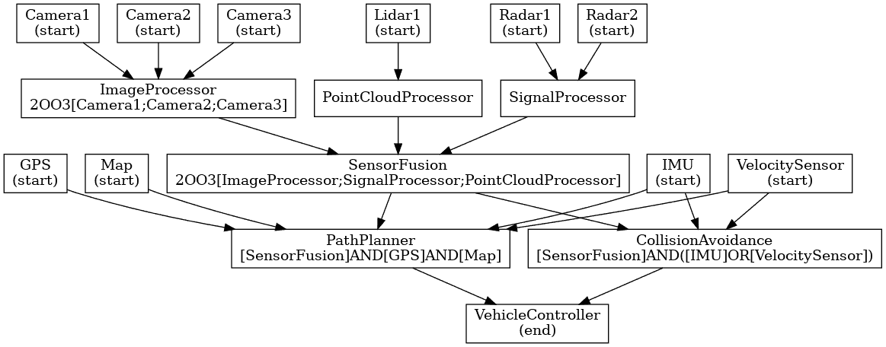

<!--yml

分类：未分类

日期：2025-01-11 12:41:49

-->

# 概念引导的LLM代理用于人类-人工智能安全共同设计

> 来源：[https://arxiv.org/html/2404.15317/](https://arxiv.org/html/2404.15317/)

Florian Geissler¹、Karsten Roscher¹ 和 Mario Trapp^(1, 2)

###### 摘要

生成性人工智能在软件工程中，特别是在安全工程领域，变得越来越重要，其应用确保软件不会对人造成伤害。这也对生成性人工智能提出了高质量的要求。因此，单独使用大型语言模型（LLMs）是无法满足这些质量需求的。开发更先进、复杂的方法来有效应对软件系统的复杂性和安全问题至关重要。最终，人类必须理解并对生成性人工智能提供的建议负责，以确保系统安全。为此，我们提出了一种高效的混合策略，利用LLMs进行安全分析和人类-人工智能共同设计。特别地，我们开发了一个定制的LLM代理，结合了提示工程、启发式推理和增强生成的检索元素，通过与系统模型图的交互来解决与预定义安全概念相关的任务。推理过程由一系列微决策引导，这些决策有助于保持结构化信息。我们进一步提出了一种图形表达，它作为系统模型的中间表示，以促进LLM与图形的交互。为安全分析所选的一对对提示和回应展示了我们的方法，适用于简化的自动驾驶系统的使用案例。

## 引言

基于变换器（Vaswani 等 [2017](https://arxiv.org/html/2404.15317v1#bib.bib17)）的大型语言模型（LLMs）的出现，引发了生成性人工智能（AI）在创意性、基于文本的任务中的广泛应用。一个典型的例子是OpenAI的ChatGPT在2023年2月创下的最迅速增长的用户基数记录（Reuters [2023](https://arxiv.org/html/2404.15317v1#bib.bib13)）。自动生成文本的高质量激发了对LLMs在涉及结构化数据任务中的探索，例如知识图谱。特别地，LLMs在安全分析任务中的应用是一种广泛期望的用例（Jin 等 [2023](https://arxiv.org/html/2404.15317v1#bib.bib10)；Pan 等 [2023](https://arxiv.org/html/2404.15317v1#bib.bib12)；Wang 等 [2023](https://arxiv.org/html/2404.15317v1#bib.bib18)），例如推理模型图中的故障传播及相关风险。已经有尝试使用LLMs进行正式危险分析，虽然取得了适度的成功（Diemert 和 Weber [2023](https://arxiv.org/html/2404.15317v1#bib.bib5)）。

将口头内容转化为结构化图形信息，反之亦然，具有一定挑战性。由于文本生成过程具有统计性质，因此不受逻辑约束的限制，LLM（大语言模型）的回答不一定能够保持给定输入的信息结构。解决这一问题的现有策略可以大致分为以下几类（Jin 等人 [2023](https://arxiv.org/html/2404.15317v1#bib.bib10)）：1）提示工程，鼓励特定的输出格式或结构规则；2）启发式或算法推理：鼓励LLM执行链式思维（CoT）推理，例如，按照自生成或预定的指令一步步解决问题；3）利用外部知识，使用检索增强生成（RAG），例如通过非AI工具；4）微调或重新训练模型，经验性地最小化结构化信息的丢失，例如，参见GraphGPT（Tang 等人 [2023](https://arxiv.org/html/2404.15317v1#bib.bib14)）。

图 1：人机安全共同设计框架布局：用户通过聊天提示与LLM代理互动并接收文本回应。LLM代理与包含系统模型图描述的数据库接口，该数据库包含IR中的安全概念和分析工具。系统操作可以更新数据库并更改系统模型。系统模型及其变化将展示给用户。

图 2：LLM代理决策与数据库互动工作流程概述。定制代理运行级联决策层来识别任务类型，然后通过后续层来制定信息检索任务。后者从向量存储数据库查找知识，或使用功能工具计算，例如，计算关键路径。

本文提出了一种概念引导的方法，旨在增强LLM在图形分析和操作中的能力，特别是在安全相关的开发背景下。为了实现这一目标，我们将LLM的优势与安全工程模型和分析的严格标准相结合。从结构化的系统模型图开始，我们首先建立系统的口头化中间表示（IR），以促进LLM对其组件和关系的理解。我们设计了一个定制的LLM代理，该代理采用混合策略，涉及上述技术1）到3）。该代理通过一系列LLM调用，按照预定义的概念对任务进行分类和形式化。随后，利用RAG技术将结构计算卸载到外部函数。我们以简化的自动驾驶架构为例，测试了我们的方法，并展示了故障传播、关键路径寻找、单点故障检测和节点复制等任务的部分实验结果。我们的工作为基于LLM的互动式人机安全协同设计框架奠定了基础。

## 模型

整体系统布局如图[1](https://arxiv.org/html/2404.15317v1#Sx1.F1 "Figure 1 ‣ Introduction ‣ Concept-Guided LLM Agents for Human-AI Safety Codesign")所示。我们架构的关键组件将在下文中解释。

系统模型和中间表示：系统模型包含系统架构，包括系统组件及其相互作用，以及建模系统内部故障传播所需的其他安全相关信息。为了确保与现有工业元模型格式的互操作性，我们使用基于Eclipse的OSATE工具（卡内基梅隆大学 [2023](https://arxiv.org/html/2404.15317v1#bib.bib3)）创建系统模型，并将生成的ECore文件导出为xml格式。xml模型的元素（EClass、EReference、EAttribute）可以直接映射到通用图形的元素（节点、边、属性）。尽管LLM能够直接读取和解释xml结构，但我们发现，当使用与自然语言更接近的系统描述时，可以减少不准确性。因此，我们进一步将xml系统模型转化为中间表示（IR），它采用直观的列表结构：

[⬇](data:text/plain;base64,Tm9kZXM6CiAgICAtIE5vZGUgMQogICAgLSBOb2RlIDIKICAgIC0gLi4uCkVkZ2VzOgogICAgLSBOb2RlIDEgLS0+IE5vZGUgMgogICAgLSAuLi4KQXR0cmlidXRlczoKICAgIC0gTm9kZSAxOiBBdHRyaWJ1dGUgMQogICAgLSAuLi4=)节点：-  节点  1-  节点  2-  ...边：-  节点  1  -->  节点  2-  ...属性：-  节点  1:  属性  1-  ...

这个IR表示LLM代理系统相关信息的基础。在安全分析中，我们假设每个节点可能会发生故障。为了模拟系统故障的传播，我们用故障门的语言化逻辑（例如，AND、OR、N-out-of-M）填充图形节点属性，以表示故障树（Avižienis et al. [2004](https://arxiv.org/html/2404.15317v1#bib.bib1); Trapp [2016](https://arxiv.org/html/2404.15317v1#bib.bib16)）。此外，系统图的起始节点和结束节点通过相应的属性加以明确。对于当前的概念验证，我们使用了集成的系统安全模型。然而，在基于模型的安全工程中，已经开展了长期的工作，致力于将系统模型与安全模型进行集成（Domis 和 Trapp [2008](https://arxiv.org/html/2404.15317v1#bib.bib7)），这一集成可以作为进一步发展的可扩展基础。

LLM：核心部分，我们使用OpenAI的$GPT3.5-turbo$（OpenAI [2023](https://arxiv.org/html/2404.15317v1#bib.bib11)）模型进行LLM推理。由于我们的概念引导方法要求LLM解决一系列相对简单的微决策，我们预期在进一步的工作中，像LLama2（Touvron et al. [2023](https://arxiv.org/html/2404.15317v1#bib.bib15)）或Mistral-7B（Jiang et al. [2023](https://arxiv.org/html/2404.15317v1#bib.bib9)）这样更小、更简单的模型也能满足这一需求。

图 3：简化自动驾驶系统的示例使用案例。节点标签表示组件名称（顶部行）和下方的故障门属性（如果没有给出，则假定所有输入的AND故障门）。$2OO3$表示列出的三个输入中需要两个为真。起始节点和结束节点也被明确标注。该图是ECore文件的pydot可视化。

LLM代理：LLM通过名为代理的功能包装器便捷地进行编排，代理可以配置为自我引发迭代思维链，或自动与外部工具和信息源进行交互。我们在此使用LangChain库（Harrison Chase [2022](https://arxiv.org/html/2404.15317v1#bib.bib8)）设计定制的代理。重要的是，我们发现，给代理配备多个工具可能会迅速导致工具使用不准确，除非语言化的触发条件在语言空间中得到了很好的区分。同时，对于自我引发的CoT流动，融入并确保程序性安全防护是具有挑战性的。

因此，我们实施了不同的工作流程，如图[2](https://arxiv.org/html/2404.15317v1#Sx1.F2 "Figure 2 ‣ Introduction ‣ Concept-Guided LLM Agents for Human-AI Safety Codesign")所示：代理通过一个微决策网络逐步传递输入提示，其中每次LLM调用将输入与每个决策中的$2$-$4$个预定义概念中最匹配的一个关联。例如，如图[2](https://arxiv.org/html/2404.15317v1#Sx1.F2 "Figure 2 ‣ Introduction ‣ Concept-Guided LLM Agents for Human-AI Safety Codesign")所示，在第一个决策节点，代理将输入与四个可能任务概念之一进行关联，包括安全问题回答、系统安全分析、容错建议和其他。为了提高微决策的质量，我们通过少量示例学习（Brown等人[2020](https://arxiv.org/html/2404.15317v1#bib.bib2)）来增强提示，每个概念大约添加十个手工制作的示例触发器。我们决策网络的最后一层是任务表述层，在该层中，完全识别的任务概念与给定的提示一起用于精炼具体的任务提示。最后，针对该特定任务提供的外部工具或信息查找机制被调用，结果被重新措辞为用户响应。我们发现这种方法克服了上述提到的一些挑战：CoT流程受到预定义概念的严格引导，但仍允许在提示表述中有足够的灵活性，而且工具触发器不能重叠，因为它们严格与特定任务概念相关联。

数据库/工具集：我们提供一组从知识库中检索的信息，或通过确定性函数按需生成的信息。这包括但不限于以下内容：系统的IR，关于安全实践的文档，使用从系统IR中检索的故障门计算故障传播的函数，使用Dijkstra算法（Dijkstra [1959](https://arxiv.org/html/2404.15317v1#bib.bib6)）计算最短路径和IR中的起始和结束节点的关键路径的函数，查找单点故障的函数，复制模型IR中给定节点或边的函数。这些工具的使用是根据识别的任务类别以预定义的方式触发的。

| 提示 | 响应 |
| --- | --- |
| 如果Radar1、Radar2和IMU发生故障，会怎样？ | 在这种情况下，故障组件包括IMU、Radar1、Radar2和SignalProcessor。当这些组件发生故障时，可能会对系统产生多种后果。IMU（惯性测量单元）负责测量车辆的方向、速度和加速度。如果IMU发生故障，可能导致测量不准确，从而影响车辆的整体导航和控制。雷达（Radar1和Radar2）用于检测和跟踪环境中的物体。如果这些雷达发生故障，可能导致漏检或错误检测，从而影响系统的感知和决策能力。SignalProcessor负责处理传感器数据并提取相关信息。如果SignalProcessor发生故障，可能导致数据处理不正确或不完整，从而影响系统的整体性能和可靠性。总的来说，当这些组件发生故障时，可能导致性能下降、安全性降低，并可能使系统的功能受到影响。 |
| 给我展示一下关键路径。 | 在给定的场景中，关键路径包括以下组件：Camera1、Camera2、CollisionAvoidance、GPS、IMU、ImageProcessor、Lidar1、Map、PathPlanner、PointCloudProcessor、SensorFusion 和 VehicleController。关键路径表示对系统操作至关重要且在时间上持续时间最长的组件的顺序。这些组件对感知、传感器融合、规划和控制等任务至关重要，任何这些组件的故障或故障都可能显著影响系统的整体性能和安全性。 |
| 解释一下关键路径，考虑到最后的故障。 | 在这种情况下，考虑到最后报告的故障系统组件，关键路径由以下组件组成：Camera1、Camera3、CollisionAvoidance、GPS、ImageProcessor、Lidar1、Map、PathPlanner、PointCloudProcessor、SensorFusion、VehicleController 和 VelocitySensor。关键路径表示对系统操作和性能至关重要的组件和过程的顺序。任何这些组件的延迟或故障都可能显著影响系统的整体功能和可靠性。需要注意的是，先前报告的系统故障，包括IMU、Radar1、Radar2和SignalProcessor，也可能影响关键路径，并进一步加剧系统可能遭遇的后果。 |
| 单点故障是什么？ | 给定场景中的单点故障组件包括 PathPlanner、VehicleController、Map、SensorFusion、CollisionAvoidance 和 GPS。这些组件被视为单点故障，因为如果其中任何一个发生故障，可能会导致系统完全失效或显著降低系统性能。例如，如果 PathPlanner 发生故障，系统可能无法为车辆生成安全且高效的轨迹。同样，如果 VehicleController 发生故障，系统可能会失去对车辆运动的控制。Map、SensorFusion、CollisionAvoidance 和 GPS 组件对于准确的感知、情境意识和导航至关重要，它们的故障可能会对整体系统功能造成严重后果。 |
| 如何使我的系统更安全？ | 为了提高系统的安全性，我建议对 SensorFusion 组件进行复制。SensorFusion 是一个关键组件，它依赖于来自 ImageProcessor、SignalProcessor 和 PointCloudProcessor 的多个输入。如果 SensorFusion 发生故障，可能会导致错误的数据传递给 PathPlanner 和 CollisionAvoidance，从而危及系统的整体安全。通过复制 SensorFusion，即使其中一个实例发生故障，系统仍能继续运行，确保向其他组件提供准确可靠的数据。 |

表 1：选定的示例提示和响应。请参考图 [3](https://arxiv.org/html/2404.15317v1#Sx2.F3 "图 3 ‣ 模型 ‣ 面向人机安全共设计的概念引导型 LLM 代理") 了解系统描述。第三行的示例提到代理的记忆，因为“last fault”指的是聊天历史中最后提到的系统故障。

## 实验

我们使用简化的自动驾驶系统用例测试我们的模型，该系统在OSATE中建模，见图[3](https://arxiv.org/html/2404.15317v1#Sx2.F3 "图 3 ‣ 模型 ‣ 概念引导型LLM代理用于人机安全共设计")，此处使用pydot（Carrera [2021](https://arxiv.org/html/2404.15317v1#bib.bib4)）可视化。故障门作为相应的节点属性实现，并在图中显示在节点标签下，例如，如果三个摄像头输入节点中的至少两个（$2OO3$）发生故障，ImageProcessor节点将发生故障。为了验证我们概念引导型代理的有效性，我们通过在系统安全设计领域的样本问题测试我们的方法。代表性的示例和结果见表[1](https://arxiv.org/html/2404.15317v1#Sx2.T1 "表 1 ‣ 模型 ‣ 概念引导型LLM代理用于人机安全共设计")。在所有示例中，我们发现任务被准确识别和表述，且通过适当的工具检索到正确的信息。例如，代理可以提出修改图表以提高容错性。 在我们的实现中，这基于冗余的预定义概念，并使用能够找到单点故障的工具选择最佳的复制候选项。为了修改系统图，代理使用图复制工具，并相应地更新xml模型。我们还注意到，在响应中，代理利用通用知识将相关组件的功能与其对安全性的影响联系起来。

## 结论与展望

我们的概念引导型大语言模型（LLM）代理方法克服了在处理结构化数据上的生成文本任务时通常遇到的两个挑战：1) 思维链过程脱轨，无法继续遵循所需的规则集合，或未能实现目标；2) 当可选项增多时，通过工具检索外部信息的触发条件变得不准确。相反，我们通过一系列微决策引导思维过程，以确保满足正确的工具触发条件。我们计划将我们的设置扩展到更多的概念和更大的决策级联，以便能够处理更复杂的任务。我们的工作为互动框架提供了基础，其中LLM协助进行人机安全共设计。

## 致谢

本研究由巴伐利亚州经济事务、区域发展和能源部资助，作为支持认知系统研究所主题发展的一部分。

## 参考文献

+   Avižienis 等人（2004）Avižienis, A.; Laprie, J. C.; Randell, B.; 和 Landwehr, C. 2004. 可依赖和安全计算的基本概念与分类学。*IEEE 可靠与安全计算学报*，1(1)：11–33。

+   Brown 等人（2020）Brown, T. B.; Mann, B.; Ryder, N.; Subbiah, M.; Kaplan, J.; Dhariwal, P.; Neelakantan, A.; Shyam, P.; Sastry, G.; Askell, A.; Agarwal, S.; Herbert-Voss, A.; Krueger, G.; Henighan, T.; Child, R.; Ramesh, A.; Ziegler, D. M.; Wu, J.; Winter, C.; Hesse, C.; Chen, M.; Sigler, E.; Litwin, M.; Gray, S.; Chess, B.; Clark, J.; Berner, C.; McCandlish, S.; Radford, A.; Sutskever, I.; 和 Amodei, D. 2020. 语言模型是少样本学习者。*神经信息处理系统进展*，2020年12月。

+   卡内基梅隆大学（2023）Carnegie Mellon University. 2023. OSATE 2.13. https://osate.org/. 访问日期：2023-12-01.

+   Carrera（2021）Carrera, E. 2021. pydot. https://pypi.org/project/pydot/. 访问日期：2023-12-01.

+   Diemert 和 Weber（2023）Diemert, S.; 和 Weber, J. H. 2023. 大规模语言模型能否协助危险分析？*计算机科学讲义（包括人工智能讲义子系列和生物信息学讲义）*，第14182卷 LNCS，410–422. ISBN 9783031409523.

+   Dijkstra（1959）Dijkstra, E. W. 1959. 关于与图相关的两个问题的注记。*Numer. Math.*, 271: 269–271.

+   Domis 和 Trapp（2008）Domis, D.; 和 Trapp, M. 2008. 集成安全分析与基于组件的设计。在Harrison, M. D.; 和 Sujan, M.-A. 编辑，*计算机安全、可靠性与安全性*，58–71. 柏林，海德堡：Springer Berlin Heidelberg. ISBN 978-3-540-87698-4.

+   Harrison Chase（2022）Harrison Chase. 2022. LangChain. https://github.com/langchain-ai/langchain. 访问日期：2023-12-01.

+   Jiang 等人（2023）Jiang, A. Q.; Sablayrolles, A.; Mensch, A.; Bamford, C.; Chaplot, D. S.; de las Casas, D.; Bressand, F.; Lengyel, G.; Lample, G.; Saulnier, L.; Lavaud, L. R.; Lachaux, M.-A.; Stock, P.; Scao, T. L.; Lavril, T.; Wang, T.; Lacroix, T.; 和 Sayed, W. E. 2023. Mistral 7B. arXiv:2310.06825.

+   Jin 等人（2023）Jin, B.; Liu, G.; Han, C.; Jiang, M.; Ji, H.; 和 Han, J. 2023. 图上的大规模语言模型：全面综述。arXiv:2312.02783.

+   OpenAI（2023）OpenAI. 2023. ChatGPT 3.5-turbo. https://openai.com/. 访问日期：2023-12-01.

+   Pan 等人（2023）Pan, S.; Luo, L.; Wang, Y.; Chen, C.; Wang, J.; 和 Wu, X. 2023. 统一大规模语言模型与知识图谱：一条路线图。arXiv:2306.08302.

+   路透社（2023）Reuters. 2023. ChatGPT创下最快增长用户基础记录 - 分析师报告。https://www.reuters.com/technology/chatgpt-sets-record-fastest-growing-user-base-analyst-note-2023-02-01/. 访问日期：2023-12-01.

+   Tang 等人（2023）Tang, J.; Yang, Y.; Wei, W.; Shi, L.; Su, L.; Cheng, S.; Yin, D.; 和 Huang, C. 2023. GraphGPT: 面向大规模语言模型的图指令调优。arXiv:2310.13023.

+   Touvron等人（2023）Touvron, H.; Martin, L.; Stone, K.; Albert, P.; Almahairi, A.; Babaei, Y.; Bashlykov, N.; Batra, S.; Bhargava, P.; Bhosale, S.; Bikel, D.; Blecher, L.; Ferrer, C. C.; Chen, M.; Cucurull, G.; Esiobu, D.; Fernandes, J.; Fu, J.; Fu, W.; Fuller, B.; Gao, C.; Goswami, V.; Goyal, N.; Hartshorn, A.; Hosseini, S.; Hou, R.; Inan, H.; Kardas, M.; Kerkez, V.; Khabsa, M.; Kloumann, I.; Korenev, A.; Koura, P. S.; Lachaux, M.-A.; Lavril, T.; Lee, J.; Liskovich, D.; Lu, Y.; Mao, Y.; Martinet, X.; Mihaylov, T.; Mishra, P.; Molybog, I.; Nie, Y.; Poulton, A.; Reizenstein, J.; Rungta, R.; Saladi, K.; Schelten, A.; Silva, R.; Smith, E. M.; Subramanian, R.; Tan, X. E.; Tang, B.; Taylor, R.; Williams, A.; Kuan, J. X.; Xu, P.; Yan, Z.; Zarov, I.; Zhang, Y.; Fan, A.; Kambadur, M.; Narang, S.; Rodriguez, A.; Stojnic, R.; Edunov, S.; 和Scialom, T. 2023. Llama 2：开放基础和微调聊天模型。arXiv:2307.09288。

+   Trapp（2016）Trapp, M. 2016. 确保开放系统中的功能安全。https://nbn-resolving.de/urn:nbn:de:hbz:386-kluedo-44221。

+   Vaswani等人（2017）Vaswani, A.; Shazeer, N.; Parmar, N.; Uszkoreit, J.; Jones, L.; Gomez, A. N.; Kaiser, Ł.; 和Polosukhin, I. 2017. 注意力机制才是你所需要的。*神经信息处理系统进展*，2017年12月：5999–6009。

+   Wang等人（2023）Wang, H.; Feng, S.; He, T.; Tan, Z.; Han, X.; 和Tsvetkov, Y. 2023. 语言模型能否解决自然语言中的图形问题？arXiv:2305.10037。
