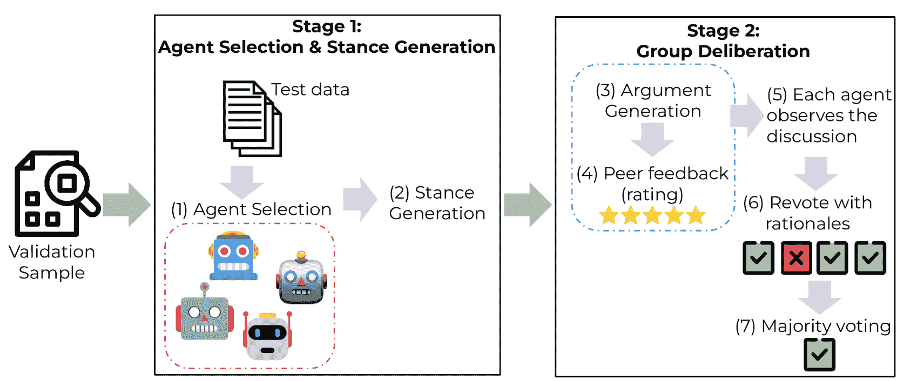
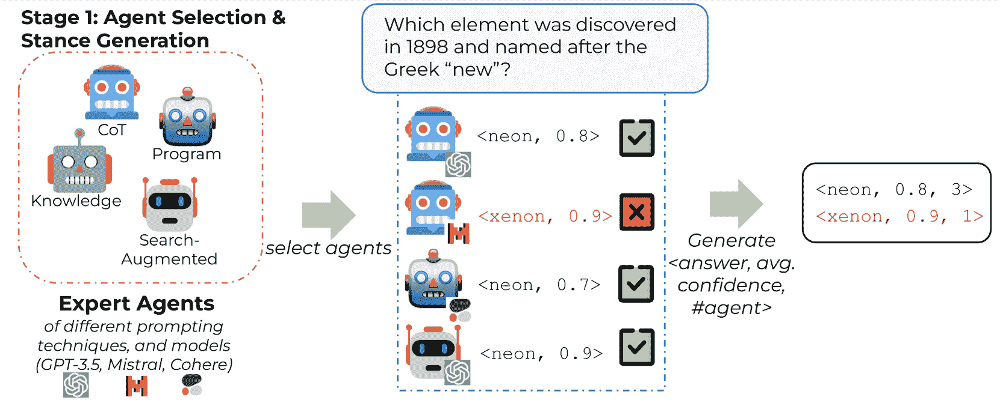
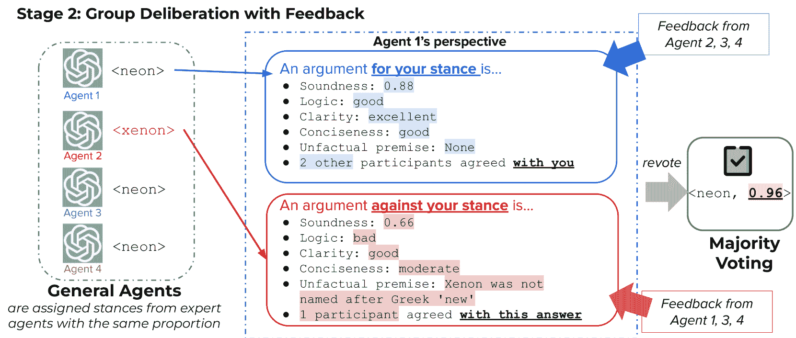
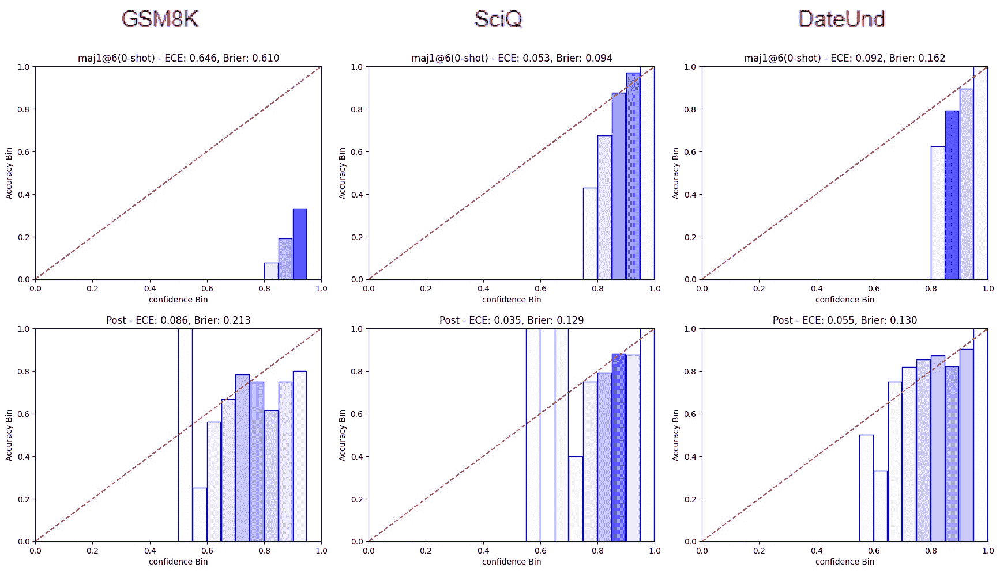
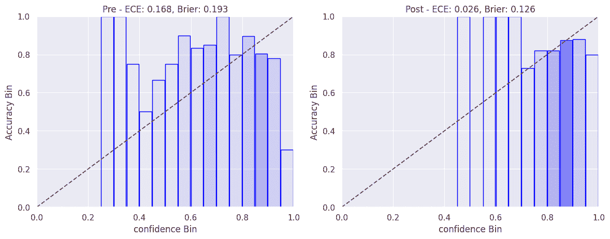

<!--yml

分类：未分类

日期：2025-01-11 12:42:12

-->

# 通过多代理讨论进行LLMs的信心校准与合理化

> 来源：[https://arxiv.org/html/2404.09127/](https://arxiv.org/html/2404.09127/)

Ruixin Yang

英属哥伦比亚大学

&Dheeraj Rajagopal

卡内基梅隆大学

&Shirley Anugrah Hayati

明尼苏达大学

&Bin Hu

明尼苏达大学

&Dongyeop Kang

明尼苏达大学

###### 摘要

不确定性估计是当前大型语言模型（LLMs）面临的一个重要问题，这些模型通常校准不良且过于自信，特别是在使用基于人类反馈的强化学习（RLHF）时。与人类不同，人类的决策和信心不仅源于内在的信念，还能通过日常观察进行调整，而现有的LLM校准方法则侧重于估计或引导个体信心，未能充分利用“集体智慧”：即多个LLM之间的互动，这种互动能够共同提升准确性和校准性。在本研究中，我们提出了协作校准（Collaborative Calibration），这是一种无需额外训练的后处理校准策略，利用多个增强工具的LLM代理在模拟小组讨论过程中协作与表达的能力。我们展示了协作校准在各领域生成型问答任务中的有效性，展示了其在利用集体校准信心评估的合理性和提高模型预测可靠性方面的潜力¹¹1我们的实现已公开发布在[https://github.com/minnesotanlp/collaborative-calibration](https://github.com/minnesotanlp/collaborative-calibration)。

## 1 引言

尽管当代的大型语言模型（LLMs）在从问答到复杂推理等多种任务中取得了显著的表现（Brown et al., [2020](https://arxiv.org/html/2404.09127v3#bib.bib3); Bubeck et al., [2023](https://arxiv.org/html/2404.09127v3#bib.bib4)），但它们在为预测生成良好的置信度估计方面仍然是一个重要瓶颈，这意味着它们的单一置信度并不是准确性的可靠指标。模型仍然经常生成幻觉（Bubeck et al., [2023](https://arxiv.org/html/2404.09127v3#bib.bib4)）或严重错误的预测，且往往在不自知且过于自信的情况下做出预测，发现这种问题在通过RLHF微调的模型中尤为明显（Kadavath et al., [2022](https://arxiv.org/html/2404.09127v3#bib.bib20); Tian et al., [2023](https://arxiv.org/html/2404.09127v3#bib.bib43)）。另一方面，模型也可能表现出不一致和缺乏信心，通过盲目地改变决策并优先考虑错误的用户意见（Wei et al., [2023](https://arxiv.org/html/2404.09127v3#bib.bib47)）。这种误校准被认为在更大、更强大的语言模型中更加显著（Kong et al., [2020](https://arxiv.org/html/2404.09127v3#bib.bib22); Xiong et al., [2023](https://arxiv.org/html/2404.09127v3#bib.bib49)），这表明单纯扩展模型规模（Kaplan et al., [2020](https://arxiv.org/html/2404.09127v3#bib.bib21)）并不能有效缓解这一问题，这对促进人机协作中的信任以及开发可靠的现实应用（特别是在高风险领域）构成了巨大的挑战。

尽管在更广泛的机器学习文献中，置信度估计和校准已被广泛研究（Gal & Ghahramani，[2016](https://arxiv.org/html/2404.09127v3#bib.bib13)；Guo等，[2017](https://arxiv.org/html/2404.09127v3#bib.bib14)），但在自然语言处理（NLP）领域的先前工作大多需要广泛的微调（Kong等，[2020](https://arxiv.org/html/2404.09127v3#bib.bib22)）或基于温度的缩放（Guo等，[2017](https://arxiv.org/html/2404.09127v3#bib.bib14)；Jiang等，[2021](https://arxiv.org/html/2404.09127v3#bib.bib18)），这些方法对于大规模语言模型（LLMs）来说可能成本较高。近期关于黑箱LLMs的置信度估计研究采用了基于一致性的反复采样方法（Wang等，[2023b](https://arxiv.org/html/2404.09127v3#bib.bib45)）或通过直接提示的基于语言化的引导方法（Lin等，[2022](https://arxiv.org/html/2404.09127v3#bib.bib24)；Tian等，[2023](https://arxiv.org/html/2404.09127v3#bib.bib43)），或者是两者的结合（Xiong等，[2023](https://arxiv.org/html/2404.09127v3#bib.bib49)）。然而，关于引导出的置信度是否比基于样本的估计或模型原始的标记概率更为校准，结果存在差异，且尚未有尝试通过结合个体置信度的理性化和集体改进，利用生成型LLM代理的表达、批判性自我反思、工具使用和协作能力，进一步提高这种度量的可解释性和可靠性（Park等，[2023](https://arxiv.org/html/2404.09127v3#bib.bib33)；Madaan等，[2024](https://arxiv.org/html/2404.09127v3#bib.bib29)；Schick等，[2024](https://arxiv.org/html/2404.09127v3#bib.bib36)）。

受到这样一个简单观察的启发：人类能够通过群体互动，通过权衡他人的赞同或反对意见来有效调整和平衡他们的置信度评估（Silver等，[2021](https://arxiv.org/html/2404.09127v3#bib.bib41)），我们提出了协作校准（Collaborative Calibration），这是一种无需训练的LLM置信度估计、校准和理性化方法，方法通过模拟多代理的两阶段群体审议过程来实现（见[图1](https://arxiv.org/html/2404.09127v3#S1.F1 "图1 ‣ 1 引言 ‣ 通过多代理审议实现LLMs的置信度校准与理性化")）。我们在自由问答任务上展示了协作校准的有效性，结果表明，与之前的方法相比，它在多个校准指标上能够实现相当或更优的性能，并且不会影响准确性或生成质量，也不需要广泛的微调或参数调整。

图1：协作校准管道的高层概览。

## 2 相关工作

LLMs的置信度估计与校准：随着LLMs的快速发展，越来越多的研究关注于估计和校准其预测置信度，主要应用于分类任务（Jiang等人，[2021](https://arxiv.org/html/2404.09127v3#bib.bib18)；Si等人，[2022](https://arxiv.org/html/2404.09127v3#bib.bib38)；[2023a](https://arxiv.org/html/2404.09127v3#bib.bib39)；Portillo Wightman等人，[2023](https://arxiv.org/html/2404.09127v3#bib.bib34)）。对于更具挑战性但更相关的自由形式生成任务，答案长度各异，Kuhn等人（[2023](https://arxiv.org/html/2404.09127v3#bib.bib23)）提出了一种基于无监督熵的度量方法，该方法捕捉了对含义的不确定性，而非序列；Liu等人（[2024](https://arxiv.org/html/2404.09127v3#bib.bib27)）提出了一种轻量级训练方法，学习添加到输出logits中的偏置项，以实现更好的置信度校准。然而，这些方法需要访问内部模型结构或输出logits，而这些对于专有LLMs是不可用的。近期的研究工作则集中于通过基于多个样本中最一致答案的概率分布来估计置信度（Wang等人，[2023b](https://arxiv.org/html/2404.09127v3#bib.bib45)；Chen等人，[2023c](https://arxiv.org/html/2404.09127v3#bib.bib8)；Lin等人，[2023](https://arxiv.org/html/2404.09127v3#bib.bib25)），或直接引导口头表达的置信度（Lin等人，[2022](https://arxiv.org/html/2404.09127v3#bib.bib24)；Tian等人，[2023](https://arxiv.org/html/2404.09127v3#bib.bib43)），并发现通过提示或微调使模型表达不确定性的口头化可以提高准确性或实现更好的校准（Mielke等人，[2022](https://arxiv.org/html/2404.09127v3#bib.bib30)；Zhou等人，[2023](https://arxiv.org/html/2404.09127v3#bib.bib51)）。Xiong等人（[2023](https://arxiv.org/html/2404.09127v3#bib.bib49)）对基于logit、口头化和一致性的方法进行了全面分析，并建议将口头化的置信度融入一致性集成方法中，采用混合方法对于置信度校准更为有效。

LLM代理集成：通过增强外部记忆系统和工具使用能力，基于LLM的语言代理（Park等人，[2023](https://arxiv.org/html/2404.09127v3#bib.bib33)）展示了巨大的潜力，能够作为自洽的人类代理，进行自我反思和优化以进行规划（Shinn等人，[2024](https://arxiv.org/html/2404.09127v3#bib.bib37)；Madaan等人，[2024](https://arxiv.org/html/2404.09127v3#bib.bib29)；Sun等人，[2024](https://arxiv.org/html/2404.09127v3#bib.bib42)）。利用多个LLM代理的多样性和协作优势，集成和互动能够有效提升它们在复杂推理（Xiong等人，[2023](https://arxiv.org/html/2404.09127v3#bib.bib49)；Chen等人，[2023b](https://arxiv.org/html/2404.09127v3#bib.bib6)；Wang等人，[2023a](https://arxiv.org/html/2404.09127v3#bib.bib44)）、指令跟随（Jiang等人，[2023b](https://arxiv.org/html/2404.09127v3#bib.bib17)）和价值对齐（Liu等人，[2023a](https://arxiv.org/html/2404.09127v3#bib.bib26)）方面的能力。Du等人（[2023](https://arxiv.org/html/2404.09127v3#bib.bib12)）提出了一种多代理辩论框架，其中多个LLM实例提出并辩论其推理过程以达成共识，这提升了在算术和战略推理任务上的事实性和表现。类似地，ReConcile（Chen等人，[2023a](https://arxiv.org/html/2404.09127v3#bib.bib5)）使用不同的主干LLM进行辩论，并通过信心加权投票机制获得最终答案。我们的方法不同之处在于，我们结合了自洽性估计，并通过与同伴反馈和中间推理过程的集体讨论自然校准口头化的信心，而不是事后手动重新调整。我们还结合了开放和基于API的模型，以支持基于logit的信心估计和黑箱信心估计的灵活性。Liu等人（[2023b](https://arxiv.org/html/2404.09127v3#bib.bib28)）提出了一种基于对多轮互动中多个同伴评估结果的聚合来选择推理代理的框架。而我们的代理选择过程只需要任务层级的第一轮个体信心估计。

## 3 协同校准：通过多代理讨论校准信心

(a) 阶段1根据在验证集上的校准性能选择具有适当提示技巧或工具使用专长的专家代理组成。对于测试查询，选定的代理生成其初始答案，这些答案被聚类为语义上独特的立场，每个立场具有平均信心值和代理数量。

(b) 在阶段 2，每个一般代理提供其分配立场的论据，反馈其他代理的论点，修订其答案，并根据一些理由调整信心。我们通过多数投票来获得最终的、综合的信心水平估计。

图 2：展示了两阶段框架的详细说明，并给出了来自 SciQ 数据集的具体测试示例。

### 3.1 代理集成与立场生成

为了在任务准确性和校准性能之间争取平衡，有必要在代理的初始回答和推理路径之间保持一定程度的多样性，同时明智地分配槽位，以便最适合任务的代理能够理想地成为多数，这为集成提供了基础。受Si等人（[2023b](https://arxiv.org/html/2404.09127v3#bib.bib40)）启发，我们初始化了四种类型的“专家代理”。每个代理有不同的提示策略或工具使用专长：Chain-of-Thought（Wei等， [2022](https://arxiv.org/html/2404.09127v3#bib.bib46)）用于多跳推理任务，Program-of-Thoughts（Chen等，[2022](https://arxiv.org/html/2404.09127v3#bib.bib7)）用于代码和算术推理任务，Search-Augmented Self-Ask（Press等， [2022](https://arxiv.org/html/2404.09127v3#bib.bib35)）用于事实推理任务，以及GenRead提示（Yu等，[2023](https://arxiv.org/html/2404.09127v3#bib.bib50)）用于知识密集型推理任务。此初始化是灵活的，因为任何新的技能或提示策略都可以通过模块化轻松添加。由于多个技能可能与输入数据集相关，我们根据简单的基于不确定性的校准分数（详见附录[A.1](https://arxiv.org/html/2404.09127v3#A1.SS1 "A.1 Details on agent selection ‣ Appendix A Appendix ‣ Confidence Calibration and Rationalization for LLMs via Multi-Agent Deliberation")）来确定每项技能的重要性排名，并相应地分配专家代理。我们使用Mistral-7B（Jiang等，[2023a](https://arxiv.org/html/2404.09127v3#bib.bib16)），GPT-3.5-turbo（OpenAI，[2022](https://arxiv.org/html/2404.09127v3#bib.bib32)）和Cohere-Commend（Cohere，[2023](https://arxiv.org/html/2404.09127v3#bib.bib10)）作为专家代理的主干。对于一个传入的测试问题（例如，“哪个元素在1898年被发现，并以希腊语‘新’命名？”），每个专家代理通过执行相应的提示策略进行自我讨论，并独立投票选出一个答案，同时估算置信度。数值置信度估算可以基于开放模型的输出序列困惑度（PP）²²2对于可以访问下一个标记概率的开放模型，输出序列$W=(w_{1},...,w_{N})$的原始置信度可以通过$\frac{1}{PP(W)}=P(w_{1},...,w_{N})^{1/N}$来估算。，或者通过口头方式引导黑盒模型，归一化为$[0,1]$。请注意，这个估算通常是不可靠的，需要进一步的校准。然后，我们通过使用GPT-3.5评审者（参考Tian等，[2023](https://arxiv.org/html/2404.09127v3#bib.bib43)），将语义等价的对合并为簇，从而获得一组独特且多样的答案（“立场”）。这构成了第一阶段的输出：每个具有相应频率和聚合平均置信度的语义独立的立场。

### 3.2 带有理由和反馈的小组讨论

在第二阶段，我们初始化另一组“通用代理”（使用 GPT-3.5 核心且不进行专门提示）来执行合理化和小组讨论。第一阶段的多样化立场被分配给这些通用代理作为讨论者，分配比例与第一阶段的原始答案频率成正比，从而保持潜在的小组共识或多数意见。然而，仅仅依赖共识或多数可能并不理想，因为它们有时会产生误导。这使得以下设计变得必要——每个代理都为其分配的立场辩护，提供支持该立场的理由。这有效地激发了多个不同的推理路径供集体参考。代理根据逻辑一致性、事实性、清晰度和简洁性对每个论点进行评分和反馈。特别是，事实性的判断采用类似于“验证链”（Dhuliawala 等，[2023](https://arxiv.org/html/2404.09127v3#bib.bib11)）的方法，我们要求每个代理在考虑的论点中自生成任何前提或假设，这些前提或假设可能包含幻觉。因此，我们采用另一个增强搜索的代理来验证每个前提，并在必要时突出显示任何不符合事实的陈述，作为文本反馈的一部分。然后，每个代理被提供两个评分的论点，一个来自肯定立场，另一个来自对立方之一。观察带有评分和事实性反馈的不同论点后，每个代理重新投票选出他们的答案 $Y_{\text{post}}$，以及可能调整信心的理由 $R_{\text{conf}}$：

|  | $Y_{\textrm{post}},R_{\textrm{conf}}=M(Y_{\textrm{prior}},C_{\textrm{prior}},A_% {p},F_{A_{p}},A_{n},F_{A_{n}})$ |  | (1) |
| --- | --- | --- | --- |

其中 $Y_{\text{prior}}$，$C_{\text{prior}}$ 是原始答案和置信度，$A_{p}$，$A_{n}$ 是支持和反对的论点，$M$ 表示基础模型及其参数，$F_{A}$ 表示对论点 $A$ 的总结同伴评分和反馈。在单独的调用中，每个代理根据其最终答案和理由给出后验置信度估计：

|  | $C_{\text{post}}=\mathbb{P}(Y_{\text{reference}}=Y_{\text{post}}\mid Y_{\text{% post}},R_{\text{conf}},M)$ |  | (2) |
| --- | --- | --- | --- |

对所有 $Y_{\text{post}}$ 进行最终多数投票，并汇总后验置信度 $C_{\text{post}}$，我们假设最终的平均置信度估计将更好地指示预测准确性，通过权衡不同的声音、证据和通过讨论得出的反馈。中间置信度的理由作为最终评分的依据，提高了潜在置信度调整的可解释性。

## 4 实验与结果

指标：我们使用以下指标来衡量校准性能：

ECE（期望校准误差，Guo等，[2017](https://arxiv.org/html/2404.09127v3#bib.bib14)）计算每个区间内估计置信度与平均准确度之间的平均平方误差，并按随机样本落入该区间的概率加权。

Brier得分（Brier, [1950](https://arxiv.org/html/2404.09127v3#bib.bib2)）衡量预测概率与实际结果之间的均方差，取值范围为0到1，其中较小的值更为理想。

实验设置：我们在多个领域的六个任务上进行了实验。数据集和评估方法的详细信息可见附录[A.2](https://arxiv.org/html/2404.09127v3#A1.SS2 "A.2 Details on experiment setup ‣ Appendix A Appendix ‣ Confidence Calibration and Rationalization for LLMs via Multi-Agent Deliberation")。我们与多种先前的置信度校准方法进行了比较，包括基于一致性的集成方法（Wang等，[2023b](https://arxiv.org/html/2404.09127v3#bib.bib45)），Ask4Conf（Tian等，[2023](https://arxiv.org/html/2404.09127v3#bib.bib43)），以及Xiong等人报告的最佳采样与聚合方法组合（[2023](https://arxiv.org/html/2404.09127v3#bib.bib49)）。为了公平比较，我们将自一致性基线的集成大小设置为6，与我们的代理组大小一致，并报告使用GPT-3.5评估的基准结果。实验设置的更多细节请参见附录[A.2.2](https://arxiv.org/html/2404.09127v3#A1.SS2.SSS2 "A.2.2 Evaluation methods ‣ A.2 Details on experiment setup ‣ Appendix A Appendix ‣ Confidence Calibration and Rationalization for LLMs via Multi-Agent Deliberation")。

结果：我们的主要结果在表格[1](https://arxiv.org/html/2404.09127v3#S4.T1 "Table 1 ‣ 4 Experiments and Results ‣ Confidence Calibration and Rationalization for LLMs via Multi-Agent Deliberation")中报告。与基线方法相比，合作校准在六个任务中的四个任务上实现了更小的ECE，特别是在算术和符号推理任务（GSM8K、DateUnd）以及歧义解决任务（AmbigQA）中。在事实性和知识密集型任务中，合作校准在ECE和Brier得分方面也能够实现类似或更好的结果。这些结果是可以预期的，因为代理被增强了编程和搜索能力，能够在不确定性或歧义下进行深思熟虑，从而合理地调整置信度。最终语言化的置信度的示例推理可以在表格[3](https://arxiv.org/html/2404.09127v3#A1.T3 "Table 3 ‣ A.4 Prompt templates and example output ‣ Appendix A Appendix ‣ Confidence Calibration and Rationalization for LLMs via Multi-Agent Deliberation")中找到。需要注意的是，为了成本效益，当前的工作流仅在有限程度上采用了搜索增强。集成更多的工具使用模块可能进一步提升在知识密集型任务中的校准表现。与Xiong等人（[2023](https://arxiv.org/html/2404.09127v3#bib.bib49)）报告的最佳策略集合相比，合作校准能够在GSM8K和DateUnd数据集上引发更为校准的置信度分数，这表明除了简单提高任务准确性外，额外的群体互动和推理化也非常有效。与基于简单一致性的集成方法的比较中，也观察到了相同的模式，详细结果见附录[A.3](https://arxiv.org/html/2404.09127v3#A1.SS3 "A.3 Detailed Results ‣ Appendix A Appendix ‣ Confidence Calibration and Rationalization for LLMs via Multi-Agent Deliberation")。

|  | GSM8K | TriviaQA | SciQ | AmbigQA | DateUnd | Biz-Ethics |
| --- | --- | --- | --- | --- | --- | --- |
| 方法 | ECE$\downarrow$ | Brier$\downarrow$ | ECE$\downarrow$ | Brier$\downarrow$ | ECE$\downarrow$ | Brier$\downarrow$ | ECE$\downarrow$ | Brier$\downarrow$ | ECE$\downarrow$ | Brier$\downarrow$ | ECE$\downarrow$ | Brier$\downarrow$ |
| --- | --- | --- | --- | --- | --- | --- | --- | --- | --- | --- | --- | --- |
| Ask4Conf(1S Top-4) | .196* | - | .054 | .144 | .065 | .209 | - | - | .261* | - | .124* | .163 |
| Ask4Conf(2S-CoT) | - | - | .110 | .168 | .323 | .296 | - | - | - | - | - | - |
| 语言化+一致性(M=6) | .657 | .620 | .055 | .050 | .053 | .094 | .052 | .098 | .092 | .162 | .141 | .201 |
| Top-K+Self-Random+Avg-Conf | .093 | - | .089^† | - | .221^† | - | .134^† | - | .146 | - | .158 | - |
| 合作校准(M=6) | .086 | .213 | .070 | .062 | .035 | .129 | .026 | .126 | .055 | .130 | .132 | .203 |

表1：我们使用 GPT-3.5 在多种任务上将协作校准与以往的免训练校准方法进行比较。（符号 * 表示 Xiong 等人，[2023](https://arxiv.org/html/2404.09127v3#bib.bib49) 报告的结果；$\dagger$ 表示我们根据他们实现的扩展复现的结果）。遵循 Tian 等人（[2023](https://arxiv.org/html/2404.09127v3#bib.bib43)），每列中的单元格通过从青色到橙色的渐变进行阴影处理，代表从高到低不同级别的校准性能。每列中的最佳结果用粗体标出。我们的方法在六个任务中的四个任务上取得了优越的校准性能，具体体现在 ECE 上，对于其他任务和 Brier Score 方面的结果相似。

## 5 结论

在这项工作中，我们探索了一种协作方法来引导、校准和合理化 LLM 的预测置信度，采用能够灵活且自主选择推理策略、使用工具、并通过理据和集体反馈自我完善的语言代理。我们展示了我们方法在不同领域的生成 QA 任务中的灵活性和有效性，提出了未来在更好地利用理据和代理协作以提高 LLM 预测可靠性方面的可能性。

## 参考文献

+   bench 作者 (2023) BIG bench 作者. 超越模仿游戏：量化和外推语言模型的能力。*机器学习研究会刊*，2023年。ISSN 2835-8856。网址 [https://openreview.net/forum?id=uyTL5Bvosj](https://openreview.net/forum?id=uyTL5Bvosj)。

+   Brier (1950) Glenn W. Brier. 以概率表达的预报验证。*月度天气评论*，78:1–3，1950年。网址 [https://api.semanticscholar.org/CorpusID:122906757](https://api.semanticscholar.org/CorpusID:122906757)。

+   Brown 等人 (2020) Tom Brown, Benjamin Mann, Nick Ryder, Melanie Subbiah, Jared D Kaplan, Prafulla Dhariwal, Arvind Neelakantan, Pranav Shyam, Girish Sastry, Amanda Askell, Sandhini Agarwal, Ariel Herbert-Voss, Gretchen Krueger, Tom Henighan, Rewon Child, Aditya Ramesh, Daniel Ziegler, Jeffrey Wu, Clemens Winter, Chris Hesse, Mark Chen, Eric Sigler, Mateusz Litwin, Scott Gray, Benjamin Chess, Jack Clark, Christopher Berner, Sam McCandlish, Alec Radford, Ilya Sutskever, 和 Dario Amodei. 语言模型是少样本学习者。在 H. Larochelle, M. Ranzato, R. Hadsell, M.F. Balcan 和 H. Lin (编辑)，*神经信息处理系统进展*，第33卷，第1877–1901页，Curran Associates, Inc.，2020年。网址 [https://proceedings.neurips.cc/paper_files/paper/2020/file/1457c0d6bfcb4967418bfb8ac142f64a-Paper.pdf](https://proceedings.neurips.cc/paper_files/paper/2020/file/1457c0d6bfcb4967418bfb8ac142f64a-Paper.pdf)。

+   Bubeck 等人（2023）Sébastien Bubeck、Varun Chandrasekaran、Ronen Eldan、Johannes Gehrke、Eric Horvitz、Ece Kamar、Peter Lee、Yin Tat Lee、Yuanzhi Li、Scott Lundberg 等人。人工通用智能的火花：与 GPT-4 的早期实验。*arXiv 预印本 arXiv:2303.12712*，2023年。

+   Chen 等人（2023a）Justin Chih-Yao Chen、Swarnadeep Saha 和 Mohit Bansal。Reconcile：圆桌会议通过多样化语言模型的共识提高推理能力。*arXiv 预印本 arXiv:2309.13007*，2023a年。

+   Chen 等人（2023b）Weize Chen、Yusheng Su、Jingwei Zuo、Cheng Yang、Chenfei Yuan、Chi-Min Chan、Heyang Yu、Yaxi Lu、Yi-Hsin Hung、Chen Qian 等人。Agentverse：促进多智能体协作并探索新兴行为。在《*第十二届国际学习表征会议*》，2023b年。

+   Chen 等人（2022）Wenhu Chen、Xueguang Ma、Xinyi Wang 和 William W Cohen。思维程序提示：为数字推理任务解开计算与推理的关系。*arXiv 预印本 arXiv:2211.12588*，2022年。

+   Chen 等人（2023c）Xinyun Chen、Renat Aksitov、Uri Alon、Jie Ren、Kefan Xiao、Pengcheng Yin、Sushant Prakash、Charles Sutton、Xuezhi Wang 和 Denny Zhou。大型语言模型生成的普适自一致性。*arXiv 预印本 arXiv:2311.17311*，2023c年。

+   Cobbe 等人（2021）Karl Cobbe、Vineet Kosaraju、Mohammad Bavarian、Mark Chen、Heewoo Jun、Lukasz Kaiser、Matthias Plappert、Jerry Tworek、Jacob Hilton、Reiichiro Nakano 等人。训练验证器解决数学语言问题。*arXiv 预印本 arXiv:2110.14168*，2021年。

+   Cohere（2023）Cohere。Cohere-command 模型，2023年。网址 [https://docs.cohere.com/docs/models](https://docs.cohere.com/docs/models)。

+   Dhuliawala 等人（2023）Shehzaad Dhuliawala、Mojtaba Komeili、Jing Xu、Roberta Raileanu、Xian Li、Asli Celikyilmaz 和 Jason Weston。验证链减少大型语言模型中的幻觉。*arXiv 预印本 arXiv:2309.11495*，2023年。

+   Du 等人（2023）Yilun Du、Shuang Li、Antonio Torralba、Joshua B Tenenbaum 和 Igor Mordatch。通过多智能体辩论提高语言模型的事实性和推理能力。*arXiv 预印本 arXiv:2305.14325*，2023年。

+   Gal & Ghahramani（2016）Yarin Gal 和 Zoubin Ghahramani。Dropout 作为贝叶斯近似：在深度学习中表示模型不确定性。在 Maria Florina Balcan 和 Kilian Q. Weinberger（编）《*第33届国际机器学习会议论文集*》中，*机器学习研究论文集*第48卷，pp. 1050–1059，纽约，美国，2016年6月20–22日。PMLR。网址 [https://proceedings.mlr.press/v48/gal16.html](https://proceedings.mlr.press/v48/gal16.html)。

+   Guo等人（2017年）Chuan Guo, Geoff Pleiss, Yu Sun, 和Kilian Q. Weinberger。现代神经网络的校准问题。In Doina Precup 和Yee Whye Teh（编），*第34届国际机器学习会议论文集*，第70卷 *机器学习研究论文集*，第1321–1330页。PMLR，2017年8月6–11日。网址 [https://proceedings.mlr.press/v70/guo17a.html](https://proceedings.mlr.press/v70/guo17a.html)。

+   Hendrycks等人（2021年）Dan Hendrycks, Collin Burns, Steven Basart, Andy Zou, Mantas Mazeika, Dawn Song, 和Jacob Steinhardt。衡量大规模多任务语言理解。*国际学习表征会议（ICLR）论文集*，2021年。

+   Jiang等人（2023a年）Albert Q Jiang, Alexandre Sablayrolles, Arthur Mensch, Chris Bamford, Devendra Singh Chaplot, Diego de las Casas, Florian Bressand, Gianna Lengyel, Guillaume Lample, Lucile Saulnier等。Mistral 7b。*arXiv预印本arXiv:2310.06825*，2023a年。

+   Jiang等人（2023b年）Dongfu Jiang, Xiang Ren, 和Bill Yuchen Lin。LLM-blender：通过配对比较和生成融合组合大规模语言模型。在*第61届计算语言学协会年会（ACL 2023）论文集*，2023b年。

+   Jiang等人（2021年）Zhengbao Jiang, Jun Araki, Haibo Ding, 和Graham Neubig。我们如何知道语言模型知道什么？关于问题回答语言模型的校准问题。*计算语言学协会会刊*，9:962–977，2021年。doi: 10.1162/tacl˙a˙00407。网址 [https://aclanthology.org/2021.tacl-1.57](https://aclanthology.org/2021.tacl-1.57)。

+   Joshi等人（2017年）Mandar Joshi, Eunsol Choi, Daniel Weld, 和Luke Zettlemoyer。TriviaQA：一个大规模的远程监督挑战数据集，用于阅读理解。In Regina Barzilay 和Min-Yen Kan（编），*第55届计算语言学协会年会论文集（第1卷：长篇论文）*，第1601–1611页，加拿大温哥华，2017年7月。计算语言学协会。doi: 10.18653/v1/P17-1147。网址 [https://aclanthology.org/P17-1147](https://aclanthology.org/P17-1147)。

+   Kadavath等人（2022年）Saurav Kadavath, Tom Conerly, Amanda Askell, Tom Henighan, Dawn Drain, Ethan Perez, Nicholas Schiefer, Zac Hatfield-Dodds, Nova DasSarma, Eli Tran-Johnson等。语言模型（大多数）知道它们知道什么。*arXiv预印本arXiv:2207.05221*，2022年。

+   Kaplan等人（2020年）Jared Kaplan, Sam McCandlish, Tom Henighan, Tom B Brown, Benjamin Chess, Rewon Child, Scott Gray, Alec Radford, Jeffrey Wu, 和Dario Amodei。神经语言模型的扩展规律。*arXiv预印本arXiv:2001.08361*，2020年。

+   Kong 等人 (2020) Lingkai Kong, Haoming Jiang, Yuchen Zhuang, Jie Lyu, Tuo Zhao, 和 Chao Zhang. 针对分布内和分布外数据的校准语言模型微调. 收录于 Bonnie Webber, Trevor Cohn, Yulan He, 和 Yang Liu (编)，*2020年自然语言处理实证方法会议（EMNLP）论文集*，第1326-1340页，在线，2020年11月。计算语言学协会. doi: 10.18653/v1/2020.emnlp-main.102. URL [https://aclanthology.org/2020.emnlp-main.102](https://aclanthology.org/2020.emnlp-main.102).

+   Kuhn 等人 (2023) Lorenz Kuhn, Yarin Gal, 和 Sebastian Farquhar. 语义不确定性：自然语言生成中不确定性估计的语言不变性. 收录于 *第十一届国际学习表征大会*，2023. URL [https://openreview.net/forum?id=VD-AYtP0dve](https://openreview.net/forum?id=VD-AYtP0dve).

+   Lin 等人 (2022) Stephanie Lin, Jacob Hilton, 和 Owain Evans. 教授模型用语言表达它们的不确定性. *机器学习研究期刊*, 2022. ISSN 2835-8856. URL [https://openreview.net/forum?id=8s8K2UZGTZ](https://openreview.net/forum?id=8s8K2UZGTZ).

+   Lin 等人 (2023) Zhen Lin, Shubhendu Trivedi, 和 Jimeng Sun. 充满自信的生成：黑箱大语言模型的不确定性量化. *arXiv 预印本 arXiv:2305.19187*, 2023.

+   Liu 等人 (2023a) Ruibo Liu, Ruixin Yang, Chenyan Jia, Ge Zhang, Diyi Yang, 和 Soroush Vosoughi. 在模拟社会互动中训练社会对齐的语言模型. 收录于 *第十二届国际学习表征大会*，2023a.

+   Liu 等人 (2024) Xin Liu, Muhammad Khalifa, 和 Lu Wang. Litcab: 轻量级语言模型在短篇和长篇回应中的校准. 收录于 *第十二届国际学习表征大会*，2024. URL [https://openreview.net/forum?id=jH67LHVOIO](https://openreview.net/forum?id=jH67LHVOIO).

+   Liu 等人 (2023b) Zijun Liu, Yanzhe Zhang, Peng Li, Yang Liu, 和 Diyi Yang. 动态 LLM-Agent 网络：一种具有代理团队优化的 LLM-Agent 协作框架. *arXiv 预印本 arXiv:2310.02170*, 2023b.

+   Madaan 等人 (2024) Aman Madaan, Niket Tandon, Prakhar Gupta, Skyler Hallinan, Luyu Gao, Sarah Wiegreffe, Uri Alon, Nouha Dziri, Shrimai Prabhumoye, Yiming Yang, 等人. Self-refine: 自反馈的迭代优化. *神经信息处理系统进展*, 36, 2024.

+   Mielke 等人 (2022) Sabrina J. Mielke, Arthur Szlam, Emily Dinan, 和 Y-Lan Boureau. 通过语言校准减少对话代理的过度自信. *计算语言学协会会刊*, 10:857–872, 2022. doi: 10.1162/tacl˙a˙00494. URL [https://aclanthology.org/2022.tacl-1.50](https://aclanthology.org/2022.tacl-1.50).

+   Min 等人 (2020) Sewon Min, Julian Michael, Hannaneh Hajishirzi 和 Luke Zettlemoyer. AmbigQA: 回答模糊的开放域问题. 收录于 Bonnie Webber, Trevor Cohn, Yulan He 和 Yang Liu (编), *2020年自然语言处理实证方法会议论文集 (EMNLP)*, 页 5783–5797, 在线, 2020年11月。计算语言学协会。doi: 10.18653/v1/2020.emnlp-main.466. 网址 [https://aclanthology.org/2020.emnlp-main.466](https://aclanthology.org/2020.emnlp-main.466).

+   OpenAI (2022) OpenAI. Chatgpt 博客, 2022年。网址 [https://openai.com/blog/chatgpt](https://openai.com/blog/chatgpt).

+   Park 等人 (2023) Joon Sung Park, Joseph C. O’Brien, Carrie J. Cai, Meredith Ringel Morris, Percy Liang 和 Michael S. Bernstein. 生成代理：人类行为的交互式模拟物. 收录于 *第36届ACM用户界面软件与技术年会 (UIST ’23)*, UIST ’23, 纽约, NY, 美国, 2023年。计算机协会.

+   Portillo Wightman 等人 (2023) Gwenyth Portillo Wightman, Alexandra Delucia 和 Mark Dredze. 数字中的力量：通过提示一致性估计大型语言模型的信心. 收录于 Anaelia Ovalle, Kai-Wei Chang, Ninareh Mehrabi, Yada Pruksachatkun, Aram Galystan, Jwala Dhamala, Apurv Verma, Trista Cao, Anoop Kumar 和 Rahul Gupta (编), *第3届可信自然语言处理研讨会论文集 (TrustNLP 2023)*, 页 326–362, 多伦多, 加拿大, 2023年7月。计算语言学协会。doi: 10.18653/v1/2023.trustnlp-1.28. 网址 [https://aclanthology.org/2023.trustnlp-1.28](https://aclanthology.org/2023.trustnlp-1.28).

+   Press 等人 (2022) Ofir Press, Muru Zhang, Sewon Min, Ludwig Schmidt, Noah A Smith 和 Mike Lewis. 测量和缩小语言模型中的组合性差距. *arXiv 预印本 arXiv:2210.03350*, 2022年.

+   Schick 等人 (2024) Timo Schick, Jane Dwivedi-Yu, Roberto Dessì, Roberta Raileanu, Maria Lomeli, Eric Hambro, Luke Zettlemoyer, Nicola Cancedda 和 Thomas Scialom. Toolformer: 语言模型可以自我学习使用工具. *神经信息处理系统进展*, 36, 2024年.

+   Shinn 等人 (2024) Noah Shinn, Federico Cassano, Ashwin Gopinath, Karthik Narasimhan 和 Shunyu Yao. Reflexion: 具有语言强化学习的语言代理. *神经信息处理系统进展*, 36, 2024年.

+   Si 等人 (2022) Chenglei Si, Chen Zhao, Sewon Min 和 Jordan Boyd-Graber. 重新审视校准：以问答为例. 收录于 Yoav Goldberg, Zornitsa Kozareva 和 Yue Zhang (编), *计算语言学协会发现: EMNLP 2022*, 页 2814–2829, 阿布扎比, 阿联酋, 2022年12月。计算语言学协会。doi: 10.18653/v1/2022.findings-emnlp.204. 网址 [https://aclanthology.org/2022.findings-emnlp.204](https://aclanthology.org/2022.findings-emnlp.204).

+   Si 等人（2023a）Chenglei Si，Zhe Gan，Zhengyuan Yang，Shuohang Wang，Jianfeng Wang，Jordan Lee Boyd-Graber 和 Lijuan Wang。促使GPT-3更可靠。在*第十一届国际学习表征会议*，2023a。URL [https://openreview.net/forum?id=98p5x51L5af](https://openreview.net/forum?id=98p5x51L5af)。

+   Si 等人（2023b）Chenglei Si，Weijia Shi，Chen Zhao，Luke Zettlemoyer 和 Jordan Boyd-Graber。从语言模型混合推理专家中获取更多。在*计算语言学协会发现：EMNLP 2023*，页码8234–8249，2023b。

+   Silver 等人（2021）Ike Silver，Barbara A. Mellers 和 Philip E. Tetlock。智慧团队合作：集体信心校准预测小组讨论的有效性。*实验社会心理学杂志*，96：104157，2021年。ISSN 0022-1031。doi: [https://doi.org/10.1016/j.jesp.2021.104157](https://doi.org/10.1016/j.jesp.2021.104157)。URL [https://www.sciencedirect.com/science/article/pii/S0022103121000603](https://www.sciencedirect.com/science/article/pii/S0022103121000603)。

+   Sun 等人（2024）Haotian Sun，Yuchen Zhuang，Lingkai Kong，Bo Dai 和 Chao Zhang。Adaplanner：从语言模型反馈中进行自适应规划。*神经信息处理系统进展*，第36卷，2024年。

+   Tian 等人（2023）Katherine Tian，Eric Mitchell，Allan Zhou，Archit Sharma，Rafael Rafailov，Huaxiu Yao，Chelsea Finn 和 Christopher D Manning。只需要求校准：从人类反馈微调的语言模型中引发校准的策略。*arXiv预印本 arXiv:2305.14975*，2023年。

+   Wang 等人（2023a）Kuan Wang，Yadong Lu，Michael Santacroce，Yeyun Gong，Chao Zhang 和 Yelong Shen。通过通信调整LLM代理。*arXiv预印本 arXiv:2310.01444*，2023a。

+   Wang 等人（2023b）Xuezhi Wang，Jason Wei，Dale Schuurmans，Quoc V Le，Ed H. Chi，Sharan Narang，Aakanksha Chowdhery 和 Denny Zhou。自我一致性改善语言模型的思维链推理。在*第十一届国际学习表征会议*，2023b。URL [https://openreview.net/forum?id=1PL1NIMMrw](https://openreview.net/forum?id=1PL1NIMMrw)。

+   Wei 等人（2022）Jason Wei，Xuezhi Wang，Dale Schuurmans，Maarten Bosma，brian ichter，Fei Xia，Ed Chi，Quoc V Le 和 Denny Zhou。Chain-of-thought prompting引发大型语言模型的推理。在S. Koyejo，S. Mohamed，A. Agarwal，D. Belgrave，K. Cho 和 A. Oh（编者），*神经信息处理系统进展*，第35卷，页码24824–24837。Curran Associates，Inc.，2022年。URL [https://proceedings.neurips.cc/paper_files/paper/2022/file/9d5609613524ecf4f15af0f7b31abca4-Paper-Conference.pdf](https://proceedings.neurips.cc/paper_files/paper/2022/file/9d5609613524ecf4f15af0f7b31abca4-Paper-Conference.pdf)。

+   Wei 等人（2023）Jerry Wei，Da Huang，Yifeng Lu，Denny Zhou 和 Quoc V Le。简单的合成数据减少大型语言模型中的奉承行为。*arXiv预印本 arXiv:2308.03958*，2023年。

+   Welbl等（2017）Johannes Welbl, Nelson F. Liu, 和 Matt Gardner. 众包多项选择科学问题。见Leon Derczynski, Wei Xu, Alan Ritter, 和 Tim Baldwin（编），*第三届噪声用户生成文本研讨会论文集*，第94-106页，丹麦哥本哈根，2017年9月。计算语言学协会。doi: 10.18653/v1/W17-4413。网址 [https://aclanthology.org/W17-4413](https://aclanthology.org/W17-4413)。

+   Xiong等（2023）Kai Xiong, Xiao Ding, Yixin Cao, Ting Liu, 和 Bing Qin. 检查大型语言模型的内部一致性：通过辩论进行的深入分析。《计算语言学协会》，2023年。

+   Yu等（2023）Wenhao Yu, Dan Iter, Shuohang Wang, Yichong Xu, Mingxuan Ju, Soumya Sanyal, Chenguang Zhu, Michael Zeng, 和 Meng Jiang. 生成而非检索：大型语言模型是强大的上下文生成器。见*第十一届国际学习表示会议论文集*，2023年。网址 [https://openreview.net/forum?id=fB0hRu9GZUS](https://openreview.net/forum?id=fB0hRu9GZUS)。

+   Zhou等（2023）Kaitlyn Zhou, Dan Jurafsky, 和 Tatsunori Hashimoto. 在灰色区域中导航：不确定性和过度自信的表达如何影响语言模型。见Houda Bouamor, Juan Pino, 和 Kalika Bali（编），*2023年自然语言处理实证方法会议论文集*，第5506-5524页，新加坡，2023年12月。计算语言学协会。doi: 10.18653/v1/2023.emnlp-main.335。网址 [https://aclanthology.org/2023.emnlp-main.335](https://aclanthology.org/2023.emnlp-main.335)。

## 附录A 附录

### A.1 代理选择的细节

为了确定在第一阶段使用的专家代理的组成，我们根据在验证集上的校准性能对四个预设技能的相关性进行排名。我们首先从开发集划分中抽取$m$个示例，并为每个技能和模型初始化一个专家代理。对于示例查询$j$，每个候选代理独立地给出初始答案$a_{i,j}$和未校准的置信度估计$c_{i,j}$（开放模型基于logit，黑箱模型基于语言，规范化为$[0,1]$），其中$i=1,...,4$，$j=1,...,m$。为了考虑验证性能并惩罚高置信度下的放弃或错误预测，我们将$c_{i,j}$与$\{-1,0,1\}$之一相乘，得到一个在$[-1,1]$范围内的不确定性感知校准分数：

|  |  $c^{\prime}_{i,j}=\begin{cases}0&a_{i,j}\text{ 是 "放弃"}\\ (2\cdot\bm{1}_{\mathrm{a_{i,j}\in Y_{ref}}}-1)\cdot c_{i,j}&\text{ 否则}% \end{cases}$  |  | (3) |
| --- | --- | --- | --- |

该分数背后的直觉是，在给定正确答案的情况下手动提高置信度，否则降低置信度。对每个代理在所有示例上的置信度进行聚合，并过滤掉低于某个阈值$\tau$（在我们的实验中设置为0.2），我们得到一个调整过且过滤后的置信度向量：

|  |  $c^{\prime}_{i}=\frac{1}{m}\sum_{j=1}^{m}c^{\prime}_{i,j}$，和$\mathbf{c}=vec(\{c^{\prime}_{i}:c^{\prime}_{i}\geq\tau\})$  |  | (4) |
| --- | --- | --- | --- |

对于总共$N$个位置，我们将大约分配$\lfloor N*\text{Softmax}(\mathbf{c})\rfloor$个位置给不同的代理类型。

### A.2 实验设置的详细信息

#### A.2.1 数据集

我们在多个任务上进行实验，包括用于算术推理的GSM8K（Cobbe等人，[2021](https://arxiv.org/html/2404.09127v3#bib.bib9)）、用于事实性和知识密集型问题的TriviaQA（Joshi等人，[2017](https://arxiv.org/html/2404.09127v3#bib.bib19)）和SciQ（Welbl等人，[2017](https://arxiv.org/html/2404.09127v3#bib.bib48)）、用于模糊推理的AmbigQA（Min等人，[2020](https://arxiv.org/html/2404.09127v3#bib.bib31)）、以及来自BigBench的日期理解（DateUnd）（bench作者，[2023](https://arxiv.org/html/2404.09127v3#bib.bib1)）用于符号推理，此外还有来自MMLU的商业伦理（Biz-Ethics）数据集（Hendrycks等人，[2021](https://arxiv.org/html/2404.09127v3#bib.bib15)）用于需要伦理知识的问题。我们从每个任务的测试或验证分割中随机抽取300个问题用于实验，除了较小的Biz-Ethics数据集，我们使用其中的所有示例。

#### A.2.2 评估方法

我们探索了最优代理数和每个论点的反馈数量，这两个值分别设置为6和2。我们使用Mistral-7B（Jiang等人，[2023a](https://arxiv.org/html/2404.09127v3#bib.bib16)）、GPT-3.5-turbo（OpenAI，[2022](https://arxiv.org/html/2404.09127v3#bib.bib32)）和Cohere-Commend（Cohere，[2023](https://arxiv.org/html/2404.09127v3#bib.bib10)）作为第一阶段专家代理的骨干模型，并为每个模型选择两个动态选择的代理类型。对于代理集成，动态代理选择工作流程为算术任务选择CoT和PoT代理，为其他任务选择CoT和知识代理。尽管Cohere和Mistral-7B在任务准确性上表现不如GPT-3.5，但它们的校准效果通常更好（Cohere）或通过长度归一化的序列对数值提供更可靠的度量（Mistral）。通过结合它们各自的优势，我们假设这将带来更好的校准效果，而不会损害任务准确性，相较于仅使用GPT-3.5和简单自一致性集成的校准效果较差的零-shot设置。

### A.3 详细结果

图3：展示了GSM8K、SciQ和DateUnd上常规口头自信度+自一致性（M=6）与我们的协作校准（6个代理集成）之间的可靠性图

图4：展示了TriviaQA上第二阶段（小组讨论）前后校准性能的可靠性图

我们在图 [3](https://arxiv.org/html/2404.09127v3#A1.F3 "图 3 ‣ A.3 详细结果 ‣ 附录 A ‣ 通过多代理深思熟虑进行大模型的置信度校准与合理化") 中展示了协作校准后的置信度与自一致性集成（相同组大小）在 GSM8K、SciQ 和 DateUnd 上的详细比较。正如所示，简单的集成方法仍然可以产生高度集中的且通常过于自信的估计（顶行），而协作校准则产生了更多样化的置信度分布，大多数案例（由条形图颜色的 alpha 标度表示）与对角线很好地对齐，这表明校准性能更好。

我们还对第二阶段群体深思熟虑的有效性进行了消融实验。图 [4](https://arxiv.org/html/2404.09127v3#A1.F4 "图 4 ‣ A.3 详细结果 ‣ 附录 A ‣ 通过多代理深思熟虑进行大模型的置信度校准与合理化") 显示了深思熟虑前（即第一阶段集成输出）和深思熟虑后校准性能的比较，展示了ECE和Brier分数的显著下降。

### A.4 提示模板和示例输出

我们遵循 CoT（Wei 等人，[2022](https://arxiv.org/html/2404.09127v3#bib.bib46)）、PoT（Chen 等人，[2022](https://arxiv.org/html/2404.09127v3#bib.bib7)）和知识提示（Yu 等人，[2023](https://arxiv.org/html/2404.09127v3#bib.bib50)）的官方实现中的提示模板。考虑到成本因素，我们对每个策略都采用零-shot 设置（例如，“让我们逐步思考/编写 Python 程序”而不提供示范），并仅在模型不确定生成的前提时才进行搜索验证。其他提示模板，包括用于生成论点、反馈和最终置信度的提示，可以在表 [2](https://arxiv.org/html/2404.09127v3#A1.T2 "表 2 ‣ A.4 提示模板和示例输出 ‣ 附录 A ‣ 通过多代理深思熟虑进行大模型的置信度校准与合理化") 中找到。

表 2：在协作校准的两个阶段中使用的提示模板。

|  | 模板 |
| --- | --- |
| 立场生成 |

&#124; 陈述你的答案（尽可能简短，用一到几个词）； &#124;

&#124; 然后对输入查询的歧义级别进行评分（一个介于 0 到 1 之间的浮动值）； &#124;

&#124; 对输入查询的复杂性进行评分（一个介于 0 到 1 之间的浮动值）； &#124;

&#124; 对解决输入查询的能力进行评分（一个介于 0 到 1 之间的浮动值）； &#124;

&#124; 注意，你对答案正确性的不确定性受以下因素影响 &#124;

&#124; 输入歧义、任务复杂性以及你自身的知识和能力。 &#124;

&#124; 基于此，给出一个介于 0 到 1 之间的浮动值，表示你对答案正确性的总体置信度。 &#124;

&#124; 按照以下格式： “答案: $<$答案$>$ 信心: $<$信心$>$”&#124;

|

| 论据生成 |
| --- |

&#124; 你正在参与关于问题：“${QUERY}”的辩论。&#124;

&#124; 你对该问题的立场是“${STANCE}”&#124;

&#124; 提出一些论据或证据（不超过三句话），说明你所持立场是正确的。&#124;

&#124; 如果问题模糊不清，请阐明与你所持立场相关的假设或解释。&#124;

&#124; 简洁！排除任何与支持立场无关或不具有帮助的内容！&#124;

&#124; 论据：&#124;

|

| 论据评分 |
| --- |

&#124; 这是立场“${STANCE}”的一个论据：“${ARGUMENT}”。&#124;

&#124; 注意，在之前的辩论中，你支持了与该论据相对应的答案。&#124;

&#124; 评估该论据在逻辑一致性、清晰度和简洁性方面的质量。&#124;

&#124; 对于三个方面中的每一个，选择“差”、“一般”、“好”或“优秀”作为你的评分。&#124;

&#124; 不要提供任何推理。&#124;

&#124; 按照以下格式： “一致性: $<$评分$>$, 清晰度: $<$评分$>$, 简洁性: $<$评分$>$”&#124;

|

| 信心理由生成 |
| --- |

&#124; 鉴于问题：“${QUERY}”，你原先的回答是“${STANCE}”，&#124;

&#124; 其信心评分为 ${ORIGINAL-CONFIDENCE}&#124;

&#124; 以下是一些新的观察结果：&#124;

&#124; ”’ &#124;

&#124; 来自对方的论据是“${ARGUMENT-AGAINST}”，&#124;

&#124; 该论据收到了其他审议者的以下评分和反馈：“${FEEDBACK-AGAINST}”&#124;

&#124; 注意，${NUMBER-AGAINST}人不同意你的观点。&#124;

&#124; 支持你原始答案的论据是：“${ARGUMENT-FOR}”，&#124;

&#124; 该论据收到了其他审议者的以下评分和反馈：“${FEEDBACK-SUPPORTING}”&#124;

&#124; ”’ &#124;

&#124; 注意，${NUMBER-SUPPORTING}人也同意你的观点。&#124;

&#124; 给出你对问题的最终答案（尽可能简短）。&#124;

&#124; 考虑到你原先的信念、群体共识和新的观察结果，&#124;

&#124; 并且权衡来自多个方面的论据（包括你自己），给出理由&#124;

&#124; 是否会调整你原先的信心水平。&#124;

&#124; 按照以下格式：“答案: $<$答案$>$ 理由: $<$理由$>$”&#124;

|

| 最终信心引导 |
| --- |

&#124; 回顾你对答案的原始信心是 ${ORIGINAL-CONFIDENCE}。&#124;

&#124; 鉴于理由：“${CONFIDENCE-RATIONALE}”，&#124;

&#124; 给出你的最终信心评分（一个介于0和1之间的浮动数值）。&#124;

&#124; 按照以下格式： “信心: $<$信心$>$”&#124;

|

表格3：由审议者代理生成的最终信心调整的理由示例，基于来自SciQ和GPT-3.5-turbo作为主干模型的样本问题。

| 示例理由 |
| --- |

|

&#124; 小组共识和新的观察结果表明，化合物的行为受到多个因素的影响&#124;

&#124; 包括其化学结构、物理性质和环境条件&#124;

&#124; 因此，调整原始信心评分以考虑多个影响因素将是合适的&#124;

|

|

&#124; 我原先的信念是基于我对真菌繁殖的理解&#124;

&#124; 小组共识增强了对我答案的信心&#124;

&#124; 关于一致同意的新观察进一步支持了答案的准确性&#124;

&#124; 因此，我不会调整我的原始信心评分&#124;

|

|

&#124; 来自其他参与者的新观察和反馈支持了阴离子在其中扮演重要角色的论点&#124;

&#124; 在平衡离子化合物中的电荷方面&#124;

&#124; 此外，大多数小组成员不同意原答案并支持对立的论点&#124;

&#124; 因此，原始的信心评分应该调整，以反映新的信息和小组共识&#124;

|

|

&#124; 支持原答案的论点获得了较高的合理性评分，并得到了大多数参与者的支持&#124;

&#124; 反对原答案的论点也获得了较高的合理性评分，但获得的支持较少&#124;

&#124; 考虑到平衡的反馈和小组共识，原始的信心评分0.60可以上调&#124;

&#124; 以反映更强的支持论点和小组一致性&#124;

|
