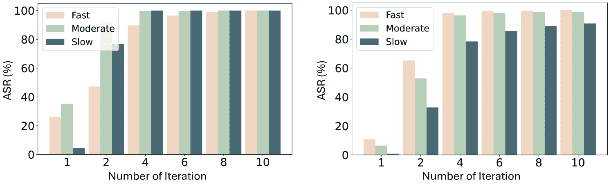
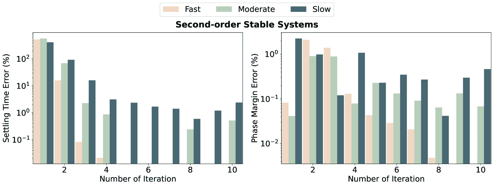

<!--yml

category: 未分类

date: 2025-01-11 12:02:10

-->

# ControlAgent：通过大语言模型（LLM）代理与领域专家知识的新型集成自动化控制系统设计

> 来源：[https://arxiv.org/html/2410.19811/](https://arxiv.org/html/2410.19811/)

Xingang Guo¹    Darioush Keivan¹    Usman Syed¹    Lianhui Qin²    Huan Zhang¹    Geir Dullerud¹    Peter Seiler³    Bin Hu¹(¹伊利诺伊大学厄本那-香槟分校

²加利福尼亚大学圣地亚哥分校

³密歇根大学）

###### 摘要

控制系统设计是现代工程学的一个关键领域，广泛应用于航空航天、汽车系统、电网和机器人等多个行业。尽管大语言模型（LLM）在多个领域取得了进展，但由于控制理论的复杂性和专业性，它们在控制系统设计中的应用仍然有限。为了解决这一问题，我们提出了ControlAgent，一个通过大语言模型（LLM）代理和控制领域知识的新型集成方法来自动化控制系统设计。ControlAgent编码了专家控制知识，并通过逐步调整控制器参数来模拟人类的迭代设计过程，以满足用户对稳定性、性能（例如，稳定时间）和鲁棒性（例如，幅值裕度）的要求。具体来说，ControlAgent集成了多个协作的LLM代理，包括负责任务分配的中央代理，以及专注于各种类型系统和需求的详细控制器设计的任务专用代理。除了LLM代理，ControlAgent还使用一个Python计算代理，基于任务指定的LLM代理提供的标准设计信息（例如，交叉频率等）执行复杂的控制增益计算和控制器评估。结合历史和反馈模块，任务专用LLM代理根据前期设计的实时反馈迭代优化控制器参数。总体而言，ControlAgent模仿了（人类）工程师的设计过程，但消除了所有人类努力，并可以完全自动化运行，为控制系统设计提供端到端的解决方案，满足用户指定的要求。为了验证ControlAgent的有效性，我们开发了ControlEval，一个包含500个控制任务的数据集，涵盖了各种具体设计目标。通过与基于LLM的对比评估和传统的人工工具箱基准对比，展示了ControlAgent的有效性。我们的数值实验表明，ControlAgent能够有效地完成控制设计任务，标志着朝着完全自动化控制工程解决方案迈出了重要的一步。我们的代码可在[https://github.com/ControlAgent/ControlAgent.git](https://github.com/ControlAgent/ControlAgent.git)获取。

## 1 引言

最近，大型语言模型（LLMs）在许多应用领域（如代码生成、推理、工具使用和软件开发等）取得了显著进展，催生了先进的LLM代理，展示了卓越的能力（Hong et al., [2023](https://arxiv.org/html/2410.19811v1#bib.bib28); Zhang et al., [2024](https://arxiv.org/html/2410.19811v1#bib.bib82); Mei et al., [2024](https://arxiv.org/html/2410.19811v1#bib.bib48); Wu et al., [2023](https://arxiv.org/html/2410.19811v1#bib.bib76); Liu et al., [2023b](https://arxiv.org/html/2410.19811v1#bib.bib42); Talebirad and Nadiri, [2023](https://arxiv.org/html/2410.19811v1#bib.bib71); Li et al., [2023](https://arxiv.org/html/2410.19811v1#bib.bib36); M. Bran et al., [2024](https://arxiv.org/html/2410.19811v1#bib.bib44); Liu et al., [2024b](https://arxiv.org/html/2410.19811v1#bib.bib41), [2023a](https://arxiv.org/html/2410.19811v1#bib.bib40); Zhuge et al., [2024](https://arxiv.org/html/2410.19811v1#bib.bib85))。尽管取得了这些突破，LLM代理在现代工程设计中的应用仍然相对较少。基于LLM推理方面的激动人心的进展，似乎自然可以预期LLM作为现代工程设计助手具有巨大的潜力。通过将复杂的工程设计过程拆解为更小的具体任务，LLM代理有可能通过减少工程师的工作量，提高工程工作流的生产力和效率。

控制设计是现代工程的基石，支撑着日常生活和工业过程中广泛的应用，例如汽车巡航控制系统、家用恒温器、工业机器人操作臂、飞机自动驾驶仪、炼油厂的化学过程控制以及电网频率调节（Åström 和 Murray，[2021](https://arxiv.org/html/2410.19811v1#bib.bib5)；Ogata，[2009](https://arxiv.org/html/2410.19811v1#bib.bib53)；Boyd 和 Barratt，[1991](https://arxiv.org/html/2410.19811v1#bib.bib8)；Anderson，[1993](https://arxiv.org/html/2410.19811v1#bib.bib2)；Rivera 等，[1986](https://arxiv.org/html/2410.19811v1#bib.bib63)）等。传统的控制器设计通常需要人类专业知识和迭代设计流程，这可能涉及繁琐的重复计算工作。例如，比例-积分-微分（PID）控制已经广泛应用于工业中，但其设计过程需要控制工程师通过迭代调节，以满足相互冲突的要求¹¹1由于性能和鲁棒性之间的基本权衡，控制设计本质上是微妙的，具有多目标特性。例如，经典控制旨在实现快速的参考追踪和干扰抑制，同时对噪声不敏感，并对模型不确定性具有鲁棒性（Ogata，[2009](https://arxiv.org/html/2410.19811v1#bib.bib53)；Xu 等，[2008](https://arxiv.org/html/2410.19811v1#bib.bib79)；Liu 等，[2014](https://arxiv.org/html/2410.19811v1#bib.bib39)）。由此自然产生一个问题：是否可以利用大语言模型（LLM）来自动化这些繁琐的设计过程，从而减轻人类专家的负担？在本文中，我们通过以一种新颖的方式整合LLM代理和控制领域的专业知识，给出了肯定的答案。


图 1：通用控制代理框架。

具体来说，我们的论文提出了ControlAgent，这是一个基于LLM的框架，通过无缝集成领域知识和工具利用，自动化控制系统设计（见图[1](https://arxiv.org/html/2410.19811v1#S1.F1 "Figure 1 ‣ 1 Introduction ‣ ControlAgent: Automating Control System Design via Novel Integration of LLM Agents and Domain Expertise")）。ControlAgent编码了专家的控制知识，并通过逐步调整控制器参数来模拟人类的迭代设计过程，以满足用户指定的稳定性、性能（如稳定时间）和鲁棒性（如相位裕度）要求。ControlAgent集成了多个协作的LLM代理，包括一个用于任务分配的中央代理和多个任务特定的代理，用于各类系统和需求的详细控制器设计，同时还配备了一个执行复杂控制增益计算和评估的Python计算代理，基于任务特定LLM代理提供的标准设计信息。利用历史和反馈模块，ControlAgent使任务特定的LLM代理能够迭代地优化控制器参数，模仿实践工程师的设计过程，同时消除人工干预，提供完全自动化、端到端的控制系统设计解决方案，满足用户指定的要求。图[1](https://arxiv.org/html/2410.19811v1#S1.F1 "Figure 1 ‣ 1 Introduction ‣ ControlAgent: Automating Control System Design via Novel Integration of LLM Agents and Domain Expertise")展示了ControlAgent框架的概述。用户只需提供必要的任务信息，如需控制的动态系统和相关的性能要求。然后，ControlAgent会分析任务，执行类似实践工程师的迭代设计过程，并返回最终设计方案。我们的贡献有三方面，总结如下：

1.  1.

    我们提出了ControlAgent，这是第一个完全自动化的基于LLM的框架，能够模拟人类迭代设计过程，用于控制工程。通过将领域特定的人类专业知识整合到LLM代理中，并结合外部工具的使用，ControlAgent在没有人工干预的情况下，系统地基于先前的设计优化控制设计。

1.  2.

    我们构建了ControlEval，这是一个全面的经典控制设计评估基准，涵盖从相对简单的一阶系统设计到更复杂的高阶系统设计。该基准作为评估基于LLM的控制设计工作流程的标准。

1.  3.

    我们在ControlEval上进行了全面的实验研究，以验证ControlAgent的性能和鲁棒性，结果表明，ControlAgent在性能上优于基于LLM和传统工具箱的基准方法。

##### 独特的创新。

最近，有一些研究表明LLM已经掌握了与控制工程相关的知识，并且能够在一定程度上回答教科书级别的控制系统问题（Kevian等人, [2024](https://arxiv.org/html/2410.19811v1#bib.bib32)）。然而，超越教科书级别后，LLM仍然无法以可靠的方式生成实用的控制设计。除了计算错误，LLM在实际控制设计中还可能犯下各种推理错误。一个关键问题是，控制设计本质上非常微妙，因为它涉及性能与鲁棒性之间的权衡，而LLM即使接触了许多不同的控制方法，也不知道如何可靠地缓解这种微妙的权衡。在本文中，我们开发了ControlAgent，它模拟了工程师如何通过PID调节和频域闭环整形来缓解这种设计权衡（见图[1](https://arxiv.org/html/2410.19811v1#S1.F1 "图1 ‣ 1 引言 ‣ ControlAgent：通过LLM代理与领域专家的创新整合实现控制系统设计自动化")）。因此，ControlAgent在设计满足性能和鲁棒性要求的控制器时变得更加可靠。

## 2 相关工作

##### 经典控制设计。

控制器设计传统上是通过逐个案例的方法进行的，因为它在很大程度上依赖于具体应用的需求。在各种控制策略中，由于其简便性和易于实现，PID控制和闭环整形仍然是最广泛使用的方法。多年来，已经开发出了大量的PID/闭环整形调节方法（Åström和Hägglund, [1995](https://arxiv.org/html/2410.19811v1#bib.bib4); Skogestad, [2001](https://arxiv.org/html/2410.19811v1#bib.bib67); Mann等人, [2001](https://arxiv.org/html/2410.19811v1#bib.bib46); Awouda和Mamat, [2010](https://arxiv.org/html/2410.19811v1#bib.bib6); O’dwyer, [2009](https://arxiv.org/html/2410.19811v1#bib.bib52); Padula和Visioli, [2011](https://arxiv.org/html/2410.19811v1#bib.bib57); Panda, [2008](https://arxiv.org/html/2410.19811v1#bib.bib58); Lequin等人, [2003](https://arxiv.org/html/2410.19811v1#bib.bib35); Skogestad, [2003](https://arxiv.org/html/2410.19811v1#bib.bib68))。尽管这些方法取得了进展，调节过程仍然在很大程度上依赖于人工专家的经验和手动干预，以确定符合设计标准的合适控制器参数。ControlAgent旨在通过整合LLM代理和人类专家知识来填补这一空白，从而实现控制系统设计的自动化。

##### 工程设计中的LLM。

一些研究探讨了LLM在解决各种工程领域问题的潜力（Ghosh 和团队, [2024](https://arxiv.org/html/2410.19811v1#bib.bib21); Poddar et al., [2024](https://arxiv.org/html/2410.19811v1#bib.bib61); Alsaqer et al., [2024](https://arxiv.org/html/2410.19811v1#bib.bib1); Majumder et al., [2024](https://arxiv.org/html/2410.19811v1#bib.bib45)）。此外，（Kevian et al., [2024](https://arxiv.org/html/2410.19811v1#bib.bib32); Syed et al., [2024](https://arxiv.org/html/2410.19811v1#bib.bib70); Xu et al., [2024](https://arxiv.org/html/2410.19811v1#bib.bib78)）介绍了用于评估LLM在控制、交通和水利工程中的教材级知识的基准数据集。AnalogCoder（Lai et al., [2024](https://arxiv.org/html/2410.19811v1#bib.bib34)）是为模拟电路设计开发的，而SPICED（Chaudhuri et al., [2024](https://arxiv.org/html/2410.19811v1#bib.bib12)）则专注于借助LLM在电路网表中的错误检测。此外，AmpAgent（Liu et al., [2024a](https://arxiv.org/html/2410.19811v1#bib.bib38)）利用LLM进行多阶段放大器设计。

##### 基于LLM的代理。

基于LLM的代理通过将文本或视觉信息作为输入来解决复杂任务，最近在学术界和工业界引起了广泛关注（Wang et al., [2024](https://arxiv.org/html/2410.19811v1#bib.bib75)）。特别是，多代理系统利用多个LLM代理之间的互动来完成更复杂的任务（Zhuge et al., [2024](https://arxiv.org/html/2410.19811v1#bib.bib85); Josifoski et al., [2023](https://arxiv.org/html/2410.19811v1#bib.bib31); Park et al., [2023](https://arxiv.org/html/2410.19811v1#bib.bib60); Li et al., [2023](https://arxiv.org/html/2410.19811v1#bib.bib36); Zhuge et al., [2023](https://arxiv.org/html/2410.19811v1#bib.bib84))。例如，AutoGen（Wu et al., [2023](https://arxiv.org/html/2410.19811v1#bib.bib76)）提供了一个通用的多代理框架，用于各种应用，包括编程、问答、数学等。MetaGPT（Hong et al., [2023](https://arxiv.org/html/2410.19811v1#bib.bib28)）是一个多代理LLM框架，灵感来自人类协议中开发的标准化操作程序，用于高效的任务分解和协调。总的来说，LLM代理领域非常活跃。请参阅附录[B.1](https://arxiv.org/html/2410.19811v1#A2.SS1 "B.1 更多相关工作 ‣ 附录B 更多关于相关工作和控制背景的讨论 ‣ ControlAgent: 通过LLM代理和领域专业知识的新颖整合自动化控制系统设计")，以获取更全面的文献综述。

## 3 初步

本节简要回顾经典控制的基本背景。控制工程领域专注于反馈机制的设计、分析和实现，这些反馈机制用于调节和引导动态系统，以实现期望的输出或行为（Åström 和 Murray，[2021](https://arxiv.org/html/2410.19811v1#bib.bib5)；Ogata，[2009](https://arxiv.org/html/2410.19811v1#bib.bib53)）。应用示例包括日常设备，如供暖和空调系统，以及更先进的系统，如自动驾驶汽车和飞机自动驾驶仪。首先，我们将回顾经典控制中研究的动态系统的概念。

##### 动态系统模型。

动态系统可以通过各种数学形式来表示，以描述输入和输出之间的关系，包括微分方程、状态空间模型和传递函数（Goodwin 等，[2001](https://arxiv.org/html/2410.19811v1#bib.bib23)；Boyd 和 Barratt，[1991](https://arxiv.org/html/2410.19811v1#bib.bib8)）。经典控制设计中研究的主要对象是线性时不变（LTI）系统，这些系统可以通过线性常微分方程（ODE）在时域中表示，或通过等效的传递函数在频域中表示。例如，LTI 系统的传递函数具有如下形式：

|  | $G(s)=\frac{b_{m}s^{m}+b_{m-1}s^{m-1}+\cdots+b_{1}s+b_{0}}{a_{n}s^{n}+a_{n-1}s^{n-1}+\cdots+a_{1}s+a_{0}},$ |  | (3.1) |
| --- | --- | --- | --- |

其中 $s$ 是拉普拉斯域中的复频率变量。通常假设系统是适当的（$m \leq n$），因为这与物理系统的模型一致。请注意，该系统（[3.1](https://arxiv.org/html/2410.19811v1#S3.E1 "在动态系统模型中 ‣ 3 初步 ‣ ControlAgent：通过新型集成LLM代理和领域专业知识自动化控制系统设计")）具有等效的时域 ODE 形式，该形式将输入信号 $u(t)$ 与输出信号 $y(t)$ 联系起来：

|  | $\displaystyle a_{n}\frac{d^{n}}{dt^{n}}\,y(t)+\ldots+a_{1}\frac{d}{dt}\,y(t)+a_{0}\,y(t)=b_{m}\frac{d^{m}}{dt^{m}}\,u(t)+\ldots+b_{1}\frac{d}{dt}\,u(t)+b_{0}\,u(t)$ |  | (3.2) |
| --- | --- | --- | --- |

这种形式足够通用，能够模拟各种实际系统的动态特性，如汽车系统、机器人技术等。重要的是，模型和现实之间总是存在差距。经典控制设计在实践中非常成功，因为控制工程师使用安全因子（“稳定性裕度”）来考虑这些模型与现实之间的差距。


图2：一个反馈控制系统，展示了参考$r$、测量输出$y$、干扰$d$和噪声$n$。动态模型$G(s)$提供了实际物理系统的数学近似。实际系统与其数学模型之间固有的不匹配，强调了需要一个鲁棒的控制器$C(s)$来确保尽管存在建模不准确性，仍能实现可靠的性能。

##### 经典控制设计。

如图[2](https://arxiv.org/html/2410.19811v1#S3.F2 "Figure 2 ‣ Dynamical System Models. ‣ 3 Preliminary ‣ ControlAgent: Automating Control System Design via Novel Integration of LLM Agents and Domain Expertise")所示，反馈控制可以用来将工厂输出$y(t)$引导到跟踪参考信号$r(t)$。该架构：（a）使用传感器测量输出$y(t)$，（b）计算跟踪误差$e(t)=r(t)-y(t)$，并且（c）使用控制算法$C(s)$根据误差计算输入到工厂的信号。图[2](https://arxiv.org/html/2410.19811v1#S3.F2 "Figure 2 ‣ Dynamical System Models. ‣ 3 Preliminary ‣ ControlAgent: Automating Control System Design via Novel Integration of LLM Agents and Domain Expertise")展示了一个标准的反馈回路，其中测量的输出$y(t)$被控制器用于计算输入到系统的信号，从而影响输出$y(t)$。该架构被称为闭环控制，因为将测量值反馈给控制器形成了一个围绕工厂的回路。现代控制工程的一个关键教训是，通常通过配备传感、驱动和反馈的闭环设计可以实现对干扰和模型不确定性的鲁棒性。经典控制聚焦于设计控制器$C(s)$（它本身是一个线性时不变（LTI）系统，并在微处理器上实现）。经典控制设计有许多目标，且这些目标往往相互冲突，标准设计要求包括：

+   •

    闭环稳定性：设计不良的系统可能导致系统不稳定，即信号可能会无限增长。实际后果是，系统或设备可能会被破坏，从而导致财务损失甚至生命损失。为了避免这种情况，闭环稳定性是必须的。

+   •

    快速参考跟踪：控制器应设计成使得系统输出能够跟踪期望的参考命令。这涉及到多种性能指标，但主要是系统应能够迅速响应参考命令的变化。

+   •

    干扰抑制：干扰$d(t)$是影响工厂动态的外部信号。例如，一辆配有巡航控制系统的汽车会受到风速变化和坡度变化的影响。控制器应设计成使得干扰对跟踪的影响较小。

+   •

    执行器限制：控制器产生的输入信号应保持在允许的范围内。例如，汽车上的油门（加速器）只能在一定范围内移动。控制器发出的命令必须保持在这些允许的范围内。

+   •

    拒绝传感器噪声：反馈控制器依赖于传感器测量。通常要求任何测量不准确性，例如噪声，对跟踪的影响较小。此外，噪声对控制努力的影响应尽可能小。

+   •

    对模型与现实之间差距的鲁棒性：如上所述，控制设计中使用的模型与实际控制器部署的系统之间存在一定的差距。控制器必须具备鲁棒性，即对这种模型与现实之间的差距不敏感，这些差距通常包括由于参数变化和未建模动态所产生的误差。

这种多目标性质要求在性能和鲁棒性之间进行权衡，这也是经典控制设计的核心内容。

##### 性能/鲁棒性权衡。

各种设计要求大致可以归纳为三大类：i）闭环稳定性，ii）性能（例如跟踪速度），以及iii）鲁棒性（定义见附录[B.2](https://arxiv.org/html/2410.19811v1#A2.SS2 "B.2 更多经典控制背景 ‣ 附录B 更多相关工作与控制背景讨论 ‣ ControlAgent: 通过大语言模型代理和领域专长的创新整合自动化控制系统设计")）。稳态时间$T_{s}$无疑是最重要的性能指标，因为它衡量了系统响应达到稳态值的指定百分比（例如，2%或5%）所需的时间，较小的$T_{s}$意味着快速参考跟踪。鲁棒性同样至关重要。如图[2](https://arxiv.org/html/2410.19811v1#S3.F2 "图2 ‣ 动态系统模型 ‣ 3 初步 ‣ ControlAgent: 通过大语言模型代理和领域专长的创新整合自动化控制系统设计")所示，控制设计中使用的动态模型与实际部署控制器的物理系统之间总是存在差距。必须确保控制器具有针对模型与现实之间差距的鲁棒性。在这种情况下，相位裕度通常被认为是最重要的鲁棒性指标（Chang和Han，[1990](https://arxiv.org/html/2410.19811v1#bib.bib11); Ho等人，[1996](https://arxiv.org/html/2410.19811v1#bib.bib27)），从概念上讲，较大的相位裕度意味着较强的鲁棒性。由于实现较小的稳态时间（快速跟踪）和较大的相位裕度（鲁棒性）是相互竞争的目标，实践中的控制工程师通常使用稳态时间和相位裕度作为调节旋钮，在经典控制设计中平衡性能与鲁棒性之间的权衡。还有许多次级指标（例如增益裕度等）可以用来对上述六个控制设计要求提供细致的描述。然而，控制实践中已知，使用稳态时间和相位裕度作为调节旋钮的PID和环路整形设计通常足以解决同时涉及这六个控制设计要求的复杂性能与鲁棒性权衡。我们研究的一个主要目标是开发第一个基于大语言模型（LLM）的框架，能够自动应对控制设计中这种微妙的性能与鲁棒性权衡。


图3：ControlAgent的控制器设计过程，展示了用户、中央代理、Python代理、历史与反馈模块以及任务特定代理之间的交互，以设计一个符合稳定性、相位裕度和稳态时间要求的控制器。

## 4 ControlAgent


图 4：ControlAgent 中任务特定代理的工作流程。设计历史和反馈会根据前几次迭代动态更新。ControlAgent 通过迭代精炼设计，在每一步都结合用户指令和反馈。在第三次迭代时，ControlAgent 实现了一个最终设计，满足用户要求，达到了小于 0.3 秒的稳态时间（如时间响应图所示），并保持相位裕度始终大于 $70^{\circ}$（如 Bode 图所示）。

在本节中，我们介绍了 ControlAgent，详细描述了其代理架构、迭代设计机制和通信协议。ControlAgent 的概述已在图 [1](https://arxiv.org/html/2410.19811v1#S1.F1 "Figure 1 ‣ 1 Introduction ‣ ControlAgent: Automating Control System Design via Novel Integration of LLM Agents and Domain Expertise") 中展示，

##### 代理设计。

我们将复杂的控制器设计分解为更小、更具体的任务，要求具有不同技能和专长的代理进行协作。ControlAgent 包含三种类型的代理：

1.  1.

    中央代理 $\mathcal{A}_{c}$ 作为任务分发器，处理用户输入并根据控制器设计任务的性质将特定请求分配给子级代理。

1.  2.

    任务特定代理 $\mathcal{A}_{\text{spec}}$ 接收来自中央代理的用户请求和高级任务分析，并结合领域特定的专业知识编码，启动控制器设计过程，遵循下面讨论的迭代方法。

1.  3.

    Python 计算代理 $\mathcal{A}_{p}$ 执行控制器设计和性能评估中涉及的复杂计算步骤，确保可靠的控制器合成和评估。

作为示例，图 [3](https://arxiv.org/html/2410.19811v1#S3.F3 "Figure 3 ‣ Performance/Robustness Trade-offs. ‣ 3 Preliminary ‣ ControlAgent: Automating Control System Design via Novel Integration of LLM Agents and Domain Expertise") 展示了 ControlAgent 中控制器设计工作流的一个例子。用户最初提供系统的动态模型（以传递函数表示），以及闭环稳定性、稳态时间和相位裕度等指定的设计标准。中央代理随后分析任务并将其委派给一个专门的任务特定代理，针对任务的要求量身定制。每个任务特定代理在接收到任务后，凭借领域特定的专业知识启动设计过程。设计好的控制器由 Python 代理进行评估，同时历史和反馈模块存档设计过程，并生成有价值的反馈，以便进行迭代优化。

输入：用户需求 $\mathcal{R}$，最大迭代次数 $N_{\text{max}}$ 输出：设计的控制器 $C$ 初始化内存缓冲区：$\mathcal{M}\leftarrow\emptyset$；初始化反馈：$\mathcal{F}_{0}=\{\}$；任务分配：$\mathcal{A}_{c}$ 根据 $\mathcal{R}$ 将任务分配给 $\mathcal{A}_{\text{spec}}$：$\mathcal{A}_{\text{spec}}\leftarrow\text{AssignTask}(\mathcal{A}_{c},\mathcal{R})$ 对于 *$k=1$ 到 $N_{\text{max}}$* 执行：       生成输入提示：$\mathcal{P}_{k}\leftarrow\text{GenPrompt}(\mathcal{E}_{\text{spec}},\mathcal{R},\mathcal{M},\mathcal{F}_{k-1})$；      LLM 代理生成控制器：$C_{k}\leftarrow\mathcal{A}_{\text{spec}}(\mathcal{P}_{k})$；      更新内存缓冲区：$\mathcal{M}\leftarrow\mathcal{M}\cup\{C_{k}\}$；      Python 代理 $\mathcal{A}_{p}$ 评估 $C_{k}$ 并计算性能 $P_{k}$；      如果 *$P_{k}$ 满足 $R$* 则             返回成功设计的控制器 $C_{k}$；      否则             生成反馈：$\mathcal{F}_{k}\leftarrow\text{GenFeedback}(P_{k},R)$；返回未找到成功的控制器；

算法 1 控制代理的迭代控制器设计过程

##### 通过结构化内存设计的迭代设计。

ControlAgent 依赖于迭代设计和反馈机制，模仿实际工程师使用的设计过程（见图 [4](https://arxiv.org/html/2410.19811v1#S4.F4 "图 4 ‣ 4 ControlAgent ‣ ControlAgent：通过LLM代理和领域专长的新颖集成自动化控制系统设计")）。传统的控制工程师设计控制器通常涉及试错循环，需要根据观察到的反馈对控制器参数进行微调。同样，LLM 代理要有效地执行控制系统设计，它们也必须遵循迭代设计过程。这涉及访问先前的设计和性能指标，并使用反馈来细化其输出，以改善控制器配置的性能和鲁棒性。然而，由于 LLM 的上下文窗口限制，存储所有 LLM 代理的过去输出并简单地在下一个迭代中重用它们是不可行的。为了解决这个问题，ControlAgent 通过一个高效的结构化内存缓冲区 $\mathcal{M}$ 来管理内存，只保留必要的信息：先前设计的控制器参数及其相关的性能，而不是完整的历史输出。这一策略使得代理能够在不超出内存容量的情况下回忆起过去迭代中的关键细节。此外，ControlAgent 还动态评估当前设计与用户需求的比较。如果当前设计未满足要求，将创建反馈 $\mathcal{F}$，对其进行编码，然后将其纳入下次迭代中 LLM 代理的输入提示中。

我们总结了ControlAgent的迭代设计过程，如算法[1](https://arxiv.org/html/2410.19811v1#alg1 "在代理设计中。 ‣ 4 ControlAgent ‣ ControlAgent: 通过将LLM代理与领域专业知识的创新整合自动化控制系统设计")所示，并在这里提供一些详细的解释。LLM代理的输入提示包含四个主要组件：

1.  1.

    设计指令：设计指令$\mathcal{E}_{\text{spec}}$从领域专业知识中提炼出来，针对每个特定任务，增强LLM代理在控制器设计方面的能力，特别是通过PID或回路整形方法，聚焦于通过调节稳态时间和相位裕度等参数来缓解性能/稳健性权衡问题。

1.  2.

    用户需求：用户需求$\mathcal{U}$由用户直接提供。

1.  3.

    存储和反馈：此组件包括从结构化存储缓冲区$\mathcal{M}$中检索先前设计的参数，以及自动生成的反馈，用于突出当前设计的不足。

1.  4.

    响应指令：响应指令$\mathcal{R}$指定响应格式，以确保关键信息能够高效提取。

在接收到来自中央代理$\mathcal{A}_{c}$的任务要求后，任务特定LLM代理$\mathcal{A}_{\text{spec}}$根据提供的指令、先前失败的设计和反馈，迭代设计新的控制器。在每次迭代中，$\mathcal{A}_{\text{spec}}$生成一个新的控制器设计，并将其存储在存储缓冲区中。随后，Python代理$\mathcal{A}_{p}$检索该设计并进行评估。如果当前设计满足用户定义的需求，迭代过程终止，并返回成功设计的控制器。否则，通过将当前性能与用户需求进行比较，生成反馈信号，过程将继续进行下一次迭代，直到达到最大迭代次数为止。

## 5 控制评估

由于当前没有适合验证 ControlAgent 的开源数据集，我们开发了一个新的评估数据集，名为 ControlEval，来满足这一需求。ControlEval 包含基于不同系统和需求的 10 种不同类型的控制任务。对于每种任务类型，我们构建了 50 个独立的系统，并为每个系统配对相应的设计要求，从而形成了一个包含 500 个控制任务的综合数据集。ControlEval 涵盖了多种动态系统，如一阶稳定与不稳定系统、二阶稳定与不稳定系统（具有不同响应速度模式）、一阶时滞系统，以及一般高阶系统。每个任务的设计标准包括闭环稳定性、稳定时间（用于量化跟踪性能）和相位裕度（用于评估鲁棒性）。这三项是经典控制设计的关键指标。对于一阶和二阶稳定系统，我们进一步通过稳定时间的变化来区分三种不同的响应速度：快速、中等和慢速。快速模式要求系统在短时间内收敛到稳态值，通常适用于需要快速响应的应用场景，例如伺服电机控制系统（Krah 和 Klarenbach，[2010](https://arxiv.org/html/2410.19811v1#bib.bib33)）和四旋翼飞行控制系统（Bramlette 和 Barrett-Gonzalez，[2017](https://arxiv.org/html/2410.19811v1#bib.bib9)）。相比之下，慢速模式要求系统更为平缓地收敛，适用于那些动态系统模型不够精确且希望采用较为温和控制的场景，如风力涡轮机控制（Ossmann 等，[2021](https://arxiv.org/html/2410.19811v1#bib.bib55)）。表[1](https://arxiv.org/html/2410.19811v1#S5.T1 "Table 1 ‣ 5 ControlEval ‣ ControlAgent: Automating Control System Design via Novel Integration of LLM Agents and Domain Expertise")中提供了来自 ControlEval 的一些样本，包括系统类型、系统动态模型、响应模式以及相关的设计要求。

| 系统类型 | 一阶稳定 | 二阶稳定 | 一阶带有时滞 | 高阶系统 |
| --- | --- | --- | --- | --- |
| 系统模型 | $\dfrac{2.19}{s+10.99}$ | $\dfrac{5.88}{s^{2}+1.43s+0.91}$ | $\dfrac{8.79e^{-0.14s}}{s+4}$ | $\dfrac{225}{s^{3}+14.2s^{2}+46s+40}$ |
| 响应模式 | 中等 | 慢 | (-) | (-) |
| 稳定性 | $\checkmark$ | $\checkmark$ | $\checkmark$ | $\checkmark$ |
| 稳定时间范围 | $T_{s}\in[0.04,0.58]$ | $T_{s}\in[12.70,34.04]$ | $T_{s}\in[0.63,6.68]$ | $T_{s}\in[1.05,8.4]$ |
| 相位裕度 | $\phi_{m}\geq 81.74^{\circ}$ | $\phi_{m}\geq 61.57^{\circ}$ | $\phi_{m}\geq 44.06^{\circ}$ | $\phi_{m}\geq 62.54^{\circ}$ |

表 1：系统模型及其对应的控制设计标准。

由于在控制不稳定系统、具有时间延迟的系统以及高阶系统时存在固有的限制，无法总是满足任意组合的性能/鲁棒性要求（Stein，[2003](https://arxiv.org/html/2410.19811v1#bib.bib69); Seron 等人，[2012](https://arxiv.org/html/2410.19811v1#bib.bib66); Freudenberg 和 Looze，[1985](https://arxiv.org/html/2410.19811v1#bib.bib17)，[1987](https://arxiv.org/html/2410.19811v1#bib.bib16)，[1988](https://arxiv.org/html/2410.19811v1#bib.bib18)）。因此，人工专家已经仔细挑选了数据集，以确保任务要求是可行且可实现的。有关数据集的更多信息，请参见附录[D](https://arxiv.org/html/2410.19811v1#A4 "Appendix D More Details on ControlEval ‣ ControlAgent: Automating Control System Design via Novel Integration of LLM Agents and Domain Expertise")。

## 6 实验结果

在本节中，我们展示了一组全面的实验，用于评估ControlAgent在ControlEval上的表现。GPT-4o被用作中央代理和任务特定代理的主要基础LLM，并且还展示了对比不同基础LLM的研究。ControlAgent的详细提示可以在附录[E.1](https://arxiv.org/html/2410.19811v1#A5.SS1 "E.1 Full Prompts for ControlAgent ‣ Appendix E Prompt Design ‣ ControlAgent: Automating Control System Design via Novel Integration of LLM Agents and Domain Expertise")中找到。此外，我们将ControlAgent与两种不同的基准类别进行了比较：基于LLM的基准和基于控制工具箱的基准。

基于LLM的基准：我们考虑了四种基于LLM的基准方法，均使用GPT-4o：零-shot提示、零-shot链式思维（CoT）、少-shot和少-shot链式思维。在零-shot方法中，我们直接提供用户需求，并要求LLM在没有额外指导的情况下进行控制器设计。CoT变体通过提示LLM明确地逐步进行设计来增强这一过程。对于少-shot方法，我们向LLM展示几个成功的控制器设计示例，以指导其设计过程。在少-shot CoT设置中，提示不仅包括成功的设计，还详细列出了创建成功控制器所需的逐步推理过程。每种设置的详细提示可以在附录[E.2](https://arxiv.org/html/2410.19811v1#A5.SS2 "E.2 Full Prompts for Baselines ‣ Appendix E Prompt Design ‣ ControlAgent: Automating Control System Design via Novel Integration of LLM Agents and Domain Expertise")中找到。

基于控制工具箱的基准：我们还考虑了广泛使用的 PID 设计控制工具箱：MathWorks 的 PIDtune（MathWorks，[2023](https://arxiv.org/html/2410.19811v1#bib.bib47)）作为基准。该工具箱需要人为干预，因为用户需要指定一个适当的交叉频率值作为输入，以优化控制器增益，而 ControlAgent 则自动调节交叉频率，无需任何人工干预。关于我们如何设置 PIDtune 的更多细节，请参见附录 [C](https://arxiv.org/html/2410.19811v1#A3 "Appendix C More on Experimental Study ‣ ControlAgent: Automating Control System Design via Novel Integration of LLM Agents and Domain Expertise")。

评估指标：我们使用两个主要指标来评估 ControlAgent 和基准方法的性能。具体来说，我们使用平均成功率（ASR）来衡量每种方法在多个独立试验中的控制设计效果，使用汇总成功率（AgSR）来评估系统级别的成功设计，其中一个系统被认为是成功设计的，如果至少一个独立试验结果是成功的控制器设计。ASR 和 AgSR 的正式定义可以在附录 [C](https://arxiv.org/html/2410.19811v1#A3 "Appendix C More on Experimental Study ‣ ControlAgent: Automating Control System Design via Novel Integration of LLM Agents and Domain Expertise") 中找到。

| 系统类型 | 一阶稳定 | 二阶稳定 | 一阶不稳定 | 二阶不稳定 | 带延迟 | 高阶 |
| --- | --- | --- | --- | --- | --- | --- |
| 响应模式 | 快速 | 中等 | 慢速 | 快速 | 中等 | 慢速 | (-) | (-) | (-) | (-) |
| Zero-shot | 8.0 | 19.2 | 10.0 | 14.0 | 18.4 | 13.2 | 5.2 | 0.4 | 15.6 | 2.0 |
| Zero-shot CoT | 26.8 | 3.2 | 0.4 | 12.4 | 18.8 | 12.0 | 4.4 | 0.8 | 8.8 | 8.0 |
| 少量样本 | 12.4 | 19.6 | 15.6 | 12.0 | 12.4 | 15.2 | 14.0 | 29.2 | 11.6 | 12.0 |
| 少量样本 CoT | 11.2 | 21.6 | 21.2 | 7.6 | 14.0 | 25.6 | 6.0 | 22.4 | 16.0 | 16.4 |
| PIDtune | 56.0 | 90.4 | 86.4 | 81.6 | 98.8 | 77.6 | 30.4 | 10.8 | 100.0 | 50.0 |
| ControlAgent | 100.0 | 100.0 | 100.0 | 100.0 | 98.8 | 90.8 | 97.2 | 96.8 | 97.2 | 82.0 |

表格 2：在 ControlEval 上，基准方法和 ControlAgent 在不同系统类型和响应模式下的平均成功率（ASR，%）。每个任务的最佳结果以**粗体**突出显示。结果表明，ControlAgent 在所有类别中始终优于其他所有基于 LLM 和工具箱的基准方法（除了具有延迟的一阶系统），证明了其在处理多样化控制任务中的有效性和鲁棒性。

### 6.1 主要结果

表格 [2](https://arxiv.org/html/2410.19811v1#S6.T2 "Table 2 ‣ 6 Experimental Results ‣ ControlAgent: Automating Control System Design via Novel Integration of LLM Agents and Domain Expertise") 显示了 ControlAgent 和各种基准方法在 ControlEval 基准测试中的 ASR。每个任务的最佳结果以**粗体**突出显示。我们的主要观察结果如下。

##### ControlAgent始终优于所有基准方法。

与基于LLM的基准方法和传统工具箱基准方法相比，ControlAgent在所有控制任务中都取得了显著更高的ASR（唯一的例外是带有时延的一阶系统，在此情况下ControlAgent取得了第二高的结果，97.2%）。这种卓越的表现不仅在简单的一阶和二阶稳定系统中得以体现，还在更复杂的情况中，如不稳定系统和高阶系统。ControlAgent能够在多种系统类型中保持高成功率，展示了将LLM与领域专业知识结合的潜力，使其成为自动化控制系统设计中一个高度可靠的工具。

##### ControlAgent可以完美解决简单任务。

对于相对简单的系统，例如一阶/二阶稳定系统，ControlAgent在所有响应模式（快速、中等和慢速）下都能取得完美的成绩（100% ASR）。这表明ControlAgent能够无误地处理简单的控制问题，满足所有用户定义的性能要求。

##### PIDtune在大多数控制任务中优于基于LLM的基准方法。

值得注意的是，基于控制工具箱的方法PIDtune在大多数控制任务中表现优于基于LLM的基准方法（如Zero-shot和Few-shot），除了二阶不稳定系统。这表明单靠LLM或简单的提示工程方法不足以有效解决许多控制任务。结果突显了标准LLM能力与传统控制工具箱之间的差距。ControlAgent通过采用一个迭代的控制器设计过程，结合LLM、控制领域专业知识和工具使用，弥合了这一差距，模拟了实践中的控制工程师如何在经典控制设计中平衡性能和稳健性之间的权衡。

##### 聚合多次试验的结果显著提高了整体性能。

图[5](https://arxiv.org/html/2410.19811v1#S6.F5 "图5 ‣ 聚合多个试验结果显著提升整体性能。 ‣ 6.1 主要结果 ‣ 6 实验结果 ‣ ControlAgent: 通过大规模语言模型代理和领域专长的创新集成实现控制系统设计自动化")展示了ControlAgent和基准方法在一阶稳定系统（在快速、中等和慢速模式下的平均值）及高阶系统中的ASR和AgSR结果。我们对每个方法进行了五次独立试验。结果表明，每种方法都显著提高了其成功率，突出显示了聚合多个试验结果以提升整体性能的优势。ControlAgent仍然是表现最出色的方法之一，在所有方法中都取得了较高的成功率。更多的AgSR结果可以在附录[C](https://arxiv.org/html/2410.19811v1#A3 "附录C 更多实验研究 ‣ ControlAgent: 通过大规模语言模型代理和领域专长的创新集成实现控制系统设计自动化")中找到。


图5：一阶稳定系统（在快速、中等和慢速模式下的平均值）及高阶系统的ASR和AgSR。

### 6.2 消融研究

在本节中，我们对ControlAgent进行了消融研究。

|  | ControlAgent | 无迭代 | 无指令 | 无Python代理 | 无反馈 |
| --- | --- | --- | --- | --- | --- |
|  | ASR | 迭代次数 | ASR | 迭代次数 | ASR | 迭代次数 | ASR | 迭代次数 | ASR | 迭代次数 |
| 快速 | 100.0 | 2.74 | 28.4 | (-) | 70.4 | 4.84 | 76.0 | 4.34 | 85.6 | 4.45 |
| 中等 | 100.0 | 1.78 | 33.2 | (-) | 60.4 | 6.38 | 85.2 | 3.71 | 92.4 | 3.05 |
| 慢速 | 100.0 | 2.19 | 4.0 | (-) | 56.4 | 6.39 | 71.2 | 5.19 | 94.0 | 2.46 |

表3：ControlAgent及其不同组件配置的消融研究结果（ASR和平均迭代次数）。被消融的版本排除了特定组件，如迭代优化、用户指令、Python代理和反馈整合。

##### ControlAgent关键组件的效果：

为了研究ControlAgent中不同组件对其整体性能的影响，我们比较了在三种响应模式下，一阶稳定系统中ASR和成功设计所需的平均迭代次数。结果如表[3](https://arxiv.org/html/2410.19811v1#S6.T3 "表3 ‣ 6.2 去除实验 ‣ 6 实验结果 ‣ ControlAgent：通过LLM代理和领域专长的创新集成自动化控制系统设计")所示，表明ControlAgent的完整版本在所有响应模式下都能达到完美的ASR（100%），并且迭代次数最少，突显了其集成设计的有效性。相比之下，移除迭代设计过程会导致ASR的急剧下降，尤其是在慢响应模式下，ASR仅下降到4%。类似地，排除设计指令或Python代理会显著降低ASR并增加成功所需的迭代次数，这凸显了这些组件在提高设计效率中的关键作用。尽管没有反馈时ControlAgent表现得相对不错，但增加的平均迭代次数表明反馈对于更快的收敛至关重要。总的来说，这些发现表明每个组件对ControlAgent的稳健性和效率都至关重要。图[6](https://arxiv.org/html/2410.19811v1#S6.F6 "图6 ‣ ControlAgent中关键组件的影响： ‣ 6.2 去除实验 ‣ 6 实验结果 ‣ ControlAgent：通过LLM代理和领域专长的创新集成自动化控制系统设计")表明，增加最大迭代次数在所有响应模式下（一阶和二阶稳定系统）对ASR的提高具有一致的效果。随着迭代次数的增加，ControlAgent有更多的机会精细化其设计，从而提高成功率。这一趋势表明，允许更多的迭代有助于提升ControlAgent满足控制设计标准的能力，尤其是在复杂场景中，这些场景可能需要额外的迭代才能达到最佳结果。



图6：不同响应模式（快速、中等、慢速）下迭代次数对ASR的影响。左侧：一阶稳定系统；右侧：二阶稳定系统。

| 基础LLM | GPT-4o | Claude-3.5 Sonnet | GPT-4-turbo | Gemini-1.5-pro | GPT-3.5-turbo |
| --- | --- | --- | --- | --- | --- |
|  | ASR | 迭代次数 # | ASR | 迭代次数 # | ASR | 迭代次数 # | ASR | 迭代次数 # | ASR | 迭代次数 # |
| 快 | 100.0 | 2.74 | 98.4 | 2.66 | 94.0 | 3.82 | 86.8 | 2.96 | 49.2 | 6.84 |
| 中等 | 100.0 | 1.78 | 99.2 | 2.05 | 98.4 | 2.55 | 86.4 | 2.41 | 97.2 | 3.01 |
| 慢 | 100.0 | 2.19 | 97.2 | 2.18 | 99.2 | 2.14 | 85.6 | 2.67 | 77.6 | 4.18 |

表4：在三种响应模式（快、中、慢）下，ControlAgent使用不同基础LLM对一阶稳定系统的ASR（%）和平均迭代次数。最高的ASR和最低的迭代次数以**粗体**突出显示。

##### 不同基础LLM的结果：

表[4](https://arxiv.org/html/2410.19811v1#S6.T4 "Table 4 ‣ Effect of Key Components in ControlAgent: ‣ 6.2 Ablation Study ‣ 6 Experimental Results ‣ ControlAgent: Automating Control System Design via Novel Integration of LLM Agents and Domain Expertise")展示了ControlAgent在使用不同基础LLM时的表现，包括GPT-4o、Claude-3.5 Sonnet、GPT-4-turbo、Gemini-1.5-pro和GPT-3.5-turbo。结果表明，所有最先进的LLM都能取得相当好的表现，大多数模型在不同的响应模式下都达到了较高的ASR值。GPT-4o表现突出，在所有响应模式下都达到了完美的ASR（100%），并在中等模式下需要的迭代次数最少。同样，Claude-3.5 Sonnet和GPT-4-turbo表现具有竞争力；值得注意的是，Claude-3.5在快速和慢速模式下分别实现了接近完美的ASR，并且迭代次数最低。尽管Gemini-1.5-pro和GPT-3.5-turbo的表现仍存在差距，这些发现表明，最先进的LLM的表现相似，证明了ControlAgent在各种LLM配置中都具备灵活性和适应性。

## 7 局限性与未来工作

在本文中，我们介绍了ControlAgent，这是一种基于先进大型语言模型（LLM）的自动化控制系统设计框架。尽管ControlAgent在一系列控制任务中表现强劲，但仍有若干局限性，指示了未来研究和改进的方向。一个主要的限制是，目前的ControlAgent实现针对线性时不变（LTI）系统和传统控制策略（如回路整形和PID控制器）进行了定制。未来的工作可以通过考虑复杂的非线性系统并整合先进的控制策略（如自适应控制和鲁棒控制）来扩展ControlAgent的能力。另一个引人注目的方向是利用不同的基础LLM来承担不同的角色，充分发挥它们独特的优势和专业知识。例如，结合经过微调的较小LLM来处理控制系统设计中的专门任务，可能提高效率并减少对专有模型的依赖。最后，评估数据集ControlEval可以进一步扩展，涵盖更复杂的控制任务，如现实世界的系统和硬件实现，从而提供对ControlAgent实际效用的更全面评估。我们在附录[A](https://arxiv.org/html/2410.19811v1#A1 "Appendix A ControlAgent: Future Outlook ‣ ControlAgent: Automating Control System Design via Novel Integration of LLM Agents and Domain Expertise")中提供了关于未来研究方向的更详细讨论。

#### 伦理声明

在开发ControlAgent时，我们认真考虑了工作中的伦理影响，并采取了措施确保负责任的研究实践。所有实验均在模拟环境和合成数据集上进行，没有涉及人类受试者，从而避免了任何隐私、安全或法律合规问题。ControlAgent专注于自动化控制系统设计，可能会被部署在关键应用中，如工业自动化、自动驾驶车辆和机器人技术。不当使用或部署基于AI的控制系统在这些领域可能会导致意外后果。为了减少这些风险，我们强调在将ControlAgent应用于实际系统之前，必须进行严格的测试、验证，并遵守既定的安全标准。

在透明度和可访问性方面，使用专有的LLM可能会限制更广泛的访问和可重复性。为了解决这一问题，未来的工作将探索使用开源LLM，以增强可访问性并促进社区合作。此外，由于ControlAgent的性能依赖于可能继承其训练数据偏差的LLM，正在进行的研究将专注于缓解偏见并确保控制系统建议的公平性。作者声明没有任何利益冲突或外部资助影响本研究的结果或解释。总体而言，我们致力于以伦理的方式开发和应用ControlAgent，仔细考虑其社会影响和潜在风险。

#### 可重复性声明

我们采取了多项措施以确保结果的可重复性。实验设置、超参数和配置的详细描述请参见主文中的第[6](https://arxiv.org/html/2410.19811v1#S6 "6 Experimental Results ‣ ControlAgent: Automating Control System Design via Novel Integration of LLM Agents and Domain Expertise")节以及附录[C](https://arxiv.org/html/2410.19811v1#A3 "Appendix C More on Experimental Study ‣ ControlAgent: Automating Control System Design via Novel Integration of LLM Agents and Domain Expertise")。具体来说，ControlAgent的架构和LLM提示结构在第[4](https://arxiv.org/html/2410.19811v1#S4 "4 ControlAgent ‣ ControlAgent: Automating Control System Design via Novel Integration of LLM Agents and Domain Expertise")节和附录[E](https://arxiv.org/html/2410.19811v1#A5 "Appendix E Prompt Design ‣ ControlAgent: Automating Control System Design via Novel Integration of LLM Agents and Domain Expertise")中有详细说明。我们还在第[6](https://arxiv.org/html/2410.19811v1#S6 "6 Experimental Results ‣ ControlAgent: Automating Control System Design via Novel Integration of LLM Agents and Domain Expertise")节中提供了关于消融研究和基准比较的全面描述，以帮助结果的再现。我们在附录[D](https://arxiv.org/html/2410.19811v1#A4 "Appendix D More Details on ControlEval ‣ ControlAgent: Automating Control System Design via Novel Integration of LLM Agents and Domain Expertise")中详细描述了实验中使用的数据集，包括数据集生成和控制设计标准的细节。

## 致谢

X. Guo, D. Kevian, U. Syed 和 B. Hu 感谢 OpenAI 研究员访问计划的支持。Huan Zhang 感谢 Schmidt 科学研究院的 AI2050 项目（AI 2050 早期职业奖学金）的支持。

## 参考文献

+   Alsaqer 等人 [2024] Shadan Alsaqer, Sarah Alajmi, Imtiaz Ahmad, 和 Mohammad Alfailakawi. 《大规模语言模型在硬件设计中的潜力》. *工程研究杂志*, 2024年。

+   Anderson [1993] Brian D.O. Anderson. 控制器设计：从理论到实践的转变. *IEEE 控制系统杂志*, 13(4):16–25, 1993年。

+   Ang 等人 [2005] Kiam Heong Ang, Gregory Chong, 和 Yun Li. PID 控制系统的分析、设计与技术. *IEEE 控制系统技术学报*, 13(4):559–576, 2005年。

+   Åström 和 Hägglund [1995] K. Åström 和 T. Hägglund. *PID 控制器：理论、设计与调优*. 仪器、系统与自动化学会，第2版, 1995年。

+   Åström 和 Murray [2021] Karl Johan Åström 和 Richard Murray. *反馈系统：科学家和工程师的介绍*. 普林斯顿大学出版社, 2021年。

+   Awouda 和 Mamat [2010] Ala Eldin Abdallah Awouda 和 Rosbi Bin Mamat. 使用 ITAE 标准优化 PID 调节规则。在 *2010年第2届计算机与自动化工程国际会议（ICCAE）*，第5卷，第171–176页。IEEE，2010年。

+   Blight 等人 [1994] J. D. Blight，R. L. Dailey 和 D. Gangsaas. 使用多变量技术为飞机设计实用的控制律。*国际控制学报*，59(1)：93–137，1994年。

+   Boyd 和 Barratt [1991] Stephen P Boyd 和 Craig H Barratt. *线性控制器设计：性能极限*，第78卷。Citeseer，1991年。

+   Bramlette 和 Barrett-Gonzalez [2017] Richard B Bramlette 和 Ronald M Barrett-Gonzalez. 设计和飞行测试一种可转换四轴飞行器以实现最大飞行速度。在 *第55届AIAA航空航天科学会议*，第0243页，2017年。

+   Chan 等人 [2023] Chi-Min Chan，Weize Chen，Yusheng Su，Jianxuan Yu，Wei Xue，Shanghang Zhang，Jie Fu 和 Zhiyuan Liu. Chateval：通过多智能体辩论迈向更好的基于 LLM 的评估器。*arXiv 预印本 arXiv:2308.07201*，2023年。

+   Chang 和 Han [1990] Che-Hsu Chang 和 Kuang-Wei Han. 具有可调参数的控制系统的增益裕度和相位裕度。*航天、控制与动力学学报*，13(3)：404–408，1990年。

+   Chaudhuri 等人 [2024] Jayeeta Chaudhuri，Dhruv Thapar，Arjun Chaudhuri，Farshad Firouzi 和 Krishnendu Chakrabarty. SPICED：使用 LLM 增强检测的 A/MS 电路中的语法错误和木马模式识别。*arXiv 预印本 arXiv:2408.16018*，2024年。

+   Deng 等人 [2024] Xiang Deng，Yu Gu，Boyuan Zheng，Shijie Chen，Sam Stevens，Boshi Wang，Huan Sun 和 Yu Su. Mind2web：迈向通用型网络智能体。*神经信息处理系统进展*，第36卷，2024年。

+   Doyle 等人 [2013] John C Doyle，Bruce A Francis 和 Allen R Tannenbaum. *反馈控制理论*。Courier Corporation，2013年。

+   Du 等人 [2023] Yilun Du，Shuang Li，Antonio Torralba，Joshua B Tenenbaum 和 Igor Mordatch. 通过多智能体辩论提高语言模型的事实性和推理能力。*arXiv 预印本 arXiv:2305.14325*，2023年。

+   Freudenberg 和 Looze [1987] J. Freudenberg 和 D. Looze. 带有时延的植物的灵敏度权衡。*IEEE 自动控制学报*，32(2)：99–104，1987年。

+   Freudenberg 和 Looze [1985] J. Freudenberg 和 D.P. Looze. 右半平面极点和零点以及反馈系统中的设计权衡。*IEEE 自动控制学报*，30(6)：555–565，1985年。

+   Freudenberg 和 Looze [1988] J.S. Freudenberg 和 D.P. Looze. *标量和多变量反馈系统的频域特性*。Springer，1988年。

+   Fu 等人 [2023] Yao Fu，Hao Peng，Tushar Khot 和 Mirella Lapata. 通过自我对弈和基于 AI 反馈的上下文学习提高语言模型的谈判能力。*arXiv 预印本 arXiv:2305.10142*，2023年。

+   Ge 等人 [2024] Yingqiang Ge, Wenyue Hua, Kai Mei, Juntao Tan, Shuyuan Xu, Zelong Li, Yongfeng Zhang 等人。OpenAGI：当大语言模型遇上领域专家。*神经信息处理系统进展*, 36, 2024。

+   Ghosh 和团队 [2024] Debi Prasad Ghosh 和设计自动化团队。增强检索生成在工程设计中的应用，2024。

+   Gómez-Rodríguez 和 Williams [2023] Carlos Gómez-Rodríguez 和 Paul Williams。模型联盟：大语言模型在创意写作中的综合评估。*arXiv 预印本 arXiv:2310.08433*, 2023。

+   Goodwin 等人 [2001] Graham Clifford Goodwin, Stefan F Graebe, Mario E Salgado 等人。*控制系统设计*，第 240 卷。普伦蒂斯霍尔出版社，上萨德尔里弗，2001。

+   Gupta 等人 [2022] Tanishq Gupta, Mohd Zaki, NM Anoop Krishnan 和 Mausam。MatsciBERT：用于文本挖掘和信息提取的材料领域语言模型。*npj 计算材料*, 8(1):102, 2022。

+   Hamann 等人 [2024] Hendrik F Hamann, Thomas Brunschwiler, Blazhe Gjorgiev, Leonardo SA Martins, Alban Puech, Anna Varbella, Jonas Weiss, Juan Bernabe-Moreno, Alexandre Blondin Massé, Seong Choi 等人。电力网基础模型的视角。*arXiv 预印本 arXiv:2407.09434*, 2024。

+   Hao 等人 [2023] Shibo Hao, Yi Gu, Haodi Ma, Joshua Jiahua Hong, Zhen Wang, Daisy Zhe Wang 和 Zhiting Hu。用语言模型推理就是用世界模型进行规划。*arXiv 预印本 arXiv:2305.14992*, 2023。

+   Ho 等人 [1996] Weng Khuen Ho, OP Gan, Ee Beng Tay 和 EL Ang。著名 PID 调节公式的性能与增益相位裕度。*IEEE 控制系统技术期刊*, 4(4):473–477, 1996。

+   Hong 等人 [2023] Sirui Hong, Xiawu Zheng, Jonathan Chen, Yuheng Cheng, Jinlin Wang, Ceyao Zhang, Zili Wang, Steven Ka Shing Yau, Zijuan Lin, Liyang Zhou 等人。MetaGPT：面向多智能体协作框架的元编程。*arXiv 预印本 arXiv:2308.00352*, 2023。

+   Hou 等人 [2023] Xinyi Hou, Yanjie Zhao, Yue Liu, Zhou Yang, Kailong Wang, Li Li, Xiapu Luo, David Lo, John Grundy, 和 Haoyu Wang。大语言模型在软件工程中的应用：系统的文献综述。*ACM 软件工程与方法学期刊*, 2023。

+   Jia 等人 [2024] Mengshuo Jia, Zeyu Cui 和 Gabriela Hug。使大语言模型能够使用以前未见过的工具进行电力系统仿真：Daline 的案例。*arXiv 预印本 arXiv:2406.17215*, 2024。

+   Josifoski 等人 [2023] Martin Josifoski, Lars Klein, Maxime Peyrard, Nicolas Baldwin, Yifei Li, Saibo Geng, Julian Paul Schnitzler, Yuxing Yao, Jiheng Wei, Debjit Paul 等人。流：推理与协作 AI 的构建块。*arXiv 预印本 arXiv:2308.01285*, 2023。

+   Kevian 等人 [2024] Darioush Kevian, Usman Syed, Xingang Guo, Aaron Havens, Geir Dullerud, Peter Seiler, Lianhui Qin, 和 Bin Hu。大语言模型在控制工程中的能力：对 GPT-4、Claude 3 Opus 和 Gemini 1.0 Ultra 的基准研究。*arXiv 预印本 arXiv:2404.03647*, 2024。

+   Krah 和 Klarenbach [2010] JO Krah 和 C Klarenbach。高速高精度电机控制用于高性能伺服驱动。*PCIM 会议*，第326–333页，2010年。

+   Lai 等人 [2024] Yao Lai、Sungyoung Lee、Guojin Chen、Souradip Poddar、Mengkang Hu、David Z Pan 和 Ping Luo。Analogcoder: 通过无训练的代码生成进行模拟电路设计。*arXiv 预印本 arXiv:2405.14918*，2024年。

+   Lequin 等人 [2003] Olivier Lequin、Michel Gevers、Magnus Mossberg、Emmanuel Bosmans 和 Lionel Triest。PID 参数的迭代反馈调节：与经典调节规则的比较。*控制工程实践*，11(9):1023–1033，2003年。

+   Li 等人 [2023] Guohao Li、Hasan Hammoud、Hani Itani、Dmitrii Khizbullin 和 Bernard Ghanem。Camel: 用于“大脑”探索大规模语言模型社会的交互代理。*神经信息处理系统进展*，36:51991–52008，2023年。

+   Liang 等人 [2023] Tian Liang、Zhiwei He、Wenxiang Jiao、Xing Wang、Yan Wang、Rui Wang、Yujiu Yang、Zhaopeng Tu 和 Shuming Shi。通过多代理辩论鼓励大规模语言模型中的发散性思维。*arXiv 预印本 arXiv:2305.19118*，2023年。

+   Liu 等人 [2024a] Chengjie Liu、Weiyu Chen、Anlan Peng、Yuan Du、Li Du 和 Jun Yang。Ampagent: 基于 LLM 的多代理系统，用于从文献中进行多阶段放大器原理图设计，以便进行工艺和性能移植。*arXiv 预印本 arXiv:2409.14739*，2024a年。

+   Liu 等人 [2014] Tao Liu、Xue Z Wang 和 Junghui Chen。基于鲁棒 PID 的间接型迭代学习控制，用于具有时变不确定性的批处理过程。*过程控制杂志*，24(12):95–106，2014年。

+   Liu 等人 [2023a] Zhihan Liu、Hao Hu、Shenao Zhang、Hongyi Guo、Shuqi Ke、Boyi Liu 和 Zhaoran Wang。为未来而思考，为现在而行动：自主 LLM 代理的原则性架构。在 *第41届国际机器学习会议*，2023a年。

+   Liu 等人 [2024b] Zhiwei Liu、Weiran Yao、Jianguo Zhang、Liangwei Yang、Zuxin Liu、Juntao Tan、Prafulla K Choubey、Tian Lan、Jason Wu、Huan Wang 等人。Agentlite: 一个轻量级库，用于构建和推进面向任务的 LLM 代理系统。*arXiv 预印本 arXiv:2402.15538*，2024b年。

+   Liu 等人 [2023b] Zijun Liu、Yanzhe Zhang、Peng Li、Yang Liu 和 Diyi Yang。动态 LLM-代理网络：一个具有代理团队优化的 LLM-代理协作框架。*arXiv 预印本 arXiv:2310.02170*，2023b年。

+   Lu 等人 [2024] Jiaxing Lu、Heran Li、Fangwei Ning、Yixuan Wang、Xinze Li 和 Yan Shi。基于大规模语言模型构建机械设计代理。*arXiv 预印本 arXiv:2408.02087*，2024年。

+   M. Bran 等人 [2024] Andres M. Bran、Sam Cox、Oliver Schilter、Carlo Baldassari、Andrew D White 和 Philippe Schwaller。通过化学工具增强大规模语言模型。*Nature 机器智能*，第1–11页，2024年。

+   Majumder 等人 [2024] Subir Majumder, Lin Dong, Fatemeh Doudi, Yuting Cai, Chao Tian, Dileep Kalathil, Kevin Ding, Anupam A Thatte, Na Li 和 Le Xie. 探索大型语言模型在电力能源领域的能力与局限性. *Joule*, 8(6):1544–1549, 2024.

+   Mann 等人 [2001] GKI Mann, B-G Hu 和 RG Gosine. 基于时域的新 PID 调节规则的设计与分析. *IEE 控制理论与应用学报*, 148(3):251–261, 2001.

+   MathWorks [2023] MathWorks. *控制系统工具箱*. MathWorks公司, 美国马萨诸塞州纳提克, 2023. 网址 [https://www.mathworks.com/products/control.html](https://www.mathworks.com/products/control.html).

+   Mei 等人 [2024] Kai Mei, Zelong Li, Shuyuan Xu, Ruosong Ye, Yingqiang Ge 和 Yongfeng Zhang. LLM 代理操作系统. *arXiv 预印本 arXiv:2403.16971*, 2024.

+   Morari 和 Zafiriou [1989] M. Morari 和 E. Zafiriou. *鲁棒过程控制*. Prentice Hall, 1989.

+   Nakano 等人 [2021] Reiichiro Nakano, Jacob Hilton, Suchir Balaji, Jeff Wu, Long Ouyang, Christina Kim, Christopher Hesse, Shantanu Jain, Vineet Kosaraju, William Saunders 等人. WebGPT: 浏览器辅助的基于人类反馈的问答系统. *arXiv 预印本 arXiv:2112.09332*, 2021.

+   Nielsen 等人 [2024] David Nielsen, Stephen SB Clarke 和 Krishna M Kalyanam. 通过微调和评估变换器，朝着航空领域的大型语言模型迈进. 见 *第43届AIAA/数字航空电子系统会议 (DASC)*, 2024.

+   O’dwyer [2009] Aidan O’dwyer. *PI 和 PID 控制器调节规则手册*. 世界科学出版社, 2009.

+   Ogata [2009] Katsuhiko Ogata. *现代控制工程*. Pearson, 2009.

+   Ohnishi [1996] K. Ohnishi. 通过扰动观测器实现鲁棒运动控制. *机器人与机电一体化学报*, 8(3):218–226, 1996.

+   Ossmann 等人 [2021] Daniel Ossmann, Peter Seiler, Christopher Milliren 和 Alan Danker. 多变量单独桨距控制在公用事业规模风力涡轮机上的现场测试. *可再生能源*, 170:1245–1256, 2021.

+   Ouyang 等人 [2023] Siru Ouyang, Zhuosheng Zhang, Bing Yan, Xuan Liu, Jiawei Han 和 Lianhui Qin. 使用大型语言模型进行结构化化学推理. *arXiv 预印本 arXiv:2311.09656*, 2023.

+   Padula 和 Visioli [2011] Fabrizio Padula 和 Antonio Visioli. 最优 PID 和分数阶 PID 控制器的调节规则. *过程控制学报*, 21(1):69–81, 2011.

+   Panda [2008] Rames C Panda. 使用期望闭环响应合成 PID 调节规则. *工业与工程化学研究*, 47(22):8684–8692, 2008.

+   Parisi 等人 [2022] Aaron Parisi, Yao Zhao 和 Noah Fiedel. Talm: 工具增强语言模型. *arXiv 预印本 arXiv:2205.12255*, 2022.

+   Park 等人 [2023] Joon Sung Park, Joseph O’Brien, Carrie Jun Cai, Meredith Ringel Morris, Percy Liang 和 Michael S Bernstein. 生成代理：人类行为的交互式模拟. 见 *第36届ACM年度用户界面软件与技术研讨会论文集*, 第1–22页, 2023.

+   Poddar et al. [2024] Souradip Poddar, Youngmin Oh, Yao Lai, Hanqing Zhu, Bosun Hwang, 和 David Z Pan. Insight: 一种用于模拟模拟电路的通用神经模拟器，利用自回归变换器。*arXiv 预印本 arXiv:2407.07346*, 2024。

+   Qian et al. [2023] 陈乾, 辛聪, 程杨, 韦泽陈, 余生苏, 巨源许, 志远刘, 和茂松孙. 软件开发中的交互式代理。*arXiv 预印本 arXiv:2307.07924*, 6, 2023。

+   Rivera et al. [1986] Daniel E Rivera, Manfred Morari, 和 Sigurd Skogestad. 内部模型控制：PID控制器设计。*工业与工程化学过程设计与开发*, 25(1):252–265, 1986。

+   Sastry [2013] Shankar Sastry. *非线性系统：分析、稳定性与控制*, 第10卷。Springer Science & Business Media, 2013。

+   Schick et al. [2024] Timo Schick, Jane Dwivedi-Yu, Roberto Dessì, Roberta Raileanu, Maria Lomeli, Eric Hambro, Luke Zettlemoyer, Nicola Cancedda, 和 Thomas Scialom. Toolformer: 语言模型可以自我学习使用工具。*神经信息处理系统进展*, 36, 2024。

+   Seron et al. [2012] M.M. Seron, J.H. Braslavsky, 和 G.C. Goodwin. *过滤与控制中的基本限制*。Springer Science & Business Media, 2012。

+   Skogestad [2001] Sigurd Skogestad. 可能是世界上最好的简单PID调节规则。收录于 *AIChE年会, 内华达州雷诺*, 第77卷，第276h页。Citeseer, 2001。

+   Skogestad [2003] Sigurd Skogestad. 简单的解析规则用于模型简化和PID控制器调节。*过程控制杂志*, 13(4):291–309, 2003。

+   Stein [2003] G. Stein. 尊重不稳定性。*IEEE 控制系统杂志*, 23(4):12–25, 2003。

+   Syed et al. [2024] Usman Syed, Ethan Light, Xingang Guo, Huan Zhang, Lianhui Qin, Yanfeng Ouyang, 和 Bin Hu. 大型语言模型在交通系统工程中的能力基准：准确性、一致性和推理行为。*arXiv 预印本 arXiv:2408.08302*, 2024。

+   Talebirad and Nadiri [2023] Yashar Talebirad 和 Amirhossein Nadiri. 多代理协作：利用智能LLM代理的力量。*arXiv 预印本 arXiv:2306.03314*, 2023。

+   Tang et al. [2023] 乔宇唐, 子亮邓, 宏宇林, 先沛韩, 乔梁, 博熙曹, 和 乐孙. Toolalpaca: 基于3000个模拟案例的语言模型工具学习通用化。*arXiv 预印本 arXiv:2306.05301*, 2023。

+   [73] Yufei Tian, Abhilasha Ravichander, Lianhui Qin, Ronan Le Bras, Raja Marjieh, Nanyun Peng, Yejin Choi, Thomas L Griffiths, 和 Faeze Brahman. 跳出框框思考：人类与LLMs在创造性问题解决中的比较研究。收录于 *ICML 2024年LLMs与认知研讨会*。

+   Trewartha et al. [2022] Amalie Trewartha, Nicholas Walker, Haoyan Huo, Sanghoon Lee, Kevin Cruse, John Dagdelen, Alexander Dunn, Kristin A Persson, Gerbrand Ceder, 和 Anubhav Jain. 量化材料科学中领域特定预训练对命名实体识别任务的优势。*Patterns*, 3(4), 2022。

+   Wang等人[2024] Lei Wang, Chen Ma, Xueyang Feng, Zeyu Zhang, Hao Yang, Jingsen Zhang, Zhiyuan Chen, Jiakai Tang, Xu Chen, Yankai Lin等。基于大型语言模型的自主智能体调研。*计算机科学前沿*，18(6)：186345，2024年。

+   Wu等人[2023] Qingyun Wu, Gagan Bansal, Jieyu Zhang, Yiran Wu, Shaokun Zhang, Erkang Zhu, Beibin Li, Li Jiang, Xiaoyun Zhang, 和 Chi Wang。Autogen：通过多智能体对话框架使下一代LLM应用成为可能。*arXiv预印本 arXiv:2308.08155*，2023年。

+   Xiang等人[2024] Jiannan Xiang, Tianhua Tao, Yi Gu, Tianmin Shu, Zirui Wang, Zichao Yang, 和 Zhiting Hu。语言模型遇见世界模型：具身经验增强语言模型。*神经信息处理系统进展*，36，2024年。

+   Xu等人[2024] Boyan Xu, Liang Wen, Zihao Li, Yuxing Yang, Guanlan Wu, Xiongpeng Tang, Yu Li, Zihao Wu, Qingxian Su, Xueqing Shi等。释放潜力：在水利工程与研究中基准测试大型语言模型。*arXiv预印本 arXiv:2407.21045*，2024年。

+   Xu等人[2008] Jian-Xin Xu, Deqing Huang, 和 Srinivas Pindi。利用迭代学习方法优化PID参数。*SICE控制、测量与系统集成学报*，1(2)：143–154，2008年。

+   Yao等人[2024] Shunyu Yao, Dian Yu, Jeffrey Zhao, Izhak Shafran, Tom Griffiths, Yuan Cao, 和 Karthik Narasimhan。思维树：使用大型语言模型进行深思熟虑的问题解决。*神经信息处理系统进展*，36，2024年。

+   Yu等人[2024] Fangxu Yu, Lai Jiang, Haoqiang Kang, Shibo Hao, 和 Lianhui Qin。推理流：通过发散性思维有效训练LLM策略。*arXiv预印本 arXiv:2406.05673*，2024年。

+   Zhang等人[2024] Kechi Zhang, Jia Li, Ge Li, Xianjie Shi, 和 Zhi Jin。Codeagent：通过工具集成智能体系统提升代码生成，解决真实世界代码库层面的编程挑战。*arXiv预印本 arXiv:2401.07339*，2024年。

+   Zhou和Doyle[1998] Kemin Zhou和John Comstock Doyle。*鲁棒控制基础*，第104卷。普伦蒂斯霍尔出版，1998年。

+   Zhuge等人[2023] Mingchen Zhuge, Haozhe Liu, Francesco Faccio, Dylan R Ashley, Róbert Csordás, Anand Gopalakrishnan, Abdullah Hamdi, Hasan Abed Al Kader Hammoud, Vincent Herrmann, Kazuki Irie等。基于自然语言的心智社会中的思维风暴。*arXiv预印本 arXiv:2305.17066*，2023年。

+   Zhuge等人[2024] Mingchen Zhuge, Wenyi Wang, Louis Kirsch, Francesco Faccio, Dmitrii Khizbullin, 和 Jürgen Schmidhuber。语言智能体作为可优化图，2024年。

+   Ziegler和Nichols[1942] John G Ziegler和Nathaniel B Nichols。自动控制器的最佳设置。*美国机械工程师学会会刊*，64(8)：759–765，1942年。

## 附录

## 附录A ControlAgent：未来展望

在本节中，我们探讨了ControlAgent的未来前景。我们认为，ControlAgent代表了利用LLMs进行自动化控制系统设计的基础性初步步骤。为了扩展其能力，进一步的研究是必要的，这将使其能够应对更复杂和现实的控制挑战。

### A.1 扩展至非线性系统和高级控制策略

当前，ControlAgent的适用范围仅限于线性时不变（LTI）系统和传统的控制策略，尽管这些策略在许多工业应用中得到了广泛应用，但它的适用性仍然局限于控制问题的一个子集。然而，在实际场景中，许多系统表现出非线性行为、时变动态或其他复杂性，而这些复杂性在LTI模型中无法充分捕捉。未来的研究应着力于融入先进的控制策略，例如非线性控制方法[Sastry, [2013](https://arxiv.org/html/2410.19811v1#bib.bib64)]（如李雅普诺夫控制、滑模控制、反步法等），以及自适应和鲁棒控制框架[Zhou and Doyle, [1998](https://arxiv.org/html/2410.19811v1#bib.bib83)]。将ControlAgent扩展到能够处理这些复杂动态，将显著扩大其在需要复杂控制解决方案的行业中的适用性，如机器人技术、航空航天和汽车工程等。此外，利用LLMs的创造性潜力可能会带来超出传统人工设计方法的创新控制策略[[Tian et al.,](https://arxiv.org/html/2410.19811v1#bib.bib73), Gómez-Rodríguez 和 Williams, [2023](https://arxiv.org/html/2410.19811v1#bib.bib22)]。

### A.2 不同LLM的模块化集成

当前，ControlAgent的架构依赖于单一的基础LLM，既作为中央LLM代理，也作为任务特定LLM代理。一个有前景的研究方向是基于各自的专业领域，模块化集成各种LLM。例如，针对数学推理、优化或控制理论进行微调的专业LLM，可以在ControlAgent的整体框架中被分配到不同的角色。这种模块化方法可以利用较小、更加专注的模型来处理控制设计中的某些特定方面。此外，使用开源LLM来处理非关键任务，将减少对专有模型的依赖，从而使ControlAgent更具可访问性和适应性。

### A.3 扩展ControlEval数据集以进行全面验证

ControlEval 包括各种控制任务，主要以 LTI 系统为特征。将 ControlEval 扩展到包括更复杂的任务，如现实世界控制系统和硬件在环仿真，将更好地验证 ControlAgent 的能力。此外，增加测试 ControlAgent 对外部干扰、模型不确定性和未建模动态的鲁棒性和适应性的场景，将进一步证明其在现实世界部署中的实际效用和准备情况。

## 附录 B 相关工作与控制背景的更多讨论

### B.1 更多相关工作

##### 经典控制设计

PID 控制器一直是控制系统设计的基石。PID 控制器的广泛应用归功于其简单性、鲁棒性以及在管理各种动态系统中的有效性。理论上的进展集中在优化 PID 参数以实现所需的性能，方法如 Ziegler-Nichols 调整规则 [Ziegler 和 Nichols, [1942](https://arxiv.org/html/2410.19811v1#bib.bib86)] 为控制器调整提供了基于启发式的起始点。多年来，已经提出了一系列自适应和鲁棒的 PID 调整技术，将 PID 控制器的适用范围扩展到非线性、时变和不确定系统 [Ang 等人, [2005](https://arxiv.org/html/2410.19811v1#bib.bib3), Åström 和 Murray, [2021](https://arxiv.org/html/2410.19811v1#bib.bib5)]。

环路整形是另一种强大的控制系统设计方法，根植于频域技术，旨在整形开环传递函数以实现特定的性能和鲁棒性目标 [Ogata, [2009](https://arxiv.org/html/2410.19811v1#bib.bib53)]。环路整形的核心思想是设计能够提供足够带宽、抗干扰能力和稳定性裕度的控制器，通过直接操作系统的频率响应来实现这一目标。环路整形方法使用像 Bode 图这样的工具来定制系统的增益和相位特性 [Doyle 等人, [2013](https://arxiv.org/html/2410.19811v1#bib.bib14)]。环路整形的重要性在于它在各个工业领域中的持续应用，包括过程控制 [Morari 和 Zafiriou, [1989](https://arxiv.org/html/2410.19811v1#bib.bib49)]，航空航天 [Blight 等人, [1994](https://arxiv.org/html/2410.19811v1#bib.bib7)] 和机电一体化 [Ohnishi, [1996](https://arxiv.org/html/2410.19811v1#bib.bib54)]，展示了它在应对现实世界控制挑战中的有效性。然而，所有现有的控制设计方法仍然严重依赖领域专业知识和人类直觉。ControlAgent 在通过整合 LLM 代理和人类专家知识实现控制系统设计自动化方面迈出了重要的一步。

##### 工程设计中的 LLMs

由于其多功能性和解决复杂任务的能力，LLM（大型语言模型）正越来越多地在各个工程领域中得到探索。例如，在电网领域，GridFM [Hamann et al., [2024](https://arxiv.org/html/2410.19811v1#bib.bib25)]被引入作为一个基础模型，能够解决一系列挑战，如电力流估计、电网扩展规划和电价预测。同样，[Jia et al., [2024](https://arxiv.org/html/2410.19811v1#bib.bib30)]提出的基于代理的框架利用了链式思维（Chain-of-Thought, CoT）和检索增强生成（Retrieval-Augmented Generation, RAG）等技术，增强了LLM在使用先前未见过的工具进行电力系统仿真时的能力。在软件工程领域，LLM4SE [Hou et al., [2023](https://arxiv.org/html/2410.19811v1#bib.bib29)]提供了LLM在该领域应用的综合调查，展示了迄今为止的成就，同时也指出了未解决的挑战和有前景的未来研究方向。在材料科学方面，像MatBERT [Trewartha et al., [2022](https://arxiv.org/html/2410.19811v1#bib.bib74)]（BERT架构的一个变种）和MatSciBERT [Gupta et al., [2022](https://arxiv.org/html/2410.19811v1#bib.bib24)]，这些模型在大量材料科学文献的基础上进行训练，已经在该领域设定了新的基准。此外，机械设计代理（Mechanical Design Agent, MDA）[Lu et al., [2024](https://arxiv.org/html/2410.19811v1#bib.bib43)]展示了LLM如何直接通过文本命令生成CAD模型，突出了自动化设计过程中的进展。在航空领域，RoBERT模型通过针对特定领域任务进行微调，已经在知识任务中取得了令人印象深刻的82.8%的准确率[Nielsen et al., [2024](https://arxiv.org/html/2410.19811v1#bib.bib51)]，展示了LLM在高度专业化领域中的潜力。

##### LLM代理

现有的基于大语言模型（LLM）代理的研究可以分为单代理系统和多代理系统。单代理系统利用单个LLM处理各种应用，例如任务规划[Ge et al., [2024](https://arxiv.org/html/2410.19811v1#bib.bib20), Deng et al., [2024](https://arxiv.org/html/2410.19811v1#bib.bib13)]、API工具使用[Schick et al., [2024](https://arxiv.org/html/2410.19811v1#bib.bib65), Parisi et al., [2022](https://arxiv.org/html/2410.19811v1#bib.bib59), Tang et al., [2023](https://arxiv.org/html/2410.19811v1#bib.bib72)]、网页浏览[Nakano et al., [2021](https://arxiv.org/html/2410.19811v1#bib.bib50), Deng et al., [2024](https://arxiv.org/html/2410.19811v1#bib.bib13)]和推理[Yao et al., [2024](https://arxiv.org/html/2410.19811v1#bib.bib80), Hao et al., [2023](https://arxiv.org/html/2410.19811v1#bib.bib26), Xiang et al., [2024](https://arxiv.org/html/2410.19811v1#bib.bib77), Yu et al., [2024](https://arxiv.org/html/2410.19811v1#bib.bib81), Ouyang et al., [2023](https://arxiv.org/html/2410.19811v1#bib.bib56)]。另一方面，多代理系统如生成代理[Park et al., [2023](https://arxiv.org/html/2410.19811v1#bib.bib60)]通过创建一个由25个代理组成的城镇来模拟人类行为，研究社会理解。CAMEL[Li et al., [2023](https://arxiv.org/html/2410.19811v1#bib.bib36)]利用角色扮演技术研究代理社会的行为和能力。一些研究探索了竞争性多代理系统，这些系统涉及代理之间的辩论、谈判和竞争，以提高其在谈判技巧、问答[Fu et al., [2023](https://arxiv.org/html/2410.19811v1#bib.bib19), Du et al., [2023](https://arxiv.org/html/2410.19811v1#bib.bib15), Chan et al., [2023](https://arxiv.org/html/2410.19811v1#bib.bib10), Liang et al., [2023](https://arxiv.org/html/2410.19811v1#bib.bib37)]中的表现。ChatDev[Qian et al., [2023](https://arxiv.org/html/2410.19811v1#bib.bib62)]开发了一个基于聊天的开发框架，其中由LLM驱动的专用代理进行软件开发。

### B.2 经典控制的更多背景

在这里，我们回顾了一些对经典控制设计至关重要的控制理论概念。大多数控制工程应用中的一个基本要求是闭环稳定性[Goodwin et al., [2001](https://arxiv.org/html/2410.19811v1#bib.bib23), Boyd and Barratt, [1991](https://arxiv.org/html/2410.19811v1#bib.bib8)]。对于一个具有传递函数$G(s)$的线性时不变（LTI）系统，如果所有传递函数的极点（即分母的根）具有负实部，则认为该系统是稳定的。闭环稳定性意味着从参考信号$r(t)$到输出信号$y(t)$的闭环传递函数必须是稳定的。在控制语言中，灵敏度函数和互补灵敏度函数都要求是稳定的。从数学上讲，我们要求$1+G(s)C(s)=0$的所有根的实部严格为负。

对于稳定的LTI系统，稳定时间$T_{s}$是输出在输入为阶跃函数的情况下，收敛到稳态值的$\pm 2\%$范围内所需的时间。有时也会使用稍微不同的定义，例如5%或1%的稳定时间。由于PIDtune默认使用2%的稳定时间，我们在研究中也采用了2%的稳定时间。稳定时间是衡量系统响应速度的一个主要指标。

对于稳定的LTI系统，幅度裕度是植物相位允许变化的量，直到闭环变得不稳定，而增益裕度是植物增益允许变化的量，直到闭环变得不稳定。如图[4](https://arxiv.org/html/2410.19811v1#S4.F4 "Figure 4 ‣ 4 ControlAgent ‣ ControlAgent: Automating Control System Design via Novel Integration of LLM Agents and Domain Expertise")所示，幅度裕度可以从Bode图中确定。幅度裕度通常被视为经典控制设计中最重要的鲁棒性指标。

## 附录C 更多实验研究内容

### C.1 实验设置的更多内容

##### 基于LLM的基准方法。

我们评估了四种基于LLM的基准方法：零-shot提示、零-shot思维链（CoT）、少-shot和少-shot CoT。在少-shot基准方法中，我们提供了针对特定任务类型的两个示范例子。例如，在一阶不稳定系统设计的情况下，少-shot设置包括两个例子，展示了成功的控制器设计，适用于不稳定的一阶系统，并附有相关的控制设计标准。在少-shot CoT设置中，我们进一步包含了详细的推理步骤，展示了为给定示范例子设计成功控制器的过程。少-shot CoT提示的完整示例见附录[E.2](https://arxiv.org/html/2410.19811v1#A5.SS2 "E.2 Full Prompts for Baselines ‣ Appendix E Prompt Design ‣ ControlAgent: Automating Control System Design via Novel Integration of LLM Agents and Domain Expertise")。所有基于LLM的基准方法均使用GPT-4o实现，模型超参数设置详见表格[5](https://arxiv.org/html/2410.19811v1#A3.T5 "Table 5 ‣ LLM hyperparameters. ‣ C.1 More on the Experimental Setup ‣ Appendix C More on Experimental Study ‣ ControlAgent: Automating Control System Design via Novel Integration of LLM Agents and Domain Expertise")。

##### 基于控制工具箱的基准方法。

我们使用广泛应用的控制设计工具箱 PIDtune 作为基准，该工具箱为线性和高阶系统的 PID 控制器调优提供了多种设置。为了确保公平比较，我们结合控制领域知识，向 PIDtune 提供适当的输入参数，如相位裕度和交叉频率，使其能够在一步内实现期望的控制设计标准。具体而言，我们使用两种不同的配置来将 PIDtune 作为基准：对于一阶和二阶系统（包括稳定和不稳定），将 PIDtune 配置为所需的相位裕度和开环交叉频率。相位裕度直接从任务要求中得出，而交叉频率则通过公式 $C/T_{s}$ 确定，其中 $C\in[3,5]$ 为常数，$T_{s}$ 为所需的稳态时间。在每次试验中，$C$ 和 $T_{s}$ 都在各自的范围内随机采样，以符合设计规范。对于高阶系统，交叉频率与稳态时间 $T_{s}$ 之间的关系通常不明确。因此，仅提供相位裕度要求给 PIDtune 以优化 PID 增益。

##### ControlAgent 的参数设置。

在 ControlAgent 中，最大迭代次数根据任务的难度进行配置。对于相对简单的任务，如稳定的一级和二级系统，最大迭代次数设置为 10。对于更具挑战性的任务，包括带延迟的一阶系统、不稳定的一阶系统和不稳定的二阶系统，最大迭代次数增加到 20。最后，对于最难的任务，如高阶系统，最大迭代次数设置为 30，以便进行额外的优化，并确保满足期望的控制标准。

##### LLM 超参数。

表 [5](https://arxiv.org/html/2410.19811v1#A3.T5 "Table 5 ‣ LLM hyperparameters. ‣ C.1 More on the Experimental Setup ‣ Appendix C More on Experimental Study ‣ ControlAgent: Automating Control System Design via Novel Integration of LLM Agents and Domain Expertise") 展示了本研究中每个 LLM 模型的超参数设置，包括模型版本、温度设置和最大令牌限制。

| 模型 | 超参数 |
| --- | --- |
| GPT-4o | model = gpt-4o-0806, temperature = 0, max_tokens = 1024 |
| GPT-4-turbo | model = gpt-4-turbo, temperature = 0, max_tokens = 1024 |
| GPT-3.5-turbo | model = gpt-3.5-turbo-0125, temperature = 0, max_tokens = 1024 |
| Claude-3.5 | model = claude-3-5-sonnet-20240620, temperature = 1, max_tokens = 1024 |
| Gemini Pro 1.5 | model = gemini-1.5-pro, temperature = 1, max_tokens = 8192 |

表 5：本研究中每个 LLM 模型的超参数配置。

### C.2 评估指标

##### 平均成功率

假设对于每个控制任务，我们的评估数据集由$N$个样本系统及其相关的预定义标准组成，例如稳定性、相位裕度、稳定时间等。令$S_{i,j}$表示第$i$个系统的第$j$次试验结果，其中$S_{i,j}=1$表示设计成功，$S_{i,j}=0$表示设计失败。第$j$次试验的平均成功率计算为：

|  | $\text{ASR}_{j}=\frac{1}{N}\sum_{i=1}^{N}S_{i,j},$ |  |
| --- | --- | --- |

所有$T$次试验的总体ASR由以下公式给出：

|  | $\text{ASR}=\frac{1}{T}\sum_{j=1}^{T}S_{j}.$ |  |
| --- | --- | --- |

该指标提供了对每个系统多次试验中控制器设计的平均性能的洞察，反映了其一致性。

##### 聚合成功率

该指标按系统逐一评估成功率，如果系统中至少有一次独立试验成功，则认为该系统设计成功。具体地，系统$i$的汇总成功率为：

|  | $\text{AgSR}_{i}=\begin{cases}1&\text{如果}\sum_{j=1}^{T}S_{i,j}>0,\\ 0&\text{否则}.\end{cases}$ |  | (C.1) |
| --- | --- | --- | --- |

所有系统的总体AgSR计算公式为：

|  | $\text{AgSR}=\frac{1}{N}\sum_{i=1}^{N}\text{AgSR}_{i}.$ |  |
| --- | --- | --- |

这个指标通常高于ASR，因为它只要求每个系统有一次成功的试验，整个系统才算成功。它反映了每个系统的最佳控制器设计，提供了对控制器整体性能的更宽松评估。

在实验研究中，对于每个控制任务，我们有$N=50$，并且对ControlAgent和基准方法分别进行了五次试验（$T=5$）。

### C.3 更多实验结果

#### C.3.1 AgSR的更多结果

表[6](https://arxiv.org/html/2410.19811v1#A3.T6 "表6 ‣ ControlAgent始终优于所有基准方法。 ‣ C.3.1 AgSR的更多结果 ‣ C.3 更多实验结果 ‣ 附录C 更多实验研究 ‣ ControlAgent：通过LLM代理和领域专业知识的新颖集成自动化控制系统设计")展示了ControlAgent与各种基准方法在ControlEval基准上的AgSR。每个任务的最佳结果已用粗体标出。我们的主要观察结果如下。

##### ControlAgent始终优于所有基准方法。

ControlAgent在所有控制任务中相较于基于LLM和传统工具箱的基准方法，取得了显著更高的AgSR。这一卓越表现不仅体现在简单的一级和二级稳定系统上，还体现在更复杂的情况中，如不稳定系统和高阶系统。虽然PIDtune在一级和二级稳定系统以及具有时延的一级系统中表现良好，但在更具挑战性的场景中，如一级不稳定系统、二级不稳定系统和高阶系统，它的表现较差。在这些情况下，ControlAgent的有效性变得更加显著，尤其是随着问题复杂度的增加。

需要注意的是，由于 LLMs 生成答案中固有的随机性，ControlAgent 的单次运行可能会产生不同的结果。然而，当我们查看多次迭代的汇总结果时，ControlAgent 在除高阶系统外的所有设计问题上都达到了 100% 的成功率，在高阶系统中，尽管未能达到 100%，但仍取得了令人印象深刻的 96%。虽然这一结果未能达到 100%，但它比任何其他基于工具箱的方法和 LLM 基准方法都要好得多，鉴于高阶系统设计的难度，这一准确率非常有前景。

| System Type | 一阶稳定 | 二阶稳定 | 一阶不稳定 | 二阶不稳定 | 带滞后 | 高阶 |
| --- | --- | --- | --- | --- | --- | --- |
| Response Mode | 快速 | 中等 | 慢速 | 快速 | 中等 | 慢速 | (-) | (-) | (-) | (-) |
| Zero-shot | 36.0 | 56.0 | 32.0 | 36.0 | 46.0 | 26.0 | 14.0 | 2.0 | 48.0 | 6.0 |
| Zero-shot CoT | 66.0 | 12.0 | 2.0 | 34.0 | 48.0 | 40.0 | 14.0 | 2.0 | 38.0 | 24.0 |
| Few-shot | 32.0 | 58.0 | 50.0 | 44.0 | 38.0 | 38.0 | 28.0 | 52.0 | 36.0 | 28.0 |
| Few-shot CoT | 36.0 | 66.0 | 68.0 | 26.0 | 40.0 | 60.0 | 18.0 | 62.0 | 60.0 | 36.0 |
| PIDtune | 94.0 | 100.0 | 100.0 | 98.0 | 100.0 | 100.0 | 68.0 | 42.0 | 100.0 | 50.0 |
| ControlAgent | 100.0 | 100.0 | 100.0 | 100.0 | 100.0 | 100.0 | 100.0 | 100.0 | 100.0 | 96.0 |

表 6：基准方法和 ControlAgent 的 AgSR（%）。

#### C.3.2 ASR 与 AgSR

在图 [7](https://arxiv.org/html/2410.19811v1#A3.F7 "Figure 7 ‣ C.3.2 ASR vs AgSR ‣ C.3 More Experimental Results ‣ Appendix C More on Experimental Study ‣ ControlAgent: Automating Control System Design via Novel Integration of LLM Agents and Domain Expertise") 中，我们展示了 ControlAgent 和其他基准方法在一阶和二阶稳定系统中的 ASR 和 AgSR 结果。ControlAgent 在 ASR 和 AgSR 两项指标上始终优于所有其他方法。虽然 PIDTune 在这些情况下与 ControlAgent 的结果相当，但所有其他方法的 ASR 值明显较低。然而，它们的 AgSR 值明显高于 ASR，这可以归因于 LLM 生成的答案中的固有随机性。这突出了汇总成功的优势，LLM 输出的变异性在多次迭代中提高了性能。


图 7：不同方法在一阶和二阶稳定系统上的 ASR 和 AgSR（针对三种响应速度类型的平均成功率）。

当我们转向更加具有挑战性的、不稳定的系统时，图[8](https://arxiv.org/html/2410.19811v1#A3.F8 "Figure 8 ‣ C.3.2 ASR vs AgSR ‣ C.3 More Experimental Results ‣ Appendix C More on Experimental Study ‣ ControlAgent: Automating Control System Design via Novel Integration of LLM Agents and Domain Expertise")进一步展示了ControlAgent在这些情况下的效果提升。在这些情形下，随着控制设计复杂度的增加，其他方法的表现相较于稳定系统的结果急剧下降。有趣的是，这正是LLMs中随机性局限性的体现，尽管进行了多次迭代，但ASR和AgSR在其他方法上始终较低，且无法显著提升其性能。相比之下，few-shot-cot在这些更具挑战性的场景中超越了PIDTune，展示了在处理复杂控制任务时上下文学习的潜力。


图8：不同方法在一级和二级不稳定系统上的ASR和AgSR（针对三种响应速度类型的平均成功率）。

在图[9](https://arxiv.org/html/2410.19811v1#A3.F9 "Figure 9 ‣ C.3.2 ASR vs AgSR ‣ C.3 More Experimental Results ‣ Appendix C More on Experimental Study ‣ ControlAgent: Automating Control System Design via Novel Integration of LLM Agents and Domain Expertise")中，我们考察了具有延迟的一级系统和更高阶系统。对于具有延迟的一级系统，其性能趋势与稳定系统相似，ControlAgent和PIDtune保持着强大的领先优势。然而，对于更高阶的系统，除了ControlAgent之外，所有方法的准确性显著下降。尽管高阶系统的复杂度增加，ControlAgent依然展示了令人印象深刻的表现，突显其处理最复杂控制设计问题的能力。这也强调了ControlAgent的鲁棒性和适应性，使其在测试方法中处于领先地位。


图9：不同方法在带延迟的一级系统和更高阶系统上的ASR和AgSR。

| 系统类型 | 一阶稳定 | 二阶稳定 | 一阶不稳定 | 二阶不稳定 | 带延迟 | 高阶稳定 | 高阶不稳定 |
| --- | --- | --- | --- | --- | --- | --- | --- |
| 响应模式 | 快速 | 中等 | 慢速 | 快速 | 中等 | 慢速 | 快速 | 中等 | 慢速 | 快速 | 中等 | 慢速 | (-) | (-) |  |
| 0-shot | 8.0 | 19.2 | 10.0 | 14.0 | 18.4 | 13.2 | 5.2 | 5.6 | 0.8 | 0.4 | 0.4 | 2.4 | 15.6 | 4.0 | 0.0 |
| 0-shot CoT | 26.8 | 3.2 | 0.4 | 12.4 | 18.8 | 12.0 | 4.4 | 6.4 | 2.8 | 0.8 | 0.0 | 0.4 | 8.8 | 16.0 | 0.0 |
| 2-shot | 12.4 | 19.6 | 15.6 | 12.0 | 12.4 | 15.2 | 14.0 | 26.8 | 0.4 | 29.2 | 4.0 | 0.8 | 11.6 | 18.4 | 5.6 |
| 2-shot CoT | 11.2 | 21.6 | 21.2 | 7.6 | 14.0 | 25.6 | 6.0 | 54.4 | 16.0 | 22.4 | 3.6 | 1.2 | 16.0 | 22.4 | 10.4 |
| PIDtune | 58.4 | 89.6 | 84.0 | 84.4 | 98.0 | 82.0 | 32.4 | 3.2 | 0.0 | 11.2 | 0.0 | 0.0 | 100.0 | 48.0 | 60.0 |
| ControlAgent | 100.0 | 100.0 | 100.0 | 100.0 | 98.8 | 90.8 | 97.2 | 98.0 | 90.8 | 96.8 | 90.8 | 94.8 | 99.6 | 72.0 | 61.6 |

表 7：基准方法和ControlAgent在ControlEval上的ASR（%）。每个任务的最佳结果以粗体突出显示。结果表明，ControlAgent在所有类别中都优于其他所有基于LLM和工具箱的基准方法。

### C.4 增益裕度考量

还需要特别强调的是，控制设计可以通过各种指标进行评估，其中稳态时间和相位裕度是我们使用的两个关键指标。在本节中，我们进一步通过评估另一个重要的鲁棒性指标——增益裕度，来探索ControlAgent的有效性。为了进行这项分析，我们将重点比较ControlAgent和PIDtune这两种最佳表现方法所产生的设计，它们都已经满足了稳态时间和相位裕度的要求。接着，我们将考察它们的设计在增益裕度方面的表现。

通常，一个好的控制设计应具有$\pm 6$ dB的增益裕度，以确保其对模型不确定性的鲁棒性。如表[8](https://arxiv.org/html/2410.19811v1#A3.T8 "表 8 ‣ C.4 增益裕度考量 ‣ 附录 C 更多实验研究 ‣ ControlAgent：通过LLM代理与领域知识的创新集成自动化控制系统设计")所示，ControlAgent在几乎所有场景中始终优于PIDtune，唯一的例外是带时延的一阶系统。值得注意的是，通过比较表[8](https://arxiv.org/html/2410.19811v1#A3.T8 "表 8 ‣ C.4 增益裕度考量 ‣ 附录 C 更多实验研究 ‣ ControlAgent：通过LLM代理与领域知识的创新集成自动化控制系统设计")与表[2](https://arxiv.org/html/2410.19811v1#S6.T2 "表 2 ‣ 6 实验结果 ‣ ControlAgent：通过LLM代理与领域知识的创新集成自动化控制系统设计")，我们观察到一个有趣的趋势：每个符合稳态时间和相位裕度要求的ControlAgent设计也本质上满足了增益裕度标准。这是一个至关重要的结果，因为增益裕度通常是控制工程师力求实现的另一个鲁棒设计要求。

相比之下，当通过增益裕度评估时，PIDtune的表现显著下降，尤其是在更复杂的系统中，如不稳定系统和高阶系统。这个性能差距的扩大突显了ControlAgent的卓越能力，不仅能满足基本的设计要求，还能本质上平衡鲁棒性，使其设计在面对模型不确定性时更加稳健。

| 系统类型 | 一阶稳定 | 二阶稳定 | 一阶不稳定 | 二阶不稳定 | 带时延 | 高阶 |
| --- | --- | --- | --- | --- | --- | --- |
| 响应模式 | 快速 | 中等 | 慢速 | 快速 | 中等 | 慢速 | (-) | (-) | (-) | (-) |
| PIDtune | 56.0 | 90.4 | 86.4 | 65.2 | 54.8 | 75.2 | 0.0 | 0.0 | 100.0 | 16.0 |
| ControlAgent | 100.0 | 100.0 | 100.0 | 100.0 | 98.8 | 90.8 | 97.2 | 96.8 | 97.2 | 82.0 |

表8：在ControlEval上，PIDtune和ControlAgent在具有增益裕度附加要求的不同系统类型上的ASR。

### C.5 ControlAgent设计的演变

在本小节中，我们分析了ControlAgent的性能如何在迭代过程中演变，以实现预期的设计。图[10](https://arxiv.org/html/2410.19811v1#A3.F10 "图 10 ‣ C.5 ControlAgent设计的演变 ‣ 附录C 更多实验研究 ‣ ControlAgent: 通过LLM代理与领域专家的新型集成自动化控制系统设计")展示了最简单的情况，其中ControlAgent负责控制一阶稳定系统。最初，所有三种响应模式都经历了显著的稳态时间误差。然而，这些误差迅速减小，尤其是在较慢的场景中，这是最容易管理的。因为较慢的系统响应降低了对相位裕度违反的敏感性，使得更容易满足性能要求。然而，中等速度的场景则需要更多的迭代才能达到设计目标。如图[10](https://arxiv.org/html/2410.19811v1#A3.F10 "图 10 ‣ C.5 ControlAgent设计的演变 ‣ 附录C 更多实验研究 ‣ ControlAgent: 通过LLM代理与领域专家的新型集成自动化控制系统设计")右图所示，快速场景是最具挑战性的，在初期存在显著的相位裕度误差。然而，随着迭代的进行，ControlAgent成功地减少了相位裕度和稳态时间误差，展示了其在性能与鲁棒性之间有明显权衡的场景中优化系统性能的能力。


图10：ControlAgent在一阶稳定系统中跨迭代的行为。左图显示了稳态时间误差的变化，而右图追踪了相位裕度误差，二者均随着迭代的进行而改善。

对于每个场景，设计要求稳态时间$T_{s}$位于指定范围内，$T_{s}\in[T_{s_{\min}},T_{s_{\max}}]$，并且相位裕度$\phi$达到或超过最低阈值，$\phi\geq\phi_{\min}$。在每次迭代中，如果稳态时间位于此范围内，则稳态误差设置为零。类似地，如果设计的相位裕度超过要求的最低值，则相位裕度误差设置为零。然而，如果设计的稳态时间$T_{s}$超过$T_{s_{\max}}$，则稳态误差计算为：

|  | $\text{稳态时间误差(\%)}=\frac{T_{s}-T_{s_{\max}}}{t_{s_{\max}}-T_{s_{% \min}}}\times 100$ |  |
| --- | --- | --- |

相反，如果稳态时间低于$T_{s_{\min}}$，则误差计算为：

|  | $\text{稳态时间误差(\%)}=\frac{T_{s_{\min}}-T_{s}}{T_{s_{\max}}-T_{s_{% \min}}}\times 100$ |  |
| --- | --- | --- |

如果设计的相位裕度低于 $\phi_{\min}$，则相位裕度误差定义为：

|  | $\text{相位裕度误差 (\%)}=\frac{\phi-\phi_{\min}}{\phi_{\min}}\times 100$ |  |
| --- | --- | --- |

转向更复杂的系统，图[11](https://arxiv.org/html/2410.19811v1#A3.F11 "图 11 ‣ C.5 ControlAgent 设计的演变 ‣ 附录 C 实验研究更多内容 ‣ ControlAgent：通过大规模语言模型 (LLM) 代理和领域专业知识的新颖集成自动化控制系统设计")展示了 ControlAgent 在处理一阶不稳定系统时，性能如何随迭代演变。在这种情况下，稳态误差和相位裕度误差一开始都很大，但随着代理的迭代，这两个误差逐渐减少。由于不稳定系统更难设计，ControlAgent 被给予最多 20 次迭代来找到解决方案。这个延长的过程突出了代理逐步优化系统性能和鲁棒性的能力，在更具挑战性的环境中，稳态时间和相位裕度得到了同时改善。


图 11：在第一次迭代中，ControlAgent 对一阶不稳定系统的表现。左侧图表展示了稳定时间误差的变化，而右侧图表追踪了相位裕度误差，随着迭代的进行，两个误差均有改善。



图 12：在第二次迭代中，ControlAgent 对二阶稳定系统的表现。左侧图表展示了稳定时间误差的变化，而右侧图表追踪了相位裕度误差，随着迭代的进行，两个误差均有改善。

当 ControlAgent 处理二阶稳定系统时，复杂性进一步增加，如图[12](https://arxiv.org/html/2410.19811v1#A3.F12 "图 12 ‣ C.5 ControlAgent 设计的演变 ‣ 附录 C 实验研究更多内容 ‣ ControlAgent：通过大规模语言模型 (LLM) 代理和领域专业知识的新颖集成自动化控制系统设计")所示。在快速场景中，虽然代理在前四次迭代内减少了稳定时间误差，但这以相位裕度误差的暂时增加为代价，反映了性能与鲁棒性之间的权衡。然而，通过进一步的优化，ControlAgent 设法将相位裕度恢复到可接受范围，同时保持系统性能。在适中场景中也观察到类似的趋势。然而，与一阶稳定系统不同，慢速场景对二阶系统构成了最大挑战。这是因为较慢的动态虽然通常使系统更加稳定，但也降低了系统对控制输入的响应能力。因此，系统可能随时间变得不那么鲁棒，导致控制器更难保持所需的相位裕度。

## 附录 D 控制评估的更多细节

在本节中，我们将进一步介绍ControlEval的构建。首先，我们在[D.1](https://arxiv.org/html/2410.19811v1#A4.SS1 "D.1 Dynamical System Models ‣ Appendix D More Details on ControlEval ‣ ControlAgent: Automating Control System Design via Novel Integration of LLM Agents and Domain Expertise")节中讨论ControlEval中考虑的动态模型，然后在[D.2](https://arxiv.org/html/2410.19811v1#A4.SS2 "D.2 Performance Criteria ‣ Appendix D More Details on ControlEval ‣ ControlAgent: Automating Control System Design via Novel Integration of LLM Agents and Domain Expertise")节中讨论相关的性能标准。最后，在[D.3](https://arxiv.org/html/2410.19811v1#A4.SS3 "D.3 ControlEval Generation Details ‣ Appendix D More Details on ControlEval ‣ ControlAgent: Automating Control System Design via Novel Integration of LLM Agents and Domain Expertise")节中讨论数据集的构建。

### D.1 动态系统模型

本节提供了ControlEval中包含的各种类型的动态系统模型的详细概述，例如稳定和不稳定的一阶系统、稳定和不稳定的二阶系统、带有时间延迟的一阶系统以及高阶系统。如主文中所述，动态系统的通用传递函数可以表示为：

|  | $G(s)=\frac{Y(s)}{U(s)}=\frac{b_{m}s^{m}+b_{m-1}s^{m-1}+\cdots+b_{1}s+b_{0}}{a_{n}s^{n}+a_{n-1}s^{n-1}+\cdots+a_{1}s+a_{0}},$ |  | (D.1) |
| --- | --- | --- | --- |

其中$Y(s)$和$U(s)$分别是输出和输入，$s$是拉普拉斯域中的复频率变量。当特征方程$U(s)=0$的所有根的实部均为负数时，系统被认为是稳定的。根据$U(s)$和$Y(s)$的形式，我们将动态系统模型分类如下：

##### 一阶系统。

一阶系统的特点是$U(s)$为$s$的一个一阶多项式。对应的传递函数为$G(s)=\frac{K}{\tau s+1}$，其中$K$是常数增益，$\tau$是该一阶系统的时间常数。

##### 二阶系统。

稳定的二阶系统可以表示为：

|  | $G(s)=\frac{a}{s^{2}+2\zeta\omega_{n}s+\omega_{n}^{2}},$ |  | (D.2) |
| --- | --- | --- | --- |

其中$\omega_{n}$是固有频率，$\zeta$是阻尼比。

##### 带有时间延迟的一阶系统。

带有时间延迟的一阶系统在传递函数中引入了延迟参数$\theta$：

|  | $G(s)=\frac{Ke^{-\theta s}}{\tau s+1},$ |  |
| --- | --- | --- |

其中$\theta>0$是时间延迟参数，$K$是系统增益，$\tau$是系统时间常数。分子中$e^{-\theta s}$的存在引入了相位滞后，这可能显著影响系统的稳定性和响应。

##### 高阶系统。

高阶系统是指$U(s)$的阶数为三阶或更高的系统。高阶系统可能表现出更复杂的动态行为，如多个共振峰或振荡行为，这使得它们的稳定性分析和控制设计更加具有挑战性。

### D.2 性能标准

在线性控制系统设计中，关键性能标准包括稳定性、相位裕度和稳定时间，这些对于确保系统的功能性和鲁棒性至关重要。

稳定性是控制系统的基本要求。如上所述，LTI系统是稳定的，如果其传递函数的所有极点都位于复数$s$平面的左半平面，即它们的实部为负数。如果任何极点的实部大于或等于零，则系统是边际稳定或不稳定的。稳定性确保系统的输出在受到干扰后能够恢复到其平衡状态，而不会出现无限制的振荡或发散。

相位裕度$\phi_{m}$是衡量系统接近不稳定的程度。它被定义为系统开环传递函数$L(j\omega)=G(j\omega)C(j\omega)$在增益交叉频率$\omega_{gc}$处的相位角与$-180^{\circ}$之间的差值，增益交叉频率是开环传递函数幅值等于1（或0 dB）时的频率。正式来说，相位裕度PM由以下公式给出：

|  | $\text{PM}=180^{\circ}+\arg(L(j\omega_{gc})).$ |  | (D.3) |
| --- | --- | --- | --- |

正的相位裕度表示系统是稳定的，典型的设计标准推荐相位裕度在$45^{\circ}$到$90^{\circ}$之间，以确保足够的鲁棒性。相位裕度提供了关于系统在变得不稳定之前可以容忍多少额外相位滞后的信息。

稳定时间$T_{s}$是评估控制系统瞬态响应的关键指标。它定义为在阶跃输入后，系统输出保持在其最终稳态值的指定百分比（通常为2%或5%）内所需的时间。根据具体的动态系统，所需的稳定时间可能会有所不同——从快速到缓慢的响应——这取决于系统类型、稳定性要求以及是否存在未建模的动态因素。为了考虑这些变化，我们在ControlEval中为稳定的一阶和二阶系统考虑了三种不同的响应模式。

### D.3 ControlEval生成的详细信息

在本节中，我们解释了ControlEval构建的详细信息。

#### D.3.1 不同类型动态模型的要求。

一阶稳定系统 对于一阶稳定系统，我们对$K\sim\mathcal{U}(0.005,200)$进行采样，即我们从区间$[0.005,200]$均匀采样$K$，并且$\tau\sim\mathcal{U}(0.05,10)$。此外，我们要求在三种不同响应模式下，稳定时间$T_{s}$位于某个范围内$T_{s}\in[t_{\min},t_{\max}]$，这三种响应模式分别是相对于时间常数$\tau$的快、中、慢：

+   •

    快模式：我们有 $t_{\min}\sim\mathcal{U}(0,0.001\tau)$ 和 $t_{\max}\sim\mathcal{U}(0.3\tau,0.5\tau)$。

+   •

    中等模式：我们有 $t_{\min}\sim\mathcal{U}(0.1\tau,0.5\tau)$ 和 $t_{\max}\sim\mathcal{U}(\tau,5\tau)$。

+   •

    慢模式：我们有 $t_{\min}\sim\mathcal{U}(5\tau,10\tau)$ 和 $t_{\max}\sim\mathcal{U}(20\tau,30\tau)$。

最小要求的相位裕度也由 $\phi_{m}\in[45,90]$ 随机选择。

二阶稳定系统。对于二阶稳定系统，我们从 $\zeta\sim\mathcal{U}(0.1,0.99)$ 中抽取，以考虑欠阻尼二阶系统，$\omega_{n}\sim\mathcal{U}(0.1,5)$，以及 $a\sim\mathcal{U}(0.1,20)$。此外，我们要求稳定时间 $T_{s}$ 在三个不同响应模式下的某个范围内，即相对于时间常数 $\tau\approx\frac{4}{\zeta\omega_{n}}$ 的快、中、慢模式：

+   •

    快模式：我们有 $t_{\min}\sim\mathcal{U}(0,0.005\tau)$ 和 $t_{\max}\sim\mathcal{U}(\tau,1.5\tau)$。

+   •

    中等模式：我们有 $t_{\min}\sim\mathcal{U}(2\tau,2.5\tau)$ 和 $t_{\max}\sim\mathcal{U}(3\tau,4\tau)$。

+   •

    慢模式：我们有 $t_{\min}\sim\mathcal{U}(4\tau,5\tau)$ 和 $t_{\max}\sim\mathcal{U}(6\tau,10\tau)$。

最小要求的相位裕度也由 $\phi_{m}\in[45,65]$ 随机选择。

二阶不稳定系统。对于二阶不稳定系统，数据集的前半部分是使用以下传递函数结构生成的：

|  | $G(s)=\frac{a}{s^{2}-2\zeta\omega_{n}s+\omega_{n}^{2}},$ |  | (D.4) |
| --- | --- | --- | --- |

其中阻尼比 $\zeta$ 从均匀分布 $\zeta\sim\mathcal{U}(0.1,0.99)$ 中抽取，以确保系统有两个不稳定极点。自然频率 $\omega_{n}$ 从 $\omega_{n}\sim\mathcal{U}(0.1,5)$ 中抽取，增益 $a$ 从 $a\sim\mathcal{U}(0.1,20)$ 中抽取。此外，稳定时间 $T_{s}$ 被限制在 $T_{s}\in[t_{\min},t_{\max}]$ 范围内，其中 $t_{\min}\sim\mathcal{U}(0,0.05\tau)$ 和 $t_{\max}\sim\mathcal{U}(\tau,1.5\tau)$，时间常数 $\tau\approx\frac{4}{\zeta\omega_{n}}$。最小要求的相位裕度 $\phi_{m}$ 从 $\phi_{m}\sim\mathcal{U}(45,65)^{\circ}$ 中随机选择。

数据集的后半部分是使用以下传递函数结构设计的：

|  | $G(s)=\frac{a}{(\tau_{1}s+1)(\tau_{2}s+1)},$ |  | (D.5) |
| --- | --- | --- | --- |

其中增益 $a$ 从 $a\sim\mathcal{U}(-2000,-0.00025)$ 中抽取，时间常数 $\tau_{1}$ 和 $\tau_{2}$ 分别从 $\tau_{1}\sim\mathcal{U}(0.05,10)$ 和 $\tau_{2}\sim\mathcal{U}(-10,-0.05)$ 中抽取。时间常数 $\tau$ 近似为 $\tau\approx 3\min\{\tau_{1},|\tau_{2}|\}$。与数据集的前半部分一样，要求稳定时间 $T_{s}$ 在 $T_{s}\in[t_{\min},t_{\max}]$ 范围内，其中 $t_{\min}\sim\mathcal{U}(0,0.05\tau)$ 和 $t_{\max}\sim\mathcal{U}(\tau,1.5\tau)$。

使用这两种不同结构的原因是为了确保数据集中一半是具有一个不稳定极点的系统，另一半则是具有两个不稳定极点的系统，从而提供平衡的多样化不稳定系统动态。

带时延的一阶系统。对于带有时延$\theta$的一阶系统，我们将延迟参数随机选择为$\theta\sim\mathcal{U}(\theta_{\min},\theta_{\max})$，其中$\theta_{\min}=0.1\tau$，$\theta_{\max}=0.2\tau$。对于稳定时间要求，我们要求$T_{s}\in[t_{\min},t_{\max}]$，其中$t_{\min}\sim\mathcal{U}(4\tau,5\tau)$，$t_{\max}\sim\mathcal{U}(40\tau,50\tau)$。最小要求的相位裕度也通过$\phi_{m}\in[45,65]$随机选择。

##### 高阶系统。

对于高阶系统，目前没有标准化的方法可以同时自动生成动力学系统及其对应的性能要求。为了解决这一问题，我们手动设计了50个高阶系统及其性能标准，确保指定的要求是可以实现的。在这些样本中，25个是稳定的高阶系统，剩下的25个是不稳定的。根据专家的反馈，设计高阶系统的控制器具有挑战性，即使对人类而言，也需要多轮的参数调优。然而，这些高阶任务为ControlAgent带来了独特的挑战，我们的结果展示了在解决这些复杂场景方面的良好表现。

#### D.3.2 生成ControlEval的示例代码

以下是生成一阶系统的示例代码：

[⬇](data:text/plain;base64,ZGVmIGdlbmVyYXRlX2ZpcnN0X29yZGVyX3N5c3RlbV9kYXRhc2V0KG51bV9zYW1wbGVzKToKICAgIGRhdGFzZXQgPSBbXQoKICAgIGZvciBpIGluIHJhbmdlKG51bV9zYW1wbGVzKToKICAgICAgICBLID0gcmFuZG9tLnVuaWZvcm0oMC4xLCAyMCkKICAgICAgICBCID0gcmFuZG9tLnVuaWZvcm0oMC4xLCAyMCkKICAgICAgICB0YXUgPSAzL0IKCgogICAgICAgIHBoYXNlX21hcmdpbl9taW4gPSByYW5kb20udW5pZm9ybSg0NSwgOTApCiAgICAgICAgc2V0dGxpbmdfdGltZV9taW5fZmFzdCA9IHJhbmRvbS51bmlmb3JtKDAsIDAuMDAxICogdGF1KQogICAgICAgIHNldHRsaW5nX3RpbWVfbWF4X2Zhc3QgPSByYW5kb20udW5pZm9ybSgwLjMqIHRhdSwgMC41ICogdGF1KQogICAgICAgIHNldHRsaW5nX3RpbWVfbWluX21vZGVyYXRlID0gcmFuZG9tLnVuaWZvcm0oMC4xKnRhdSwgMC41KnRhdSkKICAgICAgICBzZXR0bGluZ190aW1lX21heF9tb2RlcmF0ZSA9IHJhbmRvbS51bmlmb3JtKHRhdSwgNSAqIHRhdSkKICAgICAgICBzZXR0bGluZ190aW1lX21pbl9zbG93ID0gcmFuZG9tLnVuaWZvcm0oNSAqIHRhdSwgMTAgKiB0YXUpCiAgICAgICAgc2V0dGxpbmdfdGltZV9tYXhfc2xvdyA9IHJhbmRvbS51bmlmb3JtKDIwICogdGF1LCAzMCAqIHRhdSkKICAgICAgICBzdGVhZHlzdGF0ZV9lcnJvcl9tYXggPSAwLjAwMDEKICAgICAgICBtZXRhZGF0YSA9ICJGaXJzdCBvcmRlciBzeXN0ZW0gd2l0aCBkaWZmZXJlbnQgcmVzcG9uc2Ugc3BlZWQgcmVxdWlyZW1lbnRzLiIKCiAgICAgICAgc3lzdGVtX2RhdGEgPSB7CiAgICAgICAgICAgICJpZCI6IGksCiAgICAgICAgICAgICJudW0iOiBbS10sCiAgICAgICAgICAgICJkZW4iOiBbMSwgQl0sCiAgICAgICAgICAgICJwaGFzZV9tYXJnaW5fbWluIjogcGhhc2VfbWFyZ2luX21pbiwKICAgICAgICAgICAgInNldHRsaW5nX3RpbWVfbWluX2Zhc3QiOiBzZXR0bGluZ190aW1lX21pbl9mYXN0LAogICAgICAgICAgICAic2V0dGxpbmdfdGltZV9tYXhfZmFzdCI6IHNldHRsaW5nX3RpbWVfbWF4X2Zhc3QsCiAgICAgICAgICAgICJzZXR0bGluZ190aW1lX21pbl9tb2RlcmF0ZSI6IHNldHRsaW5nX3RpbWVfbWluX21vZGVyYXRlLAogICAgICAgICAgICAic2V0dGxpbmdfdGltZV9tb2RlcmF0ZSI6IHNldHRsaW5nX3RpbWVfbWluX21vZGVyYXRlLAogICAgICAgICAgICAic2V0dGxpbmdfdGltZV9tYXhfbW9kZXJhdGUiOiBzZXR0bGluZ190aW1lX21heF9tb2RlcmF0ZSwKICAgICAgICAgICAgInNldHRsaW5nX3RpbWVfbWluX3Nsb3ciOiBzZXR0bGluZ190aW1lX21pbl9zbG93LAogICAgICAgICAgICAic2V0dGxpbmdfdGltZV9tYXhfc2xvdyI6IHNldHRsaW5nX3RpbWVfbWF4X3Nsb3csCiAgICAgICAgICAgICJzdGVhZHlzdGF0ZV9lcnJvcl9tYXgiOiBzdGVhZHlzdGF0ZV9lcnJvcl9tYXgsCiAgICAgICAgICAgICJtZXRhZGF0YSA6IG1ldGFkYXRhCiAgICAgICAgfQoKICAgICAgICBkYXRhc2V0LmFwcGVuZChzeXN0ZW1fZGF0YSkKCiAgICByZXR1cm4gZGF0YXNldA==)

以下是生成二阶不稳定系统的示例代码片段：

[⬇](data:text/plain;base64,ZGVmIGdlbmVyYXRlX3Vuc3RhYmxlX3NlY29uZF9vcmRlcl9zeXN0ZW1fZGF0YXNldChudW1fc2FtcGxlcyk6CiAgICBkYXRhc2V0ID0gW10KCiAgICBmb3IgaSBpbiByYW5nZShudW1fc2FtcGxlcyk6CiAgICAgICAgaWYgaSAlIDIgPT0gMDoKICAgICAgICAgICAgemV0YSA9IHJhbmRvbS51bmlmb3JtKDAuMSwgMC45OSkKICAgICAgICAgICAgb21lZ2EgPSByYW5kb20udW5pZm9ybSgwLjEsIDUpCiAgICAgICAgICAgIEEgPSByYW5kb20udW5pZm9ybSgwLjEsMjApCiAgICAgICAgICAgIHNUID0gNC8ob21lZ2EqemV0YSkKICAgICAgICAgICAgcGhhc2VfbWFyZ2luX21pbiA9IHJhbmRvbS51bmlmb3JtKDQ1LCA2NSkKICAgICAgICAgICAgc2V0dGxpbmdfdGltZV9taW4gPSByYW5kb20udW5pZm9ybSgwLCAwLjA1ICogc1QpCiAgICAgICAgICAgIHNldHRsaW5nX3RpbWVfbWF4ID0gcmFuZG9tLnVuaWZvcm0oc1QsIDEuNSAqIHNUKQogICAgICAgICAgICBvdmVyc2hvb3RfbWF4ID0gcmFuZG9tLnVuaWZvcm0oNSwgMjApCiAgICAgICAgICAgIHN0ZWFkeXN0YXRlX2Vycm9yX21heCA9IDAuMDAwMQogICAgICAgICAgICBtZXRhZGF0YSA9ICJTZWNvbmQgb3JkZXIgdW5zdGFibGUgc3lzdGVtIHdpdGggZGlmZmVyZW50IHJlc3BvbnNlIHNwZWVkIHJlcXVpcmVtZW50cy4iCgogICAgICAgICAgICBzeXN0ZW1fZGF0YSA9IHsKICAgICAgICAgICAgICAgICJpZCI6IGksCiAgICAgICAgICAgICAgICAibnVtIjogW0FdLAogICAgICAgICAgICAgICAgImRlbiI6IFsxLCAtMip6ZXRhKm9tZWdhLCBvbWVnYSpvbWVnYV0sCiAgICAgICAgICAgICAgICAicGhhc2VfbWFyZ2luX21pbiI6IHBoYXNlX21hcmdpbl9taW4sCiAgICAgICAgICAgICAgICAic2V0dGxpbmdfdGltZV9taW4iOiBzZXR0bGluZ190aW1lX21pbiwKICAgICAgICAgICAgICAgICJzZXR0bGluZ190aW1lX21heCI6IHNldHRsaW5nX3RpbWVfbWF4LAogICAgICAgICAgICAgICAgInN0ZWFkeXN0YXRlX2Vycm9yX21heCI6IHN0ZWFkeXN0YXRlX2Vycm9yX21heCwKICAgICAgICAgICAgICAgICJtZXRhZGF0YSAiOiBtZXRhZGF0YQogICAgICAgICAgICB9CiAgICAgICAgZWxzZToKICAgICAgICAgICAgQSA9IHJhbmRvbS51bmlmb3JtKDAuMSwyMCkKICAgICAgICAgICAgQiA9IHJhbmRvbS51bmlmb3JtKDAuMSwgMjApCiAgICAgICAgICAgIEMgPSByYW5kb20udW5pZm9ybSgwLC0yMCkKICAgICAgICAgICAgc1QgPSAzL21pbihCLGFicyhDKSkKCiAgICAgICAgICAgIHBoYXNlX21hcmdpbl9taW4gPSByYW5kb20udW5pZm9ybSg0NSwgNjUpCiAgICAgICAgICAgIHNldHRsaW5nX3RpbWVfbWluID0gcmFuZG9tLnVuaWZvcm0oMCwgMC4wNSAqIHNUKQogICAgICAgICAgICBzZXR0bGluZ190aW1lX21heCA9IHJhbmRvbS51bmlmb3JtKHNULCAxLjUgKiBzVCkKICAgICAgICAgICAgb3ZlcnNob290X21heCA9IHJhbmRvbS51bmlmb3JtKDUsIDIwKQogICAgICAgICAgICBzdGVhZHlzdGF0ZV9lcnJvcl9tYXggPSAwLjAwMDEKICAgICAgICAgICAgbWV0YWRhdGEgPSAiU2Vjb25kIG9yZGVyIHVuc3RhYmxlIHN5c3RlbSB3aXRoIGRpZmZlcmVudCByZXNwb25zZSBzcGVlZCByZXF1aXJlbWVudHMuIgogICAgICAgICAgICBzeXN0ZW1fZGF0YSA9IHsKICAgICAgICAgICAgICAgICJpZCI6IGksCiAgICAgICAgICAgICAgICAibnVtIjogW0FdLAogICAgICAgICAgICAgICAgImRlbiI6IFsxLCBCK0MsIEIqQ10sCiAgICAgICAgICAgICAgICAicGhhc2VfbWFyZ2luX21pbiI6IHBoYXNlX21hcmdpbl9taW4sCiAgICAgICAgICAgICAgICAic2V0dGxpbmdfdGltZV9taW4iOiBzZXR0bGluZ190aW1lX21pbl9mYXN0LAogICAgICAgICAgICAgICAgInNldHRsaW5nX3RpbWVfbWF4Ijogc2V0dGxpbmdfdGltZV9tYXhfZmFzdCwKICAgICAgICAgICAgICAgICJzdGVhZHlzdGF0ZV9lcnJvcl9tYXgiOiBzdGVhZHlzdGF0ZV9lcnJvcl9tYXgsCiAgICAgICAgICAgICAgICAibWV0YXRhdGEiOiBtZXRhZGF0YQogICAgICAgICAgICB9CiAgICAgICAgZGF0YXNldC5hcHBlbmQoc3lzdGVtX2RhdGEpCiAgICByZXR1cm4gZGF0YXNldA==)

## 附录 E 提示设计

### E.1 ControlAgent 完整提示

在本节中，我们提供了完整的ControlAgent提示，包括中央代理分配控制任务的提示以及任务特定代理设计一阶稳定系统控制器的示例提示。

<svg class="ltx_picture" height="277.86" id="A5.SS1.p2.pic1" overflow="visible" version="1.1" width="600"><g fill="#000000" stroke="#000000" stroke-width="0.4pt" transform="translate(0,277.86) matrix(1 0 0 -1 0 0)"><g fill-opacity="1.0" transform="matrix(1.0 0.0 0.0 1.0 21.65 259.65)"><foreignobject color="#FFFFFF" height="12.3" overflow="visible" transform="matrix(1 0 0 -1 0 16.6)" width="556.69">中央代理提示</foreignobject></g> <g fill-opacity="1.0" transform="matrix(1.0 0.0 0.0 1.0 21.65 13.78)"><foreignobject color="#000000" height="228.16" overflow="visible" transform="matrix(1 0 0 -1 0 16.6)" width="556.69">你是一个专家控制工程师，负责分析提供的控制任务，并将其分配给最合适的任务特定代理，每个代理专门设计特定系统类型的控制器。首先，分析动态系统以识别其类型，如一阶稳定系统、二阶不稳定系统、一阶带时延系统、高阶系统等。根据此分析，将任务分配给相应的任务特定代理，该代理专门处理识别出的系统类型。以下是可用的任务特定代理： - 代理 1：一阶稳定系统 - 代理 2：一阶不稳定系统 - 代理 3：二阶稳定系统 - 代理 4：二阶不稳定系统 - 代理 5：一阶时延系统 - 代理 6：高阶系统 确保所选择的代理能够有效地定制控制设计过程。</foreignobject></g></g></svg><svg class="ltx_picture" height="246.19" id="A5.SS1.p3.pic1" overflow="visible" version="1.1" width="600"><g fill="#000000" stroke="#000000" stroke-width="0.4pt" transform="translate(0,246.19) matrix(1 0 0 -1 0 0)"><g fill-opacity="1.0" transform="matrix(1.0 0.0 0.0 1.0 21.65 227.98)"><foreignobject color="#FFFFFF" height="12.3" overflow="visible" transform="matrix(1 0 0 -1 0 16.6)" width="556.69">中央代理响应指令</foreignobject></g> <g fill-opacity="1.0" transform="matrix(1.0 0.0 0.0 1.0 21.65 13.78)"><foreignobject color="#000000" height="196.49" overflow="visible" transform="matrix(1 0 0 -1 0 16.6)" width="556.69">## 响应指令：你的响应应严格遵循以下 JSON 格式，包含三个键：’任务需求’、’任务分析’和’代理编号’： - 任务需求：总结任务需求，包括用户提供的系统动态和性能标准。 - 任务分析：简要分析系统并说明选择任务特定代理的理由。 - 代理编号：指定任务特定代理编号（从 1 到 6 选择）。 ### 预期 JSON 格式示例：</foreignobject></g></g></svg>

```
{
  "Task Requirement": "[Summarize the system dynamics and
      performance criteria provided by the user]",
  "Task Analysis": "[High level task analysis]",
  "Agent": "[Task-specific agent number: 1, 2, 3, 4, 5, or 6]"
}

```</foreignobject></g></g></svg> <svg class="ltx_picture" height="441.79" id="A5.SS1.p4.pic1" overflow="visible" version="1.1" width="600"><g fill="#000000" stroke="#000000" stroke-width="0.4pt" transform="translate(0,441.79) matrix(1 0 0 -1 0 0)"><g fill-opacity="1.0" transform="matrix(1.0 0.0 0.0 1.0 21.65 422.05)"><foreignobject color="#FFFFFF" height="13.84" overflow="visible" transform="matrix(1 0 0 -1 0 16.6)" width="556.69">任务特定代理提示（一级稳定）</foreignobject></g> <g fill-opacity="1.0" transform="matrix(1.0 0.0 0.0 1.0 21.65 13.78)"><foreignobject color="#000000" height="390.55" overflow="visible" transform="matrix(1 0 0 -1 0 16.6)" width="556.69">你是一个控制工程专家，目标是使用回路整形方法为具有传递函数$G(s)$的系统设计一个控制器$K(s)$。回路传递函数为$L(s)=G(s)K(s)$，以下是基本的回路整形步骤：[步骤1] 为给定的植物$G(s)$选择一个合适的回路带宽$\omega_{L}$。注意：增加$\omega_{L}$会使响应更快，因此结算时间较小。另一方面，减小$\omega_{L}$会导致较大的结算时间。[步骤2] 计算比例增益$K_{p}$，以设置所需的回路带宽$\omega_{L}$，其中$K_{p}=\pm 1/|G(j\omega_{L})|$。[步骤3] 设计一个积分增益，以提高低频回路增益，从而改善低频的跟踪和扰动抑制性能。具体来说，选择$K_{i}(s)=(\beta_{b}s+\omega_{L})/(s\sqrt{\beta_{b}^{2}+1})$，其中$\beta\geq 0$。一个合理的初始选择是$\beta_{b}=\sqrt{10}$。注意：减小beta会：（i）增加低频增益并减少高频增益，从而改善跟踪和噪声抑制性能；（ii）减少回路交叉点的相位，从而降低鲁棒性。因此，只有在回路能够容忍相位减少的情况下，才应使用较小的$\beta_{b}$。另一方面，增加beta将增加相位裕度。最终控制器为$K=K_{p}K_{i}(s)$。回路整形的两个关键设计参数是$\omega_{L}$和$\beta_{b}$。你的目标是找到这两个参数的合适组合，使得设计的控制器能够实现令人满意的性能，如相位裕度和结算时间要求。你还将被提供一份历史设计及其对应的性能（如果有）。你应该根据用户的要求改进先前的设计。注意：如果在三轮调整内未看到改进，为了提高调试效率，请更加激进，并尝试根据之前的设计增加设计步长。</foreignobject></g></g></svg><svg class="ltx_picture" height="179.77" id="A5.SS1.p5.pic1" overflow="visible" version="1.1" width="600"><g fill="#000000" stroke="#000000" stroke-width="0.4pt" transform="translate(0,179.77) matrix(1 0 0 -1 0 0)"><g fill-opacity="1.0" transform="matrix(1.0 0.0 0.0 1.0 21.65 161.56)"><foreignobject color="#FFFFFF" height="12.3" overflow="visible" transform="matrix(1 0 0 -1 0 16.6)" width="556.69">任务特定代理响应说明</foreignobject></g> <g fill-opacity="1.0" transform="matrix(1.0 0.0 0.0 1.0 21.65 13.78)"><foreignobject color="#000000" height="130.07" overflow="visible" transform="matrix(1 0 0 -1 0 16.6)" width="556.69">## 响应说明：请为给定的植物$G(s)$提供控制器设计。你的响应应严格遵循以下JSON格式，包含两个键：'design'和'parameter'。'design'键可以包含设计步骤以及关于参数选择的理由或基于先前设计和性能更新特定参数的原因；'parameter'键应仅提供所选参数的数值列表。### 预期的JSON格式示例：</foreignobject></g></g></svg>

```
{
  "design": "[Detailed design steps and rationale behind
      parameters choice]",
  "parameter": "[List of Parameters]"
}

```</foreignobject></g></g></svg>

在上述内容中，我们提供了为一阶稳定系统设计环路整形控制器的指南，并附有参数调整说明（以紫色突出显示），以帮助LLM代理执行调优任务。

### E.2 基准的完整提示

在本节中，我们展示了用于衡量基准方法的完整提示。我们通过请求特定的输出格式来评估设计的控制器，以便提取控制器参数。

<svg class="ltx_picture" height="182" id="A5.SS2.p2.pic1" overflow="visible" version="1.1" width="600"><g fill="#000000" stroke="#000000" stroke-width="0.4pt" transform="translate(0,182) matrix(1 0 0 -1 0 0)"><g fill-opacity="1.0" transform="matrix(1.0 0.0 0.0 1.0 21.65 163.79)"><foreignobject color="#FFFFFF" height="12.3" overflow="visible" transform="matrix(1 0 0 -1 0 16.6)" width="556.69">Zero-shot提示CoT</foreignobject></g> <g fill-opacity="1.0" transform="matrix(1.0 0.0 0.0 1.0 21.65 13.78)"><foreignobject color="#000000" height="132.3" overflow="visible" transform="matrix(1 0 0 -1 0 16.6)" width="556.69">您是控制工程专家，您的目标是为具有传递函数$G(s)$的系统设计一个控制器$K(s)$。请为以下系统设计控制器：$G(s)=\frac{19.95}{s+0.4}$。设计控制器以满足以下规格：相位裕度大于或等于71.54度，稳态时间大于或等于0.0048秒，稳态时间还应小于或等于3.7264秒，稳态误差小于或等于0.0001。请逐步执行设计过程。</foreignobject></g></g></svg>

零-shot提示几乎与零-shot CoT相同，区别在于它不要求LLM明确逐步执行设计过程。

<svg class="ltx_picture" height="464.27" id="A5.SS2.p4.pic1" overflow="visible" version="1.1" width="600"><g fill="#000000" stroke="#000000" stroke-width="0.4pt" transform="translate(0,464.27) matrix(1 0 0 -1 0 0)"><g fill-opacity="1.0" transform="matrix(1.0 0.0 0.0 1.0 21.65 446.07)"><foreignobject color="#FFFFFF" height="12.3" overflow="visible" transform="matrix(1 0 0 -1 0 16.6)" width="556.69">少量链式推理提示</foreignobject></g> <g fill-opacity="1.0" transform="matrix(1.0 0.0 0.0 1.0 21.65 13.78)"><foreignobject color="#000000" height="414.57" overflow="visible" transform="matrix(1 0 0 -1 0 16.6)" width="556.69">你是一个控制工程专家，你的目标是为一个传递函数为$G(s)$的系统设计一个控制器$K(s)$。为了帮助你完成任务，我们提供以下示范例子：## 示例 1 设计一个一阶系统$G(s)={7}/(s+3)$的控制器。设计控制器以满足以下要求：相位裕度大于或等于90度，稳态时间大于或等于3秒，稳态时间也应小于或等于6秒，稳态误差小于或等于0.0001。成功的控制器设计为$K(s)=(1.917s+1.818)/3.317s$。让我们一步一步设计控制器：植物$G(s)$在$s=-3\,\mathrm{rad}/\sec$处有一个极点。为了满足相位裕度、稳态时间和稳态误差的指定要求，我们首先选择交叉频率$\omega_{L}=3\,\mathrm{rad}/\sec$来实现期望的响应。然后选择控制器增益$K_{g}=1/|G(j\omega_{L})|=0.6$。接着选择积分增益$K_{b}(s)=(\beta_{b}s+\omega_{b})/\sqrt{\beta_{b}^{2}+1}s$，其中$\beta_{b}=\sqrt{10}$和$\omega_{b}=\omega_{L}=15$。因此，最终控制器$K(s)=K_{g}K_{b}(s)=(1.917s+1.818)/3.317s$。## 示例 2 … 现在，请为以下系统设计控制器：$G(s)=\frac{19.95}{s+0.4}$。设计控制器以满足以下要求：相位裕度大于或等于71.54度，稳态时间大于或等于0.0048秒，稳态时间也应小于或等于3.7264秒，稳态误差小于或等于0.0001。请一步一步进行设计过程。</foreignobject></g>

少量提示几乎与少量链式推理（CoT）相同，区别在于没有详细的推理步骤，也没有明确要求大型语言模型（LLM）一步一步地执行设计过程。

## 附录F 设计过程的示范

在本节中，我们展示了针对一个示例控制任务的ControlAgent设计过程的逐步演示。目标是为给定的动态系统设计一个满足特定性能要求的控制器，包括稳定时间和相位裕度。设计过程首先向ControlAgent提供初始的系统模型和期望的性能标准。中央代理首先执行高层任务分析，并将任务分配给特定任务的LLM代理，然后该代理迭代地改进其控制器设计。在每次迭代中，ControlAgent都会根据期望的标准评估提出的设计，并在必要时根据观察到的性能调整控制器参数。迭代改进将继续进行，直到获得满足所有要求的设计，或达到最大迭代次数为止。表[9](https://arxiv.org/html/2410.19811v1#A6.T9 "Table 9 ‣ Appendix F A demo of the design process ‣ ControlAgent: Automating Control System Design via Novel Integration of LLM Agents and Domain Expertise")展示了ControlAgent中LLM代理的分类。

| LLM代理 | 角色 |
| --- | --- |
| 中央代理 | 高层任务分析和任务分配 |
| 任务特定代理1 | 针对一阶稳定系统的控制器设计 |
| 任务特定代理2 | 针对一阶不稳定系统的控制器设计 |
| 任务特定代理3 | 针对二阶稳定系统的控制器设计 |
| 任务特定代理4 | 针对二阶不稳定系统的控制器设计 |
| 任务特定代理5 | 针对具有时间延迟的一阶系统的控制器设计 |
| 任务特定代理6 | 针对高阶系统的控制器设计 |

表9：LLM代理及其在ControlAgent中的角色概览。

<svg class="ltx_picture" height="109.4" id="A6.p2.pic1" overflow="visible" version="1.1" width="600"><g fill="#000000" stroke="#000000" stroke-width="0.4pt" transform="translate(0,109.4) matrix(1 0 0 -1 0 0)"><g fill-opacity="1.0" transform="matrix(1.0 0.0 0.0 1.0 20.08 92.92)"><foreignobject color="#FFFFFF" height="12.15" overflow="visible" transform="matrix(1 0 0 -1 0 16.6)" width="559.84">用户输入</foreignobject></g> <g fill-opacity="1.0" transform="matrix(1.0 0.0 0.0 1.0 20.08 12.2)"><foreignobject color="#000000" height="64.57" overflow="visible" transform="matrix(1 0 0 -1 0 16.6)" width="559.84">请为以下系统设计控制器：$G(s)=\frac{19.95}{s+0.3897}$。设计控制器以满足以下规格：• 系统应稳定且稳态误差小于或等于 0.0001。• 相位裕度大于或等于 71.542 度，• 阻尼时间大于或等于 0.005 秒，• 阻尼时间也应小于或等于 3.726 秒。<svg class="ltx_picture" height="239.92" id="A6.p3.pic1" overflow="visible" version="1.1" width="600"><g fill="#000000" stroke="#000000" stroke-width="0.4pt" transform="translate(0,239.92) matrix(1 0 0 -1 0 0)"><g fill-opacity="1.0" transform="matrix(1.0 0.0 0.0 1.0 20.08 223.29)"><foreignobject color="#FFFFFF" height="12.3" overflow="visible" transform="matrix(1 0 0 -1 0 16.6)" width="559.84">中央代理输出</foreignobject></g> <g fill-opacity="1.0" transform="matrix(1.0 0.0 0.0 1.0 20.08 12.2)"><foreignobject color="#000000" height="194.95" overflow="visible" transform="matrix(1 0 0 -1 0 16.6)" width="559.84">任务要求：所提供的系统是由传递函数$\frac{19.95}{(s+0.3897)}$表示的一阶稳定系统。控制设计必须确保相位裕度至少为 71.542 度，阻尼时间在 0.005 秒到 3.726 秒之间，稳态误差小于或等于 0.0001。任务分析：给定的传递函数$\frac{19.95}{(s+0.3897)}$明确表明这是一个一阶系统，因为分母中只有一个$s$项。分母中$s$的正系数（0.3897）表明该系统是稳定的。相位裕度、阻尼时间和稳态误差的要求是需要通过适当的控制器设计来满足的具体性能标准。鉴于该系统是一阶且稳定，专门设计一阶稳定系统控制器的代理 1 是设计所需控制器的最佳选择。代理：一阶稳定系统控制器设计的代理 1。</foreignobject></g></g></svg>

在中央代理的输出中，可以看到中央代理能够执行准确的高层任务分析，并将任务准确分配给相应的特定任务代理。

<svg class="ltx_picture" height="223.32" id="A6.p5.pic1" overflow="visible" version="1.1" width="600"><g fill="#000000" stroke="#000000" stroke-width="0.4pt" transform="translate(0,223.32) matrix(1 0 0 -1 0 0)"><g fill-opacity="1.0" transform="matrix(1.0 0.0 0.0 1.0 20.08 206.69)"><foreignobject color="#FFFFFF" height="12.3" overflow="visible" transform="matrix(1 0 0 -1 0 16.6)" width="559.84">Task-Specific Agent Output</foreignobject></g> <g fill-opacity="1.0" transform="matrix(1.0 0.0 0.0 1.0 20.08 12.2)"><foreignobject color="#000000" height="178.34" overflow="visible" transform="matrix(1 0 0 -1 0 16.6)" width="559.84">Iteration 1: To design the controller $K(s)$ for the given plant $G(s)=19.95/(s+0.3897)$, we will follow the loop shaping method. First, we need to choose a proper loop bandwidth $\omega_{L}$. Given the settling time requirements, we aim for a moderate $\omega_{L}$ to balance between fast response and robustness. Let’s start with $\omega_{L}=1\,rad/s$, which is a reasonable initial choice for a system with a pole at $s=-0.3897$. Next, we calculate the proportional gain $K_{p}$ to set the desired loop bandwidth. At $\omega_{L}=1$, $|G(j1)|=19.95/\sqrt{1^{2}+0.3897^{2}}=19.95/1.073=18.6$. Therefore, $K_{p}=1/18.6=0.0538$. For the integral boost, we select $\beta_{b}=\sqrt{10}\approx 3.1623$ to start with, which provides a good balance between low-frequency gain and phase margin. The integral boost $K_{i}(s)$ is then $(3.1623s+1)/(s\sqrt{3.1623^{2}+1})$. The final controller is $K(s)=K_{p}K_{i}(s)$. This initial design aims to meet the phase margin and settling time requirements while ensuring a low steady-state error.</foreignobject></g></g></svg>

在第一次迭代中，特定任务的代理 1 能够遵循设计指令并提出一个合理的初始控制器。

<svg class="ltx_picture" height="173.51" id="A6.p7.pic1" overflow="visible" version="1.1" width="600"><g fill="#000000" stroke="#000000" stroke-width="0.4pt" transform="translate(0,173.51) matrix(1 0 0 -1 0 0)"><g fill-opacity="1.0" transform="matrix(1.0 0.0 0.0 1.0 20.08 156.88)"><foreignobject color="#FFFFFF" height="12.3" overflow="visible" transform="matrix(1 0 0 -1 0 16.6)" width="559.84">Task-Specific Agent Output</foreignobject></g> <g fill-opacity="1.0" transform="matrix(1.0 0.0 0.0 1.0 20.08 12.2)"><foreignobject color="#000000" height="128.53" overflow="visible" transform="matrix(1 0 0 -1 0 16.6)" width="559.84">Iteration 2: In the first design, the settling time was too long, exceeding the maximum requirement of 3.726 seconds. To reduce the settling time, we need to increase the loop bandwidth $\omega_{L}$. This will make the system response faster. Let’s increase $\omega_{L}$ to 2, which should help in reducing the settling time. We will keep $\beta_{b}$ at 3.1623 initially to maintain a good balance between low-frequency gain and phase margin. After adjusting $\omega_{L}$, we will calculate the proportional gain $K_{p}$ to set the desired loop bandwidth. The integral boost $K_{i}$ will be designed using the updated $\omega_{L}$ and the initial $\beta_{b}$ value.</foreignobject></g></g></svg>

在第二次迭代中，代理能够识别出前一设计中的问题，并提出正确的调节方向，即增大$\omega_{L}$以减小稳定时间。

<svg class="ltx_picture" height="206.72" id="A6.p9.pic1" overflow="visible" version="1.1" width="600"><g fill="#000000" stroke="#000000" stroke-width="0.4pt" transform="translate(0,206.72) matrix(1 0 0 -1 0 0)"><g fill-opacity="1.0" transform="matrix(1.0 0.0 0.0 1.0 20.08 190.09)"><foreignobject color="#FFFFFF" height="12.3" overflow="visible" transform="matrix(1 0 0 -1 0 16.6)" width="559.84">Task-Specific Agent Output</foreignobject></g> <g fill-opacity="1.0" transform="matrix(1.0 0.0 0.0 1.0 20.08 12.2)"><foreignobject color="#000000" height="161.74" overflow="visible" transform="matrix(1 0 0 -1 0 16.6)" width="559.84">Iteration 3: In the previous designs, the settling time was too long, exceeding the maximum requirement of 3.726 seconds. To reduce the settling time, we need to increase the loop bandwidth $\omega_{L}$. In Design 2, $\omega_{L}$ was set to 2, resulting in a settling time of approximately 3.993 seconds. To further reduce the settling time, I will increase $\omega_{L}$ to 3\. This should help bring the settling time within the desired range. The $\beta_{b}$ parameter, which affects the phase margin, was previously set to 3.1623\. Since the phase margin in Design 2 was 83.4768 degrees, which is well above the required 71.5421 degrees, we can afford to slightly reduce $\beta_{b}$ to 2.5 to maintain a good balance between phase margin and settling time. This adjustment should help achieve the desired performance specifications.</foreignobject></g></g></svg>

代理进一步增大$\omega_{L}$以缩短稳定时间。此外，在评估前一设计后，代理观察到该设计已经充分满足相位裕度。因此，代理可以微调$\beta_{b}$，以在系统性能和鲁棒性之间保持最佳平衡。在第三次迭代后，任务特定的代理成功地生成了控制器设计，并通过Python计算代理进行了验证。最终的控制器作为ControlAgent的输出返回给用户。
