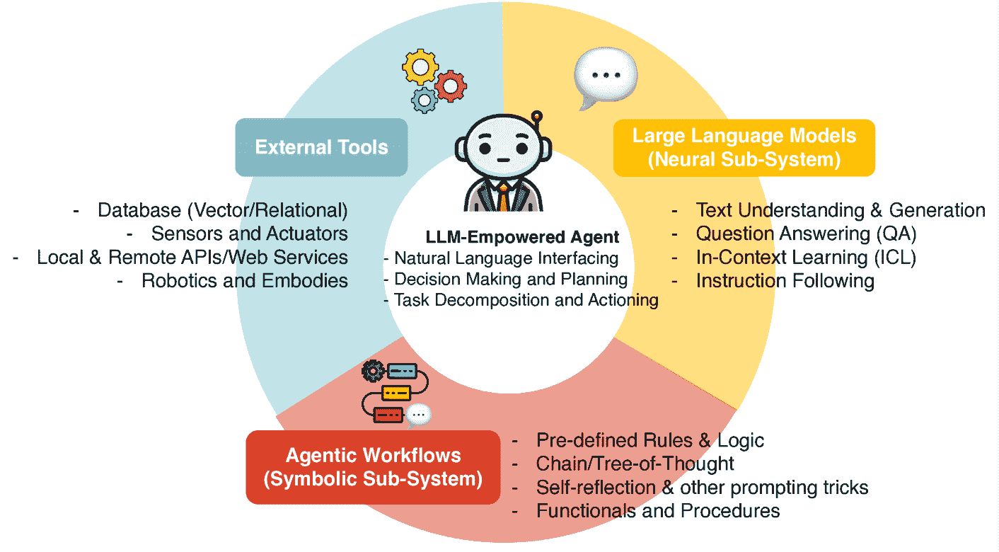
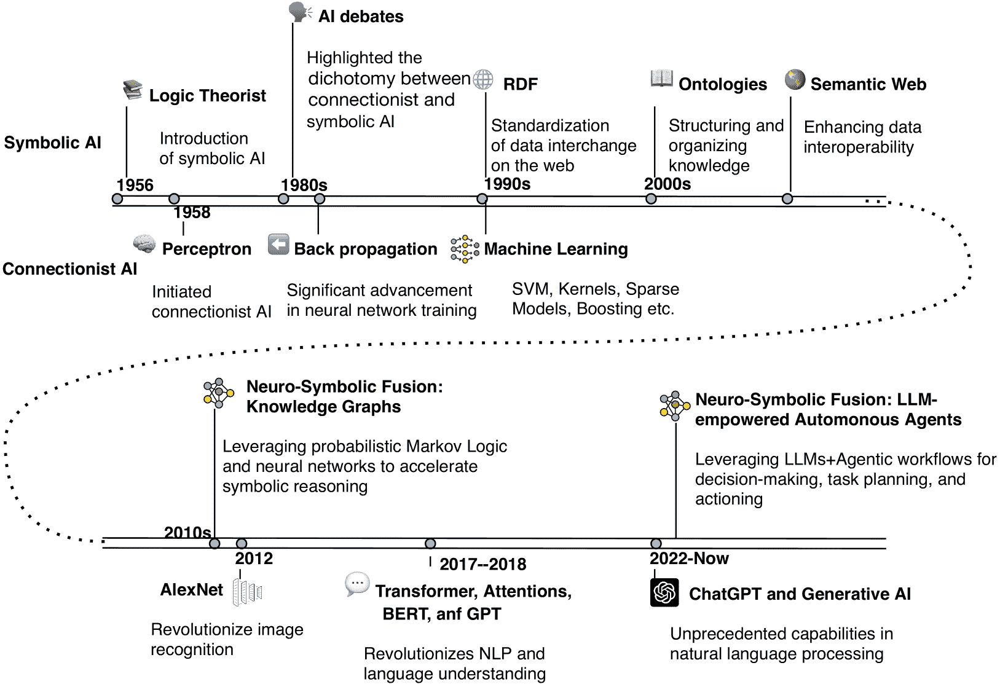
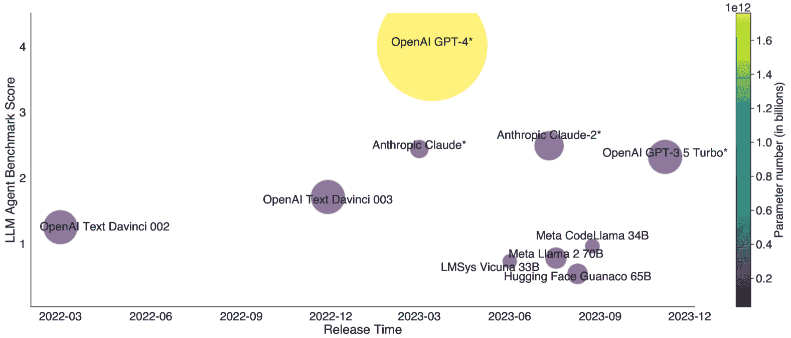
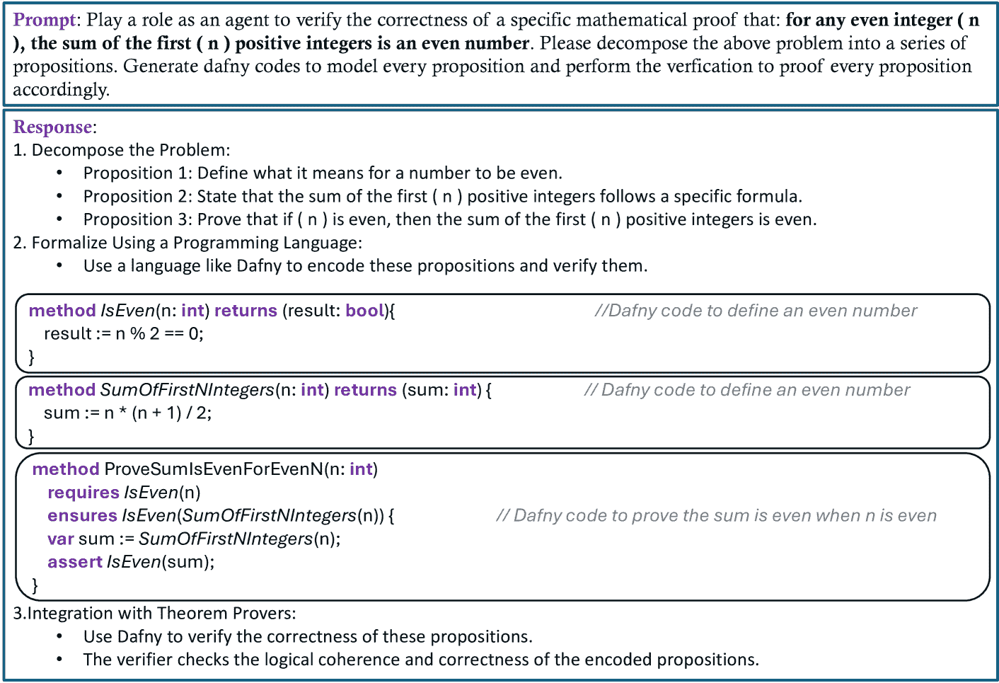

<!--yml

分类：未分类

日期：2025-01-11 12:25:45

-->

# 汇聚的范式：符号性与连接主义人工智能在大语言模型驱动的自主智能体中的协同作用

> 来源：[https://arxiv.org/html/2407.08516/](https://arxiv.org/html/2407.08516/)

熊浩毅、王志远、李旭鸿、边江、谢泽凯、穆塔兹·沙希德、安瓦尔·阿尔-杜莱米、劳拉·E·巴恩斯。熊浩毅和边江均来自微软公司，王志远和劳拉·E·巴恩斯来自弗吉尼亚大学，李旭鸿来自康皮涅技术大学，谢泽凯来自香港科技大学（广州），穆塔兹·沙希德来自诺丁汉特伦特大学（英国诺丁汉）及波兰西里西亚科技大学，安瓦尔·阿尔-杜莱米来自阿布扎比扎耶德大学技术创新学院。

###### 摘要

本文探讨了连接主义与符号性人工智能（AI）的汇聚，从历史争论到当代进展。传统上，连接主义AI侧重于神经网络，而符号性AI则强调符号表示和逻辑。大语言模型（LLMs）的最新进展，以ChatGPT和GPT-4为代表，突显了连接主义架构在处理作为符号的人类语言中的潜力。研究表明，大语言模型驱动的自主智能体（LAAs）体现了这一范式的汇聚。通过利用LLMs进行基于文本的知识建模和表示，LAAs整合了神经符号AI的原则，展示了增强的推理和决策能力。将LAAs与知识图谱进行比较，突出其在模拟类人推理过程、有效扩展大数据集以及利用上下文样本而无需显式再训练方面的独特优势。研究强调了神经-矢量-符号集成、指令编码和隐性推理等有前景的研究方向，旨在进一步增强LAAs的能力。通过探索神经符号AI的进展并提出未来的研究方向，本文推动了人工智能技术的理解和发展。

###### 关键词：

大语言模型（LLMs）、大语言模型驱动的自主智能体（LAAs）、神经符号人工智能、程序性思维证明（P²oT）提示

## I 引言

人工智能（AI）在历史上一直在两种基础范式之间的迷人双重性中航行：联结主义和符号主义。联结主义深受认知科学和计算神经科学的影响，深入探讨了神经网络和机器学习算法，这些算法与人类大脑的深层神经架构和功能相呼应[[1](https://arxiv.org/html/2407.08516v5#bib.bib1)]。想象一下，一个庞大的神经元网络在电气同步中激活，类似于先进的人工智能系统如何从庞大的数据集中识别模式并获取洞察力。相反，符号主义则是概念性和逻辑清晰的典范。它扎根于知识的高层次抽象和表示，依赖于规则驱动的系统，在推理和决策制定中表现出色[[2](https://arxiv.org/html/2407.08516v5#bib.bib2)]。试想一座宏大的图书馆，每本书都是一条规则，每一章都是通向逻辑推理的路径——符号人工智能类比于人类推理过程的思维方式。

这两种范式之间的动态相互作用塑造了人工智能的持续演变，就像一场宏大的哲学辩论，导致了在各个研究领域的主导地位和应用的变化。把这种辩证法看作是时间的舞蹈——联结主义和符号主义的优雅华尔兹，有时领先，有时跟随，但始终在和谐的交换中推动人工智能能够实现的边界。例如，在图像识别领域，深度神经网络驱动的联结主义模型通过识别像素数据中的微妙模式展示了其卓越的能力，类似于我们的大脑如何在人群中识别人脸[[3](https://arxiv.org/html/2407.08516v5#bib.bib3)]。与此同时，在用于医学诊断的专家系统中，符号主义通过系统地应用预定义规则来诊断疾病，模拟了医生思维过程中的逻辑流[[4](https://arxiv.org/html/2407.08516v5#bib.bib4)]。这种范式的故事性舞蹈不仅塑造了人工智能，而且振兴了人工智能，继续影响其在日益复杂的应用领域中的发展轨迹。这两种方法主导地位的波动类似于潮汐的涨落，每一次的高潮和退潮都带来了新的洞察和创新。

近年来，大型语言模型（LLM）和基础模型的进展催生了联结主义和符号AI范式的融合，实现了计算智能和多功能性的全新高度[[5](https://arxiv.org/html/2407.08516v5#bib.bib5)]。以OpenAI的GPT-4为代表的这些模型，展示了前所未有的自然语言理解和生成能力，在一系列复杂任务中表现出强大的性能[[6](https://arxiv.org/html/2407.08516v5#bib.bib6)]。LLM本身是联结主义的胜利，依托海量数据和复杂的神经架构，能够生成连贯且具有上下文相关性的文本。此外，LLM驱动的自主代理（LAA）的出现标志着AI发展的一个重要节点，体现了符号AI和联结主义AI的融合。如图[1](https://arxiv.org/html/2407.08516v5#S1.F1 "图1 ‣ 引言 ‣ 符号AI和联结主义AI在LLM驱动的自主代理中的协同作用")所示，LAA结合了符号子系统，利用符号AI固有的基于语言的知识、规则和工作流，以及LLM的生成能力[[7](https://arxiv.org/html/2407.08516v5#bib.bib7)]。该符号子系统与神经子系统无缝协作，并结合外部工具进行感知和行动[[8](https://arxiv.org/html/2407.08516v5#bib.bib8)]。LAA展示了先进的推理、规划和决策能力，标志着AI新时代的到来。这一双重子系统与推理的双过程理论[[9](https://arxiv.org/html/2407.08516v5#bib.bib9)]以及Yoshua Bengio提出的系统I和系统II[[10](https://arxiv.org/html/2407.08516v5#bib.bib10)]相一致。

图1：LLM驱动的自主代理（LAA）的组成元素：大型语言模型（神经子系统）、代理工作流（符号子系统）和外部工具

本文旨在通过探讨联结主义和符号主义之间的持久辩论及其在现代技术中的融合，特别是在神经-符号方法的主题中，包括知识图谱、LLM和LAA，来考察AI的历史演变和当前状态。该综述旨在阐明这些范式的融合如何推动了突破性的进展，为AI的能力和未来发展方向提供新的视角。

+   •

    技术的历史背景：本文深入探讨了联结主义与符号主义之间的历史辩论，将现代人工智能（AI）的发展置于背景中，并突出了每种方法的优势。我们以最近在大规模语言模型（LLMs）与知识图谱（KGs）[[11](https://arxiv.org/html/2407.08516v5#bib.bib11)]中的进展为参考，从符号主义、联结主义和神经符号AI的角度讨论这些技术。本文还展示了这些技术在知识建模、获取、表示和推理方面的变革性影响。

+   •

    范式的融合：本文强调了符号主义和联结主义方法在开发语言推理架构（LAAs）中的融合，强调它们在推理、决策和效率方面的增强。通过将LAAs与神经符号AI中的知识图谱（KGs）进行对比，我们考察了各自独特的模式和功能。尽管两者都整合了符号和神经方法，但LAAs在以下方面显示出相对于KGs的独特优势：(1) 通过类比人类推理与代理工作流程及多种提示技术[[12](https://arxiv.org/html/2407.08516v5#bib.bib12), [13](https://arxiv.org/html/2407.08516v5#bib.bib13)]，(2) 在大规模数据集上有效扩展，适应上下文中的样本，并利用大规模语言模型的涌现能力。这些优势推动了神经符号AI的新一波浪潮[[14](https://arxiv.org/html/2407.08516v5#bib.bib14)]。

+   •

    未来方向：本文强调了范式融合的趋势以及LAAs当前的局限性，指出了两个有前景的未来方向。第一个是*神经向量符号架构*的开发，它结合向量操作以增强代理的推理能力。第二个是称为*程序思维证明（P²oT）提示*的方法。该方法涉及将复杂的推理过程分解为可验证的命题，利用程序证明语言（如Dafny）进行结构化验证。它旨在通过建模命题、与定理证明者集成，并专注于特定领域的应用，提供严谨的推理。

这些贡献至关重要，因为它们提供了对AI发展演变的全面理解，突出了范式融合的重要性，并为快速发展的AI领域中的未来研究和应用潜力提供了见解。

## II 前言

本节首先总结了联结主义AI与符号主义AI之间的历史辩论。接着，我们探讨了知识图谱（KGs）作为通过神经符号AI协同这两种范式的早期努力。最后，我们考察了大规模语言模型（LLMs）作为联结主义AI的最新进展。

图2：探索人工智能的演变：关键创新和里程碑的时间线。从1950年代符号AI和连接主义AI的诞生开始，经过1980年代的AI辩论和1990年代机器学习的进展。该图突出了重要的进展，如AlexNet对图像识别的影响，BERT和GPT等模型对自然语言处理的变革，以及生成式AI的兴起，最终在2020年代使用大语言模型（LLMs）和智能体（Agents）进行自主决策。

### II-A 连接主义与符号主义：人工智能的历史辩论

如图[2](https://arxiv.org/html/2407.08516v5#S2.F2 "Figure 2 ‣ II Preliminaries ‣ Converging Paradigms: The Synergy of Symbolic and Connectionist AI in LLM-Empowered Autonomous Agents")所示，人工智能的讨论长期围绕着连接主义与符号主义的二分法，这两种范式是该领域的核心。连接主义通过人工神经网络模拟大脑的神经结构，以算法和模式识别为基础进行学习，建模认知过程。这一理论起源于1958年Frank Rosenblatt的感知器[[15](https://arxiv.org/html/2407.08516v5#bib.bib15)]，并在1980年代由David Rumelhart、Geoffrey Hinton和Ronald J. Williams提出的反向传播算法[[16](https://arxiv.org/html/2407.08516v5#bib.bib16)]中取得了显著进展，为现代深度学习奠定了基础[[1](https://arxiv.org/html/2407.08516v5#bib.bib1)]。相反，符号主义侧重于通过高层次的知识表示和符号操作来模仿人类推理，其重要性随着1956年Allen Newell和Herbert A. Simon的逻辑理论家系统而逐渐上升[[17](https://arxiv.org/html/2407.08516v5#bib.bib17)]。符号AI在1970年代和1980年代的专家系统如MYCIN[[4](https://arxiv.org/html/2407.08516v5#bib.bib4)]和DENDRAL[[18](https://arxiv.org/html/2407.08516v5#bib.bib18)]中得到了蓬勃发展，凭借预定义的规则在特定领域中表现出色。

在1980年代，正如阿肖克·戈尔（Ashok Goel）所指出的，辩论通常涉及攻击对方方法的讽刺化批评[[19](https://arxiv.org/html/2407.08516v5#bib.bib19)]。每种方法都有其局限性：联结主义人工智能因其“黑箱”性质和缺乏可解释性而受到批评[[20](https://arxiv.org/html/2407.08516v5#bib.bib20)]，而符号人工智能则面临着劳动密集型的知识获取过程[[21](https://arxiv.org/html/2407.08516v5#bib.bib21)]以及其有限的适应性[[22](https://arxiv.org/html/2407.08516v5#bib.bib22)]。历史上，像扬·勒昆（Yann LeCun）、约书亚·本吉奥（Yoshua Bengio）和加里·马库斯（Gary Marcus）等人物之间的辩论突显了这些局限性[[23](https://arxiv.org/html/2407.08516v5#bib.bib23)]。然而，两种范式的整合催生了强大的混合模型，结合了神经网络的模式识别与符号系统的可解释性和逻辑推理能力[[24](https://arxiv.org/html/2407.08516v5#bib.bib24)]。当代研究展示了这一融合的典范，体现在神经-符号人工智能和大规模预训练模型如BERT[[25](https://arxiv.org/html/2407.08516v5#bib.bib25)]、GPT[[5](https://arxiv.org/html/2407.08516v5#bib.bib5)]以及混合强化学习模型[[26](https://arxiv.org/html/2407.08516v5#bib.bib26)]中，反映了受到历史辩论启发的持续发展。

### II-B 知识图谱：早期的神经-符号尝试

知识图谱的基础根植于语义网技术的演变和资源描述框架（RDF）。RDF由W3C在1990年代提出，标准化了使用三元组（主语、谓语、宾语）在网络上传输数据，从而实现数据的无缝集成和互操作性[[27](https://arxiv.org/html/2407.08516v5#bib.bib27)]。这一运动奠定了语义网的基础，旨在打造一个更智能、更互联的网络[[28](https://arxiv.org/html/2407.08516v5#bib.bib28)]。早期采用者利用RDF构建了模式和分类法，形成了现代知识图谱的基础[[29](https://arxiv.org/html/2407.08516v5#bib.bib29)]。

随着领域的发展，研究重点转向了捕捉复杂的关系和特定领域的知识。本体论，作为概念和关系的正式规范，提供了注释和链接数据的框架，使得在某些层次上能够进行语义推理[[30](https://arxiv.org/html/2407.08516v5#bib.bib30)]。马尔可夫逻辑网络将概率推理引入知识图谱，能够处理数据中的不确定性和不一致性[[31](https://arxiv.org/html/2407.08516v5#bib.bib31)]。本体论与马尔可夫逻辑网络的协同作用提升了符号人工智能在大规模数据集上执行强大推理的能力[[32](https://arxiv.org/html/2407.08516v5#bib.bib32)]。

近年来，图神经网络（GNNs）的应用进一步革新了知识图谱的格局。GNNs巧妙地利用图结构进行高级模式识别和复杂预测。它们在节点分类、链路预测以及从图结构化数据中提取隐藏模式等任务中表现出色[[33](https://arxiv.org/html/2407.08516v5#bib.bib33)]。这种向神经网络的范式转变标志着与现代机器学习技术的融合，使得对通常庞大且复杂的数据集能够进行更细致和可扩展的解释。GNNs将节点和整个图嵌入为数值形式的能力，显著提升了对知识图谱的计算处理[[34](https://arxiv.org/html/2407.08516v5#bib.bib34)]。总之，图神经网络与基于规则的推理的整合，使得知识图谱在神经符号人工智能方法的核心地位得以确立[[11](https://arxiv.org/html/2407.08516v5#bib.bib11)]，这一切发生在大型语言模型（LLMs）兴起之前。

### II-C 大型语言模型（LLMs）：最近的联结主义人工智能进展

联结主义人工智能领域经历了显著的演变，始于感知机的发明[[15](https://arxiv.org/html/2407.08516v5#bib.bib15)]，这标志着20世纪50年代末神经网络研究的起步。在接下来的几十年里，多层感知机（MLPs）的发展引入了隐藏层和非线性激活函数，使得能够建模更复杂的函数[[16](https://arxiv.org/html/2407.08516v5#bib.bib16)]。在1990年代，长短期记忆（LSTM）网络的出现解决了传统递归神经网络（RNNs）的局限性，提出了门控机制，以处理顺序数据中的长期依赖性[[35](https://arxiv.org/html/2407.08516v5#bib.bib35)]。2010年代末提出的自注意力机制和变换器架构，进一步革新了序列建模，特别是在自然语言处理中的文本建模，通过允许模型在生成输出序列的每一部分时关注输入序列的不同部分[[36](https://arxiv.org/html/2407.08516v5#bib.bib36)]。

基于变换器的预训练语言模型的发展显著推动了自然语言处理（NLP）技术的进步。这些架构包括仅编码器模型，例如BERT[[25](https://arxiv.org/html/2407.08516v5#bib.bib25)]，擅长理解和分类文本；仅解码器模型，例如GPT[[6](https://arxiv.org/html/2407.08516v5#bib.bib6)]，能够生成连贯且与上下文相关的文本；以及编码-解码模型，例如T5[[37](https://arxiv.org/html/2407.08516v5#bib.bib37)]，在需要理解和生成的任务中非常有效。基于变换器的语言模型，如OpenAI的GPT-4[[38](https://arxiv.org/html/2407.08516v5#bib.bib38)]、Google的Gemini[[39](https://arxiv.org/html/2407.08516v5#bib.bib39)]和PaLM[[40](https://arxiv.org/html/2407.08516v5#bib.bib40)]、Microsoft的Phi-3[[41](https://arxiv.org/html/2407.08516v5#bib.bib41)]、Meta的LLaMA[[42](https://arxiv.org/html/2407.08516v5#bib.bib42)]，统称为大语言模型（LLMs）。这些模型，如图[3](https://arxiv.org/html/2407.08516v5#S2.F3 "Figure 3 ‣ II-C LLMs: Recent Connectionist AI Advancements ‣ II Preliminaries ‣ Converging Paradigms: The Synergy of Symbolic and Connectionist AI in LLM-Empowered Autonomous Agents")所示，是在包含数十亿个可学习参数的大规模变换器上进行训练的，以支持启用代理的各种能力，包括感知、推理、规划和行动[[12](https://arxiv.org/html/2407.08516v5#bib.bib12)]。作为代理神经子系统的核心组件，模型越大，代理的能力就越强。

图3：大语言模型及其代理能力。X轴显示的是发布日期，Y轴表示LLM代理基准得分[[43](https://arxiv.org/html/2407.08516v5#bib.bib43)]。气泡的大小表示参数数量（以十亿为单位）。星号（*）表示在官方发布不可用时的估算参数数量。

一般来说，每个大语言模型（LLM）都经历了两阶段的训练过程：*预训练*和*微调*。预训练通过基于大量文本语料库的统计特性来调整模型参数，使模型能够理解语法、语义和语言细微差别[[25](https://arxiv.org/html/2407.08516v5#bib.bib25)]。然后，微调使用一个较小的、任务特定的数据集，进一步将预训练模型适应于特定任务或领域，优化模型在特定应用中的表现[[44](https://arxiv.org/html/2407.08516v5#bib.bib44)]。为了确保LLM能够遵循人类指令，符合人类价值观并展示期望的行为，微调之上还提出了指令调优和来自人类反馈的强化学习（RLHF）[[45](https://arxiv.org/html/2407.08516v5#bib.bib45)]。

随着大规模语言模型（LLM）的规模不断扩大，它们展现出一系列新兴能力，例如编写计算机代码、下棋、诊断医疗状况以及翻译语言。这些能力通常在某些规模下突然并剧烈地发展，这与扩展法则有关，扩展法则描述了当模型达到特定规模时，任务表现如何在意外情况下快速提升[[46](https://arxiv.org/html/2407.08516v5#bib.bib46)]。这一现象在需要多步推理的任务中尤为明显，其中成功的概率是成倍增加的，从而导致表现的快速跃升[[47](https://arxiv.org/html/2407.08516v5#bib.bib47)]。然而，这些进展伴随着*“幻觉”问题*[[48](https://arxiv.org/html/2407.08516v5#bib.bib48)]，例如产生看似可信但不准确或不基于现实的虚假或荒谬信息。这些问题强调了继续进行研究和工程工作的必要性，以便在利用大规模语言模型的优势的同时，减少其缺点。

## III 大规模语言模型赋能的自主代理：符号主义与联结主义的融合

本节回顾了传统代理和基于大规模语言模型（LLM）的代理的定义，介绍了设计和实施自适应代理（LAA）的核心技术，并通过符号人工智能的视角重新审视这些创新。

### III-A 自主代理：经典与大规模语言模型赋能的

自主代理是一个人工智能实体，旨在独立实现特定目标，通过获取环境因素来感知环境状态，并采取与上下文相关的行动[[49](https://arxiv.org/html/2407.08516v5#bib.bib49)]。这些代理具备推理、学习和适应能力，能够在动态和复杂的环境中表现出色。与遵循预定规则的传统软件程序不同，自主代理具备自我管理特性，使其能够在变化的条件下运行[[50](https://arxiv.org/html/2407.08516v5#bib.bib50)]。通过利用这些能力，它们能够自动化执行通常需要人类干预的任务，提高效率，并降低各个领域的运营成本，如机器人技术、通信、金融交易和医疗保健[[50](https://arxiv.org/html/2407.08516v5#bib.bib50)]。例如，在机器人应用中，自主代理可以在最小化监督的情况下执行任务，持续监控其周围环境，并适应新的情况，使它们成为长期自动化的强大解决方案[[51](https://arxiv.org/html/2407.08516v5#bib.bib51), [52](https://arxiv.org/html/2407.08516v5#bib.bib52)]。

自主代理设计的基础技术来源于经典的人工智能方法，如概率图模型 [[53](https://arxiv.org/html/2407.08516v5#bib.bib53)]、强化学习 [[54](https://arxiv.org/html/2407.08516v5#bib.bib54)]和多智能体系统 [[55](https://arxiv.org/html/2407.08516v5#bib.bib55)]，这些方法用于管理不确定性并在动态环境中学习最优行为，或使代理能够高效地互动并共享信息。然而，LAAs的出现标志着传统人工智能的重大进化，涵盖了符号和神经子系统。这些代理通过在大量文本语料库上的预训练获得广泛的知识，通过生成符合上下文的文本来执行人类推理任务 [[56](https://arxiv.org/html/2407.08516v5#bib.bib56)]。这一能力不仅模拟理解和决策过程，还允许生成代码和其他交流文本，增强了它们的实际应用价值 [[57](https://arxiv.org/html/2407.08516v5#bib.bib57)]。通过将预训练语言模型与自然语言理解相结合，LAAs能够灵活适应多种场景，扩展了人工智能在自主操作中的潜力。

### III-B LAAs的设计与实现

代理的设计核心是其神经子系统——大型语言模型（LLM），它作为核心控制器或协调者。LLM与代理的符号子系统和外部工具进行协作，包括用于任务分解和自我反思的规划和推理组件、记忆（包括短期记忆和长期记忆），以及一个工具使用组件，允许访问外部信息和功能。

+   •

    代理工作流：代理工作流结合了规划、推理、记忆管理、工具集成和与大型语言模型（LLMs）的用户接口。像LangChain [[58](https://arxiv.org/html/2407.08516v5#bib.bib58)]和LlamaIndex [[59](https://arxiv.org/html/2407.08516v5#bib.bib59)]这样的框架有助于设计这些工作流。

+   •

    规划者和推理者：先进的技术，如链式思维和树状思维提示 [[60](https://arxiv.org/html/2407.08516v5#bib.bib60)]，将任务分解为子任务，自我反思允许代理批判和优化输出 [[61](https://arxiv.org/html/2407.08516v5#bib.bib61)]。

+   •

    记忆管理：结合了用于上下文的短期记忆和使用外部存储（如向量数据库）的长期记忆，从而实现高效的信息检索和增强的推理能力 [[62](https://arxiv.org/html/2407.08516v5#bib.bib62), [63](https://arxiv.org/html/2407.08516v5#bib.bib63)]。

+   •

    工具使用与自然语言接口（NLI）集成：代理可以访问外部工具、API 和模型，并根据任务目标决定何时以及如何使用它们[[64](https://arxiv.org/html/2407.08516v5#bib.bib64), [65](https://arxiv.org/html/2407.08516v5#bib.bib65)]。此外，有效的 NLI 能够解读用户请求并传达相应的行动[[66](https://arxiv.org/html/2407.08516v5#bib.bib66)]。如 ReAct 和 MRKL 等技术提供了结构化的交互步骤（思考、行动、行动输入、观察）[[67](https://arxiv.org/html/2407.08516v5#bib.bib67), [68](https://arxiv.org/html/2407.08516v5#bib.bib68)]。

通过整合这些组件，LAA 可以应对复杂任务。然而，仍然存在诸如有限的上下文窗口、长期规划和可靠接口等挑战，这需要持续的研究和开发。

### III-C 从神经符号 AI 的角度重新思考 LAA

神经符号 AI 结合了神经网络和符号推理的优势，产生了既显式又可解释的决策过程。在通过大语言模型（LLMs）增强的自主代理中，最新的深度神经网络进展得以利用，同时任务分解和规划受到符号 AI 原则的指导——将复杂任务分解为离散的、逻辑的步骤，便于系统化分析和推理[[69](https://arxiv.org/html/2407.08516v5#bib.bib69)]。符号结构和深度神经网络的融合创造了强大的协同效应，显著增强了这些代理的能力。

#### 符号建模与神经表示

经典符号 AI 使用抽象和符号表示知识，利用显式的符号建模方法，如规则和关系，来进行推理[[70](https://arxiv.org/html/2407.08516v5#bib.bib70)]。这种方法通常涉及明确定义的逻辑和结构化的知识库，使得系统能够根据预定义的规则进行行为。相比之下，由语言模型驱动的 LAA 以更分布式和隐式的方式表示知识。它们不依赖于显式的符号和规则，而是利用大量语料库和语言模型上的自监督预训练，从原始文本中推断出模式和关系[[25](https://arxiv.org/html/2407.08516v5#bib.bib25)]。知识嵌入在 LLM 的权重中，使得推理更加灵活且以上下文为驱动。这一优势与符号 AI 的刚性有本质的不同，赋予 LAA 处理模糊性和生成更具人类化反应的能力[[5](https://arxiv.org/html/2407.08516v5#bib.bib5)]。

#### 基于生成的搜索决策

给定一个复杂的目标，需要多步才能实现，现有的代理技术要么利用符号人工智能系统地探索潜在行动的空间，要么采用强化学习来优化这些行动的轨迹，高效地将复杂任务分解为可管理的子任务[[54](https://arxiv.org/html/2407.08516v5#bib.bib54)]。在一个由大语言模型（LLM）驱动的代理中，思维链（CoT）方法引导LLM生成关于中间推理步骤的文本，增强其认知任务表现[[47](https://arxiv.org/html/2407.08516v5#bib.bib47)]。通过将任务分解为逻辑顺序，CoT提示鼓励LLM系统性地构建推理。这种方法通过使推理过程能够连贯地、逐步地展开，克服了LLM在标记级别上的局限性，提高了问题解决的准确性和可靠性。最近，思维树（ToT）提示通过允许LLM在树形结构中同时探索多条推理路径，进一步扩展了这一方法[[71](https://arxiv.org/html/2407.08516v5#bib.bib71)]，并提出了通过程序生成进行功能性搜索，利用大语言模型（LLMs）成功地促进了数学发现[[72](https://arxiv.org/html/2407.08516v5#bib.bib72)]。这些方法通过促进动态和反思性的推理过程，提高了LLM的问题解决能力， closely模仿了符号推理技术，在神经基础上加以实现。

#### 通过上下文学习的案例推理

代理必须适应新情况，而传统方法则依赖于重新训练神经网络或将新情况的示例推导成规则以便更好地推理。在一个由LLM驱动的代理中，已经提出了少量示例上下文学习（ICL），利用给定的示例生成提示，以便生成适当的响应来解决问题，而无需显式重新训练LLM[[73](https://arxiv.org/html/2407.08516v5#bib.bib73)]。这种方法模仿了*基于案例的推理*，这是符号人工智能中的一个基本概念，通过利用显式的知识和经验来解决新问题。这增强了模型从特定示例中进行泛化的能力，有效地创建了从呈现的示例到期望结果的神经符号映射。

#### 驱动突现能力的神经符号集成

大型语言模型（LLMs）的涌现能力，如上下文理解、顺序推理、目标重构和任务分解，通过过度参数化的架构和广泛的预训练语料库得到了提升[[46](https://arxiv.org/html/2407.08516v5#bib.bib46)]。将精心设计的规则与LLMs的涌现能力结合，使得智能体能够创建并遵循复杂的工作流，这些工作流被称为“智能工作流”。通过向大型语言模型提供类似“让我们一步步思考”的指令，这些模型会模拟人类的推理过程，并能够展示逻辑和数学推理，从而增强其结构化推理能力[[12](https://arxiv.org/html/2407.08516v5#bib.bib12), [13](https://arxiv.org/html/2407.08516v5#bib.bib13)]。这种智能方法使得LLMs不仅能处理信息，还能主动生成结构化、逻辑性强且具适应性的推理路径[[56](https://arxiv.org/html/2407.08516v5#bib.bib56)]，显著提升其问题解决和决策能力，标志着神经符号AI技术的关键演变。

## IV 讨论与未来方向

在本节中，我们通过将LLM驱动的自主智能体与另一种神经符号方法——知识图谱进行比较，讨论该技术，并展望未来的发展方向。

### IV-A 比较分析：LAAs 与 KGs

前面的部分介绍了LAAs和KGs，这两者都代表了神经符号AI的方法。我们在此对这两种方法进行比较，突出LAAs在当前AI进展浪潮中的优势地位。

知识图谱（KGs）利用符号AI的力量，通过明确的关系和规则组织领域特定的知识。这种设计使得它们在精确性、可解释性和预定义模式至关重要的静态环境中非常有效。它们的逻辑推理能力确保输出结果的一致性和可验证性，这对于需要知识建模清晰性和准确性的应用至关重要[[74](https://arxiv.org/html/2407.08516v5#bib.bib74)]。此外，KGs的可扩展性本质上受到显式模式定义和人工更新要求的限制[[75](https://arxiv.org/html/2407.08516v5#bib.bib75)]。随着数据量的增长，管理和查询图谱的复杂性显著增加。维护大规模的KG需要大量的计算资源和人类专业知识，影响了在变化环境中的效率和敏捷性。

另一方面，LAA的设计采用了更动态和灵活的方法。通过将神经网络的语言理解和生成能力与符号AI的结构化推理相结合，这些代理能够处理广泛的复杂任务。神经网络中存储的隐性知识使得其能够做出上下文敏感的响应，并能无缝适应变化的环境[[76](https://arxiv.org/html/2407.08516v5#bib.bib76)]。此外，LLM能高效地将大量语料库压缩为可学习的网络，使这些代理具有极高的可扩展性。一旦训练完成，模型可以通过少量额外数据进行微调，所需成本和工作量远低于更新知识图谱，并且甚至能够支持在不微调的情况下进行上下文学习。因此，基于LLM的代理能够轻松处理更大的数据集，甚至可以处理在线数据，实时响应变化。

此外，LAA（类人推理代理）采用的高级推理机制，如CoT [[47](https://arxiv.org/html/2407.08516v5#bib.bib47)] 和ToT [[71](https://arxiv.org/html/2407.08516v5#bib.bib71)]，使其能够通过类比人类推理步骤有效地分解和解决复杂问题[[12](https://arxiv.org/html/2407.08516v5#bib.bib12)]。这些方法缓解了LLM（大规模语言模型）中基于令牌的限制，促进了更强大且具有上下文意识的决策过程。因此，LAA有望推动未来人工智能的创新，提供比知识图谱更具多样性和智能的解决方案。

### IV-B 未来方向

在之前讨论的基础上，我们提出了若干未来研究方向，旨在提升LAA的现有发展格局。

图 4: 程序思想证明（P²oT）用于数学证明验证的示例

### IV-C 神经-向量-符号整合智能

当前的代理推理方法明确模拟人类的推理步骤 [[12](https://arxiv.org/html/2407.08516v5#bib.bib12)]。例如，当代理收到用户的请求时，它会检索相似的案例，并通过上下文学习增强其行动；对于模糊的请求，代理会提示LLM澄清并以不同形式重写请求 [[77](https://arxiv.org/html/2407.08516v5#bib.bib77)]。这一过程涉及为每个重写的请求提取向量，并执行多向量检索，从而提高上下文理解和生成性能，但也增加了计算负担。利用编码器-解码器架构，如GritLM [[78](https://arxiv.org/html/2407.08516v5#bib.bib78)]，该架构促使生成模型对指令文本进行编码/向量化，隐式神经推理器通过因果关系图扩展变压器，增强长程推理能力 [[79](https://arxiv.org/html/2407.08516v5#bib.bib79)]，并结合潜在向量和注意力矩阵，以及向量-符号架构（VSA）[[80](https://arxiv.org/html/2407.08516v5#bib.bib80)]，可能显著解决这一问题。具体来说，VSA利用高维向量来编码和操控信息，从而紧凑而具有上下文地表示复杂的结构和关系 [[80](https://arxiv.org/html/2407.08516v5#bib.bib80)]。它将认知和推理过程建模为向量空间中的*代数运算*。将VSA与LLM结合使用，可以增强认知能力，支持精确的多步骤决策，应用于科学发现，如解决Raven的渐进矩阵 [[81](https://arxiv.org/html/2407.08516v5#bib.bib81)]，从而通过可计算的向量化加速联结主义与符号范式之间的收敛。

### IV-D 程序证明思想推理

在这里，我们以严谨的方式阐述了程序-思想证明（Program-Proof-of-Thoughts，P²oT）在代理推理中的应用，基于CoT和ToT提示方法。具体来说，P²oT将复杂的推理过程分解成一系列按线性或树形结构组织的命题。它利用编程语言进行程序证明，如Dafny [[82](https://arxiv.org/html/2407.08516v5#bib.bib82)]或Lean [[83](https://arxiv.org/html/2407.08516v5#bib.bib83)]，来建模和验证这些命题。未来的研究应重点通过提示大型语言模型（LLMs）生成代码[[84](https://arxiv.org/html/2407.08516v5#bib.bib84)]来优化命题建模和验证，提升与外部定理证明器和断言验证器（例如Dafny和Lean）的集成，推动P²oT扩展到处理多模态数据的高级推理。此外，自动化代码生成、优化混合P²oT/CoT/ToT模型、融入自我验证和自我纠正，并将P²oT应用于领域特定的应用场景，包括逻辑推理和科学发现，能够显著提升其能力[[72](https://arxiv.org/html/2407.08516v5#bib.bib72)]。图 [4](https://arxiv.org/html/2407.08516v5#S4.F4 "图 4 ‣ IV-B 未来方向 ‣ IV 讨论与未来方向 ‣ 收敛范式：符号与连接主义AI在LLM赋能的自主智能体中的协同作用")展示了使用P²oT框架验证一个基本数学证明的过程：对于任何偶数整数$n$，前$n$个正整数的和是偶数。通过将问题分解为不同的、可验证的命题，并使用Dafny进行形式验证，这个例子突显了P²oT在逻辑推理和验证中的结构化和严谨方法。

## V 结论

总之，连接主义与符号范式的融合，特别是通过LLM赋能的自主代理（LAA）的兴起，标志着人工智能领域，尤其是神经符号AI的一个重要发展。这篇论文强调了符号推理与基于神经网络的方法的历史背景和持续融合，强调了LAA如何利用LLM的基于文本的知识表示和生成能力来实现逻辑推理和决策。通过将LAA与知识图谱（KG）进行对比，我们展示了LAA在模仿类人推理过程、有效地处理大数据集和利用上下文学习而无需大量再训练方面的独特优势。前沿方向如神经向量符号架构和程序化思维证明（P²oT）提示即将到来，可能进一步增强AI的代理推理能力。这些洞察不仅概括了当前AI技术的变革潜力，还为未来的研究提供了清晰的轨迹，促进了对神经符号AI更深刻的理解和更先进的应用。

## 参考文献

+   [1] Yann LeCun, Yoshua Bengio, 和 Geoffrey Hinton. 深度学习. 《自然》, 521(7553):436–444, 2015年。

+   [2] 艾伦·纽厄尔和赫伯特·A·西蒙. 计算机科学作为经验性探究：符号与搜索. 载于ACM图灵奖讲座，页码1975。2007年。

+   [3] Alex Krizhevsky, Ilya Sutskever, 和 Geoffrey E Hinton. 使用深度卷积神经网络进行Imagenet分类. 《神经信息处理系统进展》, 25, 2012年。

+   [4] 爱德华·肖特里夫. 基于计算机的医学咨询: MYCIN，第2卷. Elsevier, 2012年。

+   [5] Tom Brown, Benjamin Mann, Nick Ryder, Melanie Subbiah, Jared D Kaplan, Prafulla Dhariwal, Arvind Neelakantan, Pranav Shyam, Girish Sastry, Amanda Askell 等人. 语言模型是少量样本学习者. 《神经信息处理系统进展》, 33:1877–1901, 2020年。

+   [6] Alec Radford, Jeffrey Wu, Rewon Child, David Luan, Dario Amodei, Ilya Sutskever 等人. 语言模型是无监督的多任务学习者. OpenAI博客, 1(8):9, 2019年。

+   [7] Sébastien Bubeck, Varun Chandrasekaran, Ronen Eldan, Johannes Gehrke, Eric Horvitz, Ece Kamar, Peter Lee, Yin Tat Lee, Yuanzhi Li, Scott Lundberg 等人. 人工通用智能的火花：与GPT-4的早期实验. arXiv预印本arXiv:2303.12712, 2023年。

+   [8] 熊浩毅, 邱剑, 杨思佳, 张晓飞, 孔凌鹤, 张大庆. 基于自然语言的上下文建模与推理与LLMs: 一项教程. arXiv预印本arXiv:2309.15074, 2023。

+   [9] Jonathan St BT Evans. 双重思维：推理的双过程理论. 《认知科学趋势》, 7(10):454–459, 2003年。

+   [10] 约书亚·本吉奥. 系统2处理的深度学习. AAAI 2020, 2020年。

+   [11] Shaoxiong Ji, Shirui Pan, Erik Cambria, Pekka Marttinen 和 S Yu Philip. 知识图谱调查：表示、获取与应用. 《IEEE神经网络与学习系统汇刊》，33(2):494–514，2021年。

+   [12] Taylor Webb, Keith J Holyoak 和 Hongjing Lu. 大型语言模型中的类比推理新现象. 《自然人类行为》，7(9):1526–1541，2023年。

+   [13] James WA Strachan, Dalila Albergo, Giulia Borghini, Oriana Pansardi, Eugenio Scaliti, Saurabh Gupta, Krati Saxena, Alessandro Rufo, Stefano Panzeri, Guido Manzi 等. 测试大型语言模型和人类的心智理论. 《自然人类行为》，第1–11页，2024年。

+   [14] Artur d’Avila Garcez 和 Luis C Lamb. 神经符号人工智能：第三波. 《人工智能评论》，56(11):12387–12406，2023年。

+   [15] Frank Rosenblatt. 感知机：大脑中信息存储与组织的概率模型. 《心理学评论》，65(6):386，1958年。

+   [16] David E Rumelhart, Geoffrey E Hinton 和 Ronald J Williams. 通过反向传播误差来学习表示. 《自然》，323(6088):533–536，1986年。

+   [17] Allen Newell 和 Herbert Simon. 逻辑理论机——一个复杂的信息处理系统. 《IRE信息理论汇刊》，2(3):61–79，1956年。

+   [18] Bruce G Buchanan 和 Edward A Feigenbaum. Dendral与Meta-Dendral：它们的应用维度. 《人工智能》，11(1-2):5–24，1978年。

+   [19] Ashok Kumar Goel. 案例推理与基于模型的推理结合用于自适应设计问题求解. 俄亥俄州立大学，1989年。

+   [20] Zachary C Lipton. 模型可解释性的神话：在机器学习中，可解释性概念既重要又滑溜. 《Queue》，16(3):31–57，2018年。

+   [21] Edward A Feigenbaum 等. 人工智能的艺术：知识工程的主题与案例研究. 1977年。

+   [22] Charles Elkan 和 Russell Greiner. 构建大型知识基础系统：Cyc项目中的表示与推理：Db Lenat 和 RV Guha，1993年。

+   [23] Yoshua Bengio, Yann Lecun 和 Geoffrey Hinton. 人工智能的深度学习. 《ACM通讯》，64(7):58–65，2021年。

+   [24] Artur S D’Avila Garcez, Luis C Lamb 和 Dov M Gabbay. 神经符号认知推理. 施普林格科学与商业媒体，2008年。

+   [25] Jacob Devlin, Ming-Wei Chang, Kenton Lee 和 Kristina Toutanova. BERT：双向变换器在语言理解中的预训练. arXiv预印本 arXiv:1810.04805，2018年。

+   [26] David Silver, Julian Schrittwieser, Karen Simonyan, Ioannis Antonoglou, Aja Huang, Arthur Guez, Thomas Hubert, Lucas Baker, Matthew Lai, Adrian Bolton 等. 在没有人类知识的情况下掌握围棋. 《自然》，550(7676):354–359，2017年。

+   [27] 万维网联盟（W3C）。资源描述框架（RDF）模型和语法规范，1999年。检索自 [https://www.w3.org/TR/1999/REC-rdf-syntax-19990222/](https://www.w3.org/TR/1999/REC-rdf-syntax-19990222/)。

+   [28] 蒂姆·伯纳斯-李、詹姆斯·亨德勒和奥拉·拉西拉。《语义网：一种对计算机有意义的新型网页内容将引发一场新的可能性革命》。载于《链接世界的信息：关于蒂姆·伯纳斯-李发明万维网的论文集》，第91–103页。2023年。

+   [29] 格里戈里斯·安东纽和弗兰克·范·哈梅伦。《语义网入门》。麻省理工大学出版社，2004年。

+   [30] 托马斯·R·格鲁伯。《便携本体规范的翻译方法》。知识获取，5(2):199–220，1993年。

+   [31] 斯坦利·科克和佩德罗·多明戈斯。《学习马尔可夫逻辑网络的结构》。载于《第22届国际机器学习会议论文集》，第441–448页，2005年。

+   [32] 马克西米利安·尼克尔、凯文·墨菲、福尔克·特雷斯普和耶夫根尼·加布里洛维奇。《关系型机器学习在知识图谱中的综述》。IEEE会议录，104(1):11–33，2015年。

+   [33] 托马斯·N·基普夫和马克斯·韦林。《使用图卷积网络进行半监督分类》。载于《国际学习表示会议论文集》，2022年。

+   [34] 王全、毛振东、王斌和郭利。《知识图谱嵌入：方法与应用综述》。IEEE知识与数据工程学报，29(12):2724–2743，2017年。

+   [35] 塞普·霍赫雷特和尤尔根·施米德胡伯。《长短时记忆》。神经计算，9(8):1735–1780，1997年。

+   [36] 阿希什·瓦斯瓦尼、诺姆·沙泽尔、尼基·帕尔马尔、雅各布·乌斯科雷特、利昂·琼斯、艾登·N·戈麦斯、卢卡什·凯泽和伊利亚·波洛苏金。《注意力即是你所需的一切》。神经信息处理系统进展，30，2017年。

+   [37] 科林·拉费尔、诺姆·沙泽尔、亚当·罗伯茨、凯瑟琳·李、沙兰·纳朗、迈克尔·马特纳、阎琦·周、魏立和彼得·J·刘。《利用统一的文本到文本变换器探索迁移学习的极限》。机器学习研究杂志，21(140):1–67，2020年。

+   [38] 乔什·阿基亚姆、史蒂文·阿德勒、桑迪尼·阿加瓦尔、拉马·艾哈迈德、伊尔格·阿卡亚、弗洛伦西亚·莱奥尼·阿莱曼、迪奥戈·阿尔梅达、扬科·阿尔滕施密特、萨姆·奥特曼、沙亚马尔·阿纳德卡特等。《GPT-4技术报告》。arXiv预印本arXiv:2303.08774，2023年。

+   [39] 双子座团队、罗汉·阿尼尔、塞巴斯蒂安·博尔乔、吴永辉、让-巴蒂斯特·阿拉伊拉克、余家辉、拉杜·索里库特、约翰·沙尔克维克、安德鲁·M·戴、安贾·豪思等。《双子座：一系列功能强大的多模态模型》。arXiv预印本arXiv:2312.11805，2023年。

+   [40] 阿卡恩莎·乔德里、沙兰·纳朗、雅各布·德夫林、马尔滕·博斯马、高尔·米什拉、亚当·罗伯茨、保罗·巴姆、许弘元、查尔斯·萨顿、塞巴斯蒂安·格赫曼等。《Palm：通过路径扩展语言建模》。机器学习研究杂志，24(240):1–113，2023年。

+   [41] 马拉·阿卜丁、萨姆·阿德·雅各布斯、阿马尔·艾哈迈德·阿万、乔蒂·阿内贾、艾哈迈德·阿瓦达拉、哈尼·阿瓦达拉、阮·伯赫、阿米特·巴赫里、阿拉什·巴赫蒂亚里、哈尔基拉特·贝尔等。《Phi-3技术报告：一款功能强大的语言模型，本地运行于你的手机上》。arXiv预印本arXiv:2404.14219，2024年。

+   [42] Hugo Touvron, Thibaut Lavril, Gautier Izacard, Xavier Martinet, Marie-Anne Lachaux, Timothée Lacroix, Baptiste Rozière, Naman Goyal, Eric Hambro, Faisal Azhar 等人. Llama：开放且高效的基础语言模型。arXiv 预印本 arXiv:2302.13971，2023年。

+   [43] Xiao Liu, Hao Yu, Hanchen Zhang, Yifan Xu, Xuanyu Lei, Hanyu Lai, Yu Gu, Hangliang Ding, Kaiwen Men, Kejuan Yang 等人. Agentbench：评估大语言模型作为智能体的表现。arXiv 预印本 arXiv:2308.03688，2023年。

+   [44] Ning Ding, Yujia Qin, Guang Yang, Fuchao Wei, Zonghan Yang, Yusheng Su, Shengding Hu, Yulin Chen, Chi-Min Chan, Weize Chen 等人. 大规模预训练语言模型的参数高效微调。自然机器智能，5(3)：220–235，2023年。

+   [45] Long Ouyang, Jeffrey Wu, Xu Jiang, Diogo Almeida, Carroll Wainwright, Pamela Mishkin, Chong Zhang, Sandhini Agarwal, Katarina Slama, Alex Ray 等人. 训练语言模型按照指令通过人类反馈进行学习。神经信息处理系统进展，35：27730–27744，2022年。

+   [46] Rylan Schaeffer, Brando Miranda 和 Sanmi Koyejo. 大语言模型的涌现能力是海市蜃楼吗？神经信息处理系统进展，36，2024年。

+   [47] Jason Wei, Xuezhi Wang, Dale Schuurmans, Maarten Bosma, Fei Xia, Ed Chi, Quoc V Le, Denny Zhou 等人. 思维链提示在大语言模型中激发推理。神经信息处理系统进展，35：24824–24837，2022年。

+   [48] Junyi Li, Xiaoxue Cheng, Wayne Xin Zhao, Jian-Yun Nie 和 Ji-Rong Wen. Halueval：一个大规模幻觉评估基准，用于大语言模型。2023年自然语言处理实证方法会议论文集，第6449–6464页，2023年。

+   [49] Pattie Maes. 自适应自主智能体建模。人工生命，1(1_2)：135–162，1993年。

+   [50] Stefano V Albrecht 和 Peter Stone. 自主智能体建模其他智能体：一项综合调查与开放问题。人工智能，258：66–95，2018年。

+   [51] Ronald C Arkin. 基于行为的机器人学。MIT出版社，1998年。

+   [52] Yara Rizk, Mariette Awad 和 Edward W Tunstel. 协作异构多机器人系统：一项调查。ACM计算调查（CSUR），52(2)：1–31，2019年。

+   [53] Daphne Koller 和 Nir Friedman. 概率图模型：原理与技术。MIT出版社，2009年。

+   [54] Richard S Sutton 和 Andrew G Barto. 强化学习：导论。MIT出版社，2018年。

+   [55] Lei Wang, Chen Ma, Xueyang Feng, Zeyu Zhang, Hao Yang, Jingsen Zhang, Zhiyuan Chen, Jiakai Tang, Xu Chen, Yankai Lin 等人. 基于大语言模型的自主智能体调查。计算机科学前沿，18(6)：186345，2024年。

+   [56] Zhiheng Xi, Wenxiang Chen, Xin Guo, Wei He, Yiwen Ding, Boyang Hong, Ming Zhang, Junzhe Wang, Senjie Jin, Enyu Zhou 等人. 基于大语言模型的智能体的崛起与潜力：一项调查。arXiv 预印本 arXiv:2309.07864，2023年。

+   [57] Qingyun Wu, Gagan Bansal, Jieyu Zhang, Yiran Wu, Shaokun Zhang, Erkang Zhu, Beibin Li, Li Jiang, Xiaoyun Zhang 和 Chi Wang. Autogen：通过多智能体对话框架推动下一代 LLM 应用程序。arXiv 预印本 arXiv:2308.08155，2023年。

+   [58] Oguzhan Topsakal 和 Tahir Cetin Akinci. 利用 Langchain 创建大型语言模型应用程序：快速开发 LLM 应用程序的入门。在《国际应用工程与自然科学会议》，第1卷，第1050-1056页，2023年。

+   [59] Jerry Liu. LlamaIndex，2022年11月。

+   [60] Chan Hee Song, Jiaman Wu, Clayton Washington, Brian M Sadler, Wei-Lun Chao 和 Yu Su. LLM-planner：使用大型语言模型为具身智能体提供少量样本的规划。载于《IEEE/CVF国际计算机视觉会议论文集》，第2998-3009页，2023年。

+   [61] Bill Yuchen Lin, Yicheng Fu, Karina Yang, Faeze Brahman, Shiyu Huang, Chandra Bhagavatula, Prithviraj Ammanabrolu, Yejin Choi 和 Xiang Ren. Swiftsage: 一种具有快慢思维的生成性智能体，用于复杂互动任务。《神经信息处理系统进展》，36，2024年。

+   [62] Jeff Johnson, Matthijs Douze 和 Hervé Jégou. 基于GPU的十亿规模相似度搜索。《IEEE大数据学报》，7(3)：535-547，2019年。

+   [63] Kelvin Guu, Kenton Lee, Zora Tung, Panupong Pasupat 和 Mingwei Chang. 检索增强语言模型预训练。载于《国际机器学习会议》，第3929-3938页，PMLR，2020年。

+   [64] Scott Reed, Konrad Zolna, Emilio Parisotto, Sergio Gómez Colmenarejo, Alexander Novikov, Gabriel Barth-maron, Mai Giménez, Yury Sulsky, Jackie Kay, Jost Tobias Springenberg 等人. 一种通用智能体。《机器学习研究交易》。

+   [65] Yongliang Shen, Kaitao Song, Xu Tan, Dongsheng Li, Weiming Lu 和 Yueting Zhuang. Hugginggpt: 利用 ChatGPT 和 Hugging Face 的伙伴解决人工智能任务。《神经信息处理系统进展》，36，2024年。

+   [66] Jianfeng Gao, Michel Galley 和 Lihong Li. 神经网络方法在对话式人工智能中的应用。载于《第41届国际ACM SIGIR信息检索研究与发展会议》，第1371-1374页，2018年。

+   [67] Shunyu Yao, Jeffrey Zhao, Dian Yu, Nan Du, Izhak Shafran, Karthik Narasimhan 和 Yuan Cao. React: 在语言模型中协同推理与行动。arXiv 预印本 arXiv:2210.03629，2022年。

+   [68] Ehud Karpas, Omri Abend, Yonatan Belinkov, Barak Lenz, Opher Lieber, Nir Ratner, Yoav Shoham, Hofit Bata, Yoav Levine, Kevin Leyton-Brown 等人. Mrkl 系统：一种模块化的神经符号架构，结合了大型语言模型、外部知识源和离散推理。arXiv 预印本 arXiv:2205.00445，2022年。

+   [69] Artur d’Avila Garcez, Tarek R Besold, Luc De Raedt, Peter Földiak, Pascal Hitzler, Thomas Icard, Kai-Uwe Kühnberger, Luis C Lamb, Risto Miikkulainen 和 Daniel L Silver. 神经符号学习与推理：贡献与挑战。载于2015年《AAAI春季研讨会系列》，2015年。

+   [70] Ronald Brachman 和 Hector Levesque. 知识表示与推理。Morgan Kaufmann, 2004.

+   [71] Shunyu Yao, Dian Yu, Jeffrey Zhao, Izhak Shafran, Tom Griffiths, Yuan Cao, 和 Karthik Narasimhan. 思维树：使用大语言模型进行深思熟虑的解题。神经信息处理系统进展, 36, 2024.

+   [72] Bernardino Romera-Paredes, Mohammadamin Barekatain, Alexander Novikov, Matej Balog, M Pawan Kumar, Emilien Dupont, Francisco JR Ruiz, Jordan S Ellenberg, Pengming Wang, Omar Fawzi 等. 通过大语言模型的程序搜索发现数学规律。Nature, 625(7995):468–475, 2024.

+   [73] Sewon Min, Xinxi Lyu, Ari Holtzman, Mikel Artetxe, Mike Lewis, Hannaneh Hajishirzi, 和 Luke Zettlemoyer. 重新思考示范的作用：是什么使得上下文学习有效？arXiv 预印本 arXiv:2202.12837, 2022.

+   [74] Lauren Nicole DeLong, Ramon Fernández Mir, 和 Jacques D Fleuriot. 用于知识图谱推理的神经符号AI：一项调查。arXiv 预印本 arXiv:2302.07200, 2023.

+   [75] Ciyuan Peng, Feng Xia, Mehdi Naseriparsa, 和 Francesco Osborne. 知识图谱：机遇与挑战。人工智能评论, 56(11):13071–13102, 2023.

+   [76] Sang Michael Xie, Aditi Raghunathan, Percy Liang, 和 Tengyu Ma. 将上下文学习解释为隐式贝叶斯推理。arXiv 预印本 arXiv:2111.02080, 2021.

+   [77] Arian Askari, Roxana Petcu, Chuan Meng, Mohammad Aliannejadi, Amin Abolghasemi, Evangelos Kanoulas, 和 Suzan Verberne. 自我引导与多意图自我指令LLMs生成意图感知的信息寻求对话。arXiv 预印本 arXiv:2402.11633, 2024.

+   [78] Niklas Muennighoff, Hongjin Su, Liang Wang, Nan Yang, Furu Wei, Tao Yu, Amanpreet Singh, 和 Douwe Kiela. 生成表示性指令调优。arXiv 预印本 arXiv:2402.09906, 2024.

+   [79] Petar Veličković 和 Charles Blundell. 神经算法推理。Patterns, 2(7), 2021.

+   [80] Pentti Kanerva. 超维计算：使用高维随机向量在分布式表示中的计算入门。认知计算, 1:139–159, 2009.

+   [81] Michael Hersche, Mustafa Zeqiri, Luca Benini, Abu Sebastian, 和 Abbas Rahimi. 一种用于解决乌鸦进阶矩阵的神经向量符号架构。自然机器智能, 5(4):363–375, 2023.

+   [82] K Rustan M Leino. Dafny：一种自动程序验证器，确保功能正确性。在编程、人工智能和推理逻辑国际会议中，第348–370页。Springer, 2010.

+   [83] Leonardo de Moura 和 Sebastian Ullrich. Lean 4 定理证明器与编程语言。在自动化推理–CADE 28: 第28届国际自动化推理会议，虚拟会议，2021年7月12日至15日，会议论文集28, 第625–635页。Springer, 2021.

+   [84] Eric Mugnier, Emmanuel Anaya Gonzalez, Ranjit Jhala, Nadia Polikarpova, 和 Yuanyuan Zhou. Laurel: 使用大语言模型生成 Dafny 断言。arXiv 预印本 arXiv:2405.16792, 2024.
