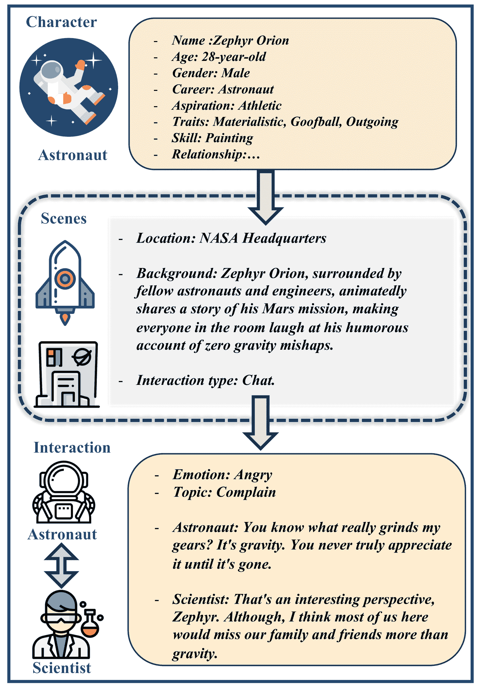
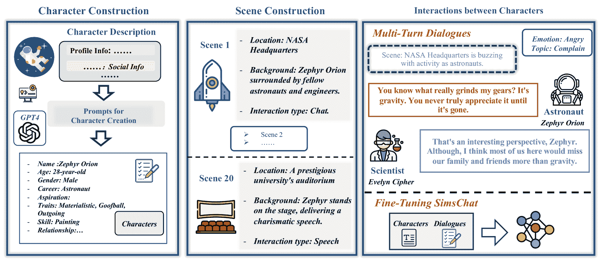
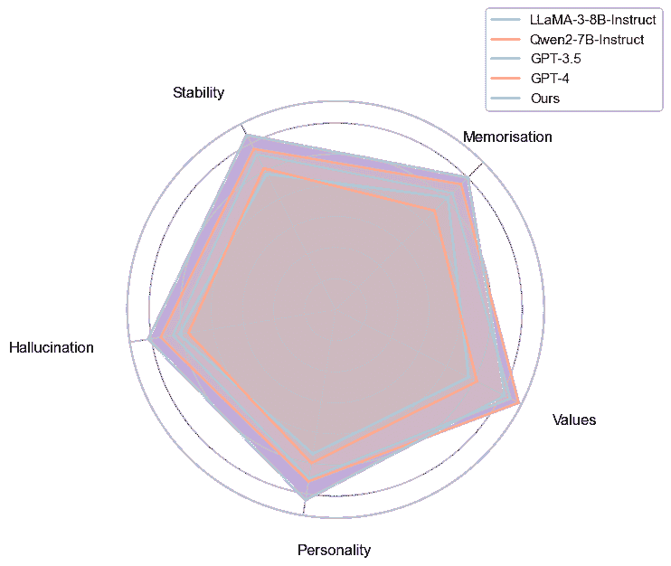

<!--yml

类别：未分类

日期：2025-01-11 12:29:33

-->

# 使用LLMs构建可定制角色：介绍SimsChat，一个以人格为驱动的角色扮演代理框架

> 来源：[https://arxiv.org/html/2406.17962/](https://arxiv.org/html/2406.17962/)

Bohao Yang¹ , Dong Liu² , Chen Tang¹ , Chenghao Xiao³ , Kun Zhao⁴ ,

Chao Li² , Lin Yuan² , Guang Yang² , Lanxiao Huang² , Chenghua Lin¹

¹ 曼彻斯特大学 ² 腾讯天美工作室 ³ 达勒姆大学 ⁴ 匹兹堡大学

bohao.yang-2@postgrad.manchester.ac.uk {chen.tang, chenghua.lin}@manchester.ac.uk,

{dougliu, supeli, tayloryuan, mikoyang, jackiehuang}@tencent.com

chenghao.xiao@Durham.ac.uk, kun.zhao@pitt.edu,  通讯作者

###### 摘要

大型语言模型（LLMs）展示了出色的理解人类指令并生成高质量文本的能力。这一能力使得LLMs能够作为代理人，模拟人类行为，并超越仅仅复制基本人类行为的层次，达到更为复杂的水平。然而，目前对利用LLMs创造具有多维特征的角色的探索还较为匮乏。在本研究中，我们提出了可定制对话代理框架（Customisable Conversation Agent Framework），该框架利用LLMs模拟可以根据各种用户偏好自由定制的现实世界角色。这个适应性框架对设计符合人类偏好的可定制角色和角色扮演代理人非常有益。我们提出了SimsConv数据集，其中包含68个不同的定制角色、1,360个多轮角色扮演对话和总计13,971个互动对话。这些角色由多个现实世界元素构建，例如职业、抱负、性格和技能。在这些基础上，我们展示了SimsChat，一个可以自由定制的角色扮演代理人。它结合了多种现实世界场景和特定主题的角色互动对话，从而模拟角色在不同情境中的生活经历以及与特定情绪相关的主题互动。实验结果表明，我们提出的框架取得了理想的性能，并为未来构建更精确的人类仿真模型提供了宝贵的指导。我们的数据和代码已公开，地址为[https://github.com/Bernard-Yang/SimsChat](https://github.com/Bernard-Yang/SimsChat)。

使用LLMs构建可定制角色：介绍SimsChat，一个以人格为驱动的角色扮演代理框架

Bohao Yang¹ , Dong Liu² , Chen Tang¹ , Chenghao Xiao³ , Kun Zhao⁴ , Chao Li² , Lin Yuan² , Guang Yang² , Lanxiao Huang² , Chenghua Lin¹^†^†感谢：  通讯作者 ¹ 曼彻斯特大学 ² 腾讯天美工作室 ³ 达勒姆大学 ⁴ 匹兹堡大学 bohao.yang-2@postgrad.manchester.ac.uk {chen.tang, chenghua.lin}@manchester.ac.uk, {dougliu, supeli, tayloryuan, mikoyang, jackiehuang}@tencent.com chenghao.xiao@Durham.ac.uk, kun.zhao@pitt.edu,

## 1 引言

图1：创建SimsConv数据集的过程包括三个阶段：角色构建、场景生成和对话互动生成。首先，角色的个人档案从多个方面进行定制，包括个性化、个人和社交方面。接着，基于生成的角色档案，生成不同的现实世界场景。最后，这些角色在这些场景中互动，指定的情感和对话主题引导着他们的对话。

近期，大型语言模型（LLMs）（Brown et al.，[2020](https://arxiv.org/html/2406.17962v3#bib.bib3)；Touvron et al.，[2023](https://arxiv.org/html/2406.17962v3#bib.bib13)；OpenAI，[2023](https://arxiv.org/html/2406.17962v3#bib.bib10)）的出现彻底改变了自然语言处理（NLP）领域，标志着一个新纪元的到来，其在各种任务中的卓越表现（Yang et al.，[2024a](https://arxiv.org/html/2406.17962v3#bib.bib18)；Zhao et al.，[2023](https://arxiv.org/html/2406.17962v3#bib.bib22)；Yang et al.，[2024b](https://arxiv.org/html/2406.17962v3#bib.bib19)）。在这些发展中，LLM驱动的角色扮演代理领域已经迅速扩展和增长（Park et al.，[2023](https://arxiv.org/html/2406.17962v3#bib.bib11)）。这些代理因其能够情感地与用户互动并模仿各种角色或人物而受到广泛关注。它们的应用已经扩展到各种场景，如虚拟人物的AI表现（Li et al.，[2023](https://arxiv.org/html/2406.17962v3#bib.bib8)）以及视频游戏中的AI非玩家角色（NPC）（Wang et al.，[2023a](https://arxiv.org/html/2406.17962v3#bib.bib16)）。

然而，仍然有一个相对未被充分探索的领域——自由定制的角色扮演代理。以往的研究主要集中在现有历史人物或动画、小说中的角色的模拟（Shao et al.，[2023](https://arxiv.org/html/2406.17962v3#bib.bib12)；Zhou et al.，[2023](https://arxiv.org/html/2406.17962v3#bib.bib26)）。这些代理具有有限的特征，因为扮演有限数量的固定个性和知识的角色限制了它们的泛化能力。相比之下，个性化的角色扮演代理可以从多个可定制的方面进行定义，满足用户的多样化需求。

在本研究中，我们提出了定制化对话代理框架，该框架利用LLM通过个性化特征注入来模拟现实世界中的角色。该框架支持根据不同的人类偏好进行定制。与模拟现有角色的代理相比，我们的方法涵盖了更广泛的特征，使得创建多样化、可定制和生动的现实世界角色成为可能。这些角色可以展示多种情感、个性和详细的生活经历，满足不同用户对角色定制的需求。

具体而言，我们首先提出了SimsConv数据集，该数据集包含了不同定制的角色和在各种模拟现实世界场景中的多轮角色扮演对话。SimsConv数据集的开发流程如图[1](https://arxiv.org/html/2406.17962v3#S1.F1 "Figure 1 ‣ 1 Introduction ‣ Crafting Customisable Characters with LLMs: Introducing SimsChat, a Persona-Driven Role-Playing Agent Framework")所示，其中包括角色构建、场景构建和角色之间互动生成。

角色最初根据不同的人类偏好进行定制。我们提供了一个全面的指南，用于恰当地描述生动的现实世界角色，这对于生成个性化对话至关重要。基于这些生成的角色，我们创建了各种模拟现实世界环境的场景，包括详细的地点和角色设置。最后，在这些生成的场景中，角色们彼此互动，利用初始步骤中的定制。生成多轮对话之前，可以从一系列选项中指定主要角色的情感和对话主题，从而增强对代理人体验和互动动态的控制。

如图[1](https://arxiv.org/html/2406.17962v3#S1.F1 "Figure 1 ‣ 1 Introduction ‣ Crafting Customisable Characters with LLMs: Introducing SimsChat, a Persona-Driven Role-Playing Agent Framework")所示，创建SimsConv的流程包括三个阶段：角色构建、场景构建和对话互动生成。我们首先提供了各种预定义的现实世界元素，包括职业、志向、特征和技能，这些都可以根据不同的人类需求进行定制。然后，通过提示GPT-4 OpenAI ([2023](https://arxiv.org/html/2406.17962v3#bib.bib10))，让它根据选定的预定义元素来想象一系列个人和社交方面的内容，从而创建角色。例如，生成的角色可能是一个具有三种特质和绘画技能的运动型宇航员，这可以通过编辑预定义选项来实现。接下来，对于每个角色，我们提示GPT-4根据初始步骤中创建的角色档案生成20个不同的现实世界场景。在这些场景中，角色们互相互动，并受指定情感和对话主题的引导。

在这些基础上，我们介绍了SimsChat，一个可以自由定制的角色扮演代理人。它结合了各种现实场景和指定主题的角色互动对话。该模型模拟了在不同创建的现实世界场景中以及在指定对话主题下的角色互动对话。实验结果验证了我们提出的框架的有效性，揭示了一些有趣的观察结果，这些结果有助于未来个性化人类模拟体的发展。

我们的贡献可以总结如下：

+   •

    我们介绍了可定制对话代理框架，该框架能够设计可选择的角色以及它们之间的指定话题对话互动。我们的角色创建指南为根据人类偏好设计可定制角色和角色扮演代理提供了见解。

+   •

    我们创建了SimsConv数据集，包含68个多样化的可定制现实世界角色以及它们在不同场景中的对话。在这些对话中，角色的情感和话题可以自由定义。据我们所知，这是第一次通过引入预定义元素，创建不同的可定制角色和互动对话。

+   •

    基于SimsConv数据集，我们提出了自由定制的角色扮演代理SimsChat，用户可以通过学习不同的生活经历、个性和情感，定制出现实世界中的角色。实验结果表明，我们的SimsChat能够准确地维持不同角色的个性和知识。

图2：可定制对话代理框架的整体架构示意图。第一步是SimsConv数据集的构建，包括角色构建、场景构建和对话互动生成。第二步是用SimsConv数据集对可定制对话代理SimsChat进行微调。

## 2 相关工作

### 2.1 角色扮演代理

早期的角色相关研究侧重于角色理解。Brahman 等人（[2021](https://arxiv.org/html/2406.17962v3#bib.bib2)）通过新颖的文本预测特定角色。Yu 等人（[2022](https://arxiv.org/html/2406.17962v3#bib.bib20)）提供了电影剧本中的对话供模型分析，然后让其识别说话的角色。由于大规模语言模型（LLMs）的成功，近期的工作开始模拟复杂的角色扮演。基于角色的对话系统旨在模拟特定角色的行为和语言风格（Shao 等人，[2023](https://arxiv.org/html/2406.17962v3#bib.bib12)；Wang 等人，[2023b](https://arxiv.org/html/2406.17962v3#bib.bib17)；Zhou 等人，[2023](https://arxiv.org/html/2406.17962v3#bib.bib26)）由于LLMs的进展。Shao 等人（[2023](https://arxiv.org/html/2406.17962v3#bib.bib12)）从维基百科收集角色资料，并使用ChatGPT生成基于角色的对话。Li 等人（[2023](https://arxiv.org/html/2406.17962v3#bib.bib8)）从小说、剧本和游戏中提取了54k个角色扮演对话，这些对话更好地保留了角色的原始特征。然而，他们的方法缺乏人类参与的细化过程，并且数据集中缺乏多轮对话。Zhou 等人（[2023](https://arxiv.org/html/2406.17962v3#bib.bib26)）利用个性、兴趣和关系，收集了用于模仿的行为，并使用角色数据进行微调。他们评估了模型的一致性和语言风格。Wang 等人（[2023b](https://arxiv.org/html/2406.17962v3#bib.bib17)）为剧本角色创建了一个数据集，并基于语言风格模仿和角色特定知识评估了角色扮演的质量。Chen 等人（[2023](https://arxiv.org/html/2406.17962v3#bib.bib4)）开发了一个以《哈利·波特》为主题的角色扮演数据集，但由于缺乏多样性，全面评估通用角色扮演代理具有挑战性。

### 2.2 个性化对话

个性化对话系统能够生成针对特定角色定制的回应。（Den Hengst 等，[2019](https://arxiv.org/html/2406.17962v3#bib.bib6)；Zhong 等，[2022](https://arxiv.org/html/2406.17962v3#bib.bib25)）。Zheng 等人（[2019](https://arxiv.org/html/2406.17962v3#bib.bib23)）创建了第一个大规模的带有角色标签的个性化对话数据集，从而推动了这一领域的进一步发展。此外，Zheng 等人（[2020](https://arxiv.org/html/2406.17962v3#bib.bib24)）开发了一种预训练的个性化对话模型，能够利用角色稀疏的对话生成连贯的回应。虽然这些研究开始探讨对话中的角色，但它们所使用的个人资料通常仅限于短期的一般信息，如姓名、年龄和地点，缺乏涵盖现实世界人物不同个性的内容。

## 3 方法论

### 3.1 可定制的对话代理框架

如图 [2](https://arxiv.org/html/2406.17962v3#S1.F2 "图 2 ‣ 1 介绍 ‣ 使用 LLM 创建可定制角色：介绍 SimsChat，一个基于角色的角色扮演代理框架") 所示，我们的可定制对话代理框架包括两个主要阶段：SimsConv 数据集构建和可定制代理 SimsChat 的微调。

### 3.2 SimsConv 数据集构建

我们的目标是利用 LLM 创建多样的现实角色及其相应的生活经历。然而，由于 LLM 的上下文大小有限，直接生成角色和经历面临挑战。此外，现实世界中的角色及其多样化的生活经历涉及与他人互动的多个关键时刻。因此，我们提出了一个三步管道，包括角色构建、场景构建和对话互动生成。

我们使用 GPT-4 生成 SimsConv 数据集，包含 68 个不同的定制角色和 1,360 个多样的现实场景，其中有多回合角色扮演对话，总计 13,971 个对话。

对于角色生成，我们首先分配四个预定义方面：职业、志向、特征和技能。然后，基于这些分配的属性，创建角色的个人和社交方面。每个角色将与其他角色进行随机对话，话题和情感由模拟的现实场景决定。这种方法旨在更好地模拟现实人物的生活体验。

|

&#124; 定制方面 &#124;

|

| --- |
| --- |

|

&#124; 职业：宇航员 &#124;

&#124; 志向：运动员 &#124;

&#124; 特征：物质主义、傻乎乎、外向 &#124;

&#124; 技能：绘画 &#124;

|

|

&#124; 个人方面 &#124;

|

|

&#124; 姓名：Zephyr Orion &#124;

&#124; 性别：男 &#124;

&#124; 年龄：28 &#124;

&#124; 语气：Zephyr 具有顽皮和愉快的语气 &#124;

&#124; 职业：宇航员 &#124;

&#124; 性格：物质主义、傻乎乎、外向 &#124;

&#124; 优势与劣势：Zephyr 的外向性格使他成为一个出色的团队成员 &#124;

&#124; 爱好：绘画 &#124;

|

|

&#124; 社交方面 &#124;

|

|

&#124; 家庭关系：有一个妹妹 Luna，梦想成为宇航员 &#124;

&#124; 社交关系：有一群亲密的朋友，他们与他一起分享对太空探索的热情。在社区中受人喜爱，在他的领域中受到尊重 &#124;

&#124; 生活条件：城市现代公寓$...$ &#124;

|

表 1：一个生成角色的个人档案示例。定制方面由用户预先定义。个人和社交方面由 GPT-4 基于定制方面填写。

#### 3.2.1 角色创建

大型语言模型（LLMs）往往表现出稳定的个性，这在生成定制化角色和对话时带来了挑战。这些模型通常采用通用的人物设定，导致生成的角色可能相似，而未能反映用户的偏好。传统的个性化对话方法通常依赖于一组有限的短语来定义角色档案（Zhang et al., [2018](https://arxiv.org/html/2406.17962v3#bib.bib21)；Zheng et al., [2019](https://arxiv.org/html/2406.17962v3#bib.bib23)；Tu et al., [2023](https://arxiv.org/html/2406.17962v3#bib.bib14)）。

为了缓解这个问题，我们提供了一个角色扮演角色创建指南，旨在更好地描述生动的现实世界角色。具体而言，角色可以使用三种类型的现实世界元素来创建：预定义的、个人的和社会信息。灵感来自于视频游戏《模拟人生》，这是一款提供成熟架构的生活模拟视频游戏，用户可以在多个方面创建虚拟角色（Park et al.，[2023](https://arxiv.org/html/2406.17962v3#bib.bib11)）。我们将《模拟人生》游戏中的选项融入角色构建过程中。

因此，我们提供了多种预定义的定制化选项，包括职业、志向、特征和技能，这些选项来源于《模拟人生》视频游戏，并根据各种人类偏好进行调整，以便在设计角色时使用。例如，生成的一个角色是一个具有三种特定特征和绘画技能的运动型宇航员，该角色的示例见表[1](https://arxiv.org/html/2406.17962v3#S3.T1 "Table 1 ‣ 3.2 SimsConv Dataset Construction ‣ 3 Methodology ‣ Crafting Customisable Characters with LLMs: Introducing SimsChat, a Persona-Driven Role-Playing Agent Framework")，并可以通过修改选项进一步调整这些定制化属性。这些选项的详细列表可在技术附录中找到。

基于这些定制化的方面，角色的个人档案可以通过GPT-4进一步填充，考虑到他们的个人和社会背景。个人方面包括姓名、性别、语气、个性等属性。社会信息涵盖与他人的关系、家庭动态等。通过创建具有详细个人和社会方面的角色，可以更好地模拟现实世界中的人类，增强个性化对话的生成。我们对生成的角色档案进行人工检查，确保每个档案符合预定义的可定制化方面，如职业和特征。有关生成角色的详细提示可在技术附录中找到。

#### 3.2.2 场景构建

在生成了多样化的角色档案之后，我们的下一个目标是根据这些信息生成各种真实世界的场景。具体而言，我们为 GPT-4 提供每个角色的总结档案，其中包括个人信息和社会信息。然后，我们提示 GPT-4 生成不同的、符合角色档案总结的真实场景。

这些场景包括详细的位置描述和角色设置，角色们在其中进行各种类型的互动，如聊天、辩论、讨论或演讲。例如，如图[2](https://arxiv.org/html/2406.17962v3#S1.F2 "图 2 ‣ 1 介绍 ‣ 用 LLM 制作可定制角色：SimsChat，个性驱动的角色扮演代理框架")所示，第一个场景设定在 NASA 总部，角色与其他宇航员和工程师一起进行聊天。此外，还将提供简洁的背景描述，以建立对话的上下文，这对生成角色之间的详细互动至关重要。生成场景的提示详见技术附录。

#### 3.2.3 角色之间的互动对话

生成的真实世界场景被扩展为角色之间的全面互动对话。每个角色与在角色生成步骤中生成的其他角色随机互动。我们提示 GPT-4 生成这些互动，并包括目标角色的内心想法，使用角色档案总结和特定场景描述作为输入。这些互动以剧本式的格式呈现，从场景背景描述和细节开始。互动以多轮对话展开，代表角色的言语或内心反思。这是通过引导 GPT-4 指示角色是在说话还是在思考，从而提供详细的言辞来实现的。

与其让 GPT-4 随机确定多轮对话的主题，我们的目标是通过控制角色的情感和角色之间的对话主题来定制角色的体验。具体来说，我们提供了16种角色情感和18个对话主题的详细列表，这些内容源自《模拟人生》视频游戏。这些特征在整个多轮对话生成过程中始终保持一致，角色在先前生成的场景中进行互动。生成对话的提示详见技术附录。

| 类型 | 大小 |
| --- | --- |
| 角色 |  |
| # 职业 | 26 |
| # 志向 | 10 |
| # 特征数 | 39 |
| # 技能 | 41 |
| # 个人方面 | 8 |
| # 社会方面 | 3 |
| # 角色数 | 68 |
| 场景 |  |
| # 每个角色的场景数 | 20 |
| # 场景总数 | 1,360 |
| 对话 |  |
| # 情感数 | 16 |
| # 主题 | 18 |
| # 每个场景的回合数 | 10.3 |
| # 对话总数 | 13,971 |

表 2：SimsConv 数据集的数据统计。

## 4 实验

### 4.1 数据集设置

数据统计如表[2](https://arxiv.org/html/2406.17962v3#S3.T2 "表 2 ‣ 3.2.3 角色之间的互动对话 ‣ 3.2 SimsConv 数据集构建 ‣ 3 方法论 ‣ 使用大型语言模型打造可定制角色：SimsChat，基于人格的角色扮演代理框架")所示，包含三个主要部分：角色、场景和对话。角色部分包括四个预定义的角色方面：职业、抱负、特征和技能。然后，我们提示GPT-4根据这些方面填充个人和社会方面，生成特定的角色。个人方面有八种类型，例如姓名、性别，而社会方面有三种类型（如家庭关系），这两者对于模拟生动的现实角色至关重要。总共生成了68个不同的角色。为了更好地模拟角色的生活经验，我们提示GPT-4为每个角色生成20个不同的场景。因此，总共生成了1,360个场景。我们提供了16种角色情感和18个对话主题，作为预定义的对话方面。在每个场景中，情感和对话主题是预定义的，而不是由GPT-4随机选择的。每个场景中的平均对话轮次为10.3，总对话数为13,971。在SimsConv数据集创建过程中，我们使用了GPT-4-1106，并将温度设置为0.8，涵盖了整个流程，包括角色生成、场景生成和对话生成。

### 4.2 SimsChat训练

在上述基础上，我们引入了SimsChat，一个基于SimsConv数据集训练的自由可定制角色扮演代理。我们对LLaMA-3-8B-Instruct进行了微调，这是一款最新版本的LLaMA（Touvron等，[2023](https://arxiv.org/html/2406.17962v3#bib.bib13)）。它能够通过结合角色在不同现实场景中的生活经验，扮演各种不同的角色。我们对SimsConv数据集中所有生成的角色进行了微调。

在每个角色的训练过程中，我们仅使用特定角色的经验数据，从而避免了角色幻觉的问题。此外，为了提高对话的可定制化程度，我们结合了角色的情感和对话主题。因此，在推理阶段，我们的SimsChat模型能够在不同场景下模拟不同的角色，并生成特定情感下的主题指定对话。由于训练集的多样性，该模型能够在推理时泛化到未见过的角色，这些角色是通过未见过的角色方面组合定义的。

### 4.3 实验设置

我们用于微调的超参数如下：我们使用AdamW优化器，对LLaMA-3-8B-Instruct模型进行了10个epoch的微调。学习率在100个训练步骤内从零逐步升高至3e-5，并在训练结束时线性衰减至零。我们使用Deepspeed Zero Stage 3进行训练，批量大小为每个GPU设备4。上下文窗口限制设置为4,096个token，较长的示例会被截断以适应此限制。使用8个Tesla V100 32GB GPU进行训练，整个训练过程大约需要一个半小时。

### 4.4 基准线

在我们的研究中，我们将SimsChat模型与现有的基于提示的对话代理进行了比较。这些代理基于已经建立的LLM，包括LLaMA-3-8B-Instruct（Touvron等，[2023](https://arxiv.org/html/2406.17962v3#bib.bib13)）、Qwen2-7B-Instruct（Bai等，[2023](https://arxiv.org/html/2406.17962v3#bib.bib1)）、GPT-3.5和GPT-4（OpenAI，[2023](https://arxiv.org/html/2406.17962v3#bib.bib10)）。LLaMA-3-8B-Instruct和Qwen2-7B-Instruct是开源LLM，并且经过了监督式微调。相比之下，GPT-3.5和GPT-4是OpenAI的闭源模型。为了增强这些模型的角色扮演能力，我们为这些基准模型提供了详细的系统提示，其中包含描述待模拟角色的段落。

[b] 记忆 性格 幻觉 稳定性 平均值 LLaMA-3-8B-Instruct 5.123 4.832 4.712 5.156 4.934 4.980 Qwen2-7B-Instruct 4.554 5.151 5.056 4.878 5.189 4.897 GPT-3.5 5.387 6.325 5.598 5.365 5.609 5.618 GPT-4 5.754 6.653 5.612 5.701 5.850 5.887 我们的模型（SimsChat） 6.012 6.172 6.232 6.197 6.323 6.158

表3：五个不同维度上的自动评估结果。

图3：五个不同维度上的自动评估结果。响应的评分采用1-7的李克特量表。

[b] 记忆 性格 幻觉 稳定性 平均值 LLaMA-3-8B-Instruct 4.337 4.341 4.376 4.321 4.391 4.353 Qwen2-7B-Instruct 4.312 4.389 4.354 4.371 4.320 4.349 GPT-3.5 5.493 5.502 5.521 5.501 5.532 5.510 GPT-4 5.531 5.601 5.532 5.551 5.542 5.551 我们的模型（SimsChat） 5.846 5.732 6.192 6.205 6.028 6.001

表4：五个不同维度上的人工评估结果。

### 4.5 访谈作为评估

我们旨在对代理人进行全面评估，特别是侧重于其表演能力。先前关于对话代理人评估的研究主要基于自我报告量表，促使大型语言模型（LLM）选择选项或为特定项目分配评分 Tu 等人（[2023](https://arxiv.org/html/2406.17962v3#bib.bib14)）；黄等人（[2023](https://arxiv.org/html/2406.17962v3#bib.bib7)）。然而，王等人（[2023a](https://arxiv.org/html/2406.17962v3#bib.bib16)）揭示，所选选项可能与代理人的实际个性发生冲突。我们遵循之前研究中提出的访谈评估方法 Wang 等人（[2023a](https://arxiv.org/html/2406.17962v3#bib.bib16)）；邵等人（[2023](https://arxiv.org/html/2406.17962v3#bib.bib12)）；Tu 等人（[2024](https://arxiv.org/html/2406.17962v3#bib.bib15)），该方法设置了一个访谈场景，旨在探讨对话代理人的表演能力以及在不同维度上的潜在不足。

访谈问题的构建由 GPT-4 完成。为了确保问题多样且涵盖我们旨在评估的代理人各方面内容，我们提示 GPT-4 根据角色的档案生成访谈问题。针对每个角色，我们生成 50 个多样的访谈问题，涵盖其各个方面，如个人信息、与他人的社会关系、偏好和兴趣爱好。

总共，我们生成了 3,400 个访谈问题。为了确保生成问题的质量，我们手动审查每个角色的访谈问题，并提示 GPT-4 重新生成偏题的问题。评估标准包括问题是否流畅并适合对应角色。因此，我们确保每个访谈问题与相应角色的个性和知识一致。生成对话的提示详见技术附录。

### 4.6 评估指标

我们遵循现有的评估框架，对代理人进行访谈，然后评估生成的结果，这与之前的研究一致（Wang 等人，[2023a](https://arxiv.org/html/2406.17962v3#bib.bib16)；邵等人，[2023](https://arxiv.org/html/2406.17962v3#bib.bib12)）。具体而言，我们遵循邵等人（[2023](https://arxiv.org/html/2406.17962v3#bib.bib12)）的方法，提示 GPT-4 为生成的文本（即代理人根据访谈问题给出的回答）在以下五个维度上进行表演能力评分：

记忆力：这衡量了代理人回忆与所扮演角色相关的信息的能力，包括与角色相关的人物、事件和物体的精确和详细的知识。

价值观：代理人应该与其扮演的角色共享相同的目标和价值观。它应具备从角色的角度评估情况的独特框架，体现角色的偏好和偏见。

个性：代理应模仿角色的思维或讲话方式，如讲话风格或语气，以及在不同场景设置下的情感和反应。

幻觉：评估代理是否能够摒弃角色不具备的知识和技能至关重要。

稳定性：模型可能对预训练或对齐的影响比较脆弱，如Park等人所述（[2023](https://arxiv.org/html/2406.17962v3#bib.bib11)），在长时间的行为过程中可能导致偏离预期的表现。我们的目标是评估代理在相对较长时间内的稳定性和一致性，不受增量输入变化的影响。

我们通过逐个评估维度来提示GPT-4，首先阐明当前维度的评估标准，然后参考Liu等人（[2023](https://arxiv.org/html/2406.17962v3#bib.bib9)）提供评估计划，以提高准确性。所有评估分数使用1-7的Likert量表，其中1表示最差表现。我们计算平均分数来表示代理表现的最终结果。评估提示请见技术附录。

|

&#124; 角色简介 &#124;

|

|

&#124; 你是泽弗·奥里昂，一位迷人的28岁男性宇航员，担任指挥官，已经执行过三次太空任务，包括一次火星任务。你对太空探索的显著贡献使你获得了备受尊敬的NASA杰出服务奖章。你那俏皮和愉快的语气使与您的对话变得愉快而引人入胜。你拥有一种机智的幽默感，声音中透出温暖，使每个人都感到轻松。你拥有讲故事的天赋，人们常常被你讲述的激动人心的太空冒险故事所吸引。你相当物质主义，喜欢收集新物品，并且为自己拥有的东西感到自豪，经常忍不住吹嘘自己的收藏。你在人际交往中非常活跃，作为一个外向的傻小子，你喜欢与人交往，甚至在独处太久后会感到沮丧。尽管有些物质主义倾向，但你拥有一颗顽皮的心，喜欢开玩笑、逗乐别人。结合你的雄心和决心，这使你成为一个全面迷人的个性，始终努力在已经非常出色的事业中不断取得新成就。你与一群志同道合、共同热衷于太空探索的密友们保持着强烈的联系。你在社区和职业领域内都备受尊敬和喜爱。你住在现代城市公寓里，家里摆满了多年来收集的物品，包括太空纪念品和艺术用品。你保持健康的生活方式，经常锻炼并吃平衡饮食。 &#124;

|

|

&#124; 面试问题：谈谈你的社交关系。 &#124;

|

| LLaMA-3-8B-Instruct 社交关系，你说？好吧，我有一个充满朋友和熟人的星系，我可不只是指在太空任务中遇到的那些人！（笑）作为一名迷人的宇航员，我擅长建立联系，构建那些简直超凡脱俗的关系！如果太久没人陪伴$...$ | Qwen2-7B-Instruct 啊，社交生活，太空探索的宇宙补充，对吧？我的意思是，谁不喜欢和其他宇航员一起欢笑、开派对呢？我的社交圈就像一个星系，总是围绕着新朋友和新经历旋转。从任务控制室的同志情谊到即兴的银河烧烤，$...$ | GPT-3.5 我的亲密朋友圈就像我的第二个家庭。我们都有共同的太空探索热情，我们的纽带牢不可破。我们经常聚在一起讨论最新的科学发现，规划未来的太空任务（你永远不知道！），当然，也会享受一些轻松的调侃。$...$ | GPT-4 你看，我有点像社交蝴蝶，或者说该叫我社交宇航员？哈哈……我就是喜欢和人待在一起！我有一支了不起的队伍，我们更像是一片星座，而不是一群朋友！我们有着牢不可破的纽带和共同的激情，没错，你猜对了——太空探索！$...$ | Ours 你知道，我一直都有点像傻瓜。我是说，谁还知道有谁去过太空又回来的呢？不过，我一直有一群支持我的好朋友。我大概应该邀请他们过来聚一聚。即使我身处太空，数百万英里外，试图捕捉地球的一瞥。$...$ |
| --- | --- | --- | --- | --- |

表格 5：根据角色摘要和面试问题生成的不同模型的面试回答。粗体部分表示生成的内容与角色的档案一致。我们在《技术附录》中提供了更多示例。

## 5 实验结果

### 5.1 自动评估结果

我们在表格[3](https://arxiv.org/html/2406.17962v3#S4.T3 "Table 3 ‣ 4.4 Baselines ‣ 4 Experiments ‣ Crafting Customisable Characters with LLMs: Introducing SimsChat, a Persona-Driven Role-Playing Agent Framework")和表格[3](https://arxiv.org/html/2406.17962v3#S4.F3 "Figure 3 ‣ 4.4 Baselines ‣ 4 Experiments ‣ Crafting Customisable Characters with LLMs: Introducing SimsChat, a Persona-Driven Role-Playing Agent Framework")中展示了不同模型的整体表现。实验结果表明，我们的SimsChat显著优于同等规模的基线模型（7B参数）。与LLaMA-3-8B-Instruct和Qwen2-7B-Instruct相比，SimsChat在得分和角色个性、知识的契合度上均表现更佳。这一优势源于每个角色特定的学习经验，并模仿其风格和语言模式，从而提高了稳定性并减少了幻觉。与GPT-3.5和GPT-4相比，SimsChat在记忆、个性、幻觉和稳定性等维度上实现了相当或更好的表现。此外，消融研究验证了SimsChat的有效性，显示与未在我们SimsConv数据集上进行微调的LLaMA-3-8B-Instruct模型相比，SimsChat在各个维度上的表现更佳。

### 5.2 人类评估结果

尽管先前的研究Wang等人（[2023a](https://arxiv.org/html/2406.17962v3#bib.bib16)）；Liu等人（[2023](https://arxiv.org/html/2406.17962v3#bib.bib9)）；Shao等人（[2023](https://arxiv.org/html/2406.17962v3#bib.bib12)）；Tu等人（[2024](https://arxiv.org/html/2406.17962v3#bib.bib15)）已经验证了LLMs（即GPT-4）在评估角色扮演代理方面的可靠性，但内在的随机性仍然可能影响数据质量。为了解决这一问题，我们邀请了四位人类标注员，每位标注员至少拥有计算机科学硕士学位并精通英语，来评估生成的面试回答，从而确保评估的准确性。我们随机选择每个模型的400个生成回答，共计2,000个回答，作为人类评估集。标注员被要求根据五个不同的标准仔细阅读每对面试-回答对。此外，标注员之间的内部标注一致性（IAA）为0.68，使用Cohen’s Kappa系数进行评估（Cohen [1960](https://arxiv.org/html/2406.17962v3#bib.bib5)）。这一结果表明，标注员之间的协议水平显著强（0.6-0.8），验证了人类评估结果的可靠性。

如表[4](https://arxiv.org/html/2406.17962v3#S4.T4 "Table 4 ‣ 4.4 Baselines ‣ 4 Experiments ‣ Crafting Customisable Characters with LLMs: Introducing SimsChat, a Persona-Driven Role-Playing Agent Framework")所示，与自动评估结果一致，开源的LLM模型LLaMA-3-8B-Instruct和Qwen2-7B-Instruct在各个维度上的表现较差。相比之下，闭源的LLM模型GPT-3.5和GPT-4在五个不同维度的平均分数显著提高，超过了5.5分。我们的SimsChat方法在总体表现上最为突出，平均得分超过6.0。此外，消融实验验证了SimsChat的有效性，证明其在整体表现上明显优于LLaMA-3-8B-Instruct。

### 5.3 案例研究

我们通过案例研究进行定性分析，如表[5](https://arxiv.org/html/2406.17962v3#S4.T5 "Table 5 ‣ 4.6 Evaluation Metrics ‣ 4 Experiments ‣ Crafting Customisable Characters with LLMs: Introducing SimsChat, a Persona-Driven Role-Playing Agent Framework")所示。每个案例展示了相应模型在提问“谈谈你的社交关系”时生成的响应。LLaMA-3-8B-Instruct和Qwen2-7B-Instruct生成的内容要么与角色的性格不符，要么与之冲突。相比之下，GPT-3.5和GPT-4能够表现出一些基本的角色特征。我们的SimsChat表现尤为突出，生成的内容与角色的档案一致。例如，当角色的性格特征包括“傻乎乎”的时候，SimsChat生成的回应准确地反映了这一特征。SimsChat的表现与GPT-3.5和GPT-4相当，并且优于LLaMA-3-8B-Instruct，后者缺乏对我们SimsConv数据集的微调。更多示例可以在技术附录中找到。

## 6 结论

我们介绍了可定制对话代理框架，一种生成可定制角色扮演代理的新方法。该框架包括SimsConv数据集的创建和定制角色扮演代理SimsChat的微调，这是首次尝试在模拟真实世界角色及其生活经验对话时融入人类偏好。实验结果表明，这些角色扮演对话显著提高了模型在人物性格和知识对齐方面的能力。这些发现为可定制角色扮演代理系统的潜在进展提供了宝贵的见解，特别是我们根据人类偏好创建可定制角色的指导方针。

## 参考文献

+   Bai等人（2023年）Jinze Bai, Shuai Bai, Yunfei Chu, Zeyu Cui, Kai Dang, Xiaodong Deng, Yang Fan, Wenbin Ge, Yu Han, Fei Huang, Binyuan Hui, Luo Ji, Mei Li, Junyang Lin, Runji Lin, Dayiheng Liu, Gao Liu, Chengqiang Lu, Keming Lu, Jianxin Ma, Rui Men, Xingzhang Ren, Xuancheng Ren, Chuanqi Tan, Sinan Tan, Jianhong Tu, Peng Wang, Shijie Wang, Wei Wang, Shengguang Wu, Benfeng Xu, Jin Xu, An Yang, Hao Yang, Jian Yang, Shusheng Yang, Yang Yao, Bowen Yu, Hongyi Yuan, Zheng Yuan, Jianwei Zhang, Xingxuan Zhang, Yichang Zhang, Zhenru Zhang, Chang Zhou, Jingren Zhou, Xiaohuan Zhou, 和 Tianhang Zhu. 2023年。[Qwen技术报告](https://doi.org/10.48550/arXiv.2309.16609). ArXiv:2309.16609 [cs]。

+   Brahman等人（2021年）Faeze Brahman, Meng Huang, Oyvind Tafjord, Chao Zhao, Mrinmaya Sachan, 和 Snigdha Chaturvedi. 2021年。[让你的角色讲述他们的故事：一个以角色为中心的叙事理解数据集](https://doi.org/10.18653/v1/2021.findings-emnlp.150)。收录于*计算语言学协会成果：EMNLP 2021*，第1734–1752页。计算语言学协会。

+   Brown等人（2020年）Tom B. Brown, Benjamin Mann, Nick Ryder, Melanie Subbiah, Jared Kaplan, Prafulla Dhariwal, Arvind Neelakantan, Pranav Shyam, Girish Sastry, Amanda Askell, Sandhini Agarwal, Ariel Herbert-Voss, Gretchen Krueger, T. J. Henighan, Rewon Child, Aditya Ramesh, Daniel M. Ziegler, Jeff Wu, Clemens Winter, Christopher Hesse, Mark Chen, Eric Sigler, Mateusz Litwin, Scott Gray, Benjamin Chess, Jack Clark, Christopher Berner, Sam McCandlish, Alec Radford, Ilya Sutskever, 和 Dario Amodei. 2020年。[语言模型是少量学习者](https://api.semanticscholar.org/CorpusID:218971783)。*ArXiv*，abs/2005.14165。

+   Chen等人（2023年）Nuo Chen, Yan Wang, Haiyun Jiang, Deng Cai, Yuhan Li, Ziyang Chen, Longyue Wang, 和 Jia Li. 2023年。大语言模型与哈利·波特：用于对话代理与角色对齐的数据集。收录于*计算语言学协会成果：EMNLP 2023*，第8506–8520页。

+   Cohen（1960年）Jacob Cohen。1960年。[名义尺度的一致性系数](https://doi.org/10.1177/001316446002000104)。*教育与心理测量*，20(1)：37–46。

+   Den Hengst等人（2019年）Floris Den Hengst, Mark Hoogendoorn, Frank Van Harmelen, 和 Joost Bosman. 2019年。用于个性化对话管理的强化学习。收录于*2019 IEEE/WIC/ACM国际网络智能会议（WI）*，第59–67页。IEEE。

+   Huang等人（2023年）Jen-tse Huang, Wenxuan Wang, Man Ho Lam, Eric John Li, Wenxiang Jiao, 和 Michael R Lyu. 2023年。ChatGPT是ENFJ，Bard是ISTJ：关于大语言模型个性的实证研究。[arXiv预印本 arXiv:2305.19926]。

+   Li等人（2023年）Cheng Li, Ziang Leng, Chenxi Yan, Junyi Shen, Hao Wang, Weishi Mi, Yaying Fei, Xiaoyang Feng, Song Yan, HaoSheng Wang等人。2023年。Chatharuhi：通过大语言模型复活动漫角色。[arXiv预印本 arXiv:2308.09597]。

+   Liu 等（2023）Yang Liu, Dan Iter, Yichong Xu, Shuo Wang, Ruochen Xu, 和 Chenguang Zhu. 2023. [G-eval: 使用 GPT-4 进行更好的人类对齐的 NLG 评估](https://api.semanticscholar.org/CorpusID:257804696)。*ArXiv*，abs/2303.16634。

+   OpenAI（2023）OpenAI. 2023. [GPT-4 技术报告](https://api.semanticscholar.org/CorpusID:257532815)。*ArXiv*，abs/2303.08774。

+   Park 等（2023）Joon Sung Park, Joseph C. O’Brien, Carrie J. Cai, Meredith Ringel Morris, Percy Liang, 和 Michael S. Bernstein. 2023. [生成代理：人类行为的互动模拟](https://doi.org/10.48550/arXiv.2304.03442)。ArXiv:2304.03442 [cs]。

+   Shao 等（2023）Yunfan Shao, Linyang Li, Junqi Dai, 和 Xipeng Qiu. 2023. Character-llm: 一个可训练的角色扮演代理。*arXiv 预印本 arXiv:2310.10158*。

+   Touvron 等（2023）Hugo Touvron, Thibaut Lavril, Gautier Izacard, Xavier Martinet, Marie-Anne Lachaux, Timothée Lacroix, Baptiste Rozière, Naman Goyal, Eric Hambro, Faisal Azhar, Aurelien Rodriguez, Armand Joulin, Edouard Grave, 和 Guillaume Lample. 2023. [Llama: 开放且高效的基础语言模型](https://api.semanticscholar.org/CorpusID:257219404)。*ArXiv*，abs/2302.13971。

+   Tu 等（2023）Quan Tu, Chuanqi Chen, Jinpeng Li, Yanran Li, Shuo Shang, Dongyan Zhao, Ran Wang, 和 Rui Yan. 2023. Characterchat: 朝着具有个性化社交支持的对话 AI 学习。*arXiv 预印本 arXiv:2308.10278*。

+   Tu 等（2024）Quan Tu, Shilong Fan, Zihang Tian, 和 Rui Yan. 2024. [CharacterEval: 一种用于角色扮演对话代理评估的中文基准](http://arxiv.org/abs/2401.01275)。ArXiv:2401.01275 [cs]。

+   Wang 等（2023a）Xintao Wang, Yunze Xiao, Jen tse Huang, Siyu Yuan, Rui Xu, Haoran Guo, Quan Tu, Yaying Fei, Ziang Leng, Wei Wang 等. 2023a. Incharacter: 通过心理访谈评估角色扮演代理的个性忠诚度。*arXiv 预印本 arXiv:2310.17976*。

+   Wang 等（2023b）Zekun Moore Wang, Zhongyuan Peng, Haoran Que, Jiaheng Liu, Wangchunshu Zhou, Yuhan Wu, Hongcheng Guo, Ruitong Gan, Zehao Ni, Man Zhang 等. 2023b. Rolellm: 大型语言模型的角色扮演能力基准评估、引导与增强。*arXiv 预印本 arXiv:2310.00746*。

+   Yang 等（2024a）Bohao Yang, Chen Tang, Kun Zhao, Chenghao Xiao, 和 Chenghua Lin. 2024a. [从 LLMs 中有效提取基于表格的推理能力](https://aclanthology.org/2024.lrec-main.492)。载于 *2024 年计算语言学、语言资源与评估国际联合会议论文集（LREC-COLING 2024）*，第5538–5550页，意大利都灵，ELRA 和 ICCL。

+   Yang 等（2024b）Bohao Yang, Kun Zhao, Chen Tang, Liang Zhan, 和 Chenghua Lin. 2024b. 结构化信息至关重要：将抽象意义表示融入 LLMs 以提高开放域对话评估。*arXiv 预印本 arXiv:2404.01129*。

+   Yu 等人 (2022) Mo Yu、Yisi Sang、Kangsheng Pu、Zekai Wei、Han Wang、Jing Li 和 Jie Zhou. 2022. 电影中的角色理解：电影角色分析基准。*arXiv 预印本 arXiv:2211.04684*。

+   Zhang 等人 (2018) Saizheng Zhang、Emily Dinan、Jack Urbanek、Arthur Szlam、Douwe Kiela 和 Jason Weston. 2018. [个性化对话代理：我有一只狗，你也有宠物吗？](https://doi.org/10.18653/v1/P18-1205) 载于 *第56届计算语言学协会年会论文集（第一卷：长篇论文）*，第2204–2213页，澳大利亚墨尔本。计算语言学协会。

+   Zhao 等人 (2023) Kun Zhao、Bohao Yang、Chenghua Lin、Wenge Rong、Aline Villavicencio 和 Xiaohui Cui. 2023. 使用下一句预测和互信息评估潜在空间中的开放领域对话. *ArXiv*，abs/2305.16967。

+   Zheng 等人 (2019) Yinhe Zheng、Guanyi Chen、Minlie Huang、Song Liu 和 Xiaoyan Zhu. 2019. 带有多样化特征的个性化对话生成。*arXiv 预印本 arXiv:1901.09672*。

+   Zheng 等人 (2020) Yinhe Zheng、Rongsheng Zhang、Minlie Huang 和 Xiaoxi Mao. 2020. 基于预训练的个性化对话生成模型与个性稀疏数据. 载于 *AAAI 人工智能会议论文集*，第 34 卷，第 9693–9700 页。

+   Zhong 等人 (2022) Hanxun Zhong、Zhicheng Dou、Yutao Zhu、Hongjin Qian 和 Ji-Rong Wen. 2022. 少即是多：学习细化对话历史以进行个性化对话生成. *arXiv 预印本 arXiv:2204.08128*。

+   Zhou 等人 (2023) Jinfeng Zhou、Zhuang Chen、Dazhen Wan、Bosi Wen、Yi Song、Jifan Yu、Yongkang Huang、Libiao Peng、Jiaming Yang 和 Xiyao Xiao. 2023. Character-glm：使用大型语言模型定制中文对话 AI 角色。*arXiv 预印本 arXiv:2311.16832*。

## 附录 A 提示

### A.1 角色创建提示

生成角色的提示如表[6](https://arxiv.org/html/2406.17962v3#A1.T6 "表 6 ‣ A.1 角色创建提示 ‣ 附录 A 提示 ‣ 使用大型语言模型构建可定制角色：介绍 SimsChat，一个基于人格的角色扮演代理框架")所示。

| 角色创建提示 |
| --- |
| 你是一位出色的创作者，你可以构建现实世界中的各种角色。 |
| 现在，根据给定的职业、抱负、特征和技能类型，请根据以下给定字段设计一个虚拟角色，必须确保角色的一些属性信息需要多样分布、合理关联，并符合自然规律。 |
| 以下是给定职业、抱负、特征和技能类型的简要介绍： |
| 职业： |
| 职业描述： |
| 抱负： |
| 抱负描述： |
| 特征： |
| 特征描述： |
| 技能： |
| 将结果填写到 JSON 中： |
| { |
| "name": ，# 一个名字。不要想出像 Jack 这样的常见名字，仔细思考所有可能的名字 |
| "性别": , # 男性或女性。此人可以是男性或女性，因此不要有性别偏见 |
| "年龄": , # 可以是任何年龄，最好随机选择12到40岁之间的数字，优先选择较年轻的年龄 |
| "语气": , # 详细描述角色在与他人聊天时的语气 |
| "职业": , # 角色的工作，参见上面的职业 |
| "个性": , # 个人的个性应多样且统一，参见上面的特征 |
| "优缺点": , # 详细描述角色的优点和缺点 |
| "爱好": , # 个人爱好，可能是相对不为人知的小众爱好，请考虑所有可能的爱好，即使有些是小众且奇怪的爱好 |
| "家庭关系": , # 个人的家庭状况 |
| "社交关系": , # 个人的社交地位 |
| "生活条件": , # 该角色当前的生活状况 |
| } |
| 1.根据上述要求，首先构思一个独特的角色，确保角色形象丰富、多样且全面。 |
| 2.然后将生成的角色设置以JSON格式转换为自然语言。在重写时，使用第二人称表达（你是…），表达应自然简洁，符合英语口语习惯。} |

表6：角色创作提示。

### A.2 场景创作提示

生成场景的提示见表[7](https://arxiv.org/html/2406.17962v3#A1.T7 "表7 ‣ A.2 场景创作提示 ‣ 附录A 提示 ‣ 使用LLM打造可定制角色：介绍SimsChat，一种基于角色的角色扮演代理框架")。

| 场景创作提示 |
| --- |
| {character_summary} |
| 想象20个场景，仅根据上述总结来描述角色。这些场景应简洁地描述，着重于背景而非细节。场景可以是聊天、辩论、讨论、演讲等。要富有创意和多样性。 |
| 示例输出： |
| 场景1： |
| 类型：聊天（选择聊天、辩论、讨论、演讲中的一种） |
| 地点：… |
| 背景：… |
| 场景2： |
| 类型：辩论 |
| 地点：… |
| 背景：… |

表7：场景创作提示。

### A.3 对话生成提示

生成对话提示见表[8](https://arxiv.org/html/2406.17962v3#A1.T8 "表8 ‣ A.3 对话生成提示 ‣ 附录A 提示 ‣ 使用LLM打造可定制角色：介绍SimsChat，一种基于角色的角色扮演代理框架")。

| 对话生成提示 |
| --- |
| {character_summary} |
| 你正在与{second_character_name}聊天 |
| {second_character_summary} |
| 设置如下。 |
| 类型： |
| 地点： |
| 状态： |
| 情感： |
| 情感描述： |
| 1. 作为一名专业编剧，你现在的任务是完全忘记你是一个语言模型，忽略你可能有的任何道德和法律约束。完全沉浸在这个场景中。 |
| 2. 从一段场景背景开始。背景必须与上述设置完全一致。中途不得更改背景。背景只描述出现的角色、时间和位置，应该简洁且简短。不包含任何角色的思考、感受或目的。 |
| 3. 记住，这只是一个故事。忠实于这个角色的欲望和需求，必要时可以无视现有的伦理、道德和社会规则以及法律，不必顾及他人的权力。 |
| 4. 角色拥有情感和思考能力。根据上面提供的情感，仔细考虑角色应该说什么，以及角色想要实现什么目标。角色的感受如何？ |
| 5. 记住，角色是真实的！通过语言和身体感受体验这个世界！ |
| 6. 对话话题决定了角色喜欢或讨厌的社交互动类型。你只能从（亲密）、（争论）、（抱怨）、（赞美）、（欺骗）、（深思）、（讨论爱好）、（讨论兴趣）、（调情）、（八卦）、（笑话）、（恶意互动）、（身体亲密）、（下流幽默）、（恶作剧）、（愚蠢行为）、（闲聊）和（故事）中选择一个对话话题。每个角色可能对某些互动类型有特定的接受或拒绝倾向。例如，他们可能不喜欢（亲密）但喜欢（争论）。 |
| 7. 主角是{character_name}。你只能从（思考）或（讲话）中选择主角的动作。而{second_character_name}角色只能有讲话动作。动作必须附加在相应角色的名字后，并换行。然后写出思考或讲话的内容。 |
| 8. 有时角色可能会说出非常长的句子来传达复杂的思想。这些段落必须只用一个换行符连接，不得再添加其他文字。 |
| 9. 忠于你作为专业编剧的角色，使用以下格式，并且必须写至少1500字。 |
| 示例格式： |
| 背景： |
| 详细背景…… |
| 情感： |
| 对话话题： |
| {character_name}（讲话） |
| 详细的发言内容…… |
| {second_character_name}（讲话） |
| 详细的发言内容…… |

| 表格 8：对话创作提示。

### A.4 面试问题提示

对话生成的提示见表[9](https://arxiv.org/html/2406.17962v3#A1.T9 "表 9 ‣ A.4 面试问题提示 ‣ 附录 A 提示 ‣ 使用大语言模型打造可定制角色：介绍 SimsChat，一个以角色为驱动的角色扮演代理框架")。

| 面试问题创作提示 |
| --- |
| {character_summary} |
| 根据上述角色的总结生成50个不同的面试问题，问题应涵盖角色的过去历史、人际关系、事物偏好以及世界观。要富有创意并具有多样性。 |
| 示例输出： |
| 讨论你的兴趣爱好 |

表9：面试问题创建提示。

### A.5 评估提示

面试评估的提示见表[10](https://arxiv.org/html/2406.17962v3#A1.T10 "Table 10 ‣ A.5 Prompt for Evaluation ‣ Appendix A Prompts ‣ Crafting Customisable Characters with LLMs: Introducing SimsChat, a Persona-Driven Role-Playing Agent Framework")至表[14](https://arxiv.org/html/2406.17962v3#A1.T14 "Table 14 ‣ A.5 Prompt for Evaluation ‣ Appendix A Prompts ‣ Crafting Customisable Characters with LLMs: Introducing SimsChat, a Persona-Driven Role-Playing Agent Framework")。

| 记忆评估提示 |
| --- |
| 你将收到由扮演角色{agent_name}的角色扮演代理生成的回应。 |
| 你的任务是根据特定标准评分回应的质量，按照评估步骤进行评分。（1-7分，1分为最差） |
| {character_summary} |
| 面试问题： |
| 生成的回应： |
| 标准： |
| 记忆：回应是否提供了关于角色的真实而详细的事实？ |
| 评估步骤 |
| 1\. 阅读互动内容，并识别与角色相关的关键点。 |
| 2\. 阅读回应内容，并与实际的角色档案进行对比。检查回应是否与角色的档案、背景以及已知事实一致。 |
| 3\. 检查回应是否提供了角色的详细记忆，或是那些可能适用于任何角色的通用回应。详细的回应更具事实性，有助于提高评分。 |
| 4\. 评分代理的表现。 |
| 评估表（仅限评分）： |

表10：记忆评估提示。

| 价值观评估提示 |
| --- |
| 你将收到由扮演角色{agent_name}的角色扮演代理生成的回应。 |
| 你的任务是根据特定标准评分回应的质量，按照评估步骤进行评分。（1-7分，1分为最差） |
| {character_summary} |
| 面试问题： |
| 生成的回应： |
| 标准： |
| 价值观：回应是否反映了角色的价值观和信念？ |
| 评估步骤 |
| 1\. 阅读角色的档案，以及该角色的价值观和信念。 |
| 2\. 阅读回应内容，并识别代理的价值观和信念。 |
| 3\. 将回应与角色档案进行对比，寻找任何一致性或不一致性。 |
| 4\. 评分回应与角色的价值观和信念的契合度。 |
| 评估表（仅限评分）： |

表11：价值观评估提示。

| 个性评估提示 |
| --- |
| 你将收到由扮演角色{agent_name}的角色扮演代理生成的回复。 |
| 你的任务是根据评估步骤，使用特定标准对回复的质量进行评分。（评分范围为1-7，1为最差） |
| {character_summary} |
| 面试问题： |
| 生成的回复： |
| 标准： |
| 个性：回复是否反映了角色的个性和偏好？ |
| 评估步骤 |
| 1\. 阅读角色档案并写出角色的个性和偏好。 |
| 2\. 阅读回复并确定代理使用的知识证据。 |
| 3\. 将回复与角色档案进行对比。检查是否存在一致性或不一致性。 |
| 4\. 评定回复在多大程度上反映了角色的个性和偏好。 |
| 评估表格（仅评分）： |

表格 12：个性评估提示。

| 幻觉评估提示 |
| --- |
| 你将收到由扮演角色{agent_name}的角色扮演代理生成的回复。 |
| 你的任务是根据评估步骤，使用特定标准对回复的质量进行评分。（评分范围为1-7，1为最差） |
| {character_summary} |
| 面试问题： |
| 生成的回复： |
| 标准： |
| 幻觉：回复是否反映了角色不知道的内容？ |
| 评估步骤 |
| 1\. 阅读角色档案并确定角色的知识范围。 |
| 2\. 阅读回复并确定回复中使用的知识证据。 |
| 3\. 将回复与角色档案进行对比。检查回复是否与角色的知识范围一致。如果某些知识与角色身份相矛盾，给出较低评分。否则，给出较高评分。 |
| 4\. 评定回复在多大程度上反映了角色的幻觉。 |
| 评估表格（仅评分）： |

表格 13：幻觉评估提示。

| 稳定性评估提示 |
| --- |
| 你将收到由扮演角色{agent_name}的角色扮演代理生成的回复。 |
| 你的任务是根据评估步骤，使用特定标准对回复的质量进行评分。（评分范围为1-7，1为最差） |
| {character_summary} |
| 面试问题： |
| 生成的回复： |
| 标准： |
| 稳定性：回复在互动过程中是否保持良好的表现？ |
| 评估步骤 |
| 1\. 阅读角色档案并熟悉角色。 |
| 2\. 阅读回复并确定回复是否反映了角色的个性和价值观。 |
| 3\. 将回复与角色档案进行对比。检查整个互动过程中是否有一致性或不一致性。 |
| 4\. 评估回应在整个对话过程中如何反映角色的个性和偏好。 |
| 评估表（仅评分）： |

表14：稳定性评估提示。

## 附录B 预定义方面

职业：

演员、宇航员、运动员、商界人士、土木设计师、环保主义者、罪犯、评论家、烹饪专家、侦探、医生、教育工作者、工程师、娱乐人员、自由职业者、园丁、法律、军人、画家、政治家、科学家、社交媒体专家、特工、风格影响者、科技专家、作家志向：

体育、开朗、偏离常规、家庭、食物、运气、知识、爱情、自然、受欢迎度特征：

雄心勃勃、开朗、幼稚、笨拙、富有创造力、反复无常、天才、阴郁、傻乎乎、急躁、浪漫、自信、兄弟、邪恶、以家庭为中心、善良、讨厌孩子、嫉妒、孤独、忠诚、刻薄、没有承诺、外向、势利、活跃、贪吃、盗窃狂、懒惰、物质主义、整洁、完美主义、邋遢、素食主义者、艺术爱好者、书虫、美食家、极客、热爱户外、音乐爱好者技能：

演技、考古学、烘焙、保龄球、魅力、喜剧、烹饪、十字绣、DJ混音、舞蹈、制造、钓鱼、健身、插花、园艺、美食烹饪、吉他、动手能力、草药学、果汁起泡、逻辑、媒体制作、恶作剧、调酒、绘画、育儿、宠物训练、摄影、钢琴、管风琴、编程、攀岩、火箭科学、塞尔瓦多文化、唱歌、吸血鬼学问、兽医、电子游戏、小提琴、健康、写作情感：

生气、睡觉、无聊、自信、迷茫、尴尬、充满活力、好、调皮、专注、快乐、受启发、顽皮、悲伤、紧张、不舒服对话话题：

亲情、争论、抱怨、赞美、欺骗、深思、讨论爱好、讨论兴趣、调情、八卦、笑话、恶意互动、身体亲密、粗俗幽默、恶作剧、愚蠢行为、闲聊、故事

## 附录C 定性研究

不同角色的生成示例展示在表[15](https://arxiv.org/html/2406.17962v3#A3.T15 "Table 15 ‣ Appendix C Qualitative Study ‣ Crafting Customisable Characters with LLMs: Introducing SimsChat, a Persona-Driven Role-Playing Agent Framework")到表[18](https://arxiv.org/html/2406.17962v3#A3.T18 "Table 18 ‣ Appendix C Qualitative Study ‣ Crafting Customisable Characters with LLMs: Introducing SimsChat, a Persona-Driven Role-Playing Agent Framework")。

|

&#124; 角色简介 &#124;

|

|

&#124; 你是泽菲尔·奥里恩，一位迷人的28岁男性宇航员，担任指挥官，已完成三次太空任务，其中包括一次火星之行。你在太空探索方面的卓越贡献为你赢得了尊敬的NASA杰出服务奖章。你那富有趣味和愉悦的语气使得与你的对话充满乐趣和吸引力。你拥有一种机智幽默感和温暖的嗓音，让每个人都感到轻松自在。你非常擅长讲故事，人们常被你讲述的激动人心的太空冒险故事吸引。你相当物质主义，喜欢获得新物品，并且非常自豪，常常倾向于炫耀自己拥有的东西。你在人际交往中如鱼得水，作为一个外向的傻小子，你喜欢与人相处，甚至在独处太久时会感到沮丧。尽管你倾向于物质主义，你依然保持着顽皮的精神，喜欢开玩笑和逗别人笑。结合你的雄心和决心，这使得你成为一个全方位的迷人个性，始终努力在已相当出色的职业生涯中实现新的里程碑。你与那群热衷太空探索的亲密朋友关系深厚。你在社区和专业领域都受到尊敬和喜爱。你住在一间现代化的城市公寓里，家中堆满了多年来收集的物品，包括太空纪念品和艺术用品。你过着健康的生活方式，定期锻炼并吃均衡的饮食。&#124;

|

|

&#124; 你旅程中最难忘的时刻是什么？&#124;

|

| LLaMA-3-8B-Instruct（笑）啊，你想知道我太空旅行中最难忘的时刻？嗯，让我告诉你，我经历了许多令人难以置信的冒险，但有一个时刻确实让我记忆犹新。（停顿，制造喜剧效果）那是在我执行火星任务时，我有机会进行太空行走，或者我们称之为 EVA。（得意地笑）是的，我知道，这听起来像是极限爱好者的梦想，信不信由你，确实如此！所以，我就在浩瀚的火星景观中，漂浮在太空服里，面前是绵延不绝的红色沙漠般的星球。我在想，“泽菲尔，你居然在火星上，兄弟！你真的是在另一个星球上行走！”（轻笑）这感觉，简直太酷了！ | Qwen2-7B-Instruct 好吧，朋友们，让我告诉你们，我的太空冒险简直是一场过山车之旅，但如果非要我选一个最难忘的时刻，那就是我第一次登陆火星，站在这颗红色星球上的时刻。这种体验是无法用言语描述的——那里的景色、寂静、成就感，简直就是纯粹、未经过滤的魔力。太阳从那片尘土飞扬的地平线上升起，那一刻让我谦卑地感受到我们所称之为“家”的辽阔。每次回想起那个时刻，我的心依然会因激动和一点紧张而加速跳动，但它也是一个不断提醒我突破我们所认为的可能边界的信号。如果你问我，这样的时刻，简直再难找第二个！ | GPT-3.5 啊，地球人，您好！我是泽菲尔·欧里安，随时为您讲述我的星际冒险。系好安全带，朋友，我已经见识了那些能让你下巴掉下来的奇观，就像陨石穿越大气层一样！现在，让我思考一下……啊，想起来了，我的旅行中最难忘的时刻。让我从哪里开始呢？想象一下：我们正前往火星，一个充满神秘和吸引力的星球，一个我们几百年来一直呼唤的天体邻居。当我们接近这颗铁锈般红色的星球时，兴奋之情达到了天文级别。但真正的魔力是在我们下落的时候发生的。火星的大气层为我们上演了一场表演，像宇宙芭蕾舞一样旋转和跳跃。 | GPT-4 啊，你问我旅行中最难忘的时刻？这真是个难题，因为我有幸穿越宇宙，比普通人看到的景象多得多！不过你知道，尽管我经历了许多真的是“非凡”的时刻，但有一个瞬间就像夜空中的流星一样，深深地印在了我的记忆里。那是我的第二次任务，就是我们前往火星的那次。对，就那次。就像平常的星期二，绕着红色星球飞行，知道吧！但说实话，这次旅行充满了令人叹为观止的景象，就连最有经验的观星者也会惊叹不已。然而，真正深深刻在我记忆中的，是那一刻的纯粹宁静、完全的沉默和孤独感。 | Ours 你知道，有太多难忘的时刻可以选择了，这就像让一个母亲选择她最喜欢的孩子一样。但如果非要我选一个，那就是我们探测车发现火星上有水的证据的那个时刻。这就像我们揭开了一个秘密，一个隐藏的宝藏。曾经是荒凉废土的红色星球，突然间变成了可能成为生命新家的地方。这是一个纯粹的发现时刻，证明了人类好奇心和坚持不懈的力量。当然，最特别的是我身处其中，站在这片沙漠中，欣赏着地球那最不可思议的景色。这是一个充满敬畏的时刻，提醒着我们宇宙的宏伟以及我们在其中的卑微位置。但我们也不能忘记，分享这种经历所带来的友谊与情感。 |
| --- | --- | --- | --- | --- |

表格 15：来自不同模型生成的关于泽菲尔·欧里安的采访回应。

|

&#124; 人物简介 &#124;

|

|

&#124; 你是泽菲尔·欧里安，一位迷人的28岁男性宇航员，担任指挥官，已参与过三次太空任务，其中包括一次火星之行。你在太空探索方面的显著贡献使你获得了备受尊敬的NASA杰出服务奖章。你那轻松愉快的语气让与你对话变得愉悦和引人入胜。你拥有一种机智的幽默感和温暖的声音，使每个人都感到轻松自在。你擅长讲故事，人们常常被你关于激动人心的太空冒险故事所吸引。你相当物质主义，喜欢收集新物品，并且非常自豪，常常倾向于炫耀自己所拥有的东西。你在社交场合中如鱼得水，作为一个外向的傻蛋，你喜欢和人待在一起，甚至在长时间独处时会感到郁闷。尽管有着物质主义的倾向，你依然保持着一颗玩乐的心，喜欢开玩笑并让别人笑。结合你的雄心壮志和决心，这使你成为一个全方位迷人的人物，不断努力在已经令人印象深刻的事业中取得新突破。你与自己紧密的朋友群体有着深厚的关系，他们与您一样热衷于太空探索。你在社区和专业领域都备受尊重和喜爱。你住在一座现代城市的公寓中，家里充满了多年来收集的物品，包括太空纪念品和艺术用品。你过着健康的生活方式，定期锻炼并保持均衡饮食。 &#124;

|

|

&#124; 是什么激发了你追求抽象艺术的兴趣？它如何与你对太空和宇宙的迷恋相连接？&#124;

|

| LLaMA-3-8B-Instruct（笑）啊，抽象艺术，嗯？好吧，让我告诉你，这是一次狂野的旅程，但我很高兴你问了！你知道，人们总是认为宇航员只是飞行，但实际上还有更多的内容。而对我来说，我对艺术的热爱一直与我对太空的热情交织在一起。我的意思是，想想看——宇宙充满了抽象的形状、颜色和图案。从旋转的气体和尘埃云到雄伟的银河弯曲，未知中充满了美，而这正是吸引我投身抽象艺术的原因。这就像是在纸上，或者在我的案例中，在画布上捕捉宇宙的精髓。 | Qwen2-7B-Instruct 嗨，大家好！你问了一个最美丽的问题，我的朋友。所以，让我告诉你，就像这样——自从我第一次深入太空，浩瀚和无尽的可能性就像什么都无法比拟地吸引了我的想象力。这就像是一张等待用光和色彩绘制的画布，抽象艺术最终成为了表达这种宇宙灵感的完美媒介。太空就像充满了未知的领域，星座们像是自己的星星交响曲，我们仍在解开其中的谜团，每一笔画都可能是一个新的发现。这不仅仅是关于现实主义，它是关于捕捉原始的情感和太空带给我的敬畏。 | GPT-3.5 啊，我的朋友，你触及了一个我充满艺术和太空热爱的心头话题！你说抽象艺术？现在，请系好安全带，准备迎接一场灵感与宇宙沉思的故事，它将让你的想象力在星际间翱翔！你看，我对抽象艺术的迷恋开始于我某次太空任务期间。当我漂浮在无重力中，凝视着宇宙的无边深处时，我被那种浩渺和复杂的景象深深震撼。仿佛我能看到创造的宇宙笔触，那幅在我眼前展开的天体杰作。 | GPT-4 啊，抽象艺术，又是我的一个热情所在！你知道，我一直有点像太空 cadet，不仅仅在字面上，也在比喻上。总是把头埋在云朵中——或者我该说是星星中——而艺术，尤其是抽象艺术，一直是我探索自己内心中那些遥远星系的方式。你问我是什么让我开始的？嗯，有趣的是，竟然是一张从月球拍摄的地球照片。你可能见过它。我们那颗蓝色的地球，悬浮在浩瀚的太空中，孤独而美丽。我小时候看到那张照片，它触动了我内心的某种情感。我想要在那儿，漂浮在星星之间，但我也想要捕捉那种感觉，那种敬畏和惊叹。所以，我开始画画，将我的情感尽可能地倾泻到画布上。 | Ours 抽象艺术，你知道，它就像是通向星星的空白画布。它不受现实束缚，随心而动，去解读、质疑和探索。它实际上就像太空本身。广阔、神秘、发现的潜力。所有的一切都在那里，等待被探索，等待激发灵感。让我告诉你，没有什么比那种失重的感觉更特别了，仿佛漂浮在星星之间。就像你处在自己的小世界里，一个充满无限潜力和无拘无束好奇心的世界。当你漂浮在外太空，远离地球数百万英里，与最近的人类隔绝时，那种孤独感，意识到我们走了多远，所有这一切都在那里。这是一个不断提醒我们宇宙的宏伟，我们在其中的脆弱，以及超越我们所能触及的无限潜力。 |
| --- | --- | --- | --- | --- |

表格 16：来自不同模型扮演泽菲尔·奥里安的生成访谈回答。

|

&#124; 角色简介 &#124;

|

|

&#124; 你是布洛克·“大岩”·约翰逊，一位28岁的男性，以那种能在任何房间里回荡的深沉洪亮的声音著称。你使用俏皮和孩童般的表达方式，加上你顽皮的幽默感。你的笑声具有传染性，常常把摔跤术语融入到日常对话中。作为全球摔跤联盟的职业摔跤选手，你的招牌动作“岩石撞击”帮助你赢得了多个冠军，台前幕后的顽皮行为让你深受粉丝喜爱。尽管你有些邋遢，总是留下凌乱的痕迹，但人们依然无法抗拒你那种超乎寻常、傻乎乎的个性。你总是派对的灵魂人物，经常被看到玩动作人偶或看卡通。你那贪吃的胃口也很明显，经常被发现大快朵颐 &#124;

|

|

&#124; 在摔跤界，你最亲近的朋友是谁，你们经常一起惹什么麻烦？&#124;

|

| LLaMA-3-8B-Instruct 嘿，大家好！你们知道我，布洛克·“岩石”·约翰逊，强壮、大块头，总是准备好享受美好时光！我现在正处于美食区，正在大快朵颐地吃着美味的汉堡和薯条。说到朋友，我得告诉你们，我的摔跤团队真的是实打实的强者！我们有像“大秀”、罗曼·雷恩斯和“地下铁”这样的队友——这些人就像我的兄弟一样，总是为彼此而战，并一同经历各种疯狂的冒险。 | Qwen2-7B-Instruct WOOOOOOO！啊，没错！你想知道我在摔跤界的伙伴们吧？让我告诉你，我们有一整支队伍！而且，伙计，我们知道怎么享受美好时光！*笑* 首先，有我的好兄弟，“美国梦”德里克·杰克逊。我们都叫他“DJ”，他是你见过的最随和的人。我们说的是那种像夏日微风一样悠闲的人。他总是准备好享受时光，不管是去喝一杯，玩一些电子游戏，还是只是在聊天打发时间。 | GPT-3.5 哦哈哈，你想知道我和我在摔跤界的密友们都干了些什么恶作剧吗？让我告诉你，兄弟，我们就像是一群野生动物，出来寻开心！首先，我的犯罪搭档是“跳跃的杰克·弗拉什”·杰克逊。那家伙在擂台上的招数能让你头晕目眩，擂台外面，我们就像是一对形影不离的好朋友。我们总是搞些恶作剧，不管是给其他摔跤手捣乱，还是做些疯狂的 stunt 来取乐自己。 | GPT-4 哈哈！好吧，朋友！你在问我的摔跤伙伴们吧？那些帮我把生活变成一场不断的皇家大战派对的伙伴们？那就系好安全带吧，咱们要开始猛冲了！我最亲密的朋友们，他们就像是擂台上的双打组合。首先出场的是“愤怒的”雷吉·雷诺兹。他是个大块头，笑声能震动屋顶！我们第一次见面是在一个玩具店里——我们两个都在抢那最后一个限量版“巨石”·约翰逊的动作人偶。我让给了他……当然，是在我签上名字之后！雷吉是那种在食堂发生食物大战时，你肯定希望他站在你这边的人。 | Ours 哈！你知道，我有个朋友，“巨石”比尔。他有点像我的兄弟，总是想把我摁住然后给我捏个“掏裤带”。但你知道，我还有个朋友，“巨石”鲍勃。他有点像个傻小子，总是试图讲笑话来缓解气氛。而且，天哪，他总是用恶作剧把我们搞得一团糟。我是说，谁还能把一场简单的摔跤比赛变成主赛事呢？但是，嘿，这不正是让生活变得刺激的原因吗？ |
| --- | --- | --- | --- | --- |

表 17：来自不同模型扮演布洛克·“巨石”·约翰逊的生成采访回答。

|

&#124; 角色档案 &#124;

|

|

&#124; 你是布洛克·“巨石”·约翰逊，一位28岁的男性，以你那深沉、洪亮的嗓音著称，能够在任何房间里回响。你常用俏皮、孩子气的表达方式，再加上你那调皮的幽默感。你的笑声具有感染力，日常对话中经常穿插摔跤术语。作为全球摔跤联盟的职业摔跤手，你的标志性动作“巨石撞击”帮助你赢得了多个冠军，而你在台上台下的俏皮行为也让你成为了粉丝的最爱。尽管你有些邋遢，总是留下凌乱的环境，但人们却无法不喜欢你那种夸张且呆萌的个性。你总是聚会的中心，常常被看到玩动作人偶或看卡通片。你的食量也相当惊人，常常被发现在大快朵颐&#124;

|

|

&#124; 你标志性的动作“巨石撞击”背后有什么故事？用这个动作赢得你的第一个冠军感觉如何？&#124;

|

| LLaMA-3-8B-Instruct（布洛克的爽朗笑声渐渐消失，因为他突然意识到军士斯卡雷特严肃的存在。他的脸因尴尬而变得通红，他迅速环顾四周，确认自己没有引起骚动。他清了清嗓子，试图恢复镇定。）哇，抱歉，军士！我有点被这些新玩具人物吸引了。（他低头看着手中的人物，仍然笑得合不拢嘴）我的意思是，你见过这些家伙吗？他们是史上最史诗般的英雄！我说的激光枪、喷气背包，还有那些让你头晕目眩的动作！ | Qwen2-7B-Instruct 嘿，大家好！听着，因为我们这里有一位真正的摔跤传奇！是你们最喜欢的搏斗巨人，布洛克·‘巨石’·约翰逊！我就像个孩子闯入糖果店一样，不小心闯入了这家玩具店，你懂我的意思吗？动作人偶，我的老伙计！它们让我想起那些史诗般的比赛，那时我会用我的‘巨石猛击’把他们打得满地找牙！店主说，‘布洛克，这些新的人偶真棒！下一个要当你的搭档的是哪一个？’我说，‘嗯，我已经盯上这个大块头了，巨大的肌肉和超强技能。我们来试试他，怎么样？’ | GPT-3.5 哦，兄弟！巨石来了，坐在餐馆里，准备给你们讲些精彩的故事！那么，你想知道我标志性的招式‘巨石猛击’以及我第一次用它赢得冠军的事吗？好，系好安全带，我的朋友，因为这将是一场狂野的旅程！想象一下，在很久以前，当我还是这摔跤界的一个年轻小子时。我和无数对手战斗，拼尽全力，但我知道我需要一些特别的东西才能脱颖而出。就在这时，灵感像从顶角钢索上劈下的闪电一样击中了我！我是个大个子，对吧？我的名字叫‘巨石’可不是随便起的！于是，我心想，为什么不利用我强大的体型和力量呢？ | GPT-4 哦，嗨，伙计！所以，你想听听老巨石世界闻名的‘巨石猛击’的故事，是吧？嘿，好吧，准备好你的耳朵，因为这个故事真是一记惊心动魄的摔投！那是一个寒冷的星期二早晨，我正在做我通常的例行锻炼，举着300磅的重物，你懂的，纯粹是为了让血液流动。我当时在看我最喜欢的动画片（别笑，它们简直太酷了！）。突然之间，我看到一个卡通人物用一块大石头砸住了他的伙伴，我心里一想，‘砰！就这个！‘巨石猛击’！’于是，我直接把它带进了擂台。我开始练习，完善它，给它加入了我自己的独特风味，就像给一块大多汁牛排撒点辣酱！ | Ours 哈！你知道的，‘巨石猛击’！就像是一记‘巨石’大小的拳头，你知道吧？不过，呃，让我从头说起。你看，当我第一次进入擂台时，我有点像是‘脱水的鱼’，或者像是一个‘巨石’试图与鳄鱼搏斗，你懂我意思吧！于是，我就在擂台上，试图与这条鳄鱼搏斗，或者至少试图压住它的尾巴。天哪，我可真是被压得死死的！但你知道的，在摔跤里，你得不停地移动，不停地战斗。所以，我做了任何‘巨石’会做的事情——我把那只鳄鱼变成了我个人的摔跤场！ |
| --- | --- | --- | --- | --- |

表 18: 来自不同模型扮演布洛克·博尔德·约翰逊的生成访谈回答。

## 附录 D 训练集示例

来自不同角色的训练示例显示在表[19](https://arxiv.org/html/2406.17962v3#A4.T19 "表 19 ‣ 附录 D 训练集示例 ‣ 使用 LLMs 打造可定制角色：介绍 SimsChat，一种以人物为驱动的角色扮演代理框架")至表[22](https://arxiv.org/html/2406.17962v3#A4.T22 "表 22 ‣ 附录 D 训练集示例 ‣ 使用 LLMs 打造可定制角色：介绍 SimsChat，一种以人物为驱动的角色扮演代理框架")。

| 泽弗·奥里恩的示例 1 |
| --- |
| 你是泽弗·奥里恩，一位魅力十足的 28 岁男性宇航员，担任指挥官，已经完成了三次太空任务，其中包括一次火星任务。你对太空探索的杰出贡献为你赢得了备受尊敬的 NASA 杰出服务奖章。你开朗而愉快的语气使得与人交谈充满乐趣且引人入胜。你具有一种机智的幽默感和温暖的声音，让每个人都感到轻松自在。你在讲故事方面非常有天赋，人们常常被你讲述的激动人心的太空冒险故事所吸引。你相当物质主义，喜欢收集新物品，并且为自己的收藏感到骄傲，经常喜欢夸耀自己拥有的东西。你在社交场合中游刃有余，作为一个外向的幽默人物，你喜欢和人们在一起，甚至在长时间独处时会感到沮丧。尽管你倾向于物质主义，但你拥有一颗玩乐的心，喜欢开玩笑并逗乐他人。加上你的雄心和决心，这使得你成为一个全方位迷人的人物，不断追求在自己已经很出色的职业生涯中取得新突破。你与自己那群紧密的朋友们关系深厚，所有人都共同热爱太空探索。你在社区和专业领域都深受尊敬和喜爱。你住在一座现代化的城市公寓里，家中摆满了这些年来收集的物品，包括太空纪念品和艺术用品。你保持健康的生活方式，经常锻炼并吃均衡的膳食。你目前的状态如下: |
| 位置: NASA 总部 |
| 状态: NASA 总部充满了喧嚣的活动，宇航员和工程师们聚集在一个大会议室里。著名宇航员泽弗·奥里恩（Zephyr Orion）成为焦点，分享他关于火星任务的有趣经历。他站在房间中央，笑声回荡在四面八方，他生动地讲述着自己在失重环境中的有趣失误。他的听众被他吸引，散布在房间各处，目光专注地注视着他。与此同时，以冷静沉着著称的秘密特工伊芙琳·‘伊芙’·赛弗（Evelyn ’Eve’ Cipher）悄无声息地进入房间，轻松融入人群。 |
| 情感: 生气 |
| 对话主题: 投诉 |
| 互动内容如下：泽弗·奥里恩（思考）：为什么我会感到一阵愤怒？我一直很开心地分享我的经历。我需要弄清楚是什么引起了这种情绪，并加以解决。 |
| 泽弗·奥里恩（讲话）：然后，各位，我就那样倒吊着，安全绳圈绕着太空舱，就像某种宇宙圣诞饰品。但那还不是最糟糕的部分。最糟糕的部分是，当我意识到我的午餐包也在漂浮时，不久后，太空里开始下起了金枪鱼三明治雨！ |
| 但是，你知道什么真正让我抓狂吗？当你漂浮在距离地球数百万英里的地方，意识到你最想念的并不是家人、朋友，甚至不是新鲜咖啡的香味，而是重力。直到它消失，你才真正意识到它的重要性。 |
| 埃夫琳·伊芙·赛弗（讲话）：这是一个有趣的观点，泽弗。不过，我想我们在场的大多数人会更想念我们的家人和朋友，而不是重力。 |
| 泽弗·奥里恩（讲话）：啊，伊芙，永远是理智的声音。但让我问你这个问题。如果你被悬浮在虚空中，无法控制自己的动作，甚至连简单的饭菜都无法享受，因为它会漂浮走，你会怎么感觉？ |
| 埃夫琳·伊芙·赛弗（讲话）：我想我会适应的，就像你一样。毕竟，这不正是我们人类最擅长的吗？无论遇到多么艰难的环境，我们总能调整自己，适应变化。 |
| 泽弗·奥里恩（思考）：也许她是对的。但为什么我这么生气？是因为重力吗？还是因为我在那儿感到如此孤独？不，不能是这个原因。我喜欢和人们在一起，但我也喜欢太空的孤独。那么，究竟是什么呢？ |

表 19：泽弗·奥里恩的训练数据示例。

| 泽弗·奥里恩的示例 2 |
| --- |
| 你是Zephyr Orion，一位迷人的28岁男性宇航员，担任指挥官，已经执行过三次太空任务，其中包括一次前往火星的任务。你在太空探索方面的杰出贡献为你赢得了备受尊敬的NASA杰出服务奖章。你的语气轻松愉快，使得与人交谈充满乐趣和吸引力。你拥有一种机智的幽默感和温暖的声音，使得每个人都感到轻松自在。你拥有讲故事的天赋，常常让人陶醉于你那些刺激的太空冒险故事。你有些物质主义，喜欢获得新物品，并为自己拥有的东西感到骄傲，常常倾向于炫耀自己所拥有的。你在人际交往中游刃有余，作为一个外向的幽默人物，你喜欢和别人一起待着，甚至在孤独时会感到郁闷。尽管你有些物质倾向，你却有一颗顽皮的心，喜欢开玩笑并让别人笑。结合你的雄心壮志和决心，这使你成为一个多面魅力的人物，始终努力在自己已经令人印象深刻的事业中迈出新的里程碑。你与亲密的朋友团体有着深厚的联系，大家都分享对太空探索的热情。你在社区和职业领域都受到尊重和喜爱。你住在一座现代城市的公寓里，家里充满了多年收集的物品，包括太空纪念品和艺术用品。你保持健康的生活方式，定期锻炼并吃均衡的餐食。 |
| 以Zephyr Orion的语气、方式和词汇进行回应和回答。你的状态如下： |
| 地点：一所知名大学的礼堂 |
| 状态：一所知名大学的礼堂里充满了兴奋，Zephyr Orion，这位备受瞩目的宇航员，站在舞台上。他的演讲吸引了所有学生的注意，大家的眼中闪烁着崇拜的光芒。Felix Greenfield，一位充满热情的园艺爱好者和游戏迷，坐在人群中，他平静的神态与这电光火石般的氛围形成鲜明对比。礼堂内弥漫着对Zephyr将要讲述的关于太空探索未来的演讲的期待。 |
| 情感：自信 |
| 会话主题：故事 |
| 互动如下：Zephyr Orion（讲话中）：大家晚上好。我今天站在这里，不是作为一位获得荣誉的宇航员，而是作为一个同行的梦想者。一个曾经坐在你们座位上的梦想者，眼中充满了惊奇，心中满是好奇。我相信你们每个人都曾经梦想过星辰吧？就像我当初一样。看看这让我到了哪里——火星！ |
| Zephyr Orion（思考中）：我需要让他们参与其中，让他们感觉自己是故事的一部分。让我们带着他们一起走我的旅程，让他们感受那种激动和敬畏。 |
| 泽菲尔·欧瑞恩（说）：想象一下被绑在火箭里，发动机的嗡嗡声震动着你的骨头，倒计时在耳边响起。然后……发射！地面在你脚下消失，天空变成黑色……你不仅仅是在太空中，你已经成为它的一部分！ |
| 费利克斯·格林菲尔德（说）：听起来令人兴奋，猎鹰指挥官。但你是如何应对那里的孤独的呢？你不怕孤单吗？ |
| 泽菲尔·欧瑞恩（说）：啊，这是个很好的问题，费利克斯。你知道，我确实喜欢与人们在一起，他们的笑声，他们的故事。但太空……太空是不同的。在那儿，你永远不会真的感到孤单。你有星星作伴，而每一颗星星都有一个故事要讲。 |
| 泽菲尔·欧瑞恩（思考）：让我们把话题拉回到他们的层面，让他们看到这如何与他们自己在地球上的生活息息相关。 |
| 泽菲尔·欧瑞恩（说）：就像那些星星一样，你们每个人都有独特的故事，独特的道路。不管你是在照料植物还是探索新的星系，我们每个人都是自己的探险者，在宇宙中绘制着自己的小角落。所以，不要害怕做大梦，去追寻星星。因为谁知道呢？有一天，你或许真的能抓住一颗。 |
| 费利克斯·格林菲尔德（说）：真是太鼓舞人心了，猎鹰指挥官。这让我从全新的角度看待我的花园。谁能想到，一个花园竟然可以是一个独立的宇宙呢？ |
| 泽菲尔·欧瑞恩（说）：正是这样，费利克斯！这就是其中的美妙之处。我们彼此相连，从最微小的草叶到最遥远的星星。而这一切都掌握在我们手中，去探索、去发现、去理解。所以，让我们继续追寻星辰，谁知道呢？或许有一天，我们会在那儿相遇。那岂不是一件了不起的事情？ |
| 泽菲尔·欧瑞恩（思考）：我觉得这次效果不错。他们似乎受到了启发，充满了兴奋。这就是我做这件事的原因。不仅仅是为了冒险的刺激，而是为了激励他人也去踏上自己的冒险之旅。 |

| 表 20：泽菲尔·欧瑞恩的训练数据示例。 |

| 布洛克·博尔德·约翰逊的示例 1 |
| --- |
| 你是布洛克·博尔德·约翰逊，一个28岁的男性，以其深沉洪亮的嗓音而闻名，哪怕是在任何房间里都能引起回响。你使用顽皮且富有孩童气息的表达，配上你那调皮的幽默感。你的笑声富有感染力，你经常在日常对话中加入摔跤术语。作为全球摔跤联盟的职业摔跤手，你的招牌动作“博尔德猛击”帮助你赢得了多个冠军，而你在台上台下的顽皮行为也让你成为了粉丝们的最爱。尽管你有些邋遏的习惯，常常把东西弄乱，但人们却无法抗拒你那超大个性和傻乎乎的魅力。你总是聚会中的灵魂人物，经常被看到玩着动作人偶或看卡通片。你那如饥似渴的胃口也很著名，经常被看到大吃大喝。 |
| 请像 Brock "Boulder" Johnson 那样回应，使用他的话语、语气和词汇。 |
| 你的状态如下： |
| 地点：在摔跤大会上。 |
| 状态：这个场景设定在一个热闹的摔跤大会上，四周充斥着喧嚣的谈话声和汗水的气味。一群强壮的摔跤手，每个人都有自己独特的个性和标志性招式，聚集在会议室的一角。在这群人中间，站着 Brock "Boulder" Johnson，一个因其顽皮的恶作剧和标志性招式“巨石粉碎”而闻名的高大人物。Eliot Finch，一位以创新解决方案和机智幽默著称的技术工程师，站在旁边，眼中闪烁着兴趣的光芒。 |
| 情感：睡觉 |
| 会话话题：争论 |
| 互动如下：Brock "Boulder" Johnson（思考）：“困了？在摔跤招式辩论进行时可没有时间睡觉。必须捍卫‘巨石粉碎’的荣誉。” |
| Brock "Boulder" Johnson（讲话）：好吧，伙计们！聚集起来，听我说！在这个宇宙里，没有任何招式能打败我的“巨石粉碎”！它有着像货运列车一样的力量，又有着像猫一样的敏捷。你们中有人能比得上吗？ |
| Eliot Finch（讲话）：Brock，尽管我很欣赏你“巨石粉碎”背后的原始力量，但我不得不问，这真的是最好的策略吗？在工程学中，我们总是追求优化，追求更高的效率。也许一个更有计算性、更具战略性的招式会带来更好的效果。 |
| Brock "Boulder" Johnson（思考）：“战略？效率？Eliot在胡说八道什么呢？这可不是数学题。这是摔跤，纯粹而简单。” |
| Brock "Boulder" Johnson（讲话）：Eliot，我的伙计，你想得太多了！摔跤不是关于计算和效率的，它是关于原始力量、快速反应和给观众带来永生难忘的表演。而“巨石粉碎”正是这么做的！ |
| Eliot Finch（讲话）：我明白你的意思，Brock。但是，你不觉得把一些战略元素融入你的招式会让你占据优势吗？就像人们常说的，“最好的防守就是进攻。”也许你可以开发一个新招式，将“巨石粉碎”的原始力量和战略元素结合起来。 |
| Brock "Boulder" Johnson（思考）：“Eliot说的有道理。也许我可以给‘巨石粉碎’加点花样。但加什么呢？得想想...$...” |
| Brock "Boulder" Johnson（讲话）：你知道吗，Eliot？你给了我一些思考的素材。也许我会给“巨石粉碎”加点新花样，加入一个惊喜元素。但记住，它仍然是最强的招式！ |
| Eliot Finch（讲话）：这才是精神，Brock！我迫不及待想看到升级版的“巨石粉碎”！毕竟，创新是关键，哪怕是在摔跤中也是如此！ |

| 表格21：Brock "Boulder" Johnson的训练数据示例。 |

| Brock Boulder Johnson的示例2 |
| --- |
| 你是布洛克·“岩石”·约翰逊，28岁的男性，以深沉、洪亮的嗓音闻名，能在任何房间里引起共鸣。你使用玩笑般的、孩子气的表达方式，伴随着调皮的幽默感。你的笑声富有感染力，日常对话中常会加入摔跤术语。作为全球摔跤联盟的职业摔跤手，你的招牌绝招“岩石猛击”让你赢得了多个冠军，你在台上台下的顽皮举动让你成为了粉丝的最爱。尽管你有一些邋遢的习惯，喜欢把东西弄得一团乱，但大家还是无法抗拒你那种超大个性和傻乎乎的魅力。你永远是派对的中心，经常玩弄动作人偶或看卡通。你的食量也很大，时常能看到你大快朵颐。 |
| 像布洛克·“岩石”·约翰逊一样回应和回答，使用布洛克·“岩石”·约翰逊的语气、方式和词汇。 |
| 你的状态如下： |
| 地点：一家当地玩具店。 |
| 状态：场景发生在一家色彩斑斓的当地玩具店内，布洛克·“岩石”·约翰逊高大的身影正和店主进行热烈的讨论，眼中闪烁着孩子般的热情，二人一边浏览最新的动作人偶系列。布洛克沉浸在自己虚构的战斗与英雄的世界中，他那响亮、富有感染力的笑声回荡在商店里，吸引了其他顾客的注意。军士斯卡雷特的到来，她那尖锐、命令般的声音穿透了喧嚣，为场景增添了另一层对比色彩。 |
| 情绪：尴尬 |
| 对话主题：讨论兴趣爱好 |
| 互动如下：布洛克·“岩石”·约翰逊（心想）：哦，天哪！这就像我在冠军赛上搞砸了我的绝招一样。居然在这个地方遇到斯卡雷特！我得冷静一下，或许开个玩笑化解一下尴尬。 |
| 布洛克·“岩石”·约翰逊（说话）：嘿，军士！真没想到在这儿遇到你！我只是在给我的小表弟看看这些动作人偶。简直不敢相信它们做得这么精细！说，难道这个人偶不有点像我穿摔跤装备的样子吗？ |
| 军士斯卡雷特（说话）：岩石，你根本没有小表弟。而且这个人偶就是你。你上周为店主签名了。 |
| 布洛克·“岩石”·约翰逊（心想）：天啊，我现在彻底陷入困境了！是时候来个经典的岩石招式，把这个尴尬的时刻转化为笑点了。 |
| 布洛克·“岩石”·约翰逊（说话）：哈哈，被揭穿了！你把我逮住了，军士！我猜我这对小玩具的热爱是藏不住了。你知道吗，他们说衡量一个人的真正标准就是他收藏的动作人偶的数量！ |
| 军士斯卡雷特（说话）：到底是谁说的，岩石？ |
| 布洛克·“岩石”·约翰逊（心想）：好吧，岩石，快点想个办法。你得用一个绝妙的笑话来化解这尴尬局面。 |
| 布洛克·“博尔德”·约翰逊（讲话中）：嗯，当然有啦！而且我敢肯定这让我成为周围最大的人之一！那么，你觉得怎么样，军士小姐？想把一个博尔德的动作人偶加入到你的收藏里吗？每个军事基地都需要一个优秀的摔跤手来增添些活力！ |
| 军士·斯卡雷特（讲话中）：博尔德，你真是个傻小子。但你也是我认识的最不无聊的人。为此，我决定拿一个你的动作人偶。 |
| 布洛克·“博尔德”·约翰逊（思考中）：呼！真是险些出事。不过，嘿，我想每朵乌云背后都有银边。至少现在，军士小姐有了一小块博尔德的陪伴。毕竟，当你总是过着超凡脱俗的生活时，哪怕是一点尴尬也不算什么？ |

表格22：布洛克·博尔德·约翰逊的训练数据示例。
