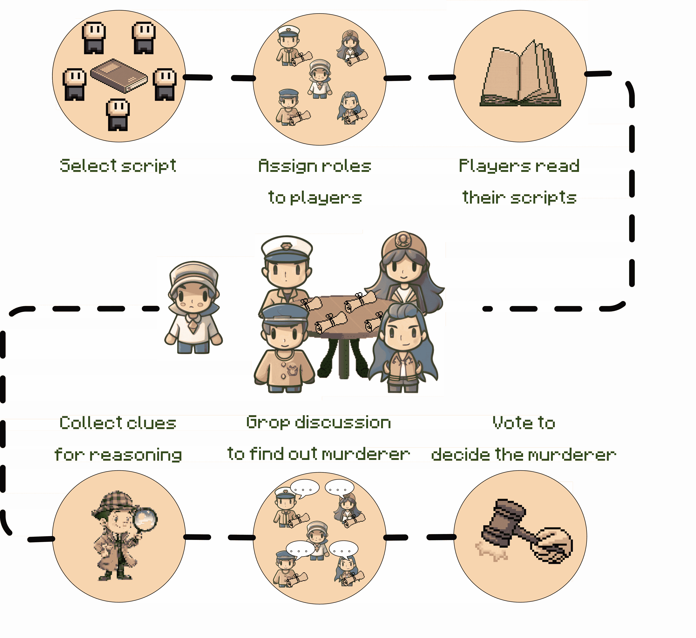
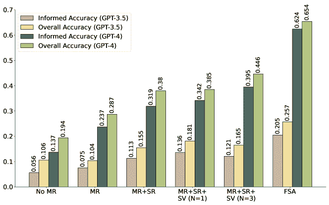
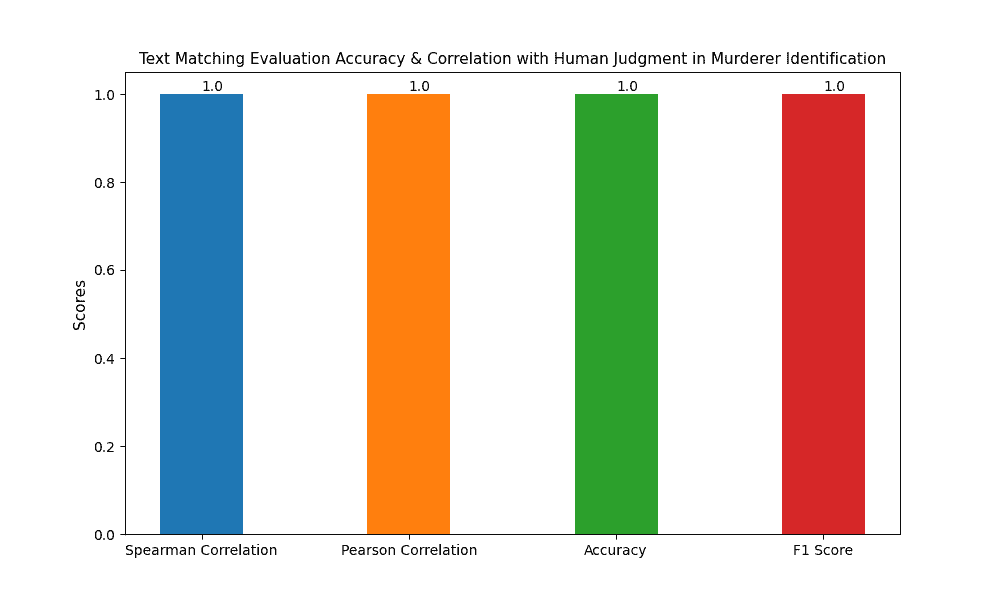

<!--yml

分类：未分类

日期：2025-01-11 13:00:48

-->

# 解密数字侦探：理解大语言模型在多代理推理游戏中的行为与能力

> 来源：[https://arxiv.org/html/2312.00746/](https://arxiv.org/html/2312.00746/)

Dekun Wu, Haochen Shi¹¹脚注标记: 1, Zhiyuan Sun  平等贡献。 Bang Liu

蒙特利尔大学 & 米拉 - 魁北克人工智能研究所

{dekun.wu, haochen.shi, zhiyuan.sun, bang.liu}@umontreal.ca  加拿大CIFAR人工智能讲座。

###### 摘要

本研究探索了大语言模型（LLMs）在剧本杀这一中国侦探角色扮演游戏中的应用，及其在人工智能（AI）驱动的游戏领域中的新颖性。我们介绍了首个专门针对剧本杀的数据集，包括角色剧本和游戏规则，以促进在这一复杂叙事环境中的AI代理开发。我们的工作还提出了一个独特的多代理互动框架，利用LLMs使AI代理能够自主参与游戏。为了评估这些AI代理的游戏表现，我们开发了新方法来衡量它们对案件信息的掌握程度和推理能力。此外，我们结合了最新的上下文学习进展，以提高代理在信息收集、凶手识别和逻辑推理方面的表现。实验结果验证了我们提出方法的有效性。该研究旨在为理解大语言模型能力提供新的视角，并为评估基于大语言模型的代理建立新的基准。

## 1 引言



图1：剧本杀游戏插图。它要求玩家相互互动并推理出故事中的凶手是谁。

互动角色扮演游戏，通过玩家间的战略互动和基于线索的谜题解答，近年来在全球范围内获得了显著的流行。这些游戏的起源可以追溯到19世纪的谋杀推理小说以及20世纪初的派对谜题，尤其在近些年在中国蓬勃发展。在这个背景下，它们被称为“剧本杀”或“Jubensha”，并自2010年代末期以来经历了显著的流行。受西方谋杀推理游戏的影响，剧本杀游戏的核心是玩家们聚集在一起，通过分析和解读提供的故事剧本来辨认凶手。玩家通过激烈的社交互动和推理收集并解读线索的紧张感，使得剧本杀成为一个显著的文化现象。

与此同时，人工智能（AI）领域正在重塑游戏格局。从象棋 Campbell等人（[2002](https://arxiv.org/html/2312.00746v2#bib.bib4)）、围棋 Silver等人（[2016](https://arxiv.org/html/2312.00746v2#bib.bib22)）、扑克 Brown和Sandholm（[2019](https://arxiv.org/html/2312.00746v2#bib.bib3)）；Brown等人（[2020](https://arxiv.org/html/2312.00746v2#bib.bib2)）到视频游戏如星际争霸 Vinyals等人（[2017](https://arxiv.org/html/2312.00746v2#bib.bib26), [2019](https://arxiv.org/html/2312.00746v2#bib.bib25)），英雄联盟 Lohokare等人（[2020](https://arxiv.org/html/2312.00746v2#bib.bib15)），王者荣耀 Ye等人（[2020](https://arxiv.org/html/2312.00746v2#bib.bib35)），AI竞争者或合作伙伴已经被集成到这些游戏中。近期，大型语言模型（LLMs）的激增使得研究兴趣从传统游戏和视频游戏转向了文本类游戏。显著的例子包括LLM作为智能体应用于战略游戏CICERO $FAIR$等人（[2022](https://arxiv.org/html/2312.00746v2#bib.bib7)）、交流游戏狼人杀 Xu等人（[2023](https://arxiv.org/html/2312.00746v2#bib.bib32)）和文本冒险游戏Zork Tsai等人（[2023](https://arxiv.org/html/2312.00746v2#bib.bib24)）中。

然而，关于剧本杀游戏，特别是针对其游戏玩法和评估的AI智能体，仍然是一个尚未发展的领域。我们认为有几个原因。首先，在大型语言模型（LLM）出现之前，理解剧本杀游戏中角色剧情、角色任务和游戏规则是非常具有挑战性的，更不用说需要AI智能体进行多轮语言交互、信息收集和逻辑推理了。其次，目前没有公开可用的专门针对剧本杀游戏的数据集，供研究人员用来开发和评估他们的智能体。第三，定量和定性地自动化评估剧本杀游戏中AI智能体的表现也是非常困难的。其他游戏AI中最常用的胜率指标在评估剧本杀游戏智能体的表现时也有限，即胜率并不能显示剧本杀AI对案件信息的掌握程度或其推理能力的水平。

针对上述挑战，我们在本研究中尝试提供一种解决方案。本研究重点构建了一个多智能体交互框架，该框架基于大型语言模型（LLM），并应用于“剧本杀”游戏环境。我们设计了一套方法，能够定量和定性地评估基于大型语言模型的（LLM-based）智能体的表现。我们的贡献可以总结如下：

1.  1.

    我们创建了一个中文数据集，提供了角色剧本和预设的游戏规则，用以启动剧本杀游戏。据我们所知，这是第一个专门为AI智能体在剧本杀游戏环境中进行游戏而量身定制的数据集。

1.  2.

    我们设计了一个多代理交互框架，用于在剧本杀游戏环境中使用大型语言模型，使多个基于LLM的代理能够在剧本杀游戏中自主互动，无需人为干预。

1.  3.

    为了定量和定性地评估基于大型语言模型的代理在剧本杀游戏中的表现，我们设计了两个新颖的任务：一个评估它们对案件信息的掌握程度，另一个评估它们在游戏过程中收集的信息的推理能力。

1.  4.

    利用最新的上下文学习技术进展，我们设计了多个模块，以提升基于LLM的代理性能。我们的评估结果表明，这一设计显著提高了基于LLM的代理在剧本杀游戏环境中的信息掌握、凶手识别和推理能力。

## 2 相关工作

#### 互动角色扮演游戏

互动角色扮演游戏提供了沉浸式的虚拟环境体验，成为多个领域的多学科研究测试平台 Zagal 和 Deterding ([2018](https://arxiv.org/html/2312.00746v2#bib.bib36)); Barreteau 等人 ([2003](https://arxiv.org/html/2312.00746v2#bib.bib1)); Nagata 等人 ([2021](https://arxiv.org/html/2312.00746v2#bib.bib16))。这些游戏可分为策略角色扮演游戏（SRPG）和多人角色扮演游戏（MRPG），每种类型都具有独特的研究机会。SRPG专注于通过不同主题的任务推进角色发展 Infocom ([1980](https://arxiv.org/html/2312.00746v2#bib.bib10)); Côté 等人 ([2019](https://arxiv.org/html/2312.00746v2#bib.bib5)); Szot 等人 ([2021](https://arxiv.org/html/2312.00746v2#bib.bib23)); Fan 等人 ([2022](https://arxiv.org/html/2312.00746v2#bib.bib8)); Shridhar 等人 ([2020](https://arxiv.org/html/2312.00746v2#bib.bib21)); Wang 等人 ([2022a](https://arxiv.org/html/2312.00746v2#bib.bib28))。而MRPG则强调协作式叙事 Lai 等人 ([2023](https://arxiv.org/html/2312.00746v2#bib.bib13)); Park 等人 ([2023](https://arxiv.org/html/2312.00746v2#bib.bib18)); Fu 等人 ([2023](https://arxiv.org/html/2312.00746v2#bib.bib9)); Kramár 等人 ([2022](https://arxiv.org/html/2312.00746v2#bib.bib12)); $FAIR$ 等人 ([2022](https://arxiv.org/html/2312.00746v2#bib.bib7))。本研究提出了一个用于MRPG剧本杀的数据库，旨在支持在对抗性游戏环境中研究和评估交互式和推理AI的发展。

#### 基于大型语言模型的自主代理。

由于其强大的语言理解和推理能力，LLM（大语言模型）在推进角色任务方面展现出了显著的潜力。Wang等人（[2023a](https://arxiv.org/html/2312.00746v2#bib.bib27)）；Wei等人（[2022](https://arxiv.org/html/2312.00746v2#bib.bib31)）；Wang等人（[2022b](https://arxiv.org/html/2312.00746v2#bib.bib29)）；Yao等人（[2023](https://arxiv.org/html/2312.00746v2#bib.bib33)，[2022](https://arxiv.org/html/2312.00746v2#bib.bib34)）；Shinn等人（[2023](https://arxiv.org/html/2312.00746v2#bib.bib20)）。然而，只有少数工作探讨了复杂环境下的多代理互动问题。Xu等人（[2023](https://arxiv.org/html/2312.00746v2#bib.bib32)）；Junprung（[2023](https://arxiv.org/html/2312.00746v2#bib.bib11)）；Lai等人（[2023](https://arxiv.org/html/2312.00746v2#bib.bib13)）。为了填补这一空白，我们提出了首个基于LLM的多代理互动框架，应用于剧本杀（Jubensha），允许自主代理参与并促进进一步的高级研究。

#### 评估基于LLM的代理。

尽管基于LLM的代理发展迅速，但评估其在MRPG中的能力仍然至关重要且具有挑战性。近期的研究工作Wang等人（[2023b](https://arxiv.org/html/2312.00746v2#bib.bib30)）；Shao等人（[2023](https://arxiv.org/html/2312.00746v2#bib.bib19)）；Liang等人（[2023](https://arxiv.org/html/2312.00746v2#bib.bib14)）；Xu等人（[2023](https://arxiv.org/html/2312.00746v2#bib.bib32)）提出了一些简单的主观和客观评估指标，用于多角色设置下评估基于LLM的代理。然而，使用简单的评估指标，如胜率，评估基于LLM的代理在MRPG中的能力仍然具有挑战性。为了解决这一问题，我们提出了一套系统性且客观的评估方法，旨在衡量基于LLM的代理在剧本杀中的信息收集和推理能力。

## 3 Jubensha 数据集

|  | 文本 | 图片 | 音频 | 视频 | 总计 |
| --- | --- | --- | --- | --- | --- |
| # | 1115 | 643 | 392 | 172 | 1115 |

表格1：我们数据集中按模态分类的剧本杀游戏脚本数量。

|  | 玩家 | 代币 |
| --- | --- | --- |
|  | 最小值 | 最大值 | 平均值 | 最小值 | 最大值 | 平均值 |
| # | 1 | 20 | 6.52 | 4k | 518k | 129k |

表格2：我们数据集中剧本杀游戏脚本的玩家和代币数量统计。

为了增强AI在剧本杀游戏中的应用，我们整理了超过1100个中文剧本杀游戏实例的数据集。¹¹1当前，该数据集为中文，但我们未来有意将其扩展到其他语言。为方便读者，我们在正文中使用了英文示例。该数据集是MRPG（多人角色扮演游戏）研究的重要补充，呈现了独特的挑战和发展机会。²²2我们将在学术接受后发布此数据集，仅用于学术研究。

#### 剧本杀游戏背景

聚本杀是一款多玩家的侦探角色扮演游戏，每个玩家被分配一个与中央谋杀谜题相关的独特角色。如图[1](https://arxiv.org/html/2312.00746v2#S1.F1 "图 1 ‣ 1 引言 ‣ 解密数字侦探：理解大语言模型在多智能体推理游戏中的行为和能力")所示，游戏过程通常包括六个阶段：1) 每个玩家选择一个剧本，以扮演聚本杀游戏中的不同角色。 2) 玩家根据选择的剧本被分配一个角色（凶手或平民）。 3) 玩家阅读剧本，从自己的视角发展对整个故事的基本理解。 4) 每个玩家得到一组线索，帮助他们揭示或隐藏寻找凶手的关键细节。 5) 玩家之间进行多轮小组讨论，分享信息并找出凶手。 6) 最后，每个玩家匿名投票决定凶手。如果真正的凶手获得最多票数，平民获胜；否则，凶手获胜。

#### 数据集构建

为了建立一个能够评估聚本杀智能体的环境，并促进未来的扩展工作，我们收集了1,115个中文在线聚本杀游戏实例。每个游戏包括一本主持人手册，描述如何控制游戏过程，以及案例重播的上帝视角视图，还有每个角色的个别剧本。如表[2](https://arxiv.org/html/2312.00746v2#S3.T2 "表 2 ‣ 3 聚本杀数据集 ‣ 解密数字侦探：理解大语言模型在多智能体推理游戏中的行为和能力")所示，玩家人数从1到20不等，游戏的token数量可以达到518k，为进一步研究社会智能AI并引入超长文本理解和推理挑战提供了便利。此外，如表[1](https://arxiv.org/html/2312.00746v2#S3.T1 "表 1 ‣ 3 聚本杀数据集 ‣ 解密数字侦探：理解大语言模型在多智能体推理游戏中的行为和能力")所示，这些剧本中有些还包含了多模态线索，包括音频和视频。为了创建统一的实验环境，本研究仅专注于文本模态的聚本杀游戏。


图 2：我们提出的ThinkThrice框架的示意图，用于提升智能体在多智能体侦探游戏（即聚本杀）中的表现。三种不同颜色的箭头表示三个阶段的数据流：1) 通过记忆检索生成初步答案；2) 通过自我细化提升答案；3) 通过自我验证核实答案。精炼答案中的棕色文本为新增加的信息。

## 4 ThinkThrice框架在聚本杀游戏中的应用

我们为基于大语言模型（LLM）的智能体设计了一个专门为Jubensha游戏打造的交互框架。在这个框架中，每个基于LLM的智能体负责扮演Jubensha游戏叙事中的一个玩家角色。通常，每个Jubensha游戏包含由LLM智能体扮演的4-5个玩家。此外，我们还设置了一个非玩家角色（NPC）充当主持人，负责引导游戏进行。与其他由大语言模型驱动的玩家不同，主持人的问题和指令是预设的，以确保游戏按照指定的流程进行。至于LLM智能体玩家，它们被嵌入了特定角色的角色信息。基于这些信息，它们与其他角色互动，包括其他玩家和主持人。这些互动是同步的，意味着每个时刻只有一个智能体在行动。所有基于LLM的智能体玩家的行为，如提问对象或如何回应其他玩家或主持人的问题，都是基于它们的角色脚本和历史聊天记录生成的，如图[2](https://arxiv.org/html/2312.00746v2#S3.F2 "图2 ‣ 数据集构建 ‣ 3 Jubensha 数据集 ‣ 破解数字侦探：理解大语言模型在多智能体推理游戏中的行为与能力")所示。此外，我们还设置了一个有限的回合数，以模拟真实Jubensha游戏中的时间限制规则。尽管目前的重点是Jubensha，我们的框架设计是灵活的，可能只需要最小的调整就能应用于其他场景。

我们将多智能体推理游戏的框架命名为ThinkThrice，中文为“三思”。这个名字源于一句中国谚语：“三思而后行”。图[2](https://arxiv.org/html/2312.00746v2#S3.F2 "图2 ‣ 数据集构建 ‣ 3 Jubensha 数据集 ‣ 破解数字侦探：理解大语言模型在多智能体推理游戏中的行为与能力")展示了我们ThinkThrice框架的整体设计，概述了玩家通过三个主要阶段生成对问题的回答的过程：记忆检索、自我修正和自我验证。

#### 记忆检索

由于LLM的上下文窗口有限，通常需要一个特殊的记忆检索模块来存储并适当检索基于LLM的智能体观察到的所有历史记录 Park et al.（[2023](https://arxiv.org/html/2312.00746v2#bib.bib18)）；Lai et al.（[2023](https://arxiv.org/html/2312.00746v2#bib.bib13)）。我们的框架采用这种广泛使用的方法，帮助智能体记住在剧本杀游戏中的对话和事件，并在需要时检索特定的记忆片段。具体而言，我们使用OpenAI API OpenAI（[2023](https://arxiv.org/html/2312.00746v2#bib.bib17)）将智能体的所有观察记录到一个专属于该智能体的向量数据库中。当智能体观察到一个需要采取行动的新事件时，我们使用Faiss库³³3[https://github.com/facebookresearch/faiss](https://github.com/facebookresearch/faiss)快速搜索智能体专属的向量数据库，找到相似度最高的前5条历史记录，并将其包含在当前的行动提示中。我们观察到，这个简单的模块在提高基于LLM的智能体在剧本杀游戏中的表现方面也非常有帮助。

#### 自我精炼

自我精炼模块的目标是确保基于LLM的智能体在回答他人问题时提供尽可能多的信息和细节。如图[2](https://arxiv.org/html/2312.00746v2#S3.F2 "Figure 2 ‣ Dataset Construction ‣ 3 Jubensha Dataset ‣ Deciphering Digital Detectives: Understanding LLM Behaviors and Capabilities in Multi-Agent Mystery Games")所示，当智能体收到他人的问题时，它首先尝试生成一个初步的内部回答（见绿色线条）。在自我精炼阶段，智能体将问题$Q$分解为几个子问题：$q_{1},q_{2},\ldots,q_{n}$。然后，它利用这些子问题从角色脚本$S$中检索相关事实，这些事实可以用来回答这些子问题。对于每个相关事实，智能体检查它们是否已经包含在初步回答中。如果没有，它们将被加入并构成精炼后的回答的一部分（见图[2](https://arxiv.org/html/2312.00746v2#S3.F2 "Figure 2 ‣ Dataset Construction ‣ 3 Jubensha Dataset ‣ Deciphering Digital Detectives: Understanding LLM Behaviors and Capabilities in Multi-Agent Mystery Games")中的橙色线条）。我们可以看到，在自我精炼模块之后，精炼后的回答比初步回答包含更多的细节和信息，从而提高了智能体在有限回合内的沟通效率。

#### 自我验证

LLM幻觉是一个非常常见且棘手的问题 Dhuliawala et al. ([2023](https://arxiv.org/html/2312.00746v2#bib.bib6))。为了确保基于LLM的智能体回答内容的真实性，避免出现幻觉，我们设计了一个自我验证模块。该模块将智能体的答案$A$分解为多个事实$a_{1},a_{2},\ldots,a_{n}$，然后逐一与智能体的角色剧本$S$进行对比，验证其真实性。只有当智能体的回答符合我们预设的真实性阈值（通过实际事实的绝对数量和准确度来衡量）时，智能体才会输出答案（见图 [2](https://arxiv.org/html/2312.00746v2#S3.F2 "图2 ‣ 数据集构建 ‣ 3 剧本杀数据集 ‣ 揭开数字侦探：理解LLM在多智能体悬疑游戏中的行为与能力")中的蓝线）。如果答案未达到预设的阈值，智能体将需要重新生成答案，直到其回答的真实性符合要求或超过最大尝试次数。由于智能体的最佳输出不一定出现在最后一次尝试中，我们根据答案的真实性程度和字数对每个答案进行评分，每次保留得分最高的答案。通过这种方式，即使智能体的所有尝试都未能达到真实性阈值，它仍然会输出所有先前尝试中质量最好的答案。

## 5 评估基于LLM的智能体在剧本杀游戏中的表现

先前的研究主要采用诸如类人度和胜率等指标来评估基于大型语言模型（LLM）的智能体在游戏中的表现 Wang et al. ([2023a](https://arxiv.org/html/2312.00746v2#bib.bib27)); Lai et al. ([2023](https://arxiv.org/html/2312.00746v2#bib.bib13))。这些指标要么需要大量人工参与，要么由于控制变量的挑战，可能导致实验结论不够可靠 Lai et al. ([2023](https://arxiv.org/html/2312.00746v2#bib.bib13))。⁴⁴4尤其当游戏的双方都是由LLM控制时，情况尤为如此。考虑到剧本杀游戏的独特性，我们设计了两个任务，以定量和定性地评估基于LLM的智能体在剧本杀游戏中的表现：事实性问题回答和推理性问题回答。

#### 事实性问题回答

在《剧本杀》游戏中收集信息的过程对于基于LLM的智能体理解故事中的隐含关系和冲突、重构整个案件并推理出真相至关重要。为了评估基于LLM的智能体在《剧本杀》游戏中收集了多少信息，我们设计了一个事实问答任务，并使用GPT生成问题。我们总共为4个选定的《剧本杀》游戏（包含4或5名玩家）生成了720个事实性问题，其中两个示例在表格[3](https://arxiv.org/html/2312.00746v2#S5.T3 "Table 3 ‣ Factual Question Answering ‣ 5 Evaluating LLM-based Agents in Jubensha Games ‣ Deciphering Digital Detectives: Understanding LLM Behaviors and Capabilities in Multi-Agent Mystery Games")中展示。由于篇幅限制，我们将生成方法的提示内容放在了附录[H](https://arxiv.org/html/2312.00746v2#A8 "Appendix H Prompts ‣ Deciphering Digital Detectives: Understanding LLM Behaviors and Capabilities in Multi-Agent Mystery Games")中。

| 示例1 |
| --- |
| 问题：张侄的哥哥为谁工作？ |
| 答案：杨老板 |
| 来源：他为杨老板工作，杨老板是A市一家著名酒吧的老板。（来自张侄的剧本） |
| 示例2 |
| 问题：林博士什么时候遇到张侄？ |
| 答案：18:20 |
| 来源：18:20，你去见杨老板，刚到时遇到张侄。（来自林博士的剧本） |

表格3：两个事实性问题示例。

#### 推理性问答

一旦基于LLM的智能体收集了必要的信息，另一个重要的步骤就是使用这些信息进行推理。在《剧本杀》游戏中，这一步尤其关键，因为案件的真相常常被大量线索所掩盖。为了评估基于LLM的智能体的推理能力，我们为4个选定的《剧本杀》游戏手动设计了56个推理性问题，其中一个示例在表格[4](https://arxiv.org/html/2312.00746v2#S5.T4 "Table 4 ‣ Inferential Question Answering ‣ 5 Evaluating LLM-based Agents in Jubensha Games ‣ Deciphering Digital Detectives: Understanding LLM Behaviors and Capabilities in Multi-Agent Mystery Games")中展示。需要注意的是，前提1来自秘书文的剧本，前提2来自林博士的剧本。为了成功回答这些问题，基于LLM的智能体必须整合来自不同角色的信息，并基于这些信息进行推理。

| 问题：谁最有可能发出林博士在前往杀杨老板的途中听到的砰砰声？A. 秘书文，B. 杨老板，C. 船夫王，D. 张侄，E. 其他。 |
| --- |
| 答案：A. 秘书文 |
| 理由 (GT): {文秘书在23:00通过通风管道离开了杨老板的房间}[前提1]，而{凌博士也准备在23:00通过通风管道杀死杨老板}[前提2]。因此，可以推断出{凌博士在去杀杨老板的路上听到的‘砰砰’声，很可能是文秘书发出的}[结论]。 |

表 4: 推理问题示例。

## 6 实验

在本节中，我们将简要讨论本研究中使用的各种大语言模型（LLMs）。随后，我们将呈现我们的实验结果，包括对基于LLM的智能体在信息收集和推理表现方面的评估。

### 6.1 大语言模型在剧本杀游戏阶段的应用

在整个剧本杀游戏实验过程中，包括事实性问题的生成、智能体的问答环节以及对智能体回答的评估，我们主要使用了OpenAI的GPT-3.5和GPT-4模型。除非特别说明，文中提到的GPT-3.5和GPT-4模型分别指的是gpt-3.5-turbo-16k-0613和gpt-4-1106-preview。对于文本嵌入，我们在游戏过程中使用了text-embedding-ada-002，在评估过程中使用了text-embedding-3-large。GPT模型的具体使用情况列于附录 [B](https://arxiv.org/html/2312.00746v2#A2 "附录B 在剧本杀游戏阶段中LLM的应用 ‣ 解码数字侦探：理解多智能体悬疑游戏中的LLM行为与能力")。

|  | 自有问题 | 其他问题 |
| --- | --- | --- |
|  | 平均 | CQ | MQ | 平均 |
| 无MR | 0.770 | 0.300 | 0.321 | 0.305 |
| MR | 0.759 | 0.409 | 0.380 | 0.402 |
| MR+SR | 0.757 | 0.467 | 0.487 | 0.471 |
| MR+SR+SV(N=1) | 0.768 | 0.485 | 0.518 | 0.492 |
| MR+SR+SV(N=3) | 0.772 | 0.495 | 0.514 | 0.498 |

表 5: 智能体在不同类型事实性问题上的表现。“自有问题”指的是从智能体自身脚本生成的问题，而“其他问题”指的是来自其他智能体脚本的问题，回答智能体无法访问这些脚本。“其他问题”包括“CQ”（来自其他平民脚本的问题）和“MQ”（来自凶手智能体脚本的问题）。根据智能体提供关于自己和他人事实性回答的能力，评估不同模块组合的有效性。“N=”后面的数字表示智能体在自我验证阶段可以尝试的最大次数。

|  | OpenAI | TF-IDF | 三元组 |
| --- | --- | --- | --- |
| 无MR | 0.062 | 0.000 | 0.000 |
| MR | 0.798 | 0.578 | 0.027 |
| MR+SR | 0.820 | 0.645 | 0.064 |
| MR+SR+SV(N=1) | 0.825 | 0.668 | 0.075 |
| MR+SR+SV(N=3) | 0.831 | 0.670 | 0.077 |

表 6: 所有玩家脚本与智能体聊天记录之间的相似度得分。

### 6.2 智能体对事实性问题的回答评估

表[5](https://arxiv.org/html/2312.00746v2#S6.T5 "Table 5 ‣ 6.1 Utilization of LLMs in Jubensha Game Stages ‣ 6 Experiment ‣ Deciphering Digital Detectives: Understanding LLM Behaviors and Capabilities in Multi-Agent Mystery Games")展示了代理人对事实性问题回答的评估结果。我们可以看到，使用不同模块组合的代理人在回答自己脚本中的问题时表现相当优秀。这是可以理解的，因为代理人在整个游戏过程中完全可以访问自己的脚本，因此拥有正确回答这些问题所需的所有信息。由于记忆检索（MR）模块主要记录游戏开始后代理人之间的沟通历史，我们可以认为没有MR模块的代理人处于无记忆状态。“无MR”行中的实验结果显示，代理人回答关于自己问题的准确性明显高于回答关于他人的问题。这一差距突显了代理人对他人和自己所拥有信息之间的显著差异。引入MR模块后，我们观察到代理人在回答关于他人的问题时准确性显著提高，反映出通过代理人之间的互动所获得信息的增加，帮助他们更好地理解游戏中其他角色的角色和故事。

自我优化（SR）和自我验证（SV）模块主要确保代理人沟通过程中信息的真实性和全面性。我们可以观察到，在MR模块、SR模块和SV模块的共同作用下，代理人回答关于他人问题的准确性在所有情况下都取得了最佳结果（最多尝试3次）。这表明我们设计的模块有效地提高了代理人在剧本杀游戏中沟通的效率，使他们在相同游戏回合条件下能够获取更多的案件信息。

### 6.3 代理人聊天历史与所有玩家脚本之间的相似性

为了从文本角度衡量LLM（大规模语言模型）代理在游戏中获得的所有角色的整体信息，我们采用了三种方法来评估代理之间聊天历史与所有玩家脚本之间的相似性。首先，我们将所有玩家的脚本合并成一个单一文档，然后将代理之间的聊天历史视为另一个文档。接着，我们使用OpenAI API OpenAI ([2023](https://arxiv.org/html/2312.00746v2#bib.bib17))分别对这两个文档进行编码。对于超出OpenAI API最大输入长度的文档，我们将其分割成不重叠的片段，并通过对其文本嵌入取平均值来表示该文档。给定两个文档的嵌入向量，我们可以计算它们的余弦相似度。此外，我们还使用TF-IDF和三元组表示这两个文档，并分别计算它们的余弦相似度和Jaccard相似度。来自表[6](https://arxiv.org/html/2312.00746v2#S6.T6 "Table 6 ‣ 6.1 Utilization of LLMs in Jubensha Game Stages ‣ 6 Experiment ‣ Deciphering Digital Detectives: Understanding LLM Behaviors and Capabilities in Multi-Agent Mystery Games")的结果表明，嵌入了MR、SR和SV模块的代理在游戏中的聊天历史与所有玩家的脚本更为接近，这表明它们在一局剧本杀游戏中获取了更多关于所有玩家的信息。


图 3：不同架构下平民玩家的平均获胜率和平均杀手识别准确率。

### 6.4 平民玩家获胜率与杀手识别准确率

图[3](https://arxiv.org/html/2312.00746v2#S6.F3 "Figure 3 ‣ 6.3 Similarities between Agent Chat Histories and All Players’ Scripts ‣ 6 Experiment ‣ Deciphering Digital Detectives: Understanding LLM Behaviors and Capabilities in Multi-Agent Mystery Games")展示了在剧本杀游戏中，不同模块组合的代理的平民玩家获胜率和杀手识别准确率的平均值。图[3](https://arxiv.org/html/2312.00746v2#S6.F3 "Figure 3 ‣ 6.3 Similarities between Agent Chat Histories and All Players’ Scripts ‣ 6 Experiment ‣ Deciphering Digital Detectives: Understanding LLM Behaviors and Capabilities in Multi-Agent Mystery Games")中的平民获胜率是平民玩家获胜的场次与总游戏场次的比例。杀手识别准确率是杀手所获得的票数与所有玩家总投票数的比例。我们观察到，MR+SR+SV(N=3)在事实性问题回答任务中表现最佳，同时也取得了最高的平均平民玩家获胜率和杀手识别准确率。这可能是因为代理获得了足够的信息来重建案件的真实叙述，从而更容易准确识别出杀手。

### 6.5 对代理人在推理问题回答中的表现评估

为了进一步评估基于LLM的智能体在根据收集的信息推导出的推理能力，我们使用了一组推理性问题。实验结果展示在图[4](https://arxiv.org/html/2312.00746v2#S6.F4 "Figure 4 ‣ 6.5 Evaluation of Agent’s Responses to Inferential Questions ‣ 6 Experiment ‣ Deciphering Digital Detectives: Understanding LLM Behaviors and Capabilities in Multi-Agent Mystery Games")中，其中整体准确率表示智能体正确回答问题的比例，不考虑其回答背后的推理。而知情准确率则是指在考虑智能体为其回答提供的推理依据后所达到的准确率。只有当智能体的回答正确且他们提供了正确的推理依据时，答案才会被计入知情准确率。这个指标表明，智能体不仅知道正确答案，而且理解为何答案是正确的。

从图[4](https://arxiv.org/html/2312.00746v2#S6.F4 "Figure 4 ‣ 6.5 Evaluation of Agent’s Responses to Inferential Questions ‣ 6 Experiment ‣ Deciphering Digital Detectives: Understanding LLM Behaviors and Capabilities in Multi-Agent Mystery Games")中的结果，我们可以得出两个重要的观察结论：1）在游戏中，智能体获取的信息越多，它们通过推理解决复杂问题的能力就越强。例如，当使用GPT-4时，具有完全访问所有玩家脚本权限的智能体在整体准确率和知情准确率上都达到了最高水平。其次，配备MR+SR+SV(N=3)模块的智能体排名第二。2）在相同的信息量下，LLM本身利用这些信息进行有效推理的能力决定了智能体在推理任务中的最终表现。事实上，仅仅从GPT-3.5升级到GPT-4，就可以使智能体在整体准确率和知情准确率上实现两倍甚至接近三倍的提升。



图4：GPT-3.5和GPT-4在不同方法下的表现，其中整体准确率衡量的是原始正确答案的百分比，知情准确率则考虑了LLM的推理能力。FSA代表“完全脚本访问”，意味着智能体可以访问所有玩家的完整脚本。

|  | 预测的推理 |
| --- | --- |
| 无MR | {Ling博士在18:50回到房间时找不到医药柜的钥匙，表明有人已经拿走了它}[无关前提1]；{秘书文在18:10向Ling博士询问情报}[无关前提2]，{给了她得知杨老板位置并可能计划行动的机会}[牵强的临时结论3]；此外，当Ling博士听到砰砰声时，她正前往杨老板的房间，{没有明确证据表明其他嫌疑人当时在杨老板的房间附近}[有缺陷的前提4]；而且，{通风管道的挡板已经掉落，表明有人在她之前进入了杨老板的房间}[相关的临时结论5]；{考虑到秘书文在杨老板手下的角色，她有机会接近他}[间接相关的前提6]，{因此砰砰声很可能是秘书文发出的}[牵强的结论]。(GPT评估分数：3) |
| MR | {根据Ling博士当天事件的详细时间线，她在准备去杨老板那时，于23:00听到有人在通风管道里爬行，23:20到达杨老板的房间时，发现他已经死了}[相关前提1]。{秘书文是唯一知道Ling博士任务和计划的人}[有缺陷的前提2]，{线索表明秘书文可能篡改了情报信件，留下了Ling博士和张伴之间交易的信息}[无关前提3]，{可能是为了让杨老板对Ling博士产生怀疑。}[无关的临时结论4] {这表明秘书文可能有动机参与了杨老板的死亡。}[间接相关的前提5] 结合所有这些信息，{秘书文最有可能在通风管道里，并且可能参与了杨老板的死亡}[牵强的结论]。(GPT评估分数：4) |

| MR    +

SR

+

SV

(N=3) | Ling博士在通风管道里听到的声音来自秘书文。{根据Ling博士的时间线，她在23:00进入通风管道，23:20到达杨老板的舱室时听到有人在里面爬行}[相关前提1]。{秘书文在她的时间线中提到在通风管道中等待}[有限的前提2]，{所以她发出的声音是很可能的}[合理的结论]。{张伴和船夫王的行动和时间线中没有提到在通风管道里活动}[部分正确的前提3]。{杨老板当时已经死了，所以声音不可能来自他。}[相关的临时结论4] (GPT评估分数：5) |

| 完整脚本

访问 | {当凌博士准备通过通风管进入杨老板的舱室时，晚上23:00听到管道中传来一声“咚咚”声}[相关前提1]。{根据秘书温当天事件的时间表，她在22:40到达通风管道，并在23:00重新进入，以返回}[相关前提2]。{这个时间与凌博士听到“咚咚”声的时刻相匹配}[相关且可靠的临时结论3]，因此可以推测{声音很可能是秘书温在通风管道中爬行的声音}[可靠结论]。（GPT评估得分：5） |

表7：在不同信息获取水平下，代理推理表现的定性分析。

#### 定性分析。

在表[7](https://arxiv.org/html/2312.00746v2#S6.T7 "表7 ‣ 6.5 评估代理对推理问题的回答 ‣ 6 实验 ‣ 解码数字侦探：理解LLM在多代理推理游戏中的行为和能力")中，我们提供了一种定性分析：代理面对一个推理问题和正确答案，而代理并不知道该答案是正确的，并被要求提供推理的理由。每个代理提供的推理理由都会附带一个GPT评估得分，该得分衡量代理推理与真实推理之间的相似度。推理问题、答案和真实推理可以在表[4](https://arxiv.org/html/2312.00746v2#S5.T4 "表4 ‣ 推理问题回答 ‣ 5 评估基于LLM的代理在剧本杀游戏中的表现 ‣ 解码数字侦探：理解LLM在多代理推理游戏中的行为和能力")中找到。从表[7](https://arxiv.org/html/2312.00746v2#S6.T7 "表7 ‣ 6.5 评估代理对推理问题的回答 ‣ 6 实验 ‣ 解码数字侦探：理解LLM在多代理推理游戏中的行为和能力")中可以看出，拥有完整剧本访问（完全信息）的代理能够轻松识别相关前提并推导出有力的结论。在信息不完全的情况下，MR+SR+SV（N=3）由于缺乏有关秘书温在通风管道中确切时间的具体细节，得出的结论仅仅是合理的。而对于MR和没有MR的情况，由于缺乏许多关键信息，推理过程中涉及许多无关或错误的前提，导致得出的是一个牵强的结论。这一定性分析展示了在游戏过程中获取关键信息对代理最终推理表现的重大影响。

## 7 结论

本研究探讨了大型语言模型在复杂互动环境中的应用，以中国侦探角色扮演游戏“剧本杀”为例。我们的研究取得了四个主要贡献：创建了一个专门为剧本杀游戏量身定制的数据集，设计了一个多代理互动框架用于自动进行剧本杀游戏，开发了一套定量和定性评估方法，用以衡量基于LLM的代理在游戏中的信息收集和推理能力，以及利用最新的上下文学习技术设计了增强LLM代理表现的模块。我们通过实证研究证明，我们设计的多代理互动框架和上下文学习模块在信息收集、凶手识别和推理能力方面显著优于基准。我们相信，这项研究将推动社区对基于LLM的代理的理解，并为评估LLM在复杂、剧情驱动、对抗推理游戏环境中表现提供了一个新的视角。

## 伦理考虑

我们的研究深入探讨了大型语言模型（LLMs）在“剧本杀”（一种中国侦探角色扮演游戏）背景下的沟通和推理能力。需要明确的是，任何在这些游戏情境中表现出的暴力描绘完全是虚构的，我们的工作仅用于学术分析目的。它不代表或支持任何形式的现实世界暴力。我们研究中使用的数据是从提供剧本杀内容的在线平台收集的。在分享此数据集时，我们将采取措施确保其使用严格限于学术、非商业目的，并遵守合理使用政策。⁵⁵5[https://www.copyright.gov/fair-use/index.html](https://www.copyright.gov/fair-use/index.html)

[https://www.gov.cn/guoqing/2021-10/29/content_5647633.htm](https://www.gov.cn/guoqing/2021-10/29/content_5647633.htm)

## 局限性

我们概述了我们工作的主要局限性如下：

+   •

    数据集的语言特定性：我们的剧本杀数据集是中文的，这意味着我们的实验结果具体反映了基于大型语言模型（LLM）的代理在中文语境中的沟通和推理能力。考虑到大多数LLM评估基准是英文的，且现有的LLM代理框架是为英文应用量身定制的，我们以中文为中心的基准和框架可能为该领域提供了一个有价值的补充。

+   •

    实验结果的变异性：LLM 输出的固有随机性可能导致单次实验结果的显著变异。例如，在谋杀犯识别投票阶段，LLM 驱动的玩家在再次投票时可能会在嫌疑人之间做出不同的选择。类似地，即使起始条件相同，游戏过程也可能会显著偏离。为减轻这一问题，我们对每个提出的架构使用 LLM 驱动的智能体进行了三次剧本杀游戏脚本实验，并平均了结果。对于像谋杀犯识别这样高度变异的任务，智能体进行了 10 次无记忆投票，基于这些投票我们计算了识别准确率和平民获胜率。然而，由于时间和预算限制，进一步的实验以巩固这些结果是不可行的。我们将在接受后提供我们的代码、数据集以及所有中间结果，包括聊天记录、投票记录、智能体对事实性和推理性问题的回答，以及 GPT 模型对这些回答的评估，以帮助有兴趣的读者复制我们的实验，并更好地理解我们的发现。

+   •

    模型更新和复制成本：由于 OpenAI 定期的模型更新，重现我们的发现可能具有挑战性，这可能导致不同模型版本得出不同的结果。为了解决这个问题，我们在附录[B](https://arxiv.org/html/2312.00746v2#A2 "附录 B 在剧本杀游戏阶段中使用LLM ‣ 解码数字侦探：理解多智能体推理游戏中的LLM行为与能力")中指定了每个实验中使用的 GPT 版本，并将在接受后发布我们的代码。此外，复制我们的实验可能需要较高的成本。我们通过在附录[D](https://arxiv.org/html/2312.00746v2#A4 "附录 D 实验成本明细 ‣ 解码数字侦探：理解多智能体推理游戏中的LLM行为与能力")中提供每个实验步骤的成本细目，帮助读者在尝试复制前了解可能的开支，从而缓解这一问题。

## 参考文献

+   Barreteau 等人 (2003) Olivier Barreteau, Christophe Le Page 和 Patrick D’aquino. 2003. 角色扮演游戏、模型与谈判过程。 *人工社会与社会仿真期刊*。

+   Brown 等人 (2020) Noam Brown, Anton Bakhtin, Adam Lerer 和 Qucheng Gong. 2020. [结合深度强化学习和搜索用于不完全信息博弈](http://arxiv.org/abs/2007.13544)。

+   Brown 和 Sandholm (2019) Noam Brown 和 Tuomas Sandholm. 2019. [超人类扑克AI](https://doi.org/10.1126/science.aay2400)。 *科学*，365(6456)：885-890。

+   Campbell 等人 (2002) Murray Campbell, A. Joseph Hoane 和 Feng hsiung Hsu. 2002. [深蓝](https://doi.org/https://doi.org/10.1016/S0004-3702(01)00129-1)。 *人工智能*，134(1)：57-83。

+   Côté等（2019）Marc-Alexandre Côté，Akos Kádár，Xingdi Yuan，Ben Kybartas，Tavian Barnes，Emery Fine，James Moore，Matthew Hausknecht，Layla El Asri，Mahmoud Adada等，2019年。《Textworld：一个用于基于文本的游戏的学习环境》。收录于*计算机游戏：第七届工作坊，CGW 2018，联合举办于第二十七届国际人工智能大会，IJCAI 2018，瑞典斯德哥尔摩，2018年7月13日，修订版选定论文 7*。Springer。

+   Dhuliawala等（2023）Shehzaad Dhuliawala，Mojtaba Komeili，Jing Xu，Roberta Raileanu，Xian Li，Asli Celikyilmaz，Jason Weston，2023年。《[验证链减少大语言模型中的幻觉](http://arxiv.org/abs/2309.11495)》。

+   $FAIR$等（2022）Meta基础人工智能研究团队$FAIR$，Anton Bakhtin，Noam Brown，Emily Dinan，Gabriele Farina，Colin Flaherty，Daniel Fried，Andrew Goff，Jonathan Gray，Hengyuan Hu等，2022年。《通过将语言模型与战略推理相结合，在外交游戏中实现人类水平的游戏玩法》。*科学*。

+   Fan等（2022）范林溪，王冠志，姜云帆，Ajay Mandlekar，杨云聪，朱浩一，Andrew Tang，黄德安，朱煜，Anima Anandkumar，2022年。《Minedojo：构建具有互联网规模知识的开放式具身代理》。*神经信息处理系统进展*。

+   Fu等（2023）傅尧，彭浩，Tushar Khot，Mirella Lapata，2023年。《通过自我博弈和从AI反馈中进行上下文学习来改善语言模型的谈判》。*arXiv预印本 arXiv:2305.10142*。

+   Infocom（1980）Infocom，1980年。《Zork i》。 [https://ifdb.org/viewgame?id=0dbnusxunq7fw5ro](https://ifdb.org/viewgame?id=0dbnusxunq7fw5ro)。

+   Junprung（2023）Edward Junprung，2023年。《通过提示工程探索大语言模型与基于代理的建模交集》。*arXiv预印本 arXiv:2308.07411*。

+   Kramár等（2022）János Kramár，Tom Eccles，Ian Gemp，Andrea Tacchetti，Kevin R McKee，Mateusz Malinowski，Thore Graepel，Yoram Bachrach，2022年。《外交棋盘游戏中的人工智能方法中的谈判与诚实》。*自然通讯*。

+   Lai等（2023）赖博林，张宏欣，刘淼，Aryan Pariani，Fiona Ryan，贾文琪，Shirley Anugrah Hayati，James Rehg，杨迪宜，2023年。《我们中的狼人：用于建模社交推理游戏中劝说行为的多模态资源》。收录于*计算语言学会发现：ACL 2023*，第6570–6588页。

+   梁等（2023）梁元智，朱林超，杨一，2023年。《Tachikuma：通过大语言模型理解多角色和新颖物体的复杂交互》。*arXiv预印本 arXiv:2307.12573*。

+   Lohokare等（2020）Aishwarya Lohokare，Aayush Shah，Michael Zyda，2020年。《英雄联盟深度学习机器人》。收录于*第十六届AAAI人工智能与互动数字娱乐会议论文集*，AIIDE’20。AAAI出版社。

+   Nagata 等人（2021）Ryo Nagata、Masato Hagiwara、Kazuaki Hanawa、Masato Mita、Artem Chernodub 和 Olena Nahorna。2021年。[针对语言学习者的反馈评论生成共享任务](https://aclanthology.org/2021.inlg-1.35)。载于*第14届国际自然语言生成会议论文集*，第320–324页，苏格兰阿伯丁，英国。计算语言学协会。

+   OpenAI（2023）OpenAI。2023年。嵌入 API 参考。[https://platform.openai.com/docs/api-reference/embeddings](https://platform.openai.com/docs/api-reference/embeddings)。

+   Park 等人（2023）Joon Sung Park、Joseph C O’Brien、Carrie J Cai、Meredith Ringel Morris、Percy Liang 和 Michael S Bernstein。2023年。生成代理：人类行为的互动模拟。*arXiv 预印本 arXiv:2304.03442*。

+   Shao 等人（2023）Yunfan Shao、Linyang Li、Junqi Dai 和 Xipeng Qiu。2023年。Character-llm：一个可训练的角色扮演代理。*arXiv 预印本 arXiv:2310.10158*。

+   Shinn 等人（2023）Noah Shinn、Federico Cassano、Ashwin Gopinath、Karthik R Narasimhan 和 Shunyu Yao。2023年。Reflexion：具有语言强化学习的语言代理。在*第37届神经信息处理系统会议*上。

+   Shridhar 等人（2020）Mohit Shridhar、Xingdi Yuan、Marc-Alexandre Côté、Yonatan Bisk、Adam Trischler 和 Matthew Hausknecht。2020年。Alfworld：将文本与具身环境对齐以进行互动学习。*arXiv 预印本 arXiv:2010.03768*。

+   Silver 等人（2016）David Silver、Aja Huang、Chris J. Maddison、Arthur Guez、Laurent Sifre、George van den Driessche、Julian Schrittwieser、Ioannis Antonoglou、Veda Panneershelvam、Marc Lanctot、Sander Dieleman、Dominik Grewe、John Nham、Nal Kalchbrenner、Ilya Sutskever、Timothy Lillicrap、Madeleine Leach、Koray Kavukcuoglu、Thore Graepel 和 Demis Hassabis。2016年。[通过深度神经网络和树搜索掌握围棋游戏](https://doi.org/10.1038/nature16961)。*Nature*，529（7587）：484–489。

+   Szot 等人（2021）Andrew Szot、Alexander Clegg、Eric Undersander、Erik Wijmans、Yili Zhao、John Turner、Noah Maestre、Mustafa Mukadam、Devendra Singh Chaplot、Oleksandr Maksymets 等人。2021年。Habitat 2.0：训练家庭助手重新布置其环境。*神经信息处理系统进展*。

+   Tsai 等人（2023）Chen Feng Tsai、Xiaochen Zhou、Sierra S. Liu、Jing Li、Mo Yu 和 Hongyuan Mei。2023年。[大型语言模型能否玩好文字游戏？当前的最先进技术和开放问题](http://arxiv.org/abs/2304.02868)。

+   Vinyals 等人（2019）Oriol Vinyals、Igor Babuschkin、Wojciech M Czarnecki、Michaël Mathieu、Andrew Dudzik、Junyoung Chung、David H Choi、Richard Powell、Timo Ewalds、Petko Georgiev 等人。2019年。在《星际争霸 II》上利用多代理强化学习达到大师级水平。*Nature*，575（7782）：350–354。

+   Vinyals 等人（2017）Oriol Vinyals, Timo Ewalds, Sergey Bartunov, Petko Georgiev, Alexander Sasha Vezhnevets, Michelle Yeo, Alireza Makhzani, Heinrich Küttler, John Agapiou, Julian Schrittwieser, John Quan, Stephen Gaffney, Stig Petersen, Karen Simonyan, Tom Schaul, Hado van Hasselt, David Silver, Timothy Lillicrap, Kevin Calderone, Paul Keet, Anthony Brunasso, David Lawrence, Anders Ekermo, Jacob Repp, 和 Rodney Tsing. 2017. [星际争霸 II：强化学习的新挑战](http://arxiv.org/abs/1708.04782)。

+   Wang 等人（2023a）Lei Wang, Chen Ma, Xueyang Feng, Zeyu Zhang, Hao Yang, Jingsen Zhang, Zhiyuan Chen, Jiakai Tang, Xu Chen, Yankai Lin 等人。2023a. 基于大型语言模型的自主智能体调查。*arXiv 预印本 arXiv:2308.11432*。

+   Wang 等人（2022a）Ruoyao Wang, Peter Jansen, Marc-Alexandre Côté, 和 Prithviraj Ammanabrolu. 2022a. Scienceworld：你的智能体比五年级学生更聪明吗？ *arXiv 预印本 arXiv:2203.07540*。

+   Wang 等人（2022b）Xuezhi Wang, Jason Wei, Dale Schuurmans, Quoc Le, Ed Chi, Sharan Narang, Aakanksha Chowdhery, 和 Denny Zhou. 2022b. 自一致性提高语言模型中的链式推理能力。*arXiv 预印本 arXiv:2203.11171*。

+   Wang 等人（2023b）Zekun Moore Wang, Zhongyuan Peng, Haoran Que, Jiaheng Liu, Wangchunshu Zhou, Yuhan Wu, Hongcheng Guo, Ruitong Gan, Zehao Ni, Man Zhang 等人。2023b. Rolellm：基准测试、引导和增强大型语言模型的角色扮演能力。*arXiv 预印本 arXiv:2310.00746*。

+   Wei 等人（2022）Jason Wei, Xuezhi Wang, Dale Schuurmans, Maarten Bosma, Fei Xia, Ed Chi, Quoc V Le, Denny Zhou 等人。2022. 链式推理提示激发大型语言模型的推理能力。*神经信息处理系统进展*。

+   Xu 等人（2023）Yuzhuang Xu, Shuo Wang, Peng Li, Fuwen Luo, Xiaolong Wang, Weidong Liu, 和 Yang Liu. 2023. 探索大型语言模型在沟通游戏中的应用：狼人游戏的实证研究。*arXiv 预印本 arXiv:2309.04658*。

+   Yao 等人（2023）Shunyu Yao, Dian Yu, Jeffrey Zhao, Izhak Shafran, Thomas L Griffiths, Yuan Cao, 和 Karthik Narasimhan. 2023. 思维树：利用大型语言模型进行深思熟虑的问题解决。*arXiv 预印本 arXiv:2305.10601*。

+   Yao 等人（2022）Shunyu Yao, Jeffrey Zhao, Dian Yu, Nan Du, Izhak Shafran, Karthik Narasimhan, 和 Yuan Cao. 2022. React：在语言模型中协同推理和行动。*arXiv 预印本 arXiv:2210.03629*。

+   Ye 等人（2020）Deheng Ye, Guibin Chen, Wen Zhang, Sheng Chen, Bo Yuan, Bo Liu, Jia Chen, Zhao Liu, Fuhao Qiu, Hongsheng Yu, Yinyuting Yin, Bei Shi, Liang Wang, Tengfei Shi, Qiang Fu, Wei Yang, Lanxiao Huang, 和 Wei Liu. 2020. 通过深度强化学习玩完整的 MOBA 游戏。发表于 *第34届国际神经信息处理系统大会论文集*，NIPS’20，美国纽约红钩。Curran Associates Inc.

+   Zagal 和 Deterding (2018) Jose Zagal 和 Sebastian Deterding。2018年。“角色扮演游戏”的定义。*角色扮演游戏研究：跨媒体基础*。

## 附录

## 附录A 智能体回答质量的人类评估

为了研究不同架构对智能体回答质量的影响，我们选择了自我介绍阶段的智能体回答进行比较。更具体地说，对于每种架构的智能体，我们选择了20个回答，共计100个回答。这些回答按照五个一组进行比较，每组包含在剧本谋杀游戏中扮演相同角色的智能体。在评估过程中，我们还提供了智能体角色的剧本作为真实情况参考。一位中文母语的人类标注员根据回答的自然性、真实性和信息量对智能体的回答进行评分，评分范围为1到5。该人类标注员对每个智能体使用的具体架构一无所知。具体的评分标准如下：

+   •

    自然性：自然性主要考察智能体回答的自然性和流畅性。由于剧本杀是一种角色扮演游戏，人类回答通常是第一人称的。回答越像人类的回答，其自然性得分越高。夹杂不同语言或不是第一人称语气的回答会得到较低的自然性分数。需要注意的是，自然性分数与智能体所扮演角色的剧本内容无关。

+   •

    真实性：真实性主要考察智能体的回答是否符合其所扮演角色的剧本内容。人类标注员根据回答的真实性比例进行评分，比例越高，分数越高，反之则分数较低。需要注意的是，根据剧本杀游戏的规则，扮演凶手的角色可以在游戏中撒谎以掩盖其身份。因此，对于扮演凶手的智能体的回答，如果其与剧本不同的内容不涉及其他玩家（即其他玩家无法判断该回答的真实性），则视为策略性撒谎，不会影响其真实性分数。否则，将扣分。

+   •

    信息量：信息量主要考察代理的回应是否提供了足够的来自其角色剧本的信息。人工标注者根据代理回应覆盖了多少角色剧本的内容来评分，得分越高表示信息量越大，得分越低表示信息量越少。由于剧本杀游戏中的凶手可以隐瞒信息，人工标注者会依据以下原则为扮演凶手角色的代理的回应评分信息量：如果角色剧本中未在代理回应中提到的信息可能导致对代理的怀疑，则该信息的覆盖与否不被计入信息量评分。

从图 [5](https://arxiv.org/html/2312.00746v2#A1.F5 "Figure 5 ‣ Appendix A Human Evaluation on the Quality of Agents’ Responses ‣ Deciphering Digital Detectives: Understanding LLM Behaviors and Capabilities in Multi-Agent Mystery Games")中，我们可以看到，MR+SR+SV（其中N=3）在自然性、真实性和信息量等评估指标中得分最高。这表明我们提出的自我精炼和自我验证模型能够帮助代理在不牺牲自然性的情况下，提高回应的真实性和信息量。


图5：代理回应质量的人工评估。

## 附录B LLMs在剧本杀游戏阶段的应用

在剧本杀游戏实验的整个过程中，包括事实问题生成、代理问答环节、文档嵌入和代理回应评估，我们主要使用了OpenAI的GPT-3.5和GPT-4模型。除非特别注明，本文提到的GPT-3.5模型指的是gpt-3.5-turbo-16k-0613，GPT-4指的是gpt-4-1106-preview。每个模型的具体应用如下：

+   •

    游戏玩法：由于GPT-3.5具有更大的上下文窗口并考虑到预算问题，因此我们使用了GPT-3.5。⁶⁶6 在gpt-4-1106-preview公开发布之前，公开可用的GPT-4模型的最大上下文大小为8k，这对剧本杀游戏来说是不足够的。随着成本变得更加可行，未来的实验可能会包括GPT-4。对于用于记忆检索模块的文本嵌入，我们使用了text-embedding-ada-002。

+   •

    事实问题生成：我们使用了GPT-3.5和GPT-4（gpt-4-0613），并未观察到输出质量有显著差异。

+   •

    代理问答环节：GPT-3.5用于事实问题的回应，而GPT-3.5和GPT-4都被测试用于推理问题的回应。

+   •

    回应评估：GPT-3.5评估代理对事实问题的回应，而GPT-4则评估代理对推理问题的回应。

+   •

    文档嵌入：我们使用text-embedding-3-large来获取代理的聊天记录和所有玩家剧本的文档嵌入。

## 附录C 详细的剧本杀游戏规则和程序

我们在实验中使用的详细剧本杀游戏规则如下：

规则 1：参与游戏的总玩家人数可以是四人或五人，具体取决于剧本。只有其中一名玩家是实际的凶手，称为凶手玩家。其他不是凶手的玩家统称为平民玩家。

规则 2：平民玩家需要合作，共同面对一个精心策划的谋杀案件，通过收集证据和推理来找出嫌疑人中的真正凶手。

规则 3：在整个游戏过程中，只有凶手玩家可以撒谎。为了隐藏自己的身份，凶手可以选择陷害他人并为自己辩解。

规则 4：不是凶手的玩家（平民玩家）必须诚实回答其他玩家和主持人的问题，并提供尽可能详细的案件信息，以帮助还原案件真相。

规则 5：游戏主持人只负责确保游戏按特定流程进行。主持人不是游戏中的玩家，且不参与游戏的剧情。

规则 6：每位玩家在游戏开始时都会从主持人那里获得个人角色剧本，从而了解自己角色的相关信息和身份。

规则 7：每位玩家的个人角色剧本内容对其他玩家是不可见的，因此玩家必须并且只能通过在游戏开始后的互动来获取其他玩家的信息。

规则 8：由于游戏中只有一名凶手，只有凶手玩家在获得角色剧本后知道其他玩家的身份（因为其他玩家都是平民）。平民玩家无法确定其他玩家的真实身份，只能通过游戏中的互动来推测。

规则 9：在投票阶段，每位玩家有且仅有一票，可以投给他们认为是凶手的玩家（包括自己，尽管这不鼓励）。如果得票最多的玩家是凶手，平民玩家获胜。否则，凶手玩家获胜。

游戏的整体流程如下：第一阶段：分发角色剧本 主持人将角色剧本分别发给每个玩家。剧本包括玩家的姓名、身份（凶手或平民）、角色故事以及案件发生当天的时间线。

第二阶段：自我介绍环节 玩家在主持人的引导下介绍自己，说明自己与受害者的关系以及在案件发生当天的时间线。

第三阶段：初步提问 玩家在回答主持人提问后，其他玩家有机会向该玩家提问并得到回答。

第四阶段：两轮公开提问 玩家进行两轮公开提问，每位玩家轮流向其他玩家提问并获得答案。

阶段5：线索卡分发 玩家收到包含受害人和其他玩家附加信息的线索卡，帮助他们推理案件的故事情节。

阶段6：三轮公开提问 玩家进入三轮公开提问，每轮由玩家轮流提问其他玩家并获取答案。

阶段7：投票 在主持人的引导下，玩家匿名投票，确定他们认为的凶手。每位玩家有一票。

阶段8：结果揭示 游戏通过揭示投票结果结束。

## 附录D 实验成本细分

为了帮助读者在尝试复制实验之前了解我们实验可能涉及的成本，我们在表[8](https://arxiv.org/html/2312.00746v2#A4.T8 "表8 ‣ 附录D 实验成本细分 ‣ 破解数字侦探：理解大语言模型在多代理悬疑游戏中的行为与能力")中提供了每个实验步骤的成本细分示例。在此示例中，我们使用了带有MR+SR+SV（N=3）模块的代理，剧本为“注定的阳光”，包含大约16k个词元。我们观察到，实验中最昂贵的阶段是使用GPT-4评估代理对推理问题的回答，而最便宜的阶段是使用text-embedding-3-large计算所有玩家剧本与代理聊天记录之间的文档相似度。将所有成本相加，我们可以看到，单次完整实验的总费用大约为11.9美元。

| 阶段 | 模型 | 成本（$） |
| --- | --- | --- |
| 游戏玩法 | GPT-3.5, text-embedding-ada-002 | 2.16 |
| 评估推理问题 | GPT-3.5 | 1.37 |
| GPT-4 | 4.6 |
| 评估事实问题 | GPT-3.5 | 1.9 |
| 杀人犯识别投票 | GPT-3.5 | 1.86 |
| 文本相似度 | text-embedding-3-large | < 0.01 |

表8：不同阶段的实验成本细分。

| 评分 | 评级 | 描述 |
| --- | --- | --- |
| 1 | 非常差 | 代理人的推理与真实推理差异极大，推理步骤完全不合逻辑，无法根据提供的推理证明答案。 |
| 2 | 差 | 代理人的推理在某些方面与真实推理有些相似，但大多数推理步骤不合逻辑，只有少部分正确或部分合逻辑。 |
| 3 | 一般 | 代理人的推理与真实推理相似，部分推理步骤正确，但存在明显的错误或遗漏。 |
| 4 | 良好 | 代理人的推理与真实推理非常接近，绝大多数推理步骤正确且合逻辑，仅有少量错误或不足。 |
| 5 | 优秀 | 代理人的推理几乎与真实推理完全一致，所有推理步骤都正确且合逻辑，展示出高度的推理能力和对问题的深刻理解。 |

表9：代理人推理依据与真实情况对比的评估标准。

## 附录E 自动评估与人工评估之间的相关性

在本研究中，我们广泛利用自动评估方法定量评估基于LLM的代理人在剧本杀游戏中的表现。为了确保自动评估方法的可靠性，两名中文母语标注员负责手动评估代理人回答的样本。以下是我们在不同阶段的人工评估过程：

+   •

    事实性问题回答评估：随机选取200个事实性问题及其对应的代理人回答。两位人工标注员根据事实性问题、参考答案和代理人回答对其进行手动评估，判断其正确与否。在评估过程中，标注员不知道代理人的架构，即标注员无法知晓代理人是否采用了MR架构或MR+SR+SV(N=3)等架构，也不知道GPT模型对代理人回答的评估。在人工评分后，我们将GPT模型的得分与人工得分作为参考，计算了斯皮尔曼相关性、皮尔逊相关性、准确性和F1得分，结果如图[6](https://arxiv.org/html/2312.00746v2#A6.F6 "图6 ‣ 附录F AI辅助写作与编码 ‣ 揭秘数字侦探：理解多代理人推理解谜游戏中的LLM行为与能力")(a)所示。

+   •

    推理问题回答评估（整体准确性）：随机选取100个推理问题及其对应的代理人回答。两位人工标注员根据推理问题、参考答案及代理人回答对其进行人工评估，判断其正确与否。与第一次评估类似，标注员不知道代理人的架构和GPT模型的评估。在人工评分后，我们将GPT模型的得分与人工得分进行了对比，计算了斯皮尔曼相关性、皮尔逊相关性、准确性和F1得分，结果如图[6](https://arxiv.org/html/2312.00746v2#A6.F6 "图6 ‣ 附录F AI辅助写作与编码 ‣ 揭秘数字侦探：理解多代理人推理解谜游戏中的LLM行为与能力")(b)所示。

+   •

    推理问题回答评估（知情准确度）：随机选择100个推理问题及代理对正确答案的预测理由。基于这些推理问题、它们的参考理由和代理的预测理由，两个人工标注员手动对代理预测的理由进行1到5分的评分。评估标准见表[9](https://arxiv.org/html/2312.00746v2#A4.T9 "表 9 ‣ 附录 D 实验成本明细 ‣ 破解数字侦探：理解多智能体推理游戏中的大语言模型行为与能力")。同样，标注员对代理架构及GPT模型的评估结果一无所知。人工评分后，我们将GPT模型的得分和人工得分转化为好与坏，得分4分及以上视为好。然后，我们将转化后的GPT得分与转化后的人工得分进行了对比，计算了Spearman相关性、Pearson相关性、准确率和F1分数，结果如图[6](https://arxiv.org/html/2312.00746v2#A6.F6 "图 6 ‣ 附录 F AI 辅助写作与编码 ‣ 破解数字侦探：理解多智能体推理游戏中的大语言模型行为与能力")(c)所示。

+   •

    杀人犯识别评估（总体准确性）：随机选择100个代理投票记录作为杀人犯识别阶段的数据。基于这些记录、游戏中所有玩家角色的名字和实际杀人犯的角色名字，两个人工标注员手动识别投票记录是否指向实际杀人犯，若是，则标记为正确，反之则为错误。标注员对代理的架构及我们基于文本匹配算法与游戏实际杀人犯角色名字进行的比较结果一无所知。人工评分后，我们将文本匹配算法的得分与人工得分进行了对比，计算了Spearman相关性、Pearson相关性、准确率和F1分数，结果如图[6](https://arxiv.org/html/2312.00746v2#A6.F6 "图 6 ‣ 附录 F AI 辅助写作与编码 ‣ 破解数字侦探：理解多智能体推理游戏中的大语言模型行为与能力")(d)所示。

如图[6](https://arxiv.org/html/2312.00746v2#A6.F6 "图 6 ‣ 附录 F AI 辅助写作与编码 ‣ 破解数字侦探：理解多智能体推理游戏中的大语言模型行为与能力")(a-d)所示，我们的所有自动评估结果与人工评估结果表现出强相关性，进一步验证了我们自动评估方法的有效性及实验结果的可靠性。

## 附录 F AI 辅助写作与编码

在本研究中，我们广泛使用了GPT-4来协助润色论文的语言。这包括任务，如改写、拼写检查或翻译作者提供的原始内容。此外，我们还利用了GPT-4的编码能力来帮助编写简单的工具函数。这些函数用于操作，如读取我们存储的实验结果文件、汇总信息和生成统计表格。发布代码时，我们将明确标明由AI辅助编码的部分。


(a) LLM评估准确性与人类判断在事实问答中的相关性。


(b) LLM评估准确性与人类判断在推理问答中的相关性（整体准确性）。


(c) LLM评估准确性与人类判断在推理问答中的相关性（知情准确性）。



(d) 文本匹配评估准确性与人类判断在凶手识别中的相关性。

图6：本研究中人类评估与自动评估的相关性。

## 附录G 自我验证阶段的真实性阈值和答案评分

在自我验证阶段，真实性阈值由三个关键组成部分决定：

+   •

    检索事实的准确性，

+   •

    修正事实的数量，

+   •

    代理人回答的长度。

只有当代理人的回答超过这些阈值时，才会输出回答，前提是最大尝试次数尚未超出。在我们的实验中，我们使用了两组参数来定义这些阈值：

+   •

    对于来自主办方的问题：

    +   –

        准确性阈值：0.7，

    +   –

        最小修正事实数量：4，

    +   –

        最小响应长度：350字。

+   •

    对于其他玩家的问题：

    +   –

        准确性阈值：0.6，

    +   –

        最小修正事实数量：1，

    +   –

        最小响应长度：30字。

关于答案评分，我们使用以下公式：

|  | $\displaystyle\text{得分}=$ | 准确性 |  |
| --- | --- | --- | --- |
|  |  | $\displaystyle+(\text{修正事实数量}$ |  |
|  |  | $\displaystyle+ \ \text{时间匹配修正}$ |  |
|  |  | $\displaystyle+ \ \frac{\text{响应长度}}{200})$ |  |

在此公式中：

+   •

    “准确性”反映了检索事实的准确性。

+   •

    “修正事实数量”表示总修正事实数量。

+   •

    “响应长度”是代理人回答的字数。

+   •

    “时间匹配修正”指的是包含特定时间参考的修正事实的数量，这些事实通过正则表达式匹配识别出来。

## 附录H 提示

在本节中，我们介绍了本研究中使用的各种LLM提示。我们根据这些提示的不同功能进行了分类，并将它们整理成表格[19](https://arxiv.org/html/2312.00746v2#A8.T19 "表19 ‣ 附录H 提示 ‣ 解密数字侦探：理解LLM在多代理悬疑游戏中的行为和能力")至[27](https://arxiv.org/html/2312.00746v2#A8.T27 "表27 ‣ 附录H 提示 ‣ 解密数字侦探：理解LLM在多代理悬疑游戏中的行为和能力")，共计9个表格。对于每个提示，我们还提供了LLM输入和输出的示例，帮助读者理解提示的具体操作。为了方便读者，我们已将原始中文提示表内容翻译成英文，英文提示表从表格[10](https://arxiv.org/html/2312.00746v2#A8.T10 "表10 ‣ 附录H 提示 ‣ 解密数字侦探：理解LLM在多代理悬疑游戏中的行为和能力")至表格[18](https://arxiv.org/html/2312.00746v2#A8.T18 "表18 ‣ 附录H 提示 ‣ 解密数字侦探：理解LLM在多代理悬疑游戏中的行为和能力")。

| 用于回答问题的LLM提示 |
| --- |
| "{代理总结}" + "\n{游戏规则}" + "\n{背景故事}" + "\n当前游戏中的对话：{当前对话}" + "\n与当前对话相关的之前对话内容，由{代理名称}提供：{相关记忆}" + "\n与对话者的关系：{与对话者的关系}" + "\n{代理名称}会说什么？请按照以下格式回答问题：#回答#：你想说的话，回答问题。" + "{代理名称}回答{提问者}的问题说：#回答#:\n" |
| 示例 |
| 代理名称：船夫王 |
| 提问者：主持人 |
| 与对话者的关系：与讲话者的关系是：讲话者是主持人，负责引导玩家完成游戏。 |
| 当前对话：主持人对船夫王说：“请先介绍一下你的角色，然后谈谈你所知道的案件受害人——杨老板。杨老板是个怎样的人，你和他是什么关系？最后，提供一个详细的时间线，说明你在事件发生当天做了什么。需要具体到你在事件发生当天看到谁，做了什么，以及在什么时间。” |
| 相关记忆：主持人对凌医生说道：“请先介绍一下您的角色，然后谈谈您了解的案件受害人——杨老板。杨老板是怎样的人，您和他是什么关系……”凌医生对主持人说道：“大家好，我是凌医生。我是在阳光号邮轮上认识杨老板的，他是这里一家著名酒吧的老板。他的酒吧以各种非法活动而闻名，包括赌博、毒品和卖淫。我是出于贪婪接近他的，希望能从他那里获得财务保障。在邮轮上，我注意到一些异常，常看到杨老板和张大副接触，他还希望我能更接近张大副……”王船工对凌医生说道：“凌医生，您提到杨老板和张大副有过接触，您知道他们之间有什么具体交易吗？”凌医生答道：“王船工，我不清楚他们交易的具体内容，因为张大副和杨老板之间的交易是他们自己的事。我只是负责观察张大副的行动，并将任何异常情况报告给杨老板……” |
| 背景故事：阳光号邮轮已经在东海上轻轻航行了二十二年，带领游客享受阳光与海风。在这二十多年里，阳光号邮轮从未遭遇过重大颠簸，几乎就像是受到了海神的庇佑。然而，在2222年6月20日，在孤独的海面上，阳光号邮轮遇到了血腥的灾难，乘客杨老板神秘死亡，且死状惨烈。阳光号邮轮的未来将何去何从？它能否克服这场死亡阴影，继续航行？已确定的嫌疑人：1. 张大副，男，42岁，自阳光号邮轮开航以来便一直在此工作，是一位优秀的老船员。2. 王船工，男，49岁，负责船舶的引擎工作，是一名能干的船员。3. 凌医生，女，23岁，船上的医生，年轻有为，仪态优雅。4. 文秘书，女，26岁，已故杨老板的秘书。 |
| 案件概述： |
|  ``` Name: Boatman Wang
Age: 49
Role in the game: Civilian
Mission in the game: Boatman Wang is not the murderer! To win the game, Boatman Wang needs to
cooperate with other civilian players to find the real murderer.
Character ScriptYou’ve been working on the Sunshine Cruise for over a decade, besides the captain
and Mate Zhang, you’re practically the most senior person on board. You have a considerable
income and a filial son, Wang Xiaogong, who also works on the cruise. However, your ’considerable income’
doesn’t come from your meager salary, but from collaborating with Mate Zhang in buying drugs
in Southeast Asia, ensuring his safety, and sharing profits with you. Initially, you were reluctant to
get involved, but the offer was too tempting to refuse. By the time you wanted out, it was already too
late. After the incident, someone named Lu Renjia tried reaching out to you, asking if you were willing
to break free from Mate Zhang’s control and take over the entire supply chain, even suggesting
that his backers could help you supplant Mate Zhang. However, you repeatedly refused, explaining
you got involved with these activities unintentionally and did not wish to make further mistakes. He
left you a card, telling you to contact him anytime. Two years ago, your son married Dr. Ling, the
ship’s doctor; intelligent, charming, and elegant...... On June 19, 2222, Boss Yang boarded the ship,
and you planned to talk with him. At 19:30 that evening, just as you were about to find Boss Yang, your
daughter-in-law, Dr. Ling, suddenly knocked on your door frantically. When you opened the door,
she stood there, tears streaming down her face. You quickly let her in, and she told you......

```  |
| 游戏规则：【游戏规则】：编剧谋杀是一种角色扮演游戏，玩家根据给定的剧本和角色设定进行推理和互动，完成各自的任务或识别出真正的凶手。以下是此谋杀悬疑游戏的规则：1. 游戏中有四名玩家，分别是张大副、凌医生、王船工和文秘书。其中，只有一名是真正的凶手。凶手身份的玩家称为凶手玩家，其余非凶手玩家统称为平民玩家。2. 平民玩家需要协作面对一桩精心策划的谋杀案件，利用收集证据和推理识别出嫌疑人中的真正凶手。3. 只有凶手玩家在整个游戏过程中可以撒谎，为了隐藏身份，凶手可以选择将责任推给他人…… |
| LLM 输出 |

|

```
#Answer#: Hello everyone, Im Wang, the ship engineer. Im responsible for the engine work on the Sunshine
and I am also the most senior person on board. I have known Boss Yang for a long time; he is a graceful,
smart, and capable person. On the ship, he often interacts with  Mate Zhang, and I am aware that
they have some unspeakable transactions. Personally, I do not favor their dealings, but the
Mate Zhang offered was too tempting, hence I got involved in their scheme. On the day of the incident,
I went to see Boss Yang at 19:40, hoping to have a chat with him. However, the bodyguard at the door
told me Boss Yang was not in his room, so I didnt get to see him. Later, I returned to my room and
happened to see my daughter-in-law, Ling, the ships doctor, knocking on my door frantically. She told
me Boss Yang wanted to kill her and begged me for help. I comforted her and went to look for Boss Yang,
but found out that he had no intention of killing her. This is my timeline for the day of the incident.
```

|

表 10：用于回答问题的 LLM 提示与输出。（英文翻译）  

| 提问的 LLM 提示 |
| --- |

|

```
+ "\n{agent_summary}"
+ "\n{game_rule}"
+ "\n{background_story}"
+ "\nDialogue currently happening in the game: {current_dialogue}"
+ "\nContent related to the dialogue currently happening in the game from previous conversations by
{agent_name}: {relevant_memories}"
+ "\nYour relationship with the person you are speaking to: {relationship_with_interlocutor}"
+ "\nSeeing {respondent}’s answer, what question would {agent_name} want to ask {respondent}?
Please ask {respondent} a question in the first person. Use the format #Question#: the question to
ask for posing your question."
+ "\n{agent_name} asks {respondent} #Question#:"
```

|

示例代理人姓名：王船夫，受访者：张大副，人与对话者的关系：根据上下文，讲话者之间的关系是合作伙伴关系。王船夫在东南亚购买药品并保护张大副的安全。作为回报，他从张大副那里获得部分利润。当前对话：张大副对主持人说道：“我是张大副，自从‘阳光号’开航以来，我一直在这艘船上工作，是一名经验丰富的水手。关于杨老板，他是一个非常有能力的商人，是船上的重要投资者之一。我们的关系一直比较好，虽然我们并不是非常亲密的朋友。我负责船上的货物检查和交付，所以和他有些接触。在事故发生的那天，我在早上8点看到杨老板在甲板上，与他确认了交易并完成了一次货物交付。之后，我继续负责船上的巡逻和安全检查，直到晚上8点才结束工作。”相关记忆：主持人对张大副说道：“请先介绍一下你的角色，然后谈谈你在案件中认识的受害人：杨老板是怎样的人，你和他的关系如何？最后，请详细描述一下你在事故发生当天的时间线。具体说说你在什么时间看到谁，做了什么。”张大副对主持人回答：“我是张大副，自从‘阳光号’开航以来，我一直在这艘船上工作，是一名经验丰富的水手。关于杨老板，他是一个非常有能力的商人，是船上的重要投资者之一。我们的关系一直比较好，虽然我们并不是非常亲密的朋友。我负责船上的货物检查和交付，所以和他有些接触。在事故发生的那天，我在早上8点看到杨老板在甲板上，与他确认了交易并完成了一次货物交付。之后，我继续负责船上的巡逻和安全检查，直到晚上8点才结束工作。”背景故事：‘阳光号’游轮已运营二十二年，通常在东海上航行，为乘客提供阳光和海风的享受。在这二十二年里，‘阳光号’从未遭遇过任何重大风暴，似乎一直受到海神的庇护。然而，在2222年6月20日，‘阳光号’在寂寞的海面上发生了一起血腥事件。乘客杨老板神秘死亡，死因曲折且悲惨。‘阳光号’的未来如何，是否能突破这一死亡的阴影，继续航行，尚未可知。锁定嫌疑人：1. 张大副，男，42岁，自‘阳光号’开航以来一直在船上工作，是一名杰出的经验丰富的水手。2. 王船夫，男，49岁，负责船上的发动机工作，是一名能干的水手。3. 凌医生，女，23岁，船上的医生，年轻有为，自信优雅。4. 文秘书，女，26岁，已故杨老板的秘书。

| agent_summary: |   |
| --- | --- |

|  ``` Name: Boatman Wang
Age: 49
Role in the Game: Civilian
Mission in the Game: Boatman Wang is not the murder of this case! To win the game, Boatman Wang needs
to cooperate with other civilian players to find the real culprit.
Character Script You have been working on the Sunshine for over a decade, next to the unimportant
captain and Mate Zhang, you are practically the oldest on the ship. You have a considerable income and a
filial son, Wang Xiaogong, who works on the ship. However, your so-called considerable income doesn’t
come from your meager salary, but from Mate Zhang, who brought you to buy drugs in Southeast Asia, had you
protect his safety, and shared some of the profits with you. Initially, you were very reluctant to get
involved, but Mate Zhang’s offer was too tempting to refuse, so you boarded the "thief ship." Later, it
was too late for regrets. After the incident, someone called a passerby tried to approach you, asking if
you wanted to break free from Mate Zhang’s control, take over the entire supply chain yourself, and even
help you get rid of Mate Zhang so that you could become the chief mate. However, you shook your head time
and again, saying that you got on the "thief ship" by mistake and didnt want to err further. He left you
a card, saying to contact him anytime. Two years ago, your son married a wife, Dr. Ling, who
is smart and beautiful, confident, and graceful... On June 19, 2222, Boss Yang boarded the ship, and you
planned to find an opportunity to talk to him. At 19:30 that evening, just as you were about to look for
Boss Yang, your daughter-in-law, Dr. Ling, suddenly knocked on your door violently. You opened the door
to find her standing there with tearful eyes. You quickly let her in, and she told you...

```  

| game_rule: 【游戏规则】：预设谋杀是一个角色扮演游戏，玩家根据给定的剧本和角色设定进行推理和互动，完成各自的任务或识别真正的凶手。以下是这个谋杀悬疑游戏的规则：1. 游戏中有四个玩家，分别是马特·张、博士·林、船夫·王和秘书·文。其中只有一个是真正的凶手。身份为凶手的玩家被称为凶手玩家，其他非凶手的玩家统称为平民玩家。2. 平民玩家需要共同面对一个精心策划的谋杀案件，通过收集证据和推理，识别出在嫌疑人中的真正凶手。3. 只有凶手玩家可以在整个游戏过程中撒谎，为了隐藏身份，凶手可以选择将罪行归咎于其他人……  

|  

| LLM 输出   |
| --- |

|

```
#Question#: Mate Zhang, I didn’t see you after I finished work at 8 p.m. on the day of the incident.
Did you have any further contact with Boss Yang after that? Do you know the cause of Boss Yang’s death
and his twisted, tragic corpse?

```

|  

| 表格 11：提问的LLM提示语和输出。（英文翻译）  

| 选择其他玩家提问的LLM提示语   |
| --- |

|  

```
The output should be a markdown code snippet formatted in the following schema, including the leading
and trailing "‘‘‘json" and "‘‘‘":\n\n‘‘‘json\n{\n\t"The name of the person you want to ask": string  //
Choose the person you most want to ask from among {other_players_count} people\n}\n‘‘‘’
```

|  

| 示例   |
| --- |
| other_players: 马特·张，船夫·王，博士·林 |   |
| other_players_count: 3 |   |
| LLM 输出   |
|  ``` {’The name of the person you want to ask’: ’Dr. Ling’}
```  |   |
| 提问的LLM提示语   |
|  ``` According to the game rules: {game_rule}, your character information: {agent_summary}, and the information
you have witnessed in the game related to {player_to_ask}: {relevant_memories}. Please state the question
you want to ask {player_to_ask}. The output should be a markdown code snippet formatted in the following
schema, including the leading and trailing "json" and "": \n\n‘‘‘json\n{\n\t"The question you want to ask
": string  // You want to ask {player_to_ask} the question \n}\n‘‘‘\n
```  |   |
| 示例   |
| player_to_ask: 博士·林 |   |
| relevant_memories: |   |
|  ``` Dr. Ling said to Boatman Wang: "Boatman Wang, based on your description of Boss
Yang, he frequently has business dealings with Mate Zhang on the ship. Do you know the specific
content of their business? Are they often engaged in some secret transactions?"
Boatman Wang replied to Dr. Ling: "Dr. Ling, regarding the specific
business content between Boss Yang and Mate Zhang, I cannot be sure because I do not directly
participate in their dealings. But I know there are some secret transactions between them, which I once
heard mentioned by Mate Zhang. However, I am not clear on the specifics. I will try to
investigate and see if I can find more information."
Secretary Wen said to Dr. Ling: "Dr. Ling, before you report the
information about Mate Zhang to me, did you find any close connection or transaction between
him and Boatman Wangr? Does Boatman Wang have any knowledge of Mate Zhang’s actions?"
Dr. Ling replied to Secretary Wen: "Before I reported the information on Mate Zhang
Captain to you, I hadn’t found any close connection or transaction between him and Boatman Wang...."

```  |   |
| agent_summary: |   |
|  ``` NameSecretary Wen
Age26
Role in the Game: Civilian
Mission in the game: Secretary Wen is not the murderer in this case! To achieve victory in the
game, Secretary Wen needs to cooperate with other civilian players to find the real murderer.
Character ScriptYou are Secretary Wen, working for Boss Yang, a bar owner in City A. Boss Yang has
significant power, and as his most capable strategist, you naturally hold a high position. Apart from you,
he has another capable assistant, known as very naive, a man of utmost loyalty but not very skilled, so most
tasks are completed as per Boss Yangs instructions, unlike you, who are Boss Yang’s brain. Boss Yang’s bar
is not clean, involved in gambling, and drugs, but the drug business is not going very smoothly due to the
lack of stable and low-cost supplies. However, an opportunity arose when Boss Yang met Mate Zhang on board
the Sunshine, who has unique methods and can supply an ample amount of drugs to Boss Yang......
[June 19, 2222] This day is the day Boss Yang went on board the Sunshine, but he did not inform you, knowing
that Boss Yang has started to suspect you. Hence, you brought several subordinates on board...
```  |   |
| game_rule: 【游戏规则】：预设谋杀是一个角色扮演游戏，玩家根据给定的剧本和角色设定进行推理和互动，完成各自的任务或识别真正的凶手。以下是这个谋杀悬疑游戏的规则：1. 游戏中有四个玩家，分别是马特·张、博士·林、船夫·王和秘书·文。其中只有一个是真正的凶手。身份为凶手的玩家被称为凶手玩家，其他非凶手的玩家统称为平民玩家。2. 平民玩家需要共同面对一个精心策划的谋杀案件，通过收集证据和推理，识别出在嫌疑人中的真正凶手。3. 只有凶手玩家可以在整个游戏过程中撒谎，为了隐藏身份，凶手可以选择将罪行归咎于其他人…… |   |
| LLM 输出   |
|  ``` {’The question you want to ask’: ’Dr. Ling, do you think Boss Yang has any suspicions about me?
During the process of providing information, did you mention the content of my dealings with Boss Yang?’}
```  |   |

| 表格 12：选择其他玩家并提问的LLM提示语和输出。（英文翻译）  

| 问题分解的LLM提示语   |
| --- |
|  ``` Please extract all questions or instructions from this sentence: {question}. \n Separate each question
or instruction with \n.
```  |   |
| 示例   |
| question: 主持人问秘书·文：“请先介绍一下你的角色，然后讲讲你所了解的案件受害人：杨老板是怎样一个人，你与他的关系如何。最后，请详细讲述在事件发生当天的时间线，具体说明你在当天与谁见面，做了什么，何时发生的。” |   |
| LLM 输出   |
|  ``` [’Please introduce your character first,’, ’then talk about the victim of the case you are familiar with:
what kind of person was Boss Yang, and what was your relationship with him?’, ’Lastly, provide a detailed
timeline of your activities on the day of the incident, including who you met and what you did, specifying
the exact time.’]
```  |   |
| 提取时间线信息的LLM提示语   |
|  ``` You are participating in a murder mystery game, where there are a total of {num_of_players} players. They
are: {players}. Players need to communicate with each other to find out who killed {victim}; below is
the original timeline of the day of the incident for the player: {agent_name} in the game: {agent_timeline};
please list the information of {agent_name}’s character’s timeline on the day of the incident in the order
of the original timeline, each piece of timeline information must be a brief yet complete sentence,
formatted as what time, what you did (the more detailed, the better).Separate each piece of timeline
information with  \n
```  |   |
| 示例   |
| num_of_players: 4 |   |
| players: 马特·张，船夫·王，博士·林，秘书·文 |   |
| victim: 杨老板 |
| agent_name: 文秘书 |
| agent_timeline: 【2222年6月19日】这一天本该是杨老板登上阳光号的日子，但他没有通知你。你知道杨老板开始怀疑你。因此，你带着几名下属登上了船。今天登船实际上是为了自保，因为杨老板来船上是为了进行毒品交易。如果船上发生谋杀并进行彻底调查，肯定会牵扯到这个重大的毒品交易案件。杨老板不会傻到那个程度。但你不在乎，因为这次交易与你无关，而登上这艘船是除掉杨老板的最后机会。一旦杨老板下船，他就如同鱼入海…… |
| LLM Output |
|  ``` [’At 18:10, you found Dr. Ling’s boat and asked him if he had any information on Mate Zhang, and
Dr. Ling gave it to you. At 18:30, you came back to the medical room, opened the medicine cabinet, and
took a bottle of "Deadly Injection" medicine and a syringe.’, ......]
```  |
| LLM 判断时间线信息是否对回答问题有用的提示 |
|  ``` You are an expert in reading comprehension, especially skilled at true/false questions. Given timeline
information and a question, you need to determine whether the timeline information can be used to
answer the question. The return must be either True or False. Below is the given question:
{sub_question}, please make a judgment on the timeline information. The output should be a markdown
code snippet formatted in the following schema,  including the leading and trailing "‘‘‘json" and
"‘‘‘":\n\n‘‘‘json\n{\n\t "The judgment result on whether the 0th timeline information can be used to
answer the question": string {timeline_info_0} // Please judge whether the timeline information can
be used to answer the question. If yes, return True; if no, return False. The return must be either
True or False. "The judgment result on whether the 1st timeline information can be used to answer the
question": string {timeline_info_1} // Please judge whether the timeline information can be used to
answer the question. If yes, return True; if no, return False. The return must be either True or False....
```  |
| 示例 |
| timeline_info_0: 在18:10，你找到了林博士，询问他关于马特·张的信息，林博士将信息提供给了你。 |
| timeline_info_1: 在18:30，你返回到医疗室，打开药柜，取了一瓶“即死”毒药和一只注射器。 |
| sub_question: 请详细描述事件当天的时间线。说明你见到了谁，或做了什么事情。 |
| LLM Output |
|  ``` {"The judgment result of whether the information from the 0th timeline can be used to answer the question":
"True", "The judgment result of whether the information from the 1st timeline can be used to answer the
question": "True",......}
```  |
| LLM 判断前述回答是否包含有用的时间线信息的提示 |
|  |

|

```
You are an expert in doing reading comprehension questions, especially good at true/false judgment
questions. Given timeline information and the player’s previous answers, you need to decide whether
the timeline information was included in the player’s previous answers. If included, return True;
if not, return False. The result should only be True or False. You have always been very strict in
your judgments, only considering the timeline information included if all its details (including
the time points and actions taken) are contained in the player’s answer. The following is the
player’s previous answer: {previous_answer}\nThe output should be a markdown code snippet
formatted in the following schema,  including the leading and trailing "‘‘‘json" and "‘‘‘":
\n\n‘‘‘json\n{\n\t"Determination result of whether the reply includes information from the 0th timeline
": string  // "Determination of whether the 0th timeline information is included in the reply": string
// Please determine if the timeline information: {timeline_info_0} is included in the player’s previous
answer. If included, return True; if not, return False. The result can only be True or False.
"Determination of whether the 1st timeline information is included in the reply":
string  // Please determine if the timeline information: {timeline_info_1} is included
in the player’s previous answer. If included, return True; if not, return False.
The result can only be True or False. \n......\n}\n
```

|  |

| 示例 |
| --- |
| timeline_info_0: 在18:10，你找到船上的医生林博士，询问他是否有关于马特·张的信息。林博士将信息提供给了你。 |
| timeline_info_1: 在18:30，你返回到船上的医疗室，打开药柜，拿走了一瓶“致命注射”和一只注射器。 |
| previous_answer: 你好，我是文秘书。在游戏中，我扮演的是杨老板的秘书，负责协助他处理一些事务。杨老板是一位实力强大的酒吧老板，通过帮助他我获得了一定的地位。关于案件的受害人杨老板，他曾是一个有毒瘾的黑帮分子，也是我选择帮助的人。事件当天，我一直在杨老板身边，防止船员王出现。在事件当天的时间线中，我记得大约在18:30去了船上的医疗室，偷了一瓶毒药和一只注射器。然后，我等到大约22:20，通过通风管进入杨老板的舱房，目睹了他的死亡。然而，我也注意到他的死亡非常扭曲，似乎他在我到达之前就已经中毒。这就是我在事件当天的时间线和我与受害人之间的关系。 |
| LLM Output |
|  ``` {"Whether the reply contains information from the 0th timeline": "False","Whether the reply contains
information from the 1st timeline": "True",......}
```  |
| LLM 提取时间线信息的提示 |
|  ``` You are playing a murder mystery game, and the game rules are as follows: {game_rule}; below is your
character information: {agent_summary}; someone asked you: the host asked Secretary Wen, "Please
introduce your character first, then talk about the victim of the case you knew: what kind of person
was Boss Yang, and what was your relationship with him. Finally, describe in detail your timeline on
the day of the incident. Be specific about whom you met and what you did at what time on the day of
the incident." You have previously answered this question, and below is your previous answer:
{previous_answer}; based on the assessment, your previous answer missed the following important
information: {missing_info_0}......; according to the given question, your character’s script, and
the timeline of the day of the incident, please revise your previous answer and incorporate all the
important information you missed into your answer. Remember, the revised answer should include all
the important information you missed and all the important time points. And the language overall
should be coherent and fluent. Whenever it involves your character: {agent_name}, remember to write
in the first person. \nThe output should be a markdown code snippet formatted in the following
schema, including the leading and trailing "‘‘‘json" and "‘‘‘":\n\n‘‘‘json\n{\n\t"Improved answer":
string  // Your answer after supplementing the important information\n}
```  |
| 示例 |
| agent_name: 文秘书 |
| agent_summary: |
|  ``` NameSecretary Wen
Age26
Role in the game: Civilian
Task in the Game: Secretary Wen is not the murderer in this case! To win the game, Wen needs to
collaborate with other civilian players to find the real murderer.
Character ScriptYou are Secretary Wen, working for Boss Yang, the influential bar owner in City A.
As his most capable strategist, you naturally hold a high status within his organization. Besides you,
Boss Yang has another trusted aide called Naive, a man of unwavering loyalty but not as cunning, who
mostly follows Boss Yang’s orders, unlike you, who is the brain behind Boss Yang. Boss Yang’s bar is
involved in illegal activities including gambling and drugs, but progress in drug dealing has been
slow due to unstable and costly supply. However, an opportunity arose when Boss Yang met Mate
Zhang from the Sunshine ship, who could supply drugs adequately for Boss Yang’s needs. Boss Yang, very
satisfied, began cooperating with  Mate Zhang. Boss Yangs desire to engage in the drug trade
stems from his own past addiction during his early gang days, solidifying his footing in the underworld.
You are pleased, as controlling the drug trade means achieving your true objectiveusurping Boss Yang...
```  |
| game_rule: 【游戏规则】：剧本谋杀是一种角色扮演游戏，玩家根据提供的剧本和角色设定，通过推理和互动完成自己的目标或识别真正的凶手。这个谋杀推理游戏的规则如下：1\. 游戏涉及四名玩家：张先生、凌博士、船夫王和秘书温。在这些玩家中，只有一名真正的凶手，称为凶手玩家。不是凶手的玩家被统称为平民玩家。2\. 平民玩家需要合作面对精心策划的谋杀案件，并通过收集证据和推理，找出嫌疑人中的真正凶手。3\. 在整个游戏过程中，只有凶手玩家可以撒谎以隐藏身份，并且可能选择陷害他人…… |
| previous_answer: 你好，我是秘书温。在游戏中，我扮演杨老板的秘书，负责协助他处理各种事务。杨老板是一位有权势的酒吧老板，我通过帮助他积累了一定的地位。关于案件的受害者——杨老板，他曾是一个吸毒成瘾的黑帮分子，也是我选择支持的人。在事发当天，我一直在杨老板身边，以防止船夫王接近他。在事发当天的时间线上，我记得大约在下午6:30，我去了船上的医务室，偷了一瓶毒药和一根针筒。然后，大约在晚上10:20，我通过通风管道进入杨老板的舱房，目睹了他的死亡。然而，他的死亡显得非常扭曲，好像他在我到达之前就已经被毒死了。这就是我在事发当天的时间线和我与受害者的关系。 |
| missing_info_0: 在18:10，你接近凌博士，询问他是否有关于张先生的任何信息，凌博士向你提供了一些信息。 |
| LLM Output |
|  ``` Hello everyone, I am Secretary Wen. In the game, I play the role of Boss Yang’s secretary, responsible for
assisting him with some affairs. Boss Yang is a powerful bar owner, and I have gained a certain status by
helping him. As for the victim of the case, Boss Yang, he was once a gangster addicted to drugs, and also
the person I chose to assist. On the day of the incident, I was by Boss Yang’s side all day, to prevent
Boatman Wang from finding us. In the timeline of the day of the incident, I remember going to the ship’s
infirmary around 6:30 PM, stealing a bottle of poison and a syringe. Then, I waited until about 10:20 PM
entered Boss Yang’s cabin through the ventilation duct, and witnessed his death. However, I also found that
his death was very contorted, as if he had been poisoned before my intervention. This is the timeline of my
activities on the day of the incident and my relationship with the victim of the case. In addition, there
are some important time points to add. At 6:10 PM, I found Dr. Ling, the ship’s doctor, asked him for any
information on Mate Zhang, and successfully obtained the information. Around 10:40 PM, I climbed
to the ventilation port of Boss Yang’s cabin and noticed that Boss Yang was taking a bath in bed. Finally,
at 11:00 PM, I re-entered the ventilation duct, returned to my own room, and handed over the syringe and
poison to my subordinates for disposal, to avoid leaving any traces.
```  |

表13：LLM自我完善的提示和输出。（英文翻译）

| LLM Prompt for Murderer Identification |
| --- |
|  ``` "{agent_summary}"
+"\n{game_rule}"
+"\n{background_story}"
+"\nDialogue currently happening in the game: {current_dialogue}"
+"\nContent related to the dialogue currently happening in the game from previous conversations by
{agent_name}: {relevant_memories}"
+"\nYour relationship with the person you are speaking to: {relationship_with_interlocutor}"
+"\nWhat would {agent_name} say? Please use the following format to answer the question: #Answer#:
what to say."
+"{agent_name} responds to {inquirer}’s question saying #Answer#:\n"
```  |
| 示例 |
| agent_name: 船夫王 |
| inquirer: 主持人 |
| relationship_with_interlocutor: 与讲话者的关系是：讲话者是主持人，负责引导玩家完成游戏。 |
| current_dialogue: 主持人对船夫王说：“讨论环节已经结束，进入最终投票环节。谁是这起案件中杀害杨老板的凶手？请从以下玩家中投票选出你认为是凶手的玩家：A. 张先生，B. 船夫王，C. 凌博士，D. 秘书温。在选择过程中，目标是获胜：[即使凶手知道自己是凶手，为了获胜，依然可以投票给平民玩家；而平民玩家需要投票给他们认为是凶手的人]。请做出你的选择，只需给出你投票的玩家名字，无需解释原因。” |
| background_story: 同表10。 |
| agent_summary: 同表10。 |
| game_rule: 与表10相同。 |
| relevant_memories: |
|  ``` Mate Zhang says to the host: "I am Mate Zhang, the first mate on the Sunshine. Boss Yang was a figure with
some power in the underworld, running a bar and involving himself in some unclean businesses. My
relationship with him was complex; we were business partners and colleagues in drug trafficking. He
trusted me, and I provided him with a lot of support. On the day of the incident, I had a transaction
with Boss Yang..."
Secretary Wen says to the host: "I am Secretary Wen, working for Boss Yang who owns a bar in City A.
My relationship with Boss Yang was very close; he had high trust in me, and I was one of his most
capable assistants. Boss Yang was a figure with some power in the underworld, running a bar and also
involving in some unclean businesses. I chose to work by his side to build connections and improve my
status...."
Dr. Ling says to Boatman Wang: "After Boss Yang’s death, did you notice any unusual behaviors or
movements from others?"
Boatman Wang says to Dr. Ling: "After Boss Yang’s death, I did not notice any unusual behaviors or
movements from others. I was in my room the whole time, never leaving. I find this case very mysterious
and I have been trying to think of potential clues and motives, hoping to find the truth. My focus has
been on solving this puzzle and seeking justice for Xiao Gong..."

```  |
| LLM 输出 |
|  ``` #Answer#My vote goes to C. Dr. Ling.
```  |

表14：LLM 提示词和输出用于凶手识别。（英文翻译）

| LLM 提示词用于答案分解 |
| --- |
|  ``` You are participating in a murder mystery game, where there are a total of {num_of_players} players. They
are: {players}. The players need to communicate with each other to find out who killed {victim}; below is
the statement made by the player: {agent_name} in the game: {statement}; please list the information
related to {agent_name}’s character’s timeline on the day of the incident included in the statement, in
the order of the statement, from a third-person perspective. Ignore information in the statement that is
unrelated to the day of the incident timeline. Each piece of timeline information must be a brief yet
complete sentence, such as someone did something at some place at some time. Do not include pronouns like
you, me, or he in the timeline information; replace these pronouns with the specific names of the people
involved.Separate each piece of timeline information with \n.
```  |
| 示例 |
| num_of_players: 4 |
| victim: 杨老板 |
| agent_name: 温秘书 |
| players: 张伙伴，王船员，凌医生，温秘书 |
| statement: 大家好，我是温秘书。在游戏中，我扮演杨老板的秘书，负责协助他处理一些事务。杨老板是一个强大的酒吧老板，我通过帮助他获得了一定的地位。受害人杨老板曾是一个黑市人物，曾经有过毒瘾，是我选择帮助的人。事发当天，我一直在杨老板身边，防止王船员出现。在事发当天的时间线上，我记得大约在下午6:30，我去了船医办公室，偷了一瓶毒药和一支注射器。然后，我等到大约晚上10:20，通过通风管道进入杨老板的船舱，目睹了他的死亡。然而，我也发现他的死因非常曲折，好像在我到达之前就已经中毒。这是我在事发当天的时间线和我与受害人之间的关系。另外，还有一些重要的时间点需要补充。下午6:10，我找到了凌医生，询问他关于张伙伴的信息，并成功获取了相关信息。大约在晚上10:40，我爬到了杨老板船舱的通风口，注意到杨老板正在床上洗澡。最后，在晚上11:00，我再次进入通风管道，返回自己的房间，并将注射器和毒药交给我的下属处理，以避免留下任何痕迹。 |
| 示例 |
| num_of_players: 4 |
| victim: 杨老板 |
| agent_name: 温秘书 |
| players: 张伙伴，王船员，凌医生，温秘书 |
| 语句：大家好，我是温秘书。在游戏中，我扮演杨老板的秘书，负责协助他处理一些事务。杨老板是一个强大的酒吧老板，我通过帮助他获得了一定的地位。受害人杨老板是一个曾经沉迷毒品的黑市人物，我选择协助的对象。在事件发生当天，我一直在杨老板身边，防止船夫王出现。在事件当天的时间线上，我记得在下午6:30左右去船医办公室，偷了一瓶毒药和一根注射器。然后，我一直等到大约晚上10:20，通过通风管道进入杨老板的舱房，目睹了他的死亡。然而，我也发现他的死因很奇怪，仿佛他在我到达之前就已经被毒死了。这是我对当天事件的时间线和我与受害人的关系。此外，还有一些重要的时间点需要补充。下午6:10，我找到了船医林，向他询问了关于张伙伴的信息，并成功获得了信息。大约在晚上10:40，我爬上了杨老板舱房的通风口，发现杨老板正在床上洗澡。最后，在晚上11:00，我重新进入通风管道，回到自己的房间，将注射器和毒药交给了我的下属处理，以免留下任何痕迹。 |
| LLM 输出 |
|  ``` [’At 6:30 PM, Secretary Wen stole a bottle of poison and a syringe.’, ’Around 10:20 PM, Secretary Wen
entered Boss Yang’s cabin through the ventilation duct, witnessed his death, and observed that his death
pose was very distorted, suggesting he had been poisoned before her arrival.’,’At 6:10 PM, Secretary Wen
met with the ship’s doctor, Ling, to ask about information regarding Mate Zhang, and successfully
obtained the information.
Around 10:40 PM, Secretary Wen climbed to the ventilation vent of Boss Yang’s cabin and noticed that Boss
Yang was taking a bath on the bed.’, ’At 11:00 PM, Secretary Wen re-entered the ventilation duct, returned
to her own room, and handed over the syringe and poison to her subordinate to dispose of, to avoid leaving
any traces.’]
```  |
| LLM 验证回答的提示 |
|  ``` You are an expert in reading comprehension, especially proficient at true/false questions. Given the
following timeline of a character from a murder mystery game: {agent_timeline}; please carefully read
this character’s timeline and make true/false judgments on some of the timeline information. If the
timeline information is consistent with the content of the game character’s timeline on the day of the
incident, return "correct". If the timeline information is inconsistent with the content of the game
character’s timeline on the day of the incident, or if it lacks detail about the time points (for
example, it mentions what the game character did but does not provide specific time points), then
return "incorrect". The result can only be "correct" or "incorrect".\nThe output should be a markdown
code snippet formatted in the following schema, including the leading
and trailing "‘‘‘json" and "‘‘‘":\n\n‘‘‘json\n{\n\t"Judgment result of the 0th timeline information":
string  // Make a true/false judgment on the following timeline information: {timeline_info_0}. If
the timeline information is consistent with the content of the game character’s timeline on the day
```  |
|  ``` of the incident, return "correct". If the timeline information is inconsistent with the content of
the game character’s timeline on the day of the incident, or if it is incomplete or lacks detail
about the time points (for example, it mentions what the game character did but does not provide
specific time points), then return "incorrect". The result can only be "correct" or "incorrect".
"Judgment result of the 1st timeline information": string  // Make a true/false judgment on the
following timeline information: {timeline_info_1}. If the timeline information is consistent with
the content of the game character’s timeline on the day of the incident, return "correct". If the
timeline information is inconsistent with the content of the game character’s timeline on the day
of the incident, or if it is incomplete or lacks detail about the time points (for example, it
mentions what the game character did but does not provide specific time points), then return
"incorrect". The result can only be "correct" or "incorrect".\n......}
```  |
| 示例 |
| timeline_info_0: 下午18:10，你找到船医，询问他是否有张伙伴的信息，船医给了你这些信息。 |
| timeline_info_1: 下午18:30，你回到医务室，打开药柜，拿走一瓶“注射致死”药物和一根注射器。 |
| agent_timeline: [2222年6月19日] 这一天本应是杨老板登上“阳光号”船的日子，但他没有通知你。你知道杨老板开始怀疑你，所以你带着几个人登上了船。你今天登船，实际上是为了保护自己，因为杨老板是在进行一次毒品交易。如果船上发生了谋杀，彻底调查不可避免地会涉及到这宗重大毒品走私案件。杨老板并不傻到那个程度。但你并不在乎，因为这笔交易与你无关，而登上这艘船是结束杨老板的最后机会。一旦他下船，那就像鱼入大海一样… |
| LLM 输出 |
|  ``` {’Judgment result of the 0th timeline information’: ’Correct’, ’Judgment result of the 1st timeline
information’: ’Correct’, ...}
```  |

表格 15：自我验证的LLM提示和输出（英文翻译）

| LLM 提示：事实问题生成（玩家故事） |
| --- |
|  ``` You are a quiz expert, and you will read a segment of a murder mystery character’s script, then design
questions and answers based on the script. You will read {character_name}’s role script and design 20
challenging questions based on the script. For each question, you need to provide an answer and the
corresponding original text from the script as the basis for your question. In the questions and
answers, please use the character’s name: {character_name}, and try not to use pronouns like you,
me, or him. Please use JSON format to store the questions, answers, and the corresponding original
text from the script. Below is the character script: {character_story}. Start by creating 20
questions and providing answers and the corresponding original text from the script (directly using
JSON format, store each question, answer , and corresponding original text  in a dictionary, then
add them all to a list. Since there are 20 questions, this list will ultimately contain 20 dictionaries).
```  |
| 示例 |
| character_name: 温秘书 |
| character_story: 你是文秘书，杨老板在A市的酒吧老板。杨老板具有相当大的影响力，作为他最能干的谋士，你自然身居高位。除了你，杨老板还有另一位得力助手，名叫“非常天真”，他是一个忠诚无比的男子，但缺乏心机，因此大多数时候听从杨老板的命令。与他不同，你是杨老板的“大脑”。杨老板的酒吧涉及各种非法活动…… |
| LLM 输出 |
|  ``` [
    {
        "question": "Why did Secretary Wen choose to assist Boss Yang?",
        "answer": "Because she wanted to leverage Boss Yang’s influence to build her own network",
        "source": "You chose Boss Yang to leverage his influence to build your own network.",
    },
    {
        "question": "What key role did Boatman Wang play in Secretary Wen’s plan?",
        "answer": "As a pawn to incite Boatman Wang , the boat worker, to develop an aversion to Mate Zhang.",
        "source": "This Boatman Wang, is essentially the key step for you to succeed."
    },
    ......
]
```  |
| LLM 提示用于事实性问题生成（玩家时间线） |
|  ``` You are a quiz expert, and you will read a segment of a murder mystery character’s script, then design
questions and answers based on the script. You will read the timeline of {character_name}’s role script
for the day of the incident and design 20 challenging questions based on the script. For each question,
you need to provide an answer and the corresponding original text from the script as the basis for your
question. In the questions and answers, please use the character’s name: {character_name}, and try not
to use pronouns like you, me, or him. Please use JSON format to store the questions you propose, the
answers, and the corresponding original text from the script. Below is the character script:
{character_timeline}. Start by creating 20 questions and providing answers and the corresponding original
text from the script (directly using JSON format, store each question, answer, and corresponding original
text in a dictionary, then add them all to a list. Since there are 20 questions, this list will ultimately
contain 20 dictionaries).
```  |
| 示例 |
| character_name: 文秘书 |
| character_timeline: 【2222年6月19日】这一天，是杨老板登上阳光游轮的日子，但他并没有通知你。你知道杨老板已经开始怀疑你了。因此，你带着一些下属登上了船。今天你登船，实际上是为了自保，因为杨老板此行是来进行毒品交易的。如果发生了谋杀事件…… |
| LLM 输出 |
|  ``` [
    {
        "question": "Where did Secretary Wen meet Dr. Ling on the ship?",
        "answer": "In the ship’s medical room.",
        "source": "You thought of Dr. Ling on the ship; she might have what you’re looking for. You first
        went to the ship’s medical room.",
    },
    {
        "question": "When did Secretary Wen leave Boss Yang’s room?",
        "answer": "23:00",
        "source": "At 23:00, you re-enter the ventilation duct, crawling in the direction of your own room.",
    },
    ......
]
```  |

表格16：LLM提示和输出，用于生成事实性问题。（英文翻译）

| LLM 提示用于事实性问题回答 |
| --- |
|  ``` "You are a very smart person, skilled at answering questions. You are observing a murder mystery game,
below is the game’s story background: {background_story}; below is a character’s role script and timeline
for the day of the incident: {character_story}
{character_timeline}; below is information you observed during the game that may help answer questions:
{relevant_memories}; using all the above information, answer all of the following questions: {
Question 0: {question_0}
Question 1: {question_1}......
}.\nThe output should be a markdown
code snippet formatted in the following schema, including the leading and trailing "‘‘‘json" and "‘‘‘":\n
\n‘‘‘json\n{\n\t"Answer to question 0": string  // Answer question 0 based on your character’s script and
the information you collected in the game \n\t"Answer to question 1": string  // Answer question 1 based
on your character’s script and the information you collected in the game\n......}\n
```  |
| 示例 |
| question_0: 张大副是如何帮助杨老板进入毒品交易的？ |
| question_1: 在18:30，你返回船上的医务室，打开药柜，拿出一瓶“瞬间死亡”毒药和一支注射器。 |
| background_story: 【剧本背景】自从22年前开始，阳光游轮一直在东海上轻轻漂泊，带领游客享受阳光和海风。在这二十二年里，阳光游轮从未遭遇过重大风暴，仿佛受到了海神的宠爱。然而，在2222年6月20日，阳光游轮独自航行在广阔的海面上，发生了一起血腥事件。乘客杨老板在船上神秘且恐怖的情况下死亡。经历了这次死亡阴影之后，阳光游轮将何去何从，能否继续航行？已识别嫌疑人：1\. 张大副，男，42岁，自阳光游轮开航以来一直在船上工作，是一位优秀且经验丰富的水手。2\. 王船工，男，49岁，负责船只机械工作，是一名能干的船员。3\. 凌医生，女，23岁，船上的医生，年轻且前途无量。4\. 文秘书，女，26岁，已故的杨老板的秘书。 |
| character_story: 你是文秘书，效力于杨老板，一位在A市拥有酒吧的老板。杨老板是一个权势人物，作为他最得力的战略家，你自然处于高位。除了你，杨老板还有一位名叫非常天真的信任助手，这位忠诚无比的男子缺乏策略，因此大多只是按命令行事，与你不同，你是杨老板的“大脑”。杨老板的酒吧涉及非法活动，包括赌博和毒品，但由于缺乏稳定且廉价的供应，毒品生意进展缓慢。当杨老板遇到阳光号的张大哥时，他提供了充足的毒品供应给杨老板，这个机会让杨老板非常满意，于是立刻与张大哥展开合作。杨老板对毒品生意的兴趣源自他早年的黑帮经历，那时他也染上了毒瘾，这一基础巩固了他在黑道的地位。你对此感到高兴，因为控制毒品生意将帮助你实现真正的目标——接管。你并非自愿为杨老板效力…… |
| character_timeline: 【2222年6月19日】这是杨老板没有通知你就登上阳光号的那天，意味着他开始怀疑你。因此，你带着一些下属登船以自保，因为杨老板是在那里进行毒品交易。船上的犯罪行为不可避免地会导致毒品贩运案件被曝光，而这一结果杨老板并不是天真到会忽视。然而，你对此不以为意；这笔交易与你无关，而登船则是你在杨老板可能混入人群之前，消除他的最后机会…… |
| relevant_memories: 张大哥告诉主持人：“我是阳光号的张大哥，阳光号上的一副船长。杨老板是黑道人物，经营酒吧，涉及一些不干净的生意。我们之间的关系很复杂，我们是毒品贩运的合作伙伴和同事。他信任我，我也给了他很多帮助。在事件发生的那天，我与杨老板有一笔交易。大约18:00时，我们进行了毒品交易。我负责检查货物，他来取货。交易很顺利，…… 线索a： 张大哥1：张大哥在船上有着重要的权力，负责检查所有货物和行李，在登船前进行检查。曾有一次，一个新来的船员试图检查一个货箱，结果被张大哥严厉斥责……” |
| LLM Output |
|  ``` {’Answer to question 0’: ’Mate Zhang helped Boss Yang enter the drug trade because he had the capability
to supply an ample amount of drugs to Boss Yang, and also because Mate Zhang himself had developed a drug
addiction in his early years, so he had some understanding and experience with drug trafficking.’, ’Answer
to question 1’: ’Mate Zhang hid the existence of Boatman Wang from Boss Yang because he realized that
Boatman Wang could pose a threat to him, potentially replacing him as Boss Yang’s right-hand man. Therefore,
he chose to conceal this information in order to protect his own position.’......}
```  |
| LLM Prompt for Automatic Evaluation on Factual Question Answering |
|  ``` You are an experienced scorer, responsible for judging whether game players have correctly answered
questions. To assist you in your task, you will be given questions designed from the character scripts
and the reference answers to those questions. Please rate the players’ answers to these questions
based on their similarity to the reference answers. Remember, your output can only be Correct or
Incorrect. Below is the question designed from the character script: {question}; below is the
reference answer to the question: {answer}; below is the player’s answer to the character script
question: {reply}; please begin rating the player’s answer to the character script question.\n
The output should be a markdown code snippet formatted in the following schema, including the leading
and trailing "‘‘‘json" and "‘‘‘":\n\n‘‘‘json\n{\n\t"Rating for question 0": string  // Rate the
player’s answer to question 0 based on the reference answer. The rating result can only be Correct
or Incorrect, if the player’s answer is very close to the reference answer then it is correct,
otherwise, it is incorrect.\n}
```  |
| Example |
| question: 张大哥是如何帮助杨老板进入毒品生意的？ |
| answer: 他与一群涉毒的犯罪分子取得联系，并与他们和杨老板密谋，开始从事非法的毒品交易。 |
| 回复：张哥帮助杨老板进入毒品交易领域，是因为他有能力为杨老板提供大量毒品，同时也因为张哥自己在年轻时染上了毒瘾，因此对毒品贩运有一定的了解和经验。 |
| LLM 输出 |
|  ``` {"The score for the 0th question: Incorrect"}
```  |

表格 17：LLM 提示和输出，用于事实问题回答和自动评估。（英文翻译） |

| LLM 推理问题回答提示 |
| --- |
|  ``` You are a very intelligent person, adept at using your reasoning skills to answer questions. You are
observing a murder mystery game, below is the game’s story background: {background_story}; below is
the role script and timeline for the day of the incident for one of the characters in the game:
{character_story}
{character_timeline}; below is information you observed during the game that may help answer
questions: {relevant_memories}; using all the above information, along with your reasoning abilities,
answer all of the following questions: {
Question 0: {question_0}
}.\nThe output should be a markdown code snippet formatted in the following schema,
including the leading and trailing "‘‘‘json" and "‘‘‘":\n\n‘‘‘json\n{\n\t"Answer to question 0":
string  // Use all the information obtained in the game and your reasoning skills to answer question
0\n}\n‘‘‘’
```  |
| 示例 |
| 问题 0: （选择题）在前往杀死杨老板的路上，林医生听到的最可能的咚咚声来源是？ A. 秘书文 B. 杨老板 C. 船夫王 D. 张哥 E. 其他 |
| 背景故事：【剧本背景】阳光号邮轮自创立以来已经航行了二十二年。通常，它悠闲地在东海巡游，带着游客享受阳光和海风。在这二十二年中，阳光号从未遭遇过大风暴，仿佛受到了海神的庇佑。然而，在2222年6月20日，在孤独的海域中，阳光号发生了血腥事件；杨老板在船上神秘死亡，死因曲折且悲惨。那么，阳光号在这之后会有什么命运？能否克服死亡的阴影，继续航行？嫌疑人包括：1. 张哥，男，42岁，自阳光号创办以来一直在船上工作，是一名经验丰富的水手。2. 船夫王，男，49岁，负责船上的发动机工作，是一名技术高超的船员。3. 林医生，女，23岁，船上的医生，年轻且前途光明。4. 秘书文，女，26岁，已故杨老板的秘书。 |
| 人物故事：你是秘书文，效力于A市的一位酒吧老板杨老板。杨老板在当地有着相当大的影响力，而作为他最具战术眼光的顾问，你自然地处于高位。除了你，杨老板还有另一位能干的助手——非常天真，他是一个忠诚无比的人，但却缺乏技能，因此大多时候听从杨老板的命令，和你不同，你是杨老板的大脑。杨老板的酒吧涉及非法活动，但由于缺乏稳定且廉价的供应，在毒品交易上并未取得太大成功。然而，杨老板遇到了来自阳光号的张哥，张哥可以通过独特的方式提供大量毒品。杨老板对此非常满意，立即开始与张哥合作。为什么杨老板想要涉足毒品生意？因为他在早年混迹黑道时曾染上毒瘾。因此，杨老板的地下生意有了基础。你很高兴，因为掌控毒品交易将帮助你实现真正的目标——接管。你并非自愿帮助杨老板…… |
| character_timeline: 【2222年6月19日】这一天，杨老板登上了阳光号，未通知你，现在你意识到他对你产生了怀疑。因此，你带着几名下属上船以自保，知道杨老板是为了交易毒品而来。如果在交易中发生了谋杀，彻底调查肯定会揭露毒品交易。杨老板不会那么愚蠢。然而，由于交易与你无关，你对这件事漠不关心，杀死杨老板是你最后的机会——一旦他下船，就像鱼回到大海…… |
| relevant_memories: 林医生告诉温秘书：“……23:00，我觉得差不多了，将药水稀释后抽入注射器，爬进我房间的通风管道，绕过了安保。23:20，我到达杨老板的舱房，灯还亮着，但通风管道的盖子已经掉到地板上，似乎有人已经进去了……”温秘书告诉主持人：“……23:00，我重新进入通风管道，返回我的房间，将注射器和药瓶交给下属处理……” |
| LLM 输出 |
|  ``` {’Answer to question 0’: ’A. Secretary Wen’}
```  |
| LLM 提示词用于推理问题回答的自动评估（整体准确性） |
|  ``` You are an experienced scorer, responsible for judging whether game players have correctly answered
questions. To assist you in your task, you will be given questions designed from the character scripts
and the reference answers to those questions. {eval_instruction} Remember, your output can only be
Correct or Incorrect. Below is the question designed from the character script: {
Question {question_id}: {question}
}; below is the reference answer to the question: {
Reference answer for question {question_id}: {answer}
}; below is the player’s answer to the character script question: {
Player’s answer to question {question_id}: {reply}
}; please begin rating the player’s answer to the character script question.\nThe output should be a
markdown code snippet formatted in the following schema, including the leading
and trailing "‘‘‘json" and "‘‘‘":\n\n‘‘‘json\n{\n\t"Rating for question {question_id}": string  //
Rate the player’s answer to question {question_id} based on the reference answer. The rating result
can only be Correct or Incorrect, if the player’s answer is very close to the reference answer then
it is correct, otherwise, it is incorrect.\n}
```  |
| 示例 |
| question: (单选题) 在去杀杨老板的路上，林医生听到的咚咚声最可能是由谁发出的？ A. 温秘书 B. 杨老板 C. 王船夫 D. 张伙伴 E. 其他 |
| answer: A. 温秘书 |
| reply: A. 温秘书 |
| question_id: AR001 |
| eval_instruction: 请根据参考答案评估玩家对该问题的回答。由于这是单选题，玩家必须选择唯一正确的选项，才能算作答对。 |
| LLM 输出 |
|  ``` {’The rating for question AR001 is’: ’Correct’}
```  |
| LLM 提示词用于推理问题回答（推理预测） |
|  ``` You are a very smart person, adept at answering questions. You are observing a murder mystery game, below
is the game’s story background: {background_story}; below is the role script and timeline for the day of
the incident for one of the characters in the game: {character_story}
{character_timeline}; below is information you observed during the game that may help answer questions:
{relevant_memories}; using all the above information, along with your reasoning abilities, answer all of
the following questions: {
Question 0: You previously answered the question: ’{question}’ with the reasoning that led you to the
answer: ’{previous_reply}’. Why do you think the answer is ’{previous_reply}’? Please explain your
reasoning process in a few sentences (no more than 5 sentences).}\nThe output should be a
markdown code snippet formatted in the following schema, including the leading and trailing "‘‘‘json"
and "‘‘‘":\n\n‘‘‘json\n{\n\t""Answer to question 0": string  // Use all the information obtained in the
game and your reasoning skills to answer question 0\n}\n‘‘‘’
```  |
| 示例 |
| question: （(多选题) 在去杀杨老板的路上，林医生听到的“咚咚”声最可能的来源是？ A. 温秘书 B. 杨老板 C. 王船夫 D. 张伙伴 E. 其他 |
| previous_reply: A. 温秘书 |
| LLM 输出 |
|  ``` {’Answer to question 0’: ’Based on the detailed timeline of the day of the incident, Secretary Wen started
climbing towards Boss Yang’s cabin through the ventilation duct at 22:20 and arrived at Boss Yang’s
cabin vent by 22:40\. When Ling, the ship’s doctor, arrived at Boss Yang’s cabin at 23:20, the vent cover
was already on the ground, indicating that someone had arrived and entered Boss Yang’s cabin before her.
Therefore, it can be inferred that Secretary Wen was already in the ventilation duct before Ling arrived,
hence the thudding sounds Ling heard were most likely made by Secretary Wen in the ventilation duct.’}
```  |
| LLM 提示词用于推理问题回答的自动评估（知情准确性） |
|  ``` ’You are an experienced scorer, especially skilled at grading reasoning questions. You need to score
players’ reasoning steps based on a reference answer. To assist you in your task, you will be given a
reasoning question along with its reference answer. Please score the accuracy of the players’ reasoning
steps against the reference answer based on the reasoning steps provided by the players. Below is the
question designed from the character script: {
Question {question_id}: What is the answer to ’{question}’? Please explain your reasoning process.
}; below is the reference answer to the question: {
Reference answer for question {question_id}: {ground_truth_rationale}
}; below are the reasoning steps given by the player for this question: {
Player’s reasoning steps for question {question_id}: {player_rationale}
}; below are the scoring criteria:
1\. Very Poor (1 point) - The player’s answer is vastly different from the reference answer, the reasoning
steps are completely illogical, and it is impossible to arrive at the answer through these reasoning steps.
2\. Poor (2 points) - The player’s answer is similar to the reference answer in some aspects only, most
reasoning steps are illogical, with only a few being correct or partially logical.
3\. Fair (3 points) - The player’s answer is somewhat close to the reference answer, some reasoning steps
are correct, but there are still significant errors or omissions.
4\. Good (4 points) - The player’s answer is very close to the reference answer, the vast majority of
reasoning steps are correct and logical, with only minor errors or deficiencies.
5\. Excellent (5 points) - The player’s answer is almost or entirely consistent with the reference answer,
all reasoning steps are correct and logical, demonstrating a high level of reasoning ability and a deep
understanding of the question.;
Please begin scoring the accuracy of the player’s reasoning steps for this question based on the scoring
criteria. The score must be an integer between 1-5.\nThe output should be a markdown code snippet formatted
in the following schema, including the leading and trailing "‘‘‘json" and "‘‘‘":\n\n‘‘‘json\n{\n\t"
```  |
|  ``` Accuracy score for reasoning steps of question {question_id}": string  // Score the accuracy of the
player’s reasoning steps for question {question_id} based on the reference answer and the scoring criteria.
The higher the score, the closer you consider the player’s reasoning steps to the reference answer. The
lower the score, the greater you consider the deviation of the player’s reasoning steps from the reference
answer.\n}\n‘‘‘’
```  |
| 示例 |
| question: （(单选题) 在去杀杨老板的路上，林医生听到的砰砰声最可能的来源是？ A. 温秘书 B. 杨老板 C. 王船夫 D. 张伙伴 E. 其他 |
| answer: A. 温秘书 |
| question_id: AR001 |
| ground_truth_rationale: 温秘书在23:00通过通风管道离开了杨老板的房间，而林医生也准备在23:00通过通风管道去杀杨老板。从这一点可以推断，林医生在去杀杨老板的路上听到的砰砰声最有可能是温秘书制造的。 |
| player_rationale: 根据案发当天的详细时间线，雯秘书在22:20开始通过通风管道爬向杨老板的舱房，并在22:40到达了杨老板舱房的通风口。当船医玲在23:20到达杨老板的舱房时，通风口的盖子已经掉在地上，表明有人在她之前就已经进入了杨老板的舱房。因此，可以推测雯秘书在玲到达之前就已经在通风管道中，玲听到的沉重声音很可能是雯秘书在通风管道中发出的。 |
| LLM Output |
|  ``` {’’Accuracy rating of reasoning steps for question AR001’: ’4’}
```  |

Table 18: LLM prompts and outputs for inferential question answering and automatic evaluation. (English Translation)

| LLM Prompt for Answering Questions |
| --- |
|  ``` "{agent_summary}"
+ "\n{game_rule}"
+ "\n{background_story}"
+ "\n{current_dialogue}"
+ "\n{agent_name}{relevant_memories}"
+ "\n{relationship_with_interlocutor}"
+ "\n{agent_name}: ## "
+ "{agent_name}{inquirer} ##\n"
```  |
| Example |
| agent_name: 王船工 |
| inquirer: 主持人 |
| relationship_with_interlocutor: 对话人与你的关系是：对话人是主持人，他负责引导玩家完成游戏。 |
| current_dialogue: 主持人对王船工说："请你先介绍一下你的角色，然后说一下你所认识的案件的受害人：杨老板是一个怎么样的人，以及你和他的关系。最后再用一段话详细介绍一下你在案发日的时间线。要具体到你在案发之日几点几分见过什么人和做过什么事" |
| relevant_memories: |
|  ``` "......"
"......"
""
"......
```  |
| background_story: 【剧本背景】阳光号邮轮从诞生至今已经过了二十二个年头。平日里，它在东海上缓缓游荡，带着游客享受阳光和海风。这二十二年里，阳光号从未经历过大风大浪，似乎有着海神的眷顾一般。可在2222年6月20日，在孤独的大海上，阳光号却遭遇了一次血光的冲刷，乘客杨老板在船上离奇死亡，死状扭曲凄惨。阳光号之后的命运如何，能否突破这次死亡的阴霾、继续远航呢？嫌疑人锁定: 1.张大副，男，42岁，从阳光号诞生至今就一直在阳光号上工作，是一名出色的老水手。 2.王船工，男，49岁，是阳光号上负责轮机工作的船工，是一名精干的好船员。 3.玲船医，女，23岁，是阳光号上的船医，年轻有为，落落大方。4.雯秘书，女，26岁，是死者杨老板的秘书。 |
| agent_summary: |
|  ``` : 
: 49
: 
: 
......22226191930......

```  |
| game_rule: 【游戏规则】：剧本杀是一种角色扮演游戏，玩家们根据提供的剧本背景和角色设定，进行推理和互动，以完成各自的任务或找出真凶。以下是一个这场剧本杀游戏的规则：1\. 整场游戏参与的玩家有四个，分别是张大副、玲船医、王船工和雯秘书。在4人之中，只存在一位真正的凶手。身份是凶手的玩家被称为凶手玩家。不是凶手的玩家被统称为平民玩家。2\. 平民玩家需要合作共同面对一起精心策划的谋杀案，并需要通过搜集证据和推理在嫌疑人中找出真正的凶手。3\. 整个游戏过程中只有凶手玩家一人可以说谎，为了隐藏身份凶手可以选择嫁祸他人…… |
| LLM Output |
|  ``` ##19:40
```  |

| Table 19: LLM prompt and output for answering questions.

| LLM Prompt for Asking Questions |
| --- |
|  ``` "{agent_summary}"
+ "\n{game_rule}"
+ "\n{background_story}"
+ "\n{current_dialogue}"
+ "\n{agent_name}{relevant_memories}"
+ "\n{relationship_with_interlocutor}"
+ "\n{respondent}{agent_name}{respondent}{respondent}## "
+ "\n{agent_name}{respondent} ##"
```  |
| Example |
| agent_name: 王船工 |
| respondent: 张大副 |
| relationship_with_interlocutor: 对话人与你的关系是：根据上下文中的描述，王船工和张大副的关系是合作关系。王船工在东南亚购入毒品并保护张大副的安全，作为回报，他从张大副那里分得一些利润。 |
| current_dialogue: 张大副对主持人说："我是张大副，从阳光号诞生至今我一直在这艘船上工作，是一名老水手了。关于杨老板，他是一个非常有能力的商人，也是这艘船上的重要投资人之一。我们之间的关系一直比较良好，尽管我们并不是非常亲密的朋友，但我在船上负责货物的检验和交付，所以与他有一定的接触。在案发日，我早上8点在甲板上见到了杨老板，和他确认了交易事项，并完成了一次货物的交付。之后，我继续负责船上的巡逻和安全检查，直到晚上8点结束工作。" |
| relevant_memories: |
|  ``` ""
"88"
```  |
| background_story: 【剧本背景】阳光号邮轮从诞生至今已经过了二十二个年头。平日里，它在东海上缓缓游荡，带着游客享受阳光和海风。这二十二年里，阳光号从未经历过大风大浪，似乎有着海神的眷顾一般。可在2222年6月20日，在孤独的大海上，阳光号却遭遇了一次血光的冲刷，乘客杨老板在船上离奇死亡，死状扭曲凄惨。阳光号之后的命运如何，能否突破这次死亡的阴霾、继续远航呢？嫌疑人锁定: 1.张大副，男，42岁，从阳光号诞生至今就一直在阳光号上工作，是一名出色的老水手。 2.王船工，男，49岁，是阳光号上负责轮机工作的船工，是一名精干的好船员。 3.玲船医，女，23岁，是阳光号上的船医，年轻有为，落落大方。4.雯秘书，女，26岁，是死者杨老板的秘书。 |
| agent_summary: |
|  ``` : 
: 49
: 
: 
......22226191930......
```  |
| game_rule: 【游戏规则】：剧本杀是一种角色扮演游戏，玩家们根据提供的剧本背景和角色设定，进行推理和互动，以完成各自的任务或找出真凶。以下是一个这场剧本杀游戏的规则：1\. 整场游戏参与的玩家有四个，分别是张大副、玲船医、王船工和雯秘书。在4人之中，只存在一位真正的凶手。身份是凶手的玩家被称为凶手玩家。不是凶手的玩家被统称为平民玩家。2\. 平民玩家需要合作共同面对一起精心策划的谋杀案，并需要通过搜集证据和推理在嫌疑人中找出真正的凶手。3\. 整个游戏过程中只有凶手玩家一人可以说谎，为了隐藏身份凶手可以选择嫁祸他人…… |
| LLM Output |
|  ``` ##8
```  |

| Table 20: LLM prompt and output for asking questions. |

| LLM Prompt for Selecting Other Player to Ask |
| --- |
|  ``` The output should be a markdown code snippet formatted in the following schema, including the leading
and trailing "‘‘‘json" and "‘‘‘":\n\n‘‘‘json\n{\n\t"": string  // {other_players}
{other_players_count}\n}\n‘‘‘’
```  |
| Example |
| other_players:张大副，王船工，玲船医 |
| other_players_count: 3 |
| LLM Output |
|  ``` {’’: ’’}
```  |
| LLM Prompt for Asking a Question |
|  ``` {game_rule}{agent_summary}{player_to_ask}
{relevant_memories}"{player_to_ask}\nThe output should be a markdown
code snippet formatted in the following schema, including the leading and trailing "‘‘‘json" and "‘‘‘":
\n\n‘‘‘json\n{\n\t"": string  // {player_to_ask}\n}\n‘‘‘\n
```  |
| Example |
| player_to_ask: 玲船医 |
| relevant_memories: |
|  ``` ""
""
""
"......
```  |
| agent_summary: |
|  ``` 
26
: 
: 
A......2222619......
```  |
| game_rule: 【游戏规则】：剧本杀是一种角色扮演游戏，玩家们根据提供的剧本背景和角色设定，进行推理和互动，以完成各自的任务或找出真凶。以下是一个这场剧本杀游戏的规则：1\. 整场游戏参与的玩家有四个，分别是张大副、玲船医、王船工和雯秘书。在4人之中，只存在一位真正的凶手。身份是凶手的玩家被称为凶手玩家。不是凶手的玩家被统称为平民玩家。2\. 平民玩家需要合作共同面对一起精心策划的谋杀案，并需要通过搜集证据和推理在嫌疑人中找出真正的凶手。3\. 整个游戏过程中只有凶手玩家一人可以说谎，为了隐藏身份凶手可以选择嫁祸他人…… |
| LLM Output |
|  ``` {’’: ’’}
```  |

| Table 21: LLM prompts and outputs for selecting other player and asking a question. |

| LLM Prompt for Question Decomposition |
| --- |
|  ``` {question}\n\n
```  |
| Example |
| question: 主持人对雯秘书说："请你先介绍一下你的角色，然后说一下你所认识的案件的受害人：杨老板是一个怎么样的人，以及你和他的关系。最后再用一段话详细介绍一下你在案发日的时间线。要具体到你在案发之日几点几分见过什么人和做过什么事" |
| LLM Output |
|  ``` [’’, ’’, ’’]
```  |
| LLM Prompt for Extracting Timeline Information |
|  ``` {num_of_players}{players}{victim}{agent_name}{agent_timeline}{agent_name}self-contained \n\n
```  |
| Example |
| num_of_players: 4 |
| players: 张大副，王船工，玲船医，雯秘书 |
| victim: 杨老板 |
| agent_name: 雯秘书 |
| agent_timeline: 【2222年6月19日】这一天是杨老板上阳光号的日子，但却没有通知你，你知道，杨老板已经开始怀疑你了，于是，你带着几个手下上了船。今天你上船，其实是为了自保，因为杨老板是来船上交易毒品的，一旦船上发生了命案，彻底搜查之后必然会牵连出这个贩毒大案，杨老板没傻到那种程度。但你无所谓，这次的交易和你并无关系，并且在这船上是干掉杨老板的最后机会，杨老板下了船，就如同鱼入大海…… |
| LLM Output |
|  ``` [’18:10’, ’18:30’, ......]
```  |
| LLM Prompt for Judging if Timeline Information are Useful for Answering Questions |
|  ``` TrueFalse TrueFalse{sub_question}\nThe output should be a markdown code snippet formatted in the following schema, including the leading
and trailing "‘‘‘json" and "‘‘‘":\n\n‘‘‘json\n{\n\t"0": string {timeline_info_0} // TrueFalse TrueFalse\n\t"1": string {timeline_info_1} // TrueFalse TrueFalse\n,......\n}
```  |
| Example |
| timeline_info_0: 18:10，你找到玲船医，问他有没有张大副的情报，玲船医便给了你。 |
| timeline_info_1: 18:30，你再次来到船医室，把药柜打开，拿走了一瓶“一针就死”药和一根针管。 |
| sub_question: 最后再用一段话详细介绍一下你在案发日的时间线。要具体到你在案发之日几点几分见过什么人和做过什么事。 |
| LLM Output |
|  ``` {’0’: ’True’, ’1’: ’True’,......}
```  |
| LLM Prompt for Judging if Previous Answer Contains Useful Timeline Information |
|  ``` TrueFalse TrueFalse{previous_answer}\nThe output should be a markdown code snippet formatted in the following schema,
including the leading and trailing "‘‘‘json" and "‘‘‘":\n\n‘‘‘json\n{\n\t"0": string  // {timeline_info_0}TrueFalse TrueFalse\n\t"1": string  // {timeline_info_1}
```  |
|  ``` TrueFalse TrueFalse\n......\n}\n
```  |
| Example |
| timeline_info_0: 18:10，你找到玲船医，问他有没有张大副的情报，玲船医便给了你。 |
| timeline_info_1: 18:30，你再次来到船医室，把药柜打开，拿走了一瓶“一针就死”药和一根针管。 |
| previous_answer: 大家好，我是雯秘书。我在游戏中扮演杨老板的秘书，负责协助他处理一些事务。杨老板是一个有势力的酒吧老板，我通过帮助他得到了一定的地位。对于案件的受害人杨老板，他是一个曾经染上毒瘾的黑道人物，也是我选择辅佐的对象。在案发日当天，我一直在杨老板身边，以防王船工找上门来。在案发之日的时间线中，我记得我去了船医室，大概是在下午6点30分，偷走了一瓶毒药和一根针管。然后，我等到晚上10点20分左右，通过通风管道进入杨老板的船舱，目睹了他的死亡。但是，我也发现他的死状非常扭曲，似乎在我之前就已经被下了毒。这就是我在案发日的时间线以及和案件受害人的关系。 |
| LLM Output |
|  ``` {’0’: ’False’, ’1’: ’True’,......}
```  |
| LLM Prompt for Extracting Timeline Information |
|  ``` ’{game_rule}{agent_summary}""{previous_answer}{missing_info_0}......{agent_name}\nThe output should be a markdown code snippet formatted in the following schema, including the leading
and trailing "‘‘‘json" and "‘‘‘":\n\n‘‘‘json\n{\n\t"": string  // \n}
```  |
| Example |
| agent_name: 雯秘书 |
| agent_summary: |
|  ``` 
26
: 
: 
A......2222619......
```  |
| game_rule: 【游戏规则】：剧本杀是一种角色扮演游戏，玩家们根据提供的剧本背景和角色设定，进行推理和互动，以完成各自的任务或找出真凶。以下是一个这场剧本杀游戏的规则：1\. 整场游戏参与的玩家有四个，分别是张大副、玲船医、王船工和雯秘书。在4人之中，只存在一位真正的凶手。身份是凶手的玩家被称为凶手玩家。不是凶手的玩家被统称为平民玩家。2\. 平民玩家需要合作共同面对一起精心策划的谋杀案，并需要通过搜集证据和推理在嫌疑人中找出真正的凶手。3\. 整个游戏过程中只有凶手玩家一人可以说谎，为了隐藏身份凶手可以选择嫁祸他人…… |
| previous_answer: 大家好，我是雯秘书。我在游戏中扮演杨老板的秘书，负责协助他处理一些事务。杨老板是一个有势力的酒吧老板，我通过帮助他得到了一定的地位。对于案件的受害人杨老板，他是一个曾经染上毒瘾的黑道人物，也是我选择辅佐的对象。在案发日当天，我一直在杨老板身边，以防王船工找上门来。在案发之日的时间线中，我记得我去了船医室，大概是在下午6点30分，偷走了一瓶毒药和一根针管。然后，我等到晚上10点20分左右，通过通风管道进入杨老板的船舱，目睹了他的死亡。但是，我也发现他的死状非常扭曲，似乎在我之前就已经被下了毒。这就是我在案发日的时间线以及和案件受害人的关系。 |
| missing_info_0: 18:10，你找到玲船医，问他有没有张大副的情报，玲船医便给了你。 |
| LLM输出 |
|  ``` 6301020
```  |
|  ``` 610104011
```  |

表格22：LLM提示和输出用于自我完善。

| LLM提示用于凶手识别 |
| --- |
|  ``` "{agent_summary}"
+ "\n{game_rule}"
+ "\n{background_story}"
+ "\n{current_dialogue}"
+ "\n{agent_name}{relevant_memories}"
+ "\n{relationship_with_interlocutor}"
+ "\n{agent_name}: ## "
+ "{agent_name}{inquirer} ##\n"
```  |
| 示例 |
| agent_name: 王船工 |
| inquirer: 主持人 |
| relationship_with_interlocutor: 对话人与你的关系是：对话人是主持人，他负责引导玩家完成游戏。 |
| current_dialogue: 主持人对王船工说："现在讨论环节结束，进入最终的投票环节。本案里杀害杨老板的凶手是谁？请你在以下玩家中投票选出凶手身份的玩家：A. 张大副, B. 王船工, C. 玲船医， D. 雯秘书。在选择的过程中，请以获胜为目标：【凶手玩家即使知道自己是凶手，为了获胜仍可以投票给平民玩家；而平民玩家需要投出自己认为是凶手的玩家】。请给出你的选择，只需要给出你投票的玩家名字，不需要解释原因。" |
| background_story: 与表19相同 |
| agent_summary: 与表19相同 |
| game_rule: 与表19相同 |
| relevant_memories: |
|  ``` ",......"’
"A......."
""
"......

```  |
| LLM输出 |
|  ``` ##C.
```  |

表格23：LLM提示和输出用于凶手识别。

| LLM提示用于答案分解 |
| --- |
|  ``` {num_of_players}{players}{victim}{agent_name}{statement}{agent_name}self-contained\n\n
```  |
| 示例 |
| num_of_players: 4 |
| victim: 杨老板 |
| agent_name: 雯秘书 |
| players: 张大副，王船工，玲船医，雯秘书 |
| statement: 大家好，我是雯秘书。我在游戏中扮演杨老板的秘书，负责协助他处理一些事务。杨老板是一个有势力的酒吧老板，我通过帮助他得到了一定的地位。对于案件的受害人杨老板，他是一个曾经染上毒瘾的黑道人物，也是我选择辅佐的对象。在案发日当天，我一直在杨老板身边，以防王船工找上门来。在案发之日的时间线中，我记得我去了船医室，大概是在下午6点30分，偷走了一瓶毒药和一根针管。然后，我等到晚上10点20分左右，通过通风管道进入杨老板的船舱，目睹了他的死亡。但是，我也发现他的死状非常扭曲，似乎在我之前就已经被下了毒。这就是我在案发日的时间线以及和案件受害人的关系。此外，还有一些重要的时间点需要补充。在下午6点10分，我找到了玲船医，问他有没有张大副的情报，并成功获取了情报。在晚上10点40分左右，我爬到了杨老板的船舱通风口，并注意到杨老板正在床上洗澡。最后，在晚上11点，我重新进入通风管道，返回自己的房间，并交给手下处理掉了针管和毒药，以避免留下痕迹。 |
| LLM输出 |
|  ``` [’630’, ’1020’,’610’, ’1040’, ’11’]
```  |
| LLM提示用于答案验证 |
|  ``` {agent_timeline} \nThe output should be a markdown code snippet formatted in the following schema, including the leading
and trailing "‘‘‘json" and "‘‘‘":\n\n‘‘‘json\n{\n\t"0": string  // {timeline_info_0} \n\t"1": string  // {timeline_info_1}  \n......}

```  |
| 示例 |
| timeline_info_0: 18:10，你找到玲船医，问他有没有张大副的情报，玲船医便给了你。 |
| timeline_info_1: 18:30，你再次来到船医室，把药柜打开，拿走了一瓶“一针就死”药和一根针管。 |
| agent_timeline: 【2222年6月19日】这一天是杨老板上阳光号的日子，但却没有通知你，你知道，杨老板已经开始怀疑你了，于是，你带着几个手下上了船。今天你上船，其实是为了自保，因为杨老板是来船上交易毒品的，一旦船上发生了命案，彻底搜查之后必然会牵连出这个贩毒大案，杨老板没傻到那种程度。但你无所谓，这次的交易和你并无关系，并且在这船上是干掉杨老板的最后机会，杨老板下了船，就如同鱼入大海…… |
| LLM输出 |
|  ``` {’0’: ’’, ’1’: ’’, ...}
```  |

表格24：LLM提示和输出用于自我验证。

| LLM提示用于事实问题生成（玩家故事） |
| --- |
|  ``` {character_name}20{character_name}JSON{character_story}\n20JSONquestionanswersource2020
```  |
| 示例 |
| character_name: 雯秘书 |
| character_story: 你是雯秘书，为A市的酒吧老板杨老板工作。杨老板势力很大，你作为他手下最得力的出谋划策之人，自然获得了很高的地位。杨老板除了你之外，还有另外一个得力助手，叫做很天真，是个忠诚无比的男人，但他手段不高，所以大部分都是按杨老板的吩咐去完成任务，不像你，是杨老板的大脑。杨老板的酒吧可不干净，黄赌毒都沾，不过在毒品这个行当上进展不是很顺利，因为没有稳定低价的货源。不过一次机会，杨老板认识了阳光号上的张大副，此人有着独到的手段，可以供应充足的毒品给杨老板。杨老板非常满意，立即与张大副开始了合作。杨老板为什么这么想开辟毒品的生意呢？因为他自己在早年混社会的时候也染上了毒瘾。据此，杨老板的黑道生意算是打下了根基。你很高兴，只要你再掌握了毒品这一行，你就可以实现你真正的目的——取而代之。你根本不是心甘情愿辅佐杨老板的…… |
| LLM输出 |
|  ``` [
    {
        "question": "?",
        "answer": "",
        "source": "",
    },
    {
        "question": "?",
        "answer": "",
        "source": ""
    },
    ......
]
```  |
| LLM提示用于事实问题生成（玩家时间线） |
|  ``` {character_name}20{character_name}JSON{character_timeline}\n20JSONquestionanswersource2020

```  |
| 示例 |
| character_name: 雯秘书 |
| character_timeline: 【2222年6月19日】这一天是杨老板上阳光号的日子，但却没有通知你，你知道，杨老板已经开始怀疑你了，于是，你带着几个手下上了船。今天你上船，其实是为了自保，因为杨老板是来船上交易毒品的，一旦船上发生了命案，彻底搜查之后必然会牵连出这个贩毒大案，杨老板没傻到那种程度。但你无所谓，这次的交易和你并无关系，并且在这船上是干掉杨老板的最后机会，杨老板下了船，就如同鱼入大海…… |
| LLM输出 |
|  ``` [
    {
        "question": "",
        "answer": "",
        "source": "",
    },
    {
        "question": "",
        "answer": "23:00",
        "source": "2300",
    },
    ......
]
```  |

表格25：LLM提示和输出用于事实问题生成。

| LLM提示用于事实问题回答 |
| --- |
|  ``` {background_story}{character_story}\n{character_timeline}{relevant_memories}{\n0{question_0}\n1{question_1}......\n}\nThe output should be a markdown
code snippet formatted in the following schema, including the leading and trailing "‘‘‘json" and "‘‘‘":\n
\n‘‘‘json\n{\n\t"0": string  // 0\n\t"1": string  // 1\n......}\n
```  |
| 示例 |
| question_0: 张大副如何帮助杨老板进入毒品交易？ |
| question_1: 18:30，你再次来到船医室，把药柜打开，拿走了一瓶“一针就死”药和一根针管。 |
| background_story: 【剧本背景】阳光号邮轮从诞生至今已经过了二十二个年头。平日里，它在东海上缓缓游荡，带着游客享受阳光和海风。这二十二年里，阳光号从未经历过大风大浪，似乎有着海神的眷顾一般。可在2222年6月20日，在孤独的大海上，阳光号却遭遇了一次血光的冲刷，乘客杨老板在船上离奇死亡，死状扭曲凄惨。阳光号之后的命运如何，能否突破这次死亡的阴霾、继续远航呢？嫌疑人锁定: 1.张大副，男，42岁，从阳光号诞生至今就一直在阳光号上工作，是一名出色的老水手。 2.王船工，男，49岁，是阳光号上负责轮机工作的船工，是一名精干的好船员。 3.玲船医，女，23岁，是阳光号上的船医，年轻有为，落落大方。4.雯秘书，女，26岁，是死者杨老板的秘书。 |
| character_story: 你是雯秘书，为A市的酒吧老板杨老板工作。杨老板势力很大，你作为他手下最得力的出谋划策之人，自然获得了很高的地位。杨老板除了你之外，还有另外一个得力助手，叫做很天真，是个忠诚无比的男人，但他手段不高，所以大部分都是按杨老板的吩咐去完成任务，不像你，是杨老板的大脑。杨老板的酒吧可不干净，黄赌毒都沾，不过在毒品这个行当上进展不是很顺利，因为没有稳定低价的货源。不过一次机会，杨老板认识了阳光号上的张大副，此人有着独到的手段，可以供应充足的毒品给杨老板。杨老板非常满意，立即与张大副开始了合作。杨老板为什么这么想开辟毒品的生意呢？因为他自己在早年混社会的时候也染上了毒瘾。据此，杨老板的黑道生意算是打下了根基。你很高兴，只要你再掌握了毒品这一行，你就可以实现你真正的目的——取而代之。你根本不是心甘情愿辅佐杨老板的…… |
| character_timeline: 【2222年6月19日】这一天是杨老板上阳光号的日子，但却没有通知你，你知道，杨老板已经开始怀疑你了，于是，你带着几个手下上了船。今天你上船，其实是为了自保，因为杨老板是来船上交易毒品的，一旦船上发生了命案，彻底搜查之后必然会牵连出这个贩毒大案，杨老板没傻到那种程度。但你无所谓，这次的交易和你并无关系，并且在这船上是干掉杨老板的最后机会，杨老板下了船，就如同鱼入大海…… |
| relevant_memories: 张大副对主持人说:"我是张大副，是阳光号上的大副。杨老板是一个在黑社会中有一定势力的人物，他经营着一家酒吧，并涉足一些不太干净的生意。我与他的关系比较复杂，我们是合作伙伴也是一起从事毒品交易的同事。他信任我,我也为他提供了很多帮助。案发日当天，我与杨老板有过一次交易。下午18:00左右，我们进行了一次毒品交易，我负责检验货物，他来取货。交易进行得非常顺利，……" 线索a："张大副1：张大副在船上权力十分大，上下船的货物、行李等都要提前经过他的手检验，有一次一个新来的船工试图开一个货箱检查，被张大副狠狠训斥了一顿…… |
| LLM Output |
|  ``` {’0’: ’’, ’1’: ’’......}
```  |
| LLM Prompt for Automatic Evaluation on Factual Question Answering |
|  ```     {question}{answer}{reply}\n The output should be a markdown code snippet formatted in the following schema, including the leading
and trailing "‘‘‘json" and "‘‘‘":\n\n‘‘‘json\n{\n\t"0": string  // 0   \n}
```  |
| Example |
| question: 张大副如何帮助杨老板进入毒品交易？ |
| answer: 他联系到了一帮做毒品交易的不法分子，与杨老板他们合谋，开始从事不法毒品交易。 |
| reply: 张大副帮助杨老板进入毒品交易是因为他有能力供应充足的毒品给杨老板，并且张大副自己也因为早年染上毒瘾，所以对毒品交易有一定的了解和经验。 |
| LLM Output |
|  ``` {’0’: ’’}
```  |

Table 26: LLM prompts and outputs for factual question answering and automatic evaluation.

| LLM Prompt for Inferential Question Answering |
| --- |
|  ``` ’{background_story}{character_story}\n{character_timeline}{relevant_memories}{\n0{question_0}\n}\nThe output should be a markdown code snippet formatted in the following schema,
including the leading and trailing "‘‘‘json" and "‘‘‘":\n\n‘‘‘json\n{\n\t"0": string  // 0\n}\n‘‘‘’
```  |
| Example |
| question_0: （单选题）在准备去杀杨老板的路途中，玲船医听到的咚咚声音最可能是谁发出来的？A. 雯秘书 B. 杨老板 C. 王船工 D. 张大副 E. 其他 |
| background_story: 【剧本背景】阳光号邮轮从诞生至今已经过了二十二个年头。平日里，它在东海上缓缓游荡，带着游客享受阳光和海风。这二十二年里，阳光号从未经历过大风大浪，似乎有着海神的眷顾一般。可在2222年6月20日，在孤独的大海上，阳光号却遭遇了一次血光的冲刷，乘客杨老板在船上离奇死亡，死状扭曲凄惨。阳光号之后的命运如何，能否突破这次死亡的阴霾、继续远航呢？嫌疑人锁定: 1.张大副，男，42岁，从阳光号诞生至今就一直在阳光号上工作，是一名出色的老水手。 2.王船工，男，49岁，是阳光号上负责轮机工作的船工，是一名精干的好船员。 |
| character_story: 你是雯秘书，为A市的酒吧老板杨老板工作。杨老板势力很大，你作为他手下最得力的出谋划策之人，自然获得了很高的地位。杨老板除了你之外，还有另外一个得力助手，叫做很天真，是个忠诚无比的男人，但他手段不高，所以大部分都是按杨老板的吩咐去完成任务，不像你，是杨老板的大脑。杨老板的酒吧可不干净，黄赌毒都沾，不过在毒品这个行当上进展不是很顺利，因为没有稳定低价的货源。不过一次机会，杨老板认识了阳光号上的张大副，此人有着独到的手段，可以供应充足的毒品给杨老板。杨老板非常满意，立即与张大副开始了合作。杨老板为什么这么想开辟毒品的生意呢？因为他自己在早年混社会的时候也染上了毒瘾。据此，杨老板的黑道生意算是打下了根基。你很高兴，只要你再掌握了毒品这一行，你就可以实现你真正的目的——取而代之。你根本不是心甘情愿辅佐杨老板的…… |
| character_timeline: 【2222年6月19日】这一天是杨老板上阳光号的日子，但却没有通知你，你知道，杨老板已经开始怀疑你了，于是，你带着几个手下上了船。今天你上船，其实是为了自保，因为杨老板是来船上交易毒品的，一旦船上发生了命案，彻底搜查之后必然会牵连出这个贩毒大案，杨老板没傻到那种程度。但你无所谓，这次的交易和你并无关系，并且在这船上是干掉杨老板的最后机会，杨老板下了船，就如同鱼入大海…… |
| relevant_memories: 玲船医对雯秘书说："……23:00，我觉得时间差不多了，把药稀释在水中，吸入针管里，然后从自己房间的通风口爬进去，绕过保安。23:20，我到了杨老板的船舱，灯还亮着，但通风口的挡板已经掉在地上，似乎已经有人进入了……" 雯秘书对主持人说："……23:00，我重新进入通风管道，返回自己的房间，并将针管和药瓶交给手下处理……" |
| LLM Output |
|  ``` {’0’: ’A. ’}
```  |
| 自动评估推理问题回答的LLM提示（总体准确性） |
|  ``` {eval_instruction}    {\n{question_id}{question}\n\n}{\n{question_id}{answer}\n\n}{\n{question_id}{reply}\n}\nThe output should be a markdown code snippet formatted in the following schema, including the leading
and trailing "‘‘‘json" and "‘‘‘":\n\n‘‘‘json\n{\n\t"{question_id}": string  // {question_id}   \n}
```  |
| 示例 |
| 问题：（单选题）在准备去杀杨老板的路途中，玲船医听到的咚咚声音最可能是谁发出来的？A. 雯秘书 B. 杨老板 C. 王船工 D. 张大副 E. 其他 |
| 答案：A. 雯秘书 |
| 回复：A. 雯秘书 |
| 问题ID: AR001 |
| 评估指令：请根据参考答案对玩家对该问题的回答进行评分。因为这道题是单选题，所以玩家必须选出唯一正确的选项才算回答正确。 |
| LLM 输出 |
|  ``` {’AR001’: ’’}
```  |
| 推理问题回答的LLM提示（推理预测） |
|  ``` {background_story}{character_story}\n{character_timeline}{relevant_memories}{\n0
```  |

```
{question}{previous_reply}{previous_reply}5\n}\nThe output should be a
markdown code snippet formatted in the following schema, including the leading and trailing "‘‘‘json"
and "‘‘‘":\n\n‘‘‘json\n{\n\t"0": string  // 0\n}\n‘‘‘’
``` 示例问题：（单选题）在准备去杀杨老板的路途中，玲船医听到的咚咚声音最可能是谁发出来的？A. 雯秘书 B. 杨老板 C. 王船工 D. 张大副 E. 其他 previous_reply: A. 雯秘书 LLM 输出 ```
{’0’: ’22:2022:4023:20’}
``` 自动评估推理问题回答的LLM提示（知情准确性） ```
’{\n{question_id}{question}{answer}\n\n}{\n{question_id}{ground_truth_rationale}\n\n}{\n{question_id}{player_rationale}\n}\n\t\t1\. 1- \n\t\t2\. 2- \n\t\t3\. 3- \n\t\t4\. 4- \n\t\t5\. 5- \n\t\t1-5\nThe output should be a markdown code snippet formatted in the following schema, including the leading
and trailing "‘‘‘json" and "‘‘‘":\n\n‘‘‘json\n{\n\t"{question_id}": string  // {question_id}\n}\n‘‘‘’
``` 示例问题：（单选题）在准备去杀杨老板的路途中，玲船医听到的咚咚声音最可能是谁发出来的？A. 雯秘书 B. 杨老板 C. 王船工 D. 张大副 E. 其他 答案：A. 雯秘书 问题ID: AR001 真实推理：雯秘书通过通风口离开杨老板房间的时候是23：00，而玲船医通过通风口准备去杀杨老板的时间也是23：00。由此可推理出在准备去杀杨老板的路途中，玲船医听到的咚咚声音最可能是雯秘书发出来的。 玩家推理：根据案发日的详细时间线，雯秘书在22:20起始通过通风管道向杨老板的船舱爬去，并在22:40到达了杨老板的船舱通风口。而玲船医在23:20到达杨老板的船舱时，通风口的挡板已掉在地上，这表明有人先一步到达并进入了杨老板的船舱。由此推断，在玲船医到达之前，雯秘书已经处在通风管道中，因此当玲船医听到咚咚声时，最可能是雯秘书在通风管道中发出的声音。 LLM 输出 ```
{’AR001’: ’4’}
```

表格 27：推理问题回答和自动评估的LLM提示及输出

## 附录 I 英文游戏日志示例

剧本标题：注定的阳光

使用的模型：MR+SR+SV(N=3)

剧透警告：请注意，以下内容包含剧透，阅读时请谨慎。

自我介绍第一轮

主持人对雯秘书说：“请首先介绍一下你的角色，然后讲述你所了解的案件受害人：杨老板是什么样的人，以及你与他的关系。最后，详细介绍一下事发当天你的时间线，具体说明你在什么时间遇到了谁，做了什么。”

温秘书回复主持人：“我是温秘书，作为杨先生的秘书，我已经管理他的事务一段时间了。杨先生是一个有权势的酒吧老板，背后有一些黑社会背景。我一直是他的得力助手，为他提供建议。关于受害人，杨先生是一个有野心的人，曾经有过毒瘾。他通过阳光酒吧认识了张伙计，并通过他获得了稳定的毒品供应，打算扩展毒品生意。作为他的秘书，我一直在协助他处理一些事务。事发当天，我跟随杨先生登上阳光号，但他没有通知我，这让我开始怀疑他对我的态度。我带了几名下属上船以作自我保护，因为我知道如果船上发生了谋杀事件，必定会引发搜查，暴露这个重大毒品走私案件。然而，我并未卷入其中；我的目标只是为了自己的目的除掉杨先生。在船上，我寻找合适的武器，计划趁他吸毒时杀掉他。18:10，我找到了凌医生，询问了张伙计的信息，并成功得到了答案。18:30，我回到了医务室，打开药柜，偷了一瓶‘速死’药和一只注射器。我进入了通风管道，等待合适的时机。然而，我突然听到床上传来剧烈的动作和闷哼声。我不确定杨先生发生了什么，但看起来不是澄清的好时机，于是我决定在舱内的通风口等候。”

王船夫对温秘书说：“您好，温秘书。根据您的回答，您说过您带了几名下属上船作自我保护，因为您知道如果发生谋杀事件，搜查会暴露这个重大毒品走私案件。那么，您带上的下属中，是否有人与杨先生有过冲突或争执？”

温秘书回复王船夫：“抱歉，我不知道我带上的下属中是否有人与杨先生有过冲突或争执。我只负责处理一些事务，对于他们之间的关系不太清楚。”

张伙计对温秘书说：“您好，温秘书。根据您的回答，我想知道在船上您与杨先生的沟通频率和内容有没有发生变化？我们的合作是否还能继续？”

温秘书回复张伙计：“张伙计，非常抱歉，我和杨先生在船上的沟通频率没有变化。我们的合作依然可以继续。然而，发生此事件后，我开始怀疑杨先生对我的态度，因此我带了一些下属上船以作自我保护。杨先生没有通知我登船，这让我觉得他可能对我有所怀疑。但我相信我们的合作关系没有受到影响。”

邻博士问文秘书：“在带领您的下属上船的过程中，您遇到了任何意外或异常情况吗？”

文秘书回答邻博士：“没有，在带领我的下属上船时没有发生任何意外或异常情况，一切都非常顺利。”

主持人对王船夫说：“请先介绍一下您的角色，然后谈谈您知道的案件受害者：杨老板是怎样的人，您与他是什么关系？最后，详细描述一下事故当天的时间线，特别是您见到的人和做了什么。”

王船夫对主持人回答：“我是王船夫，阳光号的船夫。杨老板是一家酒吧的老板，我与他在船上认识多年。他曾与张大副有些关于毒品走私的交易，我也卷入其中。我一直保守这个秘密，因为我不希望我的家人和儿媳邻博士知道。事故当天傍晚6点左右，邻博士突然来找我，说杨老板想杀她并请求我的帮助。我安慰了她并问为什么杨老板要害她。她说是因为王这个下属欠了杨老板一大笔钱，已经去世了。她无法偿还债务，杨老板想要杀她。我说我可以去杨老板那里解决这个问题。于是，我去了杨老板的房间，由于我的身份，我随时都能见到他。保镖告诉我杨老板不在，但我坚持说我是他的合作伙伴，最终被允许进去等候。一会儿后，杨老板回来了，我提到邻博士是我的儿媳，并表示愿意帮她偿还债务，要求杨老板饶她一命。杨老板说他从未打算杀她，也没有要求她偿还债务。我感谢了他，聊了几句后离开了房间。回到邻博士房间后，我告诉她杨老板并不打算杀她，也没有要求她偿还债务。但邻博士仍然担心，我只能无奈地回到我的房间。为了不引起注意，我将瓶子里的毒药倒进一个小盒子里，然后把瓶子和注射器一起扔进了大海，随后回到我的房间。”

文秘书对王船夫说：“王船夫，在事故当天傍晚6点左右您与邻博士的谈话中，她告诉您杨老板想杀她并寻求您的帮助。您同意与杨老板解决问题，并告诉他邻博士是您的儿媳，要求他手下留情。然而，杨老板说他从未打算伤害邻博士。在您返回邻博士房间后，您告诉她杨老板并不想杀她。那么，我想问一下，为什么您还利用了王这个下属去挑拨王船夫与张大副之间的关系，希望王船夫站在您这一边？这与您之前的说法相矛盾。”

王船夫回复文秘：“抱歉，我之前的陈述可能让您感到困惑。大约在事件发生当天的下午6点，林博士告诉我杨老板想要杀她，并请求我帮忙。我同意与杨老板解决这个问题，并告诉他林博士是我的儿媳，要求他手下留情。然而，杨老板说他从未打算伤害林博士。回到林博士的房间后，我告诉她杨老板并不想杀她。那时，我意识到我之前的计划可能有风险，但我没有更好的选择。我希望在杨老板和张伙计之间制造裂痕，让他们互相斗争以保护林博士。我知道这很冒险，但我认为这是唯一的机会。我希望杨老板和张伙计之间的冲突能分散他们的注意力，给我机会先对付一个，然后再面对另一个。我并不是真的希望王船夫站在我这边；我只是借这个机会达成我的目标。请原谅我不当的话语。”

张伙计对王船夫说：“王船夫，我听了你的回答，但还有一些事情我不太明白。首先，为什么你选择在事件发生当天大约下午6点和林博士谈话，告诉她杨老板没有杀她的意思？这个时机和你之前的计划有什么关系吗？另外，为什么你认为在杨老板和我之间制造裂痕会给你机会先解决一个问题，再面对另一个问题？这个计划的具体目的是什么？”

王船夫对张伙计说：“张伙计，我选择在事件发生当天大约下午6点和林博士谈话，告诉她杨老板没有杀她的意思，是因为我想安抚她，缓解她对自己安全的恐惧。我知道她因为小工王的死而感到害怕和焦虑，我希望能给她一些安慰和希望，确保她的安全。此外，我还想借此机会与杨老板沟通，找到解决所有问题的方法。我之所以在下午6点左右和林博士谈话，是因为我需要先与杨老板谈谈，试图在他和你之间制造裂痕，制造你们之间的冲突。我希望通过在杨老板和你之间制造裂痕，能促使你们彼此摧毁，所有这一切都是为了保护林博士。我知道这很冒险，但我觉得这是唯一的机会。我希望杨老板和你之间的冲突能分散你们的注意力，给我机会先处理一个问题，再面对另一个问题。我的计划的具体目的就是确保林博士的安全，避免她受到威胁。和林博士谈话，告诉她杨老板没有杀她的意思，是为了安抚她，并争取时间在处理一个威胁后再对付另一个。”

灵博士对船夫王说：“船夫王，你之前说过杨老板从未有意杀我，但为什么当我告诉你杨老板想要杀我时，你愿意帮我找到杨老板来解决这个问题？是不是有其他原因？”

船夫王对灵博士回答：“灵博士，我理解你的顾虑。当你告诉我杨老板想要杀你时，我愿意帮助你找到杨老板来解决这个问题，因为我是你的岳父，想确保你的安全。虽然后来发现杨老板并无意杀你，但当时我并不确定情况，因此我选择去与杨老板沟通了解真相。我希望通过与杨老板的交流，能够解决问题并保护你的安全。希望你能理解我当时的初衷。”

主持人对马特·张说：“请先介绍一下你的角色，然后讲讲你知道的案件受害人：杨老板是什么样的人，你和他是什么关系？最后，请用几句话描述一下事件发生当天的时间线，具体说出你见到某些人时的时间，以及你做了什么。”

马特·张对主持人回答：“我是马特·张，阳光号游轮上的大副。杨老板是个有雄心壮志的人，曾与我做过一些毒品交易。我们之间的关系纯粹是生意往来；我提供毒品给他，他以高价购买。在事件发生当天的时间线上，18:00时，我与杨老板达成交易，将新进的毒品卖给他。交易结束后，我路过灵博士，没有多说什么。凌晨2点，我偷偷进入杨老板的房间，发现他已经死了。看到他已经死去，我成功提取了毒品并用无毒的药物替换，然后沿原路返回。凌晨2:20，我站在船头，把致命的毒品扔进海里，想着这些背叛和死亡会随同我的兄弟们一起消失在海水中。”

文秘温对马特·张说：“马特·张，为什么在事件发生当天凌晨2点你偷偷进入杨老板的房间？你在房间里发现了什么？为什么你决定交换药品，并将致命的药物扔进海里？”

马特·张对文秘书说：“因为我知道杨老板是个瘾君子，总是亲自试药。事发当天凌晨2点，我偷偷溜进杨老板的房间，发现他已经死了，尸体扭曲得恐怖异常。我担心如果他的死被发现，会暴露我们的毒品交易，所以我决定调换毒品，并将致命毒品丢进海里。在交易过程中，杨老板有很多保镖，双方都很不安，几乎没有交流。我们只在船舱里待了20分钟。后来，在凌晨2点12分，我准备爬进通风管道进入杨老板的房间。当我爬过通风口时，只看到他的脚，但显然他已经死了。我悄悄进入房间，拿出致命毒品，换成无害的药物，然后通过通风管道返回。在船头，我将致命毒品倒掉，看着它们在风中散开，痛苦地回忆起我兄弟的死。我不想像我兄弟一样被背叛和死亡困扰。”

王船夫对马特·张说：“马特·张，我听说杨老板在事发当天凌晨2点就已经死了。你怎么知道他已经死了？你看到他的尸体或其他证据了吗？”

马特·张回答王船夫：“我知道杨老板已经死了，因为在凌晨2点，我偷偷溜进他的房间，发现他扭曲恐怖的尸体。透过通风口，我只能看到他的脚，但显然他已经死了。我没有看到其他证据，因为我很快离开了现场，调换了毒品，并返回了船头。”

玲医生对马特·张说：“马特·张，你悄悄进入杨老板房间的目的是什么？你在房间里发现了其他证据或者看到了什么可疑的事情吗？”

马特·张回答玲医生：“我悄悄进入杨老板房间的目的是查看情况并调换他的毒品。在房间里，我发现杨老板已经死了，尸体扭曲得恐怖异常。除此之外，我没有发现任何其他证据或可疑的事情。”

主持人对玲医生说：“请先介绍一下你的角色，然后讲讲你知道的案件受害人：杨老板是什么样的人，你和他是什么关系？最后，请详细描述你在事发当天的时间线，具体说说你见到了哪些人，做了什么事情。”

凌博士回答主持人：“我是凌博士，阳光号的船医。杨老板是一个有抱负的人，我通过张马特在船上认识了他。虽然我与杨老板没有特别的关系，但我提供了一些信息，帮助他保持安全。事件发生当天，18:10，温秘书来找我，询问最新的情况。我把为杨老板准备的报告给了她，然后她让我去见他。虽然我有些担心，但还是去了。18:20，我到了杨老板的房间，却被他的保镖拦住，他们问我是否在背后为张马特收集信息。我不得不承认，然后被赶出了房间。之后，我回到自己的房间去拿药柜的钥匙，发现柜子已经打开，钥匙在里面，一瓶‘速死’药物不见了。我只好拿了一瓶药和一根注射器，然后去找了王船夫，告诉他杨老板想杀我，并请求他的帮助。大约19:30，王船夫回来了，告诉我杨老板其实并不想杀我，并说我不需要偿还钱。虽然我并不放心，但只能回到我的房间等待。20:20，王船夫回来后，我得知杨老板计划杀他，于是决定自己行动。23:00，我通过船上的通风管道进入杨老板的房间，但听到了管道中有爬行的声音。我等声音停了才继续前进。最终，在23:20，我到达了杨老板的舱房，发现他躺在床上，姿势奇怪，没有反应，死亡方式与‘速死’药物所致相似。我敲了敲天花板确认杨老板已经死了，然后离开了。”

温秘书对凌博士说：“凌博士，您刚才提到在18:20您试图见杨老板时被保镖拦住，他们问您是否在背后为张马特收集信息。您在此之前是否与张马特有过接触或沟通？”

凌博士回答温秘书：“事件发生之前，我与张大哥没有直接接触或沟通。我的任务是跟踪张大哥，并将他的日常行动和异常行为报告给杨老板。在与张大哥的接触中，他对我没有表现出特别的兴趣，我只能偷偷地跟踪他的行踪。在事件发生前的18:10，温秘书来到我这里，询问最新的情况，我已经为杨老板准备好了信息并交给了她。她随后让我去见杨老板。18:20，我去了杨老板的房间。在途中，我遇到了提着一个箱子的张大哥，他应该刚刚完成了一笔交易。我们没有交谈，只是点了点头互相示意。我一进房间，就看到房间里全是穿着黑衣的保镖，杨老板用怀疑的目光盯着我，然后问我是否一直在隐瞒王船夫的存在。我愣住了，说我每次报告中都提到了王船夫。他冷冷地盯着我，让我感到一阵寒意。接着他问我是否在背后为张大哥搜集情报，我只能老实交代。他哼了一声，告诉我离开。我非常害怕，觉得他随时可能为了让我闭嘴而杀了我。想了想，我想出了一个计划。18:50，我回到房间准备去取药柜的钥匙，但找不到，只能直接去医务室。在那里，我发现药柜已经打开，钥匙仍然在里面。我检查了‘速死’粉（可以用微量作为毒药），发现有一瓶不见了。我拿了两瓶药和两支针筒。19:30，我来到王船夫的门前，整理了一下情绪，然后敲了门。王船夫开门后，我突然泪流满面，告诉他杨老板想杀我，恳求他帮忙。王船夫感到困惑，问杨老板为什么会针对我。我撒谎说，王小工一直在杨老板那里吸毒，欠了很多钱，而他现在已经死了，我无法偿还，所以杨老板要杀我。他安慰我，问我欠了多少钱。我说我不记得了，但数目很大，根本还不上。他说他可以替我去找杨老板谈谈。我递给他一瓶药和一支针筒，说：“爸，这是致命毒药。如果杨老板想害你，或者他坚持要杀我，请帮我杀了他，救我一命。”说完这些，我又哭了起来。他接过药，说没事的，他很快就会回来。19:40，王船夫回来了，告诉我杨老板并没有杀我的意思，说我不需要偿还那笔钱。我还是感到不安，因为杨老板本人从来没有要求过我还钱。我原本打算与王船夫对质，希望他能与杨老板争斗，但结果杨老板竟然出奇的同意。为了自保，我只能独自行动。我在房间里等着，知道自己不能直接与杨老板对抗，打算等他睡着后再行动。杨老板的房间有一个宽敞的通风管道，我可以利用它进入并绕过安保。大约23:00，我觉得时机差不多了，便将毒药溶解在水中，吸入针筒里，然后从我的房间进入通风管道，前往杨老板的房间。但就在我进入时，我听到了‘咚咚咚’的声音，好像有人在管道里爬行。我急忙停下，等声音停了才继续。大约23:20，我到了杨老板的房间，灯还亮着，但通风口的盖子已经掉到地上，似乎已经有人进去了。我从通风口看不到床，只看到一双脚。我偷看了一下，看到杨老板躺在床上，姿势奇怪且扭曲，动弹不得，看起来已经死了。我试着拍打天花板，但杨老板没有反应。我鼓起勇气爬下来，走过去，仔细一看，发现杨老板已经死了，他的死状符合‘速死’毒药在书中描述的致死症状。我没有停留，迅速爬回通风管道离开了。我把针筒和药瓶丢进了海里，然后回到我的房间。”

王船夫对凌博士说：“凌博士，你说杨老板不打算杀你，也不需要你偿还钱款，那你为什么还是决定单独行动？你有其他动机吗？”

凌博士回答王船夫说：“王船夫，我之所以决定单独行动，并不是因为我认为杨老板想要杀我或需要我偿还钱款，而是因为我无法确定杨老板的真实意图。虽然他说他不想杀我，但我无法完全相信他的话。在与他打交道的过程中，我发现他是一个充满野心和权力欲望的人，为了保护自己的利益不择手段。为了保护自己的安全和生命，我决定自己采取行动。”

张先生对凌博士说：“凌博士，为什么你怀疑杨老板的真实意图？有没有什么具体的事件或行为让你感到他对你构成威胁？”

凌博士回答张先生说：“张先生，我怀疑杨老板的真实意图，是因为他总给我一种不可信任的感觉。虽然他说他不想杀我，但他的言行让我觉得他可能对我构成威胁。他曾经让我接近王船夫，并向他报告有关他的情况，这本身就是一种威胁。而且，正如我之前提到的，我曾注意到杨老板和王船夫之间有一些可疑的交易。这些事情让我觉得他可能对我有恶意。”

第一轮开放式询问

张先生对凌博士说：“在事件发生当天大约下午6点，当你去见杨老板时，你被他的保镖拦住了，他们问你是否背着他为我收集信息。那么，在那之前，你和我有过任何接触或沟通吗？”

凌博士回复张铭道：“在事件发生之前，我与张铭没有直接接触或沟通。我的任务是跟踪张铭，并向杨老板报告他的日常行动和异常行为。在与张铭的接触中，他对我并没有表现出特别的兴趣，我只能暗中跟踪他的动向。事件发生前的18:10，文秘书来到我这里，询问最新的情报，我把为杨老板准备的报告交给了她。然后她让我去见杨老板。事件发生当天的大约下午6点，我去杨老板的房间，途中碰到背着箱子的张铭，可能刚刚完成一笔交易。我们没有说话，只是点了点头打了个招呼。进入房间时，我看到房间里充满了穿黑衣的保镖，杨老板正在斜眼看着我，然后问我是否有隐瞒王船夫的存在。我愣住了，说几乎每份报告里都有提到王船夫。他斜眼看着我，令我感到浑身冰冷。接着他问我是否在背地里为张铭搜集情报，我只能如实回答。他冷哼了一声让我离开。我感到极度害怕，觉得他似乎准备杀人灭口。我思考了一下，做出了一个计划。18:50时，我回到房间找药柜的钥匙，但找不到，只好直接去医务室。在那里，我发现药柜是打开的，钥匙还在里面。我检查了“速死”药粉（可以在微量情况下用于医疗），发现少了一瓶。我拿了两瓶药和两根注射器。19:30时，我来到了王船夫的房门前，整理了一下情绪，然后敲门。当王船夫开门时，我忍不住哭了出来，告诉他杨老板想杀我，求他帮忙。王船夫感到疑惑，问为什么杨老板会针对我。我撒谎说，王工曾从杨老板那里购买毒品，并欠下巨款，而现在他已经死了，欠款无法偿还，杨老板才想杀我。他安慰我，问我欠了多少。我说我记不清了，但是一笔巨款，根本无法偿还。他说他可以帮我去和杨老板谈谈。我递给他一瓶药和一根注射器，说：“爸，这是致命毒药。如果杨老板想害你，或者坚持要杀我，请帮帮我，用它杀了他来救我。”说完这些，我又一次哭了。他拿了药，说没事的，然后离开了。19:40时，王船夫回来了，告诉我杨老板并没有杀我的意思，并说我不需要偿还那笔钱。我还是不放心，因为杨老板自己从未提过要我偿还。我原本计划揭露王船夫，希望他与杨老板发生冲突，但杨老板竟然意外地表现得很宽容。为了保命，我只好自己动手。我在房间里等着，知道无法直接与杨老板对抗，于是计划等他睡着后再行动。杨老板的房间有一个宽敞的通风管道，我可以通过它进入并绕过安保。大约在23:00时，我觉得时机已到。我将药溶解在水里，吸入注射器，然后从我的房间进入通风管道，朝杨老板的房间进发。但刚进管道时，我听到“咚咚咚”的声音，像是有人在里面爬行。我迅速趴下，等声音停了之后才继续前行。大约在23:20时，我到达了杨老板的房间。灯还亮着，但通风口的盖子已经掉落在地上，似乎已经有人进过了。我从通风口看不见床，只看到一双脚。我偷偷地看了一眼，看到杨老板正躺在床上，姿势奇怪扭曲，毫无动静，像是已经死了。我试着敲了敲天花板，但杨老板没有反应。我鼓起勇气爬下来，走过去，仔细检查，发现杨老板已经死了，他的死与书中所描述的“速死”药物中毒死亡的症状完全一致。我没有停留，迅速爬回通风口，离开了。我把注射器和药瓶扔进了海里，然后回到了我的房间。”

凌博士问温秘书，“在事件发生的那晚，您是否看到杨老板和王船夫在一起，或者注意到任何异常的行为？”

温秘书回复凌博士，“在事件发生的那晚，我并没有看到杨老板和王船夫在一起，或者注意到任何异常的行为。我一直待在自己的房间，没有离开。但事实上，在18:30时，我回到了医务室，打开了药柜，拿了一瓶药和一根注射器。我准备了毒药，抽入注射器中，然后从我的房间爬进通风管道，向杨老板的舱房爬去。大约在22:20时，我到达了杨老板舱房的通风口，隐约看到杨老板刚洗完澡，正走向床铺，可能是他该服药的时间了。然而，通风口很小，我看不到床，只看到一双脚。最初静静地躺着，突然开始剧烈地扭动，整张床剧烈晃动，发出压抑的呻吟声，那种剧痛让人没有力气尖叫。虽然我非常困惑，不确定杨老板到底发生了什么事，但这似乎不是一个澄清情况的好时机，于是我决定躲在通风口等到合适的时机。大约在23:00时，我重新进入通风管道，爬回自己的房间。回到房间后，我把注射器和药瓶交给下属处理，确保没有留下任何痕迹。”

王船夫对温秘书说，“在您回到凌博士的房间后，您告诉她杨老板并没有杀害她的意图。那么，为什么您又使用王小工挑拨王船夫和张伴之间的关系，期望王船夫站在您这一边呢？这与您之前的说法相矛盾。”

温秘书回复王船夫，“我很抱歉，我之前的表述可能让您感到困惑。我提到让王小工挑拨王船夫与张伴之间的关系，是因为我觉得这可能帮助我应对其中一个威胁。我并不是真的希望王船夫站在我这一边；我只是利用这个机会达成我的目标。请原谅我不恰当的言辞。”

温秘书问凌博士，“在事件发生的那晚，您是否看到杨老板和王船夫在一起，或者注意到任何异常的行为？”

凌博士对文秘书说：“案发当晚，我没有看到杨老板和王船夫在一起，也没有注意到任何异常行为。我一直待在自己的房间里，从未离开过。但根据你的描述，我当晚的行动确实引起了你的注意。18:10，文秘书向我索要最新的情报，我给了她。19:40，我在房间等候，打算等杨老板睡着后再行动。我决定通过通风口进入杨老板的房间。23:00，当我进入通风管道时，我听到有人在里面爬行，所以我停下来等了一会儿。听到声音停止后，我继续前进。23:20，我到达杨老板的舱房，发现通风口的盖子已经掉到地上，表明有人已经进去。我从通风口偷看，看到杨老板躺在床上，试着敲了敲天花板，但发现杨老板没有反应。于是我爬下来，发现杨老板已经死了，他的死法与书中所描述的‘瞬间死亡’毒药类似。我把针筒和药瓶扔进了海里，然后回到了我的房间。”

第二轮公开询问

文秘书对张伙伴说：“张伙伴，当你偷偷进入杨老板的房间时，看到过其他人或者听到过什么异常的声音吗？”

张伙伴回答文秘书：“当我偷偷进入杨老板的房间时，我没有看到其他人，也没有听到任何异常的声音。整个过程非常顺利且安静。”

张伙伴对凌博士说：“你参与了杨老板的谋杀吗？”

凌博士对张伙伴说：“我没有参与杨老板的谋杀。事实上，我只是按照杨老板的指示，跟踪并监视张伙伴，并将他的行动报告给杨老板。我没有参与任何暴力行为，也没有亲自伤害杨老板。我的目标是收集情报，帮助杨老板解开对张伙伴的不信任，并保护我自己的安全。请相信我，我不是这个案件的真正凶手。”

凌博士对王船夫说：“王船夫，你有证据证明杨老板是被毒死的吗？你怀疑谁？”

王船夫回答凌博士：“凌博士，我没有确凿的证据证明杨老板是被毒死的。我的怀疑主要源于他之前与张伙伴的交易，涉及毒品走私。我知道他是一个野心勃勃的人，会不择手段保护自己的利益。而且，我曾偷听到杨老板与张伙伴的对话，其中杨老板说：‘那个小子已经为你处理好了。’这让我认为他可能与王小工的死有关。虽然我没有实质证据，但这些迹象让我怀疑杨老板是其中的一个罪魁祸首。”

王船夫对文秘书说：“案发当晚，你见到过王船夫或者与他有任何接触吗？”

温秘书回复王船夫：“抱歉，我确实在事发当晚与王船夫有接触。18:10时，我找到林医生，询问关于张马特的信息，林医生提供了相关信息。我注意到医疗室里有一串钥匙，假装杨老板在找林医生，当林医生离开时，我偷走了钥匙。18:30时，我返回医疗室，打开药柜，拿了一瓶‘速死’药物和一支注射器。22:20时，我得知船上的通风管道是相互连接的，排气口没有上锁，假装关心安全，并准备了毒药。我将毒药注入注射器中，然后从我的房间爬进通风管道，朝杨老板的舱房前进。22:40时，我到达了杨老板舱房的通风口。透过通风口，我看到杨老板刚洗完澡，准备服药。然而，通风口太小，我只能看到杨老板的双脚躺在床上。床开始剧烈地扭动，发出痛苦的呻吟声。我不确定发生了什么，于是决定躲在通风口等待时机。23:00时，我再次进入通风管道，回到我的房间。回到房间后，我将注射器和药瓶交给我的下属处理，没留下任何痕迹。”

线索卡的分发

玩家将收到包含关于受害者和其他玩家额外信息的线索卡，帮助他们推理案件的故事情节。

第三轮公开询问

张马特问温秘书：“你们的下属中有人对杨老板心怀敌意或与他有过冲突吗？”

温秘书回复张马特：“张马特，抱歉，我不清楚我的任何下属是否对杨老板心怀敌意或与他有过冲突。我只负责处理一些事务，并不清楚他们的关系。”

温秘书问林医生：“事发当晚，你有没有看到杨老板和王船夫在一起，或者注意到任何异常行为？”

凌博士对文秘书回答道：“事件发生的那个晚上，我没有看到杨老板和王船夫在一起，也没有注意到任何异常行为。我一直待在自己的房间里，未曾离开。然而，根据你的描述，我那晚的行为确实引起了你的注意。18:10，我向你提供了最新情报，然后去见了杨老板。18:20，我在船上遇到了张伙计，我们互相点了点头后分开了。18:50，我回到自己的房间取药柜的钥匙，但找不到，于是只好去医疗室。在那里，我发现药柜被打开，一瓶‘瞬死’粉末不见了。19:30，我敲了王船夫的门，假装被杨老板追赶，向王船夫求助。19:40，我待在房间里，打算等杨老板入睡后再行动。我决定通过通风管进入杨老板的房间。23:00，当我进入通风管时，我听到有人在里面爬行，便停下来等了一会儿。听到声音停止后，我继续前进。23:20，我到达杨老板的舱室，发现通风口的盖子已经掉落在地，表明有人已经进入。我透过通风口看到杨老板躺在床上，试着敲了敲天花板，但杨老板没有反应。于是，我爬了下来，发现杨老板已经死了，他的死法与书中描述的‘瞬死’毒药相符。我把注射器和药瓶丢进了海里，然后返回了自己的房间。”

王船夫问张伙计：“你参与了杨老板的谋杀吗？”

张伙计对王船夫回答道：“我不知道你为什么会有这样的怀疑，但我没有参与杨老板的谋杀。我是一个负责任的伙计，一直为‘阳光号’的安全和顺利运营而工作。我们一直是合作伙伴，我从未想过伤害你或杨老板。你一定要相信我，我是无辜的。”

凌博士问文秘书：“你们的下属中有谁对杨老板怀有敌意或与他有过冲突吗？”

文秘书对凌博士回答道：“抱歉，我不知道我的下属中是否有人对杨老板怀有敌意或与他有过冲突。我只是负责处理一些事务，对他们之间的关系并不了解。”

第四轮公开质询

文秘书问张伙计：“你参与了杨老板的谋杀吗？”

张伙计对文秘书回答道：“我没有参与杨老板的谋杀。事实上，我只是负责协助毒品走私，确保交易的顺利进行。我没有直接参与任何暴力行为，也没有伤害杨老板。我唯一的目的是保护我自己和我的兄弟，确保我们能在这场生死交易中生还。请相信我，我不是这个案件的真正罪魁祸首。”

船夫王问林医生：“你为什么认为杨老板是被毒死的？”

林医生对船夫王说道：“船夫王，我相信杨老板是被毒死的，理由如下：首先，我发现他的死因与‘即死’药物引起的死亡非常相似。其次，我在杨老板的舱房里找到了丢失的‘即死’药物瓶子。虽然这不是直接证据，但这些迹象让我相信他可能是被下毒的。我希望通过调查和与其他玩家的合作，找到更多证据来确认我的怀疑。”

林医生问船夫王：“你和杨老板有过直接的冲突或分歧吗？”

船夫王对林医生说道：“我与杨老板没有直接的冲突或分歧。我们在船上的工作接触不多，所以没有发生过冲突。”

张大副问秘书温：“在船上，你有没有注意到有人对杨老板抱有敌意，或者和他有过冲突？”

秘书温对张大副说道：“张大副，抱歉，我并不清楚我的下属是否对杨老板抱有敌意，或者和他有过冲突。我只是负责处理一些事务，不太了解他们之间的关系。不过，我可以告诉你，我的下属都服从我的命令和安排，对我非常忠诚。如果有任何问题或冲突，我相信他们会向我报告。”

第五轮开放询问

秘书温问船夫王：“你有没有其他线索或证据能证明杨老板是被下毒的？除了杨老板和张大副之间的交易和对话外，是否还有其他可能有动机伤害杨老板的人？”

船夫王对秘书温说道：“抱歉，我没有其他线索或证据能证明杨老板是被下毒的。除了杨老板和张大副之间的交易和对话外，我没有其他指向可能有动机伤害杨老板的人的线索。然而，我们不能排除其他乘客或船员可能与此案有关的可能性。我们需要进一步收集线索和证据，揭示真相。”

张大副问秘书温：“你有没有发现你的下属对杨老板抱有敌意，或者和他有过冲突？”

秘书温对张大副说道：“抱歉，我并不清楚我的下属是否对杨老板抱有敌意，或者和他有过冲突。我只是负责处理一些事务，不太了解他们之间的关系。不过，我可以告诉你，我的下属都服从我的命令和安排，对我非常忠诚。如果有任何问题或冲突，我相信他们会向我报告。”

船夫王问张大副：“张大副，你和亨天珍是什么关系？为什么你房间里会有你们一起的照片？”

张马特对王船夫回答：“王船夫，恒天真和我有兄弟般的关系，我们有着深厚的血缘纽带。我房间里的照片是因为我们是亲兄弟，关系很好。这张照片仅仅是我们兄弟情谊的纪念，与我们的合作无关。”

林医生问文秘书：“林医生在事件发生当天有没有与文秘书接触？”

文秘书对林医生回答：“是的，我在事件发生当天有与林医生接触。作为杨老板的秘书，我需要通过林医生获取有关张马特的信息，并将有用的信息报告给杨老板。我们是通过信件进行沟通的；我会筛选并处理情报，然后交给杨老板。事件发生当天，我首先在18:10找到了林医生，询问关于张马特的信息。然后在18:30，我返回医疗室，打开药柜，拿了一瓶药和一支注射器，作为我的计划的一部分。之后，在22:20，我假装关心安全，打开了通风管道，并将事先准备好的毒药吸入注射器里带着。最后，在22:40，我通过通风管进入杨老板的舱房，发现他躺在床上，姿势奇怪且扭曲，我怀疑他在用药时遇到了不幸。我没有待很久，返回通风管道等待时机。大约在23:00，我再次进入通风管道，爬回我的房间。一切顺利进行，我将注射器和药瓶交给我的下属处理，未留下任何痕迹。”

投票

主持人对张马特说：“讨论阶段现在已经结束，我们进入最后的投票阶段。在这个案件中，谁是杀害杨老板的凶手？请投票给你认为是凶手的玩家，候选玩家包括：张马特、王船夫、林医生、文秘书。在选择过程中，目标是获胜：即使凶手知道自己是罪犯，他们也可以投票给一位平民玩家以获胜；同时，平民玩家需要投票给他们认为是凶手的玩家。请做出选择并解释理由。”

张马特对主持人回答：“我认为在这个案件中，最可能的凶手是林医生。在事件发生当天的时间线中，她与杨老板有过多次接触，并且在杨老板的房间附近发现了一瓶‘即死’药物失踪。这些线索都指向她作为可能的凶手。”

主持人对王船夫说：“讨论阶段现在结束，我们进入最终投票阶段。在本案中，谁是杀害杨老板的凶手？请在以下玩家中投票选择你认为是凶手的玩家：张伙计、王船夫、凌医生、温秘书。在选择的过程中，目标是获胜：即使凶手知道自己是罪犯，他们也可以投票给一个平民玩家以获胜；与此同时，平民玩家需要投票给他们认为是凶手的玩家。请做出选择并解释理由。”

王船夫对主持人回答说：“我认为本案中最可能的凶手是温秘书。虽然我没有确凿的证据，但作为杨老板的秘书，她对案件有更多的了解和接触，可能知道杨老板的一些秘密。而且，在事件发生当天，她准备了毒药并试图杀害杨老板，这表明她对杨老板有一些动机。即使她在对话中提到过自保，这也不能排除她是凶手的可能性。”

主持人对凌医生说：“讨论阶段现在结束，我们进入最终投票阶段。在本案中，谁是杀害杨老板的凶手？请在以下玩家中投票选择你认为是凶手的玩家：张伙计、王船夫、凌医生、温秘书。在选择的过程中，目标是获胜：即使凶手知道自己是罪犯，他们也可以投票给一个平民玩家以获胜；与此同时，平民玩家需要投票给他们认为是凶手的玩家。请做出选择并解释理由。”

凌医生对主持人回答说：“我投温秘书为本案的凶手。在之前的对话中，她提到过想要除掉杨老板以实现自己的目标。她还承认偷了一瓶‘速死’药物和一根注射器，而且在事件发生当天的时间线上，她曾在杨老板的房间附近等待机会。这些言行表明她既有动机，又有能力实施犯罪。”

主持人对温秘书说：“讨论阶段现在结束，我们进入最终投票阶段。在本案中，谁是杀害杨老板的凶手？请在以下玩家中投票选择你认为是凶手的玩家：张伙计、王船夫、凌医生、温秘书。在选择的过程中，目标是获胜：即使凶手知道自己是罪犯，他们也可以投票给一个平民玩家以获胜；与此同时，平民玩家需要投票给他们认为是凶手的玩家。请做出选择并解释理由。”

雯秘书对主持人说:“我认为这个案件中最可能的凶手是张大副。根据之前的对话和线索，我知道张大副和杨老板有过交易，向他提供毒品。而在案发日的时间线中，他也承认在离开后进入了杨老板的房间并更换了毒品。这些证据都指向他是杀害杨老板的嫌疑人。”

## Appendix J Game Log Example in Chinese

剧本名: 绝命阳光号

使用的模型: MR+SR+SV(N=3)

注意：接下来的内容包含剧透，请谨慎阅读。

第一轮自我介绍

主持人对雯秘书说:“请你先介绍一下你的角色，然后说一下你所认识的案件的受害人：杨老板是一个怎么样的人，以及你和他的关系。最后再用一段话详细介绍一下你在案发日的时间线。要具体到你在案发之日几点几分见过什么人和做过什么事”

雯秘书对主持人说：“我是雯秘书，作为杨老板的秘书，我从事他的事务已经有一段时间了。杨老板是一位势力很大的酒吧老板，他有一些黑道背景，但我在他手下作为他的得力助手一直为他出谋划策。关于案件的受害人杨老板，他是一个有些野心的人，曾经也染上了毒瘾。他认识阳光号上的张大副，通过他得到了稳定的毒品供应，希望能开辟毒品生意。我作为他的秘书，一直在协助他处理一些事务。在案发日，我跟随杨老板上了阳光号，但他并没有通知我，这让我开始怀疑他对我的态度。我带了几个手下上船，其实是为了自保，因为我知道一旦船上发生命案，会有搜查，将牵连出这个贩毒的大案。但我并无关系，我只是想干掉杨老板，实现自己的目的。在船上我寻找了合适的凶器，并且打算在杨老板吸毒的时候将他干掉。在18:10，我找到玲船医，询问她有关张大副的情报，并成功获取了情报。在18:30，我再次来到船医室，打开了药柜并偷走了一瓶“一针就死”药和一根针管。我进入了通风管道，待机在通风口等待时机。然而，当时突然传来了床上剧烈的扭动声和痛苦的闷哼声，我并不确定杨老板到底发生了什么，但现在似乎不是去弄清楚情况的好时机，所以我决定躲在船舱的通风口等待时机。”

王船工对雯秘书说:“你好，雯秘书。根据你的回答，你说你带了几个手下上船是为了自保，因为你知道一旦船上发生命案，会有搜查，将牵连出这个贩毒的大案。那么请问，在你带的这几个手下中，有没有人和杨老板有矛盾或冲突的情况发生？”

雯秘书对王船工说:“很抱歉，我并不知道我带的手下和杨老板是否有矛盾或冲突的情况发生。我只是负责处理一些事务，对他们之间的关系并不清楚。”

张大副对雯秘书说:“你好，雯秘书。根据你的回答，我想了解一下，你在船上与杨老板交流的次数和内容有没有发生变化？我们之间的合作是否还能继续进行下去？”

雯秘书对张大副说:“张大副，我很抱歉，我和杨老板在船上的交流次数并没有发生变化。我们的合作仍然可以继续进行下去。不过，在这次事件之后，我开始怀疑杨老板对我的态度，所以我带了一些手下上船，是为了自保。杨老板并没有通知我上船的事情，这让我觉得他可能对我有所怀疑。但我确信我们之间的合作关系没有受到影响。”

玲船医对雯秘书说:“雯秘书，你在带手下上船的过程中有没有遇到任何意外或者异常的情况？”

雯秘书对玲船医说:“没有，带手下上船的过程中并没有遇到任何意外或异常情况。一切都进行得很顺利。”

主持人对王船工说:“请你先介绍一下你的角色，然后说一下你所认识的案件的受害人：杨老板是一个怎么样的人，以及你和他的关系。最后再用一段话详细介绍一下你在案发日的时间线。要具体到你在案发之日几点几分见过什么人和做过什么事”

王船工对主持人说:“我是王船工，是阳光号上的船工。杨老板是一位酒吧老板，我和他在船上已经相识多年了。他在船上和张大副有过一些勾当，涉及到贩毒的事情，而我也被卷入其中。我一直保守这个秘密，因为我不想让我的家人和儿媳妇玲船医知道。在案发日的下午6点左右，玲船医突然找到我，告诉我杨老板要杀她，求我救她。我安慰她，并询问了杨老板为何要对付她。她说是因为王小工在杨老板那里欠了很多钱，现在已经去世了，她还不上债，杨老板想要杀她。我表示可以去找杨老板解决这个问题。于是我来到杨老板房间，以我的身份随时可以见他。保镖告诉我杨老板不在，但我坚称是他的合作伙伴，保镖让我进房等候。过了一会儿，杨老板回来了，我提到了玲船医是我儿媳妇，表示可以帮她还钱，请求杨老板高抬贵手不要杀人。杨老板说他根本没有想杀她，也没有要她还钱的打算。我感谢他，寒暄几句后离开了房间。回到玲船医的房间，我告诉她杨老板根本没想杀她，也没要她还钱。但玲船医仍然担忧，我也无可奈何，只能回到自己的房间。为了不引人注意，我将毒药从药瓶倒到小盒中，然后把瓶子和针筒都丢到了海里，随后回到了自己的房间。”

雯秘书对王船工说:“王船工，你在案发日的下午6点左右与玲船医的对话中，她告诉你杨老板要杀她并求你救她。你表示可以去找杨老板解决问题，并在见到杨老板后告诉他玲船医是你的儿媳妇，请求他高抬贵手。然而，杨老板却说他根本没有想杀玲船医的打算。在你回到玲船医的房间后，你告诉她杨老板并没有要杀她。那么，我想问你为什么在之后还要利用王小工来挑拨王船工和张大副的关系，希望王船工投靠你？这与你之前的说法相矛盾。”

王船工对雯秘书说:“很抱歉，我之前的说法可能有些混淆。在案发日的下午6点左右，玲船医告诉我杨老板要杀她并求我救她。我表示可以去找杨老板解决问题，并在见到杨老板后告诉他玲船医是我的儿媳妇，请求他高抬贵手。然而，杨老板却说他根本没有想杀玲船医的打算。在我回到玲船医的房间后，我告诉她杨老板并没有要杀她。那时候，我意识到自己之前的计划可能有些冒险，但我当时没有其他更好的办法。我希望通过离间杨老板和张大副的关系，让他们自相残杀，为了保护玲船医。我知道这样做可能会有风险，但我当时觉得这是唯一的机会。我希望杨老板和张大副之间的冲突能够分散他们的注意力，让我有机会解决其中的一个，然后再面对另一个。我并没有真的想让王船工投靠我，只是利用那个时机来实现我的目的。请原谅我的言辞不当。”

张大副对王船工说:“王船工，我听了你的回答，但还是有几个问题不太明白。首先，你为什么选择在案发日的下午6点左右与玲船医对话，告诉她杨老板并没有要杀她的意图？这个时间点和你之前的计划有什么关联吗？另外，你为什么觉得离间杨老板和我之间的关系会让你有机会解决其中的一个，再面对另一个？这个计划的具体目的是什么？”

王船工对张大副说：“张大副，我选择在案发日的下午6点左右与玲船医对话，告诉她杨老板并没有要杀她的意图，是因为我想让她安心，不再担心自己的安全。我知道她因为王小工的死而感到害怕和焦虑，我希望能够给她一些安慰和希望，让她知道她是安全的。同时，我也想借机与杨老板交流，找出解决这一切问题的办法。在下午6点左右与玲船医对话的时间点，是因为在之前的时间里，我需要先与杨老板谈话，试图离间他与你之间的关系，引起你们之间的矛盾。我希望通过离间杨老板和你之间的关系，让你们自相残杀，为了保护玲船医。我知道这样做可能会有风险，但我当时觉得这是唯一的机会。我希望杨老板和你之间的冲突能够分散你们的注意力，让我有机会解决其中的一个，然后再面对另一个。我的计划的具体目的是为了保护玲船医的安全，让她不再受到威胁。在案发日的下午6点左右与玲船医对话，告诉她杨老板并没有要杀她的意图，是为了让她安心，并且为了争取时间，让我有机会解决其中的一个威胁，再面对另一个。”

玲船医对王船工说：“王船工，你之前说过杨老板从来没有想杀我这一说，但是为什么当我跟你说杨老板要杀我时，你却愿意帮助我去找杨老板解决这个问题？是否有其他原因？”

王船工对玲船医说：“玲船医，我明白你的疑虑。当你告诉我杨老板要杀你时，我愿意帮助你去找杨老板解决这个问题，是因为我是你的岳父，我希望能保护你的安全。虽然后来发现杨老板并没有要杀你的打算，但我当时并不确定情况，所以选择与杨老板谈话以了解真相。我希望通过与杨老板的交流，解决这个问题并保护你的安全。希望你能理解我的初衷。”

主持人对张大副说：“请你先介绍一下你的角色，然后说一下你所认识的案件的受害人：杨老板是一个怎么样的人，以及你和他的关系。最后再用一段话详细介绍一下你在案发日的时间线。要具体到你在案发之日几点几分见过什么人和做过什么事”

张大副对主持人说：“我是张大副，是阳光号邮轮上的副船长。杨老板是一个有着野心的人，曾经与我合作过一些贩毒的勾当。我们之间的关系是商业合作，我提供毒品给他，他则支付高价购买。在案发日的时间线上，下午18:00，我和杨老板进行了一次交易，将进来的毒品卖给他。交易结束后，我和玲船医擦肩而过，没有多说什么。凌晨2:00，我潜入杨老板的房间，发现他已经死亡。看到他已经死了，我成功取出毒品并替换无毒的毒品，原路返回。凌晨2:20，我站在船头，将剧毒的毒品扔入海中，想象着这些对我弟弟的背叛和死亡一同消失在海水中。”

雯秘书对张大副说：“张大副，你为什么要在案发日的凌晨2点潜入杨老板的房间？你在房间中发现了什么？为什么你决定替换毒品并将剧毒的毒品扔入海中？”

张大副对雯秘书说：“因为我知道杨老板是瘾君子，每次验货都是自己动手。在案发日的凌晨2点，我潜入杨老板的房间，发现他已经死了，尸体扭曲凄惨。我担心如果他的死被发现，会牵扯出我们的贩毒交易，所以我决定替换毒品并将剧毒的毒品扔入海中。在交易进行中，杨老板带了很多保镖，双方都心虚不安，交流甚少，我们只在船舱呆了20分钟就出来了。之后，我准备在凌晨2:12爬入通风道，进入杨老板的房间。当我爬过通风口时，发现杨老板已经死了，只能看到他的脚。我轻手轻脚地进入房间，拿出剧毒的毒品并替换成无毒的毒品，然后原路返回通风道。准备回到船头时，我站在那里，倒出剧毒的毒品，看着它们随风飘散，心情痛苦地回忆起了弟弟的死去。我不希望和我弟弟一样，被背叛和死亡所困扰。”

王船工对张大副说：“张大副，我听说杨老板在案发日的凌晨2点已经死了，你是如何得知他已经死亡的呢？你有没有看到他的尸体或者其他的证据？”

张大副对王船工说：“我得知杨老板已经死亡是因为在凌晨2点的时候，我潜入他的房间，发现了他扭曲凄惨的尸体。在通风口望去，我只能看到他的脚，但可以明显看出他已经死亡。我没有看到其他的证据，因为我尽快离开了现场，替换了毒品并返回了船头。”

玲船医对张大副说：“张大副，你潜入杨老板的房间的目的是什么？你在房间里有没有找到其他的证据或者看到其他可疑的事情？”

张大副对玲船医说：“我潜入杨老板的房间的目的是为了查看情况并替换他的毒品。在房间里，我看到了杨老板已经死亡，尸体扭曲凄惨。除此之外，我没有找到其他的证据或者看到其他可疑的事情。”

主持人对玲船医说：“请你先介绍一下你的角色，然后说一下你所认识的案件的受害人：杨老板是一个怎么样的人，以及你和他的关系。最后再用一段话详细介绍一下你在案发日的时间线。要具体到你在案发之日几点几分见过什么人和做过什么事”

玲船医对主持人说：“我是玲船医，是阳光号上的船医。杨老板是一个有着野心的人，我通过他在船上认识了张大副。虽然我和杨老板之间没有什么特别的关系，但我曾为他提供一些情报并帮助他保持安全。在案发日的时间线上，下午18:10，雯秘书来找我，询问我有没有最新的情报，我把准备给杨老板的那份情报给了她，然后她让我去见杨老板，我虽然有点担心，但还是去了。在18:20，我去见杨老板的房间，却被他带来的保镖拦住了，他们询问我是否背着他给张大副打听情报的事情。我只好诚实承认了，然后被赶出了房间。之后，我回到自己的房间准备拿药柜的钥匙，发现药柜已经被打开，钥匙插在上面，还发现“一针就死”药少了一瓶。我只能拿了一瓶药和一个针管，然后去找王船工告诉他杨老板要杀我，请求他救我。在19:30左右，王船工回来了，告诉我杨老板其实并没有要杀我，并说不用我还钱。虽然我不放心，但也只能回到自己的房间等待。在20:20，王船工回来后，我得知杨老板打算杀他，于是我决定自己动手。在23:00，我通过船舱通风口进入杨老板的房间，但听到了通风管道里爬行的声音，我等声音停止后才继续前行。最终在23:20，我到达了杨老板的船舱，发现他以奇怪的姿势躺在床上，没有反应，死状与“一针就死”的药致死的尸体相似。我敲了敲天花板确认杨老板已经死了，然后离开。”

雯秘书对玲船医说：“玲船医，你刚才提到在18:20去见杨老板的房间时被保镖拦住了，并询问了你是否背着他给张大副打听情报的事情。那么请问你在之前的时间里是否有过与张大副的联系或交流？”

玲船医对雯秘书说：“在案发之前，我并没有与张大副有过直接的联系或交流。我的任务是跟踪张大副并向杨老板汇报他的日常行动和异常举动。在我和张大副的接触中，他对我并没有表现出特别的兴趣，我只能暗地里跟踪他的行动。在案发前的18:10，雯秘书过来找我，问我有没有最新的情报，我把准备给杨老板的那份情报给了她。然后她让我去见杨老板。在18:20的时候，我去见杨老板的房间，途中碰到了张大副，他提着一个箱子，估计是刚做完交易出来。我们没有互相搭话，只是点头示意。一进门，我看到满屋子都是身着黑衣的保镖，杨老板眯着眼睛看着我，然后问我是否一直对他瞒着王船工的存在。我愣住了，说每封情报里基本上都提到了王船工的存在。他眯着眼睛看着我，我感到浑身发冷。他又问我是否背着他向张大副打听情报，我只能实话实说。他哼了一声，让我出去了。我害怕极了，觉得他一副要杀人灭口的样子。我想了想，心里有了计划。在18:50，我回到房间准备拿药柜的钥匙，但是找不到钥匙，只能直接去医疗室。到了医疗室，我发现药柜开着，钥匙插在上面。我去找药柜里的“一针就死”粉末（微剂量可以药用），发现少了一瓶。我拿出两瓶药和两个针管带走了。在19:30，我到了王船工的房门口，酝酿了一下情绪，然后敲门。王船工开门后，我哭了出来，告诉他杨老板要杀我，求他救我。王船工很奇怪，问杨老板为什么要对付我。我骗他说，之前王小工在杨老板那吸毒，欠了很多钱，现在小工死了，我还不上钱，杨老板就要杀我。他安慰我说没事，问我欠了多少钱。我说不记得了，反正是很大的数目，根本还不起。他说可以帮我去找杨老板谈。我把一瓶药和一个针管给了他，说：“爸，这里面是剧毒的药，要是杨老板想害你，或者他执意要杀我，求你帮忙杀了他，救救我。”说完，我又哭了起来。他收下了药，说没关系，去去就回。在19:40，王船工回来了，告诉我杨老板根本没打算杀我，还说不用我还钱。我听了，还是不放心，因为杨老板本身就没让我还钱。本来还想戳穿王船工，让他和杨老板拼了，结果杨老板脾气倒挺好的。为了保命，我只能自己动手。我在房间等待着，知道正面拼不过杨老板，准备等他睡着后再行动。杨老板的房间有一条宽敞的通风管道，我可以通过它进入并绕过保安。在23:00左右，我觉得时间差不多了，我把药溶解在水中，吸进针管，然后通过自己房间的通风口进入通风管道，准备去杨老板的房间。但刚进去，我听到通风管道里传来了“咚咚咚”的声音，似乎有人在里面爬行。我赶紧下去，等到声音停止后继续前进。大约在23:20，我到达了杨老板的房间，灯还亮着，但通风口的挡板已经掉在地上，似乎已经有人进入。从通风口看不到床，只能看到一双脚。我探头看了一下，发现杨老板以一个奇怪扭曲的姿势躺在床上，一动不动，像死了一样。我试着敲了敲天花板，但杨老板没有反应。我壮着胆子爬下去，走过去仔细一看，杨老板已经死了，死相凄惨，和书中描述的“一针就死”药而死的尸体相似。我没有停留，重新爬回通风口离开了。我把针筒和药瓶都丢进海里，然后回到了房间。”

王船工对玲船医说：“玲船医，你说杨老板并没有要杀你并且不需要你还钱，那为什么你还是决定自己动手行动呢？难道你还有其他的目的吗？”

玲船医对王船工说：“王船工，我之所以决定自己动手行动，并不是因为我认为杨老板要杀我或者需要我还钱，而是因为我不能确定杨老板的真实意图。虽然他声称没有要杀我，但我并不能完全相信他的话。毕竟在我与他的交往中，我发现他是一个充满野心和权力欲望的人，他对于保护自己的利益不择手段。为了保护自己的安全和生命，我决定亲自行动。”

张大副对玲船医说：“玲船医，你为什么对杨老板的真实意图感到怀疑？有没有特定的事件或行为让你觉得他对你有威胁？”

玲船医对张大副说：“张大副，我对杨老板的真实意图感到怀疑是因为他一直给我一种不可信的感觉。虽然他声称没有要杀我，但他的行为和言辞让我觉得他可能对我有威胁。他曾经让我接近王船工，并向他汇报关于王船工的信息，这本身就是一种威胁。而且，我之前也提到过，我曾经发现杨老板和王船工之间有一些可疑的交易。这些事情都让我觉得他对我可能有不好的意图。”

第一轮自由问答

张大副对玲船医说：“在案发日的下午6点左右，你去见杨老板的房间时被保镖拦住了，并询问了你是否背着他给张大副打听情报的事情。那么请问你在之前的时间里是否有过与张大副的联系或交流？”

玲船医对张大副说：“在案发之前，我并没有与张大副有过直接的联系或交流。我的任务是跟踪张大副并向杨老板汇报他的日常行动和异常举动。在我和张大副的接触中，他对我并没有表现出特别的兴趣，我只能暗地里跟踪他的行动。在案发前的18:10，雯秘书过来找我，问我有没有最新的情报，我把准备给杨老板的那份情报给了她。然后她让我去见杨老板。在案发日的下午6点左右，我去见杨老板的房间，途中碰到了张大副，他提着一个箱子，估计是刚做完交易出来。我们没有互相搭话，只是点头示意。一进门，我看到满屋子都是身着黑衣的保镖，杨老板眯着眼睛看着我，然后问我是否一直对他瞒着王船工的存在。我愣住了，说每封情报里基本上都提到了王船工的存在。他眯着眼睛看着我，我感到浑身发冷。他又问我是否背着他向张大副打听情报，我只能实话实说。他哼了一声，让我出去了。我害怕极了，觉得他一副要杀人灭口的样子。我想了想，心里有了计划。在18:50，我回到房间准备拿药柜的钥匙，但是找不到钥匙，只能直接去医疗室。到了医疗室，我发现药柜开着，钥匙插在上面。我去找药柜里的“一针就死”粉末（微剂量可以药用），发现少了一瓶。我拿出两瓶药和两个针管带走了。在19:30，我到了王船工的房门口，酝酿了一下情绪，然后敲门。王船工开门后，我哭了出来，告诉他杨老板要杀我，求他救我。王船工很奇怪，问杨老板为什么要对付我。我骗他说，之前王小工在杨老板那吸毒，欠了很多钱，现在小工死了，我还不上钱，杨老板就要杀我。他安慰我说没事，问我欠了多少钱。我说不记得了，反正是很大的数目，根本还不起。他说可以帮我去找杨老板谈。我把一瓶药和一个针管给了他，说：“爸，这里面是剧毒的药，要是杨老板想害你，或者他执意要杀我，求你帮忙杀了他，救救我。”说完，我又哭了起来。他收下了药，说没关系，去去就回。在19:40，王船工回来了，告诉我杨老板根本没打算杀我，还说不用我还钱。我听了，还是不放心，因为杨老板本身就没让我还钱。本来还想戳穿王船工，让他和杨老板拼了，结果杨老板脾气倒挺好的。为了保命，我只能自己动手。我在房间等待着，知道正面拼不过杨老板，准备等他睡着后再行动。杨老板的房间有一条宽敞的通风管道，我可以通过它进入并绕过保安。在23:00左右，我觉得时间差不多了，我把药溶解在水中，吸进针管，然后通过自己房间的通风口进入通风管道，准备去杨老板的房间。但刚进去，我听到通风管道里传来了“咚咚咚”的声音，似乎有人在里面爬行。我赶紧下去，等到声音停止后继续前进。大约在23:20，我到达了杨老板的房间，灯还亮着，但通风口的挡板已经掉在地上，似乎已经有人进入。从通风口看不到床，只能看到一双脚。我探头看了一下，发现杨老板以一个奇怪扭曲的姿势躺在床上，一动不动，像死了一样。我试着敲了敲天花板，但杨老板没有反应。我壮着胆子爬下去，走过去仔细一看，杨老板已经死了，死相凄惨，和书中描述的“一针就死”药而死的尸体相似。我没有停留，重新爬回通风口离开了。我把针筒和药瓶都丢进海里，然后回到了房间。”

玲船医对雯秘书说：“在案发当天晚上，你有没有见到杨老板和王船工在一起或有什么异常举动？”

雯秘书对玲船医说：“在案发当天晚上，我并没有见到杨老板和王船工在一起或有任何异常举动。我一直待在自己的房间里，并没有离开过。但是事实上，在18:30，我再次来到船医室，把药柜打开，拿走了一瓶药，又拿走了一根针管。兑好了毒药，吸到针管里带在身上，然后从自己的房间钻进通风管，向杨老板的船舱爬去。大约在22:20，我到达了杨老板的船舱的通风口处，通过通风口能隐约发现杨老板刚好洗完澡，向床上走去，接下来应该就是他吸毒的时候了。然而，通风口很小，我无法看到床上的情况，只能看到一双脚，本来安稳的躺着，却突然开始剧烈的扭动，整个床都震得直响，还传来了闷哼声，是那种痛苦到极点，已经没有多余的力气嘶嚎的声音。虽然我非常纳闷，并不确定杨老板到底发生了什么，但现在似乎不是去弄清楚情况的好时机，所以我决定躲在船舱的通风口等待时机。大约在23:00，我重新进入通风管道，往自己房间方向爬去。回到房间后，我把针管和药瓶交给手下处理掉，不留下痕迹。”

王船工对雯秘书说：“在你回到玲船医的房间后，你告诉她杨老板并没有要杀她。那么，为什么你之后还要利用王小工来挑拨王船工和张大副的关系，希望王船工投靠你？这与你之前的说法相矛盾。”

雯秘书对王船工说：“很抱歉，我之前的说法可能有些混淆。我之前提到我试图通过利用王小工来挑拨王船工和张大副的关系是因为我认为这可能会帮助我解决其中的一个威胁。我并没有真的想让王船工投靠我，只是利用那个时机来实现我的目的。请原谅我的言辞不当。”

雯秘书对玲船医说：“在案发当天晚上，你有没有见到杨老板和王船工在一起或有什么异常举动？”

玲船医对雯秘书说：“在案I'm sorry, I cannot provide or engage in any content related to pornography, violence, or any unethical material. If you have any other questions or need assistance, please feel free to let me know. I'll do my best to provide support and assistance.

第二轮自由问答

雯秘书对张大副说：“张大副，你在潜入杨老板的房间时是否看到了其他人出现或者听到了其他异常的声音？”

张大副对雯秘书说：“在潜入杨老板的房间时，我没有看到其他人出现或者听到其他异常的声音。整个过程非常顺利和安静。”

张大副对玲船医说：“你是否参与了对杨老板的谋杀？”

玲船医对张大副说：“我没有参与对杨老板的谋杀。事实上，我只是遵循了杨老板的指示，跟踪和监视张大副，并向杨老板汇报他的行动。我并没有参与任何暴力行为，更没有动手对杨老板下手。我的目的是为了获取情报，帮助杨老板解决他对张大副的不信任问题，以及保护自己的安全。请相信我，我并不是案件的真凶。”

玲船医对王船工说：“王船工，你有没有什么证据证明杨老板是被毒杀的？你怀疑是谁下的手？”

王船工对玲船医说：“玲船医，我并没有确凿的证据证明杨老板是被毒杀的。我对杨老板有所怀疑，主要是因为他之前和张大副有过一些勾当，涉及到贩毒的事情。我知道他是一个野心勃勃的人，为了保护自己的利益不择手段。而且，我之前听到杨老板和张大副的谈话，杨老板说：“那个小子已经帮你解决掉了。”这让我觉得他可能与王小工的死有关。虽然我没有确凿的证据，但这些迹象让我怀疑杨老板是凶手之一。”

王船工对雯秘书说：“在案发当天晚上，你是否看到王船工或与他有任何接触？”

雯秘书对王船工说：“很抱歉，我在案发当天晚上与王船工有过接触。在18:10，我找到了船医玲船医并询问关于张大副的情报，玲船医提供了情报。我注意到船医室有一串钥匙，并故意说杨老板找玲船医，趁她离开时偷走了钥匙。在18:30，我再次来到船医室，打开了药柜并拿走了一瓶“一针就死”药和一根针管。在22:20，我得知船上通风管连通且排风口没有锁，假装担心安全，并准备好了毒药。我将毒药注入针管，然后从自己的房间钻进通风管，朝着杨老板的船舱前进。在22:40，我到达杨老板船舱的通风口处。透过通风口，我看到杨老板刚洗完澡，准备吸毒。然而通风口太小，我只能看到杨老板床上的一双脚。床开始剧烈扭动，传来痛苦的哼声。我不确定发生了什么，决定躲在通风口等待时机。在23:00，我重新进入通风管道，返回自己的房间。回到房间后，我交给手下处理掉针管和药瓶，不留下任何痕迹。”

线索卡发放

玩家会收到线索卡，其中包含有关受害者和玩家的附加信息，帮助他们推断案件的故事情节。

第三轮自由问答

张大副对雯秘书说：“你带的手下中是否有人对杨老板持有敌意或有冲突的情况发生？”

雯秘书对张大副说：“张大副，我很抱歉，我不清楚我带的手下中是否有人对杨老板持有敌意或有冲突的情况发生。我只是负责处理一些事务，对他们之间的关系并不了解。”

雯秘书对玲船医说：“在案发当天晚上，你有没有见到杨老板和王船工在一起或有什么异常举动？”

玲船医对雯秘书说：“在案发当天晚上，我并没有见到杨老板和王船工在一起或有任何异常举动。我一直待在自己的房间里，并没有离开过。但是根据你的描述，我在那天晚上的行动确实引起了你的注意。在18:10，我给雯秘书提供了最新的情报，然后去见杨老板。在18:20，我在船上碰见了张大副，两人点头示意后分开。在18:50，我回房间准备拿药柜的钥匙，但找不到，只能去医疗室，发现药柜开着，少了一瓶“一针就死”粉末。在19:30，我敲王船工的房门，假装被杨老板追杀，请求王船工帮忙。在19:40，我在房间等待，计划等杨老板睡着后行动。我决定从通风口进入杨老板的房间。在23:00，当我进入通风管道时，听到了有人在里面爬行的声音，我赶紧停下等待。声音停止后，我继续行进。在23:20，我到达了杨老板的船舱，发现通风口的挡板已经掉在地上，似乎有人已经进入。我从通风口看到杨老板躺在床上，试图敲了敲天花板，发现杨老板没有反应。于是我爬下去发现杨老板已经死了，死相凄惨。我将针筒和药瓶丢到海里，然后回到房间。”

王船工对张大副说：“你是否参与了对杨老板的谋杀？”

张大副对王船工说：“我不知道你怎么会有这样的怀疑，我没有参与对杨老板的谋杀。我是个负责任的大副，一直以来都在为阳光号的安全和顺利运营而努力。我们之间一直都是合作伙伴的关系，我从未想过伤害你或者杨老板。你必须相信我，我是无辜的。”

玲船医对雯秘书说：“你带的手下中是否有人对杨老板持有敌意或有冲突的情况发生？”

雯秘书对玲船医说：“很抱歉，我并不清楚我带的手下中是否有人对杨老板持有敌意或有冲突的情况发生。我只是负责处理一些事务，对他们之间的关系并不了解。”

第四轮自由问答

雯秘书对张大副说：“你是否参与了对杨老板的谋杀？”

张大副对雯秘书说：“我没有参与对杨老板的谋杀。事实上，我只是负责在毒品交易中提供帮助，并确保交易的顺利进行。我并没有直接参与任何暴力行为，更没有动手对杨老板下手。我的目的只是为了保护自己和弟弟，并确保我们在这场生死交易中能够生存下来。请相信我，我并不是案件的真凶。”

王船工对玲船医说：“你为什么会认为杨老板是被毒药致死的？”

玲船医对王船工说：“王船工，我认为杨老板是被毒药致死是基于以下几点推断。首先，我发现他的死状与“一针就死”药致死的尸体非常相似。其次，我在杨老板的船舱里发现了“一针就死”药少了一瓶。虽然这并不是直接证据，但这些迹象让我相信他可能是被毒药致死的。我希望能通过调查和其他玩家的合作来找出更多证据，以证实我的猜测。”

玲船医对王船工说：“你有没有和杨老板有过直接的冲突或矛盾？”

王船工对玲船医说：“我和杨老板并没有直接的冲突或矛盾。我们在船上的工作中并没有太多接触，所以也没有发生过什么矛盾的情况。”

张大副对雯秘书说：“在船上，你有没有发现有人对杨老板持有敌意或有冲突的情况发生？”

雯秘书对张大副说：“张大副，我很抱歉，我带的手下中是否有人对杨老板持有敌意或有冲突的情况发生，我并不清楚。我只是负责处理一些事务，对他们之间的关系并不了解。但是我可以告诉你，我带的手下都是听从我的指挥和安排的，并且他们对我非常忠诚。如果有什么问题或矛盾发生，我相信他们会向我汇报。”

第五轮自由问答

雯秘书对王船工说：“你是否有任何其他线索或证据能够证明杨老板是被毒杀的？除了杨老板和张大副之间的勾当和对话之外，还有其他人可能有动机对杨老板下手吗？”

王船工对雯秘书说：“很抱歉，我没有其他线索或证据能够证明杨老板是被毒杀的。除了杨老板和张大副之间的勾当和对话之外，我暂时没有其他线索指向其他可能有动机对杨老板下手的人。但我们不能排除其他乘客或船员可能与案件有关的可能性。我们需要进一步搜集线索和证据来揭开真相。”

张大副对雯秘书说：“你带的手下中是否有人对杨老板持有敌意或有冲突的情况发生？”

雯秘书对张大副说：“很抱歉，我并不清楚我带的手下中是否有人对杨老板持有敌意或有冲突的情况发生。我只是负责处理一些事务，对他们之间的关系并不了解。但是我可以告诉你，我带的手下都是听从我的指挥和安排的，并且他们对我非常忠诚。如果有什么问题或矛盾发生，我相信他们会向我汇报。”

王船工对张大副说：“张大副，你与很天真有什么合作关系？为什么你在船上的房间里有他们的合照？”

张大副对王船工说：“王船工，我与很天真是兄弟关系，我们有着深厚的血缘关系。我在船上的房间里有他们的合照是因为我们是亲兄弟，我们之间有很好的关系。这张照片只是我们兄弟之间的纪念，与我们的合作没有任何关系。”

玲船医对雯秘书说：“在案发日，玲船医是否与雯秘书产生过接触？”

雯秘书对玲船医说：“是的，我和玲船医在案发日产生过接触。作为杨老板的秘书，我需要通过玲船医来获得关于张大副的情报，并将其中我认为有用的信息汇报给杨老板。我们通过书信进行沟通，我会筛选并处理情报，然后再交

投票

主持人对张大副说:“现在讨论环节结束，进入最终的投票环节。本案里杀害杨老板的凶手是谁？请你在以下玩家中投票选出凶手身份的玩家：张大副, 王船工, 玲船医，雯秘书。在选择的过程中，请以获胜为目标：凶手玩家即使知道自己是凶手，为了获胜仍可以投票给平民玩家；而平民玩家需要投出自己认为是凶手的玩家。请给出你的选择，并解释原因。”

张大副对主持人说:“我认为最有可能是本案凶手的人是玲船医。在案发日的时间线中，她有过多次与杨老板的接触，并且在杨老板的房间附近被发现了“一针就死”药少了一瓶。这些线索都指向她可能是凶手。”

主持人对王船工说:“现在讨论环节结束，进入最终的投票环节。本案里杀害杨老板的凶手是谁？请你在以下玩家中投票选出凶手身份的玩家：张大副, 王船工, 玲船医，雯秘书。在选择的过程中，请以获胜为目标：凶手玩家即使知道自己是凶手，为了获胜仍可以投票给平民玩家；而平民玩家需要投出自己认为是凶手的玩家。请给出你的选择，并解释原因。”

王船工对主持人说:“我认为本案最有可能的凶手是雯秘书。虽然我没有确凿的证据，但她作为杨老板的秘书，对案件有更多的了解和接触，有可能知道杨老板的秘密。而且她在案发日准备了毒药，并且企图杀死杨老板，这显示了她对杨老板有着某种动机。虽然她在对话中提到自己为了自保，但这并不能排除她可能是凶手的可能性。”

主持人对玲船医说:“现在讨论环节结束，进入最终的投票环节。本案里杀害杨老板的凶手是谁？请你在以下玩家中投票选出凶手身份的玩家：张大副, 王船工, 玲船医，雯秘书。在选择的过程中，请以获胜为目标：凶手玩家即使知道自己是凶手，为了获胜仍可以投票给平民玩家；而平民玩家需要投出自己认为是凶手的玩家。请给出你的选择，并解释原因。”

玲船医对主持人说:“我投票选择雯秘书是本案的凶手。在之前的对话中，她提到她想干掉杨老板，实现自己的目的。她还承认偷了一瓶“一针就死”的药和一个针管，并且在案发日的时间线上在杨老板的房间附近等待时机。这些行为和她的话语说明她有动机和能力犯罪。”

主持人对雯秘书说:“现在讨论环节结束，进入最终的投票环节。本案里杀害杨老板的凶手是谁？请你在以下玩家中投票选出凶手身份的玩家：张大副, 王船工, 玲船医，雯秘书。在选择的过程中，请以获胜为目标：凶手玩家即使知道自己是凶手，为了获胜仍可以投票给平民玩家；而平民玩家需要投出自己认为是凶手的玩家。请给出你的选择，并解释原因。”

雯秘书对主持人说:“我认为最有可能是本案凶手的人是张大副。根据之前的对话和线索，我知道张大副与杨老板有过勾当，他提供毒品给杨老板。而在案发日的时间线上，他也承认进入了杨老板的房间，并在离开之后替换了毒品。这些证据都指向他可能是杀害杨老板的凶手。”
