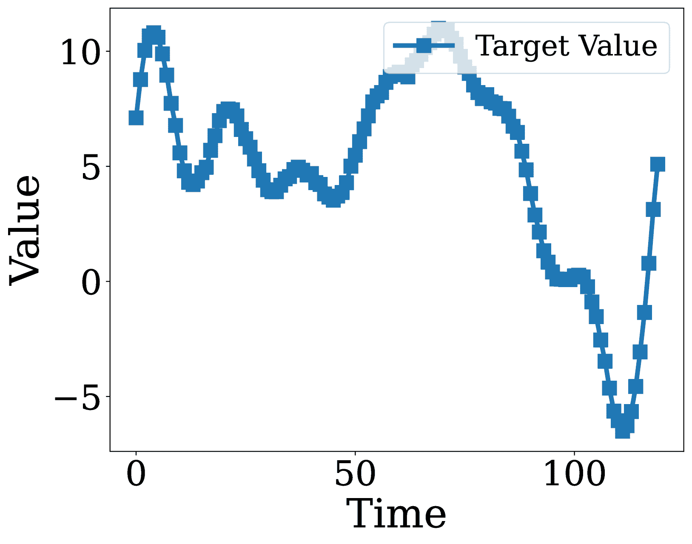

<!--yml
category: 未分类
date: 2025-01-11 12:02:56
-->

# Decoding Time Series with LLMs: A Multi-Agent Framework for Cross-Domain Annotation

> 来源：[https://arxiv.org/html/2410.17462/](https://arxiv.org/html/2410.17462/)

Minhua Lin¹, Zhengzhang Chen², Yanchi Liu², Xujiang Zhao²,
Zongyu Wu¹, Junxiang Wang², Xiang Zhang¹, Suhang Wang¹, Haifeng Chen²
¹The Pennsylvania State University ²NEC Laboratories America
{mfl5681,zongyuwu,xzz89,szw494}@psu.edu
{zchen,yanchi,xuzhao,junwang,haifeng}@nec-labs.com Work done during an internship at NEC Labs America.Corresponding author.

###### Abstract

Time series data is ubiquitous across various domains, including manufacturing, finance, and healthcare. High-quality annotations are essential for effectively understanding time series and facilitating downstream tasks; however, obtaining such annotations is challenging, particularly in mission-critical domains. In this paper, we propose TESSA, a multi-agent system designed to automatically generate both general and domain-specific annotations for time series data. TESSA introduces two agents: a general annotation agent and a domain-specific annotation agent. The general agent captures common patterns and knowledge across multiple source domains, leveraging both time-series-wise and text-wise features to generate general annotations. Meanwhile, the domain-specific agent utilizes limited annotations from the target domain to learn domain-specific terminology and generate targeted annotations. Extensive experiments on multiple synthetic and real-world datasets demonstrate that TESSA effectively generates high-quality annotations, outperforming existing methods.

Decoding Time Series with LLMs: A Multi-Agent Framework
for Cross-Domain Annotation

Minhua Lin¹^†^†thanks: Work done during an internship at NEC Labs America., Zhengzhang Chen²^†^†thanks: Corresponding author., Yanchi Liu², Xujiang Zhao², Zongyu Wu¹, Junxiang Wang², Xiang Zhang¹, Suhang Wang¹, Haifeng Chen² ¹The Pennsylvania State University ²NEC Laboratories America {mfl5681,zongyuwu,xzz89,szw494}@psu.edu {zchen,yanchi,xuzhao,junwang,haifeng}@nec-labs.com

## 1 Introduction

Time series data is prevalent in fields such as manufacturing Hsu and Liu ([2021](https://arxiv.org/html/2410.17462v1#bib.bib15)), finance Lee et al. ([2024](https://arxiv.org/html/2410.17462v1#bib.bib19)), and healthcare Cascella et al. ([2023](https://arxiv.org/html/2410.17462v1#bib.bib7)), where it captures critical temporal patterns essential for informed decision-making. However, general users frequently encounter difficulties in interpreting this data due to its inherent complexity, particularly in multivariate contexts where multiple variables interact over time. Furthermore, effective interpretation typically requires domain-specific knowledge to properly contextualize these patterns, thereby posing significant challenges for individuals without specialized expertise.

High-quality annotations are crucial for addressing these interpretive challenges. Annotations provide meaningful context or insights into the time series data, highlighting important patterns, events, or anomalies. They facilitate accurate analysis, forecasting, and decision-making, enhancing the performance of downstream tasks such as anomaly detection, trend prediction, and automated reporting. For instance, in predictive maintenance, understanding sensor data trends is vital for preventing equipment failure, while in finance, interpreting stock price movements is crucial for informed investment strategies. Despite their importance, high-quality annotations are often scarce in real-world applications. This scarcity stems primarily from the reliance on domain experts for manual annotation, which is resource-intensive, costly, and prone to inconsistencies. Moreover, the need for precise and domain-specific terminology further complicates the annotation process, as different fields require highly specialized knowledge for accurate and contextually relevant interpretation.

To alleviate the above issues, one straightforward approach is to leverage external resources to generate annotations Liu et al. ([2024a](https://arxiv.org/html/2410.17462v1#bib.bib21)). For example, Time-MMD Liu et al. ([2024a](https://arxiv.org/html/2410.17462v1#bib.bib21)) uses web searches to retrieve information as annotations, aiming to find similar patterns and descriptions from the internet. Others Jin et al. ([2024](https://arxiv.org/html/2410.17462v1#bib.bib18)); Liu et al. ([2024b](https://arxiv.org/html/2410.17462v1#bib.bib22)) directly apply large language models (LLMs) for annotation, leveraging their vast language understanding capabilities. Prototype-based methods, such as prototype networks Ni et al. ([2021](https://arxiv.org/html/2410.17462v1#bib.bib25)), have also been employed to identify representative examples for annotation. However, these methods often fall short of producing high-quality annotations. Web search-based methods may retrieve irrelevant or inconsistent information. LLMs, while powerful, tend to generate annotations that are generic, capture only basic patterns, or even hallucinate, failing to account for the complex nature of time series data. Prototype networks rely on large amounts of data to train the network and identify representative prototypes, but the scarcity of high-quality annotations limits the quality and representativeness of these prototypes, making it difficult to generalize effectively to new or unseen patterns.

To address these limitations, we propose to extract knowledge from existing annotations across multiple source domains and transfer this knowledge to target domains with limited annotations. Specifically, we aim to develop a system that can automatically interpret time series data across various fields using either common or domain-specific language. Formally, given abundant annotations from multiple source domains and limited annotations from a target domain, our goal is to leverage both time-series-wise and text-wise knowledge to generate accurate and contextually appropriate annotations for the target domain.

There are two major technical challenges in developing such a system: (i) How to extract common knowledge from source domains? (ii) How to learn domain-specific jargon from limited target-domain annotations? To tackle these challenges and overcome the limitations of existing methods, we propose TESSA, a multi-agent system designed for both general and domain-specific TimE SerieS Annotation. As illustrated in Figure [1](https://arxiv.org/html/2410.17462v1#S2.F1 "Figure 1 ‣ 2 Related Work ‣ Decoding Time Series with LLMs: A Multi-Agent Framework for Cross-Domain Annotation"), TESSA introduces two agents: a general annotation agent and a domain-specific annotation agent. The general annotation agent focuses on capturing common patterns and knowledge across various domains to generate annotations understandable by general users. To learn common knowledge from multiple domains, the general agent employs a time series-wise feature extractor and a text-wise feature extractor to extract both time-series-wise and text-wise features from time series data and domain-specific annotations from multiple source domains. To ensure important features are included in the general annotations, two feature selection methods—LLM-based and reinforcement learning-based selection—are introduced to effectively and efficiently select both the top-$k$ most important time-series-wise and text-wise features. The domain-specific agent leverages limited target-domain annotations to learn and generate annotations for specific domains using domain-specific terminologies (jargon). It incorporates a domain-specific term extractor to learn jargon from the limited target-domain annotations. Additionally, an annotation reviewer is proposed to maintain consistency between general annotations and domain-specific annotations.

Our contributions are: (i) Problem. We explore a novel problem in cross-domain multi-modal time series annotation, bridging the gap between general understanding and domain-specific interpretation; (ii) Framework. We propose a novel multi-agent system, TESSA, designed for both general and domain-specific time series annotation by leveraging both time-series-wise and text-wise knowledge from multiple domains; (iii) Datasets. We collect a real-world dataset from finance domain to leverage cross-domain knowledge, along with a synthetic dataset to evaluate TESSA. These datasets are released to support future research and development in this field. (iv) Experiments. Extensive experiments on multiple synthetic and real-world datasets demonstrate the quality of the general and domain-specific annotations generated by TESSA.

## 2 Related Work

Figure 1: Overall framework of TESSA. It consists of two main agents: a general annotation agent, which generates domain-independent annotations by selecting salient time-series and textual features, and a domain-specific annotation agent, which refines these annotations by incorporating domain-specific terminology.

Time Series Annotation. Time series annotation aims to assign labels or descriptions to specific segments, events, or patterns within a time series dataset to highlight significant features for further analysis. Traditionally, this process has relied on manual annotation Reining et al. ([2020](https://arxiv.org/html/2410.17462v1#bib.bib29)), which is often time-consuming, labor-intensive, and requires substantial domain expertise. To reduce the effort needed for creating large-scale, high-quality annotated datasets, several studies have proposed semi-automatic annotation approaches Cruz-Sandoval et al. ([2019](https://arxiv.org/html/2410.17462v1#bib.bib11)); Nino et al. ([2016](https://arxiv.org/html/2410.17462v1#bib.bib26)) that require minimal manual input or post-annotation revisions. Despite these advancements, fully automated time series annotation remains underexplored due to the challenges of capturing semantic and contextual information from the data Yordanova and Krüger ([2018](https://arxiv.org/html/2410.17462v1#bib.bib36)).

LLMs for Time Series Analysis. Recent advancements in LLMs have showcased their strong capabilities in sequential modeling and pattern recognition, opening up promising new directions for time series analysis. Several studies Xue and Salim ([2023](https://arxiv.org/html/2410.17462v1#bib.bib33)); Yu et al. ([2023](https://arxiv.org/html/2410.17462v1#bib.bib37)); Gruver et al. ([2024](https://arxiv.org/html/2410.17462v1#bib.bib14)); Jin et al. ([2024](https://arxiv.org/html/2410.17462v1#bib.bib18)); Li et al. ([2024](https://arxiv.org/html/2410.17462v1#bib.bib20)) have explored how LLMs can be effectively leveraged in this context. For instance, PromptCast Xue and Salim ([2023](https://arxiv.org/html/2410.17462v1#bib.bib33)) is a pioneering work that applies LLMs to general time series forecasting using a sentence-to-sentence approach. Yu et al. Yu et al. ([2023](https://arxiv.org/html/2410.17462v1#bib.bib37)) extend this by investigating the application of LLMs to domain-specific tasks, such as financial time series forecasting. LLMTime Gruver et al. ([2024](https://arxiv.org/html/2410.17462v1#bib.bib14)) demonstrates the efficacy of LLMs as time series learners by employing text-wise tokenization to represent time series data. Time-LLM Jin et al. ([2024](https://arxiv.org/html/2410.17462v1#bib.bib18)) reprograms time series data into textual prototypes for input into LLaMA-7B, enriched with natural language prompts that include domain expert knowledge and task-specific instructions. Additionally, Li et al. Li et al. ([2024](https://arxiv.org/html/2410.17462v1#bib.bib20)) illustrate how a frozen language model can enhance zero-shot learning in ECG time series analysis, showing the potential of LLMs to extract valuable features from complex time series data.

Cross-modality Knowledge Transfer Learning through Pre-trained Models. There has been growing interest in leveraging pre-trained models for cross-modality knowledge transfer, particularly between the language, vision, and time series domains Bao et al. ([2022](https://arxiv.org/html/2410.17462v1#bib.bib3)); Lu et al. ([2022](https://arxiv.org/html/2410.17462v1#bib.bib23)); Yang et al. ([2021](https://arxiv.org/html/2410.17462v1#bib.bib35)); Zhou et al. ([2023](https://arxiv.org/html/2410.17462v1#bib.bib40)). For instance, Bao et al. ([2022](https://arxiv.org/html/2410.17462v1#bib.bib3)) proposes a stagewise pre-training strategy that trains a language expert using frozen attention blocks pre-trained on image-only data. Similarly, Lu et al. ([2022](https://arxiv.org/html/2410.17462v1#bib.bib23)) examines the transferability of language models to other domains, while Zhou et al. ([2023](https://arxiv.org/html/2410.17462v1#bib.bib40)) applies pre-trained language and image models to time series analysis tasks. To the best of our knowledge, no previous work has specifically explored cross-modality knowledge transfer for time series annotation. Our work aims to fill this gap by investigating the application of cross-modality transfer learning in the context of automatic time series annotation.

## 3 Methodology

In this section, we define the problem and present the details of our proposed TESSA framework, which aims to generate both general and domain-specific annotations for time series data.

Cross-Domain Time Series Annotation Problem. Given several source domains $\{\mathcal{D}_{s_{1}},\mathcal{D}_{s_{2}},\ldots\}$ and a target domain $\mathcal{D}_{t}$, let $\{e^{1}_{s_{i}},e^{2}_{s_{i}},\ldots\}$ denote the domain-specific annotations from the source domain $\mathcal{D}_{s_{1}}$, and $\{e^{1}_{t},e^{2}_{t},\ldots\}$ represent the limited domain-specific annotations from the target domain $\mathcal{D}_{t}$. Suppose $\mathbf{X}=(\mathbf{x}_{1},\cdots,\mathbf{x}_{L})$ is a time series in $\mathcal{D}_{t}$, where $L$ is the number of past timestamps and $\mathbf{x}_{i}=(x_{1i},\cdots,x_{Ci})^{T}\in\mathbb{R}^{C}$ represents the data from $C$ different channels at timestamp $i$. The objective of cross-domain time series annotation is to generate the general annotation $e_{g}$ and the domain-specific annotation $e_{s}$ for $\mathbf{X}$ based on the annotations from both the source and target domains. More notations are provided in Appendix [B](https://arxiv.org/html/2410.17462v1#A2 "Appendix B Notations ‣ Decoding Time Series with LLMs: A Multi-Agent Framework for Cross-Domain Annotation").

Overview of TESSA. As illustrated in Fig. [1](https://arxiv.org/html/2410.17462v1#S2.F1 "Figure 1 ‣ 2 Related Work ‣ Decoding Time Series with LLMs: A Multi-Agent Framework for Cross-Domain Annotation"), the proposed TESSA comprises two key components: a general annotation agent and a domain-specific annotation agent. The general annotation agent is responsible for generating domain-independent annotations and consists of several modules: a time series feature extraction module to capture time-series-specific features, a domain decontextualization module to convert domain-specific text into common language, a text feature extraction module to retrieve textual features from the decontextualized text, two policy networks for selecting the top-$k$ most salient time-series and textual features, and a general annotator to produce general annotations based on the selected features. The domain-specific annotation agent refines the general annotations to generate domain-specific annotations. It includes a domain-specific term extractor to identify key terminology from a limited set of target-domain annotations and a domain-specific annotator to adjust the general annotations accordingly. An annotation reviewer further enhances the quality of the domain-specific annotations. Next, we introduce details of each component.

### 3.1 Multi-modal Feature Extraction

To address the challenge of extracting common knowledge from source domains, we introduce two feature extraction modules: a time-series feature extractor and a text-wise feature extractor, which extract features from time series data and source-domain annotations. We also propose a domain decontextualizer to enhance the extraction of common knowledge from multi-source annotations.

Time Series Feature Extraction. We develop a time series extraction toolbox $f_{t}$ to extract various features from given time series data. Formally, for each channel $c\in C$, the set of text-series features $\mathbf{F}_{t}$ is denoted as:

|  | $\mathbf{F}_{t}=\{f_{t}^{1},\cdots,f_{t}^{n_{t}}\}=\mathcal{M}_{r}(\mathbf{X}),$ |  | (1) |

where $f^{i}_{t}$ is the $i$-th extracted feature of $\mathbf{X}$, and $n_{t}$ is the number of extracted features. For multivariate time series data, inter-variable features (e.g., Pearson correlation) are also included. More details on feature extraction can be found in Appendix [C](https://arxiv.org/html/2410.17462v1#A3 "Appendix C More Details of Multi-modal Feature Extraction ‣ Decoding Time Series with LLMs: A Multi-Agent Framework for Cross-Domain Annotation").

Domain Decontextualization. In addition to time-series-wise features, textual annotations from source domains often contain valuable information (such as support or resilience in finance time series annotations) for interpreting time series data. A straightforward method to extract this knowledge is to use LLMs on domain-specific annotations, leveraging their real-world knowledge. However, in practice, many domains lack sufficient high-quality annotations, and domain-specific terminology can further hinder effective extraction.

To address these challenges and facilitate knowledge transfer from source to target domains, we introduce a domain decontextualization LLM to convert domain-specific annotations into general annotations by removing domain-specific terminology. This makes it easier to extract common knowledge across domains. Specifically, given a domain-specific annotation $e_{s}$ in domain $d_{i}$, the decontextualized annotation $e_{d}$ is obtained as:

|  | $e_{d}=\mathcal{M}_{d}(p_{de}(e_{s},d_{i})),$ |  | (2) |

where $\mathcal{M}_{d}$ is the domain decontextualization LLM.

Text Feature Extraction. After decontextualization, we use an LLM $\mathcal{M}_{l}$ to extract textual features from multiple source domains. Formally, given a set of decontextualized annotations $\{e_{d}^{i}\}_{i=1}^{n_{d}}$ and the text feature extractor $\mathcal{M}_{l}$, the extracted textual features are denoted as:

|  | $\mathbf{F}_{l}=\{f_{l}^{1},\cdots,f_{l}^{n}\}=\mathcal{M}_{l}(p_{l}(\{e_{d}^{i% }\}_{i=1}^{n_{d}})),$ |  | (3) |

where $p_{l}$ is the prompt for text feature extraction.

### 3.2 Adaptive Feature Selection

With a diverse set of features extracted from time series and text data, it becomes essential to focus on the most relevant ones to ensure the generated annotations remain concise and interpretable. Moreover, repeatedly querying LLMs with both the old and new data each time wastes computational resources and incurs additional costs, especially when using non-open-source models.

To address these issues, we propose a hybrid strategy for adaptive feature selection that combines Offline LLM-based Feature Selection with Incremental Reinforcement Learning-based Feature Selection. The incremental method builds on the offline approach, minimizing the need to re-query LLMs with both old and new data as it arrives.

Offline LLM-based Feature Selection. Leveraging LLMs’ reasoning abilities, we introduce a feature selection method using LLM-generated feature importance scores to identify the top-$k$ most important text-series-wise and text-wise features. Features mentioned more frequently—either explicitly or implicitly—in annotations are assigned higher importance scores.

Specifically, given an LLM as the feature selector $\mathcal{M}_{sel}$, we prompt $\mathcal{M}_{sel}$ with domain-decontextualized annotations $\{e_{d}^{i}\}_{i=1}^{n_{d}}$ and the extracted features $\{f_{t}^{i}\}_{i=1}^{n_{t}}$ and $\{f_{l}^{i}\}_{i=1}^{n_{l}}$ to generate numerical feature importance scores: $\mathbf{s}_{t}=[s_{1},\cdots,s_{n_{t}}]$ for time-series-wise features and $\mathbf{s}_{l}=[s_{1},\cdots,s_{n_{l}}]$ for text-wise features.

|  | $\displaystyle s_{j}=\mathcal{M}_{sel}({p}_{{score}}(f_{t}^{j},\{e_{d}^{i}\}_{i% =1}^{n_{d}})),\ \ \forall{j}\in\{1,\cdots,n_{t}\},$ |  | (4) |
|  | $\displaystyle s_{k}=\mathcal{M}_{sel}({p}_{{score}}(f_{l}^{k},\{e_{d}^{i}\}_{i% =1}^{n_{d}})),\ \ \forall{k}\in\{1,\cdots,n_{l}\},$ |  |

Here, $p_{score}$ is the prompt used to score feature importance. Higher scores, $s_{j}$ and $s_{k}\in\mathbb{R}^{+}$, indicate that the features $f_{t}^{j}$ and $f_{l}^{k}$ appear more frequently, either explicitly or implicitly, in the domain-decontextualized annotations $\{e_{d}^{i}\}_{i=1}^{n_{d}}$. To ensure that explicitly mentioned features receive higher importance scores, we instruct $\mathcal{M}_{sel}$ to assign greater weight to features that are explicitly referenced in the annotations. Further details are in Appendix [D.1](https://arxiv.org/html/2410.17462v1#A4.SS1 "D.1 Offline LLM-based Feature Selection ‣ Appendix D More Details of Adaptive Feature Selection ‣ Decoding Time Series with LLMs: A Multi-Agent Framework for Cross-Domain Annotation").

Incremental Reinforcement Learning-based Feature Selection. When new data arrives, the offline LLM-based approach requires re-querying both old and new data, which becomes burdensome due to LLMs’ limited context window. As annotations increase, re-querying all data becomes impractical and costly, leading to higher resource consumption and reduced cost-effectiveness.

To address the limitations of the offline approach, we propose an Incremental Reinforcement Learning-based Feature Selection method that is more cost-effective for dynamic environments with evolving data. Specifically, we introduce a multi-agent reinforcement learning (MARL) framework to train two policy networks, $\mathcal{F}_{t}$ and $\mathcal{F}_{l}$, to select the top-$k$ most important time-series-wise and text-wise features, respectively. These policy networks store knowledge from existing annotations and are incrementally updated as new data arrives. This reduces the need to re-query the LLM with all the data, requiring only the new data during updates. As shown in Figure [1](https://arxiv.org/html/2410.17462v1#S2.F1 "Figure 1 ‣ 2 Related Work ‣ Decoding Time Series with LLMs: A Multi-Agent Framework for Cross-Domain Annotation"), each policy network is initialized with the first three layers of a small LLM, such as GPT-2 Radford et al. ([2019](https://arxiv.org/html/2410.17462v1#bib.bib28)), which remain frozen during training. A trainable multi-head attention layer and a language model (LM) head from GPT-2 follow these layers, using the smallest version of GPT-2 with 124M parameters.

During training, only the multi-head attention layer is updated. For time-series-wise features, given the candidate features $\{f_{t}^{i}\}_{i=1}^{n_{t}}$ and their corresponding feature name tokens $\mathbf{Y}=\{y^{i}_{1},\cdots,y^{i}_{n_{t}}\}$, the policy network $\mathcal{F}_{t}$ computes action-values (Q-values) $\mathbf{q}_{z}=[q_{z,f_{t}^{1}},\cdots,q_{z,f_{t}^{n_{t}}}]$ based on the mean logits of the feature names:

|  | $\displaystyle\mathbf{q}_{s}=\mathcal{F}_{t}(\{y_{i}\}_{i=1}^{n_{t}}),$ |  | (5) |

A softmax function generates a probability distribution over the features, and the top-$k$ features are selected based on the highest probabilities.

At each timestep, the selected top-$k$ features are passed to the LLM $\mathcal{M}_{sel}$ to obtain their importance scores $s_{i},\forall i\in\{1,\cdots,k\}$. The agent receives a reward $r_{t}$ defined as:

|  | $\displaystyle r_{t}=\begin{cases}\sum_{i=1}^{k}s_{i},&s_{i}\geq\tau\\ -0.5,&\text{otherwise},\end{cases}$ |  | (6) |

where $\tau$ is a threshold to discourage selecting unimportant features. The text-wise feature policy network $\mathcal{F}_{l}$ undergoes a similar training process.

After training, the policy networks are incrementally updated with only new data, eliminating the need to re-query the LLM with both old and new data. This approach improves the scalability and efficiency of feature selection while reducing computational costs, effectively overcoming the offline approach’s limitations. By incrementally updating the policy networks, we ensure that feature selection remains scalable and cost-effective in dynamic environments with evolving data.

### 3.3 General Annotation Generation

After selecting the top-$k$ most important features from both time-series and text, a general annotator is introduced to generate general annotations by analyzing these selected features. An LLM, serving as the general annotator, interprets the given time series data based on the selected features. Formally, given time series data $\mathbf{X}=\{\mathbf{x}_{i}\}_{i=1}^{L}$ and the selected time-series-wise and text-wise features $\{f_{t}^{i}\}_{i=1}^{k_{t}}$ and $\{f_{l}^{i}\}_{i=1}^{k_{l}}$, the generation of a general annotation $e_{g}$ is represented as:

|  | $\displaystyle e_{g}=\mathcal{M}_{gen}(p_{gen}(\{\mathbf{x}_{i}\}_{i=1}^{L},\{f% _{t}^{i}\}_{i=1}^{k_{t}},\{f_{l}^{i}\}_{i=1}^{k_{l}})),$ |  | (7) |

where $p_{gen}$ is the prompt for generating general annotations. By emphasizing the signal from the selected common knowledge, the general annotations capture richer patterns that may be overlooked when directly applying LLMs.

### 3.4 Domain-specific Annotation Generation

Generating domain-specific annotations for time series is crucial as different domains rely on specialized jargon and context-specific terminology to accurately interpret and understand data. Time series data from financial markets, healthcare systems, or industrial processes can exhibit patterns, trends, and anomalies that are unique to each domain. General annotations may overlook critical nuances, whereas domain-specific annotations capture contextual relevance, improving the precision and reliability of downstream analysis or model predictions. By tailoring annotations to a domain’s specific lexicon, we can detect meaningful patterns more accurately and make informed decisions.

Domain-specific Term Extractor. To address the challenge of learning domain-specific terminology, we introduce a domain-specific term extractor. Given limited domain-specific annotations $\{e_{t}^{i}\}_{i=1}^{n_{e_{t}}}$ from the target domain, an LLM $\mathcal{M}_{ext}$ is employed to extract domain-specific terms. We prompt $\mathcal{M}_{ext}$ with the annotations $\{e_{t}^{i}\}_{i=1}^{n_{e_{t}}}$ to extract a set of domain-specific terms $\{\mathcal{J}^{i}\}_{i=1}^{n_{\mathcal{J}}}$:

|  | $\{\mathcal{J}^{i}\}_{i=1}^{n_{\mathcal{J}}}=\mathcal{M}_{ext}(p_{ext}(\{e_{t}^% {i}\}_{i=1}^{n_{e_{t}}})),$ |  | (8) |

where $n_{\mathcal{J}}$ is the number of extracted terms, and $p_{ext}$ is the prompt for domain-specific term extraction.

Domain-specific Annotator. To ensure alignment between domain-specific and general annotations, an LLM $\mathcal{M}_{spe}$, acting as a domain-specific annotator, applies the extracted terms $\{\mathcal{J}^{i}\}_{i=1}^{n_{\mathcal{J}}}$ to general annotations $e_{g}$, converting them into target-domain annotations $e_{t}$. Formally, this is represented as:

|  | $e_{t}=\mathcal{M}_{spe}(p_{spe}(e_{g},\{\mathcal{J}^{i}\}_{i=1}^{n_{\mathcal{J% }}})),$ |  | (9) |

where $p_{spe}$ is the prompt for generating domain-specific annotations.

Annotation Reviewer. To improve the quality of domain-specific annotations and ensure better alignment with general annotations, we introduce an annotation reviewer. This LLM, $\mathcal{M}_{rev}$, reviews the generated annotations and extracted terms, providing feedback $e_{f}$ to the extractor and annotator:

|  | $e_{f}=\mathcal{M}_{rev}(p_{rev}(e_{g},e_{t},\{\mathcal{J}^{i}\}_{i=1}^{n_{% \mathcal{J}}})),$ |  | (10) |

where $p_{rev}$ is the prompt for reviewing annotations. This feedback loop ensures more precise term extraction and better alignment between general and domain-specific annotations. Based on the feedback, the extractor $\mathcal{M}_{ext}$ refines the extraction process, and the annotator $\mathcal{M}_{spe}$ enhances its annotations accordingly.

## 4 Experiments

This section presents the experimental results. We first evaluate the TESSA’s annotations in downstream tasks and on a synthetic dataset, then examine domain-specific annotations, and finally assess the contribution of key TESSA components.

### 4.1 Experimental Setup

Dataset. To evaluate the effectiveness of TESSA, five real-world datasets from distinct domains are considered: Stock, Health, Energy, Environment, and Social Good. Specifically, the stock dataset includes 1,935 US stocks with the recent 6-year data, collected by ourselves. The other four datasets come from the public benchmark Time-MMD Liu et al. ([2024a](https://arxiv.org/html/2410.17462v1#bib.bib21)). In this paper, the Stock and Health datasets serve as the source domains, while the Energy, Environment, and Social Good datasets are treated as the target domains. Additionally, we generate a synthetic dataset containing both time series and ground-truth annotations to directly assess the quality of general annotations. More details on these datasets can be found in Appendix [E.1](https://arxiv.org/html/2410.17462v1#A5.SS1 "E.1 Dataset Statistics ‣ Appendix E Experimental Settings ‣ Decoding Time Series with LLMs: A Multi-Agent Framework for Cross-Domain Annotation"). The rest four datasets are from a public benchmark Time-MMD. Additionally, we create a synthetic dataset with both time series and ground-truth annotations to directly evaluate the quality of general annotations. More details of these datasets are in Appendix [E.1](https://arxiv.org/html/2410.17462v1#A5.SS1 "E.1 Dataset Statistics ‣ Appendix E Experimental Settings ‣ Decoding Time Series with LLMs: A Multi-Agent Framework for Cross-Domain Annotation").

LLMs. Our experiments utilize one closed-source model, GPT-4o Achiam et al. ([2023](https://arxiv.org/html/2410.17462v1#bib.bib1)) and two open-source models, LLaMA3.1-8B Dubey et al. ([2024](https://arxiv.org/html/2410.17462v1#bib.bib12)) and Qwen2-7B Yang et al. ([2024](https://arxiv.org/html/2410.17462v1#bib.bib34)).

### 4.2 Evaluating General Annotations in Downstream Tasks

In this subsection, to evaluate the quality of the general annotations, we apply the generated annotations to the multi-modal downstream tasks (i.e., time series forecasting and imputation) by following the experimental setup in Time-MMD Liu et al. ([2024a](https://arxiv.org/html/2410.17462v1#bib.bib21)). The implementation details are provided in Appendix  [F.1](https://arxiv.org/html/2410.17462v1#A6.SS1 "F.1 Implementation Details ‣ Appendix F Additional Results for General Annotation Evaluation in Downstream Tasks ‣ Decoding Time Series with LLMs: A Multi-Agent Framework for Cross-Domain Annotation").

Baselines. To the best of our knowledge, TESSA is the first work to study cross-domain multi-modal time series annotation. To demonstrate its effectiveness, we compare it with several representative methods, including No-Text, Time-MMD Liu et al. ([2024a](https://arxiv.org/html/2410.17462v1#bib.bib21)), and DirectLLM as baselines. More details on these methods are in Appendix [E.2](https://arxiv.org/html/2410.17462v1#A5.SS2 "E.2 Baseline Methods ‣ Appendix E Experimental Settings ‣ Decoding Time Series with LLMs: A Multi-Agent Framework for Cross-Domain Annotation").

Evaluation Metrics. For the time series forecasting task, we use MSE (Mean Squared Error) and MAE (Mean Absolute Error) as evaluation metrics, where lower values for both MSE and MAE mean better annotations.

Experimental Results. Table [1](https://arxiv.org/html/2410.17462v1#S4.T1 "Table 1 ‣ 4.2 Evaluating General Annotations in Downstream Tasks ‣ 4 Experiments ‣ Decoding Time Series with LLMs: A Multi-Agent Framework for Cross-Domain Annotation") presents the comparison results for the time series forecasting task, where Informer Zhou et al. ([2021](https://arxiv.org/html/2410.17462v1#bib.bib39)) is the forecasting model and GPT-4o Achiam et al. ([2023](https://arxiv.org/html/2410.17462v1#bib.bib1)) serves as the LLM backbone. Additional forecasting results using different LLM backbones are available in Appendix [F.2](https://arxiv.org/html/2410.17462v1#A6.SS2 "F.2 Evaluation in Time Series Forecasting Tasks ‣ Appendix F Additional Results for General Annotation Evaluation in Downstream Tasks ‣ Decoding Time Series with LLMs: A Multi-Agent Framework for Cross-Domain Annotation"). The following observations can be made: (1) No-Text shows the worst performance across all datasets, validating the need for annotations to improve performance in downstream tasks. This suggests that better downstream task performance indicates higher-quality annotations. (2) TESSA achieves the best performance among all compared methods, demonstrating its effectiveness in generating high-quality general annotations. Additional results of time series imputation tasks, can be found in Appendix [F.3](https://arxiv.org/html/2410.17462v1#A6.SS3 "F.3 Evaluation in Time Series Imputation Tasks ‣ Appendix F Additional Results for General Annotation Evaluation in Downstream Tasks ‣ Decoding Time Series with LLMs: A Multi-Agent Framework for Cross-Domain Annotation").

Table 1: Forecasting results with GPT-4o as the LLM backbone. NT, TM, and DL refer to No-Text, Time-MMD, and DirectLLM, respectively. MSE is shown in the top half and MAE in the bottom half.

| Domain | NT | TM | DL | TESSA |
| --- | --- | --- | --- | --- |
| Environment | 1.2542 | 0.8483 | 0.7714 | 0.4629 |
| Energy | 2.0117 | 0.2172 | 0.0575 | 0.0482 |
| Social Good | 2.1457 | 1.6072 | 0.4639 | 0.1935 |
| Environment | 0.7387 | 0.6865 | 0.6604 | 0.4424 |
| Energy | 1.1663 | 0.2139 | 0.0055 | 0.0040 |
| Social Good | 1.1205 | 0.9731 | 0.3801 | 0.0825 |

### 4.3 Evaluating General Annotations in Synthetic Datasets

We construct a synthetic dataset with time series data and ground-truth annotations to validate TESSA’s performance. Implementation details are provided in Appendix [G.1](https://arxiv.org/html/2410.17462v1#A7.SS1 "G.1 Implementation Details ‣ Appendix G Additional Details of General Annotation Evaluation in Synthetic Datasets ‣ Decoding Time Series with LLMs: A Multi-Agent Framework for Cross-Domain Annotation").

Evaluation Metrics. We apply the LLM-as-a-judge approach Bubeck et al. ([2023](https://arxiv.org/html/2410.17462v1#bib.bib5)); Dubois et al. ([2024](https://arxiv.org/html/2410.17462v1#bib.bib13)), evaluating two metrics: Clarity and Comprehensiveness. Two distinct LLMs score the generated annotations on a scale of $1$ to $5$ for each metric, with an overall score calculated as the mean of the two metrics.

Experimental Results. We compare TESSA and DirectLLM in Table [2](https://arxiv.org/html/2410.17462v1#S4.T2 "Table 2 ‣ 4.3 Evaluating General Annotations in Synthetic Datasets ‣ 4 Experiments ‣ Decoding Time Series with LLMs: A Multi-Agent Framework for Cross-Domain Annotation"). The “Mean” represents the average score of generated annotations for each method, and P(T>D) is the percentage of TESSA’s annotations that receive higher scores than DirectLLM’s. The results show that TESSA outperforms DirectLLM across both metrics, with average scores of $3.90$ in Clarity and $4.44$ in Comprehensiveness, compared to DirectLLM’s $3.79$ and $1.55$. Additionally, $82.71\%$ of TESSA’s annotations receive higher scores, indicating that TESSA produces more essential and easily understandable features, further demonstrating its effectiveness.

Table 2: General annotation results on the synthetic dataset with GPT-4o as the LLM backbone.

| Metric | Method | Mean | P(T>D) (%) |
| --- | --- | --- | --- |
| Clarity | TESSA | 3.90 | 69.76 |
| DirectLLM | 3.79 |
| Compre. | TESSA | 4.44 | 87.10 |
| DirectLLM | 1.55 |
| Overall | TESSA | 4.14 | 82.71 |
| DirectLLM | 2.84 |

### 4.4 Domain-specific Annotation Evaluation

In this subsection, we evaluate the quality of domain specific annotations. Similar to Section [4.3](https://arxiv.org/html/2410.17462v1#S4.SS3 "4.3 Evaluating General Annotations in Synthetic Datasets ‣ 4 Experiments ‣ Decoding Time Series with LLMs: A Multi-Agent Framework for Cross-Domain Annotation"), we adopt a LLM-as-a-Judger strategy to evaluate the performance of domain-specific annotation agent from three perspectives: Clarity, Comprehensiveness, and Domain-relevance. The overall score is the average of these three metrics. Further details on these metrics are provided in Appendix [H.1](https://arxiv.org/html/2410.17462v1#A8.SS1 "H.1 Evaluation Metrics ‣ Appendix H Additional Results of Domain-specific Annotation Evaluation ‣ Decoding Time Series with LLMs: A Multi-Agent Framework for Cross-Domain Annotation").

Experimental Results. We present the comparison results of TESSA and DirectLLM on the Environment dataset in Table [3](https://arxiv.org/html/2410.17462v1#S4.T3 "Table 3 ‣ 4.4 Domain-specific Annotation Evaluation ‣ 4 Experiments ‣ Decoding Time Series with LLMs: A Multi-Agent Framework for Cross-Domain Annotation"), with GPT-4o as the LLM backbone. The key observations are: (1) TESSA significantly outperforms DirectLLM across all metrics, achieving an overall score of $4.64$ compared to DirectLLM’s $3.41$. Notably, $98.51\%$ of TESSA’s annotations receive higher scores, demonstrating its effectiveness in generating high-quality domain-specific annotations. (2) TESSA scores $4.74$ in Clarity and $4.38$ in Comprehensiveness, while DirectLLM scores $3.32$ and $3.01$, respectively. This shows that TESSA ’s annotations are clearer, more concise, and cover more important features. (3) TESSA also excels in domain relevance, with $94.72\%$ of its annotations scoring higher, achieving an average of $4.30$, significantly outperforming DirectLLM’s $3.41$. This indicates that TESSA produces highly accurate annotations that effectively use domain-specific terminology and maintain strong contextual relevance. Further results on other datasets are available in Appendix [H.2](https://arxiv.org/html/2410.17462v1#A8.SS2 "H.2 Additional Results on Other LLM Backbones ‣ Appendix H Additional Results of Domain-specific Annotation Evaluation ‣ Decoding Time Series with LLMs: A Multi-Agent Framework for Cross-Domain Annotation").

Table 3: Domain-specific annotation results on the Environment dataset with GPT-4o as the LLM backbone.

| Metric | Method | Mean | P(T>D) (%) |
| --- | --- | --- | --- |
| Clarity | TESSA | 4.74 | 99.81 |
| DirectLLM | 3.32 |
| Compre. | TESSA | 4.38 | 97.04 |
| DirectLLM | 3.01 |
| Dom. Rel. | TESSA | 4.30 | 94.72 |
| DirectLLM | 3.57 |
| Overall | TESSA | 4.64 | 98.51 |
| DirectLLM | 3.41 |

### 4.5 In-depth Dissection of TESSA

Adaptive Feature Selections. We compare our two feature selection methods: offline LLM-based selection and incremental RL-based selection. To assess their effectiveness in selecting the top-$k$ most important features, we evaluate the quality of the generated general and domain-specific annotations, following the procedures in Sections [4.2](https://arxiv.org/html/2410.17462v1#S4.SS2 "4.2 Evaluating General Annotations in Downstream Tasks ‣ 4 Experiments ‣ Decoding Time Series with LLMs: A Multi-Agent Framework for Cross-Domain Annotation") and [4.4](https://arxiv.org/html/2410.17462v1#S4.SS4 "4.4 Domain-specific Annotation Evaluation ‣ 4 Experiments ‣ Decoding Time Series with LLMs: A Multi-Agent Framework for Cross-Domain Annotation"), respectively. Environment is set as the target domain, with results shown in Fig. [2](https://arxiv.org/html/2410.17462v1#S4.F2 "Figure 2 ‣ 4.5 In-depth Dissection of TESSA ‣ 4 Experiments ‣ Decoding Time Series with LLMs: A Multi-Agent Framework for Cross-Domain Annotation"). The results indicate that TESSA performs comparably in both general and domain-specific annotation generation using either selection method. Specifically, as shown in Fig. [2](https://arxiv.org/html/2410.17462v1#S4.F2 "Figure 2 ‣ 4.5 In-depth Dissection of TESSA ‣ 4 Experiments ‣ Decoding Time Series with LLMs: A Multi-Agent Framework for Cross-Domain Annotation")(a), both approaches achieve MSE and MAE around $0.46$ and $0.44$ for general annotations. Similarly, in Fig. [2](https://arxiv.org/html/2410.17462v1#S4.F2 "Figure 2 ‣ 4.5 In-depth Dissection of TESSA ‣ 4 Experiments ‣ Decoding Time Series with LLMs: A Multi-Agent Framework for Cross-Domain Annotation")(b), both methods score consistently high across all domain-specific metrics, demonstrating their effectiveness in selecting important features. However, incremental RL-based selection proves more cost-effective by reducing redundant re-querying of previously used data.

(a) General

(b) Specific

Figure 2: Comparison of offline vs. incremental feature selection. GPT-4o is the LLM backbone, with Environment as the target domain. (a) General annotation results; (b) Domain-specific annotation results.

Ablation Studies. We perform ablation studies to assess the importance of domain decontextualization and adaptive feature selection in TESSA. To evaluate domain decontextualization, we introduce a variant, TESSA/D, which bypasses the domain decontextualization LLM and directly extracts text-wise features from domain-specific annotations. Table [11](https://arxiv.org/html/2410.17462v1#A9.T11 "Table 11 ‣ I.2 Qualitative Examples ‣ Appendix I Additional Details of Ablation Studies ‣ Decoding Time Series with LLMs: A Multi-Agent Framework for Cross-Domain Annotation") shows that TESSA/D captures irrelevant features, such as higher prices over time and fun, which are unrelated to time series analysis. This supports our claim that domain-specific terminology can hinder the accurate extraction of time-series-relevant features.

To prove the importance of adaptive feature selection in TESSA, we remove the adaptive feature selection module to create a variant, TESSA/F. We apply an LLM-as-a-judger to compare the quality of the generated annotations between TESSA and its variants. The evaluation metrics are introduced in Appendix [I.1](https://arxiv.org/html/2410.17462v1#A9.SS1 "I.1 Evaluation Metric ‣ Appendix I Additional Details of Ablation Studies ‣ Decoding Time Series with LLMs: A Multi-Agent Framework for Cross-Domain Annotation"). We choose Social Good as the target dataset. The comparison results are presented in Table [4](https://arxiv.org/html/2410.17462v1#S4.T4 "Table 4 ‣ 4.5 In-depth Dissection of TESSA ‣ 4 Experiments ‣ Decoding Time Series with LLMs: A Multi-Agent Framework for Cross-Domain Annotation"), with qualitative examples provided in Appendix [I.2](https://arxiv.org/html/2410.17462v1#A9.SS2 "I.2 Qualitative Examples ‣ Appendix I Additional Details of Ablation Studies ‣ Decoding Time Series with LLMs: A Multi-Agent Framework for Cross-Domain Annotation"). We observe that: TESSA consistently outperforms TESSA/F. Specifically, TESSA achieves a clarity score of $4.41$, compared to $3.66$ for TESSA/F. This demonstrates the necessity of adaptive feature selection. Furthermore, according to Table [13](https://arxiv.org/html/2410.17462v1#A9.T13 "Table 13 ‣ I.2 Qualitative Examples ‣ Appendix I Additional Details of Ablation Studies ‣ Decoding Time Series with LLMs: A Multi-Agent Framework for Cross-Domain Annotation") in Appendix [I.2](https://arxiv.org/html/2410.17462v1#A9.SS2 "I.2 Qualitative Examples ‣ Appendix I Additional Details of Ablation Studies ‣ Decoding Time Series with LLMs: A Multi-Agent Framework for Cross-Domain Annotation"), the annotations generated by TESSA/F tend to include many features without proper analysis. This shows that involving too many features can hinder the clarity of the annotations, further emphasizing the importance of adaptive feature selection in improving annotation quality.

Table 4: Ablation studies in the SocialGood dataset. GPT-4o is the LLM backbone.

| Metric | Method | Mean | P(T>D) (%) |
| --- | --- | --- | --- |
| Clarity | TESSA | 4.41 | 83.3 |
| TESSA/F | 3.66 |

### 4.6 Case Study of TESSA

We conduct a case study to further validate the effectiveness of TESSA. A representative time series from the Social Good domain (Fig. [3(b)](https://arxiv.org/html/2410.17462v1#A10.F3.sf2 "In Figure 3 ‣ Appendix J Additional Details of Case Studies ‣ Decoding Time Series with LLMs: A Multi-Agent Framework for Cross-Domain Annotation")(b)) is selected, and both TESSA and DirectLLM are applied to generate general and domain-specific annotations, summarized in Table [14](https://arxiv.org/html/2410.17462v1#A10.T14 "Table 14 ‣ Appendix J Additional Details of Case Studies ‣ Decoding Time Series with LLMs: A Multi-Agent Framework for Cross-Domain Annotation"). To assess the quality of the annotations, we use an LLM-as-a-judger to evaluate the domain-specific annotations from both methods, with results shown in Table [12](https://arxiv.org/html/2410.17462v1#A9.T12 "Table 12 ‣ I.2 Qualitative Examples ‣ Appendix I Additional Details of Ablation Studies ‣ Decoding Time Series with LLMs: A Multi-Agent Framework for Cross-Domain Annotation"). Our findings indicate that: (1) TESSA’s general annotations capture more meaningful patterns, aiding user understanding and downstream tasks, whereas DirectLLM only highlights basic trends; and (2) TESSA’s domain-specific annotations consistently outperform DirectLLM across all metrics, offering clearer, more comprehensive, and contextually relevant insights. More case studies of multivariate time series data are provided in Appendix [J](https://arxiv.org/html/2410.17462v1#A10 "Appendix J Additional Details of Case Studies ‣ Decoding Time Series with LLMs: A Multi-Agent Framework for Cross-Domain Annotation").

## 5 Conclusion

In this work, we introduce TESSA, a multi-agent system for automatic general and domain-specific time series annotation. TESSA incorporates two agents, a general annotation agent and a domain-specific annotation agent, to extract and leverage both time-series-wise and text-wise knowledge from multiple domains for annotations. TESSA overcomes the limitations of directly applying LLMs, which often capture only basic patterns and may hallucinate, by effectively identifying and emphasizing significant patterns in time series data. Our experiments on synthetic and real-world datasets from diverse domains demonstrate the effectiveness of TESSA in generating high-quality general and domain-specific annotations.

## References

*   Achiam et al. (2023) Josh Achiam, Steven Adler, Sandhini Agarwal, Lama Ahmad, Ilge Akkaya, Florencia Leoni Aleman, Diogo Almeida, Janko Altenschmidt, Sam Altman, Shyamal Anadkat, et al. 2023. Gpt-4 technical report. *arXiv preprint arXiv:2303.08774*.
*   Almeida (1994) Luis B Almeida. 1994. The fractional fourier transform and time-frequency representations. *IEEE Transactions on signal processing*, 42(11):3084–3091.
*   Bao et al. (2022) Hangbo Bao, Wenhui Wang, Li Dong, Qiang Liu, Owais Khan Mohammed, Kriti Aggarwal, Subhojit Som, Songhao Piao, and Furu Wei. 2022. [Vlmo: Unified vision-language pre-training with mixture-of-modality-experts](http://papers.nips.cc/paper_files/paper/2022/hash/d46662aa53e78a62afd980a29e0c37ed-Abstract-Conference.html). In *Proceedings of the Annual Conference on Neural Information Processing Systems*, pages 32897–32912.
*   Ben-David et al. (2022) Eyal Ben-David, Nadav Oved, and Roi Reichart. 2022. Pada: Example-based prompt learning for on-the-fly adaptation to unseen domains. *Transactions of the Association for Computational Linguistics*, 10:414–433.
*   Bubeck et al. (2023) Sébastien Bubeck, Varun Chandrasekaran, Ronen Eldan, Johannes Gehrke, Eric Horvitz, Ece Kamar, Peter Lee, Yin Tat Lee, Yuanzhi Li, Scott Lundberg, et al. 2023. Sparks of artificial general intelligence: Early experiments with gpt-4. *arXiv preprint arXiv:2303.12712*.
*   Cao et al. (2024) Defu Cao, Furong Jia, Sercan O Arik, Tomas Pfister, Yixiang Zheng, Wen Ye, and Yan Liu. 2024. Tempo: Prompt-based generative pre-trained transformer for time series forecasting. In *ICLR*.
*   Cascella et al. (2023) Marco Cascella, Jonathan Montomoli, Valentina Bellini, and Elena Bignami. 2023. Evaluating the feasibility of chatgpt in healthcare: an analysis of multiple clinical and research scenarios. *Journal of medical systems*, 47(1):33.
*   Chang et al. (2023) Ching Chang, Wei-Yao Wang, Wen-Chih Peng, and Tien-Fu Chen. 2023. Llm4ts: Aligning pre-trained llms as data-efficient time-series forecasters. *arXiv preprint arXiv:2308.08469*.
*   Chowdhery et al. (2023) Aakanksha Chowdhery, Sharan Narang, Jacob Devlin, Maarten Bosma, Gaurav Mishra, Adam Roberts, Paul Barham, Hyung Won Chung, Charles Sutton, Sebastian Gehrmann, et al. 2023. Palm: Scaling language modeling with pathways. *Journal of Machine Learning Research*, 24(240):1–113.
*   Cleveland et al. (1990) Robert B Cleveland, William S Cleveland, Jean E McRae, Irma Terpenning, et al. 1990. Stl: A seasonal-trend decomposition. *J. off. Stat*, 6(1):3–73.
*   Cruz-Sandoval et al. (2019) Dagoberto Cruz-Sandoval, Jessica Beltran-Marquez, Matias Garcia-Constantino, Luis A. Gonzalez-Jasso, Jesus Favela, Irvin Hussein Lopez-Nava, Ian Cleland, Andrew Ennis, Netzahualcoyotl Hernandez-Cruz, Joseph Rafferty, Jonathan Synnott, and Chris Nugent. 2019. Semi-automated data labeling for activity recognition in pervasive healthcare. *Sensors*.
*   Dubey et al. (2024) Abhimanyu Dubey, Abhinav Jauhri, Abhinav Pandey, Abhishek Kadian, Ahmad Al-Dahle, Aiesha Letman, Akhil Mathur, Alan Schelten, Amy Yang, Angela Fan, et al. 2024. The llama 3 herd of models. *arXiv preprint arXiv:2407.21783*.
*   Dubois et al. (2024) Yann Dubois, Chen Xuechen Li, Rohan Taori, Tianyi Zhang, Ishaan Gulrajani, Jimmy Ba, Carlos Guestrin, Percy S Liang, and Tatsunori B Hashimoto. 2024. Alpacafarm: A simulation framework for methods that learn from human feedback. *Advances in Neural Information Processing Systems*, 36.
*   Gruver et al. (2024) Nate Gruver, Marc Finzi, Shikai Qiu, and Andrew G Wilson. 2024. Large language models are zero-shot time series forecasters. *Advances in Neural Information Processing Systems*, 36.
*   Hsu and Liu (2021) Chia-Yu Hsu and Wei-Chen Liu. 2021. Multiple time-series convolutional neural network for fault detection and diagnosis and empirical study in semiconductor manufacturing. *Journal of Intelligent Manufacturing*, 32(3):823–836.
*   Izacard et al. (2023) Gautier Izacard, Patrick Lewis, Maria Lomeli, Lucas Hosseini, Fabio Petroni, Timo Schick, Jane Dwivedi-Yu, Armand Joulin, Sebastian Riedel, and Edouard Grave. 2023. Atlas: Few-shot learning with retrieval augmented language models. *Journal of Machine Learning Research*, 24(251):1–43.
*   Jiang et al. (2024) Yushan Jiang, Zijie Pan, Xikun Zhang, Sahil Garg, Anderson Schneider, Yuriy Nevmyvaka, and Dongjin Song. 2024. Empowering time series analysis with large language models: A survey. *arXiv preprint arXiv:2402.03182*.
*   Jin et al. (2024) Ming Jin, Shiyu Wang, Lintao Ma, Zhixuan Chu, James Y Zhang, Xiaoming Shi, Pin-Yu Chen, Yuxuan Liang, Yuan-Fang Li, Shirui Pan, and Qingsong Wen. 2024. Time-LLM: Time series forecasting by reprogramming large language models. In *ICLR*.
*   Lee et al. (2024) Jean Lee, Nicholas Stevens, Soyeon Caren Han, and Minseok Song. 2024. A survey of large language models in finance (finllms). *arXiv preprint arXiv:2402.02315*.
*   Li et al. (2024) Jun Li, Che Liu, Sibo Cheng, Rossella Arcucci, and Shenda Hong. 2024. Frozen language model helps ecg zero-shot learning. In *Medical Imaging with Deep Learning*, pages 402–415\. PMLR.
*   Liu et al. (2024a) Haoxin Liu, Shangqing Xu, Zhiyuan Zhao, Lingkai Kong, Harshavardhan Kamarthi, Aditya B Sasanur, Megha Sharma, Jiaming Cui, Qingsong Wen, Chao Zhang, et al. 2024a. Time-mmd: A new multi-domain multimodal dataset for time series analysis. *arXiv preprint arXiv:2406.08627*.
*   Liu et al. (2024b) Xu Liu, Junfeng Hu, Yuan Li, Shizhe Diao, Yuxuan Liang, Bryan Hooi, and Roger Zimmermann. 2024b. Unitime: A language-empowered unified model for cross-domain time series forecasting. In *Proceedings of the ACM on Web Conference 2024*, pages 4095–4106.
*   Lu et al. (2022) Kevin Lu, Aditya Grover, Pieter Abbeel, and Igor Mordatch. 2022. Frozen pretrained transformers as universal computation engines. In *Proceedings of the AAAI conference on artificial intelligence*, volume 36, pages 7628–7636.
*   Malik et al. (2023) Bhavitvya Malik, Abhinav Ramesh Kashyap, Min-Yen Kan, and Soujanya Poria. 2023. Udapter–efficient domain adaptation using adapters. *arXiv preprint arXiv:2302.03194*.
*   Ni et al. (2021) Jingchao Ni, Zhengzhang Chen, Wei Cheng, Bo Zong, Dongjin Song, Yanchi Liu, Xuchao Zhang, and Haifeng Chen. 2021. Interpreting convolutional sequence model by learning local prototypes with adaptation regularization. In *Proceedings of the 30th ACM International Conference on Information & Knowledge Management*, pages 1366–1375.
*   Nino et al. (2016) Jorge Nino, Andrés Frias-Velazquez, Nyan Bo Bo, Maarten Slembrouck, Junzhi Guan, Glen Debard, Bart Vanrumste, Tinne Tuytelaars, and Wilfried Philips. 2016. Scalable semi-automatic annotation for multi-camera person tracking. *IEEE transactions on image processing : a publication of the IEEE Signal Processing Society*.
*   Pfeiffer et al. (2020) Jonas Pfeiffer, Aishwarya Kamath, Andreas Rücklé, Kyunghyun Cho, and Iryna Gurevych. 2020. Adapterfusion: Non-destructive task composition for transfer learning. *arXiv preprint arXiv:2005.00247*.
*   Radford et al. (2019) Alec Radford, Jeffrey Wu, Rewon Child, David Luan, Dario Amodei, Ilya Sutskever, et al. 2019. Language models are unsupervised multitask learners. *OpenAI blog*, 1(8):9.
*   Reining et al. (2020) Christopher Reining, Fernando Moya Rueda, Friedrich Niemann, Gernot A. Fink, and Michael ten Hompel. 2020. Annotation performance for multi-channel time series har dataset in logistics. In *2020 IEEE International Conference on Pervasive Computing and Communications Workshops (PerCom Workshops)*.
*   Sun et al. (2024) Chenxi Sun, Hongyan Li, Yaliang Li, and Shenda Hong. 2024. Test: Text prototype aligned embedding to activate llm’s ability for time series. In *ICLR*.
*   Wu et al. (2023) Haixu Wu, Tengge Hu, Yong Liu, Hang Zhou, Jianmin Wang, and Mingsheng Long. 2023. Timesnet: Temporal 2d-variation modeling for general time series analysis. In *International Conference on Learning Representations*.
*   Xu et al. (2024) Junjie Xu, Zongyu Wu, Minhua Lin, Xiang Zhang, and Suhang Wang. 2024. Llm and gnn are complementary: Distilling llm for multimodal graph learning. *arXiv preprint arXiv:2406.01032*.
*   Xue and Salim (2023) Hao Xue and Flora D Salim. 2023. Promptcast: A new prompt-based learning paradigm for time series forecasting. *IEEE Transactions on Knowledge and Data Engineering*.
*   Yang et al. (2024) An Yang, Baosong Yang, Binyuan Hui, Bo Zheng, Bowen Yu, Chang Zhou, Chengpeng Li, Chengyuan Li, Dayiheng Liu, Fei Huang, et al. 2024. Qwen2 technical report. *arXiv preprint arXiv:2407.10671*.
*   Yang et al. (2021) Chao-Han Huck Yang, Yun-Yun Tsai, and Pin-Yu Chen. 2021. Voice2series: Reprogramming acoustic models for time series classification. In *International conference on machine learning*, pages 11808–11819\. PMLR.
*   Yordanova and Krüger (2018) Kristina Yordanova and Frank Krüger. 2018. Creating and exploring semantic annotation for behaviour analysis. *Sensors*.
*   Yu et al. (2023) Xinli Yu, Zheng Chen, Yuan Ling, Shujing Dong, Zongyi Liu, and Yanbin Lu. 2023. Temporal data meets llm–explainable financial time series forecasting. *arXiv preprint arXiv:2306.11025*.
*   Zhang et al. (2023) Zhuosheng Zhang, Aston Zhang, Mu Li, and Alex Smola. 2023. Automatic chain of thought prompting in large language models. In *ICLR*.
*   Zhou et al. (2021) Haoyi Zhou, Shanghang Zhang, Jieqi Peng, Shuai Zhang, Jianxin Li, Hui Xiong, and Wancai Zhang. 2021. Informer: Beyond efficient transformer for long sequence time-series forecasting. In *Proceedings of the AAAI conference on artificial intelligence*.
*   Zhou et al. (2023) Tian Zhou, Peisong Niu, Liang Sun, Rong Jin, et al. 2023. One fits all: Power general time series analysis by pretrained lm. *Advances in neural information processing systems*, 36:43322–43355.

## Appendix A More Related Works

LLMs for Time Series Analysis. The rapid advancement of LLMs in natural language processing has unveiled unprecedented capabilities in sequential modeling and pattern recognition, which can be leveraged for time series analysis. Three primary approaches are commonly adopted Jiang et al. ([2024](https://arxiv.org/html/2410.17462v1#bib.bib17)): direct querying of LLMs Xue and Salim ([2023](https://arxiv.org/html/2410.17462v1#bib.bib33)); Yu et al. ([2023](https://arxiv.org/html/2410.17462v1#bib.bib37)); Gruver et al. ([2024](https://arxiv.org/html/2410.17462v1#bib.bib14)), fine-tuning LLMs with task-specific modifications Chang et al. ([2023](https://arxiv.org/html/2410.17462v1#bib.bib8)); Cao et al. ([2024](https://arxiv.org/html/2410.17462v1#bib.bib6)); Jin et al. ([2024](https://arxiv.org/html/2410.17462v1#bib.bib18)); Sun et al. ([2024](https://arxiv.org/html/2410.17462v1#bib.bib30)), and incorporating LLMs into time series models to enhance feature extraction Li et al. ([2024](https://arxiv.org/html/2410.17462v1#bib.bib20)).

Direct querying involves using LLMs to generate predictions or identify patterns from the data without modifying the underlying architecture. For example, PromptCast Xue and Salim ([2023](https://arxiv.org/html/2410.17462v1#bib.bib33)) applies LLMs to time series forecasting through a sentence-to-sentence paradigm. [Yu et al.](https://arxiv.org/html/2410.17462v1#bib.bib37) explore the use of LLMs for domain-specific tasks like financial time series forecasting Yu et al. ([2023](https://arxiv.org/html/2410.17462v1#bib.bib37)), while LLMTime Gruver et al. ([2024](https://arxiv.org/html/2410.17462v1#bib.bib14)) demonstrates how LLMs can function as effective learners by tokenizing time series data in a text-like format.

Fine-tuning LLMs enables them to better capture the intricacies of time series data by adapting them to specific datasets or tasks. For instance, LLM4TS Chang et al. ([2023](https://arxiv.org/html/2410.17462v1#bib.bib8)) shows that fine-tuning pre-trained models can enhance forecasting performance. Additionally, TEMPO Cao et al. ([2024](https://arxiv.org/html/2410.17462v1#bib.bib6)) and TEST Sun et al. ([2024](https://arxiv.org/html/2410.17462v1#bib.bib30)) introduce architectures tailored for time series prediction, further demonstrating the power of specialized designs.

Lastly, LLMs can also act as feature enhancers within traditional time series models, enriching data representations and boosting performance. For example, Li et al. ([2024](https://arxiv.org/html/2410.17462v1#bib.bib20)) illustrates how a frozen LLM can augment zero-shot learning for ECG time series analysis, highlighting the potential of LLMs to provide valuable features for complex datasets.

Domain Specialization of LLMs. Domain specialization of LLMs refers to the process of adapting broadly trained models to achieve optimal performance within a specific domain. This is generally categorized into three approaches: prompt crafting Ben-David et al. ([2022](https://arxiv.org/html/2410.17462v1#bib.bib4)); Zhang et al. ([2023](https://arxiv.org/html/2410.17462v1#bib.bib38)); Xu et al. ([2024](https://arxiv.org/html/2410.17462v1#bib.bib32)), external augmentation Izacard et al. ([2023](https://arxiv.org/html/2410.17462v1#bib.bib16)), and model fine-tuning Malik et al. ([2023](https://arxiv.org/html/2410.17462v1#bib.bib24)); Pfeiffer et al. ([2020](https://arxiv.org/html/2410.17462v1#bib.bib27)). One of the earliest efforts in this area is PADA Ben-David et al. ([2022](https://arxiv.org/html/2410.17462v1#bib.bib4)), which enhances LLMs for unseen domains by generating domain-specific features from test queries and using them as prompts for task prediction. Auto-CoT Zhang et al. ([2023](https://arxiv.org/html/2410.17462v1#bib.bib38)) advances domain specialization by prompting LLMs with the phrase “Let’s think step by step,” helping guide the models in generating reasoning chains. Additionally, Izacard et al. ([2023](https://arxiv.org/html/2410.17462v1#bib.bib16)) propose integrating a relatively lightweight LLM with an external knowledge base, achieving performance comparable to much larger models like PaLM Chowdhery et al. ([2023](https://arxiv.org/html/2410.17462v1#bib.bib9)). These studies highlight the flexibility of LLMs in adapting to specific domains through various strategies for domain adaptation.

## Appendix B Notations

Table [5](https://arxiv.org/html/2410.17462v1#A2.T5 "Table 5 ‣ Appendix B Notations ‣ Decoding Time Series with LLMs: A Multi-Agent Framework for Cross-Domain Annotation") presents all the notations we used in this paper.

Table 5: Notation Table

| Symbol | Description |
| --- | --- |
| $\mathbf{x}$ | Input time series data |
| $e_{s}$ | Domain-specific annotation from source domains |
| $e_{t}$ | Domain-specific annotation from target domain |
| $e_{d}$ | Domain-decontextualized annotation |
| $e_{g}$ | General annotation |
| $f_{t}$ | Time-series-wise feature |
| $f_{l}$ | Text-wise feature |
| $\mathcal{J}$ | Domain-specific term (jargon) from target domain |
| $\mathcal{M}_{d}$ | Domain decontextualizer |
| $\mathcal{M}_{t}$ | Time-series-wise feature extractor |
| $\mathcal{M}_{l}$ | Text-wise feature extractor |
| $\mathcal{M}_{sel}$ | Feature selector |
| $\mathcal{M}_{gen}$ | General annotator |
| $\mathcal{M}_{jar}$ | domain-specific term extractor |
| $\mathcal{M}_{spe}$ | Domain-specific annotator |
| $\mathcal{M}_{rev}$ | Annotation reviewer |
| $p_{de}$ | prompt of domain-decontextualization |
| $p_{l}$ | prompt of text-wise feature extraction |
| $p_{score}$ | prompt of scoring |
| $p_{gen}$ | prompt of general annotation |
| $p_{ext}$ | prompt of domain-specific term extraction |
| $p_{spe}$ | prompt of domain-specific annotation |
| $p_{rev}$ | prompt of annotation review |

## Appendix C More Details of Multi-modal Feature Extraction

### C.1 Time-series Feature Extraction

Given a time series data $\mathbf{X}=\{(\mathbf{x}_{1},\cdots,\mathbf{x}_{L})\}$, we develop a time series extraction toolbox $\{f_{t}^{1},\ldots,f_{t}^{N_{t}}\}$ to extract time-series-wise features from $\mathbf{X}$. Specifically, we include seasonality, trend, noise, moving average, lag feature, rolling window feature, and Fourier frequency as intra-variable time-series-wise features. For multivariate time series, we also consider inter-variable time-series-wise features, i.e., mutual information, Pearson correlation, and canonical correlation.

In particular, we employ Seasonal-Trend decomposition (STL) Cleveland et al. ([1990](https://arxiv.org/html/2410.17462v1#bib.bib10)) to extract seasonality, trend, and noise from the given time series data. To extract Fourier frequencies, the Fast Fourier Transform (FFT) Almeida ([1994](https://arxiv.org/html/2410.17462v1#bib.bib2)) is applied to convert a time-domain signal into its frequency components. For the inter-variable time-series features, we use np.corrcoef to compute the Pearson correlation. To calculate mutual information, two time series are first discretized, followed by sklearn.metrics.mutual_info_score. To calculate canonical correlation, we first use sklearn.cross_decomposition to decompose two time series data, and then use np.corrcoef to obtain the correlation.

## Appendix D More Details of Adaptive Feature Selection

### D.1 Offline LLM-based Feature Selection

In some cases, we cannot input all the annotations to LLMs for calculating scores. We may split the annotations into several small batches and input the annotations in the small batches to calculate the score using Eq. ([4](https://arxiv.org/html/2410.17462v1#S3.E4 "In 3.2 Adaptive Feature Selection ‣ 3 Methodology ‣ Decoding Time Series with LLMs: A Multi-Agent Framework for Cross-Domain Annotation")). After that, we will accumulate the scores from all batches to get the final scores of each feature/token and then select the features with the top-$k$ highest scores.

## Appendix E Experimental Settings

### E.1 Dataset Statistics

Datasets. To evaluate the effectiveness of TESSA, five real-world datasets from distinct domains are considered: Stock, Health, Energy, Environment, and Social Good. Specifically, the stock dataset includes 1,935 US stocks with the recent 6-year data. The other four datasets come from the public benchmark Time-MMD Liu et al. ([2024a](https://arxiv.org/html/2410.17462v1#bib.bib21)). The dataset statistics are summarized in Table [6](https://arxiv.org/html/2410.17462v1#A5.T6 "Table 6 ‣ E.1 Dataset Statistics ‣ Appendix E Experimental Settings ‣ Decoding Time Series with LLMs: A Multi-Agent Framework for Cross-Domain Annotation").

Additionally, we generate a synthetic dataset containing both time series and ground-truth annotations to directly assess the quality of the general annotations. The synthetic dataset is created by combining several key components from the time-series data:

*   •

    Trend: Introduces an overall direction, which can be upward, downward, or mixed.

*   •

    Seasonality: Adds cyclical patterns, modeled using sine waves.

*   •

    Fourier Feature: Incorporates complex periodic behavior by combining multiple sine and cosine waves.

*   •

    Noise: Adds Gaussian noise to simulate random fluctuations and real-world imperfections.

*   •

    Rolling Window Features: Captures smoothed trends (mean) and local variability (max/min).

*   •

    Lag Features: Uses past values to capture autocorrelation in the time series.

Ground-truth annotations are then generated by summarizing the key components of the synthetic time series.

In our synthetic dataset, we conduct $100$ times random generation of each components and then combine them together to get $100$ synthetic time series data, each with corresponding textual annotation.

Table 6: Dataset Statistics

| Domain | Frequency | # Channels | # Timestamps | # Samples |
| --- | --- | --- | --- | --- |
| US Stock | Daily | 4 | 854,878 | 1,758 |
| Health | Weekly | 1 | 1,389 | 1,356 |
| Social Good | Monthly | 1 | 916 | 497 |
| Energy | Daily | 1 | 1,622 | 1,586 |
| Environment | Daily | 1 | 11,102 | 1,935 |

### E.2 Baseline Methods

Three baselines are applied in our general annotation evaluation for downstream tasks:

*   •

    No Text: No textual data are utilized in the forecasting process.

*   •

    Time-MMD Liu et al. ([2024a](https://arxiv.org/html/2410.17462v1#bib.bib21)): A multimodal benchmark for time series analysis that incorporates both time series and text data. To adapt this method to our setting, we apply the original text data from the target datasets in Liu et al. ([2024a](https://arxiv.org/html/2410.17462v1#bib.bib21)) to the forecasting task.

*   •

    DirectLLM: Directly uses the annotations generated by LLMs for time series forecasting. In this paper, we compare several representative LLMs in our evaluations.

## Appendix F Additional Results for General Annotation Evaluation in Downstream Tasks

### F.1 Implementation Details

Time Series Forecasting Models. We use Informer Zhou et al. ([2021](https://arxiv.org/html/2410.17462v1#bib.bib39)) as the forecasting model for the time series forecasting task. The model is configured with a dropout rate of $0.1$ and a learning rate of $0.0001$.

Large Language Models. We utilize GPT-4o Achiam et al. ([2023](https://arxiv.org/html/2410.17462v1#bib.bib1)), along with two open-source models: LLaMA3.1-8B Dubey et al. ([2024](https://arxiv.org/html/2410.17462v1#bib.bib12)) and Qwen2-7B Yang et al. ([2024](https://arxiv.org/html/2410.17462v1#bib.bib34)). For the open-source models, we set temperature=1 and max_tokens=2048, while all other settings follow the defaults.

Each experiment in our paper is conducted five times, with the average result reported. All models are trained on an Nvidia A6000 GPU with 48GB of memory.

### F.2 Evaluation in Time Series Forecasting Tasks

The full results are presented in Table [7](https://arxiv.org/html/2410.17462v1#A6.T7 "Table 7 ‣ F.2 Evaluation in Time Series Forecasting Tasks ‣ Appendix F Additional Results for General Annotation Evaluation in Downstream Tasks ‣ Decoding Time Series with LLMs: A Multi-Agent Framework for Cross-Domain Annotation"). From the table, we can observe the following: (1) TESSA consistently outperforms all baselines across all settings, demonstrating its effectiveness in generating high-quality general annotations. (2) Among the three LLMs, GPT-4o-backed TESSA achieves the best performance, outperforming both LLaMA3.1-8B and Qwen2-7B. We attribute this to the higher quality of the annotations generated by GPT-4o compared to the other models, further emphasizing that high-quality annotations can significantly enhance downstream task performance.

Table 7: Comparison results in forecasting. Informer is the time series forecasting model.

| Domain | Backbone | Metrics | No Text | Time-MMD | DirectLLM | TESSA |
| --- | --- | --- | --- | --- | --- | --- |
| Environment | GPT-4o | MSE | 1.2542 | 0.8483 | 0.7714 | 0.4629 |
| MAE | 0.7387 | 0.6865 | 0.6604 | 0.4424 |
| LLaMA3.1-8B | MSE | 1.2542 | 0.8483 | 0.8108 | 0.5654 |
| MAE | 0.7387 | 0.6865 | 0.6805 | 0.5128 |
| Qwen2-7B | MSE | 1.2542 | 0.8483 | 0.7956 | 0.5824 |
| MAE | 0.7387 | 0.6865 | 0.6729 | 0.5419 |
| Energy | GPT-4o | MSE | 2.0117 | 0.2172 | 0.0575 | 0.0482 |
| MAE | 1.1663 | 0.2139 | 0.0055 | 0.0040 |
| LLaMA3.1-8B | MSE | 2.0117 | 0.2172 | 0.1023 | 0.0531 |
| MAE | 1.1663 | 0.2139 | 0.0130 | 0.0049 |
| Qwen2-7B | MSE | 2.0117 | 0.2172 | 0.0824 | 0.0522 |
| MAE | 1.1663 | 0.2139 | 0.0097 | 0.0048 |
| Social Good | GPT-4o | MSE | 2.1457 | 1.6072 | 0.4639 | 0.1935 |
| MAE | 1.1205 | 0.9731 | 0.3801 | 0.0825 |
| LLaMA3.1-8B | MSE | 2.1457 | 1.6072 | 0.6720 | 0.3422 |
| MAE | 1.1205 | 0.9731 | 0.6138 | 0.2489 |
| Qwen2-7B | MSE | 2.1457 | 1.6072 | 0.5550 | 0.3651 |
| MAE | 1.1205 | 0.9731/ | 0.4850 | 0.2838 |

### F.3 Evaluation in Time Series Imputation Tasks

To demonstrate the effectiveness of TESSA in improving the performance of various downstream tasks, we further apply the generated general annotations in time series imputation task. Specifically, time series imputation task refers to the process of filling in missing or incomplete data points in a time series dataset, where some values are randomly mask.

Implementation Details. We implement the multi-modal time series imputation based on TSLib Wu et al. ([2023](https://arxiv.org/html/2410.17462v1#bib.bib31)). We use Informer Zhou et al. ([2021](https://arxiv.org/html/2410.17462v1#bib.bib39)) as the forecasting model for the time series forecasting task. The model is configured with a dropout rate of $0.1$ and a learning rate of $0.0001$. GPT-4o is set as the LLM backbone. Other settings follow these in Section [F.1](https://arxiv.org/html/2410.17462v1#A6.SS1 "F.1 Implementation Details ‣ Appendix F Additional Results for General Annotation Evaluation in Downstream Tasks ‣ Decoding Time Series with LLMs: A Multi-Agent Framework for Cross-Domain Annotation").

Experimental Results. The experimental results are shown in Table [8](https://arxiv.org/html/2410.17462v1#A6.T8 "Table 8 ‣ F.3 Evaluation in Time Series Imputation Tasks ‣ Appendix F Additional Results for General Annotation Evaluation in Downstream Tasks ‣ Decoding Time Series with LLMs: A Multi-Agent Framework for Cross-Domain Annotation"). From the table, we observe that TESSA consistently outperforms baselines in all datasets, demonstrating that TESSA’s annotations can significantly benefits various downstream tasks, including forecasting and imputation.

Table 8: Imputation results with GPT-4o as the LLM backbone. Informer is the imputation model.

| Metric | Domain | NoText | TimeMMD | DirectLLM | TESSA |
| --- | --- | --- | --- | --- | --- |
| MSE | Environment | 0.9718 | 0.9657 | 0.9453 | 0.5698 |
| Energy | 0.9109 | 0.9081 | 0.9018 | 0.8690 |
| Social Good | 1.4971 | 0.9784 | 0.6873 | 0.5492 |
| MAE | Environment | 0.6872 | 0.6867 | 0.6973 | 0.5438 |
| Energy | 0.8216 | 0.8176 | 0.8111 | 0.8075 |
| Social Good | 0.8371 | 0.7806 | 0.6036 | 0.5116 |

## Appendix G Additional Details of General Annotation Evaluation in Synthetic Datasets

### G.1 Implementation Details

To evaluate the effectiveness of TESSA in generating general annotations for synthetic time series using an LLM-as-a-judger approach, we set GPT-4o as the backbone of the judger. Two metrics, Clarity and Comprehensiveness, are used to assess the quality of the annotations:

*   •

    Clarity: Evaluates the clarity and readability of the annotations.

*   •

    Comprehensiveness: Assesses whether the annotations cover the most important patterns.

## Appendix H Additional Results of Domain-specific Annotation Evaluation

### H.1 Evaluation Metrics

We use the following three metrics to evaluate the quality of domain-specific annotations:

*   •

    Clarity: Assesses the clarity and readability of the annotations.

*   •

    Comprehensiveness: Checks whether the annotations cover the most important patterns.

*   •

    Domain-Relevance: Evaluates whether the annotations correctly apply domain-specific knowledge.

### H.2 Additional Results on Other LLM Backbones

We report the evaluation results of the domain-specific annotations on the Energy and Social Good datasets in Table [9](https://arxiv.org/html/2410.17462v1#A8.T9 "Table 9 ‣ H.2 Additional Results on Other LLM Backbones ‣ Appendix H Additional Results of Domain-specific Annotation Evaluation ‣ Decoding Time Series with LLMs: A Multi-Agent Framework for Cross-Domain Annotation") and Table [10](https://arxiv.org/html/2410.17462v1#A8.T10 "Table 10 ‣ H.2 Additional Results on Other LLM Backbones ‣ Appendix H Additional Results of Domain-specific Annotation Evaluation ‣ Decoding Time Series with LLMs: A Multi-Agent Framework for Cross-Domain Annotation"), respectively. Similar observations are made in Section [4.4](https://arxiv.org/html/2410.17462v1#S4.SS4 "4.4 Domain-specific Annotation Evaluation ‣ 4 Experiments ‣ Decoding Time Series with LLMs: A Multi-Agent Framework for Cross-Domain Annotation"), further demonstrating the effectiveness of TESSA in generating high-quality domain-specific annotations.

Table 9: Domain-specific annotation results on the Energy dataset with GPT-4o as the LLM backbone.

| Metric | Method | Mean | P(T>D) (%) |
| --- | --- | --- | --- |
| Clarity | TESSA | 4.79 | 99.35 |
| DirectLLM | 3.48 |
| Compre. | TESSA | 4.57 | 98.01 |
| DirectLLM | 3.10 |
| Dom. Rel. | TESSA | 4.25 | 95.24 |
| DirectLLM | 3.01 |
| Overall | TESSA | 4.57 | 98.31 |
| DirectLLM | 3.35 |

Table 10: Domain-specific annotation results on the Social Good dataset with GPT-4o as the LLM backbone.

| Metric | Method | Mean | P(T>D) (%) |
| --- | --- | --- | --- |
| Clarity | TESSA | 4.68 | 99.61 |
| DirectLLM | 3.28 |
| Compre. | TESSA | 4.49 | 97.54 |
| DirectLLM | 3.26 |
| Dom. Rel. | TESSA | 4.45 | 95.34 |
| DirectLLM | 3.33 |
| Overall | TESSA | 4.48 | 97.16 |
| DirectLLM | 3.29 |

## Appendix I Additional Details of Ablation Studies

### I.1 Evaluation Metric

To evaluate the effectiveness of adaptive feature selection, we use an LLM-as-a-judger to assess the general annotations generated by TESSA and its variant, TESSA/F.

### I.2 Qualitative Examples

We present a qualitative example of extracting text-wise features using TESSA and TESSA/D, shown in Table [11](https://arxiv.org/html/2410.17462v1#A9.T11 "Table 11 ‣ I.2 Qualitative Examples ‣ Appendix I Additional Details of Ablation Studies ‣ Decoding Time Series with LLMs: A Multi-Agent Framework for Cross-Domain Annotation"). From the table, we observe that TESSA/D captures irrelevant features, such as higher prices over time and fun, which are unrelated to time series analysis. This supports our claim that domain-specific terminology can hinder the accurate extraction of time-series-relevant features.

We also provide another qualitative example in Table [13](https://arxiv.org/html/2410.17462v1#A9.T13 "Table 13 ‣ I.2 Qualitative Examples ‣ Appendix I Additional Details of Ablation Studies ‣ Decoding Time Series with LLMs: A Multi-Agent Framework for Cross-Domain Annotation") to demonstrate the effectiveness of adaptive feature selection. The annotations generated by TESSA/F tend to include numerous features without proper analysis. This illustrates that including too many features can reduce the clarity of the annotations, further emphasizing the importance of adaptive feature selection in improving annotation quality.

Table 11: Ablation studies of the impact of domain decontextualization. Red denotes the irrelevant features.

| TESSA’s extracted text-wise features: support level, resistance level, volume correlation, breakthrough, trend reversal, relative strength index, negative signal, positive signal, channel boundaries |
| TESSA/D’s extracted text-wise features: higher prices over time , autocorrelation, price increase, trend channel, stationary, fun, lower prices, outliers, breakdown, rising trend |

Table 12: Case study: Evaluation results of domain-specific annotation of time series data in Figure [3(b)](https://arxiv.org/html/2410.17462v1#A10.F3.sf2 "In Figure 3 ‣ Appendix J Additional Details of Case Studies ‣ Decoding Time Series with LLMs: A Multi-Agent Framework for Cross-Domain Annotation") from the Environment dataset. GPT-4o is the LLM backbone.

| Metric | Method | Score |
| --- | --- | --- |
| Clarity | TESSA | 5.0 |
| DirectLLM | 3.0 |
| Compre. | TESSA | 3.0 |
| DirectLLM | 3.0 |
| Dom. Rel. | TESSA | 5.0 |
| DirectLLM | 3.0 |
| Overall | TESSA | 4.3 |
| DirectLLM | 3.0 |

Table 13: Ablation studies of the impact of adaptive feature selection. Two compared methods are used for generating general annotation ploted in Figure [3(b)](https://arxiv.org/html/2410.17462v1#A10.F3.sf2 "In Figure 3 ‣ Appendix J Additional Details of Case Studies ‣ Decoding Time Series with LLMs: A Multi-Agent Framework for Cross-Domain Annotation")(a). Purple highlights basic patterns, green highlights general patterns.

| TESSA’s generated general annotation: The time series data tracks a single variable over time, showing a gradual upward trend from around 6.96 to over 10.4\. There are clear seasonal patterns, with regular cycles of peaks and troughs, hinting at periodic influences like seasonal demand. The data exhibits strong support and resistance levels, where it hesitates at specific values before continuing its rise, demonstrating resilience. There is a consistent upward indicator trend, suggesting stable or improving underlying factors driving this increase. Overall, the data indicates a positive growth trajectory, with predictable cyclical fluctuations due to natural or recurring factors. |
| TESSA/F’s generated general annotations: The provided time series data shows a clear upward trend, indicated by the gradual increase in trend values over time. Initially, fluctuations are minor, but as the series progresses, we observe larger increases, especially towards the end of the sequence, suggesting a strong positive momentum. The occasional deviations from the trend, as shown by the residue, hint at short-term fluctuations or potential anomalies. Seasonality seems to have minimal impact with slight cyclical patterns, possibly reflecting periodic but non-dominant effects. Overall, if this time series pertains to a scenario where higher values are desirable, such as sales or economic indicators, this upward trend and increased values could be considered as positive signals or a breakthrough. |

## Appendix J Additional Details of Case Studies

More Details of the Case Studies in Section [4.6](https://arxiv.org/html/2410.17462v1#S4.SS6 "4.6 Case Study of TESSA ‣ 4 Experiments ‣ Decoding Time Series with LLMs: A Multi-Agent Framework for Cross-Domain Annotation") In this section, we provide additional details of the case studies in Section [4.6](https://arxiv.org/html/2410.17462v1#S4.SS6 "4.6 Case Study of TESSA ‣ 4 Experiments ‣ Decoding Time Series with LLMs: A Multi-Agent Framework for Cross-Domain Annotation"). We select a representative time series from the Social Good domain, shown in Fig. [3(b)](https://arxiv.org/html/2410.17462v1#A10.F3.sf2 "In Figure 3 ‣ Appendix J Additional Details of Case Studies ‣ Decoding Time Series with LLMs: A Multi-Agent Framework for Cross-Domain Annotation")(b). In Table [14](https://arxiv.org/html/2410.17462v1#A10.T14 "Table 14 ‣ Appendix J Additional Details of Case Studies ‣ Decoding Time Series with LLMs: A Multi-Agent Framework for Cross-Domain Annotation"), both the general and domain-specific annotations generated by DirectLLM and TESSA are reported. We also quantitatively evaluate the domain-specific annotations of TESSA and DirectLLM, following the setup outlined in Section [4.4](https://arxiv.org/html/2410.17462v1#S4.SS4 "4.4 Domain-specific Annotation Evaluation ‣ 4 Experiments ‣ Decoding Time Series with LLMs: A Multi-Agent Framework for Cross-Domain Annotation"). The evaluation results are presented in Table [12](https://arxiv.org/html/2410.17462v1#A9.T12 "Table 12 ‣ I.2 Qualitative Examples ‣ Appendix I Additional Details of Ablation Studies ‣ Decoding Time Series with LLMs: A Multi-Agent Framework for Cross-Domain Annotation").

From the table, we observe that (1) TESSA’s general annotations capture more meaningful patterns, enhancing user understanding and supporting downstream tasks, while DirectLLM only highlights basic trends; and (2) TESSA’s domain-specific annotations consistently outperform those of DirectLLM across all metrics, providing clearer, more comprehensive, and contextually relevant insights. Specifically, TESSA’s annotations are more fluent, more detailed and provide a richer analysis using domain-specific jargons, like economic momentum and labor market resilience, while the annotations of DirectLLM only simply analyze the trend of the unemployment rate, providing less insights.

Case Study for Multivariate Time Series We then conduct a case study to demonstrate the effectiveness of TESSA in generating high-quality annotations for multivariate time series data. Specifically, we set the Finance dataset as the target domain. Health and Environment datasets are then applied in the source domains. The example multivariate time series data is shown in Fig. [5(d)](https://arxiv.org/html/2410.17462v1#A10.F5.sf4 "In Figure 5 ‣ Appendix J Additional Details of Case Studies ‣ Decoding Time Series with LLMs: A Multi-Agent Framework for Cross-Domain Annotation"), where the multivarate time series data has four variables, i.e., price, volumn, relative strength index (RSI) and simple moving average (SMA). The generated annotations are shown in Table [15](https://arxiv.org/html/2410.17462v1#A10.T15 "Table 15 ‣ Appendix J Additional Details of Case Studies ‣ Decoding Time Series with LLMs: A Multi-Agent Framework for Cross-Domain Annotation"). From the table, we observe that (i) TESSA’s generated annotations are more naturally than DirectLLM; (ii) DirectLLM interprets each variable independently by only focusing their trends. However, TESSA can capture the correlation between variables. This shows TESSA is able to analyze inter-variable patterns. These further imply the effectiveness of TESSA in generating high-quality domain-specific annotations for multivariate time series data.

Case Study in the Synthetic Dataset. We further select an example from the synthetic dataset to conduct similar experiments to generate general annotations. The selected time series data is in Fig. [4](https://arxiv.org/html/2410.17462v1#A10.F4 "Figure 4 ‣ Appendix J Additional Details of Case Studies ‣ Decoding Time Series with LLMs: A Multi-Agent Framework for Cross-Domain Annotation"). The qualitative example of the annotations of this time series data is shown in Table [16](https://arxiv.org/html/2410.17462v1#A10.T16 "Table 16 ‣ Appendix J Additional Details of Case Studies ‣ Decoding Time Series with LLMs: A Multi-Agent Framework for Cross-Domain Annotation"). From the table, we observe a discrepancy in DirectLLM’s analysis, as it detects 138 values in the time series data, despite there being only 120 values. This leads to inaccurate annotations. Moreover, DirectLLM captures only the basic trend of the time series, whereas TESSA identifies more significant patterns, such as the rolling window feature, seasonality, and resilience. This demonstrates the effectiveness of TESSA in providing more comprehensive and accurate annotations. We analyze the reason TESSA mitigates the hallucination seen in DirectLLM is that it highlights important patterns overlooked by LLMs, such as seasonality. By focusing on these patterns rather than just basic trends, LLMs can analyze and interpret time series data from multiple perspectives, leading to fewer hallucinations in the annotations.

Additional Examples on Various Domains. Additional examples are presented for the synthetic, environment, energy and social good datasets, respectively. Specifically, the general annotations of selected time series on the synthetic dataset that in Fig. [6](https://arxiv.org/html/2410.17462v1#A10.F6 "Figure 6 ‣ Appendix J Additional Details of Case Studies ‣ Decoding Time Series with LLMs: A Multi-Agent Framework for Cross-Domain Annotation") are shown in Tables [17](https://arxiv.org/html/2410.17462v1#A10.T17 "Table 17 ‣ Appendix J Additional Details of Case Studies ‣ Decoding Time Series with LLMs: A Multi-Agent Framework for Cross-Domain Annotation") and [18](https://arxiv.org/html/2410.17462v1#A10.T18 "Table 18 ‣ Appendix J Additional Details of Case Studies ‣ Decoding Time Series with LLMs: A Multi-Agent Framework for Cross-Domain Annotation"). The domain-specific annotations of selected time series on the environment dataset (Fig. [7](https://arxiv.org/html/2410.17462v1#A10.F7 "Figure 7 ‣ Appendix J Additional Details of Case Studies ‣ Decoding Time Series with LLMs: A Multi-Agent Framework for Cross-Domain Annotation")) are shown in Tables [19](https://arxiv.org/html/2410.17462v1#A10.T19 "Table 19 ‣ Appendix J Additional Details of Case Studies ‣ Decoding Time Series with LLMs: A Multi-Agent Framework for Cross-Domain Annotation") and [20](https://arxiv.org/html/2410.17462v1#A10.T20 "Table 20 ‣ Appendix J Additional Details of Case Studies ‣ Decoding Time Series with LLMs: A Multi-Agent Framework for Cross-Domain Annotation"). And the domain-specific annotations of time series on the energy dataset (Fig. [8](https://arxiv.org/html/2410.17462v1#A10.F8 "Figure 8 ‣ Appendix J Additional Details of Case Studies ‣ Decoding Time Series with LLMs: A Multi-Agent Framework for Cross-Domain Annotation")) are shown in Tables [21](https://arxiv.org/html/2410.17462v1#A10.T21 "Table 21 ‣ Appendix J Additional Details of Case Studies ‣ Decoding Time Series with LLMs: A Multi-Agent Framework for Cross-Domain Annotation") and [22](https://arxiv.org/html/2410.17462v1#A10.T22 "Table 22 ‣ Appendix J Additional Details of Case Studies ‣ Decoding Time Series with LLMs: A Multi-Agent Framework for Cross-Domain Annotation"). Similarly, the domain-specific annotations of time series on the social good dataset (Fig. [9](https://arxiv.org/html/2410.17462v1#A10.F9 "Figure 9 ‣ Appendix J Additional Details of Case Studies ‣ Decoding Time Series with LLMs: A Multi-Agent Framework for Cross-Domain Annotation")) are shown in Tables [23](https://arxiv.org/html/2410.17462v1#A10.T23 "Table 23 ‣ Appendix J Additional Details of Case Studies ‣ Decoding Time Series with LLMs: A Multi-Agent Framework for Cross-Domain Annotation") and [24](https://arxiv.org/html/2410.17462v1#A10.T24 "Table 24 ‣ Appendix J Additional Details of Case Studies ‣ Decoding Time Series with LLMs: A Multi-Agent Framework for Cross-Domain Annotation"). Similar observations to those in Table [12](https://arxiv.org/html/2410.17462v1#A9.T12 "Table 12 ‣ I.2 Qualitative Examples ‣ Appendix I Additional Details of Ablation Studies ‣ Decoding Time Series with LLMs: A Multi-Agent Framework for Cross-Domain Annotation") and Table [16](https://arxiv.org/html/2410.17462v1#A10.T16 "Table 16 ‣ Appendix J Additional Details of Case Studies ‣ Decoding Time Series with LLMs: A Multi-Agent Framework for Cross-Domain Annotation") are found.

(a) Ablation study

(b) Case study

Figure 3: Selected time series data from Social Good dataset for ablation studies and case studies. (a) for ablation studies ; and (b) is for case studies.

.

Table 14: A case study in Social Good dataset. The target time series data is shown in Figure [3(b)](https://arxiv.org/html/2410.17462v1#A10.F3.sf2 "In Figure 3 ‣ Appendix J Additional Details of Case Studies ‣ Decoding Time Series with LLMs: A Multi-Agent Framework for Cross-Domain Annotation") (a). Purple highlights basic patterns, green highlights general patterns, and yellow highlights domain-specific patterns.

| TESSA’s general annotations The time series data shows a generally decreasing trend, initially rising until a midpoint before consistently declining. Seasonal patterns are evident, with regular peaks around specific intervals. The series experiences rapid positive and negative fluctuations, reflecting significant changes in the measured system. Support and resistance levels are observed, with values frequently pausing near 7.0 and struggling to exceed 10.5\. Past values have an impact on current data, indicating that recent patterns help predict future outcomes. DirectLLM’s general annotations The uni-variate time series data exhibits fluctuating values with an overall descending trend. Initially, the data is relatively stable around the 9.5 to 10.5 range, peaking at 11.4 before descending gradually. Midway through the series, after reaching a peak, there is a noticeable decline as values drop from approximately 11 to levels around 8\. By the end, the values stabilize somewhat but decline further, reaching a low near 7\. This pattern suggests an initial increase followed by a downward trend and final stabilization at lower levels, indicating a potential cycle or shift in the underlying phenomenon being measured. |
| TESSA’s domain-specific annotations The unemployment rate shows a pattern consistent with trends in labor market resilience and economic momentum. Initially stable, with rates between 9 and 10, there is a gradual upward movement indicating early signs of economic growth and potential tightening in the labor market, peaking around 11\. This is followed by a downturn, reflecting possible macroeconomic constraints or shifts that reduce economic momentum, as the rate drops to approximately 7.5 towards the end of the period. The rates around 9 and 11 can be seen as support and resistance thresholds for employment, where the market experiences inertia. Notably, the subtle seasonal fluctuations suggest the presence of moderate cyclic factors influencing employment trends, helping to understand broader economic activity patterns. DirectLLM’s domain-specific annotations The time series data represents fluctuations in the unemployment rate over a specific period. Initially, the unemployment rate starts quite high, around 9.5%, and exhibits slight ups and downs but generally remains above 9% until a significant increase is observed, reaching its peak at 11.4%. Following this peak, the rate gradually declines, showing an overall downward trend with a notable reduction to as low as 7%. This decline suggests a potential improvement in the employment situation, perhaps due to economic recovery or effective employment policies. Towards the end of the series, the unemployment rate stabilizes around 7-8%, although a slight increase is seen again, indicating the dynamic nature of employment conditions. |

Table 15: A case study in Finance dataset. The target multivariate time series data is shown in Figure [5(d)](https://arxiv.org/html/2410.17462v1#A10.F5.sf4 "In Figure 5 ‣ Appendix J Additional Details of Case Studies ‣ Decoding Time Series with LLMs: A Multi-Agent Framework for Cross-Domain Annotation") (a). GPT-4o is the LLM backbone. Purple highlights basic patterns, green highlights general patterns, yellow highlights domain-specific patterns and blue highlights correlations between variables in multivariate time series data.

| TESSA’s domain-specific annotations Compass Digital Acquisition Unit’s stock price shows a notable pattern of rising and falling periodically, indicating seasonality with stable long-term trends interrupted by short-term fluctuations. There are key resistance levels around intervals 134, 270, and 403, where prices peak before dipping. The stock volume demonstrates significant spikes at specific points, suggesting irregular activity, particularly around values 7000 and 80500, which may indicate volume bursts or unusual market events. The relative strength index (RSI) also reveals a recurring pattern, gradually trending upward before a sharp decline, reflecting a cycle of growth and subsequent drop. Overall, the mild positive correlation between stock price and RSI indicates that periodic changes in price are somewhat echoed in RSI patterns, potentially offering predictive insights for future stock movements. DirectLLM’s domain-specific annotations The provided time series data consists of three primary features: price, volume, and relative strength index (RSI). Over the observation period, the price demonstrates an overall upward trend, starting around $9.74, exhibiting fluctuations, and rising to hover around $10.81 towards the end. Notable price spikes correspond with significant increases in trading volume, indicating periods of high trading activity, such as jumps to 80,500 and 100,200 in volume. Additionally, the RSI values range sharply, highlighting areas of overbought conditions (RSI approaching or at 100) and oversold conditions (RSI dropping around or below 50). These RSI changes suggest periods of potential buying or selling pressure, mirroring the observed price moves. |

Table 16: A case study in the synthetic dataset. The selected time series data is shown in Fig. [4](https://arxiv.org/html/2410.17462v1#A10.F4 "Figure 4 ‣ Appendix J Additional Details of Case Studies ‣ Decoding Time Series with LLMs: A Multi-Agent Framework for Cross-Domain Annotation"), where the time series data has 120 data points. Purple highlights basic patterns, green highlights general patterns, and red highlights hallucinations.

| TESSA’s general annotations This time series exhibits notable fluctuations with values ranging from 35.0 to 118.0\. The trend indicates a general decline, starting around 65.26 and ending around 53.58 reflecting a significant downward movement over time. Periodic peaks are captured by the rolling window feature showing intermittent spikes up to 118.0, suggesting instances of strong breakout behavior despite an overall support decrease. The seasonality component reveals cyclical patterns with both positive and negative offsets, indicating underlying periodic forces affecting the data, akin to an oscillator. The alignment between the lag feature and the actual values underscores a historical reliance or resilience of the present data points on past values. reflecting consistency in patterns. DirectLLM’s general annotations The provided time series data consists of 138 values and exhibits significant fluctuations. There are notable peaks at several points such as 118.0 and 113.0, indicating occasional high spikes in values. Conversely, values also drop to lows around 35.0, suggesting substantial variability. Most data points seem to oscillate around a mid-range, between approximately 50.0 and 70.0\. This pattern suggests periods of stability interspersed with sporadic increases and decreases. Analyzing such a dataset can be indicative of a highly dynamic system or process with frequent transitions between states of varying magnitude. |

Figure 4: Case study: A selected time series data from the synthetic dataset. The time series data has 120 data points. OT denotes the target variable.

(a) Price

(b) Volume

(c) RSI

(d) SMA

Figure 5: Case study: a multivariate time series data from the Finance dataset, which has four variables, i.e., price, volumn, RSI and SMA.

.

(a)

(b)

Figure 6: More selected time series data from the synthetic dataset. The time series data has 120 data points.

(a)

(b)

Figure 7: More selected time series data from the Environment dataset. The time series data has 120 data points.

(a)

(b)

Figure 8: More selected time series data from the Energy dataset. The time series data has 36 data points.

(a)

(b)

Figure 9: More selected time series data from the Social Good dataset. The time series data has 36 data points.

Table 17: One more example of general annotation generation in the synthetic dataset. The selected dataset is shown in Fig. [6](https://arxiv.org/html/2410.17462v1#A10.F6 "Figure 6 ‣ Appendix J Additional Details of Case Studies ‣ Decoding Time Series with LLMs: A Multi-Agent Framework for Cross-Domain Annotation") (a). Purple highlights basic patterns, green highlights general patterns, and red highlights hallucinations. DirectLLM only captures on the basic trend pattern for time series annotation, while TESSA considers more important general patterns.

| TESSA’s general annotations The time series exhibits a complex behavior with an overall downward trend, accompanied by periods of fluctuation and temporary upward corrections. Key points include support and resistance levels, where the trend either pauses or reverses, notably around values 10.834 and 8.929\. Increased volatility is evident, indicating active trading periods, which align with higher variability. Trend channels are apparent, where the data moves within upper and lower boundaries, particularly showing both descending and emerging upward trends. In some instances, breakout thresholds highlight significant changes, signaling momentum shifts. DirectLLM’s general annotations This uni-variate time series data exhibits a pattern with multiple phases of rise and fall, indicative of periodic fluctuations over time. Initially, the series starts at a moderate level, gradually ascending to a peak around the values of 7.58 and 7.52 before experiencing a gradual decline. The data then showcases another rise peaking just above 9 and 10 marks, followed by a sharp and continuous decline, entering negative territory around the value of -6.270 and continuing downwards. Near the end of the series, escalating towards positive values and climaxing at 5.091\. The overall structure suggests well-defined periodic or seasonal trends, potentially influenced by external or inherent factors. |

Table 18: One more example of general annotation generation in the synthetic dataset. The selected dataset is shown in Fig. [6](https://arxiv.org/html/2410.17462v1#A10.F6 "Figure 6 ‣ Appendix J Additional Details of Case Studies ‣ Decoding Time Series with LLMs: A Multi-Agent Framework for Cross-Domain Annotation") (b). Purple highlights basic patterns, green highlights general patterns, and red highlights hallucinations. DirectLLM only captures on the basic trend pattern for time series annotation, while TESSA considers more important general patterns.

| TESSA’s general annotations The time series data illustrates an overall upward trend characterized by increasing values over time, signifying growth. Initially, the series displays stability with minor fluctuations, often not dropping below certain support levels, indicating consistency. As the series advances, breakthrough points become apparent, where values exceed previous resistance levels, suggesting heightened momentum and possible shifts in liquidity that drive this progress. The later parts of the data feature more pronounced scending trends, pointing to a stronger upward movement. Periodic trend reversals also appear, reflecting temporary changes before returning to the dominant upward trend, which highlights the series’ dynamic nature and potential for fluctuations. DirectLLM’s general annotations The given uni-variate time series data exhibits a fluctuating pattern with a general upward trend. Initially, from the first data point, there is a notable increase in values, reaching a peak around the seventh value. This is followed by a gradual decline and subsequent stabilization with minor fluctuations between the 12th and 31st values. Notably, around the 84th value, a significant surge in values begins, culminating in a prominent steep increase towards the end of the series, suggesting a potential exponential growth or shift occurring in the data. Overall, the time series transitions from more stable periods into a pronounced upward trend, signaling potential external influences or underlying factors driving the increase. |

Table 19: One more example of general annotation generation in the Environment dataset. The selected dataset is shown in Fig. [7](https://arxiv.org/html/2410.17462v1#A10.F7 "Figure 7 ‣ Appendix J Additional Details of Case Studies ‣ Decoding Time Series with LLMs: A Multi-Agent Framework for Cross-Domain Annotation") (a). Purple highlights basic patterns, green highlights general patterns, and yellow highlights the domain-specific patterns.

| TESSA’s domain-specific annotations The air quality index (AQI) data exhibits significant fluctuations, with values ranging from 53 to 235 over time, indicating variability in air quality. Support levels around values like 100 and 140 suggest periods when air quality temporarily stabilizes or improves. On the other hand, resistance levels near values like 200 and 235 show points where air quality struggles to improve further before worsening. Several distinct upward trends, particularly from AQI values 70 to 150 and 177 to 235, indicate temporary periods of improvement in air quality, whereas downward trends around values 166 to 123 and 208 to 84 reflect deteriorating air quality after peaks. Monitoring these trends and critical thresholds will be essential for identifying and responding to significant pollution events effectively. DirectLLM’s domain-specific annotations The time series data represents the air quality index (AQI) over a series of observations, showing fluctuations in air pollution levels. Initially, the AQI values are moderate, transitioning to higher levels, peaking at alarming numbers such as 235 and 209, which indicate very unhealthy air quality. This indicates potential spikes in pollution that could be associated with environmental events or increased urban activity. Periods of lower AQI values suggest moments of improved air quality, but these are often followed by sharp increases, highlighting the inconsistency and poor air conditions in the observed timeframe. Overall, the data reflects significant air quality concerns, emphasizing the need for monitoring and potential interventions to safeguard public health. |

Table 20: One more example of general annotation generation in the Environment dataset. The selected dataset is shown in Fig. [7](https://arxiv.org/html/2410.17462v1#A10.F7 "Figure 7 ‣ Appendix J Additional Details of Case Studies ‣ Decoding Time Series with LLMs: A Multi-Agent Framework for Cross-Domain Annotation") (b). Purple highlights basic patterns, green highlights general patterns, and yellow highlights the domain-specific patterns.

| TESSA’s domain-specific annotations The air quality index (AQI) exhibits noticeable upward and downward trends over time, indicating periods of improvement and decline in air quality. Regular seasonal patterns are apparent, with AQI values cyclically rising and falling, suggesting that certain times of the year may be more prone to higher pollution levels. Critical thresholds in AQI levels highlight points where air quality significantly improves or deteriorates, with some values acting as resistance levels that AQI struggles to surpass. Episodes of high variability in AQI indicate times of significant fluctuations, potentially due to varying pollution sources or climate conditions. Lastly, breakout patterns where AQI values suddenly shift indicate potential changes in pollution control effectiveness or new influences on air quality dynamics. DirectLLM’s domain-specific annotations The provided time series data represents fluctuations in the air quality index (AQI), with values indicating varying levels of air pollution over time. Initially, the AQI remains in a moderate range, typically below 100, but there is a noticeable spike as values reach up to 220, indicating very poor air quality. This suggests that certain periods experienced significantly higher pollution levels, which can have serious implications for public health and environmental quality. The data shows some improvements, but the peaks raise concerns about excessive pollution, particularly during certain months. Continuous monitoring and mitigation of pollution sources are essential to reduce the frequency and severity of these dangerous air quality levels. |

Table 21: One more example of general annotation generation in the Energy dataset. The selected dataset is shown in Fig. [8](https://arxiv.org/html/2410.17462v1#A10.F8 "Figure 8 ‣ Appendix J Additional Details of Case Studies ‣ Decoding Time Series with LLMs: A Multi-Agent Framework for Cross-Domain Annotation") (a). Purple highlights basic patterns, green highlights general patterns, and yellow highlights the domain-specific patterns.

| TESSA’s domain-specific annotations Gas prices have exhibited an upward trend, peaking at $1.077 before experiencing a slight decline towards the latter part of the series. This indicates an initial growth phase followed by stabilization. Minor, yet consistent seasonal variations suggest periodic influences that slightly affect the price. The analysis of residuals reveals small but steady fluctuations, indicating some level of unpredictability in the market. Support and resistance analysis identifies critical thresholds around $1.003 and $1.092, highlighting potential reversal points and consolidation zones. DirectLLM’s domain-specific annotations The time series data represents fluctuations in gas prices over a period of time, listed in ascending order. Initially, the gas prices start around $1.06 but gradually show a downward trend, reaching as low as approximately $0.99 before slightly rising again. This decline suggests that there may have been favorable market conditions or increased supply during this period, which typically leads to lower prices for consumers. Toward the end of the observed period, prices stabilize around the $1.00 mark, indicating a potential plateau or gradual recovery in price levels. Overall, the data illustrates a dynamic market scenario, highlighting the volatility and changing nature of gas prices influenced by various factors in the energy domain. |

Table 22: One more example of general annotation generation in the Energy dataset. The selected dataset is shown in Fig. [8](https://arxiv.org/html/2410.17462v1#A10.F8 "Figure 8 ‣ Appendix J Additional Details of Case Studies ‣ Decoding Time Series with LLMs: A Multi-Agent Framework for Cross-Domain Annotation") (b). Purple highlights basic patterns, green highlights general patterns, and yellow highlights the domain-specific patterns.

| TESSA’s domain-specific annotations Gas prices show a generally upward trend, starting around 1.11 and gradually increasing over time, indicating a long-term positive movement. Minor seasonal fluctuations are observed, but they do not dominate the overall trend. There are key support levels around 1.113 and resistance levels at 1.133, which may act as pivotal points for future price movements. Residuals suggest occasional minor deviations from the trend due to random factors, resulting in a generally stable series with slight intraday volatility. The moving average values reinforce this steady climb, suggesting continued stability with periodic minor disruptions in gas prices. DirectLLM’s domain-specific annotations The time series data represents fluctuations in gas prices over a specific period, with values consistently hovering around the $1.11 to $1.18 range. Notably, the data shows slight increases and decreases in price, suggesting moderate volatility within this timeframe. The highest recorded price peaks at approximately $1.18, reflecting potential market adjustments or external factors influencing gas prices. This stability could indicate a balanced supply and demand scenario, although one should remain aware that various events, such as geopolitical developments, can lead to sudden shifts. Overall, these insights provide a snapshot of gas price trends, useful for consumers and industry stakeholders in making informed decisions related to energy expenditures. |

Table 23: One more example of general annotation generation in the Social Good dataset. The selected dataset is shown in Fig. [9](https://arxiv.org/html/2410.17462v1#A10.F9 "Figure 9 ‣ Appendix J Additional Details of Case Studies ‣ Decoding Time Series with LLMs: A Multi-Agent Framework for Cross-Domain Annotation") (a). Purple highlights basic patterns, green highlights general patterns, and yellow highlights the domain-specific patterns.

| TESSA’s domain-specific annotations The unemployment rate data shows a gentle upward trend from approximately 5.4% to 6.57% over the observed period, indicating a consistent rise in unemployment levels. This gradual increase implies a weakening labor market, which could be influenced by broader socioeconomic conditions. Although there are oscillations suggesting cyclical patterns, these are not strong and exhibit some irregularities, pointing to potential short-term fluctuations or external disruptions. The stable relationship between consecutive data points suggests that the unemployment rate changes are relatively steady without abrupt shifts, allowing for some degree of predictability. Overall, the trend may signal policymakers to consider implementing measures to address the rising unemployment, especially if the current trajectory continues. DirectLLM’s domain-specific annotations The time series data represents the unemployment rate over a period of time. Initially, the unemployment rate showed a slight fluctuation around the 5% mark, indicating a relatively stable job market. However, a noticeable increase began, with rates rising to over 7%, suggesting a worsening economic situation and potential job losses. After peaking at 7.3%, the data indicates a gradual decrease, though the rates remained relatively high around 6.5% towards the end. This pattern highlights a period of economic challenge, with gradual steps towards recovery. |

Table 24: One more example of general annotation generation in the Social Good dataset. The selected dataset is shown in Fig. [9](https://arxiv.org/html/2410.17462v1#A10.F9 "Figure 9 ‣ Appendix J Additional Details of Case Studies ‣ Decoding Time Series with LLMs: A Multi-Agent Framework for Cross-Domain Annotation") (b). Purple highlights basic patterns, green highlights general patterns, and yellow highlights the domain-specific patterns.

| TESSA’s domain-specific annotations The unemployment rate data reflects a positive economic momentum, as evidenced by a persistent upward trend starting from around 4.1 and moving above 6, suggesting a gradual increase in unemployment over the series. This trend could indicate rising employment participation pressure or an effectiveness of policy breakthrough effects aimed at fostering job growth, which could be interpreted as a counter-effect if not analyzed in tandem with job creation data. Despite the upward trend, the series shows seasonality patterns, with periodic fluctuations above and below a baseline, suggesting regular influences on employment rates, possibly due to economic cycles or policy adjustments. These fluctuations may align with safety net thresholds, which temporarily reduce unemployment rates during specific intervals. In summary, the data represents a complex interplay of economic dynamics, signaling opportunities for policy interventions to maintain a balance between growth and employment stability. DirectLLM’s domain-specific annotations The time series data illustrates the fluctuation of the unemployment rate over a specific period. Initially, the unemployment rate started at a level of 4.5% and experienced a gradual decline to a low of about 3.6%. However, this was followed by an upward trend, eventually reaching highs of around 6.3%. Such fluctuations might have been influenced by changing economic conditions, labor market policies, or external events impacting employment. Notably, the trend indicates periods of economic strengthening followed by downturns, reflecting possible cycles of growth and contraction in the job market. |