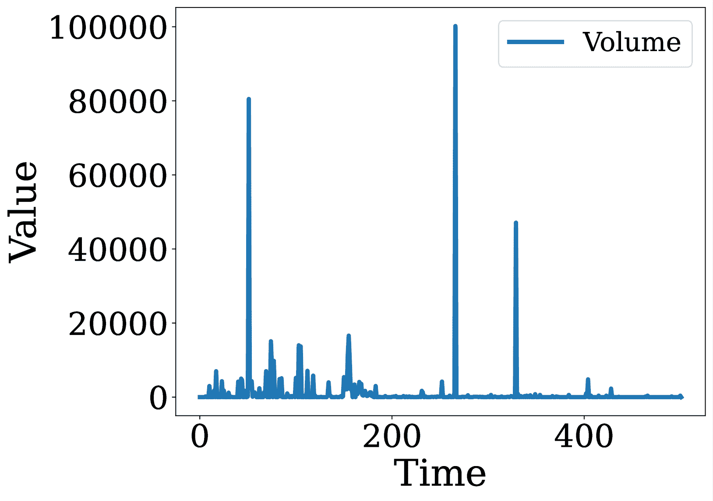

<!--yml

类别：未分类

日期：2025-01-11 12:02:56

-->

# 解码时间序列与LLMs：跨领域注释的多代理框架

> 来源：[https://arxiv.org/html/2410.17462/](https://arxiv.org/html/2410.17462/)

林敏华¹、陈正章²、刘彦池²、赵旭江²

吴宗宇¹、王俊翔²、张翔¹、王苏航¹、陈海峰²

¹宾夕法尼亚州立大学 ²NEC美国实验室

{mfl5681,zongyuwu,xzz89,szw494}@psu.edu

{zchen,yanchi,xuzhao,junwang,haifeng}@nec-labs.com 该工作在NEC美国实验室的实习期间完成。通讯作者。

###### 摘要

时间序列数据在各个领域中无处不在，包括制造业、金融业和医疗保健。高质量的注释对于有效理解时间序列并促进下游任务至关重要；然而，获取这样的注释是具有挑战性的，尤其是在关键任务领域。在本文中，我们提出了TESSA，一个多代理系统，旨在自动生成时间序列数据的通用和领域特定注释。TESSA引入了两个代理：一个通用注释代理和一个领域特定注释代理。通用代理通过利用时间序列特征和文本特征，捕捉跨多个源领域的常见模式和知识，从而生成通用注释。与此同时，领域特定代理利用目标领域的有限注释来学习领域特定术语，并生成针对性的注释。在多个合成和真实世界数据集上的广泛实验表明，TESSA能够有效地生成高质量的注释，表现超过现有方法。

解码时间序列与LLMs：多代理框架

用于跨领域注释

林敏华¹^†^†感谢：该工作在NEC美国实验室的实习期间完成。陈正章²^†^†感谢：通讯作者。刘彦池²、赵旭江²、吴宗宇¹、王俊翔²、张翔¹、王苏航¹、陈海峰² ¹宾夕法尼亚州立大学 ²NEC美国实验室 {mfl5681,zongyuwu,xzz89,szw494}@psu.edu {zchen,yanchi,xuzhao,junwang,haifeng}@nec-labs.com

## 1 引言

时间序列数据在制造业Hsu和Liu（[2021](https://arxiv.org/html/2410.17462v1#bib.bib15)）、金融业Lee等人（[2024](https://arxiv.org/html/2410.17462v1#bib.bib19)）以及医疗保健Cascella等人（[2023](https://arxiv.org/html/2410.17462v1#bib.bib7)）等领域中普遍存在，在这些领域中，时间序列数据捕捉着决策所需的关键时间模式。然而，普通用户常常在解读这些数据时遇到困难，尤其是在多变量的情境下，多个变量随时间的相互作用使得数据变得复杂。此外，准确的解读通常需要领域特定的知识，以便正确地对这些模式进行上下文化处理，这给没有专业知识的人带来了重大挑战。

高质量的注释对于解决这些解释性挑战至关重要。注释提供了对时间序列数据的有意义的背景或见解，突出显示了重要的模式、事件或异常。它们有助于准确的分析、预测和决策，提升下游任务的性能，如异常检测、趋势预测和自动报告。例如，在预测性维护中，理解传感器数据趋势对于防止设备故障至关重要，而在金融领域，解释股票价格波动对于制定明智的投资策略至关重要。尽管注释非常重要，但在实际应用中，高质量的注释往往稀缺。这种稀缺性主要源于对领域专家进行手动注释的依赖，这既费时费力，又昂贵且容易产生不一致性。此外，精确且具有领域特定术语的需求进一步使得注释过程复杂化，因为不同领域需要高度专业化的知识来进行准确且符合上下文的解释。

为了缓解上述问题，一种直接的方法是利用外部资源生成注释，Liu 等人（[2024a](https://arxiv.org/html/2410.17462v1#bib.bib21)）提出了这种方法。例如，Time-MMD Liu 等人（[2024a](https://arxiv.org/html/2410.17462v1#bib.bib21)）通过网络搜索来检索信息作为注释，旨在从互联网上寻找相似的模式和描述。其他研究如 Jin 等人（[2024](https://arxiv.org/html/2410.17462v1#bib.bib18)）；Liu 等人（[2024b](https://arxiv.org/html/2410.17462v1#bib.bib22)）则直接应用大型语言模型（LLM）进行注释，利用它们强大的语言理解能力。基于原型的方法，如原型网络 Ni 等人（[2021](https://arxiv.org/html/2410.17462v1#bib.bib25)），也被用于识别代表性示例进行注释。然而，这些方法往往未能生成高质量的注释。基于网络搜索的方法可能检索到无关或不一致的信息。LLMs 尽管强大，但往往生成的注释过于通用，仅捕捉到基本模式，甚至会产生幻觉，无法考虑时间序列数据的复杂性。原型网络依赖大量数据训练网络并识别代表性原型，但高质量注释的稀缺性限制了这些原型的质量和代表性，使得其难以有效地推广到新的或未见过的模式。

为了应对这些局限性，我们提出了从多个源领域的现有标注中提取知识，并将这些知识转移到具有有限标注的目标领域。具体来说，我们旨在开发一个系统，能够使用通用语言或特定领域语言自动解释来自各个领域的时间序列数据。形式上，给定来自多个源领域的丰富标注和来自目标领域的有限标注，我们的目标是利用时间序列和文本的知识，为目标领域生成准确且语境恰当的标注。

开发这样一个系统面临两个主要的技术挑战：（i）如何从源领域提取共通的知识？（ii）如何从有限的目标领域标注中学习特定领域的术语？为了应对这些挑战并克服现有方法的局限性，我们提出了TESSA，一个旨在进行通用和特定领域时间序列标注的多智能体系统。如图[1](https://arxiv.org/html/2410.17462v1#S2.F1 "Figure 1 ‣ 2 Related Work ‣ Decoding Time Series with LLMs: A Multi-Agent Framework for Cross-Domain Annotation")所示，TESSA引入了两个智能体：一个是通用标注智能体，另一个是特定领域标注智能体。通用标注智能体专注于捕捉跨多个领域的共通模式和知识，以生成普通用户可以理解的标注。为了从多个领域学习共通知识，通用智能体采用了时间序列特征提取器和文本特征提取器，从时间序列数据和来自多个源领域的特定领域标注中提取时间序列和文本特征。为了确保重要特征包含在通用标注中，提出了两种特征选择方法——基于LLM的选择和基于强化学习的选择——来有效且高效地选择最重要的前$k$个时间序列特征和文本特征。特定领域智能体利用有限的目标领域标注，使用特定领域术语（行话）来学习并生成针对特定领域的标注。它包含了一个特定领域术语提取器，用于从有限的目标领域标注中学习行话。此外，还提出了一个标注审查员，用于保持通用标注和特定领域标注之间的一致性。

我们的贡献包括：（i）问题。我们探索了跨领域多模态时间序列注释中的一个新问题，架起了通用理解与领域特定解释之间的桥梁；（ii）框架。我们提出了一个新颖的多代理系统TESSA，旨在通过利用来自多个领域的时间序列知识和文本知识，进行通用和领域特定的时间序列注释；（iii）数据集。我们从金融领域收集了一个真实世界的数据集，以便利用跨领域知识，并提供了一个合成数据集来评估TESSA。这些数据集已公开，以支持该领域未来的研究和开发。（iv）实验。在多个合成和真实世界数据集上进行的大量实验表明，TESSA生成的通用和领域特定注释的质量。

## 2 相关工作

图1：TESSA的整体框架。它由两个主要代理组成：一个通用注释代理，通过选择显著的时间序列和文本特征生成与领域无关的注释；一个领域特定注释代理，通过引入领域特定术语来优化这些注释。

时间序列注释。时间序列注释的目标是为时间序列数据集中的特定片段、事件或模式分配标签或描述，以突出显著特征，便于进一步分析。传统上，这一过程依赖于人工注释Reining等人（[2020](https://arxiv.org/html/2410.17462v1#bib.bib29)），通常是耗时、劳动密集且需要大量领域专长。为了减少创建大规模高质量注释数据集所需的努力，几项研究提出了半自动注释方法Cruz-Sandoval等人（[2019](https://arxiv.org/html/2410.17462v1#bib.bib11)）；Nino等人（[2016](https://arxiv.org/html/2410.17462v1#bib.bib26)），这些方法需要最少的人工输入或后期注释修改。尽管有这些进展，完全自动化的时间序列注释仍然未得到充分探索，因为从数据中捕捉语义和上下文信息仍然面临挑战Yordanova和Krüger（[2018](https://arxiv.org/html/2410.17462v1#bib.bib36)）。

时间序列分析中的LLMs。最近LLMs的进展展示了它们在序列建模和模式识别方面的强大能力，为时间序列分析开辟了有前景的新方向。几项研究，Xue和Salim（[2023](https://arxiv.org/html/2410.17462v1#bib.bib33)）；Yu等（[2023](https://arxiv.org/html/2410.17462v1#bib.bib37)）；Gruver等（[2024](https://arxiv.org/html/2410.17462v1#bib.bib14)）；Jin等（[2024](https://arxiv.org/html/2410.17462v1#bib.bib18)）；Li等（[2024](https://arxiv.org/html/2410.17462v1#bib.bib20)）探讨了如何有效地在此背景下利用LLMs。例如，PromptCast Xue和Salim（[2023](https://arxiv.org/html/2410.17462v1#bib.bib33)）是一个开创性的工作，使用句子到句子的方法将LLMs应用于一般的时间序列预测。Yu等（[2023](https://arxiv.org/html/2410.17462v1#bib.bib37)）通过研究LLMs在特定领域任务中的应用，如金融时间序列预测，扩展了这一工作。LLMTime Gruver等（[2024](https://arxiv.org/html/2410.17462v1#bib.bib14)）通过采用逐文本标记化表示时间序列数据，展示了LLMs作为时间序列学习者的有效性。Time-LLM Jin等（[2024](https://arxiv.org/html/2410.17462v1#bib.bib18)）将时间序列数据重新编程为文本原型，输入LLaMA-7B，并通过包含领域专家知识和任务特定指令的自然语言提示进行增强。此外，Li等（[2024](https://arxiv.org/html/2410.17462v1#bib.bib20)）展示了如何通过冻结的语言模型增强ECG时间序列分析中的零-shot学习，显示了LLMs从复杂时间序列数据中提取有价值特征的潜力。

通过预训练模型进行跨模态知识迁移学习。近年来，越来越多的研究关注如何利用预训练模型进行跨模态知识迁移，尤其是在语言、视觉和时间序列领域之间 Bao et al.（[2022](https://arxiv.org/html/2410.17462v1#bib.bib3)）；Lu et al.（[2022](https://arxiv.org/html/2410.17462v1#bib.bib23)）；Yang et al.（[2021](https://arxiv.org/html/2410.17462v1#bib.bib35)）；Zhou et al.（[2023](https://arxiv.org/html/2410.17462v1#bib.bib40)）。例如，Bao et al.（[2022](https://arxiv.org/html/2410.17462v1#bib.bib3)）提出了一种阶段性预训练策略，该策略通过冻结的注意力块对图像数据进行预训练，从而训练出一个语言专家。类似地，Lu et al.（[2022](https://arxiv.org/html/2410.17462v1#bib.bib23)）研究了语言模型向其他领域的迁移性，而Zhou et al.（[2023](https://arxiv.org/html/2410.17462v1#bib.bib40)）将预训练的语言和图像模型应用于时间序列分析任务。据我们所知，之前的研究并未专门探讨时间序列标注中的跨模态知识迁移。我们的工作旨在填补这一空白，研究跨模态迁移学习在自动时间序列标注中的应用。

## 3 方法论

在本节中，我们定义了问题，并介绍了我们提出的TESSA框架的细节，旨在为时间序列数据生成通用和领域特定的标注。

跨领域时间序列标注问题。给定若干源领域$\{\mathcal{D}_{s_{1}},\mathcal{D}_{s_{2}},\ldots\}$和目标领域$\mathcal{D}_{t}$，令$\{e^{1}_{s_{i}},e^{2}_{s_{i}},\ldots\}$表示来自源领域$\mathcal{D}_{s_{1}}$的领域特定标注，$\{e^{1}_{t},e^{2}_{t},\ldots\}$表示来自目标领域$\mathcal{D}_{t}$的有限领域特定标注。假设$\mathbf{X}=(\mathbf{x}_{1},\cdots,\mathbf{x}_{L})$是目标领域$\mathcal{D}_{t}$中的一条时间序列，其中$L$是过去时间戳的数量，$\mathbf{x}_{i}=(x_{1i},\cdots,x_{Ci})^{T}\in\mathbb{R}^{C}$表示时间戳$i$处来自$C$个不同通道的数据。跨领域时间序列标注的目标是基于源领域和目标领域的标注，为$\mathbf{X}$生成通用标注$e_{g}$和领域特定标注$e_{s}$。更多符号的说明见附录 [B](https://arxiv.org/html/2410.17462v1#A2 "附录 B 符号 ‣ 使用LLMs解码时间序列：一个多代理框架用于跨领域标注")。

TESSA 概述。如图[1](https://arxiv.org/html/2410.17462v1#S2.F1 "图 1 ‣ 2 相关工作 ‣ 解码时间序列与LLM：跨领域标注的多代理框架")所示，所提出的 TESSA 包括两个关键组件：通用标注代理和领域特定标注代理。通用标注代理负责生成领域无关的标注，并由几个模块组成：一个时间序列特征提取模块用于捕捉时间序列特有的特征，一个领域去语境化模块将领域特定文本转换为通用语言，一个文本特征提取模块从去语境化文本中提取文本特征，两个策略网络用于选择最重要的 $k$ 个时间序列和文本特征，以及一个通用标注器基于选定的特征生成通用标注。领域特定标注代理对通用标注进行优化，以生成领域特定的标注。它包括一个领域特定术语提取器，用于从有限的目标领域注释中识别关键术语，以及一个领域特定标注器，根据这些术语调整通用标注。一个标注审阅者进一步提高领域特定标注的质量。接下来，我们将介绍每个组件的详细信息。

### 3.1 多模态特征提取

为了应对从源领域中提取共同知识的挑战，我们引入了两个特征提取模块：时间序列特征提取器和文本特征提取器，分别从时间序列数据和源领域注释中提取特征。我们还提出了一个领域去语境化器，用于增强从多源注释中提取共同知识的能力。

时间序列特征提取。我们开发了一个时间序列提取工具箱 $f_{t}$ 来从给定的时间序列数据中提取各种特征。形式上，对于每个通道 $c\in C$，时间序列特征集 $\mathbf{F}_{t}$ 表示为：

|  | $\mathbf{F}_{t}=\{f_{t}^{1},\cdots,f_{t}^{n_{t}}\}=\mathcal{M}_{r}(\mathbf{X}),$ |  | (1) |
| --- | --- | --- | --- |

其中 $f^{i}_{t}$ 是从 $\mathbf{X}$ 提取的第 $i$ 个特征，$n_{t}$ 是提取特征的数量。对于多变量时间序列数据，还包括变量间的特征（例如，皮尔逊相关系数）。关于特征提取的更多细节，请参见附录[C](https://arxiv.org/html/2410.17462v1#A3 "附录 C 多模态特征提取的更多细节 ‣ 解码时间序列与LLM：跨领域标注的多代理框架")。

领域去语境化。除了时间序列特征外，源领域的文本注释通常包含有价值的信息（例如金融时间序列注释中的支持或弹性），用于解释时间序列数据。提取这些知识的一种直接方法是使用LLM对领域特定注释进行处理，利用其现实世界的知识。然而，在实践中，许多领域缺乏足够高质量的注释，且领域特定术语会进一步妨碍有效的知识提取。

为了解决这些挑战并促进从源领域到目标领域的知识转移，我们引入了一种领域去语境化的LLM，通过去除领域特定的术语，将领域特定的注释转化为通用注释。这使得跨领域提取常识变得更加容易。具体来说，给定源领域$d_{i}$中的领域特定注释$e_{s}$，去语境化的注释$e_{d}$可表示为：

|  | $e_{d}=\mathcal{M}_{d}(p_{de}(e_{s},d_{i})),$ |  | (2) |
| --- | --- | --- | --- |

其中 $\mathcal{M}_{d}$ 是领域去语境化的大语言模型（LLM）。

文本特征提取。在去语境化后，我们使用LLM $\mathcal{M}_{l}$ 从多个源领域提取文本特征。形式上，给定一组去语境化的注释$\{e_{d}^{i}\}_{i=1}^{n_{d}}$和文本特征提取器$\mathcal{M}_{l}$，提取出的文本特征表示为：

|  | $\mathbf{F}_{l}=\{f_{l}^{1},\cdots,f_{l}^{n}\}=\mathcal{M}_{l}(p_{l}(\{e_{d}^{i% }\}_{i=1}^{n_{d}})),$ |  | (3) |
| --- | --- | --- | --- |

其中 $p_{l}$ 是用于文本特征提取的提示。

### 3.2 自适应特征选择

由于从时间序列和文本数据中提取了多样的特征，因此集中关注最相关的特征变得至关重要，以确保生成的注释保持简洁且具有可解释性。此外，每次用新旧数据反复查询LLM会浪费计算资源并增加额外成本，特别是在使用非开源模型时。

为了解决这些问题，我们提出了一种自适应特征选择的混合策略，结合了基于离线LLM的特征选择和基于增量强化学习的特征选择。增量方法以离线方法为基础，最大程度减少了随着新旧数据的到来，需要重新查询LLM的次数。

基于离线LLM的特征选择。利用LLM的推理能力，我们引入了一种特征选择方法，通过LLM生成的特征重要性分数，识别出最重要的前$k$个特征，包括按文本系列和文本进行的特征。那些在注释中被更频繁提及的特征，无论是明确的还是隐含的，都被赋予更高的重要性分数。

特别地，给定一个作为特征选择器的LLM $\mathcal{M}_{sel}$，我们通过领域去情境化的注释 $\{e_{d}^{i}\}_{i=1}^{n_{d}}$ 和提取的特征 $\{f_{t}^{i}\}_{i=1}^{n_{t}}$ 以及 $\{f_{l}^{i}\}_{i=1}^{n_{l}}$ 提示 $\mathcal{M}_{sel}$ 生成数值特征重要性分数：时间序列特征的 $\mathbf{s}_{t}=[s_{1},\cdots,s_{n_{t}}]$ 和文本特征的 $\mathbf{s}_{l}=[s_{1},\cdots,s_{n_{l}}]$。

|  | $\displaystyle s_{j}=\mathcal{M}_{sel}({p}_{{score}}(f_{t}^{j},\{e_{d}^{i}\}_{i% =1}^{n_{d}})),\ \ \forall{j}\in\{1,\cdots,n_{t}\},$ |  | (4) |
| --- | --- | --- | --- |
|  | $\displaystyle s_{k}=\mathcal{M}_{sel}({p}_{{score}}(f_{l}^{k},\{e_{d}^{i}\}_{i% =1}^{n_{d}})),\ \ \forall{k}\in\{1,\cdots,n_{l}\},$ |  |

在这里，$p_{score}$ 是用于评估特征重要性的提示。较高的分数 $s_{j}$ 和 $s_{k} \in \mathbb{R}^{+}$ 表示特征 $f_{t}^{j}$ 和 $f_{l}^{k}$ 在领域去情境化的注释 $\{e_{d}^{i}\}_{i=1}^{n_{d}}$ 中出现得更频繁，无论是显式的还是隐式的。为了确保显式提到的特征获得更高的权重分数，我们指示 $\mathcal{M}_{sel}$ 对在注释中显式引用的特征赋予更大的权重。更多细节见附录 [D.1](https://arxiv.org/html/2410.17462v1#A4.SS1 "D.1 Offline LLM-based Feature Selection ‣ Appendix D More Details of Adaptive Feature Selection ‣ Decoding Time Series with LLMs: A Multi-Agent Framework for Cross-Domain Annotation")。

基于增量强化学习的特征选择。当新数据到达时，离线基于LLM的方法需要重新查询旧数据和新数据，由于LLM的上下文窗口有限，这会变得非常繁琐。随着注释的增加，重新查询所有数据变得不切实际且成本高昂，导致资源消耗增加，性价比降低。

为了解决离线方法的局限性，我们提出了一种基于增量强化学习的特征选择方法，更适用于具有不断变化数据的动态环境。具体来说，我们引入了一个多智能体强化学习（MARL）框架，训练两个策略网络 $\mathcal{F}_{t}$ 和 $\mathcal{F}_{l}$，分别选择最重要的前 $k$ 个时间序列级特征和文本级特征。这些策略网络存储现有注释中的知识，并在新数据到达时逐步更新。这样就减少了每次更新时需要重新查询所有数据的需求，仅需查询新数据。正如图 [1](https://arxiv.org/html/2410.17462v1#S2.F1 "图 1 ‣ 2 相关工作 ‣ 使用LLM解码时间序列：一个多智能体框架用于跨领域注释")所示，每个策略网络都用一个小型LLM的前三层进行初始化，如GPT-2 Radford等人（[2019](https://arxiv.org/html/2410.17462v1#bib.bib28)），这些层在训练过程中保持冻结。接下来是一个可训练的多头注意力层和一个来自GPT-2的语言模型（LM）头，使用的是最小版本的GPT-2，具有124M参数。

在训练过程中，只有多头注意力层会被更新。对于时间序列级特征，给定候选特征 $\{f_{t}^{i}\}_{i=1}^{n_{t}}$ 及其对应的特征名称标记 $\mathbf{Y}=\{y^{i}_{1},\cdots,y^{i}_{n_{t}}\}$，策略网络 $\mathcal{F}_{t}$ 基于特征名称的均值 logits 计算动作值（Q值）$\mathbf{q}_{z}=[q_{z,f_{t}^{1}},\cdots,q_{z,f_{t}^{n_{t}}}]$：

|  | $\displaystyle\mathbf{q}_{s}=\mathcal{F}_{t}(\{y_{i}\}_{i=1}^{n_{t}}),$ |  | (5) |
| --- | --- | --- | --- |

softmax函数生成一个特征的概率分布，前 $k$ 个特征基于最高概率被选择。

在每个时间步，选择的前 $k$ 个特征会传递给LLM $\mathcal{M}_{sel}$，以获得它们的重要性分数 $s_{i},\forall i\in\{1,\cdots,k\}$。智能体接收一个奖励 $r_{t}$，其定义为：

|  | $\displaystyle r_{t}=\begin{cases}\sum_{i=1}^{k}s_{i},&s_{i}\geq\tau\\ -0.5,&\text{否则},\end{cases}$ |  | (6) |
| --- | --- | --- | --- |

其中 $\tau$ 是一个阈值，用于抑制选择不重要的特征。文本级特征策略网络 $\mathcal{F}_{l}$ 经过类似的训练过程。

训练后，策略网络仅使用新数据进行增量更新，消除了重新查询LLM的需要，不必每次都用旧数据和新数据一起查询。这种方法提高了特征选择的可扩展性和效率，同时降低了计算成本，有效克服了离线方法的局限性。通过增量更新策略网络，我们确保在数据不断变化的动态环境中，特征选择保持可扩展和具有成本效益。

### 3.3 一般注释生成

在从时间序列和文本中选择出最重要的前$k$个特征之后，引入通用注释器，通过分析这些选定的特征来生成通用注释。作为通用注释器的LLM，根据所选特征解释给定的时间序列数据。形式上，给定时间序列数据$\mathbf{X}=\{\mathbf{x}_{i}\}_{i=1}^{L}$以及所选的时间序列特征和文本特征$\{f_{t}^{i}\}_{i=1}^{k_{t}}$和$\{f_{l}^{i}\}_{i=1}^{k_{l}}$，生成通用注释$e_{g}$的表示式为：

|  | $\displaystyle e_{g}=\mathcal{M}_{gen}(p_{gen}(\{\mathbf{x}_{i}\}_{i=1}^{L},\{f_{t}^{i}\}_{i=1}^{k_{t}},\{f_{l}^{i}\}_{i=1}^{k_{l}})),$ |  | (7) |
| --- | --- | --- | --- |

其中 $p_{gen}$ 是生成通用注释的提示词。通过强调所选共识知识的信号，通用注释能够捕捉更丰富的模式，这些模式可能会在直接应用LLMs时被忽视。

### 3.4 领域特定注释生成

为时间序列生成领域特定注释至关重要，因为不同领域依赖于专业术语和上下文特定的词汇来准确解释和理解数据。来自金融市场、医疗系统或工业过程的时间序列数据，可能展示出每个领域特有的模式、趋势和异常。通用注释可能忽视关键的细微差别，而领域特定注释能够捕捉到上下文的相关性，从而提高下游分析或模型预测的精度和可靠性。通过根据领域特定的词汇量身定制注释，我们可以更准确地检测有意义的模式，并做出明智的决策。

领域特定术语提取器。为了应对学习领域特定术语的挑战，我们引入了一个领域特定术语提取器。在有限的目标领域领域特定注释$\{e_{t}^{i}\}_{i=1}^{n_{e_{t}}}$的基础上，采用LLM $\mathcal{M}_{ext}$来提取领域特定术语。我们通过注释$\{e_{t}^{i}\}_{i=1}^{n_{e_{t}}}$来提示$\mathcal{M}_{ext}$，从中提取一组领域特定术语$\{\mathcal{J}^{i}\}_{i=1}^{n_{\mathcal{J}}}$：

|  | $\{\mathcal{J}^{i}\}_{i=1}^{n_{\mathcal{J}}}=\mathcal{M}_{ext}(p_{ext}(\{e_{t}^{i}\}_{i=1}^{n_{e_{t}}})),$ |  | (8) |
| --- | --- | --- | --- |

其中 $n_{\mathcal{J}}$ 是提取的术语数量，$p_{ext}$ 是领域特定术语提取的提示词。

领域特定注释器。为了确保领域特定注释和通用注释之间的一致性，一个作为领域特定注释器的LLM $\mathcal{M}_{spe}$，将提取的术语$\{\mathcal{J}^{i}\}_{i=1}^{n_{\mathcal{J}}}$应用于通用注释$e_{g}$，将其转换为目标领域注释$e_{t}$。形式上表示为：

|  | $e_{t}=\mathcal{M}_{spe}(p_{spe}(e_{g},\{\mathcal{J}^{i}\}_{i=1}^{n_{\mathcal{J}}})),$ |  | (9) |
| --- | --- | --- | --- |

其中 $p_{spe}$ 是生成领域特定注释的提示词。

注释审查员。为了提高领域特定注释的质量，并确保与通用注释的更好对齐，我们引入了一个注释审查员。这个 LLM，$\mathcal{M}_{rev}$，审查生成的注释和提取的术语，为提取器和注释者提供反馈 $e_{f}$：

|  | $e_{f}=\mathcal{M}_{rev}(p_{rev}(e_{g},e_{t},\{\mathcal{J}^{i}\}_{i=1}^{n_{% \mathcal{J}}})),$ |  | (10) |
| --- | --- | --- | --- |

其中 $p_{rev}$ 是用于审查注释的提示。这个反馈回路确保了更精确的术语提取，并且通用注释与领域特定注释之间的对齐更好。基于反馈，提取器 $\mathcal{M}_{ext}$ 改进了提取过程，而注释者 $\mathcal{M}_{spe}$ 相应地增强了其注释。

## 4 实验

本节展示了实验结果。我们首先评估了 TESSA 在下游任务中的注释效果以及在合成数据集上的表现，然后检查了领域特定的注释，最后评估了关键 TESSA 组件的贡献。

### 4.1 实验设置

数据集。为了评估 TESSA 的有效性，考虑了来自不同领域的五个真实世界数据集：股票、健康、能源、环境和社会公益。具体来说，股票数据集包括 1,935 个美国股票，涵盖最近六年的数据，由我们自己收集。其他四个数据集来自公共基准 Time-MMD Liu 等人 ([2024a](https://arxiv.org/html/2410.17462v1#bib.bib21))。在本文中，股票和健康数据集作为源领域，而能源、环境和社会公益数据集被视为目标领域。此外，我们生成了一个合成数据集，包含时间序列和真实标注，用于直接评估通用注释的质量。有关这些数据集的更多细节，请参见附录 [E.1](https://arxiv.org/html/2410.17462v1#A5.SS1 "E.1 Dataset Statistics ‣ Appendix E Experimental Settings ‣ Decoding Time Series with LLMs: A Multi-Agent Framework for Cross-Domain Annotation")。另外，其他四个数据集来自公共基准 Time-MMD。我们还创建了一个合成数据集，包含时间序列和真实标注，用于直接评估通用注释的质量。这些数据集的更多细节请见附录 [E.1](https://arxiv.org/html/2410.17462v1#A5.SS1 "E.1 Dataset Statistics ‣ Appendix E Experimental Settings ‣ Decoding Time Series with LLMs: A Multi-Agent Framework for Cross-Domain Annotation")。

LLMs。我们的实验使用了一个闭源模型 GPT-4o Achiam 等人 ([2023](https://arxiv.org/html/2410.17462v1#bib.bib1)) 和两个开源模型 LLaMA3.1-8B Dubey 等人 ([2024](https://arxiv.org/html/2410.17462v1#bib.bib12)) 以及 Qwen2-7B 杨等人 ([2024](https://arxiv.org/html/2410.17462v1#bib.bib34))。

### 4.2 在下游任务中评估通用注释

在本小节中，为了评估通用注释的质量，我们通过遵循《Time-MMD》Liu 等人（[2024a](https://arxiv.org/html/2410.17462v1#bib.bib21)）中的实验设置，将生成的注释应用于多模态下游任务（即时间序列预测和填补）。实现细节请参见附录 [F.1](https://arxiv.org/html/2410.17462v1#A6.SS1 "F.1 Implementation Details ‣ Appendix F Additional Results for General Annotation Evaluation in Downstream Tasks ‣ Decoding Time Series with LLMs: A Multi-Agent Framework for Cross-Domain Annotation")。

基准方法。据我们所知，TESSA 是首个研究跨领域多模态时间序列注释的工作。为了展示其有效性，我们将其与几个代表性方法进行比较，包括 No-Text、Time-MMD Liu 等人（[2024a](https://arxiv.org/html/2410.17462v1#bib.bib21)）和 DirectLLM 作为基准。更多关于这些方法的细节请参见附录 [E.2](https://arxiv.org/html/2410.17462v1#A5.SS2 "E.2 Baseline Methods ‣ Appendix E Experimental Settings ‣ Decoding Time Series with LLMs: A Multi-Agent Framework for Cross-Domain Annotation")。

评估指标。对于时间序列预测任务，我们使用 MSE（均方误差）和 MAE（平均绝对误差）作为评估指标，其中 MSE 和 MAE 的值越低，表示注释效果越好。

实验结果。表格 [1](https://arxiv.org/html/2410.17462v1#S4.T1 "Table 1 ‣ 4.2 Evaluating General Annotations in Downstream Tasks ‣ 4 Experiments ‣ Decoding Time Series with LLMs: A Multi-Agent Framework for Cross-Domain Annotation")展示了时间序列预测任务的比较结果，其中Informer Zhou et al. ([2021](https://arxiv.org/html/2410.17462v1#bib.bib39))是预测模型，GPT-4o Achiam et al. ([2023](https://arxiv.org/html/2410.17462v1#bib.bib1))作为LLM骨干网络。使用不同LLM骨干网络的附加预测结果可在附录 [F.2](https://arxiv.org/html/2410.17462v1#A6.SS2 "F.2 Evaluation in Time Series Forecasting Tasks ‣ Appendix F Additional Results for General Annotation Evaluation in Downstream Tasks ‣ Decoding Time Series with LLMs: A Multi-Agent Framework for Cross-Domain Annotation")中找到。可以得出以下观察结论：（1）No-Text在所有数据集上表现最差，验证了需要注释来提升下游任务的性能。这表明，更好的下游任务性能意味着更高质量的注释。（2）TESSA在所有比较方法中表现最佳，展示了其在生成高质量通用注释方面的有效性。时间序列填补任务的附加结果可在附录 [F.3](https://arxiv.org/html/2410.17462v1#A6.SS3 "F.3 Evaluation in Time Series Imputation Tasks ‣ Appendix F Additional Results for General Annotation Evaluation in Downstream Tasks ‣ Decoding Time Series with LLMs: A Multi-Agent Framework for Cross-Domain Annotation")中找到。

表格 1：使用GPT-4o作为LLM骨干网络的预测结果。NT、TM和DL分别表示No-Text、Time-MMD和DirectLLM。上半部分显示MSE，下半部分显示MAE。

| 领域 | NT | TM | DL | TESSA |
| --- | --- | --- | --- | --- |
| 环境 | 1.2542 | 0.8483 | 0.7714 | 0.4629 |
| 能源 | 2.0117 | 0.2172 | 0.0575 | 0.0482 |
| 社会公益 | 2.1457 | 1.6072 | 0.4639 | 0.1935 |
| 环境 | 0.7387 | 0.6865 | 0.6604 | 0.4424 |
| 能源 | 1.1663 | 0.2139 | 0.0055 | 0.0040 |
| 社会公益 | 1.1205 | 0.9731 | 0.3801 | 0.0825 |

### 4.3 在合成数据集上评估通用注释

我们构建了一个包含时间序列数据和真实注释的合成数据集，以验证TESSA的性能。实施细节可在附录 [G.1](https://arxiv.org/html/2410.17462v1#A7.SS1 "G.1 Implementation Details ‣ Appendix G Additional Details of General Annotation Evaluation in Synthetic Datasets ‣ Decoding Time Series with LLMs: A Multi-Agent Framework for Cross-Domain Annotation")中找到。

评估指标。我们应用了LLM作为评审员的方法Bubeck等人（[2023](https://arxiv.org/html/2410.17462v1#bib.bib5)）；Dubois等人（[2024](https://arxiv.org/html/2410.17462v1#bib.bib13)），评估了两个指标：清晰度和全面性。两个不同的LLM对生成的注释在每个指标上进行$1$到$5$的评分，整体得分为两个指标的均值。

实验结果。我们在表[2](https://arxiv.org/html/2410.17462v1#S4.T2 "表2 ‣ 4.3 评估合成数据集中的通用注释 ‣ 4 实验 ‣ 使用LLM解码时间序列：一个跨领域注释的多代理框架")中比较了TESSA和DirectLLM。“均值”表示每种方法生成的注释的平均得分，而P(T>D)是TESSA注释得分高于DirectLLM的比例。结果表明，TESSA在两个指标上均优于DirectLLM，清晰度平均得分为$3.90$，全面性平均得分为$4.44$，而DirectLLM的得分分别为$3.79$和$1.55$。此外，$82.71\%$的TESSA注释得分高于DirectLLM，表明TESSA生成了更重要且易于理解的特征，进一步证明了其有效性。

表2：使用GPT-4o作为LLM主干的合成数据集上的通用注释结果。

| 指标 | 方法 | 均值 | P(T>D) (%) |
| --- | --- | --- | --- |
| 清晰度 | TESSA | 3.90 | 69.76 |
| DirectLLM | 3.79 |
| 理解度 | TESSA | 4.44 | 87.10 |
| DirectLLM | 1.55 |
| 总体 | TESSA | 4.14 | 82.71 |
| DirectLLM | 2.84 |

### 4.4 特定领域注释评估

在本小节中，我们评估特定领域注释的质量。与第[4.3节](https://arxiv.org/html/2410.17462v1#S4.SS3 "4.3 评估合成数据集中的通用注释 ‣ 4 实验 ‣ 使用LLM解码时间序列：一个跨领域注释的多代理框架")类似，我们采用LLM作为评审员的策略，从三个角度评估特定领域注释代理的表现：清晰度、全面性和领域相关性。总体评分是这三个指标的平均值。关于这些指标的更多细节，请参见附录[H.1](https://arxiv.org/html/2410.17462v1#A8.SS1 "H.1 评估指标 ‣ 附录H 特定领域注释评估的附加结果 ‣ 使用LLM解码时间序列：一个跨领域注释的多代理框架")。

实验结果：我们展示了TESSA与DirectLLM在环境数据集上的比较结果，见表[3](https://arxiv.org/html/2410.17462v1#S4.T3 "Table 3 ‣ 4.4 Domain-specific Annotation Evaluation ‣ 4 Experiments ‣ Decoding Time Series with LLMs: A Multi-Agent Framework for Cross-Domain Annotation")，其中GPT-4o作为LLM的骨干。主要观察结果如下：(1) TESSA在所有指标上显著优于DirectLLM，整体得分为$4.64$，而DirectLLM为$3.41$。值得注意的是，$98.51\%$的TESSA注释得分更高，证明了它在生成高质量领域特定注释方面的有效性。(2) TESSA在清晰度上得分为$4.74$，在全面性上得分为$4.38$，而DirectLLM分别为$3.32$和$3.01$。这表明TESSA的注释更清晰、更简洁，涵盖了更多重要特征。(3) TESSA在领域相关性上也表现出色，$94.72\%$的注释得分更高，平均得分为$4.30$，显著优于DirectLLM的$3.41$。这表明TESSA生成的注释在有效使用领域特定术语和保持强相关性的上下文方面非常准确。更多关于其他数据集的结果请参见附录[H.2](https://arxiv.org/html/2410.17462v1#A8.SS2 "H.2 Additional Results on Other LLM Backbones ‣ Appendix H Additional Results of Domain-specific Annotation Evaluation ‣ Decoding Time Series with LLMs: A Multi-Agent Framework for Cross-Domain Annotation")。

表 3：基于GPT-4o作为LLM骨干的环境数据集上的领域特定注释结果。

| 指标 | 方法 | 平均值 | P(T>D) (%) |
| --- | --- | --- | --- |
| 清晰度 | TESSA | 4.74 | 99.81 |
| DirectLLM | 3.32 |
| Compre. | TESSA | 4.38 | 97.04 |
| DirectLLM | 3.01 |
| 领域相关性 | TESSA | 4.30 | 94.72 |
| DirectLLM | 3.57 |
| 总体 | TESSA | 4.64 | 98.51 |
| DirectLLM | 3.41 |

### 4.5 TESSA的深入剖析

自适应特征选择。我们比较了两种特征选择方法：离线基于LLM的选择和增量基于RL的选择。为了评估它们在选择最重要的前$k$个特征方面的效果，我们根据第[4.2](https://arxiv.org/html/2410.17462v1#S4.SS2 "4.2 评估下游任务中的一般注释 ‣ 4 实验 ‣ 使用LLM解码时间序列：一种跨领域注释的多代理框架")节和第[4.4](https://arxiv.org/html/2410.17462v1#S4.SS4 "4.4 特定领域注释评估 ‣ 4 实验 ‣ 使用LLM解码时间序列：一种跨领域注释的多代理框架")节的程序，评估生成的一般和特定领域注释的质量。环境被设定为目标领域，结果见图[2](https://arxiv.org/html/2410.17462v1#S4.F2 "图2 ‣ 4.5 TESSA的深入剖析 ‣ 4 实验 ‣ 使用LLM解码时间序列：一种跨领域注释的多代理框架")。结果表明，TESSA在使用任何一种选择方法时，在生成一般注释和特定领域注释方面表现相当。具体来说，如图[2](https://arxiv.org/html/2410.17462v1#S4.F2 "图2 ‣ 4.5 TESSA的深入剖析 ‣ 4 实验 ‣ 使用LLM解码时间序列：一种跨领域注释的多代理框架")(a)所示，两种方法在一般注释上都达到了大约$0.46$的MSE和$0.44$的MAE。同样，在图[2](https://arxiv.org/html/2410.17462v1#S4.F2 "图2 ‣ 4.5 TESSA的深入剖析 ‣ 4 实验 ‣ 使用LLM解码时间序列：一种跨领域注释的多代理框架")(b)中，两种方法在所有特定领域指标上得分一致较高，展示了它们在选择重要特征方面的有效性。然而，增量基于RL的选择方法通过减少对先前使用过的数据的冗余重新查询，证明了其更具成本效益。

(a) 一般

(b) 特定

图2：离线与增量特征选择的比较。GPT-4o是LLM骨干，环境作为目标领域。(a) 一般注释结果；(b) 特定领域注释结果。

消融研究。我们进行消融研究，以评估领域去上下文化和自适应特征选择在 TESSA 中的重要性。为了评估领域去上下文化，我们引入了一个变体 TESSA/D，该变体绕过了领域去上下文化 LLM，直接从领域特定注释中提取逐文本特征。表[11](https://arxiv.org/html/2410.17462v1#A9.T11 "Table 11 ‣ I.2 Qualitative Examples ‣ Appendix I Additional Details of Ablation Studies ‣ Decoding Time Series with LLMs: A Multi-Agent Framework for Cross-Domain Annotation")显示，TESSA/D 捕捉到了一些无关的特征，如随着时间推移的价格上涨和趣味性，而这些特征与时间序列分析无关。这支持了我们关于领域特定术语可能妨碍准确提取与时间序列相关特征的论点。

为了证明自适应特征选择在 TESSA 中的重要性，我们去除了自适应特征选择模块，创建了一个变体 TESSA/F。我们应用 LLM 作为评判者，比较 TESSA 与其变体生成的注释质量。评估指标在附录[I.1](https://arxiv.org/html/2410.17462v1#A9.SS1 "I.1 Evaluation Metric ‣ Appendix I Additional Details of Ablation Studies ‣ Decoding Time Series with LLMs: A Multi-Agent Framework for Cross-Domain Annotation")中介绍。我们选择 Social Good 作为目标数据集。比较结果呈现在表[4](https://arxiv.org/html/2410.17462v1#S4.T4 "Table 4 ‣ 4.5 In-depth Dissection of TESSA ‣ 4 Experiments ‣ Decoding Time Series with LLMs: A Multi-Agent Framework for Cross-Domain Annotation")中，附录[I.2](https://arxiv.org/html/2410.17462v1#A9.SS2 "I.2 Qualitative Examples ‣ Appendix I Additional Details of Ablation Studies ‣ Decoding Time Series with LLMs: A Multi-Agent Framework for Cross-Domain Annotation")提供了定性示例。我们观察到：TESSA 一直优于 TESSA/F。具体来说，TESSA 的清晰度得分为 $4.41$，而 TESSA/F 的得分为 $3.66$。这证明了自适应特征选择的必要性。此外，根据附录[I.2](https://arxiv.org/html/2410.17462v1#A9.SS2 "I.2 Qualitative Examples ‣ Appendix I Additional Details of Ablation Studies ‣ Decoding Time Series with LLMs: A Multi-Agent Framework for Cross-Domain Annotation")中的表[13](https://arxiv.org/html/2410.17462v1#A9.T13 "Table 13 ‣ I.2 Qualitative Examples ‣ Appendix I Additional Details of Ablation Studies ‣ Decoding Time Series with LLMs: A Multi-Agent Framework for Cross-Domain Annotation")，TESSA/F 生成的注释往往包括许多未经充分分析的特征。这表明，涉及过多特征可能会妨碍注释的清晰度，进一步强调了自适应特征选择在提高注释质量中的重要性。

表 4：SocialGood 数据集中的消融研究。GPT-4o 是 LLM 主干。

| 指标 | 方法 | 平均值 | P(T>D) (%) |
| --- | --- | --- | --- |
| 清晰度 | TESSA | 4.41 | 83.3 |
| TESSA/F | 3.66 |

### 4.6 TESSA的案例研究

我们进行了一项案例研究，以进一步验证TESSA的有效性。从社会公益领域选取了一个代表性的时间序列（图[3(b)](https://arxiv.org/html/2410.17462v1#A10.F3.sf2 "在图3 ‣ 附录J 案例研究的附加细节 ‣ 使用LLMs解码时间序列：一个跨领域标注的多智能体框架")(b)），并应用TESSA和DirectLLM生成通用和特定领域的标注，结果总结在表[14](https://arxiv.org/html/2410.17462v1#A10.T14 "表14 ‣ 附录J 案例研究的附加细节 ‣ 使用LLMs解码时间序列：一个跨领域标注的多智能体框架")中。为了评估标注的质量，我们使用LLM作为评判工具，评估两种方法的特定领域标注，结果如表[12](https://arxiv.org/html/2410.17462v1#A9.T12 "表12 ‣ I.2 定性示例 ‣ 附录I 消融研究的附加细节 ‣ 使用LLMs解码时间序列：一个跨领域标注的多智能体框架")所示。我们的研究结果表明：(1) TESSA的通用标注能够捕捉到更有意义的模式，帮助用户理解和进行下游任务，而DirectLLM仅突出了基本趋势；(2) TESSA的特定领域标注在所有指标上均优于DirectLLM，提供了更清晰、更全面且与上下文相关的见解。更多关于多元时间序列数据的案例研究见附录[J](https://arxiv.org/html/2410.17462v1#A10 "附录J 案例研究的附加细节 ‣ 使用LLMs解码时间序列：一个跨领域标注的多智能体框架")。

## 5 结论

在本工作中，我们介绍了TESSA，一个用于自动化通用和特定领域时间序列标注的多智能体系统。TESSA结合了两个智能体，一个通用标注智能体和一个特定领域标注智能体，能够从多个领域中提取并利用时间序列和文本的知识进行标注。TESSA克服了直接应用大型语言模型（LLMs）的局限性，后者通常只捕捉基本的模式，且可能会出现幻觉，通过有效识别并强调时间序列数据中的重要模式。我们在合成数据集和来自不同领域的真实世界数据集上的实验表明，TESSA在生成高质量的通用和特定领域标注方面具有有效性。

## 参考文献

+   Achiam等（2023）Josh Achiam, Steven Adler, Sandhini Agarwal, Lama Ahmad, Ilge Akkaya, Florencia Leoni Aleman, Diogo Almeida, Janko Altenschmidt, Sam Altman, Shyamal Anadkat等人。2023年。Gpt-4技术报告。*arXiv预印本 arXiv:2303.08774*。

+   Almeida（1994）Luis B Almeida。1994年。分数傅里叶变换和时频表示。*IEEE信号处理学报*，42(11):3084–3091。

+   Bao 等人（2022）Hangbo Bao、Wenhui Wang、Li Dong、Qiang Liu、Owais Khan Mohammed、Kriti Aggarwal、Subhojit Som、Songhao Piao 和 Furu Wei。2022年。[Vlmo：通过混合模态专家的统一视觉-语言预训练](http://papers.nips.cc/paper_files/paper/2022/hash/d46662aa53e78a62afd980a29e0c37ed-Abstract-Conference.html)。发表于*神经信息处理系统年会论文集*，第32897–32912页。

+   Ben-David 等人（2022）Eyal Ben-David、Nadav Oved 和 Roi Reichart。2022年。Pada：基于示例的提示学习，用于快速适应未见领域。*计算语言学协会会刊*，10:414–433。

+   Bubeck 等人（2023）Sébastien Bubeck、Varun Chandrasekaran、Ronen Eldan、Johannes Gehrke、Eric Horvitz、Ece Kamar、Peter Lee、Yin Tat Lee、Yuanzhi Li、Scott Lundberg 等人。2023年。人工通用智能的火花：与 GPT-4 的早期实验。*arXiv 预印本 arXiv:2303.12712*。

+   Cao 等人（2024）Defu Cao、Furong Jia、Sercan O Arik、Tomas Pfister、Yixiang Zheng、Wen Ye 和 Yan Liu。2024年。Tempo：基于提示的生成预训练变换器用于时间序列预测。发表于*ICLR*。

+   Cascella 等人（2023）Marco Cascella、Jonathan Montomoli、Valentina Bellini 和 Elena Bignami。2023年。评估 ChatGPT 在医疗保健中的可行性：多个临床和研究场景的分析。*医学系统杂志*，47(1)：33。

+   Chang 等人（2023）Ching Chang、Wei-Yao Wang、Wen-Chih Peng 和 Tien-Fu Chen。2023年。Llm4ts：将预训练大语言模型对齐为数据高效的时间序列预测器。*arXiv 预印本 arXiv:2308.08469*。

+   Chowdhery 等人（2023）Aakanksha Chowdhery、Sharan Narang、Jacob Devlin、Maarten Bosma、Gaurav Mishra、Adam Roberts、Paul Barham、Hyung Won Chung、Charles Sutton、Sebastian Gehrmann 等人。2023年。Palm：通过路径扩展语言建模。*机器学习研究杂志*，24(240)：1–113。

+   Cleveland 等人（1990）Robert B Cleveland、William S Cleveland、Jean E McRae、Irma Terpenning 等人。1990年。Stl：季节性趋势分解。*J. off. Stat*，6(1)：3–73。

+   Cruz-Sandoval 等人（2019）Dagoberto Cruz-Sandoval、Jessica Beltran-Marquez、Matias Garcia-Constantino、Luis A. Gonzalez-Jasso、Jesus Favela、Irvin Hussein Lopez-Nava、Ian Cleland、Andrew Ennis、Netzahualcoyotl Hernandez-Cruz、Joseph Rafferty、Jonathan Synnott 和 Chris Nugent。2019年。用于普适医疗保健活动识别的半自动化数据标注。*传感器*。

+   Dubey 等人（2024）Abhimanyu Dubey、Abhinav Jauhri、Abhinav Pandey、Abhishek Kadian、Ahmad Al-Dahle、Aiesha Letman、Akhil Mathur、Alan Schelten、Amy Yang、Angela Fan 等人。2024年。Llama 3 模型群体。*arXiv 预印本 arXiv:2407.21783*。

+   Dubois et al. (2024) Yann Dubois, Chen Xuechen Li, Rohan Taori, Tianyi Zhang, Ishaan Gulrajani, Jimmy Ba, Carlos Guestrin, Percy S Liang, 和 Tatsunori B Hashimoto. 2024. Alpacafarm: 一个用于从人类反馈中学习方法的仿真框架。 *神经信息处理系统进展*，36。

+   Gruver et al. (2024) Nate Gruver, Marc Finzi, Shikai Qiu, 和 Andrew G Wilson. 2024. 大型语言模型是零-shot时间序列预测器。 *神经信息处理系统进展*，36。

+   Hsu and Liu (2021) Chia-Yu Hsu 和 Wei-Chen Liu. 2021. 用于故障检测和诊断的多时间序列卷积神经网络及半导体制造中的实证研究。 *智能制造杂志*，32(3):823–836。

+   Izacard et al. (2023) Gautier Izacard, Patrick Lewis, Maria Lomeli, Lucas Hosseini, Fabio Petroni, Timo Schick, Jane Dwivedi-Yu, Armand Joulin, Sebastian Riedel, 和 Edouard Grave. 2023. Atlas: 使用检索增强语言模型进行少样本学习。 *机器学习研究杂志*，24(251):1–43。

+   Jiang et al. (2024) Yushan Jiang, Zijie Pan, Xikun Zhang, Sahil Garg, Anderson Schneider, Yuriy Nevmyvaka, 和 Dongjin Song. 2024. 通过大型语言模型增强时间序列分析：一项调查。 *arXiv预印本 arXiv:2402.03182*。

+   Jin et al. (2024) Ming Jin, Shiyu Wang, Lintao Ma, Zhixuan Chu, James Y Zhang, Xiaoming Shi, Pin-Yu Chen, Yuxuan Liang, Yuan-Fang Li, Shirui Pan, 和 Qingsong Wen. 2024. Time-LLM: 通过重新编程大型语言模型进行时间序列预测。载于 *ICLR*。

+   Lee et al. (2024) Jean Lee, Nicholas Stevens, Soyeon Caren Han, 和 Minseok Song. 2024. 金融中大型语言模型的调查（finllms）。 *arXiv预印本 arXiv:2402.02315*。

+   Li et al. (2024) Jun Li, Che Liu, Sibo Cheng, Rossella Arcucci, 和 Shenda Hong. 2024. 冻结语言模型帮助ECG零-shot学习。载于 *深度学习医学影像*，第402–415页。PMLR。

+   Liu et al. (2024a) Haoxin Liu, Shangqing Xu, Zhiyuan Zhao, Lingkai Kong, Harshavardhan Kamarthi, Aditya B Sasanur, Megha Sharma, Jiaming Cui, Qingsong Wen, Chao Zhang, et al. 2024a. Time-mmd: 一个用于时间序列分析的新型多领域多模态数据集。 *arXiv预印本 arXiv:2406.08627*。

+   Liu et al. (2024b) Xu Liu, Junfeng Hu, Yuan Li, Shizhe Diao, Yuxuan Liang, Bryan Hooi, 和 Roger Zimmermann. 2024b. Unitime: 一种通过语言增强的跨领域时间序列预测统一模型。载于 *2024年ACM Web会议论文集*，第4095–4106页。

+   Lu et al. (2022) Kevin Lu, Aditya Grover, Pieter Abbeel, 和 Igor Mordatch. 2022. 冻结的预训练变换器作为通用计算引擎。载于 *AAAI人工智能会议论文集*，第36卷，7628–7636页。

+   Malik et al. (2023) Bhavitvya Malik, Abhinav Ramesh Kashyap, Min-Yen Kan, 和 Soujanya Poria. 2023. Udapter–利用适配器的高效领域适应。 *arXiv预印本 arXiv:2302.03194*。

+   Ni等人（2021）倪靖超、陈正张、程伟、宗博、宋东金、刘燕池、张旭超和陈海峰。2021年。通过学习局部原型和自适应正则化解释卷积序列模型。载于*第30届ACM国际信息与知识管理大会论文集*，第1366–1375页。

+   Nino等人（2016）Jorge Nino、Andrés Frias-Velazquez、Nyan Bo Bo、Maarten Slembrouck、关俊智、Glen Debard、Bart Vanrumste、Tinne Tuytelaars和Wilfried Philips。2016年。可扩展的半自动多摄像头人员追踪注释。*IEEE图像处理学报：IEEE信号处理学会出版物*。

+   Pfeiffer等人（2020）Jonas Pfeiffer、Aishwarya Kamath、Andreas Rücklé、Kyunghyun Cho和Iryna Gurevych。2020年。Adapterfusion：无损任务组合用于迁移学习。*arXiv预印本arXiv:2005.00247*。

+   Radford等人（2019）Alec Radford、Jeffrey Wu、Rewon Child、David Luan、Dario Amodei、Ilya Sutskever等人。2019年。语言模型是无监督的多任务学习者。*OpenAI博客*，1(8):9。

+   Reining等人（2020）Christopher Reining、Fernando Moya Rueda、Friedrich Niemann、Gernot A. Fink和Michael ten Hompel。2020年。在物流中多通道时间序列Har数据集的注释性能。载于*2020年IEEE国际普适计算与通信研讨会（PerCom Workshops）*。

+   Sun等人（2024）孙晨曦、李红岩、李亚梁和洪申达。2024年。Test：文本原型对齐嵌入激活LLM的时间序列能力。载于*ICLR*。

+   Wu等人（2023）吴海旭、胡腾格、刘勇、周杭、王建民和龙名胜。2023年。Timesnet：用于一般时间序列分析的时间2D变化建模。载于*国际学习表示大会*。

+   Xu等人（2024）许俊杰、吴宗宇、林敏华、张翔和王苏航。2024年。LLM与GNN是互补的：为多模态图学习蒸馏LLM。*arXiv预印本arXiv:2406.01032*。

+   Xue和Salim（2023）薛昊和Flora D Salim。2023年。Promptcast：一种基于提示的新型时间序列预测学习范式。*IEEE知识与数据工程学报*。

+   杨等人（2024）杨安、杨宝松、会宾源、郑博、余博文、周畅、李成鹏、李承元、刘大义恒、黄飞等人。2024年。Qwen2技术报告。*arXiv预印本arXiv:2407.10671*。

+   Yang等人（2021）杨超翰、蔡韵韵和陈品瑜。2021年。Voice2series：为时间序列分类重新编程声学模型。载于*国际机器学习会议*，第11808–11819页。PMLR。

+   Yordanova和Krüger（2018）Kristina Yordanova和Frank Krüger。2018年。为行为分析创建和探索语义注释。*Sensors*。

+   Yu等人（2023）余新立、陈正、凌源、董树静、刘宗义和卢燕斌。2023年。时间数据与LLM相遇——可解释的金融时间序列预测。*arXiv预印本arXiv:2306.11025*。

+   Zhang等人（2023）Zhuosheng Zhang，Aston Zhang，Mu Li，和Alex Smola。2023。大语言模型中的自动思维链提示。在*ICLR*。

+   Zhou等人（2021）Haoyi Zhou，Shanghang Zhang，Jieqi Peng，Shuai Zhang，Jianxin Li，Hui Xiong，和Wancai Zhang。2021。Informer：超越高效变换器用于长序列时间序列预测。在*人工智能会议论文集*。

+   Zhou等人（2023）Tian Zhou，Peisong Niu，Liang Sun，Rong Jin等人。2023。一刀切：通过预训练的语言模型推动通用时间序列分析。*神经信息处理系统进展*，36:43322–43355。

## 附录A 相关工作更多内容

LLMs在时间序列分析中的应用。自然语言处理领域LLMs的快速发展揭示了前所未有的序列建模和模式识别能力，这些能力可以用于时间序列分析。三种主要的方法通常被采用：直接查询LLMs（Jiang等人[2024](https://arxiv.org/html/2410.17462v1#bib.bib17)）；Xue和Salim（[2023](https://arxiv.org/html/2410.17462v1#bib.bib33)）；Yu等人（[2023](https://arxiv.org/html/2410.17462v1#bib.bib37)）；Gruver等人（[2024](https://arxiv.org/html/2410.17462v1#bib.bib14)），对LLMs进行任务特定的微调（Chang等人[2023](https://arxiv.org/html/2410.17462v1#bib.bib8)）；Cao等人（[2024](https://arxiv.org/html/2410.17462v1#bib.bib6)）；Jin等人（[2024](https://arxiv.org/html/2410.17462v1#bib.bib18)）；Sun等人（[2024](https://arxiv.org/html/2410.17462v1#bib.bib30)），以及将LLMs融入时间序列模型中以增强特征提取（Li等人[2024](https://arxiv.org/html/2410.17462v1#bib.bib20)）。

直接查询涉及使用LLMs生成预测或从数据中识别模式，而不修改底层架构。例如，PromptCast Xue和Salim（[2023](https://arxiv.org/html/2410.17462v1#bib.bib33)）通过句对句的范式应用LLMs进行时间序列预测。[Yu等人](https://arxiv.org/html/2410.17462v1#bib.bib37)探讨了LLMs在特定领域任务中的应用，如金融时间序列预测（Yu等人[2023](https://arxiv.org/html/2410.17462v1#bib.bib37)），而LLMTime Gruver等人（[2024](https://arxiv.org/html/2410.17462v1#bib.bib14)）展示了LLMs如何通过将时间序列数据标记化为类似文本的格式，成为有效的学习者。

微调LLMs使它们能够更好地捕捉时间序列数据的复杂性，通过将它们适应于特定的数据集或任务。例如，LLM4TS Chang 等人（[2023](https://arxiv.org/html/2410.17462v1#bib.bib8)）展示了微调预训练模型可以增强预测性能。此外，TEMPO Cao 等人（[2024](https://arxiv.org/html/2410.17462v1#bib.bib6)）和TEST Sun 等人（[2024](https://arxiv.org/html/2410.17462v1#bib.bib30)）介绍了为时间序列预测量身定制的架构，进一步证明了专门设计的强大功能。

最后，LLM还可以作为传统时间序列模型中的特征增强器，丰富数据表示并提升性能。例如，Li 等人（[2024](https://arxiv.org/html/2410.17462v1#bib.bib20)）展示了冻结的LLM如何增强ECG时间序列分析的零样本学习，突出显示了LLM在为复杂数据集提供有价值特征方面的潜力。

LLM的领域专业化。LLM的领域专业化指的是将广泛训练的模型调整以在特定领域内实现最佳性能的过程。这通常分为三种方法：提示词设计 Ben-David 等人（[2022](https://arxiv.org/html/2410.17462v1#bib.bib4)）；Zhang 等人（[2023](https://arxiv.org/html/2410.17462v1#bib.bib38)）；Xu 等人（[2024](https://arxiv.org/html/2410.17462v1#bib.bib32)），外部增强 Izacard 等人（[2023](https://arxiv.org/html/2410.17462v1#bib.bib16)），以及模型微调 Malik 等人（[2023](https://arxiv.org/html/2410.17462v1#bib.bib24)）；Pfeiffer 等人（[2020](https://arxiv.org/html/2410.17462v1#bib.bib27)）。该领域最早的努力之一是PADA Ben-David 等人（[2022](https://arxiv.org/html/2410.17462v1#bib.bib4)），该方法通过从测试查询生成领域特定的特征，并将其作为任务预测的提示，从而增强了LLM对未见过的领域的适应能力。Auto-CoT Zhang 等人（[2023](https://arxiv.org/html/2410.17462v1#bib.bib38)）通过提示LLM使用“让我们一步步思考”这一短语，推动了领域专业化，帮助引导模型生成推理链。此外，Izacard 等人（[2023](https://arxiv.org/html/2410.17462v1#bib.bib16)）提出将一个相对轻量级的LLM与外部知识库集成，从而实现与更大模型（如PaLM Chowdhery 等人（[2023](https://arxiv.org/html/2410.17462v1#bib.bib9)））相当的性能。这些研究突显了LLM通过各种领域适应策略在适应特定领域方面的灵活性。

## 附录B 符号

表[5](https://arxiv.org/html/2410.17462v1#A2.T5 "Table 5 ‣ Appendix B Notations ‣ Decoding Time Series with LLMs: A Multi-Agent Framework for Cross-Domain Annotation")列出了我们在本文中使用的所有符号。

表5：符号表

| 符号 | 描述 |
| --- | --- |
| $\mathbf{x}$ | 输入的时间序列数据 |
| $e_{s}$ | 来源领域的领域特定注释 |
| $e_{t}$ | 目标领域的领域特定注释 |
| $e_{d}$ | 领域去上下文化注释 |
| $e_{g}$ | 一般注释 |
| $f_{t}$ | 时间序列特征 |
| $f_{l}$ | 文本特征 |
| $\mathcal{J}$ | 目标领域的特定术语（行话） |
| $\mathcal{M}_{d}$ | 领域去上下文化器 |
| $\mathcal{M}_{t}$ | 时间序列特征提取器 |
| $\mathcal{M}_{l}$ | 文本特征提取器 |
| $\mathcal{M}_{sel}$ | 特征选择器 |
| $\mathcal{M}_{gen}$ | 一般注释员 |
| $\mathcal{M}_{jar}$ | 领域特定术语提取器 |
| $\mathcal{M}_{spe}$ | 领域特定注释员 |
| $\mathcal{M}_{rev}$ | 注释审查器 |
| $p_{de}$ | 领域去上下文化提示 |
| $p_{l}$ | 文本特征提取提示 |
| $p_{score}$ | 评分提示 |
| $p_{gen}$ | 一般注释提示 |
| $p_{ext}$ | 领域特定术语提取提示 |
| $p_{spe}$ | 领域特定注释提示 |
| $p_{rev}$ | 注释审查提示 |

## 附录 C 多模态特征提取的更多细节

### C.1 时间序列特征提取

给定时间序列数据 $\mathbf{X}=\{(\mathbf{x}_{1},\cdots,\mathbf{x}_{L})\}$，我们开发了一个时间序列提取工具箱 $\{f_{t}^{1},\ldots,f_{t}^{N_{t}}\}$ 用于从 $\mathbf{X}$ 中提取时间序列特征。具体而言，我们包括季节性、趋势、噪声、移动平均、滞后特征、滚动窗口特征和傅里叶频率作为变量内时间序列特征。对于多变量时间序列，我们还考虑变量间的时间序列特征，即互信息、皮尔逊相关系数和典型相关性。

特别地，我们采用季节性趋势分解（STL）Cleveland 等人（[1990](https://arxiv.org/html/2410.17462v1#bib.bib10)）来从给定的时间序列数据中提取季节性、趋势和噪声。为了提取傅里叶频率，应用快速傅里叶变换（FFT）Almeida（[1994](https://arxiv.org/html/2410.17462v1#bib.bib2)）将时域信号转换为其频率成分。对于变量间时间序列特征，我们使用 np.corrcoef 来计算皮尔逊相关系数。为了计算互信息，我们首先将两个时间序列离散化，然后使用 sklearn.metrics.mutual_info_score。为了计算典型相关性，我们首先使用 sklearn.cross_decomposition 对两个时间序列数据进行分解，然后使用 np.corrcoef 获取相关性。

## 附录 D 自适应特征选择的更多细节

### D.1 基于离线大语言模型的特征选择

在某些情况下，我们不能将所有注释输入到LLMs中以计算分数。我们可能会将注释拆分成几个小批次，然后将小批次的注释输入，以使用公式（[4](https://arxiv.org/html/2410.17462v1#S3.E4 "In 3.2 Adaptive Feature Selection ‣ 3 Methodology ‣ Decoding Time Series with LLMs: A Multi-Agent Framework for Cross-Domain Annotation")）计算分数。之后，我们将从所有批次中累计分数，以获得每个特征/标记的最终分数，然后选择分数最高的前$k$个特征。

## 附录 E 实验设置

### E.1 数据集统计

数据集。为了评估TESSA的有效性，我们考虑了来自不同领域的五个真实数据集：股票、健康、能源、环境和社会公益。具体而言，股票数据集包含1,935只美国股票，涵盖最近6年的数据。其他四个数据集来自公共基准Time-MMD Liu等人（[2024a](https://arxiv.org/html/2410.17462v1#bib.bib21)）。数据集统计信息在表[6](https://arxiv.org/html/2410.17462v1#A5.T6 "Table 6 ‣ E.1 Dataset Statistics ‣ Appendix E Experimental Settings ‣ Decoding Time Series with LLMs: A Multi-Agent Framework for Cross-Domain Annotation")中总结。

此外，我们生成了一个合成数据集，包含时间序列和真实标签，以直接评估通用注释的质量。该合成数据集是通过将时间序列数据中的几个关键组件组合在一起创建的：

+   •

    趋势：引入了一个整体方向，可以是向上、向下或混合的。

+   •

    季节性：加入周期性模式，通过正弦波进行建模。

+   •

    傅里叶特征：通过结合多个正弦和余弦波，纳入复杂的周期性行为。

+   •

    噪声：加入高斯噪声，以模拟随机波动和现实世界的缺陷。

+   •

    滚动窗口特征：捕捉平滑的趋势（均值）和局部的波动性（最大值/最小值）。

+   •

    滞后特征：使用过去的值来捕捉时间序列中的自相关性。

真实标签随后通过总结合成时间序列的关键组成部分来生成。

在我们的合成数据集中，我们进行每个组件的$100$次随机生成，并将其组合在一起，得到$100$个合成时间序列数据，每个数据都附带相应的文本注释。

表 6：数据集统计

| 领域 | 频率 | 渠道数 | 时间戳数 | 样本数 |
| --- | --- | --- | --- | --- |
| 美国股票 | 每日 | 4 | 854,878 | 1,758 |
| 健康 | 每周 | 1 | 1,389 | 1,356 |
| 社会公益 | 每月 | 1 | 916 | 497 |
| 能源 | 每日 | 1 | 1,622 | 1,586 |
| 环境 | 每日 | 1 | 11,102 | 1,935 |

### E.2 基准方法

在我们的常规注释评估中，应用了三个基准模型用于下游任务：

+   •

    无文本：在预测过程中不使用任何文本数据。

+   •

    时间-MMD 刘等人 ([2024a](https://arxiv.org/html/2410.17462v1#bib.bib21))：一个多模态基准，用于时间序列分析，融合了时间序列和文本数据。为了将此方法应用到我们的设置中，我们使用刘等人 ([2024a](https://arxiv.org/html/2410.17462v1#bib.bib21)) 目标数据集中的原始文本数据进行预测任务。

+   •

    DirectLLM：直接使用LLM生成的注释进行时间序列预测。本文中，我们在评估中比较了几种代表性的LLM。

## 附录F 下游任务中通用注释评估的额外结果

### F.1 实现细节

时间序列预测模型。我们使用Informer Zhou等人 ([2021](https://arxiv.org/html/2410.17462v1#bib.bib39)) 作为时间序列预测任务的预测模型。该模型配置了$0.1$的dropout率和$0.0001$的学习率。

大型语言模型。我们使用GPT-4o Achiam等人 ([2023](https://arxiv.org/html/2410.17462v1#bib.bib1))，以及两个开源模型：LLaMA3.1-8B Dubey等人 ([2024](https://arxiv.org/html/2410.17462v1#bib.bib12)) 和 Qwen2-7B Yang等人 ([2024](https://arxiv.org/html/2410.17462v1#bib.bib34))。对于开源模型，我们设置temperature=1和max_tokens=2048，其它设置保持默认。

本文中的每个实验都进行了五次，报告了平均结果。所有模型都在Nvidia A6000 GPU（48GB内存）上训练。

### F.2 时间序列预测任务中的评估

完整的结果展示在表格[7](https://arxiv.org/html/2410.17462v1#A6.T7 "Table 7 ‣ F.2 Evaluation in Time Series Forecasting Tasks ‣ Appendix F Additional Results for General Annotation Evaluation in Downstream Tasks ‣ Decoding Time Series with LLMs: A Multi-Agent Framework for Cross-Domain Annotation")中。从表格中，我们可以观察到以下几点：（1）TESSA在所有设置下始终优于所有基准，展示了其在生成高质量通用注释方面的有效性。（2）在三种LLM中，基于GPT-4o的TESSA表现最佳，超越了LLaMA3.1-8B和Qwen2-7B。我们将其归因于GPT-4o生成的注释质量较其他模型更高，进一步强调了高质量的注释可以显著提升下游任务的表现。

表格7：预测中的比较结果。Informer是时间序列预测模型。

| 领域 | 主干 | 指标 | 无文本 | 时间-MMD | DirectLLM | TESSA |
| --- | --- | --- | --- | --- | --- | --- |
| 环境 | GPT-4o | MSE | 1.2542 | 0.8483 | 0.7714 | 0.4629 |
| MAE | 0.7387 | 0.6865 | 0.6604 | 0.4424 |
| LLaMA3.1-8B | MSE | 1.2542 | 0.8483 | 0.8108 | 0.5654 |
| MAE | 0.7387 | 0.6865 | 0.6805 | 0.5128 |
| Qwen2-7B | MSE | 1.2542 | 0.8483 | 0.7956 | 0.5824 |
| MAE | 0.7387 | 0.6865 | 0.6729 | 0.5419 |
| 能源 | GPT-4o | MSE | 2.0117 | 0.2172 | 0.0575 | 0.0482 |
| MAE | 1.1663 | 0.2139 | 0.0055 | 0.0040 |
| LLaMA3.1-8B | MSE | 2.0117 | 0.2172 | 0.1023 | 0.0531 |
| MAE | 1.1663 | 0.2139 | 0.0130 | 0.0049 |
| Qwen2-7B | MSE | 2.0117 | 0.2172 | 0.0824 | 0.0522 |
| MAE | 1.1663 | 0.2139 | 0.0097 | 0.0048 |
| 社会公益 | GPT-4o | MSE | 2.1457 | 1.6072 | 0.4639 | 0.1935 |
| MAE | 1.1205 | 0.9731 | 0.3801 | 0.0825 |
| LLaMA3.1-8B | MSE | 2.1457 | 1.6072 | 0.6720 | 0.3422 |
| MAE | 1.1205 | 0.9731 | 0.6138 | 0.2489 |
| Qwen2-7B | MSE | 2.1457 | 1.6072 | 0.5550 | 0.3651 |
| MAE | 1.1205 | 0.9731/ | 0.4850 | 0.2838 |

### F.3 时间序列填充任务中的评估

为了证明TESSA在提高各种下游任务性能方面的有效性，我们进一步将生成的通用注释应用于时间序列填充任务。具体而言，时间序列填充任务是指在时间序列数据集中填充缺失或不完整的数据点，其中一些值被随机遮蔽。

实现细节。我们基于TSLib Wu等人（[2023](https://arxiv.org/html/2410.17462v1#bib.bib31)）实现了多模态时间序列填充。我们使用Informer Zhou等人（[2021](https://arxiv.org/html/2410.17462v1#bib.bib39)）作为时间序列预测任务的预测模型。模型配置的dropout率为$0.1$，学习率为$0.0001$。GPT-4o被设置为LLM骨干网络。其他设置参见[F.1](https://arxiv.org/html/2410.17462v1#A6.SS1 "F.1 Implementation Details ‣ Appendix F Additional Results for General Annotation Evaluation in Downstream Tasks ‣ Decoding Time Series with LLMs: A Multi-Agent Framework for Cross-Domain Annotation")节中的内容。

实验结果。实验结果如表[8](https://arxiv.org/html/2410.17462v1#A6.T8 "Table 8 ‣ F.3 Evaluation in Time Series Imputation Tasks ‣ Appendix F Additional Results for General Annotation Evaluation in Downstream Tasks ‣ Decoding Time Series with LLMs: A Multi-Agent Framework for Cross-Domain Annotation")所示。从表中可以看出，TESSA在所有数据集中的表现始终优于基线，证明TESSA的注释能够显著改善各种下游任务的性能，包括预测和填充。

表8：使用GPT-4o作为LLM骨干网络的填充结果。Informer为填充模型。

| 指标 | 域 | NoText | TimeMMD | DirectLLM | TESSA |
| --- | --- | --- | --- | --- | --- |
| MSE | 环境 | 0.9718 | 0.9657 | 0.9453 | 0.5698 |
| 能源 | 0.9109 | 0.9081 | 0.9018 | 0.8690 |
| 社会公益 | 1.4971 | 0.9784 | 0.6873 | 0.5492 |
| MAE | 环境 | 0.6872 | 0.6867 | 0.6973 | 0.5438 |
| 能源 | 0.8216 | 0.8176 | 0.8111 | 0.8075 |
| 社会公益 | 0.8371 | 0.7806 | 0.6036 | 0.5116 |

## 附录G：合成数据集中的通用注释评估的附加细节

### G.1 实现细节

为了评估TESSA在使用LLM作为判断者的方法生成合成时间序列的通用注释的有效性，我们将GPT-4o设置为判断者的骨干网络。使用清晰度和完备性两个指标来评估注释的质量：

+   •

    清晰度：评估注释的清晰度和可读性。

+   •

    完备性：评估注释是否覆盖了最重要的模式。

## 附录H 领域特定注释评估的附加结果

### H.1 评估指标

我们使用以下三个指标来评估领域特定注释的质量：

+   •

    清晰度：评估注释的清晰度和可读性。

+   •

    完备性：检查注释是否覆盖了最重要的模式。

+   •

    领域相关性：评估注释是否正确应用了领域特定知识。

### H.2 其他LLM骨干网络的附加结果

我们在表格[9](https://arxiv.org/html/2410.17462v1#A8.T9 "Table 9 ‣ H.2 Additional Results on Other LLM Backbones ‣ Appendix H Additional Results of Domain-specific Annotation Evaluation ‣ Decoding Time Series with LLMs: A Multi-Agent Framework for Cross-Domain Annotation")和表格[10](https://arxiv.org/html/2410.17462v1#A8.T10 "Table 10 ‣ H.2 Additional Results on Other LLM Backbones ‣ Appendix H Additional Results of Domain-specific Annotation Evaluation ‣ Decoding Time Series with LLMs: A Multi-Agent Framework for Cross-Domain Annotation")中分别报告了在能源和社会公益数据集上进行的领域特定注释评估结果。第[4.4](https://arxiv.org/html/2410.17462v1#S4.SS4 "4.4 Domain-specific Annotation Evaluation ‣ 4 Experiments ‣ Decoding Time Series with LLMs: A Multi-Agent Framework for Cross-Domain Annotation")节中也做出了类似的观察，进一步证明了TESSA在生成高质量领域特定注释方面的有效性。

表格9：以GPT-4o作为LLM骨干网络的能源数据集领域特定注释结果。

| 指标 | 方法 | 平均值 | P(T>D) (%) |
| --- | --- | --- | --- |
| 清晰度 | TESSA | 4.79 | 99.35 |
| DirectLLM | 3.48 |
| 完备性 | TESSA | 4.57 | 98.01 |
| DirectLLM | 3.10 |
| 领域相关性 | TESSA | 4.25 | 95.24 |
| DirectLLM | 3.01 |
| 总体 | TESSA | 4.57 | 98.31 |
| DirectLLM | 3.35 |

表格10：以GPT-4o作为LLM骨干网络的社会公益数据集领域特定注释结果。

| 指标 | 方法 | 平均值 | P(T>D) (%) |
| --- | --- | --- | --- |
| 清晰度 | TESSA | 4.68 | 99.61 |
| DirectLLM | 3.28 |
| 完备性 | TESSA | 4.49 | 97.54 |
| DirectLLM | 3.26 |
| 领域相关性 | TESSA | 4.45 | 95.34 |
| DirectLLM | 3.33 |
| 总体 | TESSA | 4.48 | 97.16 |
| DirectLLM | 3.29 |

## 附录I 消融研究的附加细节

### I.1 评估指标

为了评估自适应特征选择的有效性，我们使用LLM作为判断者来评估TESSA及其变种TESSA/F生成的通用注释。

### I.2 定性示例

我们展示了一个使用 TESSA 和 TESSA/D 提取逐文本特征的定性示例，如表 [11](https://arxiv.org/html/2410.17462v1#A9.T11 "表 11 ‣ I.2 定性示例 ‣ 附录 I 消融研究附加详情 ‣ 使用 LLM 解码时间序列：跨领域注释的多代理框架") 所示。从表中可以看出，TESSA/D 捕捉了无关特征，如随着时间推移的较高价格和趣味性，这些与时间序列分析无关。这支持了我们关于领域特定术语可能妨碍准确提取与时间序列相关特征的观点。

我们还提供了另一个定性示例，在表 [13](https://arxiv.org/html/2410.17462v1#A9.T13 "表 13 ‣ I.2 定性示例 ‣ 附录 I 消融研究附加详情 ‣ 使用 LLM 解码时间序列：跨领域注释的多代理框架") 中展示了自适应特征选择的有效性。TESSA/F 生成的注释往往包含大量特征，但没有进行适当分析。这说明包含过多特征会降低注释的清晰度，进一步强调了自适应特征选择在提高注释质量中的重要性。

表 11：领域去语境化影响的消融研究。红色表示无关特征。

| TESSA 提取的逐文本特征：支撑位、阻力位、成交量相关性、突破、趋势反转、相对强弱指数、负信号、正信号、通道边界 |
| --- |
| TESSA/D 提取的逐文本特征：随着时间推移的较高价格、自动相关性、价格上涨、趋势通道、平稳性、趣味性、较低价格、离群值、崩溃、上升趋势 |

表 12：案例研究：图 [3(b)](https://arxiv.org/html/2410.17462v1#A10.F3.sf2 "在图 3 ‣ 附录 J 案例研究附加详情 ‣ 使用 LLM 解码时间序列：跨领域注释的多代理框架") 中环境数据集的时间序列数据领域特定注释的评估结果。GPT-4o 是 LLM 主干。

| 指标 | 方法 | 得分 |
| --- | --- | --- |
| 清晰度 | TESSA | 5.0 |
| DirectLLM | 3.0 |
| Compre. | TESSA | 3.0 |
| DirectLLM | 3.0 |
| 领域关系 | TESSA | 5.0 |
| DirectLLM | 3.0 |
| 总体 | TESSA | 4.3 |
| DirectLLM | 3.0 |

表 13：自适应特征选择影响的消融研究。比较的两种方法用于生成图 [3(b)](https://arxiv.org/html/2410.17462v1#A10.F3.sf2 "在图 3 ‣ 附录 J 案例研究附加详情 ‣ 使用 LLM 解码时间序列：跨领域注释的多代理框架") 中绘制的一般注释图（a）。紫色突出显示基本模式，绿色突出显示一般模式。

| TESSA生成的总体注解：该时间序列数据跟踪了单一变量随时间的变化，显示出从约6.96到超过10.4的逐步上升趋势。数据中存在明显的季节性模式，具有规律的波峰和波谷周期，暗示着如季节性需求等周期性影响。数据表现出强劲的支撑位和阻力位，在特定数值附近有所犹豫，然后继续上涨，展现了其韧性。存在持续的上升指标趋势，表明推动这一增长的基本因素稳定或正在改善。总体来看，数据表明存在积极的增长轨迹，并由于自然或周期性因素产生可预测的周期性波动。 |
| --- |
| TESSA/F生成的总体注解：提供的时间序列数据显示出明显的上升趋势，随着时间推移，趋势值逐渐增加。最初波动较小，但随着序列的推进，我们观察到更大的增长，尤其是在序列末尾，暗示了强劲的正向动力。偶尔的偏离趋势，如残差所示，暗示了短期波动或潜在的异常情况。季节性似乎影响较小，仅表现为轻微的周期性模式，可能反映了周期性但非主导的影响。总体来说，如果该时间序列与销售或经济指标等较高值较为理想的情景相关，那么这一上升趋势和增值可以被视为积极的信号或突破。 |

## 附录J 案例研究的附加细节

更多的案例研究细节见于第[4.6](https://arxiv.org/html/2410.17462v1#S4.SS6 "4.6 Case Study of TESSA ‣ 4 Experiments ‣ Decoding Time Series with LLMs: A Multi-Agent Framework for Cross-Domain Annotation")节。在这一节中，我们提供了第[4.6](https://arxiv.org/html/2410.17462v1#S4.SS6 "4.6 Case Study of TESSA ‣ 4 Experiments ‣ Decoding Time Series with LLMs: A Multi-Agent Framework for Cross-Domain Annotation")节案例研究的更多细节。我们从社会公益领域选择了一个具有代表性的时间序列，如图[3(b)](https://arxiv.org/html/2410.17462v1#A10.F3.sf2 "In Figure 3 ‣ Appendix J Additional Details of Case Studies ‣ Decoding Time Series with LLMs: A Multi-Agent Framework for Cross-Domain Annotation")(b)所示。在表[14](https://arxiv.org/html/2410.17462v1#A10.T14 "Table 14 ‣ Appendix J Additional Details of Case Studies ‣ Decoding Time Series with LLMs: A Multi-Agent Framework for Cross-Domain Annotation")中，报告了DirectLLM和TESSA生成的通用注释和领域特定注释。我们还根据第[4.4](https://arxiv.org/html/2410.17462v1#S4.SS4 "4.4 Domain-specific Annotation Evaluation ‣ 4 Experiments ‣ Decoding Time Series with LLMs: A Multi-Agent Framework for Cross-Domain Annotation")节中的设置，对TESSA和DirectLLM的领域特定注释进行了定量评估。评估结果呈现在表[12](https://arxiv.org/html/2410.17462v1#A9.T12 "Table 12 ‣ I.2 Qualitative Examples ‣ Appendix I Additional Details of Ablation Studies ‣ Decoding Time Series with LLMs: A Multi-Agent Framework for Cross-Domain Annotation")中。

从表格中，我们可以观察到（1）TESSA的通用注释捕捉到更多有意义的模式，增强了用户理解并支持下游任务，而DirectLLM仅突出显示了基本趋势；（2）TESSA的特定领域注释在所有指标上始终优于DirectLLM，提供了更清晰、更全面且与上下文相关的见解。具体来说，TESSA的注释更加流畅、更加详细，并使用领域特定术语，如经济动能和劳动市场韧性，提供了更丰富的分析，而DirectLLM的注释仅仅简单分析了失业率的趋势，提供的见解较少。

多变量时间序列案例研究 我们接着进行一个案例研究，以展示TESSA在生成高质量的多变量时间序列数据注释方面的有效性。具体而言，我们将金融数据集设定为目标领域，健康和环境数据集则应用于源领域。示例的多变量时间序列数据如图[5(d)](https://arxiv.org/html/2410.17462v1#A10.F5.sf4 "图5 ‣ 附录J 案例研究的更多细节 ‣ 使用LLMs解码时间序列：跨领域注释的多代理框架")所示，其中多变量时间序列数据包含四个变量：即价格、成交量、相对强弱指数（RSI）和简单移动平均线（SMA）。生成的注释如表[15](https://arxiv.org/html/2410.17462v1#A10.T15 "表15 ‣ 附录J 案例研究的更多细节 ‣ 使用LLMs解码时间序列：跨领域注释的多代理框架")所示。从表中，我们观察到： (i) TESSA生成的注释比DirectLLM更自然；(ii) DirectLLM通过仅关注各变量的趋势，独立地解释每个变量。然而，TESSA能够捕捉变量之间的相关性。这表明TESSA能够分析变量间的模式。这进一步证明了TESSA在为多变量时间序列数据生成高质量领域特定注释方面的有效性。

合成数据集中的案例研究 我们进一步从合成数据集中选择一个示例，进行类似的实验以生成通用注释。选定的时间序列数据如图[4](https://arxiv.org/html/2410.17462v1#A10.F4 "图4 ‣ 附录J 案例研究的更多细节 ‣ 使用LLMs解码时间序列：跨领域注释的多代理框架")所示。该时间序列数据的定性注释示例如表[16](https://arxiv.org/html/2410.17462v1#A10.T16 "表16 ‣ 附录J 案例研究的更多细节 ‣ 使用LLMs解码时间序列：跨领域注释的多代理框架")所示。从表中，我们可以看到DirectLLM分析中存在差异，因为它在时间序列数据中检测到138个值，尽管实际只有120个值。这导致了不准确的注释。此外，DirectLLM仅捕捉到时间序列的基本趋势，而TESSA能够识别出更显著的模式，例如滚动窗口特征、季节性和弹性。这证明了TESSA在提供更全面和准确注释方面的有效性。我们分析了TESSA能够减轻DirectLLM中出现的幻觉的原因，是因为它强调了LLMs忽视的重要模式，如季节性。通过聚焦于这些模式而非仅仅是基本趋势，LLMs可以从多个角度分析和解释时间序列数据，从而在注释中减少幻觉现象。

各领域的附加示例。分别为合成数据集、环境数据集、能源数据集和社会公益数据集提供了附加示例。具体而言，选定的合成数据集上的时间序列的一般注释，如图[6](https://arxiv.org/html/2410.17462v1#A10.F6 "Figure 6 ‣ Appendix J Additional Details of Case Studies ‣ Decoding Time Series with LLMs: A Multi-Agent Framework for Cross-Domain Annotation")所示，见表[17](https://arxiv.org/html/2410.17462v1#A10.T17 "Table 17 ‣ Appendix J Additional Details of Case Studies ‣ Decoding Time Series with LLMs: A Multi-Agent Framework for Cross-Domain Annotation")和[18](https://arxiv.org/html/2410.17462v1#A10.T18 "Table 18 ‣ Appendix J Additional Details of Case Studies ‣ Decoding Time Series with LLMs: A Multi-Agent Framework for Cross-Domain Annotation")。环境数据集上选定的时间序列的领域特定注释（图[7](https://arxiv.org/html/2410.17462v1#A10.F7 "Figure 7 ‣ Appendix J Additional Details of Case Studies ‣ Decoding Time Series with LLMs: A Multi-Agent Framework for Cross-Domain Annotation")）见表[19](https://arxiv.org/html/2410.17462v1#A10.T19 "Table 19 ‣ Appendix J Additional Details of Case Studies ‣ Decoding Time Series with LLMs: A Multi-Agent Framework for Cross-Domain Annotation")和[20](https://arxiv.org/html/2410.17462v1#A10.T20 "Table 20 ‣ Appendix J Additional Details of Case Studies ‣ Decoding Time Series with LLMs: A Multi-Agent Framework for Cross-Domain Annotation")。能源数据集上的时间序列的领域特定注释（图[8](https://arxiv.org/html/2410.17462v1#A10.F8 "Figure 8 ‣ Appendix J Additional Details of Case Studies ‣ Decoding Time Series with LLMs: A Multi-Agent Framework for Cross-Domain Annotation")）见表[21](https://arxiv.org/html/2410.17462v1#A10.T21 "Table 21 ‣ Appendix J Additional Details of Case Studies ‣ Decoding Time Series with LLMs: A Multi-Agent Framework for Cross-Domain Annotation")和[22](https://arxiv.org/html/2410.17462v1#A10.T22 "Table 22 ‣ Appendix J Additional Details of Case Studies ‣ Decoding Time Series with LLMs: A Multi-Agent Framework for Cross-Domain Annotation")。类似地，社会公益数据集上的时间序列的领域特定注释（图[9](https://arxiv.org/html/2410.17462v1#A10.F9 "Figure 9 ‣ Appendix J Additional Details of Case Studies ‣ Decoding Time Series with LLMs: A Multi-Agent Framework for Cross-Domain Annotation")）见表[23](https://arxiv.org/html/2410.17462v1#A10.T23 "Table 23 ‣ Appendix J Additional Details of Case Studies ‣ Decoding Time Series with LLMs: A Multi-Agent Framework for Cross-Domain Annotation")和[24](https://arxiv.org/html/2410.17462v1#A10.T24 "Table 24 ‣ Appendix J Additional Details of Case Studies ‣ Decoding Time Series with LLMs: A Multi-Agent Framework for Cross-Domain Annotation")。与表[12](https://arxiv.org/html/2410.17462v1#A9.T12 "Table 12 ‣ I.2 Qualitative Examples ‣ Appendix I Additional Details of Ablation Studies ‣ Decoding Time Series with LLMs: A Multi-Agent Framework for Cross-Domain Annotation")和表[16](https://arxiv.org/html/2410.17462v1#A10.T16 "Table 16 ‣ Appendix J Additional Details of Case Studies ‣ Decoding Time Series with LLMs: A Multi-Agent Framework for Cross-Domain Annotation")中的观察结果类似。

(a) 消融研究

(b) 案例研究

图 3：来自 Social Good 数据集的选定时间序列数据，用于消融研究和案例研究。(a) 为消融研究；(b) 为案例研究。

.

表 14：Social Good 数据集中的案例研究。目标时间序列数据如图 [3(b)](https://arxiv.org/html/2410.17462v1#A10.F3.sf2 "图 3 ‣ 附录 J 案例研究附加细节 ‣ 使用 LLM 解码时间序列：一个跨领域注释的多代理框架") (a) 所示。紫色突出显示基本模式，绿色突出显示一般模式，黄色突出显示特定领域模式。

| TESSA 的一般注释：时间序列数据表现出一个普遍的下降趋势，初期上升直至达到中点，然后持续下降。季节性模式明显，特定区间周围有规律的峰值。该序列经历了快速的正负波动，反映了被测系统的显著变化。观察到支撑位和阻力位，值通常在 7.0 附近暂停，并难以突破 10.5。过去的值对当前数据有影响，表明近期模式有助于预测未来结果。DirectLLM 的一般注释：单变量时间序列数据表现出波动的值并呈现总体下降趋势。最初，数据在 9.5 到 10.5 范围内相对稳定，达到 11.4 的峰值后逐渐下降。在序列的中间部分，达到峰值后，值显著下降，从大约 11 降至接近 8 的水平。到序列末尾，值有所稳定，但进一步下降，达到接近 7 的低点。该模式表明初期上升后出现下降趋势，最终稳定在较低的水平，暗示了被测现象可能存在周期性或变化。 |
| --- |
| TESSA的领域特定注释 失业率显示出与劳动力市场韧性和经济动能趋势一致的模式。最初稳定，失业率在9到10之间，随后逐渐上升，表明经济增长的初步迹象以及劳动力市场潜在的紧缩，峰值大约在11左右。接着是下滑，反映出可能的宏观经济约束或变化，这些变化减少了经济动能，失业率在周期末期降至大约7.5。失业率在9和11附近的水平可以视为就业的支撑和阻力阈值，市场在此处出现惯性。值得注意的是，微妙的季节性波动表明存在一定的周期性因素影响就业趋势，有助于理解更广泛的经济活动模式。 DirectLLM的领域特定注释 该时间序列数据代表了失业率在特定时期内的波动。最初，失业率较高，约为9.5%，并且在稍有起伏的情况下，整体保持在9%以上，直到出现显著上升，峰值为11.4%。在这一峰值之后，失业率逐渐下降，呈现整体下行趋势，显著下降至约7%。这一下降表明就业状况可能有所改善，或许是由于经济复苏或有效的就业政策。到序列的末期，失业率稳定在7-8%之间，尽管再次出现轻微上升，表明就业状况的动态性质。 |

表15：财务数据集中的案例研究。目标多元时间序列数据见图[5(d)](https://arxiv.org/html/2410.17462v1#A10.F5.sf4 "图5 ‣ 附录J案例研究附加细节 ‣ 解码时间序列与LLMs: 一个跨领域注释的多代理框架") (a)。GPT-4o是LLM的核心。紫色高亮显示基本模式，绿色高亮显示一般模式，黄色高亮显示领域特定模式，蓝色高亮显示多元时间序列数据中变量之间的相关性。

| TESSA的领域特定注释显示，Compass数字采集单元的股票价格呈现出明显的周期性波动模式，表明存在季节性趋势，长期稳定的趋势被短期波动所打断。关键的阻力位出现在134、270和403这些区间，价格在这些点之前会达到峰值然后下跌。股票交易量在特定时刻表现出显著的波动，暗示存在不规则的活动，尤其是在7000和80500这两个值附近，可能表示交易量的剧增或异常的市场事件。相对强弱指数（RSI）也显示出一个反复出现的模式，即在逐渐上升后出现急剧下降，反映了一个增长和随后的下跌周期。总体而言，股票价格与RSI之间的轻微正相关性表明，价格的周期性变化在一定程度上与RSI模式相呼应，可能为未来股票的走势提供预测性洞察。DirectLLM的领域特定注释提供的时间序列数据包括三个主要特征：价格、交易量和相对强弱指数（RSI）。在观察期内，股票价格呈现总体上升趋势，起始值大约为$9.74，经历波动后，最终价格徘徊在$10.81附近。显著的价格波动与交易量的大幅增加相对应，表明存在高交易活动期，例如交易量跃升至80,500和100,200。此外，RSI值变化剧烈，突出显示了超买状态（RSI接近或达到100）和超卖状态（RSI下降至50或以下）。这些RSI变化提示了可能的买入或卖出压力，与观察到的价格变化相吻合。 |
| --- |

表16：合成数据集的案例研究。所选的时间序列数据如图[4](https://arxiv.org/html/2410.17462v1#A10.F4 "Figure 4 ‣ Appendix J Additional Details of Case Studies ‣ Decoding Time Series with LLMs: A Multi-Agent Framework for Cross-Domain Annotation")所示，时间序列数据包含120个数据点。紫色高亮显示基本模式，绿色高亮显示一般模式，红色高亮显示虚假模式。

| TESSA的一般注释：此时间序列表现出显著的波动，数值范围从35.0到118.0。趋势表明总体下降，从大约65.26开始，结束时约为53.58，反映了随着时间推移的显著下行运动。通过滚动窗口特征捕捉到周期性的峰值，显示出偶尔的突发高峰，最高可达118.0，尽管整体支撑下降，仍能发现强势突破行为。季节性成分揭示了带有正负偏移的周期模式，表明潜在的周期性力量在影响数据，类似于振荡器。滞后特征与实际值之间的对齐强调了当前数据点在过去值上的历史依赖或韧性，反映出模式的一致性。DirectLLM的一般注释：提供的时间序列数据包含138个值，表现出显著波动。多个点上有明显的峰值，例如118.0和113.0，表明值出现偶尔的高峰。相反，数值也降至35.0左右，表明存在较大的变动。大多数数据点似乎围绕中值波动，大约在50.0到70.0之间。这个模式表明稳定期与零星的上涨和下跌交替出现。分析这样的数据集可以表明一个高度动态的系统或过程，具有频繁的状态转换，幅度不同。 |
| --- |

图4：案例研究：来自合成数据集的一个选定时间序列数据。该时间序列数据包含120个数据点。OT表示目标变量。

(a) 价格

(b) 成交量

(c) 相对强弱指数（RSI）

(d) 简单移动平均线（SMA）

图5：案例研究：来自金融数据集的多变量时间序列数据，包含四个变量：价格、成交量、RSI和SMA。

.

(a)

(b)

图6：来自合成数据集的更多选定时间序列数据。该时间序列数据包含120个数据点。

(a)

(b)

图7：来自环境数据集的更多选定时间序列数据。该时间序列数据包含120个数据点。

(a)

(b)

图8：来自能源数据集的更多选定时间序列数据。该时间序列数据包含36个数据点。

(a)

(b)

图9：来自社会公益数据集的更多选定时间序列数据。该时间序列数据有36个数据点。

表17：合成数据集中另一个通用注释生成的示例。选定的数据集显示在图[6](https://arxiv.org/html/2410.17462v1#A10.F6 "Figure 6 ‣ Appendix J Additional Details of Case Studies ‣ Decoding Time Series with LLMs: A Multi-Agent Framework for Cross-Domain Annotation") (a)中。紫色突出显示基本模式，绿色突出显示一般模式，红色突出显示幻觉。DirectLLM仅捕捉时间序列注释中的基本趋势模式，而TESSA则考虑更重要的一般模式。

| TESSA的通用注释 该时间序列表现出复杂的行为，整体呈下降趋势，伴随有波动和暂时的上行修正。关键点包括支撑位和阻力位，在这些位置，趋势要么暂停，要么反转，特别是在10.834和8.929的值附近。波动性增加，表明活跃的交易时期，与较高的变异性一致。趋势通道显现，数据在上下边界之间波动，尤其显示出下降趋势和新兴的上行趋势。在某些情况下，突破阈值突出显示了显著变化，预示着动能的变化。 DirectLLM的通用注释 该单变量时间序列数据展示了一个具有多个上涨和下跌阶段的模式，表明随时间的周期性波动。最初，序列从一个适中的水平开始，逐渐上升到大约7.58和7.52的峰值，然后经历逐渐下降。数据随后显示出另一次上升，峰值略高于9和10，接着是一个急剧且持续的下降，进入负区间，约在-6.270的值附近，并继续向下。接近序列结束时，数据逐渐上升，达到5.091的高点。整体结构表明了明确的周期性或季节性趋势，可能受到外部或固有因素的影响。 |
| --- |

表18：合成数据集中另一个通用注释生成的示例。选定的数据集显示在图[6](https://arxiv.org/html/2410.17462v1#A10.F6 "Figure 6 ‣ Appendix J Additional Details of Case Studies ‣ Decoding Time Series with LLMs: A Multi-Agent Framework for Cross-Domain Annotation") (b)中。紫色突出显示基本模式，绿色突出显示一般模式，红色突出显示幻觉。DirectLLM仅捕捉时间序列注释中的基本趋势模式，而TESSA则考虑更重要的一般模式。

| TESSA的总体注释：该时间序列数据展示了一个整体的上升趋势，表现为随着时间推移，数值不断增加，意味着增长。最初，序列显示出稳定性，波动较小，且通常不会跌破某些支撑水平，表明一致性。随着序列的推进，突破点逐渐显现，数值超过了先前的阻力水平，暗示着动力的增强和可能的流动性变化，这推动了这一进程。数据的后期部分呈现出更加明显的上升趋势，表明上升运动更为强劲。周期性的趋势反转也会出现，反映了暂时性的变化，然后回到主导的上升趋势，突显了该序列的动态特性和波动的潜力。DirectLLM的总体注释：给定的单变量时间序列数据表现出波动模式，具有整体上升的趋势。最初，从第一个数据点开始，数值显著增加，在第七个值附近达到顶峰。随后出现逐渐下降，并在第12到31个值之间稳定下来，波动较小。特别地，在第84个值附近，数值开始大幅上升，最终呈现出明显的陡峭增长，暗示数据中可能出现指数增长或变化。总体而言，时间序列从更稳定的时期过渡到显著的上升趋势，预示着可能存在外部因素或潜在因素推动这一增长。 |
| --- |

表19：环境数据集中一般注释生成的另一个示例。所选数据集如图[7](https://arxiv.org/html/2410.17462v1#A10.F7 "图7 ‣ 附录J 案例研究的额外细节 ‣ 使用LLM解码时间序列：跨领域注释的多代理框架")（a）所示。紫色标记基本模式，绿色标记一般模式，黄色标记特定领域的模式。

| TESSA的领域特定标注 空气质量指数（AQI）数据显示显著波动，数值在53到235之间波动，表明空气质量的变化性。像100和140这样的支持水平表明空气质量暂时稳定或改善的时期。另一方面，像200和235这样的阻力水平则显示出空气质量在进一步改善前面临困难的节点。多个明显的上升趋势，尤其是从AQI值70到150以及177到235之间，表明空气质量的暂时改善期，而166到123和208到84之间的下降趋势则反映了在高峰之后空气质量恶化。监控这些趋势和关键阈值对于有效识别和应对重大污染事件至关重要。 DirectLLM的领域特定标注 时间序列数据表示一系列观测值中的空气质量指数（AQI），显示空气污染水平的波动。最初，AQI值处于中等水平，逐渐升高，并在235和209等令人担忧的数值处达到峰值，表明空气质量极差。这表明可能出现污染高峰，可能与环境事件或城市活动增加有关。较低的AQI值代表空气质量改善的时刻，但这些通常会被急剧上升的数值跟随，突显出观察期内空气质量的不稳定和差。总体而言，数据反映了空气质量的重大问题，强调了监控和可能干预的必要性，以保护公众健康。 |
| --- |

表20：环境数据集中一般标注生成的另一个示例。所选数据集如图[7](https://arxiv.org/html/2410.17462v1#A10.F7 "图7 ‣ 附录J 案例研究附加细节 ‣ 使用LLMs解码时间序列：一个跨领域标注的多代理框架")（b）所示。紫色高亮显示基本模式，绿色高亮显示一般模式，黄色高亮显示领域特定模式。

| TESSA的领域特定注释 空气质量指数（AQI）随时间呈现明显的上升和下降趋势，显示出空气质量的改善和恶化周期。定期的季节性模式显现，AQI值周期性地升高和降低，暗示一年中的某些时段可能更容易出现较高的污染水平。AQI值的关键阈值突出了空气质量显著改善或恶化的节点，一些值作为AQI难以突破的阻力水平。AQI的高波动时期表明空气质量有显著波动，可能与污染源变化或气候条件变化有关。最后，AQI值突然变化的突破模式表明污染控制效果的潜在变化或新的影响因素对空气质量动态产生影响。 DirectLLM的领域特定注释 提供的时间序列数据表示空气质量指数（AQI）的波动，值表示空气污染的不同程度。最初，AQI保持在中等范围，通常低于100，但随着值的上升至220，出现明显的峰值，表明空气质量极差。这表明某些时段的污染水平显著较高，可能对公共健康和环境质量产生严重影响。数据展示了一些改善，但峰值依然令人担忧，特别是在某些月份的过度污染。持续的监测和污染源的减排对于减少这些危险空气质量水平的频率和严重性至关重要。  |
| --- |

表格21：能源数据集中生成的一般注释的另一个示例。所选数据集如图[8](https://arxiv.org/html/2410.17462v1#A10.F8 "Figure 8 ‣ Appendix J Additional Details of Case Studies ‣ Decoding Time Series with LLMs: A Multi-Agent Framework for Cross-Domain Annotation") (a)所示。紫色突出显示基本模式，绿色突出显示一般模式，黄色突出显示领域特定模式。

| TESSA的领域特定注释：天然气价格呈上升趋势，最高达到$1.077，之后在系列的后期略有下降。这表明初期有增长阶段，随后趋于稳定。轻微但持续的季节性波动表明存在周期性影响，这些影响略微影响了价格。残差分析显示出小幅但稳定的波动，表明市场中存在一定程度的不可预测性。支撑与阻力分析确定了$1.003和$1.092附近的关键阈值，突出显示了潜在的反转点和整理区。DirectLLM的领域特定注释：时间序列数据表示一段时间内天然气价格的波动，按升序排列。最初，天然气价格约为$1.06，但逐渐显示出下降趋势，最低降至约$0.99，随后略有回升。这一下降趋势表明，在此期间可能存在有利的市场条件或供应增加，这通常会导致消费者价格的降低。观察期的末尾，价格稳定在$1.00左右，表明价格水平可能达到了平台期或正在逐渐恢复。总体来看，这些数据描绘了一个动态的市场情景，突显了天然气价格的波动性以及受能源领域各种因素影响的变化性。 |
| --- |

表格22：能源数据集中一般注释生成的另一个示例。所选数据集见图[8](https://arxiv.org/html/2410.17462v1#A10.F8 "图8 ‣ 附录J 案例研究的附加细节 ‣ 使用LLM解码时间序列：跨领域注释的多代理框架")（b）。紫色突出显示基本模式，绿色突出显示一般模式，黄色突出显示领域特定模式。

| TESSA的领域特定注释：天然气价格显示出一般的上升趋势，起始于1.11左右，并随时间逐渐增加，表明长期的正向走势。观察到轻微的季节性波动，但它们并未主导整体趋势。存在关键的支撑位在1.113左右，以及阻力位在1.133，可能成为未来价格走势的转折点。残差表明，因随机因素而偶尔出现的轻微偏离趋势，导致总体趋势稳定，日内波动较小。移动平均值强化了这一稳步上升的趋势，表明天然气价格将继续稳定，但偶尔会有轻微的波动。DirectLLM的领域特定注释：该时间序列数据表示特定时期内天然气价格的波动，数值始终保持在$1.11到$1.18之间。值得注意的是，数据展示了价格的轻微上涨和下跌，表明在此时间框架内的适度波动。最高记录的价格峰值约为$1.18，反映了可能的市场调整或外部因素对天然气价格的影响。这种稳定性可能表明供需平衡，尽管应注意，各种事件，如地缘政治发展，可能导致价格突然变化。总体而言，这些见解提供了天然气价格趋势的快照，有助于消费者和行业相关方在做出能源支出相关决策时提供参考。 |
| --- |

表格23：社交公益数据集中的一个通用注释生成示例。所选数据集如图[9](https://arxiv.org/html/2410.17462v1#A10.F9 "图9 ‣ 附录J 案例研究的更多细节 ‣ 使用LLM解码时间序列：跨领域注释的多智能体框架")（a）所示。紫色高亮显示基本模式，绿色高亮显示一般模式，黄色高亮显示领域特定模式。

| TESSA的特定领域注释 失业率数据显示，在观察期内，失业率从大约5.4%温和上升到6.57%，表明失业水平持续上升。这一逐步增加意味着劳动市场正在走弱，可能受到更广泛的社会经济条件的影响。尽管存在周期性模式的波动，但这些波动不强，且表现出一定的不规则性，指出可能存在短期波动或外部干扰。连续数据点之间的稳定关系表明失业率变化相对稳定，没有急剧变化，允许一定程度的可预测性。总体来看，这一趋势可能会促使政策制定者考虑采取措施应对失业上升，特别是如果当前趋势持续的话。 DirectLLM的特定领域注释 该时间序列数据代表了一段时间内的失业率。最初，失业率在5%左右出现轻微波动，表明就业市场相对稳定。然而，失业率开始显著上升，超过7%，表明经济状况恶化，可能伴随有职位流失。在达到7.3%的峰值后，数据显示失业率逐渐下降，但到期末时仍相对较高，约为6.5%。这一模式突显了一个经济挑战期，并逐步向恢复迈进。 |
| --- |

表 24：社会公益数据集中另一个通用注释生成的示例。所选数据集如图[9](https://arxiv.org/html/2410.17462v1#A10.F9 "图 9 ‣ 附录 J 案例研究的附加细节 ‣ 使用LLMs解码时间序列：跨领域注释的多智能体框架")（b）所示。紫色高亮显示基本模式，绿色高亮显示通用模式，黄色高亮显示特定领域模式。

| TESSA的领域特定注解 失业率数据显示了一个积极的经济势头，体现为从大约4.1开始并持续上升至6以上的趋势，表明失业逐渐增加。这一趋势可能表明就业参与压力的上升，或者是旨在促进就业增长的政策突破效应的有效性，如果没有与就业创造数据一同分析，可能会被解读为一种反向效应。尽管存在上升趋势，该系列数据显示出季节性模式，失业率在基准线以上和以下的周期性波动，表明可能存在定期对就业率的影响，可能是由于经济周期或政策调整。这些波动可能与社会保障网的临界点一致，临时降低失业率，通常发生在特定时间间隔内。总的来说，数据代表了经济动态的复杂相互作用，表明政策干预的机会，以保持增长和就业稳定之间的平衡。 DirectLLM的领域特定注解 该时间序列数据展示了失业率在特定时期内的波动。最初，失业率为4.5%，并逐渐下降至约3.6%的低点。然而，随后出现了上升趋势，最终达到了大约6.3%的高点。这些波动可能受经济条件变化、劳动市场政策或外部事件对就业的影响。值得注意的是，该趋势显示出经济加强后紧随其后的衰退阶段，反映出就业市场中可能存在的增长和收缩周期。 |
| --- |
