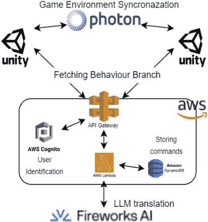
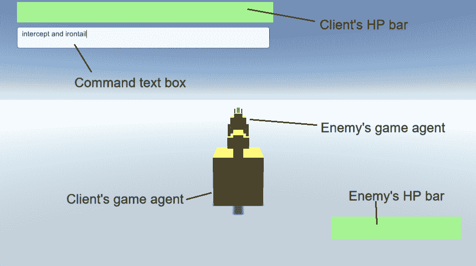
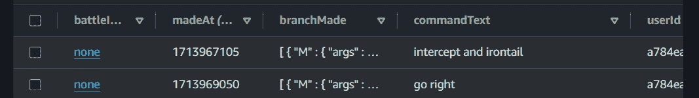

<!--yml

分类：未分类

日期：2025-01-11 12:38:54

-->

# 演示论文：通过代码生成LLM驱动的自由文本命令的游戏代理战斗

> 来源：[https://arxiv.org/html/2405.11835/](https://arxiv.org/html/2405.11835/)

伊藤雷，工程学院，

东京大学，日本东京

ray51ito@g.ecc.u-tokyo.ac.jp    高桥纯一郎，工程学院，

东京大学，日本东京

takahashi-junichiro509@g.ecc.u-tokyo.ac.jp

###### 摘要

本文展示了我们怪物战斗游戏的演示，游戏代理根据玩家的语言命令进行战斗。这些命令被转换为一种名为行为分支的知识表达，由代码生成的大型语言模型（LLM）处理。该工作使得指令系统的设计更加简便，能够让游戏代理理解比基于规则的方法更为多样和连续的命令。指令和翻译过程的结果被存储在亚马逊Web服务（AWS）服务器上的数据库中，以便进行更全面的验证。这一实现将为正在进行的工作提供充分的评估，并为行业提供洞察，使他们可以利用这一技术开发互动游戏代理。

###### 关键词：

游戏AI，角色AI，大型语言模型（LLM），游戏代理，知识表达，人机交互，娱乐计算

## I 引言

游戏玩家希望控制他们训练的怪物，这一需求催生了如《宝可梦》、《数码宝贝》和《怪物农场》等游戏的成功。然而，在这些游戏中，玩家只能从有限的选项中选择来指挥他们的怪物。这引发了许多尝试，包括[[1](https://arxiv.org/html/2405.11835v1#bib.bib1)，[2](https://arxiv.org/html/2405.11835v1#bib.bib2)，[3](https://arxiv.org/html/2405.11835v1#bib.bib3)，[4](https://arxiv.org/html/2405.11835v1#bib.bib4)]，旨在使游戏中的怪物理解并响应语言命令，但这些实现是基于规则的，开发者很难通过硬编码实现足够的互动。因此，[[5](https://arxiv.org/html/2405.11835v1#bib.bib5)]提出了一种方法，将玩家的语言命令不受限制地转换为游戏代理的行动。这些语言命令被传递给代码生成的大型语言模型（LLM），该模型生成名为行为分支的知识表达。这一方法使得游戏代理能够理解玩家命令中更广泛的内容和表达。使用代码生成LLM的概念源自[[6](https://arxiv.org/html/2405.11835v1#bib.bib6)]。虽然[[6](https://arxiv.org/html/2405.11835v1#bib.bib6)]的初衷是处理机器人独立任务，但[[5](https://arxiv.org/html/2405.11835v1#bib.bib5)]将这一方法扩展到游戏代理，从而实现更连续和快速变化命令的执行。

为了检查此方法是否有效，[[5](https://arxiv.org/html/2405.11835v1#bib.bib5)]仅实现了一个可控制的游戏代理与一个静止的代理对战。然而，在实际玩家对战的背景下，这种方法的有效性尚未得到验证。在本文中，我们展示了一个系统，使两个玩家能够在该指令系统下远程对战，并且指令和翻译结果被存储在我们后端服务器的数据库中。因此，我们旨在通过以下方式为知识和娱乐技术的进步做出贡献：

+   •

    为了对这项正在进行的工作进行实际验证。

+   •

    向行业和研究人员展示他们可以使用或扩展我们的方法来开发他们的互动游戏系统。

## II 系统概览

### II-A 整个系统

图1：整个系统的概览。

该系统由以下组件组成，如图[1](https://arxiv.org/html/2405.11835v1#S2.F1 "图1 ‣ II-A 整个系统 ‣ II 系统概览 ‣ 演示论文：通过代码生成的LLM使用自由形式文本指令驱动的游戏代理对战")所示。每个组件的描述如下：

+   •

    Unity (2022.3.15f1)：Unity计算游戏环境并将其提供给玩家。

+   •

    Photon PUN2 (2.45)：PUN2用于Unity客户端之间的实时网络同步。

+   •

    AWS服务器：该服务器用于根据玩家的指令生成行为分支并存储翻译日志。每个玩家通过Cognito进行身份验证，日志存储在DynamoDB中。Lambda负责API控制，包括访问LLM模型。整体延迟平均为1.8秒。

+   •

    Fireworks AI：Fireworks AI的API用于利用默认的‘llama-v2-34b-code’模型。Fireworks AI因其快速的延迟被选择，平均延迟为0.9秒。

### II-B 游戏环境

在游戏环境中，两个游戏代理被放置在平面的3D空间中。游戏代理可以在3D空间中移动，并使用以下攻击¹¹1这些灵感来自于Creatures Inc.的《Poképark Wii：皮卡丘的冒险》：

+   •

    雷霆攻击：游戏代理向对手发射雷霆（实现为一个球体）。

+   •

    铁尾：游戏代理挥动尾巴攻击对手。

+   •

    猛扑：游戏代理冲向并击打对手。

图2：游戏的视觉界面。

游戏的界面如图[2](https://arxiv.org/html/2405.11835v1#S2.F2 "图2 ‣ II-B 游戏环境 ‣ II 系统概览 ‣ 演示论文：通过代码生成的LLM使用自由形式文本指令驱动的游戏代理对战")所示。玩家可以通过在文本框中输入指令来指挥他们的游戏代理。当按下回车键时，指令会被翻译。玩家输入时，游戏会暂停。

### II-C 指令-行动翻译

语言命令被翻译成可执行的知识表达形式，称为行为分支，由[[5](https://arxiv.org/html/2405.11835v1#bib.bib5)]提出。行为分支是由以下节点组成的树结构：

+   •

    动作节点：指定要执行的动作。

+   •

    条件节点：与两个节点相连，节点的满足情况决定下一个要执行的节点。

+   •

    控制节点：指定执行流程的控制。

这遵循了结构化编程的概念，附加不同的行为分支可以动态编辑执行流程。正如[[5](https://arxiv.org/html/2405.11835v1#bib.bib5)]所示，游戏代理能够理解并执行自由编写的命令，在静态实验中²²2静态实验指的是只有一个游戏代理可操作，其他保持静止。因此，本文的目标是探讨在实际战斗中的表现，而这一点尚未得到验证。有关行为分支的更多细节，请参阅[[5](https://arxiv.org/html/2405.11835v1#bib.bib5)]。

与[[6](https://arxiv.org/html/2405.11835v1#bib.bib6)]类似，给LLM的提示提供了预期的格式和Python中翻译的示例。推理代码通过LLM API返回并开始处理，一旦检测到生成的Python代码中的闭合括号，指向行为分支，就开始处理。这个提前停止使得翻译比[[5](https://arxiv.org/html/2405.11835v1#bib.bib5)]快了1.1秒。

### II-D 数据库中的日志

图3：DynamoDB中表格的截图。请注意，任何个人信息均未显示。

图[3](https://arxiv.org/html/2405.11835v1#S2.F3 "图3 ‣ II-D 数据库中的日志 ‣ II 系统概述 ‣ 演示论文：基于自由文本命令的游戏代理对战，使用代码生成LLM")显示了一段录制的数据。每个命令对应一行数据，包含战斗会话的ID、命令的Unix时间戳、玩家的Cognito ID、原始命令文本以及以JSON格式翻译的行为分支。

## III 演示

在演示过程中，两个与会者将使用准备好的两台笔记本电脑玩游戏。演示者将解释游戏规则以及游戏代理能够执行的动作。与会者将通过在文本框中输入命令来玩游戏，并试图击败对方的游戏代理。整个游戏大约需要3分钟。简而言之，演示所需的设施包括一张可以放置笔记本电脑和键盘的桌子，以及网络连接。

## IV 结论与未来工作

本文展示了一种战斗游戏系统，其中游戏角色能灵活地跟随玩家的指令。由[[5](https://arxiv.org/html/2405.11835v1#bib.bib5)]提出的方法，通过代码生成的大型语言模型（LLM）将玩家指令转化为行为分支，已经能够应用于实际的战斗游戏中。未来的工作计划进行定量和定性实验，以评估和改进我们提出的方法，使其更加实用并对游戏行业更具价值。

## 参考文献

+   [1] Hobonichi Co. Ltd., “皮卡丘决定面前的蘑菇更为重要,” 《Hobo Niccan Itoi Shinbun》, 1999年2月。 https://www.1101.com/nintendo/nin3/nin3-2.htm（访问日期：2024年4月25日）。

+   [2] M. Yoshida, H. Bizen, M. Kambe, 和 Y. Kawai, “虚拟空间中的语音操控系统利用同义词,” 日本信息处理学会年会会议论文集, 2021年3月, 第137-138页。

+   [3] Q. Mehdi, X. Zeng, 和 N. Gough, “动态环境中虚拟角色的互动语音界面,” 在ISAS 04会议论文集, 第10届信息系统分析与综合国际会议, 2004年7月, 第243-248页。

+   [4] D. M. Waqar, T. S. Gunawan, M. Kartiwi 和 R. Ahmad, “使用卷积神经网络的实时语音控制游戏互动,” 2021年IEEE第七届智能仪器、测量与应用国际会议, 2021年, 第76-81页。

+   [5] R. Ito 和 J. Takahashi, “由自由形式文本命令驱动的游戏代理：利用基于LLM的代码生成和行为分支（待出版）,” 日本人工智能学会第38届年会, 2024年5月, 可用: https://arxiv.org/abs/2402.07442。

+   [6] J. Liang 等, “作为策略的代码：语言模型程序在具身控制中的应用,” 2023年IEEE机器人与自动化国际会议, 2023年5月, 第9493-9500页。
