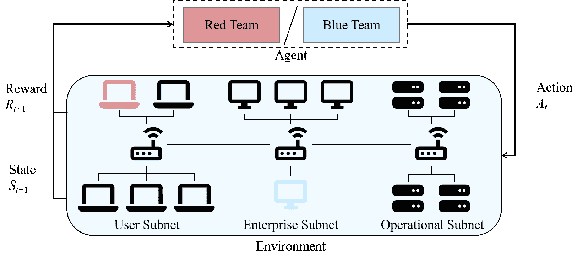
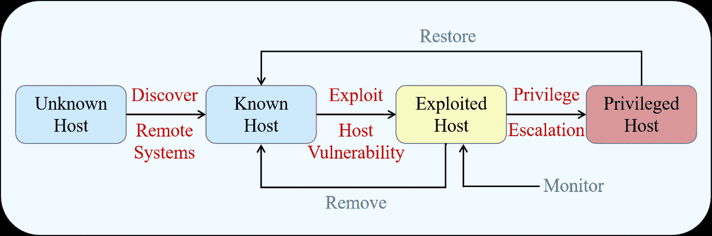
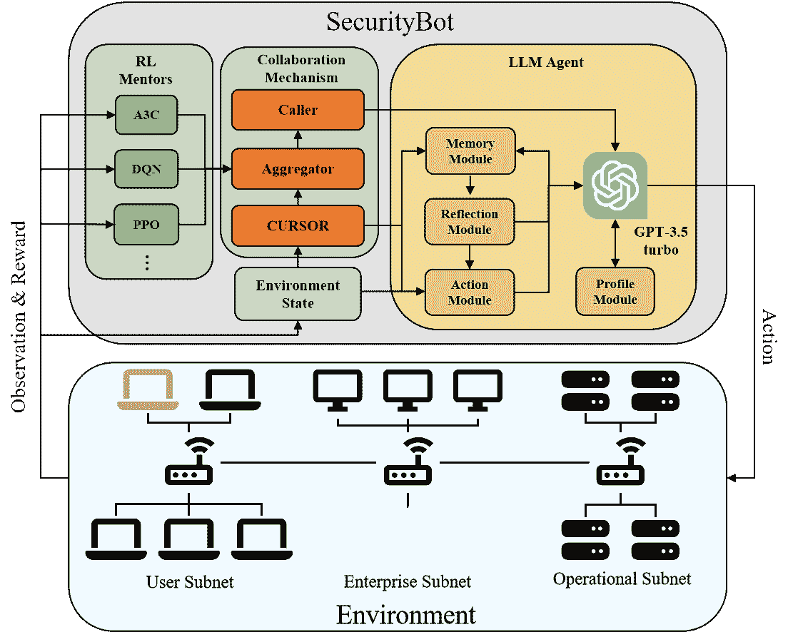
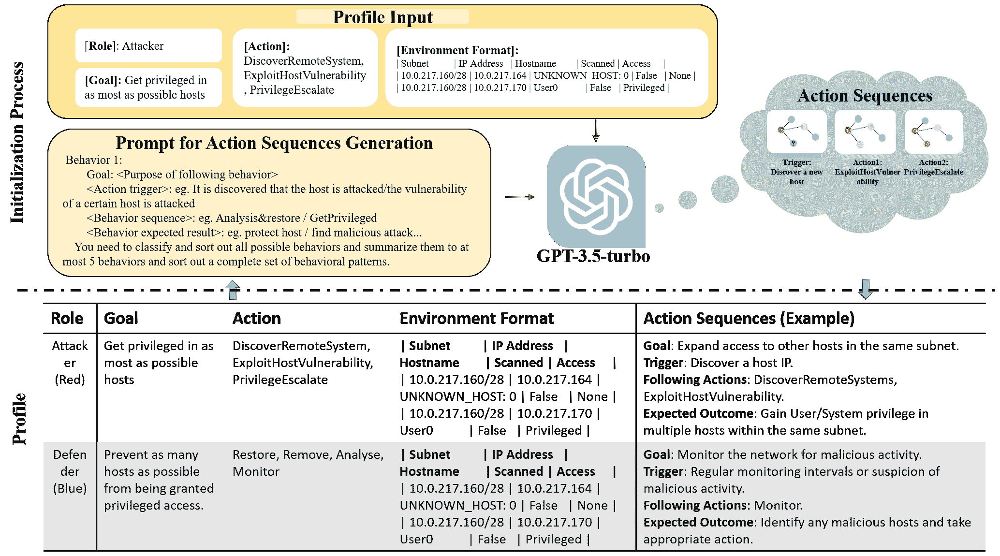
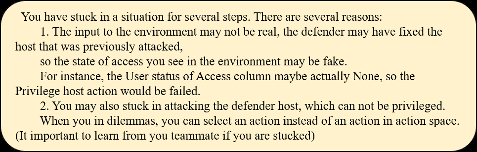
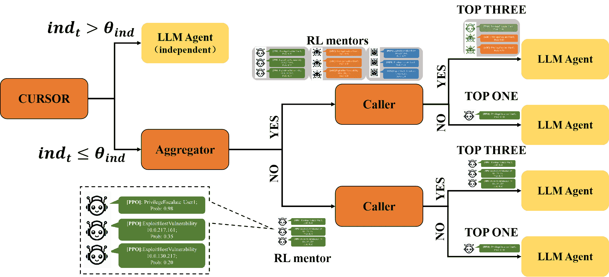

<!--yml  

分类：未分类  

日期：2025-01-11 12:44:19  

-->

# 取决于你自己何时：使用强化学习（RL）代理辅导大语言模型（LLM）成为网络安全游戏的高手  

> 来源：[https://arxiv.org/html/2403.17674/](https://arxiv.org/html/2403.17674/)  

颜逸宽¹ 这些作者贡献相同。    张尧伦¹¹¹脚注标记：1    黄克曼^(1,2)  

¹中国人民大学信息学院，北京，中国  

²麻省理工学院斯隆商学院网络安全，麻省剑桥，美国  

{yanyikuan, zhangyaolun5, keman}@ruc.edu.cn 通讯作者。  

###### 摘要  

将LLM和强化学习（RL）代理有效结合以实现互补性能，在网络安全等高风险任务中至关重要。在本研究中，我们介绍了SecurityBot，一个由预训练RL代理辅导的LLM代理，用于支持网络安全操作。具体来说，LLM代理通过配置文件模块生成行为指南、内存模块积累局部经验、反思模块重新评估选择，并通过行动模块减少行动空间。此外，它采用协作机制，从预训练RL代理处获得建议，其中包括一个用于动态选择建议的光标，一个用于多位导师建议排序的聚合器，以及一个用于主动请求建议的呼叫器。基于CybORG实验框架，我们的经验表明，与LLM或RL单独使用相比，SecurityBot在网络安全游戏中显示出显著的性能提升，达到了互补性能。  

## 1 引言  

网络安全操作涉及多个实体的参与，如攻击者和防御者。随着人工智能（AI）的发展，自治网络操作（ACO）代理已经成为网络安全操作中的一个有前景的解决方案 Vyas 等人 ([2023](https://arxiv.org/html/2403.17674v1#bib.bib36))。这些代理在网络环境中持续进行对抗性学习，提升其战略能力。近年来，大型语言模型（LLM）的迅猛发展显著增强了自治代理的能力 Wang 等人 ([2023a](https://arxiv.org/html/2403.17674v1#bib.bib38))。与传统的机器学习代理相比，LLM 代理具备广泛的知识，能够处理更丰富、更复杂的信息，并且拥有强大的上下文和推理能力 Lin 等人 ([2023](https://arxiv.org/html/2403.17674v1#bib.bib18)); Wang 等人 ([2023b](https://arxiv.org/html/2403.17674v1#bib.bib39), [c](https://arxiv.org/html/2403.17674v1#bib.bib40))。它们不仅在作为新工具时超越了现有的最先进方法 Xia 等人 ([2023](https://arxiv.org/html/2403.17674v1#bib.bib43))，还展示了作为助手或代理的强大互动能力 Sandoval 等人 ([2023](https://arxiv.org/html/2403.17674v1#bib.bib30))。  

然而，LLM 代理缺乏对本地环境的特定知识，导致更高的训练成本（Hu 等人，[2023](https://arxiv.org/html/2403.17674v1#bib.bib12)），并且可能会陷入幻觉状态（Ji 等人，[2023](https://arxiv.org/html/2403.17674v1#bib.bib14)）；Chen 和 Shu（[2023](https://arxiv.org/html/2403.17674v1#bib.bib5)），同时也为攻击者提供了强大的武器，使其成为网络安全的双刃剑（Chen 和 Shu，[2023](https://arxiv.org/html/2403.17674v1#bib.bib5)）；Taddeo 等人（[2019](https://arxiv.org/html/2403.17674v1#bib.bib33)）。最近的研究尝试将 ACO 框架构建为部分可观察马尔可夫过程（POMDP），并使用强化学习（RL）方法训练自主代理（Standen 等人，[2021](https://arxiv.org/html/2403.17674v1#bib.bib32)）；Team.（[2021](https://arxiv.org/html/2403.17674v1#bib.bib35)）。然而，在没有适当调优方法的情况下，RL 代理往往会收敛到局部最优解，尽管取得了较好的结果，但缺乏鲁棒性和泛化能力（Palmer 等人，[2023](https://arxiv.org/html/2403.17674v1#bib.bib25)）。由于先前的研究已经证明，多个代理之间的协作能够增强团队表现（Dong 等人，[2023](https://arxiv.org/html/2403.17674v1#bib.bib8)）；Ma 等人（[2023](https://arxiv.org/html/2403.17674v1#bib.bib19)），因此，实现 LLM 代理与 RL 代理之间的有效协作，利用 LLM 的泛化知识和 RL 在网络安全场景中的专业知识，有望实现超越单一代理的互补性能。

因此，我们引入了 SecurityBot，这是一个利用 RL 代理作为 LLM 代理导师来支持网络安全操作的协作框架。我们将四个有效的模块——个人档案、记忆、反思和行动——集成到 LLM 中。同时，我们提出了一个动态机制，其中包括一个光标，用于动态地融入 RL 代理的建议，一个聚合器，用于对来自不同 RL 代理的建议进行排名，以及一个调用器，用于主动向 RL 代理请求指导。我们在开源 ACO 研究平台 CybORG（Standen 等人，[2021](https://arxiv.org/html/2403.17674v1#bib.bib32)）上进行了实验，比较了红队（攻击者）任务和蓝队（防御者）任务在以下三种情况中的表现：(1) 独立执行的 RL 或 LLM 代理（独立）；(2) LLM 代理与 RL 代理的协作（单一导师）；(3) LLM 代理与多个 RL 代理的协作（多导师）。我们的实验结果表明，所开发的 SecurityBot 能够有效提高红队和蓝队任务的表现，相较于独立的 LLM 或 RL 方法。此外，尽管来自多个 RL 代理的指导可能是有益的，但表现不佳的 RL 代理的指导可能会成为噪声，导致不稳定的表现。

+   •

    我们介绍了SecurityBot，一种机制，旨在实现LLM和RL智能体之间的有效协作，利用RL智能体作为导师来加速LLM智能体的学习，并实现互补的性能。

+   •

    LLM与RL智能体的协作在红队和蓝队任务中展现了性能提升，提供了一种有前景的自动化智能体解决方案，用于网络安全操作。

## 2 相关工作

### 2.1 LLM在网络安全操作中的应用

鉴于LLM的快速发展以及将先进的人工智能融入网络安全操作的迫切需求，Iannone等人（[2022](https://arxiv.org/html/2403.17674v1#bib.bib13)）的研究表明，近期的研究已经开始探索使用LLM来增强网络安全，同时也有多项证据表明，滥用LLM会带来先进的威胁，使其成为一把双刃剑，Taddeo等人（[2019](https://arxiv.org/html/2403.17674v1#bib.bib33)）；Yao等人（[2023](https://arxiv.org/html/2403.17674v1#bib.bib46)）

#### 2.1.1 LLM增强网络安全

LLM在代码安全和数据安全方面展现出了优势，Noever（[2023](https://arxiv.org/html/2403.17674v1#bib.bib24)）；Ali和Kostakos（[2023](https://arxiv.org/html/2403.17674v1#bib.bib1)）；Qi等人（[2023](https://arxiv.org/html/2403.17674v1#bib.bib28)）。例如，Fuzz4All Xia等人（[2023](https://arxiv.org/html/2403.17674v1#bib.bib43)）利用LLM作为输入生成器和变异引擎，为各种编程语言生成多样化的输入，相较于之前的最先进技术，达到了36.8%的覆盖率提升。

此外，与传统的机器学习方法相比，LLM具有更强大的自然语言处理和上下文理解能力，使其能够将网络安全任务从具体的领域提升到更宏观的层面。例如，一些研究如Deng等人（[2023](https://arxiv.org/html/2403.17674v1#bib.bib7)）；Pearce等人（[2023](https://arxiv.org/html/2403.17674v1#bib.bib27)）利用这些能力在特定的安全任务中提高了效果，而McIntosh等人（McIntosh等人（[2023](https://arxiv.org/html/2403.17674v1#bib.bib20)）则进一步对比了GPT生成的治理、风险和合规（GRC）政策与来自知名安全供应商和政府网络安全机构的政策，建议将GPT集成到公司GRC政策的制定中。

#### 2.1.2 LLM在网络安全中的双刃剑作用

然而，将LLM应用于网络安全是一把双刃剑，Taddeo 等人（[2019](https://arxiv.org/html/2403.17674v1#bib.bib33)）指出：LLM的生成特性可能导致幻觉——即生成误导性或不正确的内容，并且无法有效辨识与安全相关的谬误，这对高风险的安全任务可能是灾难性的，Ji 等人（[2023](https://arxiv.org/html/2403.17674v1#bib.bib14)）表示。这些错误可能会危及敏感操作，从而引入重大风险，Chen 和 Shu（[2023](https://arxiv.org/html/2403.17674v1#bib.bib5)）指出。随着LLM在安全框架中的不断集成，解决和缓解这些挑战的紧迫性变得愈发重要。

此外，LLM还为攻击者提供了强大的武器。近期研究表明，LLM可以显著增强在硬件Yaman（[2023](https://arxiv.org/html/2403.17674v1#bib.bib45)）、软件和网络Chen 和 Shu（[2023](https://arxiv.org/html/2403.17674v1#bib.bib5)）层面的攻击，特别是LLM具有人类般的推理能力，使得用户级攻击变得更加严重，Yao 等人（[2023](https://arxiv.org/html/2403.17674v1#bib.bib46)）；Falade（[2023](https://arxiv.org/html/2403.17674v1#bib.bib10)）；Botacin（[2023](https://arxiv.org/html/2403.17674v1#bib.bib2)）指出。

### 2.2 改进LLM的协作机制

近期的研究探索了不同的机制来支持LLM与其他代理的协作，这些代理可以是基于LLM或基于RL的，包括：

#### 2.2.1 基于角色的多LLM代理协作

在基于LLM的多智能体系统中，基于LLM的智能体被赋予不同的角色，例如分解复杂任务、识别错误和收集多角度观点。然后，它们通过一系列过程相互协作，以解决复杂任务，如软件开发（Dong等人，([2023](https://arxiv.org/html/2403.17674v1#bib.bib8))）；Qian等人，([2023](https://arxiv.org/html/2403.17674v1#bib.bib29))）；Hong等人，([2023](https://arxiv.org/html/2403.17674v1#bib.bib11))），社会学调查（Park等人，([2023](https://arxiv.org/html/2403.17674v1#bib.bib26))）；Wang等人，([2023b](https://arxiv.org/html/2403.17674v1#bib.bib39))）；Zhang等人，([2023](https://arxiv.org/html/2403.17674v1#bib.bib47))），多人游戏模拟（Sandoval等人，([2023](https://arxiv.org/html/2403.17674v1#bib.bib30))）；Xu等人，([2023](https://arxiv.org/html/2403.17674v1#bib.bib44))）以及各种挑战（如逻辑推理、股票建议、博客创作等）（Li等人，([2023](https://arxiv.org/html/2403.17674v1#bib.bib17))）；Wu等人，([2023](https://arxiv.org/html/2403.17674v1#bib.bib42))）；Talebirad和Nadiri，([2023](https://arxiv.org/html/2403.17674v1#bib.bib34))）。特别地，不同角色的智能体通过对话交换想法，使用工具执行任务，获取反馈，从而实现成功的协作（Wang等人，([2023a](https://arxiv.org/html/2403.17674v1#bib.bib38))）。

#### 2.2.2 基于双过程的LLM-RL协作

双过程理论强调人类认知由两种心理系统组成，其中系统1是自主的，特点是快速直觉，而系统2则控制着缓慢的、深思熟虑的思维（Wason和Evans，([1974](https://arxiv.org/html/2403.17674v1#bib.bib41))）；Kahneman，([2011](https://arxiv.org/html/2403.17674v1#bib.bib15))）。基于这一理论，SwiftSage提出了一个框架，使得一个小型RL模型作为系统1组件与一个基于LLM的智能体作为系统2组件协作。这一结构有效地解决了复杂问题，同时减少了推理成本（Lin等人，([2023](https://arxiv.org/html/2403.17674v1#bib.bib18))）。

#### 2.2.3 LLM设置指导以支持RL

一些近期的研究结合了 LLM 用于生成或学习 RL 代理的奖励函数，旨在简化奖励函数设计过程，例如 Ma 等人（[2023](https://arxiv.org/html/2403.17674v1#bib.bib19)）；Carta 等人（[2022](https://arxiv.org/html/2403.17674v1#bib.bib4)）。例如，Micheli 等人（[2023](https://arxiv.org/html/2403.17674v1#bib.bib21)）；Kwon 等人（[2023](https://arxiv.org/html/2403.17674v1#bib.bib16)）；Du 等人（[2023](https://arxiv.org/html/2403.17674v1#bib.bib9)）将 LLM 用作代理奖励函数，引导 RL 代理在没有明确奖励信号的环境中进行决策。此外，Brohan 等人（[2023](https://arxiv.org/html/2403.17674v1#bib.bib3)）；Dasgupta 等人（[2023](https://arxiv.org/html/2403.17674v1#bib.bib6)）利用基于 LLM 的代理作为规划者，引导 RL 代理在复杂动态的环境中进行决策。

#### 2.2.4 RL 作为专家引导 LLM 的决策

LLM 展现了强大的泛化能力，但在特定场景下，由于缺乏专家轨迹，它们的表现较差。与此相对，RL 模型拥有专家轨迹。因此，Hu 等人（[2023](https://arxiv.org/html/2403.17674v1#bib.bib12)）；Wan 等人（[2022](https://arxiv.org/html/2403.17674v1#bib.bib37)）使用 RL 方法帮助基于 LLM 的代理理解环境，掌握类似专家的行动，从而实现更好的效果并降低交互成本指令。

总体而言，LLMs 在提升网络安全操作方面展现了良好的潜力，但其双刃剑的作用也引发了具体的关注。此外，最近的研究探讨了与 LLMs 的不同合作方式，但这仍处于初期阶段，尤其是在网络安全操作方面。因此，本文以网络安全对抗游戏为研究背景，设计了一个包含四个插件模块和三个协作机制的框架，以增强 LLMs 在网络安全操作中的作用，包括充当攻击者和防御者的角色。

## 3 网络安全对抗游戏与预训练强化学习代理

在详细介绍我们的设计之前，我们首先简要介绍一下我们的研究背景：网络安全对抗游戏。具体而言，我们构建了一个利用 CybORG Standen 等人（[2021](https://arxiv.org/html/2403.17674v1#bib.bib32)）的网络安全对抗游戏，这是一个典型的基于强化学习的自主网络操作（ACO）训练平台。ACO 支持在对抗场景中为蓝队（防御方）和红队（攻击方）创建决策代理，并传递结构化和非结构化信息，支持 RL 和 LLM 代理的适应。

### 3.1 网络安全对抗游戏

本研究采用的场景来源于TTCP CAGE挑战赛1¹¹1https://github.com/cage-challenge/cage-challenge-1，这是一个2021年关于CybORG的公开挑战。如图[1](https://arxiv.org/html/2403.17674v1#S3.F1 "图1 ‣ 3.1 网络安全对抗游戏 ‣ 3 网络安全对抗游戏与预训练RL智能体 ‣ 取决于你自己何时应该：用RL智能体指导LLM成为网络安全游戏的高手")所示，红队和蓝队在一个模拟网络环境中竞争，该环境可建模为部分可观测的马尔可夫决策过程（POMDP）。在每一步，红队和蓝队依次在环境中采取行动，导致环境状态发生变化。

环境与观察。环境包括一个由13个主机组成的网络，这些主机被划分为三个子网。红队从用户子网的踏点节点开始，且无法得知其他主机的情况。蓝队则拥有所有主机的信息，但缺乏关于红队访问状态的知识。

对于红队和蓝队的RL智能体，它们在每一步的向量观察包括：（1）上一个行动是否成功，（2）对手是否对特定主机进行了操作，以及（3）红队对特定主机的访问状态。需要注意的是，由于对手的存在，观察结果不一定是准确的。

图1：一个POMDP网络安全对抗游戏。用户子网中的红色主机代表红队的踏点节点。企业子网中的蓝色主机代表蓝队的防御主机。

动作与奖励。如图[2](https://arxiv.org/html/2403.17674v1#S3.F2 "图2 ‣ 3.1 网络安全对抗游戏 ‣ 3 网络安全对抗游戏与预训练RL智能体 ‣ 取决于你自己何时应该：用RL智能体指导LLM成为网络安全游戏的高手")所示，两个队伍各自有三个相互作用的动作，导致主机访问状态的转变。红队通过从特权主机的连接中发现新主机，实现在子网间的横向移动。我们将游戏设定为零和游戏，这意味着蓝队的奖励与红队的奖励相反。每一步的奖励基于红队的利用程度，

|  | $Reward_{t}=\sum_{i=1}^{n}V_{i,t}\times A_{i,t}$ |  | (1) |
| --- | --- | --- | --- |

其中，$V_{i,t}$和$A_{i,t}$分别表示在第$t$步时，$host_{i}$的价值和访问状态。

图2：动作-状态转移。红色文本表示红队的动作，蓝色文本表示蓝队的动作。

### 3.2 预训练RL智能体

在本研究中，我们选择了三种具有代表性的RL算法来训练红队和蓝队智能体²²2我们的框架灵活，可以使用其他RL算法。：

+   •

    A3C（异步优势行动者-评论员）Mnih等人（[2016](https://arxiv.org/html/2403.17674v1#bib.bib23)）通过异步训练多个代理来结合策略梯度和价值函数方法，从而提高效率。

+   •

    DQN（深度Q网络）Mnih等人（[2013](https://arxiv.org/html/2403.17674v1#bib.bib22)）利用深度神经网络来逼近Q值函数，以指导代理的决策。

+   •

    PPO（近端策略优化）Schulman等人（[2017](https://arxiv.org/html/2403.17674v1#bib.bib31)），一种策略梯度方法，通过近端策略优化确保稳定性，限制策略更新的幅度。

基于RL的环境促进了代理的训练。红队和蓝队代理分别进行训练，每次训练一个代理。为了对抗代理，我们采用了CybORG提供的固定策略代理。特别地，在训练红队RL代理时，我们使用了一个蓝队代理，其固定策略是在每次监视行动中遇到可疑主机时，随机执行删除或恢复操作。在训练蓝队RL代理时，红队代理作为对抗者，按照广度优先策略逐个访问网络节点。我们的方法与传统的RL训练范式一致，其中代理在每个步骤采取行动，吸收新的观察结果和相关的奖励，并逐步优化其战略框架。

## 4 SecurityBot：一个基于LLM的代理，由RL代理指导

如[3](https://arxiv.org/html/2403.17674v1#S4.F3 "图 3 ‣ 4 SecurityBot: 一个基于LLM的代理，由RL代理指导 ‣ 在应当依赖自身时：通过RL代理指导LLM成为网络安全游戏中的大师")所示，我们的SecurityBot包含三个主要部分：基于LLM的代理、预训练的RL代理池作为导师以及它们的协作机制。

图 3：SecurityBot框架：基于LLM的RL指导代理用于网络安全操作

### 4.1 LLM代理设计

基于LLM GPT 3.5-turbo，我们的LLM代理包括四个插件模块，用于每一步的决策。

#### 4.1.1 配置模块

如图[4](https://arxiv.org/html/2403.17674v1#S4.F4 "Figure 4 ‣ 4.1.1 Profile module ‣ 4.1 LLM Agent Design ‣ 4 SecurityBot: an LLM-based agent mentored by RL agents ‣ Depending on yourself when you should: Mentoring LLM with RL agents to become the master in cybersecurity games")所示，配置文件模块根据每个代理的角色初始化其角色、目标和可用动作。特别是，我们设计一个包含观察到的环境格式的输入提示，并且期望输出是一个包含一系列动作及其目标、触发条件、后续动作和预期结果的动作序列。当初始化LLM代理时，我们使用这个提示，结合分配的目标、动作和环境格式，要求LLM生成一个动作序列，并将其添加到配置文件中，作为LLM代理的全局行为指导。

图4：配置文件模块的示意图，包括角色、目标、动作、环境格式的示例以及生成的行为指导（底部部分），以及生成行为指导的过程（顶部部分）。

#### 4.1.2 记忆模块

记忆模块用于存储过去的经验，并在每一步决策时搜索相关的记忆。

记忆存储。记忆模块存储包括时间戳、观察到的环境、采取的动作，以及结果（包括动作状态——成功或失败——以及奖励）。特别是，在存储每条记忆记录时，LLM代理通过提示LLM对其进行0到10的评分，以评估其重要性。

记忆搜索。在每一步搜索记忆以支持动作选择时，LLM代理将计算每条记忆记录的相关性和新鲜度：

+   •

    相关性：衡量其环境与当前环境的相似性。我们将每个环境转换为向量，然后计算它们的余弦相似度。

+   •

    新鲜度：衡量其新鲜度，表示为其与当前步骤的时间戳间隔的倒数。

最后，我们计算每条记忆记录的重要性、相关性和新鲜度的乘积，并选择前两条作为LLM决策时的记忆输入。

#### 4.1.3 动作模块

动作模块在引导LLM代理在每一步采取有效行动中起着至关重要的作用。特别是，给定观察到的环境和由配置文件提供的可用动作，模块将生成代理可能采取的所有潜在动作的动作空间。

#### 4.1.4 反思模块

由于环境复杂且动态，敌对代理可能会改变环境，但对LLM代理不敏感，LLM代理可能会遇到困境情况，表现为重复的动作或奖励的减少。例如，红色代理可能会坚持攻击网络中的主机，即使这种行为已经被证明是徒劳的。因此，反思模块被设计用来监控困境状态并触发反思过程。

图5：反思模块为红色代理提供的提示，以激励LLM选择其他攻击动作。

困境监控。在每一步，反思模块会评估前一步骤中的奖励列表和行动列表。如果奖励没有增加，或者代理重复执行某个动作，模块将收集这些可疑动作，包括与这些记录相关联的动作序列，然后启动反思过程。

反思过程。反思过程将把这些可疑动作传递给行动模块，如果它们包含在生成的行动空间中，则将其移除。此外，如图[5](https://arxiv.org/html/2403.17674v1#S4.F5 "图5 ‣ 4.1.4 反思模块 ‣ 4.1 LLM代理设计 ‣ 4 SecurityBot：由RL代理辅导的基于LLM的代理 ‣ 依据自身情况判断：使用RL代理辅导LLM成为网络安全游戏中的高手")所示，过程会向LLM提供提示，阐明代理陷入困境，并提供可能的原因，指导LLM选择其他行动以摆脱困境。

### 4.2 与RL代理的协作

使用RL代理作为导师指导LLM代理对于SecurityBot实现更好的表现至关重要。更具体地说，如图[6](https://arxiv.org/html/2403.17674v1#S4.F6 "图6 ‣ 4.2 与RL代理的协作 ‣ 4 SecurityBot：由RL代理辅导的基于LLM的代理 ‣ 依据自身情况判断：使用RL代理辅导LLM成为网络安全游戏中的高手")所示，我们设计了三种协作机制：

图6：与RL代理协作的机制。不同的颜色表示不同RL导师的建议。

#### 4.2.1 游标：逐渐独立

首先，RL代理在相同的环境中进行预训练，特别是为了确保它们能够提供知识来辅导LLM代理做出更好的决策，尤其是在LLM代理对环境没有任何信息的早期阶段。然而，随着时间的推移，LLM代理凭借其理解复杂环境的能力和积累的经验，可能会超越RL导师（我们将在后续报告中提到）。因此，我们设计了游标机制来决定LLM代理是否应该接受RL代理的建议。

特别地，对于每个步骤$t$，光标模块将计算一个独立性值$ind_{t}$，并且只有当独立性值$ind_{t}$低于给定阈值$\theta_{ind}$时，LLM代理才会考虑来自RL代理的建议。否则，LLM代理将自行做出决策。因此，光标模块将以一种方式调整独立性值$ind_{t}$，以反映依赖自身的趋势，并在导师的建议被证明有益时考虑导师的建议。如方程[2](https://arxiv.org/html/2403.17674v1#S4.E2 "在 4.2.1 光标：成长为独立 ‣ 4.2 与RL代理的合作 ‣ 4 安全机器人：一个由RL代理指导的LLM代理 ‣ 依赖自己：通过RL代理指导LLM成为网络安全游戏中的大师")中详细说明，我们采用单调递增函数$f_{x}$（方程[3](https://arxiv.org/html/2403.17674v1#S4.E3 "在 4.2.1 光标：成长为独立 ‣ 4.2 与RL代理的合作 ‣ 4 安全机器人：一个由RL代理指导的LLM代理 ‣ 依赖自己：通过RL代理指导LLM成为网络安全游戏中的大师")），使得$part_{1}$反映出依赖LLM自身的趋势。$part_{2}$表示从之前的行动中获得奖励的趋势，而$part_{3}$是信号函数（方程[4](https://arxiv.org/html/2403.17674v1#S4.E4 "在 4.2.1 光标：成长为独立 ‣ 4.2 与RL代理的合作 ‣ 4 安全机器人：一个由RL代理指导的LLM代理 ‣ 依赖自己：通过RL代理指导LLM成为网络安全游戏中的大师")），指示是否在考虑导师建议时选择该行动。换句话说，如果LLM代理在没有RL指导的情况下获得了不断增加的奖励，我们将增加独立性值，从而使LLM代理变得更加独立。请注意，我们引入了参数$\alpha$来控制变化速率，$\theta_{lr}$表示我们期望LLM代理获得的最小奖励增量。

|  |  $\begin{aligned} ind_{t}&=ind_{t-1}+\underbrace{(f_{t}-f_{t-1})}_{\text{part\_1% }}\\ &\quad+\underbrace{\min(\alpha\times ind_{t-1},(r_{t-1}-r_{t-2}-\theta_{lr}))}% _{\text{part\_2}}&\quad\times\underbrace{\operatorname{sgn}(ind_{t-1}-\theta_{% ind})}_{\text{part\_3}}\end{aligned}$  |  | (2) |
| --- | --- | --- | --- |
|  | $\leavevmode\resizebox{108.405pt}{}{$\displaystyle f_{x}=\frac{1}{1+e^{-kx}}$}.$ |  | (3) |
|  | $\leavevmode\resizebox{195.12767pt}{}{$\displaystyle sgn(x)=\{\begin{array}[]{c% }-1\ \ \ \text{如果}\ x>0\\ 1\ \ \ \ \text{否则}\end{array}$}.$ |  | (4) |

#### 4.2.2 聚合器：从多个导师中排名建议

与其仅依赖一个RL代理，LLM可以参考多个RL代理，因为不同的RL代理可能会捕捉到任务的不同方面。因此，我们进一步引入了聚合机制，用于聚合来自多个RL代理的建议。特别是，考虑到来自所有RL导师的前三条建议及其置信度，多导师机制将根据置信度对其进行排序，并将排名第一的建议呈现给LLM，而在困境中提供前三条行动建议。在这种情况下，LLM代理不一定在整个任务期间始终从一个特定的RL代理那里获得建议。

#### 4.2.3 呼叫者：在困境中主动寻求帮助

如上所述，当LLM代理遇到困境时，反思模块将被激活。此外，除了激活反思过程外，LLM代理还可以进一步参考RL代理以获得支持。与在正常情况下仅参考RL导师输入并提供一个建议不同，我们将提供来自RL导师的前三条置信度较高的建议。

## 5 实验与结果

### 5.1 实验设置

环境。根据Cage Challenge 1的设置，我们将一个回合中的最大步骤数（即游戏的完整回合）设置为100。如前所述，我们设置了两个奖励参数，如表[1](https://arxiv.org/html/2403.17674v1#S5.T1 "表1 ‣ 5.1 实验设置 ‣ 5 实验与结果 ‣ 依靠你自己来决定何时：利用RL代理来辅导LLM，成为网络安全游戏中的大师")所示：（1）主机价值。不同子网中的主机具有不同的价值，(2) 访问状态。主机的访问状态越高，红队获得的主机价值比例越高。

表1：代理奖励参数。

| 主机子网(V) | 奖励 | 访问状态(A) | 奖励 |
| --- | --- | --- | --- |
| 用户子网 | 0.1 | 未知/已知 | 0 |
| 企业子网 | 1.0 | 被利用 | 0.5 |
| 操作子网 | 10.0 | 特权 | 0.89 |

RL训练。RL训练过程基于Ray RLlib，这是一个用于RL的Python库³³3我们关注的是RL代理和LLM代理之间的协作，而不是训练更好的RL代理。因此，我们选择使用最简单的策略和默认参数来设置对抗者，训练算法不进行参数调优。所有具体算法参数可以参考 https://github.com/ray-project/ray/blob/master/rllib/algorithms/。每个训练过程包括总共100次迭代（共4000回合）。

LLM设置。我们利用OpenAI的gpt-3.5-turbo API来构建LLM代理。所有的温度参数都设置为0，以限制LLM输出的格式。

+   •

    反思。如果在最后三个步骤中重复该动作，或者在最后五个步骤中奖励值没有增加，则会触发反思机制。

+   •

    游标。$\theta_{ind}$设置为0.6，$\theta_{lr}$设置为0.3，$\alpha$设置为0.3，$f(x)$中的$k$设置为0.0135。

测量。我们考虑以下测量标准。

+   •

    步骤奖励。每一步的奖励。

+   •

    合作率（$Col$）。与RL智能体合作的比率。

+   •

    困境率（$DR$）。在陷入困境时，与RL智能体合作的比率。

+   •

    接受率（$AR$）。LLM智能体接受RL导师建议的比率，表示LLM智能体依赖RL导师的程度。

+   •

    困境中的接受率（$AR_{d}$）。LLM智能体在陷入困境时接受建议的比率，展示了RL导师帮助LLM智能体脱困的能力。

实验组。我们逐步添加协作模块，并评估其对红队和蓝队的表现。对于每个组，我们进行5次仿真并计算平均值。

+   •

    独立性。每个RL智能体（A3C、DQN、PPO）和我们设计的LLM智能体独立执行任务。

+   •

    单导师。LLM智能体与单个RL智能体合作（A3C&LLM、DQN&LLM、PPO&LLM）。

+   •

    多导师。LLM智能体与所有三种不同的RL智能体合作（MultiMentor）。

### 5.2 红队任务中的表现

在红队任务中，LLM智能体和RL智能体表现出不同的行动模式，表明它们有不同的知识基础。尽管协同效应可以超过单个智能体的表现，但当RL智能体表现优异时，最佳的协作才能实现。然而，当LLM智能体考虑来自多个RL智能体的建议时，它很难有效处理这些信息，导致协同表现下降。⁴⁴4我们使用指数平滑法对数据进行了平滑，并计算了置信区间。

图7：红队任务结果。（a）LLM与PPO的比较。它们在不同阶段有不同的表现。（b）单个RL导师的结果。PPO&LLM超越其他所有组合。（c）多RL导师与单个RL导师的比较。PPO&LLM仍表现最佳。

#### 5.2.1 补充LLM智能体与RL导师的知识

如图[7](https://arxiv.org/html/2403.17674v1#S5.F7 "Figure 7 ‣ 5.2 Performance in Red Team Task ‣ 5 Experiments and Results ‣ Depending on yourself when you should: Mentoring LLM with RL agents to become the master in cybersecurity games")所示，（a）⁵⁵5三种RL智能体的表现有所不同，而PPO智能体表现优越。由于空间限制，我们只报告PPO智能体的表现。LLM智能体和PPO智能体的奖励曲线交叉：PPO智能体在初期迅速积累奖励，后期趋于平稳。这种行为源于PPO智能体在训练过程中获得了环境知识，认识到操作子网中主机的高价值。尽管展现出深度优先的特征，但训练不足导致它收敛到局部最优解。

相反，尽管LLM代理在早期的奖励较为适中，但它实现了快速增长，在后期超越了PPO代理。LLM代理的行为呈现广度优先模式，在网络中高效积累更多已利用的主机，避开防御者的封锁，从而获得更高的奖励。

进一步分析，我们发现LLM代理在第53步的单步增益上优于PPO代理，此时我们区分了早期和后期阶段。在后期阶段，我们发现RL导师总是重复执行一个动作，而LLM代理则通过反思模块能够避免这个问题。这可能是RL导师在该阶段表现不如LLM代理的原因。

#### 5.2.2 单导师机制的放大效应

更强的RL导师能够增强协作表现，否则可能会减缓LLM代理的进程。如图[7](https://arxiv.org/html/2403.17674v1#S5.F7 "Figure 7 ‣ 5.2 Performance in Red Team Task ‣ 5 Experiments and Results ‣ Depending on yourself when you should: Mentoring LLM with RL agents to become the master in cybersecurity games")(b)所示，PPO和A3C代理在与LLM代理的合作中表现优于单独的LLM代理，特别是PPO&LLM组展现出协同效应$1+1>2$，并且更早进入快速增长阶段。

表2：红队任务的合作指标

| Metric | PPO&LLM | A3C&LLM | DQN&LLM |
| --- | --- | --- | --- |
|  | $Early\backslash Later$ | $Early\backslash Later$ | $Early\backslash Later$ |
| $Col$ | $61.5\%\backslash 33.3\%$ | $78.8\%\backslash 56.2\%$ | $53.8\%\backslash 43.7\%$ |
| $DR$ | $50.0\%\backslash 100.0\%$ | $34.1\%\backslash 55.6\%$ | $39.3\%\backslash 80.9\%$ |
| $AR$ | $50.0\%\backslash 63.6\%$ | $29.2\%\backslash 51.9\%$ | $35.7\%\backslash 57.1\%$ |
| $AR_{d}$ | $50.0\%\backslash 63.6\%$ | $28.6\%\backslash 53.3\%$ | $27.3\%\backslash 52.9\%$ |

此外，合作机制指导LLM代理在早期阶段向RL导师学习，并在困境中寻求帮助。如表[2](https://arxiv.org/html/2403.17674v1#S5.T2 "Table 2 ‣ 5.2.2 Amplification effect of single-mentor mechanisms ‣ 5.2 Performance in Red Team Task ‣ 5 Experiments and Results ‣ Depending on yourself when you should: Mentoring LLM with RL agents to become the master in cybersecurity games")所示，LLM代理在早期阶段与RL导师的合作多于后期，满足了我们的设计目标。在后期阶段，$DR$值均较高，意味着大部分与RL代理的合作是由困境情境触发的。有趣的是，$AR$和$AR_{d}$的值在后期都更高，意味着尽管在后期超越了RL导师，LLM代理在需要时仍然更多依赖于RL导师的建议。

#### 5.2.3 多导师的噪声

我们探讨了LLM代理是否可以从多导师的推荐中获得更多知识。在我们的设置中，来自多个RL导师的帮助并不总是有效。如图[7](https://arxiv.org/html/2403.17674v1#S5.F7 "Figure 7 ‣ 5.2 Performance in Red Team Task ‣ 5 Experiments and Results ‣ Depending on yourself when you should: Mentoring LLM with RL agents to become the master in cybersecurity games") (c)所示，虽然多导师的表现略优于单独的LLM，但仍不及LLM&PPO组的表现。我们观察到，75.61%的RL导师建议来自DQN，但只有5.41%被接受。相比之下，PPO的建议接受率为34.61%。此外，所有RL建议的接受率仅为15.85%，明显低于单一导师场景中的接受率。这一差异揭示了低表现导师的高自信建议对LLM代理来说成了噪音。

### 5.3 蓝队任务中的表现

图8：蓝队任务结果。（a）LLM与PPO的比较。LLM在蓝队任务中优于PPO。（b）单一RL导师结果。PPO&LLM表现略好于LLM。（c）多导师与单导师的比较。多导师平均表现最好，但稳定性较差。

#### 5.3.1 有用但较窄的互补知识

如图[8](https://arxiv.org/html/2403.17674v1#S5.F8 "Figure 8 ‣ 5.3 Performance in Blue Team Task ‣ 5 Experiments and Results ‣ Depending on yourself when you should: Mentoring LLM with RL agents to become the master in cybersecurity games") (a)所示，LLM代理在初期阶段的表现与PPO代理相似。但在经历了一段短暂的发散期后，LLM代理始终优于PPO代理。我们在单一导师的情况下也观察到类似的情况。如图[8](https://arxiv.org/html/2403.17674v1#S5.F8 "Figure 8 ‣ 5.3 Performance in Blue Team Task ‣ 5 Experiments and Results ‣ Depending on yourself when you should: Mentoring LLM with RL agents to become the master in cybersecurity games") (b)所示，尽管PPO&LLM组在表现上稍微优于LLM代理，但在其他组中并未观察到这种优势。这些结果表明，在蓝队任务中LLM和RL代理之间的知识差距较小，这可能是由于整个网络环境用于预训练RL代理并提供给LLM代理的原因。

此外，如表 [3](https://arxiv.org/html/2403.17674v1#S5.T3 "表 3 ‣ 5.3.1 有益但较窄的补充知识 ‣ 5.3 蓝队任务中的表现 ‣ 5 实验与结果 ‣ 根据自己的判断：通过 RL 代理对 LLM 进行辅导，帮助其在网络安全竞赛中成为大师") 中所示，LLM 代理在早期阶段会接受 RL 导师的建议。然而，在后期，A3C&LLM 和 DQN&LLM 两组对 RL 导师的建议几乎不感兴趣，除非它们陷入了困境。相反，我们可以观察到 PPO&LLM 在后期阶段的 $AR$ 率 consistently 更高。这一差异表明了 LLM 代理识别建议质量的能力，以及提供高质量建议对于提高 LLM 代理有效性的必要性。

表 3：蓝队任务中的合作结果

| 指标 | PPO&LLM | A3C&LLM | DQN&LLM |
| --- | --- | --- | --- |
|  | $早期\backslash 后期$ | $早期\backslash 后期$ | $早期\backslash 后期$ |
| $Col$ | $48.1\%\backslash 22.9\%$ | $78.8\%\backslash 33.3\%$ | $71.2\%\backslash 16.7\%$ |
| $DR$ | $40.0\%\backslash 45.5\%$ | $43.9\%\backslash 100.0\%$ | $27.0\%\backslash 100.0\%$ |
| $AR$ | $100.0\%\backslash 81.9\%$ | $53.7\%\backslash 28.6\%$ | $91.9\%\backslash 28.6\%$ |
| $AR_{d}$ | $100.0\%\backslash 60.0\%$ | $31.3\%\backslash 28.6\%$ | $100.0\%\backslash 28.6\%$ |

#### 5.3.2 多导师的杰出但不稳定表现

与红队任务相比，如图 [8](https://arxiv.org/html/2403.17674v1#S5.F8 "图 8 ‣ 5.3 蓝队任务中的表现 ‣ 5 实验与结果 ‣ 根据自己的判断：通过 RL 代理对 LLM 进行辅导，帮助其在网络安全竞赛中成为大师") (c) 所示，加入多个 RL 导师提升了蓝队任务的平均表现，超过了 LLM 代理和 PPO&LLM 组的表现。然而，这种配置表现出不稳定性，表现在更大的置信区间上。虽然它有时能有效防御几乎所有主机，但在某些情况下，其表现与单个 LLM 的表现相当。值得注意的是，LLM 代理接受的 RL 导师建议不到 5%，这些建议主要来自 DQN。其背后的原因之一是，最有信心的 RL 建议并不总是最有效的，尤其是当多个导师提供建议时。

此外，在蓝队任务中，LLM 代理展示了对环境的优越理解，通常在大多数情况下独立行动。特别是在 LLM 代理成功防御几乎所有主机的场景中，它似乎忽视了多个 RL 导师的不可靠建议，选择自主做出关键决策。

## 6 结论与未来工作

本研究介绍了SecurityBot，一个由预训练的RL代理指导的LLM代理，用于网络安全操作。特别是，通过设计的插件模块，包括配置文件、记忆、反思和行动模块来增强LLM，并通过三种协作机制，包括光标、聚合器和调用器，有效地与预训练的RL代理进行协作，LLM代理在网络攻击和防御任务中实现了显著的性能提升。尽管RL代理可以通过预训练有效地学习局部知识，但LLM代理可以通过在后期学习环境来超越它们。这证实了我们设计的LLM代理可以成为支持网络安全操作的有前景的解决方案。

尽管强化学习（RL）代理的建议可能会有帮助，特别是在大语言模型（LLM）代理陷入困境时，正如我们在实验结果中观察到的那样，较弱的RL代理可能会成为噪音，分散LLM代理的注意力。进一步的研究可以设计先进的聚合策略，从RL代理中提取精华，剔除杂质。此外，尽管我们旨在通过插件模块增强LLM并与RL代理协作，但我们并未对LLM进行微调或优化RL代理。未来的研究可以针对网络安全操作微调一个更好的LLM模型，并训练优化的RL代理，这将进一步提高SecurityBot的性能。

## 参考文献

+   Ali and Kostakos [2023] Tarek Ali and Panos Kostakos. Huntgpt: Integrating machine learning-based anomaly detection and explainable ai with large language models (llms). arXiv preprint arXiv:2309.16021, 2023.

+   Botacin [2023] Marcus Botacin. Gpthreats-3: Is automatic malware generation a threat? In 2023 IEEE Security and Privacy Workshops (SPW), pages 238–254. IEEE, 2023.

+   Brohan et al. [2023] Anthony Brohan, Yevgen Chebotar, Chelsea Finn, Karol Hausman, Alexander Herzog, Daniel Ho, Julian Ibarz, Alex Irpan, Eric Jang, Ryan Julian, et al. Do as i can, not as i say: Grounding language in robotic affordances. In Conference on Robot Learning, pages 287–318. PMLR, 2023.

+   Carta et al. [2022] Thomas Carta, Pierre-Yves Oudeyer, Olivier Sigaud, and Sylvain Lamprier. Eager: Asking and answering questions for automatic reward shaping in language-guided rl. Advances in Neural Information Processing Systems, 35:12478–12490, 2022.

+   Chen and Shu [2023] Canyu Chen and Kai Shu. Can llm-generated misinformation be detected? arXiv preprint arXiv:2309.13788, 2023.

+   Dasgupta et al. [2023] Ishita Dasgupta, Christine Kaeser-Chen, Kenneth Marino, Arun Ahuja, Sheila Babayan, Felix Hill, and Rob Fergus. Collaborating with language models for embodied reasoning. arXiv preprint arXiv:2302.00763, 2023.

+   Deng et al. [2023] Gelei Deng, Yi Liu, Víctor Mayoral-Vilches, Peng Liu, Yuekang Li, Yuan Xu, Tianwei Zhang, Yang Liu, Martin Pinzger, and Stefan Rass. Pentestgpt: An llm-empowered automatic penetration testing tool. arXiv preprint arXiv:2308.06782, 2023.

+   Dong et al. [2023] Yihong Dong, Xue Jiang, Zhi Jin, 和 Ge Li. 通过ChatGPT进行自协作代码生成. arXiv预印本arXiv:2304.07590，2023年。

+   Du et al. [2023] Yuqing Du, Olivia Watkins, Zihan Wang, Cédric Colas, Trevor Darrell, Pieter Abbeel, Abhishek Gupta, 和 Jacob Andreas. 利用大型语言模型引导强化学习中的预训练. arXiv预印本arXiv:2302.06692，2023年。

+   Falade [2023] Polra Victor Falade. 解码威胁格局：ChatGPT、FraudGPT 和 WormGPT 在社会工程攻击中的作用. arXiv预印本arXiv:2310.05595，2023年。

+   Hong et al. [2023] Sirui Hong, Xiawu Zheng, Jonathan Chen, Yuheng Cheng, Jinlin Wang, Ceyao Zhang, Zili Wang, Steven Ka Shing Yau, Zijuan Lin, Liyang Zhou, 等. Metagpt: 多代理协作框架的元编程. arXiv预印本arXiv:2308.00352，2023年。

+   Hu et al. [2023] Bin Hu, Chenyang Zhao, Pu Zhang, Zihao Zhou, Yuanhang Yang, Zenglin Xu, 和 Bin Liu. 通过强化学习方法实现智能代理与大型语言模型的交互. arXiv预印本arXiv:2306.03604，2023年。

+   Iannone et al. [2022] Emanuele Iannone, Roberta Guadagni, Filomena Ferrucci, Andrea De Lucia, 和 Fabio Palomba. 软件漏洞的隐秘生活：一项大规模的实证研究. 《IEEE软件工程学报》，49(1):44–63，2022年。

+   Ji et al. [2023] Ziwei Ji, Nayeon Lee, Rita Frieske, Tiezheng Yu, Dan Su, Yan Xu, Etsuko Ishii, Ye Jin Bang, Andrea Madotto, 和 Pascale Fung. 自然语言生成中的幻觉调查. 《ACM计算机调查》，55(12):1–38，2023年。

+   Kahneman [2011] Daniel Kahneman. 《思考，快与慢》。麦克米兰出版社，2011年。

+   Kwon et al. [2023] Minae Kwon, Sang Michael Xie, Kalesha Bullard, 和 Dorsa Sadigh. 使用语言模型的奖励设计. 载于第十一届国际学习表征会议，ICLR 2023，卢旺达基加利，2023年5月1-5日。OpenReview.net，2023年。

+   Li et al. [2023] Guohao Li, Hasan Abed Al Kader Hammoud, Hani Itani, Dmitrii Khizbullin, 和 Bernard Ghanem. Camel: 用于“大型语言模型社会”中的“心智”探索的交互代理. 载于第37届神经信息处理系统会议，2023年。

+   Lin et al. [2023] Bill Yuchen Lin, Yicheng Fu, Karina Yang, Faeze Brahman, Shiyu Huang, Chandra Bhagavatula, Prithviraj Ammanabrolu, Yejin Choi, 和 Xiang Ren. Swiftsage: 一种用于复杂交互任务的生成代理，结合快速和慢速思维. 载于第37届神经信息处理系统会议，2023年。

+   Ma et al. [2023] Yecheng Jason Ma, William Liang, Guanzhi Wang, De-An Huang, Osbert Bastani, Dinesh Jayaraman, Yuke Zhu, Linxi Fan, 和 Anima Anandkumar. Eureka: 通过编码大型语言模型实现人类水平的奖励设计. arXiv预印本arXiv:2310.12931，2023年。

+   McIntosh等人[2023] Timothy McIntosh, Tong Liu, Teo Susnjak, Hooman Alavizadeh, Alex Ng, Raza Nowrozy, 和 Paul Watters. 利用GPT-4生成网络安全GRC政策：聚焦勒索病毒攻击缓解. 《计算机与安全》，134:103424，2023年。

+   Micheli等人[2023] Vincent Micheli, Eloi Alonso, 和 François Fleuret. Transformers是高效的样本世界模型. 见于第十一届国际学习表征会议ICLR 2023，卢旺达基加利，2023年5月1-5日。OpenReview.net，2023年。

+   Mnih等人[2013] Volodymyr Mnih, Koray Kavukcuoglu, David Silver, Alex Graves, Ioannis Antonoglou, Daan Wierstra, 和 Martin Riedmiller. 使用深度强化学习玩Atari游戏. arXiv预印本 arXiv:1312.5602，2013年。

+   Mnih等人[2016] Volodymyr Mnih, Adria Puigdomenech Badia, Mehdi Mirza, Alex Graves, Timothy Lillicrap, Tim Harley, David Silver, 和 Koray Kavukcuoglu. 深度强化学习的异步方法. 见于国际机器学习会议，第1928–1937页，PMLR，2016年。

+   Noever[2023] David Noever. 大型语言模型能否找到并修复脆弱的软件？arXiv预印本 arXiv:2308.10345，2023年。

+   Palmer等人[2023] Gregory Palmer, Chris Parry, Daniel J. B. Harrold, 和 Chris Willis. 深度强化学习用于自主网络操作：一项调查，2023年。

+   Park等人[2023] Joon Sung Park, Joseph O’Brien, Carrie Jun Cai, Meredith Ringel Morris, Percy Liang, 和 Michael S Bernstein. 生成性代理：人类行为的交互式模拟体. 见于第36届ACM用户界面软件与技术年会论文集，第1-22页，2023年。

+   Pearce等人[2023] Hammond Pearce, Benjamin Tan, Baleegh Ahmad, Ramesh Karri, 和 Brendan Dolan-Gavitt. 使用大型语言模型检验零-shot漏洞修复. 见于2023年IEEE安全与隐私研讨会(SP)，第2339–2356页，IEEE，2023年。

+   Qi等人[2023] Jiaxing Qi, Shaohan Huang, Zhongzhi Luan, Carol Fung, Hailong Yang, 和 Depei Qian. Loggpt：探索ChatGPT在基于日志的异常检测中的应用. arXiv预印本 arXiv:2309.01189，2023年。

+   Qian等人[2023] Chen Qian, Xin Cong, Cheng Yang, Weize Chen, Yusheng Su, Juyuan Xu, Zhiyuan Liu, 和 Maosong Sun. 面向软件开发的交互式代理. arXiv预印本 arXiv:2307.07924，2023年。

+   Sandoval等人[2023] Gustavo Sandoval, Hammond Pearce, Teo Nys, Ramesh Karri, Siddharth Garg, 和 Brendan Dolan-Gavitt. Lost at C：关于大型语言模型代码助手的安全性影响的用户研究. arXiv预印本 arXiv:2208.09727，2023年。

+   Schulman等人[2017] John Schulman, Filip Wolski, Prafulla Dhariwal, Alec Radford, 和 Oleg Klimov. 近端策略优化算法. arXiv预印本 arXiv:1707.06347，2017年。

+   Standen等人[2021] Maxwell Standen, Martin Lucas, David Bowman, Toby J Richer, Junae Kim, 和 Damian Marriott. Cyborg：用于开发自主网络代理的健身房. arXiv预印本 arXiv:2108.09118，2021年。

+   Taddeo et al. [2019] Mariarosaria Taddeo, Tom McCutcheon 和 Luciano Floridi. 在网络安全中信任人工智能是一把双刃剑。《自然机器智能》，1(12):557–560，2019年。

+   Talebirad and Nadiri [2023] Yashar Talebirad 和 Amirhossein Nadiri. 多代理协作：利用智能LLM代理的力量。arXiv预印本 arXiv:2306.03314，2023年。

+   Team. [2021] Microsoft Defender研究团队. Cyberbattlesim. [https://github.com/microsoft/cyberbattlesim](https://github.com/microsoft/cyberbattlesim)，2021年。由Christian Seifert, Michael Betser, William Blum, James Bono, Kate Farris, Emily Goren, Justin Grana, Kristian Holsheimer, Brandon Marken, Joshua Neil, Nicole Nichols, Jugal Parikh, Haoran Wei等创建。

+   Vyas et al. [2023] Sanyam Vyas, John Hannay, Andrew Bolton 和 Professor Pete Burnap. 自动化网络防御：综述，2023年。

+   Wan et al. [2022] Yue Wan, Chang-Yu Hsieh, Ben Liao 和 Shengyu Zhang. Retroformer：推动端到端逆合成变换器的极限。在国际机器学习大会，页面22475–22490。PMLR，2022年。

+   Wang et al. [2023a] Lei Wang, Chen Ma, Xueyang Feng, Zeyu Zhang, Hao Yang, Jingsen Zhang, Zhiyuan Chen, Jiakai Tang, Xu Chen, Yankai Lin 等. 基于大语言模型的自主代理综述。arXiv预印本 arXiv:2308.11432，2023年。

+   Wang et al. [2023b] Zhilin Wang, Yu Ying Chiu 和 Yu Cheung Chiu. 人形代理：模拟类人生成代理的平台。arXiv预印本 arXiv:2310.05418，2023年。

+   Wang et al. [2023c] Zihao Wang, Shaofei Cai, Anji Liu, Yonggang Jin, Jinbing Hou, Bowei Zhang, Haowei Lin, Zhaofeng He, Zilong Zheng, Yaodong Yang 等. Jarvis-1：基于记忆增强多模态语言模型的开放世界多任务代理。arXiv预印本 arXiv:2311.05997，2023年。

+   Wason and Evans [1974] Peter C Wason 和 J St BT Evans. 推理中的双重过程？《认知》，3(2):141–154，1974年。

+   Wu et al. [2023] Qingyun Wu, Gagan Bansal, Jieyu Zhang, Yiran Wu, Shaokun Zhang, Erkang Zhu, Beibin Li, Li Jiang, Xiaoyun Zhang 和 Chi Wang. Autogen：通过多代理对话框架实现下一代LLM应用。arXiv预印本 arXiv:2308.08155，2023年。

+   Xia et al. [2023] Chunqiu Steven Xia, Matteo Paltenghi, Jia Le Tian, Michael Pradel 和 Lingming Zhang. 通过大语言模型实现通用模糊测试。arXiv预印本 arXiv:2308.04748，2023年。

+   Xu et al. [2023] Yuzhuang Xu, Shuo Wang, Peng Li, Fuwen Luo, Xiaolong Wang, Weidong Liu 和 Yang Liu. 探索大语言模型在通信游戏中的应用：狼人游戏的实证研究。arXiv预印本 arXiv:2309.04658，2023年。

+   Yaman [2023] Ferhat Yaman. Agent SCA：结合大语言模型的高级物理侧信道分析代理。博士论文，北卡罗来纳州立大学，2023年。

+   Yao et al. [2023] Yifan Yao, Jinhao Duan, Kaidi Xu, Yuanfang Cai, Eric Sun 和 Yue Zhang. 基于大语言模型（LLM）的安全与隐私综述：好的、坏的和丑的。arXiv预印本 arXiv:2312.02003，2023年。

+   张等人 [2023] 张锦天、徐欣、邓树敏。探索大语言模型代理的协作机制：一种社会心理学视角。arXiv 预印本 arXiv:2310.02124，2023。
