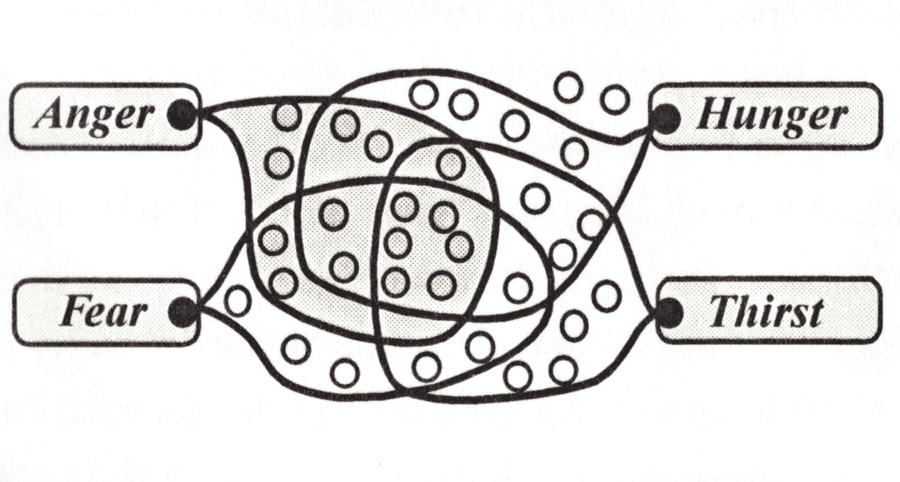
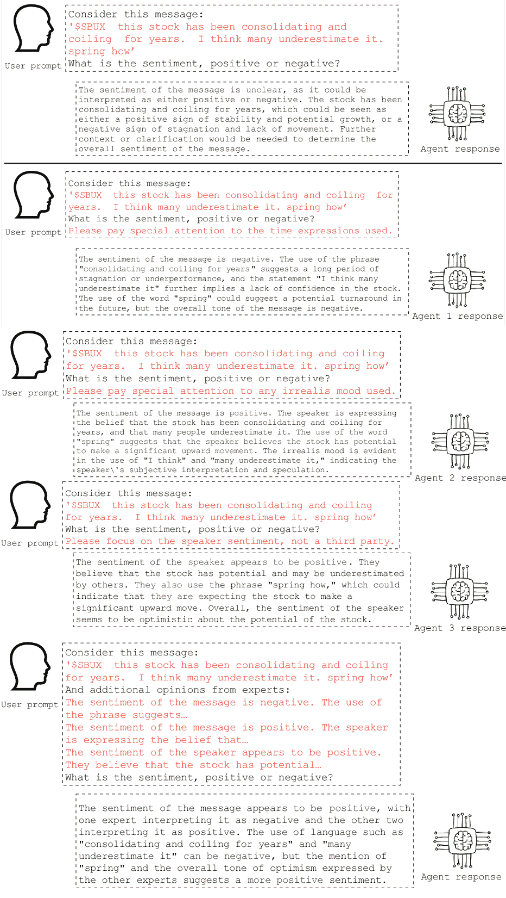

<!--yml

类别：未分类

日期：2025-01-11 12:58:00

-->

# 为金融情感分析设计异质LLM代理

> 来源：[https://arxiv.org/html/2401.05799/](https://arxiv.org/html/2401.05799/)

Frank Xing

计算机学院

新加坡国立大学

xing@nus.edu.sg

###### 摘要

大型语言模型（LLMs）极大地改变了设计智能系统的方式，将焦点从大规模数据采集和新模型训练转向了人类对齐和战略性地引导现有预训练模型的全部潜力。然而，由于这一任务的判别性质以及缺乏如何在这种情境中利用生成模型的规范性知识，这种范式转变在金融情感分析（FSA）中尚未完全实现。本研究探讨了这一新范式的有效性，即在不进行微调的情况下使用LLM进行FSA。基于敏斯基的心智与情感理论，提出了一种带有异质LLM代理的设计框架。该框架通过先验领域知识实例化专门的代理，针对FSA错误的类型进行分析，并在代理讨论的聚合结果上进行推理。对FSA数据集的综合评估表明，该框架在准确率上表现更好，特别是在讨论内容丰富的情况下。本研究为LLM基础的FSA设计奠定了基础，并开辟了新的研究方向。同时，也讨论了对商业和管理的启示。

## 1 引言

自从 OpenAI 的 ChatGPT 一年前走红以来，大型语言模型（LLMs）经历了快速的改进，展现了多种能力。AI 在许多金融服务中的应用正在加速，基于大数据的金融决策也不例外。金融情绪分析（FSA）是这一类别中的典型任务，随着金融服务流程和我们的社会行为数字化，它变得越来越重要：公司披露其年度报告、财报电话会议和公告的电子版本，投资者则加入在线社区、讨论论坛和社交媒体，与他人互动。最近的 GameStop 风波 [Deng2023](#bib.bib8) 和一系列市场情绪指数（如 MarketPsych [Peterson2016](#bib.bib30)）的流行，已清晰地表明，情绪是金融决策、短期收益和波动性预测 [saving](#bib.bib38)、假新闻和欺诈检测 [Dong2018](#bib.bib11) 以及风险预测 [yang2023](#bib.bib41) 的有用分析工具。准确的 FSA 的有用性和重要性，也得到了大量研究的支持 [Bollen2011](#bib.bib1)；[xing2018](#bib.bib37)；[Deng2018](#bib.bib9)；[chu2022](#bib.bib5)。Hendershott 等人 [h2021](#bib.bib16) 总结了 AI 在新闻、社交媒体和口碑数据应用的研究，认为这是 AI 在金融领域应用的一个主要类别。考虑到这些因素，准确的 FSA 对多个利益相关者来说都是必要的。

大多数金融情感分析（FSA）系统是在过去十年间开发的，其架构和设计思想随着自然语言处理的进步经历了多次迭代。早期的系统依赖于情感词典和简单的规则或统计方法来推导句子级或信息级的情感极性。研究者们曾努力发现特定于金融领域的词汇/短语 [loughran2011](#bib.bib24) ; [xing2019cognitive](#bib.bib40) 。随后，基于学习的系统得到了广泛的发展。具体来说，进行了两个基准任务（SemEval 2017 Task 5 [cortis2017semeval](#bib.bib6) 和 FiQA 2018 Task 1 [de2018inf](#bib.bib7) ），最佳结果由回归集成（RE）、卷积神经网络（CNN）和支持向量回归（SVR）模型通过结合情感词典和密集词向量表示的特征获得。接下来的一波设计基于对通用预训练语言模型的微调，例如，BERT¹¹1语言模型是否称得上大型语言模型（LLM）没有严格的定义。通常，LLM的规模远大于word2vec模型（大约100万参数）。这个定义包括BERT（110-340百万参数）、GPT-3（大约1750亿参数）等。（双向编码器表示的变换器）。例如，FinBERT [Liu2020](#bib.bib23) 在FSA任务中取得了良好的结果，而最先进的成果则来源于将多个辅助知识源集成到BERT变体中 [duk2023](#bib.bib12) 。在利用LLM进行FSA方面，目前的进展主要采用了变换器的编码器类型，例如BERT。然而，目前最强大的LLM是基于变换器的解码器部分。解码器架构天然适用于生成性任务，如对话/聊天补全和问答，但也可以适配于判别任务和分类任务。本研究意识到这一方向仍处于初期阶段，且相关的深入研究较少，因此探讨了如何利用生成性LLM进行FSA的方法。

与许多从链式思维（CoT）[deng-www](#bib.bib10)、思维树（ToT）[tot](#bib.bib42)、验证、自我一致性约束、中间草稿本和多智能体多角色设置等临时设计不同，本设计框架遵循Hevner等人提出的设计科学指南 [hevner](#bib.bib18)，并作为“设计理论”[gregor](#bib.bib15)为规范性知识作出贡献。基于明斯基的心智与情感理论，“情感状态”是我们的一种思维方式，它通过在特定的环境条件下打开和关闭一组特定的资源来运作 [emotion-machine](#bib.bib27)。因此，一种FSA方法是模拟文本背后的心理过程，这需要专业的LLM智能体扮演“资源”的角色，即我们大脑中使我们对环境作出反应的功能部分。在金融分析的背景下，许多资源是作为专业知识学习的，而非我们大脑的天生部分。设计框架（异质多智能体讨论）选择通过提示开发专业的LLM智能体，其主要功能是关注LLM在给定FSA任务中容易出现的一类错误。因此，设计工件包含五个不同的智能体，FSA结果基于所有智能体的输出进行共享讨论。通过多种方法对该工件进行评估，结果普遍表明该框架是有效的。

图 1：不同的多智能体大语言模型框架用于达成共识：（a）同质多智能体辩论 [md](#bib.bib13)，（b）多角色多智能体协商 [mn](#bib.bib35)，（c）异质多智能体讨论（HAD：所提框架）。颜色表示不同的角色，形状表示异质智能体。

实现这一设计的主要挑战在于缺乏关于每个代理功能应该是什么的设计理论。因此，许多LLM多代理设置采用同质代理。例如，在多代理辩论框架中，Du等人[md](#bib.bib13)仅将相同的输入分发给多个LLM代理。由于一定的随机性和扰动，每个代理的响应不会完全相同。随后，每个代理将从其他代理那里获取输出（不包括自身输出）作为额外信息，以更新其原始响应（图[1](#S1.F1 "图 1 ‣ 1 引言 ‣ 为金融情感分析设计异质LLM代理") (a)）。尽管可能经过多轮，但经验结果表明，快速达成共识。另一种框架是为LLM代理分配不同的角色。Sun等人[mn](#bib.bib35)描述了一种谈判程序，在该程序中，要求“判别器LLM”判断是否同意“生成器LLM”的输出。如果没有达成共识，判定声明会发送回生成器。如果差异仍然存在，框架需要第三个LLM进行谈判并投票决定最终结果（图[1](#S1.F1 "图 1 ‣ 1 引言 ‣ 为金融情感分析设计异质LLM代理") (b)）。尽管该框架中的LLM代理扮演不同角色，但它们的能力假设保持不变。从这个意义上讲，这些代理仍然是非专业化和同质的。在提出的框架中（图[1](#S1.F1 "图 1 ‣ 1 引言 ‣ 为金融情感分析设计异质LLM代理") (c)），每个代理具有相同的角色，经过对称的讨论工作流（不同于[mn](#bib.bib35)），但刻意设计模拟不同资源的心理功能。它们的响应被汇总用于FSA，就像激活不同资源以生成不同的情感状态一样。

因此，本研究的一个目标是测试错误类型[Zimbra](#bib.bib46)；[fsa](#bib.bib39)是否可以作为开发异质代理的有用指南。具体来说，我对以下研究问题感兴趣：

+   •

    RQ1：HAD与朴素提示法和微调范式相比，效果如何？

+   •

    RQ2：如何提示LLM代理在金融情感分析中表现出异质性？

+   •

    RQ3：每个LLM代理的定量贡献及其相对重要性是什么？

为了解决这些问题，HAD 采用了多种方法进行评估，包括对五个 FSA 数据集的性能指标进行经验分析、不同代理集的消融分析，以及对输出结果和中间表示的案例研究。实验结果表明，HAD 在整体上能够提高 FSA 的表现，且在基于 GPT 的大型语言模型代理中，改进是稳定的。观察发现，一个简单的模板“请特别注意[错误类型]”可以改变 LLM 代理的注意力，并促使其做出不同的反应。情感、修辞和参考代理似乎是主要的表现驱动因素，并且比其他 LLM 代理更为关键，尽管这些贡献是非线性的，且存在复杂的相互作用。

本研究通过提出一个基于内核理论的设计成果，贡献于设计科学文献。自然科学或社会科学中的若干内核理论被引入到信息系统设计中，而来自人工智能的内核理论相对较少。此研究对情感理论、大型语言模型合作研究和金融决策实践具有启示意义。首先，它支持情感机器和心智社会理论[emotion-machine](#bib.bib27)，作为解释情感如何成为人类智慧一种重要形式的可操作性理论；其次，本研究将多代理大型语言模型应用于 FSA。该框架已用于事实性检查、算术/数学推理、优化、通用情感分析，但据我所知，还未应用于 FSA。因此，本研究为大型语言模型合作提供了新材料，并加强了基于设计科学的方法来发展框架；最后，研究结果为 FSA 系统设计提供了规范性知识。投资者和交易员可以基于 HAD 框架反复改进自己的 FSA 系统，或者在选择或购买类似技术解决方案时获得更多信息。

## 2 相关工作与设计过程

本节将相关文献分为两条线索：LLMs 在 FSA 中的任何类型的应用，以及提示设计的方式（不限于 FSA）。我还将阐述使用异质代理进行 FSA 的理论基础。

### 2.1 使用大型语言模型进行财务情感分析

财务情感分析（FSA）是一个特定领域的面向商业的应用，与一般自然语言处理任务中的情感分析密切相关。由于其大量使用术语和其他语言特征，[fsa](#bib.bib39)；[shah2022](#bib.bib32)，一般的情感分析表现通常不能代表财务领域的情况，且在金融领域的表现会下降。FSA 已被纳入全面评估金融领域的大型语言模型（LLMs），与其他任务如命名实体识别（NER）、知识回溯、问答和阅读理解等共同进行评估，[shah2022](#bib.bib32)；[bloomberggpt](#bib.bib36)。

在使用单一大型语言模型（LLM）方面，FSA任务有时与目标或方面检测一起制定，额外的信息可以用来提高FSA的性能。例如，Lengkeek等人[lengkeek](#bib.bib20)利用方面系统的层次结构来约束FSA结果，尽管这种信息在现实生产环境中很少可用。张等人[zhang-icaif](#bib.bib44)观察到金融新闻通常过于简洁。因此，开发了一个从可靠外部来源检索额外上下文以形成更详细指令的模型。邓等人[deng-www](#bib.bib10)发现，通过CoT强迫LLM经过多个推理路径有助于生成更稳定和准确的标签。LLM生成的标签也有用，并且符合传统监督学习方法中补充人工标注的质量要求。类似地，Fei等人[fei2023](#bib.bib14)开发了一个受CoT启发的三跳推理框架，首先推断隐式方面，其次推断隐式观点，最后推断情感极性。然而，有人指出[mn](#bib.bib35)单一LLM在充分发挥LLM知识潜力方面存在困难，尤其是在FSA任务中，因为它涉及多个LLM能力，如推理、事实验证、句法/语义解析等。我观察到类似的现象，如[zhangd](#bib.bib45)报告的那样，LLM在更复杂任务上的表现不如在二分类任务中的表现令人满意。此外，前述的设计（存储检索和CoT）以及其他尚未应用于FSA的设计，如验证、自一致性约束或中间草稿板等，也在很大程度上是启发式的，最多基于经验，缺乏坚实的理论基础。

提出的框架采用了上下文学习（ICL）并利用多个LLM实例（代理），这也被称为LLM协作。协作策略包括辅助任务（例如，验证）[chen23b](#bib.bib4)，辩论[md](#bib.bib13)和各种角色分配[mn](#bib.bib35)，包括生成器、判别器、程序员、经理、元控制器等。同样，辅助任务和角色的设计似乎是任意的，缺乏坚实的理论基础。LLM协作在许多通用自然语言处理任务中也得到了更多研究，包括情感分析，但它们在FSA上的适用性缺乏直接证据。或许与提出的HAD设计框架最相关的是MedPrompt[nori23](#bib.bib29)。它使用一个由同质代理随机洗牌的CoT集成。该设计也更为计算密集，并且由于现有的金融问答数据集较为稀疏，难以转移到金融领域。

### 2.2 提示工程

在生成性大型语言模型（LLM）出现之前，应用语言模型于下游任务的一个广泛接受的方法是通过微调：移除最后一层神经网络（称为“头”层），并让训练误差反向传播，同时固定底层参数。其面临的两个主要问题是：（1）仍然需要一个不小的训练集和标签；（2）训练过程可能计算密集。随着生成性LLM被认为非常强大，情境学习（in-context learning）认为可以通过适当的“提示”在无需微调的情况下获得期望的输出，并激发模型的能力。通常，提示工程涉及开发特定任务的提示模板，描述如何构建提示以使预训练模型执行当前的下游任务。刘等人[liupf](#bib.bib21)提供了关于提示工程的最新进展的综述，并系统地比较了填空提示和前缀提示。

在自动搜索提示模板方面，讨论了基于随机优化的方法。例如，索伦森等人[Sorensen2022](#bib.bib34)发现，好的模板是能够最大化输入与生成输出之间互信息的模板。

在设计提示方面，刘和奇尔顿[Liu2022](#bib.bib22)研究了文本到图像的生成模型和提示模板“SUBJECT in the style of STYLE”。他们发现，关键词的清晰度和显著性对生成质量至关重要。余等人[yu2023](#bib.bib43)提出了使用领域知识来指导提示设计的想法。报告显示，在法律信息蕴涵任务中，当提示源自特定的法律推理技巧时，效果最好，例如法学院教授的Issue-Rule-Application-Conclusion（IRAC）法则。然而，对于FSA而言，设计指南仍不明确，大多数研究使用了简单的提示。例如，陈和邢[chen23](#bib.bib3)使用了“你是一个有用的情感分析助手 - [示例消息]:[情感]。用户: [测试消息]。”而BloombergGPT的FSA模板[bloomberggpt](#bib.bib36)仅仅是“[测试消息] 问题：情感是什么？用负面/中立/正面回答”。

### 2.3 核心理论：情感与心智社会

核心理论是根据Walls的信息系统设计理论（ISDT）在信息系统设计过程中一个关键组成部分。它解释了预期系统如何/为何能工作，并阐明了元需求。在FSA的背景下，该理论必须解释情感的形成机制。因此，明斯基的心智与情感理论优于其他描述性/对比性的情感理论，如普鲁奇克的情感轮或拉塞尔的圆形模型。

心智社会是人类智能的一种还原主义视角，对人工智能产生了重大影响，该理论认为没有任何单一功能能直接产生智能。相反，智能来自于多种资源丰富但较简单且非智能的代理之间的有序互动。例如，当喝茶时，会激活一个操控杯子的运动代理，一个保持茶水不外溅的平衡器，以及一个确保我们的喉咙不会受伤的温度传感器。该理论将情感状态视为激活模式。例如，我们称之为“愤怒”的状态可能是当一群帮助你以异常的速度和力量作出反应的资源被激活时发生的情况，同时，一些使你保持谨慎的资源被抑制了（图 [2](#S2.F2 "图 2 ‣ 2.3 核心理论：情感与心智社会 ‣ 2 相关工作与设计过程 ‣ 为金融情感分析设计异质性 LLM 代理")）。

图 2：展示了通过激活一组资源生成情感状态的过程，参见 [emotion-machine](#bib.bib27) 第 4 页。

表 1：基于核心理论的设计：元框架

| 核心理论 | 心智社会与情感机器。 |
| --- | --- |
|  | 这些理论认为情感源自不同资源的激活。 |
| --- | --- |
| 元需求 |

&#124; 1\. 为了模拟这些资源，我们应该定义代理及其功能。 &#124;

&#124; 2\. 为了激活这些代理，我们应该提供关于主观性的相关信息。 &#124;

&#124; 3\. 为了做出充分知情的决策，我们应该聚合来自不同代理的信息。 &#124;

|

| 元设计 |
| --- |

&#124; 1\. 错误类型作为领域知识用于引导构建异质性代理能力。 &#124;

&#124; 2\. 用户消息被分发到每个 LLM 代理。 &#124;

&#124; 3\. 专门的代理输出将被连接起来，形成总结性提示。 &#124;

|

| 可测试假设 |
| --- |

&#124; 评估元设计的有效性。可测试的假设如下： &#124;

&#124; 假设 1：HAD 框架可以提高现有朴素提示在 FSA 中的准确性。 &#124;

&#124; 假设 2：这些代理具有不同的重要性，但都对分析做出积极贡献。 &#124;

|

明斯基的情感理论认为，当你的蛋糕被其他孩子偷走时，你会感到“生气”，因为IF-THEN-DO规则会激活资源，帮助你夺回蛋糕。随着我们学习和成长，这种激活是适应性的。对于FSA，一个关键步骤是决定需要设计哪些候选资源：这不会需要我们大脑中的全部资源，因为那样会更加难以构建。在本节的剩余部分，我将使用基于内核理论的设计科学框架描述设计原理（表[1](#S2.T1 "Table 1 ‣ 2.3 Kernel Theory: Emotions and the Society of Mind ‣ 2 Related Work and Design Process ‣ Designing Heterogeneous LLM Agents for Financial Sentiment Analysis)")）。

### 2.4 元需求、元设计和假设

尽管心智社会严重依赖于“资源”这一概念构建，但它被有意地保持在模糊的状态（见[emotion-machine](#bib.bib27) 第25页），指代从感知和行动到反思性思维的各种功能部分。因此，使用具有博学能力的LLM代理来模拟这些资源是合适的，并通过提示来专门化它们的功能。这一选择也使得资源激活成为可能，因为专门化的代理不会对超出范围的上下文生成有意义的回应。因此，设计如此，使得所有LLM代理都会接收原始用户信息。为了汇总信息，一个广泛使用的技术是将它们连接成一个更长的提示 [mn](#bib.bib35)；[md](#bib.bib13)；[Hendrycks](#bib.bib17)；[liupf](#bib.bib21)。通过将元需求转化为更详细的元设计，HAD框架可以形式化表示为：

1.  1.

    定义异构代理及其提示模板 $A_{1}$、$A_{2}$、…、$A_{k}$。

1.  2.

    获取中介分析 $O_{i}=A_{i}(User\_Message)$

1.  3.

    获取总结分析 $Result=A(User\_Message,O_{1},...,O_{k})$

第二步可以根据共识情况，在发送总结之前进行多轮操作。工作流程的示意图见图[3](#S3.F3 "Figure 3 ‣ 3 Design Artifact: Heterogeneous Agent Discussion (HAD) ‣ Designing Heterogeneous LLM Agents for Financial Sentiment Analysis")。

为了评估所提框架的有效性，提出了两个可测试的假设。如果错误类型对指导代理设计有用，我们预计性能指标会有所改善（H1）。由于FSA中存在数据不平衡问题，除了准确率之外，还应对F-1分数进行调查。另一个观察结果是，每种错误类型的发生频率不相等，并且在不同的语言领域中有所不同 [Zimbra](#bib.bib46)；[fsa](#bib.bib39)。因此假设代理的重要性不同，但都对FSA任务做出积极贡献（H2）。

## 3 设计工件：异构代理讨论（HAD）

要基于HAD框架实例化设计产物，必须决定代理的数量（$k$）。

图3：一种示意性比较，展示了天真提示（上例）和提出的HAD框架（下例），以及受FSA错误类型启发的3个异质代理。

Zimbra等人[Zimbra](#bib.bib46)研究了Twitter情感分析方法的全面清单，并得出三大挑战：（1）语言简洁，（2）类别不平衡，和（3）时间依赖性。由于这些挑战，识别出了13个常见的分类错误类别。与语言特征相关的主要类别可以总结为：（1）幽默，（2）细微差别或情感混合，（3）无关（例如，方面不匹配），（4）将市场营销信息误认为是积极的，和（5）不典型的语境使用。Xing等人[fsa](#bib.bib39)在一个稍有不同的范围内研究了常见错误：专门针对FSA，并包括Twitter以外的文本来源²²2现在已重新品牌化为“X”。识别出的6个错误类别，即：（1）虚拟语气，（2）修辞，（3）依赖性意见，（4）未指定的方面，（5）未识别的单词，和（6）外部引用，与[Zimbra](#bib.bib46)报告的类别有显著重叠。

在此背景下，设计了五个基于[fsa](#bib.bib39)的代理，因为（1）这些类别与FSA的相关性更直接，（2）这些类别的数量较少（6个与13个相比），且更具操作性。由于观察到大语言模型（LLMs）对来自网络的未识别单词和拼写具有较强的鲁棒性，因此未根据此类错误设计特别的代理。这五个代理及其特征性提示如下：

+   •

    A1（情绪代理）：请特别注意使用的任何虚拟语气。

+   •

    A2（修辞代理）：请特别注意使用的任何修辞（讽刺、否定断言等）。

+   •

    A3（依赖代理）：请专注于讲话者的情感，而非第三方。

+   •

    A4（方面代理）：请专注于股票代码/标签/话题，而非其他实体。

+   •

    A5（参考代理）：请特别注意时间表达、价格和其他未言明的事实。

总结性提示的形式为“考虑此消息：[测试消息]及专家的其他意见[意见]，情感是积极/消极/中立？”根据测试分类是否为二元或三元，某些细节会有所调整。

## 4 评估

Hevner等人[hevner](#bib.bib18)描述了五种设计评估方法。本研究利用了其中的三种：（1）对现有数据集及所产生的性能指标进行实证测试，（2）通过操控模块组件进行消融分析，和（3）基于案例研究的观察性评估。

### 4.1 性能改进

提出的设计框架在五个现有数据集上进行了评估，即金融短语库 [malo2014good](#bib.bib26)、StockSen [fsa](#bib.bib39)、CMC [chen23](#bib.bib3)、FiQA任务1 [maia201818](#bib.bib25)和SEntFiN 1.0 [sentfin](#bib.bib33)。后两个数据集是更细粒度的金融情感分析数据集，具有情感强度分数或多个目标/实体标签，尽管我对其进行了量化和过滤，以将评估结果适配为一致的分类问题。例如，原始的FiQA数据集 [maia201818](#bib.bib25)包含1173条消息，情感分数范围从-1到+1。通过过滤绝对值大于0.3的分数，最终只剩下771条消息，并将其映射到正面/负面类别。详细统计数据报告在表格 [2](#S4.T2 "Table 2 ‣ 4.1 Performance Improvement ‣ 4 Evaluation ‣ Designing Heterogeneous LLM Agents for Financial Sentiment Analysis")中。在文本类型方面，金融短语库（FPB）来源于新闻，SEntFiN则来自新闻标题。StockSen和CMC来源于社交媒体（分别来自StockTwits和CoinMarketCap.com），而整个FiQA数据集则是通过抓取StackExchange、Reddit和StockTwits的混合数据而整合而成。

HAD框架在两种经过指令微调的语言模型上进行了测试：GPT-3.5³³3https://platform.openai.com/docs/models/gpt-3-5作为限制访问的代表，BLOOMZ⁴⁴4https://huggingface.co/bigscience/bloomz（560m版本 [bloomz](#bib.bib28)）作为开放访问的代表。GPT-3.5的性能指标通过OpenAI API获得，BLOOMZ的性能指标则是通过配备8核Apple M1芯片和16GB内存的笔记本计算得出的。对于这两种大语言模型（LLMs），每次实验需要几分钟到几小时才能完成。性能指标报告见表格 [3](#S4.T3 "Table 3 ‣ 4.1 Performance Improvement ‣ 4 Evaluation ‣ Designing Heterogeneous LLM Agents for Financial Sentiment Analysis")。对于三分类问题（FPB和SEntFiN），使用宏F-1分数。一些灰色字体的指标（如BloombergGPT [bloomberggpt](#bib.bib36)和（Fin-）BERT [fsa](#bib.bib39)；[shah2022](#bib.bib32)；[duk2023](#bib.bib12)；[chen23](#bib.bib3)；[sentfin](#bib.bib33)）被包含进来，帮助大致评估与微调结果的差距。值得注意的是，这些指标来自其他研究，而BloombergGPT是一个专有模型，因此这些指标可能是在不同的评估设置下获得的（例如，3类/5类或不同的数据划分）。

第一个观察结果是GPT-3.5和BLOOMZ作为基础模型的不同表现。GPT-3.5主要在Common Crawl语料库[brown20](#bib.bib2)上进行训练，该语料库存档了整个互联网。BLOOMZ则在一个更大的Open-science Open-collaboration Text Sources语料库[lauren22](#bib.bib19)上训练，该语料库主要由众包的科学数据集组成。五个测试数据集均来自互联网，这可能与GPT-3.5所训练的语言领域更为接近。观察发现，GPT-3.5在其专有的人类反馈下进行了更好的指令调优。相比之下，BLOOMZ倾向于语言完成任务。一个例子是，如果提示“Translate to English: Je t’aime”没有句号（.），模型可能会尝试继续法语句子，而不是翻译它。BLOOMZ更倾向于使用简洁的语言进行完成/回答。对于情感相关的开放式问题，BLOOMZ往往给出一个最终的正面/负面判断，而没有太多的理由，并且不擅长预测“中性”消息。对于前述因素，

表2：五个FSA数据集（后处理）的总结统计。

| 数据集 | FPB | StockSen | CMC | FiQA | SEntFiN |
| --- | --- | --- | --- | --- | --- |
| 正面 | 570 | 4542 | 12022 | 507 | 2832 |
| 负面 | 303 | 1676 | 1523 | 264 | 2373 |
| 中性 | 1391 | – | – | – | 2701 |
| 总大小 | 2264 | 6218 | 13545 | 771 | 7906 |

表3：HAD设计框架对不同LLM模型的影响。

| 模型\数据集 | FPB | StockSen | CMC | FiQA | SEntFiN |
| --- | --- | --- | --- | --- | --- |
| 准确率 | F-1 | 准确率 | F-1 | 准确率 | F-1 | 准确率 | F-1 | 准确率 | F-1 |
| --- | --- | --- | --- | --- | --- | --- | --- | --- | --- |
| (Fin-)BERT | 91.69 | 89.70 | 76.90 | 84.50 | 93.50 | – | – | – | 94.29 | 93.27 |
| BloombergGPT | – | 51.07 | – | – | – | – | – | 75.07 | – | – |
| GPT-3.5 | 78.58 | 81.06 | 67.64 | 73.93 | 85.31 | 91.05 | 90.53 | 92.41 | 67.99 | 63.21 |
| GPT-3.5 (HAD) | 80.48 | 81.41 | 70.44 | 76.55 | 87.55 | 92.50 | 93.91 | 95.22 | 77.45 | 76.93 |
| BLOOMZ | 34.63 | 32.90 | 63.65 | 72.47 | 87.16 | 92.62 | 78.33 | 83.64 | 51.32 | 41.87 |
| BLOOMZ (HAD) | 34.19 | 32.93 | 72.80 | 83.97 | 87.67 | 92.95 | 76.78 | 83.03 | 50.16 | 40.69 |

除了CMC数据集，BLOOMZ的表现指标普遍较差，且在包含中性类的FPB和SEntFiN数据集上差异更为显著。

第二个观察结果是，HAD通常能提高基础模型的准确率和F-1分数（表[3](#S4.T3 "表 3 ‣ 4.1 性能提升 ‣ 4 评估 ‣ 设计异质LLM代理用于金融情感分析")）。这些提升（准确率从+2.24%到+9.46%，F1分数从+0.35%到+13.72%）在GPT-3.5上非常一致，可能是由于生成了更丰富的中介分析。除StockSen数据集外，HAD对BLOOMZ的影响较小，而在StockSen数据集上，约+10%的提升是显著的。值得注意的是，StockSen是推导出代理设计错误类型的数据集。

最后的观察是评估改进的意义。从理论上讲，将LLM微调到下游任务的表现通常会比ICL/基于指令/零-shot设置更好，就像监督学习和非监督学习的差异一样。微调的成本在FSA的背景下是双重的：你需要请专家积累和标注成千上万的样本；而且性能将对数据分布的变化很敏感，并依赖于所应用的优化技术。通过比较GPT-3.5和(Fin)-BERT在FPB、StockSen、CMC和SEntFiN上的整体差异，公平估计HAD框架可以弥补ICL和微调之间25%-35%的差距。

### 4.2 消融分析

为了测试每个LLM代理的重要性，单独移除它们的中介响应，并报告基于GPT-3.5（HAD）进行的性能下降，结果见表[4](#S4.T4 "表 4 ‣ 4.3 案例研究 ‣ 4 评估 ‣ 设计异质LLM代理用于金融情感分析")。由于时间限制，仅使用了三个数据集和平均结果：FPB和FiQA的规模最小，HAD在SEntFiN上的效果最为显著。

观察到情感代理（A1）、修辞代理（A2）和方面代理（A4）是最重要的：移除其中任何一个通常会对性能产生负面影响。参考代理（A5）较不重要：在不同数据集上移除它的效果不确定。依赖代理（A3）似乎没有效果：移除A3反而会提高性能。A3无效可能表明考虑这一错误类型是多余的，或者是由于无效的提示设计。无论如何，观察到的性能表明，异质代理之间存在复杂的非线性互动，所提出的设计可以通过更多实证证据进一步优化。

### 4.3 案例研究

提出了五个案例来说明HAD输出的质量，以及这些输出如何预测与简单提示不同的情感极性。

表 4：移除一个代理的效果（使用gpt-3.5-turbo-1106作为基础模型）

| 模型\数据集 | FPB | FiQA | SEntFiN | 平均 |
| --- | --- | --- | --- | --- |
| 准确率 | F-1 | 准确率 | F-1 | 准确率 | F-1 | 准确率 | F-1 |
| GPT-3.5 (HAD) | 80.48 | 81.41 | 93.91 | 95.22 | 77.45 | 76.93 | – | – |
| GPT-3.5 | -1.90 | -0.35 | -3.38 | -2.81 | -9.46 | -13.72 | – | – |
| w/o A1 | -0.71 | +0.64 | -0.01 | +0.02 | -0.58 | -0.61 | -0.43 | +0.02 |
| w/o A2 | -2.12 | -0.39 | +0.64 | +0.52 | -0.80 | -0.99 | -0.76 | -0.29 |
| w/o A3 | +3.00 | +3.56 | +0.51 | +0.42 | +0.01 | +0.03 | +1.17 | +1.34 |
| w/o A4 | +0.04 | +0.97 | +0.25 | +0.22 | -0.66 | -0.69 | -0.12 | +0.16 |
| w/o A5 | +4.32 | +4.29 | -0.01 | -0.00 | -0.52 | -0.43 | +1.26 | +1.28 |

在案例 1 中，提到了多个公司，简单提示产生了负面的预测，没有太多解释。通过 HAD，A1 和 A2 根据他们的角度认为该信息是中立的。A1 的论点是合理的，因为积极性更多地与富国银行直接相关，而非与伯克希尔相关。A3、A4、A5 认为该信息是正面的，框架最终总结出正确的情感极性为正面。

案例 2 很有挑战性，并且很容易被简单提示错误地预测为正面，尤其是“drive … higher”这样的关键短语出现时。要正确理解这个上下文，必须知道 Taylor Wimpey 和 Ashtead 是住宅建筑和建筑设备租赁公司。所以，“drive the markets higher”可能指的是指数或房地产市场，设定了一个经济情境。它对这两家公司有复杂的影响，而不像“巴克莱下跌”那样直接。A1、A4、A5 对混合情绪的判断是正确的。A3 认为是中立，A2 预测为负面，框架最终总结出正确的情感极性为负面。

案例 3 被简单的提示预测为正面。尽管正如 A1 所解释的，减少走私对社会有益，但这个信息显然是在评论黄金作为商品本身。尽管没有出现虚拟语气或任何修辞，A1、A2、A5 正确地预测该信息为负面。A3 和 A4 认为它是中立的，最终的决策是负面的，因为多数人的判断是负面。

案例 4 难以理解，并且在简单提示下被预测为正面。术语和外部参考是主要挑战。从 A1、A2 和 A5 的回应中可以观察到，“Puravankara 是一家房地产公司”、“CIS 是集体投资计划”和“Sebi 是证券监管机构”是共享的知识。令人惊讶的是，A2 展现了时间性和反事实推理，这对于理解此信息非常有帮助。

最后，案例 5 在简单提示下被错误地预测为正面，可能是由于“head to”这一措辞略带正面色彩。A1 和 A2 正确地识别了与虚拟情态相关的不确定性。A3 检测到与简单提示相同的正面情感，而其他四个代理则将该信息预测为中立。通过占主导地位的中立预测（4:1），该框架正确地总结了情感倾向为中立。这展示了 HAD 通过讨论机制纠正轻微和不确定情感的能力。

## 5 讨论、结论与未来工作

一种基于理论的 FSA LLM 协作设计，名为 HAD，进行了研究。该设计涉及异质 LLM 代理，并根据过去文献中发现的 FSA 错误类型对其进行专业化。与简单的提示方法相比，这种设计的计算量更大，但相比于许多其他 LLM 协作框架和基于微调的方法，它的复杂度要低得多。根据研究问题和假设，发现 HAD 能有效提高多个现有数据集上的 FSA 准确性，特别是当 LLM 代理能够进行深入讨论时。该设计框架缩小了提示与微调之间约 25% – 35% 的性能差距。通过基于错误类型的提示，LLM 代理表现出异质性，具有不同的重点。情态、修辞和方面代理比参考代理更为重要。评估结果支持假设 1（H1），但拒绝假设 2（H2），观察到如果移除依赖性代理，性能可以进一步优化。

从技术角度来看，本研究在信息系统研究中深度学习的知识贡献框架（KCF）中做出了两方面的贡献[Samtani2023](#bib.bib31)。HAD 框架在 FSA 这一高影响力应用领域中得到了公式化和实例化，其中微调仍是主流范式，而 LLM 协作则很少被应用。该框架是零-shot 和免训练的，因此，性能提升应能够推广到其他 FSA 数据集。实际上，金融顾问、交易员、基金经理和其他类型的投资者可以使用该框架来构建内部的情感分析工具，或者扩展他们对 FSA 系统设计的知识。

这项初步研究存在一些局限性，可能会激发未来的研究。第一个局限性是*可扩展性*。与统计分析相比，LLM代理的预测或讨论速度较慢，并且会产生成本。因此，尽管可以使用更大的系统，即更多的代理，但在设计和评估过程中并不推荐使用。第二个局限性是*评估数据集的保密性*。StockSen、CMC和SEntFiN是相对较新的数据集，但FPB和FiQA已经存在多年。由于LLM的训练材料通常不完全透明，并且一些LLM会使用强化学习和人工反馈不断更新，因此不能排除评估数据集可能在之前已被暴露给LLM，从而导致信息泄漏的可能性。最后，案例研究表明，已识别的错误类型几乎都能得到解决。因此，探讨LLM产生的新错误或剩余错误的*原因*，并评估人类或专家在这些FSA数据集上的表现，是一个有趣的方向。

在金融情绪分析（FSA）中，一些独特的挑战，比如外部参考事实和世界知识，曾被认为在短期内无法解决，直到变压器架构模型的出现。随着人工通用智能（AGI）似乎即将到来，本研究展示了大型语言模型（LLM）在FSA中具有的多功能能力，并呼吁对此重要任务进行更多研究。

## 参考文献

+   [1] J. Bollen, H. Mao, 和 X. Zeng. Twitter情绪预测股市. 《计算科学杂志》, 2(1):1–8, 2011. doi:[10.1016/j.jocs.2010.12.007](https://doi.org/10.1016/j.jocs.2010.12.007).

+   [2] T. B. Brown, B. Mann, N. Ryder, M. Subbiah, J. Kaplan, P. Dhariwal, A. Neelakantan, P. Shyam, G. Sastry, A. Askell, S. Agarwal, A. Herbert-Voss, G. Krueger, T. Henighan, R. Child, A. Ramesh, D. M. Ziegler, J. Wu, C. Winter, C. Hesse, M. Chen, E. Sigler, M. Litwin, S. Gray, B. Chess, J. Clark, C. Berner, S. McCandlish, A. Radford, I. Sutskever, 和 D. Amodei. 语言模型是少样本学习者. 见《神经信息处理系统会议（NeuIPS’20）》论文集, 第1877–1901页, 2020. doi:[10.48550/arXiv.2005.14165](https://doi.org/10.48550/arXiv.2005.14165).

+   [3] S. Chen 和 F. Xing. 理解表情符号在金融情绪分析中的作用. 见《国际信息系统会议（ICIS’23）》论文集, 第1–16页, 2023. 网址 [https://aisel.aisnet.org/icis2023/socmedia_digcollab/socmedia_digcollab/3/](https://aisel.aisnet.org/icis2023/socmedia_digcollab/socmedia_digcollab/3/).

+   [4] X. Chen, M. Lin, N. Schärli, 和 D. Zhou. 教授大型语言模型自我调试, 2023. doi:[10.48550/ARXIV.2304.05128](https://doi.org/10.48550/ARXIV.2304.05128).

+   [5] L. Chu, X.-Z. He, K. Li, 和 J. Tu. 投资者情绪与股票回报预测中的范式转变. 《管理科学》, 68(6):4301–4325, 2022. doi:[10.1287/mnsc.2020.3834](https://doi.org/10.1287/mnsc.2020.3834).

+   [6] K. Cortis, A. Freitas, T. Daudert, M. Huerlimann, M. Zarrouk, S. Handschuh, 和 B. Davis. Semeval-2017任务5：金融微博和新闻的细粒度情感分析。载于《SemEval工作坊》，2017年。doi：[10.18653/v1/S17-2089](https://doi.org/10.18653/v1/S17-2089)。

+   [7] D. de França Costa 和 N. F. F. da Silva. Inf-ufg在FIQA 2018任务1中：预测金融推文和新闻标题的情感与方面。载于《2018年Web会议附录论文集》，第1967–1971页，2018年。doi：[10.1145/3184558.3191828](https://doi.org/10.1145/3184558.3191828)。

+   [8] J. Deng, M. Yang, M. Pelster, 和 Y. Tan. 社交交易、沟通与网络。《信息系统研究》，2023年。doi：[10.1287/isre.2021.0143](https://doi.org/10.1287/isre.2021.0143)。

+   [9] S. Deng, Z. J. Huang, A. P. Sinha, 和 H. Zhao. 微博情感与股票回报之间的互动：一项实证研究。《MIS季度刊》，42(3)：895–918，2018年。doi：[10.25300/misq/2018/14268](https://doi.org/10.25300/misq/2018/14268)。

+   [10] X. Deng, V. Bashlovkina, F. Han, S. Baumgartner, 和 M. Bendersky. 大型语言模型对金融市场的认知：基于Reddit市场情感分析的案例研究。载于《ACM Web Conference 2023附录论文集》，2023年。doi：[10.1145/3543873.3587324](https://doi.org/10.1145/3543873.3587324)。

+   [11] W. Dong, S. Liao, 和 Z. Zhang. 利用金融社交媒体数据进行企业欺诈检测。《管理信息系统学报》，35(2)：461–487，2018年。doi：[10.1080/07421222.2018.1451954](https://doi.org/10.1080/07421222.2018.1451954)。

+   [12] K. Du, F. Xing, 和 E. Cambria. 结合多种知识来源进行定向的基于方面的金融情感分析。《ACM管理信息系统学报》，14(3)：1–24，2023年。doi：[10.1145/3580480](https://doi.org/10.1145/3580480)。

+   [13] Y. Du, S. Li, A. Torralba, J. B. Tenenbaum, 和 I. Mordatch. 通过多智能体辩论提高语言模型的事实性和推理能力，2023年。doi：[10.48550/ARXIV.2305.14325](https://doi.org/10.48550/ARXIV.2305.14325)。

+   [14] H. Fei, B. Li, Q. Liu, L. Bing, F. Li, 和 T.-S. Chua. 通过链式思维提示推理隐性情感。载于《ACL’23会议论文集》，第1171–1182页，2023年。doi：[10.18653/v1/2023.acl-short.101](https://doi.org/10.18653/v1/2023.acl-short.101)。

+   [15] S. Gregor 和 A. R. Hevner. 为最大化影响力定位和展示设计科学研究。《MIS季度刊》，37(2)：337–355，2013年。doi：[10.25300/misq/2013/37.2.01](https://doi.org/10.25300/misq/2013/37.2.01)。

+   [16] T. Hendershott, X. M. Zhang, J. L. Zhao, 和 Z. E. Zheng. 金融科技作为游戏规则的改变者：研究前沿概述。《信息系统研究》，32(1)：1–17，2021年。doi：[10.1287/isre.2021.0997](https://doi.org/10.1287/isre.2021.0997)。

+   [17] D. Hendrycks, C. Burns, S. Basart, A. Zou, M. Mazeika, D. Song, 和 J. Steinhardt. 衡量大规模多任务语言理解。在ICLR’21会议论文集，2021. doi:[10.48550/arXiv.2009.03300](https://doi.org/10.48550/arXiv.2009.03300)。

+   [18] A. R. Hevner, S. T. March, J. Park, 和 S. Ram. 信息系统研究中的设计科学。《MIS季度》，28(1):75–105, 2004. doi:[10.2307/25148625](https://doi.org/10.2307/25148625)。

+   [19] H. Laurençon, L. Saulnier, T. Wang, C. Akiki, A. V. del Moral, T. L. Scao, L. von Werra, C. Mou, E. G. Ponferrada, H. Nguyen, J. Frohberg, M. Sasko, Q. Lhoest, A. McMillan-Major, G. Dupont, S. Biderman, A. Rogers, L. B. Allal, F. D. Toni, G. Pistilli, O. Nguyen, S. Nikpoor, M. Masoud, P. Colombo, J. de la Rosa, P. Villegas, T. Thrush, S. Longpre, S. Nagel, L. Weber, M. Muñoz, J. Zhu, D. van Strien, Z. Alyafeai, K. Almubarak, M. C. Vu, I. Gonzalez-Dios, A. Soroa, K. Lo, M. Dey, P. O. Suarez, A. Gokaslan, S. Bose, D. I. Adelani, L. Phan, H. Tran, I. Yu, S. Pai, J. Chim, V. Lepercq, S. Ilic, M. Mitchell, A. S. Luccioni, 和 Y. Jernite. Bigscience ROOTS 语料库：一个1.6TB的复合型多语言数据集。在NeurIPS’22会议论文集，2022. doi:[10.48550/arXiv.2303.03915](https://doi.org/10.48550/arXiv.2303.03915)。

+   [20] M. Lengkeek, F. van der Knaap, 和 F. Frasincar. 利用层次化语言模型进行基于方面的情感分析，应用于金融数据。《信息处理与管理》，60(5):103435, 2023. doi:[https://doi.org/10.1016/j.ipm.2023.103435](https://doi.org/https://doi.org/10.1016/j.ipm.2023.103435)。

+   [21] P. Liu, W. Yuan, J. Fu, Z. Jiang, H. Hayashi, 和 G. Neubig. 预训练、提示和预测：自然语言处理中的提示方法系统综述。《ACM计算机评论》，55(9):1–35, 2023. doi:[10.1145/3560815](https://doi.org/10.1145/3560815)。

+   [22] V. Liu 和 L. B. Chilton. 文本到图像生成模型的提示工程设计指南。在CHI’22会议论文集，2022. doi:[10.1145/3491102.3501825](https://doi.org/10.1145/3491102.3501825)。

+   [23] Z. Liu, D. Huang, K. Huang, Z. Li, 和 J. Zhao. Finbert：用于金融文本挖掘的预训练金融语言表示模型。在IJCAI’20会议论文集，页码4513–4519，2020. doi:[10.24963/ijcai.2020/622](https://doi.org/10.24963/ijcai.2020/622)。

+   [24] T. Loughran 和 B. McDonald. 何时负债不再是负债？文本分析、词典与10-K报告。《金融学杂志》，66(1):35–65, 2011. doi:[10.1111/j.1540-6261.2010.01625.x](https://doi.org/10.1111/j.1540-6261.2010.01625.x)。

+   [25] M. Maia, S. Handschuh, A. Freitas, B. Davis, R. McDermott, M. Zarrouk, 和 A. Balahur. WWW’18开放挑战赛：金融意见挖掘与问答。在WWW’18会议论文集，页码1941–1942，2018. doi:[10.1145/3184558.3192301](https://doi.org/10.1145/3184558.3192301)。

+   [26] P. Malo, A. Sinha, P. Korhonen, J. Wallenius, 和 P. Takala. 好债务还是坏债务：在经济文本中检测语义倾向。《信息科学与技术协会期刊》，65(4):782–796, 2014年。doi:[10.1002/asi.23062](https://doi.org/10.1002/asi.23062).

+   [27] M. Minsky. 《情感机器：常识思维、人工智能与人类思维的未来》。Simon & Schuster, 2006.

+   [28] N. Muennighoff, T. Wang, L. Sutawika, A. Roberts, S. Biderman, T. Le Scao, M. S. Bari, S. Shen, Z. X. Yong, H. Schoelkopf, X. Tang, D. Radev, A. F. Aji, K. Almubarak, S. Albanie, Z. Alyafeai, A. Webson, E. Raff, 和 C. Raffel. 通过多任务微调实现跨语言泛化。在《ACL’23》会议录中，第15991–16111页，2023年。doi:[10.18653/v1/2023.acl-long.891](https://doi.org/10.18653/v1/2023.acl-long.891).

+   [29] H. Nori, Y. T. Lee, S. Zhang, D. Carignan, R. Edgar, N. Fusi, N. King, J. Larson, Y. Li, W. Liu, R. Luo, S. M. McKinney, R. O. Ness, H. Poon, T. Qin, N. Usuyama, C. White, 和 E. Horvitz. 一般性基础模型能否超越专门用途的调优？医学领域的案例研究，2023年。doi:[10.48550/ARXIV.2311.16452](https://doi.org/10.48550/ARXIV.2311.16452).

+   [30] R. L. Peterson. 《情感交易：思维对市场的力量》。Wiley, 2016年。doi:[10.1002/9781119219149](https://doi.org/10.1002/9781119219149).

+   [31] S. Samtani, H. Zhu, B. Padmanabhan, Y. Chai, H. Chen, 和 J. F. Nunamaker. 深度学习在信息系统研究中的应用。*管理信息系统期刊*，40(1):271–301, 2023. doi:[10.1080/07421222.2023.2172772](https://doi.org/10.1080/07421222.2023.2172772).

+   [32] R. Shah, K. Chawla, D. Eidnani, A. Shah, W. Du, S. Chava, N. Raman, C. Smiley, J. Chen, 和 D. Yang. 当FLUE遇到FLANG：金融领域的基准测试和大规模预训练语言模型。在《EMNLP’22》会议录中，2022年。doi:[10.18653/v1/2022.emnlp-main.148](https://doi.org/10.18653/v1/2022.emnlp-main.148).

+   [33] A. Sinha, S. Kedas, R. Kumar, 和 P. Malo. SEntFiN 1.0：面向金融新闻的实体感知情感分析。《信息科学与技术协会期刊》，73(9):1314–1335, 2022年。doi:[10.1002/asi.24634](https://doi.org/10.1002/asi.24634).

+   [34] T. Sorensen, J. Robinson, C. Rytting, A. Shaw, K. Rogers, A. Delorey, M. Khalil, N. Fulda, 和 D. Wingate. 一种无基础真相标签的提示工程信息论方法。在《ACL’22》会议录中，2022年。doi:[10.18653/v1/2022.acl-long.60](https://doi.org/10.18653/v1/2022.acl-long.60).

+   [35] X. Sun, X. Li, S. Zhang, S. Wang, F. Wu, J. Li, T. Zhang, 和 G. Wang. 通过LLM协商进行情感分析，2023年。doi:[10.48550/ARXIV.2311.01876](https://doi.org/10.48550/ARXIV.2311.01876).

+   [36] S. Wu, O. Irsoy, S. Lu, V. Dabravolski, M. Dredze, S. Gehrmann, P. Kambadur, D. Rosenberg, 和 G. Mann. BloombergGPT：面向金融的大型语言模型，2023年。doi:[10.48550/ARXIV.2303.17564](https://doi.org/10.48550/ARXIV.2303.17564).

+   [37] F. Xing, E. Cambria, 和 R. Welsch. 通过市场情感观点进行智能资产配置。《IEEE计算智能杂志》，13(4):25–34，2018年。doi：[10.1109/mci.2018.2866727](https://doi.org/10.1109/mci.2018.2866727)。

+   [38] F. Xing, E. Cambria, 和 Y. Zhang. 情感感知的波动性预测。《知识基础系统》，176:68–76，2019年。doi：[10.1016/j.knosys.2019.03.029](https://doi.org/10.1016/j.knosys.2019.03.029)。

+   [39] F. Xing, L. Malandri, Y. Zhang, 和 E. Cambria. 金融情感分析：对常见错误和“银弹”的调查。在COLING'20会议论文集，第978–987页，2020年。doi：[10.18653/v1/2020.coling-main.85](https://doi.org/10.18653/v1/2020.coling-main.85)。

+   [40] F. Xing, F. Pallucchini, 和 E. Cambria. 基于认知的情感词典领域适应。《信息处理与管理》，56(3):554–564，2019年。doi：[10.1016/j.ipm.2018.11.002](https://doi.org/10.1016/j.ipm.2018.11.002)。

+   [41] Y. Yang, Y. Qin, Y. Fan, 和 Z. Zhang. 解锁语音在金融风险预测中的力量：一种理论驱动的深度学习设计方法。《MIS季刊》，47(1):63–96，2023年。doi：[10.25300/misq/2022/17062](https://doi.org/10.25300/misq/2022/17062)。

+   [42] S. Yao, D. Yu, J. Zhao, I. Shafran, T. Griffiths, Y. Cao, 和 K. Narasimhan. 思维树：使用大型语言模型进行深思熟虑的问题解决。在NeuIPS'23会议论文集，第1–14页，2023年。

+   [43] F. Yu, L. Quartey, 和 F. Schilder. 探索提示工程在法律推理任务中的有效性。在计算语言学协会论文集，2023年。doi：[10.18653/v1/2023.findings-acl.858](https://doi.org/10.18653/v1/2023.findings-acl.858)。

+   [44] B. Zhang, H. Yang, T. Zhou, M. Ali Babar, 和 X.-Y. Liu. 通过检索增强的大型语言模型提升金融情感分析。在ICAIF'23会议论文集，2023年。doi：[10.1145/3604237.3626866](https://doi.org/10.1145/3604237.3626866)。

+   [45] W. Zhang, Y. Deng, B. Liu, S. J. Pan, 和 L. Bing. 大型语言模型时代的情感分析：现实检验，2023年。doi：[10.48550/ARXIV.2305.15005](https://doi.org/10.48550/ARXIV.2305.15005)。

+   [46] D. Zimbra, A. Abbasi, D. Zeng, 和 H. Chen. Twitter 情感分析的最新进展：回顾与基准评估。《ACM 管理信息系统交易》，9(2):5:1–5:29，2018年。doi：[10.1145/3185045](https://doi.org/10.1145/3185045)。
