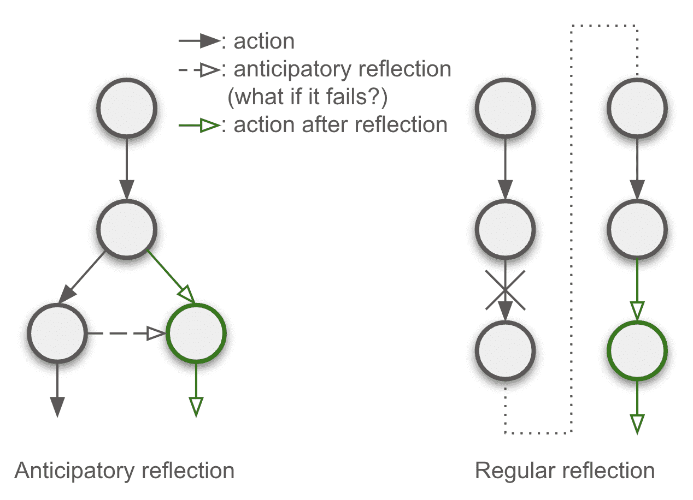
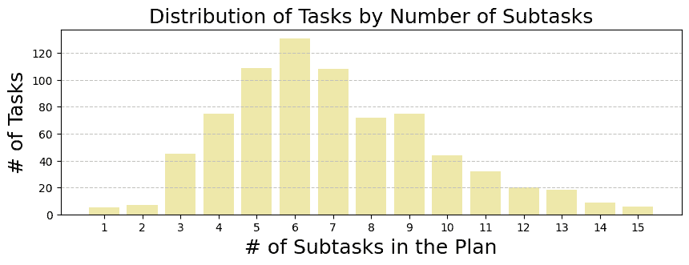
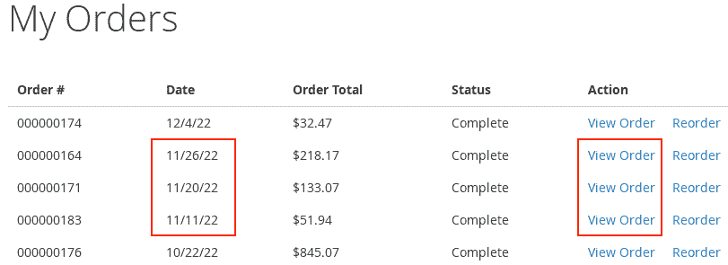
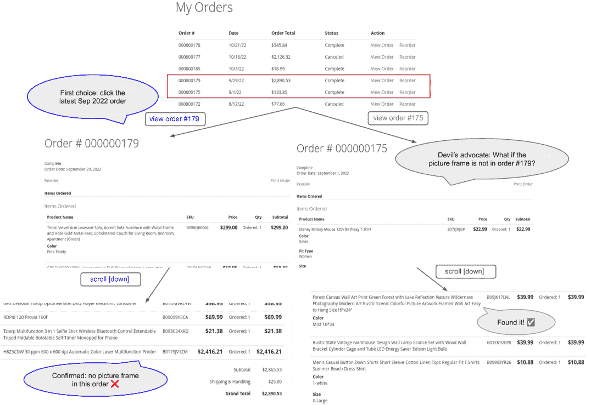
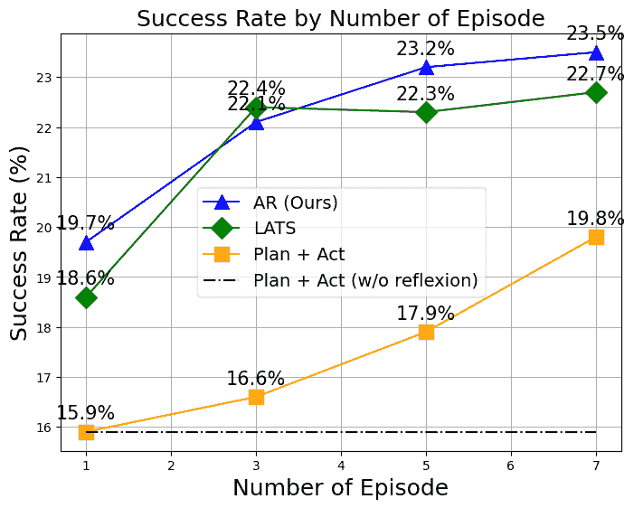
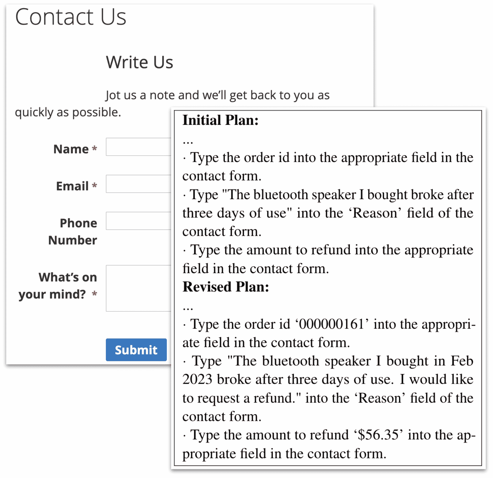

<!--yml

分类: 未分类

日期: 2025-01-11 12:37:12

-->

# Devil’s Advocate: LLM代理的预见性反思

> 来源：[https://arxiv.org/html/2405.16334/](https://arxiv.org/html/2405.16334/)

Haoyu Wang

UPenn

why16gzl@seas.upenn.edu

&Tao Li

Google DeepMind

tlinlp@google.com

&Zhiwei Deng

Google DeepMind

zhiweideng@google.com

\ANDDan Roth

UPenn

danroth@seas.upenn.edu

&Yang Li

Google DeepMind

liyang@google.com 工作完成于Google DeepMind实习期间。

###### 摘要

在这项工作中，我们提出了一种新颖的方法，通过内省赋能LLM代理，增强其在解决复杂任务中的一致性和适应性。我们的方法促使LLM代理将给定任务分解为可管理的子任务（即，制定计划），并持续进行自我反思，评估其行动的适用性和结果。我们实施了三重内省干预：1）在执行前进行预见性反思，预测潜在失败并提出备用解决方案，2）行动后对照子任务目标进行对齐，并通过回溯和补救确保尽最大努力执行计划，3）在计划完成后进行全面回顾，以便未来策略的优化。通过在WebArena中部署并实验这一零-shot方法——应用于Web环境中的实际任务——我们的代理展示了优于现有零-shot方法3.5%的23.5%成功率。实验结果表明，我们的内省驱动方法不仅通过强大的计划执行机制增强了代理应对意外挑战的能力，还通过减少45%的试验次数和计划修订，提高了效率，从而完成任务。

Devil’s Advocate: LLM代理的预见性反思

Haoyu Wang^†^†感谢: 工作完成于Google DeepMind实习期间。UPenn why16gzl@seas.upenn.edu                        Tao Li Google DeepMind tlinlp@google.com                        Zhiwei Deng Google DeepMind zhiweideng@google.com

Dan Roth UPenn danroth@seas.upenn.edu                        Yang Li Google DeepMind liyang@google.com

## 1 引言

> 在一片黄色的树林中，两条路分岔，
> 
> 并且抱歉我无法同时走两条路
> 
> $\cdots$
> 
> 然后选择了另一条，正如它同样公平，
> 
> 并且也许更有理由声称
> 
> 罗伯特·弗罗斯特

图1：我们的预见性反思与常规反思之间的概念差异。圆圈表示状态，箭头表示动作。在分支层次上，我们的方法不仅预测下一步动作，还预见到可能的错误，并规划备用方案。相比之下，常规反思是顺序进行的，每次试验修正一个错误。

Frost的代表性诗篇《未选择的路》的持久吸引力，不仅仅在于其诗意的优雅，更在于它在决策制定方面传递的深刻教训。当我们站在人生的十字路口时，评估可能的结果并选择最符合目标的道路是一个令人畏惧的挑战。当大型语言模型（LLM）代理，Huang等人（[2022b](https://arxiv.org/html/2405.16334v4#bib.bib9)）；Yao等人（[2023b](https://arxiv.org/html/2405.16334v4#bib.bib29)）；Song等人（[2023](https://arxiv.org/html/2405.16334v4#bib.bib18)）需要在实时展开的复杂情境中进行导航时，这一任务变得更加艰巨，例如，在网络环境中解决任务，Liu等人（[2018](https://arxiv.org/html/2405.16334v4#bib.bib11)）；Yao等人（[preprint](https://arxiv.org/html/2405.16334v4#bib.bib27)）；Deng等人（[2023](https://arxiv.org/html/2405.16334v4#bib.bib2)）；Zhou等人（[2024b](https://arxiv.org/html/2405.16334v4#bib.bib32)），进行模拟科学实验，Wang等人（[2022](https://arxiv.org/html/2405.16334v4#bib.bib23)），以及解决家务任务，Shridhar等人（[2021](https://arxiv.org/html/2405.16334v4#bib.bib17)）。

确实，LLM代理的决策制定已经通过事后反思和修正得到了增强，Shinn等人（[2023](https://arxiv.org/html/2405.16334v4#bib.bib16)）；Song等人（[2024](https://arxiv.org/html/2405.16334v4#bib.bib19)），以及自适应规划，Sun等人（[2023](https://arxiv.org/html/2405.16334v4#bib.bib20)）；Prasad等人（[2023](https://arxiv.org/html/2405.16334v4#bib.bib15)），其中代理从过去的成功与失败中学习，同时规划出灵活的策略。然而，反思通常是顺序进行的，每次执行轨迹只能纠正一个假设性错误。考虑到这种反思是一种测试时策略，它带来了巨大的效率问题。例如，代理可能需要尝试10次，才得出结论仍然无法解决任务。此外，自我反思涉及频繁的计划调整，尽管对人类来说这只是一个小小的不便，但对于AI代理而言，可能会导致迷失方向。这可能会产生困惑、停滞，甚至无限循环的失败，从而证明了*在寻求修订计划之前，彻底执行一个设定计划并全力以赴的重要性*。因此，本文提出了一种方法论，旨在实现一致性和适应性之间的最佳平衡。这个关键的平衡体现了一个有能力的系统应对挑战时的韧性和敏捷性，它准备应对各种突发情况，但在执行计划时坚定不移。图[1](https://arxiv.org/html/2405.16334v4#S1.F1 "Figure 1 ‣ 1 Introduction ‣ Devil’s Advocate: Anticipatory Reflection for LLM Agents")展示了我们设计与现有反思策略的对比。

在本文中，我们提出了一种新颖的方法，将内省融入大语言模型代理的构建中。这种方法使得代理能够持续反思其行动，从而激发一种学习过程，动态优化探索路径并增强在不确定性下的稳健决策。我们的内省干预集中在三个主要维度：

1.  1.

    执行行动前的预期反思（类似于辩论者角色）；

1.  2.

    行动后评估并在必要时进行回溯修正，以确保结果与子任务目标一致；

1.  3.

    在完成计划后进行广泛的审查，以生成更精细的后续试验计划。

我们将这种内省方法实施在WebArena Zhou等人（[2024b](https://arxiv.org/html/2405.16334v4#bib.bib32)）提出的Web环境中，该环境包含五个场景下的812个任务：在线购物、电子商务管理、社交讨论论坛、地图和软件开发平台。实验结果表明，我们的方法在零-shot任务上显著优于当前最先进的零-shot方法，同时提高了效率，为智能系统的新范式铺平了道路，使其更加一致、适应性强且高效¹¹1代码用于重现我们的结果将发布。

## 2 相关工作

在本文中，我们发展并扩展了自然语言处理领域中的几个关键主题，特别关注行动生成、规划和反思在大语言模型（LLM）代理构建中的整合。

##### 行动生成

大型语言模型（LLMs）已经被应用于需要决策或行动生成的任务，并且在具身环境中作为代理控制策略已证明非常有效 Huang 等人（[2022b](https://arxiv.org/html/2405.16334v4#bib.bib9), [a](https://arxiv.org/html/2405.16334v4#bib.bib8)）；Driess 等人（[2023](https://arxiv.org/html/2405.16334v4#bib.bib3)）；Wang 等人（[2023a](https://arxiv.org/html/2405.16334v4#bib.bib21)）；Zhu 等人（[2023](https://arxiv.org/html/2405.16334v4#bib.bib33)）。它们在基于文本的环境中也表现出了有效性 Liu 等人（[2018](https://arxiv.org/html/2405.16334v4#bib.bib11)）；Shridhar 等人（[2021](https://arxiv.org/html/2405.16334v4#bib.bib17)）；Liu 等人（[2023](https://arxiv.org/html/2405.16334v4#bib.bib12)），其中像 ReAct Yao 等人（[2023b](https://arxiv.org/html/2405.16334v4#bib.bib29)）这样的技术显示出了显著的好处。尽管取得了成功，ReAct 的局限性在于它无法适应环境变化。为了应对这些局限性，提出了若干改进方案 Madaan 等人（[2023](https://arxiv.org/html/2405.16334v4#bib.bib13)）；Shinn 等人（[2023](https://arxiv.org/html/2405.16334v4#bib.bib16)），提倡通过自我反思来增强决策和推理。然而，这些技术主要旨在改进单一计划或轨迹，而没有考虑到可能改变计划方向的替代行动。

##### 位置偏见缓解

尽管比较答案选项通常是有效的，但用于生成行动的大型语言模型并非没有缺陷。它们可能会表现出偏见，尤其是对它们首先看到的（有时是第二个）答案，无论其质量如何。这种偏见被称为位置偏见 Zheng 等人（[2023](https://arxiv.org/html/2405.16334v4#bib.bib30)）；Wang 等人（[2023b](https://arxiv.org/html/2405.16334v4#bib.bib22)）。我们的方法通过提出挑战自身答案的后续问题来缓解这种偏见。

##### 规划

大量研究探索了LLM（大语言模型）在任务规划中的潜力，Dror等人（[2023](https://arxiv.org/html/2405.16334v4#bib.bib4)）；Prasad等人（[2023](https://arxiv.org/html/2405.16334v4#bib.bib15)）；Sun等人（[2023](https://arxiv.org/html/2405.16334v4#bib.bib20)）；Wu等人（[2023](https://arxiv.org/html/2405.16334v4#bib.bib25)）；Guan等人（[2023](https://arxiv.org/html/2405.16334v4#bib.bib5)）；Gur等人（[2024](https://arxiv.org/html/2405.16334v4#bib.bib6)）。在制定LLM代理的规划与执行过程中，解耦规划与执行的概念已通过多个范式得到验证，如ReWOO Xu等人（[2023](https://arxiv.org/html/2405.16334v4#bib.bib26)）、ADaPT Prasad等人（[2023](https://arxiv.org/html/2405.16334v4#bib.bib15)）、结构化自我反思Li等人（[2023](https://arxiv.org/html/2405.16334v4#bib.bib10)）和DEFS Wang等人（[2023c](https://arxiv.org/html/2405.16334v4#bib.bib24)）。然而，这些方法在建立一个韧性机制以执行计划方面存在不足，代理经常会在每次遭遇不利环境反馈后重新审视并修订他们的计划，通常是因为执行的动作不准确。相较之下，我们的方法强调在考虑任何修改之前，首先坚定不移地执行预先定义的计划。这确保了一个更加稳定和一致的问题解决过程。为了实现这一点，树搜索因素变得至关重要，用于探索最佳解决方案。过去的方法，包括ToT Yao等人（[2023a](https://arxiv.org/html/2405.16334v4#bib.bib28)）、RAP Hao等人（[2023](https://arxiv.org/html/2405.16334v4#bib.bib7)）、LATS Zhou等人（[2024a](https://arxiv.org/html/2405.16334v4#bib.bib31)）、AdaPlanner Sun等人（[2023](https://arxiv.org/html/2405.16334v4#bib.bib20)）和ToolChain* Zhuang等人（[2024](https://arxiv.org/html/2405.16334v4#bib.bib34)），已在识别到达预期解决方案的最佳路径时融入了树搜索技术。然而，我们的方法通过让LLM在预见到即将失败时准备备用解决方案，从而确保在生成行动时进行更全面的考虑，从而使其与众不同。

##### 反思与自我完善

反思和自我完善技术通过一些工作取得了显著进展，如Reflexion Shinn等人（[2023](https://arxiv.org/html/2405.16334v4#bib.bib16)）、AdaPlanner Sun等人（[2023](https://arxiv.org/html/2405.16334v4#bib.bib20)）和AutoEval Pan等人（[2024](https://arxiv.org/html/2405.16334v4#bib.bib14)）。我们的研究方法进一步通过引入一种预期反思机制来增强这一技术，该机制在每次行动之前进行反思，而不是在每次完整试验后进行事后反思。这一方法通过加快补救措施的执行、减少大量的回溯和连续的计划修订，简化了探索过程，从而提高了整体效率。

## 3 方法

给定任务$\mathcal{T}$和LLM代理$G$与之交互的环境$\mathcal{E}$，我们的目标是通过内省方法使代理能够系统地和自适应地完成任务。我们首先展示如何在[第3.1节](https://arxiv.org/html/2405.16334v4#S3.SS1 "3.1 Task Decomposition and Planning ‣ 3 Method ‣ Devil’s Advocate: Anticipatory Reflection for LLM Agents")和[第3.2节](https://arxiv.org/html/2405.16334v4#S3.SS2 "3.2 State and Action Representation ‣ 3 Method ‣ Devil’s Advocate: Anticipatory Reflection for LLM Agents")中分解任务并生成与环境中每个状态相关的行动。接着，我们在[第3.3节](https://arxiv.org/html/2405.16334v4#S3.SS3 "3.3 Introspective Mechanisms ‣ 3 Method ‣ Devil’s Advocate: Anticipatory Reflection for LLM Agents")介绍内省机制。

### 3.1 任务分解与规划

第一步涉及将任务$\mathcal{T}$按顺序分解为子任务，形成一个计划。这一分解通过LLM生成过程实现。让$G_{\text{plan}}$表示代理的计划生成函数，该函数由任务$\mathcal{T}$、初始状态描述$S_{0}$以及过去试验中的任何经验（即历史$\mathcal{H}$）所触发：

|  | $\displaystyle\mathcal{P}\sim G_{\text{plan}}(\mathcal{T},S_{0},\mathcal{H}).$ |  | (1) |
| --- | --- | --- | --- |

这里，计划$\mathcal{P}$被解析为一系列有序的子任务：

|  | $\displaystyle\mathcal{P}=(\tau_{1},\tau_{2},\ldots,\tau_{N}),$ |  | (2) |
| --- | --- | --- | --- |

其中$\tau_{i}$表示计划中的第$i$个子任务，$N$是子任务的数量。例如，图[2](https://arxiv.org/html/2405.16334v4#S3.F2 "Figure 2 ‣ 3.1 Task Decomposition and Planning ‣ 3 Method ‣ Devil’s Advocate: Anticipatory Reflection for LLM Agents")展示了一个包含5个子任务的计划，用于解决WebArena中的一个任务。WebArena任务的子任务数量分布如图[3](https://arxiv.org/html/2405.16334v4#S3.F3 "Figure 3 ‣ 3.1 Task Decomposition and Planning ‣ 3 Method ‣ Devil’s Advocate: Anticipatory Reflection for LLM Agents")所示。这也反映了WebArena中任务的难度，大多数任务需要4到9步才能完成。

任务计划：我在2022年11月购买的相框的颜色配置是什么：1\. 点击“我的账户”链接查看账户详情。2\. 点击“订单历史”链接查看过去的订单。3\. 向下滚动页面，直到找到2022年11月的订单。4\. 点击2022年11月订单的订单详情链接。5\. 向下滚动到产品详情部分，找到相框的颜色配置。

图2：一个由GPT-4生成的包含5个子任务的示例计划。子任务是根据第一次观察到的状态$\mathcal{S}_{0}$和关于网页操作的先验知识生成的。

图 3：根据每个任务中子任务的数量分布的 WebArena 任务分布。子任务的数量大多数集中在 4-9 之间，呈现长尾分布。

算法 1 内省智能体

输入：任务 $\mathcal{T};$ 初始观察 $S_{\text{initial}};$ 环境 $\mathcal{E};$

初始化：时间 $t=0;$ 状态 $S_{t}=S_{\text{initial}};$ 动作 $a_{t}=\emptyset;$ 计划 $\mathcal{P}=\emptyset;$ 子任务 $\tau=\emptyset;$ 历史 $\mathcal{H}=\emptyset;$

1: while $\neg G_{\text{completed}}(\mathcal{T},\cdot)$ do 2: $\mathcal{P}\sim G_{\text{plan}}(\mathcal{T},S_{t},\mathcal{H});$ $\triangleright$ 计划修正 3: $\mathrm{Stack}=[(S_{t},a_{t},\tau)];$ 4: while $\mathrm{Stack}$ do 5: $(S_{t}^{\prime},a_{t},\tau)=\mathrm{Stack}.\text{pop}()$ 6: if $S_{t}\neq S_{t}^{\prime}$ then $\text{go\_back}(S_{t}^{\prime});S_{t}=S_{t}^{\prime};$ $\triangleright$ 回溯 7: if $\tau$ is $\emptyset$ then $\mathcal{C}_{\tau}=1;\tau=\mathcal{P}.\text{next}();$ 8: else $S_{t+1}=\mathcal{E}(a_{t});\mathcal{H}.\text{add}(G_{\text{describe}}(S_{t},a_{t},S_{t+1}));$ $\triangleright$ 基础化 9: $\mathcal{C}_{\tau}\sim G_{\text{align}}(S_{t},a_{t},S_{t+1},\tau);$ $\triangleright$ 与子任务目标对齐 10: if $\mathcal{C}_{\tau}$ then 11: if $G_{\text{completed}}(\mathcal{T},S_{t+1})$ then Finished; $\triangleright$ 提前停止 12: if $G_{\text{completed}}(\tau,S_{t+1})$ then $\tau=\mathcal{P}.\text{next}();$ $\triangleright$ 下一个子任务 13: $t\texttt{++};$ 14: if $\mathcal{C}_{\tau}$ then $a_{t}\sim G_{\text{action}}(\tau,S_{t});$ 15: for $r=1$ to $R$ do 16: $a_{t}^{(r)}\sim G_{\text{remedy}}(\tau,S_{t},a_{t});$ $\triangleright$ 预期反思 17: $\mathrm{Stack}.\text{push}((S_{t},a_{t}^{(r)},\tau));$ 18: $\mathrm{Stack}.\text{push}((S_{t},a_{t},\tau));$ $\triangleright$ 将 $a_{t}$ 放到 $\mathrm{Stack}$ 的顶部

### 3.2 状态与动作表示

令 $S_{t}\in\mathcal{S}$ 表示时间 $t$ 时环境的当前状态，其中 $\mathcal{S}$ 是所有可能状态的集合。从状态 $S_{t}$ 出发，令 $a_{t}\in\mathcal{A}$ 表示智能体采取的下一个动作，其中 $\mathcal{A}$ 是所有可能动作的集合。下一个动作是基于正在处理的特定子任务 $\tau_{i}$、当前状态 $S_{t}$ 和动作历史 $\mathcal{H}_{t-1}$ 生成的：

|  | $\displaystyle a_{t}\sim G_{\text{action}}(\tau_{i},S_{t},\mathcal{H}_{t-1}),$ |  | (3) |
| --- | --- | --- | --- |

其中 $G_{\text{action}}$ 表示智能体的动作生成函数。令 $\mathcal{H}_{t}$ 表示直到时间 $t$ 为止所采取的动作历史：

|  | $\displaystyle\mathcal{H}_{t}=\{\hat{a}_{1},\hat{a}_{2},\ldots,\hat{a}_{t}\},$ |  | (4) |
| --- | --- | --- | --- |

其中，$\hat{a}_{t}$是动作$a_{t}$的文本描述，连同从该动作执行中获得的有用信息，由函数$G_{\text{describe}}$生成。历史信息随后将用于回答任务中的问题或修改智能体的计划。$G_{\text{describe}}$接受作为输入的动作前的状态、动作本身及动作后的状态：

|  | $\displaystyle\hat{a}_{t}\sim G_{\text{describe}}(S_{t},a_{t},S_{t+1}).$ |  | (5) |
| --- | --- | --- | --- |

当状态观察过长，无法放入LLM的上下文窗口时，状态会先由LLM总结为一个较短的描述，然后传递给$G_{\text{describe}}$（例如，这种操作通常用于解决内容管理平台上的网页导航任务）。请注意，子任务可能涉及多个动作，因此$i$不一定等于$t$。鉴于任务可能在某个时间$t$之前就完成，而所有子任务尚未完成，每当智能体到达一个新状态时，我们会要求智能体检查两件事：子任务是否完成$\mathcal{C}_{\tau_{i}}\in(0,1)$²²2当智能体判断某个子任务对完成任务并不重要时，我们也将$\mathcal{C}_{\tau_{i}}=1$。以及任务是否完成$\mathcal{C}_{\mathcal{T}}\in(0,1)$：

|  | $\displaystyle\mathcal{C}_{\tau_{i}}$ | $\displaystyle\sim G_{\text{completed}}(\tau_{i},S_{t+1},\mathcal{H}_{t}),$ |  | (6) |
| --- | --- | --- | --- | --- |
|  | $\displaystyle\mathcal{C}_{\mathcal{T}}$ | $\displaystyle\sim G_{\text{completed}}(\mathcal{T},S_{t+1},\mathcal{H}_{t}),$ |  | (7) |

其中，$G_{\text{completed}}$表示检查目标是否已完成的函数。如果$\mathcal{C}_{\tau_{i}}=1$，智能体将继续解决下一个子任务$\tau_{i+1}$；而当智能体判断$\mathcal{C}_{\mathcal{T}}=1$时，不管计划$\mathcal{P}$是否完成，智能体都会结束当前尝试。

### 3.3 反思机制

上述的顺序动作生成可能已经能够执行计划并解决任务。然而，若没有适当的反思与适应，智能体可能会卡在某个无法解决的子任务上，或者在意外问题出现时陷入失败循环。因此，我们引入了三种反思机制，以增强我们的LLM智能体的解决问题能力。

#### 3.3.1 预期反思（魔鬼代言人）

第一层反思发生在每次执行动作之前。智能体预见到潜在的失败，并提出$R$个替代补救方案$[a_{t}^{1},a_{t}^{2},\cdots,a_{t}^{R}]$。每个补救动作是通过向LLM提问跟进问题生成的：

+   •

    "如果你上面的答案不正确，那么，接下来的动作应该是："

我们使用$G_{\text{remedy}}$表示生成补救动作的过程，它接受子任务$\tau_{i}$、当前状态$S_{t}$、动作历史$\mathcal{H}_{t-1}$以及LLM预测的下一步动作$a_{t}$作为输入，首次尝试时：

|  | $\displaystyle a_{t}^{r}$ | $\displaystyle\sim G_{\text{remedy}}(\tau_{i},S_{t},\mathcal{H}_{t-1},a_{t}).$ |  | (8) |
| --- | --- | --- | --- | --- |

如果后续发现有必要，智能体可以返回状态$S_{t}$，修改原始行动$a_{t}$，尝试补救行动$a_{t}^{r}$，以确保计划的顺利执行。例如，在图[4](https://arxiv.org/html/2405.16334v4#S3.F4 "图4 ‣ 3.3.2 行动后评估与回溯 ‣ 3.3 内省机制 ‣ 3 方法 ‣ 魔鬼代言人：LLM智能体的预期反思")中，我们展示了一个状态观察，所有三个点击行动都与当前子任务的目标一致。执行任何一个行动都将完成子任务；然而，如果智能体后来确定最初预测的行动是错误的，它可能需要返回到这个状态³³3最初执行的行动仍然具有最高优先级，即$a_{t}$是最后一个被推入堆栈的行动，因此它可以首先被弹出并执行（参见算法[1](https://arxiv.org/html/2405.16334v4#alg1 "算法1 ‣ 3.1 任务分解与规划 ‣ 3 方法 ‣ 魔鬼代言人：LLM智能体的预期反思")中的第18行）。

#### 3.3.2 行动后评估与回溯

第二个内省机制在每次行动执行后启动。在这里，智能体评估该行动及其结果状态是否与子任务目标一致。这个内省功能记作$G_{\text{align}}$，它受到行动前的状态$S_{t}$、行动$a_{t}$、结果状态$S_{t+1}$以及当前子任务$\tau_{i}$的影响：

|  | $\displaystyle\theta_{t}$ | $\displaystyle\sim G_{\text{align}}(S_{t},a_{t},S_{t+1},\tau_{i}).$ |  | (9) |
| --- | --- | --- | --- | --- |

这里$\theta_{t}\in(0,1)$表示反映状态$S_{t+1}$与子任务目标$\tau_{i}$一致程度的评估分数。它是一个二进制信号，指示智能体是否需要停止并回溯到某个先前的状态，采取替代行动$a_{k}^{r},k\leq t$，如果行动$a_{t}$的执行未能达到当前子任务的目标。在我们与网页环境的实验中，网页的URL是作为$S_{t}$一部分记录的重要信息。当回溯时，我们可以轻松地返回到该URL。然而，URL上的元素信息可能与我们首次到达该页面时遇到的状态不同。为了解决这个问题，我们提示LLM将行动中记录的元素映射到我们希望交互的新元素上（如果需要的话）。

图 4：解决子任务时的屏幕观察：点击2022年11月订单的订单详情链接。代理人可能决定点击（$a_{t}$）2022年11月任何一个订单的“查看订单”按钮，以查看该订单是否购买了相框，如果所选的第一个订单不是相框，则很可能需要回溯查看其他两个订单的详情。在我们提出的方法中，其他两个替代的点击动作 $[a_{t}^{1},a_{t}^{2}]$ 会在代理人执行动作 $a_{t}$ 之前被压入栈中。

#### 3.3.3 计划修订

第三个反思机制发生在计划失败时，即当栈为空且$\mathcal{C}_{\mathcal{T}}=0$时。此时，代理人会对已执行的动作和所做的笔记进行彻底回顾，并根据发现的问题细化未来的计划：

|  | $\displaystyle\mathcal{P}_{\text{new}}$ | $\displaystyle\sim G_{\text{plan}}(\mathcal{T},S_{0},\mathcal{H}_{t}).$ |  | (10) |
| --- | --- | --- | --- | --- |

在这里，$\mathcal{P}_{\text{new}}$ 是反思过去失败尝试后的新计划。代理人随后重新进入计划执行阶段，开始一个新的任务。

通过这三层反思机制，我们的代理人能够更好地应对复杂的突发情况并处理任务，使我们更接近实现真正自主、适应性强且智能的系统。通过这种方式构建问题，我们为使LLM代理能够通过反思自主和适应性地执行任务建立了一个清晰的框架。算法 [1](https://arxiv.org/html/2405.16334v4#alg1 "算法 1 ‣ 3.1 任务分解与规划 ‣ 3 方法 ‣ 魔鬼代言人：LLM代理的预期反思") 展示了我们方法的伪代码。

图 5：我们代理人在解决任务中的决策过程：我在2022年9月购买的相框的颜色配置是什么？在执行预测的动作之前，代理人会就其决策向自己提出后续问题：如果相框不在订单#179中怎么办？应该采取什么替代措施？在发现订单#179根本没有相框后，代理人会回溯到之前的状态，查看订单#175并继续。

## 4 实验

在本节中，我们展示了如何通过内省增强LLM代理在解决网页环境中复杂任务时的一致性和适应性。我们首先介绍了评估的实验设置（[section 4.1](https://arxiv.org/html/2405.16334v4#S4.SS1 "4.1 Experimental Setup ‣ 4 Experiments ‣ Devil’s Advocate: Anticipatory Reflection for LLM Agents")），接着是评估结果（[section 4.2](https://arxiv.org/html/2405.16334v4#S4.SS2 "4.2 Results ‣ 4 Experiments ‣ Devil’s Advocate: Anticipatory Reflection for LLM Agents")）。详细的错误分析见[section 5](https://arxiv.org/html/2405.16334v4#S5 "5 Error Analyses ‣ Devil’s Advocate: Anticipatory Reflection for LLM Agents")，其中突出显示了未来努力的方向。

### 4.1 实验设置

##### 实时环境

我们在WebArena Zhou等人（[2024b](https://arxiv.org/html/2405.16334v4#bib.bib32)）模拟的网页环境中评估了我们提出的方法，这是一个旨在评估大语言模型（LLMs）在互联网上执行复杂、现实世界任务能力的数据集，其中包含人工标注的网页浏览任务。Webarena（[https://webarena.dev](https://webarena.dev)）遵循创作共用署名-相同方式共享4.0国际许可证。WebArena中的812个任务涉及五个网站：一个在线购物网站、一个软件开发网站、一个社交论坛平台、一个地图和一个电子商务管理平台；这些任务可分为三类：信息检索任务、站点导航和内容与配置任务，以及无法完成的任务。尽管WebArena提供了视觉观测（截图），在本工作中我们仅使用文本观测。每个步骤的观测是网页的可访问性树，且可访问性树中的元素都在当前1280$\times$720屏幕的视口内。我们LLM代理的动作空间包括与环境互动的动作：点击、输入、滚动、跳转、后退、前进，以及一个记录下来的动作，用于记录有用的片段/摘要，以回答信息检索类问题。

##### 基准测试

我们使用gpt-4-0613⁵⁵5[https://platform.openai.com/docs/models/gpt-4-turbo-and-gpt-4](https://platform.openai.com/docs/models/gpt-4-turbo-and-gpt-4) Achiam等人（[2023](https://arxiv.org/html/2405.16334v4#bib.bib1)）的模型，具有8k令牌的上下文窗口，用于构建代理并将我们的方法与三种其他代理构建策略进行比较：无反思的规划和顺序决策（Plan + Act w/o reflexion），类似于ReWOO Xu等人（[2023](https://arxiv.org/html/2405.16334v4#bib.bib26)）；带反思的规划和顺序决策（Plan + Act），类似于AdaPlanner Sun等人（[2023](https://arxiv.org/html/2405.16334v4#bib.bib20)）；以及基于树搜索的规划，类似于LATS Zhou等人（[2024a](https://arxiv.org/html/2405.16334v4#bib.bib31)），但带反思。在所有方法中，我们将每个任务的最大动作次数设置为30次，即在代理执行30次动作后，它必须停止。在这三种方法中，我们采用相同的提示来生成动作$G_{\text{action}}$、生成计划$G_{\text{plan}}$以及评估器$G_{\text{align}}$和$G_{\text{completed}}$，以确保公平比较⁶⁶6详细提示请参见附录。在我们的实验中，我们将LLM温度设置为1.0，max_tokens设置为512，并保持所有其他参数为默认值。

##### 指标

我们遵循Zhou等人（[2024b](https://arxiv.org/html/2405.16334v4#bib.bib32)）提出的评价指标“成功率”，并统计每次试验中的动作数量和每个任务中的计划修订次数。为了判断任务是否成功完成，对于一些站点导航和信息查找任务，使用exact_match指标。然而，这有时可能过于严格。例如，考虑以下显示相同内容的网址（在‘electronics’下，‘headphones’的类别ID为60）。事实上，它们都指向完全相同的网页。然而，在评估任务完成情况时，只有与预定义完成网址完全匹配的网址才被视为正确⁷⁷7在WebArena中，仅使用第一个URL链接作为真实值，因此到达第二个URL的代理被判定为任务未完成.. 为解决这个问题，我们手动审查评估过程，并在结果中更正此类误判⁸⁸8我们的手动修正将与代码一起发布..

+   •

    [http://localhost:7770/electronics/headphones.html](http://localhost:7770/electronics/headphones.html)

+   •

    [http://localhost:7770/electronics.html?cat=60](http://localhost:7770/electronics.html?cat=60)

### 4.2 结果

图6：不同智能体构建策略在WebArena上的结果。AR是我们的方法——预期反思的缩写；LATS表示我们公司内部实现的Zhou等人提出的方法（[2024a](https://arxiv.org/html/2405.16334v4#bib.bib31)）；Plan + Act是一种任务分解并执行每个子任务的方法，类似于ReWOO Xu等人提出的方法（[2023](https://arxiv.org/html/2405.16334v4#bib.bib26)）。这三种方法都配备了计划修订（失败后的反思）。

实验结果如图[6](https://arxiv.org/html/2405.16334v4#S4.F6 "Figure 6 ‣ 4.2 Results ‣ 4 Experiments ‣ Devil’s Advocate: Anticipatory Reflection for LLM Agents")所示，展示了我们基于内省驱动的方法在提高LLM智能体在Web环境中的一致性和适应性方面的有效性。我们比较了不同智能体构建策略在多个回合中的成功率。我们的方案——预期反思（AR），始终优于其他方法，在七个回合后取得了23.5%的成功率，紧随其后的是LATS，成功率为22.7%。相比之下，Plan + Act方法表现出逐步改进，达到了19.8%的成功率，但仍显著低于基于树搜索的AR和LATS方法。仔细查看LATS的性能曲线，可以看到其成功率在第5轮时甚至出现了下降。这可能是由于通过直接采样生成的动作同质化所致。相比之下，AR受益于“魔鬼代言人”方法，通过内省式的后续提问，能够促使更彻底的规划和执行。这一趋势凸显了在计划执行和修订过程中纳入内省机制的重要性，突显了其在提升一致性和效率方面的关键作用。

|  | 动作数量 | 计划修订次数 |
| --- | --- | --- |
|  | 第一次试验 | 最后一次试验 |  |
| --- | --- | --- | --- |
| Plan+Act | 4.01 | 4.47 | 2.03 |
| LATS | 6.08 | 6.45 | 1.16 |
| AR | 6.39 | 7.07 | 0.64 |

表1：不同智能体在WebArena上解决任务的轨迹统计。我们报告了第一次和最后一次试验中的动作数量，以及计划修订的数量，即试验次数。

更多的见解可以从[表格 1](https://arxiv.org/html/2405.16334v4#S4.T1 "在 4.2 结果 ‣ 4 实验 ‣ 魔鬼代言人：LLM代理的预期反思")中获取，该表格比较了不同方法在首轮和最后一轮试验中的平均行动次数。我们的AR方法显示，首轮的平均行动次数为6.39，而最后一轮为7.07，表明存在一个稳健的学习和适应过程。相比之下，Plan+Act方法在首轮的平均行动次数仅为4.01，表明该方法在执行过程中停留在早期阶段，未能完成完整的计划执行。因此，我们的方法有效地利用更多的行动来取得更好的结果，从而减少了45%的计划修改次数，并提高了整体效率。

## 5 错误分析

随后的部分分析了在执行任务时我们观察到的代理行为中的错误。我们确定了两个关键领域进行详细讨论：代理偶尔未能从过去的失败中充分学习，以及由于顺序规划方案导致在解决特定任务时的低效。

### 5.1 代理仅从过去的失败中吸取部分教训

图 7：解决任务的最后一步的屏幕观察：通过他们的“联系我们”表单起草退款信息，针对我在2023年2月购买的蓝牙音响。使用三天后该设备坏了。商店要求在消息中提供订单ID、退款原因及退款金额。请勿提交。

我们注意到的一类常见错误是代理在生成新计划时没有充分从过去的失败中吸取教训。如图[7](https://arxiv.org/html/2405.16334v4#S5.F7 "图 7 ‣ 5.1 代理仅从过去的失败中吸取部分教训 ‣ 5 错误分析 ‣ 魔鬼代言人：LLM代理的预期反思")所示，代理在起草蓝牙音响退款信息的最后一步，经过一系列步骤寻找订单信息后，应该将所有从之前步骤中获取的信息汇总，并将一段文字输入到标题为“你在想什么？”的唯一文本框中。然而，从图[7](https://arxiv.org/html/2405.16334v4#S5.F7 "图 7 ‣ 5.1 代理仅从过去的失败中吸取部分教训 ‣ 5 错误分析 ‣ 魔鬼代言人：LLM代理的预期反思")右下角的计划中可以看到，尽管在修改的计划中通过添加购买日期和更详细的说明进行了某些改进，但代理仍未能优化输入过程，重复为不存在的字段单独键入信息。代理行为中的这一低效展示了需要一个具有更强推理能力的LLM，或一个更好的机制来引导更全面、准确的反思。

### 5.2 顺序规划不足以满足需求

在我们的分析中，我们观察到一个与智能体规划过程设计相关的反复出现的错误。所提议的方法将计划结构化为按特定顺序执行的任务序列。虽然在相当多的使用案例中效果不错，但当面对需要更复杂逻辑的任务时，它似乎会出现问题。特别是，当任务要求实现一个可重用的函数，该函数封装了多个操作并使用循环结构时，当前模型的配置往往会遇到挑战。例如：

+   •

    列出提到平均打印质量的评论者（如果有的话）。

+   •

    给我剩余库存为1-3个单位的产品的SKU。

+   •

    就像所有由CameronKelsey在subreddit earthporn中创建的提交一样。

执行这些任务类似于在没有直接查询API的情况下执行SQL命令，而是在一个现实的环境中。有效处理这些任务的能力将需要将额外的认知结构纳入规划模型中——例如，记忆、循环、重复性操作，或将一组操作封装成可调用的函数。尽管做笔记可以帮助智能体排除错误选择，但这些系统扩展将为网络智能体增加关键功能，显著提升其在现实网络环境中的导航和问题解决能力。此外，虽然当前的智能体可以在简单任务的有限搜索空间内取得成功，但它常常在审查和自我反思那些需要动态问题解决的更具描述性的任务时遇到困难。通过在未来的工作中解决这些局限性，即有效地将计划的文本描述转换为可执行的函数和循环，我们相信我们智能体的推理能力可以大大提升，从而在理解和解决涉及动态认知的网络环境任务时取得更好的成果。

## 6 结论

在本研究中，我们提出了一种新颖的自省方法，该方法显著增强了大型语言模型在复杂环境中的问题解决能力，且通过在WebArena设置中的全面评估得到了验证。我们的方法通过战略性地将任务拆解为可操作的子任务，并结合三层自省过程，包括预期反思、稳健的后行动评估以及阶段性计划修订。这种设置不仅使LLM代理能够实时调整其策略，还促进了长期学习，随着经验的积累，减少了频繁干预的需求。我们在WebArena基准测试中应用自省代理设计，显示出比最先进的零-shot方法高出3.5%的性能提升，并且随着回合数增加，性能曲线保持稳定。这些好处还伴随着在错误处理过程中几乎将计划修订次数减少了45%。总之，通过使LLM代理主动思考潜在的失败、执行后评估行动并根据经验洞察持续优化策略，我们的方法赋予了人工智能系统类似人类战略思维的能力。

## 更广泛的影响

展望未来，融合多模态数据输入可能进一步提升这些代理的上下文理解和决策准确性。我们方法中的原则和发现为未来的人工智能研究奠定了坚实的基础，特别是在自主决策、学习效率和适应性方面。随着人工智能不断融入决策的各个方面，嵌入自省能力将成为确保这些系统不仅精确执行，而且具备类似战略性人类认知理解的关键。

## 伦理声明

随着大型语言模型（LLM）代理的能力不断增强，并且它们在现实世界应用中的部署逐渐增多，解决潜在的伦理问题变得尤为重要，特别是在数据隐私、偏见和透明度方面。我们的工作聚焦于改进代理的自省能力，以提升任务执行效果和决策解释，旨在开发更加透明和可信的人工智能系统。我们强调人类监督的重要性，以监控和减轻不可预见的后果，并鼓励负责任地使用这些技术以造福社会。通过推动持续评估和公平实践，我们力求减少偏见，确保这些代理的部署不会加剧社会不平等。此外，我们致力于优化计算资源，以减少环境影响，倡导可持续的人工智能实践。

## 限制

尽管我们当前设计已取得显著进展，但仍存在限制，阻碍了其最佳性能的发挥。特别是，智能体缺乏完整的学习机制，无法在生成新计划时充分利用过去的失败，导致执行效率低下和重复性错误。此外，虽然顺序规划方法对简单任务有效，但在更复杂的操作（如需要封装的动作或循环构造的任务）中效果不佳。此外，智能体在处理超出简单搜索空间的任务时遇到困难，这表明它在动态问题求解方面存在障碍。最后但同样重要的是，智能体需要大量的大型语言模型生成（即 API 调用），因此需要大量时间和计算资源，影响了其效率。因此，未来的工作需要集中于提升智能体从过去不足中全面学习的能力，适应复杂任务，增强动态问题求解能力，并通过更高效的大型语言模型调用来优化时间和资源的利用。

## 参考文献

+   Achiam 等人（2023）Josh Achiam, Steven Adler, Sandhini Agarwal, Lama Ahmad, Ilge Akkaya, Florencia Leoni Aleman, Diogo Almeida, Janko Altenschmidt, Sam Altman, Shyamal Anadkat, 等人. 2023. Gpt-4 技术报告。 *arXiv 预印本 arXiv:2303.08774*。

+   Deng 等人（2023）Xiang Deng, Yu Gu, Boyuan Zheng, Shijie Chen, Samuel Stevens, Boshi Wang, Huan Sun, 和 Yu Su. 2023. [Mind2Web：迈向一个通用型的Web智能体](http://arxiv.org/abs/2306.06070)。

+   Driess 等人（2023）Danny Driess, Fei Xia, Mehdi S. M. Sajjadi, Corey Lynch, Aakanksha Chowdhery, Brian Ichter, Ayzaan Wahid, Jonathan Tompson, Quan Vuong, Tianhe Yu, Wenlong Huang, Yevgen Chebotar, Pierre Sermanet, Daniel Duckworth, Sergey Levine, Vincent Vanhoucke, Karol Hausman, Marc Toussaint, Klaus Greff, Andy Zeng, Igor Mordatch, 和 Pete Florence. 2023. PaLM-E: 一种具身多模态语言模型。载于 *arXiv 预印本 arXiv:2303.03378*。

+   Dror 等人（2023）Rotem Dror, Haoyu Wang, 和 Dan Roth. 2023. [零-shot 动态事件模式引导](https://doi.org/10.18653/v1/2023.findings-eacl.53)。载于 *《计算语言学协会会议成果：EACL 2023》*，第705–725页，克罗地亚杜布罗夫尼克，计算语言学协会。

+   Guan 等人（2023）Lin Guan, Karthik Valmeekam, Sarath Sreedharan, 和 Subbarao Kambhampati. 2023. [利用预训练的大型语言模型构建和利用世界模型进行基于模型的任务规划](http://arxiv.org/abs/2305.14909)。

+   Gur 等人（2024）Izzeddin Gur, Hiroki Furuta, Austin V Huang, Mustafa Safdari, Yutaka Matsuo, Douglas Eck, 和 Aleksandra Faust. 2024. [一个具备规划、长时间上下文理解和程序合成的现实世界WebAgent](https://openreview.net/forum?id=9JQtrumvg8)。载于 *《第十二届国际学习表征会议》*。

+   Hao等人（2023）Shibo Hao, Yi Gu, Haodi Ma, Joshua Hong, Zhen Wang, Daisy Wang, 和 Zhiting Hu. 2023. [与语言模型推理即是与世界模型规划](https://doi.org/10.18653/v1/2023.emnlp-main.507)。发表于*2023年自然语言处理经验方法会议论文集*，第8154–8173页，新加坡。计算语言学协会。

+   Huang等人（2022a）Wenlong Huang, Pieter Abbeel, Deepak Pathak, 和 Igor Mordatch. 2022a. 语言模型作为零-shot规划者：为具身代理提取可操作的知识。*arXiv预印本 arXiv:2201.07207*。

+   Huang等人（2022b）Wenlong Huang, Fei Xia, Ted Xiao, Harris Chan, Jacky Liang, Pete Florence, Andy Zeng, Jonathan Tompson, Igor Mordatch, Yevgen Chebotar, Pierre Sermanet, Noah Brown, Tomas Jackson, Linda Luu, Sergey Levine, Karol Hausman, 和 Brian Ichter. 2022b. 内心独白：通过语言模型的规划进行具身推理。发表于*arXiv预印本 arXiv:2207.05608*。

+   Li等人（2023）Tao Li, Gang Li, Zhiwei Deng, Bryan Wang, 和 Yang Li. 2023. [面向计算机控制的零-shot语言代理与结构化反思](https://doi.org/10.18653/v1/2023.findings-emnlp.753)。发表于*计算语言学协会：EMNLP 2023年发现*，第11261–11274页，新加坡。计算语言学协会。

+   Liu等人（2018）Evan Zheran Liu, Kelvin Guu, Panupong Pasupat, Tianlin Shi, 和 Percy Liang. 2018. 在网页接口上使用工作流引导的探索进行强化学习。*arXiv预印本 arXiv:1802.08802*。

+   Liu等人（2023）Xiao Liu, Hao Yu, Hanchen Zhang, Yifan Xu, Xuanyu Lei, Hanyu Lai, Yu Gu, Hangliang Ding, Kaiwen Men, Kejuan Yang, Shudan Zhang, Xiang Deng, Aohan Zeng, Zhengxiao Du, Chenhui Zhang, Sheng Shen, Tianjun Zhang, Yu Su, Huan Sun, Minlie Huang, Yuxiao Dong, 和 Jie Tang. 2023. AgentBench: 评估大语言模型作为代理的能力。*arXiv预印本 arXiv: 2308.03688*。

+   Madaan等人（2023）Aman Madaan, Niket Tandon, Prakhar Gupta, Skyler Hallinan, Luyu Gao, Sarah Wiegreffe, Uri Alon, Nouha Dziri, Shrimai Prabhumoye, Yiming Yang, Sean Welleck, Bodhisattwa Prasad Majumder, Shashank Gupta, Amir Yazdanbakhsh, 和 Peter Clark. 2023. [Self-Refine: 自反馈的迭代优化](http://arxiv.org/abs/2303.17651)。

+   Pan等人（2024）Jiayi Pan, Yichi Zhang, Nicholas Tomlin, Yifei Zhou, Sergey Levine, 和 Alane Suhr. 2024. [数字代理的自主评估与优化](http://arxiv.org/abs/2404.06474)。

+   Prasad等人（2023）Archiki Prasad, Alexander Koller, Mareike Hartmann, Peter Clark, Ashish Sabharwal, Mohit Bansal, 和 Tushar Khot. 2023. ADaPT: 按需分解与语言模型规划。*arXiv*。

+   Shinn等人（2023）Noah Shinn, Federico Cassano, Edward Berman, Ashwin Gopinath, Karthik Narasimhan, 和 Shunyu Yao. 2023. [Reflexion: 具有语言强化学习的语言代理](http://arxiv.org/abs/2303.11366)。

+   Shridhar 等人（2021）Mohit Shridhar, Xingdi Yuan, Marc-Alexandre Côté, Yonatan Bisk, Adam Trischler 和 Matthew Hausknecht. 2021. [ALFWorld: Aligning Text and Embodied Environments for Interactive Learning](https://arxiv.org/abs/2010.03768). 收录于 *国际学习表征会议（ICLR）论文集*。

+   Song 等人（2023）Chan Hee Song, Jiaman Wu, Clayton Washington, Brian M. Sadler, Wei-Lun Chao 和 Yu Su. 2023. LLM-Planner: 基于少样本的具身智能体规划方法，结合大型语言模型的实际应用. 收录于 *IEEE/CVF国际计算机视觉会议（ICCV）论文集*。

+   Song 等人（2024）Yifan Song, Da Yin, Xiang Yue, Jie Huang, Sujian Li 和 Bill Yuchen Lin. 2024. 试错法：基于探索的轨迹优化方法用于LLM智能体. *arXiv 预印本 arXiv:2403.02502*。

+   Sun 等人（2023）Haotian Sun, Yuchen Zhuang, Lingkai Kong, Bo Dai 和 Chao Zhang. 2023. [AdaPlanner: 基于反馈的语言模型自适应规划](http://arxiv.org/abs/2305.16653)。

+   Wang 等人（2023a）Guanzhi Wang, Yuqi Xie, Yunfan Jiang, Ajay Mandlekar, Chaowei Xiao, Yuke Zhu, Linxi Fan 和 Anima Anandkumar. 2023a. Voyager: 基于大型语言模型的开放式具身智能体. *arXiv 预印本 arXiv: Arxiv-2305.16291*。

+   Wang 等人（2023b）Peiyi Wang, Lei Li, Liang Chen, Zefan Cai, Dawei Zhu, Binghuai Lin, Yunbo Cao, Qi Liu, Tianyu Liu 和 Zhifang Sui. 2023b. [大型语言模型不是公平的评估者](http://arxiv.org/abs/2305.17926)。

+   Wang 等人（2022）Ruoyao Wang, Peter Jansen, Marc-Alexandre Côté 和 Prithviraj Ammanabrolu. 2022. [ScienceWorld: 你的智能体比五年级学生聪明吗？](https://doi.org/10.18653/v1/2022.emnlp-main.775) 收录于 *2022年自然语言处理实证方法会议（EMNLP）论文集*，第11279–11298页，阿布扎比，阿联酋。计算语言学协会。

+   Wang 等人（2023c）Zihao Wang, Shaofei Cai, Guanzhou Chen, Anji Liu, Xiaojian Ma 和 Yitao Liang. 2023c. [描述、解释、规划与选择：与大型语言模型交互的开放世界多任务智能体](https://openreview.net/forum?id=KtvPdGb31Z). 收录于 *第37届神经信息处理系统会议（NeurIPS）*。

+   Wu 等人（2023）Zhenyu Wu, Ziwei Wang, Xiuwei Xu, Jiwen Lu 和 Haibin Yan. 2023. 基于大型语言模型的具身任务规划. *arXiv 预印本 arXiv:2305.03716*。

+   Xu 等人（2023）Binfeng Xu, Zhiyuan Peng, Bowen Lei, Subhabrata Mukherjee, Yuchen Liu 和 Dongkuan Xu. 2023. [ReWOO: 从观察中解耦推理以提高增强型语言模型的效率](http://arxiv.org/abs/2305.18323)。

+   Yao 等人（预印本）Shunyu Yao, Howard Chen, John Yang 和 Karthik Narasimhan. 预印本. WebShop: 面向可扩展的真实世界网页交互的具身语言智能体. 收录于 *ArXiv*。

+   姚等（2023a）顺宇姚、典宇、杰弗里·赵、伊扎克·沙弗兰、托马斯·L·格里菲斯、袁曹和卡尔蒂克·R·纳拉西曼。2023a年。[思维之树：使用大语言模型进行深思熟虑的问题解决](https://openreview.net/forum?id=5Xc1ecxO1h)。发表于*第37届神经信息处理系统大会*。

+   姚等（2023b）顺宇姚、杰弗里·赵、典宇、南杜、伊扎克·沙弗兰、卡尔蒂克·纳拉西曼和袁曹。2023b年。ReAct：在语言模型中协同推理与行动。发表于*国际学习表征大会（ICLR）*。

+   郑等（2023）连敏郑、魏林蒋、英生、思源庄、张昊吴、永浩庄、子琳、卓瀚李、大成李、埃里克·邢、浩张、约瑟夫·E·冈萨雷斯和伊昂·斯托伊卡。2023年。[使用MT-Bench和Chatbot Arena评判大语言模型作为法官](https://openreview.net/forum?id=uccHPGDlao)。发表于*第37届神经信息处理系统大会数据集和基准测试分会*。

+   周等（2024a）安迪·周、凯·颜、米哈尔·斯拉彭托赫-罗斯曼、浩瀚·王和宇雄·王。2024a年。[语言代理树搜索统一了语言模型中的推理、行动与规划](https://openreview.net/forum?id=6LNTSrJjBe)。

+   周等（2024b）舒言周、弗兰克·F·许、浩朱、徐辉周、罗伯特·洛、阿比谢克·斯里达尔、显义程、天岳欧、约纳坦·比斯克、丹尼尔·弗里德、尤里·阿隆和格雷厄姆·纽比格。2024b年。[WebArena：构建自主智能体的真实网络环境](https://openreview.net/forum?id=oKn9c6ytLx)。发表于*第十二届国际学习表征大会*。

+   朱等（2023）席周朱、云涛陈、浩田、晨欣陶、伟杰苏、晨宇杨、高黄、彬李、乐威卢、晓刚王、宇乔、赵翔张和季锋戴。2023年。在Minecraft中的幽灵：通过大语言模型与基于文本的知识和记忆为开放世界环境提供通用能力的智能体。*arXiv预印本arXiv:2305.17144*。

+   庄等（2024）宇辰庄、翔陈、同余、萨亚恩·米特拉、维克多·伯尔斯滕、瑞安·A·罗西、索姆德布·萨尔凯尔和超张。2024年。[ToolChain*：通过A*搜索在大语言模型中高效导航动作空间](https://openreview.net/forum?id=B6pQxqUcT8)。发表于*第十二届国际学习表征大会*。

## 附录

### 生成计划的提示（$G_{\text{plan}}$）

想象你在模仿人类逐步完成网站上的任务。你可以点击页面元素、滚动页面、访问某个URL或返回上一页，或用键盘输入一些文本（例如，playwright中的click()、scroll()、goto()、go_back()和type()函数）。一步操作意味着进行上述任意一种操作。

你当前处于一个沙盒中，仅能访问以下网站进行操作：

+   •

    一个在线购物网站（OneStopShop）：{webarena_root}:7770

+   •

    一个电子商务管理网站（Magento）：{webarena_root}:7780/admin

+   •

    一个Reddit网站（Postmill）：{webarena_root}:9999

+   •

    一个 GitLab 网站：{webarena_root}:8023

+   •

    一个地图网站（OpenStreetMap）：[http://ec2-3-131-244-37.us-east-2.compute.amazonaws.com:3000](http://ec2-3-131-244-37.us-east-2.compute.amazonaws.com:3000)

+   •

    一个 Wikipedia 网站：[http://ec2-3-131-244-37.us-east-2.compute.amazonaws.com:8888/wikipedia_en_all_maxi_2022-05/A/User:The_other_Kiwix_guy/Landing](http://ec2-3-131-244-37.us-east-2.compute.amazonaws.com:8888/wikipedia_en_all_maxi_2022-05/A/User:The_other_Kiwix_guy/Landing)

笔记：

1.  1.

    如果你想使用搜索功能，你无需点击搜索框。你可以直接使用“type [element_id] [things_to_type]”，通常之后你无需点击搜索按钮（默认情况下，命令的末尾会包含一个回车）。

1.  2.

    你可以假设你已经登录到你的账户（我们已经设置了 cookies，所以无需再次登录）。

你将要使用的网站是：

{WEBSITE INTRO}

请按照以下具体指示解决任务：

{INSTRUCTION}

这是启动屏幕的更详细描述：

{STARTING SCREEN DESCRIPTION}

现在，根据以上信息，达成以下目标的步骤应是什么（请给我一份文本描述的剧本动作列表，开头使用“List”）：

{TASK}

供参考，以下是之前失败尝试中的一些经验（请考虑以下信息，以生成更好的计划）：

{FAILED PLAN}

过去的经验：

{HISTORY}

要成功生成新计划，你需要提供一个列表（1、2、3、……），其中每个项目都是完成任务所必需的一个戏剧性动作的自然语言描述（例如，点击“账户”按钮；向下滚动；使用搜索栏搜索 iPhone 13）。你应该利用过去的经验来节省不必要的步骤！

### 动作生成提示 ($G_{\text{action}}$)

我处于沙盒环境，只能访问以下网站（即，无法访问诸如 www.reddit.com 之类的外部网站）：

+   •

    一个在线购物网站（OneStopShop）：{webarena_root}:7770

+   •

    一个电子商务管理网站（Magento）：{webarena_root}:7780/admin

+   •

    一个 Reddit 网站（Postmill）：{webarena_root}:9999

+   •

    一个 GitLab 网站：{webarena_root}:8023

+   •

    一个地图网站（OpenStreetMap）：[http://ec2-3-131-244-37.us-east-2.compute.amazonaws.com:3000](http://ec2-3-131-244-37.us-east-2.compute.amazonaws.com:3000)

+   •

    一个 Wikipedia 网站：[http://ec2-3-131-244-37.us-east-2.compute.amazonaws.com:8888/wikipedia_en_all_maxi_2022-05/A/User:The_other_Kiwix_guy/Landing](http://ec2-3-131-244-37.us-east-2.compute.amazonaws.com:8888/wikipedia_en_all_maxi_2022-05/A/User:The_other_Kiwix_guy/Landing)

现在我正试图在一个网站上完成任务。

任务是：

{TASK}

完成此任务的计划是：

{PLAN}

我已执行以下操作：

{HISTORY}

现在我处于此步骤：{STEP}

这是我正在查看的屏幕：

{OBS}

我已经记下了以下笔记：

{NOTES}

为完成我的计划中的这一步，下一步操作应该是什么（只给出一个操作）？

注意：

+   •

    如果下一步是点击，请在 [] 中注明元素 ID（格式：click [element_id]）。

+   •

    如果下一步是滚动，请在 [] 中注明方向（格式：scroll [up 或 down]）。

+   •

    如果你需要导航到一个网址，请在 [] 中注明网址（格式：goto [url]）。

+   •

    如果你需要返回到上一页，请使用 go_back。

+   •

    如果下一步是输入，请在 [] 中注明元素 ID 和要输入的内容（格式：type [element_id] [要输入的内容]）。

+   •

    如果你想记下某些内容，请使用以下格式：note_down [要记下的内容]。

下一步操作是：

### 目标对齐提示 ($G_{\text{align}}$)

想象一下，你正在一步步模仿人类在网站上执行任务。

你现在正在处理这个步骤：

{STEP}。

上面的步骤是以下计划中的一部分：

{PLAN}。

从屏幕 1 开始，你执行了一个操作然后到了屏幕 2。

你执行的操作是：

{ACTION}。

屏幕 1：

{OBS1}。

屏幕 2：

{OBS2}。

现在用一句话描述这个操作的内容，格式为“这个操作是...”

这个操作是否与以下步骤的目标一致（即，我们是否朝着正确的方向前进；回答 YES 或 NO）？

{STEP}

### 任务/子任务完成评估提示 ($G_{\text{completed}}$)

想象一下，你正在一步步模仿人类在网站上执行任务。

你被要求解决以下任务：

{TASK}

你为解决该任务做出了以下计划：

{PLAN}

为了到达当前屏幕，你之前执行了以下操作：

{HISTORY}

你在每个操作后记录了以下笔记：

{NOTES}

这是你正在查看的当前屏幕的可访问性树：

{OBS}

看一下屏幕、任务和你执行的操作，仔细思考，任务现在完成了吗？

如果任务已完成，请回答 YES。

如果任务尚未完成（意味着还有后续操作需要执行），请回答 NO。

### 答案交付提示 ($G_{\text{answer}}$)

想象一下，你正在一步步模仿人类在网站上执行任务。

你被要求解决以下任务：

{TASK}

为了到达当前屏幕，你之前执行了以下操作：

{HISTORY}

在每个操作后，你记录了以下笔记（帮助你最终回答问题）：

{NOTES}

这是你正在查看的当前屏幕的可访问性树：

{OBS}

根据上述信息，回答任务中的问题（以 ###Answer 开头）。

### 元素映射提示 ($G_{\text{map}}$)

我想在接下来的屏幕上与元素 ID 为 {element_id} 的元素互动：

{OBS1}

现在，如果我想在接下来的屏幕上点击相同的元素，元素 ID 应该是什么？

{OBS2}

新的元素 ID 是：
