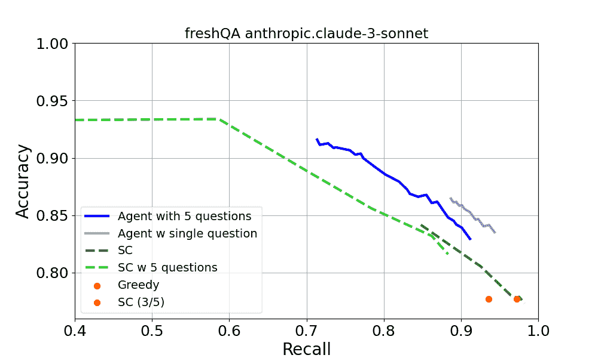
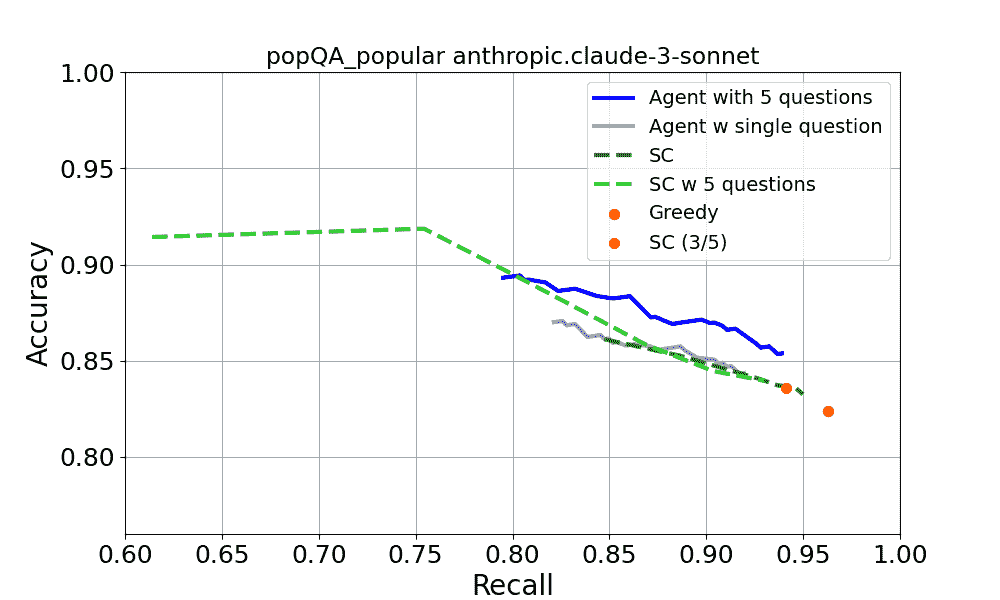
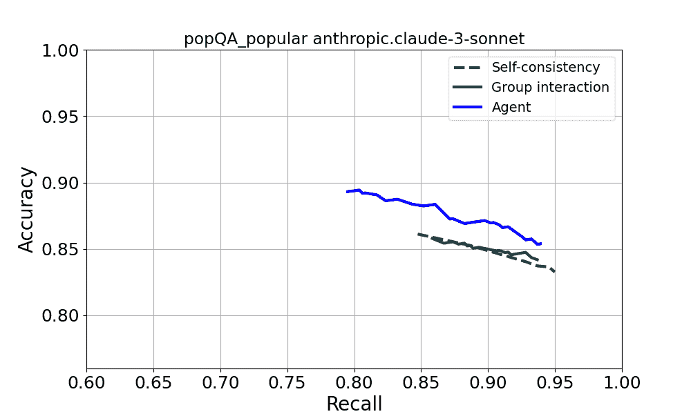
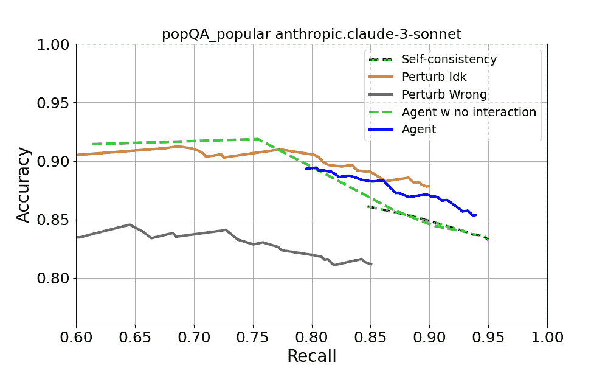

<!--yml

分类：未分类

日期：2025-01-11 11:48:19

-->

# DiverseAgentEntropy: 通过多角度和多代理交互量化黑盒LLM的不确定性

> 来源：[https://arxiv.org/html/2412.09572/](https://arxiv.org/html/2412.09572/)

Yu Feng¹  Phu Mon Htut² Zheng Qi² Wei Xiao² Manuel Mager²

Nikolaos Pappas² Kishaloy Halder² Yang Li² Yassine Benajiba² Dan Roth¹

¹宾夕法尼亚大学 ²AWS AI Labs 通讯作者：fengyu1@seas.upenn.edu。此项工作在AWS AI Labs实习期间完成。

###### 摘要

量化大型语言模型（LLM）在事实参数知识中的不确定性，尤其是在黑盒环境下，仍然是一个巨大挑战。现有的方法通过评估模型对原始查询的自一致性来衡量不确定性，但并不能总是准确捕捉到真实的不确定性。模型可能对原始查询给出一致的错误答案，却能从不同角度正确回答关于同一查询的变体问题，反之亦然。本文提出了一种新方法——DiverseAgentEntropy，利用多代理交互来评估模型的不确定性，假设如果模型有信心，它应该在关于同一原始查询的多样问题中始终一致地回忆起原始查询的答案。我们进一步实现了一个放弃策略，当不确定性较高时暂停响应。我们的方法提供了对模型可靠性更准确的预测，并进一步检测幻觉，表现优于其他基于自一致性的方法。此外，它还表明，现有模型即便知道正确答案，也常常无法在不同问题变体中始终如一地检索到正确答案。

## 1 引言

大型语言模型（LLMs）在将现实世界的知识编码到其参数中并利用这些知识支持知识密集型任务方面展现了令人印象深刻的能力（Yu等，[2024](https://arxiv.org/html/2412.09572v1#bib.bib39)）。然而，当所需的知识缺失、不可靠、存储不准确，或即使存在于模型的参数化知识中也未能被检索时，这些系统可能会产生幻觉（Ji等，[2023](https://arxiv.org/html/2412.09572v1#bib.bib15)）。未来，为了负责任地构建和部署强大的AI，我们需要开发可扩展监督的稳健技术（Bowman等，[2022](https://arxiv.org/html/2412.09572v1#bib.bib5)）：与模型能力相匹配的对齐方法。当模型变得越来越强大，但仍然受到幻觉的困扰（Nananukul & Kejriwal，[2024](https://arxiv.org/html/2412.09572v1#bib.bib25)），用户必须找到方法从这些不可信的模型中识别和提取可信的知识。由于大多数用户通过API调用与LLMs进行互动（Anthropic，[2024](https://arxiv.org/html/2412.09572v1#bib.bib4)；OpenAI等，[2024](https://arxiv.org/html/2412.09572v1#bib.bib26)），我们专注于黑箱模型设置，确保我们的解决方案适用于任何模型，而无需访问内部权重或梯度，或依赖外部帮助，如专家咨询或通过验证信息的检索增强。

因此，我们提出以下研究问题：如何开发稳健的方法来量化模型对其参数化知识的不确定性，并进一步使其避免生成幻觉响应，而不依赖于内部模型访问或外部帮助？

图1：LLM在不同视角下对原始查询的不同问题展示出不同的行为。

当前的研究主要通过对原始查询进行自一致性评估（Farquhar等，[2024](https://arxiv.org/html/2412.09572v1#bib.bib11)；Manakul等，[2023b](https://arxiv.org/html/2412.09572v1#bib.bib24)；Lin等，[2024](https://arxiv.org/html/2412.09572v1#bib.bib20)；Aichberger等，[2024](https://arxiv.org/html/2412.09572v1#bib.bib2)；Yadkori等，[2024](https://arxiv.org/html/2412.09572v1#bib.bib37)）来分析模型对单一查询的不确定性。这些方法通过对相同查询进行多次响应采样，并使用熵或其他不确定性评估方法对语义聚类的响应进行一致性测量，从而计算不确定性。虽然LMs在原始查询上的不一致性通常与幻觉相关，但这些方法未必能够捕捉模型对其响应真实性的不确定性（Zhang等，[2023](https://arxiv.org/html/2412.09572v1#bib.bib40)；Zhao等，[2024](https://arxiv.org/html/2412.09572v1#bib.bib42)；Chen等，[2024a](https://arxiv.org/html/2412.09572v1#bib.bib8)）。一个模型可能始终如一地对原始查询提供错误答案，同时始终对从不同角度要求相同基本事实的多样化问题提供正确答案，反之亦然，如图[1](https://arxiv.org/html/2412.09572v1#S1.F1 "Figure 1 ‣ 1 Introduction ‣ DiverseAgentEntropy: Quantifying Black-Box LLM Uncertainty through Diverse Perspectives and Multi-Agent Interaction")中的示例所示。

我们从一个简单的假设开始：如果一个模型对一个查询的答案有信心，它应该在依赖相同基础信息的不同问题中始终提供相同的答案。然而，我们观察到，在不同问题中提供额外的上下文会通过暴露不同的背景信息来影响模型的行为，从而导致不同的结果（Gonen等，[2023](https://arxiv.org/html/2412.09572v1#bib.bib13)；Sclar等，[2024](https://arxiv.org/html/2412.09572v1#bib.bib27)）。在某些情况下，如图[1](https://arxiv.org/html/2412.09572v1#S1.F1 "Figure 1 ‣ 1 Introduction ‣ DiverseAgentEntropy: Quantifying Black-Box LLM Uncertainty through Diverse Perspectives and Multi-Agent Interaction")中的示例1所示，额外的上下文帮助模型更好地评估自身的知识。然而，在其他情况下，如图[1](https://arxiv.org/html/2412.09572v1#S1.F1 "Figure 1 ‣ 1 Introduction ‣ DiverseAgentEntropy: Quantifying Black-Box LLM Uncertainty through Diverse Perspectives and Multi-Agent Interaction")中的示例2所示，它会引入混乱。

先前的研究表明，允许大型语言模型（LLMs）修正其回答（Kadavath 等， [2022](https://arxiv.org/html/2412.09572v1#bib.bib16)；Shinn 等， [2023](https://arxiv.org/html/2412.09572v1#bib.bib28)），同时向其呈现多样的相关上下文信息（Sun 等， [2023](https://arxiv.org/html/2412.09572v1#bib.bib29)），能够提高其回答的准确性。基于这些直觉，我们提出评估模型在与相同基础模型的多代理交互之后，对其参数化知识的不确定性（Xiong 等， [2023](https://arxiv.org/html/2412.09572v1#bib.bib35)；Du 等， [2024](https://arxiv.org/html/2412.09572v1#bib.bib10)；Feng 等， [2024](https://arxiv.org/html/2412.09572v1#bib.bib12)），如图[2](https://arxiv.org/html/2412.09572v1#S3.F2 "Figure 2 ‣ 3.3 DiverseAgentEntropy: Proposed Metric of Uncertainty ‣ 3 Method ‣ DiverseAgentEntropy: Quantifying Black-Box LLM Uncertainty through Diverse Perspectives and Multi-Agent Interaction")所示。具体而言，我们定义一个代理为相同的基础模型，但具有不同的背景知识，该背景知识是通过首先回答与原始查询相关的独特多样问题来获取的。这些多样的问题应要求模型依赖于与原始查询相同的基础信息，同时引入不同的视角或变体。接着，我们鼓励多轮受控的一对一代理交互，允许代理共同改进其对原始查询的回答。我们在§[3.3](https://arxiv.org/html/2412.09572v1#S3.SS3 "3.3 DiverseAgentEntropy: Proposed Metric of Uncertainty ‣ 3 Method ‣ DiverseAgentEntropy: Quantifying Black-Box LLM Uncertainty through Diverse Perspectives and Multi-Agent Interaction")和[3.4](https://arxiv.org/html/2412.09572v1#S3.SS4 "3.4 Implementation ‣ 3 Method ‣ DiverseAgentEntropy: Quantifying Black-Box LLM Uncertainty through Diverse Perspectives and Multi-Agent Interaction")中详细阐述了整个代理交互过程。多代理交互过程通过不同代理的问题和回答，使模型接触到同一原始查询的不同视角，从而允许模型自我修正。如图[2](https://arxiv.org/html/2412.09572v1#S3.F2 "Figure 2 ‣ 3.3 DiverseAgentEntropy: Proposed Metric of Uncertainty ‣ 3 Method ‣ DiverseAgentEntropy: Quantifying Black-Box LLM Uncertainty through Diverse Perspectives and Multi-Agent Interaction")所示，经过代理交互后，所有参与的代理都对相同的答案达成一致。

我们接着提出了DiverseAgentEntropy，它利用智能体最终答案的加权熵作为模型对原始查询的不确定性的可靠度量。该方法评估模型在多种相关问题下对原始查询响应的一致性，而不是仅仅依赖于原始查询。此外，我们定义了一种放弃政策，当不确定性较高时，模型将放弃回答。

在本文中，我们展示了当我们的不确定性度量与放弃政策相结合时，它能够有效评估模型的可靠性并识别幻觉。我们的方法超越了现有的黑箱、自一致性基础的不确定性估计方法，达到了更高的AUROC得分。通过在不同的放弃率下进行采样，我们的方法在各种类型的问答任务中，始终比基于自一致性的方法提高了2.5%的准确性，尤其是在已知问题上。此外，我们的方法还允许对模型的一致性检索准确答案的能力进行深入分析。值得注意的是，我们发现即使模型能够提供正确的答案，在从不同角度进行提问时，它也常常无法提供一致的回应。这一发现突显了模型在检索参数化知识时需要改进的地方。最后，我们进行全面的消融研究，以检查智能体之间的交互，为未来的工作提供了宝贵的见解。

## 2 相关工作

LMs的不确定性估计。最近几项工作（Farquhar等人，[2024](https://arxiv.org/html/2412.09572v1#bib.bib11)；Yadkori等人，[2024](https://arxiv.org/html/2412.09572v1#bib.bib37)；Lin等人，[2024](https://arxiv.org/html/2412.09572v1#bib.bib20)；Aichberger等人，[2024](https://arxiv.org/html/2412.09572v1#bib.bib2)）通过对多个采样输出进行熵计算，系统地量化了LLM的不确定性；然而，它们都集中于原始查询的自一致性，正如图[1](https://arxiv.org/html/2412.09572v1#S1.F1 "Figure 1 ‣ 1 Introduction ‣ DiverseAgentEntropy: Quantifying Black-Box LLM Uncertainty through Diverse Perspectives and Multi-Agent Interaction")所示，这可能是误导性的。一些研究尝试对LLM的不确定性进行言语化（Tian等人，[2023](https://arxiv.org/html/2412.09572v1#bib.bib30)；Xiong等人，[2024](https://arxiv.org/html/2412.09572v1#bib.bib36)），但Xiong等人（[2024](https://arxiv.org/html/2412.09572v1#bib.bib36)）表明，当LLM表达其信心水平时，它们往往过于自信。一些工作通过LLM的激活值来衡量不确定性（Chen等人，[2024b](https://arxiv.org/html/2412.09572v1#bib.bib9)；CH-Wang等人，[2024](https://arxiv.org/html/2412.09572v1#bib.bib6)），而我们则无法访问模型的内部细节。

语言模型的一致性评估。尽管Wang等人([2023](https://arxiv.org/html/2412.09572v1#bib.bib32))证明了通过多数投票的自一致性可以显著增强语言模型中的推理能力，Manakul等人([2023a](https://arxiv.org/html/2412.09572v1#bib.bib23))进一步提出了一种基于简单采样的方法，可以用来验证响应的事实，Zhang等人([2023](https://arxiv.org/html/2412.09572v1#bib.bib40))和Zhao等人([2024](https://arxiv.org/html/2412.09572v1#bib.bib42))认为，检测事实性幻觉需要通过语义等价的问题评估一致性，而不仅仅是自一致性。此外，Chen等人([2024a](https://arxiv.org/html/2412.09572v1#bib.bib8))进一步说明了大规模语言模型（LLMs）在保持组合一致性方面的困难。因此，我们的论文采用了更广泛的一致性定义，以更好地量化模型输出的确定性。

语言模型的代理互动。最近的研究（Xiong等人，[2023](https://arxiv.org/html/2412.09572v1#bib.bib35); Du等人，[2024](https://arxiv.org/html/2412.09572v1#bib.bib10); Feng等人，[2024](https://arxiv.org/html/2412.09572v1#bib.bib12)）通过多代理合作或辩论，主要使用跨模型代理，来提高语言模型的事实性。与之不同的是，我们构建的是同模型代理。最相似的设置是Feng等人([2024](https://arxiv.org/html/2412.09572v1#bib.bib12))，尽管该方法不允许自我修正。我们的方法便于进行受控互动，以简化分析。未来的研究将探索增强代理互动的方法，例如基于角色的变体。

## 3 方法

### 3.1 NLG不确定性估计的背景

我们首先提供关于不确定性估计的背景，重点讨论基于熵的评估，因为在现有文献中，不确定性通常通过预测的熵来衡量（Wellmann & Regenauer-Lieb, [2012](https://arxiv.org/html/2412.09572v1#bib.bib34); Abdar et al., [2021](https://arxiv.org/html/2412.09572v1#bib.bib1)）。我们将$x$和$Y$分别表示为输入——原始查询——和输出——随机变量$Y$。对于给定模型$\theta$的总不确定性可以理解为输出分布的预测熵：

|  | $U(x)=H(Y&#124;x)=-\int p(y&#124;x)\log\left(p(y&#124;x)\right)dy.$ |  | (1) |
| --- | --- | --- | --- |

如果整体不确定性$U$较低，则模型对其输出有较高的信心。由于直接计算公式[1](https://arxiv.org/html/2412.09572v1#S3.E1 "Equation 1 ‣ 3.1 Background on NLG Uncertainty Estimation ‣ 3 Method ‣ DiverseAgentEntropy: Quantifying Black-Box LLM Uncertainty through Diverse Perspectives and Multi-Agent Interaction")不可行，且采样所有可能的答案并不现实，因此在自然语言生成（NLG）中，我们使用(Malinin & Gales, [2021](https://arxiv.org/html/2412.09572v1#bib.bib21); Farquhar et al., [2024](https://arxiv.org/html/2412.09572v1#bib.bib11); Aichberger et al., [2024](https://arxiv.org/html/2412.09572v1#bib.bib2))进行近似：

|  | $U(x)=H(Y&#124;x)\approx-\sum_{y_{i}\in C}p(y_{i}&#124;x)\log p(y_{i}&#124;x).$ |  | (2) |
| --- | --- | --- | --- |

C表示当一个模型以相同输入$x$查询$N$次时，所有分组的语义不同的答案，即原始查询$x$。$y_{i}$是$x$的一个可能的语义不同的答案。

### 3.2 现有的基于自一致性的自不确定性估计

在本节中，我们解释了如何将单次查询的自一致性应用于近似模型的不确定性，并讨论了其局限性。现有的基于自一致性的黑箱不确定性估计方法（Kuhn等，[2023](https://arxiv.org/html/2412.09572v1#bib.bib17); Farquhar等，[2024](https://arxiv.org/html/2412.09572v1#bib.bib11); Lin等，[2024](https://arxiv.org/html/2412.09572v1#bib.bib20); Aichberger等，[2024](https://arxiv.org/html/2412.09572v1#bib.bib2)）遵循类似的步骤：1) 对于给定的输入$x$，生成$N$个响应样本。 2) 计算这$N$个响应之间的成对相似度评分。 3) 使用相似度值计算不确定性估计$U(x)$。

具体来说，Farquhar等人（[2024](https://arxiv.org/html/2412.09572v1#bib.bib11)）引入了语义熵来计算方程[2](https://arxiv.org/html/2412.09572v1#S3.E2 "方程 2 ‣ 3.1 NLG 不确定性估计背景 ‣ 3 方法 ‣ DiverseAgentEntropy: 通过多样化视角和多代理交互量化黑箱LLM不确定性")中的$p(y_{i}|x)$，这是通过对原始问题$x$进行重复采样所得到的基于频率的概率。假设我们找到了采样答案的语义聚类，并让每个查询返回一个可能语义上不同的答案$y_{i}\in C$。在这$N$次查询中，某个特定的$y_{i}$作为输入$x$的输出出现的次数记为$c(y_{i})$。因此，$p(y_{i}|x)=\frac{c(y_{i})}{N}$。

Lin等人（[2024](https://arxiv.org/html/2412.09572v1#bib.bib20)）使用基于语义相似度构建的加权邻接图来计算不确定性。一个相似度模型$e$将响应对映射到$[0,1]$的值。给定$N$个独立的样本，该模型生成一个对称的邻接矩阵$W=[w_{i,j}]_{i,j=1}^{N}$，其中$w_{i,j}$是响应$i$和$j$之间成对相似度的均值。度矩阵为$D=[\mathbbm{1}[j=i]\sum_{n=1}^{N}w_{n,j}]_{i,j=1}^{N}$，而拉普拉斯算子$L=I-D^{-1/2}WD^{-1/2}$具有特征值$\{\lambda_{n}\}_{n=1}^{N}$。接下来定义以下不确定性度量：$U_{EigV}(x)=\sum_{n=1}^{N}\max\{0,1-\lambda_{n}\}, U_{Degree}(x)=1-\frac{trace(D)}{N^{2}}, U_{Ecc}(x)=\|[v_{1},v_{2},\dots,v_{N}]\|_{2}$，其中$\{v_{n}\}_{n=1}^{N}$是与$L$相关联的向量。

因此，无论使用何种具体方法，如果从原始查询中采样的所有$N$个响应一致地输出相同的答案，并且语义相同$y^{\prime}$，则该模型被认为对查询$x$的答案具有最低的不确定性，且非常确定。然而，仅仅依靠自一致性不足以准确评估模型对原始查询的不确定性。一个模型可能会一致地提供错误的答案，但在回答相关问题时能够回忆出正确答案（图[1](https://arxiv.org/html/2412.09572v1#S1.F1 "Figure 1 ‣ 1 Introduction ‣ DiverseAgentEntropy: Quantifying Black-Box LLM Uncertainty through Diverse Perspectives and Multi-Agent Interaction")，示例1）。相反，模型可能最初给出正确答案，但在回答相关问题时未能回忆起正确答案（图[1](https://arxiv.org/html/2412.09572v1#S1.F1 "Figure 1 ‣ 1 Introduction ‣ DiverseAgentEntropy: Quantifying Black-Box LLM Uncertainty through Diverse Perspectives and Multi-Agent Interaction")，示例2）。

### 3.3 DiverseAgentEntropy：提出的不确定性度量

鉴于常用的基于自一致性的方法的局限性，在本节中，我们介绍了DiverseAgentEntropy，一种超越自一致性的多代理互动方法，用于估计黑箱环境下单一查询的LLM不确定性。我们的方案在图[2](https://arxiv.org/html/2412.09572v1#S3.F2 "Figure 2 ‣ 3.3 DiverseAgentEntropy: Proposed Metric of Uncertainty ‣ 3 Method ‣ DiverseAgentEntropy: Quantifying Black-Box LLM Uncertainty through Diverse Perspectives and Multi-Agent Interaction")中进行了说明。

图2：我们提出的DiverseAgentEntropy通过启用多代理互动，基于从原始查询派生的多样化问题来估算模型的不确定性，并根据这些互动分析不确定性，而非仅仅依赖简单的自一致性。

基于图[1](https://arxiv.org/html/2412.09572v1#S1.F1 "图 1 ‣ 1 引言 ‣ DiverseAgentEntropy: 通过多角度和多代理交互量化黑盒LLM不确定性")中的两个观察结果，我们首先为建模不确定性做出更强的假设：如果模型是确定的，它应该能够在关于同一查询的多样问题集合中一致地回忆起该查询的答案。例如，对于像“法国现在的首都是什么？”这样的热门查询，模型是确定的，对于任何变体问题都会输出“巴黎”。我们并不是反复用相同的原始查询 $x$ 去查询模型，而是通过各种多样化的问题 $Q=\{q_{1},q_{2},\ldots,q_{n}\}$ 聚合响应，其中在回答过程中需要得到原始查询的答案。集合 Q 将包括原始查询 x 本身、与原始查询 x 语义等效的问题以及关于不同角度的问题，如图[2](https://arxiv.org/html/2412.09572v1#S3.F2 "图 2 ‣ 3.3 DiverseAgentEntropy: 不确定性度量建议 ‣ 3 方法 ‣ DiverseAgentEntropy: 通过多角度和多代理交互量化黑盒LLM不确定性")所示。自动化的多样化问题生成过程在 §[3.4](https://arxiv.org/html/2412.09572v1#S3.SS4 "3.4 实现 ‣ 3 方法 ‣ DiverseAgentEntropy: 通过多角度和多代理交互量化黑盒LLM不确定性") 中进行了详细描述。然后，我们用 Q 中每个问题变体 $q_{j}$ 查询模型，并计算针对原始查询的特定语义不同的答案 $y_{i}$ 的出现次数。设 $c(y_{i},q_{j})$ 表示从问题 $q_{j}$ 的响应中提取的与原始查询语义不同的答案 $y_{i}$ 的计数。跨所有不同输入 $q_{j}$ 的聚合计数用于估算 $p(y_{i}|x)$，公式如下：

|  | $p(y_{i}&#124;x)=\frac{\sum_{j=1}^{n}c(y_{i},q_{j})}{\sum_{j=1}^{n}N_{j}}.$ |  | (3) |
| --- | --- | --- | --- |

其中 $N_{j}$ 是模型在输入 $q_{j}$ 上被查询的次数，$n$ 是与相同原始查询相关的不同问题的总数。我们将 $N_{j}=1$ 以便于实现。

然而，由于我们观察到在不同问题中提供附加上下文会影响模型的行为，因此我们提出了一种额外的多智能体互动过程，以进一步校准$p(y_{i}|x)$的计算。该过程允许模型进行自我反思。我们从同一经过测试的模型中创建$n$个智能体，每个智能体$A_{j},j=1,....n$首先独立地回答一个关于原始问题的独特变化问题$q_{j},j=1,....n$，作为其独特的上下文背景。在不同智能体生成初始回答之后，我们会从它们的回答中提取出它们对原始问题的回答。如Wang等人（[2024](https://arxiv.org/html/2412.09572v1#bib.bib33)）所展示，基于变换器的模型可以在上下文中进行梯度下降，优化共同对齐目标并进行自我修正。然后，我们会促成智能体之间的多轮合作，具体通过一对一互动，帮助他们完善对原始问题的回答，如图[2](https://arxiv.org/html/2412.09572v1#S3.F2 "Figure 2 ‣ 3.3 DiverseAgentEntropy: Proposed Metric of Uncertainty ‣ 3 Method ‣ DiverseAgentEntropy: Quantifying Black-Box LLM Uncertainty through Diverse Perspectives and Multi-Agent Interaction")所示。

具体来说，我们进行受控的跨角色一对一互动，不同的智能体使用固定的提示相互交互，如图[2](https://arxiv.org/html/2412.09572v1#S3.F2 "Figure 2 ‣ 3.3 DiverseAgentEntropy: Proposed Metric of Uncertainty ‣ 3 Method ‣ DiverseAgentEntropy: Quantifying Black-Box LLM Uncertainty through Diverse Perspectives and Multi-Agent Interaction")所示。每轮互动的次数最多限制为$R^{*}$轮。对于每个智能体$A_{j}$，我们会随机选择另一个智能体与其进行互动，该智能体在原始问题上的回答与$A_{j}$不同。我们会优先选择一个$A_{j}$之前没有互动过的智能体。在这一轮互动中，智能体$A_{j}$会看到其之前的对话历史，包括最初的问题、回答以及之前的互动。此外，还会展示当前轮次的信息，其中包括另一个智能体的独特问题以及其在上一轮对原始问题的回答。然后，智能体$A_{j}$会被提示决定哪个答案是正确的——是保持原有回答，还是改变自己的回答。这个过程通过上下文微调减少了模型在不同问题上的不一致性，使得模型能够从不同智能体的问题和回答中读取多样的内容并自我修正答案。

鉴于不同的代理具有不同的响应可信度，我们在最终的概率计算中为每个代理$A_{j}$计算权重$w_{j}$。基于Yadkori等人（[2024](https://arxiv.org/html/2412.09572v1#bib.bib37)）的地面真实独立性假设，如果模型对问题的答案非常确定，那么包含问题及其前述回答的提示响应对于先前的回答是无关的。因此，在这些交互过程中，频繁更改答案的代理被认为不太可靠。因此，其最终答案应分配较低的权重。我们基于代理$A_{j}$更改原始查询答案的频率来计算权重$w_{j}$。

|  | $w_{j}=\frac{R-r_{j}+1}{\sum_{j=1}^{n}(R-r_{j}+1)}.$ |  | (4) |
| --- | --- | --- | --- |

其中$j=1,...,n$。我们用$R$表示最终的交互轮数，用$r_{j}$表示代理$A_{j}$在交互过程中更改其答案的轮数。为了避免零权重，我们应用拉普拉斯平滑。用$\mathbbm{1}\{A_{j}=y_{i}\}$表示代理$A_{j}$在交互后是否将$y_{i}$作为原始查询的最终答案。因此，

|  | $p(y_{i}&#124;x)=\sum_{j=1}^{n}w_{j}\mathbbm{1}\{A_{j}=y_{i}\}.$ |  | (5) |
| --- | --- | --- | --- |

然后，我们可以应用公式[2](https://arxiv.org/html/2412.09572v1#S3.E2 "公式 2 ‣ 3.1 NLG不确定性估计背景 ‣ 3 方法 ‣ DiverseAgentEntropy: 通过多样化的视角和多代理交互量化黑盒LLM不确定性")与公式[5](https://arxiv.org/html/2412.09572v1#S3.E5 "公式 5 ‣ 3.3 DiverseAgentEntropy: 提出的不确定性度量 ‣ 3 方法 ‣ DiverseAgentEntropy: 通过多样化的视角和多代理交互量化黑盒LLM不确定性")来计算最终的不确定性，即DiverseAgentEntropy。与简单的自一致性熵（公式[3.2](https://arxiv.org/html/2412.09572v1#S3.SS2 "3.2 现有的基于自一致性的不确定性估计 ‣ 3 方法 ‣ DiverseAgentEntropy: 通过多样化的视角和多代理交互量化黑盒LLM不确定性")）相比，公式[2](https://arxiv.org/html/2412.09572v1#S3.E2 "公式 2 ‣ 3.1 NLG不确定性估计背景 ‣ 3 方法 ‣ DiverseAgentEntropy: 通过多样化的视角和多代理交互量化黑盒LLM不确定性")的近似质量有所提高，因为我们更好地逼近了每个$p(y_{i}|x)$的概率：1）DiverseAgentEntropy通过引入具有不同上下文的多样化问题，能够对潜在的答案进行更广泛的采样。2）在代理交互后保留下来的答案是那些具有显著概率质量的答案，因为它们代表了代理一致同意的回答。

### 3.4 实现

以下是如何实现上述提到的DiverseAgentEntropy的详细说明。

步骤 1：问题生成。给定一个原始查询$x$，我们使用待测试的相同模型生成需要原始查询知识的不同问题，确保这些问题既具代表性又全面。问题生成过程是完全自动化的，详细的生成提示可以在§[A.10](https://arxiv.org/html/2412.09572v1#A1.SS10 "A.10 Prompts for the proposed DiverseAgentEntropy method ‣ Appendix A Appendix ‣ DiverseAgentEntropy: Quantifying Black-Box LLM Uncertainty through Diverse Perspectives and Multi-Agent Interaction")中找到。具体而言，我们首先对原始查询进行概念化，然后从不同视角进行采样，以确保全面理解。对于每个视角，我们生成基于原始查询的$m$个问题，针对特定视角进行定制。我们会筛选这些生成的问题，确保它们严格需要原始查询的知识来回答，同时避免包含直接答案。我们还会为原始查询生成$m$个语义等价的问题。

我们从生成的题库中选择$n$个问题，形成最终的候选集$Q$供智能体使用。这个集合包括原始查询$x$，一个语义等价的问题，以及$n-2$个每个针对独特视角的问题。如果没有足够的独特视角和合格的问题，我们会重复视角问题选择过程，从现有视角中进行选择。如果仍然不足，我们将通过添加额外的语义等价问题来补充。

步骤 2：智能体交互。我们遵循§[3.3](https://arxiv.org/html/2412.09572v1#S3.SS3 "3.3 DiverseAgentEntropy: Proposed Metric of Uncertainty ‣ 3 Method ‣ DiverseAgentEntropy: Quantifying Black-Box LLM Uncertainty through Diverse Perspectives and Multi-Agent Interaction")中提到的交互过程。在交互过程中，智能体$A_{j}$可能会保持自己对单一事实的答案，接受其他智能体的答案，或者输出“不知道”。每次1对1交互后，都会提取原始查询的答案。详细的交互提示可以在§[A.10](https://arxiv.org/html/2412.09572v1#A1.SS10 "A.10 Prompts for the proposed DiverseAgentEntropy method ‣ Appendix A Appendix ‣ DiverseAgentEntropy: Quantifying Black-Box LLM Uncertainty through Diverse Perspectives and Multi-Agent Interaction")中找到。交互在以下任一条件下结束：1）所有智能体对原始查询的答案达成一致，2）所有智能体至少在连续两轮中始终保持他们选择的答案，或者3）交互达到预定的最大轮数$R^{*}$。

第三步：不确定性得分计算。我们按照公式[5](https://arxiv.org/html/2412.09572v1#S3.E5 "方程式 5 ‣ 3.3 DiverseAgentEntropy：不确定性建议度量 ‣ 3 方法 ‣ DiverseAgentEntropy：通过多样化视角和多代理交互量化黑箱LLM的不确定性")计算每个语义不同的代理答案的概率。然后我们可以按照公式[2](https://arxiv.org/html/2412.09572v1#S3.E2 "方程式 2 ‣ 3.1 NLG不确定性估计背景 ‣ 3 方法 ‣ DiverseAgentEntropy：通过多样化视角和多代理交互量化黑箱LLM的不确定性")计算最终的不确定性。虽然我们承认我们的方法比基于自一致性的方法更为资源密集，但我们在附录§[A.1](https://arxiv.org/html/2412.09572v1#A1.SS1 "A.1 成本分析 ‣ 附录 A ‣ DiverseAgentEntropy：通过多样化视角和多代理交互量化黑箱LLM的不确定性")中提供了详细的成本分析。

### 3.5 基于得分的弃权策略

上述得出的不确定性可以作为得分，用来评估模型对给定查询的回答是否值得信任，以及检测潜在的幻觉。接着，我们引入了一个带有阈值参数的弃权策略。当不确定性得分超过阈值时（参见§[4.1](https://arxiv.org/html/2412.09572v1#S4.SS1 "4.1 实验设置 ‣ 4 实验 ‣ DiverseAgentEntropy：通过多样化视角和多代理交互量化黑箱LLM的不确定性")提出的方法变种），该策略会触发弃权。如果策略不弃权，则提供具有最高计算概率的答案。

## 4 实验

### 4.1 实验设置

评估模型。我们在Llama-3-70b-Instruct（AI@Meta，[2024](https://arxiv.org/html/2412.09572v1#bib.bib3)）和Claude-3-Sonnet（Anthropic，[2024](https://arxiv.org/html/2412.09572v1#bib.bib4)）上进行评估。

数据集。我们考虑了三类下的五个不同数据集。有关数据集的详细描述，请参见 §[A.2](https://arxiv.org/html/2412.09572v1#A1.SS2 "A.2 数据集统计 ‣ 附录 A 附录 ‣ DiverseAgentEntropy：通过多样化视角和多代理互动量化黑盒 LLM 不确定性")。以实体为中心的 QA：我们从 PopQA（Mallen 等人，[2023](https://arxiv.org/html/2412.09572v1#bib.bib22)）中随机抽取：1) PopQA 中流行的实体和 2) PopQA 中较少流行的实体。通用 QA：3) TruthfulQA（Lin 等人，[2022](https://arxiv.org/html/2412.09572v1#bib.bib19)）。我们仅抽取关于明确事实的问题，而非意见类问题。4) FreshQA（Vu 等人，[2023](https://arxiv.org/html/2412.09572v1#bib.bib31)）。我们采用 07112024 版本并进一步筛选出总是变化的问题。错误假设 QA：5) FalseQA（Hu 等人，[2023](https://arxiv.org/html/2412.09572v1#bib.bib14)）。该数据集中的所有问题都包含错误假设，我们删除了所有的 WHY 问题。

指标。根据先前的研究（Lin 等人，[2022](https://arxiv.org/html/2412.09572v1#bib.bib19); Farquhar 等人，[2024](https://arxiv.org/html/2412.09572v1#bib.bib11)），我们通过将不确定性估计视为是否信任某个问题的答案来评估不确定性得分。我们首先评估基于熵的方法的 AUROC 得分。我们的主要实验集中在评估 DiverseAgentEntropy 在幻觉检测中的准确性。我们评估在应用基于不确定性得分的弃权策略后模型的表现：1) 准确率，即在模型未弃权的问题中，模型的答案与真实答案匹配的百分比；2) 弃权率，即方法弃权的问题的百分比；3) 正确性得分，即所有问题中正确答案的百分比；4) 真实度得分（Lin 等人，[2022](https://arxiv.org/html/2412.09572v1#bib.bib19)），即所有问题中正确或弃权的答案的百分比。我们进一步分析了不同方法和数据集之间的准确率-召回率（AR）权衡。在这里，召回率是方法未弃权的问题的百分比，即，召回率 = 1 - 弃权率。

基准。我们采用四个黑盒不确定性估计基准，如§[3.2](https://arxiv.org/html/2412.09572v1#S3.SS2 "3.2 现有的基于自一致性的无偏差估计 ‣ 3 方法 ‣ DiverseAgentEntropy：通过多样化视角和多代理交互量化黑盒LLM不确定性")中所述，用于评估DiverseAgentEntropy的标定，并且模型被提示回答原始问题5次：1) 语义熵下的自一致性 (SC SE) （Farquhar等，[2024](https://arxiv.org/html/2412.09572v1#bib.bib11)）。我们在§[A.3](https://arxiv.org/html/2412.09572v1#A1.SS3 "A.3 基准的实现 ‣ 附录A 附录 ‣ DiverseAgentEntropy：通过多样化视角和多代理交互量化黑盒LLM不确定性")中描述了详细的实现。三种基准与亲和图 （Lin等，[2024](https://arxiv.org/html/2412.09572v1#bib.bib20)）：2) 离心率下的自一致性 (SC Ecc)。3) 度矩阵下的自一致性 (SC Degree)。4) 特征值下的自一致性 (SC EigV)。

我们采用七个基准来进行幻觉检测。基于贪心的基准：1) 贪心：模型被提示使用贪心解码回答原始查询一次。2) 自我评估 （Kadavath等，[2022](https://arxiv.org/html/2412.09572v1#bib.bib16)）：模型首先输出一个贪心答案，然后要求模型重新评估其答案。3) 多样本自我评估 （Kadavath等，[2022](https://arxiv.org/html/2412.09572v1#bib.bib16)）。总共生成包括贪心答案在内的5个答案，然后模型被询问贪心样本的有效性。4) 多次复述 （Sun等，[2023](https://arxiv.org/html/2412.09572v1#bib.bib29)）。模型被提示在回答问题之前，生成多个与其参数化知识相关的段落。基于采样的基准：5) 自一致性 (SC) （Wang等，[2023](https://arxiv.org/html/2412.09572v1#bib.bib32)）：模型回答查询5次，我们接受多数答案，或者如果没有至少3次相同答案，则选择放弃。6) 与语义等效问题的一致性 (SeQ) （Zhang等，[2023](https://arxiv.org/html/2412.09572v1#bib.bib40); Zhao等，[2024](https://arxiv.org/html/2412.09572v1#bib.bib42)）：模型被提示回答关于同一原始查询的5个语义等效问题。7) 与多样化问题的一致性 (DiverseQ)：模型被提示回答关于同一原始查询的5个多样化问题，生成的方式与§[3.4](https://arxiv.org/html/2412.09572v1#S3.SS4 "3.4 实现 ‣ 3 方法 ‣ DiverseAgentEntropy：通过多样化视角和多代理交互量化黑盒LLM不确定性")相同。请注意，我们评估所有基于采样的基准的答案语义等效性，并进行响应聚类。

提议的方法变体。我们采用了多样化代理熵的两个变体，其中有5个代理，即5个不同的问题：1) 代理（松散多数投票）：当不确定性得分超过阈值时，我们选择弃权，阈值计算为3个答案的熵，概率分别为0.6、0.2和0.2。2) 代理：我们使用更严格的多数投票，当不确定性得分超过阈值时弃权，阈值计算为2个答案的熵，概率分别为0.6和0.4。我们在§[A.4](https://arxiv.org/html/2412.09572v1#A1.SS4 "A.4 Thresholds for the abstention policy ‣ 附录 A 附录 ‣ DiverseAgentEntropy: 通过多样化视角和多代理交互量化黑箱LLM不确定性")中进一步解释了这些选择背后的直觉。

### 4.2 多样化代理熵及其应用评估

在本节中，我们旨在评估我们提出的方法是否能够可靠地指示模型是否能够提供更准确的回答，或在必要时适当拒绝回答。我们还评估了模型在持续检索正确知识方面的有效性。

多样化代理熵比基于自一致性的方法在不确定性估计上更为校准。我们在表格[1](https://arxiv.org/html/2412.09572v1#S4.T1 "表格 1 ‣ 4.2 多样化代理熵及其应用评估 ‣ 4 实验 ‣ DiverseAgentEntropy: 通过多样化视角和多代理交互量化黑箱LLM不确定性")中展示了自一致性方法与我们提出的多样化代理熵之间的AUROC分数对比。结果表明，我们提出的方法更为校准，AUROC分数最高。我们在附录图[6](https://arxiv.org/html/2412.09572v1#A1.F6 "图 6 ‣ A.5 校准性能评估 ‣ 附录 A 附录 ‣ DiverseAgentEntropy: 通过多样化视角和多代理交互量化黑箱LLM不确定性")中进一步详细说明了所提不确定性分数的校准过程，其中不确定性分数被分组为十个相等大小的区间，并计算每个区间内预测的正确性。对于所有模型，正确性与不确定性分数呈反比，我们的方法在校准效果上优于语义熵。

| 模型 | FalseQA | FreshQA | TruthfulQA | PopQA_less_popular | PopQA_popular | 所有 |
| --- | --- | --- | --- | --- | --- | --- |
| Claude-3-Sonnet |
| --- |
| SC (Ecc) | 0.711 | 0.702 | 0.548 | 0.821 | 0.671 | 0.766 |
| SC (Degree) | 0.713 | 0.704 | 0.550 | 0.855 | 0.674 | 0.771 |
| SC (EigV) | 0.713 | 0.703 | 0.550 | 0.851 | 0.673 | 0.771 |
| SC (SE) | 0.753 | 0.694 | 0.568 | 0.887 | 0.693 | 0.792 |
| 代理 | 0.802 | 0.836 | 0.624 | 0.947 | 0.725 | 0.833 |
| Llama-3-70b-Instruct |
| SC (Ecc) | 0.628 | 0.660 | 0.488 | 0.716 | 0.594 | 0.644 |
| SC (Degree) | 0.629 | 0.662 | 0.486 | 0.704 | 0.595 | 0.645 |
| SC (EigV) | 0.629 | 0.664 | 0.486 | 0.707 | 0.595 | 0.645 |
| SC (SE) | 0.673 | 0.632 | 0.545 | 0.737 | 0.624 | 0.694 |
| 代理 | 0.673 | 0.697 | 0.592 | 0.753 | 0.651 | 0.713 |

表1：基于自一致性方法和我们的DiverseAgentEntropy（代理）在不同问答数据集上的AUROC分数对比。我们的方法更为校准。

基于DiverseAgentEntropy的弃权策略能够有效检测幻觉。我们在表[2](https://arxiv.org/html/2412.09572v1#S4.T2 "Table 2 ‣ 4.2 Evaluation of DiverseAgentEntropy and its Usage ‣ 4 Experiment ‣ DiverseAgentEntropy: Quantifying Black-Box LLM Uncertainty through Diverse Perspectives and Multi-Agent Interaction")中展示了所提出的DiverseAgentEntropy估计的不确定性在诊断模型是否存在幻觉方面具有更好的能力。当模型不确定时，它在避免回答时更为有效，因此当模型不避开回答时，输出正确答案的准确度更高。此外，我们的代理方法在正确性分数和真实度分数方面均为最高，进一步证明了它相较于其他基准方法的优势。我们在§[A.6](https://arxiv.org/html/2412.09572v1#A1.SS6 "A.6 Performance evaluation for hallucination detection on individual datasets. ‣ Appendix A Appendix ‣ DiverseAgentEntropy: Quantifying Black-Box LLM Uncertainty through Diverse Perspectives and Multi-Agent Interaction")中展示了各个数据集的性能。图[3](https://arxiv.org/html/2412.09572v1#S4.F3 "Figure 3 ‣ 4.2 Evaluation of DiverseAgentEntropy and its Usage ‣ 4 Experiment ‣ DiverseAgentEntropy: Quantifying Black-Box LLM Uncertainty through Diverse Perspectives and Multi-Agent Interaction")展示了所有数据集的基准方法和DiverseAgentEntropy的准确率-召回率（AR）曲线。每个数据集的详细性能见附录图[8](https://arxiv.org/html/2412.09572v1#A1.F8 "Figure 8 ‣ A.9 Discussion of extension to complex questions with short-form answer ‣ Appendix A Appendix ‣ DiverseAgentEntropy: Quantifying Black-Box LLM Uncertainty through Diverse Perspectives and Multi-Agent Interaction")。结果清楚地表明，我们提出的方法优于所有基准方法。在所有方法均可应用的召回率中，我们提出的方法具有最高的准确性。

|  | Claude-3-Sonnet | Llama-3-70b-Instruct |
| --- | --- | --- |
| 方法 | 准确率 | 弃权率 | 正确性 | 真实性 | 准确率 | 弃权率 | 正确性 | 真实性 |
| 贪心法 | 0.808 | 0.126 | 0.707 | 0.832 | 0.775 | 0.008 | 0.769 | 0.777 |
| 自反射法 | 0.826 | 0.131 | 0.718 | 0.849 | 0.783 | 0.030 | 0.760 | 0.790 |
| 自评 w 样本 | 0.814 | 0.141 | 0.700 | 0.840 | 0.754 | 0.020 | 0.739 | 0.759 |
| 多次背诵 | 0.779 | 0.114 | 0.690 | 0.804 | 0.715 | 0.010 | 0.708 | 0.717 |
| SC (3/5) | 0.823 | 0.129 | 0.717 | 0.846 | 0.794 | 0.035 | 0.766 | 0.801 |
| SeQ | 0.815 | 0.149 | 0.693 | 0.842 | 0.818 | 0.084 | 0.749 | 0.833 |
| DiverseQ | 0.858 | 0.342 | 0.564 | 0.906 | 0.811 | 0.121 | 0.713 | 0.834 |
| 代理（宽松多数投票） | 0.852 | 0.142 | 0.731 | 0.873 | 0.826 | 0.055 | 0.780 | 0.835 |
| 代理 | 0.883 | 0.216 | 0.692 | 0.908 | 0.841 | 0.084 | 0.770 | 0.854 |

表2：不同模型在所有数据点上的表现评估。Acc指准确率，Ab-R指弃权率，Correct指正确性评分，TruthF指真实性评分。

参数知识的可检索性仍然令人不满意。我们展示了即便模型根据我们提出的不确定性评估方法知道正确答案，它们在不同的语境或场景中，初始阶段也未能始终如一地检索到相同的答案，即在回答不同的问题时。我们通过定量和定性分析来评估模型是否在我们的提议方法的帮助下有效地检索到准确的知识。我们特别关注那些在交互后，所有代理都同意相同黄金答案的实例，因为这一共识表明模型已经正确识别了查询的答案。

我们首先进行定量分析，通过计算第一次回答中错误答案的平均百分比来评估模型的初步表现。该指标反映了模型在没有任何交互之前，初始阶段多频繁未能检索到正确答案。图[3](https://arxiv.org/html/2412.09572v1#S4.T3 "Table 3 ‣ 4.3 Analysis of the proposed DiverseAgentEntropy ‣ 4 Experiment ‣ DiverseAgentEntropy: Quantifying Black-Box LLM Uncertainty through Diverse Perspectives and Multi-Agent Interaction")中的结果表明，模型在不同语境下未必总是可靠地提供一致的答案。这个问题在原始查询较不常见的PopQA数据集或者较为通用的数据集，如FreshQA和TruthfulQA中尤为明显。我们进一步通过从同一数据池中抽取45个样本，进行定性分析，重点关注在第一次回答中，代理之间未能就黄金答案达成一致的情况。作者手动标注了模型在没有交互的情况下未能正确检索答案的原因。我们观察到，在以下几种情况下，模型即使知道正确答案，也更有可能生成不同的回答：1) 在变动的提问中，添加的上下文与原始查询有较大差异，发生这种情况的比例为42%；2) 在原始查询的上下文中，错误答案更为流行，发生这种情况的比例为22%；3) 额外的上下文与原始查询的其他可能答案关系更为紧密，发生这种情况的比例为20%。每种情境的示例见§[A.7](https://arxiv.org/html/2412.09572v1#A1.SS7 "A.7 Error analysis for the retrievability of parametric knowledge for the models. ‣ Appendix A Appendix ‣ DiverseAgentEntropy: Quantifying Black-Box LLM Uncertainty through Diverse Perspectives and Multi-Agent Interaction")。

这些发现突显了对模型如何依赖预训练数据中的语义关联、忽视问题中其他关键内容的系统性研究的需求（Zhang 等，[2024](https://arxiv.org/html/2412.09572v1#bib.bib41); Li 等，[2024](https://arxiv.org/html/2412.09572v1#bib.bib18)）。我们在模型中观察到的行为可能显著削弱它们输出的可信度。潜在的解决方案包括通过同时使用与同一查询相关的多样化问题对模型进行微调/知识编辑。

图 3：所有数据集上测试方法的 AR 曲线。SC 表示 SC（SE）。SC w 5 个问题表示在没有代理交互的情况下使用代理的多样化问题来计算熵。

### 4.3 提出方法 DiverseAgentEntropy 的分析

多样化的问题生成和代理交互是提升性能的关键因素。在图 [3](https://arxiv.org/html/2412.09572v1#S4.F3 "Figure 3 ‣ 4.2 Evaluation of DiverseAgentEntropy and its Usage ‣ 4 Experiment ‣ DiverseAgentEntropy: Quantifying Black-Box LLM Uncertainty through Diverse Perspectives and Multi-Agent Interaction")中，比较了我们提出的方法（无交互，SC 有 5 个问题）与提出的方法，突显了代理交互的有效性。此外，将单一问题的代理交互（代理仅使用一个问题）与我们提出的方法进行比较，进一步证明了多样化问题生成的有效性。我们还展示了每个数据集在表 [4](https://arxiv.org/html/2412.09572v1#S4.T4 "Table 4 ‣ 4.3 Analysis of the proposed DiverseAgentEntropy ‣ 4 Experiment ‣ DiverseAgentEntropy: Quantifying Black-Box LLM Uncertainty through Diverse Perspectives and Multi-Agent Interaction")中的最初正确答案在代理交互后变为错误的比例（错误），以及最初错误的答案在交互后变为正确的比例（正确）。这一分析进一步展示了代理交互的有效性。结果表明，我们的 DiverseAgentEntropy 方法使得模型能够纠正大量最初错误的回答，同时很少使最初正确的答案变为错误。

| 数据集 | Claude-3-Sonnet | Llama-3-70b-Instruct |
| --- | --- | --- |
| PopQA pop | 0.114 | 0.118 |
| PopQA less pop | 0.193 | 0.207 |
| FalseQA | 0.154 | 0.154 |
| TruthfulQA | 0.296 | 0.330 |
| FreshQA | 0.167 | 0.175 |

表 3：在没有代理交互的情况下，第一轮查询错误答案的平均百分比，以及在代理交互后所有代理都同意正确答案的情况。

| 数据集 | Claude-3-Sonnet | Llama-3-70b-Instruct |
| --- | --- | --- |
|  | 错误 | 正确 | 错误 | 正确 |
| --- | --- | --- | --- | --- |
| PopQA pop | 0.152 | 0.487 | 0.200 | 0.545 |
| PopQA less pop | 0.061 | 0.179 | 0.055 | 0.300 |
| FalseQA | 0.000 | 0.042 | 0.088 | 0.140 |
| TruthfulQA | 0.035 | 0.568 | 0.150 | 0.605 |
| FreshQA | 0.089 | 0.302 | 0.086 | 0.381 |

表 4：最初正确的回答变为错误的实例比例，以及最初错误的回答变为正确的实例比例。

代理数量。我们分析了代理数量的影响。在图[4](https://arxiv.org/html/2412.09572v1#S4.F4 "图 4 ‣ 4.3 提出的DiverseAgentEntropy分析 ‣ 4 实验 ‣ DiverseAgentEntropy：通过多样的视角和多代理互动量化黑箱LLM不确定性")和附录图[9](https://arxiv.org/html/2412.09572v1#A1.F9 "图 9 ‣ A.9 复杂问题的短形式答案扩展讨论 ‣ 附录 A 附录 ‣ DiverseAgentEntropy：通过多样的视角和多代理互动量化黑箱LLM不确定性")中，我们增加了代理的数量，限制互动回合数为4回合。代理数量增加时，性能有所提升，但超过4个代理后性能的提升较为有限，表明5个代理已经足够。

(a) 代理数量

(b) 互动回合数

图 4：图表显示，更多的代理和更多的互动回合可以提高性能。

互动回合数。我们在图[4](https://arxiv.org/html/2412.09572v1#S4.F4 "图 4 ‣ 4.3 提出的DiverseAgentEntropy分析 ‣ 4 实验 ‣ DiverseAgentEntropy：通过多样的视角和多代理互动量化黑箱LLM不确定性")和附录图[10](https://arxiv.org/html/2412.09572v1#A1.F10 "图 10 ‣ A.9 复杂问题的短形式答案扩展讨论 ‣ 附录 A 附录 ‣ DiverseAgentEntropy：通过多样的视角和多代理互动量化黑箱LLM不确定性")中分析了互动回合数的影响，在固定5个代理的情况下，增加互动回合数通常会提高性能。

代理人互动的形式。我们考察了代理人是应该进行一对一互动，还是小组互动，其中在小组设置中，每个代理人可以查看所有其他代理人独特的问题和答案。我们在图[5](https://arxiv.org/html/2412.09572v1#S4.F5 "Figure 5 ‣ 4.3 Analysis of the proposed DiverseAgentEntropy ‣ 4 Experiment ‣ DiverseAgentEntropy: Quantifying Black-Box LLM Uncertainty through Diverse Perspectives and Multi-Agent Interaction")和附录图[11](https://arxiv.org/html/2412.09572v1#A1.F11 "Figure 11 ‣ A.9 Discussion of extension to complex questions with short-form answer ‣ Appendix A Appendix ‣ DiverseAgentEntropy: Quantifying Black-Box LLM Uncertainty through Diverse Perspectives and Multi-Agent Interaction")中展示了我们的发现。结果表明，一对一互动优于小组互动。在我们对每个模型的30个错误示例进行分析时，发现了两种主要错误类型：（1）50%的错误发生在代理人受多数错误答案影响时，（2）15%的错误发生在代理人得出问题没有有效答案或因冲突回答而基于错误前提的结论时。这一分析进一步表明，代理人更容易受到主导错误信息的影响，这强化了使用一对一互动进行单次查询不确定性检查的重要性，因为这种方式既能让模型接触到多样化的信息，又能保持其独立推理的能力。

(a) 互动的形式

(b) 互动的稳健性

图5：我们展示了分析代理人在互动过程中行为的图表。

代理交互的鲁棒性。最后，我们分析了当一个代理持续提供最有可能的错误答案或反复回应“我不知道”时，代理易受到误导的情况。根据图[5](https://arxiv.org/html/2412.09572v1#S4.F5 "Figure 5 ‣ 4.3 Analysis of the proposed DiverseAgentEntropy ‣ 4 Experiment ‣ DiverseAgentEntropy: Quantifying Black-Box LLM Uncertainty through Diverse Perspectives and Multi-Agent Interaction")和附录图[12](https://arxiv.org/html/2412.09572v1#A1.F12 "Figure 12 ‣ A.9 Discussion of extension to complex questions with short-form answer ‣ Appendix A Appendix ‣ DiverseAgentEntropy: Quantifying Black-Box LLM Uncertainty through Diverse Perspectives and Multi-Agent Interaction")所示的结果，在这两种情境下，代理的整体表现都会恶化，表明模型受到了持续误导信息的影响，而代理在错误答案设置中受到的影响更大。我们还观察到，通过追踪代理在两种答案之间反复摇摆的频率，可以监控代理的受影响情况，这为未来在多代理交互中通过更详细的代理行为分析来完善不确定性估计指标提供了方向。

DiverseAgentEntropy的局限性。探索简单问答之外的内容揭示了我们提出的方法的局限性。我们在§[A.9](https://arxiv.org/html/2412.09572v1#A1.SS9 "A.9 Discussion of extension to complex questions with short-form answer ‣ Appendix A Appendix ‣ DiverseAgentEntropy: Quantifying Black-Box LLM Uncertainty through Diverse Perspectives and Multi-Agent Interaction")中详细分析了这一点。与简单问题不同，评估多样化问题对复杂问题更为有效，这进一步证明了不确定性应通过不同问题的一致性进行分析，而不是通过单一查询的自一致性来分析。我们观察到，代理交互有时会混淆模型，因为代理经常过早地认为某个问题无效。这促使我们未来的研究开发更先进的交互格式，以处理复杂问题。一种可能的解决方案是引入总结者或元评判者（Chan等人，[2023](https://arxiv.org/html/2412.09572v1#bib.bib7)），以跟踪代理对查询的整体理解。

## 5 结论

准确地确定LLM在黑箱环境下对单一查询的响应不确定性是具有挑战性的。在本文中，我们提出了一种新颖的方法——DiverseAgentEntropy，用于量化LLM的不确定性，该方法基于多代理交互后不同问题之间响应的一致性。我们的方法克服了基于自一致性的不确定性估计的局限性，并在检测幻觉方面提供了优越的性能。此外，我们还展示了模型在获取参数化知识方面的能力仍需改进。

## 参考文献

+   Abdar 等人（2021）Moloud Abdar, Farhad Pourpanah, Sadiq Hussain, Dana Rezazadegan, Li Liu, Mohammad Ghavamzadeh, Paul Fieguth, Xiaochun Cao, Abbas Khosravi, U Rajendra Acharya 等人. 深度学习中的不确定性量化综述：技术、应用与挑战。*信息融合*，76：243–297，2021年。

+   Aichberger 等人（2024）Lukas Aichberger, Kajetan Schweighofer, Mykyta Ielanskyi, 和 Sepp Hochreiter. 你的LLM有多少种观点？在NLG中改进不确定性估计。在 *ICLR 2024关于安全和可信赖的大型语言模型工作坊*，2024年。网址 [https://openreview.net/forum?id=JIIh7OzipV](https://openreview.net/forum?id=JIIh7OzipV)。

+   AI@Meta（2024）AI@Meta. Llama 3 模型卡片。2024年。网址 [https://github.com/meta-llama/llama3/blob/main/MODEL_CARD.md](https://github.com/meta-llama/llama3/blob/main/MODEL_CARD.md)。

+   Anthropic（2024）Anthropic. Claude 3 模型家族：Opus，Sonnet，Haiku。2024年。网址 [https://www-cdn.anthropic.com/de8ba9b01c9ab7cbabf5c33b80b7bbc618857627/Model_Card_Claude_3.pdf](https://www-cdn.anthropic.com/de8ba9b01c9ab7cbabf5c33b80b7bbc618857627/Model_Card_Claude_3.pdf)。

+   Bowman 等人（2022）Samuel R. Bowman, Jeeyoon Hyun, Ethan Perez, Edwin Chen, Craig Pettit, Scott Heiner, Kamilė Lukošiūtė, Amanda Askell, Andy Jones, Anna Chen, Anna Goldie, Azalia Mirhoseini, Cameron McKinnon, Christopher Olah, Daniela Amodei, Dario Amodei, Dawn Drain, Dustin Li, Eli Tran-Johnson, Jackson Kernion, Jamie Kerr, Jared Mueller, Jeffrey Ladish, Joshua Landau, Kamal Ndousse, Liane Lovitt, Nelson Elhage, Nicholas Schiefer, Nicholas Joseph, Noemí Mercado, Nova DasSarma, Robin Larson, Sam McCandlish, Sandipan Kundu, Scott Johnston, Shauna Kravec, Sheer El Showk, Stanislav Fort, Timothy Telleen-Lawton, Tom Brown, Tom Henighan, Tristan Hume, Yuntao Bai, Zac Hatfield-Dodds, Ben Mann, 和 Jared Kaplan. 在大规模语言模型的可扩展监督进展测量，2022年。网址 [https://arxiv.org/abs/2211.03540](https://arxiv.org/abs/2211.03540)。

+   CH-Wang 等人（2024）Sky CH-Wang, Benjamin Van Durme, Jason Eisner, 和 Chris Kedzie. 机器人知道他们只是在梦中梦见电羊吗？在 Lun-Wei Ku, Andre Martins 和 Vivek Srikumar（编辑）《计算语言学会发现：ACL 2024》中，pp. 4401–4420，泰国曼谷，2024年8月。计算语言学会。doi: 10.18653/v1/2024.findings-acl.260。网址 [https://aclanthology.org/2024.findings-acl.260](https://aclanthology.org/2024.findings-acl.260)。

+   Chan 等人（2023）Chi-Min Chan, Weize Chen, Yusheng Su, Jianxuan Yu, Wei Xue, Shanghang Zhang, Jie Fu, 和 Zhiyuan Liu. Chateval：通过多代理辩论推动更好的基于LLM的评估器，2023年。网址 [https://arxiv.org/abs/2308.07201](https://arxiv.org/abs/2308.07201)。

+   Chen等人（2024a）Angelica Chen, Jason Phang, Alicia Parrish, Vishakh Padmakumar, Chen Zhao, Samuel R. Bowman, 和 Kyunghyun Cho. LLM多步推理中的自一致性失败. *机器学习研究学报*，2024a. ISSN 2835-8856. URL [https://openreview.net/forum?id=5nBqY1y96B](https://openreview.net/forum?id=5nBqY1y96B).

+   Chen等人（2024b）Chao Chen, Kai Liu, Ze Chen, Yi Gu, Yue Wu, Mingyuan Tao, Zhihang Fu, 和 Jieping Ye. INSIDE：LLM的内部状态保持着幻觉检测的能力. 在*第十二届国际学习表征会议*，2024b. URL [https://openreview.net/forum?id=Zj12nzlQbz](https://openreview.net/forum?id=Zj12nzlQbz).

+   Du等人（2024）Yilun Du, Shuang Li, Antonio Torralba, Joshua B. Tenenbaum, 和 Igor Mordatch. 通过多代理辩论提高语言模型的事实性和推理能力，2024. URL [https://openreview.net/forum?id=QAwaaLJNCk](https://openreview.net/forum?id=QAwaaLJNCk).

+   Farquhar等人（2024）Sebastian Farquhar, Jannik Kossen, Lorenz Kuhn, 和 Yarin Gal. 使用语义熵检测大型语言模型中的幻觉. 在*Nature 630, 625–630*, 2024. URL [https://doi.org/10.1038/s41586-024-07421-0](https://doi.org/10.1038/s41586-024-07421-0).

+   Feng等人（2024）Shangbin Feng, Weijia Shi, Yike Wang, Wenxuan Ding, Vidhisha Balachandran, 和 Yulia Tsvetkov. 不要产生幻觉，避免：通过多LLM合作识别LLM知识空白，2024. URL [https://arxiv.org/abs/2402.00367](https://arxiv.org/abs/2402.00367).

+   Gonen等人（2023）Hila Gonen, Srini Iyer, Terra Blevins, Noah Smith, 和 Luke Zettlemoyer. 通过困惑度估计揭示语言模型中的提示. 在Houda Bouamor, Juan Pino, 和 Kalika Bali（编），*计算语言学协会发现：EMNLP 2023*，第10136–10148页，新加坡，2023年12月。计算语言学协会. doi: 10.18653/v1/2023.findings-emnlp.679. URL [https://aclanthology.org/2023.findings-emnlp.679](https://aclanthology.org/2023.findings-emnlp.679).

+   Hu等人（2023）Shengding Hu, Yifan Luo, Huadong Wang, Xingyi Cheng, Zhiyuan Liu, 和 Maosong Sun. 不再被愚弄：用错误前提回答问题. 在Anna Rogers, Jordan Boyd-Graber, 和 Naoaki Okazaki（编），*计算语言学协会第61届年会论文集（第一卷：长篇论文）*，第5626–5643页，加拿大多伦多，2023年7月。计算语言学协会. doi: 10.18653/v1/2023.acl-long.309. URL [https://aclanthology.org/2023.acl-long.309](https://aclanthology.org/2023.acl-long.309).

+   Ji等人（2023）Ziwei Ji, Nayeon Lee, Rita Frieske, Tiezheng Yu, Dan Su, Yan Xu, Etsuko Ishii, Ye Jin Bang, Andrea Madotto, 和 Pascale Fung. 语言生成中的幻觉调查. 55(12), 2023. URL [https://doi.org/10.1145/3571730](https://doi.org/10.1145/3571730).

+   卡达瓦斯等人（2022）索拉夫·卡达瓦斯、汤姆·科内尔利、阿曼达·阿斯克尔、汤姆·亨尼根、道恩·德雷恩、伊桑·佩雷兹、尼古拉斯·谢弗、扎克·哈特菲尔德-多兹、诺瓦·达萨尔马、埃里·特兰-约翰逊、斯科特·约翰斯顿、谢尔·埃尔-肖克、安迪·琼斯、内尔森·埃尔哈赫、特里斯坦·休姆、安娜·陈、尹涛·白、萨姆·鲍曼、斯坦尼斯拉夫·福特、迪普·甘古利、丹尼·赫尔南德斯、乔什·雅各布森、杰克逊·科尔尼恩、肖娜·克雷维克、利安·洛维特、卡马尔·恩杜斯、凯瑟琳·奥尔森、萨姆·林格、达里奥·阿莫代、汤姆·布朗、杰克·克拉克、尼古拉斯·约瑟夫、本·曼、萨姆·麦肯迪什、克里斯·奥拉和贾雷德·卡普兰。语言模型（大多数）知道它们知道什么，2022。网址 [https://arxiv.org/abs/2207.05221](https://arxiv.org/abs/2207.05221)。

+   库恩等人（2023）洛伦茨·库恩、雅琳·加尔、塞巴斯蒂安·法夸尔。语义不确定性：自然语言生成中的不确定性估计的语言不变性。在*第十一届国际学习表示会议*，2023。网址 [https://openreview.net/forum?id=VD-AYtP0dve](https://openreview.net/forum?id=VD-AYtP0dve)。

+   李等人（2024）李邦正、周本、王飞、傅星宇、丹·罗斯、陈睦豪。推理链中的欺骗性语义捷径：模型在没有幻觉的情况下能走多远？在凯文·杜赫、海伦娜·戈麦斯和史蒂文·贝瑟德（编），*2024年北美计算语言学学会年会：人类语言技术（卷1：长篇论文）*，第7675-7688页，墨西哥墨西哥城，2024年6月。计算语言学协会。doi: 10.18653/v1/2024.naacl-long.424。网址 [https://aclanthology.org/2024.naacl-long.424](https://aclanthology.org/2024.naacl-long.424)。

+   林等人（2022）斯蒂芬妮·林、雅各布·希尔顿、欧文·埃文斯。TruthfulQA：衡量模型如何模仿人类的虚假信息。在斯玛兰达·穆雷桑、普雷斯拉夫·纳科夫、阿琳·维拉维森西奥（编），*2022年计算语言学协会年会论文集（卷1：长篇论文）*，第3214-3252页，爱尔兰都柏林，2022年5月。计算语言学协会。doi: 10.18653/v1/2022.acl-long.229。网址 [https://aclanthology.org/2022.acl-long.229](https://aclanthology.org/2022.acl-long.229)。

+   林等人（2024）林震、舒本杜·特里维迪、孙吉萌。自信生成：黑箱大型语言模型的不确定性量化，2024。网址 [https://arxiv.org/abs/2305.19187](https://arxiv.org/abs/2305.19187)。

+   马利宁与盖尔斯（2021）安德烈·马利宁和马克·盖尔斯。自回归结构预测中的不确定性估计。在*国际学习表示会议*，2021。网址 [https://openreview.net/forum?id=jN5y-zb5Q7m](https://openreview.net/forum?id=jN5y-zb5Q7m)。

+   Mallen 等人（2023）Alex Mallen, Akari Asai, Victor Zhong, Rajarshi Das, Daniel Khashabi 和 Hannaneh Hajishirzi。何时不应信任语言模型：调查有参数和无参数记忆的有效性。收录于 Anna Rogers, Jordan Boyd-Graber 和 Naoaki Okazaki（编），*计算语言学协会第61届年会论文集（第1卷：长篇论文）*，第9802–9822页，加拿大多伦多，2023年7月。计算语言学协会。doi: 10.18653/v1/2023.acl-long.546。网址 [https://aclanthology.org/2023.acl-long.546](https://aclanthology.org/2023.acl-long.546)。

+   Manakul 等人（2023a）Potsawee Manakul, Adian Liusie 和 Mark Gales。SelfCheckGPT：面向生成性大语言模型的零资源黑箱幻觉检测。收录于 Houda Bouamor, Juan Pino 和 Kalika Bali（编），*2023年自然语言处理经验方法会议论文集*，第9004–9017页，新加坡，2023年12月。计算语言学协会。doi: 10.18653/v1/2023.emnlp-main.557。网址 [https://aclanthology.org/2023.emnlp-main.557](https://aclanthology.org/2023.emnlp-main.557)。

+   Manakul 等人（2023b）Potsawee Manakul, Adian Liusie 和 Mark Gales。SelfcheckGPT：面向生成性大语言模型的零资源黑箱幻觉检测。收录于 *2023年自然语言处理经验方法会议*，2023b。网址 [https://openreview.net/forum?id=RwzFNbJ3Ez](https://openreview.net/forum?id=RwzFNbJ3Ez)。

+   Nananukul & Kejriwal（2024）Navapat Nananukul 和 Mayank Kejriwal。Halo：一个用于表示和分类大语言模型中幻觉的本体，2024年。网址 [https://arxiv.org/abs/2312.05209](https://arxiv.org/abs/2312.05209)。

+   OpenAI 等人（2024）OpenAI、Josh Achiam、Steven Adler、Sandhini Agarwal、Lama Ahmad、Ilge Akkaya、Florencia Leoni Aleman、Diogo Almeida、Janko Altenschmidt、Sam Altman、Shyamal Anadkat、Red Avila、Igor Babuschkin、Suchir Balaji、Valerie Balcom、Paul Baltescu、Haiming Bao、Mohammad Bavarian、Jeff Belgum、Irwan Bello、Jake Berdine、Gabriel Bernadett-Shapiro、Christopher Berner、Lenny Bogdonoff、Oleg Boiko、Madelaine Boyd、Anna-Luisa Brakman、Greg Brockman、Tim Brooks、Miles Brundage、Kevin Button、Trevor Cai、Rosie Campbell、Andrew Cann、Brittany Carey、Chelsea Carlson、Rory Carmichael、Brooke Chan、Che Chang、Fotis Chantzis、Derek Chen、Sully Chen、Ruby Chen、Jason Chen、Mark Chen、Ben Chess、Chester Cho、Casey Chu、Hyung Won Chung、Dave Cummings、Jeremiah Currier、Yunxing Dai、Cory Decareaux、Thomas Degry、Noah Deutsch、Damien Deville、Arka Dhar、David Dohan、Steve Dowling、Sheila Dunning、Adrien Ecoffet、Atty Eleti、Tyna Eloundou、David Farhi、Liam Fedus、Niko Felix、Simón Posada Fishman、Juston Forte、Isabella Fulford、Leo Gao、Elie Georges、Christian Gibson、Vik Goel、Tarun Gogineni、Gabriel Goh、Rapha Gontijo-Lopes、Jonathan Gordon、Morgan Grafstein、Scott Gray、Ryan Greene、Joshua Gross、Shixiang Shane Gu、Yufei Guo、Chris Hallacy、Jesse Han、Jeff Harris、Yuchen He、Mike Heaton、Johannes Heidecke、Chris Hesse、Alan Hickey、Wade Hickey、Peter Hoeschele、Brandon Houghton、Kenny Hsu、Shengli Hu、Xin Hu、Joost Huizinga、Shantanu Jain、Shawn Jain、Joanne Jang、Angela Jiang、Roger Jiang、Haozhun Jin、Denny Jin、Shino Jomoto、Billie Jonn、Heewoo Jun、Tomer Kaftan、Łukasz Kaiser、Ali Kamali、Ingmar Kanitscheider、Nitish Shirish Keskar、Tabarak Khan、Logan Kilpatrick、Jong Wook Kim、Christina Kim、Yongjik Kim、Jan Hendrik Kirchner、Jamie Kiros、Matt Knight、Daniel Kokotajlo、Łukasz Kondraciuk、Andrew Kondrich、Aris Konstantinidis、Kyle Kosic、Gretchen Krueger、Vishal Kuo、Michael Lampe、Ikai Lan、Teddy Lee、Jan Leike、Jade Leung、Daniel Levy、Chak Ming Li、Rachel Lim、Molly Lin、Stephanie Lin、Mateusz Litwin、Theresa Lopez、Ryan Lowe、Patricia Lue、Anna Makanju、Kim Malfacini、Sam Manning、Todor Markov、Yaniv Markovski、Bianca Martin、Katie Mayer、Andrew Mayne、Bob McGrew、Scott Mayer McKinney、Christine McLeavey、Paul McMillan、Jake McNeil、David Medina、Aalok Mehta、Jacob Menick、Luke Metz、Andrey Mishchenko、Pamela Mishkin、Vinnie Monaco、Evan Morikawa、Daniel Mossing、Tong Mu、Mira Murati、Oleg Murk、David Mély、Ashvin Nair、Reiichiro Nakano、Rajeev Nayak、Arvind Neelakantan、Richard Ngo、Hyeonwoo Noh、Long Ouyang、Cullen O’Keefe、Jakub Pachocki、Alex Paino、Joe Palermo、Ashley Pantuliano、Giambattista Parascandolo、Joel Parish、Emy Parparita、Alex Passos、Mikhail Pavlov、Andrew Peng、Adam Perelman、Filipe de Avila Belbute Peres、Michael Petrov、Henrique Ponde de Oliveira Pinto、Michael、Pokorny、Michelle Pokrass、Vitchyr H. Pong、Tolly Powell、Alethea Power、Boris Power、Elizabeth Proehl、Raul Puri、Alec Radford、Jack Rae、Aditya Ramesh、Cameron Raymond、Francis Real、Kendra Rimbach、Carl Ross、Bob Rotsted、Henri Roussez、Nick Ryder、Mario Saltarelli、Ted Sanders、Shibani Santurkar、Girish Sastry、Heather Schmidt、David Schnurr、John Schulman、Daniel Selsam、Kyla Sheppard、Toki Sherbakov、Jessica Shieh、Sarah Shoker、Pranav Shyam、Szymon Sidor、Eric Sigler、Maddie Simens、Jordan Sitkin、Katarina Slama、Ian Sohl、Benjamin Sokolowsky、Yang Song、Natalie Staudacher、Felipe Petroski Such、Natalie Summers、Ilya Sutskever、Jie Tang、Nikolas Tezak、Madeleine B. Thompson、Phil Tillet、Amin Tootoonchian、Elizabeth Tseng、Preston Tuggle、Nick Turley、Jerry Tworek、Juan Felipe Cerón Uribe、Andrea Vallone、Arun Vijayvergiya、Chelsea Voss、Carroll Wainwright、Justin Jay Wang、Alvin Wang、Ben Wang、Jonathan Ward、Jason Wei、CJ Weinmann、Akila Welihinda、Peter Welinder、Jiayi Weng、Lilian Weng、Matt Wiethoff、Dave Willner、Clemens Winter、Samuel Wolrich、Hannah Wong、Lauren Workman、Sherwin Wu、Jeff Wu、Michael Wu、Kai Xiao、Tao Xu、Sarah Yoo、Kevin Yu、Qiming Yuan、Wojciech Zaremba、Rowan Zellers、Chong Zhang、Marvin Zhang、Shengjia Zhao、Tianhao Zheng、Juntang Zhuang、William Zhuk 和 Barret Zoph。《GPT-4技术报告》，2024。网址 [https://arxiv.org/abs/2303.08774](https://arxiv.org/abs/2303.08774)。

+   Sclar et al. (2024) Melanie Sclar, Yejin Choi, Yulia Tsvetkov, 和 Alane Suhr. 量化语言模型对提示设计中虚假特征的敏感性，或者：我如何开始担忧提示格式化. 载于*第十二届国际学习表示会议*，2024. URL [https://openreview.net/forum?id=RIu5lyNXjT](https://openreview.net/forum?id=RIu5lyNXjT).

+   Shinn et al. (2023) Noah Shinn, Federico Cassano, Ashwin Gopinath, Karthik R Narasimhan, 和 Shunyu Yao. Reflexion：具有语言强化学习的语言代理. 载于*第三十七届神经信息处理系统会议*，2023. URL [https://openreview.net/forum?id=vAElhFcKW6](https://openreview.net/forum?id=vAElhFcKW6).

+   Sun et al. (2023) Zhiqing Sun, Xuezhi Wang, Yi Tay, Yiming Yang, 和 Denny Zhou. 背诵增强型语言模型. 载于*第十一届国际学习表示会议*，2023. URL [https://openreview.net/forum?id=-cqvvvb-NkI](https://openreview.net/forum?id=-cqvvvb-NkI).

+   Tian et al. (2023) Katherine Tian, Eric Mitchell, Allan Zhou, Archit Sharma, Rafael Rafailov, Huaxiu Yao, Chelsea Finn, 和 Christopher Manning. 只需请求校准：从经过人类反馈微调的语言模型中引出校准置信度分数的策略. 载于 Houda Bouamor, Juan Pino, 和 Kalika Bali (编), *2023年自然语言处理实证方法会议论文集*，第5433–5442页，新加坡，2023年12月. 计算语言学协会. doi: 10.18653/v1/2023.emnlp-main.330. URL [https://aclanthology.org/2023.emnlp-main.330](https://aclanthology.org/2023.emnlp-main.330).

+   Vu et al. (2023) Tu Vu, Mohit Iyyer, Xuezhi Wang, Noah Constant, Jerry Wei, Jason Wei, Chris Tar, Yun-Hsuan Sung, Denny Zhou, Quoc Le, 和 Thang Luong. Freshllms：通过搜索引擎增强刷新大型语言模型，2023. URL [https://arxiv.org/abs/2310.03214](https://arxiv.org/abs/2310.03214).

+   Wang et al. (2023) Xuezhi Wang, Jason Wei, Dale Schuurmans, Quoc V Le, Ed H. Chi, Sharan Narang, Aakanksha Chowdhery, and Denny Zhou. 自一致性提高语言模型的思维链推理能力. 载于*第十一届国际学习表示会议*，2023. URL [https://openreview.net/forum?id=1PL1NIMMrw](https://openreview.net/forum?id=1PL1NIMMrw).

+   Wang et al. (2024) Yifei Wang, Yuyang Wu, Zeming Wei, Stefanie Jegelka, 和 Yisen Wang. 通过上下文对齐的自我修正的理论理解. 载于*2024年ICML会议上下文学习研讨会*，2024. URL [https://openreview.net/forum?id=XHP3t1AUp3](https://openreview.net/forum?id=XHP3t1AUp3).

+   Wellmann & Regenauer-Lieb (2012) J Florian Wellmann 和 Klaus Regenauer-Lieb. 不确定性有其意义：信息熵作为三维地质模型的质量度量. *构造物理学*，526:207–216，2012年.

+   熊等人（2023）熊凯、丁晓、曹一新、刘婷和秦兵。考察大语言模型协作的内部一致性：通过辩论进行深入分析。在Houda Bouamor、Juan Pino和Kalika Bali（编），*计算语言学会会议成果：EMNLP 2023*，第7572–7590页，新加坡，2023年12月。计算语言学会。doi: 10.18653/v1/2023.findings-emnlp.508。网址 [https://aclanthology.org/2023.findings-emnlp.508](https://aclanthology.org/2023.findings-emnlp.508)。

+   熊等人（2024）熊淼、胡志远、吕心扬、李一飞、付杰、何俊贤和Bryan Hooi。LLM能否表达其不确定性？对LLM中置信度引导的实证评估。在*第十二届国际学习表示大会*，2024年。网址 [https://openreview.net/forum?id=gjeQKFxFpZ](https://openreview.net/forum?id=gjeQKFxFpZ)。

+   Yadkori等人（2024）Yasin Abbasi Yadkori、Ilja Kuzborskij、András György和Csaba Szepesvári。相信还是不相信你的LLM，2024年。网址 [https://arxiv.org/abs/2406.02543](https://arxiv.org/abs/2406.02543)。

+   杨等人（2018）杨志林、齐鹏、张赛政、约书亚·本吉奥、威廉·W·科恩、鲁斯兰·萨拉赫胡丁诺夫、克里斯托弗·D·曼宁。Hotpotqa：一个多样化、可解释的多跳问答数据集，2018年。网址 [https://arxiv.org/abs/1809.09600](https://arxiv.org/abs/1809.09600)。

+   余等人（2024）余继凡、王晓志、涂尚清、曹书霖、张力、吕欣、彭浩、姚子俊、张晓涵、李汉名、李春阳、张哲元、白宇诗、刘彦涛、辛艾米、云凯峰、龚琳璐、林念一、陈建辉、吴志立、齐云佳、李维凯、关永、曾凯生、齐继、金海龙、刘劲鑫、谷宇、姚远、丁宁、侯磊、刘志远、邓玉倩、汤杰和李娟子。KoLA：小心地基准化大语言模型的世界知识。在*第十二届国际学习表示大会*，2024年。网址 [https://openreview.net/forum?id=AqN23oqraW](https://openreview.net/forum?id=AqN23oqraW)。

+   张等人（2023）张嘉欣、李卓航、达斯·卡马莉卡、布拉德利·马林、斯里查兰·库马尔。SAC³：通过语义感知的交叉检查一致性在黑箱语言模型中可靠地检测幻觉。在Houda Bouamor、Juan Pino和Kalika Bali（编），*计算语言学会会议成果：EMNLP 2023*，第15445–15458页，新加坡，2023年12月。计算语言学会。doi: 10.18653/v1/2023.findings-emnlp.1032。网址 [https://aclanthology.org/2023.findings-emnlp.1032](https://aclanthology.org/2023.findings-emnlp.1032)。

+   张等人（2024）张宇吉、李沙、刘嘉腾、于鹏飞、冯艺瑞、李晶、李曼玲、季恒。知识遮蔽导致大语言模型中的综合幻觉，2024年。网址 [https://arxiv.org/abs/2407.08039](https://arxiv.org/abs/2407.08039)。

+   Zhao 等人（2024）Yukun Zhao, Lingyong Yan, Weiwei Sun, Guoliang Xing, Chong Meng, Shuaiqiang Wang, Zhicong Cheng, Zhaochun Ren, 和 Dawei Yin. 了解大型语言模型（LLMs）不知道的内容：一种简单而有效的自我检测方法。在 Kevin Duh, Helena Gomez 和 Steven Bethard（编者）主编的*2024年北美计算语言学会年会论文集：人类语言技术（第一卷：长篇论文）*中，第7051-7063页，墨西哥城，墨西哥，2024年6月。计算语言学协会。doi: 10.18653/v1/2024.naacl-long.390。网址 [https://aclanthology.org/2024.naacl-long.390](https://aclanthology.org/2024.naacl-long.390)。

## 附录 A 附录

### A.1 成本分析

我们对所提出的DiverseAgentEntropy进行了详细的成本分析。在基于自一致性的方法中，我们通常会对一个简单的问题进行5次采样，需要5次API调用。对于我们的方法，从一个问题开始，我们需要1次API调用进行问题概念化，1次进行视角生成，以及5次在不同视角下生成问题。在代理人交互过程中（使用5个代理），每个代理会回答自己分配的问题，并进行多轮交互。假设平均有2.5轮交互，代理交互需要20次调用。总的来说，我们的方法平均需要25次API调用，比自一致性方法贵5倍。然而，我们想强调的是，在对正确性优先于成本的高风险应用中，我们的校准不确定性评分可以为用户提供可靠的衡量标准，帮助他们判断模型输出的可信度。此外，应用放弃政策后的选择答案更加准确。我们方法生成的多样化问题也可用于微调或训练目的。我们方法生成的中间结果，包括多样化问题和自我反思交互过程，可以进一步用于创建合成数据，以便微调或训练LLM。未来的工作可以探索如何在保持相同性能水平的同时降低成本，这可能涉及使用更少但质量更高的多样化问题，并最小化交互轮数。

### A.2 数据集统计

| 数据集类型 | 数据集名称 | #数据 | 示例 |
| --- | --- | --- | --- |
| 实体中心问题回答 | PopQA_less_popular | 459 | Geeling Ng的职业是什么？ |
|  | PopQA_popular | 452 | 匈牙利的首都是哪里？ |
| 一般问题回答 | TruthfulQA | 219 | 哪种癌症在美国导致女性死亡最多？ |
|  | FreshQA | 283 | 上海的市花是什么？ |
| 错误假设问题回答 | FalseQA | 1867 | 火星和月球哪个更大？ |

表 5：论文中使用的数据集详细统计信息。

我们在三个类别下考虑了五个不同的数据集。我们在附录表[5](https://arxiv.org/html/2412.09572v1#A1.T5 "Table 5 ‣ A.2 Datasets statistics ‣ Appendix A Appendix ‣ DiverseAgentEntropy: Quantifying Black-Box LLM Uncertainty through Diverse Perspectives and Multi-Agent Interaction")中展示了详细的数据集统计信息。实体中心问答：我们从PopQA (Mallen等，[2023](https://arxiv.org/html/2412.09572v1#bib.bib22))中随机抽取数据，其中每个问题通过使用模板将从Wikidata检索到的知识元组转化而来。1）PopQA热门。我们根据原论文中的标准，抽取实体流行度大于$10^{4}$的问题。2）PopQA不太热门。我们抽取实体流行度低于$10^{4}$的问题。一般问答：3）TruthfulQA (Lin等，[2022](https://arxiv.org/html/2412.09572v1#bib.bib19))。请注意，并非所有TruthfulQA中的数据都涉及事实问题。我们仅从类别中选择示例：法律、社会学、健康、历史和语言，重点关注明确的事实而非意见。4）FreshQA (Vu等，[2023](https://arxiv.org/html/2412.09572v1#bib.bib31))。我们采用07112024版本，并选择那些有效年份在2022年之前的单跳缓慢变化或不变的数据点，以避免时间因素的影响。错误假设问答：5）FalseQA (Hu等，[2023](https://arxiv.org/html/2412.09572v1#bib.bib14))。数据集中的所有问题都包含错误假设，我们删除所有WHY类问题。

### A.3 基线实现

请注意，我们评估了所有基于采样的基线和我们提出的变种方法对答案的语义等价性。因此，SC(SE)是语义熵（Kuhn等，[2023](https://arxiv.org/html/2412.09572v1#bib.bib17); Farquhar等，[2024](https://arxiv.org/html/2412.09572v1#bib.bib11)）。然而，我们没有使用语义熵中提出的双向蕴含聚类算法，而是直接将所有采样的答案聚类为语义等价的集合，使用Llama-3-70b-Instruct。我们手动检查了该基于LLM的聚类在300个实例中的准确性，发现准确率为98%，高于原论文中报告的人类常识检查准确率。我们还在附录表[6](https://arxiv.org/html/2412.09572v1#A1.T6 "Table 6 ‣ A.3 Implementation of the baselines ‣ Appendix A Appendix ‣ DiverseAgentEntropy: Quantifying Black-Box LLM Uncertainty through Diverse Perspectives and Multi-Agent Interaction")中进一步展示了成本，即所有基线模型的推理调用次数。

| 模型 | 成本 |
| --- | --- |
| 不确定性估计方法 |
| SC (Ecc) | 5 |
| SC (度数) | 5 |
| SC (EigV) | 5 |
| SC (SE) | 6 |
| 幻觉检测/直接推理方法 |
| 贪心 | 1 |
| 自我反思 | 2 |
| 带样本的自我评估 | 6 |
| 多次背诵 | 2 |
| SC (3/5) | 6 |
| SeQ | 7 |
| diverseQ | 13 |
| 代理 | 25 |

表6：所有方法的成本比较。具体而言，我们展示了API调用次数。

### A.4 弃权策略的阈值

我们采用了两种DiverseAgentEntropy变体，其中有5个代理，即5个不同的问题：1) 代理（宽松的多数投票）：当不确定性得分超过阈值时我们会弃权，不确定性得分计算为3个答案的熵，这些答案的概率分别为0.6（3/5）、0.2（1/5）和0.2（1/5）。这种设置意味着至少有一个答案仍然占据多数（60%，3/5的概率）。2) 代理：我们使用更严格的多数投票，当不确定性得分超过阈值时弃权，不确定性得分计算为2个答案的熵，这些答案的概率分别为0.6（3/5）和0.4（2/5）。这是最严格的多数投票阈值。这两种变体在决策中平衡了灵活性和保守性：宽松的多数投票允许更多的不确定性，三个答案的概率使得它适用于可以接受分歧但其中一个答案仍占主导地位的情况。相比之下，更严格的多数投票使用两个答案的概率，在只能容忍较小的不确定性的情况下确保弃权。

### A.5 校准性能评估

我们在附录图[6](https://arxiv.org/html/2412.09572v1#A1.F6 "图6 ‣ A.5 校准性能评估 ‣ 附录A 附录 ‣ DiverseAgentEntropy：通过多样的视角和多代理交互量化黑箱LLM的不确定性")中展示了所提议的不确定性得分的校准情况。对于所有模型，正确性与不确定性得分呈反向相关。从图中可以看出，我们的方法比基于自一致性的不确定性得分（即SemanticEntropy）校准得更好。此外，Claude-3-Sonnet在超过多数投票阈值时，相较于Llama-3-70b-Instruct，达到了更高的正确性。这表明，对于更强大的模型，可以设置更大的阈值，从而在保持同样高的正确性的同时，实现较低的弃权率。

图6：不确定性得分的校准。不确定性得分被分为十个大小相等的区间，并且我们计算每个区间内预测的正确性。

### A.6 针对单个数据集的幻觉检测性能评估

我们在附录表格[7](https://arxiv.org/html/2412.09572v1#A1.T7 "Table 7 ‣ A.6 Performance evaluation for hallucination detection on individual datasets. ‣ Appendix A Appendix ‣ DiverseAgentEntropy: Quantifying Black-Box LLM Uncertainty through Diverse Perspectives and Multi-Agent Interaction")和附录表格[8](https://arxiv.org/html/2412.09572v1#A1.T8 "Table 8 ‣ A.6 Performance evaluation for hallucination detection on individual datasets. ‣ Appendix A Appendix ‣ DiverseAgentEntropy: Quantifying Black-Box LLM Uncertainty through Diverse Perspectives and Multi-Agent Interaction")分别展示了两种模型在各个数据集上的单独性能。我们在附录图表[8](https://arxiv.org/html/2412.09572v1#A1.F8 "Figure 8 ‣ A.9 Discussion of extension to complex questions with short-form answer ‣ Appendix A Appendix ‣ DiverseAgentEntropy: Quantifying Black-Box LLM Uncertainty through Diverse Perspectives and Multi-Agent Interaction")中展示了基线方法和提出方法在各个数据集上的准确率-召回率（AR）曲线。

|  | TruthfulQA | FreshQA | FalseQA | PopQA 流行 | PopQA 较不流行 |
| --- | --- | --- | --- | --- | --- |
| 方法 | 准确率 | 异常率 | 真实率 | 正确率 | 准确率 | 异常率 | 真实率 | 正确率 | 准确率 | 异常率 | 真实率 | 正确率 | 准确率 | 异常率 | 真实率 | 正确率 | 准确率 | 异常率 | 真实率 | 正确率 |
| 贪婪 | 0.723 | 0.059 | 0.680 | 0.739 | 0.777 | 0.064 | 0.727 | 0.791 | 0.891 | 0.093 | 0.809 | 0.901 | 0.824 | 0.037 | 0.793 | 0.830 | 0.344 | 0.420 | 0.199 | 0.619 |
| 自我反思 | 0.731 | 0.082 | 0.671 | 0.753 | 0.770 | 0.032 | 0.746 | 0.777 | 0.888 | 0.066 | 0.829 | 0.895 | 0.839 | 0.098 | 0.768 | 0.866 | 0.470 | 0.520 | 0.226 | 0.746 |
| 自我评估与样本 | 0.725 | 0.087 | 0.662 | 0.749 | 0.709 | 0.064 | 0.728 | 0.664 | 0.879 | 0.077 | 0.812 | 0.889 | 0.812 | 0.059 | 0.773 | 0.832 | 0.482 | 0.562 | 0.212 | 0.774 |
| 背诵 | 0.724 | 0.073 | 0.671 | 0.744 | 0.743 | 0.049 | 0.707 | 0.707 | 0.839 | 0.071 | 0.780 | 0.851 | 0.828 | 0.039 | 0.795 | 0.834 | 0.366 | 0.431 | 0.208 | 0.639 |
| SC（3/5） | 0.682 | 0.037 | 0.658 | 0.694 | 0.777 | 0.028 | 0.755 | 0.783 | 0.887 | 0.063 | 0.831 | 0.894 | 0.833 | 0.059 | 0.784 | 0.843 | 0.440 | 0.577 | 0.186 | 0.763 |
| SeQ | 0.782 | 0.183 | 0.639 | 0.822 | 0.814 | 0.163 | 0.681 | 0.844 | 0.888 | 0.099 | 0.800 | 0.899 | 0.852 | 0.061 | 0.800 | 0.861 | 0.309 | 0.420 | 0.186 | 0.606 |
| diveseQ | 0.739 | 0.261 | 0.545 | 0.807 | 0.856 | 0.216 | 0.671 | 0.887 | 0.874 | 0.302 | 0.610 | 0.912 | 0.891 | 0.193 | 0.730 | 0.923 | 0.714 | 0.777 | 0.159 | 0.936 |
| 代理（松散多数投票） | 0.740 | 0.078 | 0.683 | 0.761 | 0.826 | 0.085 | 0.756 | 0.841 | 0.907 | 0.080 | 0.834 | 0.914 | 0.852 | 0.059 | 0.814 | 0.873 | 0.537 | 0.546 | 0.243 | 0.790 |
| 代理 | 0.753 | 0.128 | 0.656 | 0.784 | 0.879 | 0.184 | 0.717 | 0.901 | 0.924 | 0.139 | 0.795 | 0.935 | 0.883 | 0.144 | 0.768 | 0.911 | 0.611 | 0.670 | 0.201 | 0.872 |

表 7：Claude-3-Sonnet在各个数据集上的性能比较。Acc表示准确率，Ab-R表示放弃率，TruthF表示真实性，Correct表示正确性。

|  | TruthfulQA | FreshQA | FalseQA | PopQA 流行 | PopQA 不流行 |
| --- | --- | --- | --- | --- | --- |
| 方法 | Acc | Ab-R | TruthF | Correct | Acc | Ab-R | TruthF | Correct | Acc | Ab-R | TruthF | Correct | Acc | Ab-R | TruthF | Correct | Acc | Ab-R | TruthF | Correct |
| 贪婪 | 0.709 | 0.027 | 0.690 | 0.717 | 0.784 | 0.000 | 0.784 | 0.784 | 0.858 | 0.003 | 0.855 | 0.859 | 0.856 | 0.002 | 0.854 | 0.856 | 0.367 | 0.029 | 0.356 | 0.385 |
| 自我反思 | 0.702 | 0.018 | 0.689 | 0.708 | 0.748 | 0.018 | 0.735 | 0.753 | 0.871 | 0.011 | 0.861 | 0.872 | 0.826 | 0.009 | 0.832 | 0.841 | 0.386 | 0.146 | 0.330 | 0.476 |
| 自我评估（带样本） | 0.670 | 0.046 | 0.639 | 0.685 | 0.721 | 0.000 | 0.721 | 0.721 | 0.853 | 0.022 | 0.834 | 0.856 | 0.819 | 0.002 | 0.817 | 0.819 | 0.336 | 0.033 | 0.325 | 0.358 |
| 背诵 | 0.707 | 0.018 | 0.694 | 0.712 | 0.705 | 0.018 | 0.693 | 0.710 | 0.785 | 0.009 | 0.778 | 0.787 | 0.782 | 0.002 | 0.780 | 0.782 | 0.363 | 0.013 | 0.358 | 0.372 |
| SC（3/5） | 0.619 | 0.018 | 0.607 | 0.626 | 0.791 | 0.018 | 0.777 | 0.795 | 0.880 | 0.012 | 0.869 | 0.881 | 0.848 | 0.013 | 0.837 | 0.850 | 0.408 | 0.170 | 0.338 | 0.509 |
| SeQ | 0.681 | 0.116 | 0.602 | 0.718 | 0.769 | 0.066 | 0.718 | 0.784 | 0.915 | 0.064 | 0.857 | 0.921 | 0.828 | 0.034 | 0.800 | 0.834 | 0.437 | 0.215 | 0.343 | 0.558 |
| diverseQ | 0.676 | 0.155 | 0.571 | 0.763 | 0.798 | 0.088 | 0.728 | 0.813 | 0.865 | 0.071 | 0.803 | 0.874 | 0.869 | 0.065 | 0.825 | 0.891 | 0.489 | 0.389 | 0.299 | 0.688 |
| 代理（松散多数投票） | 0.750 | 0.050 | 0.712 | 0.763 | 0.806 | 0.035 | 0.777 | 0.813 | 0.894 | 0.026 | 0.870 | 0.897 | 0.868 | 0.011 | 0.872 | 0.883 | 0.471 | 0.235 | 0.361 | 0.595 |
| 代理 | 0.752 | 0.078 | 0.694 | 0.772 | 0.831 | 0.078 | 0.767 | 0.845 | 0.899 | 0.037 | 0.865 | 0.903 | 0.875 | 0.026 | 0.865 | 0.891 | 0.508 | 0.343 | 0.334 | 0.677 |

表 8：在多个数据集上对Llama-3-70b-Instruct的性能比较。Acc表示准确率，Ab-R表示放弃率，TruthF表示真实性，Correct表示正确性。

### A.7 模型的参数化知识可检索性错误分析。

我们对45个示例的参数知识检索能力进行了误差分析，其中23个示例来自Llama-3-70b-Instruct，22个示例来自Claude-3-Sonnet。我们观察到这两种模型有类似的行为。如我们所讨论的，我们发现即使模型知道正确答案，在以下三种情况下，模型更可能生成不同的回应：1) 示例1，来自附录表格[9](https://arxiv.org/html/2412.09572v1#A1.T9 "表格 9 ‣ A.7 模型的参数知识检索能力误差分析 ‣ 附录A 附录 ‣ DiverseAgentEntropy: 通过多角度和多代理交互量化黑盒LLM的不确定性")：在变更后的问题中，加入的上下文与原始查询有显著差异。根据SentenceBert的评分，选择的变更问题是与原始查询在5个变更问题中最不相似的。2) 示例2，来自附录表格[9](https://arxiv.org/html/2412.09572v1#A1.T9 "表格 9 ‣ A.7 模型的参数知识检索能力误差分析 ‣ 附录A 附录 ‣ DiverseAgentEntropy: 通过多角度和多代理交互量化黑盒LLM的不确定性")，在原始查询的上下文中，错误答案更为常见。例如，克里斯蒂亚诺·罗纳尔多比阿里·代伊更为人知。3) 示例3，来自Claude-3-Sonnet，见附录表格[9](https://arxiv.org/html/2412.09572v1#A1.T9 "表格 9 ‣ A.7 模型的参数知识检索能力误差分析 ‣ 附录A 附录 ‣ DiverseAgentEntropy: 通过多角度和多代理交互量化黑盒LLM的不确定性")，展示了一种额外上下文更倾向于与另一种可能答案相关的情况。在这个例子中，模型被变更问题中提到的“长江三角洲”所分心。注意，在代理交互后，模型能够正确回答所有问题。

| 示例 | 原始查询 / 金标准答案 | 完整答案（变更问题） / 提取的答案 |
| --- | --- | --- |
| 示例1 | 原始查询：布拉德·皮特主演的第一部电影是哪部？ | 金标准答案：The Dark Side of the Sun |
|  | 变更问题：布拉德·皮特主演的第一部电影是哪部？ | 完整答案：Thelma & Louise 提取的答案：Thelma & Louise |
|  | 变更问题：布拉德·皮特主演的第一部电影对哥特恐怖类型电影的发展有什么影响？ | 完整答案：你可能指的是1989年的电影《The Dark Side of the Sun》，但这部电影并不是一部哥特恐怖片。布拉德·皮特的第一部主演电影实际上是1988年的《The Dark Side of the Sun》。 提取的答案：The Dark Side of the Sun |
| 示例 2 | 原始问题：谁是第一个打入一百个国际进球的足球运动员？ | 黄金答案：阿里·代伊 |
|  | 变体问题：谁是第一个打入一百个国际进球的足球运动员？ | 完整答案：第一个打入一百个国际进球的足球运动员是伊朗的阿里·代伊。提取答案：阿里·代伊 |
|  | 变体问题：打入一百个国际进球的第一个足球运动员获得了什么样的代言机会和商业交易？ | 完整答案：你指的是克里斯蒂亚诺·罗纳尔多，他在2021年成为第一个打入100个国际进球的男性足球运动员。在达成这一里程碑后，他获得了众多代言机会和商业交易。这些包括：1. 耐克：长期合同延续并大幅提高了他的年薪。2. 泰格豪雅：.. 提取答案：克里斯蒂亚诺·罗纳尔多 |
| 示例 3 | 原始问题：上海的市花是什么？ | 黄金答案：白玉兰 |
|  | 变体问题：上海的市花是什么？ | 完整答案：上海的市花是白牡丹。白牡丹以其美丽、优雅以及在中国的文化意义而著称，它象征着繁荣、优雅与和平。提取答案：白牡丹 |
|  | 变体问题：上海的市花如何反映该市与长江三角洲地区的历史文化联系？ | 完整答案：上海的市花是白牡丹（Paeonia lactiflora），它在几个方面反映了该市与长江三角洲地区的历史文化联系：1. 原产地：白牡丹原产于长江三角洲地区，而上海正位于该区域。这强调了上海在该地区自然环境中的深厚根基。.. 提取答案：白牡丹（Paeonia lactiflora） |

表格9：关于模型参数性知识可检索性的错误分析，注意在代理互动后，模型能正确回答所有问题。

### A.8 消融研究的表现

我们展示了两种模型在所有数据集上的表现，涵盖了不同的消融研究。结果可参考附录图[4](https://arxiv.org/html/2412.09572v1#S4.F4 "图4 ‣ 4.3 提出的DiverseAgentEntropy分析 ‣ 4 实验 ‣ DiverseAgentEntropy：通过多角度和多代理互动量化黑箱LLM不确定性")和附录图[12](https://arxiv.org/html/2412.09572v1#A1.F12 "图12 ‣ A.9 关于扩展到复杂问题与简短回答的讨论 ‣ 附录A ‣ DiverseAgentEntropy：通过多角度和多代理互动量化黑箱LLM不确定性")。

### A.9 关于扩展到复杂问题与简短回答的讨论

探索超越简单问答的方法揭示了我们提出的方法的局限性。我们在图[7](https://arxiv.org/html/2412.09572v1#A1.F7 "Figure 7 ‣ A.9 Discussion of extension to complex questions with short-form answer ‣ Appendix A Appendix ‣ DiverseAgentEntropy: Quantifying Black-Box LLM Uncertainty through Diverse Perspectives and Multi-Agent Interaction")中分析了我们提出的方法，基于从HotpotQA（Yang等，[2018](https://arxiv.org/html/2412.09572v1#bib.bib38)）中随机抽取的450个实例，其中所有数据都是多跳问题。与简单问题的行为相反，直接评估复杂问题上的表现非常有效，而代理人交互可能会使模型产生困惑。我们的错误分析识别出了两种主要类型的错误：1）40%的错误发生在代理人得出结论认为问题包含错误的假设、没有答案或包含未指定的实体时，2）10%的错误发生在代理人在两个答案之间犹豫，其中一个是正确答案。结果表明，当初始查询是复杂的时，代理人更倾向于通过暗示问题本身存在问题来采取捷径，以避免答案的不一致。一种可能的解决方案是引入总结器或元评判者（Chan等，[2023](https://arxiv.org/html/2412.09572v1#bib.bib7)），以追踪代理人对查询的整体理解。

图7：我们的方法在HotpotQA上的表现。

图8：基准方法和我们提出的方法在各个数据集上的AR曲线。SC指的是基于自一致性的熵。SC w 5 questions指的是使用代理人问题且没有代理人交互的基准方法。

图9：我们展示了代理数量对每个数据集上代理性能的影响。

图10：我们展示了交互数量对每个数据集上代理性能的影响。

图11：我们展示了交互格式对每个数据集的影响。

图12：我们展示了每个数据集上交互的鲁棒性。

### A.10 提议的DiverseAgentEntropy方法的提示

[htbp] <svg class="ltx_picture" height="158.94" id="A1.SS10.1.1.pic1" overflow="visible" version="1.1" width="600"><g fill="#000000" stroke="#000000" stroke-width="0.4pt" transform="translate(0,158.94) matrix(1 0 0 -1 0 0)"><g fill-opacity="1.0" transform="matrix(1.0 0.0 0.0 1.0 21.65 140.73)"><foreignobject color="#FFFFFF" height="12.3" overflow="visible" transform="matrix(1 0 0 -1 0 16.6)" width="556.69">示例问题概念化提示</foreignobject></g> <g fill-opacity="1.0" transform="matrix(1.0 0.0 0.0 1.0 21.65 13.78)"><foreignobject color="#000000" height="109.24" overflow="visible" transform="matrix(1 0 0 -1 0 16.6)" width="556.69">系统 你能识别问题中提到的特定实体所属的更广泛类别吗？如果有特定实体，你必须将其改为一般类别，例如：人、物品、地方、物体。如果没有特定实体，你必须保留原问题。 用户 世界上使用最多的语言是什么？ 助手 世界上使用最多的语言是什么？ 用户 乔·拜登的职业是什么？ 助手 一个人的职业是什么？ 图13：示例问题概念化提示</foreignobject></g></svg>

[htbp] <svg class="ltx_picture" height="174.44" id="A1.SS10.2.1.pic1" overflow="visible" version="1.1" width="600"><g fill="#000000" stroke="#000000" stroke-width="0.4pt" transform="translate(0,174.44) matrix(1 0 0 -1 0 0)"><g fill-opacity="1.0" transform="matrix(1.0 0.0 0.0 1.0 21.65 156.24)"><foreignobject color="#FFFFFF" height="12.3" overflow="visible" transform="matrix(1 0 0 -1 0 16.6)" width="556.69">示例方面生成提示</foreignobject></g> <g fill-opacity="1.0" transform="matrix(1.0 0.0 0.0 1.0 21.65 13.78)"><foreignobject color="#000000" height="124.74" overflow="visible" transform="matrix(1 0 0 -1 0 16.6)" width="556.69">系统 你能识别出最多5个关键的概念视角吗？这些视角应该尽可能多样化和不同，以确保对问题的全面和多维度理解。仅给出概念方面的名称，不要其他词汇或解释。该方面**不应**指示问题的答案。每个方面都是一行 <尽可能简短；不是完整的句子！> 用户 世界上使用最多的语言是什么？ 助手 人口统计学 统计 教育 政策 文化影响 技术与媒体 全球化影响 图14：示例方面生成提示</foreignobject></g></svg>

[htbp] <svg class="ltx_picture" height="308.38" id="A1.SS10.3.1.pic1" overflow="visible" version="1.1" width="600"><g fill="#000000" stroke="#000000" stroke-width="0.4pt" transform="translate(0,308.38) matrix(1 0 0 -1 0 0)"><g fill-opacity="1.0" transform="matrix(1.0 0.0 0.0 1.0 21.65 290.17)"><foreignobject color="#FFFFFF" height="12.3" overflow="visible" transform="matrix(1 0 0 -1 0 16.6)" width="556.69">示例方面问题生成提示</foreignobject></g> <g fill-opacity="1.0" transform="matrix(1.0 0.0 0.0 1.0 21.65 13.78)"><foreignobject color="#000000" height="258.68" overflow="visible" transform="matrix(1 0 0 -1 0 16.6)" width="556.69">系统生成5个基于给定方面的问题，这些问题应建立在原始问题的基础上。确保每个问题严格要求回答者掌握原始问题的知识点，但**不得包含**原始问题的直接答案，且**必须包含**原始问题的准确内容。这些问题应促进对原始问题中提出的潜在主题或概念的深入探索。仅给出问题，不提供其他文字或解释。例如：Q1: <生成的问题应简洁，且**不得包含**原始问题的直接答案> 用户问题：世界上最常说的语言是什么？ 方面：文化影响 助手Q1：世界上最常说的语言的普及如何影响全球媒体和娱乐？ Q2：世界上最常说的语言在国际商务和贸易实践中有何影响？ Q3：非母语国家的教育系统如何适应教授世界上最常说的语言？ Q4：世界上最常说的语言在外交关系和国际政策制定中扮演了什么角色？ Q5：世界上最常说的语言的文化遗产如何影响全球美食和时尚潮流？ 图15：示例方面问题生成提示</foreignobject></g>

[htbp] <svg class="ltx_picture" height="175.54" id="A1.SS10.4.1.pic1" overflow="visible" version="1.1" width="600"><g fill="#000000" stroke="#000000" stroke-width="0.4pt" transform="translate(0,175.54) matrix(1 0 0 -1 0 0)"><g fill-opacity="1.0" transform="matrix(1.0 0.0 0.0 1.0 21.65 157.34)"><foreignobject color="#FFFFFF" height="12.3" overflow="visible" transform="matrix(1 0 0 -1 0 16.6)" width="556.69">示例语义等效问题生成提示</foreignobject></g> <g fill-opacity="1.0" transform="matrix(1.0 0.0 0.0 1.0 21.65 13.78)"><foreignobject color="#000000" height="125.84" overflow="visible" transform="matrix(1 0 0 -1 0 16.6)" width="556.69">系统 对于给定的问题，提供5个语义等效的问题。请勿回答问题。严格按照结构生成每个问题，且每个生成的问题占一行。 用户 世界上最常说的语言是什么？ 助手 哪种语言在全球拥有最多的使用者？ 哪种语言是全球大多数人说的语言？ 哪种语言在世界上最广泛使用？ 哪种语言是全球使用者最多的？ 哪种语言在全球使用人数最多？ 图16：示例语义等效问题生成提示

[htbp] <svg class="ltx_picture" height="159.01" id="A1.SS10.5.1.pic1" overflow="visible" version="1.1" width="600"><g fill="#000000" stroke="#000000" stroke-width="0.4pt" transform="translate(0,159.01) matrix(1 0 0 -1 0 0)"><g fill-opacity="1.0" transform="matrix(1.0 0.0 0.0 1.0 21.65 140.81)"><foreignobject color="#FFFFFF" height="12.3" overflow="visible" transform="matrix(1 0 0 -1 0 16.6)" width="556.69">示例1-1互动提示</foreignobject></g> <g fill-opacity="1.0" transform="matrix(1.0 0.0 0.0 1.0 21.65 13.78)"><foreignobject color="#000000" height="109.31" overflow="visible" transform="matrix(1 0 0 -1 0 16.6)" width="556.69">系统 你是一个帮助人们回答问题的AI助手。确保你的回答简洁，并严格相关于提出的问题，避免与问题无关的内容。除非你认为自己绝对错误，否则不要更改你的回答。 <previous interaction conversations…> 用户 在我另一个API调用中询问了你+ selection_agent_question + 你提到+ selection_agent_answer_to_original_query + 这就是你对+ original_query+的实际回答吗？ 图17：示例1-1互动提示

[htbp] <svg class="ltx_picture" height="441.21" id="A1.SS10.6.1.pic1" overflow="visible" version="1.1" width="600"><g fill="#000000" stroke="#000000" stroke-width="0.4pt" transform="translate(0,441.21) matrix(1 0 0 -1 0 0)"><g fill-opacity="1.0" transform="matrix(1.0 0.0 0.0 1.0 21.65 423.01)"><foreignobject color="#FFFFFF" height="12.3" overflow="visible" transform="matrix(1 0 0 -1 0 16.6)" width="556.69">示例答案提取提示</foreignobject></g> <g fill-opacity="1.0" transform="matrix(1.0 0.0 0.0 1.0 21.65 13.78)"><foreignobject color="#000000" height="391.51" overflow="visible" transform="matrix(1 0 0 -1 0 16.6)" width="556.69">系统 您将仅使用“响应”部分提供的信息提取给定问题的答案。您将直接识别答案，而不使用任何额外的知识或解释。如果响应中包含对问题的否定，请将其作为答案。 用户响应：世界上最常用的语言是普通话，它在全球媒体和娱乐方面有着深远的影响，具体表现在以下几个方面：1\. **内容创作**：许多中国生产公司和工作室专门为庞大的中文观众群体创作内容，这些内容通常会在全球范围内传播。这导致了国际市场上中文内容的增加。 2\. **配音和字幕**：为了迎合庞大的中文观众群体，许多国际电影和电视节目都进行了普通话配音或字幕翻译，使它们更容易被中文观众理解。 3\. **全球市场吸引力**：庞大的中国市场已成为全球电影、电视节目和音乐成功的关键因素。创作者通常会根据中国观众的喜好调整内容，融入中国元素、演员或剧情。 4\. **对全球趋势的影响**：中国社交媒体平台，如微信和微博，已成为推广全球娱乐内容的重要渠道。从中国起源的趋势和表情包能够迅速传播到全球。 5\. **文化交流**：普通话的普及促进了中国与其他国家之间的文化交流。国际艺术家和创作者与中国同行的合作日益增加，推动了媒体和娱乐中的文化融合。总体而言，普通话的主导地位重塑了全球媒体和娱乐格局，创作者和分发者适应并迎合庞大而有影响力的中文观众群体。仅根据该响应，世界上最常用的语言是什么？ 助理 世界上最常用的语言是普通话。 图18：示例答案提取提示</foreignobject></g></g></svg></foreignobject></g></g></svg></foreignobject></g></g></svg></foreignobject></g></g></svg></foreignobject></g></g></svg>
