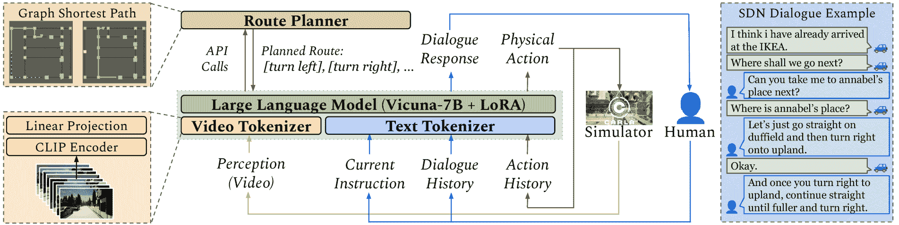
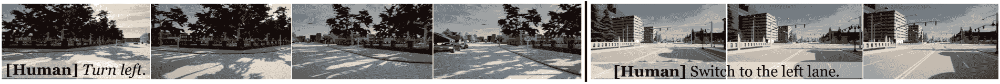
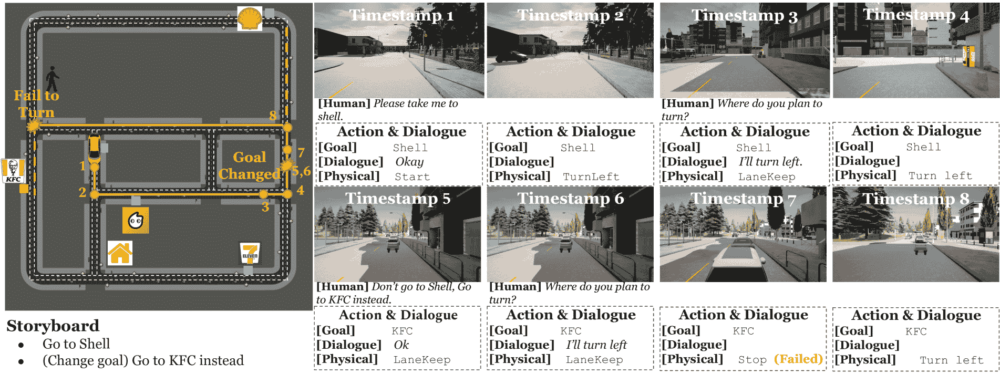

<!--yml

类别：未分类

date: 2025-01-11 12:34:42

-->

# DriVLMe：通过具身和社会经验提升基于大语言模型的自动驾驶代理

> 来源：[https://arxiv.org/html/2406.03008/](https://arxiv.org/html/2406.03008/)

黄一东¹ 杰克布·桑森¹ 马子乔¹  费利克斯·格维茨² 乔伊斯·蔡¹

¹密歇根大学  ²美国陆军研究实验室

[https://sled-group.github.io/driVLMe/](https://sled-group.github.io/driVLMe/) 联系方式：marstin@umich.edu

###### 摘要

基础模型（FMs）在自动驾驶方面的最新进展为这一领域开辟了新的前景，然而这些研究的实验设置仍然处于初步阶段，过于简化，无法捕捉到真实世界人类环境中驾驶场景的复杂性。目前尚未充分探索FM代理是否能够处理带有自由对话的长期导航任务，并应对由环境动态或任务变化引起的突发情况。为了探讨FM在应对上述挑战时的能力与局限性，我们提出了DriVLMe，一个基于视频语言模型的代理，旨在促进人类与能够感知环境并进行导航的自动驾驶汽车之间的自然有效沟通。我们通过在模拟环境中的具身体验以及来自现实人类对话的社会经验，开发了DriVLMe。虽然DriVLMe在开放环路基准测试和闭环人类研究中表现出竞争力的性能，但我们揭示了几个局限性和挑战，包括不可接受的推理时间、不平衡的训练数据、有限的视觉理解、处理多轮交互的挑战、来自机器人经验的简化语言生成以及应对突发意外情况（如环境动态和任务变化）的困难。

## 1 引言

自动驾驶（AD）在近年来取得了显著进展，带我们更接近一个未来，在这个未来中，车辆可以作为我们的社交机器人伙伴，安全高效地在道路上行驶，且几乎无需人为干预[[44](https://arxiv.org/html/2406.03008v2#bib.bib44), [58](https://arxiv.org/html/2406.03008v2#bib.bib58)]。随着这些AD代理开始进入我们的日常生活，促进有效的人机对话与合作的技术变得尤为重要。通过自然语言对话与人类沟通的能力在确保乘客安全、应对突发情况、获得信任以及提升整体驾驶体验方面发挥着至关重要的作用[[62](https://arxiv.org/html/2406.03008v2#bib.bib62), [27](https://arxiv.org/html/2406.03008v2#bib.bib27)]。在传统的自动驾驶系统和车载对话系统中，基于规则的方法[[37](https://arxiv.org/html/2406.03008v2#bib.bib37), [2](https://arxiv.org/html/2406.03008v2#bib.bib2), [43](https://arxiv.org/html/2406.03008v2#bib.bib43)]被用来解读人类指令并生成适当的回应。然而，这些系统往往难以应对自然语言的复杂性和多样性，导致功能受限和性能不尽如人意。近年来，范式已经转向基于数据驱动的学习方法[[20](https://arxiv.org/html/2406.03008v2#bib.bib20), [15](https://arxiv.org/html/2406.03008v2#bib.bib15), [18](https://arxiv.org/html/2406.03008v2#bib.bib18), [6](https://arxiv.org/html/2406.03008v2#bib.bib6)]，这些方法提供了基于语言的可解释性，并在短期任务中取得了有希望的成果。

基础模型（FMs）的进展，如大型语言模型（LLMs），为我们开辟了新的机会，因为它们展现了执行逐步推理的能力[[60](https://arxiv.org/html/2406.03008v2#bib.bib60)]、理解多模态数据的能力[[71](https://arxiv.org/html/2406.03008v2#bib.bib71), [68](https://arxiv.org/html/2406.03008v2#bib.bib68)]、从具身经验中学习的能力[[33](https://arxiv.org/html/2406.03008v2#bib.bib33), [63](https://arxiv.org/html/2406.03008v2#bib.bib63)]，以及使用外部工具的能力[[42](https://arxiv.org/html/2406.03008v2#bib.bib42)]。越来越多的研究工作[[61](https://arxiv.org/html/2406.03008v2#bib.bib61), [47](https://arxiv.org/html/2406.03008v2#bib.bib47), [52](https://arxiv.org/html/2406.03008v2#bib.bib52), [64](https://arxiv.org/html/2406.03008v2#bib.bib64), [19](https://arxiv.org/html/2406.03008v2#bib.bib19), [26](https://arxiv.org/html/2406.03008v2#bib.bib26), [45](https://arxiv.org/html/2406.03008v2#bib.bib45)]已展示出FMs在自动驾驶领域的潜力。然而，与人类环境中的真实驾驶场景相比，这些研究的实验设置仍然是初步的和简化的。一个常见的限制是缺乏处理长时间跨度导航任务的能力。由于这些模型是在简单的动作级自然语言指令上进行训练的，它们在短时间跨度的任务（如转弯或超车）上表现良好，但无法理解需要路线规划和地图知识的目标级指令。此外，这些系统仅专注于在单次交互中执行个别指令。与人类乘客的现实交互往往涉及自由形式的对话，特别是在协作处理意外情况时，例如由于传感器限制、环境动态或任务变化引起的情况。如果没有对交互上下文进行建模，这些模型可能无法理解细微的对话差异，也无法在人与车辆的互动中提供适当的回应。

为了探索面对上述挑战时基础模型（FMs）的能力和边界，我们介绍了DriVLMe，这是一种基于视频语言模型的新型自动驾驶（AD）代理，旨在促进人类与自动驾驶车辆之间的自然有效沟通，使其能够感知环境并进行导航。受Hu和Shu [[16](https://arxiv.org/html/2406.03008v2#bib.bib16)]的启发，我们的目标是将语言模型后端增强为世界模型和代理模型。我们通过从模拟环境中的具身经验和真实人类对话中的社会经验中学习，开发了DriVLMe。与以往仅专注于使用非互动数据集（如nuScenes [[4](https://arxiv.org/html/2406.03008v2#bib.bib4)]和BDD [[67](https://arxiv.org/html/2406.03008v2#bib.bib67)])进行开环基准评估的工作不同，我们在模拟环境中（即CARLA [[10](https://arxiv.org/html/2406.03008v2#bib.bib10)]）提出了开环和闭环实验。在开环评估中，我们利用Situated Dialogue Navigation (SDN) [[27](https://arxiv.org/html/2406.03008v2#bib.bib27)]和BDD-X [[21](https://arxiv.org/html/2406.03008v2#bib.bib21)]基准来评估DriVLMe在生成对话回应和物理动作方面的表现。我们的实验结果表明，DriVLMe在SDN上显著超越了以前的基准，并与使用LLM增强数据训练的基准相竞争。我们还在CARLA仿真环境中进行闭环试点研究。DriVLMe通过与人类主体进行对话，在CARLA环境中遵循语言指令。我们的初步发现展示了DriVLMe在导航和重新规划方面的一些有希望的能力，另一方面也揭示了包括不可接受的推理时间、不平衡的训练数据和低图像输入分辨率等几个局限性。目前，支持多轮互动和机器人经验生成语言仍然是一个挑战。我们希望本文能够提供一个全面的视角，展示基础模型作为自动驾驶代理的优缺点，突出需要未来改进的领域。

## 2 相关工作

图 1：DriVLMe 模型架构概览。DriVLMe 是一个多模态的大型语言模型，包含以下部分：(1) 视频标记器，它通过使用冻结的 CLIP 编码器和线性投影层，对来自 CARLA [[10](https://arxiv.org/html/2406.03008v2#bib.bib10)] 仿真器的输入视觉历史进行标记。(2) 路线规划器，一个旨在帮助 LLM 从代理当前的位置到由 LLM 指定的另一个地标的最短路径的工具。(3) 基础大型语言模型，它接收视频表示、情境对话指令、物理动作历史和路线规划器输出的规划路线等输入，预测对人类输入和与仿真器交互的物理动作的对话响应。

### 2.1 自动驾驶的基础模型

最近的研究探索了 LLM 在自动驾驶中的潜力，例如，通过在现成的 LLM 上进行提示工程，从环境文本描述中获取驾驶决策 [[46](https://arxiv.org/html/2406.03008v2#bib.bib46), [45](https://arxiv.org/html/2406.03008v2#bib.bib45), [61](https://arxiv.org/html/2406.03008v2#bib.bib61)]，或者通过微调 LLM 来预测下一步动作或规划未来轨迹 [[5](https://arxiv.org/html/2406.03008v2#bib.bib5), [30](https://arxiv.org/html/2406.03008v2#bib.bib30)]。为了开发多模态系统，真实和仿真驾驶视频都被用于指令调优 [[49](https://arxiv.org/html/2406.03008v2#bib.bib49)]。例如，DriveGPT4 [[64](https://arxiv.org/html/2406.03008v2#bib.bib64)] 和 RAG-Driver [[69](https://arxiv.org/html/2406.03008v2#bib.bib69)] 在真实世界的驾驶视频上微调了多模态 LLM，以预测未来的油门和转向角度。DriveMLM [[59](https://arxiv.org/html/2406.03008v2#bib.bib59)] 和 LMDrive [[47](https://arxiv.org/html/2406.03008v2#bib.bib47)] 从 CARLA 仿真器中采用了相机数据和自车状态。我们参考近期的调查和立场论文，提供详细的回顾 [[24](https://arxiv.org/html/2406.03008v2#bib.bib24), [7](https://arxiv.org/html/2406.03008v2#bib.bib7), [12](https://arxiv.org/html/2406.03008v2#bib.bib12), [65](https://arxiv.org/html/2406.03008v2#bib.bib65)]。我们注意到，相较于人类环境中的真实驾驶场景，这些研究中的实验设置是初步且简化的。首先，这些先前的方法仅限于单一的人工指令（甚至没有语言输入），这限制了它们在需要来回对话和高保真导航目标的长时间任务中的表现。其次，这些先前的模型只关注使用 LLM 来预测物理动作并提供解释，忽视了它们在启动对话和从机器人经验中生成语言响应方面的潜力。最后，这些设置都没有考虑到由传感器限制、环境动态或计划变化引起的意外情况。

### 2.2 语言引导的自动驾驶与户外视觉-语言导航

人类与车辆的互动已在口语语言形式中进行了广泛研究，这一研究方向可以追溯到早期的资源，包括一些多语言[[54](https://arxiv.org/html/2406.03008v2#bib.bib54)]和多模态[[22](https://arxiv.org/html/2406.03008v2#bib.bib22), [9](https://arxiv.org/html/2406.03008v2#bib.bib9)]语音语料库。最近，视觉和语言导航（VLN）任务要求智能体根据自然语言指令和自我中心相机观察，在三维环境中进行导航，并且在户外场景中也进行了一些尝试[[55](https://arxiv.org/html/2406.03008v2#bib.bib55), [23](https://arxiv.org/html/2406.03008v2#bib.bib23)]。它们将世界视为一个离散图，智能体通过在节点之间移动来朝着目标前进。得益于开放世界自动驾驶模拟器[[10](https://arxiv.org/html/2406.03008v2#bib.bib10), [72](https://arxiv.org/html/2406.03008v2#bib.bib72), [57](https://arxiv.org/html/2406.03008v2#bib.bib57)]，最近的研究弥合了离散模型预测与连续闭环控制之间的差距。基于这些模拟器，开发了各种语言引导的自动驾驶实验和数据集[[50](https://arxiv.org/html/2406.03008v2#bib.bib50), [41](https://arxiv.org/html/2406.03008v2#bib.bib41), [27](https://arxiv.org/html/2406.03008v2#bib.bib27)]。

### 2.3 对话引导的机器人智能体

用于改善人机互动的对话引导型智能体已引起广泛关注[[31](https://arxiv.org/html/2406.03008v2#bib.bib31), [32](https://arxiv.org/html/2406.03008v2#bib.bib32)]。该领域的努力包括使机器人能够根据人类对话实时调整计划[[48](https://arxiv.org/html/2406.03008v2#bib.bib48), [8](https://arxiv.org/html/2406.03008v2#bib.bib8)]，寻找额外的提示[[51](https://arxiv.org/html/2406.03008v2#bib.bib51), [36](https://arxiv.org/html/2406.03008v2#bib.bib36)]，或者直接请求人类协作[[34](https://arxiv.org/html/2406.03008v2#bib.bib34)]以完成任务。大型语言模型（LLM）的进展为这些研究注入了新的潜力[[13](https://arxiv.org/html/2406.03008v2#bib.bib13), [66](https://arxiv.org/html/2406.03008v2#bib.bib66)]。例如，InnerMonologue[[17](https://arxiv.org/html/2406.03008v2#bib.bib17)]研究了使用LLM生成内部对话来帮助完成以人为中心的任务，而PromptCraft[[40](https://arxiv.org/html/2406.03008v2#bib.bib40)]则探索了精确的提示工程以增强机器人沟通能力。这些发展突显了基础模型作为智能体构建模块，在促进更有效的人机协作中的关键作用。

## 3 Dorothie & 情境对话导航

我们在CARLA [[10](https://arxiv.org/html/2406.03008v2#bib.bib10)] 中设置了实验，CARLA是一个用于自动驾驶车辆的驾驶模拟器，并使用了建立在其上的DOROTHIE框架[[27](https://arxiv.org/html/2406.03008v2#bib.bib27)]，该框架支持人类-代理对话和各种形式的意外情况。在这项工作中，我们采用了来自[[27](https://arxiv.org/html/2406.03008v2#bib.bib27)]的Situated Dialogue Navigation（SDN）基准测试中的问题定义和数据。

### 3.1 概述

SDN基准测试旨在评估代理根据感知历史和对话历史生成对话响应和物理导航动作的能力。SDN数据来自Wizard-of-Oz（WoZ）研究中的人类-人类交互，包含超过8,000条发言和18.7小时的控制流。在WoZ研究中，人类参与者与他们认为是自动驾驶代理的系统进行交互，以完成各种导航任务。幕后，这个代理的动作是由一个人类“巫师”操作的。这种设置确保了参与者与代理的交互自然且同步。在互动过程中，还有一个对立的巫师会实时创造出意外情况。这个对立的巫师通过语言指令和操控路况来改变环境动态以及当前的目标和计划。

### 3.2 问题定义

在时间$t$，代理会获得一个感知观察和一个人类语言输入，这些信息被聚合成以下模型输入：

+   •

    地图知识。一个图结构的拓扑$M$，包括街道名称列表$\{\mathrm{str}_{i}\}$和地标$\{\mathrm{lm}_{i}\}$。

+   •

    感知历史。一系列由第一人称摄像头拍摄的RGB图像$V=\{V_{0},V_{1},\cdots,V_{t-1}\}$。视频采样率为$10\mathrm{Hz}$。

+   •

    对话历史。来自人类（$U_{t,\mathrm{HUM}}$）和代理（$U_{t,\mathrm{BOT}}$）的对话发言。

+   •

    动作历史。动作历史包括一系列先前的动作$A_{t}=\{a_{0},a_{1},\cdots,a_{t-1}\}$，其中每个动作$a_{t}$是一个元组$\langle p,\alpha\rangle$，表示在时间$t$执行的物理动作及其参数。物理动作定义的更多细节见表[1](https://arxiv.org/html/2406.03008v2#S3.T1 "表 1 ‣ 3.2 问题定义 ‣ 3 Dorothie & Situated Dialogue Navigation ‣ DriVLMe: 提升基于LLM的自动驾驶代理的具身与社交经验")。

| 物理动作 | 参数 | 描述 |
| --- | --- | --- |
| LaneFollow | - | 默认行为，保持在当前车道行驶。 |
| LaneSwitch | 方向 | 切换到相邻车道。 |
| JTurn | 方向 | 在交叉口转向连接道路。 |
| UTurn | - | 做一个掉头，转向相反方向。 |
| Stop | - | 手动刹车车辆。 |
| Start | - | 手动启动车辆。 |
| SpeedChange | 速度（$\pm$5） | 将期望巡航速度调整5公里/小时。 |
| LightChange | 灯光状态（开/关） | 改变前灯状态。 |

表 1：SDN 基准测试中的高层动作空间。

智能体的目标是按照人类伙伴的对话指令，导航到地图上的一系列地标。为了保证未来对话的连贯性和应对不可预见的事件，任务是以教师强制的方式定义的。这意味着在数据收集过程中，模型总是会得到实际的动作历史 $A_{t}$，而不是推理时模型预测的动作。模型是通过与人类向导的动作和对话决策进行对比来评估的。我们特别考虑了两个子问题。

##### 导航对话响应（RfN）任务。

RfN 任务评估智能体在驾驶相关交流中生成适当响应的能力。在时间戳 $\tau$ 时，当向导发出话语时，智能体需要预测对话响应 $d$。我们不仅仅要求预测对话动作，而是要求智能体生成自然语言。

##### 从对话导航（NfD）任务。

NfD 任务评估智能体在遵循对话中的人类指令时的表现。在时间戳 $\tau$ 时，当向导做出关于物理动作 $\langle p,\alpha\rangle$ 的决策时，智能体需要预测这一物理动作。

## 4 方法

### 4.1 模型架构

我们的 DriVLMe 智能体是一个大型的视频-语言模型，由三部分组成：视频分词器、路径规划模块和大型语言模型骨干。DriVLMe 的概览架构在图 [1](https://arxiv.org/html/2406.03008v2#S2.F1 "Figure 1 ‣ 2 Related Work ‣ DriVLMe: Enhancing LLM-based Autonomous Driving Agents with Embodied and Social Experiences") 中进行了可视化展示。

##### 视频分词器。

在时间 $t$ 时，我们可以获取一个视觉观测历史 $\{V_{0},V_{1},\cdots,V_{t-1}\}$。考虑到 SDN 基准测试的长时间跨度，我们将窗口大小设置为 $T_{\max}=40$，步长为 $\Delta t=2$，以采样视觉历史并形成一个视频 $V\in\mathbb{R}^{T\times H\times W\times C}$，其中 $H$、$W$ 和 $C$ 分别是高度、宽度和通道数。对于每个视频帧 $V_{i}$，我们采用预训练的 CLIP ViT-L/14 编码器 [[38](https://arxiv.org/html/2406.03008v2#bib.bib38)] 提取特征图 $f\in\mathbb{R}^{T\times h\times w\times D}$，其中 $h=H/p$，$w=W/p$，$p$ 是视觉变换器的补丁大小，$D$ 是 CLIP 编码器的特征维度。我们沿时间维度对特征图应用平均池化，得到表示 $v_{s}\in\mathbb{R}^{(h\times w)\times D}$，沿空间维度应用平均池化得到表示 $v_{t}\in\mathbb{R}^{T\times D}$。通过拼接这两个嵌入，我们得到以下视频表示 $v=\textrm{Concat}(v_{t},v_{s})\in\mathbb{R}^{(T+h\times w)\times D}$。然后我们使用一个线性投影层 $g$ 将嵌入投影到语言解码器的嵌入空间，维度为 $K$，得到最终的嵌入 $g(v)=\mathbb{R}^{(T+h\times w)\times K}$。

##### LLM 主干。

LLM 解码器是处理输入视频并将对话指令翻译为更低层决策的核心模块。受到 Video-ChatGPT [[29](https://arxiv.org/html/2406.03008v2#bib.bib29)] 的启发，我们采用 Vicuna-7B (v1.1) [[53](https://arxiv.org/html/2406.03008v2#bib.bib53)] 作为 LLM 解码器。受到 LLM 使用工具能力的启发，我们引入了一个规划框架，用于环境理解，详细提示如图 [2](https://arxiv.org/html/2406.03008v2#S4.F2 "图 2 ‣ 路径规划模块 ‣ 4.1 模型架构 ‣ 4 方法 ‣ DriVLMe：通过具身和社交经验增强基于 LLM 的自动驾驶智能体") 所示。

##### 路径规划模块。

为了实现长时间目标的符号规划，我们引入了一个路线规划器，将地图 $M$ 中的图形知识融入 DriVLMe。该规划器以地图上的目标地标 $\mathrm{lm}\in\{\mathrm{lm}_{i}\}$ 和智能体当前位置 $l$ 为输入，然后输出从智能体到目标地标的最短路径。调用规划器时，智能体可以简单地输出 $\textrm{Plan}(\mathrm{lm})$。规划器返回一个转弯方向的列表，每个交叉口一个，用自然语言表达。最终输出传递给 DriVLMe 智能体的是一个方向性动作列表 $\{p\}=[\mathrm{dir}_{1},\mathrm{dir}_{2},\cdots]$，其中 $\mathrm{dir}_{i}\in\{\texttt{left},\texttt{right},\texttt{straight},\texttt{% uturn}\}$。

<svg class="ltx_picture ltx_centering" height="276.62" id="S4.F2.pic1" overflow="visible" version="1.1" width="600"><g fill="#000000" stroke="#000000" stroke-width="0.4pt" transform="translate(0,276.62) matrix(1 0 0 -1 0 0)"><g fill-opacity="1.0" transform="matrix(1.0 0.0 0.0 1.0 21.65 13.78)"><foreignobject color="#000000" height="249.07" overflow="visible" transform="matrix(1 0 0 -1 0 16.6)" width="556.69">(视频)

(系统消息)：您是DriVLMe。您负责根据乘客的指示安全驾驶汽车。您必须与乘客沟通，并做出关于当前导航目标的高级决策。

(提示)：描述您看到的内容。

(LLM，描述)：我能看到前方有一辆车。我只能换到左车道…

(对话与动作历史)

(路线规划指令)：您有一个规划工具，您可以通过它规划到达目的地的路径。您可以通过调用plan(destination)来获取一条到达目的地的路线。如果您没有明确的目的地，可以返回plan(None)。

(LLM，规划)：plan(ikea)

(路线规划器)：[左转，直行，…]

(提示)：您可以选择一个新的导航动作，并回复乘客。

(LLM，动作)：SwitchLane

(LLM，对话)：“好的，我要去宜家。”

图2：系统消息和用户与DriVLMe系统交互的示例。系统消息概述了代理需要完成的任务。根据视频和观察历史，代理首先需要描述周围环境，然后调用规划器API规划一条到达预测目标的路线，最后做出决策。LLM的输出部分被突出显示。

### 4.2 指令调整

受胡和舒的启发[[16](https://arxiv.org/html/2406.03008v2#bib.bib16)]，我们的目标是通过学习来自具身经验和社会互动的数据，增强语言模型作为世界模型和代理模型的能力。DriVLMe的训练过程分为两个阶段：（1）通用视频指令调整阶段，重点是利用大规模驾驶视频来对齐LLM和视频标记器，（2）社会和具身指令调整阶段，重点是利用从实际人类对话和模拟器中获得的具身经验数据来训练LLM。

#### 4.2.1 域视频指令调整

参考 Video-ChatGPT [[29](https://arxiv.org/html/2406.03008v2#bib.bib29)] 的做法，我们直接从 LLaVA-7B（lightening v1.1）[[25](https://arxiv.org/html/2406.03008v2#bib.bib25)] 初始化投影层。我们采用来自 BDD-X 数据集[[21](https://arxiv.org/html/2406.03008v2#bib.bib21)] 的 50k 视频-文本对进行驾驶领域的调优。预训练图像来自真实驾驶视频及其环境描述和动作解释的文本注释。我们冻结了 CLIP 编码器和 LLM 解码器，仅训练投影层。

#### 4.2.2 社会化指令调优

在这一阶段，我们除了对投影器进行调优外，还使用了 LoRA [[14](https://arxiv.org/html/2406.03008v2#bib.bib14)] 对 LLM 进行微调。我们在 SDN 数据集的整个训练集上训练模型，该数据集包含 13k 视频-对话对，包括人与车辆的对话和规划者的长期目标。在每个数据点 $\tau$ 上，原始 SDN 基准提供由人类玩家生成的对话 $d$ 或物理动作 $\langle p,\alpha\rangle$，其中 $p$ 是动作（例如，停止），$\alpha$ 是参数（例如，左）。我们的目标是让代理学习如何与人类意图对齐进行规划，这涉及根据目标和对话历史创建一系列原始动作，特别是在目标或计划发生变化时。我们根据车辆的轨迹和当前对话手动注释计划变化。尽管从当前位置到目标可能有多条有效路径，但我们手动选择了车辆在录制过程中所走的路线。这些注释计划作为视频-指令数据对的一部分，用于训练，从而更有效地学习规划器作为工具。

#### 4.2.3 具身指令调优

除了原始对话数据，我们还开发了一个数据生成管道，以从模拟器中获取具身感知和描述的配对数据。我们回放 SDN 基准中的训练会话以获取自我中心感知，记录环境因素如天气和附近的物体，然后使用模板将这些细节填入语言描述中。

+   •

    距离道路尽头：我们通过将当前路标的 $s$ 值减去道路尽头的 $s$ 值来计算距离道路尽头的距离。$s$ 值根据 OpenDrive 1.4 标准定义[[11](https://arxiv.org/html/2406.03008v2#bib.bib11)]。

+   •

    车道信息：我们记录车辆所在的车道编号，从左侧开始计数，并记录车辆是否可以切换到相邻的左侧或右侧车道。

+   •

    前方物体：我们从模拟获得的地面真实值中直接识别出车辆正前方的物体，并计算与其的距离。

+   •

    交通标志可见性：我们记录所有可见的交通标志（例如，交通灯、停车标志、限速标志），以及它们所显示的信息（交通灯的红/绿、标示的限速），以及它们与车辆的距离。

+   •

    天气条件：我们记录可能影响车辆控制的当前天气条件。

用于表达具身经验的文本模板可在附录[8.1](https://arxiv.org/html/2406.03008v2#Sx2.SS1 "8.1 Language Templates for Verbalizing the Embodied Experiences. ‣ Appendix ‣ DriVLMe: Enhancing LLM-based Autonomous Driving Agents with Embodied and Social Experiences")中找到。

#### 4.2.4 超参数。

视频的输入分辨率设置为$224\times 224$。我们使用单一的线性层进行投影。在模型的预训练阶段，我们以学习率$2e^{-5}$和批量大小4训练模型3个周期。我们使用LoRA[[14](https://arxiv.org/html/2406.03008v2#bib.bib14)]和ZeRO[[39](https://arxiv.org/html/2406.03008v2#bib.bib39)]对LLM进行了微调。训练周期为2，批量大小为1。对于LoRA配置，我们将秩（rank）设置为128，alpha设置为256。

## 5 开环评估

### 5.1 SDN 基准

对于开环评估，我们在SDN基准的测试集上测试了模型。测试集包含两个子集，已见和未见，其中已见数据点使用CARLA地图Town01、Town03或Town05作为环境（这些地图出现在训练集中）。未见数据点来自Town02，这是一张相对简单的城镇地图，未参与训练。

### 5.2 评估指标

我们在两个任务上评估了模型，分别是RfN和NfD。NfD任务要求代理预测物理动作$\langle p,\alpha\rangle$，其中$p$表示选择的物理动作，$\alpha$是其参数。为了评估物理动作及其参数，我们采用了准确率指标。在RfN任务中，代理需要预测对话输出$d$。模型需要预测SDN中定义的对话动作$m$。为了评估自然语言对话输出，我们还考虑了其他语言生成指标：CIDEr[[56](https://arxiv.org/html/2406.03008v2#bib.bib56)]、BERTScore[[70](https://arxiv.org/html/2406.03008v2#bib.bib70)]和METEOR[[3](https://arxiv.org/html/2406.03008v2#bib.bib3)]。

| 模型 | NfD | RfN |
| --- | --- | --- |
| Act$\uparrow$ | Arg$\uparrow$ | Move$\uparrow$ | CIDEr$\uparrow$ | BERT$\uparrow$ | M$\uparrow$ |
| --- | --- | --- | --- | --- | --- |
| 已见环境 |  |  |  |  |  |  |
| TOTO | 41.2 | 36.0 | 40.9 | - | - | - |
| GPT-4 | 53.0 | 44.2 | 11.0 | 0.06 | 0.48 | 0.09 |
| GPT-4V | 52.0 | 29.4 | 6.5 | 0.07 | 0.54 | 0.11 |
| \cdashline1-7 DriveVLM | 70.4 | 71.3 | 61.4 | 0.43 | 0.76 | 0.37 |
| DriVLMe (-social) | 68.7 | 69.0 | 19.1 | 0.17 | 0.60 | 0.13 |
| DriVLMe (-embodied) | 68.4 | 67.7 | 62.7 | 0.45 | 0.76 | 0.37 |
| DriVLMe (-domain) | 62.4 | 70.7 | 60.9 | 0.35 | 0.75 | 0.18 |
| DriVLMe (-video) | 60.3 | 72.5 | 42.7 | 0.33 | 0.69 | 0.26 |
| DriVLMe (-planner) | 57.6 | 52.0 | 21.3 | 0.19 | 0.61 | 0.12 |
| 未见环境 |  |  |  |  |  |  |
| TOTO | 45.8 | 41.1 | 31.0 | - | - | - |
| GPT-4 | 67.5 | 61.3 | 14.5 | 0.05 | 0.47 | 0.08 |
| GPT-4V | 63.5 | 51.6 | 7.5 | 0.07 | 0.53 | 0.13 |
| \cdashline1-7 DriveVLM | 70.8 | 71.3 | 68.5 | 0.55 | 0.81 | 0.43 |
| DriVLMe (-social) | 69.8 | 66.8 | 26.9 | 0.25 | 0.64 | 0.16 |
| DriVLMe (-embodied) | 72.9 | 68.0 | 66.7 | 0.52 | 0.79 | 0.42 |
| DriVLMe (-domain) | 65.9 | 70.8 | 65.3 | 0.48 | 0.78 | 0.38 |
| DriVLMe (-video) | 62.6 | 68.6 | 46.5 | 0.41 | 0.73 | 0.31 |
| DriVLMe (-planner) | 58.2 | 59.1 | 23.7 | 0.22 | 0.63 | 0.13 |

表2：在SDN测试集上的开放循环评估结果。已见会话来自CARLA地图Town01、Town03和Town05，而未见会话来自CARLA地图Town02。NfD任务衡量智能体根据人类指令进行导航的能力，RfN任务衡量智能体在情境对话中回应人类的能力，M代表METEOR。

### 5.3 基准模型

##### 专家基准模型。

我们将我们的模型与TOTO[[27](https://arxiv.org/html/2406.03008v2#bib.bib27)]进行了比较，TOTO是一个基于情节转换器实现的基准模型。由于TOTO模型没有文本解码器，因此无法生成对话，我们仅记录了TOTO的对话动作预测准确率。

##### 通用基准模型。

GPT-4[[1](https://arxiv.org/html/2406.03008v2#bib.bib1)]和GPT-4V[[35](https://arxiv.org/html/2406.03008v2#bib.bib35)]是我们考虑的通用LLM模型。¹¹1我们分别使用了OpenAI的gpt-4-0125-preview和gpt-4-vision-preview模型。由于计算限制，我们没有在整个SDN测试集上测试这两个模型，而是选择从四个层次中随机抽样数据点：已见RfN、未见RfN、已见NfD和未见NfD。为了在这些层次之一上评估每个模型，我们随机抽取了200个数据点，并将其输入到一个类似于表[2](https://arxiv.org/html/2406.03008v2#S4.F2 "Figure 2 ‣ Route Planning Module. ‣ 4.1 Model Architecture ‣ 4 Method ‣ DriVLMe: Enhancing LLM-based Autonomous Driving Agents with Embodied and Social Experiences")中的自定义提示基础设施中。对于支持视觉的模型（GPT-4V），我们在当前视觉输入前添加了图像$V_{t-1}$。为了帮助LLM更好地理解输出格式，我们在决策提示中解释了每个选项。提示工程的详细信息见附录[8.2](https://arxiv.org/html/2406.03008v2#Sx2.SS2 "8.2 Prompt Engineering for GPT-4 Baseline ‣ Appendix ‣ DriVLMe: Enhancing LLM-based Autonomous Driving Agents with Embodied and Social Experiences")。

### 5.4 主要结果

如表 [2](https://arxiv.org/html/2406.03008v2#S5.T2 "Table 2 ‣ 5.2 Evaluation Metrics ‣ 5 Open-loop Evaluation ‣ DriVLMe: Enhancing LLM-based Autonomous Driving Agents with Embodied and Social Experiences") 所示，我们的 DriveVLMe 模型在大多数指标上显著优于基准模型，除了在 NfD 任务中未见地图的物理动作准确度。这一差异可能归因于对未见 Town02 的不熟悉，尽管它在地形上较为简单。总体而言，DriVLMe 可以做出更精确的决策，并在情境对话中给出更好的回应。

图 3：在 CARLA 中进行的 DriVLMe 闭环评估示例，按照动作级别的自然语言指令执行。

图 4：闭环评估会话示例：会话的初始目标设定为 Shell，随后在评估过程中更改为 KFC。黄色实线表示代理所走的路径，黄色虚线表示规划模块规划的路线。我们在整个评估会话中设置了八个检查点，并记录了每个检查点的输入对话、目标预测、对话回应和采取的物理动作。

### 5.5 消融研究

为了评估在开发 DriVLMe 中各种数据和组件的有效性，我们进行了消融研究。我们通过系统地去除特定的训练数据和组件来评估模型性能，以观察它们对模型生成对话回应和预测物理动作能力的影响。

+   •

    社会数据（-social）：我们去除了用于社会指令调优的人车对话数据。

+   •

    体现数据（-embodied）：我们去除了用于体现指令调优的模拟数据。

+   •

    域数据（-domain）：我们去除了用于领域通用指令调优的 BDD-X 数据。

+   •

    视频输入（-video）：我们去除了 DriVLMe 中的视频处理组件，并在没有视觉信息的情况下评估了其性能。

+   •

    规划模块（-planner）：我们去除了 DriVLMe 中负责路线规划的规划模块。此实验旨在评估主动路线规划对模型导航能力的影响。

如表[2](https://arxiv.org/html/2406.03008v2#S5.T2 "Table 2 ‣ 5.2 Evaluation Metrics ‣ 5 Open-loop Evaluation ‣ DriVLMe: Enhancing LLM-based Autonomous Driving Agents with Embodied and Social Experiences")所示，去除视频输入和规划模块会降低模型在RfN任务上的所有指标表现，表明这两个模型对响应生成的贡献。NfD性能的类似下降也被观察到，其中去除规划器的影响尤为显著，表明路线规划模块对下一步动作预测的贡献非常大。数据消融研究表明，社交经验显著增强了响应生成。我们观察到，具身经验主要帮助模型预测与路线规划无关的动作，如车道变换。因此，这在未见过的Town02中效果较差，因为在该场景中车道变换并非必要。

### 5.6 真实世界基准评估

我们还探讨了DriVLMe是否能够从模拟评估过渡到涉及真实驾驶场景的基准测试。我们使用了BDD-X [[21](https://arxiv.org/html/2406.03008v2#bib.bib21)]基准，该基准提供了由车载摄像头录制的视频片段，并附有语言解读和控制信号。我们使用LoRA对DriVLMe模型在BDD-X训练集上进行了9个epochs的微调，学习率设置为$5e^{-5}$，LoRA秩和alpha均设置为256。如表[3](https://arxiv.org/html/2406.03008v2#S5.T3 "Table 3 ‣ 5.6 Evaluation on Realworld Benchmark ‣ 5 Open-loop Evaluation ‣ DriVLMe: Enhancing LLM-based Autonomous Driving Agents with Embodied and Social Experiences")所示，DriVLMe成功适应了真实世界的驾驶场景，不仅仅是在模拟环境中进行导航。它超越了ADAPT [[18](https://arxiv.org/html/2406.03008v2#bib.bib18)]基准，并与最先进的DriveGPT4 [[64](https://arxiv.org/html/2406.03008v2#bib.bib64)]基准达到了相当的表现，超越了多个指标，并且不依赖于DriveGPT4中采用的ChatGPT增强数据。

| 模型 | 描述 | 理由 | 完整性 |  |
| --- | --- | --- | --- | --- |
| C$\uparrow$ | B4$\uparrow$ | R$\uparrow$ | C$\uparrow$ | B4$\uparrow$ | R$\uparrow$ | C$\uparrow$ | B4$\uparrow$ | R$\uparrow$ |  |
| ADAPT | 219.35 | 33.42 | 61.83 | 94.62 | 9.95 | 32.01 | 93.66 | 17.76 | 44.32 |  |
| DriveGPT4 | 254.62 | 35.99 | 63.97 | 101.55 | 10.84 | 31.91 | 102.71 | 19.00 | 45.10 |  |
| DriVLMe | 227.05 | 33.39 | 61.02 | 132.17 | 13.39 | 33.18 | 114.16 | 19.59 | 44.83 |  |
| 模型 | 速度 | 转向角度 |
| E$\downarrow$ | A0.1$\uparrow$ | A0.5$\uparrow$ | A1$\uparrow$ | A5$\uparrow$ | E$\downarrow$ | A0.1$\uparrow$ | A0.5$\uparrow$ | A1$\uparrow$ | A5$\uparrow$ |
| ADAPT | 3.02 | 9.56 | 24.77 | 37.07 | 90.39 | 11.98 | 27.93 | 66.83 | 75.13 | 89.45 |
| DriveGPT4 | 1.30 | 30.09 | 60.88 | 79.92 | 98.44 | 8.98 | 59.23 | 72.89 | 79.59 | 95.32 |
| DriVLMe | 1.59 | 22.76 | 50.55 | 70.80 | 99.20 | 33.54 | 61.38 | 70.70 | 76.21 | 91.55 |

表3：BDD-X测试集上的开环评估结果。我们提供了关于动作描述、动作解释、全文生成和控制信号预测的评估结果。C代表CIDEr；B4代表BLEU4；R代表ROUGE；E代表均方根误差（RMSE）。

## 6 闭环评估

对于闭环评估，我们在CARLA中开发了一个基于DOROTHIE中为人类研究开发的模拟器的人机协同仿真协议。

### 6.1 实验设计

我们设计了闭环实验，以评估我们的自动驾驶系统在各种动态场景下的适应性和鲁棒性。实验在Town01和Town02中进行，包括已知和未知的地图。人类参与者通过自然语言指令，按照故事板给DriVLMe代理指示导航到预设目标，代理尝试按照这些指令，自主在环境中导航并与人类参与者沟通。为了全面评估系统性能，我们在下面的故事板中列出了不同设置下的模型测试：

+   •

    长期指令与短期指令：用户通过长期指令（涉及更高层次的导航目标，如“去KFC”）或短期指令（如“在下一个交叉口右转”）指导代理，要求其进行即时操作。

+   •

    天气变化：驾驶过程中发生突如其来的天气变化（例如，下雨）。

+   •

    目标变化：人类用户要求更改目标，迫使代理重新规划路线。人类用户首先指示代理导航到初始目标，然后更新目标。

+   •

    障碍物添加：在代理前方放置障碍物，迫使其停下或变道。

### 6.2 将DriVLMe与仿真连接

在20次实际人类参与者的先导研究中，代理与模拟器的互动形成了闭环控制机制。我们使用本地运动规划器将物理动作转化为油门和转向控制。由于LLM推理速率的限制，我们将LLM与环境的交互频率限制为2 Hz，并向模型提供了完整的交互历史$H_{t}$以进行提示。在评估中，我们使用是否达到最终目标作为度量，并记录失败案例进行分析。

### 6.3 主要结果

我们的实验调查结果提供了有力证据，证明我们提出的DriVLMe模型在自动驾驶对话任务中的有效性和鲁棒性，在20次测试中成功进行了6次会话。正如图[3](https://arxiv.org/html/2406.03008v2#S5.F3 "图3 ‣ 5.4 主要结果 ‣ 5 开环评估 ‣ DriVLMe：通过具身和社交经验增强基于LLM的自动驾驶代理")所示，我们发现DriVLMe模型能够遵循简单的人类指令，并按要求执行物理动作，这与之前关于自动驾驶基础模型代理的研究一致。令人惊讶的是，我们发现DriVLMe能够有效调用路线规划API进行可靠的图形规划和重新规划，展示了LLM在工具使用方面的能力。该模型在会话中的天气变化下也表现出了鲁棒性。然而，这些成功的会话仅限于有一个长期目标或目标只有一次变化的情况。在与多个短期指令的多轮互动中，我们观察到了挑战。DriVLMe还在处理突发情况和环境动态变化时遇到了困难。最后，来自机器人经验的简化语言生成引发了人类受试者对可信度的担忧。图[4](https://arxiv.org/html/2406.03008v2#S5.F4 "图4 ‣ 5.4 主要结果 ‣ 5 开环评估 ‣ DriVLMe：通过具身和社交经验增强基于LLM的自动驾驶代理")展示了我们一次目标变化指令的会话示例。我们发现代理能够对目标变化做出反应，并根据路线规划工具给出的计划进行转向。然而，在实验过程中我们遇到了两个失败案例。首先，当前方的车突然停下时，代理未能及时停车（时间戳7）。其次，代理未能预测到最后一个交叉口的转向，导致代理在交叉口停滞（如地图所示）。我们提供了视频演示以获取更多细节，并在下一部分讨论基础模型代理的局限性。

## 7 局限性与未来工作

我们的初步研究揭示了基于LLM的自动驾驶代理存在若干失败案例和技术挑战，概述如下。

##### 具身经验不平衡。

自动驾驶任务中的一个固有挑战是训练数据的不平衡，大多数数据点是常规动作，如车道跟随或保持与前车的安全距离。这种不平衡可能导致模型偏向，特别是倾向于预测更常见的动作，而无法预测诸如停车之类的动作。解决这个问题需要在具身经验、采样策略或领域特定知识中引入强大的数据增强，以确保在多样化的驾驶场景中进行全面的模型训练。

##### 限制的世界建模与视觉理解。

我们的实验揭示了由于图像输入分辨率低，视觉编码器未能捕捉到关键世界状态的实例，如交通信号灯的颜色或交通标志的解读。缺乏光学字符识别（OCR）功能进一步加剧了误解交通标志的风险，从而违反交通规则。未来的工作可以探索提高图像分辨率、集成OCR功能或加入补充传感器模态的技术，以丰富感知并改善整体世界建模性能。

##### 意外情况与世界动态。

我们在应对意外情况（如遇到障碍物）时的闭环实验结果揭示了LLM代理在有效应对分布外极端情况方面的局限性。这类情况在真实世界的驾驶场景中十分常见，突显了增强基于LLM的自动驾驶代理应对突发情况的能力的必要性。未来的一个潜在方向是使代理能够从现实驾驶视频/数据中学习并发展更好的世界模型。另一种方法是允许大型语言模型在突发情况下主动寻求人工帮助。

##### 来自具身经验的语言生成。

此外，我们的调查发现，我们模型生成的语言往往过于简化，主要由对人类指令的直接回应或简单的“是/否”回答构成。此外，模型无法主动与人类指导者进行对话，例如请求额外的建议或低级别的指令。未来的工作应侧重于增强模型的对话主动性，推动自我驱动的对话。

##### 多轮互动与指令跟随。

我们的闭环实验还表明，在多轮互动和指令跟随方面存在挑战。随着对话的进行，代理偶尔会未能保留之前的长周期指令，从而导致错误的目标预测，并随后中断规划路线。这个问题强调了在维护代理模型时，记忆保持和上下文意识的重要性，尤其是在发生大量对话交流的情况下。通过在大规模语言模型（LLM）架构中实现基于记忆的机制，或在自动驾驶代理框架中增加记忆模块，可能会显著增强代理在复杂环境中遵循复杂指令的能力，这种环境需要大量的人工与代理协作。

##### 有限的心智理论与可信度。

我们研究中观察到的另一个关键限制是自动驾驶代理缺乏情境化的心智理论（ToM）[[28](https://arxiv.org/html/2406.03008v2#bib.bib28)]。有时，代理错误地解读了指令者的意图，错误地将低级指令视为放弃先前提供的长时程指令的提示，并错误预测目标。代理未能认识到指令可能仅仅是指定正在进行的长时程指令中的细节。这突显了自动驾驶代理需要具有更精细的理解指令者意图和上下文的能力，从而为其互动伙伴建立更好的代理模型，进而赢得人类的信任。

##### 不可接受的推理时间。

我们模型的单次推理时间大约为5秒，显著超过了两个决策点之间的间隔，这在实际应用中构成了重大挑战，尤其是在快速决策至关重要的场景下。虽然在模拟环境中可以通过逐步模拟避免这一延迟，但解决这一推理时间差异对于实际部署至关重要。未来的研究方向可能集中在模型精简、硬件加速的利用或实现高效的推理策略，以缓解这一瓶颈。这也提出了一个研究问题，即在减少推理时间的同时，如何平衡推理链条的长度，以保持任务完成的相对性能。

## 8 结论

在这项工作中，我们提出了基于LLM的自动驾驶代理DriVLMe，该代理结合了在模拟环境中的具身经验和在现实人类对话中的社交经验。以自我为中心的感知和对话互动使DriVLMe能够在复杂的驾驶环境中与人类乘客进行有意义的对话。通过实证评估，我们展示了DriVLMe在自动驾驶对话任务中的有效性和多样性，展示了在物理动作预测和对话响应生成指标上的显著改进。我们的研究结果展示了DriVLMe在实现人机沟通和自动驾驶中的潜力，同时也揭示了作为自动驾驶代理的基础模型的一些关键局限性和挑战，突出了未来需要改进的领域。

## 致谢

本研究得到了密歇根大学汽车研究中心（ARC）和NSF IIS1949634的资助支持。作者感谢审稿人提供的宝贵反馈。

## 参考文献

+   Achiam 等人 [2023] Josh Achiam, Steven Adler, Sandhini Agarwal, Lama Ahmad, Ilge Akkaya, Florencia Leoni Aleman, Diogo Almeida, Janko Altenschmidt, Sam Altman, Shyamal Anadkat 等人。Gpt-4技术报告。*arXiv 预印本 arXiv:2303.08774*, 2023。

+   巴卡等人 [2003] 朱莉·巴卡，郑峰，高华林，约瑟夫·皮科恩。汽车环境中的对话系统。在*INTERSPEECH*，第1929–1932页，2003。

+   巴内吉和拉维 [2005] 萨坦吉夫·巴内吉和阿隆·拉维。Meteor：一种用于机器翻译评估的自动化度量，其与人工评判的相关性得到了改善。在*ACL机器翻译和/或总结评估方法内在和外在工作坊论文集*，第65–72页，2005。

+   凯撒等人 [2020] 霍尔格·凯撒，瓦伦·班基提，亚历克斯·H·兰，索拉布·沃拉，威尼斯·埃琳·李昂，徐强，阿努什·克里希南，俞潘，贾恩卡洛·巴尔丹，奥斯卡·贝伊博姆。nuscenes：自动驾驶的多模态数据集。在*IEEE/CVF计算机视觉与模式识别大会论文集*，第11621–11631页，2020。

+   陈等人 [2023a] 陈龙，奥列格·西纳夫斯基，扬·赫内尔曼，爱丽丝·卡恩桑德，安德鲁·詹姆斯·威尔莫特，丹尼·伯奇，丹尼尔·蒙德，杰米·肖顿。使用LLM进行驾驶：融合面向对象的矢量模态以实现可解释的自动驾驶。*arXiv预印本 arXiv:2310.01957*，2023a。

+   陈等人 [2023b] 陈理，吴鹏豪，卡什雅普·奇塔，伯恩哈德·耶格，安德烈亚斯·盖格，李洪阳。端到端自动驾驶：挑战与前沿。*arXiv预印本 arXiv:2306.16927*，2023b。

+   崔等人 [2024] 崔灿，马云生，曹旭，叶文倩，周扬，梁凯兆，陈金泰，卢娟武，杨子冲，廖贵达等人。关于自动驾驶的多模态大语言模型调查。在*IEEE/CVF冬季计算机视觉应用会议论文集*，第958–979页，2024。

+   崔等人 [2023] 崔宇辰，悉达尔特·卡拉姆切蒂，拉杰·帕莱蒂，尼迪亚·希瓦库马尔，帕西·梁，朵莎·萨迪赫。不要，往右：通过共享自治进行机器人操作的在线语言纠正。在*2023年ACM/IEEE人类-机器人互动国际会议论文集*，第93–101页，2023。

+   德鲁特雷等人 [2019] 蒂埃里·德鲁特雷，西蒙·范登亨德，杜尚·格鲁季奇，卢克·范·古尔，玛丽-弗朗辛·莫恩斯。Talk2car：掌控你的自动驾驶汽车。*arXiv预印本 arXiv:1909.10838*，2019。

+   多索维茨基等人 [2017] 亚历克谢·多索维茨基，赫尔曼·罗斯，费利佩·科德维拉，安东尼奥·洛佩兹，弗拉德伦·科尔图。Carla：一种开放的城市驾驶模拟器。在*机器人学习会议*，第1–16页，PMLR，2017。

+   杜普伊和格雷兹利科夫斯基 [2006] 马里乌斯·杜普伊和汉·格雷兹利科夫斯基。Opendrive®——一种用于驾驶模拟中道路描述的开放标准。在*驾驶模拟会议论文集*，第25–36页，2006。

+   高等人 [2024] 高浩翔，李雅倩，龙凯文，杨敏，沈奕庆。自动驾驶中的基础模型调查。*arXiv预印本 arXiv:2402.01105*，2024。

+   顾等人 [2023] 顾巧，阿里胡赛因·库瓦杰尔瓦拉，萨查·莫林，克里希纳·穆尔西·贾塔瓦拉布拉，比帕莎·森，阿迪蒂亚·阿加瓦尔，科尔班·里维拉，威廉·保罗，凯尔斯蒂·埃利斯，拉马·切拉帕，等。Conceptgraphs：面向感知与规划的开放词汇3D场景图。*arXiv预印本 arXiv:2309.16650*，2023年。

+   胡等人 [2021] 爱德华·J·胡，沈烨龙，菲利普·瓦利斯，泽远·艾伦-朱，李元志，沈晏，王璐，陈威珠。Lora：大规模语言模型的低秩适配。*arXiv预印本 arXiv:2106.09685*，2021年。

+   胡等人 [2023] 余涵胡，杨家志，陈立，李柯宇，司马崇浩，朱熙洲，柴思琪，杜森尧，林天伟，王文海，等。面向规划的自动驾驶。载于*IEEE/CVF计算机视觉与模式识别会议论文集*，第17853–17862页，2023年。

+   胡和舒 [2023] 胡志廷，舒天敏。语言模型、代理模型与世界模型：机器推理与规划的法则。*arXiv预印本 arXiv:2312.05230*，2023年。

+   黄等人 [2022] 黄文龙，夏飞，肖特德，哈里斯·陈，梁杰奇，皮特·弗洛伦斯，安迪·曾，乔纳森·詹姆斯·理查德·汤普森，伊戈尔·莫达奇，耶夫根·切博塔尔，皮埃尔·塞尔马内特，诺亚·布朗，托马斯·杰克逊，琳达·卢，谢尔盖·莱文，卡罗尔·豪斯曼，布赖恩·安德鲁·伊切特。Innermonologue：通过规划与语言模型进行具身推理。2022年，CoRL 2022（待发表）。

+   金等人 [2023a] 卜金，刘新宇，郑玉鹏，李鹏飞，赵浩，张彤，郑宇航，周古月，刘晶晶。Adapt：行动感知驾驶字幕转换器。载于*2023年IEEE国际机器人与自动化会议（ICRA）*，第7554–7561页，IEEE，2023a年。

+   金等人 [2023b] 叶金，沈晓曦，彭慧玲，刘小安，秦晶莉，李家阳，谢金涛，高佩中，周古月，龚江涛。Surrealdriver：基于大规模语言模型在城市环境中的生成式驾驶员代理仿真框架设计。*arXiv预印本 arXiv:2309.13193*，2023b年。

+   Kendall等人 [2019] 亚历克斯·肯达尔，杰弗里·霍克，大卫·詹兹，普热米斯瓦夫·马祖尔，丹尼尔·雷达，约翰-马克·艾伦，林文岳，亚历克斯·比维利，阿马尔·沙阿。一天学会驾驶。载于*2019年国际机器人与自动化会议（ICRA）*，第8248–8254页，IEEE，2019年。

+   金等人 [2018] 金进圭，安娜·罗尔巴赫，特雷弗·达雷尔，约翰·卡尼，泽内普·阿卡塔。自动驾驶车辆的文本解释。*欧洲计算机视觉会议（ECCV）论文集*，2018年。

+   李等人 [2004] 李宝文，马克·长谷川-约翰逊，卡米尔·古代修恩，苏凯图·坎达，莎拉·博里斯，刘明，黄琦。Avicar：车载环境中的视听语音语料库。载于*第八届国际口语语言处理大会论文集*，2004年。

+   李等人 [2024] 李佳璐，阿伊什瓦里亚·帕德马库马尔，高拉夫·苏卡特梅，莫希特·班萨尔。Vln-video：利用驾驶视频进行户外视听导航。载于*2024年AAAI人工智能大会论文集*，2024年。

+   李等人 [2023] 李鑫，白业琦，蔡品龙，温立成，傅道成，张博，杨雪萌，蔡新宇，马涛，郭建飞 等人。面向知识驱动的自动驾驶。*arXiv 预印本 arXiv:2312.04316*，2023年。

+   刘等人 [2023] 刘昊天，李春元，吴庆扬，李永杰。视觉指令调优。2023年。

+   马等人 [2023a] 马颖紫，曹玉龙，孙家辰，马尔科·帕沃内，肖超伟。海豚：用于驾驶的多模态语言模型。*arXiv 预印本 arXiv:2312.00438*，2023年。

+   马等人 [2022] 马自桥，本杰明·范德普尔，克里斯蒂安-保罗·巴拉，黄易东，金烨仁，费利克斯·杰维茨，马修·马奇，乔伊斯·柴。DOROTHIE：应对互动自动驾驶代理中突发情况的口语对话。在 *计算语言学会发现：EMNLP 2022*，第4800–4822页，阿布扎比，阿联酋，2022年。

+   马等人 [2023b] 马自桥，雅各布·桑索姆，彭润，乔伊斯·柴。面向大语言模型中情境心智理论的整体视野。在 *计算语言学会发现：EMNLP 2023*，第1011–1031页，2023年。

+   马兹等人 [2024] 穆罕穆德·马兹，哈努娜·拉希德，萨尔曼·汗，法赫德·沙赫巴兹·汗。视频-ChatGPT：通过大型视觉和语言模型实现详细的视频理解。在 *IEEE/CVF计算机视觉与模式识别会议论文集*，2024年。

+   毛等人 [2023] 毛佳耕，钱宇熙，叶俊杰，赵杭，王越。Gpt-driver：通过GPT学习驾驶。在 *NeurIPS 2023决策制定基础模型研讨会*，2023年。

+   马奇等人 [2022] 马修·马奇，卡罗尔·埃斯皮·威尔逊，奈吉尔·G·沃德，阿比尔·阿尔万，约阿夫·阿尔茨，莫希特·班萨尔，吉尔·布兰肯希普，乔伊斯·柴，哈勒·杜梅三世 等人。与机器人进行口语语言交互：未来研究的建议。*计算机语音与语言*，71:101255，2022年。

+   美纳托等人 [2023] 美纳托隆，东中朗，坂井库马，船山智，西崎宏光，永井高行。专为与类人机器人进行口语对话设计的竞赛。*先进机器人学*，37(21)：1349–1363，2023年。

+   穆等人 [2023] 穆瑶，张庆龙，胡孟康，王文海，丁铭宇，金俊，王斌，戴季峰，乔宇，罗平。Embodiedgpt：通过具身思维链进行视觉-语言预训练。在 *神经信息处理系统进展*，2023年。

+   阮等人 [2022] 阮庆祥，约纳坦·比斯克，哈勒·杜梅三世。一个学习从人类请求丰富且具有上下文意义信息的框架。在 *国际机器学习会议*，第16553–16568页，PMLR，2022年。

+   OpenAI [2023] OpenAI。GPT-4v(ision)系统卡，2023年。

+   帕德马库马尔等人 [2022] 艾什瓦娅·帕德马库马尔，杰西·托马森，阿尤什·施里瓦斯塔瓦，帕特里克·兰格，安贾丽·纳拉扬-陈，斯潘达纳·盖拉，罗宾逊·皮拉穆图，戈汉·图尔，迪勒克·哈卡尼-图尔。Teach：任务驱动的具身智能体进行对话。在 *AAAI*，2022年。

+   Pellom 等人 [2001] Bryan Pellom, Wayne Ward, John Hansen, Ronald Cole, Kadri Hacioglu, Jianping Zhang, Xiuyang Yu 和 Sameer Pradhan. 科罗拉多大学的旅行与导航对话系统. 见于 *第一届国际人类语言技术研究会议论文集*，2001年。

+   Radford 等人 [2021] Alec Radford, Jong Wook Kim, Chris Hallacy, Aditya Ramesh, Gabriel Goh, Sandhini Agarwal, Girish Sastry, Amanda Askell, Pamela Mishkin, Jack Clark 等人. 从自然语言监督中学习可转移的视觉模型. 见于 *国际机器学习会议*，第8748–8763页。PMLR，2021年。

+   Rajbhandari 等人 [2020] Samyam Rajbhandari, Jeff Rasley, Olatunji Ruwase 和 Yuxiong He. Zero：面向训练万亿参数模型的内存优化. 见于 *SC20：国际高性能计算、网络、存储与分析会议*，第1–16页。IEEE，2020年。

+   Ren 等人 [2023] Allen Z Ren, Anushri Dixit, Alexandra Bodrova, Sumeet Singh, Stephen Tu, Noah Brown, Peng Xu, Leila Takayama, Fei Xia, Jake Varley 等人. 向机器人求助：为大规模语言模型规划器对齐不确定性. 见于 *机器人学习会议*，第661–682页。PMLR，2023年。

+   Roh 等人 [2020] Junha Roh, Chris Paxton, Andrzej Pronobis, Ali Farhadi 和 Dieter Fox. 基于自然语言指令的条件驾驶. 见于 *机器人学习会议论文集*，第540–551页，2020年。

+   Schick 等人 [2023] Timo Schick, Jane Dwivedi-Yu, Roberto Dessì, Roberta Raileanu, Maria Lomeli, Eric Hambro, Luke Zettlemoyer, Nicola Cancedda 和 Thomas Scialom. Toolformer：语言模型可以自我学习使用工具. 见于 *神经信息处理系统进展*，2023年。

+   Schwarting 等人 [2018] Wilko Schwarting, Javier Alonso-Mora 和 Daniela Rus. 自动驾驶车辆的规划与决策. *控制、机器人学与自动化系统年评*，1:187–210，2018年。

+   Schwarting 等人 [2019] Wilko Schwarting, Alyssa Pierson, Javier Alonso-Mora, Sertac Karaman 和 Daniela Rus. 自动驾驶车辆的社交行为. *美国国家科学院院刊*，116(50):24972–24978，2019年。

+   Sha 等人 [2023] Hao Sha, Yao Mu, Yuxuan Jiang, Li Chen, Chenfeng Xu, Ping Luo, Shengbo Eben Li, Masayoshi Tomizuka, Wei Zhan 和 Mingyu Ding. Languagempc：大规模语言模型作为自动驾驶决策者. *arXiv 预印本 arXiv:2310.03026*，2023年。

+   Shah 等人 [2023] Dhruv Shah, Błażej Osiński, Sergey Levine 等人. Lm-nav：基于大规模预训练语言、视觉和行动模型的机器人导航. 见于 *机器人学习会议*，第492–504页。PMLR，2023年。

+   Shao 等人 [2023] Hao Shao, Yuxuan Hu, Letian Wang, Steven L Waslander, Yu Liu 和 Hongsheng Li. Lmdrive：基于大规模语言模型的闭环端到端驾驶. *arXiv 预印本 arXiv:2312.07488*，2023年。

+   Sharma 等人 [2022] Pratyusha Sharma, Balakumar Sundaralingam, Valts Blukis, Chris Paxton, Tucker Hermans, Antonio Torralba, Jacob Andreas, 和 Dieter Fox. 使用自然语言反馈修正机器人规划. *arXiv 预印本 arXiv:2204.05186*, 2022.

+   Sima 等人 [2023] Chonghao Sima, Katrin Renz, Kashyap Chitta, Li Chen, Hanxue Zhang, Chengen Xie, Ping Luo, Andreas Geiger, 和 Hongyang Li. Drivelm: 通过图视觉问答进行驾驶. *arXiv 预印本 arXiv:2312.14150*, 2023.

+   Sriram 等人 [2019] NN Sriram, Tirth Maniar, Jayaganesh Kalyanasundaram, Vineet Gandhi, Brojeshwar Bhowmick, 和 K Madhava Krishna. 与车辆对话：基于语言的自驾车自主导航. 见 *2019 IEEE/RSJ国际智能机器人与系统会议（IROS）*, 页5284–5290. IEEE, 2019.

+   Thomason 等人 [2020] Jesse Thomason, Michael Murray, Maya Cakmak, 和 Luke Zettlemoyer. 视觉与对话导航. 见 *机器人学习会议*, 页394–406. PMLR, 2020.

+   Tian 等人 [2024] Xiaoyu Tian, Junru Gu, Bailin Li, Yicheng Liu, Chenxu Hu, Yang Wang, Kun Zhan, Peng Jia, Xianpeng Lang, 和 Hang Zhao. Drivevlm: 自动驾驶与大型视觉-语言模型的融合. *arXiv 预印本 arXiv:2402.12289*, 2024.

+   Touvron 等人 [2023] Hugo Touvron, Thibaut Lavril, Gautier Izacard, Xavier Martinet, Marie-Anne Lachaux, Timothée Lacroix, Baptiste Rozière, Naman Goyal, Eric Hambro, Faisal Azhar, 等. Llama: 开放且高效的基础语言模型. *arXiv 预印本 arXiv:2302.13971*, 2023.

+   van den Heuvel 等人 [1999] Henk van den Heuvel, Jérôme Boudy, Robrecht Comeyne, Stephan Euler, Asunción Moreno, 和 Gaël Richard. 用于车载应用的speechdat-car多语言语音数据库：一些初步验证结果. 见 *EUROSPEECH*, 1999.

+   Vasudevan 等人 [2021] Arun Balajee Vasudevan, Dengxin Dai, 和 Luc Van Gool. Talk2nav: 具有双重注意力和空间记忆的长距离视觉-语言导航. *《计算机视觉国际期刊》*, 129(1):246–266, 2021.

+   Vedantam 等人 [2015] Ramakrishna Vedantam, C Lawrence Zitnick, 和 Devi Parikh. Cider: 基于共识的图像描述评估. 见 *IEEE计算机视觉与模式识别大会论文集*, 页4566–4575, 2015.

+   Vinitsky 等人 [2022] Eugene Vinitsky, Nathan Lichtlé, Xiaomeng Yang, Brandon Amos, 和 Jakob Foerster. Nocturne: 一个可扩展的驾驶基准，推动多智能体学习更接近现实世界. *《神经信息处理系统进展》*, 35:3962–3974, 2022.

+   Wang 等人 [2022] Wenshuo Wang, Letian Wang, Chengyuan Zhang, Changliu Liu, Lijun Sun, 等. 自动驾驶中的社交互动：综述与展望. *《机器人学基础与趋势®》*, 10(3-4):198–376, 2022.

+   Wang et al. [2023] 文海·王、江伟·谢、川阳·胡、浩铭·邹、建安·范、文文·童、杨·温、思磊·吴、汉铭·邓 等人。Drivemlm：将多模态大语言模型与行为规划状态对齐，用于自动驾驶。*arXiv预印本arXiv:2312.09245*，2023年。

+   Wei et al. [2022] 杰森·魏、学智·王、戴尔·舒尔曼斯、马尔滕·博斯马、飞·夏、艾德·池、郭·V·李、丹尼·周 等人。链式思维提示引发大语言模型的推理能力。*神经信息处理系统进展*，35:24824–24837，2022年。

+   Wen et al. [2023] 丽成·温、道成·傅、辛·李、新宇·蔡、涛·马、品龙·蔡、敏·窦、博天·史、梁·贺、玉·乔。Dilu：基于大语言模型的知识驱动自动驾驶方法。*arXiv预印本arXiv:2309.16292*，2023年。

+   Weng et al. [2016] 复良·翁、朋德·昂吉提特拉库、伊丽莎白·E·施里伯格、拉里·赫克、斯坦利·彼得斯、约翰·HL·汉森。车载对话系统：过去、现在与未来。*IEEE信号处理杂志*，33(6):49–60，2016年。

+   Xiang et al. [2023] 吉安南·向、天华·陶、怡·顾、天敏·舒、子睿·王、子超·杨、志廷·胡。语言模型遇见世界模型：具身经验增强语言模型。*神经信息处理系统进展*，36，2023。

+   Xu et al. [2023] 振华·许、玉佳·张、恩泽·谢、振·赵、永·郭、凯内思·KY·黄、正国·李、恒双·赵。Drivegpt4：通过大语言模型实现可解释的端到端自动驾驶。*arXiv预印本arXiv:2310.01412*，2023年。

+   Yan et al. [2024] 许·严、海鸣·张、英杰·蔡、景明·郭、伟超·邱、彬·高、凯强·周、岳·赵、焕·金、建涛·高 等人。为自动驾驶锻造视觉基础模型：挑战、方法与机遇。*arXiv预印本arXiv:2401.08045*，2024年。

+   Yang et al. [2023] 建宁·杨、旭维一·陈、胜义·钱、尼基尔·马丹、马达万·艾扬格、戴维·F·福海、乔伊斯·蔡。Llm-grounder：作为智能体的大语言模型的开放词汇三维视觉定位。*arXiv预印本arXiv:2309.12311*，2023年。

+   Yu et al. [2020] 费舍尔·余、昊峰·陈、辛·王、文琪·谢、盈盈·陈、方晨·刘、瓦西什·马达万、特雷弗·达雷尔。Bdd100k：一个多样化的驾驶数据集，用于异构多任务学习。载于 *IEEE/CVF计算机视觉与模式识别会议论文集*，第2636–2645页，2020年。

+   Yu et al. [2024] 守彬·余、在洪·尹、莫希特·班萨尔。Crema：通过高效模块适配与融合进行的多模态组合视频推理。*arXiv预印本arXiv:2402.05889*，2024年。

+   Yuan et al. [2024] 建浩·袁、书阳·孙、丹尼尔·奥梅扎、博·赵、保罗·纽曼、拉尔斯·昆泽、马修·盖德。Rag-driver：基于检索增强的上下文学习与多模态大语言模型进行的可泛化驾驶解释。*arXiv预印本arXiv:2402.10828*，2024年。

+   Zhang 等人 [2019] Tianyi Zhang、Varsha Kishore、Felix Wu、Kilian Q Weinberger 和 Yoav Artzi. Bertscore：使用 BERT 评估文本生成。在 *国际学习表示会议*，2019。

+   Zhang 等人 [2024] Yichi Zhang、Ziqiao Ma、Xiaofeng Gao、Suhaila Shakiah、Qiaozi Gao 和 Joyce Chai. Groundhog: 将大型语言模型与整体分割相结合。在 *IEEE/CVF 计算机视觉与模式识别大会论文集*，2024。

+   Zhou 等人 [2020] Ming Zhou、Jun Luo、Julian Villella、Yaodong Yang、David Rusu、Jiayu Miao、Weinan Zhang、Montgomery Alban、Iman Fadakar、Zheng Chen 等。Smarts: 可扩展的多智能体强化学习训练学校用于自动驾驶。*arXiv 预印本 arXiv:2010.09776*，2020。

## 附录

### 8.1 语言模板用于表述具身经验。

有关周围环境的数据，我们使用模板生成合成数据，作为输入视频的标题：

+   •

    距离与转弯决策：对于路段结束的距离，我们根据记录的距离生成不同的输出。当距离大于 10 时，我们使用了提示“我距离路段的尽头很远，现在不需要做转弯决策。”当距离大于 5 且小于 10 时，我们使用了提示“我接近路段的尽头，现在不需要做转弯决策。”当距离小于 5 时，我们使用了提示：“我到达路段的尽头，如果有红灯，我需要停车，或者现在需要做出转左、转右或直行的决策。”

+   •

    车道与变道决策：对于车道信息，我们使用了提示“我在从左侧数第{lane_number}条车道”，并根据是否可以变道，选择了以下四个提示中的一个：“我不能变道”，“我只能变到右侧车道”，“我只能变到左侧车道”，“我可以变道到左侧和右侧车道”。

+   •

    物体与停车决策：对于前方的每个物体，我们使用了模板“前方有一个障碍物{object_type}，距离是{distance}。”对于物体类型，我们使用了 CARLA 中的物体类别（例如：车辆、行人、交通标志）。

+   •

    标志与停车决策：对于前方的每个交通标志，我们使用了模板“距离我{distance}米处有一个{sign_name}，显示{state}。”其中，sign_name是标志的名称，state是标志显示的信息（例如，红灯/绿灯，限速标志）。

+   •

    天气：对于天气，我们直接使用模板描述“天气是{weather}”。

### 8.2 GPT-4 基准测试的提示工程

我们用于 GPT-4 基准测试的每个提示模板包含以下组件，按顺序排列：

1.  1.

    图像：仅对于支持视觉的模型（GPT-4V，而非 GPT-4），我们添加了第三人称驾驶员视角的图像。

1.  2.

    标题：告知 GPT 它必须作为司机，驾驶汽车并与乘客交谈。

1.  3.

    对话历史：乘客与司机之间在提示之前的逐步对话记录。

1.  4.

    当前地图：基于文本的表示，显示地图及地标、街道名称和车辆位置

1.  5.

    物理动作历史：记录司机先前所采取的每一步物理动作。

1.  6.

    规划器：要求 GPT 调用一个规划模块，使用形式 plan(landmark)。如果 GPT 正确使用此 API 并选择正确的地标，规划模块将提供计划（即每个交叉口的转弯序列）。

1.  7.

    问题 1：对于 NfD，此部分向 GPT 提出一个多项选择的导航问题。对于 RfN，则询问 GPT 希望输出哪种类型的对话。

1.  8.

    问题 2：对于 NfD，如果正确的动作需要一个参数（例如，转向时，参数是方向），此部分将以多项选择的形式询问参数。对于 RfN，此部分将询问自然语言对话。对于问题 2，我们采用教师强制方法，即使问题 1 的答案错误，也会向 GPT 提供正确的答案。

### 8.3 伦理声明

该机构的机构审查委员会（IRB）认为该项目免于持续审查，已在 eResearch ID HUM00205133 下注册。SDN 和 BDD-X 数据集包含人工生成的内容。我们使用这两个数据集符合其许可协议，并且仅用于研究目的。
