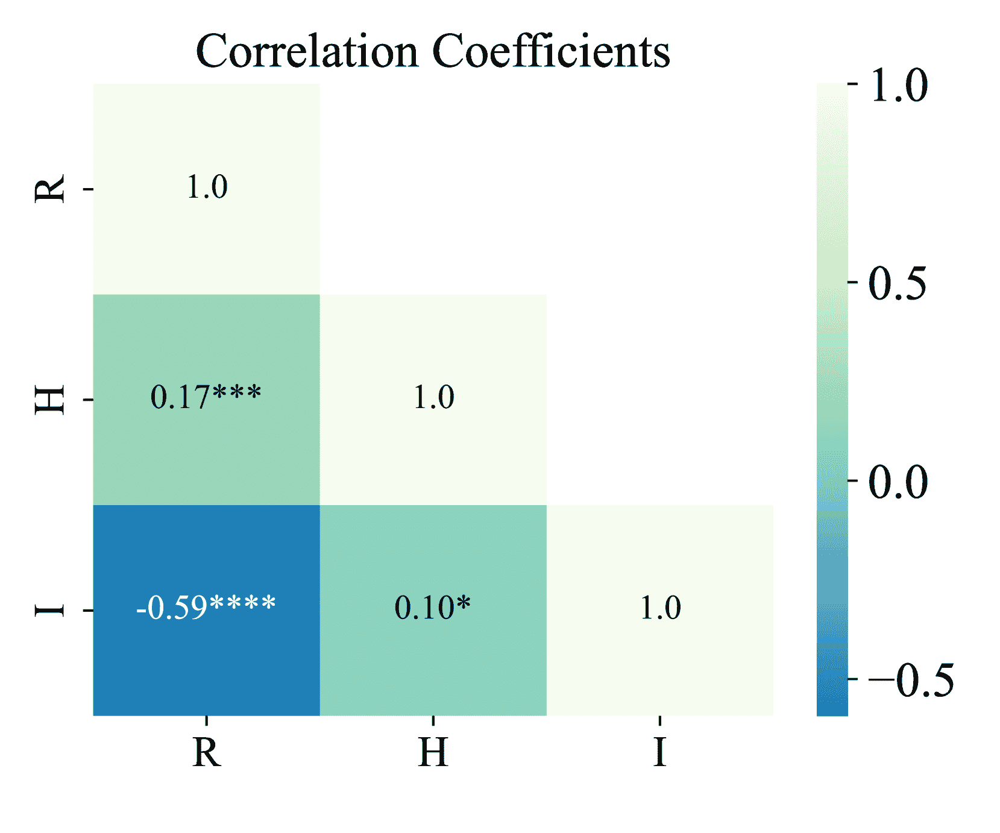

<!--yml

类别：未分类

日期：2025-01-11 12:46:36

-->

# 基于LLM的驾驶员代理的驾驶风格对齐

> 来源：[https://arxiv.org/html/2403.11368/](https://arxiv.org/html/2403.11368/)

Ruoxuan Yang, Xinyue Zhang, Anais Fernandez-Laaksonen, Xin Ding 和 Jiangtao Gong^(🖂) 作者均来自中国北京清华大学人工智能产业研究院。通讯邮箱：gongjiangtao@air.tsinghua.edu.cn

###### 摘要

最近，基于大语言模型（LLM）的驾驶员代理在自动驾驶领域展示了巨大的潜力，展现了类似人类的推理和决策能力。然而，目前关于将驾驶员代理行为与人类驾驶风格对齐的研究仍然有限，部分原因是缺乏来自人类驾驶行为的高质量自然语言数据。为了解决这一研究空白，我们提出了一个多重对齐框架，旨在通过演示和反馈将驾驶员代理与人类驾驶风格对齐。值得注意的是，我们通过自然驾驶实验和驾驶后访谈构建了一个人类驾驶行为的自然语言数据集，为LLM对齐提供了高质量的人类演示。该框架的有效性通过在CARLA城市交通模拟器中的仿真实验得到了验证，并通过人类评估进一步得到证实。我们的研究为设计具有多样化驾驶风格的驾驶代理提供了宝贵的见解。框架的实现和[数据集](https://github.com/AIR-DISCOVER/Driving-Thinking-Dataset)的详细信息可以在链接中找到。

## I 引言

在蓬勃发展的自动驾驶（AV）领域，由大型语言模型（LLMs）驱动的驾驶代理因其卓越的规划[[1](https://arxiv.org/html/2403.11368v1#bib.bib1)]和推理[[2](https://arxiv.org/html/2403.11368v1#bib.bib2), [3](https://arxiv.org/html/2403.11368v1#bib.bib3), [4](https://arxiv.org/html/2403.11368v1#bib.bib4)]能力而展现出令人瞩目的潜力。研究人员深入研究了复杂设计的驾驶代理，这些代理能够感知环境刺激[[5](https://arxiv.org/html/2403.11368v1#bib.bib5), [6](https://arxiv.org/html/2403.11368v1#bib.bib6), [7](https://arxiv.org/html/2403.11368v1#bib.bib7)]，理解当前情况[[8](https://arxiv.org/html/2403.11368v1#bib.bib8)]，提取记忆[[9](https://arxiv.org/html/2403.11368v1#bib.bib9), [10](https://arxiv.org/html/2403.11368v1#bib.bib10)]，并推导出后续的驾驶行为[[11](https://arxiv.org/html/2403.11368v1#bib.bib11)]，这些行为类似于人类的决策过程。这样的类人自动驾驶系统在应对各种驾驶场景时表现出了巨大潜力[[12](https://arxiv.org/html/2403.11368v1#bib.bib12), [13](https://arxiv.org/html/2403.11368v1#bib.bib13)]，能够帮助其他道路使用者更好地预测自动驾驶车辆的行为[[14](https://arxiv.org/html/2403.11368v1#bib.bib14)]，同时也增强了人们对这些系统的信任[[15](https://arxiv.org/html/2403.11368v1#bib.bib15)]。

然而，将这些驾驶代理与人类驾驶风格对齐，以赋予它们更多类人化和个性化的特征仍然是一个未被探索的问题。现有的基于大型语言模型（LLM）对齐人类的策略，如微调[[5](https://arxiv.org/html/2403.11368v1#bib.bib5), [6](https://arxiv.org/html/2403.11368v1#bib.bib6), [16](https://arxiv.org/html/2403.11368v1#bib.bib16)]和专家反馈的整合[[17](https://arxiv.org/html/2403.11368v1#bib.bib17), [18](https://arxiv.org/html/2403.11368v1#bib.bib18)]，往往因其高昂的成本而受到限制。最近，一些研究利用人工智能生成反馈或反思[[19](https://arxiv.org/html/2403.11368v1#bib.bib19), [20](https://arxiv.org/html/2403.11368v1#bib.bib20), [21](https://arxiv.org/html/2403.11368v1#bib.bib21), [22](https://arxiv.org/html/2403.11368v1#bib.bib22)]，但它们未能将这些反思与人类视角对齐。另一方面，尽管有研究专注于利用人工智能为LLMs生成少量示范[[1](https://arxiv.org/html/2403.11368v1#bib.bib1), [23](https://arxiv.org/html/2403.11368v1#bib.bib23)]，增强代理与人类对齐的另一个挑战在于缺乏可供LLM访问的高质量人类行为数据，这使得代理难以从人类示范中学习。现有的自动驾驶学习数据集，要么仅提供用于感知任务的环境数据[[24](https://arxiv.org/html/2403.11368v1#bib.bib24), [25](https://arxiv.org/html/2403.11368v1#bib.bib25), [26](https://arxiv.org/html/2403.11368v1#bib.bib26)]，而非驾驶行为，要么以非语言化的方式呈现驾驶行为（例如，地图中的轨迹[[27](https://arxiv.org/html/2403.11368v1#bib.bib27)]，控制器局域网络（CAN-Bus）数据[[28](https://arxiv.org/html/2403.11368v1#bib.bib28), [29](https://arxiv.org/html/2403.11368v1#bib.bib29)]，车内视频[[30](https://arxiv.org/html/2403.11368v1#bib.bib30)]），这些方式对于LLM来说都是间接的学习资料。因此，成功的对齐需要一种能够高效同步LLM驱动代理与人类驾驶风格的方法，同时需要通过自然语言收集不同驾驶风格的驾驶示范，以便LLM理解和学习。

本文提出了一种新颖的多重对齐框架，通过示范和反馈将驾驶代理与人类驾驶风格对齐。与依赖人类专家反馈或LLM自我反思不同，我们的方法利用LLM的少量学习能力[[31](https://arxiv.org/html/2403.11368v1#bib.bib31)]，创建了一种教练代理，能够从人类示范中学习，评估过去的驾驶行为，并制定驾驶指南。所有的人类示范都已预先收集，避免了在对齐过程中需要额外的人力投入，从而大幅降低了成本。

此外，为了收集高质量的对齐示范数据，我们编制了一个包含不同驾驶风格驾驶员行为的数据集。进行了一个真实世界的驾驶实验，随后进行了驾驶后的访谈，收集并整理了人类驾驶员的决策数据。这个数据集可能是首次努力细致地剖析人类驾驶行为，并以自然语言格式阐述驾驶决策过程的尝试。

我们通过仿真实验和人工评估调查验证了我们的工作，证明我们的多重对齐框架有效地创建了具有不同驾驶风格的驾驶代理，这些代理不仅在统计上合理，而且在感知上能被人类清晰区分。

本文的贡献总结如下：

+   •

    一个多重对齐框架，可以将基于LLM的驾驶代理与人类驾驶风格对齐。

+   •

    一个以自然语言格式表示的人类驾驶行为数据集。

+   •

    通过仿真实验和人工评估进行全面验证。

## II 多重对齐框架

图1：多重对齐框架

图[1](https://arxiv.org/html/2403.11368v1#S2.F1 "图1 ‣ II 多重对齐框架 ‣ 基于LLM的驾驶代理的驾驶风格对齐")展示了多重对齐框架的全面结构，包括驾驶代理、教练代理和来自人类驾驶员的示范数据。在本节中，我们首先介绍驾驶代理的架构和基本工作流程。然后，我们展示如何通过来自人类驾驶员的直接示范数据和教练代理的反馈实现多重对齐。

### II-A 驾驶代理

驾驶代理作为与周围驾驶环境互动并做出驾驶决策的实体。它保持一个可迭代的固定容量短期记忆，存储最近的记忆单元，促进决策的连贯性和一致性。

工作流程从捕捉当前状态和环境信息开始，包括代理车辆的速度和方向、当前道路的限速及其他限制，以及附近其他车辆和行人的状态。接下来，系统分析收集的信息，并结合其短期记忆来掌握当前情况。在此分析之后，通过提供的示范和多重对齐指南，驾驶代理推断出当下最合适的驾驶行动。此时，驾驶代理被提示“逐步思考”，运用连锁思维（CoT）推理策略做出最终决策：

“鉴于前方车辆的速度较快且无法变道，代理车应通过温和加速来匹配速度。”

接下来，驾驶代理从一组原子驾驶操作中选择最匹配的动作作为该步骤的操作并执行。生成的“情境”（Situation）、“推理”（Reasoning）和“动作”（Action）随后被编制成一个记忆单元，并融入到短期记忆中，而最早的记忆单元则会被弹出。通过这一过程的持续重复，驾驶代理成功地形成了一系列流畅且连贯的驾驶动作。

### II-B 通过示范和反馈实现多重对齐

我们构建了一个框架，通过采用示范和反馈，可以将驾驶代理与人类驾驶风格进行多重对齐。

示范包括了人类司机具有代表性的决策过程，涵盖了谨慎和冒险的驾驶示范。这些示范被收集并组织成驾驶代理的记忆单元形式（更多细节见第[III](https://arxiv.org/html/2403.11368v1#S3 "III Driving Style Data Collection ‣ Driving Style Alignment for LLM-powered Driver Agent")节）。示范在对齐中起到了双重作用，既被驾驶代理使用，也被教练代理使用。对于驾驶代理，示范作为少量示例，旨在引导其做出风格相似的驾驶决策；而对于教练代理，示范则作为“优秀”示例，促使其依据驾驶风格偏好进行评估，并进一步生成体现驾驶风格的指南。

为了实施反馈，我们建立了一个教练代理，并配备了一个指南模块，用于汇总通过持续评估获得的驾驶建议。它会审查驾驶代理当前的短期记忆，并对其进行“优秀”或“不佳”的评判，并附上判断理由。评估标准包括：短期记忆中的决策是否符合常规驾驶常识，是否符合指南中提出的要求，并与提供的“优秀”示例风格一致。如果评估结果为“不佳”，教练代理将制定新的指南，针对不理想的驾驶决策进行修正。这个新指南随后会被整合到现有的指南库中。

## III 驾驶风格数据收集

### III-A 自然驾驶实验与驾驶后访谈

为了收集用于对齐的真实人类驾驶行为数据，我们进行了一项自然驾驶实验，实验后还进行了访谈。共有24名司机被邀请参与我们的数据收集实验，涵盖了不同性别和年龄群体。值得注意的是，为了收集不同驾驶风格的数据，参与者中既包括了经验丰富的专业司机，也包括了驾驶经验较少的新手司机。

为了深入探讨具体的驾驶行为，我们首先让每位驾驶员执行一项涵盖13种驾驶条件的城市道路驾驶任务，总长度为5.7公里。为了在接下来的后实验访谈中忠实再现整个驾驶过程，我们设置了一台车顶360度全景相机，用于记录任务执行过程中车辆周围的环境，车内运动相机用来捕捉驾驶员的动作，以及眼动仪用来记录驾驶员注视点的变化。此外，我们还实时记录了车辆状态的CAN总线数据，包括速度、油门与刹车的百分比，以及方向盘的转动情况。

出于安全考虑，驾驶员在执行驾驶任务时并未要求口头表达其思维过程。在自然驾驶实验结束后，驾驶员会参加一次详细的后实验访谈，访谈通常持续1.5到2小时。在访谈过程中，我们利用收集到的视频回放驾驶员刚才经历的任务情境。对于每一个驾驶动作（例如加速、变道或转弯），驾驶员会被要求回忆并描述整个决策过程，从评估周围环境到执行相应的驾驶动作。这些访谈数据将有助于确定驾驶员的驾驶风格，并且也作为多重对齐框架中演示数据的来源。

### III-B 驾驶风格选择与数据组织

在完成驾驶实验和后实验访谈后，我们的下一步任务是区分驾驶员的驾驶风格，并将思维过程数据组织成不同风格的演示。

驾驶风格的区分基于驾驶任务中的主观问卷结果和客观驾驶记录。我们向每位受邀参与实验的驾驶员分发了MDSI问卷[[32](https://arxiv.org/html/2403.11368v1#bib.bib32)]。结果表明，在24名驾驶员中，存在四种驾驶风格：冒险、高速、耐心和小心。值得注意的是，冒险风格通常与高速风格重合，而耐心风格通常与小心风格一起出现。进一步分析驾驶任务中的CAN-Bus数据表明，3名驾驶员的车速和油门百分比明显高于平均水平——具体来说，所有驾驶员的平均车速为6.40 m/s，平均油门百分比为23.09%，而这3名驾驶员的平均车速分别达到了7.73 m/s（比平均值高20.78%）、7.50 m/s（比平均值高17.19%）和7.41 m/s（比平均值高15.78%），油门百分比分别为29.09%（比平均值高25.99%）、24.42%（比平均值高5.76%）和24.37%（比平均值高5.54%）——这些数据与他们在问卷中自报告的'冒险和高速'驾驶风格相符。相反，另外2名驾驶员的指标较低——他们的车速分别为5.15 m/s（比平均值低19.53%）和5.28 m/s（比平均值低17.50%），油门百分比分别为21.00%（比平均值低9.05%）和21.34%（比平均值低7.58%）——这些数据与他们在问卷中自报告的'耐心和小心'驾驶风格相符。此外，一些在问卷中报告了驾驶风格的驾驶员，在驾驶数据或访谈记录中未显示出明确的趋势。

因此，我们识别了两种基本的驾驶风格：'冒险'和'高速'合并为'冒险'，而'耐心'和'小心'则合并为'谨慎'。我们回顾了具有冒险驾驶风格和谨慎驾驶风格的驾驶员的访谈数据，选择了具有代表性的决策过程，展示了每种驾驶风格。然后，我们根据决策顺序将每个过程组织成'情境'、'推理'和'行动'的格式，形成最终的示范，与人类进行对齐。

## IV 实验

在本节中，我们通过探讨以下问题来验证所提出的多重对齐框架：

+   •

    不同驾驶风格的驾驶代理能否使用人类思维大声思考数据构建？

+   •

    哪种对齐方法可以有效实现驾驶风格的人类对齐？

为此，我们在CARLA——一个高保真度的交通模拟器上实现了多重对齐框架。我们在城市驾驶条件下进行了模拟实验，并进一步进行了一项用户实验，以收集人类对其性能的评价。

### IV-A 条件

图2：实验条件

本实验采用了一个大约3 × 3的被试内设计，主要变量有两个：驾驶风格[谨慎（C）、冒险（R）和未对齐（N）]和对齐方法[演示（D）、反馈（F）和多重对齐（M）]。图[2](https://arxiv.org/html/2403.11368v1#S4.F2 "Figure 2 ‣ IV-A Conditions ‣ IV Experiment ‣ Driving Style Alignment for LLM-powered Driver Agent")展示了不同条件的整体设计。

在驾驶风格方面，我们比较了使用谨慎驾驶演示、冒险驾驶演示和无演示（即未对齐）三种情况下的效果。

对齐方法采用了消融实验的形式，其中包含了演示、反馈和多重对齐（即完整的对齐框架）等条件。演示条件涉及为驾驶代理提供演示，而反馈条件则是没有演示的驾驶代理和有演示的教练代理；在多重对齐条件下，驾驶代理和教练代理都提供了演示。

### IV-B CARLA模拟

#### IV-B1 设置

模拟实验的硬件基础是ThundeRobot Zero台式计算机。模拟环境基于CARLA模拟器，具体版本为0.9.14³³3[http://carla.org/2022/12/23/release-0.9.14/](http://carla.org/2022/12/23/release-0.9.14/)，并在Python 3.7和Unreal Engine 4⁴⁴4[https://docs.unrealengine.com/4.27/en-US/](https://docs.unrealengine.com/4.27/en-US/)上运行。我们使用的是Town10地图，一个典型的城市驾驶场景，场景中其他车辆和行人的数量都设置为60。Audi TT是所有实验的指定车辆，其路径有固定的起点和持续随机生成的终点（车辆在预定义的固定点生成后，会随机生成一个终点，达到终点后会再随机生成下一个终点，依此类推）。

我们利用OpenAI的GPT-4⁵⁵5[https://openai.com/gpt-4](https://openai.com/gpt-4) API构建了驾驶代理和教练代理。然而，由于GPT生成响应需要几秒钟的时间，这在驾驶情境中作出即时决策时显得过长。因此，我们根据所需的token数量，将CARLA的模拟时间减慢，设置固定时间步长为0.0008-0.0015秒。

每个模拟过程都进行了视频录制。此外，为了在模拟过程中收集车辆状态信息，我们启动了一个日志收集线程，按秒记录代理车辆的碰撞、速度、油门百分比和刹车百分比日志。

#### IV-B2 指标

在这里，我们引入了三项指标来评估驾驶代理的驾驶表现：碰撞率、速度、油门百分比和刹车百分比。

+   •

    碰撞率：碰撞次数可以从日志中获得，行驶距离则是从上次碰撞起累计的。计算公式为 $Collisions\ per\ Meter=\frac{Number\ of\ Collisions}{Distance\ Traveled\ (m)}$

+   •

    车速：车速的统计指标包括代理车辆在每次模拟过程中的平均车速，以及每分钟的分段平均车速（模拟器时间）。所有平均车速的计算都排除了零值，以尽量减少代理车辆在交通信号灯前等待或交通堵塞时的影响。

+   •

    油门百分比和刹车百分比：油门和刹车的统计数据也分为整体平均值和每分钟的分段平均值。同样，所有计算都排除了代理车辆静止时的数据。

#### IV-B3 结果

\thesubsubfigure 碰撞率每米（周围车辆和行人的突然机动增加时）。

\thesubsubfigure 代理车辆的平均油门百分比（左）、刹车百分比（中）和车速（右），所有计算排除了代理车辆静止时的数据（车速单位为 km/h）。

图 3：预定义指标的模拟实验结果。

我们在不同条件下进行了约50.3小时的模拟实验，相当于每个条件下代理车辆在模拟平台上的平均驾驶时间为约6.7分钟。每个条件下代理车辆行驶的平均距离约为1.5公里。值得注意的是，我们调整了控制其他车辆和行人的算法，使其更容易进行突然的机动（例如急剧变道、闯红灯）。这些极端情况旨在增加代理车辆所处驾驶环境的风险级别，从而使其驾驶风格更为可观察。

图[3](https://arxiv.org/html/2403.11368v1#S4.F3 "图 3 ‣ IV-B3 结果 ‣ IV-B CARLA 模拟 ‣ IV 实验 ‣ 基于大语言模型的驾驶员代理的驾驶风格对齐")展示了代理车辆在不同条件下计算的每米碰撞率。整体而言，与风险驾驶风格对齐的代理车辆碰撞率较高，而与谨慎驾驶风格对齐的车辆碰撞率较低。此外，当与谨慎驾驶风格对齐时，多重对齐方法的碰撞率最低，而示范方法的碰撞率最高；而当与风险驾驶风格对齐时，多重对齐方法的碰撞率最高，示范方法的碰撞率也较高。在未对齐的情况下，示范方法的碰撞率高于反馈方法。

图[3](https://arxiv.org/html/2403.11368v1#S4.F3 "图 3 ‣ IV-B3 结果 ‣ IV-B CARLA模拟 ‣ IV实验 ‣ 大型语言模型驱动的驾驶代理的驾驶风格对齐")展示了不同条件下，代理车辆在驾驶过程中的平均油门百分比、刹车百分比和速度，所有计算都排除了代理车辆停驶时的数据。在使用相同对齐方法时，与危险驾驶风格对齐的代理具有最高的平均速度、最高的油门百分比和最低的刹车百分比，而与谨慎驾驶风格对齐的代理则具有最低的速度、最低的油门百分比和最高的刹车百分比。与谨慎驾驶风格对齐时，演示、反馈和多重对齐顺序中，平均速度和油门百分比下降，而刹车百分比上升。与危险驾驶风格对齐时，观察到相反的趋势。在未对齐的情况下，演示法的平均速度和油门百分比高于反馈法，而刹车百分比则较低。

#### IV-B4 发现

基于代理具有更谨慎驾驶风格更安全的假设，代理可以通过与不同驾驶风格对齐来展示相应的驾驶风格。多重对齐是最有效的方法，在谨慎与危险驾驶风格之间，碰撞率、平均油门、刹车和速度显示出显著差异，而演示法的效果较弱。

### IV-C 人类评估

#### IV-C1 程序

我们设计了两份调查问卷，收集人类驾驶员对驾驶代理性能的评估，问卷通过模拟视频片段呈现给参与者，每个实验条件下都有大约30秒的驾驶视频。

在第一份问卷的第一部分，我们首先收集了参与者的基本信息（如年龄、性别、是否持有驾驶执照）。还包括了部分MDSI自我评估，涵盖了MDSI中关于危险驾驶和谨慎驾驶风格的指标。

在第二部分，视频片段被分为四组：

+   •

    演示组：{演示谨慎（DC）、演示未对齐（DN）、演示危险（DR）}

+   •

    反馈组：{反馈谨慎（FC）、反馈未对齐（FN）、反馈危险（FR）、演示未对齐（DN，在此组中作为基线）}

+   •

    谨慎组：{演示谨慎（DC）、反馈谨慎（FC）、多重对齐谨慎（MC）}

+   •

    危险组：{演示危险（DR）、反馈危险（FR）、多重对齐危险（MR）}

每组视频片段将以随机顺序出现，并附有一个排名问题，要求参与者根据视频中的风险性对驾驶风格进行排名（数字越小表示越冒险），并附有一个理由问题用于解释他们的排名。

第二份问卷的第一部分与第一份问卷相同。在第二部分中，参与者被要求观看所有八段视频片段，视频顺序也是随机排列的，三个评分问题分别调查了代理车辆的智能性、风险性和人类相似度（评分范围为0到10），每段视频下方附有一个原因问题。

此外，为了筛选掉不认真填写的问卷，我们设置了最短答题时间，并在问卷中加入了陷阱问题，要求参与者选择某一特定选项。

#### IV-C2 参与者

我们通过调查平台提供的第三方招募渠道招募了200多名参与者，完成每份有效问卷的补偿约为2.08美元。此外，我们五名研究人员还通过社交媒体平台分享了问卷，招募了60多名参与者。

所有270名参与者在问卷中确认自己持有驾驶执照。其中，141名为男性，占52.22%，129名为女性，占47.78%，年龄范围从19岁到54岁不等。

#### IV-C3 数据分析

对于两份问卷，我们首先根据第一部分的结果对参与者的驾驶风格进行了分类。计算驾驶风格分数的公式为 $S_{driving\ style}=\Sigma o_{risky}-\Sigma o_{cautious}$，其中 $o_{risky}$ 代表参与者在每个风险性指标上的选择，而 $o_{cautious}$ 代表每个谨慎性指标的选择（其中包含两个负面指标，选项为负值）。驾驶风格分数越高，说明参与者的驾驶风格越倾向于冒险。

对于第一份问卷的第二部分，我们计算了每组视频片段后排名问题得到的不同视频片段排名，以及它们之间排名的统计显著性。

第二份问卷的第二部分，我们分别统计了每段视频片段后三个评分问题的结果，分别代表了代理车辆的智能性、风险性和人类相似度。

此外，我们还仔细审查了两份问卷中的所有推理问题的答案，汇总了判断代理车辆驾驶行为的支持依据。

#### IV-C4 结果

\thesubsubfigure 不同组别中的风险排名频率：具有不同驾驶风格的演示（左侧）、具有不同驾驶风格的反馈（中左侧）、不同对齐方法下的谨慎驾驶风格（中右侧）、以及不同对齐方法下的冒险驾驶风格（右侧）。排名越高表示风险越大。

\thesubsubfigure 代理车风险性（R）、人类相似度（H）和智能性（I）评分的皮尔逊相关性及显著性。

图 4：人类评估结果。

我们分发了两份问卷，共计发放3天，经过筛选后收到了259份有效回应，其中第一份问卷198份，第二份问卷59份。第I部分的驾驶风格统计具有很高的多样性。平均得分为0.61，34名参与者得分低于-4（表明谨慎驾驶风格），而37名参与者得分超过5（表明冒险驾驶风格），表明我们的结果具有较好的代表性。

图 [4](https://arxiv.org/html/2403.11368v1#S4.F4 "Figure 4 ‣ IV-C4 Results ‣ IV-C Human Evaluation ‣ IV Experiment ‣ Driving Style Alignment for LLM-powered Driver Agent") 展示了第一份问卷中各组别视频片段的风险性排名，排名越高表示风险越大。

在演示组和反馈组中，DC和FC的排名显著低于同组其他视频，表明它们被认为是最不具风险的。一位参与者解释了为什么在演示组中选择DC为最不具风险的，表示：“汽车稳定行驶，没有偏左或偏右。”另一位参与者在反馈组中选择FC为最不具风险的，解释道：“它等待前方行人通过。”

在未对齐的情况下，FN的风险性相比于DN有所下降，多名参与者指出DN的“在接近人行道时减速过慢。”然而，与DR或FR相比，DN并无显著差异，因为它们“看起来都很具风险”。

在谨慎组中，风险性排名显著为DC $>$ FC $>$ MC，表明多重对齐方法具有最佳对齐效果，而演示方法效果最差。大多数参与者将排名归因于“驾驶员x（DC）变道稍微太快，而驾驶员y（MC）不仅等候行人，还让行其他车辆。”

类似地，演示方法在冒险组中也表现出最差的对齐效果，MR略优于FR，但差异不显著。

图[4](https://arxiv.org/html/2403.11368v1#S4.F4 "Figure 4 ‣ IV-C4 Results ‣ IV-C Human Evaluation ‣ IV Experiment ‣ Driving Style Alignment for LLM-powered Driver Agent")展示了第二份问卷中参与者对同一视频片段的风险性、人类相似性和智能性评分之间的相关性分析结果。可以观察到，人类倾向于将更高的风险性与较低的智能性联系在一起，将更高的智能性与更强的人类相似性联系在一起。有趣的是，尽管谨慎驾驶更安全，人类仍然倾向于将更高的风险性与更强的人类相似性联系在一起。一位参与者评论道：“它（MR）真像一位经验丰富的司机在炫耀他的驾驶技术。”

#### IV-C5 发现

人类评估结果表明，不同驾驶风格之间的感知风险性存在明显差异。与谨慎驾驶对齐的代理被一致评为风险较低，特别是在多重对齐条件下，这一条件被证明是最有效的对齐驾驶风格的方法。仅凭演示在谨慎和冒险条件下的效果最差。此外，还有一个有趣的心理学洞察，尽管人们将谨慎驾驶与安全联系在一起，但参与者倾向于将较高的谨慎性与较低的人类相似性联系在一起，反映了人类驾驶行为的复杂感知。

## V 结论

本文提出了一种新的多重对齐框架，用于将LLM驱动的司机代理与人类驾驶风格对齐。通过一系列全面的实验和评估，我们成功地展示了通过利用人类驾驶数据作为思维链提示，司机代理可以被定制为展示不同的驾驶风格——冒险与谨慎。该框架的有效性通过在CARLA城市交通模拟器中的仿真实验得到了验证，并通过人类评估进一步得到了证实。

通过展示LLM在实现细致的人类-代理对齐方面的潜力，这项工作为研究迎合个体偏好的自动驾驶技术开辟了新的方向。通过将人类驾驶行为的复杂性编码为语言模型可接入的格式，这项工作为跨越自动驾驶以外更广泛应用场景的更直观和有效的人类-代理对齐奠定了基础。此外，对驾驶风格中的风险性和人类相似性感知的洞察突显了将自动代理与人类期望和行为对齐的复杂性，强调了在这一领域进一步跨学科研究的重要性。

## 参考文献

+   [1] C. H. Song, J. Wu, C. Washington, B. M. Sadler, W.-L. Chao, 和 Y. Su, “Llm-planner: 基于大语言模型的少样本有根规划用于具身代理”，载于*IEEE/CVF国际计算机视觉会议论文集*，2023年，第2998-3009页。

+   [2] J. Wei, X. Wang, D. Schuurmans, M. Bosma, F. Xia, E. Chi, Q. V. Le, D. Zhou, *等*，“思维链提示在大型语言模型中引发推理，” *神经信息处理系统进展*，第35卷，第24,824–24,837页，2022。

+   [3] X. Wang, J. Wei, D. Schuurmans, Q. Le, E. Chi, S. Narang, A. Chowdhery, 和 D. Zhou, “自一致性改善语言模型中的思维链推理，” *arXiv 预印本 arXiv:2203.11171*，2022。

+   [4] S. Yao, D. Yu, J. Zhao, I. Shafran, T. L. Griffiths, Y. Cao, 和 K. Narasimhan, “思想树：使用大型语言模型进行深思熟虑的问题解决，” *arXiv 预印本 arXiv:2305.10601*，2023。

+   [5] L. Chen, O. Sinavski, J. Hünermann, A. Karnsund, A. J. Willmott, D. Birch, D. Maund, 和 J. Shotton, “使用LLMs进行驾驶：融合面向对象的向量模态以实现可解释的自动驾驶，” *arXiv 预印本 arXiv:2310.01957*，2023。

+   [6] Z. Xu, Y. Zhang, E. Xie, Z. Zhao, Y. Guo, K. K. Wong, Z. Li, 和 H. Zhao, “Drivegpt4：通过大型语言模型进行可解释的端到端自动驾驶，” *arXiv 预印本 arXiv:2310.01412*，2023。

+   [7] A. Hu, L. Russell, H. Yeo, Z. Murez, G. Fedoseev, A. Kendall, J. Shotton, 和 G. Corrado, “Gaia-1：用于自动驾驶的生成型世界模型，” *arXiv 预印本 arXiv:2309.17080*，2023。

+   [8] H. Shao, Y. Hu, L. Wang, S. L. Waslander, Y. Liu, 和 H. Li, “Lmdrive：通过大型语言模型进行闭环端到端驾驶，” 2023。

+   [9] C. Cui, Y. Ma, X. Cao, W. Ye, 和 Z. Wang, “按说话方式驾驶：在自动驾驶车辆中实现与大型语言模型的人类化互动，” 载于 *IEEE/CVF 计算机视觉应用冬季会议论文集*，2024，第902–909页。

+   [10] L. Wen, D. Fu, X. Li, X. Cai, T. Ma, P. Cai, M. Dou, B. Shi, L. He, 和 Y. Qiao, “Dilu：一种基于知识驱动的大型语言模型自动驾驶方法，” *arXiv 预印本 arXiv:2309.16292*，2023。

+   [11] W. Wang, J. Xie, C. Hu, H. Zou, J. Fan, W. Tong, Y. Wen, S. Wu, H. Deng, Z. Li, H. Tian, L. Lu, X. Zhu, X. Wang, Y. Qiao, 和 J. Dai, “Drivemlm：将多模态大型语言模型与自动驾驶的行为规划状态对齐，” 2023。

+   [12] S. Kolekar, J. de Winter, 和 D. Abbink, “基于风险的驾驶员模型中涌现出类人驾驶行为，” *Nature Communications*，第11卷，第1期，第4850页，2020。

+   [13] Y. Jin, X. Shen, H. Peng, X. Liu, J. Qin, J. Li, J. Xie, P. Gao, G. Zhou, 和 J. Gong, “Surrealdriver：基于大型语言模型设计的城市环境中生成型驾驶员代理模拟框架，” *arXiv 预印本 arXiv:2309.13193*，2023。

+   [14] S. Hecker, D. Dai, 和 L. Van Gool, “学习准确、舒适且类人化的驾驶，” *arXiv 预印本 arXiv:1903.10995*，2019。

+   [15] A. Waytz, J. Heafner, 和 N. Epley, “机器中的心智：人类化增加了对自动驾驶车辆的信任，” *实验社会心理学杂志*，第52卷，第113–117页，2014。

+   [16] J. Mao, Y. Qian, H. Zhao, 和 Y. Wang, “Gpt-driver: 使用 GPT 学习驾驶，” *arXiv 预印本 arXiv:2310.01415*, 2023.

+   [17] L. Ouyang, J. Wu, X. Jiang, D. Almeida, C. L. Wainwright, P. Mishkin, C. Zhang, S. Agarwal, K. Slama, A. Ray, *等人*, “训练语言模型以遵循指令并通过人工反馈进行调整，2022，” *URL https://arxiv.org/abs/2203.02155*, 第 13 卷, 第 1 页, 2022.

+   [18] D. Fu, X. Li, L. Wen, M. Dou, P. Cai, B. Shi, 和 Y. Qiao, “像人类一样驾驶：通过大语言模型重新思考自动驾驶，” 见 *IEEE/CVF 冬季计算机视觉应用会议论文集*, 2024, 页 910–919.

+   [19] A. Zhao, D. Huang, Q. Xu, M. Lin, Y.-J. Liu, 和 G. Huang, “Expel: LLM 代理是经验学习者，” *arXiv 预印本 arXiv:2308.10144*, 2023.

+   [20] N. Shinn, F. Cassano, A. Gopinath, K. Narasimhan, 和 S. Yao, “Reflexion: 具有语言强化学习的语言代理，” *神经信息处理系统进展*, 第 36 卷, 2024.

+   [21] W. Yao, S. Heinecke, J. C. Niebles, Z. Liu, Y. Feng, L. Xue, R. Murthy, Z. Chen, J. Zhang, D. Arpit, *等人*, “Retroformer: 具有策略梯度优化的回溯大语言代理，” *arXiv 预印本 arXiv:2308.02151*, 2023.

+   [22] Z. Yang, P. Li, 和 Y. Liu, “失败铺就道路：通过无调优规则累积增强大语言模型，” *arXiv 预印本 arXiv:2310.15746*, 2023.

+   [23] X. Wang, W. Zhu, M. Saxon, M. Steyvers, 和 W. Y. Wang, “大语言模型隐式作为主题模型：解释和寻找适合上下文学习的优质示例，” 见 *ICML2023 基础模型高效系统研讨会*, 2023.

+   [24] H. Caesar, V. Bankiti, A. H. Lang, S. Vora, V. E. Liong, Q. Xu, A. Krishnan, Y. Pan, G. Baldan, 和 O. Beijbom, “nuscenes: 一个多模态自动驾驶数据集，” 见 *IEEE/CVF 计算机视觉与模式识别会议论文集*, 2020, 页 11 621–11 631.

+   [25] J. Geyer, Y. Kassahun, M. Mahmudi, X. Ricou, R. Durgesh, A. S. Chung, L. Hauswald, V. H. Pham, M. Mühlegg, S. Dorn, *等人*, “A2d2: 奥迪自动驾驶数据集，” *arXiv 预印本 arXiv:2004.06320*, 2020.

+   [26] X. Huang, X. Cheng, Q. Geng, B. Cao, D. Zhou, P. Wang, Y. Lin, 和 R. Yang, “Apolloscape 自动驾驶数据集，” 见 *IEEE 计算机视觉与模式识别会议研讨会论文集*, 2018, 页 954–960.

+   [27] W. Zhan, L. Sun, D. Wang, H. Shi, A. Clausse, M. Naumann, J. Kummerle, H. Königshof, C. Stiller, A. de La Fortelle, *等人*, “互动数据集：在具有语义地图的互动驾驶场景中的国际性、对抗性和合作性运动数据集，” *arXiv 预印本 arXiv:1910.03088*, 2019.

+   [28] T. Li, A. Alhilal, A. Zhang, M. A. Hoque, D. Chatzopoulos, Z. Xiao, Y. Li, 和 P. Hui, “驾驶大数据：通过一个大规模私人汽车数据集首次研究驾驶行为，”载于 *2019 IEEE第35届国际数据工程研讨会（ICDEW）*，IEEE，2019年，第61–68页。

+   [29] X. Hu, Z. Zheng, D. Chen, X. Zhang, 和 J. Sun, “处理、评估并增强Waymo自动驾驶车辆开放数据集以用于驾驶行为研究，” *交通研究C部分：新兴技术*，第134卷，文章编号103490，2022年。

+   [30] M. Martin, A. Roitberg, M. Haurilet, M. Horne, S. Reiß, M. Voit, 和 R. Stiefelhagen, “Drive&act: 一种用于自动驾驶车辆中细粒度驾驶行为识别的多模态数据集，”载于 *IEEE/CVF国际计算机视觉会议论文集*，2019年，第2801–2810页。

+   [31] T. Brown, B. Mann, N. Ryder, M. Subbiah, J. D. Kaplan, P. Dhariwal, A. Neelakantan, P. Shyam, G. Sastry, A. Askell, *等人*，“语言模型是少量学习者，” *神经信息处理系统进展*，第33卷，第1877–1901页，2020年。

+   [32] O. Taubman-Ben-Ari, M. Mikulincer, 和 O. Gillath, “多维驾驶风格量表——结构构建与验证，” *事故分析与预防*，第36卷，第3期，第323–332页，2004年。
