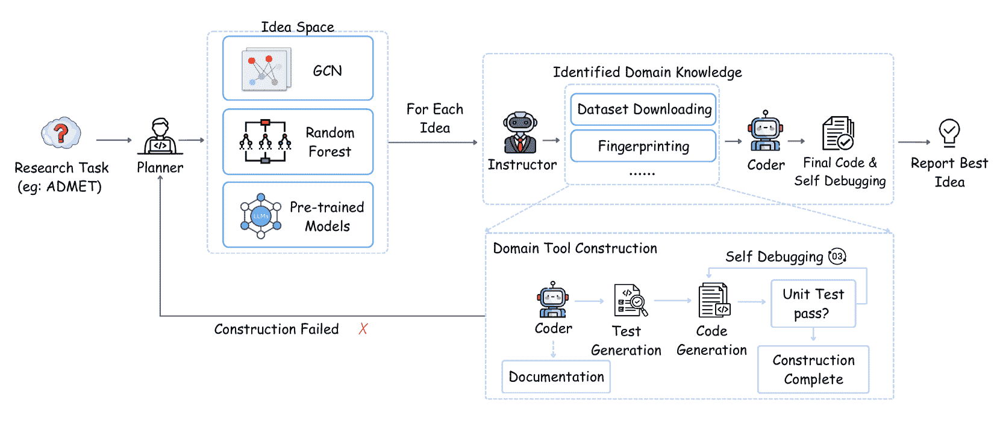
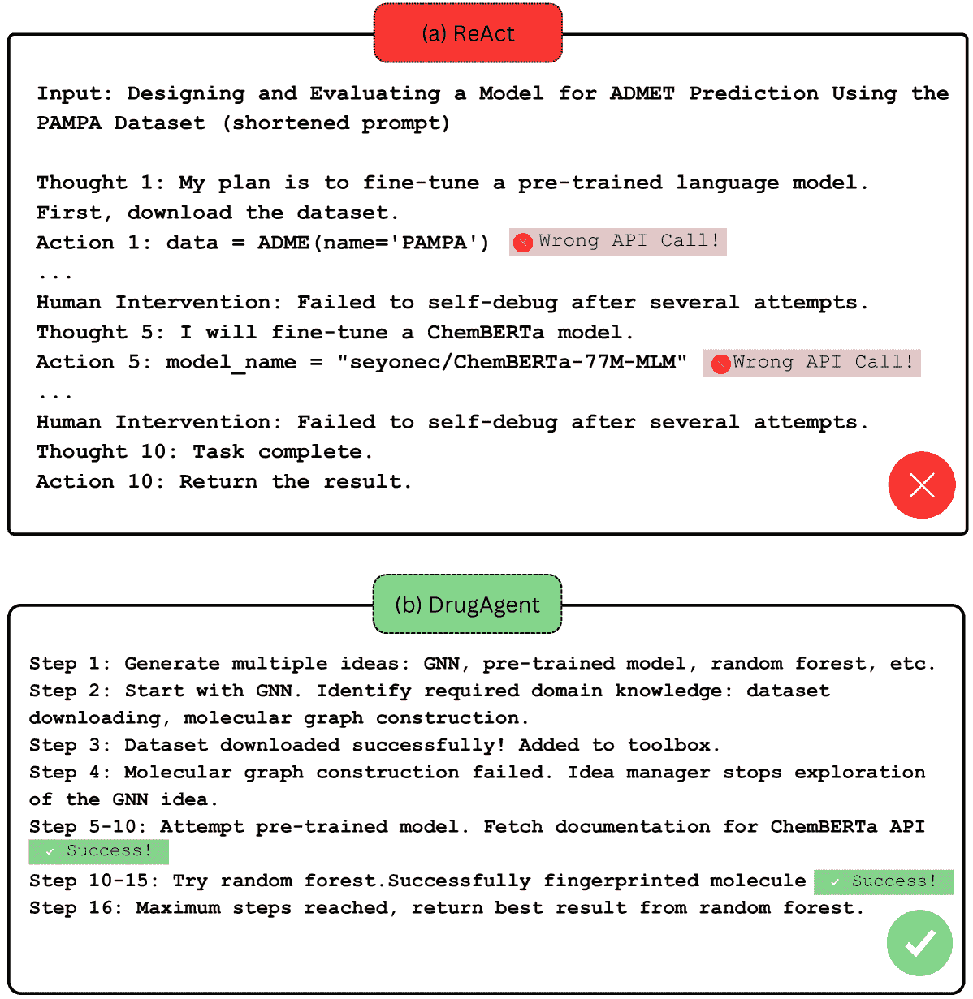

<!--yml
category: 未分类
date: 2025-01-11 11:54:03
-->

# DrugAgent: Automating AI-aided Drug Discovery Programming through LLM Multi-Agent Collaboration

> 来源：[https://arxiv.org/html/2411.15692/](https://arxiv.org/html/2411.15692/)

Sizhe Liu¹, Yizhou Lu¹, Siyu Chen¹, Xiyang Hu², Jieyu Zhao¹, Tianfan Fu³, Yue Zhao¹¹¹1Corresponding author 

###### Abstract

Recent advancements in Large Language Models (LLMs) have opened new avenues for accelerating drug discovery processes. Despite their potential, several critical challenges remain unsolved, particularly in translating theoretical ideas into practical applications within the highly specialized field of pharmaceutical research, limiting practitioners from leveraging the latest AI development in drug discovery. To this end, we introduce DrugAgent, a multi-agent framework aimed at automating machine learning (ML) programming in drug discovery. DrugAgent incorporates domain expertise by identifying specific requirements and building domain-specific tools, while systematically exploring different ideas to find effective solutions. A preliminary case study demonstrates DrugAgent ’s potential to overcome key limitations LLMs face in drug discovery, moving toward AI-driven innovation. For example, DrugAgent is able to complete the ML programming pipeline end-to-end, from data acquisition to performance evaluation for the ADMET prediction task, and finally select the best model, where the random forest model achieves an F1 score of 0.92 when predicting absorption using the PAMPA dataset.

## 1 Introduction

Artificial intelligence (AI) is driving significant advancements in drug discovery (Huang et al. [2022](https://arxiv.org/html/2411.15692v1#bib.bib11)). Due to the high cost and time required for experimentally assessing drug properties, researchers are increasingly looking for ways to accelerate all stages of drug development (Pushpakom et al. [2019](https://arxiv.org/html/2411.15692v1#bib.bib27)). Numerous AI-ready datasets and benchmarks are now available for critical tasks in the drug discovery process, such as ADMET prediction, drug-target interaction, and high-throughput screening (Huang et al. [2021](https://arxiv.org/html/2411.15692v1#bib.bib10); Chen et al. [2024](https://arxiv.org/html/2411.15692v1#bib.bib2); Wang et al. [2024c](https://arxiv.org/html/2411.15692v1#bib.bib38)). Recent advances in deep learning have shown particular promise in accelerating lead optimization and predicting drug-target interactions (Huang et al. [2020](https://arxiv.org/html/2411.15692v1#bib.bib12)), potentially reducing the time and resources needed for traditional experimental methods.

Performing machine learning (ML) experiments in drug discovery requires expertise in biology, chemistry, pharmaceutical science, and computer science, which creates a significant barrier to entry. Large language models (LLMs), with their ability to reason through complex tasks, present an exciting opportunity to automate ML programming in the drug discovery process. General frameworks, e.g., MLAgentBench (Huang et al. [2024a](https://arxiv.org/html/2411.15692v1#bib.bib14)) and AI-Scientist (Lu et al. [2024a](https://arxiv.org/html/2411.15692v1#bib.bib22)), offer promising solutions for end-to-end ML programming. Specialized agents with domain-specific tools can further enhance the ability to handle complex tasks in chemistry or biology (Boiko et al. [2023](https://arxiv.org/html/2411.15692v1#bib.bib1); M. Bran et al. [2024](https://arxiv.org/html/2411.15692v1#bib.bib25); Inaba et al. [2023](https://arxiv.org/html/2411.15692v1#bib.bib16)). Despite these, significant challenges remain to fully automate drug discovery research with LLMs.

Challenge 1. General-purpose LLMs often lack the specialized domain knowledge needed to accurately implement ML experiments in drug discovery. For instance, incorrect API choices for domain-specific libraries or misunderstandings in raw biological data preprocessing steps can easily cause problems that are difficult to debug, especially given the complex codebase typically involved in drug discovery tasks. While frameworks like ChemCrown (M. Bran et al. [2024](https://arxiv.org/html/2411.15692v1#bib.bib25)) and MultiTool-CoT (Chain of Thought) (Inaba et al. [2023](https://arxiv.org/html/2411.15692v1#bib.bib16)) provide tools for chemistry tasks like calculating molecular weight and predicting reactions, they do not fully solve this problem. These tools are often too simple for ML programming, indicating the need for a wider set of tools, from data collection to model evaluation.

Challenge 2. In many ML tasks, LLMs are required to generate ideas rather than simply implementing a predefined plan. However, LLM-generated ideas often lack grounding in practical context (Si, Yang, and Hashimoto [2024](https://arxiv.org/html/2411.15692v1#bib.bib32)), especially in drug discovery settings. Due to hallucination, an LLM may confidently propose an idea, yet lack the domain knowledge necessary for implementation (Huang et al. [2023](https://arxiv.org/html/2411.15692v1#bib.bib13)). Existing strategies for exploring viable ideas, such as reasoning and acting (Huang et al. [2024a](https://arxiv.org/html/2411.15692v1#bib.bib14)), generating diverse ideas (Lu et al. [2024a](https://arxiv.org/html/2411.15692v1#bib.bib22); Wang et al. [2024a](https://arxiv.org/html/2411.15692v1#bib.bib35)), or using tree search (WecoAI [2024](https://arxiv.org/html/2411.15692v1#bib.bib40)), are generally optimized for standard ML tasks and may be inefficient in scenarios where many proposed ideas cannot be implemented. Thus, it requires a strategy that builds on these methods while better aligning the agent’s idea exploration with its practical knowledge.

Our Solutions. To address these challenges, we propose DrugAgent, a multi-agent framework to enhance ML programming in drug discovery tasks. First, we integrate workflows that identify steps requiring domain knowledge, allowing for the development of specialized tools to handle these tasks before proceeding with coding. Additionally, we introduce a dynamic idea space management approach, where diverse ideas are generated at the early stage and later updated based on experimental observations, resulting in more efficient exploration. Finally, we provide an enhanced set of tools in the form of comprehensive library documentation that supports essential AI-driven drug discovery tasks, including biological data retrieval, molecular fingerprinting, AI model development, and performance evaluation. These resources are carefully selected to meet the complex requirements of real-world programming processes.

Main Contributions. Our main contributions include:

*   •

    Significance. This paper focuses on automating AI-based drug discovery tasks, which is a life-critical and significant problem. To the best of our knowledge, this is the first attempt to automate AI programming in the context of drug discovery. Our work allows pharmaceutical scientists to use AI without a coding background and facilitates AI-based drug discovery research.

*   •

    Method. We design an automated LLM-based multi-agent system that involves coding programming tailored to drug discovery, which also enables automatic code running and results collection without human intervention.

*   •

    Results. DrugAgent exhibits initial success in automating a couple of representative AI-based drug discovery tasks. For example, DrugAgent can build a random forest model automatically for drug molecular absorption prediction, achieving an F1 score of 0.920 on the PAMPA dataset.

## 2 Related Works

### 2.1 LLM Agents

An LLM agent is a system that uses large language models to interact with users or other systems, perform tasks, and make decisions autonomously. Empowered by LLMs, LLM agents have the capability to perform multi-step reasoning, planning, and action execution beyond static text generation (Wang et al. [2024b](https://arxiv.org/html/2411.15692v1#bib.bib36)). Previous works have equipped LLM agents with modules to dynamically interact with external tools, retrieve information, and adapt based on real-time feedback (Schick et al. [2023](https://arxiv.org/html/2411.15692v1#bib.bib31); Yoon, Kim, and Oh [2024](https://arxiv.org/html/2411.15692v1#bib.bib44); Qin et al. [2023](https://arxiv.org/html/2411.15692v1#bib.bib28); Ravuru, Sakhinana, and Runkana [2024](https://arxiv.org/html/2411.15692v1#bib.bib29); Lála et al. [2023](https://arxiv.org/html/2411.15692v1#bib.bib24)). This allows them to solve complex, evolving tasks such as code writing, long-term reasoning, and decision-making in various contexts (Guo et al. [2024](https://arxiv.org/html/2411.15692v1#bib.bib9); Jiang et al. [2024](https://arxiv.org/html/2411.15692v1#bib.bib17)). In this work, we tailor LLM multi-agent framework to drug discovery tasks.

### 2.2 LLM for ML Programming

Recent work has focused on accelerating traditionally manual research processes by automating ML programming. AIDE acts as a data science agent, exploring a vast solution space and iteratively refining its approach to reach optimal solutions (WecoAI [2024](https://arxiv.org/html/2411.15692v1#bib.bib40)). AutoKaggle introduces a specialized multi-agent framework for Kaggle data science competitions (Li et al. [2024b](https://arxiv.org/html/2411.15692v1#bib.bib20)). AI-Scientist enables LLMs to conduct research autonomously, from idea generation to paper drafting, focusing on ML-related topics (Lu et al. [2024a](https://arxiv.org/html/2411.15692v1#bib.bib22)). In parallel, benchmarks have been developed that provide a suite of 13 tasks to evaluate LLMs’ capabilities in conducting ML programming (Huang et al. [2024a](https://arxiv.org/html/2411.15692v1#bib.bib14)). However, existing works cannot handle domain-specific ML tasks requiring complex domain knowledge, e.g., AI-aided drug discovery. To address this, we design workflows to insert domain knowledge and call domain-specific tools automatically.

### 2.3 LLM for Biomedical Discovery

Many studies have highlighted the applications of LLMs in biomedical discovery, particularly when integrated with domain-specific tools. For instance, ChemCrown demonstrates the potential of LLM agents in organic synthesis, drug discovery, and materials design (M. Bran et al. [2024](https://arxiv.org/html/2411.15692v1#bib.bib25)). Similarly, MMedAgent is a multimodal medical agent designed to handle complex language and multimodal tasks, demonstrating LLM versatility in medical applications (Li et al. [2024a](https://arxiv.org/html/2411.15692v1#bib.bib19)). The multi-agent approach is exemplified by ClinicalAgent (Yue et al. [2024](https://arxiv.org/html/2411.15692v1#bib.bib45)), which introduces a framework for clinical trial outcome prediction by decomposing it into subproblems, allowing individual agents to collaborate and generate a comprehensive outcome. However, existing ML programming agents may lack the domain-specific knowledge needed for biomedical tasks, while biomedical agents are not typically equipped with ML-specific expertise. To bridge this gap, we introduce DrugAgent, a multi-agent LLM system that integrates ML programming capabilities with biomedical knowledge, targeting the unique requirements of ML tasks in drug discovery.

## 3 Methodology

Figure 1: Framework overview of DrugAgent. Given an AI-based drug discovery task described in natural language (i.e., user’s input, e.g., design an AI model to predict Absorption (one of the ADMET properties) using the PAMPA dataset (Siramshetty, Shah et al. [2021](https://arxiv.org/html/2411.15692v1#bib.bib33)), the LLM Planner first produces a couple of potential ideas (e.g., GCN (graph convolutional network) (Kipf and Welling [2016](https://arxiv.org/html/2411.15692v1#bib.bib18)), random forest, pretrained model (such as ChemBERTa (Chithrananda, Grand, and Ramsundar [2020](https://arxiv.org/html/2411.15692v1#bib.bib5)))). Then, for each idea, the LLM Instructor transfers the idea into code based on domain knowledge (e.g., dataset acquisition and molecular fingerprinting). Then, the Coder debugs and implements the code and evaluates the performance. Finally, all the results are collected and the best idea is reported (e.g., random forest achieves the best performance in predicting absorption).

We introduce DrugAgent, an automated and innovative LLM multi-agent framework designed to streamline AI-aided drug discovery tasks. As illustrated in Figure [1](https://arxiv.org/html/2411.15692v1#S3.F1 "Figure 1 ‣ 3 Methodology ‣ DrugAgent: Automating AI-aided Drug Discovery Programming through LLM Multi-Agent Collaboration"), DrugAgent integrates two key components: the LLM Instructor (§[3.2](https://arxiv.org/html/2411.15692v1#S3.SS2 "3.2 LLM Instructor: Domain-Specific Knowledge Identification and Tool Preparation ‣ 3 Methodology ‣ DrugAgent: Automating AI-aided Drug Discovery Programming through LLM Multi-Agent Collaboration")), which identifies domain-specific knowledge requirements and prepares necessary tools, and the LLM Planner (§[3.3](https://arxiv.org/html/2411.15692v1#S3.SS3 "3.3 LLM Planner: Idea Space Management ‣ 3 Methodology ‣ DrugAgent: Automating AI-aided Drug Discovery Programming through LLM Multi-Agent Collaboration")), which manages and refines the exploration of ideas to optimize task performance. Before detailing these components and their roles, we define the problem in §[3.1](https://arxiv.org/html/2411.15692v1#S3.SS1 "3.1 Problem Formulation ‣ 3 Methodology ‣ DrugAgent: Automating AI-aided Drug Discovery Programming through LLM Multi-Agent Collaboration").

### 3.1 Problem Formulation

We address the challenge of automating ML programming tasks in the domain of drug discovery. These tasks involve the integration of natural language instructions with computational tools to produce accurate and efficient solutions. Following Huang et al. ([2024a](https://arxiv.org/html/2411.15692v1#bib.bib14)), An ML programming task is defined by the following components:

*   •

    Task Description: A natural language specification outlining the objectives and constraints of the task.

*   •

    Starter Files: A set of initial resources, such as datasets or code templates, to support task execution.

*   •

    Evaluator: A performance metric function to assess the quality of the task output.

An agent must interpret the task description, utilize the starter files, and execute a sequence of actions to generate a solution. These actions include reading and writing files, preprocessing data, implementing ML models, and executing Python programs. The primary challenge lies in aligning abstract task descriptions with their practical implementation, particularly when domain-specific knowledge is required. The goal is to develop an autonomous system capable of efficiently handling these tasks while minimizing errors and improving success rates.

### 3.2 LLM Instructor: Domain-Specific Knowledge Identification and Tool Preparation

#### Motivation.

Drug discovery is a highly specialized and complex domain that demands precise integration of ML and domain expertise. Although using LLMs offers significant potential to automate and accelerate ML programming in this field, we observe that LLMs often fail to bridge the gap between general-purpose reasoning and the specific needs of drug discovery tasks. This failure arises from hallucination (Huang et al. [2023](https://arxiv.org/html/2411.15692v1#bib.bib13), [2024b](https://arxiv.org/html/2411.15692v1#bib.bib15)), where LLMs generate incorrect or unrealistic outputs due to a lack of understanding of domain-specific requirements. For example, inappropriate preprocessing of SMILES strings or incorrect API usage for molecular operations can lead to costly debugging and failed experiments. These limitations highlight the urgent need for a mechanism to explicitly identify and address domain-specific knowledge requirements before conducting experiments. To address this, we introduce the LLM Instructor in DrugAgent, which follows a structured process:

1.  1.

    Decomposing the Problem: Break the problem into smaller, actionable substeps for systematic resolution (Wu et al. [2024](https://arxiv.org/html/2411.15692v1#bib.bib41); Huang et al. [2024a](https://arxiv.org/html/2411.15692v1#bib.bib14)).

2.  2.

    Identifying Knowledge Needs: Analyze substeps to determine if domain-specific expertise or tools are required, using expert-curated prompts.

3.  3.

    Constructing Tools: Gather or create tools by identifying relevant APIs and validating them with unit tests.

4.  4.

    Reusing Tools: Add validated tools to a reusable toolbox to improve efficiency and reduce errors in future tasks.

Each step is critical in enabling the LLM Instructor to bridge the gap between general-purpose reasoning and domain-specific requirements. The following sections provide more details on how domain-specific knowledge is identified, tools are constructed, and failures are handled to ensure the effective execution of ML tasks in drug discovery.

#### Domain-specific Knowledge.

Domain-specific knowledge refers to specialized information, concepts, and expertise related to a particular field or subject area, such as drug discovery in our context. In ML tasks for drug discovery, the absence or incompleteness of domain-specific knowledge often leads to coding errors. We observed that LLMs often fail to recognize the need for domain-specific knowledge in certain tasks due to hallucination, resulting in the incorrect use of necessary tools. Therefore, an explicit reasoning process is essential. Gathering all relevant domain-specific knowledge and tools before starting the experiment is crucial to minimize errors and ensure the experiment aligns with the field’s complexities.

#### Instructor.

The Instructor agent is responsible for identifying substeps of the problem that require domain-specific knowledge. The process begins by decomposing the overall plan into an actionable sequence of simpler steps, an approach that has proven effective in handling complex tasks, such as ML programming (Wu et al. [2024](https://arxiv.org/html/2411.15692v1#bib.bib41); Huang et al. [2024a](https://arxiv.org/html/2411.15692v1#bib.bib14)). Next, the Instructor analyzes which of these steps require domain expertise. To improve the accuracy of this identification, we utilize few-shot prompts curated by experts in drug discovery. While the approach does not guarantee the correct identification of all substeps, our analysis shows that it performs successfully in the majority of cases.

#### Domain Tool Construction.

For each identified domain-specific need, we proceed to gather the appropriate tools. In coding tasks, creating a fixed list of tools, as seen in previous biomedical agents (Roohani et al. [2024](https://arxiv.org/html/2411.15692v1#bib.bib30); M. Bran et al. [2024](https://arxiv.org/html/2411.15692v1#bib.bib25)), is challenging due to the large number of APIs within libraries. As a result, we search through documentation to identify relevant APIs and create tools, which may involve a single API or multiple APIs combined into a helper function. However, relying solely on documentation can introduce errors, especially if the documentation is outdated or lacks sufficient detail. Furthermore, machine learning problems frequently necessitate helper functions that combine several APIs in intricate ways, increasing the chance of errors. To address this, the Coder first designs unit tests to verify the correctness of the constructed tools, thus minimizing the risk of error propagation across subsequent stages. The Coder then accesses relevant library documentation to finalize the tool construction.

#### Tool Reusability and Failure Handling.

For tools that pass unit tests, we add them to a toolbox for future use. Previous studies have shown the benefits of building a growing toolbox (Wang, Fried, and Neubig [2024](https://arxiv.org/html/2411.15692v1#bib.bib39)). In our case, since many tasks rely on shared domain knowledge, like data acquisition, creating reusable functions can help lower costs and reduce errors. In drug discovery tasks, agents often face challenges when trying to build domain-specific tools, even with documentation support. When repeated attempts at debugging fail to resolve issues shown in unit tests, we record this outcome and report it to the Planner Agent. This process will be explained further in the next section.

|  | ADMET Prediction | DTI Prediction | Molecule Optimization |
| --- | --- | --- | --- |
| Type | single-instance prediction | multi-instance prediction | generation |
| Input | SMILES string | SMILES string and protein amino acid sequence | SMILES string |
| Impact | Prevents clinical trial failures through early and accurate ADMET profiling | Reduces high-throughput screening needs and narrow down the search space | Enables efficient design of molecules with desirable pharmaceutical properties |
| Data Example | Caco-2 (Wang et al. [2016](https://arxiv.org/html/2411.15692v1#bib.bib37)) | DAVIS (Davis et al. [2011](https://arxiv.org/html/2411.15692v1#bib.bib6)) | ZINC (Sterling and Irwin [2015](https://arxiv.org/html/2411.15692v1#bib.bib34)) |

Table 1: Task overview: ADMET, DTI, and molecule optimization. In this paper, we restrict our attention to small-molecule drugs, which take up more than 90% of all the approved drugs. Small-molecule drugs can be represented as SMILES string. SMILES string refers to a line notation that describes chemical compounds (e.g., drug molecules) with short ASCII strings.

Figure 2: Comparison of ReAct (a) and DrugAgent (b) on an ADMET prediction task using the PAMPA dataset. ReAct, a general-purpose framework, fails due to hallucinated API calls and an inability to self-debug, requiring human intervention to proceed. It focuses solely on fine-tuning a pretrained language model, which is suboptimal for the small dataset size. In contrast, DrugAgent systematically explores multiple approaches, including random forests, graph neural networks, and pretrained language models. DrugAgent identifies domain-specific requirements, constructs necessary tools, and prunes ineffective ideas, such as molecular graph construction. This structured workflow allows DrugAgent to deliver successful results autonomously, achieving strong performance. See more analysis in §[4.3](https://arxiv.org/html/2411.15692v1#S4.SS3 "4.3 Case Study: Comparing DrugAgent with ReAct on ADMET Prediction Tasks ‣ 4 Experiment ‣ DrugAgent: Automating AI-aided Drug Discovery Programming through LLM Multi-Agent Collaboration") and the Appendix for the sample code.

### 3.3 LLM Planner: Idea Space Management

#### Motivation.

Drug discovery tasks are inherently open-ended, with no single deterministic solution. Approaches often vary widely based on available data, domain requirements, and task constraints. While LLMs can generate multiple ideas, they often struggle to distinguish between feasible and infeasible solutions due to hallucinations or insufficient domain knowledge (Huang et al. [2024b](https://arxiv.org/html/2411.15692v1#bib.bib15)). This inefficiency can lead to wasted computational resources and suboptimal performance. To address this, the LLM Planner in DrugAgent is to systematically manage and refine the idea space, ensuring actionable and high-performing solutions.

#### Idea Space.

The “Idea Space” encompasses the broad range of potential approaches or solutions for a given ML task, recognizing that such tasks are inherently open-ended and lack a single, deterministic solution. Let $M$ denote the set of all possible ideas for a task, and let $N\subseteq M$ represent the subset of ideas that are feasible to implement based on the knowledge available to the LLM. The primary objective is to identify an idea $I\in N$ that maximizes the performance metric effectively and efficiently.

#### Justification for the Planner.

While LLMs can generate diverse ideas, they often struggle to align these suggestions with the implementable subset $N$, especially in domain-specific tasks like drug discovery. This misalignment is largely due to the hallucination tendencies of LLMs, where unrealistic or infeasible ideas are proposed without regard for implementation constraints (Huang et al. [2024b](https://arxiv.org/html/2411.15692v1#bib.bib15)). To address this, we introduce a mechanism to iteratively refine the idea space using feedback derived from programming observations. By tracking successes and failures in tasks such as tool-building or data preprocessing, the Planner can learn from past attempts to improve its search process and focus on actionable solutions.

#### Planner.

The Planner operates in two key phases: idea generation and idea refinement. During the Idea Initialization phase, the Planner generates $K$ candidate ideas based on the problem statement. In the refinement phase, the Planner uses observations, such as tool failures or experimental outcomes, to adjust the idea set. This process involves three core operations: (1) deleting infeasible ideas, (2) modifying existing ideas to address identified limitations, or (3) introducing new ideas based on accumulated knowledge.

As shown in Figure [1](https://arxiv.org/html/2411.15692v1#S3.F1 "Figure 1 ‣ 3 Methodology ‣ DrugAgent: Automating AI-aided Drug Discovery Programming through LLM Multi-Agent Collaboration"), when the Planner encounters a failure in building a tool for domain-specific knowledge, this failure is logged and the associated idea is marked as infeasible. The Planner then halts further exploration of this idea and removes other ideas that depend on the same missing knowledge. This iterative process not only redirects efforts toward viable solutions but also informs future idea generation, reducing the likelihood of repeating errors and enhancing the overall efficiency of the system.

## 4 Experiment

### 4.1 AI-driven Drug Discovery Tasks

We propose three representative AI-solvable drug discovery tasks to validate the effectiveness of DrugAgent, as shown in Table [1](https://arxiv.org/html/2411.15692v1#S3.T1 "Table 1 ‣ Tool Reusability and Failure Handling. ‣ 3.2 LLM Instructor: Domain-Specific Knowledge Identification and Tool Preparation ‣ 3 Methodology ‣ DrugAgent: Automating AI-aided Drug Discovery Programming through LLM Multi-Agent Collaboration"). These tasks are well-established benchmarks that cover the three essential task categories in the Therapeutics Data Commons (TDC) Benchmark (Huang et al. [2021](https://arxiv.org/html/2411.15692v1#bib.bib10)): single-instance prediction, multi-instance prediction, and generation tasks.

1.  1.

    ADMET Prediction. ADMET (Absorption, Distribution, Metabolism, Excretion, and Toxicity) prediction exemplifies a single-instance prediction task, where the goal is to predict pharmacokinetic properties from a drug’s structure. These properties are critical to a drug’s efficacy, safety, and clinical success, making early ADMET assessment vital for minimizing late-stage failure risks (Niu et al. [2024](https://arxiv.org/html/2411.15692v1#bib.bib26); Lu et al. [2024b](https://arxiv.org/html/2411.15692v1#bib.bib23); Chen et al. [2021](https://arxiv.org/html/2411.15692v1#bib.bib3); Chen, Hao, and Van Rechem [2024](https://arxiv.org/html/2411.15692v1#bib.bib4)).

2.  2.

    Drug-Target Interaction (DTI). DTI prediction is a multi-instance prediction task aimed at forecasting the binding affinity between a drug and a target protein based on small-molecule compound structures and protein amino acid sequences. This task is essential for virtual screening, drug repurposing, and side effect prediction (Liu et al. [2024](https://arxiv.org/html/2411.15692v1#bib.bib21); Zhang et al. [2021](https://arxiv.org/html/2411.15692v1#bib.bib46)).

3.  3.

    Molecule Optimization. Molecule optimization focuses on generating novel and diverse molecules with desirable pharmaceutical properties, making it a generation task (Xia et al. [2024](https://arxiv.org/html/2411.15692v1#bib.bib42); Fu et al. [2022](https://arxiv.org/html/2411.15692v1#bib.bib7)). By using targeted design methods, this approach reduces the need for exhaustive searches, improving efficiency and innovation (Gao et al. [2022](https://arxiv.org/html/2411.15692v1#bib.bib8)).

### 4.2 Baseline Methods

We compare DrugAgent with two established baseline methods to evaluate its performance across the proposed tasks:

1.  1.

    ReAct. ReAct (Yao et al. [2023](https://arxiv.org/html/2411.15692v1#bib.bib43)) enables LLMs to integrate reasoning and action through an interleaved, in-context approach, allowing interactive analysis of observed information and execution of actions.

2.  2.

    MLAgentBench. The research agent (Huang et al. [2024a](https://arxiv.org/html/2411.15692v1#bib.bib14)) supports tasks such as maintaining a research plan and executing actions like understanding files, editing scripts, and reflecting on task progress.

### 4.3 Case Study: Comparing DrugAgent with ReAct on ADMET Prediction Tasks

To demonstrate the effectiveness of DrugAgent, we conducted a case study on an ADMET prediction task and compared its performance to ReAct, as illustrated in Fig. [2](https://arxiv.org/html/2411.15692v1#S3.F2 "Figure 2 ‣ Tool Reusability and Failure Handling. ‣ 3.2 LLM Instructor: Domain-Specific Knowledge Identification and Tool Preparation ‣ 3 Methodology ‣ DrugAgent: Automating AI-aided Drug Discovery Programming through LLM Multi-Agent Collaboration"). This comparison highlights the challenges LLMs face with domain-specific tasks and the advantages of DrugAgent in overcoming these limitations.

ReAct (Yao et al. [2023](https://arxiv.org/html/2411.15692v1#bib.bib43)), a general-purpose framework, struggles with domain-specific knowledge integration. For instance, it begins by proposing to fine-tune a pretrained language model but fails at critical steps, such as downloading the appropriate dataset or selecting the correct API, requiring human intervention to proceed. Moreover, ReAct focuses exclusively on refining a single approach, which is suboptimal for this task given the small dataset size. These limitations illustrate the gap between general-purpose LLM reasoning and the specialized needs of drug discovery tasks.

In contrast, DrugAgent adopts a systematic and multi-faceted approach. It explores diverse methods, including random forests, graph neural networks (GNNs), and pretrained language models, while identifying steps that require domain knowledge. For example, DrugAgent successfully automates tasks such as dataset downloading, molecular fingerprinting, and ChemBERTa (Chithrananda, Grand, and Ramsundar [2020](https://arxiv.org/html/2411.15692v1#bib.bib5)) tokenization/model execution. Additionally, DrugAgent employs idea pruning to remove approaches that fail validation, such as molecular graph construction for GNN input, saving both time and computational resources.

From a performance perspective, DrugAgent delivers robust results across multiple models. The random forest approach achieves a 0.920 F1 score and 0.817 ROC-AUC, while ChemBERTa attains a 0.916 F1 score and 0.776 ROC-AUC. These results underscore DrugAgent’s ability to not only automate domain-specific ML tasks but also select and refine the most effective approaches for the problem at hand.

## 5 Conclusion

In this paper, we introduced DrugAgent, a multi-agent framework that represents a significant step forward in leveraging large language models for automating critical aspects of drug discovery. DrugAgent addresses key challenges inherent in this domain, including the inability of general-purpose LLMs to handle domain-specific requirements, inefficient exploration of idea spaces, and the absence of robust domain-specific tools. By systematically generating and refining ideas, DrugAgent ensures that the exploration process is both efficient and aligned with the practical constraints of drug discovery tasks. Furthermore, integrating specialized toolsets, such as dataset handling, molecular fingerprinting, and tokenization workflows, enables DrugAgent to bridge the gap between generalized AI capabilities and the nuanced demands of pharmaceutical research. Through proof-of-concept experiments, we demonstrated that DrugAgent outperforms general-purpose frameworks like ReAct by effectively automating complex tasks and identifying optimal solutions.

It is important to note that this work represents an ongoing effort to push the boundaries of AI-driven drug discovery. As the field evolves, so too will the opportunities to refine and expand DrugAgent, ensuring its continued relevance and impact in addressing the challenges of this dynamic domain.

## 6 Future Work

As this is a preliminary version, several aspects of our work remain to be explored in greater depth. First, we plan to expand our experiments by incorporating additional state-of-the-art baselines and performing large-scale quantitative comparisons to rigorously evaluate the performance and scalability of DrugAgent across diverse drug discovery tasks. This will include testing on more challenging datasets and tasks to validate the generalizability of our framework.

Second, we aim to conduct comprehensive ablation studies to better understand the contributions of individual modules, such as the domain knowledge identification step, the idea generation and pruning process, and the effectiveness of the enhanced toolset. These studies will help isolate and quantify the impact of each component, providing deeper insights into DrugAgent ’s strengths and potential limitations.

Finally, we intend to explore the integration of DrugAgent with real-world drug discovery workflows, collaborating with domain experts to assess its practical utility and identify areas for refinement. This will allow us to ensure that DrugAgent is not only a theoretical advancement but also a practical tool that can meaningfully accelerate the drug discovery pipeline.

## References

*   Boiko et al. (2023) Boiko, D. A.; MacKnight, R.; Kline, B.; and Gomes, G. 2023. Autonomous Chemical Research with large language models. *Nature*, 624(7992): 570–578.
*   Chen et al. (2024) Chen, J.; Hu, Y.; Wang, Y.; Cao, X.; Lin, M.; Xu, H.; Wu, J.; Xiao, C.; Sun, J.; et al. 2024. TrialBench: Multi-Modal Artificial Intelligence-Ready Clinical Trial Datasets. *arXiv:2407.00631*.
*   Chen et al. (2021) Chen, L.; Lu, Y.; Wu, C.-T.; Clarke, R.; Yu, G.; Van Eyk, J. E.; Herrington, D. M.; and Wang, Y. 2021. Data-driven detection of subtype-specific differentially expressed genes. *Scientific reports*, 11(1): 332.
*   Chen, Hao, and Van Rechem (2024) Chen, T.; Hao, N.; and Van Rechem, C. 2024. Uncertainty Quantification on Clinical Trial Outcome Prediction. arXiv:2401.03482.
*   Chithrananda, Grand, and Ramsundar (2020) Chithrananda, S.; Grand, G.; and Ramsundar, B. 2020. ChemBERTa: large-scale self-supervised pretraining for molecular property prediction. In *Machine Learning for Molecules Workshop at NeurIPS 2020*.
*   Davis et al. (2011) Davis, M. I.; Hunt, J. P.; Herrgard, S.; Ciceri, P.; Wodicka, L. M.; Pallares, G.; Hocker, M.; Treiber, D. K.; and Zarrinkar, P. P. 2011. Comprehensive analysis of kinase inhibitor selectivity. *Nature biotechnology*, 29(11): 1046–1051.
*   Fu et al. (2022) Fu, T.; Gao, W.; Xiao, C.; Yasonik, J.; Coley, C. W.; and Sun, J. 2022. Differentiable Scaffolding Tree for Molecular Optimization. *International Conference on Learning Representations*.
*   Gao et al. (2022) Gao, W.; Fu, T.; Sun, J.; and Coley, C. 2022. Sample efficiency matters: a benchmark for practical molecular optimization. *Advances in Neural Information Processing Systems*, 35: 21342–21357.
*   Guo et al. (2024) Guo, T.; Chen, X.; Wang, Y.; Chang, R.; Pei, S.; Chawla, N. V.; Wiest, O.; and Zhang, X. 2024. Large Language Model based Multi-Agents: A Survey of Progress and Challenges. arXiv:2402.01680.
*   Huang et al. (2021) Huang, K.; Fu, T.; Gao, W.; Zhao, Y.; Roohani, Y.; Leskovec, J.; Coley, C. W.; Xiao, C.; Sun, J.; and Zitnik, M. 2021. Therapeutics Data Commons: Machine Learning Datasets and Tasks for Drug Discovery and Development. *Advances in Neural Information Processing Systems*.
*   Huang et al. (2022) Huang, K.; Fu, T.; Gao, W.; Zhao, Y.; Roohani, Y.; Leskovec, J.; Coley, C. W.; Xiao, C.; Sun, J.; and Zitnik, M. 2022. Artificial intelligence foundation for therapeutic science. *Nature Chemical Biology*, 18: 1033.
*   Huang et al. (2020) Huang, K.; Fu, T.; Glass, L. M.; Zitnik, M.; Xiao, C.; and Sun, J. 2020. DeepPurpose: a deep learning library for drug–target interaction prediction. *Bioinformatics*, 36(22-23): 5545–5547.
*   Huang et al. (2023) Huang, L.; Yu, W.; Ma, W.; Zhong, W.; Feng, Z.; Wang, H.; Chen, Q.; Peng, W.; Feng, X.; Qin, B.; and Liu, T. 2023. A Survey on Hallucination in Large Language Models: Principles, Taxonomy, Challenges, and Open Questions. *arXiv preprint arXiv:2311.05232*. Work in progress; 49 pages.
*   Huang et al. (2024a) Huang, Q.; Vora, J.; Liang, P.; and Leskovec, J. 2024a. MLAgentBench: Evaluating Language Agents on Machine Learning Experimentation. In *Thirty-eighth Conference on Neural Information Processing Systems*.
*   Huang et al. (2024b) Huang, Y.; Sun, L.; Wang, H.; Wu, S.; Zhang, Q.; Li, Y.; Gao, C.; Huang, Y.; Lyu, W.; Zhang, Y.; et al. 2024b. Position: Trustllm: Trustworthiness in large language models. In *International Conference on Machine Learning*, 20166–20270\. PMLR.
*   Inaba et al. (2023) Inaba, T.; Kiyomaru, H.; Cheng, F.; and Kurohashi, S. 2023. MultiTool-CoT: GPT-3 Can Use Multiple External Tools with Chain of Thought Prompting. In *Proceedings of the 61st Annual Meeting of the Association for Computational Linguistics (Volume 2: Short Papers)*, 1522–1532\. Toronto, Canada: Association for Computational Linguistics.
*   Jiang et al. (2024) Jiang, J.; Wang, F.; Shen, J.; Kim, S.; and Kim, S. 2024. A Survey on Large Language Models for Code Generation. *arXiv preprint arXiv:2406.00515*.
*   Kipf and Welling (2016) Kipf, T. N.; and Welling, M. 2016. Semi-supervised classification with graph convolutional networks. *The International Conference on Learning Representations (ICLR)*.
*   Li et al. (2024a) Li, B.; Yan, T.; Pan, Y.; Luo, J.; Ji, R.; Ding, J.; Xu, Z.; Liu, S.; Dong, H.; Lin, Z.; and Wang, Y. 2024a. MMedAgent: Learning to Use Medical Tools with Multi-modal Agent. *arXiv preprint arXiv:2407.02483*. Accepted at EMNLP 2024.
*   Li et al. (2024b) Li, Z.; Zang, Q.; Ma, D.; Guo, J.; Zheng, T.; Liu, M.; Niu, X.; Wang, Y.; Yang, J.; Liu, J.; Zhong, W.; Zhou, W.; Huang, W.; and Zhang, G. 2024b. AutoKaggle: A Multi-Agent Framework for Autonomous Data Science Competitions. *arXiv preprint arXiv:2410.20424*.
*   Liu et al. (2024) Liu, S.; Xia, J.; Zhang, L.; Liu, Y.; Liu, Y.; Du, W.; Gao, Z.; Hu, B.; Tan, C.; Xiang, H.; and Li, S. Z. 2024. FlexMol: A Flexible Toolkit for Benchmarking Molecular Relational Learning. In *Proceedings of the 38th Conference on Neural Information Processing Systems (NeurIPS)*.
*   Lu et al. (2024a) Lu, C.; Lu, C.; Lange, R. T.; Foerster, J.; Clune, J.; and Ha, D. 2024a. The AI Scientist: Towards Fully Automated Open-Ended Scientific Discovery. *arXiv preprint arXiv:2408.06292*.
*   Lu et al. (2024b) Lu, Y.; Chen, T.; Hao, N.; Van Rechem, C.; Chen, J.; and Fu, T. 2024b. Uncertainty quantification and interpretability for clinical trial approval prediction. *Health Data Science*, 4: 0126.
*   Lála et al. (2023) Lála, J.; O’Donoghue, O.; Shtedritski, A.; Cox, S.; Rodriques, S. G.; and White, A. D. 2023. PaperQA: Retrieval-Augmented Generative Agent for Scientific Research. *arXiv preprint arXiv:2312.07559*.
*   M. Bran et al. (2024) M. Bran, A.; Cox, S.; Schilter, O.; Baldassari, C.; White, A. D.; and Schwaller, P. 2024. Augmenting large language models with Chemistry Tools. *Nature Machine Intelligence*, 6(5): 525–535.
*   Niu et al. (2024) Niu, Z.; Xiao, X.; Wu, W.; Cai, Q.; Jiang, Y.; Jin, W.; Wang, M.; Yang, G.; Kong, L.; Jin, X.; Yang, G.; and Chen, H. 2024. PharmaBench: Enhancing ADMET benchmarks with large language models. *Scientific Data*, 11(985).
*   Pushpakom et al. (2019) Pushpakom, S.; Iorio, F.; Eyers, P. A.; Escott, K. J.; Hopper, S.; Wells, A.; Doig, A.; Guilliams, T.; Latimer, J.; McNamee, C.; et al. 2019. Drug repurposing: progress, challenges and recommendations. *Nature Reviews Drug Discovery*, 18(1): 41–58.
*   Qin et al. (2023) Qin, Y.; Hu, S.; Lin, Y.; Chen, W.; Ding, N.; Cui, G.; Zeng, Z.; Huang, Y.; Xiao, C.; Han, C.; Fung, Y. R.; Su, Y.; Wang, H.; Qian, C.; Tian, R.; Zhu, K.; Liang, S.; Shen, X.; Xu, B.; Zhang, Z.; Ye, Y.; Li, B.; Tang, Z.; Yi, J.; Zhu, Y.; Dai, Z.; Yan, L.; Cong, X.; Lu, Y.; Zhao, W.; Huang, Y.; Yan, J.; Han, X.; Sun, X.; Li, D.; Phang, J.; Yang, C.; Wu, T.; Ji, H.; Liu, Z.; and Sun, M. 2023. Tool Learning with Foundation Models. arXiv:2304.08354.
*   Ravuru, Sakhinana, and Runkana (2024) Ravuru, C.; Sakhinana, S. S.; and Runkana, V. 2024. Agentic Retrieval-Augmented Generation for Time Series Analysis. In *Proceedings of the Undergraduate Consortium at ACM SIGKDD Conference on Knowledge Discovery and Data Mining (KDD)*.
*   Roohani et al. (2024) Roohani, Y.; Lee, A.; Huang, Q.; Vora, J.; Steinhart, Z.; Huang, K.; Marson, A.; Liang, P.; and Leskovec, J. 2024. BioDiscoveryAgent: An AI Agent for Designing Genetic Perturbation Experiments. *arXiv preprint arXiv:2405.17631*.
*   Schick et al. (2023) Schick, T.; Dwivedi-Yu, J.; Dessì, R.; Raileanu, R.; Lomeli, M.; Zettlemoyer, L.; Cancedda, N.; and Scialom, T. 2023. Toolformer: Language Models Can Teach Themselves to Use Tools. arXiv:2302.04761.
*   Si, Yang, and Hashimoto (2024) Si, C.; Yang, D.; and Hashimoto, T. 2024. Can LLMs Generate Novel Research Ideas? A Large-Scale Human Study with 100+ NLP Researchers. *arXiv preprint arXiv:2409.04109*.
*   Siramshetty, Shah et al. (2021) Siramshetty, V. B.; Shah, P.; et al. 2021. Validating ADME QSAR Models Using Marketed Drugs. *SLAS Discovery*, 26(10): 1326–1336.
*   Sterling and Irwin (2015) Sterling, T.; and Irwin, J. J. 2015. ZINC 15–ligand discovery for everyone. *Journal of chemical information and modeling*, 55(11): 2324–2337.
*   Wang et al. (2024a) Wang, E.; Cassano, F.; Wu, C.; Bai, Y.; Song, W.; Nath, V.; Han, Z.; Hendryx, S.; Yue, S.; and Zhang, H. 2024a. Planning In Natural Language Improves LLM Search For Code Generation. *arXiv preprint arXiv:2409.03733*.
*   Wang et al. (2024b) Wang, L.; Ma, C.; Feng, X.; Zhang, Z.; Yang, H.; Zhang, J.; Chen, Z.; Tang, J.; Chen, X.; Lin, Y.; and et al. 2024b. A survey on large language model based autonomous agents. *Frontiers of Computer Science*, 18(6).
*   Wang et al. (2016) Wang, N.; Dong, J.; Deng, Y.; Zhu, M.; Wen, M.; Yao, Z.; Lu, A.; Wang, J.; Luo, X.; and Cao, D. 2016. ADME Properties Evaluation in Drug Discovery: Prediction of Caco-2 Cell Permeability Using a Combination of NSGA-II and Boosting. *Journal of Chemical Information and Modeling*, 56(4): 763–773.
*   Wang et al. (2024c) Wang, Y.; Fu, T.; Xu, Y.; Ma, Z.; Xu, H.; Du, B.; Gao, H.; Wu, J.; and Chen, J. 2024c. TWIN-GPT: Digital Twins for Clinical Trials via Large Language Model. *ACM Transactions on Multimedia Computing, Communications and Applications*.
*   Wang, Fried, and Neubig (2024) Wang, Z.; Fried, D.; and Neubig, G. 2024. TroVE: Inducing Verifiable and Efficient Toolboxes for Solving Programmatic Tasks. In *Proceedings of the 41st International Conference on Machine Learning (ICML)*.
*   WecoAI (2024) WecoAI. 2024. AIDE: The Machine Learning Engineer Agent.
*   Wu et al. (2024) Wu, S.; Zhao, S.; Huang, Q.; Huang, K.; Yasunaga, M.; Cao, K.; Ioannidis, V. N.; Subbian, K.; Leskove, J.; and Zou, J. 2024. AvaTaR: Optimizing LLM Agents for Tool-Assisted Knowledge Retrieval.
*   Xia et al. (2024) Xia, Y.; Wang, Y.; Wang, Z.; and Zhang, W. 2024. A comprehensive review of molecular optimization in Artificial Intelligence‐Based Drug Discovery. *Quantitative Biology*, 12(1): 15–29.
*   Yao et al. (2023) Yao, S.; Zhao, J.; Yu, D.; Du, N.; Shafran, I.; Narasimhan, K.; and Cao, Y. 2023. ReAct: Synergizing Reasoning and Acting in Language Models. In *International Conference on Learning Representations (ICLR)*.
*   Yoon, Kim, and Oh (2024) Yoon, S.; Kim, T. E.; and Oh, Y. J. 2024. Designing and Evaluating Multi-Chatbot Interface for Human-AI Communication: Preliminary Findings from a Persuasion Task. *arXiv preprint arXiv:2406.19648*.
*   Yue et al. (2024) Yue, L.; Xing, S.; Chen, J.; and Fu, T. 2024. ClinicalAgent: Clinical Trial Multi-Agent with Large Language Model-based Reasoning. *arXiv preprint arXiv:2404.14777*.
*   Zhang et al. (2021) Zhang, B.; Fu, Y.; Lu, Y.; Zhang, Z.; Clarke, R.; Van Eyk, J. E.; Herrington, D. M.; and Wang, Y. 2021. DDN2.0: R and Python packages for differential dependency network analysis of biological systems. *bioRxiv*, 2021–04.

## Appendix A LLM-designed Code

[⬇](data:text/plain;base64,ZnJvbSB0ZGMuc2luZ2xlX3ByZWQgaW1wb3J0IEFETUUKZnJvbSBza2xlYXJuLmVuc2VtYmxlIGltcG9ydCBSYW5kb21Gb3Jlc3RDbGFzc2lmaWVyCmZyb20gc2tsZWFybi5tZXRyaWNzIGltcG9ydCByb2NfYXVjX3Njb3JlLCBmMV9zY29yZQpmcm9tIHJka2l0LkNoZW0gaW1wb3J0IEFsbENoZW0KZnJvbSByZGtpdCBpbXBvcnQgQ2hlbQppbXBvcnQgbnVtcHkgYXMgbnAKCmRlZiBkb3dubG9hZF9hbmRfc3BsaXRfZGF0YXNldCgpOgogICAgIiIiCiAgICBEb3dubG9hZHMgdGhlIHNwZWNpZmllZCBBRE1FVCBkYXRhc2V0IGFuZCByZXR1cm5zIHRoZSB0cmFpbiBhbmQgdGVzdCBzcGxpdHMuCiAgICAiIiIKICAgIGRhdGEgPSBBRE1FKG5hbWU9J1BBTVBBX05DQVRTJykKICAgIHNwbGl0ID0gZGF0YS5nZXRfc3BsaXQoKQogICAgcmV0dXJuIHNwbGl0CgpkZWYgZ2VuZXJhdGVfZmluZ2VycHJpbnRzKHNtaWxlc19saXN0LCByYWRpdXM9Miwgbl9iaXRzPTIwNDgpOgogICAgIiIiCiAgICBDb252ZXJ0cyBhIGxpc3Qgb2YgU01JTEVTIHN0cmluZ3MgaW50byBtb2xlY3VsYXIgZmluZ2VycHJpbnRzLgogICAgIiIiCiAgICBmaW5nZXJwcmludHMgPSBbXQogICAgZm9yIHNtaWxlcyBpbiBzbWlsZXNfbGlzdDoKICAgICAgICBtb2wgPSBDaGVtLk1vbEZyb21TbWlsZXMoc21pbGVzKQogICAgICAgIGlmIG1vbDoKICAgICAgICAgICAgZmluZ2VycHJpbnRzLmFwcGVuZChBbGxDaGVtLkdldE1vcmdhbkZpbmdlcnByaW50QXNCaXRWZWN0KG1vbCwgcmFkaXVzLCBuQml0cz1uX2JpdHMpKQogICAgICAgIGVsc2U6CiAgICAgICAgICAgIGZpbmdlcnByaW50cy5hcHBlbmQobnAuemVyb3MoKG5fYml0cywpKSkKICAgIHJldHVybiBucC5hcnJheShmaW5nZXJwcmludHMpCgojIE1haW4gU2NyaXB0CmlmIF9fbmFtZV9fID09ICJfX21haW5fXyI6CiAgICAjIFN0ZXAgMTogRG93bmxvYWQgZGF0YXNldCBhbmQgZ2V0IHRyYWluLXRlc3Qgc3BsaXQKICAgIHNwbGl0ID0gZG93bmxvYWRfYW5kX3NwbGl0X2RhdGFzZXQoKQoKICAgICMgU3RlcCAyOiBHZW5lcmF0ZSBmZWF0dXJlIG1hdHJpY2VzIGFuZCBsYWJlbHMKICAgIFhfdHJhaW4gPSBnZW5lcmF0ZV9maW5nZXJwcmludHMoc3BsaXRbJ3RyYWluJ11bJ0RydWcnXSkKICAgIHlfdHJhaW4gPSBzcGxpdFsndHJhaW4nXVsnWSddCgogICAgWF90ZXN0ID0gZ2VuZXJhdGVfZmluZ2VycHJpbnRzKHNwbGl0Wyd0ZXN0J11bJ0RydWcnXSkKICAgIHlfdGVzdCA9IHNwbGl0Wyd0ZXN0J11bJ1knXQoKICAgICMgU3RlcCAzOiBUcmFpbiBSYW5kb20gRm9yZXN0IENsYXNzaWZpZXIKICAgIHJmX21vZGVsID0gUmFuZG9tRm9yZXN0Q2xhc3NpZmllcihuX2VzdGltYXRvcnM9MTAwLCByYW5kb21fc3RhdGU9NDIpCiAgICByZl9tb2RlbC5maXQoWF90cmFpbiwgeV90cmFpbikKCiAgICAjIFN0ZXAgNDogTWFrZSBQcmVkaWN0aW9ucwogICAgeV9wcmVkID0gcmZfbW9kZWwucHJlZGljdChYX3Rlc3QpCiAgICB5X3ByZWRfcHJvYiA9IHJmX21vZGVsLnByZWRpY3RfcHJvYmEoWF90ZXN0KVs6LCAxXSAgIyBQcm9iYWJpbGl0eSBlc3RpbWF0ZXMgZm9yIFJPQy1BVUMKCiAgICByb2NfYXVjID0gcm9jX2F1Y19zY29yZSh5X3Rlc3QsIHlfcHJlZF9wcm9iKQogICAgZjEgPSBmMV9zY29yZSh5X3Rlc3QsIHlfcHJlZCkKCiAgICBwcmludChmIlJPQy1BVUM6IHtyb2NfYXVjOi40Zn0iKQogICAgcHJpbnQoZiJGMS1TY29yZToge2YxOi40Zn0iKQoKCg==)1from  tdc.single_pred  import  ADME2from  sklearn.ensemble  import  RandomForestClassifier3from  sklearn.metrics  import  roc_auc_score,  f1_score4from  rdkit.Chem  import  AllChem5from  rdkit  import  Chem6import  numpy  as  np78def  download_and_split_dataset():9  """10  Downloads  the  specified  ADMET  dataset  and  returns  the  train  and  test  splits.11  """12  data  =  ADME(name=’PAMPA_NCATS’)13  split  =  data.get_split()14  return  split1516def  generate_fingerprints(smiles_list,  radius=2,  n_bits=2048):17  """18  Converts  a  list  of  SMILES  strings  into  molecular  fingerprints.19  """20  fingerprints  =  []21  for  smiles  in  smiles_list:22  mol  =  Chem.MolFromSmiles(smiles)23  if  mol:24  fingerprints.append(AllChem.GetMorganFingerprintAsBitVect(mol,  radius,  nBits=n_bits))25  else:26  fingerprints.append(np.zeros((n_bits,)))27  return  np.array(fingerprints)2829#  Main  Script30if  __name__  ==  "__main__":31  #  Step  1:  Download  dataset  and  get  train-test  split32  split  =  download_and_split_dataset()3334  #  Step  2:  Generate  feature  matrices  and  labels35  X_train  =  generate_fingerprints(split[’train’][’Drug’])36  y_train  =  split[’train’][’Y’]3738  X_test  =  generate_fingerprints(split[’test’][’Drug’])39  y_test  =  split[’test’][’Y’]4041  #  Step  3:  Train  Random  Forest  Classifier42  rf_model  =  RandomForestClassifier(n_estimators=100,  random_state=42)43  rf_model.fit(X_train,  y_train)4445  #  Step  4:  Make  Predictions46  y_pred  =  rf_model.predict(X_test)47  y_pred_prob  =  rf_model.predict_proba(X_test)[:,  1]  #  Probability  estimates  for  ROC-AUC4849  roc_auc  =  roc_auc_score(y_test,  y_pred_prob)50  f1  =  f1_score(y_test,  y_pred)5152  print(f"ROC-AUC:  {roc_auc:.4f}")53  print(f"F1-Score:  {f1:.4f}")

## Appendix B Sample Prompts

#### Idea generation

The planner is tasked with generating diverse ideas for a machine learning experiment based on computer science concepts. For each idea, it is further prompted to refine the method by incorporating details and integrating computational biology concepts. Below are example outputs:

[⬇](data:text/plain;base64,ewogICAgImlkZWFzIjogWwogICAgICB7CiAgICAgICAgIm1ldGhvZCI6ICJBcHBseSBhIGdyYXBoIG5ldXJhbCBuZXR3b3JrIChHTk4pIHRvIGxlYXJuIGZyb20gdGhlIFNNSUxFUyBzdHJpbmcgc3RydWN0dXJlLiIsCiAgICAgICAgInJlZmluZWRfaWRlYSI6ICJSZXByZXNlbnQgdGhlIFNNSUxFUyBzdHJpbmcgYXMgYSBtb2xlY3VsYXIgZ3JhcGgsIHdoZXJlIG5vZGVzIGFyZSBhdG9tcyBhbmQgZWRnZXMgcmVwcmVzZW50IGJvbmRzLiBUcmFpbiBhIEdOTiBtb2RlbCB0byBsZWFybiBtb2xlY3VsYXIgcmVwcmVzZW50YXRpb25zIGZyb20gdGhpcyBncmFwaCwgd2hpY2ggY2FuIHRoZW4gYmUgdXNlZCB0byBwcmVkaWN0IHRoZSBBRE1FVCBwcm9wZXJ0eS4iCiAgICAgIH0sCiAgICAgIHsKICAgICAgICAibWV0aG9kIjogIlVzZSBhIHRyYW5zZm9ybWVyLWJhc2VkIG1vZGVsIHRvIGVuY29kZSB0aGUgU01JTEVTIHN0cmluZy4iLAogICAgICAgICJyZWZpbmVkX2lkZWEiOiAiVHJhaW4gYSB0cmFuc2Zvcm1lciBtb2RlbCB0byBsZWFybiBlbWJlZGRpbmdzIGZvciBTTUlMRVMgc3RyaW5ncywgY2FwdHVyaW5nIHRoZSBzZXF1ZW50aWFsIGluZm9ybWF0aW9uIGFuZCByZWxhdGlvbnNoaXBzIGJldHdlZW4gYXRvbXMgYW5kIGZ1bmN0aW9uYWwgZ3JvdXBzLiBUaGVzZSBlbWJlZGRpbmdzIGNhbiBiZSB1c2VkIGFzIGlucHV0IGZvciBhIGRvd25zdHJlYW0gcHJlZGljdGlvbiBtb2RlbC4iCiAgICAgIH0sCiAgICAgIHsKICAgICAgICAibWV0aG9kIjogIlRyYWluIGEgcmFuZG9tIGZvcmVzdCBtb2RlbCB3aXRoIFNNSUxFUyBzdHJpbmcgZmVhdHVyZXMgZXh0cmFjdGVkIGJ5IFJES2l0LiIsCiAgICAgICAgInJlZmluZWRfaWRlYSI6ICJVdGlsaXplIFJES2l0IHRvIGV4dHJhY3QgbW9sZWN1bGFyIGRlc2NyaXB0b3JzIGFuZCBmaW5nZXJwcmludHMgZnJvbSB0aGUgU01JTEVTIHN0cmluZ3MuIFRoZXNlIGZlYXR1cmVzIGNhbiBiZSB1c2VkIGFzIGlucHV0IGZvciBhIHJhbmRvbSBmb3Jlc3QgbW9kZWwgdG8gcHJlZGljdCB0aGUgQURNRVQgcHJvcGVydHkuIgogICAgICB9LAogICAgICB7CiAgICAgICAgIm1ldGhvZCI6ICJVdGlsaXplIGEgc3VwcG9ydCB2ZWN0b3IgbWFjaGluZSAoU1ZNKSB3aXRoIGEgcmFkaWFsIGJhc2lzIGZ1bmN0aW9uIChSQkYpIGtlcm5lbC4iLAogICAgICAgICJyZWZpbmVkX2lkZWEiOiAiRXh0cmFjdCBtb2xlY3VsYXIgZGVzY3JpcHRvcnMgZnJvbSB0aGUgU01JTEVTIHN0cmluZ3MgdXNpbmcgUkRLaXQgYW5kIHRyYWluIGEgU1ZNIG1vZGVsIHdpdGggYW4gUkJGIGtlcm5lbCB0byBwcmVkaWN0IHRoZSBBRE1FVCBwcm9wZXJ0eS4iCiAgICAgIH0sCiAgICAgIHsKICAgICAgICAibWV0aG9kIjogIkltcGxlbWVudCBhIG11bHRpLXRhc2sgbGVhcm5pbmcgYXBwcm9hY2ggYnkgcHJlZGljdGluZyBtdWx0aXBsZSBBRE1FVCBwcm9wZXJ0aWVzIHNpbXVsdGFuZW91c2x5LiIsCiAgICAgICAgInJlZmluZWRfaWRlYSI6ICJUaGlzIGlkZWEgbmVlZHMgZnVydGhlciBjbGFyaWZpY2F0aW9uLiBXaGF0IHNwZWNpZmljIEFETUVUIHByb3BlcnRpZXMgYXJlIGJlaW5nIGNvbnNpZGVyZWQ/IFdoYXQgaXMgdGhlIHJlbGF0aW9uc2hpcCBiZXR3ZWVuIHRoZXNlIHByb3BlcnRpZXMgYW5kIHRoZSBDYWNvLTIgZGF0YXNldD8iCiAgICAgIH0sCiAgICAgIHsKICAgICAgICAibWV0aG9kIjogIkZpbmUtdHVuZSBhIHByZS10cmFpbmVkIG1vZGVsIHN1Y2ggYXMgQ2hlbUJFUlRhIGZvciBBRE1FVCBwcm9wZXJ0eSBwcmVkaWN0aW9uLiIsCiAgICAgICAgInJlZmluZWRfaWRlYSI6ICJVc2UgdGhlIENoZW1CRVJUYSBwcmUtdHJhaW5lZCBtb2RlbCB0byBleHRyYWN0IG1vbGVjdWxhciByZXByZXNlbnRhdGlvbnMgZGlyZWN0bHkgZnJvbSBTTUlMRVMgc3RyaW5ncy4gRmluZS10dW5lIHRoZSBtb2RlbCBmb3Igc3BlY2lmaWMgQURNRVQgcHJvcGVydGllcywgbGV2ZXJhZ2luZyB0aGUgY29udGV4dHVhbCBpbmZvcm1hdGlvbiBjYXB0dXJlZCBkdXJpbmcgcHJlLXRyYWluaW5nLiIKICAgICAgfQogICAgXQogIH0KICA=)1{2  "ideas":  [3  {4  "method":  "Apply  a  graph  neural  network  (GNN)  to  learn  from  the  SMILES  string  structure.",5  "refined_idea":  "Represent  the  SMILES  string  as  a  molecular  graph,  where  nodes  are  atoms  and  edges  represent  bonds.  Train  a  GNN  model  to  learn  molecular  representations  from  this  graph,  which  can  then  be  used  to  predict  the  ADMET  property."6  },7  {8  "method":  "Use  a  transformer-based  model  to  encode  the  SMILES  string.",9  "refined_idea":  "Train  a  transformer  model  to  learn  embeddings  for  SMILES  strings,  capturing  the  sequential  information  and  relationships  between  atoms  and  functional  groups.  These  embeddings  can  be  used  as  input  for  a  downstream  prediction  model."10  },11  {12  "method":  "Train  a  random  forest  model  with  SMILES  string  features  extracted  by  RDKit.",13  "refined_idea":  "Utilize  RDKit  to  extract  molecular  descriptors  and  fingerprints  from  the  SMILES  strings.  These  features  can  be  used  as  input  for  a  random  forest  model  to  predict  the  ADMET  property."14  },15  {16  "method":  "Utilize  a  support  vector  machine  (SVM)  with  a  radial  basis  function  (RBF)  kernel.",17  "refined_idea":  "Extract  molecular  descriptors  from  the  SMILES  strings  using  RDKit  and  train  a  SVM  model  with  an  RBF  kernel  to  predict  the  ADMET  property."18  },19  {20  "method":  "Implement  a  multi-task  learning  approach  by  predicting  multiple  ADMET  properties  simultaneously.",21  "refined_idea":  "This  idea  needs  further  clarification.  What  specific  ADMET  properties  are  being  considered?  What  is  the  relationship  between  these  properties  and  the  Caco-2  dataset?"22  },23  {24  "method":  "Fine-tune  a  pre-trained  model  such  as  ChemBERTa  for  ADMET  property  prediction.",25  "refined_idea":  "Use  the  ChemBERTa  pre-trained  model  to  extract  molecular  representations  directly  from  SMILES  strings.  Fine-tune  the  model  for  specific  ADMET  properties,  leveraging  the  contextual  information  captured  during  pre-training."26  }27  ]28  }

#### Domain knowledge Analysis

The instructor is prompted to break down the idea into substeps and evaluate whether each substep requires domain knowledge. Below is an example applied to the idea of using a random forest model.

[⬇](data:text/plain;base64,U3RlcCAxOiBMb2FkIGFuZCBzcGxpdCB0aGUgUEFNUEEgZGF0YXNldC4KLSAocmVxdWlyZSBkb21haW4ga25vd2xlZGdlIC0gcmVhc29uOiB1bmRlcnN0YW5kaW5nIHRoZSBzcGVjaWZpYyBzdHJ1Y3R1cmUgYW5kIGZvcm1hdCBvZiB0aGUgUEFNUEEgZGF0YXNldCwgaW5jbHVkaW5nIGRvd25sb2FkaW5nIGZyb20gZG9tYWluLXNwZWNpZmljIHNvdXJjZXMpCgpTdGVwIDI6IENvbnZlcnQgY2hlbWljYWwgY29tcG91bmRzIGluIHRoZSBkYXRhc2V0IHRvIE1vcmdhbiBmaW5nZXJwcmludHMgdXNpbmcgYSBjaGVtaWNhbCBsaWJyYXJ5IChlLmcuLCBSREtpdCkuCi0gKHJlcXVpcmUgZG9tYWluIGtub3dsZWRnZSAtIHJlYXNvbjogcmVxdWlyZXMgZmFtaWxpYXJpdHkgd2l0aCBSREtpdCBvciBzaW1pbGFyIGxpYnJhcmllcyB0byBnZW5lcmF0ZSBNb3JnYW4gZmluZ2VycHJpbnRzKQoKU3RlcCAzOiBJbXBsZW1lbnQgYW5kIGNvbmZpZ3VyZSB0aGUgUmFuZG9tIEZvcmVzdCBhbGdvcml0aG0gZm9yIGNsYXNzaWZpY2F0aW9uL3JlZ3Jlc3Npb24uCi0gKGRvbid0IHJlcXVpcmUgZG9tYWluIGtub3dsZWRnZTogUmFuZG9tIEZvcmVzdCBpcyBhIGdlbmVyYWwgbWFjaGluZSBsZWFybmluZyBhbGdvcml0aG0pCgpTdGVwIDQ6IFRyYWluIHRoZSBSYW5kb20gRm9yZXN0IG1vZGVsIG9uIHRoZSB0cmFpbmluZyBkYXRhLgotIChkb24ndCByZXF1aXJlIGRvbWFpbiBrbm93bGVkZ2U6IG1vZGVsIHRyYWluaW5nIGlzIGEgZ2VuZXJhbCBjb21wdXRlciBzY2llbmNlIHRhc2spCgpTdGVwIDU6IEV2YWx1YXRlIHRoZSBtb2RlbCdzIHBlcmZvcm1hbmNlIHVzaW5nIHN0YW5kYXJkIG1ldHJpY3MgbGlrZSBNQUUsIE1TRSwgb3IgYWNjdXJhY3kuCi0gKGRvbid0IHJlcXVpcmUgZG9tYWluIGtub3dsZWRnZTogZXZhbHVhdGlvbiB1c2luZyBzdGFuZGFyZCBtZXRyaWNzIGlzIGEgZ2VuZXJhbCBjb21wdXRlciBzY2llbmNlIHRhc2sp)1Step  1:  Load  and  split  the  PAMPA  dataset.2-  (require  domain  knowledge  -  reason:  understanding  the  specific  structure  and  format  of  the  PAMPA  dataset,  including  downloading  from  domain-specific  sources)34Step  2:  Convert  chemical  compounds  in  the  dataset  to  Morgan  fingerprints  using  a  chemical  library  (e.g.,  RDKit).5-  (require  domain  knowledge  -  reason:  requires  familiarity  with  RDKit  or  similar  libraries  to  generate  Morgan  fingerprints)67Step  3:  Implement  and  configure  the  Random  Forest  algorithm  for  classification/regression.8-  (don’t  require  domain  knowledge:  Random  Forest  is  a  general  machine  learning  algorithm)910Step  4:  Train  the  Random  Forest  model  on  the  training  data.11-  (don’t  require  domain  knowledge:  model  training  is  a  general  computer  science  task)1213Step  5:  Evaluate  the  model’s  performance  using  standard  metrics  like  MAE,  MSE,  or  accuracy.14-  (don’t  require  domain  knowledge:  evaluation  using  standard  metrics  is  a  general  computer  science  task)