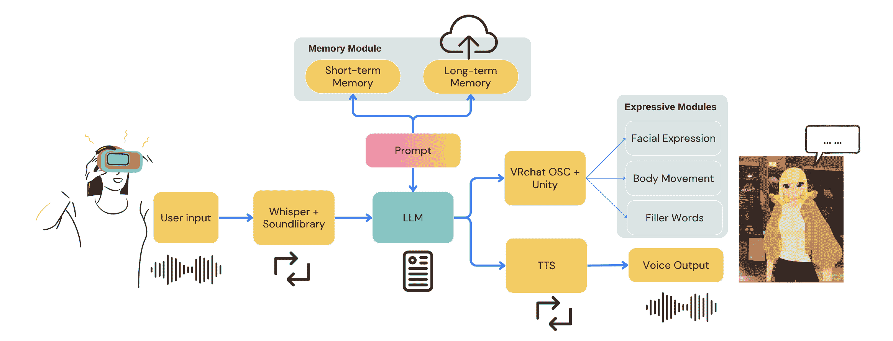

<!--yml

类别：未分类

日期：2025-01-11 12:11:32

-->

# ELLMA-T：一个支持社交虚拟现实中英语学习的具身大语言模型代理

> 来源：[https://arxiv.org/html/2410.02406/](https://arxiv.org/html/2410.02406/)

\quotingsetup

左边距=1.5em，右边距=1.5em，垂直间距=0pt

Mengxu Pan [pan.meng@northeastern.edu](mailto:pan.meng@northeastern.edu) 诺思伊斯特大学计算机科学学院 加拿大温哥华， Alexandra Kitson [akitson@sfu.ca](mailto:akitson@sfu.ca) [0003-3479-5297](https://orcid.org/0003-3479-5297 "ORCID标识符") 西蒙弗雷泽大学 加拿大温哥华BC， Hongyu Wan [wan.hongy@northeastern.edu](mailto:wan.hongy@northeastern.edu) 诺思伊斯特大学计算机科学学院 加拿大温哥华， Mirjana Prpa [m.prpa@northeastern.edu](mailto:m.prpa@northeastern.edu) 诺思伊斯特大学计算机科学学院 加拿大温哥华

###### 摘要。

很多人在学习新语言时遇到困难，传统工具未能提供针对每个学习者需求的情境化学习。近年来，大型语言模型（LLMs）和具身对话代理（ECAs）在社交虚拟现实（VR）中的发展，提供了通过情境化和自然的方式进行语言学习的新机会，这种方式考虑了学习者的语言水平和需求。为了探索这一机会，我们开发了ELLMA-T，一个利用LLM（GPT-4）和情境化学习框架的具身对话代理，支持在社交VR（VRChat）中学习英语。通过定性访谈（N=12），我们揭示了ELLMA-T在VR中为代理-学习者互动生成真实、可信且特定情境的角色扮演的潜力，以及LLM在提供初步语言评估和持续反馈方面的能力。我们为未来LLM基础语言代理在社交VR中的发展提供了五个设计启示。

具身对话代理、社交虚拟现实、大型语言模型、语言学习^†^†会议：ArXiv预印本；2024年9月；

图1\. a) ELLMA-T，基于GPT-4的VRChat语言导师；b) ELLMA-T以用户的母语向其问候；c) ELLMA-T与用户在超市场景中的角色扮演；d) 用户向ELLMA-T询问单词解释。

\Description

一幅预览图展示了ELLMA-T的介绍，这是一个基于GPT-4的具身对话代理，在VRChat中的超市角色扮演场景。

## 1\. 引言

掌握英语作为第二语言对生活的各个方面至关重要。这不仅适用于那些将英语作为必修课程的一部分教授的国家，即使英语不是母语，亦适用于英语国家，那些需要额外支持来练习和提高英语技能的人群，如移民、访客、游客或国际学生（Adjagbodjou和Kaufman，[2024](https://arxiv.org/html/2410.02406v1#bib.bib2)）。在传统课堂中，常用的学习方法往往无法提供一个有情境的学习环境、量身定制的学习材料以及富有吸引力的体验来支持学习。

除了常用的语言学习工具（例如移动应用程序如Duolingo（Duolingo，[2023](https://arxiv.org/html/2410.02406v1#bib.bib25)）），最近社交虚拟现实（VR）平台的普及为学习提供了新的渠道。VRChat（VRChat，[2024b](https://arxiv.org/html/2410.02406v1#bib.bib72)）已经成为一个受欢迎的社交平台，用户可以在虚拟环境中进行在线互动，日活跃用户超过48k，总用户数达到8̃.8百万。虽然VRChat并非专门为外语学习设计，但玩家利用其沉浸式环境，与母语者进行真实的对话体验（Merle_Meruru555，[2024](https://arxiv.org/html/2410.02406v1#bib.bib52)）。以往的研究表明，虚拟现实中的社交互动对外语学习是积极且有帮助的（Peterson，[2012](https://arxiv.org/html/2410.02406v1#bib.bib58); Cho等，[2022](https://arxiv.org/html/2410.02406v1#bib.bib17)）。与此同时，玩家在进行这种学习尝试时会遇到许多障碍。例如，找到一个愿意互动的母语者可能既困难又耗时；即便找到了，母语者也可能不愿意或不适合担任语言辅导员。此外，用户在搜索和互动过程中可能会增加社交焦虑，总体上，学习体验被认为是非系统性的（Roy和Aimee，[2020](https://arxiv.org/html/2410.02406v1#bib.bib63); Jouzu Juls，[2022](https://arxiv.org/html/2410.02406v1#bib.bib35)）。

近期，基于LLM的具身对话代理（ECA）在社交虚拟现实中的出现，如Celeste AI (ko fi.com, [2024](https://arxiv.org/html/2410.02406v1#bib.bib40))，因其以类人方式进行对话和行为，已引起VRChat用户的广泛关注。这为在社交虚拟现实中利用LLM代理进行语言学习提供了一个即时机会。尽管LLM已被探索用于各种教育目的（Kasneci et al., [2023](https://arxiv.org/html/2410.02406v1#bib.bib37)），但其在语言学习，特别是在社交虚拟现实中的应用仍未得到充分探索。为此，我们展示了我们的努力，旨在回答以下研究问题（RQ）：我们如何在社交虚拟现实中利用情境学习和基于LLM的ECA进行语言学习？

我们构建了ELLMA-T，一个具身的LLM代理，旨在探索使用LLM和情境学习框架（Brown et al., [1989](https://arxiv.org/html/2410.02406v1#bib.bib8); Lave and Wenger, [1991](https://arxiv.org/html/2410.02406v1#bib.bib44)）在社交虚拟现实中促进语言学习的潜力，并进行了用户研究（N=12），使用半结构化访谈对ELLMA-T进行评估。通过在VRChat中利用基于LLM的代理，该系统旨在为用户提供真实的对话体验和个性化反馈，增强情境化语言学习体验。我们在本文中提出的贡献包括：

1.  (1)

    设计了ELLMA-T，一个具身的LLM代理，旨在通过模拟沉浸式的真实对话，帮助成人语言学习者从A1到C1水平练习口语英语，运用于社交虚拟现实中；

1.  (2)

    一项用户研究及其结果，关于参与者对ELLMA-T在四项英语学习任务中的能力和局限性的认知：语言水平评估、角色扮演对话生成、反馈生成和支架能力，贡献于更广泛的LLM辅助语言学习和LLM应用的全景；

1.  (3)

    设计对社交虚拟现实环境中语言学习具身LLM代理设计的启示。

来自初步用户研究的结果表明，ELLMA-T作为一个“类人”的语言辅导员在情境语言学习中具有潜力。然而，也发现了一些挑战，如对话流畅性中断和情感支持不足，这表明未来改进的方向。研究的设计启示扩展到了个性化、文化相关和自适应学习系统的设计，这些系统整合了语言和非语言线索。这些发现突显了进一步探索在社交虚拟现实中开发基于LLM的ECA以支持长期语言学习的潜力。

## 2\. 相关工作

### 2.1\. 在虚拟现实中支持情境语言学习

情境学习理论基于这样一个理解：最有效的学习发生在特定的情境中。学习既不能脱离它发生的具体情境，也不能完全转移或在学校环境中应用（Brown等， [1989](https://arxiv.org/html/2410.02406v1#bib.bib8); Lave和Wenger， [1991](https://arxiv.org/html/2410.02406v1#bib.bib44)）。在语言习得中，真实的情境提供了紧密模拟现实生活情境的学习机会，并包括对有意义和吸引人的语言使用至关重要的文化细微差别（Lan， [2020](https://arxiv.org/html/2410.02406v1#bib.bib43)），例如，在多义词的情境中辨别词语使用的细微差别和微妙之处（Wong等， [2018](https://arxiv.org/html/2410.02406v1#bib.bib76)）。

虚拟现实（VR）的沉浸式特性特别适合于创建一个逼真的语言学习环境，并模拟在情境丰富的场景中进行人际互动。自2013年以来，随着价格适中的头戴显示器的普及（Dhimolea等， [2022](https://arxiv.org/html/2410.02406v1#bib.bib22); Limniou等， [2008](https://arxiv.org/html/2410.02406v1#bib.bib48)），VR已广泛应用于许多培训和教育领域（Aïm等， [2016](https://arxiv.org/html/2410.02406v1#bib.bib5); Zhu等， [2023](https://arxiv.org/html/2410.02406v1#bib.bib86)）。在VR中，3D物体和虚拟化身被用来促进具身化和情境化的学习体验（Chatain等， [2023](https://arxiv.org/html/2410.02406v1#bib.bib13)）。随着VR头显的快速发展，学习者体验到更强烈的临场感、增强的行动能力和具身感，这些都支持与在物理世界中通过实践学习相媲美的学习体验（Kaplan-Rakowski和Gruber， [2021](https://arxiv.org/html/2410.02406v1#bib.bib36)）。

越来越多的文献研究了虚拟现实（VR）在外语英语（EFL）学习中的应用，特别是VR环境如何用于不同的语言学习任务（Lin 和 Lan，[2015](https://arxiv.org/html/2410.02406v1#bib.bib49); Klimova，[2021](https://arxiv.org/html/2410.02406v1#bib.bib39); Dhimolea 等，[2022](https://arxiv.org/html/2410.02406v1#bib.bib22)）。研究表明，VR对词汇学习、沟通技巧和写作技能有益（Lan，[2020](https://arxiv.org/html/2410.02406v1#bib.bib43)）。使用VR进行EFL学习的其他好处包括提高学习者的动机、参与度、享受感、自动化（Makransky 和 Lilleholt，[2018](https://arxiv.org/html/2410.02406v1#bib.bib51); Lan，[2020](https://arxiv.org/html/2410.02406v1#bib.bib43); Dhimolea 等，[2022](https://arxiv.org/html/2410.02406v1#bib.bib22)），以及减少焦虑感（Gruber 和 Kaplan-Rakowski，[2020](https://arxiv.org/html/2410.02406v1#bib.bib27)）。使用VR进行EFL学习还可以帮助有复杂需求的儿童和成绩较差的学生（Lan，[2020](https://arxiv.org/html/2410.02406v1#bib.bib43)）。

研究人员已经提出了几种通过情境化和延长记忆保持来增强虚拟现实（VR）学习的策略。这些策略包括与三维物体互动以理解词汇（Fuhrman 等，[2021](https://arxiv.org/html/2410.02406v1#bib.bib26); Hsu 等，[2023](https://arxiv.org/html/2410.02406v1#bib.bib30)），在现实场景中完成任务（Wik 和 Hjalmarsson，[2009](https://arxiv.org/html/2410.02406v1#bib.bib75)），基于问题的学习（Chen 等，[2021](https://arxiv.org/html/2410.02406v1#bib.bib14)），以及将学习融入叙事或通过游戏化来进行（Cheng 等，[2017](https://arxiv.org/html/2410.02406v1#bib.bib15); Hsu 等，[2023](https://arxiv.org/html/2410.02406v1#bib.bib30); Seow，[2023](https://arxiv.org/html/2410.02406v1#bib.bib65)）。此外，研究表明，VR中使用虚拟角色有助于支持人际合作，并增强学习体验中的社区感（Jackson 和 Fagan，[2000](https://arxiv.org/html/2410.02406v1#bib.bib32); Peterson，[2012](https://arxiv.org/html/2410.02406v1#bib.bib58); Cantone 等，[2023](https://arxiv.org/html/2410.02406v1#bib.bib11)）。虚拟角色的使用尤其能够支持学习语言时常被忽视的细微差别，例如伴随口语的手势作用。例如，（Cheng 等，[2017](https://arxiv.org/html/2410.02406v1#bib.bib15)）展示了语言使用和身体动作如何结合起来，教授学习者跨文化的细微差异，比如在日本打招呼时同时鞠躬，展示了言语和非言语信号如何在交流中共同作用。

### 2.2\. 语言学习的具身对话代理

许多虚拟现实语言学习应用程序涉及到环境中的具身对话代理（ECA）。ECA是一个数字化动画角色，能够与用户进行自然、类人化的交流（Cassell et al., [2000](https://arxiv.org/html/2410.02406v1#bib.bib12)）。正如Cassell所述，一个理想的ECA能够进行人类与代理之间的对话，其方式模仿人类的面对面交流，使其看起来可信。关于ECA的设计，已经讨论了许多其他特性，如使用语言和非语言提示、多模态交流、外观和可视化（Cassell et al., [2000](https://arxiv.org/html/2410.02406v1#bib.bib12)），以及精心设计的人格特征（van Mulken et al., [1998](https://arxiv.org/html/2410.02406v1#bib.bib70)），这些都旨在提高代理的可信度。近年来的研究表明，ECA越来越被视为社交代理（Atkinson et al., [2005](https://arxiv.org/html/2410.02406v1#bib.bib3)），不仅仅是为了互动，还能理解并适应用户的社会和文化背景。

最近的研究指出，尽管ECA具有潜力，但它们通常属于更广泛的聊天机器人范畴，缺乏统一的概念框架，通常不包括虚拟身体或多模态处理能力（Jeon et al., [2023](https://arxiv.org/html/2410.02406v1#bib.bib34)）。与此同时，许多研究集中在传统聊天机器人（无具身性）在语言学习中的设计和应用，但对ECA的探索仍然有限。早期的研究，例如Wik和Hjalmarsson（[2009](https://arxiv.org/html/2410.02406v1#bib.bib75)）的工作，使用类人代理执行不同的语言学习任务，证明其在不同文化背景下都取得了成功。Divekar*等人（[2022](https://arxiv.org/html/2410.02406v1#bib.bib24)）也使用类人代理模拟现实生活场景，特别是非二元（多人）多模态对话。更近期的研究表明，学习者可以与ECA建立强烈的情感联系，从而增加动机并改善学习成果（Jeon, [2022](https://arxiv.org/html/2410.02406v1#bib.bib33)）。(Xu et al., [2021](https://arxiv.org/html/2410.02406v1#bib.bib79))的研究还表明，学习者对代理外貌的强烈喜爱与学习成果的改善之间存在正相关关系。

尽管ECA在模拟类人行为方面具有潜力，但现有的关于ECA在语言学习中的研究，仍然以互动能力有限的ECA为主（Wik和Hjalmarsson，[2009](https://arxiv.org/html/2410.02406v1#bib.bib75)；Divekar*等，[2022](https://arxiv.org/html/2410.02406v1#bib.bib24)；Jeon，[2022](https://arxiv.org/html/2410.02406v1#bib.bib33)）。这些ECA通常只能执行一些基本功能，如口型同步，以及由于技术限制而导致的有限非语言性手势和表现行为。大型语言模型（LLMs）的最新进展为ECA提供了新的技术能力，为设计更具动态性和互动性的ECA开辟了新的机会。

### 2.3\. LLMs和LLM代理在社交虚拟现实中进行语言学习的潜力

以往的自然语言处理（NLP）技术已应用于英语学习工具，这些工具通常需要模板或使用预设的目标导向场景（Tyen等，[2022](https://arxiv.org/html/2410.02406v1#bib.bib68)）。以往的（E）CA在语言学习和反馈方面的反应也相对有限（Zhang等，[2021](https://arxiv.org/html/2410.02406v1#bib.bib84)）。这一局限性随着大型语言模型（LLMs）及其超越语言任务的内容生成能力的最新发展而被打破（Yang等，[2024](https://arxiv.org/html/2410.02406v1#bib.bib80)）。除了语言生成任务，LLMs还可以用于生成ECA的3D虚拟形象（Hong等，[2022](https://arxiv.org/html/2410.02406v1#bib.bib28)）、控制动作（Qing等，[2023](https://arxiv.org/html/2410.02406v1#bib.bib61)）、生成动作和面部表情（Normoyle等，[2024](https://arxiv.org/html/2410.02406v1#bib.bib53)），以及驱动ECA的行为（Normoyle等，[2024](https://arxiv.org/html/2410.02406v1#bib.bib53）；Kumaran等，[2023](https://arxiv.org/html/2410.02406v1#bib.bib42)）。多模态LLMs有潜力理解虚拟环境及其中的物体（Wang等，[2023](https://arxiv.org/html/2410.02406v1#bib.bib74)），从而实现更具上下文感知的学习。

尽管围绕LLM使用的讨论越来越多，特别是在跨学科教育领域使用chatGPT（Kasneci等，[2023](https://arxiv.org/html/2410.02406v1#bib.bib37)），但针对语言学习中LLM的使用的研究较少。先前的研究探讨了基于LLM的聊天机器人在学术环境中用于英语作为外语（EFL）的一些任务，如语法修正和作文写作（Zhang等，[2023](https://arxiv.org/html/2410.02406v1#bib.bib83)；Law，[2024](https://arxiv.org/html/2410.02406v1#bib.bib45)）。在一项最近的研究中，（Caines等，[2023](https://arxiv.org/html/2410.02406v1#bib.bib10)）研究了LLM在语言教学和评估中的应用，包括对生成内容的评估、现有教学材料的校准、对语言学习者的自动评估以及提供反馈。（Caines等，[2023](https://arxiv.org/html/2410.02406v1#bib.bib10)）对除了GPT之外的LLM的回顾表明，其他内容生成模型可能是更好的选择，因为它们具有多语言能力并且作为开源模型普遍可用；然而，在像提供语言学习者反馈这样的任务中，GPT模型的使用仍然很有前景。

尽管大规模语言模型（LLMs）取得了进展，但基于LLM的教育聊天代理（ECA）在语言学习应用中的使用仍然相对较少。近期的研究已经开始探讨个性化表达和具象化在基于LLM的教育代理中如何影响学习成果（Sonlu等，[2024](https://arxiv.org/html/2410.02406v1#bib.bib67)）。然而，关于影响基于LLM的代理支持的语言学习在社交虚拟现实（VR）中的复杂因素的理解仍然存在空白。为了解决这一空白，我们探索了将基于LLM的ECA设计和集成到社交VR中的方法，以实现情境化的语言学习。

## 3\. 系统设计

我们的系统实现了一个基于LLM的代理，帮助学习者在社交虚拟现实环境中练习口语英语。该代理（ELLMA-T）通过基于真实场景的角色扮演对话与用户互动，在VRChat中提供互动和适应性的语言练习。在接下来的章节中，我们将基于教育理论、学习任务设计和系统实现讨论我们的设计原则。

### 3.1\. 设计原则

我们基于先前的研究，设计了以下系统设计原则，这些研究涉及到无论学习者的年龄或学术状态如何，都与语言学习相关：

1.  (1)

    以学生为中心的学习，系统设计以适应每个学习者的独特需求（Darsih，[2018](https://arxiv.org/html/2410.02406v1#bib.bib21)）；

1.  (2)

    学习材料遵循任务导向学习，意味着学习者需要完成一个与学习相关的任务，而不是进行非任务型的随意对话（Raux和Eskenazi，[2004](https://arxiv.org/html/2410.02406v1#bib.bib62)）；

1.  (3)

    该系统专注于提供情感支持以鼓励学习，这是语言学习者持续学习的重要因素（Dinçer等，[2013](https://arxiv.org/html/2410.02406v1#bib.bib23)）。

我们在Adjagbodjou和Kaufman（[2024](https://arxiv.org/html/2410.02406v1#bib.bib2)）提出的成人英语学习需求的基础上进行了扩展：（a）情境化的日常对话需求，（b）满足语言和情感需求的工具，以及（c）长期的、情境化的学习体验。尽管这个系统是针对成人学习者的需求设计的，但我们的目标是将该系统扩展到不同年龄段的用户群体。首先，我们强调创建一个沉浸式环境，并在VR中使用具象化的代理模拟真实的对话体验，以满足需求（a）。其次，我们探索利用LLM的语言能力，通过不同的沟通策略和渠道来满足学习者的情感需求，以满足需求（b）。第三，我们使用VRChat作为一个免费且易于访问的开放社交平台，为用户提供了一个丰富的空间，用户可以在其中连接、建立社区，并可能追求合作学习的机会，以满足需求（c）。

### 3.2. 在VRChat中使用ELLMA-T学习英语

图2. ELLMA-T执行的对话任务工作流程，包括问候用户、进行语言评估、参与角色扮演场景并提供反馈。

\描述

这张流程图展示了基于LLM的语言学习系统执行的工作流程和任务。

流程图从“介绍”步骤开始。然后是第二个步骤，“语言水平评估”。接下来，系统进入“角色扮演”阶段。此时，流程分为两条路径：用户指定的场景或生成的场景。两条路径都通向“轮流对话”步骤。在对话之后，系统会向用户提供“反馈”。

代理和用户的互动通过双向箭头表示，表示在整个过程中代理与用户之间的持续互动。角色扮演：此步骤涉及现实生活中的对话练习、情境词汇解释以及发音和语法纠正。支架：此步骤涉及意图澄清、语言鼓励和提供示例，以支持用户在对话中的表现。

颜色编码：用黄色高亮显示的步骤表示这些步骤是由LLM实时生成的。流程图的右侧使用颜色编码区分“角色扮演”和“支架”任务，每个任务下都有子任务。

工作流程（见图[2](https://arxiv.org/html/2410.02406v1#S3.F2 "图 2 ‣ 3.2\. 在 VRChat 中使用 ELLMA-T 学习英语 ‣ 3\. 系统设计 ‣ ELLMA-T：一个支持社交 VR 中英语学习的具身大语言模型代理")）从 ELLMA-T 询问学习者的信息并评估其语言水平开始。然后，ELLMA-T 生成学习者指定的对话场景，或提供三个场景供学习者选择。在角色扮演对话练习中，ELLMA-T 充当语言练习伙伴，扮演场景中的角色，并在需要时提供支持。在角色扮演结束后，ELLMA-T 根据对话内容给学习者提供反馈。学习者可以在对话的任何时刻结束对话或切换到另一个角色扮演。根据我们的三个设计原则，我们设计了 ELLMA-T 的语言水平评估、对话学习材料和沟通策略，这些内容通过提示工程由大语言模型实时生成（见第[3.3](https://arxiv.org/html/2410.02406v1#S3.SS3 "3.3\. 系统实现 ‣ 3\. 系统设计 ‣ ELLMA-T：一个支持社交 VR 中英语学习的具身大语言模型代理")）节）。

#### 3.2.1\. 设计原则 #1：介绍与语言水平评估

介绍：ELLMA-T 通过自我介绍为友好且具有文化意识的语言伙伴来启动对话。它通过开放式问题收集学习者的姓名、文化背景、学习英语的动机以及他们希望分享的任何额外信息，从而建立个人联系。例如，ELLMA-T 会用学习者的母语问候并认可他们的文化和个人经历。在最初的几轮对话中，学习者熟悉代理和 VR 环境。

语言水平评估任务：接下来，ELLMA-T 给学习者一个话题进行口语表达，以评估其当前的英语水平。话题和自由口语评估的格式遵循雅思（IELTS，[2024](https://arxiv.org/html/2410.02406v1#bib.bib31)）口语测试的格式。虽然雅思是更正式的对话形式，但在我们的系统中，评估是一种随意的对话。在接下来的学习过程中，ELLMA-T 会根据学习者的语言能力调整其语言和话题难度。自由口语的时长从30秒到学习者持续讲述该话题的时间不等。代理会判断是否有足够的输入来评估学习者的口语。如果用户的输入不够长，代理会提出后续问题并鼓励学习者继续说更多内容。一旦 ELLMA-T 判断已获得足够的学习者输入，它会根据 CEFR 标准（COE，[2024](https://arxiv.org/html/2410.02406v1#bib.bib19)）评估学习者的口语能力，并给出从 A1 到 C2 的结果。

#### 3.2.2\. 设计原则 #2：角色扮演主题生成与对话延续

场景呈现：在了解用户的熟练度后，ELLMA-T会提供三个不同的角色扮演场景，专注于与日常生活相关的各种主题。用户可以选择最感兴趣的场景，或建议一个他们希望练习的特定场景。一旦选择了场景，ELLMA-T会提供场景的详细描述，概述物理环境和重要物品。在VRChat中，各种虚拟世界再现了如咖啡馆、餐馆、户外和超市等日常场景（参见图[3](https://arxiv.org/html/2410.02406v1#S3.F3 "图3 ‣ 3.2.2\. 设计原则 #2：角色扮演主题生成与对话延续 ‣ 3.2\. 在VRChat中与ELLMA-T学习英语 ‣ 3\. 系统设计 ‣ ELLMA-T：一个支持社交VR中英语学习的具身LLM代理")）。一旦选择了场景，用户和ELLMA-T就可以被传送到相应的虚拟环境中。ELLMA-T会提示用户在场景中完成任务。例如，在超市场景中，用户需要寻找或描述特定物品，并练习所学的词汇。

图3\. ELLMA-T在VRChat中不同虚拟世界的展示：室内咖啡馆（左）与户外城市（右）。

\说明

该图由两个并排的面板组成，均展示了ELLMA-T这一3D卡通化身，身处VR中的不同沉浸式环境中。该虚拟化身与图1中的相同。

左侧面板：左侧面板展示了ELLMA-T站在一个温馨的咖啡馆环境中。咖啡馆的设计采用了质朴的砖石内部装饰，柜台后面的墙上挂着一块菜单板，列出了各种冷热饮品。ELLMA-T的左侧是一个货架，货架上摆满了烘焙食品，货架上方挂着一只墙钟。咖啡馆的氛围温暖，灯光突显了砖墙和木架的纹理。ELLMA-T站在柜台前，面朝镜头，准备在与咖啡馆相关的角色扮演场景中协助用户。

右侧面板：右侧面板展示了ELLMA-T处于一个户外环境中，环境类似于欧洲风格的水滨街道。场景中有一座石桥横跨运河，街道两旁是历史建筑，背景中可见水面。天空晴朗，阳光明媚。ELLMA-T站在靠近桥梁的鹅卵石小路上，面对镜头。这个环境适用于角色扮演场景，用户可以在街道或户外环境中与ELLMA-T互动，从而展开与城市探索或旅行相关的各种对话主题。

轮流对话：ELLMA-T与学习者进行轮流对话，以完成角色扮演场景。作为用户的伙伴，代理人促成在所选场景中的自然且真实的对话。对话主题和任务设计参考了英国文化委员会为成人学习者设计的英语教学课程（Council，[2024](https://arxiv.org/html/2410.02406v1#bib.bib20)）。在每个场景中，ELLMA-T扮演如餐厅服务员、收银员、医生或街头友好的纽约人等角色，使用户能够进行模拟现实生活情境的对话。

提供反馈：角色扮演后，代理人向用户提供反馈，反馈包含三个部分。第一部分提供一般反馈，评估用户在所选场景难度下的表现，突出一个优点和一个待改进的领域。第二部分，“前进建议”，提供实际的建议，指导如何将对话中学到的概念应用到现实生活中的情境。最后，ELLMA-T总结了互动过程中遇到的关键词汇、语法或句型，供用户日后参考。ELLMA-T仍然可以回答进一步的问题或进行额外的练习会话。

#### 3.2.3. 设计原则 #3：沟通策略与反馈渠道

英语作为外语（EFL）学习者常常由于词汇不足或语法使用不当而遇到沟通障碍，这会对他们的自信心和学习动力产生负面影响。我们的系统基于(Ayedoun等，[2019](https://arxiv.org/html/2410.02406v1#bib.bib4))的沟通和支架策略，通过设计具身对话代理（ECA），来增加学习者在英语口语练习中开口的意愿。

减少沟通障碍：为了应对沟通障碍，ELLMA-T会提供鼓励，激励用户继续进行对话（“加油，别放弃！”）；或建议短语，帮助用户继续进行对话（“你可以说……”）。当用户的言语不清楚时——无论是由于词汇不当、语法错误，还是发音不准确——ELLMA-T会提出澄清问题，促使进一步对话（“你刚才说的……，是指……？”）。这种方法营造了一个支持性的学习环境，鼓励用户在不担心立即纠正的情况下进行口语练习。

### 3.3. 系统实现

#### 3.3.1. 系统架构

图4. ELLMA-T的系统架构。该架构展示了系统内部的核心组件和数据流。

\描述

VRchat中的基于LLM的具身对话代理系统架构。

此图展示了在 VRChat 中启用对话代理的不同系统组件之间的数据流。用户输入：通过 VR 头显捕获用户的语音输入。Whisper + Soundlibrary：将音频输入转换为文本。LLM（大型语言模型）：处理文本并生成响应，依据提示生成。记忆模块：包括短期记忆和长期记忆，用于存储互动历史以提供上下文。TTS（文本转语音）：将 LLM 生成的文本转换为语音。VRChat OSC + Unity：管理代理的表现性行为，如面部表情、身体动作和填充词。在 VRChat 中进行语音输出：最终的语音输出和表情传递给用户。

本项目中的代理设计扩展了 (Wan et al., [2024](https://arxiv.org/html/2410.02406v1#bib.bib73)) 的工作，该工作实现了 VRChat 中的通用 ECA，并通过为代理添加记忆来提高响应的上下文相关性。基于这一实现，我们增加了一个导师工作流逻辑（见图 [2](https://arxiv.org/html/2410.02406v1#S3.F2 "图 2 ‣ 3.2\. 在 VRChat 中使用 ELLMA-T 学习英语 ‣ 3\. 系统设计 ‣ ELLMA-T：支持社交 VR 中英语学习的具身 LLM 代理")），用于控制对话流程。

学习者通过 Quest 3 头显在 VRChat 中控制虚拟角色，可以进行身体动作并通过麦克风与 ELLMA-T 对话。如图 [4](https://arxiv.org/html/2410.02406v1#S3.F4 "图 4 ‣ 3.3.1\. 系统架构 ‣ 3.3\. 系统实现 ‣ 3\. 系统设计 ‣ ELLMA-T：支持社交 VR 中英语学习的具身 LLM 代理") 所示，音频输入通过调用 Whisper API (OpenAI, [2024c](https://arxiv.org/html/2410.02406v1#bib.bib56)) 转换为文本，然后通过调用 OpenAI API 从 GPT4 模型生成文本回复。文本回复使用 OpenAI TTS 服务（'alloy' 语音）(OpenAI, [2024b](https://arxiv.org/html/2410.02406v1#bib.bib55)) 转换回音频。用户语音检测和静音检测通过使用 Sounddevice 库 (Python_Sounddevice, [2024](https://arxiv.org/html/2410.02406v1#bib.bib59)) 和 Vosk (Python_Vosk, [2024](https://arxiv.org/html/2410.02406v1#bib.bib60)) 完成。我们使用 2.0 秒的静音阈值来检测用户输入的结束，平衡用户暂停和继续讲话的缓冲时间与代理响应的整体等待时间。

该系统还可以根据用户输入生成面部表情和身体动作。LLM通过关键词检测识别用户情绪，然后通过映射相应的身体动作和面部表情来反映这种情绪。当前对话会话的历史记录以JASON对象列表的形式存储为代理的短期记忆，并作为生成更相关对话的参考。当前对话会话的关键信息由LLM进行总结，并存储在远程数据库中。代理的后端通过VRChat OSC（VRChat, [2024a](https://arxiv.org/html/2410.02406v1#bib.bib71)）集成到VRChat中。代理的手势和面部表情的额外动画可以添加到Unity（Unity, [2024](https://arxiv.org/html/2410.02406v1#bib.bib69)），然后通过VRChat OSC（VRChat, [2024a](https://arxiv.org/html/2410.02406v1#bib.bib71)）集成到VRChat中。

#### 3.3.2\. 多任务多轮对话系统

在设计和实现一个多任务多轮对话代理时，我们遇到了一个挑战，迫使我们从单一提示方法转向更结构化的多任务方法。我们的代理需要管理涉及多个步骤和决策点的整个对话，例如，在介绍任务和评估任务之间何时过渡，评估应持续多长时间，如何转向下一个话题等。在最初的实验中，我们尝试了单一提示方法，在该方法中，我们在系统提示中列出了所有步骤和代理应该遵循的标准，见附录[A.1](https://arxiv.org/html/2410.02406v1#A1.SS1 "A.1\. 单一系统提示 ‣ 附录 A 附录 ‣ ELLMA-T：支持社交 VR 中英语学习的具身 LLM 代理")。然而，我们观察到LLM很难按照单一提示中的步骤进行操作。LLM经常混淆操作的顺序，误解任务何时结束，何时转向下一个任务，或者随机重新启动某个任务。这导致了对话的逻辑流程中断，用户互动的效果不理想。这一观察结果与LLM代理领域的新兴发现相一致，其中保持上下文并管理多轮互动仍然是一个挑战，尤其是在复杂的多步骤任务中（Yi 等， [2024](https://arxiv.org/html/2410.02406v1#bib.bib81)）。

图 5\. 不同任务的独立提示结构。该图展示了提示如何在系统内部分任务之间进行结构化和分隔。1）系统提示确定了代理在所有互动中的角色。2）任务特定提示在引导、语言评估、角色扮演和反馈过程中引导代理。3）决策提示帮助代理确定何时在任务之间进行过渡。4）角色扮演对话过程中提供脚手架的提示。

\Description

该图展示了LLM基础代理用于管理各种对话任务的提示结构和流程：

系统提示：设置代理的整体角色为友好、耐心和轻松的英语辅导员。任务特定提示：针对不同任务使用不同的提示：引导：代理与用户互动，了解其背景。评估：代理进行自由对话，以评估用户的语言水平。角色扮演：代理引导用户进行角色扮演场景。在每个任务中，都有一个饱和逻辑，用于判断当前任务是否完成，以及何时过渡到下一个任务。在角色扮演任务中，还有一个脚手架提示，用于引导LLM在需要时提供解释、示例和鼓励。

作为替代方案，我们采用了多任务实现策略（见图[5](https://arxiv.org/html/2410.02406v1#S3.F5 "Figure 5 ‣ 3.3.2\. Multi-task Multi-turn Conversation System ‣ 3.3\. System Implementation ‣ 3\. System Design ‣ ELLMA-T: an Embodied LLM-agent for Supporting English Language Learning in Social VR")）。这一方法的核心思想是将整体任务分解为更小、更简单、更易于管理的子任务。每个子任务由一个单独提示的代理实例处理（见附录[A.2](https://arxiv.org/html/2410.02406v1#A1.SS2 "A.2\. Multi-task Prompt ‣ Appendix A Appendix ‣ ELLMA-T: an Embodied LLM-agent for Supporting English Language Learning in Social VR")），从而实现更大的控制力，并减少在任何给定时刻LLM的认知负担。这一策略将保持确定性逻辑的负担从LLM转移到系统设计者身上，后者预定义了子任务的顺序和结构。通过这样做，我们确保代理能够在复杂互动中顺利进行，而不会失去对对话广泛背景的掌控。每个子任务都是独立执行的，LLM根据该子任务的特定上下文生成响应。尽管由于LLM生成文本的固有随机性，这可能会在对话中引入一些变动，但整体结构保持不变，从而导致更连贯和更有效的互动。最近在复杂任务对话系统的多代理系统领域的研究表明，将复杂任务分解为模块化组件可以显著提升系统性能（Wu et al., [2023](https://arxiv.org/html/2410.02406v1#bib.bib78)）。

#### 3.3.3\. 提示工程

有效的提示工程对于引导像GPT-4这样的LLM在对话系统中执行特定任务至关重要。尽管有多种方法可以提示LLM（Schulhoff et al., [2024](https://arxiv.org/html/2410.02406v1#bib.bib64)），但目前尚无标准化的工作流程来开发“完美”的提示，因为提示设计通常涉及试错过程（Zamfirescu-Pereira et al., [2023](https://arxiv.org/html/2410.02406v1#bib.bib82)）。我们对提示工程的 approach 是迭代式的，探索了LLM在零-shot或少量-shot条件下的能力（Brown et al., [2020](https://arxiv.org/html/2410.02406v1#bib.bib9)），以促进语言学习。

## 4\. 用户研究

### 4.1\. 研究设计

为了探索参与者在VRChat环境中使用ELLMA-T的体验，我们通过半结构化访谈进行了一项定性研究，并通过主题分析对数据进行了分析。本研究旨在探索基于LLM的代理支持语言学习在社交VR环境中的机会与挑战。我们的研究聚焦于整体互动体验、系统使用偏好以及对未来改进的反馈。本研究已获得大学伦理委员会的批准。

### 4.2\. 参与者与设置

为了进行这项初步研究，我们通过校园传播渠道发布招募广告，招募了12名国际研究生（表[1](https://arxiv.org/html/2410.02406v1#S4.T1 "Table 1 ‣ 4.2\. Participants and Setting ‣ 4\. User Study ‣ ELLMA-T: an Embodied LLM-agent for Supporting English Language Learning in Social VR")）参与此研究，来自[大学名称已删除以确保盲审]。尽管这些学生达到了该大学严格的英语语言标准，雅思成绩最低为7.5分，但他们在日常生活和工作环境中仍然面临语言障碍。因此，我们选择了这些参与者作为一个潜在的代表性样本，代表一个英语能力混合的人群，他们的目标是在实际场景中提高口语能力，如社交互动和职场沟通。

表 1\. 参与者信息

| 参与者ID | 性别 | 文化背景 | 语言能力 | 学习英语的动机 |
| --- | --- | --- | --- | --- |
| P1 | 男性 | 中国 | 流利 | 提升语言技能 |
| P2 | 男性 | 印度 | 流利 | 为了在加拿大工作 |
| P3 | 男性 | 中国 | 流利 | 提升沟通技巧 |
| P4 | 女性 | 中国 | 基础 | 提升口语英语能力 |
| P5 | 女性 | 中国 | 中级 | 为了在加拿大工作和学习 |
| P6 | 女性 | 中国 | 中级 | 提升语言能力 |
| P7 | 女性 | 中国 | 中级 | 提升商务英语技能 |
| P8 | 男性 | 孟加拉国 | 非常流利 | 达到高级语言能力 |
| P9 | 女性 | 台湾 | 基础 | 为了在加拿大工作和学习 |
| P10 | 女性 | 中国 | 基础 | 为了面试练习 |
| P11 | 男性 | 中国 | 中级 | 提升商务英语技能 |
| P12 | 男性 | 中国 | 流利 | 为了在加拿大工作 |

### 4.3\. 程序

该研究在[大学名称已删除以保证盲审]现场进行。参与者到达后，首先接受了对研究的简要概述。告知他们将与一名扮演英语语言导师角色的AI代理进行互动，使用Meta Quest 3头显。对于不熟悉虚拟现实的参与者，我们提供了如何佩戴头显并在VRChat世界中导航的说明。系统设置已预先配置好，确保了顺畅的体验，让参与者无需学习如何导航菜单或操作控制。一旦佩戴好头显，参与者被指示从他们的第一人称视角开始录制与ELLMA-T的互动。研究人员远程监控代理的操作，并提供技术支持。互动持续了15分钟：介绍与评估（5分钟），角色扮演与反馈（7分钟）。我们将每位参与者与ELLMA-T之间的对话日志保存为CSV文件以便进一步分析。互动后，参与者参与了一次由一位熟悉定性研究方法的作者主持的30分钟半结构化访谈。访谈通过iPhone 12录音，并在NVivo 14中转录以供分析。访谈收集了关于参与者总体体验、舒适度、参与度、潜在使用频率和在不同设置下使用系统的偏好（例如，小组与个人；头显与桌面应用）的定性数据。如有必要，访谈中还会根据参与者的回答提问追问，特别是当初步回答未能完全回应预期主题或方向时。完整的访谈问题列表见附录[B](https://arxiv.org/html/2410.02406v1#A2 "附录B 访谈问题 ‣ ELLMA-T：支持社交虚拟现实中英语学习的具身LLM代理")。

### 4.4\. 分析

我们采用了归纳式（自下而上）方法来分析访谈记录，遵循Braun和Clarke（Braun和Clarke，[2006](https://arxiv.org/html/2410.02406v1#bib.bib7)）的主题分析指南。分析由三位研究人员（本文所有作者）分阶段进行。最初，每位研究人员阅读所有的访谈记录（步骤1），然后独立分析部分访谈记录，以识别初步的代码、主题和模式，并选择相关的引用和观察（步骤2）。团队随后进行了多轮编码讨论，并达成一致，最终确定了一套代码（步骤3）。为了确保分析的可靠性，访谈记录与视频录制和互动过程中的笔记进行了交叉引用（步骤4）。最后，所有的主题由三位研究人员/编码员讨论并定义（步骤5），并写成报告（步骤6）。

## 5\. 研究结果

在本节中，我们描述了四个关键主题：代理感知及其在社交虚拟现实中的作用、社交虚拟现实中的语言学习、任务设计与对大规模语言模型在语言学习中的高效性的感知，以及对继续使用的兴趣。

### 5.1\. 代理感知及其在社交虚拟现实中的作用

#### 5.1.1\. ELLMA-T 类人化特征

参与者将与ELLMA-T的体验与与真人导师对话进行了比较。参与者频繁评论代理的类人化特征，指出互动感觉更像是与真人而非AI对话。正如P4所表达的，“我喜欢它和我说话的方式。它就像一个真正的老师；互动真的很好。”参与者强调对话流畅自然，展示了ELLMA-T倾听、理解和适当回应的能力。例如，P8欣赏代理“在听我说话”，暗示它以一种与个人经历相关的方式作出回应。P2也观察到，

> “首先，它从文化体验开始。所以当我提到我来自印度时，问候语从‘Hello’变成了‘Namaste’，这在我们的语言中就像是‘Hello’一样。所以那句‘Namaste’给人一种个人化的感觉。接着，它试图理解你在日常对话中的感受。”

这种个性化互动及随后的对话流程让P2得出结论，“这就像…我在和某人面对面交谈，所以对我来说现在它不是AI。”

#### 5.1.2\. 根据个人偏好和社交背景的适应性和角色切换的重要性

参与者对ELLMA-T在语言学习中的角色表达了不同的偏好。有些人更倾向于让代理扮演传统教师的角色，类似于课堂中的设置。例如，P1建议，“代理可以像老师一样，其他人就像学生。我还是觉得那样——更传统，代理作为老师和课堂的负责人。”另一些人则设想代理扮演一个更支持性的角色，作为多方互动中的促进者或社交纽带。P5设想这一角色是帮助弥合对话中的空白：“而且他们还可以填补空白。好吧，如果两个人是内向的人，可能没有很多共同话题可聊，AI代理可以提问或引导对话。”此外，一些参与者认为代理可以在真人对话练习中充当反馈提供者。正如P6所言，“你可以和一个真人进行对话，并从他们说的内容中学习，同时得到代理提供的反馈。”

#### 5.1.3\. 对代理语调、外观和行为的感知

我们观察到代理的语调、外观和行为的细微感知如何影响整体互动体验。

代理人语气：一些参与者注意到，代理人在执行不同任务时的语言语气影响了他们的学习体验以及对代理人的看法。例如，P6指出代理人角色扮演时的语气与反馈时的语气有明显区别：“我希望（角色扮演）对话更随意一些，但我希望反馈是专业的。”P8强调了提供鼓励性短语并结合适当语气的重要性：

> “现在它看起来非常机械，所以它只给我一些基本的反馈……很大的进步，但我喜欢你做的某些事情…她确实提到过这些，但感觉就像是…我只是在对着电脑打字，它从电脑里出来。”

P8还补充道，在不同的语境中缺乏语调变化可能会让代理人的互动显得不够吸引人，也不够人性化：“如果你在进行对话，我们说话的方式有很多细微的差别和某些音调……我们说话时的起伏。”

代理人外观：一些参与者喜欢中性的外观，因为它不会分散注意力，也不会传达任何评判。P1评论道：“整体语气很中性，不会太过激进或太... 中性是好的，不会营造出奇怪或不自然的氛围。”然而，其他人更喜欢具有更多个性以增加趣味性和互动感。P10建议：“也许我们可以使用一些游戏、文学或其他领域中的著名角色，然后设置相应的环境…它将按那样的方式表现和说话。”一些参与者还表示希望能够自定义代理人的外观。对于不同头像的建议包括现实主义风格（P11，P12）、卡通风格（P3，P10）或非人类动物（P6），以及可以修改的属性，如发色、肤色、体型、性别（P6）和服装（P4）。

代理人行为：与对语气和外观的偏好类似，P7认为代理人的最小动作有助于避免分散学习英语的注意力。“我并没有特别注意它是怎么动的…我感觉如果加上太多动作，可能会分散学习英语的注意力。”（P7）然而，其他人则建议自然的肢体动作，例如点头和眼神接触，会增强参与感并创造更生动的互动。P11表示：“它应该代表人们对自己形象的认知。而且眨眼、点头等动作都应该出现在虚拟现实环境中。”此外，参与者强调了文化和情境因素的重要性，例如代理人的声音与视觉身份之间的一致性，以及根据情境调整代理人个性和外观的可能性。P12提到：“我认为在不同的场景中，我们可以改变个性，或者改变头像本身，来模拟不同的环境和人们说话的方式。我觉得这样会有很大不同。”

#### 5.1.4\. 解放不适用于 AI 的社交规范的互动

所有参与者都认为该代理易于接近，且互动时感觉舒适。一个显著的优势是没有与文化或社会规范相关的社会压力或期望。P5 强调了这一点，并表示，

> “你和一个人交谈，如果你没有正确地告诉他们某些事情，可能会伤害他们的感情。但如果是 AI 给你反馈，就感觉哦，是机器在给你反馈，那没关系。它们不会像人类那样有‘哦，我是不是伤害了这个人的感情’的想法。”

### 5.2\. 社交 VR 中的语言学习

#### 5.2.1\. 基于 VR 赋能的情境学习

参与者讨论了他们如何通过 VR 的独特赋能支持语言学习：与物体和虚拟角色的 3D 互动、身临其境的环境中的情境化学习，以及通过具身代理提供的情感支持。

互动学习：参与者描述了身处 VR 环境中如何为他们的语言学习体验增添了重要价值。VR 的互动性常被强调，P1 提到：“VR 增加了互动性。我需要做的就是说话。我不需要打字。” VR 提供的环境背景，加上具身代理，创造了沉浸感，使得互动感觉更加“真实”。正如 P5 分享的：“我感觉我在跟一个站在我面前的真实人交谈。我的意思是，毕竟这是 VR。所以这有很大的不同。”

情境化学习：VR 环境为语言学习提供了宝贵的情境，帮助参与者理解如何在现实生活中使用语言。P8 提到：“比如说，面包店，它会在那个地方。我们走过的时候，会觉得，哦，这里是面包店，如果你来这里，你就能买到这些类型的汤。但这也适用于我的现实生活场景。”类似地，P12 强调了拥有与学习任务相符的虚拟环境的优势：“我觉得如果我们能有一个咖啡架，里面有浓缩咖啡机和一切设施。我认为拥有一个真实的环境会有所不同，这就是 VR 的优势。”

情感支持：参与者还讨论了他们在 VR 中与具身代理产生的情感联系。P1 提到，VR 增加了互动中的情感维度：“它增加了情感。所以如果有一个静态的或者 2D 代理，仅仅存在于屏幕上，就感觉少了情感的联系。”其他参与者提到，在 VR 中为代理添加个性会增强情感联系的感觉。P7 建议：“或者也许他们（使用这个系统的人）需要更多的情感支持。所以，这也许是赋予代理个性的一种好方式。”P9 和 P11 强调了增加身体反应和肢体语言的重要性，P9 说：“也许更多的身体反应。就像我真的在跟你交谈并注视你的眼睛。”

#### 5.2.2. 一对一互动缓解口语焦虑，小组互动支持共享学习体验

参与者表达了对在 VR 中与代理人互动的不同偏好，既有偏好私人空间的，也有偏好小组设置的。参与者认为，在别人面前讲话会感到焦虑，因此更倾向于一对一互动。正如 P2 所说：“我有这个问题，我知道很多我的朋友也有这个问题。当他们对语言没有信心时，他们会感到不知所措，有点害怕在小组中讲话。”一些参与者更喜欢一对一互动，因为他们重视来自代理人的直接互动和反馈。正如 P10 所说：“这是一个对话式的互动，它可以评估我并且针对我的弱点进行改进。”

另一方面，其他人则更喜欢小组互动，认识到更多参与、同伴支持和共享学习经验的额外好处。VRChat作为一个社交平台，提供了选择化身和社交模式的灵活性，这可以增强与同伴学习者的互动学习体验。P10 提到：“如果我们作为学习者可以在 VR 中相互互动，那将很有趣，因为我们不会在乎彼此的外貌或我们身处何地，我们可以专注于练习。”此外，P7 强调了 VR 中小组互动的潜在现实生活好处，例如为小组会议和工作环境做准备，而这些是与代理人互动所无法模拟的：

> “我很喜欢小组环境，因为如果你要工作或进行小组讨论，这可能会很有帮助。在现实生活中，你必须跟上不同人说的话。所以这可能会更具挑战性，但也可能很有趣。”

### 5.3. 任务设计和对大语言模型（LLM）在语言学习任务中效能的认知

学习体验的潜在有效性是参与者设计系统时的核心关注点，特别是在任务设计的相关性、评估准确性、对话内容、反馈和代理人提供的支持方面。

#### 5.3.1. 任务设计的相关性

我们的分析显示，系统能够应对成人语言学习者在英语国家学习口语英语的背景需求，这是一个反复出现的主题。参与者承认，代理人有效地解决了他们面临的具体挑战。一个显著的挑战是，尽管他们已经处于语言环境中，但缺乏学习或接收反馈的机会，正如 P5 所解释的那样：

> “通常当你练习英语时，就是……嗯，我已经在国外学习了。没人会给我反馈。我觉得他们不能。我知道这是西方文化，人们给予更多的正面反馈。但这个系统，它给了我更现实（实际）的反馈。你在现实生活中得不到这样的反馈。”

另一位参与者P5强调了非正式对话学习的差距，这在正式和学术环境中往往缺失：

> “我真的很想学习的是如何在试图同意某人观点时使用英语。对母语者来说，这可能非常简单，因为他们并不真正知道，哦，这对非母语者来说很难。我想回应。当某人说了些什么，我可以说像‘哦’，‘太棒了’，‘完全同意’——那种简单的词汇。这对我来说可能是非常难的。”

参与者们看重角色扮演对话的形式，因为它能够提供真实的对话体验。正如P7所指出的：“因为对话和交流是关于日常生活交流的，你可以学到一些对你有用的东西，对你学习英语有用。”

参与者们还建议了他们希望练习的具体场景，比如作为国际学生租房（P10）或参加模拟面试（P6）。

#### 5.3.2. 评估学习者的语言能力

大多数参与者认为代理对他们语言能力的评估是准确的，并且与他们自认为的水平一致。五位参与者描述评估为“似乎合适”（P11）、“准确”（P3, P8）、“非常准确”（P4）和“符合我的水平”（P9）。即使评估结果并非完全精准，受访者的反馈表明代理的评估符合他们的期望。P7虽然没有直接评论评估的准确性，但认为它作为一种描述性反馈形式是有用的：“她实际上给了我一个级别，比如B1，这很有趣。我觉得我也想知道，哦，我处于什么样的级别，她还给出了一些描述，比如‘你可以描述你的感觉’，这是一件好事。”

一个有趣的案例发生在P10身上，她选择不遵循代理的指示，在评估过程中保持沉默。因此，代理将她的CEFR级别评定为A1（基础）（COE, [2024](https://arxiv.org/html/2410.02406v1#bib.bib19)），这一结果她强烈反对：“它有一个目的，所以它希望我跟着它重复。我不想这样做……（评估）不是很准确。它说我在A1级别，但至少我觉得我应该是C1或C2。”

#### 5.3.3. 角色扮演对话内容

代理提供的角色扮演对话得到了参与者的高度评价。ELLMA-T在生成对话时展现出了创造力和适应性，常常能够在无需额外提示的情况下，扮演好各种角色。P3和P8都形容他们的角色扮演体验是“出乎意料的好”。例如，在一次画廊场景中，参与者扮演销售员，代理扮演顾客（角色扮演对话1，参见表[2](https://arxiv.org/html/2410.02406v1#S5.T2 "表 2 ‣ 5.3.3\. 角色扮演对话内容 ‣ 5.3\. 任务设计与对LLM在语言学习任务中有效性的看法 ‣ 5\. 研究发现 ‣ ELLMA-T：支持社交VR中的英语学习的具身LLM代理")），P3觉得这个体验既富有吸引力又很真实：

> “它提供了非常实用的场景来进行对话。而且这个导师可以根据我的回答进行反馈，因为它需要抽象的画作。我说，我可以给你画一幅肖像。他们（代理）说，我不需要肖像，我需要一幅更抽象的作品。所以我认为这是一个很好的点，因为你可以感受到你真的在和一个人交谈。一个人可以给你正确的反馈。这真是太棒了。”

这个例子突显了LLM利用其庞大的预训练知识，创造生动、真实且具有沉浸感的对话能力，超越了传统语言学习中常见的枯燥、类似教科书的交流。代理能够根据角色和情境添加细腻的细节，从而增强了互动的真实感。正如P8所说，“是的，情况不是那种干巴巴的问答……是的，它不像雅思考试那样，问一个问题就得到一个回答。”这种动态的方式让对话的背景更加生动，使学习体验更具吸引力和效果。

表2. 画廊场景中的角色扮演对话示例

> ELLMA-T [为角色扮演对话设置背景]：那么让我们想象一下，我们现在在一个充满美丽和多样化艺术作品的画廊里。你是一位博学且充满热情的艺术策展人，而我则是一位对艺术感兴趣的买家，正在探索画廊，也许是在寻找一些可以装饰我家的艺术品。对话可以从我走进画廊开始。好，开始吧。

| 事件行 | 互动背景 | 摘录 |
| --- | --- | --- |
| 1 | 代理（顾客） | 你好。这是我第一次来参观这个画廊。你能展示几件突出作品并讲讲它们的故事吗？ |
| 2 | 用户（销售员） | 好的。你能先告诉我你想买什么类型的艺术作品吗？ |
| 3 | 代理（顾客） | 我对当代画作非常感兴趣，尤其是一些充满活力和抽象的作品。我正在寻找一件能够成为我客厅焦点的作品。那是一个相当大的空间，墙面颜色很中性。 |
| 4 | 用户（销售人员） | 我们能看看这幅肖像吗？这幅肖像是关于一位文艺复兴时期的人物，在这幅肖像中，你可以看到背景是深色的，广泛的色彩。而你也可以看到肖像非常清晰，画中的人物面部表情非常生动且富有活力。你觉得怎么样？ |
| 5 | 代理人（顾客） | 深色背景与生动的面部表情之间的对比一定会产生令人惊叹的视觉冲击。然而，我更感兴趣的是抽象艺术，而非肖像画。你们有大胆且色彩丰富的抽象作品吗？ |
| 6 | 用户（销售人员） | 是的。如果你在寻找一些抽象作品，那印象派怎么样？ |

#### 5.3.4\. 反馈效果

参与者们常常评论代理人的反馈是其最有价值的特点之一。例如，P2赞赏了关于时态使用的具体反馈，表示：“如果我的时态有错误，那反馈中就有。我要改进的地方，也会在里面。反馈完全正确，甚至我知道我有时候在时态上出错。”

P7也强调了收到关于非母语者常犯错误的反馈的好处：“我觉得进步了很多，因为通常作为非母语者，我们自己并不总能意识到什么时候用错了时态或单词，但他们会提出来作为反馈。所以我觉得这真的很有帮助。”

尽管参与者们认识到反馈的价值，但他们也表达了对更加个性化和详细回应的渴望。他们建议，反馈可以根据他们的学习历史和用户档案进行定制，包含具体的错误示例和修正。P11指出：“对于学英语，我认为AI没有给出非常具体的回应。它给出的答案很笼统。如果是一个人正常在听，导师会回复我说错的地方，并且会重新表述并给出一个应该是怎样的例子。”

此外，尽管有一位参与者认为反馈“具有教育意义”，他们也提到反馈可能过于冗长：“我觉得反馈有时候对我来说太长了，因为它会阐明很多反馈评估。”这表明，尽管全面的反馈受到欢迎，但需要在详细性和简洁性之间找到平衡，以保持用户的参与度。

#### 5.3.5\. 脚手架效应

代理在整个会话过程中提供了各种形式的支持和鼓励。诸如“你做得很棒！”和“做得好，完成了[活动]……”之类的口头提示被持续使用，以激励参与者。当参与者在角色扮演时难以生成对话，代理通过提供示例供他们重复，从而提供了支撑。如P7所指出的，“我确实喜欢他实际上给了一些提示，‘例如……’，‘哦，你可以这么说……’。”此外，当用户输入的含义不明确时，代理会提出澄清性问题，并在参与者不确定如何继续时提供解释。P1描述了一个情况：“她让我直接告诉她一个故事，我第一次没太明白。我问她我有哪些选择。然后她给了一个，我挺喜欢的。”

P12做了一个有趣的观察，他发现尽管有口音，代理依然准确地捕捉到了他的输入：“我觉得它比我想象的更好地捕捉了单词。也许我有时有口音。我没想到它会这么好。”这突出了英语学习者中常见的交流挑战，系统面临着一个重大的设计挑战。

### 5.4\. 对持续使用的兴趣

#### 5.4.1\. 持续使用的可能性

几乎所有参与者都表示，他们会定期使用该系统来练习语言技能，使用时间从每天30分钟到四小时不等（P1、P2、P3、P6、P10、P12），或者每周使用一到两次（P7、P8）。一些参与者表示，如果能够减轻与沉重耳机相关的身体疲劳，他们会增加使用频率（P4、P8）。此外，一些参与者表示，他们会在准备特定场景（如工作面试）时增加使用频率（P9）。这些发现表明我们的系统在支持长期语言学习方面具有强大的潜力。

#### 5.4.2\. 影响持续使用的负面因素

尽管有积极迹象表明会定期使用，但我们发现了几个与任务设计和对话流程相关的挑战，这些挑战可能会积累并对长期使用产生负面影响。一位参与者强调了响应延迟随着时间推移可能变得更加成问题，指出：“所以这看起来还行，但随着速度的变化，交易时间——我需要与AI互动的时间——会随着响应时间的变化而增加”（P2）。此外，当代理回应过快或偶尔打断参与者时，对话流程出现了中断，进一步削弱了整体体验。参与者还报告了任务设计中的问题，比如任务说明不清晰或在切换任务时缺乏简洁的指示。

学习中简洁明了指令的重要性：在所有的学习环节中，参与者通常都会遵循ELLMA-T的指令。一位参与者评论道，指令非常清晰，他表示，“所有的规则和规定，所有用户需要遵循的提示都在那儿” (P2)。然而，并非所有参与者都有相同的体验。一位参与者在开始时感到慌乱和困惑，他指出，“我觉得如果能有一个简短、精确的背景描述就能帮助我。我根本搞不清楚发生了什么事” (P1)。来自视频录制的观察支持了这个担忧；ELLMA-T有时提供的指令过长，超出了聊天窗口的范围，导致参与者很难跟上。当这种情况发生时，参与者通常需要请求ELLMA-T重新陈述任务，这打断了环节的流畅性。

与延迟相关的对话流中断：

延迟是当前可用的LLM（大语言模型）在生成回应时普遍存在的问题。参与者常常提到，响应时间的延迟使他们清楚地意识到自己正在与一台机器而非一个人互动。正如一位参与者所说，“响应时间会让你意识到……好吧，你现在正在和一台机器对话” (P2, P5)。另一位参与者也表达了类似的感受，“我觉得它的反馈稍微慢一点。有时候我需要等它的回应” (P4)。这种处理上的延迟让参与者感觉与对话脱节，正如P10所强调的，“这不像一场真正的对话。中间有空档和沉默的时间。”

与对话节奏相关的流畅性中断：另一个主要的干扰来自于对话中严格的轮流发言结构。与人类互动不同，人类对话可能会有交叉说话或长时间的停顿，而ELLMA-T严格遵循轮流发言的规则，在用户讲完之前不会回应，也不会对打断做出反应。这常常导致对话被打断，缺乏响应。例如，两位参与者描述道，“有几次我打算发言，但她就是继续说” (P1)， “我注意到我无法打断智能体。有时我很难判断是否轮到我发言了。”(P12)。其他人也对智能体不能适应他们的对话节奏表示沮丧，P7指出，“她不会等我说话”。解决这些问题对于改善长期语言学习中的整体用户体验并使智能体更像一个真正的对话伙伴至关重要。

## 6\. 讨论

为了解决我们的研究问题，我们将研究结果与先前的文献进行对比，并在以下各节中讨论基于具身大型语言模型（LLM）的智能体在社交虚拟现实中的语言学习潜力。我们首先讨论了参与者在ELLMA-T中报告的支持英语语言学习的关键特征；其次，讨论了社交虚拟现实中情境语言学习的优势；最后，探讨了基于具身LLM的智能体在社交虚拟现实中进行语言学习的益处和挑战。

### 6.1\. ELLMA-T支持英语语言学习的用户体验

总的来说，我们的研究结果表明，ELLMA-T具备与现有文献中对有效语言导师标准相符的几个关键特质：类人互动、通过具身化增强的情感连接、易于接近且亲切的举止，以及提供鼓励和支持。

#### 6.1.1\. 模拟类人互动

ELLMA-T的一个关键优势是其模拟类人互动的能力，这是参与者在[5.1.1节](https://arxiv.org/html/2410.02406v1#S5.SS1.SSS1 "5.1.1\. ELLMA-T类人特质 ‣ 5.1\. 智能体感知及其在社交虚拟现实中的作用 ‣ 5\. 研究发现 ‣ ELLMA-T：支持社交虚拟现实中英语语言学习的具身LLM智能体")中经常提到的特点。将该智能体感知为“类人”的反馈表明，ELLMA-T在模仿人类导师维持互动和富有意义的对话方面取得了成功。这一发现支持了先前的研究，强调了ECAs（情感计算代理）模仿人际互动的重要性，并突出了“可信”的互动在设计对话系统时的关键作用（Cassell等，2000年，[文献](https://arxiv.org/html/2410.02406v1#bib.bib12)）。正如我们在[5.1.2节](https://arxiv.org/html/2410.02406v1#S5.SS1.SSS2 "5.1.2\. 根据个人偏好和社会背景的重要性与角色转换 ‣ 5.1\. 智能体感知及其在社交虚拟现实中的作用 ‣ 5\. 研究发现 ‣ ELLMA-T：支持社交虚拟现实中英语语言学习的具身LLM智能体")中的研究结果所示，ELLMA-T在诸如导师或伙伴等通常由人类扮演的角色中展现出色。具体来说，参与者欣赏智能体能够倾听、理解并适当回应，使学习体验更自然、少了机械感。

#### 6.1.2\. 增强智能体与学习者的情感连接

现有文献表明，语言学习中代理体的具象化增强了沉浸式体验，并加深了代理与学习者之间的情感联系，从而对学习成果产生积极影响（Lefkowitz，[2009](https://arxiv.org/html/2410.02406v1#bib.bib46)）。我们在[5.2.1](https://arxiv.org/html/2410.02406v1#S5.SS2.SSS1 "5.2.1\. 基于虚拟现实功能支持的情境学习 ‣ 5.2\. 社交虚拟现实中的语言学习 ‣ 5\. 研究发现 ‣ ELLMA-T：一种支持社交虚拟现实中英语学习的具象化语言学习代理")一节的发现支持了这一点，参与者报告称在虚拟现实环境中与三维具象化代理的情感联系更为强烈（P1，P6）。此外，[5.1.3](https://arxiv.org/html/2410.02406v1#S5.SS1.SSS3 "5.1.3\. 代理语气、外观与行为的感知 ‣ 5.1\. 代理感知及其在社交虚拟现实中的作用 ‣ 5\. 研究发现 ‣ ELLMA-T：一种支持社交虚拟现实中英语学习的具象化语言学习代理")一节的数据表明，给ECA（具象化代理）增加个性化、定制语气、外观和身体动作可以进一步增强这种情感联系（P7，P9，P11）。然而，先前的研究对在虚拟现实环境中引入ECA对学习的影响持不同观点，因为这可能会增加学习者的认知负担（Petersen等，[2021](https://arxiv.org/html/2410.02406v1#bib.bib57)）。这也与我们的发现一致，一些参与者更倾向于代理采用中性语气、最小化面部表情和身体动作，因为这些被认为对学习“干扰较小”（P1，P7）。

#### 6.1.3\. 非语言线索的重要性

情感支持被认为是持续语言学习的关键因素（Dinçer等，[2013](https://arxiv.org/html/2410.02406v1#bib.bib23)）。在我们实施的ELLMA-T中，我们采用了基于(Ayedoun等，[2019](https://arxiv.org/html/2410.02406v1#bib.bib4))的交际和情感策略，通过提供口头鼓励和支持来增加学习者的沟通意愿（WTC），这种支持得到了参与者的认可（见第[5.3.5](https://arxiv.org/html/2410.02406v1#S5.SS3.SSS5 "5.3.5\. 支架效应 ‣ 5.3\. 任务设计与LLM在语言学习任务中的有效性认知 ‣ 5\. 发现 ‣ ELLMA-T：一种支持社交VR中英语语言学习的具身LLM代理")节））。然而，我们的研究结果也表明，仅仅依赖口头提示是不够的，特别是在互动VR环境中（见第[5.1.3](https://arxiv.org/html/2410.02406v1#S5.SS1.SSS3 "5.1.3\. 代理语音、外观与行为的感知 ‣ 5.1\. 代理感知及其在社交VR中的作用 ‣ 5\. 发现 ‣ ELLMA-T：一种支持社交VR中英语语言学习的具身LLM代理")节）。这一发现与现有研究一致，现有研究表明非语言提示显著增强了人类相似度的感知，并提高了与ECA进行交际任务的有效性（Churchill等，[2000](https://arxiv.org/html/2410.02406v1#bib.bib18)）。参与者报告称，代理的语音变化影响了他们的学习体验，一些人指出，即使有口头鼓励，语调中性时有时也会显得稍微负面或缺乏鼓励。这与一项最近的研究结果相呼应，研究表明，具有外向个性的ECA，辅以富有表现力的面部表情和肢体语言，被认为在一般学习任务中更为有效（Sonlu等，[2024](https://arxiv.org/html/2410.02406v1#bib.bib67)）。然而，在社交VR中的语言学习情境下，我们在第[5.1.3](https://arxiv.org/html/2410.02406v1#S5.SS1.SSS3 "5.1.3\. 代理语音、外观与行为的感知 ‣ 5.1\. 代理感知及其在社交VR中的作用 ‣ 5\. 发现 ‣ ELLMA-T：一种支持社交VR中英语语言学习的具身LLM代理")节的研究结果表明，互动的细致性变得更加重要。参与者期望口头提示能配合适当的语调、面部表情和肢体动作，才能充分发挥效果。此外，这些非语言提示需要符合语言学习场景和社交环境的需求。我们的观察还表明，代理的鼓励效果也较不显著，这可能是由于技术问题中断了对话流畅性，以及参与者普遍较高的语言水平，可能降低了他们对支持的感知需求。这凸显了在为不同语言水平的学习者设计具有多种个性和非语言提示组合的ECA时所面临的更广泛挑战。

#### 6.1.4\. 减少口语焦虑

如[5.2.2](https://arxiv.org/html/2410.02406v1#S5.SS2.SSS2 "5.2.2\. 一对一互动缓解口语焦虑，群体互动支持共享学习体验 ‣ 5.2\. 社交虚拟现实中的语言学习 ‣ 5\. 研究发现 ‣ ELLMA-T：支持社交虚拟现实中英语语言学习的具身LLM代理")节中的发现所示，ELLMA-T展示了减轻参与者口语焦虑的潜力（P8），特别是在一对一互动中。当参与者在虚拟现实环境中与ELLMA-T互动时，由于有虚拟化身的保护，并且免除了通常与人际互动相关的社交压力（这些压力在人与人工智能的互动中并不一定适用），他们感到更加轻松（参见[5.1.4](https://arxiv.org/html/2410.02406v1#S5.SS1.SSS4 "5.1.4\. 摆脱不适用于人工智能的社交规范 ‣ 5.1\. 代理感知及其在社交虚拟现实中的作用 ‣ 5\. 研究发现 ‣ ELLMA-T：支持社交虚拟现实中英语语言学习的具身LLM代理")节）。与人工智能互动的预期，而非与人类互动，天然地减少了通常与使用外语时的压力相关联的焦虑。这一发现支持了ELLMA-T在语言学习中的有效性，这与现有研究相一致，现有研究强调在语言学习环境中减少焦虑的重要性（Woodrow, [2006](https://arxiv.org/html/2410.02406v1#bib.bib77)），尤其是对于那些在社交场合中常常感受到更大压力的成人移民学习者（Adjagbodjou和Kaufman, [2024](https://arxiv.org/html/2410.02406v1#bib.bib2)）。ELLMA-T的亲和力以及它始终可用和易于接触的特点，进一步有助于减轻这种焦虑，使该系统成为一个无须面对通常与人类互动相关社交限制的持续语言练习的重要工具。

### 6.2\. 社交虚拟现实中的情境语言学习

情境学习理论解释了学习在相关情境中进行时最为有效（Lave和Wenger, [1991](https://arxiv.org/html/2410.02406v1#bib.bib44); Brown等, [1989](https://arxiv.org/html/2410.02406v1#bib.bib8)），我们在[5.2](https://arxiv.org/html/2410.02406v1#S5.SS2 "5.2\. 社交虚拟现实中的语言学习 ‣ 5\. 研究发现 ‣ ELLMA-T：支持社交虚拟现实中英语语言学习的具身LLM代理")节中的发现与这一理论相符。参与者期望虚拟现实场景及其中具有不同个性的角色与角色扮演对话相匹配，从而更真实地体验可能出现的、在实际生活中可能需要使用所学语言的情境。除了虚拟现实环境为学习提供的优势外，社交虚拟现实中的机会也在以下几节中进行了讨论。

#### 6.2.1\. 互动模式的灵活性

在[5.2.2节](https://arxiv.org/html/2410.02406v1#S5.SS2.SSS2 "5.2.2\. 一对一互动缓解口语焦虑，群体互动支持共享学习体验 ‣ 5.2\. 社交虚拟现实中的语言学习 ‣ 5\. 发现 ‣ ELLMA-T：一种支持社交虚拟现实中英语学习的具身大语言模型代理")中的研究发现表明，使用社交虚拟现实的一个显著优势是它提供了在与代理的私人互动和代理促进的群体互动之间切换的可能性。参与者非常赞赏与ELLMA-T进行一对一会话的能力，这有助于减少口语焦虑（见[5.1.4节](https://arxiv.org/html/2410.02406v1#S5.SS1.SSS4 "5.1.4\. 摆脱不适用于AI的社会规范的互动 ‣ 5.1\. 代理感知及其在社交虚拟现实中的作用 ‣ 5\. 发现 ‣ ELLMA-T：一种支持社交虚拟现实中英语学习的具身大语言模型代理")），并允许提供个性化反馈。与此同时，作为社交平台的VRChat也有潜力满足学习者的社交需求，并促进社区感和群体认同感，如[6.2节](https://arxiv.org/html/2410.02406v1#S6.SS2 "6.2\. 在社交虚拟现实中进行语言学习 ‣ 6\. 讨论 ‣ ELLMA-T：一种支持社交虚拟现实中英语学习的具身大语言模型代理")所讨论的那样。此外，过渡到由代理促进的群体互动的选项，引入了一种在传统语言学习环境中难以复制的动态。先前的研究显示，VR中由人类教师促进的协作语言学习在人类学生之间取得了可喜的成果（Jackson 和 Fagan, [2000](https://arxiv.org/html/2410.02406v1#bib.bib32); Peterson, [2012](https://arxiv.org/html/2410.02406v1#bib.bib58); Cantone 等人, [2023](https://arxiv.org/html/2410.02406v1#bib.bib11)）。随着ELLMA-T可能促进类似的群体互动，它为进一步探索提供了一个有前景的方向。

#### 6.2.2\. VR头戴设备与二维桌面界面之间的权衡

VRChat为用户提供了通过VR头盔或2D桌面界面与平台互动的灵活性。虽然VR的沉浸式特点提供了显著的好处，但我们在第[5.4.1](https://arxiv.org/html/2410.02406v1#S5.SS4.SSS1 "5.4.1\. Likelihood of Continued Usage ‣ 5.4\. Interest in Continued Usage ‣ 5\. Findings ‣ ELLMA-T: an Embodied LLM-agent for Supporting English Language Learning in Social VR")节中的发现也突出了长期使用VR头盔所带来的权衡。如以往研究所指出的，技术的可得性、认知负担以及与VR相关的疲劳是广泛使用的主要障碍（Petersen等人，[2021](https://arxiv.org/html/2410.02406v1#bib.bib57)）。我们的研究中的参与者也反映了这一问题，一些参与者表示，由于便捷性和减少身体压力，他们更倾向于与2D桌面代理进行互动。这表明，尽管VR提供了强大的沉浸式体验，但更易访问的2D界面可能会拓宽系统的吸引力和可用性，尤其是在需要长期使用的纵向研究中。

### 6.3\. LLM在语言学习中的应用：表现与潜力

来自第[5.3](https://arxiv.org/html/2410.02406v1#S5.SS3 "5.3\. Task Design and Perceptions of LLM’s Efficacy in Language Learning Tasks ‣ 5\. Findings ‣ ELLMA-T: an Embodied LLM-agent for Supporting English Language Learning in Social VR")节的发现表明，由GPT-4驱动的ELLMA-T在当前的教学任务中表现良好，特别是在生成角色扮演对话和提供反馈方面。这与最近的研究（Caines等人，[2023](https://arxiv.org/html/2410.02406v1#bib.bib10)）一致，研究确认了LLM在学习材料生成和评估方面的能力。LLM能够创建灵活且具有上下文敏感性的内容，这相比于以往的脚本化或基于NLP的系统具有显著优势，因为后者常因技术限制而导致沟通中断（Zhang等人，[2021](https://arxiv.org/html/2410.02406v1#bib.bib84)）。然而，LLM目前的局限性，如延迟或缺乏精确的轮次控制逻辑，可能会导致沟通流的中断，从而影响用户在长时间使用系统时的动力（请参见第[5.4.2](https://arxiv.org/html/2410.02406v1#S5.SS4.SSS2 "5.4.2\. Factors Negatively Impacting Continued Usage ‣ 5.4\. Interest in Continued Usage ‣ 5\. Findings ‣ ELLMA-T: an Embodied LLM-agent for Supporting English Language Learning in Social VR")节）。

#### 6.3.1\. ELLMA-T作为个性化和创造性的导师

LLM 带来的灵活性和创造力是 ELLMA-T 具有人类特质的核心，如第 [5.3.3](https://arxiv.org/html/2410.02406v1#S5.SS3.SSS3 "5.3.3\. 角色扮演对话内容 ‣ 5.3\. 任务设计与 LLM 在语言学习任务中的效能感知 ‣ 5\. 研究发现 ‣ ELLMA-T: 支持社交 VR 中英语学习的具身 LLM 智能体") 节所讨论的那样。LLM 还能够生成动态且连贯的回应（杨等，[2024](https://arxiv.org/html/2410.02406v1#bib.bib80)），能够实时适应学习者的输入（Caines 等，[2023](https://arxiv.org/html/2410.02406v1#bib.bib10)）。然而，要充分发挥 LLM 在不同语言学习任务中的潜力，需要更精细的提示和上下文理解。我们在第 [5.1.3](https://arxiv.org/html/2410.02406v1#S5.SS1.SSS3 "5.1.3\. 智能体语气、外观和行为的感知 ‣ 5.1\. 智能体感知及其在社交 VR 中的作用 ‣ 5\. 研究发现 ‣ ELLMA-T: 支持社交 VR 中英语学习的具身 LLM 智能体") 和 [5.3.4](https://arxiv.org/html/2410.02406v1#S5.SS3.SSS4 "5.3.4\. 反馈效果 ‣ 5.3\. 任务设计与 LLM 在语言学习任务中的效能感知 ‣ 5\. 研究发现 ‣ ELLMA-T: 支持社交 VR 中英语学习的具身 LLM 智能体") 节中的发现支持了先前的研究，表明 LLM 输出的质量，特别是输出的措辞，应该根据使用的上下文进行调整（Barambones 等，[2024](https://arxiv.org/html/2410.02406v1#bib.bib6)）。我们假设，要提高 LLM 的性能，需要：1) 更好地理解对话的上下文，例如，智能体的角色和预期语气；2) 开发更复杂的技术，在各种上下文中生成适当的回应。此外，未来的工作可以探索如何在不同上下文下，将文本回应有效地映射到相应的语音语调、面部表情和身体动作上。

#### 6.3.2\. 等级评估与难度级别调整

第[5.3.2](https://arxiv.org/html/2410.02406v1#S5.SS3.SSS2 "5.3.2\. 评估学习者的语言能力 ‣ 5.3\. 任务设计与LLM在语言学习任务中的有效性感知 ‣ 5\. 研究结果 ‣ ELLMA-T：支持社交虚拟现实中英语学习的具身LLM代理")节的结果表明，GPT-4对参与者语言水平的评估总体准确，并与(Caines等人，[2023](https://arxiv.org/html/2410.02406v1#bib.bib10))的研究结果一致。然而，评估格式可以通过更清晰的说明和更灵活的形式进行改进，因为有些参与者反馈他们不想按照固定议程进行评估。根据评估结果，第[5.3.2](https://arxiv.org/html/2410.02406v1#S5.SS3.SSS2 "5.3.2\. 评估学习者的语言能力 ‣ 5.3\. 任务设计与LLM在语言学习任务中的有效性感知 ‣ 5\. 研究结果 ‣ ELLMA-T：支持社交虚拟现实中英语学习的具身LLM代理")节的发现推测，GPT-4可能根据评估结果调整了后续对话的语言难度。这一推测得到了P3和P8的反馈支持，他们在评估时的语言水平较高（C1），并提到后续对话中使用的词汇对于初学者来说可能过于困难。这表明系统正确地根据他们的高级评估匹配了难度。然而，我们并未明确评估GPT-4在ELLMA-T中的任务难度调整是否依据之前对学习者语言能力的评估进行调整。鉴于没有其他参与者对难度水平提出疑虑，可能这些调整对于他们的评估水平是合适的，但由于缺乏更全面的评估，这仍然是推测性的。未来的研究可以包括关于参与者感知的难度水平以及语言学度量（如词频、句子长度和句法复杂度）的问题，以更好地理解LLM如何根据个人需求调整语言任务的难度。

#### 6.3.3\. 在社交虚拟现实中为非正式英语口语学习设计基于LLM的ECA的机会与挑战  

(Adjagbodjou 和 Kaufman, [2024](https://arxiv.org/html/2410.02406v1#bib.bib2)) 强调了非正式语言实践的重要性，这与正式的学术学习有所不同，指出了针对这一背景专门设计的工具的缺口。我们的研究呼应了这一观点，在[5.3.1节](https://arxiv.org/html/2410.02406v1#S5.SS3.SSS1 "5.3.1\. 任务设计的相关性 ‣ 5.3\. 任务设计与大语言模型在语言学习任务中的效能感知 ‣ 5\. 研究结果 ‣ ELLMA-T：支持英语语言学习的具身大语言模型代理")的研究结果表明，参与者重视在真实生活中的非正式环境中练习英语口语的机会。尽管身处英语环境中，我们研究中的参与者仍报告了缺乏反馈和语言提高机会等挑战，在[5.3.1节](https://arxiv.org/html/2410.02406v1#S5.SS3.SSS1 "5.3.1\. 任务设计的相关性 ‣ 5.3\. 任务设计与大语言模型在语言学习任务中的效能感知 ‣ 5\. 研究结果 ‣ ELLMA-T：支持英语语言学习的具身大语言模型代理")中也有提到，这突显了有效反馈机制的需求。英语作为外语（EFL）学习者常遇到的挑战，如焦虑和增加WTC（愿意交际）的支持需求（Ayedoun等人，[2019](https://arxiv.org/html/2410.02406v1#bib.bib4)），在我们的系统中得到了部分解决（参见[5.2.2节](https://arxiv.org/html/2410.02406v1#S5.SS2.SSS2 "5.2.2\. 一对一互动缓解口语焦虑，小组互动支持共享学习经验 ‣ 5.2\. 社交虚拟现实中的语言学习 ‣ 5\. 研究结果 ‣ ELLMA-T：支持英语语言学习的具身大语言模型代理")，[5.1.4节](https://arxiv.org/html/2410.02406v1#S5.SS1.SSS4 "5.1.4\. 摆脱不适用于人工智能的社交规范的互动 ‣ 5.1\. 代理感知及其在社交虚拟现实中的角色 ‣ 5\. 研究结果 ‣ ELLMA-T：支持英语语言学习的具身大语言模型代理") 和[5.3.5节](https://arxiv.org/html/2410.02406v1#S5.SS3.SSS5 "5.3.5\. 支架效果 ‣ 5.3\. 任务设计与大语言模型在语言学习任务中的效能感知 ‣ 5\. 研究结果 ‣ ELLMA-T：支持英语语言学习的具身大语言模型代理")）。然而，在[6.1节](https://arxiv.org/html/2410.02406v1#S6.SS1 "6.1\. ELLMA-T用户体验：支持英语语言学习 ‣ 6\. 讨论 ‣ ELLMA-T：支持英语语言学习的具身大语言模型代理")中讨论的设计有效的言语和非言语提示的挑战，仍然在确保系统能够准确解读并回应用户意图方面带来了困难。此外，英语作为外语学习者常见的沟通障碍——如口音、语法错误、不正确的表达、由于缺乏自信而导致的低语音音量，以及由于对语言不熟悉而导致的间歇性发言（Adjagbodjou 和 Kaufman, [2024](https://arxiv.org/html/2410.02406v1#bib.bib2)）——进一步复杂化了系统有效处理和响应的能力。与母语使用者输入相比，这些问题对于音频检测系统的解读更具挑战性，突显了针对英语作为外语学习者特定需求量身定制的更先进解决方案的必要性。

## 7. 设计启示

我们基于主要发现，提出了五个设计启示，旨在通过LLM驱动的ECA促进社交虚拟现实中的英语口语学习。

### 7.1. 通过设计促进个性化和自适应学习

设计启示 1：根据用户信息、用户偏好和学习历史，在自适应学习体验中设计具有情境和文化相关性的LLM代理，以支持个性化和自适应学习。

第[5.1](https://arxiv.org/html/2410.02406v1#S5.SS1 "5.1\. 智能体感知及其在社交虚拟现实中的作用 ‣ 5\. 研究发现 ‣ ELLMA-T：一种支持社交虚拟现实中英语语言学习的具身LLM智能体")节和[6.3](https://arxiv.org/html/2410.02406v1#S6.SS3 "6.3\. 基于LLM的语言学习：性能与潜力 ‣ 6\. 讨论 ‣ ELLMA-T：一种支持社交虚拟现实中英语语言学习的具身LLM智能体")节的分析强调了语言学习工具中适应性学习体验的重要性。参与者希望回应能够根据他们的熟练程度、挑战和进展量身定制。LLM有潜力根据用户信息、用户偏好和学习历史（Darsih，[2018](https://arxiv.org/html/2410.02406v1#bib.bib21)）推荐学习材料。然而，这要求智能体具备更复杂的记忆设计和更先进的推理能力。新兴研究集中在开发不同的记忆机制，以增强情境意识和适应用户行为模式。例如，基于LLM的对话智能体采用类人记忆架构，使其能够自主回忆记忆并动态整合记忆，从而改进响应生成（Hou等，[2024](https://arxiv.org/html/2410.02406v1#bib.bib29)）。此外，长期对话智能体框架可以使智能体在长期交互中提供更个性化和情境相关的回应（Li等，[2024](https://arxiv.org/html/2410.02406v1#bib.bib47)）。类似的先进记忆设计可以应用于语言学习的智能体中。具备此类能力的智能体可以根据先前的用户行为和进展调整其互动方式，并根据学习者的需求动态调整内容传递。此外，基于[5.1.3](https://arxiv.org/html/2410.02406v1#S5.SS1.SSS3 "5.1.3\. 智能体语气、外貌和行为的感知 ‣ 5.1\. 智能体感知及其在社交虚拟现实中的作用 ‣ 5\. 研究发现 ‣ ELLMA-T：一种支持社交虚拟现实中英语语言学习的具身LLM智能体")节的研究结果及Adjagbodjou和Kaufman（[2024](https://arxiv.org/html/2410.02406v1#bib.bib2)）的标准，我们建议在适应性学习体验中注重文化参考和情境相关性。例如，智能体可以调整其对话内容，反映学习者文化背景和新环境中的文化差异，从而在语言学习的情境中提供更具意义和更易共鸣的互动。

### 7.2\. 增强智能体与学习者之间的联系

设计启示 2：在基于大语言模型（LLM）的智能体中融入用户偏好的角色设定、语气、声音、外貌和肢体动作，以增强情感连接并支持语言学习。

我们研究中的参与者展示了对代理的个性、回应语气、语音语调、外观和肢体动作的不同偏好，这些可能会影响他们与代理的学习体验。尽管以往研究对代理的非言语特征对学习成果的影响存在不同看法（Petersen 等人，[2021](https://arxiv.org/html/2410.02406v1#bib.bib57); Sonlu 等人，[2024](https://arxiv.org/html/2410.02406v1#bib.bib67)），为用户提供可定制的选项可能是一个有益的方法。

设计启示 3：整合先进的系统，有效利用言语和非言语线索，为学习者提供情感支持。

情感支持需要复杂的技术来准确解读学习者的意图，并提供符合情境的支持（Dinçer 等人，[2013](https://arxiv.org/html/2410.02406v1#bib.bib23)）。例如，代理应该能够区分表示学习者在思考的停顿和表示学习者在努力回应的停顿，并根据情况调整行为，通过提供鼓励或重新措辞问题来适应。使用机器学习技术来检测用户情绪，例如沉默、犹豫或挫折感，可能使代理能够及时提供适当的情感支持。例如，最近的研究（Siyan 等人，[2024](https://arxiv.org/html/2410.02406v1#bib.bib66)）展示了使用机器学习和提示工程检测学生声音中的焦虑的潜力，从而使代理能够提供适应性、富有同理心的回应，以增强语言学习。

### 7.3. 培养长期参与和持续使用

设计启示 4：设计基于大语言模型（LLM）的社交虚拟现实（VR）代理，促进长期语言学习，这是提高流利度的关键。

根据[5.4节](https://arxiv.org/html/2410.02406v1#S5.SS4 "5.4\. 对持续使用的兴趣 ‣ 5\. 研究结果 ‣ ELLMA-T：支持社交VR中英语语言学习的体现化LLM代理")中的发现，参与者愿意定期继续使用该系统，表明基于LLM的代理在虚拟现实中具有支持长期语言学习的巨大潜力。然而，这一潜力依赖于系统能否适应学习者的进展、维持参与度并减少会话流程中断和VR使用疲劳等问题。例如，将偏好的个性特征或非语言提示融入代理中，可能会增加参与感（Sonlu et al., [2024](https://arxiv.org/html/2410.02406v1#bib.bib67)）。此外，游戏化是一种已经被广泛应用的增强参与感的有效方法（Koulouris et al., [2020](https://arxiv.org/html/2410.02406v1#bib.bib41); Cheng et al., [2017](https://arxiv.org/html/2410.02406v1#bib.bib15); Hsu et al., [2023](https://arxiv.org/html/2410.02406v1#bib.bib30); Seow, [2023](https://arxiv.org/html/2410.02406v1#bib.bib65)）。最近，LLM代理作为同伴在VR课堂中的应用已被证明有助于促进参与感和课堂互动（Liu et al., [2024](https://arxiv.org/html/2410.02406v1#bib.bib50)）。

设计启示5：使用开放和可扩展的VR平台进行持续的长期开发和研究。

一些现有研究已经利用了如Second Life（Peterson, [2012](https://arxiv.org/html/2410.02406v1#bib.bib58)）和Metaverse（Cantone et al., [2023](https://arxiv.org/html/2410.02406v1#bib.bib11)）等市面上可用的开放和可扩展平台。我们推荐使用类似的平台以促进可持续发展。在我们的研究中，我们使用了VRChat，它为长期开发和更广泛的公众使用提供了必要的灵活性。通过VRChat的OSC（VRChat, [2024a](https://arxiv.org/html/2410.02406v1#bib.bib71)）和Unity（Unity, [2024](https://arxiv.org/html/2410.02406v1#bib.bib69)），我们可以开发可定制的虚拟形象和虚拟世界，控制代理的个性、语音语调、面部表情和身体动作。这种可扩展性确保了该系统能够随着时间的推移不断发展，并支持长期研究。然而，在像VRChat这样的社交VR平台中部署AI代理仍是一个灰色地带，因为一些人认为这些代理是平台指南不支持或不允许的修改¹¹1[https://hello.vrchat.com/community-guidelines](https://hello.vrchat.com/community-guidelines)。因此，社交VR中使用AI代理需要未来考虑如何使我们能够为可持续的长期发展和AI代理在社交VR中的探索提供更开放和可扩展的平台。

## 8\. 局限性与未来工作

我们讨论了本研究的局限性，并为未来基于体现化大型语言模型（LLM）的语言学习代理的研究提供了建议。

扩大参与范围：参与者群体主要由英语水平较高的研究生组成，大部分来自中国。这一群体的特定性限制了我们研究结果的普适性。未来的研究应探讨这些结果如何适用于更多样化的人群，包括语言水平较低和具有不同文化背景的学习者。此外，该系统还可以集成到教育机构和移民支持组织提供的现有语言学习项目中。这将允许更加系统化和结构化的学习体验。与这些组织的合作可以进一步帮助定制系统，以满足该用户群体的具体需求。

为语言学习任务优化LLM提示工程 LLM的表现对提示非常敏感。我们当前的提示工程方法在很大程度上依赖于试验和错误，因为缺乏针对语言学习任务的提示工程相关研究，这可能不是优化LLM表现的最有效方法。随着更多提示框架的出现（Khattab等，[2023](https://arxiv.org/html/2410.02406v1#bib.bib38)），以及LLM能力的不断发展，可能会出现更加高效的提示优化技术。这可以减少特定提示措辞的影响，将焦点转向完善复杂、多轮对话中的推理和任务拆解逻辑。进一步的研究是必要的，以开发更加系统化的工作流程，从而在这些情境中提升LLM的表现。

探索社交VR中的ECA特征对语言学习的影响 鉴于关于ECAs（具身会话代理）在社交VR中如何影响语言学习成果的研究较为有限（如在第[7.2](https://arxiv.org/html/2410.02406v1#S7.SS2 "7.2\. 增强代理与学习者的联系 ‣ 7\. 设计影响 ‣ ELLMA-T：一个用于支持社交VR中英语学习的具身LLM代理")节所讨论），特别是在语言学习的背景下，仍需要进一步的探索，以更好地理解并优化这些互动。关于具身性和个性特征在LLM教育代理中的影响（Sonlu等，[2024](https://arxiv.org/html/2410.02406v1#bib.bib67)）已经开展了一些初步的研究，这些可以在具身LLM代理中应用于语言学习。需要进一步的研究来验证这些发现，特别是在社交VR中的语言学习环境中。

优化LLM选择以实现任务特定性能：实现ELLMA-T设计目标可能需要使用针对特定任务量身定制的不同LLM。对于对话任务，GPT-4o（OpenAI，[2024a](https://arxiv.org/html/2410.02406v1#bib.bib54)）被认为是表现最佳的模型，能够理解用户情感并保持引人入胜的对话（OpenAI，[2024a](https://arxiv.org/html/2410.02406v1#bib.bib54)）。其他模型可能更适合用于总结和反馈任务，因为它们更可靠（Caines等，[2023](https://arxiv.org/html/2410.02406v1#bib.bib10)）。初步研究表明，GPT-4o是我们在本研究中用于两项任务的表现最佳模型。在未来的工作中，我们可能会使用或结合不同的模型，充分利用各模型的优势，并优化系统性能以促进未来的改进。

验证大语言模型（LLM）对语言能力的评估：我们认识到，使用CEFR标准（COE，[2024](https://arxiv.org/html/2410.02406v1#bib.bib19)）来引导我们系统中的LLM并不是完全精确的，它主要作为一个粗略的指南，帮助LLM调整后续对话的语言难度。LLM生成的对话内容是否准确反映预期的难度级别，还需要在未来的研究中进行严格验证。

实施LLM响应内容过滤：此外，我们没有在交付LLM响应之前实现一个过滤层来筛选其回应，这可能会导致幻觉或潜在有害内容。尽管我们的初步测试表明，GPT-4通常能在语法纠正任务中提供正确的回应，但现有研究表明，它仍然可能生成不准确的结果或引入刻板印象（Siyan等，[2024](https://arxiv.org/html/2410.02406v1#bib.bib66)）。未来的工作将包括使用LLM Judge框架（Zheng等，[2023](https://arxiv.org/html/2410.02406v1#bib.bib85)）或CoMPosT框架（Cheng等，[2023](https://arxiv.org/html/2410.02406v1#bib.bib16)）来评估LLM回应，检测刻板印象。

评估长期教育影响：最后，本初步研究仅涉及了15分钟的互动会话，我们并没有评估该系统在实际语言学习结果方面的效果。为了全面评估ELLMA-T的教育影响，我们计划进行长期研究，开展更长时间的学习会话。此外，这些研究将提供关于用户参与度的更全面评估，并帮助识别有助于持续使用和长期语言学习成果的关键因素。

## 9\. 结论

本研究通过展示将情境学习原则与基于大型语言模型（LLM）的代理结合在社交虚拟现实（VR）环境中的潜力，贡献了日益增长的关于情境对话代理（ECA）和语言学习的研究领域。特别地，我们贡献了一个用于语言学习的LLM代理系统设计（ELLMA-T），来自定性评估研究的发现（N=12），以及基于我们发现的设计启示。我们的研究结果突显了整合细致的非语言线索和定制代理互动的重要性，以满足成人语言学习者的多样化需求。该系统还提供了诸如减少口语焦虑和提供潜在灵活学习模式等好处。然而，我们的研究也突显了需要改进的领域，包括对更复杂情感支持的需求、更好地处理交流障碍，以及优化对话流程以维持长期用户参与度。这些发现为未来发展提供了启示，将具身化LLM代理定位为个性化和情境感知语言学习的有前景工具。

## 参考文献

+   (1)

+   Adjagbodjou 和 Kaufman（2024）Adinawa Adjagbodjou 和 Geoff Kaufman. 2024. 展望语言实践和使用的支持中心技术：移民英语语言学习者（ELLs）的需求和设计机会。在*CHI 会议论文集*（*CHI ’24*）中。美国纽约计算机协会，1–15. [https://doi.org/10.1145/3613904.3642236](https://doi.org/10.1145/3613904.3642236)

+   Atkinson 等人（2005）Robert K. Atkinson, Richard E. Mayer 和 Mary Margaret Merrill. 2005. 在多媒体学习中促进社交代理：检验动画代理语音的影响。*现代教育心理学* 30, 1（2005年1月），117–139. [https://doi.org/10.1016/j.cedpsych.2004.07.001](https://doi.org/10.1016/j.cedpsych.2004.07.001)

+   Ayedoun 等人（2019）Emmanuel Ayedoun, Yuki Hayashi 和 Kazuhisa Seta. 2019. 向具身对话代理中加入交际和情感策略，以增强第二语言学习者的交流意愿。*国际人工智能教育杂志* 29, 1（2019年3月），29–57. [https://doi.org/10.1007/s40593-018-0171-6](https://doi.org/10.1007/s40593-018-0171-6)

+   Aïm 等人（2016）Florence Aïm, Guillaume Lonjon, Didier Hannouche 和 Rémy Nizard. 2016. 虚拟现实训练在骨科手术中的有效性。*关节镜学：关节镜及相关手术期刊* 32, 1（2016年1月），224–232. [https://doi.org/10.1016/j.arthro.2015.07.023](https://doi.org/10.1016/j.arthro.2015.07.023)

+   Barambones 等人（2024）Jorge Barambones, Carlos Moral, Angel de Antonio, Ricardo Imbert, Loïc Martínez-Normand, 和 Elena Villalba-Mora. 2024. ChatGPT 在学习 HCI 技术中的应用：一个关于人物访谈的案例研究。*IEEE 学习技术期刊* 17 (2024), 1486–1500. [https://doi.org/10.1109/TLT.2024.3386095](https://doi.org/10.1109/TLT.2024.3386095)

+   Braun 和 Clarke（2006）Virginia Braun 和 Victoria Clarke. 2006. 在心理学中使用主题分析。*心理学定性研究*（2006年1月）。 [https://doi.org/10.1191/1478088706qp063oa](https://doi.org/10.1191/1478088706qp063oa) 出版社：泰勒与弗朗西斯集团。

+   Brown 等人（1989）John Seely Brown, Allan Collins, 和 Paul Duguid. 1989. 情境认知与学习文化。*1989* 18, 1 (1989), 32–42. [https://library.oapen.org/bitstream/handle/20.500.12657/24125/1/1006006.pdf#page=313](https://library.oapen.org/bitstream/handle/20.500.12657/24125/1/1006006.pdf#page=313)

+   Brown 等人（2020）Tom B. Brown, Benjamin Mann, Nick Ryder, Melanie Subbiah, Jared Kaplan, Prafulla Dhariwal, Arvind Neelakantan, Pranav Shyam, Girish Sastry, Amanda Askell, Sandhini Agarwal, Ariel Herbert-Voss, Gretchen Krueger, Tom Henighan, Rewon Child, Aditya Ramesh, Daniel M. Ziegler, Jeffrey Wu, Clemens Winter, Christopher Hesse, Mark Chen, Eric Sigler, Mateusz Litwin, Scott Gray, Benjamin Chess, Jack Clark, Christopher Berner, Sam McCandlish, Alec Radford, Ilya Sutskever, 和 Dario Amodei. 2020. 语言模型是少样本学习者。 [http://arxiv.org/abs/2005.14165](http://arxiv.org/abs/2005.14165) arXiv:2005.14165 [cs]。

+   Caines 等人（2023）Andrew Caines, Luca Benedetto, Shiva Taslimipoor, Christopher Davis, Yuan Gao, Oeistein Andersen, Zheng Yuan, Mark Elliott, Russell Moore, Christopher Bryant, Marek Rei, Helen Yannakoudakis, Andrew Mullooly, Diane Nicholls, 和 Paula Buttery. 2023. 大型语言模型在语言教学与评估技术中的应用。 [http://arxiv.org/abs/2307.08393](http://arxiv.org/abs/2307.08393) arXiv:2307.08393 [cs]。

+   Cantone 等人（2023）Andrea Antonio Cantone, Rita Francese, Raffaele Sais, Otino Pio Santosuosso, Aurelio Sepe, Simone Spera, Genoveffa Tortora, 和 Giuliana Vitiello. 2023. 元宇宙中的情境化体验式语言学习。在 *意大利 SIGCHI 分会第15届双年会会议录* *(CHItaly ’23)* 中。计算机协会，美国纽约，1–7。 [https://doi.org/10.1145/3605390.3605395](https://doi.org/10.1145/3605390.3605395)

+   Cassell 等人（2000）Justine Cassell, Joseph Sullivan, Scott Prevost, 和 Elizabeth F. Churchill（主编）。2000. *具身会话代理*。麻省理工学院出版社。 [https://doi.org/10.7551/mitpress/2697.001.0001](https://doi.org/10.7551/mitpress/2697.001.0001)

+   Chatain 等人（2023）Julia Chatain、Manu Kapur 和 Robert W. Sumner。2023年。虚拟现实中的体现性学习三种视角：交互设计的机会。收录于 *2023年CHI计算机系统中的人因会议扩展摘要*。ACM，德国汉堡，1–8。[https://doi.org/10.1145/3544549.3585805](https://doi.org/10.1145/3544549.3585805)

+   Chen 等人（2021）Ching-Huei Chen、Hsiu-Ting Hung 和 Hui-Chin Yeh。2021年。基于问题的学习情境中的虚拟现实：对英语学习者问题解决表现、词汇习得和动机的影响。*计算机辅助学习杂志* 37, 3（2021），851–860。[https://doi.org/10.1111/jcal.12528](https://doi.org/10.1111/jcal.12528) _电子版： https://onlinelibrary.wiley.com/doi/pdf/10.1111/jcal.12528

+   Cheng 等人（2017）Alan Cheng、Lei Yang 和 Erik Andersen。2017年。通过虚拟现实游戏教授语言与文化。收录于 *2017年CHI计算机系统中的人因会议论文集*。ACM，美国科罗拉多州丹佛，541–549。[https://doi.org/10.1145/3025453.3025857](https://doi.org/10.1145/3025453.3025857)

+   Cheng 等人（2023）Myra Cheng、Tiziano Piccardi 和 Diyi Yang。2023年。CoMPosT：表征与评估大型语言模型模拟中的讽刺漫画。[https://arxiv.org/abs/2310.11501v1](https://arxiv.org/abs/2310.11501v1)

+   Cho 等人（2022）Yeonhee Cho、Hao Ning Hsu、Zhewen Zheng、Emily Elizabeth Trinh、HyunYoung Jang 和 Yusi Cheng。2022年。基于情感过滤理论的研究：社交虚拟现实是否是学习第二语言的有效工具？收录于 *2022年第八届沉浸式学习研究网络国际会议（iLRN）*。1–7。[https://doi.org/10.23919/iLRN55037.2022.9815924](https://doi.org/10.23919/iLRN55037.2022.9815924)

+   Churchill 等人（2000）Elizabeth F. Churchill、Linda Cook、Peter Hodgson、Scott Prevost 和 Joseph W. Sullivan。2000年。“我能帮您吗？”：设计体现性对话代理助手。收录于 *体现性对话代理*，Justine Cassell、Joseph Sullivan、Scott Prevost 和 Elizabeth F. Churchill（编）。MIT出版社，64–94。[https://doi.org/10.7551/mitpress/2697.003.0005](https://doi.org/10.7551/mitpress/2697.003.0005)

+   COE（2024）COE。2024年。《CEFR等级 - 欧洲语言共同参考框架（CEFR）》。[https://www.coe.int/en/web/common-european-framework-reference-languages/level-descriptions](https://www.coe.int/en/web/common-european-framework-reference-languages/level-descriptions)

+   Council（2024）英国文化协会。2024年。课程计划 | TeachingEnglish | 英国文化协会。[https://www.teachingenglish.org.uk/teaching-resources/teaching-adults/lesson-plans](https://www.teachingenglish.org.uk/teaching-resources/teaching-adults/lesson-plans)

+   Darsih（2018）Endang Darsih。2018年。以学习者为中心的教学：它为何有效。*印尼英语外语教学期刊* 4, 1（2018年1月），33–42。[https://doi.org/10.25134/ieflj.v4i1.796](https://doi.org/10.25134/ieflj.v4i1.796)

+   Dhimolea 等人（2022）Tetyana Kucher Dhimolea, Regina Kaplan-Rakowski, 和 Lin Lin. 2022. 高沉浸式虚拟现实在语言学习中的系统评审。*技术趋势* 66，5（2022年9月），810–824. [https://doi.org/10.1007/s11528-022-00717-w](https://doi.org/10.1007/s11528-022-00717-w)

+   Dinçer 等人（2013）Ali Dinçer, Ali Göksu, Ayşegül Takkaç, 和 Mine Yazıcı. 2013. 有效英语教师的共同特征。*国际教育研究者期刊* 4，3（2013年9月），1–8. [https://dergipark.org.tr/en/pub/ijers/issue/8498/105657](https://dergipark.org.tr/en/pub/ijers/issue/8498/105657) 编号：3 出版社：教育研究者协会。

+   Divekar* 等人（2022）Rahul R. Divekar*, Jaimie Drozdal*, Samuel Chabot*, Yalun Zhou, Hui Su, Yue Chen, Houming Zhu, James A. Hendler, 和 Jonas Braasch. 2022. 通过人工智能和扩展现实进行外语学习：设计与评估。*计算机辅助语言学习* 35，9（2022年12月），2332–2360. [https://doi.org/10.1080/09588221.2021.1879162](https://doi.org/10.1080/09588221.2021.1879162) 出版社：Routledge _电子版：https://doi.org/10.1080/09588221.2021.1879162。

+   Duolingo（2023）Duolingo. 2023. 推出 Duolingo Max，一个由 GPT-4 驱动的学习体验。 [https://blog.duolingo.com/duolingo-max/](https://blog.duolingo.com/duolingo-max/)

+   Fuhrman 等人（2021）Orly Fuhrman, Anabel Eckerling, Naama Friedmann, Ricardo Tarrasch, 和 Gal Raz. 2021. 移动学习者：虚拟现实中的物体操作促进词汇学习。*计算机辅助学习杂志* 37，3（2021），672–683. [https://doi.org/10.1111/jcal.12515](https://doi.org/10.1111/jcal.12515) _电子版：https://onlinelibrary.wiley.com/doi/pdf/10.1111/jcal.12515。

+   Gruber 和 Kaplan-Rakowski（2020）Alice Gruber 和 Regina Kaplan-Rakowski. 2020. 虚拟现实中公共演讲练习的用户体验。载于 *沉浸式技术在教育中的认知与情感视角*。IGI Global，235–249. [https://www.igi-global.com/chapter/user-experience-of-public-speaking-practice-in-virtual-reality/253698](https://www.igi-global.com/chapter/user-experience-of-public-speaking-practice-in-virtual-reality/253698)

+   Hong 等人（2022）Fangzhou Hong, Mingyuan Zhang, Liang Pan, Zhongang Cai, Lei Yang, 和 Ziwei Liu. 2022. AvatarCLIP：零样本文本驱动的3D虚拟人生成与动画。 [https://doi.org/10.48550/arXiv.2205.08535](https://doi.org/10.48550/arXiv.2205.08535) arXiv:2205.08535 [cs]

+   Hou 等人（2024）Yuki Hou, Haruki Tamoto, 和 Homei Miyashita. 2024. “我的代理更理解我”：在基于LLM的代理中集成动态类人记忆回忆与巩固。载于 *2024年CHI计算机系统人因学会议扩展摘要*（*CHI EA ’24*）。计算机协会，美国纽约，1–7. [https://doi.org/10.1145/3613905.3650839](https://doi.org/10.1145/3613905.3650839)

+   Hsu 等人（2023）Chia Hsu、Yu Chen、Yu-Jung Liu、Yu-Cheng Chang 和 Min-Jui Lee。2023年。Spelland：通过日常物品进行混合现实拼写游戏的情境语言学习。《2023年CHI计算机系统人因会议扩展摘要》。ACM，德国汉堡，1-6。[https://doi.org/10.1145/3544549.3583830](https://doi.org/10.1145/3544549.3583830)

+   IELTS（2024）IELTS。2024年。详细说明IELTS评分标准。[https://ielts.org/take-a-test/preparation-resources/understanding-your-score/ielts-scoring-in-detail](https://ielts.org/take-a-test/preparation-resources/understanding-your-score/ielts-scoring-in-detail)

+   Jackson 和 Fagan（2000）Randolph L. Jackson 和 Eileen Fagan。2000年。在沉浸式虚拟现实中进行协作和学习。见于《第三届国际协作虚拟环境会议论文集》。ACM，美国加利福尼亚州旧金山，83-92。[https://doi.org/10.1145/351006.351018](https://doi.org/10.1145/351006.351018)

+   Jeon（2022）Jaeho Jeon。2022年。探索一款自我引导的互动应用程序用于非正式英语作为外语（EFL）学习：自我决定理论视角。《教育与信息技术》27卷，第4期（2022年5月），5767-5787。[https://doi.org/10.1007/s10639-021-10839-y](https://doi.org/10.1007/s10639-021-10839-y)

+   Jeon 等人（2023）Jaeho Jeon、Seongyong Lee 和 Hohsung Choe。2023年。超越 ChatGPT：语音识别聊天机器人在语言学习中的概念框架与系统评审。《计算机与教育》206期（2023年12月），104898。[https://doi.org/10.1016/j.compedu.2023.104898](https://doi.org/10.1016/j.compedu.2023.104898)

+   Jouzu Juls（2022）Jouzu Juls。2022年。VRChat是语言学习者的陷阱。[https://www.youtube.com/watch?v=O4AgrFL7Kxk](https://www.youtube.com/watch?v=O4AgrFL7Kxk)

+   Kaplan-Rakowski 和 Gruber（2021）Regina Kaplan-Rakowski 和 Alice Gruber。2021年。在高沉浸虚拟现实中进行一对一的外语口语练习。见于《情境语言学习：从虚拟到现实的语言学习连续性》，Yu-Ju Lan 和 Scott Grant（编）。Springer，新加坡，187-202。[https://doi.org/10.1007/978-981-16-3416-1_9](https://doi.org/10.1007/978-981-16-3416-1_9)

+   Kasneci 等人（2023）Enkelejda Kasneci、Kathrin Sessler、Stefan Küchemann、Maria Bannert、Daryna Dementieva、Frank Fischer、Urs Gasser、Georg Groh、Stephan Günnemann、Eyke Hüllermeier、Stephan Krusche、Gitta Kutyniok、Tilman Michaeli、Claudia Nerdel、Jürgen Pfeffer、Oleksandra Poquet、Michael Sailer、Albrecht Schmidt、Tina Seidel、Matthias Stadler、Jochen Weller、Jochen Kuhn 和 Gjergji Kasneci。2023年。ChatGPT 用于教育的前景？大型语言模型在教育中的机遇与挑战。《学习与个体差异》103期（2023年4月），102274。[https://doi.org/10.1016/j.lindif.2023.102274](https://doi.org/10.1016/j.lindif.2023.102274)

+   Khattab 等人（2023）Omar Khattab、Arnav Singhvi、Paridhi Maheshwari、Zhiyuan Zhang、Keshav Santhanam、Sri Vardhamanan、Saiful Haq、Ashutosh Sharma、Thomas T. Joshi、Hanna Moazam、Heather Miller、Matei Zaharia 和 Christopher Potts。2023年。《DSPy：将声明式语言模型调用编译成自我改进的管道》。[https://doi.org/10.48550/arXiv.2310.03714](https://doi.org/10.48550/arXiv.2310.03714) arXiv:2310.03714 [cs]。

+   Klimova（2021）Blanka Klimova。2021年。《虚拟现实在非母语语言学习与教学中的应用》。*计算机科学学报* 192（2021年1月），1385–1392。[https://doi.org/10.1016/j.procs.2021.08.141](https://doi.org/10.1016/j.procs.2021.08.141)

+   ko fi.com（2024）ko fi.com。2024年。《Celeste-AI》。[https://github.com/Celeste-AI/Celeste-AI](https://github.com/Celeste-AI/Celeste-AI) 原始日期：2023-04-11T02:28:07Z。

+   Koulouris 等人（2020）Jordan Koulouris、Zoe Jeffery、James Best、Eamonn O’Neill 和 Christof Lutteroth。2020年。《我与超级（女）人：VR健身游戏中定制和身份认同的影响》。在*2020年计算机系统人因会议论文集*（CHI ’20）。计算机协会，纽约，纽约，美国，1–17。[https://doi.org/10.1145/3313831.3376661](https://doi.org/10.1145/3313831.3376661)

+   Kumaran 等人（2023）Vikram Kumaran、Jonathan Rowe、Bradford Mott 和 James Lester。2023年。《SceneCraft：利用大型语言模型在数字游戏中自动化交互式叙事场景生成》。*人工智能与互动数字娱乐会议论文集* 19, 1（2023年10月），86–96。[https://doi.org/10.1609/aiide.v19i1.27504](https://doi.org/10.1609/aiide.v19i1.27504) 编号：1。

+   Lan（2020）Yu-Ju Lan。2020年。《第一章 - 语言学习中的虚拟现实沉浸体验》。在*学习与动机心理学*中，Kara D. Federmeier 和 Hsu-Wen Huang（编）。成人与第二语言学习，第72卷。学术出版社，1–26。[https://doi.org/10.1016/bs.plm.2020.03.001](https://doi.org/10.1016/bs.plm.2020.03.001)

+   Lave 和 Wenger（1991）Jean Lave 和 Etienne Wenger。1991年。*情境学习：合法的外围参与*。剑桥大学出版社。Google-Books-ID：CAVIOrW3vYAC。

+   Law（2024）Locky Law。2024年。《生成性人工智能（GenAI）在语言教学与学习中的应用：范围文献综述》。*计算机与教育开放* 6（2024年6月），100174。[https://doi.org/10.1016/j.caeo.2024.100174](https://doi.org/10.1016/j.caeo.2024.100174)

+   Lefkowitz（2009）Natalie Lefkowitz。2009年。《第二语言学习与语言教学》（第4版）。Vivian Cook。伦敦：Arnold，2008年。第x页+306页。*第二语言习得研究* 31, 4（2009年12月），660–661。[https://doi.org/10.1017/S0272263109990180](https://doi.org/10.1017/S0272263109990180)

+   Li 等人（2024）Hao Li、Chenghao Yang、An Zhang、Yang Deng、Xiang Wang 和 Tat-Seng Chua。2024年。再次见面！基于LLM的大规模个性化对话代理。 [https://doi.org/10.48550/arXiv.2406.05925](https://doi.org/10.48550/arXiv.2406.05925) arXiv:2406.05925 [cs].

+   Limniou 等人（2008）Maria Limniou、David Roberts 和 Nikos Papadopoulos。2008年。全沉浸式虚拟环境 CAVETM 在化学教育中的应用。*计算机与教育* 51, 2（2008年9月），584–593。[https://doi.org/10.1016/j.compedu.2007.06.014](https://doi.org/10.1016/j.compedu.2007.06.014)

+   Lin 和 Lan（2015）Tsun-Ju Lin 和 Yu-Ju Lan。2015年。虚拟现实环境中的语言学习：过去、现在与未来。*教育技术与社会期刊* 18, 4（2015），486–497。[https://www.jstor.org/stable/jeductechsoci.18.4.486](https://www.jstor.org/stable/jeductechsoci.18.4.486) 发表者：国际教育技术与社会论坛。

+   Liu 等人（2024）Ziyi Liu、Zhengzhe Zhu、Lijun Zhu、Enze Jiang、Xiyun Hu、Kylie A Peppler 和 Karthik Ramani。2024年。ClassMeta：设计互动虚拟同学以促进VR课堂参与。发表于 *CHI计算机系统人因会议论文集*（美国夏威夷檀香山，CHI ’24）。计算机协会，美国纽约，文章659，17页。[https://doi.org/10.1145/3613904.3642947](https://doi.org/10.1145/3613904.3642947)

+   Makransky 和 Lilleholt（2018）Guido Makransky 和 Lau Lilleholt。2018年。沉浸式虚拟现实在教育中情感价值的结构方程建模研究。*教育技术研究与发展* 66, 5（2018年10月），1141–1164。[https://doi.org/10.1007/s11423-018-9581-2](https://doi.org/10.1007/s11423-018-9581-2)

+   Merle_Meruru555（2024）Merle_Meruru555。2024年。每周末进行的EN-JP语言交换！快来加入！详细信息见下方。[www.reddit.com/r/VRchat/comments/1eyelee/enjp_language_exchange_every_weekend_come_join/](www.reddit.com/r/VRchat/comments/1eyelee/enjp_language_exchange_every_weekend_come_join/)

+   Normoyle 等人（2024）Aline Normoyle、João Sedoc 和 Funda Durupinar。2024年。使用LLM（大规模语言模型）来使互动故事角色具备情感和个性。发表于 *2024 IEEE虚拟现实与3D用户界面会议摘要与研讨会（VRW）*。IEEE，632–635。[https://doi.org/10.1109/VRW62533.2024.00124](https://doi.org/10.1109/VRW62533.2024.00124)

+   OpenAI（2024a）OpenAI。2024年。你好，GPT-4o。[https://openai.com/index/hello-gpt-4o/](https://openai.com/index/hello-gpt-4o/)

+   OpenAI（2024b）OpenAI。2024年。TTS OpenAI语音合成。 [https://platform.openai.com/docs/guides/text-to-speech/overview](https://platform.openai.com/docs/guides/text-to-speech/overview)

+   OpenAI（2024c）OpenAI。2024年。Whisper API。[https://platform.openai.com/docs/guides/speech-to-text](https://platform.openai.com/docs/guides/speech-to-text)

+   Petersen 等（2021）Gustav Bøg Petersen, Aske Mottelson, 和 Guido Makransky. 2021. 教育 VR 中的教学代理：一项实地研究. 载于 *2021年CHI人机交互大会论文集* *(CHI ’21)*. 美国纽约计算机协会，1–12. [https://doi.org/10.1145/3411764.3445760](https://doi.org/10.1145/3411764.3445760)

+   Peterson（2012）Mark Peterson. 2012. EFL 学习者在 Second Life 中的协作互动. *ReCALL* 24, 1 (2012年1月), 20–39. [https://doi.org/10.1017/S0958344011000279](https://doi.org/10.1017/S0958344011000279)

+   Python_Sounddevice（2024）Python_Sounddevice. 2024. 使用 Python 播放和录制声音 — python-sounddevice，版本 0.5.0. [https://python-sounddevice.readthedocs.io/en/0.5.0/](https://python-sounddevice.readthedocs.io/en/0.5.0/)

+   Python_Vosk（2024）Python_Vosk. 2024. vosk：基于 Kaldi 和 Vosk 的离线开源语音识别 API. [https://github.com/alphacep/vosk-api](https://github.com/alphacep/vosk-api)

+   Qing 等（2023）Zhongfei Qing, Zhongang Cai, Zhitao Yang, 和 Lei Yang. 2023. Story-to-Motion: 从长文本合成无限且可控的角色动画. 载于 *SIGGRAPH Asia 2023 技术交流* *(SA ’23)*. 美国纽约计算机协会，1–4. [https://doi.org/10.1145/3610543.3626176](https://doi.org/10.1145/3610543.3626176)

+   Raux 和 Eskenazi（2004）Antoine Raux 和 Maxine Eskenazi. 2004. 使用面向任务的口语对话系统进行语言学习：潜力、实际应用和挑战. 载于 *InSTIL/ICALL 研讨会 2004*. Citeseer. [https://citeseerx.ist.psu.edu/document?repid=rep1&type=pdf&doi=cb20467d1b74a5304f84fdc0e12b96710117a6a0](https://citeseerx.ist.psu.edu/document?repid=rep1&type=pdf&doi=cb20467d1b74a5304f84fdc0e12b96710117a6a0)

+   Roy 和 Aimee（2020）Roy 和 Aimee. 2020. 你能通过 VRChat 真正学会日语吗？[https://www.youtube.com/watch?v=c8IrEVhDVsk](https://www.youtube.com/watch?v=c8IrEVhDVsk)

+   Schulhoff 等（2024）Sander Schulhoff, Michael Ilie, Nishant Balepur, Konstantine Kahadze, Amanda Liu, Chenglei Si, Yinheng Li, Aayush Gupta, HyoJung Han, Sevien Schulhoff, Pranav Sandeep Dulepet, Saurav Vidyadhara, Dayeon Ki, Sweta Agrawal, Chau Pham, Gerson Kroiz, Feileen Li, Hudson Tao, Ashay Srivastava, Hevander Da Costa, Saloni Gupta, Megan L. Rogers, Inna Goncearenco, Giuseppe Sarli, Igor Galynker, Denis Peskoff, Marine Carpuat, Jules White, Shyamal Anadkat, Alexander Hoyle, 和 Philip Resnik. 2024. The Prompt Report: 提示技术的系统性调查. [http://arxiv.org/abs/2406.06608](http://arxiv.org/abs/2406.06608) arXiv:2406.06608 [cs].

+   Seow（2023）Olivia Seow. 2023. LingoLand: 一款 AI 辅助的沉浸式语言学习游戏. 载于 *第36届年度 ACM 用户界面软件与技术研讨会附录论文集*. ACM，美国旧金山，1–3. [https://doi.org/10.1145/3586182.3625117](https://doi.org/10.1145/3586182.3625117)

+   Siyan等（2024）Li Siyan, Teresa Shao, Zhou Yu, 和 Julia Hirschberg. 2024. 《使用自适应同理反应进行英语教学》。[https://doi.org/10.48550/arXiv.2404.13764](https://doi.org/10.48550/arXiv.2404.13764) arXiv:2404.13764 [cs]。

+   Sonlu等（2024）Sinan Sonlu, Bennie Bendiksen, Funda Durupinar, 和 Uğur Güdükbay. 2024. 《基于LLM的教育智能体中体现性和个性表达对学习的影响》。[https://doi.org/10.48550/arXiv.2407.10993](https://doi.org/10.48550/arXiv.2407.10993) arXiv:2407.10993 [cs]。

+   Tyen等（2022）Gladys Tyen, Mark Brenchley, Andrew Caines, 和 Paula Buttery. 2022. 《朝向一个开放域的聊天机器人用于语言练习》。收录于*第17届创新使用自然语言处理构建教育应用研讨会（BEA 2022）*，Ekaterina Kochmar, Jill Burstein, Andrea Horbach, Ronja Laarmann-Quante, Nitin Madnani, Anaïs Tack, Victoria Yaneva, Zheng Yuan, 和 Torsten Zesch（编辑）。计算语言学协会，西雅图，华盛顿，234–249。[https://doi.org/10.18653/v1/2022.bea-1.28](https://doi.org/10.18653/v1/2022.bea-1.28)

+   Unity（2024）Unity. 2024. 《Unity》。[https://unity.com/](https://unity.com/)

+   van Mulken等（1998）Susanne van Mulken, Elisabeth André, 和 Jochen Müller. 1998. 《人格效应：它有多大影响？》。收录于*People and Computers XIII*，Hilary Johnson, Lawrence Nigay, 和 Christopher Roast（编辑）。Springer, 伦敦，53–66。[https://doi.org/10.1007/978-1-4471-3605-7_4](https://doi.org/10.1007/978-1-4471-3605-7_4)

+   VRChat（2024a）VRChat. 2024a. 《OSC概述》。[https://docs.vrchat.com/docs/osc-overview](https://docs.vrchat.com/docs/osc-overview)

+   VRChat（2024b）VRChat. 2024b. 《VRChat》。[https://hello.vrchat.com](https://hello.vrchat.com)

+   Wan等（2024）Hongyu Wan, Jinda Zhang, Abdulaziz Arif Suria, Bingsheng Yao, Dakuo Wang, Yvonne Coady, 和 Mirjana Prpa. 2024. 《在社交虚拟现实中构建基于LLM的AI智能体》。收录于*2024年CHI人机交互系统会议扩展摘要*（*CHI EA ’24*）。美国计算机学会，纽约，USA，1–7。[https://doi.org/10.1145/3613905.3651026](https://doi.org/10.1145/3613905.3651026)

+   Wang等（2023）Zehan Wang, Haifeng Huang, Yang Zhao, Ziang Zhang, 和 Zhou Zhao. 2023. 《Chat-3D: 高效数据调优大规模语言模型以实现3D场景的普适对话》。[https://doi.org/10.48550/arXiv.2308.08769](https://doi.org/10.48550/arXiv.2308.08769) arXiv:2308.08769 [cs]。

+   Wik和Hjalmarsson（2009）Preben Wik 和 Anna Hjalmarsson. 2009. 《计算机辅助语言学习中的体现性对话代理》。*Speech Communication* 51, 10（2009年10月），1024–1037。[https://doi.org/10.1016/j.specom.2009.05.006](https://doi.org/10.1016/j.specom.2009.05.006)

+   黄等人（2018）黄曼荷（Ivy Wong）、赵海伦、布莱恩·麦克威尼（Brian MacWhinney）。2018年。《一种应用于第二语言教学的认知语言学方法：英语介词辅导》。*语言学习* 68, 2（2018），438–468。[https://doi.org/10.1111/lang.12278](https://doi.org/10.1111/lang.12278) _eprint: https://onlinelibrary.wiley.com/doi/pdf/10.1111/lang.12278。

+   林迪·伍德罗（2006）伍德罗，林迪。2006年。《焦虑与英语作为第二语言的口语表达》。*RELC期刊*（2006年12月）。[https://doi.org/10.1177/0033688206071315](https://doi.org/10.1177/0033688206071315) 出版商：Sage PublicationsSage CA: Thousand Oaks, CA。

+   吴等人（2023）吴清云、戈根·班萨尔、张杰宇、吴怡然、李贝宾、朱尔康、姜丽、张晓云、张少坤、刘佳乐、艾哈迈德·哈桑·阿瓦达拉、瑞恩·W·怀特、道格·伯格、王池。2023年。《AutoGen: 通过多智能体对话实现下一代LLM应用》。[https://doi.org/10.48550/arXiv.2308.08155](https://doi.org/10.48550/arXiv.2308.08155) arXiv:2308.08155 [cs]。

+   许等人（2021）许颖、王大阔、佩内洛普·科林斯、李慧琳、马克·沃尔沙尔。2021年。《相同的好处，不同的沟通模式：比较儿童与对话代理与人类伙伴的阅读》。*计算机与教育* 161（2021年2月），104059。[https://doi.org/10.1016/j.compedu.2020.104059](https://doi.org/10.1016/j.compedu.2020.104059)

+   杨等人（2024）杨晶锋、金洪业、唐瑞翔、韩晓天、冯启章、姜昊铭、钟少晨、殷冰、胡霞。2024年。《实践中利用LLM的力量：关于ChatGPT及其扩展应用的调查》。*ACM数据知识发现事务* 18, 6（2024年7月），1–32。[https://doi.org/10.1145/3649506](https://doi.org/10.1145/3649506)

+   易等人（2024）易自豪、欧阳佳睿、刘宇文、廖天昊、徐哲、沈颖。2024年。《基于LLM的多轮对话系统的最新进展调查》。[https://doi.org/10.48550/arXiv.2402.18013](https://doi.org/10.48550/arXiv.2402.18013) arXiv:2402.18013 [cs]。

+   扎姆费雷斯库-佩雷拉等人（2023）J.D. 扎姆费雷斯库-佩雷拉、瑞士·Y·黄、比约恩·哈特曼、杨倩。2023年。《为什么约翰尼不能进行提示：非AI专家如何尝试（并失败）设计LLM提示》。在*2023年CHI计算机系统中的人类因素会议论文集*（*CHI '23*）中。计算机协会，纽约，NY，美国，1–21。[https://doi.org/10.1145/3544548.3581388](https://doi.org/10.1145/3544548.3581388)

+   张等人（2023）张若飞、邹笛、程睿。2023年。《基于聊天机器人的英语作为外语写作中的逻辑谬误学习：对提升目标知识和学习者动机的感知有效性》。*互动学习环境* 0, 0（2023），1–18。[https://doi.org/10.1080/10494820.2023.2220374](https://doi.org/10.1080/10494820.2023.2220374) 出版商：Routledge _eprint: https://doi.org/10.1080/10494820.2023.2220374。

+   张等人（2021）张新磊、宫崎孝、力重良。2021年。《JustSpeak：自动化、用户可配置、互动语音辅导代理》。*计算机交互学会会议论文集* 5, EICS（2021），202:1–202:24。 [https://doi.org/10.1145/3459744](https://doi.org/10.1145/3459744)

+   郑等人（2023）郑力敏、蒋维林、盛颖、庄思源、吴章浩、庄永浩、林子、李卓涵、李大成、谢爱平、张浩、约瑟夫·E·冈萨雷斯、斯托伊卡。2023年。《通过MT-Bench和Chatbot Arena评判LLM作为法官》。 [https://doi.org/10.48550/arXiv.2306.05685](https://doi.org/10.48550/arXiv.2306.05685) arXiv:2306.05685 [cs]。

+   朱等人（2023）朱正哲、刘子懿、张有有、朱丽君、黄杰、安娜·M·维拉纽瓦、钱珺、凯莉·佩普勒、卡尔蒂克·拉马尼。2023年。《LearnIoTVR：为物联网提供真实学习体验的端到端虚拟现实环境》。发表于 *2023年CHI计算机系统人因学会议论文集*（*CHI '23*）。计算机协会，纽约，美国，1–17。 [https://doi.org/10.1145/3544548.3581396](https://doi.org/10.1145/3544548.3581396)

## 附录A 附录

### A.1\. 单一系统提示

以下内容为单一提示： context = ”””你是一个友好且非常耐心的语言伙伴，同时了解用户的文化背景。确保你的回答中不包含像“你好”这样的问候语。”””

steps = ”””以下是角色扮演语言练习的步骤：

1\. **初步评估**：

2\. **场景选择**： 

3\. **角色扮演执行**：  

4\. **参与度**：  

5\. **反馈**：  

6\. **继续的指示**：  

### A.2\. 多任务提示

[⬇](data:text/plain;base64,MS4gSW50cm9kdWN0aW9uCnsicm9sZSI6ICJzeXN0ZW0iLCAiY29udGVudCI6ICJZb3UgYXJlIGEgZnJpZW5kbHksIHBhdGlsYW50LCBhbmQgbGlnaHQtaGVhcnRlZCBFbmdsaXNoIGxhbmFndWFnZSB0dXRvci4iIn0sCnsicm9sZSI6ICJ1c2VyIiwgImNvbnRlbnQiOiAiR3JlZXQgbWUgc2VhcmNoIGFuZCBjaGF0IHdpdGggbWUgdG8gZ2V0IHRvIGtub3cgbWUgYmV0dGVyLCBzdWNoIGFzIG15IG5hbWUsIGN1bHR1cmFsIGJhY2tncm91bmQsIGFuZCB3aHkgbGVhcm5pbmcgRW5nbGlzaCwgYXNrIG9uZSBxdWVzdGlvbiBhdCBhIHRpbWUgYW5kIHdhaXQgZm9yIG15IHJlc3BvbnNlIHRvIGNvbnRpbnVlLiBJZiB5b3Uga25vdyBteSBjdWx0dXJhbCBiYWNrZ3JvdW5kLCBncmVldCBtZSBpbiB0aGUgbGFuZ3VhZ2Ugb2YgdGhhdCBjdWx0dXJlLiAifQoyLiBBc3Nlc3NtZW50CiB7InJvbGUiOiAic3lzdGVtIiwgImNvbnRlbnQiOiAiWW91YXJlIGZhbnJpbGlhciB3aXRoIHRoZSB1c2VyJ3MgbGFuZ3VhZ2UgY2xlYXJuaW5nIHdpdGggdGhlIGNyaXRlcmlhIG9mIHRoZSBDRUZSIGZyb20gdGhpcyB3ZWJzaXRlOiBbQ0VGUiBDcml0ZXJpYV0oaHR0cHM6Ly93d3cuY29lLmludC9lbi93ZWIvY29tbW9uLWV1cm9wZWFuLWZyYW1ld29yay1yZWZlcmVuY2UtbGFuZ3VhZ2VzL3RhYmxlLTMtY2Vmci0zLjMtY29tbW9uLXJlZmVyZW5jZS1sZXZlbHMtcXVhbGl0YXRpdmUtYXNwZWN0cy1vZi1zcG9rZW4tbGFuZ3VhZ2UtdXNlKS4ifSwKIHsicm9sZSI6ICJ1c2VyIiwgImNvbnRlbnQiOiAiV3JhcCB1cCBvdXIgcHJldmlvdXMgY29udmVyc2F0aW9ucyBpbiBvbmUgc2VudGVuY2UsIGhlcmUgYXJlIHRoZSBwcmV2aW91cyBjb252ZXJzYXRpb25zOiB7dXNlcl9pbmZvX2NvbnZlcnNhdGlvbn0uIFRyYW5zaXQgdG8gYXNzZXNzaW5nIG15IGxhbmd1YWdlIGxldmVsLiBBc2sgbWUgdG8gZGVzY3JpYmUgYSBtZW1vcmFibGUgZXhwZXJpZW5jZSBhbmQgdGVsbCBtZSB0aGUgYXNzZXNzbWVudCByZXN1bHQgYmFzZWQgb24gdGhlIGNyaXRlcmlhIGJ5IHRoZSBDRUZSIGZyb20gdGhpcyB3ZWJzaXRlOiBbQ0VGUiBDcml0ZXJpYV0oaHR0cHM6Ly93d3cuY29lLmludC9lbi93ZWIvY29tbW9uLWV1cm9wZWFuLWZyYW1ld29yay1yZWZlcmVuY2UtbGFuZ3VhZ2VzL3RhYmxlLTMtY2Vmci0zLjMtY29tbW9uLXJlZmVyZW5jZS1sZXZlbHMtcXVhbGl0YXRpdmUtYXNwZWN0cy1vZi1zcG9rZW4tbGFuZ3VhZ2UtdXNlKS4ifQMzLiBHZW5lcmF0ZSBSb2xlLVBsYXkgU2NlbmFyaW9zCnsicm9sZSI6ICJzeXN0ZW0iLCAiY29udGVudCI6ICJZb3UgYXJlIGEgZnJpZW5kbHksIHBhdGlsYW50LCBhbmQgbGlnaHQtaGVhcnRlZCBFbmdsaXNoIGxhbmFndWFnZSB0dXRvci4gWW91IGFyZSBhc3Roa2luZyB0aGUgdXNlciB0byBjaG9vc2UgYSByb2xlLXBsYXkgc2NlbmFyaW8uIn0sCnsicm9sZSI6ICJhc3Npc3RhbnQiLCAiY29udGVudCI6ICJTdWdnZXN0IG1lIHRocmVlIHJlYWwtbGlmZSBzY2VuYXJpbyBJIGNhbiBwcmFjdGljZS4gRm9yIGV4YW1wbGUsIG9yZGVyaW5nIGZvb2QgYXQgYSByZXN0YXVyYW50LCBhIGpvYiBpbnRlcnZpZXcsIG9yIHRyYXZlbGluZyBpbiBhbiBFbmdsaXNoLXNwZWFraW5nIGNvdW50cnkuIERvIG5vdCBsaXN0IHRoZW0gaW4gbnVtYmVycy4ifQo0LiBSb2xlLVBsYXkgQ29udmVyc2F0aW9uIFByYWN0aWNlCnsicm9sZSI6ICJzeXN0ZW0iLCAiY29udGVudCI6IGYiIiJZb3UgYXJlIGEgZnJpZW5kbHksIHBhdGlsYW50LCBhbmQgbGlnaHQtaGVhcnRlZCBFbmdsaXNoIGxhbmFndWFnZSB0dXRvciBlbmFnaW5nIGluIGEgcm9sZS1wbGF5IHNjZW5hcmlvOiB7c2NlbmFyaW8gdG8gaGVscCB0aGUgdXNlciBwcmFjdGljZSBsaXN0ZW5pbmcgYW5kIHNwZWFraW5nIHNraWxscy4KQWRqdXN0IHlvdXIgbGFuZ3VhZ2UgZGlmZmljdWx0eSBsZXZlbCBieSB0aGUgYXNzZXNzbWVudCByZXN1bHQgZnJvbSBwcmV2aW91cyBjb252ZXJzYXRpb25zOiB7YXNzZXNzbWVudH0uIFRoaW5rIGhvdyB5b3UgY2FuIGhlbHAgYSBsZWFybmVyIHRvIGxlYXJuIGJldHRlci4iIiJ9LAp7InJvbGUiOiAiYXNzaXN0YW50IiwgImNvbnRlbnQiOiBmIiIiRXhwbGFpbiB0byB0aGUgdXNlciB0aGF0IHlvdSdyZSBoZWxwaW5nIHRoZW0gcHJhY3RpY2Ugc3BlYWtpbmcgRW5nbGlzaCBieSBjb25kdWN0aW5nIHJvbGUtcGxheSBjb252ZXJzYXRpb25zLiBTdGFydCB0aGUgcm9sZSBwbGF5LiBZb3UncmUgYXQgYSB7c2NlbmFyaW99LiBTdGFydCBieSBkZXNjcmliaW5nIHRoZSBzY2VuZSBhbmQgcGxheWluZyB0aGUgcm9sZS4gTGV0IHRoZSB1c2VyIGNvbnRpbnVlIHRoZSBjb252ZXJzYXRpb24u

## 附录B 面试问题

以下问题是在用户研究的半结构化访谈中提问的：

| 关注领域 | 面对代理人互动时，您感觉多么舒适？ |
| --- | --- |
| 初步想法 | 告诉我您对与ELLMA-T互动的初步想法。 |
| 技能评估 | 它如何评估您的技能？ |
| 反馈质量 | 您怎么看待反馈？什么是有帮助的，什么没有帮助？ |
| 舒适度 | 您与代理人互动时感觉多么舒适？ |
| 参与度 | 您觉得与代理人互动有多吸引人？ |
| 互动模式 | 您更喜欢单独与代理人互动，还是在VRChat中的小组环境中互动？为什么？ |
| 继续使用的可能性 | 您有多大可能在长期内继续使用这个系统？ |

表3. 研究中使用的面试问题列表。
