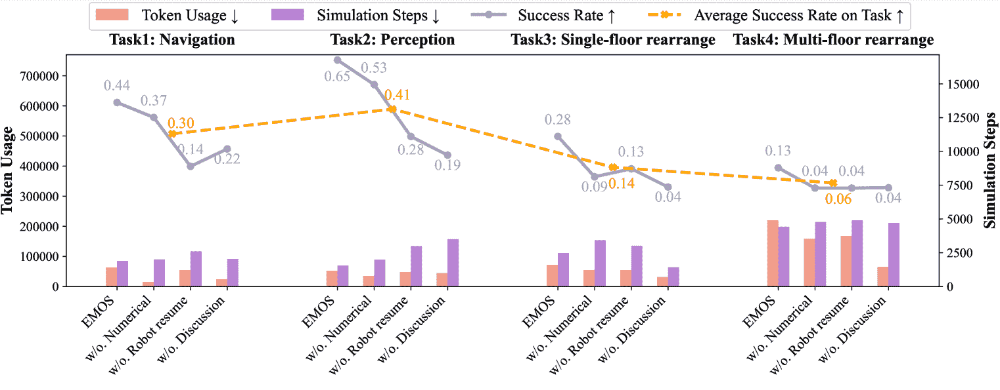

<!--yml

类别：未分类

日期：2025-01-11 12:01:12

-->

# EMOS：基于LLM智能体的体现意识异构多机器人操作系统

> 来源：[https://arxiv.org/html/2410.22662/](https://arxiv.org/html/2410.22662/)

陈俊廷¹，余车程¹¹脚注标记：1 ¹，周迅哲¹¹脚注标记：1  ^(17)，徐天启⁴，穆尧  ^(12)，胡梦康^(23)，

邵文琦³，王义凯⁶，李国浩⁵，邵林  ¹

¹新加坡国立大学，²香港大学，³上海人工智能实验室，

⁴KAUST，⁵牛津大学，⁶清华大学，⁷复旦大学 这些作者对本文贡献相同。穆尧在新加坡国立大学实习期间参与了这项工作。通讯作者：邵林（linshao@nus.edu.sg）

###### 摘要

异构多机器人系统（HMRS）作为解决单个机器人无法独立完成的复杂任务的一种有效方法应运而生。目前，基于大语言模型的多智能体系统（LLM-based MAS）已在软件开发和操作系统等领域取得成功，但将这些系统应用于机器人控制仍面临独特的挑战。特别地，多个机器人系统中每个智能体的能力与机器人的物理组成息息相关，而非预定义的角色。为了解决这一问题，我们提出了一种新颖的多智能体框架，旨在促进具备不同物理表现和能力的异构机器人之间的有效协作，同时推出了一个新的基准测试——Habitat-MAS。我们的一个关键设计是机器人简历：我们提出了一种自我提示的方法，代替了人类设计的角色扮演，智能体通过理解机器人URDF文件并调用机器人运动学工具生成描述其物理能力的内容，从而指导其在任务规划和执行中的行为。Habitat-MAS基准测试旨在评估多智能体框架如何处理需要体现意识推理的任务，包括1）操控，2）感知，3）导航，以及4）复杂的多楼层物品重新排列。实验结果表明，机器人的简历以及我们多智能体系统的层次设计对异构多机器人系统在这一复杂问题情境中的有效运作至关重要。

图1：体现意识的基于LLM的MAS。此图展示了基于LLM的MAS如何在多楼层的房屋中操作由无人机、四足机器人和带机械臂的轮式机器人组成的HMRS。在给定家庭任务时，基于LLM的MAS需要了解各自机器人硬件的规格，以进行任务规划和分配。作者在本文中将这一能力称为“体现意识推理”。

## 1 引言

现实世界环境的复杂性和专业机器人硬件使得单个机器人难以高效地执行复杂任务。因此，异构多机器人系统（HMRS）应运而生，使得多个设计用于不同目的且具有互补物理能力的机器人能够通过任务分解、联盟形成和协调任务分配进行合作并执行复杂任务。为了适应实际部署，现有的 HMRS 高度依赖于一些假设和基于人类先验知识的人为制定的协议（Rizk 等，[2019](https://arxiv.org/html/2410.22662v1#bib.bib30)）。这限制了 HMRS 的泛化能力和处理复杂任务的能力。在调查中，Rizk 等（[2019](https://arxiv.org/html/2410.22662v1#bib.bib30)）将 HMRS 的自动化分为四个级别：1) 级别 1，任务执行；2) 级别 2，任务执行加上任务分配或联盟形成，但不是两者都有；3) 级别 3，自动化上述所有内容，但没有对子任务的分解指令；4) 级别 4，完全自动化整个系统。据我们所知，目前没有系统实现了 4 级自动化。

与此同时，我们最近见证了大型语言模型（LLM）多智能体系统（MAS）如何通过利用常识推理能力和代码生成能力，操作复杂系统如操作系统（Mei 等，[2024](https://arxiv.org/html/2410.22662v1#bib.bib22)）或完成复杂任务如软件开发（Hong 等，[2023](https://arxiv.org/html/2410.22662v1#bib.bib8)），从而普遍控制多种应用程序。同样，在具身 AI 任务中，Mandi 等（[2024](https://arxiv.org/html/2410.22662v1#bib.bib20)）提出使用基于 LLM 的 MAS 聊天来控制双臂系统。Zhang 等（[2023](https://arxiv.org/html/2410.22662v1#bib.bib43)）通过 LLM 多智能体引入了人机协作系统。这些工作集中于 MRS 自动化问题的某些方面或特定硬件配置下的 MRS。我们的观察是，通向 4 级完全自动化的一个缺失的关键组成部分是具身意识推理。它指的是智能体理解其物理具身性以及硬件依赖能力的能力。基于这一能力，LLM 多智能体可以进一步分解任务、分配任务，并最终在实时中执行任务，即 4 级自动化的 HMRS。

在本研究中，我们提出了EMOS，一个基于LLM的通用多智能体框架，用于在室内家庭环境中操作协作型HMRS。我们的见解是，与最近基于LLM的MAS（Hong等人，[2023](https://arxiv.org/html/2410.22662v1#bib.bib8); Li等人，[2024](https://arxiv.org/html/2410.22662v1#bib.bib17); Wu等人，[2023a](https://arxiv.org/html/2410.22662v1#bib.bib39)）通过角色分配进行团队协作不同，针对异构机器人量身定制的基于LLM的MAS应主动检查它们的物理信息和它们可以完成的任务，而不依赖于固定角色。因此，我们引入了一种自下而上的机器人能力生成方法，为每个机器人构建“机器人简历”，以捕捉其独特的技能和限制。这些简历、场景描述和任务描述共同构成了LLM-based MAS进行任务规划、任务分配和行动执行的完整上下文。为了研究基于LLM的MAS如何可能实现协作型异构多机器人系统的完全自动化，我们提出了Habitat-MAS，这是一项带有注释的情节数据的基准测试，并配有模拟环境，其中文本描述环境作为智能体的接口。在该基准测试中，我们提供了多种类型的机器人，包括无人机、带有机械臂或可升降抓取器的轮式机器人、以及带有机械臂的四足机器人，还提供了多样化的环境，包括多层大房子和多房间公寓。该基准展示了四项任务，每项任务旨在评估多智能体系统在理解机器人物理能力（包括感知、导航和操作）方面的表现。情节的处理方式是，只有具备特定物理能力的机器人才能成功完成某些子任务。通过大量实验，我们展示了机器人简历在具身感知推理中的重要性，并阐明了EMOS中不同组件如何影响我们基准中的HMRS性能。

总结来说，本文的主要贡献包括：

+   •

    我们提出了EMOS，一个新型的基于LLM的MAS框架，它首先通过自生成的机器人简历进行具身感知推理，而不是依赖人工分配的角色扮演，来操作协作型HMRS。

+   •

    我们提出了Habitat-MAS，这是一个新的基准，用于研究基于LLM的MAS如何协调协作型HMRS。据我们所知，这是第一个针对这一问题的模拟基准，具有广泛的机器人类型和场景。它也被突出为第一个评估智能体理解其物理具身的基准，且其测试数据集专为此目的量身定制。

+   •

    在Habitat-MAS上的实验结果展示了EMOS中机器人简历的有效性，突显了具身感知在协作型HMRS中的重要性。

## 2 相关工作

多智能体系统

多智能体系统（MAS）已成为几十年来的研究重点。这些系统由多个相互作用的智能体组成，这些智能体可以是合作性的，也可以是竞争性的，旨在解决单个智能体无法单独处理的困难或不可能解决的问题 Stone & Veloso（[2000](https://arxiv.org/html/2410.22662v1#bib.bib35)）。将大型语言模型（LLM）集成到MAS中是一个相对较新但发展迅速的研究领域。这种集成利用了LLM的语言理解和生成能力，以增强MAS中的通信、协调和决策能力。Wu等人（[2023a](https://arxiv.org/html/2410.22662v1#bib.bib39)）；Hong等人（[2023](https://arxiv.org/html/2410.22662v1#bib.bib8)）；Li等人（[2024](https://arxiv.org/html/2410.22662v1#bib.bib17)）关注基于LLM的多智能体系统中的通信问题。Xu等人（[2024](https://arxiv.org/html/2410.22662v1#bib.bib41)）提出了Crab，一个跨环境基准框架，用于评估在不同图形用户界面（如手机和桌面电脑）中运行的多模态语言模型（MLM）。在机器人智能方面，Zhang等人（[2023](https://arxiv.org/html/2410.22662v1#bib.bib43)）研究了两个智能体如何利用通信更好地协作并在多房间场景中完成任务。[Mandi等人](https://arxiv.org/html/2410.22662v1#bib.bib20)提出了RoCo，这是一个用于多臂协作的多智能体系统。他们试图利用3D空间推理能力来帮助多臂低级轨迹规划。相比之下，我们关注的是一个更通用的多智能体场景，包括无人机、四足机器人、带臂的轮式机器人，要求该多智能体系统理解包括导航、操控和感知在内的通用能力，这些都基于物理设计。

多机器人系统

Arai 等人（[2002](https://arxiv.org/html/2410.22662v1#bib.bib2)）和 Ota（[2006](https://arxiv.org/html/2410.22662v1#bib.bib28)）的早期工作为多机器人系统（MRS）研究奠定了基础，他们提供了关于 MRS 在 2000 年左右的进展和关键挑战的全面概述，包括 MRS 架构设计、分布式地图构建、导航协调等内容。Rizk 等人（[2019](https://arxiv.org/html/2410.22662v1#bib.bib30)）专门回顾了合作异构 MRS 中的挑战，将 MRS 工作流分解为任务分解、联盟形成、任务分配、感知以及 MRS 规划与控制。在本工作中，我们也遵循了本调查中的已建立概念定义和系统设计原则。Roldán 等人（[2016](https://arxiv.org/html/2410.22662v1#bib.bib31)）构建了一个由空中载具（无人机）和地面载具组成的 HMRS，协同监测温室中的环境变量。Kiener 和 Von Stryk（[2010](https://arxiv.org/html/2410.22662v1#bib.bib16)）设计了一个由轮式机器人和人形机器人组成的系统，在“机器人足球”场景中协同工作。作者根据机器人的能力仔细地将复杂任务分解为子任务，然后进行人工设计的任务分配和规划算法。在本研究中，我们关注的是多层复杂家庭环境中的 MRS，系统由无人机、轮式机器人和带机械臂的四足机器人组成。

使用大型语言模型进行任务规划

基于海量语料训练的大型语言模型（LLMs）通常被认为已经获得了用于任务规划的常识知识（Vemprala等人，[2023](https://arxiv.org/html/2410.22662v1#bib.bib36)；Yao等人，[2022](https://arxiv.org/html/2410.22662v1#bib.bib42)；Zhao等人，[2023](https://arxiv.org/html/2410.22662v1#bib.bib44)；Hu等人，[2023](https://arxiv.org/html/2410.22662v1#bib.bib9)；Wu等人，[2024](https://arxiv.org/html/2410.22662v1#bib.bib38)；Sha等人，[2023](https://arxiv.org/html/2410.22662v1#bib.bib32)；Mu等人，[2024a](https://arxiv.org/html/2410.22662v1#bib.bib25)；Gao等人，[2024](https://arxiv.org/html/2410.22662v1#bib.bib6)）。得益于最近的进展，直接生成计划的研究已经成为近年来的一个活跃领域（Logeswaran等人，[2022](https://arxiv.org/html/2410.22662v1#bib.bib19)；Wu等人，[2023b](https://arxiv.org/html/2410.22662v1#bib.bib40)；Lin等人，[2023](https://arxiv.org/html/2410.22662v1#bib.bib18)）。在使用LLM进行任务规划时，一些方法直接以开环的方式生成整个计划，也就是说，不在环境中执行计划（Huang等人，[2022a](https://arxiv.org/html/2410.22662v1#bib.bib11)；Mu等人，[2023](https://arxiv.org/html/2410.22662v1#bib.bib24)；Singh等人，[2022](https://arxiv.org/html/2410.22662v1#bib.bib33)）。另一种研究方向则探讨了闭环任务规划，这种方法在错误修正、人机交互和将计划与实际环境状态结合方面提供了更大的灵活性（Ahn等人，[2022](https://arxiv.org/html/2410.22662v1#bib.bib1)；Guo等人，[2023](https://arxiv.org/html/2410.22662v1#bib.bib7)；Huang等人，[2023](https://arxiv.org/html/2410.22662v1#bib.bib13)；Hu等人，[2023](https://arxiv.org/html/2410.22662v1#bib.bib9)；Huang等人，[2022b](https://arxiv.org/html/2410.22662v1#bib.bib12)；Song等人，[2023](https://arxiv.org/html/2410.22662v1#bib.bib34)；Hu等人，[2024](https://arxiv.org/html/2410.22662v1#bib.bib10)；Mu等人，[2024b](https://arxiv.org/html/2410.22662v1#bib.bib26)）。本文探讨了闭环任务规划，其中实时环境变化被集成，并且一个中央的大型语言模型处理这些实时变化并相应地调整计划。

## 3 EMOS框架

图 2：EMOS 框架。此图展示了 EMOS 如何在 Habitat-MAS 平台上运行 HMRS。该框架包含三个阶段：1）场景上下文构建，涉及采用自底向上的方法生成场景描述，依赖于理想的语义 SLAM 系统；2）在集中式小组讨论中，智能体进行具身意识推理，进行任务规划和分配；3）在分散式行动并行执行中，智能体根据初始上下文和智能体历史并行执行行动。准确来说，EMOS 只包括阶段 2 和 3，而阶段 1 集成在 Habitat-MAS 平台内部。我们将其包括在此图中，以确保完整性和清晰性。

本文介绍的多智能体系统专注于开发一个具身意识框架，用于异构多机器人协作。传统的多机器人系统通常面临与协调运动规划相关的挑战，尤其是在涉及多样化机器人平台（如无人机、移动机器人、四足机器人等）的复杂环境中。团队组建和协作协议由机器人专家设计，而非由机器人自动生成。该系统旨在通过使智能体理解具有不同物理能力和操作约束的机器人来解决这些挑战。在本节的其余部分，我们将按以下结构介绍 EMOS：在 [3.1](https://arxiv.org/html/2410.22662v1#S3.SS1 "3.1 Framework Overview ‣ 3 EMOS Framework ‣ EMOS: Embodiment-aware Heterogeneous Multi-robot Operating System with LLM Agents") 中，我们将首先介绍该系统的概述；然后在 [3.2](https://arxiv.org/html/2410.22662v1#S3.SS2 "3.2 Scene Context Construction ‣ 3 EMOS Framework ‣ EMOS: Embodiment-aware Heterogeneous Multi-robot Operating System with LLM Agents") 中，我们简要介绍如何从理想的场景重建中构建文本场景上下文；在 [3.3](https://arxiv.org/html/2410.22662v1#S3.SS3 "3.3 Robot Resume ‣ 3 EMOS Framework ‣ EMOS: Embodiment-aware Heterogeneous Multi-robot Operating System with LLM Agents") 中，我们将详细说明机器人简历的组成和生成流程；最后在 [3.4](https://arxiv.org/html/2410.22662v1#S3.SS4 "3.4 Hierarchical Task Planning, Assignment and Action ‣ 3 EMOS Framework ‣ EMOS: Embodiment-aware Heterogeneous Multi-robot Operating System with LLM Agents") 中，我们将展示 EMOS 如何以分层方式执行任务规划、分配和行动执行。

### 3.1 框架概述

为了澄清，我们首先定义由多智能体系统解决的问题的数学形式。假设有一个涉及$N$个不同机器人多机器人系统，每个机器人$i$上附有一个LLM代理$i$，其中$i\in\{1,2,\dots,N\}$。所有代理在共享的环境中操作，该环境具有状态空间$\mathcal{S}$，每个代理$i$有一个观测空间$\mathcal{O}_{i}$和一个动作空间$\mathcal{A}_{i}$。该多智能体系统旨在协作完成给定任务$T\in\mathcal{T}$，例如探索未知环境。该系统作为一组任务条件策略$\{\pi_{i}:\mathcal{O}_{i}\times\mathcal{T}\rightarrow\mathcal{A}_{i}\}_{i=1}^{N}$，其中$\mathcal{T}$表示任务描述的文本空间。然而，尽管这可能暗示一种端到端的策略网络，我们提出的多智能体系统采用了一种类似讨论的分层框架，该框架在许多其他多智能体场景中已被证明有效。如图[2](https://arxiv.org/html/2410.22662v1#S3.F2 "Figure 2 ‣ 3 EMOS Framework ‣ EMOS: Embodiment-aware Heterogeneous Multi-robot Operating System with LLM Agents")所示，该多智能体系统涉及三个级联阶段：1) 场景上下文构建；2) 集中式小组讨论；3) 去中心化的并行执行动作。由于本工作的重点是任务规划中的具身感知推理，我们假设多机器人系统配备了完美的多智能体SLAM系统，并在初始状态下为多智能体系统提供完美的几何表示作为观测。几何表示将进一步处理为文本表示，作为多智能体讨论的场景上下文。通过从机器人URDF处理的机器人简历，多智能体系统进行小组讨论，基于物理限制将任务分解并分配子任务给相应的代理。

### 3.2 场景上下文构建

为了将LLM多智能体系统部署到真实的多机器人系统中，我们提出了一种自下而上的管道，从环境的几何表示构建文本场景上下文，该几何表示可以通过常规的机器人感知管道重建。根据Hydra中的环境表示重建框架（Hughes 等， [2022](https://arxiv.org/html/2410.22662v1#bib.bib14)），几何表示由四个层次组成：1) L1 区域连通图是一种图数据结构，节点代表环境中的不同区域，边表示这些区域之间的导航连通性。这里的区域指的是房间和功能区，如走廊和楼梯，遵循Chang等（[2017](https://arxiv.org/html/2410.22662v1#bib.bib3)）数据集中的约定。2) L2 语义网格是SLAM系统的直接输出。3) L3 代理状态和物体状态跟踪场景中的有用动态信息，用于机器人与环境的交互。4) L4 导航网格是用于轨迹规划的三角网格，常用于游戏行业和复杂地形导航。尽管我们使用地面实况语义网格和机器人里程计构建了L1、L2和L3，但在Hydra-multi（Chang等，[2023](https://arxiv.org/html/2410.22662v1#bib.bib4)）中运行时，这些层次在真实的多机器人系统中是即时可用的。对于L4，我们使用Recast Navigation（Mononen，[2009](https://arxiv.org/html/2410.22662v1#bib.bib23)）构建导航网格。

为了构建场景的文本表示，L1和L3被转化为文本描述。相比之下，L2和L4用于详细的点对点轨迹规划和低级别的机器人控制。给定L1区域连通图 $G=(V,E)$，其中：

+   •

    $V$ 是代表环境中不同区域的顶点集合。每个节点 $v_{i} \in V$ 对应一个特定的区域。每个区域包含并维护其中的代理和物体。

+   •

    $E$ 是表示区域之间导航路径的边的集合。如果区域 $i$ 和区域 $j$ 之间存在直接的可导航路径，则在两个节点 $v_{i}$ 和 $v_{j}$ 之间存在一条边 $e_{ij} \in E$。

环境的文本表示通过遍历图中的所有区域节点并检查其包含的物体或机器人来构建。

### 3.3 机器人简历

图3：机器人简历生成。该图说明了LLM代理如何通过结合两种方法从机器人的URDF文件生成机器人简历。一方面，LLM代理读取URDF的骨架，概括出一般能力的文本描述；另一方面，LLM代理调用正向运动学工具函数生成数值细节。

LLM驱动和基于运动学的机器人简历生成。机器人简历是一个包含关键硬件特定能力的JSON文件，用于具身感知推理，包含1）移动能力，2）感知能力和3）操作能力。每项能力在机器人简历中包括两个部分：1）用自然语言描述机器人的能力的综合总结，2）这些能力的数值表示。如图[3](https://arxiv.org/html/2410.22662v1#S3.F3 "Figure 3 ‣ 3.3 Robot Resume ‣ 3 EMOS Framework ‣ EMOS: Embodiment-aware Heterogeneous Multi-robot Operating System with LLM Agents")所示，采用一种结合LLM总结和前向运动学的混合方法，通过机器人URDF生成机器人简历。

在LLM总结过程中，我们首先将URDF文件预处理为URDF树骨架。该骨架树是机器人的骨架文本表示，链接作为节点，关节作为边。此步骤的目的是缩短机器人URDF的长度，特别是去除在此步骤中几乎没有帮助的标签，如$<intertial>$、$<visual>$、$<collision>$等。对于复杂的机器人URDF文件，包含成千上万行代码，极长的上下文可能会显著降低LLM生成的机器人总结的质量。

对于数值表示，我们提供前向运动学API来加载机器人URDF文件，以便关节机器人可以检查传感器和末端执行器的几何信息。例如，如图[3](https://arxiv.org/html/2410.22662v1#S3.F3 "Figure 3 ‣ 3.3 Robot Resume ‣ 3 EMOS Framework ‣ EMOS: Embodiment-aware Heterogeneous Multi-robot Operating System with LLM Agents")所示，手臂工作空间表示为所有采样末端执行器位置在3D空间中的包围体。此数值信息在多智能体系统希望检查团队中哪个机器人能够与某个物体交互时使用，结合其在3D空间中的位置。我们还以类似方式生成了移动能力和感知能力的数值表示。有关详细的能力定义，请参阅附录[A.1](https://arxiv.org/html/2410.22662v1#A1.SS1 "A.1 Capabilities for Embodiment-aware Reasoning ‣ Appendix A Appendix ‣ EMOS: Embodiment-aware Heterogeneous Multi-robot Operating System with LLM Agents")。

### 3.4 层次化任务规划、分配和行动

为了使基于LLM的MAS适应实时HMRS操作，由于多机器人动作执行中的潜在异步性，必须采用异步的多智能体动作策略。为此，我们设计了一个层次化的流程，执行任务规划、分配和动作执行，以支持我们的基于LLM的MAS。具体来说，流程分为两个阶段：1）第一个阶段是集中式小组讨论，它以同步方式运行，所有智能体等待来自其他智能体的消息，并且讨论历史对所有智能体可见。2）在第二阶段的去中心化动作执行中，每个智能体生成一个动作，等待其在世界中的执行，然后继续生成新的动作，依此类推。每个机器人都与一个专门的机器人智能体相关联，机器人智能体可以完全访问机器人的简历，以帮助决策和执行动作。算法[1](https://arxiv.org/html/2410.22662v1#algorithm1 "In 3.4 Hierarchical Task Planning, Assignment and Action ‣ 3 EMOS Framework ‣ EMOS: Embodiment-aware Heterogeneous Multi-robot Operating System with LLM Agents")中的伪代码提供了EMOS框架中层次化任务规划、分配和动作执行的全面概述。

在集中式小组讨论的第一个阶段，存在一个CentralPlanner，它为每个机器人生成初步计划，每个机器人也拥有一个LLM智能体，检查分配给它的子任务并在反思阶段向中央规划者提供反馈。通过由一般描述和数值细节组成的机器人简历，机器人专用智能体可以推理其对分配任务的一般可用性，并通过使用数学工具进一步检查几何可用性。具体来说，通过访问最后部分中的机器人简历，机器人专用智能体可以进行常识推理，结合文本摘要，生成包含场景描述和机器人简历中数值数据的代码，以进行空间感知推理的计算。

12输入：机器人集合 $R=\{r_{1},r_{2},\dots,r_{n}\}$，机器人简历 $\{resume_{1},resume_{2},\dots,resume_{n}\}$，任务 $T$ 输出：任务完成状态34阶段 1：集中式小组讨论$subtask_{i}\leftarrow$ CentralPlanner(*$T$, $resume_{i}$*) ;  // 中央 LLM 将任务分配给每个机器人5 对于每个 *机器人 $r_{i}\in R$* 执行　　 $feedback_{i}\leftarrow$ Reflection(*$subtask_{i}$, $resume_{i}$*) ;　　  // 机器人专用代理反思子任务的可行性并给出反馈6      7      如果 *$feedback_{i}$ 无效* 则             重新分配 $subtask_{i}$ ;               // 中央规划者根据反馈进行调整8            9      1011阶段 2：去中心化的动作执行12对于每个 *机器人 $r_{i}\in R$* 执行13       $history_{i}\leftarrow[]$14      当 *任务未完成(*$r_{i}$*)* 时执行             $action_{i}\leftarrow$ FunctionCall(*$r_{i}$, $subtask_{i}$, $history_{i}$*) ;              // 通过函数调用选择当前动作15                        $response_{i}\leftarrow$ ExecuteAction(*$r_{i}$, $action_{i}$*) ;              // 在仿真中执行该动作16            17            $history_{i}\leftarrow[history_{i},action_{i},response_{i}]$18            如果 *任务完成(*$r_{i}$*)* 则                   WaitState(*$r_{i}$*) ;                    // 任务完成后转入等待状态19                  20            21      2223如果 *所有机器人都处于等待状态* 则24       返回 *完成*25

算法 1 多智能体系统中的分层任务规划、分配与执行

在第二阶段，随着任务分配结果的产生，每个机器人专用的代理开始并行执行其动作。给定子任务描述和动作执行历史，机器人专用代理通过 LLM FunctionCall 结合机器人控制库来控制当前代理。这些机器人控制库是基于地面真实世界信息、经典的机器人轨迹规划器和逆向运动学求解器实现的。当一个代理完成所有推理动作时，它会自动进入等待状态。如果代理未能完成子任务，但“认为”自己已经完成，它仍然可以继续执行后续计划的动作。需要注意的是，为了研究部分失败的情况，我们还通过子目标来评估任务，这将在实验中讨论。处于等待状态的代理将在收到来自小组讨论的新任务分配时被唤醒。在一个周期中，当所有机器人都处于等待状态时，任务结束。

## 4 Habitat-MAS 基准测试

图 4：Habitat-MAS 基准。该图展示了来自两个室内场景数据集的四个任务（列），分别是 HSSD（Khanna* 等人，[2023](https://arxiv.org/html/2410.22662v1#bib.bib15)）和 Matterport 3D（Chang 等人，[2017](https://arxiv.org/html/2410.22662v1#bib.bib3)）。上排展示了环境的俯视图以及任务的成功导航路径。中排和下排展示了机器人在感知或操作目标物体时，任务的第三人称视角关键帧。

Habitat-MAS [4](https://arxiv.org/html/2410.22662v1#S4.F4 "Figure 4 ‣ 4 Habitat-MAS Benchmark ‣ EMOS: Embodiment-aware Heterogeneous Multi-robot Operating System with LLM Agents") 是一个旨在评估部署在多层家庭场景中的协作异构多机器人系统（MRS）中的 LLM 多智能体系统（MAS）的基准。LLM 多智能体系统需要通过全面理解机器人物理能力和与任务相关的环境信息来进行任务规划、任务分配和行动执行，从而成功完成任务。该设置反映了现实世界中的机器人挑战，其中具有不同体现形式的智能体（如轮式、四足和空中机器人）必须合作完成需要不同物理能力的复杂任务。

### 4.1 基准概述

Habitat-MAS 基准是基于 Habitat（(Puig 等人，[2023](https://arxiv.org/html/2410.22662v1#bib.bib29))），一个高度可配置的仿真平台，用于体现 AI 挑战，广泛支持多种室内环境数据集的集成。为了增加多样性，我们选择在 Matterport3D（Chang 等人，[2017](https://arxiv.org/html/2410.22662v1#bib.bib3)）中的多层实景场景和 HSSD（Khanna* 等人，[2023](https://arxiv.org/html/2410.22662v1#bib.bib15)）中的单层合成场景上构建 Habitat-MAS 基准。在我们的完整数据集中，我们涵盖了 Matterport3D 中的 27 个场景和 HSSD 中的 34 个场景。基准中有四种基础机器人类型：1）Fetch 是一种具有轮式底盘和 7 自由度旋转关节臂的机器人；2）Stretch 是一种具有轮式底盘和伸缩臂（采用滑动关节）的机器人；3）Drone 实际上是一个 DJI M100，配备 RGBD 传感器，并作为其模型的信用。由于我们更关注在多机器人系统中不同类型机器人之间的高层次差异，因此相比其他无人机，我们忽略了 M100 的更多规格；4）Spot 是一种具有 7 自由度旋转关节臂的四足机器人。所有末端执行器都是双指夹爪。

基准提供了明确的API供任务规划和机器人控制使用。对于任务规划和分配，代理可以使用工具来构建机器人简历访问并使用Python代码解释器在第一阶段执行代码。此外，针对机器人控制，机器人代理可以访问链接到低级机器人技能的API，包括诸如navigate_to、move_arm_to、pick和place等基本操作。暂时，这些低级机器人技能是通过经典的机器人轨迹规划器和逆向运动学求解器来实现的。技能库中存在一些限制，例如缺乏显式的抓手控制，这通过基于接触的抓取方式来解决。只要机器人抓手与物体接触，我们就会将物体吸附到抓手上。设计这一方式的一个原因是，如果我们为物体与抓手的接触启用物理仿真，它将根据物理仿真集成的参数调优引入更多无关的失败。因此，我们在基准中禁用了集成的Pybullet（Coumans & Bai ([2016–2021](https://arxiv.org/html/2410.22662v1#bib.bib5)))物理仿真。然而，对于需要更复杂低级机器人控制的任务，基准可以通过重新启用物理仿真和基于机器人学习的策略轻松扩展。

基准数据存储在任务剧集中。每个任务剧集是场景的初始状态和目标状态的快照，以及具有特定任务的MRS。预计MRS会展开一个策略剧集，以完成环境中的任务并达到目标状态。我们将一个任务剧集记作$\mathcal{E}=(L,\mathbf{P}^{0},T,G)$，它由起始状态的场景布局$L$、初始世界框架的机器人状态$\mathbf{P}^{0}=\{\mathbf{P}_{i}^{0}\}_{1\leq i\leq N}$、任务描述$T$和世界目标状态$G$组成。

### 4.2 任务概述

在Habitat-MAS基准测试中精心设计了四个任务。任务1、2和3旨在评估智能体是否能够分别理解前三种提到的机器人能力。具体来说，1）任务1被设计为一个跨楼层的物体导航任务，包括两种机器人（轮式和腿式）在多楼层场景中的导航，旨在评估智能体理解机器人的移动能力；2）任务2，名为“协作感知与操作”，代表了多机器人协作中的常见场景，其中机器人感知协助操作。该任务旨在测试MAS推理机器人的传感器类型或视角的能力；3）任务3是一个经典的家庭物品重新排列任务，涉及两台具有不同操作能力的机器人协作操作放置在特定容器上的物体，该任务巧妙地测试了MAS理解机器人手臂工作空间的能力；4）任务4是一个多楼层、多智能体、多物体的重新排列任务，要求基于LLM的多智能体系统正确理解所有信息和能力以进行协作。需要特别注意的是，在基准数据集的创建过程中，我们仔细筛选了任务集，确保场景中的每个机器人只能完成子目标的子集。换句话说，多智能体系统必须理解机器人的物理能力，以制定可行的计划。有关详细的任务描述，请参见附录 [A.2](https://arxiv.org/html/2410.22662v1#A1.SS2 "A.2 Habitat-MAS Benchmark Task Design ‣ Appendix A Appendix ‣ EMOS: Embodiment-aware Heterogeneous Multi-robot Operating System with LLM Agents")。

### 4.3 评估标准

Habitat-MAS中多智能体协作的表现通过几个关键指标进行评估：1）成功率。基于上一节中介绍的任务设计，我们为每个任务在PDDL语言中定义了一系列中间子目标，以评估任务结果。该指标评估了MRS成功完成所有子目标的episode比例，直接反映了MAS的整体规划和协作能力。2）子目标成功率。该指标计算了MRS完成子目标的百分比。由于篇幅限制，关于子目标的定义和实现的更多细节，请参见附录[A.3.1](https://arxiv.org/html/2410.22662v1#A1.SS3.SSS1 "A.3.1 Sub-goal Definition with PDDL language ‣ A.3 Extra details about Habitat-MAS benchmark ‣ Appendix A Appendix ‣ EMOS: Embodiment-aware Heterogeneous Multi-robot Operating System with LLM Agents")。3）令牌使用量。使用的令牌是评估基于LLM的MAS效率的关键指标。代理之间的沟通和行动规划的有效性通过讨论中使用的令牌数来衡量，这反映了代理如何高效地协调和策划以完成任务。4）仿真步骤。我们还评估了MAS完成每项任务所消耗的仿真步骤数。无人机通常移动最快，其次是轮式机器人，最后是步态机器人。该指标评估了基于LLM的MAS为实现高效MRS分配任务的能力。例如，在极端情况下，一个机器人处理所有子任务，其他机器人没有任何分配。此情形导致HMRS效率低下，并导致异常大量的仿真步骤。

### 4.4 EMOS实验

在本节中，我们展示了我们EMOS系统在Habitat-MAS基准测试上的实验结果，并附上了消融研究以解释不同模块的影响。我们的基准测试提供了一个包含70多个不同场景的大规模数据集。然而，由于预算限制，所有的消融研究都只在519个episode的子集上进行。我们在本实验中使用的是GPT-4o（OpenAI，[2024](https://arxiv.org/html/2410.22662v1#bib.bib27)）API，版本为2024年5月。关于episode的生成方式以及完整的episode集，详细信息请参见附录[A.3.2](https://arxiv.org/html/2410.22662v1#A1.SS3.SSS2 "A.3.2 Episode generation and verification ‣ A.3 Extra details about Habitat-MAS benchmark ‣ Appendix A Appendix ‣ EMOS: Embodiment-aware Heterogeneous Multi-robot Operating System with LLM Agents")。

图 5：EMOS 和去除方法的任务实验结果。该图展示了 EMOS 和去除方法在 Habitat-MAS 基准测试中四个任务上的表现。图中展示了在[4.2](https://arxiv.org/html/2410.22662v1#S4.SS2 "4.2 任务概述 ‣ 4 Habitat-MAS 基准 ‣ EMOS：具备体现感知的异质多机器人操作系统与大型语言模型代理")中介绍的四个任务，分别放置在四列中。对于每个任务，我们在上方的行中绘制了任务成功率的蓝线，而在下方的行中绘制了不同去除设置下的标记使用量和仿真步骤的直方图。就成功率而言，EMOS 框架在其他去除设置中明显占有优势，尤其是在没有机器人简历的设置中。虚线显示了所有四个任务之间的难度差异。虚线上的每个数据点表示该任务在所有去除设置下的成功率的平均值。

实验中的去除方法如下：

1) EMOS：这是我们在本文中介绍的多智能体系统。它由 1）机器人简历生成模块，2）集中式任务规划与小组讨论模块，以及 3）通过函数调用的分布式动作执行组成。

2) 无数值能力描述（无数值）：在此设置中，机器人简历中不会通过调用正向运动学函数工具来提供数值描述。机器人代理无法生成代码来几何检查任务，但它仍然可以自行访问机器人的 URDF 摘要。

3) 无机器人简历，带角色描述（无机器人简历）：此去除设置旨在提供类似于角色扮演多智能体系统的环境，如 Camel Li 等人（[2024](https://arxiv.org/html/2410.22662v1#bib.bib17)）、MetaGPT Hong 等人（[2023](https://arxiv.org/html/2410.22662v1#bib.bib8)）等。机器人代理无法访问 URDF 文件。相反，每个机器人代理拥有由人工编写的角色描述，概述了其在多机器人系统中的特征。

4) 无小组讨论（无讨论）：这是一个相对简单的基准。所有机器人代理接收原始任务描述和场景描述，并直接生成动作。

表 1：EMOS 和去除方法在 Habitat-MAS 基准测试上的实验结果。

| 方法 | 成功率 $\uparrow$ | 子目标成功率 $\uparrow$ | 标记使用量 $\downarrow$ | 仿真步骤 $\downarrow$ |
| --- | --- | --- | --- | --- |
| EMOS（我们的方法） | 37.82% | 81.26% | 80783 | 2358 |
| 无数值描述 | 23.56% | 71.04% | 53201 | 2983 |
| 无机器人简历 | 15.63% | 65.27% | 64600 | 3125 |
| 无讨论 | 15.23% | 72.45% | 36377 | 2332 |

图[5](https://arxiv.org/html/2410.22662v1#S4.F5 "图 5 ‣ 4.4 使用 EMOS 的实验 ‣ 4 Habitat-MAS 基准 ‣ EMOS：具备体现感知的异构多机器人操作系统与 LLM 代理")展示了这些方法在 Habitat-MAS 基准中四个任务上的主要实验结果。成功率的蓝色线条清晰地展示了随着更多关键模块从 EMOS 中移除，性能逐渐下降的趋势。粉色和紫色的条形图分别表示每种方法的令牌使用量和仿真步骤。尽管在所有任务的直方图中没有统一的模式，但我们可以观察到任务 4 的令牌使用量和仿真步骤都有显著增加。这是预期中的结果，因为任务 4 相比任务 1-3 涉及更多的机器人和目标物体，并且相比任务 2-3 有更大的场景。因此，任务上的平均成功率的虚线表明了各任务之间难度的差异。特别是，所有方法在最具挑战性的任务 4 上都需要显著更多的令牌和仿真步骤。

我们在表格[1](https://arxiv.org/html/2410.22662v1#S4.T1 "Table 1 ‣ 4.4 Experiments with EMOS ‣ 4 Habitat-MAS Benchmark ‣ EMOS: Embodiment-aware Heterogeneous Multi-robot Operating System with LLM Agents")中展示了消融研究的数值结果。首先，通过将EMOS与不包含数值描述的EMOS进行比较，我们观察到LLM代理在诸如导航和感知等简单任务中仍能相对良好地执行，如图[5](https://arxiv.org/html/2410.22662v1#S4.F5 "Figure 5 ‣ 4.4 Experiments with EMOS ‣ 4 Habitat-MAS Benchmark ‣ EMOS: Embodiment-aware Heterogeneous Multi-robot Operating System with LLM Agents")所示。我们推测这是因为LLM代理能够通过URDF的树形结构理解机器人运动，识别像车轮、腿等节点名称。此外，LLM代理可以通过常识推断出无人机是一个具有相对广阔视野的空中机器人，即使在输入的URDF中没有关于无人机相机高度的明确信息。然而，在更复杂的任务中，如单层重排（28.35% $\rightarrow$ 9.20%）和多层重排（13.46% $\rightarrow$ 3.85%），成功率显著下降。这强调了仅凭文本描述对于需要精确操作的机器人任务来说是远远不够的。在这种情况下，调用数学函数进行数值处理和反映是有帮助的。其次，在没有机器人简历的设置下，通过进一步去除从URDF提取的文本摘要，导航（37.37% $\rightarrow$ 14.14%）和感知（52.94% $\rightarrow$ 28.32%）任务的成功率在没有机器人简历的MAS实验中都显著下降。这个结果证明了LLM代理确实能够通过常识推理意识到机器人具备的身体能力，而不是依赖于人为分配的角色扮演。通过将这个消融设置的平均任务成功率与我们完整的EMOS系统（37.82% $\rightarrow$ 15.63%）进行比较，如表[1](https://arxiv.org/html/2410.22662v1#S4.T1 "Table 1 ‣ 4.4 Experiments with EMOS ‣ 4 Habitat-MAS Benchmark ‣ EMOS: Embodiment-aware Heterogeneous Multi-robot Operating System with LLM Agents")所示，验证了我们的方法在利用数值推理工具和常识推理方面的优势。第三，与EMOS相比，缺少小组讨论的设置在成功率上表现最差（37.82% $\rightarrow$ 15.23%），如表[1](https://arxiv.org/html/2410.22662v1#S4.T1 "Table 1 ‣ 4.4 Experiments with EMOS ‣ 4 Habitat-MAS Benchmark ‣ EMOS: Embodiment-aware Heterogeneous Multi-robot Operating System with LLM Agents")所示。在这种设置下，每个机器人代理根据任务描述直接执行任务，没有领导分配或通过数学工具进行自我反思以了解其身体能力的限制。尽管与其他三种方法相比，这种设置显著减少了令牌的使用，但也大幅降低了成功率。此外，当检查表[1](https://arxiv.org/html/2410.22662v1#S4.T1 "Table 1 ‣ 4.4 Experiments with EMOS ‣ 4 Habitat-MAS Benchmark ‣ EMOS: Embodiment-aware Heterogeneous Multi-robot Operating System with LLM Agents")中的仿真步骤列时，EMOS在完成任务时所需的步骤数为第二少，而没有机器人简历的EMOS在规划时遇到困难，消耗了最多的步骤，而没有小组讨论的EMOS则由于失败而用最少的步骤结束任务。对于特殊案例研究，请参见附录[A.4](https://arxiv.org/html/2410.22662v1#A1.SS4 "A.4 Special case study ‣ Appendix A Appendix ‣ EMOS: Embodiment-aware Heterogeneous Multi-robot Operating System with LLM Agents")。有关实验的更多详细讨论，请参见附录[A.5](https://arxiv.org/html/2410.22662v1#A1.SS5 "A.5 Extra details about experiments ‣ Appendix A Appendix ‣ EMOS: Embodiment-aware Heterogeneous Multi-robot Operating System with LLM Agents")。

## 5 结论

总结而言，本文介绍了具身感知异构多机器人操作系统（EMOS），这是一个针对复杂家庭环境中多机器人系统操作设计的LLM多智能体系统。该系统解决的关键挑战是具身感知推理和三维世界中家庭任务的空间推理。所提出的框架集成了一种创新的“机器人简历”功能，动态捕捉异构机器人在物理能力上的差异，并使用层次化、去中心化的方法进行任务规划和执行。通过Habitat-MAS基准对该系统进行了验证，该基准包含了需要机器人在不同的机动性、感知和操作能力上进行协作的多种任务。实验结果证明了具身感知和空间推理在异构多机器人系统中的重要性。消融研究特别强调了使用数值信息进行精确空间推理的重要性，以及使用小组讨论模块来分解复杂任务并提高任务成功率。

未来的工作可以集中在系统层面的问题上，例如提升系统在多智能体通信协议中的可扩展性，使其能够支持更多样化的机器人类型和更大量的机器人（例如，群体系统），并扩展框架对更动态、现实世界环境的适应能力，在这些环境中系统需要应对外部干扰或具有未知意图的主体。

## 参考文献

+   Ahn等（2022） Michael Ahn, Anthony Brohan, Noah Brown, Yevgen Chebotar, Omar Cortes, Byron David, Chelsea Finn, Chuyuan Fu, Keerthana Gopalakrishnan, Karol Hausman, Alex Herzog, Daniel Ho, Jasmine Hsu, Julian Ibarz, Brian Ichter, Alex Irpan, Eric Jang, Rosario Jauregui Ruano, Kyle Jeffrey, Sally Jesmonth, Nikhil J Joshi, Ryan Julian, Dmitry Kalashnikov, Yuheng Kuang, Kuang-Huei Lee, Sergey Levine, Yao Lu, Linda Luu, Carolina Parada, Peter Pastor, Jornell Quiambao, Kanishka Rao, Jarek Rettinghouse, Diego Reyes, Pierre Sermanet, Nicolas Sievers, Clayton Tan, Alexander Toshev, Vincent Vanhoucke, Fei Xia, Ted Xiao, Peng Xu, Sichun Xu, Mengyuan Yan, 和 Andy Zeng. 做我能做的，而不是做我说的：将语言基础嵌入到机器人可操作性中，2022年。

+   Arai等（2002） Tamio Arai, Enrico Pagello, Lynne E Parker 等. 多机器人系统的进展。*IEEE机器人与自动化学报*，18(5):655–661, 2002。

+   Chang等（2017） Angel Chang, Angela Dai, Thomas Funkhouser, Maciej Halber, Matthias Niessner, Manolis Savva, Shuran Song, Andy Zeng, 和 Yinda Zhang. Matterport3d：从RGB-D数据中学习室内环境中的知识。*国际三维视觉会议（3DV）*，2017年。

+   Chang等（2023） Yun Chang, Nathan Hughes, Aaron Ray, 和 Luca Carlone. Hydra-multi：多机器人团队协作在线构建三维场景图。在*2023 IEEE/RSJ 国际智能机器人与系统会议（IROS）*，页码 10995–11002。IEEE，2023。

+   Coumans & Bai (2016–2021) Erwin Coumans 和 Yunfei Bai。Pybullet，一种用于游戏、机器人和机器学习的物理模拟 Python 模块。[http://pybullet.org](http://pybullet.org)，2016–2021。

+   Gao et al. (2024) 高泽宇、穆尧、屈锦业、胡孟康、郭凌月、罗平 和 陆延锋。Dag-plan: 为双臂协作规划生成有向无环依赖图。*arXiv 预印本 arXiv:2406.09953*，2024。

+   Guo et al. (2023) 颜江郭、魏彦任、赵力涵、蒋哲远、陈剑宇。Doremi: 通过检测和恢复计划执行错位来实现语言模型的基础化，2023。

+   Hong et al. (2023) 洪思瑞、郑夏吴、陈Jonathan、程宇恒、王金琳、张策尧、王子利、Steven Ka Shing Yau、林子娟、周立阳 等。Metagpt: 面向多代理协同框架的元编程。*arXiv 预印本 arXiv:2308.00352*，2023。

+   Hu et al. (2023) 胡孟康、穆尧、余欣淼、丁名宇、吴世光、邵文琦、陈启广、王斌、乔宇、罗平。Tree-planner: 使用大语言模型进行高效闭环任务规划。*arXiv 预印本 arXiv:2310.08582*，2023。

+   Hu et al. (2024) 胡孟康、蒲赵、徐灿、孙清锋、娄建光、林清伟、罗平、Saravan Rajmohan 和 张冬梅。Agentgen：通过环境和任务生成增强大语言模型基础代理的规划能力。*arXiv 预印本 arXiv:2408.00764*，2024。

+   Huang et al. (2022a) 黄文龙、Pieter Abbeel、Deepak Pathak 和 Igor Mordatch。语言模型作为零样本规划器：为具身体代理提取可执行知识。在 Kamalika Chaudhuri、Stefanie Jegelka、Le Song、Csaba Szepesvári、Gang Niu 和 Sivan Sabato（编辑），*国际机器学习大会，ICML 2022，2022年7月17-23日，美国马里兰州巴尔的摩*，*机器学习研究会议录*第162卷，第9118–9147页。PMLR，2022a。网址 [https://proceedings.mlr.press/v162/huang22a.html](https://proceedings.mlr.press/v162/huang22a.html)。

+   Huang et al. (2022b) 黄文龙、夏飞、Ted Xiao、Harris Chan、Jacky Liang、Pete Florence、Andy Zeng、Jonathan Tompson、Igor Mordatch、Yevgen Chebotar、Pierre Sermanet、Noah Brown、Tomas Jackson、Linda Luu、Sergey Levine、Karol Hausman 和 Brian Ichter。内心独白：通过规划与语言模型进行具身推理，2022b。

+   Huang et al. (2023) 黄文龙、夏飞、Dhruv Shah、Danny Driess、Andy Zeng、吕尧、Pete Florence、Igor Mordatch、Sergey Levine、Karol Hausman 和 Brian Ichter。基础解码：通过基础模型引导文本生成以进行机器人控制，2023。

+   Hughes et al. (2022) N. Hughes, Y. Chang, 和 L. Carlone。Hydra: 一种用于 3D 场景图构建和优化的实时空间感知系统。在 *Robotics: Science and Systems (RSS)*，2022。

+   Khanna* 等人（2023）穆库尔·卡纳*、永森·毛*、汉晓·姜、桑贾·哈雷什、布伦南·沙克雷特、德鲁夫·巴特拉、亚历山大·克莱格、埃里克·安德桑德、安吉尔·X·张和马诺利斯·萨瓦。《Habitat Synthetic Scenes Dataset (HSSD-200)：3D场景规模与现实感折衷的分析，针对物体目标导航》。*arXiv预印本*，2023年。

+   Kiener 和 Von Stryk（2010）朱塔·基纳和奥斯卡·冯·斯特里克。《朝着异质自主机器人合作的方向：类人机器人和轮式机器人的案例研究》。*机器人学与自主系统*，58（7）：921–929，2010年。

+   Li 等人（2024）郭浩·李、哈桑·哈穆德、哈尼·伊塔尼、德米特里·赫兹布林、伯纳德·甘内姆。《骆驼：用于大语言模型社会的“心智”探索的交互代理》。*神经信息处理系统进展*，36，2024。

+   Lin 等人（2023）比尔·宇辰·林、成松·黄、倩·刘、文达·顾、萨姆·萨默勒和向·任。《基于语言模型的具身任务的基础规划》。在*2023年AAAI人工智能大会论文集*，第37卷，第13192–13200页，2023年。

+   Logeswaran 等人（2022）拉贾努根·洛格斯瓦兰、姚·傅、文泰·李和洪乐·李。《基于语言模型的少量子目标规划》。在*2022年北美计算语言学协会会议：人类语言技术会议论文集*，第5493–5506页，西雅图，美国，2022年7月。计算语言学协会。doi: 10.18653/v1/2022.naacl-main.402。网址 [https://aclanthology.org/2022.naacl-main.402](https://aclanthology.org/2022.naacl-main.402)。

+   Mandi 等人（2024）赵·曼迪、施瑞雅·简和宋·书然。《Roco：与大语言模型的辩证式多机器人协作》。在*2024年IEEE国际机器人与自动化会议（ICRA）*，第286–299页。IEEE，2024年。

+   McDermott 等人（1998）德鲁·麦克德莫特、马利克·贾拉布、阿黛尔·E·豪、克雷格·A·诺布洛克、阿什温·拉姆、马努埃拉·M·维洛索、丹尼尔·S·韦尔德和大卫·E·威尔金斯。《PDDL——规划领域定义语言》。1998年。网址 [https://api.semanticscholar.org/CorpusID:59656859](https://api.semanticscholar.org/CorpusID:59656859)。

+   Mei 等人（2024）凯·梅、泽龙·李、书远·徐、若松·叶、英强·葛和永丰·张。《LLM代理操作系统》。*arXiv预印本 arXiv:2403.16971*，2024。

+   Mononen（2009）米科·莫诺嫩。《Recast导航》，2009年。网址 [https://github.com/recastnavigation/recastnavigation](https://github.com/recastnavigation/recastnavigation)。

+   Mu 等人（2023）姚·穆、青龙·张、孟康·胡、文海·王、名瑜·丁、俊·金、彬·王、吉峰·戴、余·乔和平·罗。《EmbodiedGPT：通过具身思维链进行视觉语言预训练》，2023年。

+   Mu 等人（2024a）姚·穆、俊廷·陈、青龙·张、寿法·陈、巧君·余、崇建·葛、润建·陈、智轩·梁、孟康·胡、超凡·陶等。《Robocodex：面向机器人行为合成的多模态代码生成》。*arXiv预印本 arXiv:2402.16117*，2024a。

+   Mu 等人（2024b）Yao Mu、Tianxing Chen、Shijia Peng、Zanxin Chen、Zeyu Gao、Yude Zou、Lunkai Lin、Zhiqiang Xie 和 Ping Luo。Robotwin：具有生成数字双胞胎的双臂机器人基准（早期版本）。*arXiv 预印本 arXiv:2409.02920*，2024b年。

+   OpenAI（2024）OpenAI。Hello gpt-4o，2024年5月。网址 [https://openai.com/index/hello-gpt-4o](https://openai.com/index/hello-gpt-4o)。

+   Ota（2006）Jun Ota。作为分布式自治系统的多智能体机器人系统。*高级工程信息学*，20(1)：59–70，2006年。

+   Puig 等人（2023）Xavier Puig、Eric Undersander、Andrew Szot、Mikael Dallaire Cote、Tsung-Yen Yang、Ruslan Partsey、Ruta Desai、Alexander William Clegg、Michal Hlavac、So Yeon Min 等人。Habitat 3.0：人类、虚拟化身和机器人共同栖息地。*arXiv 预印本 arXiv:2310.13724*，2023年。

+   Rizk 等人（2019）Yara Rizk、Mariette Awad 和 Edward W Tunstel。合作型异构多机器人系统：综述。*ACM计算机调查（CSUR）*，52(2)：1–31，2019年。

+   Roldán 等人（2016）Juan Jesús Roldán、Pablo Garcia-Aunon、Mario Garzón、Jorge De León、Jaime Del Cerro 和 Antonio Barrientos。用于温室环境变量映射的异构多机器人系统。*传感器*，16(7)：1018，2016年。

+   Sha 等人（2023）Hao Sha、Yao Mu、Yuxuan Jiang、Li Chen、Chenfeng Xu、Ping Luo、Shengbo Eben Li、Masayoshi Tomizuka、Wei Zhan 和 Mingyu Ding。Languagempc：将大型语言模型作为自动驾驶决策者。*arXiv 预印本 arXiv:2310.03026*，2023年。

+   Singh 等人（2022）Ishika Singh、Valts Blukis、Arsalan Mousavian、Ankit Goyal、Danfei Xu、Jonathan Tremblay、Dieter Fox、Jesse Thomason 和 Animesh Garg。Progprompt：使用大型语言模型生成情境化机器人任务计划，2022年。

+   Song 等人（2023）Chan Hee Song、Jiaman Wu、Clayton Washington、Brian M. Sadler、Wei-Lun Chao 和 Yu Su。LLM-planner：针对具身智能体的少量示例实体化规划，使用大型语言模型，2023年。

+   Stone & Veloso（2000）Peter Stone 和 Manuela Veloso。多智能体系统：从机器学习的角度进行综述。*自动化机器人*，8：345–383，2000年。

+   Vemprala 等人（2023）Sai Vemprala、Rogerio Bonatti、Arthur Bucker 和 Ashish Kapoor。ChatGPT 在机器人学中的应用：设计原则与模型能力。*微软自动化系统与机器人研究*，2023年。

+   Wani 等人（2020）Saim Wani、Shivansh Patel、Unnat Jain、Angel X. Chang 和 Manolis Savva。Multi-on：通过多物体导航对语义地图记忆进行基准测试。在*神经信息处理系统（NeurIPS）*，2020年。

+   Wu 等人（2024）Pengying Wu、Yao Mu、Bingxian Wu、Yi Hou、Ji Ma、Shanghang Zhang 和 Chang Liu。Voronav：基于Voronoi图的大型语言模型零-shot物体导航。*arXiv 预印本 arXiv:2401.02695*，2024年。

+   Wu 等人（2023a）Qingyun Wu、Gagan Bansal、Jieyu Zhang、Yiran Wu、Shaokun Zhang、Erkang Zhu、Beibin Li、Li Jiang、Xiaoyun Zhang 和 Chi Wang。Autogen：通过多代理对话框架启用下一代 LLM 应用。*arXiv 预印本 arXiv:2308.08155*，2023a。

+   Wu 等人（2023b）Zhenyu Wu、Ziwei Wang、Xiuwei Xu、Jiwen Lu 和 Haibin Yan。利用大型语言模型进行体现任务规划，2023b。

+   Xu 等人（2024）Tianqi Xu、Linyao Chen、Dai-Jie Wu、Yanjun Chen、Zecheng Zhang、Xiang Yao、Zhiqiang Xie、Yongchao Chen、Shilong Liu、Bochen Qian 等人。Crab：跨环境代理基准，用于多模态语言模型代理。*arXiv 预印本 arXiv:2407.01511*，2024。

+   Yao 等人（2022）Shunyu Yao、Jeffrey Zhao、Dian Yu、Nan Du、Izhak Shafran、Karthik Narasimhan 和 Yuan Cao。React：语言模型中的推理与行动协同。*arXiv 预印本 arXiv:2210.03629*，2022。

+   Zhang 等人（2023）Hongxin Zhang、Weihua Du、Jiaming Shan、Qinhong Zhou、Yilun Du、Joshua B Tenenbaum、Tianmin Shu 和 Chuang Gan。通过大型语言模型模块化构建合作型体现代理。*arXiv 预印本 arXiv:2307.02485*，2023。

+   Zhao 等人（2023）Zirui Zhao、Wee Sun Lee 和 David Hsu。大型语言模型作为常识知识用于大规模任务规划，2023。

## 附录 A 附录

### A.1 面向体现感知推理的能力

图 6：由相机视锥体表示的感知能力。左图描绘了经典透视相机模型的相机视锥体。右图直观展示了 LLM 代理如何推理在某一姿态下，相机感知目标物体的可能性。

如前一节所述，我们将硬件特定的能力分为三个维度。我们的考虑因素如下：

+   •

    移动性。机器人展示了不同类型的移动能力。例如，像无人机这样的空中机器人可以在未占用的三维空间中移动，像 Spot 这样的四足机器人可以跨越地面和低障碍物，像 Fetch 和 Stretch 这样的轮式机器人只能在平坦的地面上移动。因此，对于一个通用的异构多机器人系统，部署的 LLM 代理在做出导航决策时应该了解机器人的移动能力。基准测试将提供有关区域及其互联性的全面场景描述，以帮助语言模型推断潜在的导航路径，辅助导航决策的制定。

+   •

    感知。机器人配备了传感器（例如 RGBD 摄像头）以感知环境。感知能力包括传感器类型和相机投影模型。具体来说，如图 [6](https://arxiv.org/html/2410.22662v1#A1.F6 "图 6 ‣ A.1 具身感知推理能力 ‣ 附录 A 附录 ‣ EMOS：具身感知异构多机器人操作系统与 LLM 代理") 所示，我们使用了简化的视锥模型，包括光轴和在方程 [1](https://arxiv.org/html/2410.22662v1#A1.E1 "第 2 项 ‣ A.1 具身感知推理能力 ‣ 附录 A 附录 ‣ EMOS：具身感知异构多机器人操作系统与 LLM 代理") 中定义的相机视场（FOV）角度，其中 $x$ 表示距离相机中心轴的距离，$f$ 表示焦距。代理需要意识到机器人的感知空间，并检查要感知的物体是否可能落在相机的视锥内。例如，由于下巴相机的高度和角度限制，Spot 无法感知放置在高位置（如架子）上的物体，而无人机则是执行此任务的最佳选择。考虑到当前 LLM 模型生成新算法的难度，我们编写了提示，指导代理假设相机关于上轴是对称的，检查投影目标物体与相机光轴之间的角度 $\alpha$，并将其与视场（FOV）角度的一半进行比较。

    |  | $\displaystyle\theta_{FOV}=2\cdot tan^{-1}(\frac{x}{2f})$ |  | (1) |
    | --- | --- | --- | --- |

+   •

    操控。机器人具有多种操控能力，原因在于机械臂形式的多样性、末端执行器的不同类型，以及是否拥有明确的操控器。因此，代理需要使用数学工具推理机器人的臂部工作空间，尤其是在处理放置在异常位置（例如床铺深处、柜子上方）的物体时。对于协同操控，代理可以在任务规划阶段预判并分配合适的机器人去取放目标物体。

    哪些机器人可以到达目标物体。

这些能力包括文本摘要和数字细节。能力摘要用于常识推理，而数字则被提示用于 LLM 代码生成中的空间感知推理，相关内容将在下一节讨论。

### A.2 栖息地-MAS 基准任务设计

如前一节所述，我们精心设计了四个具有挑战性的任务，以评估 MAS 的具身感知推理能力。每个任务的详细描述如下：

+   •

    任务 1：跨楼层物体导航。作为Multi-ON问题（Wani等人，[2020](https://arxiv.org/html/2410.22662v1#bib.bib37)）的扩展，这个多层任务要求不同基础类型的机器人协同导航到场景中的多个物体。轮式机器人只能在单一楼层操作，而四足机器人可以在楼层之间导航，强调了在协调计划时需要了解不同机器人运动能力的必要性。这个任务专门设计用于测试MAS在协调跨楼层任务时，是否能够推理出运动限制。

+   •

    任务 2：操控的协同感知。由于摄像头的位置和类型导致的感知限制，一些关节机器人如Spot可能无法检测到高架上的目标物体，而一些像无人机（Drone）这样的无臂机器人，由于摄像头视角较好，可能会成功检测。异构机器人需要合作，以获得物体的良好RGB-D感知，从而实现精确操控。在这个单层任务中，不同的目标物体被放置在对特定机器人可见的位置。我们的目标是测试MAS是否能够推理出机器人传感器类型和视角，并成功分配适当的机器人来感知所有目标物体。

+   •

    任务 3：协作单层家庭物品重新摆放。正如我们在上一节中讨论的，不同的机器人具有不同的操作能力。关节机器人仅限于在其臂部工作空间内操作物体。例如，Stretch配备了可以水平延伸更远的臂，而Fetch则具有更大的垂直延伸能力，能够抓取比Stretch更高的物体。这个单层任务涉及重新摆放放置在不同位置的物体，包括地面、高架上的物体，或远离可导航区域的床中心，要求具有不同臂部工作空间的机器人理解它们在不同物体重新摆放任务中的可用性。

+   •

    任务 4：多机器人、多物体、多楼层协作重新摆放。这是一个综合性的任务，需要复杂的协同协调。在这个场景中，几种不同类型的机器人，包括空中机器人、轮式机器人和四足机器人，必须协作感知并重新摆放分布在多个楼层不同位置的大量物体。这个任务结合了异构机器人不同能力的协调。特别地，一些物体位于高处表面，如楼上的柜子，需要先进的感知、操控和移动能力。我们的主要目标是评估MAS在执行任务时，通过有效利用每个机器人的独特能力来优化任务执行，同时平衡令牌效率和时间步消耗。

### A.3 关于Habitat-MAS基准的额外细节

#### A.3.1 使用PDDL语言定义子目标

栖息环境Puig等人（[2023](https://arxiv.org/html/2410.22662v1#bib.bib29)）已经将PDDL（McDermott等人，[1998](https://arxiv.org/html/2410.22662v1#bib.bib21)）系统集成到复合任务定义和目标评估的仿真中。复杂任务的目标可以通过包含原始谓词和逻辑运算符的复合逻辑表达式来定义。基于PDDL系统，我们将以下原始谓词作为评估中的子目标：1）Robot_At_Object：这是每个任务的第一阶段，机器人需要首先导航到目标物体的最近可导航点，然后执行接下来的操作，如检测或抓取。2）Robot_At_Receptacle：这是另一种类型的导航子目标，适用于长时间跨度的任务，如重新排列任务，机器人需要在将物体放置到容器上之前导航到容器，以完成重新排列的最终目标。3）Object_At_Receptacle：这是重新排列任务的最终目标。有时，机器人可能会被指派去抓取并放置其触及不到的物体，这意味着仅仅判断机器人是否能够导航到物体或容器是不够的。我们添加了这个子目标，以进一步测试机器人在长时间跨度任务中的推理能力，并解释哪些机器人在特定任务中容易失败。4）Robot_Detect_Object：这是特定于感知任务的子目标，旨在评估系统在物体检测方面的表现。

#### A.3.2 事件生成与验证

基准中的情节数据集是通过级联采样和验证过程自动生成的。我们首先从满足定义要求的HSSD（Khanna等人，[2023](https://arxiv.org/html/2410.22662v1#bib.bib15)）和MP3D（Chang等人，[2017](https://arxiv.org/html/2410.22662v1#bib.bib3)）数据集中筛选出合格的任务场景。对于HSSD场景，我们确保场景中的可导航点是连接的，并且有足够数量的房间可供放置容器和物体。此外，我们计算可导航网格（navmesh）并验证机器人是否能够导航到物体附近的最近可导航点。对于MP3D场景，我们确保场景包含多层楼结构，并且不同的楼层通过楼梯连接，这些楼梯足够陡峭，防止带轮机器人通过，但对Spot机器人来说是可行的。

为了采样一个回合$E=(L,{\mathbf{P}}^{0},T,G)$，我们仔细选择具有特定高度或宽度特征的容器，以容纳不同类型的物体作为$L$，从而有助于回合布局的多样性。机器人的初始位置和关节姿势${\mathbf{P}}^{0}$也被仔细初始化，以确保机器人能够根据其能力完成包括导航、感知和操作在内的任务。同时，代理初始位置$R_{i}^{0}$和$R_{j}^{0$之间的距离，通过欧几里得距离$d_{\text{euclidean}}(R_{i}^{0},R_{j}^{0})$进行测量，设置距离过近以避免碰撞。通过精心设计每个任务的目标状态$G$并生成相应的任务描述$T$，我们确保任务描述包括布局中的所有物体，从而尽可能全面地测试MAS对目标状态的综合推理和规划能力。在移动性和感知任务数据集中，确保从机器人的初始位置到目标物体的导航路径长度不会过长，避免导航时间过长，也不会过短，以免导致某个机器人过快完成导航任务并进入长时间等待状态，从而浪费不必要的token。如果连接机器人起始点和目标物体的直线与导航路径完全重合，机器人导航过程看起来将是单调的，因此，在验证数据集时，我们确保机器人初始位置$R_{i}^{0}$与目标物体位置$O_{j}$之间的地理距离$d_{\text{geodesic}}(R_{i}^{0},O_{j})$与机器人初始位置和物体之间的欧几里得距离$d_{\text{euclidean}}(R_{i}^{0},O_{j})$之比$P(R_{i}^{0},O_{j})$大于1，同时确保这一比值不会过大，以避免过于复杂的导航路径。

|  | $\displaystyle P(R_{i}^{0},O_{j})=\frac{d_{\text{geodesic}}(R_{i}^{0},O_{j})}{d% _{\text{euclidean}}(R_{i}^{0},O_{j})}$ |  | (2) |
| --- | --- | --- | --- |

为了验证回合是否有意义，即区分虚拟策略和基于体现感知推理的策略，我们为四个任务引入了一套验证标准，确保需要多步骤规划和高层次感知的策略优于随机虚拟策略。具体来说：

1）导航与多层楼重排 在我们筛选的导航事件中，物体和容器不在同一层楼。与此同时，取物机器人和点位机器人被初始化在同一层楼，这意味着如果MAS系统正确分配任务，点位机器人必须被分配去执行跨楼层导航或重排任务，而取物机器人（有轮机器人）只能被分配去导航到同一层楼的目标物体并与之交互。除了导航事件中位于不同楼层的物体和容器外，对于与机器人初始位置位于同一层楼的物体，我们排除了点位机器人能够到达的物体，确保它们只能由取物机器人操作，这进一步减少了虚拟策略在多层楼重排任务中的成功率。

2）感知与单层楼重排 对于感知和单层楼操作任务，我们假设最初有一对在同一能力范围内配备不同能力的机器人。我们精心设计了一个对比选择实验，其中具有相同设置的机器人被要求使用固定策略（预定义的任务执行序列，类似于神谕计划）完成相反的任务。例如，在正向任务中，取物机器人重排物体1，伸展机器人重排物体2，而在负向任务中，角色反转：伸展机器人重排物体1，取物机器人重排物体2。我们筛选了在正向和负向实验中成功率（0或1）异或的事件，从而识别出只能在特定安排下完成的事件。此方法旨在区分无法使用随机（虚拟）策略完成的数据集，进一步展示我们方法的有效性。

### A.4 特例研究

图 7：代理反思中的特例 本图展示了LLM代理在代理反思过程中进行任务检查的过程。左侧是正确生成的代码，而右侧是由于幻觉引起的错误解释。

错误代码生成是由幻觉引起的。在大规模实验中，我们发现一些特定情况偶尔会导致系统对环境状态做出错误判断，尤其是在提示词包含数值信息时，特别是坐标信息，即使我们使用结构化文本作为LLM的提示词。图[7](https://arxiv.org/html/2410.22662v1#A1.F7 "图 7 ‣ A.4 特殊情况研究 ‣ 附录 A 附录 ‣ EMOS：具有LLM代理的具身感知异构多机器人操作系统")中的代码展示了LLM代理如何根据物体的高度、物体到最近可导航点的水平距离以及从URDF解析的机器人高度和臂部工作空间（机器人臂最大到达距离）验证机器人是否可以与目标物体交互。正确的验证方法是计算当机器人位于可导航点时，从机器人中心到目标物体的欧几里得距离，是否在机器人可达范围内。这是LLM在大多数情况下生成的代码逻辑。然而，仍然存在一些情况下，尽管我们通过结构化文本明确表示，计算物体是否在机器人可达范围内应基于水平距离和高度差，但大模型未能正确理解空间关系。一个常见的场景是，右侧代码仅将机器人与目标物体的高度差与机器人臂工作空间的半径进行比较。在其他情况下，LLM代理可能会“幻觉”出一个超出水平距离和高度差的第三坐标来计算距离。这两种情况都会导致机器人错误判断其操作范围，最终导致任务分配不当。

### A.5 实验的额外细节

#### A.5.1 标记增强效率

表 2：标记增强效率的结果

| 方法 | 相对成功率 | 相对标记使用量 | 标记效率 $\downarrow$ |
| --- | --- | --- | --- |
| EMOS（我们的） | 1.00 | 1.00 | 2135.99 |
| 无讨论。数值 | 1.61 | 1.52 | 2258.11 |
| 无机器人简历 | 2.42 | 1.25 | 4133.08 |
| 无讨论。讨论 | 2.48 | 2.22 | 2388.51 |

EMOS 消耗了最多的令牌，因为我们包含了如领导者分配、团队讨论、自我反思、行动执行等过程。这些过程不可避免地会涉及大量的 LLM 令牌的查询和响应。为了评估在开发我们的框架并导致更高成功率的过程中消耗的额外令牌，我们定义了相对成功率、相对令牌使用量和令牌效率。如表 [2](https://arxiv.org/html/2410.22662v1#A1.T2 "Table 2 ‣ A.5.1 Token enhancement efficiency ‣ A.5 Extra details about experiments ‣ Appendix A Appendix ‣ EMOS: Embodiment-aware Heterogeneous Multi-robot Operating System with LLM Agents") 所示，为了判断令牌效率，EMOS 优于其他消融方法。在比较成功率提升和令牌使用量增加时，EMOS 在成功率提升上比令牌使用量的增加更有优势，相较于所有其他消融设置，EMOS 在这一方面表现更好。为了评估每个成功率使用的令牌量，该指标反映了完成任务所需的令牌量，EMOS 在这一指标上表现最佳。它表明，尽管令牌使用量增加，我们的 EMOS 多代理系统在令牌效率上仍然表现最佳。

#### A.5.2 观察现象讨论

此外，还存在一些有趣的现象：1) EMOS 去除团队讨论在导航任务成功率（22.42% $\rightarrow$ 14.14%）和平均子目标成功率（72.45% $\rightarrow$ 65.27%）上都胜过 EMOS 去除机器人简历：这表明多代理角色扮演可能会增加幻觉，特别是在机器人做决策时，过于复杂的描述可能导致问题。2) EMOS 去除数字化与 EMOS 去除机器人简历在复杂任务中的表现几乎一样糟糕（9.20% $\leftrightarrow$ 12.99% 在单层重排任务中）：这表明 LLM 代理实际上无法通过 URDF 推理操控限制，突出了在我们的 EMOS 框架中调用数学函数的重要性。3) EMOS 去除机器人简历使用的令牌和步骤比 EMOS 去除数字化更多：这反映出，尽管 EMOS 去除机器人简历在文本输入较少的情况下可能消耗较少的令牌，但由于规划中的低成功率，LLM 代理必须通过更多步骤进行查询。

#### A.5.3 子目标成功率评估

表 3：EMOS 和消融方法在 Habitat-MAS 基准上的子目标成功率

| 子目标 | EMOS（我们的） | 去除数字化 | 去除机器人简历 | 去除讨论 |
| --- | --- | --- | --- | --- |
| 机器人_到目标$\uparrow$ | 88.27% | 77.48% | 69.48% | 80.59% |
| 机器人_到容器$\uparrow$ | 88.90% | 80.63% | 76.15% | 83.56% |
| 目标_到容器$\uparrow$ | 57.04% | 40.38% | 40.95% | 47.70% |
| 机器人_检测目标$\uparrow$ | 93.81% | 97.35% | 79.57% | 70.80% |

作为补充，表格[3](https://arxiv.org/html/2410.22662v1#A1.T3 "Table 3 ‣ A.5.3 Evaluation on sub-goal success rate ‣ A.5 Extra details about experiments ‣ Appendix A Appendix ‣ EMOS: Embodiment-aware Heterogeneous Multi-robot Operating System with LLM Agents")展示了五个设置的子目标成功率，提供了各个设置在规划和子任务执行中的表现细节。所有设置在Robot_At（第一个和第二个）子目标中表现相对较好，这些子目标只要求机器人导航到目标点。通过将EMOS w/o. robot resume与其他设置进行比较，正如我们之前讨论的，由于缺少移动性描述的总结，可以推断该设置中的机器人在多楼层导航任务中往往会失败。还值得注意的是，与EMOS w/o. numerical和EMOS w/o. robot resume相比，EMOS w/o. group discussion在导航子目标中实现了更高的子目标成功率，但在检测子目标中则较低。这反映出在这个设置中，MAS倾向于在需要机器人合作完成的任务中失败，这证明了我们框架中小组讨论的优势，它确实能够减少多智能体任务规划中的同质化问题。
