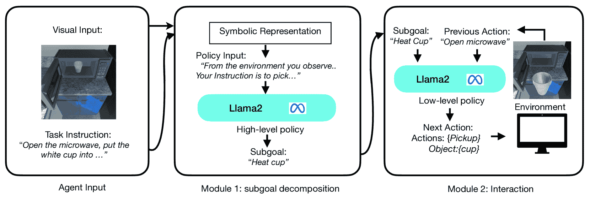
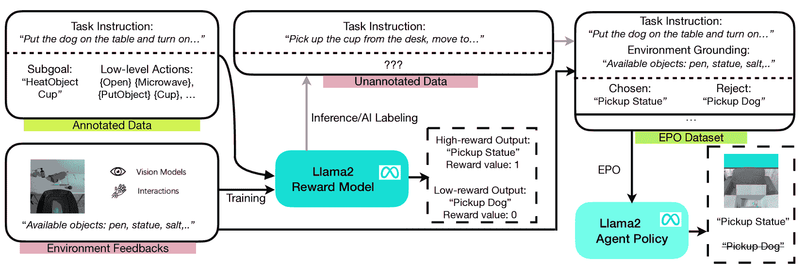
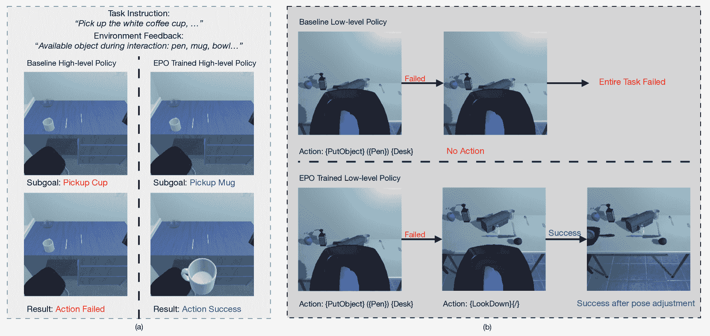
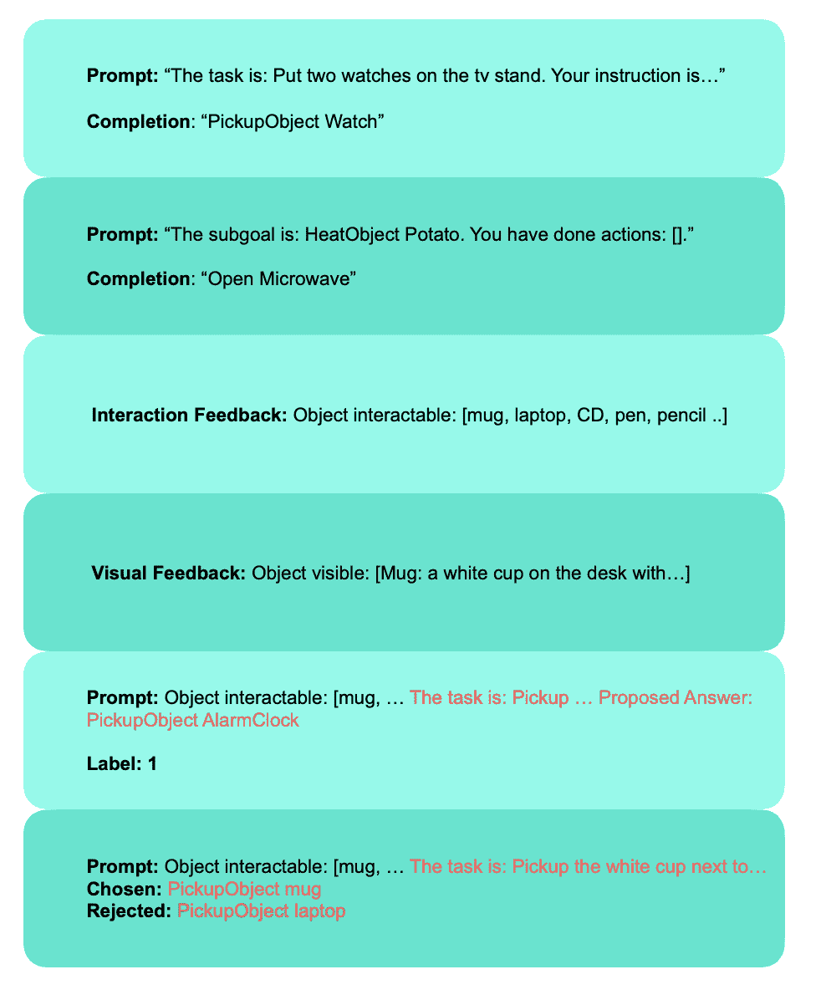

<!--yml

分类：未分类

日期：2025-01-11 12:17:49

-->

# EPO：具有环境偏好优化的层次化LLM代理

> 来源：[https://arxiv.org/html/2408.16090/](https://arxiv.org/html/2408.16090/)

Qi Zhao^*、Haotian Fu^*、Chen Sun、George Konidaris

布朗大学 *：同等贡献。代码和数据集可以在[https://github.com/kevinz8866/EPO](https://github.com/kevinz8866/EPO)找到。

###### 摘要

长时间决策任务对基于LLM的代理提出了重大挑战，因为需要在多个步骤中进行广泛的规划。在本文中，我们提出了一种层次化框架，将复杂任务分解为可管理的子目标，利用独立的LLM进行子目标预测和低级动作生成。为了应对为未注释数据集创建训练信号的挑战，我们开发了一种奖励模型，利用多模态环境反馈自动生成奖励信号。我们引入了环境偏好优化（EPO），这是一种通过环境反馈生成偏好信号并利用这些信号训练基于LLM的代理的新方法。我们在ALFRED上的大量实验展示了该框架的最先进性能，在ALFRED公共排行榜中获得第一名，展示了其在多样化环境中改善长时间决策能力的潜力。

EPO：具有环境偏好优化的层次化LLM代理

Qi Zhao^*、Haotian Fu^*、Chen Sun、George Konidaris 布朗大学

^†^†脚注： *：同等贡献。代码和数据集可以在[https://github.com/kevinz8866/EPO](https://github.com/kevinz8866/EPO)找到。

## 1 引言

长时间决策/规划仍然是基于大型语言模型（LLM）的代理面临的巨大挑战（Valmeekam 等， [2023](https://arxiv.org/html/2408.16090v2#bib.bib43)；Liu 等， [2023](https://arxiv.org/html/2408.16090v2#bib.bib23)；Silver 等， [2024](https://arxiv.org/html/2408.16090v2#bib.bib35)）。这些任务需要在多个步骤中进行广泛规划，保持一致性和目标导向，这对通常为更即时和局部预测设计的LLM来说是困难的。此外，针对具身代理微调LLM的关键问题是需要大量标注数据（Reed 等， [2022](https://arxiv.org/html/2408.16090v2#bib.bib32)）。同样的问题也体现在研究人员在构建基于视觉基础模型的奖励模型中的努力，因为我们可能需要获得“互联网规模”的任务演示数据（Fan 等， [2022](https://arxiv.org/html/2408.16090v2#bib.bib9)）。

为了应对第一个挑战，一种简单的方法是首先让LLM将长时域任务分解为较短时域的子任务，然后在不同层级使用不同的LLM作为策略，即使用一个基于LLM的策略生成子目标，再使用另一个LLM在给定子目标的基础上生成低层次的动作，这两个过程都需要显著较少的规划步骤。这种分解通过利用LLM在子目标和动作层级的预测能力，有助于更有效的规划和执行。

然而，如何高效训练这些基于LLM的智能体仍然是一个问题。在本文中，我们考虑到的情境是，只有部分数据集带有真实的动作和子目标标注，我们需要找到一种方法为未标注的数据集创建训练信号。决策智能体的常见训练信号基于与环境互动过程中获得的奖励（Sutton 和 Barto, [1998](https://arxiv.org/html/2408.16090v2#bib.bib41)）。但手动设计奖励函数既耗时又容易产生不准确的情况，这阻碍了基于LLM的智能体在动态和多样化环境中的可扩展性和适应性。因此，迫切需要能够从环境中自动生成奖励信号的方法，从而绕过人工设计奖励所带来的复杂性。这一动机促使我们探索能够利用环境中多模态反馈（如视觉和交互数据）来指导基于LLM的智能体学习过程的奖励建模方法，同时利用公共预训练基础模型。

另一方面，最近在偏好优化技术方面的进展，如直接偏好优化（Direct Preference Optimization, DPO）（Rafailov 等人，[2023](https://arxiv.org/html/2408.16090v2#bib.bib31)）表明，LLM可以有效地通过基于偏好的信号而非显式奖励函数进行训练。DPO利用LLM固有的能力来建模不同输出之间的偏好，从而促进了更直观和灵活的训练范式。这一见解启发我们开发一种新方法，将偏好优化的优势与自动奖励建模相结合，以提升基于LLM的智能体在长时域决策任务中的表现。

本文提出了一个基于层次化LLMs的框架，用于解决长期决策问题。我们的代理通过训练两个LLMs分别预测子目标分解和低级动作，将复杂任务分解为可管理的子任务。为了从未标注数据集中提取足够的训练信号，我们提出了一种基于LLM的奖励模型，该模型能够整合多模态环境反馈信息，并自动生成未标注数据集的奖励信号。然后，我们引入了环境偏好优化（EPO）方法，该方法从环境反馈中自动生成偏好信号。EPO根据估算的奖励对提出的动作和子目标进行排名，并构建一个偏好数据集，以指导基于LLM的代理训练。这种方法同时利用了标注和未标注数据集，显著扩大了可用于提升代理性能的训练数据。

为了验证我们的框架设计，我们在ALFRED（Shridhar等人，[2020a](https://arxiv.org/html/2408.16090v2#bib.bib33)）上进行了广泛的实验，ALFRED是一个用于具身代理的流行家庭仿真环境。我们的方法在ALFRED上取得了最先进的性能。我们还发现，统一的环境反馈显著帮助了决策代理在子目标分解层次和环境交互层次的表现。此外，在存在大量任务规范数据集，但仅有少量标注任务和示范的情况下，我们的框架使代理能够从未标注的新任务中受益，同时显著优于监督学习，显示了我们框架的潜力。

总结来说，我们做出了以下贡献：

1.  1.

    我们提出了一个基于层次化LLMs的框架，用于解决长期决策问题，其中两个层次的LLMs可以通过从基于LLM的奖励模型中生成的偏好信号进行联合训练。

1.  2.

    我们提出了环境偏好优化（EPO）方法，该方法首先通过学习奖励模型，从多模态环境反馈中自动生成未标注数据集的偏好信号，然后利用这些信号来训练/微调基于层次化LLMs的代理。

1.  3.

    我们通过大量实验验证了我们框架的有效性，并在ALFRED上达到了最先进的性能（我们在ALFRED公开排行榜上位居第一¹¹1[https://leaderboard.allenai.org/alfred/submissions/public](https://leaderboard.allenai.org/alfred/submissions/public)。EPO自本文发布之日起一直位居排行榜首位）。

## 2 相关工作

体态体代理的基础模型。近年来，许多研究探讨了体态体代理的基础模型（Driess 等人，[2023](https://arxiv.org/html/2408.16090v2#bib.bib6)；Stone 等人，[2023](https://arxiv.org/html/2408.16090v2#bib.bib40)；Brohan 等人，[2023](https://arxiv.org/html/2408.16090v2#bib.bib3)；Zitkovich 等人，[2023](https://arxiv.org/html/2408.16090v2#bib.bib47)）。我们的工作受到了许多先前语言基础代理研究的启发（Singh 等人，[2023](https://arxiv.org/html/2408.16090v2#bib.bib36)；Ahn 等人，[2022](https://arxiv.org/html/2408.16090v2#bib.bib1)；Huang 等人，[2022](https://arxiv.org/html/2408.16090v2#bib.bib15)），这些研究集中于机器人技术。 这些研究致力于将自然语言提示或机器人动作与符号表示的视觉或互动信息进行对接。类似的，将语言与视觉信息对接的努力也出现在体态体代理的研究中（Song 等人，[2023a](https://arxiv.org/html/2408.16090v2#bib.bib37)）。在仿真领域的工作中，Pashevich 等人（[2021](https://arxiv.org/html/2408.16090v2#bib.bib30)）提出了一种端到端的方法，针对决策代理，该方法直接从任务规范和视觉输入中预测代理的下一步动作，而不需要子目标对接和基于地图的导航。Min 等人（[2021](https://arxiv.org/html/2408.16090v2#bib.bib27)）引入了一种层次化方法，由于其优越的表现，这种方法得到了广泛应用。Fu 等人（[2024](https://arxiv.org/html/2408.16090v2#bib.bib10)）利用大型语言模型（LLM）帮助从演示中学习技能。我们的层次化LLM框架也受到许多先前层次化强化学习（RL）工作的启发（Nachum 等人，[2018](https://arxiv.org/html/2408.16090v2#bib.bib28)；Levy 等人，[2019](https://arxiv.org/html/2408.16090v2#bib.bib21)；Fu 等人，[2023](https://arxiv.org/html/2408.16090v2#bib.bib11)）。

使用基础模型进行奖励建模。基础模型凭借其在编码模态通用表示方面的能力，激发了研究人员利用它们生成奖励信号，从而绕过人工奖励工程。在这些努力中，Sontakke 等人（[2023](https://arxiv.org/html/2408.16090v2#bib.bib39)）；Escontrela 等人（[2023](https://arxiv.org/html/2408.16090v2#bib.bib8)）；Chen 等人（[2021](https://arxiv.org/html/2408.16090v2#bib.bib4)）；Fan 等人（[2022](https://arxiv.org/html/2408.16090v2#bib.bib9)）；Mahmoudieh 等人（[2022](https://arxiv.org/html/2408.16090v2#bib.bib26)）使用视觉基础模型通过将视觉特征与期望的动作或状态转换对齐来估计奖励。然而，这些方法通常需要大规模数据。相比之下，我们更感兴趣的是使用预训练的LLM来从所有符号表示的环境反馈中生成奖励信号（Kwon 等人，[2023](https://arxiv.org/html/2408.16090v2#bib.bib19)）。在这一范围内，Song 等人（[2023b](https://arxiv.org/html/2408.16090v2#bib.bib38)）；Yu 等人（[2023](https://arxiv.org/html/2408.16090v2#bib.bib45)）；Ma 等人（[2023](https://arxiv.org/html/2408.16090v2#bib.bib25)）；Huang 等人（[2023](https://arxiv.org/html/2408.16090v2#bib.bib14)）；Wang 等人（[2023](https://arxiv.org/html/2408.16090v2#bib.bib44)）使用语言模型生成奖励，帮助机器人基于符号状态学习技能。对于具身智能体，ELL (Du 等人，[2023](https://arxiv.org/html/2408.16090v2#bib.bib7))提出了一种框架，使用LLM引导智能体的探索，并根据任务目标在二维游戏和机器人模拟器中生成奖励。与现有的工作相比，我们通过提出一个通用框架，填补了这一空白，该框架使用LLM从多模态环境反馈中合成奖励信号。

基于偏好的语言模型学习。将语言模型与人类偏好对齐（Ouyang 等人，[2022](https://arxiv.org/html/2408.16090v2#bib.bib29)）极大地提升了语言模型遵循人类指令的能力。近年来的进展，如直接偏好优化（Direct Preference Optimization，Rafailov 等人，[2023](https://arxiv.org/html/2408.16090v2#bib.bib31)），以及偏好对齐中的自奖励语言模型（Yuan 等人，[2024](https://arxiv.org/html/2408.16090v2#bib.bib46)），使得语言模型能够直接学习偏好关系，并且能够从其自身合成的数据中学习。受到这些工作的启发，我们将“偏好”的定义扩展为环境反馈与智能体动作之间在任务规格下的对齐。我们利用DPO中展示的算法优势以及自数据合成的思想（Lee 等人，[2023](https://arxiv.org/html/2408.16090v2#bib.bib20)）来训练基于LLM的具身智能体，将语言与环境反馈对接。

## 3 方法

图1：层次框架的示意图。我们的代理首先通过其高级子目标分解模块从人类指令和视觉输入中输出子目标。然后，互动模块通过自回归方式预测低级动作，以完成给定的子目标。

我们首先在[3.1](https://arxiv.org/html/2408.16090v2#S3.SS1 "3.1 Problem Setup ‣ 3 Method ‣ EPO: Hierarchical LLM Agents with Environment Preference Optimization")中描述问题设置，然后在[3.2](https://arxiv.org/html/2408.16090v2#S3.SS2 "3.2 Hierarchical LLMs-based Agent ‣ 3 Method ‣ EPO: Hierarchical LLM Agents with Environment Preference Optimization")中介绍我们的基于层次LLMs的决策代理。接着，在[3.3](https://arxiv.org/html/2408.16090v2#S3.SS3 "3.3 Reward modeling from Environment Feedback ‣ 3 Method ‣ EPO: Hierarchical LLM Agents with Environment Preference Optimization")中，我们展示了如何通过多模态环境反馈生成奖励信号。最后，在[3.4](https://arxiv.org/html/2408.16090v2#S3.SS4 "3.4 Environment Preference Optimization ‣ 3 Method ‣ EPO: Hierarchical LLM Agents with Environment Preference Optimization")中，我们解释了如何通过环境偏好优化训练层次代理。

### 3.1 问题设置

在本文中，我们考虑了那些接受人类语言指令$G$以及来自环境$E$的视觉观察$o$的决策代理，并生成一系列动作$a$与环境互动，旨在实现$G$描述的目标。低级动作$a$由动作类型$l$和可选的目标对象$k_{l}$参数化，以自然语言的形式表示，例如Pickup（apple）、Moveforward（None）。我们考虑从示范中学习的设置，并且可以访问与每个任务关联的环境$E$，如果让代理与环境互动，则没有提供奖励函数。我们假设代理提供了一个部分注释的数据集——其中一部分数据集是未注释的。来自完全注释部分的数据集中的每条轨迹由$\{G,E,g_{1},a_{1},g_{2},a_{2},\cdots\}$组成，其中$g_{t}$表示当前时间步$t$的指定子目标。数据集中的$g$也由语言描述。数据集中的未注释部分由任务目标和环境（没有奖励函数）组成，但没有低级动作和子目标的真实标签$\{G_{1},E_{1},G_{2},E_{2},\cdots\}$。我们的代理性能通过任务成功率来衡量，即在给定一组人类任务指令的情况下，完成的测试任务的百分比。

### 3.2 基于层次LLMs的代理

LLMs（大语言模型）以在长时间规划任务中表现不佳而闻名。缓解这一问题的自然方法是将任务分解为较短时间范围的子任务。我们在图[1](https://arxiv.org/html/2408.16090v2#S3.F1 "Figure 1 ‣ 3 Method ‣ EPO: Hierarchical LLM Agents with Environment Preference Optimization")中展示了我们的基于层次化LLMs的代理框架。我们微调预训练的LLMs，以在给定总体任务目标的情况下输出子目标的预测，并微调另一个LLM，以在给定子目标的情况下输出低级动作的预测。具体来说，我们用一种语言形式参数化每个子目标，包括高级动作类型$h$和目标物体/位置$k_{h}$，这与我们为低级动作设定的形式类似。请注意，子目标可能看起来与某些低级动作相同，例如“拿起土豆”。然而，只有当代理处于靠近土豆且面向土豆的地方时，才能执行“拿起”这一低级动作，而子目标“拿起土豆”则需要从任何地方执行，并可能需要许多低级动作来进行导航。给定任务指令$G$（例如：洗掉柜台上的苹果）和用自然语言描述的原始子目标（例如：找到苹果），高级分解模块（由LLM参数化）$\pi_{h}$输出分解后的子目标$\{h,k_{h}\}=\pi_{h}(G,g)$，例如：“加热杯子”。

我们发现，这种子目标分解设计特别有利于训练直接使用LLMs作为策略的具身代理，因为：1. 具有固定形式的子目标，而不是数据集中自由形式的语言，能帮助我们更好地推断两种可能响应之间的偏好信号（见第[3.4](https://arxiv.org/html/2408.16090v2#S3.SS4 "3.4 Environment Preference Optimization ‣ 3 Method ‣ EPO: Hierarchical LLM Agents with Environment Preference Optimization")节）。2. 它作为自然语言描述的原始子目标指令的翻译。例如，我们发现，在实际应用中，在ALFRED数据集中提供的一个子目标指令是“然后，从桌子上拿起狗”。然而，房间里没有狗，指令中的“狗”实际上指的是一只看起来像狗的雕像。因此，我们的子目标分解输出了两个子目标：“移动到桌子” 和 “拿起雕像”，这不仅纠正了数据集中的错误，还使得子目标对于低级策略（LLM）推断基础动作变得更加简洁。

对于低层次交互模块，代理被提供来自高层模块的子目标分解输出，并自回归地输出一系列低层次动作$a$，每个动作都由动作类型$l$和目标物体/位置$k_{l}$进行参数化，以便与环境进行交互。在给定转换后的子目标$\{h,k_{h}\}$和完成该子目标的过去动作序列$a_{\text{past}}=\{a_{0},\cdots,a_{t-1}\}$的时间步$t$下，低层次交互模块$\pi_{l}$预测下一个低层次动作$a_{t}=\pi_{l}(h,k_{h},a_{\text{past}})$以达成给定子目标，所有内容以自然语言形式表达。如果低层次代理认为子目标已经完成，它将输出<stop>标记——基于语言模型的策略输出一系列动作，且当这些动作全部执行完毕后，我们将切换到下一个子目标。如果其子目标分解模块能够正确预测子目标序列，并且对于每个子目标，技能模块能够输出正确的低层次动作序列，那么我们可以预期代理能够完成给定任务。

图2：我们训练奖励模型以将环境反馈与人类指令对接的流程图示。我们在有标注数据的基础上对奖励模型进行监督训练。然后，我们使用奖励模型为未标注数据打上标签，以获得偏好关系。接着，我们形成EPO数据集，并使用所提议的EPO算法优化我们的代理策略。

### 3.3 从环境反馈中进行奖励建模

本文的一个关键动机是绕过复杂的人工奖励工程，并学习如何自动生成反馈信号，以支持多样化的未标注任务，这些任务有助于训练基于大语言模型（LLM）的代理。为此，我们提出了一种方法，通过从环境的多模态观察中学习奖励模型，能够生成反馈信号。我们在图[2](https://arxiv.org/html/2408.16090v2#S3.F2 "Figure 2 ‣ 3.2 Hierarchical LLMs-based Agent ‣ 3 Method ‣ EPO: Hierarchical LLM Agents with Environment Preference Optimization")中展示了所提议的奖励建模和EPO训练框架。

环境反馈。我们考虑两种典型的环境反馈，实体代理通常会收到这两种反馈。第一种是视觉位置反馈，即每个时间步，代理会收到描述当前环境的视觉观察（图像），我们使用预训练的视觉模型来检索以标签或自然语言形式呈现的视觉位置反馈$V$。例如，给定在房间内观察到的一个画面，我们的代理的物体检测模型将输出从其标签空间检测到的物体列表，或者输出类似“桌子上有一台电脑”这样的文本描述。第二种反馈是交互反馈。如果代理尝试使用低级动作如“捡起”或“关闭”与检测到的物体进行交互，它将收到一个以布尔值或自然语言形式表示的交互反馈$I$。例如，我们的代理可能尝试“捡起杯子”，然后它将收到一个布尔值，指示其动作是否成功。

奖励建模。为了统一反馈信息，如果反馈信息以标签的形式出现，我们会用符号语言将它们全部表示出来。我们将语言表示的反馈信息记作$F$。我们的奖励模型$R_{\rho}$接收反馈信息$F$、任务特定输入$T$以及来自LLM的预测子目标/动作$P$，并输出一个奖励值，描述所提议输出相对于任务输入的一致性得分，前提是观察到新的环境反馈。在这里，反馈信息$F$可以是视觉反馈$V$、交互反馈$I$，或两者兼有。任务特定输入$T$可以是高层次分解模块$\{G,g\}$的输入，也可以是低层次交互模块$\{h,k_{h},a_{\text{past}}\}$的输入。预测输出$P$可以是子目标分解模块$\{h,k_{h}\}$的输出，也可以是交互模块$a$的输出。

|  | $\hat{r}=R_{\rho}(F,T,P)$ |  | (1) |
| --- | --- | --- | --- |

为了训练这个奖励模型，我们基于所提议输出是否正确相对于任务输入来构建正样本对，并为它们分配高奖励。同样，我们构建负样本对，给错误的提议输出分配低奖励。例如，如果我们从环境中得到的符号化反馈$F$是“柜台上有一个杯子和一个苹果”，而我们的任务指令$T$是“捡起杯子左侧的红色苹果”，我们会使用正确的标签构建正样本对，因此我们提议的答案$P$是“捡起物体苹果”。在构建负样本对时，我们有相同的$F$和$T$，但提议的答案是从可能的输出中随机选择的，可能是“捡起物体杯子”。通过这种方式，我们构建了一个合成数据集，将环境反馈、任务规格和提议答案映射到奖励值。然后我们使用交叉熵损失训练奖励模型。

### 3.4 环境偏好优化

使用训练好的奖励模型，我们可以通过根据给定环境反馈和任务规范评估代理提出的子目标或低级动作，从而利用未标注的数据集。我们首先在标注数据集上预训练层次化的LLM模块。然后，在未标注的数据集上，我们使用奖励模型来评估LLM模块的输出，并根据估算的奖励对其进行排名。之后，我们将得到输出的排名$(p_{1},p_{2},\ldots,p_{n})$，其中$p_{1}$表示获得最高奖励的输出：$\hat{r}_{p_{1}}=\max{\hat{r}_{p_{i}}}$。如果$i<j$，则有$\hat{r}_{p_{i}}>\hat{r}_{p_{j}}$。

从响应排名中，我们可以构建一个偏好数据集$\mathcal{D}=\{(F_{1},T_{1},p_{w1},p_{l1}),(F_{2},T_{2},p_{w2},p_{l2}),\ldots\}$，其中$p_{w1}$是更可能正确的提议输出，$p_{l1}$是较不可能的输出。鉴于环境反馈和我们的奖励模型标签可能并不完美，尤其是在标注数据不足的情况下，我们提出了环境偏好优化（EPO），它结合了DPO（Rafailov等人，[2023](https://arxiv.org/html/2408.16090v2#bib.bib31)）训练和令牌级别对齐损失。我们在保留偏好关系学习的同时，提供了额外的令牌级别约束。训练目标如下：

|  | $\mathcal{L}_{\text{EPO}}(\theta)=\mathbb{E}_{(T,p_{w},p_{l})\sim\mathcal{D}}% \left[-p_{w}\log(\pi_{\theta}(\hat{p}\mid T))+\mathcal{L}_{D}\right]$ |  | (2) |
| --- | --- | --- | --- |

, 其中

|  |  | $\displaystyle\mathcal{L}_{D}=-\mathbb{E}_{(T,p_{w},p_{l})\sim\mathcal{D}}\Big{% [}\log\sigma\Big{(}\beta\log\frac{\pi_{\theta}(p_{w}\mid T)}{\pi_{\text{sup}}(% p_{w}\mid T)}$ |  | (3) |
| --- | --- | --- | --- | --- |
|  |  | $\displaystyle-\beta\log\frac{\pi_{\theta}(p_{l}\mid T)}{\pi_{\text{sup}}(p_{l}% \mid T)}\Big{)}\Big{]}.$ |  |

$\pi_{\theta}$表示我们试图优化的LLM，它可以是子目标分解模块$\pi_{h}$或低级交互模块$\pi_{l}$。$\sigma$表示逻辑函数。$\beta$是用于缩放的超参数。我们使用$\pi_{\text{sup}}$来表示从标注数据集学习得到的LLM，并将我们模型输出的logits标记为$\hat{p}$。$\mathcal{L}_{D}$的训练目标是最大化所选响应与被拒绝响应之间的对数概率差异，该差异是基于所有token计算的。请注意，DPO并不强迫模型与所选输出对齐，而是鼓励模型最大化所选输出和被拒绝输出之间的奖励差异——它进行的是“软对齐”。然而，在我们的情况下，我们仍然希望模型“硬对齐”到具有最高奖励的标签，因为这些标签最有可能是正确的标签。此外，我们希望减少在“软对齐”中出现的算法不稳定性，因为它可能会妨碍LLM遵循某些期望的输出格式。例如，在实践中，我们希望我们的高级子目标分解策略同时输出子目标参数$h$和$k_{h}$。通过对齐损失（方程[2](https://arxiv.org/html/2408.16090v2#S3.E2 "在3.4环境偏好优化 ‣ 3 方法 ‣ EPO：具有环境偏好优化的分层LLM代理")中的第一项），我们引导优化过程减少算法不稳定性，特别是在使用大量未标注数据进行训练时。通过这种方式，我们让模型学习答案之间的偏好关系，同时也与给定格式中的最正确输出对齐，因为它同时进行奖励建模和token级优化。请注意，在实践中，我们将EPO应用于高层和低层策略的训练过程。

## 4 实验细节

### 4.1 环境

我们在ALFRED（Shridhar等，[2020a](https://arxiv.org/html/2408.16090v2#bib.bib33)）上进行实验，这是一个基于AI2-THOR（Kolve等，[2017](https://arxiv.org/html/2408.16090v2#bib.bib18)）的流行家庭仿真环境，专为具身智能体设计。该环境包含120种不同房间类型的室内仿真。官方专家演示数据集包含8055个任务演示，并附有25,743条英文自然语言指令。整个数据集分为训练集中的21023条指令，包含与训练集环境场景相同的820条已见验证集指令，以及821条未见验证集指令，其中的环境场景在训练集中没有。只有训练集和验证集中的任务指令与子目标和低级动作注释配对。子目标和动作注释采用结构化自然语言的形式。在这个环境中，我们的智能体接收RGB格式的自我中心视觉观测，并渲染低级动作与环境互动。低级动作空间由12种离散动作类型和82种离散物体类型组成。

### 4.2 实现细节

我们使用预训练的RCNN作为物体检测模型，Mask-RCNN作为分割模型（He等，[2017](https://arxiv.org/html/2408.16090v2#bib.bib12)）。为了表示视觉信息，我们还希望研究视觉详细信息（例如图像标题）如何作为环境反馈的形式做出贡献。因此，我们使用BLIP-2（Li等，[2023](https://arxiv.org/html/2408.16090v2#bib.bib22)）作为我们的图像标题生成模型，并将其应用于可以与物体互动的视点。

对于我们智能体模块的两个层次以及奖励模型，我们使用Llama2-7B（Touvron等，[2023](https://arxiv.org/html/2408.16090v2#bib.bib42)）作为大型语言模型的基础，并使用LoRA（Hu等，[2022](https://arxiv.org/html/2408.16090v2#bib.bib13)）来高效地微调语言模型。

智能体学习。为了验证我们框架在从未标注数据集中学习的有效性，我们将已标注的训练数据集分为一个带标签数据集（我们可以访问已标注的标签）和一个未标注数据集（我们只能访问任务规范而没有标签），以模拟现实世界场景，在其中我们只有有限的标注专家演示，但可以访问许多新的任务规范。在未标注数据集上，我们使用在带标签数据集上训练的奖励模型来推断每个可能输出的奖励。然后，我们根据输出的奖励形成环境偏好数据集。关于我们的实验设置的更多细节可以在附录中找到。

## 5 结果

|  | 成功率 | GC | PLWSR | PLWGC |
| --- | --- | --- | --- | --- |
|  模型 | 未见 | 已见 | 未见 | 已见 | 未见 | 已见 | 未见 | 已见 |
| HLSM Blukis 等人 ([2022](https://arxiv.org/html/2408.16090v2#bib.bib2)) | 0.2027 | 0.2994 | 0.3031 | 0.4121 | 0.0555 | 0.0874 | 0.0999 | 0.1458 |
| FILM Min 等人 ([2021](https://arxiv.org/html/2408.16090v2#bib.bib27)) | 0.2780 | 0.2883 | 0.3852 | 0.3955 | 0.1132 | 0.1127 | 0.1513 | 0.1559 |
| EPA Liu 等人 ([2022](https://arxiv.org/html/2408.16090v2#bib.bib24)) | 0.3607 | 0.3996 | 0.3954 | 0.4414 | 0.0292 | 0.0256 | 0.0391 | 0.0347 |
| 提示器 Inoue 和 Ohashi ([2022](https://arxiv.org/html/2408.16090v2#bib.bib16)) | 0.4572 | 0.5323 | 0.5876 | 0.6343 | 0.2076 | 0.2581 | 0.2622 | 0.3072 |
| CAPEAM Kim 等人 ([2023](https://arxiv.org/html/2408.16090v2#bib.bib17)) | 0.5036 | 0.5258 | 0.6140 | 0.6098 | 0.2159 | 0.2309 | 0.2531 | 0.2710 |
| EPO（我们的方法） | 0.6235 | 0.6479 | 0.6752 | 0.7230 | 0.5199 | 0.5692 | 0.6415 | 0.6620 |

表 1：与 ALFRED 测试集上 SOTA 方法的比较。GC 代表“目标条件”。PLW 代表“路径长度加权”。我们从 ALFRED 的公共排行榜获取了基准数据。

在本节中，我们首先将我们框架的整体性能与 ALFRED 公共排行榜上的最先进方法进行比较，然后模块化地研究我们框架的各个组成部分。我们按照 ALFRED 中的标准设置获得所有结果，即我们首先让代理从给定的数据集离线学习，然后在给定的新测试任务集上测试学习到的策略（模块）的在线运行表现。

### 5.1 与 ALFRED 上的 SOTA 比较

为了展示我们框架的有效性，我们将所提出的算法与现有工作在 ALFRED 公共排行榜上的表现进行比较，使用的是持出测试集。在这里，我们使用了所有模块的最佳配置。这意味着我们使用了子目标分解模块和交互模块，这两个模块都是在环境反馈下通过奖励建模和 EPO 训练的。在表格 [1](https://arxiv.org/html/2408.16090v2#S5.T1 "Table 1 ‣ 5 Results ‣ EPO: Hierarchical LLM Agents with Environment Preference Optimization") 中，我们的方法在未见过的测试任务上比之前的工作显著提高了超过 12.0%，同时在所有度量标准上，在未见过和已见的场景中都达到了 SOTA 性能，表明我们方法的有效性。此外，我们的方法在路径长度加权（PLW）指标上表现出显著的优越性，表明我们的方法在用更少的步骤完成任务方面更高效。值得一提的是，我们的方法不使用语义体素地图（Shridhar 等人，[2020b](https://arxiv.org/html/2408.16090v2#bib.bib34)），该方法需要访问环境元数据。我们的做法使用了代理探索（附录 [B](https://arxiv.org/html/2408.16090v2#A2 "Appendix B Additional Algorithm Details ‣ EPO: Hierarchical LLM Agents with Environment Preference Optimization")）来获取物体位置的信息，这种方法能更好地推广到没有模拟器中定义的元信息的真实世界场景中。

### 5.2 EPO如何从未标注数据中学习？

环境偏好优化通过在未标注数据上训练来提升智能体的表现。我们将其与监督微调（SFT）进行比较，后者直接将环境反馈添加到任务信息中，并仅使用标注数据集进行训练。为了研究我们提出的框架是否能通过学习未标注数据进一步改进自身，我们考虑了三种数据划分方式。首先，full/No-Split表示我们使用整个标注的ALFRED数据集。第二，90/10表示我们使用90%的带标注示范和10%的无标注示范。最后，10/90指的是仅10%的数据是带标注的，而90%的数据是无标注的。在这三种设置中，我们可以看到，基于环境偏好优化的方法优于监督微调。随着未标注数据量的增加，我们可以观察到，我们的框架开始表现出比监督微调更显著的优越性能。我们提出的EPO在存在更多未标注数据时表现更好，这一趋势表明EPO在实际应用场景中的数据效率和潜力，数据效率是从示范中学习时最为重要的问题之一。

| 学习方式 | 数据划分 | 未见 | 已见 |
| --- | --- | --- | --- |
| SFT | full | 0.5383 | 0.4939 |
| EPO | full | 0.5481 | 0.5024 |
| SFT | 90/10 | 0.5286 | 0.4841 |
| EPO | 90/10 | 0.5445 | 0.4988 |
| SFT | 10/90 | 0.4689 | 0.4305 |
| EPO | 10/90 | 0.5091 | 0.4668 |

表2：在验证数据集上比较不同学习范式。

图3：展示EPO如何同时改进高层次子目标分解策略和低层次交互策略的视觉示意图。在左图中，我们展示了基准高层次策略与EPO训练后策略之间的差异。我们观察到，后者能够正确地识别子目标。在右图中，我们展示了基准低层次策略与EPO训练后策略之间的差异。我们观察到，后者能够进行后续调整，从而成功执行动作。

### 5.3 不同环境反馈对决策的帮助程度如何？

奖励建模有助于改善低级别交互模块。之前在 ALFRED（Min 等人，[2021](https://arxiv.org/html/2408.16090v2#bib.bib27)）上的研究提出了一个假设，即 ALFRED 的低级别动作动态是相当确定的，并且可以通过确定性程序处理。我们考虑了基于学习的交互模块（LLM）与硬编码确定性程序之间的比较。在这里，我们使用相同的子目标分解策略，该策略经过环境反馈的监督微调，并且仅更改交互模块，以便进行公平比较。如表 [3](https://arxiv.org/html/2408.16090v2#S5.T3 "Table 3 ‣ 5.3 How well do different environment feedbacks help decision making? ‣ 5 Results ‣ EPO: Hierarchical LLM Agents with Environment Preference Optimization") 所示，通过奖励建模和 EPO 训练，我们的基于 LLM 的交互模块能够实现比硬编码程序更好的性能。我们还观察到，在没有奖励建模的情况下，由于选择低级别动作时的不准确性，我们的交互模块未能与确定性程序达到可比的结果。我们发现，由于在此设置中交互模块仅被训练来模仿先前的动作轨迹，因此当设置与训练环境不同时，它会在测试任务上失败。例如，我们期望智能体在尝试“拿起笔”之前，首先“打开抽屉”，当抽屉是关闭的。然而，在训练数据中，大多数“拿起物体”的动作并不需要先打开容器对象。

|  动作策略 | 反馈 | 奖励 | 未见 | 已见 |
| --- | --- | --- | --- | --- |
| 程序 | - | - | 0.5383 | 0.4939 |
| --- | --- | --- | --- | --- |
| 模型 | 否 | 否 | 0.2907 | 0.2707 |
| 模型 | 是 | 否 | 0.5116 | 0.4744 |
| 模型 | 是 | 是 | 0.5542 | 0.5341 |

表 3：静态程序与基于学习的交互模块的比较。反馈指示是否包含反馈信息。奖励指示我们是否使用 SFT 或 EPO，并利用交互过程中收集的数据。

环境反馈有助于子目标分解。我们使用监督微调来通过环境反馈微调子目标分解策略，并使用静态程序作为交互模块进行公平比较。学习算法和交互模块与基线模块相同。如表[4](https://arxiv.org/html/2408.16090v2#S5.T4 "Table 4 ‣ 5.3 How well do different environment feedbacks help decision making? ‣ 5 Results ‣ EPO: Hierarchical LLM Agents with Environment Preference Optimization")所示，无论是交互反馈、视觉反馈，还是两者的组合，都能在已见任务和未见任务上获得性能提升。我们还发现，两种反馈的组合达到最佳性能，并且交互反馈在训练中比仅使用视觉反馈更有益。一个可能的原因是，我们的图像描述模型仅提供场景描述，而交互反馈则更具体地指示物体是否是子目标的潜在候选者。

|  模型 | 交互 | 视觉 | 未见 | 已见 |
| --- | --- | --- | --- | --- |
| 基线 | 否 | 否 | 0.4397 | 0.4036 |
| --- | --- | --- | --- | --- |
| 增强 | 是 | 否 | 0.5383 | 0.4939 |
| 增强 | 否 | 是 | 0.4738 | 0.4317 |
| 增强 | 是 | 是 | 0.5334 | 0.5036 |

表 4：比较不同反馈类型在验证集上的表现。交互反馈指我们在学习奖励模型时是否包含交互反馈。视觉反馈指我们是否包含视觉反馈。

### 5.4 定性分析

除了定量实验外，我们还可视化了我们策略的表现并调查了其有效性。图[3](https://arxiv.org/html/2408.16090v2#S5.F3 "Figure 3 ‣ 5.2 How well does EPO learn from unannotated data? ‣ 5 Results ‣ EPO: Hierarchical LLM Agents with Environment Preference Optimization")(a)展示了基准策略与EPO调优策略之间的对比。我们看到，基准策略输出的子目标预测紧跟语言，但输出了错误的物体“杯子”，而低级交互模块无法处理该物体。然而，从环境反馈中我们检测到“马克杯”存在。我们的EPO调优策略能够输出正确的子目标参数化并完成任务。图[3](https://arxiv.org/html/2408.16090v2#S5.F3 "Figure 3 ‣ 5.2 How well does EPO learn from unannotated data? ‣ 5 Results ‣ EPO: Hierarchical LLM Agents with Environment Preference Optimization")(b)展示了硬编码确定性程序与我们的基于学习的低级交互模块之间的对比。我们发现，确定性程序失败，因为尽管它输出了几乎正确的动作，但智能体离物体不够近，导致该动作（Putobject）无法执行。另一方面，在EPO调优后，我们的模块学会了首先输出调整姿势的动作，从而成功与环境进行交互。

## 6 结论

本文提出了一种基于分层LLM的框架，用于长时程决策任务，解决了广泛规划和可扩展训练信号的固有挑战。通过利用集成了多模态环境反馈的奖励模型，并引入环境偏好优化（EPO），我们成功地为未标注数据集生成了训练信号。我们的框架在ALFRED基准测试上表现出了最先进的性能。未来的工作将着重于探索集成更多类型的多模态反馈，以进一步增强智能体的决策能力，并将我们的框架扩展到现实世界的机器人任务中。

## 限制

我们在ALFRED上评估了所提出的方法，其中低级动作空间是离散的并附有语言标注。对于一些连续控制任务，动作空间可能更大且难以解释。未来的工作将着重于探索集成更多类型的多模态反馈，以进一步增强智能体的决策能力，并将我们的框架扩展到现实世界的机器人任务中。

## 致谢

本项工作使用了布朗大学计算与可视化中心的计算资源和服务。该项目部分得到了ONR资助（资助号：N00014-22-1-2592）和三星全球研究支持计划的支持。作者感谢Calvin Luo、Tian Yun以及匿名评审人提供的宝贵反馈。

## 参考文献

+   Ahn 等人（2022）Michael Ahn、Anthony Brohan、Noah Brown、Yevgen Chebotar、Omar Cortes、Byron David、Chelsea Finn、Chuyuan Fu、Keerthana Gopalakrishnan、Karol Hausman 等人。2022年。《Do as i can, not as i say: Grounding language in robotic affordances》。*arXiv 预印本 arXiv:2204.01691*。

+   Blukis 等人（2022）Valts Blukis、Chris Paxton、Dieter Fox、Animesh Garg 和 Yoav Artzi。2022年。《一种用于高层次自然语言指令执行的持久空间语义表示》。发表于 *CoRL*。

+   Brohan 等人（2023）Anthony Brohan、Noah Brown、Justice Carbajal、Yevgen Chebotar、Joseph Dabis、Chelsea Finn、Keerthana Gopalakrishnan、Karol Hausman、Alexander Herzog、Jasmine Hsu、Julian Ibarz、Brian Ichter、Alex Irpan、Tomas Jackson、Sally Jesmonth、Nikhil J. Joshi、Ryan Julian、Dmitry Kalashnikov、Yuheng Kuang、Isabel Leal、Kuang-Huei Lee、Sergey Levine、Yao Lu、Utsav Malla、Deeksha Manjunath、Igor Mordatch、Ofir Nachum、Carolina Parada、Jodilyn Peralta、Emily Perez、Karl Pertsch、Jornell Quiambao、Kanishka Rao、Michael S. Ryoo、Grecia Salazar、Pannag R. Sanketi、Kevin Sayed、Jaspiar Singh、Sumedh Sontakke、Austin Stone、Clayton Tan、Huong T. Tran、Vincent Vanhoucke、Steve Vega、Quan Vuong、Fei Xia、Ted Xiao、Peng Xu、Sichun Xu、Tianhe Yu 和 Brianna Zitkovich。2023年。《RT-1: 用于大规模真实世界控制的机器人变压器》。发表于 *机器人学：科学与系统 XIX，大邱，韩国，2023年7月10-14日*。

+   Chen 等人（2021）Annie S Chen、Suraj Nair 和 Chelsea Finn。2021年。《从“野外”人类视频中学习可泛化的机器人奖励函数》。

+   Chevalier-Boisvert 等人（2019）Maxime Chevalier-Boisvert、Dzmitry Bahdanau、Salem Lahlou、Lucas Willems、Chitwan Saharia、Thien Huu Nguyen 和 Yoshua Bengio。2019年。《Babyai: 一个研究语言学习样本效率的平台》。发表于 *2019年第七届国际学习表征会议 ICLR 2019，新奥尔良，美国，2019年5月6-9日*。OpenReview.net。

+   Driess 等人（2023）Danny Driess、Fei Xia、Mehdi S. M. Sajjadi、Corey Lynch、Aakanksha Chowdhery、Brian Ichter、Ayzaan Wahid、Jonathan Tompson、Quan Vuong、Tianhe Yu、Wenlong Huang、Yevgen Chebotar、Pierre Sermanet、Daniel Duckworth、Sergey Levine、Vincent Vanhoucke、Karol Hausman、Marc Toussaint、Klaus Greff、Andy Zeng、Igor Mordatch 和 Pete Florence。2023年。《Palm-e: 一种具身的多模态语言模型》。发表于 *国际机器学习大会 ICML 2023，2023年7月23-29日，夏威夷檀香山，美国*，第202卷 *机器学习研究会议论文集*，第8469-8488页。PMLR。

+   Du 等人（2023）Yuqing Du、Olivia Watkins、Zihan Wang、Cédric Colas、Trevor Darrell、Pieter Abbeel、Abhishek Gupta 和 Jacob Andreas。2023年。《通过大语言模型引导强化学习的预训练》。

+   Escontrela et al. (2023) Alejandro Escontrela, Ademi Adeniji, Wilson Yan, Ajay Jain, Xue Bin Peng, Ken Goldberg, Youngwoon Lee, Danijar Hafner, and Pieter Abbeel. 2023. 视频预测模型作为强化学习的奖励。*arXiv预印本arXiv:2305.14343*。

+   Fan et al. (2022) Linxi Fan, Guanzhi Wang, Yunfan Jiang, Ajay Mandlekar, Yuncong Yang, Haoyi Zhu, Andrew Tang, De-An Huang, Yuke Zhu, and Anima Anandkumar. 2022. Minedojo：通过互联网规模的知识构建开放式具身智能体。发表于*第36届神经信息处理系统会议数据集与基准追踪*。

+   Fu et al. (2024) Haotian Fu, Pratyusha Sharma, Elias Stengel-Eskin, George Konidaris, Nicolas Le Roux, Marc-Alexandre Côté, and Xingdi Yuan. 2024. 基于语言的技能学习与时间变分推理。*CoRR*，abs/2402.16354。

+   Fu et al. (2023) Haotian Fu, Shangqun Yu, Saket Tiwari, Michael Littman, and George Konidaris. 2023. 元学习参数化技能。发表于*国际机器学习会议（ICML 2023），2023年7月23-29日，美国夏威夷檀香山*，《机器学习研究论文集》第202卷，页面10461–10481。PMLR。

+   He et al. (2017) Kaiming He, Georgia Gkioxari, Piotr Dollár, and Ross Girshick. 2017. Mask R-CNN。发表于*IEEE国际计算机视觉会议论文集*，页面2961–2969。

+   Hu et al. (2022) Edward J. Hu, Yelong Shen, Phillip Wallis, Zeyuan Allen-Zhu, Yuanzhi Li, Shean Wang, Lu Wang, and Weizhu Chen. 2022. Lora: 大型语言模型的低秩适应。发表于*第十届国际学习表示会议（ICLR 2022），虚拟会议，2022年4月25-29日*。OpenReview.net。

+   Huang et al. (2023) Wenlong Huang, Chen Wang, Ruohan Zhang, Yunzhu Li, Jiajun Wu, and Li Fei-Fei. 2023. Voxposer：可组合的3D价值图，用于带有语言模型的机器人操作。

+   Huang et al. (2022) Wenlong Huang, Fei Xia, Ted Xiao, Harris Chan, Jacky Liang, Pete Florence, Andy Zeng, Jonathan Tompson, Igor Mordatch, Yevgen Chebotar, et al. 2022. 内心独白：通过规划与语言模型进行具身推理。发表于*机器人学习会议*。

+   Inoue and Ohashi (2022) Yuki Inoue and Hiroki Ohashi. 2022. Prompter：利用大型语言模型提示进行数据高效的具身指令跟随。*arXiv预印本arXiv:2211.03267*。

+   Kim et al. (2023) Byeonghwi Kim, Jinyeon Kim, Yuyeong Kim, Cheolhong Min, and Jonghyun Choi. 2023. 面向上下文的规划与面向环境的记忆，用于执行指令的具身智能体。发表于*IEEE/CVF国际计算机视觉会议论文集*，页面10936–10946。

+   Kolve et al. (2017) Eric Kolve, Roozbeh Mottaghi, Daniel Gordon, Yuke Zhu, Abhinav Gupta, and Ali Farhadi. 2017. AI2-THOR：一个用于视觉人工智能的交互式3D环境。*CoRR*，abs/1712.05474。

+   Kwon et al. (2023) Minae Kwon, Sang Michael Xie, Kalesha Bullard, and Dorsa Sadigh. 2023. 基于语言模型的奖励设计。

+   Lee 等人 (2023) Harrison Lee, Samrat Phatale, Hassan Mansoor, Kellie Lu, Thomas Mesnard, Colton Bishop, Victor Carbune, 和 Abhinav Rastogi. 2023. Rlaif: 通过 AI 反馈扩大强化学习从人类反馈的规模。*arXiv 预印本 arXiv:2309.00267*。

+   Levy 等人 (2019) Andrew Levy, George Dimitri Konidaris, Robert Platt Jr., 和 Kate Saenko. 2019. 通过后见之明学习多层次层次结构。在 *第七届国际学习表示会议, ICLR 2019, 新奥尔良, 美国, 2019年5月6日至9日* 上。OpenReview.net。

+   Li 等人 (2023) Junnan Li, Dongxu Li, Silvio Savarese, 和 Steven Hoi. 2023. Blip-2: 通过冻结图像编码器和大型语言模型进行语言-图像预训练的引导。*arXiv 预印本 arXiv:2301.12597*。

+   Liu 等人 (2023) Bo Liu, Yuqian Jiang, Xiaohan Zhang, Qiang Liu, Shiqi Zhang, Joydeep Biswas, 和 Peter Stone. 2023. LLM+P: 赋能大型语言模型以实现最优规划能力。*CoRR*, abs/2304.11477。

+   Liu 等人 (2022) Xiaotian Liu, Hector Palacios, 和 Christian Muise. 2022. 基于规划的神经符号方法用于实现指令跟随。*Interactions*, 9(8):17。

+   Ma 等人 (2023) Yecheng Jason Ma, William Liang, Guanzhi Wang, De-An Huang, Osbert Bastani, Dinesh Jayaraman, Yuke Zhu, Linxi Fan, 和 Anima Anandkumar. 2023. Eureka: 通过编码大型语言模型进行人类级别的奖励设计。*arXiv 预印本 arXiv:2310.12931*。

+   Mahmoudieh 等人 (2022) Parsa Mahmoudieh, Deepak Pathak, 和 Trevor Darrell. 2022. 通过有根的自然语言进行零-shot奖励规范。在 *CoRL* 上。

+   Min 等人 (2021) So Yeon Min, Devendra Singh Chaplot, Pradeep Ravikumar, Yonatan Bisk, 和 Ruslan Salakhutdinov. 2021. Film: 使用模块化方法遵循语言中的指令。*arXiv 预印本 arXiv:2110.07342*。

+   Nachum 等人 (2018) Ofir Nachum, Shixiang Gu, Honglak Lee, 和 Sergey Levine. 2018. 数据高效的层次化强化学习。在 *神经信息处理系统进展 31: 2018年神经信息处理系统年会, NeurIPS 2018, 2018年12月3日至8日, 蒙特利尔, 加拿大*，第3307–3317页。

+   Ouyang 等人 (2022) Long Ouyang, Jeffrey Wu, Xu Jiang, Diogo Almeida, Carroll Wainwright, Pamela Mishkin, Chong Zhang, Sandhini Agarwal, Katarina Slama, Alex Ray 等人. 2022. 训练语言模型通过人类反馈遵循指令。*神经信息处理系统进展*, 35:27730–27744。

+   Pashevich 等人 (2021) Alexander Pashevich, Cordelia Schmid, 和 Chen Sun. 2021. 用于视觉和语言导航的情节化变换器。在 *ICCV* 上。

+   Rafailov 等人 (2023) Rafael Rafailov, Archit Sharma, Eric Mitchell, Stefano Ermon, Christopher D Manning, 和 Chelsea Finn. 2023. 直接偏好优化：你的语言模型实际上是一个奖励模型。*NeurIPS*。

+   Reed等（2022）Scott Reed、Konrad Zolna、Emilio Parisotto、Sergio Gomez Colmenarejo、Alexander Novikov、Gabriel Barth-Maron、Mai Gimenez、Yury Sulsky、Jackie Kay、Jost Tobias Springenberg等人。2022年。一种通用智能体。*arXiv预印本arXiv:2205.06175*。

+   Shridhar等（2020a）Mohit Shridhar、Jesse Thomason、Daniel Gordon、Yonatan Bisk、Winson Han、Roozbeh Mottaghi、Luke Zettlemoyer和Dieter Fox。2020a年。Alfred：用于解释日常任务的基础指令的基准。发表于*IEEE/CVF计算机视觉与模式识别会议论文集*，第10740-10749页。

+   Shridhar等（2020b）Mohit Shridhar、Xingdi Yuan、Marc-Alexandre Cote、Yonatan Bisk、Adam Trischler和Matthew Hausknecht。2020b年。Alfworld：为互动学习对齐文本和具身环境。发表于*ICLR*。

+   Silver等（2024）Tom Silver、Soham Dan、Kavitha Srinivas、Joshua B. Tenenbaum、Leslie Pack Kaelbling和Michael Katz。2024年。使用预训练的大型语言模型进行PDDL领域的广义规划。发表于*第38届人工智能AAAI会议，AAAI 2024，第36届人工智能创新应用会议，IAAI 2024，第14届人工智能教育进展研讨会，EAAI 2024，2024年2月20-27日，加拿大温哥华*，第20256-20264页。AAAI出版社。

+   Singh等（2023）Ishika Singh、Valts Blukis、Arsalan Mousavian、Ankit Goyal、Danfei Xu、Jonathan Tremblay、Dieter Fox、Jesse Thomason和Animesh Garg。2023年。Progprompt：使用大型语言模型生成具身机器人任务规划。发表于*ICRA*。

+   Song等（2023a）Chan Hee Song、Jiaman Wu、Clayton Washington、Brian M Sadler、Wei-Lun Chao和Yu Su。2023a年。Llm-planner：基于大型语言模型的具身智能体的少样本基础规划。发表于*ICCV*。

+   Song等（2023b）Jiayang Song、Zhehua Zhou、Jiawei Liu、Chunrong Fang、Zhan Shu和Lei Ma。2023b年。自我精炼的大型语言模型作为深度强化学习中机器人奖励函数设计的自动化工具。*arXiv预印本arXiv:2309.06687*。

+   Sontakke等（2023）Sumedh Anand Sontakke、Jesse Zhang、Séb Arnold、Karl Pertsch、Erdem Biyik、Dorsa Sadigh、Chelsea Finn和Laurent Itti。2023年。Roboclip：一次演示足以学习机器人策略。发表于*NeurIPS*。

+   Stone等（2023）Austin Stone、Ted Xiao、Yao Lu、Keerthana Gopalakrishnan、Kuang-Huei Lee、Quan Vuong、Paul Wohlhart、Sean Kirmani、Brianna Zitkovich、Fei Xia、Chelsea Finn和Karol Hausman。2023年。使用预训练视觉-语言模型进行开放世界物体操作。发表于*机器人学习会议，CoRL 2023，2023年11月6-9日，美国乔治亚州亚特兰大*，机器学习研究论文集，第229卷，第3397-3417页。PMLR出版社。

+   Sutton和Barto（1998）Richard S. Sutton和Andrew G. Barto。1998年。*强化学习 - 介绍*。自适应计算与机器学习。MIT出版社。

+   Touvron 等人（2023）Hugo Touvron、Louis Martin、Kevin Stone、Peter Albert、Amjad Almahairi、Yasmine Babaei、Nikolay Bashlykov、Soumya Batra、Prajjwal Bhargava、Shruti Bhosale 等。2023年。《Llama 2：开放基础和微调的聊天模型》。*arXiv 预印本 arXiv:2307.09288*。

+   Valmeekam 等人（2023）Karthik Valmeekam、Matthew Marquez、Sarath Sreedharan 和 Subbarao Kambhampati。2023年。《大型语言模型的规划能力——一项批判性调查》。发表于*神经信息处理系统进展 36：2023年神经信息处理系统年会（NeurIPS 2023），2023年12月10-16日，美国路易斯安那州新奥尔良*。

+   Wang 等人（2023）Yufei Wang、Zhou Xian、Feng Chen、Tsun-Hsuan Wang、Yian Wang、Zackory Erickson、David Held 和 Chuang Gan。2023年。《Robogen：通过生成模拟释放无限数据用于自动化机器人学习》。*CoRR*，abs/2311.01455。

+   Yu 等人（2023）文豪 Yu、Nimrod Gileadi、Chuyuan Fu、Sean Kirmani、Kuang-Huei Lee、Montse Gonzalez Arenas、Hao-Tien Lewis Chiang、Tom Erez、Leonard Hasenclever、Jan Humplik 等。2023年。《语言到奖励的机器人技能合成》。*arXiv 预印本 arXiv:2306.08647*。

+   Yuan 等人（2024）Weizhe Yuan、Richard Yuanzhe Pang、Kyunghyun Cho、Sainbayar Sukhbaatar、Jing Xu 和 Jason Weston。2024年。《自奖励语言模型》。*arXiv 预印本 arXiv:2401.10020*。

+   Zitkovich 等人（2023）Brianna Zitkovich、Tianhe Yu、Sichun Xu、Peng Xu、Ted Xiao、Fei Xia、Jialin Wu、Paul Wohlhart、Stefan Welker、Ayzaan Wahid、Quan Vuong、Vincent Vanhoucke、Huong T. Tran、Radu Soricut、Anikait Singh、Jaspiar Singh、Pierre Sermanet、Pannag R. Sanketi、Grecia Salazar、Michael S. Ryoo、Krista Reymann、Kanishka Rao、Karl Pertsch、Igor Mordatch、Henryk Michalewski、Yao Lu、Sergey Levine、Lisa Lee、Tsang-Wei Edward Lee、Isabel Leal、Yuheng Kuang、Dmitry Kalashnikov、Ryan Julian、Nikhil J. Joshi、Alex Irpan、Brian Ichter、Jasmine Hsu、Alexander Herzog、Karol Hausman、Keerthana Gopalakrishnan、Chuyuan Fu、Pete Florence、Chelsea Finn、Kumar Avinava Dubey、Danny Driess、Tianli Ding、Krzysztof Marcin Choromanski、Xi Chen、Yevgen Chebotar、Justice Carbajal、Noah Brown、Anthony Brohan、Montserrat Gonzalez Arenas 和 Kehang Han。2023年。《RT-2：视觉-语言-行动模型将网络知识转移到机器人控制中》。发表于*机器人学习会议（CoRL 2023），2023年11月6-9日，美国乔治亚州亚特兰大*，《机器学习研究论文集》第229卷，页面2165–2183。PMLR。

## 附录 A 符号表示与提示示例

在处理多模态反馈信息时，设计结构化提示与LLM互动至关重要。幸运的是，任务规范$\tau$、子目标和低级动作注释已经是文本格式，因此我们不需要进一步调整它们。然而，视觉和交互反馈需要适当的符号化表示。例如，当我们的物体检测器发现可见物体时，我们的代理将与其进行互动。如果互动成功，系统会返回一个布尔值。我们将这一事件描述为“动作成功”以供我们的低级策略使用。在收集环境反馈时，我们只需将物体名称附加到现有物体列表中。视觉反馈，即图像标注数据，已经是文本格式。图示[4](https://arxiv.org/html/2408.16090v2#A2.F4 "Figure 4 ‣ Appendix B Additional Algorithm Details ‣ EPO: Hierarchical LLM Agents with Environment Preference Optimization")展示了我们管道的提示示例。

算法 1 环境偏好数据集生成

1: 输入：任务规范$\tau$，环境反馈规范$f$，可能的输出$P$

## 附录 B 额外的算法细节

在算法 [1](https://arxiv.org/html/2408.16090v2#alg1 "Algorithm 1 ‣ Appendix A Symbolic Representation and Prompt Examples ‣ EPO: Hierarchical LLM Agents with Environment Preference Optimization")中，我们提供了环境偏好数据生成过程的详细步骤。我们首先通过奖励模型从策略的可能输出中推断奖励值。然后，我们根据奖励对所有可能的输出进行排名。接着，我们选择奖励最高的输出作为选定的提示，其余作为被拒绝的输出，提示是环境反馈$f$加在任务规范$\tau$前面。

语言模型训练 对于我们所有的政策，我们使用预训练的Llama-7B作为核心LLM，它拥有约70亿个参数。所有实验均在NVIDIA A6000 GPU上进行。我们使用LoRA高效地微调语言模型，结合我们设计的数据集。具体来说，我们使用$r=8$，$\alpha=32$，并且lora dropout等于32\。我们使用的学习率是$1e-5$，优化器采用adam。目标微调模块是q投影层和v投影层。大约5%的参数会被训练。我们发现训练通常在1个epoch内收敛。对于EPO训练，学习率设置为$1e-6$。在所有训练中，我们使用批处理大小为32\。为了训练奖励模型，我们使用Llama2并加上分类头，而不是常规的生成模型。对于BLIP-2，我们仅使用图像作为输入生成描述。我们曾尝试在提示中提供额外文本，但没有观察到对结果有明显的益处。

ALFRED 子目标分为两类：导航和交互。我们使用(Shridhar等人，[2020b](https://arxiv.org/html/2408.16090v2#bib.bib34))提供的确定性导航器，它需要视点位置来进行导航。然而，我们没有使用环境元信息来获取物体的视点。我们的智能体探索过程能够成功记录物体交互的视点。我们使用的唯一元信息是动作成功与智能体的库存。为了确定导航的物体，我们使用下一个子目标的目标物体作为导航目标。为了与ALFRED中的物体交互，需要输出一个交互掩码。我们通过使用(MaskRCNN模型，Pashevich等人，[2021](https://arxiv.org/html/2408.16090v2#bib.bib30))来完成这一任务。我们使用来自Episodic Transformer（Pashevich等人，[2021](https://arxiv.org/html/2408.16090v2#bib.bib30)）的检查点。

环境探索 为了从环境中获取反馈，我们需要一个结构化的探索过程。首先，我们定义了“视点”（view-points）的概念，它表示位置、方向和摄像机角度。一个视点通过四个变量$x, y, r, h$来参数化。$x$和$y$表示智能体在3D环境中的网格坐标。$r$表示智能体面朝的方向。$h$表示智能体的眼睛高度角度。我们假设智能体的高度在整个过程中是固定的。我们通过探索环境，让智能体尽可能访问更多的视点。我们允许智能体探索所有可能的位置和“视点”，以便与可见物体进行交互。在我们的探索过程中，我们应用物体检测器来获取可见物体。我们记录智能体成功交互过的物体。探索结束后，我们将获得一个“视点”地图，记录智能体已交互的所有物体。

分解模块：我们分解模块的输入是任务指令，输出是生成的文本，表示子目标预测。生成的文本将经过后处理，转化为高层次的动作和目标对象，以文本形式呈现。这个问题可以被视作一个没有中间文本的分类任务。但我们认为，在我们的代理可能的子目标很难在封闭集合中定义的情况下，生成自由形式的语言能更好地推广到各种环境和任务中。

交互模块：在我们的代理预测子目标之后，它使用交互模块输出低级别动作，按顺序完成每个子目标。子目标有两种类型：导航和交互。对于导航子目标，我们使用基于视点的导航规划器，结合我们在代理探索过程中获得的目标位置信息。对于交互子目标，正如之前的工作（Min 等人，[2021](https://arxiv.org/html/2408.16090v2#bib.bib27)）所指出的，完成这些子目标所需的动作序列可能非常确定，且可能通过静态程序解决。然而，我们提出了一种基于学习的方法，其中我们的模型使用大语言模型作为其骨干。它接收子目标信息、来自之前动作的交互反馈以及完成该子目标的历史动作，所有这些都以符号化文本表示，并输出下一个低级别动作。我们的模型能更好地推广到那些动作动态不太确定的场景。它基于交互反馈和之前的动作，以自回归方式预测下一个动作。在后续的实验中，我们展示了这个基于学习的模块可以通过环境反馈和EPO进一步改进。

奖励建模 回顾一下，我们的奖励模型通过排名估算输出正确的可能性，并通过这种方式形成环境偏好数据集。在为子目标分解模块训练奖励模型时，我们使用标注数据集构成输入，输入包括环境反馈$F$、任务规范$T$和提出的答案$P$。然后，我们用1标记正确的标注，形成正样本对，并从每个参数中随机选择一个错误输出，形成2个负样本对。训练完奖励模型后，我们对未标注数据集进行推断，其中$F$和$T$是可用的，但提出的答案来自我们的SFT预训练模块或其他可能的输出。然后，通过比较在相同$F$和$T$下提出答案的奖励，我们可以形成偏好数据集。在为交互模块训练奖励模型时，我们通过允许我们的代理尝试各种姿势变化和交互，直到成功执行其预期的动作。然后，我们记录导致成功交互的动作和其他未成功的动作，形成正负样本对。之后，形成偏好数据集的过程与子目标分解模块类似。我们在撰写本文时没有使用任何AI助手。

基准 我们将我们的框架与最先进的方法在ALFRED公共排行榜上的整体表现进行比较。我们按照ALFRED中的标准设置获得所有结果，首先让代理离线从给定的数据集中学习，然后测试在新测试任务集上学习的策略（模块）的在线表现。所有基准都可以访问相同数量的信息，因为这是ALFRED所要求的标准设置，以便在公共排行榜上获得分数。因此，我们相信与所有基准的比较是公平的。根据建议，我们将在论文更新版中为每个列出的基准添加更多描述。具体来说，HLSM提出通过自然语言指令构建一个持久的空间语义表示。FILM涉及创建环境的语义地图和语义搜索策略，以根据提供的指令进行导航和交互。EPA使用一个离散图表示，在探索过程中通过新感知进行丰富，使得代理能够生成新的规划问题并从行动失败中恢复。Prompter提出了一种方法，用语言模型提示替代了具身指令跟随系统中的传统语义搜索模块。CAPEAM通过整合语义上下文并保持环境中物体的状态，增强了代理执行家务任务的能力。

| 方法 | 成功率 |
| --- | --- |
| 基准（没有环境反馈） | 0.7409 |
| EPO（10$\%$标注数据） | 0.9781 |
| EPO（完全标注数据） | 0.9905 |

表 5：BabyAI上的结果

BabyAI上的结果 我们还在BabyAI（Chevalier-Boisvert等人，[2019](https://arxiv.org/html/2408.16090v2#bib.bib5)）的minibosslevel环境中进行了实验，这是一个智能体在网格世界中导航并与之互动以完成语言描述的目标的环境。如表[5](https://arxiv.org/html/2408.16090v2#A2.T5 "Table 5 ‣ Appendix B Additional Algorithm Details ‣ EPO: Hierarchical LLM Agents with Environment Preference Optimization")所示，我们观察到带有环境反馈（智能体观察到的对象类型）的EPO可以将任务成功率从0.7409提高到0.9905，且在使用10%的标记数据和EPO的情况下，我们的策略可以达到0.9781的任务成功率，这比使用所有标记训练数据少了0.0124。

图4：我们的LLM策略的提示示意图。从上到下：基线子目标策略示例，基线交互策略示例，交互反馈示例，视觉反馈示例，奖励模型训练数据示例，环境偏好数据示例
