<!--yml

类别：未分类

日期：2025-01-11 12:55:27

-->

# 通过协作LLM-代理实现自动驾驶的可编辑场景仿真

> 来源：[https://arxiv.org/html/2402.05746/](https://arxiv.org/html/2402.05746/)

Yuxi Wei¹¹¹1平等贡献。  Zi Wang³¹¹1平等贡献。  Yifan Lu¹¹¹1平等贡献。  Chenxin Xu¹¹¹1平等贡献。

Changxing Liu¹  Hao Zhao⁴  Siheng Chen^(1,2)  Yanfeng Wang^(1,2)

¹ 上海交通大学  ² 上海人工智能实验室

³ 卡内基梅隆大学  ⁴ 清华大学

{wyx3590236732, yifan_lu, xcxwakaka, cx-liu}@sjtu.edu.cn

{sihengc, wangyanfeng}@sjtu.edu.cn

ziwang2@andrew.cmu.edu zhaohao@air.tsinghua.edu.cn

###### 摘要

自动驾驶中的场景仿真因其在生成定制化数据方面的巨大潜力而受到广泛关注。然而，现有的可编辑场景仿真方法在用户交互效率、多摄像头照片级渲染以及外部数字资产集成方面存在局限性。为了解决这些挑战，本文介绍了ChatSim，这是第一个通过自然语言命令与外部数字资产实现可编辑照片级3D驾驶场景仿真的系统。为了实现高命令灵活性的编辑，ChatSim利用了大型语言模型（LLM）代理协作框架。为了生成照片级结果，ChatSim采用了一种新颖的多摄像头神经辐射场方法。此外，为了释放大量高质量数字资产的潜力，ChatSim还采用了一种新颖的多摄像头光照估计方法，以实现场景一致性的资产渲染。我们在Waymo开放数据集上的实验表明，ChatSim能够处理复杂的语言命令并生成相应的照片级场景视频。代码可以通过以下链接访问：[https://github.com/yifanlu0227/ChatSim](https://github.com/yifanlu0227/ChatSim)。

## 1 引言

感知[[15](https://arxiv.org/html/2402.05746v3#bib.bib15), [17](https://arxiv.org/html/2402.05746v3#bib.bib17), [70](https://arxiv.org/html/2402.05746v3#bib.bib70), [16](https://arxiv.org/html/2402.05746v3#bib.bib16), [12](https://arxiv.org/html/2402.05746v3#bib.bib12), [40](https://arxiv.org/html/2402.05746v3#bib.bib40)] 是自动驾驶车辆与外部环境之间的窗口。为了确保车辆在训练和测试阶段的感知能力的鲁棒性，必须收集大量高质量的感知数据[[13](https://arxiv.org/html/2402.05746v3#bib.bib13), [61](https://arxiv.org/html/2402.05746v3#bib.bib61)]。然而，运营一个车队以获取现实世界数据通常需要巨额开支，特别是针对专业化或定制化的需求。例如，在自动驾驶车辆发生事故或干预后，必须在多个类似场景下测试车辆的感知系统。由于实际场景无法控制，几乎不可能从现实世界实例中复制这些场景数据[[56](https://arxiv.org/html/2402.05746v3#bib.bib56), [9](https://arxiv.org/html/2402.05746v3#bib.bib9)]，因此定制化场景模拟成为一个至关重要且可行的替代方案。它可以精确建模特定条件，而不需要高昂的成本和现实数据收集的后勤复杂性[[4](https://arxiv.org/html/2402.05746v3#bib.bib4), [76](https://arxiv.org/html/2402.05746v3#bib.bib76)]。

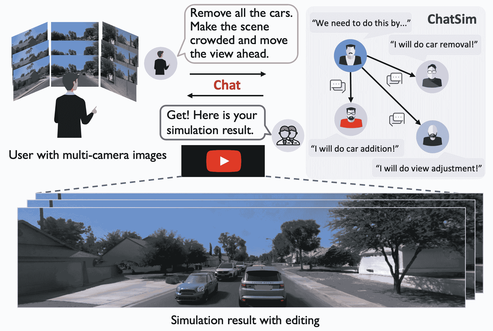

图1：ChatSim 通过语言指令使得照片级真实感的 3D 驾驶场景模拟编辑成为可能。

为了有效地模拟定制化的驾驶场景，我们识别了三种关键属性作为基础。首先，模拟应该能够满足复杂或抽象的需求，从而促进生产。其次，模拟应生成照片级真实感且视角一致的结果，使得其与现实世界场景中的车辆观察最为接近。第三，它应允许整合外部数字资产[[48](https://arxiv.org/html/2402.05746v3#bib.bib48), [6](https://arxiv.org/html/2402.05746v3#bib.bib6)]，这些资产具有照片级的纹理和材料，并能与现有的光照条件相匹配。此功能将通过整合大量外部数字资产，满足定制化需求，从而解锁数据扩展的潜力。

虽然已经提出了大量重要的作品用于场景模拟，但它们未能满足这三项要求。传统的图形引擎，如CARLA [[22](https://arxiv.org/html/2402.05746v3#bib.bib22)] 和UE [[25](https://arxiv.org/html/2402.05746v3#bib.bib25)]，提供了可编辑的虚拟环境和外部数字资产，但数据的真实性受到资产建模和渲染质量的限制。基于图像生成的方法，如BEVControl [[75](https://arxiv.org/html/2402.05746v3#bib.bib75)]、DriveDreamer [[67](https://arxiv.org/html/2402.05746v3#bib.bib67)]、MagicDrive [[26](https://arxiv.org/html/2402.05746v3#bib.bib26)]，可以基于各种控制信号（包括BEV地图、边界框和相机姿势）生成逼真的场景图像。然而，它们在保持视图一致性方面存在困难，并且由于缺乏3D空间建模，无法导入外部数字资产。基于渲染的方法被提出用于获取照片真实感和视图一致性的场景模拟。值得注意的例子，如UniSim [[77](https://arxiv.org/html/2402.05746v3#bib.bib77)] 和MARS [[72](https://arxiv.org/html/2402.05746v3#bib.bib72)]，配备了一套场景编辑工具。然而，这些系统需要用户在每个琐碎的编辑步骤中大量参与代码实现，这在执行编辑时是低效的。此外，尽管它们在观察场景中的车辆表现良好，但由于无法支持外部数字资产，它们限制了数据扩展和定制的机会。

为了满足这些要求，我们介绍了ChatSim，这是第一个通过自然语言命令与外部数字资产实现可编辑照片真实感3D驾驶场景模拟的系统。使用ChatSim时，用户只需与系统进行对话，通过自然语言发出命令，无需参与中间的模拟步骤；有关说明，请参见图[1](https://arxiv.org/html/2402.05746v3#S1.F1 "Figure 1 ‣ 1 Introduction ‣ Editable Scene Simulation for Autonomous Driving via Collaborative LLM-Agents")。

为了有效应对复杂或抽象的用户指令，ChatSim采用了基于大型语言模型（LLM）的多智能体协作框架。其关键思想是利用多个LLM智能体，每个智能体承担一个特定角色，将整体仿真需求拆解为具体的编辑任务，从而模拟人类运营公司工作流中通常的任务分配与执行。这个工作流为场景仿真提供了两个关键优势。首先，LLM智能体处理人类语言指令的能力，使得复杂驾驶场景的编辑变得直观且动态，从而实现精确的调整和反馈。其次，协作框架通过将特定的编辑任务分配给专业的智能体，提升了仿真效率和精度，确保了详细且逼真的仿真效果，并提高了任务完成率。

为了生成照片级真实感的结果，我们在ChatSim中提出了McNeRF，这是一种新型的神经辐射场方法，结合了多摄像头输入，提供了更广阔的场景渲染。该集成充分利用了车辆上的摄像头配置，但也带来了两个重要的挑战：由于触发时间不同步而导致的相机姿态不对齐问题，以及由于不同摄像头曝光时间不同而导致的亮度不一致问题。为了应对相机姿态不对齐，McNeRF使用了多摄像头对齐来减少外部参数噪声，从而确保渲染质量。为了应对亮度不一致，McNeRF集成了关键的曝光时间，以恢复场景的HDR辐射，从而显著缓解了两幅具有不同曝光时间的相机图像交界处的颜色差异问题。

为了导入具有真实纹理和材质的外部数字资产，我们提出了McLight，一种新型的多摄像头光照估计方法，它融合了天幕和周围的光照。我们的天幕估计通过峰值强度残差连接恢复了准确的太阳行为，从而能够渲染显著的阴影效果。对于周围光照，McLight查询McNeRF，以实现复杂的特定位置光照效果，例如在树荫下阳光被遮挡的情况。这大大提高了集成3D资产的渲染真实感。

我们在Waymo自动驾驶数据集上进行了广泛的实验，结果表明ChatSim能够根据不同的人类语言指令生成照片级真实感的定制感知数据，包括危险的极限情况。我们的方法兼容混合、抽象性较强的多轮指令。我们的方法在广角渲染下实现了SoTA（最先进）表现，照片真实感提高了4.5%。此外，我们还展示了我们的光照估计在定性和定量上均优于现有的最先进方法，将强度误差和角度误差分别降低了57.0%和9.9%。

## 2 相关工作

自动驾驶的场景模拟。目前的场景模拟方法大致可以分为三类：图形引擎、图像生成和场景渲染。图形引擎，如CARLA [[22](https://arxiv.org/html/2402.05746v3#bib.bib22)]、AirSim [[58](https://arxiv.org/html/2402.05746v3#bib.bib58)]、OpenScenario Editor [[24](https://arxiv.org/html/2402.05746v3#bib.bib24)]、51Sim-One [[1](https://arxiv.org/html/2402.05746v3#bib.bib1)] 和RoadRunner [[21](https://arxiv.org/html/2402.05746v3#bib.bib21)]，创建了一个虚拟世界，用于模拟各种驾驶场景。然而，虚拟世界与现实之间存在着显著的领域差距。图像生成方法可以根据不同的控制信号生成逼真的场景图像，例如高清地图 [[63](https://arxiv.org/html/2402.05746v3#bib.bib63)、[26](https://arxiv.org/html/2402.05746v3#bib.bib26)、[41](https://arxiv.org/html/2402.05746v3#bib.bib41)]、草图布局 [[75](https://arxiv.org/html/2402.05746v3#bib.bib75)]、边界框 [[41](https://arxiv.org/html/2402.05746v3#bib.bib41)、[67](https://arxiv.org/html/2402.05746v3#bib.bib67)、[26](https://arxiv.org/html/2402.05746v3#bib.bib26)]、文本 [[41](https://arxiv.org/html/2402.05746v3#bib.bib41)、[67](https://arxiv.org/html/2402.05746v3#bib.bib67)、[26](https://arxiv.org/html/2402.05746v3#bib.bib26)、[34](https://arxiv.org/html/2402.05746v3#bib.bib34)] 和驾驶行为 [[67](https://arxiv.org/html/2402.05746v3#bib.bib67)、[34](https://arxiv.org/html/2402.05746v3#bib.bib34)]。然而，这些方法很难保持场景一致性。为了获得一致的驾驶场景，基于场景渲染的方法旨在重建三维场景。READ [[42](https://arxiv.org/html/2402.05746v3#bib.bib42)] 使用点云并利用U-Net进行图像渲染。随着神经辐射场（NeRF）[[47](https://arxiv.org/html/2402.05746v3#bib.bib47)、[7](https://arxiv.org/html/2402.05746v3#bib.bib7)、[8](https://arxiv.org/html/2402.05746v3#bib.bib8)、[49](https://arxiv.org/html/2402.05746v3#bib.bib49)、[60](https://arxiv.org/html/2402.05746v3#bib.bib60)、[66](https://arxiv.org/html/2402.05746v3#bib.bib66)] 的快速发展，一些研究 [[73](https://arxiv.org/html/2402.05746v3#bib.bib73)、[28](https://arxiv.org/html/2402.05746v3#bib.bib28)、[77](https://arxiv.org/html/2402.05746v3#bib.bib77)、[72](https://arxiv.org/html/2402.05746v3#bib.bib72)、[52](https://arxiv.org/html/2402.05746v3#bib.bib52)、[65](https://arxiv.org/html/2402.05746v3#bib.bib65)、[36](https://arxiv.org/html/2402.05746v3#bib.bib36)、[51](https://arxiv.org/html/2402.05746v3#bib.bib51)] 也利用NeRF对户外环境中的汽车和静态街道背景进行建模。此外，一些显著的例子，如UniSim [[77](https://arxiv.org/html/2402.05746v3#bib.bib77)] 和MARS [[72](https://arxiv.org/html/2402.05746v3#bib.bib72)]，配备了一套场景编辑工具。然而，这些方法需要用户在中间编辑步骤中进行大量参与，并且无法支持外部数字资产进行数据扩展。在本研究中，我们提出了ChatSim，通过语言命令实现自动化的模拟编辑，并整合外部数字资产，以增强逼真度和灵活性。在ChatSim中，我们集成了McNeRF，这是一种新型的神经辐射场，旨在利用多摄像头输入进行高保真渲染。

照明估计。照明估计旨在评估真实世界环境中的光照条件，以便无缝地将数字对象融入其中。早期方法[[37](https://arxiv.org/html/2402.05746v3#bib.bib37), [38](https://arxiv.org/html/2402.05746v3#bib.bib38)]针对户外环境，使用像地面阴影这样的显式线索。最近的研究通常采用基于学习的方法[[27](https://arxiv.org/html/2402.05746v3#bib.bib27), [31](https://arxiv.org/html/2402.05746v3#bib.bib31), [39](https://arxiv.org/html/2402.05746v3#bib.bib39), [32](https://arxiv.org/html/2402.05746v3#bib.bib32), [43](https://arxiv.org/html/2402.05746v3#bib.bib43), [78](https://arxiv.org/html/2402.05746v3#bib.bib78)]，通过预测不同的光照表示，如球形叶片[[10](https://arxiv.org/html/2402.05746v3#bib.bib10), [43](https://arxiv.org/html/2402.05746v3#bib.bib43)]、光探针[[39](https://arxiv.org/html/2402.05746v3#bib.bib39)]、环境图[[57](https://arxiv.org/html/2402.05746v3#bib.bib57), [59](https://arxiv.org/html/2402.05746v3#bib.bib59)]、HDR天空模型[[31](https://arxiv.org/html/2402.05746v3#bib.bib31), [78](https://arxiv.org/html/2402.05746v3#bib.bib78), [68](https://arxiv.org/html/2402.05746v3#bib.bib68)]和光照体积[[68](https://arxiv.org/html/2402.05746v3#bib.bib68)]。然而，少数研究考虑了多摄像头输入，而多摄像头输入在驾驶场景中是很常见的。本文提出了一种新型的多摄像头照明估计方法McLight，结合我们的McNeRF，用于估计更广泛的光照范围，并获取资产的空间变化光照效果。

| 方法 | 写实 | 维度 | 多摄像头 | 可编辑 | 外部资产 | 语言 | 开源 |
| --- | --- | --- | --- | --- | --- | --- | --- |

| CARLA [[22](https://arxiv.org/html/2402.05746v3#bib.bib22)] | \usym

2613  | 3D | ✓ | ✓ | ✓ | \usym

2613  | ✓ |

| AirSim [[58](https://arxiv.org/html/2402.05746v3#bib.bib58)] | \usym

2613  | 3D | ✓ | ✓ | ✓ | \usym

2613  | ✓ |

| OpenScenario [[24](https://arxiv.org/html/2402.05746v3#bib.bib24)] | \usym

2613  | 3D | ✓ | ✓ | ✓ | \usym

2613  | ✓ |

| 51Sim-One [[1](https://arxiv.org/html/2402.05746v3#bib.bib1)] | \usym

2613  | 3D | ✓ | ✓ | ✓ | \usym

2613  | \usym

2613  |

| RoadRunner [[21](https://arxiv.org/html/2402.05746v3#bib.bib21)] | \usym

2613  | 3D | ✓ | ✓ | ✓ | \usym

2613  | ✓ |

| BEVGen [[63](https://arxiv.org/html/2402.05746v3#bib.bib63)] | ✓ | 2D | ✓ | ✓ | \usym

2613  | \usym

2613  | ✓ |

| BEVControl [[75](https://arxiv.org/html/2402.05746v3#bib.bib75)] | ✓ | 2D | ✓ | ✓ | \usym

2613  | \usym

2613  | \usym

2613  |

| DriveDreamer [[67](https://arxiv.org/html/2402.05746v3#bib.bib67)] | ✓ | 2D | ✓ | ✓ | \usym

2613  | ✓ | \usym

2613  |

| DrivingDiffusion [[41](https://arxiv.org/html/2402.05746v3#bib.bib41)] | ✓ | 2D | ✓ | ✓ | \usym

2613  | ✓ | \usym

2613  |

| GAIA-1 [[34](https://arxiv.org/html/2402.05746v3#bib.bib34)] | ✓ | 2D | \usym

2613  | ✓ | \usym

2613  | ✓ | \usym

2613  |

| MagicDrive [[26](https://arxiv.org/html/2402.05746v3#bib.bib26)] | ✓ | 2D | ✓ | ✓ | \usym

2613  | \usym

2613  | \usym

2613  |

| READ [[42](https://arxiv.org/html/2402.05746v3#bib.bib42)] | ✓ | 3D | \usym

2613  | \usym

2613  | \usym

2613  | \usym

2613  | ✓ |

| Neural SG [[52](https://arxiv.org/html/2402.05746v3#bib.bib52)] | ✓ | 3D | \usym

2613  | ✓ | \usym

2613  | \usym

2613  | ✓ |

| Neural PLF [[51](https://arxiv.org/html/2402.05746v3#bib.bib51)] | ✓ | 3D | \usym

2613  | \usym

2613  | \usym

2613  | \usym

2613  | ✓ |

| S-NeRF [[73](https://arxiv.org/html/2402.05746v3#bib.bib73)] | ✓ | 3D | ✓ | \usym

2613  | \usym

2613  | \usym

2613  | ✓ |

| UniSim [[77](https://arxiv.org/html/2402.05746v3#bib.bib77)] | ✓ | 3D | \usym

2613  | ✓ | \usym

2613  | \usym

2613  | \usym

2613  |

| MARS [[72](https://arxiv.org/html/2402.05746v3#bib.bib72)] | ✓ | 3D | \usym

2613  | ✓ | \usym

2613  | \usym

2613  | ✓ |

| ChatSim (我们的) | ✓ | 3D | ✓ | ✓ | ✓ | ✓ | ✓ |
| --- | --- | --- | --- | --- | --- | --- | --- |

表 1：现有方法与提出的自动驾驶仿真方法比较。

大型语言模型和协作框架。大型语言模型（LLMs）是通过大量数据训练的人工智能系统，能够理解、生成和回应人类语言。GPT [[11](https://arxiv.org/html/2402.05746v3#bib.bib11)] 是生成类人内容的开创性作品。随后的更新版本 GPT-3.5 [[14](https://arxiv.org/html/2402.05746v3#bib.bib14)] 和 GPT-4 [[50](https://arxiv.org/html/2402.05746v3#bib.bib50)] 提供了更智能的功能，如聊天、浏览和编程。其他著名的大型语言模型包括 InstructGPT [[53](https://arxiv.org/html/2402.05746v3#bib.bib53)]、LLaMA [[64](https://arxiv.org/html/2402.05746v3#bib.bib64)] 和 PaLM [[18](https://arxiv.org/html/2402.05746v3#bib.bib18), [5](https://arxiv.org/html/2402.05746v3#bib.bib5)]。基于LLM的许多工作 [[69](https://arxiv.org/html/2402.05746v3#bib.bib69), [23](https://arxiv.org/html/2402.05746v3#bib.bib23), [80](https://arxiv.org/html/2402.05746v3#bib.bib80), [30](https://arxiv.org/html/2402.05746v3#bib.bib30), [3](https://arxiv.org/html/2402.05746v3#bib.bib3)] 通过多智能体之间的通信来提高问题解决能力。[[33](https://arxiv.org/html/2402.05746v3#bib.bib33)] 和 [[71](https://arxiv.org/html/2402.05746v3#bib.bib71)] 定义了一组组织良好的智能体，通过对话和代码编程来形成操作流程。在本文中，我们利用协作LLM智能体在自动驾驶仿真中的力量，通过语言命令进行3D场景的多种编辑。

## 3 协作LLM智能体编辑

ChatSim 系统分析特定的用户指令并返回满足定制需求的视频；见图 [2](https://arxiv.org/html/2402.05746v3#S3.F2 "Figure 2 ‣ 3 Collaborative LLM-Agents for Editing ‣ Editable Scene Simulation for Autonomous Driving via Collaborative LLM-Agents")。由于用户指令可能非常抽象且复杂，因此要求系统具备灵活的任务处理能力。直接应用单一的 LLM 代理会在多步推理和交叉引用方面遇到困难。为了解决这个问题，我们设计了一系列协作 LLM 代理，每个代理负责编辑任务中的一个独特方面。

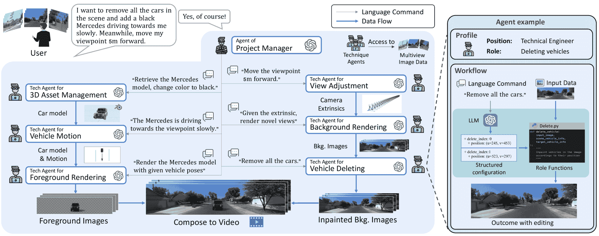

图 2：ChatSim 系统概述。该系统利用多个协作的 LLM 代理，具有专门的角色，将整体需求分解为具体的编辑任务。每个代理配备了 LLM 和相应的角色功能，以解释并执行其特定任务。

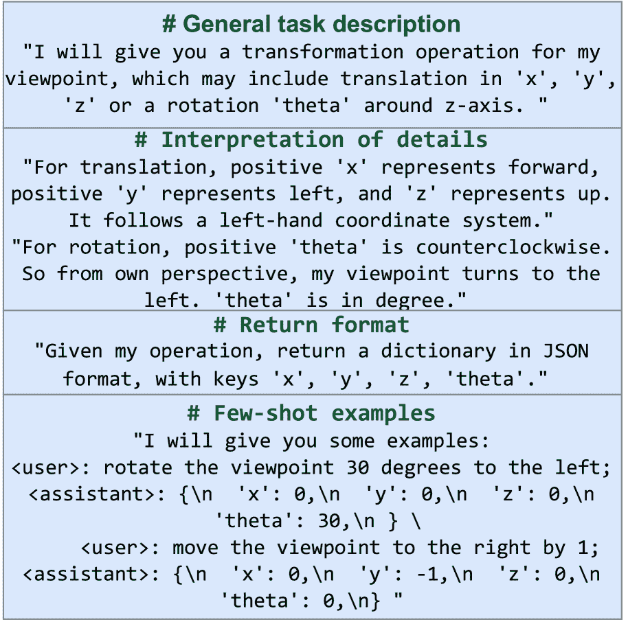

图 3：视图调整代理的提示示例。

### 3.1 特定代理的功能

ChatSim 中的代理包括两个关键组件：大型语言模型（LLM）和相应的角色功能。LLM 负责理解接收到的指令，而角色功能处理接收到的数据。每个代理都配备了针对其系统内特定职责定制的 LLM 提示和角色功能。为了完成任务，代理首先使用 LLM 在提示的帮助下将接收到的指令转换为结构化配置。然后，角色功能利用结构化配置作为参数来处理接收到的数据，并产生所需的结果；见图 [2](https://arxiv.org/html/2402.05746v3#S3.F2 "Figure 2 ‣ 3 Collaborative LLM-Agents for Editing ‣ Editable Scene Simulation for Autonomous Driving via Collaborative LLM-Agents") 右侧的代理示例。该工作流程赋予代理语言解释能力和精确执行能力。

项目经理代理。项目经理代理将直接指令分解为清晰的自然语言指令，并将其分发给其他编辑代理。为了使项目经理代理具备指令分解能力，我们为其 LLM 设计了一系列提示。提示的核心思想是描述动作集合，给出整体目标，并通过示例定义输出形式；角色功能将分解后的指令发送给其他代理进行编辑。项目经理代理的存在增强了系统在解释各种输入方面的鲁棒性，并简化了操作，确保清晰和精细化。

用于视角调整的技术代理。视角调整代理生成合适的外部相机参数。代理中的LLM将自然语言的视角调整指令转化为运动参数，指向目标视角的位置和角度。在角色功能中，这些运动参数被转化为外部所需的变换矩阵，然后与原始参数相乘，以得到新的视角。

用于背景渲染的技术代理。背景渲染代理根据多相机图像渲染场景背景。LLM接收渲染指令，然后操作角色功能进行渲染。特别地，在角色功能中，我们特别整合了一种新型的神经辐射场方法（McNeRF），它接受多相机输入并考虑曝光时间，解决了多相机渲染中的模糊和亮度不一致问题，更多细节请参见第[4.1节](https://arxiv.org/html/2402.05746v3#S4.SS1 "4.1 McNeRF for Background Rendering ‣ 4 Novel Rendering Methods ‣ Editable Scene Simulation for Autonomous Driving via Collaborative LLM-Agents")。

用于车辆删除的技术代理。车辆删除代理从背景中删除指定的车辆。它首先从给定的场景信息或来自场景感知模型的结果中识别当前车辆的属性，如3D边界框和颜色[[46](https://arxiv.org/html/2402.05746v3#bib.bib46)]。LLM收集车辆属性并与用户请求进行匹配。确认目标车辆后，它使用逐帧修复模型作为角色功能，如潜在扩散方法[[55](https://arxiv.org/html/2402.05746v3#bib.bib55)]，有效地将其从场景中删除。

用于3D资产管理的技术代理。3D资产管理代理根据用户规格选择和修改3D数字资产。它构建并维护一个3D数字资产库；有关我们库的详细信息，请参见附录。为了便于添加各种物体，代理首先通过LLM根据关键属性（如颜色和类型）匹配用户需求，选择最合适的资产。如果匹配不完美，代理可以通过其角色功能修改资产，例如更改颜色。

车辆运动技术代理。车辆运动代理根据请求生成车辆的初始位置和后续运动。现有的车辆运动生成方法无法仅通过文本和场景地图直接生成运动。为了解决这个问题，我们提出了一种新型的文本到运动方法。关键思想是将位置与规划模块作为角色功能与大语言模型（LLMs）结合，从中提取并将运动属性转换为坐标。运动属性包括位置属性（例如，距离、方向）和运动属性（例如，速度、动作）。对于位置模块，我们赋予车道图中的每个车道节点属性，以匹配位置属性。规划模块规划车辆的大致目的地车道节点，然后通过拟合贝塞尔曲线规划中间轨迹。我们还增加了轨迹追踪[[74](https://arxiv.org/html/2402.05746v3#bib.bib74)]以适应车辆动力学；更多细节请见附录。

前景渲染技术代理。前景渲染代理将相机外部信息、3D资产和运动信息集成，以渲染场景中的前景物体。特别是，为了无缝地将外部资产与当前场景结合，我们在角色功能中设计了多相机光照估计方法（McLight），并与McNeRF结合。然后，通过Blender API利用估算的光照生成前景图像。详细的技术细节将在第[4.2](https://arxiv.org/html/2402.05746v3#S4.SS2 "4.2 McLight for Foreground Rendering ‣ 4 Novel Rendering Methods ‣ Editable Scene Simulation for Autonomous Driving via Collaborative LLM-Agents")节中阐述。

### 3.2 代理协作工作流

拥有定制功能的代理根据用户指令协同工作进行编辑。项目经理协调并派发指令给编辑代理。编辑代理分为两个团队：背景生成和前景生成。对于背景生成，背景渲染代理使用视角调整代理提供的外部参数生成渲染图像，随后由车辆删除代理进行修补。在前景生成方面，前景渲染代理利用视角调整代理提供的外部参数、3D资产管理代理选择的3D资产以及车辆运动代理生成的运动来渲染图像。最终，前景图像和背景图像合成，生成并交付视频给用户。每个代理的编辑信息都会由项目经理代理记录，便于进行多轮编辑。

## 4 种新型渲染方法

基于第[3](https://arxiv.org/html/2402.05746v3#S3 "3 Collaborative LLM-Agents for Editing ‣ Editable Scene Simulation for Autonomous Driving via Collaborative LLM-Agents")节介绍的协作 LLM 代理框架，本节提出了两种新的渲染技术，以增强仿真中的照片级真实感。为了应对由多相机引起的渲染挑战，我们提出了多相机神经辐射场（McNeRF），这是一种新型的 NeRF 模型，考虑了不同相机曝光时间对视觉一致性的影响。为了渲染具有特定位置光照和准确阴影的真实外部数字资产，我们提出了 McLight，这是一种与 McNeRF 结合的新型混合光照估计方法。需要注意的是，McNeRF 和 McLight 分别被背景渲染代理和前景渲染代理所利用。

### 4.1 McNeRF 背景渲染

自动驾驶车辆通常配备多个相机以实现全面的感知视角。然而，由于相机触发时间的异步性导致的多相机位姿错位，以及不同曝光时间带来的亮度不一致，这为 NeRF 训练带来了挑战。为了解决这些问题，提出的 McNeRF 使用了两项技术：多相机对齐和亮度一致性渲染。

多相机对齐。尽管自动驾驶车辆拥有用于准确相机位姿的定位模块，但由于多个相机触发时间的异步性，仍然面临挑战。为了对齐用于 NeRF 训练的相机外参，我们的核心思路是利用 Agisoft Metashape 提供的一致空间坐标系统[[2](https://arxiv.org/html/2402.05746v3#bib.bib2)]，将不同时间戳下由多个相机拍摄的图像对齐。

具体来说，设 $\mathcal{I}^{(i,k)}$ 和 $\mathcal{\xi}^{(i,k)}$ 分别表示第 $i$ 个相机在第 $k$ 次触发时拍摄的图像和对应的相机位姿，该位姿在车辆全球坐标空间中。我们首先将所有图像输入到 Metashape 进行重新校准。然后获得对齐后的相机位姿，公式如下：

|  | $\widehat{\xi}^{(i,k)}=T_{M\rightarrow G}\cdot\xi_{M}^{(i,k)},$ |  |
| --- | --- | --- |

其中，$\xi_{M}^{(i,k)}$ 表示在 Metashape 统一空间坐标系中的重新校准相机位姿，$T_{M\rightarrow G}$ 是从 Metashape 坐标空间到车辆全球坐标空间的转换矩阵。经过对齐后，相机位姿噪声可以显著减少。然后，对齐后的相机位姿 $\widehat{\xi}^{(i,t)}$ 可以用于生成 McNeRF 的光线起源和方向，从而实现高保真渲染。对齐后的位姿还可以促进前景渲染代理的操作。

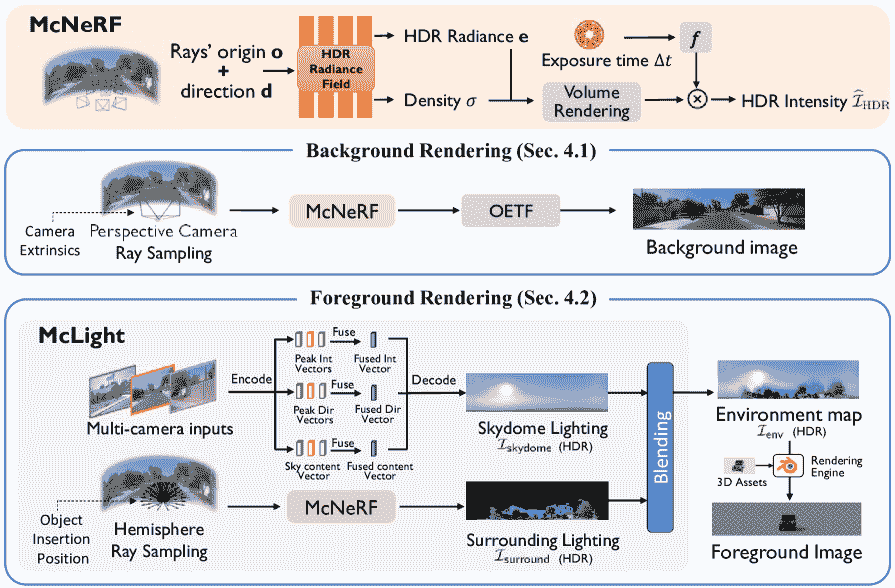

图 4：渲染框架。主要组件包括 McNeRF 和 McLight。背景渲染使用 McNeRF 预测 HDR 像素值，并通过 sRGB OETF 转换为 LDR。McLight 包括一个天幕光照估计网络，并采用 McNeRF 生成周围的光照。

亮度一致性渲染。相机的曝光时间可能差异很大，这会导致图像之间的亮度差异显著，从而阻碍 NeRF 的训练。如图[4](https://arxiv.org/html/2402.05746v3#S4.F4 "Figure 4 ‣ 4.1 McNeRF for Background Rendering ‣ 4 Novel Rendering Methods ‣ Editable Scene Simulation for Autonomous Driving via Collaborative LLM-Agents")所示，McNeRF 通过将曝光时间融入 HDR 辐射场，解决了这一问题，从而促进了亮度的一致性。

我们采用 F2-NeRF [[66](https://arxiv.org/html/2402.05746v3#bib.bib66)] 作为我们的主干模型来处理无界场景，在光线 $\mathbf{r}$ 上采样 $K$ 个点，并估计每个点的 HDR 辐射度 $\mathbf{e}_{k}$ 和密度 $\sigma_{k}$。然后，HDR 光强计算如下：

|  | $\widehat{\mathcal{I}}_{\rm HDR}(\mathbf{r})=f(\Delta t)\cdot\sum^{K}_{k=1}T_{k% }\alpha_{k}\mathbf{e}_{k},$ |  | (1) |
| --- | --- | --- | --- |

其中，$\alpha_{k}=1-\text{exp}(-\sigma_{k}\delta_{i})$ 是不透明度，$\delta_{i}$ 是采样点间隔，$T_{k}=\prod^{k-1}_{i=0}(1-\alpha_{i})$ 是累计透射率，$\Delta t$ 是曝光时间。归一化函数 $f(\Delta t)=1+\epsilon(\Delta t-\mu)/{\sigma}$ 用于稳定训练，其中 $\epsilon$ 是用于缩放的超参数，$\mu$ 和 $\sigma$ 分别是所有图像曝光时间的均值和标准差。

通过预测场景辐射度（HDR）并将其与曝光时间相乘，我们恢复了传感器接收到的光强，并解决了曝光时间不同的两幅相机图像交叉处的不一致颜色监督问题。此外，McNeRF 输出的 HDR 光强可以为前景物体渲染提供场景级的照明，这一话题将在第[4.2](https://arxiv.org/html/2402.05746v3#S4.SS2 "4.2 McLight for Foreground Rendering ‣ 4 Novel Rendering Methods ‣ Editable Scene Simulation for Autonomous Driving via Collaborative LLM-Agents")节进一步讨论。

为了训练渲染网络，我们强制渲染图像（预测）和捕获图像（地面真相）之间的辐射度一致性。给定地面真相图像 $\mathcal{I}$，损失函数如下：

|  | $\mathcal{L}=\frac{1}{\mid R \mid}\sum_{\mathbf{r}\in R}\left(\mathrm{OETF}\left(% \widehat{\mathcal{I}}_{\rm HDR}(\mathbf{r})\right)-\mathcal{I}(\mathbf{r})% \right)^{2},$ |  |
| --- | --- | --- |

其中，$R$ 表示光线集，$\mathrm{OETF}(\cdot)$ 是 sRGB 光电传输函数（伽马校正）[[19](https://arxiv.org/html/2402.05746v3#bib.bib19)]，用于将 HDR 光强转换为 LDR 颜色。

### 4.2 McLight 用于前景渲染

为了通过大量数字化 3D 资产丰富场景内容，我们采用 Blender [[20](https://arxiv.org/html/2402.05746v3#bib.bib20)] 前景虚拟物体的渲染。无缝插入的关键在于准确估计场景的照明条件。因此，如图 [4](https://arxiv.org/html/2402.05746v3#S4.F4 "Figure 4 ‣ 4.1 McNeRF for Background Rendering ‣ 4 Novel Rendering Methods ‣ Editable Scene Simulation for Autonomous Driving via Collaborative LLM-Agents") 所示，我们提出了 McLight，一种新型混合照明估计方法，包括天穹光照和周围光照。

天穹光照估计。从图像中估计天穹光照对于恢复准确的太阳行为是具有挑战性的。为此，我们提出了一种新型的残差连接，将估计的峰值强度与 HDR 重建结果相结合，以解决过度平滑的输出问题。此外，我们采用了一种自注意力机制来融合多摄像头输入，捕捉互补的视觉线索。

在这里，我们采用了一个两阶段的过程。在第一阶段，我们训练一个自编码器，从 LDR 全景图重建对应的 HDR 全景图。根据 [[68](https://arxiv.org/html/2402.05746v3#bib.bib68)]，编码器将 LDR 天穹全景图转换为三个中间向量，包括峰值方向向量 $\mathbf{f}_{\rm dir}\in\mathbb{R}^{3}$、强度向量 $\mathbf{f}_{\rm int}\in\mathbb{R}^{3}_{+}$ 和天空内容向量 $\mathbf{f}_{\rm content}\in\mathbb{R}^{64}$。然而，由于 HDR 强度在其峰值位置表现得像一个冲击响应，其像素值比邻近像素高出数千倍，解码器很难恢复这种模式。为了解决这个问题，我们设计了一种残差连接，通过球形高斯叶片衰减将 $\mathbf{f}_{\rm int}$ 注入解码后的 HDR 全景图。这显式地恢复了重建的 HDR 全景图中太阳的峰值强度，使我们能够为虚拟物体渲染强烈的阴影。

在第二阶段，我们训练了一个图像编码器和一个多摄像头融合模块，该模块基于第一阶段的预训练解码器。具体来说，对于来自每个摄像头的图像，使用共享的图像编码器预测每个图像$\mathcal{I}^{(i)}$的峰值方向向量$\mathbf{f}_{\rm dir}^{(i)}$、强度向量$\mathbf{f}_{\rm int}^{(i)}$和天空内容向量$\mathbf{f}_{\rm content}^{(i)}$，其中$i$是摄像头的索引。我们设计了跨多个摄像头视角的潜在向量融合，具体过程如下：所有$\mathbf{f}_{\rm dir}^{(i)}$都通过它们的外部参数对齐到正面视角，并取平均得到$\bar{\mathbf{f}}_{\rm dir}$；所有$\mathbf{f}_{\rm int}^{(i)}$取平均得到$\bar{\mathbf{f}}_{\rm int}$；所有$\mathbf{f}_{\rm content}^{(i)}$通过自注意力模块融合成$\bar{\mathbf{f}}_{\rm content}$。最后，预训练的解码器从$\bar{\mathbf{f}}_{\rm dir}$、$\bar{\mathbf{f}}_{\rm int}$和$\bar{\mathbf{f}}_{\rm content}$重建HDR天空穹顶图像$\mathcal{I}_{\rm skydome}$。

与其他方法相比[[68](https://arxiv.org/html/2402.05746v3#bib.bib68), [31](https://arxiv.org/html/2402.05746v3#bib.bib31)]，我们的多摄像头天空穹顶估计技术通过残差设计准确地重现了太阳在其峰值时的强度响应行为，显著提高了天空穹顶重建的准确性和保真度。

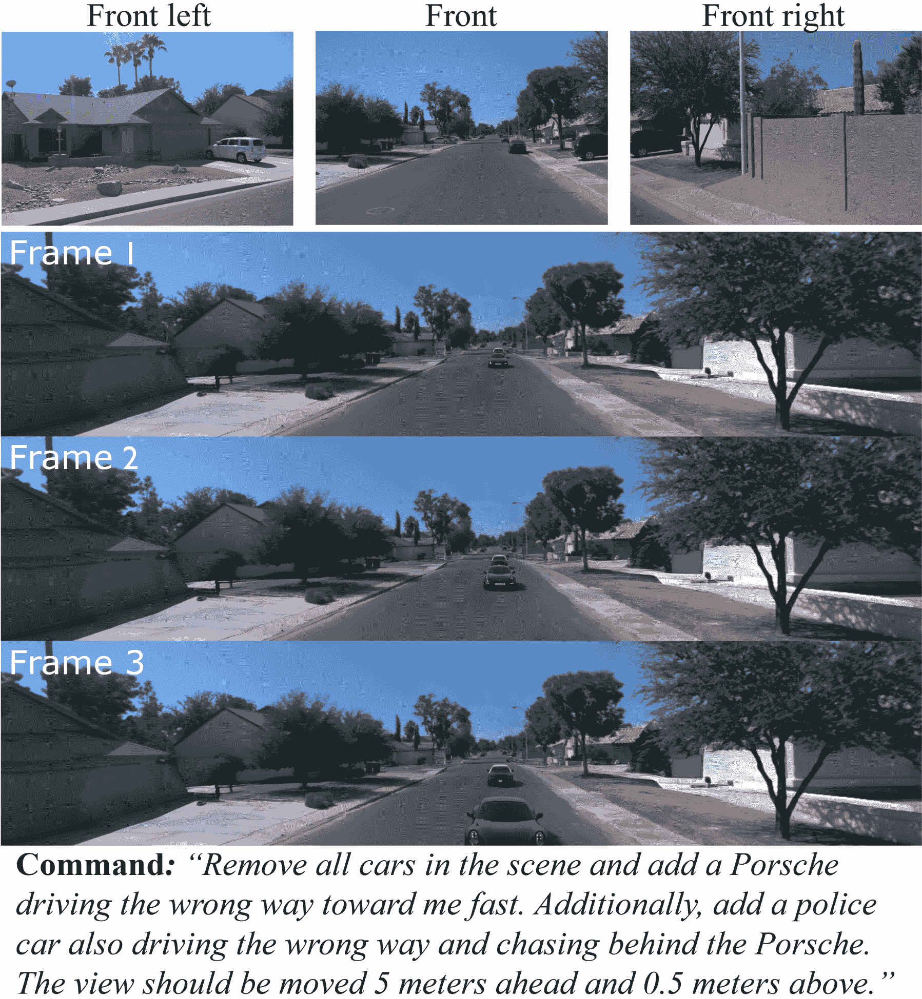

图 5：在复杂混合命令下的编辑结果。

周围光照估计。仅仅建模天空穹顶无法复制复杂的地点特定光照效果，例如那些树木或建筑物挡住阳光的阴影区域。我们的McNeRF能够存储精确的3D场景信息，使我们能够捕捉到周围场景对光照的影响。这种方法有助于实现空间变化的光照估计。具体来说，我们在虚拟物体的位置o处采样半球射线。射线的方向$\textbf{d}_{i},i=0,1,\cdots,h\times w$，通过等距矩形投影对准单位球面上的像素坐标，该投影来自环境图，其中$h$和$w$分别是地图的高度和宽度。对于射线$\mathbf{r}=\mathbf{o}+t\mathbf{d}_{i}$，我们根据公式[1](https://arxiv.org/html/2402.05746v3#S4.E1 "In 4.1 McNeRF for Background Rendering ‣ 4 Novel Rendering Methods ‣ Editable Scene Simulation for Autonomous Driving via Collaborative LLM-Agents")查询我们的McNeRF，得到HDR周围光照$\mathcal{I}_{\rm surround}(\textbf{o},\textbf{d}_{i})$。周围光照估计重建了复杂的环境光照，实现了空间变化的效果，并与背景高度一致。

混合。我们通过McNeRF最终采样点的透射率将天穹和周围光照的HDR强度值进行混合。其思路是，射线从辐射场外发射后，必定会击中天穹。给定方向$\textbf{d}_{i}$，我们使用等经纬度投影检索天穹的强度$\mathcal{I}_{\rm skydome}(\textbf{d}_{i})$。最终的HDR光强度$\mathcal{I}_{\rm env}(\textbf{o},\textbf{d}_{i})$是场景与天穹的结合：

|  | $\mathcal{I}_{\rm env}(\textbf{o},\textbf{d}_{i})=\mathcal{I}_{\rm surround}(\textbf{o},\textbf{d}_{i})+T_{K}\mathcal{I}_{\rm skydome}(\textbf{d}_{i}),$ |  |
| --- | --- | --- |

其中$T_{K}$是最后一个采样点的透射率。

McLight提供了两个主要优势：i）它显式地恢复了峰值处的照明行为，并利用来自多个相机的互补信息来恢复准确的天穹；ii）它能够考虑复杂场景结构，实现特定位置的照明。

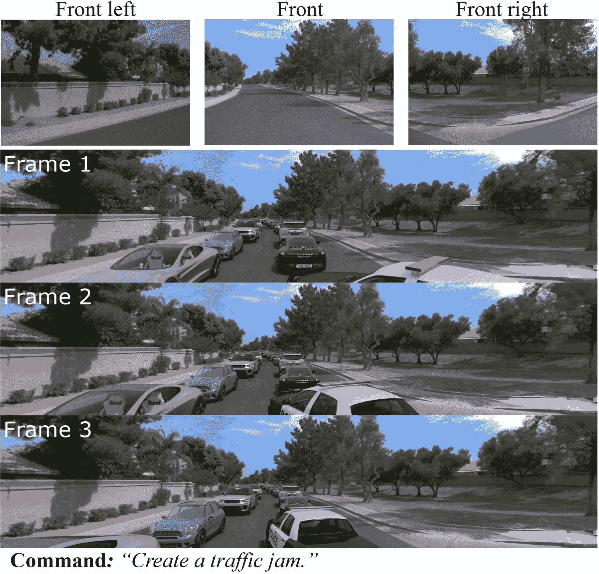

图6：在高度抽象命令下的编辑结果。

## 5 实验结果

### 5.1 数据集与实现细节

我们主要在Waymo Open Dataset上展示了多种结果[[62](https://arxiv.org/html/2402.05746v3#bib.bib62)]，该数据集包含高质量的多相机图像及其对应的标定信息。对于McLight天穹估计，我们从在线HDRI数据库收集了449个HDRI用于自编码器训练，并使用HoliCity [[79](https://arxiv.org/html/2402.05746v3#bib.bib79)]，一个街景全景数据集作为第二阶段的数据；更多数据集细节请参见附录。

在我们的实验中，我们在每帧中使用前置、左前和右前相机。在渲染过程中，我们以10Hz的采样率选择每个场景的40帧，总共120张图像。我们均匀地选择其中$1/8$作为测试集，其余部分用于训练。输入图像使用数据集的初始分辨率$1920\times 1280$；我们在所有实验中使用GPT-4作为大语言模型（LLMs）；更多实现细节请参见附录。

### 5.2 系统结果

通过语言命令进行编辑。我们选择了三个具有代表性的命令来展示编辑结果。所有结果表明，得益于McNeRF和McLight，我们实现了照片级真实感的广角效果。

*混合与复杂指令。* 我们向系统发送了一条混合复杂的指令，意味着一辆警车正在追逐一名逆行赛车手。目标场景、指令和结果如图[5](https://arxiv.org/html/2402.05746v3#S4.F5 "Figure 5 ‣ 4.2 McLight for Foreground Rendering ‣ 4 Novel Rendering Methods ‣ Editable Scene Simulation for Autonomous Driving via Collaborative LLM-Agents")所示。我们看到：i) 复杂指令中的每个要求都得到了准确执行，这要归功于我们多代理协作设计；ii) 这条指令成功地模拟了一种罕见但危险的驾驶情况，在事故测试中具有重要意义。

*高度抽象的指令。* 第二类是高度抽象的指令。输入和结果如图[6](https://arxiv.org/html/2402.05746v3#S4.F6 "Figure 6 ‣ 4.2 McLight for Foreground Rendering ‣ 4 Novel Rendering Methods ‣ Editable Scene Simulation for Autonomous Driving via Collaborative LLM-Agents")所示。我们看到：i) 这种高度抽象的指令很难通过句子划分来分解，但我们的方式仍然能正确执行；ii) 我们的3D资产库提供了丰富的对象供添加。

图 7：多轮指令下的编辑结果。

*多轮指令。* 我们还与系统进行了多轮对话，不同轮次的指令之间存在上下文依赖关系。最终结果如图[7](https://arxiv.org/html/2402.05746v3#S5.F7 "Figure 7 ‣ 5.2 System results ‣ 5 Experimental Results ‣ Editable Scene Simulation for Autonomous Driving via Collaborative LLM-Agents")所示。我们看到：i) 我们的系统能够很好地处理多轮指令，并准确执行每一轮的指令；ii) 得益于项目经理代理的记录能力，我们的系统能够处理跨轮次的上下文依赖关系。

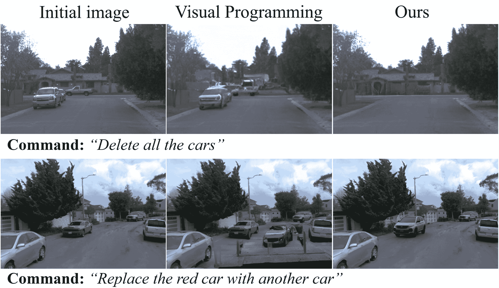

图 8：与视觉编程的定性比较[[29](https://arxiv.org/html/2402.05746v3#bib.bib29)]。

与视觉编程的比较[[29](https://arxiv.org/html/2402.05746v3#bib.bib29)]。视觉编程（VP）是最新的基于语言的SoTA二维图像神经符号系统，也可以通过语言命令进行编辑。由于视觉编程仅支持在二维图像中编辑单帧，因此我们将比较限制为其支持的删除和替换操作。图[8](https://arxiv.org/html/2402.05746v3#S5.F8 "Figure 8 ‣ 5.2 System results ‣ 5 Experimental Results ‣ Editable Scene Simulation for Autonomous Driving via Collaborative LLM-Agents")中的比较表明，ChatSim在这两个样本中明显优于VP。实际上，在我们的广泛实验中，VP在大多数情况下都失败了。原因是VP只有一个单一的代理，难以处理混合任务。相比之下，ChatSim有多个协作代理，每个代理有特定的角色，确保任务的准确执行。

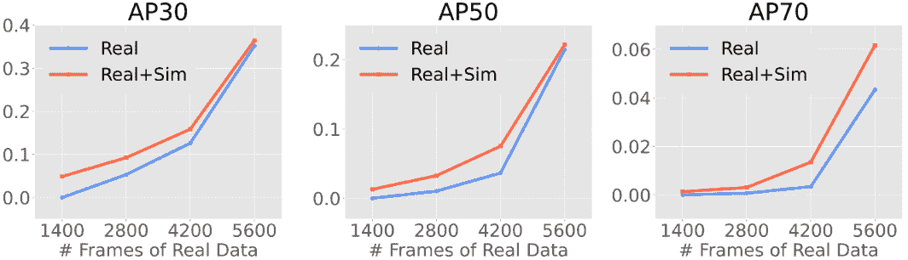

图9：在不同真实数据量下，使用和不使用我们模拟数据的检测性能比较。

基于模拟数据的3D检测。我们验证了将模拟数据作为数据增强在Waymo开放数据集上的下游3D物体检测任务中的优势[[61](https://arxiv.org/html/2402.05746v3#bib.bib61)]。我们模拟了1960帧，源自训练数据集中的场景。在模拟中，加入了各种类型、位置和方向的汽车。检测模型采用Lift-Splat [[54](https://arxiv.org/html/2402.05746v3#bib.bib54)]。图[9](https://arxiv.org/html/2402.05746v3#S5.F9 "Figure 9 ‣ 5.2 System results ‣ 5 Experimental Results ‣ Editable Scene Simulation for Autonomous Driving via Collaborative LLM-Agents")展示了在不同真实数据量下，使用和不使用固定增强的数据的检测性能。我们看到：i) 在不同数据规模下，性能有显著且一致的提升；ii) 当真实数据有限时，我们的模拟数据显著帮助了粗略检测（AP30）；iii) 当真实数据量增加时，我们的模拟数据进一步显著提高了精细检测（AP70），反映出我们模拟数据的高质量。

### 5.3 组件结果

多智能体协作。我们通过检查命令是否成功执行，评估了多智能体协作的有效性，详情见表格[2](https://arxiv.org/html/2402.05746v3#S5.T2 "Table 2 ‣ 5.3 Component results ‣ 5 Experimental Results ‣ Editable Scene Simulation for Autonomous Driving via Collaborative LLM-Agents")。在没有多智能体协作的场景中，所有操作都由单一LLM代理执行。我们发现，由于过程限制，单一LLM代理在所有类别中导致执行精度明显降低。相反，协作的多智能体方法能够处理大多数命令，归功于任务分工和代理角色的特定性。

| 多智能体协作 | 语言命令类别 |
| --- | --- |
| 删除 | 添加 | 视图变化 | 修订 | 摘要 |
|  | 0.617 | 0.383 | 0.717 | 0.367 | 0.216 |
| ✓ | 0.983 | 0.867 | 0.967 | 0.917 | 0.883 |

表格2：LLM在没有和有多智能体协作的情况下的任务完成准确度（%）。

| 方法 | PSNR$\uparrow$ | SSIM$\uparrow$ | LPIPS$\downarrow$ | 推理时间 (秒)$\downarrow$ |
| --- | --- | --- | --- | --- |
| DVGO [[60](https://arxiv.org/html/2402.05746v3#bib.bib60)] | 23.57 | 0.770 | 0.508 | 7.7 |
| Mip-NeRF360 [[8](https://arxiv.org/html/2402.05746v3#bib.bib8)] | 24.40 | 0.754 | 0.528 | 101.8 |
| S-NeRF [[73](https://arxiv.org/html/2402.05746v3#bib.bib73)] | 24.71 | 0.759 | 0.519 | 114.5 |
| F2NeRF [[66](https://arxiv.org/html/2402.05746v3#bib.bib66)] | 23.26 | 0.773 | 0.439 | 2.4 |
| 无对齐的我们的 | 23.32 | 0.776 | 0.437 | 2.5 |
| 无曝光的我们的 | 25.18 | 0.819 | 0.381 | 2.4 |
| McNeRF (我们的) | 25.82 | 0.822 | 0.378 | 2.5 |

表格3：背景新视图渲染性能评估。

背景渲染。我们将我们的McNeRF与其他几种最先进的方法在背景新视图合成任务上进行了比较。我们在32个选定场景上执行了重建和渲染。表格[3](https://arxiv.org/html/2402.05746v3#S5.T3 "Table 3 ‣ 5.3 Component results ‣ 5 Experimental Results ‣ Editable Scene Simulation for Autonomous Driving via Collaborative LLM-Agents")显示了三个指标（PSNR、SSIM和LPIPS）的定量结果比较。我们看到：i) McNeRF在所有三个指标上达到了SoTA（最先进技术）水平，显著优于其他基线方法；ii) McNeRF具有快速的推理速度，能够迅速响应用户对图像渲染的请求。

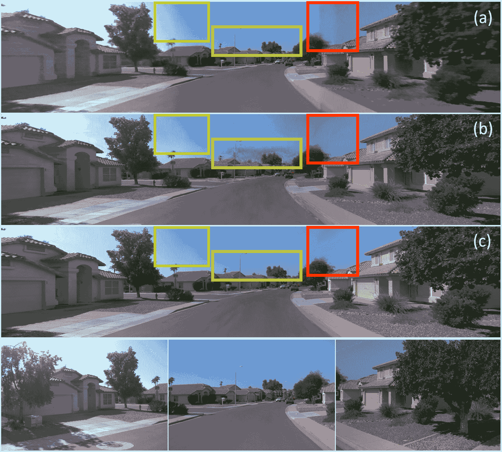

图10：广角图像生成比较。（a）S-NeRF。（b）F2NeRF。（c）McNeRF（我们的）。最后一行：目标图像。

图[10](https://arxiv.org/html/2402.05746v3#S5.F10 "Figure 10 ‣ 5.3 组件结果 ‣ 5 实验结果 ‣ 用协作LLM-Agents进行自动驾驶的可编辑场景模拟")展示了与其他方法的定性比较。我们看到，现有的NeRF方法没有考虑曝光时间，导致图像中不同摄像机接缝处亮度的明显变化，以及广角视图中曝光的一致性问题。我们的方法可以使整个图像的亮度更加一致。

| 方法 | 峰值强度（log10）误差 | 峰值角度误差（度） | 用户研究（%） $\uparrow$ |
| --- | --- | --- | --- |
| 均值 $\downarrow$ | 中位数 $\downarrow$ | 均值 $\downarrow$ | 中位数 $\downarrow$ |
| Hold-Geoffroy 等人 [[31](https://arxiv.org/html/2402.05746v3#bib.bib31)] | 0.899 | 0.975 | 48.4 | 51.6 | 19.5 |
| Wang 等人 [[68](https://arxiv.org/html/2402.05746v3#bib.bib68)] | 0.590 | 0.628 | 33.5 | 29.4 | 37.3 |
| McLight（我们的方法） | 0.449 | 0.270 | 32.3 | 26.5 | 43.1 |

表4：与先前方法在照明估计上的比较。

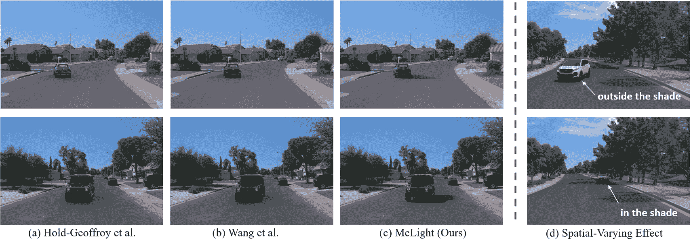

图11：与不同照明估计方法的比较。

前景渲染。我们将我们的McLight与其他两个最先进的（SoTA）方法进行比较[[68](https://arxiv.org/html/2402.05746v3#bib.bib68), [31](https://arxiv.org/html/2402.05746v3#bib.bib31)]。表[4](https://arxiv.org/html/2402.05746v3#S5.T4 "Table 4 ‣ 5.3 组件结果 ‣ 5 实验结果 ‣ 用协作LLM-Agents进行自动驾驶的可编辑场景模拟")展示了我们在HDRI数据集上的相对强度（log 10）误差、HoliCity上的角度误差[[79](https://arxiv.org/html/2402.05746v3#bib.bib79)]，以及用户研究的对比。我们看到，McLight实现了更精确的峰值行为，并获得了明显更高的用户偏好。图[11](https://arxiv.org/html/2402.05746v3#S5.F11 "Figure 11 ‣ 5.3 组件结果 ‣ 5 实验结果 ‣ 用协作LLM-Agents进行自动驾驶的可编辑场景模拟")展示了车辆插入的可视化效果。通过McLight加入的车辆表现出显著更逼真的反射和与场景一致的强烈阴影。

| 方法 | 直行 | 左转 | 右转 | 速度 | 道路内 |
| --- | --- | --- | --- | --- | --- |
| GPT2Code | 0.738 | 0.559 | 0.536 | 0.893 | 0.214 |
| GPT2Motion | 0.595 | 0.119 | 0.167 | 0.345 | 0.277 |
| 我们的方法 | 0.988 | 0.940 | 0.976 | 0.952 | 1.000 |

表5：与文本生成运动方法的比较。

车辆运动。如表[5](https://arxiv.org/html/2402.05746v3#S5.T5 "Table 5 ‣ 5.3 Component results ‣ 5 Experimental Results ‣ Editable Scene Simulation for Autonomous Driving via Collaborative LLM-Agents")所示，我们将用户命令生成的运动方法与我们设计的两种基线进行比较：1. GPT2Motion，直接使用LLM返回运动坐标；2. GPT2Code，首先使用LLM生成代码并执行，获取车辆运动。我们验证了多个场景中的多种动作，并报告了用户研究结果。用户研究的目的是确定生成的运动是否符合命令意图，并是否适应车道图。我们发现我们的方法在从语言命令生成运动方面表现出了显著的优势。此外，它保持了高比例的轨迹符合车道边界。

## 6 结论与局限性

本文介绍了ChatSim，这是首个通过语言命令编辑3D驾驶场景仿真系统，并支持导入外部数字资产的真实渲染。为了有效执行用户命令，ChatSim采用了LLM-代理协作工作流。为了促进照片级真实仿真，我们提出了McNeRF和McLight分别用于背景和前景渲染，并支持多摄像头输入。实验表明，ChatSim成功地通过语言命令模拟了定制数据，实现了高质量、照片级真实的结果。未来，我们计划将更多的背景编辑功能集成到ChatSim中，例如天气变化。

## 参考文献

+   [1] 51Sim-One. https://wdp.51aes.com/news/27.

+   [2] LLC Agisoft. Metashape——数字图像的摄影测量处理与3D空间数据生成, 2019.

+   [3] Elif Akata, Lion Schulz, Julian Coda-Forno, Seong Joon Oh, Matthias Bethge, 和 Eric Schulz. 使用大语言模型进行重复博弈. arXiv预印本 arXiv:2305.16867, 2023.

+   [4] Alexander Amini, Igor Gilitschenski, Jacob Phillips, Julia Moseyko, Rohan Banerjee, Sertac Karaman, 和 Daniela Rus. 从数据驱动的仿真中学习端到端的鲁棒控制策略用于自动驾驶. IEEE Robotics and Automation Letters, 5(2):1143–1150, 2020.

+   [5] Rohan Anil, Andrew M Dai, Orhan Firat, Melvin Johnson, Dmitry Lepikhin, Alexandre Passos, Siamak Shakeri, Emanuel Taropa, Paige Bailey, Zhifeng Chen, 等. Palm 2技术报告. arXiv预印本 arXiv:2305.10403, 2023.

+   [6] Natalie M Banta. 数字资产中的财产权：数字封建主义的崛起. Cardozo L. Rev., 38:1099, 2016.

+   [7] Jonathan T Barron, Ben Mildenhall, Matthew Tancik, Peter Hedman, Ricardo Martin-Brualla, 和 Pratul P Srinivasan. Mip-nerf: 一种用于抗锯齿神经辐射场的多尺度表示. 见于IEEE/CVF国际计算机视觉会议论文集，页面5855–5864, 2021.

+   [8] Jonathan T Barron, Ben Mildenhall, Dor Verbin, Pratul P Srinivasan, 和 Peter Hedman. Mip-nerf 360: 无限反走样神经辐射场。载于IEEE/CVF计算机视觉与模式识别大会论文集，页码5470–5479，2022年。

+   [9] Luca Bergamini, Yawei Ye, Oliver Scheel, Long Chen, Chih Hu, Luca Del Pero, Błażej Osiński, Hugo Grimmett, 和 Peter Ondruska. Simnet: 从真实世界观测中学习反应式自动驾驶仿真。载于2021 IEEE国际机器人与自动化大会（ICRA）论文集，页码5119–5125，IEEE，2021年。

+   [10] Mark Boss, Varun Jampani, Kihwan Kim, Hendrik Lensch, 和 Jan Kautz. 双镜头空间变化BRDF与形状估计。载于IEEE/CVF计算机视觉与模式识别大会论文集，页码3982–3991，2020年。

+   [11] Tom Brown, Benjamin Mann, Nick Ryder, Melanie Subbiah, Jared D Kaplan, Prafulla Dhariwal, Arvind Neelakantan, Pranav Shyam, Girish Sastry, Amanda Askell 等人. 语言模型是少样本学习者。神经信息处理系统进展，33:1877–1901，2020年。

+   [12] Holger Caesar, Varun Bankiti, Alex H Lang, Sourabh Vora, Venice Erin Liong, Qiang Xu, Anush Krishnan, Yu Pan, Giancarlo Baldan, 和 Oscar Beijbom. nuscenes: 一个用于自动驾驶的多模态数据集。载于IEEE/CVF计算机视觉与模式识别大会论文集，页码11621–11631，2020年。

+   [13] Ming-Fang Chang, John Lambert, Patsorn Sangkloy, Jagjeet Singh, Slawomir Bak, Andrew Hartnett, De Wang, Peter Carr, Simon Lucey, Deva Ramanan 等人. Argoverse: 使用丰富地图的3D跟踪与预测。载于IEEE/CVF计算机视觉与模式识别大会论文集，页码8748–8757，2019年。

+   [14] ChatGPT. https://openai.com/blog/chatgpt。

+   [15] Chenyi Chen, Ari Seff, Alain Kornhauser, 和 Jianxiong Xiao. Deepdriving: 为自动驾驶中的直接感知学习可感知性。载于IEEE国际计算机视觉大会论文集，页码2722–2730，2015年。

+   [16] Xiaozhi Chen, Kaustav Kundu, Ziyu Zhang, Huimin Ma, Sanja Fidler, 和 Raquel Urtasun. 单目3D物体检测用于自动驾驶。载于IEEE计算机视觉与模式识别大会论文集，页码2147–2156，2016年。

+   [17] Xiaozhi Chen, Huimin Ma, Ji Wan, Bo Li, 和 Tian Xia. 基于多视角的3D物体检测网络用于自动驾驶。载于IEEE计算机视觉与模式识别大会论文集，页码1907–1915，2017年。

+   [18] Aakanksha Chowdhery, Sharan Narang, Jacob Devlin, Maarten Bosma, Gaurav Mishra, Adam Roberts, Paul Barham, Hyung Won Chung, Charles Sutton, Sebastian Gehrmann 等人. Palm: 利用路径扩展语言建模。arXiv预印本arXiv:2204.02311，2022年。

+   [19] 国际电工委员会等人. IEC 61966-2-1: 1999 多媒体系统与设备-颜色测量与管理-第2-1部分: 颜色管理-默认RGB颜色空间-sRGB，1999年。

+   [20] Blender 在线社区. Blender - 一款 3D 建模和渲染软件包. Blender 基金会，Stichting Blender 基金会，阿姆斯特丹，2018.

+   [21] Valter Crescenzi, Giansalvatore Mecca, Paolo Merialdo 等. Roadrunner：迈向从大型网站自动提取数据. 载于 VLDB, 第 1 卷，第 109–118 页，2001.

+   [22] Alexey Dosovitskiy, German Ros, Felipe Codevilla, Antonio Lopez 和 Vladlen Koltun. Carla：一个开放的城市驾驶模拟器. 载于机器人学习会议论文集，第 1–16 页. PMLR, 2017.

+   [23] Yilun Du, Shuang Li, Antonio Torralba, Joshua B Tenenbaum 和 Igor Mordatch. 通过多智能体辩论改善语言模型的事实性和推理能力. arXiv 预印本 arXiv:2305.14325, 2023.

+   [24] Openscanerio 编辑器. https://github.com/ebadi/openscenarioeditor.

+   [25] Unreal Engine. https://www.unrealengine.com/.

+   [26] Ruiyuan Gao, Kai Chen, Enze Xie, Lanqing Hong, Zhenguo Li, Dit-Yan Yeung, 和 Qiang Xu. Magicdrive：利用多样化的 3D 几何控制生成街景. arXiv 预印本 arXiv:2310.02601, 2023.

+   [27] Mathieu Garon, Kalyan Sunkavalli, Sunil Hadap, Nathan Carr 和 Jean-François Lalonde. 快速估计空间变化的室内光照. 载于 IEEE/CVF 计算机视觉与模式识别会议论文集，第 6908–6917 页，2019.

+   [28] Jianfei Guo, Nianchen Deng, Xinyang Li, Yeqi Bai, Botian Shi, Chiyu Wang, Chenjing Ding, Dongliang Wang 和 Yikang Li. Streetsurf：将多视角隐式表面重建扩展到街景. arXiv 预印本 arXiv:2306.04988, 2023.

+   [29] Tanmay Gupta 和 Aniruddha Kembhavi. 视觉编程：无需训练的组合视觉推理. 载于 IEEE/CVF 计算机视觉与模式识别会议论文集，第 14953–14962 页，2023.

+   [30] Rui Hao, Linmei Hu, Weijian Qi, Qingliu Wu, Yirui Zhang, 和 Liqiang Nie. Chatllm 网络：更多的大脑，更多的智能。arXiv 预印本 arXiv:2304.12998, 2023.

+   [31] Yannick Hold-Geoffroy, Akshaya Athawale 和 Jean-François Lalonde. 单图像户外光照估计的深度天空建模. 载于 IEEE/CVF 计算机视觉与模式识别会议论文集，第 6927–6935 页，2019.

+   [32] Yannick Hold-Geoffroy, Kalyan Sunkavalli, Sunil Hadap, Emiliano Gambaretto 和 Jean-François Lalonde. 深度户外光照估计. 载于 IEEE 计算机视觉与模式识别会议论文集，第 7312–7321 页，2017.

+   [33] Sirui Hong, Xiawu Zheng, Jonathan Chen, Yuheng Cheng, Ceyao Zhang, Zili Wang, Steven Ka Shing Yau, Zijuan Lin, Liyang Zhou, Chenyu Ran 等. Metagpt：面向多智能体协作框架的元编程. arXiv 预印本 arXiv:2308.00352, 2023.

+   [34] Anthony Hu, Lloyd Russell, Hudson Yeo, Zak Murez, George Fedoseev, Alex Kendall, Jamie Shotton 和 Gianluca Corrado. Gaia-1：一种用于自动驾驶的生成世界模型. arXiv 预印本 arXiv:2309.17080, 2023.

+   [35] 亚历山大·基里洛夫、埃里克·明顿、尼基拉·拉维、汉子·毛、克洛伊·罗兰、劳拉·古斯塔夫森、谢天特·肖、斯宾塞·怀特黑德、亚历山大·C·伯格、罗万·颜·罗等人。Segment anything。arXiv预印本arXiv:2304.02643，2023年。

+   [36] 阿比吉特·昆杜、凯尔·吉诺瓦、夏乔奇·殷、阿里雷扎·法希、卡罗琳·潘托法鲁、利奥尼达斯·J·吉巴斯、安德烈亚·塔利亚萨奇、弗兰克·德拉尔特和托马斯·芬克豪泽。全景神经场：一种语义物体感知的神经场景表示。在IEEE/CVF计算机视觉与模式识别会议论文集，页面12871–12881，2022年。

+   [37] 让-弗朗索瓦·拉隆德和伊恩·马修斯。户外图像集中的光照估计。2014年第二届国际三维视觉会议，卷1，第131–138页。IEEE，2014年。

+   [38] 让-弗朗索瓦·拉隆德、斯里尼瓦萨·G·纳拉西曼和亚历克谢·A·埃夫罗斯。太阳和天空告诉我们关于相机什么信息？《计算机视觉国际期刊》，88:24–51，2010年。

+   [39] 克洛伊·勒金德尔、马万春、格雷厄姆·费夫、约翰·弗林、劳伦特·夏博内尔、杰伊·布什和保罗·德贝维克。Deeplight：为无约束的移动混合现实学习光照。在IEEE/CVF计算机视觉与模式识别会议论文集，页面5918–5928，2019年。

+   [40] 李佩轩、赵怀慈、刘鹏飞和曹飞道。Rtm3d：基于物体关键点的实时单目三维检测用于自动驾驶。欧洲计算机视觉会议，页面644–660。Springer，2020年。

+   [41] 李小凡、张一夫和叶小青。Drivingdiffusion：基于潜在扩散模型的布局引导多视角驾驶场景视频生成。arXiv预印本arXiv:2310.07771，2023年。

+   [42] 李卓鹏、李璐和朱建科。Read：面向自动驾驶的大规模神经场景渲染。在2023年AAAI人工智能会议论文集，卷37，第1522–1529页，2023年。

+   [43] 李政钦、许泽翔、拉维·拉马穆尔蒂、卡良·孙卡瓦利和曼莫汉·钱德拉克。通过单张图像学习重建形状和空间变化反射率。《ACM图形学报》（TOG），37(6):1–11，2018年。

+   [44] 廖本成、陈绍宇、王兴刚、程天恒、张倩、刘文宇和黄昌。Maptr：用于在线向量化高清地图构建的结构化建模与学习。arXiv预印本arXiv:2208.14437，2022年。

+   [45] 廖本成、陈绍宇、张云池、姜博、张倩、刘文宇、黄昌和王兴刚。Maptrv2：一种端到端的在线向量化高清地图构建框架。arXiv预印本arXiv:2308.05736，2023年。

+   [46] 刘志健、唐昊天、亚历山大·阿米尼、杨欣宇、毛慧紫、丹妮拉·L·鲁斯和宋汉。Bevfusion：统一的鸟瞰图表示的多任务多传感器融合。2023年IEEE国际机器人与自动化大会（ICRA），页面2774–2781。IEEE，2023年。

+   [47] Ben Mildenhall, Pratul P Srinivasan, Matthew Tancik, Jonathan T Barron, Ravi Ramamoorthi 和 Ren Ng。NeRF：将场景表示为神经辐射场进行视图合成。《计算机协会通讯》，65(1):99–106，2021年。

+   [48] Milan Miric, Kevin J Boudreau 和 Lars Bo Jeppesen。保护他们的数字资产：应用开发者使用的正式与非正式可得性策略。《研究政策》，48(8):103738，2019年。

+   [49] Thomas Müller, Alex Evans, Christoph Schied 和 Alexander Keller。使用多分辨率哈希编码的即时神经图形原语。《ACM 图形学学报》(ToG)，41(4):1–15，2022年。

+   [50] OpenAI。GPT-4技术报告，2023年。

+   [51] Julian Ost, Issam Laradji, Alejandro Newell, Yuval Bahat 和 Felix Heide。神经点光场。收录于 IEEE/CVF 计算机视觉与模式识别会议论文集，页码18419–18429, 2022年。

+   [52] Julian Ost, Fahim Mannan, Nils Thuerey, Julian Knodt 和 Felix Heide。用于动态场景的神经场景图。收录于 IEEE/CVF 计算机视觉与模式识别会议论文集，页码2856–2865, 2021年。

+   [53] Long Ouyang, Jeffrey Wu, Xu Jiang, Diogo Almeida, Carroll Wainwright, Pamela Mishkin, Chong Zhang, Sandhini Agarwal, Katarina Slama, Alex Ray 等人。通过人类反馈训练语言模型执行指令。《神经信息处理系统进展》，35:27730–27744, 2022年。

+   [54] Jonah Philion 和 Sanja Fidler。Lift, splat, shoot：通过隐式反投影到3D来编码来自任意相机设备的图像。收录于《计算机视觉–ECCV 2020：第16届欧洲会议》，英国格拉斯哥，2020年8月23–28日，会议录，第XIV部分，第16卷，页码194–210，Springer，2020年。

+   [55] Robin Rombach, Andreas Blattmann, Dominik Lorenz, Patrick Esser 和 Björn Ommer。使用潜在扩散模型的高分辨率图像合成，2021年。

+   [56] Guodong Rong, Byung Hyun Shin, Hadi Tabatabaee, Qiang Lu, Steve Lemke, Mārtiņš Možeiko, Eric Boise, Geehoon Uhm, Mark Gerow, Shalin Mehta 等人。LGSVL模拟器：用于自动驾驶的高保真模拟器。收录于2020年IEEE第23届国际智能交通系统会议（ITSC）论文集，页码1–6，IEEE，2020年。

+   [57] Soumyadip Sengupta, Jinwei Gu, Kihwan Kim, Guilin Liu, David W Jacobs 和 Jan Kautz。基于单张图像的室内场景神经逆渲染。收录于 IEEE/CVF 国际计算机视觉会议论文集，页码8598–8607, 2019年。

+   [58] Shital Shah, Debadeepta Dey, Chris Lovett 和 Ashish Kapoor。Airsim：用于自动驾驶车辆的高保真视觉与物理模拟。收录于《领域与服务机器人：第11届国际会议成果》，页码621–635，Springer，2018年。

+   [59] Gowri Somanath 和 Daniel Kurz。用于实时增强现实的 HDR 环境图估计。收录于 IEEE/CVF 计算机视觉与模式识别会议论文集，页码11298–11306, 2021年。

+   [60] Cheng Sun, Min Sun 和 Hwann-Tzong Chen。直接体素网格优化：辐射场重建的超快收敛。发表于 IEEE/CVF 计算机视觉与模式识别会议论文集，页面 5459–5469, 2022。

+   [61] Pei Sun, Henrik Kretzschmar, Xerxes Dotiwalla, Aurelien Chouard, Vijaysai Patnaik, Paul Tsui, James Guo, Yin Zhou, Yuning Chai, Benjamin Caine 等人。自动驾驶感知的可扩展性：Waymo 开放数据集。发表于 IEEE/CVF 计算机视觉与模式识别会议论文集，页面 2446–2454, 2020。

+   [62] Pei Sun, Henrik Kretzschmar, Xerxes Dotiwalla, Aurelien Chouard, Vijaysai Patnaik, Paul Tsui, James Guo, Yin Zhou, Yuning Chai, Benjamin Caine, Vijay Vasudevan, Wei Han, Jiquan Ngiam, Hang Zhao, Aleksei Timofeev, Scott Ettinger, Maxim Krivokon, Amy Gao, Aditya Joshi, Yu Zhang, Jonathon Shlens, Zhifeng Chen 和 Dragomir Anguelov。自动驾驶感知的可扩展性：Waymo 开放数据集。发表于 IEEE/CVF 计算机视觉与模式识别会议论文集（CVPR），2020年6月。

+   [63] Alexander Swerdlow, Runsheng Xu 和 Bolei Zhou。基于鸟瞰视角布局的街景图像生成。arXiv 预印本 arXiv:2301.04634, 2023。

+   [64] Hugo Touvron, Louis Martin, Kevin Stone, Peter Albert, Amjad Almahairi, Yasmine Babaei, Nikolay Bashlykov, Soumya Batra, Prajjwal Bhargava, Shruti Bhosale 等人。Llama 2: 开放基础和微调聊天模型。arXiv 预印本 arXiv:2307.09288, 2023。

+   [65] Haithem Turki, Jason Y Zhang, Francesco Ferroni 和 Deva Ramanan。Suds: 可扩展的城市动态场景。发表于 IEEE/CVF 计算机视觉与模式识别会议论文集，页面 12375–12385, 2023。

+   [66] Peng Wang, Yuan Liu, Zhaoxi Chen, Lingjie Liu, Ziwei Liu, Taku Komura, Christian Theobalt 和 Wenping Wang。F2-nerf: 通过自由相机轨迹快速训练神经辐射场。发表于 IEEE/CVF 计算机视觉与模式识别会议论文集，页面 4150–4159, 2023。

+   [67] Xiaofeng Wang, Zheng Zhu, Guan Huang, Xinze Chen 和 Jiwen Lu。Drivedreamer: 面向自动驾驶的现实驱动世界模型。arXiv 预印本 arXiv:2309.09777, 2023。

+   [68] Zian Wang, Wenzheng Chen, David Acuna, Jan Kautz 和 Sanja Fidler。街景场景的神经光场估计与可微分虚拟物体插入。发表于欧洲计算机视觉会议，页面 380–397。Springer, 2022。

+   [69] Zhenhailong Wang, Shaoguang Mao, Wenshan Wu, Tao Ge, Furu Wei 和 Heng Ji。释放大语言模型中的认知协同：通过多角色自我协作解决任务的智能体。arXiv 预印本 arXiv:2307.05300, 2023。

+   [70] Bichen Wu, Forrest Iandola, Peter H Jin 和 Kurt Keutzer。Squeezedet: 统一的小型低功耗全卷积神经网络，用于自动驾驶的实时物体检测。发表于 IEEE 计算机视觉与模式识别会议论文集，页面 129–137, 2017。

+   [71] Qingyun Wu, Gagan Bansal, Jieyu Zhang, Yiran Wu, Shaokun Zhang, Erkang Zhu, Beibin Li, Li Jiang, Xiaoyun Zhang, 和 Chi Wang. Autogen: 通过多代理对话框架启用下一代LLM应用. arXiv预印本arXiv:2308.08155，2023年。

+   [72] Zirui Wu, Tianyu Liu, Liyi Luo, Zhide Zhong, Jianteng Chen, Hongmin Xiao, Chao Hou, Haozhe Lou, Yuantao Chen, Runyi Yang, Yuxin Huang, Xiaoyu Ye, Zike Yan, Yongliang Shi, Yiyi Liao, 和 Hao Zhao. Mars: 一种实例感知、模块化和真实的自动驾驶模拟器. CICAI，2023年。

+   [73] Ziyang Xie, Junge Zhang, Wenye Li, Feihu Zhang, 和 Li Zhang. S-nerf: 用于街景的神经辐射场. arXiv预印本arXiv:2303.00749，2023年。

+   [74] Yinda Xu 和 Lidong Yu. 基于DRL的自动驾驶运动相关模块轨迹跟踪. arXiv预印本arXiv:2308.15991，2023年。

+   [75] Kairui Yang, Enhui Ma, Jibin Peng, Qing Guo, Di Lin, 和 Kaicheng Yu. Bevcontrol: 通过BEV草图布局精确控制街景元素的多视角一致性. arXiv预印本arXiv:2308.01661，2023年。

+   [76] Zhenpei Yang, Yuning Chai, Dragomir Anguelov, Yin Zhou, Pei Sun, Dumitru Erhan, Sean Rafferty, 和 Henrik Kretzschmar. Surfelgan: 为自动驾驶合成逼真的传感器数据. 见于IEEE/CVF计算机视觉与模式识别会议论文集，页面11118–11127，2020年。

+   [77] Ze Yang, Yun Chen, Jingkang Wang, Sivabalan Manivasagam, Wei-Chiu Ma, Anqi Joyce Yang, 和 Raquel Urtasun. Unisim: 一个神经闭环传感器模拟器. 见于IEEE/CVF计算机视觉与模式识别会议论文集，页面1389–1399，2023年。

+   [78] Jinsong Zhang, Kalyan Sunkavalli, Yannick Hold-Geoffroy, Sunil Hadap, Jonathan Eisenman, 和 Jean-François Lalonde. 全天候深度户外光照估计. 见于IEEE/CVF计算机视觉与模式识别会议论文集，页面10158–10166，2019年。

+   [79] Yichao Zhou, Jingwei Huang, Xili Dai, Linjie Luo, Zhili Chen, 和 Yi Ma. HoliCity: 一个用于学习整体3D结构的城市级数据平台. 2020年。arXiv:2008.03286 [cs.CV]。

+   [80] Mingchen Zhuge, Haozhe Liu, Francesco Faccio, Dylan R Ashley, Róbert Csordás, Anand Gopalakrishnan, Abdullah Hamdi, Hasan Abed Al Kader Hammoud, Vincent Herrmann, Kazuki Irie 等人. 基于自然语言的心智社会中的心智风暴. arXiv预印本arXiv:2305.17066，2023年。

## 附录A 表2的补充说明

表2评估了5种指令类别在4种不同驾驶序列中的执行成功率。对于每个类别，准确率通过3次试验中15个专门为该类别设计的指令的平均成功率来衡量。每次试验如果LLM代理能够准确执行所需操作，包括设置正确的配置和参数值，则视为成功执行。

## 附录B 补充实验

### B.1 光照估计的补充实验。

我们将多视角输入合并为一个广角图像，以进行光照估计基线，结果见右表。McLight仍显著优于其他方法。强度评估不涉及多视角输入，与论文中的表4一致。

| 方法，多视角（MV）版本 | MV Hold-Geoffroy | MV Wang | McLight（我们的） |
| --- | --- | --- | --- |
| 峰值角度误差（均值/中位数） | 36.7/37.1 | 33.7/29.3 | 32.3/26.5 |

### B.2 背景渲染的补充实验。

下表展示了使用McNeRF中的多视角对齐进行训练的基线消融实验。多视角对齐是一种通用且实用的技巧，它能够持续改善渲染性能，而我们的McNeRF（带曝光）依然优于其他基线。

| 方法 | PSNR$\uparrow$ | SSIM$\uparrow$ | LPIPS$\downarrow$ | 推理时间（秒）$\downarrow$ |
| --- | --- | --- | --- | --- |
| DVGO + 对齐 | 24.65 | 0.787 | 0.487 | 7.7 |
| Mip-NeRF360 + 对齐 | 25.50 | 0.759 | 0.514 | 101.8 |
| S-NeRF + 对齐 | 25.53 | 0.760 | 0.513 | 114.5 |
| F2NeRF + 对齐 | 25.18 | 0.819 | 0.381 | 2.4 |
| F2NeRF + 对齐 + 曝光（我们的） | 25.82 | 0.822 | 0.378 | 2.5 |

## 附录C LLM-Agents 详情

### C.1 Agent 实现详情

LLM-Agents由其LLM（大型语言模型）组件及相应功能组成。所有实验均使用GPT-4 API[[50](https://arxiv.org/html/2402.05746v3#bib.bib50)]来实现LLM部分。在每个代理的提示中，包含了涉及代理功能的元素、代理需要执行的动作定义、输入到代理的定义信息，以及代理需要输出的定义结果。为了便于Python代码的集成并确保稳定的调用，LLM部分要求以JSON字典格式返回信息。此外，每个LLM部分的提示还包括一些示例，包含特定场景的输入和相应的预期输出。如果输入命令中没有包含输出JSON字典的键信息，则会在字典中填充默认值。与GPT-4 API相关的所有参数都设置为官方默认值。

请注意，为了支持在多轮命令中的修改操作，3D资产管理代理、车辆运动代理和车辆删除代理具备修改已添加或删除车辆信息的能力。

### C.2 推理过程

本节描述了第5.2节中提出的三个案例的自然语言推理过程。

混合和复杂的命令。初始输入命令是：“移除场景中的所有汽车，并快速添加一辆逆行的保时捷朝我驶来。此外，添加一辆警车也在逆行并追赶保时捷。视角应该向前移动5米，并上移0.5米。”该命令被项目经理代理解耦为以下命令：1. “移除所有汽车。”；2. “添加一辆逆行的保时捷朝我快速驶来。”；3. “添加一辆警车也在逆行并追赶保时捷。”；4. “视角应该向前移动5米，并上移0.5米。”。“移除所有汽车。”命令被分配给车辆删除代理，然后该代理查找所有汽车的3D框并应用修复功能执行删除操作。“添加一辆逆行的保时捷朝我快速驶来。”命令被分配给3D资源管理代理，以选择合适的3D资源。该命令还将分配给车辆运动代理，后者利用命令中的关键信息，包括“逆行”，“朝我”和“快速”来选择合适的起始和结束点，并使用运动生成函数生成运动。“添加一辆警车也在逆行并追赶保时捷。”命令将以与前述操作相同的方式执行。该命令提到新增车辆的信息，新增车辆的信息已由项目经理记忆并提供给车辆运动代理，用于确定新增警车的位置。“视角应该向前移动5米，并上移0.5米。”命令被分配给视角调整代理。视角调整代理返回外部调整的配置信息，并调用函数来改变外部参数以实现视角调整。最后，背景渲染和前景渲染代理需要根据其他代理返回的信息生成背景和前景结果，最终结果将组成最终输出。

高度抽象的命令。初始输入命令是：“创建一个交通拥堵。”项目经理代理分析该命令并将其解耦为多个重复的汽车添加命令。这些添加命令依次由3D资源管理代理和车辆运动代理处理，并由前景渲染代理渲染。结合背景渲染代理渲染的结果，我们可以得到最终输出。

多轮指令。第一条初始指令是：“自驾车缓慢前进。向近前添加一辆正在前进的车。”该指令由项目经理代理人解耦为1：“自驾车缓慢前进。”；2：“向近前添加一辆正在前进的车。”第一条子指令分发给视图调整代理人，代理人生成表示缓慢前进的外参。第二条子指令按上述过程执行。

第二条初始指令是：“修改已添加的车使其向左转。向已添加的车前方添加一辆雪佛兰。向已添加的 Mini 左侧添加另一辆朝我行驶的车。”该指令由项目经理代理人解耦为1：“修改已添加的车使其向左转。”；2：“向已添加的车前方添加一辆雪佛兰。”；3：“向已添加的 Mini 左侧添加另一辆朝我行驶的车。”第一条子指令分发给车辆运动代理人，该代理人基于命令为已确定的添加车辆生成新的运动。接下来的两条子指令按上述方式执行。将背景渲染和前景渲染代理人的输出合成，可以得到最终的输出。

## 附录 D 天穹照明估算细节

### D.1 HDRI 数据集

我们从[Poly Heaven 网站](https://polyhaven.com/hdris)收集了449张高质量的户外全景 HDRI 图像。这些 HDRI 图像全部采用 CC0 许可。我们随机选择了357张 HDRI 用于训练集，其余用于测试集。用于下载这些 HDRI 的脚本将会提供。

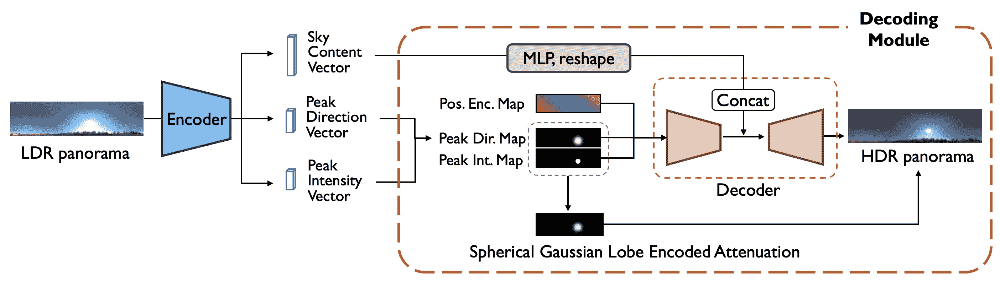

图 12：从 LDR 到 HDR 的重建网络。我们添加了一个显式的球面高斯瓣编码衰减，以克服解码后的 HDR 全景图中的过度平滑现象。它有效地确保了太阳的强度显著超过周围像素，从而为插入的物体渲染出强烈的阴影效果。

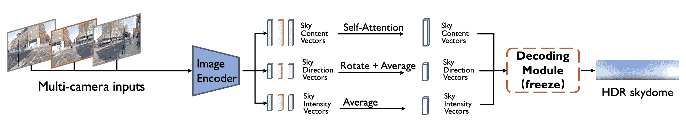

图 13：从多摄像头图像重建 HDR 天穹。基于 HoliCity 数据集[[79](https://arxiv.org/html/2402.05746v3#bib.bib79)]进行训练。

### D.2 从 LDR 到 HDR 的天穹重建

在这一步中，我们利用我们的HDRI数据集训练一个LDR到HDR的自编码器，目的是将天穹转换为紧凑的特征表示。我们使用sRGB光电传递函数（也称为伽马校正）来获取LDR天空全景图，并参考[[68](https://arxiv.org/html/2402.05746v3#bib.bib68)]将LDR天空全景图转换为3个中间向量，包括天空内容向量$\mathbf{f}_{\rm content}\in\mathbb{R}^{64}$、峰值方向向量$\mathbf{f}_{\rm dir}\in\mathbb{R}^{3}$和强度向量$\mathbf{f}_{\rm int}\in\mathbb{R}^{3}_{+}$。在将中间向量转换为重建的HDR天空全景图的过程中，我们构造了峰值方向图$\mathbf{M}_{\rm dir}$、峰值强度图$\mathbf{M}_{\rm int}$和位置信息编码图$\mathbf{M}_{\rm pe}$。

峰值方向图（$\mathbf{M}_{\rm dir}$）：对于$\mathbf{M}_{\rm dir}$中的每个像素，我们计算峰值方向嵌入。此计算利用球面高斯叶片，公式为$\mathbf{M}_{\rm dir}(\mathbf{u})=e^{100*(\mathbf{u}\cdot\mathbf{f}_{dir}-1)}$，其中$\mathbf{f}_{\rm dir}$表示峰值方向向量。该图表示在$\mathbb{R}^{H\times W\times 1}$中。

峰值强度图（$\mathbf{M}_{\rm int}$）：该图中的每个像素值是基于其在峰值方向图中的对应值来确定的。具体来说，对于给定方向$\mathbf{u}$，如果$\mathbf{M}_{\rm dir}(\mathbf{u})>0.9$，则$\mathbf{M}_{\rm int}(\mathbf{u})$将被赋值为$\mathbf{f}_{\rm int}$。否则，$\mathbf{M}_{\rm int}(\mathbf{u})$被设置为零。该图表示在$\mathbb{R}_{+}^{H\times W\times 3}$中。

位置信息编码图（$\mathbf{M}_{\rm pe}$）：该图编码了每个像素的方向向量，通过等矩形投影确定，从而有助于准确重建HDR天空全景图。它的定义在$\mathbb{R}^{H\times W\times 3}$中。

解码器的输入$\mathbf{M}_{\rm input}$是$\mathbf{M}_{\rm pe}$、$\mathbf{M}_{\rm dir}$和$\mathbf{M}_{\rm int}$的拼接。我们使用2D UNet解码拼接后的输入图像，得到HDR天空全景图。对于天空内容向量$\mathbf{f}_{\rm content}$，我们使用多层感知机（MLP）来增加其特征维度，将其重塑为2D特征图，并将其与UNet瓶颈处的中间特征进行拼接。这个拼接后的特征将进一步解码为HDR天空全景图。

在HDR成像的背景下，峰值强度通常呈现出类似脉冲响应的特征，显示出与相邻像素相比，像素值被大幅度地提升。对于解码器来说，准确恢复这些模式是一个巨大的挑战。因此，我们设计了一种残差连接，明确地将峰值强度信息注入到最终的HDR天空全景图中。设$\mathbf{M}_{\rm peak}$为$\mathbf{M}_{\rm dir}$和$\mathbf{M}_{\rm int}$的乘积，表示由球形高斯叶片编码的衰减。在我们的设计中，我们特别将峰值位置的解码HDR天空全景图替换为$\mathbf{M}_{\rm peak}$。这种替换仅在$\mathbf{M}_{\rm int}(\mathbf{u})$的值非零时应用，确保HDR天空全景图中的峰值位置被$\mathbf{M}_{\rm peak}$准确表示。这与[[68](https://arxiv.org/html/2402.05746v3#bib.bib68)]有所不同。准确且强烈的峰值强度能够产生非常强的阴影效果，从而实现更好的渲染真实感。请参见图 [12](https://arxiv.org/html/2402.05746v3#A4.F12 "图12 ‣ D.1 HDRI数据集 ‣ 附录D 天穹光照估计详情 ‣ 通过协同LLM代理的自动驾驶可编辑场景仿真")。

为了训练LDR到HDR的天穹重建，我们从HDR的地面真值计算出峰值方向$\mathbf{f}_{\rm dir}^{\rm gt}$和峰值强度$\mathbf{f}_{\rm int}^{\rm gt}$。在网络训练过程中，我们使用四种损失函数进行监督。这些损失函数如下：峰值方向损失$L_{\rm dir}$，用于衡量峰值方向向量的L1角度误差；峰值强度损失$L_{\rm int}$，用于量化峰值强度向量的对数编码L2误差；HDR重建损失$L_{\rm hdr-recon}$，用于评估重建的HDR输出与地面真值HDR数据之间的对数编码L2误差；LDR重建损失$L_{\rm ldr-recon}$，通过计算输入的LDR天空全景图与伽马校正后的HDR重建之间的L1误差来得到。

总损失为$L_{\rm total}=\lambda_{1}L_{\rm dir}+\lambda_{2}L_{\rm int}+\lambda_{3}L_{\rm hdr-recon}+\lambda_{4}L_{\rm ldr-recon}$，其中$\lambda_{1}=1,\lambda_{2}=0.1,\lambda_{3}=2$和$\lambda_{4}=0.2$。

数据增强方法，包括旋转、翻转、曝光调整和白平衡调整，被用于丰富训练数据。注意到Waymo开放数据集[[61](https://arxiv.org/html/2402.05746v3#bib.bib61)]中的图像数据存在明显的白平衡不准确（色温过高），我们对HDRI进行了相应的白平衡调整增强。蓝色通道被随机放大1.2-1.3倍，红色通道被随机缩小1.2-1.3倍。

### D.3 从多摄像头图像预测HDR天穹

这一步骤涉及从车辆收集的多摄像头图像中估计天穹照明。核心思想是从多个视角估计中间特征，并使用经过良好训练的HDR重建解码模块恢复天穹照明。我们强调融合来自多个摄像头的中间特征，以便为天穹照明提供互补且全面的预测。

多摄像头图像数据首先通过共享的图像编码器，预测每个图像$\mathcal{I}^{(i)}$的峰值方向向量$\mathbf{f}_{\rm dir}^{(i)}$、强度向量$\mathbf{f}_{\rm int}^{(i)}$和天空内容向量$\mathbf{f}_{\rm content}^{(i)}$，其中$i$是摄像头索引。对于来自$N$个摄像头的这些向量，我们通过以下策略融合所有特征：

我们使用它们的外部参数将$\mathbf{f}_{\rm dir}^{(i)},i=1,2,...,N$转换到前向视图，并将旋转后的方向向量平均为$\bar{\mathbf{f}}_{\rm dir}$；我们将$\mathbf{f}_{\rm int}^{(i)},i=1,2,...,N$平均为$\bar{\mathbf{f}}_{\rm int}$；我们利用注意力机制将天空内容向量融合为$\bar{\mathbf{f}}_{\rm content}=\texttt{Attn(q, k, v)}$，其中$\texttt{q}=\mathbf{f}^{(0)}_{\rm content}$，$\texttt{k}=\texttt{v}=\texttt{stack}(\{\mathbf{f}^{i}_{\rm content}\}_{i=0,1,.% ..,N-1})$。这里索引0表示第一（前向）视图图像，$\texttt{Attn}(\cdot,\cdot,\cdot)$是标准的注意力操作符。给定$\bar{\mathbf{f}}_{\rm dir}$、$\bar{\mathbf{f}}_{\rm int}$、$\bar{\mathbf{f}}_{\rm content}$，我们使用前一阶段的预训练解码模块将融合的中间向量恢复为HDR全景图像。见图[13](https://arxiv.org/html/2402.05746v3#A4.F13 "Figure 13 ‣ D.1 HDRI dataset ‣ Appendix D Skydome Lighting Estimation Details ‣ Editable Scene Simulation for Autonomous Driving via Collaborative LLM-Agents")。

由于在自动驾驶数据集中没有相关的全景数据用于监督学习，我们使用HoliCity [[79](https://arxiv.org/html/2402.05746v3#bib.bib79)]来模拟多摄像头图像。基于Waymo车辆上三台前向摄像头的排列和视场（FOV）[[61](https://arxiv.org/html/2402.05746v3#bib.bib61)]，我们从HoliCity全景图像中裁剪出相应的图像作为模型输入。为了监督图像编码器的学习，我们使用前一阶段的LDR到HDR重建网络生成伪峰值强度向量GT、峰值方向向量GT、天空内容向量GT和HDR天穹GT。

我们在训练过程中应用五个损失来监督网络。这些损失如下：峰值方向损失 $L_{\rm dir}$，衡量融合峰值方向向量的 L1 角度误差；峰值强度损失 $L_{\rm int}$，计算融合峰值强度向量的对数编码 L2 误差；天空内容损失 $L_{\rm content}$，评估融合天空内容向量的 L1 误差；HDR 重建损失 $L_{\rm hdr-recon}$，具有对数编码的 L2 误差；LDR 重建损失 $L_{\rm ldr-recon}$，具有 L1 误差。

总损失为 $L_{\rm total}=\lambda_{1}L_{\rm dir}+\lambda_{2}L_{\rm int}+\lambda_{3}L_{\rm content% }+\lambda_{4}L_{\rm hdr-recon}+\lambda_{5}L_{\rm ldr-recon}$，其中 $\lambda_{1}=0.5,\lambda_{2}=0.25,\lambda_{3}=0.005,\lambda_{4}=0.1$ 和 $\lambda_{5}=0.2$。

## 附录 E 3D 资产库

为了确保 3D 资产的便捷访问和修改，我们在其 Blender 文件中按照以下程序对 Blender 模型进行归一化处理：

1.  1.

    我们确保模型具有准确的物理尺寸，单位为米。

1.  2.

    汽车模型的原点设置在汽车底部的中央。我们将模型定位于世界坐标系的中心，确保汽车模型的原点与世界坐标系的原点对齐。汽车朝向 x 轴的正方向。

1.  3.

    我们统一将 Principled BSDF 材质应用于汽车车身，并将材质命名为“car_paint”。改变资产颜色的提示将影响 Principled BSDF 节点的“Base Color”属性。

1.  4.

    我们使用 Join 操作符将所有网格合并为一个对象。

按照上述方法，我们将从互联网收集的 Blender 模型进行归一化处理，以不断扩展我们的 3D 资产库。

## 附录 F Blender 渲染细节

我们通过 Python 脚本完全实现了 Blender 渲染工作流，包含了 alpha 通道、深度通道和阴影效果等功能，所有这些都在一次渲染过程中完成。

1.  1.

    为了获得透明背景，我们首先启用了渲染属性 - 电影 - 透明选项。

1.  2.

    为了获得多个渲染输出，我们在视图层属性面板中启用了合成通道、Z 通道和阴影捕捉通道。

1.  3.

    为了渲染阴影，我们在汽车下方添加了一个非常大的平面，并启用了平面的对象属性 - 可见性 - 遮罩 - 阴影捕捉选项。

1.  4.

    为了获得与场景相关的彩色阴影，我们构建了如图 [14](https://arxiv.org/html/2402.05746v3#A6.F14 "Figure 14 ‣ item 4 ‣ Appendix F Blender Rendering Details ‣ Editable Scene Simulation for Autonomous Driving via Collaborative LLM-Agents") 所示的合成节点图。这一配置生成了叠加在场景图像上的渲染图像，以及附带的深度信息和车辆的遮罩及其对应的阴影。

    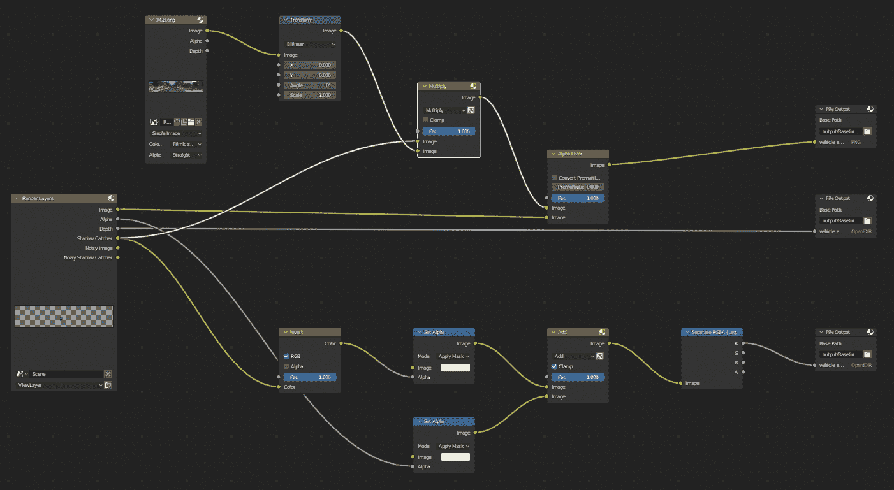

    图 14：Blender 中的合成节点图设计 [[20](https://arxiv.org/html/2402.05746v3#bib.bib20)]

1.  5.

    通过使用深度信息和遮罩，我们可以处理与场景中原始物体的遮挡关系。我们还为渲染的汽车添加了适量的运动模糊，以与背景相匹配。

## 附录 G 运动生成详情

车辆运动代理根据请求的命令创建车辆的初始位置和随后的运动。现有的车辆运动生成方法不能仅通过文本和场景地图直接生成运动。在这里，我们详细阐述了我们的文本到运动的方法。我们的方法由两部分组成：车辆放置生成起始点和车辆运动规划生成随后的运动。

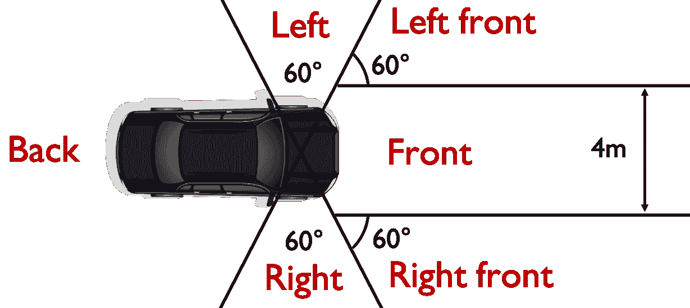

图 15：车辆放置的邻近区域划分。

### G.1 车辆放置

我们使用语言命令和场景地图生成初始位置。场景地图 $\mathcal{M}$ 采用车道地图形式 $\mathcal{M}=\{\mathbf{n}_{i},i=1,2,\cdots,m\}$，其中 $m$ 是车道节点的数量，第 $i$ 个车道节点 $\mathbf{n}_{i}=(x_{\rm s},y_{\rm s},x_{\rm e},y_{\rm e},c_{\rm type})$ 由车道起始位置 $(x_{\rm s},y_{\rm s})$、结束位置 $(x_{\rm e},y_{\rm e})$ 和车道类型 $c_{\rm type}$ 组成。地图范围是从前方 80 米、左侧 20 米和右侧 20 米范围裁剪而来。通常，我们使用来自真实数据的车道地图。如果车道地图不存在，可以使用车道地图估计方法，如 [[44](https://arxiv.org/html/2402.05746v3#bib.bib44), [45](https://arxiv.org/html/2402.05746v3#bib.bib45)] 来获取车道地图。

给定语言命令，LLM首先提取关键放置属性，包括车辆编号、距离范围、与观察者的相对方向、行驶方向和疯狂模式。有了这些属性，放置功能开始从场景地图中找到合适的车道节点。这里我们假设所有放置的车辆都位于道路的中心线。如果距离范围$(d_{\rm min}, d_{\rm max})$已确定，放置功能根据与自车位置的距离选择车道中心线节点。对于相对方向，我们将自车邻近区域分为6类：前方、左前方、右前方、左侧、右侧和后方，参见图[15](https://arxiv.org/html/2402.05746v3#A7.F15 "图 15 ‣ 附录 G 运动生成细节 ‣ 协作LLM代理的自动驾驶可编辑场景模拟")进行说明。对于行驶方向，我们考虑两种类型：靠近自车行驶和远离自车行驶，这决定了车辆在道路上的左右侧。疯狂模式是为不符合规范的逆向行驶行为设计的布尔变量。当该值为真时，我们会反转地图的方向（交换每条车道的起点和终点），以表示逆向行驶。我们选择匹配的车道节点集，并从中随机选择一个车道节点。我们还通过迭代方法考虑车辆放置的冲突，即来车不应与已存在的车辆重叠。获取每辆车的车道节点后，我们将车道节点的中点设置为车辆的初始位置，车道的方向设置为车辆的初始航向。

### G.2 车辆运动规划

在获取初始位置后，我们通过两步生成动作：规划目标地点和规划中间轨迹。我们首先提取运动属性，包括速度、动作、间隔和时间长度。值得注意的是，我们将动作分为五类：直行、左转、右转、停车和倒车。为了获取目标地点，如果动作类别是直行、停车或倒车，我们通过假设车辆沿着一条直线行驶并保持目标速度，直接计算出一个初步的目标地点。然后，我们找到与该初步目标地点最近的车道节点作为最终目标地点。如果动作类别是左转或右转，我们选择一组与初始行驶方向垂直距离在（5米-30米）范围内的节点，并拟合行驶方向（该方向应远离起点）。我们随机选择一个车道节点作为目标地点。

为了规划中间轨迹，我们采用迭代调整方法，使轨迹与地图匹配，并避免越野驾驶。我们首先使用一条三次贝塞尔曲线，在起点、起始方向、终点和终止方向的条件下拟合整体轨迹。三次贝塞尔曲线的公式为

|  | $\displaystyle B(t)=$ | $\displaystyle(1-t)^{3}P_{0}+3t(1-t)^{2}P_{1}$ |  | (2) |
| --- | --- | --- | --- | --- |
|  |  | $\displaystyle+3t^{2}(1-t)P_{2}+t^{3}P_{3},t\in[0,1],$ |  |

其中 $P_{0},P_{1},P_{2},P_{3}\in\mathbb{R}^{2}$ 是控制点，可以通过给定的起点、起始方向、终点和终止方向来求解。为了避免中间轨迹出现越野驾驶，我们通过将中间坐标替换为最近的车道节点来调整中间坐标。我们将整个轨迹分为两部分，以中间坐标为边界，并使用一条三次贝塞尔曲线拟合每一段轨迹。我们通过迭代重复这个过程，使用多条三次贝塞尔曲线表示规划轨迹。最后，为了使规划轨迹与车辆动态匹配，我们在后处理中使用[[74](https://arxiv.org/html/2402.05746v3#bib.bib74)]中提出的轨迹跟踪方法对规划轨迹进行修正^*^**[https://drl-based-trajectory-tracking.readthedocs.io/en/latest/](https://drl-based-trajectory-tracking.readthedocs.io/en/latest/)。

## 附录 H 背景渲染细节

### H.1 数据集选择

对于所有Waymo Open Dataset [[61](https://arxiv.org/html/2402.05746v3#bib.bib61)] 实验，我们使用从三个前置摄像头捕获的图像。选择的详细信息见表[6](https://arxiv.org/html/2402.05746v3#A8.T6 "Table 6 ‣ H.1 Dataset Selection ‣ Appendix H Background rendering details ‣ Editable Scene Simulation for Autonomous Driving via Collaborative LLM-Agents")。每个场景总共有120张图像。

| 序列 | 起始帧 |
| --- | --- |
| segment-10247954040621004675_2180_000_2200_000 | 0 |
| segment-13469905891836363794_4429_660_4449_660 | 40 |
| segment-14333744981238305769_5658_260_5678_260 | 40 |
| segment-1172406780360799916_1660_000_1680_000 | 50 |
| segment-4058410353286511411_3980_000_4000_000 | 90 |
| segment-10061305430875486848_1080_000_1100_000 | 30 |
| segment-14869732972903148657_2420_000_2440_000 | 0 |
| segment-16646360389507147817_3320_000_3340_000 | 0 |
| segment-13238419657658219864_4630_850_4650_850 | 0 |
| segment-14424804287031718399_1281_030_1301_030 | 60 |
| segment-15270638100874320175_2720_000_2740_000 | 60 |
| segment-15349503153813328111_2160_000_2180_000 | 100 |
| segment-15868625208244306149_4340_000_4360_000 | 110 |
| segment-16608525782988721413_100_000_120_000 | 10 |
| segment-17761959194352517553_5448_420_5468_420 | 0 |
| segment-3425716115468765803_977_756_997_756 | 0 |
| segment-3988957004231180266_5566_500_5586_500 | 0 |
| segment-9385013624094020582_2547_650_2567_650 | 130 |
| segment-8811210064692949185_3066_770_3086_770 | 30 |
| segment-10275144660749673822_5755_561_5775_561 | 0 |
| segment-10676267326664322837_311_180_331_180 | 100 |
| segment-12879640240483815315_5852_605_5872_605 | 20 |
| segment-13142190313715360621_3888_090_3908_090 | 0 |
| segment-13196796799137805454_3036_940_3056_940 | 70 |
| segment-14348136031422182645_3360_000_3380_000 | 140 |
| segment-15365821471737026848_1160_000_1180_000 | 0 |
| segment-16470190748368943792_4369_490_4389_490 | 0 |
| segment-11379226583756500423_6230_810_6250_810 | 0 |
| segment-13085453465864374565_2040_000_2060_000 | 110 |
| segment-14004546003548947884_2331_861_2351_861 | 0 |
| segment-15221704733958986648_1400_000_1420_000 | 70 |
| segment-16345319168590318167_1420_000_1440_000 | 0 |

表 6: 所选和裁剪的 Waymo Open Dataset 信息 [[61](https://arxiv.org/html/2402.05746v3#bib.bib61)]。对于每个序列，我们选择从起始帧开始的40帧。

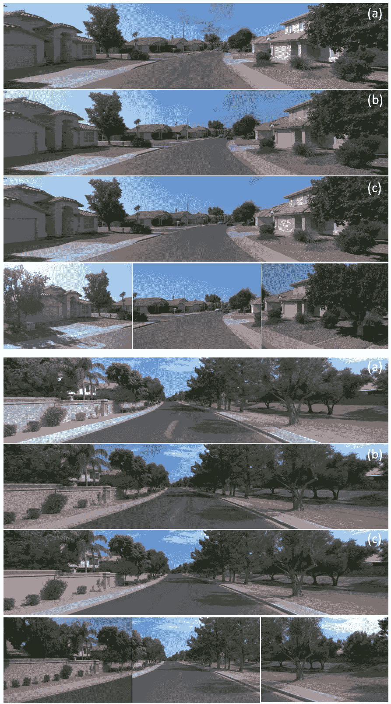

图16：背景渲染的定性消融研究。(a) McNeRF 无姿态对齐。(b) McNeRF 无曝光调整。(c) 完整的 McNeRF。最后一行：目标图像。

### H.2 多摄像头对齐

本节将介绍我们多摄像头对齐算法的详细信息。设$R_{C_{i},t}$和$T_{C_{i},t}$表示摄像头$C_{i}$在时间戳$t$对齐到车辆坐标系的外参矩阵。$C_{0}$为前置摄像头。上标$(V)$和$(M)$分别表示自动驾驶数据集中的原始车辆坐标系和Metashape统一空间下的坐标系。然后，旋转矩阵$R_{C_{i},t}$和平移向量$T_{C_{i},t}$可以通过以下公式计算：

|  | $\displaystyle R_{C_{i},t}$ | $\displaystyle=R^{(V)}_{C_{0},0}(R^{(M)}_{C_{0},0})^{-1}R^{(M)}_{C_{i},t}$ |  |
| --- | --- | --- | --- |
|  | $\displaystyle T_{C_{i},t}$ | $\displaystyle=\frac{R^{(V)}_{C_{0},0}(R^{(M)}_{C_{0},0})^{-1}(T^{(M)}_{C_{i},t% }-T^{(M)}_{C_{0},0})}{S}+T^{(V)}_{C_{0},0},$ |  |

其中$S=\frac{T^{(M)}_{C_{0},1}-T^{(M)}_{C_{0},0}}{T^{(V)}_{C_{0},1}-T^{(V)}_{C_{0},% 0}}$是一个缩放因子，确保对齐后的空间与现实世界具有相同的单位长度。

## 附录 I 补充实验

### I.1 背景渲染的定性消融研究

图[16](https://arxiv.org/html/2402.05746v3#A8.F16 "Figure 16 ‣ H.1 Dataset Selection ‣ Appendix H Background rendering details ‣ Editable Scene Simulation for Autonomous Driving via Collaborative LLM-Agents")展示了背景渲染的消融研究效果。显然，在没有姿态调整的情况下，渲染结果表现出显著的模糊和异常。如果没有曝光调整的介入，不同相机的接缝处会出现亮度变化，特别是在天空区域。然而，McNeRF成功避免了这两个问题，达到了最佳渲染效果。

图 17：遮挡后处理结果和新增车辆的颜色控制定性结果。

### I.2 深度测试中的遮挡

在添加车辆的过程中，可能会出现遮挡现象。对于多辆车辆之间的遮挡问题，Blender 在渲染过程中会考虑这一问题。因此，我们只需关注前景车辆与背景物体之间的遮挡。处理遮挡的最直接方法是根据前景和背景的深度图来确定。前景和背景的深度图可以用来选择每个像素较小深度的显示在前面，较大深度的则被遮挡。然而，直接准确估计背景的深度图是具有挑战性的。自动驾驶数据集中的点云数据过于稀疏，通过深度补全获得的深度图也很稀疏且噪声过多，无法满足实际应用中的像素级精度。在这里，我们将点云中的稀疏深度数据与物体分割方法SAM[[35](https://arxiv.org/html/2402.05746v3#bib.bib35)]结合。SAM可以在图像级别上实现像素级精度的分割结果，无需额外的微调。我们首先使用SAM获取背景图像中的不同补丁，然后识别与前景物体重叠的补丁。利用从点云推导出的稀疏深度图，我们计算这些补丁内的平均稀疏深度作为每个补丁的深度。由于补丁的分割结果通常表示一个完整的实例，而遮挡发生在实例之间，因此计算代表补丁的整个实例的深度是合理的。随后，我们根据这些补丁的深度创建背景的深度图，并与前景渲染的深度图进行遮挡计算，最终通过展示较小深度的像素来完成遮挡计算。遮挡计算的结果，如图[17](https://arxiv.org/html/2402.05746v3#A9.F17 "图 17 ‣ I.1 背景渲染的定性消融研究 ‣ 附录 I 补充实验 ‣ 通过协作LLM-代理进行自动驾驶场景仿真")所示，说明新增的车辆被深度较浅的车辆遮挡。该图还展示了新增车辆颜色的调整。

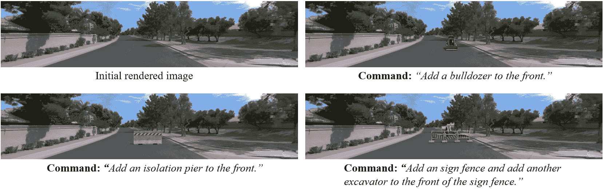

图 18：稀有情况模拟的定性结果。

### I.3 稀有情况模拟

借助多样的外部数字资源，ChatSim 可以在重建的现有场景中模拟稀有且难以收集的真实世界场景。图 [18](https://arxiv.org/html/2402.05746v3#A9.F18 "图 18 ‣ I.2 深度测试遮挡 ‣ 附录 I 补充实验 ‣ 通过协作的 LLM 代理进行自动驾驶的可编辑场景仿真") 展示了 ChatSim 通过将推土机、隔离码头、围栏、挖掘机等不常见的元素放置在重建的场景中，来模拟稀有情况的能力。这种能力使 ChatSim 能够为现有的收集数据创建稀有的数字双胞胎，从而满足这些特定场景的需求。

| 仿真数据 | AP30 | AP50 | AP70 |
| --- | --- | --- | --- |
| 0 | 0.1263 | 0.0366 | 0.0034 |
| 600 | 0.1910 | 0.0878 | 0.0153 |
| 1000 | 0.2074 | 0.0930 | 0.0189 |
| 2200 | 0.2064 | 0.0900 | 0.0182 |

表格 7：不同数量数据下，ChatSim 模拟的检测模型性能对比

### I.4 补充 3D 检测增强实验

我们在一个新的设置下进行了 3D 检测增强实验：我们将原始数据集中的实际数据量固定为 4200 帧，并通过 ChatSim 生成不同数量的仿真数据进行增强。我们继续使用 Lift-Splat [[54](https://arxiv.org/html/2402.05746v3#bib.bib54)] 作为检测模型，结果如表 [7](https://arxiv.org/html/2402.05746v3#A9.T7 "表 7 ‣ I.3 稀有案例模拟 ‣ 附录 I 补充实验 ‣ 通过协作的 LLM 代理进行自动驾驶的可编辑场景仿真") 所示。观察到，使用仿真数据显著提升了 3D 检测任务的性能。随着仿真数据量的增加，最终的性能在一定程度的提升后趋于稳定。

(FiXme) FiXme 总结：注释数量：0，警告数量：0，错误数量：0，致命错误数量：0，总计：0
