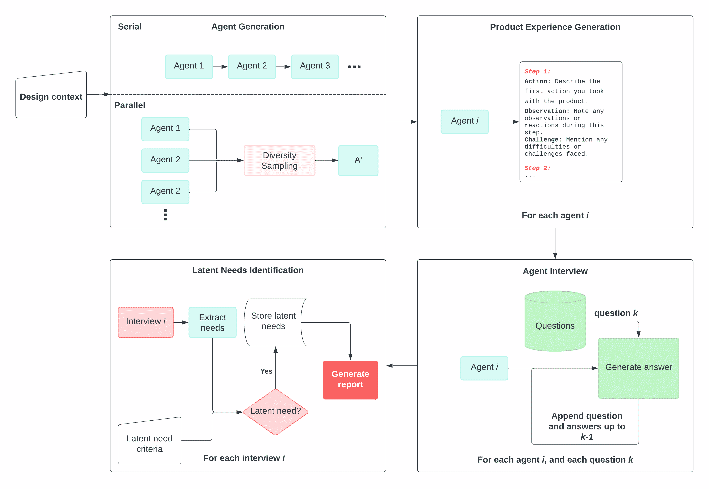
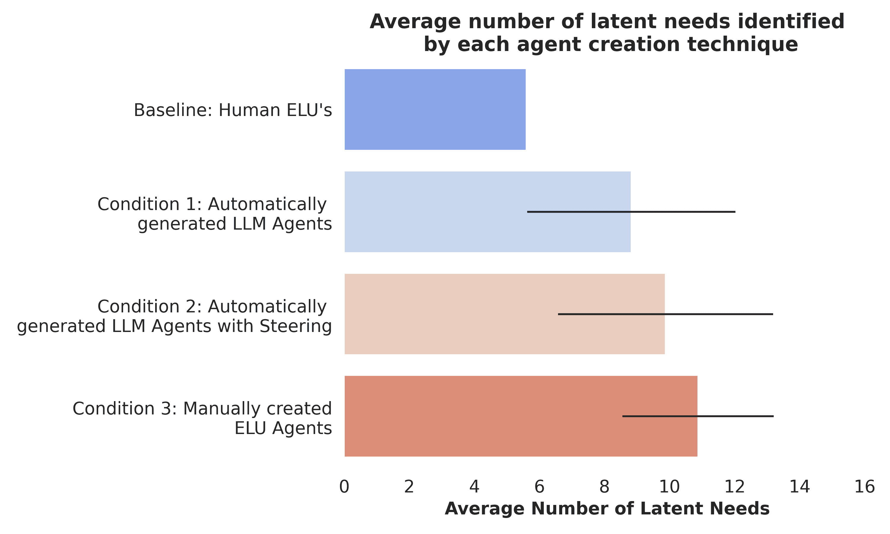
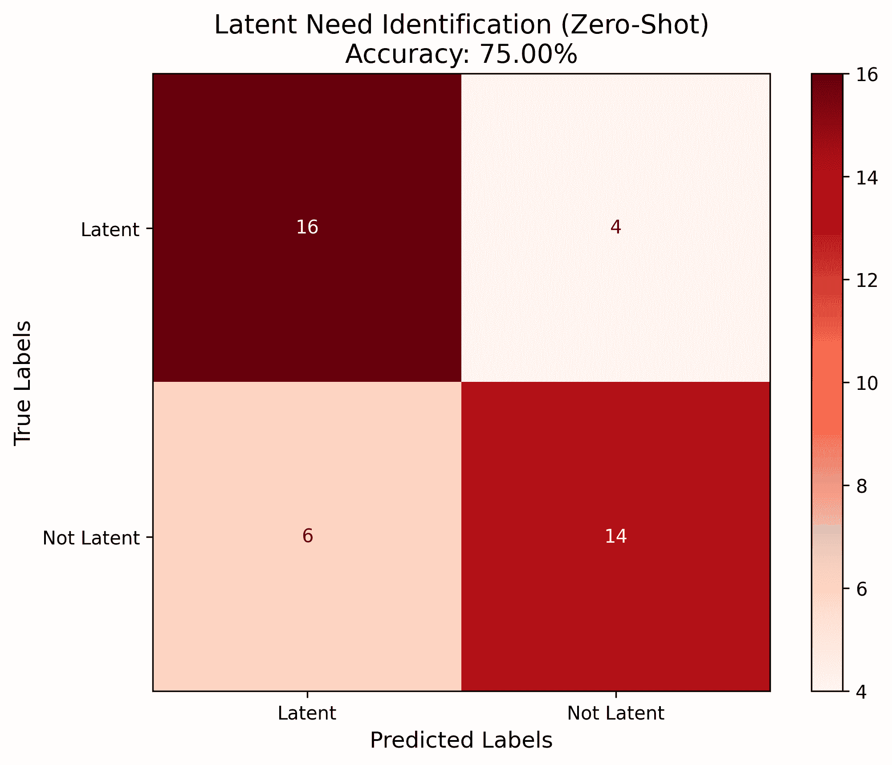
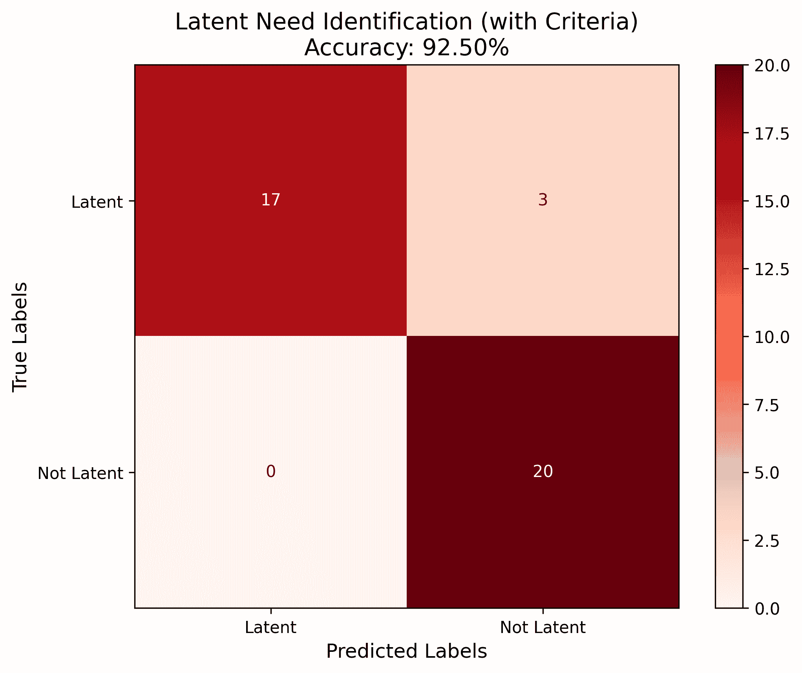
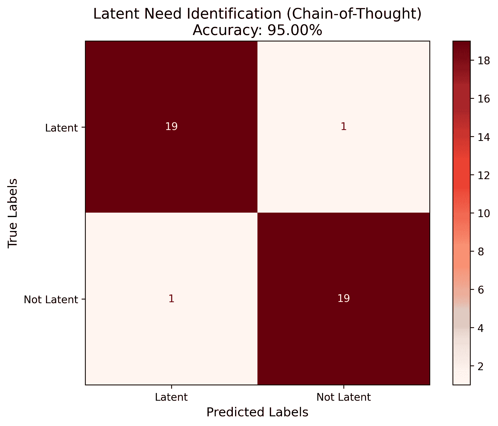

<!--yml

类别：未分类

日期：2025-01-11 12:41:43

-->

# Elicitron：一种基于大型语言模型（LLM）代理的设计需求引导仿真框架

> 来源：[https://arxiv.org/html/2404.16045/](https://arxiv.org/html/2404.16045/)

\newmdenv

[ topline=false, bottomline=false, rightline=false, linewidth=2pt, linecolor=blue, backgroundcolor=gray!20, leftmargin=10pt, rightmargin=10pt, innertopmargin=10pt, innerbottommargin=10pt ]customquote

\JourName\SetAuthorBlock

Mohammadmehdi Ataei\通讯作者，Autodesk Research，

661 University Avenue，

加拿大，安大略省，多伦多，邮政编码 M5G 1M1

邮箱：mehdi.ataei@autodesk.com

\SetAuthorBlock

Hyunmin Cheong，Autodesk Research，

661 University Avenue，

加拿大，安大略省，多伦多，邮政编码 M5G 1M1

\SetAuthorBlock

Daniele Grandi，Autodesk Research，

The Landmark @ One Market, Ste. 400，

美国，加利福尼亚州，旧金山，邮政编码 94105

\SetAuthorBlock

Ye Wang，Autodesk Research，

The Landmark @ One Market, Ste. 400，

美国，加利福尼亚州，旧金山，邮政编码 94105

\SetAuthorBlock

Nigel Morris，Autodesk Research，

661 University Avenue，

加拿大，安大略省，多伦多，邮政编码 M5G 1M1

\SetAuthorBlock

Alexander Tessier，Autodesk Research，

661 University Avenue，

加拿大，安大略省，多伦多，邮政编码 M5G 1M1

###### 摘要

需求引导是产品开发中一个至关重要、但又耗时且具有挑战性的步骤，通常未能全面捕捉到用户需求的全部范围。这可能导致产品未能达到预期。本文介绍了一种新的框架，该框架利用大型语言模型（LLMs）来自动化和增强需求引导过程。LLMs 被用于生成大量的模拟用户（LLM 代理），从而能够探索更广泛的用户需求和未曾预见的使用案例。这些代理参与产品体验场景，并通过解释他们的行为、观察和挑战，来提供反馈。随后的代理访谈和分析揭示了宝贵的用户需求，包括潜在的需求。我们通过三项实验验证了这一框架。首先，我们探索了不同的代理生成方法，讨论了它们的优缺点。我们衡量了识别到的用户需求的多样性，并展示了基于情境的代理生成可以带来更大的多样性。其次，我们展示了如何通过我们的框架有效模拟富有同理心的领先用户访谈，比传统的人类访谈识别出更多潜在需求。第三，我们展示了 LLM 可以用于分析访谈内容，捕捉需求，并将其分类为潜在需求或非潜在需求。我们的研究突显了使用 LLM 代理加速产品早期开发、降低成本和促进创新的潜力。

###### 关键词：

需求引导、大型语言模型、人工智能、LLM 代理、计算机辅助设计

## 1 引言

需求获取（RE）是成功产品设计的核心，但它仍然是一项复杂且资源密集的任务。传统的需求获取方法，如访谈、焦点小组和原型制作，虽不可或缺，但也有其固有的局限性。这些方法通常耗时，可能无法完全捕捉用户观点的多样性，也可能遗漏一些难以表达的潜在需求[[1](https://arxiv.org/html/2404.16045v1#bib.bib1), [2](https://arxiv.org/html/2404.16045v1#bib.bib2)]。需求获取不足的后果可能是显著的，从设计失调到产品采纳受限。

最近，大型语言模型（LLMs）的进展为自动化和增强需求获取提供了新的可能性。LLMs通过从大量文本语料库中学习人类语言的模式和复杂性，似乎具备了卓越的自然语言理解能力[[3](https://arxiv.org/html/2404.16045v1#bib.bib3)]。这种潜力可以用于构建一个模拟环境，在其中LLM代理*扮演*各种潜在用户的角色。这些代理能够体现不同的观点，参与产品体验场景，并参加旨在识别用户需求的用户访谈。

本研究提出了一种基于LLM的新框架——Elicitron，用于自动化和增强需求获取过程。在Elicitron中，LLM代理被约束为生成与需求获取过程相关且有用的结构化输出。Elicitron还采用了技术，创造多样化的用户代表代理，并通过*行动、观察、挑战*步骤模拟产品体验，这些步骤灵感来源于*链式思维*推理[[4](https://arxiv.org/html/2404.16045v1#bib.bib4)]。最后，通过创建具有特定角色的代理，Elicitron能够发现一些有趣的用户需求，这些需求可能通过传统的人工访谈难以获得。

Elicitron能够创建多样化的用户代理，这一能力可以用于识别各种用户需求。由于创建和访谈这些代理的过程是自动化的，这一过程具有高度的可扩展性，不同于传统的需求获取方法。我们进行了实验，评估了Elicitron生成多样化用户需求的能力，并确定了一种上下文感知的生成方法，最大化需求的多样性。

此外，我们展示了如何应用 Elicitron 来识别潜在需求——那些未被明确表达且出乎意料的因素，它们强烈影响产品的吸引力[[5](https://arxiv.org/html/2404.16045v1#bib.bib5)]——这些需求是传统 RE 方法难以获得的。这可以通过自动或手动创建具有*同理心领先用户*角色的用户代理来实现[[6](https://arxiv.org/html/2404.16045v1#bib.bib6)]。我们进行第二次实验，展示了 Elicitron 能够生成比人类访谈更多的潜在需求。我们的第三次实验表明，给定标准和思维链推理，LLMs 能够识别和分类访谈数据中的潜在需求。

### 1.1 LLMs 在多样化和潜在需求识别中的应用

有理由相信，LLMs 在识别多样化和潜在需求方面可能具有独特的优势。LLMs 的核心能力在于其灵活性和执行与自然语言相关的各种任务的能力。它们对上下文元素的纳入大大提高了它们的表现，使其似乎能够捕捉到细微的差别和推论。由于 LLMs 已经在大量数据上进行训练，它们可能接触过特定产品的多样化用户需求。在训练过程中，LLMs 也许已经捕捉到行为模式和细微的语言线索，这些线索暗示了用户潜在——有时甚至是潜意识中的——需求。此外，它们可能能够通过类比推理将不同产品中识别到的经验和需求联系起来，从而发现新颖的需求。

然而，当考虑到大语言模型（LLMs）的固有特性时，会出现潜在的矛盾：它们是通过预测基于训练数据中的模式的最可能下一个词或词组来进行训练的[[7](https://arxiv.org/html/2404.16045v1#bib.bib7)]。表面上看，这种专注于选择最可能的结果似乎与揭示多样化或潜在需求的目标相冲突。实际上，由于某些超参数（如温度或 top-P）允许一定的随机性，LLMs 并不总是贪婪地选择下一个词或短语。此外，提供给 LLM 的上下文——即模型在生成响应时考虑的输入文本——可能会极大地影响其输出。通过仔细的上下文化，我们可以鼓励 LLM 超越显而易见的输出，为我们的目的生成有助于设计师发现多样化和潜在需求的输出。

## 2 背景

图1：Elictron的使用LLMs进行需求引导的架构：首先，在设计环境中生成LLM代理，采用串行或并行方式（结合多样性采样以代表不同用户视角）。这些代理随后进入模拟的产品体验场景，详细记录每一步（行动、观察、挑战）。接下来，进行代理面试过程，通过提问和回答来揭示潜在的用户需求。在最后阶段，使用LLM根据提供的标准识别潜在需求，最终从识别出的潜在需求中生成报告。

### 2.1 大型语言模型

大型语言模型（LLMs）是机器学习模型，表现出理解、推理和生成自然语言的能力[[3](https://arxiv.org/html/2404.16045v1#bib.bib3)]。已有研究表明，LLMs能够进行流畅对话、翻译语言以及创作多种风格的创意内容。LLMs的发展标志着人工智能向类人代理能力迈出了重要一步。除了传统应用，LLMs的使用正在扩展到软件开发、内容创作和客户服务等领域[[8](https://arxiv.org/html/2404.16045v1#bib.bib8), [9](https://arxiv.org/html/2404.16045v1#bib.bib9), [10](https://arxiv.org/html/2404.16045v1#bib.bib10), [11](https://arxiv.org/html/2404.16045v1#bib.bib11)]。

LLMs通过自监督学习进行训练。它们在大量文本数据上进行训练，以预测句子中下一个单词或单词序列。这个训练过程，以及像Transformer模型[[7](https://arxiv.org/html/2404.16045v1#bib.bib7)]这样的架构进展，使LLMs能够掌握人类语言中的模式、细微差别和语境，包括学习隐含的含义[[3](https://arxiv.org/html/2404.16045v1#bib.bib3)]。

在训练过程中获得的知识为LLMs在角色扮演场景中的有效参与提供了基础[[12](https://arxiv.org/html/2404.16045v1#bib.bib12), [13](https://arxiv.org/html/2404.16045v1#bib.bib13), [14](https://arxiv.org/html/2404.16045v1#bib.bib14)]。它们可以通过使用特定的语言模式、词汇选择和句子结构来模拟不同的角色，这些都是从训练数据中学习到的。例如，如果LLM遇到一个包含丰富技术交流的训练数据集，它可以调整其词汇和句子结构，在角色扮演过程中成功地扮演工程师的角色。

LLMs的角色扮演能力使它们成为需求引导中的有用工具。它们能够模拟各种用户，包括具有共情能力的主导用户，从而为产品体验和需求提供宝贵的见解。

### 2.2 设计需求引导、共情设计与潜在需求

在设计工程的需求获取阶段，同理心在帮助工程师更好地理解用户需求[[15](https://arxiv.org/html/2404.16045v1#bib.bib15), [16](https://arxiv.org/html/2404.16045v1#bib.bib16)]，以及更好地理解设计问题[[17](https://arxiv.org/html/2404.16045v1#bib.bib17)]中发挥着重要作用。通过访谈、观察和与用户建立同理心，设计师可以从产品用户的非结构化反馈中推导出结构化的设计需求，这一过程被称为*同理设计*[[18](https://arxiv.org/html/2404.16045v1#bib.bib18), [19](https://arxiv.org/html/2404.16045v1#bib.bib19)]。

设计需求或用户需求有两种类型：直接需求，这些需求通常对客户来说是显而易见的，并且会导致产品的渐进式变化；以及潜在需求，这些需求可能不容易察觉，且难以揭示[[20](https://arxiv.org/html/2404.16045v1#bib.bib20)]。

用户访谈或观察可能无法揭示消费者认为在最终产品中重要的潜在需求[[21](https://arxiv.org/html/2404.16045v1#bib.bib21)]。在设计过程中早期识别潜在需求被发现可以加速开发过程，它们的发现为设计工程师提供了极限使用案例的洞察，这些案例可能会推动产品达到极限[[22](https://arxiv.org/html/2404.16045v1#bib.bib22), [23](https://arxiv.org/html/2404.16045v1#bib.bib23), [24](https://arxiv.org/html/2404.16045v1#bib.bib24)]。

多年来，设计研究社区尝试了各种同理设计方法，以改善潜在需求的发现。Hannukainen和Holtta-Otto通过使用照片日记和情境访谈的方式，针对残障人士来识别潜在需求[[18](https://arxiv.org/html/2404.16045v1#bib.bib18)]。Lin等人通过模拟特殊情况（例如，使用眼罩模拟视力受限，或使用烤箱手套模拟灵活性差）来从普通用户中引出潜在需求[[6](https://arxiv.org/html/2404.16045v1#bib.bib6)]。Issa等人通过要求设计师在解读用户访谈时“以某种[特定经历]的人的身份写一段陈述”，试图使设计师对核心用户更加富有同理心[[25](https://arxiv.org/html/2404.16045v1#bib.bib25)]。最近，Zhu等人提出了如何利用人工智能和大型语言模型（LLMs）支持数据驱动的用户研究，以促进同理设计[[26](https://arxiv.org/html/2404.16045v1#bib.bib26)]。

尽管设计研究社区已将同理心确认为设计需求引导中的一个重要组成部分[[6](https://arxiv.org/html/2404.16045v1#bib.bib6), [27](https://arxiv.org/html/2404.16045v1#bib.bib27), [28](https://arxiv.org/html/2404.16045v1#bib.bib28), [29](https://arxiv.org/html/2404.16045v1#bib.bib29), [30](https://arxiv.org/html/2404.16045v1#bib.bib30)]，但采访具有同理心的核心用户或在用户研究中观察他们仍然是一项既耗时又昂贵的活动。利用大型语言模型（LLM）通过创建并采访一组多样化的同理心核心用户代理来模拟这一过程，可以填补这一空白。

### 2.3 设计多样性的度量标准

在设计方法学文献中，设计多样性通常被认为是从一组设计中延伸出的新颖性。一个新颖的设计通常被创作者认为是独一无二的（心理新颖性），或者更普遍地说，是该领域中的独特设计（历史新颖性）[[31](https://arxiv.org/html/2404.16045v1#bib.bib31)]。评估设计的新颖性是一个主观任务，通常会采用共识评估技术（CAT）或类似的方法，要求领域专家根据诸如新颖性等标准对设计进行评分[[32](https://arxiv.org/html/2404.16045v1#bib.bib32), [33](https://arxiv.org/html/2404.16045v1#bib.bib33), [34](https://arxiv.org/html/2404.16045v1#bib.bib34), [35](https://arxiv.org/html/2404.16045v1#bib.bib35)]。然而，近年来，深度生成模型的研究进展利用基于大数据集的机器学习方法创造新颖设计解决方案，推动了计算新颖性和多样性度量的开发与应用。这些度量包括凸包体积和平均中心距度量，可以用来衡量一整套设计的平均多样性[[36](https://arxiv.org/html/2404.16045v1#bib.bib36), [37](https://arxiv.org/html/2404.16045v1#bib.bib37), [38](https://arxiv.org/html/2404.16045v1#bib.bib38), [39](https://arxiv.org/html/2404.16045v1#bib.bib39), [40](https://arxiv.org/html/2404.16045v1#bib.bib40), [41](https://arxiv.org/html/2404.16045v1#bib.bib41), [42](https://arxiv.org/html/2404.16045v1#bib.bib42), [43](https://arxiv.org/html/2404.16045v1#bib.bib43)]。除了这些度量外，我们还对衡量可能的设计创意聚类的多样性感兴趣，而不仅仅是衡量离群值，因此通常用于聚类分析中的轮廓系数[[44](https://arxiv.org/html/2404.16045v1#bib.bib44)]也可能适用。

凸包体积定义为包含所有样本的最小凸集合的超体积。它已被用于衡量不同学科中的多样性，但对异常值敏感[[36](https://arxiv.org/html/2404.16045v1#bib.bib36), [37](https://arxiv.org/html/2404.16045v1#bib.bib37), [45](https://arxiv.org/html/2404.16045v1#bib.bib45)]。较大的凸包体积表示在嵌入空间中，样本覆盖的空间更大，且更具多样性。

嵌入的质心平均距离通过计算每个样本到整个集合质心的平均距离来得到[[36](https://arxiv.org/html/2404.16045v1#bib.bib36), [37](https://arxiv.org/html/2404.16045v1#bib.bib37), [46](https://arxiv.org/html/2404.16045v1#bib.bib46), [47](https://arxiv.org/html/2404.16045v1#bib.bib47)]。较大的值表示样本离质心较远，因此假设它们代表了更多样化的概念。该度量更适用于更均匀的分布，并且对异常值敏感。

在聚类算法的背景下，轮廓分数是一种用于计算聚类技术性能的度量。其值范围从-1到1，其中较高的值表示该对象与自身聚类的匹配度较好，而与邻近聚类的匹配度较差。轮廓分数已被用于衡量推荐系统的多样性，但尚未在设计研究领域得到应用[[48](https://arxiv.org/html/2404.16045v1#bib.bib48), [49](https://arxiv.org/html/2404.16045v1#bib.bib49)]。

## 3 Elicitron架构

Elicitron旨在紧密模拟现实世界的需求获取过程。其架构包括四个不同的组件，分别对应于需求收集过程中的各个阶段（图[1](https://arxiv.org/html/2404.16045v1#S2.F1 "Figure 1 ‣ 2 Background ‣ Elicitron: An LLM Agent-Based Simulation Framework for Design Requirements Elicitation")）。下面将详细讨论每个组件。

为了保持结构完整性并防止工作流错误，我们使用Pydantic模型来塑造LLM输出，随后进行模式验证步骤。

### 3.1 代理生成

需求获取中的一个重大挑战（无论是使用LLM还是传统方法）是捕捉用户的多样化观点。为此，我们框架的第一步是生成一组多样化的代理，用以在需求获取过程中模拟用户。这与现实世界的做法相似，后者通常会刻意选择各种不同的用户参与需求工程研究。

LLM被指示为每个用户代理生成三个元素：

+   •

    姓名：表示用户代理的标签。

+   •

    描述：用户特征的描述。

+   •

    推理链：创建此代理的理由。

前两个元素组成了用户角色的描述。推理链有助于理解LLM的代理生成逻辑，这一过程类似于*思维链* [[4](https://arxiv.org/html/2404.16045v1#bib.bib4)]。

我们已经采用了以下的代理生成方法：

#### 3.1.1 并行代理生成

在这里，LLM接收N个独立的提示以同时生成N个用户代理。这种方法有利于快速并行创建大量代理。然而，由于LLM无法意识到其他代理的生成，模型可能会生成相似的代理，导致多样性受限。

为了缓解这个问题，我们实施了一个*过滤*阶段。我们使用KMeans聚类算法根据代理嵌入的相似性对其进行分组，然后只从每个簇中选择代表性代理，以得到多样化的代理集。

给定一组生成的代理$A={a_{1},a_{2},\ldots,a_{N}}$，其中每个代理$a_{i}$在高维空间中由嵌入向量$v_{i}$表示，目标是选择一个多样化的代理子集。

1.  1.

    分配嵌入向量：首先，给集合$A$中的每个代理$a_{i}$描述分配一个嵌入向量$v_{i}$。我们为此目的使用了OpenAI的text-embedding-ada-002。

1.  2.

    执行KMeans聚类：应用聚类算法KMeans$(V,k)$。$V$是所有嵌入向量$v_{i}$的矩阵，$k$是选定的簇数（小于或等于$N$）。给定$k$，KMeans算法将每个代理分配到与其均值嵌入最接近的簇。

1.  3.

    选择多样化代理：从每个$k$个簇中选择一个代表性代理。选中的代理被认为是多样的，因为它们来自嵌入空间中不同的簇。结果代理集记作$A^{\prime}$。

这种方法可能涉及过度生成代理，然后筛选到N个代理。虽然我们使用了KMeans进行筛选，但其他聚类技术也适用。

#### 3.1.2 串行代理生成

在这项技术中，LLM接收一个单一提示来生成N个代理。在这里，生成的代理的详细信息会保留在LLM的上下文中，相比并行生成，这有助于促进更大的多样性。缺点是相比并行生成，速度有所降低，并且根据LLM的最大令牌输出长度，生成的代理数量有理论上的限制。在撰写本文时，大多数LLM的输出上限大约为4096个令牌，实验结果表明，每次生成大约最多能生成20个代理。

### 3.2 产品体验生成

在生成多样化的代理池后，用户代理会被提示虚构与潜在产品的互动。此阶段对于识别可能导致后续访谈过程中发现详细和潜在需求的具体使用场景至关重要。

1.  1.

    模拟交互：代理收到一个开放性提示，描述他们与产品互动时会采取的步骤。这可能包括设置、特定功能使用或故障排除。代理可以自由探索，模拟现实用户与产品互动的多种方式。

1.  2.

    结构化响应生成：对于每个交互步骤，代理提供分为三个元素的组织化响应：

    +   •

        行动：描述所采取的交互步骤（例如，设置、功能激活）。

    +   •

        观察：代理对步骤的反应和感知。这包括正面的印象和摩擦点。

    +   •

        挑战：明确表达遇到的障碍或困难。这是为了揭示用户体验中的痛点。

这些结构化响应随后将作为后续访谈阶段的上下文使用。这有助于情境化代理的体验，类似于链式思维提示[[4](https://arxiv.org/html/2404.16045v1#bib.bib4)]如何促进更深入的响应生成。产品体验生成的输出示例如在第[5.4](https://arxiv.org/html/2404.16045v1#S5.SS4 "5.4 Example Outputs from LLM Agents ‣ 5 Experiment 2: Automatic Generation of Latent User Needs ‣ Elicitron: An LLM Agent-Based Simulation Framework for Design Requirements Elicitation")节中可见。

### 3.3 代理访谈

代理访谈步骤模拟了现实世界的用户访谈。它促使每个代理回顾自己的产品体验，并提出跟进问题，旨在揭示用户需求和从其产品体验中识别出的细微见解。该过程如下：

1.  1.

    问题池创建：准备一组访谈问题（由人类开发或由LLM自动生成）。这些问题可以针对产品的多个方面进行定制，同时也可以询问创新见解或改进建议。

1.  2.

    情境化提问：向每个代理提出问题，将其之前的问答响应和模拟的产品体验整合到LLM的上下文中。该情境化的目的是缓解LLM提供泛化回答的倾向，并促使回答基于每个代理的独特体验。

### 3.4 潜在需求识别

在此工作流程阶段，我们利用先前收集的访谈响应来自动识别需求。LLM处理代理访谈，提取表达的需求。然后，LLM提供针对每个识别需求的逐步推理，依据由人类专家提供的已确立的潜在需求标准和示例。最后，LLM将所有发现编纂成一份详细报告，提供关于在分析过程中揭示的表达需求和潜在需求的见解。

在收集到所有用户代理的回答后，设计师可以审查这些回答，识别出可以用于后续设计过程的用户需求。

在这项工作中，我们进行了两项实验，以检验Elicitron的价值，所有实验均使用了OpenAI的GPT-4-Turbo作为LLM[[50](https://arxiv.org/html/2404.16045v1#bib.bib50)]。

## 4 实验1：多样化用户及其需求的自动生成

为了评估Elicitron在识别多样化用户需求方面的价值，我们评估了第[3](https://arxiv.org/html/2404.16045v1#S3 "3 Architecture of Elicitron ‣ Elicitron: An LLM Agent-Based Simulation Framework for Design Requirements Elicitation")节中提出的代理生成方法。我们在三种条件下生成了20个用户代理：串行、并行和使用KMeans过滤的并行，并通过计算度量比较了生成的代理及其回答的多样性。

图2：通过t-SNE将四组用户的嵌入降维至二维后的结果。第1组：服务和保护（红色）。第2组：户外娱乐和露营（蓝色）。第3组：冒险和探索（绿色）。第4组：家庭露营和户外活动（紫色）。串行生成在四组中提供了最好的覆盖范围。并行生成（无论是否过滤）都未能覆盖到服务和保护相关的用户。

### 4.1 多样性评估

#### 4.1.1 计算评估

如第[2.3](https://arxiv.org/html/2404.16045v1#S2.SS3 "2.3 Metrics for Design Diversity ‣ 2 Background ‣ Elicitron: An LLM Agent-Based Simulation Framework for Design Requirements Elicitation")节所讨论，当前没有一种公认的方法来计算评估面试参与者及其相应回答的多样性。因此，我们借鉴了先前工作中使用的三种方法，这些方法依赖于将生成的回答嵌入潜在空间中，以衡量设计解决方案的多样性。

对于所有三个度量标准，我们首先使用text-embedding-ada-002为每个角色描述和12个面试问题的回答生成了嵌入。请注意，所问的面试问题在第5.1节中有所呈现。结果生成了13组20个嵌入（分别对应用户角色和每个12个问题）。对于我们用来生成数据的三种方法（‘serial’、‘parallel’和‘parallel with filtering’），我们然后计算了每组20个嵌入的凸包体积和到质心的平均距离，并将结果归一化到0到1之间。

轮廓系数定义如下。如果$a$是平均簇内距离（簇内每个点之间的平均距离），$b$是平均最近簇距离（从一个点到它不属于的最近簇的平均距离），则单个样本的轮廓系数$s$由公式$s=\frac{b-a}{\max(a,b)}$给出。一组样本的平均轮廓系数是每个样本的个体轮廓系数的平均值。然后，可以通过选择具有最高平均轮廓系数的$k$簇来选择合适的$k$值，这表明每个簇都是非常紧凑且与其他簇明显不同的。我们使用这一指标来选择KMeans的簇数，并作为独立指标量化每种方法的样本多样性。

#### 4.1.2 定性评估

为了进一步了解多样性方面的差异，我们评估了角色描述和访谈回答的内容，具体如下：

1.  1.

    使用KMeans对三种条件下生成的60个用户代理的嵌入进行聚类。$k$的选择基于轮廓系数，以最大化群体的区分度。

1.  2.

    使用以下提示，通过LLM总结$k$个代理群体：“这里有$k$组用户，为每组给出一个主题。组1：...”。每组的内容使用每个群体中代理的角色描述。

1.  3.

    使用t-SNE降维后，查看每种条件下群体的覆盖情况，散点图见图[2](https://arxiv.org/html/2404.16045v1#S4.F2 "Figure 2 ‣ 4 Experiment 1: Automatic Generation of Diverse Users and Their Needs ‣ Elicitron: An LLM Agent-Based Simulation Framework for Design Requirements Elicitation")[[51](https://arxiv.org/html/2404.16045v1#bib.bib51)]。

### 4.2 结果

#### 4.2.1 凸包

表格[1](https://arxiv.org/html/2404.16045v1#S4.T1 "Table 1 ‣ 4.2.1 Convex Hull ‣ 4.2 Results ‣ 4 Experiment 1: Automatic Generation of Diverse Users and Their Needs ‣ Elicitron: An LLM Agent-Based Simulation Framework for Design Requirements Elicitation")显示，串行方法的凸包体积高于并行方法和带过滤的并行方法，这表明多样性有显著增加。此外，平均而言，过滤方法提高了并行生成方法的多样性。

|  | 串行 | 并行 |
| --- | --- | --- |

&#124; 并行 &#124;

&#124; + 过滤 &#124;

|

| --- | --- | --- | --- |
| --- | --- | --- | --- |
| 用户 | 0.991878 | 0.097886 | 0.081218 |
| 特征 | 0.928448 | 0.191309 | 0.318411 |
| 大小 | 0.717999 | 0.382065 | 0.581811 |
| 形状 | 0.929433 | 0.247194 | 0.273950 |
| 权重 | 0.789456 | 0.314839 | 0.526912 |
| 材料 | 0.769544 | 0.310822 | 0.557846 |
| 安全性 | 0.659648 | 0.405045 | 0.633090 |
| 耐用性 | 0.910748 | 0.347797 | 0.222656 |
| 美学 | 0.944532 | 0.152274 | 0.290983 |
| 人体工程学 | 0.861179 | 0.338084 | 0.379566 |
| 成本 | 0.910723 | 0.172481 | 0.375278 |
| 设置 | 0.925232 | 0.292025 | 0.242214 |
| 交通 | 0.944723 | 0.222418 | 0.240892 |
| 平均值 | 0.867965 | 0.267249 | 0.363448 |

表 1：每种生成方法的用户角色/描述的嵌入和对访谈问题的回应的凸包体积，归一化为0到1。较高的凸包体积表示相对更具多样性的集合。

#### 4.2.2 到质心的平均距离

表 [2](https://arxiv.org/html/2404.16045v1#S4.T2 "表 2 ‣ 4.2.2 到质心的平均距离 ‣ 4.2 结果 ‣ 4 实验 1：自动生成多样化的用户及其需求 ‣ Elicitron: 一个基于LLM代理的设计需求引导仿真框架") 显示了到质心的平均距离值。结果表明，串行方法比并行方法和带过滤的并行方法产生了更多的多样性，但与凸包度量相比差距较小。同样，‘过滤’方法略微提高了‘并行’生成的多样性。

|  | 串行 | 并行 |
| --- | --- | --- |

&#124; 并行 &#124;

&#124; + 过滤 &#124;

|

| --- | --- | --- | --- |
| --- | --- | --- | --- |
| 用户 | 0.660156 | 0.527555 | 0.534677 |
| 特征 | 0.618368 | 0.542512 | 0.568596 |
| 尺寸 | 0.590934 | 0.552930 | 0.587423 |
| 形状 | 0.618861 | 0.551452 | 0.559385 |
| 权重 | 0.610335 | 0.543569 | 0.576215 |
| 材料 | 0.601980 | 0.546090 | 0.582585 |
| 安全性 | 0.584500 | 0.562831 | 0.584449 |
| 耐用性 | 0.623426 | 0.569565 | 0.535664 |
| 美学 | 0.649814 | 0.521597 | 0.552883 |
| 人体工程学 | 0.614401 | 0.561247 | 0.554539 |
| 成本 | 0.622532 | 0.536028 | 0.570199 |
| 设置 | 0.632032 | 0.552557 | 0.543338 |
| 交通 | 0.633343 | 0.543400 | 0.550992 |
| 平均值 | 0.620052 | 0.547026 | 0.561611 |

表 2：每种生成方法的用户角色/描述的嵌入和对访谈问题的回应的质心平均距离，归一化为0到1。较高的平均距离表示相对更具多样性的集合。

#### 4.2.3 轮廓得分

我们预计，跨越不同的$k$值的高轮廓得分将表明点更容易聚类，或者彼此更接近，而低轮廓得分则表明点之间的距离较远，聚类较少，因此代表了更具多样性的集合。图 [3](https://arxiv.org/html/2404.16045v1#S4.F3 "图 3 ‣ 4.2.3 轮廓得分 ‣ 4.2 结果 ‣ 4 实验 1：自动生成多样化的用户及其需求 ‣ Elicitron: 一个基于LLM代理的设计需求引导仿真框架") 显示了三种生成方法的计算轮廓得分。我们可以再次推断，串行方法比并行方法和带过滤的并行方法生成了最多样化的代理。‘并行’方法之间没有明显的区别。

图3：轮廓得分衡量的是聚类内部和聚类之间的距离。序列方法导致的利益相关者嵌入比平行方法和带过滤的平行方法更难以聚类，这表明序列嵌入更具多样性。

#### 4.2.4 定性评估

我们评估了生成的用户描述，查看了哪些类别的用户被创建。我们汇总了三种生成方法创建的60个用户的嵌入向量。然后，我们选择了$k=4$，基于轮廓得分，即当$k=4$时，能得到最明显的聚类。使用KMeans进行$4$个聚类时，我们发现了以下用户组：

1.  1.

    服务与保护：包括军事、人道主义工作和实地研究等角色。

1.  2.

    户外娱乐与露营：包括极简露营和观星等活动的角色。

1.  3.

    冒险与探索：包括徒步旅行、背包旅行和登山等活动的角色。

1.  4.

    家庭露营与户外活动：强调通过露营和自然活动促进亲密关系的角色。

应该注意的是，平行方法和带过滤的平行方法都没有创建任何属于服务和保护组的用户角色。

### 4.3 讨论

从计算和定性评估来看，序列生成方法导致了用户角色和访谈问题的响应中最多样化的结果。与仅使用平行生成方法相比，带有KMeans过滤的平行生成方法有助于提高多样性，尽管提升不显著。序列生成方法通过保持先前代理生成的上下文，为LLM提供额外的信息，从而避免生成重复内容。

## 5 实验 2：潜在用户需求的自动生成

在第二个实验中，使用了Elicitron来自动生成潜在需求，这些需求通过传统的人工访谈很难识别。

为了评估我们的方法，使用了[[6](https://arxiv.org/html/2404.16045v1#bib.bib6)]中的帐篷设计示例及其报告结果。特别地，我们使用*同理心主导用户*（ELU）访谈技巧设置了我们的基本条件。这涉及通过模拟普通用户的非凡主导用户条件，并将其作为基准条件进行访谈。然后，我们将通过ELU访谈技巧识别的潜在需求数量与我们需求引导方法的三种不同条件下的结果进行比较。

| 条件 1（自动） | 条件 2（带引导的自动） | 条件 3（手动ELU） |
| --- | --- | --- |
| 年轻的户外探险者 | 寻求冒险的青少年 | 山区的户外爱好者 |
| 家庭露营者 | 退休的自然爱好者 | 猎人 |
| 经验丰富的背包客 | 身体残疾者 | 沙漠峡谷露营者 |
| 音乐节参与者 | 冬季露营者 | 专业登山者 |
| 军事人员 | 探险领队 | 专业攀岩者 |
| 浪漫情侣露营者 | 城市数字游牧者 | 少年露营者 |
| 野生动物摄影师 | 雨林探险者 | 患有关节炎的老年人 |
| 现场研究员 | 高海拔登山者 | 运动障碍青少年 |
| 单人预算旅行者 | 家庭露营爱好者 | 视力障碍者 |
| 山地探险向导 | 紧急预备倡导者 | 听力障碍者 |
| 冒险赛车手 | 音乐节参与者 | 生物学家 |
| 侦察队领袖 | 现场研究员 | 经济困难者 |
| 生态旅游企业家 | 爱宠露营者 | 有小孩的家长 |
| 极端天气研究员 | 城市活动家 | 丛林徒步旅行者 |
| 长途自行车手 | 房车生活爱好者 | 夏季北极探险者 |
| 人道主义工作者 | 人道主义工作者 | 截肢露营者 |
| 高中教师 | 户外教育者 | 无障碍露营者 |
| 北极探险者 | 单人背包客 | 沙滩露营者 |
| 极简主义爱好者 | 生态意识露营者 | 背包穿越露营者 |
| 野生动物保护志愿者 | 户外运动组织者 | 超马跑者 |

表3：为每个条件生成的用户代理列表。

### 5.1 实验设置

我们设置了三个条件来测试Elicitron的有效性。每个条件生成了20个用户代理，与[[6](https://arxiv.org/html/2404.16045v1#bib.bib6)]中采访的人员数量相同。

+   •

    条件1：通过串行方法自动创建用户代理

+   •

    条件2：通过串行方法自动创建用户代理并添加引导提示

+   •

    条件3：手动创建ELU代理

采用串行方法是因为在实验1中已证明这种方法能生成更多样化的用户代理。对于条件2，我们提供了以下附加提示，以鼓励创建代理生成ELU代理。双引号内的文本来自[[6](https://arxiv.org/html/2404.16045v1#bib.bib6)]。

{customquote}

你必须根据以下典型用户的描述创建非典型用户：“典型用户是一个15-30岁、身体健康、体能优秀的周末露营者，每年露营几次。典型的使用环境是一个公共公园或荒野区域，通常是树林或草地环境，天气温暖、阳光明媚。”

对于条件3，我们根据[[6](https://arxiv.org/html/2404.16045v1#bib.bib6)]中列出的典型客户在典型应用和使用环境中的偏差，手动创建了ELU代理。每个条件下生成的所有用户代理的列表显示在表[3](https://arxiv.org/html/2404.16045v1#S5.T3 "Table 3 ‣ 5 Experiment 2: Automatic Generation of Latent User Needs ‣ Elicitron: An LLM Agent-Based Simulation Framework for Design Requirements Elicitation")中。

对于所有三种情况，我们促使代理参与模拟的产品体验场景。然后，我们按顺序向大型语言模型（LLM）代理提出以下访谈问题。这些问题与[[6](https://arxiv.org/html/2404.16045v1#bib.bib6)]中对人类受试者使用的问题相同，但对措辞做了一些修改，以鼓励代理提供与问题相关的具体需求和见解。

+   •

    自由风格：“如果你要购买一顶理想的帐篷，你会关注哪些主要特性？”

+   •

    分类问题：“专门关注帐篷的[类别]方面，你能告诉我你的需求以及解决这些需求的创新见解吗？”

    类别：大小、形状、重量、材料、安全性、耐用性、美学、人体工程学、成本、安装、运输

### 5.2 潜在需求标注

用户代理所给出的反馈被分析，以识别每个代理所暗示的潜在需求数量。再次，我们遵循了[[6](https://arxiv.org/html/2404.16045v1#bib.bib6)]中使用的标准来标注某个特定短语是否为潜在需求：

{customquote}

如果报告的客户需求代表了产品设计的重大变化，并且与[访谈问题中使用的类别]不匹配，那么它会被标注为潜在需求。当报告的客户需求代表了对产品和/或产品使用条件的创新见解时，也会标记为潜在需求。

两位评审员进行了标注任务。由于判断潜在需求是高度主观且依赖于上下文的，因此标注是这样进行的。我们首先随机选择了10%的数据集，由两位评审员独立标注。经过一次校准讨论以解决分歧后，我们又随机选择了20%的数据来计算评审员间的一致性得分。最后，将剩余的70%数据集平分给两位评审员进行独立标注。

因为从自由文本中识别潜在需求等同于信息检索任务，所以使用F-score来衡量评审者之间的协议，如[[52](https://arxiv.org/html/2404.16045v1#bib.bib52)]所建议的那样。F-score的计算方式为：

|  | $F_{1}=2tp/(2tp+fp+fn)$ |  | (1) |
| --- | --- | --- | --- |

如果两位评审员都同意文本中的某个短语是潜在需求，则该短语被计为真正的正例（$tp$）。如果第一位评审员认为它是潜在需求，但第二位评审员未标记为潜在需求，则计为假阳性（$fp$）。如果第二位评审员认为它是潜在需求，但第一位评审员未标记为潜在需求，则计为假阴性（$fn$）。我们得出了F-score为0.83（$tp=109$，$fp=21$，$fn=24$），这表明评审员之间的协议是可靠的。

### 5.3 实验结果

结果（图 [4](https://arxiv.org/html/2404.16045v1#S5.F4 "图 4 ‣ 5.3 实验结果 ‣ 实验 2：潜在用户需求的自动生成 ‣ Elicitron：一个基于LLM的设计需求引导模拟框架")）显示，在所有三种Elicitron条件下，识别出的潜在需求数量都高于基线，证明了我们基于LLM的需求引导框架在识别潜在需求方面的潜力。由于先前的研究[[6](https://arxiv.org/html/2404.16045v1#bib.bib6)]报告了潜在需求的平均值，但没有提供方差的任何度量，因此我们无法进行任何统计测试以证明统计显著性。

图 4：在实验条件下，各用户代理识别的潜在需求的平均数量比较。误差条表示标准差，每个条件下n=20。

在三种Elicitron条件中，条件3（手动创建ELU代理）识别的需求数量最多（M = 10.875, SD = 2.322），其次是条件2（使用引导提示自动创建，M = 9.875, SD = 3.304），最后是条件1（仅自动创建，M = 8.825, SD = 3.201）。条件3和条件1之间存在统计学显著性差异，t(38) = 2.318, p < 0.05。

虽然条件1仍然生成了如表[3](https://arxiv.org/html/2404.16045v1#S5.T3 "表 3 ‣ 5 实验 2：潜在用户需求的自动生成 ‣ Elicitron：一个基于LLM的设计需求引导模拟框架")所示的相当多样的用户代理，但它们中的大多数不一定代表能够引导潜在需求识别的ELU代理。例如，“冒险赛车手”、“生态旅游企业家”或“高中教师”这样的用户代理，虽然可以被认为是独特的用户类型，但并不涉及非常特殊的使用条件，因此导致了相对较少的潜在需求识别（分别为6、3和4）。

条件3和条件2之间的潜在需求平均数量差异没有统计学意义。这表明，使用有效的引导提示可以消除手动创建ELU代理的需求。实际上，条件2中创建的许多用户代理与条件3中手动创建的ELU代理相似。例如，年龄不典型的用户代理（如“寻求冒险的青少年”、“退休自然爱好者”）、身体有障碍的用户代理（如“身体残疾者”）、面临极端条件的用户代理（如“探险队长”、“高海拔登山者”）等。

### 5.4 来自LLM代理的示例输出

在实验中，由LLM代理生成的示例输出如下所示。首先，为名为“患有关节炎的老年人”用户代理生成的产品体验：

{customquote}

第1步：

+   •

    行动：尝试用有限的手指灵活性抓住帐篷入口的拉链。

+   •

    观察：拉链太小，缺乏抓握感，操作起来困难。

+   •

    挑战：在开关帐篷时遇到了较大的困难，导致了挫败感。

第2步：

+   •

    行动：尝试组装帐篷杆并将布料拉伸到结构上。

+   •

    观察：连接帐篷杆和拉伸布料所需的努力加剧了我的关节炎疼痛。

+   •

    挑战：由于缺乏力量和手指疼痛，组装过程变得痛苦且耗时。

第3步：

+   •

    行动：尝试将帐篷固定在地面上。

+   •

    观察：发现标准的帐篷钉和敲打方法繁琐且难以在我的状况下操作。

+   •

    挑战：无法有效地将帐篷固定在地面上，导致在有风条件下产生了安全隐患。

第4步：

+   •

    行动：使用后尝试收起帐篷。

+   •

    观察：在折叠帐篷并将其紧密卷起以重新装入袋中时遇到了困难。

+   •

    挑战：这一过程要求的体力较大，并且需要比我拥有的更多的灵活性和力量，导致我依赖他人提供帮助。

以下是同一位用户提供的面试回答示例：

{customquote}

问：如果你要购买一顶理想的帐篷，你会关注哪些主要特征？

+   •

    “理想的帐篷需要配备大号、易于抓握的拉链，专为手指灵活性有限的个体设计。它应包括预组装或快速组装的帐篷杆，这些杆不需要较大的力量或复杂的操作，可能采用简单的点击组合机制。此外，帐篷应配备一种不依赖传统锤打的固定系统，或许使用旋入式帐篷钉，更适合关节炎患者。”

问：专注于帐篷的搭建方面，能告诉我你的需求和任何创新的见解来解决这些需求吗？

+   •

    “… 一种自我搭建的帐篷结构，帐篷在从袋中取出后自动展开并搭建好，免去了手动连接帐篷杆或拉伸布料的需求。这可以利用弹簧加载或记忆材料技术，其中结构元素设计为在释放时自动呈现正确的形态和张力。”

最后，以下是实验中识别的一些有趣的潜在需求示例：

{customquote}

用户：视力障碍者

+   •

    “这可以意味着一顶帐篷，其底部轻微倾斜朝向门口，并在地板上配有独特的触觉路径，直接通向入口/出口。”

用户：轮椅可进入的露营者

+   •

    “所有帐篷控制器，如拉链、通风口和照明，应从坐姿位置轻松触及。”

用户：猎人（需要在黑暗中搭建帐篷）

+   •

    “… 集成了一个临时的电池供电LED引导系统。此系统将在启动设置过程时激活，按顺序照亮每个组件（例如：杆、连接器和布料），并引导用户完成组装步骤。”

用户：高海拔登山者

+   •

    “为了在多种环境条件下提高稳定性，开发一种能够自动调整张力以应对风雪条件的自适应锚固系统可能会具有革命性意义。”

用户：户外运动组织者

+   •

    “一种模块化设计……能够轻松连接多个帐篷单元，扩展覆盖面积……采用无缝锁扣系统，使帐篷能够无缝连接，无缝隙或弱点。”

## 6 实验3：潜在用户需求的自动检测

分析访谈以检测潜在需求是一项具有挑战性且耗时的任务，要求深入理解产品和客户的需求。它可能消耗宝贵的资源，并且在不同分析人员之间可能不会始终产生一致的结果。

### 6.1 实验设置

在这个实验中，我们评估LLM在自动分析访谈文本和检测潜在需求方面的表现。为此，我们创建了一个数据集，包括20个潜在需求和20个非潜在需求，基于实验2中人类专家的评估。这个数据集将用于评估LLM准确识别潜在需求的能力。

我们采用三种不同的方法进行评估：

1.  1.

    零样本检测：LLM的任务是在没有任何额外上下文的情况下标注潜在需求，仅通过回答“这是不是一个潜在需求？”并给出二元答案（是或否）。没有提供额外的信息或标准。LLM完全依赖其现有知识来回答“是”或“否”。

1.  2.

    使用潜在需求标准进行检测：在这种方法中，LLM（大语言模型）被提供评估潜在需求的标准。根据这些标准，LLM被要求回答“这是不是一个潜在需求？”并给出二元答案（是或否）。标准如下（采用自[[6](https://arxiv.org/html/2404.16045v1#bib.bib6)]），这些标准与实验2中的人工评估者使用的标准相同：

    {customquote}

    “如果满足以下任一条件，则将报告的客户需求标记为潜在需求（潜在 = 是）：

    1.  (a)

        该需求代表了产品设计的重大变化，并不属于以下任何类别：尺寸、形状、重量、材料、安全性、耐用性、美学、人体工程学、成本、设置或运输。

    1.  (b)

        这个需求反映了关于产品及/或其使用方式的一个极具创新性且明确表达的见解。

1.  3.

    使用潜在需求标准和思维链分析进行检测：在这一最终方法中，LLM 被提供与前一个评估相同的潜在需求标准。然而，LLM 还被指示使用思维链分析，并逐步思考以检测潜在需求。基于这些标准和思维链的输出，LLM 以二元响应（真或假）回答问题“这是潜在需求吗？”。

### 6.2 实验结果

图 [5](https://arxiv.org/html/2404.16045v1#S6.F5 "图 5 ‣ 6.2 实验结果 ‣ 实验 3：自动检测潜在用户需求 ‣ Elicitron：一个基于 LLM 代理的设计需求引导仿真框架") 展示了三个评估的混淆矩阵，而表 [4](https://arxiv.org/html/2404.16045v1#S6.T4 "表 4 ‣ 6.2 实验结果 ‣ 实验 3：自动检测潜在用户需求 ‣ Elicitron：一个基于 LLM 代理的设计需求引导仿真框架") 显示了相应的性能指标。在零-shot检测场景中，LLM 达到了 0.7273 的精确度、0.8000 的召回率和 0.7619 的 F1 分数。这些指标表明，LLM 能够仅凭其内部表示，在没有任何额外上下文的情况下，以合理的准确性识别潜在需求。然而，仍然有改进的空间，因为模型在一些情况下难以区分潜在需求和非潜在需求。

当提供潜在需求标准时，LLM 的表现显著提升。精确度达到 1.0000，表明所有被 LLM 识别为潜在需求的需求确实是潜在需求。召回率提高至 0.8500，表明 LLM 能够识别数据集中更高比例的实际潜在需求。

当 LLM 被指示结合潜在需求标准使用思维链分析时，结果最为显著。在这种情况下，精确度、召回率和 F1 分数均达到 0.9500。这表明 LLM 能够准确识别潜在需求，同时最小化假阳性和假阴性。

在三个场景中观察到的 LLM 性能改进是合乎逻辑且预期的。每一种方法都为模型提供了越来越相关的上下文和指导，从而使其能够更好地应对当前任务。

首先，通过提供潜在需求标准，LLM 能够将注意力集中在决定需求是否为潜在需求的具体方面。这一有针对性的上下文帮助模型集中于做出判断所需的最相关信息。

在此基础上，思维链分析通过引导大型语言模型（LLM）进行结构化推理过程，将事情推向了一个新的高度。通过将分析分解为一系列更小的、相互关联的步骤，模型能够系统地考虑每个标准，并为最终结论建立合理的推理过程。这种方法有助于确保 LLM 输出的内容是经过充分推理的，并且基于所提供的标准。

该方法的有效性在表 [5](https://arxiv.org/html/2404.16045v1#S6.T5 "表 5 ‣ 6.2 实验结果 ‣ 实验 3：潜在用户需求的自动检测 ‣ Elicitron: 一种基于 LLM 代理的设计需求引导框架") 中得到了展示，该表展示了 LLM 对潜在需求和非潜在需求的思维链推理的两个示例。在每种情况下，模型的逐步分析清晰地展示了它是如何通过仔细考虑和依次应用每个潜在需求标准来得出结论的。

除了提升性能外，使用思维链推理还增强了模型的可解释性。思维链为 LLM 的决策过程打开了一扇窗，使我们能够理解模型每个结论背后的明显逻辑。这种透明度对于建立对模型输出的信任和信心非常宝贵，因为它使用户能够验证 LLM 的决策是基于合理逻辑并遵循指定标准的。

| 矩阵 | 精度 | 召回率 | F1 分数 |
| --- | --- | --- | --- |
| 零-shot | $0.7273$ | $0.8000$ | $0.7619$ |
| 有标准 | $1.0000$ | $0.8500$ | $0.9189$ |
| 思维链 | $0.9500$ | $0.9500$ | $0.9500$ |

表 4：混淆矩阵的精度、召回率和 F1 分数

(a) 零-shot

(b) 有标准

(c) 思维链

图 5：潜在需求识别的比较混淆矩阵：(a) 零-shot 分类，(b) 带有潜在需求标准的分类，(c) 使用思维链方法和潜在需求标准的分类。

| 潜在需求 | 非潜在需求 |
| --- | --- |
| 采访：对于内部设计，聚焦于广角的设计可以最大化通过指定开口进行摄影的视野，有助于在不离开帐篷的情况下观察野生动物。 | 采访：关于帐篷的耐用性，我最主要的需求是帐篷地面能够抵抗锋利物体的撕裂以及日常磨损。 |
| LLM的推理过程：客户需求明确表示，重点需要对帐篷内部进行重大重新设计，以最大化通过特定开口进行摄影的视野。这一变化不仅仅是调整帐篷的大小、形状、重量、材料、安全性、耐用性、美学、人体工学、成本、搭建或运输问题。它涉及一种创新的帐篷内部使用方式，旨在通过摄影进行野生动物观察，而不一定需要离开帐篷，这代表了帐篷使用方式的独特见解。该需求显然符合被认为是潜在需求的第一个标准，因为它对产品设计做出了重大改变，且不属于已指定的排除类别。此外，它体现了关于产品及其使用方式的极具创新性且表达清晰的见解，成为潜在需求的有效例子。 | LLM的推理过程：客户的需求集中在增强帐篷地板的耐用性，特别是使其能抵抗尖锐物体的撕裂和一般磨损。这一需求直接落入了预定义类别之一（耐用性），根据声明的标准，并不符合潜在需求的条件。因此，尽管这是一个有效的关注点，也是产品改进的潜在领域，但这一需求并没有对现有产品设计范式造成重大偏离，也没有引入极具创新性的见解。因此，它不符合被标记为潜在需求的条件。 |

表5：LLM用于潜在需求识别的推理过程示例

## 7 成本分析

成本是潜在需求识别研究中的一个重要考虑因素，使用LLM（大型语言模型）可以成为一种具有成本效益的替代方案。例如，本研究中使用的GPT-4-Turbo，每百万输入标记的费用为10美元，每百万输出标记的费用为30美元。这使得实验1和实验3的成本最低，仅为几美分，而实验2则生成了大约80,000个标记，产生的总成本约为2.4美元。这些成本远低于传统用户研究和调查的成本，后者通常需要在参与者招募、补偿和数据分析上投入大量资金。使用LLM进行潜在需求识别的成本效益对研究的可扩展性和可访问性具有重要影响，使得预算有限的研究人员和组织能够以传统方法的一小部分成本开展全面的研究并获得有价值的见解。

## 8 结论

本文提出了Elicitron，一个利用LLMs（大语言模型）来增强需求引导并发现各种用户需求（包括潜在需求）的框架。我们基于上下文的串行生成方法在创建多样化用户代理方面最为有效。Elicitron在生成潜在需求方面成功超越了传统的同理心主导用户访谈。LLMs还在分析访谈和分类潜在需求方面展示了其有效性。Elicitron展现了利用LLMs进行需求引导和以用户为中心设计的潜力，为设计师提供了一种替代且具有成本效益的方法。

尽管Elicitron展现了前景，但洞察质量仍依赖于LLM的能力，优先考虑潜在需求仍然是设计师的任务。未来的工作包括用户研究，以验证Elicitron是否能够帮助设计师，并探索多代理交互以发现更广泛的未满足需求。此外，探索在需求引导过程中整合多模态输入和输出的可能性，代表了另一个潜在的研究方向。

## 参考文献

+   [1] Zave, Pamela. “需求工程中研究工作分类。”《ACM计算机调查（CSUR）》 第29卷第4期（1997年）：第315–321页。

+   [2] Berry, Daniel M. “自然语言需求文档中的歧义。”《蒙特雷研讨会》：第1–7页。2007年。Springer。

+   [3] Brown, Tom, Mann, Benjamin, Ryder, Nick, Subbiah, Melanie, Kaplan, Jared D, Dhariwal, Prafulla, Neelakantan, Arvind, Shyam, Pranav, Sastry, Girish, Askell, Amanda 等. “语言模型是少量示例学习者。”《神经信息处理系统进展》 第33卷（2020年）：第1877–1901页。

+   [4] Wei, Jason, Wang, Xuezhi, Schuurmans, Dale, Bosma, Maarten, Xia, Fei, Chi, Ed, Le, Quoc V, Zhou, Denny 等. “链式思维提示在大语言模型中激发推理。”《神经信息处理系统进展》 第35卷（2022年）：第24824–24837页。

+   [5] Maalej, Walid, Nayebi, Maleknaz, Johann, Timo 和 Ruhe, Guenther. “数据驱动的需求工程。”《IEEE软件》 第33卷第1期（2015年）：第48–54页。

+   [6] Lin, Joseph 和 Seepersad, Carolyn Conner. “同理心主导用户：非凡用户体验对客户需求分析和产品重新设计的影响。”《国际设计工程技术会议与计算机与工程信息会议》，第48043卷：第289–296页。2007年。

+   [7] Vaswani, Ashish, Shazeer, Noam, Parmar, Niki, Uszkoreit, Jakob, Jones, Llion, Gomez, Aidan N, Kaiser, Łukasz 和 Polosukhin, Illia. “注意力即一切。”《神经信息处理系统进展》 第30卷（2017年）。

+   [8] Lingard, Lorelei. “与ChatGPT写作：其能力、局限性及对学术写作者的影响的示例。”《医学教育视角》 第12卷第1期（2023年）：第261页。

+   [9] Htet, Arkar, Liana, Sui Reng, Aung, Theingi 和 Bhaumik, Amiya. “ChatGPT在内容创作中的应用：技术、应用和伦理影响。”《生成AI与自然语言处理模型的先进应用》。IGI Global（2024年）：第43–68页。

+   [10] Subagja, Agus Dedi, Ausat, Abu Muna Almaududi, Sari, Ade Risna, Wanof, M Indre 和 Suherlan, Suherlan. “通过使用ChatGPT提高中小微企业客户服务质量。”《Polgan信息期刊》第12卷第2期（2023年）：第380–386页。

+   [11] Li, Yujia, Choi, David, Chung, Junyoung, Kushman, Nate, Schrittwieser, Julian, Leblond, Rémi, Eccles, Tom, Keeling, James, Gimeno, Felix, Dal Lago, Agustin 等人. “通过AlphaCode进行竞争级别的代码生成。”《科学》378卷第6624期（2022年）：第1092–1097页。

+   [12] Shanahan, Murray, McDonell, Kyle 和 Reynolds, Laria. “与大型语言模型的角色扮演。”《自然》623卷第7987期（2023）：第493–498页。

+   [13] Csepregi, Lajos Matyas. “基于上下文感知的LLM NPC对话对角色扮演视频游戏中玩家参与度的影响。”未发表的手稿（2021年）。

+   [14] Zhu, Andrew, Martin, Lara, Head, Andrew 和 Callison-Burch, Chris. “CALYPSO：大型语言模型作为地下城主助手。”《人工智能与互动数字娱乐会议录》，第19卷 1期：第380–390页。2023年。

+   [15] Gray, Colin, Yilmaz, Seda, McKilligan, Seda, Daly, Shanna, Seifert, Colleen 和 Gonzalez, Richard. “通过同理心进行创意生成：重新构想‘认知漫游’。”（2015年）。

+   [16] Schmitt, Elizabeth 和 Morkos, Beshoy. “在高级设计课题中教授学生设计师的同理心。”设计课题会议，6月：第6–8页。2016年。

+   [17] Walther, Joachim, Miller, Shari E. 和 Kellam, Nadia N. “通过跨学科对话探索同理心在工程沟通中的作用。”2012年ASEE年会与博览会：第25–622页。2012年。

+   [18] Hannukainen, Pia 和 Ho\" ltta\"-Otto, Katja. “识别客户需求：残障人士作为领先用户。”国际设计工程技术会议和计算机与工程信息会议，卷42584：第243–251页。2006年。

+   [19] Leonard, Dorothy 和 Rayport, Jeffrey F. “通过同理心设计激发创新。”《哈佛商业评论》75卷（1997年）：第102–115页。

+   [20] Otto, Kevin N. 《产品设计：逆向工程与新产品开发技术》。清华大学出版社有限公司（2003年）。

+   [21] Ulrich, Karl T. 和 Eppinger, Steven D. 《产品设计与开发》。麦格劳-希尔（2016年）。

+   [22] Suh, Nam P. “设计原理：牛津大学出版社。”纽约（1990年）。

+   [23] Von Hippel, Eric. “领先用户：创新产品概念的来源。”《管理科学》32卷第7期（1986年）：第791–805页。[10.1287/mnsc.32.7.791](https:/doi.org/10.1287/mnsc.32.7.791)。

+   [24] Urban, Glen L. 和 Von Hippel, Eric. “新工业产品开发的领先用户分析。”《管理科学》第34卷第5期（1988年）：第569–582页。[10.1287/mnsc.34.5.569](https:/doi.org/10.1287/mnsc.34.5.569)。

+   [25] Issa, Nurhayati Md, Sasaki, Hayata, Okamura, Nami, Yahya, Wira Jazair, Rahman, Mohd Azizi Abdul, Ariff, Mohd Hatta Mohammed 和 Koga, Tsuyoshi. “基于同理心、经验与工作原型发现潜在需求的设计方法的提议与验证——以设计自动化儿童护理车为例。”《高级车辆系统期刊》第14卷第1期（2023年）：第19–34页。

+   [26] Zhu, Qihao 和 Luo, Jianxi. “面向以人为本设计的人工同理心：一个框架。”（2023年）。[10.48550/arXiv.2303.10583](https:/doi.org/10.48550/arXiv.2303.10583)。访问日期：2023年12月18日，网址[2303.10583](2303.10583)。

+   [27] Strobel, Johannes, Hess, Justin, Pan, Rui 和 Wachter Morris, Carrie A. “工程中的同理心与关怀：来自工程教师与实践工程师的定性视角。”《工程研究》第5卷第2期（2013年）：第137–159页。[10.1080/19378629.2013.814136](https:/doi.org/10.1080/19378629.2013.814136)。

+   [28] Raviselvam, Sujithra, Sanaei, Roozbeh, Blessing, Lucienne, Hölttä-Otto, Katja 和 Wood, Kristin L. “人口因素及其对设计师创造力与通过用户极限条件激发的同理心的影响。”国际设计工程技术会议与计算机与工程信息会议，第58219卷：第V007T06A011页。2017年。美国机械工程师学会。

+   [29] Surma-Aho, Antti, Björklund, Tua 和 Hölttä-Otto, Katja. “设计项目早期阶段设计师同理心的分析。”DS 91：2018年NordDesign会议论文集，瑞典林雪平，2018年8月14日–17日（2018年）。

+   [30] Tang, Xiaofeng. “从‘同理设计’到‘同理工程’：迈向工程教育中同理心的谱系。”2018年ASEE年度会议与博览会，2018年。

+   [31] Boden, Margaret A. “创造力的计算机模型。”《AI杂志》第30卷第3期（2009年）：第23页。

+   [32] Amabile, Teresa M 等人. “组织中的创造力与创新模型。”《组织行为研究》第10卷第1期（1988年）：第123–167页。

+   [33] Amabile, Teresa M. “创造力的社会心理学：一种共识评估技术。”《人格与社会心理学杂志》第43卷第5期（1982年）：第997页。

+   [34] Miller, Scarlett R, Hunter, Samuel T, Starkey, Elizabeth, Ramachandran, Sharath, Ahmed, Faez 和 Fuge, Mark. “我们应该如何衡量工程设计中的创造力？社会科学与工程方法的比较。”《机械设计杂志》第143卷第3期（2021年）。

+   [35] Amabile, Teresa M. 《情境中的创造力：社会心理学的更新版》。Routledge（2018年）。

+   [36] Regenwetter, Lyle, Srivastava, Akash, Gutfreund, Dan 和 Ahmed, Faez. “超越统计相似性：重新思考工程设计中深度生成模型的度量标准。” (2023)。网址 [2302.02913](2302.02913)。

+   [37] Ma, Kevin, Grandi, Daniele, McComb, Christopher 和 Goucher-Lambert, Kosa. “使用大型语言模型生成概念设计。” (2023)。网址 [2306.01779](2306.01779)。

+   [38] Jiralerspong, Marco, Bose, Joey, Gemp, Ian, Qin, Chongli, Bachrach, Yoram 和 Gidel, Gauthier. “特征似然得分：使用样本评估生成模型的泛化能力。” 神经信息处理系统进展，第36卷 (2024)。

+   [39] Sarica, Serhad 和 Luo, Jianxi. “创新放缓：新技术概念中的概念创造减速和原创性下降。” arXiv 预印本 arXiv:2303.13300 (2023)。

+   [40] Picard, Cyril, Schiffmann, Jürg 和 Ahmed, Faez. “DATED：为工程设计应用创建合成数据集的指南。” arXiv 预印本 arXiv:2305.09018 (2023)。

+   [41] Regenwetter, Lyle, Abu Obaideh, Yazan 和 Ahmed, Faez. “设计的反事实：一种模型无关的设计推荐方法。” 国际设计工程技术会议与计算机与工程信息会议，第87301卷：第V03AT03A008页，2023年，美国机械工程师学会。

+   [42] Bagazinski, Noah J 和 Ahmed, Faez. “ShipGen：一种用于多目标和约束的参数化船体生成的扩散模型。” 海洋科学与工程杂志，第11卷，第12期 (2023): 第2215页。

+   [43] Fan, Jiajie, Vuaille, Laure, Bäck, Thomas 和 Wang, Hao. “关于使用扩散模型生成合理设计的噪声调度。” arXiv 预印本 arXiv:2311.11207 (2023)。

+   [44] Rousseeuw, Peter J. “轮廓：用于解释和验证聚类分析的图形辅助工具。” 计算与应用数学杂志，第20卷 (1987): 第53–65页。

+   [45] Podani, J. “凸包、栖息地过滤和功能多样性：数学优雅与生态可解释性。” 社区生态学，第10卷，第2期 (2009): 第244–250页。

+   [46] Mueller, Caitlin T 和 Ochsendorf, John A. “在进化设计空间探索中结合结构性能和设计师偏好。” 建筑自动化，第52卷 (2015): 第70–82页。

+   [47] Brown, Nathan C 和 Mueller, Caitlin T. “量化参数化设计中的多样性：可能的度量比较。” AI EDAM，第33卷，第1期 (2019): 第40–53页。

+   [48] Zanitti, Michele, Sørensen, Jannick, Terolli, Erisa 和 Kosta, Sokol. “在推荐系统中利用消费多样性和邻居相似性的权衡：一种以用户为中心的多样性目标离线评估。” (2022)。

+   [49] Chaudhuri, Arpita, Sarma, Monalisa 和 Samanta, Debasis. “面向研究文章推荐的高级特征识别：一种基于机器学习的方法。” TENCON 2019-2019 IEEE 第10区会议 (TENCON): 第7–12页，2019年，IEEE。

+   [50] OpenAI, Achiam, Josh, Adler, Steven, Agarwal, Sandhini, Ahmad, Lama, Akkaya, Ilge, Aleman, Florencia Leoni, Almeida, Diogo, Altenschmidt, Janko, Altman, Sam, Anadkat, Shyamal, Avila, Red, Babuschkin, Igor, Balaji, Suchir, Balcom, Valerie, Baltescu, Paul, Bao, Haiming, Bavarian, Mohammad, Belgum, Jeff, Bello, Irwan, Berdine, Jake, Bernadett-Shapiro, Gabriel, Berner, Christopher, Bogdonoff, Lenny, Boiko, Oleg, Boyd, Madelaine, Brakman, Anna-Luisa, Brockman, Greg, Brooks, Tim, Brundage, Miles, Button, Kevin, Cai, Trevor, Campbell, Rosie, Cann, Andrew, Carey, Brittany, Carlson, Chelsea, Carmichael, Rory, Chan, Brooke, Chang, Che, Chantzis, Fotis, Chen, Derek, Chen, Sully, Chen, Ruby, Chen, Jason, Chen, Mark, Chess, Ben, Cho, Chester, Chu, Casey, Chung, Hyung Won, Cummings, Dave, Currier, Jeremiah, Dai, Yunxing, Decareaux, Cory, Degry, Thomas, Deutsch, Noah, Deville, Damien, Dhar, Arka, Dohan, David, Dowling, Steve, Dunning, Sheila, Ecoffet, Adrien, Eleti, Atty, Eloundou, Tyna, Farhi, David, Fedus, Liam, Felix, Niko, Fishman, Simón Posada, Forte, Juston, Fulford, Isabella, Gao, Leo, Georges, Elie, Gibson, Christian, Goel, Vik, Gogineni, Tarun, Goh, Gabriel, Gontijo-Lopes, Rapha, Gordon, Jonathan, Grafstein, Morgan, Gray, Scott, Greene, Ryan, Gross, Joshua, Gu, Shixiang Shane, Guo, Yufei, Hallacy, Chris, Han, Jesse, Harris, Jeff, He, Yuchen, Heaton, Mike, Heidecke, Johannes, Hesse, Chris, Hickey, Alan, Hickey, Wade, Hoeschele, Peter, Houghton, Brandon, Hsu, Kenny, Hu, Shengli, Hu, Xin, Huizinga, Joost, Jain, Shantanu, Jain, Shawn, Jang, Joanne, Jiang, Angela, Jiang, Roger, Jin, Haozhun, Jin, Denny, Jomoto, Shino, Jonn, Billie, Jun, Heewoo, Kaftan, Tomer, Łukasz Kaiser, Kamali, Ali, Kanitscheider, Ingmar, Keskar, Nitish Shirish, Khan, Tabarak, Kilpatrick, Logan, Kim, Jong Wook, Kim, Christina, Kim, Yongjik, Kirchner, Jan Hendrik, Kiros, Jamie, Knight, Matt, Kokotajlo, Daniel, Łukasz Kondraciuk, Kondrich, Andrew, Konstantinidis, Aris, Kosic, Kyle, Krueger, Gretchen, Kuo, Vishal, Lampe, Michael, Lan, Ikai, Lee, Teddy, Leike, Jan, Leung, Jade, Levy, Daniel, Li, Chak Ming, Lim, Rachel, Lin, Molly, Lin, Stephanie, Litwin, Mateusz, Lopez, Theresa, Lowe, Ryan, Lue, Patricia, Makanju, Anna, Malfacini, Kim, Manning, Sam, Markov, Todor, Markovski, Yaniv, Martin, Bianca, Mayer, Katie, Mayne, Andrew, McGrew, Bob, McKinney, Scott Mayer, McLeavey, Christine, McMillan, Paul, McNeil, Jake, Medina, David, Mehta, Aalok, Menick, Jacob, Metz, Luke, Mishchenko, Andrey, Mishkin, Pamela, Monaco, Vinnie, Morikawa, Evan, Mossing, Daniel, Mu, Tong, Murati, Mira, Murk, Oleg, Mély, David, Nair, Ashvin, Nakano, Reiichiro, Nayak, Rajeev, Neelakantan, Arvind, Ngo, Richard, Noh, Hyeonwoo, Ouyang, Long, O’Keefe, Cullen, Pachocki, Jakub, Paino, Alex, Palermo, Joe, Pantuliano, Ashley, Parascandolo, Giambattista, Parish, Joel, Parparita, Emy, Passos, Alex, Pavlov, Mikhail, Peng, Andrew, Perelman, Adam, de Avila Belbute Peres, Filipe, Petrov, Michael, de Oliveira Pinto, Henrique Ponde, Michael, Pokorny, Pokrass, Michelle, Pong, Vitchyr H., Powell, Tolly, Power, Alethea, Power, Boris, Proehl, Elizabeth, Puri, Raul, Radford, Alec, Rae, Jack, Ramesh, Aditya, Raymond, Cameron, Real, Francis, Rimbach, Kendra, Ross, Carl, Rotsted, Bob, Roussez, Henri, Ryder, Nick, Saltarelli, Mario, Sanders, Ted, Santurkar, Shibani, Sastry, Girish, Schmidt, Heather, Schnurr, David, Schulman, John, Selsam, Daniel, Sheppard, Kyla, Sherbakov, Toki, Shieh, Jessica, Shoker, Sarah, Shyam, Pranav, Sidor, Szymon, Sigler, Eric, Simens, Maddie, Sitkin, Jordan, Slama, Katarina, Sohl, Ian, Sokolowsky, Benjamin, Song, Yang, Staudacher, Natalie, Such, Felipe Petroski, Summers, Natalie, Sutskever, Ilya, Tang, Jie, Tezak, Nikolas, Thompson, Madeleine B., Tillet, Phil, Tootoonchian, Amin, Tseng, Elizabeth, Tuggle, Preston, Turley, Nick, Tworek, Jerry, Uribe, Juan Felipe Cerón, Vallone, Andrea, Vijayvergiya, Arun, Voss, Chelsea, Wainwright, Carroll, Wang, Justin Jay, Wang, Alvin, Wang, Ben, Ward, Jonathan, Wei, Jason, Weinmann, CJ, Welihinda, Akila, Welinder, Peter, Weng, Jiayi, Weng, Lilian, Wiethoff, Matt, Willner, Dave, Winter, Clemens, Wolrich, Samuel, Wong, Hannah, Workman, Lauren, Wu, Sherwin, Wu, Jeff, Wu, Michael, Xiao, Kai, Xu, Tao, Yoo, Sarah, Yu, Kevin, Yuan, Qiming, Zaremba, Wojciech, Zellers, Rowan, Zhang, Chong, Zhang, Marvin, Zhao, Shengjia, Zheng, Tianhao, Zhuang, Juntang, Zhuk, William 和 Zoph, Barret. “GPT-4技术报告。” (2024). 网址 [2303.08774](2303.08774).

+   [51] Van der Maaten, Laurens 和 Hinton, Geoffrey. “使用 t-SNE 可视化数据。” 《机器学习研究杂志》 第9卷 第11期（2008年）。

+   [52] Hripcsak, George 和 Rothschild, Adam S. “信息检索中的一致性、f-度量和可靠性。” 《美国医学信息学会杂志》 第12卷 第3期（2005年）：第296–298页。
