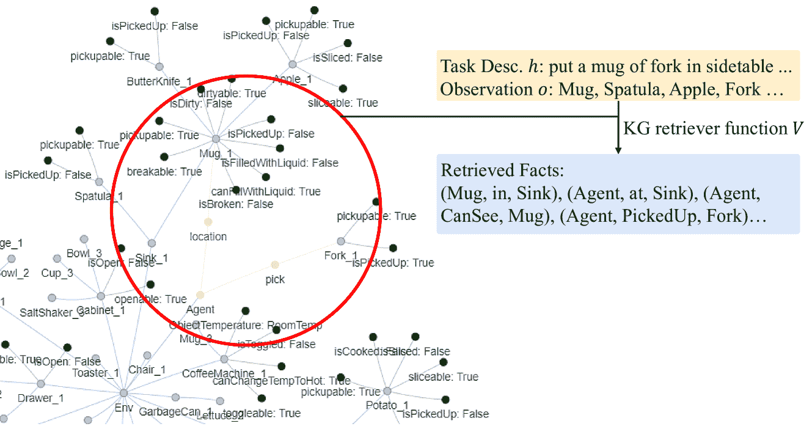

<!--yml

类别：未分类

日期：2025-01-11 11:47:34

-->

# 从大型语言模型到现成代理的具身链式推理蒸馏

> 来源：[https://arxiv.org/html/2412.11499/](https://arxiv.org/html/2412.11499/)

Wonje Choi    Woo Kyung Kim    Minjong Yoo    Honguk Woo

###### 摘要

我们解决了在决策系统需要在具有容量限制的现成设备上及时运行的环境中，利用大型语言模型（LLMs）处理复杂具身任务的挑战。我们提出了DeDer，这是一个框架，用于将大型语言模型的具身推理能力分解并蒸馏到高效的小型语言模型（sLM）基础策略中。在DeDer中，基于大型语言模型的策略的决策过程被重构为一个层次结构，包含推理策略和规划策略。推理策略通过大型语言模型的具身上下文学习和自我验证生成的数据进行蒸馏，因此能够产生有效的推理结果。规划策略在推理结果的引导下，可以高效地生成优化计划。反过来，DeDer使得可以采用小型语言模型（sLM）来实现这两种策略，并部署在现成设备上。此外，为了提升针对具身任务的中间推理结果的质量，我们设计了具身知识图谱，并且为了通过单次推理及时生成多个推理结果，我们还使用了对比提示注意力模型。我们在ALFRED基准测试中的实验表明，DeDer超越了领先的语言规划和蒸馏方法，表明通过DeDer衍生的小型语言模型基础的具身策略具有可应用性和高效性。

机器学习，ICML

## 1 引言

在具身人工智能领域，已在将大型语言模型（LLM）应用于任务规划方面取得了显著进展。例如，SayCan（Brohan 等，[2023](https://arxiv.org/html/2412.11499v1#bib.bib4)）结合了LLM的推理能力与基于强化学习（RL）的可供性模型，来解释任务指令并推导出在环境中可执行的机器人技能。若干研究（Huang 等，[2022](https://arxiv.org/html/2412.11499v1#bib.bib14); Wu 等，[2023](https://arxiv.org/html/2412.11499v1#bib.bib40); Song 等，[2023](https://arxiv.org/html/2412.11499v1#bib.bib31); Singh 等，[2023](https://arxiv.org/html/2412.11499v1#bib.bib30)）探索了通过基于传感器数据、参考轨迹和可用技能的提示，将LLM与环境进行基础对接。最近，palm-e（Driess 等，[2023](https://arxiv.org/html/2412.11499v1#bib.bib12)）扩展了LLM的具身推理能力，包括视觉观察等多模态数据。然而，这些直接依赖LLM进行持续短期决策的方法，在现实世界的应用中往往会遇到实际的限制，特别是当决策智能体需要在有限容量的现成设备上操作时。LLM的高计算需求在这种场景下构成了一个重大挑战。

将大型语言模型（LLM）直接蒸馏成更紧凑、资源高效的模型，虽然看起来直观，但对于复杂的具身任务可能并不有效（Dasgupta 等，[2023](https://arxiv.org/html/2412.11499v1#bib.bib11)）。这一挑战源自于对具身任务特征的深刻理解需求，这些特征本质上要求进行长时间跨度的多步推理，并具备适应时变环境上下文的能力。具身智能体通过与环境的互动，频繁地遇到新的、未见过的环境信息。这种持续暴露于各种环境条件的过程增加了复杂性和变异性，从而使得蒸馏过程更加复杂。

我们的工作聚焦于将基于LLM的政策提炼为仅能操作小型语言模型（sLMs）的现成代理，用于具体任务。我们提出了DeDer，一种创新的具体化提炼框架，旨在将基于LLM的政策中的具体推理和决策过程分解并提炼为两个独立的小型、更易管理的模型：推理政策和规划政策。推理政策专注于理解和解释任务需求及环境背景，而规划政策则集中于根据推理政策提供的见解生成可执行的计划。这种划分使得可以更加高效地利用LLM的复杂功能，适用于具有有限资源的现成设备的具体化代理。

通过LLM提炼获得推理政策面临独特挑战，因为LLM中的推理过程是隐性的。我们通过在LLM的迭代使用中采用具体现身的思维链（CoT）和上下文学习，并通过自我验证加以增强来解决这一问题。对于推理政策，我们采用了基于具体现身知识图谱（KG）的提示和对比性提示注意力模型，并与sLM集成。这两种技术通过高效地将环境信息整合到知识图谱中，并有效地表示当前上下文，提升了推理政策的推理结果质量。它们还支持生成多个推理并行结构，从而促进了运行时任务规划的及时性。规划政策利用提炼出的推理结果来确定可执行计划，解决了复杂任务中对可操作决策的实际需求。

使用ALFRED基准（Shridhar等人，[2020](https://arxiv.org/html/2412.11499v1#bib.bib29)），我们的实验展示了DeDer的优势。结果表明，通过DeDer提炼的政策在零-shot任务规划场景中显著优于其他基准，如LLM-planner（Song等人，[2023](https://arxiv.org/html/2412.11499v1#bib.bib31)）。DeDer在已见任务环境下取得了15.0%的显著提升，在未见任务环境下提升了21.1%。考虑到DeDer在运行时使用的是sLM而非LLM，这些结果清楚地突显了DeDer在处理新的、未遇到的环境中的卓越适应性。

请注意，DeDer是第一个实现基于sLM的政策的框架，它在资源效率上表现出色，同时在复杂具体任务的表现上与基于LLM的政策（即第[5.1](https://arxiv.org/html/2412.11499v1#S5.SS1 "5.1 实验设置 ‣ 5 评估 ‣ 从LLM到现成代理的具体现身CoT提炼")部分中的基准）相当。我们工作的贡献总结如下。

+   •

    我们提出了新的框架DeDer，解决了将LLM推理能力蒸馏到小型政策中以便在容量有限的现成设备上快速部署的挑战。

+   •

    我们设计了DeDer中的双层次政策结构，通过该结构，具身推理过程得以分解，其知识可以系统地蒸馏，从而实现强大的基于sLM的政策。

+   •

    我们开发了从LLM生成特定于具身任务的推理数据的构建过程，探索了上下文学习和自我验证技术。

+   •

    我们实现了用于基于sLM政策的具身知识图（KG）和提示关注模型，以提高环境变化中的推理质量，并促进快速任务规划。

+   •

    通过在ALFRED上的大量实验，我们展示了DeDer在实现对未见过的具身任务的强大零-shot性能方面的有效性和高效性。

## 2 相关工作

基于LLM的具身控制。在具身控制领域，越来越多的研究趋向于利用LLM进行现实世界任务的推理和执行(Brohan et al., [2023](https://arxiv.org/html/2412.11499v1#bib.bib4); Huang et al., [2022](https://arxiv.org/html/2412.11499v1#bib.bib14); Song et al., [2023](https://arxiv.org/html/2412.11499v1#bib.bib31))。我们的工作与这一方向一致，但通过使现成设备能够在不直接使用LLM进行运行时推理的情况下，仍能达到与LLM相当的具身任务性能，从而与其他工作区分开来，重点在于调优一个较小的语言模型。

具身政策蒸馏。最近，一些研究致力于将复杂的决策策略（通常源自计算密集型模型）蒸馏成紧凑且高效的策略，以适应资源受限的环境。在(Sumers et al., [2023](https://arxiv.org/html/2412.11499v1#bib.bib33))中，知识被从预训练的视觉-语言模型中蒸馏，用于监督指令跟随代理的语言基础技能。在(Jain et al., [2021](https://arxiv.org/html/2412.11499v1#bib.bib15))中，为视觉具身代理采用了二阶段训练方案。强化学习中的一个相关子集是以监督方式转移教师策略(Yin & Pan, [2017](https://arxiv.org/html/2412.11499v1#bib.bib42))。特别是，早期的研究集中于减少教师策略和学生策略之间的交叉熵(Parisotto et al., [2016](https://arxiv.org/html/2412.11499v1#bib.bib23); Schmitt et al., [2018](https://arxiv.org/html/2412.11499v1#bib.bib27))。我们的基于LLM的政策蒸馏也旨在最小化与教师策略（一个LLM）分布的差异，同时探索LLM推理能力分解和蒸馏中的独特双层次结构。

LLM的推理能力。许多研究探讨了LLM的推理能力，研究了检索增强的上下文示例（Lewis 等人，[2020](https://arxiv.org/html/2412.11499v1#bib.bib19)；Ram 等人，[2023](https://arxiv.org/html/2412.11499v1#bib.bib26)）、知识图谱（KG）集成（Andrus 等人，[2022](https://arxiv.org/html/2412.11499v1#bib.bib2)；Baek 等人，[2023](https://arxiv.org/html/2412.11499v1#bib.bib3)）以及链式推理提示（CoT prompting）（Wei 等人，[2022](https://arxiv.org/html/2412.11499v1#bib.bib39)；Wang 等人，[2022](https://arxiv.org/html/2412.11499v1#bib.bib38)）等方法。最近的研究还展示了将LLM中的链式推理过程蒸馏到sLM中的有效性（Wang 等人，[2023](https://arxiv.org/html/2412.11499v1#bib.bib37)；Li 等人，[2023](https://arxiv.org/html/2412.11499v1#bib.bib20)）。我们的工作与LLM蒸馏在同一方向，但特别针对复杂的具身任务，并使用了解构式蒸馏。

图1：DeDer框架的三个阶段：(i) 在合理性数据集构建阶段，采用具有MDP特征的上下文学习和自我批判功能，从LLM中提取合理性；(ii) 在策略蒸馏阶段，使用提取的合理性数据训练由推理策略和规划策略组成的基于sLM的策略；(iii) 在零样本部署阶段，评估蒸馏后的基于sLM的策略在未见过的环境中的表现。

## 3 问题表述

在强化学习（RL）中，具身智能体的环境被建模为部分可观察的马尔可夫决策过程（POMDP），表示为一个元组 $(\mathcal{S},\mathcal{A},P,\mathcal{G},\mathcal{H},R,\Omega,\mathcal{O})$ （Song 等人，[2023](https://arxiv.org/html/2412.11499v1#bib.bib31)；Singh 等人，[2023](https://arxiv.org/html/2412.11499v1#bib.bib30)）。这里，$s\in\mathcal{S}$ 是状态空间，$a\in\mathcal{A}$ 是动作空间，$P:\mathcal{S}\times\mathcal{A}\times\mathcal{S}\rightarrow[0,1]$ 是转移概率，$G\in\mathcal{G}$ 是目标空间，$h\in\mathcal{H}$ 是高层任务描述，$R:\mathcal{S}\times\mathcal{A}\times\mathcal{G}\rightarrow\mathbb{R}$ 是奖励函数。具身智能体环境的独特之处在于其部分观察的特性，表现为观察空间 $o\in\Omega$ 和条件观察概率 $\mathcal{O}:\mathcal{S}\times\mathcal{A}\rightarrow\Omega$ （Sutton & Barto，[2018](https://arxiv.org/html/2412.11499v1#bib.bib35)）。这一特点解释了智能体的有限感知，使得决策过程变得复杂，并且反映了现实世界的情况。我们的目标是为具有容量限制的现成设备实现一个稳健的基于sLM的策略 $\Phi_{\text{sLM}}^{*}$，其能力可与基于LLM的策略 $\Phi_{\text{LLM}}$ 在具身任务规划中的表现相媲美。

|  | $\displaystyle\Phi_{\text{sLM}}^{*}=\operatorname*{argmax}_{\Phi_{\text{sLM}}}$ | $\displaystyle\operatorname*{\mathbb{E}}\Bigg{[}\sum_{t=0}^{\infty}\gamma^{t}R(% s_{t},\Phi_{\text{sLM}}(o_{t},h_{t}),G)$ |  | (1) |
| --- | --- | --- | --- | --- |
|  |  | $\displaystyle-D(\Phi_{\text{LLM}}(o_{t},h_{t}),\Phi_{\text{sLM}}(o_{t},h_{t}))% \Bigg{]}$ |  |

请注意，$D$ 是一个距离函数，例如 Kullback-Leibler 散度（Kullback & Leibler, [1951](https://arxiv.org/html/2412.11499v1#bib.bib18)），$\gamma$ 是环境的折扣因子。

## 4 方法

对于体现任务，智能体需要具备推理能力，以理解并与复杂动态的环境进行交互。然而，考虑到 sLM 模型的内在局限性，采用基于 sLM 的策略时尤其需要简化推理过程。这可以通过将马尔可夫决策过程（MDP）特征（如目标、状态、观察、行动、回报以及子目标，强化学习公式中指定的内容）整合到推理过程中来实现（Chane-Sane 等人，[2021](https://arxiv.org/html/2412.11499v1#bib.bib6); Hausknecht & Stone, [2015](https://arxiv.org/html/2412.11499v1#bib.bib13); Chen 等人，[2021](https://arxiv.org/html/2412.11499v1#bib.bib7); Janner 等人，[2021](https://arxiv.org/html/2412.11499v1#bib.bib16)）。

在本研究中，我们将这种类型的环境信息和 MDP 特征称为“理据”，因为它们可以作为帮助阐明计划背后推理的理由或线索。我们利用这些理据作为有效提取 LLM 中体现的推理能力到小型模型的手段，从而实现基于 sLM 的策略。为了进行这种提取，我们开发了 DeDer 框架，包含以下阶段：（i）理据数据集构建，（ii）通过体现的知识图谱进行策略提取，以及（iii）零-shot 部署和评估，如图 [1](https://arxiv.org/html/2412.11499v1#S2.F1 "Figure 1 ‣ 2 Related Work ‣ Embodied CoT Distillation From LLM To Off-the-shelf Agents") 所示。

在理由数据集构建阶段，我们利用LLM使用中的CoT方案，从环境中的专家转换（即一系列行动计划）中提取理由。这是通过基于MDP的上下文学习实现的，采用由MDP属性定义的RL特定查询作为提示。在随后的策略蒸馏阶段，我们基于具象化KG构建了一个基于sLM的两层次结构策略。该策略包括一个推理策略，经过行为对比学习优化的单步CoT训练，用于生成理由；还包括一个规划策略，利用这些理由通过CoT提示进行引导，学习推断行动计划。在部署阶段，我们评估了在零样本环境下的蒸馏sLM策略，其中任务描述、物体位置和室内场景发生了变化。

图 2：DeDer 中基于MDP的上下文学习用于从LLM中提取理由：展示了期望计划的输入、查询（以红色标示）和理由（以蓝色标示）示例，其中特别强调了与MDP对齐的部分。

### 4.1 理由数据集构建

考虑一个专家数据集 $\mathcal{D}_{\text{exp}}=\{\tau_{i}=(o_{i},a_{i},h_{i})\}_{i}$，其中每个转换 $\tau_{i}$ 包括时间步 $i$ 的观察 $o_{i}$、行动（计划） $a_{i}$ 和高级任务描述 $h_{i}$。我们扩展数据集 $\mathcal{D}_{\text{exp}}$ 来构建一个理由数据集 $\mathcal{D}_{\text{Rtn}}=\{c_{i}=(o_{i},a_{i},h_{i},\mathcal{R}_{i})\}_{i}$，其中每个转换 $\tau_{i}$ 被补充上一个理由集合 $\mathcal{R}=\{r_{j}\}_{j=1}^{m}$。为了获得特定于给定具象任务的理由集合，我们将基于MDP的上下文学习与LLM的CoT提示机制相结合。这包括通过一系列RL特定查询反复提示LLM，利用检索增强的示例，类似于 (Ram et al., [2023](https://arxiv.org/html/2412.11499v1#bib.bib26))。随后，理由集合经过LLM的评估，如(Sun et al., [2023](https://arxiv.org/html/2412.11499v1#bib.bib34))所讨论的，最终被纳入数据集 $\mathcal{D}_{\text{Rtn}}$ 中。

MDP 特征化的上下文学习。为了通过转移 $\tau$ 从 LLM 中提取推理，我们通过检索增强方式不断更新来自数据集 $\mathcal{D}_{\text{Rtn}}$ 的上下文示例。我们使用检索器函数 $F:(\tau,\mathcal{C})\mapsto\mathcal{C}_{k}$，如文献 (Karpukhin et al., [2020](https://arxiv.org/html/2412.11499v1#bib.bib17)) 中所述。该函数以来自 $\mathcal{D}_{\text{exp}}$ 的转移 $\tau$ 和来自 $\mathcal{D}_{\text{Rtn}}$ 的元组集 $\mathcal{C}=\{c_{1},...,c_{n}\}$ 为输入，并检索出与给定 $\tau$ 最相关的前 $k$ 个元组，从而获得示例集 $\mathcal{C}_{k}$。语义相关性通过转移 $\tau$ 和 $c$ 的语言嵌入之间的内积来计算，该嵌入是通过预训练的上下文嵌入模型 $E$ 获得的。即，我们通过 $S(\tau,c)=E(\tau)^{\top}E(c)$ 得到相关性。

利用元组 $\mathcal{C}_{k}$，我们通过向 LLM $\Phi_{\text{LLM}}$ 提供预定义的 RL 特定查询集 $\mathcal{Q}=\{q_{1},...,q_{m}\}$，依次获得推理集 $\mathcal{R}$。

|  | $\mathcal{R}=\{r_{l}&#124;r_{l}=\Phi_{\text{LLM}}(\mathcal{C}_{k},\tau,\{r_{j}\}_{j<% l},\ q_{l})\}$ |  | (2) |
| --- | --- | --- | --- |

这里，$\{r_{j}\}_{j<l}$ 表示一组为问题 $r_{l}$ 之前的提问生成的推理。在这个过程中，$\mathcal{C}_{k}$ 用于增强大语言模型（LLM）的上下文学习，如文献 (Ram et al., [2023](https://arxiv.org/html/2412.11499v1#bib.bib26)) 中所述，使其能够有效地回应查询 $q_{l}$。具体来说，RL 特定查询用于提取马尔科夫决策过程（MDP）的特征，这些特征对于具身任务规划至关重要，如目标、状态、计划、观察、计划历史和子目标。这些查询和推理的示例见图 [2](https://arxiv.org/html/2412.11499v1#S4.F2 "图 2 ‣ 4 方法 ‣ 从 LLM 到现成代理的具身 CoT 蒸馏")。

图3：DeDer中的蒸馏过程：在合理性数据集构建阶段，LLM通过查询$q_{i}$和合理性$r_{i}$的迭代提示来通过检索增强优化上下文示例$\mathcal{C}_{k}$。LLM还充当批评者，评估提取的合理性$\mathcal{R}$的有效性。在政策蒸馏阶段，包含环境信息和专家经验的具象化KG作为输入$g$，传递给基于sLM的推理政策，并通过提示的因果注意力进行训练，采用基于行为的对比学习。推理政策的结构专门设计为通过集成提示注意力$\Psi$和编码器-解码器架构，在单步CoT过程中产生多个合理性$\mathcal{R}$。推理政策是从具象化的KG中蒸馏的，而具象化的KG会根据数据集不断更新。随后，规划政策$\Phi_{\text{p}}$通过在每一步立即使用合理性$\mathcal{R}$来生成及时的行动计划$a$。

LLM作为自我批评功能。为了确保合理性集合$\mathcal{R}$与行动计划$a$一致，我们还将LLM用作自我批评功能。具体而言，我们使用查询$q_{\text{cri}}$来提示LLM检查计划$a$是否仅能从提取的$\mathcal{R}$中推导出来。当$\mathcal{R}$未能为$a$提供足够的信息时，我们通过检索上下文示例重新开始。否则，我们将新生成的元组$c=(o,a,h,\mathcal{R})$纳入数据集$\mathcal{D}_{\text{Rtn}}$。通过采用这种自我验证，我们旨在收集包含足够信息的合理性，以推导专家过渡中的计划。

|  | $\mathcal{D}_{\text{Rtn}}=\{c_{i}&#124;\Phi_{\text{LLM}}(q_{\text{cri}},\mathcal{R}_% {i},a_{i})=1,c_{i}\in\mathcal{D}_{\text{Rtn}}\}$ |  | (3) |
| --- | --- | --- | --- |

### 4.2 通过具象化知识图谱进行政策蒸馏

为了通过合理性数据集$\mathcal{D}_{\text{Rtn}}$将LLM的推理能力蒸馏到基于sLM的政策$\Phi_{\text{sLM}}$中，我们将政策结构为两级层次结构。第一层是推理政策$\Phi_{\text{R}}$；它负责根据给定的观察$o$、任务描述$h$和具象化KG$g$推导合理性集合。第二层是规划政策$\Phi_{\text{P}}$；它根据$\Phi_{\text{R}}$的合理性生成计划。

|  | $\Phi_{\text{sLM}}=\Phi_{\text{P}}\circ\Phi_{\text{R}}:(o,h;g)\mapsto a.$ |  | (4) |
| --- | --- | --- | --- |

具象化的KG是基于sLM的政策的内部组成部分，封装了环境信息。

在训练中，我们使用软提示的微调方法来训练基于sLM的政策。这对于采用有限推理能力的sLM非常有效，在这种情况下不允许进行上下文学习。

具象化KG。由于智能体与环境持续交互并可以积累任务完成所需的信息，因此高效表示信息对于引导基于sLM的策略至关重要。我们采用了具象化知识图（KG），即一组三元组 $g=\{x_{i}=(x^{s}_{i},x^{r}_{i},x^{o}_{i})\}_{i}$，其中 $x^{s}$ 是主体，$x^{r}$ 是关系，$x^{o}$ 是客体。例如，给定“一个苹果在桌子上”和“智能体拿起一把刀”，对应的三元组分别为（Apple, On, Table）和（Agent, Pickup, Knife）。我们在每个规划步骤 $t$ 通过更新函数 $U$ 来细化具象化KG，例如：

|  | $U:(g_{t-1},\ a_{t-1},\ o_{t})\mapsto g_{t}.$ |  | (5) |
| --- | --- | --- | --- |

为了引导基于sLM的策略，我们还使用KG检索函数 $V$，它从 $g$ 中检索与观察 $o$ 和任务描述 $h$ 相关的三元组子集。

|  | $V:(o,h;g)\rightarrow\{x\in g\ | \ S(x,(h,o))\geq\delta\}$ |  | (6) |
| --- | --- | --- | --- | --- |

相关的三元组是通过预训练的语义相关性函数 $S$ 选择的，该函数用于计算 $g$ 中每个三元组与输入 $o$ 和 $h$ 之间的相关性，其中 $\delta$ 是一个阈值超参数。从此以后，$g$ 表示通过KG检索函数提取的图。

推理-策略蒸馏。对于生成推理集合的推理策略 $\Phi_{\text{R}}$，我们使用带有编码器-解码器架构的注意力模块。

|  | $\Phi_{\text{R}}=\Phi_{\text{Dec}}\circ\Psi\circ\Phi_{\text{Enc}}:g\mapsto\% \mathcal{R}$ |  | (7) |
| --- | --- | --- | --- |

为了通过推理策略 $\Phi_{\text{R}}$ 促进单步链式推理（CoT），我们还使用了软提示池 $\theta=[\theta^{(1)},\theta^{(2)},...,\theta^{(m)}],\ \theta^{(i)}\in\mathbb{R}^{d}$，其中 $d$ 是提示 $\theta^{(i)}$ 的维度（Senadeera & Ive, [2022](https://arxiv.org/html/2412.11499v1#bib.bib28)）。编码器 $\Phi_{\text{Enc}}$ 包含两个不同的提示池：一个前缀提示池 $\theta_{\text{Pre}}$ 和一个后缀提示池 $\theta_{\text{Pos}}$。

|  | $\Phi_{\text{Enc}}:(g;\theta_{\text{Pre}},\theta_{\text{Pos}})\mapsto z=[z_{1},\ ...,z_{d}]$ |  | (8) |
| --- | --- | --- | --- |

每个前缀提示 $\theta_{\text{Pre}}^{(i)}$ 是基于查询 $q_{i}$ 的语言嵌入初始化的，而每个后缀提示 $\theta_{\text{Pos}}^{(i)}$ 是随机初始化的。此外，为了强调每个推理中的信息并按顺序传递，符合推理数据集构建的要求，注意力模块 $\Psi$ 包含因果注意力 $\Psi_{\text{c}}$ （Vaswani 等，[2017](https://arxiv.org/html/2412.11499v1#bib.bib36)）和门控注意力 $\Psi_{\text{g}}$ （Xue 等，[2020](https://arxiv.org/html/2412.11499v1#bib.bib41)），即，

|  | $\hat{z}=[\hat{z}_{1},...,\hat{z}_{d}]=\Psi(z)=z+\alpha(\Psi_{\text{c}}(z)+\Psi_{\text{g}}(z))$ |  | (9) |
| --- | --- | --- | --- |

其中$\alpha$是一个调节注意力机制输出影响的缩放因子。解码器$\Phi_{\text{Dec}}$利用解码器提示池$\theta_{\text{Dec}}$生成一组理由$\mathcal{R}$。

|  | $\Phi_{\text{Dec}}:(\hat{z};\theta_{\text{Dec}})\mapsto\mathcal{R}$ |  | (10) |
| --- | --- | --- | --- |

使用由更新函数$U$和KG检索函数$V$从$\mathcal{D}_{\text{Rtn}}$生成的具象化KG，我们通过理由重构损失来优化推理策略。

|  | $\displaystyle\mathcal{L}_{\text{Rtn}}=\operatorname*{\mathbb{E}}_{(o,h,% \mathcal{R})\sim\mathcal{D}_{\text{Rtn}}}\left[\sum_{i=1}^{m}\log\Phi_{\text{R% }}(r_{i}&#124;g)\right]$ |  | (11) |
| --- | --- | --- | --- |

该损失是通过对每个理由$r_{i}$的对数似然值的期望求和来计算的。

考虑到环境的微小变化可能导致代理的计划不一致，我们设计了提示KG表示，使用基于行为的对比学习（Stooke等人，[2021](https://arxiv.org/html/2412.11499v1#bib.bib32)；Zhang等人，[2022](https://arxiv.org/html/2412.11499v1#bib.bib43)；Choi等人，[2023](https://arxiv.org/html/2412.11499v1#bib.bib9)）。这些提示KG表示促进了推理策略的因果和门控注意力，从而使得多条理由能够进行一步推理。我们从具象化KG对中采样一批$\mathcal{B}_{\text{Con}}=\{(g_{i},g_{i}^{+}),(g_{i},g_{i}^{-})\}_{i}$，其中$(g_{i},g_{i}^{+})$表示正样本对，$(g_{i},g_{i}^{-})$表示负样本对。具体来说，正样本对由执行相同计划的具象化KG组成，而负样本对定义为连续的计划步骤。然后，对比学习损失公式为：

|  | $\mathcal{L}_{\text{Con}}=\operatorname*{\mathbb{E}}_{\mathcal{B}_{\text{Con}}% \sim\mathcal{D}_{\text{Rtn}}}[\text{max}\{0,d(\hat{z},\ \hat{z}^{+})-d(\hat{z}% ,\ \hat{z}^{-})+\epsilon\}]$ |  | (12) |
| --- | --- | --- | --- |

其中$\hat{z}=\Psi\circ\Phi_{\text{Enc}}(g;\theta_{\text{Pre}}$, $\theta_{\text{Pos}})$，$d$表示嵌入空间$\hat{z}\in\mathcal{Z}$中与理由嵌入序列元素对应的距离度量之和（Chen等人，[2020](https://arxiv.org/html/2412.11499v1#bib.bib8)；Oord等人，[2018](https://arxiv.org/html/2412.11499v1#bib.bib22)），$\epsilon$是一个边际参数。

计划-策略蒸馏。计划策略$\Phi_{\text{P}}$基于由推理策略$\Phi_{\text{R}}$生成的理由集预测下一步计划$a$。

|  | $\Phi_{\text{P}}:(\mathcal{R}=\Phi_{\text{R}}(g))\mapsto a$ |  | (13) |
| --- | --- | --- | --- |

我们通过重构损失优化计划策略。

|  | $\mathcal{L}_{\text{Plan}}=\operatorname*{\mathbb{E}}_{(o,a,h)\sim\mathcal{D}_{% \text{Rtn}},\mathcal{R}\sim\Phi_{\text{R}}}\left[\log\Phi_{\text{P}}(a\ &#124;\ % \mathcal{R})\right]$ |  | (14) |
| --- | --- | --- | --- |

算法 [1](https://arxiv.org/html/2412.11499v1#alg1 "Algorithm 1 ‣ 4.2 Policy Distillation via Embodied Knowledge Graph ‣ 4 Approach ‣ Embodied CoT Distillation From LLM To Off-the-shelf Agents") 列出了策略蒸馏过程，其中在 ([11](https://arxiv.org/html/2412.11499v1#S4.E11 "Equation 11 ‣ 4.2 Policy Distillation via Embodied Knowledge Graph ‣ 4 Approach ‣ Embodied CoT Distillation From LLM To Off-the-shelf Agents"))、([12](https://arxiv.org/html/2412.11499v1#S4.E12 "Equation 12 ‣ 4.2 Policy Distillation via Embodied Knowledge Graph ‣ 4 Approach ‣ Embodied CoT Distillation From LLM To Off-the-shelf Agents")) 和 ([14](https://arxiv.org/html/2412.11499v1#S4.E14 "Equation 14 ‣ 4.2 Policy Distillation via Embodied Knowledge Graph ‣ 4 Approach ‣ Embodied CoT Distillation From LLM To Off-the-shelf Agents")) 中的损失分别用于推理策略和规划策略。

算法 1 策略蒸馏

推理数据集 $\mathcal{D}_{\text{Rtn}}$

初始化推理策略 $\Phi_{\text{R}}$，以及规划策略 $\Phi_{\text{P}}$

初始化提示池 $\theta_{\text{Pre}},\theta_{\text{Pos}},\theta_{\text{Dec}}$

1:  /* 推理-策略蒸馏 */  

表 1：在 ALFRED 中具有$4$个不同任务类别的体现任务规划的性能

方法 训练 已见 未见 空间 未见 环境 SR GC SR GC SR GC SR GC 基于LLM的策略：PaLM (540B), LLaMA2 (7B) SayCan-PaLM $34.1{\pm 0.0}$ $68.8{\pm 0.0}$ $37.6{\pm 0.0}$ $66.8{\pm 0.0}$ $26.5{\pm 0.0}$ $66.5{\pm 0.0}$ $29.3{\pm 0.0}$ $\mathbf{68.8{\pm 0.0}}$ LLM-planner-PaLM $70.9{\pm 0.0}$ $86.6{\pm 0.0}$ $66.8{\pm 0.0}$ $84.3{\pm 0.0}$ $33.6{\pm 0.0}$ $67.6{\pm 0.0}$ $17.2{\pm 0.0}$ $54.3{\pm 0.0}$ ZSP-PaLM $73.8{\pm 0.0}$ $89.2{\pm 0.0}$ $59.6{\pm 0.0}$ $80.7{\pm 0.0}$ $28.8{\pm 0.0}$ $66.5{\pm 0.0}$ $6.9{\pm 0.0}$ $36.5{\pm 0.0}$ SayCan-LLaMA2 $0.0{\pm 0.0}$ $10.6{\pm 0.0}$ $0.3{\pm 0.0}$ $9.6{\pm 0.0}$ $0.0{\pm 0.0}$ $10.3{\pm 0.0}$ $0.0{\pm 0.0}$ $2.2{\pm 0.0}$ LLM-planner-LLaMA2 $1.8{\pm 0.0}$ $19.6{\pm 0.0}$ $2.0{\pm 0.0}$ $22.7{\pm 0.0}$ $0.8{\pm 0.0}$ $19.6{\pm 0.0}$ $0.0{\pm 0.0}$ $15.8{\pm 0.0}$ ZSP-LLaMA2 $54.3{\pm 0.0}$ $76.5{\pm 0.0}$ $26.7{\pm 0.0}$ $59.9{\pm 0.0}$ $6.7{\pm 0.0}$ $46.9{\pm 0.0}$ $0.0{\pm 0.0}$ $26.6{\pm 0.0}$ 基于sLM的策略：GPT2-large (0.8B), GPT2 (0.2B) SayCan-GPT2-large $0.2{\pm 0.0}$ $14.7{\pm 0.0}$ $0.5{\pm 0.0}$ $17.1{\pm 0.0}$ $0.5{\pm 0.0}$ $17.6{\pm 0.0}$ $0.0{\pm 0.0}$ $18.1{\pm 0.0}$ LLM-planner-GPT2-large $0.0{\pm 0.0}$ $3.43{\pm 0.0}$ $0.0{\pm 0.0}$ $4.0{\pm 0.0}$ $0.0{\pm 0.0}$ $2.0{\pm 0.0}$ $0.0{\pm 0.0}$ $1.8{\pm 0.0}$ ZSP-GPT2-large $1.8{\pm 0.0}$ $3.6{\pm 0.0}$ $0.8{\pm 0.0}$ $3.4{\pm 0.0}$ $0.3{\pm 0.0}$ $4.3{\pm 0.0}$ $0.0{\pm 0.0}$ $0.4{\pm 0.0}$ End2End-GPT2-large $41.1{\pm 12.2}$ $63.5{\pm 11.6}$ $25.2{\pm 7.0}$ $54.3{\pm 10.9}$ $11.4{\pm 4.5}$ $50.1{\pm 9.2}$ $5.7{\pm 1.0}$ $53.8{\pm 25.3}$ SCoTD-GPT2 $55.8{\pm 4.2}$ $82.7{\pm 1.5}$ $51.8{\pm 5.2}$ $79.0{\pm 2.3}$ $29.3{\pm 2.1}$ $70.4{\pm 0.9}$ $27.6{\pm 1.7}$ $59.8{\pm 1.7}$ SCOTT-GPT2 $62.2{\pm 1.6}$ $85.6{\pm 0.1}$ $57.2{\pm 4.0}$ $81.3{\pm 1.6}$ $32.7{\pm 2.1}$ ${72.0\pm 0.1}$ ${24.1\pm 7.9}$ $60.3{\pm 1.6}$ End2End-GPT2 $33.1{\pm 4.6}$ $46.6{\pm 8.1}$ $17.6{\pm 2.6}$ $38.8{\pm 8.0}$ $8.5{\pm 6.3}$ $36.3{\pm 9.1}$ $3.4{\pm 0.9}$ $34.6{\pm 9.0}$ DeDer-GPT2 $\mathbf{100.0{\pm 0.0}}$ $\mathbf{100.0{\pm 0.0}}$ $\mathbf{81.8{\pm 0.5}}$ $\mathbf{92.2{\pm 0.2}}$ $\mathbf{52.7{\pm 1.0}}$ $\mathbf{81.2{\pm 0.4}}$ $\mathbf{40.3{\pm 0.9}}$ $68.7{\pm 0.6}$

## 5 评估

### 5.1 实验设置

环境。为了评估，我们使用ALFRED（Shridhar等人，[2020](https://arxiv.org/html/2412.11499v1#bib.bib29)）环境。在具身推理任务中，ALFRED包含各种互动元素，包括$58$种不同的物体类型（例如，面包）和$26$种容器类型（例如，盘子），并覆盖$120$种不同的室内场景（例如，厨房）。通过将这些物体和室内场景与$7$种不同类型的指令（例如，拿取和放置）结合，可以配置$4703$种不同的任务（例如，“将钥匙链放到盘子里，然后将它们放到架子上”）。这一设置提供了广泛的现实世界挑战，涵盖复杂的导航、物体操作和执行顺序操作。

我们使用$312$条轨迹作为专家数据集，并根据与专家数据集中任务的相似性将评估任务分为$4$类。对于训练类，任务与专家数据集中的任务完全相同。对于已见类，任务保持与专家数据集相同，唯一不同的是任务无关对象的起始位置随机放置。对于未见空间类，环境中的所有对象都是随机放置的。最具挑战性的类是未见环境类，包括专家数据集中未出现的新任务和室内场景。环境的详细信息请见附录A。

基准方法。为了比较，我们实现了几种语言规划方法：1) SayCan（Brohan等，[2023](https://arxiv.org/html/2412.11499v1#bib.bib4)）是一个集成了LLM概率和可用性得分的体态规划框架。对于体态控制，可用性基于对象的存在信息。2) ZSP（Huang等，[2022](https://arxiv.org/html/2412.11499v1#bib.bib14)）采用逐步规划来完成体态任务。3) LLM-planner（Song等，[2023](https://arxiv.org/html/2412.11499v1#bib.bib31)）直接利用LLM进行体态任务规划，当生成的计划不可执行时，它会动态重新规划。在评估现成设备时，我们为这些语言规划基准方法（SayCan、ZSP、LLM-planner）采用了sLM。

我们还实现了几种知识蒸馏算法：4) SCoTD（Li等，[2023](https://arxiv.org/html/2412.11499v1#bib.bib20)）是一种知识蒸馏算法，用于训练一个sLM，使用从LLM推理样本中派生的样本。5) SCOTT（Wang等，[2023](https://arxiv.org/html/2412.11499v1#bib.bib37)）是一种知识蒸馏方法，用于训练一个sLM，涉及LLM的自一致性CoT增强和反事实推理目标。6) End2End（Micheli & Fleuret，[2021](https://arxiv.org/html/2412.11499v1#bib.bib21)）是一种体态任务规划方法，使用单层策略，不同于DeDer，直接从输入生成计划。为了通过生成的轨迹评估任务规划在环境中的表现，我们还实现了一个额外的基于规则的策略，该策略直接与环境互动，遵循基准方法和我们的DeDer的行动计划。

评估指标。我们在ALFRED（Shridhar等，[2020](https://arxiv.org/html/2412.11499v1#bib.bib29)）中使用了两种不同的指标。任务成功率（SR）（%）是完全完成任务的百分比，任务只有在所有子目标都达成时才视为成功。例如，任务“切热面包”被分解为单独的子目标，如“切面包”和“加热面包”。目标条件成功率（GC）（%）是完成的子目标的百分比。

### 5.2 性能评估

在表格[1](https://arxiv.org/html/2412.11499v1#S4.T1 "Table 1 ‣ 4.2 Policy Distillation via Embodied Knowledge Graph ‣ 4 Approach ‣ Embodied CoT Distillation From LLM To Off-the-shelf Agents")中，我们评估了具身任务规划性能，其中每个策略以零-shot方式进行评估。我们的DeDer在所有测试类别（训练、已见、未见空间、未见环境）中，始终展现出在SR和GC指标上的稳健表现，平均比最具竞争力的基准LLM-planner-PaLM高出$21.6\%$的SR和$12.3\%$的GC。鉴于LLM-planner-PaLM使用了拥有$540$0亿参数的PaLM（Chowdhery等，[2023](https://arxiv.org/html/2412.11499v1#bib.bib10)），其规模是DeDer的$2700$倍，因此DeDer的这一性能提升尤其具有重要意义。此外，与参数规模相同的基准相比，我们观察到DeDer在所有类别上均表现优异，SR高出最高$27.6\%$，GC高出平均$12.6\%$。

语言规划基准（SayCan、LLM-Planner、ZSP）采用sLM（LLaMA2、GPT2-large）配置，表现较差。这是由于sLM的推理能力有限。同时，知识蒸馏基准（SCoTD、SCOTT）保持了不错的性能。尽管它们通过少量示例提示进行LLM的蒸馏，但其蒸馏知识受到传统CoT机制的限制。这一限制的产生是因为它们没有像DeDer那样使用多步提示和自我验证。此外，End2End基准在直接使用专家数据集进行具身任务规划时，表现显著较差，这是由于sLM的推理能力有限。

相比之下，我们的框架采用了理由数据集和基于sLM的策略，采用了双层次结构。这使得能够有效蒸馏LLM的推理能力，特别是为基于MDP特征的具身任务规划量身定制的上下文学习。

### 5.3 消融研究

在消融研究中，所有测试类别（训练、已见、未见）的性能指标均以SR报告。

理由数据集构建。为了提取理由并构建第[4.1](https://arxiv.org/html/2412.11499v1#S4.SS1 "4.1 Rationale Dataset Construction ‣ 4 Approach ‣ Embodied CoT Distillation From LLM To Off-the-shelf Agents")节中的数据集，我们测试了多个语言模型，包括像GPT2-large（Radford等人，[2019](https://arxiv.org/html/2412.11499v1#bib.bib24)）这样的sLM模型，简称为GPT2，以及像PaLM和GPT3（Chowdhery等人，[2023](https://arxiv.org/html/2412.11499v1#bib.bib10)；Brown等人，[2020](https://arxiv.org/html/2412.11499v1#bib.bib5)）这样的LLM模型。我们还评估了在不使用MDP特征的上下文学习和自我验证的情况下构建数据集的过程；这种消融方法被称为Few-shot，如(Wei等人，[2022](https://arxiv.org/html/2412.11499v1#bib.bib39))中所述，其中使用一组固定的示例进行提示以提取理由。

在表格[2](https://arxiv.org/html/2412.11499v1#S5.T2 "Table 2 ‣ 5.3 Ablation Studies ‣ 5 Evaluation ‣ Embodied CoT Distillation From LLM To Off-the-shelf Agents")中，使用GPT2时各任务类别的表现显著下降。这些结果与我们利用LLM的推理能力来提取理由的动机一致，而这反过来又有助于将其有效地蒸馏到基于sLM的策略中。此外，DeDer在未见设置中相比Few-shot提高了平均$5.35\%$的性能，排除了GPT2的结果。这个改进表明了我们所采用的MDP特征的上下文学习和自我验证方法的优势。

表格 2：关于理由数据集构建的消融实验

方法 | LM | 训练集 | 已见 | 未见 | Few-shot | GPT2 | $41.9{\pm 19.3}$ | $2.4{\pm 0.5}$ | $0.3{\pm 0.1}$ | DeDer | GPT2 | $60.8{\pm 4.0}$ | $53.5{\pm 2.2}$ | $23.4{\pm 8.2}$ | Few-shot | GPT$3$ | $100.0{\pm 0.0}$ | $72.8{\pm 0.1}$ | $38.6{\pm 1.5}$ | DeDer | GPT$3$ | $100.0{\pm 0.0}$ | $72.8{\pm 0.1}$ | $42.2{\pm 1.2}$ | Few-shot | PaLM | $100.0{\pm 0.0}$ | $76.9{\pm 0.3}$ | $39.6{\pm 0.1}$ | DeDer | PaLM | $100.0{\pm 0.0}$ | $\mathbf{81.8{\pm 0.5}}$ | $\mathbf{46.5{\pm 1.0}}$

推理依据结构。我们分析了为提取推理依据而设计的各个查询的效果。在图[4(a)](https://arxiv.org/html/2412.11499v1#S5.F4.sf1 "Figure 4(a) ‣ Figure 4 ‣ 5.3 Ablation Studies ‣ 5 Evaluation ‣ Embodied CoT Distillation From LLM To Off-the-shelf Agents")中，我们评估了通过推理策略生成的推理依据集，该策略涉及LLM的自我批判功能（见[3](https://arxiv.org/html/2412.11499v1#S4.E3 "Equation 3 ‣ 4.1 Rationale Dataset Construction ‣ 4 Approach ‣ Embodied CoT Distillation From LLM To Off-the-shelf Agents")）。虚线表示使用所有$7$个查询时的性能，而沿x轴的每个柱状图表示在数据集构建过程中排除第$i$个查询时的性能。由于每个查询是专门设计用来捕捉MDP中的独特特征，如目标、状态和回报目标（如图[2](https://arxiv.org/html/2412.11499v1#S4.F2 "Figure 2 ‣ 4 Approach ‣ Embodied CoT Distillation From LLM To Off-the-shelf Agents")所示），排除任何一个查询都会导致性能下降。在图[4(b)](https://arxiv.org/html/2412.11499v1#S5.F4.sf2 "Figure 4(b) ‣ Figure 4 ‣ 5.3 Ablation Studies ‣ 5 Evaluation ‣ Embodied CoT Distillation From LLM To Off-the-shelf Agents")中，沿x轴的每个柱状图表示当推理依据集通过查询直到第$i$个查询来制定时所取得的性能。在推理依据生成过程中，第$1$个和第$2$个查询包含了适用于任何任务的一般信息。从第$3$个查询开始，推理变得越来越具体，针对给定的任务。因此，我们观察到，当使用所有查询时，基于早期步骤中生成的全面信息，性能最佳。

(a) 推理依据的遗漏

(b) 不完整的推理依据

图4：每个推理依据的消融实验

推理策略结构。表[3](https://arxiv.org/html/2412.11499v1#S5.T3 "Table 3 ‣ 5.3 Ablation Studies ‣ 5 Evaluation ‣ Embodied CoT Distillation From LLM To Off-the-shelf Agents")展示了我们体现的KG和对比学习方案$\mathcal{L}_{\text{Con}}$的效果。结果表明，DeDer在同时使用KG和$\mathcal{L}_{\text{Con}}$时，表现最佳。这归因于我们体现的KG，它高效地封装了不断发展的体现信息和代理的交互经验。此外，在没有对比学习的情况下，推理策略难以提取下一步计划的精确特征，从而导致性能下降。我们还测量了DeDer和没有体现KG的DeDer在RTX 3090和3050等现成设备上的推理时间。由于使用体现的KG可以更高效地表示，DeDer的推理时间平均减少了$0.3$秒。

表 3：体现的KG和对比学习的消融实验

方法 推理时间 已见 未见 RTX $3090$ RTX $3050$ DeDer $0.65{\pm 0.01}$ $1.16{\pm 0.01}$ $\mathbf{81.8{\pm 0.5}}$ $\mathbf{46.5{\pm 1.0}}$ $\ \ -$ $\mathcal{L}_{\text{Con}}$ - - $77.2{\pm 0.5}$ $42.5{\pm 1.5}$ $\ \ -$ KG $0.72{\pm 0.01}$ $1.68{\pm 0.01}$ $71.0{\pm 6.3}$ $42.0{\pm 6.4}$ $\ \ -$ KG & $\mathcal{L}_{\text{Con}}$ - - $73.2{\pm 0.5}$ $43.3{\pm 0.8}$

表[4](https://arxiv.org/html/2412.11499v1#S5.T4 "Table 4 ‣ 5.3 Ablation Studies ‣ 5 Evaluation ‣ Embodied CoT Distillation From LLM To Off-the-shelf Agents")展示了我们注意力结构$\Psi$的效果，其中$\Psi_{\text{c}}$和$\Psi_{\text{g}}$被应用于推理策略$\Phi_{\text{R}}$。在表中，Iterative指定$\Phi_{\text{R}}$是通过连续推理$m$次来生成推理集合，而不使用注意力机制。$\Psi_{\text{a}}$表示基础注意力结构（Vaswani et al., [2017](https://arxiv.org/html/2412.11499v1#bib.bib36)）。综合考虑成功率和推理时间，DeDer不仅高效地提取了推理理由，还为现成的代理提供了有效的推理框架。这一点非常重要，特别是考虑到LLM-planner-LLaMA2在RTX 3090上的最大资源使用时达到了$9.37$秒，如表[1](https://arxiv.org/html/2412.11499v1#S4.T1 "Table 1 ‣ 4.2 Policy Distillation via Embodied Knowledge Graph ‣ 4 Approach ‣ Embodied CoT Distillation From LLM To Off-the-shelf Agents")所示。

表 4：推理策略中注意力结构的消融实验

方法 推理时间 见过 未见过 RTX $3090$ RTX $3050$ 迭代 $2.92{\pm 0.02}$ $3.08{\pm 0.01}$ $76.0{\pm 0.7}$ $44.6{\pm 1.2}$ DeDer $0.65{\pm 0.01}$ $1.16{\pm 0.01}$ $\mathbf{81.8{\pm 0.5}}$ $\mathbf{46.5{\pm 1.0}}$ $\ \ -$ $\Psi_{\text{c}}$ $0.63{\pm 0.01}$ $1.16{\pm 0.01}$ $75.9{\pm 0.3}$ $40.6{\pm 0.6}$ $\ \ -$ $\Psi_{\text{g}}$ $0.63{\pm 0.01}$ $1.16{\pm 0.01}$ $76.8{\pm 0.3}$ $40.7{\pm 1.4}$ $\ \ -$ $\Psi_{\text{c}}\ \&\ \Psi_{\text{g}}$ $0.60{\pm 0.01}$ $1.00{\pm 0.01}$ $63.3{\pm 0.1}$ $34.1{\pm 0.1}$ DeDer w $\Psi_{\text{a}}$ $0.63{\pm 0.01}$ $1.17{\pm 0.01}$ $74.7{\pm 0.4}$ $43.6{\pm 0.1}$

sLM 容量。表[5](https://arxiv.org/html/2412.11499v1#S5.T5 "表 5 ‣ 5.3 消融研究 ‣ 5 评估 ‣ 从 LLM 到现成代理的具象 CoT 蒸馏")展示了 DeDer 在推理策略 $\Phi_{\text{R}}$ 和规划策略 $\Phi_{\text{P}}$ 的网络参数大小变化下的表现。在我们的默认框架实现中，分别使用 t5-small 和 gpt2 模型来实现 $\Phi_{\text{R}}$ 和 $\Phi_{\text{D}}$。结果表明，当规划策略 $\Phi_{\text{P}}$ 的参数大小增加时，性能提升不显著。相反，增强推理策略 $\Phi_{\text{R}}$ 的参数大小则能带来性能提升，特别是在未见过的设置中，比较 t5-small 和 t5-large 模型时，性能平均提高了 $6.57\%$。具体而言，较小的 sLM（t5-small）往往会在训练数据集上过拟合，这可能使其在 Seen 类别中的表现优于中型 sLM（t5-base）。对于较大的 sLM（t5-large），在 Seen 类别中表现有所提升，这归因于其增强的推理能力。相反，未见过的设置中，随着推理策略的参数大小增大，性能呈线性增加，表明较大的参数规模显著提升了模型的泛化能力。这表明，从 LLM 中提炼推理过程的好处，对于建立稳健的基于 sLM 的策略至关重要。

表 5：DeDer 在策略网络大小方面的表现

$\Phi_{\text{R}}$ $\Phi_{\text{P}}$ 参数大小 见过 未见过 t5-small gpt2 $0.06$B+$0.1$B $81.8{\pm 0.5}$ $46.5{\pm 1.0}$ t5-small gpt2-medium $0.06$B+$0.4$B $81.4{\pm 0.1}$ $46.1{\pm 0.5}$ t5-small gpt2-large $0.06$B+$0.8$B $81.8{\pm 0.1}$ $46.1{\pm 1.1}$ t5-base gpt2 $0.2$B+$0.1$B $79.4{\pm 0.5}$ $48.5{\pm 1.2}$ t5-base gpt2-medium $0.2$B+$0.4$B $78.8{\pm 0.6}$ $48.6{\pm 0.6}$ t5-base gpt2-large $0.2$B+$0.8$B $80.0{\pm 1.3}$ $49.0{\pm 1.5}$ t5-large gpt2 $0.7$B+$0.1$B $82.1{\pm 1.0}$ $52.5{\pm 0.7}$ t5-large gpt2-medium $0.7$B+$0.4$B $81.8{\pm 0.6}$ $52.9{\pm 0.9}$ t5-large gpt2-large $0.7$B+$0.8$B $81.2{\pm 0.4}$ $53.3{\pm 0.7}$

## 6 结论

我们提出了 DeDer，一个新颖的框架，有效地将大语言模型（LLMs）的推理能力蒸馏到更紧凑的 sLM 中，以执行设备受限环境中的复杂具身任务。该框架通过战略蒸馏过程运作，包括从 LLM 构建具身理性数据、基于数据的具身策略蒸馏到 sLM 以及使用 sLM 进行任务规划。这使得在现实世界时间受限的环境中，能够高效利用 LLM 支持的复杂任务规划功能，同时通过两步蒸馏到推理和决策制定，确保适应资源受限的代理条件。

局限性。由于 DeDer 使用预训练的 sLM（简化语言模型），因此可能会依赖于嵌入在 sLM 中的预训练知识。在表[5](https://arxiv.org/html/2412.11499v1#S5.T5 "表5 ‣ 5.3 消融研究 ‣ 5 评估 ‣ 从LLM到现成代理的具身CoT蒸馏")中，我们观察到，sLM 网络容量的减少会导致在未见过的设置中的性能下降。这表明，sLM 的有限网络容量阻碍了推理能力的蒸馏，从而影响了在具有显著领域转移的环境中的零-shot 适应。

未来工作。我们研究的未来方向包括增强框架在少量样本优化方面的能力，尤其是在具有显著领域转移的场景中，旨在探索大语言模型（LLMs）的多功能性。

## 致谢

我们要感谢匿名评审专家的宝贵意见和建议。此项工作得到了信息与通信技术规划与评估研究院（IITP）资助，该研究院由韩国政府（MSIT）资助（编号：2022-0-01045，2022-0-00043，2019-0-00421，2020-0-01821），以及韩国国家研究基金会（NRF）资助（编号：RS-2023-00213118），并得到三星电子的支持。

## 影响声明

本文展示的工作旨在推动机器学习领域的发展。我们的工作可能对社会产生诸多潜在影响，但我们认为不需要在此特别强调。

## 参考文献

+   Aeronautiques 等（1998）Aeronautiques, C., Howe, A., Knoblock, C., McDermott, I. D., Ram, A., Veloso, M., Weld, D., SRI, D. W., Barrett, A., Christianson, D., 等。Pddl：规划领域定义语言。*技术报告，Tech. Rep.*，1998年。

+   Andrus 等（2022）Andrus, B. R., Nasiri, Y., Cui, S., Cullen, B., 和 Fulda, N. 通过动态基于文档的知识图谱增强大语言模型的故事理解能力。载于 *第36届人工智能会议论文集*，页10436–10444，2022年。

+   Baek 等（2023）Baek, J., Aji, A. F., 和 Saffari, A. 基于知识增强的语言模型提示零-shot 知识图谱问答。*arXiv 预印本 arXiv:2306.04136*，2023年。

+   Brohan等人（2023）Brohan, A., Chebotar, Y., Finn, C., Hausman, K., Herzog, A., Ho, D., Ibarz, J., Irpan, A., Jang, E., Julian, R.等人. 做我能做的，而不是我说的：将语言与机器人可操作性相结合. 见于 *第六届机器人学习会议论文集*，第287–318页，2023年。

+   Brown等人（2020）Brown, T., Mann, B., Ryder, N., Subbiah, M., Kaplan, J. D., Dhariwal, P., Neelakantan, A., Shyam, P., Sastry, G., Askell, A. 等人. 语言模型是少样本学习者. 见于 *第33届神经信息处理系统进展会议论文集*，2020年。

+   Chane-Sane等人（2021）Chane-Sane, E., Schmid, C., 和 Laptev, I. 基于目标条件的强化学习与想象的子目标. 见于 *第38届国际机器学习会议论文集*，第1430–1440页，2021年。

+   Chen等人（2021）Chen, L., Lu, K., Rajeswaran, A., Lee, K., Grover, A., Laskin, M., Abbeel, P., Srinivas, A., 和 Mordatch, I. 决策变换器：通过序列建模进行强化学习. 见于 *第35届神经信息处理系统进展会议论文集*，第15084–15097页，2021年。

+   Chen等人（2020）Chen, T., Kornblith, S., Norouzi, M., 和 Hinton, G. E. 用于视觉表征对比学习的简易框架. 见于 *第37届国际机器学习会议论文集*，第1597–1607页，2020年。

+   Choi等人（2023）Choi, W., Kim, W. K., Kim, S., 和 Woo, H. 利用对比性提示集进行有效的策略适应，面向具身智能体. 见于 *第37届神经信息处理系统进展会议论文集*，2023年。

+   Chowdhery等人（2023）Chowdhery, A., Narang, S., Devlin, J., Bosma, M., Mishra, G., Roberts, A., Barham, P., Chung, H. W., Sutton, C., Gehrmann, S. 等人. Palm：通过路径扩展语言建模. *机器学习研究杂志*，24(240)：1–113，2023年。

+   Dasgupta等人（2023）Dasgupta, I., Kaeser-Chen, C., Marino, K., Ahuja, A., Babayan, S., Hill, F., 和 Fergus, R. 与语言模型协作进行具身推理. *arXiv预印本arXiv:2302.00763*，2023年。

+   Driess等人（2023）Driess, D., Xia, F., Sajjadi, M. S. M., Lynch, C., Chowdhery, A., Ichter, B., Wahid, A., Tompson, J., Vuong, Q., Yu, T., Huang, W., Chebotar, Y., Sermanet, P., Duckworth, D., Levine, S., Vanhoucke, V., Hausman, K., Toussaint, M., Greff, K., Zeng, A., Mordatch, I., 和 Florence, P. Palm-e：一个具身的多模态语言模型. 见于 *arXiv预印本arXiv:2303.03378*，2023年。

+   Hausknecht与Stone（2015）Hausknecht, M. J. 和 Stone, P. 用于部分可观察MDP的深度递归Q学习. 见于 *AAAI秋季研讨会*，第29–37页，2015年。

+   Huang等人（2022）Huang, W., Abbeel, P., Pathak, D., 和 Mordatch, I. 语言模型作为零-shot规划器：为具身智能体提取可执行的知识. 见于 *第39届国际机器学习会议论文集*，第9118–9147页，PMLR，2022年。

+   Jain 等人（2021）Jain, U., Liu, I.-J., Lazebnik, S., Kembhavi, A., Weihs, L., 和 Schwing, A. G. Gridtopix：用最少的监督训练具身智能体。在 *第18届IEEE/CVF国际计算机视觉大会论文集* 中，页15141–15151，2021年。

+   Janner 等人（2021）Janner, M., Li, Q., 和 Levine, S. 离线强化学习作为一个大规模序列建模问题。在 *第35届神经信息处理系统进展会议论文集* 中，页1273–1286，2021年。

+   Karpukhin 等人（2020）Karpukhin, V., Oğuz, B., Min, S., Lewis, P., Wu, L., Edunov, S., Chen, D., 和 Yih, W.-t. 开放域问答的密集文段检索。在 *第15届自然语言处理经验方法会议论文集* 中，页6769–6781，2020年。

+   Kullback & Leibler（1951）Kullback, S. 和 Leibler, R. A. 关于信息与充分性。*数学统计学年刊*，1951年。

+   Lewis 等人（2020）Lewis, P., Perez, E., Piktus, A., Petroni, F., Karpukhin, V., Goyal, N., Küttler, H., Lewis, M., Yih, W.-t., Rocktäschel, T., 等人。知识密集型自然语言处理任务的检索增强生成。*第34届神经信息处理系统进展会议论文集*，2020年。

+   Li 等人（2023）Li, L. H., Hessel, J., Yu, Y., Ren, X., Chang, K.-W., 和 Choi, Y. 符号化思维链蒸馏：小型模型也可以“逐步思考”。在 *第61届计算语言学协会年会论文集* 中，页2665–2679，2023年。

+   Micheli & Fleuret（2021）Micheli, V. 和 Fleuret, F. 语言模型是少量样本的管家。*arXiv预印本 arXiv:2104.07972*，2021年。

+   Oord 等人（2018）Oord, A. v. d., Li, Y., 和 Vinyals, O. 通过对比预测编码进行表示学习。*arXiv预印本 arXiv:1807.03748*，2018年。

+   Parisotto 等人（2016）Parisotto, E., Ba, J. L., 和 Salakhutdinov, R. Actor-mimic：深度多任务与迁移强化学习。在 *第4届国际学习表示会议论文集* 中，2016年。

+   Radford 等人（2019）Radford, A., Wu, J., Child, R., Luan, D., Amodei, D., Sutskever, I., 等人。语言模型是无监督的多任务学习者。*OpenAI博客*，2019年。

+   Raffel 等人（2020）Raffel, C., Shazeer, N., Roberts, A., Lee, K., Narang, S., Matena, M., Zhou, Y., Li, W., 和 Liu, P. J. 探索通过统一的文本到文本变换器进行迁移学习的极限。*机器学习研究杂志*，21(140)：1–67，2020年。

+   Ram 等人（2023）Ram, O., Levine, Y., Dalmedigos, I., Muhlgay, D., Shashua, A., Leyton-Brown, K., 和 Shoham, Y. 上下文检索增强语言模型。*arXiv预印本 arXiv:2302.00083*，2023年。

+   Schmitt 等人（2018）Schmitt, S., Hudson, J. J., Zidek, A., Osindero, S., Doersch, C., Czarnecki, W. M., Leibo, J. Z., Kuttler, H., Zisserman, A., Simonyan, K., 等人。启动深度强化学习。*arXiv预印本 arXiv:1803.03835*，2018年。

+   Senadeera & Ive (2022) Senadeera, D. C. 和 Ive, J. 基于 t5 编码解码器软提示调优的受控文本生成及生成文本在人工智能中的实用性分析。*arXiv 预印本 arXiv:2212.02924*，2022年。

+   Shridhar et al. (2020) Shridhar, M., Thomason, J., Gordon, D., Bisk, Y., Han, W., Mottaghi, R., Zettlemoyer, L., 和 Fox, D. Alfred: 用于解释日常任务中的基础指令的基准。 在 *第31届IEEE/CVF计算机视觉与模式识别大会论文集*，第 10737–10746 页，2020年。

+   Singh et al. (2023) Singh, I., Blukis, V., Mousavian, A., Goyal, A., Xu, D., Tremblay, J., Fox, D., Thomason, J., 和 Garg, A. Progprompt: 利用大型语言模型生成定址的机器人任务计划。在 *第40届IEEE国际机器人与自动化会议论文集*，第 11523–11530 页，2023年。

+   Song et al. (2023) Song, C. H., Wu, J., Washington, C., Sadler, B. M., Chao, W.-L., 和 Su, Y. Llm-planner: 使用大型语言模型进行少样本定址规划的具身智能体。 在 *第19届IEEE/CVF国际计算机视觉大会论文集*，第 2998–3009 页，2023年。

+   Stooke et al. (2021) Stooke, A., Lee, K., Abbeel, P., 和 Laskin, M. 将表示学习与强化学习解耦。在 *第38届国际机器学习大会论文集*，第 9870–9879 页，2021年。

+   Sumers et al. (2023) Sumers, T., Marino, K., Ahuja, A., Fergus, R., 和 Dasgupta, I. 将互联网规模的视觉语言模型蒸馏为具身智能体。 *arXiv 预印本 arXiv:2301.12507*，2023年。

+   Sun et al. (2023) Sun, J., Luo, Y., Gong, Y., Lin, C., Shen, Y., Guo, J., 和 Duan, N. 通过迭代自举增强大型语言模型中的链式思维提示。 *arXiv 预印本 arXiv:2304.11657*，2023年。

+   Sutton & Barto (2018) Sutton, R. S. 和 Barto, A. G. *强化学习：导论*。麻省理工学院出版社，2018年。

+   Vaswani et al. (2017) Vaswani, A., Shazeer, N., Parmar, N., Uszkoreit, J., Jones, L., Gomez, A. N., Kaiser, Ł., 和 Polosukhin, I. 注意力机制就是你所需要的一切。 *第31届神经信息处理系统进展会议论文集*，第 5998–6008 页，2017年。

+   Wang et al. (2023) Wang, P., Wang, Z., Li, Z., Gao, Y., Yin, B., 和 Ren, X. Scott: 自一致的链式思维蒸馏。在 *第61届计算语言学协会年会论文集*，第 5546–5558 页，2023年。

+   Wang et al. (2022) Wang, X., Wei, J., Schuurmans, D., Le, Q., Chi, E., Narang, S., Chowdhery, A., 和 Zhou, D. 自一致性提高语言模型中的链式思维推理。 *arXiv 预印本 arXiv:2203.11171*，2022年。

+   Wei et al. (2022) Wei, J., Wang, X., Schuurmans, D., Bosma, M., Xia, F., Chi, E., Le, Q. V., Zhou, D., 等人。链式思维提示在大型语言模型中引发推理。 在 *第36届神经信息处理系统进展会议论文集*，2022年。

+   Wu 等人 (2023) Wu, Z., Wang, Z., Xu, X., Lu, J., 和 Yan, H. 使用大型语言模型进行具象任务规划。*arXiv 预印本 arXiv:2307.01848*，2023。

+   Xue 等人 (2020) Xue, L., Li, X., 和 Zhang, N. L. 并非所有注意力都是必须的：用于序列数据的门控注意力网络。发表于 *第34届人工智能会议论文集*，页码 6550–6557，2020。

+   Yin & Pan (2017) Yin, H. 和 Pan, S. 基于层次经验重放的深度强化学习知识迁移。发表于 *第31届人工智能会议论文集*，页码 1640–1646，2017。

+   Zhang 等人 (2022) Zhang, Q., Peng, Z., 和 Zhou, B. 通过观看 YouTube 视频学习驾驶：基于动作的对比策略预训练。发表于 *第17届欧洲计算机视觉会议论文集*，页码 111–128，2022。

## 附录 A 环境设置

### A.1 ALFRED

我们使用 ALFRED（Shridhar 等人， [2020](https://arxiv.org/html/2412.11499v1#bib.bib29)），它提供了全面的视觉-语言导航和重排任务，适用于具象 AI。这个环境要求代理跟随格式化的语言指令来完成类似真实世界的家庭任务。ALFRED 特点是拥有 58 种不同的物体类型（例如，面包）和 26 种容器类型（例如，盘子），以及 120 种不同的室内场景（例如，厨房）。它支持 4703 个独特任务，每个任务通过将这些元素与 7 种指令类型（例如，拿取和放置）结合来配置，如“将钥匙链放入盘子中，然后将它们放在架子上”。这种复杂性和多样性使 ALFRED 成为评估强调层次性、模块化以及先进推理和规划能力的模型的理想基准。指令和可执行计划的详细信息列在表格[A.6](https://arxiv.org/html/2412.11499v1#A1.T6 "表 A.6 ‣ A.1 ALFRED ‣ 附录 A 环境设置 ‣ 从 LLM 到现成代理的具象 CoT 蒸馏")中。此外，ALFRED 中各种室内场景和观察的可视化图示展示在图 [5(d)](https://arxiv.org/html/2412.11499v1#A1.F5.sf4 "图 5(d) ‣ 图 A.5 ‣ A.1 ALFRED ‣ 附录 A 环境设置 ‣ 从 LLM 到现成代理的具象 CoT 蒸馏")中。

表 A.6：ALFRED 环境中的指令和可执行计划

|  | 类型 | 示例 |
| --- | --- | --- |
| 指令 | 拿取 & 放置 | 将手表放在桌子上。 |
| 堆叠 & 放置 | 将一个带有勺子的碗放在桌子上。 |
| 拿取两个 & 放置 | 将两支铅笔放入抽屉中。 |
| 清洁 & 放置 | 将一条干净的布放在带栏杆的架子顶层。 |
| 加热 & 放置 | 将一片煮熟的土豆片放在台面上 |
| 凉爽 & 放置 | 将一片冷生菜放在台面上。 |
| 检查 & 开灯 | 拿起一本书并打开台灯。 |
| 计划 | 打开物体 [物体] | 打开物体 垃圾桶 |
| 关闭物体 [物体] | 关闭物体 垃圾桶 |
| 切换物体 [物体] | 切换物体 落地灯 |
| 切片物体 [物体] | 切片物体 土豆 |
| GotoLocation [Receptacle Object] | GotoLocation SideTable |
| PickupObject [Object] [Receptacle Object] | PickupObject ButterKnife SideTable |
| PutObject [Object] [Receptacle Object] | PutObject Pan DiningTable |
| CoolObject [Object] [Receptacle Object] | CoolObject Apple Fridge |
| HeatObject [Object] [Receptacle Object] | HeatObject Mug Microwave |
| CleanObject [Object] [Receptacle Object] | CleanObject Tomato Sink |
| End | End |

(a) Heat & Place任务示例。

(b) Pick Two & Place任务示例。

(c) Examine & in Light任务示例。

(d) Pick & Place任务示例。

图A.5：不同室内场景中的任务示例。观察结果包括一系列物体，代理人可以与这些物体交互并改变状态，从而完成给定任务。

### A.2 专家数据集

专家数据集和评估任务设置。为了生成专家数据集，我们使用规划领域定义语言规则（Aeronautiques et al.，[1998](https://arxiv.org/html/2412.11499v1#bib.bib1)）。在实现方面，我们使用开源项目¹¹1https://github.com/askforalfred/alfred。我们收集了$312$个专家轨迹，涵盖各种任务，任务中代理人和物体的起始位置以及室内场景都发生了变化。

我们将评估任务根据与专家数据集的任务相似性分为$4$个不同类别：训练、已见、未见空间和未见环境。对于训练类别，任务与专家数据集中的任务完全相同。已见类别与专家数据集中的任务相同，但任务无关的物体在开始时被随机放置。为此，我们评估了$528$个任务。在未见空间类别中，所有物体随机放置，任务要么通过新的任务描述定义，要么通过不包括在训练类别中的最优规划序列定义。为此，我们评估了$1415$个任务。最后，对于最具挑战性的未见环境类别，所有物体都被随机放置，且任务或室内场景在训练类别中未出现。我们使用$58$个任务来评估未见环境类别。对于所有需要训练的模型，我们使用三个不同的种子进行评估，并报告它们的平均性能以及相关的方差。

## 附录B 实现细节

在本节中，我们提供了我们提出的框架DeDer以及每个比较方法的实现细节。我们的框架是使用Python v3.9和PyTorch v2.0.1实现的，训练系统为Intel(R) Core (TM) i9-10980XE处理器和NVIDIA RTX A6000 GPU。对于比较，我们实现了$3$种广泛使用的方法：语言规划、知识蒸馏和端到端方法。

### B.1 语言规划方法

对于语言规划方法，我们采用了 $3$ 种不同的方法：SayCan、LLM-planner 和 ZSP (Brohan 等人, [2023](https://arxiv.org/html/2412.11499v1#bib.bib4); Song 等人, [2023](https://arxiv.org/html/2412.11499v1#bib.bib31); Huang 等人, [2022](https://arxiv.org/html/2412.11499v1#bib.bib14))。为了生成高级计划，我们使用了如 PaLM、LLAMA 和 GPT2-large 等多种语言模型。

SayCan (Brohan 等人, [2023](https://arxiv.org/html/2412.11499v1#bib.bib4)) 将预训练技能与语言模型相结合，生成适合上下文的可行计划。SayCan 通过结合来自语言模型的机会评分和代理的经验来实现这一点。根据 SayCan 的方法，我们通过利用物体存在信息来计算具身机会评分。对于实现部分，我们参考了开源项目²²2https://github.com/google-research/google-research/tree/master/saycan。

ZSP (Huang 等人, [2022](https://arxiv.org/html/2412.11499v1#bib.bib14)) 通过解释高级任务描述并制定顺序策略，利用 LLM 的能力进行具身任务规划，从而高效地执行具身任务。ZSP 通过根据类似成功任务的示例设计逐步提示，随后使用 LLM 与这些提供的示例共同生成可执行的计划来实现这一点。对于实现部分，我们参考了开源项目³³3https://github.com/huangwl18/language-planner。

LLM-planner (Song 等人, [2023](https://arxiv.org/html/2412.11499v1#bib.bib31)) 利用 LLM 进行少量示例规划，使得具身代理能够在包含观察信息的环境中，按照自然语言指令执行复杂任务。对于实现部分，我们参考了开源项目⁴⁴4https://github.com/OSU-NLP-Group/LLM-Planner/。

在文本生成配置中，温度控制生成过程中的随机性程度。较低的温度会生成更可预测和一致的文本，而较高的温度则可能产生更多样化且有时出乎意料的结果。Top $k$ 采样限制模型在选择下一个词时，仅考虑概率最高的 $k$ 个词。这种方法有助于限制随机性，从而提高生成文本的质量。Top $p$ 选择的是一组最小的词集，使得其累计概率超过 $p$，用于选择下一个词。

语言规划方法的超参数设置总结见表[A.7](https://arxiv.org/html/2412.11499v1#A2.T7 "表 A.7 ‣ B.1 语言规划方法 ‣ 附录 B 实现细节 ‣ 从 LLM 到现成代理的具身 CoT 蒸馏")。

表 A.7：语言规划方法的超参数设置

| 超参数 | 值 |
| --- | --- |
| LLM 配置 |
| --- |
| PaLM | text-bison-001 |
| LLaMA2 | llama-2-7b |
| GPT2 | gpt2-large |
| 上下文示例检索器 | paraphrase-MiniLM-L6-v2 (LLM-Planner) |
| stsb-roberta-large (ZSP) |
| 提示数量 | 4 (LLM-Planner, ZSP) |
| 文本生成配置 |
| 采样方法 | beam search |
| beam size | $3$ |
| 温度 | $0.01$ |
| Top $k$ | $5$ |
| Top $p$ | $0.3$ |
| 最大新令牌数 | $40$ |

### B.2 知识蒸馏方法

对于知识蒸馏方法，我们采用了两种不同的算法：SCoTD 和 SCOTT（Li 等， [2023](https://arxiv.org/html/2412.11499v1#bib.bib20); Wang 等， [2023](https://arxiv.org/html/2412.11499v1#bib.bib37)）。为了蒸馏推理策略并生成 MDP 特征的推理过程，我们实现了每种方法来相应地创建推理数据集。

SCoTD（Li 等， [2023](https://arxiv.org/html/2412.11499v1#bib.bib20)）是一种 CoT 蒸馏方法，用于训练小型语言模型（sLM）。它利用大模型（LLM）生成多种包含答案的推理过程（rationales），然后用这些推理过程来训练小型语言模型。我们使用 SCoTD 来生成并训练推理策略的推理数据，然后利用蒸馏后的推理过程进一步训练规划策略。

SCOTT（Wang 等， [2023](https://arxiv.org/html/2412.11499v1#bib.bib37)）是一种一致性知识蒸馏方法，用于从一个更大的教师模型训练一个更小的、自洽的 CoT 模型。SCOTT 使用对比解码来引出更好的推理监督，并使用反事实推理目标将学生模型的预测与这些推理过程对齐。我们使用 SCOTT 创建推理数据，并随后训练推理策略。从推理策略中学习到的推理过程随后应用于训练规划策略。关于实现的更多细节，我们参考了开源项目 [5](https://github.com/wangpf3/consistent-CoT-distillation)。

知识蒸馏方法的超参数设置总结见表[A.8](https://arxiv.org/html/2412.11499v1#A2.T8 "Table A.8 ‣ B.2 Knowledge Distillation Approach ‣ Appendix B Implementation Details ‣ Embodied CoT Distillation From LLM To Off-the-shelf Agents")。

表 A.8：知识蒸馏方法的超参数设置

| 超参数 | 数值 |
| --- | --- |
| 源模型（LLM） |
| PaLM | text-bison-001 |
| 温度 | $0.7$ (SCoTD), $0.1$ (SCOTT) |
| 返回样本数量 | $3$ (SCoTD), $1$ (SCOTT) |
| 推理策略 |
| sLM | t5-small |
| 训练轮次 | $100$ |
| 批次大小 | $1$ |
| 优化器 | SGD |
| 学习率 | $5$e$-5$ |
| 规划策略 |
| sLM | gpt2 |
| 训练轮次 | $20$ |
| 批次大小 | $2$ |
| 优化器 | SGD |
| 学习率 | $3$e$-5$ |
| 文本生成配置 |
| 采样方法 | beam search |
| beam size | $3$ |
| 温度 | $0.01$ |
| Top $k$ | $5$ |
| Top $p$ | $0.3$ |
| 最大新令牌数 | $40$ |

### B.3 End2End

End2End（Micheli & Fleuret，[2021](https://arxiv.org/html/2412.11499v1#bib.bib21)）是一种具象任务规划方法，专门利用 GPT-2 模型，在专家数据上进行直接监督训练。该方法为我们规划策略 $\Phi_{\text{P}}$ 的实现提供了基础框架。在实现上，我们参考了开源项目⁶⁶6https://github.com/vmicheli/lm-butlers。End2End 的超参数设置总结见表[A.9](https://arxiv.org/html/2412.11499v1#A2.T9 "Table A.9 ‣ B.3 End2End ‣ Appendix B Implementation Details ‣ Embodied CoT Distillation From LLM To Off-the-shelf Agents")。

表 A.9: End2End 的超参数设置

| 超参数 | 值 |
| --- | --- |
| sLM | gpt2 |
| 训练轮次 | 100 |
| 批量大小 | 1 |
| 优化器 | SGD |
| 学习率 | $3$e$-5$ |

### B.4 DeDer

我们的 DeDer 整个过程包括理由数据集构建和通过具象知识图谱进行策略蒸馏两个阶段。

#### B.4.1 理由数据集构建

在理由数据集构建阶段，我们使用 PaLM（Chowdhery 等，[2023](https://arxiv.org/html/2412.11499v1#bib.bib10)）作为源语言模型，利用其推理能力。我们设计了 $7$ 个查询，向语言模型提取理由，并手动为每个专家转移设计了 $9$ 个初始的查询-理由对例子。为了计算 $\tau$ 和 $c$ 的语言嵌入相似度，我们使用上下文嵌入模型。为了将语言模型作为评价函数，我们向语言模型询问，生成的理由是否足以生成计划。例如，我们问：“理由 {rationale} 是否能导致下一步计划 {plan}？回答是或否。”为了确保评估的准确性，我们对评价提示进行了多种变化，并根据多数投票确定最终的评价得分。

算法 [2](https://arxiv.org/html/2412.11499v1#alg2 "Algorithm 2 ‣ B.4.1 Rationale Dataset Construction ‣ B.4 DeDer ‣ Appendix B Implementation Details ‣ Embodied CoT Distillation From LLM To Off-the-shelf Agents") 列出了数据集构建过程。

算法 2 理由数据集构建

专家数据集 $\mathcal{D}_{\text{exp}}=\{\tau_{i}\}_{i}$，语言模型 $\Phi_{\text{LLM}}$

1:初始化推理数据集，$\mathcal{D}_{\text{Rtn}}\leftarrow\emptyset$  

#### B.4.2 通过具象知识图进行策略蒸馏

在策略蒸馏阶段，我们将推理能力从大模型(LLM)蒸馏到基于小型语言模型(sLM)的策略$\Phi_{\text{sLM}}$，该策略采用由推理策略$\Phi_{\text{R}}$和规划策略$\Phi_{\text{P}}$构成的两级层次结构。

推理策略。在推理策略$\Phi_{\text{R}}$中，我们利用一个预训练的语言模型，其结构为编码器-解码器，具体为t5-small (Raffel等人，[2020](https://arxiv.org/html/2412.11499v1#bib.bib25))，作为默认设置。前缀提示$\theta_{\text{Pre}}^{(i)}$、后缀提示$\theta_{\text{Pos}}^{(i)}$和解码器提示$\theta_{\text{Dec}}^{(i)}$的维度设置为$20$。我们对注意力模块$\Psi$的实现结合了两种不同的注意力机制：因果注意力和门控注意力，每种机制都包含一个单独的注意力层。因果注意力模块使用因果掩码，而门控注意力模块则包括一个额外的可学习门控函数。$\Phi_{\text{R}}$通过([11](https://arxiv.org/html/2412.11499v1#S4.E11 "公式 11 ‣ 4.2 通过具象知识图进行策略蒸馏 ‣ 4 方法 ‣ 从大模型到现成代理的具象 CoT 蒸馏"))和([12](https://arxiv.org/html/2412.11499v1#S4.E12 "公式 12 ‣ 4.2 通过具象知识图进行策略蒸馏 ‣ 4 方法 ‣ 从大模型到现成代理的具象 CoT 蒸馏"))进行优化。

规划策略。对于规划策略 $\Phi_{\text{P}}$，我们利用了一个预训练的语言模型，采用解码器结构，具体来说是 gpt2（Radford 等， [2019](https://arxiv.org/html/2412.11499v1#bib.bib24)），作为默认设置。$\Phi_{\text{P}}$ 通过 ([14](https://arxiv.org/html/2412.11499v1#S4.E14 "公式 14 ‣ 4.2 通过具身知识图谱进行策略蒸馏 ‣ 4 方法 ‣ 从大型语言模型到现成代理的具身 CoT 蒸馏")) 进行优化。

超参数设置总结见表 [A.10](https://arxiv.org/html/2412.11499v1#A2.T10 "表 A.10 ‣ B.4.2 通过具身知识图谱进行策略蒸馏 ‣ B.4 DeDer ‣ 附录 B 实现细节 ‣ 从大型语言模型到现成代理的具身 CoT 蒸馏")。

表 A.10：DeDer 的超参数设置

| 超参数 | 值 | 超参数 | 值 |
| --- | --- | --- | --- |
| 源语言模型 | 规划策略 |
| PaLM | text-bison-001 | sLM | gpt2 |
| 温度 | $0.1$ | 训练轮次 | $20$ |
| 返回样本 | $1$ | 批量大小 | $2$ |
| 推理策略 | 优化器 | SGD |
| sLM | t5-small | 学习率 | $3$e$-5$ |
| 编码器提示长度 | 20 ($\theta_{\text{Pre}}^{(i)}$)，20 ($\theta_{\text{Pos}}^{(i)}$) | 文本生成配置 |
| 解码器提示长度 | 20 ($\theta_{\text{Dec}}^{(i)}$) | 采样方法 | 波束搜索 |
| 训练轮次 | $100$ | 波束大小 | $3$ |
| 批量大小 | $1$ | 温度 | $0.01$ |
| 优化器 | SGD | 前 $k$ | $5$ |
| 学习率 | $5$e$-5$ | 前 $p$ | $0.3$ |
| 缩放因子 $\alpha$ | 0.5 | 最大新增令牌数 | $40$ |

## 附录 C 额外实验

为了进一步的研究，我们报告了额外的实验结果。

### C.1 关于推理数据集构建的消融实验细节

表 [A.11](https://arxiv.org/html/2412.11499v1#A3.T11 "表 A.11 ‣ C.1 关于推理数据集构建的消融实验细节 ‣ 附录 C 额外实验 ‣ 从大型语言模型到现成代理的具身 CoT 蒸馏") 展示了表[2](https://arxiv.org/html/2412.11499v1#S5.T2 "表 2 ‣ 5.3 消融研究 ‣ 5 评估 ‣ 从大型语言模型到现成代理的具身 CoT 蒸馏") 的详细实验结果。DeDer 在多种语言模型中始终表现出比少样本 CoT 方法更优的性能。当使用 GPT2 进行推理提取时，性能较差，显示了 sLM 在上下文学习中的有限推理能力。当使用 GPT3.5 的基于聊天的架构时，少样本方法和 DeDer 之间的轻微性能差异可以归因于其对话设计的重点。对于具有 MDP 特性的上下文学习在聊天型 LLM 中的最佳应用，与文本生成模型不同，专门为对话交互设计上下文示例变得至关重要。

表 A.11：关于推理数据集构建的消融实验细节

方法 LM 训练 已见 未见 空间未见 环境 SR GC SR GC SR GC SR GC 少样本 GPT2 $41.9{\pm 19.3}$ $67.4{\pm 13.5}$ $2.4{\pm 0.5}$ $23.1{\pm 0.7}$ ${0.6\pm 0.1}$ $22.1{\pm 0.9}$ $0.0{\pm 0.0}$ ${20.5\pm 1.2}$ DeDer GPT2 $60.8{\pm 4.0}$ $82.4{\pm 2.2}$ $53.5{\pm 2.2}$ $75.3{\pm 1.3}$ $27.3{\pm 61.7}$ $61.7{\pm 0.7}$ $19.4{\pm 15.5}$ $49.1{\pm 2.8}$ 少样本 GPT3 $100.0{\pm 0.0}$ $100.0{\pm 0.0}$ $72.8{\pm 0.1}$ $87.4{\pm 0.2}$ $48.6{\pm 0.4}$ $79.0{\pm 0.1}$ $28.7{\pm 2.6}$ $62.9{\pm 2.1}$ DeDer GPT3 $100.0{\pm 0.0}$ $100.0{\pm 0.0}$ $72.8{\pm 0.1}$ $88.8{\pm 0.2}$ $46.9{\pm 0.5}$ $77.3{\pm 0.4}$ $37.4{\pm 2.0}$ $65.3{\pm 0.9}$ 少样本 GPT3.5 $100.0{\pm 0.0}$ ${100.0\pm 0.0}$ $78.3{\pm 0.6}$ $90.5{\pm 0.2}$ $52.0{\pm 0.7}$ $80.0{\pm 0.3}$ $39.7{\pm 0.0}$ $66.5{\pm 0.3}$ DeDer GPT3.5 $100.0{\pm 0.0}$ $100.0{\pm 0.0}$ $78.4{\pm 1.4}$ $91.5{\pm 2.3}$ $50.0{\pm 0.6}$ $80.3{\pm 0.2}$ $39.9{\pm 2.3}$ $68.6{\pm 1.4}$ 少样本 PaLM $100.0{\pm 0.0}$ ${100.0\pm 0.0}$ $76.9{\pm 0.3}$ $89.7{\pm 0.1}$ $49.3{\pm 0.3}$ $79.7{\pm 0.2}$ $29.9{\pm 1.0}$ $63.5{\pm 0.4}$ DeDer PaLM $100.0{\pm 0.0}$ $100.0{\pm 0.0}$ $\mathbf{81.8{\pm 0.5}}$ $\mathbf{92.2{\pm 0.2}}$ $\mathbf{52.7{\pm 1.0}}$ $\mathbf{81.2{\pm 0.4}}$ $\mathbf{40.3{\pm 0.9}}$ $\mathbf{68.7{\pm 0.6}}$

### C.2 具象化知识图谱和对比学习的详细信息

表[A.12](https://arxiv.org/html/2412.11499v1#A3.T12 "表 A.12 ‣ C.2 具象化知识图谱和对比学习 ‣ 附录 C 其他实验 ‣ 从 LLM 到现成代理的具象化 CoT 蒸馏")显示了表[3](https://arxiv.org/html/2412.11499v1#S5.T3 "表 3 ‣ 5.3 消融研究 ‣ 5 评估 ‣ 从 LLM 到现成代理的具象化 CoT 蒸馏")的详细实验结果。我们测量了多种现成设备的推理时间，如 RTX 3090、3050 和 2080 Ti GPU。DeDer 确保了这些设备上的实时推理速度，同时与其他消融比较方法相比，始终保持优越的性能。

表 A.12：具象化 KG 和对比学习的消融详细信息

方法 推理时间 训练已见 未见空间 未见环境 RTX 3090 RTX 3050 RTX 2080 Ti SR GC SR GC SR GC SR GC DeDer $0.65{\pm 0.01}$ $1.16{\pm 0.01}$ ${0.77{\pm 0.02}}$ $100.0{\pm 0.0}$ $100.0{\pm 0.0}$ $\mathbf{81.8{\pm 0.5}}$ $\mathbf{92.2{\pm 0.2}}$ $\mathbf{52.7{\pm 1.0}}$ $\mathbf{81.2{\pm 0.4}}$ $\mathbf{40.3{\pm 0.9}}$ $\mathbf{68.7{\pm 0.6}}$ $\ \ -$ $\mathcal{L}_{\text{Con}}$ $0.65{\pm 0.01}$ $1.16{\pm 0.01}$ ${0.77{\pm 0.02}}$ $100.0{\pm 0.0}$ $100.0{\pm 0.0}$ $77.2{\pm 0.5}$ $89.9{\pm 0.3}$ $51.1{\pm 1.0}$ $80.3{\pm 0.4}$ $33.9{\pm 2.0}$ $65.2{\pm 1.3}$ $\ \ -$KG $0.72{\pm 0.01}$ $1.68{\pm 0.01}$ ${1.12\pm 0.01}$ $99.9{\pm 0.1}$ $99.9{\pm 0.1}$ $71.0{\pm 6.3}$ $87.1{\pm 3.5}$ $48.3{\pm 7.2}$ $78.4{\pm 4.0}$ $35.6{\pm 5.6}$ $65.7{\pm 3.9}$ $\ \ -$KG & $\mathcal{L}_{\text{Con}}$ $0.72{\pm 0.01}$ $1.68{\pm 0.01}$ ${1.12\pm 0.01}$ $93.7{\pm 1.6}$ $97.5{\pm 0.8}$ $73.2{\pm 0.5}$ $87.8{\pm 0.4}$ $49.5{\pm 0.2}$ $79.9{\pm 0.2}$ $37.1{\pm 1.2}$ $66.7{\pm 0.0}$

### C.3 推理策略结构细节

表格[A.13](https://arxiv.org/html/2412.11499v1#A3.T13 "Table A.13 ‣ C.3 Details of Reasoning-policy Structure ‣ Appendix C Additional Experiments ‣ Embodied CoT Distillation From LLM To Off-the-shelf Agents")显示了表格[4](https://arxiv.org/html/2412.11499v1#S5.T4 "Table 4 ‣ 5.3 Ablation Studies ‣ 5 Evaluation ‣ Embodied CoT Distillation From LLM To Off-the-shelf Agents")的详细实验结果。DeDer确保在各种现成设备上实时推理速度的同时，保持相较于其他消融比较的持续卓越性能。

表格 A.13：推理策略结构细节

方法 推理时间 训练 已见 未见 空间 未见 环境 RTX 3090 RTX 3050 RTX 2080 Ti SR GC SR GC SR GC SR GC 迭代 $2.92{\pm 0.02}$ $3.08{\pm 0.01}$ $3.2{\pm 0.01}$ $100.0{\pm 0.0}$ $100.0{\pm 0.0}$ $76.0{\pm 0.7}$ $89.8{\pm 0.2}$ $\mathbf{54.0{\pm 0.4}}$ $\mathbf{81.4{\pm 0.2}}$ $35.1{\pm 2.0}$ $65.9{\pm 1.7}$ DeDer $0.65{\pm 0.01}$ $1.16{\pm 0.01}$ ${0.77{\pm 0.02}}$ $100.0{\pm 0.0}$ $100.0{\pm 0.0}$ $\mathbf{81.8{\pm 0.5}}$ $\mathbf{92.2{\pm 0.2}}$ $52.7{\pm 1.0}$ $81.2{\pm 0.4}$ $\mathbf{40.3{\pm 0.9}}$ $\mathbf{68.7{\pm 0.6}}$ $\ \ -\Psi_{\text{c}}$ $0.63{\pm 0.01}$ $1.47{\pm 0.01}$ $0.74{\pm 0.01}$ $99.9{\pm 0.1}$ $99.9{\pm 0.0}$ $75.9{\pm 0.3}$ $89.6{\pm 0.1}$ $52.2{\pm 0.2}$ $80.7{\pm 0.1}$ $29.9{\pm 1.0}$ $63.8{\pm 0.5}$ $\ \ -\Psi_{\text{g}}$ $0.63{\pm 0.01}$ $1.16{\pm 0.01}$ $0.74{\pm 0.01}$ $100.0{\pm 0.0}$ $100.0{\pm 0.0}$ $76.8{\pm 0.3}$ $89.6{\pm 0.1}$ $50.9{\pm 0.1}$ $79.3{\pm 0.1}$ $30.5{\pm 2.6}$ $62.9{\pm 1.1}$ $\ \ -\Psi_{\text{c}}\&\Phi_{\text{g}}$ $0.60{\pm 0.01}$ $1.00{\pm 0.01}$ $0.64{\pm 0.09}$ $100.0{\pm 0.0}$ $100.0{\pm 0.0}$ $63.3{\pm 0.1}$ $83.1{\pm 0.1}$ $39.5{\pm 0.4}$ $73.5{\pm 0.4}$ $28.7{\pm 1.0}$ $61.2{\pm 0.4}$ DeDer w $\Psi_{\text{a}}$ $0.63{\pm 0.01}$ $1.16{\pm 0.01}$ $0.75{\pm 0.01}$ $99.9{\pm 0.1}$ $99.9{\pm 0.0}$ $74.7{\pm 0.4}$ $88.6{\pm 0.2}$ $52.2{\pm 0.2}$ $80.7{\pm 0.1}$ $35.1{\pm 1.0}$ $64.1{\pm 0.8}$

### C.4 关于策略网络规模的DeDer性能细节

表格[A.14](https://arxiv.org/html/2412.11499v1#A3.T14 "Table A.14 ‣ C.4 Details of DeDer performance w.r.t. Policy Network Sizes ‣ Appendix C Additional Experiments ‣ Embodied CoT Distillation From LLM To Off-the-shelf Agents")展示了表格[5](https://arxiv.org/html/2412.11499v1#S5.T5 "Table 5 ‣ 5.3 Ablation Studies ‣ 5 Evaluation ‣ Embodied CoT Distillation From LLM To Off-the-shelf Agents")的详细实验结果。随着网络规模的增加，整体性能通常会提高。然而，推理策略网络 $\Phi_{\text{R}}$ 相较于规划策略网络 $\Phi_{\text{P}}$ 对性能提升的影响更为显著。

表格 A.14：关于策略网络规模的DeDer性能细节

$\Phi_{\text{R}}$ $\Phi_{\text{P}}$ 参数大小 训练 已见 未见 空间未见 环境 SR GC SR GC SR GC SR GC t5-small gpt2 $0.06$B+$0.1$B $100.0{\pm 0.0}$ $100.0{\pm 0.0}$ $81.8{\pm 0.5}$ $92.2{\pm 0.2}$ $52.7{\pm 1.0}$ $81.2{\pm 0.4}$ $40.3{\pm 0.9}$ $68.7{\pm 0.6}$ t5-small gpt2-medium $0.06$B+$0.4$B $100.0{\pm 0.0}$ $100.0{\pm 0.0}$ $81.4{\pm 0.1}$ $92.1{\pm 0.1}$ $52.6{\pm 0.4}$ $81.0{\pm 0.4}$ $39.7{\pm 1.2}$ $69.9{\pm 0.0}$ t5-small gpt2-large $0.06$B+$0.8$B $100.0{\pm 0.0}$ $100.0{\pm 0.0}$ $81.8{\pm 0.1}$ $92.1{\pm 0.1}$ $52.5{\pm 0.2}$ $81.2{\pm 0.1}$ $67.5{\pm 1.7}$ $39.7{\pm 2.0}$ t5-base gpt2 $0.2$B+$0.1$B $100.0{\pm 0.0}$ $100.0{\pm 0.0}$ $79.4{\pm 0.5}$ $91.2{\pm 0.3}$ $55.2{\pm 0.7}$ $82.8{\pm 0.4}$ $41.8{\pm 1.7}$ $69.3{\pm 1.2}$ t5-base gpt2-medium $0.2$B+$0.4$B $100.0{\pm 0.0}$ $100.0{\pm 0.0}$ $78.8{\pm 0.6}$ $91.0{\pm 0.3}$ $55.2{\pm 0.3}$ $83.1{\pm 0.3}$ $42.0{\pm 1.0}$ $69.6{\pm 0.3}$ t5-base gpt2-large $0.2$B+$0.8$B $100.0{\pm 0.0}$ $100.0{\pm 0.0}$ $80.0{\pm 1.3}$ $91.5{\pm 0.5}$ $54.9{\pm 0.5}$ $82.4{\pm 0.6}$ $43.1{\pm 2.4}$ $70.2{\pm 1.3}$ t5-large gpt2 $0.7$B+$0.1$B $100.0{\pm 0.0}$ $100.0{\pm 0.0}$ $\mathbf{82.1{\pm 1.0}}$ $\mathbf{92.3{\pm 0.3}}$ $57.2{\pm 0.4}$ $83.0{\pm 0.1}$ $47.7{\pm 1.0}$ $73.5{\pm 0.8}$ t5-large gpt2-medium $0.7$B+$0.4$B $100.0{\pm 0.0}$ $100.0{\pm 0.0}$ $81.8{\pm 0.6}$ $\mathbf{92.3{\pm 0.2}}$ $\mathbf{57.5{\pm 0.4}}$ $\mathbf{83.2{\pm 0.2}}$ $48.3{\pm 1.4}$ $73.5{\pm 0.8}$ t5-large gpt2-large $0.7$B+$0.8$B $100.0{\pm 0.0}$ $100.0{\pm 0.0}$ $81.2{\pm 0.4}$ $92.0{\pm 0.1}$ $\mathbf{57.5{\pm 0.3}}$ $83.1{\pm 0.1}$ $\mathbf{49.1{\pm 1.2}}$ $\mathbf{74.2{\pm 0.3}}$

## 附录 D 体现知识图谱示例

图 A.6：初始体现知识图谱示例

图[A.6](https://arxiv.org/html/2412.11499v1#A4.F6 "Figure A.6 ‣ Appendix D Embodied Knowledge Graph Examples ‣ Embodied CoT Distillation From LLM To Off-the-shelf Agents")和[A.7](https://arxiv.org/html/2412.11499v1#A4.F7 "Figure A.7 ‣ Appendix D Embodied Knowledge Graph Examples ‣ Embodied CoT Distillation From LLM To Off-the-shelf Agents")展示了我们的具身知识图（KG）示例。最初，任务描述提供了部分可观察环境的信息。基于这些信息，我们的sLM基础策略通过具身KG有效地封装了环境知识，如图[A.6](https://arxiv.org/html/2412.11499v1#A4.F6 "Figure A.6 ‣ Appendix D Embodied Knowledge Graph Examples ‣ Embodied CoT Distillation From LLM To Off-the-shelf Agents")所示。当智能体与周围环境互动，收集完成任务所需的信息时，具身KG通过更新函数$U$反映这些变化，正如（[5](https://arxiv.org/html/2412.11499v1#S4.E5 "Equation 5 ‣ 4.2 Policy Distillation via Embodied Knowledge Graph ‣ 4 Approach ‣ Embodied CoT Distillation From LLM To Off-the-shelf Agents")）中所规定的那样。具身KG中的这些动态变化示例，反映了不断变化的环境，如图[A.7](https://arxiv.org/html/2412.11499v1#A4.F7 "Figure A.7 ‣ Appendix D Embodied Knowledge Graph Examples ‣ Embodied CoT Distillation From LLM To Off-the-shelf Agents")所示。最后，我们的KG检索器函数$V$，详见（[6](https://arxiv.org/html/2412.11499v1#S4.E6 "Equation 6 ‣ 4.2 Policy Distillation via Embodied Knowledge Graph ‣ 4 Approach ‣ Embodied CoT Distillation From LLM To Off-the-shelf Agents")），基于任务描述$h$和观察$o$选择具身KG的子集。然后，该子集用于具身KG提示，传递给我们的推理策略，如图[A.8](https://arxiv.org/html/2412.11499v1#A4.F8 "Figure A.8 ‣ Appendix D Embodied Knowledge Graph Examples ‣ Embodied CoT Distillation From LLM To Off-the-shelf Agents")所示。

图A.7：智能体在任务执行过程中，为适应环境信息变化而维护具身KG的示例。

图A.8：检索到的具身KG子集示例。
