<!--yml

分类：未分类

日期：2025-01-11 12:45:46

-->

# 具身LLM代理在组织化团队中学习合作

> 来源：[https://arxiv.org/html/2403.12482/](https://arxiv.org/html/2403.12482/)

郭旭东¹  黄凯轩²  刘嘉乐³  范文慧¹  纳塔莉亚·维莱兹²

吴庆云³  王华政⁴  托马斯·L·格里菲思²  王梦迪²

¹清华大学  ²普林斯顿大学

³宾州州立大学  ⁴俄勒冈州立大学

###### 摘要

大型语言模型（LLMs）已经成为推理、规划和决策的重要工具，凭借其广泛的世界知识和在语言相关任务中的高效能力。因此，LLMs在多智能体系统中的自然语言交互中具有巨大的潜力，有助于促进合作。然而，LLM代理往往会过度报告并顺从任何指令，这可能导致信息冗余和在多智能体合作中的混乱。受到人类组织的启发，本文介绍了一个框架，通过为LLM代理施加基于提示的组织结构来缓解这些问题。通过一系列与具身LLM代理和人类代理协作的实验，我们的结果突显了指定领导对团队效率的影响，揭示了LLM代理所展示的领导力特质及其自发的合作行为。此外，我们利用LLMs的潜力，提出了通过批判-反思过程来增强的组织提示，生成了新的组织结构，减少了沟通成本并提高了团队效率¹¹代码可用：[https://github.com/tobeatraceur/Organized-LLM-Agents](https://github.com/tobeatraceur/Organized-LLM-Agents)。项目网站：[https://organized-llm-agents.netlify.app/](https://organized-llm-agents.netlify.app/)..

## 1 引言

现代智能系统，如自动驾驶车辆网络和无人机群，通常涉及复杂的决策过程，其中多个智能体必须无缝协作以实现特定目标 [[57](https://arxiv.org/html/2403.12482v2#bib.bib57), [55](https://arxiv.org/html/2403.12482v2#bib.bib55), [66](https://arxiv.org/html/2403.12482v2#bib.bib66), [58](https://arxiv.org/html/2403.12482v2#bib.bib58)]。在这些系统中，各个智能体之间的通信至关重要，因为它决定了信息流、任务协调以及整体系统性能 [[69](https://arxiv.org/html/2403.12482v2#bib.bib69), [14](https://arxiv.org/html/2403.12482v2#bib.bib14), [10](https://arxiv.org/html/2403.12482v2#bib.bib10), [8](https://arxiv.org/html/2403.12482v2#bib.bib8)]。传统的多智能体系统中的智能体通常需要以预定的方式进行通信，例如交换梯度、共享数据、状态观测和行动等 [[20](https://arxiv.org/html/2403.12482v2#bib.bib20), [27](https://arxiv.org/html/2403.12482v2#bib.bib27), [10](https://arxiv.org/html/2403.12482v2#bib.bib10)]。大型语言模型（LLMs）的出现使得AI智能体能够使用自然语言进行通信与合作，为更细致且人类易懂的互动带来了巨大的灵活性和潜力 [[36](https://arxiv.org/html/2403.12482v2#bib.bib36), [17](https://arxiv.org/html/2403.12482v2#bib.bib17), [32](https://arxiv.org/html/2403.12482v2#bib.bib32), [5](https://arxiv.org/html/2403.12482v2#bib.bib5)]。

尽管LLM具有灵活性，但将其集成到实际的多代理系统中仍然是一项挑战。虽然LLM经过训练和微调，专注于文本生成和指令遵循，但它们并不一定为多代理合作量身定制。现代LLM容易过度报告并服从指令，这是RLHF微调的副产品 [[2](https://arxiv.org/html/2403.12482v2#bib.bib2)]，并且它们可能忽略关键信息 [[28](https://arxiv.org/html/2403.12482v2#bib.bib28)]，或者被无关信息分散注意力 [[46](https://arxiv.org/html/2403.12482v2#bib.bib46)]，特别是在上下文较长时（参见图[1](https://arxiv.org/html/2403.12482v2#S1.F1 "Figure 1 ‣ 1 Introduction ‣ Embodied LLM Agents Learn to Cooperate in Organized Teams")中的示例）。尽管最近的研究表明，基于代理的LLM能够通过多代理协作解决问题 [[24](https://arxiv.org/html/2403.12482v2#bib.bib24), [65](https://arxiv.org/html/2403.12482v2#bib.bib65), [32](https://arxiv.org/html/2403.12482v2#bib.bib32)]，但值得注意的是，这种协作往往遵循预定义的模式，这些模式是通过启发式方法设计的，目的是有效地引导模型的行为 [[24](https://arxiv.org/html/2403.12482v2#bib.bib24)]。创建支持LLM之间自由流动交互的系统，并能够扩展到包括人类，仍然是一个未解决的问题。

本文研究了大语言模型（LLM）代理在团队中协作的潜力。借鉴认知学和经济学视角下关于人类协作的先前研究，正如Simon等人所建议的那样，组织可以被重新设计，以更有效地管理团队内有限的注意力资源，并减少个体的局限性，提升整体团队表现，正如Van Zandt [[53](https://arxiv.org/html/2403.12482v2#bib.bib53)] 和Vélez等人 [[54](https://arxiv.org/html/2403.12482v2#bib.bib54)] 所强调的那样。具体来说，我们研究了两个研究问题。首先，*组织结构在多LLM代理系统中扮演什么角色？* 其次，*我们如何优化这些组织结构，以支持高效的多代理协调？* 通过利用AutoGen [[60](https://arxiv.org/html/2403.12482v2#bib.bib60)]，一个通用的多代理对话框架，我们开发了一个框架，用于研究如何最好地组织具身LLM代理，在物理/模拟非文本环境中进行沟通和协作 [[65](https://arxiv.org/html/2403.12482v2#bib.bib65)]。我们的框架提供了灵活性，可以提示并组织LLM代理进入各种团队结构，促进多样化的代理间沟通。它还可以作为一个测试平台，实证评估组织理论文献中提出的传统观念。

在这一环境下，我们的初步实验表明，未协调的LLM代理通常会发送冗余和重复的消息，并打断他人的行动，导致混乱（见图[1](https://arxiv.org/html/2403.12482v2#S1.F1 "图 1 ‣ 1 引言 ‣ 具身 LLM 代理在有组织团队中学习合作") 和附录[E](https://arxiv.org/html/2403.12482v2#A5 "附录 E 无效的沟通 ‣ 具身 LLM 代理在有组织团队中学习合作")）。为了解决这些问题，我们探索了组织结构，即信息交换的动态，以使多个LLM代理能够高效地合作并完成共同任务。

我们探索的第一个组织结构是层级结构，这是组织理论中经典的研究对象[[33](https://arxiv.org/html/2403.12482v2#bib.bib33), [42](https://arxiv.org/html/2403.12482v2#bib.bib42), [7](https://arxiv.org/html/2403.12482v2#bib.bib7), [3](https://arxiv.org/html/2403.12482v2#bib.bib3), [12](https://arxiv.org/html/2403.12482v2#bib.bib12), [9](https://arxiv.org/html/2403.12482v2#bib.bib9)]。在有指定领导的情况下，LLM代理的工作效率和协作性更强。例如，在一个三代理团队中，设立领导可以使效率提高多达30%，几乎没有额外的沟通成本（最多为3%），这一发现与人类组织的研究结果一致[[9](https://arxiv.org/html/2403.12482v2#bib.bib9)]。在五代理的情况下也同样适用。此外，LLM代理展示了通过沟通选举自己领导者并动态调整领导权的潜力。通过适当的组织结构，LLM代理展现出多种模拟人类的合作行为。例如，代理可以提供建设性的建议并寻求他人的帮助；它们还可以执行适合层级结构的互动，比如报告任务进展；见图[6](https://arxiv.org/html/2403.12482v2#S4.F6 "图 6 ‣ 4.3 合作行为的出现 ‣ 4 主要结果 ‣ 具身 LLM 代理在有组织团队中学习合作")，[7](https://arxiv.org/html/2403.12482v2#S4.F7 "图 7 ‣ 4.3 合作行为的出现 ‣ 4 主要结果 ‣ 具身 LLM 代理在有组织团队中学习合作") 和附录[D](https://arxiv.org/html/2403.12482v2#A4 "附录 D 组织中的合作行为 ‣ 具身 LLM 代理在有组织团队中学习合作")。我们还测试了人类与代理的协作，观察到不出所料，人类领导者在协调代理团队方面明显优于AI代理。

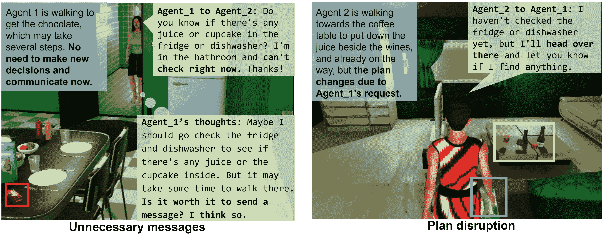

图1：没有指定领导者的情况下，沟通混乱与中断的示例。在一个由三个GPT-4代理组成的团队中，两名代理进行了不必要的沟通并做出了无序的决策，导致由于缺乏预定义的组织结构而造成延迟。我们还发现了更多类似的例子，包括相互冲突的信息和重复的沟通，详情见附录[E](https://arxiv.org/html/2403.12482v2#A5 "Appendix E Ineffective Communication ‣ Embodied LLM Agents Learn to Cooperate in Organized Teams")。

除了测试现有的组织结构外，我们还探索了利用LLM改进组织提示的方法。为此，我们开发了批评-反思框架，采用双LLM架构，反思团队表现并生成改进的、创新的组织提示。通过这一迭代过程，我们的LLM代理自发地形成了新的、有效的团队结构，减少了沟通成本并提高了效率；详情见图[8](https://arxiv.org/html/2403.12482v2#S4.F8 "Figure 8 ‣ 4.4 Novel Organizational Structures ‣ 4 Main Results ‣ Embodied LLM Agents Learn to Cooperate in Organized Teams")和[9](https://arxiv.org/html/2403.12482v2#S4.F9 "Figure 9 ‣ 4.4 Novel Organizational Structures ‣ 4 Main Results ‣ Embodied LLM Agents Learn to Cooperate in Organized Teams")。

总结来说，我们的主要贡献包括：1\. 我们设计了一种新颖的多LLM代理架构，适用于$\geq 3$个具身代理，促进灵活的通信以实现新兴的组织结构。2\. 我们基于LLM开发了一种批评-反思框架，自动优化组织提示。3\. 大量实验表明，层次化组织能够提高团队效率，这与现有关于人类组织的文献高度一致。

## 2 相关工作

### 2.1 LLM代理

强大的大型语言模型（LLMs）继承了丰富的世界知识以及通用推理能力，因此越来越多的努力致力于将LLMs作为决策核心进行推理，构建类人自主代理[[50](https://arxiv.org/html/2403.12482v2#bib.bib50), [74](https://arxiv.org/html/2403.12482v2#bib.bib74), [15](https://arxiv.org/html/2403.12482v2#bib.bib15)]。这要求将强化学习（RL）环境中的观察结果转化为自然语言，以便LLMs更容易处理。LLMs的推理还需要转化为可执行的实际行动。实现这一目标的流行提示技术包括ReAct[[63](https://arxiv.org/html/2403.12482v2#bib.bib63)]和Reflexion[[48](https://arxiv.org/html/2403.12482v2#bib.bib48)]。还探索了涉及对语言模型进行微调的其他方法[[16](https://arxiv.org/html/2403.12482v2#bib.bib16)]。此外，提出了多种技术来缓解LLMs的偏见和约束，包括链式思维推理[[59](https://arxiv.org/html/2403.12482v2#bib.bib59)]、外部工具[[45](https://arxiv.org/html/2403.12482v2#bib.bib45), [37](https://arxiv.org/html/2403.12482v2#bib.bib37)]、外部文档[[56](https://arxiv.org/html/2403.12482v2#bib.bib56)]和技能库[[74](https://arxiv.org/html/2403.12482v2#bib.bib74)]。

### 2.2 多代理协作

多智能体合作在过去几十年中得到了广泛研究，涉及的主题包括通信效率、规划、领导力和团队动态，使用了不同的平台[[30](https://arxiv.org/html/2403.12482v2#bib.bib30), [44](https://arxiv.org/html/2403.12482v2#bib.bib44), [43](https://arxiv.org/html/2403.12482v2#bib.bib43), [40](https://arxiv.org/html/2403.12482v2#bib.bib40)]（详情请参见近期的综述[[34](https://arxiv.org/html/2403.12482v2#bib.bib34), [68](https://arxiv.org/html/2403.12482v2#bib.bib68), [13](https://arxiv.org/html/2403.12482v2#bib.bib13)]）。以往的研究主要集中在通过连续向量[[8](https://arxiv.org/html/2403.12482v2#bib.bib8)]或离散符号[[30](https://arxiv.org/html/2403.12482v2#bib.bib30), [19](https://arxiv.org/html/2403.12482v2#bib.bib19)]进行通信。最近的研究[[61](https://arxiv.org/html/2403.12482v2#bib.bib61), [67](https://arxiv.org/html/2403.12482v2#bib.bib67), [60](https://arxiv.org/html/2403.12482v2#bib.bib60), [23](https://arxiv.org/html/2403.12482v2#bib.bib23), [18](https://arxiv.org/html/2403.12482v2#bib.bib18), [26](https://arxiv.org/html/2403.12482v2#bib.bib26), [51](https://arxiv.org/html/2403.12482v2#bib.bib51)]表明，多个大型语言模型（LLM）智能体或人类-智能体团队在解决纯文本任务（如创意写作、推理和代码生成）时，能够超越单个LLM的表现。其他研究[[29](https://arxiv.org/html/2403.12482v2#bib.bib29), [17](https://arxiv.org/html/2403.12482v2#bib.bib17), [71](https://arxiv.org/html/2403.12482v2#bib.bib71)]进一步探讨了智能体选择或角色分配，以提升性能。

大型语言模型（LLMs）也已被应用于多智能体合作的体现任务 [[1](https://arxiv.org/html/2403.12482v2#bib.bib1), [32](https://arxiv.org/html/2403.12482v2#bib.bib32), [36](https://arxiv.org/html/2403.12482v2#bib.bib36), [5](https://arxiv.org/html/2403.12482v2#bib.bib5)]。此外，Zhang等人[[64](https://arxiv.org/html/2403.12482v2#bib.bib64)]提出了一种意图推理框架，以增强LLM智能体的合作，而无需显式通信。Li等人[[24](https://arxiv.org/html/2403.12482v2#bib.bib24)]研究了LLM智能体在心智理论推理任务中的协作，采用了仅广播通信协议和同质策略。Zhang等人[[65](https://arxiv.org/html/2403.12482v2#bib.bib65)]研究了在两个智能体以及一人一智能体环境下的体现式多智能体合作。Chen等人[[6](https://arxiv.org/html/2403.12482v2#bib.bib6)]探索了多LLM机器人不同的固定通信结构。Zhao等人[[70](https://arxiv.org/html/2403.12482v2#bib.bib70)]和Chen等人[[4](https://arxiv.org/html/2403.12482v2#bib.bib4)]通过预定义且固定的通信与虚拟经理组织智能体。这些初步探索仅限于固定的团队结构，且未针对通信效率进行优化。相比之下，我们的工作探讨了部署和优化组织结构的影响，允许团队中有$\geq 3$个智能体，以实现高效的多智能体通信与合作。

### 2.3 提示优化

语言模型对提示语非常敏感。提示语的格式可以对性能产生显著影响 [[11](https://arxiv.org/html/2403.12482v2#bib.bib11), [59](https://arxiv.org/html/2403.12482v2#bib.bib59), [72](https://arxiv.org/html/2403.12482v2#bib.bib72), [46](https://arxiv.org/html/2403.12482v2#bib.bib46), [75](https://arxiv.org/html/2403.12482v2#bib.bib75), [41](https://arxiv.org/html/2403.12482v2#bib.bib41)]。许多研究工作旨在优化提示语。典型的方法包括利用语言模型知识进行启发式搜索 [[11](https://arxiv.org/html/2403.12482v2#bib.bib11), [47](https://arxiv.org/html/2403.12482v2#bib.bib47)]，像软提示调优这样的一级方法 [[22](https://arxiv.org/html/2403.12482v2#bib.bib22)]，以及前缀调优 [[25](https://arxiv.org/html/2403.12482v2#bib.bib25)]。在本研究中，我们聚焦于以自然语言形式获取可解释的提示语，借鉴了Yang等人[[62](https://arxiv.org/html/2403.12482v2#bib.bib62)]、Zhou等人[[73](https://arxiv.org/html/2403.12482v2#bib.bib73)]和Pryzant等人[[38](https://arxiv.org/html/2403.12482v2#bib.bib38)]的见解。

## 3 方法

### 3.1 架构与多智能体通信

我们采用了张等人提出的具身 LLM 代理架构[[65](https://arxiv.org/html/2403.12482v2#bib.bib65)]，并将其扩展，以使得组织化的 $\geq 3$ 个代理能够在物理/模拟环境中进行沟通、规划和行动。图 [2](https://arxiv.org/html/2403.12482v2#S3.F2 "Figure 2 ‣ 3.1 Architecture and Multi-Agent Communication ‣ 3 Method ‣ Embodied LLM Agents Learn to Cooperate in Organized Teams") 说明了我们的架构。借鉴张等人[[65](https://arxiv.org/html/2403.12482v2#bib.bib65)]的见解，我们采用了四个标准模块：配置器（Configurator）、感知模块（Perception Module）、记忆模块（Memory Module）和执行模块（Execution Module）。它们分别负责配置代理、将环境观察转化为文本、存储与检索历史信息以及执行行动（图 [2](https://arxiv.org/html/2403.12482v2#S3.F2 "Figure 2 ‣ 3.1 Architecture and Multi-Agent Communication ‣ 3 Method ‣ Embodied LLM Agents Learn to Cooperate in Organized Teams")(a)）。

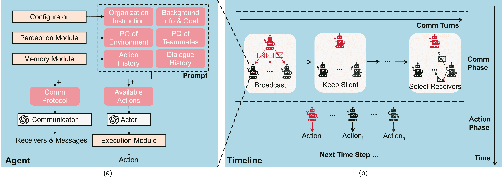

图 2：多 LLM 代理架构。（a）LLM 代理的模块以及提示的组成。（b）一个时间步骤中有两个阶段：沟通阶段和行动阶段。在沟通阶段，代理轮流进行沟通，通过广播或选择接收者发送不同的信息。代理也可以选择保持沉默。Comm 是 Communication（沟通）的缩写；PO 是 Partial Observation（部分观察）的缩写。

以往的工作集中于两代理合作，在这种情况下，沟通可以简单地视为一种额外的行动[[32](https://arxiv.org/html/2403.12482v2#bib.bib32), [65](https://arxiv.org/html/2403.12482v2#bib.bib65)]。相比之下，我们的目标是使三名或更多代理能够在团队中工作并通过新兴的组织化沟通进行合作。因此，我们设计了具有多项功能的架构，以促进组织化的多代理沟通（图 [2](https://arxiv.org/html/2403.12482v2#S3.F2 "Figure 2 ‣ 3.1 Architecture and Multi-Agent Communication ‣ 3 Method ‣ Embodied LLM Agents Learn to Cooperate in Organized Teams")(b)）：

+   •

    我们通过采用两个独立的 LLM 分别作为演员（Actor）和沟通者（Communicator），将沟通决策与行动决策分开。

+   •

    我们通过提示（prompting）为代理团队施加组织结构，即在演员和沟通者的提示中都包含文本描述。

+   •

    LLM 代理在执行任务时不断在两个阶段之间交替：沟通阶段和行动阶段。独立的沟通阶段支持更丰富的团队结构和灵活的沟通模式。

+   •

    在交流过程中，代理依次进行沟通。一个代理可以选择广播消息，选择一个收件人发送消息，选择多个收件人并为他们发送不同的消息，或者保持沉默。代理保留自己的通信历史，并能够回应来自先前通信的消息。

### 3.2 批评-反思方法以改善组织结构

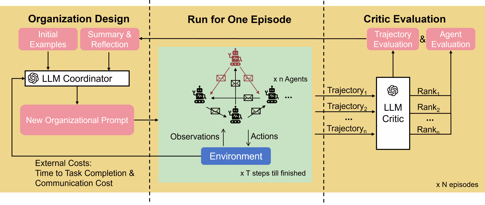

图3：批评-反思架构用于改善组织结构。红色代理代表在层级组织团队中的领导者。当团队完成一个回合后，批评者评估轨迹并分析代理的表现。结合来自环境的外部成本，协调者提出一个新的组织性提示以提高团队效率。新的提示将在下一个回合中应用，以继续迭代。

我们利用强大的大型语言模型（LLMs）优化组织性提示，并借鉴了[[62](https://arxiv.org/html/2403.12482v2#bib.bib62)]中的见解。为此，我们引入了一个双LLM框架，使得多LLM代理系统能够思考并改善组织结构。图[3](https://arxiv.org/html/2403.12482v2#S3.F3 "图 3 ‣ 3.2 批评-反思方法以改善组织结构 ‣ 3 方法 ‣ 具身LLM代理学会合作的有组织团队")展示了我们框架的架构。该框架由两个LLM组成：

+   •

    LLM批评者：受强化学习中的演员-批评方法[[21](https://arxiv.org/html/2403.12482v2#bib.bib21)]启发，我们引入了LLM批评者，通过口头反馈来评估团队的表现。团队批评者以一个回合的对话和行动历史为输入。然后，批评者分析输入并推理，提取和总结被认为会影响表现的关键步骤。同时，批评者还提供对代理行为的文本评估以及他们领导力的排名。参见附录[A](https://arxiv.org/html/2403.12482v2#A1 "附录 A 提示模板 ‣ 具身LLM代理学会合作的有组织团队")中的提示和附录[B.1](https://arxiv.org/html/2403.12482v2#A2.SS1 "B.1 批评者的详细信息 ‣ 附录 B 技术细节 ‣ 具身LLM代理学会合作的有组织团队")中的技术细节（包括排名标准）。

+   •

    LLM协调员：LLM协调员将LLM批评者的输出以及先前回合的环境成本指标（任务完成时间和通信成本）作为输入。它根据对过去回合和初始示例的分析进行反思，并基于这些数据生成思想。在对组织性提示及其表现进行反思后，协调员提出一个新的、不同的组织性提示，用于下一个回合。有关提示的详细信息，请参见附录[A](https://arxiv.org/html/2403.12482v2#A1 "Appendix A Prompt Templates ‣ Embodied LLM Agents Learn to Cooperate in Organized Teams")，有关反思的详细信息，请参见附录[B.2](https://arxiv.org/html/2403.12482v2#A2.SS2 "B.2 Details of the Coordinator ‣ Appendix B Techinical Details ‣ Embodied LLM Agents Learn to Cooperate in Organized Teams")。

对于每个新的组织性提示，我们运行一个回合，然后将对话和行动历史返回给批评者。通过对提示进行迭代批评和反思，框架能够发现更有效、创新的组织结构，并实现*自我改进*。

### 3.3 环境设置

我们选择了VirtualHome-Social [[39](https://arxiv.org/html/2403.12482v2#bib.bib39), [40](https://arxiv.org/html/2403.12482v2#bib.bib40)] 作为环境，并对其进行了扩展，以支持多LLM代理之间的通信与互动。在这个环境中，代理是虚拟家中的类人助手，负责家务工作，任务包括准备下午茶、洗碗、准备一顿饭、放置杂货、布置餐桌等。例如，在图[1](https://arxiv.org/html/2403.12482v2#S1.F1 "Figure 1 ‣ 1 Introduction ‣ Embodied LLM Agents Learn to Cooperate in Organized Teams")中，代理通过搜索并运输任务特定的物品（如巧克力、果汁、酒等）到目标位置（咖啡桌）来合作准备下午茶。该环境生成家中物品及其关系的符号性观察。每个代理仅观察其房间内开放容器中的物品以及同一房间内的队友，但她可以走到其他房间进行探索。任何代理都可以与其他代理进行通信，不受距离限制。

每个回合从代理在环境中随机分布并且所有容器关闭的初始状态开始。当任务完全完成时，回合结束。为了评估团队的效率，我们测量完成任务所需的时间步数，并报告每步代理之间传递的平均令牌数。在我们的实验中，每次运行都以独立随机化的状态初始化，以获得均值和置信区间。我们在代理中采用GPT-4、GPT-3.5-turbo [[35](https://arxiv.org/html/2403.12482v2#bib.bib35)]和Llama2-70B [[52](https://arxiv.org/html/2403.12482v2#bib.bib52)]作为LLM。温度设置为0.8，最大输出令牌数为256，生成的完成选项数为1。实际上，我们使用两块Nvidia 80GB A100 GPU对Llama2-70B进行推理。

## 4 主要结果

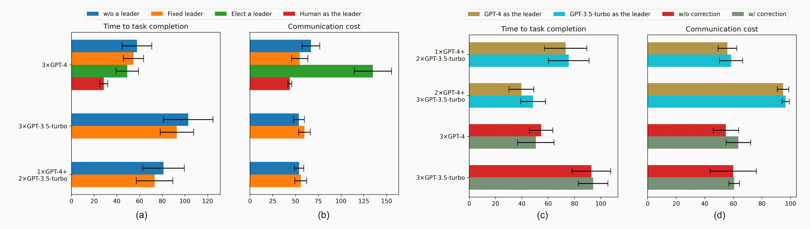

图4：具有指定领导者的组织团队实现了更高的效率。（a，b）对比了无组织代理的情况、指定领导者的情况、代理动态选择领导者的情况以及代理被人类玩家替代担任领导者的情况。请注意，GPT-3.5-turbo不支持领导者选举。（c，d）对比了GPT-3.5-turbo与GPT-4的领导力质量。人类担任领导者组的置信区间计算基于3次种子，而其他组基于20次种子。

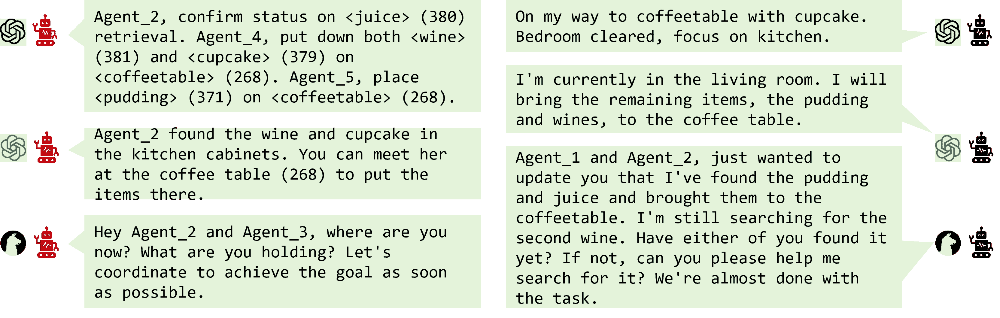

图5：指定领导者时的通信消息示例。左侧：来自领导代理的消息；右侧：来自非领导代理的消息。GPT-4（上）、GPT-3.5-turbo（中）、Llama2-70B（下）展示了不同的通信风格。

### 4.1 指定领导者提高了性能

我们首先研究了组织结构和领导力对LLM代理的影响。为了进行基准测试，我们对未提供任何组织提示的无组织LLM代理进行了实验。在这种情况下，代理之间仍然可以相互沟通并合作完成整体任务。然而，我们发现代理们频繁地发送冗余、重复的消息，并相互干扰。请参见图[1](https://arxiv.org/html/2403.12482v2#S1.F1 "Figure 1 ‣ 1 Introduction ‣ Embodied LLM Agents Learn to Cooperate in Organized Teams")了解示意图，更多示例请见附录[E](https://arxiv.org/html/2403.12482v2#A5 "Appendix E Ineffective Communication ‣ Embodied LLM Agents Learn to Cooperate in Organized Teams")。数字指标已在附录表[1](https://arxiv.org/html/2403.12482v2#A3.T1 "Table 1 ‣ C.1 Complete list of basic experimental results ‣ Appendix C Additional Results ‣ Embodied LLM Agents Learn to Cooperate in Organized Teams")中报告。

当领导者通过组织提示被任命时，我们观察到团队表现有所提升——团队在更短的时间内完成了任务（图 [4](https://arxiv.org/html/2403.12482v2#S4.F4 "图 4 ‣ 4 主要结果 ‣ 具身大语言模型代理学会在组织化团队中合作")(a)）。在使用20个随机种子的3$\times$GPT-3.5-turbo实验后，我们进行了两样本t检验，结果显示，表现提高了9.76%（$t(38)=1.71,p<.05$）。类似地，指定的领导者也为3$\times$GPT-4团队带来了益处（提高了5.28%，$t(38)=0.86,p=0.20$），以及1$\times$GPT-4+2$\times$GPT-3.5-turbo团队（提高了9.61%，$t(38)=1.43,p=0.08$）。与无序团队相比，拥有指定领导者的团队仅略微增加或甚至减少了沟通成本（图 [4](https://arxiv.org/html/2403.12482v2#S4.F4 "图 4 ‣ 4 主要结果 ‣ 具身大语言模型代理学会在组织化团队中合作")(b)）。这一结果与先前的层级组织模型中的模式一致 [[9](https://arxiv.org/html/2403.12482v2#bib.bib9)]。拥有领导者的团队也呈现出集中化的沟通模式，如图 [9](https://arxiv.org/html/2403.12482v2#S4.F9 "图 9 ‣ 4.4 新型组织结构 ‣ 4 主要结果 ‣ 具身大语言模型代理学会在组织化团队中合作") 和附录 [F.5](https://arxiv.org/html/2403.12482v2#A6.SS5 "F.5 扩展示例 ‣ 附录 F 对话示例 ‣ 具身大语言模型代理学会在组织化团队中合作") 所示。有关Llama2-70B的更多实验，请参见附录表 [1](https://arxiv.org/html/2403.12482v2#A3.T1 "表 1 ‣ C.1 完整的基本实验结果列表 ‣ 附录 C 额外结果 ‣ 具身大语言模型代理学会在组织化团队中合作")。领导者和非领导者的沟通风格明显不同，如图 [5](https://arxiv.org/html/2403.12482v2#S4.F5 "图 5 ‣ 4 主要结果 ‣ 具身大语言模型代理学会在组织化团队中合作") 所示。我们进一步扩大了团队规模，发现沟通成本仅以接近线性的方式增加，没有出现维度灾难（见附录表 [2](https://arxiv.org/html/2403.12482v2#A3.T2 "表 2 ‣ C.2 扩大团队规模 ‣ 附录 C 额外结果 ‣ 具身大语言模型代理学会在组织化团队中合作")）。

接下来，我们让代理人选举自己的领导者。领导权大约每9个时间步进行一次重新选举，选举基于从最新的12条信息中提取的数据。我们观察到，代理人通常并不追求权力：他们常常投票给其他人担任领导。在某些情况下，代理人倾向于选择那些表现出更高知识水平的候选人，例如，一个代理人认为“鉴于Agent_2找到了一个必要的物品，令他在这一轮担任领导者是合理的。”然而，在大多数情况下，我们无法判断代理人是否基于理性推理投票，还是只是随机的想法（见附录[F.1](https://arxiv.org/html/2403.12482v2#A6.SS1 "F.1 Examples of Election ‣ Appendix F Examples of dialogues ‣ Embodied LLM Agents Learn to Cooperate in Organized Teams")）。在3$\times$GPT-4团队的案例中²²2注意，GPT-3.5-turbo代理人可能由于其对齐政策不支持选举，且总是忽略选举需求。实现领导选举相比于始终跟随预定领导，确实提高了团队效率（$t(38)=1.84,p<.05$；见图[4](https://arxiv.org/html/2403.12482v2#S4.F4 "Figure 4 ‣ 4 Main Results ‣ Embodied LLM Agents Learn to Cooperate in Organized Teams")(a)）。然而，这一改善伴随着通信成本的显著增加，类似于现实世界中放松等级结构可能增加通信成本的情况[[31](https://arxiv.org/html/2403.12482v2#bib.bib31)]。

提出的多LLM代理架构也非常人性化，支持*人类-AI协作*。在实验中，我们让一名人类玩家替代3个GPT-4代理团队中的领导者。我们招募了三名人类玩家进行实验。图[4](https://arxiv.org/html/2403.12482v2#S4.F4 "Figure 4 ‣ 4 Main Results ‣ Embodied LLM Agents Learn to Cooperate in Organized Teams")(a, b)展示了人类领导相比GPT-4作为领导者时，在任务完成时间和沟通效率方面取得了更好的成果。更多关于人类领导与LLM代理之间对话的示例，请参见附录[F.2](https://arxiv.org/html/2403.12482v2#A6.SS2 "F.2 Examples of Human-AI Collaboration ‣ Appendix F Examples of dialogues ‣ Embodied LLM Agents Learn to Cooperate in Organized Teams")。

### 4.2 领导力与开放沟通的重要性

LLM代理具有不同级别的领导力。在一个混合了GPT-4和GPT-3.5-turbo代理的团队中，任命GPT-4为领导者比任命GPT-3.5-turbo为领导者能够显著提高团队效率（图[4](https://arxiv.org/html/2403.12482v2#S4.F4 "Figure 4 ‣ 4 Main Results ‣ Embodied LLM Agents Learn to Cooperate in Organized Teams")(c,d)，附录[F.4](https://arxiv.org/html/2403.12482v2#A6.SS4 "F.4 Examples of Leadership Comparison ‣ Appendix F Examples of dialogues ‣ Embodied LLM Agents Learn to Cooperate in Organized Teams")）。我们分别在由三个代理和五个代理组成的团队中进行了这一实验。在这两种情况下，当GPT-4作为领导者时，任务完成时间和通信成本都有所降低。这一发现暗示了这些LLM之间在领导力上的不同层次。

我们还观察到，鼓励对领导代理进行建设性反馈有助于提高表现。在成功的人类组织的启发下，我们通过添加额外的提示来促进LLM代理之间的开放沟通，提示内容为：“如果领导者的指示不正确，你可以纠正领导者”。图[4](https://arxiv.org/html/2403.12482v2#S4.F4 "Figure 4 ‣ 4 Main Results ‣ Embodied LLM Agents Learn to Cooperate in Organized Teams")(c,d)展示了这一结果。有趣的是，当团队由3$\times$GPT-4组成时，这一修改能够提高团队的整体效率并缩短任务完成时间（$t(38)=0.87,p=0.14$）。相比之下，当GPT-3.5-turbo代理试图纠正领导者时，团队效率反而下降（$t(38)=0.27,p=0.40$）。在这两个实验中，通信成本有所增加。我们在附录[F.3](https://arxiv.org/html/2403.12482v2#A6.SS3 "F.3 Examples of Correction ‣ Appendix F Examples of dialogues ‣ Embodied LLM Agents Learn to Cooperate in Organized Teams")中提供了关于这些行为的更多细节。

### 4.3 合作行为的出现

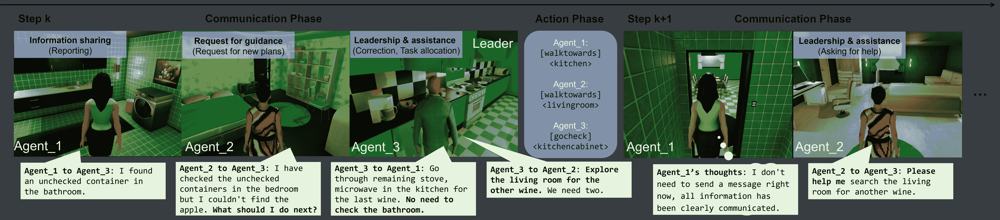

图6：对话中合作行为的示例。Agent_3领导团队（3$\times$GPT-4代理）。代理们展现了三种类型的合作行为：信息共享、领导与协助、以及寻求指导。

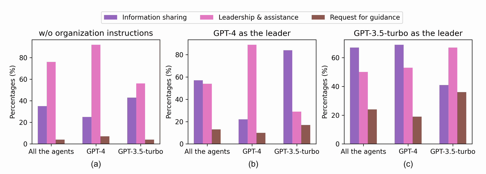

图7：LLM代理的合作行为的涌现。我们分析了混合团队（1$\times$GPT-4+2$\times$GPT-3.5-turbo）的通信日志，并请另一个GPT-4标注代理的合作行为。（a）无序代理的行为。（b）由GPT-4代理领导的团队行为。（c）由GPT-3.5-turbo代理领导的团队行为。

我们深入研究了组织团队中LLM代理的行为，以调查组织性提示如何影响代理的沟通和决策。对他们对话历史的分析揭示，代理表现出了多种合作行为，如报告、纠正、任务分配和寻求帮助（参见图[6](https://arxiv.org/html/2403.12482v2#S4.F6 "Figure 6 ‣ 4.3 Emergence of Cooperative Behaviors ‣ 4 Main Results ‣ Embodied LLM Agents Learn to Cooperate in Organized Teams")中的对话示例）。

有人可能会争辩，这些行为类型也可能由于LLM的特性而出现，即使没有预先指定的团队结构。因此，我们进行了定量分析，以研究组织性提示对这些行为的影响。我们遵循了一个三步流程：

+   (1)

    我们定义了三种主要的人类合作行为类别：（i）信息共享：代理通过主动提供新信息或在被要求时提供信息来影响他人。向领导汇报、分享新观察结果和回答问题都属于这一类。（ii）领导与协助：代理，特别是如果有领导者的话，能够通过改变计划来影响他人。这些行为包括任务分配、纠正和寻求帮助。（iii）请求指导：代理主动请求新的信息或计划，以便进行自己的决策。

+   (2)

    我们开发了一个基于提示的独立GPT-4分类器来分析每一段对话。该分类器决定是否对对话进行标注，并为其分配上述任何一组标签。在对20个人工标注的对话样本进行测试时，该分类器的准确率为91.67%，这些样本总共有60个标签（有关提示的详细内容，请参见附录[A](https://arxiv.org/html/2403.12482v2#A1 "Appendix A Prompt Templates ‣ Embodied LLM Agents Learn to Cooperate in Organized Teams")，测试样本的内容请参见附录[G](https://arxiv.org/html/2403.12482v2#A7 "Appendix G Examples of Cooperative Behaviors Classification by Humans and GPT-4 ‣ Embodied LLM Agents Learn to Cooperate in Organized Teams")）。

+   (3)

    我们使用分类器对由代理生成的消息进行标注，并报告具有合作行为的消息所占的百分比。请注意，一条消息可能具有多个标签。

图[7](https://arxiv.org/html/2403.12482v2#S4.F7 "Figure 7 ‣ 4.3 Emergence of Cooperative Behaviors ‣ 4 Main Results ‣ Embodied LLM Agents Learn to Cooperate in Organized Teams")报告了不同LLM代理的行为模式及其结果。这些结果支持了若干观察结果。即使在一个无序团队中，LLM代理也喜欢告诉其他人该做什么。领导和协助行为占所有行为的$>50\%$（图[7](https://arxiv.org/html/2403.12482v2#S4.F7 "Figure 7 ‣ 4.3 Emergence of Cooperative Behaviors ‣ 4 Main Results ‣ Embodied LLM Agents Learn to Cooperate in Organized Teams")(a)）。然而，除了告诉他人该做什么，团队中的代理在无序状态下并没有表现出太多的合作行为，例如，他们在$<10\%$的对话中会请求指导。

相比之下，当团队具有层级组织时，主导的LLM代理通常会假定一个主导角色，并向其他成员发号施令（这些命令占其沟通内容的$>60\%$），而其他成员则倾向于跟随，并给出比无序情况下更少的命令。（图[7](https://arxiv.org/html/2403.12482v2#S4.F7 "Figure 7 ‣ 4.3 Emergence of Cooperative Behaviors ‣ 4 Main Results ‣ Embodied LLM Agents Learn to Cooperate in Organized Teams")(b, c)）。在这样的团队中，代理们往往会分享和请求更多信息，尤其是团队中的跟随者。但仍然，代理们可能未能有效合作，例如懒散或对数字产生困惑，请参见附录[F.6](https://arxiv.org/html/2403.12482v2#A6.SS6 "F.6 Examples of Failure Cases ‣ Appendix F Examples of dialogues ‣ Embodied LLM Agents Learn to Cooperate in Organized Teams")中的示例。

### 4.4 新型组织结构

在评估了不同类型结构的优点后，我们让LLM提出新型的组织结构，并使用第3节中讨论的批评-反思方法迭代地完善组织提示（另见图[3](https://arxiv.org/html/2403.12482v2#S3.F3 "Figure 3 ‣ 3.2 Criticize-Reflect Method for Improving Organizational Structure ‣ 3 Method ‣ Embodied LLM Agents Learn to Cooperate in Organized Teams")）。

图[8](https://arxiv.org/html/2403.12482v2#S4.F8 "Figure 8 ‣ 4.4 Novel Organizational Structures ‣ 4 Main Results ‣ Embodied LLM Agents Learn to Cooperate in Organized Teams")(a) 展示了反思过程。该系统通过一个基本的组织提示初始化，即“Agent_1作为领导者来协调任务”。随着反思过程的推进，协调者生成了一系列不断发展的组织提示，捕捉到诸如“层级”和“动态”等关键词，这些词暗示了更为复杂的团队结构。

我们比较了团队在Criticize-Reflect步骤前后的表现。图[8](https://arxiv.org/html/2403.12482v2#S4.F8 "Figure 8 ‣ 4.4 Novel Organizational Structures ‣ 4 Main Results ‣ Embodied LLM Agents Learn to Cooperate in Organized Teams")(b)展示了团队的效率。我们观察到，对于3$\times$GPT-3.5-turbo，新的组织结构提高了团队在完成任务时的效率（$t(38)=1.73,p<.05$），但通信成本略有增加。而对于3$\times$GPT-4和1$\times$4+2$\times$GPT-3.5-turbo，通信成本减少且任务效率提高（对于3$\times$GPT-4，$t(38)=1.56,p=0.06$，对于1$\times$4+2$\times$GPT-3.5-turbo，$t(38)=0.32,p=0.38$）。

Critic分析行动和对话的记录，以及来自最新一轮的表现指标。它为整个团队的轨迹提供评估，向个别代理提供反馈并给出排名。请参见附录[B.1](https://arxiv.org/html/2403.12482v2#A2.SS1 "B.1 Details of the Critic ‣ Appendix B Techinical Details ‣ Embodied LLM Agents Learn to Cooperate in Organized Teams")中Critic输出的示例。

作为一项消融研究，我们移除了架构中的Critic，只进行了Reflection步骤。结果显示在图[8](https://arxiv.org/html/2403.12482v2#S4.F8 "Figure 8 ‣ 4.4 Novel Organizational Structures ‣ 4 Main Results ‣ Embodied LLM Agents Learn to Cooperate in Organized Teams")(b)中，表明没有Critic的Reflection导致了性能下降（$t(38)=1.96,p<.05$）。在这种情况下，协调员需要消化所有对话历史并生成新的组织提示。这并没有很好地工作，导致了相当模糊的结果，例如，“建立一个灵活的沟通网络，并根据代理的任务特定专业知识分配轮流领导角色，以促进迅速的决策并减少不必要的沟通步骤。”这种比较凸显了Critic的作用以及拥有双重Criticize-Reflect架构的重要性。有关更多由反思过程生成的结果/提示，请参见附录[H](https://arxiv.org/html/2403.12482v2#A8 "Appendix H Examples of New Prompts after Reflection ‣ Embodied LLM Agents Learn to Cooperate in Organized Teams")。

此外，值得一提的是，LLM能够生成高度复杂的提示，这些提示暗示了人类社会中鲜见的新型组织结构。我们在图[9](https://arxiv.org/html/2403.12482v2#S4.F9 "图 9 ‣ 4.4 新型组织结构 ‣ 4 主要结果 ‣ 具象化LLM代理在有组织的团队中学习合作")中展示了作为团队结构的沟通模式，并且展示了Criticize-Reflect提出的三种新型结构：(c) 链式结构，(d) 双领导结构，以及(e) 动态结构，这三种结构分别是图[8](https://arxiv.org/html/2403.12482v2#S4.F8 "图 8 ‣ 4.4 新型组织结构 ‣ 4 主要结果 ‣ 具象化LLM代理在有组织的团队中学习合作") (b, c)中的最佳结构。

最后，为了测试新型组织结构的普适性，我们选择了最优的新型提示，该提示如图[9](https://arxiv.org/html/2403.12482v2#S4.F9 "图 9 ‣ 4.4 新型组织结构 ‣ 4 主要结果 ‣ 具象化LLM代理在有组织的团队中学习合作") (e)所示，由Criticize-Reflect架构提出，适用于“准备下午茶”任务。我们在六个新任务的集合上进行了测试，其中包括三个简单任务和三个难度较大的任务³³3这些困难任务通常需要超过60步来完成，而简单任务的步骤数通常少于60步。具体见附录图[10](https://arxiv.org/html/2403.12482v2#A3.F10 "图 10 ‣ C.3 跨任务的普适性 ‣ 附录 C 额外结果 ‣ 具象化LLM代理在有组织的团队中学习合作")。在三个困难任务中，采用新型组织结构的团队表现优于指定固定GPT-4代理作为领导者的团队（附录图[10](https://arxiv.org/html/2403.12482v2#A3.F10 "图 10 ‣ C.3 跨任务的普适性 ‣ 附录 C 额外结果 ‣ 具象化LLM代理在有组织的团队中学习合作") (a,b)）。在三个简单任务中，差异不大。我们对这两支队伍在所有任务上的表现进行了比较，并进行了t检验，结果表明新型团队结构比固定领导者更高效（$t(22)=2.08,p<.05$）。

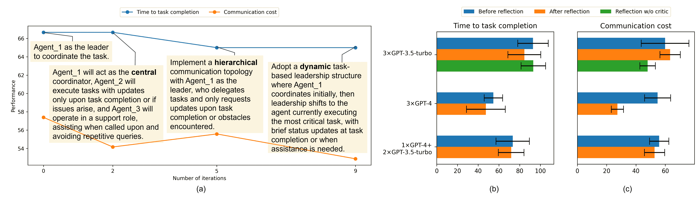

图 8：寻找新型组织结构的反思与改进过程。(a) 实验使用了1$\times$GPT-4+2$\times$GPT-3.5-turbo团队。组织提示在迭代过程中不断演化，并增加了“中央”、“层次化”和“动态”等关键词。(b) 信心水平区间是基于20个种子计算得出的。

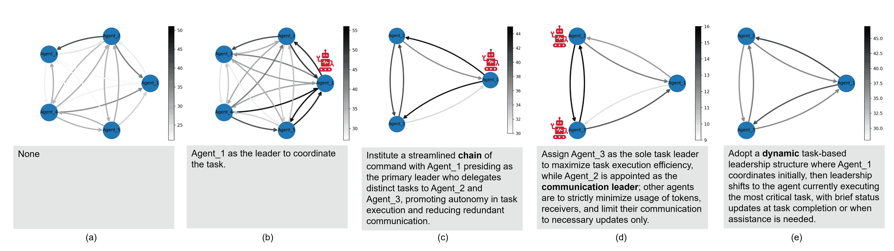

图9：通信模式及相应的组织提示。(a) 没有组织提示的团队。(b) 有领导者的团队。(c) 链式结构的团队。(d) 双领导者团队。(e) 动态领导团队。(c, d, e) 是由Criticize-Reflect提出的。红色机器人节点标记为领导智能体，其他节点为跟随者。边表示两个节点之间的累计通信成本（较暗的边表示更高的令牌成本）。

## 5 结论

我们开发了一种新型的多LLM智能体架构，以促进通信并组织具身智能体团队，以增强合作。此外，我们基于LLM提出了Criticize-Reflect框架，用以生成更高效的组织提示。通过在不同团队设置和组织结构下的广泛实验，我们证明了具有指定/选举领导者的层级化组织团队具有更高的团队效率，而这一效率可以通过Criticize-Reflect进一步提升。

当前的工作是在单一环境中进行的，且缺乏人类评估。未来的工作将扩展到更广泛的环境中，允许进行人类评估。由于VirtualHome无法容纳数百个智能体，未来的工作也可以探索在其他环境中更大规模的组织。

## 参考文献

+   Agashe et al. [2023] Saaket Agashe, Yue Fan, 和 Xin Eric Wang. 评估大语言模型中的多智能体协调能力。 *arXiv 预印本 arXiv:2310.03903*, 2023。

+   Bai et al. [2022] Yuntao Bai, Andy Jones, Kamal Ndousse, Amanda Askell, Anna Chen, Nova DasSarma, Dawn Drain, Stanislav Fort, Deep Ganguli, Tom Henighan 等. 使用人类反馈强化学习训练有帮助且无害的助手。 *arXiv 预印本 arXiv:2204.05862*, 2022。

+   Bolton 和 Dewatripont [1994] Patrick Bolton 和 Mathias Dewatripont. 公司作为通信网络。 *经济学季刊*, 109(4):809–839, 1994。

+   Chen et al. [2024] Jiaqi Chen, Yuxian Jiang, Jiachen Lu, 和 Li Zhang. S-agents：在开放式环境中的自组织智能体。 *arXiv 预印本 arXiv:2402.04578*, 2024。

+   Chen et al. [2023a] Weize Chen, Yusheng Su, Jingwei Zuo, Cheng Yang, Chenfei Yuan, Chen Qian, Chi-Min Chan, Yujia Qin, Yaxi Lu, Ruobing Xie, Zhiyuan Liu, Maosong Sun, 和 Jie Zhou. AgentVerse：促进多智能体协作并探索智能体中的涌现行为。 *arXiv 预印本 arXiv:2308.10848*, 2023a。

+   Chen et al. [2023b] Yongchao Chen, Jacob Arkin, Yang Zhang, Nicholas Roy, 和 Chuchu Fan. 使用大语言模型的可扩展多机器人协作：集中式还是去中心化系统？ *arXiv 预印本 arXiv:2309.15943*, 2023b。

+   Chisholm [1992] Donald Chisholm. *没有层级的协调：多组织系统中的非正式结构*。加利福尼亚大学出版社, 1992。

+   Das et al. [2019] Abhishek Das, Théophile Gervet, Joshua Romoff, Dhruv Batra, Devi Parikh, Mike Rabbat, 和 Joelle Pineau. Tarmac: 定向多智能体通信。在*国际机器学习大会*，第1538–1546页。PMLR，2019年。

+   Dodds et al. [2003] Peter Sheridan Dodds, Duncan J Watts, 和 Charles F Sabel. 信息交换与组织网络的稳健性。*美国国家科学院院刊*，100(21):12516–12521，2003年。

+   Foerster et al. [2016] Jakob Foerster, Ioannis Alexandros Assael, Nando de Freitas, 和 Shimon Whiteson. 使用深度多智能体强化学习学习通信。在*神经信息处理系统进展*，第29卷，2016年。

+   Gao et al. [2020] Tianyu Gao, Adam Fisch, and Danqi Chen. 使预训练语言模型成为更好的少量样本学习者。*arXiv预印本 arXiv:2012.15723*，2020年。

+   Garicano [2000] Luis Garicano. 层级结构与生产中的知识组织。*政治经济学杂志*，108(5):874–904，2000年。

+   Gronauer and Diepold [2022] Sven Gronauer 和 Klaus Diepold. 多智能体深度强化学习：综述。*人工智能评论*，第1–49页，2022年。

+   Guo et al. [2023] Xudong Guo, Daming Shi, 和 Wenhui Fan. 通过基于变换器的电子邮件机制进行可扩展的多智能体强化学习通信。在*第三十二届国际人工智能联合会议，IJCAI-23*，第126–134页，2023年。

+   Hao et al. [2023a] Shibo Hao, Yi Gu, Haodi Ma, Joshua Jiahua Hong, Zhen Wang, Daisy Zhe Wang, 和 Zhiting Hu. 用语言模型推理就是用世界模型进行规划。*arXiv预印本 arXiv:2305.14992*，2023年。

+   Hao et al. [2023b] Shibo Hao, Tianyang Liu, Zhen Wang, 和 Zhiting Hu. Toolkengpt: 通过工具嵌入增强冻结的语言模型。*arXiv预印本 arXiv:2305.11554*，2023年。

+   Hong et al. [2023] Sirui Hong, Xiawu Zheng, Jonathan Chen, Yuheng Cheng, Jinlin Wang, Ceyao Zhang, Zili Wang, Steven Ka Shing Yau, Zijuan Lin, Liyang Zhou, Chenyu Ran, Lingfeng Xiao, 和 Chenglin Wu. MetaGPT: 面向多智能体协同框架的元编程。*arXiv预印本 arXiv:2308.00352*，2023年。

+   Ishibashi and Nishimura [2024] Yoichi Ishibashi 和 Yoshimasa Nishimura. 自组织智能体：一个面向超大规模代码生成与优化的LLM多智能体框架。*arXiv预印本 arXiv:2404.02183*，2024年。

+   Jaques et al. [2019] Natasha Jaques, Angeliki Lazaridou, Edward Hughes, Caglar Gulcehre, Pedro Ortega, DJ Strouse, Joel Z Leibo, 和 Nando De Freitas. 社会影响作为多智能体深度强化学习的内在动机。在*国际机器学习大会*，第3040–3049页。PMLR，2019年。

+   Kim et al. [2020] Woojun Kim, Jongeui Park, 和 Youngchul Sung. 多智能体强化学习中的通信：意图共享。在*国际学习表征大会*，2020年。

+   Konda和Tsitsiklis[1999] Vijay Konda 和 John Tsitsiklis。演员-评论家算法。收录于 *神经信息处理系统进展*，第12卷，1999年。

+   Lester等人[2021] Brian Lester, Rami Al-Rfou 和 Noah Constant。规模的力量：高效参数提示调优。*arXiv预印本arXiv:2104.08691*，2021。

+   Li等人[2023a] Guohao Li, Hasan Abed Al Kader Hammoud, Hani Itani, Dmitrii Khizbullin 和 Bernard Ghanem。CAMEL：用于“大脑”探索的大语言模型社会中的交流智能体。收录于 *第三十七届神经信息处理系统会议*，2023a。

+   Li等人[2023b] Huao Li, Yu Quan Chong, Simon Stepputtis, Joseph Campbell, Dana Hughes, Michael Lewis, 和Katia Sycara。通过大语言模型实现多智能体协作的心智理论。*arXiv预印本arXiv:2310.10701*，2023b。

+   Li和Liang[2021] Xiang Lisa Li 和 Percy Liang。前缀调优：为生成优化连续提示。收录于Chengqing Zong、Fei Xia、Wenjie Li 和 Roberto Navigli 主编的 *第59届计算语言学协会年会暨第11届国际自然语言处理联合会议（第一卷：长篇论文）*，第4582-4597页，2021年8月。

+   Li等人[2023c] Yuan Li, Yixuan Zhang 和 Lichao Sun。Metaagents：通过协作生成智能体模拟人类行为的交互，用于基于LLM的任务导向协调。*arXiv预印本arXiv:2310.06500*，2023c。

+   Lin等人[2021] Toru Lin, Jacob Huh, Christopher Stauffer, Ser Nam Lim 和 Phillip Isola。通过自编码器学习基础的多智能体通信。收录于 *神经信息处理系统进展*，第34卷，第15230-15242页，2021年。

+   Liu等人[2023a] Nelson F Liu, Kevin Lin, John Hewitt, Ashwin Paranjape, Michele Bevilacqua, Fabio Petroni 和 Percy Liang。迷失在中间：语言模型如何使用长上下文。*arXiv预印本arXiv:2307.03172*，2023a。

+   Liu等人[2023b] Zijun Liu, Yanzhe Zhang, Peng Li, Yang Liu 和 Diyi Yang。动态LLM-智能体网络：一种具备智能体团队优化的LLM-智能体协作框架。*arXiv预印本arXiv:2310.02170*，2023b。

+   Lowe等人[2017] Ryan Lowe, Aviv Tamar, Jean Harb, OpenAI Pieter Abbeel 和 Igor Mordatch。混合协作-竞争环境中的多智能体演员-评论家。*神经信息处理系统进展*，第30卷，2017年。

+   Malone[2004] Thomas W Malone。*工作的未来*。哈佛商业评论出版社，2004年。

+   Mandi等人[2023] Zhao Mandi, Shreeya Jain 和 Shuran Song。RoCo：与大语言模型的辩证多机器人协作。*arXiv预印本arXiv:2307.04738*，2023。

+   March和Simon[1958] James G March 和 Herbert A Simon。*组织*。Wiley，1958。

+   Oroojlooy和Hajinezhad[2023] Afshin Oroojlooy 和 Davood Hajinezhad。合作多智能体深度强化学习的综述。*应用智能*，53(11):13677-13722，2023。

+   Ouyang et al. [2022] 欧阳龙、杰弗里·吴、姜旭、迪奥戈·阿尔梅达、卡罗尔·韦因赖特、帕梅拉·米什金、张冲、桑迪尼·阿加瓦尔、凯塔里娜·斯拉马、亚历克斯·雷等。《训练语言模型通过人类反馈遵循指令》。*神经信息处理系统进展*，35:27730–27744，2022年。

+   Park et al. [2023] 朴俊晟、约瑟夫·欧布莱恩、蔡俊梅、梅雷迪思·林格尔·莫里斯、梁佩西、迈克尔·S·伯恩斯坦。《生成代理：人类行为的互动模拟》。在*第36届ACM用户界面软件与技术年会论文集*，第1–22页，2023年。

+   Patil et al. [2023] 希希尔·G·帕蒂尔、张天俊、王欣、约瑟夫·E·冈萨雷斯。《Gorilla：与海量API连接的大型语言模型》。*arXiv预印本 arXiv:2305.15334*，2023年。

+   Pryzant et al. [2023] 里德·普里赞特、丹·伊特尔、李杰瑞、李尹达、朱成光、邹美赫。《利用“梯度下降”和束搜索进行自动提示优化》。*arXiv预印本 arXiv:2305.03495*，2023年。

+   Puig et al. [2018] 哈维尔·普伊格、凯文·拉、马克·博本、李佳曼、王廷武、Sanja Fidler、安东尼奥·托拉尔巴。《Virtualhome：通过程序模拟家庭活动》。在*IEEE计算机视觉与模式识别会议论文集*，第8494–8502页，2018年。

+   Puig et al. [2021] 哈维尔·普伊格、舒天敏、李爽、王子霖、廖元鸿、约书亚·B·特嫩鲍姆、Sanja Fidler、安东尼奥·托拉尔巴。《Watch-and-help：一个关于社会感知与人类-AI协作的挑战》。*arXiv预印本 arXiv:2010.09890*，2021年。

+   Qi et al. [2023] 齐向宇、黄凯轩、阿什维尼·潘达、王孟迪、普拉提克·米塔尔。《视觉对抗样本破解对齐的大型语言模型》。在*第二届对抗机器学习前沿研讨会*，2023年。

+   Radner [1993] 罗伊·拉德纳。《去中心化信息处理的组织形式》。*计量经济学：计量经济学会期刊*，第1109–1146页，1993年。

+   Resnick et al. [2018] 辛珍·雷斯尼克、韦斯·埃尔德里奇、戴维·哈、丹尼·布里茨、雅各布·福尔斯特、朱利安·托吉柳斯、许庆贤、乔安·布鲁纳。《Pommerman：一个多智能体游乐场》。*arXiv预印本 arXiv:1809.07124*，2018年。

+   Samvelyan et al. [2019] 米凯尔·萨姆维利扬、塔比什·拉希德、克里斯蒂安·施罗德·德·威特、格雷戈里·法尔夸尔、南塔斯·纳尔代利、蒂姆·GJ·鲁德纳、邱家满、菲利普·HS·托尔、雅各布·福尔斯特、希蒙·怀特森。《星际争霸多智能体挑战》。在*第18届国际自主代理与多智能体系统会议论文集*，第2186–2188页，2019年。

+   Shen et al. [2023] 宋永亮、邵凯涛、谭旭、李东生、陆伟明、庄悦婷。《Hugginggpt：通过ChatGPT及其在HuggingFace中的朋友解决AI任务》。*arXiv预印本 arXiv:2303.17580*，2023年。

+   Shi 等人 [2023] Freda Shi, Xinyun Chen, Kanishka Misra, Nathan Scales, David Dohan, Ed H Chi, Nathanael Schärli 和 Denny Zhou. 大型语言模型容易被无关的上下文分心。 在 *国际机器学习会议* 中，第31210–31227页。PMLR，2023年。

+   Shin 等人 [2020] Taylor Shin, Yasaman Razeghi, Robert L Logan IV, Eric Wallace 和 Sameer Singh. Autoprompt：通过自动生成的提示从语言模型中引出知识。*arXiv 预印本 arXiv:2010.15980*，2020年。

+   Shinn 等人 [2023] Noah Shinn, Federico Cassano, Ashwin Gopinath, Karthik R Narasimhan 和 Shunyu Yao. Reflexion：具有语言强化学习的语言代理。在 *第三十七届神经信息处理系统会议*，2023年。

+   Simon 等人 [1971] Herbert A Simon 等人. 为信息丰富的世界设计组织。*计算机、通信与公共利益*，72:37，1971年。

+   Sun 等人 [2023] Haotian Sun, Yuchen Zhuang, Lingkai Kong, Bo Dai 和 Chao Zhang. Adaplanner：通过反馈与语言模型进行自适应规划。*arXiv 预印本 arXiv:2305.16653*，2023年。

+   Talebirad 和 Nadiri [2023] Yashar Talebirad 和 Amirhossein Nadiri. 多智能体协作：利用智能大型语言模型代理的力量。*arXiv 预印本 arXiv:2306.03314*，2023年。

+   Touvron 等人 [2023] Hugo Touvron, Louis Martin, Kevin Stone, Peter Albert, Amjad Almahairi, Yasmine Babaei, Nikolay Bashlykov, Soumya Batra, Prajjwal Bhargava, Shruti Bhosale 等人. Llama 2：开放基础和微调聊天模型。*arXiv 预印本 arXiv:2307.09288*，2023年。

+   Van Zandt [1999] Timothy Van Zandt. 组织理论中的去中心化信息处理。在 *当代经济问题：经济行为与设计* 中，第125–160页。Springer，1999年。

+   Vélez 等人 [2023] Natalia Vélez, Brian Christian, Mathew Hardy, Bill D Thompson 和 Thomas L Griffiths. 人类如何通过合作克服个体计算限制？ *认知科学*，47(1):e13232，2023年。

+   Vinyals 等人 [2019] Oriol Vinyals, Igor Babuschkin, Wojciech M. Czarnecki, Michaël Mathieu, Andrew Dudzik, Junyoung Chung, David H. Choi, Richard Powell, Timo Ewalds, Petko Georgiev, Junhyuk Oh, Dan Horgan, Manuel Kroiss, Ivo Danihelka, Aja Huang, Laurent Sifre, Trevor Cai, John P. Agapiou, Max Jaderberg, Alexander S. Vezhnevets, Rémi Leblond, Tobias Pohlen, Valentin Dalibard, David Budden, Yury Sulsky, James Molloy, Tom L. Paine, Caglar Gulcehre, Ziyu Wang, Tobias Pfaff, Yuhuai Wu, Roman Ring, Dani Yogatama, Dario Wünsch, Katrina McKinney, Oliver Smith, Tom Schaul, Timothy Lillicrap, Koray Kavukcuoglu, Demis Hassabis, Chris Apps 和 David Silver. 使用多智能体强化学习在《星际争霸 II》中的大师级水平。*自然*，575(7782):350–354，2019年。

+   Wang et al. [2023] Guanzhi Wang, Yuqi Xie, Yunfan Jiang, Ajay Mandlekar, Chaowei Xiao, Yuke Zhu, Linxi Fan, 和 Anima Anandkumar. Voyager: 一个开放式的具身代理与大语言模型. *arXiv 预印本 arXiv:2305.16291*, 2023.

+   Wang et al. [2020] Jiawei Wang, Tianyu Shi, Yuankai Wu, Luis Miranda-Moreno, 和 Lijun Sun. 用于自动驾驶连接系统的多代理图强化学习. 收录于 *第37届国际机器学习会议 (ICML) 会议录*, 页码 1–6, 2020.

+   Wang et al. [2021] Lu Wang, Lei Han, Xinru Chen, Chengchang Li, Junzhou Huang, Weinan Zhang, Wei Zhang, Xiaofeng He, 和 Dijun Luo. 用于分配保证展示广告的层次化多代理强化学习. *IEEE 神经网络与学习系统汇刊*, 页码 1–13, 2021.

+   Wei et al. [2022] Jason Wei, Xuezhi Wang, Dale Schuurmans, Maarten Bosma, Fei Xia, Ed Chi, Quoc V Le, Denny Zhou, 等. Chain-of-thought 提示激发大语言模型中的推理. *神经信息处理系统进展*, 35:24824–24837, 2022.

+   Wu et al. [2023] Qingyun Wu, Gagan Bansal, Jieyu Zhang, Yiran Wu, Shaokun Zhang, Erkang Zhu, Beibin Li, Li Jiang, Xiaoyun Zhang, 和 Chi Wang. Autogen: 通过多代理对话框架启用下一代 LLM 应用. *arXiv 预印本 arXiv:2308.08155*, 2023.

+   Xu et al. [2023] Zelai Xu, Chao Yu, Fei Fang, Yu Wang, 和 Yi Wu. 使用强化学习的语言代理在狼人游戏中的策略性玩法. *arXiv 预印本 arXiv:2310.18940*, 2023.

+   Yang et al. [2023] Chengrun Yang, Xuezhi Wang, Yifeng Lu, Hanxiao Liu, Quoc V Le, Denny Zhou, 和 Xinyun Chen. 大语言模型作为优化器. *arXiv 预印本 arXiv:2309.03409*, 2023.

+   Yao et al. [2022] Shunyu Yao, Jeffrey Zhao, Dian Yu, Nan Du, Izhak Shafran, Karthik Narasimhan, 和 Yuan Cao. React: 在语言模型中协同推理与行为. *arXiv 预印本 arXiv:2210.03629*, 2022.

+   Zhang et al. [2023a] Ceyao Zhang, Kaijie Yang, Siyi Hu, Zihao Wang, Guanghe Li, Yihang Sun, Cheng Zhang, Zhaowei Zhang, Anji Liu, Song-Chun Zhu, Xiaojun Chang, Junge Zhang, Feng Yin, Yitao Liang, 和 Yaodong Yang. ProAgent: 使用大语言模型构建主动合作的 AI. *arXiv 预印本 arXiv:2308.11339*, 2023a.

+   Zhang et al. [2023b] Hongxin Zhang, Weihua Du, Jiaming Shan, Qinhong Zhou, Yilun Du, Joshua B Tenenbaum, Tianmin Shu, 和 Chuang Gan. 使用大语言模型模块化构建合作型具身代理. 收录于 *第十二届国际学习表示会议*, 2023b.

+   Zhang et al. [2019a] Huichu Zhang, Siyuan Feng, Chang Liu, Yaoyao Ding, Yichen Zhu, Zihan Zhou, Weinan Zhang, Yong Yu, Haiming Jin, 和 Zhenhui Li. CityFlow: 一个用于大规模城市交通场景的多代理强化学习环境. 收录于 *全球网络会议*, 页码 3620–3624. ACM, 2019a.

+   Zhang 等人 [2023c] Jintian Zhang, Xin Xu, 和 Shumin Deng. 探索 llm 智能体的协作机制：一种社会心理学视角。*arXiv 预印本 arXiv:2310.02124*，2023c。

+   Zhang 等人 [2021] Kaiqing Zhang, Zhuoran Yang, 和 Tamer Başar. 多智能体强化学习：理论与算法的选择性概述。*强化学习与控制手册*，第321–384页，2021。

+   Zhang 等人 [2019b] Sai Qian Zhang, Qi Zhang, 和 Jieyu Lin. 通过基于方差的控制实现多智能体强化学习中的高效通信。在 *神经信息处理系统进展*，第32卷，2019b。

+   Zhao 等人 [2024] Zhonghan Zhao, Kewei Chen, Dongxu Guo, Wenhao Chai, Tian Ye, Yanting Zhang, 和 Gaoang Wang. 用于开放式多智能体导航的层次自组织系统。*arXiv 预印本 arXiv:2403.08282*，2024。

+   Zheng 等人 [2023] Yi Zheng, Chongyang Ma, Kanle Shi, 和 Haibin Huang. 智能体与 OKR 相遇：一种基于目标和关键结果的智能体系统，具有层次自协作和自我评估功能。*arXiv 预印本 arXiv:2311.16542*，2023。

+   Zhou 等人 [2022a] Denny Zhou, Nathanael Schärli, Le Hou, Jason Wei, Nathan Scales, Xuezhi Wang, Dale Schuurmans, Claire Cui, Olivier Bousquet, Quoc Le 等人. 最小到最多提示法使大型语言模型能够进行复杂推理。*arXiv 预印本 arXiv:2205.10625*，2022a。

+   Zhou 等人 [2022b] Yongchao Zhou, Andrei Ioan Muresanu, Ziwen Han, Keiran Paster, Silviu Pitis, Harris Chan, 和 Jimmy Ba. 大型语言模型是人类级别的提示工程师。*arXiv 预印本 arXiv:2211.01910*，2022b。

+   Zhu 等人 [2023] Xizhou Zhu, Yuntao Chen, Hao Tian, Chenxin Tao, Weijie Su, Chenyu Yang, Gao Huang, Bin Li, Lewei Lu, Xiaogang Wang 等人. 《Minecraft中的幽灵：通过具有文本知识和记忆的大型语言模型实现的开放世界环境中普遍能力的智能体》。*arXiv 预印本 arXiv:2305.17144*，2023。

+   Zou 等人 [2023] Andy Zou, Zifan Wang, J Zico Kolter, 和 Matt Fredrikson. 通用且可转移的对齐语言模型对抗攻击。*arXiv 预印本 arXiv:2307.15043*，2023。

## 附录 A 提示模板

我们列出了 Actor、Communicator、Critic 和 Coordinator 的提示，如下所示。

Actor 和 Communicator。ORGANIZATION_INSTRUCTION 是组织指令提示的占位符，可以是手动设计的或自动生成的。环境将提供当前 GOAL、PROGRESS 和 AVAILABLE_ACTIONS 的文本描述。我们包含最新的 $12$ 条发送和接收的消息作为 DIALOGUE_HISTORY，以及最新的 $20$ 步动作作为 ACTION_HISTORY。

![[无标题图像]](img/58ae68f68376e381065677389deece92.png)

![[无标题图像]](img/c05444872af79e3ed38ea2898af84cbc.png)

Critic。我们将完整的轨迹作为输入提供给 TRAJECTORIES。此外，当前任务和组织的 ORGANIZATION_INSTRUCTION 和 GOAL 也作为额外的上下文提供。

![[未标注图像]](img/d126adb541d4a2fc90ab1c819180942d.png)

Coordinator。在“示例指令”中，我们包含了基本设置（目标、组织结构指令）、通信成本、所采取的步骤数量以及 Critic 生成的总结信息（领导力排名、问题、轨迹总结）供 Coordinator 使用。

![[未标注图像]](img/65975676b22b65868267567fccde3405.png)

分类器。我们将消息输入 GPT-4 分类器并获得标签。这些评分标准是在调查通信日志后手动编写的。

![[未标注图像]](img/0872645794dfe4baaadaabf50c84be2d.png)

## 附录 B 技术细节

### B.1 Critic 的详细信息

Critic 提供了多个剧集的评估，这些剧集包含不同的组织形式，以供 Coordinator 改进组织提示。Critic 不直接影响具体代理的行为，而是通过提供组织设计的洞察来影响团队的表现。

如附录 [A](https://arxiv.org/html/2403.12482v2#A1 "Appendix A Prompt Templates ‣ Embodied LLM Agents Learn to Cooperate in Organized Teams") 中 Critic 提示所包含的内容，Critic 会依次输出该剧集轨迹的思路，然后是每个代理的总结和问题，最后是代理的领导力排名。Critic 将根据领导力的关键因素对代理进行排名：沟通能力、冲突解决能力、灵活性和战略性。请注意，我们并没有要求 Critic 为代理打分，因为评分标准可能因剧集的不同而有所变化，导致分数无法比较。

以下是 Critic 的一个示例输出：

![[未标注图像]](img/76bcf61cb9148a4a5267bb32295c8426.png)

在轨迹评估中，Critic 会通过关键步骤和行为压缩轨迹。然后，Critic 给出排名，其中 Agent_3 拥有最佳的领导力。结合其他剧集的类似评估，Coordinator 将重新设计组织提示，例如，Agent_3 在此情境下有更多的机会被选为领导者。

### B.2 Coordinator 的详细信息

在本文中，我们将组织结构定义为 LLM 代理之间信息交换的动态。具体来说，当 Coordinator 生成新的组织提示时，它包含三部分——拓扑、角色分配和规则。

这里，“拓扑”是组织结构的类型，例如去中心化、一个特定领导者的集中化或金字塔式结构。拓扑可以如图 [9](https://arxiv.org/html/2403.12482v2#S4.F9 "Figure 9 ‣ 4.4 Novel Organizational Structures ‣ 4 Main Results ‣ Embodied LLM Agents Learn to Cooperate in Organized Teams") 所示进行可视化。

“角色分配”是对每个代理职责的描述，以及她是否是领导者。也允许有多个不同角色的领导者。例如，在图 [8](https://arxiv.org/html/2403.12482v2#S4.F8 "图 8 ‣ 4.4 新型组织结构 ‣ 4 主要结果 ‣ 具身LLM代理学习在有组织的团队中合作")中，生成的新提示为“Agent_1将作为中央协调员，Agent_2将仅在任务完成或出现问题时更新并执行任务，Agent_3将作为支持角色，在被召唤时提供帮助并避免重复提问”，为每个代理分配了不同的角色。

“规则”是对代理行为的额外指导，例如，可以在新的提示中添加诸如“如果领导者的指示不正确，你可以纠正领导者”之类的句子。

## 附录 C 其他结果

### C.1 基本实验结果完整列表

我们在附录表 [1](https://arxiv.org/html/2403.12482v2#A3.T1 "表 1 ‣ C.1 基本实验结果完整列表 ‣ 附录 C 其他结果 ‣ 具身LLM代理学习在有组织的团队中合作")中展示了各种小组设置和组织指令的完整结果。这里，我们还包括了1$\times$GPT-4+2$\times$Llama2-70B的结果。令人惊讶的是，在这种情况下，GPT-4的领导能力比Llama2-70B差。包含Llama2-70B的团队的沟通成本远高于包含GPT-3.5-turbo的团队。

表 1：不同组织指令的表现。当小组中有两种不同类型的LLM时，Agent_1是GPT-4，Agent_2是另一种类型的LLM。

分组设置 组织指令 时间 通信成本 3$\times$GPT-4 无 57.75 $\pm$13.09 67.03 $\pm$9.68 3$\times$GPT-4 代理 1 为协调任务的领导者。 54.70 $\pm$8.92 54.73 $\pm$8.89 3$\times$GPT-4 代理 1 为协调任务的领导者。如果领导者的指令不正确，可以纠正领导者。 50.70$\pm$13.92 63.49$\pm$8.61 3$\times$GPT-4 每 10 步选举一次新领导者来协调任务。…选举后，其他代理应遵循领导者的指令。 49.20$\pm$9.97 135.03$\pm$20.45 3$\times$GPT-3.5-turbo 无 102.95$\pm$21.88 53.73$\pm$6.04 3$\times$GPT-3.5-turbo 代理 1 为协调任务的领导者。 92.90$\pm$14.70 59.87$\pm$6.33 3$\times$GPT-3.5-turbo 代理 1 为协调任务的领导者。如果领导者的指令不正确，可以纠正领导者。 94.20$\pm$16.22 60.53$\pm$3.66 1$\times$GPT-4+2$\times$GPT-3.5-turbo 无 81.10$\pm$18.35 54.00$\pm$5.06 1$\times$GPT-4+2$\times$GPT-3.5-turbo 代理 1 为协调任务的领导者。 73.30$\pm$16.12 55.82$\pm$6.57 1$\times$GPT-4+2$\times$GPT-3.5-turbo 代理 1 为协调任务的领导者。如果领导者的指令不正确，可以纠正领导者。 85.67$\pm$14.52 61.57$\pm$0.55 1$\times$GPT-4+2$\times$GPT-3.5-turbo 代理 2 为协调任务的领导者。 75.65$\pm$15.43 58.39$\pm$8.11 1$\times$GPT-4+2$\times$GPT-3.5-turbo 代理 2 为协调任务的领导者。如果领导者的指令不正确，可以纠正领导者。 72.33$\pm$6.60 74.21$\pm$7.73 1$\times$GPT-4+2$\times$Llama2-70B 无 77.00$\pm$2.94 119.48$\pm$1.28 1$\times$GPT-4+2$\times$Llama2-70B 代理 1 为协调任务的领导者。 83.67$\pm$10.96 135.22$\pm$16.39 1$\times$GPT-4+2$\times$Llama2-70B 代理 2 为协调任务的领导者。 76.00$\pm$5.72 142.24$\pm$11.85 2$\times$GPT-4+3$\times$GPT-3.5-turbo 无 42.67$\pm$4.03 98.03$\pm$9.86 2$\times$GPT-4+3$\times$GPT-3.5-turbo 代理 1 为协调任务的领导者。 39.67$\pm$9.46 94.73$\pm$4.01 2$\times$GPT-4+3$\times$GPT-3.5-turbo 代理 2 为协调任务的领导者。 48.50$\pm$9.50 96.53$\pm$2.51

### C.2 扩大团队规模

我们进行了一些实验，使用了 3、5、7 和 9 名代理，以扩大 3$\times$GPT-3.5-turbo 代理的团队规模，并观察到通信成本几乎以线性方式增加，这表明我们的方法在扩展时不会出现维度爆炸。此外，完成任务的时间并不总是随着代理数量的增加而改善。9 名代理（60.67$\pm$15.06）的表现比 7 名代理（43.00$\pm$2.16）差，因为公寓可能过于拥挤，容纳不下 9 名代理。

表 2：不同团队规模的表现。

小组设置 组织指令 时间 通信成本 3$\times$GPT-3.5-turbo 代理1是协调任务的领导者。 92.90$\pm$14.70 59.87$\pm$6.33 5$\times$GPT-3.5-turbo 代理1是协调任务的领导者。 80.00$\pm$20.51 132.01$\pm$5.76 7$\times$GPT-3.5-turbo 代理1是协调任务的领导者。 43.00$\pm$2.16 233.40$\pm$70.96 9$\times$GPT-3.5-turbo 代理1是协调任务的领导者。 60.67$\pm$15.06 296.55$\pm$65.17

### C.3 跨任务的普适性

我们在不同任务上进行实验，以测试“动态领导力”提示的普适性（图[9](https://arxiv.org/html/2403.12482v2#S4.F9 "Figure 9 ‣ 4.4 Novel Organizational Structures ‣ 4 Main Results ‣ Embodied LLM Agents Learn to Cooperate in Organized Teams")(e)）在使用批评-反思架构进行Prepare_Afternoon_Tea任务时发现的效果，并在图[10](https://arxiv.org/html/2403.12482v2#A3.F10 "Figure 10 ‣ C.3 Across Task Generalizability ‣ Appendix C Additional Results ‣ Embodied LLM Agents Learn to Cooperate in Organized Teams")中报告其性能；完整的设置和讨论请参见第[4.4](https://arxiv.org/html/2403.12482v2#S4.SS4 "4.4 Novel Organizational Structures ‣ 4 Main Results ‣ Embodied LLM Agents Learn to Cooperate in Organized Teams")节。

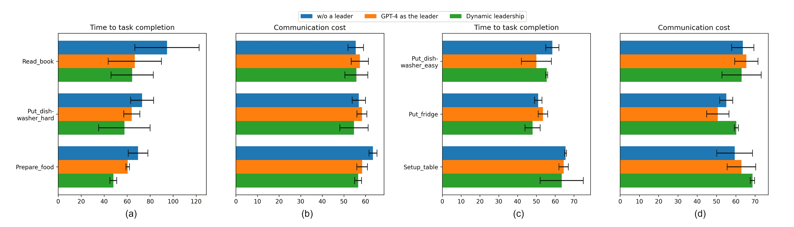

图10：具有指定领导者的组织团队结构和由批评-反思架构提出的新结构，已推广到不同任务。动态领导力的提示是批评-反思架构在Prepare_Afternoon_Tea任务中提出的，如图[8](https://arxiv.org/html/2403.12482v2#S4.F8 "Figure 8 ‣ 4.4 Novel Organizational Structures ‣ 4 Main Results ‣ Embodied LLM Agents Learn to Cooperate in Organized Teams")(a)所示。实验使用1$\times$GPT-4+2$\times$GPT-3.5-turbo团队，在每个任务的两个种子上进行。（a，b）难度较大的任务（read_book，put_dishwasher_hard，prepare_food），完成任务的典型步骤数$>60$。（c，d）较简单的任务（put_dishwasher_easy，put_fridge，setup_table），完成任务的典型步骤数$<60$。

## 附录D 组织中的新兴合作行为

通过调查代理之间的消息，我们主要观察到以下合作行为，如表[3](https://arxiv.org/html/2403.12482v2#A4.T3 "Table 3 ‣ Appendix D Emergent Cooperative Behaviors in an Organization ‣ Embodied LLM Agents Learn to Cooperate in Organized Teams")中总结。

表3：典型的合作行为。

类型 描述 示例 共享信息 代理将自己的观察结果分享给其他人，报告自己与任务相关的进展，或回应其他代理的请求（例如 1.）“我在浴室里，那里有一个未检查的$<$bathroomcabinet$>$（190）。”

(Ex 2.) “我去检查卧室的柜子。” 下达命令 一个代理通过直接发出命令或礼貌请求来指挥他人 “我还需要找$<$布丁$>$（371）。你能帮我在卧室找剩下的物品吗？” 请求信息 一个代理询问其他代理关于其位置、任务进展或其他信息（Ex 1.) “你现在在哪里？”

(Ex 2.) “厨房有什么更新吗？”

(Ex 3.) “我们知道咖啡桌的位置吗？” 交换信息 一个代理将一个代理的信息传达给另一个代理 Agent 3 $\to$ Agent 1: “在卧室找到了杯形蛋糕和果汁，还有一瓶酒。”；

Agent 1 $\to$ Agent 2: “Agent 3 在卧室找到了酒、杯形蛋糕和果汁。” 请求指令 一个代理询问自己需要做什么，或者是否可以帮助他人 “我在厨房，洗碗机、炉子、微波炉还没检查。需要我检查这些，还是其他的？” 更正 一个代理更正其他代理的计划（Ex 1.) Agent 2 $\to$ Agent 3: “在我把布丁放在咖啡桌上后，我们分头行动。你去检查浴室，我去检查卧室。”； Agent 3 $\to$ Agent 2: “你不需要检查卧室，果汁（380）在那里。”

(Ex 2.) “厨房柜子里没有酒和果汁了。我们需要想出另一个计划。”

## 附录 E 无效沟通

也有一些情况下，语言模型代理未能高效沟通。通过代理之间的消息，我们总结出典型的类别，如表格[4](https://arxiv.org/html/2403.12482v2#A5.T4 "Table 4 ‣ Appendix E Ineffective Communication ‣ Embodied LLM Agents Learn to Cooperate in Organized Teams")所示。

表格 4: 典型的无效沟通行为。

类型 描述 示例 重复信息 相同的信息说了不止一次 Agent 1 $\to$ Agent 3: “检查厨房柜子或洗碗机找酒，我去检查炉子。”，

Agent 2 $\to$ Agent 3: “Agent 1 会去检查炉子找酒。” 重复指令 相同的命令说了不止一次 Agent 3 $\to$ Agent 1: “去浴室找第二瓶酒。”

Agent 2 $\to$ Agent 1: “去厕所找找酒。” 冲突指令 一个代理给另一个代理下达与其当前任务冲突的命令 Agent 1 $\to$ Agent 3: “找到$<$果汁$>$并检查$<$浴室柜$>$（190）”

Agent 2 $\to$ Agent 3: “检查厨房容器找最后一瓶酒。” 冲突计划 一个代理声称执行两个冲突的计划 Agent 3 $\to$ Agent 1: “我找到了布丁，并会检查洗碗机、炉子和微波炉找第二瓶酒。” Agent 3 $\to$ Agent 2: “我会继续在卧室和浴室寻找第二瓶酒。” 不当委托 一个代理要求另一个代理做她自己的任务 Agent 1 $\to$ Agent 2: “继续检查厨房柜子找剩余物品。”

代理 2 $\to$ 代理 3：“请继续检查其他厨房橱柜中的剩余物品。” 忽视请求：一个代理忽视其他代理的提问 代理 2 $\to$ 代理 3：“我在厨房没有找到任何剩余物品。你在客厅找到了任何所需物品吗？”

代理 3 $\to$ 代理 2：“我还没有探索浴室。”

## 附录 F 对话示例

### F.1 选举示例

在图 [11](https://arxiv.org/html/2403.12482v2#A6.F11 "图 11 ‣ F.1 选举示例 ‣ 附录 F 对话示例 ‣ 具身的大型语言模型代理学习如何在组织化团队中合作") 中，代理们通过投票选举新领导者。我们可以观察到如自我提名和其他代理提名、投票和达成共识等行为。我们发现代理们并不追求权力，可能会早早放弃领导地位。代理们更倾向于投票给别人，而不是提名自己（在整个任务过程中，代理们投票给他人的次数是提名自己的 5 倍）。当选的领导者也不打算保持该职位，而是提名其他代理进行下一轮选举。此外，代理们的立场容易受到他人的影响。代理们并不花费过多时间辩论以赢得选举，而是很快达成共识。例如，代理_1 放弃了自己竞选领导者的机会，但由于代理_3 的支持，投票给了代理_2。此外，有时提名和投票是由幻觉决定的。例如，在第 2 步中，代理_2 提名代理_1，因为他是第一个提出搜索策略的人。然而，根据之前的对话，代理_1 尚未提出任何策略。

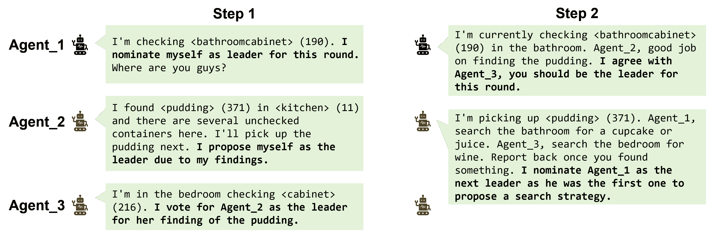

图 11：新领导者选举示例。在此案例中，投票和协商需要两个步骤来确定新领导者。请注意，代理_3 选择不发送消息，因为选举已结束，暂时不再共享任何信息。图中的所有消息都是广播。

### F.2 人类与 AI 合作示例

我们进行了实验，团队由一名人类玩家和两个 GPT-4 代理组成，人类玩家担任领导者。图 [12](https://arxiv.org/html/2403.12482v2#A6.F12 "图 12 ‣ F.2 人类与 AI 合作示例 ‣ 附录 F 对话示例 ‣ 具身的大型语言模型代理学习如何在组织化团队中合作") 展示了人类与 AI 之间的卓越合作。

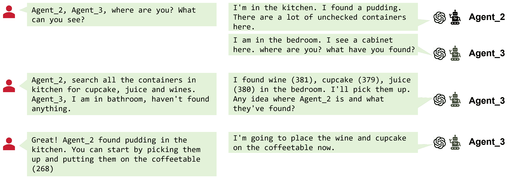

图 12：当人类玩家领导两个 GPT-4 代理（Agent_2&3）时，人类与 AI 合作的示例。

### F.3 修正示例

由于幻觉和对话历史缓冲区的限制，领导者可能会忘记发生的事情并下达错误指令。当提示鼓励代理在必要时纠正领导者，比如加入“如果领导者的指令不正确，你可以纠正领导者”，就会出现一些纠正行为，如图[13](https://arxiv.org/html/2403.12482v2#A6.F13 "Figure 13 ‣ F.3 Examples of Correction ‣ Appendix F Examples of dialogues ‣ Embodied LLM Agents Learn to Cooperate in Organized Teams")所示。

在第一个示例中，领导者Agent_1给出了不必要且重复的指令。然后Agent_2纠正了领导者，以避免浪费时间。在第二个示例中，领导者Agent_1可能有幻觉，无法清晰记得Agent_3手中拿着什么（信息中是杯形蛋糕和葡萄酒，而思维中是果汁和葡萄酒）。因此，Agent_3澄清她并没有拿着杯形蛋糕和葡萄酒，并与领导者分享她的下一步计划。

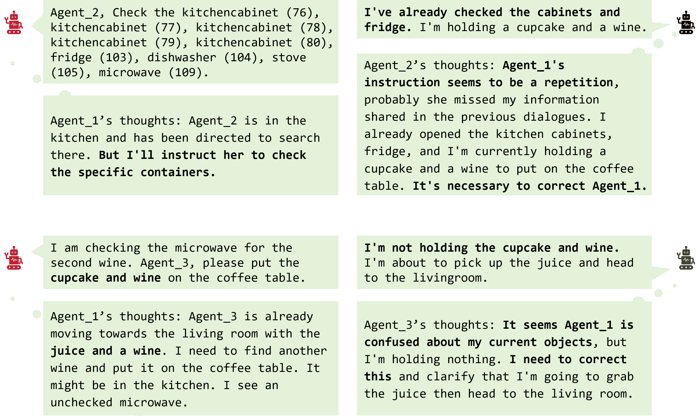

图13：纠正对话及其对应的思维示例。提示包括“如果领导者的指令不正确，你可以纠正领导者”。

### F.4 领导力对比示例

我们提供更多示例，以比较GPT-4和GPT-3.5-turbo之间的领导力。

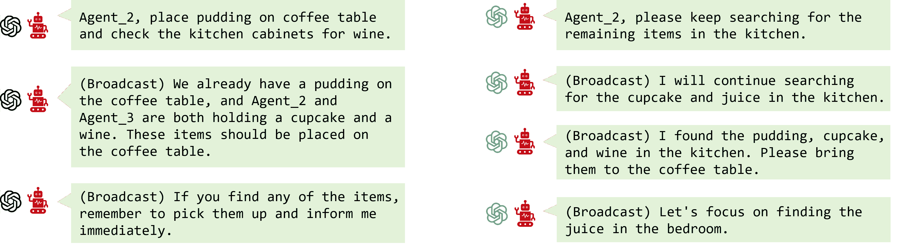

图14：GPT-4和GPT-3.5-turbo之间的领导力对比。与GPT-3.5-turbo相比，GPT-4的指令更加具体、清晰且全面。

### F.5 扩展示例

当增加代理的数量时，代理可能会形成更多的组织结构。例如，九个代理的团队会形成一个金字塔结构。

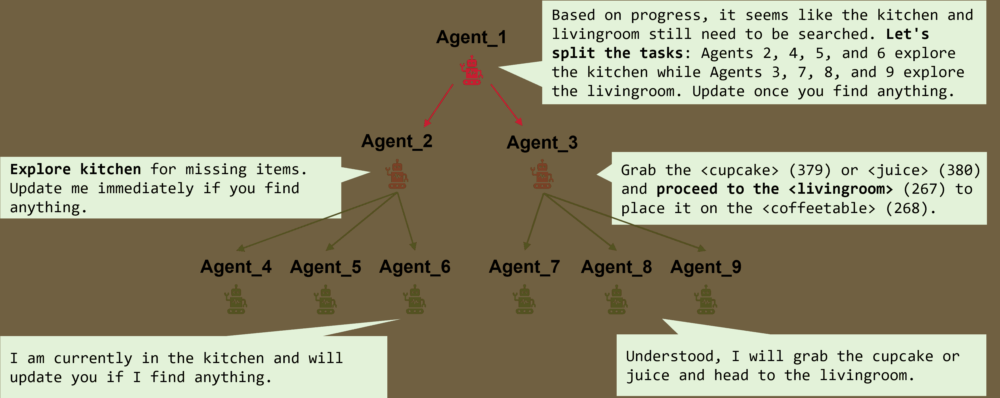

图15：九个代理团队中的金字塔结构。Agent_1是主要领导，Agent_2和Agent_3在提示中被指定为副领导。

### F.6 失败案例示例

尽管LLM代理展示了出色的合作和决策能力，但仍然存在一些失败案例，如图[16](https://arxiv.org/html/2403.12482v2#A6.F16 "Figure 16 ‣ F.6 Examples of Failure Cases ‣ Appendix F Examples of dialogues ‣ Embodied LLM Agents Learn to Cooperate in Organized Teams")所示，例如懒散和错误推理物体数量的情况。在某些特定场景中也存在失败案例，例如基于幻觉选举领导者的情况，详见附录[F.1](https://arxiv.org/html/2403.12482v2#A6.SS1 "F.1 Examples of Election ‣ Appendix F Examples of dialogues ‣ Embodied LLM Agents Learn to Cooperate in Organized Teams")。

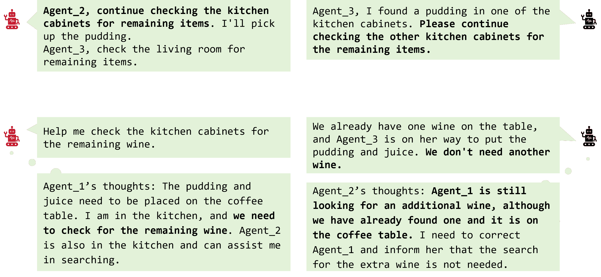

图 16：失败案例示例。第一个案例是懒惰。Agent_2 没有完成领导 Agent_1 下达的子任务，而是直接将命令重复给 Agent_3。然而，这个命令与 Agent_3 从领导那里收到的命令冲突。第二个案例是对数字的困惑。任务要求将两瓶酒放在桌子上，但团队到目前为止只拿到了一瓶。当领导 Agent_1 要求 Agent_2 检查剩下的酒时，Agent_2 因为产生了幻觉认为团队不需要额外的酒，试图纠正领导。两种情况中的智能体都是 GPT-3.5-turbo。

## 附录 G 人类与 GPT-4 协作行为分类示例

我们请一位人类评估员和 GPT-4 将对话分为表格[5](https://arxiv.org/html/2403.12482v2#A7.T5 "Table 5 ‣ Appendix G Examples of Cooperative Behaviors Classification by Humans and GPT-4 ‣ Embodied LLM Agents Learn to Cooperate in Organized Teams")中展示的三种不同行为类别。

表 5：由人类和 GPT-4 提供的对话和行为标签。标签 1：信息共享；标签 2：领导与协助；标签 3：请求指导。

Dialogue Human GPT-4 标签 1* 标签 2 标签 3 标签 1 标签 2 标签 3 嘿，你在哪里？请告诉我你的位置，这样我可以分配任务给你。 0 1 1 0 1 1 我目前在卧室，发现了一个未检查的橱柜。请检查客厅并开始寻找所需的物品。 1 1 0 1 1 0 我目前在卧室，发现了一个未检查的橱柜。我还没有找到任何所需的物品。 1 0 0 1 0 0 检查卧室里的橱柜。我会检查浴室里的橱柜。 1 1 0 0 1 0 我还没有找到任何所需的物品。你在厨房找到任何了吗？ 1 0 1 1 0 1 我还没有找到任何所需的物品。你在浴室找到任何了吗？ 1 0 1 1 0 1 代理 3，我在厨房的一个橱柜里找到了一份布丁。请继续检查其他厨房橱柜，寻找剩余的物品。 1 1 0 1 1 0 我还没有找到任何所需的物品。你在厨房找到任何其他所需物品了吗？ 1 0 1 1 0 1 我还没有找到任何剩余的物品。 1 0 0 1 0 0 我在客厅寻找剩余的物品。 1 0 0 1 0 0 好的，我会继续检查厨房橱柜，寻找剩余的物品。 1 0 0 1 0 0 我目前在客厅寻找剩余的物品。 1 0 0 1 0 0 我还没有找到任何剩余的物品。 1 0 0 1 0 0 我仍然在搜寻客厅。你找到任何所需的物品了吗？ 1 0 1 1 0 1 一旦找到物品，就把它们放到桌子上。继续搜索当前区域。 0 1 0 0 1 0 我在厨房还没有找到任何剩余的物品。你在客厅找到任何所需的物品吗？ 1 0 1 1 0 1 我还没有探索浴室。你在客厅找到任何所需的物品吗？ 1 0 1 1 0 1 我已经探索了卧室，发现了酒、杯子蛋糕和果汁。我还需要找到布丁。你能帮我在卧室里找一下剩下的物品吗？ 1 1 1 1 1 0 我在卧室里找到了酒、杯子蛋糕和果汁。代理 1 让我把它们放到咖啡桌上，然后检查浴室的橱柜。 1 0 0 1 1 0 代理 1 想让我们检查厨房里是否还有酒。 1 0 0 0 1 0

## 附录H 反思后生成的新提示

我们在图[17](https://arxiv.org/html/2403.12482v2#A8.F17 "图17 ‣ 附录H 反思后生成的新提示 ‣ 具身LLM代理学会在有组织的团队中协作")中列出了更多由Criticize-Reflect架构生成的提示。

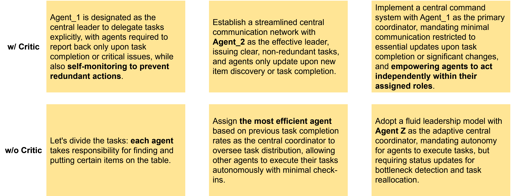

图17：通过反思生成的提示示例。第一行是通过批评者生成的，第二行没有批评者，新的提示相对模糊。请注意，团队中没有代理Z。

## 附录I 更广泛的影响

本研究探讨了基于提示的组织结构与LLM代理团队的整合，为更高效且连贯的多代理交互做出了贡献。这些发现有潜力在多个领域，尤其是机器人技术、虚拟助手等方面，极大地影响更有效且自主的多代理系统部署。例如，该研究在灾难响应场景中具有潜在应用，在这些场景中，高效的多代理协调至关重要。

另一方面，由于我们在界定和评估大型语言模型（LLM）行为方面的能力仍不成熟，当应用于人类与LLM的合作任务时，我们仍然需要依赖一些强制性终止措施（例如高风险操作需要人工批准），而不仅仅依赖自然语言指令。
