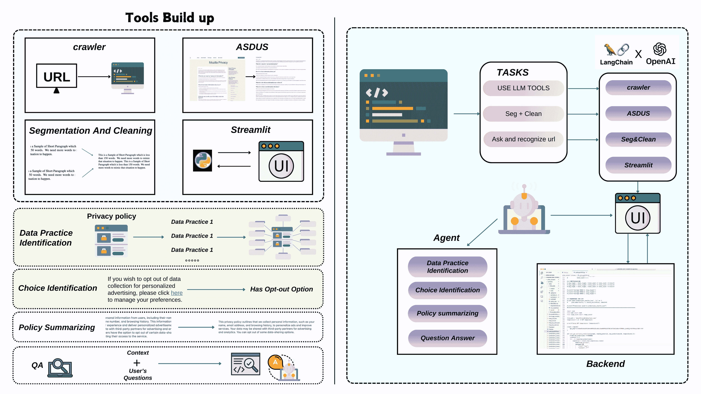

<!--yml

类别：未分类

日期：2025-01-11 12:06:07

-->

# 通过交互式大语言模型（LLM）代理增强用户在数字隐私管理中的能力

> 来源：[https://arxiv.org/html/2410.11906/](https://arxiv.org/html/2410.11906/)

孙博伦¹，周一凡²，蒋海云³

¹约翰·霍普金斯大学, ²乔治亚大学, ³中山大学

{bsun26@jh.edu}, {yifan.zhou1@uga.edu}, {jianghy66@mail.sysu.edu.cn}

###### 摘要

本文介绍了一种大语言模型（LLM）的新颖应用，通过交互式对话代理提升用户对隐私政策的理解。我们展示了LLM在数据实践识别、选择识别、政策总结和隐私问题回答等任务上显著优于传统模型，设立了隐私政策分析的新基准。基于这些发现，我们提出了一种创新的LLM代理，它作为一个专家系统，用于处理网站隐私政策，引导用户理解复杂的法律语言，而无需他们提出特定问题。一项包含100名参与者的用户研究表明，使用该代理的用户在理解能力上得分更高（平均得分为2.6/3，而对照组为1.8），认知负担更小（任务难度评分为3.2/10，而对照组为7.8），对隐私管理的信心更强，并且完成任务所需时间更少（5.5分钟对比15.8分钟）。这项工作突显了LLM代理在转变用户与隐私政策互动方式方面的潜力，从而实现更为知情的同意，赋能用户在数字服务领域中做出决策。

## 1 引言

在线服务对个人数据的广泛收集与处理提高了数字互动中的隐私问题（Vicario等，[2019](https://arxiv.org/html/2410.11906v1#bib.bib30)）。为了解决这些问题，网站和应用程序依法要求发布隐私政策，详细说明与数据收集、使用、共享和保护相关的做法。然而，由于其*法律复杂性*（McDonald & Cranor，[2008](https://arxiv.org/html/2410.11906v1#bib.bib20)），*语言密集且篇幅庞大*，这些政策对普通用户来说*极为难以理解*。因此，它们常常被忽视或误解，削弱了知情同意原则，暴露用户于潜在的隐私风险之中。这种断层带来了重大挑战（Harkous等，[2018](https://arxiv.org/html/2410.11906v1#bib.bib11)）：它阻碍了用户对数据作出知情决策的能力，也使得监管者和组织在确保透明度、执行合规和建立信任方面的努力变得复杂。随着隐私法规日益严格，政策内容愈加复杂，迫切需要创新的方法来弥合这一理解鸿沟。

最近在自然语言处理（NLP）领域的进展，特别是通过大型语言模型（LLMs）的发展，为解决这些挑战提供了有前景的解决方案。基于GPT架构的LLMs，已经在理解和生成类人文本方面展现了显著的能力，涵盖多个领域，包括法律文件。这些模型已成功应用于信息提取、内容总结和问题回答等任务，显示出在自动化分析和解释复杂法律文本，如隐私政策，方面的潜力。

本文提出了LLMs的一种新应用，通过开发基于GPT-4o-mini的AI代理，改善用户与网站隐私政策的互动。我们的研究旨在*通过提高用户浏览和理解隐私协议的能力，从而赋予用户更好的控制个人数据的权力*。研究分为两部分。

图1：用于基准测试大语言模型在可用隐私政策任务中的工作流程概览，并设计引导代理帮助消费者。

在第一部分，我们评估了大语言模型（LLMs）在多个与隐私政策相关的核心任务中的表现，包括数据实践识别、选择识别、政策总结和隐私问题回答（Wilson等人，[2016](https://arxiv.org/html/2410.11906v1#bib.bib35)；Mysore Sathyendra等人，[2017](https://arxiv.org/html/2410.11906v1#bib.bib22)；Ahmad等人，[2020](https://arxiv.org/html/2410.11906v1#bib.bib1)；Keymanesh等人，[2020](https://arxiv.org/html/2410.11906v1#bib.bib17)）。通过系统地用LLMs替代传统模型，我们建立了新的基准，并证明了*LLMs在这些任务中实现了最先进的表现*，显著提高了自然语言理解的*准确性和效率*，特别是在隐私政策的分析和解释中。

在这些实证结果的基础上，第二部分介绍了一个创新的基于LLM的代理，建立在GPT-4o-mini之上，旨在帮助用户理解网站隐私政策。该代理采用启发式交互模型，简化复杂的法律语言，无需用户知道具体应该问什么问题。作为一个专家系统，它迅速处理隐私协议，执行多个任务，如识别关键信息，并通过自动突出显示关键政策组件来适应用户需求（Ravichander等人，[2019](https://arxiv.org/html/2410.11906v1#bib.bib26)）。

为了评估基于LLM的代理的有效性，我们进行了一个用户研究，参与者共100人，分为两组：一组直接与隐私政策互动，另一组则使用LLM代理提供帮助（Kelley et al., [2009](https://arxiv.org/html/2410.11906v1#bib.bib15)）。我们衡量了理解力、效率、认知负担和用户信心。结果表明，使用该代理的用户对隐私政策有了显著更好的理解，报告称其认知负担减少，且完成任务所需时间比对照组更短。这些发现表明，我们的AI代理不仅提高了用户的理解力，还提升了效率并增强了用户信心（Kelley et al., [2013](https://arxiv.org/html/2410.11906v1#bib.bib16)）。

本研究的主要贡献有三方面：

+   •

    我们提供了*LLM在解读隐私政策方面优于传统模型*的实证证据，设立了新的基准。

+   •

    我们开发了一种AI代理，它可以*减少认知负担*、*提高用户信心*并*增强隐私政策的理解力*。该代理简化了复杂的法律语言，帮助用户，无需*先前知识*或*特定查询*，并自主地突出关键的政策内容，以改善决策过程。

+   •

    我们展示了基于LLM的代理显著提高了用户理解隐私政策的能力，减少了任务完成时间和认知努力。本研究不仅*赋予用户更好地主张其隐私权*的能力，帮助他们就个人数据做出更加明智的决策，还为未来的研究提供了宝贵的见解和基础，推动了面向用户的隐私解决方案的发展。

## 2 相关工作

随着隐私问题成为现代社会的关键关注点，像GDPR（通用数据保护条例）这样的法规通过强制要求更严格的透明度要求，塑造了全球隐私政策（Wang et al., [2018](https://arxiv.org/html/2410.11906v1#bib.bib31)）。尽管取得了这些进展，隐私政策仍然通常冗长且复杂，使得用户很难完全理解。McDonald和Cranor（McDonald & Cranor，[2008](https://arxiv.org/html/2410.11906v1#bib.bib20)）估计，用户阅读他们遇到的所有隐私政策每年需要201小时，这突显了需要更加用户友好的格式。

##### 隐私政策发展的历史

隐私权的发展始于Warren和Brandeis提出的“隐私权”的概念（Warren & Brandeis, [1890](https://arxiv.org/html/2410.11906v1#bib.bib32)），为隐私作为法律权利奠定了基础。联合国大会（UN General Assembly, [1948](https://arxiv.org/html/2410.11906v1#bib.bib29)）承认隐私是基本人权，而Westin（Westin, [1968](https://arxiv.org/html/2410.11906v1#bib.bib34)）进一步扩展了这一概念，强调个体对个人信息的控制。随着数字时代的发展，Introna（Introna, [1997](https://arxiv.org/html/2410.11906v1#bib.bib13)）强调了在网络化社会中隐私的重要性，美国联邦贸易委员会（Federal Trade Commission, [1998](https://arxiv.org/html/2410.11906v1#bib.bib9)）推出了“通知与选择”框架。Cate（Cate, [2010](https://arxiv.org/html/2410.11906v1#bib.bib7)）批评了该框架的有效性，认为其未能充分保护用户隐私。近年来的研究集中于隐私政策语言与用户理解之间的差距（Reidenberg et al., [2015](https://arxiv.org/html/2410.11906v1#bib.bib27)），以及大数据和社会不平等如何影响隐私（Jain et al., [2016](https://arxiv.org/html/2410.11906v1#bib.bib14); Madden et al., [2017](https://arxiv.org/html/2410.11906v1#bib.bib19)）。

##### 使用自然语言模型的隐私政策

自然语言处理（NLP）在自动化分析隐私政策方面发挥了重要作用，解决了这些文档日益复杂的问题。Costante等人（Costante et al., [2012](https://arxiv.org/html/2410.11906v1#bib.bib8)）和Ammar等人（Ammar et al., [2012](https://arxiv.org/html/2410.11906v1#bib.bib2)）的早期工作专注于识别数据实践，而Liu等人（Liu et al., [2014](https://arxiv.org/html/2410.11906v1#bib.bib18)）和Ramanath等人（Ramanath et al., [2014](https://arxiv.org/html/2410.11906v1#bib.bib25)）则致力于隐私声明的一致性。Wilson等人（Wilson et al., [2016](https://arxiv.org/html/2410.11906v1#bib.bib35)）推出了OPP-115数据集，Harkous等人（Harkous et al., [2018](https://arxiv.org/html/2410.11906v1#bib.bib11)）开发的Polisis等工具促进了隐私政策的分类和摘要。机器学习技术，如用于文本分类的CNN和风险评估工具（Zaeem et al., [2018](https://arxiv.org/html/2410.11906v1#bib.bib36)），改善了隐私政策的可获取性。问答系统也已应用于增强用户与隐私政策的互动，如Ravichander等人（Ravichander et al., [2019](https://arxiv.org/html/2410.11906v1#bib.bib26)）的研究所示，以及Ahmad等人（Ahmad et al., [2020](https://arxiv.org/html/2410.11906v1#bib.bib1)）创建的PolicyQA数据集。

##### LLM代理

由大型语言模型如GPT和BERT驱动的LLM代理，已经在多个领域展现出了显著的潜力，包括社会科学和工程学（Bubeck等，[2023](https://arxiv.org/html/2410.11906v1#bib.bib6)）。这些代理在自然语言理解和交互方面表现出色，使其成为自动化处理如政策总结和合规性分析等任务的理想选择。将LLM代理应用于隐私政策分析可以提升用户的可访问性，从而实现更高效且易于理解的复杂文档解读。

## 3 大型语言模型在可用隐私政策任务中的基准测试

在本节中，我们对OpenAI的最先进的封闭源大型语言模型（LLMs）在可用隐私政策领域的关键任务上进行了全面评估。评估的模型包括从GPT-4o到GPT-3.5。为了准确反映模型的固有能力和泛化潜力，我们采用了零样本和少样本提示工程方法，通过各自的API直接测试这些模型。这一方法论与我们利用LLM开发能够处理隐私政策理解中广泛问题的代理的目标一致。

我们选择了以下四个任务进行评估，因为它们代表了用户与隐私政策交互的关键方面：数据实践识别、选择识别、政策总结、隐私问题回答。

### 3.1 数据实践识别

在我们的实验中，我们评估了多个模型，包括GPT-4o、GPT-4o-mini、GPT-4-turbo和GPT-3.5，在数据实践识别任务上的表现。测试过程涉及直接调用API，所有模型使用相同的提示语，以确保一致性。这些实验是在整个OPP-115数据集（Wilson等，[2016](https://arxiv.org/html/2410.11906v1#bib.bib35)）上进行的，该数据集是一个全面的注释隐私政策集合。

鉴于该任务要求模型执行分类操作，我们将温度参数设置为零，以确保输出的确定性并消除预测中的随机性。做出这一决策是为了在分类过程中保持一致性和可靠性。

考虑到响应时间、性能指标和计算成本等因素后，我们选择了GPT-4o-mini进行进一步评估。表格[1](https://arxiv.org/html/2410.11906v1#S3.T1 "Table 1 ‣ 3.1 Data Practice Identification ‣ 3 Benchmarking Large Language Model ability in usable privacy policy tasks ‣ Empowering Users in Digital Privacy Management through Interactive LLM-Based Agents")、[2](https://arxiv.org/html/2410.11906v1#S3.T2 "Table 2 ‣ 3.1 Data Practice Identification ‣ 3 Benchmarking Large Language Model ability in usable privacy policy tasks ‣ Empowering Users in Digital Privacy Management through Interactive LLM-Based Agents")展示了GPT-4o-mini在数据实践识别任务中的表现，与基准模型(Wilson等，[2016](https://arxiv.org/html/2410.11906v1#bib.bib35))进行了比较。值得注意的是，GPT-4o-mini在零-shot学习条件下，在没有额外上下文的情况下，平均表现超过了基准模型。

值得注意的是，（Wilson等，[2016](https://arxiv.org/html/2410.11906v1#bib.bib35)）将“其他”类别划分为三个更小的子类别，这些子类别显示在最终的图表中。因此，我们没有“其他”类别整体分类的基准数据。结果展示了GPT-4o-mini在政策分类任务中的能力，并且其在构建现实世界代理中的应用潜力。

|  | GPT-4o-mini | LR |
| --- | --- | --- |
| 分类 | 精确度 | 召回率 | F1分数 | 精确度 | 召回率 | F1分数 |
| --- | --- | --- | --- | --- | --- | --- |
| 第一方收集/使用 | 0.95 | 0.64 | 0.77 | 0.73 | 0.67 | 0.70 |
| 第三方共享/收集 | 0.84 | 0.69 | 0.75 | 0.64 | 0.63 | 0.63 |
| 用户选择/控制 | 0.88 | 0.43 | 0.58 | 0.45 | 0.62 | 0.52 |
| 用户访问、编辑与删除 | 0.90 | 0.59 | 0.71 | 0.47 | 0.71 | 0.57 |
| 数据保留 | 0.96 | 0.16 | 0.27 | 0.10 | 0.35 | 0.16 |
| 数据安全 | 0.97 | 0.44 | 0.61 | 0.48 | 0.75 | 0.59 |
| 政策变化 | 0.86 | 0.59 | 0.70 | 0.59 | 0.83 | 0.69 |
| 不追踪 | 0.64 | 0.88 | 0.74 | 0.45 | 1.00 | 0.62 |
| 国际化与特定受众 | 0.95 | 0.77 | 0.88 | 0.49 | 0.69 | 0.57 |
| 其他 | 0.91 | 0.35 | 0.51 | NaN | NaN | NaN |
| 微平均 | 0.90 | 0.53 | 0.67 | 0.53 | 0.65 | 0.58 |

表格 1：GPT-4o-mini和LR在各分类下的性能指标。

|  | 支持向量机(SVM) | 隐马尔可夫模型(HMM) |
| --- | --- | --- |
| 分类 | 精确度 | 召回率 | F1分数 | 精确度 | 召回率 | F1分数 |
| --- | --- | --- | --- | --- | --- | --- |
| 第一方收集/使用 | 0.76 | 0.73 | 0.75 | 0.69 | 0.76 | 0.72 |
| 第三方共享/收集 | 0.67 | 0.73 | 0.07 | 0.63 | 0.61 | 0.62 |
| 用户选择/控制 | 0.65 | 0.58 | 0.61 | 0.47 | 0.33 | 0.39 |
| 用户访问、编辑与删除 | 0.67 | 0.56 | 0.61 | 0.48 | 0.42 | 0.45 |
| 数据保留 | 0.12 | 0.12 | 0.12 | 0.08 | 0.12 | 0.09 |
| 数据安全 | 0.66 | 0.67 | 0.67 | 0.67 | 0.53 | 0.59 |
| 政策变更 | 0.66 | 0.88 | 0.75 | 0.52 | 0.68 | 0.59 |
| 不跟踪 | 1.00 | 1.00 | 1.00 | 0.45 | 0.40 | 0.41 |
| 国际化与特定受众 | 0.70 | 0.70 | 0.70 | 0.67 | 0.66 | 0.66 |
| 其他 | NaN | NaN | NaN | NaN | NaN | NaN |
| 微平均 | 0.66 | 0.66 | 0.66 | 0.60 | 0.59 | 0.60 |

表2：SVM和HMM在各类别中的性能指标。

### 3.2 选择识别

我们在零样本学习设置下评估了GPT-4o、GPT-4o-mini、GPT-4-turbo和GPT-3.5在选择识别任务中的表现，并且没有提供额外的上下文。模型的表现略低于基准，但仍然值得关注。具体来说，我们观察到精度较低，而召回率相对较高。这表明模型能够识别大多数包含退出选项的文本，并且漏掉真实正例的情况较少。

这一趋势表明，模型很少未能检测到确实包含退出条款的文本。为了进一步提高性能，我们采用了少样本学习方法，故意增加了提示中包含真实退出选项的示例数量。经过这一调整后，模型的表现与基准持平或略有提高。

比较结果如表[3](https://arxiv.org/html/2410.11906v1#S3.T3 "Table 3 ‣ 3.2 Choice identification ‣ 3 Benchmarking Large Language Model ability in usable privacy policy tasks ‣ Empowering Users in Digital Privacy Management through Interactive LLM-Based Agents")所示。

| 指标 | GPT-4o-mini（零样本） | GPT-4o-mini（少样本） | LR | BERT | fastText |
| --- | --- | --- | --- | --- | --- |
| 精度 | 0.74 | 0.88 | 0.90 | 0.83 | 0.90 |
| 召回率 | 0.94 | 0.95 | 0.86 | 0.98 | 0.76 |
| F1-score | 0.83 | 0.91 | 0.88 | 0.90 | 0.82 |
| 准确率 | 0.94 | 0.93 | NaN | NaN | NaN |

表3：不同模型的性能指标比较。

### 3.3 政策问题回答

在我们关于隐私问题回答任务的实验中，我们测试了GPT-3.5和GPT-4o-mini在PolicyQA测试数据集上的表现，该数据集旨在评估模型在隐私政策上下文中回答问题的能力。此外，我们还将这些模型的表现与BERT-base模型进行了对比，以进一步评估其效果。

我们的结果表明，使用前10选择策略的GPT-4o-mini模型，在隐私政策上下文中回答问题的表现超越了BERT-base模型。GPT-4o-mini的零样本表现展示了其在未见数据上的泛化能力，能够有效提取相关信息并从隐私政策中生成准确的答案。然而，我们也观察到，像GPT-4o-mini这样的自回归大语言模型即使在严格的输出控制下，也容易产生幻觉回应。尽管我们努力减少此类情况的发生，幻觉现象仍然是一个持续的挑战。

为了应对模型未能生成有意义的回应的情况，我们应用了后处理步骤。具体来说，我们过滤掉了那些模型根本没有提供回答的样本，确保最终的评估仅包括有效且相关的输出。这一步骤有助于通过去除无信息的输出，细化模型的整体表现评估。

比较结果见表[4](https://arxiv.org/html/2410.11906v1#S3.T4 "表4 ‣ 3.3 政策问题回答 ‣ 3 大型语言模型在可用隐私政策任务中的基准评估 ‣ 通过互动型基于LLM的代理提升数字隐私管理中的用户能力")。

| 指标 | GPT-3.5 | GPT-3.5(前10) | GPT-4o-mini | GPT-4o-mini(前10) | BERT-base |
| --- | --- | --- | --- | --- | --- |
| Rouge-1 | 0.35 | 0.48 | 0.44 | 0.57 | 0.56 |
| Rouge-2 | 0.23 | 0.37 | 0.37 | 0.50 | 0.44 |
| Rouge-L | 0.32 | 0.45 | 0.43 | 0.56 | 0.56 |

表4：政策问题回答的性能指标比较。

### 3.4 政策摘要

在本实验中，我们遵循Keymanesh等人（2020年）的方法，使用他们的数据集评估了GPT-4o和GPT-4o-mini在来自Google、Amazon和CNN等平台的十个公开用户协议上的表现。这些协议经过处理，以提取“最具风险”的句子，重点关注隐私和数据处理，内容比例为1/16和1/64。在内容比例为1/64时，GPT-4o的表现略逊色于领域特定的监督模型，但它在零-shot设置中表现出强大的泛化能力。数据集的年代较久且缺乏特定任务的微调可能是性能差异的原因，但GPT-4o能够取得相当的结果，展示了其强大的泛化能力。

|  | 压缩比1/64 | 压缩比1/16 |
| --- | --- | --- |
| 指标 | GPT-4o | GPT-4o-mini | CNN+RF | CNN+CF | GPT-4o | GPT-4o-mini | CNN+RF | CNN+CF |
| --- | --- | --- | --- | --- | --- | --- | --- | --- |
| ROUGE-1 | 0.338 | 0.335 | 0.340 | 0.379 | 0.429 | 0.427 | 0.431 | 0.404 |
| ROUGE-2 | 0.248 | 0.246 | 0.250 | 0.288 | 0.310 | 0.308 | 0.312 | 0.287 |
| ROUGE-L | 0.246 | 0.244 | 0.248 | 0.292 | 0.366 | 0.364 | 0.368 | 0.340 |
| METEOR | 0.398 | 0.396 | 0.400 | 0.439 | 0.418 | 0.416 | 0.420 | 0.416 |

表5：不同压缩比下的性能指标比较。

## 4 可用隐私政策的LLM代理

### 4.1 代理概述

我们将AI代理设计为一个引导性和启发式系统，旨在帮助用户理解复杂的隐私政策，无需具备隐私法律方面的专业知识。它主动识别需要用户关注的关键点，并通过引导性、启发式对话有效地传达这些信息（Ouyang等，[2022](https://arxiv.org/html/2410.11906v1#bib.bib24); OpenAI，[2023](https://arxiv.org/html/2410.11906v1#bib.bib23); Wei等，[2022](https://arxiv.org/html/2410.11906v1#bib.bib33)）。随后，它会进行开放式问答，帮助用户解决任何剩余的不确定性。

如图2所示，代理通过一个多阶段的过程进行操作，首先从指定的URL获取隐私政策，然后进行文档预处理、分段、摘要、数据实践识别、选择退出提取和问答。该系统能够自动识别关键部分——例如数据共享实践、用户权益和选择退出机制——这些内容常常隐藏在冗长的法律文本中。此外，它还具有一个交互式界面，允许用户通过提出关于隐私权和选项的具体问题来与政策进行互动。通过简化浏览和理解隐私政策的过程，AI代理使用户能够轻松、放心地做出关于隐私的知情决策。它提供清晰的支持，让用户能够专注于最重要的内容，而无需深入的法律知识。

图2：该图展示了该代理的开发工作流程。该系统整合了多个工具，自动提取和解释隐私实践，向用户提供摘要信息和问答功能。

### 4.2 系统架构

该AI代理基于LangChain框架（Følstad & Skjuve, [2019](https://arxiv.org/html/2410.11906v1#bib.bib10)），将大型语言模型与专门的隐私政策分析工具集成在一起。该架构包括以下关键组件：

文档检索和预处理：代理接受用户提供的URL以检索相应的隐私政策。通过使用LangChain的request_url，它提取相关内容，过滤掉广告等非核心元素，专注于政策文本。

文档分段：我们使用ASDUS（Athreya，[2018](https://arxiv.org/html/2410.11906v1#bib.bib3)）将HTML文档分割成标题和正文，将内容组织成<h2>和
标签。这个过程有助于识别关键部分，例如用户权益、数据共享实践和选择退出选项，从而增强代理分析和解释政策的能力。

政策分析模块：该代理包括两个主要模块：- 政策实践识别：通过使用LangChain的自定义工具，代理根据已有的分类法（Wilson等人，[2016](https://arxiv.org/html/2410.11906v1#bib.bib35)）将政策段落分类为十个预定义的类别（例如数据收集、第三方共享）。 - 内容总结：summarize_tool将复杂的政策内容压缩为简明扼要的摘要，允许用户快速掌握关键的隐私实践，而无需浏览密集的法律文本。

选择退出选项检测：为了检测选择退出选项，代理扫描政策文本中的相关关键词和指向选择退出机制的超链接。然后，它利用底层LLM分析上下文并确认有效的选择退出选项，这些选项会被存储以供用户方便访问。

互动对话机制：代理的互动能力由LangChain的RunnableWithMessageHistory提供支持，允许动态的问答会话。用户可以询问关于政策的特定方面，代理通过利用适当的工具和LLM提供上下文相关的答案。对话历史将被保存，以提供连贯且个性化的互动体验。

后端集成：由LangChain的AgentExecutor管理，系统高效地协调多个工具的执行。与底层LLM（例如GPT-4o-mini）的集成使得系统能够深入理解上下文并生成准确的回答。代理的架构旨在支持可扩展性，能够并行处理多个查询，同时通过内存数据库和外部模块保障强大的功能，以应对更高级的任务。

## 5问卷设计

我们设计了一份问卷，通过五个维度——理解力、用户体验、时间效率、认知负荷和信任意图——来评估参与者，基于已有的评估方法（Brooke, [1996](https://arxiv.org/html/2410.11906v1#bib.bib5); Hart & Staveland, [1988](https://arxiv.org/html/2410.11906v1#bib.bib12); McKnight & Chervany, [2002](https://arxiv.org/html/2410.11906v1#bib.bib21)）。这使我们能够评估直接阅读隐私政策的参与者与由我们的AI代理协助的参与者之间的差异。完整的问卷内容附在附录中。

理解力评估：理解力通过三个关于隐私政策关键方面的多项选择题进行评估：数据收集类型、数据共享实践和用户权利（Reidenberg等人，[2016](https://arxiv.org/html/2410.11906v1#bib.bib28)）。参与者每答对一个问题得1分，最高得分为3分，最低为0分。

用户体验评估：我们使用5点Likert量表评估了用户体验，衡量了易用性、满意度和信息质量（Brooke，[1996](https://arxiv.org/html/2410.11906v1#bib.bib5)）。与AI代理互动的参与者回答了额外的AI特定问题。

时间效率：我们记录了每个参与者完成任务所花的时间——无论是阅读隐私政策还是使用AI代理——以比较两组之间的时间效率。

认知负荷评估：认知负荷通过适应过的NASA-TLX问卷进行评估（Hart & Staveland，[1988](https://arxiv.org/html/2410.11906v1#bib.bib12)）。参与者对心理需求、任务难度和挫折感进行了评分，评分范围从0（“非常低”）到10（“非常高”）。

信任与意图评估：参与者使用5点Likert量表对他们对所接收到信息的信任程度以及未来使用类似工具的意图进行了评分（McKnight & Chervany，[2002](https://arxiv.org/html/2410.11906v1#bib.bib21)）。

开放式反馈：我们收集了关于遇到的任何困难以及改进阅读体验或AI代理的建议的开放式反馈，为未来的改进提供了定性见解。

## 6 结果分析

本节展示了从直接阅读隐私政策的参与者（控制组）和使用AI代理的参与者（实验组）收集的数据分析。我们从五个维度评估了结果：理解度、用户体验、时间效率、认知负荷和信任/意图。

### 6.1 参与者和数据分析

本研究共招募了100名参与者，其中52名为男性，48名为女性，年龄范围为18至65岁（平均年龄=35.2，标准差=10.4）。参与者随机分配到控制组或实验组，每组50名。样本包括来自不同教育背景的个体：20%具有高中学历，50%持有本科学位，30%具有研究生学位（硕士或博士）。关于数字素养，参与者自我报告了他们的熟练度，45%为初学者，45%为中级用户，10%为高级用户。这种多样化的人口统计特征确保了研究结果可以推广到不同的用户群体。

在分析之前，我们通过Shapiro-Wilk和Levene检验验证了数据满足参数检验的假设，包括观测值的独立性、正态性和方差齐性。所有假设都得到了满足，因此可以使用独立样本t检验。

| 维度 | 测量 | 控制组 | 实验组 |
| --- | --- | --- | --- |
| 理解度 | 平均分（0–3） | 1.8（0.7） | 2.6（0.6） |
|  | t检验（$p$值） | $t(98)=6.23$，$p<0.001$，$d=1.24$ |
| 用户体验（1–5） | 易用性 | 2.8（0.9） | 4.1（0.7） |
|  | 信息可访问性 | 2.5（1.0） | 4.2（0.6） |
|  | 信息清晰度 | 2.9（0.8） | 4.3（0.6） |
|  | t 检验（$p$ 值） | $p<0.001$, $d$ = 1.69–2.13 |
| 时间效率 | 时间（分钟） | 15.8（2.5） | 5.5（1.8） |
|  | t 检验（$p$ 值） | $t(98)=11.62$，$p<0.001$，$d=2.32$ |
| 认知负荷（0–10） | 心理需求 | 7.5（1.2） | 3.5（1.1） |
|  | 任务难度 | 7.8（1.1） | 3.2（1.0） |
|  | 沮丧程度 | 7.2（1.3） | 3.0（1.2） |
|  | t 检验（$p$ 值） | $p<0.001$, $d$ = 2.23–2.81 |
| 信任与意图（1–5） | 信息信任度 | 2.8（0.7） | 4.5（0.5） |
|  | 隐私管理信心 | 2.6（0.8） | 4.4（0.6） |
|  | t 检验（$p$ 值） | $p<0.001$, $d$ = 1.57–1.62 |

表 6：各测量维度的结果总结

每个测量维度的详细分析总结如下，结合表 [6](https://arxiv.org/html/2410.11906v1#S6.T6 "Table 6 ‣ 6.1 Participants and Data Analysis ‣ 6 Result Analysis ‣ Empowering Users in Digital Privacy Management through Interactive LLM-Based Agents") 中呈现的结果。

+   •

    理解度：实验组参与者在理解隐私政策方面显著优于对照组。独立样本 t 检验确认了这一差异（$t(98)=6.23$，$p<0.001$，Cohen’s $d=1.24$）。

+   •

    用户体验：实验组报告了在所有测量项目上显著更好的用户体验。易用性、信息可访问性和信息清晰度的差异都具有统计学意义，且效应量较大（所有$p<0.001$，$d$ 范围从 1.69 到 2.13）。

+   •

    时间效率：使用 AI 代理显著减少了完成任务所需的时间。差异具有统计学意义（$t(98)=11.62$，$p<0.001$，Cohen’s $d=2.32$），证明了 AI 代理的高效性。

+   •

    认知负荷：实验组参与者在所有维度上的认知负荷显著较低。心理需求、任务难度和沮丧程度的减少具有统计学意义（所有$p<0.001$，$d$ 范围从 2.23 到 2.81），表明 AI 代理有效地减少了认知负担。

+   •

    信任与意图：实验组报告了更高的信任度和对隐私管理的更强信心。这些差异具有统计学意义，且效应量较大（所有$p<0.001$，$d$ 范围从 1.57 到 1.62）。参与者还表示，未来会强烈希望使用 AI 代理来理解隐私政策。

## 7 讨论与局限性

尽管我们的研究展示了基于LLM的代理在增强用户对隐私政策理解方面的潜力，但仍需承认其局限性，并考虑未来的工作方向。一个显著的关注点是LLM固有的偏见和幻觉问题（Bender 等，[2021](https://arxiv.org/html/2410.11906v1#bib.bib4)），这些问题可能会影响提供给用户的信息的准确性和可靠性。这些问题可能无意中误导用户或加剧现有的偏见，从而影响他们对隐私的理解和决策。解决这些问题需要实施强有力的验证机制，并纳入人工监督，以确保代理的输出是可信的。

此外，我们的研究专注于与代理的短期互动。为了全面了解其对用户隐私管理行为的影响，必须进行长期研究。评估代理在较长时间内的效果将为其可持续性和长期效益提供见解，包括用户是否继续使用代理，以及它如何随着时间推移影响他们的隐私决策。未来的研究还应探讨用户保持率、代理对长期隐私意识的影响以及其在日常数字实践中的整合。

## 8 结论

在本研究中，我们开创性地应用了大规模语言模型，通过基于LLM的互动代理来增强用户对隐私政策的理解。我们调查了用户在解释复杂法律语言时所面临的挑战，并展示了我们的代理如何显著提高理解力，减少认知负担，并增强用户在管理个人数据时的信心。同时，我们展示了隐私政策分析任务的新基准，展示了LLM相较于传统模型的优越性能。我们强烈鼓励在这一领域开展进一步的研究，包括开发更先进的代理和评估方法。通过促进用户赋权和隐私管理的协作和迭代方法，我们期待在推动数字领域中的知情同意和用户自主权方面取得持续进展。

## 参考文献

+   Ahmad 等人（2020）W. Ahmad, J. Chi, Y. Tian, 和 K.-W. Chang。PolicyQA：一个隐私政策的阅读理解数据集。在 *计算语言学协会会议成果：EMNLP 2020*，第743-749页，2020年。

+   Ammar 等人（2012）W. Ammar, S. Wilson, N. Sadeh, 和 N. A. Smith。隐私政策的自动分类：一项初步研究。技术报告 CMU-LTI-12-019，卡内基梅隆大学，2012年。

+   Athreya（2018）Abhijith Athreya。Asdus：使用无监督和监督学习的自动段落检测，2018年。GitHub 仓库，访问链接：[https://github.com/abhijith-athreya/ASDUS](https://github.com/abhijith-athreya/ASDUS)。

+   Bender等人（2021）Emily M. Bender, Timnit Gebru, Angelina McMillan-Major 和 Shmargaret Shmitchell. 关于随机鹦鹉的危险：语言模型是否可能过于庞大？发表于*《2021年ACM公平性、问责性与透明度会议（FAccT）》论文集*，第610–623页，美国纽约，2021年。ACM。doi: 10.1145/3442188.3445922。网址[https://doi.org/10.1145/3442188.3445922](https://doi.org/10.1145/3442188.3445922)。

+   Brooke（1996）John Brooke. SUS——一个简洁实用的可用性量表。发表于Patrick W. Jordan, Bruce Thomas, Bernard Weerdmeester 和 Ian L. McClelland（编），*《工业界可用性评估》*，第189–194页。Taylor & Francis，1996年。

+   Bubeck等人（2023）S. Bubeck, V. Chandrasekaran, R. Eldan, G. Elidan, K. LeJeune 和 M. Teyssier. 人工通用智能的火花：关于GPT-4的早期实验。*arXiv预印本arXiv:2303.12712*，2023年。

+   Cate（2010）F. H. Cate. 通知与选择的限制。*《IEEE安全与隐私》*，8(2)，2010年。

+   Costante等人（2012）E. Costante, J. den Hartog 和 M. Petkovic. 网站知道关于你的信息。发表于*《数据隐私管理与自主自发安全》*，第146–159页。Springer，2012年。

+   美国联邦贸易委员会（1998）美国联邦贸易委员会。在线隐私：向国会报告。技术报告，美国联邦贸易委员会，华盛顿特区，1998年6月。

+   Følstad & Skjuve（2019）Asbjørn Følstad 和 Marita Skjuve. 聊天机器人在客户服务中的应用：用户体验与动机。发表于*《第一届国际会话用户界面会议（CUI '19）》论文集*，第1–9页，美国纽约，2019年。ACM。doi: 10.1145/3342775.3342784。

+   Harkous等人（2018）H. Harkous, K. Fawaz, R. Lebret, F. Schaub, K. G. Shin 和 K. Aberer. Polisis：使用深度学习自动分析和展示隐私政策。发表于*《第27届USENIX安全研讨会论文集》*，第531–548页，2018年。

+   Hart & Staveland（1988）Sandra G. Hart 和 Lowell E. Staveland. NASA-TLX（任务负荷指数）的开发：实证和理论研究结果。发表于Peter A. Hancock 和 Najmedin Meshkati（编），*《人类心理负荷》*，*《心理学进展》*第52卷，第139–183页。North-Holland，1988年。

+   Introna（1997）L. D. Introna. 隐私与计算机：为什么我们在信息社会中需要隐私。*《形而上学哲学》*，28(3)：259–275，1997年。

+   Jain等人（2016）P. Jain, M. Gyanchandani 和 N. Khare. 大数据隐私：技术视角与综述。*《大数据杂志》*，3(1)：25，2016年。

+   Kelley等人（2009）P. G. Kelley, J. Bresee, L. F. Cranor 和 R. W. Reeder. 隐私营养标签。发表于*《第五届可用隐私与安全研讨会（SOUPS）》论文集*，第1–12页，2009年。

+   Kelley等人（2013）P. G. Kelley, L. F. Cranor 和 N. Sadeh. 隐私作为应用决策过程的一部分。发表于*《ACM CHI人机交互系统会议论文集》*，第3393–3402页，2013年。

+   Keymanesh 等（2020）M. Keymanesh, M. Elsner 和 S. Parthasarathy。面向领域引导的可控隐私政策摘要生成。在*自然法律语言处理研讨会。KDD*，2020年。

+   Liu 等（2014）F. Liu, R. Ramanath, N. Sadeh 和 N. A. Smith。迈向可用的隐私政策：隐私声明的自动对齐。在*COLING 2014，第25届国际计算语言学会议技术论文集*，第884–894页，2014年。

+   Madden 等（2017）M. Madden, M. Gilman, K. Levy 和 A. Marwick。隐私、贫困与大数据：贫困美国人的脆弱性矩阵。*华盛顿大学法学评论*，95:53，2017年。

+   McDonald & Cranor（2008）A. M. McDonald 和 L. F. Cranor。阅读隐私政策的成本。*ISJLP*，4:543，2008年。

+   McKnight & Chervany（2002）D. Harrison McKnight 和 Norman L. Chervany。在电子商务客户关系中，信任意味着什么：一种跨学科的概念类型学。*国际电子商务期刊*，6(2):35–59，2002年。

+   Mysore Sathyendra 等（2017）K. Mysore Sathyendra, S. Wilson, F. Schaub, S. Zimmeck, 和 N. Sadeh。在隐私政策文本中识别提供选择的条款。在*2017年自然语言处理经验方法会议论文集*，第2774–2779页，2017年。

+   OpenAI（2023）OpenAI。GPT-4技术报告。*CoRR*，abs/2303.08774，2023年。

+   欧阳等（2022）L. 欧阳, J. 吴, X. 蒋, 等。通过人类反馈训练语言模型以遵循指令。在*NeurIPS会议论文集*，2022年。

+   Ramanath 等（2014）R. Ramanath, F. Liu, N. Sadeh 和 N. A. Smith。使用隐马尔可夫模型的隐私政策无监督对齐。在*第52届计算语言学协会年会论文集（第2卷：短论文）*，第605–610页，2014年。

+   Ravichander 等（2019）A. Ravichander, A. W. Black, S. Wilson, T. Norton 和 N. Sadeh。隐私政策的问答：结合计算和法律视角。在*2019年自然语言处理经验方法会议暨第9届国际联合自然语言处理会议（EMNLP-IJCNLP）*论文集，第4947–4958页，2019年。

+   Reidenberg 等（2015）J. R. Reidenberg, T. D. Breaux, L. F. Cranor, B. French, A. Grannis, J. T. Graves 和 R. Ramanath。令人不悦的隐私政策：意义与用户理解之间的不匹配。*伯克利技术法学期刊*，30:39，2015年。

+   Reidenberg 等（2016）Joel R. Reidenberg, Jaspreet Bhatia, Travis Breaux 和 Thomas B. Norton。隐私政策中的歧义及其监管影响。*法律研究杂志*，45(S2):S163–S190，2016年。

+   联合国大会（1948）联合国大会。世界人权宣言。*联合国大会*，302(2)，1948年。

+   Vicario et al. (2019) M. D. Vicario, A. Bessi, F. Zollo, F. Petroni, A. Scala, G. Caldarelli, 和 W. Quattrociocchi。在线误信息的传播。*美国国家科学院院刊*，113(3)：554-559，2019年。

+   Wang et al. (2018) Z. Wang, S. Zimmeck, P. Story, 和 N. Sadeh。通用数据保护条例（GDPR）对移动应用隐私实践的影响。*ACM人机交互学报*，2：200，2018年。

+   Warren & Brandeis (1890) S. D. Warren 和 L. D. Brandeis. 隐私权。*哈佛法学评论*，4(5)：193-220，1890年。

+   Wei et al. (2022) J. Wei, Y. Tay, R. Bommasani 等人。大型语言模型的涌现能力。*机器学习研究学报*，2022年。

+   Westin (1968) A. F. Westin. *隐私与自由*。Atheneum出版社，纽约，1968年。

+   Wilson et al. (2016) S. Wilson, F. Schaub, S. Amini, J. Bhatia, J. Liu, 和 N. Sadeh。网站隐私政策语料库的创建与分析。发表于*第54届计算语言学协会年会论文集（第一卷：长篇论文）*，第1330-1340页，2016年。

+   Zaeem et al. (2018) R. N. Zaeem, C. German, 和 K. S. Barber。使用机器学习方法进行隐私政策的自动化风险评估。发表于*2018年ACM SIGSAC计算机与通信安全会议论文集*，第1533-1546页，2018年。

## 附录 A 附录

### A.1 用于基准测试和代理的提示

#### A.1.1 实践识别

<svg class="ltx_picture ltx_centering" height="440.9" id="A1.SS1.SSS1.1.pic1" overflow="visible" version="1.1" width="550"><g fill="#000000" stroke="#000000" stroke-width="0.4pt" transform="translate(0,440.9) matrix(1 0 0 -1 0 0)"><g fill-opacity="1.0" transform="matrix(1.0 0.0 0.0 1.0 21.65 422.85)"><foreignobject color="#FFFFFF" height="12.15" overflow="visible" transform="matrix(1 0 0 -1 0 16.6)" width="506.69">Prompt</foreignobject></g> <g fill-opacity="1.0" transform="matrix(1.0 0.0 0.0 1.0 21.65 13.78)"><foreignobject color="#000000" height="391.36" overflow="visible" transform="matrix(1 0 0 -1 0 16.6)" width="506.69">Instruction: You are given an annotation scheme for a website’s privacy policy, which consists of the following ten categories: 1\. First Party Collection/Use: How and why the service provider collects user information. 2\. Third Party Sharing/Collection: How user information may be shared with or collected by third parties. 3\. User Choice/Control: What choices and control options are available to users. 4\. User Access, Edit, & Deletion: Whether and how users may access, edit, or delete their information. 5\. Data Retention: How long user information is stored. 6\. Data Security: How user information is protected. 7\. Policy Change: Whether and how users will be informed about changes to the privacy policy. 8\. Do Not Track: Whether and how Do Not Track signals for online tracking and advertising are honored. 9\. International & Specific Audiences: Practices that pertain to specific groups of users (e.g., children, Europeans, California residents). 10\. Other: Additional labels for introductory or general text, contact information, or practices not covered by other categories. For the privacy policy text content below, please select the most appropriate category (by number) and return only the number. Content: <Your Text Here> Answer:</foreignobject></g></g></svg>

#### A.1.2 政策摘要

<svg class="ltx_picture" height="175.77" id="A1.SS1.SSS2.1.pic1" overflow="visible" version="1.1" width="550"><g fill="#000000" stroke="#000000" stroke-width="0.4pt" transform="translate(0,175.77) matrix(1 0 0 -1 0 0)"><g fill-opacity="1.0" transform="matrix(1.0 0.0 0.0 1.0 21.65 157.72)"><foreignobject color="#FFFFFF" height="12.15" overflow="visible" transform="matrix(1 0 0 -1 0 16.6)" width="506.69">提示</foreignobject></g> <g fill-opacity="1.0" transform="matrix(1.0 0.0 0.0 1.0 21.65 13.78)"><foreignobject color="#000000" height="126.23" overflow="visible" transform="matrix(1 0 0 -1 0 16.6)" width="506.69">指令：请从提供的隐私政策文本中选择你认为最<RISKY>的 6 句句子。你必须严格选择原文中的句子，不得添加、修改或包含任何其他内容。<RISKY> 指的是可能暴露用户隐私威胁、数据滥用或安全漏洞的部分或条款。<TEXT>：</foreignobject></g></g></svg><svg class="ltx_picture" height="175.77" id="A1.SS1.SSS2.2.pic1" overflow="visible" version="1.1" width="550"><g fill="#000000" stroke="#000000" stroke-width="0.4pt" transform="translate(0,175.77) matrix(1 0 0 -1 0 0)"><g fill-opacity="1.0" transform="matrix(1.0 0.0 0.0 1.0 21.65 157.72)"><foreignobject color="#FFFFFF" height="12.15" overflow="visible" transform="matrix(1 0 0 -1 0 16.6)" width="506.69">提示</foreignobject></g> <g fill-opacity="1.0" transform="matrix(1.0 0.0 0.0 1.0 21.65 13.78)"><foreignobject color="#000000" height="126.23" overflow="visible" transform="matrix(1 0 0 -1 0 16.6)" width="506.69">指令：请从提供的隐私政策文本中选择你认为最<RISKY>的 29 句句子。你必须严格选择原文中的句子，不得添加、修改或包含任何其他内容。<RISKY> 指的是可能暴露用户隐私威胁、数据滥用或安全漏洞的部分或条款。<TEXT>：</foreignobject></g></g></svg>

#### A.1.3 退出选择识别

<svg class="ltx_picture" height="391.09" id="A1.SS1.SSS3.1.pic1" overflow="visible" version="1.1" width="550"><g fill="#000000" stroke="#000000" stroke-width="0.4pt" transform="translate(0,391.09) matrix(1 0 0 -1 0 0)"><g fill-opacity="1.0" transform="matrix(1.0 0.0 0.0 1.0 21.65 373.04)"><foreignobject color="#FFFFFF" height="12.15" overflow="visible" transform="matrix(1 0 0 -1 0 16.6)" width="506.69">Prompt</foreignobject></g> <g fill-opacity="1.0" transform="matrix(1.0 0.0 0.0 1.0 21.65 13.78)"><foreignobject color="#000000" height="341.54" overflow="visible" transform="matrix(1 0 0 -1 0 16.6)" width="506.69">Instruction: You are an intelligent assistant trained to identify whether a hyperlink in website privacy policies provides an opt-out option for users. Your task is to determine whether a hyperlink offers users the ability to withdraw consent for data collection or processing (’opt-out’). When making a decision, follow these stricter steps: 1\. Review the context of the hyperlink carefully. Check if the link explicitly refers to an option for users to decline, refuse, or stop data collection or usage. The link should offer clear action to withdraw consent or change data preferences. 2\. Look for specific keywords or phrases like ’opt-out,’ ’unsubscribe,’ ’do not sell,’ ’withdraw consent,’ ’manage preferences,’ or ’disable tracking.’ 3\. If the hyperlink refers to generic terms such as ’privacy policy,’ ’learn more,’ ’terms of service,’ ’support,’ or ’about us,’ return ’False.’ 4\. Be very cautious in interpreting implicit meanings. If there is any doubt about whether the link provides an opt-out action, return ’False.’ 5\. Only return ’True’ if the link explicitly offers an opt-out or similar function directly related to data privacy or user preferences. Here is the content to analyze. Please predict whether the hyperlink contains an opt-out choice based on the following information. Return only ’True’ or ’False.’ Content: <Your Content Here> Answer:</foreignobject></g></g></svg>

#### A.1.4 政策问答

<svg class="ltx_picture" height="275.55" id="A1.SS1.SSS4.1.pic1" overflow="visible" version="1.1" width="550"><g fill="#000000" stroke="#000000" stroke-width="0.4pt" transform="translate(0,275.55) matrix(1 0 0 -1 0 0)"><g fill-opacity="1.0" transform="matrix(1.0 0.0 0.0 1.0 21.65 257.5)"><foreignobject color="#FFFFFF" height="12.15" overflow="visible" transform="matrix(1 0 0 -1 0 16.6)" width="506.69">Prompt</foreignobject></g> <g fill-opacity="1.0" transform="matrix(1.0 0.0 0.0 1.0 21.65 13.78)"><foreignobject color="#000000" height="226.01" overflow="visible" transform="matrix(1 0 0 -1 0 16.6)" width="506.69">You are an expert in privacy policies. I will provide you with <Reading Material> and a <Question>. Your task is to extract the most precise and relevant information from the <Reading Material> that answers the <Question>. Guidelines: 1\. Only use information directly from the <Reading Material> to generate your response. 2\. If the relevant information is a specific word, phrase, or sentence, use only that. Avoid unnecessary elaboration. 3\. If the exact answer is not present in the reading material, return the closest direct match in the <Reading Material>. Output Requirements: 1\. The Output must consist only of words or sentences that appear in the <Reading Material>.</foreignobject></g></g></svg>

### A.2 代理使用示例

为了展示基于 LLM 的代理的实际应用，我们提供了展示其与用户互动的截图。

#### A.2.1 用户界面

图 3：隐私政策分析代理的初始界面，提示用户输入 URL 以进行详细的政策分析。

#### A.2.2 数据实践识别

图 4：IMDb 隐私声明的全面分析，展示了不同部分及提供的信息范围。

#### A.2.3 第三方共享/收集

图 5：详细解释 IMDb 隐私声明中列出的第三方共享和收集做法。

#### A.2.4 退出检测

图6：隐私政策分析代理界面的概述，展示了用户可以选择退出的数据处理选项。

#### A.2.5 政策总结

图7：IMDb隐私通知的简洁总结，突出了数据收集、共享和用户控制的关键方面。

### A.3 用户隐私政策阅读体验问卷

### 基本信息

1.  1.

    您曾经阅读过隐私政策吗？[   ] 是 [   ] 否

1.  2.

    您曾经使用过AI代理吗？ [   ] 是 [   ] 否

### 实验组

请选出您参与的组别：

+   [   ] A组：直接阅读隐私政策

+   [   ] B组：使用AI代理协助阅读隐私政策

## I. 理解评估

根据您阅读隐私政策后的理解，请回答以下问题：

1.  1.

    收集的数据类型：此隐私政策收集了哪些类型的个人数据？

    1.  (A)

        联系信息（例如，电子邮件、电话）

    1.  (B)

        位置数据

    1.  (C)

        浏览历史

    1.  (D)

        所有上述内容

1.  2.

    数据共享：公司是否与第三方共享您的个人数据？

    1.  (A)

        是

    1.  (B)

        否

    1.  (C)

        仅在用户同意的情况下

    1.  (D)

        不确定

1.  3.

    用户权利：根据隐私政策，您对个人数据的管理权利有哪些？

    1.  (A)

        访问和修改您的数据

    1.  (B)

        请求删除您的数据

    1.  (C)

        选择退出数据处理

    1.  (D)

        所有上述内容

## II. 用户体验评估

根据您的经验，请评价以下陈述：

1 = 强烈不同意   2 = 不同意   3 = 中立   4 = 同意   5 = 强烈同意

1.  1.

    可用性

    1.  a)

        我发现阅读/使用隐私政策/AI代理非常容易。1 [   ] 2 [   ] 3 [   ] 4 [   ] 5 [   ]

    1.  b)

        我能够轻松找到我需要的信息。1 [   ] 2 [   ] 3 [   ] 4 [   ] 5 [   ]

    1.  c)

        导航和操作对我来说是直观的。1 [   ] 2 [   ] 3 [   ] 4 [   ] 5 [   ]

1.  2.

    满意度

    1.  a)

        我对隐私政策的理解感到满意。1 [   ] 2 [   ] 3 [   ] 4 [   ] 5 [   ]

    1.  b)

        我对整体阅读/使用体验感到满意。1 [   ] 2 [   ] 3 [   ] 4 [   ] 5 [   ]

1.  3.

    信息质量

    1.  a)

        我认为提供的信息清晰且有用。1 [   ] 2 [   ] 3 [   ] 4 [   ] 5 [   ]

    1.  b)

        内容帮助我更好地理解我的隐私权利。1 [   ] 2 [   ] 3 [   ] 4 [   ] 5 [   ]

1.  4.

    AI代理特定（仅限B组）

    1.  a)

        AI代理的回应准确且相关。1 [   ] 2 [   ] 3 [   ] 4 [   ] 5 [   ]

    1.  b)

        我觉得与AI代理的互动很愉快。1 [   ] 2 [   ] 3 [   ] 4 [   ] 5 [   ]

    1.  c)

        我愿意在未来继续使用AI代理来了解隐私政策。1 [   ] 2 [   ] 3 [   ] 4 [   ] 5 [   ]

## III. 时间效率

请标明您完成任务所花费的总时间（以分钟为单位）：                分钟

## IV. 认知负荷评估

根据您的经验，请评价以下陈述：

0 = 非常低     …     10 = 非常高

1.  1.

    精神需求：完成任务时需要多大的心理和认知努力？

    0 [   ] 1 [   ] 2 [   ] 3 [   ] 4 [   ] 5 [   ] 6 [   ] 7 [   ] 8 [   ] 9 [   ] 10 [   ]

1.  2.

    任务难度：您觉得这个任务有多难？

    0 [   ] 1 [   ] 2 [   ] 3 [   ] 4 [   ] 5 [   ] 6 [   ] 7 [   ] 8 [   ] 9 [   ] 10 [   ]

1.  3.

    压力水平：在完成任务时，您感到多大的压力或沮丧？

    0 [   ] 1 [   ] 2 [   ] 3 [   ] 4 [   ] 5 [   ] 6 [   ] 7 [   ] 8 [   ] 9 [   ] 10 [   ]

## V. 信任与意愿

根据您的经验，请对以下陈述进行评分：

1 = 强烈不同意     2 = 不同意     3 = 中立     4 = 同意     5 = 强烈同意

1.  1.

    我相信我所阅读/接收到的信息是准确的。 1 [   ] 2 [   ] 3 [   ] 4 [   ] 5 [   ]

1.  2.

    我对理解和管理个人隐私的能力有信心。 1 [   ] 2 [   ] 3 [   ] 4 [   ] 5 [   ]

（仅限B组）

1.  3.c.

    我信任AI助手提供的答案。 1 [   ] 2 [   ] 3 [   ] 4 [   ] 5 [   ]

1.  4.d.

    我愿意在未来使用AI助手帮助我理解其他隐私政策。 1 [   ] 2 [   ] 3 [   ] 4 [   ] 5 [   ]

## VI. 开放性反馈

1.  1.

    在阅读/使用过程中，您遇到了什么困难？

1.  2.

    您认为如何改进阅读隐私政策的体验？

（仅限B组）

1.  3.

    您对AI助手有什么建议或意见吗？
