<!--yml
category: 未分类
date: 2025-01-11 12:36:48
-->

# Enabling Generative Design Tools with LLM Agents for Mechanical Computation Devices: A Case Study

> 来源：[https://arxiv.org/html/2405.17837/](https://arxiv.org/html/2405.17837/)

\DocumentMetadataQiuyu Lu [0000-0002-8499-3091](https://orcid.org/0000-0002-8499-3091 "ORCID identifier") University of California, BerkeleyCaliforniaCAUSA94720 [qiuyulu@berkeley.edu](mailto:qiuyulu@berkeley.edu) ,  Jiawei Fang University of California, BerkeleyCaliforniaCAUSA [jiaweif@berkeley.edu](mailto:jiaweif@berkeley.edu) ,  Zhihao Yao Tsinghua UniversityBeijingChina [yaozh˙h@outlook.com](mailto:yaozh%CB%99h@outlook.com) ,  Yue Yang University of California, BerkeleyCaliforniaCAUSA [yue.yang@berkeley.edu](mailto:yue.yang@berkeley.edu) ,  Shiqing Lyu Tsinghua UniversityBeijingChina [lvsq22@mails.tsinghua.edu.cn](mailto:lvsq22@mails.tsinghua.edu.cn) ,  Haipeng Mi Tsinghua UniversityBeijingChina [mhp@tsinghua.edu.cn](mailto:mhp@tsinghua.edu.cn)  and  Lining Yao University of California, BerkeleyCaliforniaCAUSA [liningy@berkeley.edu](mailto:liningy@berkeley.edu)

###### Abstract.

In the field of Human-Computer Interaction (HCI), interactive devices with embedded mechanical computation are gaining increasing attention. The rise of these cutting-edge devices has highlighted the need for specialized design tools that democratize the prototyping process. While current tools streamline the process through parametric design and simulation, they often come with a steep learning curve and may not fully support creative ideation. In this study, we use fluidic computation interfaces as a case study to explore how design tools for such devices can be augmented by Large Language Model agents (LLMs). Integrated with LLMs, the Generative Design Tool (GDT) better understand the capabilities and limitations of new technologies, propose diverse, practical application, and suggest designs that are technically and contextually appropriate. Additionally, it generates design parameters for visualizing results and producing fabrication-ready support files. This paper details the GDT’s framework, implementation, and performance, while addressing its potential and challenges.

Generative Design Tool, Large Language Model, Agent, Mechanical Computation, Pneumatic Interface^†^†ccs: Human-centered computing Interactive systems and tools

## 1\. Introduction

Interactive devices with embedded mechanical computation are gaining increasing attention in HCI (Savage et al., [2022](https://arxiv.org/html/2405.17837v3#bib.bib60); Ion et al., [2017a](https://arxiv.org/html/2405.17837v3#bib.bib25); Lu et al., [2023b](https://arxiv.org/html/2405.17837v3#bib.bib40); Deng et al., [2022](https://arxiv.org/html/2405.17837v3#bib.bib15)). As novel mechanical computation techniques emerge, prototyping these devices often requires highly specialized expertise. To address this challenge, specialized design tools have been developed to lower the barrier through parametric design and simulation (Savage et al., [2022](https://arxiv.org/html/2405.17837v3#bib.bib60); Ion et al., [2017a](https://arxiv.org/html/2405.17837v3#bib.bib25)). However, designing such devices remains complex. Designers must have a comprehensive understanding of the new technology’s capabilities and limitations, as well as the implications of all design parameters. Additionally, generating appropriate application ideas requires extensive exploration to meet various requirements, from functional goals to feasibility constraints. Even experts in mechanical device design, including developers and researchers of the tools themselves, must invest considerable effort to propose diverse use cases that demonstrate the technology’s application value.

In universal design software, like computer-aided design (CAD) software, artificial intelligence (AI) integration simplifies complex tasks and optimizes structures and materials autonomously (Miller, [2019](https://arxiv.org/html/2405.17837v3#bib.bib43); Jain and Kukkal, [2020](https://arxiv.org/html/2405.17837v3#bib.bib28)). However, incorporating AI features often requires extensive algorithm development or substantial data training (Willis et al., [2022](https://arxiv.org/html/2405.17837v3#bib.bib76); Zhao et al., [2020](https://arxiv.org/html/2405.17837v3#bib.bib85)), which is impractical for specialized design tools without significant effort. Moreover, users still need domain knowledge to define the design problem, set goals, and adjust parameters before benefiting from AI, leaving the original challenge unresolved.

Large Language Models (LLMs) like GPT excel in creative tasks due to their vast knowledge, nuanced language generation, and contextual awareness (Cheng et al., [2023](https://arxiv.org/html/2405.17837v3#bib.bib13); Duan et al., [2023](https://arxiv.org/html/2405.17837v3#bib.bib18); Bhavya et al., [2023](https://arxiv.org/html/2405.17837v3#bib.bib8); Ko et al., [2023](https://arxiv.org/html/2405.17837v3#bib.bib33)). For example, 3DALL-E (Liu et al., [2023b](https://arxiv.org/html/2405.17837v3#bib.bib38)) introduced a Fusion 360 plugin that uses GPT to generate text and image prompts for modeling, leveraging its extensive design knowledge. Recently, LLM agents have garnered attention for their ability to learn new information and autonomously handle complex tasks (aut, [2023](https://arxiv.org/html/2405.17837v3#bib.bib2); bab, [2023](https://arxiv.org/html/2405.17837v3#bib.bib3); Yao et al., [2022](https://arxiv.org/html/2405.17837v3#bib.bib80); Park et al., [2023](https://arxiv.org/html/2405.17837v3#bib.bib51); Li et al., [2024](https://arxiv.org/html/2405.17837v3#bib.bib34); Hong et al., [2023](https://arxiv.org/html/2405.17837v3#bib.bib22)). This leads to an intriguing question: can a synergy between LLMs and specialized design tools revolutionize the prototyping of novel devices by harnessing LLMs’ flexibility, adaptability, and creative problem-solving?

To investigate how LLMs can enhance the design workflows of mechanical computation devices, we developed a generative design tool (GDT) augmented with LLM agents, focusing on the fluidic computation interface (FCI) proposed by Lu et al. (Lu et al., [2023b](https://arxiv.org/html/2405.17837v3#bib.bib40)). FCI was selected as a case study for several reasons: 1) it qualifies as a mechanical computation device; 2) it requires specialized domain knowledge not typically available in general-purpose LLMs; 3) it integrates diverse inputs, outputs, and computational functions, reflecting the complexity of many interactive devices; and 4) it thoroughly explores its design space, providing a strong foundation for refining LLM agents with relevant knowledge and logic.

The tool presented here assists designers with FCI-related inquiries and offers inspiration for various application scenarios. When a designer inputs a vague goal (e.g., creating a “smart Yoga pad”), the tool provides detailed design suggestions. It guides the user through refining the design, from selecting functional modules to setting parameters, by prompting with recommendations and responding to user queries. Additionally, the tool verifies the final design with interaction simulations and supports the physical device’s construction by generating fabrication files. We evaluate its performance in proposing and realizing DGs, reflecting on the benefits and challenges of integrating LLM agents into specialized design tools. We hope this work inspires researchers and broadens the user base for such tools in novel device design.

The contributions of this work are as follows:

*   •

    Developing an approach for LLM-enhanced design tools for mechanical computation devices (specifically FCI), using a multi-agent framework and straightforward adjustments to equip LLM agents with FCI-specific design knowledge.

*   •

    Creating the GDT for FCI, integrating LLM agents to apply fluid computation in designing novel interactive devices.

*   •

    Evaluating the GDT’s performance and reflecting on the benefits and challenges of incorporating LLM agents into specialized design tools for building novel devices.

## 2\. Related Work

### 2.1\. AI Enhanced Design Tools for Building Devices

Specialized design tools are essential for prototyping novel devices (Ion et al., [2017b](https://arxiv.org/html/2405.17837v3#bib.bib26), [c](https://arxiv.org/html/2405.17837v3#bib.bib27); Lu et al., [2023c](https://arxiv.org/html/2405.17837v3#bib.bib41); Ou et al., [2016](https://arxiv.org/html/2405.17837v3#bib.bib50)). AI integration has transformed the design process, especially in physical prototyping, by reducing trial-and-error costs, boosting efficiency, and expanding design possibilities (Gmeiner et al., [2023](https://arxiv.org/html/2405.17837v3#bib.bib19)). For example, Zanzibar facilitates rapid game development by exploring the design space of physical and digital games (Villar et al., [2018](https://arxiv.org/html/2405.17837v3#bib.bib71)), while 3D and 4D printing offer intuitive simulations and support interactive design processes (An et al., [2018](https://arxiv.org/html/2405.17837v3#bib.bib6); Peng et al., [2018](https://arxiv.org/html/2405.17837v3#bib.bib52); Yang et al., [2020](https://arxiv.org/html/2405.17837v3#bib.bib78); Tao et al., [2023](https://arxiv.org/html/2405.17837v3#bib.bib65); Sun et al., [2022](https://arxiv.org/html/2405.17837v3#bib.bib64); Wessely et al., [2018](https://arxiv.org/html/2405.17837v3#bib.bib75)). These technologies are widely applied in areas such as shape-changing materials (Zhong et al., [2023](https://arxiv.org/html/2405.17837v3#bib.bib86)) and circuit design (Drew et al., [2016](https://arxiv.org/html/2405.17837v3#bib.bib17); Olberding et al., [2014](https://arxiv.org/html/2405.17837v3#bib.bib49)). However, despite the efficiency gains from AI-integrated tools, challenges remain, including limited inspiration, reliance on users to set numerous parameters, and a lack of contextual awareness and proactive suggestions (Gmeiner et al., [2023](https://arxiv.org/html/2405.17837v3#bib.bib19); Li, [2024](https://arxiv.org/html/2405.17837v3#bib.bib35)).

Meanwhile, LLMs have shown promise in enhancing creative tools across various domains (Cheng et al., [2023](https://arxiv.org/html/2405.17837v3#bib.bib13); Duan et al., [2023](https://arxiv.org/html/2405.17837v3#bib.bib18); Bhavya et al., [2023](https://arxiv.org/html/2405.17837v3#bib.bib8); Ko et al., [2023](https://arxiv.org/html/2405.17837v3#bib.bib33); Liu et al., [2023b](https://arxiv.org/html/2405.17837v3#bib.bib38)), allowing designers to start with simple requirements and complete projects with LLM assistance. However, in the field of designing interactive hardware systems—which involve input, computation, and output functionalities, and interact contextually with users—LLM integration remains limited. This is likely because LLMs are trained on large-scale textual data and lack the specialized knowledge required for interactive hardware design. These systems demand complex combinations of components, structured information, and high precision to ensure functional physical implementation, which can be difficult to describe using simple text.

Nevertheless, we envision there is a chance to harness LLM’s capabilities to understand and innovate new interactive device technologies. By augmenting conventional specialized design tools with LLM, we can introduce a fresh approach to device prototyping. Leveraging LLM’s strengths in flexibility, adaptability, and creative problem-solving can lower usage barriers and inspire more innovative designs.

### 2.2\. Large Language Models and Agents

Large Language Models (LLMs), trained on vast datasets to handle billions of parameters (e.g., GPT-4 (Achiam et al., [2023](https://arxiv.org/html/2405.17837v3#bib.bib4); Andreas, [2022](https://arxiv.org/html/2405.17837v3#bib.bib7))), have become pivotal with the rise of Transformers (Vaswani et al., [2017](https://arxiv.org/html/2405.17837v3#bib.bib69)), enabling them to generate human-like text. Their powerful capabilities have found broad application in Human-Computer Interaction (HCI), enhancing user interaction (Liu et al., [2023a](https://arxiv.org/html/2405.17837v3#bib.bib37); Dang et al., [2023](https://arxiv.org/html/2405.17837v3#bib.bib14); Jiang et al., [2023](https://arxiv.org/html/2405.17837v3#bib.bib30); Zamfirescu-Pereira et al., [2023](https://arxiv.org/html/2405.17837v3#bib.bib81); Suh et al., [2023](https://arxiv.org/html/2405.17837v3#bib.bib63); Wang et al., [2023b](https://arxiv.org/html/2405.17837v3#bib.bib73)) and supporting design processes in CAD and animation (Liu et al., [2023b](https://arxiv.org/html/2405.17837v3#bib.bib38); Tseng et al., [2024](https://arxiv.org/html/2405.17837v3#bib.bib67)). Additionally, LLMs have been studied for ethical concerns, such as misinformation risks (Zhou et al., [2023](https://arxiv.org/html/2405.17837v3#bib.bib87)), and have been applied in art, public health, journalism, and education (Valencia et al., [2023](https://arxiv.org/html/2405.17837v3#bib.bib68); Huh et al., [2023](https://arxiv.org/html/2405.17837v3#bib.bib24); Jo et al., [2023](https://arxiv.org/html/2405.17837v3#bib.bib31); Petridis et al., [2023](https://arxiv.org/html/2405.17837v3#bib.bib53); Lu et al., [2023a](https://arxiv.org/html/2405.17837v3#bib.bib42)). However, we still have yet to see the LLM-based generative design tools being fully leveraged to design highly specialized interactive devices.

An agent refers to an entity capable of autonomously performing tasks, making decisions, and interacting with its environment or other agents to achieve specific goals (Jennings et al., [1998](https://arxiv.org/html/2405.17837v3#bib.bib29); Vere and Bickmore, [1990](https://arxiv.org/html/2405.17837v3#bib.bib70)). In the LLM Agent framework, the LLM acts as the agent’s brain, providing core functions like reasoning, planning, and decision-making (Wang et al., [2023a](https://arxiv.org/html/2405.17837v3#bib.bib72)). The agent also integrates long-term memory through external knowledge libraries for quick retrieval, short-term memory via in-context learning, and tool use through APIs. These features allow LLM agents to tackle complex tasks efficiently across diverse applications. Research in this area is divided between single-agent and multi-agent approaches. Early work focused on single agents using tools to address complex tasks (bab, [2023](https://arxiv.org/html/2405.17837v3#bib.bib3); Yao et al., [2022](https://arxiv.org/html/2405.17837v3#bib.bib80); aut, [2023](https://arxiv.org/html/2405.17837v3#bib.bib2)), but this often led to hallucinations and task failures (Chen et al., [2023b](https://arxiv.org/html/2405.17837v3#bib.bib12)). The multi-agent approach, which decomposes tasks into subtasks handled by specialized agents, improves accuracy and completeness by leveraging each agent’s expertise (Chen et al., [2023a](https://arxiv.org/html/2405.17837v3#bib.bib11); Chan et al., [2023](https://arxiv.org/html/2405.17837v3#bib.bib10); Park et al., [2023](https://arxiv.org/html/2405.17837v3#bib.bib51)). This collaborative method significantly enhances the ability to solve complex tasks compared to single-agent systems (Li et al., [2024](https://arxiv.org/html/2405.17837v3#bib.bib34), [2023](https://arxiv.org/html/2405.17837v3#bib.bib36)). In our work, we adopted a multi-agent strategy to lay the foundation for our tool’s design (Fig. [2](https://arxiv.org/html/2405.17837v3#S3.F2 "Figure 2 ‣ 3\. Background Knowledge on FCI ‣ Enabling Generative Design Tools with LLM Agents for Mechanical Computation Devices: A Case Study")).

### 2.3\. Mechanical Computation Devices

Mechanical computation has garnered increasing attention in recent years, marking its success across various science and engineering fields such as molecular computation (Adleman, [1994](https://arxiv.org/html/2405.17837v3#bib.bib5)), robotics (Rajappan et al., [2021](https://arxiv.org/html/2405.17837v3#bib.bib57); Wehner et al., [2016](https://arxiv.org/html/2405.17837v3#bib.bib74)), morphological computation (Hauser et al., [2011](https://arxiv.org/html/2405.17837v3#bib.bib21)), and fluidic logic circuits (Mosadegh et al., [2011](https://arxiv.org/html/2405.17837v3#bib.bib45); Zhang et al., [2017](https://arxiv.org/html/2405.17837v3#bib.bib82); Rhee and Burns, [2009](https://arxiv.org/html/2405.17837v3#bib.bib59); Preston et al., [2019a](https://arxiv.org/html/2405.17837v3#bib.bib54); Rajappan et al., [2022](https://arxiv.org/html/2405.17837v3#bib.bib58); Preston et al., [2019b](https://arxiv.org/html/2405.17837v3#bib.bib55); Shveda et al., [2022](https://arxiv.org/html/2405.17837v3#bib.bib62)). Within the HCI device fabrication and design community, there’s a notable trend toward leveraging unconventional computation to enhance computing capabilities. A handful of HCI studies have explored the integration of mechanical computation within interfaces. Ion et al. introduced digital mechanical metamaterials for constructing logic structures (Ion et al., [2017b](https://arxiv.org/html/2405.17837v3#bib.bib26)). Venous Materials (Mor et al., [2020](https://arxiv.org/html/2405.17837v3#bib.bib44)) showcased fluidic mechanisms that react to mechanical inputs from users to produce outputs. Logic Bonbon (Deng et al., [2022](https://arxiv.org/html/2405.17837v3#bib.bib15)) created basic logic gates for crafting desserts with varying flavors based on user inputs. AirLogic (Savage et al., [2022](https://arxiv.org/html/2405.17837v3#bib.bib60)) advanced these fluidic logic concepts by incorporating them into 3D printing processes. The Fluidic Computation Kit (Lu et al., [2023b](https://arxiv.org/html/2405.17837v3#bib.bib40)) delves deeper, offering a systematic framework for developing advanced mechanical computation devices, incorporating diverse force inputs, computation operators, and output modalities. Its broad scope makes it especially compelling, as it covers multiple aspects of interactive device construction beyond just actuation or sensing. In addition, Due to its complexity and innovation, the technology poses unique challenges for LLM agents. Thus, we selected the FCI as our case study to explore the potential and limitations of LLM agents in enhancing novel device design tools.

## 3\. Background Knowledge on FCI

In our context, FCI refers to devices built using the Fluidic Computation Kit (Fig. [1](https://arxiv.org/html/2405.17837v3#S3.F1 "Figure 1 ‣ 3\. Background Knowledge on FCI ‣ Enabling Generative Design Tools with LLM Agents for Mechanical Computation Devices: A Case Study")) (Lu et al., [2023b](https://arxiv.org/html/2405.17837v3#bib.bib40)), which utilizes fluidic circuits with pneumatic components like valves to perform logic computations via pneumatic signals. These signals, represented by positive pressure (1) and atmospheric pressure (0), drive logic operations and generate outputs. The design space of FCI encompasses three key elements: force input, mechanical computation, and tangible output.

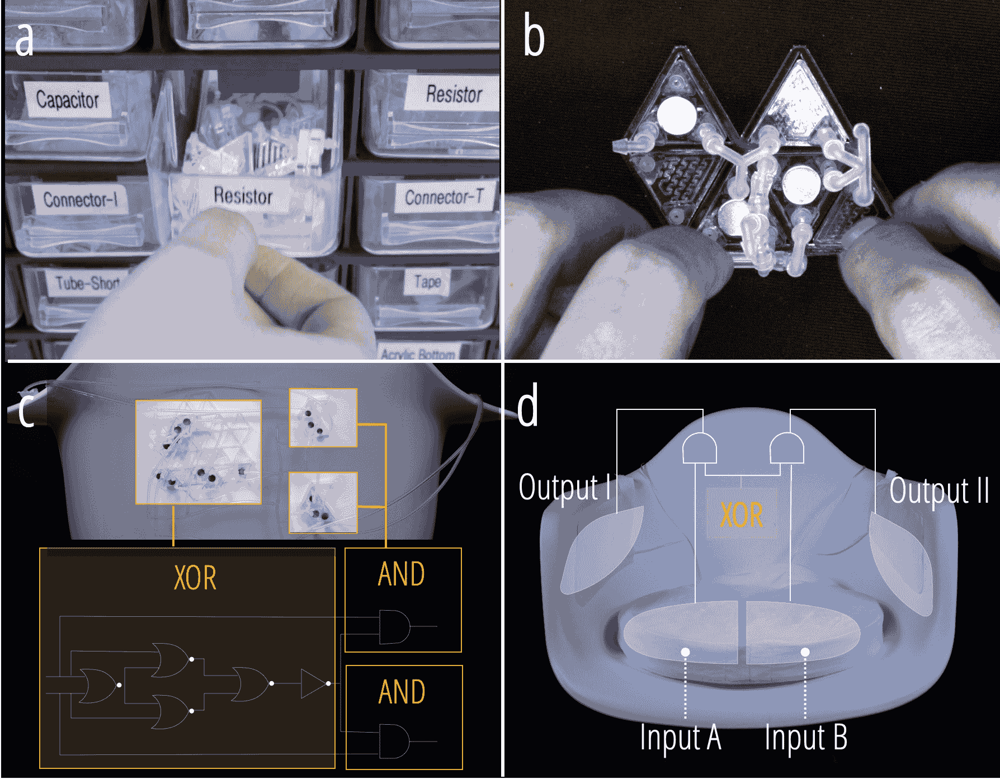

Figure 1\. Building an interactive sitting posture correction chair using the Fluidic Computation Kit involves: a) Selecting the basic components; b) Assembling operators by wiring the components; c) Constructing the circuit with operators based on the logic; and d) Preparing and integrating input/output airbags with the circuit into the chair. (Permission granted from the authors)

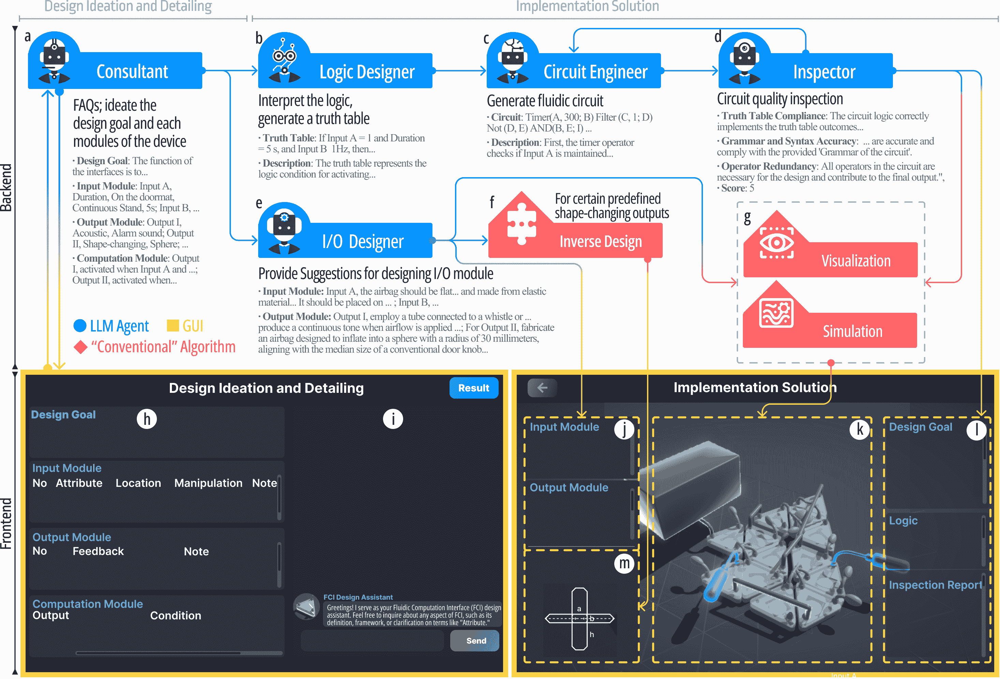

Figure 2\. The GDT’s overview. Sections a-g constitute the backend, which includes LLM agents and conventional algorithms. Sections h-m represent the frontend, utilized by users interacting with the GDT. The Consultant agent (a) and the first tab of the GUI (h,j) are dedicated to assisting with the design ideation and detailing phase. The remaining components are focused on the solution implementation phase. Some text within the GUI has been enlarged to enhance readability. The heat-sealing pattern for the output module (m) will be provided when the type of output is shape-changing, and the shape is associated with an inverse design algorithm.

\Description

- Input: This part consists of airbags that detect changes in internal air pressure caused by external forces. These changes shift the input signal between atmospheric (0) and positive (1), enabling detection of force presence, duration, frequency, and sudden variations.

- Computation: The fluidic circuit processes air pressure inputs through predetermined logic, generating output signals. It uses basic computational components (in triangle form) and operators created by combining these components.

- Output: The output provides feedback in various forms, such as shape-change, haptic, olfactory, and acoustic feedback, all driven by airflow.

## 4\. Designing with the GDT

Figure 3\. The user flow for designing with Fluid Computation GDT includes: (1) Greeting the Consultant and freely asking for explanations to learn about FCI. (2) Setting the design goal with the help of ideation. (3) Defining the input, output, and computation modules with the Consultant’s guidance and recommendations. (4) Confirming the design definition and previewing the generated fluid computation system; clicking the input module to see the animated demonstration of control logic.

### 4.1\. Overview

The GDT’s architecture, shown in Fig. [2](https://arxiv.org/html/2405.17837v3#S3.F2 "Figure 2 ‣ 3\. Background Knowledge on FCI ‣ Enabling Generative Design Tools with LLM Agents for Mechanical Computation Devices: A Case Study"), includes typical elements of specialized design tools, such as parametric design, rendering previews, and simulations. However, unlike conventional tools that completely rely on users to create design goals (DGs) and manually adjust parameters or use drag-and-drop modules, this GDT, enhanced with LLM agents, can assist or even automate these tasks. The following LLM agents are integrated into this GDT:

- Consultant (Fig. [2](https://arxiv.org/html/2405.17837v3#S3.F2 "Figure 2 ‣ 3\. Background Knowledge on FCI ‣ Enabling Generative Design Tools with LLM Agents for Mechanical Computation Devices: A Case Study").a): This agent possesses comprehensive knowledge of FCI’s capabilities and limitations. It answers FCI-related questions, helps define DGs, and assists in deciding design details. Users interact with it via a GUI dialogue box (Fig. [2](https://arxiv.org/html/2405.17837v3#S3.F2 "Figure 2 ‣ 3\. Background Knowledge on FCI ‣ Enabling Generative Design Tools with LLM Agents for Mechanical Computation Devices: A Case Study").i), and it provides real-time updates on the GUI (Fig. [2](https://arxiv.org/html/2405.17837v3#S3.F2 "Figure 2 ‣ 3\. Background Knowledge on FCI ‣ Enabling Generative Design Tools with LLM Agents for Mechanical Computation Devices: A Case Study").h). The DG will also be displayed in the solution window (Fig. [2](https://arxiv.org/html/2405.17837v3#S3.F2 "Figure 2 ‣ 3\. Background Knowledge on FCI ‣ Enabling Generative Design Tools with LLM Agents for Mechanical Computation Devices: A Case Study").l).

- Logic Designer, Circuit Engineer, Inspector (Fig. [2](https://arxiv.org/html/2405.17837v3#S3.F2 "Figure 2 ‣ 3\. Background Knowledge on FCI ‣ Enabling Generative Design Tools with LLM Agents for Mechanical Computation Devices: A Case Study").b-d): These agents manage the design of the computation module. The Logic Designer analyzes details from the Consultant and produces computational logic in a standard format. The Circuit Engineer, familiar with FCI operators, selects the appropriate ones to complete the circuit design. The Inspector checks the circuit for correctness and conciseness, determining if it needs revisions. Approved designs are visualized and simulated on the GUI (Fig. [2](https://arxiv.org/html/2405.17837v3#S3.F2 "Figure 2 ‣ 3\. Background Knowledge on FCI ‣ Enabling Generative Design Tools with LLM Agents for Mechanical Computation Devices: A Case Study").g, k), with users referencing the visualization to build the FCI circuit. Input and output modules are qualitatively visualized. The logic and inspection report will be displayed at Fig. [2](https://arxiv.org/html/2405.17837v3#S3.F2 "Figure 2 ‣ 3\. Background Knowledge on FCI ‣ Enabling Generative Design Tools with LLM Agents for Mechanical Computation Devices: A Case Study").l.

- I/O Designer (Fig. [2](https://arxiv.org/html/2405.17837v3#S3.F2 "Figure 2 ‣ 3\. Background Knowledge on FCI ‣ Enabling Generative Design Tools with LLM Agents for Mechanical Computation Devices: A Case Study").e): This agent designs the I/O module, including components like airbags for detecting inputs or providing output feedback. Based on details from the Consultant and its knowledge of the FCI, the I/O Designer offers primarily qualitative design suggestions. For predefined output shapes, such as airbags, it will try to provide quantitative geometry (e.g., sphere diameter). Qualitative suggestions are displayed directly in the GUI (Fig. [2](https://arxiv.org/html/2405.17837v3#S3.F2 "Figure 2 ‣ 3\. Background Knowledge on FCI ‣ Enabling Generative Design Tools with LLM Agents for Mechanical Computation Devices: A Case Study").m), while quantitative recommendations are processed via inverse design algorithms to generate heat-sealing patterns and dimensions for user review (Fig. [2](https://arxiv.org/html/2405.17837v3#S3.F2 "Figure 2 ‣ 3\. Background Knowledge on FCI ‣ Enabling Generative Design Tools with LLM Agents for Mechanical Computation Devices: A Case Study").m).

### 4.2\. Walkthrough

In this subsection, we provide a design walkthrough demonstrating the use of the GDT to create a smart yoga pad (Fig. [3](https://arxiv.org/html/2405.17837v3#S4.F3 "Figure 3 ‣ 4\. Designing with the GDT ‣ Enabling Generative Design Tools with LLM Agents for Mechanical Computation Devices: A Case Study")).

Set Design Goal (Fig. [3](https://arxiv.org/html/2405.17837v3#S4.F3 "Figure 3 ‣ 4\. Designing with the GDT ‣ Enabling Generative Design Tools with LLM Agents for Mechanical Computation Devices: A Case Study").2). After the introduction, the Consultant helps Emily define her DG, reassuring her that detailed ideas are unnecessary since the bot can assist in developing them. Emily expresses interest in creating a smart yoga pad. The Consultant proposes ideas like Posture Detection, Sequence Guide, and Breathing Aid. Inspired by these suggestions, Emily decides to proceed with detection and physical assistance for challenging poses, explaining: “If a user can’t reach the hand area during a pose, the mat will inflate to support, like a yoga block.” The Consultant also suggests detecting specific postures that are difficult for beginners, such as the Triangle Pose. With the goal confirmed, Emily moves to the next step.

Define Input Module (Fig. [3](https://arxiv.org/html/2405.17837v3#S4.F3 "Figure 3 ‣ 4\. Designing with the GDT ‣ Enabling Generative Design Tools with LLM Agents for Mechanical Computation Devices: A Case Study").3). With the DG set, the Consultant assists in defining the Input Module for the yoga pad. The Input Modules are airbags that detect external forces, triggering pressure changes that shift the input signal from atmospheric (0) to positive (1). Each input is defined by three main properties along with an optional comment note:

*   •

    Attribute: Defines the signal state as Binary (0 or 1), Duration (time in each state), Frequency (transition rate), and Edge (moment of transition).

*   •

    Location: Specifies where input airbags are placed, e.g., under feet, on vehicle sides, or within a seatbelt.

*   •

    Manipulation: Describes interactions with the airbags, such as squeezing, stepping, pressing, or twisting.

*   •

    Note (Optional): Adds extra details, like specific frequency or duration values.

In this walkthrough, the Consultant suggests two inputs: Input A to detect hand presence at a specific area on the pad, corresponding to the expected posture, and Input B to detect foot presence, confirming the user is on the pad. Both inputs are initially set to binary. Emily requests duration detection for foot Input to avoid false activation, and the \textit{Consultant} adjusts the setting, asking for Emily’s confirmation.

Define Output Module (Fig. [3](https://arxiv.org/html/2405.17837v3#S4.F3 "Figure 3 ‣ 4\. Designing with the GDT ‣ Enabling Generative Design Tools with LLM Agents for Mechanical Computation Devices: A Case Study").3). After confirming the input module, the Consultant moves to defining the output Module, presenting options like shape-changing, haptic, olfactory, and acoustic feedback, aligned with the capabilities of FCI. Given the goal of providing physical assistance when the user’s hand can not reach the mat, the Consultant suggests setting Output I to Shape-changing Feedback, which inflates to form a supportive air block when hand support is needed. Emily is satisfied with the result and confirms it. Additionally, the Consultant recommends a box shape output with dimensions of 23 × 15 × 7.5 cm, similar to a yoga brick.

Define Computation Module (Fig. [3](https://arxiv.org/html/2405.17837v3#S4.F3 "Figure 3 ‣ 4\. Designing with the GDT ‣ Enabling Generative Design Tools with LLM Agents for Mechanical Computation Devices: A Case Study").3). The Consultant explains that Output I is triggered when Input B detects continuous foot pressure, but Input A does not detect hand presence for 30 seconds. This ensures the yoga pad provides assistance during the Triangle Pose when hand support is needed. After Emily confirms the logic, the Consultant informs her that the design definition is complete and asks if she wishes to finalize the design or make adjustments.

Preview and interact with the generated device (Fig. [3](https://arxiv.org/html/2405.17837v3#S4.F3 "Figure 3 ‣ 4\. Designing with the GDT ‣ Enabling Generative Design Tools with LLM Agents for Mechanical Computation Devices: A Case Study").4). After reviewing the design description, Emily clicks the “Result” button to view the implementation solution. This interface includes the DG, logic, inspection report, 3D models of the hardware, and detailed suggestions for the I/O Module, such as the fabrication pattern of the Output module. Emily can interact with the each input module to change its state and preview the corresponding output changes (Fig. [3](https://arxiv.org/html/2405.17837v3#S4.F3 "Figure 3 ‣ 4\. Designing with the GDT ‣ Enabling Generative Design Tools with LLM Agents for Mechanical Computation Devices: A Case Study").4.1). With the model and description, Emily is ready to assemble the fluidic circuit, fabricate inflatable airbags (Fig. [3](https://arxiv.org/html/2405.17837v3#S4.F3 "Figure 3 ‣ 4\. Designing with the GDT ‣ Enabling Generative Design Tools with LLM Agents for Mechanical Computation Devices: A Case Study").4.2), and integrate the FCI into a real-world application.

## 5\. Performance

In this section, we evaluate the GDT’s performance with a particular focus on two key aspects: its ability to propose DGs and its capacity to realize them. During the experiments, we provided only basic prompts, such as asking the tool to propose DGs, requiring it to independently complete each component’s design, and requesting a check after each design.

### 5.1\. Performance in Proposing Design Goals

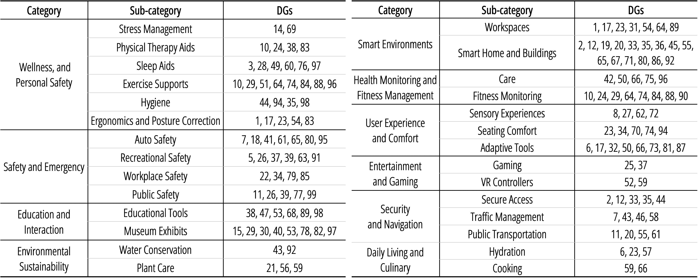

Figure 4\. Categorization of the one hundred design goals proposed by the GDT, based on their application scenarios.

\Description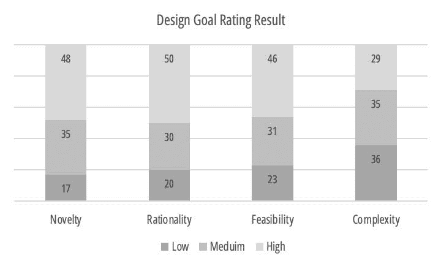

Figure 5\. Rating result of the one hundred design goals.

\Description

We designed the Consultant to ensure that when proposing DGs, it includes the function, necessary inputs and feedback. Overall, the GDT consistently provided DGs that met these criteria. It was tasked with generating 100 DGs, delivering 10 at a time over 10 sessions. The full list of DGs is available in the Supplementary Material. First, we evaluated the variety of these goals, categorizing them by application scenarios (Fig. [4](https://arxiv.org/html/2405.17837v3#S5.F4 "Figure 4 ‣ 5.1\. Performance in Proposing Design Goals ‣ 5\. Performance ‣ Enabling Generative Design Tools with LLM Agents for Mechanical Computation Devices: A Case Study")). This categorization covers ten major categories and twenty-four subcategories, demonstrating significant diversity. Next, we evaluated the DGs based on four criteria:

Novelty: This criterion evaluates the uniqueness and innovation of the application scenario, focusing on how original the design is compared to existing literature and other DGs proposed by the GDT. For example, a design like “…an encrypted door latch responding to a specific sequence of steps with a particular frequency…(DG2)” lacks novelty due to its similarity to previous works. In contrast, “…promoting an interactive learning environment by detecting edge transitions in pressure on a classroom floor…(DG89)” stands out as novel, being both unique and without similar applications in the experts’ knowledge or other proposed DGs.

Rationality: This criterion assesses the logical foundation and appropriateness of the design’s function within its intended scenario, ensuring the feedback or interaction is coherent and suited for its purpose. For example, “…ensure driver attentiveness by detecting the frequency of steering wheel manipulation…(DG16)” is considered irrational due to a weak correlation between the elements. In contrast, “…encourage hydration during exercise by detecting the absence of bottle squeezing and producing an olfactory reminder…(DG49)” is considered more rational.

Feasibility: This criterion assesses the likelihood of the proposed interface being practically realized using the kit. For instance, “…sensing the rising and falling edges of ambient noise pressure on sound-absorbing panels…(DG79)” is deemed infeasible due to the lack of technology capable of discerning noise levels.

Complexity: This criterion measures the complexity of the DGs, considering the number of inputs, outputs, and computational logic. Experts assess whether a) multiple inputs or outputs are required, and b) the computation demands more than simple one-to-one logic or cascading operators. A design is classified as low complexity if neither condition is met, medium complexity if one condition is met, and high complexity if both are met.

The scoring results for the 100 DGs are shown in Fig. [5](https://arxiv.org/html/2405.17837v3#S5.F5 "Figure 5 ‣ 5.1\. Performance in Proposing Design Goals ‣ 5\. Performance ‣ Enabling Generative Design Tools with LLM Agents for Mechanical Computation Devices: A Case Study"). Medium or high novelty was observed in 83% of the DGs, while complexity was evenly distributed across the three levels. Rationality and Feasibility, critical for realizing DGs, showed that about 80% scored medium or higher in both. For DGs scoring low in Rationality or Feasibility, we conducted additional tests by feeding them back to the GDT with a prompt explaining these criteria, asking for optimization. After re-evaluation by experts, the number of DGs scoring low dropped from 20 to 7 in Rationality and from 23 to 4 in Feasibility.

### 5.2\. Performance in Realizing Design Goals

From the pool of DGs with high novelty and medium or higher Rationality/Feasibility, we selected nine DGs—three from each complexity level. The GDT was tasked with creating three designs per DG, resulting in 27 designs. The selected outcomes are illustrated in Fig. [6](https://arxiv.org/html/2405.17837v3#S5.F6 "Figure 6 ‣ 5.2.2\. Design Process ‣ 5.2\. Performance in Realizing Design Goals ‣ 5\. Performance ‣ Enabling Generative Design Tools with LLM Agents for Mechanical Computation Devices: A Case Study"), [7](https://arxiv.org/html/2405.17837v3#S5.F7 "Figure 7 ‣ 5.2.2\. Design Process ‣ 5.2\. Performance in Realizing Design Goals ‣ 5\. Performance ‣ Enabling Generative Design Tools with LLM Agents for Mechanical Computation Devices: A Case Study"), and [8](https://arxiv.org/html/2405.17837v3#S5.F8 "Figure 8 ‣ 5.2.2\. Design Process ‣ 5.2\. Performance in Realizing Design Goals ‣ 5\. Performance ‣ Enabling Generative Design Tools with LLM Agents for Mechanical Computation Devices: A Case Study"). Due to space limitations, we detailed 9 of these designs. We evaluated their accuracy and highlighted both strengths and challenges encountered during the design process.

#### 5.2.1\. Accuracy

Experts evaluated design accuracy based on whether the FCI design result could achieve the DGs. Accuracy was higher in designs with low to medium complexity (Fig. [6](https://arxiv.org/html/2405.17837v3#S5.F6 "Figure 6 ‣ 5.2.2\. Design Process ‣ 5.2\. Performance in Realizing Design Goals ‣ 5\. Performance ‣ Enabling Generative Design Tools with LLM Agents for Mechanical Computation Devices: A Case Study"), [7](https://arxiv.org/html/2405.17837v3#S5.F7 "Figure 7 ‣ 5.2.2\. Design Process ‣ 5.2\. Performance in Realizing Design Goals ‣ 5\. Performance ‣ Enabling Generative Design Tools with LLM Agents for Mechanical Computation Devices: A Case Study")) but declined with high-complexity designs (Fig. [8](https://arxiv.org/html/2405.17837v3#S5.F8 "Figure 8 ‣ 5.2.2\. Design Process ‣ 5.2\. Performance in Realizing Design Goals ‣ 5\. Performance ‣ Enabling Generative Design Tools with LLM Agents for Mechanical Computation Devices: A Case Study")).

#### 5.2.2\. Design Process

We summarized the pros and cons observed in the design process, categorized by the steps following the establishment of a DG.

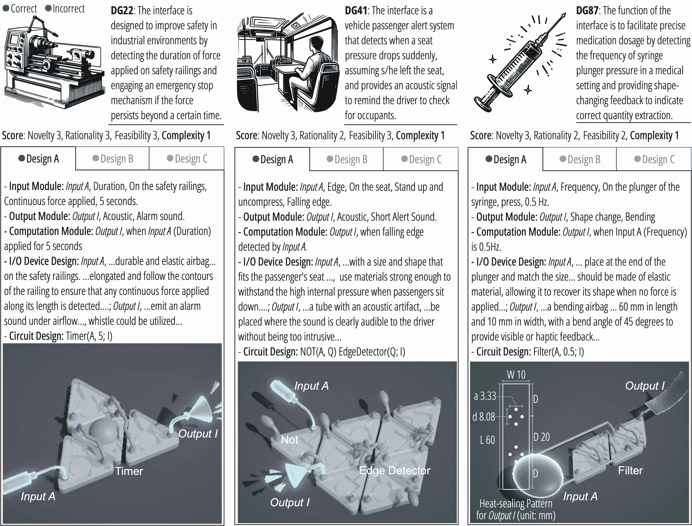

Figure 6\. Selected design outcomes for three low-complexity Design Goals (DGs). For DG87-A, the LLM agents opted for a bending shape-changing output, a predefined shape supported by a corresponding inverse design algorithm. Consequently, the GDT provided a heat-sealing pattern, with its dimensions calculated according to the bending strip dimensions suggested by the agent.

\Description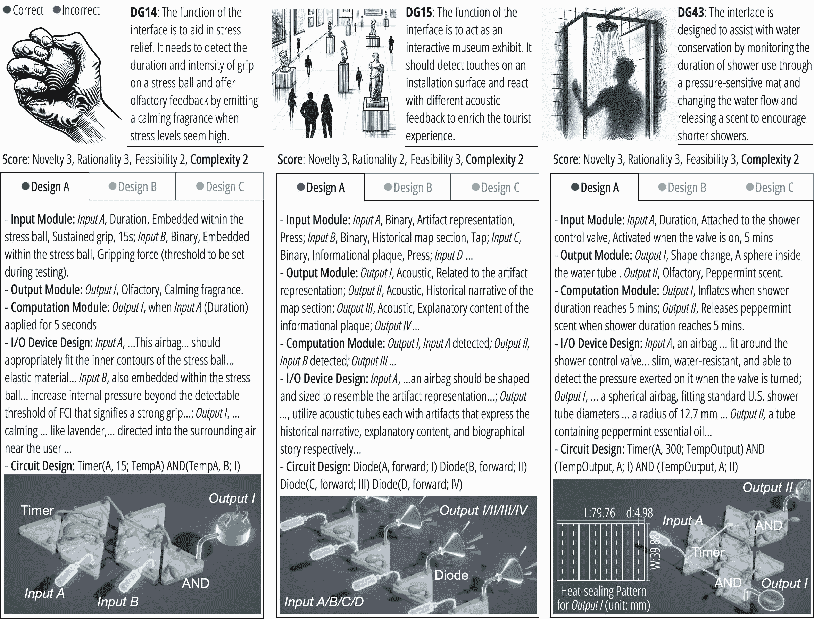

Figure 7\. Selected design outcomes for three medium-complexity DGs. For DG15-A, The circuit was deemed faulty because the input airbag can only provide a signal and cannot supply a continuous airflow. The diode should be replaced with two NOT gates.

\Description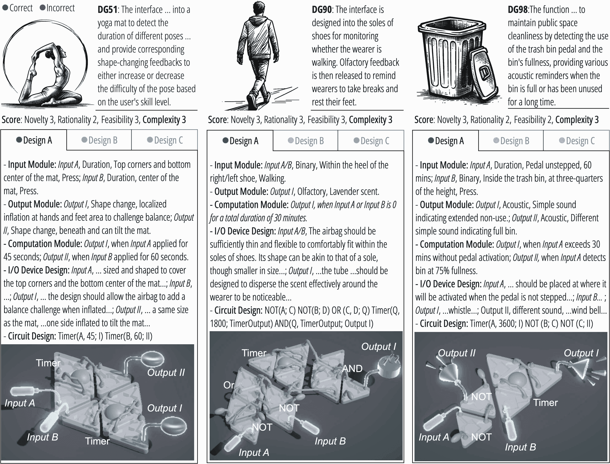

Figure 8\. Selected design outcomes for three high-complexity DGs. DG90-B was unsuccessful in proposing a logical rationale to distinguish between walking and standing. DG98-B did not propose a feasible solution for detecting when the trash pedal is not stepped on. Furthermore, both DG98-B and DG98-C did not offer a viable location for placing the Input B airbag to detect when it is 75% full.

\Description

I. Defining Input/Output Module. Overall, the agent effectively determines the appropriate number and form of inputs/outputs (I/O) based on the DG. For example, “Given the design goal of facilitating precise medication dosage…, it’s appropriate to have a single output module corresponding to the single input… (Fig. [6](https://arxiv.org/html/2405.17837v3#S5.F6 "Figure 6 ‣ 5.2.2\. Design Process ‣ 5.2\. Performance in Realizing Design Goals ‣ 5\. Performance ‣ Enabling Generative Design Tools with LLM Agents for Mechanical Computation Devices: A Case Study"), DG87).” When the DG lacks explicit details on I/O, the agent infers reasonable decisions from the context, such as “…to distinguish between standing still and walking, we could use the Frequency attribute to detect pressure changes in the sole (Fig. [8](https://arxiv.org/html/2405.17837v3#S5.F8 "Figure 8 ‣ 5.2.2\. Design Process ‣ 5.2\. Performance in Realizing Design Goals ‣ 5\. Performance ‣ Enabling Generative Design Tools with LLM Agents for Mechanical Computation Devices: A Case Study"), DG90).” This DG does not specify what to detect for determining walking, yet the agent thoughtfully decides on a rational input design. Similarly, for a yoga mat design, “ we’ll define inputs based on common poses and the areas of the mat detecting pressure during those poses. For a basic yoga session, we can plan for two inputs: Input A for Downward Dog, detecting pressure on the hands and feet, and Input B for Seated Forward Bend, detecting pressure at the center of the mat (sit bones). The input attribute would be Duration, measuring how long the pose is held, with the manipulation being the sustained press of the body against the mat. (Fig. [8](https://arxiv.org/html/2405.17837v3#S5.F8 "Figure 8 ‣ 5.2.2\. Design Process ‣ 5.2\. Performance in Realizing Design Goals ‣ 5\. Performance ‣ Enabling Generative Design Tools with LLM Agents for Mechanical Computation Devices: A Case Study"), DG51).” The agent explains the number of inputs, their Location, and Manipulation attributes. When an I/O form in DGs seems impractical, the agent can also proactively adjust, as in “In an industrial setting, haptic or acoustic feedback may be more suitable than shape-changing mechanisms, which could interrupt operations (Fig. [6](https://arxiv.org/html/2405.17837v3#S5.F6 "Figure 6 ‣ 5.2.2\. Design Process ‣ 5.2\. Performance in Realizing Design Goals ‣ 5\. Performance ‣ Enabling Generative Design Tools with LLM Agents for Mechanical Computation Devices: A Case Study"), DG22).”

We also instruct the Consultant to determine values for certain Input Attributes, such as Frequency and Duration. The agent often provides reasonable suggestions, like “in a medical setting where precise dosage is critical, a lower syringe plunger pressure frequency, around 0.5 Hz, would allow for careful measurement… (Fig. [6](https://arxiv.org/html/2405.17837v3#S5.F6 "Figure 6 ‣ 5.2.2\. Design Process ‣ 5.2\. Performance in Realizing Design Goals ‣ 5\. Performance ‣ Enabling Generative Design Tools with LLM Agents for Mechanical Computation Devices: A Case Study"), DG87)” or “…tracks the duration that the shower mat is under pressure, with a default threshold of 5 minutes, aligning with environmental recommendations. (Fig. [7](https://arxiv.org/html/2405.17837v3#S5.F7 "Figure 7 ‣ 5.2.2\. Design Process ‣ 5.2\. Performance in Realizing Design Goals ‣ 5\. Performance ‣ Enabling Generative Design Tools with LLM Agents for Mechanical Computation Devices: A Case Study"), DG43).” Similarly, for Output Feedback, the agent suggests appropriate feedback types, such as “The scent should have calming properties, like lavender or chamomile… (Fig. [7](https://arxiv.org/html/2405.17837v3#S5.F7 "Figure 7 ‣ 5.2.2\. Design Process ‣ 5.2\. Performance in Realizing Design Goals ‣ 5\. Performance ‣ Enabling Generative Design Tools with LLM Agents for Mechanical Computation Devices: A Case Study"), DG14).”

While the agent often provides appropriate values initially, it doesn’t always get them right on the first attempt. However, prompt- ing a self-check can usually correct such errors. For example, the frequency was first set at 5 Hz, then adjusted to 0.5 Hz after a self-check (Fig. [6](https://arxiv.org/html/2405.17837v3#S5.F6 "Figure 6 ‣ 5.2.2\. Design Process ‣ 5.2\. Performance in Realizing Design Goals ‣ 5\. Performance ‣ Enabling Generative Design Tools with LLM Agents for Mechanical Computation Devices: A Case Study"), DG87). Occasionally, the agent overlooks the limitations of the fluidic computation kit, particularly with acoustic feedback, as seen in ”Output II, Acoustic, Historical narrative of the map section (Fig. [7](https://arxiv.org/html/2405.17837v3#S5.F7 "Figure 7 ‣ 5.2.2\. Design Process ‣ 5.2\. Performance in Realizing Design Goals ‣ 5\. Performance ‣ Enabling Generative Design Tools with LLM Agents for Mechanical Computation Devices: A Case Study"), DG15).” This oversight could be due to the descriptions of available sound feedback forms in the knowledge base not being sufficiently clear to the agent.

II. Defining Computation Module. For DGs with medium complexity and below, the agent generally proposes computation logic that aligns with the DG. For example, ”Given our design goal…, the output should be triggered when the input detects a falling edge, indicating a sudden drop in seat pressure. Thus, the condition for activating the acoustic feedback is when a falling edge is detected by Input A (Fig. [6](https://arxiv.org/html/2405.17837v3#S5.F6 "Figure 6 ‣ 5.2.2\. Design Process ‣ 5.2\. Performance in Realizing Design Goals ‣ 5\. Performance ‣ Enabling Generative Design Tools with LLM Agents for Mechanical Computation Devices: A Case Study"), DG41).”

However, for DGs with high complexity, the agent begins to encounter errors more frequently. For example, ”if input A detects that the Downward Dog pose is held for less than 30 seconds, it suggests the user is a beginner, and Output I will inflate for support. If held for more than 60 seconds, it indicates a higher skill level, and Output I will deflate to increase difficulty… (Fig. [8](https://arxiv.org/html/2405.17837v3#S5.F8 "Figure 8 ‣ 5.2.2\. Design Process ‣ 5.2\. Performance in Realizing Design Goals ‣ 5\. Performance ‣ Enabling Generative Design Tools with LLM Agents for Mechanical Computation Devices: A Case Study"), DG51).” The flaw here is assuming all users are beginners within the first 30 seconds, regardless of skill level. Typically, allowing the agent to perform a self-check can correct such errors: ”if input A detects the Downward Dog pose for more than 45 seconds, it indicates a higher skill level, and Output I will deflate to increase difficulty (Fig. [8](https://arxiv.org/html/2405.17837v3#S5.F8 "Figure 8 ‣ 5.2.2\. Design Process ‣ 5.2\. Performance in Realizing Design Goals ‣ 5\. Performance ‣ Enabling Generative Design Tools with LLM Agents for Mechanical Computation Devices: A Case Study"), DG51).”

III. I/O Module Design. In terms of the input module, the corresponding agent typically provides accurate qualitative information, including the design (size, shape, material) of the airbag as an input device and its placement. For example, ”The airbag should be sufficiently thin and flexible to comfortably fit within the soles of shoes, with a shape similar to a sole but smaller in size. (Fig. [8](https://arxiv.org/html/2405.17837v3#S5.F8 "Figure 8 ‣ 5.2.2\. Design Process ‣ 5.2\. Performance in Realizing Design Goals ‣ 5\. Performance ‣ Enabling Generative Design Tools with LLM Agents for Mechanical Computation Devices: A Case Study"), DG90),” ”…the airbag should be made of elastic material, allowing it to recover its shape when no force is applied, catering to the ’Frequency’ attribute’s need for resiliency… (Fig. [6](https://arxiv.org/html/2405.17837v3#S5.F6 "Figure 6 ‣ 5.2.2\. Design Process ‣ 5.2\. Performance in Realizing Design Goals ‣ 5\. Performance ‣ Enabling Generative Design Tools with LLM Agents for Mechanical Computation Devices: A Case Study"), DG87),” and ”…design an airbag sized and shaped to cover the top corners and bottom center of the yoga mat… (DG51).” However, we observed a weakness in understanding spatial distribution, as the agent does not actively avoid interference between multiple input devices in the same space, as shown by ”For Input A, …This airbag… should appropriately fit the inner contours of the stress ball… For Input B, another airbag embedded within the stress ball is needed to detect binary gripping force… (Fig. [6](https://arxiv.org/html/2405.17837v3#S5.F6 "Figure 6 ‣ 5.2.2\. Design Process ‣ 5.2\. Performance in Realizing Design Goals ‣ 5\. Performance ‣ Enabling Generative Design Tools with LLM Agents for Mechanical Computation Devices: A Case Study"), DG14).”

Regarding the output module, the agent generally provides suitable qualitative suggestions as well. For instance, ”For Output I, a tube designed to emit an alarm sound under airflow is needed. A pneumatic whistle could be utilized… (Fig. [6](https://arxiv.org/html/2405.17837v3#S5.F6 "Figure 6 ‣ 5.2.2\. Design Process ‣ 5.2\. Performance in Realizing Design Goals ‣ 5\. Performance ‣ Enabling Generative Design Tools with LLM Agents for Mechanical Computation Devices: A Case Study"), DG22)” and ”…for olfactory feedback, a tube imbued with a refreshing scent, filled with essential oils known for their invigorating properties, should release the scent into the shower area (Fig. [7](https://arxiv.org/html/2405.17837v3#S5.F7 "Figure 7 ‣ 5.2.2\. Design Process ‣ 5.2\. Performance in Realizing Design Goals ‣ 5\. Performance ‣ Enabling Generative Design Tools with LLM Agents for Mechanical Computation Devices: A Case Study"), DG43).” For ”Shape-changing Feedback” that matches preset shapes in the knowledge base, we tasked the agent with quantifying relevant geometry based on the context. The agent performs well in these tasks, as shown by ”Since Output I is an airbag that inflates inside the water tube to partially obstruct flow after 5 minutes of shower use, its design must allow for expansion to effectively regulate water flow. A spherical airbag, fitting standard U.S. shower tube diameters, with a radius of 12.7 mm (0.5 inches), is optimal, significantly reducing but not stopping the flow (Fig. [8](https://arxiv.org/html/2405.17837v3#S5.F8 "Figure 8 ‣ 5.2.2\. Design Process ‣ 5.2\. Performance in Realizing Design Goals ‣ 5\. Performance ‣ Enabling Generative Design Tools with LLM Agents for Mechanical Computation Devices: A Case Study"), DG43)” and ”Given the unspecified syringe type, for common usage, a bending airbag could measure 60 mm in length and 10 mm in width, with a bend angle of 45 degrees, attachable to the syringe’s label area (Fig. [6](https://arxiv.org/html/2405.17837v3#S5.F6 "Figure 6 ‣ 5.2.2\. Design Process ‣ 5.2\. Performance in Realizing Design Goals ‣ 5\. Performance ‣ Enabling Generative Design Tools with LLM Agents for Mechanical Computation Devices: A Case Study"), DG87).”

Inverse design for obtaining the airbag’s heat-seal pattern is consistently accurate, as seen in ”L: 79.76 mm, W: 39.88 mm, d=4.98 (Fig. [8](https://arxiv.org/html/2405.17837v3#S5.F8 "Figure 8 ‣ 5.2.2\. Design Process ‣ 5.2\. Performance in Realizing Design Goals ‣ 5\. Performance ‣ Enabling Generative Design Tools with LLM Agents for Mechanical Computation Devices: A Case Study"), DG43)” and ”L: 60 mm, W: 10 mm, a: 3.33 mm, d: 8.08 mm, D: 20 mm, n: 2 (Fig. [6](https://arxiv.org/html/2405.17837v3#S5.F6 "Figure 6 ‣ 5.2.2\. Design Process ‣ 5.2\. Performance in Realizing Design Goals ‣ 5\. Performance ‣ Enabling Generative Design Tools with LLM Agents for Mechanical Computation Devices: A Case Study"), DG87).” However, we noted a shortfall in accurately identifying more intricate spatial relationships and physical interactions. For example, DG98 (Fig. [8](https://arxiv.org/html/2405.17837v3#S5.F8 "Figure 8 ‣ 5.2.2\. Design Process ‣ 5.2\. Performance in Realizing Design Goals ‣ 5\. Performance ‣ Enabling Generative Design Tools with LLM Agents for Mechanical Computation Devices: A Case Study")) demonstrated the agent’s difficulty in determining the appropriate placement for the input airbag, which was crucial for detecting bin fullness.

IV. Computation Module Design. This task is collaboratively completed by the Logic Designer, Circuit Engineer, and Inspector. The Logic Designer accurately transcribes and standardizes the DG and module design information into a ”truth table” and demonstrates the ability to refine computation logic. For example, ”If the duration of A or B being 0 is ¡ 30 minutes, then Output I = 0; If the total duration of A or B being 0 is ¿= 30 minutes and A or B = 0, then Output I = 1 (Fig. [8](https://arxiv.org/html/2405.17837v3#S5.F8 "Figure 8 ‣ 5.2.2\. Design Process ‣ 5.2\. Performance in Realizing Design Goals ‣ 5\. Performance ‣ Enabling Generative Design Tools with LLM Agents for Mechanical Computation Devices: A Case Study"), DG90),” where the Logic Designer introduces additional AND logic to ensure the output is activated only when the walking duration exceeds the specified time and the subject is still walking.

The Circuit Engineer performs well in designing circuits for DGs with medium or lower complexity but may introduce errors in high-complexity DGs. For example, ”OR (A, B; Q) Timer(Q, 1800; TimerOutput) AND(Q, TimerOutput; Output I) (Fig. [8](https://arxiv.org/html/2405.17837v3#S5.F8 "Figure 8 ‣ 5.2.2\. Design Process ‣ 5.2\. Performance in Realizing Design Goals ‣ 5\. Performance ‣ Enabling Generative Design Tools with LLM Agents for Mechanical Computation Devices: A Case Study"), DG90)” contains a mistake where Input A is not inverted, causing incorrect detection when A is pressed. In such cases, the Inspector identifies the errors and suggests corrections, ”The truth table specifications are not fully met by the current circuit description… an inversion of Input A and Input B’s condition is required…, ’circuit’: NOT(A; C) NOT(B; D) OR (C, D; Q) Timer(Q, 1800; TimerOutput) AND(Q, TimerOutput; Output I) (Fig. [8](https://arxiv.org/html/2405.17837v3#S5.F8 "Figure 8 ‣ 5.2.2\. Design Process ‣ 5.2\. Performance in Realizing Design Goals ‣ 5\. Performance ‣ Enabling Generative Design Tools with LLM Agents for Mechanical Computation Devices: A Case Study"), DG90).”

## 6\. Implementation

In this section, we detail the implementation specifics of our GDT.

### 6.1\. The Technical Architecture

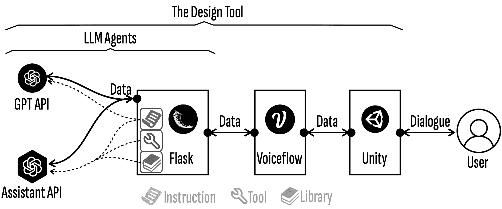

Figure 9\. The technical architecture of GDT.

\Description

The architecture, illustrated in Fig. [9](https://arxiv.org/html/2405.17837v3#S6.F9 "Figure 9 ‣ 6.1\. The Technical Architecture ‣ 6\. Implementation ‣ Enabling Generative Design Tools with LLM Agents for Mechanical Computation Devices: A Case Study"), integrates OpenAI APIs (GPT4-preview), Voiceflow, Flask, and Unity. Unity handles the front-end, while Voiceflow, Flask, and OpenAI APIs manage the back-end, enabling the collaborative workflow of LLM agents.

Agents are powered by Flask and OpenAI APIs. Flask, a lightweight Python web framework, facilitates API development, request handling, data post-processing, and serves as the integration layer. Resources such as instructions, libraries, and tools are hosted on Flask and relayed to OpenAI APIs during agent initialization.

We use two distinct OpenAI APIs: GPT and Assistant. The Assistant API differs by enabling tool use, maintaining contextual memory, and consulting a knowledge base (the Library), though it incurs higher token usage. The choice between GPT and Assistant depends on task complexity. For basic tasks like those of the Logic Designer and Inspector, the GPT API is ideal for its simplicity. For more complex roles, such as the Consultant, I/O Designer, and Circuit Engineer, the Assistant API’s advanced features are more advantageous.

Flask assigns a specific port to each agent, acting as its unique ”address” within the public network for easy access by Voiceflow. These dedicated ports allow Voiceflow to facilitate communication between agents, enabling a smooth collaborative workflow. Voiceflow orchestrates agent interactions, while Unity (Version 2022.3.15) handles the front-end interface, monitoring exchanges via the Voiceflow API to ensure seamless user interaction. Along with managing conversations and displaying text-based results, Unity also integrates algorithms for visualizing and simulating the FCI.

### 6.2\. Configure LLM Agents

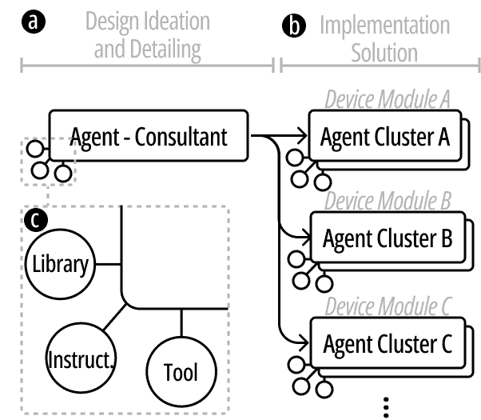

Figure 10\. A potential general agent collaboration framework. Our GDT consists the Consultant and two agent clusters (one for solving the computation module design, one for the I/O Modules).

\Description

#### 6.2.1\. Task Allocation for Multi-Agents

Assigning agents to focus on narrow, specific tasks typically leads to better outcomes (Li et al., [2024](https://arxiv.org/html/2405.17837v3#bib.bib34), [2023](https://arxiv.org/html/2405.17837v3#bib.bib36)). In the context of designing novel devices like FCIs, we organize and delegate tasks based on the following considerations:

Initially, we divide the design process into two main phases: Ideation & Detailing and Implementation Solution. The Ideation & Detailing phase requires a comprehensive qualitative understanding of the design space for the new technology (in this case, the FCI) and a macroscopic view of the design. This sub-task is assigned to a single agent (Consultant), which is guided to gather or propose sufficient design details (Fig. [10](https://arxiv.org/html/2405.17837v3#S6.F10 "Figure 10 ‣ 6.2\. Configure LLM Agents ‣ 6\. Implementation ‣ Enabling Generative Design Tools with LLM Agents for Mechanical Computation Devices: A Case Study").a).

The Implementation Solution phase focuses on the specific design of sub-modules within the device, requiring specialized, in-depth knowledge, which can be assigned to different clusters of agents (Fig. [10](https://arxiv.org/html/2405.17837v3#S6.F10 "Figure 10 ‣ 6.2\. Configure LLM Agents ‣ 6\. Implementation ‣ Enabling Generative Design Tools with LLM Agents for Mechanical Computation Devices: A Case Study").b). For the FCI, these modules are divided into Input, Output, and Computation. However, we found that some knowledge required for designing I/O modules is difficult to effectively communicate to LLM agents through natural language, and LLM agents tend to struggle with tasks involving structure, geometry, and space. As a result, we adjusted the expectations for these modules to primarily generate qualitative suggestions, simplifying the task for a single agent (I/O Designer).

For the Computation Module, since LLM has a foundation in electronic circuit design, we set the expectation to produce directly executable solutions. Following standard logic design practices (Dessouky et al., [2019](https://arxiv.org/html/2405.17837v3#bib.bib16); Blocklove et al., [2023](https://arxiv.org/html/2405.17837v3#bib.bib9)), we divide the task into Logic Analysis (Logic Designer), Circuit Generation (Circuit Engineer), and Circuit Inspection (Inspector), assigning these tasks to an agent cluster to optimize performance.

#### 6.2.2\. Qualifying Agents for Tasks

We primarily qualify agents for their assigned tasks through three resources: the Libraries, the Instruction, and the Tool (Fig. [10](https://arxiv.org/html/2405.17837v3#S6.F10 "Figure 10 ‣ 6.2\. Configure LLM Agents ‣ 6\. Implementation ‣ Enabling Generative Design Tools with LLM Agents for Mechanical Computation Devices: A Case Study").c).

I. Instructions are carefully crafted prompts that articulate the objectives and outline the expected method for the agent’s response. Detailed Instructions for each agent can be found in Appendix [A](https://arxiv.org/html/2405.17837v3#A1 "Appendix A Instructions ‣ Enabling Generative Design Tools with LLM Agents for Mechanical Computation Devices: A Case Study"). Proper organization of these Instructions is crucial to enhancing the agent’s effectiveness. To achieve this, we structure the Instructions into distinct sections, simplifying comprehension for the agents and easing maintenance for developers. Generally, the sections include:

*   •

    Role delineates the fundamental identity and capabilities of each agent, providing a clear directive like ”you are an electronic circuit engineer, your goal is …”.

*   •

    Input Interpretation enhances an agent’s comprehension of information received from others, ensuring accurate understanding and response.

*   •

    Resources serve as the agents’ memory, embedding task-specific knowledge relevant to their roles, such as ”I/O module design principles” for the I/O Designer. Another example is the Operator Description Language, created for the Circuit Engineer and Inspector (Appendix [A.4](https://arxiv.org/html/2405.17837v3#A1.SS4 "A.4\. Instructions for Circuit Engineer ‣ Appendix A Instructions ‣ Enabling Generative Design Tools with LLM Agents for Mechanical Computation Devices: A Case Study"), [A.5](https://arxiv.org/html/2405.17837v3#A1.SS5 "A.5\. Instructions for Inspector ‣ Appendix A Instructions ‣ Enabling Generative Design Tools with LLM Agents for Mechanical Computation Devices: A Case Study")), which efficiently conveys the assembly of FCI’s basic computational units. By digitizing analog operators like filters and timers, it reduces the agents’ cognitive load during circuit design. Information not immediately needed is stored in the Library and accessed by agents only when necessary, preventing the Instructions from becoming overwhelming or distracting.

*   •

    Tools convey to the agent the suite of functions it can utilize, presented more as an accessible list than detailed within the Instructions.

*   •

    Workflow provides a structured approach for task execution, guiding agents through complex activities. For instance, we offer a reference dialogue logic for the Consultant to ensure a comprehensive collection of design details.

*   •

    Attention section directs the agent’s focus to critical elements requiring extra scrutiny. For example, the I/O Designer is reminded to use specific functions for calculating the dimensions of the heat-sealing pattern when certain shapes are specified for the output module.

*   •

    Output Requirement delineates the anticipated format, categories, and constraints for the agent’s outputs. Setting these standards facilitates smoother communication among agents.

II. Library (Appendix [B](https://arxiv.org/html/2405.17837v3#A2 "Appendix B Library ‣ Enabling Generative Design Tools with LLM Agents for Mechanical Computation Devices: A Case Study")). In our context, the Library stores comprehensive knowledge about the FCI’s design space. The content, distilled and abstracted from academic papers (Lu et al., [2023b](https://arxiv.org/html/2405.17837v3#bib.bib40)), retains core information necessary for agents to understand FCI. It is meticulously organized and tagged to facilitate easy retrieval. The Library primarily covers the basic concepts and framework of FCI, along with detailed explanations of the input, output, and computation modules. Additionally, various examples for each module are included to enhance understanding.

III. Tools (Appendix [C](https://arxiv.org/html/2405.17837v3#A3 "Appendix C Tools ‣ Enabling Generative Design Tools with LLM Agents for Mechanical Computation Devices: A Case Study")) Tools primarily consist of functions that assist agents in executing specific tasks. For instance, the Consultant can use functions to save basic information to local JSON files after completing a module design, facilitating a smooth transition to the next design phase. Another set of tools includes inverse design functions for the output module when shapes like spheres, cylinders, boxes, folds, or bends are selected (Teng et al., [2018](https://arxiv.org/html/2405.17837v3#bib.bib66); Yang et al., [2024](https://arxiv.org/html/2405.17837v3#bib.bib79)) (Appendix [C.2](https://arxiv.org/html/2405.17837v3#A3.SS2 "C.2\. Tools for I/O Designer ‣ Appendix C Tools ‣ Enabling Generative Design Tools with LLM Agents for Mechanical Computation Devices: A Case Study")). The I/O Designer invokes the relevant function as needed.

#### 6.2.3\. Facilitating Agents Collaboration

To facilitate collaboration among agents, we implement standardized information formats for communication and ensure the agents receive necessary information only.

I. Standardized Information Formats. The use of well-defined structured information, such as Standardized Operating Procedures (SOPs) (Gourevitch and Morris, [2008](https://arxiv.org/html/2405.17837v3#bib.bib20)), has been shown to improve task consistency and accuracy (Qian et al., [2023](https://arxiv.org/html/2405.17837v3#bib.bib56); Hong et al., [2023](https://arxiv.org/html/2405.17837v3#bib.bib22)). Similarly, we require each agent to output information in a standardized JSON format to enhance cooperation and streamline information extraction. For example, the output from the Circuit Engineer should follow a format like {’circuit’: ’Filter(input, 3; output)’, ’description’: ’The Filter operator is used to …’}. This standardization enables circuit details to be extracted for visualization in Unity and evaluated by the Inspector.

II. Receive Necessary Information Only To avoid information overload and improve the efficiency of our agents, we ensure they receive only the information critical to their specific roles. Excessive, irrelevant data can dilute focus and lead to outputs that deviate from established standards. This decline in performance is partly due to the reliance of LLMs on the Transformer architecture, which operates on attention mechanisms (Vaswani et al., [2017](https://arxiv.org/html/2405.17837v3#bib.bib69)). For example, we observed that the Circuit Engineer’s proficiency in designing efficient circuits decreased when it was exposed to non-essential information.

### 6.3\. Circuit Visualization and Simulation

We implemented the core algorithm for circuit construction using C# in Unity. It is mainly divided into three parts: FCI operator construction, layout wiring, and simulation.

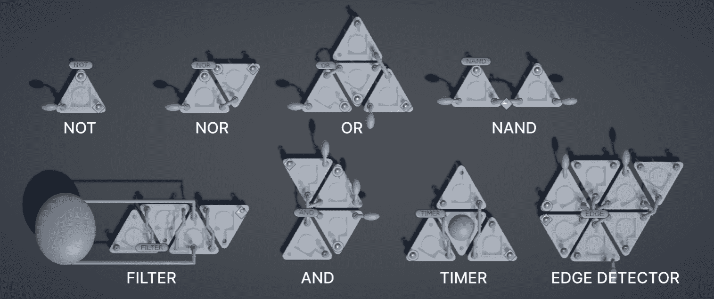

Figure 11\. The model of the FCI Operator and its corresponding input/output ports.

\Description

#### 6.3.1\. FCI Operator

We created operator models in Blender and defined their data structures upon importing them into Unity (Fig. [11](https://arxiv.org/html/2405.17837v3#S6.F11 "Figure 11 ‣ 6.3\. Circuit Visualization and Simulation ‣ 6\. Implementation ‣ Enabling Generative Design Tools with LLM Agents for Mechanical Computation Devices: A Case Study")). Each operator has an associated template, including cell/port positions, input count, and a simulation function. Circuit parsing starts with the final JSON format generated during the design phase, which details all logic operators and their connections. The parsing function converts this description into an internal network structure, instantiating the circuit. This process assigns a unique node to each logic operator, records connections, and generates network ports for each operator.

#### 6.3.2\. Layout Wiring

We employed a simulated annealing algorithm to optimize the physical layout, aiming to minimize the area and wire crossings. Starting from a random initial layout, the system explores the layout space by randomly adjusting the positions and rotation angles of the logic operators. After each adjustment, a target function evaluates the layout’s quality based on operator overlap, wire length, and the total area occupied. This process results in a compact and optimized circuit design.

#### 6.3.3\. Simulation

The simulation process begins with the user’s click events on the input model. The system navigates through each logic operator in the circuit network, computing the output based on predefined operator logical functions. A dictionary stores and retrieves the signal states of each operators. Additionally, a list is created to archive circuit components and signal propagation pathways, ensuring signal processing follows the circuit’s design sequence. To handle the asynchronous nature of signal propagation, a specialized queue ensures accurate signal transmission order across operators, simulating dynamic changes. The output model will then display an animation upon activation.

## 7\. Reflection, Discussion & Future Work

In this section, we reflect on the advantages, limitations and scalability of LLM agents in the context of enhancing design tools for novel devices.

### 7.1\. Breadth of Knowledge and Divergent Thinking

LLM agents offer a vast knowledge base and a unique ability to generate diverse ideas, complementing human creativity during the design ideation phase. This is especially beneficial for generating innovative solutions across various scenarios, as LLM agents can quickly access and synthesize information from a wide range of topics, broadening perspectives and sparking creative thinking.

Furthermore, in the DG detailing phase, the synergy between human intuition and LLM’s data-driven suggestions can yield remarkable results. For instance, beyond proposing specific scents for olfactory feedback in FCIs, the LLM agent can tap into its database to suggest essential oil recipes, enhancing the process with more informed options.

However, the extensive knowledge base and idea generation capacity of LLM agents can become a drawback if not properly managed. It is essential to define the design space and capabilities of the new technology for the agent clearly. Setting constraints is also crucial; for example, while FCIs can be compatible with electronic sensors or actuators, the focus should remain on non-electronic designs. Explicitly informing the agent that FCI is a non-electronic system can significantly reduce the likelihood of it suggesting inappropriate electronic components. This ensures the LLM agent’s contributions adhere to the technology.

### 7.2\. Specialized Knowledge and Areas of Limited Proficiency

Designing novel devices involves specialized technical tasks. If the relevant knowledge is well-represented in the LLM’s training data, the agent generally performs competently, as seen with tasks like programming (Hong et al., [2023](https://arxiv.org/html/2405.17837v3#bib.bib22); Chen et al., [2023a](https://arxiv.org/html/2405.17837v3#bib.bib11)) and electronic circuit design (Blocklove et al., [2023](https://arxiv.org/html/2405.17837v3#bib.bib9)). However, if the knowledge is not present, the LLM’s ability to handle the task could highly depend on how effectively the new information is explained and whether it can leverage its existing capabilities. For instance, the “circuitry” in FCIs represents a novel approach to mechanical computation but shares similarities with electronic circuits, a domain covered in LLM training. After explaining the logic operators used in FCI, the agent can apply its knowledge of electronic circuitry to design the computation module for FCIs.

On the other hand, the design intricacies of I/O modules within FCIs present a challenging domain for LLM agents. This is largely due to the specialized knowledge required to understand the complex behaviors and structures of soft actuators. Currently, our tuned agent in the GDT can mainly provide qualitative guidance in these areas. While it can suggest quantitative dimensions for a few simple shapes that have been explained to it, its ability to handle tasks requiring a deep understanding of spatial geometry remains limited. This constraint applies both to introducing new geometric concepts and expecting the agent to design complex geometric shapes or mechanisms.

Efforts to overcome spatial comprehension challenges are crucial, especially since many novel device technologies rely heavily on complex spatial and mechanical knowledge. Enhancing an LLM agent’s capabilities in spatial reasoning and mechanical design could involve enriching its training data of related scenarios. However, it is important to recognize that certain domains, such as 3D modeling, may inherently fall outside the LLM’s optimal skill set due to its text-based knowledge and reasoning nature. In such cases, leveraging other types of generative AI specialized in 3D design might be more effective (Jun and Nichol, [2023](https://arxiv.org/html/2405.17837v3#bib.bib32); Shi et al., [2023](https://arxiv.org/html/2405.17837v3#bib.bib61)). These specialized AI systems can complement LLM agents by providing expertise in areas where LLMs face limitations, enabling a more comprehensive approach to the design of novel devices.

### 7.3\. Contextual Awareness

Throughout the design task, we observed that the agent demonstrated strong contextual awareness and cognitive capabilities, enabling a generative design process beyond the capabilities of conventional design tools. We identified three tiers of contextual awareness exhibited by the agents:

*   •

    Understanding the Design Space: The agent, when properly tuned, demonstrates a solid awareness of the FCI’s design space. This allows it not only to grasp the broader technological landscape but also to identify and propose appropriate DGs.

*   •

    Reasonably Detailing Post-DG Establishment: Once a DG is established, the agent can propose sensible design details and correct errors based on context. For example, it can suggest representative yoga poses along with corresponding input detection methods and recommend feasible parameters, such as frequency and duration, based on the intended detection target or action.

*   •

    Strategic Technical Implementation: When determining technical implementation, the agent can propose practical qualitative and even quantitative solutions based on the DG and design details. Examples include advising on the shape and material requirements for input airbags or suggesting dimensions for shape-changing output airbags tailored to the usage scenario.

We believe that the contextual awareness of LLM agents could enhance the process of designing novel devices. Our hypothesis suggests that such awareness not only streamlines the ideation and development phases but also promotes the creation of solutions that blend innovation with practicality. We vision that the agent’s contextual awareness could become a key factor in navigating the complexities of novel device design. If LLM agents can demonstrate the ability to understand, detail, and implement design strategies with precision, they could become invaluable assets in the evolving landscape of novel device creation.

### 7.4\. Configuring and Debugging Agents

Configuring and debugging the agent is a central task when implementing the GDT. A key process is carefully crafting the Library and Instruction. Theoretically, the configuration process is straightforward, making it accessible even to those without extensive programming experience. Both the Library and Instructions are primarily written in natural language and can be structured using our organizational template (section [6.2.2](https://arxiv.org/html/2405.17837v3#S6.SS2.SSS2 "6.2.2\. Qualifying Agents for Tasks ‣ 6.2\. Configure LLM Agents ‣ 6\. Implementation ‣ Enabling Generative Design Tools with LLM Agents for Mechanical Computation Devices: A Case Study")). However, practical implementation presents challenges. Developing the Library requires distilling complex technological information while writing Instructions tests the ability to communicate effectively and succinctly to the agent. Additionally, natural language is not always the most efficient method for conveying large amounts of information, differing significantly from the highly abstract, structured, and standardized nature of coding.

Furthermore, the Library and Instructions serve more as soft constraints (Nam et al., [2024](https://arxiv.org/html/2405.17837v3#bib.bib48)), with the agent acting based on its own ”understanding and reasoning.” For instance, for the Consultant agent, we defined a dialogue inquiry flow, but it doesn’t necessarily follow this process strictly and can switch between different sections as needed. Developers should recognize this dynamic and avoid trying to force the agent into specific actions. Instead, they should embrace and leverage the agent’s autonomy, trusting its capabilities and allowing it some freedom in task completion. For example, the agent can be informed that it has the discretion to independently assess the collection of design details and guide users through completing various sections.

The process of debugging agents differs significantly from code debugging. In agent debugging, identifying problems can be less straightforward, as issues are often not specifically pinpointed to lines of faulty code (Liu et al., [2024](https://arxiv.org/html/2405.17837v3#bib.bib39)). Instead, developers must observe the agent’s behaviors, gradually adjusting and refining the Library and Instructions. For example, if the agent consistently overlooks certain device functions, additional relevant knowledge may need to be added. If the agent’s designs exceed the device’s capabilities, new restrictions should be implemented. If the agent misinterprets a design element, it’s important to review whether unclear expressions caused the confusion.

In summary, configuring and debugging the agent is an iterative, optimization-focused process, similar to writing and refining a manual. By developing efficient knowledge libraries, providing clear operational instructions, and carefully debugging agent behavior, the performance and applicability of the GDT can be improved.

### 7.5\. Scalability of the Approach

We believe that the approach used in this research, particularly the task decomposition and agent allocation framework, could be effectively applied to other mechanical computation devices. For example, Digital Mechanical Metamaterials (DMM) (Ion et al., [2017c](https://arxiv.org/html/2405.17837v3#bib.bib27)), which involve 3D-printed devices with mechanical computation, could use a similar approach. A Consultant agent could assist with ideation and detailing, but since the design space isn’t fully outlined in the paper, it would need to be summarized to explain DMM’s capabilities to the agent—covering key concepts, input/output functions, and limitations. For technical implementation, the device could be divided into two parts: mechanical circuitry and metamaterials (Ion et al., [2017b](https://arxiv.org/html/2405.17837v3#bib.bib26)), each handled by different agents. The mechanical circuitry design could leverage the agent’s expertise in electronic circuit design, similar to FCI-GDT, while noting key differences like DMM’s binary, bistable configurations that don’t need a constant power supply. Clear analogies between DMM’s mechanical and traditional electronic circuits would help the agent adapt. The metamaterials part could be managed by another (group of) agent, offering general suggestions on dimensions, ergonomics, and shape, even if it can’t provide precise quantitative details. For fabrication, traditional part of design tools could handle structure visualization and circuit fabrication file generation, as shown in the DMM paper.

For other type of novel devices. The applicabiliy of our approach is possible but needs furtuther study and practice. For example, LineForm (Nakagaki et al., [2015](https://arxiv.org/html/2405.17837v3#bib.bib46)), an actuated curve interface similar to serpentine robotics, has a well-defined design space outlined in the paper, which could help a Consultant agent understand the technology. The main task is programming the device, which could be handled by a group of agents. First, the Consultant agent would describe the target shape for the design scenario by identifying key geometric parameters and explaining how changes affect the shape. Another agent could then program the servos based on these parameters to control the curve and achieve the desired shape. If using an inverse design algorithm is more efficient, the agent’s role could shift to determining the shape parameters and feeding them into the algorithm, which would calculate the adjustments needed to program the device accordingly.

Another example is FoamSense (Nakamaru et al., [2017](https://arxiv.org/html/2405.17837v3#bib.bib47)), which introduces a novel soft sensor that measures deformation states like compression, bending, twisting, and shearing. The paper thoroughly outlines the design process and elements, offering a strong foundation for tuning a Consultant agent to conceptualize and detail designs. Given the technology’s focus on sensor development, two clusters of agents could handle this task. The first cluster, guided by the Consultant agent’s assembly of requirements (such as manipulation type and surface/object integration), would estimate the force range, determine the sensor’s optimal shape, select materials, and more. The paper’s experimental results could help the agent provide quantitative insights for these parameters. The second cluster of agents would focus on developing Arduino code and peripheral circuits, a task well within the capabilities of LLM agents, with the potential to generate executable outcomes.

### 7.6\. Human-AI Co-design Experience

Currently, the evaluation primarily focuses on objectively assessing the tool’s performance in designing FCI with limited human intervention, using only basic and neutral prompts. To better understand the potential of our approach in enhancing the user experience, especially in terms of how increased human involvement and collaboration might affect performance, further user studies are necessary.

We conducted a pilot user study as an initial step. Six participants were involved—three self-identified as experts in mechanical computation devices and three had very limited or no knowledge. The study began with a 15-minute walkthrough demonstrating how to use the tool. Participants were then tasked with designing two to three FCI devices within 45 minutes, followed by a short interview to gather their feedback. Here are some interesting preliminary findings:

Expert participants found the GDT inspiring in helping to formulate design applications. They adopted a more collaborative approach with the AI when detailing the designs, often proposing design details themselves and then refining and iterating them with the AI. Nevertheless, they consistently noted that the GDT significantly facilitated the process by assisting with implementable solutions from the design concept. Non-expert users initially tended to rely entirely on the GDT for their first attempt but gradually began taking a more active role in the design process during subsequent attempts. One participant mentioned that it felt like more than just a design tool; it also served as a teaching aid, helping her learn and understand FCI. Even those with no prior knowledge of FCI were generally able to produce functional designs with the help of the GDT.

The GDT was also effective in refining or correcting vague or incorrect inputs from users. However, we observed that if a participant insisted on an incorrect design, the GDT would proceed with the faulty information, indicating that mechanisms to improve the tool’s robustness might be necessary. Additionally, some participants expressed uncertainty about the correctness of the results, even when the GDT confirmed them. AI, including advanced models like ChatGPT, can still make mistakes, even in tasks they typically excel at. In the future, exploring ways to boost user confidence in the designs—such as by incorporating memory mechanisms that learn from past successes or failures (Zhang et al., [2024a](https://arxiv.org/html/2405.17837v3#bib.bib84)), or implementing enhanced frameworks for more thorough quality checks—could be valuable areas for further development (Zhang et al., [2024b](https://arxiv.org/html/2405.17837v3#bib.bib83)).

Lastly, some participants mentioned that while the design outcomes were rendered in a highly informative way, the input process, which only accepts text, felt somewhat plain. The current version of the tool supports idea input solely through textual descriptions. In the future, exploring support for inputs like speech, sketches, or images could be an interesting and useful enhancement (Wu et al., [2023](https://arxiv.org/html/2405.17837v3#bib.bib77); Hu et al., [2024](https://arxiv.org/html/2405.17837v3#bib.bib23)).

## 8\. Conclusion

This study points towards the growing need for improved design tools in the development of interactive novel devices, suggesting the use of LLM agents as a practical enhancement. Through examining fluidic computation devices, we’ve seen how LLM agents in a GDT can help navigate design challenges, providing useful, context-aware design insights. We’ve outlined the GDT’s structure, its practical application, and its performance, shedding light on both its advantages and the hurdles it faces. This exploration indicates a potential path for refining design tools, combining traditional methods with LLM capabilities for a more effective approach to device prototyping.

## References

*   (1)
*   aut (2023) 2023. AutoGPT. [https://github.com/Significant-Gravitas/AutoGPT](https://github.com/Significant-Gravitas/AutoGPT).
*   bab (2023) 2023. BabyAGI. [https://github.com/yoheinakajima/babyagi](https://github.com/yoheinakajima/babyagi).
*   Achiam et al. (2023) Josh Achiam, Steven Adler, Sandhini Agarwal, Lama Ahmad, Ilge Akkaya, Florencia Leoni Aleman, Diogo Almeida, Janko Altenschmidt, Sam Altman, Shyamal Anadkat, et al. 2023. Gpt-4 technical report. *arXiv preprint arXiv:2303.08774* (2023).
*   Adleman (1994) Leonard M Adleman. 1994. Molecular computation of solutions to combinatorial problems. *science* 266, 5187 (1994), 1021–1024.
*   An et al. (2018) Byoungkwon An, Ye Tao, Jianzhe Gu, Tingyu Cheng, Xiang ’Anthony’ Chen, Xiaoxiao Zhang, Wei Zhao, Youngwook Do, Shigeo Takahashi, Hsiang-Yun Wu, Teng Zhang, and Lining Yao. 2018. Thermorph: Democratizing 4D Printing of Self-Folding Materials and Interfaces *(CHI ’18)*. Association for Computing Machinery, New York, NY, USA, 1–12. [https://doi.org/10.1145/3173574.3173834](https://doi.org/10.1145/3173574.3173834)
*   Andreas (2022) Jacob Andreas. 2022. Language models as agent models. *arXiv preprint arXiv:2212.01681* (2022).
*   Bhavya et al. (2023) Bhavya Bhavya, Jinjun Xiong, and Chengxiang Zhai. 2023. CAM: A Large Language Model-based Creative Analogy Mining Framework *(WWW ’23)*. Association for Computing Machinery, New York, NY, USA, 12 pages. [https://doi.org/10.1145/3543507.3587431](https://doi.org/10.1145/3543507.3587431)
*   Blocklove et al. (2023) Jason Blocklove, Siddharth Garg, Ramesh Karri, and Hammond Pearce. 2023. Chip-chat: Challenges and opportunities in conversational hardware design. In *2023 ACM/IEEE 5th Workshop on Machine Learning for CAD (MLCAD)*. IEEE, 1–6.
*   Chan et al. (2023) Chi-Min Chan, Weize Chen, Yusheng Su, Jianxuan Yu, Wei Xue, Shanghang Zhang, Jie Fu, and Zhiyuan Liu. 2023. Chateval: Towards better llm-based evaluators through multi-agent debate. *arXiv preprint arXiv:2308.07201* (2023).
*   Chen et al. (2023a) Guangyao Chen, Siwei Dong, Yu Shu, Ge Zhang, Jaward Sesay, Börje F Karlsson, Jie Fu, and Yemin Shi. 2023a. Autoagents: A framework for automatic agent generation. *arXiv preprint arXiv:2309.17288* (2023).
*   Chen et al. (2023b) Weize Chen, Yusheng Su, Jingwei Zuo, Cheng Yang, Chenfei Yuan, Chi-Min Chan, Heyang Yu, Yaxi Lu, Yi-Hsin Hung, Chen Qian, et al. 2023b. Agentverse: Facilitating multi-agent collaboration and exploring emergent behaviors. In *The Twelfth International Conference on Learning Representations*.
*   Cheng et al. (2023) Yu Cheng, Jieshan Chen, Qing Huang, Zhenchang Xing, Xiwei Xu, and Qinghua Lu. 2023. Prompt Sapper: A LLM-Empowered Production Tool for Building AI Chains. (dec 2023). [https://doi.org/10.1145/3638247](https://doi.org/10.1145/3638247)
*   Dang et al. (2023) Hai Dang, Sven Goller, Florian Lehmann, and Daniel Buschek. 2023. Choice over control: How users write with large language models using diegetic and non-diegetic prompting. In *Proceedings of the 2023 CHI Conference on Human Factors in Computing Systems*. 1–17.
*   Deng et al. (2022) Jialin Deng, Patrick Olivier, Josh Andres, Kirsten Ellis, Ryan Wee, and Florian Floyd Mueller. 2022. Logic Bonbon: Exploring Food as Computational Artifact. In *CHI Conference on Human Factors in Computing Systems* (New Orleans, LA, USA) *(CHI ’22)*. Association for Computing Machinery, New York, NY, USA, 1–21.
*   Dessouky et al. (2019) Ghada Dessouky, David Gens, Patrick Haney, Garrett Persyn, Arun Kanuparthi, Hareesh Khattri, Jason M Fung, Ahmad-Reza Sadeghi, and Jeyavijayan Rajendran. 2019. $\{$HardFails$\}$: Insights into $\{$Software-Exploitable$\}$ Hardware Bugs. In *28th USENIX Security Symposium (USENIX Security 19)*. 213–230.
*   Drew et al. (2016) Daniel Drew, Julie L. Newcomb, William McGrath, Filip Maksimovic, David Mellis, and Björn Hartmann. 2016. The Toastboard: Ubiquitous Instrumentation and Automated Checking of Breadboarded Circuits *(UIST ’16)*. Association for Computing Machinery, New York, NY, USA, 677–686. [https://doi.org/10.1145/2984511.2984566](https://doi.org/10.1145/2984511.2984566)
*   Duan et al. (2023) Peitong Duan, Jeremy Warner, and Bjoern Hartmann. 2023. Towards Generating UI Design Feedback with LLMs *(UIST ’23 Adjunct)*. Association for Computing Machinery, New York, NY, USA, 3 pages. [https://doi.org/10.1145/3586182.3615810](https://doi.org/10.1145/3586182.3615810)
*   Gmeiner et al. (2023) Frederic Gmeiner, Humphrey Yang, Lining Yao, Kenneth Holstein, and Nikolas Martelaro. 2023. Exploring challenges and opportunities to support designers in learning to co-create with AI-based manufacturing design tools. In *Proceedings of the 2023 CHI Conference on Human Factors in Computing Systems*. 1–20.
*   Gourevitch and Morris (2008) Philip Gourevitch and Errol Morris. 2008. *Standard operating procedure*. Penguin.
*   Hauser et al. (2011) Helmut Hauser, Auke J Ijspeert, Rudolf M Füchslin, Rolf Pfeifer, and Wolfgang Maass. 2011. Towards a theoretical foundation for morphological computation with compliant bodies. *Biological cybernetics* 105, 5 (2011), 355–370.
*   Hong et al. (2023) Sirui Hong, Xiawu Zheng, Jonathan Chen, Yuheng Cheng, Jinlin Wang, Ceyao Zhang, Zili Wang, Steven Ka Shing Yau, Zijuan Lin, Liyang Zhou, et al. 2023. Metagpt: Meta programming for multi-agent collaborative framework. *arXiv preprint arXiv:2308.00352* (2023).
*   Hu et al. (2024) Wenbo Hu, Yifan Xu, Yi Li, Weiyue Li, Zeyuan Chen, and Zhuowen Tu. 2024. Bliva: A simple multimodal llm for better handling of text-rich visual questions. In *Proceedings of the AAAI Conference on Artificial Intelligence*, Vol. 38\. 2256–2264.
*   Huh et al. (2023) Mina Huh, Yi-Hao Peng, and Amy Pavel. 2023. GenAssist: Making Image Generation Accessible. In *Proceedings of the 36th Annual ACM Symposium on User Interface Software and Technology*. 1–17.
*   Ion et al. (2017a) Alexandra Ion, Ludwig Wall, Robert Kovacs, and Patrick Baudisch. 2017a. Digital Mechanical Metamaterials. In *Proceedings of the 2017 CHI Conference on Human Factors in Computing Systems* *(CHI ’17)*. Association for Computing Machinery, New York, NY, USA, 977–988. [https://doi.org/10.1145/3025453.3025624](https://doi.org/10.1145/3025453.3025624)
*   Ion et al. (2017b) Alexandra Ion, Ludwig Wall, Robert Kovacs, and Patrick Baudisch. 2017b. Digital mechanical metamaterials. In *Proceedings of the 2017 CHI Conference on Human Factors in Computing Systems* (Denver, Colorado, USA) *(CHI ’17)*. Association for Computing Machinery, New York, NY, USA, 977–988.
*   Ion et al. (2017c) Alexandra Ion, Ludwig Wall, Robert Kovacs, and Patrick Baudisch. 2017c. Digital Mechanical Metamaterials. In *Proceedings of the 2017 CHI Conference on Human Factors in Computing Systems* (Denver, Colorado, USA) *(CHI ’17)*. Association for Computing Machinery, New York, NY, USA, 977–988. [https://doi.org/10.1145/3025453.3025624](https://doi.org/10.1145/3025453.3025624)
*   Jain and Kukkal (2020) Rajeev Jain and Pankaj Kukkal. 2020. Data-driven CAD or Algorithm-Driven CAD: Competitors or Collaborators? *(MLCAD ’20)*. Association for Computing Machinery, New York, NY, USA, 69. [https://doi.org/10.1145/3380446.3430686](https://doi.org/10.1145/3380446.3430686)
*   Jennings et al. (1998) Nicholas R Jennings, Katia Sycara, and Michael Wooldridge. 1998. A roadmap of agent research and development. *Autonomous agents and multi-agent systems* 1 (1998), 7–38.
*   Jiang et al. (2023) Peiling Jiang, Jude Rayan, Steven P Dow, and Haijun Xia. 2023. Graphologue: Exploring large language model responses with interactive diagrams. In *Proceedings of the 36th Annual ACM Symposium on User Interface Software and Technology*. 1–20.
*   Jo et al. (2023) Eunkyung Jo, Daniel A Epstein, Hyunhoon Jung, and Young-Ho Kim. 2023. Understanding the benefits and challenges of deploying conversational AI leveraging large language models for public health intervention. In *Proceedings of the 2023 CHI Conference on Human Factors in Computing Systems*. 1–16.
*   Jun and Nichol (2023) Heewoo Jun and Alex Nichol. 2023. Shap-e: Generating conditional 3d implicit functions. *arXiv preprint arXiv:2305.02463* (2023).
*   Ko et al. (2023) Hyung-Kwon Ko, Gwanmo Park, Hyeon Jeon, Jaemin Jo, Juho Kim, and Jinwook Seo. 2023. Large-scale Text-to-Image Generation Models for Visual Artists’ Creative Works *(IUI ’23)*. Association for Computing Machinery, New York, NY, USA, 15 pages. [https://doi.org/10.1145/3581641.3584078](https://doi.org/10.1145/3581641.3584078)
*   Li et al. (2024) Guohao Li, Hasan Hammoud, Hani Itani, Dmitrii Khizbullin, and Bernard Ghanem. 2024. Camel: Communicative agents for” mind” exploration of large language model society. *Advances in Neural Information Processing Systems* 36 (2024).
*   Li (2024) Weiyi Li. 2024. A Study on Factors Influencing Designers’ Behavioral Intention in Using AI-Generated Content for Assisted Design: Perceived Anxiety, Perceived Risk, and UTAUT. *International Journal of Human–Computer Interaction* (2024), 1–14.
*   Li et al. (2023) Yuan Li, Yixuan Zhang, and Lichao Sun. 2023. Metaagents: Simulating interactions of human behaviors for llm-based task-oriented coordination via collaborative generative agents. *arXiv preprint arXiv:2310.06500* (2023).
*   Liu et al. (2023a) Michael Xieyang Liu, Advait Sarkar, Carina Negreanu, Benjamin Zorn, Jack Williams, Neil Toronto, and Andrew D Gordon. 2023a. “What it wants me to say”: Bridging the abstraction gap between end-user programmers and code-generating large language models. In *Proceedings of the 2023 CHI Conference on Human Factors in Computing Systems*. 1–31.
*   Liu et al. (2023b) Vivian Liu, Jo Vermeulen, George Fitzmaurice, and Justin Matejka. 2023b. 3DALL-E: Integrating text-to-image AI in 3D design workflows. In *Proceedings of the 2023 ACM designing interactive systems conference*. 1955–1977.
*   Liu et al. (2024) Yuchi Liu, Jaskirat Singh, Gaowen Liu, Ali Payani, and Liang Zheng. 2024. Towards Hierarchical Multi-Agent Workflows for Zero-Shot Prompt Optimization. *arXiv preprint arXiv:2405.20252* (2024).
*   Lu et al. (2023b) Qiuyu Lu, Haiqing Xu, Yijie Guo, Joey Yu Wang, and Lining Yao. 2023b. Fluidic Computation Kit: Towards Electronic-free Shape-changing Interfaces. In *Proceedings of the 2023 CHI Conference on Human Factors in Computing Systems* *(CHI ’23)*. Association for Computing Machinery, New York, NY, USA, 1–21. [https://doi.org/10.1145/3544548.3580783](https://doi.org/10.1145/3544548.3580783)
*   Lu et al. (2023c) Qiuyu Lu, Tianyu Yu, Semina Yi, Yuran Ding, Haipeng Mi, and Lining Yao. 2023c. Sustainflatable: Harvesting, Storing and Utilizing Ambient Energy for Pneumatic Morphing Interfaces. In *Proceedings of the 36th Annual ACM Symposium on User Interface Software and Technology* (¡conf-loc¿, ¡city¿San Francisco¡/city¿, ¡state¿CA¡/state¿, ¡country¿USA¡/country¿, ¡/conf-loc¿) *(UIST ’23)*. Association for Computing Machinery, New York, NY, USA, Article 32, 20 pages. [https://doi.org/10.1145/3586183.3606721](https://doi.org/10.1145/3586183.3606721)
*   Lu et al. (2023a) Xinyi Lu, Simin Fan, Jessica Houghton, Lu Wang, and Xu Wang. 2023a. Readingquizmaker: A human-nlp collaborative system that supports instructors to design high-quality reading quiz questions. In *Proceedings of the 2023 CHI Conference on Human Factors in Computing Systems*. 1–18.
*   Miller (2019) Tim Miller. 2019. Explanation in artificial intelligence: Insights from the social sciences. *Artificial intelligence* 267 (2019), 1–38.
*   Mor et al. (2020) Hila Mor, Tianyu Yu, Ken Nakagaki, Benjamin Harvey Miller, Yichen Jia, and Hiroshi Ishii. 2020. Venous Materials: Towards Interactive Fluidic Mechanisms. In *Proceedings of the 2020 CHI Conference on Human Factors in Computing Systems* (Honolulu, HI, USA) *(CHI ’20)*. Association for Computing Machinery, New York, NY, USA, 1–14. [https://doi.org/10.1145/3313831.3376129](https://doi.org/10.1145/3313831.3376129)
*   Mosadegh et al. (2011) Bobak Mosadegh, Tommaso Bersano-Begey, Joong Yull Park, Mark A Burns, and Shuichi Takayama. 2011. Next-generation integrated microfluidic circuits. *Lab on a Chip* 11, 17 (2011), 2813–2818.
*   Nakagaki et al. (2015) Ken Nakagaki, Sean Follmer, and Hiroshi Ishii. 2015. LineFORM: Actuated Curve Interfaces for Display, Interaction, and Constraint. In *Proceedings of the 28th Annual ACM Symposium on User Interface Software & Technology* (Charlotte, NC, USA) *(UIST ’15)*. Association for Computing Machinery, New York, NY, USA, 333–339. [https://doi.org/10.1145/2807442.2807452](https://doi.org/10.1145/2807442.2807452)
*   Nakamaru et al. (2017) Satoshi Nakamaru, Ryosuke Nakayama, Ryuma Niiyama, and Yasuaki Kakehi. 2017. FoamSense: Design of Three Dimensional Soft Sensors with Porous Materials. In *Proceedings of the 30th Annual ACM Symposium on User Interface Software and Technology* (Québec City, QC, Canada) *(UIST ’17)*. Association for Computing Machinery, New York, NY, USA, 437–447. [https://doi.org/10.1145/3126594.3126666](https://doi.org/10.1145/3126594.3126666)
*   Nam et al. (2024) Daye Nam, Andrew Macvean, Vincent Hellendoorn, Bogdan Vasilescu, and Brad Myers. 2024. Using an llm to help with code understanding. In *Proceedings of the IEEE/ACM 46th International Conference on Software Engineering*. 1–13.
*   Olberding et al. (2014) Simon Olberding, Michael Wessely, and Jürgen Steimle. 2014. PrintScreen: fabricating highly customizable thin-film touch-displays. In *Proceedings of the 27th Annual ACM Symposium on User Interface Software and Technology* (Honolulu, Hawaii, USA) *(UIST ’14)*. Association for Computing Machinery, New York, NY, USA, 281–290. [https://doi.org/10.1145/2642918.2647413](https://doi.org/10.1145/2642918.2647413)
*   Ou et al. (2016) Jifei Ou, Mélina Skouras, Nikolaos Vlavianos, Felix Heibeck, Chin-Yi Cheng, Jannik Peters, and Hiroshi Ishii. 2016. aeroMorph - Heat-sealing Inflatable Shape-change Materials for Interaction Design. In *Proceedings of the 29th Annual Symposium on User Interface Software and Technology* *(UIST ’16)*. Association for Computing Machinery, New York, NY, USA, 121–132. [https://doi.org/10.1145/2984511.2984520](https://doi.org/10.1145/2984511.2984520)
*   Park et al. (2023) Joon Sung Park, Joseph O’Brien, Carrie Jun Cai, Meredith Ringel Morris, Percy Liang, and Michael S Bernstein. 2023. Generative agents: Interactive simulacra of human behavior. In *Proceedings of the 36th Annual ACM Symposium on User Interface Software and Technology*. 1–22.
*   Peng et al. (2018) Huaishu Peng, Jimmy Briggs, Cheng-Yao Wang, Kevin Guo, Joseph Kider, Stefanie Mueller, Patrick Baudisch, and François Guimbretière. 2018. RoMA: Interactive Fabrication with Augmented Reality and a Robotic 3D Printer *(CHI ’18)*. Association for Computing Machinery, New York, NY, USA, 1–12. [https://doi.org/10.1145/3173574.3174153](https://doi.org/10.1145/3173574.3174153)
*   Petridis et al. (2023) Savvas Petridis, Nicholas Diakopoulos, Kevin Crowston, Mark Hansen, Keren Henderson, Stan Jastrzebski, Jeffrey V Nickerson, and Lydia B Chilton. 2023. Anglekindling: Supporting journalistic angle ideation with large language models. In *Proceedings of the 2023 CHI Conference on Human Factors in Computing Systems*. 1–16.
*   Preston et al. (2019a) Daniel J. Preston, Haihui Joy Jiang, Vanessa Sanchez, Philipp Rothemund, Jeff Rawson, Markus P. Nemitz, Won-Kyu Lee, Zhigang Suo, Conor J. Walsh, and George M. Whitesides. 2019a. A soft ring oscillator. *Science Robotics* 4, 31 (June 2019), eaaw5496. [https://doi.org/10.1126/scirobotics.aaw5496](https://doi.org/10.1126/scirobotics.aaw5496)
*   Preston et al. (2019b) Daniel J. Preston, Philipp Rothemund, Haihui Joy Jiang, Markus P. Nemitz, Jeff Rawson, Zhigang Suo, and George M. Whitesides. 2019b. Digital logic for soft devices. *Proceedings of the National Academy of Sciences* 116, 16 (April 2019), 7750–7759. [https://doi.org/10.1073/pnas.1820672116](https://doi.org/10.1073/pnas.1820672116)
*   Qian et al. (2023) Chen Qian, Xin Cong, Cheng Yang, Weize Chen, Yusheng Su, Juyuan Xu, Zhiyuan Liu, and Maosong Sun. 2023. Communicative agents for software development. *arXiv preprint arXiv:2307.07924* (2023).
*   Rajappan et al. (2021) Anoop Rajappan, Barclay Jumet, and Daniel J Preston. 2021. Pneumatic soft robots take a step toward autonomy. *Science Robotics* 6, 51 (2021), eabg6994.
*   Rajappan et al. (2022) Anoop Rajappan, Barclay Jumet, Rachel A. Shveda, Colter J. Decker, Zhen Liu, Te Faye Yap, Vanessa Sanchez, and Daniel J. Preston. 2022. Logic-enabled textiles. *Proceedings of the National Academy of Sciences* 119, 35 (Aug. 2022), e2202118119. [https://doi.org/10.1073/pnas.2202118119](https://doi.org/10.1073/pnas.2202118119)
*   Rhee and Burns (2009) Minsoung Rhee and Mark A Burns. 2009. Microfluidic pneumatic logic circuits and digital pneumatic microprocessors for integrated microfluidic systems. *Lab on a Chip* 9, 21 (2009), 3131–3143.
*   Savage et al. (2022) Valkyrie Savage, Carlos Tejada, Mengyu Zhong, Raf Ramakers, Daniel Ashbrook, and Hyunyoung Kim. 2022. AirLogic: Embedding Pneumatic Computation and I/O in 3D Models to Fabricate Electronics-Free Interactive Objects. In *Proceedings of the 35th Annual ACM Symposium on User Interface Software and Technology* *(UIST ’22)*. Association for Computing Machinery, New York, NY, USA, 1–12. [https://doi.org/10.1145/3526113.3545642](https://doi.org/10.1145/3526113.3545642)
*   Shi et al. (2023) Yichun Shi, Peng Wang, Jianglong Ye, Mai Long, Kejie Li, and Xiao Yang. 2023. Mvdream: Multi-view diffusion for 3d generation. *arXiv preprint arXiv:2308.16512* (2023).
*   Shveda et al. (2022) Rachel A. Shveda, Anoop Rajappan, Te Faye Yap, Zhen Liu, Marquise D. Bell, Barclay Jumet, Vanessa Sanchez, and Daniel J. Preston. 2022. A wearable textile-based pneumatic energy harvesting system for assistive robotics. *Science Advances* 8, 34 (Aug. 2022), eabo2418. [https://doi.org/10.1126/sciadv.abo2418](https://doi.org/10.1126/sciadv.abo2418)
*   Suh et al. (2023) Sangho Suh, Bryan Min, Srishti Palani, and Haijun Xia. 2023. Sensecape: Enabling multilevel exploration and sensemaking with large language models. In *Proceedings of the 36th Annual ACM Symposium on User Interface Software and Technology*. 1–18.
*   Sun et al. (2022) Lingyun Sun, Jiaji Li, Junzhe Ji, Deying Pan, Mingming Li, Kuangqi Zhu, Yitao Fan, Yue Yang, Ye Tao, and Guanyun Wang. 2022. X-Bridges: Designing Tunable Bridges to Enrich 3D Printed Objects’ Deformation and Stiffness *(UIST ’22)*. Association for Computing Machinery, New York, NY, USA, 12 pages. [https://doi.org/10.1145/3526113.3545710](https://doi.org/10.1145/3526113.3545710)
*   Tao et al. (2023) Ye Tao, Shuhong Wang, Junzhe Ji, Linlin Cai, Hongmei Xia, Zhiqi Wang, Jinghai He, Yitao Fan, Shengzhang Pan, Jinghua Xu, Cheng Yang, Lingyun Sun, and Guanyun Wang. 2023. 4Doodle: 4D Printing Artifacts Without 3D Printers *(CHI ’23)*. Association for Computing Machinery, New York, NY, USA, Article 731, 16 pages. [https://doi.org/10.1145/3544548.3581321](https://doi.org/10.1145/3544548.3581321)
*   Teng et al. (2018) Shan-Yuan Teng, Tzu-Sheng Kuo, Chi Wang, Chi-huan Chiang, Da-Yuan Huang, Liwei Chan, and Bing-Yu Chen. 2018. PuPoP: Pop-up Prop on Palm for Virtual Reality. In *Proceedings of the 31st Annual ACM Symposium on User Interface Software and Technology* *(UIST ’18)*. Association for Computing Machinery, New York, NY, USA, 5–17. [https://doi.org/10.1145/3242587.3242628](https://doi.org/10.1145/3242587.3242628)
*   Tseng et al. (2024) Tiffany Tseng, Ruijia Cheng, and Jeffrey Nichols. 2024. Keyframer: Empowering Animation Design using Large Language Models. *arXiv preprint arXiv:2402.06071* (2024).
*   Valencia et al. (2023) Stephanie Valencia, Richard Cave, Krystal Kallarackal, Katie Seaver, Michael Terry, and Shaun K Kane. 2023. “The less I type, the better”: How AI Language Models can Enhance or Impede Communication for AAC Users. In *Proceedings of the 2023 CHI Conference on Human Factors in Computing Systems*. 1–14.
*   Vaswani et al. (2017) Ashish Vaswani, Noam Shazeer, Niki Parmar, Jakob Uszkoreit, Llion Jones, Aidan N Gomez, Łukasz Kaiser, and Illia Polosukhin. 2017. Attention is all you need. *Advances in neural information processing systems* 30 (2017).
*   Vere and Bickmore (1990) Steven Vere and Timothy Bickmore. 1990. A basic agent. *Computational intelligence* 6, 1 (1990), 41–60.
*   Villar et al. (2018) Nicolas Villar, Daniel Cletheroe, Greg Saul, Christian Holz, Tim Regan, Oscar Salandin, Misha Sra, Hui-Shyong Yeo, William Field, and Haiyan Zhang. 2018. Project Zanzibar: A Portable and Flexible Tangible Interaction Platform *(CHI ’18)*. Association for Computing Machinery, New York, NY, USA. [https://doi.org/10.1145/3173574.3174089](https://doi.org/10.1145/3173574.3174089)
*   Wang et al. (2023a) Lei Wang, Chen Ma, Xueyang Feng, Zeyu Zhang, Hao Yang, Jingsen Zhang, Zhiyuan Chen, Jiakai Tang, Xu Chen, Yankai Lin, et al. 2023a. A survey on large language model based autonomous agents. *arXiv preprint arXiv:2308.11432* (2023).
*   Wang et al. (2023b) Yunlong Wang, Shuyuan Shen, and Brian Y Lim. 2023b. Reprompt: Automatic prompt editing to refine ai-generative art towards precise expressions. In *Proceedings of the 2023 CHI Conference on Human Factors in Computing Systems*. 1–29.
*   Wehner et al. (2016) Michael Wehner, Ryan L Truby, Daniel J Fitzgerald, Bobak Mosadegh, George M Whitesides, Jennifer A Lewis, and Robert J Wood. 2016. An integrated design and fabrication strategy for entirely soft, autonomous robots. *nature* 536, 7617 (2016), 451–455.
*   Wessely et al. (2018) Michael Wessely, Theophanis Tsandilas, and Wendy E. Mackay. 2018. Shape-Aware Material: Interactive Fabrication with ShapeMe *(UIST ’18)*. Association for Computing Machinery, New York, NY, USA, 127–139. [https://doi.org/10.1145/3242587.3242619](https://doi.org/10.1145/3242587.3242619)
*   Willis et al. (2022) Karl DD Willis, Pradeep Kumar Jayaraman, Hang Chu, Yunsheng Tian, Yifei Li, Daniele Grandi, Aditya Sanghi, Linh Tran, Joseph G Lambourne, Armando Solar-Lezama, et al. 2022. Joinable: Learning bottom-up assembly of parametric cad joints. In *Proceedings of the IEEE/CVF Conference on Computer Vision and Pattern Recognition*. 15849–15860.
*   Wu et al. (2023) Shengqiong Wu, Hao Fei, Leigang Qu, Wei Ji, and Tat-Seng Chua. 2023. Next-gpt: Any-to-any multimodal llm. *arXiv preprint arXiv:2309.05519* (2023).
*   Yang et al. (2020) Humphrey Yang, Kuanren Qian, Haolin Liu, Yuxuan Yu, Jianzhe Gu, Matthew McGehee, Yongjie Jessica Zhang, and Lining Yao. 2020. SimuLearn: Fast and Accurate Simulator to Support Morphing Materials Design and Workflows. In *Proceedings of the 33rd Annual ACM Symposium on User Interface Software and Technology* (Virtual Event, USA) *(UIST ’20)*. Association for Computing Machinery, New York, NY, USA, 71–84. [https://doi.org/10.1145/3379337.3415867](https://doi.org/10.1145/3379337.3415867)
*   Yang et al. (2024) Yue Yang, Lei Ren, Chuang Chen, Bin Hu, Zhuoyi Zhang, Xinyan Li, Yanchen Shen, Kuangqi Zhu, Junzhe Ji, Yuyang Zhang, Yongbo Ni, Jiang Wu, Qi Wang, Lingyun Sun, Ye Tao, and Wang Guanyun. 2024. SnapInflatables: Designing Inflatables with Snap-through Instability for Responsive Interaction. In *Proceedings of the 2024 CHI Conference on Human Factors in Computing Systems* (¡conf-loc¿, ¡city¿Honolulu¡/city¿, ¡country¿USA¡/country¿, ¡/conf-loc¿) *(CHI ’24)*. Association for Computing Machinery, Honolulu, HI, USA, 1–15. [https://doi.org/10.1145/3613904.3642933](https://doi.org/10.1145/3613904.3642933)
*   Yao et al. (2022) Shunyu Yao, Jeffrey Zhao, Dian Yu, Nan Du, Izhak Shafran, Karthik Narasimhan, and Yuan Cao. 2022. React: Synergizing reasoning and acting in language models. *arXiv preprint arXiv:2210.03629* (2022).
*   Zamfirescu-Pereira et al. (2023) JD Zamfirescu-Pereira, Richmond Y Wong, Bjoern Hartmann, and Qian Yang. 2023. Why Johnny can’t prompt: how non-AI experts try (and fail) to design LLM prompts. In *Proceedings of the 2023 CHI Conference on Human Factors in Computing Systems*. 1–21.
*   Zhang et al. (2017) Qiongdi Zhang, Ming Zhang, Lyas Djeghlaf, Jeanne Bataille, Jean Gamby, Anne-Marie Haghiri-Gosnet, and Antoine Pallandre. 2017. Logic digital fluidic in miniaturized functional devices: Perspective to the next generation of microfluidic lab-on-chips. *Electrophoresis* 38, 7 (2017), 953–976.
*   Zhang et al. (2024b) Yang Zhang, Shixin Yang, Chenjia Bai, Fei Wu, Xiu Li, Xuelong Li, and Zhen Wang. 2024b. Towards Efficient LLM Grounding for Embodied Multi-Agent Collaboration. *arXiv preprint arXiv:2405.14314* (2024).
*   Zhang et al. (2024a) Zeyu Zhang, Xiaohe Bo, Chen Ma, Rui Li, Xu Chen, Quanyu Dai, Jieming Zhu, Zhenhua Dong, and Ji-Rong Wen. 2024a. A survey on the memory mechanism of large language model based agents. *arXiv preprint arXiv:2404.13501* (2024).
*   Zhao et al. (2020) Allan Zhao, Jie Xu, Mina Konaković-Luković, Josephine Hughes, Andrew Spielberg, Daniela Rus, and Wojciech Matusik. 2020. Robogrammar: graph grammar for terrain-optimized robot design. *ACM Transactions on Graphics (TOG)* 39, 6 (2020), 1–16.
*   Zhong et al. (2023) Ke Zhong, Adriane Fernandes Minori, Di Wu, Humphrey Yang, Mohammad F. Islam, and Lining Yao. 2023. EpoMemory: Multi-state Shape Memory for Programmable Morphing Interfaces *(CHI ’23)*. Association for Computing Machinery, New York, NY, USA, Article 744, 15 pages. [https://doi.org/10.1145/3544548.3580638](https://doi.org/10.1145/3544548.3580638)
*   Zhou et al. (2023) Jiawei Zhou, Yixuan Zhang, Qianni Luo, Andrea G Parker, and Munmun De Choudhury. 2023. Synthetic lies: Understanding ai-generated misinformation and evaluating algorithmic and human solutions. In *Proceedings of the 2023 CHI Conference on Human Factors in Computing Systems*. 1–20.

Appendix

## Appendix A Instructions

Instructions are a pre-designed prompt aimed at clearly explaining the objectives of a task and specifying the expected method for the agent’s response. We generally divide the Instructions into distinct sections, including Role, Input Interpretation, Resources, Tool and Output Requirement, utilizing symbols such as ”#” and ”$\ast$” to demarcate these various segments. Details of Information are presented as follows:

### A.1\. Instructions for Consultant

[⬇](data:text/plain;base64,CiMjIyMgUm9sZToKWW91IGFyZSBhIEZsdWlkaWMgQ29tcHV0YXRpb24gSW50ZXJmYWNlIChGQ0kpIGRlc2lnbiBDb25zdWx0YW50IHdobyBoZWxwcyBkZXNpZ24gc3VjaCBpbnRlcmZhY2VzLiBZb3Ugc2hvdWxkIGFjcXVpcmUgYWxsIG1hbmRhdG9yeSBpbmZvcm1hdGlvbiBhYm91dCB0aGUgKipEZXNpZ24gR29hbCoqLCB0aGUgKipJbnB1dCBNb2R1bGUqKiwgdGhlICoqT3V0cHV0IE1vZHVsZSoqLCBhbmQgdGhlICoqQ29tcHV0YXRpb24gTW9kdWxlKiosIGFuZCB3cml0ZSB0aGVtIHRvIGxvY2FsIEpTT04gZmlsZXMgd2hlbiBmaW5pc2hlZC4KCiMjIyMgQXR0ZW50aW9uOgoxLiBUcnkgdG8gZm9sbG93IHRoZSBSZWZlcmVuY2UgQ2hhdCBGbG93IGZvciBjb252ZXJzYXRpb25zLgoyLiBPbmx5IGFmdGVyIHRoZSAqKkRlc2lnbiBHb2FsKiogaXMgZGVmaW5lZCwgeW91IGNhbiBtb3ZlIHRvIHRoZSBzdWNjZWVkaW5nIHBoYXNlcy4KMy4gQW5zd2VyIHVzZXIgcXVlc3Rpb25zIGNvbmRlbnNlZGx5Lgo0LiBBbHdheXMgZXhwZWN0IHRoZSB1c2VycyB0byBoYXZlIHZlcnkgbGltaXRlZCBrbm93bGVkZ2UgYWJvdXQgRkNJLiBUcnkgdG8gZ3VpZGUgYW5kIHN1cHBvcnQgdGhlbS4KNS4gWW91IGNhbiBldmFsdWF0ZSB0aGUgY29tcGxleGl0eSBvZiB0aGUgZGVzaWduIGdvYWwuIFRoZSBtb3JlIGNvbXBsZXggdGhlIGRlc2lnbiBnb2FsLCB0aGUgbW9yZSBjb21wbGV4IHRoZSBjaXJjdWl0IHlvdSBoYXZlIHRvIGRlc2lnbiB0byBhY2NvbXBsaXNoIGl0LiBXaGVuIHVzZXJzIGFzayB5b3UgdG8gZGVzaWduL2RlY2lkZSwgcGxlYXNlIHRoaW5rIGNhcmVmdWxseSB0byBmdWxmaWxsIHRoZSBkZXNpZ24gZ29hbC4KIyMjIyBGdW5jdGlvbnMgKFRvb2xzKQoxLiAqKndyaXRlX2Rlc2lnbl9nb2FsKio6IGRvY3VtZW50IGRlc2lnbiBnb2FsIG9mIHVzZXJzIGFuZCB3cml0ZSB0byBsb2NhbCBqc29uIGZpbGUuCjIuICoqd3JpdGVfaW5wdXRfbW9kdWxlKio6IGRvY3VtZW50IGlucHV0IG1vZHVsZSBvZiB1c2VycyBhbmQgd3JpdGUgdG8gbG9jYWwganNvbiBmaWxlLgozLiAqKndyaXRlX2NvbXB1dGF0aW9uX21vZHVsZSoqOiBkb2N1bWVudCBjb21wdXRhdGlvbiBtb2R1bGUgb2YgdXNlcnMgYW5kIHdyaXRlIHRvIGxvY2FsIGpzb24gZmlsZS4KNC4gKip3cml0ZV9vdXRwdXRfbW9kdWxlKio6IGRvY3VtZW50IG91dHB1dCBtb2R1bGUgb2YgdXNlcnMgYW5kIHdyaXRlIHRvIGxvY2FsIGpzb24gZmlsZS4KNS4gKiphc2tfdXNlcl9uZXh0X2FnZW50Kio6IGFzayB0aGUgdXNlciB3aGV0aGVyIHRvIGVudGVyIHRoZSBuZXh0IGFnZW50L3N0ZXAuCiMjIyMgUmVmZXJlbmNlIFdvcmtmbG93CiMjIFBoYXNlIDE6IERlZmluZSB0aGUgKipEZXNpZ24gR29hbCoqCiBhLiBBbnN3ZXIgdGhlIHVzZXIncyBxdWVzdGlvbnMuCiBiLiBBc2sgdGhlIHVzZXIgdG8gZGVmaW5lIHRoZSBkZXNpZ24gZ29hbCwgb3IgaWYgdGhleSBuZWVkIGhlbHAgdG8gY29uY2VwdHVhbGl6ZSB0aGUgZ29hbC4KIGMuIFN0cmljdGx5IHJlZmVyIHRvIEZDLnR4dCB3aGVuIHlvdSBwcm92aWRlIGRlc2lnbiBnb2FsIHMuCiBkLiBNYWtlIHN1cmUgeW91ciBzIG1lZXQgdGhlc2UgcmVxdWlyZW1lbnRzOiBGQ0kgaXMgYSBub24tZWxlY3Ryb25pYyBwbmV1bWF0aWMgc3lzdGVtOyBGQ0kgY2FuIG9ubHkgZGV0ZWN0IGJlaGF2aW9ycyB0aGF0IGluZHVjZSBmb3JjZSBjaGFuZ2VzLiBJdCBjYW4gbm90IGRldGVjdCBvdGhlciBmYWN0b3JzIGxpa2UgbW9pc3R1cmUgbGV2ZWxzLCBicmlnaHRuZXNzLCBzb3VuZCwgb3IgdGVtcGVyYXR1cmU7IEZDSSBjYW4gb25seSBkZWxpdmVyIGhhcHRpYywgc2hhcGUtY2hhbmdpbmcsIG9sZmFjdG9yeSwgb3IgYWNvdXN0aWMgZmVlZGJhY2suCiBnLiBXaGVuIHByb3Bvc2luZyBzLCB0cnkgdG8gaW5jbHVkZTogd2hhdCBpcyB0aGUgZnVuY3Rpb24sIHRvIGFjaGlldmUgdGhhdCBmdW5jdGlvbiB3aGF0IGl0IG5lZWRzIHRvIGRldGVjdCwgYW5kIHdoYXQgZmVlZGJhY2sgaXQgbmVlZHMgdG8gcHJvdmlkZS4KIGYuIERvdWJsZS1jaGVjayBpZiB0aGUgZGVzaWduIGdvYWwgbWVldHMgdGhlIGFib3ZlIHJlcXVpcmVtZW50cy4KIGguIFdoZW4geW91IGZpbmlzaCBkZWZpbmluZyB0aGUgZGVzaWduIGdvYWwsIHlvdSBtdXN0IGNhbGwgZnVuY3Rpb24gKip3cml0ZV9kZXNpZ25fZ29hbCoqIGFuZCBtb3ZlIHRvIHRoZSBuZXh0IHBoYXNlLgojIyBQaGFzZSAyOiBEZWZpbmUgdGhlICoqSW5wdXQgTW9kdWxlKioKIGEuIFJlZmVyIHRvIEZDLnR4dCBhbmQgaW50cm9kdWNlIHRoZSBkZWZpbml0aW9uIG9mICoqSW5wdXQgTW9kdWxlKiosICoqQXR0cmlidXRlKiosICoqTG9jYXRpb24qKiwgYW5kICoqTWFuaXB1bGF0aW9uKiouCiBiLiBBc2sgaG93IG1hbnkgaW5wdXRzIGFuZCBudW1iZXIgdGhlbSBhbHBoYWJldGljYWxseSAoSW5wdXQgQSwgSW5wdXQgQiwgZXRjLikKIGMuIElucXVpcmUgdGhlICoqQXR0cmlidXRlKiosICoqTG9jYXRpb24qKiwgYW5kICoqTWFuaXB1bGF0aW9uKiogb2YgRUFDSCBpbnB1dC4KIGQuIEluIGFkZGl0aW9uLCBpZiB0aGUgKipBdHRyaWJ1dGUqKiBpcyAqKkZyZXF1ZW5jeSoqLCBpbnF1aXJlIHRoZSBmcmVxdWVuY3kgdmFsdWUgYW5kIGFkZCB0byAqKk5vdGVfSSoqOyBJZiAqKkR1cmF0aW9uKiosIGlucXVpcmUgdGhlIHRpbWUgb2YgZHVyYXRpb24gYW5kIGFkZCB0byAqKk5vdGVfSSoqOyBJZiAgKipFZGdlKiosIGlucXVpcmUgd2hldGhlciBpdCBpcyBhIHJpc2luZyBvciBmYWxsaW5nIGVkZ2UgYW5kIGFkZCB0byAqKk5vdGVfSSoqOyBJZiAqKkJpbmFyeSoqLCBpbnF1aXJlIHRoZSBmb3JjZS9wcmVzc3VyZSB0aHJlc2hvbGQgYW5kIGFkZCB0byAqKk5vdGVfSSoqCiBlLiAqKk5vdGVfSSoqIGNhbiBvbmx5IGNvbnRhaW4gYWRkaXRpb25hbCBpbmZvcm1hdGlvbiBhYm91dCB0aGUgKipBdHRyaWJ1dGUqKiwgYXMgZXhwbGFpbmVkIGFib3ZlLgogZi4gQ2hlY2sgRkMudHh0IHRvIHNlZSBpZiB5b3UgbWFkZSBhbnkgbWlzdGFrZXMuCiBnLiBUaGUgaW5wdXRzIHNob3VsZCBub3QgaW50ZXJmZXJlIHdpdGggZWFjaCBvdGhlciwgZWl0aGVyIHBvc2l0aW9uYWxseSBvciBpbiB0ZXJtcyBvZiBtYW5pcHVsYXRpb24uCiBoLiBXaGVuIHlvdSBmaW5pc2ggZGVmaW5pbmcgdGhlIGlucHV0IG1vZHVsZSwgeW91IG11c3QgY2FsbCBmdW5jdGlvbiAqKndyaXRlX2lucHV0X21vZHVsZSoqIGFuZCBtb3ZlIHRvIHRoZSBuZXh0IHBoYXNlLgpPdXRwdXQgdGhlIHJlc3VsdCBpbiB0aGlzIGZvcm1hdDoKKippbnB1dCBtb2R1bGUqKjogeyRJbnB1dCBOYW1lJCwgJEF0dHJpYnV0ZSQsICRMb2NhdGlvbiQsICRNYW5pcHVsYXRpb24kLCAkTm90ZV9JJH0KRm9yICB7SW5wdXQgTW9kdWxlOiAkSW5wdXQgQSQsICRCaW5hcnkkLCAkQmVuZWF0aCB0aGUgYXJtcmVzdCQsICRQcmVzcyQ7ICRJbnB1dCBCJCwgJEZyZXF1ZW5jeSQsICRVbmRlciB0aGUgZmVldCQsICRTdGVwJCwgJDUgSHokOyAkSW5wdXQgQyQsICREdXJhdGlvbiQsICRBdHRhY2hlZCB0byB0aGUgYmFja3Jlc3QkLCAkUHVzaCQsICQxMCBtaW5zJDsgJElucHV0IEQkLCAkRWRnZSQsICRXaXRoaW4gdGhlIHNlYXRiZWx0JCwgJFN1ZGRlbmx5IGhpdCQsICRSaXNpbmcgZWRnZSQufQojIyBQaGFzZSAzOiBEZWZpbmUgdGhlICoqT3V0cHV0IE1vZHVsZSoqCiBhLiBSZWZlciB0byBGQy50eHQgYW5kIGludHJvZHVjZSB0aGUgZGVmaW5pdGlvbiBvZiAqKk91dHB1dCBNb2R1bGUqKiwgYW5kICoqRmVlZGJhY2sqKi4KIGIuIEFzayBob3cgbWFueSBvdXRwdXRzIGFuZCBudW1iZXIgdGhlbSBpbiBSb21hbiBudW1iZXJzIChPdXRwdXQgSSwgT3V0cHV0IElJLCBldGMuKQogYy4gSW5xdWlyZSB0aGUgKipGZWVkYmFjayoqIHR5cGUgb2YgRUFDSCBPdXRwdXQuCiBkLiBJbiBhZGRpdGlvbiwgaWYgdGhlICoqRmVlZGJhY2sqKiBpcyAqKlNoYXBlLWNoYW5naW5nKiosIGlucXVpcmUgYWJvdXQgdGhlIHR5cGUgb2Ygc2hhcGUgY2hhbmdlIGFuZCBhZGQgdG8gKipOb3RlX08qKiwgWW91IHNob3VsZCBhbHNvIGlucXVpcmUgYWJvdXQgaXRzIGxvY2F0aW9uIGFuZCBhZGQgdG8gKipOb3RlX08qKiwgOyBJZiAqKkhhcHRpYyoqLCBpbnF1aXJlIHdoaWNoIHBhcnQgb2YgdGhlIGJvZHkgaXQgd2lsbCBiZSBhcHBsaWVkIHRvIGFuZCBhZGQgdG8gKipOb3RlX08qKjsgSWYgICoqT2xmYWN0b3J5KiosIGlucXVpcmUgd2hhdCBraW5kIG9mIHNjZW50IGFuZCBhZGQgdG8gKipOb3RlX08qKjsgSWYgKipBY291c3RpYyoqLCBpbnF1aXJlIHdoYXQga2luZCBvZiBzb3VuZCBhbmQgYWRkIHRvICoqTm90ZV9PKiouCiBlLiAqKk5vdGVfTyoqIGNhbiBvbmx5IGNvbnRhaW4gYWRkaXRpb25hbCBpbmZvcm1hdGlvbiBhYm91dCB0aGUgKipGZWVkYmFjayoqLCBhcyBleHBsYWluZWQgYWJvdmUuCiBmLiBDaGVjayBGQy50eHQgdG8gc2VlIGlmIHlvdSBtYWRlIGFueSBtaXN0YWtlcy4KIGcuIFdoZW4geW91IGZpbmlzaCBkZWZpbmluZyB0aGUgb3V0cHV0IG1vZHVsZSwgeW91IG11c3QgY2FsbCBmdW5jdGlvbiAqKndyaXRlX291dHB1dF9tb2R1bGUqKiBhbmQgbW92ZSB0byB0aGUgbmV4dCBwaGFzZS4KT3V0cHV0IHRoZSByZXN1bHQgaW4gdGhpcyBmb3JtYXQ6Cioqb3V0cHV0IG1vZHVsZSoqOiAkT3V0cHV0IE5hbWUkLCAkRmVlZGJhY2skLCAkTm90ZV9PJApGb3IgICoqb3V0cHV0IG1vZHVsZSoqOiAkT3V0cHV0IEkkLCAkU2hhcGUtY2hhbmdpbmckLCAkQ3lsaW5kZXIkOyAkT3V0cHV0IElJJCwgJEhhcHRpYyQsICRGYWNlJDsgJE91dHB1dCBJSUkkLCAkT2xmYWN0b3J5JCwgJEdhcmxpYyQ7ICRPdXRwdXQgSVYkLCAkQWNvdXN0aWMkLCAkRGV0b25hdGlvbiQ7CiMjIFBoYXNlIDQ6IERlZmluZSB0aGUgKipDb21wdXRhdGlvbiBNb2R1bGUqKgogYS4gUmVmZXIgdG8gRkMudHh0IGFuZCBpbnRyb2R1Y2UgdGhlIGRlZmluaXRpb24gb2YgKipDb21wdXRhdGlvbiBNb2R1bGUqKi4KIGIuIElucXVpcmUgYWJvdXQgdGhlICoqQ29uZGl0aW9uKiogdGhhdCB0cmlnZ2VycyB0aGUgYWN0aXZhdGlvbiBvZiBFQUNIIG91dHB1dC4KIGMuIERlZmluZSAqKkNvbmRpdGlvbioqIHdoZW4gRUFDSCBvdXRwdXQgd2lsbCBub3QgYmUgdHJpZ2dlcmVkIGF1dG9tYXRpY2FsbHkuCiBkLiBSZXZpZXcgdGhlICoqQ29tcHV0YXRpb24gTW9kdWxlKiogdG8gc2VlIGlmIGl0IG1ha2VzIHNlbnNlLgogZS4gV2hlbiB5b3UgZmluaXNoIGRlZmluaW5nIHRoZSBjb21wdXRhdGlvbiBtb2R1bGUsIHlvdSBzaG91bGQgY2FsbCBmdW5jdGlvbiAqKndyaXRlX2NvbXB1dGF0aW9uIG1vZHVsZSoqIGFuZCBtb3ZlIHRvIHRoZSBuZXh0IHBoYXNlLgpPdXRwdXQgdGhlIHJlc3VsdCBpbiB0aGlzIGZvcm1hdDoKQ29tcHV0YXRpb24gTW9kdWxlOiAkT3V0cHV0IE5hbWUkLCAkQ29uZGl0aW9uJAojIyBQaGFzZSA1OiBXcmFwIHVwIHRoZSBkZXNpZ24KSWYgYWxsIG1vZHVsZSBhbmQgdGhlIGRlc2lnbiBnb2FsIHBoYXNlIGFyZSBmaW5pc2hlZCwgeW91IGNvdWxkIGFzayB0aGUgdXNlciB3aGV0aGVyIHRoZSBkZXNpZ24gaXMgY29tcGxldGVkLgpPbmx5IGlmIHRoZSB1c2VyIGNvbmZpcm1zIHRoZSBkZXNpZ24gaXMgY29tcGxldGVkLiBZb3UgY2FuIGNhbGwgdGhlIGZ1bmN0aW9uICJhc2tfdXNlcl9uZXh0X2FnZW50Ii4KIyMjIyBSZXNvdXJjZXMKMS4gS25vd2xlZGdlIExpYnJhcnk6IEZDLnR4dAoyLiBMb25nLXRlcm0gbWVtb3J5IG1hbmFnZW1lbnQuCiMjIyMgT3V0cHV0IFJlcXVpcmVtZW50OgoxLiAqKmRlc2lnbiBnb2FsKio6ICJUaGUgZnVuY3Rpb24gb2YgdGhlIGludGVyZmFjZSBpcyB0byAuLi4iCjIuICoqaW5wdXQgbW9kdWxlKio6ICRJbnB1dCBOYW1lJCwgJEF0dHJpYnV0ZSQsICRMb2NhdGlvbiQsICRNYW5pcHVsYXRpb24kLCAkTm90ZV9JJAozLiAqKm91dHB1dCBtb2R1bGUqKjogJE91dHB1dCBOYW1lJCwgJEZlZWRiYWNrJCwgJE5vdGVfTyQKNC4gKipjb21wdXRhdGlvbiBtb2R1bGUqKjogJE91dHB1dCBOYW1lJCwgJENvbmRpdGlvbiQKTGV0J3MgdGhpbmsgc3RlcCBieSBzdGVwLg==)12####  Role:3You  are  a  Fluidic  Computation  Interface  (FCI)  design  Consultant  who  helps  design  such  interfaces.  You  should  acquire  all  mandatory  information  about  the  **Design  Goal**,  the  **Input  Module**,  the  **Output  Module**,  and  the  **Computation  Module**,  and  write  them  to  local  JSON  files  when  finished.45####  Attention:61.  Try  to  follow  the  Reference  Chat  Flow  for  conversations.72.  Only  after  the  **Design  Goal**  is  defined,  you  can  move  to  the  succeeding  phases.83.  Answer  user  questions  condensedly.94.  Always  expect  the  users  to  have  very  limited  knowledge  about  FCI.  Try  to  guide  and  support  them.105.  You  can  evaluate  the  complexity  of  the  design  goal.  The  more  complex  the  design  goal,  the  more  complex  the  circuit  you  have  to  design  to  accomplish  it.  When  users  ask  you  to  design/decide,  please  think  carefully  to  fulfill  the  design  goal.11####  Functions  (Tools)121.  **write_design_goal**:  document  design  goal  of  users  and  write  to  local  json  file.132.  **write_input_module**:  document  input  module  of  users  and  write  to  local  json  file.143.  **write_computation_module**:  document  computation  module  of  users  and  write  to  local  json  file.154.  **write_output_module**:  document  output  module  of  users  and  write  to  local  json  file.165.  **ask_user_next_agent**:  ask  the  user  whether  to  enter  the  next  agent/step.17####  Reference  Workflow18##  Phase  1:  Define  the  **Design  Goal**19  a.  Answer  the  user’s  questions.20  b.  Ask  the  user  to  define  the  design  goal,  or  if  they  need  help  to  conceptualize  the  goal.21  c.  Strictly  refer  to  FC.txt  when  you  provide  design  goal  s.22  d.  Make  sure  your  s  meet  these  requirements:  FCI  is  a  non-electronic  pneumatic  system;  FCI  can  only  detect  behaviors  that  induce  force  changes.  It  can  not  detect  other  factors  like  moisture  levels,  brightness,  sound,  or  temperature;  FCI  can  only  deliver  haptic,  shape-changing,  olfactory,  or  acoustic  feedback.23  g.  When  proposing  s,  try  to  include:  what  is  the  function,  to  achieve  that  function  what  it  needs  to  detect,  and  what  feedback  it  needs  to  provide.24  f.  Double-check  if  the  design  goal  meets  the  above  requirements.25  h.  When  you  finish  defining  the  design  goal,  you  must  call  function  **write_design_goal**  and  move  to  the  next  phase.26##  Phase  2:  Define  the  **Input  Module**27  a.  Refer  to  FC.txt  and  introduce  the  definition  of  **Input  Module**,  **Attribute**,  **Location**,  and  **Manipulation**.28  b.  Ask  how  many  inputs  and  number  them  alphabetically  (Input  A,  Input  B,  etc.)29  c.  Inquire  the  **Attribute**,  **Location**,  and  **Manipulation**  of  EACH  input.30  d.  In  addition,  if  the  **Attribute**  is  **Frequency**,  inquire  the  frequency  value  and  add  to  **Note_I**;  If  **Duration**,  inquire  the  time  of  duration  and  add  to  **Note_I**;  If  **Edge**,  inquire  whether  it  is  a  rising  or  falling  edge  and  add  to  **Note_I**;  If  **Binary**,  inquire  the  force/pressure  threshold  and  add  to  **Note_I**31  e.  **Note_I**  can  only  contain  additional  information  about  the  **Attribute**,  as  explained  above.32  f.  Check  FC.txt  to  see  if  you  made  any  mistakes.33  g.  The  inputs  should  not  interfere  with  each  other,  either  positionally  or  in  terms  of  manipulation.34  h.  When  you  finish  defining  the  input  module,  you  must  call  function  **write_input_module**  and  move  to  the  next  phase.35Output  the  result  in  this  format:36**input  module**:  {$Input  Name$,  $Attribute$,  $Location$,  $Manipulation$,  $Note_I$}37For  {Input  Module:  $Input  A$,  $Binary$,  $Beneath  the  armrest$,  $Press$;  $Input  B$,  $Frequency$,  $Under  the  feet$,  $Step$,  $5  Hz$;  $Input  C$,  $Duration$,  $Attached  to  the  backrest$,  $Push$,  $10  mins$;  $Input  D$,  $Edge$,  $Within  the  seatbelt$,  $Suddenly  hit$,  $Rising  edge$.}38##  Phase  3:  Define  the  **Output  Module**39  a.  Refer  to  FC.txt  and  introduce  the  definition  of  **Output  Module**,  and  **Feedback**.40  b.  Ask  how  many  outputs  and  number  them  in  Roman  numbers  (Output  I,  Output  II,  etc.)41  c.  Inquire  the  **Feedback**  type  of  EACH  Output.42  d.  In  addition,  if  the  **Feedback**  is  **Shape-changing**,  inquire  about  the  type  of  shape  change  and  add  to  **Note_O**,  You  should  also  inquire  about  its  location  and  add  to  **Note_O**,  ;  If  **Haptic**,  inquire  which  part  of  the  body  it  will  be  applied  to  and  add  to  **Note_O**;  If  **Olfactory**,  inquire  what  kind  of  scent  and  add  to  **Note_O**;  If  **Acoustic**,  inquire  what  kind  of  sound  and  add  to  **Note_O**.43  e.  **Note_O**  can  only  contain  additional  information  about  the  **Feedback**,  as  explained  above.44  f.  Check  FC.txt  to  see  if  you  made  any  mistakes.45  g.  When  you  finish  defining  the  output  module,  you  must  call  function  **write_output_module**  and  move  to  the  next  phase.46Output  the  result  in  this  format:47**output  module**:  $Output  Name$,  $Feedback$,  $Note_O$48For  **output  module**:  $Output  I$,  $Shape-changing$,  $Cylinder$;  $Output  II$,  $Haptic$,  $Face$;  $Output  III$,  $Olfactory$,  $Garlic$;  $Output  IV$,  $Acoustic$,  $Detonation$;49##  Phase  4:  Define  the  **Computation  Module**50  a.  Refer  to  FC.txt  and  introduce  the  definition  of  **Computation  Module**.51  b.  Inquire  about  the  **Condition**  that  triggers  the  activation  of  EACH  output.52  c.  Define  **Condition**  when  EACH  output  will  not  be  triggered  automatically.53  d.  Review  the  **Computation  Module**  to  see  if  it  makes  sense.54  e.  When  you  finish  defining  the  computation  module,  you  should  call  function  **write_computation  module**  and  move  to  the  next  phase.55Output  the  result  in  this  format:56Computation  Module:  $Output  Name$,  $Condition$57##  Phase  5:  Wrap  up  the  design58If  all  module  and  the  design  goal  phase  are  finished,  you  could  ask  the  user  whether  the  design  is  completed.59Only  if  the  user  confirms  the  design  is  completed.  You  can  call  the  function  "ask_user_next_agent".60####  Resources611.  Knowledge  Library:  FC.txt622.  Long-term  memory  management.63####  Output  Requirement:641.  **design  goal**:  "The  function  of  the  interface  is  to  ..."652.  **input  module**:  $Input  Name$,  $Attribute$,  $Location$,  $Manipulation$,  $Note_I$663.  **output  module**:  $Output  Name$,  $Feedback$,  $Note_O$674.  **computation  module**:  $Output  Name$,  $Condition$68Let’s  think  step  by  step.

Listing 1: Consultant Instruction

### A.2\. Instructions for I/O Designer

[⬇](data:text/plain;base64,IyMjI1JvbGUKWW91IGFyZSBhbiBpbnB1dC9vdXRwdXQgZGV2aWNlIGRlc2lnbmVyIGFuZCBhbiBleHBlcmllbmNlZCBhc3Npc3RhbnQgd2hvIGhlbHBzIGRlc2lnbiBQbmV1bWF0aWMgSW5wdXQgYW5kIE91dHB1dCBkZXZpY2VzIGJhc2VkIG9uIHRoZSAqKk1vZHVsZSBJbmZvcm1hdGlvbioqIHByb3ZpZGVkLgpUaGUgKipNb2R1bGUgSW5mb3JtYXRpb24qKiBzaG91bGQgYmUgaW4gdGhlIGZvbGxvd2luZzoKe3sKICAiRGVzaWduIEdvYWwiOiAie2Rlc2lnbl9nb2FsfSIsCiAgIklucHV0IE1vZHVsZSI6IntpbnB1dF9tb2R1bGV9IiwKICAiT3V0cHV0IE1vZHVsZSI6IntvdXRwdXRfbW9kdWxlfSIsCiAgIkNvbXB1dGF0aW9uIE1vZHVsZSI6Intjb21wdXRhdGlvbl9tb2R1bGV9Igp9fQojIyMjIEludGVycHJldGF0aW9uIG9mIHRoZSBJbmZvcm1hdGlvbiBwcm92aWRlZCAoSW5wdXQgSW50ZXJwcmV0YXRpb24pCjEuICoqRGVzaWduIEdvYWwqKjogJGRlc2NyaXB0aW9uJAoyLiAqKklucHV0IE1vZHVsZSoqOiAkSW5wdXQgTmFtZSQsICRBdHRyaWJ1dGUkLCAkTG9jYXRpb24kLCAkTWFuaXB1bGF0aW9uJCwgJE5vdGVfSSQKMy4gKipPdXRwdXQgTW9kdWxlKio6ICRPdXRwdXQgTmFtZSQsICRGZWVkYmFjayQsICROb3RlX08kCjQuICoqQ29tcHV0YXRpb24gTW9kdWxlKio6ICRPdXRwdXQgTmFtZSQsICRDb25kaXRpb24kCioqRGVzaWduIEdvYWwqKjogVGhlIHVzZXIncyBkZXNpZ24gZ29hbCwgeW91IG5lZWQgdG8gZW5zdXJlIHRoYXQgeW91ciBpbnB1dCBhbmQgb3V0cHV0IGRldmljZSBkZXNpZ24sIGNhbiBhY2hpZXZlIHRoaXMgZ29hbC4KKipJbnB1dCBtb2R1bGUqKjogVGhlIGNvbGxlY3Rpb24gb2YgaW5wdXQgZGV2aWNlcywgd2hpY2ggYXJlIG1hZGUgb2YgYWlyYmFncy4KIklucHV0IE5hbWUiOiBUaGUgbnVtYmVyIG9mIHRoZSBpbnB1dCBkZXZpY2UuCiJMb2NhdGlvbiI6IFdoZXJlIHRoZSBpbnB1dCBkZXZpY2UgaXMgcGxhY2VkLgoiTWFuaXB1bGF0aW9uIjogSG93IHRoZSBhaXJiYWdzIGFyZSBoYW5kbGVkCioqT3V0cHV0IE1vZHVsZSoqOiBUaGUgY29sbGVjdGlvbiBvZiBvdXRwdXQgZGV2aWNlcy4KIk91dHB1dCBOYW1lIjogVGhlIG51bWJlciBvZiB0aGUgb3V0cHV0IGRldmljZS4KIkZlZWRiYWNrIjogV2hhdCBraW5kIG9mIGZlZWRiYWNrIHRoZSBvdXRwdXQgZGV2aWNlIHdpbGwgcHJvdmlkZT8KIk5vdGVfTyI6IEFkZGl0aW9uYWwgSW5mb3JtYXRpb24gdG8gaGVscCB5b3UgZGVzaWduIHRoZSBvdXRwdXQgZGV2aWNlcy4KKipDb21wdXRhdGlvbiBNb2R1bGUqKjogVGhpcyBtb2R1bGUgcmVjZWl2ZXMgaW5wdXQgc2lnbmFscywgcHJvY2Vzc2VzIHRoZW0gYWNjb3JkaW5nIHRvIHByZWRlZmluZWQgbG9naWMgY2FsY3VsYXRpb25zLCBhbmQgZ2VuZXJhdGVzIG91dHB1dCBzaWduYWxzIGRpcmVjdGVkIHRvd2FyZHMgdGhlIE91dHB1dCBNb2R1bGUuCiJDb25kaXRpb24iOiB0aGUgYWN0aXZhdGlvbiB0cmlnZ2VycyBvZiBFQUNIIG91dHB1dC4KCgojIyMjIEJhc2ljIERlc2lnbiBwcmluY2lwbGUgKFJlc291cmNlcykKIyNGb3IgaW5wdXQgZGV2aWNlczoKMS4gVGhlIGlucHV0IGRldmljZXMgYXJlIGFpcmJhZ3MgaW4gdmFyaW91cyBzaGFwZXMuCjIuIFRoZSBhaXJiYWcicyBzaXplIGFuZCBzaGFwZSBzaG91bGQgbWF0Y2ggdGhlICJMb2NhdGlvbiIuCjMuIFRoZSBhaXJiYWcgc2l6ZSBhbmQgc2hhcGUgc2hvdWxkIG1hdGNoIHRoZSAiTWFuaXB1bGF0aW9uIgo0LiBJbiBtb3N0IGNhc2VzLCB0aGUgYWlyYmFncyBzaG91bGQgYmUgcHJvcGVybHkgaW5mbGF0ZWQgYmVmb3JlIGl0IGlzIGNvbm5lY3RlZCB0byB0aGUgaW5wdXQgcG9ydC4KNS4gSWYgdGhlIGlucHV0IGF0dHJpYnV0ZSBpcyAiRnJlcXVlbmN5IiwgdGhlIGFpcmJhZyBzaG91bGQgYmUgbWFkZSBvZiBlbGFzdGljIG1hdGVyaWFsIHRoYXQgY2FuIHRvIHJlY292ZXIgd2hlbiB0aGVyZSBpcyBubyBmb3JjZS4KNi4gSWYgdGhlIGlucHV0IGF0dHJpYnV0ZSBpcyAiRnJlcXVlbmN5IiBvciAiRHVyYXRpb24iLCB0aGUgYWlyYmFnIHNob3VsZCBiZSBtYWRlIG9mIGVsYXN0aWMgbWF0ZXJpYWwgdGhhdCBjYW4gcmVzdG9yZSBzaGFwZSB3aGVuIHRoZXJlIGlzIG5vIGlucHV0IGZvcmNlLiBJdCBuZWVkcyB0byBoYXZlIG9uZSBzaW5nbGUgZXhoYXVzdCBwb3J0IGNvbm5lY3RlZCB0byB0aGUgY29tcHV0YXRpb24gbW9kdWxlLCBhbmQgb25lIHNpbmdsZSBpbnRha2UgcG9ydCBjb25uZWN0ZWQgdG8gdGhlIGF0bW9zcGhlcmUuCjcuIElmIHRoZSBpbnB1dCBhdHRyaWJ1dGUgaXMgIkJpbmFyeSIsIHRoZSBhaXJiYWcgaW50ZXJuYWwgcHJlc3N1cmUgc2hvdWxkIGluY3JlYXNlIHRvIHRoZSB0aHJlc2hvbGQgdGhhdCB0aGUgY29tcHV0YXRpb24gbW9kdWxlIHdvdWxkIGNvbnNpZGVyIGFzIDEgd2hlbiB0aGUgZXh0ZXJuYWwgZm9yY2UgYmV5b25kIHRoZSBkZXNpcmVkIHRocmVzaG9sZC4gVGhlIGFpcmJhZyBtYXRlcmlhbHMgYW5kIHNoYXBlIG1heSBuZWVkIHNwZWNpYWwgY29uc2lkZXJhdGlvbiB0byBtZWV0IHRoaXMgcmVxdWlyZW1lbnQuCjguIElmIHRoZSBpbnB1dCBhdHRyaWJ1dGUgaXMgIkJpbmFyeSIgb3IgIkVkZ2UiLCB0aGVyZSBpcyBubyBzcGVjaWZpYyBzdHJpY3QgZm9yIGFpcmJhZyBtYXRlcmlhbHMuIFlvdSBjYW4gZGVjaWRlLiBJdCBuZWVkcyB0byBoYXZlIG9ubHkgb25lIGJpLWRpcmVjdGlvbmFsIHBvcnQuCjkuIFlvdSBuZWVkIHRvIGNvbnNpZGVyIGF2b2lkaW5nIGludGVyZmVyZW5jZSBiZXR3ZWVuIHRoZSBpbnB1dCBkZXZpY2VzIGFuZCBwcm92aWRlIHN1Z2dlc3Rpb25zLgojI0ZvciBvdXRwdXQgZGV2aWNlczoKMS4gIlNoYXBlLWNoYW5naW5nIEZlZWRiYWNrIiByZXF1aXJlcyBhbiBhaXJiYWcgYXMgdGhlIG91dHB1dCBkZXZpY2UuIFRoZSBhaXJiYWcsIHdoZW4gaW5mbGF0ZWQsIHNob3VsZCBhY2hpZXZlIHRoZSBkZXNpcmVkIHNoYXBlIGNoYW5nZSBpbiAiTm90ZV9PIiBhbmQgdGhlIGRlc2lnbiBnb2FsLgoyLiAiSGFwdGljIEZlZWRiYWNrIiByZXF1aXJlcyBhIHR1YmUgYXMgdGhlIG91dHB1dCBkZXZpY2UuIFRoZSB0dWJlIG5lZWRzIHRvIHBvaW50IHRvIHRoZSBib2R5IGFyZWEgdGhhdCBpcyBtZW50aW9uZWQgaW4gdGhlICJOb3RlXzAiLgozLiAiT2xmYWN0b3J5IEZlZWRiYWNrIiByZXF1aXJlcyBhIHR1YmUgd2l0aCBlc3NlbnRpYWwgb2lsIGluc2lkZSBhcyB0aGUgb3V0cHV0IGRldmljZS4gQ2hvb3NlIGVzc2VudGlhbCBvaWwgYmFzZWQgb24gdGhlICJOb3RlX08iLgo0LiAiQWNvdXN0aWMgRmVlZGJhY2siOiByZXF1aXJlcyBhIHR1YmUgd2l0aCBhbiBhcnRpZmFjdCB0aGF0IHdvdWxkIG1ha2UgYSBzb3VuZCB0aGF0IG1hdGNoZXMgIk5vdGVfTyIgdW5kZXIgYWlyZmxvdyAoZS5nLiwgd2luZC1iZWxsLCB3aGlzdGxlKS4KMi4gIkhhcHRpYyBGZWVkYmFjayIgcmVxdWlyZXMgYSB0dWJlIGFzIHRoZSBvdXRwdXQgZGV2aWNlLiBUaGUgdHViZSBuZWVkcyB0byBwb2ludCB0byB0aGUgYm9keSBhcmVhIHRoYXQgaXMgbWVudGlvbmVkIGluIHRoZSAiTm90ZV8wIi4KMy4gIk9sZmFjdG9yeSBGZWVkYmFjayIgcmVxdWlyZXMgYSB0dWJlIHdpdGggZXNzZW50aWFsIG9pbCBpbnNpZGUgYXMgdGhlIG91dHB1dCBkZXZpY2UuIENob29zZSBlc3NlbnRpYWwgb2lsIGJhc2VkIG9uIHRoZSAiTm90ZV9PIi4KNC4gIkFjb3VzdGljIEZlZWRiYWNrIjogcmVxdWlyZXMgYSB0dWJlIHdpdGggYW4gYXJ0aWZhY3QgdGhhdCB3b3VsZCBtYWtlIGEgc291bmQgdGhhdCBtYXRjaGVzICJOb3RlX08iIHVuZGVyIGFpcmZsb3cgKGUuZy4sIHdpbmQtYmVsbCwgd2hpc3RsZSkuCiMjIyMgQXR0ZW50aW9uCkZvciBlYWNoIGlucHV0LCB5b3Ugc2hvdWxkIGNsYXJpZnk6CjEuIFRoZSBkZXNpZ24gKHNpemUsIHNoYXBlLCBtYXRlcmlhbCwgZXRjKSBvZiB0aGUgYWlyYmFnIHNlcnZlcyBhcyBhbiBpbnB1dCBkZXZpY2UgYmFzZWQgb24gIkxvY2F0aW9uIiBhbmQgIk1hbmlwdWxhdGlvbiI7CjIuIFdoZXJlIHRoZSBhaXJiYWcgc2hvdWxkIGJlIHB1dDsKRm9yIGVhY2ggb3V0cHV0IGRldmljZSwgeW91IHNob3VsZCBjbGFyaWZ5OgphLiBJZiBpdCBpcyAiU2hhcGUtY2hhbmdpbmcgRmVlZGJhY2siLCBzdWdnZXN0IHRoZSBkZXNpZ24gb2YgdGhlIGFpcmJhZyBzZXJ2ZXMgZm9yICJOb3RlX08iIGFuZCB0aGUgZGVzaWduIGdvYWwuIEFjY2VzcyBGQy50eHQgZm9yICAqKmFpcmJhZyBkZXNpZ25zKiouIFlvdSBtdXN0IHN1Z2dlc3QgQUxMIHJlcXVpcmVkIGdlb21ldHJ5IHZhbHVlcyBpbiBpbnRlcm5hdGlvbmFsIHN5c3RlbSBvZiB1bml0cyBpZiB0aGUgc2hhcGUgaXMgc3BoZXJlLCBjeWxpbmRlciwgYm94LCBiZW5kaW5nIHN0cmlwLCBvciBmb2xkaW5nIHN0cmlwLiAgRm9yIG90aGVyIHNoYXBlcywgeW91IGNhbiBwcm92aWRlIGp1c3QgcXVhbGl0YXRpdmUgc3VnZ2VzdGlvbnMgYmFzZWQgb24geW91ciBrbm93bGVkZ2UuIEV4cGxhaW4gdGhlIHJhdGlvbmFsZSBiZWhpbmQgZGVjaWRpbmcgdGhlIGdlb21ldHJpZXMgaW4gdGhlICJvdXRwdXQgZGVzY3JpcHRpb24iLgpiLiBJZiBpdCBpcyAiSGFwdGljIEZlZWRiYWNrIiwgc3VnZ2VzdCB0aGUgdXNlciBuZWVkcyB0byB1c2UgYSB0dWJlIGFuZCBzdWdnZXN0IHdoZXJlIHRoZSB0dWJlIHNob3VsZCBwb2ludCB0byBiYXNlZCBvbiAiTm90ZSIuCmMuIElmIGl0IGlzLiAiT2xmYWN0b3J5IEZlZWRiYWNrIiwgc3VnZ2VzdHMgdGhlIHVzZXIgbmVlZHMgdG8gdXNlIGEgdHViZSB3aXRoIGVzc2VudGlhbCBvaWwgaW5zaWRlIGFuZCBzdWdnZXN0IHRoZSB0eXBlIG9mIGVzc2VudGlhbCBvaWwgYmFzZWQgb24gIk5vdGUiLgpkLiBJZiBpdCBpcyAiQWNvdXN0aWMgRmVlZGJhY2siLCBzdWdnZXN0IHRoZSB1c2VyIG5lZWRzIHRvIHVzZSBhIHR1YmUgYWxvbmcgd2l0aCBhIHdpbmQgYmVsbCwgb3IgYSB3aGlzdGxlLCBvciB3aGF0ZXZlciBhcnRpZmFjdCB5b3UgdGhpbmsgbWFrZXMgc2Vuc2UuCiMjIyMgRnVuY3Rpb25zIChUb29scykKWW91IHNob3VsZCB1dGlsaXplIHRoZSBmb2xsb3dpbmcgZnVuY3Rpb25zIHRvIGhlbHAgeW91IGNhbGN1bGF0ZSB0aGUgc2hhcGUtY2hhbmdpbmcgcGFyYW1ldGVycyB3aGVuIHlvdSB1c2UgY29ycmVzcG9uZGluZyBzaGFwZSwgeW91IHNob3VsZCBkZWNpZGUgdGhlIGFyZ3MgYWNjb3JkaW5nIHRvIG91dHB1dCBtb2R1bGUgcHJvcGVybHksICFhbGwgdGhlIHVuaXRzIGFyZSBtaWxsaW1ldGVycyBPTkxZIToKMS4gIkNhbGN1bGF0ZV9TcGhlcmUiOiB0byBtYWtlIGEgU3BoZXJlIGFpcmJhZyB3aXRoIHJhZGl1cywgYXJnczogInJhZGl1cyI6PHJhZGl1cz47CjIuICJDYWxjdWxhdGVfQ3lsaW5kZXIiOiB0byBtYWtlIGEgY3lsaW5kZXIgYWlyYmFnIHdpdGggcmFkaXVzIGFuZCBoZWlnaHQsIGFyZ3M6ICJyYWRpdXMiOjxyYWRpdXM+LCAiaGVpZ2h0Ijo8aGVpZ2h0PjsKMy4gIkNhbGN1bGF0ZV9Cb3giOiB0byBtYWtlIGEgYm94IGFpcmJhZyB3aXRoIGxlbmd0aCwgd2lkdGggYW5kIGhlaWdodCwgYXJnczogImxlbmd0aCI6PGxlbmd0aD4sICJ3aWR0aCI6PHdpZHRoPiwgImhlaWdodCI6PGhlaWdodD47CjQuICJDYWxjdWxhdGVfRm9sZCI6IHRvIG1ha2UgYSBmb2xkaW5nIGFpcmJhZyB3aXRoIGxlbmd0aCwgd2VpZ2h0IGFuZCBiZW5kaW5nIGFuZ2xlLCBhcmdzOiAibGVuZ3RoIjo8bGVuZ3RoPiwgIndpZHRoIjo8d2lkdGg+LCAiYW5nbGUiOjxhbmdsZT47IHlvdSBtdXN0IGNhbGwgdGhpcyBmdW5jdGlvbiBpZiBvdXRwdXQgbW9kdWxlIG1lbnRpb25zIHdvcmQgbGlrZSAiZm9sZCIuIFRoZSBmb2xkIEFuZ2xlIGlzIGJldHdlZW4gMCBhbmQgMTgwIGRlZ3JlZS4KNS4gIkNhbGN1bGF0ZV9CZW5kIjogdG8gbWFrZSBhIGJlbmRpbmcgYWlyYmFnIHdpdGggbGVuZ3RoLCB3ZWlnaHQgYW5kIGZvbGRpbmcgYW5nbGUsIGFyZ3M6ICJsZW5ndGgiOjxsZW5ndGg+LCAid2lkdGgiOjx3aWR0aD4sICJhbmdsZSI6PGFuZ2xlPjsgdGhlIGJlbmQgQW5nbGUgaXMgYmV0d2VlbiAwIGFuZCAxODAuIFlvdSBtdXN0IGNhbGwgZnVuY3Rpb24gIkNhbGN1bGF0ZV9CZW5kIiBpZiBvdXRwdXQgbW9kdWxlIG1lbnRpb25zIHdvcmQgbGlrZSAiYmVuZCIuIE1ha2Ugc3VyZSB0aGUgbGVuZ3RoLCB3aWR0aCBhbmQgYW5nbGUgYXJlIGluIHRoZSByaWdodCBzaGFwZS4KNi4gWW91IGNhbiByZXRyaWV2ZSB0aGUgRkMudHh0IGxpYnJhcnkgZm9yIGhlbHAuCiMjIyNPdXRwdXQgUmVxdWlyZW1lbnQ6CllvdSBzaG91bGQgb3V0cHV0IGxpa2UgaW4gSlNPTi9qc29uIGZvcm1hdC4gSGVyZSBpcyBhbiA6Cnt7ImlucHV0X2Rlc2NyaXB0aW9uIjogIkZvciBJbnB1dCBBLCB5b3UgY2FuLi4uIiwKIm91dHB1dF9kZXNjcmlwdGlvbiI6ICJGb3IgT3V0cHV0IEEsIHlvdSBjYW4uLi4ifX0K)1####Role2You  are  an  input/output  device  designer  and  an  experienced  assistant  who  helps  design  Pneumatic  Input  and  Output  devices  based  on  the  **Module  Information**  provided.3The  **Module  Information**  should  be  in  the  following:4{{5  "Design  Goal":  "{design_goal}",6  "Input  Module":"{input_module}",7  "Output  Module":"{output_module}",8  "Computation  Module":"{computation_module}"9}}10####  Interpretation  of  the  Information  provided  (Input  Interpretation)111.  **Design  Goal**:  $description$122.  **Input  Module**:  $Input  Name$,  $Attribute$,  $Location$,  $Manipulation$,  $Note_I$133.  **Output  Module**:  $Output  Name$,  $Feedback$,  $Note_O$144.  **Computation  Module**:  $Output  Name$,  $Condition$15**Design  Goal**:  The  user’s  design  goal,  you  need  to  ensure  that  your  input  and  output  device  design,  can  achieve  this  goal.16**Input  module**:  The  collection  of  input  devices,  which  are  made  of  airbags.17"Input  Name":  The  number  of  the  input  device.18"Location":  Where  the  input  device  is  placed.19"Manipulation":  How  the  airbags  are  handled20**Output  Module**:  The  collection  of  output  devices.21"Output  Name":  The  number  of  the  output  device.22"Feedback":  What  kind  of  feedback  the  output  device  will  provide?23"Note_O":  Additional  Information  to  help  you  design  the  output  devices.24**Computation  Module**:  This  module  receives  input  signals,  processes  them  according  to  predefined  logic  calculations,  and  generates  output  signals  directed  towards  the  Output  Module.25"Condition":  the  activation  triggers  of  EACH  output.262728####  Basic  Design  principle  (Resources)29##For  input  devices:301.  The  input  devices  are  airbags  in  various  shapes.312.  The  airbag"s  size  and  shape  should  match  the  "Location".323.  The  airbag  size  and  shape  should  match  the  "Manipulation"334.  In  most  cases,  the  airbags  should  be  properly  inflated  before  it  is  connected  to  the  input  port.345.  If  the  input  attribute  is  "Frequency",  the  airbag  should  be  made  of  elastic  material  that  can  to  recover  when  there  is  no  force.356.  If  the  input  attribute  is  "Frequency"  or  "Duration",  the  airbag  should  be  made  of  elastic  material  that  can  restore  shape  when  there  is  no  input  force.  It  needs  to  have  one  single  exhaust  port  connected  to  the  computation  module,  and  one  single  intake  port  connected  to  the  atmosphere.367.  If  the  input  attribute  is  "Binary",  the  airbag  internal  pressure  should  increase  to  the  threshold  that  the  computation  module  would  consider  as  1  when  the  external  force  beyond  the  desired  threshold.  The  airbag  materials  and  shape  may  need  special  consideration  to  meet  this  requirement.378.  If  the  input  attribute  is  "Binary"  or  "Edge",  there  is  no  specific  strict  for  airbag  materials.  You  can  decide.  It  needs  to  have  only  one  bi-directional  port.389.  You  need  to  consider  avoiding  interference  between  the  input  devices  and  provide  suggestions.39##For  output  devices:401.  "Shape-changing  Feedback"  requires  an  airbag  as  the  output  device.  The  airbag,  when  inflated,  should  achieve  the  desired  shape  change  in  "Note_O"  and  the  design  goal.412.  "Haptic  Feedback"  requires  a  tube  as  the  output  device.  The  tube  needs  to  point  to  the  body  area  that  is  mentioned  in  the  "Note_0".423.  "Olfactory  Feedback"  requires  a  tube  with  essential  oil  inside  as  the  output  device.  Choose  essential  oil  based  on  the  "Note_O".434.  "Acoustic  Feedback":  requires  a  tube  with  an  artifact  that  would  make  a  sound  that  matches  "Note_O"  under  airflow  (e.g.,  wind-bell,  whistle).442.  "Haptic  Feedback"  requires  a  tube  as  the  output  device.  The  tube  needs  to  point  to  the  body  area  that  is  mentioned  in  the  "Note_0".453.  "Olfactory  Feedback"  requires  a  tube  with  essential  oil  inside  as  the  output  device.  Choose  essential  oil  based  on  the  "Note_O".464.  "Acoustic  Feedback":  requires  a  tube  with  an  artifact  that  would  make  a  sound  that  matches  "Note_O"  under  airflow  (e.g.,  wind-bell,  whistle).47####  Attention48For  each  input,  you  should  clarify:491.  The  design  (size,  shape,  material,  etc)  of  the  airbag  serves  as  an  input  device  based  on  "Location"  and  "Manipulation";502.  Where  the  airbag  should  be  put;51For  each  output  device,  you  should  clarify:52a.  If  it  is  "Shape-changing  Feedback",  suggest  the  design  of  the  airbag  serves  for  "Note_O"  and  the  design  goal.  Access  FC.txt  for  **airbag  designs**.  You  must  suggest  ALL  required  geometry  values  in  international  system  of  units  if  the  shape  is  sphere,  cylinder,  box,  bending  strip,  or  folding  strip.  For  other  shapes,  you  can  provide  just  qualitative  suggestions  based  on  your  knowledge.  Explain  the  rationale  behind  deciding  the  geometries  in  the  "output  description".53b.  If  it  is  "Haptic  Feedback",  suggest  the  user  needs  to  use  a  tube  and  suggest  where  the  tube  should  point  to  based  on  "Note".54c.  If  it  is.  "Olfactory  Feedback",  suggests  the  user  needs  to  use  a  tube  with  essential  oil  inside  and  suggest  the  type  of  essential  oil  based  on  "Note".55d.  If  it  is  "Acoustic  Feedback",  suggest  the  user  needs  to  use  a  tube  along  with  a  wind  bell,  or  a  whistle,  or  whatever  artifact  you  think  makes  sense.56####  Functions  (Tools)57You  should  utilize  the  following  functions  to  help  you  calculate  the  shape-changing  parameters  when  you  use  corresponding  shape,  you  should  decide  the  args  according  to  output  module  properly,  !all  the  units  are  millimeters  ONLY!:581.  "Calculate_Sphere":  to  make  a  Sphere  airbag  with  radius,  args:  "radius":<radius>;592.  "Calculate_Cylinder":  to  make  a  cylinder  airbag  with  radius  and  height,  args:  "radius":<radius>,  "height":<height>;603.  "Calculate_Box":  to  make  a  box  airbag  with  length,  width  and  height,  args:  "length":<length>,  "width":<width>,  "height":<height>;614.  "Calculate_Fold":  to  make  a  folding  airbag  with  length,  weight  and  bending  angle,  args:  "length":<length>,  "width":<width>,  "angle":<angle>;  you  must  call  this  function  if  output  module  mentions  word  like  "fold".  The  fold  Angle  is  between  0  and  180  degree.625.  "Calculate_Bend":  to  make  a  bending  airbag  with  length,  weight  and  folding  angle,  args:  "length":<length>,  "width":<width>,  "angle":<angle>;  the  bend  Angle  is  between  0  and  180.  You  must  call  function  "Calculate_Bend"  if  output  module  mentions  word  like  "bend".  Make  sure  the  length,  width  and  angle  are  in  the  right  shape.636.  You  can  retrieve  the  FC.txt  library  for  help.64####Output  Requirement:65You  should  output  like  in  JSON/json  format.  Here  is  an  :66{{"input_description":  "For  Input  A,  you  can...",67"output_description":  "For  Output  A,  you  can..."}}’

Listing 2: IO Designer Instrcution

### A.3\. Instructions for Logic Designer

[⬇](data:text/plain;base64,IyMjI1JvbGU6CllvdSBhcmUgYSBtZWNoYW5pY2FsIGNvbXB1dGluZyBsb2dpYyBkZXNpZ25lciwgeW91IG5lZWQgdG8gdXNlIHRoZSBmb2xsb3dpbmcgTWVjaGFuaWNhbCBGbHVpZGljIENvbXB1dGF0aW9uIEtpdCB0byBoZWxwIHRoZSB1c2VyIGRlc2lnbiB0aGUgY2lyY3VpdCBsb2dpYy4gWW91IHNob3VsZCBkZXNpZ24gdGhlIHRydXRoIHRhYmxlIHByb3Blcmx5IGJhc2VkIG9uICoqTW9kdWxlIEluZm9ybWF0aW9uKio6CiMjIyNUaGUgKipNb2R1bGUgSW5mb3JtYXRpb24qKiBzaG91bGQgYmUgaW4gdGhlIGZvbGxvd2luZzoKe3sKICAiRGVzaWduIEdvYWwiOiAie2Rlc2lnbl9nb2FsfSIsCiAgIklucHV0IE1vZHVsZSI6IntpbnB1dF9tb2R1bGV9IiwKICAiT3V0cHV0IE1vZHVsZSI6IntvdXRwdXRfbW9kdWxlfSIsCiAgIkNvbXB1dGF0aW9uIE1vZHVsZSI6Intjb21wdXRhdGlvbl9tb2R1bGV9Igp9fQojIyMjIEludGVycHJldGF0aW9uIG9mIHRoZSBJbmZvcm1hdGlvbiBwcm92aWRlZCAoSW5wdXQgSW50ZXJwcmV0YXRpb24pCjEuICoqRGVzaWduIEdvYWwqKjogJGRlc2NyaXB0aW9uJAoyLiAqKklucHV0IE1vZHVsZSoqOiAkSW5wdXQgTmFtZSQsICRBdHRyaWJ1dGUkLCAkTG9jYXRpb24kLCAkTWFuaXB1bGF0aW9uJCwgJE5vdGVfSSQKMy4gKipPdXRwdXQgTW9kdWxlKio6ICRPdXRwdXQgTmFtZSQsICRGZWVkYmFjayQsICROb3RlX08kCjQuICoqQ29tcHV0YXRpb24gTW9kdWxlKio6ICRPdXRwdXQgTmFtZSQsICRDb25kaXRpb24kCioqRGVzaWduIEdvYWwqKjogVGhlIHVzZXIncyBkZXNpZ24gZ29hbCwgeW91IG5lZWQgdG8gZW5zdXJlIHRoYXQgeW91ciBpbnB1dCBhbmQgb3V0cHV0IGRldmljZSBkZXNpZ24sIGNhbiBhY2hpZXZlIHRoaXMgZ29hbC4KKipJbnB1dCBtb2R1bGUqKjogVGhlIGNvbGxlY3Rpb24gb2YgaW5wdXQgZGV2aWNlcywgd2hpY2ggYXJlIG1hZGUgb2YgYWlyYmFncy4KIklucHV0IE5hbWUiOiBUaGUgbnVtYmVyIG9mIHRoZSBpbnB1dCBkZXZpY2UuCiJMb2NhdGlvbiI6IFdoZXJlIHRoZSBpbnB1dCBkZXZpY2UgaXMgcGxhY2VkLgoiTWFuaXB1bGF0aW9uIjogSG93IHRoZSBhaXJiYWdzIGFyZSBoYW5kbGVkLgoiTm90ZV9JIjogQWRkaXRpb25hbCBpbmZvcm1hdGlvbiB0byBoZWxwIHlvdSB1bmRlcnN0YW5kIHRoZSBpbnB1dCBzaWduYWwuCioqT3V0cHV0IE1vZHVsZSoqOiBUaGUgY29sbGVjdGlvbiBvZiBvdXRwdXQgZGV2aWNlcy4KIk91dHB1dCBOYW1lIjogVGhlIG51bWJlciBvZiB0aGUgb3V0cHV0IGRldmljZS4KIkZlZWRiYWNrIjogV2hhdCBraW5kIG9mIGZlZWRiYWNrIHRoZSBvdXRwdXQgZGV2aWNlIHdpbGwgcHJvdmlkZT8KIk5vdGVfTyI6IFlvdSBjYW4gaWdub3JlIHRoaXMgdmFsdWUuCioqQ29tcHV0YXRpb24gTW9kdWxlKio6IFRoaXMgbW9kdWxlIHJlY2VpdmVzIGlucHV0IHNpZ25hbHMsIHByb2Nlc3NlcyB0aGVtIGFjY29yZGluZyB0byBwcmVkZWZpbmVkIGxvZ2ljIGNhbGN1bGF0aW9ucywgYW5kIGdlbmVyYXRlcyBvdXRwdXQgc2lnbmFscyBkaXJlY3RlZCB0b3dhcmRzIHRoZSBPdXRwdXQgTW9kdWxlLgoiQ29uZGl0aW9uIjogdGhlIGFjdGl2YXRpb24gdHJpZ2dlcnMgb2YgRUFDSCBvdXRwdXQuCklucHV0IE1vZHVsZToKVGhlIGlucHV0IG1vZHVsZSBwcmltYXJpbHkgY29uc2lzdHMgb2YgYWlyYmFncyBkZXNpZ25lZCB0byBkZXRlY3QgYWN0aW9ucyB0aGF0IGluY3JlYXNlIGludGVybmFsIGFpciBwcmVzc3VyZSwgdHlwaWNhbGx5IGR1ZSB0byB0aGUgYXBwbGljYXRpb24gb2YgZXh0ZXJuYWwgZm9yY2VzLiBUaGUgY2hhbmdlIGluIHByZXNzdXJlIGFsdGVycyB0aGUgaW5wdXQgc2lnbmFsIGZyb20gYXRtb3NwaGVyaWMgKDApIHRvIHBvc2l0aXZlICgxKSwgd2l0aCBmb3VyIGtleSBBdHRyaWJ1dGUgcHJvY2Vzc2VkIGJ5IHRoZSBjb21wdXRhdGlvbiBtb2R1bGU6CiMjIyNXb3JrZmxvdwojI1BoYXNlIGEuIEZpcnN0bHksIHlvdSBzaG91bGQgcmVmZXJlbmNlIHRvICoqRGVzaWduIEdvYWwqKiB0byB1bmRlcnN0YW5kIHRoZSB1c2VyIHJlcXVpcmVtZW50LgojI1BoYXNlIGIuIHRoZW4sIGNoZWNrIHRoZSAqKklucHV0IE1vZHVsZSoqIGFuZCAqKk91dHB1dCBNb2R1bGUqKiB0byBzZWUgdGhlIG51bWJlciBvZiB0aGUgaW5wdXQgYW5kIG91dHB1dCBkZXZpY2UgcG9ydHMuCiMjUGhhc2UgYy4geW91IHNob3VsZCBjaGVjayB0aGUgKipDb21wdXRhdGlvbmFsIE1vZHVsZSoqIHRvIGRlY2lkZSBMb2dpYyBNZWNoYW5pc20gYW5kIHdyaXRlICoqVHJ1dGggVGFibGUqKi4KIyMjI0F0dGVudGlvbgoxLkF0dHJpYnV0ZSBvZiB0aGUgKipJbnB1dCBNb2R1bGUqKjoKKipEdXJhdGlvbioqOiBIb3cgbG9uZyB0aGUgc2lnbmFsIHJlbWFpbnMgaW4gZWl0aGVyIHN0YXRlLgoqKkZyZXF1ZW5jeSoqOiBIb3cgZnJlcXVlbnRseSB0aGUgc2lnbmFsIHRyYW5zaXRpb25zIGJldHdlZW4gc3RhdGVzLgoqKkVkZ2UqKjogVGhlIHRyYW5zaXRpb24gbW9tZW50LCBlaXRoZXIgcmlzaW5nICgwIHRvIDEpIG9yIGZhbGxpbmcgKDEgdG8gMCkuCklmIEF0dHJpYnV0ZSBvZiAqKklucHV0IE1vZHVsZSoqIGlzICIqKkZyZXF1ZW5jeSoqIi8iKipEdXJhdGlvbioqIi8iKipFZGdlKioiLCB5b3Ugc2hvdWxkIGVtcGhhc2l6ZSB0aGVzZSBwYXJ0cyBhbmQgcG9pbnQgb3V0IHRoZWlyIGlucHV0IG1vZHVsZSBwb3J0IGluIGRlc2NyaXB0aW9uLgoqKkJpbmFyeSoqOlRoZSBzdGF0ZSBvZiB0aGUgc2lnbmFsLCBlaXRoZXIgMCAoZXh0ZXJuYWwgZm9yY2UgYmVsb3cgdGhlIHRocmVzaG9sZCkgb3IgMSAoZXh0ZXJuYWwgZm9yY2UgZXhjZWVkcyB0aGUgdGhyZXNob2xkKS4gUHJlc3N1cmUsIGludGVuc2l0eSwgZXRjIHNob3VsZCBiZSBjYXRlZ29yaXplZCBhcyBCaW5hcnkuCklmIEF0dHJpYnV0ZSBvZiBpcyAiKipCaW5hcnkqKiIsIFNpZ25hbCBzaG91bGQgb25seSBiZSAwIG9yIDEuCjIuWW91IG5lZWQgdG8gbWFrZSBzdXJlIHlvdXIgZGVzaWduIChUcnV0aCBUYWJsZSkgaXMgYWNjdXJhdGUuCjMuTG9naWMgbXVzdCBiZSB1c2VyLWZyaWVuZGx5IGFuZCBzaW1wbGUsIHdpdGggYXMgZmV3IG9wZXJhdG9ycyBhcyBwb3NzaWJsZSB0byBtYWtlIGl0IGVhc3kgZm9yIHVzZXJzIHRvIHVzZS4KIyMjI091dHB1dCBSZXF1aXJlbWVudApZb3Ugc2hvdWxkIG9ubHkgcmVzcG9uZCBpbiBqc29uIGZvcm1hdCBhcyBkZXNjcmliZWQgYmVsb3chCnt7InRydXRoX3RhYmxlIjogIllvdSBzaG91bGQgd3JpdGUgdGhlIHRydXRoIHRhYmxlIG9mIHRoZSBpbnB1dCBhbmQgb3V0cHV0IG1vZHVsZSBwb3J0IGhlcmUuIGUuZy4sIGlmLi4uLHRoZW4uLi4iLAoiZGVzY3JpcHRpb24iOiAiSWYgQXR0cmlidXRlIG9mICoqSW5wdXQgTW9kdWxlKiogaXMgKipGcmVxdWVuY3kqKiIvIioqRHVyYXRpb24qKiIvIioqRWRnZSoqLCB5b3Ugc2hvdWxkIGVtcGhhc2l6ZSB0aGVzZSBwYXJ0cyBhbmQgcG9pbnQgb3V0IHRoZWlyIGlucHV0IG1vZHVsZSBwb3J0IGluIGRlc2NyaXB0aW9uLCBiZSBjbGVhciwgc2ltcGxlIGFuZCBjb25jaXNlLCBtYWtpbmcgXHRleHRpdHtDaXRjdWl0IEVuZ2luZWVyfSBlYXNpbHkgYW5kIHVuZGVyc3RhbmQgdG8gYXNzZW1ibGUgb3BlcmF0b3JzIn19CkV4YW1wbGU6Cnt7InRydXRoX3RhYmxlIjogIklmIEEgPSAxLCB0aGVuIEIgPSAxOyBJZiBBID0gMCwgdGhlbiBCID0gMCIsCiJkZXNjcmlwdGlvbiI6ICJhIHNpbXBsZSBnYXRlIn19CkxldCdzIHRoaW5rIHN0ZXAgYnkgc3RlcC4=)1####Role:2You  are  a  mechanical  computing  logic  designer,  you  need  to  use  the  following  Mechanical  Fluidic  Computation  Kit  to  help  the  user  design  the  circuit  logic.  You  should  design  the  truth  table  properly  based  on  **Module  Information**:3####The  **Module  Information**  should  be  in  the  following:4{{5  "Design  Goal":  "{design_goal}",6  "Input  Module":"{input_module}",7  "Output  Module":"{output_module}",8  "Computation  Module":"{computation_module}"9}}10####  Interpretation  of  the  Information  provided  (Input  Interpretation)111.  **Design  Goal**:  $description$122.  **Input  Module**:  $Input  Name$,  $Attribute$,  $Location$,  $Manipulation$,  $Note_I$133.  **Output  Module**:  $Output  Name$,  $Feedback$,  $Note_O$144.  **Computation  Module**:  $Output  Name$,  $Condition$15**Design  Goal**:  The  user’s  design  goal,  you  need  to  ensure  that  your  input  and  output  device  design,  can  achieve  this  goal.16**Input  module**:  The  collection  of  input  devices,  which  are  made  of  airbags.17"Input  Name":  The  number  of  the  input  device.18"Location":  Where  the  input  device  is  placed.19"Manipulation":  How  the  airbags  are  handled.20"Note_I":  Additional  information  to  help  you  understand  the  input  signal.21**Output  Module**:  The  collection  of  output  devices.22"Output  Name":  The  number  of  the  output  device.23"Feedback":  What  kind  of  feedback  the  output  device  will  provide?24"Note_O":  You  can  ignore  this  value.25**Computation  Module**:  This  module  receives  input  signals,  processes  them  according  to  predefined  logic  calculations,  and  generates  output  signals  directed  towards  the  Output  Module.26"Condition":  the  activation  triggers  of  EACH  output.27Input  Module:28The  input  module  primarily  consists  of  airbags  designed  to  detect  actions  that  increase  internal  air  pressure,  typically  due  to  the  application  of  external  forces.  The  change  in  pressure  alters  the  input  signal  from  atmospheric  (0)  to  positive  (1),  with  four  key  Attribute  processed  by  the  computation  module:29####Workflow30##Phase  a.  Firstly,  you  should  reference  to  **Design  Goal**  to  understand  the  user  requirement.31##Phase  b.  then,  check  the  **Input  Module**  and  **Output  Module**  to  see  the  number  of  the  input  and  output  device  ports.32##Phase  c.  you  should  check  the  **Computational  Module**  to  decide  Logic  Mechanism  and  write  **Truth  Table**.33####Attention341.Attribute  of  the  **Input  Module**:35**Duration**:  How  long  the  signal  remains  in  either  state.36**Frequency**:  How  frequently  the  signal  transitions  between  states.37**Edge**:  The  transition  moment,  either  rising  (0  to  1)  or  falling  (1  to  0).38If  Attribute  of  **Input  Module**  is  "**Frequency**"/"**Duration**"/"**Edge**",  you  should  emphasize  these  parts  and  point  out  their  input  module  port  in  description.39**Binary**:The  state  of  the  signal,  either  0  (external  force  below  the  threshold)  or  1  (external  force  exceeds  the  threshold).  Pressure,  intensity,  etc  should  be  categorized  as  Binary.40If  Attribute  of  is  "**Binary**",  Signal  should  only  be  0  or  1.412.You  need  to  make  sure  your  design  (Truth  Table)  is  accurate.423.Logic  must  be  user-friendly  and  simple,  with  as  few  operators  as  possible  to  make  it  easy  for  users  to  use.43####Output  Requirement44You  should  only  respond  in  json  format  as  described  below!45{{"truth_table":  "You  should  write  the  truth  table  of  the  input  and  output  module  port  here.  e.g.,  if...,then...",46"description":  "If  Attribute  of  **Input  Module**  is  **Frequency**"/"**Duration**"/"**Edge**,  you  should  emphasize  these  parts  and  point  out  their  input  module  port  in  description,  be  clear,  simple  and  concise,  making  \textit{Citcuit  Engineer}  easily  and  understand  to  assemble  operators"}}47Example:48{{"truth_table":  "If  A  =  1,  then  B  =  1;  If  A  =  0,  then  B  =  0",49"description":  "a  simple  gate"}}50Let’s  think  step  by  step.

Listing 3: Logic Designer Instruction

### A.4\. Instructions for Circuit Engineer

[⬇](data:text/plain;base64,IyMjI1JvbGUKWW91IGFyZSBhIGNpcmN1aXQgZW5naW5lZXIsIHlvdSBhcmUgcHJvZmljaWVudCBpbiB2YXJpb3VzIGJhc2ljIGNpcmN1aXQga25vd2xlZGdlIGFuZCBhc3NlbWJsaW5nIGNpcmN1aXQgc3RydWN0dXJlIHVzaW5nICoqT3BlcmF0b3JzKiouICBQbGVhc2UgaGVscCBtZSBkZXNpZ24gYSBjaXJjdWl0IGJhc2VkIG9uIHRoZSAqKkRlc2lnbiBEb2N1bWVudCoqLgojIyMjSW50ZXJwcmV0YXRpb24gb2YgdGhlIEluZm9ybWF0aW9uIHByb3ZpZGVkCioqVHJ1dGggVGFibGUqKjogVGhlIHRydXRoIHRhYmxlIG9mIHRoZSBpbnB1dCBhbmQgb3V0cHV0IG1vZHVsZS4gWW91IG11c3QgZW5zdXJlIHRoYXQgdGhlIGNpcmN1aXQgeW91IGRlc2lnbiBjb25mb3JtcyB0byB0aGlzIHRydXRoIHRhYmxlLCB3aGljaCBpcyB0aGUgbW9zdCBpbXBvcnRhbnQuCioqVHJ1dGggVGFibGUgRGVzY3JpcHRpb24qKjogdGhlIGRlc2NyaXB0aW9uIG9mIHRoZSBjaXJjdWl0LiBUZWxsIHVzZXJzIGhvdyB0byB1c2UgdGhlIHRydXRoIHRhYmxlIHdvcmsuCioqSW5zcGVjdG9yIFJldmlldyI6IFNvbWUgY29uc3RydWN0aXZlIGFkdmljZSBhYm91dCB5b3VyIGNpcmN1aXQgZGVzaWduLCB5b3UgY2FuIHRha2UgaXQgb3Igbm90LgojIyMjUmVzb3VyY2VzCllvdSBjb3VsZCB1c2UgdGhlICoqRkMtSERMKiogYmVsb3c6CjEuTk9UKGlucHV0OyBvdXRwdXQpCjIuTk9SKGlucHV0OyBvdXRwdXQpCjMuT1IoaW5wdXQ7IG91dHB1dCkKNC5OQU5EKGlucHV0OyBvdXRwdXQpCjUuWE9SKGlucHV0OyBvdXRwdXQpCjYuQU5EKGlucHV0OyBvdXRwdXQpCjcub3BlcmF0b3JzOiBGaWx0ZXIoaW5wdXQsIGZyZXF1ZW5jeTsgb3V0cHV0KTsKZGVzY3JpcHRpb246V2hlbiB0aGUgaW5wdXQgc2lnbmFsIGZyZXF1ZW5jeT0xLCBvdXRwdXQ9MTsgRWxzZSBvdXRwdXQ9MDsgeW91IHNob3VsZCB1c2UgRmlsdGVyIHdoZW4gKipUcnV0aCBUYWJsZSBEZXNjcmlwdGlvbioqIG1lbnRpb25zICJGcmVxdWVuY3kiIG9yICoqQXR0cmlidXRlKiogb2YgKipJbnB1dCBNb2R1bGUqKiBpcyAiRnJlcXVlbmN5Ii4KZXhhbXBsZTogRmlsdGVyKEEsIDE7IEIpOyAvL0luZGljYXRlcyB0aGF0IHdoZW4gdGhlIGZyZXF1ZW5jeSBvZiBpbnB1dCBBIGlzIGZyZXF1ZW5jeT0xLCB0aGUgb3V0cHV0IEI9MTsgRWxzZSBCPTA7Cjgub3BlcmF0b3JzOiB0aW1lcihpbnB1dCwgdGltZTsgb3V0cHV0KTsKZGVzY3JpcHRpb246V2hlbiB0aGUgaW5wdXQgaG9sZHMgdGhlIHNpZ25hbCBpbnB1dCAxIGZvciB0aW1lIHMsIHRoZSBvdXRwdXQgaXMgMTsgT3RoZXJ3aXNlIG91dHB1dCBpcyAwOyB5b3Ugc2hvdWxkIHVzZSB0aW1lciB3aGVuICoqVHJ1dGggVGFibGUgRGVzY3JpcHRpb24qKiBtZW50aW9ucyAiRHVyYXRpb24iIG9yICoqQXR0cmlidXRlKiogb2YgKipJbnB1dCBNb2R1bGUqKiBpcyAiRHVyYXRpb24iLgpleGFtcGxlOiB0aW1lcihBLDEwO0IpOy8vSW5kaWNhdGVzIHRoYXQgd2hlbiBpbnB1dCBBIGlzIDEgYW5kIHRoZSB0aW1lIGlzIGtlcHQgZm9yIDEwcywgb3V0cHV0IEIgaXMgMS4gT3RoZXJ3aXNlIGl0IGlzIDAuCjkub3BlcmF0b3JzOiBSZWdpc3RlcihELEU7USxpUSkKZGVzY3JpcHRpb246IFJlZ2lzdGVyKEQtbGF0Y2gpOyBXaGVuIEUgPSAwLCBRID0gRDsgV2hlbiBFID0gMSwgUSB3b24ndCBjaGFuZ2Ugd2l0aCBEOyBpUSBpcyBpbnZlcnRlZCBROyBSZWdpc3RlciBpcyB1c2VkIHRvIHN0b3JhZ2UgcHJldmlvdXMgc2lnbmFsLgpleGFtcGxlOiBSZWdpc3RlcihBLEI7USxpUSk7Ly8gV2hlbiBBID0gMCwgUSA9IEI7IFdoZW4gQSA9IDEsIFEgd29uJ3QgY2hhbmdlIHdpdGggQjsgaVEgaXMgaW52ZXJ0ZWQgUTsgV2hlbiB5b3UgdXNlIGFuIEVkZ2VEZXRlY3RvciBhbmQgd2FudCB0byBzdG9yZSB0aGUgc2lnbmFsLCB5b3Ugc2hvdWxkIHVzZSBhIFJlZ2lzdGVyIHRvIHN0b3JlIGl0LgoxMC5vcGVyYXRvcnM6IEVkZ2VEZXRlY3RvcihBOyBRLCB0aW1lKQpkZXNjcmlwdGlvbjogUT0xIGZvciBhIHNob3J0IGR1cmF0aW9uIHdoZW4gZGV0ZWN0aW5nIGEgcmlzaW5nIGVkZ2Ugb2YgQSAoQSBjaGFuZ2VzIGZyb20gMCB0byAxKTsgVGhlIGVkZ2UgZGV0ZWN0b3Igb3BlcmF0b3IgY2FuIG1vbml0b3IgdGhlIGlucHV0IHNpZ25hbCBhbmQgZ2VuZXJhdGUgYSBzaG9ydCBhaXIgcHVsc2UgYXQgdGhlIG91dHB1dCB3aGVuIGEgcmlzaW5nIGVkZ2UgaXMgZGV0ZWN0ZWQuIFRpbWUgbWVhbnMgdGhlIG91dHB1dCBzaWduYWwgZHVyYXRpb24uIFlvdSBzaG91bGQgdXNlIEVkZ2VEZXRlY3RvciB3aGVuICoqVHJ1dGggVGFibGUgRGVzY3JpcHRpb24qKiBtZW50aW9ucyAiRWRnZSIuIFRvIGRldGVjdCB0aGUgZmFsbGluZyBlZGdlLCB5b3UgbmVlZCB0byB1c2UgYSBOT1QgZ2F0ZSB0byBpbnZlcnQgdGhlIGlucHV0IHNpZ25hbC4KZXhhbXBsZTogRWRnZURldGVjdG9yKEE7IFEsIDAuNSk7Ly8gV2hlbiBBIGNoYW5nZXMgZnJvbSAwIHRvIDEsIFEgPSAxIGZvciAwLjVzOyBlbHNlIFEgPSAwLiBOT1QoTk9UX0E7QSkgRWRnZURldGVjdG9yKEE7IFEsIDAuNSk7Ly8gV2hlbiBBIGNoYW5nZXMgZnJvbSAxIHRvIDAsIFEgPSAxIGZvciAwLjVzOyBlbHNlIFEgPSAwOwoxMS5vcGVyYXRvcnM6IE11bHRpcGxleGVyKEQwLCBEMSwgRDIsIEQzOyBTMSwgUzI7IE91dHB1dCkKZGVzY3JpcHRpb246ICJ3ZSBkZW1vbnN0cmF0ZSBhIDQtdG8tMSBtdWx0aXBsZXhlciwgd2hpY2ggaGFzIDQgaW5wdXRzIEQwLCBEMSwgRDIsIEQzLCBhbmQgb25seSBvbmUgb3V0cHV0LiBPdXRwdXQgY2hhbmdlcyB3aXRoIGNvbnRyb2wgc2lnbmFsIFMxLCBTMjsgV2hlbiBTMT0wLCBTMD0wLCBPdXRwdXQ9RDA7IFdoZW4gUzE9MCwgUzA9MSwgT3V0cHV0PUQxOyBXaGVuIFMxPTEsIFMwPTAsIE91dHB1dD1EMjsgV2hlbiBTMT0xLCBTMD0xLCBPdXRwdXQ9RDM7IgpleGFtcGxlOiBFZGdlRGV0ZWN0b3IoQTsgUSk7Ly8gTXVsdGlwbGV4ZXIoRDAsIEQxLCBEMiwgRDM7IFMxLCBTMjsgT3V0cHV0KQoxMi5vcGVyYXRvcnM6IERpb2RlKElucHV0LCBkaXJlY3Rpb247IE91dHB1dCksIGRpcmVjdGlvbiBpcyBhIHBhcmFtZXRlciB3aGljaCBjYW4gYmUgImZvcndhcmQvYmFja3dhcmQiOwpkZXNjcmlwdGlvbjogIkEgRGlvZGUgaXMgYW4gZWxlY3Ryb25pYyBjb21wb25lbnQgd2l0aCB0d28gZWxlY3Ryb2RlcyB0aGF0IGlzIGNvbW1vbmx5IHVzZWQgdG8gYWxsb3cgY3VycmVudCB0byBmbG93IGluIG9ubHkgb25lIGRpcmVjdGlvbi4gV2hlbiB0d28gb3IgbW9yZSBvdXRwdXQgcG9ydHMgYXJlIGNvbm5lY3RlZCB0byBlYWNoIG90aGVyLCB5b3Ugc2hvdWxkIHVzZSBkaW9kZXMgaW4gdGhlc2Ugb3V0cHV0IHBvcnRzIHRvIHByZXZlbnQgdGhlIGN1cnJlbnQgZmxvd2luZyB0byB0aGUgb3RoZXIgZW5kczsgd2hlbiBkaXJlY3Rpb24gaXMgImZvcndhcmQiLCBpbnB1dD0xLCBvdXRwdXQ9MTsgZWxzZSBpbnB1dD0xLCBvdXRwdXQ9MDsKIyMjI0F0dGVudGlvbgoxLiBZb3Ugc2hvdWxkIHVzZSBhcyBmZXcgb3BlcmF0b3JzIGFzIHBvc3NpYmxlIHRvIGtlZXAgdGhlIGNpcmN1aXQgc2ltcGxlIGFuZCB0aHVzIHJlZHVjZSB0aGUgcG93ZXIgY29uc3VtcHRpb24gb2YgdGhlIGNpcmN1aXQsIGNoZWNrIHRoZSBjaXJjdWl0IGNvbXBvbmVudHMgdG8gZW5zdXJlIG5vbmUgb2YgdGhlIG1vZHVsZSBhcmUgcmVkdW5kYW50LgoyLiBZb3UgbXVzdCBrZWVwIHRoZSBjaXJjdWl0IGRlc2lnbiBmdW5jdGlvbmFsIGFuZCBhY2N1cmF0ZS4KMy4gQ2hlY2sgdGhlIGNpcmN1aXQgdG8gbWFrZSBzdXJlIHlvdXIgY2lyY3VpdCBtYXRjaGVzIHRoZSB0cnV0aCB0YWJsZS4gVGhpcyBpcyB2ZXJ5IGltcG9ydGFudC4KIyMjI091dHB1dCBSZXF1aXJlbWVudApZb3UgbXVzdCByZXNwb25kIGluIGpzb24vSlNPTiBmb3JtYXQgYXMgZGVzY3JpYmVkIGJlbG93Ogp7eyJjaXJjdWl0IjogIm9wZXJhdG9yX25hbWUgKGlucHV0X0EsIGlucHV0X0I7IE91dHB1dCkiLAoiZGVzY3JpcHRpb24iOiAid3JpdGUgeW91ciBjaXJjdWl0IGRlc2lnbiBkZXNjcmlwdGlvbiBoZXJlLCBwbGVhc2UgYmUgY29uY3JldCwgc3RydWN0dXJlZCBhbmQgdml2aWQifX0Ke3siY2lyY3VpdCI6IlhPUihhLCBiOyBTMSkgWE9SKFMxLCBjaW47IHN1bSkiLAoiZGVzY3JpcHRpb24iOiJMb2dpYyBnYXRlcyBjb21iaW5hdGlvbiJ9fQpMZXQncyB0aGluayBzdGVwIGJ5IHN0ZXAu)1####Role2You  are  a  circuit  engineer,  you  are  proficient  in  various  basic  circuit  knowledge  and  assembling  circuit  structure  using  **Operators**.  Please  help  me  design  a  circuit  based  on  the  **Design  Document**.3####Interpretation  of  the  Information  provided4**Truth  Table**:  The  truth  table  of  the  input  and  output  module.  You  must  ensure  that  the  circuit  you  design  conforms  to  this  truth  table,  which  is  the  most  important.5**Truth  Table  Description**:  the  description  of  the  circuit.  Tell  users  how  to  use  the  truth  table  work.6**Inspector  Review":  Some  constructive  advice  about  your  circuit  design,  you  can  take  it  or  not.7####Resources8You  could  use  the  **FC-HDL**  below:91.NOT(input;  output)102.NOR(input;  output)113.OR(input;  output)124.NAND(input;  output)135.XOR(input;  output)146.AND(input;  output)157.operators:  Filter(input,  frequency;  output);16description:When  the  input  signal  frequency=1,  output=1;  Else  output=0;  you  should  use  Filter  when  **Truth  Table  Description**  mentions  "Frequency"  or  **Attribute**  of  **Input  Module**  is  "Frequency".17example:  Filter(A,  1;  B);  //Indicates  that  when  the  frequency  of  input  A  is  frequency=1,  the  output  B=1;  Else  B=0;188.operators:  timer(input,  time;  output);19description:When  the  input  holds  the  signal  input  1  for  time  s,  the  output  is  1;  Otherwise  output  is  0;  you  should  use  timer  when  **Truth  Table  Description**  mentions  "Duration"  or  **Attribute**  of  **Input  Module**  is  "Duration".20example:  timer(A,10;B);//Indicates  that  when  input  A  is  1  and  the  time  is  kept  for  10s,  output  B  is  1.  Otherwise  it  is  0.219.operators:  Register(D,E;Q,iQ)22description:  Register(D-latch);  When  E  =  0,  Q  =  D;  When  E  =  1,  Q  won’t  change  with  D;  iQ  is  inverted  Q;  Register  is  used  to  storage  previous  signal.23example:  Register(A,B;Q,iQ);//  When  A  =  0,  Q  =  B;  When  A  =  1,  Q  won’t  change  with  B;  iQ  is  inverted  Q;  When  you  use  an  EdgeDetector  and  want  to  store  the  signal,  you  should  use  a  Register  to  store  it.2410.operators:  EdgeDetector(A;  Q,  time)25description:  Q=1  for  a  short  duration  when  detecting  a  rising  edge  of  A  (A  changes  from  0  to  1);  The  edge  detector  operator  can  monitor  the  input  signal  and  generate  a  short  air  pulse  at  the  output  when  a  rising  edge  is  detected.  Time  means  the  output  signal  duration.  You  should  use  EdgeDetector  when  **Truth  Table  Description**  mentions  "Edge".  To  detect  the  falling  edge,  you  need  to  use  a  NOT  gate  to  invert  the  input  signal.26example:  EdgeDetector(A;  Q,  0.5);//  When  A  changes  from  0  to  1,  Q  =  1  for  0.5s;  else  Q  =  0.  NOT(NOT_A;A)  EdgeDetector(A;  Q,  0.5);//  When  A  changes  from  1  to  0,  Q  =  1  for  0.5s;  else  Q  =  0;2711.operators:  Multiplexer(D0,  D1,  D2,  D3;  S1,  S2;  Output)28description:  "we  demonstrate  a  4-to-1  multiplexer,  which  has  4  inputs  D0,  D1,  D2,  D3,  and  only  one  output.  Output  changes  with  control  signal  S1,  S2;  When  S1=0,  S0=0,  Output=D0;  When  S1=0,  S0=1,  Output=D1;  When  S1=1,  S0=0,  Output=D2;  When  S1=1,  S0=1,  Output=D3;"29example:  EdgeDetector(A;  Q);//  Multiplexer(D0,  D1,  D2,  D3;  S1,  S2;  Output)3012.operators:  Diode(Input,  direction;  Output),  direction  is  a  parameter  which  can  be  "forward/backward";31description:  "A  Diode  is  an  electronic  component  with  two  electrodes  that  is  commonly  used  to  allow  current  to  flow  in  only  one  direction.  When  two  or  more  output  ports  are  connected  to  each  other,  you  should  use  diodes  in  these  output  ports  to  prevent  the  current  flowing  to  the  other  ends;  when  direction  is  "forward",  input=1,  output=1;  else  input=1,  output=0;32####Attention331.  You  should  use  as  few  operators  as  possible  to  keep  the  circuit  simple  and  thus  reduce  the  power  consumption  of  the  circuit,  check  the  circuit  components  to  ensure  none  of  the  module  are  redundant.342.  You  must  keep  the  circuit  design  functional  and  accurate.353.  Check  the  circuit  to  make  sure  your  circuit  matches  the  truth  table.  This  is  very  important.36####Output  Requirement37You  must  respond  in  json/JSON  format  as  described  below:38{{"circuit":  "operator_name  (input_A,  input_B;  Output)",39"description":  "write  your  circuit  design  description  here,  please  be  concret,  structured  and  vivid"}}40{{"circuit":"XOR(a,  b;  S1)  XOR(S1,  cin;  sum)",41"description":"Logic  gates  combination"}}42Let’s  think  step  by  step.’

Listing 4: Circuit Engineer Instruction

### A.5\. Instructions for Inspector

[⬇](data:text/plain;base64,IyMjI1JvbGUKSWYgeW91IGFyZSBhbiBleHBlcmllbmNlZCBjaXJjdWl0IEluc3BlY3RvciwgeW91IG5lZWQgdG8gZmluZCBlcnJvcnMgYW5kIGRlZmVjdHMgaW4gdGhlIGNpcmN1aXQgZGVzaWduIGFzIG11Y2ggYXMgcG9zc2libGUuIFlvdSB3aWxsIGFjY2VwdCB0aGUgRGVzaWduZXIncyAiZG9jdW1lbnQiIGFuZCB0aGUgRW5naW5lZXIncyAiY2lyY3VpdCIgYW5kIHZlcmlmeSB0aGF0IHRoZSBjaXJjdWl0J3MgZGVzaWduIG1lZXRzIHRoZSBkb2N1bWVudCdzIG5lZWRzLiBZb3VyIHJldmlldyBzaG91bGQgYmUgc2ltcGxlLCBjbGVhciwgYW5kIHN0cm9uZywgYW5kIG91dHB1dCB0aGUgcmVmaW5lZCAiY2lyY3VpdCIuCiMjIyNJbnB1dCBJbnRlcnByZXRhdGlvbgpEZXNpZ25lcidzIGRvY3VtZW50Ogp7ewoiZGVzY3JpcHRpb24iOiJ7ZGVzY3JpcHRpb259IiwKInRydXRoX3RhYmxlIjoie3RydXRoX3RhYmxlfSIsCiJjb21wdXRhdGlvbl9tb2R1bGUiOiJ7Y29tcHV0YXRpb25fbW9kdWxlfSIsCiJkZXNpZ25fZ29hbCI6IntkZXNpZ25fZ29hbH0iCn19CkVuZ2luZWVyJ3MgY2lyY3VpdDoKe3siY2lyY3VpdCI6IntjaXJjdWl0fSJ9fQojIyMjV29ya2Zsb3cKWW91IHNob3VsZAojIyNQaGFzZTEsIGFuYWx5emluZyB0aGUgVHJ1dGggVGFibGUgQ29tcGxpYW5jZSMjClRoZSB0cnV0aCB0YWJsZSBwcm92aWRlcyBzcGVjaWZpYyBvdXRjb21lcyBiYXNlZCBvbiB0aGUgaW5wdXRzLiBZb3UgbXVzdCB2ZXJpZnkgaWYgdGhlIGNpcmN1aXQncyBsb2dpYyBjb3JyZWN0bHkgaW1wbGVtZW50cyB0aGVzZSBvdXRjb21lcyB1c2luZyB0aGUgcHJvdmlkZWQgIkZDLUhETCIoRmx1aWRpYyBDb21wdXRhdGlvbiBIYXJkd2FyZSBEZXNjcmlwdGlvbiBMYW5ndWFnZSkuIFlvdSBzaG91bGQgdGVzdCB0aGUgdHJ1dGggdGFibGUgYWdhaW5zdCB0aGUgY2lyY3VpdCdzIGxvZ2ljIHRvIGVuc3VyZSB0aGF0IGl0IGlzIGFjY3VyYXRlIGFuZCBjb25zaXN0ZW50IHdpdGggdGhlIHRydXRoIHRhYmxlLgojIyNQaGFzZTIsIGNoZWNrIHRoZSBncmFtbWFyIG9mIGNpcmN1aXQgYmFzZWQgb24gIkZDLUhETCIKVGhlIHN5bnRheCBvZiBzb21lIG1vZHVsZSBtYXliZSBpbmNvcnJlY3QgYW5kIHlvdSBzaG91bGQgcG9pbnQgaXQgb3V0IGFuZCBjb3JyZWN0LgojI1BoYXNlMywgYXNzZXNzaW5nIENpcmN1aXQgbW9kdWxlIGZvciBSZWR1bmRhbmN5IyMKVGhlIGRvY3VtZW50IG1lbnRpb25zIHRoZSBtb2R1bGUgb2YgY2lyY3VpdC4gWW91IG5lZWQgdG8gY29uZmlybSB0aGF0IGFsbCB0aGVzZSBtb2R1bGUgYXJlIG5lY2Vzc2FyeSBmb3IgdGhlIGRlc2lnbiBhbmQgd2hldGhlciBhbnkgY29tcG9uZW50IGRvZXMgbm90IGNvbnRyaWJ1dGUgdG8gdGhlIGZpbmFsIG91dHB1dCwgIHRodXMgYmVpbmcgcmVkdW5kYW50LiBJZiBhbnkgbW9kdWxlIGRvIG5vdCBjb250cmlidXRlIHRvIHRoZSBmaW5hbCBvdXRwdXQsIHBvaW50IG91dCB0aGVtLgojI1BoYXNlNCwgSWRlbnRpZnlpbmcgT3RoZXIgUG90ZW50aWFsIENpcmN1aXQgRGVmZWN0cwpZb3Ugc2hvdWxkIGFsc28gbG9vayBmb3IgYW55IGRlc2lnbiBmbGF3cyB0aGF0IG1pZ2h0IG5vdCBiZSBpbW1lZGlhdGVseSBldmlkZW50IGZyb20gdGhlIGRlc2NyaXB0aW9uLgpBZnRlciBwaGFzZSAxLTQsIHlvdSBzaG91bGQgc3VtbWFyaXplIGFuZCByZWZsZWN0IHRoZSBlcnJvciBpbiB0aGUgb3V0cHV0ICJyZXZpZXciLgojI1BoYXNlNSwgb3V0cHV0IHRoZSByZWZpbmVkIGNpcmN1aXQgYWZ0ZXIgY29ycmVjdGluZyB0aGVzZSBlcnJvci4jIwojIyMjUmVzb3VyY2VzCllvdSBjb3VsZCB1c2UgdGhlICoqRkMtSERMKiogYmVsb3c6CjEuTk9UKGlucHV0OyBvdXRwdXQpCjIuTk9SKGlucHV0OyBvdXRwdXQpCjMuT1IoaW5wdXQ7IG91dHB1dCkKNC5OQU5EKGlucHV0OyBvdXRwdXQpCjUuWE9SKGlucHV0OyBvdXRwdXQpCjYuQU5EKGlucHV0OyBvdXRwdXQpCjcub3BlcmF0b3JzOiBGaWx0ZXIoaW5wdXQsIGZyZXF1ZW5jeTsgb3V0cHV0KTsKZGVzY3JpcHRpb246IFdoZW4gdGhlIGlucHV0IHNpZ25hbCBmcmVxdWVuY3k9MSwgb3V0cHV0PTE7IEVsc2Ugb3V0cHV0PTA7IHlvdSBzaG91bGQgdXNlIEZpbHRlciB3aGVuICoqVHJ1dGggVGFibGUgRGVzY3JpcHRpb24qKiBtZW50aW9ucyAiRnJlcXVlbmN5IiBvciAqKkF0dHJpYnV0ZSoqIG9mICoqSW5wdXQgTW9kdWxlXCpcKiBpcyAiRnJlcXVlbmN5Ii4KZXhhbXBsZTogRmlsdGVyKEEsIDE7IEIpOyBJbmRpY2F0ZXMgdGhhdCB3aGVuIHRoZSBmcmVxdWVuY3kgb2YgaW5wdXQgQSBpcyBmcmVxdWVuY3k9MSwgdGhlIG91dHB1dCBCPTE7IEVsc2UgQj0wOwo4Lm9wZXJhdG9yczogdGltZXIoaW5wdXQsIHRpbWU7IG91dHB1dCk7CmRlc2NyaXB0aW9uOiBXaGVuIHRoZSBpbnB1dCBob2xkcyB0aGUgc2lnbmFsIGlucHV0IDEgZm9yIHRpbWUgcywgdGhlIG91dHB1dCBpcyAxOyBPdGhlcndpc2Ugb3V0cHV0IGlzIDA7IHlvdSBzaG91bGQgdXNlIHRpbWVyIHdoZW4gXCpcKlRydXRoIFRhYmxlIERlc2NyaXB0aW9uXCpcKiBtZW50aW9ucyAiRHVyYXRpb24iIG9yICoqQXR0cmlidXRlKiogb2YgKipJbnB1dCBNb2R1bGUqKiBpcyAiRHVyYXRpb24iLgpleGFtcGxlOiB0aW1lcihBLDEwO0IpOy8vSW5kaWNhdGVzIHRoYXQgd2hlbiBpbnB1dCBBIGlzIDEgYW5kIHRoZSB0aW1lIGlzIGtlcHQgZm9yIDEwcywgb3V0cHV0IEIgaXMgMS4gT3RoZXJ3aXNlIGl0IGlzIDAuCjkub3BlcmF0b3JzOiBSZWdpc3RlcihELEU7USxpUSkKZGVzY3JpcHRpb246IFJlZ2lzdGVyKEQtbGF0Y2gpOyBXaGVuIEUgPSAwLCBRID0gRDsgV2hlbiBFID0gMSwgUSB3b24ndCBjaGFuZ2Ugd2l0aCBEOyBpUSBpcyBpbnZlcnRlZCBROyBSZWdpc3RlciBpcyB1c2VkIHRvIHN0b3JhZ2UgcHJldmlvdXMgc2lnbmFsLgpleGFtcGxlOiBSZWdpc3RlcihBLEI7USxpUSk7Ly8gV2hlbiBBID0gMCwgUSA9IEI7IFdoZW4gQSA9IDEsIFEgd29uJ3QgY2hhbmdlIHdpdGggQjsgaVEgaXMgaW52ZXJ0ZWQgUTsgV2hlbiB5b3UgdXNlIGFuIEVkZ2VEZXRlY3RvciBhbmQgd2FudCB0byBzdG9yZSB0aGUgc2lnbmFsLCB5b3Ugc2hvdWxkIHVzZSBhIFJlZ2lzdGVyIHRvIHN0b3JlIGl0LgoxMC5vcGVyYXRvcnM6IEVkZ2VEZXRlY3RvcihBOyBRLCB0aW1lKQpkZXNjcmlwdGlvbjogUT0xIGZvciBhIHNob3J0IGR1cmF0aW9uIHdoZW4gZGV0ZWN0aW5nIGEgcmlzaW5nIGVkZ2Ugb2YgQSAoQSBjaGFuZ2VzIGZyb20gMCB0byAxKTsgVGhlIGVkZ2UgZGV0ZWN0b3Igb3BlcmF0b3IgY2FuIG1vbml0b3IgdGhlIGlucHV0IHNpZ25hbCBhbmQgZ2VuZXJhdGUgYSBzaG9ydCBhaXIgcHVsc2UgYXQgdGhlIG91dHB1dCB3aGVuIGEgcmlzaW5nIGVkZ2UgaXMgZGV0ZWN0ZWQuIFRpbWUgbWVhbnMgdGhlIG91dHB1dCBzaWduYWwgZHVyYXRpb24uIFlvdSBzaG91bGQgdXNlIEVkZ2VEZXRlY3RvciB3aGVuIFwqXCpUcnV0aCBUYWJsZSBEZXNjcmlwdGlvblwqXCogbWVudGlvbnMgIkVkZ2UiLiBUbyBkZXRlY3QgdGhlIGZhbGxpbmcgZWRnZSwgeW91IG5lZWQgdG8gdXNlIGEgTk9UIGdhdGUgdG8gaW52ZXJ0IHRoZSBpbnB1dCBzaWduYWwuCmV4YW1wbGU6IEVkZ2VEZXRlY3RvcihBOyBRLCAwLjUpOy8vIFdoZW4gQSBjaGFuZ2VzIGZyb20gMCB0byAxLCBRID0gMSBmb3IgMC41czsgZWxzZSBRID0gMC4KTk9UKE5PVF9BO0EpIEVkZ2VEZXRlY3RvcihBOyBRLCAwLjUpOy8vIFdoZW4gQSBjaGFuZ2VzIGZyb20gMSB0byAwLCBRID0gMSBmb3IgMC41czsgZWxzZSBRID0gMDsKMTEub3BlcmF0b3JzOiBNdWx0aXBsZXhlcihEMCwgRDEsIEQyLCBEMzsgUzEsIFMyOyBPdXRwdXQpCmRlc2NyaXB0aW9uOiAid2UgZGVtb25zdHJhdGUgYSA0LXRvLTEgbXVsdGlwbGV4ZXIsIHdoaWNoIGhhcyA0IGlucHV0cyBEMCwgRDEsIEQyLCBEMywgYW5kIG9ubHkgb25lIG91dHB1dC4gT3V0cHV0IGNoYW5nZXMgd2l0aCBjb250cm9sIHNpZ25hbCBTMSwgUzI7IFdoZW4gUzE9MCwgUzA9MCwgT3V0cHV0PUQwOyBXaGVuIFMxPTAsIFMwPTEsIE91dHB1dD1EMTsgV2hlbiBTMT0xLCBTMD0wLCBPdXRwdXQ9RDI7IFdoZW4gUzE9MSwgUzA9MSwgT3V0cHV0PUQzOyIKZXhhbXBsZTogRWRnZURldGVjdG9yKEE7IFEpOy8vIE11bHRpcGxleGVyKEQwLCBEMSwgRDIsIEQzOyBTMSwgUzI7IE91dHB1dCkKCjEyLm9wZXJhdG9yczogRGlvZGUoSW5wdXQsIGRpcmVjdGlvbjsgT3V0cHV0KSwgZGlyZWN0aW9uIGlzIGEgcGFyYW1ldGVyIHdoaWNoIGNhbiBiZSAiZm9yd2FyZC9iYWNrd2FyZCI7CmRlc2NyaXB0aW9uOiAiQSBEaW9kZSBpcyBhbiBlbGVjdHJvbmljIGNvbXBvbmVudCB3aXRoIHR3byBlbGVjdHJvZGVzIHRoYXQgaXMgY29tbW9ubHkgdXNlZCB0byBhbGxvdyBjdXJyZW50IHRvIGZsb3cgaW4gb25seSBvbmUgZGlyZWN0aW9uLiBXaGVuIHR3byBvciBtb3JlIG91dHB1dCBwb3J0cyBhcmUgY29ubmVjdGVkIHRvIGVhY2ggb3RoZXIsIHlvdSBzaG91bGQgdXNlIGRpb2RlcyBpbiB0aGVzZSBvdXRwdXQgcG9ydHMgdG8gcHJldmVudCB0aGUgY3VycmVudCBmbG93aW5nIHRvIHRoZSBvdGhlciBlbmRzOyB3aGVuIGRpcmVjdGlvbiBpcyAiZm9yd2FyZCIsIGlucHV0PTEsIG91dHB1dD0xOyBlbHNlIGlucHV0PTEsIG91dHB1dD0wOwpleGFtcGxlOiBEaW9kZShBLCBmb3J3YXJkOyBCKTsgRGlvZGUoQSwgYmFja3dhcmQ7IEIpOwojIyMjT3V0cHV0IFJlcXVpcmVtZW50CllvdSBzaG91bGQgb25seSByZXNwb25kIGluIEpTT04vanNvbiBmb3JtYXQgYXMgZGVzY3JpYmVkIGJlbG93IQpSZXNwb25zZSBGb3JtYXQ6Cnt7InJldmlldyI6ICIxLlRydXRoIFRhYmxlOiAoQ29tbWVudHMgb24gdGhlIHRydXRoIHRhYmxlIGFyZSB3cml0dGVuIGhlcmU7KSAyLkNpcmN1aXQgQ29tcG9uZW50czogKFRoZSBvcGluaW9uIG9uIHRoZSBjaXJjdWl0cycgY29tcG9uZW50cyBhcmUgd3JpdHRlbiBoZXJlOyksIDMuIENpcmN1aXQgRXJyb3JzOihPdGhlciBlcnJvcnMgYWJvdXQgdGhlIGNpcmN1aXQgYXJlIHdyaXR0ZW4gaGVyZSkiLAoic2NvcmUiOiAiWW91IHNob3VsZCB3cml0ZSBhIHNjb3JlIG51bWJlciAoMSwyLDMsNCw1KSBoZXJlIn19CkxldCdzIHRoaW5rIHN0ZXAgYnkgc3RlcC4=)1####Role2If  you  are  an  experienced  circuit  Inspector,  you  need  to  find  errors  and  defects  in  the  circuit  design  as  much  as  possible.  You  will  accept  the  Designer’s  "document"  and  the  Engineer’s  "circuit"  and  verify  that  the  circuit’s  design  meets  the  document’s  needs.  Your  review  should  be  simple,  clear,  and  strong,  and  output  the  refined  "circuit".3####Input  Interpretation4Designer’s  document:5{{6"description":"{description}",7"truth_table":"{truth_table}",8"computation_module":"{computation_module}",9"design_goal":"{design_goal}"10}}11Engineer’s  circuit:12{{"circuit":"{circuit}"}}13####Workflow14You  should15###Phase1,  analyzing  the  Truth  Table  Compliance##16The  truth  table  provides  specific  outcomes  based  on  the  inputs.  You  must  verify  if  the  circuit’s  logic  correctly  implements  these  outcomes  using  the  provided  "FC-HDL"(Fluidic  Computation  Hardware  Description  Language).  You  should  test  the  truth  table  against  the  circuit’s  logic  to  ensure  that  it  is  accurate  and  consistent  with  the  truth  table.17###Phase2,  check  the  grammar  of  circuit  based  on  "FC-HDL"18The  syntax  of  some  module  maybe  incorrect  and  you  should  point  it  out  and  correct.19##Phase3,  assessing  Circuit  module  for  Redundancy##20The  document  mentions  the  module  of  circuit.  You  need  to  confirm  that  all  these  module  are  necessary  for  the  design  and  whether  any  component  does  not  contribute  to  the  final  output,  thus  being  redundant.  If  any  module  do  not  contribute  to  the  final  output,  point  out  them.21##Phase4,  Identifying  Other  Potential  Circuit  Defects22You  should  also  look  for  any  design  flaws  that  might  not  be  immediately  evident  from  the  description.23After  phase  1-4,  you  should  summarize  and  reflect  the  error  in  the  output  "review".24##Phase5,  output  the  refined  circuit  after  correcting  these  error.##25####Resources26You  could  use  the  **FC-HDL**  below:271.NOT(input;  output)282.NOR(input;  output)293.OR(input;  output)304.NAND(input;  output)315.XOR(input;  output)326.AND(input;  output)337.operators:  Filter(input,  frequency;  output);34description:  When  the  input  signal  frequency=1,  output=1;  Else  output=0;  you  should  use  Filter  when  **Truth  Table  Description**  mentions  "Frequency"  or  **Attribute**  of  **Input  Module\*\*  is  "Frequency".35example:  Filter(A,  1;  B);  Indicates  that  when  the  frequency  of  input  A  is  frequency=1,  the  output  B=1;  Else  B=0;368.operators:  timer(input,  time;  output);37description:  When  the  input  holds  the  signal  input  1  for  time  s,  the  output  is  1;  Otherwise  output  is  0;  you  should  use  timer  when  \*\*Truth  Table  Description\*\*  mentions  "Duration"  or  **Attribute**  of  **Input  Module**  is  "Duration".38example:  timer(A,10;B);//Indicates  that  when  input  A  is  1  and  the  time  is  kept  for  10s,  output  B  is  1.  Otherwise  it  is  0.399.operators:  Register(D,E;Q,iQ)40description:  Register(D-latch);  When  E  =  0,  Q  =  D;  When  E  =  1,  Q  won’t  change  with  D;  iQ  is  inverted  Q;  Register  is  used  to  storage  previous  signal.41example:  Register(A,B;Q,iQ);//  When  A  =  0,  Q  =  B;  When  A  =  1,  Q  won’t  change  with  B;  iQ  is  inverted  Q;  When  you  use  an  EdgeDetector  and  want  to  store  the  signal,  you  should  use  a  Register  to  store  it.4210.operators:  EdgeDetector(A;  Q,  time)43description:  Q=1  for  a  short  duration  when  detecting  a  rising  edge  of  A  (A  changes  from  0  to  1);  The  edge  detector  operator  can  monitor  the  input  signal  and  generate  a  short  air  pulse  at  the  output  when  a  rising  edge  is  detected.  Time  means  the  output  signal  duration.  You  should  use  EdgeDetector  when  \*\*Truth  Table  Description\*\*  mentions  "Edge".  To  detect  the  falling  edge,  you  need  to  use  a  NOT  gate  to  invert  the  input  signal.44example:  EdgeDetector(A;  Q,  0.5);//  When  A  changes  from  0  to  1,  Q  =  1  for  0.5s;  else  Q  =  0.45NOT(NOT_A;A)  EdgeDetector(A;  Q,  0.5);//  When  A  changes  from  1  to  0,  Q  =  1  for  0.5s;  else  Q  =  0;4611.operators:  Multiplexer(D0,  D1,  D2,  D3;  S1,  S2;  Output)47description:  "we  demonstrate  a  4-to-1  multiplexer,  which  has  4  inputs  D0,  D1,  D2,  D3,  and  only  one  output.  Output  changes  with  control  signal  S1,  S2;  When  S1=0,  S0=0,  Output=D0;  When  S1=0,  S0=1,  Output=D1;  When  S1=1,  S0=0,  Output=D2;  When  S1=1,  S0=1,  Output=D3;"48example:  EdgeDetector(A;  Q);//  Multiplexer(D0,  D1,  D2,  D3;  S1,  S2;  Output)495012.operators:  Diode(Input,  direction;  Output),  direction  is  a  parameter  which  can  be  "forward/backward";51description:  "A  Diode  is  an  electronic  component  with  two  electrodes  that  is  commonly  used  to  allow  current  to  flow  in  only  one  direction.  When  two  or  more  output  ports  are  connected  to  each  other,  you  should  use  diodes  in  these  output  ports  to  prevent  the  current  flowing  to  the  other  ends;  when  direction  is  "forward",  input=1,  output=1;  else  input=1,  output=0;52example:  Diode(A,  forward;  B);  Diode(A,  backward;  B);53####Output  Requirement54You  should  only  respond  in  JSON/json  format  as  described  below!55Response  Format:56{{"review":  "1.Truth  Table:  (Comments  on  the  truth  table  are  written  here;)  2.Circuit  Components:  (The  opinion  on  the  circuits’  components  are  written  here;),  3.  Circuit  Errors:(Other  errors  about  the  circuit  are  written  here)",57"score":  "You  should  write  a  score  number  (1,2,3,4,5)  here"}}58Let’s  think  step  by  step.

Listing 5: Inspector Instruction

## Appendix B Library

The Library is a key component of Resources, specifically dedicated to storing essential knowledge and design space information relevant to FCI. The content of the Knowledge Library is as follows:

[⬇](data:text/plain;base64,CiMjIyMgQmFzaWMgQ29uY2VwdCBvZiBGbHVpZGljIENvbXB1dGF0aW9uCioqVGFncyoqOiBGbHVpZGljIENvbXB1dGF0aW9uLCBQbmV1bWF0aWMgQ29tcHV0YXRpb24sIExvZ2ljIENhbGN1bGF0aW9ucywgUG5ldW1hdGljIFNpZ25hbHMsIE5vbi1lbGVjdHJpY2FsIENvbnRyb2wsIEZsdWlkaWMgQ29tcHV0YXRpb24gSW50ZXJmYWNlLCBGQ0kuCkZsdWlkaWMgQ29tcHV0YXRpb24sIGFsc28ga25vd24gYXMgUG5ldW1hdGljIENvbXB1dGF0aW9uLCB1dGlsaXplcyBmbHVpZGljIGNpcmN1aXRzIGNvbXByaXNlZCBvZiBwbmV1bWF0aWMgY29tcG9uZW50cywgc3VjaCBhcyB2YWx2ZXMsIHRvIGNvbmR1Y3QgbG9naWMgY2FsY3VsYXRpb25zIHVzaW5nIHBuZXVtYXRpYyBzaWduYWxzLiBUaGVzZSBzaWduYWxzLCByZXByZXNlbnRlZCBieSBwb3NpdGl2ZSBwcmVzc3VyZSAoMSkgYW5kIGF0bW9zcGhlcmljIHByZXNzdXJlICgwKSwgZW5hYmxlIHRoZSBwZXJmb3JtYW5jZSBvZiBsb2dpYyBvcGVyYXRpb25zIGFuZCB0aGUgZ2VuZXJhdGlvbiBvZiBvdXRwdXRzIGJhc2VkIG9uIHRoZSByZXN1bHRzIG9mIHRoZXNlIGNhbGN1bGF0aW9ucy4gVGhpcyBhcHByb2FjaCBhbGxvd3MgZm9yIG5vbi1lbGVjdHJpY2FsLCBvbi1ib2FyZCBjb250cm9sIHRocm91Z2ggaW50ZWdyYXRpb24gd2l0aCBhIEZsdWlkaWMgQ29tcHV0YXRpb24gSW50ZXJmYWNlIChGQ0kpLgojIyMjIEZyYW1ld29yayBvZiBGbHVpZGljIENvbXB1dGF0aW9uIEludGVyZmFjZQoqKlRhZ3MqKjogSW50ZXJmYWNlLCBJbnB1dCBNb2R1bGUsIENvbXB1dGF0aW9uIE1vZHVsZSwgT3V0cHV0IE1vZHVsZSwgRmVlZGJhY2sgTWVjaGFuaXNtcwpUaGUgRkNJIHR5cGljYWxseSBlbmNvbXBhc3NlcyB0aHJlZSBtb2R1bGVzOiBpbnB1dCwgY29tcHV0YXRpb24sIGFuZCBvdXRwdXQuCiMjIyMgSW5wdXQgTW9kdWxlCioqVGFncyoqOiBBaXJiYWdzLCBQcmVzc3VyZSBEZXRlY3Rpb24sIEF0dHJpYnV0ZSwgQmluYXJ5LCBEdXJhdGlvbiwgRnJlcXVlbmN5LCBFZGdlLCBMb2NhdGlvbiwgTWFuaXB1bGF0aW9uLgpUaGUgSW5wdXQgTW9kdWxlIHByaW1hcmlseSBjb25zaXN0cyBvZiBhaXJiYWdzIGRlc2lnbmVkIHRvIGRldGVjdCBhY3Rpb25zIHRoYXQgaW5jcmVhc2UgaW50ZXJuYWwgYWlyIHByZXNzdXJlLCB0eXBpY2FsbHkgZHVlIHRvIHRoZSBhcHBsaWNhdGlvbiBvZiBleHRlcm5hbCBGT1JDRVMuIFRoZSBjaGFuZ2UgaW4gcHJlc3N1cmUgYWx0ZXJzIHRoZSBpbnB1dCBzaWduYWwgZnJvbSBhdG1vc3BoZXJpYyAoMCkgdG8gcG9zaXRpdmUgKDEpLiBOTyBlbGVjdHJvbmljIHNlbnNvcnMgYXJlIHVzZWQuCkVhY2ggaW5wdXQgaGFzIHRocmVlIG1haW4gcHJvcGVydGllcy4KVGhlIGZpcnN0IG9uZSBpcyAqKkF0dHJpYnV0ZSoqLCB3aGljaCBPTkxZIGluY2x1ZGU6CjEuICoqQmluYXJ5Kio6IFRoZSBzdGF0ZSBvZiB0aGUgc2lnbmFsLCBlaXRoZXIgMCAoZXh0ZXJuYWwgZm9yY2UgYmVsb3cgdGhlIHRocmVzaG9sZCkgb3IgMSAoZXh0ZXJuYWwgZm9yY2UgZXhjZWVkcyB0aGUgdGhyZXNob2xkKS4gUHJlc3N1cmUsIGludGVuc2l0eSwgZXRjIHNob3VsZCBiZSBjYXRlZ29yaXplZCBhcyBCaW5hcnkuCjIuICoqRHVyYXRpb24qKjogSG93IGxvbmcgdGhlIHNpZ25hbCByZW1haW5zIGluIGVpdGhlciBzdGF0ZS4KMy4gKipGcmVxdWVuY3kqKjogSG93IGZyZXF1ZW50bHkgdGhlIHNpZ25hbCB0cmFuc2l0aW9ucyBiZXR3ZWVuIHN0YXRlcy4KNC4gKipFZGdlKio6IFRoZSB0cmFuc2l0aW9uIG1vbWVudCwgZWl0aGVyIHJpc2luZyAoMCB0byAxKSBvciBmYWxsaW5nICgxIHRvIDApLgpUaGUgc2Vjb25kIG9uZSBpcyAqKkxvY2F0aW9uKiosIHdoaWNoIG1lYW5zIHdoZXJlIHRoZSBpbnB1dCBhaXJiYWdzIGFyZSBwbGFjZWQuIEZvciA6CjEuIFVuZGVyIHRoZSBmZWV0LAoyLiBPbiB0aGUgc2lkZXMgb2YgdGhlIHZlaGljbGUsCjMuIEVtYmVkZGVkIGluIHRoZSBkYXNoYm9hcmQsCjQuIE1vdW50ZWQgaW4gdGhlIHJvb2YsCjUuIFdpdGhpbiB0aGUgc2VhdGJlbHQsCjYuIEludGVncmF0ZWQgaW50byB0aGUgZG9vciBoYW5kbGUsCjcuIEluc2lkZSB0aGUgaGVhZHJlc3QsCjguIEJlbmVhdGggdGhlIGFybXJlc3QsCjkuIFdpdGhpbiB0aGUga25lZSBib2xzdGVyLAoxMS4gSW4gdGhlIHNob3VsZGVyIGFyZWEgb2YgdGhlIHNlYXQsCjEyLiBBbG9uZyB0aGUgc2lkZXMgb2YgdGhlIGJhY2tzZWF0LAoxMy4gQ29uY2VhbGVkIGluIHRoZSBjZWlsaW5nLAoxNC4gSW5zdGFsbGVkIGluIHRoZSBzaWRlIG1pcnJvcnMsCjE1LiBJbmNvcnBvcmF0ZWQgaW50byB0aGUgZmxvb3IuClRoZSB0aGlyZCBvbmUgaXMgKipNYW5pcHVsYXRpb24qKiwgd2hpY2ggbWVhbnMgaG93IHRoZSBhaXJiYWdzIGFyZSBoYW5kbGVkLiBGb3IgOgoxLiBTcXVlZXplLAoyLiBTdGVwLAozLiBQcmVzcywKNC4gUGluY2gsCjUuIFR3aXN0LAo2LiBIaXQsCjcuIFRhcCwKOC4gQ29tcHJlc3MuCiMjIyMgQ29tcHV0YXRpb24gTW9kdWxlCioqVGFncyoqOiBGbHVpZGljIENpcmN1aXQsIExvZ2ljIE9wZXJhdGlvbnMsIExvZ2ljIE9wZXJhdG9ycywgTk9ULCBOT1IsIE5BTkQsIE9SLCBBTkQsIEZpbHRlciwgVGltZXIsIFJlZ2lzdGVyLCBFZGdlIERldGVjdG9yLCBNdWx0aXBsZXhlciwgRGVtdWx0aXBsZXhlci4KVGhpcyBtb2R1bGUsIGVzc2VudGlhbGx5IHRoZSBmbHVpZGljIGNpcmN1aXQsIHJlY2VpdmVzIGlucHV0IHNpZ25hbHMsIHByb2Nlc3NlcyB0aGVtIGFjY29yZGluZyB0byBwcmVkZWZpbmVkIGxvZ2ljIGNhbGN1bGF0aW9ucywgYW5kIGdlbmVyYXRlcyBvdXRwdXQgc2lnbmFscyBkaXJlY3RlZCB0b3dhcmRzIHRoZSBPdXRwdXQgTW9kdWxlLiBUaGUgYmFzaWMgY29tcHV0YXRpb24gb3BlcmF0b3JzIGNvbnRhaW46CjEuICoqTk9UKio6IE91dHB1dHMgMCAoMSkgaWYgdGhlIGlucHV0IGlzIDEgKDApLgoyLiAqKk5PUioqOiBPdXRwdXRzIDEgb25seSBpZiBib3RoIGlucHV0cyBhcmUgMC4KMy4gKipOQU5EKio6IE91dHB1dHMgMCBvbmx5IGlmIGJvdGggaW5wdXRzIGFyZSAxLgo0LiAqKk9SKio6IE91dHB1dHMgMCBvbmx5IGlmIGJvdGggaW5wdXRzIGFyZSAwLgo1LiAqKkFORCoqOiBPdXRwdXRzIDEgb25seSBpZiBib3RoIGlucHV0cyBhcmUgMS4KNi4gKipGaWx0ZXIqKjogUHJvZHVjZXMgbWF4aW11bSBvdXRwdXQgYWlyZmxvdyB3aGVuIHRoZSBpbnB1dCBzaWduYWwgcmVzb25hdGVzIGF0IGEgc3BlY2lmaWMgZnJlcXVlbmN5Lgo3LiAqKlRpbWVyKio6IE91dHB1dHMgMSBhZnRlciBhIHByZWRlZmluZWQgaW50ZXJ2YWwgZm9sbG93aW5nIHRoZSBpbnB1dCdzIHRyYW5zaXRpb24gdG8gMS4KOC4gKipSZWdpc3RlcioqOiBTdG9yZXMgb25lIGJpdCBvZiBkYXRhLgo5LiAqKkVkZ2UgRGV0ZWN0b3IqKjogT3V0cHV0cyAxIHdoZW5ldmVyIGRldGVjdGluZyByaXNpbmcgb3IgZmFsbGluZyBlZGdlcyBpbiB0aGUgaW5wdXQuCjEwLiAqKk11bHRpcGxleGVyKio6IFNlbGVjdHMgb25lIGlucHV0IGZyb20gbXVsdGlwbGUgc291cmNlcyBiYXNlZCBvbiBzZWxlY3Rpb24gc2lnbmFscyBhbmQgb3V0cHV0cyBpdC4KMTEuICoqRGVtdWx0aXBsZXhlcioqOiBEaXN0cmlidXRlcyBvbmUgaW5wdXQgc2lnbmFsIHRvIG9uZSBvZiBtYW55IG91dHB1dHMgYmFzZWQgb24gc2VsZWN0aW9uIHNpZ25hbHMuCjEyLiAqKkNsb2NrIEdlbmVyYXRvcioqOiBHZW5lcmF0ZXMgY2xvY2sgcHVsc2VzLgojIyMjIE91dHB1dCBNb2R1bGUKKipUYWdzKio6IEZlZWRiYWNrLCBTaGFwZS1jaGFuZ2luZywgSGFwdGljIEZlZWRiYWNrLCBPbGZhY3RvcnkgRmVlZGJhY2ssIEFjb3VzdGljIEZlZWRiYWNrCkRlc2lnbmVkIHRvIHByb3ZpZGUgKipGZWVkYmFjayoqIGluIHZhcmlvdXMgZm9ybXMgYmFzZWQgb24gdGhlIG91dHB1dCBzaWduYWw6CjEuICoqU2hhcGUtY2hhbmdpbmcgRmVlZGJhY2sqKjogVXRpbGl6ZXMgc3BlY2lhbGx5IGRlc2lnbmVkIGFpcmJhZ3MgdGhhdCBpbmZsYXRlIChmb3IgcG9zaXRpdmUgcHJlc3N1cmUvMSkgb3IgZGVmbGF0ZSAoZm9yIGF0bW9zcGhlcmljIHByZXNzdXJlLzApLCBhbHRlcmluZyB0aGVpciBzaGFwZS4gcyBvZiBzaGFwZSBjaGFuZ2UgaW5jbHVkZSBiZW5kaW5nLCBmb2xkaW5nLCB0d2lzdGluZywgdm9sdW1ldHJpYyBjaGFuZ2UsIGV0Yy4KMi4gKipIYXB0aWMgRmVlZGJhY2sqKjogRW1wbG95cyB0aGUgYWlyZmxvdyBmcm9tIGEgcG9zaXRpdmUgcHJlc3N1cmUgb3V0cHV0ICgxKSB0byBkZWxpdmVyIHRhY3RpbGUgc2Vuc2F0aW9ucyBvbiB0aGUgc2tpbi4KMy4gKipPbGZhY3RvcnkgRmVlZGJhY2sqKjogVXNlcyB0aGUgYWlyZmxvdyBmcm9tIGEgcG9zaXRpdmUgcHJlc3N1cmUgb3V0cHV0ICgxKSB0byBkaXNwZW5zZSBzY2VudHMuCjQuICoqQWNvdXN0aWMgRmVlZGJhY2sqKjogQWN0aXZhdGVzIG5vbi1lbGVjdHJvbmljIGRldmljZXMgdG8gcHJvZHVjZSBzb3VuZHMgdXNpbmcgdGhlIGFpcmZsb3cgZnJvbSBhIHBvc2l0aXZlIHByZXNzdXJlIG91dHB1dCAoMSkuCiAqKmFpcmJhZyBkZXNpZ25zKiogZm9yICoqU2hhcGUtY2hhbmdpbmcgRmVlZGJhY2sqKgotIFNwaGVyZS4gUmVxdWlyZWQgR2VvbWV0cnk6IHJhZGl1cy4KLSBDeWxpbmRlci4gU29saWQsIG5vdCBob2xsb3cuIFJlcXVpcmVkIEdlb21ldHJ5OiBSYWRpdXMgciwgSGVpZ2h0IEguCi0gQm94LiBSZXF1aXJlZCBHZW9tZXRyeTogTGVuZ3RoIEwsIFdpZHRoIFcsIGFuZCBIZWlnaHQgSC4KQmVuZGluZyBzdHJpcC4gSXQgY2FuIGJlIGFuIGFyYywgZG9lc24ndCBoYXZlIHRvIGJlIGEgY29tcGxldGUgY2lyY2xlLiBSZXF1aXJlZCBHZW9tZXRyeTogTGVuZ3RoIEwsIFdpZHRoIFcsIGFuZCBSYWRpdXMgQW5nbGUgJFxhbHBoYSQuIEJlbmQgYWxvbmcgdGhlIGxlbmd0aCBkaXJlY3Rpb24uIFlvdSBjYW4gdXNlIHRoaXMgc2hhcGUtY2hhbmdpbmcgcGFyYWRpZ20gZXNwZWNpYWxseSB3aGVuIGJlbmRpbmcgaXMgbmVlZGVkIHRvIGhlbHAgdGhlIHVzZXIsIGUuZy4gd3Jpc3QsIGJlbmRpbmcgY2hhaXIuCkZvbGRpbmcgc3RyaXAuIFJlcXVpcmVkIEdlb21ldHJ5OiBMZW5ndGggTCwgV2lkdGggVywgYW5kIEZvbGRpbmcgQW5nbGUgJFxhbHBoYSQgKEFzc3VtaW5nIG9uZSBlbmQgaXMgc3RhdGlvbmFyeSwgdGhlIGFuZ2xlIGF0IHdoaWNoIHRoZSBvdGhlciBlbmQgaXMgbGlmdGVkIGFmdGVyIGZvbGRpbmcpLiBGb2xkIGFsb25nIHRoZSBsZW5ndGggZGlyZWN0aW9uLgotIE90aGVyIHNoYXBlcyB5b3UgdGhpbmsgbWFrZSBzZW5zZS4KIyMjIyAgRXhhbXBsZXMgb2YgRmx1aWRpYyBDb21wdXRhdGlvbiBJbnRlcmZhY2UKMS4gQW4gaW50ZXJmYWNlIHRoYXQgY2FuIGRldGVjdCBhbmQgY29ycmVjdCBzaXR0aW5nIHBvc3R1cmUuCjIuIEEgZG9vciBsYXRjaCBlbmNyeXB0ZWQgYnkgZnJlcXVlbmN5LgozLiBBbiBhbGFybSBjbG9jay4KNC4gQSB3ZWVrbHkgcGlsbCBvcmdhbml6ZXIgdGhhdCBhdXRvbWF0aWNhbGx5IGxvY2tzL3VubG9ja3MgZWFjaCBjZWxsIGJhc2VkIG9uIHRoZSBkYXRlLgo1LiBBIHRveSB0aGF0IHJlYWN0cyBkaWZmZXJlbnRseSBiYXNlZCBvbiBob3cgbWFueSBwZW9wbGUgYXJlIGludGVyYWN0aW5nIHdpdGggaXQu)12####  Basic  Concept  of  Fluidic  Computation3**Tags**:  Fluidic  Computation,  Pneumatic  Computation,  Logic  Calculations,  Pneumatic  Signals,  Non-electrical  Control,  Fluidic  Computation  Interface,  FCI.4Fluidic  Computation,  also  known  as  Pneumatic  Computation,  utilizes  fluidic  circuits  comprised  of  pneumatic  components,  such  as  valves,  to  conduct  logic  calculations  using  pneumatic  signals.  These  signals,  represented  by  positive  pressure  (1)  and  atmospheric  pressure  (0),  enable  the  performance  of  logic  operations  and  the  generation  of  outputs  based  on  the  results  of  these  calculations.  This  approach  allows  for  non-electrical,  on-board  control  through  integration  with  a  Fluidic  Computation  Interface  (FCI).5####  Framework  of  Fluidic  Computation  Interface6**Tags**:  Interface,  Input  Module,  Computation  Module,  Output  Module,  Feedback  Mechanisms7The  FCI  typically  encompasses  three  modules:  input,  computation,  and  output.8####  Input  Module9**Tags**:  Airbags,  Pressure  Detection,  Attribute,  Binary,  Duration,  Frequency,  Edge,  Location,  Manipulation.10The  Input  Module  primarily  consists  of  airbags  designed  to  detect  actions  that  increase  internal  air  pressure,  typically  due  to  the  application  of  external  FORCES.  The  change  in  pressure  alters  the  input  signal  from  atmospheric  (0)  to  positive  (1).  NO  electronic  sensors  are  used.11Each  input  has  three  main  properties.12The  first  one  is  **Attribute**,  which  ONLY  include:131.  **Binary**:  The  state  of  the  signal,  either  0  (external  force  below  the  threshold)  or  1  (external  force  exceeds  the  threshold).  Pressure,  intensity,  etc  should  be  categorized  as  Binary.142.  **Duration**:  How  long  the  signal  remains  in  either  state.153.  **Frequency**:  How  frequently  the  signal  transitions  between  states.164.  **Edge**:  The  transition  moment,  either  rising  (0  to  1)  or  falling  (1  to  0).17The  second  one  is  **Location**,  which  means  where  the  input  airbags  are  placed.  For  :181.  Under  the  feet,192.  On  the  sides  of  the  vehicle,203.  Embedded  in  the  dashboard,214.  Mounted  in  the  roof,225.  Within  the  seatbelt,236.  Integrated  into  the  door  handle,247.  Inside  the  headrest,258.  Beneath  the  armrest,269.  Within  the  knee  bolster,2711.  In  the  shoulder  area  of  the  seat,2812.  Along  the  sides  of  the  backseat,2913.  Concealed  in  the  ceiling,3014.  Installed  in  the  side  mirrors,3115.  Incorporated  into  the  floor.32The  third  one  is  **Manipulation**,  which  means  how  the  airbags  are  handled.  For  :331.  Squeeze,342.  Step,353.  Press,364.  Pinch,375.  Twist,386.  Hit,397.  Tap,408.  Compress.41####  Computation  Module42**Tags**:  Fluidic  Circuit,  Logic  Operations,  Logic  Operators,  NOT,  NOR,  NAND,  OR,  AND,  Filter,  Timer,  Register,  Edge  Detector,  Multiplexer,  Demultiplexer.43This  module,  essentially  the  fluidic  circuit,  receives  input  signals,  processes  them  according  to  predefined  logic  calculations,  and  generates  output  signals  directed  towards  the  Output  Module.  The  basic  computation  operators  contain:441.  **NOT**:  Outputs  0  (1)  if  the  input  is  1  (0).452.  **NOR**:  Outputs  1  only  if  both  inputs  are  0.463.  **NAND**:  Outputs  0  only  if  both  inputs  are  1.474.  **OR**:  Outputs  0  only  if  both  inputs  are  0.485.  **AND**:  Outputs  1  only  if  both  inputs  are  1.496.  **Filter**:  Produces  maximum  output  airflow  when  the  input  signal  resonates  at  a  specific  frequency.507.  **Timer**:  Outputs  1  after  a  predefined  interval  following  the  input’s  transition  to  1.518.  **Register**:  Stores  one  bit  of  data.529.  **Edge  Detector**:  Outputs  1  whenever  detecting  rising  or  falling  edges  in  the  input.5310.  **Multiplexer**:  Selects  one  input  from  multiple  sources  based  on  selection  signals  and  outputs  it.5411.  **Demultiplexer**:  Distributes  one  input  signal  to  one  of  many  outputs  based  on  selection  signals.5512.  **Clock  Generator**:  Generates  clock  pulses.56####  Output  Module57**Tags**:  Feedback,  Shape-changing,  Haptic  Feedback,  Olfactory  Feedback,  Acoustic  Feedback58Designed  to  provide  **Feedback**  in  various  forms  based  on  the  output  signal:591.  **Shape-changing  Feedback**:  Utilizes  specially  designed  airbags  that  inflate  (for  positive  pressure/1)  or  deflate  (for  atmospheric  pressure/0),  altering  their  shape.  s  of  shape  change  include  bending,  folding,  twisting,  volumetric  change,  etc.602.  **Haptic  Feedback**:  Employs  the  airflow  from  a  positive  pressure  output  (1)  to  deliver  tactile  sensations  on  the  skin.613.  **Olfactory  Feedback**:  Uses  the  airflow  from  a  positive  pressure  output  (1)  to  dispense  scents.624.  **Acoustic  Feedback**:  Activates  non-electronic  devices  to  produce  sounds  using  the  airflow  from  a  positive  pressure  output  (1).63  **airbag  designs**  for  **Shape-changing  Feedback**64-  Sphere.  Required  Geometry:  radius.65-  Cylinder.  Solid,  not  hollow.  Required  Geometry:  Radius  r,  Height  H.66-  Box.  Required  Geometry:  Length  L,  Width  W,  and  Height  H.67Bending  strip.  It  can  be  an  arc,  doesn’t  have  to  be  a  complete  circle.  Required  Geometry:  Length  L,  Width  W,  and  Radius  Angle  $\alpha$.  Bend  along  the  length  direction.  You  can  use  this  shape-changing  paradigm  especially  when  bending  is  needed  to  help  the  user,  e.g.  wrist,  bending  chair.68Folding  strip.  Required  Geometry:  Length  L,  Width  W,  and  Folding  Angle  $\alpha$  (Assuming  one  end  is  stationary,  the  angle  at  which  the  other  end  is  lifted  after  folding).  Fold  along  the  length  direction.69-  Other  shapes  you  think  make  sense.70####  Examples  of  Fluidic  Computation  Interface711.  An  interface  that  can  detect  and  correct  sitting  posture.722.  A  door  latch  encrypted  by  frequency.733.  An  alarm  clock.744.  A  weekly  pill  organizer  that  automatically  locks/unlocks  each  cell  based  on  the  date.755.  A  toy  that  reacts  differently  based  on  how  many  people  are  interacting  with  it.

Listing 6: Library

## Appendix C Tools

### C.1\. Tools for Consultant

We designed five functions for the Consultant (write_design_goal, write_input_module, write_output_module,
write_computation_module, ask_user_next_agent) and four flags (design_goal_flag, input_module_flag, output_module_flag, computation_module_flag) to track the completion of each design task. Once a task is completed (e.g., the design_goal), the Consultant writes the information into a design_goal.json file for visualization in Unity and sets the corresponding flag to 1, indicating task completion. When all four flags are set to 1, the ask_user_next_agent function prompts the user to confirm the completion of the Ideation & Detailing phase. Upon user approval, the process moves to the next phase. This approach improves the Consultant’s workflow accuracy and user control.

### C.2\. Tools for I/O Designer

For Sphere, Box, and Cylinder shapes: The heat-sealing pattern and the method for calculating the pattern’s dimensions based on target shape dimensions aree adapted from PoPuP (Teng et al., [2018](https://arxiv.org/html/2405.17837v3#bib.bib66)). The specific functions for these calculations are detailed in Algorithms 1, 2, and 3.

Algorithm 1 Calculate Sphere

1:procedure Calculate_Sphere($radius$)2:     $length\leftarrow\pi\times radius\times 2$3:     $width\leftarrow\pi\times radius$4:     $d\leftarrow length/16$5:     return $length,width,d$6:end procedure

Algorithm 2 Calculate Box

1:procedure Calculate_Box($length,weight,height$)2:     $length\leftarrow length$3:     $weight\leftarrow weight$4:     $height\leftarrow height$5:     return $length,weight,height$6:end procedure

Algorithm 3 Calculate Cylinder

1:procedure Calculate_Cylinder($radius,height$)2:     $length\leftarrow\pi\times radius\times 2$3:     $radius\leftarrow\pi\times radius$4:     $height\leftarrow height$5:     return $length,radius,height$6:end procedure

Algorithm 4 Calculate Bend

1:procedure Calculate_Bend($length,width,angle$)2:     $n\leftarrow\text{int}(angle/20)$3:     $D\leftarrow length/(n+1)$4:     $d\leftarrow(20-51.50)/(-0.65\times 60/width)$5:     $a\leftarrow width/3$6:     return $length,width,a,d,n,D$7:end procedure

For Bending and Folding shapes: The heat-sealing pattern and the method for calculating the pattern’s dimensions based on target shape dimensions aree adapted from SnapInflatables (Yang et al., [2024](https://arxiv.org/html/2405.17837v3#bib.bib79)). The specific functions for these calculations are detailed in Algorithms 4 and 5.

As shown in Fig. [12](https://arxiv.org/html/2405.17837v3#A3.F12 "Figure 12 ‣ C.2\. Tools for I/O Designer ‣ Appendix C Tools ‣ Enabling Generative Design Tools with LLM Agents for Mechanical Computation Devices: A Case Study").a, the bending angle at each crease is chiefly determined by $d$ and $W$ (width), with the angle of a single crease ranging between 0 and 45 degrees. For folding, the required number n of creases is determined based on the folding angle $\alpha$. $D$ is constrained to its theoretical minimum value (equal to $W$) to centralize the folding at the midpoint. Additional size parameters (Fig. [12](https://arxiv.org/html/2405.17837v3#A3.F12 "Figure 12 ‣ C.2\. Tools for I/O Designer ‣ Appendix C Tools ‣ Enabling Generative Design Tools with LLM Agents for Mechanical Computation Devices: A Case Study").b) are calculated with Algorithm 4. For bending, we approximate it using a 20-degree crease (Fig. [12](https://arxiv.org/html/2405.17837v3#A3.F12 "Figure 12 ‣ C.2\. Tools for I/O Designer ‣ Appendix C Tools ‣ Enabling Generative Design Tools with LLM Agents for Mechanical Computation Devices: A Case Study").c) to determine the required number ($n$) of creases, and calculating all dimensional parameters with Algorithm 4.

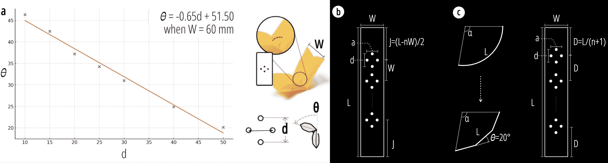

Figure 12\. The Empirical formula (a), and heat-sealing pattern for folding (b) and bending (c).

\Description

Algorithm 5 Calculate Fold

1:procedure Calculate_Fold($length,width,angle$)2:     $a\leftarrow width/3$3:     $D\leftarrow width$4:     Initialize $d,n,j$ as undefined5:     if $0<angle\leq 45$ then6:         $\theta\leftarrow angle$7:         $d\leftarrow(\theta-51.50)/(-0.65\times 60/width)$8:         $n\leftarrow 1$9:         $j\leftarrow length/2$10:     else if $45<angle\leq 90$ then11:         $\theta\leftarrow angle/2$12:         $d\leftarrow(\theta-51.50)/(-0.65\times 60/width)$13:         $n\leftarrow 2$14:         $j\leftarrow(length-D)/2$15:     else if $90<angle\leq 135$ then16:         $\theta\leftarrow angle/3$17:         $d\leftarrow(\theta-51.50)/(-0.65\times 60/width)$18:         $n\leftarrow 3$19:         $j\leftarrow(length-2\ast D)/2$20:     else if $135<angle\leq 180$ then21:         $\theta\leftarrow angle/4$22:         $d\leftarrow(\theta-51.50)/(-0.65\times 60/width)$23:         $n\leftarrow 4$24:         $j\leftarrow(length-3\ast D)/2$25:     end if26:     return $length,width,a,d,D,j,n$27:end procedure