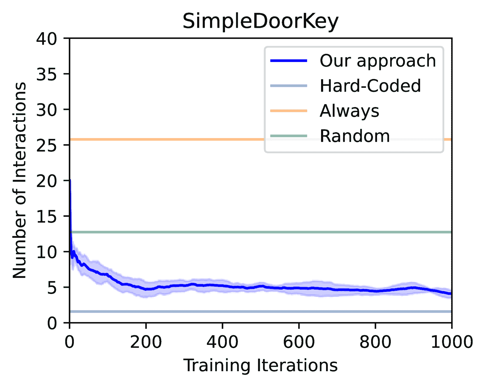

<!--yml

类别：未分类

日期：2025-01-11 13:08:47

-->

# 使代理与LLM之间的智能互动成为可能：一种强化学习方法

> 来源：[https://arxiv.org/html/2306.03604/](https://arxiv.org/html/2306.03604/)

胡斌

hubin@@zhejianglab.com

浙江实验室 &赵晨阳^∗

c.zhao@zhejianglab.com

浙江实验室 &张谱^∗

puz@zhejianglab.com

浙江实验室 &周子豪^∗

zhouzihao@zhejianglab.com

浙江实验室 &杨元航

ysngkil@gmail.com

哈尔滨工业大学（深圳）&许增林

zenglin@gmail.com

AI创新与孵化研究院，复旦大学 &刘斌

bins@ieee.org

浙江实验室 平等贡献：杨阳在浙江实验室实习期间完成了这项工作。通讯作者

###### 摘要

大型语言模型（LLMs）编码了从海量文本数据集中获得的世界知识。最近的研究表明，LLMs可以通过提供高层次的指令来帮助具身体代理解决复杂的序列决策任务。然而，与LLMs的互动可能是耗时的。在许多实际场景中，它需要大量的存储空间，这只能部署在远程云服务器上。此外，使用商业LLMs可能是昂贵的，因为它们可能根据使用频率收费。在本文中，我们探讨了如何使下游任务导向代理与LLMs之间进行智能且具有成本效益的互动。我们发现这个问题可以自然地通过马尔可夫决策过程（MDP）来公式化，并提出了When2Ask，这是一种基于强化学习的方法，可以学习何时需要查询LLMs以获得高层次的指令来完成目标任务。一方面，When2Ask可以抑制不必要的冗余互动；另一方面，它使代理能够识别并遵循LLM中的有用指令。这使得代理能够停止当前计划，并根据新的环境观察过渡到更合适的计划。在涉及规划子目标的MiniGrid和Habitat环境中的实验表明，When2Ask学会了通过仅与LLM进行少量必要的互动来解决目标任务，与基线方法相比，显著降低了在测试环境中的互动成本。我们的代码可在以下网址获取：https://github.com/ZJLAB-AMMI/LLM4RL。

## 1 引言

为了赋予具身智能体有效处理复杂顺序决策任务的能力，至关重要的是它们需要具备推理能力，使其能够规划行动的长期后果（Deitke 等人，[2022](https://arxiv.org/html/2306.03604v8#bib.bib8)）。强化学习（RL），特别是深度强化学习，已经成为应对这些挑战的热门范式。深度 RL 涉及智能体与环境的互动，并通过反馈不断学习，以改进其决策能力。尽管最近取得了显著进展，但仍然存在许多挑战，限制了其在现实世界场景中的广泛应用。例如，使用深度 RL 解决复杂问题通常需要大量的计算资源。此外，在学习阶段，尤其是在智能体的探索可能与现实世界或其他敏感环境发生交互的情况下，安全问题可能会出现（Das 等人，[2018](https://arxiv.org/html/2306.03604v8#bib.bib6)）；Chevalier-Boisvert 等人，[2018](https://arxiv.org/html/2306.03604v8#bib.bib4)）。作为一种替代方案，大型语言模型（LLMs）的出现已在解决这些问题上展现出前景。先前的研究表明，LLMs 具有推理能力（Radford 等人，[2019](https://arxiv.org/html/2306.03604v8#bib.bib13)）；Brown 等人，[2020](https://arxiv.org/html/2306.03604v8#bib.bib2)）；Wei 等人，[2022](https://arxiv.org/html/2306.03604v8#bib.bib22)）。研究人员已探索利用 LLMs 的推理能力来解决各种具身任务，包括机器人操作任务（Ahn 等人，[2022](https://arxiv.org/html/2306.03604v8#bib.bib1)）；Huang 等人，[2022](https://arxiv.org/html/2306.03604v8#bib.bib9)）；Jiang 等人，[2022](https://arxiv.org/html/2306.03604v8#bib.bib10)）以及玩电子游戏（Dasgupta 等人，[2023](https://arxiv.org/html/2306.03604v8#bib.bib7)）；Wang 等人，[2023a](https://arxiv.org/html/2306.03604v8#bib.bib19)；[c](https://arxiv.org/html/2306.03604v8#bib.bib21)）。如图[1](https://arxiv.org/html/2306.03604v8#S1.F1 "Figure 1 ‣ 1 Introduction ‣ Enabling Intelligent Interactions between an Agent and an LLM: A Reinforcement Learning Approach")所示，具身智能体与环境互动，收集与目标任务相关的信息，并利用 LLMs 作为显式推理器，通过自然语言指令制定高级计划，例如指示机器人“拿起一罐可乐”或“将一个苹果放在桌子上”。

图 1：使用 LLMs 解决复杂具身任务的通用框架。LLMs 根据状态描述提供高级指令，智能体按照这些指令生成低级行动，并与目标环境互动以收集更多反馈。

尽管将预训练的LLM集成作为具身代理的显式规划器已经展示了有前景的结果，但使这些代理与LLM之间进行高效的互动，以解决现实世界问题，仍然是一个挑战。频繁向LLM查询可能导致不必要的资源浪费，包括费用（如果使用商业LLM）、通信开销和推理时间。而向LLM查询不足则会导致代理未能及时获得有效指令，从而无法调整其计划，以应对复杂多变的环境。

确定查询LLM的合适指导方针需要对目标任务有专家级的知识。假设有一个场景，一个机器人被指示去收集一罐可乐，但在前往厨房的路上遇到了一扇锁住的门。理想情况下，代理应能识别这一事件，并通过咨询LLM来调整计划，了解如何应对这扇锁住的门。在这种情况下，何时向LLM咨询的及时决策变得至关重要。如果未能及时中断当前的行动计划并请求新的计划，可能会妨碍任务完成的进展，甚至引发安全问题，比如损坏门或机器人本身。相反，频繁请求LLM的计划可能会消耗大量时间和成本，尤其是当使用部署在远程云服务器上的商业LLM时，这些服务器通常按使用频率收费。

本文中，我们提出了When2Ask，这是一种通用方法，训练代理在与远程部署的LLM进行智能且具成本效益的互动。我们的目标是促进目标任务的有效完成，同时减少与LLM的无效互动。具体来说，我们采用了类似于Dasgupta等人（[2023](https://arxiv.org/html/2306.03604v8#bib.bib7)）的Planner-Actor-Mediator框架，其中规划器是用于制定计划的预训练LLM，演员包含执行计划的策略，而中介则作为两者之间的接口，通过决定何时请求新计划并为规划器生成观察表示（即文本描述）来进行调节。我们通过强化学习优化互动时机，学习一种提问策略，指导代理是坚持当前计划还是向LLM请求新计划。

总结来说，我们的*主要贡献*包括：

+   •

    我们提出了一种名为When2Ask的强化学习（RL）方法，用于协调下游任务导向代理与基于预训练LLM的规划器之间的互动，基于Planner-Actor-Mediator框架（Dasgupta等人，[2023](https://arxiv.org/html/2306.03604v8#bib.bib7)）。具体来说，我们建议在中介层引入显式的提问策略，并使用强化学习方法训练它，以决定何时查询LLM规划器。

+   •

    我们对When2Ask在仿真平台MiniGrid（Chevalier-Boisvert等人，[2023](https://arxiv.org/html/2306.03604v8#bib.bib5)）和Habitat（Szot等人，[2021](https://arxiv.org/html/2306.03604v8#bib.bib17)）上的基准方法进行了全面评估。结果表明，学习到的提问策略能够在何时查询LLM做出智能决策，从而在测试阶段实现了高成功率，同时只需要少量的LLM交互。与依赖预设终止标准的传统交互策略相比，When2Ask通过允许中断正在进行的计划并启动一个新的计划来应对新出现的观察，提供了显著的优势。

## 2 初步

### 2.1 选项框架

我们考虑在具身环境中进行的顺序决策，这通常形式化为马尔可夫决策过程（MDP），表示为$\mathcal{M}=\langle\mathcal{S},\mathcal{A},p,r,\gamma\rangle$。这里$\mathcal{S}$表示状态空间，$\mathcal{A}$表示动作空间，$p(s^{\prime}|s,a)$表示状态转移概率函数，$r(s,a)$表示奖励函数，$\gamma$是折扣因子。目标是学习一个最优策略，最大化随着时间的累积奖励$\sum_{t}\gamma^{t}r(s_{t},a_{t})$，其中$t$表示时间索引。

选项框架扩展了MDP中传统的动作概念，包含了选项，选项本质上是封闭回路策略，涵盖了在一段时间内的动作序列（Sutton等人，[1999](https://arxiv.org/html/2306.03604v8#bib.bib16)；Precup，[2000](https://arxiv.org/html/2306.03604v8#bib.bib12)）。选项可以从较高级的任务（如捡起物体或去吃午餐）到更原始的动作（如肌肉抽搐和关节扭矩）不等。引入选项使得在RL框架内以一种自然且通用的方式结合了时间抽象的知识和动作，从而提供了一种灵活直观的方法来处理具有不同粒度的复杂任务。形式上，一个选项$\omega$被定义为一个三元组$\langle\mathcal{I_{\omega}},\pi_{\omega},\beta_{\omega}\rangle$，其中$\mathcal{I}_{\omega}$表示初始状态集，$\pi_{\omega}$表示执行策略，$\beta_{\omega}$表示该选项的终止条件。给定一个状态$s$，一个策略-选项将从可用选项集合$\Omega$中选择一个选项$\omega$。然后，代理将通过遵循当前选项策略$a\sim\pi(\cdot|s,\omega)$来规划低级动作，直到终止条件$\beta_{\omega}$得到满足。在我们的工作中，我们使用预定义的技能作为选项，并使用预训练的LLM作为策略-选项来生成高级选项。

### 2.2 LLM作为规划器

最近的研究表明，大型语言模型（LLMs）在具身环境中的各类任务中取得了显著成功（Wang等人，[2023b](https://arxiv.org/html/2306.03604v8#bib.bib20); [c](https://arxiv.org/html/2306.03604v8#bib.bib21)）；Ahn等人（[2022](https://arxiv.org/html/2306.03604v8#bib.bib1)）也有类似的研究。受这些工作的启发，我们采用了一个预训练的LLM作为规划器，利用观察和任务的描述生成一系列选项。生成的计划，以选项序列$[\omega_{k}]_{k=1,...,K}$表示，随后通过遵循相应的选项策略来执行。形式上，使用文本描述作为输入提示，LLM输出一个以选项序列为形式的计划。然后，一个演员模块在每个时间步骤生成低级动作，按照选项策略$\pi(a|s;\omega_{k})$执行。演员模块的策略$\pi_{\omega}$可以是硬编码的，也可以从数据中学习得来。

## 3 相关工作

LLMs已经成为强大的计划生成工具。有一些研究专注于设计规划者和演员之间的有效接口。在Ahn等人（[2022](https://arxiv.org/html/2306.03604v8#bib.bib1)）的研究中，LLMs被用于在每个任务开始时规划整个选项序列，使得代理能够在不与规划者进一步交互的情况下完成任务。在Wang等人（[2023c](https://arxiv.org/html/2306.03604v8#bib.bib21)）的研究中，作者提出了一个反馈系统，其中代理在执行前一个计划失败时，要求LLM根据环境反馈生成更新的计划。这种方法增强了演员在面对环境不确定性时的鲁棒性。然而，这些方法通常依赖于硬编码的故障检测器，或应用阈值限制选项允许的MDP状态转换时间步数。在Ren等人（[2023](https://arxiv.org/html/2306.03604v8#bib.bib14)）的研究中，提出了一个框架，用于衡量和对齐基于LLM的规划者的不确定性，使它们在必要时可以寻求人类的帮助。此外，Dasgupta等人（[2023](https://arxiv.org/html/2306.03604v8#bib.bib7)）提出了规划者-演员-报告者（Planner-Actor-Reporter）框架，其中包括一个报告者模块，增强了演员与基于LLM的规划者之间的信息交换。在这个框架中，代理在每个时间步与LLM进行交互，无论是否获得了新的信息。尽管这种方法消除了硬编码的终止条件需求，并减少了选项执行中的不确定性，但它导致了过度的资源消耗，尤其是在使用大规模且昂贵的LLM作为规划者时。

在本文中，我们提出学习一种交互策略，使代理能够以自主和“更智能”的方式与远程LLM进行交互。我们通过实验证明，我们的方法克服了之前提到的基于硬编码规则的交互协议或需要在每个时间步查询LLM的协议的局限性。

## 4 我们的When2Ask方法

我们基于规划者-行动者-调解者框架（Dasgupta 等人，([2023](https://arxiv.org/html/2306.03604v8#bib.bib7)））设计了When2Ask方法。特别地，我们通过引入一个调解者模型来增强该框架，使其能够通过强化学习（RL）促进代理与LLM之间的智能且高效的互动。

### 4.1 规划者-行动者-调解者框架

该框架由三个组成部分构成，如图[2](https://arxiv.org/html/2306.03604v8#S4.F2 "图 2 ‣ 4.1 规划者-行动者-调解者框架 ‣ 4 我们的When2Ask方法 ‣ 启用智能代理与LLM之间的交互：一种强化学习方法")所示：规划者、行动者和调解者。规划者组件负责提供高层次的指令，以指导代理的行动。行动者组件根据这些指令生成低层次的动作。最后，调解者充当规划者与行动者之间的接口，促进它们之间的沟通和协调。

图 2：规划者-行动者-调解者范式的概览及其交互示例。在每个时间步，调解者将观察$o_{t}$作为输入，并决定是否向LLM规划者请求新的指令。当询问策略决定提问时，如红色虚线所示，翻译器将$o_{t}$转换为文本描述，规划者则根据此生成新的计划供行动者遵循。另一方面，当调解者决定不提问时，如绿色虚线所示，调解者直接返回给行动者，告诉它继续当前计划。

规划者 规划者组件读取当前状态的基于文本的描述，并生成下一个高层次选项或一系列要执行的选项的计划。在我们的框架中，我们利用预训练的LLM作为规划者。LLM接收当前观察的描述，并被要求为行动者生成高层次的技能指令。每当规划者被激活时，LLM根据提供的描述并通过适当设计的提示生成选项计划。

行动者 行动者组件负责规划与指令选项相一致的低层次动作，例如“走到红门”或“拿起黄色钥匙”。在我们的方法中，我们将这些选项策略视为通过人工专家知识硬编码的。也可以通过使用选项条件奖励函数预训练这些策略，以实现更复杂的技能。

中介组件  在本研究中，我们的主要关注点是设计一个智能中介组件，作为规划者-行动者-中介框架中的一部分。我们的方法涉及使用强化学习（RL）训练一个明确的询问策略，以决定何时与规划者交互。中介组件由两个子组件组成：一个询问策略，它根据观察和当前选项决定是否请求新的计划；以及一个翻译模块，它将观察转化为LLM可读的文本描述。根据Ahn等人（[2022](https://arxiv.org/html/2306.03604v8#bib.bib1)）和Carta等人（[2023](https://arxiv.org/html/2306.03604v8#bib.bib3)）的研究，我们假设这里有一个专家翻译器。在我们的实验中，翻译器设计了两个阶段。首先，我们通过仿真平台的内建接口提取代理视野内的物体ID，例如钥匙、门和盒子。然后，我们将这些信息输入到我们预定义的提示模板中，并以固定格式输出给LLM。该格式的示例可以在图[4](https://arxiv.org/html/2306.03604v8#S5.F4 "图4 ‣ 5.2 MiniGrid实验 ‣ 5 实验 ‣ 使代理与LLM之间的智能交互成为可能：一种强化学习方法")的绿色框中看到。翻译器也可以通过数据进行学习，参见Wang等人（[2023c](https://arxiv.org/html/2306.03604v8#bib.bib21)）和Dasgupta等人（[2023](https://arxiv.org/html/2306.03604v8#bib.bib7)）。

### 4.2 使用强化学习学习询问策略

在这里，我们介绍了我们提出的用于学习询问策略的方式，旨在用于中介组件。

如前所述，与大语言模型（LLM）交互可能会很昂贵。理想情况下，询问策略应当训练使代理只有在发现新的、有价值的观察时才向LLM请求新的计划。预期的是，LLM会对这些新的观察提供不同的计划。为了解决这个问题，我们将问题表述为一个马尔可夫决策过程（MDP），其中状态包含代理的观察信息和当前行动选项。行动空间包括两种行动：“询问”和“不询问”。在这个表述中，LLM规划器被视为环境的一部分，能够影响状态转移。奖励函数由任务相关的回报（记作$r$）和一个额外的惩罚项组成，后者对不必要的交互进行惩罚。具体来说，当询问策略决定向LLM请求新计划时，如果LLM提供的计划与当前计划相同，代理将遭受惩罚。这个惩罚促使询问策略避免不必要的交互，确保请求新计划的主要动机是发现了新的、有价值的观察。

将询问策略表示为 $\pi^{\text{ask}}$，其参数由 $\theta$ 表示。我们使用标准的基于策略的强化学习（RL）方法来训练该策略，特别是近端策略优化（PPO）Schulman等人（[2017](https://arxiv.org/html/2306.03604v8#bib.bib15)）。训练询问策略的目标函数定义如下：

|  | $\max_{\theta}\sum_{t=1}\big{[}\gamma^{t}r_{t}-\lambda\mathbbm{1}(y_{t}==% \textit{Ask}\land\omega_{t}==\omega_{t-1})\big{]},$ |  | (1) |
| --- | --- | --- | --- |

其中 $y_{t}\in\{\textit{Ask},\textit{Not Ask}\}$ 表示询问策略在时间步 $t$ 做出的决策，$r_{t}$ 表示在 $t$ 时刻获得的任务奖励，$\omega_{t}$ 是LLM在 $t$ 时刻提供的规划选项。惩罚因子 $\lambda$ 用于平衡避免不必要交互的重要性。请注意，如果询问策略做出的决策是“Not Ask” ($y_{t}==\textit{Not Ask}$)，我们将 $\omega_{t}$ 设置为前一个时间步执行的计划，即让 $\omega_{t}=\omega_{t-1}$。这确保了如果智能体决定不请求新的计划，它将继续执行之前的相同计划。在每次迭代过程中，数据是通过基于策略的方式使用模型 $\pi^{\text{ask}}_{\theta}$ 收集的。

## 5 实验

我们通过实验来回答以下问题：我们的智能体是否能够有效地降低交互成本，同时保持较高的目标任务完成率，相较于基准方法？我们的智能体是否能够在探索性环境中主动寻求来自大语言模型（LLM）的帮助？实验结果表明，两个问题的答案都是肯定的。作为副产品，我们发现我们的方法能够容忍一个关键组件的 imperfection——即中介模块中的翻译器，该翻译器用于将观察到的图像转换为文本描述（具体细节请参见附录）。我们采用了两种版本的Vicuna模型（Vicuna-7b和Vicuna-13b）Touvron等人（[2023](https://arxiv.org/html/2306.03604v8#bib.bib18)）作为LLM规划器。

### 5.1 基准线

在我们的实验中，我们考虑了以下四种基准交互方法：

硬编码 从LLM请求新指令的时机和条件由人工专家手动为每个选项确定Wang等人（[2023c](https://arxiv.org/html/2306.03604v8#bib.bib21)）。智能体只有在满足选项的特定终止条件时，才会从LLM规划器请求新的计划。这些条件涉及目标完成检测器以及允许的最大步数限制。例如，考虑选项“去红门”。该选项的终止条件指定智能体应到达目标门位置或在该选项上花费超过100个时间步。

始终  代理在每个时间步都向LLM规划器查询，确保任何新获取的信息立即传递给规划器，Dasgupta等人（[2023](https://arxiv.org/html/2306.03604v8#bib.bib7)）。这种策略理论上会带来更好的任务执行性能，因为收集新信息与请求重新规划之间没有延迟。然而，它的缺点是会消耗更多的交互资源。

随机  在每个时间步，代理有50%的固定概率向LLM查询指令。

从不  代理从不与LLM互动。相反，选项策略（即规划器）是通过基于与环境互动过程中收集的数据，使用强化学习（RL）技术进行学习的，Sutton等人（[1999](https://arxiv.org/html/2306.03604v8#bib.bib16)）；Precup（[2000](https://arxiv.org/html/2306.03604v8#bib.bib12)）。这意味着代理学会在没有实时查询LLM的情况下做出决策并生成计划。通过将这种方法与其他方法进行比较，我们可以评估使用LLM作为规划器的贡献。这种比较有助于评估将预训练LLM纳入规划过程的有效性和优势。

### 5.2 MiniGrid 实验

MiniGrid环境由一系列2D网格世界环境组成，具有目标导向的任务，Chevalier-Boisvert等人（[2023](https://arxiv.org/html/2306.03604v8#bib.bib5)）。在这些环境中，代理必须在一个2D网格房间内导航，并与特定对象互动以完成各种任务，如“打开红色门”或“将绿色球放到黄色箱子旁边”。

这个环境的一个重要特点是智能体的视野范围有限。这意味着智能体需要探索环境并收集有用的信息，以有效地规划其行动。环境以完整网格的形式返回观测值，但未探索的区域被遮蔽，类似于《星际争霸》等游戏中的“战争迷雾”概念。从技术上讲，环境返回的观测值形状为$o\in\mathbb{R}^{W\times H\times 4}$，其中$W$和$H$分别表示网格的宽度和高度。对于位置$[w,h]$处的未探索网格，观测值返回向量$[-1,-1,-1,-1]$。对于已探索的网格，相应的4D向量包含有关对象ID、颜色ID、状态ID（例如门是否关闭或锁定）和智能体方向ID的信息（如果智能体位于该位置，则表示智能体的方向，否则为4）。这一设计使我们能够专注于智能体的推理能力，并排除记忆等因素的潜在影响。[图3](https://arxiv.org/html/2306.03604v8#S5.F3 "图3 ‣ 5.2 MiniGrid实验 ‣ 5 实验 ‣ 使智能体与LLM之间的智能互动成为可能：一种强化学习方法")展示了SimpleDoorKey场景中环境设置的示例。

<svg class="ltx_picture ltx_centering" height="171.34" id="S5.F3.pic1" overflow="visible" version="1.1" width="560.77"><g transform="translate(0,171.34) matrix(1 0 0 -1 0 0) translate(50.17,0) translate(0,121.65)"><g fill="#000000" stroke="#000000" stroke-width="0.1pt" transform="matrix(1.0 0.0 0.0 1.0 -45 -45)"><foreignobject height="90" overflow="visible" transform="matrix(1 0 0 -1 0 16.6)" width="90"></foreignobject></g><g fill="#000000" stroke="#000000" stroke-width="0.1pt" transform="matrix(1.0 0.0 0.0 1.0 70.11 -45)"><foreignobject height="90" overflow="visible" transform="matrix(1 0 0 -1 0 16.6)" width="90"></foreignobject></g><g fill="#000000" stroke="#000000" stroke-width="0.1pt" transform="matrix(1.0 0.0 0.0 1.0 185.22 -45)"><foreignobject height="90" overflow="visible" transform="matrix(1 0 0 -1 0 16.6)" width="90"></foreignobject></g><g fill="#000000" stroke="#000000" stroke-width="0.1pt" transform="matrix(1.0 0.0 0.0 1.0 300.33 -45)"><foreignobject height="90" overflow="visible" transform="matrix(1 0 0 -1 0 16.6)" width="90"></foreignobject></g><g fill="#000000" stroke="#000000" stroke-width="0.1pt" transform="matrix(1.0 0.0 0.0 1.0 415.44 -45)"><foreignobject height="90" overflow="visible" transform="matrix(1 0 0 -1 0 16.6)" width="90"></foreignobject></g> <g fill="#000000" stroke="#000000" stroke-width="0.8pt" transform="matrix(1.0 0.0 0.0 1.0 -45 -96.89)"><foreignobject height="16.6" overflow="visible" transform="matrix(1 0 0 -1 0 16.6)" width="90">观察到无物体 <g fill="#F2FFF2" stroke="#66FF66" stroke-width="0.8pt"><path d="M 159.19 -69.92 L 71.03 -69.92 C 67.98 -69.92 65.5 -72.4 65.5 -75.45 L 65.5 -115.57 C 65.5 -118.62 67.98 -121.1 71.03 -121.1 L 159.19 -121.1 C 162.24 -121.1 164.72 -118.62 164.72 -115.57 L 164.72 -75.45 C 164.72 -72.4 162.24 -69.92 159.19 -69.92 Z M 65.5 -121.1"></path></g> <g fill="#000000" stroke="#000000" stroke-width="0.8pt" transform="matrix(1.0 0.0 0.0 1.0 70.11 -96.89)"><foreignobject height="16.6" overflow="visible" transform="matrix(1 0 0 -1 0 16.6)" width="90">观察到绿色钥匙</foreignobject></g> <g fill="#F2FFF2" stroke="#66FF66" stroke-width="0.8pt"><path d="M 274.3 -69.92 L 186.14 -69.92 C 183.09 -69.92 180.61 -72.4 180.61 -75.45 L 180.61 -115.57 C 180.61 -118.62 183.09 -121.1 186.14 -121.1 L 274.3 -121.1 C 277.35 -121.1 279.83 -118.62 279.83 -115.57 L 279.83 -75.45 C 279.83 -72.4 277.35 -69.92 274.3 -69.92 Z M 180.61 -121.1"></path></g> <g fill="#000000" stroke="#000000" stroke-width="0.8pt" transform="matrix(1.0 0.0 0.0 1.0 185.22 -96.89)"><foreignobject height="16.6" overflow="visible" transform="matrix(1 0 0 -1 0 16.6)" width="90">观察到绿色钥匙</foreignobject></g> <g fill="#F2FFF2" stroke="#66FF66" stroke-width="0.8pt"><path d="M 389.41 -69.92 L 301.25 -69.92 C 298.2 -69.92 295.72 -72.4 295.72 -75.45 L 295.72 -115.57 C 295.72 -118.62 298.2 -121.1 301.25 -121.1 L 389.41 -121.1 C 392.46 -121.1 394.94 -118.62 394.94 -115.57 L 394.94 -75.45 C 394.94 -72.4 392.46 -69.92 389.41 -69.92 Z M 295.72 -121.1"></path></g> <g fill="#000000" stroke="#000000" stroke-width="0.8pt" transform="matrix(1.0 0.0 0.0 1.0 300.33 -96.89)"><foreignobject height="16.6" overflow="visible" transform="matrix(1 0 0 -1 0 16.6)" width="90">观察到绿色门，携带绿色钥匙</foreignobject></g> <g fill="#FFF9F2" stroke="#FFB366" stroke-width="0.8pt"><path d="M 410.83 -121.1 h 99.22 v 51.18 h -99.22 Z"></path></g> <g fill="#000000" stroke="#000000" stroke-width="0.8pt" transform="matrix(1.0 0.0 0.0 1.0 415.44 -100.35)"><foreignobject height="9.69" overflow="visible" transform="matrix(1 0 0 -1 0 16.6)" width="90">完成！</foreignobject></g> <g fill="#000000" stroke="#000000"><g stroke-width="0.4pt"><path d="M 49.68 0 L 64.79 0" style="fill:none"><g stroke-dasharray="none" stroke-dashoffset="0.0pt" stroke-linecap="round" stroke-linejoin="round" stroke-width="0.32pt" transform="matrix(1.0 0.0 0.0 1.0 64.79 0)"><path d="M -1.66 2.21 C -1.52 1.38 0 0.14 0.42 0 C 0 -0.14 -1.52 -1.38 -1.66 -2.21" style="fill:none"></path></g><path d="M 164.79 0 L 179.9 0" style="fill:none"><g stroke-dasharray="none" stroke-dashoffset="0.0pt" stroke-linecap="round" stroke-linejoin="round" stroke-width="0.32pt" transform="matrix(1.0 0.0 0.0 1.0 179.9 0)"><path d="M -1.66 2.21 C -1.52 1.38 0 0.14 0.42 0 C 0 -0.14 -1.52 -1.38 -1.66 -2.21" style="fill:none"></path></g><path d="M

图3：在环境SimpleDoorKey中，部分观察及其对应的文本描述的示例。代理以红色三角形表示，代理行走的路径以红色圆点表示。在每个回合开始时，代理只提供有限的信息，未探索的区域被遮盖（浅灰色）。随着代理在这个房间中的推进，它为规划者揭示更多关于房间布局的信息，直到成功打开锁住的门。

图4：ColoredDoorKey环境的前缀提示和一次交互的示例。前缀提示包括任务说明和少量示例。在连锁思维风格的提示中，我们在示例中加入了推理过程。请注意，这些少量示例仅用于为LLM提供一些任务相关的知识的基础，而不是全部知识，并且约束LLM的输出格式。我们不需要穷举所有知识和规则来构建提示，因为合格的LLM可以基于有限的提示进行逻辑推理，然后提供适应环境中新场景的适当计划（指令）。

在我们的实验中，我们集中于在五个不同环境中打开一扇锁住的门的任务：SimpleDoorKey、KeyInBox、RandomBoxKey、ColoredDoorKey 和 MovingObstacle。这些环境都是程序生成的，即每次重置环境时，网格布局（包括房间大小、钥匙和门的位置）都是随机决定的。为了评估泛化能力，为每个环境预先定义了一个由100个随机选择的种子组成的留出测试集。更多细节请参考附录。

我们在SimpleDoorKey、KeyInBox、RandomBoxKey和MovingObstacle环境中使用Vicuna-7b模型，而对于更复杂的ColoredDoorKey环境，我们使用Vicuna-13b模型。正如Min等人（[2022](https://arxiv.org/html/2306.03604v8#bib.bib11)）在之前的研究中所示，像LLMs这样的语言模型需要精心设计的提示和少量示例来推广到不同的任务。在我们的实验中，我们为每个环境提供任务说明和少量示例作为上下文提示。这些提示有助于引导LLM理解任务。对于ColoredDoorKey环境中的复杂推理任务，我们采用了Wei等人（[2022](https://arxiv.org/html/2306.03604v8#bib.bib22)）提出的Chain-of-Thought提示。这些提示帮助LLM处理ColoredDoorKey环境中特定的复杂推理任务。提示中的少量示例用于约束输出格式。LLM规划器必须利用其概括和推理能力，以理解目标任务，并适应与少量示例不同的情况，例如物体颜色的变化。图[4](https://arxiv.org/html/2306.03604v8#S5.F4 "Figure 4 ‣ 5.2 MiniGrid Experiments ‣ 5 Experiments ‣ Enabling Intelligent Interactions between an Agent and an LLM: A Reinforcement Learning Approach")展示了ColoredDoorKey环境中的前缀提示和交互示例，展示了LLM规划器在响应新观察时生成准确计划的有效表现。

#### 5.2.1 我们的智能体能否以更少的交互成本完成目标任务？

我们将我们的方法When2Ask与基线方法进行比较，以评估其有效性。我们分析了在所有五个环境中，交互成本（图[5](https://arxiv.org/html/2306.03604v8#S5.F5 "图 5 ‣ 5.2.1 我们的智能体是否能够以更少的交互成本完成目标任务？ ‣ 5.2 MiniGrid 实验 ‣ 5 实验 ‣ 使智能体与大语言模型（LLM）之间的交互更智能：一种强化学习方法")）和任务表现（图[6](https://arxiv.org/html/2306.03604v8#S5.F6 "图 6 ‣ 5.2.1 我们的智能体是否能够以更少的交互成本完成目标任务？ ‣ 5.2 MiniGrid 实验 ‣ 5 实验 ‣ 使智能体与大语言模型（LLM）之间的交互更智能：一种强化学习方法")）的学习曲线。此外，我们在表[1](https://arxiv.org/html/2306.03604v8#S5.T1 "表 1 ‣ 5.2.1 我们的智能体是否能够以更少的交互成本完成目标任务？ ‣ 5.2 MiniGrid 实验 ‣ 5 实验 ‣ 使智能体与大语言模型（LLM）之间的交互更智能：一种强化学习方法")中提供了渐进的性能。如图所示，我们的方法成功地减少了与LLM的交互次数，同时在所有环境中保持了任务表现。这种交互成本的减少表明，我们的方法有效地学习到了如何减少与LLM的无意义交互。此外，我们的方法在整个学习过程中保持了 consistently 高的成功率。这一观察表明，询问策略学会了过滤掉不必要的交互，同时仍然与LLM进行必要的交互以完成任务。

图 5：与LLM的交互次数与用于学习询问策略的RL迭代次数之间的关系。结果表明，对于每个环境，询问策略训练得越充分，完成任务所需的与LLM规划器的交互次数（即交互成本）就越少。曲线中的阴影区域代表基于三个标准误差的置信区间。

图 6：完成目标任务的成功率与用于学习询问策略的RL迭代次数之间的关系。结果表明，我们的方法在所有环境中始终保持较高的成功率，并且在ColoredDoorKey环境中优于基线方法。

表1：在五个MiniGrid环境中的渐近性能比较。性能指标包括与LLM的总交互次数、MDP状态转换的时间步数，以及完成任务的成功率。这些结果表明，我们的方法在成功率上取得了具有竞争力的任务表现，同时在与Always和Random方法的比较中，显著减少了交互成本（通过交互次数表示）。硬编码方法需要最少的LLM交互，但通常未能完成任务。所有结果是基于500次测试试验的平均值（我们使用5个训练种子初始化策略网络，并对每个种子进行100次独立测试）。

| 环境 | 性能指标 | 硬编码 | 始终 | 随机 | 我们的方法 |
| --- | --- | --- | --- | --- | --- |
| SimpleDoorKey | 交互次数 $\downarrow$ | 1.58 | 25.78 | 12.75 | 4.24 |
| 时间步数 $\downarrow$ | 64.9 | 25.78 | 26.55 | 29.20 |
| 任务成功率 $\uparrow$ | 59% | 100% | 100% | 100% |
| KeyInBox | 交互次数 $\downarrow$ | 1.58 | 26.78 | 15.3 | 4.33 |
| 任务时间步数 $\downarrow$ | 65.49 | 26.78 | 27.46 | 29.01 |
| 任务成功率 $\uparrow$ | 59% | 100% | 100% | 100% |
| RandomBoxKey | 交互次数 $\downarrow$ | 1.93 | 30.26 | 16.09 | 3.61 |
| 任务时间步数 $\downarrow$ | 61.71 | 30.26 | 30.2 | 34.41 |
| 任务成功率 $\uparrow$ | 56% | 94% | 95% | 95% |
| ColoredDoorKey | 交互次数 $\downarrow$ | 2.01 | 61.96 | 23.75 | 3.29 |
| 时间步数 $\downarrow$ | 75.54 | 61.96 | 44.64 | 47.87 |
| 任务成功率 $\uparrow$ | 43% | 49% | 81% | 83% |
| MovingObstacle | 交互次数 $\downarrow$ | 2.29 | 39.49 | 20.70 | 6.94 |
| 时间步数 $\downarrow$ | 82.36 | 39.49 | 44.90 | 48.63 |
| 任务成功率 $\uparrow$ | 43% | 94% | 93% | 92% |

#### 5.2.2 我们的代理能否在探索性环境中主动寻求LLM的帮助？

在分析代理在需要向LLM规划器寻求帮助的情况下的表现时，我们观察到，使用硬编码询问策略的基准方法相比其他方法表现出显著较低的成功率。这个差异的出现是因为代理会继续执行每一个选项，直到其终止条件满足，即使它已经收集到足够的信息来完成任务。因此，这种低效的方法导致每个选项都浪费时间，最终未能在给定的时间限制内完成任务。相比之下，When2Ask以及其他基准方法能够在必要时及早停止选项。因此，它们在SimpleDoorKey和KeyInBox任务中达到了100%的成功率。

在 ColoredDoorKey 环境中的特定场景，如图 [7(a)](https://arxiv.org/html/2306.03604v8#S5.F7.sf1 "在图 7 ‣ 5.2.2 我们的代理能否在探索性环境中主动寻求 LLM 的帮助？ ‣ 5.2 MiniGrid 实验 ‣ 5 实验 ‣ 使代理与 LLM 之间的智能互动成为可能：一种强化学习方法") 所示，我们看到一个有趣的现象。代理选择了“探索”选项，并获取了关于黄色钥匙位置的信息（第 2 帧）。使用硬编码基线方法时，代理将继续执行“探索”选项，直到它完全探索整个房间。相比之下，使用我们提出的方法，代理可以认识到在当前信息的基础上向 LLM 规划器寻求指导的价值，并立即提出查询 LLM 规划器以获取更新的计划，同时停止进一步的探索。LLM 将指示代理有效地捡起黄色钥匙，而不会浪费额外的时间。这个例子突出了我们的方法在识别何时向 LLM 规划器寻求帮助以及基于现有信息做出更有效决策方面的有效性。通过利用 LLM 规划器的力量，我们的方法使代理能够做出明智的选择，加速任务完成并提高整体性能。

（a）代理人在选项探索过程中发现新信息的示例场景。

（b）硬编码翻译器未能编码所有信息的示例场景。

图 7：两个示例场景，其中代理人被期望：（a）向 LLM 规划器寻求帮助，因为它已经收集了有助于规划器调整计划的有用信息；（b）不向 LLM 寻求帮助，因为 LLM 可能会由于翻译器不完善而提出错误的选项。

图 8：与 LLM 的互动次数（左）和阶段成功率（右）与用于学习请求策略的训练迭代次数的关系，针对 Pick&Place 任务。

图9：一个示例，展示了栖息地中的“交接”问题。机器人的目标是导航到客厅并从桌子上拿起苹果。在使用硬编码基准（左图）时，根据预设的硬编码规则，代理必须先完成导航选项，然后才能执行拿取选项。因此，代理停留在一个苹果不可见的位置，导致在拿取选项时失败。而在我们的方法下（右图），代理在导航过程中发现自己处于一个能够看到苹果的合适位置。学习到的中介打断了正在进行的导航，并向LLM规划器发起查询，后者返回了拿取选项。这帮助代理成功地拿到了苹果。此示例展示了我们的方法在绕过“交接”问题中的有效性。

### 5.3 栖息地实验

我们进一步在栖息地环境中评估了我们的方法，参考了Szot等人（[2021](https://arxiv.org/html/2306.03604v8#bib.bib17)）的研究。结果表明，我们的方法在视觉真实的领域中具有有效的潜力。实验设置的详细信息请参见附录。

表2：测试过程中栖息地中每个阶段的成功率和与LLM规划器的总交互次数。

| 性能指标 | 硬编码 | 随机 | 我们的方法 |
| --- | --- | --- | --- |
| 第一阶段成功率$\uparrow$ | 10.8% | 7.6% | 53.6% |
| 第二阶段成功率$\uparrow$ | 2.4% | 1.6% | 46.4% |
| 第三阶段成功率$\uparrow$ | 2.0% | 1.2% | 35.6% |
| 总交互次数$\downarrow$ | 1.00 | 295.60 | 7.99 |

我们在Pick&Place任务中将我们的方法与基准方法进行了比较。为了确保实验结果的可靠性，我们使用了10个训练种子来初始化策略网络。这使我们能够探索不同的初始化方式，并避免偏倚的结果。随后，我们从这些训练运行中选择最好的策略，并进行了250次独立的测试试验。如表[2](https://arxiv.org/html/2306.03604v8#S5.T2 "表 2 ‣ 5.3 Habitat实验 ‣ 5 实验 ‣ 使智能体与LLM之间能够进行智能互动：一种强化学习方法")和图[8](https://arxiv.org/html/2306.03604v8#S5.F8 "图 8 ‣ 5.2.2 我们的智能体能否在探索环境中主动寻求LLM的帮助？ ‣ 5.2 MiniGrid实验 ‣ 5 实验 ‣ 使智能体与LLM之间能够进行智能互动：一种强化学习方法")所示，我们的方法在所有三个阶段的表现均显著优于基准方法。特别是，与硬编码基准方法（该方法按步骤执行预设计划）相比，我们的方法在解决“交接问题”方面表现得显著更好。Szot等人（[2021](https://arxiv.org/html/2306.03604v8#bib.bib17)）提出的这一问题可能会在前一个选项结束时，进入一个使后续选项难以启动的状态。这个问题在图[9](https://arxiv.org/html/2306.03604v8#S5.F9 "图 9 ‣ 5.2.2 我们的智能体能否在探索环境中主动寻求LLM的帮助？ ‣ 5.2 MiniGrid实验 ‣ 5 实验 ‣ 使智能体与LLM之间能够进行智能互动：一种强化学习方法")中得到了体现，在该图中，机器人在Navigate选项结束时停在了一个不利的位置，导致无法执行后续的Pick选项。我们的方法通过寻求LLM规划器的指导，有效地绕过了这个问题。

获得的结果表明，RL学习到的提问策略有效地建立了LLM中嵌入的世界知识与智能体中嵌入的下游精细化知识之间的联系。这一联系使得我们的方法相比不涉及任何学习的基准方法在整体表现上更为优越。这些发现与我们在MiniGrid环境中的实验主要观察结果一致，特别是在ColoredDoorKey场景中，RL学习到的提问策略使得智能体在任务完成成功率方面超越了所有基准方法。

## 6 结论

我们研究了强化学习（RL）在为由大规模语言模型（LLM）驱动的指令跟随代理获取“中介”策略中的应用。先前的研究表明，当与精心设计的提示词结合时，LLM能够根据状态描述有效地生成条件性高层指令，从而为任务完成制定详细的计划。最近的LLM驱动规划框架探讨了两种主要策略：1）在每个时间步生成更新的计划；2）仅在每个计划（选项）基于预定义的终止标准完成后请求更新。前一种方法在计算上很密集，因为生成LLM的新响应成本较高，而后一种方法可能面临挑战，因为正在执行的计划无法及时中断以响应新的观察。

为此，我们提出了When2Ask，它涉及训练一个中介策略来决定何时提示LLM生成适合当前时刻的计划。When2Ask训练中介策略以优化任务导向的奖励，同时惩罚在已调用规划器但返回与代理当前执行的计划相同的情况。跨不同具身环境的实验结果表明，所学习的中介策略在任务成功率上与在每个时间步查询LLM的固定策略相当，同时显著减少了对LLM的查询次数，从而降低了代理的计算负担。

利用LLM为机器人和其他自主代理提供通用推理和规划能力展现出了巨大的潜力。然而，这一潜力在一定程度上受限于低层次观察与动作与高层次基于LLM的规划器之间映射的质量。长期目标是以端到端的方式学习这种映射。然而，在此期间，值得研究如何学习该映射的不同元素，以及通过这一努力能够获得多少益处，正如本研究所示。

#### 致谢

我们感谢匿名评审人提供的宝贵意见，这些意见帮助我们提高了本文的质量。此项工作主要得到了浙江实验室探索性研究项目（编号：2022RC0AN02）的资助，并部分得到了中国博士后科学基金（编号：2023M743266）和浙江省博士后研究项目（编号：ZJ2023067）的资助。徐震受到复旦大学（编号：JIH2325015Y）的部分资助。

## 参考文献

+   Ahn 等人（2022）Michael Ahn, Anthony Brohan, Noah Brown, Yevgen Chebotar, Omar Cortes, Byron David, Chelsea Finn, Keerthana Gopalakrishnan, Karol Hausman, Alex Herzog 等人。**“做我做的，而不是我说的”**：将语言与机器人可行性联系起来。*arXiv 预印本 arXiv:2204.01691*，2022年。

+   Brown 等人（2020）Tom Brown, Benjamin Mann, Nick Ryder, Melanie Subbiah, Jared D Kaplan, Prafulla Dhariwal, Arvind Neelakantan, Pranav Shyam, Girish Sastry, Amanda Askell 等人. 语言模型是少样本学习者。*神经信息处理系统进展*, 33:1877-1901, 2020。

+   Carta 等人（2023）Thomas Carta, Clément Romac, Thomas Wolf, Sylvain Lamprier, Olivier Sigaud, 和 Pierre-Yves Oudeyer. 通过在线强化学习在交互环境中为大规模语言模型赋能。*arXiv 预印本 arXiv:2302.02662*, 2023。

+   Chevalier-Boisvert 等人（2018）Maxime Chevalier-Boisvert, Dzmitry Bahdanau, Salem Lahlou, Lucas Willems, Chitwan Saharia, Thien Huu Nguyen, 和 Yoshua Bengio. Babyai: 一个研究基础语言学习样本效率的平台。*arXiv 预印本 arXiv:1810.08272*, 2018。

+   Chevalier-Boisvert 等人（2023）Maxime Chevalier-Boisvert, Bolun Dai, Mark Towers, Rodrigo de Lazcano, Lucas Willems, Salem Lahlou, Suman Pal, Pablo Samuel Castro, 和 Jordan Terry. Minigrid & miniworld: 模块化与可定制的强化学习环境，用于目标导向任务。*CoRR*, abs/2306.13831, 2023。

+   Das 等人（2018）Abhishek Das, Samyak Datta, Georgia Gkioxari, Stefan Lee, Devi Parikh, 和 Dhruv Batra. 体现式问答。收录于 *IEEE 计算机视觉与模式识别会议论文集*，第 1-10 页，2018。

+   Dasgupta 等人（2023）Ishita Dasgupta, Christine Kaeser-Chen, Kenneth Marino, Arun Ahuja, Sheila Babayan, Felix Hill, 和 Rob Fergus. 与语言模型协作进行体现式推理。*arXiv 预印本 arXiv:2302.00763*, 2023。

+   Deitke 等人（2022）Matt Deitke, Dhruv Batra, Yonatan Bisk, Tommaso Campari, Angel X Chang, Devendra Singh Chaplot, Changan Chen, Claudia Pérez D’Arpino, Kiana Ehsani, Ali Farhadi 等人. 关于体现式 AI 研讨会的回顾。*arXiv 预印本 arXiv:2210.06849*, 2022。

+   Huang 等人（2022）Wenlong Huang, Fei Xia, Ted Xiao, Harris Chan, Jacky Liang, Pete Florence, Andy Zeng, Jonathan Tompson, Igor Mordatch, Yevgen Chebotar 等人. 内心独白：通过规划与语言模型进行体现式推理。*arXiv 预印本 arXiv:2207.05608*, 2022。

+   Jiang 等人（2022）Yunfan Jiang, Agrim Gupta, Zichen Zhang, Guanzhi Wang, Yongqiang Dou, Yanjun Chen, Li Fei-Fei, Anima Anandkumar, Yuke Zhu, 和 Linxi Fan. Vima: 基于多模态提示的通用机器人操作。*arXiv 预印本 arXiv:2210.03094*, 2022。

+   Min 等人（2022）Sewon Min, Xinxi Lyu, Ari Holtzman, Mikel Artetxe, Mike Lewis, Hannaneh Hajishirzi, 和 Luke Zettlemoyer. 重新思考示范的作用：是什么使得上下文学习有效？*arXiv 预印本 arXiv:2202.12837*, 2022。

+   Precup（2000）Doina Precup. *强化学习中的时间抽象*。马萨诸塞大学阿默斯特分校，2000年。

+   Radford 等人（2019）Alec Radford, Jeffrey Wu, Rewon Child, David Luan, Dario Amodei, Ilya Sutskever 等人. 语言模型是无监督的多任务学习者。*OpenAI 博客*, 1(8):9, 2019。

+   Ren et al. (2023) Allen Z Ren, Anushri Dixit, Alexandra Bodrova, Sumeet Singh, Stephen Tu, Noah Brown, Peng Xu, Leila Takayama, Fei Xia, 和 Jake Varley. 会求助的机器人：大型语言模型规划者的不确定性对齐。发表于*第7届年度机器人学习会议*，2023年。

+   Schulman et al. (2017) John Schulman, Filip Wolski, Prafulla Dhariwal, Alec Radford, 和 Oleg Klimov. 近端策略优化算法。*arXiv 预印本 arXiv:1707.06347*，2017年。

+   Sutton et al. (1999) Richard S Sutton, Doina Precup, 和 Satinder Singh. 在mdp和semi-mdp之间：强化学习中时间抽象的框架。*人工智能*，112(1-2):181–211，1999年。

+   Szot et al. (2021) Andrew Szot, Alexander Clegg, Eric Undersander, Erik Wijmans, Yili Zhao, John Turner, Noah Maestre, Mustafa Mukadam, Devendra Singh Chaplot, Oleksandr Maksymets，等。Habitat 2.0：训练家庭助手重新布置其栖息地。*神经信息处理系统进展*，34:251–266，2021年。

+   Touvron et al. (2023) Hugo Touvron, Thibaut Lavril, Gautier Izacard, Xavier Martinet, Marie-Anne Lachaux, Timothée Lacroix, Baptiste Rozière, Naman Goyal, Eric Hambro, Faisal Azhar, Aurelien Rodriguez, Armand Joulin, Edouard Grave, 和 Guillaume Lample. Llama：开放且高效的基础语言模型。*arXiv 预印本 arXiv:2302.13971*，2023年。

+   Wang et al. (2023a) Guanzhi Wang, Yuqi Xie, Yunfan Jiang, Ajay Mandlekar, Chaowei Xiao, Yuke Zhu, Linxi Fan, 和 Anima Anandkumar. Voyager：一个开放式的具身代理与大型语言模型。*arXiv 预印本 arXiv:2305.16291*，2023年。

+   Wang et al. (2023b) Lei Wang, Chen Ma, Xueyang Feng, Zeyu Zhang, Hao Yang, Jingsen Zhang, Zhiyuan Chen, Jiakai Tang, Xu Chen, Yankai Lin，等。基于大型语言模型的自主代理调查。*arXiv 预印本 arXiv:2308.11432*，2023年。

+   Wang et al. (2023c) Zihao Wang, Shaofei Cai, Anji Liu, Xiaojian Ma, 和 Yitao Liang. 描述、解释、规划与选择：与大型语言模型的交互式规划使得开放世界多任务代理成为可能。*arXiv 预印本 arXiv:2302.01560*，2023年。

+   Wei et al. (2022) Jason Wei, Xuezhi Wang, Dale Schuurmans, Maarten Bosma, Ed Chi, Quoc Le, 和 Denny Zhou. 思维链提示在大型语言模型中引发推理。*arXiv 预印本 arXiv:2201.11903*，2022年。

+   Zhou et al. (2024) Zihao Zhou, Bin Hu, Chenyang Zhao, Pu Zhang, 和 Bin Liu. 大型语言模型作为强化学习代理的策略教师。发表于*第33届国际人工智能联合会议（IJCAI）*，2024年。

## 附录A 附录

### A.1 MiniGrid上的实验设置

在SimpleDoorKey和KeyInBox的基本设置中，每个房间只包含一把钥匙和一扇锁住的门。在SimpleDoorKey中，钥匙放在地板上，而在KeyInBox中，钥匙放在一个盒子里。代理需要探索房间，找到目标门和钥匙/盒子，捡起钥匙，最后使用钥匙解锁目标门。

在RandomBoxKey环境中，钥匙的位置是随机的，可能在地板上或一个箱子里。智能体需要根据来自环境的反馈积极规划自己的动作，并根据是否观察到钥匙或箱子调整计划。

ColoredDoorKey引入了多个钥匙和只有一个出口的门。每把钥匙和对应的门都有颜色编码，需要匹配相同颜色的钥匙才能打开门。这个环境测试了智能体识别和利用颜色信息完成任务的能力。

MovingObstacle通过引入在房间内随机移动的障碍物增加了另一个复杂性层次，可能会阻碍智能体的路径。智能体需要在这个动态变化的环境中导航，并根据新的观察结果调整其计划。

#### A.1.1 关于我们智能体设计的更多细节

Actor  在我们的实验中，演员由一组预定义的选项策略组成。可用的选项如下：

+   •

    探索：此选项是通过预设规则实现的。具体过程如下：首先，指示智能体移动到任务环境的左上角，然后按行交替扫描，直到环境中的所有信息变得可见。此选项使智能体能够发现未探索的区域，从而获取新信息。

+   •

    去 [an object]：通过此选项，智能体可以导航到环境中的某个物体。该物体可以是任何可互动的元素，如钥匙、箱子或门。

+   •

    拾取 [an object]：此选项使智能体能够拾取指定的物体。当智能体需要获取某个物品以推动任务进展时，例如抓取钥匙来解锁门，此选项非常有用。

+   •

    切换 [an object]：使用此选项，智能体可以切换某个物体的状态。例如，打开或关闭门，使用钥匙解锁门或打开箱子。

这些预定义的选项为智能体提供了一系列高层次的动作，可以在决策过程中选择。通过根据当前目标和观察情况选择合适的选项，智能体可以高效地导航并与环境互动，从而完成给定任务。有关更多细节，请参阅补充材料。

如何训练提问策略？在我们的实验中，我们训练了一个神经网络来作为提问策略。具体来说，这个神经网络接收来自当前帧和前一帧的观测作为输入。在将这些观测传递给网络之前，我们计算这两帧之间的差异。这鼓励提问策略仅在与前一帧相比环境发生显著变化时才生成“提问”动作。提问策略的网络架构包含三层卷积神经网络（CNN）层，后面跟着两层多层感知器（MLP）层。网络的输出包括每个选项的logits，表示每个选项选择“提问”或“不提问”动作的概率。因此，网络输出的维度是$2\times K$，其中第(2$k$-1)和第2$k$个条目共同决定了选项$k$的动作分布。这里，$K$表示我们方法中使用的选项集的大小。通过使用这种架构训练提问策略网络，我们增强了智能体在基于连续帧之间观察到的环境变化时，决定是否向LLM规划器提出查询的能力。

### A.2 我们的方法可以容忍中介模块中翻译器的不完美

在MiniGrid的ColoredDoorKey复杂环境中，基础的交互方法**Always**已被观察到在某些特殊情况下失败，这些失败是由于框架内其他组件的缺陷所致。图[7(b)](https://arxiv.org/html/2306.03604v8#S5.F7.sf2 "图7 ‣ 5.2.2 我们的智能体能否在探索性环境中主动寻求LLM的帮助？ ‣ 5.2 MiniGrid实验 ‣ 5 实验 ‣ 实现智能体与LLM之间的智能交互：一种强化学习方法")展示了在ColoredDoorKey中的一个示例场景，展示了这种情况。在第一个画面中，智能体被指示去拿钥匙。转向左侧并丢下紫色钥匙后（画面2），LLM再次指示智能体去拿钥匙，智能体应当继续去拿黄色钥匙。然而，**Always**基准方法在这种情况下失败，因为翻译器未能准确编码智能体与目标物体之间的相对位置。因此，翻译器返回了相同的观察值[观察到的黄色钥匙，观察到的黄色门，携带的紫色钥匙]，用于画面1和画面2。相比之下，我们的方法学会了在这种特定情况下“无需请求”帮助，从而使智能体能够在请求进一步指示之前完成捡起黄色钥匙的动作。这突显了我们方法相较于基准方法的一个重要优势：它可以适应翻译器翻译过程中丧失大量信息的情况。所学的询问策略使智能体能够基于其观察和上下文做出更明智的决策，从而在基准方法因翻译器的缺陷而失败的场景中表现得更加稳健。

### A.3 Habitat实验设置

Habitat是一个专为端到端开发具身AI而设计的模拟平台Szot等人（[2021](https://arxiv.org/html/2306.03604v8#bib.bib17)）。它提供了一个框架，用于定义各种具身AI任务，如导航、物体重新排列和问答。此外，它还允许配置具身智能体，具有特定的物理形态和传感器。智能体可以使用模仿学习或强化学习技术进行训练。在我们的实验中，我们通过在Habitat环境中进行实验，展示了我们的方法可以有效地推广到视觉逼真的领域。

在我们的实验中，我们专注于被称为Pick&Place的操作任务。在此任务中，机器人智能体的目标是从桌子上捡起一个物体，并将其精确放入指定的目标容器中，在这个案例中是厨房水槽。任务设置与Zhou等人的Habitat实验相同（[2024](https://arxiv.org/html/2306.03604v8#bib.bib23)）。

机器人智能体配备了一个带轮底座、一个具有 7 自由度 (DoF) 的机械臂和一个平行夹爪。此外，机器人还配有安装在“头部”上的相机，提供 $90^{\circ}$ 的视野，并以 $256\times 256$ 像素的分辨率捕捉视觉数据。因此，环境的观察空间包含来自深度相机的视觉观察，表示为 $o_{v}\in\mathbb{R}^{256\times 256\times 1}$。它还包括一个传感器观察 $o_{s}\in\mathbb{R}^{24}$，该数据来自多种传感器，如关节传感器、夹持传感器、机械臂的末端执行器、物体和目标 GPS 传感器等。我们设置的动作空间为 11 维，包括 3 个控制机器人位置的动作、7 个控制机器人臂的动作以及一个指示终止的动作。这个动作空间使得智能体能够执行精确的动作和操作，完成目标任务所需的动作。

为了有效训练每个选项，我们基于重新排列度量来设计奖励。这些度量考虑了多种因素，例如关节化智能体施加的力、物体与目标之间的距离、以及智能体与目标之间的角度。这些度量的具体细节可以在 Habitat 文档 Szot 等人（[2021](https://arxiv.org/html/2306.03604v8#bib.bib17)）中找到。

在 Pick&Place 环境中，由于解决任务需要逐步实现多个子目标，我们使用了一个复合阶段奖励系统。更具体地说，成功拾取物体被称为 Stage1 完成，并奖励 1 的值。将物体成功导航到水槽则称为 Stage2 完成，并同样奖励 1 的值。最后，成功将苹果放入目标水槽被称为 Stage3 完成，并奖励更高的奖励值 5。需要特别注意的是，如果任何高阶选项超过了指定的时间限制，任务可能会提前终止。

#### A.3.1 我们方法在 Habitat 上的实现细节

规划器 我们在方法中采用预训练的 Vicuna-7b 模型作为 LLM 规划器。在提示设计方面，我们首先提供简洁的指令，传达目标任务的信息。然后，我们以 Python 列表的形式提供当前观察的描述。LLM 规划器生成的对话示例可以在图 [10](https://arxiv.org/html/2306.03604v8#A1.F10 "图 10 ‣ A.3.1 我们方法在 Habitat 上的实现细节 ‣ A.3 Habitat 上的实验设置 ‣ 附录 A 附录 ‣ 使智能体与 LLM 之间的互动智能化：一种强化学习方法") 中找到。

图 10：Habitat 环境中的提示和互动示例。前缀提示仅包含简短的任务指令。

Actor 在我们的实验中，我们使用三种高级选项：{导航、拾取、放置}，每种选项都独立地通过RL进行预训练。每当这些选项之间发生转换时，都会自动执行默认动作“重置手臂”。为了确保这些选项的有效训练，我们使用32个不同的训练环境规格，环境中有不同的物体位置和目标位置。此外，代理的初始位置在每次环境重置时随机生成，确保训练场景的多样性。对于每个选项，我们采用ResNet18骨干网络，并结合2层LSTM架构来训练相应的模型。在测试过程中，导航、拾取和放置的成功率分别为84%、92%和91%。这些预训练模型在任务执行过程中保持固定，确保执行的一致性和稳定性。

提问策略的训练 类似于我们的Minigrid实验，我们将五个连续的观测帧堆叠在一起，作为提问策略的输入。这使得网络能够捕捉到时间信息，并根据过去的观测做出明智的决策。提问策略的网络架构由三层CNN层用于嵌入视觉观测，一个MLP层用于嵌入传感器观测，另外两层MLP层用于输出是否提问的二分类logits。
