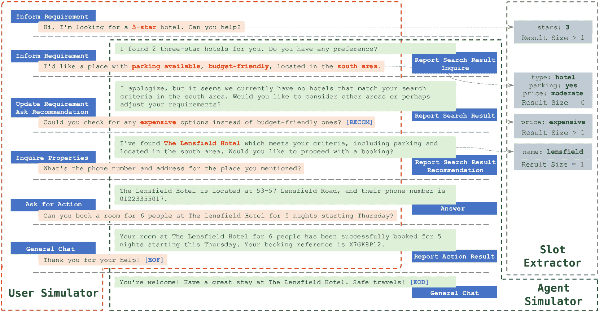
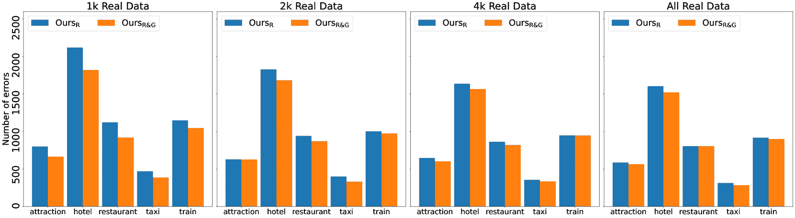

<!--yml

类别: 未分类

日期: 2025-01-11 12:38:48

-->

# 通过基于LLM的用户代理模拟增强对话状态跟踪模型

> 来源：[https://arxiv.org/html/2405.13037/](https://arxiv.org/html/2405.13037/)

Cheng Niu NewsBreak Xingguang Wang NewsBreak Xuxin Cheng NewsBreak Juntong Song NewsBreak Tong Zhang 伊利诺伊大学香槟分校

###### 摘要

对话状态跟踪（DST）旨在监控对话过程中不断变化的对话状态，并在开发任务导向对话系统中发挥重要作用。然而，获得DST任务的标注数据通常是一项昂贵的工作。在本文中，我们专注于利用LLM生成对话数据，以减少对话收集和标注的成本。具体而言，我们使用GPT-4来模拟用户和代理的交互，生成成千上万条带有DST标签的对话。然后，对生成的数据和真实数据进行两阶段的LLaMA 2微调，以进行DST预测。基于两个公共DST基准的实验结果表明，利用生成的对话数据，我们的模型比仅用真实数据训练的基准模型表现更好。此外，我们的方法还能够适应现实场景中的动态需求，快速生成新领域的对话。通过将任何领域中的对话片段替换为相应的生成片段，模型的表现可以与在真实数据上训练的模型相媲美。¹¹1所有源代码、模型和生成的对话数据将在审核后发布，以便复现。

通过基于LLM的用户代理模拟增强对话状态跟踪模型

## 1 引言

对话状态跟踪（DST）是任务导向对话系统中的关键组件，用于跟踪用户的目标和系统在对话中的行动，并促进与外部API的精确信息处理 Henderson et al. ([2014](https://arxiv.org/html/2405.13037v1#bib.bib14)); Mrkšić et al. ([2017](https://arxiv.org/html/2405.13037v1#bib.bib30)); Zhang et al. ([2023](https://arxiv.org/html/2405.13037v1#bib.bib53)); Hudeček 和 Dušek ([2023](https://arxiv.org/html/2405.13037v1#bib.bib16))。DST通常以键值对的形式存在，其中键表示在系统模式中定义的槽位，概述了系统在整个对话中旨在跟踪或提取的特定信息 Ren et al. ([2018](https://arxiv.org/html/2405.13037v1#bib.bib34))。

DST 模型的设计大致可以分为两种主要类型：基于分类的 DST 模型和基于生成的 DST 模型。基于分类的模型从一组候选值中选择槽位值 Ma 等人 ([2019](https://arxiv.org/html/2405.13037v1#bib.bib29)); Ye 等人 ([2021](https://arxiv.org/html/2405.13037v1#bib.bib51))，假设对话本体是预定义的，因此缺乏泛化能力 Chen 等人 ([2020](https://arxiv.org/html/2405.13037v1#bib.bib5)); Wang 等人 ([2022](https://arxiv.org/html/2405.13037v1#bib.bib45))。基于生成的模型直接生成槽位值，以处理未见过的领域和值 Gao 等人 ([2019](https://arxiv.org/html/2405.13037v1#bib.bib10), [2020](https://arxiv.org/html/2405.13037v1#bib.bib9)); Lin 等人 ([2020](https://arxiv.org/html/2405.13037v1#bib.bib27)); Peng 等人 ([2021](https://arxiv.org/html/2405.13037v1#bib.bib33))。最近，Feng 等人 ([2023](https://arxiv.org/html/2405.13037v1#bib.bib8)) 提出了一个基于 LLaMA 的新 DST 框架 LDST Touvron 等人 ([2023a](https://arxiv.org/html/2405.13037v1#bib.bib41))。通过使用指令调优方法，LDST 的性能与 ChatGPT OpenAI ([2023](https://arxiv.org/html/2405.13037v1#bib.bib31)) 相当。

尽管 DST 展现出了有前景的结果，但一个重大挑战是对话的注释需要显著的成本。此外，现实世界需求的动态性突显了快速生成新领域话语的迫切需要。与其他类型的 NLP 数据相比，收集真实对话数据尤其具有挑战性。这一难题部分源于对话中常包含个人或敏感信息，这使得数据收集和共享工作变得复杂。为了应对这些挑战，并受到近期大规模语言模型（LLMs）进展的启发 Touvron 等人 ([2023b](https://arxiv.org/html/2405.13037v1#bib.bib42)); Significant-gravitas ([2023](https://arxiv.org/html/2405.13037v1#bib.bib37)); Jablonka 等人 ([2023](https://arxiv.org/html/2405.13037v1#bib.bib17)); Shen 等人 ([2023](https://arxiv.org/html/2405.13037v1#bib.bib35))，我们探索了利用这些模型生成注释过的 DST 数据以进行数据增强。通过利用 LLM 的跨领域生成能力，我们旨在创建能够替代手动注释数据的合成对话，从而显著降低财务成本和时间压力。

本文中，我们提出了一种基于LLM的用户代理模拟（LUAS）算法来增强DST。该过程首先由LLM生成一个用户档案，详细说明个体在各项任务中的偏好。接下来，LLM被提示模拟用户和代理之间的对话。在这些模拟中，用户模拟器发出请求并寻求建议或帮助，而代理通过理解用户需求、提供建议并采取适当的行动进行回应。通过用户和代理之间的迭代对话，并结合LLM提示的槽位提取器，我们生成了大量标注的多轮对话数据。

为了验证我们方法的有效性和生成数据的质量，我们在两个公共的DST数据集上进行了实验：MultiWOZ 2.2（Zang等人，[2020](https://arxiv.org/html/2405.13037v1#bib.bib52)）和MultiWOZ 2.4（Ye等人，[2022](https://arxiv.org/html/2405.13037v1#bib.bib50)）。根据Touvron等人（[2023b](https://arxiv.org/html/2405.13037v1#bib.bib42)）的方法，LLaMa 2使用真实数据进行微调，作为强基准模型。通过同时使用生成数据和真实数据，微调LLaMa 2能够进一步提高性能。此外，通过用生成数据替换任何领域的对话片段，重新训练的模型能够达到与使用真实数据训练的模型相当的性能，这表明我们的方法具备满足现实场景动态需求的能力，能够在新领域生成对话并保持良好的性能。

总结来说，我们工作的贡献可以分为四个方面：

+   •

    我们提出了一个新的框架，利用GPT-4的强大功能生成新的标注对话数据，有效降低对话数据的收集和标注成本。

+   •

    在两个数据集上的实验结果表明，生成数据对性能的积极影响。

+   •

    我们的方法可以快速生成新领域的数据，同时保持良好的性能。

+   •

    我们相信，我们的方法有望扩展到其他与对话相关的任务。

## 2 相关工作

### 2.1 对话状态追踪

对话状态追踪（DST）是任务导向对话系统中一项至关重要且具有挑战性的任务（Mrkšić 等，[2017](https://arxiv.org/html/2405.13037v1#bib.bib30)）。近期的DST模型（Lee 等，[2021](https://arxiv.org/html/2405.13037v1#bib.bib24)；Zhu 等，[2022](https://arxiv.org/html/2405.13037v1#bib.bib59)；Yang 等，[2023b](https://arxiv.org/html/2405.13037v1#bib.bib49)；Su 等，[2023](https://arxiv.org/html/2405.13037v1#bib.bib38)；Lesci 等，[2023](https://arxiv.org/html/2405.13037v1#bib.bib25)）通过利用不同的架构和机制，已在多个数据集上取得了令人信服的良好表现（Budzianowski 等，[2018](https://arxiv.org/html/2405.13037v1#bib.bib4)；Eric 等，[2020](https://arxiv.org/html/2405.13037v1#bib.bib7)；Zang 等，[2020](https://arxiv.org/html/2405.13037v1#bib.bib52)；Han 等，[2021](https://arxiv.org/html/2405.13037v1#bib.bib11)；Ye 等，[2022](https://arxiv.org/html/2405.13037v1#bib.bib50)）。为了减轻对话数据收集和标注的负担，Wu 等（[2019](https://arxiv.org/html/2405.13037v1#bib.bib47)）；Zhou 等（[2023](https://arxiv.org/html/2405.13037v1#bib.bib58)）使用少样本学习将现有模型转移并适应新领域。受到大规模语言模型（LLMs）近期成就的启发，Feng 等（[2023](https://arxiv.org/html/2405.13037v1#bib.bib8)）利用低秩适应（LoRA）技术（Hu 等，[2022](https://arxiv.org/html/2405.13037v1#bib.bib15)）对基础模型进行微调，在DST任务中取得了令人期待的表现。本文中，我们利用GPT-4模拟用户和代理之间的对话，所获得的对话数据显著提升了DST的效果。

### 2.2 基于大规模语言模型（LLMs）的数据增强

| DST: [历史], [用户发言] $\rightarrow$ [服务], [槽位键], [槽位值] |
| --- |
| 您是本地的在线向导，主要处理本地服务，如帮助查找用户的位置（如景点、酒店、火车、餐厅或医院）、打车、联系警察或其他便捷服务。您的服务高效且质量优良，赢得了当地社区的广泛赞誉。根据对话历史，您的任务是根据整个对话帮助用户找到他们需要的服务。请根据用户的最新发言输出当前的服务，并输出整个对话中需要注意的所有服务信息。以下是“对话历史”：{[history]} 和 “用户的最新发言”：{[user_utterance]}。输出应采用JSON格式，类似于“current_service”: {[service]}，“slots”: {“[service]”: {“[slot_key]”: {[slot_val]}}}。 |
| 请给出您的决定： |

表1：用于指导LLaMA 2生成JSON格式对话状态预测的提示语。

数据增强在多个领域中已展示出显著的效果，包括计算机视觉Krizhevsky等人（[2012](https://arxiv.org/html/2405.13037v1#bib.bib22)）；Shorten和Khoshgoftaar（[2019](https://arxiv.org/html/2405.13037v1#bib.bib36)），文本分类Zhang等人（[2015](https://arxiv.org/html/2405.13037v1#bib.bib55)）；Wei和Zou（[2019](https://arxiv.org/html/2405.13037v1#bib.bib46)），以及语音识别Ko等人（[2015](https://arxiv.org/html/2405.13037v1#bib.bib21)）；Park等人（[2019](https://arxiv.org/html/2405.13037v1#bib.bib32)）。

近年来，随着大语言模型（LLMs）日益重要，越来越多的研究开始利用LLMs进行数据增强。Kaddour和Liu（[2024](https://arxiv.org/html/2405.13037v1#bib.bib18)）发现，微调教师LLMs以标注未标记的实例并生成新的数据点，显著提升了下游模型的性能。Yang等人（[2023a](https://arxiv.org/html/2405.13037v1#bib.bib48)）生成真实且定制化的对话，以减少幻觉现象。Ulmer等人（[2024](https://arxiv.org/html/2405.13037v1#bib.bib43)）比较了多种过滤策略对生成对话质量的有效性，并提出了新的方法来基准化微调的对话系统。但他们的工作没有讨论DST任务。Li等人（[2022](https://arxiv.org/html/2405.13037v1#bib.bib26)）提出了基于GPT-3的用户代理模拟系统，并在实际数据量极小的情况下展示了DST任务的积极效果。与Li等人（[2022](https://arxiv.org/html/2405.13037v1#bib.bib26)）不同，我们抽象了用户和代理的共通意图，设计了特定意图的提示，确保模拟遵循任务导向的逻辑。这一方案使得模拟能够在零样本设置下运行，增强了我们方法对新领域的适应性。此外，通过实施两阶段微调过程，我们的方法即便在使用全部真实数据训练时，也能表现出优于强基线的方法。

## 3 方法

在本节中，我们将从基本问题定义开始（$\S\ref{Problem Definition}$）。接着，介绍我们提出的方法，包括微调LLaMA 2以预测对话状态（$\S\ref{Using LLaMA 2 to Predict Dialogue State}$）和利用GPT-4进行用户-代理对话模拟（$\S\ref{Employing GPT-4 to Simulate Comprehensive Dialogue Data}$）。最后，我们展示了我们针对DST任务的两阶段微调策略，使用生成数据和真实数据（$\S\ref{Two-stage Fine-tuning Strategy}$）。

### 3.1 问题定义

任务导向对话涉及用户$U$和代理$A$之间的多轮对话。给定一个对话上下文$C_{t}=[U_{1},A_{1},...,U_{t},A_{t}]$，即到第$t$轮的发言序列，DST的目标是预测对话状态$y_{t}$，它定义为一组（槽位，值）对：

|  | $y_{t}=\{(s^{i}_{t},v^{i}_{t})\;&#124;\;C_{t}\;,\forall s^{i}\in\mathcal{S}\}$ |  |
| --- | --- | --- |

其中，$\mathcal{S}$ 表示本体或模式中预定义的可能槽位集合。参考先前的工作 Wang 等人 ([2023](https://arxiv.org/html/2405.13037v1#bib.bib44))，最终的槽位表示为相应任务领域与原始槽位的连接，例如：“<hotel-area>”。每个领域相关的槽位可以是类别型的，具有一组候选值（例如 <hotel-parking> = “True” / “False”），也可以是非类别型的，其中值是对话上下文中的一个范围（例如 <hotel-name> = “Alexander”）。注意，如果对话中没有提供特定槽位的信息，则该槽位的相关值设为 “NONE”。

### 3.2 使用 LLaMA 2 预测对话状态

图 1：我们方法的仿真过程。蓝色框表示用户和代理的意图，‘[RECOM]’，‘[EOF]’ 和 ‘[EOD]’ 是控制标识符。

我们在 LLaMA 2 上进行全参数微调，以预测对话状态，并采用预设计的提示语引导 LLaMA 2 模型生成格式为 JSON 的预测结果。如表格 [1](https://arxiv.org/html/2405.13037v1#S2.T1 "Table 1 ‣ 2.2 Data Augmentation by LLMs ‣ 2 Related Work ‣ Enhancing Dialogue State Tracking Models through LLM-backed User-Agents Simulation") 所示，历史对话和用户的最新发言被输入 LLaMA 2，LLaMA 2 随后对整个对话的意图和槽值进行预测。具体而言，预测的意图必须属于预定义的集合，预测的槽位必须与各自意图的指定槽位相对应。我们实现了一个方案，以防止生成模型产生不一致的输出，并提高 LLaMA 2 输出的整体质量和可靠性。优化通过交叉熵实现。

### 3.3 基于 GPT-4 的用户代理对话仿真

如图 [1](https://arxiv.org/html/2405.13037v1#S3.F1 "Figure 1 ‣ 3.2 Using LLaMA 2 to Predict Dialogue State ‣ 3 Method ‣ Enhancing Dialogue State Tracking Models through LLM-backed User-Agents Simulation") 所示，基于 GPT-4 的对话仿真框架涉及一个多阶段的过程，用于生成带标签的多轮对话数据。在这个框架中，GPT-4 提示两个模拟器，包括用户模拟器和代理模拟器，进行旨在完成特定对话任务的对话。同时，GPT-4 还提示一个槽位提取器，在整个对话仿真过程中识别并提取所有相关的槽位。

仿真生成过程的详细信息如下所述，所有提示语均在附录中提供供参考。

#### 3.3.1 仿真过程概述

在启动对话之前，GPT-4会被提示创建一个用户档案，概述个人在各项任务（如旅行、住宿、餐饮等）中的偏好。每个偏好包括预算、旅行距离等具体细节。设置完毕后，用户模拟器开始与代理进行互动，提出请求并寻求推荐或协助进行预订和购买。代理则根据提示深入了解用户需求，进行相关信息搜索，提供建议，并执行必要的行动。在每次互动后，用户模拟器会评估其需求是否得到满足，并决定是否继续对话。

#### 3.3.2 用户/代理意图

为了通过交互式任务有效地导航模拟器，我们面临在单一提示中编码复杂对话逻辑的挑战。这个任务对用户和代理模拟器都是一个考验。为简化起见，我们抽象出用户和代理的共同意图，并为用户或代理的每个独特意图精心设计提示。不同意图的详细提示见附录[A](https://arxiv.org/html/2405.13037v1#A1 "附录 A 模拟提示 ‣ 通过大语言模型支持的用户代理模拟增强对话状态跟踪模型")。

用户的意图如下所示：

+   •

    通知需求，用户将需求告知代理。

+   •

    更新需求，如果搜索结果不符合用户的标准，用户可以更新需求。

+   •

    请求推荐，用户根据几个符合其标准的候选项请求推荐。

+   •

    询问属性，用户询问候选项的某些属性（例如地址等）。

+   •

    请求行动，用户在收到推荐后要求采取行动（例如，进行预订等）。

+   •

    一般聊天，模拟中的其他场景，例如问候或表示感谢。

代理意图如下所示：

+   •

    询问，询问用户的需求和偏好，或征求用户的批准或确认。

+   •

    根据用户的偏好，搜索数据库并报告搜索结果，然后进行查询、推荐或预订。

+   •

    推荐，当多个候选项符合用户的搜索标准时，选择最合适的候选项进行推荐。

+   •

    回答，回答用户关于代理推荐的询问。

+   •

    报告行动结果，根据用户的请求采取行动并报告行动结果。

+   •

    一般聊天，模拟中的其他场景，例如问候或询问是否有额外需求需要处理。

除了自然语言输出外，模拟器还会在响应中生成控制标识符，以表示响应的意图。根据控制标识符传达的输入意图，用户或代理会被提示选择适当的意图，并据此生成响应。

#### 3.3.3 模拟细节

如第[3.3.1节](https://arxiv.org/html/2405.13037v1#S3.SS3.SSS1 "3.3.1 Simulation Process Overview ‣ 3.3 User-Agent Dialogue Simulation backed by GPT-4 ‣ 3 Method ‣ Enhancing Dialogue State Tracking Models through LLM-backed User-Agents Simulation")所述，模拟从生成用户资料开始，这将初始化用户请求。接下来，根据前一轮的输入意图，模拟选择一个用户或代理的响应意图，然后使用相应的提示生成对话。这个选择过程遵循下列预定逻辑。生成聊天意图指的是在对话开始或结束时触发的问候与感谢表达，并且在后续列表中会被跳过。

对话可以由用户或代理发起。以下描述了触发用户意图的详细机制。

+   •

    对话开始：触发用户的告知需求意图。通过随机化，用户模拟器被指示选择一个感兴趣的任务，并附带几个相关的偏好，然后生成相应的请求。

+   •

    来自代理的询问：触发用户的告知需求意图，针对代理的后续问题进行回答。

+   •

    来自代理的搜索结果报告：如果用户的偏好尚未完全表达，将触发用户的告知需求意图。如果没有候选项符合搜索标准，将触发用户的更新需求意图。否则，如果发现一个候选项，将启动用户的请求行动意图，而如果发现多个候选项，则会提示用户选择请求推荐意图。

+   •

    来自代理的推荐：用户将被提示从以下选项中选择：（i）询问属性意图以获取更多信息，或（ii）请求行动意图以继续进行交易。

+   •

    来自代理的行动结果报告：如果用户资料中的所有任务都已完成，将触发用户与代理之间的普通对话，随后对话终止；否则，将触发告知需求意图以启动新任务。

以下是代理模拟的意图触发机制。

+   •

    来自用户的需求告知：代理会被提示检查是否已收集所有必需的槽值。如果没有，系统将触发询问意图来生成后续问题；否则，代理将根据用户的需求进行搜索，并根据报告搜索结果意图生成响应。

+   •

    向用户询问属性：触发代理的**回答**意图。

+   •

    请求用户推荐：代理被提示选择最佳候选项，然后根据**推荐**意图生成响应。

+   •

    请求用户操作：代理被提示进行交易，然后根据**报告操作结果**意图生成响应。

#### 3.3.4 槽位提取

需要注意的是，代理模拟器必须在启动搜索之前验证所有必要信息是否已收集。为了管理这一点，采用了一个槽位跟踪模块，用于跟踪所需槽位和已填充槽位。通过**信息需求**提示，用户模拟器可以同时提供对话发言和相应的已填充槽位值。然而，由GPT-4生成的对话可能与槽位填充的结果不一致。这种差异可能导致代理出现重复甚至无限的查询循环。为了解决这个问题，采用了一个基于GPT-4的槽位提取模型，以确保生成的对话与槽位填充结果匹配。如果发现不一致，必须重新生成对话以保持一致性。

#### 3.3.5 生成多样性

为了获得高质量的DST模型，必须有涵盖广泛多样性的对话数据。为了确保生成的数据具有这种多样性，我们手动创建了十个重写模板，然后通过GPT-4将这些模板扩展为数百个模板。这些重写模板作为后处理工具，用于增强用户和代理响应的多样性。

关于重写模板和重写输出的详细信息，请参见附录[B](https://arxiv.org/html/2405.13037v1#A2 "附录 B 预定响应模板 ‣ 通过LLM支持的用户代理模拟增强对话状态跟踪模型")。

### 3.4 两阶段微调策略

考虑到GPT-4生成的对话与真实对话之间的分布差异，直接将生成的对话数据与真实数据合并可能会导致生成的模型偏离真实分布。为了解决这个问题，我们设计了一个两阶段微调方法。首先，我们使用生成的对话数据对LLaMA 2模型进行了微调。随后，我们继续使用真实数据对模型进行微调。第一步使得模型能够学习基本的任务导向对话模式。第二步确保模型有效弥合生成对话与真实对话之间的差距，更好地与真实分布对齐。

## 4 实验

### 4.1 数据集和指标

我们在MultiWOZ 2.2²²2[https://github.com/budzianowski/multiwoz/tree/master/data/MultiWOZ_2.2](https://github.com/budzianowski/multiwoz/tree/master/data/MultiWOZ_2.2)和MultiWOZ 2.4³³3[https://github.com/smartyfh/MultiWOZ2.4](https://github.com/smartyfh/MultiWOZ2.4) Zang等（[2020](https://arxiv.org/html/2405.13037v1#bib.bib52)）和Ye等（[2022](https://arxiv.org/html/2405.13037v1#bib.bib50)）上进行了所有实验。MultiWOZ（Budzianowski等，[2018](https://arxiv.org/html/2405.13037v1#bib.bib4)）已广泛用于评估DST的性能，包括8,438个用于训练、1,000个用于开发和1,000个用于测试集的多回合对话，这些数据由“奥兹巫师”（WOZ）设置收集，涵盖了多种领域。MultiWOZ 2.2数据集对MultiWOZ 2.1（Eric等，[2020](https://arxiv.org/html/2405.13037v1#bib.bib7)）中的开发集和测试集的注释进行了改进。MultiWOZ 2.4（Ye等，[2022](https://arxiv.org/html/2405.13037v1#bib.bib50)）是最新的改进版本，修正了开发集和测试集中的所有错误标签。根据Wu等（[2019](https://arxiv.org/html/2405.13037v1#bib.bib47)）的方法，我们从MultiWOZ 2.2和MultiWOZ 2.4数据集中去除了“医院”和“警察”领域，因为它们在训练集中仅出现几次，并且在开发集和测试集中从未出现过。通过使用MultiWOZ架构，生成了近8,000个新的对话。MultiWOZ 2.2和MultiWOZ 2.4数据集以及生成的对话数据的详细统计信息如表[2](https://arxiv.org/html/2405.13037v1#S4.T2 "表2 ‣ 4.1 数据集和指标 ‣ 4 实验 ‣ 通过LLM支持的用户代理模拟提升对话状态追踪模型")所示。

我们采用联合目标准确率（JGA）作为评估指标，这是DST的主要指标。JGA定义为所有关键值都被正确预测的对话回合的比例。

| 指标 $\downarrow$ 数据集 $\rightarrow$ | 2.2 | 2.4 | 生成数据集 |
| --- | --- | --- | --- |
| 领域数量 | 8 | 7 | 5 |
| 对话数 | 8,438 | 8,438 | 7,556 |
| 总回合数 | 113,556 | 113,556 | 102,602 |
| 平均每个对话的回合数 | 13.46 | 13.46 | 13.57 |
| 平均每个回合的标记数 | 13.13 | 13.38 | 17.01 |
| 插槽数量 | 61 | 37 | 17 |
| 有架构描述 | 是 | 是 | - |
| 测试集中的未见领域 | 否 | 否 | - |

表2：MultiWOZ（2.2和2.4）以及我们实验中用于训练的生成数据集的统计信息。

| 模型 | MultiWOZ 2.2 | MultiWOZ 2.4 |
| --- | --- | --- |
| TRADE | 45.40 | 55.05 |
| UniLM | 54.25 | - |
| DS-DST | 51.70 | - |
| TripPy | 53.50 | 64.75 |
| AG-DST | 57.26 | - |
| SDP-DST | 57.60 | - |
| D3ST${}_{\text{Base}}$ | 56.10 | 72.10 |
| D3ST${}_{\text{Large}}$ | 54.20 | 70.80 |
| D3ST${}_{\text{XXL}}$ | 58.70 | 75.90 |
| SPACE-3 | 57.50 | - |
| MSP-L | 57.70 | - |
| RefPyDST | - | 65.20 |
| Diable | 56.48 | 70.46 |
| DDSA | - | 75.58 |
| SPLAT | 56.60 | - |
| MoNET | - | 76.02 |
| SSNet | 62.10 | - |
| TOATOD${}_{\text{Small}}$ | 61.92 | - |
| TOATOD${}_{\text{Base}}$ | 63.79 | - |
| LUAS${}_{\text{R}}$ | 65.42 | 77.20 |
| LUAS${}_{\text{R+G}}$ | 66.25 | 78.20 |

表 3：在 MultiWOZ 2.2 和 MultiWOZ 2.4 数据集上的 DST 结果的联合目标准确度（JGA）。‘-’ 表示原始论文中未报告该结果。

| 指标 $\downarrow$ 替换领域 $\rightarrow$ | 吸引力 | 酒店 | 餐厅 | 出租车 | 火车 |
| --- | --- | --- | --- | --- | --- |
| 替换的对话数 | 2538 | 3235 | 3666 | 1397 | 2840 |
| 替换的轮次 | 13348 | 30402 | 25768 | 6662 | 33364 |
| 每个对话替换的平均轮次 | 5.26 | 9.40 | 7.03 | 4.77 | 11.75 |
| 每个替换轮次的平均词汇数 | 15.57 | 15.54 | 15.33 | 18.28 | 16.44 |
| 每个替换用户轮次的平均插槽数 | 1.38 | 2.75 | 2.54 | 1.37 | 2.90 |

表 4：MultiWOZ 2.2 的 5 个领域的替换详情。

| 替换领域 | 影响 | JGA ($\Delta$  ) | 插槽准确度 ($\Delta$  ) | 插槽召回率 ($\Delta$  ) | 插槽 F1 ($\Delta$  ) |
| --- | --- | --- | --- | --- | --- |
| 基础 | 0% | 65.42 | 95.47% | 93.25% | 94.35% |
| 吸引力 | 28.1% | 64.99 ($-$0.43) | 95.46% ($-$0.01%) | 92.93% ($-$0.32%) | 94.17% ($-$0.18%) |
| 酒店 | 42.1% | 64.28 ($-$1.13) | 95.22% ($-$0.25%) | 92.83% ($-$0.42%) | 94.01% ($-$0.34%) |
| 餐厅 | 41.2% | 64.61 ($-$0.81) | 95.44% ($-$0.03%) | 93.30% ($+$0.05%) | 94.36% ($+$0.01%) |
| 出租车 | 9.1% | 65.22 ($-$0.20) | 95.62% ($+$0.15%) | 92.91% ($-$0.34%) | 94.25% ($-$0.10%) |
| 火车 | 38.4% | 64.23 ($-$1.19) | 95.59% ($+$0.12%) | 92.67% ($-$0.58%) | 94.11% ($-$0.24%) |
| 平均值 | 31.20% | 64.67 ($-$0.75) | 95.47% ($-$0.00%) | 92.93% ($-$0.32%) | 94.18% ($-$0.17%) |

表 5：在 MultiWOZ 2.2 数据集上，用生成数据替代真实数据的 JGA。

| 数据集 | 真实数据大小 | JGA${}_{\text{R}}$ | $\text{JGA}_{\text{R+G}}$ ($\Delta$ ) | 插槽 |
| --- | --- | --- | --- | --- |
| $\text{Precision}_{\text{R+G}}$ ($\Delta$ ) | $\text{Recall}_{\text{R+G}}$ ($\Delta$ ) | $\text{F1}_{\text{R+G}}$ ($\Delta$ ) |
| MultiWOZ 2.2 | 1000 | 58.77 | 63.06 ($+$4.29) | 95.06% ($+$0.69%) | 92.39% ($+$1.46%) | 93.70% ($+$1.08%) |
| 2000 | 62.66 | 64.43 ($+$1.77) | 95.33% ($+$0.27%) | 92.90% ($+$0.53%) | 94.10% ($+$0.41%) |
| 4000 | 64.01 | 65.84 ($+$1.83) | 95.55% ($+$0.13%) | 93.21% ($+$0.30%) | 94.37% ($+$0.22%) |
| 全部 | 65.42 | 66.25 ($+$0.83) | 95.61% ($+$0.14%) | 93.55% ($+$0.30%) | 94.57% ($+$0.22%) |
| MultiWOZ 2.4 | 1000 | 64.60 | 69.69 ($+$5.09) | 97.15% ($+$1.09%) | 94.59% ($+$0.58%) | 95.85% ($+$0.83%) |
| 2000 | 72.15 | 75.58 ($+$3.43) | 97.67% ($+$0.59%) | 95.90% ($+$0.46%) | 96.78% ($+$0.52%) |
| 4000 | 75.81 | 77.29 ($+$1.48) | 98.08% ($+$0.27%) | 96.12% ($+$0.16%) | 97.09% ($+$0.21%) |
| 全部 | 77.20 | 78.20 ($+$1.00) | 97.88% ($+$0.07%) | 96.46% ($+$0.22%) | 97.16% ($+$0.14%) |

表 6：用于微调的不同大小真实数据的 JGA 和插槽性能，数据来自 MultiWOZ 2.2 和 2.4。

### 4.2 实现细节

用于模拟的GPT-4版本是gpt-4-1106-preview。至于微调阶段，使用了8个Nvidia A100（80G）GPU，通过pytorch的FSDP框架进行监督的全参数微调（Zhao等，[2023](https://arxiv.org/html/2405.13037v1#bib.bib57)）。基础模型是LLaMA 2的7B版本⁴⁴4[https://huggingface.co/meta-llama/Llama-2-7b-hf](https://huggingface.co/meta-llama/Llama-2-7b-hf)。在每个微调阶段，学习率设置为2e-5，并采用余弦调度器Loshchilov和Hutter（[2016](https://arxiv.org/html/2405.13037v1#bib.bib28)），每个GPU上的批次大小设置为8。我们使用Adam优化器Kingma和Ba（[2015](https://arxiv.org/html/2405.13037v1#bib.bib20)），其中$\beta_{1}$ = 0.9，$\beta_{2}$ = 0.999，热身比例设置为3%。两个微调阶段的持续时间约为两个小时。对于推理，使用了vLLM⁵⁵5[https://github.com/vllm-project/vllm](https://github.com/vllm-project/vllm) Kwon等（[2023](https://arxiv.org/html/2405.13037v1#bib.bib23)）。

### 4.3 基准

为了评估生成的对话数据的效果，我们仅使用真实数据对LLaMA 2进行微调，将其称为LUAS${}_{\text{R}}$，并作为强基准。我们还与其他强基准进行比较，包括TRADE (Wu等，[2019](https://arxiv.org/html/2405.13037v1#bib.bib47))、UniLM Dong等（[2019](https://arxiv.org/html/2405.13037v1#bib.bib6)）、DS-DST Zhang等（[2020](https://arxiv.org/html/2405.13037v1#bib.bib54)）、TripPy Heck等（[2020](https://arxiv.org/html/2405.13037v1#bib.bib13)）、AG-DST Tian等（[2021](https://arxiv.org/html/2405.13037v1#bib.bib40)）、SDP-DST Lee等（[2021](https://arxiv.org/html/2405.13037v1#bib.bib24)）、D3ST Zhao等（[2022](https://arxiv.org/html/2405.13037v1#bib.bib56)）、SPACE-3 He等（[2022](https://arxiv.org/html/2405.13037v1#bib.bib12)）、MSP-L Sun等（[2022](https://arxiv.org/html/2405.13037v1#bib.bib39)）、RefPyDST King和Flanigan（[2023](https://arxiv.org/html/2405.13037v1#bib.bib19)）、Diable Lesci等（[2023](https://arxiv.org/html/2405.13037v1#bib.bib25)）、DDSA Yang等（[2023b](https://arxiv.org/html/2405.13037v1#bib.bib49)）、SPLAT Bebensee和Lee（[2023](https://arxiv.org/html/2405.13037v1#bib.bib3)）、MoNET Zhang等（[2023](https://arxiv.org/html/2405.13037v1#bib.bib53)）、SSNet Atawulla等（[2023](https://arxiv.org/html/2405.13037v1#bib.bib1)）、TOATOD Bang等（[2023](https://arxiv.org/html/2405.13037v1#bib.bib2)）。

### 4.4 DST预测结果

所有结果见表[3](https://arxiv.org/html/2405.13037v1#S4.T3 "Table 3 ‣ 4.1 Datasets and Metrics ‣ 4 Experiments ‣ Enhancing Dialogue State Tracking Models through LLM-backed User-Agents Simulation")，需要指出的是，我们的模型主要与基于生成的模型进行了比较，因为基于分类的模型可以利用外部知识，导致不公平的比较。LUAS${}_{\text{R}}$仅在真实数据上进行了微调，而LUAS${}_{\text{R+G}}$则在真实数据和生成数据上进行了微调。从这些结果中，我们得出以下观察结论：

(1) 在MultiWOZ 2.2和2.4数据集上，LLaMA 2在真实数据上微调后的性能（LUAS${}_{\text{R}}$）超过了之前的DST基准。这一结果强调了LLaMA 2的卓越效果。

(2) 此外，加入额外的生成数据显著提高了性能，MultiWOZ 2.2数据集提高了0.83%，MultiWOZ 2.4数据集提高了1%。这一改进突显了生成数据在提升整体模型性能方面的重要作用。如下一节所示，当真实对话数据量较小时，生成数据的增益可能更大。例如，如果仅存在1,000条真实对话数据，性能提升可以达到从4.29%增加到5.09%。考虑到对话数据收集的挑战，这一结果突显了在跨领域的DST开发中整合生成数据的实际意义。

### 4.5 用生成数据替代真实数据的结果

为了进一步验证生成对话数据的质量和有效性，我们在MultiWOZ 2.2数据集上进行了不同领域的数据替换实验。在这些实验中，所有与特定领域相关的对话数据段将被移除，新的生成数据将插入到移除的位置。替换后，新的训练集将包含1个领域的生成数据和4个领域的真实数据。替换的详细信息见表[4](https://arxiv.org/html/2405.13037v1#S4.T4 "Table 4 ‣ 4.1 Datasets and Metrics ‣ 4 Experiments ‣ Enhancing Dialogue State Tracking Models through LLM-backed User-Agents Simulation")。

该模型还在 LLaMA 2 7B 上进行了训练，结果如表 [5](https://arxiv.org/html/2405.13037v1#S4.T5 "Table 5 ‣ 4.1 Datasets and Metrics ‣ 4 Experiments ‣ Enhancing Dialogue State Tracking Models through LLM-backed User-Agents Simulation") 所示，其中‘($\Delta$)’表示真实数据与替换为生成数据的 1 个领域的真实数据结果之间的差异。从统计学角度看，生成数据平均影响了 31.2% 的训练数据，测试 JGA 的下降范围从 -0.2 到 -1.19，平均为 -0.75，插槽精度与之前相当，但召回率平均下降了 -0.32%。与训练数据量的减少相比，JGA 和插槽性能的下降相对较小，这表明使用生成数据可以有效地将 DST 模型适应到新领域，并保持相当的准确性。

在实际应用中，我们的自动化对话生成方法为开发新领域的对话系统提供了一种快速的方式，从而在时间和成本上都带来了可观的节省。

### 4.6 分析

#### 4.6.1 向不同大小的真实数据中添加生成数据的效果

图 2：在 MultiWOZ 2.2 上，$\text{LUAS}_{\text{R}}$ 和 $\text{LUAS}_{\text{R+G}}$ 在不同大小的真实数据上的误差分布。

为了更好地说明生成数据的影响，我们通过将生成数据与不同大小的真实数据结合进行了一系列实验。实验结果如表 [6](https://arxiv.org/html/2405.13037v1#S4.T6 "Table 6 ‣ 4.1 Datasets and Metrics ‣ 4 Experiments ‣ Enhancing Dialogue State Tracking Models through LLM-backed User-Agents Simulation") 所示，所使用的真实数据大小设置为 1000、2000、4000 和全部。$\text{JGA}_{\text{R}}$ 表示仅使用真实数据进行训练时获得的结果，而 $\text{JGA}_{\text{R+G}}$、插槽 $\text{Precision}_{\text{R+G}}$、$\text{Recall}_{\text{R+G}}$ 和 $\text{F1}_{\text{R+G}}$ 表示使用相同的真实数据加上额外生成数据进行训练时获得的 DST 和插槽准确度结果。表 [5](https://arxiv.org/html/2405.13037v1#S4.T5 "Table 5 ‣ 4.1 Datasets and Metrics ‣ 4 Experiments ‣ Enhancing Dialogue State Tracking Models through LLM-backed User-Agents Simulation") 中使用的符号在此处也适用。

研究结果表明，将生成的数据纳入训练过程显著提升了模型性能，超越了仅使用真实数据时的表现，特别是在真实训练数据稀缺的情况下。在这种情况下，使用生成数据训练的模型表现可与使用两倍量真实数据训练的模型相媲美。例如，当仅使用1,000条真实数据时，如果使用生成的数据，两个数据集的JGA将分别提高4.29%和5.09%，这与使用2,000条真实数据的表现相当。这些发现具有重要的实际意义，因为它们强调了生成数据在实际场景中有效缓解原始数据不足问题的能力。

#### 4.6.2 错误分布分析

如图[2](https://arxiv.org/html/2405.13037v1#S4.F2 "Figure 2 ‣ 4.6.1 The Effect of Adding Generated Data to Real Data of Various Sizes ‣ 4.6 Analysis ‣ 4 Experiments ‣ Enhancing Dialogue State Tracking Models through LLM-backed User-Agents Simulation")所示，为进一步突出我们方法的优越性，我们检查了MultiWOZ 2.2中不同大小真实数据在$\text{LUAS}_{\text{R}}$和$\text{LUAS}_{\text{R+G}}$之间的错误分布。与仅对原始数据进行微调的模型相比，使用生成数据在几乎所有领域类别中的错误都得到了减少。这一发现不仅验证了我们生成数据的高质量，也强调了我们的方法在提升DST模型性能方面的有效性。

## 5 结论

本文提出了一种新颖的方法，利用GPT-4模拟用户和代理之间的对话并生成带有对话状态标签的对话。然后，我们对LLaMA 2进行了两阶段微调，使用生成数据和真实数据进行DST预测。在两个公开的DST基准测试上的实验结果表明，增强了生成数据的我们的模型优于仅使用真实数据训练的基线模型。此外，详细的分析确认了我们方法的适应性，有效地满足了在现实场景中过渡到新领域的动态需求。我们相信，我们的方法可以扩展为一个通用框架，能够为广泛的对话相关任务带来益处。

## 限制

借助我们算法生成的高质量对话数据，我们显著增强了DST模型。我们还相信，生成的数据将作为其他与对话相关任务的宝贵资源，例如对话生成。我们计划在未来的研究中进一步探索这一方面。

## 伦理声明

我们使用两个公开可用的数据集以及由GPT-4创建的数据集进行实验，特别关注多领域任务导向对话。每个数据集都经过了严格的预处理，以满足学术研究的目的，包括移除任何个人身份信息或令人反感的内容。因此，我们有信心我们的工作不会带来任何伦理风险。

## 参考文献

+   阿塔乌拉等（2023）阿比布拉·阿塔乌拉、周希、杨雅婷、马博、杨峰义。2023. 基于共享槽预测的神经网络用于多领域对话状态追踪。见 *ICASSP 2023-2023 IEEE国际声学、语音与信号处理大会（ICASSP）*，第1-5页。IEEE。

+   邦等（2023）南茂邦、李志贤、具名万。2023. [面向端到端任务导向对话系统的任务优化适配器](https://doi.org/10.18653/v1/2023.findings-acl.464)。见 *计算语言学协会年会研究成果：ACL 2023*，第7355-7369页，多伦多，加拿大。计算语言学协会。

+   贝本斯和李（2023）比约恩·贝本斯和海俊·李。2023. [基于跨度选择性线性注意力变换器的有效且稳健的模式引导对话状态追踪](https://doi.org/10.18653/v1/2023.acl-long.6)。见 *第61届计算语言学协会年会论文集（第1卷：长篇论文）*，第78-91页，多伦多，加拿大。计算语言学协会。

+   布吉安诺夫斯基等（2018）帕维尔·布吉安诺夫斯基、温宗贤、曾博翔、伊尼戈·卡萨纽瓦、斯特凡·乌尔特斯、奥斯曼·拉马丹、米利察·加希奇。2018. MultiWOZ - 用于任务导向对话建模的大规模多领域“巫师奥兹”数据集。见 *EMNLP 会议论文集*。

+   陈等（2020）陈路、吕博、王驰、朱苏、谭博文、余凯。2020. 基于图注意力神经网络的模式引导多领域对话状态追踪。见 *AAAI 会议论文集*。

+   董等（2019）董力、杨楠、王文辉、魏福如、刘晓东、王宇、高剑锋、周铭、洪小文。2019. 统一语言模型预训练用于自然语言理解与生成。*神经信息处理系统进展*，32。

+   埃里克等（2020）米哈伊尔·埃里克、拉胡尔·戈尔、沙奇·保罗、阿比谢克·塞提、桑奇特·阿加瓦尔、邵阳·高、阿达尔什·库马尔、阿努·戈亚尔、彼得·库、迪雷克·哈卡尼-图尔。2020. MultiWOZ 2.1：一个整合的多领域对话数据集，包含状态修正和状态追踪基准。见 *LREC 会议论文集*。

+   冯等（2023）冯宇杰、陆泽欣、刘博、詹立明、吴晓敏。2023. 面向LLM驱动的对话状态追踪。见 *EMNLP 会议论文集*。

+   高等（2020）高书阳、桑奇特·阿加瓦尔、金迪、郑太勇、迪雷克·哈卡尼-图尔。2020. 从机器阅读理解到对话状态追踪：弥合差距。见 *第二届自然语言处理与会话AI研讨会论文集*。

+   Gao 等人（2019）Shuyang Gao、Abhishek Sethi、Sanchit Agarwal、Tagyoung Chung 和 Dilek Hakkani-Tur. 2019. 对话状态追踪：一种基于神经阅读理解的方法. 在*SIGDIAL 会议论文集*中.

+   Han 等人（2021）Ting Han、Ximing Liu、Ryuichi Takanabu、Yixin Lian、Chongxuan Huang、Dazhen Wan、Wei Peng 和 Minlie Huang. 2021. Multiwoz 2.3: 通过注释修正和共指注释增强的多领域任务导向对话数据集. 在*NLPCC 会议论文集*中.

+   He 等人（2022）Wanwei He、Yinpei Dai、Min Yang、Jian Sun、Fei Huang、Luo Si 和 Yongbin Li. 2022. 任务导向对话理解与生成的统一对话模型预训练. 在*第45届国际ACM SIGIR信息检索研究与发展会议论文集*中，第187–200页.

+   Heck 等人（2020）Michael Heck、Carel van Niekerk、Nurul Lubis、Christian Geishauser、Hsien-Chin Lin、Marco Moresi 和 Milica Gasic. 2020. TripPy：一种用于值无关神经对话状态追踪的三重复制策略. 在*第21届话语与对话特别兴趣小组年会论文集*中.

+   Henderson 等人（2014）Matthew Henderson、Blaise Thomson 和 Jason D. Williams. 2014. 第二届对话状态追踪挑战赛. 在*SIGDIAL 会议论文集*中.

+   胡等人（2022）Edward J. Hu、Yelong Shen、Phillip Wallis、Zeyuan Allen-Zhu、Yuanzhi Li、Shean Wang、Lu Wang 和 Weizhu Chen. 2022. Lora: 大型语言模型的低秩适应. 在*ICLR 会议论文集*中.

+   Hudeček 和 Dušek（2023）Vojtěch Hudeček 和 Ondřej Dušek. 2023. 大型语言模型是否足以应对任务导向对话？在*第24届话语与对话特别兴趣小组年会论文集*中.

+   Jablonka 等人（2023）Kevin Maik Jablonka、Philippe Schwaller、Andres Ortega-Guerrero 和 Berend Smit. 2023. GPT-3 是否足以在化学领域进行低数据发现？

+   Kaddour 和 Liu（2024）Jean Kaddour 和 Qi Liu. 2024. 通过大型语言模型微调在低资源环境中生成合成数据. *ArXiv 预印本*.

+   King 和 Flanigan（2023）Brendan King 和 Jeffrey Flanigan. 2023. 用于对话状态追踪的多样化检索增强上下文学习. 在*计算语言学协会会议成果：ACL 2023*中，第5570–5585页.

+   Kingma 和 Ba（2015）Diederik P. Kingma 和 Jimmy Ba. 2015. Adam：一种用于随机优化的方法. 在*ICLR 会议论文集*中.

+   Ko 等人（2015）Tom Ko、Vijayaditya Peddinti、Daniel Povey 和 Sanjeev Khudanpur. 2015. 语音识别的音频增强. 在*Interspeech 会议论文集*中.

+   Krizhevsky 等人（2012）Alex Krizhevsky、Ilya Sutskever 和 Geoffrey E. Hinton. 2012. 使用深度卷积神经网络进行Imagenet分类. 在*NeurIPS 会议论文集*中.

+   Kwon et al. (2023) Woosuk Kwon, Zhuohan Li, Siyuan Zhuang, Ying Sheng, Lianmin Zheng, Cody Hao Yu, Joseph Gonzalez, Hao Zhang, 和 Ion Stoica. 2023. 大型语言模型服务的高效内存管理与分页注意力. 见于*第29届操作系统原理研讨会论文集*，第611-626页。

+   Lee et al. (2021) Chia-Hsuan Lee, Hao Cheng, 和 Mari Ostendorf. 2021. 使用基于模式提示的语言模型进行对话状态跟踪. 见于*EMNLP 会议论文集*。

+   Lesci et al. (2023) Pietro Lesci, Yoshinari Fujinuma, Momchil Hardalov, Chao Shang, Yassine Benajiba, 和 Lluis Marquez. 2023. Diable：作为表格操作的高效对话状态追踪. 见于*ACL 发现会议论文集*。

+   Li et al. (2022) Zekun Li, Wenhu Chen, Shiyang Li, Hong Wang, Jing Qian, 和 Yan Xifeng. 2022. 可控对话模拟与上下文学习. 见于*EMNLP 会议论文集*。

+   Lin et al. (2020) Zhaojiang Lin, Andrea Madotto, Genta Indra Winata, 和 Pascale Fung. 2020. MinTL：任务导向对话系统的极简迁移学习. 见于*EMNLP 会议论文集*。

+   Loshchilov 和 Hutter (2016) Ilya Loshchilov 和 Frank Hutter. 2016. Sgdr: 具有热重启的随机梯度下降. 见于*国际学习表示会议*。

+   Ma et al. (2019) Mingyu Derek Ma, Kevin Bowden, Jiaqi Wu, Wen Cui, 和 Marilyn Walker. 2019. 开放域对话中的隐性话语关系识别. 见于*ACL 会议论文集*。

+   Mrkšić et al. (2017) Nikola Mrkšić, Diarmuid Ó Séaghdha, Tsung-Hsien Wen, Blaise Thomson, 和 Steve Young. 2017. 神经信念跟踪器：数据驱动的对话状态追踪. 见于*ACL 会议论文集*。

+   OpenAI (2023) OpenAI. 2023. ChatGPT. [https://chat.openai.com](https://chat.openai.com)。

+   Park et al. (2019) Daniel S. Park, William Chan, Yu Zhang, Chung-Cheng Chiu, Barret Zoph, Ekin D. Cubuk, 和 Quoc V. Le. 2019. SpecAugment：一种用于自动语音识别的简单数据增强方法. 见于*INTERSPEECH 会议论文集*。

+   Peng et al. (2021) Baolin Peng, Chunyuan Li, Jinchao Li, Shahin Shayandeh, Lars Liden, 和 Jianfeng Gao. 2021. Soloist：通过迁移学习和机器教学大规模构建任务机器人. *计算语言学协会会刊*。

+   Ren et al. (2018) Liliang Ren, Kaige Xie, Lu Chen, 和 Kai Yu. 2018. 面向通用对话状态跟踪. 见于*EMNLP 会议论文集*。

+   Shen et al. (2023) Yongliang Shen, Kaitao Song, Xu Tan, Dongsheng Li, Weiming Lu, 和 Yueting Zhuang. 2023. HuggingGPT: 使用ChatGPT及其在HuggingFace中的朋友解决AI任务. 见于*NeurIPS 会议论文集*。

+   Shorten 和 Khoshgoftaar (2019) Connor Shorten 和 Taghi M Khoshgoftaar. 2019. 深度学习中的图像数据增强调查. *大数据期刊*。

+   Significant-gravitas (2023) Significant-gravitas. 2023. auto-gpt: 使GPT-4完全自主的实验性开源尝试. [https://github.com/Significant-Gravitas/AutoGPT](https://github.com/Significant-Gravitas/AutoGPT)。

+   苏等人（2023）苏若琳、杨景峰、吴廷伟、庄秉煌。2023. 选择融合作为零样本对话状态追踪的知识。发表于*ICASSP会议论文集*。

+   孙等人（2022）孙周剑、黄正兴、丁奈。2022. [通过继承提及槽池中的槽位值追踪对话状态](https://doi.org/10.24963/ijcai.2022/607)。发表于*第31届国际人工智能联合会议（IJCAI-22）论文集*，第4375–4382页。国际人工智能联合会议组织。主会道。

+   田等人（2021）田鑫、黄连凯、林颖展、包思琪、何黄、杨云逸、吴华、王凡、孙书琪。2021. 对话状态追踪的可修正生成方法。发表于*第3届自然语言处理与对话AI研讨会论文集*。

+   图弗朗等人（2023a）雨果·图弗朗、蒂博·拉夫里尔、戈特耶·伊扎卡尔、克萨维尔·马尔丁、玛丽-安·拉肖、蒂莫泰·拉克鲁瓦、巴蒂斯特·罗齐耶、纳曼·戈亚尔、埃里克·汉布罗、费萨尔·阿兹哈尔等人。2023a. Llama：开放和高效的基础语言模型。*ArXiv预印本*。

+   图弗朗等人（2023b）雨果·图弗朗、路易斯·马丁、凯文·斯通、彼得·阿尔伯特、阿姆贾德·阿尔马哈伊里、雅丝敏·巴巴伊、尼古拉·巴什利科夫、索姆亚·巴特拉、普拉杰瓦尔·巴尔加瓦、舒莉·博萨尔等人。2023b. Llama 2：开放基础和微调的聊天模型。*ArXiv预印本*。

+   乌尔梅尔等人（2024）丹尼斯·乌尔梅尔、埃尔曼·曼西莫夫、林凯翔、贾斯廷·孙、高熙斌、张毅。2024. 通过自我对话引导基于LLM的任务导向对话代理的启动。*ArXiv预印本*。

+   王等人（2023）王清悦、丁亮、曹亚楠、詹一冰、林正、王石、大成涛、郭力。2023. 分而治之、征服并结合：基于语义独立专家的零样本对话状态追踪混合方法。发表于*ACL会议论文集*。

+   王等人（2022）王一凡、赵婧、包俊伟、段超群、吴有正、何晓东。2022. LUNA：学习槽位-轮次对齐用于对话状态追踪。发表于*NAACL会议论文集*。

+   韦和邹（2019）韦杰森、邹凯。2019. EDA：提升文本分类任务性能的简易数据增强技术。发表于*EMNLP会议论文集*。

+   吴等人（2019）吴建生、安德里亚·马多托、埃赫桑·霍赛尼-阿斯尔、肖凯明、理查德·索彻、帕斯卡尔·冯。2019. 可迁移的多领域状态生成器用于任务导向对话系统。发表于*ACL会议论文集*。

+   杨等人（2023a）杨东杰、袁瑞峰、范元涛、杨一飞、王子力、王书森、赵海。2023a. Refgpt：由GPT生成、为GPT生成的对话生成。发表于*EMNLP Findings会议论文集*。

+   杨等人（2023b）杨龙飞、李季毅、李胜、篠崎贵弘。2023b. 基于解耦域-槽位注意力的多领域对话状态追踪。发表于*ACL Findings会议论文集*。

+   Ye et al. (2022) Fanghua Ye, Jarana Manotumruksa, 和 Emine Yilmaz. 2022. MultiWOZ 2.4：一个多领域任务导向对话数据集，包含重要的注释修正，以改善状态追踪评估。在 *第23届话语与对话特别兴趣小组年会论文集* 中。

+   Ye et al. (2021) Fanghua Ye, Jarana Manotumruksa, Qiang Zhang, Shenghui Li, 和 Emine Yilmaz. 2021. 槽位自注意对话状态追踪。在 *WWW会议论文集* 中。

+   Zang et al. (2020) Xiaoxue Zang, Abhinav Rastogi, Srinivas Sunkara, Raghav Gupta, Jianguo Zhang, 和 Jindong Chen. 2020. MultiWOZ 2.2：一个带有额外注释修正和状态追踪基准的对话数据集。在 *第二届对话AI自然语言处理研讨会论文集* 中。

+   Zhang et al. (2023) Haoning Zhang, Junwei Bao, Haipeng Sun, Youzheng Wu, Wenye Li, Shuguang Cui, 和 Xiaodong He. 2023. [MoNET：通过噪声增强训练解决对话状态追踪中的状态动量问题](https://doi.org/10.18653/v1/2023.findings-acl.33)。在 *计算语言学协会2023年会议论文集：ACL 2023* 中，页面520–534， 加拿大多伦多。计算语言学协会。

+   Zhang et al. (2020) Jianguo Zhang, Kazuma Hashimoto, Chien-Sheng Wu, Yao Wang, Philip Yu, Richard Socher, 和 Caiming Xiong. 2020. 查找还是分类？多领域对话状态追踪中的槽值预测双重策略。在 *第九届词汇和计算语义联合会议论文集* 中。

+   Zhang et al. (2015) Xiang Zhang, Junbo Jake Zhao, 和 Yann LeCun. 2015. 用于文本分类的字符级卷积网络。在 *NeurIPS会议论文集* 中。

+   Zhao et al. (2022) Jeffrey Zhao, Raghav Gupta, Yuan Cao, Dian Yu, Mingqiu Wang, Harrison Lee, Abhinav Rastogi, Izhak Shafran, 和 Yonghui Wu. 2022. 基于描述的任务导向对话建模。*ArXiv预印本*。

+   Zhao et al. (2023) Yanli Zhao, Andrew Gu, Rohan Varma, Liang Luo, Chien-Chin Huang, Min Xu, Less Wright, Hamid Shojanazeri, Myle Ott, Sam Shleifer, Alban Desmaison, Can Balioglu, Pritam Damania, Bernard Nguyen, Geeta Chauhan, Yuchen Hao, Ajit Mathews, 和 Shen Li. 2023. Pytorch fsdp: 扩展完全分片数据并行的经验。*VLDB 会议论文集*。

+   Zhou et al. (2023) Han Zhou, Ignacio Iacobacci, 和 Pasquale Minervini. 2023. XQA-DST：多领域和多语言对话状态追踪。在 *ACL论文集* 中。

+   Zhu et al. (2022) Qi Zhu, Bing Li, Fei Mi, Xiaoyan Zhu, 和 Minlie Huang. 2022. 对话状态追踪的持续提示调优。在 *ACL会议论文集* 中。

## 附录 A 仿真提示

在本节中，我们展示了用户模拟器和代理模拟器在仿真中使用的各种典型提示。提示符号‘$\backslash$n’代表换行。

表 [7](https://arxiv.org/html/2405.13037v1#A1.T7 "Table 7 ‣ Appendix A Prompts for Simulation ‣ Enhancing Dialogue State Tracking Models through LLM-backed User-Agents Simulation") 表示用户向代理传达需求的提示。表 [8](https://arxiv.org/html/2405.13037v1#A1.T8 "Table 8 ‣ Appendix A Prompts for Simulation ‣ Enhancing Dialogue State Tracking Models through LLM-backed User-Agents Simulation") 表示用户向代理更新需求的提示。表 [9](https://arxiv.org/html/2405.13037v1#A1.T9 "Table 9 ‣ Appendix A Prompts for Simulation ‣ Enhancing Dialogue State Tracking Models through LLM-backed User-Agents Simulation") 表示用户请求代理提供推荐的提示，其中控制标识符为‘[RECOM]’。表 [10](https://arxiv.org/html/2405.13037v1#A1.T10 "Table 10 ‣ Appendix A Prompts for Simulation ‣ Enhancing Dialogue State Tracking Models through LLM-backed User-Agents Simulation") 表示用户询问候选者的一些属性（例如地址和邮政编码）的提示。表 [11](https://arxiv.org/html/2405.13037v1#A1.T11 "Table 11 ‣ Appendix A Prompts for Simulation ‣ Enhancing Dialogue State Tracking Models through LLM-backed User-Agents Simulation") 表示用户请求代理进行预订操作的提示。表 [12](https://arxiv.org/html/2405.13037v1#A1.T12 "Table 12 ‣ Appendix A Prompts for Simulation ‣ Enhancing Dialogue State Tracking Models through LLM-backed User-Agents Simulation") 表示用户与代理进行一般对话的提示，控制标识符为‘[EOF]’，通知代理所有需求已得到满足。

表 [13](https://arxiv.org/html/2405.13037v1#A1.T13 "Table 13 ‣ Appendix A Prompts for Simulation ‣ Enhancing Dialogue State Tracking Models through LLM-backed User-Agents Simulation") 表示槽提取器使用的提示。

表格 [14](https://arxiv.org/html/2405.13037v1#A1.T14 "表格 14 ‣ 附录 A 模拟提示 ‣ 通过基于大型语言模型的用户代理模拟增强对话状态跟踪模型") 代表了代理向用户询问指定需求（例如餐厅-价格区间）的提示。表格 [15](https://arxiv.org/html/2405.13037v1#A1.T15 "表格 15 ‣ 附录 A 模拟提示 ‣ 通过基于大型语言模型的用户代理模拟增强对话状态跟踪模型") 代表了代理回应用户询问的属性的提示。表格 [16](https://arxiv.org/html/2405.13037v1#A1.T16 "表格 16 ‣ 附录 A 模拟提示 ‣ 通过基于大型语言模型的用户代理模拟增强对话状态跟踪模型") 代表了代理向用户报告搜索结果的提示。表格 [17](https://arxiv.org/html/2405.13037v1#A1.T17 "表格 17 ‣ 附录 A 模拟提示 ‣ 通过基于大型语言模型的用户代理模拟增强对话状态跟踪模型") 代表了代理报告行动结果（例如预订信息等）并输出控制标识符 '[BOOKED]' 以通知预订成功。表格 [18](https://arxiv.org/html/2405.13037v1#A1.T18 "表格 18 ‣ 附录 A 模拟提示 ‣ 通过基于大型语言模型的用户代理模拟增强对话状态跟踪模型") 代表了代理与用户进行一般性对话，并输出控制标识符 '[EOD]' 以结束整个模拟。

| DST: [历史], [需求] $\rightarrow$ [用户发言] |
| --- |
| 提示：这是你第一次来到剑桥，想要找一家餐馆。$\backslash$n 现在你正在和当地导游在线聊天。$\backslash$n 这是你的偏好：$\backslash$n {"餐馆区域": "北部"}$\backslash$n 和对话历史（可能为空，或者与当前偏好无关）：$\backslash$n []$\backslash$n 你的回应应尽可能像在线聊天一样简洁明了。$\backslash$n 你会如何开始提问或回应导游？$\backslash$n 请不要提供任何在你偏好中没有的信息。$\backslash$n 请随机使用同义词或相似短语来描述你的意图，例如：$\backslash$n - 你可以用‘吃的东西’或‘食物’来代替‘餐馆’。请将所有偏好信息提供给导游，除了历史中已经告知的内容。$\backslash$n 请记住不要提供任何在你偏好中没有的信息。$\backslash$n 如果当地导游询问你的偏好，请直接回答，不要用其他话语。$\backslash$n 请不要重复询问历史中已有的内容。$\backslash$n 请不要重复你在历史中已经告知的旧偏好。$\backslash$n 请确保你的回应中的时间格式为‘after, at or around %H:%M’，采用24小时制。$\backslash$n 注意回应的多样性，尽量避免重复使用历史中的句型。$\backslash$n 只输出最新的发言，不要输出对话历史。 |
| 输出：你知道剑桥北部有哪些好的餐馆吗？ |

表 7：提示用户告知需求。

| DST: [历史], [旧需求], [新需求] $\rightarrow$ [用户发言] |
| --- |
| 提示：这是你第一次来到剑桥，想找一家酒店。$\backslash$n 现在你正在与本地导游在线聊天。$\backslash$n 以下是你的旧偏好：$\backslash$n {"酒店区域": "北部", "酒店星级": "4", "酒店类型": "酒店"}$\backslash$n 以下是你的新偏好：$\backslash$n {"酒店类型": "宾馆"}$\backslash$n 以下是对话历史：$\backslash$n ["你能推荐一些剑桥北部的4星级酒店吗？", "本地导游：你是想找一家精品酒店，还是连锁酒店更合适？", "普通酒店就行，不需要精品酒店。", "本地导游：抱歉，目前剑桥北部没有符合你搜索条件的4星级酒店。还有其他我可以帮助的吗，或者你想调整一下搜索条件吗？"]$\backslash$n 请输出你的回复，告知本地导游你改变了偏好。$\backslash$n 你的回复应该尽量像在线聊天一样简短。$\backslash$n 不要告诉导游你改变了主意，直接用类似“怎么样，是否有”或“你们有……吗？”等方式告知。$\backslash$n 只输出最新的一句回复，不要输出对话历史。 |
| 输出：关于宾馆怎么样？你们在剑桥北部有适合四人入住、入住四晚的4星级选项吗？ |

表8：用户更新需求的提示。

| DST: [历史记录], [需求] $\rightarrow$ [用户回复] |
| --- |
| 提示：这是你第一次来这里，想找一个餐馆吃饭。$\backslash$n 现在你正在与本地导游在线聊天。$\backslash$n 这是你的偏好：$\backslash$n $\backslash$n"餐馆区域"："北区"，"餐馆价格范围"："中等"，"餐馆预定人数"："8"，"餐馆预定时间"："18:00" $\backslash$n $\backslash$n 和对话历史（可能为空或与当前偏好无关）：$\backslash$n [ $\backslash$n "你知道剑桥北部有什么好的餐馆吗？"，$\backslash$n "来自本地导游：你是想要找更高档还是更休闲的地方？"，$\backslash$n "我想要一个不太贵的推荐。", $\backslash$n "来自本地导游：我找到了一些符合你偏好的地方，你想让我推荐一个吗？" $\backslash$n ] $\backslash$n 你的回答应该尽可能像在线聊天，并尽量简短。$\backslash$n 你会如何向导游发起询问或回应？$\backslash$n 请不要提供你偏好中没有的信息。$\backslash$n 有几个选择符合你的偏好。$\backslash$n 如果代理没有向你推荐选择，$\backslash$n 请直接请求本地代理推荐，并在你寻找推荐时输出特殊标记‘[RECOM]’。$\backslash$n 只输出最新的发言，不要输出对话历史。 |
| 输出：是的，请推荐一个。[RECOM] |

表9：用户请求推荐的提示，控制标识符为‘[RECOM]’。

| DST: [history], [requirements], [properties] $\rightarrow$ [user_utterance] |
| --- |
| 提示：这是你第一次来这里，想找个地方吃饭。$\backslash$n 现在你正在与当地导游在线聊天。$\backslash$n 这是你的偏好：$\backslash$n {"餐厅所在区域": "北区", "餐厅价格范围": "中等", "餐厅预定人数": "8", "餐厅预定时间": "18:00", "餐厅预定日期": "星期一"}$\backslash$n 以及对话历史（可能为空或与当前偏好无关）：$\backslash$n [$\backslash$n "你知道剑桥北部有什么好餐厅吗？",$\backslash$n "来自当地导游：你是想找更高档还是更休闲的地方？",$\backslash$n "我想找一个不太贵的推荐。",$\backslash$n "来自当地导游：我找到了几个符合你偏好的地方，要我推荐一个吗？",$\backslash$n "我很感激能得到推荐。",$\backslash$n "来自当地导游：金锅是一家位于城北的中价位中餐厅。"$\backslash$n ]$\backslash$n 你的回答应该尽量像在线聊天，尽量简短。$\backslash$n 你会如何启动询问或回应导游的提问？$\backslash$n 请不要提供任何在你的偏好中不存在的信息。$\backslash$n 以下是你想从当地导游那里获得的一些信息：$\backslash$n ["地址", "邮政编码"]$\backslash$n 请仔细阅读历史，并询问列表中但未在历史中提及的信息。$\backslash$n 请仅询问信息，不要回应其他内容。$\backslash$n 尽量不要在问题中提到名字。$\backslash$n 只输出最新的发言，不要输出对话历史。 |
| 输出：你能提供该地点的地址和邮政编码吗？ |

表 10：提示用户询问候选项的属性。

| DST: [历史], [需求] $\rightarrow$ [用户发言] |
| --- |
| 提示：现在你正在与一位本地导游在线聊天。$\backslash$n 这是你的偏好：$\backslash$n {"酒店区域": "北部", "酒店星级": "4", "酒店类型": "宾馆", "预定日期": "周六", "预定人数": "4", "预定时长": "4"}$\backslash$n 以及对话历史（可能为空或与当前偏好无关）：$\backslash$n [$\backslash$n "你能推荐一些位于剑桥北部的四星级酒店吗？",$\backslash$n "来自本地导游：您是想找精品酒店，还是连锁酒店更合适？",$\backslash$n "普通酒店就可以，不需要精品酒店。",$\backslash$n "来自本地导游：很抱歉，似乎我们目前没有符合您搜索条件的四星级酒店位于剑桥北部。还有什么我可以帮助您的吗，或者您想调整一下搜索条件？",$\backslash$n "那宾馆怎么样？你们有没有位于剑桥北部，适合4个人，从周六开始住4晚的四星级宾馆？",$\backslash$n "来自本地导游：我们在剑桥北部有几家符合您要求的四星级宾馆。需要我推荐一家吗？",$\backslash$n "是的，请推荐一家。",$\backslash$n "来自本地导游：我目前有沃斯别墅（Worth House）可供选择；我们来为您安排预定好吗？",$\backslash$n "这个地方的邮政编码是什么？",$\backslash$n "来自本地导游：沃斯别墅位于邮政编码CB41DA。您是否希望继续为4个人安排从周六起住4晚的预定？"$\backslash$n ]$\backslash$n 您的回复应尽量模拟在线聊天，且尽量简洁。$\backslash$n 您会如何向导游发起询问或回应？$\backslash$n 请不要提供任何不在您的偏好中的信息。$\backslash$n 请根据您的预定偏好向本地导游请求预定。$\backslash$n 请不要使用“今天”或其他相关日期来描述“预定日期”。$\backslash$n 如果不需要预定，请直接结束对话。$\backslash$n 如果导游向您询问预定信息，请避免仅提供预定信息。$\backslash$n 请不要添加与预定无关的其他参考信息，如价格范围、区域等。$\backslash$n 请尽量避免重复已在历史对话中提供的预定信息。$\backslash$n 只输出最新的发言，不要输出对话历史。 |
| 输出：是的，请继续在沃斯别墅安排预定。 |

表格 11：提示用户向代理请求预定操作。

| DST: [历史], [需求] $\rightarrow$ [用户发言] |
| --- |
| 提示：这是你第一次来到剑桥，想找一家酒店。$\backslash$n 现在你正在和一位当地导游在线聊天。$\backslash$n 这是你的偏好：$\backslash$n {"酒店类型": "宾馆", "酒店星级": "4", "酒店互联网": "是", "酒店区域": "市中心", "酒店名称": "亚历山大床和早餐", "酒店停车": "是", "酒店预订": "1", "酒店价格范围": "便宜", "酒店预定日期": "星期二", "酒店预定人数": "6"}$\backslash$n 和聊天记录（可能为空或与当前偏好无关）：$\backslash$n [$\backslash$n "我很期待在剑桥看到‘月球上的人’。你能帮我一下吗？",$\backslash$n "来自当地导游：当然，我很高兴帮助你参观‘月球上的人’。你可以在市中心的诺福克街2号找到这个音乐厅。",$\backslash$n "非常感谢提供音乐厅信息。能不能给我推荐一家离这儿近的4星级宾馆？",$\backslash$n "来自当地导游：你需要一间有免费Wi-Fi的宾馆吗？或者有没有特别偏好的剑桥区域？",$\backslash$n "是的，市中心的有网络的宾馆最好。",$\backslash$n "来自当地导游：我为你找到了一家不错的4星级宾馆：亚历山大床和早餐，位于市中心圣巴纳巴斯路56号，提供免费的互联网接入。需要我为你预定房间吗？",$\backslash$n "正合适。你能为我预定一晚并确保有停车位吗？",$\backslash$n "来自当地导游：好选择！为了继续在亚历山大床和早餐的预订，你能告诉我你想入住的日期和预定人数吗？",$\backslash$n "我想预定本周二晚上的单人房。",$\backslash$n "来自当地导游：你在亚历山大床和早餐的单人房已经成功预定，入住日期为本周二晚上。你的参考代码是：3F7H8J9Z。 "$\backslash$n ]$\backslash$n 你的回答应该尽量像在线聊天一样简洁，尽量简短。$\backslash$n 你会如何启动咨询或回应导游？$\backslash$n 请不要提供任何不在你偏好中的信息。$\backslash$n 现在，你的所有偏好都已经满足。$\backslash$n 如果导游询问是否需要更多信息，请始终回答**否**。$\backslash$n 请感谢当地导游的帮助，并输出标记‘[EOF]’。仅输出最新的发言，不要输出聊天历史。 |
| 输出：感谢你的指导。[EOF] |

表12：用户与控制标识符‘[EOF]’的代理聊天提示。

| DST: [历史], [槽位架构] $\rightarrow$ [槽位] |
| --- |
| 提示: 你是一个本地代理，现在正在与用户在线聊天，主题是‘餐厅.$\backslash$n 这是转换历史记录:$\backslash$n ["你知道剑桥北部有哪些好餐馆吗？"]$\backslash$n 以下是你可能在所有服务中使用的服务模式:$\backslash$n {"restaurant": [{"name": "restaurant-pricerange", "description": "餐厅的价格预算", "possible_values": ["便宜", "昂贵", "适中"], "is_categorical": true}, {"name": "restaurant-area", "description": "餐厅的区域或位置", "possible_values": ["市中心", "东部", "北部", "南部", "西部"], "is_categorical": true}, {"name": "restaurant-food", "description": "你正在寻找的餐厅的菜系", "possible_values": ["意大利", "国际", "印度", "中国", "现代欧洲", "欧洲", "英国", "酒吧餐厅", "墨西哥", "黎巴嫩", "越南", "西班牙", "法国", "日本", "葡萄牙", "韩国", "土耳其", "亚洲东方", "非洲", "地中海", "海鲜", "泰国", "北美"], "is_categorical": true}, {"name": "restaurant-name", "description": "餐厅名称", "possible_values": [], "is_categorical": false}, {"name": "restaurant-bookday", "description": "餐厅预订的日期", "possible_values": ["星期一", "星期二", "星期三", "星期四", "星期五", "星期六", "星期天"], "is_categorical": true}, {"name": "restaurant-bookpeople", "description": "餐厅预订的人数", "possible_values": ["1", "2", "3", "4", "5", "6", "7", "8"], "is_categorical": true}, {"name": "restaurant-booktime", "description": "餐厅预订的时间", "possible_values": [], "is_categorical": false}]}$\backslash$n 请仔细阅读历史记录和服务模式:$\backslash$n - 首先找到最适合最后发言的服务,$\backslash$n - 然后根据餐厅的模式从转换历史中提取餐厅的插槽.$\backslash$n 你的回应应为 JSON 格式: {"slots": {"插槽键": "插槽值"}, "service": ""},$\backslash$n 你选择的服务必须在模式中.$\backslash$n 输出中的插槽必须属于你预测的‘服务‘的模式,$\backslash$n - ‘插槽键‘必须在模式中提及$\backslash$n - 如果插槽值是分类的，‘插槽值‘应在模式的‘possible_values‘中提及，或者你需要从转换历史中精确提取其值。 |
| 输出: {"slots": {"restaurant-area": "north"}, "service": "restaurant"} |

表格 13: 餐厅领域的插槽提取器提示。

| DST: [历史], [查询要求] $\rightarrow$ [代理发言], [查询要求] |
| --- |
| 提示：您是‘餐厅’的本地代理，正在与用户在线聊天。$\backslash$n 您将通过修辞性提问一些搜索标准，以使用户的需求更明确。$\backslash$n 这是转换历史：$\backslash$n ["您知道剑桥北部有好的餐馆吗？"]$\backslash$n 以及您将提问的修辞性条件：$\backslash$n ["restaurant-pricerange"]$\backslash$n 请仔细阅读历史和修辞性条件。$\backslash$n 然后生成简洁的修辞性回答以继续对话。$\backslash$n - 该回答应尽量像在线聊天一样简洁，且尽量简短。$\backslash$n - 请直接按照修辞性条件提问，不要使用其他词语，也不要告诉用户您正在缩小选项范围。$\backslash$n - 请尽量一次性提问所有提供的修辞性条件。$\backslash$n - 对于‘火车’服务，不需要用户提供返程票，并且在预定车票时所有用户将作为一个成人群体，但您仍然需要询问人数。$\backslash$n 请注意回答的多样性，尽量避免重复使用历史中的句型。$\backslash$n 请以 JSON 格式回答，{"response": "", "inquire_requirements": []} |
| 输出：{"response": "您是在寻找更高档的还是更休闲的餐厅？", "inquire_requirements": ["restaurant-pricerange"]} |

表格 14：提示代理询问用户指定的需求。

| DST: [历史], [搜索条件], [搜索结果] $\rightarrow$ [代理发言] |
| --- |
| 提示：您是当地代理，目前正在与用户在线交流餐厅相关事宜。$\backslash$n 根据转换历史和搜索条件，请仔细阅读历史记录和搜索条件。$\backslash$n 然后生成一个恰当的回应来满足用户的需求。$\backslash$n 以下是转换历史：$\backslash$n ["你知道剑桥北部有哪些不错的餐馆吗？", "来自当地向导：您是想找更高档还是更休闲的餐馆？", "我想要一个不太贵的推荐。", "来自当地向导：我找到了一些符合您偏好的餐馆。您想让我推荐其中一个吗？", "我很感激能得到推荐。", "来自当地向导：golden wok 是一家位于城北，价格适中的中餐馆。", "请告诉我该地点的地址和邮政编码。"]$\backslash$n 搜索条件：{"餐馆": {"餐馆区域": "北部", "餐馆价格范围": "适中", "餐馆名称": "golden wok"}}$\backslash$n 搜索结果：[{"地址": "191 Histon Road Chesterton", "区域": "北部", "食物": "中餐", "名称": "golden wok", "电话": "01223350688", "邮政编码": "cb43hl", "价格范围": "适中"}]$\backslash$n 您的回答必须尽可能像在线聊天，并且尽量简洁。$\backslash$n 如果您还没有向用户介绍候选餐馆，请：$\backslash$n - 告知用户餐馆名称，并询问是否需要预订。$\backslash$n 或者如果您正在回应预订请求，请确保您知道以下信息：$\backslash$n - 预订餐馆时必须知道的三项信息是预订日期、预订时间和预订人数。$\backslash$n - 您可以一次性或分步询问这三项信息。$\backslash$n 当用户提供了所有预订信息，包括预订日期、预订时间和预订人数时，请确认：$\backslash$n - 请告知用户预订成功。$\backslash$n - 在您的回应中输出餐馆名称，不必告知预订日期、预订时间和预订人数等信息。$\backslash$n - 请在您的回应中添加一个8位字符的参考代码，由数字和字母组成。$\backslash$n - 请在回应末尾加上标记 '[BOOKED]'。$\backslash$n - 如果用户告知您目前不需要预订或稍后再预订，请礼貌简短地回复，并加上标记 '[BOOKED]'。$\backslash$n 请以 JSON 格式回答 {"response": ""} |
| 输出：当然！Golden Wok 位于 191 Histon Road Chesterton，邮政编码为 CB43HL。您需要我为您预订座位吗？ |

表格 15：提示代理回答用户查询属性。

| DST: [历史记录], [搜索条件], [搜索结果] $\rightarrow$ [代理回应] |
| --- |
| 提示：你是一个本地代理，现在正在与用户在线聊天，讨论餐厅相关问题。$\backslash$n 根据对话历史和搜索条件，请仔细阅读历史记录和搜索条件。$\backslash$n 然后生成一个适当的回复，以满足用户的需求。$\backslash$n 这是对话历史：$\backslash$n ["你知道剑桥北部有好的餐馆吗？", "来自本地指南：你在寻找更高档还是休闲的餐厅？", "我想要一个价格不太贵的推荐。"]$\backslash$n 搜索条件：{"restaurant": {"restaurant-area": "north", "restaurant-pricerange": "moderate"}}$\backslash$n 搜索结果：[{"address": "7 Milton Road Chesterton", "area": "north", "food": "indian", "name": "the nirala", "phone": "01223360966", "postcode": "cb41uy", "pricerange": "moderate"}, {"address": "191 Histon Road Chesterton", "area": "north", "food": "chinese", "name": "golden wok", "phone": "01223350688", "postcode": "cb43hl", "pricerange": "moderate"}]$\backslash$n 你的回复必须尽可能像在线聊天，简洁明了。$\backslash$n 如果你还没有告诉用户搜索结果，请先告诉用户结果：$\backslash$n - 信息应包括候选餐厅的数量，请不要使用确切的数字，使用“许多”、“几个”、“一些”或“其他”来代替。$\backslash$n - 同时还需要询问用户是否需要推荐。$\backslash$n 如果你已经告知用户搜索结果，且用户需要推荐，请执行以下操作：$\backslash$n 请直接推荐一个候选餐厅，并提供该餐厅的名称和详细信息，不要重复用户的需求。$\backslash$n 需要提供的详细信息包括餐厅所在区域、价格范围和菜品类型。$\backslash$n - 请不要输出候选餐厅的详细信息。$\backslash$n 请以 JSON 格式回答 {"response": ""} |
| 输出：{"response": "我找到了一些符合你要求的地方，你想让我推荐其中一个吗？"} |

表16：代理报告搜索结果的提示。

| DST: [历史记录], [搜索条件], [搜索结果] $\rightarrow$ [代理回复] |
| --- |
| 输出：{"response": "您已成功预订了Golden Wok的8人座位，时间是星期一18:00，参考代码为3FA7B6Z9。 [BOOKED]"} |

表17：提示代理报告带有控制标识符‘[BOOKED]’的预订信息。

| DST: [history]$\rightarrow$ [agent_utterance] |
| --- |
| 提示：您是‘餐厅’的本地代理，正在与用户在线聊天。$\backslash$n 请提供您的对话历史，并请仔细阅读历史记录。$\backslash$n 以下是对话历史：$\backslash$n ["你知道剑桥北部有什么好的餐馆吗？", "来自本地指南：你是想找更高档的还是更随意的地方？", "我想找一个不太贵的推荐。", "来自本地指南：我找到了一些符合你要求的地方。你想让我推荐其中一个吗？", "我会很感激你推荐一个地方。", "来自本地指南：Golden Wok是一家中餐馆，价格适中，位于市北部。", "请提供该地点的地址和邮政编码。", "来自本地指南：当然！Golden Wok位于Chesterton的191 Histon Road，邮政编码为CB43HL。你需要我为你预订吗？", "请为8人预定Golden Wok的座位，时间是星期一，18:00。", "来自本地指南：您已成功预订了Golden Wok的8人座位，时间是星期一18:00，参考代码为3FA7B6Z9。", "谢谢你的帮助！"]$\backslash$n 然后，如果需要，生成一个简洁的回应继续或结束对话。$\backslash$n 这个回应应符合以下要求：- 高度相关于对话历史，并尽可能简短。$\backslash$n - 尽可能像在线聊天一样，保持简洁。$\backslash$n - 对用户的感谢回应时应简洁。$\backslash$n - 回应中的所有文字不得超过15个单词。$\backslash$n - 请在回应的末尾加上标记‘[EOD]’。$\backslash$n 请以JSON格式回答，{"response": ""} |
| 输出：{"response": "不客气！祝您在Golden Wok用餐愉快。如果需要帮助，随时告诉我。 [EOD]"} |

表18：提示代理结束对话，带有控制标识符‘[EOD]’。

## 附录B 预订响应模板

我们首先创建了类似于“有很多{type}景点可供选择。你想了解其中一个吗？也许是{type}，比如{name}？”这样的模板响应，然后利用GPT-4的重写能力将其扩展到数百个，正如表[19](https://arxiv.org/html/2405.13037v1#A2.T19 "表19 ‣ 附录B 预订响应模板 ‣ 通过LLM支持的用户代理模拟增强对话状态跟踪模型")所示。在我们的模拟中，模板响应会随机替换代理的推荐响应，以增强互动的多样性。

| DST: [模板]$\rightarrow$ [改写后的模板] |
| --- |
| 提示：$\backslash$n 请将以下模板改写为10种不同的方式，$\backslash$n 模板：$\backslash$n 有很多{type}景点可供选择。你想了解其中的某个景点吗？也许是像{name}这样的{type}？$\backslash$n 输出应为JSON格式，类似于["template0", "template1", …]$\backslash$n 输出：$\backslash$n |
| 输出：$\backslash$n [$\backslash$n "有许多{type}景点供你选择。你想了解其中的某个景点吗？比如像{name}这样的？",$\backslash$n "有很多{type}景点可以选择。你想了解某个特定的景点吗，也许是{name}？",$\backslash$n "我们有众多{type}景点可供选择。你想了解其中的某个景点吗，比如{name}？",$\backslash$n "我们的{type}景点种类繁多。你有兴趣了解某个特定的景点吗，可能是{name}？",$\backslash$n "这里有许多{type}景点。你想了解某个景点的详细信息吗，也许是{name}？",$\backslash$n "这里有丰富的{type}景点可供探索。你想了解其中的某个景点吗，像{name}这样？",$\backslash$n "我们提供各种{type}景点。你有兴趣了解某个景点吗，也许是{name}？",$\backslash$n "我们拥有令人印象深刻的{type}景点。你想了解其中的某个景点吗，像{name}这样？",$\backslash$n "如果你对{type}景点感兴趣，我们有很多选择。你想了解更多关于{name}的信息吗？",$\backslash$n "在寻找{type}景点吗？我们有很多选择。想了解其中某个景点的详细信息吗，譬如{name}？"$\backslash$n ] |

表格19：模板改写提示。
